cola Report for Hierarchical Partitioning - 'TCGA_HNSC_methylation'
==================

**Date**: 2021-07-22 19:46:35 CEST, **cola version**: 1.9.4

----------------------------------------------------------------

<style type='text/css'>

body, td, th {
   font-family: Arial,Helvetica,sans-serif;
   background-color: white;
   font-size: 13px;
  max-width: 800px;
  margin: auto;
  margin-left:210px;
  padding: 0px 10px 0px 10px;
  border-left: 1px solid #EEEEEE;
  line-height: 150%;
}

tt, code, pre {
   font-family: 'DejaVu Sans Mono', 'Droid Sans Mono', 'Lucida Console', Consolas, Monaco, 

monospace;
}

h1 {
   font-size:2.2em;
}

h2 {
   font-size:1.8em;
}

h3 {
   font-size:1.4em;
}

h4 {
   font-size:1.0em;
}

h5 {
   font-size:0.9em;
}

h6 {
   font-size:0.8em;
}

a {
  text-decoration: none;
  color: #0366d6;
}

a:hover {
  text-decoration: underline;
}

a:visited {
   color: #0366d6;
}

pre, img {
  max-width: 100%;
}
pre {
  overflow-x: auto;
}
pre code {
   display: block; padding: 0.5em;
}

code {
  font-size: 92%;
  border: 1px solid #ccc;
}

code[class] {
  background-color: #F8F8F8;
}

table, td, th {
  border: 1px solid #ccc;
}

blockquote {
   color:#666666;
   margin:0;
   padding-left: 1em;
   border-left: 0.5em #EEE solid;
}

hr {
   height: 0px;
   border-bottom: none;
   border-top-width: thin;
   border-top-style: dotted;
   border-top-color: #999999;
}

@media print {
   * {
      background: transparent !important;
      color: black !important;
      filter:none !important;
      -ms-filter: none !important;
   }

   body {
      font-size:12pt;
      max-width:100%;
   }

   a, a:visited {
      text-decoration: underline;
   }

   hr {
      visibility: hidden;
      page-break-before: always;
   }

   pre, blockquote {
      padding-right: 1em;
      page-break-inside: avoid;
   }

   tr, img {
      page-break-inside: avoid;
   }

   img {
      max-width: 100% !important;
   }

   @page :left {
      margin: 15mm 20mm 15mm 10mm;
   }

   @page :right {
      margin: 15mm 10mm 15mm 20mm;
   }

   p, h2, h3 {
      orphans: 3; widows: 3;
   }

   h2, h3 {
      page-break-after: avoid;
   }
}
</style>


## Summary


First the variable is renamed to `res_rh`.


```r
res_rh = rh
```


The partition hierarchy and all available functions which can be applied to `res_rh` object.


```r
res_rh
```

```
#> A 'HierarchicalPartition' object with 4 combinations of top-value methods and partitioning methods.
#>   On a matrix with 376162 rows and 580 columns.
#>   Performed in total 134400 partitions.
#>   There are 66 groups under the following parameters:
#>     - min_samples: 6
#>     - mean_silhouette_cutoff: 0.9
#>     - min_n_signatures: 1000 (signatures are selected based on:)
#>       - fdr_cutoff: 0.05
#>       - group_diff: 0.25
#> 
#> Hierarchy of the partition:
#>   0, 580 cols
#>   |-- 01, 90 cols, 4660 signatures
#>   |   |-- 011, 27 cols, 3188 signatures
#>   |   |   |-- 0111, 7 cols (b)
#>   |   |   |-- 0112, 15 cols, 832 signatures (c)
#>   |   |   `-- 0113, 5 cols (b)
#>   |   |-- 012, 38 cols, 2836 signatures
#>   |   |   |-- 0121, 13 cols, 2262 signatures
#>   |   |   |   |-- 01211, 5 cols (b)
#>   |   |   |   |-- 01212, 3 cols (b)
#>   |   |   |   `-- 01213, 5 cols (b)
#>   |   |   `-- 0122, 25 cols, 9384 signatures
#>   |   |       |-- 01221, 7 cols (b)
#>   |   |       |-- 01222, 11 cols (b)
#>   |   |       `-- 01223, 7 cols (b)
#>   |   `-- 013, 25 cols, 203 signatures (c)
#>   |-- 02, 268 cols, 4027 signatures
#>   |   |-- 021, 90 cols, 4522 signatures
#>   |   |   |-- 0211, 28 cols, 7761 signatures
#>   |   |   |   |-- 02111, 11 cols (b)
#>   |   |   |   |-- 02112, 4 cols (b)
#>   |   |   |   |-- 02113, 8 cols (b)
#>   |   |   |   `-- 02114, 5 cols (b)
#>   |   |   |-- 0212, 34 cols, 30719 signatures
#>   |   |   |   |-- 02121, 14 cols, 803 signatures (c)
#>   |   |   |   |-- 02122, 4 cols (b)
#>   |   |   |   |-- 02123, 6 cols (b)
#>   |   |   |   `-- 02124, 10 cols (b)
#>   |   |   `-- 0213, 28 cols, 8755 signatures
#>   |   |       |-- 02131, 10 cols (b)
#>   |   |       |-- 02132, 13 cols, 1269 signatures
#>   |   |       |   |-- 021321, 8 cols (b)
#>   |   |       |   `-- 021322, 5 cols (b)
#>   |   |       `-- 02133, 5 cols (b)
#>   |   |-- 022, 109 cols, 24546 signatures
#>   |   |   |-- 0221, 25 cols, 10841 signatures
#>   |   |   |   |-- 02211, 10 cols (b)
#>   |   |   |   |-- 02212, 8 cols (b)
#>   |   |   |   `-- 02213, 7 cols (b)
#>   |   |   |-- 0222, 28 cols, 2489 signatures
#>   |   |   |   |-- 02221, 12 cols, 557 signatures (c)
#>   |   |   |   |-- 02222, 13 cols, 0 signatures (c)
#>   |   |   |   `-- 02223, 3 cols (b)
#>   |   |   |-- 0223, 28 cols, 4864 signatures
#>   |   |   |   |-- 02231, 9 cols (b)
#>   |   |   |   |-- 02232, 12 cols, 230 signatures (c)
#>   |   |   |   `-- 02233, 7 cols (b)
#>   |   |   |-- 0224, 23 cols, 1526 signatures
#>   |   |   |   |-- 02241, 7 cols (b)
#>   |   |   |   |-- 02242, 9 cols (b)
#>   |   |   |   `-- 02243, 7 cols (b)
#>   |   |   `-- 0225, 5 cols (b)
#>   |   `-- 023, 69 cols, 20003 signatures
#>   |       |-- 0231, 10 cols (b)
#>   |       |-- 0232, 29 cols, 1622 signatures
#>   |       |   |-- 02321, 4 cols (b)
#>   |       |   |-- 02322, 17 cols, 156 signatures (c)
#>   |       |   `-- 02323, 8 cols (b)
#>   |       |-- 0233, 19 cols, 69 signatures (c)
#>   |       `-- 0234, 11 cols (b)
#>   |-- 03, 55 cols, 5547 signatures
#>   |   |-- 031, 19 cols, 987 signatures (c)
#>   |   |-- 032, 12 cols, 93 signatures (c)
#>   |   |-- 033, 16 cols, 2279 signatures
#>   |   |   |-- 0331, 7 cols (b)
#>   |   |   |-- 0332, 3 cols (b)
#>   |   |   `-- 0333, 6 cols (b)
#>   |   `-- 034, 8 cols (b)
#>   |-- 04, 68 cols, 3867 signatures
#>   |   |-- 041, 26 cols, 70 signatures (c)
#>   |   |-- 042, 21 cols, 235 signatures (c)
#>   |   `-- 043, 21 cols, 1540 signatures
#>   |       |-- 0431, 7 cols (b)
#>   |       |-- 0432, 5 cols (b)
#>   |       `-- 0433, 9 cols (b)
#>   `-- 05, 99 cols, 6152 signatures
#>       |-- 051, 41 cols, 1469 signatures
#>       |   |-- 0511, 15 cols, 7175 signatures
#>       |   |   |-- 05111, 2 cols (b)
#>       |   |   |-- 05112, 9 cols (b)
#>       |   |   |-- 05113, 2 cols (b)
#>       |   |   `-- 05114, 2 cols (b)
#>       |   `-- 0512, 26 cols, 8181 signatures
#>       |       |-- 05121, 12 cols, 1619 signatures
#>       |       |   |-- 051211, 10 cols (b)
#>       |       |   `-- 051212, 2 cols (b)
#>       |       |-- 05122, 5 cols (b)
#>       |       `-- 05123, 9 cols (b)
#>       |-- 052, 37 cols, 5764 signatures
#>       |   |-- 0521, 9 cols (b)
#>       |   |-- 0522, 19 cols, 2775 signatures
#>       |   |   |-- 05221, 8 cols (b)
#>       |   |   `-- 05222, 11 cols (b)
#>       |   |-- 0523, 1 cols (b)
#>       |   `-- 0524, 8 cols (b)
#>       `-- 053, 21 cols, 712 signatures (c)
#> Stop reason:
#>   b) Subgroup had too few columns.
#>   c) There were too few signatures.
#> 
#> Following methods can be applied to this 'HierarchicalPartition' object:
#>  [1] "all_leaves"            "all_nodes"             "cola_report"           "collect_classes"      
#>  [5] "colnames"              "compare_signatures"    "dimension_reduction"   "functional_enrichment"
#>  [9] "get_anno_col"          "get_anno"              "get_children_nodes"    "get_classes"          
#> [13] "get_matrix"            "get_signatures"        "is_leaf_node"          "max_depth"            
#> [17] "merge_node"            "ncol"                  "node_info"             "node_level"           
#> [21] "nrow"                  "rownames"              "show"                  "split_node"           
#> [25] "suggest_best_k"        "test_to_known_factors" "top_rows_heatmap"      "top_rows_overlap"     
#> 
#> You can get result for a single node by e.g. object["01"]
```

The call of `hierarchical_partition()` was:


```
#> hierarchical_partition(data = mat, top_n = 1000, top_value_method = c("SD", "ATC"), 
#>     partition_method = c("kmeans", "skmeans"), subset = 500, group_diff = 0.25, min_n_signatures = 1000, 
#>     filter_fun = function(mat) {
#>         s = rowSds(mat)
#>         order(-s)[1:30000]
#>     }, max_k = 8, scale_rows = FALSE, cores = 4)
```

Dimension of the input matrix:


```r
mat = get_matrix(res_rh)
dim(mat)
```

```
#> [1] 376162    580
```

All the methods that were tried:


```r
res_rh@param$combination_method
```

```
#> [[1]]
#> [1] "SD"     "kmeans"
#> 
#> [[2]]
#> [1] "ATC"    "kmeans"
#> 
#> [[3]]
#> [1] "SD"      "skmeans"
#> 
#> [[4]]
#> [1] "ATC"     "skmeans"
```

### Density distribution

The density distribution for each sample is visualized as one column in the following heatmap.
The clustering is based on the distance which is the Kolmogorov-Smirnov statistic between two distributions.


```r
library(ComplexHeatmap)
densityHeatmap(mat, ylab = "value", cluster_columns = TRUE, show_column_names = FALSE,
    mc.cores = 1)
```

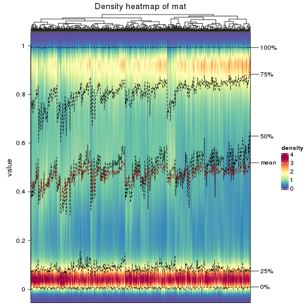


Some values about the hierarchy:


```r
all_nodes(res_rh)
```

```
#>  [1] "0"      "01"     "011"    "0111"   "0112"   "0113"   "012"    "0121"   "01211"  "01212" 
#> [11] "01213"  "0122"   "01221"  "01222"  "01223"  "013"    "02"     "021"    "0211"   "02111" 
#> [21] "02112"  "02113"  "02114"  "0212"   "02121"  "02122"  "02123"  "02124"  "0213"   "02131" 
#> [31] "02132"  "021321" "021322" "02133"  "022"    "0221"   "02211"  "02212"  "02213"  "0222"  
#> [41] "02221"  "02222"  "02223"  "0223"   "02231"  "02232"  "02233"  "0224"   "02241"  "02242" 
#> [51] "02243"  "0225"   "023"    "0231"   "0232"   "02321"  "02322"  "02323"  "0233"   "0234"  
#> [61] "03"     "031"    "032"    "033"    "0331"   "0332"   "0333"   "034"    "04"     "041"   
#> [71] "042"    "043"    "0431"   "0432"   "0433"   "05"     "051"    "0511"   "05111"  "05112" 
#> [81] "05113"  "05114"  "0512"   "05121"  "051211" "051212" "05122"  "05123"  "052"    "0521"  
#> [91] "0522"   "05221"  "05222"  "0523"   "0524"   "053"
```

```r
all_leaves(res_rh)
```

```
#>  [1] "0111"   "0112"   "0113"   "01211"  "01212"  "01213"  "01221"  "01222"  "01223"  "013"   
#> [11] "02111"  "02112"  "02113"  "02114"  "02121"  "02122"  "02123"  "02124"  "02131"  "021321"
#> [21] "021322" "02133"  "02211"  "02212"  "02213"  "02221"  "02222"  "02223"  "02231"  "02232" 
#> [31] "02233"  "02241"  "02242"  "02243"  "0225"   "0231"   "02321"  "02322"  "02323"  "0233"  
#> [41] "0234"   "031"    "032"    "0331"   "0332"   "0333"   "034"    "041"    "042"    "0431"  
#> [51] "0432"   "0433"   "05111"  "05112"  "05113"  "05114"  "051211" "051212" "05122"  "05123" 
#> [61] "0521"   "05221"  "05222"  "0523"   "0524"   "053"
```

```r
node_info(res_rh)
```

```
#>        id best_method depth best_k n_columns n_signatures p_signatures is_leaf
#> 1       0  SD:skmeans     1      5       580        63548     0.168938   FALSE
#> 2      01 ATC:skmeans     2      3        90         4660     0.012388   FALSE
#> 3     011 ATC:skmeans     3      3        27         3188     0.008475   FALSE
#> 4    0111 not applied     4     NA         7           NA           NA    TRUE
#> 5    0112  ATC:kmeans     4      2        15          832     0.002212    TRUE
#> 6    0113 not applied     4     NA         5           NA           NA    TRUE
#> 7     012   SD:kmeans     3      2        38         2836     0.007539   FALSE
#> 8    0121  ATC:kmeans     4      3        13         2262     0.006013   FALSE
#> 9   01211 not applied     5     NA         5           NA           NA    TRUE
#> 10  01212 not applied     5     NA         3           NA           NA    TRUE
#> 11  01213 not applied     5     NA         5           NA           NA    TRUE
#> 12   0122  ATC:kmeans     4      3        25         9384     0.024947   FALSE
#> 13  01221 not applied     5     NA         7           NA           NA    TRUE
#> 14  01222 not applied     5     NA        11           NA           NA    TRUE
#> 15  01223 not applied     5     NA         7           NA           NA    TRUE
#> 16    013  ATC:kmeans     3      2        25          203     0.000540    TRUE
#> 17     02   SD:kmeans     2      3       268         4027     0.010705   FALSE
#> 18    021   SD:kmeans     3      3        90         4522     0.012021   FALSE
#> 19   0211  ATC:kmeans     4      4        28         7761     0.020632   FALSE
#> 20  02111 not applied     5     NA        11           NA           NA    TRUE
#> 21  02112 not applied     5     NA         4           NA           NA    TRUE
#> 22  02113 not applied     5     NA         8           NA           NA    TRUE
#> 23  02114 not applied     5     NA         5           NA           NA    TRUE
#> 24   0212  ATC:kmeans     4      4        34        30719     0.081664   FALSE
#> 25  02121  ATC:kmeans     5      3        14          803     0.002135    TRUE
#> 26  02122 not applied     5     NA         4           NA           NA    TRUE
#> 27  02123 not applied     5     NA         6           NA           NA    TRUE
#> 28  02124 not applied     5     NA        10           NA           NA    TRUE
#> 29   0213 ATC:skmeans     4      3        28         8755     0.023275   FALSE
#> 30  02131 not applied     5     NA        10           NA           NA    TRUE
#> 31  02132  ATC:kmeans     5      2        13         1269     0.003374   FALSE
#> 32 021321 not applied     6     NA         8           NA           NA    TRUE
#> 33 021322 not applied     6     NA         5           NA           NA    TRUE
#> 34  02133 not applied     5     NA         5           NA           NA    TRUE
#> 35    022 ATC:skmeans     3      5       109        24546     0.065254   FALSE
#> 36   0221 ATC:skmeans     4      3        25        10841     0.028820   FALSE
#> 37  02211 not applied     5     NA        10           NA           NA    TRUE
#> 38  02212 not applied     5     NA         8           NA           NA    TRUE
#> 39  02213 not applied     5     NA         7           NA           NA    TRUE
#> 40   0222 ATC:skmeans     4      3        28         2489     0.006617   FALSE
#> 41  02221  ATC:kmeans     5      2        12          557     0.001481    TRUE
#> 42  02222  ATC:kmeans     5      2        13            0     0.000000    TRUE
#> 43  02223 not applied     5     NA         3           NA           NA    TRUE
#> 44   0223  ATC:kmeans     4      3        28         4864     0.012931   FALSE
#> 45  02231 not applied     5     NA         9           NA           NA    TRUE
#> 46  02232  ATC:kmeans     5      2        12          230     0.000611    TRUE
#> 47  02233 not applied     5     NA         7           NA           NA    TRUE
#> 48   0224  ATC:kmeans     4      3        23         1526     0.004057   FALSE
#> 49  02241 not applied     5     NA         7           NA           NA    TRUE
#> 50  02242 not applied     5     NA         9           NA           NA    TRUE
#> 51  02243 not applied     5     NA         7           NA           NA    TRUE
#> 52   0225 not applied     4     NA         5           NA           NA    TRUE
#> 53    023 ATC:skmeans     3      4        69        20003     0.053177   FALSE
#> 54   0231 not applied     4     NA        10           NA           NA    TRUE
#> 55   0232  ATC:kmeans     4      3        29         1622     0.004312   FALSE
#> 56  02321 not applied     5     NA         4           NA           NA    TRUE
#> 57  02322  ATC:kmeans     5      3        17          156     0.000415    TRUE
#> 58  02323 not applied     5     NA         8           NA           NA    TRUE
#> 59   0233 ATC:skmeans     4      2        19           69     0.000183    TRUE
#> 60   0234 not applied     4     NA        11           NA           NA    TRUE
#> 61     03  SD:skmeans     2      4        55         5547     0.014746   FALSE
#> 62    031 ATC:skmeans     3      3        19          987     0.002624    TRUE
#> 63    032  SD:skmeans     3      2        12           93     0.000247    TRUE
#> 64    033 ATC:skmeans     3      3        16         2279     0.006059   FALSE
#> 65   0331 not applied     4     NA         7           NA           NA    TRUE
#> 66   0332 not applied     4     NA         3           NA           NA    TRUE
#> 67   0333 not applied     4     NA         6           NA           NA    TRUE
#> 68    034 not applied     3     NA         8           NA           NA    TRUE
#> 69     04  ATC:kmeans     2      3        68         3867     0.010280   FALSE
#> 70    041 ATC:skmeans     3      2        26           70     0.000186    TRUE
#> 71    042  ATC:kmeans     3      2        21          235     0.000625    TRUE
#> 72    043  ATC:kmeans     3      3        21         1540     0.004094   FALSE
#> 73   0431 not applied     4     NA         7           NA           NA    TRUE
#> 74   0432 not applied     4     NA         5           NA           NA    TRUE
#> 75   0433 not applied     4     NA         9           NA           NA    TRUE
#> 76     05 ATC:skmeans     2      3        99         6152     0.016355   FALSE
#> 77    051  ATC:kmeans     3      2        41         1469     0.003905   FALSE
#> 78   0511  ATC:kmeans     4      4        15         7175     0.019074   FALSE
#> 79  05111 not applied     5     NA         2           NA           NA    TRUE
#> 80  05112 not applied     5     NA         9           NA           NA    TRUE
#> 81  05113 not applied     5     NA         2           NA           NA    TRUE
#> 82  05114 not applied     5     NA         2           NA           NA    TRUE
#> 83   0512  ATC:kmeans     4      3        26         8181     0.021749   FALSE
#> 84  05121  ATC:kmeans     5      2        12         1619     0.004304   FALSE
#> 85 051211 not applied     6     NA        10           NA           NA    TRUE
#> 86 051212 not applied     6     NA         2           NA           NA    TRUE
#> 87  05122 not applied     5     NA         5           NA           NA    TRUE
#> 88  05123 not applied     5     NA         9           NA           NA    TRUE
#> 89    052 ATC:skmeans     3      4        37         5764     0.015323   FALSE
#> 90   0521 not applied     4     NA         9           NA           NA    TRUE
#> 91   0522   SD:kmeans     4      2        19         2775     0.007377   FALSE
#> 92  05221 not applied     5     NA         8           NA           NA    TRUE
#> 93  05222 not applied     5     NA        11           NA           NA    TRUE
#> 94   0523 not applied     4     NA         1           NA           NA    TRUE
#> 95   0524 not applied     4     NA         8           NA           NA    TRUE
#> 96    053  ATC:kmeans     3      2        21          712     0.001893    TRUE
```

In the output from `node_info()`, there are the following columns:

- `id`: The node id.
- `best_method`: The best method selected.
- `depth`: Depth of the node in the hierarchy.
- `best_k`: Best number of groups of the partition on that node.
- `n_columns`: Number of columns in the submatrix.
- `n_signatures`: Number of signatures with the `best_k`.
- `p_signatures`: Proportion of hte signatures in total number of rows in the matrix.
- `is_leaf`: Whether the node is a leaf.

Labels of nodes are encoded in a special way. The number of digits
correspond to the depth of the node in the hierarchy and the value of the
digits correspond to the index of the subgroup in the current node, E.g. a label
of “012” means the node is the second subgroup of the partition which is the
first subgroup of the root node.

### Suggest the best k


Following table shows the best `k` (number of partitions) for each node in the
partition hierarchy. Clicking on the node name in the table goes to the
corresponding section for the partitioning on that node.

[The cola vignette](https://jokergoo.github.io/cola_vignettes/cola.html#toc_13)
explains the definition of the metrics used for determining the best
number of partitions.


```r
suggest_best_k(res_rh)
```


|Node                    |Best method                                         |Is leaf   |Best k |1-PAC |Mean silhouette |Concordance | #samples|   |
|:-----------------------|:---------------------------------------------------|:---------|:------|:-----|:---------------|:-----------|--------:|:--|
|[Node0](#Node0)         |SD:skmeans                                          |          |5      |0.99  |0.95            |0.98        |      580|** |
|[Node01](#Node01)       |ATC:skmeans                                         |          |3      |1.00  |0.98            |0.99        |       90|** |
|[Node011](#Node011)     |ATC:skmeans                                         |          |3      |1.00  |1.00            |1.00        |       27|** |
|Node0111-leaf           |<span style='color:grey;'><i>not applied</i></span> |✓ (b)     |       |      |                |            |        7|   |
|Node0112-leaf           |ATC:kmeans                                          |✓ (&#99;) |2      |1.00  |1.00            |1.00        |       15|** |
|Node0113-leaf           |<span style='color:grey;'><i>not applied</i></span> |✓ (b)     |       |      |                |            |        5|   |
|[Node012](#Node012)     |SD:kmeans                                           |          |2      |1.00  |1.00            |1.00        |       38|** |
|[Node0121](#Node0121)   |ATC:kmeans                                          |          |5      |1.00  |0.97            |0.98        |       13|** |
|Node01211-leaf          |<span style='color:grey;'><i>not applied</i></span> |✓ (b)     |       |      |                |            |        5|   |
|Node01212-leaf          |<span style='color:grey;'><i>not applied</i></span> |✓ (b)     |       |      |                |            |        3|   |
|Node01213-leaf          |<span style='color:grey;'><i>not applied</i></span> |✓ (b)     |       |      |                |            |        5|   |
|[Node0122](#Node0122)   |ATC:kmeans                                          |          |3      |1.00  |1.00            |1.00        |       25|** |
|Node01221-leaf          |<span style='color:grey;'><i>not applied</i></span> |✓ (b)     |       |      |                |            |        7|   |
|Node01222-leaf          |<span style='color:grey;'><i>not applied</i></span> |✓ (b)     |       |      |                |            |       11|   |
|Node01223-leaf          |<span style='color:grey;'><i>not applied</i></span> |✓ (b)     |       |      |                |            |        7|   |
|Node013-leaf            |ATC:kmeans                                          |✓ (&#99;) |2      |1.00  |1.00            |1.00        |       25|** |
|[Node02](#Node02)       |SD:kmeans                                           |          |3      |1.00  |0.98            |0.98        |      268|** |
|[Node021](#Node021)     |SD:kmeans                                           |          |3      |1.00  |0.96            |0.98        |       90|** |
|[Node0211](#Node0211)   |ATC:kmeans                                          |          |4      |1.00  |1.00            |1.00        |       28|** |
|Node02111-leaf          |<span style='color:grey;'><i>not applied</i></span> |✓ (b)     |       |      |                |            |       11|   |
|Node02112-leaf          |<span style='color:grey;'><i>not applied</i></span> |✓ (b)     |       |      |                |            |        4|   |
|Node02113-leaf          |<span style='color:grey;'><i>not applied</i></span> |✓ (b)     |       |      |                |            |        8|   |
|Node02114-leaf          |<span style='color:grey;'><i>not applied</i></span> |✓ (b)     |       |      |                |            |        5|   |
|[Node0212](#Node0212)   |ATC:kmeans                                          |          |4      |1.00  |1.00            |1.00        |       34|** |
|Node02121-leaf          |ATC:kmeans                                          |✓ (&#99;) |3      |1.00  |1.00            |1.00        |       14|** |
|Node02122-leaf          |<span style='color:grey;'><i>not applied</i></span> |✓ (b)     |       |      |                |            |        4|   |
|Node02123-leaf          |<span style='color:grey;'><i>not applied</i></span> |✓ (b)     |       |      |                |            |        6|   |
|Node02124-leaf          |<span style='color:grey;'><i>not applied</i></span> |✓ (b)     |       |      |                |            |       10|   |
|[Node0213](#Node0213)   |ATC:skmeans                                         |          |5      |0.97  |0.89            |0.95        |       28|** |
|Node02131-leaf          |<span style='color:grey;'><i>not applied</i></span> |✓ (b)     |       |      |                |            |       10|   |
|[Node02132](#Node02132) |ATC:kmeans                                          |          |2      |1.00  |1.00            |1.00        |       13|** |
|Node021321-leaf         |<span style='color:grey;'><i>not applied</i></span> |✓ (b)     |       |      |                |            |        8|   |
|Node021322-leaf         |<span style='color:grey;'><i>not applied</i></span> |✓ (b)     |       |      |                |            |        5|   |
|Node02133-leaf          |<span style='color:grey;'><i>not applied</i></span> |✓ (b)     |       |      |                |            |        5|   |
|[Node022](#Node022)     |ATC:skmeans                                         |          |5      |1.00  |0.96            |0.98        |      109|** |
|[Node0221](#Node0221)   |ATC:skmeans                                         |          |5      |0.93  |0.79            |0.93        |       25|*  |
|Node02211-leaf          |<span style='color:grey;'><i>not applied</i></span> |✓ (b)     |       |      |                |            |       10|   |
|Node02212-leaf          |<span style='color:grey;'><i>not applied</i></span> |✓ (b)     |       |      |                |            |        8|   |
|Node02213-leaf          |<span style='color:grey;'><i>not applied</i></span> |✓ (b)     |       |      |                |            |        7|   |
|[Node0222](#Node0222)   |ATC:skmeans                                         |          |5      |0.94  |0.95            |0.96        |       28|*  |
|Node02221-leaf          |ATC:kmeans                                          |✓ (&#99;) |8      |0.91  |0.48            |0.90        |       12|*  |
|Node02222-leaf          |ATC:kmeans                                          |✓ (&#99;) |4      |1.00  |0.91            |0.99        |       13|** |
|Node02223-leaf          |<span style='color:grey;'><i>not applied</i></span> |✓ (b)     |       |      |                |            |        3|   |
|[Node0223](#Node0223)   |ATC:kmeans                                          |          |3      |1.00  |0.99            |0.99        |       28|** |
|Node02231-leaf          |<span style='color:grey;'><i>not applied</i></span> |✓ (b)     |       |      |                |            |        9|   |
|Node02232-leaf          |ATC:kmeans                                          |✓ (&#99;) |4      |1.00  |0.75            |1.00        |       12|** |
|Node02233-leaf          |<span style='color:grey;'><i>not applied</i></span> |✓ (b)     |       |      |                |            |        7|   |
|[Node0224](#Node0224)   |ATC:kmeans                                          |          |3      |1.00  |0.98            |0.99        |       23|** |
|Node02241-leaf          |<span style='color:grey;'><i>not applied</i></span> |✓ (b)     |       |      |                |            |        7|   |
|Node02242-leaf          |<span style='color:grey;'><i>not applied</i></span> |✓ (b)     |       |      |                |            |        9|   |
|Node02243-leaf          |<span style='color:grey;'><i>not applied</i></span> |✓ (b)     |       |      |                |            |        7|   |
|Node0225-leaf           |<span style='color:grey;'><i>not applied</i></span> |✓ (b)     |       |      |                |            |        5|   |
|[Node023](#Node023)     |ATC:skmeans                                         |          |4      |1.00  |0.98            |0.99        |       69|** |
|Node0231-leaf           |<span style='color:grey;'><i>not applied</i></span> |✓ (b)     |       |      |                |            |       10|   |
|[Node0232](#Node0232)   |ATC:kmeans                                          |          |3      |1.00  |0.99            |1.00        |       29|** |
|Node02321-leaf          |<span style='color:grey;'><i>not applied</i></span> |✓ (b)     |       |      |                |            |        4|   |
|Node02322-leaf          |ATC:kmeans                                          |✓ (&#99;) |8      |0.90  |0.69            |0.89        |       17|   |
|Node02323-leaf          |<span style='color:grey;'><i>not applied</i></span> |✓ (b)     |       |      |                |            |        8|   |
|Node0233-leaf           |ATC:skmeans                                         |✓ (&#99;) |2      |1.00  |0.99            |0.99        |       19|** |
|Node0234-leaf           |<span style='color:grey;'><i>not applied</i></span> |✓ (b)     |       |      |                |            |       11|   |
|[Node03](#Node03)       |SD:skmeans                                          |          |4      |0.97  |0.96            |0.98        |       55|** |
|Node031-leaf            |ATC:skmeans                                         |✓ (&#99;) |7      |0.93  |0.87            |0.94        |       19|*  |
|Node032-leaf            |SD:skmeans                                          |✓ (&#99;) |8      |0.91  |0.45            |0.96        |       12|*  |
|[Node033](#Node033)     |ATC:skmeans                                         |          |3      |1.00  |1.00            |1.00        |       16|** |
|Node0331-leaf           |<span style='color:grey;'><i>not applied</i></span> |✓ (b)     |       |      |                |            |        7|   |
|Node0332-leaf           |<span style='color:grey;'><i>not applied</i></span> |✓ (b)     |       |      |                |            |        3|   |
|Node0333-leaf           |<span style='color:grey;'><i>not applied</i></span> |✓ (b)     |       |      |                |            |        6|   |
|Node034-leaf            |<span style='color:grey;'><i>not applied</i></span> |✓ (b)     |       |      |                |            |        8|   |
|[Node04](#Node04)       |ATC:kmeans                                          |          |3      |0.98  |0.97            |0.98        |       68|** |
|Node041-leaf            |ATC:skmeans                                         |✓ (&#99;) |2      |0.62  |0.93            |0.96        |       26|   |
|Node042-leaf            |ATC:kmeans                                          |✓ (&#99;) |2      |1.00  |1.00            |1.00        |       21|** |
|[Node043](#Node043)     |ATC:kmeans                                          |          |3      |1.00  |1.00            |1.00        |       21|** |
|Node0431-leaf           |<span style='color:grey;'><i>not applied</i></span> |✓ (b)     |       |      |                |            |        7|   |
|Node0432-leaf           |<span style='color:grey;'><i>not applied</i></span> |✓ (b)     |       |      |                |            |        5|   |
|Node0433-leaf           |<span style='color:grey;'><i>not applied</i></span> |✓ (b)     |       |      |                |            |        9|   |
|[Node05](#Node05)       |ATC:skmeans                                         |          |5      |0.90  |0.84            |0.93        |       99|*  |
|[Node051](#Node051)     |ATC:kmeans                                          |          |2      |1.00  |1.00            |1.00        |       41|** |
|[Node0511](#Node0511)   |ATC:kmeans                                          |          |8      |0.90  |0.73            |0.85        |       15|*  |
|Node05111-leaf          |<span style='color:grey;'><i>not applied</i></span> |✓ (b)     |       |      |                |            |        2|   |
|Node05112-leaf          |<span style='color:grey;'><i>not applied</i></span> |✓ (b)     |       |      |                |            |        9|   |
|Node05113-leaf          |<span style='color:grey;'><i>not applied</i></span> |✓ (b)     |       |      |                |            |        2|   |
|Node05114-leaf          |<span style='color:grey;'><i>not applied</i></span> |✓ (b)     |       |      |                |            |        2|   |
|[Node0512](#Node0512)   |ATC:kmeans                                          |          |3      |1.00  |1.00            |1.00        |       26|** |
|[Node05121](#Node05121) |ATC:kmeans                                          |          |7      |0.91  |0.65            |0.94        |       12|*  |
|Node051211-leaf         |<span style='color:grey;'><i>not applied</i></span> |✓ (b)     |       |      |                |            |       10|   |
|Node051212-leaf         |<span style='color:grey;'><i>not applied</i></span> |✓ (b)     |       |      |                |            |        2|   |
|Node05122-leaf          |<span style='color:grey;'><i>not applied</i></span> |✓ (b)     |       |      |                |            |        5|   |
|Node05123-leaf          |<span style='color:grey;'><i>not applied</i></span> |✓ (b)     |       |      |                |            |        9|   |
|[Node052](#Node052)     |ATC:skmeans                                         |          |4      |1.00  |0.95            |0.99        |       37|** |
|Node0521-leaf           |<span style='color:grey;'><i>not applied</i></span> |✓ (b)     |       |      |                |            |        9|   |
|[Node0522](#Node0522)   |SD:kmeans                                           |          |2      |1.00  |1.00            |1.00        |       19|** |
|Node05221-leaf          |<span style='color:grey;'><i>not applied</i></span> |✓ (b)     |       |      |                |            |        8|   |
|Node05222-leaf          |<span style='color:grey;'><i>not applied</i></span> |✓ (b)     |       |      |                |            |       11|   |
|Node0523-leaf           |<span style='color:grey;'><i>not applied</i></span> |✓ (b)     |       |      |                |            |        1|   |
|Node0524-leaf           |<span style='color:grey;'><i>not applied</i></span> |✓ (b)     |       |      |                |            |        8|   |
|Node053-leaf            |ATC:kmeans                                          |✓ (&#99;) |2      |1.00  |1.00            |1.00        |       21|** |


Stop reason: b) Subgroup had too few columns. c) There were too few signatures. 

\*\*: 1-PAC > 0.95, \*: 1-PAC > 0.9


### Partition hierarchy

The nodes of the hierarchy can be merged by setting the `merge_node` parameters. Here we 
control the hierarchy with the `min_n_signatures` parameter. The value of `min_n_signatures` is
from `node_info()`.


<style type='text/css'>


.ui-helper-hidden {
	display: none;
}
.ui-helper-hidden-accessible {
	border: 0;
	clip: rect(0 0 0 0);
	height: 1px;
	margin: -1px;
	overflow: hidden;
	padding: 0;
	position: absolute;
	width: 1px;
}
.ui-helper-reset {
	margin: 0;
	padding: 0;
	border: 0;
	outline: 0;
	line-height: 1.3;
	text-decoration: none;
	font-size: 100%;
	list-style: none;
}
.ui-helper-clearfix:before,
.ui-helper-clearfix:after {
	content: "";
	display: table;
	border-collapse: collapse;
}
.ui-helper-clearfix:after {
	clear: both;
}
.ui-helper-zfix {
	width: 100%;
	height: 100%;
	top: 0;
	left: 0;
	position: absolute;
	opacity: 0;
	filter:Alpha(Opacity=0); 
}

.ui-front {
	z-index: 100;
}


.ui-state-disabled {
	cursor: default !important;
	pointer-events: none;
}


.ui-icon {
	display: inline-block;
	vertical-align: middle;
	margin-top: -.25em;
	position: relative;
	text-indent: -99999px;
	overflow: hidden;
	background-repeat: no-repeat;
}

.ui-widget-icon-block {
	left: 50%;
	margin-left: -8px;
	display: block;
}


.ui-widget-overlay {
	position: fixed;
	top: 0;
	left: 0;
	width: 100%;
	height: 100%;
}
.ui-accordion .ui-accordion-header {
	display: block;
	cursor: pointer;
	position: relative;
	margin: 2px 0 0 0;
	padding: .5em .5em .5em .7em;
	font-size: 100%;
}
.ui-accordion .ui-accordion-content {
	padding: 1em 2.2em;
	border-top: 0;
	overflow: auto;
}
.ui-autocomplete {
	position: absolute;
	top: 0;
	left: 0;
	cursor: default;
}
.ui-menu {
	list-style: none;
	padding: 0;
	margin: 0;
	display: block;
	outline: 0;
}
.ui-menu .ui-menu {
	position: absolute;
}
.ui-menu .ui-menu-item {
	margin: 0;
	cursor: pointer;
	
	list-style-image: url("data:image/gif;base64,R0lGODlhAQABAIAAAAAAAP///yH5BAEAAAAALAAAAAABAAEAAAIBRAA7");
}
.ui-menu .ui-menu-item-wrapper {
	position: relative;
	padding: 3px 1em 3px .4em;
}
.ui-menu .ui-menu-divider {
	margin: 5px 0;
	height: 0;
	font-size: 0;
	line-height: 0;
	border-width: 1px 0 0 0;
}
.ui-menu .ui-state-focus,
.ui-menu .ui-state-active {
	margin: -1px;
}


.ui-menu-icons {
	position: relative;
}
.ui-menu-icons .ui-menu-item-wrapper {
	padding-left: 2em;
}


.ui-menu .ui-icon {
	position: absolute;
	top: 0;
	bottom: 0;
	left: .2em;
	margin: auto 0;
}


.ui-menu .ui-menu-icon {
	left: auto;
	right: 0;
}
.ui-button {
	padding: .4em 1em;
	display: inline-block;
	position: relative;
	line-height: normal;
	margin-right: .1em;
	cursor: pointer;
	vertical-align: middle;
	text-align: center;
	-webkit-user-select: none;
	-moz-user-select: none;
	-ms-user-select: none;
	user-select: none;

	
	overflow: visible;
}

.ui-button,
.ui-button:link,
.ui-button:visited,
.ui-button:hover,
.ui-button:active {
	text-decoration: none;
}


.ui-button-icon-only {
	width: 2em;
	box-sizing: border-box;
	text-indent: -9999px;
	white-space: nowrap;
}


input.ui-button.ui-button-icon-only {
	text-indent: 0;
}


.ui-button-icon-only .ui-icon {
	position: absolute;
	top: 50%;
	left: 50%;
	margin-top: -8px;
	margin-left: -8px;
}

.ui-button.ui-icon-notext .ui-icon {
	padding: 0;
	width: 2.1em;
	height: 2.1em;
	text-indent: -9999px;
	white-space: nowrap;

}

input.ui-button.ui-icon-notext .ui-icon {
	width: auto;
	height: auto;
	text-indent: 0;
	white-space: normal;
	padding: .4em 1em;
}


input.ui-button::-moz-focus-inner,
button.ui-button::-moz-focus-inner {
	border: 0;
	padding: 0;
}
.ui-controlgroup {
	vertical-align: middle;
	display: inline-block;
}
.ui-controlgroup > .ui-controlgroup-item {
	float: left;
	margin-left: 0;
	margin-right: 0;
}
.ui-controlgroup > .ui-controlgroup-item:focus,
.ui-controlgroup > .ui-controlgroup-item.ui-visual-focus {
	z-index: 9999;
}
.ui-controlgroup-vertical > .ui-controlgroup-item {
	display: block;
	float: none;
	width: 100%;
	margin-top: 0;
	margin-bottom: 0;
	text-align: left;
}
.ui-controlgroup-vertical .ui-controlgroup-item {
	box-sizing: border-box;
}
.ui-controlgroup .ui-controlgroup-label {
	padding: .4em 1em;
}
.ui-controlgroup .ui-controlgroup-label span {
	font-size: 80%;
}
.ui-controlgroup-horizontal .ui-controlgroup-label + .ui-controlgroup-item {
	border-left: none;
}
.ui-controlgroup-vertical .ui-controlgroup-label + .ui-controlgroup-item {
	border-top: none;
}
.ui-controlgroup-horizontal .ui-controlgroup-label.ui-widget-content {
	border-right: none;
}
.ui-controlgroup-vertical .ui-controlgroup-label.ui-widget-content {
	border-bottom: none;
}


.ui-controlgroup-vertical .ui-spinner-input {

	
	width: 75%;
	width: calc( 100% - 2.4em );
}
.ui-controlgroup-vertical .ui-spinner .ui-spinner-up {
	border-top-style: solid;
}

.ui-checkboxradio-label .ui-icon-background {
	box-shadow: inset 1px 1px 1px #ccc;
	border-radius: .12em;
	border: none;
}
.ui-checkboxradio-radio-label .ui-icon-background {
	width: 16px;
	height: 16px;
	border-radius: 1em;
	overflow: visible;
	border: none;
}
.ui-checkboxradio-radio-label.ui-checkboxradio-checked .ui-icon,
.ui-checkboxradio-radio-label.ui-checkboxradio-checked:hover .ui-icon {
	background-image: none;
	width: 8px;
	height: 8px;
	border-width: 4px;
	border-style: solid;
}
.ui-checkboxradio-disabled {
	pointer-events: none;
}
.ui-datepicker {
	width: 17em;
	padding: .2em .2em 0;
	display: none;
}
.ui-datepicker .ui-datepicker-header {
	position: relative;
	padding: .2em 0;
}
.ui-datepicker .ui-datepicker-prev,
.ui-datepicker .ui-datepicker-next {
	position: absolute;
	top: 2px;
	width: 1.8em;
	height: 1.8em;
}
.ui-datepicker .ui-datepicker-prev-hover,
.ui-datepicker .ui-datepicker-next-hover {
	top: 1px;
}
.ui-datepicker .ui-datepicker-prev {
	left: 2px;
}
.ui-datepicker .ui-datepicker-next {
	right: 2px;
}
.ui-datepicker .ui-datepicker-prev-hover {
	left: 1px;
}
.ui-datepicker .ui-datepicker-next-hover {
	right: 1px;
}
.ui-datepicker .ui-datepicker-prev span,
.ui-datepicker .ui-datepicker-next span {
	display: block;
	position: absolute;
	left: 50%;
	margin-left: -8px;
	top: 50%;
	margin-top: -8px;
}
.ui-datepicker .ui-datepicker-title {
	margin: 0 2.3em;
	line-height: 1.8em;
	text-align: center;
}
.ui-datepicker .ui-datepicker-title select {
	font-size: 1em;
	margin: 1px 0;
}
.ui-datepicker select.ui-datepicker-month,
.ui-datepicker select.ui-datepicker-year {
	width: 45%;
}
.ui-datepicker table {
	width: 100%;
	font-size: .9em;
	border-collapse: collapse;
	margin: 0 0 .4em;
}
.ui-datepicker th {
	padding: .7em .3em;
	text-align: center;
	font-weight: bold;
	border: 0;
}
.ui-datepicker td {
	border: 0;
	padding: 1px;
}
.ui-datepicker td span,
.ui-datepicker td a {
	display: block;
	padding: .2em;
	text-align: right;
	text-decoration: none;
}
.ui-datepicker .ui-datepicker-buttonpane {
	background-image: none;
	margin: .7em 0 0 0;
	padding: 0 .2em;
	border-left: 0;
	border-right: 0;
	border-bottom: 0;
}
.ui-datepicker .ui-datepicker-buttonpane button {
	float: right;
	margin: .5em .2em .4em;
	cursor: pointer;
	padding: .2em .6em .3em .6em;
	width: auto;
	overflow: visible;
}
.ui-datepicker .ui-datepicker-buttonpane button.ui-datepicker-current {
	float: left;
}


.ui-datepicker.ui-datepicker-multi {
	width: auto;
}
.ui-datepicker-multi .ui-datepicker-group {
	float: left;
}
.ui-datepicker-multi .ui-datepicker-group table {
	width: 95%;
	margin: 0 auto .4em;
}
.ui-datepicker-multi-2 .ui-datepicker-group {
	width: 50%;
}
.ui-datepicker-multi-3 .ui-datepicker-group {
	width: 33.3%;
}
.ui-datepicker-multi-4 .ui-datepicker-group {
	width: 25%;
}
.ui-datepicker-multi .ui-datepicker-group-last .ui-datepicker-header,
.ui-datepicker-multi .ui-datepicker-group-middle .ui-datepicker-header {
	border-left-width: 0;
}
.ui-datepicker-multi .ui-datepicker-buttonpane {
	clear: left;
}
.ui-datepicker-row-break {
	clear: both;
	width: 100%;
	font-size: 0;
}


.ui-datepicker-rtl {
	direction: rtl;
}
.ui-datepicker-rtl .ui-datepicker-prev {
	right: 2px;
	left: auto;
}
.ui-datepicker-rtl .ui-datepicker-next {
	left: 2px;
	right: auto;
}
.ui-datepicker-rtl .ui-datepicker-prev:hover {
	right: 1px;
	left: auto;
}
.ui-datepicker-rtl .ui-datepicker-next:hover {
	left: 1px;
	right: auto;
}
.ui-datepicker-rtl .ui-datepicker-buttonpane {
	clear: right;
}
.ui-datepicker-rtl .ui-datepicker-buttonpane button {
	float: left;
}
.ui-datepicker-rtl .ui-datepicker-buttonpane button.ui-datepicker-current,
.ui-datepicker-rtl .ui-datepicker-group {
	float: right;
}
.ui-datepicker-rtl .ui-datepicker-group-last .ui-datepicker-header,
.ui-datepicker-rtl .ui-datepicker-group-middle .ui-datepicker-header {
	border-right-width: 0;
	border-left-width: 1px;
}


.ui-datepicker .ui-icon {
	display: block;
	text-indent: -99999px;
	overflow: hidden;
	background-repeat: no-repeat;
	left: .5em;
	top: .3em;
}
.ui-dialog {
	position: absolute;
	top: 0;
	left: 0;
	padding: .2em;
	outline: 0;
}
.ui-dialog .ui-dialog-titlebar {
	padding: .4em 1em;
	position: relative;
}
.ui-dialog .ui-dialog-title {
	float: left;
	margin: .1em 0;
	white-space: nowrap;
	width: 90%;
	overflow: hidden;
	text-overflow: ellipsis;
}
.ui-dialog .ui-dialog-titlebar-close {
	position: absolute;
	right: .3em;
	top: 50%;
	width: 20px;
	margin: -10px 0 0 0;
	padding: 1px;
	height: 20px;
}
.ui-dialog .ui-dialog-content {
	position: relative;
	border: 0;
	padding: .5em 1em;
	background: none;
	overflow: auto;
}
.ui-dialog .ui-dialog-buttonpane {
	text-align: left;
	border-width: 1px 0 0 0;
	background-image: none;
	margin-top: .5em;
	padding: .3em 1em .5em .4em;
}
.ui-dialog .ui-dialog-buttonpane .ui-dialog-buttonset {
	float: right;
}
.ui-dialog .ui-dialog-buttonpane button {
	margin: .5em .4em .5em 0;
	cursor: pointer;
}
.ui-dialog .ui-resizable-n {
	height: 2px;
	top: 0;
}
.ui-dialog .ui-resizable-e {
	width: 2px;
	right: 0;
}
.ui-dialog .ui-resizable-s {
	height: 2px;
	bottom: 0;
}
.ui-dialog .ui-resizable-w {
	width: 2px;
	left: 0;
}
.ui-dialog .ui-resizable-se,
.ui-dialog .ui-resizable-sw,
.ui-dialog .ui-resizable-ne,
.ui-dialog .ui-resizable-nw {
	width: 7px;
	height: 7px;
}
.ui-dialog .ui-resizable-se {
	right: 0;
	bottom: 0;
}
.ui-dialog .ui-resizable-sw {
	left: 0;
	bottom: 0;
}
.ui-dialog .ui-resizable-ne {
	right: 0;
	top: 0;
}
.ui-dialog .ui-resizable-nw {
	left: 0;
	top: 0;
}
.ui-draggable .ui-dialog-titlebar {
	cursor: move;
}
.ui-draggable-handle {
	-ms-touch-action: none;
	touch-action: none;
}
.ui-resizable {
	position: relative;
}
.ui-resizable-handle {
	position: absolute;
	font-size: 0.1px;
	display: block;
	-ms-touch-action: none;
	touch-action: none;
}
.ui-resizable-disabled .ui-resizable-handle,
.ui-resizable-autohide .ui-resizable-handle {
	display: none;
}
.ui-resizable-n {
	cursor: n-resize;
	height: 7px;
	width: 100%;
	top: -5px;
	left: 0;
}
.ui-resizable-s {
	cursor: s-resize;
	height: 7px;
	width: 100%;
	bottom: -5px;
	left: 0;
}
.ui-resizable-e {
	cursor: e-resize;
	width: 7px;
	right: -5px;
	top: 0;
	height: 100%;
}
.ui-resizable-w {
	cursor: w-resize;
	width: 7px;
	left: -5px;
	top: 0;
	height: 100%;
}
.ui-resizable-se {
	cursor: se-resize;
	width: 12px;
	height: 12px;
	right: 1px;
	bottom: 1px;
}
.ui-resizable-sw {
	cursor: sw-resize;
	width: 9px;
	height: 9px;
	left: -5px;
	bottom: -5px;
}
.ui-resizable-nw {
	cursor: nw-resize;
	width: 9px;
	height: 9px;
	left: -5px;
	top: -5px;
}
.ui-resizable-ne {
	cursor: ne-resize;
	width: 9px;
	height: 9px;
	right: -5px;
	top: -5px;
}
.ui-progressbar {
	height: 2em;
	text-align: left;
	overflow: hidden;
}
.ui-progressbar .ui-progressbar-value {
	margin: -1px;
	height: 100%;
}
.ui-progressbar .ui-progressbar-overlay {
	background: url("");
	height: 100%;
	filter: alpha(opacity=25); 
	opacity: 0.25;
}
.ui-progressbar-indeterminate .ui-progressbar-value {
	background-image: none;
}
.ui-selectable {
	-ms-touch-action: none;
	touch-action: none;
}
.ui-selectable-helper {
	position: absolute;
	z-index: 100;
	border: 1px dotted black;
}
.ui-selectmenu-menu {
	padding: 0;
	margin: 0;
	position: absolute;
	top: 0;
	left: 0;
	display: none;
}
.ui-selectmenu-menu .ui-menu {
	overflow: auto;
	overflow-x: hidden;
	padding-bottom: 1px;
}
.ui-selectmenu-menu .ui-menu .ui-selectmenu-optgroup {
	font-size: 1em;
	font-weight: bold;
	line-height: 1.5;
	padding: 2px 0.4em;
	margin: 0.5em 0 0 0;
	height: auto;
	border: 0;
}
.ui-selectmenu-open {
	display: block;
}
.ui-selectmenu-text {
	display: block;
	margin-right: 20px;
	overflow: hidden;
	text-overflow: ellipsis;
}
.ui-selectmenu-button.ui-button {
	text-align: left;
	white-space: nowrap;
	width: 14em;
}
.ui-selectmenu-icon.ui-icon {
	float: right;
	margin-top: 0;
}
.ui-slider {
	position: relative;
	text-align: left;
}
.ui-slider .ui-slider-handle {
	position: absolute;
	z-index: 2;
	width: 1.2em;
	height: 1.2em;
	cursor: default;
	-ms-touch-action: none;
	touch-action: none;
}
.ui-slider .ui-slider-range {
	position: absolute;
	z-index: 1;
	font-size: .7em;
	display: block;
	border: 0;
	background-position: 0 0;
}


.ui-slider.ui-state-disabled .ui-slider-handle,
.ui-slider.ui-state-disabled .ui-slider-range {
	filter: inherit;
}

.ui-slider-horizontal {
	height: .8em;
}
.ui-slider-horizontal .ui-slider-handle {
	top: -.3em;
	margin-left: -.6em;
}
.ui-slider-horizontal .ui-slider-range {
	top: 0;
	height: 100%;
}
.ui-slider-horizontal .ui-slider-range-min {
	left: 0;
}
.ui-slider-horizontal .ui-slider-range-max {
	right: 0;
}

.ui-slider-vertical {
	width: .8em;
	height: 100px;
}
.ui-slider-vertical .ui-slider-handle {
	left: -.3em;
	margin-left: 0;
	margin-bottom: -.6em;
}
.ui-slider-vertical .ui-slider-range {
	left: 0;
	width: 100%;
}
.ui-slider-vertical .ui-slider-range-min {
	bottom: 0;
}
.ui-slider-vertical .ui-slider-range-max {
	top: 0;
}
.ui-sortable-handle {
	-ms-touch-action: none;
	touch-action: none;
}
.ui-spinner {
	position: relative;
	display: inline-block;
	overflow: hidden;
	padding: 0;
	vertical-align: middle;
}
.ui-spinner-input {
	border: none;
	background: none;
	color: inherit;
	padding: .222em 0;
	margin: .2em 0;
	vertical-align: middle;
	margin-left: .4em;
	margin-right: 2em;
}
.ui-spinner-button {
	width: 1.6em;
	height: 50%;
	font-size: .5em;
	padding: 0;
	margin: 0;
	text-align: center;
	position: absolute;
	cursor: default;
	display: block;
	overflow: hidden;
	right: 0;
}

.ui-spinner a.ui-spinner-button {
	border-top-style: none;
	border-bottom-style: none;
	border-right-style: none;
}
.ui-spinner-up {
	top: 0;
}
.ui-spinner-down {
	bottom: 0;
}
.ui-tabs {
	position: relative;
	padding: .2em;
}
.ui-tabs .ui-tabs-nav {
	margin: 0;
	padding: .2em .2em 0;
}
.ui-tabs .ui-tabs-nav li {
	list-style: none;
	float: left;
	position: relative;
	top: 0;
	margin: 1px .2em 0 0;
	border-bottom-width: 0;
	padding: 0;
	white-space: nowrap;
}
.ui-tabs .ui-tabs-nav .ui-tabs-anchor {
	float: left;
	padding: .5em 1em;
	text-decoration: none;
}
.ui-tabs .ui-tabs-nav li.ui-tabs-active {
	margin-bottom: -1px;
	padding-bottom: 1px;
}
.ui-tabs .ui-tabs-nav li.ui-tabs-active .ui-tabs-anchor,
.ui-tabs .ui-tabs-nav li.ui-state-disabled .ui-tabs-anchor,
.ui-tabs .ui-tabs-nav li.ui-tabs-loading .ui-tabs-anchor {
	cursor: text;
}
.ui-tabs-collapsible .ui-tabs-nav li.ui-tabs-active .ui-tabs-anchor {
	cursor: pointer;
}
.ui-tabs .ui-tabs-panel {
	display: block;
	border-width: 0;
	padding: 1em 1.4em;
	background: none;
}
.ui-tooltip {
	padding: 8px;
	position: absolute;
	z-index: 9999;
	max-width: 300px;
}
body .ui-tooltip {
	border-width: 2px;
}

.ui-widget {
	font-family: Arial,Helvetica,sans-serif;
	font-size: 1em;
}
.ui-widget .ui-widget {
	font-size: 1em;
}
.ui-widget input,
.ui-widget select,
.ui-widget textarea,
.ui-widget button {
	font-family: Arial,Helvetica,sans-serif;
	font-size: 1em;
}
.ui-widget.ui-widget-content {
	border: 1px solid #c5c5c5;
}
.ui-widget-content {
	border: 1px solid #dddddd;
	background: #ffffff;
	color: #333333;
}
.ui-widget-content a {
	color: #333333;
}
.ui-widget-header {
	border: 1px solid #dddddd;
	background: #e9e9e9;
	color: #333333;
	font-weight: bold;
}
.ui-widget-header a {
	color: #333333;
}


.ui-state-default,
.ui-widget-content .ui-state-default,
.ui-widget-header .ui-state-default,
.ui-button,


html .ui-button.ui-state-disabled:hover,
html .ui-button.ui-state-disabled:active {
	border: 1px solid #c5c5c5;
	background: #f6f6f6;
	font-weight: normal;
	color: #454545;
}
.ui-state-default a,
.ui-state-default a:link,
.ui-state-default a:visited,
a.ui-button,
a:link.ui-button,
a:visited.ui-button,
.ui-button {
	color: #454545;
	text-decoration: none;
}
.ui-state-hover,
.ui-widget-content .ui-state-hover,
.ui-widget-header .ui-state-hover,
.ui-state-focus,
.ui-widget-content .ui-state-focus,
.ui-widget-header .ui-state-focus,
.ui-button:hover,
.ui-button:focus {
	border: 1px solid #cccccc;
	background: #ededed;
	font-weight: normal;
	color: #2b2b2b;
}
.ui-state-hover a,
.ui-state-hover a:hover,
.ui-state-hover a:link,
.ui-state-hover a:visited,
.ui-state-focus a,
.ui-state-focus a:hover,
.ui-state-focus a:link,
.ui-state-focus a:visited,
a.ui-button:hover,
a.ui-button:focus {
	color: #2b2b2b;
	text-decoration: none;
}

.ui-visual-focus {
	box-shadow: 0 0 3px 1px rgb(94, 158, 214);
}
.ui-state-active,
.ui-widget-content .ui-state-active,
.ui-widget-header .ui-state-active,
a.ui-button:active,
.ui-button:active,
.ui-button.ui-state-active:hover {
	border: 1px solid #003eff;
	background: #007fff;
	font-weight: normal;
	color: #ffffff;
}
.ui-icon-background,
.ui-state-active .ui-icon-background {
	border: #003eff;
	background-color: #ffffff;
}
.ui-state-active a,
.ui-state-active a:link,
.ui-state-active a:visited {
	color: #ffffff;
	text-decoration: none;
}


.ui-state-highlight,
.ui-widget-content .ui-state-highlight,
.ui-widget-header .ui-state-highlight {
	border: 1px solid #dad55e;
	background: #fffa90;
	color: #777620;
}
.ui-state-checked {
	border: 1px solid #dad55e;
	background: #fffa90;
}
.ui-state-highlight a,
.ui-widget-content .ui-state-highlight a,
.ui-widget-header .ui-state-highlight a {
	color: #777620;
}
.ui-state-error,
.ui-widget-content .ui-state-error,
.ui-widget-header .ui-state-error {
	border: 1px solid #f1a899;
	background: #fddfdf;
	color: #5f3f3f;
}
.ui-state-error a,
.ui-widget-content .ui-state-error a,
.ui-widget-header .ui-state-error a {
	color: #5f3f3f;
}
.ui-state-error-text,
.ui-widget-content .ui-state-error-text,
.ui-widget-header .ui-state-error-text {
	color: #5f3f3f;
}
.ui-priority-primary,
.ui-widget-content .ui-priority-primary,
.ui-widget-header .ui-priority-primary {
	font-weight: bold;
}
.ui-priority-secondary,
.ui-widget-content .ui-priority-secondary,
.ui-widget-header .ui-priority-secondary {
	opacity: .7;
	filter:Alpha(Opacity=70); 
	font-weight: normal;
}
.ui-state-disabled,
.ui-widget-content .ui-state-disabled,
.ui-widget-header .ui-state-disabled {
	opacity: .35;
	filter:Alpha(Opacity=35); 
	background-image: none;
}
.ui-state-disabled .ui-icon {
	filter:Alpha(Opacity=35); 
}


.ui-icon {
	width: 16px;
	height: 16px;
}
.ui-icon,
.ui-widget-content .ui-icon {
	background-image: url("images/ui-icons_444444_256x240.png");
}
.ui-widget-header .ui-icon {
	background-image: url("images/ui-icons_444444_256x240.png");
}
.ui-state-hover .ui-icon,
.ui-state-focus .ui-icon,
.ui-button:hover .ui-icon,
.ui-button:focus .ui-icon {
	background-image: url("images/ui-icons_555555_256x240.png");
}
.ui-state-active .ui-icon,
.ui-button:active .ui-icon {
	background-image: url("images/ui-icons_ffffff_256x240.png");
}
.ui-state-highlight .ui-icon,
.ui-button .ui-state-highlight.ui-icon {
	background-image: url("images/ui-icons_777620_256x240.png");
}
.ui-state-error .ui-icon,
.ui-state-error-text .ui-icon {
	background-image: url("images/ui-icons_cc0000_256x240.png");
}
.ui-button .ui-icon {
	background-image: url("images/ui-icons_777777_256x240.png");
}


.ui-icon-blank { background-position: 16px 16px; }
.ui-icon-caret-1-n { background-position: 0 0; }
.ui-icon-caret-1-ne { background-position: -16px 0; }
.ui-icon-caret-1-e { background-position: -32px 0; }
.ui-icon-caret-1-se { background-position: -48px 0; }
.ui-icon-caret-1-s { background-position: -65px 0; }
.ui-icon-caret-1-sw { background-position: -80px 0; }
.ui-icon-caret-1-w { background-position: -96px 0; }
.ui-icon-caret-1-nw { background-position: -112px 0; }
.ui-icon-caret-2-n-s { background-position: -128px 0; }
.ui-icon-caret-2-e-w { background-position: -144px 0; }
.ui-icon-triangle-1-n { background-position: 0 -16px; }
.ui-icon-triangle-1-ne { background-position: -16px -16px; }
.ui-icon-triangle-1-e { background-position: -32px -16px; }
.ui-icon-triangle-1-se { background-position: -48px -16px; }
.ui-icon-triangle-1-s { background-position: -65px -16px; }
.ui-icon-triangle-1-sw { background-position: -80px -16px; }
.ui-icon-triangle-1-w { background-position: -96px -16px; }
.ui-icon-triangle-1-nw { background-position: -112px -16px; }
.ui-icon-triangle-2-n-s { background-position: -128px -16px; }
.ui-icon-triangle-2-e-w { background-position: -144px -16px; }
.ui-icon-arrow-1-n { background-position: 0 -32px; }
.ui-icon-arrow-1-ne { background-position: -16px -32px; }
.ui-icon-arrow-1-e { background-position: -32px -32px; }
.ui-icon-arrow-1-se { background-position: -48px -32px; }
.ui-icon-arrow-1-s { background-position: -65px -32px; }
.ui-icon-arrow-1-sw { background-position: -80px -32px; }
.ui-icon-arrow-1-w { background-position: -96px -32px; }
.ui-icon-arrow-1-nw { background-position: -112px -32px; }
.ui-icon-arrow-2-n-s { background-position: -128px -32px; }
.ui-icon-arrow-2-ne-sw { background-position: -144px -32px; }
.ui-icon-arrow-2-e-w { background-position: -160px -32px; }
.ui-icon-arrow-2-se-nw { background-position: -176px -32px; }
.ui-icon-arrowstop-1-n { background-position: -192px -32px; }
.ui-icon-arrowstop-1-e { background-position: -208px -32px; }
.ui-icon-arrowstop-1-s { background-position: -224px -32px; }
.ui-icon-arrowstop-1-w { background-position: -240px -32px; }
.ui-icon-arrowthick-1-n { background-position: 1px -48px; }
.ui-icon-arrowthick-1-ne { background-position: -16px -48px; }
.ui-icon-arrowthick-1-e { background-position: -32px -48px; }
.ui-icon-arrowthick-1-se { background-position: -48px -48px; }
.ui-icon-arrowthick-1-s { background-position: -64px -48px; }
.ui-icon-arrowthick-1-sw { background-position: -80px -48px; }
.ui-icon-arrowthick-1-w { background-position: -96px -48px; }
.ui-icon-arrowthick-1-nw { background-position: -112px -48px; }
.ui-icon-arrowthick-2-n-s { background-position: -128px -48px; }
.ui-icon-arrowthick-2-ne-sw { background-position: -144px -48px; }
.ui-icon-arrowthick-2-e-w { background-position: -160px -48px; }
.ui-icon-arrowthick-2-se-nw { background-position: -176px -48px; }
.ui-icon-arrowthickstop-1-n { background-position: -192px -48px; }
.ui-icon-arrowthickstop-1-e { background-position: -208px -48px; }
.ui-icon-arrowthickstop-1-s { background-position: -224px -48px; }
.ui-icon-arrowthickstop-1-w { background-position: -240px -48px; }
.ui-icon-arrowreturnthick-1-w { background-position: 0 -64px; }
.ui-icon-arrowreturnthick-1-n { background-position: -16px -64px; }
.ui-icon-arrowreturnthick-1-e { background-position: -32px -64px; }
.ui-icon-arrowreturnthick-1-s { background-position: -48px -64px; }
.ui-icon-arrowreturn-1-w { background-position: -64px -64px; }
.ui-icon-arrowreturn-1-n { background-position: -80px -64px; }
.ui-icon-arrowreturn-1-e { background-position: -96px -64px; }
.ui-icon-arrowreturn-1-s { background-position: -112px -64px; }
.ui-icon-arrowrefresh-1-w { background-position: -128px -64px; }
.ui-icon-arrowrefresh-1-n { background-position: -144px -64px; }
.ui-icon-arrowrefresh-1-e { background-position: -160px -64px; }
.ui-icon-arrowrefresh-1-s { background-position: -176px -64px; }
.ui-icon-arrow-4 { background-position: 0 -80px; }
.ui-icon-arrow-4-diag { background-position: -16px -80px; }
.ui-icon-extlink { background-position: -32px -80px; }
.ui-icon-newwin { background-position: -48px -80px; }
.ui-icon-refresh { background-position: -64px -80px; }
.ui-icon-shuffle { background-position: -80px -80px; }
.ui-icon-transfer-e-w { background-position: -96px -80px; }
.ui-icon-transferthick-e-w { background-position: -112px -80px; }
.ui-icon-folder-collapsed { background-position: 0 -96px; }
.ui-icon-folder-open { background-position: -16px -96px; }
.ui-icon-document { background-position: -32px -96px; }
.ui-icon-document-b { background-position: -48px -96px; }
.ui-icon-note { background-position: -64px -96px; }
.ui-icon-mail-closed { background-position: -80px -96px; }
.ui-icon-mail-open { background-position: -96px -96px; }
.ui-icon-suitcase { background-position: -112px -96px; }
.ui-icon-comment { background-position: -128px -96px; }
.ui-icon-person { background-position: -144px -96px; }
.ui-icon-print { background-position: -160px -96px; }
.ui-icon-trash { background-position: -176px -96px; }
.ui-icon-locked { background-position: -192px -96px; }
.ui-icon-unlocked { background-position: -208px -96px; }
.ui-icon-bookmark { background-position: -224px -96px; }
.ui-icon-tag { background-position: -240px -96px; }
.ui-icon-home { background-position: 0 -112px; }
.ui-icon-flag { background-position: -16px -112px; }
.ui-icon-calendar { background-position: -32px -112px; }
.ui-icon-cart { background-position: -48px -112px; }
.ui-icon-pencil { background-position: -64px -112px; }
.ui-icon-clock { background-position: -80px -112px; }
.ui-icon-disk { background-position: -96px -112px; }
.ui-icon-calculator { background-position: -112px -112px; }
.ui-icon-zoomin { background-position: -128px -112px; }
.ui-icon-zoomout { background-position: -144px -112px; }
.ui-icon-search { background-position: -160px -112px; }
.ui-icon-wrench { background-position: -176px -112px; }
.ui-icon-gear { background-position: -192px -112px; }
.ui-icon-heart { background-position: -208px -112px; }
.ui-icon-star { background-position: -224px -112px; }
.ui-icon-link { background-position: -240px -112px; }
.ui-icon-cancel { background-position: 0 -128px; }
.ui-icon-plus { background-position: -16px -128px; }
.ui-icon-plusthick { background-position: -32px -128px; }
.ui-icon-minus { background-position: -48px -128px; }
.ui-icon-minusthick { background-position: -64px -128px; }
.ui-icon-close { background-position: -80px -128px; }
.ui-icon-closethick { background-position: -96px -128px; }
.ui-icon-key { background-position: -112px -128px; }
.ui-icon-lightbulb { background-position: -128px -128px; }
.ui-icon-scissors { background-position: -144px -128px; }
.ui-icon-clipboard { background-position: -160px -128px; }
.ui-icon-copy { background-position: -176px -128px; }
.ui-icon-contact { background-position: -192px -128px; }
.ui-icon-image { background-position: -208px -128px; }
.ui-icon-video { background-position: -224px -128px; }
.ui-icon-script { background-position: -240px -128px; }
.ui-icon-alert { background-position: 0 -144px; }
.ui-icon-info { background-position: -16px -144px; }
.ui-icon-notice { background-position: -32px -144px; }
.ui-icon-help { background-position: -48px -144px; }
.ui-icon-check { background-position: -64px -144px; }
.ui-icon-bullet { background-position: -80px -144px; }
.ui-icon-radio-on { background-position: -96px -144px; }
.ui-icon-radio-off { background-position: -112px -144px; }
.ui-icon-pin-w { background-position: -128px -144px; }
.ui-icon-pin-s { background-position: -144px -144px; }
.ui-icon-play { background-position: 0 -160px; }
.ui-icon-pause { background-position: -16px -160px; }
.ui-icon-seek-next { background-position: -32px -160px; }
.ui-icon-seek-prev { background-position: -48px -160px; }
.ui-icon-seek-end { background-position: -64px -160px; }
.ui-icon-seek-start { background-position: -80px -160px; }

.ui-icon-seek-first { background-position: -80px -160px; }
.ui-icon-stop { background-position: -96px -160px; }
.ui-icon-eject { background-position: -112px -160px; }
.ui-icon-volume-off { background-position: -128px -160px; }
.ui-icon-volume-on { background-position: -144px -160px; }
.ui-icon-power { background-position: 0 -176px; }
.ui-icon-signal-diag { background-position: -16px -176px; }
.ui-icon-signal { background-position: -32px -176px; }
.ui-icon-battery-0 { background-position: -48px -176px; }
.ui-icon-battery-1 { background-position: -64px -176px; }
.ui-icon-battery-2 { background-position: -80px -176px; }
.ui-icon-battery-3 { background-position: -96px -176px; }
.ui-icon-circle-plus { background-position: 0 -192px; }
.ui-icon-circle-minus { background-position: -16px -192px; }
.ui-icon-circle-close { background-position: -32px -192px; }
.ui-icon-circle-triangle-e { background-position: -48px -192px; }
.ui-icon-circle-triangle-s { background-position: -64px -192px; }
.ui-icon-circle-triangle-w { background-position: -80px -192px; }
.ui-icon-circle-triangle-n { background-position: -96px -192px; }
.ui-icon-circle-arrow-e { background-position: -112px -192px; }
.ui-icon-circle-arrow-s { background-position: -128px -192px; }
.ui-icon-circle-arrow-w { background-position: -144px -192px; }
.ui-icon-circle-arrow-n { background-position: -160px -192px; }
.ui-icon-circle-zoomin { background-position: -176px -192px; }
.ui-icon-circle-zoomout { background-position: -192px -192px; }
.ui-icon-circle-check { background-position: -208px -192px; }
.ui-icon-circlesmall-plus { background-position: 0 -208px; }
.ui-icon-circlesmall-minus { background-position: -16px -208px; }
.ui-icon-circlesmall-close { background-position: -32px -208px; }
.ui-icon-squaresmall-plus { background-position: -48px -208px; }
.ui-icon-squaresmall-minus { background-position: -64px -208px; }
.ui-icon-squaresmall-close { background-position: -80px -208px; }
.ui-icon-grip-dotted-vertical { background-position: 0 -224px; }
.ui-icon-grip-dotted-horizontal { background-position: -16px -224px; }
.ui-icon-grip-solid-vertical { background-position: -32px -224px; }
.ui-icon-grip-solid-horizontal { background-position: -48px -224px; }
.ui-icon-gripsmall-diagonal-se { background-position: -64px -224px; }
.ui-icon-grip-diagonal-se { background-position: -80px -224px; }


.ui-corner-all,
.ui-corner-top,
.ui-corner-left,
.ui-corner-tl {
	border-top-left-radius: 3px;
}
.ui-corner-all,
.ui-corner-top,
.ui-corner-right,
.ui-corner-tr {
	border-top-right-radius: 3px;
}
.ui-corner-all,
.ui-corner-bottom,
.ui-corner-left,
.ui-corner-bl {
	border-bottom-left-radius: 3px;
}
.ui-corner-all,
.ui-corner-bottom,
.ui-corner-right,
.ui-corner-br {
	border-bottom-right-radius: 3px;
}


.ui-widget-overlay {
	background: #aaaaaa;
	opacity: .3;
	filter: Alpha(Opacity=30); 
}
.ui-widget-shadow {
	-webkit-box-shadow: 0px 0px 5px #666666;
	box-shadow: 0px 0px 5px #666666;
} 
</style>
<script src='js/jquery-1.12.4.js'></script>
<script src='js/jquery-ui.js'></script>

<script>
$( function() {
	$( '#tabs-collect-classes-from-hierarchical-partition' ).tabs();
} );
</script>
<div id='tabs-collect-classes-from-hierarchical-partition'>
<ul>
<li><a href='#tab-collect-classes-from-hierarchical-partition-1'>n_signatures ≥ 1269</a></li>
<li><a href='#tab-collect-classes-from-hierarchical-partition-2'>n_signatures ≥ 1469</a></li>
<li><a href='#tab-collect-classes-from-hierarchical-partition-3'>n_signatures ≥ 1526</a></li>
<li><a href='#tab-collect-classes-from-hierarchical-partition-4'>n_signatures ≥ 1540</a></li>
<li><a href='#tab-collect-classes-from-hierarchical-partition-5'>n_signatures ≥ 1619</a></li>
<li><a href='#tab-collect-classes-from-hierarchical-partition-6'>n_signatures ≥ 1622</a></li>
<li><a href='#tab-collect-classes-from-hierarchical-partition-7'>n_signatures ≥ 2262</a></li>
<li><a href='#tab-collect-classes-from-hierarchical-partition-8'>n_signatures ≥ 2279</a></li>
<li><a href='#tab-collect-classes-from-hierarchical-partition-9'>n_signatures ≥ 2489</a></li>
<li><a href='#tab-collect-classes-from-hierarchical-partition-10'>n_signatures ≥ 2775</a></li>
<li><a href='#tab-collect-classes-from-hierarchical-partition-11'>n_signatures ≥ 2836</a></li>
<li><a href='#tab-collect-classes-from-hierarchical-partition-12'>n_signatures ≥ 3188</a></li>
<li><a href='#tab-collect-classes-from-hierarchical-partition-13'>n_signatures ≥ 3867</a></li>
<li><a href='#tab-collect-classes-from-hierarchical-partition-14'>n_signatures ≥ 4027</a></li>
<li><a href='#tab-collect-classes-from-hierarchical-partition-15'>n_signatures ≥ 4522</a></li>
<li><a href='#tab-collect-classes-from-hierarchical-partition-16'>n_signatures ≥ 4660</a></li>
<li><a href='#tab-collect-classes-from-hierarchical-partition-17'>n_signatures ≥ 4864</a></li>
<li><a href='#tab-collect-classes-from-hierarchical-partition-18'>n_signatures ≥ 5547</a></li>
<li><a href='#tab-collect-classes-from-hierarchical-partition-19'>n_signatures ≥ 5764</a></li>
<li><a href='#tab-collect-classes-from-hierarchical-partition-20'>n_signatures ≥ 6152</a></li>
<li><a href='#tab-collect-classes-from-hierarchical-partition-21'>n_signatures ≥ 7175</a></li>
<li><a href='#tab-collect-classes-from-hierarchical-partition-22'>n_signatures ≥ 7761</a></li>
<li><a href='#tab-collect-classes-from-hierarchical-partition-23'>n_signatures ≥ 8181</a></li>
<li><a href='#tab-collect-classes-from-hierarchical-partition-24'>n_signatures ≥ 8755</a></li>
<li><a href='#tab-collect-classes-from-hierarchical-partition-25'>n_signatures ≥ 9384</a></li>
<li><a href='#tab-collect-classes-from-hierarchical-partition-26'>n_signatures ≥ 10841</a></li>
<li><a href='#tab-collect-classes-from-hierarchical-partition-27'>n_signatures ≥ 20003</a></li>
<li><a href='#tab-collect-classes-from-hierarchical-partition-28'>n_signatures ≥ 24546</a></li>
<li><a href='#tab-collect-classes-from-hierarchical-partition-29'>n_signatures ≥ 30719</a></li>
<li><a href='#tab-collect-classes-from-hierarchical-partition-30'>n_signatures ≥ 63548</a></li>
</ul>
<div id='tab-collect-classes-from-hierarchical-partition-1'>
<pre><code class="r">collect_classes(res_rh, merge_node = merge_node_param(min_n_signatures = 1269))
</code></pre>

<pre><code>#&gt; Error in structure(1, members = 1, height = 0, label = label[ind], leaf = TRUE, : object &#39;ind&#39; not found
</code></pre>

</div>
<div id='tab-collect-classes-from-hierarchical-partition-2'>
<pre><code class="r">collect_classes(res_rh, merge_node = merge_node_param(min_n_signatures = 1469))
</code></pre>

<pre><code>#&gt; Error in structure(1, members = 1, height = 0, label = label[ind], leaf = TRUE, : object &#39;ind&#39; not found
</code></pre>

</div>
<div id='tab-collect-classes-from-hierarchical-partition-3'>
<pre><code class="r">collect_classes(res_rh, merge_node = merge_node_param(min_n_signatures = 1526))
</code></pre>

<pre><code>#&gt; Error in lt[[hierarchy[i, 1]]]$AddChildNode({: attempt to apply non-function
</code></pre>

</div>
<div id='tab-collect-classes-from-hierarchical-partition-4'>
<pre><code class="r">collect_classes(res_rh, merge_node = merge_node_param(min_n_signatures = 1540))
</code></pre>

<pre><code>#&gt; Error in lt[[hierarchy[i, 1]]]$AddChildNode({: attempt to apply non-function
</code></pre>

</div>
<div id='tab-collect-classes-from-hierarchical-partition-5'>
<pre><code class="r">collect_classes(res_rh, merge_node = merge_node_param(min_n_signatures = 1619))
</code></pre>

<pre><code>#&gt; Error in lt[[hierarchy[i, 1]]]$AddChildNode({: attempt to apply non-function
</code></pre>

</div>
<div id='tab-collect-classes-from-hierarchical-partition-6'>
<pre><code class="r">collect_classes(res_rh, merge_node = merge_node_param(min_n_signatures = 1622))
</code></pre>

<pre><code>#&gt; Error in structure(1, members = 1, height = 0, label = label[ind], leaf = TRUE, : object &#39;ind&#39; not found
</code></pre>

</div>
<div id='tab-collect-classes-from-hierarchical-partition-7'>
<pre><code class="r">collect_classes(res_rh, merge_node = merge_node_param(min_n_signatures = 2262))
</code></pre>

<pre><code>#&gt; Error in structure(1, members = 1, height = 0, label = label[ind], leaf = TRUE, : object &#39;ind&#39; not found
</code></pre>

</div>
<div id='tab-collect-classes-from-hierarchical-partition-8'>
<pre><code class="r">collect_classes(res_rh, merge_node = merge_node_param(min_n_signatures = 2279))
</code></pre>

<pre><code>#&gt; Error in structure(1, members = 1, height = 0, label = label[ind], leaf = TRUE, : object &#39;ind&#39; not found
</code></pre>

</div>
<div id='tab-collect-classes-from-hierarchical-partition-9'>
<pre><code class="r">collect_classes(res_rh, merge_node = merge_node_param(min_n_signatures = 2489))
</code></pre>

<pre><code>#&gt; Error in structure(1, members = 1, height = 0, label = label[ind], leaf = TRUE, : object &#39;ind&#39; not found
</code></pre>

</div>
<div id='tab-collect-classes-from-hierarchical-partition-10'>
<pre><code class="r">collect_classes(res_rh, merge_node = merge_node_param(min_n_signatures = 2775))
</code></pre>

<pre><code>#&gt; Error in structure(1, members = 1, height = 0, label = label[ind], leaf = TRUE, : object &#39;ind&#39; not found
</code></pre>

</div>
<div id='tab-collect-classes-from-hierarchical-partition-11'>
<pre><code class="r">collect_classes(res_rh, merge_node = merge_node_param(min_n_signatures = 2836))
</code></pre>

<pre><code>#&gt; Error in structure(1, members = 1, height = 0, label = label[ind], leaf = TRUE, : object &#39;ind&#39; not found
</code></pre>

</div>
<div id='tab-collect-classes-from-hierarchical-partition-12'>
<pre><code class="r">collect_classes(res_rh, merge_node = merge_node_param(min_n_signatures = 3188))
</code></pre>

<pre><code>#&gt; Error in structure(1, members = 1, height = 0, label = label[ind], leaf = TRUE, : object &#39;ind&#39; not found
</code></pre>

</div>
<div id='tab-collect-classes-from-hierarchical-partition-13'>
<pre><code class="r">collect_classes(res_rh, merge_node = merge_node_param(min_n_signatures = 3867))
</code></pre>

<pre><code>#&gt; Error in structure(1, members = 1, height = 0, label = label[ind], leaf = TRUE, : object &#39;ind&#39; not found
</code></pre>

</div>
<div id='tab-collect-classes-from-hierarchical-partition-14'>
<pre><code class="r">collect_classes(res_rh, merge_node = merge_node_param(min_n_signatures = 4027))
</code></pre>

<pre><code>#&gt; Error in structure(1, members = 1, height = 0, label = label[ind], leaf = TRUE, : object &#39;ind&#39; not found
</code></pre>

</div>
<div id='tab-collect-classes-from-hierarchical-partition-15'>
<pre><code class="r">collect_classes(res_rh, merge_node = merge_node_param(min_n_signatures = 4522))
</code></pre>

<pre><code>#&gt; Error in lt[[hierarchy[i, 1]]]$AddChildNode({: attempt to apply non-function
</code></pre>

</div>
<div id='tab-collect-classes-from-hierarchical-partition-16'>
<pre><code class="r">collect_classes(res_rh, merge_node = merge_node_param(min_n_signatures = 4660))
</code></pre>

<pre><code>#&gt; Error in lt[[hierarchy[i, 1]]]$AddChildNode({: attempt to apply non-function
</code></pre>

</div>
<div id='tab-collect-classes-from-hierarchical-partition-17'>
<pre><code class="r">collect_classes(res_rh, merge_node = merge_node_param(min_n_signatures = 4864))
</code></pre>

<pre><code>#&gt; Error in lt[[hierarchy[i, 1]]]$AddChildNode({: attempt to apply non-function
</code></pre>

</div>
<div id='tab-collect-classes-from-hierarchical-partition-18'>
<pre><code class="r">collect_classes(res_rh, merge_node = merge_node_param(min_n_signatures = 5547))
</code></pre>

<pre><code>#&gt; Error in lt[[hierarchy[i, 1]]]$AddChildNode({: attempt to apply non-function
</code></pre>

</div>
<div id='tab-collect-classes-from-hierarchical-partition-19'>
<pre><code class="r">collect_classes(res_rh, merge_node = merge_node_param(min_n_signatures = 5764))
</code></pre>

<pre><code>#&gt; Error in lt[[hierarchy[i, 1]]]$AddChildNode({: attempt to apply non-function
</code></pre>

</div>
<div id='tab-collect-classes-from-hierarchical-partition-20'>
<pre><code class="r">collect_classes(res_rh, merge_node = merge_node_param(min_n_signatures = 6152))
</code></pre>

<pre><code>#&gt; Error in lt[[hierarchy[i, 1]]]$AddChildNode({: attempt to apply non-function
</code></pre>

</div>
<div id='tab-collect-classes-from-hierarchical-partition-21'>
<pre><code class="r">collect_classes(res_rh, merge_node = merge_node_param(min_n_signatures = 7175))
</code></pre>

<pre><code>#&gt; Error in lt[[hierarchy[i, 1]]]$AddChildNode({: attempt to apply non-function
</code></pre>

</div>
<div id='tab-collect-classes-from-hierarchical-partition-22'>
<pre><code class="r">collect_classes(res_rh, merge_node = merge_node_param(min_n_signatures = 7761))
</code></pre>

<pre><code>#&gt; Error in lt[[hierarchy[i, 1]]]$AddChildNode({: attempt to apply non-function
</code></pre>

</div>
<div id='tab-collect-classes-from-hierarchical-partition-23'>
<pre><code class="r">collect_classes(res_rh, merge_node = merge_node_param(min_n_signatures = 8181))
</code></pre>

<pre><code>#&gt; Error in lt[[hierarchy[i, 1]]]$AddChildNode({: attempt to apply non-function
</code></pre>

</div>
<div id='tab-collect-classes-from-hierarchical-partition-24'>
<pre><code class="r">collect_classes(res_rh, merge_node = merge_node_param(min_n_signatures = 8755))
</code></pre>

<pre><code>#&gt; Error in lt[[hierarchy[i, 1]]]$AddChildNode({: attempt to apply non-function
</code></pre>

</div>
<div id='tab-collect-classes-from-hierarchical-partition-25'>
<pre><code class="r">collect_classes(res_rh, merge_node = merge_node_param(min_n_signatures = 9384))
</code></pre>

<pre><code>#&gt; Error in lt[[hierarchy[i, 1]]]$AddChildNode({: attempt to apply non-function
</code></pre>

</div>
<div id='tab-collect-classes-from-hierarchical-partition-26'>
<pre><code class="r">collect_classes(res_rh, merge_node = merge_node_param(min_n_signatures = 10841))
</code></pre>

<pre><code>#&gt; Error in lt[[hierarchy[i, 1]]]$AddChildNode({: attempt to apply non-function
</code></pre>

</div>
<div id='tab-collect-classes-from-hierarchical-partition-27'>
<pre><code class="r">collect_classes(res_rh, merge_node = merge_node_param(min_n_signatures = 20003))
</code></pre>

<p></p>

</div>
<div id='tab-collect-classes-from-hierarchical-partition-28'>
<pre><code class="r">collect_classes(res_rh, merge_node = merge_node_param(min_n_signatures = 24546))
</code></pre>

<p>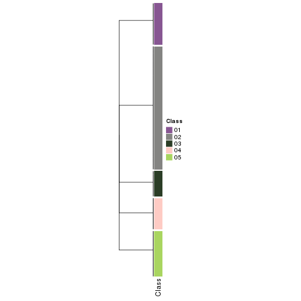</p>

</div>
<div id='tab-collect-classes-from-hierarchical-partition-29'>
<pre><code class="r">collect_classes(res_rh, merge_node = merge_node_param(min_n_signatures = 30719))
</code></pre>

<p></p>

</div>
<div id='tab-collect-classes-from-hierarchical-partition-30'>
<pre><code class="r">collect_classes(res_rh, merge_node = merge_node_param(min_n_signatures = 63548))
</code></pre>

<p></p>

</div>
</div>

Following shows the table of the partitions (You need to click the **show/hide
code output** link to see it).


<script>
$( function() {
	$( '#tabs-get-classes-from-hierarchical-partition' ).tabs();
} );
</script>
<div id='tabs-get-classes-from-hierarchical-partition'>
<ul>
<li><a href='#tab-get-classes-from-hierarchical-partition-1'>n_signatures ≥ 1269</a></li>
<li><a href='#tab-get-classes-from-hierarchical-partition-2'>n_signatures ≥ 1469</a></li>
<li><a href='#tab-get-classes-from-hierarchical-partition-3'>n_signatures ≥ 1526</a></li>
<li><a href='#tab-get-classes-from-hierarchical-partition-4'>n_signatures ≥ 1540</a></li>
<li><a href='#tab-get-classes-from-hierarchical-partition-5'>n_signatures ≥ 1619</a></li>
<li><a href='#tab-get-classes-from-hierarchical-partition-6'>n_signatures ≥ 1622</a></li>
<li><a href='#tab-get-classes-from-hierarchical-partition-7'>n_signatures ≥ 2262</a></li>
<li><a href='#tab-get-classes-from-hierarchical-partition-8'>n_signatures ≥ 2279</a></li>
<li><a href='#tab-get-classes-from-hierarchical-partition-9'>n_signatures ≥ 2489</a></li>
<li><a href='#tab-get-classes-from-hierarchical-partition-10'>n_signatures ≥ 2775</a></li>
<li><a href='#tab-get-classes-from-hierarchical-partition-11'>n_signatures ≥ 2836</a></li>
<li><a href='#tab-get-classes-from-hierarchical-partition-12'>n_signatures ≥ 3188</a></li>
<li><a href='#tab-get-classes-from-hierarchical-partition-13'>n_signatures ≥ 3867</a></li>
<li><a href='#tab-get-classes-from-hierarchical-partition-14'>n_signatures ≥ 4027</a></li>
<li><a href='#tab-get-classes-from-hierarchical-partition-15'>n_signatures ≥ 4522</a></li>
<li><a href='#tab-get-classes-from-hierarchical-partition-16'>n_signatures ≥ 4660</a></li>
<li><a href='#tab-get-classes-from-hierarchical-partition-17'>n_signatures ≥ 4864</a></li>
<li><a href='#tab-get-classes-from-hierarchical-partition-18'>n_signatures ≥ 5547</a></li>
<li><a href='#tab-get-classes-from-hierarchical-partition-19'>n_signatures ≥ 5764</a></li>
<li><a href='#tab-get-classes-from-hierarchical-partition-20'>n_signatures ≥ 6152</a></li>
<li><a href='#tab-get-classes-from-hierarchical-partition-21'>n_signatures ≥ 7175</a></li>
<li><a href='#tab-get-classes-from-hierarchical-partition-22'>n_signatures ≥ 7761</a></li>
<li><a href='#tab-get-classes-from-hierarchical-partition-23'>n_signatures ≥ 8181</a></li>
<li><a href='#tab-get-classes-from-hierarchical-partition-24'>n_signatures ≥ 8755</a></li>
<li><a href='#tab-get-classes-from-hierarchical-partition-25'>n_signatures ≥ 9384</a></li>
<li><a href='#tab-get-classes-from-hierarchical-partition-26'>n_signatures ≥ 10841</a></li>
<li><a href='#tab-get-classes-from-hierarchical-partition-27'>n_signatures ≥ 20003</a></li>
<li><a href='#tab-get-classes-from-hierarchical-partition-28'>n_signatures ≥ 24546</a></li>
<li><a href='#tab-get-classes-from-hierarchical-partition-29'>n_signatures ≥ 30719</a></li>
<li><a href='#tab-get-classes-from-hierarchical-partition-30'>n_signatures ≥ 63548</a></li>
</ul>

<div id='tab-get-classes-from-hierarchical-partition-1'>
<p><a id='tab-get-classes-from-hierarchical-partition-1-a' style='color:#0366d6' href='#'>show/hide code output</a></p>
<pre><code class="r">get_classes(res_rh, merge_node = merge_node_param(min_n_signatures = 1269))
</code></pre>

<pre><code>#&gt; TCGA.CN.6022.01 TCGA.CQ.5327.01 TCGA.CV.5435.11 TCGA.HD.7753.01 TCGA.CQ.5325.01 TCGA.CV.5432.01 
#&gt;         &quot;05222&quot;         &quot;02113&quot;          &quot;0333&quot;         &quot;02242&quot;         &quot;02222&quot;          &quot;0521&quot; 
#&gt; TCGA.CR.7391.01 TCGA.CV.7415.01 TCGA.CR.5247.01 TCGA.CN.6011.01 TCGA.CV.7414.01 TCGA.CV.6436.01 
#&gt;         &quot;02131&quot;         &quot;02242&quot;           &quot;041&quot;         &quot;02212&quot;          &quot;0112&quot;         &quot;02322&quot; 
#&gt; TCGA.DQ.7592.01 TCGA.IQ.7632.01 TCGA.CV.7416.01 TCGA.CV.5432.11 TCGA.H7.7774.01 TCGA.CQ.5330.01 
#&gt;         &quot;02242&quot;         &quot;05221&quot;         &quot;02122&quot;           &quot;034&quot;         &quot;02114&quot;         &quot;02111&quot; 
#&gt; TCGA.CV.5430.11 TCGA.CV.7427.01 TCGA.CV.5979.01 TCGA.CR.6488.01 TCGA.CQ.6221.01 TCGA.CV.5434.11 
#&gt;           &quot;034&quot;         &quot;02113&quot;         &quot;02213&quot;           &quot;053&quot;         &quot;02241&quot;          &quot;0333&quot; 
#&gt; TCGA.CV.5970.11 TCGA.CV.7425.01 TCGA.CV.6441.01 TCGA.IQ.7630.01 TCGA.CV.5976.11 TCGA.CV.7103.11 
#&gt;           &quot;031&quot;         &quot;02111&quot;          &quot;0234&quot;          &quot;0233&quot;           &quot;031&quot;           &quot;031&quot; 
#&gt; TCGA.CV.5977.01 TCGA.CQ.5324.01 TCGA.CV.7407.01 TCGA.CV.5971.01 TCGA.CV.5970.01 TCGA.CN.6016.01 
#&gt;          &quot;0233&quot;          &quot;0233&quot;        &quot;021322&quot;         &quot;02222&quot;         &quot;02243&quot;         &quot;02233&quot; 
#&gt; TCGA.CV.6003.01 TCGA.CN.6010.01 TCGA.CN.6021.01 TCGA.CV.6433.01 TCGA.CV.5434.01 TCGA.CV.7413.01 
#&gt;         &quot;02122&quot;          &quot;0112&quot;        &quot;021322&quot;         &quot;05112&quot;         &quot;02211&quot;         &quot;01212&quot; 
#&gt; TCGA.HD.7754.01 TCGA.CN.6017.01 TCGA.CV.6003.11 TCGA.CV.7422.01 TCGA.CV.7421.01 TCGA.CV.5439.11 
#&gt;         &quot;05122&quot;         &quot;02222&quot;           &quot;032&quot;           &quot;013&quot;          &quot;0524&quot;          &quot;0331&quot; 
#&gt; TCGA.CV.7235.01 TCGA.BA.7269.01 TCGA.CV.5971.11 TCGA.CQ.5332.01 TCGA.CV.5439.01 TCGA.CN.6020.01 
#&gt;         &quot;02243&quot;           &quot;013&quot;           &quot;031&quot;          &quot;0112&quot;         &quot;02242&quot;         &quot;02232&quot; 
#&gt; TCGA.CV.7423.01 TCGA.CV.7263.01 TCGA.CV.7406.01 TCGA.CN.6023.01 TCGA.CV.5966.11 TCGA.CV.7101.01 
#&gt;         &quot;02213&quot;           &quot;041&quot;         &quot;05122&quot;         &quot;02233&quot;           &quot;032&quot;          &quot;0112&quot; 
#&gt; TCGA.CV.5977.11 TCGA.CR.7365.01 TCGA.CN.6012.01 TCGA.CV.6441.11 TCGA.CN.6024.01 TCGA.CV.5978.01 
#&gt;          &quot;0331&quot;          &quot;0233&quot;          &quot;0111&quot;           &quot;031&quot;         &quot;02211&quot;        &quot;021322&quot; 
#&gt; TCGA.CX.7086.01 TCGA.CV.7424.01 TCGA.CV.7089.01 TCGA.CQ.7065.01 TCGA.IQ.7631.01 TCGA.CV.7418.01 
#&gt;          &quot;0521&quot;          &quot;0113&quot;          &quot;0234&quot;           &quot;053&quot;          &quot;0523&quot;          &quot;0112&quot; 
#&gt; TCGA.CV.6937.01 TCGA.CN.6018.01 TCGA.CV.5966.01 TCGA.CQ.5329.01 TCGA.CV.5976.01 TCGA.CV.7411.01 
#&gt;         &quot;01223&quot;         &quot;02121&quot;         &quot;02121&quot;           &quot;053&quot;         &quot;02322&quot;         &quot;02123&quot; 
#&gt; TCGA.CQ.5323.01 TCGA.CV.5978.11 TCGA.CV.5973.11 TCGA.BB.4217.01 TCGA.CQ.7068.01 TCGA.CN.6013.01 
#&gt;         &quot;02211&quot;           &quot;032&quot;           &quot;032&quot;         &quot;02222&quot;         &quot;02111&quot;           &quot;013&quot; 
#&gt; TCGA.CV.6436.11 TCGA.CV.6433.11 TCGA.CN.6995.01 TCGA.CV.6960.01 TCGA.CQ.5334.01 TCGA.CV.7410.01 
#&gt;           &quot;031&quot;           &quot;031&quot;         &quot;02322&quot;           &quot;041&quot;         &quot;02321&quot;         &quot;02222&quot; 
#&gt; TCGA.CN.6019.01 TCGA.DQ.7588.01 TCGA.CV.5979.11 TCGA.CR.6492.01 TCGA.CV.5973.01 TCGA.DQ.7591.01 
#&gt;           &quot;013&quot;         &quot;02213&quot;          &quot;0333&quot;          &quot;0333&quot;         &quot;02122&quot;          &quot;0225&quot; 
#&gt; TCGA.CR.7389.01 TCGA.CV.7245.01 TCGA.CV.5430.01 TCGA.CV.5435.01 TCGA.CR.7374.01 TCGA.CV.5440.01 
#&gt;           &quot;013&quot;          &quot;0432&quot;          &quot;0225&quot;          &quot;0231&quot;          &quot;0111&quot;         &quot;02211&quot; 
#&gt; TCGA.CV.6955.11 TCGA.CV.7238.11 TCGA.CV.7104.01 TCGA.CV.7100.01 TCGA.CV.7089.11 TCGA.CN.4739.01 
#&gt;           &quot;032&quot;           &quot;032&quot;         &quot;02123&quot;         &quot;02243&quot;          &quot;0332&quot;           &quot;041&quot; 
#&gt; TCGA.CV.7095.01 TCGA.CV.6956.01 TCGA.CV.5431.11 TCGA.CV.7261.01 TCGA.CN.5358.01 TCGA.BA.5559.01 
#&gt;         &quot;02113&quot;           &quot;042&quot;           &quot;034&quot;          &quot;0112&quot;         &quot;01223&quot;         &quot;05112&quot; 
#&gt; TCGA.CR.7373.01 TCGA.CX.7082.01 TCGA.DQ.5629.01 TCGA.CV.7255.11 TCGA.CR.7379.01 TCGA.CV.7178.01 
#&gt;          &quot;0233&quot;          &quot;0521&quot;          &quot;0111&quot;           &quot;032&quot;         &quot;05221&quot;        &quot;021321&quot; 
#&gt; TCGA.CR.5249.01 TCGA.CV.7091.01 TCGA.CV.7236.01 TCGA.CN.6998.01 TCGA.CR.7399.01 TCGA.CR.7372.01 
#&gt;         &quot;05123&quot;          &quot;0433&quot;           &quot;032&quot;          &quot;0233&quot;         &quot;05221&quot;         &quot;01221&quot; 
#&gt; TCGA.CV.7252.01 TCGA.CV.7242.01 TCGA.CV.7103.01 TCGA.CR.6478.01 TCGA.CR.7371.01 TCGA.CR.7380.01 
#&gt;         &quot;02112&quot;           &quot;041&quot;          &quot;0524&quot;         &quot;02131&quot;           &quot;013&quot;          &quot;0233&quot; 
#&gt; TCGA.CV.7183.01 TCGA.CV.7250.11 TCGA.CV.7102.01 TCGA.CV.7254.01 TCGA.CR.7394.01 TCGA.CV.5443.01 
#&gt;          &quot;0233&quot;           &quot;034&quot;        &quot;021321&quot;         &quot;02233&quot;         &quot;02121&quot;         &quot;05113&quot; 
#&gt; TCGA.CV.6955.01 TCGA.CV.5441.11 TCGA.CV.5442.11 TCGA.BA.5556.01 TCGA.CR.7386.01 TCGA.CV.7255.01 
#&gt;         &quot;02124&quot;         &quot;05222&quot;           &quot;032&quot;         &quot;02113&quot;         &quot;02221&quot;          &quot;0521&quot; 
#&gt; TCGA.CR.6474.01 TCGA.BA.5557.01 TCGA.CR.7388.01 TCGA.CV.5436.11 TCGA.CR.7398.01 TCGA.CV.7247.01 
#&gt;         &quot;02221&quot;         &quot;02121&quot;           &quot;013&quot;           &quot;031&quot;           &quot;042&quot;         &quot;02213&quot; 
#&gt; TCGA.CN.6997.01 TCGA.CN.4742.01 TCGA.CN.4738.01 TCGA.CR.7392.01 TCGA.CV.7245.11 TCGA.CR.7377.01 
#&gt;          &quot;0112&quot;         &quot;01213&quot;           &quot;013&quot;         &quot;05221&quot;          &quot;0331&quot;         &quot;02221&quot; 
#&gt; TCGA.HD.7229.01 TCGA.CV.7235.11 TCGA.D6.6515.01 TCGA.CV.7238.01 TCGA.CR.5248.01 TCGA.CV.7097.01 
#&gt;         &quot;02322&quot;          &quot;0332&quot;         &quot;02131&quot;         &quot;02121&quot;        &quot;051211&quot;          &quot;0234&quot; 
#&gt; TCGA.CR.5250.01 TCGA.CV.7248.01 TCGA.CV.7253.01 TCGA.CN.5370.01 TCGA.CR.7367.01 TCGA.CR.7401.01 
#&gt;         &quot;05112&quot;           &quot;013&quot;           &quot;042&quot;         &quot;02231&quot;          &quot;0234&quot;         &quot;02232&quot; 
#&gt; TCGA.BA.5149.01 TCGA.CV.6942.01 TCGA.CV.7263.11 TCGA.CV.7177.01 TCGA.BA.5555.01 TCGA.CV.6956.11 
#&gt;           &quot;053&quot;         &quot;02111&quot;           &quot;031&quot;         &quot;02133&quot;          &quot;0431&quot;           &quot;031&quot; 
#&gt; TCGA.CV.5431.01 TCGA.CR.7393.01 TCGA.CV.5444.11 TCGA.CV.5444.01 TCGA.CR.5243.01 TCGA.CR.7395.01 
#&gt;         &quot;05222&quot;           &quot;031&quot;          &quot;0331&quot;         &quot;01222&quot;         &quot;05114&quot;         &quot;02114&quot; 
#&gt; TCGA.CV.5441.01 TCGA.CV.5442.01 TCGA.BA.5558.01 TCGA.CX.7085.01 TCGA.CV.7250.01 TCGA.CR.7390.01 
#&gt;          &quot;0432&quot;         &quot;05111&quot;         &quot;02322&quot;         &quot;02121&quot;           &quot;042&quot;           &quot;013&quot; 
#&gt; TCGA.CV.7178.11 TCGA.CV.7099.01 TCGA.CV.5443.11 TCGA.CR.7385.01 TCGA.CR.7364.01 TCGA.CV.7090.01 
#&gt;           &quot;032&quot;         &quot;02113&quot;           &quot;034&quot;         &quot;05123&quot;           &quot;042&quot;         &quot;02231&quot; 
#&gt; TCGA.CR.7397.01 TCGA.CR.7402.01 TCGA.CV.5440.11 TCGA.CV.7180.01 TCGA.CX.7219.01 TCGA.CV.7101.11 
#&gt;          &quot;0331&quot;          &quot;0431&quot;          &quot;0331&quot;           &quot;053&quot;         &quot;02232&quot;           &quot;034&quot; 
#&gt; TCGA.CV.5436.01 TCGA.CV.7243.01 TCGA.BA.6871.01 TCGA.CQ.6218.01 TCGA.C9.A47Z.01 TCGA.CV.6961.01 
#&gt;         &quot;01222&quot;          &quot;0233&quot;          &quot;0225&quot;        &quot;021321&quot;         &quot;02112&quot;         &quot;01223&quot; 
#&gt; TCGA.DQ.5625.01 TCGA.CN.6992.01 TCGA.CV.6939.01 TCGA.CR.6480.01 TCGA.D6.6825.01 TCGA.C9.A480.01 
#&gt;         &quot;02124&quot;          &quot;0111&quot;         &quot;05123&quot;          &quot;0231&quot;         &quot;02232&quot;         &quot;02121&quot; 
#&gt; TCGA.CV.6962.01 TCGA.CV.6952.01 TCGA.CN.A49A.01 TCGA.CR.6487.01 TCGA.CV.6935.11 TCGA.CQ.6222.01 
#&gt;          &quot;0113&quot;         &quot;02124&quot;           &quot;042&quot;        &quot;051211&quot;           &quot;034&quot;         &quot;02222&quot; 
#&gt; TCGA.CV.6959.11 TCGA.BB.4227.01 TCGA.CN.A49C.01 TCGA.CN.6994.01 TCGA.CV.6938.11 TCGA.CV.6936.01 
#&gt;           &quot;031&quot;         &quot;01221&quot;          &quot;0231&quot;         &quot;02212&quot;          &quot;0333&quot;           &quot;053&quot; 
#&gt; TCGA.CR.6491.01 TCGA.CV.6950.01 TCGA.CR.6473.01 TCGA.CV.6952.11 TCGA.CQ.5331.01 TCGA.D6.6826.01 
#&gt;          &quot;0234&quot;         &quot;02242&quot;          &quot;0231&quot;           &quot;032&quot;         &quot;02121&quot;         &quot;02121&quot; 
#&gt; TCGA.CV.6951.11 TCGA.CV.6935.01 TCGA.DQ.5631.01 TCGA.CV.6953.01 TCGA.CV.6945.01 TCGA.CV.6939.11 
#&gt;           &quot;031&quot;         &quot;02211&quot;           &quot;053&quot;         &quot;02113&quot;         &quot;02231&quot;          &quot;0331&quot; 
#&gt; TCGA.CV.A45U.01 TCGA.CN.A497.01 TCGA.D6.6823.01 TCGA.DQ.5630.01 TCGA.D6.6827.01 TCGA.CV.6943.01 
#&gt;           &quot;013&quot;          &quot;0433&quot;           &quot;041&quot;         &quot;02221&quot;           &quot;013&quot;         &quot;02222&quot; 
#&gt; TCGA.CV.6954.11 TCGA.CR.6472.01 TCGA.CR.6481.01 TCGA.BA.A4IF.01 TCGA.BA.6870.01 TCGA.CV.6962.11 
#&gt;           &quot;031&quot;         &quot;05122&quot;        &quot;051211&quot;          &quot;0431&quot;        &quot;021321&quot;           &quot;034&quot; 
#&gt; TCGA.CR.6477.01 TCGA.CV.A45O.01 TCGA.CQ.6219.01 TCGA.CN.4733.01 TCGA.CR.6484.01 TCGA.CN.A498.01 
#&gt;         &quot;02131&quot;         &quot;02322&quot;         &quot;02121&quot;         &quot;02222&quot;         &quot;05221&quot;        &quot;021321&quot; 
#&gt; TCGA.CR.6470.01 TCGA.CV.6934.01 TCGA.CN.6989.01 TCGA.CV.6953.11 TCGA.CV.6933.01 TCGA.D6.6517.01 
#&gt;        &quot;051211&quot;         &quot;01211&quot;         &quot;02233&quot;         &quot;02131&quot;           &quot;013&quot;         &quot;02231&quot; 
#&gt; TCGA.CQ.6220.01 TCGA.BA.A4IH.01 TCGA.HD.A4C1.01 TCGA.BA.6869.01 TCGA.CR.6493.01 TCGA.D6.6516.01 
#&gt;         &quot;02231&quot;        &quot;051212&quot;         &quot;02111&quot;           &quot;042&quot;          &quot;0233&quot;         &quot;02241&quot; 
#&gt; TCGA.CQ.6227.01 TCGA.CV.A45P.01 TCGA.CV.A45Q.01 TCGA.CV.A45T.01 TCGA.CN.6996.01 TCGA.CV.6961.11 
#&gt;         &quot;02221&quot;         &quot;02121&quot;         &quot;02111&quot;         &quot;02121&quot;         &quot;02121&quot;           &quot;031&quot; 
#&gt; TCGA.CV.6941.01 TCGA.BA.6873.01 TCGA.CV.6934.11 TCGA.CR.6467.01 TCGA.CV.6943.11 TCGA.CV.6954.01 
#&gt;           &quot;042&quot;         &quot;02322&quot;           &quot;032&quot;          &quot;0231&quot;           &quot;031&quot;           &quot;041&quot; 
#&gt; TCGA.BA.6868.01 TCGA.CV.6959.01 TCGA.CQ.6228.01 TCGA.CQ.6229.01 TCGA.CQ.6224.01 TCGA.CV.6951.01 
#&gt;         &quot;02212&quot;          &quot;0233&quot;           &quot;041&quot;         &quot;02221&quot;         &quot;02322&quot;           &quot;053&quot; 
#&gt; TCGA.CQ.6223.01 TCGA.CV.6948.01 TCGA.CV.6936.11 TCGA.DQ.5624.01 TCGA.CV.A45R.01 TCGA.CN.A499.01 
#&gt;         &quot;02243&quot;          &quot;0113&quot;           &quot;031&quot;         &quot;02131&quot;         &quot;02242&quot;        &quot;021321&quot; 
#&gt; TCGA.CN.A49B.01 TCGA.BA.5152.01 TCGA.CV.6938.01 TCGA.CQ.5326.01 TCGA.D6.6824.01 TCGA.CV.6940.01 
#&gt;         &quot;02241&quot;         &quot;02231&quot;         &quot;02323&quot;         &quot;02232&quot;          &quot;0333&quot;         &quot;02133&quot; 
#&gt; TCGA.CQ.6225.01 TCGA.CR.6471.01 TCGA.CN.6988.01 TCGA.BA.6872.01 TCGA.CV.6933.11 TCGA.CR.6482.01 
#&gt;           &quot;042&quot;         &quot;02233&quot;           &quot;041&quot;          &quot;0233&quot;          &quot;0332&quot;        &quot;051211&quot; 
#&gt; TCGA.P3.A5Q5.01 TCGA.CQ.A4C6.01 TCGA.QK.A8Z8.01 TCGA.CV.A45W.01 TCGA.F7.A624.01 TCGA.F7.A623.01 
#&gt;         &quot;05123&quot;         &quot;02322&quot;           &quot;042&quot;         &quot;05222&quot;           &quot;053&quot;         &quot;01223&quot; 
#&gt; TCGA.F7.A622.01 TCGA.CQ.7064.01 TCGA.IQ.A61K.01 TCGA.HD.A633.01 TCGA.BA.A4IG.01 TCGA.F7.A61W.01 
#&gt;           &quot;053&quot;         &quot;02124&quot;         &quot;02122&quot;          &quot;0233&quot;         &quot;05123&quot;         &quot;02213&quot; 
#&gt; TCGA.BA.A6DF.01 TCGA.D6.A4ZB.01 TCGA.KU.A66T.01 TCGA.HD.8224.01 TCGA.CV.A45Y.01 TCGA.BB.A5HU.01 
#&gt;         &quot;02114&quot;         &quot;02232&quot;          &quot;0521&quot;           &quot;053&quot;         &quot;02221&quot;         &quot;02231&quot; 
#&gt; TCGA.T3.A92M.01 TCGA.CQ.A4C7.01 TCGA.P3.A5Q6.01 TCGA.CQ.A4CD.01 TCGA.BA.A6DB.01 TCGA.CV.A468.01 
#&gt;         &quot;01222&quot;         &quot;02322&quot;         &quot;02241&quot;         &quot;02322&quot;         &quot;02131&quot;         &quot;01223&quot; 
#&gt; TCGA.QK.A8Z7.01 TCGA.F7.A620.01 TCGA.BA.A8YP.01 TCGA.CQ.A4C9.01 TCGA.CQ.7072.01 TCGA.IQ.A61H.01 
#&gt;          &quot;0432&quot;         &quot;02323&quot;          &quot;0521&quot;           &quot;041&quot;          &quot;0431&quot;           &quot;013&quot; 
#&gt; TCGA.QK.AA3K.01 TCGA.CQ.7069.01 TCGA.CX.A4AQ.01 TCGA.CV.A464.01 TCGA.IQ.A61L.01 TCGA.QK.A8Z9.01 
#&gt;         &quot;01222&quot;         &quot;05221&quot;          &quot;0225&quot;         &quot;02221&quot;         &quot;02123&quot;         &quot;02322&quot; 
#&gt; TCGA.HD.A634.01 TCGA.4P.AA8J.01 TCGA.BB.A5HY.01 TCGA.HD.8635.01 TCGA.CN.A63T.01 TCGA.QK.A652.01 
#&gt;         &quot;05123&quot;         &quot;01222&quot;          &quot;0234&quot;         &quot;02124&quot;          &quot;0433&quot;         &quot;02221&quot; 
#&gt; TCGA.MT.A67G.01 TCGA.QK.A64Z.01 TCGA.HD.8634.01 TCGA.CQ.7063.01 TCGA.CV.A45V.01 TCGA.CV.A460.01 
#&gt;        &quot;021322&quot;         &quot;02124&quot;         &quot;02124&quot;         &quot;02111&quot;         &quot;01213&quot;         &quot;01222&quot; 
#&gt; TCGA.CV.A465.01 TCGA.CQ.A4CG.01 TCGA.F7.A50J.01 TCGA.F7.8298.01 TCGA.F7.8489.01 TCGA.P3.A5QA.01 
#&gt;           &quot;053&quot;           &quot;013&quot;         &quot;02123&quot;         &quot;02242&quot;         &quot;02222&quot;          &quot;0524&quot; 
#&gt; TCGA.F7.A50G.01 TCGA.CQ.A4CA.01 TCGA.T3.A92N.01 TCGA.F7.A61V.01 TCGA.CN.A63Y.01 TCGA.CQ.5333.01 
#&gt;         &quot;02232&quot;         &quot;02222&quot;         &quot;02211&quot;           &quot;041&quot;         &quot;02223&quot;         &quot;02321&quot; 
#&gt; TCGA.P3.A5QE.01 TCGA.MT.A67D.01 TCGA.CN.A63V.01 TCGA.BA.A6DJ.01 TCGA.MT.A51W.01 TCGA.P3.A5QF.01 
#&gt;          &quot;0225&quot;           &quot;053&quot;         &quot;05222&quot;         &quot;02321&quot;         &quot;02131&quot;           &quot;041&quot; 
#&gt; TCGA.CQ.A4CE.01 TCGA.IQ.A61G.01 TCGA.HD.8314.01 TCGA.BB.A5HZ.01 TCGA.CN.A641.01 TCGA.IQ.A61J.01 
#&gt;         &quot;01213&quot;         &quot;02212&quot;          &quot;0112&quot;          &quot;0433&quot;           &quot;042&quot;         &quot;02241&quot; 
#&gt; TCGA.BA.A6DG.01 TCGA.QK.AA3J.01 TCGA.CQ.A4CH.01 TCGA.BA.A4II.01 TCGA.KU.A66S.01 TCGA.CQ.A4CB.01 
#&gt;         &quot;02221&quot;           &quot;041&quot;         &quot;02222&quot;         &quot;01223&quot;           &quot;042&quot;         &quot;02322&quot; 
#&gt; TCGA.D6.8569.01 TCGA.IQ.A61I.01 TCGA.D6.A4Z9.01 TCGA.QK.A8ZA.01 TCGA.QK.A8ZB.01 TCGA.BA.A6DL.01 
#&gt;         &quot;02243&quot;          &quot;0231&quot;          &quot;0234&quot;          &quot;0112&quot;         &quot;05222&quot;           &quot;041&quot; 
#&gt; TCGA.CQ.A4CI.01 TCGA.MT.A51X.01 TCGA.CV.A461.01 TCGA.CQ.7071.01 TCGA.H7.8501.01 TCGA.BB.8596.01 
#&gt;          &quot;0112&quot;           &quot;053&quot;          &quot;0431&quot;         &quot;02114&quot;         &quot;02323&quot;         &quot;01213&quot; 
#&gt; TCGA.F7.A50I.01 TCGA.BB.8601.01 TCGA.H7.8502.01 TCGA.F7.A61S.01 TCGA.CV.A463.01 TCGA.IQ.A61O.01 
#&gt;         &quot;01222&quot;         &quot;02211&quot;         &quot;02212&quot;         &quot;02232&quot;         &quot;02111&quot;         &quot;01221&quot; 
#&gt; TCGA.CV.A45Z.01 TCGA.CV.A45X.01 TCGA.D6.8568.01 TCGA.CN.A642.01 TCGA.CN.4722.01 TCGA.IQ.A6SH.01 
#&gt;         &quot;05222&quot;         &quot;01222&quot;         &quot;02232&quot;          &quot;0233&quot;         &quot;05221&quot;         &quot;01221&quot; 
#&gt; TCGA.CN.5367.01 TCGA.P3.A6T2.01 TCGA.P3.A6T8.01 TCGA.CN.A6V7.01 TCGA.CN.A640.01 TCGA.UF.A71E.01 
#&gt;        &quot;021321&quot;          &quot;0233&quot;           &quot;053&quot;          &quot;0231&quot;         &quot;02121&quot;          &quot;0112&quot; 
#&gt; TCGA.DQ.7589.01 TCGA.P3.A6T6.01 TCGA.CN.4725.01 TCGA.BA.5153.01 TCGA.DQ.7594.01 TCGA.HL.7533.01 
#&gt;         &quot;02211&quot;           &quot;041&quot;         &quot;02213&quot;         &quot;05112&quot;         &quot;05123&quot;         &quot;02243&quot; 
#&gt; TCGA.T2.A6X0.01 TCGA.CN.4730.01 TCGA.CN.4723.01 TCGA.UF.A7J9.01 TCGA.UF.A7JO.01 TCGA.DQ.7596.01 
#&gt;          &quot;0112&quot;          &quot;0432&quot;           &quot;013&quot;           &quot;013&quot;         &quot;02124&quot;        &quot;051211&quot; 
#&gt; TCGA.UF.A7JV.01 TCGA.CN.4729.01 TCGA.IQ.A6SG.01 TCGA.BB.7864.01 TCGA.MT.A67A.01 TCGA.CN.5361.01 
#&gt;         &quot;02124&quot;         &quot;02232&quot;         &quot;02133&quot;           &quot;041&quot;         &quot;02112&quot;         &quot;02241&quot; 
#&gt; TCGA.CN.5359.01 TCGA.BB.7861.01 TCGA.CN.4728.01 TCGA.BB.A6UO.01 TCGA.BA.4074.01 TCGA.CN.4734.01 
#&gt;         &quot;02222&quot;         &quot;02223&quot;           &quot;013&quot;         &quot;02111&quot;           &quot;041&quot;         &quot;02321&quot; 
#&gt; TCGA.QK.A6VB.01 TCGA.BA.4075.01 TCGA.BB.7871.01 TCGA.CN.4726.01 TCGA.CN.4735.01 TCGA.P3.A6T3.01 
#&gt;           &quot;042&quot;          &quot;0233&quot;        &quot;021322&quot;         &quot;02322&quot;           &quot;013&quot;          &quot;0521&quot; 
#&gt; TCGA.HD.7917.01 TCGA.BB.4223.01 TCGA.UF.A71B.01 TCGA.UF.A7JS.01 TCGA.QK.A6VC.01 TCGA.CV.7409.01 
#&gt;           &quot;041&quot;         &quot;05112&quot;          &quot;0524&quot;         &quot;02243&quot;         &quot;01213&quot;          &quot;0431&quot; 
#&gt; TCGA.CN.4736.01 TCGA.BB.7862.01 TCGA.BA.A6DI.01 TCGA.RS.A6TO.01 TCGA.CN.4737.01 TCGA.CN.5355.01 
#&gt;         &quot;02131&quot;          &quot;0111&quot;           &quot;013&quot;         &quot;01212&quot;          &quot;0524&quot;         &quot;02322&quot; 
#&gt; TCGA.UF.A71D.01 TCGA.CQ.7067.01 TCGA.BA.4078.01 TCGA.CN.5374.01 TCGA.DQ.7590.01 TCGA.CN.5369.01 
#&gt;           &quot;041&quot;         &quot;01211&quot;          &quot;0112&quot;         &quot;05123&quot;         &quot;02233&quot;         &quot;02131&quot; 
#&gt; TCGA.BA.5151.01 TCGA.TN.A7HJ.01 TCGA.IQ.A61E.01 TCGA.BB.7870.01 TCGA.CN.4727.01 TCGA.DQ.7595.01 
#&gt;         &quot;02323&quot;         &quot;05222&quot;         &quot;02114&quot;           &quot;042&quot;           &quot;042&quot;          &quot;0432&quot; 
#&gt; TCGA.BA.4076.01 TCGA.CN.5360.01 TCGA.BB.4228.01 TCGA.MZ.A7D7.01 TCGA.H7.A76A.01 TCGA.UF.A7JT.01 
#&gt;         &quot;02212&quot;           &quot;041&quot;         &quot;05112&quot;         &quot;02242&quot;        &quot;051211&quot;         &quot;02113&quot; 
#&gt; TCGA.CN.5373.01 TCGA.CN.A6V3.01 TCGA.BB.7863.01 TCGA.DQ.7593.01 TCGA.UF.A7JJ.01 TCGA.CN.5363.01 
#&gt;         &quot;02123&quot;          &quot;0433&quot;         &quot;02112&quot;        &quot;051211&quot;         &quot;01222&quot;         &quot;02323&quot; 
#&gt; TCGA.BA.4077.01 TCGA.BB.4225.01 TCGA.BB.7872.01 TCGA.CN.A6UY.01 TCGA.MT.A7BN.01 TCGA.UF.A7JF.01 
#&gt;         &quot;02133&quot;         &quot;05112&quot;         &quot;02232&quot;         &quot;05112&quot;           &quot;013&quot;           &quot;041&quot; 
#&gt; TCGA.CN.4731.01 TCGA.MZ.A5BI.01 TCGA.CN.A63W.01 TCGA.H7.A6C4.01 TCGA.T2.A6X2.01 TCGA.CN.5364.01 
#&gt;          &quot;0433&quot;        &quot;051212&quot;           &quot;042&quot;         &quot;02124&quot;          &quot;0233&quot;           &quot;053&quot; 
#&gt; TCGA.CN.A63U.01 TCGA.BB.A6UM.01 TCGA.H7.A6C5.01 TCGA.CN.4741.01 TCGA.CV.A6JO.01 TCGA.BB.7866.01 
#&gt;           &quot;042&quot;         &quot;05122&quot;           &quot;041&quot;          &quot;0231&quot;         &quot;02322&quot;          &quot;0231&quot; 
#&gt; TCGA.CN.5365.01 TCGA.CN.4740.01 TCGA.BB.4224.01 TCGA.MT.A67F.01 TCGA.CN.5366.01 TCGA.QK.A6V9.01 
#&gt;         &quot;02231&quot;         &quot;05221&quot;         &quot;02213&quot;         &quot;02111&quot;          &quot;0234&quot;          &quot;0231&quot; 
#&gt; TCGA.CN.5356.01 TCGA.T2.A6WX.01 TCGA.CV.A6JZ.01 TCGA.CN.A6V1.01 TCGA.HD.A6I0.01 TCGA.UF.A71A.01 
#&gt;           &quot;042&quot;         &quot;02113&quot;         &quot;02323&quot;         &quot;02223&quot;          &quot;0233&quot;          &quot;0113&quot; 
#&gt; TCGA.CV.7430.01 TCGA.CR.7383.01 TCGA.CN.A6V6.01 TCGA.F7.7848.01 TCGA.TN.A7HI.01 TCGA.UF.A7JC.01 
#&gt;         &quot;02211&quot;        &quot;021321&quot;         &quot;05113&quot;          &quot;0433&quot;          &quot;0112&quot;         &quot;02212&quot; 
#&gt; TCGA.D6.A6ES.01 TCGA.CV.7568.01 TCGA.BA.A6D8.01 TCGA.P3.A6T4.01 TCGA.QK.A6IF.01 TCGA.CV.A6JT.01 
#&gt;          &quot;0521&quot;         &quot;02221&quot;          &quot;0112&quot;         &quot;01222&quot;         &quot;02233&quot;          &quot;0233&quot; 
#&gt; TCGA.CV.7438.01 TCGA.RS.A6TP.01 TCGA.P3.A6SW.01 TCGA.D6.A6EN.01 TCGA.D6.A6EM.01 TCGA.UF.A7JK.01 
#&gt;         &quot;02123&quot;         &quot;05111&quot;           &quot;013&quot;         &quot;02323&quot;         &quot;01211&quot;         &quot;01221&quot; 
#&gt; TCGA.KU.A6H7.06 TCGA.CV.7429.01 TCGA.UP.A6WW.01 TCGA.CV.7437.01 TCGA.CV.A6JD.01 TCGA.CV.A6JY.01 
#&gt;         &quot;05114&quot;         &quot;02231&quot;         &quot;05112&quot;         &quot;02211&quot;         &quot;02111&quot;         &quot;05222&quot; 
#&gt; TCGA.CV.A6JN.01 TCGA.CV.7446.01 TCGA.CV.7432.01 TCGA.CV.7434.01 TCGA.WA.A7H4.01 TCGA.KU.A6H8.01 
#&gt;         &quot;02242&quot;          &quot;0111&quot;           &quot;053&quot;          &quot;0234&quot;         &quot;05222&quot;           &quot;031&quot; 
#&gt; TCGA.CV.7428.01 TCGA.D6.A6EK.01 TCGA.CV.A6K0.01 TCGA.HD.7832.01 TCGA.MZ.A6I9.01 TCGA.CV.7435.01 
#&gt;           &quot;041&quot;         &quot;02232&quot;           &quot;031&quot;          &quot;0234&quot;         &quot;05123&quot;          &quot;0433&quot; 
#&gt; TCGA.P3.A6SX.01 TCGA.QK.A6IG.01 TCGA.HD.7831.01 TCGA.CV.A6JM.01 TCGA.CR.7404.01 TCGA.D6.A6EQ.01 
#&gt;         &quot;02212&quot;           &quot;053&quot;         &quot;01223&quot;          &quot;0524&quot;        &quot;051211&quot;         &quot;01221&quot; 
#&gt; TCGA.QK.A6IJ.01 TCGA.P3.A6T0.01 TCGA.CV.A6JE.01 TCGA.HD.A6HZ.01 TCGA.QK.A6II.01 TCGA.P3.A6T7.01 
#&gt;         &quot;05222&quot;         &quot;01212&quot;          &quot;0524&quot;           &quot;013&quot;         &quot;02241&quot;         &quot;02323&quot; 
#&gt; TCGA.BA.A6DD.01 TCGA.UF.A719.01 TCGA.TN.A7HL.01 TCGA.UF.A7JA.01 TCGA.CR.7368.01 TCGA.CR.7382.01 
#&gt;           &quot;053&quot;           &quot;042&quot;           &quot;013&quot;         &quot;01211&quot;         &quot;05122&quot;         &quot;02322&quot; 
#&gt; TCGA.UF.A7JD.01 TCGA.UF.A7JH.01 TCGA.BA.A6DA.01 TCGA.T2.A6WZ.01 TCGA.D6.A6EO.01 TCGA.CR.7370.01 
#&gt;           &quot;042&quot;           &quot;041&quot;         &quot;01211&quot;          &quot;0234&quot;           &quot;041&quot;          &quot;0111&quot; 
#&gt; TCGA.P3.A6T5.01 TCGA.D6.A74Q.01 TCGA.UF.A718.01 TCGA.CR.7369.01 TCGA.QK.A6IH.01 TCGA.CV.A6K2.01 
#&gt;         &quot;02133&quot;           &quot;041&quot;           &quot;053&quot;           &quot;053&quot;          &quot;0521&quot;         &quot;01222&quot; 
#&gt; TCGA.CV.A6K1.01 TCGA.BA.A6DE.01 TCGA.WA.A7GZ.01 TCGA.CV.7433.01 TCGA.CV.7440.01 TCGA.CV.A6JU.01 
#&gt;         &quot;01221&quot;          &quot;0433&quot;          &quot;0524&quot;         &quot;02221&quot;           &quot;042&quot;          &quot;0431&quot; 
#&gt; TCGA.CR.7376.01 TCGA.UF.A71A.06 TCGA.KU.A6H7.01 TCGA.D6.A6EP.01 
#&gt;         &quot;02222&quot;          &quot;0113&quot;        &quot;051211&quot;           &quot;013&quot;
</code></pre>

<script>
$('#tab-get-classes-from-hierarchical-partition-1-a').parent().next().next().hide();
$('#tab-get-classes-from-hierarchical-partition-1-a').click(function(){
  $('#tab-get-classes-from-hierarchical-partition-1-a').parent().next().next().toggle();
  return(false);
});
</script>
</div>

<div id='tab-get-classes-from-hierarchical-partition-2'>
<p><a id='tab-get-classes-from-hierarchical-partition-2-a' style='color:#0366d6' href='#'>show/hide code output</a></p>
<pre><code class="r">get_classes(res_rh, merge_node = merge_node_param(min_n_signatures = 1469))
</code></pre>

<pre><code>#&gt; TCGA.CN.6022.01 TCGA.CQ.5327.01 TCGA.CV.5435.11 TCGA.HD.7753.01 TCGA.CQ.5325.01 TCGA.CV.5432.01 
#&gt;         &quot;05222&quot;         &quot;02113&quot;          &quot;0333&quot;         &quot;02242&quot;         &quot;02222&quot;          &quot;0521&quot; 
#&gt; TCGA.CR.7391.01 TCGA.CV.7415.01 TCGA.CR.5247.01 TCGA.CN.6011.01 TCGA.CV.7414.01 TCGA.CV.6436.01 
#&gt;         &quot;02131&quot;         &quot;02242&quot;           &quot;041&quot;         &quot;02212&quot;          &quot;0112&quot;         &quot;02322&quot; 
#&gt; TCGA.DQ.7592.01 TCGA.IQ.7632.01 TCGA.CV.7416.01 TCGA.CV.5432.11 TCGA.H7.7774.01 TCGA.CQ.5330.01 
#&gt;         &quot;02242&quot;         &quot;05221&quot;         &quot;02122&quot;           &quot;034&quot;         &quot;02114&quot;         &quot;02111&quot; 
#&gt; TCGA.CV.5430.11 TCGA.CV.7427.01 TCGA.CV.5979.01 TCGA.CR.6488.01 TCGA.CQ.6221.01 TCGA.CV.5434.11 
#&gt;           &quot;034&quot;         &quot;02113&quot;         &quot;02213&quot;           &quot;053&quot;         &quot;02241&quot;          &quot;0333&quot; 
#&gt; TCGA.CV.5970.11 TCGA.CV.7425.01 TCGA.CV.6441.01 TCGA.IQ.7630.01 TCGA.CV.5976.11 TCGA.CV.7103.11 
#&gt;           &quot;031&quot;         &quot;02111&quot;          &quot;0234&quot;          &quot;0233&quot;           &quot;031&quot;           &quot;031&quot; 
#&gt; TCGA.CV.5977.01 TCGA.CQ.5324.01 TCGA.CV.7407.01 TCGA.CV.5971.01 TCGA.CV.5970.01 TCGA.CN.6016.01 
#&gt;          &quot;0233&quot;          &quot;0233&quot;         &quot;02132&quot;         &quot;02222&quot;         &quot;02243&quot;         &quot;02233&quot; 
#&gt; TCGA.CV.6003.01 TCGA.CN.6010.01 TCGA.CN.6021.01 TCGA.CV.6433.01 TCGA.CV.5434.01 TCGA.CV.7413.01 
#&gt;         &quot;02122&quot;          &quot;0112&quot;         &quot;02132&quot;         &quot;05112&quot;         &quot;02211&quot;         &quot;01212&quot; 
#&gt; TCGA.HD.7754.01 TCGA.CN.6017.01 TCGA.CV.6003.11 TCGA.CV.7422.01 TCGA.CV.7421.01 TCGA.CV.5439.11 
#&gt;         &quot;05122&quot;         &quot;02222&quot;           &quot;032&quot;           &quot;013&quot;          &quot;0524&quot;          &quot;0331&quot; 
#&gt; TCGA.CV.7235.01 TCGA.BA.7269.01 TCGA.CV.5971.11 TCGA.CQ.5332.01 TCGA.CV.5439.01 TCGA.CN.6020.01 
#&gt;         &quot;02243&quot;           &quot;013&quot;           &quot;031&quot;          &quot;0112&quot;         &quot;02242&quot;         &quot;02232&quot; 
#&gt; TCGA.CV.7423.01 TCGA.CV.7263.01 TCGA.CV.7406.01 TCGA.CN.6023.01 TCGA.CV.5966.11 TCGA.CV.7101.01 
#&gt;         &quot;02213&quot;           &quot;041&quot;         &quot;05122&quot;         &quot;02233&quot;           &quot;032&quot;          &quot;0112&quot; 
#&gt; TCGA.CV.5977.11 TCGA.CR.7365.01 TCGA.CN.6012.01 TCGA.CV.6441.11 TCGA.CN.6024.01 TCGA.CV.5978.01 
#&gt;          &quot;0331&quot;          &quot;0233&quot;          &quot;0111&quot;           &quot;031&quot;         &quot;02211&quot;         &quot;02132&quot; 
#&gt; TCGA.CX.7086.01 TCGA.CV.7424.01 TCGA.CV.7089.01 TCGA.CQ.7065.01 TCGA.IQ.7631.01 TCGA.CV.7418.01 
#&gt;          &quot;0521&quot;          &quot;0113&quot;          &quot;0234&quot;           &quot;053&quot;          &quot;0523&quot;          &quot;0112&quot; 
#&gt; TCGA.CV.6937.01 TCGA.CN.6018.01 TCGA.CV.5966.01 TCGA.CQ.5329.01 TCGA.CV.5976.01 TCGA.CV.7411.01 
#&gt;         &quot;01223&quot;         &quot;02121&quot;         &quot;02121&quot;           &quot;053&quot;         &quot;02322&quot;         &quot;02123&quot; 
#&gt; TCGA.CQ.5323.01 TCGA.CV.5978.11 TCGA.CV.5973.11 TCGA.BB.4217.01 TCGA.CQ.7068.01 TCGA.CN.6013.01 
#&gt;         &quot;02211&quot;           &quot;032&quot;           &quot;032&quot;         &quot;02222&quot;         &quot;02111&quot;           &quot;013&quot; 
#&gt; TCGA.CV.6436.11 TCGA.CV.6433.11 TCGA.CN.6995.01 TCGA.CV.6960.01 TCGA.CQ.5334.01 TCGA.CV.7410.01 
#&gt;           &quot;031&quot;           &quot;031&quot;         &quot;02322&quot;           &quot;041&quot;         &quot;02321&quot;         &quot;02222&quot; 
#&gt; TCGA.CN.6019.01 TCGA.DQ.7588.01 TCGA.CV.5979.11 TCGA.CR.6492.01 TCGA.CV.5973.01 TCGA.DQ.7591.01 
#&gt;           &quot;013&quot;         &quot;02213&quot;          &quot;0333&quot;          &quot;0333&quot;         &quot;02122&quot;          &quot;0225&quot; 
#&gt; TCGA.CR.7389.01 TCGA.CV.7245.01 TCGA.CV.5430.01 TCGA.CV.5435.01 TCGA.CR.7374.01 TCGA.CV.5440.01 
#&gt;           &quot;013&quot;          &quot;0432&quot;          &quot;0225&quot;          &quot;0231&quot;          &quot;0111&quot;         &quot;02211&quot; 
#&gt; TCGA.CV.6955.11 TCGA.CV.7238.11 TCGA.CV.7104.01 TCGA.CV.7100.01 TCGA.CV.7089.11 TCGA.CN.4739.01 
#&gt;           &quot;032&quot;           &quot;032&quot;         &quot;02123&quot;         &quot;02243&quot;          &quot;0332&quot;           &quot;041&quot; 
#&gt; TCGA.CV.7095.01 TCGA.CV.6956.01 TCGA.CV.5431.11 TCGA.CV.7261.01 TCGA.CN.5358.01 TCGA.BA.5559.01 
#&gt;         &quot;02113&quot;           &quot;042&quot;           &quot;034&quot;          &quot;0112&quot;         &quot;01223&quot;         &quot;05112&quot; 
#&gt; TCGA.CR.7373.01 TCGA.CX.7082.01 TCGA.DQ.5629.01 TCGA.CV.7255.11 TCGA.CR.7379.01 TCGA.CV.7178.01 
#&gt;          &quot;0233&quot;          &quot;0521&quot;          &quot;0111&quot;           &quot;032&quot;         &quot;05221&quot;         &quot;02132&quot; 
#&gt; TCGA.CR.5249.01 TCGA.CV.7091.01 TCGA.CV.7236.01 TCGA.CN.6998.01 TCGA.CR.7399.01 TCGA.CR.7372.01 
#&gt;         &quot;05123&quot;          &quot;0433&quot;           &quot;032&quot;          &quot;0233&quot;         &quot;05221&quot;         &quot;01221&quot; 
#&gt; TCGA.CV.7252.01 TCGA.CV.7242.01 TCGA.CV.7103.01 TCGA.CR.6478.01 TCGA.CR.7371.01 TCGA.CR.7380.01 
#&gt;         &quot;02112&quot;           &quot;041&quot;          &quot;0524&quot;         &quot;02131&quot;           &quot;013&quot;          &quot;0233&quot; 
#&gt; TCGA.CV.7183.01 TCGA.CV.7250.11 TCGA.CV.7102.01 TCGA.CV.7254.01 TCGA.CR.7394.01 TCGA.CV.5443.01 
#&gt;          &quot;0233&quot;           &quot;034&quot;         &quot;02132&quot;         &quot;02233&quot;         &quot;02121&quot;         &quot;05113&quot; 
#&gt; TCGA.CV.6955.01 TCGA.CV.5441.11 TCGA.CV.5442.11 TCGA.BA.5556.01 TCGA.CR.7386.01 TCGA.CV.7255.01 
#&gt;         &quot;02124&quot;         &quot;05222&quot;           &quot;032&quot;         &quot;02113&quot;         &quot;02221&quot;          &quot;0521&quot; 
#&gt; TCGA.CR.6474.01 TCGA.BA.5557.01 TCGA.CR.7388.01 TCGA.CV.5436.11 TCGA.CR.7398.01 TCGA.CV.7247.01 
#&gt;         &quot;02221&quot;         &quot;02121&quot;           &quot;013&quot;           &quot;031&quot;           &quot;042&quot;         &quot;02213&quot; 
#&gt; TCGA.CN.6997.01 TCGA.CN.4742.01 TCGA.CN.4738.01 TCGA.CR.7392.01 TCGA.CV.7245.11 TCGA.CR.7377.01 
#&gt;          &quot;0112&quot;         &quot;01213&quot;           &quot;013&quot;         &quot;05221&quot;          &quot;0331&quot;         &quot;02221&quot; 
#&gt; TCGA.HD.7229.01 TCGA.CV.7235.11 TCGA.D6.6515.01 TCGA.CV.7238.01 TCGA.CR.5248.01 TCGA.CV.7097.01 
#&gt;         &quot;02322&quot;          &quot;0332&quot;         &quot;02131&quot;         &quot;02121&quot;        &quot;051211&quot;          &quot;0234&quot; 
#&gt; TCGA.CR.5250.01 TCGA.CV.7248.01 TCGA.CV.7253.01 TCGA.CN.5370.01 TCGA.CR.7367.01 TCGA.CR.7401.01 
#&gt;         &quot;05112&quot;           &quot;013&quot;           &quot;042&quot;         &quot;02231&quot;          &quot;0234&quot;         &quot;02232&quot; 
#&gt; TCGA.BA.5149.01 TCGA.CV.6942.01 TCGA.CV.7263.11 TCGA.CV.7177.01 TCGA.BA.5555.01 TCGA.CV.6956.11 
#&gt;           &quot;053&quot;         &quot;02111&quot;           &quot;031&quot;         &quot;02133&quot;          &quot;0431&quot;           &quot;031&quot; 
#&gt; TCGA.CV.5431.01 TCGA.CR.7393.01 TCGA.CV.5444.11 TCGA.CV.5444.01 TCGA.CR.5243.01 TCGA.CR.7395.01 
#&gt;         &quot;05222&quot;           &quot;031&quot;          &quot;0331&quot;         &quot;01222&quot;         &quot;05114&quot;         &quot;02114&quot; 
#&gt; TCGA.CV.5441.01 TCGA.CV.5442.01 TCGA.BA.5558.01 TCGA.CX.7085.01 TCGA.CV.7250.01 TCGA.CR.7390.01 
#&gt;          &quot;0432&quot;         &quot;05111&quot;         &quot;02322&quot;         &quot;02121&quot;           &quot;042&quot;           &quot;013&quot; 
#&gt; TCGA.CV.7178.11 TCGA.CV.7099.01 TCGA.CV.5443.11 TCGA.CR.7385.01 TCGA.CR.7364.01 TCGA.CV.7090.01 
#&gt;           &quot;032&quot;         &quot;02113&quot;           &quot;034&quot;         &quot;05123&quot;           &quot;042&quot;         &quot;02231&quot; 
#&gt; TCGA.CR.7397.01 TCGA.CR.7402.01 TCGA.CV.5440.11 TCGA.CV.7180.01 TCGA.CX.7219.01 TCGA.CV.7101.11 
#&gt;          &quot;0331&quot;          &quot;0431&quot;          &quot;0331&quot;           &quot;053&quot;         &quot;02232&quot;           &quot;034&quot; 
#&gt; TCGA.CV.5436.01 TCGA.CV.7243.01 TCGA.BA.6871.01 TCGA.CQ.6218.01 TCGA.C9.A47Z.01 TCGA.CV.6961.01 
#&gt;         &quot;01222&quot;          &quot;0233&quot;          &quot;0225&quot;         &quot;02132&quot;         &quot;02112&quot;         &quot;01223&quot; 
#&gt; TCGA.DQ.5625.01 TCGA.CN.6992.01 TCGA.CV.6939.01 TCGA.CR.6480.01 TCGA.D6.6825.01 TCGA.C9.A480.01 
#&gt;         &quot;02124&quot;          &quot;0111&quot;         &quot;05123&quot;          &quot;0231&quot;         &quot;02232&quot;         &quot;02121&quot; 
#&gt; TCGA.CV.6962.01 TCGA.CV.6952.01 TCGA.CN.A49A.01 TCGA.CR.6487.01 TCGA.CV.6935.11 TCGA.CQ.6222.01 
#&gt;          &quot;0113&quot;         &quot;02124&quot;           &quot;042&quot;        &quot;051211&quot;           &quot;034&quot;         &quot;02222&quot; 
#&gt; TCGA.CV.6959.11 TCGA.BB.4227.01 TCGA.CN.A49C.01 TCGA.CN.6994.01 TCGA.CV.6938.11 TCGA.CV.6936.01 
#&gt;           &quot;031&quot;         &quot;01221&quot;          &quot;0231&quot;         &quot;02212&quot;          &quot;0333&quot;           &quot;053&quot; 
#&gt; TCGA.CR.6491.01 TCGA.CV.6950.01 TCGA.CR.6473.01 TCGA.CV.6952.11 TCGA.CQ.5331.01 TCGA.D6.6826.01 
#&gt;          &quot;0234&quot;         &quot;02242&quot;          &quot;0231&quot;           &quot;032&quot;         &quot;02121&quot;         &quot;02121&quot; 
#&gt; TCGA.CV.6951.11 TCGA.CV.6935.01 TCGA.DQ.5631.01 TCGA.CV.6953.01 TCGA.CV.6945.01 TCGA.CV.6939.11 
#&gt;           &quot;031&quot;         &quot;02211&quot;           &quot;053&quot;         &quot;02113&quot;         &quot;02231&quot;          &quot;0331&quot; 
#&gt; TCGA.CV.A45U.01 TCGA.CN.A497.01 TCGA.D6.6823.01 TCGA.DQ.5630.01 TCGA.D6.6827.01 TCGA.CV.6943.01 
#&gt;           &quot;013&quot;          &quot;0433&quot;           &quot;041&quot;         &quot;02221&quot;           &quot;013&quot;         &quot;02222&quot; 
#&gt; TCGA.CV.6954.11 TCGA.CR.6472.01 TCGA.CR.6481.01 TCGA.BA.A4IF.01 TCGA.BA.6870.01 TCGA.CV.6962.11 
#&gt;           &quot;031&quot;         &quot;05122&quot;        &quot;051211&quot;          &quot;0431&quot;         &quot;02132&quot;           &quot;034&quot; 
#&gt; TCGA.CR.6477.01 TCGA.CV.A45O.01 TCGA.CQ.6219.01 TCGA.CN.4733.01 TCGA.CR.6484.01 TCGA.CN.A498.01 
#&gt;         &quot;02131&quot;         &quot;02322&quot;         &quot;02121&quot;         &quot;02222&quot;         &quot;05221&quot;         &quot;02132&quot; 
#&gt; TCGA.CR.6470.01 TCGA.CV.6934.01 TCGA.CN.6989.01 TCGA.CV.6953.11 TCGA.CV.6933.01 TCGA.D6.6517.01 
#&gt;        &quot;051211&quot;         &quot;01211&quot;         &quot;02233&quot;         &quot;02131&quot;           &quot;013&quot;         &quot;02231&quot; 
#&gt; TCGA.CQ.6220.01 TCGA.BA.A4IH.01 TCGA.HD.A4C1.01 TCGA.BA.6869.01 TCGA.CR.6493.01 TCGA.D6.6516.01 
#&gt;         &quot;02231&quot;        &quot;051212&quot;         &quot;02111&quot;           &quot;042&quot;          &quot;0233&quot;         &quot;02241&quot; 
#&gt; TCGA.CQ.6227.01 TCGA.CV.A45P.01 TCGA.CV.A45Q.01 TCGA.CV.A45T.01 TCGA.CN.6996.01 TCGA.CV.6961.11 
#&gt;         &quot;02221&quot;         &quot;02121&quot;         &quot;02111&quot;         &quot;02121&quot;         &quot;02121&quot;           &quot;031&quot; 
#&gt; TCGA.CV.6941.01 TCGA.BA.6873.01 TCGA.CV.6934.11 TCGA.CR.6467.01 TCGA.CV.6943.11 TCGA.CV.6954.01 
#&gt;           &quot;042&quot;         &quot;02322&quot;           &quot;032&quot;          &quot;0231&quot;           &quot;031&quot;           &quot;041&quot; 
#&gt; TCGA.BA.6868.01 TCGA.CV.6959.01 TCGA.CQ.6228.01 TCGA.CQ.6229.01 TCGA.CQ.6224.01 TCGA.CV.6951.01 
#&gt;         &quot;02212&quot;          &quot;0233&quot;           &quot;041&quot;         &quot;02221&quot;         &quot;02322&quot;           &quot;053&quot; 
#&gt; TCGA.CQ.6223.01 TCGA.CV.6948.01 TCGA.CV.6936.11 TCGA.DQ.5624.01 TCGA.CV.A45R.01 TCGA.CN.A499.01 
#&gt;         &quot;02243&quot;          &quot;0113&quot;           &quot;031&quot;         &quot;02131&quot;         &quot;02242&quot;         &quot;02132&quot; 
#&gt; TCGA.CN.A49B.01 TCGA.BA.5152.01 TCGA.CV.6938.01 TCGA.CQ.5326.01 TCGA.D6.6824.01 TCGA.CV.6940.01 
#&gt;         &quot;02241&quot;         &quot;02231&quot;         &quot;02323&quot;         &quot;02232&quot;          &quot;0333&quot;         &quot;02133&quot; 
#&gt; TCGA.CQ.6225.01 TCGA.CR.6471.01 TCGA.CN.6988.01 TCGA.BA.6872.01 TCGA.CV.6933.11 TCGA.CR.6482.01 
#&gt;           &quot;042&quot;         &quot;02233&quot;           &quot;041&quot;          &quot;0233&quot;          &quot;0332&quot;        &quot;051211&quot; 
#&gt; TCGA.P3.A5Q5.01 TCGA.CQ.A4C6.01 TCGA.QK.A8Z8.01 TCGA.CV.A45W.01 TCGA.F7.A624.01 TCGA.F7.A623.01 
#&gt;         &quot;05123&quot;         &quot;02322&quot;           &quot;042&quot;         &quot;05222&quot;           &quot;053&quot;         &quot;01223&quot; 
#&gt; TCGA.F7.A622.01 TCGA.CQ.7064.01 TCGA.IQ.A61K.01 TCGA.HD.A633.01 TCGA.BA.A4IG.01 TCGA.F7.A61W.01 
#&gt;           &quot;053&quot;         &quot;02124&quot;         &quot;02122&quot;          &quot;0233&quot;         &quot;05123&quot;         &quot;02213&quot; 
#&gt; TCGA.BA.A6DF.01 TCGA.D6.A4ZB.01 TCGA.KU.A66T.01 TCGA.HD.8224.01 TCGA.CV.A45Y.01 TCGA.BB.A5HU.01 
#&gt;         &quot;02114&quot;         &quot;02232&quot;          &quot;0521&quot;           &quot;053&quot;         &quot;02221&quot;         &quot;02231&quot; 
#&gt; TCGA.T3.A92M.01 TCGA.CQ.A4C7.01 TCGA.P3.A5Q6.01 TCGA.CQ.A4CD.01 TCGA.BA.A6DB.01 TCGA.CV.A468.01 
#&gt;         &quot;01222&quot;         &quot;02322&quot;         &quot;02241&quot;         &quot;02322&quot;         &quot;02131&quot;         &quot;01223&quot; 
#&gt; TCGA.QK.A8Z7.01 TCGA.F7.A620.01 TCGA.BA.A8YP.01 TCGA.CQ.A4C9.01 TCGA.CQ.7072.01 TCGA.IQ.A61H.01 
#&gt;          &quot;0432&quot;         &quot;02323&quot;          &quot;0521&quot;           &quot;041&quot;          &quot;0431&quot;           &quot;013&quot; 
#&gt; TCGA.QK.AA3K.01 TCGA.CQ.7069.01 TCGA.CX.A4AQ.01 TCGA.CV.A464.01 TCGA.IQ.A61L.01 TCGA.QK.A8Z9.01 
#&gt;         &quot;01222&quot;         &quot;05221&quot;          &quot;0225&quot;         &quot;02221&quot;         &quot;02123&quot;         &quot;02322&quot; 
#&gt; TCGA.HD.A634.01 TCGA.4P.AA8J.01 TCGA.BB.A5HY.01 TCGA.HD.8635.01 TCGA.CN.A63T.01 TCGA.QK.A652.01 
#&gt;         &quot;05123&quot;         &quot;01222&quot;          &quot;0234&quot;         &quot;02124&quot;          &quot;0433&quot;         &quot;02221&quot; 
#&gt; TCGA.MT.A67G.01 TCGA.QK.A64Z.01 TCGA.HD.8634.01 TCGA.CQ.7063.01 TCGA.CV.A45V.01 TCGA.CV.A460.01 
#&gt;         &quot;02132&quot;         &quot;02124&quot;         &quot;02124&quot;         &quot;02111&quot;         &quot;01213&quot;         &quot;01222&quot; 
#&gt; TCGA.CV.A465.01 TCGA.CQ.A4CG.01 TCGA.F7.A50J.01 TCGA.F7.8298.01 TCGA.F7.8489.01 TCGA.P3.A5QA.01 
#&gt;           &quot;053&quot;           &quot;013&quot;         &quot;02123&quot;         &quot;02242&quot;         &quot;02222&quot;          &quot;0524&quot; 
#&gt; TCGA.F7.A50G.01 TCGA.CQ.A4CA.01 TCGA.T3.A92N.01 TCGA.F7.A61V.01 TCGA.CN.A63Y.01 TCGA.CQ.5333.01 
#&gt;         &quot;02232&quot;         &quot;02222&quot;         &quot;02211&quot;           &quot;041&quot;         &quot;02223&quot;         &quot;02321&quot; 
#&gt; TCGA.P3.A5QE.01 TCGA.MT.A67D.01 TCGA.CN.A63V.01 TCGA.BA.A6DJ.01 TCGA.MT.A51W.01 TCGA.P3.A5QF.01 
#&gt;          &quot;0225&quot;           &quot;053&quot;         &quot;05222&quot;         &quot;02321&quot;         &quot;02131&quot;           &quot;041&quot; 
#&gt; TCGA.CQ.A4CE.01 TCGA.IQ.A61G.01 TCGA.HD.8314.01 TCGA.BB.A5HZ.01 TCGA.CN.A641.01 TCGA.IQ.A61J.01 
#&gt;         &quot;01213&quot;         &quot;02212&quot;          &quot;0112&quot;          &quot;0433&quot;           &quot;042&quot;         &quot;02241&quot; 
#&gt; TCGA.BA.A6DG.01 TCGA.QK.AA3J.01 TCGA.CQ.A4CH.01 TCGA.BA.A4II.01 TCGA.KU.A66S.01 TCGA.CQ.A4CB.01 
#&gt;         &quot;02221&quot;           &quot;041&quot;         &quot;02222&quot;         &quot;01223&quot;           &quot;042&quot;         &quot;02322&quot; 
#&gt; TCGA.D6.8569.01 TCGA.IQ.A61I.01 TCGA.D6.A4Z9.01 TCGA.QK.A8ZA.01 TCGA.QK.A8ZB.01 TCGA.BA.A6DL.01 
#&gt;         &quot;02243&quot;          &quot;0231&quot;          &quot;0234&quot;          &quot;0112&quot;         &quot;05222&quot;           &quot;041&quot; 
#&gt; TCGA.CQ.A4CI.01 TCGA.MT.A51X.01 TCGA.CV.A461.01 TCGA.CQ.7071.01 TCGA.H7.8501.01 TCGA.BB.8596.01 
#&gt;          &quot;0112&quot;           &quot;053&quot;          &quot;0431&quot;         &quot;02114&quot;         &quot;02323&quot;         &quot;01213&quot; 
#&gt; TCGA.F7.A50I.01 TCGA.BB.8601.01 TCGA.H7.8502.01 TCGA.F7.A61S.01 TCGA.CV.A463.01 TCGA.IQ.A61O.01 
#&gt;         &quot;01222&quot;         &quot;02211&quot;         &quot;02212&quot;         &quot;02232&quot;         &quot;02111&quot;         &quot;01221&quot; 
#&gt; TCGA.CV.A45Z.01 TCGA.CV.A45X.01 TCGA.D6.8568.01 TCGA.CN.A642.01 TCGA.CN.4722.01 TCGA.IQ.A6SH.01 
#&gt;         &quot;05222&quot;         &quot;01222&quot;         &quot;02232&quot;          &quot;0233&quot;         &quot;05221&quot;         &quot;01221&quot; 
#&gt; TCGA.CN.5367.01 TCGA.P3.A6T2.01 TCGA.P3.A6T8.01 TCGA.CN.A6V7.01 TCGA.CN.A640.01 TCGA.UF.A71E.01 
#&gt;         &quot;02132&quot;          &quot;0233&quot;           &quot;053&quot;          &quot;0231&quot;         &quot;02121&quot;          &quot;0112&quot; 
#&gt; TCGA.DQ.7589.01 TCGA.P3.A6T6.01 TCGA.CN.4725.01 TCGA.BA.5153.01 TCGA.DQ.7594.01 TCGA.HL.7533.01 
#&gt;         &quot;02211&quot;           &quot;041&quot;         &quot;02213&quot;         &quot;05112&quot;         &quot;05123&quot;         &quot;02243&quot; 
#&gt; TCGA.T2.A6X0.01 TCGA.CN.4730.01 TCGA.CN.4723.01 TCGA.UF.A7J9.01 TCGA.UF.A7JO.01 TCGA.DQ.7596.01 
#&gt;          &quot;0112&quot;          &quot;0432&quot;           &quot;013&quot;           &quot;013&quot;         &quot;02124&quot;        &quot;051211&quot; 
#&gt; TCGA.UF.A7JV.01 TCGA.CN.4729.01 TCGA.IQ.A6SG.01 TCGA.BB.7864.01 TCGA.MT.A67A.01 TCGA.CN.5361.01 
#&gt;         &quot;02124&quot;         &quot;02232&quot;         &quot;02133&quot;           &quot;041&quot;         &quot;02112&quot;         &quot;02241&quot; 
#&gt; TCGA.CN.5359.01 TCGA.BB.7861.01 TCGA.CN.4728.01 TCGA.BB.A6UO.01 TCGA.BA.4074.01 TCGA.CN.4734.01 
#&gt;         &quot;02222&quot;         &quot;02223&quot;           &quot;013&quot;         &quot;02111&quot;           &quot;041&quot;         &quot;02321&quot; 
#&gt; TCGA.QK.A6VB.01 TCGA.BA.4075.01 TCGA.BB.7871.01 TCGA.CN.4726.01 TCGA.CN.4735.01 TCGA.P3.A6T3.01 
#&gt;           &quot;042&quot;          &quot;0233&quot;         &quot;02132&quot;         &quot;02322&quot;           &quot;013&quot;          &quot;0521&quot; 
#&gt; TCGA.HD.7917.01 TCGA.BB.4223.01 TCGA.UF.A71B.01 TCGA.UF.A7JS.01 TCGA.QK.A6VC.01 TCGA.CV.7409.01 
#&gt;           &quot;041&quot;         &quot;05112&quot;          &quot;0524&quot;         &quot;02243&quot;         &quot;01213&quot;          &quot;0431&quot; 
#&gt; TCGA.CN.4736.01 TCGA.BB.7862.01 TCGA.BA.A6DI.01 TCGA.RS.A6TO.01 TCGA.CN.4737.01 TCGA.CN.5355.01 
#&gt;         &quot;02131&quot;          &quot;0111&quot;           &quot;013&quot;         &quot;01212&quot;          &quot;0524&quot;         &quot;02322&quot; 
#&gt; TCGA.UF.A71D.01 TCGA.CQ.7067.01 TCGA.BA.4078.01 TCGA.CN.5374.01 TCGA.DQ.7590.01 TCGA.CN.5369.01 
#&gt;           &quot;041&quot;         &quot;01211&quot;          &quot;0112&quot;         &quot;05123&quot;         &quot;02233&quot;         &quot;02131&quot; 
#&gt; TCGA.BA.5151.01 TCGA.TN.A7HJ.01 TCGA.IQ.A61E.01 TCGA.BB.7870.01 TCGA.CN.4727.01 TCGA.DQ.7595.01 
#&gt;         &quot;02323&quot;         &quot;05222&quot;         &quot;02114&quot;           &quot;042&quot;           &quot;042&quot;          &quot;0432&quot; 
#&gt; TCGA.BA.4076.01 TCGA.CN.5360.01 TCGA.BB.4228.01 TCGA.MZ.A7D7.01 TCGA.H7.A76A.01 TCGA.UF.A7JT.01 
#&gt;         &quot;02212&quot;           &quot;041&quot;         &quot;05112&quot;         &quot;02242&quot;        &quot;051211&quot;         &quot;02113&quot; 
#&gt; TCGA.CN.5373.01 TCGA.CN.A6V3.01 TCGA.BB.7863.01 TCGA.DQ.7593.01 TCGA.UF.A7JJ.01 TCGA.CN.5363.01 
#&gt;         &quot;02123&quot;          &quot;0433&quot;         &quot;02112&quot;        &quot;051211&quot;         &quot;01222&quot;         &quot;02323&quot; 
#&gt; TCGA.BA.4077.01 TCGA.BB.4225.01 TCGA.BB.7872.01 TCGA.CN.A6UY.01 TCGA.MT.A7BN.01 TCGA.UF.A7JF.01 
#&gt;         &quot;02133&quot;         &quot;05112&quot;         &quot;02232&quot;         &quot;05112&quot;           &quot;013&quot;           &quot;041&quot; 
#&gt; TCGA.CN.4731.01 TCGA.MZ.A5BI.01 TCGA.CN.A63W.01 TCGA.H7.A6C4.01 TCGA.T2.A6X2.01 TCGA.CN.5364.01 
#&gt;          &quot;0433&quot;        &quot;051212&quot;           &quot;042&quot;         &quot;02124&quot;          &quot;0233&quot;           &quot;053&quot; 
#&gt; TCGA.CN.A63U.01 TCGA.BB.A6UM.01 TCGA.H7.A6C5.01 TCGA.CN.4741.01 TCGA.CV.A6JO.01 TCGA.BB.7866.01 
#&gt;           &quot;042&quot;         &quot;05122&quot;           &quot;041&quot;          &quot;0231&quot;         &quot;02322&quot;          &quot;0231&quot; 
#&gt; TCGA.CN.5365.01 TCGA.CN.4740.01 TCGA.BB.4224.01 TCGA.MT.A67F.01 TCGA.CN.5366.01 TCGA.QK.A6V9.01 
#&gt;         &quot;02231&quot;         &quot;05221&quot;         &quot;02213&quot;         &quot;02111&quot;          &quot;0234&quot;          &quot;0231&quot; 
#&gt; TCGA.CN.5356.01 TCGA.T2.A6WX.01 TCGA.CV.A6JZ.01 TCGA.CN.A6V1.01 TCGA.HD.A6I0.01 TCGA.UF.A71A.01 
#&gt;           &quot;042&quot;         &quot;02113&quot;         &quot;02323&quot;         &quot;02223&quot;          &quot;0233&quot;          &quot;0113&quot; 
#&gt; TCGA.CV.7430.01 TCGA.CR.7383.01 TCGA.CN.A6V6.01 TCGA.F7.7848.01 TCGA.TN.A7HI.01 TCGA.UF.A7JC.01 
#&gt;         &quot;02211&quot;         &quot;02132&quot;         &quot;05113&quot;          &quot;0433&quot;          &quot;0112&quot;         &quot;02212&quot; 
#&gt; TCGA.D6.A6ES.01 TCGA.CV.7568.01 TCGA.BA.A6D8.01 TCGA.P3.A6T4.01 TCGA.QK.A6IF.01 TCGA.CV.A6JT.01 
#&gt;          &quot;0521&quot;         &quot;02221&quot;          &quot;0112&quot;         &quot;01222&quot;         &quot;02233&quot;          &quot;0233&quot; 
#&gt; TCGA.CV.7438.01 TCGA.RS.A6TP.01 TCGA.P3.A6SW.01 TCGA.D6.A6EN.01 TCGA.D6.A6EM.01 TCGA.UF.A7JK.01 
#&gt;         &quot;02123&quot;         &quot;05111&quot;           &quot;013&quot;         &quot;02323&quot;         &quot;01211&quot;         &quot;01221&quot; 
#&gt; TCGA.KU.A6H7.06 TCGA.CV.7429.01 TCGA.UP.A6WW.01 TCGA.CV.7437.01 TCGA.CV.A6JD.01 TCGA.CV.A6JY.01 
#&gt;         &quot;05114&quot;         &quot;02231&quot;         &quot;05112&quot;         &quot;02211&quot;         &quot;02111&quot;         &quot;05222&quot; 
#&gt; TCGA.CV.A6JN.01 TCGA.CV.7446.01 TCGA.CV.7432.01 TCGA.CV.7434.01 TCGA.WA.A7H4.01 TCGA.KU.A6H8.01 
#&gt;         &quot;02242&quot;          &quot;0111&quot;           &quot;053&quot;          &quot;0234&quot;         &quot;05222&quot;           &quot;031&quot; 
#&gt; TCGA.CV.7428.01 TCGA.D6.A6EK.01 TCGA.CV.A6K0.01 TCGA.HD.7832.01 TCGA.MZ.A6I9.01 TCGA.CV.7435.01 
#&gt;           &quot;041&quot;         &quot;02232&quot;           &quot;031&quot;          &quot;0234&quot;         &quot;05123&quot;          &quot;0433&quot; 
#&gt; TCGA.P3.A6SX.01 TCGA.QK.A6IG.01 TCGA.HD.7831.01 TCGA.CV.A6JM.01 TCGA.CR.7404.01 TCGA.D6.A6EQ.01 
#&gt;         &quot;02212&quot;           &quot;053&quot;         &quot;01223&quot;          &quot;0524&quot;        &quot;051211&quot;         &quot;01221&quot; 
#&gt; TCGA.QK.A6IJ.01 TCGA.P3.A6T0.01 TCGA.CV.A6JE.01 TCGA.HD.A6HZ.01 TCGA.QK.A6II.01 TCGA.P3.A6T7.01 
#&gt;         &quot;05222&quot;         &quot;01212&quot;          &quot;0524&quot;           &quot;013&quot;         &quot;02241&quot;         &quot;02323&quot; 
#&gt; TCGA.BA.A6DD.01 TCGA.UF.A719.01 TCGA.TN.A7HL.01 TCGA.UF.A7JA.01 TCGA.CR.7368.01 TCGA.CR.7382.01 
#&gt;           &quot;053&quot;           &quot;042&quot;           &quot;013&quot;         &quot;01211&quot;         &quot;05122&quot;         &quot;02322&quot; 
#&gt; TCGA.UF.A7JD.01 TCGA.UF.A7JH.01 TCGA.BA.A6DA.01 TCGA.T2.A6WZ.01 TCGA.D6.A6EO.01 TCGA.CR.7370.01 
#&gt;           &quot;042&quot;           &quot;041&quot;         &quot;01211&quot;          &quot;0234&quot;           &quot;041&quot;          &quot;0111&quot; 
#&gt; TCGA.P3.A6T5.01 TCGA.D6.A74Q.01 TCGA.UF.A718.01 TCGA.CR.7369.01 TCGA.QK.A6IH.01 TCGA.CV.A6K2.01 
#&gt;         &quot;02133&quot;           &quot;041&quot;           &quot;053&quot;           &quot;053&quot;          &quot;0521&quot;         &quot;01222&quot; 
#&gt; TCGA.CV.A6K1.01 TCGA.BA.A6DE.01 TCGA.WA.A7GZ.01 TCGA.CV.7433.01 TCGA.CV.7440.01 TCGA.CV.A6JU.01 
#&gt;         &quot;01221&quot;          &quot;0433&quot;          &quot;0524&quot;         &quot;02221&quot;           &quot;042&quot;          &quot;0431&quot; 
#&gt; TCGA.CR.7376.01 TCGA.UF.A71A.06 TCGA.KU.A6H7.01 TCGA.D6.A6EP.01 
#&gt;         &quot;02222&quot;          &quot;0113&quot;        &quot;051211&quot;           &quot;013&quot;
</code></pre>

<script>
$('#tab-get-classes-from-hierarchical-partition-2-a').parent().next().next().hide();
$('#tab-get-classes-from-hierarchical-partition-2-a').click(function(){
  $('#tab-get-classes-from-hierarchical-partition-2-a').parent().next().next().toggle();
  return(false);
});
</script>
</div>

<div id='tab-get-classes-from-hierarchical-partition-3'>
<p><a id='tab-get-classes-from-hierarchical-partition-3-a' style='color:#0366d6' href='#'>show/hide code output</a></p>
<pre><code class="r">get_classes(res_rh, merge_node = merge_node_param(min_n_signatures = 1526))
</code></pre>

<pre><code>#&gt; TCGA.CN.6022.01 TCGA.CQ.5327.01 TCGA.CV.5435.11 TCGA.HD.7753.01 TCGA.CQ.5325.01 TCGA.CV.5432.01 
#&gt;         &quot;05222&quot;         &quot;02113&quot;          &quot;0333&quot;         &quot;02242&quot;         &quot;02222&quot;          &quot;0521&quot; 
#&gt; TCGA.CR.7391.01 TCGA.CV.7415.01 TCGA.CR.5247.01 TCGA.CN.6011.01 TCGA.CV.7414.01 TCGA.CV.6436.01 
#&gt;         &quot;02131&quot;         &quot;02242&quot;           &quot;041&quot;         &quot;02212&quot;          &quot;0112&quot;         &quot;02322&quot; 
#&gt; TCGA.DQ.7592.01 TCGA.IQ.7632.01 TCGA.CV.7416.01 TCGA.CV.5432.11 TCGA.H7.7774.01 TCGA.CQ.5330.01 
#&gt;         &quot;02242&quot;         &quot;05221&quot;         &quot;02122&quot;           &quot;034&quot;         &quot;02114&quot;         &quot;02111&quot; 
#&gt; TCGA.CV.5430.11 TCGA.CV.7427.01 TCGA.CV.5979.01 TCGA.CR.6488.01 TCGA.CQ.6221.01 TCGA.CV.5434.11 
#&gt;           &quot;034&quot;         &quot;02113&quot;         &quot;02213&quot;           &quot;053&quot;         &quot;02241&quot;          &quot;0333&quot; 
#&gt; TCGA.CV.5970.11 TCGA.CV.7425.01 TCGA.CV.6441.01 TCGA.IQ.7630.01 TCGA.CV.5976.11 TCGA.CV.7103.11 
#&gt;           &quot;031&quot;         &quot;02111&quot;          &quot;0234&quot;          &quot;0233&quot;           &quot;031&quot;           &quot;031&quot; 
#&gt; TCGA.CV.5977.01 TCGA.CQ.5324.01 TCGA.CV.7407.01 TCGA.CV.5971.01 TCGA.CV.5970.01 TCGA.CN.6016.01 
#&gt;          &quot;0233&quot;          &quot;0233&quot;         &quot;02132&quot;         &quot;02222&quot;         &quot;02243&quot;         &quot;02233&quot; 
#&gt; TCGA.CV.6003.01 TCGA.CN.6010.01 TCGA.CN.6021.01 TCGA.CV.6433.01 TCGA.CV.5434.01 TCGA.CV.7413.01 
#&gt;         &quot;02122&quot;          &quot;0112&quot;         &quot;02132&quot;           &quot;051&quot;         &quot;02211&quot;         &quot;01212&quot; 
#&gt; TCGA.HD.7754.01 TCGA.CN.6017.01 TCGA.CV.6003.11 TCGA.CV.7422.01 TCGA.CV.7421.01 TCGA.CV.5439.11 
#&gt;           &quot;051&quot;         &quot;02222&quot;           &quot;032&quot;           &quot;013&quot;          &quot;0524&quot;          &quot;0331&quot; 
#&gt; TCGA.CV.7235.01 TCGA.BA.7269.01 TCGA.CV.5971.11 TCGA.CQ.5332.01 TCGA.CV.5439.01 TCGA.CN.6020.01 
#&gt;         &quot;02243&quot;           &quot;013&quot;           &quot;031&quot;          &quot;0112&quot;         &quot;02242&quot;         &quot;02232&quot; 
#&gt; TCGA.CV.7423.01 TCGA.CV.7263.01 TCGA.CV.7406.01 TCGA.CN.6023.01 TCGA.CV.5966.11 TCGA.CV.7101.01 
#&gt;         &quot;02213&quot;           &quot;041&quot;           &quot;051&quot;         &quot;02233&quot;           &quot;032&quot;          &quot;0112&quot; 
#&gt; TCGA.CV.5977.11 TCGA.CR.7365.01 TCGA.CN.6012.01 TCGA.CV.6441.11 TCGA.CN.6024.01 TCGA.CV.5978.01 
#&gt;          &quot;0331&quot;          &quot;0233&quot;          &quot;0111&quot;           &quot;031&quot;         &quot;02211&quot;         &quot;02132&quot; 
#&gt; TCGA.CX.7086.01 TCGA.CV.7424.01 TCGA.CV.7089.01 TCGA.CQ.7065.01 TCGA.IQ.7631.01 TCGA.CV.7418.01 
#&gt;          &quot;0521&quot;          &quot;0113&quot;          &quot;0234&quot;           &quot;053&quot;          &quot;0523&quot;          &quot;0112&quot; 
#&gt; TCGA.CV.6937.01 TCGA.CN.6018.01 TCGA.CV.5966.01 TCGA.CQ.5329.01 TCGA.CV.5976.01 TCGA.CV.7411.01 
#&gt;         &quot;01223&quot;         &quot;02121&quot;         &quot;02121&quot;           &quot;053&quot;         &quot;02322&quot;         &quot;02123&quot; 
#&gt; TCGA.CQ.5323.01 TCGA.CV.5978.11 TCGA.CV.5973.11 TCGA.BB.4217.01 TCGA.CQ.7068.01 TCGA.CN.6013.01 
#&gt;         &quot;02211&quot;           &quot;032&quot;           &quot;032&quot;         &quot;02222&quot;         &quot;02111&quot;           &quot;013&quot; 
#&gt; TCGA.CV.6436.11 TCGA.CV.6433.11 TCGA.CN.6995.01 TCGA.CV.6960.01 TCGA.CQ.5334.01 TCGA.CV.7410.01 
#&gt;           &quot;031&quot;           &quot;031&quot;         &quot;02322&quot;           &quot;041&quot;         &quot;02321&quot;         &quot;02222&quot; 
#&gt; TCGA.CN.6019.01 TCGA.DQ.7588.01 TCGA.CV.5979.11 TCGA.CR.6492.01 TCGA.CV.5973.01 TCGA.DQ.7591.01 
#&gt;           &quot;013&quot;         &quot;02213&quot;          &quot;0333&quot;          &quot;0333&quot;         &quot;02122&quot;          &quot;0225&quot; 
#&gt; TCGA.CR.7389.01 TCGA.CV.7245.01 TCGA.CV.5430.01 TCGA.CV.5435.01 TCGA.CR.7374.01 TCGA.CV.5440.01 
#&gt;           &quot;013&quot;          &quot;0432&quot;          &quot;0225&quot;          &quot;0231&quot;          &quot;0111&quot;         &quot;02211&quot; 
#&gt; TCGA.CV.6955.11 TCGA.CV.7238.11 TCGA.CV.7104.01 TCGA.CV.7100.01 TCGA.CV.7089.11 TCGA.CN.4739.01 
#&gt;           &quot;032&quot;           &quot;032&quot;         &quot;02123&quot;         &quot;02243&quot;          &quot;0332&quot;           &quot;041&quot; 
#&gt; TCGA.CV.7095.01 TCGA.CV.6956.01 TCGA.CV.5431.11 TCGA.CV.7261.01 TCGA.CN.5358.01 TCGA.BA.5559.01 
#&gt;         &quot;02113&quot;           &quot;042&quot;           &quot;034&quot;          &quot;0112&quot;         &quot;01223&quot;           &quot;051&quot; 
#&gt; TCGA.CR.7373.01 TCGA.CX.7082.01 TCGA.DQ.5629.01 TCGA.CV.7255.11 TCGA.CR.7379.01 TCGA.CV.7178.01 
#&gt;          &quot;0233&quot;          &quot;0521&quot;          &quot;0111&quot;           &quot;032&quot;         &quot;05221&quot;         &quot;02132&quot; 
#&gt; TCGA.CR.5249.01 TCGA.CV.7091.01 TCGA.CV.7236.01 TCGA.CN.6998.01 TCGA.CR.7399.01 TCGA.CR.7372.01 
#&gt;           &quot;051&quot;          &quot;0433&quot;           &quot;032&quot;          &quot;0233&quot;         &quot;05221&quot;         &quot;01221&quot; 
#&gt; TCGA.CV.7252.01 TCGA.CV.7242.01 TCGA.CV.7103.01 TCGA.CR.6478.01 TCGA.CR.7371.01 TCGA.CR.7380.01 
#&gt;         &quot;02112&quot;           &quot;041&quot;          &quot;0524&quot;         &quot;02131&quot;           &quot;013&quot;          &quot;0233&quot; 
#&gt; TCGA.CV.7183.01 TCGA.CV.7250.11 TCGA.CV.7102.01 TCGA.CV.7254.01 TCGA.CR.7394.01 TCGA.CV.5443.01 
#&gt;          &quot;0233&quot;           &quot;034&quot;         &quot;02132&quot;         &quot;02233&quot;         &quot;02121&quot;           &quot;051&quot; 
#&gt; TCGA.CV.6955.01 TCGA.CV.5441.11 TCGA.CV.5442.11 TCGA.BA.5556.01 TCGA.CR.7386.01 TCGA.CV.7255.01 
#&gt;         &quot;02124&quot;         &quot;05222&quot;           &quot;032&quot;         &quot;02113&quot;         &quot;02221&quot;          &quot;0521&quot; 
#&gt; TCGA.CR.6474.01 TCGA.BA.5557.01 TCGA.CR.7388.01 TCGA.CV.5436.11 TCGA.CR.7398.01 TCGA.CV.7247.01 
#&gt;         &quot;02221&quot;         &quot;02121&quot;           &quot;013&quot;           &quot;031&quot;           &quot;042&quot;         &quot;02213&quot; 
#&gt; TCGA.CN.6997.01 TCGA.CN.4742.01 TCGA.CN.4738.01 TCGA.CR.7392.01 TCGA.CV.7245.11 TCGA.CR.7377.01 
#&gt;          &quot;0112&quot;         &quot;01213&quot;           &quot;013&quot;         &quot;05221&quot;          &quot;0331&quot;         &quot;02221&quot; 
#&gt; TCGA.HD.7229.01 TCGA.CV.7235.11 TCGA.D6.6515.01 TCGA.CV.7238.01 TCGA.CR.5248.01 TCGA.CV.7097.01 
#&gt;         &quot;02322&quot;          &quot;0332&quot;         &quot;02131&quot;         &quot;02121&quot;        &quot;051211&quot;          &quot;0234&quot; 
#&gt; TCGA.CR.5250.01 TCGA.CV.7248.01 TCGA.CV.7253.01 TCGA.CN.5370.01 TCGA.CR.7367.01 TCGA.CR.7401.01 
#&gt;           &quot;051&quot;           &quot;013&quot;           &quot;042&quot;         &quot;02231&quot;          &quot;0234&quot;         &quot;02232&quot; 
#&gt; TCGA.BA.5149.01 TCGA.CV.6942.01 TCGA.CV.7263.11 TCGA.CV.7177.01 TCGA.BA.5555.01 TCGA.CV.6956.11 
#&gt;           &quot;053&quot;         &quot;02111&quot;           &quot;031&quot;         &quot;02133&quot;          &quot;0431&quot;           &quot;031&quot; 
#&gt; TCGA.CV.5431.01 TCGA.CR.7393.01 TCGA.CV.5444.11 TCGA.CV.5444.01 TCGA.CR.5243.01 TCGA.CR.7395.01 
#&gt;         &quot;05222&quot;           &quot;031&quot;          &quot;0331&quot;         &quot;01222&quot;           &quot;051&quot;         &quot;02114&quot; 
#&gt; TCGA.CV.5441.01 TCGA.CV.5442.01 TCGA.BA.5558.01 TCGA.CX.7085.01 TCGA.CV.7250.01 TCGA.CR.7390.01 
#&gt;          &quot;0432&quot;           &quot;051&quot;         &quot;02322&quot;         &quot;02121&quot;           &quot;042&quot;           &quot;013&quot; 
#&gt; TCGA.CV.7178.11 TCGA.CV.7099.01 TCGA.CV.5443.11 TCGA.CR.7385.01 TCGA.CR.7364.01 TCGA.CV.7090.01 
#&gt;           &quot;032&quot;         &quot;02113&quot;           &quot;034&quot;           &quot;051&quot;           &quot;042&quot;         &quot;02231&quot; 
#&gt; TCGA.CR.7397.01 TCGA.CR.7402.01 TCGA.CV.5440.11 TCGA.CV.7180.01 TCGA.CX.7219.01 TCGA.CV.7101.11 
#&gt;          &quot;0331&quot;          &quot;0431&quot;          &quot;0331&quot;           &quot;053&quot;         &quot;02232&quot;           &quot;034&quot; 
#&gt; TCGA.CV.5436.01 TCGA.CV.7243.01 TCGA.BA.6871.01 TCGA.CQ.6218.01 TCGA.C9.A47Z.01 TCGA.CV.6961.01 
#&gt;         &quot;01222&quot;          &quot;0233&quot;          &quot;0225&quot;         &quot;02132&quot;         &quot;02112&quot;         &quot;01223&quot; 
#&gt; TCGA.DQ.5625.01 TCGA.CN.6992.01 TCGA.CV.6939.01 TCGA.CR.6480.01 TCGA.D6.6825.01 TCGA.C9.A480.01 
#&gt;         &quot;02124&quot;          &quot;0111&quot;           &quot;051&quot;          &quot;0231&quot;         &quot;02232&quot;         &quot;02121&quot; 
#&gt; TCGA.CV.6962.01 TCGA.CV.6952.01 TCGA.CN.A49A.01 TCGA.CR.6487.01 TCGA.CV.6935.11 TCGA.CQ.6222.01 
#&gt;          &quot;0113&quot;         &quot;02124&quot;           &quot;042&quot;        &quot;051211&quot;           &quot;034&quot;         &quot;02222&quot; 
#&gt; TCGA.CV.6959.11 TCGA.BB.4227.01 TCGA.CN.A49C.01 TCGA.CN.6994.01 TCGA.CV.6938.11 TCGA.CV.6936.01 
#&gt;           &quot;031&quot;         &quot;01221&quot;          &quot;0231&quot;         &quot;02212&quot;          &quot;0333&quot;           &quot;053&quot; 
#&gt; TCGA.CR.6491.01 TCGA.CV.6950.01 TCGA.CR.6473.01 TCGA.CV.6952.11 TCGA.CQ.5331.01 TCGA.D6.6826.01 
#&gt;          &quot;0234&quot;         &quot;02242&quot;          &quot;0231&quot;           &quot;032&quot;         &quot;02121&quot;         &quot;02121&quot; 
#&gt; TCGA.CV.6951.11 TCGA.CV.6935.01 TCGA.DQ.5631.01 TCGA.CV.6953.01 TCGA.CV.6945.01 TCGA.CV.6939.11 
#&gt;           &quot;031&quot;         &quot;02211&quot;           &quot;053&quot;         &quot;02113&quot;         &quot;02231&quot;          &quot;0331&quot; 
#&gt; TCGA.CV.A45U.01 TCGA.CN.A497.01 TCGA.D6.6823.01 TCGA.DQ.5630.01 TCGA.D6.6827.01 TCGA.CV.6943.01 
#&gt;           &quot;013&quot;          &quot;0433&quot;           &quot;041&quot;         &quot;02221&quot;           &quot;013&quot;         &quot;02222&quot; 
#&gt; TCGA.CV.6954.11 TCGA.CR.6472.01 TCGA.CR.6481.01 TCGA.BA.A4IF.01 TCGA.BA.6870.01 TCGA.CV.6962.11 
#&gt;           &quot;031&quot;           &quot;051&quot;        &quot;051211&quot;          &quot;0431&quot;         &quot;02132&quot;           &quot;034&quot; 
#&gt; TCGA.CR.6477.01 TCGA.CV.A45O.01 TCGA.CQ.6219.01 TCGA.CN.4733.01 TCGA.CR.6484.01 TCGA.CN.A498.01 
#&gt;         &quot;02131&quot;         &quot;02322&quot;         &quot;02121&quot;         &quot;02222&quot;         &quot;05221&quot;         &quot;02132&quot; 
#&gt; TCGA.CR.6470.01 TCGA.CV.6934.01 TCGA.CN.6989.01 TCGA.CV.6953.11 TCGA.CV.6933.01 TCGA.D6.6517.01 
#&gt;        &quot;051211&quot;         &quot;01211&quot;         &quot;02233&quot;         &quot;02131&quot;           &quot;013&quot;         &quot;02231&quot; 
#&gt; TCGA.CQ.6220.01 TCGA.BA.A4IH.01 TCGA.HD.A4C1.01 TCGA.BA.6869.01 TCGA.CR.6493.01 TCGA.D6.6516.01 
#&gt;         &quot;02231&quot;        &quot;051212&quot;         &quot;02111&quot;           &quot;042&quot;          &quot;0233&quot;         &quot;02241&quot; 
#&gt; TCGA.CQ.6227.01 TCGA.CV.A45P.01 TCGA.CV.A45Q.01 TCGA.CV.A45T.01 TCGA.CN.6996.01 TCGA.CV.6961.11 
#&gt;         &quot;02221&quot;         &quot;02121&quot;         &quot;02111&quot;         &quot;02121&quot;         &quot;02121&quot;           &quot;031&quot; 
#&gt; TCGA.CV.6941.01 TCGA.BA.6873.01 TCGA.CV.6934.11 TCGA.CR.6467.01 TCGA.CV.6943.11 TCGA.CV.6954.01 
#&gt;           &quot;042&quot;         &quot;02322&quot;           &quot;032&quot;          &quot;0231&quot;           &quot;031&quot;           &quot;041&quot; 
#&gt; TCGA.BA.6868.01 TCGA.CV.6959.01 TCGA.CQ.6228.01 TCGA.CQ.6229.01 TCGA.CQ.6224.01 TCGA.CV.6951.01 
#&gt;         &quot;02212&quot;          &quot;0233&quot;           &quot;041&quot;         &quot;02221&quot;         &quot;02322&quot;           &quot;053&quot; 
#&gt; TCGA.CQ.6223.01 TCGA.CV.6948.01 TCGA.CV.6936.11 TCGA.DQ.5624.01 TCGA.CV.A45R.01 TCGA.CN.A499.01 
#&gt;         &quot;02243&quot;          &quot;0113&quot;           &quot;031&quot;         &quot;02131&quot;         &quot;02242&quot;         &quot;02132&quot; 
#&gt; TCGA.CN.A49B.01 TCGA.BA.5152.01 TCGA.CV.6938.01 TCGA.CQ.5326.01 TCGA.D6.6824.01 TCGA.CV.6940.01 
#&gt;         &quot;02241&quot;         &quot;02231&quot;         &quot;02323&quot;         &quot;02232&quot;          &quot;0333&quot;         &quot;02133&quot; 
#&gt; TCGA.CQ.6225.01 TCGA.CR.6471.01 TCGA.CN.6988.01 TCGA.BA.6872.01 TCGA.CV.6933.11 TCGA.CR.6482.01 
#&gt;           &quot;042&quot;         &quot;02233&quot;           &quot;041&quot;          &quot;0233&quot;          &quot;0332&quot;        &quot;051211&quot; 
#&gt; TCGA.P3.A5Q5.01 TCGA.CQ.A4C6.01 TCGA.QK.A8Z8.01 TCGA.CV.A45W.01 TCGA.F7.A624.01 TCGA.F7.A623.01 
#&gt;           &quot;051&quot;         &quot;02322&quot;           &quot;042&quot;         &quot;05222&quot;           &quot;053&quot;         &quot;01223&quot; 
#&gt; TCGA.F7.A622.01 TCGA.CQ.7064.01 TCGA.IQ.A61K.01 TCGA.HD.A633.01 TCGA.BA.A4IG.01 TCGA.F7.A61W.01 
#&gt;           &quot;053&quot;         &quot;02124&quot;         &quot;02122&quot;          &quot;0233&quot;           &quot;051&quot;         &quot;02213&quot; 
#&gt; TCGA.BA.A6DF.01 TCGA.D6.A4ZB.01 TCGA.KU.A66T.01 TCGA.HD.8224.01 TCGA.CV.A45Y.01 TCGA.BB.A5HU.01 
#&gt;         &quot;02114&quot;         &quot;02232&quot;          &quot;0521&quot;           &quot;053&quot;         &quot;02221&quot;         &quot;02231&quot; 
#&gt; TCGA.T3.A92M.01 TCGA.CQ.A4C7.01 TCGA.P3.A5Q6.01 TCGA.CQ.A4CD.01 TCGA.BA.A6DB.01 TCGA.CV.A468.01 
#&gt;         &quot;01222&quot;         &quot;02322&quot;         &quot;02241&quot;         &quot;02322&quot;         &quot;02131&quot;         &quot;01223&quot; 
#&gt; TCGA.QK.A8Z7.01 TCGA.F7.A620.01 TCGA.BA.A8YP.01 TCGA.CQ.A4C9.01 TCGA.CQ.7072.01 TCGA.IQ.A61H.01 
#&gt;          &quot;0432&quot;         &quot;02323&quot;          &quot;0521&quot;           &quot;041&quot;          &quot;0431&quot;           &quot;013&quot; 
#&gt; TCGA.QK.AA3K.01 TCGA.CQ.7069.01 TCGA.CX.A4AQ.01 TCGA.CV.A464.01 TCGA.IQ.A61L.01 TCGA.QK.A8Z9.01 
#&gt;         &quot;01222&quot;         &quot;05221&quot;          &quot;0225&quot;         &quot;02221&quot;         &quot;02123&quot;         &quot;02322&quot; 
#&gt; TCGA.HD.A634.01 TCGA.4P.AA8J.01 TCGA.BB.A5HY.01 TCGA.HD.8635.01 TCGA.CN.A63T.01 TCGA.QK.A652.01 
#&gt;           &quot;051&quot;         &quot;01222&quot;          &quot;0234&quot;         &quot;02124&quot;          &quot;0433&quot;         &quot;02221&quot; 
#&gt; TCGA.MT.A67G.01 TCGA.QK.A64Z.01 TCGA.HD.8634.01 TCGA.CQ.7063.01 TCGA.CV.A45V.01 TCGA.CV.A460.01 
#&gt;         &quot;02132&quot;         &quot;02124&quot;         &quot;02124&quot;         &quot;02111&quot;         &quot;01213&quot;         &quot;01222&quot; 
#&gt; TCGA.CV.A465.01 TCGA.CQ.A4CG.01 TCGA.F7.A50J.01 TCGA.F7.8298.01 TCGA.F7.8489.01 TCGA.P3.A5QA.01 
#&gt;           &quot;053&quot;           &quot;013&quot;         &quot;02123&quot;         &quot;02242&quot;         &quot;02222&quot;          &quot;0524&quot; 
#&gt; TCGA.F7.A50G.01 TCGA.CQ.A4CA.01 TCGA.T3.A92N.01 TCGA.F7.A61V.01 TCGA.CN.A63Y.01 TCGA.CQ.5333.01 
#&gt;         &quot;02232&quot;         &quot;02222&quot;         &quot;02211&quot;           &quot;041&quot;         &quot;02223&quot;         &quot;02321&quot; 
#&gt; TCGA.P3.A5QE.01 TCGA.MT.A67D.01 TCGA.CN.A63V.01 TCGA.BA.A6DJ.01 TCGA.MT.A51W.01 TCGA.P3.A5QF.01 
#&gt;          &quot;0225&quot;           &quot;053&quot;         &quot;05222&quot;         &quot;02321&quot;         &quot;02131&quot;           &quot;041&quot; 
#&gt; TCGA.CQ.A4CE.01 TCGA.IQ.A61G.01 TCGA.HD.8314.01 TCGA.BB.A5HZ.01 TCGA.CN.A641.01 TCGA.IQ.A61J.01 
#&gt;         &quot;01213&quot;         &quot;02212&quot;          &quot;0112&quot;          &quot;0433&quot;           &quot;042&quot;         &quot;02241&quot; 
#&gt; TCGA.BA.A6DG.01 TCGA.QK.AA3J.01 TCGA.CQ.A4CH.01 TCGA.BA.A4II.01 TCGA.KU.A66S.01 TCGA.CQ.A4CB.01 
#&gt;         &quot;02221&quot;           &quot;041&quot;         &quot;02222&quot;         &quot;01223&quot;           &quot;042&quot;         &quot;02322&quot; 
#&gt; TCGA.D6.8569.01 TCGA.IQ.A61I.01 TCGA.D6.A4Z9.01 TCGA.QK.A8ZA.01 TCGA.QK.A8ZB.01 TCGA.BA.A6DL.01 
#&gt;         &quot;02243&quot;          &quot;0231&quot;          &quot;0234&quot;          &quot;0112&quot;         &quot;05222&quot;           &quot;041&quot; 
#&gt; TCGA.CQ.A4CI.01 TCGA.MT.A51X.01 TCGA.CV.A461.01 TCGA.CQ.7071.01 TCGA.H7.8501.01 TCGA.BB.8596.01 
#&gt;          &quot;0112&quot;           &quot;053&quot;          &quot;0431&quot;         &quot;02114&quot;         &quot;02323&quot;         &quot;01213&quot; 
#&gt; TCGA.F7.A50I.01 TCGA.BB.8601.01 TCGA.H7.8502.01 TCGA.F7.A61S.01 TCGA.CV.A463.01 TCGA.IQ.A61O.01 
#&gt;         &quot;01222&quot;         &quot;02211&quot;         &quot;02212&quot;         &quot;02232&quot;         &quot;02111&quot;         &quot;01221&quot; 
#&gt; TCGA.CV.A45Z.01 TCGA.CV.A45X.01 TCGA.D6.8568.01 TCGA.CN.A642.01 TCGA.CN.4722.01 TCGA.IQ.A6SH.01 
#&gt;         &quot;05222&quot;         &quot;01222&quot;         &quot;02232&quot;          &quot;0233&quot;         &quot;05221&quot;         &quot;01221&quot; 
#&gt; TCGA.CN.5367.01 TCGA.P3.A6T2.01 TCGA.P3.A6T8.01 TCGA.CN.A6V7.01 TCGA.CN.A640.01 TCGA.UF.A71E.01 
#&gt;         &quot;02132&quot;          &quot;0233&quot;           &quot;053&quot;          &quot;0231&quot;         &quot;02121&quot;          &quot;0112&quot; 
#&gt; TCGA.DQ.7589.01 TCGA.P3.A6T6.01 TCGA.CN.4725.01 TCGA.BA.5153.01 TCGA.DQ.7594.01 TCGA.HL.7533.01 
#&gt;         &quot;02211&quot;           &quot;041&quot;         &quot;02213&quot;           &quot;051&quot;           &quot;051&quot;         &quot;02243&quot; 
#&gt; TCGA.T2.A6X0.01 TCGA.CN.4730.01 TCGA.CN.4723.01 TCGA.UF.A7J9.01 TCGA.UF.A7JO.01 TCGA.DQ.7596.01 
#&gt;          &quot;0112&quot;          &quot;0432&quot;           &quot;013&quot;           &quot;013&quot;         &quot;02124&quot;        &quot;051211&quot; 
#&gt; TCGA.UF.A7JV.01 TCGA.CN.4729.01 TCGA.IQ.A6SG.01 TCGA.BB.7864.01 TCGA.MT.A67A.01 TCGA.CN.5361.01 
#&gt;         &quot;02124&quot;         &quot;02232&quot;         &quot;02133&quot;           &quot;041&quot;         &quot;02112&quot;         &quot;02241&quot; 
#&gt; TCGA.CN.5359.01 TCGA.BB.7861.01 TCGA.CN.4728.01 TCGA.BB.A6UO.01 TCGA.BA.4074.01 TCGA.CN.4734.01 
#&gt;         &quot;02222&quot;         &quot;02223&quot;           &quot;013&quot;         &quot;02111&quot;           &quot;041&quot;         &quot;02321&quot; 
#&gt; TCGA.QK.A6VB.01 TCGA.BA.4075.01 TCGA.BB.7871.01 TCGA.CN.4726.01 TCGA.CN.4735.01 TCGA.P3.A6T3.01 
#&gt;           &quot;042&quot;          &quot;0233&quot;         &quot;02132&quot;         &quot;02322&quot;           &quot;013&quot;          &quot;0521&quot; 
#&gt; TCGA.HD.7917.01 TCGA.BB.4223.01 TCGA.UF.A71B.01 TCGA.UF.A7JS.01 TCGA.QK.A6VC.01 TCGA.CV.7409.01 
#&gt;           &quot;041&quot;           &quot;051&quot;          &quot;0524&quot;         &quot;02243&quot;         &quot;01213&quot;          &quot;0431&quot; 
#&gt; TCGA.CN.4736.01 TCGA.BB.7862.01 TCGA.BA.A6DI.01 TCGA.RS.A6TO.01 TCGA.CN.4737.01 TCGA.CN.5355.01 
#&gt;         &quot;02131&quot;          &quot;0111&quot;           &quot;013&quot;         &quot;01212&quot;          &quot;0524&quot;         &quot;02322&quot; 
#&gt; TCGA.UF.A71D.01 TCGA.CQ.7067.01 TCGA.BA.4078.01 TCGA.CN.5374.01 TCGA.DQ.7590.01 TCGA.CN.5369.01 
#&gt;           &quot;041&quot;         &quot;01211&quot;          &quot;0112&quot;           &quot;051&quot;         &quot;02233&quot;         &quot;02131&quot; 
#&gt; TCGA.BA.5151.01 TCGA.TN.A7HJ.01 TCGA.IQ.A61E.01 TCGA.BB.7870.01 TCGA.CN.4727.01 TCGA.DQ.7595.01 
#&gt;         &quot;02323&quot;         &quot;05222&quot;         &quot;02114&quot;           &quot;042&quot;           &quot;042&quot;          &quot;0432&quot; 
#&gt; TCGA.BA.4076.01 TCGA.CN.5360.01 TCGA.BB.4228.01 TCGA.MZ.A7D7.01 TCGA.H7.A76A.01 TCGA.UF.A7JT.01 
#&gt;         &quot;02212&quot;           &quot;041&quot;           &quot;051&quot;         &quot;02242&quot;        &quot;051211&quot;         &quot;02113&quot; 
#&gt; TCGA.CN.5373.01 TCGA.CN.A6V3.01 TCGA.BB.7863.01 TCGA.DQ.7593.01 TCGA.UF.A7JJ.01 TCGA.CN.5363.01 
#&gt;         &quot;02123&quot;          &quot;0433&quot;         &quot;02112&quot;        &quot;051211&quot;         &quot;01222&quot;         &quot;02323&quot; 
#&gt; TCGA.BA.4077.01 TCGA.BB.4225.01 TCGA.BB.7872.01 TCGA.CN.A6UY.01 TCGA.MT.A7BN.01 TCGA.UF.A7JF.01 
#&gt;         &quot;02133&quot;           &quot;051&quot;         &quot;02232&quot;           &quot;051&quot;           &quot;013&quot;           &quot;041&quot; 
#&gt; TCGA.CN.4731.01 TCGA.MZ.A5BI.01 TCGA.CN.A63W.01 TCGA.H7.A6C4.01 TCGA.T2.A6X2.01 TCGA.CN.5364.01 
#&gt;          &quot;0433&quot;        &quot;051212&quot;           &quot;042&quot;         &quot;02124&quot;          &quot;0233&quot;           &quot;053&quot; 
#&gt; TCGA.CN.A63U.01 TCGA.BB.A6UM.01 TCGA.H7.A6C5.01 TCGA.CN.4741.01 TCGA.CV.A6JO.01 TCGA.BB.7866.01 
#&gt;           &quot;042&quot;           &quot;051&quot;           &quot;041&quot;          &quot;0231&quot;         &quot;02322&quot;          &quot;0231&quot; 
#&gt; TCGA.CN.5365.01 TCGA.CN.4740.01 TCGA.BB.4224.01 TCGA.MT.A67F.01 TCGA.CN.5366.01 TCGA.QK.A6V9.01 
#&gt;         &quot;02231&quot;         &quot;05221&quot;         &quot;02213&quot;         &quot;02111&quot;          &quot;0234&quot;          &quot;0231&quot; 
#&gt; TCGA.CN.5356.01 TCGA.T2.A6WX.01 TCGA.CV.A6JZ.01 TCGA.CN.A6V1.01 TCGA.HD.A6I0.01 TCGA.UF.A71A.01 
#&gt;           &quot;042&quot;         &quot;02113&quot;         &quot;02323&quot;         &quot;02223&quot;          &quot;0233&quot;          &quot;0113&quot; 
#&gt; TCGA.CV.7430.01 TCGA.CR.7383.01 TCGA.CN.A6V6.01 TCGA.F7.7848.01 TCGA.TN.A7HI.01 TCGA.UF.A7JC.01 
#&gt;         &quot;02211&quot;         &quot;02132&quot;           &quot;051&quot;          &quot;0433&quot;          &quot;0112&quot;         &quot;02212&quot; 
#&gt; TCGA.D6.A6ES.01 TCGA.CV.7568.01 TCGA.BA.A6D8.01 TCGA.P3.A6T4.01 TCGA.QK.A6IF.01 TCGA.CV.A6JT.01 
#&gt;          &quot;0521&quot;         &quot;02221&quot;          &quot;0112&quot;         &quot;01222&quot;         &quot;02233&quot;          &quot;0233&quot; 
#&gt; TCGA.CV.7438.01 TCGA.RS.A6TP.01 TCGA.P3.A6SW.01 TCGA.D6.A6EN.01 TCGA.D6.A6EM.01 TCGA.UF.A7JK.01 
#&gt;         &quot;02123&quot;           &quot;051&quot;           &quot;013&quot;         &quot;02323&quot;         &quot;01211&quot;         &quot;01221&quot; 
#&gt; TCGA.KU.A6H7.06 TCGA.CV.7429.01 TCGA.UP.A6WW.01 TCGA.CV.7437.01 TCGA.CV.A6JD.01 TCGA.CV.A6JY.01 
#&gt;           &quot;051&quot;         &quot;02231&quot;           &quot;051&quot;         &quot;02211&quot;         &quot;02111&quot;         &quot;05222&quot; 
#&gt; TCGA.CV.A6JN.01 TCGA.CV.7446.01 TCGA.CV.7432.01 TCGA.CV.7434.01 TCGA.WA.A7H4.01 TCGA.KU.A6H8.01 
#&gt;         &quot;02242&quot;          &quot;0111&quot;           &quot;053&quot;          &quot;0234&quot;         &quot;05222&quot;           &quot;031&quot; 
#&gt; TCGA.CV.7428.01 TCGA.D6.A6EK.01 TCGA.CV.A6K0.01 TCGA.HD.7832.01 TCGA.MZ.A6I9.01 TCGA.CV.7435.01 
#&gt;           &quot;041&quot;         &quot;02232&quot;           &quot;031&quot;          &quot;0234&quot;           &quot;051&quot;          &quot;0433&quot; 
#&gt; TCGA.P3.A6SX.01 TCGA.QK.A6IG.01 TCGA.HD.7831.01 TCGA.CV.A6JM.01 TCGA.CR.7404.01 TCGA.D6.A6EQ.01 
#&gt;         &quot;02212&quot;           &quot;053&quot;         &quot;01223&quot;          &quot;0524&quot;        &quot;051211&quot;         &quot;01221&quot; 
#&gt; TCGA.QK.A6IJ.01 TCGA.P3.A6T0.01 TCGA.CV.A6JE.01 TCGA.HD.A6HZ.01 TCGA.QK.A6II.01 TCGA.P3.A6T7.01 
#&gt;         &quot;05222&quot;         &quot;01212&quot;          &quot;0524&quot;           &quot;013&quot;         &quot;02241&quot;         &quot;02323&quot; 
#&gt; TCGA.BA.A6DD.01 TCGA.UF.A719.01 TCGA.TN.A7HL.01 TCGA.UF.A7JA.01 TCGA.CR.7368.01 TCGA.CR.7382.01 
#&gt;           &quot;053&quot;           &quot;042&quot;           &quot;013&quot;         &quot;01211&quot;           &quot;051&quot;         &quot;02322&quot; 
#&gt; TCGA.UF.A7JD.01 TCGA.UF.A7JH.01 TCGA.BA.A6DA.01 TCGA.T2.A6WZ.01 TCGA.D6.A6EO.01 TCGA.CR.7370.01 
#&gt;           &quot;042&quot;           &quot;041&quot;         &quot;01211&quot;          &quot;0234&quot;           &quot;041&quot;          &quot;0111&quot; 
#&gt; TCGA.P3.A6T5.01 TCGA.D6.A74Q.01 TCGA.UF.A718.01 TCGA.CR.7369.01 TCGA.QK.A6IH.01 TCGA.CV.A6K2.01 
#&gt;         &quot;02133&quot;           &quot;041&quot;           &quot;053&quot;           &quot;053&quot;          &quot;0521&quot;         &quot;01222&quot; 
#&gt; TCGA.CV.A6K1.01 TCGA.BA.A6DE.01 TCGA.WA.A7GZ.01 TCGA.CV.7433.01 TCGA.CV.7440.01 TCGA.CV.A6JU.01 
#&gt;         &quot;01221&quot;          &quot;0433&quot;          &quot;0524&quot;         &quot;02221&quot;           &quot;042&quot;          &quot;0431&quot; 
#&gt; TCGA.CR.7376.01 TCGA.UF.A71A.06 TCGA.KU.A6H7.01 TCGA.D6.A6EP.01 
#&gt;         &quot;02222&quot;          &quot;0113&quot;        &quot;051211&quot;           &quot;013&quot;
</code></pre>

<script>
$('#tab-get-classes-from-hierarchical-partition-3-a').parent().next().next().hide();
$('#tab-get-classes-from-hierarchical-partition-3-a').click(function(){
  $('#tab-get-classes-from-hierarchical-partition-3-a').parent().next().next().toggle();
  return(false);
});
</script>
</div>

<div id='tab-get-classes-from-hierarchical-partition-4'>
<p><a id='tab-get-classes-from-hierarchical-partition-4-a' style='color:#0366d6' href='#'>show/hide code output</a></p>
<pre><code class="r">get_classes(res_rh, merge_node = merge_node_param(min_n_signatures = 1540))
</code></pre>

<pre><code>#&gt; TCGA.CN.6022.01 TCGA.CQ.5327.01 TCGA.CV.5435.11 TCGA.HD.7753.01 TCGA.CQ.5325.01 TCGA.CV.5432.01 
#&gt;         &quot;05222&quot;         &quot;02113&quot;          &quot;0333&quot;          &quot;0224&quot;         &quot;02222&quot;          &quot;0521&quot; 
#&gt; TCGA.CR.7391.01 TCGA.CV.7415.01 TCGA.CR.5247.01 TCGA.CN.6011.01 TCGA.CV.7414.01 TCGA.CV.6436.01 
#&gt;         &quot;02131&quot;          &quot;0224&quot;           &quot;041&quot;         &quot;02212&quot;          &quot;0112&quot;         &quot;02322&quot; 
#&gt; TCGA.DQ.7592.01 TCGA.IQ.7632.01 TCGA.CV.7416.01 TCGA.CV.5432.11 TCGA.H7.7774.01 TCGA.CQ.5330.01 
#&gt;          &quot;0224&quot;         &quot;05221&quot;         &quot;02122&quot;           &quot;034&quot;         &quot;02114&quot;         &quot;02111&quot; 
#&gt; TCGA.CV.5430.11 TCGA.CV.7427.01 TCGA.CV.5979.01 TCGA.CR.6488.01 TCGA.CQ.6221.01 TCGA.CV.5434.11 
#&gt;           &quot;034&quot;         &quot;02113&quot;         &quot;02213&quot;           &quot;053&quot;          &quot;0224&quot;          &quot;0333&quot; 
#&gt; TCGA.CV.5970.11 TCGA.CV.7425.01 TCGA.CV.6441.01 TCGA.IQ.7630.01 TCGA.CV.5976.11 TCGA.CV.7103.11 
#&gt;           &quot;031&quot;         &quot;02111&quot;          &quot;0234&quot;          &quot;0233&quot;           &quot;031&quot;           &quot;031&quot; 
#&gt; TCGA.CV.5977.01 TCGA.CQ.5324.01 TCGA.CV.7407.01 TCGA.CV.5971.01 TCGA.CV.5970.01 TCGA.CN.6016.01 
#&gt;          &quot;0233&quot;          &quot;0233&quot;         &quot;02132&quot;         &quot;02222&quot;          &quot;0224&quot;         &quot;02233&quot; 
#&gt; TCGA.CV.6003.01 TCGA.CN.6010.01 TCGA.CN.6021.01 TCGA.CV.6433.01 TCGA.CV.5434.01 TCGA.CV.7413.01 
#&gt;         &quot;02122&quot;          &quot;0112&quot;         &quot;02132&quot;           &quot;051&quot;         &quot;02211&quot;         &quot;01212&quot; 
#&gt; TCGA.HD.7754.01 TCGA.CN.6017.01 TCGA.CV.6003.11 TCGA.CV.7422.01 TCGA.CV.7421.01 TCGA.CV.5439.11 
#&gt;           &quot;051&quot;         &quot;02222&quot;           &quot;032&quot;           &quot;013&quot;          &quot;0524&quot;          &quot;0331&quot; 
#&gt; TCGA.CV.7235.01 TCGA.BA.7269.01 TCGA.CV.5971.11 TCGA.CQ.5332.01 TCGA.CV.5439.01 TCGA.CN.6020.01 
#&gt;          &quot;0224&quot;           &quot;013&quot;           &quot;031&quot;          &quot;0112&quot;          &quot;0224&quot;         &quot;02232&quot; 
#&gt; TCGA.CV.7423.01 TCGA.CV.7263.01 TCGA.CV.7406.01 TCGA.CN.6023.01 TCGA.CV.5966.11 TCGA.CV.7101.01 
#&gt;         &quot;02213&quot;           &quot;041&quot;           &quot;051&quot;         &quot;02233&quot;           &quot;032&quot;          &quot;0112&quot; 
#&gt; TCGA.CV.5977.11 TCGA.CR.7365.01 TCGA.CN.6012.01 TCGA.CV.6441.11 TCGA.CN.6024.01 TCGA.CV.5978.01 
#&gt;          &quot;0331&quot;          &quot;0233&quot;          &quot;0111&quot;           &quot;031&quot;         &quot;02211&quot;         &quot;02132&quot; 
#&gt; TCGA.CX.7086.01 TCGA.CV.7424.01 TCGA.CV.7089.01 TCGA.CQ.7065.01 TCGA.IQ.7631.01 TCGA.CV.7418.01 
#&gt;          &quot;0521&quot;          &quot;0113&quot;          &quot;0234&quot;           &quot;053&quot;          &quot;0523&quot;          &quot;0112&quot; 
#&gt; TCGA.CV.6937.01 TCGA.CN.6018.01 TCGA.CV.5966.01 TCGA.CQ.5329.01 TCGA.CV.5976.01 TCGA.CV.7411.01 
#&gt;         &quot;01223&quot;         &quot;02121&quot;         &quot;02121&quot;           &quot;053&quot;         &quot;02322&quot;         &quot;02123&quot; 
#&gt; TCGA.CQ.5323.01 TCGA.CV.5978.11 TCGA.CV.5973.11 TCGA.BB.4217.01 TCGA.CQ.7068.01 TCGA.CN.6013.01 
#&gt;         &quot;02211&quot;           &quot;032&quot;           &quot;032&quot;         &quot;02222&quot;         &quot;02111&quot;           &quot;013&quot; 
#&gt; TCGA.CV.6436.11 TCGA.CV.6433.11 TCGA.CN.6995.01 TCGA.CV.6960.01 TCGA.CQ.5334.01 TCGA.CV.7410.01 
#&gt;           &quot;031&quot;           &quot;031&quot;         &quot;02322&quot;           &quot;041&quot;         &quot;02321&quot;         &quot;02222&quot; 
#&gt; TCGA.CN.6019.01 TCGA.DQ.7588.01 TCGA.CV.5979.11 TCGA.CR.6492.01 TCGA.CV.5973.01 TCGA.DQ.7591.01 
#&gt;           &quot;013&quot;         &quot;02213&quot;          &quot;0333&quot;          &quot;0333&quot;         &quot;02122&quot;          &quot;0225&quot; 
#&gt; TCGA.CR.7389.01 TCGA.CV.7245.01 TCGA.CV.5430.01 TCGA.CV.5435.01 TCGA.CR.7374.01 TCGA.CV.5440.01 
#&gt;           &quot;013&quot;          &quot;0432&quot;          &quot;0225&quot;          &quot;0231&quot;          &quot;0111&quot;         &quot;02211&quot; 
#&gt; TCGA.CV.6955.11 TCGA.CV.7238.11 TCGA.CV.7104.01 TCGA.CV.7100.01 TCGA.CV.7089.11 TCGA.CN.4739.01 
#&gt;           &quot;032&quot;           &quot;032&quot;         &quot;02123&quot;          &quot;0224&quot;          &quot;0332&quot;           &quot;041&quot; 
#&gt; TCGA.CV.7095.01 TCGA.CV.6956.01 TCGA.CV.5431.11 TCGA.CV.7261.01 TCGA.CN.5358.01 TCGA.BA.5559.01 
#&gt;         &quot;02113&quot;           &quot;042&quot;           &quot;034&quot;          &quot;0112&quot;         &quot;01223&quot;           &quot;051&quot; 
#&gt; TCGA.CR.7373.01 TCGA.CX.7082.01 TCGA.DQ.5629.01 TCGA.CV.7255.11 TCGA.CR.7379.01 TCGA.CV.7178.01 
#&gt;          &quot;0233&quot;          &quot;0521&quot;          &quot;0111&quot;           &quot;032&quot;         &quot;05221&quot;         &quot;02132&quot; 
#&gt; TCGA.CR.5249.01 TCGA.CV.7091.01 TCGA.CV.7236.01 TCGA.CN.6998.01 TCGA.CR.7399.01 TCGA.CR.7372.01 
#&gt;           &quot;051&quot;          &quot;0433&quot;           &quot;032&quot;          &quot;0233&quot;         &quot;05221&quot;         &quot;01221&quot; 
#&gt; TCGA.CV.7252.01 TCGA.CV.7242.01 TCGA.CV.7103.01 TCGA.CR.6478.01 TCGA.CR.7371.01 TCGA.CR.7380.01 
#&gt;         &quot;02112&quot;           &quot;041&quot;          &quot;0524&quot;         &quot;02131&quot;           &quot;013&quot;          &quot;0233&quot; 
#&gt; TCGA.CV.7183.01 TCGA.CV.7250.11 TCGA.CV.7102.01 TCGA.CV.7254.01 TCGA.CR.7394.01 TCGA.CV.5443.01 
#&gt;          &quot;0233&quot;           &quot;034&quot;         &quot;02132&quot;         &quot;02233&quot;         &quot;02121&quot;           &quot;051&quot; 
#&gt; TCGA.CV.6955.01 TCGA.CV.5441.11 TCGA.CV.5442.11 TCGA.BA.5556.01 TCGA.CR.7386.01 TCGA.CV.7255.01 
#&gt;         &quot;02124&quot;         &quot;05222&quot;           &quot;032&quot;         &quot;02113&quot;         &quot;02221&quot;          &quot;0521&quot; 
#&gt; TCGA.CR.6474.01 TCGA.BA.5557.01 TCGA.CR.7388.01 TCGA.CV.5436.11 TCGA.CR.7398.01 TCGA.CV.7247.01 
#&gt;         &quot;02221&quot;         &quot;02121&quot;           &quot;013&quot;           &quot;031&quot;           &quot;042&quot;         &quot;02213&quot; 
#&gt; TCGA.CN.6997.01 TCGA.CN.4742.01 TCGA.CN.4738.01 TCGA.CR.7392.01 TCGA.CV.7245.11 TCGA.CR.7377.01 
#&gt;          &quot;0112&quot;         &quot;01213&quot;           &quot;013&quot;         &quot;05221&quot;          &quot;0331&quot;         &quot;02221&quot; 
#&gt; TCGA.HD.7229.01 TCGA.CV.7235.11 TCGA.D6.6515.01 TCGA.CV.7238.01 TCGA.CR.5248.01 TCGA.CV.7097.01 
#&gt;         &quot;02322&quot;          &quot;0332&quot;         &quot;02131&quot;         &quot;02121&quot;        &quot;051211&quot;          &quot;0234&quot; 
#&gt; TCGA.CR.5250.01 TCGA.CV.7248.01 TCGA.CV.7253.01 TCGA.CN.5370.01 TCGA.CR.7367.01 TCGA.CR.7401.01 
#&gt;           &quot;051&quot;           &quot;013&quot;           &quot;042&quot;         &quot;02231&quot;          &quot;0234&quot;         &quot;02232&quot; 
#&gt; TCGA.BA.5149.01 TCGA.CV.6942.01 TCGA.CV.7263.11 TCGA.CV.7177.01 TCGA.BA.5555.01 TCGA.CV.6956.11 
#&gt;           &quot;053&quot;         &quot;02111&quot;           &quot;031&quot;         &quot;02133&quot;          &quot;0431&quot;           &quot;031&quot; 
#&gt; TCGA.CV.5431.01 TCGA.CR.7393.01 TCGA.CV.5444.11 TCGA.CV.5444.01 TCGA.CR.5243.01 TCGA.CR.7395.01 
#&gt;         &quot;05222&quot;           &quot;031&quot;          &quot;0331&quot;         &quot;01222&quot;           &quot;051&quot;         &quot;02114&quot; 
#&gt; TCGA.CV.5441.01 TCGA.CV.5442.01 TCGA.BA.5558.01 TCGA.CX.7085.01 TCGA.CV.7250.01 TCGA.CR.7390.01 
#&gt;          &quot;0432&quot;           &quot;051&quot;         &quot;02322&quot;         &quot;02121&quot;           &quot;042&quot;           &quot;013&quot; 
#&gt; TCGA.CV.7178.11 TCGA.CV.7099.01 TCGA.CV.5443.11 TCGA.CR.7385.01 TCGA.CR.7364.01 TCGA.CV.7090.01 
#&gt;           &quot;032&quot;         &quot;02113&quot;           &quot;034&quot;           &quot;051&quot;           &quot;042&quot;         &quot;02231&quot; 
#&gt; TCGA.CR.7397.01 TCGA.CR.7402.01 TCGA.CV.5440.11 TCGA.CV.7180.01 TCGA.CX.7219.01 TCGA.CV.7101.11 
#&gt;          &quot;0331&quot;          &quot;0431&quot;          &quot;0331&quot;           &quot;053&quot;         &quot;02232&quot;           &quot;034&quot; 
#&gt; TCGA.CV.5436.01 TCGA.CV.7243.01 TCGA.BA.6871.01 TCGA.CQ.6218.01 TCGA.C9.A47Z.01 TCGA.CV.6961.01 
#&gt;         &quot;01222&quot;          &quot;0233&quot;          &quot;0225&quot;         &quot;02132&quot;         &quot;02112&quot;         &quot;01223&quot; 
#&gt; TCGA.DQ.5625.01 TCGA.CN.6992.01 TCGA.CV.6939.01 TCGA.CR.6480.01 TCGA.D6.6825.01 TCGA.C9.A480.01 
#&gt;         &quot;02124&quot;          &quot;0111&quot;           &quot;051&quot;          &quot;0231&quot;         &quot;02232&quot;         &quot;02121&quot; 
#&gt; TCGA.CV.6962.01 TCGA.CV.6952.01 TCGA.CN.A49A.01 TCGA.CR.6487.01 TCGA.CV.6935.11 TCGA.CQ.6222.01 
#&gt;          &quot;0113&quot;         &quot;02124&quot;           &quot;042&quot;        &quot;051211&quot;           &quot;034&quot;         &quot;02222&quot; 
#&gt; TCGA.CV.6959.11 TCGA.BB.4227.01 TCGA.CN.A49C.01 TCGA.CN.6994.01 TCGA.CV.6938.11 TCGA.CV.6936.01 
#&gt;           &quot;031&quot;         &quot;01221&quot;          &quot;0231&quot;         &quot;02212&quot;          &quot;0333&quot;           &quot;053&quot; 
#&gt; TCGA.CR.6491.01 TCGA.CV.6950.01 TCGA.CR.6473.01 TCGA.CV.6952.11 TCGA.CQ.5331.01 TCGA.D6.6826.01 
#&gt;          &quot;0234&quot;          &quot;0224&quot;          &quot;0231&quot;           &quot;032&quot;         &quot;02121&quot;         &quot;02121&quot; 
#&gt; TCGA.CV.6951.11 TCGA.CV.6935.01 TCGA.DQ.5631.01 TCGA.CV.6953.01 TCGA.CV.6945.01 TCGA.CV.6939.11 
#&gt;           &quot;031&quot;         &quot;02211&quot;           &quot;053&quot;         &quot;02113&quot;         &quot;02231&quot;          &quot;0331&quot; 
#&gt; TCGA.CV.A45U.01 TCGA.CN.A497.01 TCGA.D6.6823.01 TCGA.DQ.5630.01 TCGA.D6.6827.01 TCGA.CV.6943.01 
#&gt;           &quot;013&quot;          &quot;0433&quot;           &quot;041&quot;         &quot;02221&quot;           &quot;013&quot;         &quot;02222&quot; 
#&gt; TCGA.CV.6954.11 TCGA.CR.6472.01 TCGA.CR.6481.01 TCGA.BA.A4IF.01 TCGA.BA.6870.01 TCGA.CV.6962.11 
#&gt;           &quot;031&quot;           &quot;051&quot;        &quot;051211&quot;          &quot;0431&quot;         &quot;02132&quot;           &quot;034&quot; 
#&gt; TCGA.CR.6477.01 TCGA.CV.A45O.01 TCGA.CQ.6219.01 TCGA.CN.4733.01 TCGA.CR.6484.01 TCGA.CN.A498.01 
#&gt;         &quot;02131&quot;         &quot;02322&quot;         &quot;02121&quot;         &quot;02222&quot;         &quot;05221&quot;         &quot;02132&quot; 
#&gt; TCGA.CR.6470.01 TCGA.CV.6934.01 TCGA.CN.6989.01 TCGA.CV.6953.11 TCGA.CV.6933.01 TCGA.D6.6517.01 
#&gt;        &quot;051211&quot;         &quot;01211&quot;         &quot;02233&quot;         &quot;02131&quot;           &quot;013&quot;         &quot;02231&quot; 
#&gt; TCGA.CQ.6220.01 TCGA.BA.A4IH.01 TCGA.HD.A4C1.01 TCGA.BA.6869.01 TCGA.CR.6493.01 TCGA.D6.6516.01 
#&gt;         &quot;02231&quot;        &quot;051212&quot;         &quot;02111&quot;           &quot;042&quot;          &quot;0233&quot;          &quot;0224&quot; 
#&gt; TCGA.CQ.6227.01 TCGA.CV.A45P.01 TCGA.CV.A45Q.01 TCGA.CV.A45T.01 TCGA.CN.6996.01 TCGA.CV.6961.11 
#&gt;         &quot;02221&quot;         &quot;02121&quot;         &quot;02111&quot;         &quot;02121&quot;         &quot;02121&quot;           &quot;031&quot; 
#&gt; TCGA.CV.6941.01 TCGA.BA.6873.01 TCGA.CV.6934.11 TCGA.CR.6467.01 TCGA.CV.6943.11 TCGA.CV.6954.01 
#&gt;           &quot;042&quot;         &quot;02322&quot;           &quot;032&quot;          &quot;0231&quot;           &quot;031&quot;           &quot;041&quot; 
#&gt; TCGA.BA.6868.01 TCGA.CV.6959.01 TCGA.CQ.6228.01 TCGA.CQ.6229.01 TCGA.CQ.6224.01 TCGA.CV.6951.01 
#&gt;         &quot;02212&quot;          &quot;0233&quot;           &quot;041&quot;         &quot;02221&quot;         &quot;02322&quot;           &quot;053&quot; 
#&gt; TCGA.CQ.6223.01 TCGA.CV.6948.01 TCGA.CV.6936.11 TCGA.DQ.5624.01 TCGA.CV.A45R.01 TCGA.CN.A499.01 
#&gt;          &quot;0224&quot;          &quot;0113&quot;           &quot;031&quot;         &quot;02131&quot;          &quot;0224&quot;         &quot;02132&quot; 
#&gt; TCGA.CN.A49B.01 TCGA.BA.5152.01 TCGA.CV.6938.01 TCGA.CQ.5326.01 TCGA.D6.6824.01 TCGA.CV.6940.01 
#&gt;          &quot;0224&quot;         &quot;02231&quot;         &quot;02323&quot;         &quot;02232&quot;          &quot;0333&quot;         &quot;02133&quot; 
#&gt; TCGA.CQ.6225.01 TCGA.CR.6471.01 TCGA.CN.6988.01 TCGA.BA.6872.01 TCGA.CV.6933.11 TCGA.CR.6482.01 
#&gt;           &quot;042&quot;         &quot;02233&quot;           &quot;041&quot;          &quot;0233&quot;          &quot;0332&quot;        &quot;051211&quot; 
#&gt; TCGA.P3.A5Q5.01 TCGA.CQ.A4C6.01 TCGA.QK.A8Z8.01 TCGA.CV.A45W.01 TCGA.F7.A624.01 TCGA.F7.A623.01 
#&gt;           &quot;051&quot;         &quot;02322&quot;           &quot;042&quot;         &quot;05222&quot;           &quot;053&quot;         &quot;01223&quot; 
#&gt; TCGA.F7.A622.01 TCGA.CQ.7064.01 TCGA.IQ.A61K.01 TCGA.HD.A633.01 TCGA.BA.A4IG.01 TCGA.F7.A61W.01 
#&gt;           &quot;053&quot;         &quot;02124&quot;         &quot;02122&quot;          &quot;0233&quot;           &quot;051&quot;         &quot;02213&quot; 
#&gt; TCGA.BA.A6DF.01 TCGA.D6.A4ZB.01 TCGA.KU.A66T.01 TCGA.HD.8224.01 TCGA.CV.A45Y.01 TCGA.BB.A5HU.01 
#&gt;         &quot;02114&quot;         &quot;02232&quot;          &quot;0521&quot;           &quot;053&quot;         &quot;02221&quot;         &quot;02231&quot; 
#&gt; TCGA.T3.A92M.01 TCGA.CQ.A4C7.01 TCGA.P3.A5Q6.01 TCGA.CQ.A4CD.01 TCGA.BA.A6DB.01 TCGA.CV.A468.01 
#&gt;         &quot;01222&quot;         &quot;02322&quot;          &quot;0224&quot;         &quot;02322&quot;         &quot;02131&quot;         &quot;01223&quot; 
#&gt; TCGA.QK.A8Z7.01 TCGA.F7.A620.01 TCGA.BA.A8YP.01 TCGA.CQ.A4C9.01 TCGA.CQ.7072.01 TCGA.IQ.A61H.01 
#&gt;          &quot;0432&quot;         &quot;02323&quot;          &quot;0521&quot;           &quot;041&quot;          &quot;0431&quot;           &quot;013&quot; 
#&gt; TCGA.QK.AA3K.01 TCGA.CQ.7069.01 TCGA.CX.A4AQ.01 TCGA.CV.A464.01 TCGA.IQ.A61L.01 TCGA.QK.A8Z9.01 
#&gt;         &quot;01222&quot;         &quot;05221&quot;          &quot;0225&quot;         &quot;02221&quot;         &quot;02123&quot;         &quot;02322&quot; 
#&gt; TCGA.HD.A634.01 TCGA.4P.AA8J.01 TCGA.BB.A5HY.01 TCGA.HD.8635.01 TCGA.CN.A63T.01 TCGA.QK.A652.01 
#&gt;           &quot;051&quot;         &quot;01222&quot;          &quot;0234&quot;         &quot;02124&quot;          &quot;0433&quot;         &quot;02221&quot; 
#&gt; TCGA.MT.A67G.01 TCGA.QK.A64Z.01 TCGA.HD.8634.01 TCGA.CQ.7063.01 TCGA.CV.A45V.01 TCGA.CV.A460.01 
#&gt;         &quot;02132&quot;         &quot;02124&quot;         &quot;02124&quot;         &quot;02111&quot;         &quot;01213&quot;         &quot;01222&quot; 
#&gt; TCGA.CV.A465.01 TCGA.CQ.A4CG.01 TCGA.F7.A50J.01 TCGA.F7.8298.01 TCGA.F7.8489.01 TCGA.P3.A5QA.01 
#&gt;           &quot;053&quot;           &quot;013&quot;         &quot;02123&quot;          &quot;0224&quot;         &quot;02222&quot;          &quot;0524&quot; 
#&gt; TCGA.F7.A50G.01 TCGA.CQ.A4CA.01 TCGA.T3.A92N.01 TCGA.F7.A61V.01 TCGA.CN.A63Y.01 TCGA.CQ.5333.01 
#&gt;         &quot;02232&quot;         &quot;02222&quot;         &quot;02211&quot;           &quot;041&quot;         &quot;02223&quot;         &quot;02321&quot; 
#&gt; TCGA.P3.A5QE.01 TCGA.MT.A67D.01 TCGA.CN.A63V.01 TCGA.BA.A6DJ.01 TCGA.MT.A51W.01 TCGA.P3.A5QF.01 
#&gt;          &quot;0225&quot;           &quot;053&quot;         &quot;05222&quot;         &quot;02321&quot;         &quot;02131&quot;           &quot;041&quot; 
#&gt; TCGA.CQ.A4CE.01 TCGA.IQ.A61G.01 TCGA.HD.8314.01 TCGA.BB.A5HZ.01 TCGA.CN.A641.01 TCGA.IQ.A61J.01 
#&gt;         &quot;01213&quot;         &quot;02212&quot;          &quot;0112&quot;          &quot;0433&quot;           &quot;042&quot;          &quot;0224&quot; 
#&gt; TCGA.BA.A6DG.01 TCGA.QK.AA3J.01 TCGA.CQ.A4CH.01 TCGA.BA.A4II.01 TCGA.KU.A66S.01 TCGA.CQ.A4CB.01 
#&gt;         &quot;02221&quot;           &quot;041&quot;         &quot;02222&quot;         &quot;01223&quot;           &quot;042&quot;         &quot;02322&quot; 
#&gt; TCGA.D6.8569.01 TCGA.IQ.A61I.01 TCGA.D6.A4Z9.01 TCGA.QK.A8ZA.01 TCGA.QK.A8ZB.01 TCGA.BA.A6DL.01 
#&gt;          &quot;0224&quot;          &quot;0231&quot;          &quot;0234&quot;          &quot;0112&quot;         &quot;05222&quot;           &quot;041&quot; 
#&gt; TCGA.CQ.A4CI.01 TCGA.MT.A51X.01 TCGA.CV.A461.01 TCGA.CQ.7071.01 TCGA.H7.8501.01 TCGA.BB.8596.01 
#&gt;          &quot;0112&quot;           &quot;053&quot;          &quot;0431&quot;         &quot;02114&quot;         &quot;02323&quot;         &quot;01213&quot; 
#&gt; TCGA.F7.A50I.01 TCGA.BB.8601.01 TCGA.H7.8502.01 TCGA.F7.A61S.01 TCGA.CV.A463.01 TCGA.IQ.A61O.01 
#&gt;         &quot;01222&quot;         &quot;02211&quot;         &quot;02212&quot;         &quot;02232&quot;         &quot;02111&quot;         &quot;01221&quot; 
#&gt; TCGA.CV.A45Z.01 TCGA.CV.A45X.01 TCGA.D6.8568.01 TCGA.CN.A642.01 TCGA.CN.4722.01 TCGA.IQ.A6SH.01 
#&gt;         &quot;05222&quot;         &quot;01222&quot;         &quot;02232&quot;          &quot;0233&quot;         &quot;05221&quot;         &quot;01221&quot; 
#&gt; TCGA.CN.5367.01 TCGA.P3.A6T2.01 TCGA.P3.A6T8.01 TCGA.CN.A6V7.01 TCGA.CN.A640.01 TCGA.UF.A71E.01 
#&gt;         &quot;02132&quot;          &quot;0233&quot;           &quot;053&quot;          &quot;0231&quot;         &quot;02121&quot;          &quot;0112&quot; 
#&gt; TCGA.DQ.7589.01 TCGA.P3.A6T6.01 TCGA.CN.4725.01 TCGA.BA.5153.01 TCGA.DQ.7594.01 TCGA.HL.7533.01 
#&gt;         &quot;02211&quot;           &quot;041&quot;         &quot;02213&quot;           &quot;051&quot;           &quot;051&quot;          &quot;0224&quot; 
#&gt; TCGA.T2.A6X0.01 TCGA.CN.4730.01 TCGA.CN.4723.01 TCGA.UF.A7J9.01 TCGA.UF.A7JO.01 TCGA.DQ.7596.01 
#&gt;          &quot;0112&quot;          &quot;0432&quot;           &quot;013&quot;           &quot;013&quot;         &quot;02124&quot;        &quot;051211&quot; 
#&gt; TCGA.UF.A7JV.01 TCGA.CN.4729.01 TCGA.IQ.A6SG.01 TCGA.BB.7864.01 TCGA.MT.A67A.01 TCGA.CN.5361.01 
#&gt;         &quot;02124&quot;         &quot;02232&quot;         &quot;02133&quot;           &quot;041&quot;         &quot;02112&quot;          &quot;0224&quot; 
#&gt; TCGA.CN.5359.01 TCGA.BB.7861.01 TCGA.CN.4728.01 TCGA.BB.A6UO.01 TCGA.BA.4074.01 TCGA.CN.4734.01 
#&gt;         &quot;02222&quot;         &quot;02223&quot;           &quot;013&quot;         &quot;02111&quot;           &quot;041&quot;         &quot;02321&quot; 
#&gt; TCGA.QK.A6VB.01 TCGA.BA.4075.01 TCGA.BB.7871.01 TCGA.CN.4726.01 TCGA.CN.4735.01 TCGA.P3.A6T3.01 
#&gt;           &quot;042&quot;          &quot;0233&quot;         &quot;02132&quot;         &quot;02322&quot;           &quot;013&quot;          &quot;0521&quot; 
#&gt; TCGA.HD.7917.01 TCGA.BB.4223.01 TCGA.UF.A71B.01 TCGA.UF.A7JS.01 TCGA.QK.A6VC.01 TCGA.CV.7409.01 
#&gt;           &quot;041&quot;           &quot;051&quot;          &quot;0524&quot;          &quot;0224&quot;         &quot;01213&quot;          &quot;0431&quot; 
#&gt; TCGA.CN.4736.01 TCGA.BB.7862.01 TCGA.BA.A6DI.01 TCGA.RS.A6TO.01 TCGA.CN.4737.01 TCGA.CN.5355.01 
#&gt;         &quot;02131&quot;          &quot;0111&quot;           &quot;013&quot;         &quot;01212&quot;          &quot;0524&quot;         &quot;02322&quot; 
#&gt; TCGA.UF.A71D.01 TCGA.CQ.7067.01 TCGA.BA.4078.01 TCGA.CN.5374.01 TCGA.DQ.7590.01 TCGA.CN.5369.01 
#&gt;           &quot;041&quot;         &quot;01211&quot;          &quot;0112&quot;           &quot;051&quot;         &quot;02233&quot;         &quot;02131&quot; 
#&gt; TCGA.BA.5151.01 TCGA.TN.A7HJ.01 TCGA.IQ.A61E.01 TCGA.BB.7870.01 TCGA.CN.4727.01 TCGA.DQ.7595.01 
#&gt;         &quot;02323&quot;         &quot;05222&quot;         &quot;02114&quot;           &quot;042&quot;           &quot;042&quot;          &quot;0432&quot; 
#&gt; TCGA.BA.4076.01 TCGA.CN.5360.01 TCGA.BB.4228.01 TCGA.MZ.A7D7.01 TCGA.H7.A76A.01 TCGA.UF.A7JT.01 
#&gt;         &quot;02212&quot;           &quot;041&quot;           &quot;051&quot;          &quot;0224&quot;        &quot;051211&quot;         &quot;02113&quot; 
#&gt; TCGA.CN.5373.01 TCGA.CN.A6V3.01 TCGA.BB.7863.01 TCGA.DQ.7593.01 TCGA.UF.A7JJ.01 TCGA.CN.5363.01 
#&gt;         &quot;02123&quot;          &quot;0433&quot;         &quot;02112&quot;        &quot;051211&quot;         &quot;01222&quot;         &quot;02323&quot; 
#&gt; TCGA.BA.4077.01 TCGA.BB.4225.01 TCGA.BB.7872.01 TCGA.CN.A6UY.01 TCGA.MT.A7BN.01 TCGA.UF.A7JF.01 
#&gt;         &quot;02133&quot;           &quot;051&quot;         &quot;02232&quot;           &quot;051&quot;           &quot;013&quot;           &quot;041&quot; 
#&gt; TCGA.CN.4731.01 TCGA.MZ.A5BI.01 TCGA.CN.A63W.01 TCGA.H7.A6C4.01 TCGA.T2.A6X2.01 TCGA.CN.5364.01 
#&gt;          &quot;0433&quot;        &quot;051212&quot;           &quot;042&quot;         &quot;02124&quot;          &quot;0233&quot;           &quot;053&quot; 
#&gt; TCGA.CN.A63U.01 TCGA.BB.A6UM.01 TCGA.H7.A6C5.01 TCGA.CN.4741.01 TCGA.CV.A6JO.01 TCGA.BB.7866.01 
#&gt;           &quot;042&quot;           &quot;051&quot;           &quot;041&quot;          &quot;0231&quot;         &quot;02322&quot;          &quot;0231&quot; 
#&gt; TCGA.CN.5365.01 TCGA.CN.4740.01 TCGA.BB.4224.01 TCGA.MT.A67F.01 TCGA.CN.5366.01 TCGA.QK.A6V9.01 
#&gt;         &quot;02231&quot;         &quot;05221&quot;         &quot;02213&quot;         &quot;02111&quot;          &quot;0234&quot;          &quot;0231&quot; 
#&gt; TCGA.CN.5356.01 TCGA.T2.A6WX.01 TCGA.CV.A6JZ.01 TCGA.CN.A6V1.01 TCGA.HD.A6I0.01 TCGA.UF.A71A.01 
#&gt;           &quot;042&quot;         &quot;02113&quot;         &quot;02323&quot;         &quot;02223&quot;          &quot;0233&quot;          &quot;0113&quot; 
#&gt; TCGA.CV.7430.01 TCGA.CR.7383.01 TCGA.CN.A6V6.01 TCGA.F7.7848.01 TCGA.TN.A7HI.01 TCGA.UF.A7JC.01 
#&gt;         &quot;02211&quot;         &quot;02132&quot;           &quot;051&quot;          &quot;0433&quot;          &quot;0112&quot;         &quot;02212&quot; 
#&gt; TCGA.D6.A6ES.01 TCGA.CV.7568.01 TCGA.BA.A6D8.01 TCGA.P3.A6T4.01 TCGA.QK.A6IF.01 TCGA.CV.A6JT.01 
#&gt;          &quot;0521&quot;         &quot;02221&quot;          &quot;0112&quot;         &quot;01222&quot;         &quot;02233&quot;          &quot;0233&quot; 
#&gt; TCGA.CV.7438.01 TCGA.RS.A6TP.01 TCGA.P3.A6SW.01 TCGA.D6.A6EN.01 TCGA.D6.A6EM.01 TCGA.UF.A7JK.01 
#&gt;         &quot;02123&quot;           &quot;051&quot;           &quot;013&quot;         &quot;02323&quot;         &quot;01211&quot;         &quot;01221&quot; 
#&gt; TCGA.KU.A6H7.06 TCGA.CV.7429.01 TCGA.UP.A6WW.01 TCGA.CV.7437.01 TCGA.CV.A6JD.01 TCGA.CV.A6JY.01 
#&gt;           &quot;051&quot;         &quot;02231&quot;           &quot;051&quot;         &quot;02211&quot;         &quot;02111&quot;         &quot;05222&quot; 
#&gt; TCGA.CV.A6JN.01 TCGA.CV.7446.01 TCGA.CV.7432.01 TCGA.CV.7434.01 TCGA.WA.A7H4.01 TCGA.KU.A6H8.01 
#&gt;          &quot;0224&quot;          &quot;0111&quot;           &quot;053&quot;          &quot;0234&quot;         &quot;05222&quot;           &quot;031&quot; 
#&gt; TCGA.CV.7428.01 TCGA.D6.A6EK.01 TCGA.CV.A6K0.01 TCGA.HD.7832.01 TCGA.MZ.A6I9.01 TCGA.CV.7435.01 
#&gt;           &quot;041&quot;         &quot;02232&quot;           &quot;031&quot;          &quot;0234&quot;           &quot;051&quot;          &quot;0433&quot; 
#&gt; TCGA.P3.A6SX.01 TCGA.QK.A6IG.01 TCGA.HD.7831.01 TCGA.CV.A6JM.01 TCGA.CR.7404.01 TCGA.D6.A6EQ.01 
#&gt;         &quot;02212&quot;           &quot;053&quot;         &quot;01223&quot;          &quot;0524&quot;        &quot;051211&quot;         &quot;01221&quot; 
#&gt; TCGA.QK.A6IJ.01 TCGA.P3.A6T0.01 TCGA.CV.A6JE.01 TCGA.HD.A6HZ.01 TCGA.QK.A6II.01 TCGA.P3.A6T7.01 
#&gt;         &quot;05222&quot;         &quot;01212&quot;          &quot;0524&quot;           &quot;013&quot;          &quot;0224&quot;         &quot;02323&quot; 
#&gt; TCGA.BA.A6DD.01 TCGA.UF.A719.01 TCGA.TN.A7HL.01 TCGA.UF.A7JA.01 TCGA.CR.7368.01 TCGA.CR.7382.01 
#&gt;           &quot;053&quot;           &quot;042&quot;           &quot;013&quot;         &quot;01211&quot;           &quot;051&quot;         &quot;02322&quot; 
#&gt; TCGA.UF.A7JD.01 TCGA.UF.A7JH.01 TCGA.BA.A6DA.01 TCGA.T2.A6WZ.01 TCGA.D6.A6EO.01 TCGA.CR.7370.01 
#&gt;           &quot;042&quot;           &quot;041&quot;         &quot;01211&quot;          &quot;0234&quot;           &quot;041&quot;          &quot;0111&quot; 
#&gt; TCGA.P3.A6T5.01 TCGA.D6.A74Q.01 TCGA.UF.A718.01 TCGA.CR.7369.01 TCGA.QK.A6IH.01 TCGA.CV.A6K2.01 
#&gt;         &quot;02133&quot;           &quot;041&quot;           &quot;053&quot;           &quot;053&quot;          &quot;0521&quot;         &quot;01222&quot; 
#&gt; TCGA.CV.A6K1.01 TCGA.BA.A6DE.01 TCGA.WA.A7GZ.01 TCGA.CV.7433.01 TCGA.CV.7440.01 TCGA.CV.A6JU.01 
#&gt;         &quot;01221&quot;          &quot;0433&quot;          &quot;0524&quot;         &quot;02221&quot;           &quot;042&quot;          &quot;0431&quot; 
#&gt; TCGA.CR.7376.01 TCGA.UF.A71A.06 TCGA.KU.A6H7.01 TCGA.D6.A6EP.01 
#&gt;         &quot;02222&quot;          &quot;0113&quot;        &quot;051211&quot;           &quot;013&quot;
</code></pre>

<script>
$('#tab-get-classes-from-hierarchical-partition-4-a').parent().next().next().hide();
$('#tab-get-classes-from-hierarchical-partition-4-a').click(function(){
  $('#tab-get-classes-from-hierarchical-partition-4-a').parent().next().next().toggle();
  return(false);
});
</script>
</div>

<div id='tab-get-classes-from-hierarchical-partition-5'>
<p><a id='tab-get-classes-from-hierarchical-partition-5-a' style='color:#0366d6' href='#'>show/hide code output</a></p>
<pre><code class="r">get_classes(res_rh, merge_node = merge_node_param(min_n_signatures = 1619))
</code></pre>

<pre><code>#&gt; TCGA.CN.6022.01 TCGA.CQ.5327.01 TCGA.CV.5435.11 TCGA.HD.7753.01 TCGA.CQ.5325.01 TCGA.CV.5432.01 
#&gt;         &quot;05222&quot;         &quot;02113&quot;          &quot;0333&quot;          &quot;0224&quot;         &quot;02222&quot;          &quot;0521&quot; 
#&gt; TCGA.CR.7391.01 TCGA.CV.7415.01 TCGA.CR.5247.01 TCGA.CN.6011.01 TCGA.CV.7414.01 TCGA.CV.6436.01 
#&gt;         &quot;02131&quot;          &quot;0224&quot;           &quot;041&quot;         &quot;02212&quot;          &quot;0112&quot;         &quot;02322&quot; 
#&gt; TCGA.DQ.7592.01 TCGA.IQ.7632.01 TCGA.CV.7416.01 TCGA.CV.5432.11 TCGA.H7.7774.01 TCGA.CQ.5330.01 
#&gt;          &quot;0224&quot;         &quot;05221&quot;         &quot;02122&quot;           &quot;034&quot;         &quot;02114&quot;         &quot;02111&quot; 
#&gt; TCGA.CV.5430.11 TCGA.CV.7427.01 TCGA.CV.5979.01 TCGA.CR.6488.01 TCGA.CQ.6221.01 TCGA.CV.5434.11 
#&gt;           &quot;034&quot;         &quot;02113&quot;         &quot;02213&quot;           &quot;053&quot;          &quot;0224&quot;          &quot;0333&quot; 
#&gt; TCGA.CV.5970.11 TCGA.CV.7425.01 TCGA.CV.6441.01 TCGA.IQ.7630.01 TCGA.CV.5976.11 TCGA.CV.7103.11 
#&gt;           &quot;031&quot;         &quot;02111&quot;          &quot;0234&quot;          &quot;0233&quot;           &quot;031&quot;           &quot;031&quot; 
#&gt; TCGA.CV.5977.01 TCGA.CQ.5324.01 TCGA.CV.7407.01 TCGA.CV.5971.01 TCGA.CV.5970.01 TCGA.CN.6016.01 
#&gt;          &quot;0233&quot;          &quot;0233&quot;         &quot;02132&quot;         &quot;02222&quot;          &quot;0224&quot;         &quot;02233&quot; 
#&gt; TCGA.CV.6003.01 TCGA.CN.6010.01 TCGA.CN.6021.01 TCGA.CV.6433.01 TCGA.CV.5434.01 TCGA.CV.7413.01 
#&gt;         &quot;02122&quot;          &quot;0112&quot;         &quot;02132&quot;           &quot;051&quot;         &quot;02211&quot;         &quot;01212&quot; 
#&gt; TCGA.HD.7754.01 TCGA.CN.6017.01 TCGA.CV.6003.11 TCGA.CV.7422.01 TCGA.CV.7421.01 TCGA.CV.5439.11 
#&gt;           &quot;051&quot;         &quot;02222&quot;           &quot;032&quot;           &quot;013&quot;          &quot;0524&quot;          &quot;0331&quot; 
#&gt; TCGA.CV.7235.01 TCGA.BA.7269.01 TCGA.CV.5971.11 TCGA.CQ.5332.01 TCGA.CV.5439.01 TCGA.CN.6020.01 
#&gt;          &quot;0224&quot;           &quot;013&quot;           &quot;031&quot;          &quot;0112&quot;          &quot;0224&quot;         &quot;02232&quot; 
#&gt; TCGA.CV.7423.01 TCGA.CV.7263.01 TCGA.CV.7406.01 TCGA.CN.6023.01 TCGA.CV.5966.11 TCGA.CV.7101.01 
#&gt;         &quot;02213&quot;           &quot;041&quot;           &quot;051&quot;         &quot;02233&quot;           &quot;032&quot;          &quot;0112&quot; 
#&gt; TCGA.CV.5977.11 TCGA.CR.7365.01 TCGA.CN.6012.01 TCGA.CV.6441.11 TCGA.CN.6024.01 TCGA.CV.5978.01 
#&gt;          &quot;0331&quot;          &quot;0233&quot;          &quot;0111&quot;           &quot;031&quot;         &quot;02211&quot;         &quot;02132&quot; 
#&gt; TCGA.CX.7086.01 TCGA.CV.7424.01 TCGA.CV.7089.01 TCGA.CQ.7065.01 TCGA.IQ.7631.01 TCGA.CV.7418.01 
#&gt;          &quot;0521&quot;          &quot;0113&quot;          &quot;0234&quot;           &quot;053&quot;          &quot;0523&quot;          &quot;0112&quot; 
#&gt; TCGA.CV.6937.01 TCGA.CN.6018.01 TCGA.CV.5966.01 TCGA.CQ.5329.01 TCGA.CV.5976.01 TCGA.CV.7411.01 
#&gt;         &quot;01223&quot;         &quot;02121&quot;         &quot;02121&quot;           &quot;053&quot;         &quot;02322&quot;         &quot;02123&quot; 
#&gt; TCGA.CQ.5323.01 TCGA.CV.5978.11 TCGA.CV.5973.11 TCGA.BB.4217.01 TCGA.CQ.7068.01 TCGA.CN.6013.01 
#&gt;         &quot;02211&quot;           &quot;032&quot;           &quot;032&quot;         &quot;02222&quot;         &quot;02111&quot;           &quot;013&quot; 
#&gt; TCGA.CV.6436.11 TCGA.CV.6433.11 TCGA.CN.6995.01 TCGA.CV.6960.01 TCGA.CQ.5334.01 TCGA.CV.7410.01 
#&gt;           &quot;031&quot;           &quot;031&quot;         &quot;02322&quot;           &quot;041&quot;         &quot;02321&quot;         &quot;02222&quot; 
#&gt; TCGA.CN.6019.01 TCGA.DQ.7588.01 TCGA.CV.5979.11 TCGA.CR.6492.01 TCGA.CV.5973.01 TCGA.DQ.7591.01 
#&gt;           &quot;013&quot;         &quot;02213&quot;          &quot;0333&quot;          &quot;0333&quot;         &quot;02122&quot;          &quot;0225&quot; 
#&gt; TCGA.CR.7389.01 TCGA.CV.7245.01 TCGA.CV.5430.01 TCGA.CV.5435.01 TCGA.CR.7374.01 TCGA.CV.5440.01 
#&gt;           &quot;013&quot;           &quot;043&quot;          &quot;0225&quot;          &quot;0231&quot;          &quot;0111&quot;         &quot;02211&quot; 
#&gt; TCGA.CV.6955.11 TCGA.CV.7238.11 TCGA.CV.7104.01 TCGA.CV.7100.01 TCGA.CV.7089.11 TCGA.CN.4739.01 
#&gt;           &quot;032&quot;           &quot;032&quot;         &quot;02123&quot;          &quot;0224&quot;          &quot;0332&quot;           &quot;041&quot; 
#&gt; TCGA.CV.7095.01 TCGA.CV.6956.01 TCGA.CV.5431.11 TCGA.CV.7261.01 TCGA.CN.5358.01 TCGA.BA.5559.01 
#&gt;         &quot;02113&quot;           &quot;042&quot;           &quot;034&quot;          &quot;0112&quot;         &quot;01223&quot;           &quot;051&quot; 
#&gt; TCGA.CR.7373.01 TCGA.CX.7082.01 TCGA.DQ.5629.01 TCGA.CV.7255.11 TCGA.CR.7379.01 TCGA.CV.7178.01 
#&gt;          &quot;0233&quot;          &quot;0521&quot;          &quot;0111&quot;           &quot;032&quot;         &quot;05221&quot;         &quot;02132&quot; 
#&gt; TCGA.CR.5249.01 TCGA.CV.7091.01 TCGA.CV.7236.01 TCGA.CN.6998.01 TCGA.CR.7399.01 TCGA.CR.7372.01 
#&gt;           &quot;051&quot;           &quot;043&quot;           &quot;032&quot;          &quot;0233&quot;         &quot;05221&quot;         &quot;01221&quot; 
#&gt; TCGA.CV.7252.01 TCGA.CV.7242.01 TCGA.CV.7103.01 TCGA.CR.6478.01 TCGA.CR.7371.01 TCGA.CR.7380.01 
#&gt;         &quot;02112&quot;           &quot;041&quot;          &quot;0524&quot;         &quot;02131&quot;           &quot;013&quot;          &quot;0233&quot; 
#&gt; TCGA.CV.7183.01 TCGA.CV.7250.11 TCGA.CV.7102.01 TCGA.CV.7254.01 TCGA.CR.7394.01 TCGA.CV.5443.01 
#&gt;          &quot;0233&quot;           &quot;034&quot;         &quot;02132&quot;         &quot;02233&quot;         &quot;02121&quot;           &quot;051&quot; 
#&gt; TCGA.CV.6955.01 TCGA.CV.5441.11 TCGA.CV.5442.11 TCGA.BA.5556.01 TCGA.CR.7386.01 TCGA.CV.7255.01 
#&gt;         &quot;02124&quot;         &quot;05222&quot;           &quot;032&quot;         &quot;02113&quot;         &quot;02221&quot;          &quot;0521&quot; 
#&gt; TCGA.CR.6474.01 TCGA.BA.5557.01 TCGA.CR.7388.01 TCGA.CV.5436.11 TCGA.CR.7398.01 TCGA.CV.7247.01 
#&gt;         &quot;02221&quot;         &quot;02121&quot;           &quot;013&quot;           &quot;031&quot;           &quot;042&quot;         &quot;02213&quot; 
#&gt; TCGA.CN.6997.01 TCGA.CN.4742.01 TCGA.CN.4738.01 TCGA.CR.7392.01 TCGA.CV.7245.11 TCGA.CR.7377.01 
#&gt;          &quot;0112&quot;         &quot;01213&quot;           &quot;013&quot;         &quot;05221&quot;          &quot;0331&quot;         &quot;02221&quot; 
#&gt; TCGA.HD.7229.01 TCGA.CV.7235.11 TCGA.D6.6515.01 TCGA.CV.7238.01 TCGA.CR.5248.01 TCGA.CV.7097.01 
#&gt;         &quot;02322&quot;          &quot;0332&quot;         &quot;02131&quot;         &quot;02121&quot;        &quot;051211&quot;          &quot;0234&quot; 
#&gt; TCGA.CR.5250.01 TCGA.CV.7248.01 TCGA.CV.7253.01 TCGA.CN.5370.01 TCGA.CR.7367.01 TCGA.CR.7401.01 
#&gt;           &quot;051&quot;           &quot;013&quot;           &quot;042&quot;         &quot;02231&quot;          &quot;0234&quot;         &quot;02232&quot; 
#&gt; TCGA.BA.5149.01 TCGA.CV.6942.01 TCGA.CV.7263.11 TCGA.CV.7177.01 TCGA.BA.5555.01 TCGA.CV.6956.11 
#&gt;           &quot;053&quot;         &quot;02111&quot;           &quot;031&quot;         &quot;02133&quot;           &quot;043&quot;           &quot;031&quot; 
#&gt; TCGA.CV.5431.01 TCGA.CR.7393.01 TCGA.CV.5444.11 TCGA.CV.5444.01 TCGA.CR.5243.01 TCGA.CR.7395.01 
#&gt;         &quot;05222&quot;           &quot;031&quot;          &quot;0331&quot;         &quot;01222&quot;           &quot;051&quot;         &quot;02114&quot; 
#&gt; TCGA.CV.5441.01 TCGA.CV.5442.01 TCGA.BA.5558.01 TCGA.CX.7085.01 TCGA.CV.7250.01 TCGA.CR.7390.01 
#&gt;           &quot;043&quot;           &quot;051&quot;         &quot;02322&quot;         &quot;02121&quot;           &quot;042&quot;           &quot;013&quot; 
#&gt; TCGA.CV.7178.11 TCGA.CV.7099.01 TCGA.CV.5443.11 TCGA.CR.7385.01 TCGA.CR.7364.01 TCGA.CV.7090.01 
#&gt;           &quot;032&quot;         &quot;02113&quot;           &quot;034&quot;           &quot;051&quot;           &quot;042&quot;         &quot;02231&quot; 
#&gt; TCGA.CR.7397.01 TCGA.CR.7402.01 TCGA.CV.5440.11 TCGA.CV.7180.01 TCGA.CX.7219.01 TCGA.CV.7101.11 
#&gt;          &quot;0331&quot;           &quot;043&quot;          &quot;0331&quot;           &quot;053&quot;         &quot;02232&quot;           &quot;034&quot; 
#&gt; TCGA.CV.5436.01 TCGA.CV.7243.01 TCGA.BA.6871.01 TCGA.CQ.6218.01 TCGA.C9.A47Z.01 TCGA.CV.6961.01 
#&gt;         &quot;01222&quot;          &quot;0233&quot;          &quot;0225&quot;         &quot;02132&quot;         &quot;02112&quot;         &quot;01223&quot; 
#&gt; TCGA.DQ.5625.01 TCGA.CN.6992.01 TCGA.CV.6939.01 TCGA.CR.6480.01 TCGA.D6.6825.01 TCGA.C9.A480.01 
#&gt;         &quot;02124&quot;          &quot;0111&quot;           &quot;051&quot;          &quot;0231&quot;         &quot;02232&quot;         &quot;02121&quot; 
#&gt; TCGA.CV.6962.01 TCGA.CV.6952.01 TCGA.CN.A49A.01 TCGA.CR.6487.01 TCGA.CV.6935.11 TCGA.CQ.6222.01 
#&gt;          &quot;0113&quot;         &quot;02124&quot;           &quot;042&quot;        &quot;051211&quot;           &quot;034&quot;         &quot;02222&quot; 
#&gt; TCGA.CV.6959.11 TCGA.BB.4227.01 TCGA.CN.A49C.01 TCGA.CN.6994.01 TCGA.CV.6938.11 TCGA.CV.6936.01 
#&gt;           &quot;031&quot;         &quot;01221&quot;          &quot;0231&quot;         &quot;02212&quot;          &quot;0333&quot;           &quot;053&quot; 
#&gt; TCGA.CR.6491.01 TCGA.CV.6950.01 TCGA.CR.6473.01 TCGA.CV.6952.11 TCGA.CQ.5331.01 TCGA.D6.6826.01 
#&gt;          &quot;0234&quot;          &quot;0224&quot;          &quot;0231&quot;           &quot;032&quot;         &quot;02121&quot;         &quot;02121&quot; 
#&gt; TCGA.CV.6951.11 TCGA.CV.6935.01 TCGA.DQ.5631.01 TCGA.CV.6953.01 TCGA.CV.6945.01 TCGA.CV.6939.11 
#&gt;           &quot;031&quot;         &quot;02211&quot;           &quot;053&quot;         &quot;02113&quot;         &quot;02231&quot;          &quot;0331&quot; 
#&gt; TCGA.CV.A45U.01 TCGA.CN.A497.01 TCGA.D6.6823.01 TCGA.DQ.5630.01 TCGA.D6.6827.01 TCGA.CV.6943.01 
#&gt;           &quot;013&quot;           &quot;043&quot;           &quot;041&quot;         &quot;02221&quot;           &quot;013&quot;         &quot;02222&quot; 
#&gt; TCGA.CV.6954.11 TCGA.CR.6472.01 TCGA.CR.6481.01 TCGA.BA.A4IF.01 TCGA.BA.6870.01 TCGA.CV.6962.11 
#&gt;           &quot;031&quot;           &quot;051&quot;        &quot;051211&quot;           &quot;043&quot;         &quot;02132&quot;           &quot;034&quot; 
#&gt; TCGA.CR.6477.01 TCGA.CV.A45O.01 TCGA.CQ.6219.01 TCGA.CN.4733.01 TCGA.CR.6484.01 TCGA.CN.A498.01 
#&gt;         &quot;02131&quot;         &quot;02322&quot;         &quot;02121&quot;         &quot;02222&quot;         &quot;05221&quot;         &quot;02132&quot; 
#&gt; TCGA.CR.6470.01 TCGA.CV.6934.01 TCGA.CN.6989.01 TCGA.CV.6953.11 TCGA.CV.6933.01 TCGA.D6.6517.01 
#&gt;        &quot;051211&quot;         &quot;01211&quot;         &quot;02233&quot;         &quot;02131&quot;           &quot;013&quot;         &quot;02231&quot; 
#&gt; TCGA.CQ.6220.01 TCGA.BA.A4IH.01 TCGA.HD.A4C1.01 TCGA.BA.6869.01 TCGA.CR.6493.01 TCGA.D6.6516.01 
#&gt;         &quot;02231&quot;        &quot;051212&quot;         &quot;02111&quot;           &quot;042&quot;          &quot;0233&quot;          &quot;0224&quot; 
#&gt; TCGA.CQ.6227.01 TCGA.CV.A45P.01 TCGA.CV.A45Q.01 TCGA.CV.A45T.01 TCGA.CN.6996.01 TCGA.CV.6961.11 
#&gt;         &quot;02221&quot;         &quot;02121&quot;         &quot;02111&quot;         &quot;02121&quot;         &quot;02121&quot;           &quot;031&quot; 
#&gt; TCGA.CV.6941.01 TCGA.BA.6873.01 TCGA.CV.6934.11 TCGA.CR.6467.01 TCGA.CV.6943.11 TCGA.CV.6954.01 
#&gt;           &quot;042&quot;         &quot;02322&quot;           &quot;032&quot;          &quot;0231&quot;           &quot;031&quot;           &quot;041&quot; 
#&gt; TCGA.BA.6868.01 TCGA.CV.6959.01 TCGA.CQ.6228.01 TCGA.CQ.6229.01 TCGA.CQ.6224.01 TCGA.CV.6951.01 
#&gt;         &quot;02212&quot;          &quot;0233&quot;           &quot;041&quot;         &quot;02221&quot;         &quot;02322&quot;           &quot;053&quot; 
#&gt; TCGA.CQ.6223.01 TCGA.CV.6948.01 TCGA.CV.6936.11 TCGA.DQ.5624.01 TCGA.CV.A45R.01 TCGA.CN.A499.01 
#&gt;          &quot;0224&quot;          &quot;0113&quot;           &quot;031&quot;         &quot;02131&quot;          &quot;0224&quot;         &quot;02132&quot; 
#&gt; TCGA.CN.A49B.01 TCGA.BA.5152.01 TCGA.CV.6938.01 TCGA.CQ.5326.01 TCGA.D6.6824.01 TCGA.CV.6940.01 
#&gt;          &quot;0224&quot;         &quot;02231&quot;         &quot;02323&quot;         &quot;02232&quot;          &quot;0333&quot;         &quot;02133&quot; 
#&gt; TCGA.CQ.6225.01 TCGA.CR.6471.01 TCGA.CN.6988.01 TCGA.BA.6872.01 TCGA.CV.6933.11 TCGA.CR.6482.01 
#&gt;           &quot;042&quot;         &quot;02233&quot;           &quot;041&quot;          &quot;0233&quot;          &quot;0332&quot;        &quot;051211&quot; 
#&gt; TCGA.P3.A5Q5.01 TCGA.CQ.A4C6.01 TCGA.QK.A8Z8.01 TCGA.CV.A45W.01 TCGA.F7.A624.01 TCGA.F7.A623.01 
#&gt;           &quot;051&quot;         &quot;02322&quot;           &quot;042&quot;         &quot;05222&quot;           &quot;053&quot;         &quot;01223&quot; 
#&gt; TCGA.F7.A622.01 TCGA.CQ.7064.01 TCGA.IQ.A61K.01 TCGA.HD.A633.01 TCGA.BA.A4IG.01 TCGA.F7.A61W.01 
#&gt;           &quot;053&quot;         &quot;02124&quot;         &quot;02122&quot;          &quot;0233&quot;           &quot;051&quot;         &quot;02213&quot; 
#&gt; TCGA.BA.A6DF.01 TCGA.D6.A4ZB.01 TCGA.KU.A66T.01 TCGA.HD.8224.01 TCGA.CV.A45Y.01 TCGA.BB.A5HU.01 
#&gt;         &quot;02114&quot;         &quot;02232&quot;          &quot;0521&quot;           &quot;053&quot;         &quot;02221&quot;         &quot;02231&quot; 
#&gt; TCGA.T3.A92M.01 TCGA.CQ.A4C7.01 TCGA.P3.A5Q6.01 TCGA.CQ.A4CD.01 TCGA.BA.A6DB.01 TCGA.CV.A468.01 
#&gt;         &quot;01222&quot;         &quot;02322&quot;          &quot;0224&quot;         &quot;02322&quot;         &quot;02131&quot;         &quot;01223&quot; 
#&gt; TCGA.QK.A8Z7.01 TCGA.F7.A620.01 TCGA.BA.A8YP.01 TCGA.CQ.A4C9.01 TCGA.CQ.7072.01 TCGA.IQ.A61H.01 
#&gt;           &quot;043&quot;         &quot;02323&quot;          &quot;0521&quot;           &quot;041&quot;           &quot;043&quot;           &quot;013&quot; 
#&gt; TCGA.QK.AA3K.01 TCGA.CQ.7069.01 TCGA.CX.A4AQ.01 TCGA.CV.A464.01 TCGA.IQ.A61L.01 TCGA.QK.A8Z9.01 
#&gt;         &quot;01222&quot;         &quot;05221&quot;          &quot;0225&quot;         &quot;02221&quot;         &quot;02123&quot;         &quot;02322&quot; 
#&gt; TCGA.HD.A634.01 TCGA.4P.AA8J.01 TCGA.BB.A5HY.01 TCGA.HD.8635.01 TCGA.CN.A63T.01 TCGA.QK.A652.01 
#&gt;           &quot;051&quot;         &quot;01222&quot;          &quot;0234&quot;         &quot;02124&quot;           &quot;043&quot;         &quot;02221&quot; 
#&gt; TCGA.MT.A67G.01 TCGA.QK.A64Z.01 TCGA.HD.8634.01 TCGA.CQ.7063.01 TCGA.CV.A45V.01 TCGA.CV.A460.01 
#&gt;         &quot;02132&quot;         &quot;02124&quot;         &quot;02124&quot;         &quot;02111&quot;         &quot;01213&quot;         &quot;01222&quot; 
#&gt; TCGA.CV.A465.01 TCGA.CQ.A4CG.01 TCGA.F7.A50J.01 TCGA.F7.8298.01 TCGA.F7.8489.01 TCGA.P3.A5QA.01 
#&gt;           &quot;053&quot;           &quot;013&quot;         &quot;02123&quot;          &quot;0224&quot;         &quot;02222&quot;          &quot;0524&quot; 
#&gt; TCGA.F7.A50G.01 TCGA.CQ.A4CA.01 TCGA.T3.A92N.01 TCGA.F7.A61V.01 TCGA.CN.A63Y.01 TCGA.CQ.5333.01 
#&gt;         &quot;02232&quot;         &quot;02222&quot;         &quot;02211&quot;           &quot;041&quot;         &quot;02223&quot;         &quot;02321&quot; 
#&gt; TCGA.P3.A5QE.01 TCGA.MT.A67D.01 TCGA.CN.A63V.01 TCGA.BA.A6DJ.01 TCGA.MT.A51W.01 TCGA.P3.A5QF.01 
#&gt;          &quot;0225&quot;           &quot;053&quot;         &quot;05222&quot;         &quot;02321&quot;         &quot;02131&quot;           &quot;041&quot; 
#&gt; TCGA.CQ.A4CE.01 TCGA.IQ.A61G.01 TCGA.HD.8314.01 TCGA.BB.A5HZ.01 TCGA.CN.A641.01 TCGA.IQ.A61J.01 
#&gt;         &quot;01213&quot;         &quot;02212&quot;          &quot;0112&quot;           &quot;043&quot;           &quot;042&quot;          &quot;0224&quot; 
#&gt; TCGA.BA.A6DG.01 TCGA.QK.AA3J.01 TCGA.CQ.A4CH.01 TCGA.BA.A4II.01 TCGA.KU.A66S.01 TCGA.CQ.A4CB.01 
#&gt;         &quot;02221&quot;           &quot;041&quot;         &quot;02222&quot;         &quot;01223&quot;           &quot;042&quot;         &quot;02322&quot; 
#&gt; TCGA.D6.8569.01 TCGA.IQ.A61I.01 TCGA.D6.A4Z9.01 TCGA.QK.A8ZA.01 TCGA.QK.A8ZB.01 TCGA.BA.A6DL.01 
#&gt;          &quot;0224&quot;          &quot;0231&quot;          &quot;0234&quot;          &quot;0112&quot;         &quot;05222&quot;           &quot;041&quot; 
#&gt; TCGA.CQ.A4CI.01 TCGA.MT.A51X.01 TCGA.CV.A461.01 TCGA.CQ.7071.01 TCGA.H7.8501.01 TCGA.BB.8596.01 
#&gt;          &quot;0112&quot;           &quot;053&quot;           &quot;043&quot;         &quot;02114&quot;         &quot;02323&quot;         &quot;01213&quot; 
#&gt; TCGA.F7.A50I.01 TCGA.BB.8601.01 TCGA.H7.8502.01 TCGA.F7.A61S.01 TCGA.CV.A463.01 TCGA.IQ.A61O.01 
#&gt;         &quot;01222&quot;         &quot;02211&quot;         &quot;02212&quot;         &quot;02232&quot;         &quot;02111&quot;         &quot;01221&quot; 
#&gt; TCGA.CV.A45Z.01 TCGA.CV.A45X.01 TCGA.D6.8568.01 TCGA.CN.A642.01 TCGA.CN.4722.01 TCGA.IQ.A6SH.01 
#&gt;         &quot;05222&quot;         &quot;01222&quot;         &quot;02232&quot;          &quot;0233&quot;         &quot;05221&quot;         &quot;01221&quot; 
#&gt; TCGA.CN.5367.01 TCGA.P3.A6T2.01 TCGA.P3.A6T8.01 TCGA.CN.A6V7.01 TCGA.CN.A640.01 TCGA.UF.A71E.01 
#&gt;         &quot;02132&quot;          &quot;0233&quot;           &quot;053&quot;          &quot;0231&quot;         &quot;02121&quot;          &quot;0112&quot; 
#&gt; TCGA.DQ.7589.01 TCGA.P3.A6T6.01 TCGA.CN.4725.01 TCGA.BA.5153.01 TCGA.DQ.7594.01 TCGA.HL.7533.01 
#&gt;         &quot;02211&quot;           &quot;041&quot;         &quot;02213&quot;           &quot;051&quot;           &quot;051&quot;          &quot;0224&quot; 
#&gt; TCGA.T2.A6X0.01 TCGA.CN.4730.01 TCGA.CN.4723.01 TCGA.UF.A7J9.01 TCGA.UF.A7JO.01 TCGA.DQ.7596.01 
#&gt;          &quot;0112&quot;           &quot;043&quot;           &quot;013&quot;           &quot;013&quot;         &quot;02124&quot;        &quot;051211&quot; 
#&gt; TCGA.UF.A7JV.01 TCGA.CN.4729.01 TCGA.IQ.A6SG.01 TCGA.BB.7864.01 TCGA.MT.A67A.01 TCGA.CN.5361.01 
#&gt;         &quot;02124&quot;         &quot;02232&quot;         &quot;02133&quot;           &quot;041&quot;         &quot;02112&quot;          &quot;0224&quot; 
#&gt; TCGA.CN.5359.01 TCGA.BB.7861.01 TCGA.CN.4728.01 TCGA.BB.A6UO.01 TCGA.BA.4074.01 TCGA.CN.4734.01 
#&gt;         &quot;02222&quot;         &quot;02223&quot;           &quot;013&quot;         &quot;02111&quot;           &quot;041&quot;         &quot;02321&quot; 
#&gt; TCGA.QK.A6VB.01 TCGA.BA.4075.01 TCGA.BB.7871.01 TCGA.CN.4726.01 TCGA.CN.4735.01 TCGA.P3.A6T3.01 
#&gt;           &quot;042&quot;          &quot;0233&quot;         &quot;02132&quot;         &quot;02322&quot;           &quot;013&quot;          &quot;0521&quot; 
#&gt; TCGA.HD.7917.01 TCGA.BB.4223.01 TCGA.UF.A71B.01 TCGA.UF.A7JS.01 TCGA.QK.A6VC.01 TCGA.CV.7409.01 
#&gt;           &quot;041&quot;           &quot;051&quot;          &quot;0524&quot;          &quot;0224&quot;         &quot;01213&quot;           &quot;043&quot; 
#&gt; TCGA.CN.4736.01 TCGA.BB.7862.01 TCGA.BA.A6DI.01 TCGA.RS.A6TO.01 TCGA.CN.4737.01 TCGA.CN.5355.01 
#&gt;         &quot;02131&quot;          &quot;0111&quot;           &quot;013&quot;         &quot;01212&quot;          &quot;0524&quot;         &quot;02322&quot; 
#&gt; TCGA.UF.A71D.01 TCGA.CQ.7067.01 TCGA.BA.4078.01 TCGA.CN.5374.01 TCGA.DQ.7590.01 TCGA.CN.5369.01 
#&gt;           &quot;041&quot;         &quot;01211&quot;          &quot;0112&quot;           &quot;051&quot;         &quot;02233&quot;         &quot;02131&quot; 
#&gt; TCGA.BA.5151.01 TCGA.TN.A7HJ.01 TCGA.IQ.A61E.01 TCGA.BB.7870.01 TCGA.CN.4727.01 TCGA.DQ.7595.01 
#&gt;         &quot;02323&quot;         &quot;05222&quot;         &quot;02114&quot;           &quot;042&quot;           &quot;042&quot;           &quot;043&quot; 
#&gt; TCGA.BA.4076.01 TCGA.CN.5360.01 TCGA.BB.4228.01 TCGA.MZ.A7D7.01 TCGA.H7.A76A.01 TCGA.UF.A7JT.01 
#&gt;         &quot;02212&quot;           &quot;041&quot;           &quot;051&quot;          &quot;0224&quot;        &quot;051211&quot;         &quot;02113&quot; 
#&gt; TCGA.CN.5373.01 TCGA.CN.A6V3.01 TCGA.BB.7863.01 TCGA.DQ.7593.01 TCGA.UF.A7JJ.01 TCGA.CN.5363.01 
#&gt;         &quot;02123&quot;           &quot;043&quot;         &quot;02112&quot;        &quot;051211&quot;         &quot;01222&quot;         &quot;02323&quot; 
#&gt; TCGA.BA.4077.01 TCGA.BB.4225.01 TCGA.BB.7872.01 TCGA.CN.A6UY.01 TCGA.MT.A7BN.01 TCGA.UF.A7JF.01 
#&gt;         &quot;02133&quot;           &quot;051&quot;         &quot;02232&quot;           &quot;051&quot;           &quot;013&quot;           &quot;041&quot; 
#&gt; TCGA.CN.4731.01 TCGA.MZ.A5BI.01 TCGA.CN.A63W.01 TCGA.H7.A6C4.01 TCGA.T2.A6X2.01 TCGA.CN.5364.01 
#&gt;           &quot;043&quot;        &quot;051212&quot;           &quot;042&quot;         &quot;02124&quot;          &quot;0233&quot;           &quot;053&quot; 
#&gt; TCGA.CN.A63U.01 TCGA.BB.A6UM.01 TCGA.H7.A6C5.01 TCGA.CN.4741.01 TCGA.CV.A6JO.01 TCGA.BB.7866.01 
#&gt;           &quot;042&quot;           &quot;051&quot;           &quot;041&quot;          &quot;0231&quot;         &quot;02322&quot;          &quot;0231&quot; 
#&gt; TCGA.CN.5365.01 TCGA.CN.4740.01 TCGA.BB.4224.01 TCGA.MT.A67F.01 TCGA.CN.5366.01 TCGA.QK.A6V9.01 
#&gt;         &quot;02231&quot;         &quot;05221&quot;         &quot;02213&quot;         &quot;02111&quot;          &quot;0234&quot;          &quot;0231&quot; 
#&gt; TCGA.CN.5356.01 TCGA.T2.A6WX.01 TCGA.CV.A6JZ.01 TCGA.CN.A6V1.01 TCGA.HD.A6I0.01 TCGA.UF.A71A.01 
#&gt;           &quot;042&quot;         &quot;02113&quot;         &quot;02323&quot;         &quot;02223&quot;          &quot;0233&quot;          &quot;0113&quot; 
#&gt; TCGA.CV.7430.01 TCGA.CR.7383.01 TCGA.CN.A6V6.01 TCGA.F7.7848.01 TCGA.TN.A7HI.01 TCGA.UF.A7JC.01 
#&gt;         &quot;02211&quot;         &quot;02132&quot;           &quot;051&quot;           &quot;043&quot;          &quot;0112&quot;         &quot;02212&quot; 
#&gt; TCGA.D6.A6ES.01 TCGA.CV.7568.01 TCGA.BA.A6D8.01 TCGA.P3.A6T4.01 TCGA.QK.A6IF.01 TCGA.CV.A6JT.01 
#&gt;          &quot;0521&quot;         &quot;02221&quot;          &quot;0112&quot;         &quot;01222&quot;         &quot;02233&quot;          &quot;0233&quot; 
#&gt; TCGA.CV.7438.01 TCGA.RS.A6TP.01 TCGA.P3.A6SW.01 TCGA.D6.A6EN.01 TCGA.D6.A6EM.01 TCGA.UF.A7JK.01 
#&gt;         &quot;02123&quot;           &quot;051&quot;           &quot;013&quot;         &quot;02323&quot;         &quot;01211&quot;         &quot;01221&quot; 
#&gt; TCGA.KU.A6H7.06 TCGA.CV.7429.01 TCGA.UP.A6WW.01 TCGA.CV.7437.01 TCGA.CV.A6JD.01 TCGA.CV.A6JY.01 
#&gt;           &quot;051&quot;         &quot;02231&quot;           &quot;051&quot;         &quot;02211&quot;         &quot;02111&quot;         &quot;05222&quot; 
#&gt; TCGA.CV.A6JN.01 TCGA.CV.7446.01 TCGA.CV.7432.01 TCGA.CV.7434.01 TCGA.WA.A7H4.01 TCGA.KU.A6H8.01 
#&gt;          &quot;0224&quot;          &quot;0111&quot;           &quot;053&quot;          &quot;0234&quot;         &quot;05222&quot;           &quot;031&quot; 
#&gt; TCGA.CV.7428.01 TCGA.D6.A6EK.01 TCGA.CV.A6K0.01 TCGA.HD.7832.01 TCGA.MZ.A6I9.01 TCGA.CV.7435.01 
#&gt;           &quot;041&quot;         &quot;02232&quot;           &quot;031&quot;          &quot;0234&quot;           &quot;051&quot;           &quot;043&quot; 
#&gt; TCGA.P3.A6SX.01 TCGA.QK.A6IG.01 TCGA.HD.7831.01 TCGA.CV.A6JM.01 TCGA.CR.7404.01 TCGA.D6.A6EQ.01 
#&gt;         &quot;02212&quot;           &quot;053&quot;         &quot;01223&quot;          &quot;0524&quot;        &quot;051211&quot;         &quot;01221&quot; 
#&gt; TCGA.QK.A6IJ.01 TCGA.P3.A6T0.01 TCGA.CV.A6JE.01 TCGA.HD.A6HZ.01 TCGA.QK.A6II.01 TCGA.P3.A6T7.01 
#&gt;         &quot;05222&quot;         &quot;01212&quot;          &quot;0524&quot;           &quot;013&quot;          &quot;0224&quot;         &quot;02323&quot; 
#&gt; TCGA.BA.A6DD.01 TCGA.UF.A719.01 TCGA.TN.A7HL.01 TCGA.UF.A7JA.01 TCGA.CR.7368.01 TCGA.CR.7382.01 
#&gt;           &quot;053&quot;           &quot;042&quot;           &quot;013&quot;         &quot;01211&quot;           &quot;051&quot;         &quot;02322&quot; 
#&gt; TCGA.UF.A7JD.01 TCGA.UF.A7JH.01 TCGA.BA.A6DA.01 TCGA.T2.A6WZ.01 TCGA.D6.A6EO.01 TCGA.CR.7370.01 
#&gt;           &quot;042&quot;           &quot;041&quot;         &quot;01211&quot;          &quot;0234&quot;           &quot;041&quot;          &quot;0111&quot; 
#&gt; TCGA.P3.A6T5.01 TCGA.D6.A74Q.01 TCGA.UF.A718.01 TCGA.CR.7369.01 TCGA.QK.A6IH.01 TCGA.CV.A6K2.01 
#&gt;         &quot;02133&quot;           &quot;041&quot;           &quot;053&quot;           &quot;053&quot;          &quot;0521&quot;         &quot;01222&quot; 
#&gt; TCGA.CV.A6K1.01 TCGA.BA.A6DE.01 TCGA.WA.A7GZ.01 TCGA.CV.7433.01 TCGA.CV.7440.01 TCGA.CV.A6JU.01 
#&gt;         &quot;01221&quot;           &quot;043&quot;          &quot;0524&quot;         &quot;02221&quot;           &quot;042&quot;           &quot;043&quot; 
#&gt; TCGA.CR.7376.01 TCGA.UF.A71A.06 TCGA.KU.A6H7.01 TCGA.D6.A6EP.01 
#&gt;         &quot;02222&quot;          &quot;0113&quot;        &quot;051211&quot;           &quot;013&quot;
</code></pre>

<script>
$('#tab-get-classes-from-hierarchical-partition-5-a').parent().next().next().hide();
$('#tab-get-classes-from-hierarchical-partition-5-a').click(function(){
  $('#tab-get-classes-from-hierarchical-partition-5-a').parent().next().next().toggle();
  return(false);
});
</script>
</div>

<div id='tab-get-classes-from-hierarchical-partition-6'>
<p><a id='tab-get-classes-from-hierarchical-partition-6-a' style='color:#0366d6' href='#'>show/hide code output</a></p>
<pre><code class="r">get_classes(res_rh, merge_node = merge_node_param(min_n_signatures = 1622))
</code></pre>

<pre><code>#&gt; TCGA.CN.6022.01 TCGA.CQ.5327.01 TCGA.CV.5435.11 TCGA.HD.7753.01 TCGA.CQ.5325.01 TCGA.CV.5432.01 
#&gt;         &quot;05222&quot;         &quot;02113&quot;          &quot;0333&quot;          &quot;0224&quot;         &quot;02222&quot;          &quot;0521&quot; 
#&gt; TCGA.CR.7391.01 TCGA.CV.7415.01 TCGA.CR.5247.01 TCGA.CN.6011.01 TCGA.CV.7414.01 TCGA.CV.6436.01 
#&gt;         &quot;02131&quot;          &quot;0224&quot;           &quot;041&quot;         &quot;02212&quot;          &quot;0112&quot;         &quot;02322&quot; 
#&gt; TCGA.DQ.7592.01 TCGA.IQ.7632.01 TCGA.CV.7416.01 TCGA.CV.5432.11 TCGA.H7.7774.01 TCGA.CQ.5330.01 
#&gt;          &quot;0224&quot;         &quot;05221&quot;         &quot;02122&quot;           &quot;034&quot;         &quot;02114&quot;         &quot;02111&quot; 
#&gt; TCGA.CV.5430.11 TCGA.CV.7427.01 TCGA.CV.5979.01 TCGA.CR.6488.01 TCGA.CQ.6221.01 TCGA.CV.5434.11 
#&gt;           &quot;034&quot;         &quot;02113&quot;         &quot;02213&quot;           &quot;053&quot;          &quot;0224&quot;          &quot;0333&quot; 
#&gt; TCGA.CV.5970.11 TCGA.CV.7425.01 TCGA.CV.6441.01 TCGA.IQ.7630.01 TCGA.CV.5976.11 TCGA.CV.7103.11 
#&gt;           &quot;031&quot;         &quot;02111&quot;          &quot;0234&quot;          &quot;0233&quot;           &quot;031&quot;           &quot;031&quot; 
#&gt; TCGA.CV.5977.01 TCGA.CQ.5324.01 TCGA.CV.7407.01 TCGA.CV.5971.01 TCGA.CV.5970.01 TCGA.CN.6016.01 
#&gt;          &quot;0233&quot;          &quot;0233&quot;         &quot;02132&quot;         &quot;02222&quot;          &quot;0224&quot;         &quot;02233&quot; 
#&gt; TCGA.CV.6003.01 TCGA.CN.6010.01 TCGA.CN.6021.01 TCGA.CV.6433.01 TCGA.CV.5434.01 TCGA.CV.7413.01 
#&gt;         &quot;02122&quot;          &quot;0112&quot;         &quot;02132&quot;           &quot;051&quot;         &quot;02211&quot;         &quot;01212&quot; 
#&gt; TCGA.HD.7754.01 TCGA.CN.6017.01 TCGA.CV.6003.11 TCGA.CV.7422.01 TCGA.CV.7421.01 TCGA.CV.5439.11 
#&gt;           &quot;051&quot;         &quot;02222&quot;           &quot;032&quot;           &quot;013&quot;          &quot;0524&quot;          &quot;0331&quot; 
#&gt; TCGA.CV.7235.01 TCGA.BA.7269.01 TCGA.CV.5971.11 TCGA.CQ.5332.01 TCGA.CV.5439.01 TCGA.CN.6020.01 
#&gt;          &quot;0224&quot;           &quot;013&quot;           &quot;031&quot;          &quot;0112&quot;          &quot;0224&quot;         &quot;02232&quot; 
#&gt; TCGA.CV.7423.01 TCGA.CV.7263.01 TCGA.CV.7406.01 TCGA.CN.6023.01 TCGA.CV.5966.11 TCGA.CV.7101.01 
#&gt;         &quot;02213&quot;           &quot;041&quot;           &quot;051&quot;         &quot;02233&quot;           &quot;032&quot;          &quot;0112&quot; 
#&gt; TCGA.CV.5977.11 TCGA.CR.7365.01 TCGA.CN.6012.01 TCGA.CV.6441.11 TCGA.CN.6024.01 TCGA.CV.5978.01 
#&gt;          &quot;0331&quot;          &quot;0233&quot;          &quot;0111&quot;           &quot;031&quot;         &quot;02211&quot;         &quot;02132&quot; 
#&gt; TCGA.CX.7086.01 TCGA.CV.7424.01 TCGA.CV.7089.01 TCGA.CQ.7065.01 TCGA.IQ.7631.01 TCGA.CV.7418.01 
#&gt;          &quot;0521&quot;          &quot;0113&quot;          &quot;0234&quot;           &quot;053&quot;          &quot;0523&quot;          &quot;0112&quot; 
#&gt; TCGA.CV.6937.01 TCGA.CN.6018.01 TCGA.CV.5966.01 TCGA.CQ.5329.01 TCGA.CV.5976.01 TCGA.CV.7411.01 
#&gt;         &quot;01223&quot;         &quot;02121&quot;         &quot;02121&quot;           &quot;053&quot;         &quot;02322&quot;         &quot;02123&quot; 
#&gt; TCGA.CQ.5323.01 TCGA.CV.5978.11 TCGA.CV.5973.11 TCGA.BB.4217.01 TCGA.CQ.7068.01 TCGA.CN.6013.01 
#&gt;         &quot;02211&quot;           &quot;032&quot;           &quot;032&quot;         &quot;02222&quot;         &quot;02111&quot;           &quot;013&quot; 
#&gt; TCGA.CV.6436.11 TCGA.CV.6433.11 TCGA.CN.6995.01 TCGA.CV.6960.01 TCGA.CQ.5334.01 TCGA.CV.7410.01 
#&gt;           &quot;031&quot;           &quot;031&quot;         &quot;02322&quot;           &quot;041&quot;         &quot;02321&quot;         &quot;02222&quot; 
#&gt; TCGA.CN.6019.01 TCGA.DQ.7588.01 TCGA.CV.5979.11 TCGA.CR.6492.01 TCGA.CV.5973.01 TCGA.DQ.7591.01 
#&gt;           &quot;013&quot;         &quot;02213&quot;          &quot;0333&quot;          &quot;0333&quot;         &quot;02122&quot;          &quot;0225&quot; 
#&gt; TCGA.CR.7389.01 TCGA.CV.7245.01 TCGA.CV.5430.01 TCGA.CV.5435.01 TCGA.CR.7374.01 TCGA.CV.5440.01 
#&gt;           &quot;013&quot;           &quot;043&quot;          &quot;0225&quot;          &quot;0231&quot;          &quot;0111&quot;         &quot;02211&quot; 
#&gt; TCGA.CV.6955.11 TCGA.CV.7238.11 TCGA.CV.7104.01 TCGA.CV.7100.01 TCGA.CV.7089.11 TCGA.CN.4739.01 
#&gt;           &quot;032&quot;           &quot;032&quot;         &quot;02123&quot;          &quot;0224&quot;          &quot;0332&quot;           &quot;041&quot; 
#&gt; TCGA.CV.7095.01 TCGA.CV.6956.01 TCGA.CV.5431.11 TCGA.CV.7261.01 TCGA.CN.5358.01 TCGA.BA.5559.01 
#&gt;         &quot;02113&quot;           &quot;042&quot;           &quot;034&quot;          &quot;0112&quot;         &quot;01223&quot;           &quot;051&quot; 
#&gt; TCGA.CR.7373.01 TCGA.CX.7082.01 TCGA.DQ.5629.01 TCGA.CV.7255.11 TCGA.CR.7379.01 TCGA.CV.7178.01 
#&gt;          &quot;0233&quot;          &quot;0521&quot;          &quot;0111&quot;           &quot;032&quot;         &quot;05221&quot;         &quot;02132&quot; 
#&gt; TCGA.CR.5249.01 TCGA.CV.7091.01 TCGA.CV.7236.01 TCGA.CN.6998.01 TCGA.CR.7399.01 TCGA.CR.7372.01 
#&gt;           &quot;051&quot;           &quot;043&quot;           &quot;032&quot;          &quot;0233&quot;         &quot;05221&quot;         &quot;01221&quot; 
#&gt; TCGA.CV.7252.01 TCGA.CV.7242.01 TCGA.CV.7103.01 TCGA.CR.6478.01 TCGA.CR.7371.01 TCGA.CR.7380.01 
#&gt;         &quot;02112&quot;           &quot;041&quot;          &quot;0524&quot;         &quot;02131&quot;           &quot;013&quot;          &quot;0233&quot; 
#&gt; TCGA.CV.7183.01 TCGA.CV.7250.11 TCGA.CV.7102.01 TCGA.CV.7254.01 TCGA.CR.7394.01 TCGA.CV.5443.01 
#&gt;          &quot;0233&quot;           &quot;034&quot;         &quot;02132&quot;         &quot;02233&quot;         &quot;02121&quot;           &quot;051&quot; 
#&gt; TCGA.CV.6955.01 TCGA.CV.5441.11 TCGA.CV.5442.11 TCGA.BA.5556.01 TCGA.CR.7386.01 TCGA.CV.7255.01 
#&gt;         &quot;02124&quot;         &quot;05222&quot;           &quot;032&quot;         &quot;02113&quot;         &quot;02221&quot;          &quot;0521&quot; 
#&gt; TCGA.CR.6474.01 TCGA.BA.5557.01 TCGA.CR.7388.01 TCGA.CV.5436.11 TCGA.CR.7398.01 TCGA.CV.7247.01 
#&gt;         &quot;02221&quot;         &quot;02121&quot;           &quot;013&quot;           &quot;031&quot;           &quot;042&quot;         &quot;02213&quot; 
#&gt; TCGA.CN.6997.01 TCGA.CN.4742.01 TCGA.CN.4738.01 TCGA.CR.7392.01 TCGA.CV.7245.11 TCGA.CR.7377.01 
#&gt;          &quot;0112&quot;         &quot;01213&quot;           &quot;013&quot;         &quot;05221&quot;          &quot;0331&quot;         &quot;02221&quot; 
#&gt; TCGA.HD.7229.01 TCGA.CV.7235.11 TCGA.D6.6515.01 TCGA.CV.7238.01 TCGA.CR.5248.01 TCGA.CV.7097.01 
#&gt;         &quot;02322&quot;          &quot;0332&quot;         &quot;02131&quot;         &quot;02121&quot;           &quot;051&quot;          &quot;0234&quot; 
#&gt; TCGA.CR.5250.01 TCGA.CV.7248.01 TCGA.CV.7253.01 TCGA.CN.5370.01 TCGA.CR.7367.01 TCGA.CR.7401.01 
#&gt;           &quot;051&quot;           &quot;013&quot;           &quot;042&quot;         &quot;02231&quot;          &quot;0234&quot;         &quot;02232&quot; 
#&gt; TCGA.BA.5149.01 TCGA.CV.6942.01 TCGA.CV.7263.11 TCGA.CV.7177.01 TCGA.BA.5555.01 TCGA.CV.6956.11 
#&gt;           &quot;053&quot;         &quot;02111&quot;           &quot;031&quot;         &quot;02133&quot;           &quot;043&quot;           &quot;031&quot; 
#&gt; TCGA.CV.5431.01 TCGA.CR.7393.01 TCGA.CV.5444.11 TCGA.CV.5444.01 TCGA.CR.5243.01 TCGA.CR.7395.01 
#&gt;         &quot;05222&quot;           &quot;031&quot;          &quot;0331&quot;         &quot;01222&quot;           &quot;051&quot;         &quot;02114&quot; 
#&gt; TCGA.CV.5441.01 TCGA.CV.5442.01 TCGA.BA.5558.01 TCGA.CX.7085.01 TCGA.CV.7250.01 TCGA.CR.7390.01 
#&gt;           &quot;043&quot;           &quot;051&quot;         &quot;02322&quot;         &quot;02121&quot;           &quot;042&quot;           &quot;013&quot; 
#&gt; TCGA.CV.7178.11 TCGA.CV.7099.01 TCGA.CV.5443.11 TCGA.CR.7385.01 TCGA.CR.7364.01 TCGA.CV.7090.01 
#&gt;           &quot;032&quot;         &quot;02113&quot;           &quot;034&quot;           &quot;051&quot;           &quot;042&quot;         &quot;02231&quot; 
#&gt; TCGA.CR.7397.01 TCGA.CR.7402.01 TCGA.CV.5440.11 TCGA.CV.7180.01 TCGA.CX.7219.01 TCGA.CV.7101.11 
#&gt;          &quot;0331&quot;           &quot;043&quot;          &quot;0331&quot;           &quot;053&quot;         &quot;02232&quot;           &quot;034&quot; 
#&gt; TCGA.CV.5436.01 TCGA.CV.7243.01 TCGA.BA.6871.01 TCGA.CQ.6218.01 TCGA.C9.A47Z.01 TCGA.CV.6961.01 
#&gt;         &quot;01222&quot;          &quot;0233&quot;          &quot;0225&quot;         &quot;02132&quot;         &quot;02112&quot;         &quot;01223&quot; 
#&gt; TCGA.DQ.5625.01 TCGA.CN.6992.01 TCGA.CV.6939.01 TCGA.CR.6480.01 TCGA.D6.6825.01 TCGA.C9.A480.01 
#&gt;         &quot;02124&quot;          &quot;0111&quot;           &quot;051&quot;          &quot;0231&quot;         &quot;02232&quot;         &quot;02121&quot; 
#&gt; TCGA.CV.6962.01 TCGA.CV.6952.01 TCGA.CN.A49A.01 TCGA.CR.6487.01 TCGA.CV.6935.11 TCGA.CQ.6222.01 
#&gt;          &quot;0113&quot;         &quot;02124&quot;           &quot;042&quot;           &quot;051&quot;           &quot;034&quot;         &quot;02222&quot; 
#&gt; TCGA.CV.6959.11 TCGA.BB.4227.01 TCGA.CN.A49C.01 TCGA.CN.6994.01 TCGA.CV.6938.11 TCGA.CV.6936.01 
#&gt;           &quot;031&quot;         &quot;01221&quot;          &quot;0231&quot;         &quot;02212&quot;          &quot;0333&quot;           &quot;053&quot; 
#&gt; TCGA.CR.6491.01 TCGA.CV.6950.01 TCGA.CR.6473.01 TCGA.CV.6952.11 TCGA.CQ.5331.01 TCGA.D6.6826.01 
#&gt;          &quot;0234&quot;          &quot;0224&quot;          &quot;0231&quot;           &quot;032&quot;         &quot;02121&quot;         &quot;02121&quot; 
#&gt; TCGA.CV.6951.11 TCGA.CV.6935.01 TCGA.DQ.5631.01 TCGA.CV.6953.01 TCGA.CV.6945.01 TCGA.CV.6939.11 
#&gt;           &quot;031&quot;         &quot;02211&quot;           &quot;053&quot;         &quot;02113&quot;         &quot;02231&quot;          &quot;0331&quot; 
#&gt; TCGA.CV.A45U.01 TCGA.CN.A497.01 TCGA.D6.6823.01 TCGA.DQ.5630.01 TCGA.D6.6827.01 TCGA.CV.6943.01 
#&gt;           &quot;013&quot;           &quot;043&quot;           &quot;041&quot;         &quot;02221&quot;           &quot;013&quot;         &quot;02222&quot; 
#&gt; TCGA.CV.6954.11 TCGA.CR.6472.01 TCGA.CR.6481.01 TCGA.BA.A4IF.01 TCGA.BA.6870.01 TCGA.CV.6962.11 
#&gt;           &quot;031&quot;           &quot;051&quot;           &quot;051&quot;           &quot;043&quot;         &quot;02132&quot;           &quot;034&quot; 
#&gt; TCGA.CR.6477.01 TCGA.CV.A45O.01 TCGA.CQ.6219.01 TCGA.CN.4733.01 TCGA.CR.6484.01 TCGA.CN.A498.01 
#&gt;         &quot;02131&quot;         &quot;02322&quot;         &quot;02121&quot;         &quot;02222&quot;         &quot;05221&quot;         &quot;02132&quot; 
#&gt; TCGA.CR.6470.01 TCGA.CV.6934.01 TCGA.CN.6989.01 TCGA.CV.6953.11 TCGA.CV.6933.01 TCGA.D6.6517.01 
#&gt;           &quot;051&quot;         &quot;01211&quot;         &quot;02233&quot;         &quot;02131&quot;           &quot;013&quot;         &quot;02231&quot; 
#&gt; TCGA.CQ.6220.01 TCGA.BA.A4IH.01 TCGA.HD.A4C1.01 TCGA.BA.6869.01 TCGA.CR.6493.01 TCGA.D6.6516.01 
#&gt;         &quot;02231&quot;           &quot;051&quot;         &quot;02111&quot;           &quot;042&quot;          &quot;0233&quot;          &quot;0224&quot; 
#&gt; TCGA.CQ.6227.01 TCGA.CV.A45P.01 TCGA.CV.A45Q.01 TCGA.CV.A45T.01 TCGA.CN.6996.01 TCGA.CV.6961.11 
#&gt;         &quot;02221&quot;         &quot;02121&quot;         &quot;02111&quot;         &quot;02121&quot;         &quot;02121&quot;           &quot;031&quot; 
#&gt; TCGA.CV.6941.01 TCGA.BA.6873.01 TCGA.CV.6934.11 TCGA.CR.6467.01 TCGA.CV.6943.11 TCGA.CV.6954.01 
#&gt;           &quot;042&quot;         &quot;02322&quot;           &quot;032&quot;          &quot;0231&quot;           &quot;031&quot;           &quot;041&quot; 
#&gt; TCGA.BA.6868.01 TCGA.CV.6959.01 TCGA.CQ.6228.01 TCGA.CQ.6229.01 TCGA.CQ.6224.01 TCGA.CV.6951.01 
#&gt;         &quot;02212&quot;          &quot;0233&quot;           &quot;041&quot;         &quot;02221&quot;         &quot;02322&quot;           &quot;053&quot; 
#&gt; TCGA.CQ.6223.01 TCGA.CV.6948.01 TCGA.CV.6936.11 TCGA.DQ.5624.01 TCGA.CV.A45R.01 TCGA.CN.A499.01 
#&gt;          &quot;0224&quot;          &quot;0113&quot;           &quot;031&quot;         &quot;02131&quot;          &quot;0224&quot;         &quot;02132&quot; 
#&gt; TCGA.CN.A49B.01 TCGA.BA.5152.01 TCGA.CV.6938.01 TCGA.CQ.5326.01 TCGA.D6.6824.01 TCGA.CV.6940.01 
#&gt;          &quot;0224&quot;         &quot;02231&quot;         &quot;02323&quot;         &quot;02232&quot;          &quot;0333&quot;         &quot;02133&quot; 
#&gt; TCGA.CQ.6225.01 TCGA.CR.6471.01 TCGA.CN.6988.01 TCGA.BA.6872.01 TCGA.CV.6933.11 TCGA.CR.6482.01 
#&gt;           &quot;042&quot;         &quot;02233&quot;           &quot;041&quot;          &quot;0233&quot;          &quot;0332&quot;           &quot;051&quot; 
#&gt; TCGA.P3.A5Q5.01 TCGA.CQ.A4C6.01 TCGA.QK.A8Z8.01 TCGA.CV.A45W.01 TCGA.F7.A624.01 TCGA.F7.A623.01 
#&gt;           &quot;051&quot;         &quot;02322&quot;           &quot;042&quot;         &quot;05222&quot;           &quot;053&quot;         &quot;01223&quot; 
#&gt; TCGA.F7.A622.01 TCGA.CQ.7064.01 TCGA.IQ.A61K.01 TCGA.HD.A633.01 TCGA.BA.A4IG.01 TCGA.F7.A61W.01 
#&gt;           &quot;053&quot;         &quot;02124&quot;         &quot;02122&quot;          &quot;0233&quot;           &quot;051&quot;         &quot;02213&quot; 
#&gt; TCGA.BA.A6DF.01 TCGA.D6.A4ZB.01 TCGA.KU.A66T.01 TCGA.HD.8224.01 TCGA.CV.A45Y.01 TCGA.BB.A5HU.01 
#&gt;         &quot;02114&quot;         &quot;02232&quot;          &quot;0521&quot;           &quot;053&quot;         &quot;02221&quot;         &quot;02231&quot; 
#&gt; TCGA.T3.A92M.01 TCGA.CQ.A4C7.01 TCGA.P3.A5Q6.01 TCGA.CQ.A4CD.01 TCGA.BA.A6DB.01 TCGA.CV.A468.01 
#&gt;         &quot;01222&quot;         &quot;02322&quot;          &quot;0224&quot;         &quot;02322&quot;         &quot;02131&quot;         &quot;01223&quot; 
#&gt; TCGA.QK.A8Z7.01 TCGA.F7.A620.01 TCGA.BA.A8YP.01 TCGA.CQ.A4C9.01 TCGA.CQ.7072.01 TCGA.IQ.A61H.01 
#&gt;           &quot;043&quot;         &quot;02323&quot;          &quot;0521&quot;           &quot;041&quot;           &quot;043&quot;           &quot;013&quot; 
#&gt; TCGA.QK.AA3K.01 TCGA.CQ.7069.01 TCGA.CX.A4AQ.01 TCGA.CV.A464.01 TCGA.IQ.A61L.01 TCGA.QK.A8Z9.01 
#&gt;         &quot;01222&quot;         &quot;05221&quot;          &quot;0225&quot;         &quot;02221&quot;         &quot;02123&quot;         &quot;02322&quot; 
#&gt; TCGA.HD.A634.01 TCGA.4P.AA8J.01 TCGA.BB.A5HY.01 TCGA.HD.8635.01 TCGA.CN.A63T.01 TCGA.QK.A652.01 
#&gt;           &quot;051&quot;         &quot;01222&quot;          &quot;0234&quot;         &quot;02124&quot;           &quot;043&quot;         &quot;02221&quot; 
#&gt; TCGA.MT.A67G.01 TCGA.QK.A64Z.01 TCGA.HD.8634.01 TCGA.CQ.7063.01 TCGA.CV.A45V.01 TCGA.CV.A460.01 
#&gt;         &quot;02132&quot;         &quot;02124&quot;         &quot;02124&quot;         &quot;02111&quot;         &quot;01213&quot;         &quot;01222&quot; 
#&gt; TCGA.CV.A465.01 TCGA.CQ.A4CG.01 TCGA.F7.A50J.01 TCGA.F7.8298.01 TCGA.F7.8489.01 TCGA.P3.A5QA.01 
#&gt;           &quot;053&quot;           &quot;013&quot;         &quot;02123&quot;          &quot;0224&quot;         &quot;02222&quot;          &quot;0524&quot; 
#&gt; TCGA.F7.A50G.01 TCGA.CQ.A4CA.01 TCGA.T3.A92N.01 TCGA.F7.A61V.01 TCGA.CN.A63Y.01 TCGA.CQ.5333.01 
#&gt;         &quot;02232&quot;         &quot;02222&quot;         &quot;02211&quot;           &quot;041&quot;         &quot;02223&quot;         &quot;02321&quot; 
#&gt; TCGA.P3.A5QE.01 TCGA.MT.A67D.01 TCGA.CN.A63V.01 TCGA.BA.A6DJ.01 TCGA.MT.A51W.01 TCGA.P3.A5QF.01 
#&gt;          &quot;0225&quot;           &quot;053&quot;         &quot;05222&quot;         &quot;02321&quot;         &quot;02131&quot;           &quot;041&quot; 
#&gt; TCGA.CQ.A4CE.01 TCGA.IQ.A61G.01 TCGA.HD.8314.01 TCGA.BB.A5HZ.01 TCGA.CN.A641.01 TCGA.IQ.A61J.01 
#&gt;         &quot;01213&quot;         &quot;02212&quot;          &quot;0112&quot;           &quot;043&quot;           &quot;042&quot;          &quot;0224&quot; 
#&gt; TCGA.BA.A6DG.01 TCGA.QK.AA3J.01 TCGA.CQ.A4CH.01 TCGA.BA.A4II.01 TCGA.KU.A66S.01 TCGA.CQ.A4CB.01 
#&gt;         &quot;02221&quot;           &quot;041&quot;         &quot;02222&quot;         &quot;01223&quot;           &quot;042&quot;         &quot;02322&quot; 
#&gt; TCGA.D6.8569.01 TCGA.IQ.A61I.01 TCGA.D6.A4Z9.01 TCGA.QK.A8ZA.01 TCGA.QK.A8ZB.01 TCGA.BA.A6DL.01 
#&gt;          &quot;0224&quot;          &quot;0231&quot;          &quot;0234&quot;          &quot;0112&quot;         &quot;05222&quot;           &quot;041&quot; 
#&gt; TCGA.CQ.A4CI.01 TCGA.MT.A51X.01 TCGA.CV.A461.01 TCGA.CQ.7071.01 TCGA.H7.8501.01 TCGA.BB.8596.01 
#&gt;          &quot;0112&quot;           &quot;053&quot;           &quot;043&quot;         &quot;02114&quot;         &quot;02323&quot;         &quot;01213&quot; 
#&gt; TCGA.F7.A50I.01 TCGA.BB.8601.01 TCGA.H7.8502.01 TCGA.F7.A61S.01 TCGA.CV.A463.01 TCGA.IQ.A61O.01 
#&gt;         &quot;01222&quot;         &quot;02211&quot;         &quot;02212&quot;         &quot;02232&quot;         &quot;02111&quot;         &quot;01221&quot; 
#&gt; TCGA.CV.A45Z.01 TCGA.CV.A45X.01 TCGA.D6.8568.01 TCGA.CN.A642.01 TCGA.CN.4722.01 TCGA.IQ.A6SH.01 
#&gt;         &quot;05222&quot;         &quot;01222&quot;         &quot;02232&quot;          &quot;0233&quot;         &quot;05221&quot;         &quot;01221&quot; 
#&gt; TCGA.CN.5367.01 TCGA.P3.A6T2.01 TCGA.P3.A6T8.01 TCGA.CN.A6V7.01 TCGA.CN.A640.01 TCGA.UF.A71E.01 
#&gt;         &quot;02132&quot;          &quot;0233&quot;           &quot;053&quot;          &quot;0231&quot;         &quot;02121&quot;          &quot;0112&quot; 
#&gt; TCGA.DQ.7589.01 TCGA.P3.A6T6.01 TCGA.CN.4725.01 TCGA.BA.5153.01 TCGA.DQ.7594.01 TCGA.HL.7533.01 
#&gt;         &quot;02211&quot;           &quot;041&quot;         &quot;02213&quot;           &quot;051&quot;           &quot;051&quot;          &quot;0224&quot; 
#&gt; TCGA.T2.A6X0.01 TCGA.CN.4730.01 TCGA.CN.4723.01 TCGA.UF.A7J9.01 TCGA.UF.A7JO.01 TCGA.DQ.7596.01 
#&gt;          &quot;0112&quot;           &quot;043&quot;           &quot;013&quot;           &quot;013&quot;         &quot;02124&quot;           &quot;051&quot; 
#&gt; TCGA.UF.A7JV.01 TCGA.CN.4729.01 TCGA.IQ.A6SG.01 TCGA.BB.7864.01 TCGA.MT.A67A.01 TCGA.CN.5361.01 
#&gt;         &quot;02124&quot;         &quot;02232&quot;         &quot;02133&quot;           &quot;041&quot;         &quot;02112&quot;          &quot;0224&quot; 
#&gt; TCGA.CN.5359.01 TCGA.BB.7861.01 TCGA.CN.4728.01 TCGA.BB.A6UO.01 TCGA.BA.4074.01 TCGA.CN.4734.01 
#&gt;         &quot;02222&quot;         &quot;02223&quot;           &quot;013&quot;         &quot;02111&quot;           &quot;041&quot;         &quot;02321&quot; 
#&gt; TCGA.QK.A6VB.01 TCGA.BA.4075.01 TCGA.BB.7871.01 TCGA.CN.4726.01 TCGA.CN.4735.01 TCGA.P3.A6T3.01 
#&gt;           &quot;042&quot;          &quot;0233&quot;         &quot;02132&quot;         &quot;02322&quot;           &quot;013&quot;          &quot;0521&quot; 
#&gt; TCGA.HD.7917.01 TCGA.BB.4223.01 TCGA.UF.A71B.01 TCGA.UF.A7JS.01 TCGA.QK.A6VC.01 TCGA.CV.7409.01 
#&gt;           &quot;041&quot;           &quot;051&quot;          &quot;0524&quot;          &quot;0224&quot;         &quot;01213&quot;           &quot;043&quot; 
#&gt; TCGA.CN.4736.01 TCGA.BB.7862.01 TCGA.BA.A6DI.01 TCGA.RS.A6TO.01 TCGA.CN.4737.01 TCGA.CN.5355.01 
#&gt;         &quot;02131&quot;          &quot;0111&quot;           &quot;013&quot;         &quot;01212&quot;          &quot;0524&quot;         &quot;02322&quot; 
#&gt; TCGA.UF.A71D.01 TCGA.CQ.7067.01 TCGA.BA.4078.01 TCGA.CN.5374.01 TCGA.DQ.7590.01 TCGA.CN.5369.01 
#&gt;           &quot;041&quot;         &quot;01211&quot;          &quot;0112&quot;           &quot;051&quot;         &quot;02233&quot;         &quot;02131&quot; 
#&gt; TCGA.BA.5151.01 TCGA.TN.A7HJ.01 TCGA.IQ.A61E.01 TCGA.BB.7870.01 TCGA.CN.4727.01 TCGA.DQ.7595.01 
#&gt;         &quot;02323&quot;         &quot;05222&quot;         &quot;02114&quot;           &quot;042&quot;           &quot;042&quot;           &quot;043&quot; 
#&gt; TCGA.BA.4076.01 TCGA.CN.5360.01 TCGA.BB.4228.01 TCGA.MZ.A7D7.01 TCGA.H7.A76A.01 TCGA.UF.A7JT.01 
#&gt;         &quot;02212&quot;           &quot;041&quot;           &quot;051&quot;          &quot;0224&quot;           &quot;051&quot;         &quot;02113&quot; 
#&gt; TCGA.CN.5373.01 TCGA.CN.A6V3.01 TCGA.BB.7863.01 TCGA.DQ.7593.01 TCGA.UF.A7JJ.01 TCGA.CN.5363.01 
#&gt;         &quot;02123&quot;           &quot;043&quot;         &quot;02112&quot;           &quot;051&quot;         &quot;01222&quot;         &quot;02323&quot; 
#&gt; TCGA.BA.4077.01 TCGA.BB.4225.01 TCGA.BB.7872.01 TCGA.CN.A6UY.01 TCGA.MT.A7BN.01 TCGA.UF.A7JF.01 
#&gt;         &quot;02133&quot;           &quot;051&quot;         &quot;02232&quot;           &quot;051&quot;           &quot;013&quot;           &quot;041&quot; 
#&gt; TCGA.CN.4731.01 TCGA.MZ.A5BI.01 TCGA.CN.A63W.01 TCGA.H7.A6C4.01 TCGA.T2.A6X2.01 TCGA.CN.5364.01 
#&gt;           &quot;043&quot;           &quot;051&quot;           &quot;042&quot;         &quot;02124&quot;          &quot;0233&quot;           &quot;053&quot; 
#&gt; TCGA.CN.A63U.01 TCGA.BB.A6UM.01 TCGA.H7.A6C5.01 TCGA.CN.4741.01 TCGA.CV.A6JO.01 TCGA.BB.7866.01 
#&gt;           &quot;042&quot;           &quot;051&quot;           &quot;041&quot;          &quot;0231&quot;         &quot;02322&quot;          &quot;0231&quot; 
#&gt; TCGA.CN.5365.01 TCGA.CN.4740.01 TCGA.BB.4224.01 TCGA.MT.A67F.01 TCGA.CN.5366.01 TCGA.QK.A6V9.01 
#&gt;         &quot;02231&quot;         &quot;05221&quot;         &quot;02213&quot;         &quot;02111&quot;          &quot;0234&quot;          &quot;0231&quot; 
#&gt; TCGA.CN.5356.01 TCGA.T2.A6WX.01 TCGA.CV.A6JZ.01 TCGA.CN.A6V1.01 TCGA.HD.A6I0.01 TCGA.UF.A71A.01 
#&gt;           &quot;042&quot;         &quot;02113&quot;         &quot;02323&quot;         &quot;02223&quot;          &quot;0233&quot;          &quot;0113&quot; 
#&gt; TCGA.CV.7430.01 TCGA.CR.7383.01 TCGA.CN.A6V6.01 TCGA.F7.7848.01 TCGA.TN.A7HI.01 TCGA.UF.A7JC.01 
#&gt;         &quot;02211&quot;         &quot;02132&quot;           &quot;051&quot;           &quot;043&quot;          &quot;0112&quot;         &quot;02212&quot; 
#&gt; TCGA.D6.A6ES.01 TCGA.CV.7568.01 TCGA.BA.A6D8.01 TCGA.P3.A6T4.01 TCGA.QK.A6IF.01 TCGA.CV.A6JT.01 
#&gt;          &quot;0521&quot;         &quot;02221&quot;          &quot;0112&quot;         &quot;01222&quot;         &quot;02233&quot;          &quot;0233&quot; 
#&gt; TCGA.CV.7438.01 TCGA.RS.A6TP.01 TCGA.P3.A6SW.01 TCGA.D6.A6EN.01 TCGA.D6.A6EM.01 TCGA.UF.A7JK.01 
#&gt;         &quot;02123&quot;           &quot;051&quot;           &quot;013&quot;         &quot;02323&quot;         &quot;01211&quot;         &quot;01221&quot; 
#&gt; TCGA.KU.A6H7.06 TCGA.CV.7429.01 TCGA.UP.A6WW.01 TCGA.CV.7437.01 TCGA.CV.A6JD.01 TCGA.CV.A6JY.01 
#&gt;           &quot;051&quot;         &quot;02231&quot;           &quot;051&quot;         &quot;02211&quot;         &quot;02111&quot;         &quot;05222&quot; 
#&gt; TCGA.CV.A6JN.01 TCGA.CV.7446.01 TCGA.CV.7432.01 TCGA.CV.7434.01 TCGA.WA.A7H4.01 TCGA.KU.A6H8.01 
#&gt;          &quot;0224&quot;          &quot;0111&quot;           &quot;053&quot;          &quot;0234&quot;         &quot;05222&quot;           &quot;031&quot; 
#&gt; TCGA.CV.7428.01 TCGA.D6.A6EK.01 TCGA.CV.A6K0.01 TCGA.HD.7832.01 TCGA.MZ.A6I9.01 TCGA.CV.7435.01 
#&gt;           &quot;041&quot;         &quot;02232&quot;           &quot;031&quot;          &quot;0234&quot;           &quot;051&quot;           &quot;043&quot; 
#&gt; TCGA.P3.A6SX.01 TCGA.QK.A6IG.01 TCGA.HD.7831.01 TCGA.CV.A6JM.01 TCGA.CR.7404.01 TCGA.D6.A6EQ.01 
#&gt;         &quot;02212&quot;           &quot;053&quot;         &quot;01223&quot;          &quot;0524&quot;           &quot;051&quot;         &quot;01221&quot; 
#&gt; TCGA.QK.A6IJ.01 TCGA.P3.A6T0.01 TCGA.CV.A6JE.01 TCGA.HD.A6HZ.01 TCGA.QK.A6II.01 TCGA.P3.A6T7.01 
#&gt;         &quot;05222&quot;         &quot;01212&quot;          &quot;0524&quot;           &quot;013&quot;          &quot;0224&quot;         &quot;02323&quot; 
#&gt; TCGA.BA.A6DD.01 TCGA.UF.A719.01 TCGA.TN.A7HL.01 TCGA.UF.A7JA.01 TCGA.CR.7368.01 TCGA.CR.7382.01 
#&gt;           &quot;053&quot;           &quot;042&quot;           &quot;013&quot;         &quot;01211&quot;           &quot;051&quot;         &quot;02322&quot; 
#&gt; TCGA.UF.A7JD.01 TCGA.UF.A7JH.01 TCGA.BA.A6DA.01 TCGA.T2.A6WZ.01 TCGA.D6.A6EO.01 TCGA.CR.7370.01 
#&gt;           &quot;042&quot;           &quot;041&quot;         &quot;01211&quot;          &quot;0234&quot;           &quot;041&quot;          &quot;0111&quot; 
#&gt; TCGA.P3.A6T5.01 TCGA.D6.A74Q.01 TCGA.UF.A718.01 TCGA.CR.7369.01 TCGA.QK.A6IH.01 TCGA.CV.A6K2.01 
#&gt;         &quot;02133&quot;           &quot;041&quot;           &quot;053&quot;           &quot;053&quot;          &quot;0521&quot;         &quot;01222&quot; 
#&gt; TCGA.CV.A6K1.01 TCGA.BA.A6DE.01 TCGA.WA.A7GZ.01 TCGA.CV.7433.01 TCGA.CV.7440.01 TCGA.CV.A6JU.01 
#&gt;         &quot;01221&quot;           &quot;043&quot;          &quot;0524&quot;         &quot;02221&quot;           &quot;042&quot;           &quot;043&quot; 
#&gt; TCGA.CR.7376.01 TCGA.UF.A71A.06 TCGA.KU.A6H7.01 TCGA.D6.A6EP.01 
#&gt;         &quot;02222&quot;          &quot;0113&quot;           &quot;051&quot;           &quot;013&quot;
</code></pre>

<script>
$('#tab-get-classes-from-hierarchical-partition-6-a').parent().next().next().hide();
$('#tab-get-classes-from-hierarchical-partition-6-a').click(function(){
  $('#tab-get-classes-from-hierarchical-partition-6-a').parent().next().next().toggle();
  return(false);
});
</script>
</div>

<div id='tab-get-classes-from-hierarchical-partition-7'>
<p><a id='tab-get-classes-from-hierarchical-partition-7-a' style='color:#0366d6' href='#'>show/hide code output</a></p>
<pre><code class="r">get_classes(res_rh, merge_node = merge_node_param(min_n_signatures = 2262))
</code></pre>

<pre><code>#&gt; TCGA.CN.6022.01 TCGA.CQ.5327.01 TCGA.CV.5435.11 TCGA.HD.7753.01 TCGA.CQ.5325.01 TCGA.CV.5432.01 
#&gt;         &quot;05222&quot;         &quot;02113&quot;          &quot;0333&quot;          &quot;0224&quot;         &quot;02222&quot;          &quot;0521&quot; 
#&gt; TCGA.CR.7391.01 TCGA.CV.7415.01 TCGA.CR.5247.01 TCGA.CN.6011.01 TCGA.CV.7414.01 TCGA.CV.6436.01 
#&gt;         &quot;02131&quot;          &quot;0224&quot;           &quot;041&quot;         &quot;02212&quot;          &quot;0112&quot;          &quot;0232&quot; 
#&gt; TCGA.DQ.7592.01 TCGA.IQ.7632.01 TCGA.CV.7416.01 TCGA.CV.5432.11 TCGA.H7.7774.01 TCGA.CQ.5330.01 
#&gt;          &quot;0224&quot;         &quot;05221&quot;         &quot;02122&quot;           &quot;034&quot;         &quot;02114&quot;         &quot;02111&quot; 
#&gt; TCGA.CV.5430.11 TCGA.CV.7427.01 TCGA.CV.5979.01 TCGA.CR.6488.01 TCGA.CQ.6221.01 TCGA.CV.5434.11 
#&gt;           &quot;034&quot;         &quot;02113&quot;         &quot;02213&quot;           &quot;053&quot;          &quot;0224&quot;          &quot;0333&quot; 
#&gt; TCGA.CV.5970.11 TCGA.CV.7425.01 TCGA.CV.6441.01 TCGA.IQ.7630.01 TCGA.CV.5976.11 TCGA.CV.7103.11 
#&gt;           &quot;031&quot;         &quot;02111&quot;          &quot;0234&quot;          &quot;0233&quot;           &quot;031&quot;           &quot;031&quot; 
#&gt; TCGA.CV.5977.01 TCGA.CQ.5324.01 TCGA.CV.7407.01 TCGA.CV.5971.01 TCGA.CV.5970.01 TCGA.CN.6016.01 
#&gt;          &quot;0233&quot;          &quot;0233&quot;         &quot;02132&quot;         &quot;02222&quot;          &quot;0224&quot;         &quot;02233&quot; 
#&gt; TCGA.CV.6003.01 TCGA.CN.6010.01 TCGA.CN.6021.01 TCGA.CV.6433.01 TCGA.CV.5434.01 TCGA.CV.7413.01 
#&gt;         &quot;02122&quot;          &quot;0112&quot;         &quot;02132&quot;           &quot;051&quot;         &quot;02211&quot;         &quot;01212&quot; 
#&gt; TCGA.HD.7754.01 TCGA.CN.6017.01 TCGA.CV.6003.11 TCGA.CV.7422.01 TCGA.CV.7421.01 TCGA.CV.5439.11 
#&gt;           &quot;051&quot;         &quot;02222&quot;           &quot;032&quot;           &quot;013&quot;          &quot;0524&quot;          &quot;0331&quot; 
#&gt; TCGA.CV.7235.01 TCGA.BA.7269.01 TCGA.CV.5971.11 TCGA.CQ.5332.01 TCGA.CV.5439.01 TCGA.CN.6020.01 
#&gt;          &quot;0224&quot;           &quot;013&quot;           &quot;031&quot;          &quot;0112&quot;          &quot;0224&quot;         &quot;02232&quot; 
#&gt; TCGA.CV.7423.01 TCGA.CV.7263.01 TCGA.CV.7406.01 TCGA.CN.6023.01 TCGA.CV.5966.11 TCGA.CV.7101.01 
#&gt;         &quot;02213&quot;           &quot;041&quot;           &quot;051&quot;         &quot;02233&quot;           &quot;032&quot;          &quot;0112&quot; 
#&gt; TCGA.CV.5977.11 TCGA.CR.7365.01 TCGA.CN.6012.01 TCGA.CV.6441.11 TCGA.CN.6024.01 TCGA.CV.5978.01 
#&gt;          &quot;0331&quot;          &quot;0233&quot;          &quot;0111&quot;           &quot;031&quot;         &quot;02211&quot;         &quot;02132&quot; 
#&gt; TCGA.CX.7086.01 TCGA.CV.7424.01 TCGA.CV.7089.01 TCGA.CQ.7065.01 TCGA.IQ.7631.01 TCGA.CV.7418.01 
#&gt;          &quot;0521&quot;          &quot;0113&quot;          &quot;0234&quot;           &quot;053&quot;          &quot;0523&quot;          &quot;0112&quot; 
#&gt; TCGA.CV.6937.01 TCGA.CN.6018.01 TCGA.CV.5966.01 TCGA.CQ.5329.01 TCGA.CV.5976.01 TCGA.CV.7411.01 
#&gt;         &quot;01223&quot;         &quot;02121&quot;         &quot;02121&quot;           &quot;053&quot;          &quot;0232&quot;         &quot;02123&quot; 
#&gt; TCGA.CQ.5323.01 TCGA.CV.5978.11 TCGA.CV.5973.11 TCGA.BB.4217.01 TCGA.CQ.7068.01 TCGA.CN.6013.01 
#&gt;         &quot;02211&quot;           &quot;032&quot;           &quot;032&quot;         &quot;02222&quot;         &quot;02111&quot;           &quot;013&quot; 
#&gt; TCGA.CV.6436.11 TCGA.CV.6433.11 TCGA.CN.6995.01 TCGA.CV.6960.01 TCGA.CQ.5334.01 TCGA.CV.7410.01 
#&gt;           &quot;031&quot;           &quot;031&quot;          &quot;0232&quot;           &quot;041&quot;          &quot;0232&quot;         &quot;02222&quot; 
#&gt; TCGA.CN.6019.01 TCGA.DQ.7588.01 TCGA.CV.5979.11 TCGA.CR.6492.01 TCGA.CV.5973.01 TCGA.DQ.7591.01 
#&gt;           &quot;013&quot;         &quot;02213&quot;          &quot;0333&quot;          &quot;0333&quot;         &quot;02122&quot;          &quot;0225&quot; 
#&gt; TCGA.CR.7389.01 TCGA.CV.7245.01 TCGA.CV.5430.01 TCGA.CV.5435.01 TCGA.CR.7374.01 TCGA.CV.5440.01 
#&gt;           &quot;013&quot;           &quot;043&quot;          &quot;0225&quot;          &quot;0231&quot;          &quot;0111&quot;         &quot;02211&quot; 
#&gt; TCGA.CV.6955.11 TCGA.CV.7238.11 TCGA.CV.7104.01 TCGA.CV.7100.01 TCGA.CV.7089.11 TCGA.CN.4739.01 
#&gt;           &quot;032&quot;           &quot;032&quot;         &quot;02123&quot;          &quot;0224&quot;          &quot;0332&quot;           &quot;041&quot; 
#&gt; TCGA.CV.7095.01 TCGA.CV.6956.01 TCGA.CV.5431.11 TCGA.CV.7261.01 TCGA.CN.5358.01 TCGA.BA.5559.01 
#&gt;         &quot;02113&quot;           &quot;042&quot;           &quot;034&quot;          &quot;0112&quot;         &quot;01223&quot;           &quot;051&quot; 
#&gt; TCGA.CR.7373.01 TCGA.CX.7082.01 TCGA.DQ.5629.01 TCGA.CV.7255.11 TCGA.CR.7379.01 TCGA.CV.7178.01 
#&gt;          &quot;0233&quot;          &quot;0521&quot;          &quot;0111&quot;           &quot;032&quot;         &quot;05221&quot;         &quot;02132&quot; 
#&gt; TCGA.CR.5249.01 TCGA.CV.7091.01 TCGA.CV.7236.01 TCGA.CN.6998.01 TCGA.CR.7399.01 TCGA.CR.7372.01 
#&gt;           &quot;051&quot;           &quot;043&quot;           &quot;032&quot;          &quot;0233&quot;         &quot;05221&quot;         &quot;01221&quot; 
#&gt; TCGA.CV.7252.01 TCGA.CV.7242.01 TCGA.CV.7103.01 TCGA.CR.6478.01 TCGA.CR.7371.01 TCGA.CR.7380.01 
#&gt;         &quot;02112&quot;           &quot;041&quot;          &quot;0524&quot;         &quot;02131&quot;           &quot;013&quot;          &quot;0233&quot; 
#&gt; TCGA.CV.7183.01 TCGA.CV.7250.11 TCGA.CV.7102.01 TCGA.CV.7254.01 TCGA.CR.7394.01 TCGA.CV.5443.01 
#&gt;          &quot;0233&quot;           &quot;034&quot;         &quot;02132&quot;         &quot;02233&quot;         &quot;02121&quot;           &quot;051&quot; 
#&gt; TCGA.CV.6955.01 TCGA.CV.5441.11 TCGA.CV.5442.11 TCGA.BA.5556.01 TCGA.CR.7386.01 TCGA.CV.7255.01 
#&gt;         &quot;02124&quot;         &quot;05222&quot;           &quot;032&quot;         &quot;02113&quot;         &quot;02221&quot;          &quot;0521&quot; 
#&gt; TCGA.CR.6474.01 TCGA.BA.5557.01 TCGA.CR.7388.01 TCGA.CV.5436.11 TCGA.CR.7398.01 TCGA.CV.7247.01 
#&gt;         &quot;02221&quot;         &quot;02121&quot;           &quot;013&quot;           &quot;031&quot;           &quot;042&quot;         &quot;02213&quot; 
#&gt; TCGA.CN.6997.01 TCGA.CN.4742.01 TCGA.CN.4738.01 TCGA.CR.7392.01 TCGA.CV.7245.11 TCGA.CR.7377.01 
#&gt;          &quot;0112&quot;         &quot;01213&quot;           &quot;013&quot;         &quot;05221&quot;          &quot;0331&quot;         &quot;02221&quot; 
#&gt; TCGA.HD.7229.01 TCGA.CV.7235.11 TCGA.D6.6515.01 TCGA.CV.7238.01 TCGA.CR.5248.01 TCGA.CV.7097.01 
#&gt;          &quot;0232&quot;          &quot;0332&quot;         &quot;02131&quot;         &quot;02121&quot;           &quot;051&quot;          &quot;0234&quot; 
#&gt; TCGA.CR.5250.01 TCGA.CV.7248.01 TCGA.CV.7253.01 TCGA.CN.5370.01 TCGA.CR.7367.01 TCGA.CR.7401.01 
#&gt;           &quot;051&quot;           &quot;013&quot;           &quot;042&quot;         &quot;02231&quot;          &quot;0234&quot;         &quot;02232&quot; 
#&gt; TCGA.BA.5149.01 TCGA.CV.6942.01 TCGA.CV.7263.11 TCGA.CV.7177.01 TCGA.BA.5555.01 TCGA.CV.6956.11 
#&gt;           &quot;053&quot;         &quot;02111&quot;           &quot;031&quot;         &quot;02133&quot;           &quot;043&quot;           &quot;031&quot; 
#&gt; TCGA.CV.5431.01 TCGA.CR.7393.01 TCGA.CV.5444.11 TCGA.CV.5444.01 TCGA.CR.5243.01 TCGA.CR.7395.01 
#&gt;         &quot;05222&quot;           &quot;031&quot;          &quot;0331&quot;         &quot;01222&quot;           &quot;051&quot;         &quot;02114&quot; 
#&gt; TCGA.CV.5441.01 TCGA.CV.5442.01 TCGA.BA.5558.01 TCGA.CX.7085.01 TCGA.CV.7250.01 TCGA.CR.7390.01 
#&gt;           &quot;043&quot;           &quot;051&quot;          &quot;0232&quot;         &quot;02121&quot;           &quot;042&quot;           &quot;013&quot; 
#&gt; TCGA.CV.7178.11 TCGA.CV.7099.01 TCGA.CV.5443.11 TCGA.CR.7385.01 TCGA.CR.7364.01 TCGA.CV.7090.01 
#&gt;           &quot;032&quot;         &quot;02113&quot;           &quot;034&quot;           &quot;051&quot;           &quot;042&quot;         &quot;02231&quot; 
#&gt; TCGA.CR.7397.01 TCGA.CR.7402.01 TCGA.CV.5440.11 TCGA.CV.7180.01 TCGA.CX.7219.01 TCGA.CV.7101.11 
#&gt;          &quot;0331&quot;           &quot;043&quot;          &quot;0331&quot;           &quot;053&quot;         &quot;02232&quot;           &quot;034&quot; 
#&gt; TCGA.CV.5436.01 TCGA.CV.7243.01 TCGA.BA.6871.01 TCGA.CQ.6218.01 TCGA.C9.A47Z.01 TCGA.CV.6961.01 
#&gt;         &quot;01222&quot;          &quot;0233&quot;          &quot;0225&quot;         &quot;02132&quot;         &quot;02112&quot;         &quot;01223&quot; 
#&gt; TCGA.DQ.5625.01 TCGA.CN.6992.01 TCGA.CV.6939.01 TCGA.CR.6480.01 TCGA.D6.6825.01 TCGA.C9.A480.01 
#&gt;         &quot;02124&quot;          &quot;0111&quot;           &quot;051&quot;          &quot;0231&quot;         &quot;02232&quot;         &quot;02121&quot; 
#&gt; TCGA.CV.6962.01 TCGA.CV.6952.01 TCGA.CN.A49A.01 TCGA.CR.6487.01 TCGA.CV.6935.11 TCGA.CQ.6222.01 
#&gt;          &quot;0113&quot;         &quot;02124&quot;           &quot;042&quot;           &quot;051&quot;           &quot;034&quot;         &quot;02222&quot; 
#&gt; TCGA.CV.6959.11 TCGA.BB.4227.01 TCGA.CN.A49C.01 TCGA.CN.6994.01 TCGA.CV.6938.11 TCGA.CV.6936.01 
#&gt;           &quot;031&quot;         &quot;01221&quot;          &quot;0231&quot;         &quot;02212&quot;          &quot;0333&quot;           &quot;053&quot; 
#&gt; TCGA.CR.6491.01 TCGA.CV.6950.01 TCGA.CR.6473.01 TCGA.CV.6952.11 TCGA.CQ.5331.01 TCGA.D6.6826.01 
#&gt;          &quot;0234&quot;          &quot;0224&quot;          &quot;0231&quot;           &quot;032&quot;         &quot;02121&quot;         &quot;02121&quot; 
#&gt; TCGA.CV.6951.11 TCGA.CV.6935.01 TCGA.DQ.5631.01 TCGA.CV.6953.01 TCGA.CV.6945.01 TCGA.CV.6939.11 
#&gt;           &quot;031&quot;         &quot;02211&quot;           &quot;053&quot;         &quot;02113&quot;         &quot;02231&quot;          &quot;0331&quot; 
#&gt; TCGA.CV.A45U.01 TCGA.CN.A497.01 TCGA.D6.6823.01 TCGA.DQ.5630.01 TCGA.D6.6827.01 TCGA.CV.6943.01 
#&gt;           &quot;013&quot;           &quot;043&quot;           &quot;041&quot;         &quot;02221&quot;           &quot;013&quot;         &quot;02222&quot; 
#&gt; TCGA.CV.6954.11 TCGA.CR.6472.01 TCGA.CR.6481.01 TCGA.BA.A4IF.01 TCGA.BA.6870.01 TCGA.CV.6962.11 
#&gt;           &quot;031&quot;           &quot;051&quot;           &quot;051&quot;           &quot;043&quot;         &quot;02132&quot;           &quot;034&quot; 
#&gt; TCGA.CR.6477.01 TCGA.CV.A45O.01 TCGA.CQ.6219.01 TCGA.CN.4733.01 TCGA.CR.6484.01 TCGA.CN.A498.01 
#&gt;         &quot;02131&quot;          &quot;0232&quot;         &quot;02121&quot;         &quot;02222&quot;         &quot;05221&quot;         &quot;02132&quot; 
#&gt; TCGA.CR.6470.01 TCGA.CV.6934.01 TCGA.CN.6989.01 TCGA.CV.6953.11 TCGA.CV.6933.01 TCGA.D6.6517.01 
#&gt;           &quot;051&quot;         &quot;01211&quot;         &quot;02233&quot;         &quot;02131&quot;           &quot;013&quot;         &quot;02231&quot; 
#&gt; TCGA.CQ.6220.01 TCGA.BA.A4IH.01 TCGA.HD.A4C1.01 TCGA.BA.6869.01 TCGA.CR.6493.01 TCGA.D6.6516.01 
#&gt;         &quot;02231&quot;           &quot;051&quot;         &quot;02111&quot;           &quot;042&quot;          &quot;0233&quot;          &quot;0224&quot; 
#&gt; TCGA.CQ.6227.01 TCGA.CV.A45P.01 TCGA.CV.A45Q.01 TCGA.CV.A45T.01 TCGA.CN.6996.01 TCGA.CV.6961.11 
#&gt;         &quot;02221&quot;         &quot;02121&quot;         &quot;02111&quot;         &quot;02121&quot;         &quot;02121&quot;           &quot;031&quot; 
#&gt; TCGA.CV.6941.01 TCGA.BA.6873.01 TCGA.CV.6934.11 TCGA.CR.6467.01 TCGA.CV.6943.11 TCGA.CV.6954.01 
#&gt;           &quot;042&quot;          &quot;0232&quot;           &quot;032&quot;          &quot;0231&quot;           &quot;031&quot;           &quot;041&quot; 
#&gt; TCGA.BA.6868.01 TCGA.CV.6959.01 TCGA.CQ.6228.01 TCGA.CQ.6229.01 TCGA.CQ.6224.01 TCGA.CV.6951.01 
#&gt;         &quot;02212&quot;          &quot;0233&quot;           &quot;041&quot;         &quot;02221&quot;          &quot;0232&quot;           &quot;053&quot; 
#&gt; TCGA.CQ.6223.01 TCGA.CV.6948.01 TCGA.CV.6936.11 TCGA.DQ.5624.01 TCGA.CV.A45R.01 TCGA.CN.A499.01 
#&gt;          &quot;0224&quot;          &quot;0113&quot;           &quot;031&quot;         &quot;02131&quot;          &quot;0224&quot;         &quot;02132&quot; 
#&gt; TCGA.CN.A49B.01 TCGA.BA.5152.01 TCGA.CV.6938.01 TCGA.CQ.5326.01 TCGA.D6.6824.01 TCGA.CV.6940.01 
#&gt;          &quot;0224&quot;         &quot;02231&quot;          &quot;0232&quot;         &quot;02232&quot;          &quot;0333&quot;         &quot;02133&quot; 
#&gt; TCGA.CQ.6225.01 TCGA.CR.6471.01 TCGA.CN.6988.01 TCGA.BA.6872.01 TCGA.CV.6933.11 TCGA.CR.6482.01 
#&gt;           &quot;042&quot;         &quot;02233&quot;           &quot;041&quot;          &quot;0233&quot;          &quot;0332&quot;           &quot;051&quot; 
#&gt; TCGA.P3.A5Q5.01 TCGA.CQ.A4C6.01 TCGA.QK.A8Z8.01 TCGA.CV.A45W.01 TCGA.F7.A624.01 TCGA.F7.A623.01 
#&gt;           &quot;051&quot;          &quot;0232&quot;           &quot;042&quot;         &quot;05222&quot;           &quot;053&quot;         &quot;01223&quot; 
#&gt; TCGA.F7.A622.01 TCGA.CQ.7064.01 TCGA.IQ.A61K.01 TCGA.HD.A633.01 TCGA.BA.A4IG.01 TCGA.F7.A61W.01 
#&gt;           &quot;053&quot;         &quot;02124&quot;         &quot;02122&quot;          &quot;0233&quot;           &quot;051&quot;         &quot;02213&quot; 
#&gt; TCGA.BA.A6DF.01 TCGA.D6.A4ZB.01 TCGA.KU.A66T.01 TCGA.HD.8224.01 TCGA.CV.A45Y.01 TCGA.BB.A5HU.01 
#&gt;         &quot;02114&quot;         &quot;02232&quot;          &quot;0521&quot;           &quot;053&quot;         &quot;02221&quot;         &quot;02231&quot; 
#&gt; TCGA.T3.A92M.01 TCGA.CQ.A4C7.01 TCGA.P3.A5Q6.01 TCGA.CQ.A4CD.01 TCGA.BA.A6DB.01 TCGA.CV.A468.01 
#&gt;         &quot;01222&quot;          &quot;0232&quot;          &quot;0224&quot;          &quot;0232&quot;         &quot;02131&quot;         &quot;01223&quot; 
#&gt; TCGA.QK.A8Z7.01 TCGA.F7.A620.01 TCGA.BA.A8YP.01 TCGA.CQ.A4C9.01 TCGA.CQ.7072.01 TCGA.IQ.A61H.01 
#&gt;           &quot;043&quot;          &quot;0232&quot;          &quot;0521&quot;           &quot;041&quot;           &quot;043&quot;           &quot;013&quot; 
#&gt; TCGA.QK.AA3K.01 TCGA.CQ.7069.01 TCGA.CX.A4AQ.01 TCGA.CV.A464.01 TCGA.IQ.A61L.01 TCGA.QK.A8Z9.01 
#&gt;         &quot;01222&quot;         &quot;05221&quot;          &quot;0225&quot;         &quot;02221&quot;         &quot;02123&quot;          &quot;0232&quot; 
#&gt; TCGA.HD.A634.01 TCGA.4P.AA8J.01 TCGA.BB.A5HY.01 TCGA.HD.8635.01 TCGA.CN.A63T.01 TCGA.QK.A652.01 
#&gt;           &quot;051&quot;         &quot;01222&quot;          &quot;0234&quot;         &quot;02124&quot;           &quot;043&quot;         &quot;02221&quot; 
#&gt; TCGA.MT.A67G.01 TCGA.QK.A64Z.01 TCGA.HD.8634.01 TCGA.CQ.7063.01 TCGA.CV.A45V.01 TCGA.CV.A460.01 
#&gt;         &quot;02132&quot;         &quot;02124&quot;         &quot;02124&quot;         &quot;02111&quot;         &quot;01213&quot;         &quot;01222&quot; 
#&gt; TCGA.CV.A465.01 TCGA.CQ.A4CG.01 TCGA.F7.A50J.01 TCGA.F7.8298.01 TCGA.F7.8489.01 TCGA.P3.A5QA.01 
#&gt;           &quot;053&quot;           &quot;013&quot;         &quot;02123&quot;          &quot;0224&quot;         &quot;02222&quot;          &quot;0524&quot; 
#&gt; TCGA.F7.A50G.01 TCGA.CQ.A4CA.01 TCGA.T3.A92N.01 TCGA.F7.A61V.01 TCGA.CN.A63Y.01 TCGA.CQ.5333.01 
#&gt;         &quot;02232&quot;         &quot;02222&quot;         &quot;02211&quot;           &quot;041&quot;         &quot;02223&quot;          &quot;0232&quot; 
#&gt; TCGA.P3.A5QE.01 TCGA.MT.A67D.01 TCGA.CN.A63V.01 TCGA.BA.A6DJ.01 TCGA.MT.A51W.01 TCGA.P3.A5QF.01 
#&gt;          &quot;0225&quot;           &quot;053&quot;         &quot;05222&quot;          &quot;0232&quot;         &quot;02131&quot;           &quot;041&quot; 
#&gt; TCGA.CQ.A4CE.01 TCGA.IQ.A61G.01 TCGA.HD.8314.01 TCGA.BB.A5HZ.01 TCGA.CN.A641.01 TCGA.IQ.A61J.01 
#&gt;         &quot;01213&quot;         &quot;02212&quot;          &quot;0112&quot;           &quot;043&quot;           &quot;042&quot;          &quot;0224&quot; 
#&gt; TCGA.BA.A6DG.01 TCGA.QK.AA3J.01 TCGA.CQ.A4CH.01 TCGA.BA.A4II.01 TCGA.KU.A66S.01 TCGA.CQ.A4CB.01 
#&gt;         &quot;02221&quot;           &quot;041&quot;         &quot;02222&quot;         &quot;01223&quot;           &quot;042&quot;          &quot;0232&quot; 
#&gt; TCGA.D6.8569.01 TCGA.IQ.A61I.01 TCGA.D6.A4Z9.01 TCGA.QK.A8ZA.01 TCGA.QK.A8ZB.01 TCGA.BA.A6DL.01 
#&gt;          &quot;0224&quot;          &quot;0231&quot;          &quot;0234&quot;          &quot;0112&quot;         &quot;05222&quot;           &quot;041&quot; 
#&gt; TCGA.CQ.A4CI.01 TCGA.MT.A51X.01 TCGA.CV.A461.01 TCGA.CQ.7071.01 TCGA.H7.8501.01 TCGA.BB.8596.01 
#&gt;          &quot;0112&quot;           &quot;053&quot;           &quot;043&quot;         &quot;02114&quot;          &quot;0232&quot;         &quot;01213&quot; 
#&gt; TCGA.F7.A50I.01 TCGA.BB.8601.01 TCGA.H7.8502.01 TCGA.F7.A61S.01 TCGA.CV.A463.01 TCGA.IQ.A61O.01 
#&gt;         &quot;01222&quot;         &quot;02211&quot;         &quot;02212&quot;         &quot;02232&quot;         &quot;02111&quot;         &quot;01221&quot; 
#&gt; TCGA.CV.A45Z.01 TCGA.CV.A45X.01 TCGA.D6.8568.01 TCGA.CN.A642.01 TCGA.CN.4722.01 TCGA.IQ.A6SH.01 
#&gt;         &quot;05222&quot;         &quot;01222&quot;         &quot;02232&quot;          &quot;0233&quot;         &quot;05221&quot;         &quot;01221&quot; 
#&gt; TCGA.CN.5367.01 TCGA.P3.A6T2.01 TCGA.P3.A6T8.01 TCGA.CN.A6V7.01 TCGA.CN.A640.01 TCGA.UF.A71E.01 
#&gt;         &quot;02132&quot;          &quot;0233&quot;           &quot;053&quot;          &quot;0231&quot;         &quot;02121&quot;          &quot;0112&quot; 
#&gt; TCGA.DQ.7589.01 TCGA.P3.A6T6.01 TCGA.CN.4725.01 TCGA.BA.5153.01 TCGA.DQ.7594.01 TCGA.HL.7533.01 
#&gt;         &quot;02211&quot;           &quot;041&quot;         &quot;02213&quot;           &quot;051&quot;           &quot;051&quot;          &quot;0224&quot; 
#&gt; TCGA.T2.A6X0.01 TCGA.CN.4730.01 TCGA.CN.4723.01 TCGA.UF.A7J9.01 TCGA.UF.A7JO.01 TCGA.DQ.7596.01 
#&gt;          &quot;0112&quot;           &quot;043&quot;           &quot;013&quot;           &quot;013&quot;         &quot;02124&quot;           &quot;051&quot; 
#&gt; TCGA.UF.A7JV.01 TCGA.CN.4729.01 TCGA.IQ.A6SG.01 TCGA.BB.7864.01 TCGA.MT.A67A.01 TCGA.CN.5361.01 
#&gt;         &quot;02124&quot;         &quot;02232&quot;         &quot;02133&quot;           &quot;041&quot;         &quot;02112&quot;          &quot;0224&quot; 
#&gt; TCGA.CN.5359.01 TCGA.BB.7861.01 TCGA.CN.4728.01 TCGA.BB.A6UO.01 TCGA.BA.4074.01 TCGA.CN.4734.01 
#&gt;         &quot;02222&quot;         &quot;02223&quot;           &quot;013&quot;         &quot;02111&quot;           &quot;041&quot;          &quot;0232&quot; 
#&gt; TCGA.QK.A6VB.01 TCGA.BA.4075.01 TCGA.BB.7871.01 TCGA.CN.4726.01 TCGA.CN.4735.01 TCGA.P3.A6T3.01 
#&gt;           &quot;042&quot;          &quot;0233&quot;         &quot;02132&quot;          &quot;0232&quot;           &quot;013&quot;          &quot;0521&quot; 
#&gt; TCGA.HD.7917.01 TCGA.BB.4223.01 TCGA.UF.A71B.01 TCGA.UF.A7JS.01 TCGA.QK.A6VC.01 TCGA.CV.7409.01 
#&gt;           &quot;041&quot;           &quot;051&quot;          &quot;0524&quot;          &quot;0224&quot;         &quot;01213&quot;           &quot;043&quot; 
#&gt; TCGA.CN.4736.01 TCGA.BB.7862.01 TCGA.BA.A6DI.01 TCGA.RS.A6TO.01 TCGA.CN.4737.01 TCGA.CN.5355.01 
#&gt;         &quot;02131&quot;          &quot;0111&quot;           &quot;013&quot;         &quot;01212&quot;          &quot;0524&quot;          &quot;0232&quot; 
#&gt; TCGA.UF.A71D.01 TCGA.CQ.7067.01 TCGA.BA.4078.01 TCGA.CN.5374.01 TCGA.DQ.7590.01 TCGA.CN.5369.01 
#&gt;           &quot;041&quot;         &quot;01211&quot;          &quot;0112&quot;           &quot;051&quot;         &quot;02233&quot;         &quot;02131&quot; 
#&gt; TCGA.BA.5151.01 TCGA.TN.A7HJ.01 TCGA.IQ.A61E.01 TCGA.BB.7870.01 TCGA.CN.4727.01 TCGA.DQ.7595.01 
#&gt;          &quot;0232&quot;         &quot;05222&quot;         &quot;02114&quot;           &quot;042&quot;           &quot;042&quot;           &quot;043&quot; 
#&gt; TCGA.BA.4076.01 TCGA.CN.5360.01 TCGA.BB.4228.01 TCGA.MZ.A7D7.01 TCGA.H7.A76A.01 TCGA.UF.A7JT.01 
#&gt;         &quot;02212&quot;           &quot;041&quot;           &quot;051&quot;          &quot;0224&quot;           &quot;051&quot;         &quot;02113&quot; 
#&gt; TCGA.CN.5373.01 TCGA.CN.A6V3.01 TCGA.BB.7863.01 TCGA.DQ.7593.01 TCGA.UF.A7JJ.01 TCGA.CN.5363.01 
#&gt;         &quot;02123&quot;           &quot;043&quot;         &quot;02112&quot;           &quot;051&quot;         &quot;01222&quot;          &quot;0232&quot; 
#&gt; TCGA.BA.4077.01 TCGA.BB.4225.01 TCGA.BB.7872.01 TCGA.CN.A6UY.01 TCGA.MT.A7BN.01 TCGA.UF.A7JF.01 
#&gt;         &quot;02133&quot;           &quot;051&quot;         &quot;02232&quot;           &quot;051&quot;           &quot;013&quot;           &quot;041&quot; 
#&gt; TCGA.CN.4731.01 TCGA.MZ.A5BI.01 TCGA.CN.A63W.01 TCGA.H7.A6C4.01 TCGA.T2.A6X2.01 TCGA.CN.5364.01 
#&gt;           &quot;043&quot;           &quot;051&quot;           &quot;042&quot;         &quot;02124&quot;          &quot;0233&quot;           &quot;053&quot; 
#&gt; TCGA.CN.A63U.01 TCGA.BB.A6UM.01 TCGA.H7.A6C5.01 TCGA.CN.4741.01 TCGA.CV.A6JO.01 TCGA.BB.7866.01 
#&gt;           &quot;042&quot;           &quot;051&quot;           &quot;041&quot;          &quot;0231&quot;          &quot;0232&quot;          &quot;0231&quot; 
#&gt; TCGA.CN.5365.01 TCGA.CN.4740.01 TCGA.BB.4224.01 TCGA.MT.A67F.01 TCGA.CN.5366.01 TCGA.QK.A6V9.01 
#&gt;         &quot;02231&quot;         &quot;05221&quot;         &quot;02213&quot;         &quot;02111&quot;          &quot;0234&quot;          &quot;0231&quot; 
#&gt; TCGA.CN.5356.01 TCGA.T2.A6WX.01 TCGA.CV.A6JZ.01 TCGA.CN.A6V1.01 TCGA.HD.A6I0.01 TCGA.UF.A71A.01 
#&gt;           &quot;042&quot;         &quot;02113&quot;          &quot;0232&quot;         &quot;02223&quot;          &quot;0233&quot;          &quot;0113&quot; 
#&gt; TCGA.CV.7430.01 TCGA.CR.7383.01 TCGA.CN.A6V6.01 TCGA.F7.7848.01 TCGA.TN.A7HI.01 TCGA.UF.A7JC.01 
#&gt;         &quot;02211&quot;         &quot;02132&quot;           &quot;051&quot;           &quot;043&quot;          &quot;0112&quot;         &quot;02212&quot; 
#&gt; TCGA.D6.A6ES.01 TCGA.CV.7568.01 TCGA.BA.A6D8.01 TCGA.P3.A6T4.01 TCGA.QK.A6IF.01 TCGA.CV.A6JT.01 
#&gt;          &quot;0521&quot;         &quot;02221&quot;          &quot;0112&quot;         &quot;01222&quot;         &quot;02233&quot;          &quot;0233&quot; 
#&gt; TCGA.CV.7438.01 TCGA.RS.A6TP.01 TCGA.P3.A6SW.01 TCGA.D6.A6EN.01 TCGA.D6.A6EM.01 TCGA.UF.A7JK.01 
#&gt;         &quot;02123&quot;           &quot;051&quot;           &quot;013&quot;          &quot;0232&quot;         &quot;01211&quot;         &quot;01221&quot; 
#&gt; TCGA.KU.A6H7.06 TCGA.CV.7429.01 TCGA.UP.A6WW.01 TCGA.CV.7437.01 TCGA.CV.A6JD.01 TCGA.CV.A6JY.01 
#&gt;           &quot;051&quot;         &quot;02231&quot;           &quot;051&quot;         &quot;02211&quot;         &quot;02111&quot;         &quot;05222&quot; 
#&gt; TCGA.CV.A6JN.01 TCGA.CV.7446.01 TCGA.CV.7432.01 TCGA.CV.7434.01 TCGA.WA.A7H4.01 TCGA.KU.A6H8.01 
#&gt;          &quot;0224&quot;          &quot;0111&quot;           &quot;053&quot;          &quot;0234&quot;         &quot;05222&quot;           &quot;031&quot; 
#&gt; TCGA.CV.7428.01 TCGA.D6.A6EK.01 TCGA.CV.A6K0.01 TCGA.HD.7832.01 TCGA.MZ.A6I9.01 TCGA.CV.7435.01 
#&gt;           &quot;041&quot;         &quot;02232&quot;           &quot;031&quot;          &quot;0234&quot;           &quot;051&quot;           &quot;043&quot; 
#&gt; TCGA.P3.A6SX.01 TCGA.QK.A6IG.01 TCGA.HD.7831.01 TCGA.CV.A6JM.01 TCGA.CR.7404.01 TCGA.D6.A6EQ.01 
#&gt;         &quot;02212&quot;           &quot;053&quot;         &quot;01223&quot;          &quot;0524&quot;           &quot;051&quot;         &quot;01221&quot; 
#&gt; TCGA.QK.A6IJ.01 TCGA.P3.A6T0.01 TCGA.CV.A6JE.01 TCGA.HD.A6HZ.01 TCGA.QK.A6II.01 TCGA.P3.A6T7.01 
#&gt;         &quot;05222&quot;         &quot;01212&quot;          &quot;0524&quot;           &quot;013&quot;          &quot;0224&quot;          &quot;0232&quot; 
#&gt; TCGA.BA.A6DD.01 TCGA.UF.A719.01 TCGA.TN.A7HL.01 TCGA.UF.A7JA.01 TCGA.CR.7368.01 TCGA.CR.7382.01 
#&gt;           &quot;053&quot;           &quot;042&quot;           &quot;013&quot;         &quot;01211&quot;           &quot;051&quot;          &quot;0232&quot; 
#&gt; TCGA.UF.A7JD.01 TCGA.UF.A7JH.01 TCGA.BA.A6DA.01 TCGA.T2.A6WZ.01 TCGA.D6.A6EO.01 TCGA.CR.7370.01 
#&gt;           &quot;042&quot;           &quot;041&quot;         &quot;01211&quot;          &quot;0234&quot;           &quot;041&quot;          &quot;0111&quot; 
#&gt; TCGA.P3.A6T5.01 TCGA.D6.A74Q.01 TCGA.UF.A718.01 TCGA.CR.7369.01 TCGA.QK.A6IH.01 TCGA.CV.A6K2.01 
#&gt;         &quot;02133&quot;           &quot;041&quot;           &quot;053&quot;           &quot;053&quot;          &quot;0521&quot;         &quot;01222&quot; 
#&gt; TCGA.CV.A6K1.01 TCGA.BA.A6DE.01 TCGA.WA.A7GZ.01 TCGA.CV.7433.01 TCGA.CV.7440.01 TCGA.CV.A6JU.01 
#&gt;         &quot;01221&quot;           &quot;043&quot;          &quot;0524&quot;         &quot;02221&quot;           &quot;042&quot;           &quot;043&quot; 
#&gt; TCGA.CR.7376.01 TCGA.UF.A71A.06 TCGA.KU.A6H7.01 TCGA.D6.A6EP.01 
#&gt;         &quot;02222&quot;          &quot;0113&quot;           &quot;051&quot;           &quot;013&quot;
</code></pre>

<script>
$('#tab-get-classes-from-hierarchical-partition-7-a').parent().next().next().hide();
$('#tab-get-classes-from-hierarchical-partition-7-a').click(function(){
  $('#tab-get-classes-from-hierarchical-partition-7-a').parent().next().next().toggle();
  return(false);
});
</script>
</div>

<div id='tab-get-classes-from-hierarchical-partition-8'>
<p><a id='tab-get-classes-from-hierarchical-partition-8-a' style='color:#0366d6' href='#'>show/hide code output</a></p>
<pre><code class="r">get_classes(res_rh, merge_node = merge_node_param(min_n_signatures = 2279))
</code></pre>

<pre><code>#&gt; TCGA.CN.6022.01 TCGA.CQ.5327.01 TCGA.CV.5435.11 TCGA.HD.7753.01 TCGA.CQ.5325.01 TCGA.CV.5432.01 
#&gt;         &quot;05222&quot;         &quot;02113&quot;          &quot;0333&quot;          &quot;0224&quot;         &quot;02222&quot;          &quot;0521&quot; 
#&gt; TCGA.CR.7391.01 TCGA.CV.7415.01 TCGA.CR.5247.01 TCGA.CN.6011.01 TCGA.CV.7414.01 TCGA.CV.6436.01 
#&gt;         &quot;02131&quot;          &quot;0224&quot;           &quot;041&quot;         &quot;02212&quot;          &quot;0112&quot;          &quot;0232&quot; 
#&gt; TCGA.DQ.7592.01 TCGA.IQ.7632.01 TCGA.CV.7416.01 TCGA.CV.5432.11 TCGA.H7.7774.01 TCGA.CQ.5330.01 
#&gt;          &quot;0224&quot;         &quot;05221&quot;         &quot;02122&quot;           &quot;034&quot;         &quot;02114&quot;         &quot;02111&quot; 
#&gt; TCGA.CV.5430.11 TCGA.CV.7427.01 TCGA.CV.5979.01 TCGA.CR.6488.01 TCGA.CQ.6221.01 TCGA.CV.5434.11 
#&gt;           &quot;034&quot;         &quot;02113&quot;         &quot;02213&quot;           &quot;053&quot;          &quot;0224&quot;          &quot;0333&quot; 
#&gt; TCGA.CV.5970.11 TCGA.CV.7425.01 TCGA.CV.6441.01 TCGA.IQ.7630.01 TCGA.CV.5976.11 TCGA.CV.7103.11 
#&gt;           &quot;031&quot;         &quot;02111&quot;          &quot;0234&quot;          &quot;0233&quot;           &quot;031&quot;           &quot;031&quot; 
#&gt; TCGA.CV.5977.01 TCGA.CQ.5324.01 TCGA.CV.7407.01 TCGA.CV.5971.01 TCGA.CV.5970.01 TCGA.CN.6016.01 
#&gt;          &quot;0233&quot;          &quot;0233&quot;         &quot;02132&quot;         &quot;02222&quot;          &quot;0224&quot;         &quot;02233&quot; 
#&gt; TCGA.CV.6003.01 TCGA.CN.6010.01 TCGA.CN.6021.01 TCGA.CV.6433.01 TCGA.CV.5434.01 TCGA.CV.7413.01 
#&gt;         &quot;02122&quot;          &quot;0112&quot;         &quot;02132&quot;           &quot;051&quot;         &quot;02211&quot;          &quot;0121&quot; 
#&gt; TCGA.HD.7754.01 TCGA.CN.6017.01 TCGA.CV.6003.11 TCGA.CV.7422.01 TCGA.CV.7421.01 TCGA.CV.5439.11 
#&gt;           &quot;051&quot;         &quot;02222&quot;           &quot;032&quot;           &quot;013&quot;          &quot;0524&quot;          &quot;0331&quot; 
#&gt; TCGA.CV.7235.01 TCGA.BA.7269.01 TCGA.CV.5971.11 TCGA.CQ.5332.01 TCGA.CV.5439.01 TCGA.CN.6020.01 
#&gt;          &quot;0224&quot;           &quot;013&quot;           &quot;031&quot;          &quot;0112&quot;          &quot;0224&quot;         &quot;02232&quot; 
#&gt; TCGA.CV.7423.01 TCGA.CV.7263.01 TCGA.CV.7406.01 TCGA.CN.6023.01 TCGA.CV.5966.11 TCGA.CV.7101.01 
#&gt;         &quot;02213&quot;           &quot;041&quot;           &quot;051&quot;         &quot;02233&quot;           &quot;032&quot;          &quot;0112&quot; 
#&gt; TCGA.CV.5977.11 TCGA.CR.7365.01 TCGA.CN.6012.01 TCGA.CV.6441.11 TCGA.CN.6024.01 TCGA.CV.5978.01 
#&gt;          &quot;0331&quot;          &quot;0233&quot;          &quot;0111&quot;           &quot;031&quot;         &quot;02211&quot;         &quot;02132&quot; 
#&gt; TCGA.CX.7086.01 TCGA.CV.7424.01 TCGA.CV.7089.01 TCGA.CQ.7065.01 TCGA.IQ.7631.01 TCGA.CV.7418.01 
#&gt;          &quot;0521&quot;          &quot;0113&quot;          &quot;0234&quot;           &quot;053&quot;          &quot;0523&quot;          &quot;0112&quot; 
#&gt; TCGA.CV.6937.01 TCGA.CN.6018.01 TCGA.CV.5966.01 TCGA.CQ.5329.01 TCGA.CV.5976.01 TCGA.CV.7411.01 
#&gt;         &quot;01223&quot;         &quot;02121&quot;         &quot;02121&quot;           &quot;053&quot;          &quot;0232&quot;         &quot;02123&quot; 
#&gt; TCGA.CQ.5323.01 TCGA.CV.5978.11 TCGA.CV.5973.11 TCGA.BB.4217.01 TCGA.CQ.7068.01 TCGA.CN.6013.01 
#&gt;         &quot;02211&quot;           &quot;032&quot;           &quot;032&quot;         &quot;02222&quot;         &quot;02111&quot;           &quot;013&quot; 
#&gt; TCGA.CV.6436.11 TCGA.CV.6433.11 TCGA.CN.6995.01 TCGA.CV.6960.01 TCGA.CQ.5334.01 TCGA.CV.7410.01 
#&gt;           &quot;031&quot;           &quot;031&quot;          &quot;0232&quot;           &quot;041&quot;          &quot;0232&quot;         &quot;02222&quot; 
#&gt; TCGA.CN.6019.01 TCGA.DQ.7588.01 TCGA.CV.5979.11 TCGA.CR.6492.01 TCGA.CV.5973.01 TCGA.DQ.7591.01 
#&gt;           &quot;013&quot;         &quot;02213&quot;          &quot;0333&quot;          &quot;0333&quot;         &quot;02122&quot;          &quot;0225&quot; 
#&gt; TCGA.CR.7389.01 TCGA.CV.7245.01 TCGA.CV.5430.01 TCGA.CV.5435.01 TCGA.CR.7374.01 TCGA.CV.5440.01 
#&gt;           &quot;013&quot;           &quot;043&quot;          &quot;0225&quot;          &quot;0231&quot;          &quot;0111&quot;         &quot;02211&quot; 
#&gt; TCGA.CV.6955.11 TCGA.CV.7238.11 TCGA.CV.7104.01 TCGA.CV.7100.01 TCGA.CV.7089.11 TCGA.CN.4739.01 
#&gt;           &quot;032&quot;           &quot;032&quot;         &quot;02123&quot;          &quot;0224&quot;          &quot;0332&quot;           &quot;041&quot; 
#&gt; TCGA.CV.7095.01 TCGA.CV.6956.01 TCGA.CV.5431.11 TCGA.CV.7261.01 TCGA.CN.5358.01 TCGA.BA.5559.01 
#&gt;         &quot;02113&quot;           &quot;042&quot;           &quot;034&quot;          &quot;0112&quot;         &quot;01223&quot;           &quot;051&quot; 
#&gt; TCGA.CR.7373.01 TCGA.CX.7082.01 TCGA.DQ.5629.01 TCGA.CV.7255.11 TCGA.CR.7379.01 TCGA.CV.7178.01 
#&gt;          &quot;0233&quot;          &quot;0521&quot;          &quot;0111&quot;           &quot;032&quot;         &quot;05221&quot;         &quot;02132&quot; 
#&gt; TCGA.CR.5249.01 TCGA.CV.7091.01 TCGA.CV.7236.01 TCGA.CN.6998.01 TCGA.CR.7399.01 TCGA.CR.7372.01 
#&gt;           &quot;051&quot;           &quot;043&quot;           &quot;032&quot;          &quot;0233&quot;         &quot;05221&quot;         &quot;01221&quot; 
#&gt; TCGA.CV.7252.01 TCGA.CV.7242.01 TCGA.CV.7103.01 TCGA.CR.6478.01 TCGA.CR.7371.01 TCGA.CR.7380.01 
#&gt;         &quot;02112&quot;           &quot;041&quot;          &quot;0524&quot;         &quot;02131&quot;           &quot;013&quot;          &quot;0233&quot; 
#&gt; TCGA.CV.7183.01 TCGA.CV.7250.11 TCGA.CV.7102.01 TCGA.CV.7254.01 TCGA.CR.7394.01 TCGA.CV.5443.01 
#&gt;          &quot;0233&quot;           &quot;034&quot;         &quot;02132&quot;         &quot;02233&quot;         &quot;02121&quot;           &quot;051&quot; 
#&gt; TCGA.CV.6955.01 TCGA.CV.5441.11 TCGA.CV.5442.11 TCGA.BA.5556.01 TCGA.CR.7386.01 TCGA.CV.7255.01 
#&gt;         &quot;02124&quot;         &quot;05222&quot;           &quot;032&quot;         &quot;02113&quot;         &quot;02221&quot;          &quot;0521&quot; 
#&gt; TCGA.CR.6474.01 TCGA.BA.5557.01 TCGA.CR.7388.01 TCGA.CV.5436.11 TCGA.CR.7398.01 TCGA.CV.7247.01 
#&gt;         &quot;02221&quot;         &quot;02121&quot;           &quot;013&quot;           &quot;031&quot;           &quot;042&quot;         &quot;02213&quot; 
#&gt; TCGA.CN.6997.01 TCGA.CN.4742.01 TCGA.CN.4738.01 TCGA.CR.7392.01 TCGA.CV.7245.11 TCGA.CR.7377.01 
#&gt;          &quot;0112&quot;          &quot;0121&quot;           &quot;013&quot;         &quot;05221&quot;          &quot;0331&quot;         &quot;02221&quot; 
#&gt; TCGA.HD.7229.01 TCGA.CV.7235.11 TCGA.D6.6515.01 TCGA.CV.7238.01 TCGA.CR.5248.01 TCGA.CV.7097.01 
#&gt;          &quot;0232&quot;          &quot;0332&quot;         &quot;02131&quot;         &quot;02121&quot;           &quot;051&quot;          &quot;0234&quot; 
#&gt; TCGA.CR.5250.01 TCGA.CV.7248.01 TCGA.CV.7253.01 TCGA.CN.5370.01 TCGA.CR.7367.01 TCGA.CR.7401.01 
#&gt;           &quot;051&quot;           &quot;013&quot;           &quot;042&quot;         &quot;02231&quot;          &quot;0234&quot;         &quot;02232&quot; 
#&gt; TCGA.BA.5149.01 TCGA.CV.6942.01 TCGA.CV.7263.11 TCGA.CV.7177.01 TCGA.BA.5555.01 TCGA.CV.6956.11 
#&gt;           &quot;053&quot;         &quot;02111&quot;           &quot;031&quot;         &quot;02133&quot;           &quot;043&quot;           &quot;031&quot; 
#&gt; TCGA.CV.5431.01 TCGA.CR.7393.01 TCGA.CV.5444.11 TCGA.CV.5444.01 TCGA.CR.5243.01 TCGA.CR.7395.01 
#&gt;         &quot;05222&quot;           &quot;031&quot;          &quot;0331&quot;         &quot;01222&quot;           &quot;051&quot;         &quot;02114&quot; 
#&gt; TCGA.CV.5441.01 TCGA.CV.5442.01 TCGA.BA.5558.01 TCGA.CX.7085.01 TCGA.CV.7250.01 TCGA.CR.7390.01 
#&gt;           &quot;043&quot;           &quot;051&quot;          &quot;0232&quot;         &quot;02121&quot;           &quot;042&quot;           &quot;013&quot; 
#&gt; TCGA.CV.7178.11 TCGA.CV.7099.01 TCGA.CV.5443.11 TCGA.CR.7385.01 TCGA.CR.7364.01 TCGA.CV.7090.01 
#&gt;           &quot;032&quot;         &quot;02113&quot;           &quot;034&quot;           &quot;051&quot;           &quot;042&quot;         &quot;02231&quot; 
#&gt; TCGA.CR.7397.01 TCGA.CR.7402.01 TCGA.CV.5440.11 TCGA.CV.7180.01 TCGA.CX.7219.01 TCGA.CV.7101.11 
#&gt;          &quot;0331&quot;           &quot;043&quot;          &quot;0331&quot;           &quot;053&quot;         &quot;02232&quot;           &quot;034&quot; 
#&gt; TCGA.CV.5436.01 TCGA.CV.7243.01 TCGA.BA.6871.01 TCGA.CQ.6218.01 TCGA.C9.A47Z.01 TCGA.CV.6961.01 
#&gt;         &quot;01222&quot;          &quot;0233&quot;          &quot;0225&quot;         &quot;02132&quot;         &quot;02112&quot;         &quot;01223&quot; 
#&gt; TCGA.DQ.5625.01 TCGA.CN.6992.01 TCGA.CV.6939.01 TCGA.CR.6480.01 TCGA.D6.6825.01 TCGA.C9.A480.01 
#&gt;         &quot;02124&quot;          &quot;0111&quot;           &quot;051&quot;          &quot;0231&quot;         &quot;02232&quot;         &quot;02121&quot; 
#&gt; TCGA.CV.6962.01 TCGA.CV.6952.01 TCGA.CN.A49A.01 TCGA.CR.6487.01 TCGA.CV.6935.11 TCGA.CQ.6222.01 
#&gt;          &quot;0113&quot;         &quot;02124&quot;           &quot;042&quot;           &quot;051&quot;           &quot;034&quot;         &quot;02222&quot; 
#&gt; TCGA.CV.6959.11 TCGA.BB.4227.01 TCGA.CN.A49C.01 TCGA.CN.6994.01 TCGA.CV.6938.11 TCGA.CV.6936.01 
#&gt;           &quot;031&quot;         &quot;01221&quot;          &quot;0231&quot;         &quot;02212&quot;          &quot;0333&quot;           &quot;053&quot; 
#&gt; TCGA.CR.6491.01 TCGA.CV.6950.01 TCGA.CR.6473.01 TCGA.CV.6952.11 TCGA.CQ.5331.01 TCGA.D6.6826.01 
#&gt;          &quot;0234&quot;          &quot;0224&quot;          &quot;0231&quot;           &quot;032&quot;         &quot;02121&quot;         &quot;02121&quot; 
#&gt; TCGA.CV.6951.11 TCGA.CV.6935.01 TCGA.DQ.5631.01 TCGA.CV.6953.01 TCGA.CV.6945.01 TCGA.CV.6939.11 
#&gt;           &quot;031&quot;         &quot;02211&quot;           &quot;053&quot;         &quot;02113&quot;         &quot;02231&quot;          &quot;0331&quot; 
#&gt; TCGA.CV.A45U.01 TCGA.CN.A497.01 TCGA.D6.6823.01 TCGA.DQ.5630.01 TCGA.D6.6827.01 TCGA.CV.6943.01 
#&gt;           &quot;013&quot;           &quot;043&quot;           &quot;041&quot;         &quot;02221&quot;           &quot;013&quot;         &quot;02222&quot; 
#&gt; TCGA.CV.6954.11 TCGA.CR.6472.01 TCGA.CR.6481.01 TCGA.BA.A4IF.01 TCGA.BA.6870.01 TCGA.CV.6962.11 
#&gt;           &quot;031&quot;           &quot;051&quot;           &quot;051&quot;           &quot;043&quot;         &quot;02132&quot;           &quot;034&quot; 
#&gt; TCGA.CR.6477.01 TCGA.CV.A45O.01 TCGA.CQ.6219.01 TCGA.CN.4733.01 TCGA.CR.6484.01 TCGA.CN.A498.01 
#&gt;         &quot;02131&quot;          &quot;0232&quot;         &quot;02121&quot;         &quot;02222&quot;         &quot;05221&quot;         &quot;02132&quot; 
#&gt; TCGA.CR.6470.01 TCGA.CV.6934.01 TCGA.CN.6989.01 TCGA.CV.6953.11 TCGA.CV.6933.01 TCGA.D6.6517.01 
#&gt;           &quot;051&quot;          &quot;0121&quot;         &quot;02233&quot;         &quot;02131&quot;           &quot;013&quot;         &quot;02231&quot; 
#&gt; TCGA.CQ.6220.01 TCGA.BA.A4IH.01 TCGA.HD.A4C1.01 TCGA.BA.6869.01 TCGA.CR.6493.01 TCGA.D6.6516.01 
#&gt;         &quot;02231&quot;           &quot;051&quot;         &quot;02111&quot;           &quot;042&quot;          &quot;0233&quot;          &quot;0224&quot; 
#&gt; TCGA.CQ.6227.01 TCGA.CV.A45P.01 TCGA.CV.A45Q.01 TCGA.CV.A45T.01 TCGA.CN.6996.01 TCGA.CV.6961.11 
#&gt;         &quot;02221&quot;         &quot;02121&quot;         &quot;02111&quot;         &quot;02121&quot;         &quot;02121&quot;           &quot;031&quot; 
#&gt; TCGA.CV.6941.01 TCGA.BA.6873.01 TCGA.CV.6934.11 TCGA.CR.6467.01 TCGA.CV.6943.11 TCGA.CV.6954.01 
#&gt;           &quot;042&quot;          &quot;0232&quot;           &quot;032&quot;          &quot;0231&quot;           &quot;031&quot;           &quot;041&quot; 
#&gt; TCGA.BA.6868.01 TCGA.CV.6959.01 TCGA.CQ.6228.01 TCGA.CQ.6229.01 TCGA.CQ.6224.01 TCGA.CV.6951.01 
#&gt;         &quot;02212&quot;          &quot;0233&quot;           &quot;041&quot;         &quot;02221&quot;          &quot;0232&quot;           &quot;053&quot; 
#&gt; TCGA.CQ.6223.01 TCGA.CV.6948.01 TCGA.CV.6936.11 TCGA.DQ.5624.01 TCGA.CV.A45R.01 TCGA.CN.A499.01 
#&gt;          &quot;0224&quot;          &quot;0113&quot;           &quot;031&quot;         &quot;02131&quot;          &quot;0224&quot;         &quot;02132&quot; 
#&gt; TCGA.CN.A49B.01 TCGA.BA.5152.01 TCGA.CV.6938.01 TCGA.CQ.5326.01 TCGA.D6.6824.01 TCGA.CV.6940.01 
#&gt;          &quot;0224&quot;         &quot;02231&quot;          &quot;0232&quot;         &quot;02232&quot;          &quot;0333&quot;         &quot;02133&quot; 
#&gt; TCGA.CQ.6225.01 TCGA.CR.6471.01 TCGA.CN.6988.01 TCGA.BA.6872.01 TCGA.CV.6933.11 TCGA.CR.6482.01 
#&gt;           &quot;042&quot;         &quot;02233&quot;           &quot;041&quot;          &quot;0233&quot;          &quot;0332&quot;           &quot;051&quot; 
#&gt; TCGA.P3.A5Q5.01 TCGA.CQ.A4C6.01 TCGA.QK.A8Z8.01 TCGA.CV.A45W.01 TCGA.F7.A624.01 TCGA.F7.A623.01 
#&gt;           &quot;051&quot;          &quot;0232&quot;           &quot;042&quot;         &quot;05222&quot;           &quot;053&quot;         &quot;01223&quot; 
#&gt; TCGA.F7.A622.01 TCGA.CQ.7064.01 TCGA.IQ.A61K.01 TCGA.HD.A633.01 TCGA.BA.A4IG.01 TCGA.F7.A61W.01 
#&gt;           &quot;053&quot;         &quot;02124&quot;         &quot;02122&quot;          &quot;0233&quot;           &quot;051&quot;         &quot;02213&quot; 
#&gt; TCGA.BA.A6DF.01 TCGA.D6.A4ZB.01 TCGA.KU.A66T.01 TCGA.HD.8224.01 TCGA.CV.A45Y.01 TCGA.BB.A5HU.01 
#&gt;         &quot;02114&quot;         &quot;02232&quot;          &quot;0521&quot;           &quot;053&quot;         &quot;02221&quot;         &quot;02231&quot; 
#&gt; TCGA.T3.A92M.01 TCGA.CQ.A4C7.01 TCGA.P3.A5Q6.01 TCGA.CQ.A4CD.01 TCGA.BA.A6DB.01 TCGA.CV.A468.01 
#&gt;         &quot;01222&quot;          &quot;0232&quot;          &quot;0224&quot;          &quot;0232&quot;         &quot;02131&quot;         &quot;01223&quot; 
#&gt; TCGA.QK.A8Z7.01 TCGA.F7.A620.01 TCGA.BA.A8YP.01 TCGA.CQ.A4C9.01 TCGA.CQ.7072.01 TCGA.IQ.A61H.01 
#&gt;           &quot;043&quot;          &quot;0232&quot;          &quot;0521&quot;           &quot;041&quot;           &quot;043&quot;           &quot;013&quot; 
#&gt; TCGA.QK.AA3K.01 TCGA.CQ.7069.01 TCGA.CX.A4AQ.01 TCGA.CV.A464.01 TCGA.IQ.A61L.01 TCGA.QK.A8Z9.01 
#&gt;         &quot;01222&quot;         &quot;05221&quot;          &quot;0225&quot;         &quot;02221&quot;         &quot;02123&quot;          &quot;0232&quot; 
#&gt; TCGA.HD.A634.01 TCGA.4P.AA8J.01 TCGA.BB.A5HY.01 TCGA.HD.8635.01 TCGA.CN.A63T.01 TCGA.QK.A652.01 
#&gt;           &quot;051&quot;         &quot;01222&quot;          &quot;0234&quot;         &quot;02124&quot;           &quot;043&quot;         &quot;02221&quot; 
#&gt; TCGA.MT.A67G.01 TCGA.QK.A64Z.01 TCGA.HD.8634.01 TCGA.CQ.7063.01 TCGA.CV.A45V.01 TCGA.CV.A460.01 
#&gt;         &quot;02132&quot;         &quot;02124&quot;         &quot;02124&quot;         &quot;02111&quot;          &quot;0121&quot;         &quot;01222&quot; 
#&gt; TCGA.CV.A465.01 TCGA.CQ.A4CG.01 TCGA.F7.A50J.01 TCGA.F7.8298.01 TCGA.F7.8489.01 TCGA.P3.A5QA.01 
#&gt;           &quot;053&quot;           &quot;013&quot;         &quot;02123&quot;          &quot;0224&quot;         &quot;02222&quot;          &quot;0524&quot; 
#&gt; TCGA.F7.A50G.01 TCGA.CQ.A4CA.01 TCGA.T3.A92N.01 TCGA.F7.A61V.01 TCGA.CN.A63Y.01 TCGA.CQ.5333.01 
#&gt;         &quot;02232&quot;         &quot;02222&quot;         &quot;02211&quot;           &quot;041&quot;         &quot;02223&quot;          &quot;0232&quot; 
#&gt; TCGA.P3.A5QE.01 TCGA.MT.A67D.01 TCGA.CN.A63V.01 TCGA.BA.A6DJ.01 TCGA.MT.A51W.01 TCGA.P3.A5QF.01 
#&gt;          &quot;0225&quot;           &quot;053&quot;         &quot;05222&quot;          &quot;0232&quot;         &quot;02131&quot;           &quot;041&quot; 
#&gt; TCGA.CQ.A4CE.01 TCGA.IQ.A61G.01 TCGA.HD.8314.01 TCGA.BB.A5HZ.01 TCGA.CN.A641.01 TCGA.IQ.A61J.01 
#&gt;          &quot;0121&quot;         &quot;02212&quot;          &quot;0112&quot;           &quot;043&quot;           &quot;042&quot;          &quot;0224&quot; 
#&gt; TCGA.BA.A6DG.01 TCGA.QK.AA3J.01 TCGA.CQ.A4CH.01 TCGA.BA.A4II.01 TCGA.KU.A66S.01 TCGA.CQ.A4CB.01 
#&gt;         &quot;02221&quot;           &quot;041&quot;         &quot;02222&quot;         &quot;01223&quot;           &quot;042&quot;          &quot;0232&quot; 
#&gt; TCGA.D6.8569.01 TCGA.IQ.A61I.01 TCGA.D6.A4Z9.01 TCGA.QK.A8ZA.01 TCGA.QK.A8ZB.01 TCGA.BA.A6DL.01 
#&gt;          &quot;0224&quot;          &quot;0231&quot;          &quot;0234&quot;          &quot;0112&quot;         &quot;05222&quot;           &quot;041&quot; 
#&gt; TCGA.CQ.A4CI.01 TCGA.MT.A51X.01 TCGA.CV.A461.01 TCGA.CQ.7071.01 TCGA.H7.8501.01 TCGA.BB.8596.01 
#&gt;          &quot;0112&quot;           &quot;053&quot;           &quot;043&quot;         &quot;02114&quot;          &quot;0232&quot;          &quot;0121&quot; 
#&gt; TCGA.F7.A50I.01 TCGA.BB.8601.01 TCGA.H7.8502.01 TCGA.F7.A61S.01 TCGA.CV.A463.01 TCGA.IQ.A61O.01 
#&gt;         &quot;01222&quot;         &quot;02211&quot;         &quot;02212&quot;         &quot;02232&quot;         &quot;02111&quot;         &quot;01221&quot; 
#&gt; TCGA.CV.A45Z.01 TCGA.CV.A45X.01 TCGA.D6.8568.01 TCGA.CN.A642.01 TCGA.CN.4722.01 TCGA.IQ.A6SH.01 
#&gt;         &quot;05222&quot;         &quot;01222&quot;         &quot;02232&quot;          &quot;0233&quot;         &quot;05221&quot;         &quot;01221&quot; 
#&gt; TCGA.CN.5367.01 TCGA.P3.A6T2.01 TCGA.P3.A6T8.01 TCGA.CN.A6V7.01 TCGA.CN.A640.01 TCGA.UF.A71E.01 
#&gt;         &quot;02132&quot;          &quot;0233&quot;           &quot;053&quot;          &quot;0231&quot;         &quot;02121&quot;          &quot;0112&quot; 
#&gt; TCGA.DQ.7589.01 TCGA.P3.A6T6.01 TCGA.CN.4725.01 TCGA.BA.5153.01 TCGA.DQ.7594.01 TCGA.HL.7533.01 
#&gt;         &quot;02211&quot;           &quot;041&quot;         &quot;02213&quot;           &quot;051&quot;           &quot;051&quot;          &quot;0224&quot; 
#&gt; TCGA.T2.A6X0.01 TCGA.CN.4730.01 TCGA.CN.4723.01 TCGA.UF.A7J9.01 TCGA.UF.A7JO.01 TCGA.DQ.7596.01 
#&gt;          &quot;0112&quot;           &quot;043&quot;           &quot;013&quot;           &quot;013&quot;         &quot;02124&quot;           &quot;051&quot; 
#&gt; TCGA.UF.A7JV.01 TCGA.CN.4729.01 TCGA.IQ.A6SG.01 TCGA.BB.7864.01 TCGA.MT.A67A.01 TCGA.CN.5361.01 
#&gt;         &quot;02124&quot;         &quot;02232&quot;         &quot;02133&quot;           &quot;041&quot;         &quot;02112&quot;          &quot;0224&quot; 
#&gt; TCGA.CN.5359.01 TCGA.BB.7861.01 TCGA.CN.4728.01 TCGA.BB.A6UO.01 TCGA.BA.4074.01 TCGA.CN.4734.01 
#&gt;         &quot;02222&quot;         &quot;02223&quot;           &quot;013&quot;         &quot;02111&quot;           &quot;041&quot;          &quot;0232&quot; 
#&gt; TCGA.QK.A6VB.01 TCGA.BA.4075.01 TCGA.BB.7871.01 TCGA.CN.4726.01 TCGA.CN.4735.01 TCGA.P3.A6T3.01 
#&gt;           &quot;042&quot;          &quot;0233&quot;         &quot;02132&quot;          &quot;0232&quot;           &quot;013&quot;          &quot;0521&quot; 
#&gt; TCGA.HD.7917.01 TCGA.BB.4223.01 TCGA.UF.A71B.01 TCGA.UF.A7JS.01 TCGA.QK.A6VC.01 TCGA.CV.7409.01 
#&gt;           &quot;041&quot;           &quot;051&quot;          &quot;0524&quot;          &quot;0224&quot;          &quot;0121&quot;           &quot;043&quot; 
#&gt; TCGA.CN.4736.01 TCGA.BB.7862.01 TCGA.BA.A6DI.01 TCGA.RS.A6TO.01 TCGA.CN.4737.01 TCGA.CN.5355.01 
#&gt;         &quot;02131&quot;          &quot;0111&quot;           &quot;013&quot;          &quot;0121&quot;          &quot;0524&quot;          &quot;0232&quot; 
#&gt; TCGA.UF.A71D.01 TCGA.CQ.7067.01 TCGA.BA.4078.01 TCGA.CN.5374.01 TCGA.DQ.7590.01 TCGA.CN.5369.01 
#&gt;           &quot;041&quot;          &quot;0121&quot;          &quot;0112&quot;           &quot;051&quot;         &quot;02233&quot;         &quot;02131&quot; 
#&gt; TCGA.BA.5151.01 TCGA.TN.A7HJ.01 TCGA.IQ.A61E.01 TCGA.BB.7870.01 TCGA.CN.4727.01 TCGA.DQ.7595.01 
#&gt;          &quot;0232&quot;         &quot;05222&quot;         &quot;02114&quot;           &quot;042&quot;           &quot;042&quot;           &quot;043&quot; 
#&gt; TCGA.BA.4076.01 TCGA.CN.5360.01 TCGA.BB.4228.01 TCGA.MZ.A7D7.01 TCGA.H7.A76A.01 TCGA.UF.A7JT.01 
#&gt;         &quot;02212&quot;           &quot;041&quot;           &quot;051&quot;          &quot;0224&quot;           &quot;051&quot;         &quot;02113&quot; 
#&gt; TCGA.CN.5373.01 TCGA.CN.A6V3.01 TCGA.BB.7863.01 TCGA.DQ.7593.01 TCGA.UF.A7JJ.01 TCGA.CN.5363.01 
#&gt;         &quot;02123&quot;           &quot;043&quot;         &quot;02112&quot;           &quot;051&quot;         &quot;01222&quot;          &quot;0232&quot; 
#&gt; TCGA.BA.4077.01 TCGA.BB.4225.01 TCGA.BB.7872.01 TCGA.CN.A6UY.01 TCGA.MT.A7BN.01 TCGA.UF.A7JF.01 
#&gt;         &quot;02133&quot;           &quot;051&quot;         &quot;02232&quot;           &quot;051&quot;           &quot;013&quot;           &quot;041&quot; 
#&gt; TCGA.CN.4731.01 TCGA.MZ.A5BI.01 TCGA.CN.A63W.01 TCGA.H7.A6C4.01 TCGA.T2.A6X2.01 TCGA.CN.5364.01 
#&gt;           &quot;043&quot;           &quot;051&quot;           &quot;042&quot;         &quot;02124&quot;          &quot;0233&quot;           &quot;053&quot; 
#&gt; TCGA.CN.A63U.01 TCGA.BB.A6UM.01 TCGA.H7.A6C5.01 TCGA.CN.4741.01 TCGA.CV.A6JO.01 TCGA.BB.7866.01 
#&gt;           &quot;042&quot;           &quot;051&quot;           &quot;041&quot;          &quot;0231&quot;          &quot;0232&quot;          &quot;0231&quot; 
#&gt; TCGA.CN.5365.01 TCGA.CN.4740.01 TCGA.BB.4224.01 TCGA.MT.A67F.01 TCGA.CN.5366.01 TCGA.QK.A6V9.01 
#&gt;         &quot;02231&quot;         &quot;05221&quot;         &quot;02213&quot;         &quot;02111&quot;          &quot;0234&quot;          &quot;0231&quot; 
#&gt; TCGA.CN.5356.01 TCGA.T2.A6WX.01 TCGA.CV.A6JZ.01 TCGA.CN.A6V1.01 TCGA.HD.A6I0.01 TCGA.UF.A71A.01 
#&gt;           &quot;042&quot;         &quot;02113&quot;          &quot;0232&quot;         &quot;02223&quot;          &quot;0233&quot;          &quot;0113&quot; 
#&gt; TCGA.CV.7430.01 TCGA.CR.7383.01 TCGA.CN.A6V6.01 TCGA.F7.7848.01 TCGA.TN.A7HI.01 TCGA.UF.A7JC.01 
#&gt;         &quot;02211&quot;         &quot;02132&quot;           &quot;051&quot;           &quot;043&quot;          &quot;0112&quot;         &quot;02212&quot; 
#&gt; TCGA.D6.A6ES.01 TCGA.CV.7568.01 TCGA.BA.A6D8.01 TCGA.P3.A6T4.01 TCGA.QK.A6IF.01 TCGA.CV.A6JT.01 
#&gt;          &quot;0521&quot;         &quot;02221&quot;          &quot;0112&quot;         &quot;01222&quot;         &quot;02233&quot;          &quot;0233&quot; 
#&gt; TCGA.CV.7438.01 TCGA.RS.A6TP.01 TCGA.P3.A6SW.01 TCGA.D6.A6EN.01 TCGA.D6.A6EM.01 TCGA.UF.A7JK.01 
#&gt;         &quot;02123&quot;           &quot;051&quot;           &quot;013&quot;          &quot;0232&quot;          &quot;0121&quot;         &quot;01221&quot; 
#&gt; TCGA.KU.A6H7.06 TCGA.CV.7429.01 TCGA.UP.A6WW.01 TCGA.CV.7437.01 TCGA.CV.A6JD.01 TCGA.CV.A6JY.01 
#&gt;           &quot;051&quot;         &quot;02231&quot;           &quot;051&quot;         &quot;02211&quot;         &quot;02111&quot;         &quot;05222&quot; 
#&gt; TCGA.CV.A6JN.01 TCGA.CV.7446.01 TCGA.CV.7432.01 TCGA.CV.7434.01 TCGA.WA.A7H4.01 TCGA.KU.A6H8.01 
#&gt;          &quot;0224&quot;          &quot;0111&quot;           &quot;053&quot;          &quot;0234&quot;         &quot;05222&quot;           &quot;031&quot; 
#&gt; TCGA.CV.7428.01 TCGA.D6.A6EK.01 TCGA.CV.A6K0.01 TCGA.HD.7832.01 TCGA.MZ.A6I9.01 TCGA.CV.7435.01 
#&gt;           &quot;041&quot;         &quot;02232&quot;           &quot;031&quot;          &quot;0234&quot;           &quot;051&quot;           &quot;043&quot; 
#&gt; TCGA.P3.A6SX.01 TCGA.QK.A6IG.01 TCGA.HD.7831.01 TCGA.CV.A6JM.01 TCGA.CR.7404.01 TCGA.D6.A6EQ.01 
#&gt;         &quot;02212&quot;           &quot;053&quot;         &quot;01223&quot;          &quot;0524&quot;           &quot;051&quot;         &quot;01221&quot; 
#&gt; TCGA.QK.A6IJ.01 TCGA.P3.A6T0.01 TCGA.CV.A6JE.01 TCGA.HD.A6HZ.01 TCGA.QK.A6II.01 TCGA.P3.A6T7.01 
#&gt;         &quot;05222&quot;          &quot;0121&quot;          &quot;0524&quot;           &quot;013&quot;          &quot;0224&quot;          &quot;0232&quot; 
#&gt; TCGA.BA.A6DD.01 TCGA.UF.A719.01 TCGA.TN.A7HL.01 TCGA.UF.A7JA.01 TCGA.CR.7368.01 TCGA.CR.7382.01 
#&gt;           &quot;053&quot;           &quot;042&quot;           &quot;013&quot;          &quot;0121&quot;           &quot;051&quot;          &quot;0232&quot; 
#&gt; TCGA.UF.A7JD.01 TCGA.UF.A7JH.01 TCGA.BA.A6DA.01 TCGA.T2.A6WZ.01 TCGA.D6.A6EO.01 TCGA.CR.7370.01 
#&gt;           &quot;042&quot;           &quot;041&quot;          &quot;0121&quot;          &quot;0234&quot;           &quot;041&quot;          &quot;0111&quot; 
#&gt; TCGA.P3.A6T5.01 TCGA.D6.A74Q.01 TCGA.UF.A718.01 TCGA.CR.7369.01 TCGA.QK.A6IH.01 TCGA.CV.A6K2.01 
#&gt;         &quot;02133&quot;           &quot;041&quot;           &quot;053&quot;           &quot;053&quot;          &quot;0521&quot;         &quot;01222&quot; 
#&gt; TCGA.CV.A6K1.01 TCGA.BA.A6DE.01 TCGA.WA.A7GZ.01 TCGA.CV.7433.01 TCGA.CV.7440.01 TCGA.CV.A6JU.01 
#&gt;         &quot;01221&quot;           &quot;043&quot;          &quot;0524&quot;         &quot;02221&quot;           &quot;042&quot;           &quot;043&quot; 
#&gt; TCGA.CR.7376.01 TCGA.UF.A71A.06 TCGA.KU.A6H7.01 TCGA.D6.A6EP.01 
#&gt;         &quot;02222&quot;          &quot;0113&quot;           &quot;051&quot;           &quot;013&quot;
</code></pre>

<script>
$('#tab-get-classes-from-hierarchical-partition-8-a').parent().next().next().hide();
$('#tab-get-classes-from-hierarchical-partition-8-a').click(function(){
  $('#tab-get-classes-from-hierarchical-partition-8-a').parent().next().next().toggle();
  return(false);
});
</script>
</div>

<div id='tab-get-classes-from-hierarchical-partition-9'>
<p><a id='tab-get-classes-from-hierarchical-partition-9-a' style='color:#0366d6' href='#'>show/hide code output</a></p>
<pre><code class="r">get_classes(res_rh, merge_node = merge_node_param(min_n_signatures = 2489))
</code></pre>

<pre><code>#&gt; TCGA.CN.6022.01 TCGA.CQ.5327.01 TCGA.CV.5435.11 TCGA.HD.7753.01 TCGA.CQ.5325.01 TCGA.CV.5432.01 
#&gt;         &quot;05222&quot;         &quot;02113&quot;           &quot;033&quot;          &quot;0224&quot;         &quot;02222&quot;          &quot;0521&quot; 
#&gt; TCGA.CR.7391.01 TCGA.CV.7415.01 TCGA.CR.5247.01 TCGA.CN.6011.01 TCGA.CV.7414.01 TCGA.CV.6436.01 
#&gt;         &quot;02131&quot;          &quot;0224&quot;           &quot;041&quot;         &quot;02212&quot;          &quot;0112&quot;          &quot;0232&quot; 
#&gt; TCGA.DQ.7592.01 TCGA.IQ.7632.01 TCGA.CV.7416.01 TCGA.CV.5432.11 TCGA.H7.7774.01 TCGA.CQ.5330.01 
#&gt;          &quot;0224&quot;         &quot;05221&quot;         &quot;02122&quot;           &quot;034&quot;         &quot;02114&quot;         &quot;02111&quot; 
#&gt; TCGA.CV.5430.11 TCGA.CV.7427.01 TCGA.CV.5979.01 TCGA.CR.6488.01 TCGA.CQ.6221.01 TCGA.CV.5434.11 
#&gt;           &quot;034&quot;         &quot;02113&quot;         &quot;02213&quot;           &quot;053&quot;          &quot;0224&quot;           &quot;033&quot; 
#&gt; TCGA.CV.5970.11 TCGA.CV.7425.01 TCGA.CV.6441.01 TCGA.IQ.7630.01 TCGA.CV.5976.11 TCGA.CV.7103.11 
#&gt;           &quot;031&quot;         &quot;02111&quot;          &quot;0234&quot;          &quot;0233&quot;           &quot;031&quot;           &quot;031&quot; 
#&gt; TCGA.CV.5977.01 TCGA.CQ.5324.01 TCGA.CV.7407.01 TCGA.CV.5971.01 TCGA.CV.5970.01 TCGA.CN.6016.01 
#&gt;          &quot;0233&quot;          &quot;0233&quot;         &quot;02132&quot;         &quot;02222&quot;          &quot;0224&quot;         &quot;02233&quot; 
#&gt; TCGA.CV.6003.01 TCGA.CN.6010.01 TCGA.CN.6021.01 TCGA.CV.6433.01 TCGA.CV.5434.01 TCGA.CV.7413.01 
#&gt;         &quot;02122&quot;          &quot;0112&quot;         &quot;02132&quot;           &quot;051&quot;         &quot;02211&quot;          &quot;0121&quot; 
#&gt; TCGA.HD.7754.01 TCGA.CN.6017.01 TCGA.CV.6003.11 TCGA.CV.7422.01 TCGA.CV.7421.01 TCGA.CV.5439.11 
#&gt;           &quot;051&quot;         &quot;02222&quot;           &quot;032&quot;           &quot;013&quot;          &quot;0524&quot;           &quot;033&quot; 
#&gt; TCGA.CV.7235.01 TCGA.BA.7269.01 TCGA.CV.5971.11 TCGA.CQ.5332.01 TCGA.CV.5439.01 TCGA.CN.6020.01 
#&gt;          &quot;0224&quot;           &quot;013&quot;           &quot;031&quot;          &quot;0112&quot;          &quot;0224&quot;         &quot;02232&quot; 
#&gt; TCGA.CV.7423.01 TCGA.CV.7263.01 TCGA.CV.7406.01 TCGA.CN.6023.01 TCGA.CV.5966.11 TCGA.CV.7101.01 
#&gt;         &quot;02213&quot;           &quot;041&quot;           &quot;051&quot;         &quot;02233&quot;           &quot;032&quot;          &quot;0112&quot; 
#&gt; TCGA.CV.5977.11 TCGA.CR.7365.01 TCGA.CN.6012.01 TCGA.CV.6441.11 TCGA.CN.6024.01 TCGA.CV.5978.01 
#&gt;           &quot;033&quot;          &quot;0233&quot;          &quot;0111&quot;           &quot;031&quot;         &quot;02211&quot;         &quot;02132&quot; 
#&gt; TCGA.CX.7086.01 TCGA.CV.7424.01 TCGA.CV.7089.01 TCGA.CQ.7065.01 TCGA.IQ.7631.01 TCGA.CV.7418.01 
#&gt;          &quot;0521&quot;          &quot;0113&quot;          &quot;0234&quot;           &quot;053&quot;          &quot;0523&quot;          &quot;0112&quot; 
#&gt; TCGA.CV.6937.01 TCGA.CN.6018.01 TCGA.CV.5966.01 TCGA.CQ.5329.01 TCGA.CV.5976.01 TCGA.CV.7411.01 
#&gt;         &quot;01223&quot;         &quot;02121&quot;         &quot;02121&quot;           &quot;053&quot;          &quot;0232&quot;         &quot;02123&quot; 
#&gt; TCGA.CQ.5323.01 TCGA.CV.5978.11 TCGA.CV.5973.11 TCGA.BB.4217.01 TCGA.CQ.7068.01 TCGA.CN.6013.01 
#&gt;         &quot;02211&quot;           &quot;032&quot;           &quot;032&quot;         &quot;02222&quot;         &quot;02111&quot;           &quot;013&quot; 
#&gt; TCGA.CV.6436.11 TCGA.CV.6433.11 TCGA.CN.6995.01 TCGA.CV.6960.01 TCGA.CQ.5334.01 TCGA.CV.7410.01 
#&gt;           &quot;031&quot;           &quot;031&quot;          &quot;0232&quot;           &quot;041&quot;          &quot;0232&quot;         &quot;02222&quot; 
#&gt; TCGA.CN.6019.01 TCGA.DQ.7588.01 TCGA.CV.5979.11 TCGA.CR.6492.01 TCGA.CV.5973.01 TCGA.DQ.7591.01 
#&gt;           &quot;013&quot;         &quot;02213&quot;           &quot;033&quot;           &quot;033&quot;         &quot;02122&quot;          &quot;0225&quot; 
#&gt; TCGA.CR.7389.01 TCGA.CV.7245.01 TCGA.CV.5430.01 TCGA.CV.5435.01 TCGA.CR.7374.01 TCGA.CV.5440.01 
#&gt;           &quot;013&quot;           &quot;043&quot;          &quot;0225&quot;          &quot;0231&quot;          &quot;0111&quot;         &quot;02211&quot; 
#&gt; TCGA.CV.6955.11 TCGA.CV.7238.11 TCGA.CV.7104.01 TCGA.CV.7100.01 TCGA.CV.7089.11 TCGA.CN.4739.01 
#&gt;           &quot;032&quot;           &quot;032&quot;         &quot;02123&quot;          &quot;0224&quot;           &quot;033&quot;           &quot;041&quot; 
#&gt; TCGA.CV.7095.01 TCGA.CV.6956.01 TCGA.CV.5431.11 TCGA.CV.7261.01 TCGA.CN.5358.01 TCGA.BA.5559.01 
#&gt;         &quot;02113&quot;           &quot;042&quot;           &quot;034&quot;          &quot;0112&quot;         &quot;01223&quot;           &quot;051&quot; 
#&gt; TCGA.CR.7373.01 TCGA.CX.7082.01 TCGA.DQ.5629.01 TCGA.CV.7255.11 TCGA.CR.7379.01 TCGA.CV.7178.01 
#&gt;          &quot;0233&quot;          &quot;0521&quot;          &quot;0111&quot;           &quot;032&quot;         &quot;05221&quot;         &quot;02132&quot; 
#&gt; TCGA.CR.5249.01 TCGA.CV.7091.01 TCGA.CV.7236.01 TCGA.CN.6998.01 TCGA.CR.7399.01 TCGA.CR.7372.01 
#&gt;           &quot;051&quot;           &quot;043&quot;           &quot;032&quot;          &quot;0233&quot;         &quot;05221&quot;         &quot;01221&quot; 
#&gt; TCGA.CV.7252.01 TCGA.CV.7242.01 TCGA.CV.7103.01 TCGA.CR.6478.01 TCGA.CR.7371.01 TCGA.CR.7380.01 
#&gt;         &quot;02112&quot;           &quot;041&quot;          &quot;0524&quot;         &quot;02131&quot;           &quot;013&quot;          &quot;0233&quot; 
#&gt; TCGA.CV.7183.01 TCGA.CV.7250.11 TCGA.CV.7102.01 TCGA.CV.7254.01 TCGA.CR.7394.01 TCGA.CV.5443.01 
#&gt;          &quot;0233&quot;           &quot;034&quot;         &quot;02132&quot;         &quot;02233&quot;         &quot;02121&quot;           &quot;051&quot; 
#&gt; TCGA.CV.6955.01 TCGA.CV.5441.11 TCGA.CV.5442.11 TCGA.BA.5556.01 TCGA.CR.7386.01 TCGA.CV.7255.01 
#&gt;         &quot;02124&quot;         &quot;05222&quot;           &quot;032&quot;         &quot;02113&quot;         &quot;02221&quot;          &quot;0521&quot; 
#&gt; TCGA.CR.6474.01 TCGA.BA.5557.01 TCGA.CR.7388.01 TCGA.CV.5436.11 TCGA.CR.7398.01 TCGA.CV.7247.01 
#&gt;         &quot;02221&quot;         &quot;02121&quot;           &quot;013&quot;           &quot;031&quot;           &quot;042&quot;         &quot;02213&quot; 
#&gt; TCGA.CN.6997.01 TCGA.CN.4742.01 TCGA.CN.4738.01 TCGA.CR.7392.01 TCGA.CV.7245.11 TCGA.CR.7377.01 
#&gt;          &quot;0112&quot;          &quot;0121&quot;           &quot;013&quot;         &quot;05221&quot;           &quot;033&quot;         &quot;02221&quot; 
#&gt; TCGA.HD.7229.01 TCGA.CV.7235.11 TCGA.D6.6515.01 TCGA.CV.7238.01 TCGA.CR.5248.01 TCGA.CV.7097.01 
#&gt;          &quot;0232&quot;           &quot;033&quot;         &quot;02131&quot;         &quot;02121&quot;           &quot;051&quot;          &quot;0234&quot; 
#&gt; TCGA.CR.5250.01 TCGA.CV.7248.01 TCGA.CV.7253.01 TCGA.CN.5370.01 TCGA.CR.7367.01 TCGA.CR.7401.01 
#&gt;           &quot;051&quot;           &quot;013&quot;           &quot;042&quot;         &quot;02231&quot;          &quot;0234&quot;         &quot;02232&quot; 
#&gt; TCGA.BA.5149.01 TCGA.CV.6942.01 TCGA.CV.7263.11 TCGA.CV.7177.01 TCGA.BA.5555.01 TCGA.CV.6956.11 
#&gt;           &quot;053&quot;         &quot;02111&quot;           &quot;031&quot;         &quot;02133&quot;           &quot;043&quot;           &quot;031&quot; 
#&gt; TCGA.CV.5431.01 TCGA.CR.7393.01 TCGA.CV.5444.11 TCGA.CV.5444.01 TCGA.CR.5243.01 TCGA.CR.7395.01 
#&gt;         &quot;05222&quot;           &quot;031&quot;           &quot;033&quot;         &quot;01222&quot;           &quot;051&quot;         &quot;02114&quot; 
#&gt; TCGA.CV.5441.01 TCGA.CV.5442.01 TCGA.BA.5558.01 TCGA.CX.7085.01 TCGA.CV.7250.01 TCGA.CR.7390.01 
#&gt;           &quot;043&quot;           &quot;051&quot;          &quot;0232&quot;         &quot;02121&quot;           &quot;042&quot;           &quot;013&quot; 
#&gt; TCGA.CV.7178.11 TCGA.CV.7099.01 TCGA.CV.5443.11 TCGA.CR.7385.01 TCGA.CR.7364.01 TCGA.CV.7090.01 
#&gt;           &quot;032&quot;         &quot;02113&quot;           &quot;034&quot;           &quot;051&quot;           &quot;042&quot;         &quot;02231&quot; 
#&gt; TCGA.CR.7397.01 TCGA.CR.7402.01 TCGA.CV.5440.11 TCGA.CV.7180.01 TCGA.CX.7219.01 TCGA.CV.7101.11 
#&gt;           &quot;033&quot;           &quot;043&quot;           &quot;033&quot;           &quot;053&quot;         &quot;02232&quot;           &quot;034&quot; 
#&gt; TCGA.CV.5436.01 TCGA.CV.7243.01 TCGA.BA.6871.01 TCGA.CQ.6218.01 TCGA.C9.A47Z.01 TCGA.CV.6961.01 
#&gt;         &quot;01222&quot;          &quot;0233&quot;          &quot;0225&quot;         &quot;02132&quot;         &quot;02112&quot;         &quot;01223&quot; 
#&gt; TCGA.DQ.5625.01 TCGA.CN.6992.01 TCGA.CV.6939.01 TCGA.CR.6480.01 TCGA.D6.6825.01 TCGA.C9.A480.01 
#&gt;         &quot;02124&quot;          &quot;0111&quot;           &quot;051&quot;          &quot;0231&quot;         &quot;02232&quot;         &quot;02121&quot; 
#&gt; TCGA.CV.6962.01 TCGA.CV.6952.01 TCGA.CN.A49A.01 TCGA.CR.6487.01 TCGA.CV.6935.11 TCGA.CQ.6222.01 
#&gt;          &quot;0113&quot;         &quot;02124&quot;           &quot;042&quot;           &quot;051&quot;           &quot;034&quot;         &quot;02222&quot; 
#&gt; TCGA.CV.6959.11 TCGA.BB.4227.01 TCGA.CN.A49C.01 TCGA.CN.6994.01 TCGA.CV.6938.11 TCGA.CV.6936.01 
#&gt;           &quot;031&quot;         &quot;01221&quot;          &quot;0231&quot;         &quot;02212&quot;           &quot;033&quot;           &quot;053&quot; 
#&gt; TCGA.CR.6491.01 TCGA.CV.6950.01 TCGA.CR.6473.01 TCGA.CV.6952.11 TCGA.CQ.5331.01 TCGA.D6.6826.01 
#&gt;          &quot;0234&quot;          &quot;0224&quot;          &quot;0231&quot;           &quot;032&quot;         &quot;02121&quot;         &quot;02121&quot; 
#&gt; TCGA.CV.6951.11 TCGA.CV.6935.01 TCGA.DQ.5631.01 TCGA.CV.6953.01 TCGA.CV.6945.01 TCGA.CV.6939.11 
#&gt;           &quot;031&quot;         &quot;02211&quot;           &quot;053&quot;         &quot;02113&quot;         &quot;02231&quot;           &quot;033&quot; 
#&gt; TCGA.CV.A45U.01 TCGA.CN.A497.01 TCGA.D6.6823.01 TCGA.DQ.5630.01 TCGA.D6.6827.01 TCGA.CV.6943.01 
#&gt;           &quot;013&quot;           &quot;043&quot;           &quot;041&quot;         &quot;02221&quot;           &quot;013&quot;         &quot;02222&quot; 
#&gt; TCGA.CV.6954.11 TCGA.CR.6472.01 TCGA.CR.6481.01 TCGA.BA.A4IF.01 TCGA.BA.6870.01 TCGA.CV.6962.11 
#&gt;           &quot;031&quot;           &quot;051&quot;           &quot;051&quot;           &quot;043&quot;         &quot;02132&quot;           &quot;034&quot; 
#&gt; TCGA.CR.6477.01 TCGA.CV.A45O.01 TCGA.CQ.6219.01 TCGA.CN.4733.01 TCGA.CR.6484.01 TCGA.CN.A498.01 
#&gt;         &quot;02131&quot;          &quot;0232&quot;         &quot;02121&quot;         &quot;02222&quot;         &quot;05221&quot;         &quot;02132&quot; 
#&gt; TCGA.CR.6470.01 TCGA.CV.6934.01 TCGA.CN.6989.01 TCGA.CV.6953.11 TCGA.CV.6933.01 TCGA.D6.6517.01 
#&gt;           &quot;051&quot;          &quot;0121&quot;         &quot;02233&quot;         &quot;02131&quot;           &quot;013&quot;         &quot;02231&quot; 
#&gt; TCGA.CQ.6220.01 TCGA.BA.A4IH.01 TCGA.HD.A4C1.01 TCGA.BA.6869.01 TCGA.CR.6493.01 TCGA.D6.6516.01 
#&gt;         &quot;02231&quot;           &quot;051&quot;         &quot;02111&quot;           &quot;042&quot;          &quot;0233&quot;          &quot;0224&quot; 
#&gt; TCGA.CQ.6227.01 TCGA.CV.A45P.01 TCGA.CV.A45Q.01 TCGA.CV.A45T.01 TCGA.CN.6996.01 TCGA.CV.6961.11 
#&gt;         &quot;02221&quot;         &quot;02121&quot;         &quot;02111&quot;         &quot;02121&quot;         &quot;02121&quot;           &quot;031&quot; 
#&gt; TCGA.CV.6941.01 TCGA.BA.6873.01 TCGA.CV.6934.11 TCGA.CR.6467.01 TCGA.CV.6943.11 TCGA.CV.6954.01 
#&gt;           &quot;042&quot;          &quot;0232&quot;           &quot;032&quot;          &quot;0231&quot;           &quot;031&quot;           &quot;041&quot; 
#&gt; TCGA.BA.6868.01 TCGA.CV.6959.01 TCGA.CQ.6228.01 TCGA.CQ.6229.01 TCGA.CQ.6224.01 TCGA.CV.6951.01 
#&gt;         &quot;02212&quot;          &quot;0233&quot;           &quot;041&quot;         &quot;02221&quot;          &quot;0232&quot;           &quot;053&quot; 
#&gt; TCGA.CQ.6223.01 TCGA.CV.6948.01 TCGA.CV.6936.11 TCGA.DQ.5624.01 TCGA.CV.A45R.01 TCGA.CN.A499.01 
#&gt;          &quot;0224&quot;          &quot;0113&quot;           &quot;031&quot;         &quot;02131&quot;          &quot;0224&quot;         &quot;02132&quot; 
#&gt; TCGA.CN.A49B.01 TCGA.BA.5152.01 TCGA.CV.6938.01 TCGA.CQ.5326.01 TCGA.D6.6824.01 TCGA.CV.6940.01 
#&gt;          &quot;0224&quot;         &quot;02231&quot;          &quot;0232&quot;         &quot;02232&quot;           &quot;033&quot;         &quot;02133&quot; 
#&gt; TCGA.CQ.6225.01 TCGA.CR.6471.01 TCGA.CN.6988.01 TCGA.BA.6872.01 TCGA.CV.6933.11 TCGA.CR.6482.01 
#&gt;           &quot;042&quot;         &quot;02233&quot;           &quot;041&quot;          &quot;0233&quot;           &quot;033&quot;           &quot;051&quot; 
#&gt; TCGA.P3.A5Q5.01 TCGA.CQ.A4C6.01 TCGA.QK.A8Z8.01 TCGA.CV.A45W.01 TCGA.F7.A624.01 TCGA.F7.A623.01 
#&gt;           &quot;051&quot;          &quot;0232&quot;           &quot;042&quot;         &quot;05222&quot;           &quot;053&quot;         &quot;01223&quot; 
#&gt; TCGA.F7.A622.01 TCGA.CQ.7064.01 TCGA.IQ.A61K.01 TCGA.HD.A633.01 TCGA.BA.A4IG.01 TCGA.F7.A61W.01 
#&gt;           &quot;053&quot;         &quot;02124&quot;         &quot;02122&quot;          &quot;0233&quot;           &quot;051&quot;         &quot;02213&quot; 
#&gt; TCGA.BA.A6DF.01 TCGA.D6.A4ZB.01 TCGA.KU.A66T.01 TCGA.HD.8224.01 TCGA.CV.A45Y.01 TCGA.BB.A5HU.01 
#&gt;         &quot;02114&quot;         &quot;02232&quot;          &quot;0521&quot;           &quot;053&quot;         &quot;02221&quot;         &quot;02231&quot; 
#&gt; TCGA.T3.A92M.01 TCGA.CQ.A4C7.01 TCGA.P3.A5Q6.01 TCGA.CQ.A4CD.01 TCGA.BA.A6DB.01 TCGA.CV.A468.01 
#&gt;         &quot;01222&quot;          &quot;0232&quot;          &quot;0224&quot;          &quot;0232&quot;         &quot;02131&quot;         &quot;01223&quot; 
#&gt; TCGA.QK.A8Z7.01 TCGA.F7.A620.01 TCGA.BA.A8YP.01 TCGA.CQ.A4C9.01 TCGA.CQ.7072.01 TCGA.IQ.A61H.01 
#&gt;           &quot;043&quot;          &quot;0232&quot;          &quot;0521&quot;           &quot;041&quot;           &quot;043&quot;           &quot;013&quot; 
#&gt; TCGA.QK.AA3K.01 TCGA.CQ.7069.01 TCGA.CX.A4AQ.01 TCGA.CV.A464.01 TCGA.IQ.A61L.01 TCGA.QK.A8Z9.01 
#&gt;         &quot;01222&quot;         &quot;05221&quot;          &quot;0225&quot;         &quot;02221&quot;         &quot;02123&quot;          &quot;0232&quot; 
#&gt; TCGA.HD.A634.01 TCGA.4P.AA8J.01 TCGA.BB.A5HY.01 TCGA.HD.8635.01 TCGA.CN.A63T.01 TCGA.QK.A652.01 
#&gt;           &quot;051&quot;         &quot;01222&quot;          &quot;0234&quot;         &quot;02124&quot;           &quot;043&quot;         &quot;02221&quot; 
#&gt; TCGA.MT.A67G.01 TCGA.QK.A64Z.01 TCGA.HD.8634.01 TCGA.CQ.7063.01 TCGA.CV.A45V.01 TCGA.CV.A460.01 
#&gt;         &quot;02132&quot;         &quot;02124&quot;         &quot;02124&quot;         &quot;02111&quot;          &quot;0121&quot;         &quot;01222&quot; 
#&gt; TCGA.CV.A465.01 TCGA.CQ.A4CG.01 TCGA.F7.A50J.01 TCGA.F7.8298.01 TCGA.F7.8489.01 TCGA.P3.A5QA.01 
#&gt;           &quot;053&quot;           &quot;013&quot;         &quot;02123&quot;          &quot;0224&quot;         &quot;02222&quot;          &quot;0524&quot; 
#&gt; TCGA.F7.A50G.01 TCGA.CQ.A4CA.01 TCGA.T3.A92N.01 TCGA.F7.A61V.01 TCGA.CN.A63Y.01 TCGA.CQ.5333.01 
#&gt;         &quot;02232&quot;         &quot;02222&quot;         &quot;02211&quot;           &quot;041&quot;         &quot;02223&quot;          &quot;0232&quot; 
#&gt; TCGA.P3.A5QE.01 TCGA.MT.A67D.01 TCGA.CN.A63V.01 TCGA.BA.A6DJ.01 TCGA.MT.A51W.01 TCGA.P3.A5QF.01 
#&gt;          &quot;0225&quot;           &quot;053&quot;         &quot;05222&quot;          &quot;0232&quot;         &quot;02131&quot;           &quot;041&quot; 
#&gt; TCGA.CQ.A4CE.01 TCGA.IQ.A61G.01 TCGA.HD.8314.01 TCGA.BB.A5HZ.01 TCGA.CN.A641.01 TCGA.IQ.A61J.01 
#&gt;          &quot;0121&quot;         &quot;02212&quot;          &quot;0112&quot;           &quot;043&quot;           &quot;042&quot;          &quot;0224&quot; 
#&gt; TCGA.BA.A6DG.01 TCGA.QK.AA3J.01 TCGA.CQ.A4CH.01 TCGA.BA.A4II.01 TCGA.KU.A66S.01 TCGA.CQ.A4CB.01 
#&gt;         &quot;02221&quot;           &quot;041&quot;         &quot;02222&quot;         &quot;01223&quot;           &quot;042&quot;          &quot;0232&quot; 
#&gt; TCGA.D6.8569.01 TCGA.IQ.A61I.01 TCGA.D6.A4Z9.01 TCGA.QK.A8ZA.01 TCGA.QK.A8ZB.01 TCGA.BA.A6DL.01 
#&gt;          &quot;0224&quot;          &quot;0231&quot;          &quot;0234&quot;          &quot;0112&quot;         &quot;05222&quot;           &quot;041&quot; 
#&gt; TCGA.CQ.A4CI.01 TCGA.MT.A51X.01 TCGA.CV.A461.01 TCGA.CQ.7071.01 TCGA.H7.8501.01 TCGA.BB.8596.01 
#&gt;          &quot;0112&quot;           &quot;053&quot;           &quot;043&quot;         &quot;02114&quot;          &quot;0232&quot;          &quot;0121&quot; 
#&gt; TCGA.F7.A50I.01 TCGA.BB.8601.01 TCGA.H7.8502.01 TCGA.F7.A61S.01 TCGA.CV.A463.01 TCGA.IQ.A61O.01 
#&gt;         &quot;01222&quot;         &quot;02211&quot;         &quot;02212&quot;         &quot;02232&quot;         &quot;02111&quot;         &quot;01221&quot; 
#&gt; TCGA.CV.A45Z.01 TCGA.CV.A45X.01 TCGA.D6.8568.01 TCGA.CN.A642.01 TCGA.CN.4722.01 TCGA.IQ.A6SH.01 
#&gt;         &quot;05222&quot;         &quot;01222&quot;         &quot;02232&quot;          &quot;0233&quot;         &quot;05221&quot;         &quot;01221&quot; 
#&gt; TCGA.CN.5367.01 TCGA.P3.A6T2.01 TCGA.P3.A6T8.01 TCGA.CN.A6V7.01 TCGA.CN.A640.01 TCGA.UF.A71E.01 
#&gt;         &quot;02132&quot;          &quot;0233&quot;           &quot;053&quot;          &quot;0231&quot;         &quot;02121&quot;          &quot;0112&quot; 
#&gt; TCGA.DQ.7589.01 TCGA.P3.A6T6.01 TCGA.CN.4725.01 TCGA.BA.5153.01 TCGA.DQ.7594.01 TCGA.HL.7533.01 
#&gt;         &quot;02211&quot;           &quot;041&quot;         &quot;02213&quot;           &quot;051&quot;           &quot;051&quot;          &quot;0224&quot; 
#&gt; TCGA.T2.A6X0.01 TCGA.CN.4730.01 TCGA.CN.4723.01 TCGA.UF.A7J9.01 TCGA.UF.A7JO.01 TCGA.DQ.7596.01 
#&gt;          &quot;0112&quot;           &quot;043&quot;           &quot;013&quot;           &quot;013&quot;         &quot;02124&quot;           &quot;051&quot; 
#&gt; TCGA.UF.A7JV.01 TCGA.CN.4729.01 TCGA.IQ.A6SG.01 TCGA.BB.7864.01 TCGA.MT.A67A.01 TCGA.CN.5361.01 
#&gt;         &quot;02124&quot;         &quot;02232&quot;         &quot;02133&quot;           &quot;041&quot;         &quot;02112&quot;          &quot;0224&quot; 
#&gt; TCGA.CN.5359.01 TCGA.BB.7861.01 TCGA.CN.4728.01 TCGA.BB.A6UO.01 TCGA.BA.4074.01 TCGA.CN.4734.01 
#&gt;         &quot;02222&quot;         &quot;02223&quot;           &quot;013&quot;         &quot;02111&quot;           &quot;041&quot;          &quot;0232&quot; 
#&gt; TCGA.QK.A6VB.01 TCGA.BA.4075.01 TCGA.BB.7871.01 TCGA.CN.4726.01 TCGA.CN.4735.01 TCGA.P3.A6T3.01 
#&gt;           &quot;042&quot;          &quot;0233&quot;         &quot;02132&quot;          &quot;0232&quot;           &quot;013&quot;          &quot;0521&quot; 
#&gt; TCGA.HD.7917.01 TCGA.BB.4223.01 TCGA.UF.A71B.01 TCGA.UF.A7JS.01 TCGA.QK.A6VC.01 TCGA.CV.7409.01 
#&gt;           &quot;041&quot;           &quot;051&quot;          &quot;0524&quot;          &quot;0224&quot;          &quot;0121&quot;           &quot;043&quot; 
#&gt; TCGA.CN.4736.01 TCGA.BB.7862.01 TCGA.BA.A6DI.01 TCGA.RS.A6TO.01 TCGA.CN.4737.01 TCGA.CN.5355.01 
#&gt;         &quot;02131&quot;          &quot;0111&quot;           &quot;013&quot;          &quot;0121&quot;          &quot;0524&quot;          &quot;0232&quot; 
#&gt; TCGA.UF.A71D.01 TCGA.CQ.7067.01 TCGA.BA.4078.01 TCGA.CN.5374.01 TCGA.DQ.7590.01 TCGA.CN.5369.01 
#&gt;           &quot;041&quot;          &quot;0121&quot;          &quot;0112&quot;           &quot;051&quot;         &quot;02233&quot;         &quot;02131&quot; 
#&gt; TCGA.BA.5151.01 TCGA.TN.A7HJ.01 TCGA.IQ.A61E.01 TCGA.BB.7870.01 TCGA.CN.4727.01 TCGA.DQ.7595.01 
#&gt;          &quot;0232&quot;         &quot;05222&quot;         &quot;02114&quot;           &quot;042&quot;           &quot;042&quot;           &quot;043&quot; 
#&gt; TCGA.BA.4076.01 TCGA.CN.5360.01 TCGA.BB.4228.01 TCGA.MZ.A7D7.01 TCGA.H7.A76A.01 TCGA.UF.A7JT.01 
#&gt;         &quot;02212&quot;           &quot;041&quot;           &quot;051&quot;          &quot;0224&quot;           &quot;051&quot;         &quot;02113&quot; 
#&gt; TCGA.CN.5373.01 TCGA.CN.A6V3.01 TCGA.BB.7863.01 TCGA.DQ.7593.01 TCGA.UF.A7JJ.01 TCGA.CN.5363.01 
#&gt;         &quot;02123&quot;           &quot;043&quot;         &quot;02112&quot;           &quot;051&quot;         &quot;01222&quot;          &quot;0232&quot; 
#&gt; TCGA.BA.4077.01 TCGA.BB.4225.01 TCGA.BB.7872.01 TCGA.CN.A6UY.01 TCGA.MT.A7BN.01 TCGA.UF.A7JF.01 
#&gt;         &quot;02133&quot;           &quot;051&quot;         &quot;02232&quot;           &quot;051&quot;           &quot;013&quot;           &quot;041&quot; 
#&gt; TCGA.CN.4731.01 TCGA.MZ.A5BI.01 TCGA.CN.A63W.01 TCGA.H7.A6C4.01 TCGA.T2.A6X2.01 TCGA.CN.5364.01 
#&gt;           &quot;043&quot;           &quot;051&quot;           &quot;042&quot;         &quot;02124&quot;          &quot;0233&quot;           &quot;053&quot; 
#&gt; TCGA.CN.A63U.01 TCGA.BB.A6UM.01 TCGA.H7.A6C5.01 TCGA.CN.4741.01 TCGA.CV.A6JO.01 TCGA.BB.7866.01 
#&gt;           &quot;042&quot;           &quot;051&quot;           &quot;041&quot;          &quot;0231&quot;          &quot;0232&quot;          &quot;0231&quot; 
#&gt; TCGA.CN.5365.01 TCGA.CN.4740.01 TCGA.BB.4224.01 TCGA.MT.A67F.01 TCGA.CN.5366.01 TCGA.QK.A6V9.01 
#&gt;         &quot;02231&quot;         &quot;05221&quot;         &quot;02213&quot;         &quot;02111&quot;          &quot;0234&quot;          &quot;0231&quot; 
#&gt; TCGA.CN.5356.01 TCGA.T2.A6WX.01 TCGA.CV.A6JZ.01 TCGA.CN.A6V1.01 TCGA.HD.A6I0.01 TCGA.UF.A71A.01 
#&gt;           &quot;042&quot;         &quot;02113&quot;          &quot;0232&quot;         &quot;02223&quot;          &quot;0233&quot;          &quot;0113&quot; 
#&gt; TCGA.CV.7430.01 TCGA.CR.7383.01 TCGA.CN.A6V6.01 TCGA.F7.7848.01 TCGA.TN.A7HI.01 TCGA.UF.A7JC.01 
#&gt;         &quot;02211&quot;         &quot;02132&quot;           &quot;051&quot;           &quot;043&quot;          &quot;0112&quot;         &quot;02212&quot; 
#&gt; TCGA.D6.A6ES.01 TCGA.CV.7568.01 TCGA.BA.A6D8.01 TCGA.P3.A6T4.01 TCGA.QK.A6IF.01 TCGA.CV.A6JT.01 
#&gt;          &quot;0521&quot;         &quot;02221&quot;          &quot;0112&quot;         &quot;01222&quot;         &quot;02233&quot;          &quot;0233&quot; 
#&gt; TCGA.CV.7438.01 TCGA.RS.A6TP.01 TCGA.P3.A6SW.01 TCGA.D6.A6EN.01 TCGA.D6.A6EM.01 TCGA.UF.A7JK.01 
#&gt;         &quot;02123&quot;           &quot;051&quot;           &quot;013&quot;          &quot;0232&quot;          &quot;0121&quot;         &quot;01221&quot; 
#&gt; TCGA.KU.A6H7.06 TCGA.CV.7429.01 TCGA.UP.A6WW.01 TCGA.CV.7437.01 TCGA.CV.A6JD.01 TCGA.CV.A6JY.01 
#&gt;           &quot;051&quot;         &quot;02231&quot;           &quot;051&quot;         &quot;02211&quot;         &quot;02111&quot;         &quot;05222&quot; 
#&gt; TCGA.CV.A6JN.01 TCGA.CV.7446.01 TCGA.CV.7432.01 TCGA.CV.7434.01 TCGA.WA.A7H4.01 TCGA.KU.A6H8.01 
#&gt;          &quot;0224&quot;          &quot;0111&quot;           &quot;053&quot;          &quot;0234&quot;         &quot;05222&quot;           &quot;031&quot; 
#&gt; TCGA.CV.7428.01 TCGA.D6.A6EK.01 TCGA.CV.A6K0.01 TCGA.HD.7832.01 TCGA.MZ.A6I9.01 TCGA.CV.7435.01 
#&gt;           &quot;041&quot;         &quot;02232&quot;           &quot;031&quot;          &quot;0234&quot;           &quot;051&quot;           &quot;043&quot; 
#&gt; TCGA.P3.A6SX.01 TCGA.QK.A6IG.01 TCGA.HD.7831.01 TCGA.CV.A6JM.01 TCGA.CR.7404.01 TCGA.D6.A6EQ.01 
#&gt;         &quot;02212&quot;           &quot;053&quot;         &quot;01223&quot;          &quot;0524&quot;           &quot;051&quot;         &quot;01221&quot; 
#&gt; TCGA.QK.A6IJ.01 TCGA.P3.A6T0.01 TCGA.CV.A6JE.01 TCGA.HD.A6HZ.01 TCGA.QK.A6II.01 TCGA.P3.A6T7.01 
#&gt;         &quot;05222&quot;          &quot;0121&quot;          &quot;0524&quot;           &quot;013&quot;          &quot;0224&quot;          &quot;0232&quot; 
#&gt; TCGA.BA.A6DD.01 TCGA.UF.A719.01 TCGA.TN.A7HL.01 TCGA.UF.A7JA.01 TCGA.CR.7368.01 TCGA.CR.7382.01 
#&gt;           &quot;053&quot;           &quot;042&quot;           &quot;013&quot;          &quot;0121&quot;           &quot;051&quot;          &quot;0232&quot; 
#&gt; TCGA.UF.A7JD.01 TCGA.UF.A7JH.01 TCGA.BA.A6DA.01 TCGA.T2.A6WZ.01 TCGA.D6.A6EO.01 TCGA.CR.7370.01 
#&gt;           &quot;042&quot;           &quot;041&quot;          &quot;0121&quot;          &quot;0234&quot;           &quot;041&quot;          &quot;0111&quot; 
#&gt; TCGA.P3.A6T5.01 TCGA.D6.A74Q.01 TCGA.UF.A718.01 TCGA.CR.7369.01 TCGA.QK.A6IH.01 TCGA.CV.A6K2.01 
#&gt;         &quot;02133&quot;           &quot;041&quot;           &quot;053&quot;           &quot;053&quot;          &quot;0521&quot;         &quot;01222&quot; 
#&gt; TCGA.CV.A6K1.01 TCGA.BA.A6DE.01 TCGA.WA.A7GZ.01 TCGA.CV.7433.01 TCGA.CV.7440.01 TCGA.CV.A6JU.01 
#&gt;         &quot;01221&quot;           &quot;043&quot;          &quot;0524&quot;         &quot;02221&quot;           &quot;042&quot;           &quot;043&quot; 
#&gt; TCGA.CR.7376.01 TCGA.UF.A71A.06 TCGA.KU.A6H7.01 TCGA.D6.A6EP.01 
#&gt;         &quot;02222&quot;          &quot;0113&quot;           &quot;051&quot;           &quot;013&quot;
</code></pre>

<script>
$('#tab-get-classes-from-hierarchical-partition-9-a').parent().next().next().hide();
$('#tab-get-classes-from-hierarchical-partition-9-a').click(function(){
  $('#tab-get-classes-from-hierarchical-partition-9-a').parent().next().next().toggle();
  return(false);
});
</script>
</div>

<div id='tab-get-classes-from-hierarchical-partition-10'>
<p><a id='tab-get-classes-from-hierarchical-partition-10-a' style='color:#0366d6' href='#'>show/hide code output</a></p>
<pre><code class="r">get_classes(res_rh, merge_node = merge_node_param(min_n_signatures = 2775))
</code></pre>

<pre><code>#&gt; TCGA.CN.6022.01 TCGA.CQ.5327.01 TCGA.CV.5435.11 TCGA.HD.7753.01 TCGA.CQ.5325.01 TCGA.CV.5432.01 
#&gt;         &quot;05222&quot;         &quot;02113&quot;           &quot;033&quot;          &quot;0224&quot;          &quot;0222&quot;          &quot;0521&quot; 
#&gt; TCGA.CR.7391.01 TCGA.CV.7415.01 TCGA.CR.5247.01 TCGA.CN.6011.01 TCGA.CV.7414.01 TCGA.CV.6436.01 
#&gt;         &quot;02131&quot;          &quot;0224&quot;           &quot;041&quot;         &quot;02212&quot;          &quot;0112&quot;          &quot;0232&quot; 
#&gt; TCGA.DQ.7592.01 TCGA.IQ.7632.01 TCGA.CV.7416.01 TCGA.CV.5432.11 TCGA.H7.7774.01 TCGA.CQ.5330.01 
#&gt;          &quot;0224&quot;         &quot;05221&quot;         &quot;02122&quot;           &quot;034&quot;         &quot;02114&quot;         &quot;02111&quot; 
#&gt; TCGA.CV.5430.11 TCGA.CV.7427.01 TCGA.CV.5979.01 TCGA.CR.6488.01 TCGA.CQ.6221.01 TCGA.CV.5434.11 
#&gt;           &quot;034&quot;         &quot;02113&quot;         &quot;02213&quot;           &quot;053&quot;          &quot;0224&quot;           &quot;033&quot; 
#&gt; TCGA.CV.5970.11 TCGA.CV.7425.01 TCGA.CV.6441.01 TCGA.IQ.7630.01 TCGA.CV.5976.11 TCGA.CV.7103.11 
#&gt;           &quot;031&quot;         &quot;02111&quot;          &quot;0234&quot;          &quot;0233&quot;           &quot;031&quot;           &quot;031&quot; 
#&gt; TCGA.CV.5977.01 TCGA.CQ.5324.01 TCGA.CV.7407.01 TCGA.CV.5971.01 TCGA.CV.5970.01 TCGA.CN.6016.01 
#&gt;          &quot;0233&quot;          &quot;0233&quot;         &quot;02132&quot;          &quot;0222&quot;          &quot;0224&quot;         &quot;02233&quot; 
#&gt; TCGA.CV.6003.01 TCGA.CN.6010.01 TCGA.CN.6021.01 TCGA.CV.6433.01 TCGA.CV.5434.01 TCGA.CV.7413.01 
#&gt;         &quot;02122&quot;          &quot;0112&quot;         &quot;02132&quot;           &quot;051&quot;         &quot;02211&quot;          &quot;0121&quot; 
#&gt; TCGA.HD.7754.01 TCGA.CN.6017.01 TCGA.CV.6003.11 TCGA.CV.7422.01 TCGA.CV.7421.01 TCGA.CV.5439.11 
#&gt;           &quot;051&quot;          &quot;0222&quot;           &quot;032&quot;           &quot;013&quot;          &quot;0524&quot;           &quot;033&quot; 
#&gt; TCGA.CV.7235.01 TCGA.BA.7269.01 TCGA.CV.5971.11 TCGA.CQ.5332.01 TCGA.CV.5439.01 TCGA.CN.6020.01 
#&gt;          &quot;0224&quot;           &quot;013&quot;           &quot;031&quot;          &quot;0112&quot;          &quot;0224&quot;         &quot;02232&quot; 
#&gt; TCGA.CV.7423.01 TCGA.CV.7263.01 TCGA.CV.7406.01 TCGA.CN.6023.01 TCGA.CV.5966.11 TCGA.CV.7101.01 
#&gt;         &quot;02213&quot;           &quot;041&quot;           &quot;051&quot;         &quot;02233&quot;           &quot;032&quot;          &quot;0112&quot; 
#&gt; TCGA.CV.5977.11 TCGA.CR.7365.01 TCGA.CN.6012.01 TCGA.CV.6441.11 TCGA.CN.6024.01 TCGA.CV.5978.01 
#&gt;           &quot;033&quot;          &quot;0233&quot;          &quot;0111&quot;           &quot;031&quot;         &quot;02211&quot;         &quot;02132&quot; 
#&gt; TCGA.CX.7086.01 TCGA.CV.7424.01 TCGA.CV.7089.01 TCGA.CQ.7065.01 TCGA.IQ.7631.01 TCGA.CV.7418.01 
#&gt;          &quot;0521&quot;          &quot;0113&quot;          &quot;0234&quot;           &quot;053&quot;          &quot;0523&quot;          &quot;0112&quot; 
#&gt; TCGA.CV.6937.01 TCGA.CN.6018.01 TCGA.CV.5966.01 TCGA.CQ.5329.01 TCGA.CV.5976.01 TCGA.CV.7411.01 
#&gt;         &quot;01223&quot;         &quot;02121&quot;         &quot;02121&quot;           &quot;053&quot;          &quot;0232&quot;         &quot;02123&quot; 
#&gt; TCGA.CQ.5323.01 TCGA.CV.5978.11 TCGA.CV.5973.11 TCGA.BB.4217.01 TCGA.CQ.7068.01 TCGA.CN.6013.01 
#&gt;         &quot;02211&quot;           &quot;032&quot;           &quot;032&quot;          &quot;0222&quot;         &quot;02111&quot;           &quot;013&quot; 
#&gt; TCGA.CV.6436.11 TCGA.CV.6433.11 TCGA.CN.6995.01 TCGA.CV.6960.01 TCGA.CQ.5334.01 TCGA.CV.7410.01 
#&gt;           &quot;031&quot;           &quot;031&quot;          &quot;0232&quot;           &quot;041&quot;          &quot;0232&quot;          &quot;0222&quot; 
#&gt; TCGA.CN.6019.01 TCGA.DQ.7588.01 TCGA.CV.5979.11 TCGA.CR.6492.01 TCGA.CV.5973.01 TCGA.DQ.7591.01 
#&gt;           &quot;013&quot;         &quot;02213&quot;           &quot;033&quot;           &quot;033&quot;         &quot;02122&quot;          &quot;0225&quot; 
#&gt; TCGA.CR.7389.01 TCGA.CV.7245.01 TCGA.CV.5430.01 TCGA.CV.5435.01 TCGA.CR.7374.01 TCGA.CV.5440.01 
#&gt;           &quot;013&quot;           &quot;043&quot;          &quot;0225&quot;          &quot;0231&quot;          &quot;0111&quot;         &quot;02211&quot; 
#&gt; TCGA.CV.6955.11 TCGA.CV.7238.11 TCGA.CV.7104.01 TCGA.CV.7100.01 TCGA.CV.7089.11 TCGA.CN.4739.01 
#&gt;           &quot;032&quot;           &quot;032&quot;         &quot;02123&quot;          &quot;0224&quot;           &quot;033&quot;           &quot;041&quot; 
#&gt; TCGA.CV.7095.01 TCGA.CV.6956.01 TCGA.CV.5431.11 TCGA.CV.7261.01 TCGA.CN.5358.01 TCGA.BA.5559.01 
#&gt;         &quot;02113&quot;           &quot;042&quot;           &quot;034&quot;          &quot;0112&quot;         &quot;01223&quot;           &quot;051&quot; 
#&gt; TCGA.CR.7373.01 TCGA.CX.7082.01 TCGA.DQ.5629.01 TCGA.CV.7255.11 TCGA.CR.7379.01 TCGA.CV.7178.01 
#&gt;          &quot;0233&quot;          &quot;0521&quot;          &quot;0111&quot;           &quot;032&quot;         &quot;05221&quot;         &quot;02132&quot; 
#&gt; TCGA.CR.5249.01 TCGA.CV.7091.01 TCGA.CV.7236.01 TCGA.CN.6998.01 TCGA.CR.7399.01 TCGA.CR.7372.01 
#&gt;           &quot;051&quot;           &quot;043&quot;           &quot;032&quot;          &quot;0233&quot;         &quot;05221&quot;         &quot;01221&quot; 
#&gt; TCGA.CV.7252.01 TCGA.CV.7242.01 TCGA.CV.7103.01 TCGA.CR.6478.01 TCGA.CR.7371.01 TCGA.CR.7380.01 
#&gt;         &quot;02112&quot;           &quot;041&quot;          &quot;0524&quot;         &quot;02131&quot;           &quot;013&quot;          &quot;0233&quot; 
#&gt; TCGA.CV.7183.01 TCGA.CV.7250.11 TCGA.CV.7102.01 TCGA.CV.7254.01 TCGA.CR.7394.01 TCGA.CV.5443.01 
#&gt;          &quot;0233&quot;           &quot;034&quot;         &quot;02132&quot;         &quot;02233&quot;         &quot;02121&quot;           &quot;051&quot; 
#&gt; TCGA.CV.6955.01 TCGA.CV.5441.11 TCGA.CV.5442.11 TCGA.BA.5556.01 TCGA.CR.7386.01 TCGA.CV.7255.01 
#&gt;         &quot;02124&quot;         &quot;05222&quot;           &quot;032&quot;         &quot;02113&quot;          &quot;0222&quot;          &quot;0521&quot; 
#&gt; TCGA.CR.6474.01 TCGA.BA.5557.01 TCGA.CR.7388.01 TCGA.CV.5436.11 TCGA.CR.7398.01 TCGA.CV.7247.01 
#&gt;          &quot;0222&quot;         &quot;02121&quot;           &quot;013&quot;           &quot;031&quot;           &quot;042&quot;         &quot;02213&quot; 
#&gt; TCGA.CN.6997.01 TCGA.CN.4742.01 TCGA.CN.4738.01 TCGA.CR.7392.01 TCGA.CV.7245.11 TCGA.CR.7377.01 
#&gt;          &quot;0112&quot;          &quot;0121&quot;           &quot;013&quot;         &quot;05221&quot;           &quot;033&quot;          &quot;0222&quot; 
#&gt; TCGA.HD.7229.01 TCGA.CV.7235.11 TCGA.D6.6515.01 TCGA.CV.7238.01 TCGA.CR.5248.01 TCGA.CV.7097.01 
#&gt;          &quot;0232&quot;           &quot;033&quot;         &quot;02131&quot;         &quot;02121&quot;           &quot;051&quot;          &quot;0234&quot; 
#&gt; TCGA.CR.5250.01 TCGA.CV.7248.01 TCGA.CV.7253.01 TCGA.CN.5370.01 TCGA.CR.7367.01 TCGA.CR.7401.01 
#&gt;           &quot;051&quot;           &quot;013&quot;           &quot;042&quot;         &quot;02231&quot;          &quot;0234&quot;         &quot;02232&quot; 
#&gt; TCGA.BA.5149.01 TCGA.CV.6942.01 TCGA.CV.7263.11 TCGA.CV.7177.01 TCGA.BA.5555.01 TCGA.CV.6956.11 
#&gt;           &quot;053&quot;         &quot;02111&quot;           &quot;031&quot;         &quot;02133&quot;           &quot;043&quot;           &quot;031&quot; 
#&gt; TCGA.CV.5431.01 TCGA.CR.7393.01 TCGA.CV.5444.11 TCGA.CV.5444.01 TCGA.CR.5243.01 TCGA.CR.7395.01 
#&gt;         &quot;05222&quot;           &quot;031&quot;           &quot;033&quot;         &quot;01222&quot;           &quot;051&quot;         &quot;02114&quot; 
#&gt; TCGA.CV.5441.01 TCGA.CV.5442.01 TCGA.BA.5558.01 TCGA.CX.7085.01 TCGA.CV.7250.01 TCGA.CR.7390.01 
#&gt;           &quot;043&quot;           &quot;051&quot;          &quot;0232&quot;         &quot;02121&quot;           &quot;042&quot;           &quot;013&quot; 
#&gt; TCGA.CV.7178.11 TCGA.CV.7099.01 TCGA.CV.5443.11 TCGA.CR.7385.01 TCGA.CR.7364.01 TCGA.CV.7090.01 
#&gt;           &quot;032&quot;         &quot;02113&quot;           &quot;034&quot;           &quot;051&quot;           &quot;042&quot;         &quot;02231&quot; 
#&gt; TCGA.CR.7397.01 TCGA.CR.7402.01 TCGA.CV.5440.11 TCGA.CV.7180.01 TCGA.CX.7219.01 TCGA.CV.7101.11 
#&gt;           &quot;033&quot;           &quot;043&quot;           &quot;033&quot;           &quot;053&quot;         &quot;02232&quot;           &quot;034&quot; 
#&gt; TCGA.CV.5436.01 TCGA.CV.7243.01 TCGA.BA.6871.01 TCGA.CQ.6218.01 TCGA.C9.A47Z.01 TCGA.CV.6961.01 
#&gt;         &quot;01222&quot;          &quot;0233&quot;          &quot;0225&quot;         &quot;02132&quot;         &quot;02112&quot;         &quot;01223&quot; 
#&gt; TCGA.DQ.5625.01 TCGA.CN.6992.01 TCGA.CV.6939.01 TCGA.CR.6480.01 TCGA.D6.6825.01 TCGA.C9.A480.01 
#&gt;         &quot;02124&quot;          &quot;0111&quot;           &quot;051&quot;          &quot;0231&quot;         &quot;02232&quot;         &quot;02121&quot; 
#&gt; TCGA.CV.6962.01 TCGA.CV.6952.01 TCGA.CN.A49A.01 TCGA.CR.6487.01 TCGA.CV.6935.11 TCGA.CQ.6222.01 
#&gt;          &quot;0113&quot;         &quot;02124&quot;           &quot;042&quot;           &quot;051&quot;           &quot;034&quot;          &quot;0222&quot; 
#&gt; TCGA.CV.6959.11 TCGA.BB.4227.01 TCGA.CN.A49C.01 TCGA.CN.6994.01 TCGA.CV.6938.11 TCGA.CV.6936.01 
#&gt;           &quot;031&quot;         &quot;01221&quot;          &quot;0231&quot;         &quot;02212&quot;           &quot;033&quot;           &quot;053&quot; 
#&gt; TCGA.CR.6491.01 TCGA.CV.6950.01 TCGA.CR.6473.01 TCGA.CV.6952.11 TCGA.CQ.5331.01 TCGA.D6.6826.01 
#&gt;          &quot;0234&quot;          &quot;0224&quot;          &quot;0231&quot;           &quot;032&quot;         &quot;02121&quot;         &quot;02121&quot; 
#&gt; TCGA.CV.6951.11 TCGA.CV.6935.01 TCGA.DQ.5631.01 TCGA.CV.6953.01 TCGA.CV.6945.01 TCGA.CV.6939.11 
#&gt;           &quot;031&quot;         &quot;02211&quot;           &quot;053&quot;         &quot;02113&quot;         &quot;02231&quot;           &quot;033&quot; 
#&gt; TCGA.CV.A45U.01 TCGA.CN.A497.01 TCGA.D6.6823.01 TCGA.DQ.5630.01 TCGA.D6.6827.01 TCGA.CV.6943.01 
#&gt;           &quot;013&quot;           &quot;043&quot;           &quot;041&quot;          &quot;0222&quot;           &quot;013&quot;          &quot;0222&quot; 
#&gt; TCGA.CV.6954.11 TCGA.CR.6472.01 TCGA.CR.6481.01 TCGA.BA.A4IF.01 TCGA.BA.6870.01 TCGA.CV.6962.11 
#&gt;           &quot;031&quot;           &quot;051&quot;           &quot;051&quot;           &quot;043&quot;         &quot;02132&quot;           &quot;034&quot; 
#&gt; TCGA.CR.6477.01 TCGA.CV.A45O.01 TCGA.CQ.6219.01 TCGA.CN.4733.01 TCGA.CR.6484.01 TCGA.CN.A498.01 
#&gt;         &quot;02131&quot;          &quot;0232&quot;         &quot;02121&quot;          &quot;0222&quot;         &quot;05221&quot;         &quot;02132&quot; 
#&gt; TCGA.CR.6470.01 TCGA.CV.6934.01 TCGA.CN.6989.01 TCGA.CV.6953.11 TCGA.CV.6933.01 TCGA.D6.6517.01 
#&gt;           &quot;051&quot;          &quot;0121&quot;         &quot;02233&quot;         &quot;02131&quot;           &quot;013&quot;         &quot;02231&quot; 
#&gt; TCGA.CQ.6220.01 TCGA.BA.A4IH.01 TCGA.HD.A4C1.01 TCGA.BA.6869.01 TCGA.CR.6493.01 TCGA.D6.6516.01 
#&gt;         &quot;02231&quot;           &quot;051&quot;         &quot;02111&quot;           &quot;042&quot;          &quot;0233&quot;          &quot;0224&quot; 
#&gt; TCGA.CQ.6227.01 TCGA.CV.A45P.01 TCGA.CV.A45Q.01 TCGA.CV.A45T.01 TCGA.CN.6996.01 TCGA.CV.6961.11 
#&gt;          &quot;0222&quot;         &quot;02121&quot;         &quot;02111&quot;         &quot;02121&quot;         &quot;02121&quot;           &quot;031&quot; 
#&gt; TCGA.CV.6941.01 TCGA.BA.6873.01 TCGA.CV.6934.11 TCGA.CR.6467.01 TCGA.CV.6943.11 TCGA.CV.6954.01 
#&gt;           &quot;042&quot;          &quot;0232&quot;           &quot;032&quot;          &quot;0231&quot;           &quot;031&quot;           &quot;041&quot; 
#&gt; TCGA.BA.6868.01 TCGA.CV.6959.01 TCGA.CQ.6228.01 TCGA.CQ.6229.01 TCGA.CQ.6224.01 TCGA.CV.6951.01 
#&gt;         &quot;02212&quot;          &quot;0233&quot;           &quot;041&quot;          &quot;0222&quot;          &quot;0232&quot;           &quot;053&quot; 
#&gt; TCGA.CQ.6223.01 TCGA.CV.6948.01 TCGA.CV.6936.11 TCGA.DQ.5624.01 TCGA.CV.A45R.01 TCGA.CN.A499.01 
#&gt;          &quot;0224&quot;          &quot;0113&quot;           &quot;031&quot;         &quot;02131&quot;          &quot;0224&quot;         &quot;02132&quot; 
#&gt; TCGA.CN.A49B.01 TCGA.BA.5152.01 TCGA.CV.6938.01 TCGA.CQ.5326.01 TCGA.D6.6824.01 TCGA.CV.6940.01 
#&gt;          &quot;0224&quot;         &quot;02231&quot;          &quot;0232&quot;         &quot;02232&quot;           &quot;033&quot;         &quot;02133&quot; 
#&gt; TCGA.CQ.6225.01 TCGA.CR.6471.01 TCGA.CN.6988.01 TCGA.BA.6872.01 TCGA.CV.6933.11 TCGA.CR.6482.01 
#&gt;           &quot;042&quot;         &quot;02233&quot;           &quot;041&quot;          &quot;0233&quot;           &quot;033&quot;           &quot;051&quot; 
#&gt; TCGA.P3.A5Q5.01 TCGA.CQ.A4C6.01 TCGA.QK.A8Z8.01 TCGA.CV.A45W.01 TCGA.F7.A624.01 TCGA.F7.A623.01 
#&gt;           &quot;051&quot;          &quot;0232&quot;           &quot;042&quot;         &quot;05222&quot;           &quot;053&quot;         &quot;01223&quot; 
#&gt; TCGA.F7.A622.01 TCGA.CQ.7064.01 TCGA.IQ.A61K.01 TCGA.HD.A633.01 TCGA.BA.A4IG.01 TCGA.F7.A61W.01 
#&gt;           &quot;053&quot;         &quot;02124&quot;         &quot;02122&quot;          &quot;0233&quot;           &quot;051&quot;         &quot;02213&quot; 
#&gt; TCGA.BA.A6DF.01 TCGA.D6.A4ZB.01 TCGA.KU.A66T.01 TCGA.HD.8224.01 TCGA.CV.A45Y.01 TCGA.BB.A5HU.01 
#&gt;         &quot;02114&quot;         &quot;02232&quot;          &quot;0521&quot;           &quot;053&quot;          &quot;0222&quot;         &quot;02231&quot; 
#&gt; TCGA.T3.A92M.01 TCGA.CQ.A4C7.01 TCGA.P3.A5Q6.01 TCGA.CQ.A4CD.01 TCGA.BA.A6DB.01 TCGA.CV.A468.01 
#&gt;         &quot;01222&quot;          &quot;0232&quot;          &quot;0224&quot;          &quot;0232&quot;         &quot;02131&quot;         &quot;01223&quot; 
#&gt; TCGA.QK.A8Z7.01 TCGA.F7.A620.01 TCGA.BA.A8YP.01 TCGA.CQ.A4C9.01 TCGA.CQ.7072.01 TCGA.IQ.A61H.01 
#&gt;           &quot;043&quot;          &quot;0232&quot;          &quot;0521&quot;           &quot;041&quot;           &quot;043&quot;           &quot;013&quot; 
#&gt; TCGA.QK.AA3K.01 TCGA.CQ.7069.01 TCGA.CX.A4AQ.01 TCGA.CV.A464.01 TCGA.IQ.A61L.01 TCGA.QK.A8Z9.01 
#&gt;         &quot;01222&quot;         &quot;05221&quot;          &quot;0225&quot;          &quot;0222&quot;         &quot;02123&quot;          &quot;0232&quot; 
#&gt; TCGA.HD.A634.01 TCGA.4P.AA8J.01 TCGA.BB.A5HY.01 TCGA.HD.8635.01 TCGA.CN.A63T.01 TCGA.QK.A652.01 
#&gt;           &quot;051&quot;         &quot;01222&quot;          &quot;0234&quot;         &quot;02124&quot;           &quot;043&quot;          &quot;0222&quot; 
#&gt; TCGA.MT.A67G.01 TCGA.QK.A64Z.01 TCGA.HD.8634.01 TCGA.CQ.7063.01 TCGA.CV.A45V.01 TCGA.CV.A460.01 
#&gt;         &quot;02132&quot;         &quot;02124&quot;         &quot;02124&quot;         &quot;02111&quot;          &quot;0121&quot;         &quot;01222&quot; 
#&gt; TCGA.CV.A465.01 TCGA.CQ.A4CG.01 TCGA.F7.A50J.01 TCGA.F7.8298.01 TCGA.F7.8489.01 TCGA.P3.A5QA.01 
#&gt;           &quot;053&quot;           &quot;013&quot;         &quot;02123&quot;          &quot;0224&quot;          &quot;0222&quot;          &quot;0524&quot; 
#&gt; TCGA.F7.A50G.01 TCGA.CQ.A4CA.01 TCGA.T3.A92N.01 TCGA.F7.A61V.01 TCGA.CN.A63Y.01 TCGA.CQ.5333.01 
#&gt;         &quot;02232&quot;          &quot;0222&quot;         &quot;02211&quot;           &quot;041&quot;          &quot;0222&quot;          &quot;0232&quot; 
#&gt; TCGA.P3.A5QE.01 TCGA.MT.A67D.01 TCGA.CN.A63V.01 TCGA.BA.A6DJ.01 TCGA.MT.A51W.01 TCGA.P3.A5QF.01 
#&gt;          &quot;0225&quot;           &quot;053&quot;         &quot;05222&quot;          &quot;0232&quot;         &quot;02131&quot;           &quot;041&quot; 
#&gt; TCGA.CQ.A4CE.01 TCGA.IQ.A61G.01 TCGA.HD.8314.01 TCGA.BB.A5HZ.01 TCGA.CN.A641.01 TCGA.IQ.A61J.01 
#&gt;          &quot;0121&quot;         &quot;02212&quot;          &quot;0112&quot;           &quot;043&quot;           &quot;042&quot;          &quot;0224&quot; 
#&gt; TCGA.BA.A6DG.01 TCGA.QK.AA3J.01 TCGA.CQ.A4CH.01 TCGA.BA.A4II.01 TCGA.KU.A66S.01 TCGA.CQ.A4CB.01 
#&gt;          &quot;0222&quot;           &quot;041&quot;          &quot;0222&quot;         &quot;01223&quot;           &quot;042&quot;          &quot;0232&quot; 
#&gt; TCGA.D6.8569.01 TCGA.IQ.A61I.01 TCGA.D6.A4Z9.01 TCGA.QK.A8ZA.01 TCGA.QK.A8ZB.01 TCGA.BA.A6DL.01 
#&gt;          &quot;0224&quot;          &quot;0231&quot;          &quot;0234&quot;          &quot;0112&quot;         &quot;05222&quot;           &quot;041&quot; 
#&gt; TCGA.CQ.A4CI.01 TCGA.MT.A51X.01 TCGA.CV.A461.01 TCGA.CQ.7071.01 TCGA.H7.8501.01 TCGA.BB.8596.01 
#&gt;          &quot;0112&quot;           &quot;053&quot;           &quot;043&quot;         &quot;02114&quot;          &quot;0232&quot;          &quot;0121&quot; 
#&gt; TCGA.F7.A50I.01 TCGA.BB.8601.01 TCGA.H7.8502.01 TCGA.F7.A61S.01 TCGA.CV.A463.01 TCGA.IQ.A61O.01 
#&gt;         &quot;01222&quot;         &quot;02211&quot;         &quot;02212&quot;         &quot;02232&quot;         &quot;02111&quot;         &quot;01221&quot; 
#&gt; TCGA.CV.A45Z.01 TCGA.CV.A45X.01 TCGA.D6.8568.01 TCGA.CN.A642.01 TCGA.CN.4722.01 TCGA.IQ.A6SH.01 
#&gt;         &quot;05222&quot;         &quot;01222&quot;         &quot;02232&quot;          &quot;0233&quot;         &quot;05221&quot;         &quot;01221&quot; 
#&gt; TCGA.CN.5367.01 TCGA.P3.A6T2.01 TCGA.P3.A6T8.01 TCGA.CN.A6V7.01 TCGA.CN.A640.01 TCGA.UF.A71E.01 
#&gt;         &quot;02132&quot;          &quot;0233&quot;           &quot;053&quot;          &quot;0231&quot;         &quot;02121&quot;          &quot;0112&quot; 
#&gt; TCGA.DQ.7589.01 TCGA.P3.A6T6.01 TCGA.CN.4725.01 TCGA.BA.5153.01 TCGA.DQ.7594.01 TCGA.HL.7533.01 
#&gt;         &quot;02211&quot;           &quot;041&quot;         &quot;02213&quot;           &quot;051&quot;           &quot;051&quot;          &quot;0224&quot; 
#&gt; TCGA.T2.A6X0.01 TCGA.CN.4730.01 TCGA.CN.4723.01 TCGA.UF.A7J9.01 TCGA.UF.A7JO.01 TCGA.DQ.7596.01 
#&gt;          &quot;0112&quot;           &quot;043&quot;           &quot;013&quot;           &quot;013&quot;         &quot;02124&quot;           &quot;051&quot; 
#&gt; TCGA.UF.A7JV.01 TCGA.CN.4729.01 TCGA.IQ.A6SG.01 TCGA.BB.7864.01 TCGA.MT.A67A.01 TCGA.CN.5361.01 
#&gt;         &quot;02124&quot;         &quot;02232&quot;         &quot;02133&quot;           &quot;041&quot;         &quot;02112&quot;          &quot;0224&quot; 
#&gt; TCGA.CN.5359.01 TCGA.BB.7861.01 TCGA.CN.4728.01 TCGA.BB.A6UO.01 TCGA.BA.4074.01 TCGA.CN.4734.01 
#&gt;          &quot;0222&quot;          &quot;0222&quot;           &quot;013&quot;         &quot;02111&quot;           &quot;041&quot;          &quot;0232&quot; 
#&gt; TCGA.QK.A6VB.01 TCGA.BA.4075.01 TCGA.BB.7871.01 TCGA.CN.4726.01 TCGA.CN.4735.01 TCGA.P3.A6T3.01 
#&gt;           &quot;042&quot;          &quot;0233&quot;         &quot;02132&quot;          &quot;0232&quot;           &quot;013&quot;          &quot;0521&quot; 
#&gt; TCGA.HD.7917.01 TCGA.BB.4223.01 TCGA.UF.A71B.01 TCGA.UF.A7JS.01 TCGA.QK.A6VC.01 TCGA.CV.7409.01 
#&gt;           &quot;041&quot;           &quot;051&quot;          &quot;0524&quot;          &quot;0224&quot;          &quot;0121&quot;           &quot;043&quot; 
#&gt; TCGA.CN.4736.01 TCGA.BB.7862.01 TCGA.BA.A6DI.01 TCGA.RS.A6TO.01 TCGA.CN.4737.01 TCGA.CN.5355.01 
#&gt;         &quot;02131&quot;          &quot;0111&quot;           &quot;013&quot;          &quot;0121&quot;          &quot;0524&quot;          &quot;0232&quot; 
#&gt; TCGA.UF.A71D.01 TCGA.CQ.7067.01 TCGA.BA.4078.01 TCGA.CN.5374.01 TCGA.DQ.7590.01 TCGA.CN.5369.01 
#&gt;           &quot;041&quot;          &quot;0121&quot;          &quot;0112&quot;           &quot;051&quot;         &quot;02233&quot;         &quot;02131&quot; 
#&gt; TCGA.BA.5151.01 TCGA.TN.A7HJ.01 TCGA.IQ.A61E.01 TCGA.BB.7870.01 TCGA.CN.4727.01 TCGA.DQ.7595.01 
#&gt;          &quot;0232&quot;         &quot;05222&quot;         &quot;02114&quot;           &quot;042&quot;           &quot;042&quot;           &quot;043&quot; 
#&gt; TCGA.BA.4076.01 TCGA.CN.5360.01 TCGA.BB.4228.01 TCGA.MZ.A7D7.01 TCGA.H7.A76A.01 TCGA.UF.A7JT.01 
#&gt;         &quot;02212&quot;           &quot;041&quot;           &quot;051&quot;          &quot;0224&quot;           &quot;051&quot;         &quot;02113&quot; 
#&gt; TCGA.CN.5373.01 TCGA.CN.A6V3.01 TCGA.BB.7863.01 TCGA.DQ.7593.01 TCGA.UF.A7JJ.01 TCGA.CN.5363.01 
#&gt;         &quot;02123&quot;           &quot;043&quot;         &quot;02112&quot;           &quot;051&quot;         &quot;01222&quot;          &quot;0232&quot; 
#&gt; TCGA.BA.4077.01 TCGA.BB.4225.01 TCGA.BB.7872.01 TCGA.CN.A6UY.01 TCGA.MT.A7BN.01 TCGA.UF.A7JF.01 
#&gt;         &quot;02133&quot;           &quot;051&quot;         &quot;02232&quot;           &quot;051&quot;           &quot;013&quot;           &quot;041&quot; 
#&gt; TCGA.CN.4731.01 TCGA.MZ.A5BI.01 TCGA.CN.A63W.01 TCGA.H7.A6C4.01 TCGA.T2.A6X2.01 TCGA.CN.5364.01 
#&gt;           &quot;043&quot;           &quot;051&quot;           &quot;042&quot;         &quot;02124&quot;          &quot;0233&quot;           &quot;053&quot; 
#&gt; TCGA.CN.A63U.01 TCGA.BB.A6UM.01 TCGA.H7.A6C5.01 TCGA.CN.4741.01 TCGA.CV.A6JO.01 TCGA.BB.7866.01 
#&gt;           &quot;042&quot;           &quot;051&quot;           &quot;041&quot;          &quot;0231&quot;          &quot;0232&quot;          &quot;0231&quot; 
#&gt; TCGA.CN.5365.01 TCGA.CN.4740.01 TCGA.BB.4224.01 TCGA.MT.A67F.01 TCGA.CN.5366.01 TCGA.QK.A6V9.01 
#&gt;         &quot;02231&quot;         &quot;05221&quot;         &quot;02213&quot;         &quot;02111&quot;          &quot;0234&quot;          &quot;0231&quot; 
#&gt; TCGA.CN.5356.01 TCGA.T2.A6WX.01 TCGA.CV.A6JZ.01 TCGA.CN.A6V1.01 TCGA.HD.A6I0.01 TCGA.UF.A71A.01 
#&gt;           &quot;042&quot;         &quot;02113&quot;          &quot;0232&quot;          &quot;0222&quot;          &quot;0233&quot;          &quot;0113&quot; 
#&gt; TCGA.CV.7430.01 TCGA.CR.7383.01 TCGA.CN.A6V6.01 TCGA.F7.7848.01 TCGA.TN.A7HI.01 TCGA.UF.A7JC.01 
#&gt;         &quot;02211&quot;         &quot;02132&quot;           &quot;051&quot;           &quot;043&quot;          &quot;0112&quot;         &quot;02212&quot; 
#&gt; TCGA.D6.A6ES.01 TCGA.CV.7568.01 TCGA.BA.A6D8.01 TCGA.P3.A6T4.01 TCGA.QK.A6IF.01 TCGA.CV.A6JT.01 
#&gt;          &quot;0521&quot;          &quot;0222&quot;          &quot;0112&quot;         &quot;01222&quot;         &quot;02233&quot;          &quot;0233&quot; 
#&gt; TCGA.CV.7438.01 TCGA.RS.A6TP.01 TCGA.P3.A6SW.01 TCGA.D6.A6EN.01 TCGA.D6.A6EM.01 TCGA.UF.A7JK.01 
#&gt;         &quot;02123&quot;           &quot;051&quot;           &quot;013&quot;          &quot;0232&quot;          &quot;0121&quot;         &quot;01221&quot; 
#&gt; TCGA.KU.A6H7.06 TCGA.CV.7429.01 TCGA.UP.A6WW.01 TCGA.CV.7437.01 TCGA.CV.A6JD.01 TCGA.CV.A6JY.01 
#&gt;           &quot;051&quot;         &quot;02231&quot;           &quot;051&quot;         &quot;02211&quot;         &quot;02111&quot;         &quot;05222&quot; 
#&gt; TCGA.CV.A6JN.01 TCGA.CV.7446.01 TCGA.CV.7432.01 TCGA.CV.7434.01 TCGA.WA.A7H4.01 TCGA.KU.A6H8.01 
#&gt;          &quot;0224&quot;          &quot;0111&quot;           &quot;053&quot;          &quot;0234&quot;         &quot;05222&quot;           &quot;031&quot; 
#&gt; TCGA.CV.7428.01 TCGA.D6.A6EK.01 TCGA.CV.A6K0.01 TCGA.HD.7832.01 TCGA.MZ.A6I9.01 TCGA.CV.7435.01 
#&gt;           &quot;041&quot;         &quot;02232&quot;           &quot;031&quot;          &quot;0234&quot;           &quot;051&quot;           &quot;043&quot; 
#&gt; TCGA.P3.A6SX.01 TCGA.QK.A6IG.01 TCGA.HD.7831.01 TCGA.CV.A6JM.01 TCGA.CR.7404.01 TCGA.D6.A6EQ.01 
#&gt;         &quot;02212&quot;           &quot;053&quot;         &quot;01223&quot;          &quot;0524&quot;           &quot;051&quot;         &quot;01221&quot; 
#&gt; TCGA.QK.A6IJ.01 TCGA.P3.A6T0.01 TCGA.CV.A6JE.01 TCGA.HD.A6HZ.01 TCGA.QK.A6II.01 TCGA.P3.A6T7.01 
#&gt;         &quot;05222&quot;          &quot;0121&quot;          &quot;0524&quot;           &quot;013&quot;          &quot;0224&quot;          &quot;0232&quot; 
#&gt; TCGA.BA.A6DD.01 TCGA.UF.A719.01 TCGA.TN.A7HL.01 TCGA.UF.A7JA.01 TCGA.CR.7368.01 TCGA.CR.7382.01 
#&gt;           &quot;053&quot;           &quot;042&quot;           &quot;013&quot;          &quot;0121&quot;           &quot;051&quot;          &quot;0232&quot; 
#&gt; TCGA.UF.A7JD.01 TCGA.UF.A7JH.01 TCGA.BA.A6DA.01 TCGA.T2.A6WZ.01 TCGA.D6.A6EO.01 TCGA.CR.7370.01 
#&gt;           &quot;042&quot;           &quot;041&quot;          &quot;0121&quot;          &quot;0234&quot;           &quot;041&quot;          &quot;0111&quot; 
#&gt; TCGA.P3.A6T5.01 TCGA.D6.A74Q.01 TCGA.UF.A718.01 TCGA.CR.7369.01 TCGA.QK.A6IH.01 TCGA.CV.A6K2.01 
#&gt;         &quot;02133&quot;           &quot;041&quot;           &quot;053&quot;           &quot;053&quot;          &quot;0521&quot;         &quot;01222&quot; 
#&gt; TCGA.CV.A6K1.01 TCGA.BA.A6DE.01 TCGA.WA.A7GZ.01 TCGA.CV.7433.01 TCGA.CV.7440.01 TCGA.CV.A6JU.01 
#&gt;         &quot;01221&quot;           &quot;043&quot;          &quot;0524&quot;          &quot;0222&quot;           &quot;042&quot;           &quot;043&quot; 
#&gt; TCGA.CR.7376.01 TCGA.UF.A71A.06 TCGA.KU.A6H7.01 TCGA.D6.A6EP.01 
#&gt;          &quot;0222&quot;          &quot;0113&quot;           &quot;051&quot;           &quot;013&quot;
</code></pre>

<script>
$('#tab-get-classes-from-hierarchical-partition-10-a').parent().next().next().hide();
$('#tab-get-classes-from-hierarchical-partition-10-a').click(function(){
  $('#tab-get-classes-from-hierarchical-partition-10-a').parent().next().next().toggle();
  return(false);
});
</script>
</div>

<div id='tab-get-classes-from-hierarchical-partition-11'>
<p><a id='tab-get-classes-from-hierarchical-partition-11-a' style='color:#0366d6' href='#'>show/hide code output</a></p>
<pre><code class="r">get_classes(res_rh, merge_node = merge_node_param(min_n_signatures = 2836))
</code></pre>

<pre><code>#&gt; TCGA.CN.6022.01 TCGA.CQ.5327.01 TCGA.CV.5435.11 TCGA.HD.7753.01 TCGA.CQ.5325.01 TCGA.CV.5432.01 
#&gt;          &quot;0522&quot;         &quot;02113&quot;           &quot;033&quot;          &quot;0224&quot;          &quot;0222&quot;          &quot;0521&quot; 
#&gt; TCGA.CR.7391.01 TCGA.CV.7415.01 TCGA.CR.5247.01 TCGA.CN.6011.01 TCGA.CV.7414.01 TCGA.CV.6436.01 
#&gt;         &quot;02131&quot;          &quot;0224&quot;           &quot;041&quot;         &quot;02212&quot;          &quot;0112&quot;          &quot;0232&quot; 
#&gt; TCGA.DQ.7592.01 TCGA.IQ.7632.01 TCGA.CV.7416.01 TCGA.CV.5432.11 TCGA.H7.7774.01 TCGA.CQ.5330.01 
#&gt;          &quot;0224&quot;          &quot;0522&quot;         &quot;02122&quot;           &quot;034&quot;         &quot;02114&quot;         &quot;02111&quot; 
#&gt; TCGA.CV.5430.11 TCGA.CV.7427.01 TCGA.CV.5979.01 TCGA.CR.6488.01 TCGA.CQ.6221.01 TCGA.CV.5434.11 
#&gt;           &quot;034&quot;         &quot;02113&quot;         &quot;02213&quot;           &quot;053&quot;          &quot;0224&quot;           &quot;033&quot; 
#&gt; TCGA.CV.5970.11 TCGA.CV.7425.01 TCGA.CV.6441.01 TCGA.IQ.7630.01 TCGA.CV.5976.11 TCGA.CV.7103.11 
#&gt;           &quot;031&quot;         &quot;02111&quot;          &quot;0234&quot;          &quot;0233&quot;           &quot;031&quot;           &quot;031&quot; 
#&gt; TCGA.CV.5977.01 TCGA.CQ.5324.01 TCGA.CV.7407.01 TCGA.CV.5971.01 TCGA.CV.5970.01 TCGA.CN.6016.01 
#&gt;          &quot;0233&quot;          &quot;0233&quot;         &quot;02132&quot;          &quot;0222&quot;          &quot;0224&quot;         &quot;02233&quot; 
#&gt; TCGA.CV.6003.01 TCGA.CN.6010.01 TCGA.CN.6021.01 TCGA.CV.6433.01 TCGA.CV.5434.01 TCGA.CV.7413.01 
#&gt;         &quot;02122&quot;          &quot;0112&quot;         &quot;02132&quot;           &quot;051&quot;         &quot;02211&quot;          &quot;0121&quot; 
#&gt; TCGA.HD.7754.01 TCGA.CN.6017.01 TCGA.CV.6003.11 TCGA.CV.7422.01 TCGA.CV.7421.01 TCGA.CV.5439.11 
#&gt;           &quot;051&quot;          &quot;0222&quot;           &quot;032&quot;           &quot;013&quot;          &quot;0524&quot;           &quot;033&quot; 
#&gt; TCGA.CV.7235.01 TCGA.BA.7269.01 TCGA.CV.5971.11 TCGA.CQ.5332.01 TCGA.CV.5439.01 TCGA.CN.6020.01 
#&gt;          &quot;0224&quot;           &quot;013&quot;           &quot;031&quot;          &quot;0112&quot;          &quot;0224&quot;         &quot;02232&quot; 
#&gt; TCGA.CV.7423.01 TCGA.CV.7263.01 TCGA.CV.7406.01 TCGA.CN.6023.01 TCGA.CV.5966.11 TCGA.CV.7101.01 
#&gt;         &quot;02213&quot;           &quot;041&quot;           &quot;051&quot;         &quot;02233&quot;           &quot;032&quot;          &quot;0112&quot; 
#&gt; TCGA.CV.5977.11 TCGA.CR.7365.01 TCGA.CN.6012.01 TCGA.CV.6441.11 TCGA.CN.6024.01 TCGA.CV.5978.01 
#&gt;           &quot;033&quot;          &quot;0233&quot;          &quot;0111&quot;           &quot;031&quot;         &quot;02211&quot;         &quot;02132&quot; 
#&gt; TCGA.CX.7086.01 TCGA.CV.7424.01 TCGA.CV.7089.01 TCGA.CQ.7065.01 TCGA.IQ.7631.01 TCGA.CV.7418.01 
#&gt;          &quot;0521&quot;          &quot;0113&quot;          &quot;0234&quot;           &quot;053&quot;          &quot;0523&quot;          &quot;0112&quot; 
#&gt; TCGA.CV.6937.01 TCGA.CN.6018.01 TCGA.CV.5966.01 TCGA.CQ.5329.01 TCGA.CV.5976.01 TCGA.CV.7411.01 
#&gt;         &quot;01223&quot;         &quot;02121&quot;         &quot;02121&quot;           &quot;053&quot;          &quot;0232&quot;         &quot;02123&quot; 
#&gt; TCGA.CQ.5323.01 TCGA.CV.5978.11 TCGA.CV.5973.11 TCGA.BB.4217.01 TCGA.CQ.7068.01 TCGA.CN.6013.01 
#&gt;         &quot;02211&quot;           &quot;032&quot;           &quot;032&quot;          &quot;0222&quot;         &quot;02111&quot;           &quot;013&quot; 
#&gt; TCGA.CV.6436.11 TCGA.CV.6433.11 TCGA.CN.6995.01 TCGA.CV.6960.01 TCGA.CQ.5334.01 TCGA.CV.7410.01 
#&gt;           &quot;031&quot;           &quot;031&quot;          &quot;0232&quot;           &quot;041&quot;          &quot;0232&quot;          &quot;0222&quot; 
#&gt; TCGA.CN.6019.01 TCGA.DQ.7588.01 TCGA.CV.5979.11 TCGA.CR.6492.01 TCGA.CV.5973.01 TCGA.DQ.7591.01 
#&gt;           &quot;013&quot;         &quot;02213&quot;           &quot;033&quot;           &quot;033&quot;         &quot;02122&quot;          &quot;0225&quot; 
#&gt; TCGA.CR.7389.01 TCGA.CV.7245.01 TCGA.CV.5430.01 TCGA.CV.5435.01 TCGA.CR.7374.01 TCGA.CV.5440.01 
#&gt;           &quot;013&quot;           &quot;043&quot;          &quot;0225&quot;          &quot;0231&quot;          &quot;0111&quot;         &quot;02211&quot; 
#&gt; TCGA.CV.6955.11 TCGA.CV.7238.11 TCGA.CV.7104.01 TCGA.CV.7100.01 TCGA.CV.7089.11 TCGA.CN.4739.01 
#&gt;           &quot;032&quot;           &quot;032&quot;         &quot;02123&quot;          &quot;0224&quot;           &quot;033&quot;           &quot;041&quot; 
#&gt; TCGA.CV.7095.01 TCGA.CV.6956.01 TCGA.CV.5431.11 TCGA.CV.7261.01 TCGA.CN.5358.01 TCGA.BA.5559.01 
#&gt;         &quot;02113&quot;           &quot;042&quot;           &quot;034&quot;          &quot;0112&quot;         &quot;01223&quot;           &quot;051&quot; 
#&gt; TCGA.CR.7373.01 TCGA.CX.7082.01 TCGA.DQ.5629.01 TCGA.CV.7255.11 TCGA.CR.7379.01 TCGA.CV.7178.01 
#&gt;          &quot;0233&quot;          &quot;0521&quot;          &quot;0111&quot;           &quot;032&quot;          &quot;0522&quot;         &quot;02132&quot; 
#&gt; TCGA.CR.5249.01 TCGA.CV.7091.01 TCGA.CV.7236.01 TCGA.CN.6998.01 TCGA.CR.7399.01 TCGA.CR.7372.01 
#&gt;           &quot;051&quot;           &quot;043&quot;           &quot;032&quot;          &quot;0233&quot;          &quot;0522&quot;         &quot;01221&quot; 
#&gt; TCGA.CV.7252.01 TCGA.CV.7242.01 TCGA.CV.7103.01 TCGA.CR.6478.01 TCGA.CR.7371.01 TCGA.CR.7380.01 
#&gt;         &quot;02112&quot;           &quot;041&quot;          &quot;0524&quot;         &quot;02131&quot;           &quot;013&quot;          &quot;0233&quot; 
#&gt; TCGA.CV.7183.01 TCGA.CV.7250.11 TCGA.CV.7102.01 TCGA.CV.7254.01 TCGA.CR.7394.01 TCGA.CV.5443.01 
#&gt;          &quot;0233&quot;           &quot;034&quot;         &quot;02132&quot;         &quot;02233&quot;         &quot;02121&quot;           &quot;051&quot; 
#&gt; TCGA.CV.6955.01 TCGA.CV.5441.11 TCGA.CV.5442.11 TCGA.BA.5556.01 TCGA.CR.7386.01 TCGA.CV.7255.01 
#&gt;         &quot;02124&quot;          &quot;0522&quot;           &quot;032&quot;         &quot;02113&quot;          &quot;0222&quot;          &quot;0521&quot; 
#&gt; TCGA.CR.6474.01 TCGA.BA.5557.01 TCGA.CR.7388.01 TCGA.CV.5436.11 TCGA.CR.7398.01 TCGA.CV.7247.01 
#&gt;          &quot;0222&quot;         &quot;02121&quot;           &quot;013&quot;           &quot;031&quot;           &quot;042&quot;         &quot;02213&quot; 
#&gt; TCGA.CN.6997.01 TCGA.CN.4742.01 TCGA.CN.4738.01 TCGA.CR.7392.01 TCGA.CV.7245.11 TCGA.CR.7377.01 
#&gt;          &quot;0112&quot;          &quot;0121&quot;           &quot;013&quot;          &quot;0522&quot;           &quot;033&quot;          &quot;0222&quot; 
#&gt; TCGA.HD.7229.01 TCGA.CV.7235.11 TCGA.D6.6515.01 TCGA.CV.7238.01 TCGA.CR.5248.01 TCGA.CV.7097.01 
#&gt;          &quot;0232&quot;           &quot;033&quot;         &quot;02131&quot;         &quot;02121&quot;           &quot;051&quot;          &quot;0234&quot; 
#&gt; TCGA.CR.5250.01 TCGA.CV.7248.01 TCGA.CV.7253.01 TCGA.CN.5370.01 TCGA.CR.7367.01 TCGA.CR.7401.01 
#&gt;           &quot;051&quot;           &quot;013&quot;           &quot;042&quot;         &quot;02231&quot;          &quot;0234&quot;         &quot;02232&quot; 
#&gt; TCGA.BA.5149.01 TCGA.CV.6942.01 TCGA.CV.7263.11 TCGA.CV.7177.01 TCGA.BA.5555.01 TCGA.CV.6956.11 
#&gt;           &quot;053&quot;         &quot;02111&quot;           &quot;031&quot;         &quot;02133&quot;           &quot;043&quot;           &quot;031&quot; 
#&gt; TCGA.CV.5431.01 TCGA.CR.7393.01 TCGA.CV.5444.11 TCGA.CV.5444.01 TCGA.CR.5243.01 TCGA.CR.7395.01 
#&gt;          &quot;0522&quot;           &quot;031&quot;           &quot;033&quot;         &quot;01222&quot;           &quot;051&quot;         &quot;02114&quot; 
#&gt; TCGA.CV.5441.01 TCGA.CV.5442.01 TCGA.BA.5558.01 TCGA.CX.7085.01 TCGA.CV.7250.01 TCGA.CR.7390.01 
#&gt;           &quot;043&quot;           &quot;051&quot;          &quot;0232&quot;         &quot;02121&quot;           &quot;042&quot;           &quot;013&quot; 
#&gt; TCGA.CV.7178.11 TCGA.CV.7099.01 TCGA.CV.5443.11 TCGA.CR.7385.01 TCGA.CR.7364.01 TCGA.CV.7090.01 
#&gt;           &quot;032&quot;         &quot;02113&quot;           &quot;034&quot;           &quot;051&quot;           &quot;042&quot;         &quot;02231&quot; 
#&gt; TCGA.CR.7397.01 TCGA.CR.7402.01 TCGA.CV.5440.11 TCGA.CV.7180.01 TCGA.CX.7219.01 TCGA.CV.7101.11 
#&gt;           &quot;033&quot;           &quot;043&quot;           &quot;033&quot;           &quot;053&quot;         &quot;02232&quot;           &quot;034&quot; 
#&gt; TCGA.CV.5436.01 TCGA.CV.7243.01 TCGA.BA.6871.01 TCGA.CQ.6218.01 TCGA.C9.A47Z.01 TCGA.CV.6961.01 
#&gt;         &quot;01222&quot;          &quot;0233&quot;          &quot;0225&quot;         &quot;02132&quot;         &quot;02112&quot;         &quot;01223&quot; 
#&gt; TCGA.DQ.5625.01 TCGA.CN.6992.01 TCGA.CV.6939.01 TCGA.CR.6480.01 TCGA.D6.6825.01 TCGA.C9.A480.01 
#&gt;         &quot;02124&quot;          &quot;0111&quot;           &quot;051&quot;          &quot;0231&quot;         &quot;02232&quot;         &quot;02121&quot; 
#&gt; TCGA.CV.6962.01 TCGA.CV.6952.01 TCGA.CN.A49A.01 TCGA.CR.6487.01 TCGA.CV.6935.11 TCGA.CQ.6222.01 
#&gt;          &quot;0113&quot;         &quot;02124&quot;           &quot;042&quot;           &quot;051&quot;           &quot;034&quot;          &quot;0222&quot; 
#&gt; TCGA.CV.6959.11 TCGA.BB.4227.01 TCGA.CN.A49C.01 TCGA.CN.6994.01 TCGA.CV.6938.11 TCGA.CV.6936.01 
#&gt;           &quot;031&quot;         &quot;01221&quot;          &quot;0231&quot;         &quot;02212&quot;           &quot;033&quot;           &quot;053&quot; 
#&gt; TCGA.CR.6491.01 TCGA.CV.6950.01 TCGA.CR.6473.01 TCGA.CV.6952.11 TCGA.CQ.5331.01 TCGA.D6.6826.01 
#&gt;          &quot;0234&quot;          &quot;0224&quot;          &quot;0231&quot;           &quot;032&quot;         &quot;02121&quot;         &quot;02121&quot; 
#&gt; TCGA.CV.6951.11 TCGA.CV.6935.01 TCGA.DQ.5631.01 TCGA.CV.6953.01 TCGA.CV.6945.01 TCGA.CV.6939.11 
#&gt;           &quot;031&quot;         &quot;02211&quot;           &quot;053&quot;         &quot;02113&quot;         &quot;02231&quot;           &quot;033&quot; 
#&gt; TCGA.CV.A45U.01 TCGA.CN.A497.01 TCGA.D6.6823.01 TCGA.DQ.5630.01 TCGA.D6.6827.01 TCGA.CV.6943.01 
#&gt;           &quot;013&quot;           &quot;043&quot;           &quot;041&quot;          &quot;0222&quot;           &quot;013&quot;          &quot;0222&quot; 
#&gt; TCGA.CV.6954.11 TCGA.CR.6472.01 TCGA.CR.6481.01 TCGA.BA.A4IF.01 TCGA.BA.6870.01 TCGA.CV.6962.11 
#&gt;           &quot;031&quot;           &quot;051&quot;           &quot;051&quot;           &quot;043&quot;         &quot;02132&quot;           &quot;034&quot; 
#&gt; TCGA.CR.6477.01 TCGA.CV.A45O.01 TCGA.CQ.6219.01 TCGA.CN.4733.01 TCGA.CR.6484.01 TCGA.CN.A498.01 
#&gt;         &quot;02131&quot;          &quot;0232&quot;         &quot;02121&quot;          &quot;0222&quot;          &quot;0522&quot;         &quot;02132&quot; 
#&gt; TCGA.CR.6470.01 TCGA.CV.6934.01 TCGA.CN.6989.01 TCGA.CV.6953.11 TCGA.CV.6933.01 TCGA.D6.6517.01 
#&gt;           &quot;051&quot;          &quot;0121&quot;         &quot;02233&quot;         &quot;02131&quot;           &quot;013&quot;         &quot;02231&quot; 
#&gt; TCGA.CQ.6220.01 TCGA.BA.A4IH.01 TCGA.HD.A4C1.01 TCGA.BA.6869.01 TCGA.CR.6493.01 TCGA.D6.6516.01 
#&gt;         &quot;02231&quot;           &quot;051&quot;         &quot;02111&quot;           &quot;042&quot;          &quot;0233&quot;          &quot;0224&quot; 
#&gt; TCGA.CQ.6227.01 TCGA.CV.A45P.01 TCGA.CV.A45Q.01 TCGA.CV.A45T.01 TCGA.CN.6996.01 TCGA.CV.6961.11 
#&gt;          &quot;0222&quot;         &quot;02121&quot;         &quot;02111&quot;         &quot;02121&quot;         &quot;02121&quot;           &quot;031&quot; 
#&gt; TCGA.CV.6941.01 TCGA.BA.6873.01 TCGA.CV.6934.11 TCGA.CR.6467.01 TCGA.CV.6943.11 TCGA.CV.6954.01 
#&gt;           &quot;042&quot;          &quot;0232&quot;           &quot;032&quot;          &quot;0231&quot;           &quot;031&quot;           &quot;041&quot; 
#&gt; TCGA.BA.6868.01 TCGA.CV.6959.01 TCGA.CQ.6228.01 TCGA.CQ.6229.01 TCGA.CQ.6224.01 TCGA.CV.6951.01 
#&gt;         &quot;02212&quot;          &quot;0233&quot;           &quot;041&quot;          &quot;0222&quot;          &quot;0232&quot;           &quot;053&quot; 
#&gt; TCGA.CQ.6223.01 TCGA.CV.6948.01 TCGA.CV.6936.11 TCGA.DQ.5624.01 TCGA.CV.A45R.01 TCGA.CN.A499.01 
#&gt;          &quot;0224&quot;          &quot;0113&quot;           &quot;031&quot;         &quot;02131&quot;          &quot;0224&quot;         &quot;02132&quot; 
#&gt; TCGA.CN.A49B.01 TCGA.BA.5152.01 TCGA.CV.6938.01 TCGA.CQ.5326.01 TCGA.D6.6824.01 TCGA.CV.6940.01 
#&gt;          &quot;0224&quot;         &quot;02231&quot;          &quot;0232&quot;         &quot;02232&quot;           &quot;033&quot;         &quot;02133&quot; 
#&gt; TCGA.CQ.6225.01 TCGA.CR.6471.01 TCGA.CN.6988.01 TCGA.BA.6872.01 TCGA.CV.6933.11 TCGA.CR.6482.01 
#&gt;           &quot;042&quot;         &quot;02233&quot;           &quot;041&quot;          &quot;0233&quot;           &quot;033&quot;           &quot;051&quot; 
#&gt; TCGA.P3.A5Q5.01 TCGA.CQ.A4C6.01 TCGA.QK.A8Z8.01 TCGA.CV.A45W.01 TCGA.F7.A624.01 TCGA.F7.A623.01 
#&gt;           &quot;051&quot;          &quot;0232&quot;           &quot;042&quot;          &quot;0522&quot;           &quot;053&quot;         &quot;01223&quot; 
#&gt; TCGA.F7.A622.01 TCGA.CQ.7064.01 TCGA.IQ.A61K.01 TCGA.HD.A633.01 TCGA.BA.A4IG.01 TCGA.F7.A61W.01 
#&gt;           &quot;053&quot;         &quot;02124&quot;         &quot;02122&quot;          &quot;0233&quot;           &quot;051&quot;         &quot;02213&quot; 
#&gt; TCGA.BA.A6DF.01 TCGA.D6.A4ZB.01 TCGA.KU.A66T.01 TCGA.HD.8224.01 TCGA.CV.A45Y.01 TCGA.BB.A5HU.01 
#&gt;         &quot;02114&quot;         &quot;02232&quot;          &quot;0521&quot;           &quot;053&quot;          &quot;0222&quot;         &quot;02231&quot; 
#&gt; TCGA.T3.A92M.01 TCGA.CQ.A4C7.01 TCGA.P3.A5Q6.01 TCGA.CQ.A4CD.01 TCGA.BA.A6DB.01 TCGA.CV.A468.01 
#&gt;         &quot;01222&quot;          &quot;0232&quot;          &quot;0224&quot;          &quot;0232&quot;         &quot;02131&quot;         &quot;01223&quot; 
#&gt; TCGA.QK.A8Z7.01 TCGA.F7.A620.01 TCGA.BA.A8YP.01 TCGA.CQ.A4C9.01 TCGA.CQ.7072.01 TCGA.IQ.A61H.01 
#&gt;           &quot;043&quot;          &quot;0232&quot;          &quot;0521&quot;           &quot;041&quot;           &quot;043&quot;           &quot;013&quot; 
#&gt; TCGA.QK.AA3K.01 TCGA.CQ.7069.01 TCGA.CX.A4AQ.01 TCGA.CV.A464.01 TCGA.IQ.A61L.01 TCGA.QK.A8Z9.01 
#&gt;         &quot;01222&quot;          &quot;0522&quot;          &quot;0225&quot;          &quot;0222&quot;         &quot;02123&quot;          &quot;0232&quot; 
#&gt; TCGA.HD.A634.01 TCGA.4P.AA8J.01 TCGA.BB.A5HY.01 TCGA.HD.8635.01 TCGA.CN.A63T.01 TCGA.QK.A652.01 
#&gt;           &quot;051&quot;         &quot;01222&quot;          &quot;0234&quot;         &quot;02124&quot;           &quot;043&quot;          &quot;0222&quot; 
#&gt; TCGA.MT.A67G.01 TCGA.QK.A64Z.01 TCGA.HD.8634.01 TCGA.CQ.7063.01 TCGA.CV.A45V.01 TCGA.CV.A460.01 
#&gt;         &quot;02132&quot;         &quot;02124&quot;         &quot;02124&quot;         &quot;02111&quot;          &quot;0121&quot;         &quot;01222&quot; 
#&gt; TCGA.CV.A465.01 TCGA.CQ.A4CG.01 TCGA.F7.A50J.01 TCGA.F7.8298.01 TCGA.F7.8489.01 TCGA.P3.A5QA.01 
#&gt;           &quot;053&quot;           &quot;013&quot;         &quot;02123&quot;          &quot;0224&quot;          &quot;0222&quot;          &quot;0524&quot; 
#&gt; TCGA.F7.A50G.01 TCGA.CQ.A4CA.01 TCGA.T3.A92N.01 TCGA.F7.A61V.01 TCGA.CN.A63Y.01 TCGA.CQ.5333.01 
#&gt;         &quot;02232&quot;          &quot;0222&quot;         &quot;02211&quot;           &quot;041&quot;          &quot;0222&quot;          &quot;0232&quot; 
#&gt; TCGA.P3.A5QE.01 TCGA.MT.A67D.01 TCGA.CN.A63V.01 TCGA.BA.A6DJ.01 TCGA.MT.A51W.01 TCGA.P3.A5QF.01 
#&gt;          &quot;0225&quot;           &quot;053&quot;          &quot;0522&quot;          &quot;0232&quot;         &quot;02131&quot;           &quot;041&quot; 
#&gt; TCGA.CQ.A4CE.01 TCGA.IQ.A61G.01 TCGA.HD.8314.01 TCGA.BB.A5HZ.01 TCGA.CN.A641.01 TCGA.IQ.A61J.01 
#&gt;          &quot;0121&quot;         &quot;02212&quot;          &quot;0112&quot;           &quot;043&quot;           &quot;042&quot;          &quot;0224&quot; 
#&gt; TCGA.BA.A6DG.01 TCGA.QK.AA3J.01 TCGA.CQ.A4CH.01 TCGA.BA.A4II.01 TCGA.KU.A66S.01 TCGA.CQ.A4CB.01 
#&gt;          &quot;0222&quot;           &quot;041&quot;          &quot;0222&quot;         &quot;01223&quot;           &quot;042&quot;          &quot;0232&quot; 
#&gt; TCGA.D6.8569.01 TCGA.IQ.A61I.01 TCGA.D6.A4Z9.01 TCGA.QK.A8ZA.01 TCGA.QK.A8ZB.01 TCGA.BA.A6DL.01 
#&gt;          &quot;0224&quot;          &quot;0231&quot;          &quot;0234&quot;          &quot;0112&quot;          &quot;0522&quot;           &quot;041&quot; 
#&gt; TCGA.CQ.A4CI.01 TCGA.MT.A51X.01 TCGA.CV.A461.01 TCGA.CQ.7071.01 TCGA.H7.8501.01 TCGA.BB.8596.01 
#&gt;          &quot;0112&quot;           &quot;053&quot;           &quot;043&quot;         &quot;02114&quot;          &quot;0232&quot;          &quot;0121&quot; 
#&gt; TCGA.F7.A50I.01 TCGA.BB.8601.01 TCGA.H7.8502.01 TCGA.F7.A61S.01 TCGA.CV.A463.01 TCGA.IQ.A61O.01 
#&gt;         &quot;01222&quot;         &quot;02211&quot;         &quot;02212&quot;         &quot;02232&quot;         &quot;02111&quot;         &quot;01221&quot; 
#&gt; TCGA.CV.A45Z.01 TCGA.CV.A45X.01 TCGA.D6.8568.01 TCGA.CN.A642.01 TCGA.CN.4722.01 TCGA.IQ.A6SH.01 
#&gt;          &quot;0522&quot;         &quot;01222&quot;         &quot;02232&quot;          &quot;0233&quot;          &quot;0522&quot;         &quot;01221&quot; 
#&gt; TCGA.CN.5367.01 TCGA.P3.A6T2.01 TCGA.P3.A6T8.01 TCGA.CN.A6V7.01 TCGA.CN.A640.01 TCGA.UF.A71E.01 
#&gt;         &quot;02132&quot;          &quot;0233&quot;           &quot;053&quot;          &quot;0231&quot;         &quot;02121&quot;          &quot;0112&quot; 
#&gt; TCGA.DQ.7589.01 TCGA.P3.A6T6.01 TCGA.CN.4725.01 TCGA.BA.5153.01 TCGA.DQ.7594.01 TCGA.HL.7533.01 
#&gt;         &quot;02211&quot;           &quot;041&quot;         &quot;02213&quot;           &quot;051&quot;           &quot;051&quot;          &quot;0224&quot; 
#&gt; TCGA.T2.A6X0.01 TCGA.CN.4730.01 TCGA.CN.4723.01 TCGA.UF.A7J9.01 TCGA.UF.A7JO.01 TCGA.DQ.7596.01 
#&gt;          &quot;0112&quot;           &quot;043&quot;           &quot;013&quot;           &quot;013&quot;         &quot;02124&quot;           &quot;051&quot; 
#&gt; TCGA.UF.A7JV.01 TCGA.CN.4729.01 TCGA.IQ.A6SG.01 TCGA.BB.7864.01 TCGA.MT.A67A.01 TCGA.CN.5361.01 
#&gt;         &quot;02124&quot;         &quot;02232&quot;         &quot;02133&quot;           &quot;041&quot;         &quot;02112&quot;          &quot;0224&quot; 
#&gt; TCGA.CN.5359.01 TCGA.BB.7861.01 TCGA.CN.4728.01 TCGA.BB.A6UO.01 TCGA.BA.4074.01 TCGA.CN.4734.01 
#&gt;          &quot;0222&quot;          &quot;0222&quot;           &quot;013&quot;         &quot;02111&quot;           &quot;041&quot;          &quot;0232&quot; 
#&gt; TCGA.QK.A6VB.01 TCGA.BA.4075.01 TCGA.BB.7871.01 TCGA.CN.4726.01 TCGA.CN.4735.01 TCGA.P3.A6T3.01 
#&gt;           &quot;042&quot;          &quot;0233&quot;         &quot;02132&quot;          &quot;0232&quot;           &quot;013&quot;          &quot;0521&quot; 
#&gt; TCGA.HD.7917.01 TCGA.BB.4223.01 TCGA.UF.A71B.01 TCGA.UF.A7JS.01 TCGA.QK.A6VC.01 TCGA.CV.7409.01 
#&gt;           &quot;041&quot;           &quot;051&quot;          &quot;0524&quot;          &quot;0224&quot;          &quot;0121&quot;           &quot;043&quot; 
#&gt; TCGA.CN.4736.01 TCGA.BB.7862.01 TCGA.BA.A6DI.01 TCGA.RS.A6TO.01 TCGA.CN.4737.01 TCGA.CN.5355.01 
#&gt;         &quot;02131&quot;          &quot;0111&quot;           &quot;013&quot;          &quot;0121&quot;          &quot;0524&quot;          &quot;0232&quot; 
#&gt; TCGA.UF.A71D.01 TCGA.CQ.7067.01 TCGA.BA.4078.01 TCGA.CN.5374.01 TCGA.DQ.7590.01 TCGA.CN.5369.01 
#&gt;           &quot;041&quot;          &quot;0121&quot;          &quot;0112&quot;           &quot;051&quot;         &quot;02233&quot;         &quot;02131&quot; 
#&gt; TCGA.BA.5151.01 TCGA.TN.A7HJ.01 TCGA.IQ.A61E.01 TCGA.BB.7870.01 TCGA.CN.4727.01 TCGA.DQ.7595.01 
#&gt;          &quot;0232&quot;          &quot;0522&quot;         &quot;02114&quot;           &quot;042&quot;           &quot;042&quot;           &quot;043&quot; 
#&gt; TCGA.BA.4076.01 TCGA.CN.5360.01 TCGA.BB.4228.01 TCGA.MZ.A7D7.01 TCGA.H7.A76A.01 TCGA.UF.A7JT.01 
#&gt;         &quot;02212&quot;           &quot;041&quot;           &quot;051&quot;          &quot;0224&quot;           &quot;051&quot;         &quot;02113&quot; 
#&gt; TCGA.CN.5373.01 TCGA.CN.A6V3.01 TCGA.BB.7863.01 TCGA.DQ.7593.01 TCGA.UF.A7JJ.01 TCGA.CN.5363.01 
#&gt;         &quot;02123&quot;           &quot;043&quot;         &quot;02112&quot;           &quot;051&quot;         &quot;01222&quot;          &quot;0232&quot; 
#&gt; TCGA.BA.4077.01 TCGA.BB.4225.01 TCGA.BB.7872.01 TCGA.CN.A6UY.01 TCGA.MT.A7BN.01 TCGA.UF.A7JF.01 
#&gt;         &quot;02133&quot;           &quot;051&quot;         &quot;02232&quot;           &quot;051&quot;           &quot;013&quot;           &quot;041&quot; 
#&gt; TCGA.CN.4731.01 TCGA.MZ.A5BI.01 TCGA.CN.A63W.01 TCGA.H7.A6C4.01 TCGA.T2.A6X2.01 TCGA.CN.5364.01 
#&gt;           &quot;043&quot;           &quot;051&quot;           &quot;042&quot;         &quot;02124&quot;          &quot;0233&quot;           &quot;053&quot; 
#&gt; TCGA.CN.A63U.01 TCGA.BB.A6UM.01 TCGA.H7.A6C5.01 TCGA.CN.4741.01 TCGA.CV.A6JO.01 TCGA.BB.7866.01 
#&gt;           &quot;042&quot;           &quot;051&quot;           &quot;041&quot;          &quot;0231&quot;          &quot;0232&quot;          &quot;0231&quot; 
#&gt; TCGA.CN.5365.01 TCGA.CN.4740.01 TCGA.BB.4224.01 TCGA.MT.A67F.01 TCGA.CN.5366.01 TCGA.QK.A6V9.01 
#&gt;         &quot;02231&quot;          &quot;0522&quot;         &quot;02213&quot;         &quot;02111&quot;          &quot;0234&quot;          &quot;0231&quot; 
#&gt; TCGA.CN.5356.01 TCGA.T2.A6WX.01 TCGA.CV.A6JZ.01 TCGA.CN.A6V1.01 TCGA.HD.A6I0.01 TCGA.UF.A71A.01 
#&gt;           &quot;042&quot;         &quot;02113&quot;          &quot;0232&quot;          &quot;0222&quot;          &quot;0233&quot;          &quot;0113&quot; 
#&gt; TCGA.CV.7430.01 TCGA.CR.7383.01 TCGA.CN.A6V6.01 TCGA.F7.7848.01 TCGA.TN.A7HI.01 TCGA.UF.A7JC.01 
#&gt;         &quot;02211&quot;         &quot;02132&quot;           &quot;051&quot;           &quot;043&quot;          &quot;0112&quot;         &quot;02212&quot; 
#&gt; TCGA.D6.A6ES.01 TCGA.CV.7568.01 TCGA.BA.A6D8.01 TCGA.P3.A6T4.01 TCGA.QK.A6IF.01 TCGA.CV.A6JT.01 
#&gt;          &quot;0521&quot;          &quot;0222&quot;          &quot;0112&quot;         &quot;01222&quot;         &quot;02233&quot;          &quot;0233&quot; 
#&gt; TCGA.CV.7438.01 TCGA.RS.A6TP.01 TCGA.P3.A6SW.01 TCGA.D6.A6EN.01 TCGA.D6.A6EM.01 TCGA.UF.A7JK.01 
#&gt;         &quot;02123&quot;           &quot;051&quot;           &quot;013&quot;          &quot;0232&quot;          &quot;0121&quot;         &quot;01221&quot; 
#&gt; TCGA.KU.A6H7.06 TCGA.CV.7429.01 TCGA.UP.A6WW.01 TCGA.CV.7437.01 TCGA.CV.A6JD.01 TCGA.CV.A6JY.01 
#&gt;           &quot;051&quot;         &quot;02231&quot;           &quot;051&quot;         &quot;02211&quot;         &quot;02111&quot;          &quot;0522&quot; 
#&gt; TCGA.CV.A6JN.01 TCGA.CV.7446.01 TCGA.CV.7432.01 TCGA.CV.7434.01 TCGA.WA.A7H4.01 TCGA.KU.A6H8.01 
#&gt;          &quot;0224&quot;          &quot;0111&quot;           &quot;053&quot;          &quot;0234&quot;          &quot;0522&quot;           &quot;031&quot; 
#&gt; TCGA.CV.7428.01 TCGA.D6.A6EK.01 TCGA.CV.A6K0.01 TCGA.HD.7832.01 TCGA.MZ.A6I9.01 TCGA.CV.7435.01 
#&gt;           &quot;041&quot;         &quot;02232&quot;           &quot;031&quot;          &quot;0234&quot;           &quot;051&quot;           &quot;043&quot; 
#&gt; TCGA.P3.A6SX.01 TCGA.QK.A6IG.01 TCGA.HD.7831.01 TCGA.CV.A6JM.01 TCGA.CR.7404.01 TCGA.D6.A6EQ.01 
#&gt;         &quot;02212&quot;           &quot;053&quot;         &quot;01223&quot;          &quot;0524&quot;           &quot;051&quot;         &quot;01221&quot; 
#&gt; TCGA.QK.A6IJ.01 TCGA.P3.A6T0.01 TCGA.CV.A6JE.01 TCGA.HD.A6HZ.01 TCGA.QK.A6II.01 TCGA.P3.A6T7.01 
#&gt;          &quot;0522&quot;          &quot;0121&quot;          &quot;0524&quot;           &quot;013&quot;          &quot;0224&quot;          &quot;0232&quot; 
#&gt; TCGA.BA.A6DD.01 TCGA.UF.A719.01 TCGA.TN.A7HL.01 TCGA.UF.A7JA.01 TCGA.CR.7368.01 TCGA.CR.7382.01 
#&gt;           &quot;053&quot;           &quot;042&quot;           &quot;013&quot;          &quot;0121&quot;           &quot;051&quot;          &quot;0232&quot; 
#&gt; TCGA.UF.A7JD.01 TCGA.UF.A7JH.01 TCGA.BA.A6DA.01 TCGA.T2.A6WZ.01 TCGA.D6.A6EO.01 TCGA.CR.7370.01 
#&gt;           &quot;042&quot;           &quot;041&quot;          &quot;0121&quot;          &quot;0234&quot;           &quot;041&quot;          &quot;0111&quot; 
#&gt; TCGA.P3.A6T5.01 TCGA.D6.A74Q.01 TCGA.UF.A718.01 TCGA.CR.7369.01 TCGA.QK.A6IH.01 TCGA.CV.A6K2.01 
#&gt;         &quot;02133&quot;           &quot;041&quot;           &quot;053&quot;           &quot;053&quot;          &quot;0521&quot;         &quot;01222&quot; 
#&gt; TCGA.CV.A6K1.01 TCGA.BA.A6DE.01 TCGA.WA.A7GZ.01 TCGA.CV.7433.01 TCGA.CV.7440.01 TCGA.CV.A6JU.01 
#&gt;         &quot;01221&quot;           &quot;043&quot;          &quot;0524&quot;          &quot;0222&quot;           &quot;042&quot;           &quot;043&quot; 
#&gt; TCGA.CR.7376.01 TCGA.UF.A71A.06 TCGA.KU.A6H7.01 TCGA.D6.A6EP.01 
#&gt;          &quot;0222&quot;          &quot;0113&quot;           &quot;051&quot;           &quot;013&quot;
</code></pre>

<script>
$('#tab-get-classes-from-hierarchical-partition-11-a').parent().next().next().hide();
$('#tab-get-classes-from-hierarchical-partition-11-a').click(function(){
  $('#tab-get-classes-from-hierarchical-partition-11-a').parent().next().next().toggle();
  return(false);
});
</script>
</div>

<div id='tab-get-classes-from-hierarchical-partition-12'>
<p><a id='tab-get-classes-from-hierarchical-partition-12-a' style='color:#0366d6' href='#'>show/hide code output</a></p>
<pre><code class="r">get_classes(res_rh, merge_node = merge_node_param(min_n_signatures = 3188))
</code></pre>

<pre><code>#&gt; TCGA.CN.6022.01 TCGA.CQ.5327.01 TCGA.CV.5435.11 TCGA.HD.7753.01 TCGA.CQ.5325.01 TCGA.CV.5432.01 
#&gt;          &quot;0522&quot;         &quot;02113&quot;           &quot;033&quot;          &quot;0224&quot;          &quot;0222&quot;          &quot;0521&quot; 
#&gt; TCGA.CR.7391.01 TCGA.CV.7415.01 TCGA.CR.5247.01 TCGA.CN.6011.01 TCGA.CV.7414.01 TCGA.CV.6436.01 
#&gt;         &quot;02131&quot;          &quot;0224&quot;           &quot;041&quot;         &quot;02212&quot;          &quot;0112&quot;          &quot;0232&quot; 
#&gt; TCGA.DQ.7592.01 TCGA.IQ.7632.01 TCGA.CV.7416.01 TCGA.CV.5432.11 TCGA.H7.7774.01 TCGA.CQ.5330.01 
#&gt;          &quot;0224&quot;          &quot;0522&quot;         &quot;02122&quot;           &quot;034&quot;         &quot;02114&quot;         &quot;02111&quot; 
#&gt; TCGA.CV.5430.11 TCGA.CV.7427.01 TCGA.CV.5979.01 TCGA.CR.6488.01 TCGA.CQ.6221.01 TCGA.CV.5434.11 
#&gt;           &quot;034&quot;         &quot;02113&quot;         &quot;02213&quot;           &quot;053&quot;          &quot;0224&quot;           &quot;033&quot; 
#&gt; TCGA.CV.5970.11 TCGA.CV.7425.01 TCGA.CV.6441.01 TCGA.IQ.7630.01 TCGA.CV.5976.11 TCGA.CV.7103.11 
#&gt;           &quot;031&quot;         &quot;02111&quot;          &quot;0234&quot;          &quot;0233&quot;           &quot;031&quot;           &quot;031&quot; 
#&gt; TCGA.CV.5977.01 TCGA.CQ.5324.01 TCGA.CV.7407.01 TCGA.CV.5971.01 TCGA.CV.5970.01 TCGA.CN.6016.01 
#&gt;          &quot;0233&quot;          &quot;0233&quot;         &quot;02132&quot;          &quot;0222&quot;          &quot;0224&quot;         &quot;02233&quot; 
#&gt; TCGA.CV.6003.01 TCGA.CN.6010.01 TCGA.CN.6021.01 TCGA.CV.6433.01 TCGA.CV.5434.01 TCGA.CV.7413.01 
#&gt;         &quot;02122&quot;          &quot;0112&quot;         &quot;02132&quot;           &quot;051&quot;         &quot;02211&quot;           &quot;012&quot; 
#&gt; TCGA.HD.7754.01 TCGA.CN.6017.01 TCGA.CV.6003.11 TCGA.CV.7422.01 TCGA.CV.7421.01 TCGA.CV.5439.11 
#&gt;           &quot;051&quot;          &quot;0222&quot;           &quot;032&quot;           &quot;013&quot;          &quot;0524&quot;           &quot;033&quot; 
#&gt; TCGA.CV.7235.01 TCGA.BA.7269.01 TCGA.CV.5971.11 TCGA.CQ.5332.01 TCGA.CV.5439.01 TCGA.CN.6020.01 
#&gt;          &quot;0224&quot;           &quot;013&quot;           &quot;031&quot;          &quot;0112&quot;          &quot;0224&quot;         &quot;02232&quot; 
#&gt; TCGA.CV.7423.01 TCGA.CV.7263.01 TCGA.CV.7406.01 TCGA.CN.6023.01 TCGA.CV.5966.11 TCGA.CV.7101.01 
#&gt;         &quot;02213&quot;           &quot;041&quot;           &quot;051&quot;         &quot;02233&quot;           &quot;032&quot;          &quot;0112&quot; 
#&gt; TCGA.CV.5977.11 TCGA.CR.7365.01 TCGA.CN.6012.01 TCGA.CV.6441.11 TCGA.CN.6024.01 TCGA.CV.5978.01 
#&gt;           &quot;033&quot;          &quot;0233&quot;          &quot;0111&quot;           &quot;031&quot;         &quot;02211&quot;         &quot;02132&quot; 
#&gt; TCGA.CX.7086.01 TCGA.CV.7424.01 TCGA.CV.7089.01 TCGA.CQ.7065.01 TCGA.IQ.7631.01 TCGA.CV.7418.01 
#&gt;          &quot;0521&quot;          &quot;0113&quot;          &quot;0234&quot;           &quot;053&quot;          &quot;0523&quot;          &quot;0112&quot; 
#&gt; TCGA.CV.6937.01 TCGA.CN.6018.01 TCGA.CV.5966.01 TCGA.CQ.5329.01 TCGA.CV.5976.01 TCGA.CV.7411.01 
#&gt;           &quot;012&quot;         &quot;02121&quot;         &quot;02121&quot;           &quot;053&quot;          &quot;0232&quot;         &quot;02123&quot; 
#&gt; TCGA.CQ.5323.01 TCGA.CV.5978.11 TCGA.CV.5973.11 TCGA.BB.4217.01 TCGA.CQ.7068.01 TCGA.CN.6013.01 
#&gt;         &quot;02211&quot;           &quot;032&quot;           &quot;032&quot;          &quot;0222&quot;         &quot;02111&quot;           &quot;013&quot; 
#&gt; TCGA.CV.6436.11 TCGA.CV.6433.11 TCGA.CN.6995.01 TCGA.CV.6960.01 TCGA.CQ.5334.01 TCGA.CV.7410.01 
#&gt;           &quot;031&quot;           &quot;031&quot;          &quot;0232&quot;           &quot;041&quot;          &quot;0232&quot;          &quot;0222&quot; 
#&gt; TCGA.CN.6019.01 TCGA.DQ.7588.01 TCGA.CV.5979.11 TCGA.CR.6492.01 TCGA.CV.5973.01 TCGA.DQ.7591.01 
#&gt;           &quot;013&quot;         &quot;02213&quot;           &quot;033&quot;           &quot;033&quot;         &quot;02122&quot;          &quot;0225&quot; 
#&gt; TCGA.CR.7389.01 TCGA.CV.7245.01 TCGA.CV.5430.01 TCGA.CV.5435.01 TCGA.CR.7374.01 TCGA.CV.5440.01 
#&gt;           &quot;013&quot;           &quot;043&quot;          &quot;0225&quot;          &quot;0231&quot;          &quot;0111&quot;         &quot;02211&quot; 
#&gt; TCGA.CV.6955.11 TCGA.CV.7238.11 TCGA.CV.7104.01 TCGA.CV.7100.01 TCGA.CV.7089.11 TCGA.CN.4739.01 
#&gt;           &quot;032&quot;           &quot;032&quot;         &quot;02123&quot;          &quot;0224&quot;           &quot;033&quot;           &quot;041&quot; 
#&gt; TCGA.CV.7095.01 TCGA.CV.6956.01 TCGA.CV.5431.11 TCGA.CV.7261.01 TCGA.CN.5358.01 TCGA.BA.5559.01 
#&gt;         &quot;02113&quot;           &quot;042&quot;           &quot;034&quot;          &quot;0112&quot;           &quot;012&quot;           &quot;051&quot; 
#&gt; TCGA.CR.7373.01 TCGA.CX.7082.01 TCGA.DQ.5629.01 TCGA.CV.7255.11 TCGA.CR.7379.01 TCGA.CV.7178.01 
#&gt;          &quot;0233&quot;          &quot;0521&quot;          &quot;0111&quot;           &quot;032&quot;          &quot;0522&quot;         &quot;02132&quot; 
#&gt; TCGA.CR.5249.01 TCGA.CV.7091.01 TCGA.CV.7236.01 TCGA.CN.6998.01 TCGA.CR.7399.01 TCGA.CR.7372.01 
#&gt;           &quot;051&quot;           &quot;043&quot;           &quot;032&quot;          &quot;0233&quot;          &quot;0522&quot;           &quot;012&quot; 
#&gt; TCGA.CV.7252.01 TCGA.CV.7242.01 TCGA.CV.7103.01 TCGA.CR.6478.01 TCGA.CR.7371.01 TCGA.CR.7380.01 
#&gt;         &quot;02112&quot;           &quot;041&quot;          &quot;0524&quot;         &quot;02131&quot;           &quot;013&quot;          &quot;0233&quot; 
#&gt; TCGA.CV.7183.01 TCGA.CV.7250.11 TCGA.CV.7102.01 TCGA.CV.7254.01 TCGA.CR.7394.01 TCGA.CV.5443.01 
#&gt;          &quot;0233&quot;           &quot;034&quot;         &quot;02132&quot;         &quot;02233&quot;         &quot;02121&quot;           &quot;051&quot; 
#&gt; TCGA.CV.6955.01 TCGA.CV.5441.11 TCGA.CV.5442.11 TCGA.BA.5556.01 TCGA.CR.7386.01 TCGA.CV.7255.01 
#&gt;         &quot;02124&quot;          &quot;0522&quot;           &quot;032&quot;         &quot;02113&quot;          &quot;0222&quot;          &quot;0521&quot; 
#&gt; TCGA.CR.6474.01 TCGA.BA.5557.01 TCGA.CR.7388.01 TCGA.CV.5436.11 TCGA.CR.7398.01 TCGA.CV.7247.01 
#&gt;          &quot;0222&quot;         &quot;02121&quot;           &quot;013&quot;           &quot;031&quot;           &quot;042&quot;         &quot;02213&quot; 
#&gt; TCGA.CN.6997.01 TCGA.CN.4742.01 TCGA.CN.4738.01 TCGA.CR.7392.01 TCGA.CV.7245.11 TCGA.CR.7377.01 
#&gt;          &quot;0112&quot;           &quot;012&quot;           &quot;013&quot;          &quot;0522&quot;           &quot;033&quot;          &quot;0222&quot; 
#&gt; TCGA.HD.7229.01 TCGA.CV.7235.11 TCGA.D6.6515.01 TCGA.CV.7238.01 TCGA.CR.5248.01 TCGA.CV.7097.01 
#&gt;          &quot;0232&quot;           &quot;033&quot;         &quot;02131&quot;         &quot;02121&quot;           &quot;051&quot;          &quot;0234&quot; 
#&gt; TCGA.CR.5250.01 TCGA.CV.7248.01 TCGA.CV.7253.01 TCGA.CN.5370.01 TCGA.CR.7367.01 TCGA.CR.7401.01 
#&gt;           &quot;051&quot;           &quot;013&quot;           &quot;042&quot;         &quot;02231&quot;          &quot;0234&quot;         &quot;02232&quot; 
#&gt; TCGA.BA.5149.01 TCGA.CV.6942.01 TCGA.CV.7263.11 TCGA.CV.7177.01 TCGA.BA.5555.01 TCGA.CV.6956.11 
#&gt;           &quot;053&quot;         &quot;02111&quot;           &quot;031&quot;         &quot;02133&quot;           &quot;043&quot;           &quot;031&quot; 
#&gt; TCGA.CV.5431.01 TCGA.CR.7393.01 TCGA.CV.5444.11 TCGA.CV.5444.01 TCGA.CR.5243.01 TCGA.CR.7395.01 
#&gt;          &quot;0522&quot;           &quot;031&quot;           &quot;033&quot;           &quot;012&quot;           &quot;051&quot;         &quot;02114&quot; 
#&gt; TCGA.CV.5441.01 TCGA.CV.5442.01 TCGA.BA.5558.01 TCGA.CX.7085.01 TCGA.CV.7250.01 TCGA.CR.7390.01 
#&gt;           &quot;043&quot;           &quot;051&quot;          &quot;0232&quot;         &quot;02121&quot;           &quot;042&quot;           &quot;013&quot; 
#&gt; TCGA.CV.7178.11 TCGA.CV.7099.01 TCGA.CV.5443.11 TCGA.CR.7385.01 TCGA.CR.7364.01 TCGA.CV.7090.01 
#&gt;           &quot;032&quot;         &quot;02113&quot;           &quot;034&quot;           &quot;051&quot;           &quot;042&quot;         &quot;02231&quot; 
#&gt; TCGA.CR.7397.01 TCGA.CR.7402.01 TCGA.CV.5440.11 TCGA.CV.7180.01 TCGA.CX.7219.01 TCGA.CV.7101.11 
#&gt;           &quot;033&quot;           &quot;043&quot;           &quot;033&quot;           &quot;053&quot;         &quot;02232&quot;           &quot;034&quot; 
#&gt; TCGA.CV.5436.01 TCGA.CV.7243.01 TCGA.BA.6871.01 TCGA.CQ.6218.01 TCGA.C9.A47Z.01 TCGA.CV.6961.01 
#&gt;           &quot;012&quot;          &quot;0233&quot;          &quot;0225&quot;         &quot;02132&quot;         &quot;02112&quot;           &quot;012&quot; 
#&gt; TCGA.DQ.5625.01 TCGA.CN.6992.01 TCGA.CV.6939.01 TCGA.CR.6480.01 TCGA.D6.6825.01 TCGA.C9.A480.01 
#&gt;         &quot;02124&quot;          &quot;0111&quot;           &quot;051&quot;          &quot;0231&quot;         &quot;02232&quot;         &quot;02121&quot; 
#&gt; TCGA.CV.6962.01 TCGA.CV.6952.01 TCGA.CN.A49A.01 TCGA.CR.6487.01 TCGA.CV.6935.11 TCGA.CQ.6222.01 
#&gt;          &quot;0113&quot;         &quot;02124&quot;           &quot;042&quot;           &quot;051&quot;           &quot;034&quot;          &quot;0222&quot; 
#&gt; TCGA.CV.6959.11 TCGA.BB.4227.01 TCGA.CN.A49C.01 TCGA.CN.6994.01 TCGA.CV.6938.11 TCGA.CV.6936.01 
#&gt;           &quot;031&quot;           &quot;012&quot;          &quot;0231&quot;         &quot;02212&quot;           &quot;033&quot;           &quot;053&quot; 
#&gt; TCGA.CR.6491.01 TCGA.CV.6950.01 TCGA.CR.6473.01 TCGA.CV.6952.11 TCGA.CQ.5331.01 TCGA.D6.6826.01 
#&gt;          &quot;0234&quot;          &quot;0224&quot;          &quot;0231&quot;           &quot;032&quot;         &quot;02121&quot;         &quot;02121&quot; 
#&gt; TCGA.CV.6951.11 TCGA.CV.6935.01 TCGA.DQ.5631.01 TCGA.CV.6953.01 TCGA.CV.6945.01 TCGA.CV.6939.11 
#&gt;           &quot;031&quot;         &quot;02211&quot;           &quot;053&quot;         &quot;02113&quot;         &quot;02231&quot;           &quot;033&quot; 
#&gt; TCGA.CV.A45U.01 TCGA.CN.A497.01 TCGA.D6.6823.01 TCGA.DQ.5630.01 TCGA.D6.6827.01 TCGA.CV.6943.01 
#&gt;           &quot;013&quot;           &quot;043&quot;           &quot;041&quot;          &quot;0222&quot;           &quot;013&quot;          &quot;0222&quot; 
#&gt; TCGA.CV.6954.11 TCGA.CR.6472.01 TCGA.CR.6481.01 TCGA.BA.A4IF.01 TCGA.BA.6870.01 TCGA.CV.6962.11 
#&gt;           &quot;031&quot;           &quot;051&quot;           &quot;051&quot;           &quot;043&quot;         &quot;02132&quot;           &quot;034&quot; 
#&gt; TCGA.CR.6477.01 TCGA.CV.A45O.01 TCGA.CQ.6219.01 TCGA.CN.4733.01 TCGA.CR.6484.01 TCGA.CN.A498.01 
#&gt;         &quot;02131&quot;          &quot;0232&quot;         &quot;02121&quot;          &quot;0222&quot;          &quot;0522&quot;         &quot;02132&quot; 
#&gt; TCGA.CR.6470.01 TCGA.CV.6934.01 TCGA.CN.6989.01 TCGA.CV.6953.11 TCGA.CV.6933.01 TCGA.D6.6517.01 
#&gt;           &quot;051&quot;           &quot;012&quot;         &quot;02233&quot;         &quot;02131&quot;           &quot;013&quot;         &quot;02231&quot; 
#&gt; TCGA.CQ.6220.01 TCGA.BA.A4IH.01 TCGA.HD.A4C1.01 TCGA.BA.6869.01 TCGA.CR.6493.01 TCGA.D6.6516.01 
#&gt;         &quot;02231&quot;           &quot;051&quot;         &quot;02111&quot;           &quot;042&quot;          &quot;0233&quot;          &quot;0224&quot; 
#&gt; TCGA.CQ.6227.01 TCGA.CV.A45P.01 TCGA.CV.A45Q.01 TCGA.CV.A45T.01 TCGA.CN.6996.01 TCGA.CV.6961.11 
#&gt;          &quot;0222&quot;         &quot;02121&quot;         &quot;02111&quot;         &quot;02121&quot;         &quot;02121&quot;           &quot;031&quot; 
#&gt; TCGA.CV.6941.01 TCGA.BA.6873.01 TCGA.CV.6934.11 TCGA.CR.6467.01 TCGA.CV.6943.11 TCGA.CV.6954.01 
#&gt;           &quot;042&quot;          &quot;0232&quot;           &quot;032&quot;          &quot;0231&quot;           &quot;031&quot;           &quot;041&quot; 
#&gt; TCGA.BA.6868.01 TCGA.CV.6959.01 TCGA.CQ.6228.01 TCGA.CQ.6229.01 TCGA.CQ.6224.01 TCGA.CV.6951.01 
#&gt;         &quot;02212&quot;          &quot;0233&quot;           &quot;041&quot;          &quot;0222&quot;          &quot;0232&quot;           &quot;053&quot; 
#&gt; TCGA.CQ.6223.01 TCGA.CV.6948.01 TCGA.CV.6936.11 TCGA.DQ.5624.01 TCGA.CV.A45R.01 TCGA.CN.A499.01 
#&gt;          &quot;0224&quot;          &quot;0113&quot;           &quot;031&quot;         &quot;02131&quot;          &quot;0224&quot;         &quot;02132&quot; 
#&gt; TCGA.CN.A49B.01 TCGA.BA.5152.01 TCGA.CV.6938.01 TCGA.CQ.5326.01 TCGA.D6.6824.01 TCGA.CV.6940.01 
#&gt;          &quot;0224&quot;         &quot;02231&quot;          &quot;0232&quot;         &quot;02232&quot;           &quot;033&quot;         &quot;02133&quot; 
#&gt; TCGA.CQ.6225.01 TCGA.CR.6471.01 TCGA.CN.6988.01 TCGA.BA.6872.01 TCGA.CV.6933.11 TCGA.CR.6482.01 
#&gt;           &quot;042&quot;         &quot;02233&quot;           &quot;041&quot;          &quot;0233&quot;           &quot;033&quot;           &quot;051&quot; 
#&gt; TCGA.P3.A5Q5.01 TCGA.CQ.A4C6.01 TCGA.QK.A8Z8.01 TCGA.CV.A45W.01 TCGA.F7.A624.01 TCGA.F7.A623.01 
#&gt;           &quot;051&quot;          &quot;0232&quot;           &quot;042&quot;          &quot;0522&quot;           &quot;053&quot;           &quot;012&quot; 
#&gt; TCGA.F7.A622.01 TCGA.CQ.7064.01 TCGA.IQ.A61K.01 TCGA.HD.A633.01 TCGA.BA.A4IG.01 TCGA.F7.A61W.01 
#&gt;           &quot;053&quot;         &quot;02124&quot;         &quot;02122&quot;          &quot;0233&quot;           &quot;051&quot;         &quot;02213&quot; 
#&gt; TCGA.BA.A6DF.01 TCGA.D6.A4ZB.01 TCGA.KU.A66T.01 TCGA.HD.8224.01 TCGA.CV.A45Y.01 TCGA.BB.A5HU.01 
#&gt;         &quot;02114&quot;         &quot;02232&quot;          &quot;0521&quot;           &quot;053&quot;          &quot;0222&quot;         &quot;02231&quot; 
#&gt; TCGA.T3.A92M.01 TCGA.CQ.A4C7.01 TCGA.P3.A5Q6.01 TCGA.CQ.A4CD.01 TCGA.BA.A6DB.01 TCGA.CV.A468.01 
#&gt;           &quot;012&quot;          &quot;0232&quot;          &quot;0224&quot;          &quot;0232&quot;         &quot;02131&quot;           &quot;012&quot; 
#&gt; TCGA.QK.A8Z7.01 TCGA.F7.A620.01 TCGA.BA.A8YP.01 TCGA.CQ.A4C9.01 TCGA.CQ.7072.01 TCGA.IQ.A61H.01 
#&gt;           &quot;043&quot;          &quot;0232&quot;          &quot;0521&quot;           &quot;041&quot;           &quot;043&quot;           &quot;013&quot; 
#&gt; TCGA.QK.AA3K.01 TCGA.CQ.7069.01 TCGA.CX.A4AQ.01 TCGA.CV.A464.01 TCGA.IQ.A61L.01 TCGA.QK.A8Z9.01 
#&gt;           &quot;012&quot;          &quot;0522&quot;          &quot;0225&quot;          &quot;0222&quot;         &quot;02123&quot;          &quot;0232&quot; 
#&gt; TCGA.HD.A634.01 TCGA.4P.AA8J.01 TCGA.BB.A5HY.01 TCGA.HD.8635.01 TCGA.CN.A63T.01 TCGA.QK.A652.01 
#&gt;           &quot;051&quot;           &quot;012&quot;          &quot;0234&quot;         &quot;02124&quot;           &quot;043&quot;          &quot;0222&quot; 
#&gt; TCGA.MT.A67G.01 TCGA.QK.A64Z.01 TCGA.HD.8634.01 TCGA.CQ.7063.01 TCGA.CV.A45V.01 TCGA.CV.A460.01 
#&gt;         &quot;02132&quot;         &quot;02124&quot;         &quot;02124&quot;         &quot;02111&quot;           &quot;012&quot;           &quot;012&quot; 
#&gt; TCGA.CV.A465.01 TCGA.CQ.A4CG.01 TCGA.F7.A50J.01 TCGA.F7.8298.01 TCGA.F7.8489.01 TCGA.P3.A5QA.01 
#&gt;           &quot;053&quot;           &quot;013&quot;         &quot;02123&quot;          &quot;0224&quot;          &quot;0222&quot;          &quot;0524&quot; 
#&gt; TCGA.F7.A50G.01 TCGA.CQ.A4CA.01 TCGA.T3.A92N.01 TCGA.F7.A61V.01 TCGA.CN.A63Y.01 TCGA.CQ.5333.01 
#&gt;         &quot;02232&quot;          &quot;0222&quot;         &quot;02211&quot;           &quot;041&quot;          &quot;0222&quot;          &quot;0232&quot; 
#&gt; TCGA.P3.A5QE.01 TCGA.MT.A67D.01 TCGA.CN.A63V.01 TCGA.BA.A6DJ.01 TCGA.MT.A51W.01 TCGA.P3.A5QF.01 
#&gt;          &quot;0225&quot;           &quot;053&quot;          &quot;0522&quot;          &quot;0232&quot;         &quot;02131&quot;           &quot;041&quot; 
#&gt; TCGA.CQ.A4CE.01 TCGA.IQ.A61G.01 TCGA.HD.8314.01 TCGA.BB.A5HZ.01 TCGA.CN.A641.01 TCGA.IQ.A61J.01 
#&gt;           &quot;012&quot;         &quot;02212&quot;          &quot;0112&quot;           &quot;043&quot;           &quot;042&quot;          &quot;0224&quot; 
#&gt; TCGA.BA.A6DG.01 TCGA.QK.AA3J.01 TCGA.CQ.A4CH.01 TCGA.BA.A4II.01 TCGA.KU.A66S.01 TCGA.CQ.A4CB.01 
#&gt;          &quot;0222&quot;           &quot;041&quot;          &quot;0222&quot;           &quot;012&quot;           &quot;042&quot;          &quot;0232&quot; 
#&gt; TCGA.D6.8569.01 TCGA.IQ.A61I.01 TCGA.D6.A4Z9.01 TCGA.QK.A8ZA.01 TCGA.QK.A8ZB.01 TCGA.BA.A6DL.01 
#&gt;          &quot;0224&quot;          &quot;0231&quot;          &quot;0234&quot;          &quot;0112&quot;          &quot;0522&quot;           &quot;041&quot; 
#&gt; TCGA.CQ.A4CI.01 TCGA.MT.A51X.01 TCGA.CV.A461.01 TCGA.CQ.7071.01 TCGA.H7.8501.01 TCGA.BB.8596.01 
#&gt;          &quot;0112&quot;           &quot;053&quot;           &quot;043&quot;         &quot;02114&quot;          &quot;0232&quot;           &quot;012&quot; 
#&gt; TCGA.F7.A50I.01 TCGA.BB.8601.01 TCGA.H7.8502.01 TCGA.F7.A61S.01 TCGA.CV.A463.01 TCGA.IQ.A61O.01 
#&gt;           &quot;012&quot;         &quot;02211&quot;         &quot;02212&quot;         &quot;02232&quot;         &quot;02111&quot;           &quot;012&quot; 
#&gt; TCGA.CV.A45Z.01 TCGA.CV.A45X.01 TCGA.D6.8568.01 TCGA.CN.A642.01 TCGA.CN.4722.01 TCGA.IQ.A6SH.01 
#&gt;          &quot;0522&quot;           &quot;012&quot;         &quot;02232&quot;          &quot;0233&quot;          &quot;0522&quot;           &quot;012&quot; 
#&gt; TCGA.CN.5367.01 TCGA.P3.A6T2.01 TCGA.P3.A6T8.01 TCGA.CN.A6V7.01 TCGA.CN.A640.01 TCGA.UF.A71E.01 
#&gt;         &quot;02132&quot;          &quot;0233&quot;           &quot;053&quot;          &quot;0231&quot;         &quot;02121&quot;          &quot;0112&quot; 
#&gt; TCGA.DQ.7589.01 TCGA.P3.A6T6.01 TCGA.CN.4725.01 TCGA.BA.5153.01 TCGA.DQ.7594.01 TCGA.HL.7533.01 
#&gt;         &quot;02211&quot;           &quot;041&quot;         &quot;02213&quot;           &quot;051&quot;           &quot;051&quot;          &quot;0224&quot; 
#&gt; TCGA.T2.A6X0.01 TCGA.CN.4730.01 TCGA.CN.4723.01 TCGA.UF.A7J9.01 TCGA.UF.A7JO.01 TCGA.DQ.7596.01 
#&gt;          &quot;0112&quot;           &quot;043&quot;           &quot;013&quot;           &quot;013&quot;         &quot;02124&quot;           &quot;051&quot; 
#&gt; TCGA.UF.A7JV.01 TCGA.CN.4729.01 TCGA.IQ.A6SG.01 TCGA.BB.7864.01 TCGA.MT.A67A.01 TCGA.CN.5361.01 
#&gt;         &quot;02124&quot;         &quot;02232&quot;         &quot;02133&quot;           &quot;041&quot;         &quot;02112&quot;          &quot;0224&quot; 
#&gt; TCGA.CN.5359.01 TCGA.BB.7861.01 TCGA.CN.4728.01 TCGA.BB.A6UO.01 TCGA.BA.4074.01 TCGA.CN.4734.01 
#&gt;          &quot;0222&quot;          &quot;0222&quot;           &quot;013&quot;         &quot;02111&quot;           &quot;041&quot;          &quot;0232&quot; 
#&gt; TCGA.QK.A6VB.01 TCGA.BA.4075.01 TCGA.BB.7871.01 TCGA.CN.4726.01 TCGA.CN.4735.01 TCGA.P3.A6T3.01 
#&gt;           &quot;042&quot;          &quot;0233&quot;         &quot;02132&quot;          &quot;0232&quot;           &quot;013&quot;          &quot;0521&quot; 
#&gt; TCGA.HD.7917.01 TCGA.BB.4223.01 TCGA.UF.A71B.01 TCGA.UF.A7JS.01 TCGA.QK.A6VC.01 TCGA.CV.7409.01 
#&gt;           &quot;041&quot;           &quot;051&quot;          &quot;0524&quot;          &quot;0224&quot;           &quot;012&quot;           &quot;043&quot; 
#&gt; TCGA.CN.4736.01 TCGA.BB.7862.01 TCGA.BA.A6DI.01 TCGA.RS.A6TO.01 TCGA.CN.4737.01 TCGA.CN.5355.01 
#&gt;         &quot;02131&quot;          &quot;0111&quot;           &quot;013&quot;           &quot;012&quot;          &quot;0524&quot;          &quot;0232&quot; 
#&gt; TCGA.UF.A71D.01 TCGA.CQ.7067.01 TCGA.BA.4078.01 TCGA.CN.5374.01 TCGA.DQ.7590.01 TCGA.CN.5369.01 
#&gt;           &quot;041&quot;           &quot;012&quot;          &quot;0112&quot;           &quot;051&quot;         &quot;02233&quot;         &quot;02131&quot; 
#&gt; TCGA.BA.5151.01 TCGA.TN.A7HJ.01 TCGA.IQ.A61E.01 TCGA.BB.7870.01 TCGA.CN.4727.01 TCGA.DQ.7595.01 
#&gt;          &quot;0232&quot;          &quot;0522&quot;         &quot;02114&quot;           &quot;042&quot;           &quot;042&quot;           &quot;043&quot; 
#&gt; TCGA.BA.4076.01 TCGA.CN.5360.01 TCGA.BB.4228.01 TCGA.MZ.A7D7.01 TCGA.H7.A76A.01 TCGA.UF.A7JT.01 
#&gt;         &quot;02212&quot;           &quot;041&quot;           &quot;051&quot;          &quot;0224&quot;           &quot;051&quot;         &quot;02113&quot; 
#&gt; TCGA.CN.5373.01 TCGA.CN.A6V3.01 TCGA.BB.7863.01 TCGA.DQ.7593.01 TCGA.UF.A7JJ.01 TCGA.CN.5363.01 
#&gt;         &quot;02123&quot;           &quot;043&quot;         &quot;02112&quot;           &quot;051&quot;           &quot;012&quot;          &quot;0232&quot; 
#&gt; TCGA.BA.4077.01 TCGA.BB.4225.01 TCGA.BB.7872.01 TCGA.CN.A6UY.01 TCGA.MT.A7BN.01 TCGA.UF.A7JF.01 
#&gt;         &quot;02133&quot;           &quot;051&quot;         &quot;02232&quot;           &quot;051&quot;           &quot;013&quot;           &quot;041&quot; 
#&gt; TCGA.CN.4731.01 TCGA.MZ.A5BI.01 TCGA.CN.A63W.01 TCGA.H7.A6C4.01 TCGA.T2.A6X2.01 TCGA.CN.5364.01 
#&gt;           &quot;043&quot;           &quot;051&quot;           &quot;042&quot;         &quot;02124&quot;          &quot;0233&quot;           &quot;053&quot; 
#&gt; TCGA.CN.A63U.01 TCGA.BB.A6UM.01 TCGA.H7.A6C5.01 TCGA.CN.4741.01 TCGA.CV.A6JO.01 TCGA.BB.7866.01 
#&gt;           &quot;042&quot;           &quot;051&quot;           &quot;041&quot;          &quot;0231&quot;          &quot;0232&quot;          &quot;0231&quot; 
#&gt; TCGA.CN.5365.01 TCGA.CN.4740.01 TCGA.BB.4224.01 TCGA.MT.A67F.01 TCGA.CN.5366.01 TCGA.QK.A6V9.01 
#&gt;         &quot;02231&quot;          &quot;0522&quot;         &quot;02213&quot;         &quot;02111&quot;          &quot;0234&quot;          &quot;0231&quot; 
#&gt; TCGA.CN.5356.01 TCGA.T2.A6WX.01 TCGA.CV.A6JZ.01 TCGA.CN.A6V1.01 TCGA.HD.A6I0.01 TCGA.UF.A71A.01 
#&gt;           &quot;042&quot;         &quot;02113&quot;          &quot;0232&quot;          &quot;0222&quot;          &quot;0233&quot;          &quot;0113&quot; 
#&gt; TCGA.CV.7430.01 TCGA.CR.7383.01 TCGA.CN.A6V6.01 TCGA.F7.7848.01 TCGA.TN.A7HI.01 TCGA.UF.A7JC.01 
#&gt;         &quot;02211&quot;         &quot;02132&quot;           &quot;051&quot;           &quot;043&quot;          &quot;0112&quot;         &quot;02212&quot; 
#&gt; TCGA.D6.A6ES.01 TCGA.CV.7568.01 TCGA.BA.A6D8.01 TCGA.P3.A6T4.01 TCGA.QK.A6IF.01 TCGA.CV.A6JT.01 
#&gt;          &quot;0521&quot;          &quot;0222&quot;          &quot;0112&quot;           &quot;012&quot;         &quot;02233&quot;          &quot;0233&quot; 
#&gt; TCGA.CV.7438.01 TCGA.RS.A6TP.01 TCGA.P3.A6SW.01 TCGA.D6.A6EN.01 TCGA.D6.A6EM.01 TCGA.UF.A7JK.01 
#&gt;         &quot;02123&quot;           &quot;051&quot;           &quot;013&quot;          &quot;0232&quot;           &quot;012&quot;           &quot;012&quot; 
#&gt; TCGA.KU.A6H7.06 TCGA.CV.7429.01 TCGA.UP.A6WW.01 TCGA.CV.7437.01 TCGA.CV.A6JD.01 TCGA.CV.A6JY.01 
#&gt;           &quot;051&quot;         &quot;02231&quot;           &quot;051&quot;         &quot;02211&quot;         &quot;02111&quot;          &quot;0522&quot; 
#&gt; TCGA.CV.A6JN.01 TCGA.CV.7446.01 TCGA.CV.7432.01 TCGA.CV.7434.01 TCGA.WA.A7H4.01 TCGA.KU.A6H8.01 
#&gt;          &quot;0224&quot;          &quot;0111&quot;           &quot;053&quot;          &quot;0234&quot;          &quot;0522&quot;           &quot;031&quot; 
#&gt; TCGA.CV.7428.01 TCGA.D6.A6EK.01 TCGA.CV.A6K0.01 TCGA.HD.7832.01 TCGA.MZ.A6I9.01 TCGA.CV.7435.01 
#&gt;           &quot;041&quot;         &quot;02232&quot;           &quot;031&quot;          &quot;0234&quot;           &quot;051&quot;           &quot;043&quot; 
#&gt; TCGA.P3.A6SX.01 TCGA.QK.A6IG.01 TCGA.HD.7831.01 TCGA.CV.A6JM.01 TCGA.CR.7404.01 TCGA.D6.A6EQ.01 
#&gt;         &quot;02212&quot;           &quot;053&quot;           &quot;012&quot;          &quot;0524&quot;           &quot;051&quot;           &quot;012&quot; 
#&gt; TCGA.QK.A6IJ.01 TCGA.P3.A6T0.01 TCGA.CV.A6JE.01 TCGA.HD.A6HZ.01 TCGA.QK.A6II.01 TCGA.P3.A6T7.01 
#&gt;          &quot;0522&quot;           &quot;012&quot;          &quot;0524&quot;           &quot;013&quot;          &quot;0224&quot;          &quot;0232&quot; 
#&gt; TCGA.BA.A6DD.01 TCGA.UF.A719.01 TCGA.TN.A7HL.01 TCGA.UF.A7JA.01 TCGA.CR.7368.01 TCGA.CR.7382.01 
#&gt;           &quot;053&quot;           &quot;042&quot;           &quot;013&quot;           &quot;012&quot;           &quot;051&quot;          &quot;0232&quot; 
#&gt; TCGA.UF.A7JD.01 TCGA.UF.A7JH.01 TCGA.BA.A6DA.01 TCGA.T2.A6WZ.01 TCGA.D6.A6EO.01 TCGA.CR.7370.01 
#&gt;           &quot;042&quot;           &quot;041&quot;           &quot;012&quot;          &quot;0234&quot;           &quot;041&quot;          &quot;0111&quot; 
#&gt; TCGA.P3.A6T5.01 TCGA.D6.A74Q.01 TCGA.UF.A718.01 TCGA.CR.7369.01 TCGA.QK.A6IH.01 TCGA.CV.A6K2.01 
#&gt;         &quot;02133&quot;           &quot;041&quot;           &quot;053&quot;           &quot;053&quot;          &quot;0521&quot;           &quot;012&quot; 
#&gt; TCGA.CV.A6K1.01 TCGA.BA.A6DE.01 TCGA.WA.A7GZ.01 TCGA.CV.7433.01 TCGA.CV.7440.01 TCGA.CV.A6JU.01 
#&gt;           &quot;012&quot;           &quot;043&quot;          &quot;0524&quot;          &quot;0222&quot;           &quot;042&quot;           &quot;043&quot; 
#&gt; TCGA.CR.7376.01 TCGA.UF.A71A.06 TCGA.KU.A6H7.01 TCGA.D6.A6EP.01 
#&gt;          &quot;0222&quot;          &quot;0113&quot;           &quot;051&quot;           &quot;013&quot;
</code></pre>

<script>
$('#tab-get-classes-from-hierarchical-partition-12-a').parent().next().next().hide();
$('#tab-get-classes-from-hierarchical-partition-12-a').click(function(){
  $('#tab-get-classes-from-hierarchical-partition-12-a').parent().next().next().toggle();
  return(false);
});
</script>
</div>

<div id='tab-get-classes-from-hierarchical-partition-13'>
<p><a id='tab-get-classes-from-hierarchical-partition-13-a' style='color:#0366d6' href='#'>show/hide code output</a></p>
<pre><code class="r">get_classes(res_rh, merge_node = merge_node_param(min_n_signatures = 3867))
</code></pre>

<pre><code>#&gt; TCGA.CN.6022.01 TCGA.CQ.5327.01 TCGA.CV.5435.11 TCGA.HD.7753.01 TCGA.CQ.5325.01 TCGA.CV.5432.01 
#&gt;          &quot;0522&quot;         &quot;02113&quot;           &quot;033&quot;          &quot;0224&quot;          &quot;0222&quot;          &quot;0521&quot; 
#&gt; TCGA.CR.7391.01 TCGA.CV.7415.01 TCGA.CR.5247.01 TCGA.CN.6011.01 TCGA.CV.7414.01 TCGA.CV.6436.01 
#&gt;         &quot;02131&quot;          &quot;0224&quot;           &quot;041&quot;         &quot;02212&quot;           &quot;011&quot;          &quot;0232&quot; 
#&gt; TCGA.DQ.7592.01 TCGA.IQ.7632.01 TCGA.CV.7416.01 TCGA.CV.5432.11 TCGA.H7.7774.01 TCGA.CQ.5330.01 
#&gt;          &quot;0224&quot;          &quot;0522&quot;         &quot;02122&quot;           &quot;034&quot;         &quot;02114&quot;         &quot;02111&quot; 
#&gt; TCGA.CV.5430.11 TCGA.CV.7427.01 TCGA.CV.5979.01 TCGA.CR.6488.01 TCGA.CQ.6221.01 TCGA.CV.5434.11 
#&gt;           &quot;034&quot;         &quot;02113&quot;         &quot;02213&quot;           &quot;053&quot;          &quot;0224&quot;           &quot;033&quot; 
#&gt; TCGA.CV.5970.11 TCGA.CV.7425.01 TCGA.CV.6441.01 TCGA.IQ.7630.01 TCGA.CV.5976.11 TCGA.CV.7103.11 
#&gt;           &quot;031&quot;         &quot;02111&quot;          &quot;0234&quot;          &quot;0233&quot;           &quot;031&quot;           &quot;031&quot; 
#&gt; TCGA.CV.5977.01 TCGA.CQ.5324.01 TCGA.CV.7407.01 TCGA.CV.5971.01 TCGA.CV.5970.01 TCGA.CN.6016.01 
#&gt;          &quot;0233&quot;          &quot;0233&quot;         &quot;02132&quot;          &quot;0222&quot;          &quot;0224&quot;         &quot;02233&quot; 
#&gt; TCGA.CV.6003.01 TCGA.CN.6010.01 TCGA.CN.6021.01 TCGA.CV.6433.01 TCGA.CV.5434.01 TCGA.CV.7413.01 
#&gt;         &quot;02122&quot;           &quot;011&quot;         &quot;02132&quot;           &quot;051&quot;         &quot;02211&quot;           &quot;012&quot; 
#&gt; TCGA.HD.7754.01 TCGA.CN.6017.01 TCGA.CV.6003.11 TCGA.CV.7422.01 TCGA.CV.7421.01 TCGA.CV.5439.11 
#&gt;           &quot;051&quot;          &quot;0222&quot;           &quot;032&quot;           &quot;013&quot;          &quot;0524&quot;           &quot;033&quot; 
#&gt; TCGA.CV.7235.01 TCGA.BA.7269.01 TCGA.CV.5971.11 TCGA.CQ.5332.01 TCGA.CV.5439.01 TCGA.CN.6020.01 
#&gt;          &quot;0224&quot;           &quot;013&quot;           &quot;031&quot;           &quot;011&quot;          &quot;0224&quot;         &quot;02232&quot; 
#&gt; TCGA.CV.7423.01 TCGA.CV.7263.01 TCGA.CV.7406.01 TCGA.CN.6023.01 TCGA.CV.5966.11 TCGA.CV.7101.01 
#&gt;         &quot;02213&quot;           &quot;041&quot;           &quot;051&quot;         &quot;02233&quot;           &quot;032&quot;           &quot;011&quot; 
#&gt; TCGA.CV.5977.11 TCGA.CR.7365.01 TCGA.CN.6012.01 TCGA.CV.6441.11 TCGA.CN.6024.01 TCGA.CV.5978.01 
#&gt;           &quot;033&quot;          &quot;0233&quot;           &quot;011&quot;           &quot;031&quot;         &quot;02211&quot;         &quot;02132&quot; 
#&gt; TCGA.CX.7086.01 TCGA.CV.7424.01 TCGA.CV.7089.01 TCGA.CQ.7065.01 TCGA.IQ.7631.01 TCGA.CV.7418.01 
#&gt;          &quot;0521&quot;           &quot;011&quot;          &quot;0234&quot;           &quot;053&quot;          &quot;0523&quot;           &quot;011&quot; 
#&gt; TCGA.CV.6937.01 TCGA.CN.6018.01 TCGA.CV.5966.01 TCGA.CQ.5329.01 TCGA.CV.5976.01 TCGA.CV.7411.01 
#&gt;           &quot;012&quot;         &quot;02121&quot;         &quot;02121&quot;           &quot;053&quot;          &quot;0232&quot;         &quot;02123&quot; 
#&gt; TCGA.CQ.5323.01 TCGA.CV.5978.11 TCGA.CV.5973.11 TCGA.BB.4217.01 TCGA.CQ.7068.01 TCGA.CN.6013.01 
#&gt;         &quot;02211&quot;           &quot;032&quot;           &quot;032&quot;          &quot;0222&quot;         &quot;02111&quot;           &quot;013&quot; 
#&gt; TCGA.CV.6436.11 TCGA.CV.6433.11 TCGA.CN.6995.01 TCGA.CV.6960.01 TCGA.CQ.5334.01 TCGA.CV.7410.01 
#&gt;           &quot;031&quot;           &quot;031&quot;          &quot;0232&quot;           &quot;041&quot;          &quot;0232&quot;          &quot;0222&quot; 
#&gt; TCGA.CN.6019.01 TCGA.DQ.7588.01 TCGA.CV.5979.11 TCGA.CR.6492.01 TCGA.CV.5973.01 TCGA.DQ.7591.01 
#&gt;           &quot;013&quot;         &quot;02213&quot;           &quot;033&quot;           &quot;033&quot;         &quot;02122&quot;          &quot;0225&quot; 
#&gt; TCGA.CR.7389.01 TCGA.CV.7245.01 TCGA.CV.5430.01 TCGA.CV.5435.01 TCGA.CR.7374.01 TCGA.CV.5440.01 
#&gt;           &quot;013&quot;           &quot;043&quot;          &quot;0225&quot;          &quot;0231&quot;           &quot;011&quot;         &quot;02211&quot; 
#&gt; TCGA.CV.6955.11 TCGA.CV.7238.11 TCGA.CV.7104.01 TCGA.CV.7100.01 TCGA.CV.7089.11 TCGA.CN.4739.01 
#&gt;           &quot;032&quot;           &quot;032&quot;         &quot;02123&quot;          &quot;0224&quot;           &quot;033&quot;           &quot;041&quot; 
#&gt; TCGA.CV.7095.01 TCGA.CV.6956.01 TCGA.CV.5431.11 TCGA.CV.7261.01 TCGA.CN.5358.01 TCGA.BA.5559.01 
#&gt;         &quot;02113&quot;           &quot;042&quot;           &quot;034&quot;           &quot;011&quot;           &quot;012&quot;           &quot;051&quot; 
#&gt; TCGA.CR.7373.01 TCGA.CX.7082.01 TCGA.DQ.5629.01 TCGA.CV.7255.11 TCGA.CR.7379.01 TCGA.CV.7178.01 
#&gt;          &quot;0233&quot;          &quot;0521&quot;           &quot;011&quot;           &quot;032&quot;          &quot;0522&quot;         &quot;02132&quot; 
#&gt; TCGA.CR.5249.01 TCGA.CV.7091.01 TCGA.CV.7236.01 TCGA.CN.6998.01 TCGA.CR.7399.01 TCGA.CR.7372.01 
#&gt;           &quot;051&quot;           &quot;043&quot;           &quot;032&quot;          &quot;0233&quot;          &quot;0522&quot;           &quot;012&quot; 
#&gt; TCGA.CV.7252.01 TCGA.CV.7242.01 TCGA.CV.7103.01 TCGA.CR.6478.01 TCGA.CR.7371.01 TCGA.CR.7380.01 
#&gt;         &quot;02112&quot;           &quot;041&quot;          &quot;0524&quot;         &quot;02131&quot;           &quot;013&quot;          &quot;0233&quot; 
#&gt; TCGA.CV.7183.01 TCGA.CV.7250.11 TCGA.CV.7102.01 TCGA.CV.7254.01 TCGA.CR.7394.01 TCGA.CV.5443.01 
#&gt;          &quot;0233&quot;           &quot;034&quot;         &quot;02132&quot;         &quot;02233&quot;         &quot;02121&quot;           &quot;051&quot; 
#&gt; TCGA.CV.6955.01 TCGA.CV.5441.11 TCGA.CV.5442.11 TCGA.BA.5556.01 TCGA.CR.7386.01 TCGA.CV.7255.01 
#&gt;         &quot;02124&quot;          &quot;0522&quot;           &quot;032&quot;         &quot;02113&quot;          &quot;0222&quot;          &quot;0521&quot; 
#&gt; TCGA.CR.6474.01 TCGA.BA.5557.01 TCGA.CR.7388.01 TCGA.CV.5436.11 TCGA.CR.7398.01 TCGA.CV.7247.01 
#&gt;          &quot;0222&quot;         &quot;02121&quot;           &quot;013&quot;           &quot;031&quot;           &quot;042&quot;         &quot;02213&quot; 
#&gt; TCGA.CN.6997.01 TCGA.CN.4742.01 TCGA.CN.4738.01 TCGA.CR.7392.01 TCGA.CV.7245.11 TCGA.CR.7377.01 
#&gt;           &quot;011&quot;           &quot;012&quot;           &quot;013&quot;          &quot;0522&quot;           &quot;033&quot;          &quot;0222&quot; 
#&gt; TCGA.HD.7229.01 TCGA.CV.7235.11 TCGA.D6.6515.01 TCGA.CV.7238.01 TCGA.CR.5248.01 TCGA.CV.7097.01 
#&gt;          &quot;0232&quot;           &quot;033&quot;         &quot;02131&quot;         &quot;02121&quot;           &quot;051&quot;          &quot;0234&quot; 
#&gt; TCGA.CR.5250.01 TCGA.CV.7248.01 TCGA.CV.7253.01 TCGA.CN.5370.01 TCGA.CR.7367.01 TCGA.CR.7401.01 
#&gt;           &quot;051&quot;           &quot;013&quot;           &quot;042&quot;         &quot;02231&quot;          &quot;0234&quot;         &quot;02232&quot; 
#&gt; TCGA.BA.5149.01 TCGA.CV.6942.01 TCGA.CV.7263.11 TCGA.CV.7177.01 TCGA.BA.5555.01 TCGA.CV.6956.11 
#&gt;           &quot;053&quot;         &quot;02111&quot;           &quot;031&quot;         &quot;02133&quot;           &quot;043&quot;           &quot;031&quot; 
#&gt; TCGA.CV.5431.01 TCGA.CR.7393.01 TCGA.CV.5444.11 TCGA.CV.5444.01 TCGA.CR.5243.01 TCGA.CR.7395.01 
#&gt;          &quot;0522&quot;           &quot;031&quot;           &quot;033&quot;           &quot;012&quot;           &quot;051&quot;         &quot;02114&quot; 
#&gt; TCGA.CV.5441.01 TCGA.CV.5442.01 TCGA.BA.5558.01 TCGA.CX.7085.01 TCGA.CV.7250.01 TCGA.CR.7390.01 
#&gt;           &quot;043&quot;           &quot;051&quot;          &quot;0232&quot;         &quot;02121&quot;           &quot;042&quot;           &quot;013&quot; 
#&gt; TCGA.CV.7178.11 TCGA.CV.7099.01 TCGA.CV.5443.11 TCGA.CR.7385.01 TCGA.CR.7364.01 TCGA.CV.7090.01 
#&gt;           &quot;032&quot;         &quot;02113&quot;           &quot;034&quot;           &quot;051&quot;           &quot;042&quot;         &quot;02231&quot; 
#&gt; TCGA.CR.7397.01 TCGA.CR.7402.01 TCGA.CV.5440.11 TCGA.CV.7180.01 TCGA.CX.7219.01 TCGA.CV.7101.11 
#&gt;           &quot;033&quot;           &quot;043&quot;           &quot;033&quot;           &quot;053&quot;         &quot;02232&quot;           &quot;034&quot; 
#&gt; TCGA.CV.5436.01 TCGA.CV.7243.01 TCGA.BA.6871.01 TCGA.CQ.6218.01 TCGA.C9.A47Z.01 TCGA.CV.6961.01 
#&gt;           &quot;012&quot;          &quot;0233&quot;          &quot;0225&quot;         &quot;02132&quot;         &quot;02112&quot;           &quot;012&quot; 
#&gt; TCGA.DQ.5625.01 TCGA.CN.6992.01 TCGA.CV.6939.01 TCGA.CR.6480.01 TCGA.D6.6825.01 TCGA.C9.A480.01 
#&gt;         &quot;02124&quot;           &quot;011&quot;           &quot;051&quot;          &quot;0231&quot;         &quot;02232&quot;         &quot;02121&quot; 
#&gt; TCGA.CV.6962.01 TCGA.CV.6952.01 TCGA.CN.A49A.01 TCGA.CR.6487.01 TCGA.CV.6935.11 TCGA.CQ.6222.01 
#&gt;           &quot;011&quot;         &quot;02124&quot;           &quot;042&quot;           &quot;051&quot;           &quot;034&quot;          &quot;0222&quot; 
#&gt; TCGA.CV.6959.11 TCGA.BB.4227.01 TCGA.CN.A49C.01 TCGA.CN.6994.01 TCGA.CV.6938.11 TCGA.CV.6936.01 
#&gt;           &quot;031&quot;           &quot;012&quot;          &quot;0231&quot;         &quot;02212&quot;           &quot;033&quot;           &quot;053&quot; 
#&gt; TCGA.CR.6491.01 TCGA.CV.6950.01 TCGA.CR.6473.01 TCGA.CV.6952.11 TCGA.CQ.5331.01 TCGA.D6.6826.01 
#&gt;          &quot;0234&quot;          &quot;0224&quot;          &quot;0231&quot;           &quot;032&quot;         &quot;02121&quot;         &quot;02121&quot; 
#&gt; TCGA.CV.6951.11 TCGA.CV.6935.01 TCGA.DQ.5631.01 TCGA.CV.6953.01 TCGA.CV.6945.01 TCGA.CV.6939.11 
#&gt;           &quot;031&quot;         &quot;02211&quot;           &quot;053&quot;         &quot;02113&quot;         &quot;02231&quot;           &quot;033&quot; 
#&gt; TCGA.CV.A45U.01 TCGA.CN.A497.01 TCGA.D6.6823.01 TCGA.DQ.5630.01 TCGA.D6.6827.01 TCGA.CV.6943.01 
#&gt;           &quot;013&quot;           &quot;043&quot;           &quot;041&quot;          &quot;0222&quot;           &quot;013&quot;          &quot;0222&quot; 
#&gt; TCGA.CV.6954.11 TCGA.CR.6472.01 TCGA.CR.6481.01 TCGA.BA.A4IF.01 TCGA.BA.6870.01 TCGA.CV.6962.11 
#&gt;           &quot;031&quot;           &quot;051&quot;           &quot;051&quot;           &quot;043&quot;         &quot;02132&quot;           &quot;034&quot; 
#&gt; TCGA.CR.6477.01 TCGA.CV.A45O.01 TCGA.CQ.6219.01 TCGA.CN.4733.01 TCGA.CR.6484.01 TCGA.CN.A498.01 
#&gt;         &quot;02131&quot;          &quot;0232&quot;         &quot;02121&quot;          &quot;0222&quot;          &quot;0522&quot;         &quot;02132&quot; 
#&gt; TCGA.CR.6470.01 TCGA.CV.6934.01 TCGA.CN.6989.01 TCGA.CV.6953.11 TCGA.CV.6933.01 TCGA.D6.6517.01 
#&gt;           &quot;051&quot;           &quot;012&quot;         &quot;02233&quot;         &quot;02131&quot;           &quot;013&quot;         &quot;02231&quot; 
#&gt; TCGA.CQ.6220.01 TCGA.BA.A4IH.01 TCGA.HD.A4C1.01 TCGA.BA.6869.01 TCGA.CR.6493.01 TCGA.D6.6516.01 
#&gt;         &quot;02231&quot;           &quot;051&quot;         &quot;02111&quot;           &quot;042&quot;          &quot;0233&quot;          &quot;0224&quot; 
#&gt; TCGA.CQ.6227.01 TCGA.CV.A45P.01 TCGA.CV.A45Q.01 TCGA.CV.A45T.01 TCGA.CN.6996.01 TCGA.CV.6961.11 
#&gt;          &quot;0222&quot;         &quot;02121&quot;         &quot;02111&quot;         &quot;02121&quot;         &quot;02121&quot;           &quot;031&quot; 
#&gt; TCGA.CV.6941.01 TCGA.BA.6873.01 TCGA.CV.6934.11 TCGA.CR.6467.01 TCGA.CV.6943.11 TCGA.CV.6954.01 
#&gt;           &quot;042&quot;          &quot;0232&quot;           &quot;032&quot;          &quot;0231&quot;           &quot;031&quot;           &quot;041&quot; 
#&gt; TCGA.BA.6868.01 TCGA.CV.6959.01 TCGA.CQ.6228.01 TCGA.CQ.6229.01 TCGA.CQ.6224.01 TCGA.CV.6951.01 
#&gt;         &quot;02212&quot;          &quot;0233&quot;           &quot;041&quot;          &quot;0222&quot;          &quot;0232&quot;           &quot;053&quot; 
#&gt; TCGA.CQ.6223.01 TCGA.CV.6948.01 TCGA.CV.6936.11 TCGA.DQ.5624.01 TCGA.CV.A45R.01 TCGA.CN.A499.01 
#&gt;          &quot;0224&quot;           &quot;011&quot;           &quot;031&quot;         &quot;02131&quot;          &quot;0224&quot;         &quot;02132&quot; 
#&gt; TCGA.CN.A49B.01 TCGA.BA.5152.01 TCGA.CV.6938.01 TCGA.CQ.5326.01 TCGA.D6.6824.01 TCGA.CV.6940.01 
#&gt;          &quot;0224&quot;         &quot;02231&quot;          &quot;0232&quot;         &quot;02232&quot;           &quot;033&quot;         &quot;02133&quot; 
#&gt; TCGA.CQ.6225.01 TCGA.CR.6471.01 TCGA.CN.6988.01 TCGA.BA.6872.01 TCGA.CV.6933.11 TCGA.CR.6482.01 
#&gt;           &quot;042&quot;         &quot;02233&quot;           &quot;041&quot;          &quot;0233&quot;           &quot;033&quot;           &quot;051&quot; 
#&gt; TCGA.P3.A5Q5.01 TCGA.CQ.A4C6.01 TCGA.QK.A8Z8.01 TCGA.CV.A45W.01 TCGA.F7.A624.01 TCGA.F7.A623.01 
#&gt;           &quot;051&quot;          &quot;0232&quot;           &quot;042&quot;          &quot;0522&quot;           &quot;053&quot;           &quot;012&quot; 
#&gt; TCGA.F7.A622.01 TCGA.CQ.7064.01 TCGA.IQ.A61K.01 TCGA.HD.A633.01 TCGA.BA.A4IG.01 TCGA.F7.A61W.01 
#&gt;           &quot;053&quot;         &quot;02124&quot;         &quot;02122&quot;          &quot;0233&quot;           &quot;051&quot;         &quot;02213&quot; 
#&gt; TCGA.BA.A6DF.01 TCGA.D6.A4ZB.01 TCGA.KU.A66T.01 TCGA.HD.8224.01 TCGA.CV.A45Y.01 TCGA.BB.A5HU.01 
#&gt;         &quot;02114&quot;         &quot;02232&quot;          &quot;0521&quot;           &quot;053&quot;          &quot;0222&quot;         &quot;02231&quot; 
#&gt; TCGA.T3.A92M.01 TCGA.CQ.A4C7.01 TCGA.P3.A5Q6.01 TCGA.CQ.A4CD.01 TCGA.BA.A6DB.01 TCGA.CV.A468.01 
#&gt;           &quot;012&quot;          &quot;0232&quot;          &quot;0224&quot;          &quot;0232&quot;         &quot;02131&quot;           &quot;012&quot; 
#&gt; TCGA.QK.A8Z7.01 TCGA.F7.A620.01 TCGA.BA.A8YP.01 TCGA.CQ.A4C9.01 TCGA.CQ.7072.01 TCGA.IQ.A61H.01 
#&gt;           &quot;043&quot;          &quot;0232&quot;          &quot;0521&quot;           &quot;041&quot;           &quot;043&quot;           &quot;013&quot; 
#&gt; TCGA.QK.AA3K.01 TCGA.CQ.7069.01 TCGA.CX.A4AQ.01 TCGA.CV.A464.01 TCGA.IQ.A61L.01 TCGA.QK.A8Z9.01 
#&gt;           &quot;012&quot;          &quot;0522&quot;          &quot;0225&quot;          &quot;0222&quot;         &quot;02123&quot;          &quot;0232&quot; 
#&gt; TCGA.HD.A634.01 TCGA.4P.AA8J.01 TCGA.BB.A5HY.01 TCGA.HD.8635.01 TCGA.CN.A63T.01 TCGA.QK.A652.01 
#&gt;           &quot;051&quot;           &quot;012&quot;          &quot;0234&quot;         &quot;02124&quot;           &quot;043&quot;          &quot;0222&quot; 
#&gt; TCGA.MT.A67G.01 TCGA.QK.A64Z.01 TCGA.HD.8634.01 TCGA.CQ.7063.01 TCGA.CV.A45V.01 TCGA.CV.A460.01 
#&gt;         &quot;02132&quot;         &quot;02124&quot;         &quot;02124&quot;         &quot;02111&quot;           &quot;012&quot;           &quot;012&quot; 
#&gt; TCGA.CV.A465.01 TCGA.CQ.A4CG.01 TCGA.F7.A50J.01 TCGA.F7.8298.01 TCGA.F7.8489.01 TCGA.P3.A5QA.01 
#&gt;           &quot;053&quot;           &quot;013&quot;         &quot;02123&quot;          &quot;0224&quot;          &quot;0222&quot;          &quot;0524&quot; 
#&gt; TCGA.F7.A50G.01 TCGA.CQ.A4CA.01 TCGA.T3.A92N.01 TCGA.F7.A61V.01 TCGA.CN.A63Y.01 TCGA.CQ.5333.01 
#&gt;         &quot;02232&quot;          &quot;0222&quot;         &quot;02211&quot;           &quot;041&quot;          &quot;0222&quot;          &quot;0232&quot; 
#&gt; TCGA.P3.A5QE.01 TCGA.MT.A67D.01 TCGA.CN.A63V.01 TCGA.BA.A6DJ.01 TCGA.MT.A51W.01 TCGA.P3.A5QF.01 
#&gt;          &quot;0225&quot;           &quot;053&quot;          &quot;0522&quot;          &quot;0232&quot;         &quot;02131&quot;           &quot;041&quot; 
#&gt; TCGA.CQ.A4CE.01 TCGA.IQ.A61G.01 TCGA.HD.8314.01 TCGA.BB.A5HZ.01 TCGA.CN.A641.01 TCGA.IQ.A61J.01 
#&gt;           &quot;012&quot;         &quot;02212&quot;           &quot;011&quot;           &quot;043&quot;           &quot;042&quot;          &quot;0224&quot; 
#&gt; TCGA.BA.A6DG.01 TCGA.QK.AA3J.01 TCGA.CQ.A4CH.01 TCGA.BA.A4II.01 TCGA.KU.A66S.01 TCGA.CQ.A4CB.01 
#&gt;          &quot;0222&quot;           &quot;041&quot;          &quot;0222&quot;           &quot;012&quot;           &quot;042&quot;          &quot;0232&quot; 
#&gt; TCGA.D6.8569.01 TCGA.IQ.A61I.01 TCGA.D6.A4Z9.01 TCGA.QK.A8ZA.01 TCGA.QK.A8ZB.01 TCGA.BA.A6DL.01 
#&gt;          &quot;0224&quot;          &quot;0231&quot;          &quot;0234&quot;           &quot;011&quot;          &quot;0522&quot;           &quot;041&quot; 
#&gt; TCGA.CQ.A4CI.01 TCGA.MT.A51X.01 TCGA.CV.A461.01 TCGA.CQ.7071.01 TCGA.H7.8501.01 TCGA.BB.8596.01 
#&gt;           &quot;011&quot;           &quot;053&quot;           &quot;043&quot;         &quot;02114&quot;          &quot;0232&quot;           &quot;012&quot; 
#&gt; TCGA.F7.A50I.01 TCGA.BB.8601.01 TCGA.H7.8502.01 TCGA.F7.A61S.01 TCGA.CV.A463.01 TCGA.IQ.A61O.01 
#&gt;           &quot;012&quot;         &quot;02211&quot;         &quot;02212&quot;         &quot;02232&quot;         &quot;02111&quot;           &quot;012&quot; 
#&gt; TCGA.CV.A45Z.01 TCGA.CV.A45X.01 TCGA.D6.8568.01 TCGA.CN.A642.01 TCGA.CN.4722.01 TCGA.IQ.A6SH.01 
#&gt;          &quot;0522&quot;           &quot;012&quot;         &quot;02232&quot;          &quot;0233&quot;          &quot;0522&quot;           &quot;012&quot; 
#&gt; TCGA.CN.5367.01 TCGA.P3.A6T2.01 TCGA.P3.A6T8.01 TCGA.CN.A6V7.01 TCGA.CN.A640.01 TCGA.UF.A71E.01 
#&gt;         &quot;02132&quot;          &quot;0233&quot;           &quot;053&quot;          &quot;0231&quot;         &quot;02121&quot;           &quot;011&quot; 
#&gt; TCGA.DQ.7589.01 TCGA.P3.A6T6.01 TCGA.CN.4725.01 TCGA.BA.5153.01 TCGA.DQ.7594.01 TCGA.HL.7533.01 
#&gt;         &quot;02211&quot;           &quot;041&quot;         &quot;02213&quot;           &quot;051&quot;           &quot;051&quot;          &quot;0224&quot; 
#&gt; TCGA.T2.A6X0.01 TCGA.CN.4730.01 TCGA.CN.4723.01 TCGA.UF.A7J9.01 TCGA.UF.A7JO.01 TCGA.DQ.7596.01 
#&gt;           &quot;011&quot;           &quot;043&quot;           &quot;013&quot;           &quot;013&quot;         &quot;02124&quot;           &quot;051&quot; 
#&gt; TCGA.UF.A7JV.01 TCGA.CN.4729.01 TCGA.IQ.A6SG.01 TCGA.BB.7864.01 TCGA.MT.A67A.01 TCGA.CN.5361.01 
#&gt;         &quot;02124&quot;         &quot;02232&quot;         &quot;02133&quot;           &quot;041&quot;         &quot;02112&quot;          &quot;0224&quot; 
#&gt; TCGA.CN.5359.01 TCGA.BB.7861.01 TCGA.CN.4728.01 TCGA.BB.A6UO.01 TCGA.BA.4074.01 TCGA.CN.4734.01 
#&gt;          &quot;0222&quot;          &quot;0222&quot;           &quot;013&quot;         &quot;02111&quot;           &quot;041&quot;          &quot;0232&quot; 
#&gt; TCGA.QK.A6VB.01 TCGA.BA.4075.01 TCGA.BB.7871.01 TCGA.CN.4726.01 TCGA.CN.4735.01 TCGA.P3.A6T3.01 
#&gt;           &quot;042&quot;          &quot;0233&quot;         &quot;02132&quot;          &quot;0232&quot;           &quot;013&quot;          &quot;0521&quot; 
#&gt; TCGA.HD.7917.01 TCGA.BB.4223.01 TCGA.UF.A71B.01 TCGA.UF.A7JS.01 TCGA.QK.A6VC.01 TCGA.CV.7409.01 
#&gt;           &quot;041&quot;           &quot;051&quot;          &quot;0524&quot;          &quot;0224&quot;           &quot;012&quot;           &quot;043&quot; 
#&gt; TCGA.CN.4736.01 TCGA.BB.7862.01 TCGA.BA.A6DI.01 TCGA.RS.A6TO.01 TCGA.CN.4737.01 TCGA.CN.5355.01 
#&gt;         &quot;02131&quot;           &quot;011&quot;           &quot;013&quot;           &quot;012&quot;          &quot;0524&quot;          &quot;0232&quot; 
#&gt; TCGA.UF.A71D.01 TCGA.CQ.7067.01 TCGA.BA.4078.01 TCGA.CN.5374.01 TCGA.DQ.7590.01 TCGA.CN.5369.01 
#&gt;           &quot;041&quot;           &quot;012&quot;           &quot;011&quot;           &quot;051&quot;         &quot;02233&quot;         &quot;02131&quot; 
#&gt; TCGA.BA.5151.01 TCGA.TN.A7HJ.01 TCGA.IQ.A61E.01 TCGA.BB.7870.01 TCGA.CN.4727.01 TCGA.DQ.7595.01 
#&gt;          &quot;0232&quot;          &quot;0522&quot;         &quot;02114&quot;           &quot;042&quot;           &quot;042&quot;           &quot;043&quot; 
#&gt; TCGA.BA.4076.01 TCGA.CN.5360.01 TCGA.BB.4228.01 TCGA.MZ.A7D7.01 TCGA.H7.A76A.01 TCGA.UF.A7JT.01 
#&gt;         &quot;02212&quot;           &quot;041&quot;           &quot;051&quot;          &quot;0224&quot;           &quot;051&quot;         &quot;02113&quot; 
#&gt; TCGA.CN.5373.01 TCGA.CN.A6V3.01 TCGA.BB.7863.01 TCGA.DQ.7593.01 TCGA.UF.A7JJ.01 TCGA.CN.5363.01 
#&gt;         &quot;02123&quot;           &quot;043&quot;         &quot;02112&quot;           &quot;051&quot;           &quot;012&quot;          &quot;0232&quot; 
#&gt; TCGA.BA.4077.01 TCGA.BB.4225.01 TCGA.BB.7872.01 TCGA.CN.A6UY.01 TCGA.MT.A7BN.01 TCGA.UF.A7JF.01 
#&gt;         &quot;02133&quot;           &quot;051&quot;         &quot;02232&quot;           &quot;051&quot;           &quot;013&quot;           &quot;041&quot; 
#&gt; TCGA.CN.4731.01 TCGA.MZ.A5BI.01 TCGA.CN.A63W.01 TCGA.H7.A6C4.01 TCGA.T2.A6X2.01 TCGA.CN.5364.01 
#&gt;           &quot;043&quot;           &quot;051&quot;           &quot;042&quot;         &quot;02124&quot;          &quot;0233&quot;           &quot;053&quot; 
#&gt; TCGA.CN.A63U.01 TCGA.BB.A6UM.01 TCGA.H7.A6C5.01 TCGA.CN.4741.01 TCGA.CV.A6JO.01 TCGA.BB.7866.01 
#&gt;           &quot;042&quot;           &quot;051&quot;           &quot;041&quot;          &quot;0231&quot;          &quot;0232&quot;          &quot;0231&quot; 
#&gt; TCGA.CN.5365.01 TCGA.CN.4740.01 TCGA.BB.4224.01 TCGA.MT.A67F.01 TCGA.CN.5366.01 TCGA.QK.A6V9.01 
#&gt;         &quot;02231&quot;          &quot;0522&quot;         &quot;02213&quot;         &quot;02111&quot;          &quot;0234&quot;          &quot;0231&quot; 
#&gt; TCGA.CN.5356.01 TCGA.T2.A6WX.01 TCGA.CV.A6JZ.01 TCGA.CN.A6V1.01 TCGA.HD.A6I0.01 TCGA.UF.A71A.01 
#&gt;           &quot;042&quot;         &quot;02113&quot;          &quot;0232&quot;          &quot;0222&quot;          &quot;0233&quot;           &quot;011&quot; 
#&gt; TCGA.CV.7430.01 TCGA.CR.7383.01 TCGA.CN.A6V6.01 TCGA.F7.7848.01 TCGA.TN.A7HI.01 TCGA.UF.A7JC.01 
#&gt;         &quot;02211&quot;         &quot;02132&quot;           &quot;051&quot;           &quot;043&quot;           &quot;011&quot;         &quot;02212&quot; 
#&gt; TCGA.D6.A6ES.01 TCGA.CV.7568.01 TCGA.BA.A6D8.01 TCGA.P3.A6T4.01 TCGA.QK.A6IF.01 TCGA.CV.A6JT.01 
#&gt;          &quot;0521&quot;          &quot;0222&quot;           &quot;011&quot;           &quot;012&quot;         &quot;02233&quot;          &quot;0233&quot; 
#&gt; TCGA.CV.7438.01 TCGA.RS.A6TP.01 TCGA.P3.A6SW.01 TCGA.D6.A6EN.01 TCGA.D6.A6EM.01 TCGA.UF.A7JK.01 
#&gt;         &quot;02123&quot;           &quot;051&quot;           &quot;013&quot;          &quot;0232&quot;           &quot;012&quot;           &quot;012&quot; 
#&gt; TCGA.KU.A6H7.06 TCGA.CV.7429.01 TCGA.UP.A6WW.01 TCGA.CV.7437.01 TCGA.CV.A6JD.01 TCGA.CV.A6JY.01 
#&gt;           &quot;051&quot;         &quot;02231&quot;           &quot;051&quot;         &quot;02211&quot;         &quot;02111&quot;          &quot;0522&quot; 
#&gt; TCGA.CV.A6JN.01 TCGA.CV.7446.01 TCGA.CV.7432.01 TCGA.CV.7434.01 TCGA.WA.A7H4.01 TCGA.KU.A6H8.01 
#&gt;          &quot;0224&quot;           &quot;011&quot;           &quot;053&quot;          &quot;0234&quot;          &quot;0522&quot;           &quot;031&quot; 
#&gt; TCGA.CV.7428.01 TCGA.D6.A6EK.01 TCGA.CV.A6K0.01 TCGA.HD.7832.01 TCGA.MZ.A6I9.01 TCGA.CV.7435.01 
#&gt;           &quot;041&quot;         &quot;02232&quot;           &quot;031&quot;          &quot;0234&quot;           &quot;051&quot;           &quot;043&quot; 
#&gt; TCGA.P3.A6SX.01 TCGA.QK.A6IG.01 TCGA.HD.7831.01 TCGA.CV.A6JM.01 TCGA.CR.7404.01 TCGA.D6.A6EQ.01 
#&gt;         &quot;02212&quot;           &quot;053&quot;           &quot;012&quot;          &quot;0524&quot;           &quot;051&quot;           &quot;012&quot; 
#&gt; TCGA.QK.A6IJ.01 TCGA.P3.A6T0.01 TCGA.CV.A6JE.01 TCGA.HD.A6HZ.01 TCGA.QK.A6II.01 TCGA.P3.A6T7.01 
#&gt;          &quot;0522&quot;           &quot;012&quot;          &quot;0524&quot;           &quot;013&quot;          &quot;0224&quot;          &quot;0232&quot; 
#&gt; TCGA.BA.A6DD.01 TCGA.UF.A719.01 TCGA.TN.A7HL.01 TCGA.UF.A7JA.01 TCGA.CR.7368.01 TCGA.CR.7382.01 
#&gt;           &quot;053&quot;           &quot;042&quot;           &quot;013&quot;           &quot;012&quot;           &quot;051&quot;          &quot;0232&quot; 
#&gt; TCGA.UF.A7JD.01 TCGA.UF.A7JH.01 TCGA.BA.A6DA.01 TCGA.T2.A6WZ.01 TCGA.D6.A6EO.01 TCGA.CR.7370.01 
#&gt;           &quot;042&quot;           &quot;041&quot;           &quot;012&quot;          &quot;0234&quot;           &quot;041&quot;           &quot;011&quot; 
#&gt; TCGA.P3.A6T5.01 TCGA.D6.A74Q.01 TCGA.UF.A718.01 TCGA.CR.7369.01 TCGA.QK.A6IH.01 TCGA.CV.A6K2.01 
#&gt;         &quot;02133&quot;           &quot;041&quot;           &quot;053&quot;           &quot;053&quot;          &quot;0521&quot;           &quot;012&quot; 
#&gt; TCGA.CV.A6K1.01 TCGA.BA.A6DE.01 TCGA.WA.A7GZ.01 TCGA.CV.7433.01 TCGA.CV.7440.01 TCGA.CV.A6JU.01 
#&gt;           &quot;012&quot;           &quot;043&quot;          &quot;0524&quot;          &quot;0222&quot;           &quot;042&quot;           &quot;043&quot; 
#&gt; TCGA.CR.7376.01 TCGA.UF.A71A.06 TCGA.KU.A6H7.01 TCGA.D6.A6EP.01 
#&gt;          &quot;0222&quot;           &quot;011&quot;           &quot;051&quot;           &quot;013&quot;
</code></pre>

<script>
$('#tab-get-classes-from-hierarchical-partition-13-a').parent().next().next().hide();
$('#tab-get-classes-from-hierarchical-partition-13-a').click(function(){
  $('#tab-get-classes-from-hierarchical-partition-13-a').parent().next().next().toggle();
  return(false);
});
</script>
</div>

<div id='tab-get-classes-from-hierarchical-partition-14'>
<p><a id='tab-get-classes-from-hierarchical-partition-14-a' style='color:#0366d6' href='#'>show/hide code output</a></p>
<pre><code class="r">get_classes(res_rh, merge_node = merge_node_param(min_n_signatures = 4027))
</code></pre>

<pre><code>#&gt; TCGA.CN.6022.01 TCGA.CQ.5327.01 TCGA.CV.5435.11 TCGA.HD.7753.01 TCGA.CQ.5325.01 TCGA.CV.5432.01 
#&gt;          &quot;0522&quot;         &quot;02113&quot;           &quot;033&quot;          &quot;0224&quot;          &quot;0222&quot;          &quot;0521&quot; 
#&gt; TCGA.CR.7391.01 TCGA.CV.7415.01 TCGA.CR.5247.01 TCGA.CN.6011.01 TCGA.CV.7414.01 TCGA.CV.6436.01 
#&gt;         &quot;02131&quot;          &quot;0224&quot;            &quot;04&quot;         &quot;02212&quot;           &quot;011&quot;          &quot;0232&quot; 
#&gt; TCGA.DQ.7592.01 TCGA.IQ.7632.01 TCGA.CV.7416.01 TCGA.CV.5432.11 TCGA.H7.7774.01 TCGA.CQ.5330.01 
#&gt;          &quot;0224&quot;          &quot;0522&quot;         &quot;02122&quot;           &quot;034&quot;         &quot;02114&quot;         &quot;02111&quot; 
#&gt; TCGA.CV.5430.11 TCGA.CV.7427.01 TCGA.CV.5979.01 TCGA.CR.6488.01 TCGA.CQ.6221.01 TCGA.CV.5434.11 
#&gt;           &quot;034&quot;         &quot;02113&quot;         &quot;02213&quot;           &quot;053&quot;          &quot;0224&quot;           &quot;033&quot; 
#&gt; TCGA.CV.5970.11 TCGA.CV.7425.01 TCGA.CV.6441.01 TCGA.IQ.7630.01 TCGA.CV.5976.11 TCGA.CV.7103.11 
#&gt;           &quot;031&quot;         &quot;02111&quot;          &quot;0234&quot;          &quot;0233&quot;           &quot;031&quot;           &quot;031&quot; 
#&gt; TCGA.CV.5977.01 TCGA.CQ.5324.01 TCGA.CV.7407.01 TCGA.CV.5971.01 TCGA.CV.5970.01 TCGA.CN.6016.01 
#&gt;          &quot;0233&quot;          &quot;0233&quot;         &quot;02132&quot;          &quot;0222&quot;          &quot;0224&quot;         &quot;02233&quot; 
#&gt; TCGA.CV.6003.01 TCGA.CN.6010.01 TCGA.CN.6021.01 TCGA.CV.6433.01 TCGA.CV.5434.01 TCGA.CV.7413.01 
#&gt;         &quot;02122&quot;           &quot;011&quot;         &quot;02132&quot;           &quot;051&quot;         &quot;02211&quot;           &quot;012&quot; 
#&gt; TCGA.HD.7754.01 TCGA.CN.6017.01 TCGA.CV.6003.11 TCGA.CV.7422.01 TCGA.CV.7421.01 TCGA.CV.5439.11 
#&gt;           &quot;051&quot;          &quot;0222&quot;           &quot;032&quot;           &quot;013&quot;          &quot;0524&quot;           &quot;033&quot; 
#&gt; TCGA.CV.7235.01 TCGA.BA.7269.01 TCGA.CV.5971.11 TCGA.CQ.5332.01 TCGA.CV.5439.01 TCGA.CN.6020.01 
#&gt;          &quot;0224&quot;           &quot;013&quot;           &quot;031&quot;           &quot;011&quot;          &quot;0224&quot;         &quot;02232&quot; 
#&gt; TCGA.CV.7423.01 TCGA.CV.7263.01 TCGA.CV.7406.01 TCGA.CN.6023.01 TCGA.CV.5966.11 TCGA.CV.7101.01 
#&gt;         &quot;02213&quot;            &quot;04&quot;           &quot;051&quot;         &quot;02233&quot;           &quot;032&quot;           &quot;011&quot; 
#&gt; TCGA.CV.5977.11 TCGA.CR.7365.01 TCGA.CN.6012.01 TCGA.CV.6441.11 TCGA.CN.6024.01 TCGA.CV.5978.01 
#&gt;           &quot;033&quot;          &quot;0233&quot;           &quot;011&quot;           &quot;031&quot;         &quot;02211&quot;         &quot;02132&quot; 
#&gt; TCGA.CX.7086.01 TCGA.CV.7424.01 TCGA.CV.7089.01 TCGA.CQ.7065.01 TCGA.IQ.7631.01 TCGA.CV.7418.01 
#&gt;          &quot;0521&quot;           &quot;011&quot;          &quot;0234&quot;           &quot;053&quot;          &quot;0523&quot;           &quot;011&quot; 
#&gt; TCGA.CV.6937.01 TCGA.CN.6018.01 TCGA.CV.5966.01 TCGA.CQ.5329.01 TCGA.CV.5976.01 TCGA.CV.7411.01 
#&gt;           &quot;012&quot;         &quot;02121&quot;         &quot;02121&quot;           &quot;053&quot;          &quot;0232&quot;         &quot;02123&quot; 
#&gt; TCGA.CQ.5323.01 TCGA.CV.5978.11 TCGA.CV.5973.11 TCGA.BB.4217.01 TCGA.CQ.7068.01 TCGA.CN.6013.01 
#&gt;         &quot;02211&quot;           &quot;032&quot;           &quot;032&quot;          &quot;0222&quot;         &quot;02111&quot;           &quot;013&quot; 
#&gt; TCGA.CV.6436.11 TCGA.CV.6433.11 TCGA.CN.6995.01 TCGA.CV.6960.01 TCGA.CQ.5334.01 TCGA.CV.7410.01 
#&gt;           &quot;031&quot;           &quot;031&quot;          &quot;0232&quot;            &quot;04&quot;          &quot;0232&quot;          &quot;0222&quot; 
#&gt; TCGA.CN.6019.01 TCGA.DQ.7588.01 TCGA.CV.5979.11 TCGA.CR.6492.01 TCGA.CV.5973.01 TCGA.DQ.7591.01 
#&gt;           &quot;013&quot;         &quot;02213&quot;           &quot;033&quot;           &quot;033&quot;         &quot;02122&quot;          &quot;0225&quot; 
#&gt; TCGA.CR.7389.01 TCGA.CV.7245.01 TCGA.CV.5430.01 TCGA.CV.5435.01 TCGA.CR.7374.01 TCGA.CV.5440.01 
#&gt;           &quot;013&quot;            &quot;04&quot;          &quot;0225&quot;          &quot;0231&quot;           &quot;011&quot;         &quot;02211&quot; 
#&gt; TCGA.CV.6955.11 TCGA.CV.7238.11 TCGA.CV.7104.01 TCGA.CV.7100.01 TCGA.CV.7089.11 TCGA.CN.4739.01 
#&gt;           &quot;032&quot;           &quot;032&quot;         &quot;02123&quot;          &quot;0224&quot;           &quot;033&quot;            &quot;04&quot; 
#&gt; TCGA.CV.7095.01 TCGA.CV.6956.01 TCGA.CV.5431.11 TCGA.CV.7261.01 TCGA.CN.5358.01 TCGA.BA.5559.01 
#&gt;         &quot;02113&quot;            &quot;04&quot;           &quot;034&quot;           &quot;011&quot;           &quot;012&quot;           &quot;051&quot; 
#&gt; TCGA.CR.7373.01 TCGA.CX.7082.01 TCGA.DQ.5629.01 TCGA.CV.7255.11 TCGA.CR.7379.01 TCGA.CV.7178.01 
#&gt;          &quot;0233&quot;          &quot;0521&quot;           &quot;011&quot;           &quot;032&quot;          &quot;0522&quot;         &quot;02132&quot; 
#&gt; TCGA.CR.5249.01 TCGA.CV.7091.01 TCGA.CV.7236.01 TCGA.CN.6998.01 TCGA.CR.7399.01 TCGA.CR.7372.01 
#&gt;           &quot;051&quot;            &quot;04&quot;           &quot;032&quot;          &quot;0233&quot;          &quot;0522&quot;           &quot;012&quot; 
#&gt; TCGA.CV.7252.01 TCGA.CV.7242.01 TCGA.CV.7103.01 TCGA.CR.6478.01 TCGA.CR.7371.01 TCGA.CR.7380.01 
#&gt;         &quot;02112&quot;            &quot;04&quot;          &quot;0524&quot;         &quot;02131&quot;           &quot;013&quot;          &quot;0233&quot; 
#&gt; TCGA.CV.7183.01 TCGA.CV.7250.11 TCGA.CV.7102.01 TCGA.CV.7254.01 TCGA.CR.7394.01 TCGA.CV.5443.01 
#&gt;          &quot;0233&quot;           &quot;034&quot;         &quot;02132&quot;         &quot;02233&quot;         &quot;02121&quot;           &quot;051&quot; 
#&gt; TCGA.CV.6955.01 TCGA.CV.5441.11 TCGA.CV.5442.11 TCGA.BA.5556.01 TCGA.CR.7386.01 TCGA.CV.7255.01 
#&gt;         &quot;02124&quot;          &quot;0522&quot;           &quot;032&quot;         &quot;02113&quot;          &quot;0222&quot;          &quot;0521&quot; 
#&gt; TCGA.CR.6474.01 TCGA.BA.5557.01 TCGA.CR.7388.01 TCGA.CV.5436.11 TCGA.CR.7398.01 TCGA.CV.7247.01 
#&gt;          &quot;0222&quot;         &quot;02121&quot;           &quot;013&quot;           &quot;031&quot;            &quot;04&quot;         &quot;02213&quot; 
#&gt; TCGA.CN.6997.01 TCGA.CN.4742.01 TCGA.CN.4738.01 TCGA.CR.7392.01 TCGA.CV.7245.11 TCGA.CR.7377.01 
#&gt;           &quot;011&quot;           &quot;012&quot;           &quot;013&quot;          &quot;0522&quot;           &quot;033&quot;          &quot;0222&quot; 
#&gt; TCGA.HD.7229.01 TCGA.CV.7235.11 TCGA.D6.6515.01 TCGA.CV.7238.01 TCGA.CR.5248.01 TCGA.CV.7097.01 
#&gt;          &quot;0232&quot;           &quot;033&quot;         &quot;02131&quot;         &quot;02121&quot;           &quot;051&quot;          &quot;0234&quot; 
#&gt; TCGA.CR.5250.01 TCGA.CV.7248.01 TCGA.CV.7253.01 TCGA.CN.5370.01 TCGA.CR.7367.01 TCGA.CR.7401.01 
#&gt;           &quot;051&quot;           &quot;013&quot;            &quot;04&quot;         &quot;02231&quot;          &quot;0234&quot;         &quot;02232&quot; 
#&gt; TCGA.BA.5149.01 TCGA.CV.6942.01 TCGA.CV.7263.11 TCGA.CV.7177.01 TCGA.BA.5555.01 TCGA.CV.6956.11 
#&gt;           &quot;053&quot;         &quot;02111&quot;           &quot;031&quot;         &quot;02133&quot;            &quot;04&quot;           &quot;031&quot; 
#&gt; TCGA.CV.5431.01 TCGA.CR.7393.01 TCGA.CV.5444.11 TCGA.CV.5444.01 TCGA.CR.5243.01 TCGA.CR.7395.01 
#&gt;          &quot;0522&quot;           &quot;031&quot;           &quot;033&quot;           &quot;012&quot;           &quot;051&quot;         &quot;02114&quot; 
#&gt; TCGA.CV.5441.01 TCGA.CV.5442.01 TCGA.BA.5558.01 TCGA.CX.7085.01 TCGA.CV.7250.01 TCGA.CR.7390.01 
#&gt;            &quot;04&quot;           &quot;051&quot;          &quot;0232&quot;         &quot;02121&quot;            &quot;04&quot;           &quot;013&quot; 
#&gt; TCGA.CV.7178.11 TCGA.CV.7099.01 TCGA.CV.5443.11 TCGA.CR.7385.01 TCGA.CR.7364.01 TCGA.CV.7090.01 
#&gt;           &quot;032&quot;         &quot;02113&quot;           &quot;034&quot;           &quot;051&quot;            &quot;04&quot;         &quot;02231&quot; 
#&gt; TCGA.CR.7397.01 TCGA.CR.7402.01 TCGA.CV.5440.11 TCGA.CV.7180.01 TCGA.CX.7219.01 TCGA.CV.7101.11 
#&gt;           &quot;033&quot;            &quot;04&quot;           &quot;033&quot;           &quot;053&quot;         &quot;02232&quot;           &quot;034&quot; 
#&gt; TCGA.CV.5436.01 TCGA.CV.7243.01 TCGA.BA.6871.01 TCGA.CQ.6218.01 TCGA.C9.A47Z.01 TCGA.CV.6961.01 
#&gt;           &quot;012&quot;          &quot;0233&quot;          &quot;0225&quot;         &quot;02132&quot;         &quot;02112&quot;           &quot;012&quot; 
#&gt; TCGA.DQ.5625.01 TCGA.CN.6992.01 TCGA.CV.6939.01 TCGA.CR.6480.01 TCGA.D6.6825.01 TCGA.C9.A480.01 
#&gt;         &quot;02124&quot;           &quot;011&quot;           &quot;051&quot;          &quot;0231&quot;         &quot;02232&quot;         &quot;02121&quot; 
#&gt; TCGA.CV.6962.01 TCGA.CV.6952.01 TCGA.CN.A49A.01 TCGA.CR.6487.01 TCGA.CV.6935.11 TCGA.CQ.6222.01 
#&gt;           &quot;011&quot;         &quot;02124&quot;            &quot;04&quot;           &quot;051&quot;           &quot;034&quot;          &quot;0222&quot; 
#&gt; TCGA.CV.6959.11 TCGA.BB.4227.01 TCGA.CN.A49C.01 TCGA.CN.6994.01 TCGA.CV.6938.11 TCGA.CV.6936.01 
#&gt;           &quot;031&quot;           &quot;012&quot;          &quot;0231&quot;         &quot;02212&quot;           &quot;033&quot;           &quot;053&quot; 
#&gt; TCGA.CR.6491.01 TCGA.CV.6950.01 TCGA.CR.6473.01 TCGA.CV.6952.11 TCGA.CQ.5331.01 TCGA.D6.6826.01 
#&gt;          &quot;0234&quot;          &quot;0224&quot;          &quot;0231&quot;           &quot;032&quot;         &quot;02121&quot;         &quot;02121&quot; 
#&gt; TCGA.CV.6951.11 TCGA.CV.6935.01 TCGA.DQ.5631.01 TCGA.CV.6953.01 TCGA.CV.6945.01 TCGA.CV.6939.11 
#&gt;           &quot;031&quot;         &quot;02211&quot;           &quot;053&quot;         &quot;02113&quot;         &quot;02231&quot;           &quot;033&quot; 
#&gt; TCGA.CV.A45U.01 TCGA.CN.A497.01 TCGA.D6.6823.01 TCGA.DQ.5630.01 TCGA.D6.6827.01 TCGA.CV.6943.01 
#&gt;           &quot;013&quot;            &quot;04&quot;            &quot;04&quot;          &quot;0222&quot;           &quot;013&quot;          &quot;0222&quot; 
#&gt; TCGA.CV.6954.11 TCGA.CR.6472.01 TCGA.CR.6481.01 TCGA.BA.A4IF.01 TCGA.BA.6870.01 TCGA.CV.6962.11 
#&gt;           &quot;031&quot;           &quot;051&quot;           &quot;051&quot;            &quot;04&quot;         &quot;02132&quot;           &quot;034&quot; 
#&gt; TCGA.CR.6477.01 TCGA.CV.A45O.01 TCGA.CQ.6219.01 TCGA.CN.4733.01 TCGA.CR.6484.01 TCGA.CN.A498.01 
#&gt;         &quot;02131&quot;          &quot;0232&quot;         &quot;02121&quot;          &quot;0222&quot;          &quot;0522&quot;         &quot;02132&quot; 
#&gt; TCGA.CR.6470.01 TCGA.CV.6934.01 TCGA.CN.6989.01 TCGA.CV.6953.11 TCGA.CV.6933.01 TCGA.D6.6517.01 
#&gt;           &quot;051&quot;           &quot;012&quot;         &quot;02233&quot;         &quot;02131&quot;           &quot;013&quot;         &quot;02231&quot; 
#&gt; TCGA.CQ.6220.01 TCGA.BA.A4IH.01 TCGA.HD.A4C1.01 TCGA.BA.6869.01 TCGA.CR.6493.01 TCGA.D6.6516.01 
#&gt;         &quot;02231&quot;           &quot;051&quot;         &quot;02111&quot;            &quot;04&quot;          &quot;0233&quot;          &quot;0224&quot; 
#&gt; TCGA.CQ.6227.01 TCGA.CV.A45P.01 TCGA.CV.A45Q.01 TCGA.CV.A45T.01 TCGA.CN.6996.01 TCGA.CV.6961.11 
#&gt;          &quot;0222&quot;         &quot;02121&quot;         &quot;02111&quot;         &quot;02121&quot;         &quot;02121&quot;           &quot;031&quot; 
#&gt; TCGA.CV.6941.01 TCGA.BA.6873.01 TCGA.CV.6934.11 TCGA.CR.6467.01 TCGA.CV.6943.11 TCGA.CV.6954.01 
#&gt;            &quot;04&quot;          &quot;0232&quot;           &quot;032&quot;          &quot;0231&quot;           &quot;031&quot;            &quot;04&quot; 
#&gt; TCGA.BA.6868.01 TCGA.CV.6959.01 TCGA.CQ.6228.01 TCGA.CQ.6229.01 TCGA.CQ.6224.01 TCGA.CV.6951.01 
#&gt;         &quot;02212&quot;          &quot;0233&quot;            &quot;04&quot;          &quot;0222&quot;          &quot;0232&quot;           &quot;053&quot; 
#&gt; TCGA.CQ.6223.01 TCGA.CV.6948.01 TCGA.CV.6936.11 TCGA.DQ.5624.01 TCGA.CV.A45R.01 TCGA.CN.A499.01 
#&gt;          &quot;0224&quot;           &quot;011&quot;           &quot;031&quot;         &quot;02131&quot;          &quot;0224&quot;         &quot;02132&quot; 
#&gt; TCGA.CN.A49B.01 TCGA.BA.5152.01 TCGA.CV.6938.01 TCGA.CQ.5326.01 TCGA.D6.6824.01 TCGA.CV.6940.01 
#&gt;          &quot;0224&quot;         &quot;02231&quot;          &quot;0232&quot;         &quot;02232&quot;           &quot;033&quot;         &quot;02133&quot; 
#&gt; TCGA.CQ.6225.01 TCGA.CR.6471.01 TCGA.CN.6988.01 TCGA.BA.6872.01 TCGA.CV.6933.11 TCGA.CR.6482.01 
#&gt;            &quot;04&quot;         &quot;02233&quot;            &quot;04&quot;          &quot;0233&quot;           &quot;033&quot;           &quot;051&quot; 
#&gt; TCGA.P3.A5Q5.01 TCGA.CQ.A4C6.01 TCGA.QK.A8Z8.01 TCGA.CV.A45W.01 TCGA.F7.A624.01 TCGA.F7.A623.01 
#&gt;           &quot;051&quot;          &quot;0232&quot;            &quot;04&quot;          &quot;0522&quot;           &quot;053&quot;           &quot;012&quot; 
#&gt; TCGA.F7.A622.01 TCGA.CQ.7064.01 TCGA.IQ.A61K.01 TCGA.HD.A633.01 TCGA.BA.A4IG.01 TCGA.F7.A61W.01 
#&gt;           &quot;053&quot;         &quot;02124&quot;         &quot;02122&quot;          &quot;0233&quot;           &quot;051&quot;         &quot;02213&quot; 
#&gt; TCGA.BA.A6DF.01 TCGA.D6.A4ZB.01 TCGA.KU.A66T.01 TCGA.HD.8224.01 TCGA.CV.A45Y.01 TCGA.BB.A5HU.01 
#&gt;         &quot;02114&quot;         &quot;02232&quot;          &quot;0521&quot;           &quot;053&quot;          &quot;0222&quot;         &quot;02231&quot; 
#&gt; TCGA.T3.A92M.01 TCGA.CQ.A4C7.01 TCGA.P3.A5Q6.01 TCGA.CQ.A4CD.01 TCGA.BA.A6DB.01 TCGA.CV.A468.01 
#&gt;           &quot;012&quot;          &quot;0232&quot;          &quot;0224&quot;          &quot;0232&quot;         &quot;02131&quot;           &quot;012&quot; 
#&gt; TCGA.QK.A8Z7.01 TCGA.F7.A620.01 TCGA.BA.A8YP.01 TCGA.CQ.A4C9.01 TCGA.CQ.7072.01 TCGA.IQ.A61H.01 
#&gt;            &quot;04&quot;          &quot;0232&quot;          &quot;0521&quot;            &quot;04&quot;            &quot;04&quot;           &quot;013&quot; 
#&gt; TCGA.QK.AA3K.01 TCGA.CQ.7069.01 TCGA.CX.A4AQ.01 TCGA.CV.A464.01 TCGA.IQ.A61L.01 TCGA.QK.A8Z9.01 
#&gt;           &quot;012&quot;          &quot;0522&quot;          &quot;0225&quot;          &quot;0222&quot;         &quot;02123&quot;          &quot;0232&quot; 
#&gt; TCGA.HD.A634.01 TCGA.4P.AA8J.01 TCGA.BB.A5HY.01 TCGA.HD.8635.01 TCGA.CN.A63T.01 TCGA.QK.A652.01 
#&gt;           &quot;051&quot;           &quot;012&quot;          &quot;0234&quot;         &quot;02124&quot;            &quot;04&quot;          &quot;0222&quot; 
#&gt; TCGA.MT.A67G.01 TCGA.QK.A64Z.01 TCGA.HD.8634.01 TCGA.CQ.7063.01 TCGA.CV.A45V.01 TCGA.CV.A460.01 
#&gt;         &quot;02132&quot;         &quot;02124&quot;         &quot;02124&quot;         &quot;02111&quot;           &quot;012&quot;           &quot;012&quot; 
#&gt; TCGA.CV.A465.01 TCGA.CQ.A4CG.01 TCGA.F7.A50J.01 TCGA.F7.8298.01 TCGA.F7.8489.01 TCGA.P3.A5QA.01 
#&gt;           &quot;053&quot;           &quot;013&quot;         &quot;02123&quot;          &quot;0224&quot;          &quot;0222&quot;          &quot;0524&quot; 
#&gt; TCGA.F7.A50G.01 TCGA.CQ.A4CA.01 TCGA.T3.A92N.01 TCGA.F7.A61V.01 TCGA.CN.A63Y.01 TCGA.CQ.5333.01 
#&gt;         &quot;02232&quot;          &quot;0222&quot;         &quot;02211&quot;            &quot;04&quot;          &quot;0222&quot;          &quot;0232&quot; 
#&gt; TCGA.P3.A5QE.01 TCGA.MT.A67D.01 TCGA.CN.A63V.01 TCGA.BA.A6DJ.01 TCGA.MT.A51W.01 TCGA.P3.A5QF.01 
#&gt;          &quot;0225&quot;           &quot;053&quot;          &quot;0522&quot;          &quot;0232&quot;         &quot;02131&quot;            &quot;04&quot; 
#&gt; TCGA.CQ.A4CE.01 TCGA.IQ.A61G.01 TCGA.HD.8314.01 TCGA.BB.A5HZ.01 TCGA.CN.A641.01 TCGA.IQ.A61J.01 
#&gt;           &quot;012&quot;         &quot;02212&quot;           &quot;011&quot;            &quot;04&quot;            &quot;04&quot;          &quot;0224&quot; 
#&gt; TCGA.BA.A6DG.01 TCGA.QK.AA3J.01 TCGA.CQ.A4CH.01 TCGA.BA.A4II.01 TCGA.KU.A66S.01 TCGA.CQ.A4CB.01 
#&gt;          &quot;0222&quot;            &quot;04&quot;          &quot;0222&quot;           &quot;012&quot;            &quot;04&quot;          &quot;0232&quot; 
#&gt; TCGA.D6.8569.01 TCGA.IQ.A61I.01 TCGA.D6.A4Z9.01 TCGA.QK.A8ZA.01 TCGA.QK.A8ZB.01 TCGA.BA.A6DL.01 
#&gt;          &quot;0224&quot;          &quot;0231&quot;          &quot;0234&quot;           &quot;011&quot;          &quot;0522&quot;            &quot;04&quot; 
#&gt; TCGA.CQ.A4CI.01 TCGA.MT.A51X.01 TCGA.CV.A461.01 TCGA.CQ.7071.01 TCGA.H7.8501.01 TCGA.BB.8596.01 
#&gt;           &quot;011&quot;           &quot;053&quot;            &quot;04&quot;         &quot;02114&quot;          &quot;0232&quot;           &quot;012&quot; 
#&gt; TCGA.F7.A50I.01 TCGA.BB.8601.01 TCGA.H7.8502.01 TCGA.F7.A61S.01 TCGA.CV.A463.01 TCGA.IQ.A61O.01 
#&gt;           &quot;012&quot;         &quot;02211&quot;         &quot;02212&quot;         &quot;02232&quot;         &quot;02111&quot;           &quot;012&quot; 
#&gt; TCGA.CV.A45Z.01 TCGA.CV.A45X.01 TCGA.D6.8568.01 TCGA.CN.A642.01 TCGA.CN.4722.01 TCGA.IQ.A6SH.01 
#&gt;          &quot;0522&quot;           &quot;012&quot;         &quot;02232&quot;          &quot;0233&quot;          &quot;0522&quot;           &quot;012&quot; 
#&gt; TCGA.CN.5367.01 TCGA.P3.A6T2.01 TCGA.P3.A6T8.01 TCGA.CN.A6V7.01 TCGA.CN.A640.01 TCGA.UF.A71E.01 
#&gt;         &quot;02132&quot;          &quot;0233&quot;           &quot;053&quot;          &quot;0231&quot;         &quot;02121&quot;           &quot;011&quot; 
#&gt; TCGA.DQ.7589.01 TCGA.P3.A6T6.01 TCGA.CN.4725.01 TCGA.BA.5153.01 TCGA.DQ.7594.01 TCGA.HL.7533.01 
#&gt;         &quot;02211&quot;            &quot;04&quot;         &quot;02213&quot;           &quot;051&quot;           &quot;051&quot;          &quot;0224&quot; 
#&gt; TCGA.T2.A6X0.01 TCGA.CN.4730.01 TCGA.CN.4723.01 TCGA.UF.A7J9.01 TCGA.UF.A7JO.01 TCGA.DQ.7596.01 
#&gt;           &quot;011&quot;            &quot;04&quot;           &quot;013&quot;           &quot;013&quot;         &quot;02124&quot;           &quot;051&quot; 
#&gt; TCGA.UF.A7JV.01 TCGA.CN.4729.01 TCGA.IQ.A6SG.01 TCGA.BB.7864.01 TCGA.MT.A67A.01 TCGA.CN.5361.01 
#&gt;         &quot;02124&quot;         &quot;02232&quot;         &quot;02133&quot;            &quot;04&quot;         &quot;02112&quot;          &quot;0224&quot; 
#&gt; TCGA.CN.5359.01 TCGA.BB.7861.01 TCGA.CN.4728.01 TCGA.BB.A6UO.01 TCGA.BA.4074.01 TCGA.CN.4734.01 
#&gt;          &quot;0222&quot;          &quot;0222&quot;           &quot;013&quot;         &quot;02111&quot;            &quot;04&quot;          &quot;0232&quot; 
#&gt; TCGA.QK.A6VB.01 TCGA.BA.4075.01 TCGA.BB.7871.01 TCGA.CN.4726.01 TCGA.CN.4735.01 TCGA.P3.A6T3.01 
#&gt;            &quot;04&quot;          &quot;0233&quot;         &quot;02132&quot;          &quot;0232&quot;           &quot;013&quot;          &quot;0521&quot; 
#&gt; TCGA.HD.7917.01 TCGA.BB.4223.01 TCGA.UF.A71B.01 TCGA.UF.A7JS.01 TCGA.QK.A6VC.01 TCGA.CV.7409.01 
#&gt;            &quot;04&quot;           &quot;051&quot;          &quot;0524&quot;          &quot;0224&quot;           &quot;012&quot;            &quot;04&quot; 
#&gt; TCGA.CN.4736.01 TCGA.BB.7862.01 TCGA.BA.A6DI.01 TCGA.RS.A6TO.01 TCGA.CN.4737.01 TCGA.CN.5355.01 
#&gt;         &quot;02131&quot;           &quot;011&quot;           &quot;013&quot;           &quot;012&quot;          &quot;0524&quot;          &quot;0232&quot; 
#&gt; TCGA.UF.A71D.01 TCGA.CQ.7067.01 TCGA.BA.4078.01 TCGA.CN.5374.01 TCGA.DQ.7590.01 TCGA.CN.5369.01 
#&gt;            &quot;04&quot;           &quot;012&quot;           &quot;011&quot;           &quot;051&quot;         &quot;02233&quot;         &quot;02131&quot; 
#&gt; TCGA.BA.5151.01 TCGA.TN.A7HJ.01 TCGA.IQ.A61E.01 TCGA.BB.7870.01 TCGA.CN.4727.01 TCGA.DQ.7595.01 
#&gt;          &quot;0232&quot;          &quot;0522&quot;         &quot;02114&quot;            &quot;04&quot;            &quot;04&quot;            &quot;04&quot; 
#&gt; TCGA.BA.4076.01 TCGA.CN.5360.01 TCGA.BB.4228.01 TCGA.MZ.A7D7.01 TCGA.H7.A76A.01 TCGA.UF.A7JT.01 
#&gt;         &quot;02212&quot;            &quot;04&quot;           &quot;051&quot;          &quot;0224&quot;           &quot;051&quot;         &quot;02113&quot; 
#&gt; TCGA.CN.5373.01 TCGA.CN.A6V3.01 TCGA.BB.7863.01 TCGA.DQ.7593.01 TCGA.UF.A7JJ.01 TCGA.CN.5363.01 
#&gt;         &quot;02123&quot;            &quot;04&quot;         &quot;02112&quot;           &quot;051&quot;           &quot;012&quot;          &quot;0232&quot; 
#&gt; TCGA.BA.4077.01 TCGA.BB.4225.01 TCGA.BB.7872.01 TCGA.CN.A6UY.01 TCGA.MT.A7BN.01 TCGA.UF.A7JF.01 
#&gt;         &quot;02133&quot;           &quot;051&quot;         &quot;02232&quot;           &quot;051&quot;           &quot;013&quot;            &quot;04&quot; 
#&gt; TCGA.CN.4731.01 TCGA.MZ.A5BI.01 TCGA.CN.A63W.01 TCGA.H7.A6C4.01 TCGA.T2.A6X2.01 TCGA.CN.5364.01 
#&gt;            &quot;04&quot;           &quot;051&quot;            &quot;04&quot;         &quot;02124&quot;          &quot;0233&quot;           &quot;053&quot; 
#&gt; TCGA.CN.A63U.01 TCGA.BB.A6UM.01 TCGA.H7.A6C5.01 TCGA.CN.4741.01 TCGA.CV.A6JO.01 TCGA.BB.7866.01 
#&gt;            &quot;04&quot;           &quot;051&quot;            &quot;04&quot;          &quot;0231&quot;          &quot;0232&quot;          &quot;0231&quot; 
#&gt; TCGA.CN.5365.01 TCGA.CN.4740.01 TCGA.BB.4224.01 TCGA.MT.A67F.01 TCGA.CN.5366.01 TCGA.QK.A6V9.01 
#&gt;         &quot;02231&quot;          &quot;0522&quot;         &quot;02213&quot;         &quot;02111&quot;          &quot;0234&quot;          &quot;0231&quot; 
#&gt; TCGA.CN.5356.01 TCGA.T2.A6WX.01 TCGA.CV.A6JZ.01 TCGA.CN.A6V1.01 TCGA.HD.A6I0.01 TCGA.UF.A71A.01 
#&gt;            &quot;04&quot;         &quot;02113&quot;          &quot;0232&quot;          &quot;0222&quot;          &quot;0233&quot;           &quot;011&quot; 
#&gt; TCGA.CV.7430.01 TCGA.CR.7383.01 TCGA.CN.A6V6.01 TCGA.F7.7848.01 TCGA.TN.A7HI.01 TCGA.UF.A7JC.01 
#&gt;         &quot;02211&quot;         &quot;02132&quot;           &quot;051&quot;            &quot;04&quot;           &quot;011&quot;         &quot;02212&quot; 
#&gt; TCGA.D6.A6ES.01 TCGA.CV.7568.01 TCGA.BA.A6D8.01 TCGA.P3.A6T4.01 TCGA.QK.A6IF.01 TCGA.CV.A6JT.01 
#&gt;          &quot;0521&quot;          &quot;0222&quot;           &quot;011&quot;           &quot;012&quot;         &quot;02233&quot;          &quot;0233&quot; 
#&gt; TCGA.CV.7438.01 TCGA.RS.A6TP.01 TCGA.P3.A6SW.01 TCGA.D6.A6EN.01 TCGA.D6.A6EM.01 TCGA.UF.A7JK.01 
#&gt;         &quot;02123&quot;           &quot;051&quot;           &quot;013&quot;          &quot;0232&quot;           &quot;012&quot;           &quot;012&quot; 
#&gt; TCGA.KU.A6H7.06 TCGA.CV.7429.01 TCGA.UP.A6WW.01 TCGA.CV.7437.01 TCGA.CV.A6JD.01 TCGA.CV.A6JY.01 
#&gt;           &quot;051&quot;         &quot;02231&quot;           &quot;051&quot;         &quot;02211&quot;         &quot;02111&quot;          &quot;0522&quot; 
#&gt; TCGA.CV.A6JN.01 TCGA.CV.7446.01 TCGA.CV.7432.01 TCGA.CV.7434.01 TCGA.WA.A7H4.01 TCGA.KU.A6H8.01 
#&gt;          &quot;0224&quot;           &quot;011&quot;           &quot;053&quot;          &quot;0234&quot;          &quot;0522&quot;           &quot;031&quot; 
#&gt; TCGA.CV.7428.01 TCGA.D6.A6EK.01 TCGA.CV.A6K0.01 TCGA.HD.7832.01 TCGA.MZ.A6I9.01 TCGA.CV.7435.01 
#&gt;            &quot;04&quot;         &quot;02232&quot;           &quot;031&quot;          &quot;0234&quot;           &quot;051&quot;            &quot;04&quot; 
#&gt; TCGA.P3.A6SX.01 TCGA.QK.A6IG.01 TCGA.HD.7831.01 TCGA.CV.A6JM.01 TCGA.CR.7404.01 TCGA.D6.A6EQ.01 
#&gt;         &quot;02212&quot;           &quot;053&quot;           &quot;012&quot;          &quot;0524&quot;           &quot;051&quot;           &quot;012&quot; 
#&gt; TCGA.QK.A6IJ.01 TCGA.P3.A6T0.01 TCGA.CV.A6JE.01 TCGA.HD.A6HZ.01 TCGA.QK.A6II.01 TCGA.P3.A6T7.01 
#&gt;          &quot;0522&quot;           &quot;012&quot;          &quot;0524&quot;           &quot;013&quot;          &quot;0224&quot;          &quot;0232&quot; 
#&gt; TCGA.BA.A6DD.01 TCGA.UF.A719.01 TCGA.TN.A7HL.01 TCGA.UF.A7JA.01 TCGA.CR.7368.01 TCGA.CR.7382.01 
#&gt;           &quot;053&quot;            &quot;04&quot;           &quot;013&quot;           &quot;012&quot;           &quot;051&quot;          &quot;0232&quot; 
#&gt; TCGA.UF.A7JD.01 TCGA.UF.A7JH.01 TCGA.BA.A6DA.01 TCGA.T2.A6WZ.01 TCGA.D6.A6EO.01 TCGA.CR.7370.01 
#&gt;            &quot;04&quot;            &quot;04&quot;           &quot;012&quot;          &quot;0234&quot;            &quot;04&quot;           &quot;011&quot; 
#&gt; TCGA.P3.A6T5.01 TCGA.D6.A74Q.01 TCGA.UF.A718.01 TCGA.CR.7369.01 TCGA.QK.A6IH.01 TCGA.CV.A6K2.01 
#&gt;         &quot;02133&quot;            &quot;04&quot;           &quot;053&quot;           &quot;053&quot;          &quot;0521&quot;           &quot;012&quot; 
#&gt; TCGA.CV.A6K1.01 TCGA.BA.A6DE.01 TCGA.WA.A7GZ.01 TCGA.CV.7433.01 TCGA.CV.7440.01 TCGA.CV.A6JU.01 
#&gt;           &quot;012&quot;            &quot;04&quot;          &quot;0524&quot;          &quot;0222&quot;            &quot;04&quot;            &quot;04&quot; 
#&gt; TCGA.CR.7376.01 TCGA.UF.A71A.06 TCGA.KU.A6H7.01 TCGA.D6.A6EP.01 
#&gt;          &quot;0222&quot;           &quot;011&quot;           &quot;051&quot;           &quot;013&quot;
</code></pre>

<script>
$('#tab-get-classes-from-hierarchical-partition-14-a').parent().next().next().hide();
$('#tab-get-classes-from-hierarchical-partition-14-a').click(function(){
  $('#tab-get-classes-from-hierarchical-partition-14-a').parent().next().next().toggle();
  return(false);
});
</script>
</div>

<div id='tab-get-classes-from-hierarchical-partition-15'>
<p><a id='tab-get-classes-from-hierarchical-partition-15-a' style='color:#0366d6' href='#'>show/hide code output</a></p>
<pre><code class="r">get_classes(res_rh, merge_node = merge_node_param(min_n_signatures = 4522))
</code></pre>

<pre><code>#&gt; TCGA.CN.6022.01 TCGA.CQ.5327.01 TCGA.CV.5435.11 TCGA.HD.7753.01 TCGA.CQ.5325.01 TCGA.CV.5432.01 
#&gt;          &quot;0522&quot;         &quot;02113&quot;           &quot;033&quot;            &quot;02&quot;            &quot;02&quot;          &quot;0521&quot; 
#&gt; TCGA.CR.7391.01 TCGA.CV.7415.01 TCGA.CR.5247.01 TCGA.CN.6011.01 TCGA.CV.7414.01 TCGA.CV.6436.01 
#&gt;         &quot;02131&quot;            &quot;02&quot;            &quot;04&quot;         &quot;02212&quot;           &quot;011&quot;            &quot;02&quot; 
#&gt; TCGA.DQ.7592.01 TCGA.IQ.7632.01 TCGA.CV.7416.01 TCGA.CV.5432.11 TCGA.H7.7774.01 TCGA.CQ.5330.01 
#&gt;            &quot;02&quot;          &quot;0522&quot;         &quot;02122&quot;           &quot;034&quot;         &quot;02114&quot;         &quot;02111&quot; 
#&gt; TCGA.CV.5430.11 TCGA.CV.7427.01 TCGA.CV.5979.01 TCGA.CR.6488.01 TCGA.CQ.6221.01 TCGA.CV.5434.11 
#&gt;           &quot;034&quot;         &quot;02113&quot;         &quot;02213&quot;           &quot;053&quot;            &quot;02&quot;           &quot;033&quot; 
#&gt; TCGA.CV.5970.11 TCGA.CV.7425.01 TCGA.CV.6441.01 TCGA.IQ.7630.01 TCGA.CV.5976.11 TCGA.CV.7103.11 
#&gt;           &quot;031&quot;         &quot;02111&quot;            &quot;02&quot;            &quot;02&quot;           &quot;031&quot;           &quot;031&quot; 
#&gt; TCGA.CV.5977.01 TCGA.CQ.5324.01 TCGA.CV.7407.01 TCGA.CV.5971.01 TCGA.CV.5970.01 TCGA.CN.6016.01 
#&gt;            &quot;02&quot;            &quot;02&quot;         &quot;02132&quot;            &quot;02&quot;            &quot;02&quot;         &quot;02233&quot; 
#&gt; TCGA.CV.6003.01 TCGA.CN.6010.01 TCGA.CN.6021.01 TCGA.CV.6433.01 TCGA.CV.5434.01 TCGA.CV.7413.01 
#&gt;         &quot;02122&quot;           &quot;011&quot;         &quot;02132&quot;           &quot;051&quot;         &quot;02211&quot;           &quot;012&quot; 
#&gt; TCGA.HD.7754.01 TCGA.CN.6017.01 TCGA.CV.6003.11 TCGA.CV.7422.01 TCGA.CV.7421.01 TCGA.CV.5439.11 
#&gt;           &quot;051&quot;            &quot;02&quot;           &quot;032&quot;           &quot;013&quot;          &quot;0524&quot;           &quot;033&quot; 
#&gt; TCGA.CV.7235.01 TCGA.BA.7269.01 TCGA.CV.5971.11 TCGA.CQ.5332.01 TCGA.CV.5439.01 TCGA.CN.6020.01 
#&gt;            &quot;02&quot;           &quot;013&quot;           &quot;031&quot;           &quot;011&quot;            &quot;02&quot;         &quot;02232&quot; 
#&gt; TCGA.CV.7423.01 TCGA.CV.7263.01 TCGA.CV.7406.01 TCGA.CN.6023.01 TCGA.CV.5966.11 TCGA.CV.7101.01 
#&gt;         &quot;02213&quot;            &quot;04&quot;           &quot;051&quot;         &quot;02233&quot;           &quot;032&quot;           &quot;011&quot; 
#&gt; TCGA.CV.5977.11 TCGA.CR.7365.01 TCGA.CN.6012.01 TCGA.CV.6441.11 TCGA.CN.6024.01 TCGA.CV.5978.01 
#&gt;           &quot;033&quot;            &quot;02&quot;           &quot;011&quot;           &quot;031&quot;         &quot;02211&quot;         &quot;02132&quot; 
#&gt; TCGA.CX.7086.01 TCGA.CV.7424.01 TCGA.CV.7089.01 TCGA.CQ.7065.01 TCGA.IQ.7631.01 TCGA.CV.7418.01 
#&gt;          &quot;0521&quot;           &quot;011&quot;            &quot;02&quot;           &quot;053&quot;          &quot;0523&quot;           &quot;011&quot; 
#&gt; TCGA.CV.6937.01 TCGA.CN.6018.01 TCGA.CV.5966.01 TCGA.CQ.5329.01 TCGA.CV.5976.01 TCGA.CV.7411.01 
#&gt;           &quot;012&quot;         &quot;02121&quot;         &quot;02121&quot;           &quot;053&quot;            &quot;02&quot;         &quot;02123&quot; 
#&gt; TCGA.CQ.5323.01 TCGA.CV.5978.11 TCGA.CV.5973.11 TCGA.BB.4217.01 TCGA.CQ.7068.01 TCGA.CN.6013.01 
#&gt;         &quot;02211&quot;           &quot;032&quot;           &quot;032&quot;            &quot;02&quot;         &quot;02111&quot;           &quot;013&quot; 
#&gt; TCGA.CV.6436.11 TCGA.CV.6433.11 TCGA.CN.6995.01 TCGA.CV.6960.01 TCGA.CQ.5334.01 TCGA.CV.7410.01 
#&gt;           &quot;031&quot;           &quot;031&quot;            &quot;02&quot;            &quot;04&quot;            &quot;02&quot;            &quot;02&quot; 
#&gt; TCGA.CN.6019.01 TCGA.DQ.7588.01 TCGA.CV.5979.11 TCGA.CR.6492.01 TCGA.CV.5973.01 TCGA.DQ.7591.01 
#&gt;           &quot;013&quot;         &quot;02213&quot;           &quot;033&quot;           &quot;033&quot;         &quot;02122&quot;            &quot;02&quot; 
#&gt; TCGA.CR.7389.01 TCGA.CV.7245.01 TCGA.CV.5430.01 TCGA.CV.5435.01 TCGA.CR.7374.01 TCGA.CV.5440.01 
#&gt;           &quot;013&quot;            &quot;04&quot;            &quot;02&quot;            &quot;02&quot;           &quot;011&quot;         &quot;02211&quot; 
#&gt; TCGA.CV.6955.11 TCGA.CV.7238.11 TCGA.CV.7104.01 TCGA.CV.7100.01 TCGA.CV.7089.11 TCGA.CN.4739.01 
#&gt;           &quot;032&quot;           &quot;032&quot;         &quot;02123&quot;            &quot;02&quot;           &quot;033&quot;            &quot;04&quot; 
#&gt; TCGA.CV.7095.01 TCGA.CV.6956.01 TCGA.CV.5431.11 TCGA.CV.7261.01 TCGA.CN.5358.01 TCGA.BA.5559.01 
#&gt;         &quot;02113&quot;            &quot;04&quot;           &quot;034&quot;           &quot;011&quot;           &quot;012&quot;           &quot;051&quot; 
#&gt; TCGA.CR.7373.01 TCGA.CX.7082.01 TCGA.DQ.5629.01 TCGA.CV.7255.11 TCGA.CR.7379.01 TCGA.CV.7178.01 
#&gt;            &quot;02&quot;          &quot;0521&quot;           &quot;011&quot;           &quot;032&quot;          &quot;0522&quot;         &quot;02132&quot; 
#&gt; TCGA.CR.5249.01 TCGA.CV.7091.01 TCGA.CV.7236.01 TCGA.CN.6998.01 TCGA.CR.7399.01 TCGA.CR.7372.01 
#&gt;           &quot;051&quot;            &quot;04&quot;           &quot;032&quot;            &quot;02&quot;          &quot;0522&quot;           &quot;012&quot; 
#&gt; TCGA.CV.7252.01 TCGA.CV.7242.01 TCGA.CV.7103.01 TCGA.CR.6478.01 TCGA.CR.7371.01 TCGA.CR.7380.01 
#&gt;         &quot;02112&quot;            &quot;04&quot;          &quot;0524&quot;         &quot;02131&quot;           &quot;013&quot;            &quot;02&quot; 
#&gt; TCGA.CV.7183.01 TCGA.CV.7250.11 TCGA.CV.7102.01 TCGA.CV.7254.01 TCGA.CR.7394.01 TCGA.CV.5443.01 
#&gt;            &quot;02&quot;           &quot;034&quot;         &quot;02132&quot;         &quot;02233&quot;         &quot;02121&quot;           &quot;051&quot; 
#&gt; TCGA.CV.6955.01 TCGA.CV.5441.11 TCGA.CV.5442.11 TCGA.BA.5556.01 TCGA.CR.7386.01 TCGA.CV.7255.01 
#&gt;         &quot;02124&quot;          &quot;0522&quot;           &quot;032&quot;         &quot;02113&quot;            &quot;02&quot;          &quot;0521&quot; 
#&gt; TCGA.CR.6474.01 TCGA.BA.5557.01 TCGA.CR.7388.01 TCGA.CV.5436.11 TCGA.CR.7398.01 TCGA.CV.7247.01 
#&gt;            &quot;02&quot;         &quot;02121&quot;           &quot;013&quot;           &quot;031&quot;            &quot;04&quot;         &quot;02213&quot; 
#&gt; TCGA.CN.6997.01 TCGA.CN.4742.01 TCGA.CN.4738.01 TCGA.CR.7392.01 TCGA.CV.7245.11 TCGA.CR.7377.01 
#&gt;           &quot;011&quot;           &quot;012&quot;           &quot;013&quot;          &quot;0522&quot;           &quot;033&quot;            &quot;02&quot; 
#&gt; TCGA.HD.7229.01 TCGA.CV.7235.11 TCGA.D6.6515.01 TCGA.CV.7238.01 TCGA.CR.5248.01 TCGA.CV.7097.01 
#&gt;            &quot;02&quot;           &quot;033&quot;         &quot;02131&quot;         &quot;02121&quot;           &quot;051&quot;            &quot;02&quot; 
#&gt; TCGA.CR.5250.01 TCGA.CV.7248.01 TCGA.CV.7253.01 TCGA.CN.5370.01 TCGA.CR.7367.01 TCGA.CR.7401.01 
#&gt;           &quot;051&quot;           &quot;013&quot;            &quot;04&quot;         &quot;02231&quot;            &quot;02&quot;         &quot;02232&quot; 
#&gt; TCGA.BA.5149.01 TCGA.CV.6942.01 TCGA.CV.7263.11 TCGA.CV.7177.01 TCGA.BA.5555.01 TCGA.CV.6956.11 
#&gt;           &quot;053&quot;         &quot;02111&quot;           &quot;031&quot;         &quot;02133&quot;            &quot;04&quot;           &quot;031&quot; 
#&gt; TCGA.CV.5431.01 TCGA.CR.7393.01 TCGA.CV.5444.11 TCGA.CV.5444.01 TCGA.CR.5243.01 TCGA.CR.7395.01 
#&gt;          &quot;0522&quot;           &quot;031&quot;           &quot;033&quot;           &quot;012&quot;           &quot;051&quot;         &quot;02114&quot; 
#&gt; TCGA.CV.5441.01 TCGA.CV.5442.01 TCGA.BA.5558.01 TCGA.CX.7085.01 TCGA.CV.7250.01 TCGA.CR.7390.01 
#&gt;            &quot;04&quot;           &quot;051&quot;            &quot;02&quot;         &quot;02121&quot;            &quot;04&quot;           &quot;013&quot; 
#&gt; TCGA.CV.7178.11 TCGA.CV.7099.01 TCGA.CV.5443.11 TCGA.CR.7385.01 TCGA.CR.7364.01 TCGA.CV.7090.01 
#&gt;           &quot;032&quot;         &quot;02113&quot;           &quot;034&quot;           &quot;051&quot;            &quot;04&quot;         &quot;02231&quot; 
#&gt; TCGA.CR.7397.01 TCGA.CR.7402.01 TCGA.CV.5440.11 TCGA.CV.7180.01 TCGA.CX.7219.01 TCGA.CV.7101.11 
#&gt;           &quot;033&quot;            &quot;04&quot;           &quot;033&quot;           &quot;053&quot;         &quot;02232&quot;           &quot;034&quot; 
#&gt; TCGA.CV.5436.01 TCGA.CV.7243.01 TCGA.BA.6871.01 TCGA.CQ.6218.01 TCGA.C9.A47Z.01 TCGA.CV.6961.01 
#&gt;           &quot;012&quot;            &quot;02&quot;            &quot;02&quot;         &quot;02132&quot;         &quot;02112&quot;           &quot;012&quot; 
#&gt; TCGA.DQ.5625.01 TCGA.CN.6992.01 TCGA.CV.6939.01 TCGA.CR.6480.01 TCGA.D6.6825.01 TCGA.C9.A480.01 
#&gt;         &quot;02124&quot;           &quot;011&quot;           &quot;051&quot;            &quot;02&quot;         &quot;02232&quot;         &quot;02121&quot; 
#&gt; TCGA.CV.6962.01 TCGA.CV.6952.01 TCGA.CN.A49A.01 TCGA.CR.6487.01 TCGA.CV.6935.11 TCGA.CQ.6222.01 
#&gt;           &quot;011&quot;         &quot;02124&quot;            &quot;04&quot;           &quot;051&quot;           &quot;034&quot;            &quot;02&quot; 
#&gt; TCGA.CV.6959.11 TCGA.BB.4227.01 TCGA.CN.A49C.01 TCGA.CN.6994.01 TCGA.CV.6938.11 TCGA.CV.6936.01 
#&gt;           &quot;031&quot;           &quot;012&quot;            &quot;02&quot;         &quot;02212&quot;           &quot;033&quot;           &quot;053&quot; 
#&gt; TCGA.CR.6491.01 TCGA.CV.6950.01 TCGA.CR.6473.01 TCGA.CV.6952.11 TCGA.CQ.5331.01 TCGA.D6.6826.01 
#&gt;            &quot;02&quot;            &quot;02&quot;            &quot;02&quot;           &quot;032&quot;         &quot;02121&quot;         &quot;02121&quot; 
#&gt; TCGA.CV.6951.11 TCGA.CV.6935.01 TCGA.DQ.5631.01 TCGA.CV.6953.01 TCGA.CV.6945.01 TCGA.CV.6939.11 
#&gt;           &quot;031&quot;         &quot;02211&quot;           &quot;053&quot;         &quot;02113&quot;         &quot;02231&quot;           &quot;033&quot; 
#&gt; TCGA.CV.A45U.01 TCGA.CN.A497.01 TCGA.D6.6823.01 TCGA.DQ.5630.01 TCGA.D6.6827.01 TCGA.CV.6943.01 
#&gt;           &quot;013&quot;            &quot;04&quot;            &quot;04&quot;            &quot;02&quot;           &quot;013&quot;            &quot;02&quot; 
#&gt; TCGA.CV.6954.11 TCGA.CR.6472.01 TCGA.CR.6481.01 TCGA.BA.A4IF.01 TCGA.BA.6870.01 TCGA.CV.6962.11 
#&gt;           &quot;031&quot;           &quot;051&quot;           &quot;051&quot;            &quot;04&quot;         &quot;02132&quot;           &quot;034&quot; 
#&gt; TCGA.CR.6477.01 TCGA.CV.A45O.01 TCGA.CQ.6219.01 TCGA.CN.4733.01 TCGA.CR.6484.01 TCGA.CN.A498.01 
#&gt;         &quot;02131&quot;            &quot;02&quot;         &quot;02121&quot;            &quot;02&quot;          &quot;0522&quot;         &quot;02132&quot; 
#&gt; TCGA.CR.6470.01 TCGA.CV.6934.01 TCGA.CN.6989.01 TCGA.CV.6953.11 TCGA.CV.6933.01 TCGA.D6.6517.01 
#&gt;           &quot;051&quot;           &quot;012&quot;         &quot;02233&quot;         &quot;02131&quot;           &quot;013&quot;         &quot;02231&quot; 
#&gt; TCGA.CQ.6220.01 TCGA.BA.A4IH.01 TCGA.HD.A4C1.01 TCGA.BA.6869.01 TCGA.CR.6493.01 TCGA.D6.6516.01 
#&gt;         &quot;02231&quot;           &quot;051&quot;         &quot;02111&quot;            &quot;04&quot;            &quot;02&quot;            &quot;02&quot; 
#&gt; TCGA.CQ.6227.01 TCGA.CV.A45P.01 TCGA.CV.A45Q.01 TCGA.CV.A45T.01 TCGA.CN.6996.01 TCGA.CV.6961.11 
#&gt;            &quot;02&quot;         &quot;02121&quot;         &quot;02111&quot;         &quot;02121&quot;         &quot;02121&quot;           &quot;031&quot; 
#&gt; TCGA.CV.6941.01 TCGA.BA.6873.01 TCGA.CV.6934.11 TCGA.CR.6467.01 TCGA.CV.6943.11 TCGA.CV.6954.01 
#&gt;            &quot;04&quot;            &quot;02&quot;           &quot;032&quot;            &quot;02&quot;           &quot;031&quot;            &quot;04&quot; 
#&gt; TCGA.BA.6868.01 TCGA.CV.6959.01 TCGA.CQ.6228.01 TCGA.CQ.6229.01 TCGA.CQ.6224.01 TCGA.CV.6951.01 
#&gt;         &quot;02212&quot;            &quot;02&quot;            &quot;04&quot;            &quot;02&quot;            &quot;02&quot;           &quot;053&quot; 
#&gt; TCGA.CQ.6223.01 TCGA.CV.6948.01 TCGA.CV.6936.11 TCGA.DQ.5624.01 TCGA.CV.A45R.01 TCGA.CN.A499.01 
#&gt;            &quot;02&quot;           &quot;011&quot;           &quot;031&quot;         &quot;02131&quot;            &quot;02&quot;         &quot;02132&quot; 
#&gt; TCGA.CN.A49B.01 TCGA.BA.5152.01 TCGA.CV.6938.01 TCGA.CQ.5326.01 TCGA.D6.6824.01 TCGA.CV.6940.01 
#&gt;            &quot;02&quot;         &quot;02231&quot;            &quot;02&quot;         &quot;02232&quot;           &quot;033&quot;         &quot;02133&quot; 
#&gt; TCGA.CQ.6225.01 TCGA.CR.6471.01 TCGA.CN.6988.01 TCGA.BA.6872.01 TCGA.CV.6933.11 TCGA.CR.6482.01 
#&gt;            &quot;04&quot;         &quot;02233&quot;            &quot;04&quot;            &quot;02&quot;           &quot;033&quot;           &quot;051&quot; 
#&gt; TCGA.P3.A5Q5.01 TCGA.CQ.A4C6.01 TCGA.QK.A8Z8.01 TCGA.CV.A45W.01 TCGA.F7.A624.01 TCGA.F7.A623.01 
#&gt;           &quot;051&quot;            &quot;02&quot;            &quot;04&quot;          &quot;0522&quot;           &quot;053&quot;           &quot;012&quot; 
#&gt; TCGA.F7.A622.01 TCGA.CQ.7064.01 TCGA.IQ.A61K.01 TCGA.HD.A633.01 TCGA.BA.A4IG.01 TCGA.F7.A61W.01 
#&gt;           &quot;053&quot;         &quot;02124&quot;         &quot;02122&quot;            &quot;02&quot;           &quot;051&quot;         &quot;02213&quot; 
#&gt; TCGA.BA.A6DF.01 TCGA.D6.A4ZB.01 TCGA.KU.A66T.01 TCGA.HD.8224.01 TCGA.CV.A45Y.01 TCGA.BB.A5HU.01 
#&gt;         &quot;02114&quot;         &quot;02232&quot;          &quot;0521&quot;           &quot;053&quot;            &quot;02&quot;         &quot;02231&quot; 
#&gt; TCGA.T3.A92M.01 TCGA.CQ.A4C7.01 TCGA.P3.A5Q6.01 TCGA.CQ.A4CD.01 TCGA.BA.A6DB.01 TCGA.CV.A468.01 
#&gt;           &quot;012&quot;            &quot;02&quot;            &quot;02&quot;            &quot;02&quot;         &quot;02131&quot;           &quot;012&quot; 
#&gt; TCGA.QK.A8Z7.01 TCGA.F7.A620.01 TCGA.BA.A8YP.01 TCGA.CQ.A4C9.01 TCGA.CQ.7072.01 TCGA.IQ.A61H.01 
#&gt;            &quot;04&quot;            &quot;02&quot;          &quot;0521&quot;            &quot;04&quot;            &quot;04&quot;           &quot;013&quot; 
#&gt; TCGA.QK.AA3K.01 TCGA.CQ.7069.01 TCGA.CX.A4AQ.01 TCGA.CV.A464.01 TCGA.IQ.A61L.01 TCGA.QK.A8Z9.01 
#&gt;           &quot;012&quot;          &quot;0522&quot;            &quot;02&quot;            &quot;02&quot;         &quot;02123&quot;            &quot;02&quot; 
#&gt; TCGA.HD.A634.01 TCGA.4P.AA8J.01 TCGA.BB.A5HY.01 TCGA.HD.8635.01 TCGA.CN.A63T.01 TCGA.QK.A652.01 
#&gt;           &quot;051&quot;           &quot;012&quot;            &quot;02&quot;         &quot;02124&quot;            &quot;04&quot;            &quot;02&quot; 
#&gt; TCGA.MT.A67G.01 TCGA.QK.A64Z.01 TCGA.HD.8634.01 TCGA.CQ.7063.01 TCGA.CV.A45V.01 TCGA.CV.A460.01 
#&gt;         &quot;02132&quot;         &quot;02124&quot;         &quot;02124&quot;         &quot;02111&quot;           &quot;012&quot;           &quot;012&quot; 
#&gt; TCGA.CV.A465.01 TCGA.CQ.A4CG.01 TCGA.F7.A50J.01 TCGA.F7.8298.01 TCGA.F7.8489.01 TCGA.P3.A5QA.01 
#&gt;           &quot;053&quot;           &quot;013&quot;         &quot;02123&quot;            &quot;02&quot;            &quot;02&quot;          &quot;0524&quot; 
#&gt; TCGA.F7.A50G.01 TCGA.CQ.A4CA.01 TCGA.T3.A92N.01 TCGA.F7.A61V.01 TCGA.CN.A63Y.01 TCGA.CQ.5333.01 
#&gt;         &quot;02232&quot;            &quot;02&quot;         &quot;02211&quot;            &quot;04&quot;            &quot;02&quot;            &quot;02&quot; 
#&gt; TCGA.P3.A5QE.01 TCGA.MT.A67D.01 TCGA.CN.A63V.01 TCGA.BA.A6DJ.01 TCGA.MT.A51W.01 TCGA.P3.A5QF.01 
#&gt;            &quot;02&quot;           &quot;053&quot;          &quot;0522&quot;            &quot;02&quot;         &quot;02131&quot;            &quot;04&quot; 
#&gt; TCGA.CQ.A4CE.01 TCGA.IQ.A61G.01 TCGA.HD.8314.01 TCGA.BB.A5HZ.01 TCGA.CN.A641.01 TCGA.IQ.A61J.01 
#&gt;           &quot;012&quot;         &quot;02212&quot;           &quot;011&quot;            &quot;04&quot;            &quot;04&quot;            &quot;02&quot; 
#&gt; TCGA.BA.A6DG.01 TCGA.QK.AA3J.01 TCGA.CQ.A4CH.01 TCGA.BA.A4II.01 TCGA.KU.A66S.01 TCGA.CQ.A4CB.01 
#&gt;            &quot;02&quot;            &quot;04&quot;            &quot;02&quot;           &quot;012&quot;            &quot;04&quot;            &quot;02&quot; 
#&gt; TCGA.D6.8569.01 TCGA.IQ.A61I.01 TCGA.D6.A4Z9.01 TCGA.QK.A8ZA.01 TCGA.QK.A8ZB.01 TCGA.BA.A6DL.01 
#&gt;            &quot;02&quot;            &quot;02&quot;            &quot;02&quot;           &quot;011&quot;          &quot;0522&quot;            &quot;04&quot; 
#&gt; TCGA.CQ.A4CI.01 TCGA.MT.A51X.01 TCGA.CV.A461.01 TCGA.CQ.7071.01 TCGA.H7.8501.01 TCGA.BB.8596.01 
#&gt;           &quot;011&quot;           &quot;053&quot;            &quot;04&quot;         &quot;02114&quot;            &quot;02&quot;           &quot;012&quot; 
#&gt; TCGA.F7.A50I.01 TCGA.BB.8601.01 TCGA.H7.8502.01 TCGA.F7.A61S.01 TCGA.CV.A463.01 TCGA.IQ.A61O.01 
#&gt;           &quot;012&quot;         &quot;02211&quot;         &quot;02212&quot;         &quot;02232&quot;         &quot;02111&quot;           &quot;012&quot; 
#&gt; TCGA.CV.A45Z.01 TCGA.CV.A45X.01 TCGA.D6.8568.01 TCGA.CN.A642.01 TCGA.CN.4722.01 TCGA.IQ.A6SH.01 
#&gt;          &quot;0522&quot;           &quot;012&quot;         &quot;02232&quot;            &quot;02&quot;          &quot;0522&quot;           &quot;012&quot; 
#&gt; TCGA.CN.5367.01 TCGA.P3.A6T2.01 TCGA.P3.A6T8.01 TCGA.CN.A6V7.01 TCGA.CN.A640.01 TCGA.UF.A71E.01 
#&gt;         &quot;02132&quot;            &quot;02&quot;           &quot;053&quot;            &quot;02&quot;         &quot;02121&quot;           &quot;011&quot; 
#&gt; TCGA.DQ.7589.01 TCGA.P3.A6T6.01 TCGA.CN.4725.01 TCGA.BA.5153.01 TCGA.DQ.7594.01 TCGA.HL.7533.01 
#&gt;         &quot;02211&quot;            &quot;04&quot;         &quot;02213&quot;           &quot;051&quot;           &quot;051&quot;            &quot;02&quot; 
#&gt; TCGA.T2.A6X0.01 TCGA.CN.4730.01 TCGA.CN.4723.01 TCGA.UF.A7J9.01 TCGA.UF.A7JO.01 TCGA.DQ.7596.01 
#&gt;           &quot;011&quot;            &quot;04&quot;           &quot;013&quot;           &quot;013&quot;         &quot;02124&quot;           &quot;051&quot; 
#&gt; TCGA.UF.A7JV.01 TCGA.CN.4729.01 TCGA.IQ.A6SG.01 TCGA.BB.7864.01 TCGA.MT.A67A.01 TCGA.CN.5361.01 
#&gt;         &quot;02124&quot;         &quot;02232&quot;         &quot;02133&quot;            &quot;04&quot;         &quot;02112&quot;            &quot;02&quot; 
#&gt; TCGA.CN.5359.01 TCGA.BB.7861.01 TCGA.CN.4728.01 TCGA.BB.A6UO.01 TCGA.BA.4074.01 TCGA.CN.4734.01 
#&gt;            &quot;02&quot;            &quot;02&quot;           &quot;013&quot;         &quot;02111&quot;            &quot;04&quot;            &quot;02&quot; 
#&gt; TCGA.QK.A6VB.01 TCGA.BA.4075.01 TCGA.BB.7871.01 TCGA.CN.4726.01 TCGA.CN.4735.01 TCGA.P3.A6T3.01 
#&gt;            &quot;04&quot;            &quot;02&quot;         &quot;02132&quot;            &quot;02&quot;           &quot;013&quot;          &quot;0521&quot; 
#&gt; TCGA.HD.7917.01 TCGA.BB.4223.01 TCGA.UF.A71B.01 TCGA.UF.A7JS.01 TCGA.QK.A6VC.01 TCGA.CV.7409.01 
#&gt;            &quot;04&quot;           &quot;051&quot;          &quot;0524&quot;            &quot;02&quot;           &quot;012&quot;            &quot;04&quot; 
#&gt; TCGA.CN.4736.01 TCGA.BB.7862.01 TCGA.BA.A6DI.01 TCGA.RS.A6TO.01 TCGA.CN.4737.01 TCGA.CN.5355.01 
#&gt;         &quot;02131&quot;           &quot;011&quot;           &quot;013&quot;           &quot;012&quot;          &quot;0524&quot;            &quot;02&quot; 
#&gt; TCGA.UF.A71D.01 TCGA.CQ.7067.01 TCGA.BA.4078.01 TCGA.CN.5374.01 TCGA.DQ.7590.01 TCGA.CN.5369.01 
#&gt;            &quot;04&quot;           &quot;012&quot;           &quot;011&quot;           &quot;051&quot;         &quot;02233&quot;         &quot;02131&quot; 
#&gt; TCGA.BA.5151.01 TCGA.TN.A7HJ.01 TCGA.IQ.A61E.01 TCGA.BB.7870.01 TCGA.CN.4727.01 TCGA.DQ.7595.01 
#&gt;            &quot;02&quot;          &quot;0522&quot;         &quot;02114&quot;            &quot;04&quot;            &quot;04&quot;            &quot;04&quot; 
#&gt; TCGA.BA.4076.01 TCGA.CN.5360.01 TCGA.BB.4228.01 TCGA.MZ.A7D7.01 TCGA.H7.A76A.01 TCGA.UF.A7JT.01 
#&gt;         &quot;02212&quot;            &quot;04&quot;           &quot;051&quot;            &quot;02&quot;           &quot;051&quot;         &quot;02113&quot; 
#&gt; TCGA.CN.5373.01 TCGA.CN.A6V3.01 TCGA.BB.7863.01 TCGA.DQ.7593.01 TCGA.UF.A7JJ.01 TCGA.CN.5363.01 
#&gt;         &quot;02123&quot;            &quot;04&quot;         &quot;02112&quot;           &quot;051&quot;           &quot;012&quot;            &quot;02&quot; 
#&gt; TCGA.BA.4077.01 TCGA.BB.4225.01 TCGA.BB.7872.01 TCGA.CN.A6UY.01 TCGA.MT.A7BN.01 TCGA.UF.A7JF.01 
#&gt;         &quot;02133&quot;           &quot;051&quot;         &quot;02232&quot;           &quot;051&quot;           &quot;013&quot;            &quot;04&quot; 
#&gt; TCGA.CN.4731.01 TCGA.MZ.A5BI.01 TCGA.CN.A63W.01 TCGA.H7.A6C4.01 TCGA.T2.A6X2.01 TCGA.CN.5364.01 
#&gt;            &quot;04&quot;           &quot;051&quot;            &quot;04&quot;         &quot;02124&quot;            &quot;02&quot;           &quot;053&quot; 
#&gt; TCGA.CN.A63U.01 TCGA.BB.A6UM.01 TCGA.H7.A6C5.01 TCGA.CN.4741.01 TCGA.CV.A6JO.01 TCGA.BB.7866.01 
#&gt;            &quot;04&quot;           &quot;051&quot;            &quot;04&quot;            &quot;02&quot;            &quot;02&quot;            &quot;02&quot; 
#&gt; TCGA.CN.5365.01 TCGA.CN.4740.01 TCGA.BB.4224.01 TCGA.MT.A67F.01 TCGA.CN.5366.01 TCGA.QK.A6V9.01 
#&gt;         &quot;02231&quot;          &quot;0522&quot;         &quot;02213&quot;         &quot;02111&quot;            &quot;02&quot;            &quot;02&quot; 
#&gt; TCGA.CN.5356.01 TCGA.T2.A6WX.01 TCGA.CV.A6JZ.01 TCGA.CN.A6V1.01 TCGA.HD.A6I0.01 TCGA.UF.A71A.01 
#&gt;            &quot;04&quot;         &quot;02113&quot;            &quot;02&quot;            &quot;02&quot;            &quot;02&quot;           &quot;011&quot; 
#&gt; TCGA.CV.7430.01 TCGA.CR.7383.01 TCGA.CN.A6V6.01 TCGA.F7.7848.01 TCGA.TN.A7HI.01 TCGA.UF.A7JC.01 
#&gt;         &quot;02211&quot;         &quot;02132&quot;           &quot;051&quot;            &quot;04&quot;           &quot;011&quot;         &quot;02212&quot; 
#&gt; TCGA.D6.A6ES.01 TCGA.CV.7568.01 TCGA.BA.A6D8.01 TCGA.P3.A6T4.01 TCGA.QK.A6IF.01 TCGA.CV.A6JT.01 
#&gt;          &quot;0521&quot;            &quot;02&quot;           &quot;011&quot;           &quot;012&quot;         &quot;02233&quot;            &quot;02&quot; 
#&gt; TCGA.CV.7438.01 TCGA.RS.A6TP.01 TCGA.P3.A6SW.01 TCGA.D6.A6EN.01 TCGA.D6.A6EM.01 TCGA.UF.A7JK.01 
#&gt;         &quot;02123&quot;           &quot;051&quot;           &quot;013&quot;            &quot;02&quot;           &quot;012&quot;           &quot;012&quot; 
#&gt; TCGA.KU.A6H7.06 TCGA.CV.7429.01 TCGA.UP.A6WW.01 TCGA.CV.7437.01 TCGA.CV.A6JD.01 TCGA.CV.A6JY.01 
#&gt;           &quot;051&quot;         &quot;02231&quot;           &quot;051&quot;         &quot;02211&quot;         &quot;02111&quot;          &quot;0522&quot; 
#&gt; TCGA.CV.A6JN.01 TCGA.CV.7446.01 TCGA.CV.7432.01 TCGA.CV.7434.01 TCGA.WA.A7H4.01 TCGA.KU.A6H8.01 
#&gt;            &quot;02&quot;           &quot;011&quot;           &quot;053&quot;            &quot;02&quot;          &quot;0522&quot;           &quot;031&quot; 
#&gt; TCGA.CV.7428.01 TCGA.D6.A6EK.01 TCGA.CV.A6K0.01 TCGA.HD.7832.01 TCGA.MZ.A6I9.01 TCGA.CV.7435.01 
#&gt;            &quot;04&quot;         &quot;02232&quot;           &quot;031&quot;            &quot;02&quot;           &quot;051&quot;            &quot;04&quot; 
#&gt; TCGA.P3.A6SX.01 TCGA.QK.A6IG.01 TCGA.HD.7831.01 TCGA.CV.A6JM.01 TCGA.CR.7404.01 TCGA.D6.A6EQ.01 
#&gt;         &quot;02212&quot;           &quot;053&quot;           &quot;012&quot;          &quot;0524&quot;           &quot;051&quot;           &quot;012&quot; 
#&gt; TCGA.QK.A6IJ.01 TCGA.P3.A6T0.01 TCGA.CV.A6JE.01 TCGA.HD.A6HZ.01 TCGA.QK.A6II.01 TCGA.P3.A6T7.01 
#&gt;          &quot;0522&quot;           &quot;012&quot;          &quot;0524&quot;           &quot;013&quot;            &quot;02&quot;            &quot;02&quot; 
#&gt; TCGA.BA.A6DD.01 TCGA.UF.A719.01 TCGA.TN.A7HL.01 TCGA.UF.A7JA.01 TCGA.CR.7368.01 TCGA.CR.7382.01 
#&gt;           &quot;053&quot;            &quot;04&quot;           &quot;013&quot;           &quot;012&quot;           &quot;051&quot;            &quot;02&quot; 
#&gt; TCGA.UF.A7JD.01 TCGA.UF.A7JH.01 TCGA.BA.A6DA.01 TCGA.T2.A6WZ.01 TCGA.D6.A6EO.01 TCGA.CR.7370.01 
#&gt;            &quot;04&quot;            &quot;04&quot;           &quot;012&quot;            &quot;02&quot;            &quot;04&quot;           &quot;011&quot; 
#&gt; TCGA.P3.A6T5.01 TCGA.D6.A74Q.01 TCGA.UF.A718.01 TCGA.CR.7369.01 TCGA.QK.A6IH.01 TCGA.CV.A6K2.01 
#&gt;         &quot;02133&quot;            &quot;04&quot;           &quot;053&quot;           &quot;053&quot;          &quot;0521&quot;           &quot;012&quot; 
#&gt; TCGA.CV.A6K1.01 TCGA.BA.A6DE.01 TCGA.WA.A7GZ.01 TCGA.CV.7433.01 TCGA.CV.7440.01 TCGA.CV.A6JU.01 
#&gt;           &quot;012&quot;            &quot;04&quot;          &quot;0524&quot;            &quot;02&quot;            &quot;04&quot;            &quot;04&quot; 
#&gt; TCGA.CR.7376.01 TCGA.UF.A71A.06 TCGA.KU.A6H7.01 TCGA.D6.A6EP.01 
#&gt;            &quot;02&quot;           &quot;011&quot;           &quot;051&quot;           &quot;013&quot;
</code></pre>

<script>
$('#tab-get-classes-from-hierarchical-partition-15-a').parent().next().next().hide();
$('#tab-get-classes-from-hierarchical-partition-15-a').click(function(){
  $('#tab-get-classes-from-hierarchical-partition-15-a').parent().next().next().toggle();
  return(false);
});
</script>
</div>

<div id='tab-get-classes-from-hierarchical-partition-16'>
<p><a id='tab-get-classes-from-hierarchical-partition-16-a' style='color:#0366d6' href='#'>show/hide code output</a></p>
<pre><code class="r">get_classes(res_rh, merge_node = merge_node_param(min_n_signatures = 4660))
</code></pre>

<pre><code>#&gt; TCGA.CN.6022.01 TCGA.CQ.5327.01 TCGA.CV.5435.11 TCGA.HD.7753.01 TCGA.CQ.5325.01 TCGA.CV.5432.01 
#&gt;          &quot;0522&quot;            &quot;02&quot;           &quot;033&quot;            &quot;02&quot;            &quot;02&quot;          &quot;0521&quot; 
#&gt; TCGA.CR.7391.01 TCGA.CV.7415.01 TCGA.CR.5247.01 TCGA.CN.6011.01 TCGA.CV.7414.01 TCGA.CV.6436.01 
#&gt;            &quot;02&quot;            &quot;02&quot;            &quot;04&quot;         &quot;02212&quot;           &quot;011&quot;            &quot;02&quot; 
#&gt; TCGA.DQ.7592.01 TCGA.IQ.7632.01 TCGA.CV.7416.01 TCGA.CV.5432.11 TCGA.H7.7774.01 TCGA.CQ.5330.01 
#&gt;            &quot;02&quot;          &quot;0522&quot;            &quot;02&quot;           &quot;034&quot;            &quot;02&quot;            &quot;02&quot; 
#&gt; TCGA.CV.5430.11 TCGA.CV.7427.01 TCGA.CV.5979.01 TCGA.CR.6488.01 TCGA.CQ.6221.01 TCGA.CV.5434.11 
#&gt;           &quot;034&quot;            &quot;02&quot;         &quot;02213&quot;           &quot;053&quot;            &quot;02&quot;           &quot;033&quot; 
#&gt; TCGA.CV.5970.11 TCGA.CV.7425.01 TCGA.CV.6441.01 TCGA.IQ.7630.01 TCGA.CV.5976.11 TCGA.CV.7103.11 
#&gt;           &quot;031&quot;            &quot;02&quot;            &quot;02&quot;            &quot;02&quot;           &quot;031&quot;           &quot;031&quot; 
#&gt; TCGA.CV.5977.01 TCGA.CQ.5324.01 TCGA.CV.7407.01 TCGA.CV.5971.01 TCGA.CV.5970.01 TCGA.CN.6016.01 
#&gt;            &quot;02&quot;            &quot;02&quot;            &quot;02&quot;            &quot;02&quot;            &quot;02&quot;         &quot;02233&quot; 
#&gt; TCGA.CV.6003.01 TCGA.CN.6010.01 TCGA.CN.6021.01 TCGA.CV.6433.01 TCGA.CV.5434.01 TCGA.CV.7413.01 
#&gt;            &quot;02&quot;           &quot;011&quot;            &quot;02&quot;           &quot;051&quot;         &quot;02211&quot;           &quot;012&quot; 
#&gt; TCGA.HD.7754.01 TCGA.CN.6017.01 TCGA.CV.6003.11 TCGA.CV.7422.01 TCGA.CV.7421.01 TCGA.CV.5439.11 
#&gt;           &quot;051&quot;            &quot;02&quot;           &quot;032&quot;           &quot;013&quot;          &quot;0524&quot;           &quot;033&quot; 
#&gt; TCGA.CV.7235.01 TCGA.BA.7269.01 TCGA.CV.5971.11 TCGA.CQ.5332.01 TCGA.CV.5439.01 TCGA.CN.6020.01 
#&gt;            &quot;02&quot;           &quot;013&quot;           &quot;031&quot;           &quot;011&quot;            &quot;02&quot;         &quot;02232&quot; 
#&gt; TCGA.CV.7423.01 TCGA.CV.7263.01 TCGA.CV.7406.01 TCGA.CN.6023.01 TCGA.CV.5966.11 TCGA.CV.7101.01 
#&gt;         &quot;02213&quot;            &quot;04&quot;           &quot;051&quot;         &quot;02233&quot;           &quot;032&quot;           &quot;011&quot; 
#&gt; TCGA.CV.5977.11 TCGA.CR.7365.01 TCGA.CN.6012.01 TCGA.CV.6441.11 TCGA.CN.6024.01 TCGA.CV.5978.01 
#&gt;           &quot;033&quot;            &quot;02&quot;           &quot;011&quot;           &quot;031&quot;         &quot;02211&quot;            &quot;02&quot; 
#&gt; TCGA.CX.7086.01 TCGA.CV.7424.01 TCGA.CV.7089.01 TCGA.CQ.7065.01 TCGA.IQ.7631.01 TCGA.CV.7418.01 
#&gt;          &quot;0521&quot;           &quot;011&quot;            &quot;02&quot;           &quot;053&quot;          &quot;0523&quot;           &quot;011&quot; 
#&gt; TCGA.CV.6937.01 TCGA.CN.6018.01 TCGA.CV.5966.01 TCGA.CQ.5329.01 TCGA.CV.5976.01 TCGA.CV.7411.01 
#&gt;           &quot;012&quot;            &quot;02&quot;            &quot;02&quot;           &quot;053&quot;            &quot;02&quot;            &quot;02&quot; 
#&gt; TCGA.CQ.5323.01 TCGA.CV.5978.11 TCGA.CV.5973.11 TCGA.BB.4217.01 TCGA.CQ.7068.01 TCGA.CN.6013.01 
#&gt;         &quot;02211&quot;           &quot;032&quot;           &quot;032&quot;            &quot;02&quot;            &quot;02&quot;           &quot;013&quot; 
#&gt; TCGA.CV.6436.11 TCGA.CV.6433.11 TCGA.CN.6995.01 TCGA.CV.6960.01 TCGA.CQ.5334.01 TCGA.CV.7410.01 
#&gt;           &quot;031&quot;           &quot;031&quot;            &quot;02&quot;            &quot;04&quot;            &quot;02&quot;            &quot;02&quot; 
#&gt; TCGA.CN.6019.01 TCGA.DQ.7588.01 TCGA.CV.5979.11 TCGA.CR.6492.01 TCGA.CV.5973.01 TCGA.DQ.7591.01 
#&gt;           &quot;013&quot;         &quot;02213&quot;           &quot;033&quot;           &quot;033&quot;            &quot;02&quot;            &quot;02&quot; 
#&gt; TCGA.CR.7389.01 TCGA.CV.7245.01 TCGA.CV.5430.01 TCGA.CV.5435.01 TCGA.CR.7374.01 TCGA.CV.5440.01 
#&gt;           &quot;013&quot;            &quot;04&quot;            &quot;02&quot;            &quot;02&quot;           &quot;011&quot;         &quot;02211&quot; 
#&gt; TCGA.CV.6955.11 TCGA.CV.7238.11 TCGA.CV.7104.01 TCGA.CV.7100.01 TCGA.CV.7089.11 TCGA.CN.4739.01 
#&gt;           &quot;032&quot;           &quot;032&quot;            &quot;02&quot;            &quot;02&quot;           &quot;033&quot;            &quot;04&quot; 
#&gt; TCGA.CV.7095.01 TCGA.CV.6956.01 TCGA.CV.5431.11 TCGA.CV.7261.01 TCGA.CN.5358.01 TCGA.BA.5559.01 
#&gt;            &quot;02&quot;            &quot;04&quot;           &quot;034&quot;           &quot;011&quot;           &quot;012&quot;           &quot;051&quot; 
#&gt; TCGA.CR.7373.01 TCGA.CX.7082.01 TCGA.DQ.5629.01 TCGA.CV.7255.11 TCGA.CR.7379.01 TCGA.CV.7178.01 
#&gt;            &quot;02&quot;          &quot;0521&quot;           &quot;011&quot;           &quot;032&quot;          &quot;0522&quot;            &quot;02&quot; 
#&gt; TCGA.CR.5249.01 TCGA.CV.7091.01 TCGA.CV.7236.01 TCGA.CN.6998.01 TCGA.CR.7399.01 TCGA.CR.7372.01 
#&gt;           &quot;051&quot;            &quot;04&quot;           &quot;032&quot;            &quot;02&quot;          &quot;0522&quot;           &quot;012&quot; 
#&gt; TCGA.CV.7252.01 TCGA.CV.7242.01 TCGA.CV.7103.01 TCGA.CR.6478.01 TCGA.CR.7371.01 TCGA.CR.7380.01 
#&gt;            &quot;02&quot;            &quot;04&quot;          &quot;0524&quot;            &quot;02&quot;           &quot;013&quot;            &quot;02&quot; 
#&gt; TCGA.CV.7183.01 TCGA.CV.7250.11 TCGA.CV.7102.01 TCGA.CV.7254.01 TCGA.CR.7394.01 TCGA.CV.5443.01 
#&gt;            &quot;02&quot;           &quot;034&quot;            &quot;02&quot;         &quot;02233&quot;            &quot;02&quot;           &quot;051&quot; 
#&gt; TCGA.CV.6955.01 TCGA.CV.5441.11 TCGA.CV.5442.11 TCGA.BA.5556.01 TCGA.CR.7386.01 TCGA.CV.7255.01 
#&gt;            &quot;02&quot;          &quot;0522&quot;           &quot;032&quot;            &quot;02&quot;            &quot;02&quot;          &quot;0521&quot; 
#&gt; TCGA.CR.6474.01 TCGA.BA.5557.01 TCGA.CR.7388.01 TCGA.CV.5436.11 TCGA.CR.7398.01 TCGA.CV.7247.01 
#&gt;            &quot;02&quot;            &quot;02&quot;           &quot;013&quot;           &quot;031&quot;            &quot;04&quot;         &quot;02213&quot; 
#&gt; TCGA.CN.6997.01 TCGA.CN.4742.01 TCGA.CN.4738.01 TCGA.CR.7392.01 TCGA.CV.7245.11 TCGA.CR.7377.01 
#&gt;           &quot;011&quot;           &quot;012&quot;           &quot;013&quot;          &quot;0522&quot;           &quot;033&quot;            &quot;02&quot; 
#&gt; TCGA.HD.7229.01 TCGA.CV.7235.11 TCGA.D6.6515.01 TCGA.CV.7238.01 TCGA.CR.5248.01 TCGA.CV.7097.01 
#&gt;            &quot;02&quot;           &quot;033&quot;            &quot;02&quot;            &quot;02&quot;           &quot;051&quot;            &quot;02&quot; 
#&gt; TCGA.CR.5250.01 TCGA.CV.7248.01 TCGA.CV.7253.01 TCGA.CN.5370.01 TCGA.CR.7367.01 TCGA.CR.7401.01 
#&gt;           &quot;051&quot;           &quot;013&quot;            &quot;04&quot;         &quot;02231&quot;            &quot;02&quot;         &quot;02232&quot; 
#&gt; TCGA.BA.5149.01 TCGA.CV.6942.01 TCGA.CV.7263.11 TCGA.CV.7177.01 TCGA.BA.5555.01 TCGA.CV.6956.11 
#&gt;           &quot;053&quot;            &quot;02&quot;           &quot;031&quot;            &quot;02&quot;            &quot;04&quot;           &quot;031&quot; 
#&gt; TCGA.CV.5431.01 TCGA.CR.7393.01 TCGA.CV.5444.11 TCGA.CV.5444.01 TCGA.CR.5243.01 TCGA.CR.7395.01 
#&gt;          &quot;0522&quot;           &quot;031&quot;           &quot;033&quot;           &quot;012&quot;           &quot;051&quot;            &quot;02&quot; 
#&gt; TCGA.CV.5441.01 TCGA.CV.5442.01 TCGA.BA.5558.01 TCGA.CX.7085.01 TCGA.CV.7250.01 TCGA.CR.7390.01 
#&gt;            &quot;04&quot;           &quot;051&quot;            &quot;02&quot;            &quot;02&quot;            &quot;04&quot;           &quot;013&quot; 
#&gt; TCGA.CV.7178.11 TCGA.CV.7099.01 TCGA.CV.5443.11 TCGA.CR.7385.01 TCGA.CR.7364.01 TCGA.CV.7090.01 
#&gt;           &quot;032&quot;            &quot;02&quot;           &quot;034&quot;           &quot;051&quot;            &quot;04&quot;         &quot;02231&quot; 
#&gt; TCGA.CR.7397.01 TCGA.CR.7402.01 TCGA.CV.5440.11 TCGA.CV.7180.01 TCGA.CX.7219.01 TCGA.CV.7101.11 
#&gt;           &quot;033&quot;            &quot;04&quot;           &quot;033&quot;           &quot;053&quot;         &quot;02232&quot;           &quot;034&quot; 
#&gt; TCGA.CV.5436.01 TCGA.CV.7243.01 TCGA.BA.6871.01 TCGA.CQ.6218.01 TCGA.C9.A47Z.01 TCGA.CV.6961.01 
#&gt;           &quot;012&quot;            &quot;02&quot;            &quot;02&quot;            &quot;02&quot;            &quot;02&quot;           &quot;012&quot; 
#&gt; TCGA.DQ.5625.01 TCGA.CN.6992.01 TCGA.CV.6939.01 TCGA.CR.6480.01 TCGA.D6.6825.01 TCGA.C9.A480.01 
#&gt;            &quot;02&quot;           &quot;011&quot;           &quot;051&quot;            &quot;02&quot;         &quot;02232&quot;            &quot;02&quot; 
#&gt; TCGA.CV.6962.01 TCGA.CV.6952.01 TCGA.CN.A49A.01 TCGA.CR.6487.01 TCGA.CV.6935.11 TCGA.CQ.6222.01 
#&gt;           &quot;011&quot;            &quot;02&quot;            &quot;04&quot;           &quot;051&quot;           &quot;034&quot;            &quot;02&quot; 
#&gt; TCGA.CV.6959.11 TCGA.BB.4227.01 TCGA.CN.A49C.01 TCGA.CN.6994.01 TCGA.CV.6938.11 TCGA.CV.6936.01 
#&gt;           &quot;031&quot;           &quot;012&quot;            &quot;02&quot;         &quot;02212&quot;           &quot;033&quot;           &quot;053&quot; 
#&gt; TCGA.CR.6491.01 TCGA.CV.6950.01 TCGA.CR.6473.01 TCGA.CV.6952.11 TCGA.CQ.5331.01 TCGA.D6.6826.01 
#&gt;            &quot;02&quot;            &quot;02&quot;            &quot;02&quot;           &quot;032&quot;            &quot;02&quot;            &quot;02&quot; 
#&gt; TCGA.CV.6951.11 TCGA.CV.6935.01 TCGA.DQ.5631.01 TCGA.CV.6953.01 TCGA.CV.6945.01 TCGA.CV.6939.11 
#&gt;           &quot;031&quot;         &quot;02211&quot;           &quot;053&quot;            &quot;02&quot;         &quot;02231&quot;           &quot;033&quot; 
#&gt; TCGA.CV.A45U.01 TCGA.CN.A497.01 TCGA.D6.6823.01 TCGA.DQ.5630.01 TCGA.D6.6827.01 TCGA.CV.6943.01 
#&gt;           &quot;013&quot;            &quot;04&quot;            &quot;04&quot;            &quot;02&quot;           &quot;013&quot;            &quot;02&quot; 
#&gt; TCGA.CV.6954.11 TCGA.CR.6472.01 TCGA.CR.6481.01 TCGA.BA.A4IF.01 TCGA.BA.6870.01 TCGA.CV.6962.11 
#&gt;           &quot;031&quot;           &quot;051&quot;           &quot;051&quot;            &quot;04&quot;            &quot;02&quot;           &quot;034&quot; 
#&gt; TCGA.CR.6477.01 TCGA.CV.A45O.01 TCGA.CQ.6219.01 TCGA.CN.4733.01 TCGA.CR.6484.01 TCGA.CN.A498.01 
#&gt;            &quot;02&quot;            &quot;02&quot;            &quot;02&quot;            &quot;02&quot;          &quot;0522&quot;            &quot;02&quot; 
#&gt; TCGA.CR.6470.01 TCGA.CV.6934.01 TCGA.CN.6989.01 TCGA.CV.6953.11 TCGA.CV.6933.01 TCGA.D6.6517.01 
#&gt;           &quot;051&quot;           &quot;012&quot;         &quot;02233&quot;            &quot;02&quot;           &quot;013&quot;         &quot;02231&quot; 
#&gt; TCGA.CQ.6220.01 TCGA.BA.A4IH.01 TCGA.HD.A4C1.01 TCGA.BA.6869.01 TCGA.CR.6493.01 TCGA.D6.6516.01 
#&gt;         &quot;02231&quot;           &quot;051&quot;            &quot;02&quot;            &quot;04&quot;            &quot;02&quot;            &quot;02&quot; 
#&gt; TCGA.CQ.6227.01 TCGA.CV.A45P.01 TCGA.CV.A45Q.01 TCGA.CV.A45T.01 TCGA.CN.6996.01 TCGA.CV.6961.11 
#&gt;            &quot;02&quot;            &quot;02&quot;            &quot;02&quot;            &quot;02&quot;            &quot;02&quot;           &quot;031&quot; 
#&gt; TCGA.CV.6941.01 TCGA.BA.6873.01 TCGA.CV.6934.11 TCGA.CR.6467.01 TCGA.CV.6943.11 TCGA.CV.6954.01 
#&gt;            &quot;04&quot;            &quot;02&quot;           &quot;032&quot;            &quot;02&quot;           &quot;031&quot;            &quot;04&quot; 
#&gt; TCGA.BA.6868.01 TCGA.CV.6959.01 TCGA.CQ.6228.01 TCGA.CQ.6229.01 TCGA.CQ.6224.01 TCGA.CV.6951.01 
#&gt;         &quot;02212&quot;            &quot;02&quot;            &quot;04&quot;            &quot;02&quot;            &quot;02&quot;           &quot;053&quot; 
#&gt; TCGA.CQ.6223.01 TCGA.CV.6948.01 TCGA.CV.6936.11 TCGA.DQ.5624.01 TCGA.CV.A45R.01 TCGA.CN.A499.01 
#&gt;            &quot;02&quot;           &quot;011&quot;           &quot;031&quot;            &quot;02&quot;            &quot;02&quot;            &quot;02&quot; 
#&gt; TCGA.CN.A49B.01 TCGA.BA.5152.01 TCGA.CV.6938.01 TCGA.CQ.5326.01 TCGA.D6.6824.01 TCGA.CV.6940.01 
#&gt;            &quot;02&quot;         &quot;02231&quot;            &quot;02&quot;         &quot;02232&quot;           &quot;033&quot;            &quot;02&quot; 
#&gt; TCGA.CQ.6225.01 TCGA.CR.6471.01 TCGA.CN.6988.01 TCGA.BA.6872.01 TCGA.CV.6933.11 TCGA.CR.6482.01 
#&gt;            &quot;04&quot;         &quot;02233&quot;            &quot;04&quot;            &quot;02&quot;           &quot;033&quot;           &quot;051&quot; 
#&gt; TCGA.P3.A5Q5.01 TCGA.CQ.A4C6.01 TCGA.QK.A8Z8.01 TCGA.CV.A45W.01 TCGA.F7.A624.01 TCGA.F7.A623.01 
#&gt;           &quot;051&quot;            &quot;02&quot;            &quot;04&quot;          &quot;0522&quot;           &quot;053&quot;           &quot;012&quot; 
#&gt; TCGA.F7.A622.01 TCGA.CQ.7064.01 TCGA.IQ.A61K.01 TCGA.HD.A633.01 TCGA.BA.A4IG.01 TCGA.F7.A61W.01 
#&gt;           &quot;053&quot;            &quot;02&quot;            &quot;02&quot;            &quot;02&quot;           &quot;051&quot;         &quot;02213&quot; 
#&gt; TCGA.BA.A6DF.01 TCGA.D6.A4ZB.01 TCGA.KU.A66T.01 TCGA.HD.8224.01 TCGA.CV.A45Y.01 TCGA.BB.A5HU.01 
#&gt;            &quot;02&quot;         &quot;02232&quot;          &quot;0521&quot;           &quot;053&quot;            &quot;02&quot;         &quot;02231&quot; 
#&gt; TCGA.T3.A92M.01 TCGA.CQ.A4C7.01 TCGA.P3.A5Q6.01 TCGA.CQ.A4CD.01 TCGA.BA.A6DB.01 TCGA.CV.A468.01 
#&gt;           &quot;012&quot;            &quot;02&quot;            &quot;02&quot;            &quot;02&quot;            &quot;02&quot;           &quot;012&quot; 
#&gt; TCGA.QK.A8Z7.01 TCGA.F7.A620.01 TCGA.BA.A8YP.01 TCGA.CQ.A4C9.01 TCGA.CQ.7072.01 TCGA.IQ.A61H.01 
#&gt;            &quot;04&quot;            &quot;02&quot;          &quot;0521&quot;            &quot;04&quot;            &quot;04&quot;           &quot;013&quot; 
#&gt; TCGA.QK.AA3K.01 TCGA.CQ.7069.01 TCGA.CX.A4AQ.01 TCGA.CV.A464.01 TCGA.IQ.A61L.01 TCGA.QK.A8Z9.01 
#&gt;           &quot;012&quot;          &quot;0522&quot;            &quot;02&quot;            &quot;02&quot;            &quot;02&quot;            &quot;02&quot; 
#&gt; TCGA.HD.A634.01 TCGA.4P.AA8J.01 TCGA.BB.A5HY.01 TCGA.HD.8635.01 TCGA.CN.A63T.01 TCGA.QK.A652.01 
#&gt;           &quot;051&quot;           &quot;012&quot;            &quot;02&quot;            &quot;02&quot;            &quot;04&quot;            &quot;02&quot; 
#&gt; TCGA.MT.A67G.01 TCGA.QK.A64Z.01 TCGA.HD.8634.01 TCGA.CQ.7063.01 TCGA.CV.A45V.01 TCGA.CV.A460.01 
#&gt;            &quot;02&quot;            &quot;02&quot;            &quot;02&quot;            &quot;02&quot;           &quot;012&quot;           &quot;012&quot; 
#&gt; TCGA.CV.A465.01 TCGA.CQ.A4CG.01 TCGA.F7.A50J.01 TCGA.F7.8298.01 TCGA.F7.8489.01 TCGA.P3.A5QA.01 
#&gt;           &quot;053&quot;           &quot;013&quot;            &quot;02&quot;            &quot;02&quot;            &quot;02&quot;          &quot;0524&quot; 
#&gt; TCGA.F7.A50G.01 TCGA.CQ.A4CA.01 TCGA.T3.A92N.01 TCGA.F7.A61V.01 TCGA.CN.A63Y.01 TCGA.CQ.5333.01 
#&gt;         &quot;02232&quot;            &quot;02&quot;         &quot;02211&quot;            &quot;04&quot;            &quot;02&quot;            &quot;02&quot; 
#&gt; TCGA.P3.A5QE.01 TCGA.MT.A67D.01 TCGA.CN.A63V.01 TCGA.BA.A6DJ.01 TCGA.MT.A51W.01 TCGA.P3.A5QF.01 
#&gt;            &quot;02&quot;           &quot;053&quot;          &quot;0522&quot;            &quot;02&quot;            &quot;02&quot;            &quot;04&quot; 
#&gt; TCGA.CQ.A4CE.01 TCGA.IQ.A61G.01 TCGA.HD.8314.01 TCGA.BB.A5HZ.01 TCGA.CN.A641.01 TCGA.IQ.A61J.01 
#&gt;           &quot;012&quot;         &quot;02212&quot;           &quot;011&quot;            &quot;04&quot;            &quot;04&quot;            &quot;02&quot; 
#&gt; TCGA.BA.A6DG.01 TCGA.QK.AA3J.01 TCGA.CQ.A4CH.01 TCGA.BA.A4II.01 TCGA.KU.A66S.01 TCGA.CQ.A4CB.01 
#&gt;            &quot;02&quot;            &quot;04&quot;            &quot;02&quot;           &quot;012&quot;            &quot;04&quot;            &quot;02&quot; 
#&gt; TCGA.D6.8569.01 TCGA.IQ.A61I.01 TCGA.D6.A4Z9.01 TCGA.QK.A8ZA.01 TCGA.QK.A8ZB.01 TCGA.BA.A6DL.01 
#&gt;            &quot;02&quot;            &quot;02&quot;            &quot;02&quot;           &quot;011&quot;          &quot;0522&quot;            &quot;04&quot; 
#&gt; TCGA.CQ.A4CI.01 TCGA.MT.A51X.01 TCGA.CV.A461.01 TCGA.CQ.7071.01 TCGA.H7.8501.01 TCGA.BB.8596.01 
#&gt;           &quot;011&quot;           &quot;053&quot;            &quot;04&quot;            &quot;02&quot;            &quot;02&quot;           &quot;012&quot; 
#&gt; TCGA.F7.A50I.01 TCGA.BB.8601.01 TCGA.H7.8502.01 TCGA.F7.A61S.01 TCGA.CV.A463.01 TCGA.IQ.A61O.01 
#&gt;           &quot;012&quot;         &quot;02211&quot;         &quot;02212&quot;         &quot;02232&quot;            &quot;02&quot;           &quot;012&quot; 
#&gt; TCGA.CV.A45Z.01 TCGA.CV.A45X.01 TCGA.D6.8568.01 TCGA.CN.A642.01 TCGA.CN.4722.01 TCGA.IQ.A6SH.01 
#&gt;          &quot;0522&quot;           &quot;012&quot;         &quot;02232&quot;            &quot;02&quot;          &quot;0522&quot;           &quot;012&quot; 
#&gt; TCGA.CN.5367.01 TCGA.P3.A6T2.01 TCGA.P3.A6T8.01 TCGA.CN.A6V7.01 TCGA.CN.A640.01 TCGA.UF.A71E.01 
#&gt;            &quot;02&quot;            &quot;02&quot;           &quot;053&quot;            &quot;02&quot;            &quot;02&quot;           &quot;011&quot; 
#&gt; TCGA.DQ.7589.01 TCGA.P3.A6T6.01 TCGA.CN.4725.01 TCGA.BA.5153.01 TCGA.DQ.7594.01 TCGA.HL.7533.01 
#&gt;         &quot;02211&quot;            &quot;04&quot;         &quot;02213&quot;           &quot;051&quot;           &quot;051&quot;            &quot;02&quot; 
#&gt; TCGA.T2.A6X0.01 TCGA.CN.4730.01 TCGA.CN.4723.01 TCGA.UF.A7J9.01 TCGA.UF.A7JO.01 TCGA.DQ.7596.01 
#&gt;           &quot;011&quot;            &quot;04&quot;           &quot;013&quot;           &quot;013&quot;            &quot;02&quot;           &quot;051&quot; 
#&gt; TCGA.UF.A7JV.01 TCGA.CN.4729.01 TCGA.IQ.A6SG.01 TCGA.BB.7864.01 TCGA.MT.A67A.01 TCGA.CN.5361.01 
#&gt;            &quot;02&quot;         &quot;02232&quot;            &quot;02&quot;            &quot;04&quot;            &quot;02&quot;            &quot;02&quot; 
#&gt; TCGA.CN.5359.01 TCGA.BB.7861.01 TCGA.CN.4728.01 TCGA.BB.A6UO.01 TCGA.BA.4074.01 TCGA.CN.4734.01 
#&gt;            &quot;02&quot;            &quot;02&quot;           &quot;013&quot;            &quot;02&quot;            &quot;04&quot;            &quot;02&quot; 
#&gt; TCGA.QK.A6VB.01 TCGA.BA.4075.01 TCGA.BB.7871.01 TCGA.CN.4726.01 TCGA.CN.4735.01 TCGA.P3.A6T3.01 
#&gt;            &quot;04&quot;            &quot;02&quot;            &quot;02&quot;            &quot;02&quot;           &quot;013&quot;          &quot;0521&quot; 
#&gt; TCGA.HD.7917.01 TCGA.BB.4223.01 TCGA.UF.A71B.01 TCGA.UF.A7JS.01 TCGA.QK.A6VC.01 TCGA.CV.7409.01 
#&gt;            &quot;04&quot;           &quot;051&quot;          &quot;0524&quot;            &quot;02&quot;           &quot;012&quot;            &quot;04&quot; 
#&gt; TCGA.CN.4736.01 TCGA.BB.7862.01 TCGA.BA.A6DI.01 TCGA.RS.A6TO.01 TCGA.CN.4737.01 TCGA.CN.5355.01 
#&gt;            &quot;02&quot;           &quot;011&quot;           &quot;013&quot;           &quot;012&quot;          &quot;0524&quot;            &quot;02&quot; 
#&gt; TCGA.UF.A71D.01 TCGA.CQ.7067.01 TCGA.BA.4078.01 TCGA.CN.5374.01 TCGA.DQ.7590.01 TCGA.CN.5369.01 
#&gt;            &quot;04&quot;           &quot;012&quot;           &quot;011&quot;           &quot;051&quot;         &quot;02233&quot;            &quot;02&quot; 
#&gt; TCGA.BA.5151.01 TCGA.TN.A7HJ.01 TCGA.IQ.A61E.01 TCGA.BB.7870.01 TCGA.CN.4727.01 TCGA.DQ.7595.01 
#&gt;            &quot;02&quot;          &quot;0522&quot;            &quot;02&quot;            &quot;04&quot;            &quot;04&quot;            &quot;04&quot; 
#&gt; TCGA.BA.4076.01 TCGA.CN.5360.01 TCGA.BB.4228.01 TCGA.MZ.A7D7.01 TCGA.H7.A76A.01 TCGA.UF.A7JT.01 
#&gt;         &quot;02212&quot;            &quot;04&quot;           &quot;051&quot;            &quot;02&quot;           &quot;051&quot;            &quot;02&quot; 
#&gt; TCGA.CN.5373.01 TCGA.CN.A6V3.01 TCGA.BB.7863.01 TCGA.DQ.7593.01 TCGA.UF.A7JJ.01 TCGA.CN.5363.01 
#&gt;            &quot;02&quot;            &quot;04&quot;            &quot;02&quot;           &quot;051&quot;           &quot;012&quot;            &quot;02&quot; 
#&gt; TCGA.BA.4077.01 TCGA.BB.4225.01 TCGA.BB.7872.01 TCGA.CN.A6UY.01 TCGA.MT.A7BN.01 TCGA.UF.A7JF.01 
#&gt;            &quot;02&quot;           &quot;051&quot;         &quot;02232&quot;           &quot;051&quot;           &quot;013&quot;            &quot;04&quot; 
#&gt; TCGA.CN.4731.01 TCGA.MZ.A5BI.01 TCGA.CN.A63W.01 TCGA.H7.A6C4.01 TCGA.T2.A6X2.01 TCGA.CN.5364.01 
#&gt;            &quot;04&quot;           &quot;051&quot;            &quot;04&quot;            &quot;02&quot;            &quot;02&quot;           &quot;053&quot; 
#&gt; TCGA.CN.A63U.01 TCGA.BB.A6UM.01 TCGA.H7.A6C5.01 TCGA.CN.4741.01 TCGA.CV.A6JO.01 TCGA.BB.7866.01 
#&gt;            &quot;04&quot;           &quot;051&quot;            &quot;04&quot;            &quot;02&quot;            &quot;02&quot;            &quot;02&quot; 
#&gt; TCGA.CN.5365.01 TCGA.CN.4740.01 TCGA.BB.4224.01 TCGA.MT.A67F.01 TCGA.CN.5366.01 TCGA.QK.A6V9.01 
#&gt;         &quot;02231&quot;          &quot;0522&quot;         &quot;02213&quot;            &quot;02&quot;            &quot;02&quot;            &quot;02&quot; 
#&gt; TCGA.CN.5356.01 TCGA.T2.A6WX.01 TCGA.CV.A6JZ.01 TCGA.CN.A6V1.01 TCGA.HD.A6I0.01 TCGA.UF.A71A.01 
#&gt;            &quot;04&quot;            &quot;02&quot;            &quot;02&quot;            &quot;02&quot;            &quot;02&quot;           &quot;011&quot; 
#&gt; TCGA.CV.7430.01 TCGA.CR.7383.01 TCGA.CN.A6V6.01 TCGA.F7.7848.01 TCGA.TN.A7HI.01 TCGA.UF.A7JC.01 
#&gt;         &quot;02211&quot;            &quot;02&quot;           &quot;051&quot;            &quot;04&quot;           &quot;011&quot;         &quot;02212&quot; 
#&gt; TCGA.D6.A6ES.01 TCGA.CV.7568.01 TCGA.BA.A6D8.01 TCGA.P3.A6T4.01 TCGA.QK.A6IF.01 TCGA.CV.A6JT.01 
#&gt;          &quot;0521&quot;            &quot;02&quot;           &quot;011&quot;           &quot;012&quot;         &quot;02233&quot;            &quot;02&quot; 
#&gt; TCGA.CV.7438.01 TCGA.RS.A6TP.01 TCGA.P3.A6SW.01 TCGA.D6.A6EN.01 TCGA.D6.A6EM.01 TCGA.UF.A7JK.01 
#&gt;            &quot;02&quot;           &quot;051&quot;           &quot;013&quot;            &quot;02&quot;           &quot;012&quot;           &quot;012&quot; 
#&gt; TCGA.KU.A6H7.06 TCGA.CV.7429.01 TCGA.UP.A6WW.01 TCGA.CV.7437.01 TCGA.CV.A6JD.01 TCGA.CV.A6JY.01 
#&gt;           &quot;051&quot;         &quot;02231&quot;           &quot;051&quot;         &quot;02211&quot;            &quot;02&quot;          &quot;0522&quot; 
#&gt; TCGA.CV.A6JN.01 TCGA.CV.7446.01 TCGA.CV.7432.01 TCGA.CV.7434.01 TCGA.WA.A7H4.01 TCGA.KU.A6H8.01 
#&gt;            &quot;02&quot;           &quot;011&quot;           &quot;053&quot;            &quot;02&quot;          &quot;0522&quot;           &quot;031&quot; 
#&gt; TCGA.CV.7428.01 TCGA.D6.A6EK.01 TCGA.CV.A6K0.01 TCGA.HD.7832.01 TCGA.MZ.A6I9.01 TCGA.CV.7435.01 
#&gt;            &quot;04&quot;         &quot;02232&quot;           &quot;031&quot;            &quot;02&quot;           &quot;051&quot;            &quot;04&quot; 
#&gt; TCGA.P3.A6SX.01 TCGA.QK.A6IG.01 TCGA.HD.7831.01 TCGA.CV.A6JM.01 TCGA.CR.7404.01 TCGA.D6.A6EQ.01 
#&gt;         &quot;02212&quot;           &quot;053&quot;           &quot;012&quot;          &quot;0524&quot;           &quot;051&quot;           &quot;012&quot; 
#&gt; TCGA.QK.A6IJ.01 TCGA.P3.A6T0.01 TCGA.CV.A6JE.01 TCGA.HD.A6HZ.01 TCGA.QK.A6II.01 TCGA.P3.A6T7.01 
#&gt;          &quot;0522&quot;           &quot;012&quot;          &quot;0524&quot;           &quot;013&quot;            &quot;02&quot;            &quot;02&quot; 
#&gt; TCGA.BA.A6DD.01 TCGA.UF.A719.01 TCGA.TN.A7HL.01 TCGA.UF.A7JA.01 TCGA.CR.7368.01 TCGA.CR.7382.01 
#&gt;           &quot;053&quot;            &quot;04&quot;           &quot;013&quot;           &quot;012&quot;           &quot;051&quot;            &quot;02&quot; 
#&gt; TCGA.UF.A7JD.01 TCGA.UF.A7JH.01 TCGA.BA.A6DA.01 TCGA.T2.A6WZ.01 TCGA.D6.A6EO.01 TCGA.CR.7370.01 
#&gt;            &quot;04&quot;            &quot;04&quot;           &quot;012&quot;            &quot;02&quot;            &quot;04&quot;           &quot;011&quot; 
#&gt; TCGA.P3.A6T5.01 TCGA.D6.A74Q.01 TCGA.UF.A718.01 TCGA.CR.7369.01 TCGA.QK.A6IH.01 TCGA.CV.A6K2.01 
#&gt;            &quot;02&quot;            &quot;04&quot;           &quot;053&quot;           &quot;053&quot;          &quot;0521&quot;           &quot;012&quot; 
#&gt; TCGA.CV.A6K1.01 TCGA.BA.A6DE.01 TCGA.WA.A7GZ.01 TCGA.CV.7433.01 TCGA.CV.7440.01 TCGA.CV.A6JU.01 
#&gt;           &quot;012&quot;            &quot;04&quot;          &quot;0524&quot;            &quot;02&quot;            &quot;04&quot;            &quot;04&quot; 
#&gt; TCGA.CR.7376.01 TCGA.UF.A71A.06 TCGA.KU.A6H7.01 TCGA.D6.A6EP.01 
#&gt;            &quot;02&quot;           &quot;011&quot;           &quot;051&quot;           &quot;013&quot;
</code></pre>

<script>
$('#tab-get-classes-from-hierarchical-partition-16-a').parent().next().next().hide();
$('#tab-get-classes-from-hierarchical-partition-16-a').click(function(){
  $('#tab-get-classes-from-hierarchical-partition-16-a').parent().next().next().toggle();
  return(false);
});
</script>
</div>

<div id='tab-get-classes-from-hierarchical-partition-17'>
<p><a id='tab-get-classes-from-hierarchical-partition-17-a' style='color:#0366d6' href='#'>show/hide code output</a></p>
<pre><code class="r">get_classes(res_rh, merge_node = merge_node_param(min_n_signatures = 4864))
</code></pre>

<pre><code>#&gt; TCGA.CN.6022.01 TCGA.CQ.5327.01 TCGA.CV.5435.11 TCGA.HD.7753.01 TCGA.CQ.5325.01 TCGA.CV.5432.01 
#&gt;          &quot;0522&quot;            &quot;02&quot;           &quot;033&quot;            &quot;02&quot;            &quot;02&quot;          &quot;0521&quot; 
#&gt; TCGA.CR.7391.01 TCGA.CV.7415.01 TCGA.CR.5247.01 TCGA.CN.6011.01 TCGA.CV.7414.01 TCGA.CV.6436.01 
#&gt;            &quot;02&quot;            &quot;02&quot;            &quot;04&quot;         &quot;02212&quot;            &quot;01&quot;            &quot;02&quot; 
#&gt; TCGA.DQ.7592.01 TCGA.IQ.7632.01 TCGA.CV.7416.01 TCGA.CV.5432.11 TCGA.H7.7774.01 TCGA.CQ.5330.01 
#&gt;            &quot;02&quot;          &quot;0522&quot;            &quot;02&quot;           &quot;034&quot;            &quot;02&quot;            &quot;02&quot; 
#&gt; TCGA.CV.5430.11 TCGA.CV.7427.01 TCGA.CV.5979.01 TCGA.CR.6488.01 TCGA.CQ.6221.01 TCGA.CV.5434.11 
#&gt;           &quot;034&quot;            &quot;02&quot;         &quot;02213&quot;           &quot;053&quot;            &quot;02&quot;           &quot;033&quot; 
#&gt; TCGA.CV.5970.11 TCGA.CV.7425.01 TCGA.CV.6441.01 TCGA.IQ.7630.01 TCGA.CV.5976.11 TCGA.CV.7103.11 
#&gt;           &quot;031&quot;            &quot;02&quot;            &quot;02&quot;            &quot;02&quot;           &quot;031&quot;           &quot;031&quot; 
#&gt; TCGA.CV.5977.01 TCGA.CQ.5324.01 TCGA.CV.7407.01 TCGA.CV.5971.01 TCGA.CV.5970.01 TCGA.CN.6016.01 
#&gt;            &quot;02&quot;            &quot;02&quot;            &quot;02&quot;            &quot;02&quot;            &quot;02&quot;         &quot;02233&quot; 
#&gt; TCGA.CV.6003.01 TCGA.CN.6010.01 TCGA.CN.6021.01 TCGA.CV.6433.01 TCGA.CV.5434.01 TCGA.CV.7413.01 
#&gt;            &quot;02&quot;            &quot;01&quot;            &quot;02&quot;           &quot;051&quot;         &quot;02211&quot;            &quot;01&quot; 
#&gt; TCGA.HD.7754.01 TCGA.CN.6017.01 TCGA.CV.6003.11 TCGA.CV.7422.01 TCGA.CV.7421.01 TCGA.CV.5439.11 
#&gt;           &quot;051&quot;            &quot;02&quot;           &quot;032&quot;            &quot;01&quot;          &quot;0524&quot;           &quot;033&quot; 
#&gt; TCGA.CV.7235.01 TCGA.BA.7269.01 TCGA.CV.5971.11 TCGA.CQ.5332.01 TCGA.CV.5439.01 TCGA.CN.6020.01 
#&gt;            &quot;02&quot;            &quot;01&quot;           &quot;031&quot;            &quot;01&quot;            &quot;02&quot;         &quot;02232&quot; 
#&gt; TCGA.CV.7423.01 TCGA.CV.7263.01 TCGA.CV.7406.01 TCGA.CN.6023.01 TCGA.CV.5966.11 TCGA.CV.7101.01 
#&gt;         &quot;02213&quot;            &quot;04&quot;           &quot;051&quot;         &quot;02233&quot;           &quot;032&quot;            &quot;01&quot; 
#&gt; TCGA.CV.5977.11 TCGA.CR.7365.01 TCGA.CN.6012.01 TCGA.CV.6441.11 TCGA.CN.6024.01 TCGA.CV.5978.01 
#&gt;           &quot;033&quot;            &quot;02&quot;            &quot;01&quot;           &quot;031&quot;         &quot;02211&quot;            &quot;02&quot; 
#&gt; TCGA.CX.7086.01 TCGA.CV.7424.01 TCGA.CV.7089.01 TCGA.CQ.7065.01 TCGA.IQ.7631.01 TCGA.CV.7418.01 
#&gt;          &quot;0521&quot;            &quot;01&quot;            &quot;02&quot;           &quot;053&quot;          &quot;0523&quot;            &quot;01&quot; 
#&gt; TCGA.CV.6937.01 TCGA.CN.6018.01 TCGA.CV.5966.01 TCGA.CQ.5329.01 TCGA.CV.5976.01 TCGA.CV.7411.01 
#&gt;            &quot;01&quot;            &quot;02&quot;            &quot;02&quot;           &quot;053&quot;            &quot;02&quot;            &quot;02&quot; 
#&gt; TCGA.CQ.5323.01 TCGA.CV.5978.11 TCGA.CV.5973.11 TCGA.BB.4217.01 TCGA.CQ.7068.01 TCGA.CN.6013.01 
#&gt;         &quot;02211&quot;           &quot;032&quot;           &quot;032&quot;            &quot;02&quot;            &quot;02&quot;            &quot;01&quot; 
#&gt; TCGA.CV.6436.11 TCGA.CV.6433.11 TCGA.CN.6995.01 TCGA.CV.6960.01 TCGA.CQ.5334.01 TCGA.CV.7410.01 
#&gt;           &quot;031&quot;           &quot;031&quot;            &quot;02&quot;            &quot;04&quot;            &quot;02&quot;            &quot;02&quot; 
#&gt; TCGA.CN.6019.01 TCGA.DQ.7588.01 TCGA.CV.5979.11 TCGA.CR.6492.01 TCGA.CV.5973.01 TCGA.DQ.7591.01 
#&gt;            &quot;01&quot;         &quot;02213&quot;           &quot;033&quot;           &quot;033&quot;            &quot;02&quot;            &quot;02&quot; 
#&gt; TCGA.CR.7389.01 TCGA.CV.7245.01 TCGA.CV.5430.01 TCGA.CV.5435.01 TCGA.CR.7374.01 TCGA.CV.5440.01 
#&gt;            &quot;01&quot;            &quot;04&quot;            &quot;02&quot;            &quot;02&quot;            &quot;01&quot;         &quot;02211&quot; 
#&gt; TCGA.CV.6955.11 TCGA.CV.7238.11 TCGA.CV.7104.01 TCGA.CV.7100.01 TCGA.CV.7089.11 TCGA.CN.4739.01 
#&gt;           &quot;032&quot;           &quot;032&quot;            &quot;02&quot;            &quot;02&quot;           &quot;033&quot;            &quot;04&quot; 
#&gt; TCGA.CV.7095.01 TCGA.CV.6956.01 TCGA.CV.5431.11 TCGA.CV.7261.01 TCGA.CN.5358.01 TCGA.BA.5559.01 
#&gt;            &quot;02&quot;            &quot;04&quot;           &quot;034&quot;            &quot;01&quot;            &quot;01&quot;           &quot;051&quot; 
#&gt; TCGA.CR.7373.01 TCGA.CX.7082.01 TCGA.DQ.5629.01 TCGA.CV.7255.11 TCGA.CR.7379.01 TCGA.CV.7178.01 
#&gt;            &quot;02&quot;          &quot;0521&quot;            &quot;01&quot;           &quot;032&quot;          &quot;0522&quot;            &quot;02&quot; 
#&gt; TCGA.CR.5249.01 TCGA.CV.7091.01 TCGA.CV.7236.01 TCGA.CN.6998.01 TCGA.CR.7399.01 TCGA.CR.7372.01 
#&gt;           &quot;051&quot;            &quot;04&quot;           &quot;032&quot;            &quot;02&quot;          &quot;0522&quot;            &quot;01&quot; 
#&gt; TCGA.CV.7252.01 TCGA.CV.7242.01 TCGA.CV.7103.01 TCGA.CR.6478.01 TCGA.CR.7371.01 TCGA.CR.7380.01 
#&gt;            &quot;02&quot;            &quot;04&quot;          &quot;0524&quot;            &quot;02&quot;            &quot;01&quot;            &quot;02&quot; 
#&gt; TCGA.CV.7183.01 TCGA.CV.7250.11 TCGA.CV.7102.01 TCGA.CV.7254.01 TCGA.CR.7394.01 TCGA.CV.5443.01 
#&gt;            &quot;02&quot;           &quot;034&quot;            &quot;02&quot;         &quot;02233&quot;            &quot;02&quot;           &quot;051&quot; 
#&gt; TCGA.CV.6955.01 TCGA.CV.5441.11 TCGA.CV.5442.11 TCGA.BA.5556.01 TCGA.CR.7386.01 TCGA.CV.7255.01 
#&gt;            &quot;02&quot;          &quot;0522&quot;           &quot;032&quot;            &quot;02&quot;            &quot;02&quot;          &quot;0521&quot; 
#&gt; TCGA.CR.6474.01 TCGA.BA.5557.01 TCGA.CR.7388.01 TCGA.CV.5436.11 TCGA.CR.7398.01 TCGA.CV.7247.01 
#&gt;            &quot;02&quot;            &quot;02&quot;            &quot;01&quot;           &quot;031&quot;            &quot;04&quot;         &quot;02213&quot; 
#&gt; TCGA.CN.6997.01 TCGA.CN.4742.01 TCGA.CN.4738.01 TCGA.CR.7392.01 TCGA.CV.7245.11 TCGA.CR.7377.01 
#&gt;            &quot;01&quot;            &quot;01&quot;            &quot;01&quot;          &quot;0522&quot;           &quot;033&quot;            &quot;02&quot; 
#&gt; TCGA.HD.7229.01 TCGA.CV.7235.11 TCGA.D6.6515.01 TCGA.CV.7238.01 TCGA.CR.5248.01 TCGA.CV.7097.01 
#&gt;            &quot;02&quot;           &quot;033&quot;            &quot;02&quot;            &quot;02&quot;           &quot;051&quot;            &quot;02&quot; 
#&gt; TCGA.CR.5250.01 TCGA.CV.7248.01 TCGA.CV.7253.01 TCGA.CN.5370.01 TCGA.CR.7367.01 TCGA.CR.7401.01 
#&gt;           &quot;051&quot;            &quot;01&quot;            &quot;04&quot;         &quot;02231&quot;            &quot;02&quot;         &quot;02232&quot; 
#&gt; TCGA.BA.5149.01 TCGA.CV.6942.01 TCGA.CV.7263.11 TCGA.CV.7177.01 TCGA.BA.5555.01 TCGA.CV.6956.11 
#&gt;           &quot;053&quot;            &quot;02&quot;           &quot;031&quot;            &quot;02&quot;            &quot;04&quot;           &quot;031&quot; 
#&gt; TCGA.CV.5431.01 TCGA.CR.7393.01 TCGA.CV.5444.11 TCGA.CV.5444.01 TCGA.CR.5243.01 TCGA.CR.7395.01 
#&gt;          &quot;0522&quot;           &quot;031&quot;           &quot;033&quot;            &quot;01&quot;           &quot;051&quot;            &quot;02&quot; 
#&gt; TCGA.CV.5441.01 TCGA.CV.5442.01 TCGA.BA.5558.01 TCGA.CX.7085.01 TCGA.CV.7250.01 TCGA.CR.7390.01 
#&gt;            &quot;04&quot;           &quot;051&quot;            &quot;02&quot;            &quot;02&quot;            &quot;04&quot;            &quot;01&quot; 
#&gt; TCGA.CV.7178.11 TCGA.CV.7099.01 TCGA.CV.5443.11 TCGA.CR.7385.01 TCGA.CR.7364.01 TCGA.CV.7090.01 
#&gt;           &quot;032&quot;            &quot;02&quot;           &quot;034&quot;           &quot;051&quot;            &quot;04&quot;         &quot;02231&quot; 
#&gt; TCGA.CR.7397.01 TCGA.CR.7402.01 TCGA.CV.5440.11 TCGA.CV.7180.01 TCGA.CX.7219.01 TCGA.CV.7101.11 
#&gt;           &quot;033&quot;            &quot;04&quot;           &quot;033&quot;           &quot;053&quot;         &quot;02232&quot;           &quot;034&quot; 
#&gt; TCGA.CV.5436.01 TCGA.CV.7243.01 TCGA.BA.6871.01 TCGA.CQ.6218.01 TCGA.C9.A47Z.01 TCGA.CV.6961.01 
#&gt;            &quot;01&quot;            &quot;02&quot;            &quot;02&quot;            &quot;02&quot;            &quot;02&quot;            &quot;01&quot; 
#&gt; TCGA.DQ.5625.01 TCGA.CN.6992.01 TCGA.CV.6939.01 TCGA.CR.6480.01 TCGA.D6.6825.01 TCGA.C9.A480.01 
#&gt;            &quot;02&quot;            &quot;01&quot;           &quot;051&quot;            &quot;02&quot;         &quot;02232&quot;            &quot;02&quot; 
#&gt; TCGA.CV.6962.01 TCGA.CV.6952.01 TCGA.CN.A49A.01 TCGA.CR.6487.01 TCGA.CV.6935.11 TCGA.CQ.6222.01 
#&gt;            &quot;01&quot;            &quot;02&quot;            &quot;04&quot;           &quot;051&quot;           &quot;034&quot;            &quot;02&quot; 
#&gt; TCGA.CV.6959.11 TCGA.BB.4227.01 TCGA.CN.A49C.01 TCGA.CN.6994.01 TCGA.CV.6938.11 TCGA.CV.6936.01 
#&gt;           &quot;031&quot;            &quot;01&quot;            &quot;02&quot;         &quot;02212&quot;           &quot;033&quot;           &quot;053&quot; 
#&gt; TCGA.CR.6491.01 TCGA.CV.6950.01 TCGA.CR.6473.01 TCGA.CV.6952.11 TCGA.CQ.5331.01 TCGA.D6.6826.01 
#&gt;            &quot;02&quot;            &quot;02&quot;            &quot;02&quot;           &quot;032&quot;            &quot;02&quot;            &quot;02&quot; 
#&gt; TCGA.CV.6951.11 TCGA.CV.6935.01 TCGA.DQ.5631.01 TCGA.CV.6953.01 TCGA.CV.6945.01 TCGA.CV.6939.11 
#&gt;           &quot;031&quot;         &quot;02211&quot;           &quot;053&quot;            &quot;02&quot;         &quot;02231&quot;           &quot;033&quot; 
#&gt; TCGA.CV.A45U.01 TCGA.CN.A497.01 TCGA.D6.6823.01 TCGA.DQ.5630.01 TCGA.D6.6827.01 TCGA.CV.6943.01 
#&gt;            &quot;01&quot;            &quot;04&quot;            &quot;04&quot;            &quot;02&quot;            &quot;01&quot;            &quot;02&quot; 
#&gt; TCGA.CV.6954.11 TCGA.CR.6472.01 TCGA.CR.6481.01 TCGA.BA.A4IF.01 TCGA.BA.6870.01 TCGA.CV.6962.11 
#&gt;           &quot;031&quot;           &quot;051&quot;           &quot;051&quot;            &quot;04&quot;            &quot;02&quot;           &quot;034&quot; 
#&gt; TCGA.CR.6477.01 TCGA.CV.A45O.01 TCGA.CQ.6219.01 TCGA.CN.4733.01 TCGA.CR.6484.01 TCGA.CN.A498.01 
#&gt;            &quot;02&quot;            &quot;02&quot;            &quot;02&quot;            &quot;02&quot;          &quot;0522&quot;            &quot;02&quot; 
#&gt; TCGA.CR.6470.01 TCGA.CV.6934.01 TCGA.CN.6989.01 TCGA.CV.6953.11 TCGA.CV.6933.01 TCGA.D6.6517.01 
#&gt;           &quot;051&quot;            &quot;01&quot;         &quot;02233&quot;            &quot;02&quot;            &quot;01&quot;         &quot;02231&quot; 
#&gt; TCGA.CQ.6220.01 TCGA.BA.A4IH.01 TCGA.HD.A4C1.01 TCGA.BA.6869.01 TCGA.CR.6493.01 TCGA.D6.6516.01 
#&gt;         &quot;02231&quot;           &quot;051&quot;            &quot;02&quot;            &quot;04&quot;            &quot;02&quot;            &quot;02&quot; 
#&gt; TCGA.CQ.6227.01 TCGA.CV.A45P.01 TCGA.CV.A45Q.01 TCGA.CV.A45T.01 TCGA.CN.6996.01 TCGA.CV.6961.11 
#&gt;            &quot;02&quot;            &quot;02&quot;            &quot;02&quot;            &quot;02&quot;            &quot;02&quot;           &quot;031&quot; 
#&gt; TCGA.CV.6941.01 TCGA.BA.6873.01 TCGA.CV.6934.11 TCGA.CR.6467.01 TCGA.CV.6943.11 TCGA.CV.6954.01 
#&gt;            &quot;04&quot;            &quot;02&quot;           &quot;032&quot;            &quot;02&quot;           &quot;031&quot;            &quot;04&quot; 
#&gt; TCGA.BA.6868.01 TCGA.CV.6959.01 TCGA.CQ.6228.01 TCGA.CQ.6229.01 TCGA.CQ.6224.01 TCGA.CV.6951.01 
#&gt;         &quot;02212&quot;            &quot;02&quot;            &quot;04&quot;            &quot;02&quot;            &quot;02&quot;           &quot;053&quot; 
#&gt; TCGA.CQ.6223.01 TCGA.CV.6948.01 TCGA.CV.6936.11 TCGA.DQ.5624.01 TCGA.CV.A45R.01 TCGA.CN.A499.01 
#&gt;            &quot;02&quot;            &quot;01&quot;           &quot;031&quot;            &quot;02&quot;            &quot;02&quot;            &quot;02&quot; 
#&gt; TCGA.CN.A49B.01 TCGA.BA.5152.01 TCGA.CV.6938.01 TCGA.CQ.5326.01 TCGA.D6.6824.01 TCGA.CV.6940.01 
#&gt;            &quot;02&quot;         &quot;02231&quot;            &quot;02&quot;         &quot;02232&quot;           &quot;033&quot;            &quot;02&quot; 
#&gt; TCGA.CQ.6225.01 TCGA.CR.6471.01 TCGA.CN.6988.01 TCGA.BA.6872.01 TCGA.CV.6933.11 TCGA.CR.6482.01 
#&gt;            &quot;04&quot;         &quot;02233&quot;            &quot;04&quot;            &quot;02&quot;           &quot;033&quot;           &quot;051&quot; 
#&gt; TCGA.P3.A5Q5.01 TCGA.CQ.A4C6.01 TCGA.QK.A8Z8.01 TCGA.CV.A45W.01 TCGA.F7.A624.01 TCGA.F7.A623.01 
#&gt;           &quot;051&quot;            &quot;02&quot;            &quot;04&quot;          &quot;0522&quot;           &quot;053&quot;            &quot;01&quot; 
#&gt; TCGA.F7.A622.01 TCGA.CQ.7064.01 TCGA.IQ.A61K.01 TCGA.HD.A633.01 TCGA.BA.A4IG.01 TCGA.F7.A61W.01 
#&gt;           &quot;053&quot;            &quot;02&quot;            &quot;02&quot;            &quot;02&quot;           &quot;051&quot;         &quot;02213&quot; 
#&gt; TCGA.BA.A6DF.01 TCGA.D6.A4ZB.01 TCGA.KU.A66T.01 TCGA.HD.8224.01 TCGA.CV.A45Y.01 TCGA.BB.A5HU.01 
#&gt;            &quot;02&quot;         &quot;02232&quot;          &quot;0521&quot;           &quot;053&quot;            &quot;02&quot;         &quot;02231&quot; 
#&gt; TCGA.T3.A92M.01 TCGA.CQ.A4C7.01 TCGA.P3.A5Q6.01 TCGA.CQ.A4CD.01 TCGA.BA.A6DB.01 TCGA.CV.A468.01 
#&gt;            &quot;01&quot;            &quot;02&quot;            &quot;02&quot;            &quot;02&quot;            &quot;02&quot;            &quot;01&quot; 
#&gt; TCGA.QK.A8Z7.01 TCGA.F7.A620.01 TCGA.BA.A8YP.01 TCGA.CQ.A4C9.01 TCGA.CQ.7072.01 TCGA.IQ.A61H.01 
#&gt;            &quot;04&quot;            &quot;02&quot;          &quot;0521&quot;            &quot;04&quot;            &quot;04&quot;            &quot;01&quot; 
#&gt; TCGA.QK.AA3K.01 TCGA.CQ.7069.01 TCGA.CX.A4AQ.01 TCGA.CV.A464.01 TCGA.IQ.A61L.01 TCGA.QK.A8Z9.01 
#&gt;            &quot;01&quot;          &quot;0522&quot;            &quot;02&quot;            &quot;02&quot;            &quot;02&quot;            &quot;02&quot; 
#&gt; TCGA.HD.A634.01 TCGA.4P.AA8J.01 TCGA.BB.A5HY.01 TCGA.HD.8635.01 TCGA.CN.A63T.01 TCGA.QK.A652.01 
#&gt;           &quot;051&quot;            &quot;01&quot;            &quot;02&quot;            &quot;02&quot;            &quot;04&quot;            &quot;02&quot; 
#&gt; TCGA.MT.A67G.01 TCGA.QK.A64Z.01 TCGA.HD.8634.01 TCGA.CQ.7063.01 TCGA.CV.A45V.01 TCGA.CV.A460.01 
#&gt;            &quot;02&quot;            &quot;02&quot;            &quot;02&quot;            &quot;02&quot;            &quot;01&quot;            &quot;01&quot; 
#&gt; TCGA.CV.A465.01 TCGA.CQ.A4CG.01 TCGA.F7.A50J.01 TCGA.F7.8298.01 TCGA.F7.8489.01 TCGA.P3.A5QA.01 
#&gt;           &quot;053&quot;            &quot;01&quot;            &quot;02&quot;            &quot;02&quot;            &quot;02&quot;          &quot;0524&quot; 
#&gt; TCGA.F7.A50G.01 TCGA.CQ.A4CA.01 TCGA.T3.A92N.01 TCGA.F7.A61V.01 TCGA.CN.A63Y.01 TCGA.CQ.5333.01 
#&gt;         &quot;02232&quot;            &quot;02&quot;         &quot;02211&quot;            &quot;04&quot;            &quot;02&quot;            &quot;02&quot; 
#&gt; TCGA.P3.A5QE.01 TCGA.MT.A67D.01 TCGA.CN.A63V.01 TCGA.BA.A6DJ.01 TCGA.MT.A51W.01 TCGA.P3.A5QF.01 
#&gt;            &quot;02&quot;           &quot;053&quot;          &quot;0522&quot;            &quot;02&quot;            &quot;02&quot;            &quot;04&quot; 
#&gt; TCGA.CQ.A4CE.01 TCGA.IQ.A61G.01 TCGA.HD.8314.01 TCGA.BB.A5HZ.01 TCGA.CN.A641.01 TCGA.IQ.A61J.01 
#&gt;            &quot;01&quot;         &quot;02212&quot;            &quot;01&quot;            &quot;04&quot;            &quot;04&quot;            &quot;02&quot; 
#&gt; TCGA.BA.A6DG.01 TCGA.QK.AA3J.01 TCGA.CQ.A4CH.01 TCGA.BA.A4II.01 TCGA.KU.A66S.01 TCGA.CQ.A4CB.01 
#&gt;            &quot;02&quot;            &quot;04&quot;            &quot;02&quot;            &quot;01&quot;            &quot;04&quot;            &quot;02&quot; 
#&gt; TCGA.D6.8569.01 TCGA.IQ.A61I.01 TCGA.D6.A4Z9.01 TCGA.QK.A8ZA.01 TCGA.QK.A8ZB.01 TCGA.BA.A6DL.01 
#&gt;            &quot;02&quot;            &quot;02&quot;            &quot;02&quot;            &quot;01&quot;          &quot;0522&quot;            &quot;04&quot; 
#&gt; TCGA.CQ.A4CI.01 TCGA.MT.A51X.01 TCGA.CV.A461.01 TCGA.CQ.7071.01 TCGA.H7.8501.01 TCGA.BB.8596.01 
#&gt;            &quot;01&quot;           &quot;053&quot;            &quot;04&quot;            &quot;02&quot;            &quot;02&quot;            &quot;01&quot; 
#&gt; TCGA.F7.A50I.01 TCGA.BB.8601.01 TCGA.H7.8502.01 TCGA.F7.A61S.01 TCGA.CV.A463.01 TCGA.IQ.A61O.01 
#&gt;            &quot;01&quot;         &quot;02211&quot;         &quot;02212&quot;         &quot;02232&quot;            &quot;02&quot;            &quot;01&quot; 
#&gt; TCGA.CV.A45Z.01 TCGA.CV.A45X.01 TCGA.D6.8568.01 TCGA.CN.A642.01 TCGA.CN.4722.01 TCGA.IQ.A6SH.01 
#&gt;          &quot;0522&quot;            &quot;01&quot;         &quot;02232&quot;            &quot;02&quot;          &quot;0522&quot;            &quot;01&quot; 
#&gt; TCGA.CN.5367.01 TCGA.P3.A6T2.01 TCGA.P3.A6T8.01 TCGA.CN.A6V7.01 TCGA.CN.A640.01 TCGA.UF.A71E.01 
#&gt;            &quot;02&quot;            &quot;02&quot;           &quot;053&quot;            &quot;02&quot;            &quot;02&quot;            &quot;01&quot; 
#&gt; TCGA.DQ.7589.01 TCGA.P3.A6T6.01 TCGA.CN.4725.01 TCGA.BA.5153.01 TCGA.DQ.7594.01 TCGA.HL.7533.01 
#&gt;         &quot;02211&quot;            &quot;04&quot;         &quot;02213&quot;           &quot;051&quot;           &quot;051&quot;            &quot;02&quot; 
#&gt; TCGA.T2.A6X0.01 TCGA.CN.4730.01 TCGA.CN.4723.01 TCGA.UF.A7J9.01 TCGA.UF.A7JO.01 TCGA.DQ.7596.01 
#&gt;            &quot;01&quot;            &quot;04&quot;            &quot;01&quot;            &quot;01&quot;            &quot;02&quot;           &quot;051&quot; 
#&gt; TCGA.UF.A7JV.01 TCGA.CN.4729.01 TCGA.IQ.A6SG.01 TCGA.BB.7864.01 TCGA.MT.A67A.01 TCGA.CN.5361.01 
#&gt;            &quot;02&quot;         &quot;02232&quot;            &quot;02&quot;            &quot;04&quot;            &quot;02&quot;            &quot;02&quot; 
#&gt; TCGA.CN.5359.01 TCGA.BB.7861.01 TCGA.CN.4728.01 TCGA.BB.A6UO.01 TCGA.BA.4074.01 TCGA.CN.4734.01 
#&gt;            &quot;02&quot;            &quot;02&quot;            &quot;01&quot;            &quot;02&quot;            &quot;04&quot;            &quot;02&quot; 
#&gt; TCGA.QK.A6VB.01 TCGA.BA.4075.01 TCGA.BB.7871.01 TCGA.CN.4726.01 TCGA.CN.4735.01 TCGA.P3.A6T3.01 
#&gt;            &quot;04&quot;            &quot;02&quot;            &quot;02&quot;            &quot;02&quot;            &quot;01&quot;          &quot;0521&quot; 
#&gt; TCGA.HD.7917.01 TCGA.BB.4223.01 TCGA.UF.A71B.01 TCGA.UF.A7JS.01 TCGA.QK.A6VC.01 TCGA.CV.7409.01 
#&gt;            &quot;04&quot;           &quot;051&quot;          &quot;0524&quot;            &quot;02&quot;            &quot;01&quot;            &quot;04&quot; 
#&gt; TCGA.CN.4736.01 TCGA.BB.7862.01 TCGA.BA.A6DI.01 TCGA.RS.A6TO.01 TCGA.CN.4737.01 TCGA.CN.5355.01 
#&gt;            &quot;02&quot;            &quot;01&quot;            &quot;01&quot;            &quot;01&quot;          &quot;0524&quot;            &quot;02&quot; 
#&gt; TCGA.UF.A71D.01 TCGA.CQ.7067.01 TCGA.BA.4078.01 TCGA.CN.5374.01 TCGA.DQ.7590.01 TCGA.CN.5369.01 
#&gt;            &quot;04&quot;            &quot;01&quot;            &quot;01&quot;           &quot;051&quot;         &quot;02233&quot;            &quot;02&quot; 
#&gt; TCGA.BA.5151.01 TCGA.TN.A7HJ.01 TCGA.IQ.A61E.01 TCGA.BB.7870.01 TCGA.CN.4727.01 TCGA.DQ.7595.01 
#&gt;            &quot;02&quot;          &quot;0522&quot;            &quot;02&quot;            &quot;04&quot;            &quot;04&quot;            &quot;04&quot; 
#&gt; TCGA.BA.4076.01 TCGA.CN.5360.01 TCGA.BB.4228.01 TCGA.MZ.A7D7.01 TCGA.H7.A76A.01 TCGA.UF.A7JT.01 
#&gt;         &quot;02212&quot;            &quot;04&quot;           &quot;051&quot;            &quot;02&quot;           &quot;051&quot;            &quot;02&quot; 
#&gt; TCGA.CN.5373.01 TCGA.CN.A6V3.01 TCGA.BB.7863.01 TCGA.DQ.7593.01 TCGA.UF.A7JJ.01 TCGA.CN.5363.01 
#&gt;            &quot;02&quot;            &quot;04&quot;            &quot;02&quot;           &quot;051&quot;            &quot;01&quot;            &quot;02&quot; 
#&gt; TCGA.BA.4077.01 TCGA.BB.4225.01 TCGA.BB.7872.01 TCGA.CN.A6UY.01 TCGA.MT.A7BN.01 TCGA.UF.A7JF.01 
#&gt;            &quot;02&quot;           &quot;051&quot;         &quot;02232&quot;           &quot;051&quot;            &quot;01&quot;            &quot;04&quot; 
#&gt; TCGA.CN.4731.01 TCGA.MZ.A5BI.01 TCGA.CN.A63W.01 TCGA.H7.A6C4.01 TCGA.T2.A6X2.01 TCGA.CN.5364.01 
#&gt;            &quot;04&quot;           &quot;051&quot;            &quot;04&quot;            &quot;02&quot;            &quot;02&quot;           &quot;053&quot; 
#&gt; TCGA.CN.A63U.01 TCGA.BB.A6UM.01 TCGA.H7.A6C5.01 TCGA.CN.4741.01 TCGA.CV.A6JO.01 TCGA.BB.7866.01 
#&gt;            &quot;04&quot;           &quot;051&quot;            &quot;04&quot;            &quot;02&quot;            &quot;02&quot;            &quot;02&quot; 
#&gt; TCGA.CN.5365.01 TCGA.CN.4740.01 TCGA.BB.4224.01 TCGA.MT.A67F.01 TCGA.CN.5366.01 TCGA.QK.A6V9.01 
#&gt;         &quot;02231&quot;          &quot;0522&quot;         &quot;02213&quot;            &quot;02&quot;            &quot;02&quot;            &quot;02&quot; 
#&gt; TCGA.CN.5356.01 TCGA.T2.A6WX.01 TCGA.CV.A6JZ.01 TCGA.CN.A6V1.01 TCGA.HD.A6I0.01 TCGA.UF.A71A.01 
#&gt;            &quot;04&quot;            &quot;02&quot;            &quot;02&quot;            &quot;02&quot;            &quot;02&quot;            &quot;01&quot; 
#&gt; TCGA.CV.7430.01 TCGA.CR.7383.01 TCGA.CN.A6V6.01 TCGA.F7.7848.01 TCGA.TN.A7HI.01 TCGA.UF.A7JC.01 
#&gt;         &quot;02211&quot;            &quot;02&quot;           &quot;051&quot;            &quot;04&quot;            &quot;01&quot;         &quot;02212&quot; 
#&gt; TCGA.D6.A6ES.01 TCGA.CV.7568.01 TCGA.BA.A6D8.01 TCGA.P3.A6T4.01 TCGA.QK.A6IF.01 TCGA.CV.A6JT.01 
#&gt;          &quot;0521&quot;            &quot;02&quot;            &quot;01&quot;            &quot;01&quot;         &quot;02233&quot;            &quot;02&quot; 
#&gt; TCGA.CV.7438.01 TCGA.RS.A6TP.01 TCGA.P3.A6SW.01 TCGA.D6.A6EN.01 TCGA.D6.A6EM.01 TCGA.UF.A7JK.01 
#&gt;            &quot;02&quot;           &quot;051&quot;            &quot;01&quot;            &quot;02&quot;            &quot;01&quot;            &quot;01&quot; 
#&gt; TCGA.KU.A6H7.06 TCGA.CV.7429.01 TCGA.UP.A6WW.01 TCGA.CV.7437.01 TCGA.CV.A6JD.01 TCGA.CV.A6JY.01 
#&gt;           &quot;051&quot;         &quot;02231&quot;           &quot;051&quot;         &quot;02211&quot;            &quot;02&quot;          &quot;0522&quot; 
#&gt; TCGA.CV.A6JN.01 TCGA.CV.7446.01 TCGA.CV.7432.01 TCGA.CV.7434.01 TCGA.WA.A7H4.01 TCGA.KU.A6H8.01 
#&gt;            &quot;02&quot;            &quot;01&quot;           &quot;053&quot;            &quot;02&quot;          &quot;0522&quot;           &quot;031&quot; 
#&gt; TCGA.CV.7428.01 TCGA.D6.A6EK.01 TCGA.CV.A6K0.01 TCGA.HD.7832.01 TCGA.MZ.A6I9.01 TCGA.CV.7435.01 
#&gt;            &quot;04&quot;         &quot;02232&quot;           &quot;031&quot;            &quot;02&quot;           &quot;051&quot;            &quot;04&quot; 
#&gt; TCGA.P3.A6SX.01 TCGA.QK.A6IG.01 TCGA.HD.7831.01 TCGA.CV.A6JM.01 TCGA.CR.7404.01 TCGA.D6.A6EQ.01 
#&gt;         &quot;02212&quot;           &quot;053&quot;            &quot;01&quot;          &quot;0524&quot;           &quot;051&quot;            &quot;01&quot; 
#&gt; TCGA.QK.A6IJ.01 TCGA.P3.A6T0.01 TCGA.CV.A6JE.01 TCGA.HD.A6HZ.01 TCGA.QK.A6II.01 TCGA.P3.A6T7.01 
#&gt;          &quot;0522&quot;            &quot;01&quot;          &quot;0524&quot;            &quot;01&quot;            &quot;02&quot;            &quot;02&quot; 
#&gt; TCGA.BA.A6DD.01 TCGA.UF.A719.01 TCGA.TN.A7HL.01 TCGA.UF.A7JA.01 TCGA.CR.7368.01 TCGA.CR.7382.01 
#&gt;           &quot;053&quot;            &quot;04&quot;            &quot;01&quot;            &quot;01&quot;           &quot;051&quot;            &quot;02&quot; 
#&gt; TCGA.UF.A7JD.01 TCGA.UF.A7JH.01 TCGA.BA.A6DA.01 TCGA.T2.A6WZ.01 TCGA.D6.A6EO.01 TCGA.CR.7370.01 
#&gt;            &quot;04&quot;            &quot;04&quot;            &quot;01&quot;            &quot;02&quot;            &quot;04&quot;            &quot;01&quot; 
#&gt; TCGA.P3.A6T5.01 TCGA.D6.A74Q.01 TCGA.UF.A718.01 TCGA.CR.7369.01 TCGA.QK.A6IH.01 TCGA.CV.A6K2.01 
#&gt;            &quot;02&quot;            &quot;04&quot;           &quot;053&quot;           &quot;053&quot;          &quot;0521&quot;            &quot;01&quot; 
#&gt; TCGA.CV.A6K1.01 TCGA.BA.A6DE.01 TCGA.WA.A7GZ.01 TCGA.CV.7433.01 TCGA.CV.7440.01 TCGA.CV.A6JU.01 
#&gt;            &quot;01&quot;            &quot;04&quot;          &quot;0524&quot;            &quot;02&quot;            &quot;04&quot;            &quot;04&quot; 
#&gt; TCGA.CR.7376.01 TCGA.UF.A71A.06 TCGA.KU.A6H7.01 TCGA.D6.A6EP.01 
#&gt;            &quot;02&quot;            &quot;01&quot;           &quot;051&quot;            &quot;01&quot;
</code></pre>

<script>
$('#tab-get-classes-from-hierarchical-partition-17-a').parent().next().next().hide();
$('#tab-get-classes-from-hierarchical-partition-17-a').click(function(){
  $('#tab-get-classes-from-hierarchical-partition-17-a').parent().next().next().toggle();
  return(false);
});
</script>
</div>

<div id='tab-get-classes-from-hierarchical-partition-18'>
<p><a id='tab-get-classes-from-hierarchical-partition-18-a' style='color:#0366d6' href='#'>show/hide code output</a></p>
<pre><code class="r">get_classes(res_rh, merge_node = merge_node_param(min_n_signatures = 5547))
</code></pre>

<pre><code>#&gt; TCGA.CN.6022.01 TCGA.CQ.5327.01 TCGA.CV.5435.11 TCGA.HD.7753.01 TCGA.CQ.5325.01 TCGA.CV.5432.01 
#&gt;          &quot;0522&quot;            &quot;02&quot;           &quot;033&quot;            &quot;02&quot;            &quot;02&quot;          &quot;0521&quot; 
#&gt; TCGA.CR.7391.01 TCGA.CV.7415.01 TCGA.CR.5247.01 TCGA.CN.6011.01 TCGA.CV.7414.01 TCGA.CV.6436.01 
#&gt;            &quot;02&quot;            &quot;02&quot;            &quot;04&quot;         &quot;02212&quot;            &quot;01&quot;            &quot;02&quot; 
#&gt; TCGA.DQ.7592.01 TCGA.IQ.7632.01 TCGA.CV.7416.01 TCGA.CV.5432.11 TCGA.H7.7774.01 TCGA.CQ.5330.01 
#&gt;            &quot;02&quot;          &quot;0522&quot;            &quot;02&quot;           &quot;034&quot;            &quot;02&quot;            &quot;02&quot; 
#&gt; TCGA.CV.5430.11 TCGA.CV.7427.01 TCGA.CV.5979.01 TCGA.CR.6488.01 TCGA.CQ.6221.01 TCGA.CV.5434.11 
#&gt;           &quot;034&quot;            &quot;02&quot;         &quot;02213&quot;           &quot;053&quot;            &quot;02&quot;           &quot;033&quot; 
#&gt; TCGA.CV.5970.11 TCGA.CV.7425.01 TCGA.CV.6441.01 TCGA.IQ.7630.01 TCGA.CV.5976.11 TCGA.CV.7103.11 
#&gt;           &quot;031&quot;            &quot;02&quot;            &quot;02&quot;            &quot;02&quot;           &quot;031&quot;           &quot;031&quot; 
#&gt; TCGA.CV.5977.01 TCGA.CQ.5324.01 TCGA.CV.7407.01 TCGA.CV.5971.01 TCGA.CV.5970.01 TCGA.CN.6016.01 
#&gt;            &quot;02&quot;            &quot;02&quot;            &quot;02&quot;            &quot;02&quot;            &quot;02&quot;            &quot;02&quot; 
#&gt; TCGA.CV.6003.01 TCGA.CN.6010.01 TCGA.CN.6021.01 TCGA.CV.6433.01 TCGA.CV.5434.01 TCGA.CV.7413.01 
#&gt;            &quot;02&quot;            &quot;01&quot;            &quot;02&quot;           &quot;051&quot;         &quot;02211&quot;            &quot;01&quot; 
#&gt; TCGA.HD.7754.01 TCGA.CN.6017.01 TCGA.CV.6003.11 TCGA.CV.7422.01 TCGA.CV.7421.01 TCGA.CV.5439.11 
#&gt;           &quot;051&quot;            &quot;02&quot;           &quot;032&quot;            &quot;01&quot;          &quot;0524&quot;           &quot;033&quot; 
#&gt; TCGA.CV.7235.01 TCGA.BA.7269.01 TCGA.CV.5971.11 TCGA.CQ.5332.01 TCGA.CV.5439.01 TCGA.CN.6020.01 
#&gt;            &quot;02&quot;            &quot;01&quot;           &quot;031&quot;            &quot;01&quot;            &quot;02&quot;            &quot;02&quot; 
#&gt; TCGA.CV.7423.01 TCGA.CV.7263.01 TCGA.CV.7406.01 TCGA.CN.6023.01 TCGA.CV.5966.11 TCGA.CV.7101.01 
#&gt;         &quot;02213&quot;            &quot;04&quot;           &quot;051&quot;            &quot;02&quot;           &quot;032&quot;            &quot;01&quot; 
#&gt; TCGA.CV.5977.11 TCGA.CR.7365.01 TCGA.CN.6012.01 TCGA.CV.6441.11 TCGA.CN.6024.01 TCGA.CV.5978.01 
#&gt;           &quot;033&quot;            &quot;02&quot;            &quot;01&quot;           &quot;031&quot;         &quot;02211&quot;            &quot;02&quot; 
#&gt; TCGA.CX.7086.01 TCGA.CV.7424.01 TCGA.CV.7089.01 TCGA.CQ.7065.01 TCGA.IQ.7631.01 TCGA.CV.7418.01 
#&gt;          &quot;0521&quot;            &quot;01&quot;            &quot;02&quot;           &quot;053&quot;          &quot;0523&quot;            &quot;01&quot; 
#&gt; TCGA.CV.6937.01 TCGA.CN.6018.01 TCGA.CV.5966.01 TCGA.CQ.5329.01 TCGA.CV.5976.01 TCGA.CV.7411.01 
#&gt;            &quot;01&quot;            &quot;02&quot;            &quot;02&quot;           &quot;053&quot;            &quot;02&quot;            &quot;02&quot; 
#&gt; TCGA.CQ.5323.01 TCGA.CV.5978.11 TCGA.CV.5973.11 TCGA.BB.4217.01 TCGA.CQ.7068.01 TCGA.CN.6013.01 
#&gt;         &quot;02211&quot;           &quot;032&quot;           &quot;032&quot;            &quot;02&quot;            &quot;02&quot;            &quot;01&quot; 
#&gt; TCGA.CV.6436.11 TCGA.CV.6433.11 TCGA.CN.6995.01 TCGA.CV.6960.01 TCGA.CQ.5334.01 TCGA.CV.7410.01 
#&gt;           &quot;031&quot;           &quot;031&quot;            &quot;02&quot;            &quot;04&quot;            &quot;02&quot;            &quot;02&quot; 
#&gt; TCGA.CN.6019.01 TCGA.DQ.7588.01 TCGA.CV.5979.11 TCGA.CR.6492.01 TCGA.CV.5973.01 TCGA.DQ.7591.01 
#&gt;            &quot;01&quot;         &quot;02213&quot;           &quot;033&quot;           &quot;033&quot;            &quot;02&quot;            &quot;02&quot; 
#&gt; TCGA.CR.7389.01 TCGA.CV.7245.01 TCGA.CV.5430.01 TCGA.CV.5435.01 TCGA.CR.7374.01 TCGA.CV.5440.01 
#&gt;            &quot;01&quot;            &quot;04&quot;            &quot;02&quot;            &quot;02&quot;            &quot;01&quot;         &quot;02211&quot; 
#&gt; TCGA.CV.6955.11 TCGA.CV.7238.11 TCGA.CV.7104.01 TCGA.CV.7100.01 TCGA.CV.7089.11 TCGA.CN.4739.01 
#&gt;           &quot;032&quot;           &quot;032&quot;            &quot;02&quot;            &quot;02&quot;           &quot;033&quot;            &quot;04&quot; 
#&gt; TCGA.CV.7095.01 TCGA.CV.6956.01 TCGA.CV.5431.11 TCGA.CV.7261.01 TCGA.CN.5358.01 TCGA.BA.5559.01 
#&gt;            &quot;02&quot;            &quot;04&quot;           &quot;034&quot;            &quot;01&quot;            &quot;01&quot;           &quot;051&quot; 
#&gt; TCGA.CR.7373.01 TCGA.CX.7082.01 TCGA.DQ.5629.01 TCGA.CV.7255.11 TCGA.CR.7379.01 TCGA.CV.7178.01 
#&gt;            &quot;02&quot;          &quot;0521&quot;            &quot;01&quot;           &quot;032&quot;          &quot;0522&quot;            &quot;02&quot; 
#&gt; TCGA.CR.5249.01 TCGA.CV.7091.01 TCGA.CV.7236.01 TCGA.CN.6998.01 TCGA.CR.7399.01 TCGA.CR.7372.01 
#&gt;           &quot;051&quot;            &quot;04&quot;           &quot;032&quot;            &quot;02&quot;          &quot;0522&quot;            &quot;01&quot; 
#&gt; TCGA.CV.7252.01 TCGA.CV.7242.01 TCGA.CV.7103.01 TCGA.CR.6478.01 TCGA.CR.7371.01 TCGA.CR.7380.01 
#&gt;            &quot;02&quot;            &quot;04&quot;          &quot;0524&quot;            &quot;02&quot;            &quot;01&quot;            &quot;02&quot; 
#&gt; TCGA.CV.7183.01 TCGA.CV.7250.11 TCGA.CV.7102.01 TCGA.CV.7254.01 TCGA.CR.7394.01 TCGA.CV.5443.01 
#&gt;            &quot;02&quot;           &quot;034&quot;            &quot;02&quot;            &quot;02&quot;            &quot;02&quot;           &quot;051&quot; 
#&gt; TCGA.CV.6955.01 TCGA.CV.5441.11 TCGA.CV.5442.11 TCGA.BA.5556.01 TCGA.CR.7386.01 TCGA.CV.7255.01 
#&gt;            &quot;02&quot;          &quot;0522&quot;           &quot;032&quot;            &quot;02&quot;            &quot;02&quot;          &quot;0521&quot; 
#&gt; TCGA.CR.6474.01 TCGA.BA.5557.01 TCGA.CR.7388.01 TCGA.CV.5436.11 TCGA.CR.7398.01 TCGA.CV.7247.01 
#&gt;            &quot;02&quot;            &quot;02&quot;            &quot;01&quot;           &quot;031&quot;            &quot;04&quot;         &quot;02213&quot; 
#&gt; TCGA.CN.6997.01 TCGA.CN.4742.01 TCGA.CN.4738.01 TCGA.CR.7392.01 TCGA.CV.7245.11 TCGA.CR.7377.01 
#&gt;            &quot;01&quot;            &quot;01&quot;            &quot;01&quot;          &quot;0522&quot;           &quot;033&quot;            &quot;02&quot; 
#&gt; TCGA.HD.7229.01 TCGA.CV.7235.11 TCGA.D6.6515.01 TCGA.CV.7238.01 TCGA.CR.5248.01 TCGA.CV.7097.01 
#&gt;            &quot;02&quot;           &quot;033&quot;            &quot;02&quot;            &quot;02&quot;           &quot;051&quot;            &quot;02&quot; 
#&gt; TCGA.CR.5250.01 TCGA.CV.7248.01 TCGA.CV.7253.01 TCGA.CN.5370.01 TCGA.CR.7367.01 TCGA.CR.7401.01 
#&gt;           &quot;051&quot;            &quot;01&quot;            &quot;04&quot;            &quot;02&quot;            &quot;02&quot;            &quot;02&quot; 
#&gt; TCGA.BA.5149.01 TCGA.CV.6942.01 TCGA.CV.7263.11 TCGA.CV.7177.01 TCGA.BA.5555.01 TCGA.CV.6956.11 
#&gt;           &quot;053&quot;            &quot;02&quot;           &quot;031&quot;            &quot;02&quot;            &quot;04&quot;           &quot;031&quot; 
#&gt; TCGA.CV.5431.01 TCGA.CR.7393.01 TCGA.CV.5444.11 TCGA.CV.5444.01 TCGA.CR.5243.01 TCGA.CR.7395.01 
#&gt;          &quot;0522&quot;           &quot;031&quot;           &quot;033&quot;            &quot;01&quot;           &quot;051&quot;            &quot;02&quot; 
#&gt; TCGA.CV.5441.01 TCGA.CV.5442.01 TCGA.BA.5558.01 TCGA.CX.7085.01 TCGA.CV.7250.01 TCGA.CR.7390.01 
#&gt;            &quot;04&quot;           &quot;051&quot;            &quot;02&quot;            &quot;02&quot;            &quot;04&quot;            &quot;01&quot; 
#&gt; TCGA.CV.7178.11 TCGA.CV.7099.01 TCGA.CV.5443.11 TCGA.CR.7385.01 TCGA.CR.7364.01 TCGA.CV.7090.01 
#&gt;           &quot;032&quot;            &quot;02&quot;           &quot;034&quot;           &quot;051&quot;            &quot;04&quot;            &quot;02&quot; 
#&gt; TCGA.CR.7397.01 TCGA.CR.7402.01 TCGA.CV.5440.11 TCGA.CV.7180.01 TCGA.CX.7219.01 TCGA.CV.7101.11 
#&gt;           &quot;033&quot;            &quot;04&quot;           &quot;033&quot;           &quot;053&quot;            &quot;02&quot;           &quot;034&quot; 
#&gt; TCGA.CV.5436.01 TCGA.CV.7243.01 TCGA.BA.6871.01 TCGA.CQ.6218.01 TCGA.C9.A47Z.01 TCGA.CV.6961.01 
#&gt;            &quot;01&quot;            &quot;02&quot;            &quot;02&quot;            &quot;02&quot;            &quot;02&quot;            &quot;01&quot; 
#&gt; TCGA.DQ.5625.01 TCGA.CN.6992.01 TCGA.CV.6939.01 TCGA.CR.6480.01 TCGA.D6.6825.01 TCGA.C9.A480.01 
#&gt;            &quot;02&quot;            &quot;01&quot;           &quot;051&quot;            &quot;02&quot;            &quot;02&quot;            &quot;02&quot; 
#&gt; TCGA.CV.6962.01 TCGA.CV.6952.01 TCGA.CN.A49A.01 TCGA.CR.6487.01 TCGA.CV.6935.11 TCGA.CQ.6222.01 
#&gt;            &quot;01&quot;            &quot;02&quot;            &quot;04&quot;           &quot;051&quot;           &quot;034&quot;            &quot;02&quot; 
#&gt; TCGA.CV.6959.11 TCGA.BB.4227.01 TCGA.CN.A49C.01 TCGA.CN.6994.01 TCGA.CV.6938.11 TCGA.CV.6936.01 
#&gt;           &quot;031&quot;            &quot;01&quot;            &quot;02&quot;         &quot;02212&quot;           &quot;033&quot;           &quot;053&quot; 
#&gt; TCGA.CR.6491.01 TCGA.CV.6950.01 TCGA.CR.6473.01 TCGA.CV.6952.11 TCGA.CQ.5331.01 TCGA.D6.6826.01 
#&gt;            &quot;02&quot;            &quot;02&quot;            &quot;02&quot;           &quot;032&quot;            &quot;02&quot;            &quot;02&quot; 
#&gt; TCGA.CV.6951.11 TCGA.CV.6935.01 TCGA.DQ.5631.01 TCGA.CV.6953.01 TCGA.CV.6945.01 TCGA.CV.6939.11 
#&gt;           &quot;031&quot;         &quot;02211&quot;           &quot;053&quot;            &quot;02&quot;            &quot;02&quot;           &quot;033&quot; 
#&gt; TCGA.CV.A45U.01 TCGA.CN.A497.01 TCGA.D6.6823.01 TCGA.DQ.5630.01 TCGA.D6.6827.01 TCGA.CV.6943.01 
#&gt;            &quot;01&quot;            &quot;04&quot;            &quot;04&quot;            &quot;02&quot;            &quot;01&quot;            &quot;02&quot; 
#&gt; TCGA.CV.6954.11 TCGA.CR.6472.01 TCGA.CR.6481.01 TCGA.BA.A4IF.01 TCGA.BA.6870.01 TCGA.CV.6962.11 
#&gt;           &quot;031&quot;           &quot;051&quot;           &quot;051&quot;            &quot;04&quot;            &quot;02&quot;           &quot;034&quot; 
#&gt; TCGA.CR.6477.01 TCGA.CV.A45O.01 TCGA.CQ.6219.01 TCGA.CN.4733.01 TCGA.CR.6484.01 TCGA.CN.A498.01 
#&gt;            &quot;02&quot;            &quot;02&quot;            &quot;02&quot;            &quot;02&quot;          &quot;0522&quot;            &quot;02&quot; 
#&gt; TCGA.CR.6470.01 TCGA.CV.6934.01 TCGA.CN.6989.01 TCGA.CV.6953.11 TCGA.CV.6933.01 TCGA.D6.6517.01 
#&gt;           &quot;051&quot;            &quot;01&quot;            &quot;02&quot;            &quot;02&quot;            &quot;01&quot;            &quot;02&quot; 
#&gt; TCGA.CQ.6220.01 TCGA.BA.A4IH.01 TCGA.HD.A4C1.01 TCGA.BA.6869.01 TCGA.CR.6493.01 TCGA.D6.6516.01 
#&gt;            &quot;02&quot;           &quot;051&quot;            &quot;02&quot;            &quot;04&quot;            &quot;02&quot;            &quot;02&quot; 
#&gt; TCGA.CQ.6227.01 TCGA.CV.A45P.01 TCGA.CV.A45Q.01 TCGA.CV.A45T.01 TCGA.CN.6996.01 TCGA.CV.6961.11 
#&gt;            &quot;02&quot;            &quot;02&quot;            &quot;02&quot;            &quot;02&quot;            &quot;02&quot;           &quot;031&quot; 
#&gt; TCGA.CV.6941.01 TCGA.BA.6873.01 TCGA.CV.6934.11 TCGA.CR.6467.01 TCGA.CV.6943.11 TCGA.CV.6954.01 
#&gt;            &quot;04&quot;            &quot;02&quot;           &quot;032&quot;            &quot;02&quot;           &quot;031&quot;            &quot;04&quot; 
#&gt; TCGA.BA.6868.01 TCGA.CV.6959.01 TCGA.CQ.6228.01 TCGA.CQ.6229.01 TCGA.CQ.6224.01 TCGA.CV.6951.01 
#&gt;         &quot;02212&quot;            &quot;02&quot;            &quot;04&quot;            &quot;02&quot;            &quot;02&quot;           &quot;053&quot; 
#&gt; TCGA.CQ.6223.01 TCGA.CV.6948.01 TCGA.CV.6936.11 TCGA.DQ.5624.01 TCGA.CV.A45R.01 TCGA.CN.A499.01 
#&gt;            &quot;02&quot;            &quot;01&quot;           &quot;031&quot;            &quot;02&quot;            &quot;02&quot;            &quot;02&quot; 
#&gt; TCGA.CN.A49B.01 TCGA.BA.5152.01 TCGA.CV.6938.01 TCGA.CQ.5326.01 TCGA.D6.6824.01 TCGA.CV.6940.01 
#&gt;            &quot;02&quot;            &quot;02&quot;            &quot;02&quot;            &quot;02&quot;           &quot;033&quot;            &quot;02&quot; 
#&gt; TCGA.CQ.6225.01 TCGA.CR.6471.01 TCGA.CN.6988.01 TCGA.BA.6872.01 TCGA.CV.6933.11 TCGA.CR.6482.01 
#&gt;            &quot;04&quot;            &quot;02&quot;            &quot;04&quot;            &quot;02&quot;           &quot;033&quot;           &quot;051&quot; 
#&gt; TCGA.P3.A5Q5.01 TCGA.CQ.A4C6.01 TCGA.QK.A8Z8.01 TCGA.CV.A45W.01 TCGA.F7.A624.01 TCGA.F7.A623.01 
#&gt;           &quot;051&quot;            &quot;02&quot;            &quot;04&quot;          &quot;0522&quot;           &quot;053&quot;            &quot;01&quot; 
#&gt; TCGA.F7.A622.01 TCGA.CQ.7064.01 TCGA.IQ.A61K.01 TCGA.HD.A633.01 TCGA.BA.A4IG.01 TCGA.F7.A61W.01 
#&gt;           &quot;053&quot;            &quot;02&quot;            &quot;02&quot;            &quot;02&quot;           &quot;051&quot;         &quot;02213&quot; 
#&gt; TCGA.BA.A6DF.01 TCGA.D6.A4ZB.01 TCGA.KU.A66T.01 TCGA.HD.8224.01 TCGA.CV.A45Y.01 TCGA.BB.A5HU.01 
#&gt;            &quot;02&quot;            &quot;02&quot;          &quot;0521&quot;           &quot;053&quot;            &quot;02&quot;            &quot;02&quot; 
#&gt; TCGA.T3.A92M.01 TCGA.CQ.A4C7.01 TCGA.P3.A5Q6.01 TCGA.CQ.A4CD.01 TCGA.BA.A6DB.01 TCGA.CV.A468.01 
#&gt;            &quot;01&quot;            &quot;02&quot;            &quot;02&quot;            &quot;02&quot;            &quot;02&quot;            &quot;01&quot; 
#&gt; TCGA.QK.A8Z7.01 TCGA.F7.A620.01 TCGA.BA.A8YP.01 TCGA.CQ.A4C9.01 TCGA.CQ.7072.01 TCGA.IQ.A61H.01 
#&gt;            &quot;04&quot;            &quot;02&quot;          &quot;0521&quot;            &quot;04&quot;            &quot;04&quot;            &quot;01&quot; 
#&gt; TCGA.QK.AA3K.01 TCGA.CQ.7069.01 TCGA.CX.A4AQ.01 TCGA.CV.A464.01 TCGA.IQ.A61L.01 TCGA.QK.A8Z9.01 
#&gt;            &quot;01&quot;          &quot;0522&quot;            &quot;02&quot;            &quot;02&quot;            &quot;02&quot;            &quot;02&quot; 
#&gt; TCGA.HD.A634.01 TCGA.4P.AA8J.01 TCGA.BB.A5HY.01 TCGA.HD.8635.01 TCGA.CN.A63T.01 TCGA.QK.A652.01 
#&gt;           &quot;051&quot;            &quot;01&quot;            &quot;02&quot;            &quot;02&quot;            &quot;04&quot;            &quot;02&quot; 
#&gt; TCGA.MT.A67G.01 TCGA.QK.A64Z.01 TCGA.HD.8634.01 TCGA.CQ.7063.01 TCGA.CV.A45V.01 TCGA.CV.A460.01 
#&gt;            &quot;02&quot;            &quot;02&quot;            &quot;02&quot;            &quot;02&quot;            &quot;01&quot;            &quot;01&quot; 
#&gt; TCGA.CV.A465.01 TCGA.CQ.A4CG.01 TCGA.F7.A50J.01 TCGA.F7.8298.01 TCGA.F7.8489.01 TCGA.P3.A5QA.01 
#&gt;           &quot;053&quot;            &quot;01&quot;            &quot;02&quot;            &quot;02&quot;            &quot;02&quot;          &quot;0524&quot; 
#&gt; TCGA.F7.A50G.01 TCGA.CQ.A4CA.01 TCGA.T3.A92N.01 TCGA.F7.A61V.01 TCGA.CN.A63Y.01 TCGA.CQ.5333.01 
#&gt;            &quot;02&quot;            &quot;02&quot;         &quot;02211&quot;            &quot;04&quot;            &quot;02&quot;            &quot;02&quot; 
#&gt; TCGA.P3.A5QE.01 TCGA.MT.A67D.01 TCGA.CN.A63V.01 TCGA.BA.A6DJ.01 TCGA.MT.A51W.01 TCGA.P3.A5QF.01 
#&gt;            &quot;02&quot;           &quot;053&quot;          &quot;0522&quot;            &quot;02&quot;            &quot;02&quot;            &quot;04&quot; 
#&gt; TCGA.CQ.A4CE.01 TCGA.IQ.A61G.01 TCGA.HD.8314.01 TCGA.BB.A5HZ.01 TCGA.CN.A641.01 TCGA.IQ.A61J.01 
#&gt;            &quot;01&quot;         &quot;02212&quot;            &quot;01&quot;            &quot;04&quot;            &quot;04&quot;            &quot;02&quot; 
#&gt; TCGA.BA.A6DG.01 TCGA.QK.AA3J.01 TCGA.CQ.A4CH.01 TCGA.BA.A4II.01 TCGA.KU.A66S.01 TCGA.CQ.A4CB.01 
#&gt;            &quot;02&quot;            &quot;04&quot;            &quot;02&quot;            &quot;01&quot;            &quot;04&quot;            &quot;02&quot; 
#&gt; TCGA.D6.8569.01 TCGA.IQ.A61I.01 TCGA.D6.A4Z9.01 TCGA.QK.A8ZA.01 TCGA.QK.A8ZB.01 TCGA.BA.A6DL.01 
#&gt;            &quot;02&quot;            &quot;02&quot;            &quot;02&quot;            &quot;01&quot;          &quot;0522&quot;            &quot;04&quot; 
#&gt; TCGA.CQ.A4CI.01 TCGA.MT.A51X.01 TCGA.CV.A461.01 TCGA.CQ.7071.01 TCGA.H7.8501.01 TCGA.BB.8596.01 
#&gt;            &quot;01&quot;           &quot;053&quot;            &quot;04&quot;            &quot;02&quot;            &quot;02&quot;            &quot;01&quot; 
#&gt; TCGA.F7.A50I.01 TCGA.BB.8601.01 TCGA.H7.8502.01 TCGA.F7.A61S.01 TCGA.CV.A463.01 TCGA.IQ.A61O.01 
#&gt;            &quot;01&quot;         &quot;02211&quot;         &quot;02212&quot;            &quot;02&quot;            &quot;02&quot;            &quot;01&quot; 
#&gt; TCGA.CV.A45Z.01 TCGA.CV.A45X.01 TCGA.D6.8568.01 TCGA.CN.A642.01 TCGA.CN.4722.01 TCGA.IQ.A6SH.01 
#&gt;          &quot;0522&quot;            &quot;01&quot;            &quot;02&quot;            &quot;02&quot;          &quot;0522&quot;            &quot;01&quot; 
#&gt; TCGA.CN.5367.01 TCGA.P3.A6T2.01 TCGA.P3.A6T8.01 TCGA.CN.A6V7.01 TCGA.CN.A640.01 TCGA.UF.A71E.01 
#&gt;            &quot;02&quot;            &quot;02&quot;           &quot;053&quot;            &quot;02&quot;            &quot;02&quot;            &quot;01&quot; 
#&gt; TCGA.DQ.7589.01 TCGA.P3.A6T6.01 TCGA.CN.4725.01 TCGA.BA.5153.01 TCGA.DQ.7594.01 TCGA.HL.7533.01 
#&gt;         &quot;02211&quot;            &quot;04&quot;         &quot;02213&quot;           &quot;051&quot;           &quot;051&quot;            &quot;02&quot; 
#&gt; TCGA.T2.A6X0.01 TCGA.CN.4730.01 TCGA.CN.4723.01 TCGA.UF.A7J9.01 TCGA.UF.A7JO.01 TCGA.DQ.7596.01 
#&gt;            &quot;01&quot;            &quot;04&quot;            &quot;01&quot;            &quot;01&quot;            &quot;02&quot;           &quot;051&quot; 
#&gt; TCGA.UF.A7JV.01 TCGA.CN.4729.01 TCGA.IQ.A6SG.01 TCGA.BB.7864.01 TCGA.MT.A67A.01 TCGA.CN.5361.01 
#&gt;            &quot;02&quot;            &quot;02&quot;            &quot;02&quot;            &quot;04&quot;            &quot;02&quot;            &quot;02&quot; 
#&gt; TCGA.CN.5359.01 TCGA.BB.7861.01 TCGA.CN.4728.01 TCGA.BB.A6UO.01 TCGA.BA.4074.01 TCGA.CN.4734.01 
#&gt;            &quot;02&quot;            &quot;02&quot;            &quot;01&quot;            &quot;02&quot;            &quot;04&quot;            &quot;02&quot; 
#&gt; TCGA.QK.A6VB.01 TCGA.BA.4075.01 TCGA.BB.7871.01 TCGA.CN.4726.01 TCGA.CN.4735.01 TCGA.P3.A6T3.01 
#&gt;            &quot;04&quot;            &quot;02&quot;            &quot;02&quot;            &quot;02&quot;            &quot;01&quot;          &quot;0521&quot; 
#&gt; TCGA.HD.7917.01 TCGA.BB.4223.01 TCGA.UF.A71B.01 TCGA.UF.A7JS.01 TCGA.QK.A6VC.01 TCGA.CV.7409.01 
#&gt;            &quot;04&quot;           &quot;051&quot;          &quot;0524&quot;            &quot;02&quot;            &quot;01&quot;            &quot;04&quot; 
#&gt; TCGA.CN.4736.01 TCGA.BB.7862.01 TCGA.BA.A6DI.01 TCGA.RS.A6TO.01 TCGA.CN.4737.01 TCGA.CN.5355.01 
#&gt;            &quot;02&quot;            &quot;01&quot;            &quot;01&quot;            &quot;01&quot;          &quot;0524&quot;            &quot;02&quot; 
#&gt; TCGA.UF.A71D.01 TCGA.CQ.7067.01 TCGA.BA.4078.01 TCGA.CN.5374.01 TCGA.DQ.7590.01 TCGA.CN.5369.01 
#&gt;            &quot;04&quot;            &quot;01&quot;            &quot;01&quot;           &quot;051&quot;            &quot;02&quot;            &quot;02&quot; 
#&gt; TCGA.BA.5151.01 TCGA.TN.A7HJ.01 TCGA.IQ.A61E.01 TCGA.BB.7870.01 TCGA.CN.4727.01 TCGA.DQ.7595.01 
#&gt;            &quot;02&quot;          &quot;0522&quot;            &quot;02&quot;            &quot;04&quot;            &quot;04&quot;            &quot;04&quot; 
#&gt; TCGA.BA.4076.01 TCGA.CN.5360.01 TCGA.BB.4228.01 TCGA.MZ.A7D7.01 TCGA.H7.A76A.01 TCGA.UF.A7JT.01 
#&gt;         &quot;02212&quot;            &quot;04&quot;           &quot;051&quot;            &quot;02&quot;           &quot;051&quot;            &quot;02&quot; 
#&gt; TCGA.CN.5373.01 TCGA.CN.A6V3.01 TCGA.BB.7863.01 TCGA.DQ.7593.01 TCGA.UF.A7JJ.01 TCGA.CN.5363.01 
#&gt;            &quot;02&quot;            &quot;04&quot;            &quot;02&quot;           &quot;051&quot;            &quot;01&quot;            &quot;02&quot; 
#&gt; TCGA.BA.4077.01 TCGA.BB.4225.01 TCGA.BB.7872.01 TCGA.CN.A6UY.01 TCGA.MT.A7BN.01 TCGA.UF.A7JF.01 
#&gt;            &quot;02&quot;           &quot;051&quot;            &quot;02&quot;           &quot;051&quot;            &quot;01&quot;            &quot;04&quot; 
#&gt; TCGA.CN.4731.01 TCGA.MZ.A5BI.01 TCGA.CN.A63W.01 TCGA.H7.A6C4.01 TCGA.T2.A6X2.01 TCGA.CN.5364.01 
#&gt;            &quot;04&quot;           &quot;051&quot;            &quot;04&quot;            &quot;02&quot;            &quot;02&quot;           &quot;053&quot; 
#&gt; TCGA.CN.A63U.01 TCGA.BB.A6UM.01 TCGA.H7.A6C5.01 TCGA.CN.4741.01 TCGA.CV.A6JO.01 TCGA.BB.7866.01 
#&gt;            &quot;04&quot;           &quot;051&quot;            &quot;04&quot;            &quot;02&quot;            &quot;02&quot;            &quot;02&quot; 
#&gt; TCGA.CN.5365.01 TCGA.CN.4740.01 TCGA.BB.4224.01 TCGA.MT.A67F.01 TCGA.CN.5366.01 TCGA.QK.A6V9.01 
#&gt;            &quot;02&quot;          &quot;0522&quot;         &quot;02213&quot;            &quot;02&quot;            &quot;02&quot;            &quot;02&quot; 
#&gt; TCGA.CN.5356.01 TCGA.T2.A6WX.01 TCGA.CV.A6JZ.01 TCGA.CN.A6V1.01 TCGA.HD.A6I0.01 TCGA.UF.A71A.01 
#&gt;            &quot;04&quot;            &quot;02&quot;            &quot;02&quot;            &quot;02&quot;            &quot;02&quot;            &quot;01&quot; 
#&gt; TCGA.CV.7430.01 TCGA.CR.7383.01 TCGA.CN.A6V6.01 TCGA.F7.7848.01 TCGA.TN.A7HI.01 TCGA.UF.A7JC.01 
#&gt;         &quot;02211&quot;            &quot;02&quot;           &quot;051&quot;            &quot;04&quot;            &quot;01&quot;         &quot;02212&quot; 
#&gt; TCGA.D6.A6ES.01 TCGA.CV.7568.01 TCGA.BA.A6D8.01 TCGA.P3.A6T4.01 TCGA.QK.A6IF.01 TCGA.CV.A6JT.01 
#&gt;          &quot;0521&quot;            &quot;02&quot;            &quot;01&quot;            &quot;01&quot;            &quot;02&quot;            &quot;02&quot; 
#&gt; TCGA.CV.7438.01 TCGA.RS.A6TP.01 TCGA.P3.A6SW.01 TCGA.D6.A6EN.01 TCGA.D6.A6EM.01 TCGA.UF.A7JK.01 
#&gt;            &quot;02&quot;           &quot;051&quot;            &quot;01&quot;            &quot;02&quot;            &quot;01&quot;            &quot;01&quot; 
#&gt; TCGA.KU.A6H7.06 TCGA.CV.7429.01 TCGA.UP.A6WW.01 TCGA.CV.7437.01 TCGA.CV.A6JD.01 TCGA.CV.A6JY.01 
#&gt;           &quot;051&quot;            &quot;02&quot;           &quot;051&quot;         &quot;02211&quot;            &quot;02&quot;          &quot;0522&quot; 
#&gt; TCGA.CV.A6JN.01 TCGA.CV.7446.01 TCGA.CV.7432.01 TCGA.CV.7434.01 TCGA.WA.A7H4.01 TCGA.KU.A6H8.01 
#&gt;            &quot;02&quot;            &quot;01&quot;           &quot;053&quot;            &quot;02&quot;          &quot;0522&quot;           &quot;031&quot; 
#&gt; TCGA.CV.7428.01 TCGA.D6.A6EK.01 TCGA.CV.A6K0.01 TCGA.HD.7832.01 TCGA.MZ.A6I9.01 TCGA.CV.7435.01 
#&gt;            &quot;04&quot;            &quot;02&quot;           &quot;031&quot;            &quot;02&quot;           &quot;051&quot;            &quot;04&quot; 
#&gt; TCGA.P3.A6SX.01 TCGA.QK.A6IG.01 TCGA.HD.7831.01 TCGA.CV.A6JM.01 TCGA.CR.7404.01 TCGA.D6.A6EQ.01 
#&gt;         &quot;02212&quot;           &quot;053&quot;            &quot;01&quot;          &quot;0524&quot;           &quot;051&quot;            &quot;01&quot; 
#&gt; TCGA.QK.A6IJ.01 TCGA.P3.A6T0.01 TCGA.CV.A6JE.01 TCGA.HD.A6HZ.01 TCGA.QK.A6II.01 TCGA.P3.A6T7.01 
#&gt;          &quot;0522&quot;            &quot;01&quot;          &quot;0524&quot;            &quot;01&quot;            &quot;02&quot;            &quot;02&quot; 
#&gt; TCGA.BA.A6DD.01 TCGA.UF.A719.01 TCGA.TN.A7HL.01 TCGA.UF.A7JA.01 TCGA.CR.7368.01 TCGA.CR.7382.01 
#&gt;           &quot;053&quot;            &quot;04&quot;            &quot;01&quot;            &quot;01&quot;           &quot;051&quot;            &quot;02&quot; 
#&gt; TCGA.UF.A7JD.01 TCGA.UF.A7JH.01 TCGA.BA.A6DA.01 TCGA.T2.A6WZ.01 TCGA.D6.A6EO.01 TCGA.CR.7370.01 
#&gt;            &quot;04&quot;            &quot;04&quot;            &quot;01&quot;            &quot;02&quot;            &quot;04&quot;            &quot;01&quot; 
#&gt; TCGA.P3.A6T5.01 TCGA.D6.A74Q.01 TCGA.UF.A718.01 TCGA.CR.7369.01 TCGA.QK.A6IH.01 TCGA.CV.A6K2.01 
#&gt;            &quot;02&quot;            &quot;04&quot;           &quot;053&quot;           &quot;053&quot;          &quot;0521&quot;            &quot;01&quot; 
#&gt; TCGA.CV.A6K1.01 TCGA.BA.A6DE.01 TCGA.WA.A7GZ.01 TCGA.CV.7433.01 TCGA.CV.7440.01 TCGA.CV.A6JU.01 
#&gt;            &quot;01&quot;            &quot;04&quot;          &quot;0524&quot;            &quot;02&quot;            &quot;04&quot;            &quot;04&quot; 
#&gt; TCGA.CR.7376.01 TCGA.UF.A71A.06 TCGA.KU.A6H7.01 TCGA.D6.A6EP.01 
#&gt;            &quot;02&quot;            &quot;01&quot;           &quot;051&quot;            &quot;01&quot;
</code></pre>

<script>
$('#tab-get-classes-from-hierarchical-partition-18-a').parent().next().next().hide();
$('#tab-get-classes-from-hierarchical-partition-18-a').click(function(){
  $('#tab-get-classes-from-hierarchical-partition-18-a').parent().next().next().toggle();
  return(false);
});
</script>
</div>

<div id='tab-get-classes-from-hierarchical-partition-19'>
<p><a id='tab-get-classes-from-hierarchical-partition-19-a' style='color:#0366d6' href='#'>show/hide code output</a></p>
<pre><code class="r">get_classes(res_rh, merge_node = merge_node_param(min_n_signatures = 5764))
</code></pre>

<pre><code>#&gt; TCGA.CN.6022.01 TCGA.CQ.5327.01 TCGA.CV.5435.11 TCGA.HD.7753.01 TCGA.CQ.5325.01 TCGA.CV.5432.01 
#&gt;          &quot;0522&quot;            &quot;02&quot;            &quot;03&quot;            &quot;02&quot;            &quot;02&quot;          &quot;0521&quot; 
#&gt; TCGA.CR.7391.01 TCGA.CV.7415.01 TCGA.CR.5247.01 TCGA.CN.6011.01 TCGA.CV.7414.01 TCGA.CV.6436.01 
#&gt;            &quot;02&quot;            &quot;02&quot;            &quot;04&quot;         &quot;02212&quot;            &quot;01&quot;            &quot;02&quot; 
#&gt; TCGA.DQ.7592.01 TCGA.IQ.7632.01 TCGA.CV.7416.01 TCGA.CV.5432.11 TCGA.H7.7774.01 TCGA.CQ.5330.01 
#&gt;            &quot;02&quot;          &quot;0522&quot;            &quot;02&quot;            &quot;03&quot;            &quot;02&quot;            &quot;02&quot; 
#&gt; TCGA.CV.5430.11 TCGA.CV.7427.01 TCGA.CV.5979.01 TCGA.CR.6488.01 TCGA.CQ.6221.01 TCGA.CV.5434.11 
#&gt;            &quot;03&quot;            &quot;02&quot;         &quot;02213&quot;           &quot;053&quot;            &quot;02&quot;            &quot;03&quot; 
#&gt; TCGA.CV.5970.11 TCGA.CV.7425.01 TCGA.CV.6441.01 TCGA.IQ.7630.01 TCGA.CV.5976.11 TCGA.CV.7103.11 
#&gt;            &quot;03&quot;            &quot;02&quot;            &quot;02&quot;            &quot;02&quot;            &quot;03&quot;            &quot;03&quot; 
#&gt; TCGA.CV.5977.01 TCGA.CQ.5324.01 TCGA.CV.7407.01 TCGA.CV.5971.01 TCGA.CV.5970.01 TCGA.CN.6016.01 
#&gt;            &quot;02&quot;            &quot;02&quot;            &quot;02&quot;            &quot;02&quot;            &quot;02&quot;            &quot;02&quot; 
#&gt; TCGA.CV.6003.01 TCGA.CN.6010.01 TCGA.CN.6021.01 TCGA.CV.6433.01 TCGA.CV.5434.01 TCGA.CV.7413.01 
#&gt;            &quot;02&quot;            &quot;01&quot;            &quot;02&quot;           &quot;051&quot;         &quot;02211&quot;            &quot;01&quot; 
#&gt; TCGA.HD.7754.01 TCGA.CN.6017.01 TCGA.CV.6003.11 TCGA.CV.7422.01 TCGA.CV.7421.01 TCGA.CV.5439.11 
#&gt;           &quot;051&quot;            &quot;02&quot;            &quot;03&quot;            &quot;01&quot;          &quot;0524&quot;            &quot;03&quot; 
#&gt; TCGA.CV.7235.01 TCGA.BA.7269.01 TCGA.CV.5971.11 TCGA.CQ.5332.01 TCGA.CV.5439.01 TCGA.CN.6020.01 
#&gt;            &quot;02&quot;            &quot;01&quot;            &quot;03&quot;            &quot;01&quot;            &quot;02&quot;            &quot;02&quot; 
#&gt; TCGA.CV.7423.01 TCGA.CV.7263.01 TCGA.CV.7406.01 TCGA.CN.6023.01 TCGA.CV.5966.11 TCGA.CV.7101.01 
#&gt;         &quot;02213&quot;            &quot;04&quot;           &quot;051&quot;            &quot;02&quot;            &quot;03&quot;            &quot;01&quot; 
#&gt; TCGA.CV.5977.11 TCGA.CR.7365.01 TCGA.CN.6012.01 TCGA.CV.6441.11 TCGA.CN.6024.01 TCGA.CV.5978.01 
#&gt;            &quot;03&quot;            &quot;02&quot;            &quot;01&quot;            &quot;03&quot;         &quot;02211&quot;            &quot;02&quot; 
#&gt; TCGA.CX.7086.01 TCGA.CV.7424.01 TCGA.CV.7089.01 TCGA.CQ.7065.01 TCGA.IQ.7631.01 TCGA.CV.7418.01 
#&gt;          &quot;0521&quot;            &quot;01&quot;            &quot;02&quot;           &quot;053&quot;          &quot;0523&quot;            &quot;01&quot; 
#&gt; TCGA.CV.6937.01 TCGA.CN.6018.01 TCGA.CV.5966.01 TCGA.CQ.5329.01 TCGA.CV.5976.01 TCGA.CV.7411.01 
#&gt;            &quot;01&quot;            &quot;02&quot;            &quot;02&quot;           &quot;053&quot;            &quot;02&quot;            &quot;02&quot; 
#&gt; TCGA.CQ.5323.01 TCGA.CV.5978.11 TCGA.CV.5973.11 TCGA.BB.4217.01 TCGA.CQ.7068.01 TCGA.CN.6013.01 
#&gt;         &quot;02211&quot;            &quot;03&quot;            &quot;03&quot;            &quot;02&quot;            &quot;02&quot;            &quot;01&quot; 
#&gt; TCGA.CV.6436.11 TCGA.CV.6433.11 TCGA.CN.6995.01 TCGA.CV.6960.01 TCGA.CQ.5334.01 TCGA.CV.7410.01 
#&gt;            &quot;03&quot;            &quot;03&quot;            &quot;02&quot;            &quot;04&quot;            &quot;02&quot;            &quot;02&quot; 
#&gt; TCGA.CN.6019.01 TCGA.DQ.7588.01 TCGA.CV.5979.11 TCGA.CR.6492.01 TCGA.CV.5973.01 TCGA.DQ.7591.01 
#&gt;            &quot;01&quot;         &quot;02213&quot;            &quot;03&quot;            &quot;03&quot;            &quot;02&quot;            &quot;02&quot; 
#&gt; TCGA.CR.7389.01 TCGA.CV.7245.01 TCGA.CV.5430.01 TCGA.CV.5435.01 TCGA.CR.7374.01 TCGA.CV.5440.01 
#&gt;            &quot;01&quot;            &quot;04&quot;            &quot;02&quot;            &quot;02&quot;            &quot;01&quot;         &quot;02211&quot; 
#&gt; TCGA.CV.6955.11 TCGA.CV.7238.11 TCGA.CV.7104.01 TCGA.CV.7100.01 TCGA.CV.7089.11 TCGA.CN.4739.01 
#&gt;            &quot;03&quot;            &quot;03&quot;            &quot;02&quot;            &quot;02&quot;            &quot;03&quot;            &quot;04&quot; 
#&gt; TCGA.CV.7095.01 TCGA.CV.6956.01 TCGA.CV.5431.11 TCGA.CV.7261.01 TCGA.CN.5358.01 TCGA.BA.5559.01 
#&gt;            &quot;02&quot;            &quot;04&quot;            &quot;03&quot;            &quot;01&quot;            &quot;01&quot;           &quot;051&quot; 
#&gt; TCGA.CR.7373.01 TCGA.CX.7082.01 TCGA.DQ.5629.01 TCGA.CV.7255.11 TCGA.CR.7379.01 TCGA.CV.7178.01 
#&gt;            &quot;02&quot;          &quot;0521&quot;            &quot;01&quot;            &quot;03&quot;          &quot;0522&quot;            &quot;02&quot; 
#&gt; TCGA.CR.5249.01 TCGA.CV.7091.01 TCGA.CV.7236.01 TCGA.CN.6998.01 TCGA.CR.7399.01 TCGA.CR.7372.01 
#&gt;           &quot;051&quot;            &quot;04&quot;            &quot;03&quot;            &quot;02&quot;          &quot;0522&quot;            &quot;01&quot; 
#&gt; TCGA.CV.7252.01 TCGA.CV.7242.01 TCGA.CV.7103.01 TCGA.CR.6478.01 TCGA.CR.7371.01 TCGA.CR.7380.01 
#&gt;            &quot;02&quot;            &quot;04&quot;          &quot;0524&quot;            &quot;02&quot;            &quot;01&quot;            &quot;02&quot; 
#&gt; TCGA.CV.7183.01 TCGA.CV.7250.11 TCGA.CV.7102.01 TCGA.CV.7254.01 TCGA.CR.7394.01 TCGA.CV.5443.01 
#&gt;            &quot;02&quot;            &quot;03&quot;            &quot;02&quot;            &quot;02&quot;            &quot;02&quot;           &quot;051&quot; 
#&gt; TCGA.CV.6955.01 TCGA.CV.5441.11 TCGA.CV.5442.11 TCGA.BA.5556.01 TCGA.CR.7386.01 TCGA.CV.7255.01 
#&gt;            &quot;02&quot;          &quot;0522&quot;            &quot;03&quot;            &quot;02&quot;            &quot;02&quot;          &quot;0521&quot; 
#&gt; TCGA.CR.6474.01 TCGA.BA.5557.01 TCGA.CR.7388.01 TCGA.CV.5436.11 TCGA.CR.7398.01 TCGA.CV.7247.01 
#&gt;            &quot;02&quot;            &quot;02&quot;            &quot;01&quot;            &quot;03&quot;            &quot;04&quot;         &quot;02213&quot; 
#&gt; TCGA.CN.6997.01 TCGA.CN.4742.01 TCGA.CN.4738.01 TCGA.CR.7392.01 TCGA.CV.7245.11 TCGA.CR.7377.01 
#&gt;            &quot;01&quot;            &quot;01&quot;            &quot;01&quot;          &quot;0522&quot;            &quot;03&quot;            &quot;02&quot; 
#&gt; TCGA.HD.7229.01 TCGA.CV.7235.11 TCGA.D6.6515.01 TCGA.CV.7238.01 TCGA.CR.5248.01 TCGA.CV.7097.01 
#&gt;            &quot;02&quot;            &quot;03&quot;            &quot;02&quot;            &quot;02&quot;           &quot;051&quot;            &quot;02&quot; 
#&gt; TCGA.CR.5250.01 TCGA.CV.7248.01 TCGA.CV.7253.01 TCGA.CN.5370.01 TCGA.CR.7367.01 TCGA.CR.7401.01 
#&gt;           &quot;051&quot;            &quot;01&quot;            &quot;04&quot;            &quot;02&quot;            &quot;02&quot;            &quot;02&quot; 
#&gt; TCGA.BA.5149.01 TCGA.CV.6942.01 TCGA.CV.7263.11 TCGA.CV.7177.01 TCGA.BA.5555.01 TCGA.CV.6956.11 
#&gt;           &quot;053&quot;            &quot;02&quot;            &quot;03&quot;            &quot;02&quot;            &quot;04&quot;            &quot;03&quot; 
#&gt; TCGA.CV.5431.01 TCGA.CR.7393.01 TCGA.CV.5444.11 TCGA.CV.5444.01 TCGA.CR.5243.01 TCGA.CR.7395.01 
#&gt;          &quot;0522&quot;            &quot;03&quot;            &quot;03&quot;            &quot;01&quot;           &quot;051&quot;            &quot;02&quot; 
#&gt; TCGA.CV.5441.01 TCGA.CV.5442.01 TCGA.BA.5558.01 TCGA.CX.7085.01 TCGA.CV.7250.01 TCGA.CR.7390.01 
#&gt;            &quot;04&quot;           &quot;051&quot;            &quot;02&quot;            &quot;02&quot;            &quot;04&quot;            &quot;01&quot; 
#&gt; TCGA.CV.7178.11 TCGA.CV.7099.01 TCGA.CV.5443.11 TCGA.CR.7385.01 TCGA.CR.7364.01 TCGA.CV.7090.01 
#&gt;            &quot;03&quot;            &quot;02&quot;            &quot;03&quot;           &quot;051&quot;            &quot;04&quot;            &quot;02&quot; 
#&gt; TCGA.CR.7397.01 TCGA.CR.7402.01 TCGA.CV.5440.11 TCGA.CV.7180.01 TCGA.CX.7219.01 TCGA.CV.7101.11 
#&gt;            &quot;03&quot;            &quot;04&quot;            &quot;03&quot;           &quot;053&quot;            &quot;02&quot;            &quot;03&quot; 
#&gt; TCGA.CV.5436.01 TCGA.CV.7243.01 TCGA.BA.6871.01 TCGA.CQ.6218.01 TCGA.C9.A47Z.01 TCGA.CV.6961.01 
#&gt;            &quot;01&quot;            &quot;02&quot;            &quot;02&quot;            &quot;02&quot;            &quot;02&quot;            &quot;01&quot; 
#&gt; TCGA.DQ.5625.01 TCGA.CN.6992.01 TCGA.CV.6939.01 TCGA.CR.6480.01 TCGA.D6.6825.01 TCGA.C9.A480.01 
#&gt;            &quot;02&quot;            &quot;01&quot;           &quot;051&quot;            &quot;02&quot;            &quot;02&quot;            &quot;02&quot; 
#&gt; TCGA.CV.6962.01 TCGA.CV.6952.01 TCGA.CN.A49A.01 TCGA.CR.6487.01 TCGA.CV.6935.11 TCGA.CQ.6222.01 
#&gt;            &quot;01&quot;            &quot;02&quot;            &quot;04&quot;           &quot;051&quot;            &quot;03&quot;            &quot;02&quot; 
#&gt; TCGA.CV.6959.11 TCGA.BB.4227.01 TCGA.CN.A49C.01 TCGA.CN.6994.01 TCGA.CV.6938.11 TCGA.CV.6936.01 
#&gt;            &quot;03&quot;            &quot;01&quot;            &quot;02&quot;         &quot;02212&quot;            &quot;03&quot;           &quot;053&quot; 
#&gt; TCGA.CR.6491.01 TCGA.CV.6950.01 TCGA.CR.6473.01 TCGA.CV.6952.11 TCGA.CQ.5331.01 TCGA.D6.6826.01 
#&gt;            &quot;02&quot;            &quot;02&quot;            &quot;02&quot;            &quot;03&quot;            &quot;02&quot;            &quot;02&quot; 
#&gt; TCGA.CV.6951.11 TCGA.CV.6935.01 TCGA.DQ.5631.01 TCGA.CV.6953.01 TCGA.CV.6945.01 TCGA.CV.6939.11 
#&gt;            &quot;03&quot;         &quot;02211&quot;           &quot;053&quot;            &quot;02&quot;            &quot;02&quot;            &quot;03&quot; 
#&gt; TCGA.CV.A45U.01 TCGA.CN.A497.01 TCGA.D6.6823.01 TCGA.DQ.5630.01 TCGA.D6.6827.01 TCGA.CV.6943.01 
#&gt;            &quot;01&quot;            &quot;04&quot;            &quot;04&quot;            &quot;02&quot;            &quot;01&quot;            &quot;02&quot; 
#&gt; TCGA.CV.6954.11 TCGA.CR.6472.01 TCGA.CR.6481.01 TCGA.BA.A4IF.01 TCGA.BA.6870.01 TCGA.CV.6962.11 
#&gt;            &quot;03&quot;           &quot;051&quot;           &quot;051&quot;            &quot;04&quot;            &quot;02&quot;            &quot;03&quot; 
#&gt; TCGA.CR.6477.01 TCGA.CV.A45O.01 TCGA.CQ.6219.01 TCGA.CN.4733.01 TCGA.CR.6484.01 TCGA.CN.A498.01 
#&gt;            &quot;02&quot;            &quot;02&quot;            &quot;02&quot;            &quot;02&quot;          &quot;0522&quot;            &quot;02&quot; 
#&gt; TCGA.CR.6470.01 TCGA.CV.6934.01 TCGA.CN.6989.01 TCGA.CV.6953.11 TCGA.CV.6933.01 TCGA.D6.6517.01 
#&gt;           &quot;051&quot;            &quot;01&quot;            &quot;02&quot;            &quot;02&quot;            &quot;01&quot;            &quot;02&quot; 
#&gt; TCGA.CQ.6220.01 TCGA.BA.A4IH.01 TCGA.HD.A4C1.01 TCGA.BA.6869.01 TCGA.CR.6493.01 TCGA.D6.6516.01 
#&gt;            &quot;02&quot;           &quot;051&quot;            &quot;02&quot;            &quot;04&quot;            &quot;02&quot;            &quot;02&quot; 
#&gt; TCGA.CQ.6227.01 TCGA.CV.A45P.01 TCGA.CV.A45Q.01 TCGA.CV.A45T.01 TCGA.CN.6996.01 TCGA.CV.6961.11 
#&gt;            &quot;02&quot;            &quot;02&quot;            &quot;02&quot;            &quot;02&quot;            &quot;02&quot;            &quot;03&quot; 
#&gt; TCGA.CV.6941.01 TCGA.BA.6873.01 TCGA.CV.6934.11 TCGA.CR.6467.01 TCGA.CV.6943.11 TCGA.CV.6954.01 
#&gt;            &quot;04&quot;            &quot;02&quot;            &quot;03&quot;            &quot;02&quot;            &quot;03&quot;            &quot;04&quot; 
#&gt; TCGA.BA.6868.01 TCGA.CV.6959.01 TCGA.CQ.6228.01 TCGA.CQ.6229.01 TCGA.CQ.6224.01 TCGA.CV.6951.01 
#&gt;         &quot;02212&quot;            &quot;02&quot;            &quot;04&quot;            &quot;02&quot;            &quot;02&quot;           &quot;053&quot; 
#&gt; TCGA.CQ.6223.01 TCGA.CV.6948.01 TCGA.CV.6936.11 TCGA.DQ.5624.01 TCGA.CV.A45R.01 TCGA.CN.A499.01 
#&gt;            &quot;02&quot;            &quot;01&quot;            &quot;03&quot;            &quot;02&quot;            &quot;02&quot;            &quot;02&quot; 
#&gt; TCGA.CN.A49B.01 TCGA.BA.5152.01 TCGA.CV.6938.01 TCGA.CQ.5326.01 TCGA.D6.6824.01 TCGA.CV.6940.01 
#&gt;            &quot;02&quot;            &quot;02&quot;            &quot;02&quot;            &quot;02&quot;            &quot;03&quot;            &quot;02&quot; 
#&gt; TCGA.CQ.6225.01 TCGA.CR.6471.01 TCGA.CN.6988.01 TCGA.BA.6872.01 TCGA.CV.6933.11 TCGA.CR.6482.01 
#&gt;            &quot;04&quot;            &quot;02&quot;            &quot;04&quot;            &quot;02&quot;            &quot;03&quot;           &quot;051&quot; 
#&gt; TCGA.P3.A5Q5.01 TCGA.CQ.A4C6.01 TCGA.QK.A8Z8.01 TCGA.CV.A45W.01 TCGA.F7.A624.01 TCGA.F7.A623.01 
#&gt;           &quot;051&quot;            &quot;02&quot;            &quot;04&quot;          &quot;0522&quot;           &quot;053&quot;            &quot;01&quot; 
#&gt; TCGA.F7.A622.01 TCGA.CQ.7064.01 TCGA.IQ.A61K.01 TCGA.HD.A633.01 TCGA.BA.A4IG.01 TCGA.F7.A61W.01 
#&gt;           &quot;053&quot;            &quot;02&quot;            &quot;02&quot;            &quot;02&quot;           &quot;051&quot;         &quot;02213&quot; 
#&gt; TCGA.BA.A6DF.01 TCGA.D6.A4ZB.01 TCGA.KU.A66T.01 TCGA.HD.8224.01 TCGA.CV.A45Y.01 TCGA.BB.A5HU.01 
#&gt;            &quot;02&quot;            &quot;02&quot;          &quot;0521&quot;           &quot;053&quot;            &quot;02&quot;            &quot;02&quot; 
#&gt; TCGA.T3.A92M.01 TCGA.CQ.A4C7.01 TCGA.P3.A5Q6.01 TCGA.CQ.A4CD.01 TCGA.BA.A6DB.01 TCGA.CV.A468.01 
#&gt;            &quot;01&quot;            &quot;02&quot;            &quot;02&quot;            &quot;02&quot;            &quot;02&quot;            &quot;01&quot; 
#&gt; TCGA.QK.A8Z7.01 TCGA.F7.A620.01 TCGA.BA.A8YP.01 TCGA.CQ.A4C9.01 TCGA.CQ.7072.01 TCGA.IQ.A61H.01 
#&gt;            &quot;04&quot;            &quot;02&quot;          &quot;0521&quot;            &quot;04&quot;            &quot;04&quot;            &quot;01&quot; 
#&gt; TCGA.QK.AA3K.01 TCGA.CQ.7069.01 TCGA.CX.A4AQ.01 TCGA.CV.A464.01 TCGA.IQ.A61L.01 TCGA.QK.A8Z9.01 
#&gt;            &quot;01&quot;          &quot;0522&quot;            &quot;02&quot;            &quot;02&quot;            &quot;02&quot;            &quot;02&quot; 
#&gt; TCGA.HD.A634.01 TCGA.4P.AA8J.01 TCGA.BB.A5HY.01 TCGA.HD.8635.01 TCGA.CN.A63T.01 TCGA.QK.A652.01 
#&gt;           &quot;051&quot;            &quot;01&quot;            &quot;02&quot;            &quot;02&quot;            &quot;04&quot;            &quot;02&quot; 
#&gt; TCGA.MT.A67G.01 TCGA.QK.A64Z.01 TCGA.HD.8634.01 TCGA.CQ.7063.01 TCGA.CV.A45V.01 TCGA.CV.A460.01 
#&gt;            &quot;02&quot;            &quot;02&quot;            &quot;02&quot;            &quot;02&quot;            &quot;01&quot;            &quot;01&quot; 
#&gt; TCGA.CV.A465.01 TCGA.CQ.A4CG.01 TCGA.F7.A50J.01 TCGA.F7.8298.01 TCGA.F7.8489.01 TCGA.P3.A5QA.01 
#&gt;           &quot;053&quot;            &quot;01&quot;            &quot;02&quot;            &quot;02&quot;            &quot;02&quot;          &quot;0524&quot; 
#&gt; TCGA.F7.A50G.01 TCGA.CQ.A4CA.01 TCGA.T3.A92N.01 TCGA.F7.A61V.01 TCGA.CN.A63Y.01 TCGA.CQ.5333.01 
#&gt;            &quot;02&quot;            &quot;02&quot;         &quot;02211&quot;            &quot;04&quot;            &quot;02&quot;            &quot;02&quot; 
#&gt; TCGA.P3.A5QE.01 TCGA.MT.A67D.01 TCGA.CN.A63V.01 TCGA.BA.A6DJ.01 TCGA.MT.A51W.01 TCGA.P3.A5QF.01 
#&gt;            &quot;02&quot;           &quot;053&quot;          &quot;0522&quot;            &quot;02&quot;            &quot;02&quot;            &quot;04&quot; 
#&gt; TCGA.CQ.A4CE.01 TCGA.IQ.A61G.01 TCGA.HD.8314.01 TCGA.BB.A5HZ.01 TCGA.CN.A641.01 TCGA.IQ.A61J.01 
#&gt;            &quot;01&quot;         &quot;02212&quot;            &quot;01&quot;            &quot;04&quot;            &quot;04&quot;            &quot;02&quot; 
#&gt; TCGA.BA.A6DG.01 TCGA.QK.AA3J.01 TCGA.CQ.A4CH.01 TCGA.BA.A4II.01 TCGA.KU.A66S.01 TCGA.CQ.A4CB.01 
#&gt;            &quot;02&quot;            &quot;04&quot;            &quot;02&quot;            &quot;01&quot;            &quot;04&quot;            &quot;02&quot; 
#&gt; TCGA.D6.8569.01 TCGA.IQ.A61I.01 TCGA.D6.A4Z9.01 TCGA.QK.A8ZA.01 TCGA.QK.A8ZB.01 TCGA.BA.A6DL.01 
#&gt;            &quot;02&quot;            &quot;02&quot;            &quot;02&quot;            &quot;01&quot;          &quot;0522&quot;            &quot;04&quot; 
#&gt; TCGA.CQ.A4CI.01 TCGA.MT.A51X.01 TCGA.CV.A461.01 TCGA.CQ.7071.01 TCGA.H7.8501.01 TCGA.BB.8596.01 
#&gt;            &quot;01&quot;           &quot;053&quot;            &quot;04&quot;            &quot;02&quot;            &quot;02&quot;            &quot;01&quot; 
#&gt; TCGA.F7.A50I.01 TCGA.BB.8601.01 TCGA.H7.8502.01 TCGA.F7.A61S.01 TCGA.CV.A463.01 TCGA.IQ.A61O.01 
#&gt;            &quot;01&quot;         &quot;02211&quot;         &quot;02212&quot;            &quot;02&quot;            &quot;02&quot;            &quot;01&quot; 
#&gt; TCGA.CV.A45Z.01 TCGA.CV.A45X.01 TCGA.D6.8568.01 TCGA.CN.A642.01 TCGA.CN.4722.01 TCGA.IQ.A6SH.01 
#&gt;          &quot;0522&quot;            &quot;01&quot;            &quot;02&quot;            &quot;02&quot;          &quot;0522&quot;            &quot;01&quot; 
#&gt; TCGA.CN.5367.01 TCGA.P3.A6T2.01 TCGA.P3.A6T8.01 TCGA.CN.A6V7.01 TCGA.CN.A640.01 TCGA.UF.A71E.01 
#&gt;            &quot;02&quot;            &quot;02&quot;           &quot;053&quot;            &quot;02&quot;            &quot;02&quot;            &quot;01&quot; 
#&gt; TCGA.DQ.7589.01 TCGA.P3.A6T6.01 TCGA.CN.4725.01 TCGA.BA.5153.01 TCGA.DQ.7594.01 TCGA.HL.7533.01 
#&gt;         &quot;02211&quot;            &quot;04&quot;         &quot;02213&quot;           &quot;051&quot;           &quot;051&quot;            &quot;02&quot; 
#&gt; TCGA.T2.A6X0.01 TCGA.CN.4730.01 TCGA.CN.4723.01 TCGA.UF.A7J9.01 TCGA.UF.A7JO.01 TCGA.DQ.7596.01 
#&gt;            &quot;01&quot;            &quot;04&quot;            &quot;01&quot;            &quot;01&quot;            &quot;02&quot;           &quot;051&quot; 
#&gt; TCGA.UF.A7JV.01 TCGA.CN.4729.01 TCGA.IQ.A6SG.01 TCGA.BB.7864.01 TCGA.MT.A67A.01 TCGA.CN.5361.01 
#&gt;            &quot;02&quot;            &quot;02&quot;            &quot;02&quot;            &quot;04&quot;            &quot;02&quot;            &quot;02&quot; 
#&gt; TCGA.CN.5359.01 TCGA.BB.7861.01 TCGA.CN.4728.01 TCGA.BB.A6UO.01 TCGA.BA.4074.01 TCGA.CN.4734.01 
#&gt;            &quot;02&quot;            &quot;02&quot;            &quot;01&quot;            &quot;02&quot;            &quot;04&quot;            &quot;02&quot; 
#&gt; TCGA.QK.A6VB.01 TCGA.BA.4075.01 TCGA.BB.7871.01 TCGA.CN.4726.01 TCGA.CN.4735.01 TCGA.P3.A6T3.01 
#&gt;            &quot;04&quot;            &quot;02&quot;            &quot;02&quot;            &quot;02&quot;            &quot;01&quot;          &quot;0521&quot; 
#&gt; TCGA.HD.7917.01 TCGA.BB.4223.01 TCGA.UF.A71B.01 TCGA.UF.A7JS.01 TCGA.QK.A6VC.01 TCGA.CV.7409.01 
#&gt;            &quot;04&quot;           &quot;051&quot;          &quot;0524&quot;            &quot;02&quot;            &quot;01&quot;            &quot;04&quot; 
#&gt; TCGA.CN.4736.01 TCGA.BB.7862.01 TCGA.BA.A6DI.01 TCGA.RS.A6TO.01 TCGA.CN.4737.01 TCGA.CN.5355.01 
#&gt;            &quot;02&quot;            &quot;01&quot;            &quot;01&quot;            &quot;01&quot;          &quot;0524&quot;            &quot;02&quot; 
#&gt; TCGA.UF.A71D.01 TCGA.CQ.7067.01 TCGA.BA.4078.01 TCGA.CN.5374.01 TCGA.DQ.7590.01 TCGA.CN.5369.01 
#&gt;            &quot;04&quot;            &quot;01&quot;            &quot;01&quot;           &quot;051&quot;            &quot;02&quot;            &quot;02&quot; 
#&gt; TCGA.BA.5151.01 TCGA.TN.A7HJ.01 TCGA.IQ.A61E.01 TCGA.BB.7870.01 TCGA.CN.4727.01 TCGA.DQ.7595.01 
#&gt;            &quot;02&quot;          &quot;0522&quot;            &quot;02&quot;            &quot;04&quot;            &quot;04&quot;            &quot;04&quot; 
#&gt; TCGA.BA.4076.01 TCGA.CN.5360.01 TCGA.BB.4228.01 TCGA.MZ.A7D7.01 TCGA.H7.A76A.01 TCGA.UF.A7JT.01 
#&gt;         &quot;02212&quot;            &quot;04&quot;           &quot;051&quot;            &quot;02&quot;           &quot;051&quot;            &quot;02&quot; 
#&gt; TCGA.CN.5373.01 TCGA.CN.A6V3.01 TCGA.BB.7863.01 TCGA.DQ.7593.01 TCGA.UF.A7JJ.01 TCGA.CN.5363.01 
#&gt;            &quot;02&quot;            &quot;04&quot;            &quot;02&quot;           &quot;051&quot;            &quot;01&quot;            &quot;02&quot; 
#&gt; TCGA.BA.4077.01 TCGA.BB.4225.01 TCGA.BB.7872.01 TCGA.CN.A6UY.01 TCGA.MT.A7BN.01 TCGA.UF.A7JF.01 
#&gt;            &quot;02&quot;           &quot;051&quot;            &quot;02&quot;           &quot;051&quot;            &quot;01&quot;            &quot;04&quot; 
#&gt; TCGA.CN.4731.01 TCGA.MZ.A5BI.01 TCGA.CN.A63W.01 TCGA.H7.A6C4.01 TCGA.T2.A6X2.01 TCGA.CN.5364.01 
#&gt;            &quot;04&quot;           &quot;051&quot;            &quot;04&quot;            &quot;02&quot;            &quot;02&quot;           &quot;053&quot; 
#&gt; TCGA.CN.A63U.01 TCGA.BB.A6UM.01 TCGA.H7.A6C5.01 TCGA.CN.4741.01 TCGA.CV.A6JO.01 TCGA.BB.7866.01 
#&gt;            &quot;04&quot;           &quot;051&quot;            &quot;04&quot;            &quot;02&quot;            &quot;02&quot;            &quot;02&quot; 
#&gt; TCGA.CN.5365.01 TCGA.CN.4740.01 TCGA.BB.4224.01 TCGA.MT.A67F.01 TCGA.CN.5366.01 TCGA.QK.A6V9.01 
#&gt;            &quot;02&quot;          &quot;0522&quot;         &quot;02213&quot;            &quot;02&quot;            &quot;02&quot;            &quot;02&quot; 
#&gt; TCGA.CN.5356.01 TCGA.T2.A6WX.01 TCGA.CV.A6JZ.01 TCGA.CN.A6V1.01 TCGA.HD.A6I0.01 TCGA.UF.A71A.01 
#&gt;            &quot;04&quot;            &quot;02&quot;            &quot;02&quot;            &quot;02&quot;            &quot;02&quot;            &quot;01&quot; 
#&gt; TCGA.CV.7430.01 TCGA.CR.7383.01 TCGA.CN.A6V6.01 TCGA.F7.7848.01 TCGA.TN.A7HI.01 TCGA.UF.A7JC.01 
#&gt;         &quot;02211&quot;            &quot;02&quot;           &quot;051&quot;            &quot;04&quot;            &quot;01&quot;         &quot;02212&quot; 
#&gt; TCGA.D6.A6ES.01 TCGA.CV.7568.01 TCGA.BA.A6D8.01 TCGA.P3.A6T4.01 TCGA.QK.A6IF.01 TCGA.CV.A6JT.01 
#&gt;          &quot;0521&quot;            &quot;02&quot;            &quot;01&quot;            &quot;01&quot;            &quot;02&quot;            &quot;02&quot; 
#&gt; TCGA.CV.7438.01 TCGA.RS.A6TP.01 TCGA.P3.A6SW.01 TCGA.D6.A6EN.01 TCGA.D6.A6EM.01 TCGA.UF.A7JK.01 
#&gt;            &quot;02&quot;           &quot;051&quot;            &quot;01&quot;            &quot;02&quot;            &quot;01&quot;            &quot;01&quot; 
#&gt; TCGA.KU.A6H7.06 TCGA.CV.7429.01 TCGA.UP.A6WW.01 TCGA.CV.7437.01 TCGA.CV.A6JD.01 TCGA.CV.A6JY.01 
#&gt;           &quot;051&quot;            &quot;02&quot;           &quot;051&quot;         &quot;02211&quot;            &quot;02&quot;          &quot;0522&quot; 
#&gt; TCGA.CV.A6JN.01 TCGA.CV.7446.01 TCGA.CV.7432.01 TCGA.CV.7434.01 TCGA.WA.A7H4.01 TCGA.KU.A6H8.01 
#&gt;            &quot;02&quot;            &quot;01&quot;           &quot;053&quot;            &quot;02&quot;          &quot;0522&quot;            &quot;03&quot; 
#&gt; TCGA.CV.7428.01 TCGA.D6.A6EK.01 TCGA.CV.A6K0.01 TCGA.HD.7832.01 TCGA.MZ.A6I9.01 TCGA.CV.7435.01 
#&gt;            &quot;04&quot;            &quot;02&quot;            &quot;03&quot;            &quot;02&quot;           &quot;051&quot;            &quot;04&quot; 
#&gt; TCGA.P3.A6SX.01 TCGA.QK.A6IG.01 TCGA.HD.7831.01 TCGA.CV.A6JM.01 TCGA.CR.7404.01 TCGA.D6.A6EQ.01 
#&gt;         &quot;02212&quot;           &quot;053&quot;            &quot;01&quot;          &quot;0524&quot;           &quot;051&quot;            &quot;01&quot; 
#&gt; TCGA.QK.A6IJ.01 TCGA.P3.A6T0.01 TCGA.CV.A6JE.01 TCGA.HD.A6HZ.01 TCGA.QK.A6II.01 TCGA.P3.A6T7.01 
#&gt;          &quot;0522&quot;            &quot;01&quot;          &quot;0524&quot;            &quot;01&quot;            &quot;02&quot;            &quot;02&quot; 
#&gt; TCGA.BA.A6DD.01 TCGA.UF.A719.01 TCGA.TN.A7HL.01 TCGA.UF.A7JA.01 TCGA.CR.7368.01 TCGA.CR.7382.01 
#&gt;           &quot;053&quot;            &quot;04&quot;            &quot;01&quot;            &quot;01&quot;           &quot;051&quot;            &quot;02&quot; 
#&gt; TCGA.UF.A7JD.01 TCGA.UF.A7JH.01 TCGA.BA.A6DA.01 TCGA.T2.A6WZ.01 TCGA.D6.A6EO.01 TCGA.CR.7370.01 
#&gt;            &quot;04&quot;            &quot;04&quot;            &quot;01&quot;            &quot;02&quot;            &quot;04&quot;            &quot;01&quot; 
#&gt; TCGA.P3.A6T5.01 TCGA.D6.A74Q.01 TCGA.UF.A718.01 TCGA.CR.7369.01 TCGA.QK.A6IH.01 TCGA.CV.A6K2.01 
#&gt;            &quot;02&quot;            &quot;04&quot;           &quot;053&quot;           &quot;053&quot;          &quot;0521&quot;            &quot;01&quot; 
#&gt; TCGA.CV.A6K1.01 TCGA.BA.A6DE.01 TCGA.WA.A7GZ.01 TCGA.CV.7433.01 TCGA.CV.7440.01 TCGA.CV.A6JU.01 
#&gt;            &quot;01&quot;            &quot;04&quot;          &quot;0524&quot;            &quot;02&quot;            &quot;04&quot;            &quot;04&quot; 
#&gt; TCGA.CR.7376.01 TCGA.UF.A71A.06 TCGA.KU.A6H7.01 TCGA.D6.A6EP.01 
#&gt;            &quot;02&quot;            &quot;01&quot;           &quot;051&quot;            &quot;01&quot;
</code></pre>

<script>
$('#tab-get-classes-from-hierarchical-partition-19-a').parent().next().next().hide();
$('#tab-get-classes-from-hierarchical-partition-19-a').click(function(){
  $('#tab-get-classes-from-hierarchical-partition-19-a').parent().next().next().toggle();
  return(false);
});
</script>
</div>

<div id='tab-get-classes-from-hierarchical-partition-20'>
<p><a id='tab-get-classes-from-hierarchical-partition-20-a' style='color:#0366d6' href='#'>show/hide code output</a></p>
<pre><code class="r">get_classes(res_rh, merge_node = merge_node_param(min_n_signatures = 6152))
</code></pre>

<pre><code>#&gt; TCGA.CN.6022.01 TCGA.CQ.5327.01 TCGA.CV.5435.11 TCGA.HD.7753.01 TCGA.CQ.5325.01 TCGA.CV.5432.01 
#&gt;           &quot;052&quot;            &quot;02&quot;            &quot;03&quot;            &quot;02&quot;            &quot;02&quot;           &quot;052&quot; 
#&gt; TCGA.CR.7391.01 TCGA.CV.7415.01 TCGA.CR.5247.01 TCGA.CN.6011.01 TCGA.CV.7414.01 TCGA.CV.6436.01 
#&gt;            &quot;02&quot;            &quot;02&quot;            &quot;04&quot;         &quot;02212&quot;            &quot;01&quot;            &quot;02&quot; 
#&gt; TCGA.DQ.7592.01 TCGA.IQ.7632.01 TCGA.CV.7416.01 TCGA.CV.5432.11 TCGA.H7.7774.01 TCGA.CQ.5330.01 
#&gt;            &quot;02&quot;           &quot;052&quot;            &quot;02&quot;            &quot;03&quot;            &quot;02&quot;            &quot;02&quot; 
#&gt; TCGA.CV.5430.11 TCGA.CV.7427.01 TCGA.CV.5979.01 TCGA.CR.6488.01 TCGA.CQ.6221.01 TCGA.CV.5434.11 
#&gt;            &quot;03&quot;            &quot;02&quot;         &quot;02213&quot;           &quot;053&quot;            &quot;02&quot;            &quot;03&quot; 
#&gt; TCGA.CV.5970.11 TCGA.CV.7425.01 TCGA.CV.6441.01 TCGA.IQ.7630.01 TCGA.CV.5976.11 TCGA.CV.7103.11 
#&gt;            &quot;03&quot;            &quot;02&quot;            &quot;02&quot;            &quot;02&quot;            &quot;03&quot;            &quot;03&quot; 
#&gt; TCGA.CV.5977.01 TCGA.CQ.5324.01 TCGA.CV.7407.01 TCGA.CV.5971.01 TCGA.CV.5970.01 TCGA.CN.6016.01 
#&gt;            &quot;02&quot;            &quot;02&quot;            &quot;02&quot;            &quot;02&quot;            &quot;02&quot;            &quot;02&quot; 
#&gt; TCGA.CV.6003.01 TCGA.CN.6010.01 TCGA.CN.6021.01 TCGA.CV.6433.01 TCGA.CV.5434.01 TCGA.CV.7413.01 
#&gt;            &quot;02&quot;            &quot;01&quot;            &quot;02&quot;           &quot;051&quot;         &quot;02211&quot;            &quot;01&quot; 
#&gt; TCGA.HD.7754.01 TCGA.CN.6017.01 TCGA.CV.6003.11 TCGA.CV.7422.01 TCGA.CV.7421.01 TCGA.CV.5439.11 
#&gt;           &quot;051&quot;            &quot;02&quot;            &quot;03&quot;            &quot;01&quot;           &quot;052&quot;            &quot;03&quot; 
#&gt; TCGA.CV.7235.01 TCGA.BA.7269.01 TCGA.CV.5971.11 TCGA.CQ.5332.01 TCGA.CV.5439.01 TCGA.CN.6020.01 
#&gt;            &quot;02&quot;            &quot;01&quot;            &quot;03&quot;            &quot;01&quot;            &quot;02&quot;            &quot;02&quot; 
#&gt; TCGA.CV.7423.01 TCGA.CV.7263.01 TCGA.CV.7406.01 TCGA.CN.6023.01 TCGA.CV.5966.11 TCGA.CV.7101.01 
#&gt;         &quot;02213&quot;            &quot;04&quot;           &quot;051&quot;            &quot;02&quot;            &quot;03&quot;            &quot;01&quot; 
#&gt; TCGA.CV.5977.11 TCGA.CR.7365.01 TCGA.CN.6012.01 TCGA.CV.6441.11 TCGA.CN.6024.01 TCGA.CV.5978.01 
#&gt;            &quot;03&quot;            &quot;02&quot;            &quot;01&quot;            &quot;03&quot;         &quot;02211&quot;            &quot;02&quot; 
#&gt; TCGA.CX.7086.01 TCGA.CV.7424.01 TCGA.CV.7089.01 TCGA.CQ.7065.01 TCGA.IQ.7631.01 TCGA.CV.7418.01 
#&gt;           &quot;052&quot;            &quot;01&quot;            &quot;02&quot;           &quot;053&quot;           &quot;052&quot;            &quot;01&quot; 
#&gt; TCGA.CV.6937.01 TCGA.CN.6018.01 TCGA.CV.5966.01 TCGA.CQ.5329.01 TCGA.CV.5976.01 TCGA.CV.7411.01 
#&gt;            &quot;01&quot;            &quot;02&quot;            &quot;02&quot;           &quot;053&quot;            &quot;02&quot;            &quot;02&quot; 
#&gt; TCGA.CQ.5323.01 TCGA.CV.5978.11 TCGA.CV.5973.11 TCGA.BB.4217.01 TCGA.CQ.7068.01 TCGA.CN.6013.01 
#&gt;         &quot;02211&quot;            &quot;03&quot;            &quot;03&quot;            &quot;02&quot;            &quot;02&quot;            &quot;01&quot; 
#&gt; TCGA.CV.6436.11 TCGA.CV.6433.11 TCGA.CN.6995.01 TCGA.CV.6960.01 TCGA.CQ.5334.01 TCGA.CV.7410.01 
#&gt;            &quot;03&quot;            &quot;03&quot;            &quot;02&quot;            &quot;04&quot;            &quot;02&quot;            &quot;02&quot; 
#&gt; TCGA.CN.6019.01 TCGA.DQ.7588.01 TCGA.CV.5979.11 TCGA.CR.6492.01 TCGA.CV.5973.01 TCGA.DQ.7591.01 
#&gt;            &quot;01&quot;         &quot;02213&quot;            &quot;03&quot;            &quot;03&quot;            &quot;02&quot;            &quot;02&quot; 
#&gt; TCGA.CR.7389.01 TCGA.CV.7245.01 TCGA.CV.5430.01 TCGA.CV.5435.01 TCGA.CR.7374.01 TCGA.CV.5440.01 
#&gt;            &quot;01&quot;            &quot;04&quot;            &quot;02&quot;            &quot;02&quot;            &quot;01&quot;         &quot;02211&quot; 
#&gt; TCGA.CV.6955.11 TCGA.CV.7238.11 TCGA.CV.7104.01 TCGA.CV.7100.01 TCGA.CV.7089.11 TCGA.CN.4739.01 
#&gt;            &quot;03&quot;            &quot;03&quot;            &quot;02&quot;            &quot;02&quot;            &quot;03&quot;            &quot;04&quot; 
#&gt; TCGA.CV.7095.01 TCGA.CV.6956.01 TCGA.CV.5431.11 TCGA.CV.7261.01 TCGA.CN.5358.01 TCGA.BA.5559.01 
#&gt;            &quot;02&quot;            &quot;04&quot;            &quot;03&quot;            &quot;01&quot;            &quot;01&quot;           &quot;051&quot; 
#&gt; TCGA.CR.7373.01 TCGA.CX.7082.01 TCGA.DQ.5629.01 TCGA.CV.7255.11 TCGA.CR.7379.01 TCGA.CV.7178.01 
#&gt;            &quot;02&quot;           &quot;052&quot;            &quot;01&quot;            &quot;03&quot;           &quot;052&quot;            &quot;02&quot; 
#&gt; TCGA.CR.5249.01 TCGA.CV.7091.01 TCGA.CV.7236.01 TCGA.CN.6998.01 TCGA.CR.7399.01 TCGA.CR.7372.01 
#&gt;           &quot;051&quot;            &quot;04&quot;            &quot;03&quot;            &quot;02&quot;           &quot;052&quot;            &quot;01&quot; 
#&gt; TCGA.CV.7252.01 TCGA.CV.7242.01 TCGA.CV.7103.01 TCGA.CR.6478.01 TCGA.CR.7371.01 TCGA.CR.7380.01 
#&gt;            &quot;02&quot;            &quot;04&quot;           &quot;052&quot;            &quot;02&quot;            &quot;01&quot;            &quot;02&quot; 
#&gt; TCGA.CV.7183.01 TCGA.CV.7250.11 TCGA.CV.7102.01 TCGA.CV.7254.01 TCGA.CR.7394.01 TCGA.CV.5443.01 
#&gt;            &quot;02&quot;            &quot;03&quot;            &quot;02&quot;            &quot;02&quot;            &quot;02&quot;           &quot;051&quot; 
#&gt; TCGA.CV.6955.01 TCGA.CV.5441.11 TCGA.CV.5442.11 TCGA.BA.5556.01 TCGA.CR.7386.01 TCGA.CV.7255.01 
#&gt;            &quot;02&quot;           &quot;052&quot;            &quot;03&quot;            &quot;02&quot;            &quot;02&quot;           &quot;052&quot; 
#&gt; TCGA.CR.6474.01 TCGA.BA.5557.01 TCGA.CR.7388.01 TCGA.CV.5436.11 TCGA.CR.7398.01 TCGA.CV.7247.01 
#&gt;            &quot;02&quot;            &quot;02&quot;            &quot;01&quot;            &quot;03&quot;            &quot;04&quot;         &quot;02213&quot; 
#&gt; TCGA.CN.6997.01 TCGA.CN.4742.01 TCGA.CN.4738.01 TCGA.CR.7392.01 TCGA.CV.7245.11 TCGA.CR.7377.01 
#&gt;            &quot;01&quot;            &quot;01&quot;            &quot;01&quot;           &quot;052&quot;            &quot;03&quot;            &quot;02&quot; 
#&gt; TCGA.HD.7229.01 TCGA.CV.7235.11 TCGA.D6.6515.01 TCGA.CV.7238.01 TCGA.CR.5248.01 TCGA.CV.7097.01 
#&gt;            &quot;02&quot;            &quot;03&quot;            &quot;02&quot;            &quot;02&quot;           &quot;051&quot;            &quot;02&quot; 
#&gt; TCGA.CR.5250.01 TCGA.CV.7248.01 TCGA.CV.7253.01 TCGA.CN.5370.01 TCGA.CR.7367.01 TCGA.CR.7401.01 
#&gt;           &quot;051&quot;            &quot;01&quot;            &quot;04&quot;            &quot;02&quot;            &quot;02&quot;            &quot;02&quot; 
#&gt; TCGA.BA.5149.01 TCGA.CV.6942.01 TCGA.CV.7263.11 TCGA.CV.7177.01 TCGA.BA.5555.01 TCGA.CV.6956.11 
#&gt;           &quot;053&quot;            &quot;02&quot;            &quot;03&quot;            &quot;02&quot;            &quot;04&quot;            &quot;03&quot; 
#&gt; TCGA.CV.5431.01 TCGA.CR.7393.01 TCGA.CV.5444.11 TCGA.CV.5444.01 TCGA.CR.5243.01 TCGA.CR.7395.01 
#&gt;           &quot;052&quot;            &quot;03&quot;            &quot;03&quot;            &quot;01&quot;           &quot;051&quot;            &quot;02&quot; 
#&gt; TCGA.CV.5441.01 TCGA.CV.5442.01 TCGA.BA.5558.01 TCGA.CX.7085.01 TCGA.CV.7250.01 TCGA.CR.7390.01 
#&gt;            &quot;04&quot;           &quot;051&quot;            &quot;02&quot;            &quot;02&quot;            &quot;04&quot;            &quot;01&quot; 
#&gt; TCGA.CV.7178.11 TCGA.CV.7099.01 TCGA.CV.5443.11 TCGA.CR.7385.01 TCGA.CR.7364.01 TCGA.CV.7090.01 
#&gt;            &quot;03&quot;            &quot;02&quot;            &quot;03&quot;           &quot;051&quot;            &quot;04&quot;            &quot;02&quot; 
#&gt; TCGA.CR.7397.01 TCGA.CR.7402.01 TCGA.CV.5440.11 TCGA.CV.7180.01 TCGA.CX.7219.01 TCGA.CV.7101.11 
#&gt;            &quot;03&quot;            &quot;04&quot;            &quot;03&quot;           &quot;053&quot;            &quot;02&quot;            &quot;03&quot; 
#&gt; TCGA.CV.5436.01 TCGA.CV.7243.01 TCGA.BA.6871.01 TCGA.CQ.6218.01 TCGA.C9.A47Z.01 TCGA.CV.6961.01 
#&gt;            &quot;01&quot;            &quot;02&quot;            &quot;02&quot;            &quot;02&quot;            &quot;02&quot;            &quot;01&quot; 
#&gt; TCGA.DQ.5625.01 TCGA.CN.6992.01 TCGA.CV.6939.01 TCGA.CR.6480.01 TCGA.D6.6825.01 TCGA.C9.A480.01 
#&gt;            &quot;02&quot;            &quot;01&quot;           &quot;051&quot;            &quot;02&quot;            &quot;02&quot;            &quot;02&quot; 
#&gt; TCGA.CV.6962.01 TCGA.CV.6952.01 TCGA.CN.A49A.01 TCGA.CR.6487.01 TCGA.CV.6935.11 TCGA.CQ.6222.01 
#&gt;            &quot;01&quot;            &quot;02&quot;            &quot;04&quot;           &quot;051&quot;            &quot;03&quot;            &quot;02&quot; 
#&gt; TCGA.CV.6959.11 TCGA.BB.4227.01 TCGA.CN.A49C.01 TCGA.CN.6994.01 TCGA.CV.6938.11 TCGA.CV.6936.01 
#&gt;            &quot;03&quot;            &quot;01&quot;            &quot;02&quot;         &quot;02212&quot;            &quot;03&quot;           &quot;053&quot; 
#&gt; TCGA.CR.6491.01 TCGA.CV.6950.01 TCGA.CR.6473.01 TCGA.CV.6952.11 TCGA.CQ.5331.01 TCGA.D6.6826.01 
#&gt;            &quot;02&quot;            &quot;02&quot;            &quot;02&quot;            &quot;03&quot;            &quot;02&quot;            &quot;02&quot; 
#&gt; TCGA.CV.6951.11 TCGA.CV.6935.01 TCGA.DQ.5631.01 TCGA.CV.6953.01 TCGA.CV.6945.01 TCGA.CV.6939.11 
#&gt;            &quot;03&quot;         &quot;02211&quot;           &quot;053&quot;            &quot;02&quot;            &quot;02&quot;            &quot;03&quot; 
#&gt; TCGA.CV.A45U.01 TCGA.CN.A497.01 TCGA.D6.6823.01 TCGA.DQ.5630.01 TCGA.D6.6827.01 TCGA.CV.6943.01 
#&gt;            &quot;01&quot;            &quot;04&quot;            &quot;04&quot;            &quot;02&quot;            &quot;01&quot;            &quot;02&quot; 
#&gt; TCGA.CV.6954.11 TCGA.CR.6472.01 TCGA.CR.6481.01 TCGA.BA.A4IF.01 TCGA.BA.6870.01 TCGA.CV.6962.11 
#&gt;            &quot;03&quot;           &quot;051&quot;           &quot;051&quot;            &quot;04&quot;            &quot;02&quot;            &quot;03&quot; 
#&gt; TCGA.CR.6477.01 TCGA.CV.A45O.01 TCGA.CQ.6219.01 TCGA.CN.4733.01 TCGA.CR.6484.01 TCGA.CN.A498.01 
#&gt;            &quot;02&quot;            &quot;02&quot;            &quot;02&quot;            &quot;02&quot;           &quot;052&quot;            &quot;02&quot; 
#&gt; TCGA.CR.6470.01 TCGA.CV.6934.01 TCGA.CN.6989.01 TCGA.CV.6953.11 TCGA.CV.6933.01 TCGA.D6.6517.01 
#&gt;           &quot;051&quot;            &quot;01&quot;            &quot;02&quot;            &quot;02&quot;            &quot;01&quot;            &quot;02&quot; 
#&gt; TCGA.CQ.6220.01 TCGA.BA.A4IH.01 TCGA.HD.A4C1.01 TCGA.BA.6869.01 TCGA.CR.6493.01 TCGA.D6.6516.01 
#&gt;            &quot;02&quot;           &quot;051&quot;            &quot;02&quot;            &quot;04&quot;            &quot;02&quot;            &quot;02&quot; 
#&gt; TCGA.CQ.6227.01 TCGA.CV.A45P.01 TCGA.CV.A45Q.01 TCGA.CV.A45T.01 TCGA.CN.6996.01 TCGA.CV.6961.11 
#&gt;            &quot;02&quot;            &quot;02&quot;            &quot;02&quot;            &quot;02&quot;            &quot;02&quot;            &quot;03&quot; 
#&gt; TCGA.CV.6941.01 TCGA.BA.6873.01 TCGA.CV.6934.11 TCGA.CR.6467.01 TCGA.CV.6943.11 TCGA.CV.6954.01 
#&gt;            &quot;04&quot;            &quot;02&quot;            &quot;03&quot;            &quot;02&quot;            &quot;03&quot;            &quot;04&quot; 
#&gt; TCGA.BA.6868.01 TCGA.CV.6959.01 TCGA.CQ.6228.01 TCGA.CQ.6229.01 TCGA.CQ.6224.01 TCGA.CV.6951.01 
#&gt;         &quot;02212&quot;            &quot;02&quot;            &quot;04&quot;            &quot;02&quot;            &quot;02&quot;           &quot;053&quot; 
#&gt; TCGA.CQ.6223.01 TCGA.CV.6948.01 TCGA.CV.6936.11 TCGA.DQ.5624.01 TCGA.CV.A45R.01 TCGA.CN.A499.01 
#&gt;            &quot;02&quot;            &quot;01&quot;            &quot;03&quot;            &quot;02&quot;            &quot;02&quot;            &quot;02&quot; 
#&gt; TCGA.CN.A49B.01 TCGA.BA.5152.01 TCGA.CV.6938.01 TCGA.CQ.5326.01 TCGA.D6.6824.01 TCGA.CV.6940.01 
#&gt;            &quot;02&quot;            &quot;02&quot;            &quot;02&quot;            &quot;02&quot;            &quot;03&quot;            &quot;02&quot; 
#&gt; TCGA.CQ.6225.01 TCGA.CR.6471.01 TCGA.CN.6988.01 TCGA.BA.6872.01 TCGA.CV.6933.11 TCGA.CR.6482.01 
#&gt;            &quot;04&quot;            &quot;02&quot;            &quot;04&quot;            &quot;02&quot;            &quot;03&quot;           &quot;051&quot; 
#&gt; TCGA.P3.A5Q5.01 TCGA.CQ.A4C6.01 TCGA.QK.A8Z8.01 TCGA.CV.A45W.01 TCGA.F7.A624.01 TCGA.F7.A623.01 
#&gt;           &quot;051&quot;            &quot;02&quot;            &quot;04&quot;           &quot;052&quot;           &quot;053&quot;            &quot;01&quot; 
#&gt; TCGA.F7.A622.01 TCGA.CQ.7064.01 TCGA.IQ.A61K.01 TCGA.HD.A633.01 TCGA.BA.A4IG.01 TCGA.F7.A61W.01 
#&gt;           &quot;053&quot;            &quot;02&quot;            &quot;02&quot;            &quot;02&quot;           &quot;051&quot;         &quot;02213&quot; 
#&gt; TCGA.BA.A6DF.01 TCGA.D6.A4ZB.01 TCGA.KU.A66T.01 TCGA.HD.8224.01 TCGA.CV.A45Y.01 TCGA.BB.A5HU.01 
#&gt;            &quot;02&quot;            &quot;02&quot;           &quot;052&quot;           &quot;053&quot;            &quot;02&quot;            &quot;02&quot; 
#&gt; TCGA.T3.A92M.01 TCGA.CQ.A4C7.01 TCGA.P3.A5Q6.01 TCGA.CQ.A4CD.01 TCGA.BA.A6DB.01 TCGA.CV.A468.01 
#&gt;            &quot;01&quot;            &quot;02&quot;            &quot;02&quot;            &quot;02&quot;            &quot;02&quot;            &quot;01&quot; 
#&gt; TCGA.QK.A8Z7.01 TCGA.F7.A620.01 TCGA.BA.A8YP.01 TCGA.CQ.A4C9.01 TCGA.CQ.7072.01 TCGA.IQ.A61H.01 
#&gt;            &quot;04&quot;            &quot;02&quot;           &quot;052&quot;            &quot;04&quot;            &quot;04&quot;            &quot;01&quot; 
#&gt; TCGA.QK.AA3K.01 TCGA.CQ.7069.01 TCGA.CX.A4AQ.01 TCGA.CV.A464.01 TCGA.IQ.A61L.01 TCGA.QK.A8Z9.01 
#&gt;            &quot;01&quot;           &quot;052&quot;            &quot;02&quot;            &quot;02&quot;            &quot;02&quot;            &quot;02&quot; 
#&gt; TCGA.HD.A634.01 TCGA.4P.AA8J.01 TCGA.BB.A5HY.01 TCGA.HD.8635.01 TCGA.CN.A63T.01 TCGA.QK.A652.01 
#&gt;           &quot;051&quot;            &quot;01&quot;            &quot;02&quot;            &quot;02&quot;            &quot;04&quot;            &quot;02&quot; 
#&gt; TCGA.MT.A67G.01 TCGA.QK.A64Z.01 TCGA.HD.8634.01 TCGA.CQ.7063.01 TCGA.CV.A45V.01 TCGA.CV.A460.01 
#&gt;            &quot;02&quot;            &quot;02&quot;            &quot;02&quot;            &quot;02&quot;            &quot;01&quot;            &quot;01&quot; 
#&gt; TCGA.CV.A465.01 TCGA.CQ.A4CG.01 TCGA.F7.A50J.01 TCGA.F7.8298.01 TCGA.F7.8489.01 TCGA.P3.A5QA.01 
#&gt;           &quot;053&quot;            &quot;01&quot;            &quot;02&quot;            &quot;02&quot;            &quot;02&quot;           &quot;052&quot; 
#&gt; TCGA.F7.A50G.01 TCGA.CQ.A4CA.01 TCGA.T3.A92N.01 TCGA.F7.A61V.01 TCGA.CN.A63Y.01 TCGA.CQ.5333.01 
#&gt;            &quot;02&quot;            &quot;02&quot;         &quot;02211&quot;            &quot;04&quot;            &quot;02&quot;            &quot;02&quot; 
#&gt; TCGA.P3.A5QE.01 TCGA.MT.A67D.01 TCGA.CN.A63V.01 TCGA.BA.A6DJ.01 TCGA.MT.A51W.01 TCGA.P3.A5QF.01 
#&gt;            &quot;02&quot;           &quot;053&quot;           &quot;052&quot;            &quot;02&quot;            &quot;02&quot;            &quot;04&quot; 
#&gt; TCGA.CQ.A4CE.01 TCGA.IQ.A61G.01 TCGA.HD.8314.01 TCGA.BB.A5HZ.01 TCGA.CN.A641.01 TCGA.IQ.A61J.01 
#&gt;            &quot;01&quot;         &quot;02212&quot;            &quot;01&quot;            &quot;04&quot;            &quot;04&quot;            &quot;02&quot; 
#&gt; TCGA.BA.A6DG.01 TCGA.QK.AA3J.01 TCGA.CQ.A4CH.01 TCGA.BA.A4II.01 TCGA.KU.A66S.01 TCGA.CQ.A4CB.01 
#&gt;            &quot;02&quot;            &quot;04&quot;            &quot;02&quot;            &quot;01&quot;            &quot;04&quot;            &quot;02&quot; 
#&gt; TCGA.D6.8569.01 TCGA.IQ.A61I.01 TCGA.D6.A4Z9.01 TCGA.QK.A8ZA.01 TCGA.QK.A8ZB.01 TCGA.BA.A6DL.01 
#&gt;            &quot;02&quot;            &quot;02&quot;            &quot;02&quot;            &quot;01&quot;           &quot;052&quot;            &quot;04&quot; 
#&gt; TCGA.CQ.A4CI.01 TCGA.MT.A51X.01 TCGA.CV.A461.01 TCGA.CQ.7071.01 TCGA.H7.8501.01 TCGA.BB.8596.01 
#&gt;            &quot;01&quot;           &quot;053&quot;            &quot;04&quot;            &quot;02&quot;            &quot;02&quot;            &quot;01&quot; 
#&gt; TCGA.F7.A50I.01 TCGA.BB.8601.01 TCGA.H7.8502.01 TCGA.F7.A61S.01 TCGA.CV.A463.01 TCGA.IQ.A61O.01 
#&gt;            &quot;01&quot;         &quot;02211&quot;         &quot;02212&quot;            &quot;02&quot;            &quot;02&quot;            &quot;01&quot; 
#&gt; TCGA.CV.A45Z.01 TCGA.CV.A45X.01 TCGA.D6.8568.01 TCGA.CN.A642.01 TCGA.CN.4722.01 TCGA.IQ.A6SH.01 
#&gt;           &quot;052&quot;            &quot;01&quot;            &quot;02&quot;            &quot;02&quot;           &quot;052&quot;            &quot;01&quot; 
#&gt; TCGA.CN.5367.01 TCGA.P3.A6T2.01 TCGA.P3.A6T8.01 TCGA.CN.A6V7.01 TCGA.CN.A640.01 TCGA.UF.A71E.01 
#&gt;            &quot;02&quot;            &quot;02&quot;           &quot;053&quot;            &quot;02&quot;            &quot;02&quot;            &quot;01&quot; 
#&gt; TCGA.DQ.7589.01 TCGA.P3.A6T6.01 TCGA.CN.4725.01 TCGA.BA.5153.01 TCGA.DQ.7594.01 TCGA.HL.7533.01 
#&gt;         &quot;02211&quot;            &quot;04&quot;         &quot;02213&quot;           &quot;051&quot;           &quot;051&quot;            &quot;02&quot; 
#&gt; TCGA.T2.A6X0.01 TCGA.CN.4730.01 TCGA.CN.4723.01 TCGA.UF.A7J9.01 TCGA.UF.A7JO.01 TCGA.DQ.7596.01 
#&gt;            &quot;01&quot;            &quot;04&quot;            &quot;01&quot;            &quot;01&quot;            &quot;02&quot;           &quot;051&quot; 
#&gt; TCGA.UF.A7JV.01 TCGA.CN.4729.01 TCGA.IQ.A6SG.01 TCGA.BB.7864.01 TCGA.MT.A67A.01 TCGA.CN.5361.01 
#&gt;            &quot;02&quot;            &quot;02&quot;            &quot;02&quot;            &quot;04&quot;            &quot;02&quot;            &quot;02&quot; 
#&gt; TCGA.CN.5359.01 TCGA.BB.7861.01 TCGA.CN.4728.01 TCGA.BB.A6UO.01 TCGA.BA.4074.01 TCGA.CN.4734.01 
#&gt;            &quot;02&quot;            &quot;02&quot;            &quot;01&quot;            &quot;02&quot;            &quot;04&quot;            &quot;02&quot; 
#&gt; TCGA.QK.A6VB.01 TCGA.BA.4075.01 TCGA.BB.7871.01 TCGA.CN.4726.01 TCGA.CN.4735.01 TCGA.P3.A6T3.01 
#&gt;            &quot;04&quot;            &quot;02&quot;            &quot;02&quot;            &quot;02&quot;            &quot;01&quot;           &quot;052&quot; 
#&gt; TCGA.HD.7917.01 TCGA.BB.4223.01 TCGA.UF.A71B.01 TCGA.UF.A7JS.01 TCGA.QK.A6VC.01 TCGA.CV.7409.01 
#&gt;            &quot;04&quot;           &quot;051&quot;           &quot;052&quot;            &quot;02&quot;            &quot;01&quot;            &quot;04&quot; 
#&gt; TCGA.CN.4736.01 TCGA.BB.7862.01 TCGA.BA.A6DI.01 TCGA.RS.A6TO.01 TCGA.CN.4737.01 TCGA.CN.5355.01 
#&gt;            &quot;02&quot;            &quot;01&quot;            &quot;01&quot;            &quot;01&quot;           &quot;052&quot;            &quot;02&quot; 
#&gt; TCGA.UF.A71D.01 TCGA.CQ.7067.01 TCGA.BA.4078.01 TCGA.CN.5374.01 TCGA.DQ.7590.01 TCGA.CN.5369.01 
#&gt;            &quot;04&quot;            &quot;01&quot;            &quot;01&quot;           &quot;051&quot;            &quot;02&quot;            &quot;02&quot; 
#&gt; TCGA.BA.5151.01 TCGA.TN.A7HJ.01 TCGA.IQ.A61E.01 TCGA.BB.7870.01 TCGA.CN.4727.01 TCGA.DQ.7595.01 
#&gt;            &quot;02&quot;           &quot;052&quot;            &quot;02&quot;            &quot;04&quot;            &quot;04&quot;            &quot;04&quot; 
#&gt; TCGA.BA.4076.01 TCGA.CN.5360.01 TCGA.BB.4228.01 TCGA.MZ.A7D7.01 TCGA.H7.A76A.01 TCGA.UF.A7JT.01 
#&gt;         &quot;02212&quot;            &quot;04&quot;           &quot;051&quot;            &quot;02&quot;           &quot;051&quot;            &quot;02&quot; 
#&gt; TCGA.CN.5373.01 TCGA.CN.A6V3.01 TCGA.BB.7863.01 TCGA.DQ.7593.01 TCGA.UF.A7JJ.01 TCGA.CN.5363.01 
#&gt;            &quot;02&quot;            &quot;04&quot;            &quot;02&quot;           &quot;051&quot;            &quot;01&quot;            &quot;02&quot; 
#&gt; TCGA.BA.4077.01 TCGA.BB.4225.01 TCGA.BB.7872.01 TCGA.CN.A6UY.01 TCGA.MT.A7BN.01 TCGA.UF.A7JF.01 
#&gt;            &quot;02&quot;           &quot;051&quot;            &quot;02&quot;           &quot;051&quot;            &quot;01&quot;            &quot;04&quot; 
#&gt; TCGA.CN.4731.01 TCGA.MZ.A5BI.01 TCGA.CN.A63W.01 TCGA.H7.A6C4.01 TCGA.T2.A6X2.01 TCGA.CN.5364.01 
#&gt;            &quot;04&quot;           &quot;051&quot;            &quot;04&quot;            &quot;02&quot;            &quot;02&quot;           &quot;053&quot; 
#&gt; TCGA.CN.A63U.01 TCGA.BB.A6UM.01 TCGA.H7.A6C5.01 TCGA.CN.4741.01 TCGA.CV.A6JO.01 TCGA.BB.7866.01 
#&gt;            &quot;04&quot;           &quot;051&quot;            &quot;04&quot;            &quot;02&quot;            &quot;02&quot;            &quot;02&quot; 
#&gt; TCGA.CN.5365.01 TCGA.CN.4740.01 TCGA.BB.4224.01 TCGA.MT.A67F.01 TCGA.CN.5366.01 TCGA.QK.A6V9.01 
#&gt;            &quot;02&quot;           &quot;052&quot;         &quot;02213&quot;            &quot;02&quot;            &quot;02&quot;            &quot;02&quot; 
#&gt; TCGA.CN.5356.01 TCGA.T2.A6WX.01 TCGA.CV.A6JZ.01 TCGA.CN.A6V1.01 TCGA.HD.A6I0.01 TCGA.UF.A71A.01 
#&gt;            &quot;04&quot;            &quot;02&quot;            &quot;02&quot;            &quot;02&quot;            &quot;02&quot;            &quot;01&quot; 
#&gt; TCGA.CV.7430.01 TCGA.CR.7383.01 TCGA.CN.A6V6.01 TCGA.F7.7848.01 TCGA.TN.A7HI.01 TCGA.UF.A7JC.01 
#&gt;         &quot;02211&quot;            &quot;02&quot;           &quot;051&quot;            &quot;04&quot;            &quot;01&quot;         &quot;02212&quot; 
#&gt; TCGA.D6.A6ES.01 TCGA.CV.7568.01 TCGA.BA.A6D8.01 TCGA.P3.A6T4.01 TCGA.QK.A6IF.01 TCGA.CV.A6JT.01 
#&gt;           &quot;052&quot;            &quot;02&quot;            &quot;01&quot;            &quot;01&quot;            &quot;02&quot;            &quot;02&quot; 
#&gt; TCGA.CV.7438.01 TCGA.RS.A6TP.01 TCGA.P3.A6SW.01 TCGA.D6.A6EN.01 TCGA.D6.A6EM.01 TCGA.UF.A7JK.01 
#&gt;            &quot;02&quot;           &quot;051&quot;            &quot;01&quot;            &quot;02&quot;            &quot;01&quot;            &quot;01&quot; 
#&gt; TCGA.KU.A6H7.06 TCGA.CV.7429.01 TCGA.UP.A6WW.01 TCGA.CV.7437.01 TCGA.CV.A6JD.01 TCGA.CV.A6JY.01 
#&gt;           &quot;051&quot;            &quot;02&quot;           &quot;051&quot;         &quot;02211&quot;            &quot;02&quot;           &quot;052&quot; 
#&gt; TCGA.CV.A6JN.01 TCGA.CV.7446.01 TCGA.CV.7432.01 TCGA.CV.7434.01 TCGA.WA.A7H4.01 TCGA.KU.A6H8.01 
#&gt;            &quot;02&quot;            &quot;01&quot;           &quot;053&quot;            &quot;02&quot;           &quot;052&quot;            &quot;03&quot; 
#&gt; TCGA.CV.7428.01 TCGA.D6.A6EK.01 TCGA.CV.A6K0.01 TCGA.HD.7832.01 TCGA.MZ.A6I9.01 TCGA.CV.7435.01 
#&gt;            &quot;04&quot;            &quot;02&quot;            &quot;03&quot;            &quot;02&quot;           &quot;051&quot;            &quot;04&quot; 
#&gt; TCGA.P3.A6SX.01 TCGA.QK.A6IG.01 TCGA.HD.7831.01 TCGA.CV.A6JM.01 TCGA.CR.7404.01 TCGA.D6.A6EQ.01 
#&gt;         &quot;02212&quot;           &quot;053&quot;            &quot;01&quot;           &quot;052&quot;           &quot;051&quot;            &quot;01&quot; 
#&gt; TCGA.QK.A6IJ.01 TCGA.P3.A6T0.01 TCGA.CV.A6JE.01 TCGA.HD.A6HZ.01 TCGA.QK.A6II.01 TCGA.P3.A6T7.01 
#&gt;           &quot;052&quot;            &quot;01&quot;           &quot;052&quot;            &quot;01&quot;            &quot;02&quot;            &quot;02&quot; 
#&gt; TCGA.BA.A6DD.01 TCGA.UF.A719.01 TCGA.TN.A7HL.01 TCGA.UF.A7JA.01 TCGA.CR.7368.01 TCGA.CR.7382.01 
#&gt;           &quot;053&quot;            &quot;04&quot;            &quot;01&quot;            &quot;01&quot;           &quot;051&quot;            &quot;02&quot; 
#&gt; TCGA.UF.A7JD.01 TCGA.UF.A7JH.01 TCGA.BA.A6DA.01 TCGA.T2.A6WZ.01 TCGA.D6.A6EO.01 TCGA.CR.7370.01 
#&gt;            &quot;04&quot;            &quot;04&quot;            &quot;01&quot;            &quot;02&quot;            &quot;04&quot;            &quot;01&quot; 
#&gt; TCGA.P3.A6T5.01 TCGA.D6.A74Q.01 TCGA.UF.A718.01 TCGA.CR.7369.01 TCGA.QK.A6IH.01 TCGA.CV.A6K2.01 
#&gt;            &quot;02&quot;            &quot;04&quot;           &quot;053&quot;           &quot;053&quot;           &quot;052&quot;            &quot;01&quot; 
#&gt; TCGA.CV.A6K1.01 TCGA.BA.A6DE.01 TCGA.WA.A7GZ.01 TCGA.CV.7433.01 TCGA.CV.7440.01 TCGA.CV.A6JU.01 
#&gt;            &quot;01&quot;            &quot;04&quot;           &quot;052&quot;            &quot;02&quot;            &quot;04&quot;            &quot;04&quot; 
#&gt; TCGA.CR.7376.01 TCGA.UF.A71A.06 TCGA.KU.A6H7.01 TCGA.D6.A6EP.01 
#&gt;            &quot;02&quot;            &quot;01&quot;           &quot;051&quot;            &quot;01&quot;
</code></pre>

<script>
$('#tab-get-classes-from-hierarchical-partition-20-a').parent().next().next().hide();
$('#tab-get-classes-from-hierarchical-partition-20-a').click(function(){
  $('#tab-get-classes-from-hierarchical-partition-20-a').parent().next().next().toggle();
  return(false);
});
</script>
</div>

<div id='tab-get-classes-from-hierarchical-partition-21'>
<p><a id='tab-get-classes-from-hierarchical-partition-21-a' style='color:#0366d6' href='#'>show/hide code output</a></p>
<pre><code class="r">get_classes(res_rh, merge_node = merge_node_param(min_n_signatures = 7175))
</code></pre>

<pre><code>#&gt; TCGA.CN.6022.01 TCGA.CQ.5327.01 TCGA.CV.5435.11 TCGA.HD.7753.01 TCGA.CQ.5325.01 TCGA.CV.5432.01 
#&gt;            &quot;05&quot;            &quot;02&quot;            &quot;03&quot;            &quot;02&quot;            &quot;02&quot;            &quot;05&quot; 
#&gt; TCGA.CR.7391.01 TCGA.CV.7415.01 TCGA.CR.5247.01 TCGA.CN.6011.01 TCGA.CV.7414.01 TCGA.CV.6436.01 
#&gt;            &quot;02&quot;            &quot;02&quot;            &quot;04&quot;         &quot;02212&quot;            &quot;01&quot;            &quot;02&quot; 
#&gt; TCGA.DQ.7592.01 TCGA.IQ.7632.01 TCGA.CV.7416.01 TCGA.CV.5432.11 TCGA.H7.7774.01 TCGA.CQ.5330.01 
#&gt;            &quot;02&quot;            &quot;05&quot;            &quot;02&quot;            &quot;03&quot;            &quot;02&quot;            &quot;02&quot; 
#&gt; TCGA.CV.5430.11 TCGA.CV.7427.01 TCGA.CV.5979.01 TCGA.CR.6488.01 TCGA.CQ.6221.01 TCGA.CV.5434.11 
#&gt;            &quot;03&quot;            &quot;02&quot;         &quot;02213&quot;            &quot;05&quot;            &quot;02&quot;            &quot;03&quot; 
#&gt; TCGA.CV.5970.11 TCGA.CV.7425.01 TCGA.CV.6441.01 TCGA.IQ.7630.01 TCGA.CV.5976.11 TCGA.CV.7103.11 
#&gt;            &quot;03&quot;            &quot;02&quot;            &quot;02&quot;            &quot;02&quot;            &quot;03&quot;            &quot;03&quot; 
#&gt; TCGA.CV.5977.01 TCGA.CQ.5324.01 TCGA.CV.7407.01 TCGA.CV.5971.01 TCGA.CV.5970.01 TCGA.CN.6016.01 
#&gt;            &quot;02&quot;            &quot;02&quot;            &quot;02&quot;            &quot;02&quot;            &quot;02&quot;            &quot;02&quot; 
#&gt; TCGA.CV.6003.01 TCGA.CN.6010.01 TCGA.CN.6021.01 TCGA.CV.6433.01 TCGA.CV.5434.01 TCGA.CV.7413.01 
#&gt;            &quot;02&quot;            &quot;01&quot;            &quot;02&quot;            &quot;05&quot;         &quot;02211&quot;            &quot;01&quot; 
#&gt; TCGA.HD.7754.01 TCGA.CN.6017.01 TCGA.CV.6003.11 TCGA.CV.7422.01 TCGA.CV.7421.01 TCGA.CV.5439.11 
#&gt;            &quot;05&quot;            &quot;02&quot;            &quot;03&quot;            &quot;01&quot;            &quot;05&quot;            &quot;03&quot; 
#&gt; TCGA.CV.7235.01 TCGA.BA.7269.01 TCGA.CV.5971.11 TCGA.CQ.5332.01 TCGA.CV.5439.01 TCGA.CN.6020.01 
#&gt;            &quot;02&quot;            &quot;01&quot;            &quot;03&quot;            &quot;01&quot;            &quot;02&quot;            &quot;02&quot; 
#&gt; TCGA.CV.7423.01 TCGA.CV.7263.01 TCGA.CV.7406.01 TCGA.CN.6023.01 TCGA.CV.5966.11 TCGA.CV.7101.01 
#&gt;         &quot;02213&quot;            &quot;04&quot;            &quot;05&quot;            &quot;02&quot;            &quot;03&quot;            &quot;01&quot; 
#&gt; TCGA.CV.5977.11 TCGA.CR.7365.01 TCGA.CN.6012.01 TCGA.CV.6441.11 TCGA.CN.6024.01 TCGA.CV.5978.01 
#&gt;            &quot;03&quot;            &quot;02&quot;            &quot;01&quot;            &quot;03&quot;         &quot;02211&quot;            &quot;02&quot; 
#&gt; TCGA.CX.7086.01 TCGA.CV.7424.01 TCGA.CV.7089.01 TCGA.CQ.7065.01 TCGA.IQ.7631.01 TCGA.CV.7418.01 
#&gt;            &quot;05&quot;            &quot;01&quot;            &quot;02&quot;            &quot;05&quot;            &quot;05&quot;            &quot;01&quot; 
#&gt; TCGA.CV.6937.01 TCGA.CN.6018.01 TCGA.CV.5966.01 TCGA.CQ.5329.01 TCGA.CV.5976.01 TCGA.CV.7411.01 
#&gt;            &quot;01&quot;            &quot;02&quot;            &quot;02&quot;            &quot;05&quot;            &quot;02&quot;            &quot;02&quot; 
#&gt; TCGA.CQ.5323.01 TCGA.CV.5978.11 TCGA.CV.5973.11 TCGA.BB.4217.01 TCGA.CQ.7068.01 TCGA.CN.6013.01 
#&gt;         &quot;02211&quot;            &quot;03&quot;            &quot;03&quot;            &quot;02&quot;            &quot;02&quot;            &quot;01&quot; 
#&gt; TCGA.CV.6436.11 TCGA.CV.6433.11 TCGA.CN.6995.01 TCGA.CV.6960.01 TCGA.CQ.5334.01 TCGA.CV.7410.01 
#&gt;            &quot;03&quot;            &quot;03&quot;            &quot;02&quot;            &quot;04&quot;            &quot;02&quot;            &quot;02&quot; 
#&gt; TCGA.CN.6019.01 TCGA.DQ.7588.01 TCGA.CV.5979.11 TCGA.CR.6492.01 TCGA.CV.5973.01 TCGA.DQ.7591.01 
#&gt;            &quot;01&quot;         &quot;02213&quot;            &quot;03&quot;            &quot;03&quot;            &quot;02&quot;            &quot;02&quot; 
#&gt; TCGA.CR.7389.01 TCGA.CV.7245.01 TCGA.CV.5430.01 TCGA.CV.5435.01 TCGA.CR.7374.01 TCGA.CV.5440.01 
#&gt;            &quot;01&quot;            &quot;04&quot;            &quot;02&quot;            &quot;02&quot;            &quot;01&quot;         &quot;02211&quot; 
#&gt; TCGA.CV.6955.11 TCGA.CV.7238.11 TCGA.CV.7104.01 TCGA.CV.7100.01 TCGA.CV.7089.11 TCGA.CN.4739.01 
#&gt;            &quot;03&quot;            &quot;03&quot;            &quot;02&quot;            &quot;02&quot;            &quot;03&quot;            &quot;04&quot; 
#&gt; TCGA.CV.7095.01 TCGA.CV.6956.01 TCGA.CV.5431.11 TCGA.CV.7261.01 TCGA.CN.5358.01 TCGA.BA.5559.01 
#&gt;            &quot;02&quot;            &quot;04&quot;            &quot;03&quot;            &quot;01&quot;            &quot;01&quot;            &quot;05&quot; 
#&gt; TCGA.CR.7373.01 TCGA.CX.7082.01 TCGA.DQ.5629.01 TCGA.CV.7255.11 TCGA.CR.7379.01 TCGA.CV.7178.01 
#&gt;            &quot;02&quot;            &quot;05&quot;            &quot;01&quot;            &quot;03&quot;            &quot;05&quot;            &quot;02&quot; 
#&gt; TCGA.CR.5249.01 TCGA.CV.7091.01 TCGA.CV.7236.01 TCGA.CN.6998.01 TCGA.CR.7399.01 TCGA.CR.7372.01 
#&gt;            &quot;05&quot;            &quot;04&quot;            &quot;03&quot;            &quot;02&quot;            &quot;05&quot;            &quot;01&quot; 
#&gt; TCGA.CV.7252.01 TCGA.CV.7242.01 TCGA.CV.7103.01 TCGA.CR.6478.01 TCGA.CR.7371.01 TCGA.CR.7380.01 
#&gt;            &quot;02&quot;            &quot;04&quot;            &quot;05&quot;            &quot;02&quot;            &quot;01&quot;            &quot;02&quot; 
#&gt; TCGA.CV.7183.01 TCGA.CV.7250.11 TCGA.CV.7102.01 TCGA.CV.7254.01 TCGA.CR.7394.01 TCGA.CV.5443.01 
#&gt;            &quot;02&quot;            &quot;03&quot;            &quot;02&quot;            &quot;02&quot;            &quot;02&quot;            &quot;05&quot; 
#&gt; TCGA.CV.6955.01 TCGA.CV.5441.11 TCGA.CV.5442.11 TCGA.BA.5556.01 TCGA.CR.7386.01 TCGA.CV.7255.01 
#&gt;            &quot;02&quot;            &quot;05&quot;            &quot;03&quot;            &quot;02&quot;            &quot;02&quot;            &quot;05&quot; 
#&gt; TCGA.CR.6474.01 TCGA.BA.5557.01 TCGA.CR.7388.01 TCGA.CV.5436.11 TCGA.CR.7398.01 TCGA.CV.7247.01 
#&gt;            &quot;02&quot;            &quot;02&quot;            &quot;01&quot;            &quot;03&quot;            &quot;04&quot;         &quot;02213&quot; 
#&gt; TCGA.CN.6997.01 TCGA.CN.4742.01 TCGA.CN.4738.01 TCGA.CR.7392.01 TCGA.CV.7245.11 TCGA.CR.7377.01 
#&gt;            &quot;01&quot;            &quot;01&quot;            &quot;01&quot;            &quot;05&quot;            &quot;03&quot;            &quot;02&quot; 
#&gt; TCGA.HD.7229.01 TCGA.CV.7235.11 TCGA.D6.6515.01 TCGA.CV.7238.01 TCGA.CR.5248.01 TCGA.CV.7097.01 
#&gt;            &quot;02&quot;            &quot;03&quot;            &quot;02&quot;            &quot;02&quot;            &quot;05&quot;            &quot;02&quot; 
#&gt; TCGA.CR.5250.01 TCGA.CV.7248.01 TCGA.CV.7253.01 TCGA.CN.5370.01 TCGA.CR.7367.01 TCGA.CR.7401.01 
#&gt;            &quot;05&quot;            &quot;01&quot;            &quot;04&quot;            &quot;02&quot;            &quot;02&quot;            &quot;02&quot; 
#&gt; TCGA.BA.5149.01 TCGA.CV.6942.01 TCGA.CV.7263.11 TCGA.CV.7177.01 TCGA.BA.5555.01 TCGA.CV.6956.11 
#&gt;            &quot;05&quot;            &quot;02&quot;            &quot;03&quot;            &quot;02&quot;            &quot;04&quot;            &quot;03&quot; 
#&gt; TCGA.CV.5431.01 TCGA.CR.7393.01 TCGA.CV.5444.11 TCGA.CV.5444.01 TCGA.CR.5243.01 TCGA.CR.7395.01 
#&gt;            &quot;05&quot;            &quot;03&quot;            &quot;03&quot;            &quot;01&quot;            &quot;05&quot;            &quot;02&quot; 
#&gt; TCGA.CV.5441.01 TCGA.CV.5442.01 TCGA.BA.5558.01 TCGA.CX.7085.01 TCGA.CV.7250.01 TCGA.CR.7390.01 
#&gt;            &quot;04&quot;            &quot;05&quot;            &quot;02&quot;            &quot;02&quot;            &quot;04&quot;            &quot;01&quot; 
#&gt; TCGA.CV.7178.11 TCGA.CV.7099.01 TCGA.CV.5443.11 TCGA.CR.7385.01 TCGA.CR.7364.01 TCGA.CV.7090.01 
#&gt;            &quot;03&quot;            &quot;02&quot;            &quot;03&quot;            &quot;05&quot;            &quot;04&quot;            &quot;02&quot; 
#&gt; TCGA.CR.7397.01 TCGA.CR.7402.01 TCGA.CV.5440.11 TCGA.CV.7180.01 TCGA.CX.7219.01 TCGA.CV.7101.11 
#&gt;            &quot;03&quot;            &quot;04&quot;            &quot;03&quot;            &quot;05&quot;            &quot;02&quot;            &quot;03&quot; 
#&gt; TCGA.CV.5436.01 TCGA.CV.7243.01 TCGA.BA.6871.01 TCGA.CQ.6218.01 TCGA.C9.A47Z.01 TCGA.CV.6961.01 
#&gt;            &quot;01&quot;            &quot;02&quot;            &quot;02&quot;            &quot;02&quot;            &quot;02&quot;            &quot;01&quot; 
#&gt; TCGA.DQ.5625.01 TCGA.CN.6992.01 TCGA.CV.6939.01 TCGA.CR.6480.01 TCGA.D6.6825.01 TCGA.C9.A480.01 
#&gt;            &quot;02&quot;            &quot;01&quot;            &quot;05&quot;            &quot;02&quot;            &quot;02&quot;            &quot;02&quot; 
#&gt; TCGA.CV.6962.01 TCGA.CV.6952.01 TCGA.CN.A49A.01 TCGA.CR.6487.01 TCGA.CV.6935.11 TCGA.CQ.6222.01 
#&gt;            &quot;01&quot;            &quot;02&quot;            &quot;04&quot;            &quot;05&quot;            &quot;03&quot;            &quot;02&quot; 
#&gt; TCGA.CV.6959.11 TCGA.BB.4227.01 TCGA.CN.A49C.01 TCGA.CN.6994.01 TCGA.CV.6938.11 TCGA.CV.6936.01 
#&gt;            &quot;03&quot;            &quot;01&quot;            &quot;02&quot;         &quot;02212&quot;            &quot;03&quot;            &quot;05&quot; 
#&gt; TCGA.CR.6491.01 TCGA.CV.6950.01 TCGA.CR.6473.01 TCGA.CV.6952.11 TCGA.CQ.5331.01 TCGA.D6.6826.01 
#&gt;            &quot;02&quot;            &quot;02&quot;            &quot;02&quot;            &quot;03&quot;            &quot;02&quot;            &quot;02&quot; 
#&gt; TCGA.CV.6951.11 TCGA.CV.6935.01 TCGA.DQ.5631.01 TCGA.CV.6953.01 TCGA.CV.6945.01 TCGA.CV.6939.11 
#&gt;            &quot;03&quot;         &quot;02211&quot;            &quot;05&quot;            &quot;02&quot;            &quot;02&quot;            &quot;03&quot; 
#&gt; TCGA.CV.A45U.01 TCGA.CN.A497.01 TCGA.D6.6823.01 TCGA.DQ.5630.01 TCGA.D6.6827.01 TCGA.CV.6943.01 
#&gt;            &quot;01&quot;            &quot;04&quot;            &quot;04&quot;            &quot;02&quot;            &quot;01&quot;            &quot;02&quot; 
#&gt; TCGA.CV.6954.11 TCGA.CR.6472.01 TCGA.CR.6481.01 TCGA.BA.A4IF.01 TCGA.BA.6870.01 TCGA.CV.6962.11 
#&gt;            &quot;03&quot;            &quot;05&quot;            &quot;05&quot;            &quot;04&quot;            &quot;02&quot;            &quot;03&quot; 
#&gt; TCGA.CR.6477.01 TCGA.CV.A45O.01 TCGA.CQ.6219.01 TCGA.CN.4733.01 TCGA.CR.6484.01 TCGA.CN.A498.01 
#&gt;            &quot;02&quot;            &quot;02&quot;            &quot;02&quot;            &quot;02&quot;            &quot;05&quot;            &quot;02&quot; 
#&gt; TCGA.CR.6470.01 TCGA.CV.6934.01 TCGA.CN.6989.01 TCGA.CV.6953.11 TCGA.CV.6933.01 TCGA.D6.6517.01 
#&gt;            &quot;05&quot;            &quot;01&quot;            &quot;02&quot;            &quot;02&quot;            &quot;01&quot;            &quot;02&quot; 
#&gt; TCGA.CQ.6220.01 TCGA.BA.A4IH.01 TCGA.HD.A4C1.01 TCGA.BA.6869.01 TCGA.CR.6493.01 TCGA.D6.6516.01 
#&gt;            &quot;02&quot;            &quot;05&quot;            &quot;02&quot;            &quot;04&quot;            &quot;02&quot;            &quot;02&quot; 
#&gt; TCGA.CQ.6227.01 TCGA.CV.A45P.01 TCGA.CV.A45Q.01 TCGA.CV.A45T.01 TCGA.CN.6996.01 TCGA.CV.6961.11 
#&gt;            &quot;02&quot;            &quot;02&quot;            &quot;02&quot;            &quot;02&quot;            &quot;02&quot;            &quot;03&quot; 
#&gt; TCGA.CV.6941.01 TCGA.BA.6873.01 TCGA.CV.6934.11 TCGA.CR.6467.01 TCGA.CV.6943.11 TCGA.CV.6954.01 
#&gt;            &quot;04&quot;            &quot;02&quot;            &quot;03&quot;            &quot;02&quot;            &quot;03&quot;            &quot;04&quot; 
#&gt; TCGA.BA.6868.01 TCGA.CV.6959.01 TCGA.CQ.6228.01 TCGA.CQ.6229.01 TCGA.CQ.6224.01 TCGA.CV.6951.01 
#&gt;         &quot;02212&quot;            &quot;02&quot;            &quot;04&quot;            &quot;02&quot;            &quot;02&quot;            &quot;05&quot; 
#&gt; TCGA.CQ.6223.01 TCGA.CV.6948.01 TCGA.CV.6936.11 TCGA.DQ.5624.01 TCGA.CV.A45R.01 TCGA.CN.A499.01 
#&gt;            &quot;02&quot;            &quot;01&quot;            &quot;03&quot;            &quot;02&quot;            &quot;02&quot;            &quot;02&quot; 
#&gt; TCGA.CN.A49B.01 TCGA.BA.5152.01 TCGA.CV.6938.01 TCGA.CQ.5326.01 TCGA.D6.6824.01 TCGA.CV.6940.01 
#&gt;            &quot;02&quot;            &quot;02&quot;            &quot;02&quot;            &quot;02&quot;            &quot;03&quot;            &quot;02&quot; 
#&gt; TCGA.CQ.6225.01 TCGA.CR.6471.01 TCGA.CN.6988.01 TCGA.BA.6872.01 TCGA.CV.6933.11 TCGA.CR.6482.01 
#&gt;            &quot;04&quot;            &quot;02&quot;            &quot;04&quot;            &quot;02&quot;            &quot;03&quot;            &quot;05&quot; 
#&gt; TCGA.P3.A5Q5.01 TCGA.CQ.A4C6.01 TCGA.QK.A8Z8.01 TCGA.CV.A45W.01 TCGA.F7.A624.01 TCGA.F7.A623.01 
#&gt;            &quot;05&quot;            &quot;02&quot;            &quot;04&quot;            &quot;05&quot;            &quot;05&quot;            &quot;01&quot; 
#&gt; TCGA.F7.A622.01 TCGA.CQ.7064.01 TCGA.IQ.A61K.01 TCGA.HD.A633.01 TCGA.BA.A4IG.01 TCGA.F7.A61W.01 
#&gt;            &quot;05&quot;            &quot;02&quot;            &quot;02&quot;            &quot;02&quot;            &quot;05&quot;         &quot;02213&quot; 
#&gt; TCGA.BA.A6DF.01 TCGA.D6.A4ZB.01 TCGA.KU.A66T.01 TCGA.HD.8224.01 TCGA.CV.A45Y.01 TCGA.BB.A5HU.01 
#&gt;            &quot;02&quot;            &quot;02&quot;            &quot;05&quot;            &quot;05&quot;            &quot;02&quot;            &quot;02&quot; 
#&gt; TCGA.T3.A92M.01 TCGA.CQ.A4C7.01 TCGA.P3.A5Q6.01 TCGA.CQ.A4CD.01 TCGA.BA.A6DB.01 TCGA.CV.A468.01 
#&gt;            &quot;01&quot;            &quot;02&quot;            &quot;02&quot;            &quot;02&quot;            &quot;02&quot;            &quot;01&quot; 
#&gt; TCGA.QK.A8Z7.01 TCGA.F7.A620.01 TCGA.BA.A8YP.01 TCGA.CQ.A4C9.01 TCGA.CQ.7072.01 TCGA.IQ.A61H.01 
#&gt;            &quot;04&quot;            &quot;02&quot;            &quot;05&quot;            &quot;04&quot;            &quot;04&quot;            &quot;01&quot; 
#&gt; TCGA.QK.AA3K.01 TCGA.CQ.7069.01 TCGA.CX.A4AQ.01 TCGA.CV.A464.01 TCGA.IQ.A61L.01 TCGA.QK.A8Z9.01 
#&gt;            &quot;01&quot;            &quot;05&quot;            &quot;02&quot;            &quot;02&quot;            &quot;02&quot;            &quot;02&quot; 
#&gt; TCGA.HD.A634.01 TCGA.4P.AA8J.01 TCGA.BB.A5HY.01 TCGA.HD.8635.01 TCGA.CN.A63T.01 TCGA.QK.A652.01 
#&gt;            &quot;05&quot;            &quot;01&quot;            &quot;02&quot;            &quot;02&quot;            &quot;04&quot;            &quot;02&quot; 
#&gt; TCGA.MT.A67G.01 TCGA.QK.A64Z.01 TCGA.HD.8634.01 TCGA.CQ.7063.01 TCGA.CV.A45V.01 TCGA.CV.A460.01 
#&gt;            &quot;02&quot;            &quot;02&quot;            &quot;02&quot;            &quot;02&quot;            &quot;01&quot;            &quot;01&quot; 
#&gt; TCGA.CV.A465.01 TCGA.CQ.A4CG.01 TCGA.F7.A50J.01 TCGA.F7.8298.01 TCGA.F7.8489.01 TCGA.P3.A5QA.01 
#&gt;            &quot;05&quot;            &quot;01&quot;            &quot;02&quot;            &quot;02&quot;            &quot;02&quot;            &quot;05&quot; 
#&gt; TCGA.F7.A50G.01 TCGA.CQ.A4CA.01 TCGA.T3.A92N.01 TCGA.F7.A61V.01 TCGA.CN.A63Y.01 TCGA.CQ.5333.01 
#&gt;            &quot;02&quot;            &quot;02&quot;         &quot;02211&quot;            &quot;04&quot;            &quot;02&quot;            &quot;02&quot; 
#&gt; TCGA.P3.A5QE.01 TCGA.MT.A67D.01 TCGA.CN.A63V.01 TCGA.BA.A6DJ.01 TCGA.MT.A51W.01 TCGA.P3.A5QF.01 
#&gt;            &quot;02&quot;            &quot;05&quot;            &quot;05&quot;            &quot;02&quot;            &quot;02&quot;            &quot;04&quot; 
#&gt; TCGA.CQ.A4CE.01 TCGA.IQ.A61G.01 TCGA.HD.8314.01 TCGA.BB.A5HZ.01 TCGA.CN.A641.01 TCGA.IQ.A61J.01 
#&gt;            &quot;01&quot;         &quot;02212&quot;            &quot;01&quot;            &quot;04&quot;            &quot;04&quot;            &quot;02&quot; 
#&gt; TCGA.BA.A6DG.01 TCGA.QK.AA3J.01 TCGA.CQ.A4CH.01 TCGA.BA.A4II.01 TCGA.KU.A66S.01 TCGA.CQ.A4CB.01 
#&gt;            &quot;02&quot;            &quot;04&quot;            &quot;02&quot;            &quot;01&quot;            &quot;04&quot;            &quot;02&quot; 
#&gt; TCGA.D6.8569.01 TCGA.IQ.A61I.01 TCGA.D6.A4Z9.01 TCGA.QK.A8ZA.01 TCGA.QK.A8ZB.01 TCGA.BA.A6DL.01 
#&gt;            &quot;02&quot;            &quot;02&quot;            &quot;02&quot;            &quot;01&quot;            &quot;05&quot;            &quot;04&quot; 
#&gt; TCGA.CQ.A4CI.01 TCGA.MT.A51X.01 TCGA.CV.A461.01 TCGA.CQ.7071.01 TCGA.H7.8501.01 TCGA.BB.8596.01 
#&gt;            &quot;01&quot;            &quot;05&quot;            &quot;04&quot;            &quot;02&quot;            &quot;02&quot;            &quot;01&quot; 
#&gt; TCGA.F7.A50I.01 TCGA.BB.8601.01 TCGA.H7.8502.01 TCGA.F7.A61S.01 TCGA.CV.A463.01 TCGA.IQ.A61O.01 
#&gt;            &quot;01&quot;         &quot;02211&quot;         &quot;02212&quot;            &quot;02&quot;            &quot;02&quot;            &quot;01&quot; 
#&gt; TCGA.CV.A45Z.01 TCGA.CV.A45X.01 TCGA.D6.8568.01 TCGA.CN.A642.01 TCGA.CN.4722.01 TCGA.IQ.A6SH.01 
#&gt;            &quot;05&quot;            &quot;01&quot;            &quot;02&quot;            &quot;02&quot;            &quot;05&quot;            &quot;01&quot; 
#&gt; TCGA.CN.5367.01 TCGA.P3.A6T2.01 TCGA.P3.A6T8.01 TCGA.CN.A6V7.01 TCGA.CN.A640.01 TCGA.UF.A71E.01 
#&gt;            &quot;02&quot;            &quot;02&quot;            &quot;05&quot;            &quot;02&quot;            &quot;02&quot;            &quot;01&quot; 
#&gt; TCGA.DQ.7589.01 TCGA.P3.A6T6.01 TCGA.CN.4725.01 TCGA.BA.5153.01 TCGA.DQ.7594.01 TCGA.HL.7533.01 
#&gt;         &quot;02211&quot;            &quot;04&quot;         &quot;02213&quot;            &quot;05&quot;            &quot;05&quot;            &quot;02&quot; 
#&gt; TCGA.T2.A6X0.01 TCGA.CN.4730.01 TCGA.CN.4723.01 TCGA.UF.A7J9.01 TCGA.UF.A7JO.01 TCGA.DQ.7596.01 
#&gt;            &quot;01&quot;            &quot;04&quot;            &quot;01&quot;            &quot;01&quot;            &quot;02&quot;            &quot;05&quot; 
#&gt; TCGA.UF.A7JV.01 TCGA.CN.4729.01 TCGA.IQ.A6SG.01 TCGA.BB.7864.01 TCGA.MT.A67A.01 TCGA.CN.5361.01 
#&gt;            &quot;02&quot;            &quot;02&quot;            &quot;02&quot;            &quot;04&quot;            &quot;02&quot;            &quot;02&quot; 
#&gt; TCGA.CN.5359.01 TCGA.BB.7861.01 TCGA.CN.4728.01 TCGA.BB.A6UO.01 TCGA.BA.4074.01 TCGA.CN.4734.01 
#&gt;            &quot;02&quot;            &quot;02&quot;            &quot;01&quot;            &quot;02&quot;            &quot;04&quot;            &quot;02&quot; 
#&gt; TCGA.QK.A6VB.01 TCGA.BA.4075.01 TCGA.BB.7871.01 TCGA.CN.4726.01 TCGA.CN.4735.01 TCGA.P3.A6T3.01 
#&gt;            &quot;04&quot;            &quot;02&quot;            &quot;02&quot;            &quot;02&quot;            &quot;01&quot;            &quot;05&quot; 
#&gt; TCGA.HD.7917.01 TCGA.BB.4223.01 TCGA.UF.A71B.01 TCGA.UF.A7JS.01 TCGA.QK.A6VC.01 TCGA.CV.7409.01 
#&gt;            &quot;04&quot;            &quot;05&quot;            &quot;05&quot;            &quot;02&quot;            &quot;01&quot;            &quot;04&quot; 
#&gt; TCGA.CN.4736.01 TCGA.BB.7862.01 TCGA.BA.A6DI.01 TCGA.RS.A6TO.01 TCGA.CN.4737.01 TCGA.CN.5355.01 
#&gt;            &quot;02&quot;            &quot;01&quot;            &quot;01&quot;            &quot;01&quot;            &quot;05&quot;            &quot;02&quot; 
#&gt; TCGA.UF.A71D.01 TCGA.CQ.7067.01 TCGA.BA.4078.01 TCGA.CN.5374.01 TCGA.DQ.7590.01 TCGA.CN.5369.01 
#&gt;            &quot;04&quot;            &quot;01&quot;            &quot;01&quot;            &quot;05&quot;            &quot;02&quot;            &quot;02&quot; 
#&gt; TCGA.BA.5151.01 TCGA.TN.A7HJ.01 TCGA.IQ.A61E.01 TCGA.BB.7870.01 TCGA.CN.4727.01 TCGA.DQ.7595.01 
#&gt;            &quot;02&quot;            &quot;05&quot;            &quot;02&quot;            &quot;04&quot;            &quot;04&quot;            &quot;04&quot; 
#&gt; TCGA.BA.4076.01 TCGA.CN.5360.01 TCGA.BB.4228.01 TCGA.MZ.A7D7.01 TCGA.H7.A76A.01 TCGA.UF.A7JT.01 
#&gt;         &quot;02212&quot;            &quot;04&quot;            &quot;05&quot;            &quot;02&quot;            &quot;05&quot;            &quot;02&quot; 
#&gt; TCGA.CN.5373.01 TCGA.CN.A6V3.01 TCGA.BB.7863.01 TCGA.DQ.7593.01 TCGA.UF.A7JJ.01 TCGA.CN.5363.01 
#&gt;            &quot;02&quot;            &quot;04&quot;            &quot;02&quot;            &quot;05&quot;            &quot;01&quot;            &quot;02&quot; 
#&gt; TCGA.BA.4077.01 TCGA.BB.4225.01 TCGA.BB.7872.01 TCGA.CN.A6UY.01 TCGA.MT.A7BN.01 TCGA.UF.A7JF.01 
#&gt;            &quot;02&quot;            &quot;05&quot;            &quot;02&quot;            &quot;05&quot;            &quot;01&quot;            &quot;04&quot; 
#&gt; TCGA.CN.4731.01 TCGA.MZ.A5BI.01 TCGA.CN.A63W.01 TCGA.H7.A6C4.01 TCGA.T2.A6X2.01 TCGA.CN.5364.01 
#&gt;            &quot;04&quot;            &quot;05&quot;            &quot;04&quot;            &quot;02&quot;            &quot;02&quot;            &quot;05&quot; 
#&gt; TCGA.CN.A63U.01 TCGA.BB.A6UM.01 TCGA.H7.A6C5.01 TCGA.CN.4741.01 TCGA.CV.A6JO.01 TCGA.BB.7866.01 
#&gt;            &quot;04&quot;            &quot;05&quot;            &quot;04&quot;            &quot;02&quot;            &quot;02&quot;            &quot;02&quot; 
#&gt; TCGA.CN.5365.01 TCGA.CN.4740.01 TCGA.BB.4224.01 TCGA.MT.A67F.01 TCGA.CN.5366.01 TCGA.QK.A6V9.01 
#&gt;            &quot;02&quot;            &quot;05&quot;         &quot;02213&quot;            &quot;02&quot;            &quot;02&quot;            &quot;02&quot; 
#&gt; TCGA.CN.5356.01 TCGA.T2.A6WX.01 TCGA.CV.A6JZ.01 TCGA.CN.A6V1.01 TCGA.HD.A6I0.01 TCGA.UF.A71A.01 
#&gt;            &quot;04&quot;            &quot;02&quot;            &quot;02&quot;            &quot;02&quot;            &quot;02&quot;            &quot;01&quot; 
#&gt; TCGA.CV.7430.01 TCGA.CR.7383.01 TCGA.CN.A6V6.01 TCGA.F7.7848.01 TCGA.TN.A7HI.01 TCGA.UF.A7JC.01 
#&gt;         &quot;02211&quot;            &quot;02&quot;            &quot;05&quot;            &quot;04&quot;            &quot;01&quot;         &quot;02212&quot; 
#&gt; TCGA.D6.A6ES.01 TCGA.CV.7568.01 TCGA.BA.A6D8.01 TCGA.P3.A6T4.01 TCGA.QK.A6IF.01 TCGA.CV.A6JT.01 
#&gt;            &quot;05&quot;            &quot;02&quot;            &quot;01&quot;            &quot;01&quot;            &quot;02&quot;            &quot;02&quot; 
#&gt; TCGA.CV.7438.01 TCGA.RS.A6TP.01 TCGA.P3.A6SW.01 TCGA.D6.A6EN.01 TCGA.D6.A6EM.01 TCGA.UF.A7JK.01 
#&gt;            &quot;02&quot;            &quot;05&quot;            &quot;01&quot;            &quot;02&quot;            &quot;01&quot;            &quot;01&quot; 
#&gt; TCGA.KU.A6H7.06 TCGA.CV.7429.01 TCGA.UP.A6WW.01 TCGA.CV.7437.01 TCGA.CV.A6JD.01 TCGA.CV.A6JY.01 
#&gt;            &quot;05&quot;            &quot;02&quot;            &quot;05&quot;         &quot;02211&quot;            &quot;02&quot;            &quot;05&quot; 
#&gt; TCGA.CV.A6JN.01 TCGA.CV.7446.01 TCGA.CV.7432.01 TCGA.CV.7434.01 TCGA.WA.A7H4.01 TCGA.KU.A6H8.01 
#&gt;            &quot;02&quot;            &quot;01&quot;            &quot;05&quot;            &quot;02&quot;            &quot;05&quot;            &quot;03&quot; 
#&gt; TCGA.CV.7428.01 TCGA.D6.A6EK.01 TCGA.CV.A6K0.01 TCGA.HD.7832.01 TCGA.MZ.A6I9.01 TCGA.CV.7435.01 
#&gt;            &quot;04&quot;            &quot;02&quot;            &quot;03&quot;            &quot;02&quot;            &quot;05&quot;            &quot;04&quot; 
#&gt; TCGA.P3.A6SX.01 TCGA.QK.A6IG.01 TCGA.HD.7831.01 TCGA.CV.A6JM.01 TCGA.CR.7404.01 TCGA.D6.A6EQ.01 
#&gt;         &quot;02212&quot;            &quot;05&quot;            &quot;01&quot;            &quot;05&quot;            &quot;05&quot;            &quot;01&quot; 
#&gt; TCGA.QK.A6IJ.01 TCGA.P3.A6T0.01 TCGA.CV.A6JE.01 TCGA.HD.A6HZ.01 TCGA.QK.A6II.01 TCGA.P3.A6T7.01 
#&gt;            &quot;05&quot;            &quot;01&quot;            &quot;05&quot;            &quot;01&quot;            &quot;02&quot;            &quot;02&quot; 
#&gt; TCGA.BA.A6DD.01 TCGA.UF.A719.01 TCGA.TN.A7HL.01 TCGA.UF.A7JA.01 TCGA.CR.7368.01 TCGA.CR.7382.01 
#&gt;            &quot;05&quot;            &quot;04&quot;            &quot;01&quot;            &quot;01&quot;            &quot;05&quot;            &quot;02&quot; 
#&gt; TCGA.UF.A7JD.01 TCGA.UF.A7JH.01 TCGA.BA.A6DA.01 TCGA.T2.A6WZ.01 TCGA.D6.A6EO.01 TCGA.CR.7370.01 
#&gt;            &quot;04&quot;            &quot;04&quot;            &quot;01&quot;            &quot;02&quot;            &quot;04&quot;            &quot;01&quot; 
#&gt; TCGA.P3.A6T5.01 TCGA.D6.A74Q.01 TCGA.UF.A718.01 TCGA.CR.7369.01 TCGA.QK.A6IH.01 TCGA.CV.A6K2.01 
#&gt;            &quot;02&quot;            &quot;04&quot;            &quot;05&quot;            &quot;05&quot;            &quot;05&quot;            &quot;01&quot; 
#&gt; TCGA.CV.A6K1.01 TCGA.BA.A6DE.01 TCGA.WA.A7GZ.01 TCGA.CV.7433.01 TCGA.CV.7440.01 TCGA.CV.A6JU.01 
#&gt;            &quot;01&quot;            &quot;04&quot;            &quot;05&quot;            &quot;02&quot;            &quot;04&quot;            &quot;04&quot; 
#&gt; TCGA.CR.7376.01 TCGA.UF.A71A.06 TCGA.KU.A6H7.01 TCGA.D6.A6EP.01 
#&gt;            &quot;02&quot;            &quot;01&quot;            &quot;05&quot;            &quot;01&quot;
</code></pre>

<script>
$('#tab-get-classes-from-hierarchical-partition-21-a').parent().next().next().hide();
$('#tab-get-classes-from-hierarchical-partition-21-a').click(function(){
  $('#tab-get-classes-from-hierarchical-partition-21-a').parent().next().next().toggle();
  return(false);
});
</script>
</div>

<div id='tab-get-classes-from-hierarchical-partition-22'>
<p><a id='tab-get-classes-from-hierarchical-partition-22-a' style='color:#0366d6' href='#'>show/hide code output</a></p>
<pre><code class="r">get_classes(res_rh, merge_node = merge_node_param(min_n_signatures = 7761))
</code></pre>

<pre><code>#&gt; TCGA.CN.6022.01 TCGA.CQ.5327.01 TCGA.CV.5435.11 TCGA.HD.7753.01 TCGA.CQ.5325.01 TCGA.CV.5432.01 
#&gt;            &quot;05&quot;            &quot;02&quot;            &quot;03&quot;            &quot;02&quot;            &quot;02&quot;            &quot;05&quot; 
#&gt; TCGA.CR.7391.01 TCGA.CV.7415.01 TCGA.CR.5247.01 TCGA.CN.6011.01 TCGA.CV.7414.01 TCGA.CV.6436.01 
#&gt;            &quot;02&quot;            &quot;02&quot;            &quot;04&quot;         &quot;02212&quot;            &quot;01&quot;            &quot;02&quot; 
#&gt; TCGA.DQ.7592.01 TCGA.IQ.7632.01 TCGA.CV.7416.01 TCGA.CV.5432.11 TCGA.H7.7774.01 TCGA.CQ.5330.01 
#&gt;            &quot;02&quot;            &quot;05&quot;            &quot;02&quot;            &quot;03&quot;            &quot;02&quot;            &quot;02&quot; 
#&gt; TCGA.CV.5430.11 TCGA.CV.7427.01 TCGA.CV.5979.01 TCGA.CR.6488.01 TCGA.CQ.6221.01 TCGA.CV.5434.11 
#&gt;            &quot;03&quot;            &quot;02&quot;         &quot;02213&quot;            &quot;05&quot;            &quot;02&quot;            &quot;03&quot; 
#&gt; TCGA.CV.5970.11 TCGA.CV.7425.01 TCGA.CV.6441.01 TCGA.IQ.7630.01 TCGA.CV.5976.11 TCGA.CV.7103.11 
#&gt;            &quot;03&quot;            &quot;02&quot;            &quot;02&quot;            &quot;02&quot;            &quot;03&quot;            &quot;03&quot; 
#&gt; TCGA.CV.5977.01 TCGA.CQ.5324.01 TCGA.CV.7407.01 TCGA.CV.5971.01 TCGA.CV.5970.01 TCGA.CN.6016.01 
#&gt;            &quot;02&quot;            &quot;02&quot;            &quot;02&quot;            &quot;02&quot;            &quot;02&quot;            &quot;02&quot; 
#&gt; TCGA.CV.6003.01 TCGA.CN.6010.01 TCGA.CN.6021.01 TCGA.CV.6433.01 TCGA.CV.5434.01 TCGA.CV.7413.01 
#&gt;            &quot;02&quot;            &quot;01&quot;            &quot;02&quot;            &quot;05&quot;         &quot;02211&quot;            &quot;01&quot; 
#&gt; TCGA.HD.7754.01 TCGA.CN.6017.01 TCGA.CV.6003.11 TCGA.CV.7422.01 TCGA.CV.7421.01 TCGA.CV.5439.11 
#&gt;            &quot;05&quot;            &quot;02&quot;            &quot;03&quot;            &quot;01&quot;            &quot;05&quot;            &quot;03&quot; 
#&gt; TCGA.CV.7235.01 TCGA.BA.7269.01 TCGA.CV.5971.11 TCGA.CQ.5332.01 TCGA.CV.5439.01 TCGA.CN.6020.01 
#&gt;            &quot;02&quot;            &quot;01&quot;            &quot;03&quot;            &quot;01&quot;            &quot;02&quot;            &quot;02&quot; 
#&gt; TCGA.CV.7423.01 TCGA.CV.7263.01 TCGA.CV.7406.01 TCGA.CN.6023.01 TCGA.CV.5966.11 TCGA.CV.7101.01 
#&gt;         &quot;02213&quot;            &quot;04&quot;            &quot;05&quot;            &quot;02&quot;            &quot;03&quot;            &quot;01&quot; 
#&gt; TCGA.CV.5977.11 TCGA.CR.7365.01 TCGA.CN.6012.01 TCGA.CV.6441.11 TCGA.CN.6024.01 TCGA.CV.5978.01 
#&gt;            &quot;03&quot;            &quot;02&quot;            &quot;01&quot;            &quot;03&quot;         &quot;02211&quot;            &quot;02&quot; 
#&gt; TCGA.CX.7086.01 TCGA.CV.7424.01 TCGA.CV.7089.01 TCGA.CQ.7065.01 TCGA.IQ.7631.01 TCGA.CV.7418.01 
#&gt;            &quot;05&quot;            &quot;01&quot;            &quot;02&quot;            &quot;05&quot;            &quot;05&quot;            &quot;01&quot; 
#&gt; TCGA.CV.6937.01 TCGA.CN.6018.01 TCGA.CV.5966.01 TCGA.CQ.5329.01 TCGA.CV.5976.01 TCGA.CV.7411.01 
#&gt;            &quot;01&quot;            &quot;02&quot;            &quot;02&quot;            &quot;05&quot;            &quot;02&quot;            &quot;02&quot; 
#&gt; TCGA.CQ.5323.01 TCGA.CV.5978.11 TCGA.CV.5973.11 TCGA.BB.4217.01 TCGA.CQ.7068.01 TCGA.CN.6013.01 
#&gt;         &quot;02211&quot;            &quot;03&quot;            &quot;03&quot;            &quot;02&quot;            &quot;02&quot;            &quot;01&quot; 
#&gt; TCGA.CV.6436.11 TCGA.CV.6433.11 TCGA.CN.6995.01 TCGA.CV.6960.01 TCGA.CQ.5334.01 TCGA.CV.7410.01 
#&gt;            &quot;03&quot;            &quot;03&quot;            &quot;02&quot;            &quot;04&quot;            &quot;02&quot;            &quot;02&quot; 
#&gt; TCGA.CN.6019.01 TCGA.DQ.7588.01 TCGA.CV.5979.11 TCGA.CR.6492.01 TCGA.CV.5973.01 TCGA.DQ.7591.01 
#&gt;            &quot;01&quot;         &quot;02213&quot;            &quot;03&quot;            &quot;03&quot;            &quot;02&quot;            &quot;02&quot; 
#&gt; TCGA.CR.7389.01 TCGA.CV.7245.01 TCGA.CV.5430.01 TCGA.CV.5435.01 TCGA.CR.7374.01 TCGA.CV.5440.01 
#&gt;            &quot;01&quot;            &quot;04&quot;            &quot;02&quot;            &quot;02&quot;            &quot;01&quot;         &quot;02211&quot; 
#&gt; TCGA.CV.6955.11 TCGA.CV.7238.11 TCGA.CV.7104.01 TCGA.CV.7100.01 TCGA.CV.7089.11 TCGA.CN.4739.01 
#&gt;            &quot;03&quot;            &quot;03&quot;            &quot;02&quot;            &quot;02&quot;            &quot;03&quot;            &quot;04&quot; 
#&gt; TCGA.CV.7095.01 TCGA.CV.6956.01 TCGA.CV.5431.11 TCGA.CV.7261.01 TCGA.CN.5358.01 TCGA.BA.5559.01 
#&gt;            &quot;02&quot;            &quot;04&quot;            &quot;03&quot;            &quot;01&quot;            &quot;01&quot;            &quot;05&quot; 
#&gt; TCGA.CR.7373.01 TCGA.CX.7082.01 TCGA.DQ.5629.01 TCGA.CV.7255.11 TCGA.CR.7379.01 TCGA.CV.7178.01 
#&gt;            &quot;02&quot;            &quot;05&quot;            &quot;01&quot;            &quot;03&quot;            &quot;05&quot;            &quot;02&quot; 
#&gt; TCGA.CR.5249.01 TCGA.CV.7091.01 TCGA.CV.7236.01 TCGA.CN.6998.01 TCGA.CR.7399.01 TCGA.CR.7372.01 
#&gt;            &quot;05&quot;            &quot;04&quot;            &quot;03&quot;            &quot;02&quot;            &quot;05&quot;            &quot;01&quot; 
#&gt; TCGA.CV.7252.01 TCGA.CV.7242.01 TCGA.CV.7103.01 TCGA.CR.6478.01 TCGA.CR.7371.01 TCGA.CR.7380.01 
#&gt;            &quot;02&quot;            &quot;04&quot;            &quot;05&quot;            &quot;02&quot;            &quot;01&quot;            &quot;02&quot; 
#&gt; TCGA.CV.7183.01 TCGA.CV.7250.11 TCGA.CV.7102.01 TCGA.CV.7254.01 TCGA.CR.7394.01 TCGA.CV.5443.01 
#&gt;            &quot;02&quot;            &quot;03&quot;            &quot;02&quot;            &quot;02&quot;            &quot;02&quot;            &quot;05&quot; 
#&gt; TCGA.CV.6955.01 TCGA.CV.5441.11 TCGA.CV.5442.11 TCGA.BA.5556.01 TCGA.CR.7386.01 TCGA.CV.7255.01 
#&gt;            &quot;02&quot;            &quot;05&quot;            &quot;03&quot;            &quot;02&quot;            &quot;02&quot;            &quot;05&quot; 
#&gt; TCGA.CR.6474.01 TCGA.BA.5557.01 TCGA.CR.7388.01 TCGA.CV.5436.11 TCGA.CR.7398.01 TCGA.CV.7247.01 
#&gt;            &quot;02&quot;            &quot;02&quot;            &quot;01&quot;            &quot;03&quot;            &quot;04&quot;         &quot;02213&quot; 
#&gt; TCGA.CN.6997.01 TCGA.CN.4742.01 TCGA.CN.4738.01 TCGA.CR.7392.01 TCGA.CV.7245.11 TCGA.CR.7377.01 
#&gt;            &quot;01&quot;            &quot;01&quot;            &quot;01&quot;            &quot;05&quot;            &quot;03&quot;            &quot;02&quot; 
#&gt; TCGA.HD.7229.01 TCGA.CV.7235.11 TCGA.D6.6515.01 TCGA.CV.7238.01 TCGA.CR.5248.01 TCGA.CV.7097.01 
#&gt;            &quot;02&quot;            &quot;03&quot;            &quot;02&quot;            &quot;02&quot;            &quot;05&quot;            &quot;02&quot; 
#&gt; TCGA.CR.5250.01 TCGA.CV.7248.01 TCGA.CV.7253.01 TCGA.CN.5370.01 TCGA.CR.7367.01 TCGA.CR.7401.01 
#&gt;            &quot;05&quot;            &quot;01&quot;            &quot;04&quot;            &quot;02&quot;            &quot;02&quot;            &quot;02&quot; 
#&gt; TCGA.BA.5149.01 TCGA.CV.6942.01 TCGA.CV.7263.11 TCGA.CV.7177.01 TCGA.BA.5555.01 TCGA.CV.6956.11 
#&gt;            &quot;05&quot;            &quot;02&quot;            &quot;03&quot;            &quot;02&quot;            &quot;04&quot;            &quot;03&quot; 
#&gt; TCGA.CV.5431.01 TCGA.CR.7393.01 TCGA.CV.5444.11 TCGA.CV.5444.01 TCGA.CR.5243.01 TCGA.CR.7395.01 
#&gt;            &quot;05&quot;            &quot;03&quot;            &quot;03&quot;            &quot;01&quot;            &quot;05&quot;            &quot;02&quot; 
#&gt; TCGA.CV.5441.01 TCGA.CV.5442.01 TCGA.BA.5558.01 TCGA.CX.7085.01 TCGA.CV.7250.01 TCGA.CR.7390.01 
#&gt;            &quot;04&quot;            &quot;05&quot;            &quot;02&quot;            &quot;02&quot;            &quot;04&quot;            &quot;01&quot; 
#&gt; TCGA.CV.7178.11 TCGA.CV.7099.01 TCGA.CV.5443.11 TCGA.CR.7385.01 TCGA.CR.7364.01 TCGA.CV.7090.01 
#&gt;            &quot;03&quot;            &quot;02&quot;            &quot;03&quot;            &quot;05&quot;            &quot;04&quot;            &quot;02&quot; 
#&gt; TCGA.CR.7397.01 TCGA.CR.7402.01 TCGA.CV.5440.11 TCGA.CV.7180.01 TCGA.CX.7219.01 TCGA.CV.7101.11 
#&gt;            &quot;03&quot;            &quot;04&quot;            &quot;03&quot;            &quot;05&quot;            &quot;02&quot;            &quot;03&quot; 
#&gt; TCGA.CV.5436.01 TCGA.CV.7243.01 TCGA.BA.6871.01 TCGA.CQ.6218.01 TCGA.C9.A47Z.01 TCGA.CV.6961.01 
#&gt;            &quot;01&quot;            &quot;02&quot;            &quot;02&quot;            &quot;02&quot;            &quot;02&quot;            &quot;01&quot; 
#&gt; TCGA.DQ.5625.01 TCGA.CN.6992.01 TCGA.CV.6939.01 TCGA.CR.6480.01 TCGA.D6.6825.01 TCGA.C9.A480.01 
#&gt;            &quot;02&quot;            &quot;01&quot;            &quot;05&quot;            &quot;02&quot;            &quot;02&quot;            &quot;02&quot; 
#&gt; TCGA.CV.6962.01 TCGA.CV.6952.01 TCGA.CN.A49A.01 TCGA.CR.6487.01 TCGA.CV.6935.11 TCGA.CQ.6222.01 
#&gt;            &quot;01&quot;            &quot;02&quot;            &quot;04&quot;            &quot;05&quot;            &quot;03&quot;            &quot;02&quot; 
#&gt; TCGA.CV.6959.11 TCGA.BB.4227.01 TCGA.CN.A49C.01 TCGA.CN.6994.01 TCGA.CV.6938.11 TCGA.CV.6936.01 
#&gt;            &quot;03&quot;            &quot;01&quot;            &quot;02&quot;         &quot;02212&quot;            &quot;03&quot;            &quot;05&quot; 
#&gt; TCGA.CR.6491.01 TCGA.CV.6950.01 TCGA.CR.6473.01 TCGA.CV.6952.11 TCGA.CQ.5331.01 TCGA.D6.6826.01 
#&gt;            &quot;02&quot;            &quot;02&quot;            &quot;02&quot;            &quot;03&quot;            &quot;02&quot;            &quot;02&quot; 
#&gt; TCGA.CV.6951.11 TCGA.CV.6935.01 TCGA.DQ.5631.01 TCGA.CV.6953.01 TCGA.CV.6945.01 TCGA.CV.6939.11 
#&gt;            &quot;03&quot;         &quot;02211&quot;            &quot;05&quot;            &quot;02&quot;            &quot;02&quot;            &quot;03&quot; 
#&gt; TCGA.CV.A45U.01 TCGA.CN.A497.01 TCGA.D6.6823.01 TCGA.DQ.5630.01 TCGA.D6.6827.01 TCGA.CV.6943.01 
#&gt;            &quot;01&quot;            &quot;04&quot;            &quot;04&quot;            &quot;02&quot;            &quot;01&quot;            &quot;02&quot; 
#&gt; TCGA.CV.6954.11 TCGA.CR.6472.01 TCGA.CR.6481.01 TCGA.BA.A4IF.01 TCGA.BA.6870.01 TCGA.CV.6962.11 
#&gt;            &quot;03&quot;            &quot;05&quot;            &quot;05&quot;            &quot;04&quot;            &quot;02&quot;            &quot;03&quot; 
#&gt; TCGA.CR.6477.01 TCGA.CV.A45O.01 TCGA.CQ.6219.01 TCGA.CN.4733.01 TCGA.CR.6484.01 TCGA.CN.A498.01 
#&gt;            &quot;02&quot;            &quot;02&quot;            &quot;02&quot;            &quot;02&quot;            &quot;05&quot;            &quot;02&quot; 
#&gt; TCGA.CR.6470.01 TCGA.CV.6934.01 TCGA.CN.6989.01 TCGA.CV.6953.11 TCGA.CV.6933.01 TCGA.D6.6517.01 
#&gt;            &quot;05&quot;            &quot;01&quot;            &quot;02&quot;            &quot;02&quot;            &quot;01&quot;            &quot;02&quot; 
#&gt; TCGA.CQ.6220.01 TCGA.BA.A4IH.01 TCGA.HD.A4C1.01 TCGA.BA.6869.01 TCGA.CR.6493.01 TCGA.D6.6516.01 
#&gt;            &quot;02&quot;            &quot;05&quot;            &quot;02&quot;            &quot;04&quot;            &quot;02&quot;            &quot;02&quot; 
#&gt; TCGA.CQ.6227.01 TCGA.CV.A45P.01 TCGA.CV.A45Q.01 TCGA.CV.A45T.01 TCGA.CN.6996.01 TCGA.CV.6961.11 
#&gt;            &quot;02&quot;            &quot;02&quot;            &quot;02&quot;            &quot;02&quot;            &quot;02&quot;            &quot;03&quot; 
#&gt; TCGA.CV.6941.01 TCGA.BA.6873.01 TCGA.CV.6934.11 TCGA.CR.6467.01 TCGA.CV.6943.11 TCGA.CV.6954.01 
#&gt;            &quot;04&quot;            &quot;02&quot;            &quot;03&quot;            &quot;02&quot;            &quot;03&quot;            &quot;04&quot; 
#&gt; TCGA.BA.6868.01 TCGA.CV.6959.01 TCGA.CQ.6228.01 TCGA.CQ.6229.01 TCGA.CQ.6224.01 TCGA.CV.6951.01 
#&gt;         &quot;02212&quot;            &quot;02&quot;            &quot;04&quot;            &quot;02&quot;            &quot;02&quot;            &quot;05&quot; 
#&gt; TCGA.CQ.6223.01 TCGA.CV.6948.01 TCGA.CV.6936.11 TCGA.DQ.5624.01 TCGA.CV.A45R.01 TCGA.CN.A499.01 
#&gt;            &quot;02&quot;            &quot;01&quot;            &quot;03&quot;            &quot;02&quot;            &quot;02&quot;            &quot;02&quot; 
#&gt; TCGA.CN.A49B.01 TCGA.BA.5152.01 TCGA.CV.6938.01 TCGA.CQ.5326.01 TCGA.D6.6824.01 TCGA.CV.6940.01 
#&gt;            &quot;02&quot;            &quot;02&quot;            &quot;02&quot;            &quot;02&quot;            &quot;03&quot;            &quot;02&quot; 
#&gt; TCGA.CQ.6225.01 TCGA.CR.6471.01 TCGA.CN.6988.01 TCGA.BA.6872.01 TCGA.CV.6933.11 TCGA.CR.6482.01 
#&gt;            &quot;04&quot;            &quot;02&quot;            &quot;04&quot;            &quot;02&quot;            &quot;03&quot;            &quot;05&quot; 
#&gt; TCGA.P3.A5Q5.01 TCGA.CQ.A4C6.01 TCGA.QK.A8Z8.01 TCGA.CV.A45W.01 TCGA.F7.A624.01 TCGA.F7.A623.01 
#&gt;            &quot;05&quot;            &quot;02&quot;            &quot;04&quot;            &quot;05&quot;            &quot;05&quot;            &quot;01&quot; 
#&gt; TCGA.F7.A622.01 TCGA.CQ.7064.01 TCGA.IQ.A61K.01 TCGA.HD.A633.01 TCGA.BA.A4IG.01 TCGA.F7.A61W.01 
#&gt;            &quot;05&quot;            &quot;02&quot;            &quot;02&quot;            &quot;02&quot;            &quot;05&quot;         &quot;02213&quot; 
#&gt; TCGA.BA.A6DF.01 TCGA.D6.A4ZB.01 TCGA.KU.A66T.01 TCGA.HD.8224.01 TCGA.CV.A45Y.01 TCGA.BB.A5HU.01 
#&gt;            &quot;02&quot;            &quot;02&quot;            &quot;05&quot;            &quot;05&quot;            &quot;02&quot;            &quot;02&quot; 
#&gt; TCGA.T3.A92M.01 TCGA.CQ.A4C7.01 TCGA.P3.A5Q6.01 TCGA.CQ.A4CD.01 TCGA.BA.A6DB.01 TCGA.CV.A468.01 
#&gt;            &quot;01&quot;            &quot;02&quot;            &quot;02&quot;            &quot;02&quot;            &quot;02&quot;            &quot;01&quot; 
#&gt; TCGA.QK.A8Z7.01 TCGA.F7.A620.01 TCGA.BA.A8YP.01 TCGA.CQ.A4C9.01 TCGA.CQ.7072.01 TCGA.IQ.A61H.01 
#&gt;            &quot;04&quot;            &quot;02&quot;            &quot;05&quot;            &quot;04&quot;            &quot;04&quot;            &quot;01&quot; 
#&gt; TCGA.QK.AA3K.01 TCGA.CQ.7069.01 TCGA.CX.A4AQ.01 TCGA.CV.A464.01 TCGA.IQ.A61L.01 TCGA.QK.A8Z9.01 
#&gt;            &quot;01&quot;            &quot;05&quot;            &quot;02&quot;            &quot;02&quot;            &quot;02&quot;            &quot;02&quot; 
#&gt; TCGA.HD.A634.01 TCGA.4P.AA8J.01 TCGA.BB.A5HY.01 TCGA.HD.8635.01 TCGA.CN.A63T.01 TCGA.QK.A652.01 
#&gt;            &quot;05&quot;            &quot;01&quot;            &quot;02&quot;            &quot;02&quot;            &quot;04&quot;            &quot;02&quot; 
#&gt; TCGA.MT.A67G.01 TCGA.QK.A64Z.01 TCGA.HD.8634.01 TCGA.CQ.7063.01 TCGA.CV.A45V.01 TCGA.CV.A460.01 
#&gt;            &quot;02&quot;            &quot;02&quot;            &quot;02&quot;            &quot;02&quot;            &quot;01&quot;            &quot;01&quot; 
#&gt; TCGA.CV.A465.01 TCGA.CQ.A4CG.01 TCGA.F7.A50J.01 TCGA.F7.8298.01 TCGA.F7.8489.01 TCGA.P3.A5QA.01 
#&gt;            &quot;05&quot;            &quot;01&quot;            &quot;02&quot;            &quot;02&quot;            &quot;02&quot;            &quot;05&quot; 
#&gt; TCGA.F7.A50G.01 TCGA.CQ.A4CA.01 TCGA.T3.A92N.01 TCGA.F7.A61V.01 TCGA.CN.A63Y.01 TCGA.CQ.5333.01 
#&gt;            &quot;02&quot;            &quot;02&quot;         &quot;02211&quot;            &quot;04&quot;            &quot;02&quot;            &quot;02&quot; 
#&gt; TCGA.P3.A5QE.01 TCGA.MT.A67D.01 TCGA.CN.A63V.01 TCGA.BA.A6DJ.01 TCGA.MT.A51W.01 TCGA.P3.A5QF.01 
#&gt;            &quot;02&quot;            &quot;05&quot;            &quot;05&quot;            &quot;02&quot;            &quot;02&quot;            &quot;04&quot; 
#&gt; TCGA.CQ.A4CE.01 TCGA.IQ.A61G.01 TCGA.HD.8314.01 TCGA.BB.A5HZ.01 TCGA.CN.A641.01 TCGA.IQ.A61J.01 
#&gt;            &quot;01&quot;         &quot;02212&quot;            &quot;01&quot;            &quot;04&quot;            &quot;04&quot;            &quot;02&quot; 
#&gt; TCGA.BA.A6DG.01 TCGA.QK.AA3J.01 TCGA.CQ.A4CH.01 TCGA.BA.A4II.01 TCGA.KU.A66S.01 TCGA.CQ.A4CB.01 
#&gt;            &quot;02&quot;            &quot;04&quot;            &quot;02&quot;            &quot;01&quot;            &quot;04&quot;            &quot;02&quot; 
#&gt; TCGA.D6.8569.01 TCGA.IQ.A61I.01 TCGA.D6.A4Z9.01 TCGA.QK.A8ZA.01 TCGA.QK.A8ZB.01 TCGA.BA.A6DL.01 
#&gt;            &quot;02&quot;            &quot;02&quot;            &quot;02&quot;            &quot;01&quot;            &quot;05&quot;            &quot;04&quot; 
#&gt; TCGA.CQ.A4CI.01 TCGA.MT.A51X.01 TCGA.CV.A461.01 TCGA.CQ.7071.01 TCGA.H7.8501.01 TCGA.BB.8596.01 
#&gt;            &quot;01&quot;            &quot;05&quot;            &quot;04&quot;            &quot;02&quot;            &quot;02&quot;            &quot;01&quot; 
#&gt; TCGA.F7.A50I.01 TCGA.BB.8601.01 TCGA.H7.8502.01 TCGA.F7.A61S.01 TCGA.CV.A463.01 TCGA.IQ.A61O.01 
#&gt;            &quot;01&quot;         &quot;02211&quot;         &quot;02212&quot;            &quot;02&quot;            &quot;02&quot;            &quot;01&quot; 
#&gt; TCGA.CV.A45Z.01 TCGA.CV.A45X.01 TCGA.D6.8568.01 TCGA.CN.A642.01 TCGA.CN.4722.01 TCGA.IQ.A6SH.01 
#&gt;            &quot;05&quot;            &quot;01&quot;            &quot;02&quot;            &quot;02&quot;            &quot;05&quot;            &quot;01&quot; 
#&gt; TCGA.CN.5367.01 TCGA.P3.A6T2.01 TCGA.P3.A6T8.01 TCGA.CN.A6V7.01 TCGA.CN.A640.01 TCGA.UF.A71E.01 
#&gt;            &quot;02&quot;            &quot;02&quot;            &quot;05&quot;            &quot;02&quot;            &quot;02&quot;            &quot;01&quot; 
#&gt; TCGA.DQ.7589.01 TCGA.P3.A6T6.01 TCGA.CN.4725.01 TCGA.BA.5153.01 TCGA.DQ.7594.01 TCGA.HL.7533.01 
#&gt;         &quot;02211&quot;            &quot;04&quot;         &quot;02213&quot;            &quot;05&quot;            &quot;05&quot;            &quot;02&quot; 
#&gt; TCGA.T2.A6X0.01 TCGA.CN.4730.01 TCGA.CN.4723.01 TCGA.UF.A7J9.01 TCGA.UF.A7JO.01 TCGA.DQ.7596.01 
#&gt;            &quot;01&quot;            &quot;04&quot;            &quot;01&quot;            &quot;01&quot;            &quot;02&quot;            &quot;05&quot; 
#&gt; TCGA.UF.A7JV.01 TCGA.CN.4729.01 TCGA.IQ.A6SG.01 TCGA.BB.7864.01 TCGA.MT.A67A.01 TCGA.CN.5361.01 
#&gt;            &quot;02&quot;            &quot;02&quot;            &quot;02&quot;            &quot;04&quot;            &quot;02&quot;            &quot;02&quot; 
#&gt; TCGA.CN.5359.01 TCGA.BB.7861.01 TCGA.CN.4728.01 TCGA.BB.A6UO.01 TCGA.BA.4074.01 TCGA.CN.4734.01 
#&gt;            &quot;02&quot;            &quot;02&quot;            &quot;01&quot;            &quot;02&quot;            &quot;04&quot;            &quot;02&quot; 
#&gt; TCGA.QK.A6VB.01 TCGA.BA.4075.01 TCGA.BB.7871.01 TCGA.CN.4726.01 TCGA.CN.4735.01 TCGA.P3.A6T3.01 
#&gt;            &quot;04&quot;            &quot;02&quot;            &quot;02&quot;            &quot;02&quot;            &quot;01&quot;            &quot;05&quot; 
#&gt; TCGA.HD.7917.01 TCGA.BB.4223.01 TCGA.UF.A71B.01 TCGA.UF.A7JS.01 TCGA.QK.A6VC.01 TCGA.CV.7409.01 
#&gt;            &quot;04&quot;            &quot;05&quot;            &quot;05&quot;            &quot;02&quot;            &quot;01&quot;            &quot;04&quot; 
#&gt; TCGA.CN.4736.01 TCGA.BB.7862.01 TCGA.BA.A6DI.01 TCGA.RS.A6TO.01 TCGA.CN.4737.01 TCGA.CN.5355.01 
#&gt;            &quot;02&quot;            &quot;01&quot;            &quot;01&quot;            &quot;01&quot;            &quot;05&quot;            &quot;02&quot; 
#&gt; TCGA.UF.A71D.01 TCGA.CQ.7067.01 TCGA.BA.4078.01 TCGA.CN.5374.01 TCGA.DQ.7590.01 TCGA.CN.5369.01 
#&gt;            &quot;04&quot;            &quot;01&quot;            &quot;01&quot;            &quot;05&quot;            &quot;02&quot;            &quot;02&quot; 
#&gt; TCGA.BA.5151.01 TCGA.TN.A7HJ.01 TCGA.IQ.A61E.01 TCGA.BB.7870.01 TCGA.CN.4727.01 TCGA.DQ.7595.01 
#&gt;            &quot;02&quot;            &quot;05&quot;            &quot;02&quot;            &quot;04&quot;            &quot;04&quot;            &quot;04&quot; 
#&gt; TCGA.BA.4076.01 TCGA.CN.5360.01 TCGA.BB.4228.01 TCGA.MZ.A7D7.01 TCGA.H7.A76A.01 TCGA.UF.A7JT.01 
#&gt;         &quot;02212&quot;            &quot;04&quot;            &quot;05&quot;            &quot;02&quot;            &quot;05&quot;            &quot;02&quot; 
#&gt; TCGA.CN.5373.01 TCGA.CN.A6V3.01 TCGA.BB.7863.01 TCGA.DQ.7593.01 TCGA.UF.A7JJ.01 TCGA.CN.5363.01 
#&gt;            &quot;02&quot;            &quot;04&quot;            &quot;02&quot;            &quot;05&quot;            &quot;01&quot;            &quot;02&quot; 
#&gt; TCGA.BA.4077.01 TCGA.BB.4225.01 TCGA.BB.7872.01 TCGA.CN.A6UY.01 TCGA.MT.A7BN.01 TCGA.UF.A7JF.01 
#&gt;            &quot;02&quot;            &quot;05&quot;            &quot;02&quot;            &quot;05&quot;            &quot;01&quot;            &quot;04&quot; 
#&gt; TCGA.CN.4731.01 TCGA.MZ.A5BI.01 TCGA.CN.A63W.01 TCGA.H7.A6C4.01 TCGA.T2.A6X2.01 TCGA.CN.5364.01 
#&gt;            &quot;04&quot;            &quot;05&quot;            &quot;04&quot;            &quot;02&quot;            &quot;02&quot;            &quot;05&quot; 
#&gt; TCGA.CN.A63U.01 TCGA.BB.A6UM.01 TCGA.H7.A6C5.01 TCGA.CN.4741.01 TCGA.CV.A6JO.01 TCGA.BB.7866.01 
#&gt;            &quot;04&quot;            &quot;05&quot;            &quot;04&quot;            &quot;02&quot;            &quot;02&quot;            &quot;02&quot; 
#&gt; TCGA.CN.5365.01 TCGA.CN.4740.01 TCGA.BB.4224.01 TCGA.MT.A67F.01 TCGA.CN.5366.01 TCGA.QK.A6V9.01 
#&gt;            &quot;02&quot;            &quot;05&quot;         &quot;02213&quot;            &quot;02&quot;            &quot;02&quot;            &quot;02&quot; 
#&gt; TCGA.CN.5356.01 TCGA.T2.A6WX.01 TCGA.CV.A6JZ.01 TCGA.CN.A6V1.01 TCGA.HD.A6I0.01 TCGA.UF.A71A.01 
#&gt;            &quot;04&quot;            &quot;02&quot;            &quot;02&quot;            &quot;02&quot;            &quot;02&quot;            &quot;01&quot; 
#&gt; TCGA.CV.7430.01 TCGA.CR.7383.01 TCGA.CN.A6V6.01 TCGA.F7.7848.01 TCGA.TN.A7HI.01 TCGA.UF.A7JC.01 
#&gt;         &quot;02211&quot;            &quot;02&quot;            &quot;05&quot;            &quot;04&quot;            &quot;01&quot;         &quot;02212&quot; 
#&gt; TCGA.D6.A6ES.01 TCGA.CV.7568.01 TCGA.BA.A6D8.01 TCGA.P3.A6T4.01 TCGA.QK.A6IF.01 TCGA.CV.A6JT.01 
#&gt;            &quot;05&quot;            &quot;02&quot;            &quot;01&quot;            &quot;01&quot;            &quot;02&quot;            &quot;02&quot; 
#&gt; TCGA.CV.7438.01 TCGA.RS.A6TP.01 TCGA.P3.A6SW.01 TCGA.D6.A6EN.01 TCGA.D6.A6EM.01 TCGA.UF.A7JK.01 
#&gt;            &quot;02&quot;            &quot;05&quot;            &quot;01&quot;            &quot;02&quot;            &quot;01&quot;            &quot;01&quot; 
#&gt; TCGA.KU.A6H7.06 TCGA.CV.7429.01 TCGA.UP.A6WW.01 TCGA.CV.7437.01 TCGA.CV.A6JD.01 TCGA.CV.A6JY.01 
#&gt;            &quot;05&quot;            &quot;02&quot;            &quot;05&quot;         &quot;02211&quot;            &quot;02&quot;            &quot;05&quot; 
#&gt; TCGA.CV.A6JN.01 TCGA.CV.7446.01 TCGA.CV.7432.01 TCGA.CV.7434.01 TCGA.WA.A7H4.01 TCGA.KU.A6H8.01 
#&gt;            &quot;02&quot;            &quot;01&quot;            &quot;05&quot;            &quot;02&quot;            &quot;05&quot;            &quot;03&quot; 
#&gt; TCGA.CV.7428.01 TCGA.D6.A6EK.01 TCGA.CV.A6K0.01 TCGA.HD.7832.01 TCGA.MZ.A6I9.01 TCGA.CV.7435.01 
#&gt;            &quot;04&quot;            &quot;02&quot;            &quot;03&quot;            &quot;02&quot;            &quot;05&quot;            &quot;04&quot; 
#&gt; TCGA.P3.A6SX.01 TCGA.QK.A6IG.01 TCGA.HD.7831.01 TCGA.CV.A6JM.01 TCGA.CR.7404.01 TCGA.D6.A6EQ.01 
#&gt;         &quot;02212&quot;            &quot;05&quot;            &quot;01&quot;            &quot;05&quot;            &quot;05&quot;            &quot;01&quot; 
#&gt; TCGA.QK.A6IJ.01 TCGA.P3.A6T0.01 TCGA.CV.A6JE.01 TCGA.HD.A6HZ.01 TCGA.QK.A6II.01 TCGA.P3.A6T7.01 
#&gt;            &quot;05&quot;            &quot;01&quot;            &quot;05&quot;            &quot;01&quot;            &quot;02&quot;            &quot;02&quot; 
#&gt; TCGA.BA.A6DD.01 TCGA.UF.A719.01 TCGA.TN.A7HL.01 TCGA.UF.A7JA.01 TCGA.CR.7368.01 TCGA.CR.7382.01 
#&gt;            &quot;05&quot;            &quot;04&quot;            &quot;01&quot;            &quot;01&quot;            &quot;05&quot;            &quot;02&quot; 
#&gt; TCGA.UF.A7JD.01 TCGA.UF.A7JH.01 TCGA.BA.A6DA.01 TCGA.T2.A6WZ.01 TCGA.D6.A6EO.01 TCGA.CR.7370.01 
#&gt;            &quot;04&quot;            &quot;04&quot;            &quot;01&quot;            &quot;02&quot;            &quot;04&quot;            &quot;01&quot; 
#&gt; TCGA.P3.A6T5.01 TCGA.D6.A74Q.01 TCGA.UF.A718.01 TCGA.CR.7369.01 TCGA.QK.A6IH.01 TCGA.CV.A6K2.01 
#&gt;            &quot;02&quot;            &quot;04&quot;            &quot;05&quot;            &quot;05&quot;            &quot;05&quot;            &quot;01&quot; 
#&gt; TCGA.CV.A6K1.01 TCGA.BA.A6DE.01 TCGA.WA.A7GZ.01 TCGA.CV.7433.01 TCGA.CV.7440.01 TCGA.CV.A6JU.01 
#&gt;            &quot;01&quot;            &quot;04&quot;            &quot;05&quot;            &quot;02&quot;            &quot;04&quot;            &quot;04&quot; 
#&gt; TCGA.CR.7376.01 TCGA.UF.A71A.06 TCGA.KU.A6H7.01 TCGA.D6.A6EP.01 
#&gt;            &quot;02&quot;            &quot;01&quot;            &quot;05&quot;            &quot;01&quot;
</code></pre>

<script>
$('#tab-get-classes-from-hierarchical-partition-22-a').parent().next().next().hide();
$('#tab-get-classes-from-hierarchical-partition-22-a').click(function(){
  $('#tab-get-classes-from-hierarchical-partition-22-a').parent().next().next().toggle();
  return(false);
});
</script>
</div>

<div id='tab-get-classes-from-hierarchical-partition-23'>
<p><a id='tab-get-classes-from-hierarchical-partition-23-a' style='color:#0366d6' href='#'>show/hide code output</a></p>
<pre><code class="r">get_classes(res_rh, merge_node = merge_node_param(min_n_signatures = 8181))
</code></pre>

<pre><code>#&gt; TCGA.CN.6022.01 TCGA.CQ.5327.01 TCGA.CV.5435.11 TCGA.HD.7753.01 TCGA.CQ.5325.01 TCGA.CV.5432.01 
#&gt;            &quot;05&quot;            &quot;02&quot;            &quot;03&quot;            &quot;02&quot;            &quot;02&quot;            &quot;05&quot; 
#&gt; TCGA.CR.7391.01 TCGA.CV.7415.01 TCGA.CR.5247.01 TCGA.CN.6011.01 TCGA.CV.7414.01 TCGA.CV.6436.01 
#&gt;            &quot;02&quot;            &quot;02&quot;            &quot;04&quot;         &quot;02212&quot;            &quot;01&quot;            &quot;02&quot; 
#&gt; TCGA.DQ.7592.01 TCGA.IQ.7632.01 TCGA.CV.7416.01 TCGA.CV.5432.11 TCGA.H7.7774.01 TCGA.CQ.5330.01 
#&gt;            &quot;02&quot;            &quot;05&quot;            &quot;02&quot;            &quot;03&quot;            &quot;02&quot;            &quot;02&quot; 
#&gt; TCGA.CV.5430.11 TCGA.CV.7427.01 TCGA.CV.5979.01 TCGA.CR.6488.01 TCGA.CQ.6221.01 TCGA.CV.5434.11 
#&gt;            &quot;03&quot;            &quot;02&quot;         &quot;02213&quot;            &quot;05&quot;            &quot;02&quot;            &quot;03&quot; 
#&gt; TCGA.CV.5970.11 TCGA.CV.7425.01 TCGA.CV.6441.01 TCGA.IQ.7630.01 TCGA.CV.5976.11 TCGA.CV.7103.11 
#&gt;            &quot;03&quot;            &quot;02&quot;            &quot;02&quot;            &quot;02&quot;            &quot;03&quot;            &quot;03&quot; 
#&gt; TCGA.CV.5977.01 TCGA.CQ.5324.01 TCGA.CV.7407.01 TCGA.CV.5971.01 TCGA.CV.5970.01 TCGA.CN.6016.01 
#&gt;            &quot;02&quot;            &quot;02&quot;            &quot;02&quot;            &quot;02&quot;            &quot;02&quot;            &quot;02&quot; 
#&gt; TCGA.CV.6003.01 TCGA.CN.6010.01 TCGA.CN.6021.01 TCGA.CV.6433.01 TCGA.CV.5434.01 TCGA.CV.7413.01 
#&gt;            &quot;02&quot;            &quot;01&quot;            &quot;02&quot;            &quot;05&quot;         &quot;02211&quot;            &quot;01&quot; 
#&gt; TCGA.HD.7754.01 TCGA.CN.6017.01 TCGA.CV.6003.11 TCGA.CV.7422.01 TCGA.CV.7421.01 TCGA.CV.5439.11 
#&gt;            &quot;05&quot;            &quot;02&quot;            &quot;03&quot;            &quot;01&quot;            &quot;05&quot;            &quot;03&quot; 
#&gt; TCGA.CV.7235.01 TCGA.BA.7269.01 TCGA.CV.5971.11 TCGA.CQ.5332.01 TCGA.CV.5439.01 TCGA.CN.6020.01 
#&gt;            &quot;02&quot;            &quot;01&quot;            &quot;03&quot;            &quot;01&quot;            &quot;02&quot;            &quot;02&quot; 
#&gt; TCGA.CV.7423.01 TCGA.CV.7263.01 TCGA.CV.7406.01 TCGA.CN.6023.01 TCGA.CV.5966.11 TCGA.CV.7101.01 
#&gt;         &quot;02213&quot;            &quot;04&quot;            &quot;05&quot;            &quot;02&quot;            &quot;03&quot;            &quot;01&quot; 
#&gt; TCGA.CV.5977.11 TCGA.CR.7365.01 TCGA.CN.6012.01 TCGA.CV.6441.11 TCGA.CN.6024.01 TCGA.CV.5978.01 
#&gt;            &quot;03&quot;            &quot;02&quot;            &quot;01&quot;            &quot;03&quot;         &quot;02211&quot;            &quot;02&quot; 
#&gt; TCGA.CX.7086.01 TCGA.CV.7424.01 TCGA.CV.7089.01 TCGA.CQ.7065.01 TCGA.IQ.7631.01 TCGA.CV.7418.01 
#&gt;            &quot;05&quot;            &quot;01&quot;            &quot;02&quot;            &quot;05&quot;            &quot;05&quot;            &quot;01&quot; 
#&gt; TCGA.CV.6937.01 TCGA.CN.6018.01 TCGA.CV.5966.01 TCGA.CQ.5329.01 TCGA.CV.5976.01 TCGA.CV.7411.01 
#&gt;            &quot;01&quot;            &quot;02&quot;            &quot;02&quot;            &quot;05&quot;            &quot;02&quot;            &quot;02&quot; 
#&gt; TCGA.CQ.5323.01 TCGA.CV.5978.11 TCGA.CV.5973.11 TCGA.BB.4217.01 TCGA.CQ.7068.01 TCGA.CN.6013.01 
#&gt;         &quot;02211&quot;            &quot;03&quot;            &quot;03&quot;            &quot;02&quot;            &quot;02&quot;            &quot;01&quot; 
#&gt; TCGA.CV.6436.11 TCGA.CV.6433.11 TCGA.CN.6995.01 TCGA.CV.6960.01 TCGA.CQ.5334.01 TCGA.CV.7410.01 
#&gt;            &quot;03&quot;            &quot;03&quot;            &quot;02&quot;            &quot;04&quot;            &quot;02&quot;            &quot;02&quot; 
#&gt; TCGA.CN.6019.01 TCGA.DQ.7588.01 TCGA.CV.5979.11 TCGA.CR.6492.01 TCGA.CV.5973.01 TCGA.DQ.7591.01 
#&gt;            &quot;01&quot;         &quot;02213&quot;            &quot;03&quot;            &quot;03&quot;            &quot;02&quot;            &quot;02&quot; 
#&gt; TCGA.CR.7389.01 TCGA.CV.7245.01 TCGA.CV.5430.01 TCGA.CV.5435.01 TCGA.CR.7374.01 TCGA.CV.5440.01 
#&gt;            &quot;01&quot;            &quot;04&quot;            &quot;02&quot;            &quot;02&quot;            &quot;01&quot;         &quot;02211&quot; 
#&gt; TCGA.CV.6955.11 TCGA.CV.7238.11 TCGA.CV.7104.01 TCGA.CV.7100.01 TCGA.CV.7089.11 TCGA.CN.4739.01 
#&gt;            &quot;03&quot;            &quot;03&quot;            &quot;02&quot;            &quot;02&quot;            &quot;03&quot;            &quot;04&quot; 
#&gt; TCGA.CV.7095.01 TCGA.CV.6956.01 TCGA.CV.5431.11 TCGA.CV.7261.01 TCGA.CN.5358.01 TCGA.BA.5559.01 
#&gt;            &quot;02&quot;            &quot;04&quot;            &quot;03&quot;            &quot;01&quot;            &quot;01&quot;            &quot;05&quot; 
#&gt; TCGA.CR.7373.01 TCGA.CX.7082.01 TCGA.DQ.5629.01 TCGA.CV.7255.11 TCGA.CR.7379.01 TCGA.CV.7178.01 
#&gt;            &quot;02&quot;            &quot;05&quot;            &quot;01&quot;            &quot;03&quot;            &quot;05&quot;            &quot;02&quot; 
#&gt; TCGA.CR.5249.01 TCGA.CV.7091.01 TCGA.CV.7236.01 TCGA.CN.6998.01 TCGA.CR.7399.01 TCGA.CR.7372.01 
#&gt;            &quot;05&quot;            &quot;04&quot;            &quot;03&quot;            &quot;02&quot;            &quot;05&quot;            &quot;01&quot; 
#&gt; TCGA.CV.7252.01 TCGA.CV.7242.01 TCGA.CV.7103.01 TCGA.CR.6478.01 TCGA.CR.7371.01 TCGA.CR.7380.01 
#&gt;            &quot;02&quot;            &quot;04&quot;            &quot;05&quot;            &quot;02&quot;            &quot;01&quot;            &quot;02&quot; 
#&gt; TCGA.CV.7183.01 TCGA.CV.7250.11 TCGA.CV.7102.01 TCGA.CV.7254.01 TCGA.CR.7394.01 TCGA.CV.5443.01 
#&gt;            &quot;02&quot;            &quot;03&quot;            &quot;02&quot;            &quot;02&quot;            &quot;02&quot;            &quot;05&quot; 
#&gt; TCGA.CV.6955.01 TCGA.CV.5441.11 TCGA.CV.5442.11 TCGA.BA.5556.01 TCGA.CR.7386.01 TCGA.CV.7255.01 
#&gt;            &quot;02&quot;            &quot;05&quot;            &quot;03&quot;            &quot;02&quot;            &quot;02&quot;            &quot;05&quot; 
#&gt; TCGA.CR.6474.01 TCGA.BA.5557.01 TCGA.CR.7388.01 TCGA.CV.5436.11 TCGA.CR.7398.01 TCGA.CV.7247.01 
#&gt;            &quot;02&quot;            &quot;02&quot;            &quot;01&quot;            &quot;03&quot;            &quot;04&quot;         &quot;02213&quot; 
#&gt; TCGA.CN.6997.01 TCGA.CN.4742.01 TCGA.CN.4738.01 TCGA.CR.7392.01 TCGA.CV.7245.11 TCGA.CR.7377.01 
#&gt;            &quot;01&quot;            &quot;01&quot;            &quot;01&quot;            &quot;05&quot;            &quot;03&quot;            &quot;02&quot; 
#&gt; TCGA.HD.7229.01 TCGA.CV.7235.11 TCGA.D6.6515.01 TCGA.CV.7238.01 TCGA.CR.5248.01 TCGA.CV.7097.01 
#&gt;            &quot;02&quot;            &quot;03&quot;            &quot;02&quot;            &quot;02&quot;            &quot;05&quot;            &quot;02&quot; 
#&gt; TCGA.CR.5250.01 TCGA.CV.7248.01 TCGA.CV.7253.01 TCGA.CN.5370.01 TCGA.CR.7367.01 TCGA.CR.7401.01 
#&gt;            &quot;05&quot;            &quot;01&quot;            &quot;04&quot;            &quot;02&quot;            &quot;02&quot;            &quot;02&quot; 
#&gt; TCGA.BA.5149.01 TCGA.CV.6942.01 TCGA.CV.7263.11 TCGA.CV.7177.01 TCGA.BA.5555.01 TCGA.CV.6956.11 
#&gt;            &quot;05&quot;            &quot;02&quot;            &quot;03&quot;            &quot;02&quot;            &quot;04&quot;            &quot;03&quot; 
#&gt; TCGA.CV.5431.01 TCGA.CR.7393.01 TCGA.CV.5444.11 TCGA.CV.5444.01 TCGA.CR.5243.01 TCGA.CR.7395.01 
#&gt;            &quot;05&quot;            &quot;03&quot;            &quot;03&quot;            &quot;01&quot;            &quot;05&quot;            &quot;02&quot; 
#&gt; TCGA.CV.5441.01 TCGA.CV.5442.01 TCGA.BA.5558.01 TCGA.CX.7085.01 TCGA.CV.7250.01 TCGA.CR.7390.01 
#&gt;            &quot;04&quot;            &quot;05&quot;            &quot;02&quot;            &quot;02&quot;            &quot;04&quot;            &quot;01&quot; 
#&gt; TCGA.CV.7178.11 TCGA.CV.7099.01 TCGA.CV.5443.11 TCGA.CR.7385.01 TCGA.CR.7364.01 TCGA.CV.7090.01 
#&gt;            &quot;03&quot;            &quot;02&quot;            &quot;03&quot;            &quot;05&quot;            &quot;04&quot;            &quot;02&quot; 
#&gt; TCGA.CR.7397.01 TCGA.CR.7402.01 TCGA.CV.5440.11 TCGA.CV.7180.01 TCGA.CX.7219.01 TCGA.CV.7101.11 
#&gt;            &quot;03&quot;            &quot;04&quot;            &quot;03&quot;            &quot;05&quot;            &quot;02&quot;            &quot;03&quot; 
#&gt; TCGA.CV.5436.01 TCGA.CV.7243.01 TCGA.BA.6871.01 TCGA.CQ.6218.01 TCGA.C9.A47Z.01 TCGA.CV.6961.01 
#&gt;            &quot;01&quot;            &quot;02&quot;            &quot;02&quot;            &quot;02&quot;            &quot;02&quot;            &quot;01&quot; 
#&gt; TCGA.DQ.5625.01 TCGA.CN.6992.01 TCGA.CV.6939.01 TCGA.CR.6480.01 TCGA.D6.6825.01 TCGA.C9.A480.01 
#&gt;            &quot;02&quot;            &quot;01&quot;            &quot;05&quot;            &quot;02&quot;            &quot;02&quot;            &quot;02&quot; 
#&gt; TCGA.CV.6962.01 TCGA.CV.6952.01 TCGA.CN.A49A.01 TCGA.CR.6487.01 TCGA.CV.6935.11 TCGA.CQ.6222.01 
#&gt;            &quot;01&quot;            &quot;02&quot;            &quot;04&quot;            &quot;05&quot;            &quot;03&quot;            &quot;02&quot; 
#&gt; TCGA.CV.6959.11 TCGA.BB.4227.01 TCGA.CN.A49C.01 TCGA.CN.6994.01 TCGA.CV.6938.11 TCGA.CV.6936.01 
#&gt;            &quot;03&quot;            &quot;01&quot;            &quot;02&quot;         &quot;02212&quot;            &quot;03&quot;            &quot;05&quot; 
#&gt; TCGA.CR.6491.01 TCGA.CV.6950.01 TCGA.CR.6473.01 TCGA.CV.6952.11 TCGA.CQ.5331.01 TCGA.D6.6826.01 
#&gt;            &quot;02&quot;            &quot;02&quot;            &quot;02&quot;            &quot;03&quot;            &quot;02&quot;            &quot;02&quot; 
#&gt; TCGA.CV.6951.11 TCGA.CV.6935.01 TCGA.DQ.5631.01 TCGA.CV.6953.01 TCGA.CV.6945.01 TCGA.CV.6939.11 
#&gt;            &quot;03&quot;         &quot;02211&quot;            &quot;05&quot;            &quot;02&quot;            &quot;02&quot;            &quot;03&quot; 
#&gt; TCGA.CV.A45U.01 TCGA.CN.A497.01 TCGA.D6.6823.01 TCGA.DQ.5630.01 TCGA.D6.6827.01 TCGA.CV.6943.01 
#&gt;            &quot;01&quot;            &quot;04&quot;            &quot;04&quot;            &quot;02&quot;            &quot;01&quot;            &quot;02&quot; 
#&gt; TCGA.CV.6954.11 TCGA.CR.6472.01 TCGA.CR.6481.01 TCGA.BA.A4IF.01 TCGA.BA.6870.01 TCGA.CV.6962.11 
#&gt;            &quot;03&quot;            &quot;05&quot;            &quot;05&quot;            &quot;04&quot;            &quot;02&quot;            &quot;03&quot; 
#&gt; TCGA.CR.6477.01 TCGA.CV.A45O.01 TCGA.CQ.6219.01 TCGA.CN.4733.01 TCGA.CR.6484.01 TCGA.CN.A498.01 
#&gt;            &quot;02&quot;            &quot;02&quot;            &quot;02&quot;            &quot;02&quot;            &quot;05&quot;            &quot;02&quot; 
#&gt; TCGA.CR.6470.01 TCGA.CV.6934.01 TCGA.CN.6989.01 TCGA.CV.6953.11 TCGA.CV.6933.01 TCGA.D6.6517.01 
#&gt;            &quot;05&quot;            &quot;01&quot;            &quot;02&quot;            &quot;02&quot;            &quot;01&quot;            &quot;02&quot; 
#&gt; TCGA.CQ.6220.01 TCGA.BA.A4IH.01 TCGA.HD.A4C1.01 TCGA.BA.6869.01 TCGA.CR.6493.01 TCGA.D6.6516.01 
#&gt;            &quot;02&quot;            &quot;05&quot;            &quot;02&quot;            &quot;04&quot;            &quot;02&quot;            &quot;02&quot; 
#&gt; TCGA.CQ.6227.01 TCGA.CV.A45P.01 TCGA.CV.A45Q.01 TCGA.CV.A45T.01 TCGA.CN.6996.01 TCGA.CV.6961.11 
#&gt;            &quot;02&quot;            &quot;02&quot;            &quot;02&quot;            &quot;02&quot;            &quot;02&quot;            &quot;03&quot; 
#&gt; TCGA.CV.6941.01 TCGA.BA.6873.01 TCGA.CV.6934.11 TCGA.CR.6467.01 TCGA.CV.6943.11 TCGA.CV.6954.01 
#&gt;            &quot;04&quot;            &quot;02&quot;            &quot;03&quot;            &quot;02&quot;            &quot;03&quot;            &quot;04&quot; 
#&gt; TCGA.BA.6868.01 TCGA.CV.6959.01 TCGA.CQ.6228.01 TCGA.CQ.6229.01 TCGA.CQ.6224.01 TCGA.CV.6951.01 
#&gt;         &quot;02212&quot;            &quot;02&quot;            &quot;04&quot;            &quot;02&quot;            &quot;02&quot;            &quot;05&quot; 
#&gt; TCGA.CQ.6223.01 TCGA.CV.6948.01 TCGA.CV.6936.11 TCGA.DQ.5624.01 TCGA.CV.A45R.01 TCGA.CN.A499.01 
#&gt;            &quot;02&quot;            &quot;01&quot;            &quot;03&quot;            &quot;02&quot;            &quot;02&quot;            &quot;02&quot; 
#&gt; TCGA.CN.A49B.01 TCGA.BA.5152.01 TCGA.CV.6938.01 TCGA.CQ.5326.01 TCGA.D6.6824.01 TCGA.CV.6940.01 
#&gt;            &quot;02&quot;            &quot;02&quot;            &quot;02&quot;            &quot;02&quot;            &quot;03&quot;            &quot;02&quot; 
#&gt; TCGA.CQ.6225.01 TCGA.CR.6471.01 TCGA.CN.6988.01 TCGA.BA.6872.01 TCGA.CV.6933.11 TCGA.CR.6482.01 
#&gt;            &quot;04&quot;            &quot;02&quot;            &quot;04&quot;            &quot;02&quot;            &quot;03&quot;            &quot;05&quot; 
#&gt; TCGA.P3.A5Q5.01 TCGA.CQ.A4C6.01 TCGA.QK.A8Z8.01 TCGA.CV.A45W.01 TCGA.F7.A624.01 TCGA.F7.A623.01 
#&gt;            &quot;05&quot;            &quot;02&quot;            &quot;04&quot;            &quot;05&quot;            &quot;05&quot;            &quot;01&quot; 
#&gt; TCGA.F7.A622.01 TCGA.CQ.7064.01 TCGA.IQ.A61K.01 TCGA.HD.A633.01 TCGA.BA.A4IG.01 TCGA.F7.A61W.01 
#&gt;            &quot;05&quot;            &quot;02&quot;            &quot;02&quot;            &quot;02&quot;            &quot;05&quot;         &quot;02213&quot; 
#&gt; TCGA.BA.A6DF.01 TCGA.D6.A4ZB.01 TCGA.KU.A66T.01 TCGA.HD.8224.01 TCGA.CV.A45Y.01 TCGA.BB.A5HU.01 
#&gt;            &quot;02&quot;            &quot;02&quot;            &quot;05&quot;            &quot;05&quot;            &quot;02&quot;            &quot;02&quot; 
#&gt; TCGA.T3.A92M.01 TCGA.CQ.A4C7.01 TCGA.P3.A5Q6.01 TCGA.CQ.A4CD.01 TCGA.BA.A6DB.01 TCGA.CV.A468.01 
#&gt;            &quot;01&quot;            &quot;02&quot;            &quot;02&quot;            &quot;02&quot;            &quot;02&quot;            &quot;01&quot; 
#&gt; TCGA.QK.A8Z7.01 TCGA.F7.A620.01 TCGA.BA.A8YP.01 TCGA.CQ.A4C9.01 TCGA.CQ.7072.01 TCGA.IQ.A61H.01 
#&gt;            &quot;04&quot;            &quot;02&quot;            &quot;05&quot;            &quot;04&quot;            &quot;04&quot;            &quot;01&quot; 
#&gt; TCGA.QK.AA3K.01 TCGA.CQ.7069.01 TCGA.CX.A4AQ.01 TCGA.CV.A464.01 TCGA.IQ.A61L.01 TCGA.QK.A8Z9.01 
#&gt;            &quot;01&quot;            &quot;05&quot;            &quot;02&quot;            &quot;02&quot;            &quot;02&quot;            &quot;02&quot; 
#&gt; TCGA.HD.A634.01 TCGA.4P.AA8J.01 TCGA.BB.A5HY.01 TCGA.HD.8635.01 TCGA.CN.A63T.01 TCGA.QK.A652.01 
#&gt;            &quot;05&quot;            &quot;01&quot;            &quot;02&quot;            &quot;02&quot;            &quot;04&quot;            &quot;02&quot; 
#&gt; TCGA.MT.A67G.01 TCGA.QK.A64Z.01 TCGA.HD.8634.01 TCGA.CQ.7063.01 TCGA.CV.A45V.01 TCGA.CV.A460.01 
#&gt;            &quot;02&quot;            &quot;02&quot;            &quot;02&quot;            &quot;02&quot;            &quot;01&quot;            &quot;01&quot; 
#&gt; TCGA.CV.A465.01 TCGA.CQ.A4CG.01 TCGA.F7.A50J.01 TCGA.F7.8298.01 TCGA.F7.8489.01 TCGA.P3.A5QA.01 
#&gt;            &quot;05&quot;            &quot;01&quot;            &quot;02&quot;            &quot;02&quot;            &quot;02&quot;            &quot;05&quot; 
#&gt; TCGA.F7.A50G.01 TCGA.CQ.A4CA.01 TCGA.T3.A92N.01 TCGA.F7.A61V.01 TCGA.CN.A63Y.01 TCGA.CQ.5333.01 
#&gt;            &quot;02&quot;            &quot;02&quot;         &quot;02211&quot;            &quot;04&quot;            &quot;02&quot;            &quot;02&quot; 
#&gt; TCGA.P3.A5QE.01 TCGA.MT.A67D.01 TCGA.CN.A63V.01 TCGA.BA.A6DJ.01 TCGA.MT.A51W.01 TCGA.P3.A5QF.01 
#&gt;            &quot;02&quot;            &quot;05&quot;            &quot;05&quot;            &quot;02&quot;            &quot;02&quot;            &quot;04&quot; 
#&gt; TCGA.CQ.A4CE.01 TCGA.IQ.A61G.01 TCGA.HD.8314.01 TCGA.BB.A5HZ.01 TCGA.CN.A641.01 TCGA.IQ.A61J.01 
#&gt;            &quot;01&quot;         &quot;02212&quot;            &quot;01&quot;            &quot;04&quot;            &quot;04&quot;            &quot;02&quot; 
#&gt; TCGA.BA.A6DG.01 TCGA.QK.AA3J.01 TCGA.CQ.A4CH.01 TCGA.BA.A4II.01 TCGA.KU.A66S.01 TCGA.CQ.A4CB.01 
#&gt;            &quot;02&quot;            &quot;04&quot;            &quot;02&quot;            &quot;01&quot;            &quot;04&quot;            &quot;02&quot; 
#&gt; TCGA.D6.8569.01 TCGA.IQ.A61I.01 TCGA.D6.A4Z9.01 TCGA.QK.A8ZA.01 TCGA.QK.A8ZB.01 TCGA.BA.A6DL.01 
#&gt;            &quot;02&quot;            &quot;02&quot;            &quot;02&quot;            &quot;01&quot;            &quot;05&quot;            &quot;04&quot; 
#&gt; TCGA.CQ.A4CI.01 TCGA.MT.A51X.01 TCGA.CV.A461.01 TCGA.CQ.7071.01 TCGA.H7.8501.01 TCGA.BB.8596.01 
#&gt;            &quot;01&quot;            &quot;05&quot;            &quot;04&quot;            &quot;02&quot;            &quot;02&quot;            &quot;01&quot; 
#&gt; TCGA.F7.A50I.01 TCGA.BB.8601.01 TCGA.H7.8502.01 TCGA.F7.A61S.01 TCGA.CV.A463.01 TCGA.IQ.A61O.01 
#&gt;            &quot;01&quot;         &quot;02211&quot;         &quot;02212&quot;            &quot;02&quot;            &quot;02&quot;            &quot;01&quot; 
#&gt; TCGA.CV.A45Z.01 TCGA.CV.A45X.01 TCGA.D6.8568.01 TCGA.CN.A642.01 TCGA.CN.4722.01 TCGA.IQ.A6SH.01 
#&gt;            &quot;05&quot;            &quot;01&quot;            &quot;02&quot;            &quot;02&quot;            &quot;05&quot;            &quot;01&quot; 
#&gt; TCGA.CN.5367.01 TCGA.P3.A6T2.01 TCGA.P3.A6T8.01 TCGA.CN.A6V7.01 TCGA.CN.A640.01 TCGA.UF.A71E.01 
#&gt;            &quot;02&quot;            &quot;02&quot;            &quot;05&quot;            &quot;02&quot;            &quot;02&quot;            &quot;01&quot; 
#&gt; TCGA.DQ.7589.01 TCGA.P3.A6T6.01 TCGA.CN.4725.01 TCGA.BA.5153.01 TCGA.DQ.7594.01 TCGA.HL.7533.01 
#&gt;         &quot;02211&quot;            &quot;04&quot;         &quot;02213&quot;            &quot;05&quot;            &quot;05&quot;            &quot;02&quot; 
#&gt; TCGA.T2.A6X0.01 TCGA.CN.4730.01 TCGA.CN.4723.01 TCGA.UF.A7J9.01 TCGA.UF.A7JO.01 TCGA.DQ.7596.01 
#&gt;            &quot;01&quot;            &quot;04&quot;            &quot;01&quot;            &quot;01&quot;            &quot;02&quot;            &quot;05&quot; 
#&gt; TCGA.UF.A7JV.01 TCGA.CN.4729.01 TCGA.IQ.A6SG.01 TCGA.BB.7864.01 TCGA.MT.A67A.01 TCGA.CN.5361.01 
#&gt;            &quot;02&quot;            &quot;02&quot;            &quot;02&quot;            &quot;04&quot;            &quot;02&quot;            &quot;02&quot; 
#&gt; TCGA.CN.5359.01 TCGA.BB.7861.01 TCGA.CN.4728.01 TCGA.BB.A6UO.01 TCGA.BA.4074.01 TCGA.CN.4734.01 
#&gt;            &quot;02&quot;            &quot;02&quot;            &quot;01&quot;            &quot;02&quot;            &quot;04&quot;            &quot;02&quot; 
#&gt; TCGA.QK.A6VB.01 TCGA.BA.4075.01 TCGA.BB.7871.01 TCGA.CN.4726.01 TCGA.CN.4735.01 TCGA.P3.A6T3.01 
#&gt;            &quot;04&quot;            &quot;02&quot;            &quot;02&quot;            &quot;02&quot;            &quot;01&quot;            &quot;05&quot; 
#&gt; TCGA.HD.7917.01 TCGA.BB.4223.01 TCGA.UF.A71B.01 TCGA.UF.A7JS.01 TCGA.QK.A6VC.01 TCGA.CV.7409.01 
#&gt;            &quot;04&quot;            &quot;05&quot;            &quot;05&quot;            &quot;02&quot;            &quot;01&quot;            &quot;04&quot; 
#&gt; TCGA.CN.4736.01 TCGA.BB.7862.01 TCGA.BA.A6DI.01 TCGA.RS.A6TO.01 TCGA.CN.4737.01 TCGA.CN.5355.01 
#&gt;            &quot;02&quot;            &quot;01&quot;            &quot;01&quot;            &quot;01&quot;            &quot;05&quot;            &quot;02&quot; 
#&gt; TCGA.UF.A71D.01 TCGA.CQ.7067.01 TCGA.BA.4078.01 TCGA.CN.5374.01 TCGA.DQ.7590.01 TCGA.CN.5369.01 
#&gt;            &quot;04&quot;            &quot;01&quot;            &quot;01&quot;            &quot;05&quot;            &quot;02&quot;            &quot;02&quot; 
#&gt; TCGA.BA.5151.01 TCGA.TN.A7HJ.01 TCGA.IQ.A61E.01 TCGA.BB.7870.01 TCGA.CN.4727.01 TCGA.DQ.7595.01 
#&gt;            &quot;02&quot;            &quot;05&quot;            &quot;02&quot;            &quot;04&quot;            &quot;04&quot;            &quot;04&quot; 
#&gt; TCGA.BA.4076.01 TCGA.CN.5360.01 TCGA.BB.4228.01 TCGA.MZ.A7D7.01 TCGA.H7.A76A.01 TCGA.UF.A7JT.01 
#&gt;         &quot;02212&quot;            &quot;04&quot;            &quot;05&quot;            &quot;02&quot;            &quot;05&quot;            &quot;02&quot; 
#&gt; TCGA.CN.5373.01 TCGA.CN.A6V3.01 TCGA.BB.7863.01 TCGA.DQ.7593.01 TCGA.UF.A7JJ.01 TCGA.CN.5363.01 
#&gt;            &quot;02&quot;            &quot;04&quot;            &quot;02&quot;            &quot;05&quot;            &quot;01&quot;            &quot;02&quot; 
#&gt; TCGA.BA.4077.01 TCGA.BB.4225.01 TCGA.BB.7872.01 TCGA.CN.A6UY.01 TCGA.MT.A7BN.01 TCGA.UF.A7JF.01 
#&gt;            &quot;02&quot;            &quot;05&quot;            &quot;02&quot;            &quot;05&quot;            &quot;01&quot;            &quot;04&quot; 
#&gt; TCGA.CN.4731.01 TCGA.MZ.A5BI.01 TCGA.CN.A63W.01 TCGA.H7.A6C4.01 TCGA.T2.A6X2.01 TCGA.CN.5364.01 
#&gt;            &quot;04&quot;            &quot;05&quot;            &quot;04&quot;            &quot;02&quot;            &quot;02&quot;            &quot;05&quot; 
#&gt; TCGA.CN.A63U.01 TCGA.BB.A6UM.01 TCGA.H7.A6C5.01 TCGA.CN.4741.01 TCGA.CV.A6JO.01 TCGA.BB.7866.01 
#&gt;            &quot;04&quot;            &quot;05&quot;            &quot;04&quot;            &quot;02&quot;            &quot;02&quot;            &quot;02&quot; 
#&gt; TCGA.CN.5365.01 TCGA.CN.4740.01 TCGA.BB.4224.01 TCGA.MT.A67F.01 TCGA.CN.5366.01 TCGA.QK.A6V9.01 
#&gt;            &quot;02&quot;            &quot;05&quot;         &quot;02213&quot;            &quot;02&quot;            &quot;02&quot;            &quot;02&quot; 
#&gt; TCGA.CN.5356.01 TCGA.T2.A6WX.01 TCGA.CV.A6JZ.01 TCGA.CN.A6V1.01 TCGA.HD.A6I0.01 TCGA.UF.A71A.01 
#&gt;            &quot;04&quot;            &quot;02&quot;            &quot;02&quot;            &quot;02&quot;            &quot;02&quot;            &quot;01&quot; 
#&gt; TCGA.CV.7430.01 TCGA.CR.7383.01 TCGA.CN.A6V6.01 TCGA.F7.7848.01 TCGA.TN.A7HI.01 TCGA.UF.A7JC.01 
#&gt;         &quot;02211&quot;            &quot;02&quot;            &quot;05&quot;            &quot;04&quot;            &quot;01&quot;         &quot;02212&quot; 
#&gt; TCGA.D6.A6ES.01 TCGA.CV.7568.01 TCGA.BA.A6D8.01 TCGA.P3.A6T4.01 TCGA.QK.A6IF.01 TCGA.CV.A6JT.01 
#&gt;            &quot;05&quot;            &quot;02&quot;            &quot;01&quot;            &quot;01&quot;            &quot;02&quot;            &quot;02&quot; 
#&gt; TCGA.CV.7438.01 TCGA.RS.A6TP.01 TCGA.P3.A6SW.01 TCGA.D6.A6EN.01 TCGA.D6.A6EM.01 TCGA.UF.A7JK.01 
#&gt;            &quot;02&quot;            &quot;05&quot;            &quot;01&quot;            &quot;02&quot;            &quot;01&quot;            &quot;01&quot; 
#&gt; TCGA.KU.A6H7.06 TCGA.CV.7429.01 TCGA.UP.A6WW.01 TCGA.CV.7437.01 TCGA.CV.A6JD.01 TCGA.CV.A6JY.01 
#&gt;            &quot;05&quot;            &quot;02&quot;            &quot;05&quot;         &quot;02211&quot;            &quot;02&quot;            &quot;05&quot; 
#&gt; TCGA.CV.A6JN.01 TCGA.CV.7446.01 TCGA.CV.7432.01 TCGA.CV.7434.01 TCGA.WA.A7H4.01 TCGA.KU.A6H8.01 
#&gt;            &quot;02&quot;            &quot;01&quot;            &quot;05&quot;            &quot;02&quot;            &quot;05&quot;            &quot;03&quot; 
#&gt; TCGA.CV.7428.01 TCGA.D6.A6EK.01 TCGA.CV.A6K0.01 TCGA.HD.7832.01 TCGA.MZ.A6I9.01 TCGA.CV.7435.01 
#&gt;            &quot;04&quot;            &quot;02&quot;            &quot;03&quot;            &quot;02&quot;            &quot;05&quot;            &quot;04&quot; 
#&gt; TCGA.P3.A6SX.01 TCGA.QK.A6IG.01 TCGA.HD.7831.01 TCGA.CV.A6JM.01 TCGA.CR.7404.01 TCGA.D6.A6EQ.01 
#&gt;         &quot;02212&quot;            &quot;05&quot;            &quot;01&quot;            &quot;05&quot;            &quot;05&quot;            &quot;01&quot; 
#&gt; TCGA.QK.A6IJ.01 TCGA.P3.A6T0.01 TCGA.CV.A6JE.01 TCGA.HD.A6HZ.01 TCGA.QK.A6II.01 TCGA.P3.A6T7.01 
#&gt;            &quot;05&quot;            &quot;01&quot;            &quot;05&quot;            &quot;01&quot;            &quot;02&quot;            &quot;02&quot; 
#&gt; TCGA.BA.A6DD.01 TCGA.UF.A719.01 TCGA.TN.A7HL.01 TCGA.UF.A7JA.01 TCGA.CR.7368.01 TCGA.CR.7382.01 
#&gt;            &quot;05&quot;            &quot;04&quot;            &quot;01&quot;            &quot;01&quot;            &quot;05&quot;            &quot;02&quot; 
#&gt; TCGA.UF.A7JD.01 TCGA.UF.A7JH.01 TCGA.BA.A6DA.01 TCGA.T2.A6WZ.01 TCGA.D6.A6EO.01 TCGA.CR.7370.01 
#&gt;            &quot;04&quot;            &quot;04&quot;            &quot;01&quot;            &quot;02&quot;            &quot;04&quot;            &quot;01&quot; 
#&gt; TCGA.P3.A6T5.01 TCGA.D6.A74Q.01 TCGA.UF.A718.01 TCGA.CR.7369.01 TCGA.QK.A6IH.01 TCGA.CV.A6K2.01 
#&gt;            &quot;02&quot;            &quot;04&quot;            &quot;05&quot;            &quot;05&quot;            &quot;05&quot;            &quot;01&quot; 
#&gt; TCGA.CV.A6K1.01 TCGA.BA.A6DE.01 TCGA.WA.A7GZ.01 TCGA.CV.7433.01 TCGA.CV.7440.01 TCGA.CV.A6JU.01 
#&gt;            &quot;01&quot;            &quot;04&quot;            &quot;05&quot;            &quot;02&quot;            &quot;04&quot;            &quot;04&quot; 
#&gt; TCGA.CR.7376.01 TCGA.UF.A71A.06 TCGA.KU.A6H7.01 TCGA.D6.A6EP.01 
#&gt;            &quot;02&quot;            &quot;01&quot;            &quot;05&quot;            &quot;01&quot;
</code></pre>

<script>
$('#tab-get-classes-from-hierarchical-partition-23-a').parent().next().next().hide();
$('#tab-get-classes-from-hierarchical-partition-23-a').click(function(){
  $('#tab-get-classes-from-hierarchical-partition-23-a').parent().next().next().toggle();
  return(false);
});
</script>
</div>

<div id='tab-get-classes-from-hierarchical-partition-24'>
<p><a id='tab-get-classes-from-hierarchical-partition-24-a' style='color:#0366d6' href='#'>show/hide code output</a></p>
<pre><code class="r">get_classes(res_rh, merge_node = merge_node_param(min_n_signatures = 8755))
</code></pre>

<pre><code>#&gt; TCGA.CN.6022.01 TCGA.CQ.5327.01 TCGA.CV.5435.11 TCGA.HD.7753.01 TCGA.CQ.5325.01 TCGA.CV.5432.01 
#&gt;            &quot;05&quot;            &quot;02&quot;            &quot;03&quot;            &quot;02&quot;            &quot;02&quot;            &quot;05&quot; 
#&gt; TCGA.CR.7391.01 TCGA.CV.7415.01 TCGA.CR.5247.01 TCGA.CN.6011.01 TCGA.CV.7414.01 TCGA.CV.6436.01 
#&gt;            &quot;02&quot;            &quot;02&quot;            &quot;04&quot;         &quot;02212&quot;            &quot;01&quot;            &quot;02&quot; 
#&gt; TCGA.DQ.7592.01 TCGA.IQ.7632.01 TCGA.CV.7416.01 TCGA.CV.5432.11 TCGA.H7.7774.01 TCGA.CQ.5330.01 
#&gt;            &quot;02&quot;            &quot;05&quot;            &quot;02&quot;            &quot;03&quot;            &quot;02&quot;            &quot;02&quot; 
#&gt; TCGA.CV.5430.11 TCGA.CV.7427.01 TCGA.CV.5979.01 TCGA.CR.6488.01 TCGA.CQ.6221.01 TCGA.CV.5434.11 
#&gt;            &quot;03&quot;            &quot;02&quot;         &quot;02213&quot;            &quot;05&quot;            &quot;02&quot;            &quot;03&quot; 
#&gt; TCGA.CV.5970.11 TCGA.CV.7425.01 TCGA.CV.6441.01 TCGA.IQ.7630.01 TCGA.CV.5976.11 TCGA.CV.7103.11 
#&gt;            &quot;03&quot;            &quot;02&quot;            &quot;02&quot;            &quot;02&quot;            &quot;03&quot;            &quot;03&quot; 
#&gt; TCGA.CV.5977.01 TCGA.CQ.5324.01 TCGA.CV.7407.01 TCGA.CV.5971.01 TCGA.CV.5970.01 TCGA.CN.6016.01 
#&gt;            &quot;02&quot;            &quot;02&quot;            &quot;02&quot;            &quot;02&quot;            &quot;02&quot;            &quot;02&quot; 
#&gt; TCGA.CV.6003.01 TCGA.CN.6010.01 TCGA.CN.6021.01 TCGA.CV.6433.01 TCGA.CV.5434.01 TCGA.CV.7413.01 
#&gt;            &quot;02&quot;            &quot;01&quot;            &quot;02&quot;            &quot;05&quot;         &quot;02211&quot;            &quot;01&quot; 
#&gt; TCGA.HD.7754.01 TCGA.CN.6017.01 TCGA.CV.6003.11 TCGA.CV.7422.01 TCGA.CV.7421.01 TCGA.CV.5439.11 
#&gt;            &quot;05&quot;            &quot;02&quot;            &quot;03&quot;            &quot;01&quot;            &quot;05&quot;            &quot;03&quot; 
#&gt; TCGA.CV.7235.01 TCGA.BA.7269.01 TCGA.CV.5971.11 TCGA.CQ.5332.01 TCGA.CV.5439.01 TCGA.CN.6020.01 
#&gt;            &quot;02&quot;            &quot;01&quot;            &quot;03&quot;            &quot;01&quot;            &quot;02&quot;            &quot;02&quot; 
#&gt; TCGA.CV.7423.01 TCGA.CV.7263.01 TCGA.CV.7406.01 TCGA.CN.6023.01 TCGA.CV.5966.11 TCGA.CV.7101.01 
#&gt;         &quot;02213&quot;            &quot;04&quot;            &quot;05&quot;            &quot;02&quot;            &quot;03&quot;            &quot;01&quot; 
#&gt; TCGA.CV.5977.11 TCGA.CR.7365.01 TCGA.CN.6012.01 TCGA.CV.6441.11 TCGA.CN.6024.01 TCGA.CV.5978.01 
#&gt;            &quot;03&quot;            &quot;02&quot;            &quot;01&quot;            &quot;03&quot;         &quot;02211&quot;            &quot;02&quot; 
#&gt; TCGA.CX.7086.01 TCGA.CV.7424.01 TCGA.CV.7089.01 TCGA.CQ.7065.01 TCGA.IQ.7631.01 TCGA.CV.7418.01 
#&gt;            &quot;05&quot;            &quot;01&quot;            &quot;02&quot;            &quot;05&quot;            &quot;05&quot;            &quot;01&quot; 
#&gt; TCGA.CV.6937.01 TCGA.CN.6018.01 TCGA.CV.5966.01 TCGA.CQ.5329.01 TCGA.CV.5976.01 TCGA.CV.7411.01 
#&gt;            &quot;01&quot;            &quot;02&quot;            &quot;02&quot;            &quot;05&quot;            &quot;02&quot;            &quot;02&quot; 
#&gt; TCGA.CQ.5323.01 TCGA.CV.5978.11 TCGA.CV.5973.11 TCGA.BB.4217.01 TCGA.CQ.7068.01 TCGA.CN.6013.01 
#&gt;         &quot;02211&quot;            &quot;03&quot;            &quot;03&quot;            &quot;02&quot;            &quot;02&quot;            &quot;01&quot; 
#&gt; TCGA.CV.6436.11 TCGA.CV.6433.11 TCGA.CN.6995.01 TCGA.CV.6960.01 TCGA.CQ.5334.01 TCGA.CV.7410.01 
#&gt;            &quot;03&quot;            &quot;03&quot;            &quot;02&quot;            &quot;04&quot;            &quot;02&quot;            &quot;02&quot; 
#&gt; TCGA.CN.6019.01 TCGA.DQ.7588.01 TCGA.CV.5979.11 TCGA.CR.6492.01 TCGA.CV.5973.01 TCGA.DQ.7591.01 
#&gt;            &quot;01&quot;         &quot;02213&quot;            &quot;03&quot;            &quot;03&quot;            &quot;02&quot;            &quot;02&quot; 
#&gt; TCGA.CR.7389.01 TCGA.CV.7245.01 TCGA.CV.5430.01 TCGA.CV.5435.01 TCGA.CR.7374.01 TCGA.CV.5440.01 
#&gt;            &quot;01&quot;            &quot;04&quot;            &quot;02&quot;            &quot;02&quot;            &quot;01&quot;         &quot;02211&quot; 
#&gt; TCGA.CV.6955.11 TCGA.CV.7238.11 TCGA.CV.7104.01 TCGA.CV.7100.01 TCGA.CV.7089.11 TCGA.CN.4739.01 
#&gt;            &quot;03&quot;            &quot;03&quot;            &quot;02&quot;            &quot;02&quot;            &quot;03&quot;            &quot;04&quot; 
#&gt; TCGA.CV.7095.01 TCGA.CV.6956.01 TCGA.CV.5431.11 TCGA.CV.7261.01 TCGA.CN.5358.01 TCGA.BA.5559.01 
#&gt;            &quot;02&quot;            &quot;04&quot;            &quot;03&quot;            &quot;01&quot;            &quot;01&quot;            &quot;05&quot; 
#&gt; TCGA.CR.7373.01 TCGA.CX.7082.01 TCGA.DQ.5629.01 TCGA.CV.7255.11 TCGA.CR.7379.01 TCGA.CV.7178.01 
#&gt;            &quot;02&quot;            &quot;05&quot;            &quot;01&quot;            &quot;03&quot;            &quot;05&quot;            &quot;02&quot; 
#&gt; TCGA.CR.5249.01 TCGA.CV.7091.01 TCGA.CV.7236.01 TCGA.CN.6998.01 TCGA.CR.7399.01 TCGA.CR.7372.01 
#&gt;            &quot;05&quot;            &quot;04&quot;            &quot;03&quot;            &quot;02&quot;            &quot;05&quot;            &quot;01&quot; 
#&gt; TCGA.CV.7252.01 TCGA.CV.7242.01 TCGA.CV.7103.01 TCGA.CR.6478.01 TCGA.CR.7371.01 TCGA.CR.7380.01 
#&gt;            &quot;02&quot;            &quot;04&quot;            &quot;05&quot;            &quot;02&quot;            &quot;01&quot;            &quot;02&quot; 
#&gt; TCGA.CV.7183.01 TCGA.CV.7250.11 TCGA.CV.7102.01 TCGA.CV.7254.01 TCGA.CR.7394.01 TCGA.CV.5443.01 
#&gt;            &quot;02&quot;            &quot;03&quot;            &quot;02&quot;            &quot;02&quot;            &quot;02&quot;            &quot;05&quot; 
#&gt; TCGA.CV.6955.01 TCGA.CV.5441.11 TCGA.CV.5442.11 TCGA.BA.5556.01 TCGA.CR.7386.01 TCGA.CV.7255.01 
#&gt;            &quot;02&quot;            &quot;05&quot;            &quot;03&quot;            &quot;02&quot;            &quot;02&quot;            &quot;05&quot; 
#&gt; TCGA.CR.6474.01 TCGA.BA.5557.01 TCGA.CR.7388.01 TCGA.CV.5436.11 TCGA.CR.7398.01 TCGA.CV.7247.01 
#&gt;            &quot;02&quot;            &quot;02&quot;            &quot;01&quot;            &quot;03&quot;            &quot;04&quot;         &quot;02213&quot; 
#&gt; TCGA.CN.6997.01 TCGA.CN.4742.01 TCGA.CN.4738.01 TCGA.CR.7392.01 TCGA.CV.7245.11 TCGA.CR.7377.01 
#&gt;            &quot;01&quot;            &quot;01&quot;            &quot;01&quot;            &quot;05&quot;            &quot;03&quot;            &quot;02&quot; 
#&gt; TCGA.HD.7229.01 TCGA.CV.7235.11 TCGA.D6.6515.01 TCGA.CV.7238.01 TCGA.CR.5248.01 TCGA.CV.7097.01 
#&gt;            &quot;02&quot;            &quot;03&quot;            &quot;02&quot;            &quot;02&quot;            &quot;05&quot;            &quot;02&quot; 
#&gt; TCGA.CR.5250.01 TCGA.CV.7248.01 TCGA.CV.7253.01 TCGA.CN.5370.01 TCGA.CR.7367.01 TCGA.CR.7401.01 
#&gt;            &quot;05&quot;            &quot;01&quot;            &quot;04&quot;            &quot;02&quot;            &quot;02&quot;            &quot;02&quot; 
#&gt; TCGA.BA.5149.01 TCGA.CV.6942.01 TCGA.CV.7263.11 TCGA.CV.7177.01 TCGA.BA.5555.01 TCGA.CV.6956.11 
#&gt;            &quot;05&quot;            &quot;02&quot;            &quot;03&quot;            &quot;02&quot;            &quot;04&quot;            &quot;03&quot; 
#&gt; TCGA.CV.5431.01 TCGA.CR.7393.01 TCGA.CV.5444.11 TCGA.CV.5444.01 TCGA.CR.5243.01 TCGA.CR.7395.01 
#&gt;            &quot;05&quot;            &quot;03&quot;            &quot;03&quot;            &quot;01&quot;            &quot;05&quot;            &quot;02&quot; 
#&gt; TCGA.CV.5441.01 TCGA.CV.5442.01 TCGA.BA.5558.01 TCGA.CX.7085.01 TCGA.CV.7250.01 TCGA.CR.7390.01 
#&gt;            &quot;04&quot;            &quot;05&quot;            &quot;02&quot;            &quot;02&quot;            &quot;04&quot;            &quot;01&quot; 
#&gt; TCGA.CV.7178.11 TCGA.CV.7099.01 TCGA.CV.5443.11 TCGA.CR.7385.01 TCGA.CR.7364.01 TCGA.CV.7090.01 
#&gt;            &quot;03&quot;            &quot;02&quot;            &quot;03&quot;            &quot;05&quot;            &quot;04&quot;            &quot;02&quot; 
#&gt; TCGA.CR.7397.01 TCGA.CR.7402.01 TCGA.CV.5440.11 TCGA.CV.7180.01 TCGA.CX.7219.01 TCGA.CV.7101.11 
#&gt;            &quot;03&quot;            &quot;04&quot;            &quot;03&quot;            &quot;05&quot;            &quot;02&quot;            &quot;03&quot; 
#&gt; TCGA.CV.5436.01 TCGA.CV.7243.01 TCGA.BA.6871.01 TCGA.CQ.6218.01 TCGA.C9.A47Z.01 TCGA.CV.6961.01 
#&gt;            &quot;01&quot;            &quot;02&quot;            &quot;02&quot;            &quot;02&quot;            &quot;02&quot;            &quot;01&quot; 
#&gt; TCGA.DQ.5625.01 TCGA.CN.6992.01 TCGA.CV.6939.01 TCGA.CR.6480.01 TCGA.D6.6825.01 TCGA.C9.A480.01 
#&gt;            &quot;02&quot;            &quot;01&quot;            &quot;05&quot;            &quot;02&quot;            &quot;02&quot;            &quot;02&quot; 
#&gt; TCGA.CV.6962.01 TCGA.CV.6952.01 TCGA.CN.A49A.01 TCGA.CR.6487.01 TCGA.CV.6935.11 TCGA.CQ.6222.01 
#&gt;            &quot;01&quot;            &quot;02&quot;            &quot;04&quot;            &quot;05&quot;            &quot;03&quot;            &quot;02&quot; 
#&gt; TCGA.CV.6959.11 TCGA.BB.4227.01 TCGA.CN.A49C.01 TCGA.CN.6994.01 TCGA.CV.6938.11 TCGA.CV.6936.01 
#&gt;            &quot;03&quot;            &quot;01&quot;            &quot;02&quot;         &quot;02212&quot;            &quot;03&quot;            &quot;05&quot; 
#&gt; TCGA.CR.6491.01 TCGA.CV.6950.01 TCGA.CR.6473.01 TCGA.CV.6952.11 TCGA.CQ.5331.01 TCGA.D6.6826.01 
#&gt;            &quot;02&quot;            &quot;02&quot;            &quot;02&quot;            &quot;03&quot;            &quot;02&quot;            &quot;02&quot; 
#&gt; TCGA.CV.6951.11 TCGA.CV.6935.01 TCGA.DQ.5631.01 TCGA.CV.6953.01 TCGA.CV.6945.01 TCGA.CV.6939.11 
#&gt;            &quot;03&quot;         &quot;02211&quot;            &quot;05&quot;            &quot;02&quot;            &quot;02&quot;            &quot;03&quot; 
#&gt; TCGA.CV.A45U.01 TCGA.CN.A497.01 TCGA.D6.6823.01 TCGA.DQ.5630.01 TCGA.D6.6827.01 TCGA.CV.6943.01 
#&gt;            &quot;01&quot;            &quot;04&quot;            &quot;04&quot;            &quot;02&quot;            &quot;01&quot;            &quot;02&quot; 
#&gt; TCGA.CV.6954.11 TCGA.CR.6472.01 TCGA.CR.6481.01 TCGA.BA.A4IF.01 TCGA.BA.6870.01 TCGA.CV.6962.11 
#&gt;            &quot;03&quot;            &quot;05&quot;            &quot;05&quot;            &quot;04&quot;            &quot;02&quot;            &quot;03&quot; 
#&gt; TCGA.CR.6477.01 TCGA.CV.A45O.01 TCGA.CQ.6219.01 TCGA.CN.4733.01 TCGA.CR.6484.01 TCGA.CN.A498.01 
#&gt;            &quot;02&quot;            &quot;02&quot;            &quot;02&quot;            &quot;02&quot;            &quot;05&quot;            &quot;02&quot; 
#&gt; TCGA.CR.6470.01 TCGA.CV.6934.01 TCGA.CN.6989.01 TCGA.CV.6953.11 TCGA.CV.6933.01 TCGA.D6.6517.01 
#&gt;            &quot;05&quot;            &quot;01&quot;            &quot;02&quot;            &quot;02&quot;            &quot;01&quot;            &quot;02&quot; 
#&gt; TCGA.CQ.6220.01 TCGA.BA.A4IH.01 TCGA.HD.A4C1.01 TCGA.BA.6869.01 TCGA.CR.6493.01 TCGA.D6.6516.01 
#&gt;            &quot;02&quot;            &quot;05&quot;            &quot;02&quot;            &quot;04&quot;            &quot;02&quot;            &quot;02&quot; 
#&gt; TCGA.CQ.6227.01 TCGA.CV.A45P.01 TCGA.CV.A45Q.01 TCGA.CV.A45T.01 TCGA.CN.6996.01 TCGA.CV.6961.11 
#&gt;            &quot;02&quot;            &quot;02&quot;            &quot;02&quot;            &quot;02&quot;            &quot;02&quot;            &quot;03&quot; 
#&gt; TCGA.CV.6941.01 TCGA.BA.6873.01 TCGA.CV.6934.11 TCGA.CR.6467.01 TCGA.CV.6943.11 TCGA.CV.6954.01 
#&gt;            &quot;04&quot;            &quot;02&quot;            &quot;03&quot;            &quot;02&quot;            &quot;03&quot;            &quot;04&quot; 
#&gt; TCGA.BA.6868.01 TCGA.CV.6959.01 TCGA.CQ.6228.01 TCGA.CQ.6229.01 TCGA.CQ.6224.01 TCGA.CV.6951.01 
#&gt;         &quot;02212&quot;            &quot;02&quot;            &quot;04&quot;            &quot;02&quot;            &quot;02&quot;            &quot;05&quot; 
#&gt; TCGA.CQ.6223.01 TCGA.CV.6948.01 TCGA.CV.6936.11 TCGA.DQ.5624.01 TCGA.CV.A45R.01 TCGA.CN.A499.01 
#&gt;            &quot;02&quot;            &quot;01&quot;            &quot;03&quot;            &quot;02&quot;            &quot;02&quot;            &quot;02&quot; 
#&gt; TCGA.CN.A49B.01 TCGA.BA.5152.01 TCGA.CV.6938.01 TCGA.CQ.5326.01 TCGA.D6.6824.01 TCGA.CV.6940.01 
#&gt;            &quot;02&quot;            &quot;02&quot;            &quot;02&quot;            &quot;02&quot;            &quot;03&quot;            &quot;02&quot; 
#&gt; TCGA.CQ.6225.01 TCGA.CR.6471.01 TCGA.CN.6988.01 TCGA.BA.6872.01 TCGA.CV.6933.11 TCGA.CR.6482.01 
#&gt;            &quot;04&quot;            &quot;02&quot;            &quot;04&quot;            &quot;02&quot;            &quot;03&quot;            &quot;05&quot; 
#&gt; TCGA.P3.A5Q5.01 TCGA.CQ.A4C6.01 TCGA.QK.A8Z8.01 TCGA.CV.A45W.01 TCGA.F7.A624.01 TCGA.F7.A623.01 
#&gt;            &quot;05&quot;            &quot;02&quot;            &quot;04&quot;            &quot;05&quot;            &quot;05&quot;            &quot;01&quot; 
#&gt; TCGA.F7.A622.01 TCGA.CQ.7064.01 TCGA.IQ.A61K.01 TCGA.HD.A633.01 TCGA.BA.A4IG.01 TCGA.F7.A61W.01 
#&gt;            &quot;05&quot;            &quot;02&quot;            &quot;02&quot;            &quot;02&quot;            &quot;05&quot;         &quot;02213&quot; 
#&gt; TCGA.BA.A6DF.01 TCGA.D6.A4ZB.01 TCGA.KU.A66T.01 TCGA.HD.8224.01 TCGA.CV.A45Y.01 TCGA.BB.A5HU.01 
#&gt;            &quot;02&quot;            &quot;02&quot;            &quot;05&quot;            &quot;05&quot;            &quot;02&quot;            &quot;02&quot; 
#&gt; TCGA.T3.A92M.01 TCGA.CQ.A4C7.01 TCGA.P3.A5Q6.01 TCGA.CQ.A4CD.01 TCGA.BA.A6DB.01 TCGA.CV.A468.01 
#&gt;            &quot;01&quot;            &quot;02&quot;            &quot;02&quot;            &quot;02&quot;            &quot;02&quot;            &quot;01&quot; 
#&gt; TCGA.QK.A8Z7.01 TCGA.F7.A620.01 TCGA.BA.A8YP.01 TCGA.CQ.A4C9.01 TCGA.CQ.7072.01 TCGA.IQ.A61H.01 
#&gt;            &quot;04&quot;            &quot;02&quot;            &quot;05&quot;            &quot;04&quot;            &quot;04&quot;            &quot;01&quot; 
#&gt; TCGA.QK.AA3K.01 TCGA.CQ.7069.01 TCGA.CX.A4AQ.01 TCGA.CV.A464.01 TCGA.IQ.A61L.01 TCGA.QK.A8Z9.01 
#&gt;            &quot;01&quot;            &quot;05&quot;            &quot;02&quot;            &quot;02&quot;            &quot;02&quot;            &quot;02&quot; 
#&gt; TCGA.HD.A634.01 TCGA.4P.AA8J.01 TCGA.BB.A5HY.01 TCGA.HD.8635.01 TCGA.CN.A63T.01 TCGA.QK.A652.01 
#&gt;            &quot;05&quot;            &quot;01&quot;            &quot;02&quot;            &quot;02&quot;            &quot;04&quot;            &quot;02&quot; 
#&gt; TCGA.MT.A67G.01 TCGA.QK.A64Z.01 TCGA.HD.8634.01 TCGA.CQ.7063.01 TCGA.CV.A45V.01 TCGA.CV.A460.01 
#&gt;            &quot;02&quot;            &quot;02&quot;            &quot;02&quot;            &quot;02&quot;            &quot;01&quot;            &quot;01&quot; 
#&gt; TCGA.CV.A465.01 TCGA.CQ.A4CG.01 TCGA.F7.A50J.01 TCGA.F7.8298.01 TCGA.F7.8489.01 TCGA.P3.A5QA.01 
#&gt;            &quot;05&quot;            &quot;01&quot;            &quot;02&quot;            &quot;02&quot;            &quot;02&quot;            &quot;05&quot; 
#&gt; TCGA.F7.A50G.01 TCGA.CQ.A4CA.01 TCGA.T3.A92N.01 TCGA.F7.A61V.01 TCGA.CN.A63Y.01 TCGA.CQ.5333.01 
#&gt;            &quot;02&quot;            &quot;02&quot;         &quot;02211&quot;            &quot;04&quot;            &quot;02&quot;            &quot;02&quot; 
#&gt; TCGA.P3.A5QE.01 TCGA.MT.A67D.01 TCGA.CN.A63V.01 TCGA.BA.A6DJ.01 TCGA.MT.A51W.01 TCGA.P3.A5QF.01 
#&gt;            &quot;02&quot;            &quot;05&quot;            &quot;05&quot;            &quot;02&quot;            &quot;02&quot;            &quot;04&quot; 
#&gt; TCGA.CQ.A4CE.01 TCGA.IQ.A61G.01 TCGA.HD.8314.01 TCGA.BB.A5HZ.01 TCGA.CN.A641.01 TCGA.IQ.A61J.01 
#&gt;            &quot;01&quot;         &quot;02212&quot;            &quot;01&quot;            &quot;04&quot;            &quot;04&quot;            &quot;02&quot; 
#&gt; TCGA.BA.A6DG.01 TCGA.QK.AA3J.01 TCGA.CQ.A4CH.01 TCGA.BA.A4II.01 TCGA.KU.A66S.01 TCGA.CQ.A4CB.01 
#&gt;            &quot;02&quot;            &quot;04&quot;            &quot;02&quot;            &quot;01&quot;            &quot;04&quot;            &quot;02&quot; 
#&gt; TCGA.D6.8569.01 TCGA.IQ.A61I.01 TCGA.D6.A4Z9.01 TCGA.QK.A8ZA.01 TCGA.QK.A8ZB.01 TCGA.BA.A6DL.01 
#&gt;            &quot;02&quot;            &quot;02&quot;            &quot;02&quot;            &quot;01&quot;            &quot;05&quot;            &quot;04&quot; 
#&gt; TCGA.CQ.A4CI.01 TCGA.MT.A51X.01 TCGA.CV.A461.01 TCGA.CQ.7071.01 TCGA.H7.8501.01 TCGA.BB.8596.01 
#&gt;            &quot;01&quot;            &quot;05&quot;            &quot;04&quot;            &quot;02&quot;            &quot;02&quot;            &quot;01&quot; 
#&gt; TCGA.F7.A50I.01 TCGA.BB.8601.01 TCGA.H7.8502.01 TCGA.F7.A61S.01 TCGA.CV.A463.01 TCGA.IQ.A61O.01 
#&gt;            &quot;01&quot;         &quot;02211&quot;         &quot;02212&quot;            &quot;02&quot;            &quot;02&quot;            &quot;01&quot; 
#&gt; TCGA.CV.A45Z.01 TCGA.CV.A45X.01 TCGA.D6.8568.01 TCGA.CN.A642.01 TCGA.CN.4722.01 TCGA.IQ.A6SH.01 
#&gt;            &quot;05&quot;            &quot;01&quot;            &quot;02&quot;            &quot;02&quot;            &quot;05&quot;            &quot;01&quot; 
#&gt; TCGA.CN.5367.01 TCGA.P3.A6T2.01 TCGA.P3.A6T8.01 TCGA.CN.A6V7.01 TCGA.CN.A640.01 TCGA.UF.A71E.01 
#&gt;            &quot;02&quot;            &quot;02&quot;            &quot;05&quot;            &quot;02&quot;            &quot;02&quot;            &quot;01&quot; 
#&gt; TCGA.DQ.7589.01 TCGA.P3.A6T6.01 TCGA.CN.4725.01 TCGA.BA.5153.01 TCGA.DQ.7594.01 TCGA.HL.7533.01 
#&gt;         &quot;02211&quot;            &quot;04&quot;         &quot;02213&quot;            &quot;05&quot;            &quot;05&quot;            &quot;02&quot; 
#&gt; TCGA.T2.A6X0.01 TCGA.CN.4730.01 TCGA.CN.4723.01 TCGA.UF.A7J9.01 TCGA.UF.A7JO.01 TCGA.DQ.7596.01 
#&gt;            &quot;01&quot;            &quot;04&quot;            &quot;01&quot;            &quot;01&quot;            &quot;02&quot;            &quot;05&quot; 
#&gt; TCGA.UF.A7JV.01 TCGA.CN.4729.01 TCGA.IQ.A6SG.01 TCGA.BB.7864.01 TCGA.MT.A67A.01 TCGA.CN.5361.01 
#&gt;            &quot;02&quot;            &quot;02&quot;            &quot;02&quot;            &quot;04&quot;            &quot;02&quot;            &quot;02&quot; 
#&gt; TCGA.CN.5359.01 TCGA.BB.7861.01 TCGA.CN.4728.01 TCGA.BB.A6UO.01 TCGA.BA.4074.01 TCGA.CN.4734.01 
#&gt;            &quot;02&quot;            &quot;02&quot;            &quot;01&quot;            &quot;02&quot;            &quot;04&quot;            &quot;02&quot; 
#&gt; TCGA.QK.A6VB.01 TCGA.BA.4075.01 TCGA.BB.7871.01 TCGA.CN.4726.01 TCGA.CN.4735.01 TCGA.P3.A6T3.01 
#&gt;            &quot;04&quot;            &quot;02&quot;            &quot;02&quot;            &quot;02&quot;            &quot;01&quot;            &quot;05&quot; 
#&gt; TCGA.HD.7917.01 TCGA.BB.4223.01 TCGA.UF.A71B.01 TCGA.UF.A7JS.01 TCGA.QK.A6VC.01 TCGA.CV.7409.01 
#&gt;            &quot;04&quot;            &quot;05&quot;            &quot;05&quot;            &quot;02&quot;            &quot;01&quot;            &quot;04&quot; 
#&gt; TCGA.CN.4736.01 TCGA.BB.7862.01 TCGA.BA.A6DI.01 TCGA.RS.A6TO.01 TCGA.CN.4737.01 TCGA.CN.5355.01 
#&gt;            &quot;02&quot;            &quot;01&quot;            &quot;01&quot;            &quot;01&quot;            &quot;05&quot;            &quot;02&quot; 
#&gt; TCGA.UF.A71D.01 TCGA.CQ.7067.01 TCGA.BA.4078.01 TCGA.CN.5374.01 TCGA.DQ.7590.01 TCGA.CN.5369.01 
#&gt;            &quot;04&quot;            &quot;01&quot;            &quot;01&quot;            &quot;05&quot;            &quot;02&quot;            &quot;02&quot; 
#&gt; TCGA.BA.5151.01 TCGA.TN.A7HJ.01 TCGA.IQ.A61E.01 TCGA.BB.7870.01 TCGA.CN.4727.01 TCGA.DQ.7595.01 
#&gt;            &quot;02&quot;            &quot;05&quot;            &quot;02&quot;            &quot;04&quot;            &quot;04&quot;            &quot;04&quot; 
#&gt; TCGA.BA.4076.01 TCGA.CN.5360.01 TCGA.BB.4228.01 TCGA.MZ.A7D7.01 TCGA.H7.A76A.01 TCGA.UF.A7JT.01 
#&gt;         &quot;02212&quot;            &quot;04&quot;            &quot;05&quot;            &quot;02&quot;            &quot;05&quot;            &quot;02&quot; 
#&gt; TCGA.CN.5373.01 TCGA.CN.A6V3.01 TCGA.BB.7863.01 TCGA.DQ.7593.01 TCGA.UF.A7JJ.01 TCGA.CN.5363.01 
#&gt;            &quot;02&quot;            &quot;04&quot;            &quot;02&quot;            &quot;05&quot;            &quot;01&quot;            &quot;02&quot; 
#&gt; TCGA.BA.4077.01 TCGA.BB.4225.01 TCGA.BB.7872.01 TCGA.CN.A6UY.01 TCGA.MT.A7BN.01 TCGA.UF.A7JF.01 
#&gt;            &quot;02&quot;            &quot;05&quot;            &quot;02&quot;            &quot;05&quot;            &quot;01&quot;            &quot;04&quot; 
#&gt; TCGA.CN.4731.01 TCGA.MZ.A5BI.01 TCGA.CN.A63W.01 TCGA.H7.A6C4.01 TCGA.T2.A6X2.01 TCGA.CN.5364.01 
#&gt;            &quot;04&quot;            &quot;05&quot;            &quot;04&quot;            &quot;02&quot;            &quot;02&quot;            &quot;05&quot; 
#&gt; TCGA.CN.A63U.01 TCGA.BB.A6UM.01 TCGA.H7.A6C5.01 TCGA.CN.4741.01 TCGA.CV.A6JO.01 TCGA.BB.7866.01 
#&gt;            &quot;04&quot;            &quot;05&quot;            &quot;04&quot;            &quot;02&quot;            &quot;02&quot;            &quot;02&quot; 
#&gt; TCGA.CN.5365.01 TCGA.CN.4740.01 TCGA.BB.4224.01 TCGA.MT.A67F.01 TCGA.CN.5366.01 TCGA.QK.A6V9.01 
#&gt;            &quot;02&quot;            &quot;05&quot;         &quot;02213&quot;            &quot;02&quot;            &quot;02&quot;            &quot;02&quot; 
#&gt; TCGA.CN.5356.01 TCGA.T2.A6WX.01 TCGA.CV.A6JZ.01 TCGA.CN.A6V1.01 TCGA.HD.A6I0.01 TCGA.UF.A71A.01 
#&gt;            &quot;04&quot;            &quot;02&quot;            &quot;02&quot;            &quot;02&quot;            &quot;02&quot;            &quot;01&quot; 
#&gt; TCGA.CV.7430.01 TCGA.CR.7383.01 TCGA.CN.A6V6.01 TCGA.F7.7848.01 TCGA.TN.A7HI.01 TCGA.UF.A7JC.01 
#&gt;         &quot;02211&quot;            &quot;02&quot;            &quot;05&quot;            &quot;04&quot;            &quot;01&quot;         &quot;02212&quot; 
#&gt; TCGA.D6.A6ES.01 TCGA.CV.7568.01 TCGA.BA.A6D8.01 TCGA.P3.A6T4.01 TCGA.QK.A6IF.01 TCGA.CV.A6JT.01 
#&gt;            &quot;05&quot;            &quot;02&quot;            &quot;01&quot;            &quot;01&quot;            &quot;02&quot;            &quot;02&quot; 
#&gt; TCGA.CV.7438.01 TCGA.RS.A6TP.01 TCGA.P3.A6SW.01 TCGA.D6.A6EN.01 TCGA.D6.A6EM.01 TCGA.UF.A7JK.01 
#&gt;            &quot;02&quot;            &quot;05&quot;            &quot;01&quot;            &quot;02&quot;            &quot;01&quot;            &quot;01&quot; 
#&gt; TCGA.KU.A6H7.06 TCGA.CV.7429.01 TCGA.UP.A6WW.01 TCGA.CV.7437.01 TCGA.CV.A6JD.01 TCGA.CV.A6JY.01 
#&gt;            &quot;05&quot;            &quot;02&quot;            &quot;05&quot;         &quot;02211&quot;            &quot;02&quot;            &quot;05&quot; 
#&gt; TCGA.CV.A6JN.01 TCGA.CV.7446.01 TCGA.CV.7432.01 TCGA.CV.7434.01 TCGA.WA.A7H4.01 TCGA.KU.A6H8.01 
#&gt;            &quot;02&quot;            &quot;01&quot;            &quot;05&quot;            &quot;02&quot;            &quot;05&quot;            &quot;03&quot; 
#&gt; TCGA.CV.7428.01 TCGA.D6.A6EK.01 TCGA.CV.A6K0.01 TCGA.HD.7832.01 TCGA.MZ.A6I9.01 TCGA.CV.7435.01 
#&gt;            &quot;04&quot;            &quot;02&quot;            &quot;03&quot;            &quot;02&quot;            &quot;05&quot;            &quot;04&quot; 
#&gt; TCGA.P3.A6SX.01 TCGA.QK.A6IG.01 TCGA.HD.7831.01 TCGA.CV.A6JM.01 TCGA.CR.7404.01 TCGA.D6.A6EQ.01 
#&gt;         &quot;02212&quot;            &quot;05&quot;            &quot;01&quot;            &quot;05&quot;            &quot;05&quot;            &quot;01&quot; 
#&gt; TCGA.QK.A6IJ.01 TCGA.P3.A6T0.01 TCGA.CV.A6JE.01 TCGA.HD.A6HZ.01 TCGA.QK.A6II.01 TCGA.P3.A6T7.01 
#&gt;            &quot;05&quot;            &quot;01&quot;            &quot;05&quot;            &quot;01&quot;            &quot;02&quot;            &quot;02&quot; 
#&gt; TCGA.BA.A6DD.01 TCGA.UF.A719.01 TCGA.TN.A7HL.01 TCGA.UF.A7JA.01 TCGA.CR.7368.01 TCGA.CR.7382.01 
#&gt;            &quot;05&quot;            &quot;04&quot;            &quot;01&quot;            &quot;01&quot;            &quot;05&quot;            &quot;02&quot; 
#&gt; TCGA.UF.A7JD.01 TCGA.UF.A7JH.01 TCGA.BA.A6DA.01 TCGA.T2.A6WZ.01 TCGA.D6.A6EO.01 TCGA.CR.7370.01 
#&gt;            &quot;04&quot;            &quot;04&quot;            &quot;01&quot;            &quot;02&quot;            &quot;04&quot;            &quot;01&quot; 
#&gt; TCGA.P3.A6T5.01 TCGA.D6.A74Q.01 TCGA.UF.A718.01 TCGA.CR.7369.01 TCGA.QK.A6IH.01 TCGA.CV.A6K2.01 
#&gt;            &quot;02&quot;            &quot;04&quot;            &quot;05&quot;            &quot;05&quot;            &quot;05&quot;            &quot;01&quot; 
#&gt; TCGA.CV.A6K1.01 TCGA.BA.A6DE.01 TCGA.WA.A7GZ.01 TCGA.CV.7433.01 TCGA.CV.7440.01 TCGA.CV.A6JU.01 
#&gt;            &quot;01&quot;            &quot;04&quot;            &quot;05&quot;            &quot;02&quot;            &quot;04&quot;            &quot;04&quot; 
#&gt; TCGA.CR.7376.01 TCGA.UF.A71A.06 TCGA.KU.A6H7.01 TCGA.D6.A6EP.01 
#&gt;            &quot;02&quot;            &quot;01&quot;            &quot;05&quot;            &quot;01&quot;
</code></pre>

<script>
$('#tab-get-classes-from-hierarchical-partition-24-a').parent().next().next().hide();
$('#tab-get-classes-from-hierarchical-partition-24-a').click(function(){
  $('#tab-get-classes-from-hierarchical-partition-24-a').parent().next().next().toggle();
  return(false);
});
</script>
</div>

<div id='tab-get-classes-from-hierarchical-partition-25'>
<p><a id='tab-get-classes-from-hierarchical-partition-25-a' style='color:#0366d6' href='#'>show/hide code output</a></p>
<pre><code class="r">get_classes(res_rh, merge_node = merge_node_param(min_n_signatures = 9384))
</code></pre>

<pre><code>#&gt; TCGA.CN.6022.01 TCGA.CQ.5327.01 TCGA.CV.5435.11 TCGA.HD.7753.01 TCGA.CQ.5325.01 TCGA.CV.5432.01 
#&gt;            &quot;05&quot;            &quot;02&quot;            &quot;03&quot;            &quot;02&quot;            &quot;02&quot;            &quot;05&quot; 
#&gt; TCGA.CR.7391.01 TCGA.CV.7415.01 TCGA.CR.5247.01 TCGA.CN.6011.01 TCGA.CV.7414.01 TCGA.CV.6436.01 
#&gt;            &quot;02&quot;            &quot;02&quot;            &quot;04&quot;         &quot;02212&quot;            &quot;01&quot;            &quot;02&quot; 
#&gt; TCGA.DQ.7592.01 TCGA.IQ.7632.01 TCGA.CV.7416.01 TCGA.CV.5432.11 TCGA.H7.7774.01 TCGA.CQ.5330.01 
#&gt;            &quot;02&quot;            &quot;05&quot;            &quot;02&quot;            &quot;03&quot;            &quot;02&quot;            &quot;02&quot; 
#&gt; TCGA.CV.5430.11 TCGA.CV.7427.01 TCGA.CV.5979.01 TCGA.CR.6488.01 TCGA.CQ.6221.01 TCGA.CV.5434.11 
#&gt;            &quot;03&quot;            &quot;02&quot;         &quot;02213&quot;            &quot;05&quot;            &quot;02&quot;            &quot;03&quot; 
#&gt; TCGA.CV.5970.11 TCGA.CV.7425.01 TCGA.CV.6441.01 TCGA.IQ.7630.01 TCGA.CV.5976.11 TCGA.CV.7103.11 
#&gt;            &quot;03&quot;            &quot;02&quot;            &quot;02&quot;            &quot;02&quot;            &quot;03&quot;            &quot;03&quot; 
#&gt; TCGA.CV.5977.01 TCGA.CQ.5324.01 TCGA.CV.7407.01 TCGA.CV.5971.01 TCGA.CV.5970.01 TCGA.CN.6016.01 
#&gt;            &quot;02&quot;            &quot;02&quot;            &quot;02&quot;            &quot;02&quot;            &quot;02&quot;            &quot;02&quot; 
#&gt; TCGA.CV.6003.01 TCGA.CN.6010.01 TCGA.CN.6021.01 TCGA.CV.6433.01 TCGA.CV.5434.01 TCGA.CV.7413.01 
#&gt;            &quot;02&quot;            &quot;01&quot;            &quot;02&quot;            &quot;05&quot;         &quot;02211&quot;            &quot;01&quot; 
#&gt; TCGA.HD.7754.01 TCGA.CN.6017.01 TCGA.CV.6003.11 TCGA.CV.7422.01 TCGA.CV.7421.01 TCGA.CV.5439.11 
#&gt;            &quot;05&quot;            &quot;02&quot;            &quot;03&quot;            &quot;01&quot;            &quot;05&quot;            &quot;03&quot; 
#&gt; TCGA.CV.7235.01 TCGA.BA.7269.01 TCGA.CV.5971.11 TCGA.CQ.5332.01 TCGA.CV.5439.01 TCGA.CN.6020.01 
#&gt;            &quot;02&quot;            &quot;01&quot;            &quot;03&quot;            &quot;01&quot;            &quot;02&quot;            &quot;02&quot; 
#&gt; TCGA.CV.7423.01 TCGA.CV.7263.01 TCGA.CV.7406.01 TCGA.CN.6023.01 TCGA.CV.5966.11 TCGA.CV.7101.01 
#&gt;         &quot;02213&quot;            &quot;04&quot;            &quot;05&quot;            &quot;02&quot;            &quot;03&quot;            &quot;01&quot; 
#&gt; TCGA.CV.5977.11 TCGA.CR.7365.01 TCGA.CN.6012.01 TCGA.CV.6441.11 TCGA.CN.6024.01 TCGA.CV.5978.01 
#&gt;            &quot;03&quot;            &quot;02&quot;            &quot;01&quot;            &quot;03&quot;         &quot;02211&quot;            &quot;02&quot; 
#&gt; TCGA.CX.7086.01 TCGA.CV.7424.01 TCGA.CV.7089.01 TCGA.CQ.7065.01 TCGA.IQ.7631.01 TCGA.CV.7418.01 
#&gt;            &quot;05&quot;            &quot;01&quot;            &quot;02&quot;            &quot;05&quot;            &quot;05&quot;            &quot;01&quot; 
#&gt; TCGA.CV.6937.01 TCGA.CN.6018.01 TCGA.CV.5966.01 TCGA.CQ.5329.01 TCGA.CV.5976.01 TCGA.CV.7411.01 
#&gt;            &quot;01&quot;            &quot;02&quot;            &quot;02&quot;            &quot;05&quot;            &quot;02&quot;            &quot;02&quot; 
#&gt; TCGA.CQ.5323.01 TCGA.CV.5978.11 TCGA.CV.5973.11 TCGA.BB.4217.01 TCGA.CQ.7068.01 TCGA.CN.6013.01 
#&gt;         &quot;02211&quot;            &quot;03&quot;            &quot;03&quot;            &quot;02&quot;            &quot;02&quot;            &quot;01&quot; 
#&gt; TCGA.CV.6436.11 TCGA.CV.6433.11 TCGA.CN.6995.01 TCGA.CV.6960.01 TCGA.CQ.5334.01 TCGA.CV.7410.01 
#&gt;            &quot;03&quot;            &quot;03&quot;            &quot;02&quot;            &quot;04&quot;            &quot;02&quot;            &quot;02&quot; 
#&gt; TCGA.CN.6019.01 TCGA.DQ.7588.01 TCGA.CV.5979.11 TCGA.CR.6492.01 TCGA.CV.5973.01 TCGA.DQ.7591.01 
#&gt;            &quot;01&quot;         &quot;02213&quot;            &quot;03&quot;            &quot;03&quot;            &quot;02&quot;            &quot;02&quot; 
#&gt; TCGA.CR.7389.01 TCGA.CV.7245.01 TCGA.CV.5430.01 TCGA.CV.5435.01 TCGA.CR.7374.01 TCGA.CV.5440.01 
#&gt;            &quot;01&quot;            &quot;04&quot;            &quot;02&quot;            &quot;02&quot;            &quot;01&quot;         &quot;02211&quot; 
#&gt; TCGA.CV.6955.11 TCGA.CV.7238.11 TCGA.CV.7104.01 TCGA.CV.7100.01 TCGA.CV.7089.11 TCGA.CN.4739.01 
#&gt;            &quot;03&quot;            &quot;03&quot;            &quot;02&quot;            &quot;02&quot;            &quot;03&quot;            &quot;04&quot; 
#&gt; TCGA.CV.7095.01 TCGA.CV.6956.01 TCGA.CV.5431.11 TCGA.CV.7261.01 TCGA.CN.5358.01 TCGA.BA.5559.01 
#&gt;            &quot;02&quot;            &quot;04&quot;            &quot;03&quot;            &quot;01&quot;            &quot;01&quot;            &quot;05&quot; 
#&gt; TCGA.CR.7373.01 TCGA.CX.7082.01 TCGA.DQ.5629.01 TCGA.CV.7255.11 TCGA.CR.7379.01 TCGA.CV.7178.01 
#&gt;            &quot;02&quot;            &quot;05&quot;            &quot;01&quot;            &quot;03&quot;            &quot;05&quot;            &quot;02&quot; 
#&gt; TCGA.CR.5249.01 TCGA.CV.7091.01 TCGA.CV.7236.01 TCGA.CN.6998.01 TCGA.CR.7399.01 TCGA.CR.7372.01 
#&gt;            &quot;05&quot;            &quot;04&quot;            &quot;03&quot;            &quot;02&quot;            &quot;05&quot;            &quot;01&quot; 
#&gt; TCGA.CV.7252.01 TCGA.CV.7242.01 TCGA.CV.7103.01 TCGA.CR.6478.01 TCGA.CR.7371.01 TCGA.CR.7380.01 
#&gt;            &quot;02&quot;            &quot;04&quot;            &quot;05&quot;            &quot;02&quot;            &quot;01&quot;            &quot;02&quot; 
#&gt; TCGA.CV.7183.01 TCGA.CV.7250.11 TCGA.CV.7102.01 TCGA.CV.7254.01 TCGA.CR.7394.01 TCGA.CV.5443.01 
#&gt;            &quot;02&quot;            &quot;03&quot;            &quot;02&quot;            &quot;02&quot;            &quot;02&quot;            &quot;05&quot; 
#&gt; TCGA.CV.6955.01 TCGA.CV.5441.11 TCGA.CV.5442.11 TCGA.BA.5556.01 TCGA.CR.7386.01 TCGA.CV.7255.01 
#&gt;            &quot;02&quot;            &quot;05&quot;            &quot;03&quot;            &quot;02&quot;            &quot;02&quot;            &quot;05&quot; 
#&gt; TCGA.CR.6474.01 TCGA.BA.5557.01 TCGA.CR.7388.01 TCGA.CV.5436.11 TCGA.CR.7398.01 TCGA.CV.7247.01 
#&gt;            &quot;02&quot;            &quot;02&quot;            &quot;01&quot;            &quot;03&quot;            &quot;04&quot;         &quot;02213&quot; 
#&gt; TCGA.CN.6997.01 TCGA.CN.4742.01 TCGA.CN.4738.01 TCGA.CR.7392.01 TCGA.CV.7245.11 TCGA.CR.7377.01 
#&gt;            &quot;01&quot;            &quot;01&quot;            &quot;01&quot;            &quot;05&quot;            &quot;03&quot;            &quot;02&quot; 
#&gt; TCGA.HD.7229.01 TCGA.CV.7235.11 TCGA.D6.6515.01 TCGA.CV.7238.01 TCGA.CR.5248.01 TCGA.CV.7097.01 
#&gt;            &quot;02&quot;            &quot;03&quot;            &quot;02&quot;            &quot;02&quot;            &quot;05&quot;            &quot;02&quot; 
#&gt; TCGA.CR.5250.01 TCGA.CV.7248.01 TCGA.CV.7253.01 TCGA.CN.5370.01 TCGA.CR.7367.01 TCGA.CR.7401.01 
#&gt;            &quot;05&quot;            &quot;01&quot;            &quot;04&quot;            &quot;02&quot;            &quot;02&quot;            &quot;02&quot; 
#&gt; TCGA.BA.5149.01 TCGA.CV.6942.01 TCGA.CV.7263.11 TCGA.CV.7177.01 TCGA.BA.5555.01 TCGA.CV.6956.11 
#&gt;            &quot;05&quot;            &quot;02&quot;            &quot;03&quot;            &quot;02&quot;            &quot;04&quot;            &quot;03&quot; 
#&gt; TCGA.CV.5431.01 TCGA.CR.7393.01 TCGA.CV.5444.11 TCGA.CV.5444.01 TCGA.CR.5243.01 TCGA.CR.7395.01 
#&gt;            &quot;05&quot;            &quot;03&quot;            &quot;03&quot;            &quot;01&quot;            &quot;05&quot;            &quot;02&quot; 
#&gt; TCGA.CV.5441.01 TCGA.CV.5442.01 TCGA.BA.5558.01 TCGA.CX.7085.01 TCGA.CV.7250.01 TCGA.CR.7390.01 
#&gt;            &quot;04&quot;            &quot;05&quot;            &quot;02&quot;            &quot;02&quot;            &quot;04&quot;            &quot;01&quot; 
#&gt; TCGA.CV.7178.11 TCGA.CV.7099.01 TCGA.CV.5443.11 TCGA.CR.7385.01 TCGA.CR.7364.01 TCGA.CV.7090.01 
#&gt;            &quot;03&quot;            &quot;02&quot;            &quot;03&quot;            &quot;05&quot;            &quot;04&quot;            &quot;02&quot; 
#&gt; TCGA.CR.7397.01 TCGA.CR.7402.01 TCGA.CV.5440.11 TCGA.CV.7180.01 TCGA.CX.7219.01 TCGA.CV.7101.11 
#&gt;            &quot;03&quot;            &quot;04&quot;            &quot;03&quot;            &quot;05&quot;            &quot;02&quot;            &quot;03&quot; 
#&gt; TCGA.CV.5436.01 TCGA.CV.7243.01 TCGA.BA.6871.01 TCGA.CQ.6218.01 TCGA.C9.A47Z.01 TCGA.CV.6961.01 
#&gt;            &quot;01&quot;            &quot;02&quot;            &quot;02&quot;            &quot;02&quot;            &quot;02&quot;            &quot;01&quot; 
#&gt; TCGA.DQ.5625.01 TCGA.CN.6992.01 TCGA.CV.6939.01 TCGA.CR.6480.01 TCGA.D6.6825.01 TCGA.C9.A480.01 
#&gt;            &quot;02&quot;            &quot;01&quot;            &quot;05&quot;            &quot;02&quot;            &quot;02&quot;            &quot;02&quot; 
#&gt; TCGA.CV.6962.01 TCGA.CV.6952.01 TCGA.CN.A49A.01 TCGA.CR.6487.01 TCGA.CV.6935.11 TCGA.CQ.6222.01 
#&gt;            &quot;01&quot;            &quot;02&quot;            &quot;04&quot;            &quot;05&quot;            &quot;03&quot;            &quot;02&quot; 
#&gt; TCGA.CV.6959.11 TCGA.BB.4227.01 TCGA.CN.A49C.01 TCGA.CN.6994.01 TCGA.CV.6938.11 TCGA.CV.6936.01 
#&gt;            &quot;03&quot;            &quot;01&quot;            &quot;02&quot;         &quot;02212&quot;            &quot;03&quot;            &quot;05&quot; 
#&gt; TCGA.CR.6491.01 TCGA.CV.6950.01 TCGA.CR.6473.01 TCGA.CV.6952.11 TCGA.CQ.5331.01 TCGA.D6.6826.01 
#&gt;            &quot;02&quot;            &quot;02&quot;            &quot;02&quot;            &quot;03&quot;            &quot;02&quot;            &quot;02&quot; 
#&gt; TCGA.CV.6951.11 TCGA.CV.6935.01 TCGA.DQ.5631.01 TCGA.CV.6953.01 TCGA.CV.6945.01 TCGA.CV.6939.11 
#&gt;            &quot;03&quot;         &quot;02211&quot;            &quot;05&quot;            &quot;02&quot;            &quot;02&quot;            &quot;03&quot; 
#&gt; TCGA.CV.A45U.01 TCGA.CN.A497.01 TCGA.D6.6823.01 TCGA.DQ.5630.01 TCGA.D6.6827.01 TCGA.CV.6943.01 
#&gt;            &quot;01&quot;            &quot;04&quot;            &quot;04&quot;            &quot;02&quot;            &quot;01&quot;            &quot;02&quot; 
#&gt; TCGA.CV.6954.11 TCGA.CR.6472.01 TCGA.CR.6481.01 TCGA.BA.A4IF.01 TCGA.BA.6870.01 TCGA.CV.6962.11 
#&gt;            &quot;03&quot;            &quot;05&quot;            &quot;05&quot;            &quot;04&quot;            &quot;02&quot;            &quot;03&quot; 
#&gt; TCGA.CR.6477.01 TCGA.CV.A45O.01 TCGA.CQ.6219.01 TCGA.CN.4733.01 TCGA.CR.6484.01 TCGA.CN.A498.01 
#&gt;            &quot;02&quot;            &quot;02&quot;            &quot;02&quot;            &quot;02&quot;            &quot;05&quot;            &quot;02&quot; 
#&gt; TCGA.CR.6470.01 TCGA.CV.6934.01 TCGA.CN.6989.01 TCGA.CV.6953.11 TCGA.CV.6933.01 TCGA.D6.6517.01 
#&gt;            &quot;05&quot;            &quot;01&quot;            &quot;02&quot;            &quot;02&quot;            &quot;01&quot;            &quot;02&quot; 
#&gt; TCGA.CQ.6220.01 TCGA.BA.A4IH.01 TCGA.HD.A4C1.01 TCGA.BA.6869.01 TCGA.CR.6493.01 TCGA.D6.6516.01 
#&gt;            &quot;02&quot;            &quot;05&quot;            &quot;02&quot;            &quot;04&quot;            &quot;02&quot;            &quot;02&quot; 
#&gt; TCGA.CQ.6227.01 TCGA.CV.A45P.01 TCGA.CV.A45Q.01 TCGA.CV.A45T.01 TCGA.CN.6996.01 TCGA.CV.6961.11 
#&gt;            &quot;02&quot;            &quot;02&quot;            &quot;02&quot;            &quot;02&quot;            &quot;02&quot;            &quot;03&quot; 
#&gt; TCGA.CV.6941.01 TCGA.BA.6873.01 TCGA.CV.6934.11 TCGA.CR.6467.01 TCGA.CV.6943.11 TCGA.CV.6954.01 
#&gt;            &quot;04&quot;            &quot;02&quot;            &quot;03&quot;            &quot;02&quot;            &quot;03&quot;            &quot;04&quot; 
#&gt; TCGA.BA.6868.01 TCGA.CV.6959.01 TCGA.CQ.6228.01 TCGA.CQ.6229.01 TCGA.CQ.6224.01 TCGA.CV.6951.01 
#&gt;         &quot;02212&quot;            &quot;02&quot;            &quot;04&quot;            &quot;02&quot;            &quot;02&quot;            &quot;05&quot; 
#&gt; TCGA.CQ.6223.01 TCGA.CV.6948.01 TCGA.CV.6936.11 TCGA.DQ.5624.01 TCGA.CV.A45R.01 TCGA.CN.A499.01 
#&gt;            &quot;02&quot;            &quot;01&quot;            &quot;03&quot;            &quot;02&quot;            &quot;02&quot;            &quot;02&quot; 
#&gt; TCGA.CN.A49B.01 TCGA.BA.5152.01 TCGA.CV.6938.01 TCGA.CQ.5326.01 TCGA.D6.6824.01 TCGA.CV.6940.01 
#&gt;            &quot;02&quot;            &quot;02&quot;            &quot;02&quot;            &quot;02&quot;            &quot;03&quot;            &quot;02&quot; 
#&gt; TCGA.CQ.6225.01 TCGA.CR.6471.01 TCGA.CN.6988.01 TCGA.BA.6872.01 TCGA.CV.6933.11 TCGA.CR.6482.01 
#&gt;            &quot;04&quot;            &quot;02&quot;            &quot;04&quot;            &quot;02&quot;            &quot;03&quot;            &quot;05&quot; 
#&gt; TCGA.P3.A5Q5.01 TCGA.CQ.A4C6.01 TCGA.QK.A8Z8.01 TCGA.CV.A45W.01 TCGA.F7.A624.01 TCGA.F7.A623.01 
#&gt;            &quot;05&quot;            &quot;02&quot;            &quot;04&quot;            &quot;05&quot;            &quot;05&quot;            &quot;01&quot; 
#&gt; TCGA.F7.A622.01 TCGA.CQ.7064.01 TCGA.IQ.A61K.01 TCGA.HD.A633.01 TCGA.BA.A4IG.01 TCGA.F7.A61W.01 
#&gt;            &quot;05&quot;            &quot;02&quot;            &quot;02&quot;            &quot;02&quot;            &quot;05&quot;         &quot;02213&quot; 
#&gt; TCGA.BA.A6DF.01 TCGA.D6.A4ZB.01 TCGA.KU.A66T.01 TCGA.HD.8224.01 TCGA.CV.A45Y.01 TCGA.BB.A5HU.01 
#&gt;            &quot;02&quot;            &quot;02&quot;            &quot;05&quot;            &quot;05&quot;            &quot;02&quot;            &quot;02&quot; 
#&gt; TCGA.T3.A92M.01 TCGA.CQ.A4C7.01 TCGA.P3.A5Q6.01 TCGA.CQ.A4CD.01 TCGA.BA.A6DB.01 TCGA.CV.A468.01 
#&gt;            &quot;01&quot;            &quot;02&quot;            &quot;02&quot;            &quot;02&quot;            &quot;02&quot;            &quot;01&quot; 
#&gt; TCGA.QK.A8Z7.01 TCGA.F7.A620.01 TCGA.BA.A8YP.01 TCGA.CQ.A4C9.01 TCGA.CQ.7072.01 TCGA.IQ.A61H.01 
#&gt;            &quot;04&quot;            &quot;02&quot;            &quot;05&quot;            &quot;04&quot;            &quot;04&quot;            &quot;01&quot; 
#&gt; TCGA.QK.AA3K.01 TCGA.CQ.7069.01 TCGA.CX.A4AQ.01 TCGA.CV.A464.01 TCGA.IQ.A61L.01 TCGA.QK.A8Z9.01 
#&gt;            &quot;01&quot;            &quot;05&quot;            &quot;02&quot;            &quot;02&quot;            &quot;02&quot;            &quot;02&quot; 
#&gt; TCGA.HD.A634.01 TCGA.4P.AA8J.01 TCGA.BB.A5HY.01 TCGA.HD.8635.01 TCGA.CN.A63T.01 TCGA.QK.A652.01 
#&gt;            &quot;05&quot;            &quot;01&quot;            &quot;02&quot;            &quot;02&quot;            &quot;04&quot;            &quot;02&quot; 
#&gt; TCGA.MT.A67G.01 TCGA.QK.A64Z.01 TCGA.HD.8634.01 TCGA.CQ.7063.01 TCGA.CV.A45V.01 TCGA.CV.A460.01 
#&gt;            &quot;02&quot;            &quot;02&quot;            &quot;02&quot;            &quot;02&quot;            &quot;01&quot;            &quot;01&quot; 
#&gt; TCGA.CV.A465.01 TCGA.CQ.A4CG.01 TCGA.F7.A50J.01 TCGA.F7.8298.01 TCGA.F7.8489.01 TCGA.P3.A5QA.01 
#&gt;            &quot;05&quot;            &quot;01&quot;            &quot;02&quot;            &quot;02&quot;            &quot;02&quot;            &quot;05&quot; 
#&gt; TCGA.F7.A50G.01 TCGA.CQ.A4CA.01 TCGA.T3.A92N.01 TCGA.F7.A61V.01 TCGA.CN.A63Y.01 TCGA.CQ.5333.01 
#&gt;            &quot;02&quot;            &quot;02&quot;         &quot;02211&quot;            &quot;04&quot;            &quot;02&quot;            &quot;02&quot; 
#&gt; TCGA.P3.A5QE.01 TCGA.MT.A67D.01 TCGA.CN.A63V.01 TCGA.BA.A6DJ.01 TCGA.MT.A51W.01 TCGA.P3.A5QF.01 
#&gt;            &quot;02&quot;            &quot;05&quot;            &quot;05&quot;            &quot;02&quot;            &quot;02&quot;            &quot;04&quot; 
#&gt; TCGA.CQ.A4CE.01 TCGA.IQ.A61G.01 TCGA.HD.8314.01 TCGA.BB.A5HZ.01 TCGA.CN.A641.01 TCGA.IQ.A61J.01 
#&gt;            &quot;01&quot;         &quot;02212&quot;            &quot;01&quot;            &quot;04&quot;            &quot;04&quot;            &quot;02&quot; 
#&gt; TCGA.BA.A6DG.01 TCGA.QK.AA3J.01 TCGA.CQ.A4CH.01 TCGA.BA.A4II.01 TCGA.KU.A66S.01 TCGA.CQ.A4CB.01 
#&gt;            &quot;02&quot;            &quot;04&quot;            &quot;02&quot;            &quot;01&quot;            &quot;04&quot;            &quot;02&quot; 
#&gt; TCGA.D6.8569.01 TCGA.IQ.A61I.01 TCGA.D6.A4Z9.01 TCGA.QK.A8ZA.01 TCGA.QK.A8ZB.01 TCGA.BA.A6DL.01 
#&gt;            &quot;02&quot;            &quot;02&quot;            &quot;02&quot;            &quot;01&quot;            &quot;05&quot;            &quot;04&quot; 
#&gt; TCGA.CQ.A4CI.01 TCGA.MT.A51X.01 TCGA.CV.A461.01 TCGA.CQ.7071.01 TCGA.H7.8501.01 TCGA.BB.8596.01 
#&gt;            &quot;01&quot;            &quot;05&quot;            &quot;04&quot;            &quot;02&quot;            &quot;02&quot;            &quot;01&quot; 
#&gt; TCGA.F7.A50I.01 TCGA.BB.8601.01 TCGA.H7.8502.01 TCGA.F7.A61S.01 TCGA.CV.A463.01 TCGA.IQ.A61O.01 
#&gt;            &quot;01&quot;         &quot;02211&quot;         &quot;02212&quot;            &quot;02&quot;            &quot;02&quot;            &quot;01&quot; 
#&gt; TCGA.CV.A45Z.01 TCGA.CV.A45X.01 TCGA.D6.8568.01 TCGA.CN.A642.01 TCGA.CN.4722.01 TCGA.IQ.A6SH.01 
#&gt;            &quot;05&quot;            &quot;01&quot;            &quot;02&quot;            &quot;02&quot;            &quot;05&quot;            &quot;01&quot; 
#&gt; TCGA.CN.5367.01 TCGA.P3.A6T2.01 TCGA.P3.A6T8.01 TCGA.CN.A6V7.01 TCGA.CN.A640.01 TCGA.UF.A71E.01 
#&gt;            &quot;02&quot;            &quot;02&quot;            &quot;05&quot;            &quot;02&quot;            &quot;02&quot;            &quot;01&quot; 
#&gt; TCGA.DQ.7589.01 TCGA.P3.A6T6.01 TCGA.CN.4725.01 TCGA.BA.5153.01 TCGA.DQ.7594.01 TCGA.HL.7533.01 
#&gt;         &quot;02211&quot;            &quot;04&quot;         &quot;02213&quot;            &quot;05&quot;            &quot;05&quot;            &quot;02&quot; 
#&gt; TCGA.T2.A6X0.01 TCGA.CN.4730.01 TCGA.CN.4723.01 TCGA.UF.A7J9.01 TCGA.UF.A7JO.01 TCGA.DQ.7596.01 
#&gt;            &quot;01&quot;            &quot;04&quot;            &quot;01&quot;            &quot;01&quot;            &quot;02&quot;            &quot;05&quot; 
#&gt; TCGA.UF.A7JV.01 TCGA.CN.4729.01 TCGA.IQ.A6SG.01 TCGA.BB.7864.01 TCGA.MT.A67A.01 TCGA.CN.5361.01 
#&gt;            &quot;02&quot;            &quot;02&quot;            &quot;02&quot;            &quot;04&quot;            &quot;02&quot;            &quot;02&quot; 
#&gt; TCGA.CN.5359.01 TCGA.BB.7861.01 TCGA.CN.4728.01 TCGA.BB.A6UO.01 TCGA.BA.4074.01 TCGA.CN.4734.01 
#&gt;            &quot;02&quot;            &quot;02&quot;            &quot;01&quot;            &quot;02&quot;            &quot;04&quot;            &quot;02&quot; 
#&gt; TCGA.QK.A6VB.01 TCGA.BA.4075.01 TCGA.BB.7871.01 TCGA.CN.4726.01 TCGA.CN.4735.01 TCGA.P3.A6T3.01 
#&gt;            &quot;04&quot;            &quot;02&quot;            &quot;02&quot;            &quot;02&quot;            &quot;01&quot;            &quot;05&quot; 
#&gt; TCGA.HD.7917.01 TCGA.BB.4223.01 TCGA.UF.A71B.01 TCGA.UF.A7JS.01 TCGA.QK.A6VC.01 TCGA.CV.7409.01 
#&gt;            &quot;04&quot;            &quot;05&quot;            &quot;05&quot;            &quot;02&quot;            &quot;01&quot;            &quot;04&quot; 
#&gt; TCGA.CN.4736.01 TCGA.BB.7862.01 TCGA.BA.A6DI.01 TCGA.RS.A6TO.01 TCGA.CN.4737.01 TCGA.CN.5355.01 
#&gt;            &quot;02&quot;            &quot;01&quot;            &quot;01&quot;            &quot;01&quot;            &quot;05&quot;            &quot;02&quot; 
#&gt; TCGA.UF.A71D.01 TCGA.CQ.7067.01 TCGA.BA.4078.01 TCGA.CN.5374.01 TCGA.DQ.7590.01 TCGA.CN.5369.01 
#&gt;            &quot;04&quot;            &quot;01&quot;            &quot;01&quot;            &quot;05&quot;            &quot;02&quot;            &quot;02&quot; 
#&gt; TCGA.BA.5151.01 TCGA.TN.A7HJ.01 TCGA.IQ.A61E.01 TCGA.BB.7870.01 TCGA.CN.4727.01 TCGA.DQ.7595.01 
#&gt;            &quot;02&quot;            &quot;05&quot;            &quot;02&quot;            &quot;04&quot;            &quot;04&quot;            &quot;04&quot; 
#&gt; TCGA.BA.4076.01 TCGA.CN.5360.01 TCGA.BB.4228.01 TCGA.MZ.A7D7.01 TCGA.H7.A76A.01 TCGA.UF.A7JT.01 
#&gt;         &quot;02212&quot;            &quot;04&quot;            &quot;05&quot;            &quot;02&quot;            &quot;05&quot;            &quot;02&quot; 
#&gt; TCGA.CN.5373.01 TCGA.CN.A6V3.01 TCGA.BB.7863.01 TCGA.DQ.7593.01 TCGA.UF.A7JJ.01 TCGA.CN.5363.01 
#&gt;            &quot;02&quot;            &quot;04&quot;            &quot;02&quot;            &quot;05&quot;            &quot;01&quot;            &quot;02&quot; 
#&gt; TCGA.BA.4077.01 TCGA.BB.4225.01 TCGA.BB.7872.01 TCGA.CN.A6UY.01 TCGA.MT.A7BN.01 TCGA.UF.A7JF.01 
#&gt;            &quot;02&quot;            &quot;05&quot;            &quot;02&quot;            &quot;05&quot;            &quot;01&quot;            &quot;04&quot; 
#&gt; TCGA.CN.4731.01 TCGA.MZ.A5BI.01 TCGA.CN.A63W.01 TCGA.H7.A6C4.01 TCGA.T2.A6X2.01 TCGA.CN.5364.01 
#&gt;            &quot;04&quot;            &quot;05&quot;            &quot;04&quot;            &quot;02&quot;            &quot;02&quot;            &quot;05&quot; 
#&gt; TCGA.CN.A63U.01 TCGA.BB.A6UM.01 TCGA.H7.A6C5.01 TCGA.CN.4741.01 TCGA.CV.A6JO.01 TCGA.BB.7866.01 
#&gt;            &quot;04&quot;            &quot;05&quot;            &quot;04&quot;            &quot;02&quot;            &quot;02&quot;            &quot;02&quot; 
#&gt; TCGA.CN.5365.01 TCGA.CN.4740.01 TCGA.BB.4224.01 TCGA.MT.A67F.01 TCGA.CN.5366.01 TCGA.QK.A6V9.01 
#&gt;            &quot;02&quot;            &quot;05&quot;         &quot;02213&quot;            &quot;02&quot;            &quot;02&quot;            &quot;02&quot; 
#&gt; TCGA.CN.5356.01 TCGA.T2.A6WX.01 TCGA.CV.A6JZ.01 TCGA.CN.A6V1.01 TCGA.HD.A6I0.01 TCGA.UF.A71A.01 
#&gt;            &quot;04&quot;            &quot;02&quot;            &quot;02&quot;            &quot;02&quot;            &quot;02&quot;            &quot;01&quot; 
#&gt; TCGA.CV.7430.01 TCGA.CR.7383.01 TCGA.CN.A6V6.01 TCGA.F7.7848.01 TCGA.TN.A7HI.01 TCGA.UF.A7JC.01 
#&gt;         &quot;02211&quot;            &quot;02&quot;            &quot;05&quot;            &quot;04&quot;            &quot;01&quot;         &quot;02212&quot; 
#&gt; TCGA.D6.A6ES.01 TCGA.CV.7568.01 TCGA.BA.A6D8.01 TCGA.P3.A6T4.01 TCGA.QK.A6IF.01 TCGA.CV.A6JT.01 
#&gt;            &quot;05&quot;            &quot;02&quot;            &quot;01&quot;            &quot;01&quot;            &quot;02&quot;            &quot;02&quot; 
#&gt; TCGA.CV.7438.01 TCGA.RS.A6TP.01 TCGA.P3.A6SW.01 TCGA.D6.A6EN.01 TCGA.D6.A6EM.01 TCGA.UF.A7JK.01 
#&gt;            &quot;02&quot;            &quot;05&quot;            &quot;01&quot;            &quot;02&quot;            &quot;01&quot;            &quot;01&quot; 
#&gt; TCGA.KU.A6H7.06 TCGA.CV.7429.01 TCGA.UP.A6WW.01 TCGA.CV.7437.01 TCGA.CV.A6JD.01 TCGA.CV.A6JY.01 
#&gt;            &quot;05&quot;            &quot;02&quot;            &quot;05&quot;         &quot;02211&quot;            &quot;02&quot;            &quot;05&quot; 
#&gt; TCGA.CV.A6JN.01 TCGA.CV.7446.01 TCGA.CV.7432.01 TCGA.CV.7434.01 TCGA.WA.A7H4.01 TCGA.KU.A6H8.01 
#&gt;            &quot;02&quot;            &quot;01&quot;            &quot;05&quot;            &quot;02&quot;            &quot;05&quot;            &quot;03&quot; 
#&gt; TCGA.CV.7428.01 TCGA.D6.A6EK.01 TCGA.CV.A6K0.01 TCGA.HD.7832.01 TCGA.MZ.A6I9.01 TCGA.CV.7435.01 
#&gt;            &quot;04&quot;            &quot;02&quot;            &quot;03&quot;            &quot;02&quot;            &quot;05&quot;            &quot;04&quot; 
#&gt; TCGA.P3.A6SX.01 TCGA.QK.A6IG.01 TCGA.HD.7831.01 TCGA.CV.A6JM.01 TCGA.CR.7404.01 TCGA.D6.A6EQ.01 
#&gt;         &quot;02212&quot;            &quot;05&quot;            &quot;01&quot;            &quot;05&quot;            &quot;05&quot;            &quot;01&quot; 
#&gt; TCGA.QK.A6IJ.01 TCGA.P3.A6T0.01 TCGA.CV.A6JE.01 TCGA.HD.A6HZ.01 TCGA.QK.A6II.01 TCGA.P3.A6T7.01 
#&gt;            &quot;05&quot;            &quot;01&quot;            &quot;05&quot;            &quot;01&quot;            &quot;02&quot;            &quot;02&quot; 
#&gt; TCGA.BA.A6DD.01 TCGA.UF.A719.01 TCGA.TN.A7HL.01 TCGA.UF.A7JA.01 TCGA.CR.7368.01 TCGA.CR.7382.01 
#&gt;            &quot;05&quot;            &quot;04&quot;            &quot;01&quot;            &quot;01&quot;            &quot;05&quot;            &quot;02&quot; 
#&gt; TCGA.UF.A7JD.01 TCGA.UF.A7JH.01 TCGA.BA.A6DA.01 TCGA.T2.A6WZ.01 TCGA.D6.A6EO.01 TCGA.CR.7370.01 
#&gt;            &quot;04&quot;            &quot;04&quot;            &quot;01&quot;            &quot;02&quot;            &quot;04&quot;            &quot;01&quot; 
#&gt; TCGA.P3.A6T5.01 TCGA.D6.A74Q.01 TCGA.UF.A718.01 TCGA.CR.7369.01 TCGA.QK.A6IH.01 TCGA.CV.A6K2.01 
#&gt;            &quot;02&quot;            &quot;04&quot;            &quot;05&quot;            &quot;05&quot;            &quot;05&quot;            &quot;01&quot; 
#&gt; TCGA.CV.A6K1.01 TCGA.BA.A6DE.01 TCGA.WA.A7GZ.01 TCGA.CV.7433.01 TCGA.CV.7440.01 TCGA.CV.A6JU.01 
#&gt;            &quot;01&quot;            &quot;04&quot;            &quot;05&quot;            &quot;02&quot;            &quot;04&quot;            &quot;04&quot; 
#&gt; TCGA.CR.7376.01 TCGA.UF.A71A.06 TCGA.KU.A6H7.01 TCGA.D6.A6EP.01 
#&gt;            &quot;02&quot;            &quot;01&quot;            &quot;05&quot;            &quot;01&quot;
</code></pre>

<script>
$('#tab-get-classes-from-hierarchical-partition-25-a').parent().next().next().hide();
$('#tab-get-classes-from-hierarchical-partition-25-a').click(function(){
  $('#tab-get-classes-from-hierarchical-partition-25-a').parent().next().next().toggle();
  return(false);
});
</script>
</div>

<div id='tab-get-classes-from-hierarchical-partition-26'>
<p><a id='tab-get-classes-from-hierarchical-partition-26-a' style='color:#0366d6' href='#'>show/hide code output</a></p>
<pre><code class="r">get_classes(res_rh, merge_node = merge_node_param(min_n_signatures = 10841))
</code></pre>

<pre><code>#&gt; TCGA.CN.6022.01 TCGA.CQ.5327.01 TCGA.CV.5435.11 TCGA.HD.7753.01 TCGA.CQ.5325.01 TCGA.CV.5432.01 
#&gt;            &quot;05&quot;            &quot;02&quot;            &quot;03&quot;            &quot;02&quot;            &quot;02&quot;            &quot;05&quot; 
#&gt; TCGA.CR.7391.01 TCGA.CV.7415.01 TCGA.CR.5247.01 TCGA.CN.6011.01 TCGA.CV.7414.01 TCGA.CV.6436.01 
#&gt;            &quot;02&quot;            &quot;02&quot;            &quot;04&quot;         &quot;02212&quot;            &quot;01&quot;            &quot;02&quot; 
#&gt; TCGA.DQ.7592.01 TCGA.IQ.7632.01 TCGA.CV.7416.01 TCGA.CV.5432.11 TCGA.H7.7774.01 TCGA.CQ.5330.01 
#&gt;            &quot;02&quot;            &quot;05&quot;            &quot;02&quot;            &quot;03&quot;            &quot;02&quot;            &quot;02&quot; 
#&gt; TCGA.CV.5430.11 TCGA.CV.7427.01 TCGA.CV.5979.01 TCGA.CR.6488.01 TCGA.CQ.6221.01 TCGA.CV.5434.11 
#&gt;            &quot;03&quot;            &quot;02&quot;         &quot;02213&quot;            &quot;05&quot;            &quot;02&quot;            &quot;03&quot; 
#&gt; TCGA.CV.5970.11 TCGA.CV.7425.01 TCGA.CV.6441.01 TCGA.IQ.7630.01 TCGA.CV.5976.11 TCGA.CV.7103.11 
#&gt;            &quot;03&quot;            &quot;02&quot;            &quot;02&quot;            &quot;02&quot;            &quot;03&quot;            &quot;03&quot; 
#&gt; TCGA.CV.5977.01 TCGA.CQ.5324.01 TCGA.CV.7407.01 TCGA.CV.5971.01 TCGA.CV.5970.01 TCGA.CN.6016.01 
#&gt;            &quot;02&quot;            &quot;02&quot;            &quot;02&quot;            &quot;02&quot;            &quot;02&quot;            &quot;02&quot; 
#&gt; TCGA.CV.6003.01 TCGA.CN.6010.01 TCGA.CN.6021.01 TCGA.CV.6433.01 TCGA.CV.5434.01 TCGA.CV.7413.01 
#&gt;            &quot;02&quot;            &quot;01&quot;            &quot;02&quot;            &quot;05&quot;         &quot;02211&quot;            &quot;01&quot; 
#&gt; TCGA.HD.7754.01 TCGA.CN.6017.01 TCGA.CV.6003.11 TCGA.CV.7422.01 TCGA.CV.7421.01 TCGA.CV.5439.11 
#&gt;            &quot;05&quot;            &quot;02&quot;            &quot;03&quot;            &quot;01&quot;            &quot;05&quot;            &quot;03&quot; 
#&gt; TCGA.CV.7235.01 TCGA.BA.7269.01 TCGA.CV.5971.11 TCGA.CQ.5332.01 TCGA.CV.5439.01 TCGA.CN.6020.01 
#&gt;            &quot;02&quot;            &quot;01&quot;            &quot;03&quot;            &quot;01&quot;            &quot;02&quot;            &quot;02&quot; 
#&gt; TCGA.CV.7423.01 TCGA.CV.7263.01 TCGA.CV.7406.01 TCGA.CN.6023.01 TCGA.CV.5966.11 TCGA.CV.7101.01 
#&gt;         &quot;02213&quot;            &quot;04&quot;            &quot;05&quot;            &quot;02&quot;            &quot;03&quot;            &quot;01&quot; 
#&gt; TCGA.CV.5977.11 TCGA.CR.7365.01 TCGA.CN.6012.01 TCGA.CV.6441.11 TCGA.CN.6024.01 TCGA.CV.5978.01 
#&gt;            &quot;03&quot;            &quot;02&quot;            &quot;01&quot;            &quot;03&quot;         &quot;02211&quot;            &quot;02&quot; 
#&gt; TCGA.CX.7086.01 TCGA.CV.7424.01 TCGA.CV.7089.01 TCGA.CQ.7065.01 TCGA.IQ.7631.01 TCGA.CV.7418.01 
#&gt;            &quot;05&quot;            &quot;01&quot;            &quot;02&quot;            &quot;05&quot;            &quot;05&quot;            &quot;01&quot; 
#&gt; TCGA.CV.6937.01 TCGA.CN.6018.01 TCGA.CV.5966.01 TCGA.CQ.5329.01 TCGA.CV.5976.01 TCGA.CV.7411.01 
#&gt;            &quot;01&quot;            &quot;02&quot;            &quot;02&quot;            &quot;05&quot;            &quot;02&quot;            &quot;02&quot; 
#&gt; TCGA.CQ.5323.01 TCGA.CV.5978.11 TCGA.CV.5973.11 TCGA.BB.4217.01 TCGA.CQ.7068.01 TCGA.CN.6013.01 
#&gt;         &quot;02211&quot;            &quot;03&quot;            &quot;03&quot;            &quot;02&quot;            &quot;02&quot;            &quot;01&quot; 
#&gt; TCGA.CV.6436.11 TCGA.CV.6433.11 TCGA.CN.6995.01 TCGA.CV.6960.01 TCGA.CQ.5334.01 TCGA.CV.7410.01 
#&gt;            &quot;03&quot;            &quot;03&quot;            &quot;02&quot;            &quot;04&quot;            &quot;02&quot;            &quot;02&quot; 
#&gt; TCGA.CN.6019.01 TCGA.DQ.7588.01 TCGA.CV.5979.11 TCGA.CR.6492.01 TCGA.CV.5973.01 TCGA.DQ.7591.01 
#&gt;            &quot;01&quot;         &quot;02213&quot;            &quot;03&quot;            &quot;03&quot;            &quot;02&quot;            &quot;02&quot; 
#&gt; TCGA.CR.7389.01 TCGA.CV.7245.01 TCGA.CV.5430.01 TCGA.CV.5435.01 TCGA.CR.7374.01 TCGA.CV.5440.01 
#&gt;            &quot;01&quot;            &quot;04&quot;            &quot;02&quot;            &quot;02&quot;            &quot;01&quot;         &quot;02211&quot; 
#&gt; TCGA.CV.6955.11 TCGA.CV.7238.11 TCGA.CV.7104.01 TCGA.CV.7100.01 TCGA.CV.7089.11 TCGA.CN.4739.01 
#&gt;            &quot;03&quot;            &quot;03&quot;            &quot;02&quot;            &quot;02&quot;            &quot;03&quot;            &quot;04&quot; 
#&gt; TCGA.CV.7095.01 TCGA.CV.6956.01 TCGA.CV.5431.11 TCGA.CV.7261.01 TCGA.CN.5358.01 TCGA.BA.5559.01 
#&gt;            &quot;02&quot;            &quot;04&quot;            &quot;03&quot;            &quot;01&quot;            &quot;01&quot;            &quot;05&quot; 
#&gt; TCGA.CR.7373.01 TCGA.CX.7082.01 TCGA.DQ.5629.01 TCGA.CV.7255.11 TCGA.CR.7379.01 TCGA.CV.7178.01 
#&gt;            &quot;02&quot;            &quot;05&quot;            &quot;01&quot;            &quot;03&quot;            &quot;05&quot;            &quot;02&quot; 
#&gt; TCGA.CR.5249.01 TCGA.CV.7091.01 TCGA.CV.7236.01 TCGA.CN.6998.01 TCGA.CR.7399.01 TCGA.CR.7372.01 
#&gt;            &quot;05&quot;            &quot;04&quot;            &quot;03&quot;            &quot;02&quot;            &quot;05&quot;            &quot;01&quot; 
#&gt; TCGA.CV.7252.01 TCGA.CV.7242.01 TCGA.CV.7103.01 TCGA.CR.6478.01 TCGA.CR.7371.01 TCGA.CR.7380.01 
#&gt;            &quot;02&quot;            &quot;04&quot;            &quot;05&quot;            &quot;02&quot;            &quot;01&quot;            &quot;02&quot; 
#&gt; TCGA.CV.7183.01 TCGA.CV.7250.11 TCGA.CV.7102.01 TCGA.CV.7254.01 TCGA.CR.7394.01 TCGA.CV.5443.01 
#&gt;            &quot;02&quot;            &quot;03&quot;            &quot;02&quot;            &quot;02&quot;            &quot;02&quot;            &quot;05&quot; 
#&gt; TCGA.CV.6955.01 TCGA.CV.5441.11 TCGA.CV.5442.11 TCGA.BA.5556.01 TCGA.CR.7386.01 TCGA.CV.7255.01 
#&gt;            &quot;02&quot;            &quot;05&quot;            &quot;03&quot;            &quot;02&quot;            &quot;02&quot;            &quot;05&quot; 
#&gt; TCGA.CR.6474.01 TCGA.BA.5557.01 TCGA.CR.7388.01 TCGA.CV.5436.11 TCGA.CR.7398.01 TCGA.CV.7247.01 
#&gt;            &quot;02&quot;            &quot;02&quot;            &quot;01&quot;            &quot;03&quot;            &quot;04&quot;         &quot;02213&quot; 
#&gt; TCGA.CN.6997.01 TCGA.CN.4742.01 TCGA.CN.4738.01 TCGA.CR.7392.01 TCGA.CV.7245.11 TCGA.CR.7377.01 
#&gt;            &quot;01&quot;            &quot;01&quot;            &quot;01&quot;            &quot;05&quot;            &quot;03&quot;            &quot;02&quot; 
#&gt; TCGA.HD.7229.01 TCGA.CV.7235.11 TCGA.D6.6515.01 TCGA.CV.7238.01 TCGA.CR.5248.01 TCGA.CV.7097.01 
#&gt;            &quot;02&quot;            &quot;03&quot;            &quot;02&quot;            &quot;02&quot;            &quot;05&quot;            &quot;02&quot; 
#&gt; TCGA.CR.5250.01 TCGA.CV.7248.01 TCGA.CV.7253.01 TCGA.CN.5370.01 TCGA.CR.7367.01 TCGA.CR.7401.01 
#&gt;            &quot;05&quot;            &quot;01&quot;            &quot;04&quot;            &quot;02&quot;            &quot;02&quot;            &quot;02&quot; 
#&gt; TCGA.BA.5149.01 TCGA.CV.6942.01 TCGA.CV.7263.11 TCGA.CV.7177.01 TCGA.BA.5555.01 TCGA.CV.6956.11 
#&gt;            &quot;05&quot;            &quot;02&quot;            &quot;03&quot;            &quot;02&quot;            &quot;04&quot;            &quot;03&quot; 
#&gt; TCGA.CV.5431.01 TCGA.CR.7393.01 TCGA.CV.5444.11 TCGA.CV.5444.01 TCGA.CR.5243.01 TCGA.CR.7395.01 
#&gt;            &quot;05&quot;            &quot;03&quot;            &quot;03&quot;            &quot;01&quot;            &quot;05&quot;            &quot;02&quot; 
#&gt; TCGA.CV.5441.01 TCGA.CV.5442.01 TCGA.BA.5558.01 TCGA.CX.7085.01 TCGA.CV.7250.01 TCGA.CR.7390.01 
#&gt;            &quot;04&quot;            &quot;05&quot;            &quot;02&quot;            &quot;02&quot;            &quot;04&quot;            &quot;01&quot; 
#&gt; TCGA.CV.7178.11 TCGA.CV.7099.01 TCGA.CV.5443.11 TCGA.CR.7385.01 TCGA.CR.7364.01 TCGA.CV.7090.01 
#&gt;            &quot;03&quot;            &quot;02&quot;            &quot;03&quot;            &quot;05&quot;            &quot;04&quot;            &quot;02&quot; 
#&gt; TCGA.CR.7397.01 TCGA.CR.7402.01 TCGA.CV.5440.11 TCGA.CV.7180.01 TCGA.CX.7219.01 TCGA.CV.7101.11 
#&gt;            &quot;03&quot;            &quot;04&quot;            &quot;03&quot;            &quot;05&quot;            &quot;02&quot;            &quot;03&quot; 
#&gt; TCGA.CV.5436.01 TCGA.CV.7243.01 TCGA.BA.6871.01 TCGA.CQ.6218.01 TCGA.C9.A47Z.01 TCGA.CV.6961.01 
#&gt;            &quot;01&quot;            &quot;02&quot;            &quot;02&quot;            &quot;02&quot;            &quot;02&quot;            &quot;01&quot; 
#&gt; TCGA.DQ.5625.01 TCGA.CN.6992.01 TCGA.CV.6939.01 TCGA.CR.6480.01 TCGA.D6.6825.01 TCGA.C9.A480.01 
#&gt;            &quot;02&quot;            &quot;01&quot;            &quot;05&quot;            &quot;02&quot;            &quot;02&quot;            &quot;02&quot; 
#&gt; TCGA.CV.6962.01 TCGA.CV.6952.01 TCGA.CN.A49A.01 TCGA.CR.6487.01 TCGA.CV.6935.11 TCGA.CQ.6222.01 
#&gt;            &quot;01&quot;            &quot;02&quot;            &quot;04&quot;            &quot;05&quot;            &quot;03&quot;            &quot;02&quot; 
#&gt; TCGA.CV.6959.11 TCGA.BB.4227.01 TCGA.CN.A49C.01 TCGA.CN.6994.01 TCGA.CV.6938.11 TCGA.CV.6936.01 
#&gt;            &quot;03&quot;            &quot;01&quot;            &quot;02&quot;         &quot;02212&quot;            &quot;03&quot;            &quot;05&quot; 
#&gt; TCGA.CR.6491.01 TCGA.CV.6950.01 TCGA.CR.6473.01 TCGA.CV.6952.11 TCGA.CQ.5331.01 TCGA.D6.6826.01 
#&gt;            &quot;02&quot;            &quot;02&quot;            &quot;02&quot;            &quot;03&quot;            &quot;02&quot;            &quot;02&quot; 
#&gt; TCGA.CV.6951.11 TCGA.CV.6935.01 TCGA.DQ.5631.01 TCGA.CV.6953.01 TCGA.CV.6945.01 TCGA.CV.6939.11 
#&gt;            &quot;03&quot;         &quot;02211&quot;            &quot;05&quot;            &quot;02&quot;            &quot;02&quot;            &quot;03&quot; 
#&gt; TCGA.CV.A45U.01 TCGA.CN.A497.01 TCGA.D6.6823.01 TCGA.DQ.5630.01 TCGA.D6.6827.01 TCGA.CV.6943.01 
#&gt;            &quot;01&quot;            &quot;04&quot;            &quot;04&quot;            &quot;02&quot;            &quot;01&quot;            &quot;02&quot; 
#&gt; TCGA.CV.6954.11 TCGA.CR.6472.01 TCGA.CR.6481.01 TCGA.BA.A4IF.01 TCGA.BA.6870.01 TCGA.CV.6962.11 
#&gt;            &quot;03&quot;            &quot;05&quot;            &quot;05&quot;            &quot;04&quot;            &quot;02&quot;            &quot;03&quot; 
#&gt; TCGA.CR.6477.01 TCGA.CV.A45O.01 TCGA.CQ.6219.01 TCGA.CN.4733.01 TCGA.CR.6484.01 TCGA.CN.A498.01 
#&gt;            &quot;02&quot;            &quot;02&quot;            &quot;02&quot;            &quot;02&quot;            &quot;05&quot;            &quot;02&quot; 
#&gt; TCGA.CR.6470.01 TCGA.CV.6934.01 TCGA.CN.6989.01 TCGA.CV.6953.11 TCGA.CV.6933.01 TCGA.D6.6517.01 
#&gt;            &quot;05&quot;            &quot;01&quot;            &quot;02&quot;            &quot;02&quot;            &quot;01&quot;            &quot;02&quot; 
#&gt; TCGA.CQ.6220.01 TCGA.BA.A4IH.01 TCGA.HD.A4C1.01 TCGA.BA.6869.01 TCGA.CR.6493.01 TCGA.D6.6516.01 
#&gt;            &quot;02&quot;            &quot;05&quot;            &quot;02&quot;            &quot;04&quot;            &quot;02&quot;            &quot;02&quot; 
#&gt; TCGA.CQ.6227.01 TCGA.CV.A45P.01 TCGA.CV.A45Q.01 TCGA.CV.A45T.01 TCGA.CN.6996.01 TCGA.CV.6961.11 
#&gt;            &quot;02&quot;            &quot;02&quot;            &quot;02&quot;            &quot;02&quot;            &quot;02&quot;            &quot;03&quot; 
#&gt; TCGA.CV.6941.01 TCGA.BA.6873.01 TCGA.CV.6934.11 TCGA.CR.6467.01 TCGA.CV.6943.11 TCGA.CV.6954.01 
#&gt;            &quot;04&quot;            &quot;02&quot;            &quot;03&quot;            &quot;02&quot;            &quot;03&quot;            &quot;04&quot; 
#&gt; TCGA.BA.6868.01 TCGA.CV.6959.01 TCGA.CQ.6228.01 TCGA.CQ.6229.01 TCGA.CQ.6224.01 TCGA.CV.6951.01 
#&gt;         &quot;02212&quot;            &quot;02&quot;            &quot;04&quot;            &quot;02&quot;            &quot;02&quot;            &quot;05&quot; 
#&gt; TCGA.CQ.6223.01 TCGA.CV.6948.01 TCGA.CV.6936.11 TCGA.DQ.5624.01 TCGA.CV.A45R.01 TCGA.CN.A499.01 
#&gt;            &quot;02&quot;            &quot;01&quot;            &quot;03&quot;            &quot;02&quot;            &quot;02&quot;            &quot;02&quot; 
#&gt; TCGA.CN.A49B.01 TCGA.BA.5152.01 TCGA.CV.6938.01 TCGA.CQ.5326.01 TCGA.D6.6824.01 TCGA.CV.6940.01 
#&gt;            &quot;02&quot;            &quot;02&quot;            &quot;02&quot;            &quot;02&quot;            &quot;03&quot;            &quot;02&quot; 
#&gt; TCGA.CQ.6225.01 TCGA.CR.6471.01 TCGA.CN.6988.01 TCGA.BA.6872.01 TCGA.CV.6933.11 TCGA.CR.6482.01 
#&gt;            &quot;04&quot;            &quot;02&quot;            &quot;04&quot;            &quot;02&quot;            &quot;03&quot;            &quot;05&quot; 
#&gt; TCGA.P3.A5Q5.01 TCGA.CQ.A4C6.01 TCGA.QK.A8Z8.01 TCGA.CV.A45W.01 TCGA.F7.A624.01 TCGA.F7.A623.01 
#&gt;            &quot;05&quot;            &quot;02&quot;            &quot;04&quot;            &quot;05&quot;            &quot;05&quot;            &quot;01&quot; 
#&gt; TCGA.F7.A622.01 TCGA.CQ.7064.01 TCGA.IQ.A61K.01 TCGA.HD.A633.01 TCGA.BA.A4IG.01 TCGA.F7.A61W.01 
#&gt;            &quot;05&quot;            &quot;02&quot;            &quot;02&quot;            &quot;02&quot;            &quot;05&quot;         &quot;02213&quot; 
#&gt; TCGA.BA.A6DF.01 TCGA.D6.A4ZB.01 TCGA.KU.A66T.01 TCGA.HD.8224.01 TCGA.CV.A45Y.01 TCGA.BB.A5HU.01 
#&gt;            &quot;02&quot;            &quot;02&quot;            &quot;05&quot;            &quot;05&quot;            &quot;02&quot;            &quot;02&quot; 
#&gt; TCGA.T3.A92M.01 TCGA.CQ.A4C7.01 TCGA.P3.A5Q6.01 TCGA.CQ.A4CD.01 TCGA.BA.A6DB.01 TCGA.CV.A468.01 
#&gt;            &quot;01&quot;            &quot;02&quot;            &quot;02&quot;            &quot;02&quot;            &quot;02&quot;            &quot;01&quot; 
#&gt; TCGA.QK.A8Z7.01 TCGA.F7.A620.01 TCGA.BA.A8YP.01 TCGA.CQ.A4C9.01 TCGA.CQ.7072.01 TCGA.IQ.A61H.01 
#&gt;            &quot;04&quot;            &quot;02&quot;            &quot;05&quot;            &quot;04&quot;            &quot;04&quot;            &quot;01&quot; 
#&gt; TCGA.QK.AA3K.01 TCGA.CQ.7069.01 TCGA.CX.A4AQ.01 TCGA.CV.A464.01 TCGA.IQ.A61L.01 TCGA.QK.A8Z9.01 
#&gt;            &quot;01&quot;            &quot;05&quot;            &quot;02&quot;            &quot;02&quot;            &quot;02&quot;            &quot;02&quot; 
#&gt; TCGA.HD.A634.01 TCGA.4P.AA8J.01 TCGA.BB.A5HY.01 TCGA.HD.8635.01 TCGA.CN.A63T.01 TCGA.QK.A652.01 
#&gt;            &quot;05&quot;            &quot;01&quot;            &quot;02&quot;            &quot;02&quot;            &quot;04&quot;            &quot;02&quot; 
#&gt; TCGA.MT.A67G.01 TCGA.QK.A64Z.01 TCGA.HD.8634.01 TCGA.CQ.7063.01 TCGA.CV.A45V.01 TCGA.CV.A460.01 
#&gt;            &quot;02&quot;            &quot;02&quot;            &quot;02&quot;            &quot;02&quot;            &quot;01&quot;            &quot;01&quot; 
#&gt; TCGA.CV.A465.01 TCGA.CQ.A4CG.01 TCGA.F7.A50J.01 TCGA.F7.8298.01 TCGA.F7.8489.01 TCGA.P3.A5QA.01 
#&gt;            &quot;05&quot;            &quot;01&quot;            &quot;02&quot;            &quot;02&quot;            &quot;02&quot;            &quot;05&quot; 
#&gt; TCGA.F7.A50G.01 TCGA.CQ.A4CA.01 TCGA.T3.A92N.01 TCGA.F7.A61V.01 TCGA.CN.A63Y.01 TCGA.CQ.5333.01 
#&gt;            &quot;02&quot;            &quot;02&quot;         &quot;02211&quot;            &quot;04&quot;            &quot;02&quot;            &quot;02&quot; 
#&gt; TCGA.P3.A5QE.01 TCGA.MT.A67D.01 TCGA.CN.A63V.01 TCGA.BA.A6DJ.01 TCGA.MT.A51W.01 TCGA.P3.A5QF.01 
#&gt;            &quot;02&quot;            &quot;05&quot;            &quot;05&quot;            &quot;02&quot;            &quot;02&quot;            &quot;04&quot; 
#&gt; TCGA.CQ.A4CE.01 TCGA.IQ.A61G.01 TCGA.HD.8314.01 TCGA.BB.A5HZ.01 TCGA.CN.A641.01 TCGA.IQ.A61J.01 
#&gt;            &quot;01&quot;         &quot;02212&quot;            &quot;01&quot;            &quot;04&quot;            &quot;04&quot;            &quot;02&quot; 
#&gt; TCGA.BA.A6DG.01 TCGA.QK.AA3J.01 TCGA.CQ.A4CH.01 TCGA.BA.A4II.01 TCGA.KU.A66S.01 TCGA.CQ.A4CB.01 
#&gt;            &quot;02&quot;            &quot;04&quot;            &quot;02&quot;            &quot;01&quot;            &quot;04&quot;            &quot;02&quot; 
#&gt; TCGA.D6.8569.01 TCGA.IQ.A61I.01 TCGA.D6.A4Z9.01 TCGA.QK.A8ZA.01 TCGA.QK.A8ZB.01 TCGA.BA.A6DL.01 
#&gt;            &quot;02&quot;            &quot;02&quot;            &quot;02&quot;            &quot;01&quot;            &quot;05&quot;            &quot;04&quot; 
#&gt; TCGA.CQ.A4CI.01 TCGA.MT.A51X.01 TCGA.CV.A461.01 TCGA.CQ.7071.01 TCGA.H7.8501.01 TCGA.BB.8596.01 
#&gt;            &quot;01&quot;            &quot;05&quot;            &quot;04&quot;            &quot;02&quot;            &quot;02&quot;            &quot;01&quot; 
#&gt; TCGA.F7.A50I.01 TCGA.BB.8601.01 TCGA.H7.8502.01 TCGA.F7.A61S.01 TCGA.CV.A463.01 TCGA.IQ.A61O.01 
#&gt;            &quot;01&quot;         &quot;02211&quot;         &quot;02212&quot;            &quot;02&quot;            &quot;02&quot;            &quot;01&quot; 
#&gt; TCGA.CV.A45Z.01 TCGA.CV.A45X.01 TCGA.D6.8568.01 TCGA.CN.A642.01 TCGA.CN.4722.01 TCGA.IQ.A6SH.01 
#&gt;            &quot;05&quot;            &quot;01&quot;            &quot;02&quot;            &quot;02&quot;            &quot;05&quot;            &quot;01&quot; 
#&gt; TCGA.CN.5367.01 TCGA.P3.A6T2.01 TCGA.P3.A6T8.01 TCGA.CN.A6V7.01 TCGA.CN.A640.01 TCGA.UF.A71E.01 
#&gt;            &quot;02&quot;            &quot;02&quot;            &quot;05&quot;            &quot;02&quot;            &quot;02&quot;            &quot;01&quot; 
#&gt; TCGA.DQ.7589.01 TCGA.P3.A6T6.01 TCGA.CN.4725.01 TCGA.BA.5153.01 TCGA.DQ.7594.01 TCGA.HL.7533.01 
#&gt;         &quot;02211&quot;            &quot;04&quot;         &quot;02213&quot;            &quot;05&quot;            &quot;05&quot;            &quot;02&quot; 
#&gt; TCGA.T2.A6X0.01 TCGA.CN.4730.01 TCGA.CN.4723.01 TCGA.UF.A7J9.01 TCGA.UF.A7JO.01 TCGA.DQ.7596.01 
#&gt;            &quot;01&quot;            &quot;04&quot;            &quot;01&quot;            &quot;01&quot;            &quot;02&quot;            &quot;05&quot; 
#&gt; TCGA.UF.A7JV.01 TCGA.CN.4729.01 TCGA.IQ.A6SG.01 TCGA.BB.7864.01 TCGA.MT.A67A.01 TCGA.CN.5361.01 
#&gt;            &quot;02&quot;            &quot;02&quot;            &quot;02&quot;            &quot;04&quot;            &quot;02&quot;            &quot;02&quot; 
#&gt; TCGA.CN.5359.01 TCGA.BB.7861.01 TCGA.CN.4728.01 TCGA.BB.A6UO.01 TCGA.BA.4074.01 TCGA.CN.4734.01 
#&gt;            &quot;02&quot;            &quot;02&quot;            &quot;01&quot;            &quot;02&quot;            &quot;04&quot;            &quot;02&quot; 
#&gt; TCGA.QK.A6VB.01 TCGA.BA.4075.01 TCGA.BB.7871.01 TCGA.CN.4726.01 TCGA.CN.4735.01 TCGA.P3.A6T3.01 
#&gt;            &quot;04&quot;            &quot;02&quot;            &quot;02&quot;            &quot;02&quot;            &quot;01&quot;            &quot;05&quot; 
#&gt; TCGA.HD.7917.01 TCGA.BB.4223.01 TCGA.UF.A71B.01 TCGA.UF.A7JS.01 TCGA.QK.A6VC.01 TCGA.CV.7409.01 
#&gt;            &quot;04&quot;            &quot;05&quot;            &quot;05&quot;            &quot;02&quot;            &quot;01&quot;            &quot;04&quot; 
#&gt; TCGA.CN.4736.01 TCGA.BB.7862.01 TCGA.BA.A6DI.01 TCGA.RS.A6TO.01 TCGA.CN.4737.01 TCGA.CN.5355.01 
#&gt;            &quot;02&quot;            &quot;01&quot;            &quot;01&quot;            &quot;01&quot;            &quot;05&quot;            &quot;02&quot; 
#&gt; TCGA.UF.A71D.01 TCGA.CQ.7067.01 TCGA.BA.4078.01 TCGA.CN.5374.01 TCGA.DQ.7590.01 TCGA.CN.5369.01 
#&gt;            &quot;04&quot;            &quot;01&quot;            &quot;01&quot;            &quot;05&quot;            &quot;02&quot;            &quot;02&quot; 
#&gt; TCGA.BA.5151.01 TCGA.TN.A7HJ.01 TCGA.IQ.A61E.01 TCGA.BB.7870.01 TCGA.CN.4727.01 TCGA.DQ.7595.01 
#&gt;            &quot;02&quot;            &quot;05&quot;            &quot;02&quot;            &quot;04&quot;            &quot;04&quot;            &quot;04&quot; 
#&gt; TCGA.BA.4076.01 TCGA.CN.5360.01 TCGA.BB.4228.01 TCGA.MZ.A7D7.01 TCGA.H7.A76A.01 TCGA.UF.A7JT.01 
#&gt;         &quot;02212&quot;            &quot;04&quot;            &quot;05&quot;            &quot;02&quot;            &quot;05&quot;            &quot;02&quot; 
#&gt; TCGA.CN.5373.01 TCGA.CN.A6V3.01 TCGA.BB.7863.01 TCGA.DQ.7593.01 TCGA.UF.A7JJ.01 TCGA.CN.5363.01 
#&gt;            &quot;02&quot;            &quot;04&quot;            &quot;02&quot;            &quot;05&quot;            &quot;01&quot;            &quot;02&quot; 
#&gt; TCGA.BA.4077.01 TCGA.BB.4225.01 TCGA.BB.7872.01 TCGA.CN.A6UY.01 TCGA.MT.A7BN.01 TCGA.UF.A7JF.01 
#&gt;            &quot;02&quot;            &quot;05&quot;            &quot;02&quot;            &quot;05&quot;            &quot;01&quot;            &quot;04&quot; 
#&gt; TCGA.CN.4731.01 TCGA.MZ.A5BI.01 TCGA.CN.A63W.01 TCGA.H7.A6C4.01 TCGA.T2.A6X2.01 TCGA.CN.5364.01 
#&gt;            &quot;04&quot;            &quot;05&quot;            &quot;04&quot;            &quot;02&quot;            &quot;02&quot;            &quot;05&quot; 
#&gt; TCGA.CN.A63U.01 TCGA.BB.A6UM.01 TCGA.H7.A6C5.01 TCGA.CN.4741.01 TCGA.CV.A6JO.01 TCGA.BB.7866.01 
#&gt;            &quot;04&quot;            &quot;05&quot;            &quot;04&quot;            &quot;02&quot;            &quot;02&quot;            &quot;02&quot; 
#&gt; TCGA.CN.5365.01 TCGA.CN.4740.01 TCGA.BB.4224.01 TCGA.MT.A67F.01 TCGA.CN.5366.01 TCGA.QK.A6V9.01 
#&gt;            &quot;02&quot;            &quot;05&quot;         &quot;02213&quot;            &quot;02&quot;            &quot;02&quot;            &quot;02&quot; 
#&gt; TCGA.CN.5356.01 TCGA.T2.A6WX.01 TCGA.CV.A6JZ.01 TCGA.CN.A6V1.01 TCGA.HD.A6I0.01 TCGA.UF.A71A.01 
#&gt;            &quot;04&quot;            &quot;02&quot;            &quot;02&quot;            &quot;02&quot;            &quot;02&quot;            &quot;01&quot; 
#&gt; TCGA.CV.7430.01 TCGA.CR.7383.01 TCGA.CN.A6V6.01 TCGA.F7.7848.01 TCGA.TN.A7HI.01 TCGA.UF.A7JC.01 
#&gt;         &quot;02211&quot;            &quot;02&quot;            &quot;05&quot;            &quot;04&quot;            &quot;01&quot;         &quot;02212&quot; 
#&gt; TCGA.D6.A6ES.01 TCGA.CV.7568.01 TCGA.BA.A6D8.01 TCGA.P3.A6T4.01 TCGA.QK.A6IF.01 TCGA.CV.A6JT.01 
#&gt;            &quot;05&quot;            &quot;02&quot;            &quot;01&quot;            &quot;01&quot;            &quot;02&quot;            &quot;02&quot; 
#&gt; TCGA.CV.7438.01 TCGA.RS.A6TP.01 TCGA.P3.A6SW.01 TCGA.D6.A6EN.01 TCGA.D6.A6EM.01 TCGA.UF.A7JK.01 
#&gt;            &quot;02&quot;            &quot;05&quot;            &quot;01&quot;            &quot;02&quot;            &quot;01&quot;            &quot;01&quot; 
#&gt; TCGA.KU.A6H7.06 TCGA.CV.7429.01 TCGA.UP.A6WW.01 TCGA.CV.7437.01 TCGA.CV.A6JD.01 TCGA.CV.A6JY.01 
#&gt;            &quot;05&quot;            &quot;02&quot;            &quot;05&quot;         &quot;02211&quot;            &quot;02&quot;            &quot;05&quot; 
#&gt; TCGA.CV.A6JN.01 TCGA.CV.7446.01 TCGA.CV.7432.01 TCGA.CV.7434.01 TCGA.WA.A7H4.01 TCGA.KU.A6H8.01 
#&gt;            &quot;02&quot;            &quot;01&quot;            &quot;05&quot;            &quot;02&quot;            &quot;05&quot;            &quot;03&quot; 
#&gt; TCGA.CV.7428.01 TCGA.D6.A6EK.01 TCGA.CV.A6K0.01 TCGA.HD.7832.01 TCGA.MZ.A6I9.01 TCGA.CV.7435.01 
#&gt;            &quot;04&quot;            &quot;02&quot;            &quot;03&quot;            &quot;02&quot;            &quot;05&quot;            &quot;04&quot; 
#&gt; TCGA.P3.A6SX.01 TCGA.QK.A6IG.01 TCGA.HD.7831.01 TCGA.CV.A6JM.01 TCGA.CR.7404.01 TCGA.D6.A6EQ.01 
#&gt;         &quot;02212&quot;            &quot;05&quot;            &quot;01&quot;            &quot;05&quot;            &quot;05&quot;            &quot;01&quot; 
#&gt; TCGA.QK.A6IJ.01 TCGA.P3.A6T0.01 TCGA.CV.A6JE.01 TCGA.HD.A6HZ.01 TCGA.QK.A6II.01 TCGA.P3.A6T7.01 
#&gt;            &quot;05&quot;            &quot;01&quot;            &quot;05&quot;            &quot;01&quot;            &quot;02&quot;            &quot;02&quot; 
#&gt; TCGA.BA.A6DD.01 TCGA.UF.A719.01 TCGA.TN.A7HL.01 TCGA.UF.A7JA.01 TCGA.CR.7368.01 TCGA.CR.7382.01 
#&gt;            &quot;05&quot;            &quot;04&quot;            &quot;01&quot;            &quot;01&quot;            &quot;05&quot;            &quot;02&quot; 
#&gt; TCGA.UF.A7JD.01 TCGA.UF.A7JH.01 TCGA.BA.A6DA.01 TCGA.T2.A6WZ.01 TCGA.D6.A6EO.01 TCGA.CR.7370.01 
#&gt;            &quot;04&quot;            &quot;04&quot;            &quot;01&quot;            &quot;02&quot;            &quot;04&quot;            &quot;01&quot; 
#&gt; TCGA.P3.A6T5.01 TCGA.D6.A74Q.01 TCGA.UF.A718.01 TCGA.CR.7369.01 TCGA.QK.A6IH.01 TCGA.CV.A6K2.01 
#&gt;            &quot;02&quot;            &quot;04&quot;            &quot;05&quot;            &quot;05&quot;            &quot;05&quot;            &quot;01&quot; 
#&gt; TCGA.CV.A6K1.01 TCGA.BA.A6DE.01 TCGA.WA.A7GZ.01 TCGA.CV.7433.01 TCGA.CV.7440.01 TCGA.CV.A6JU.01 
#&gt;            &quot;01&quot;            &quot;04&quot;            &quot;05&quot;            &quot;02&quot;            &quot;04&quot;            &quot;04&quot; 
#&gt; TCGA.CR.7376.01 TCGA.UF.A71A.06 TCGA.KU.A6H7.01 TCGA.D6.A6EP.01 
#&gt;            &quot;02&quot;            &quot;01&quot;            &quot;05&quot;            &quot;01&quot;
</code></pre>

<script>
$('#tab-get-classes-from-hierarchical-partition-26-a').parent().next().next().hide();
$('#tab-get-classes-from-hierarchical-partition-26-a').click(function(){
  $('#tab-get-classes-from-hierarchical-partition-26-a').parent().next().next().toggle();
  return(false);
});
</script>
</div>

<div id='tab-get-classes-from-hierarchical-partition-27'>
<p><a id='tab-get-classes-from-hierarchical-partition-27-a' style='color:#0366d6' href='#'>show/hide code output</a></p>
<pre><code class="r">get_classes(res_rh, merge_node = merge_node_param(min_n_signatures = 20003))
</code></pre>

<pre><code>#&gt; TCGA.CN.6022.01 TCGA.CQ.5327.01 TCGA.CV.5435.11 TCGA.HD.7753.01 TCGA.CQ.5325.01 TCGA.CV.5432.01 
#&gt;            &quot;05&quot;            &quot;02&quot;            &quot;03&quot;            &quot;02&quot;            &quot;02&quot;            &quot;05&quot; 
#&gt; TCGA.CR.7391.01 TCGA.CV.7415.01 TCGA.CR.5247.01 TCGA.CN.6011.01 TCGA.CV.7414.01 TCGA.CV.6436.01 
#&gt;            &quot;02&quot;            &quot;02&quot;            &quot;04&quot;            &quot;02&quot;            &quot;01&quot;            &quot;02&quot; 
#&gt; TCGA.DQ.7592.01 TCGA.IQ.7632.01 TCGA.CV.7416.01 TCGA.CV.5432.11 TCGA.H7.7774.01 TCGA.CQ.5330.01 
#&gt;            &quot;02&quot;            &quot;05&quot;            &quot;02&quot;            &quot;03&quot;            &quot;02&quot;            &quot;02&quot; 
#&gt; TCGA.CV.5430.11 TCGA.CV.7427.01 TCGA.CV.5979.01 TCGA.CR.6488.01 TCGA.CQ.6221.01 TCGA.CV.5434.11 
#&gt;            &quot;03&quot;            &quot;02&quot;            &quot;02&quot;            &quot;05&quot;            &quot;02&quot;            &quot;03&quot; 
#&gt; TCGA.CV.5970.11 TCGA.CV.7425.01 TCGA.CV.6441.01 TCGA.IQ.7630.01 TCGA.CV.5976.11 TCGA.CV.7103.11 
#&gt;            &quot;03&quot;            &quot;02&quot;            &quot;02&quot;            &quot;02&quot;            &quot;03&quot;            &quot;03&quot; 
#&gt; TCGA.CV.5977.01 TCGA.CQ.5324.01 TCGA.CV.7407.01 TCGA.CV.5971.01 TCGA.CV.5970.01 TCGA.CN.6016.01 
#&gt;            &quot;02&quot;            &quot;02&quot;            &quot;02&quot;            &quot;02&quot;            &quot;02&quot;            &quot;02&quot; 
#&gt; TCGA.CV.6003.01 TCGA.CN.6010.01 TCGA.CN.6021.01 TCGA.CV.6433.01 TCGA.CV.5434.01 TCGA.CV.7413.01 
#&gt;            &quot;02&quot;            &quot;01&quot;            &quot;02&quot;            &quot;05&quot;            &quot;02&quot;            &quot;01&quot; 
#&gt; TCGA.HD.7754.01 TCGA.CN.6017.01 TCGA.CV.6003.11 TCGA.CV.7422.01 TCGA.CV.7421.01 TCGA.CV.5439.11 
#&gt;            &quot;05&quot;            &quot;02&quot;            &quot;03&quot;            &quot;01&quot;            &quot;05&quot;            &quot;03&quot; 
#&gt; TCGA.CV.7235.01 TCGA.BA.7269.01 TCGA.CV.5971.11 TCGA.CQ.5332.01 TCGA.CV.5439.01 TCGA.CN.6020.01 
#&gt;            &quot;02&quot;            &quot;01&quot;            &quot;03&quot;            &quot;01&quot;            &quot;02&quot;            &quot;02&quot; 
#&gt; TCGA.CV.7423.01 TCGA.CV.7263.01 TCGA.CV.7406.01 TCGA.CN.6023.01 TCGA.CV.5966.11 TCGA.CV.7101.01 
#&gt;            &quot;02&quot;            &quot;04&quot;            &quot;05&quot;            &quot;02&quot;            &quot;03&quot;            &quot;01&quot; 
#&gt; TCGA.CV.5977.11 TCGA.CR.7365.01 TCGA.CN.6012.01 TCGA.CV.6441.11 TCGA.CN.6024.01 TCGA.CV.5978.01 
#&gt;            &quot;03&quot;            &quot;02&quot;            &quot;01&quot;            &quot;03&quot;            &quot;02&quot;            &quot;02&quot; 
#&gt; TCGA.CX.7086.01 TCGA.CV.7424.01 TCGA.CV.7089.01 TCGA.CQ.7065.01 TCGA.IQ.7631.01 TCGA.CV.7418.01 
#&gt;            &quot;05&quot;            &quot;01&quot;            &quot;02&quot;            &quot;05&quot;            &quot;05&quot;            &quot;01&quot; 
#&gt; TCGA.CV.6937.01 TCGA.CN.6018.01 TCGA.CV.5966.01 TCGA.CQ.5329.01 TCGA.CV.5976.01 TCGA.CV.7411.01 
#&gt;            &quot;01&quot;            &quot;02&quot;            &quot;02&quot;            &quot;05&quot;            &quot;02&quot;            &quot;02&quot; 
#&gt; TCGA.CQ.5323.01 TCGA.CV.5978.11 TCGA.CV.5973.11 TCGA.BB.4217.01 TCGA.CQ.7068.01 TCGA.CN.6013.01 
#&gt;            &quot;02&quot;            &quot;03&quot;            &quot;03&quot;            &quot;02&quot;            &quot;02&quot;            &quot;01&quot; 
#&gt; TCGA.CV.6436.11 TCGA.CV.6433.11 TCGA.CN.6995.01 TCGA.CV.6960.01 TCGA.CQ.5334.01 TCGA.CV.7410.01 
#&gt;            &quot;03&quot;            &quot;03&quot;            &quot;02&quot;            &quot;04&quot;            &quot;02&quot;            &quot;02&quot; 
#&gt; TCGA.CN.6019.01 TCGA.DQ.7588.01 TCGA.CV.5979.11 TCGA.CR.6492.01 TCGA.CV.5973.01 TCGA.DQ.7591.01 
#&gt;            &quot;01&quot;            &quot;02&quot;            &quot;03&quot;            &quot;03&quot;            &quot;02&quot;            &quot;02&quot; 
#&gt; TCGA.CR.7389.01 TCGA.CV.7245.01 TCGA.CV.5430.01 TCGA.CV.5435.01 TCGA.CR.7374.01 TCGA.CV.5440.01 
#&gt;            &quot;01&quot;            &quot;04&quot;            &quot;02&quot;            &quot;02&quot;            &quot;01&quot;            &quot;02&quot; 
#&gt; TCGA.CV.6955.11 TCGA.CV.7238.11 TCGA.CV.7104.01 TCGA.CV.7100.01 TCGA.CV.7089.11 TCGA.CN.4739.01 
#&gt;            &quot;03&quot;            &quot;03&quot;            &quot;02&quot;            &quot;02&quot;            &quot;03&quot;            &quot;04&quot; 
#&gt; TCGA.CV.7095.01 TCGA.CV.6956.01 TCGA.CV.5431.11 TCGA.CV.7261.01 TCGA.CN.5358.01 TCGA.BA.5559.01 
#&gt;            &quot;02&quot;            &quot;04&quot;            &quot;03&quot;            &quot;01&quot;            &quot;01&quot;            &quot;05&quot; 
#&gt; TCGA.CR.7373.01 TCGA.CX.7082.01 TCGA.DQ.5629.01 TCGA.CV.7255.11 TCGA.CR.7379.01 TCGA.CV.7178.01 
#&gt;            &quot;02&quot;            &quot;05&quot;            &quot;01&quot;            &quot;03&quot;            &quot;05&quot;            &quot;02&quot; 
#&gt; TCGA.CR.5249.01 TCGA.CV.7091.01 TCGA.CV.7236.01 TCGA.CN.6998.01 TCGA.CR.7399.01 TCGA.CR.7372.01 
#&gt;            &quot;05&quot;            &quot;04&quot;            &quot;03&quot;            &quot;02&quot;            &quot;05&quot;            &quot;01&quot; 
#&gt; TCGA.CV.7252.01 TCGA.CV.7242.01 TCGA.CV.7103.01 TCGA.CR.6478.01 TCGA.CR.7371.01 TCGA.CR.7380.01 
#&gt;            &quot;02&quot;            &quot;04&quot;            &quot;05&quot;            &quot;02&quot;            &quot;01&quot;            &quot;02&quot; 
#&gt; TCGA.CV.7183.01 TCGA.CV.7250.11 TCGA.CV.7102.01 TCGA.CV.7254.01 TCGA.CR.7394.01 TCGA.CV.5443.01 
#&gt;            &quot;02&quot;            &quot;03&quot;            &quot;02&quot;            &quot;02&quot;            &quot;02&quot;            &quot;05&quot; 
#&gt; TCGA.CV.6955.01 TCGA.CV.5441.11 TCGA.CV.5442.11 TCGA.BA.5556.01 TCGA.CR.7386.01 TCGA.CV.7255.01 
#&gt;            &quot;02&quot;            &quot;05&quot;            &quot;03&quot;            &quot;02&quot;            &quot;02&quot;            &quot;05&quot; 
#&gt; TCGA.CR.6474.01 TCGA.BA.5557.01 TCGA.CR.7388.01 TCGA.CV.5436.11 TCGA.CR.7398.01 TCGA.CV.7247.01 
#&gt;            &quot;02&quot;            &quot;02&quot;            &quot;01&quot;            &quot;03&quot;            &quot;04&quot;            &quot;02&quot; 
#&gt; TCGA.CN.6997.01 TCGA.CN.4742.01 TCGA.CN.4738.01 TCGA.CR.7392.01 TCGA.CV.7245.11 TCGA.CR.7377.01 
#&gt;            &quot;01&quot;            &quot;01&quot;            &quot;01&quot;            &quot;05&quot;            &quot;03&quot;            &quot;02&quot; 
#&gt; TCGA.HD.7229.01 TCGA.CV.7235.11 TCGA.D6.6515.01 TCGA.CV.7238.01 TCGA.CR.5248.01 TCGA.CV.7097.01 
#&gt;            &quot;02&quot;            &quot;03&quot;            &quot;02&quot;            &quot;02&quot;            &quot;05&quot;            &quot;02&quot; 
#&gt; TCGA.CR.5250.01 TCGA.CV.7248.01 TCGA.CV.7253.01 TCGA.CN.5370.01 TCGA.CR.7367.01 TCGA.CR.7401.01 
#&gt;            &quot;05&quot;            &quot;01&quot;            &quot;04&quot;            &quot;02&quot;            &quot;02&quot;            &quot;02&quot; 
#&gt; TCGA.BA.5149.01 TCGA.CV.6942.01 TCGA.CV.7263.11 TCGA.CV.7177.01 TCGA.BA.5555.01 TCGA.CV.6956.11 
#&gt;            &quot;05&quot;            &quot;02&quot;            &quot;03&quot;            &quot;02&quot;            &quot;04&quot;            &quot;03&quot; 
#&gt; TCGA.CV.5431.01 TCGA.CR.7393.01 TCGA.CV.5444.11 TCGA.CV.5444.01 TCGA.CR.5243.01 TCGA.CR.7395.01 
#&gt;            &quot;05&quot;            &quot;03&quot;            &quot;03&quot;            &quot;01&quot;            &quot;05&quot;            &quot;02&quot; 
#&gt; TCGA.CV.5441.01 TCGA.CV.5442.01 TCGA.BA.5558.01 TCGA.CX.7085.01 TCGA.CV.7250.01 TCGA.CR.7390.01 
#&gt;            &quot;04&quot;            &quot;05&quot;            &quot;02&quot;            &quot;02&quot;            &quot;04&quot;            &quot;01&quot; 
#&gt; TCGA.CV.7178.11 TCGA.CV.7099.01 TCGA.CV.5443.11 TCGA.CR.7385.01 TCGA.CR.7364.01 TCGA.CV.7090.01 
#&gt;            &quot;03&quot;            &quot;02&quot;            &quot;03&quot;            &quot;05&quot;            &quot;04&quot;            &quot;02&quot; 
#&gt; TCGA.CR.7397.01 TCGA.CR.7402.01 TCGA.CV.5440.11 TCGA.CV.7180.01 TCGA.CX.7219.01 TCGA.CV.7101.11 
#&gt;            &quot;03&quot;            &quot;04&quot;            &quot;03&quot;            &quot;05&quot;            &quot;02&quot;            &quot;03&quot; 
#&gt; TCGA.CV.5436.01 TCGA.CV.7243.01 TCGA.BA.6871.01 TCGA.CQ.6218.01 TCGA.C9.A47Z.01 TCGA.CV.6961.01 
#&gt;            &quot;01&quot;            &quot;02&quot;            &quot;02&quot;            &quot;02&quot;            &quot;02&quot;            &quot;01&quot; 
#&gt; TCGA.DQ.5625.01 TCGA.CN.6992.01 TCGA.CV.6939.01 TCGA.CR.6480.01 TCGA.D6.6825.01 TCGA.C9.A480.01 
#&gt;            &quot;02&quot;            &quot;01&quot;            &quot;05&quot;            &quot;02&quot;            &quot;02&quot;            &quot;02&quot; 
#&gt; TCGA.CV.6962.01 TCGA.CV.6952.01 TCGA.CN.A49A.01 TCGA.CR.6487.01 TCGA.CV.6935.11 TCGA.CQ.6222.01 
#&gt;            &quot;01&quot;            &quot;02&quot;            &quot;04&quot;            &quot;05&quot;            &quot;03&quot;            &quot;02&quot; 
#&gt; TCGA.CV.6959.11 TCGA.BB.4227.01 TCGA.CN.A49C.01 TCGA.CN.6994.01 TCGA.CV.6938.11 TCGA.CV.6936.01 
#&gt;            &quot;03&quot;            &quot;01&quot;            &quot;02&quot;            &quot;02&quot;            &quot;03&quot;            &quot;05&quot; 
#&gt; TCGA.CR.6491.01 TCGA.CV.6950.01 TCGA.CR.6473.01 TCGA.CV.6952.11 TCGA.CQ.5331.01 TCGA.D6.6826.01 
#&gt;            &quot;02&quot;            &quot;02&quot;            &quot;02&quot;            &quot;03&quot;            &quot;02&quot;            &quot;02&quot; 
#&gt; TCGA.CV.6951.11 TCGA.CV.6935.01 TCGA.DQ.5631.01 TCGA.CV.6953.01 TCGA.CV.6945.01 TCGA.CV.6939.11 
#&gt;            &quot;03&quot;            &quot;02&quot;            &quot;05&quot;            &quot;02&quot;            &quot;02&quot;            &quot;03&quot; 
#&gt; TCGA.CV.A45U.01 TCGA.CN.A497.01 TCGA.D6.6823.01 TCGA.DQ.5630.01 TCGA.D6.6827.01 TCGA.CV.6943.01 
#&gt;            &quot;01&quot;            &quot;04&quot;            &quot;04&quot;            &quot;02&quot;            &quot;01&quot;            &quot;02&quot; 
#&gt; TCGA.CV.6954.11 TCGA.CR.6472.01 TCGA.CR.6481.01 TCGA.BA.A4IF.01 TCGA.BA.6870.01 TCGA.CV.6962.11 
#&gt;            &quot;03&quot;            &quot;05&quot;            &quot;05&quot;            &quot;04&quot;            &quot;02&quot;            &quot;03&quot; 
#&gt; TCGA.CR.6477.01 TCGA.CV.A45O.01 TCGA.CQ.6219.01 TCGA.CN.4733.01 TCGA.CR.6484.01 TCGA.CN.A498.01 
#&gt;            &quot;02&quot;            &quot;02&quot;            &quot;02&quot;            &quot;02&quot;            &quot;05&quot;            &quot;02&quot; 
#&gt; TCGA.CR.6470.01 TCGA.CV.6934.01 TCGA.CN.6989.01 TCGA.CV.6953.11 TCGA.CV.6933.01 TCGA.D6.6517.01 
#&gt;            &quot;05&quot;            &quot;01&quot;            &quot;02&quot;            &quot;02&quot;            &quot;01&quot;            &quot;02&quot; 
#&gt; TCGA.CQ.6220.01 TCGA.BA.A4IH.01 TCGA.HD.A4C1.01 TCGA.BA.6869.01 TCGA.CR.6493.01 TCGA.D6.6516.01 
#&gt;            &quot;02&quot;            &quot;05&quot;            &quot;02&quot;            &quot;04&quot;            &quot;02&quot;            &quot;02&quot; 
#&gt; TCGA.CQ.6227.01 TCGA.CV.A45P.01 TCGA.CV.A45Q.01 TCGA.CV.A45T.01 TCGA.CN.6996.01 TCGA.CV.6961.11 
#&gt;            &quot;02&quot;            &quot;02&quot;            &quot;02&quot;            &quot;02&quot;            &quot;02&quot;            &quot;03&quot; 
#&gt; TCGA.CV.6941.01 TCGA.BA.6873.01 TCGA.CV.6934.11 TCGA.CR.6467.01 TCGA.CV.6943.11 TCGA.CV.6954.01 
#&gt;            &quot;04&quot;            &quot;02&quot;            &quot;03&quot;            &quot;02&quot;            &quot;03&quot;            &quot;04&quot; 
#&gt; TCGA.BA.6868.01 TCGA.CV.6959.01 TCGA.CQ.6228.01 TCGA.CQ.6229.01 TCGA.CQ.6224.01 TCGA.CV.6951.01 
#&gt;            &quot;02&quot;            &quot;02&quot;            &quot;04&quot;            &quot;02&quot;            &quot;02&quot;            &quot;05&quot; 
#&gt; TCGA.CQ.6223.01 TCGA.CV.6948.01 TCGA.CV.6936.11 TCGA.DQ.5624.01 TCGA.CV.A45R.01 TCGA.CN.A499.01 
#&gt;            &quot;02&quot;            &quot;01&quot;            &quot;03&quot;            &quot;02&quot;            &quot;02&quot;            &quot;02&quot; 
#&gt; TCGA.CN.A49B.01 TCGA.BA.5152.01 TCGA.CV.6938.01 TCGA.CQ.5326.01 TCGA.D6.6824.01 TCGA.CV.6940.01 
#&gt;            &quot;02&quot;            &quot;02&quot;            &quot;02&quot;            &quot;02&quot;            &quot;03&quot;            &quot;02&quot; 
#&gt; TCGA.CQ.6225.01 TCGA.CR.6471.01 TCGA.CN.6988.01 TCGA.BA.6872.01 TCGA.CV.6933.11 TCGA.CR.6482.01 
#&gt;            &quot;04&quot;            &quot;02&quot;            &quot;04&quot;            &quot;02&quot;            &quot;03&quot;            &quot;05&quot; 
#&gt; TCGA.P3.A5Q5.01 TCGA.CQ.A4C6.01 TCGA.QK.A8Z8.01 TCGA.CV.A45W.01 TCGA.F7.A624.01 TCGA.F7.A623.01 
#&gt;            &quot;05&quot;            &quot;02&quot;            &quot;04&quot;            &quot;05&quot;            &quot;05&quot;            &quot;01&quot; 
#&gt; TCGA.F7.A622.01 TCGA.CQ.7064.01 TCGA.IQ.A61K.01 TCGA.HD.A633.01 TCGA.BA.A4IG.01 TCGA.F7.A61W.01 
#&gt;            &quot;05&quot;            &quot;02&quot;            &quot;02&quot;            &quot;02&quot;            &quot;05&quot;            &quot;02&quot; 
#&gt; TCGA.BA.A6DF.01 TCGA.D6.A4ZB.01 TCGA.KU.A66T.01 TCGA.HD.8224.01 TCGA.CV.A45Y.01 TCGA.BB.A5HU.01 
#&gt;            &quot;02&quot;            &quot;02&quot;            &quot;05&quot;            &quot;05&quot;            &quot;02&quot;            &quot;02&quot; 
#&gt; TCGA.T3.A92M.01 TCGA.CQ.A4C7.01 TCGA.P3.A5Q6.01 TCGA.CQ.A4CD.01 TCGA.BA.A6DB.01 TCGA.CV.A468.01 
#&gt;            &quot;01&quot;            &quot;02&quot;            &quot;02&quot;            &quot;02&quot;            &quot;02&quot;            &quot;01&quot; 
#&gt; TCGA.QK.A8Z7.01 TCGA.F7.A620.01 TCGA.BA.A8YP.01 TCGA.CQ.A4C9.01 TCGA.CQ.7072.01 TCGA.IQ.A61H.01 
#&gt;            &quot;04&quot;            &quot;02&quot;            &quot;05&quot;            &quot;04&quot;            &quot;04&quot;            &quot;01&quot; 
#&gt; TCGA.QK.AA3K.01 TCGA.CQ.7069.01 TCGA.CX.A4AQ.01 TCGA.CV.A464.01 TCGA.IQ.A61L.01 TCGA.QK.A8Z9.01 
#&gt;            &quot;01&quot;            &quot;05&quot;            &quot;02&quot;            &quot;02&quot;            &quot;02&quot;            &quot;02&quot; 
#&gt; TCGA.HD.A634.01 TCGA.4P.AA8J.01 TCGA.BB.A5HY.01 TCGA.HD.8635.01 TCGA.CN.A63T.01 TCGA.QK.A652.01 
#&gt;            &quot;05&quot;            &quot;01&quot;            &quot;02&quot;            &quot;02&quot;            &quot;04&quot;            &quot;02&quot; 
#&gt; TCGA.MT.A67G.01 TCGA.QK.A64Z.01 TCGA.HD.8634.01 TCGA.CQ.7063.01 TCGA.CV.A45V.01 TCGA.CV.A460.01 
#&gt;            &quot;02&quot;            &quot;02&quot;            &quot;02&quot;            &quot;02&quot;            &quot;01&quot;            &quot;01&quot; 
#&gt; TCGA.CV.A465.01 TCGA.CQ.A4CG.01 TCGA.F7.A50J.01 TCGA.F7.8298.01 TCGA.F7.8489.01 TCGA.P3.A5QA.01 
#&gt;            &quot;05&quot;            &quot;01&quot;            &quot;02&quot;            &quot;02&quot;            &quot;02&quot;            &quot;05&quot; 
#&gt; TCGA.F7.A50G.01 TCGA.CQ.A4CA.01 TCGA.T3.A92N.01 TCGA.F7.A61V.01 TCGA.CN.A63Y.01 TCGA.CQ.5333.01 
#&gt;            &quot;02&quot;            &quot;02&quot;            &quot;02&quot;            &quot;04&quot;            &quot;02&quot;            &quot;02&quot; 
#&gt; TCGA.P3.A5QE.01 TCGA.MT.A67D.01 TCGA.CN.A63V.01 TCGA.BA.A6DJ.01 TCGA.MT.A51W.01 TCGA.P3.A5QF.01 
#&gt;            &quot;02&quot;            &quot;05&quot;            &quot;05&quot;            &quot;02&quot;            &quot;02&quot;            &quot;04&quot; 
#&gt; TCGA.CQ.A4CE.01 TCGA.IQ.A61G.01 TCGA.HD.8314.01 TCGA.BB.A5HZ.01 TCGA.CN.A641.01 TCGA.IQ.A61J.01 
#&gt;            &quot;01&quot;            &quot;02&quot;            &quot;01&quot;            &quot;04&quot;            &quot;04&quot;            &quot;02&quot; 
#&gt; TCGA.BA.A6DG.01 TCGA.QK.AA3J.01 TCGA.CQ.A4CH.01 TCGA.BA.A4II.01 TCGA.KU.A66S.01 TCGA.CQ.A4CB.01 
#&gt;            &quot;02&quot;            &quot;04&quot;            &quot;02&quot;            &quot;01&quot;            &quot;04&quot;            &quot;02&quot; 
#&gt; TCGA.D6.8569.01 TCGA.IQ.A61I.01 TCGA.D6.A4Z9.01 TCGA.QK.A8ZA.01 TCGA.QK.A8ZB.01 TCGA.BA.A6DL.01 
#&gt;            &quot;02&quot;            &quot;02&quot;            &quot;02&quot;            &quot;01&quot;            &quot;05&quot;            &quot;04&quot; 
#&gt; TCGA.CQ.A4CI.01 TCGA.MT.A51X.01 TCGA.CV.A461.01 TCGA.CQ.7071.01 TCGA.H7.8501.01 TCGA.BB.8596.01 
#&gt;            &quot;01&quot;            &quot;05&quot;            &quot;04&quot;            &quot;02&quot;            &quot;02&quot;            &quot;01&quot; 
#&gt; TCGA.F7.A50I.01 TCGA.BB.8601.01 TCGA.H7.8502.01 TCGA.F7.A61S.01 TCGA.CV.A463.01 TCGA.IQ.A61O.01 
#&gt;            &quot;01&quot;            &quot;02&quot;            &quot;02&quot;            &quot;02&quot;            &quot;02&quot;            &quot;01&quot; 
#&gt; TCGA.CV.A45Z.01 TCGA.CV.A45X.01 TCGA.D6.8568.01 TCGA.CN.A642.01 TCGA.CN.4722.01 TCGA.IQ.A6SH.01 
#&gt;            &quot;05&quot;            &quot;01&quot;            &quot;02&quot;            &quot;02&quot;            &quot;05&quot;            &quot;01&quot; 
#&gt; TCGA.CN.5367.01 TCGA.P3.A6T2.01 TCGA.P3.A6T8.01 TCGA.CN.A6V7.01 TCGA.CN.A640.01 TCGA.UF.A71E.01 
#&gt;            &quot;02&quot;            &quot;02&quot;            &quot;05&quot;            &quot;02&quot;            &quot;02&quot;            &quot;01&quot; 
#&gt; TCGA.DQ.7589.01 TCGA.P3.A6T6.01 TCGA.CN.4725.01 TCGA.BA.5153.01 TCGA.DQ.7594.01 TCGA.HL.7533.01 
#&gt;            &quot;02&quot;            &quot;04&quot;            &quot;02&quot;            &quot;05&quot;            &quot;05&quot;            &quot;02&quot; 
#&gt; TCGA.T2.A6X0.01 TCGA.CN.4730.01 TCGA.CN.4723.01 TCGA.UF.A7J9.01 TCGA.UF.A7JO.01 TCGA.DQ.7596.01 
#&gt;            &quot;01&quot;            &quot;04&quot;            &quot;01&quot;            &quot;01&quot;            &quot;02&quot;            &quot;05&quot; 
#&gt; TCGA.UF.A7JV.01 TCGA.CN.4729.01 TCGA.IQ.A6SG.01 TCGA.BB.7864.01 TCGA.MT.A67A.01 TCGA.CN.5361.01 
#&gt;            &quot;02&quot;            &quot;02&quot;            &quot;02&quot;            &quot;04&quot;            &quot;02&quot;            &quot;02&quot; 
#&gt; TCGA.CN.5359.01 TCGA.BB.7861.01 TCGA.CN.4728.01 TCGA.BB.A6UO.01 TCGA.BA.4074.01 TCGA.CN.4734.01 
#&gt;            &quot;02&quot;            &quot;02&quot;            &quot;01&quot;            &quot;02&quot;            &quot;04&quot;            &quot;02&quot; 
#&gt; TCGA.QK.A6VB.01 TCGA.BA.4075.01 TCGA.BB.7871.01 TCGA.CN.4726.01 TCGA.CN.4735.01 TCGA.P3.A6T3.01 
#&gt;            &quot;04&quot;            &quot;02&quot;            &quot;02&quot;            &quot;02&quot;            &quot;01&quot;            &quot;05&quot; 
#&gt; TCGA.HD.7917.01 TCGA.BB.4223.01 TCGA.UF.A71B.01 TCGA.UF.A7JS.01 TCGA.QK.A6VC.01 TCGA.CV.7409.01 
#&gt;            &quot;04&quot;            &quot;05&quot;            &quot;05&quot;            &quot;02&quot;            &quot;01&quot;            &quot;04&quot; 
#&gt; TCGA.CN.4736.01 TCGA.BB.7862.01 TCGA.BA.A6DI.01 TCGA.RS.A6TO.01 TCGA.CN.4737.01 TCGA.CN.5355.01 
#&gt;            &quot;02&quot;            &quot;01&quot;            &quot;01&quot;            &quot;01&quot;            &quot;05&quot;            &quot;02&quot; 
#&gt; TCGA.UF.A71D.01 TCGA.CQ.7067.01 TCGA.BA.4078.01 TCGA.CN.5374.01 TCGA.DQ.7590.01 TCGA.CN.5369.01 
#&gt;            &quot;04&quot;            &quot;01&quot;            &quot;01&quot;            &quot;05&quot;            &quot;02&quot;            &quot;02&quot; 
#&gt; TCGA.BA.5151.01 TCGA.TN.A7HJ.01 TCGA.IQ.A61E.01 TCGA.BB.7870.01 TCGA.CN.4727.01 TCGA.DQ.7595.01 
#&gt;            &quot;02&quot;            &quot;05&quot;            &quot;02&quot;            &quot;04&quot;            &quot;04&quot;            &quot;04&quot; 
#&gt; TCGA.BA.4076.01 TCGA.CN.5360.01 TCGA.BB.4228.01 TCGA.MZ.A7D7.01 TCGA.H7.A76A.01 TCGA.UF.A7JT.01 
#&gt;            &quot;02&quot;            &quot;04&quot;            &quot;05&quot;            &quot;02&quot;            &quot;05&quot;            &quot;02&quot; 
#&gt; TCGA.CN.5373.01 TCGA.CN.A6V3.01 TCGA.BB.7863.01 TCGA.DQ.7593.01 TCGA.UF.A7JJ.01 TCGA.CN.5363.01 
#&gt;            &quot;02&quot;            &quot;04&quot;            &quot;02&quot;            &quot;05&quot;            &quot;01&quot;            &quot;02&quot; 
#&gt; TCGA.BA.4077.01 TCGA.BB.4225.01 TCGA.BB.7872.01 TCGA.CN.A6UY.01 TCGA.MT.A7BN.01 TCGA.UF.A7JF.01 
#&gt;            &quot;02&quot;            &quot;05&quot;            &quot;02&quot;            &quot;05&quot;            &quot;01&quot;            &quot;04&quot; 
#&gt; TCGA.CN.4731.01 TCGA.MZ.A5BI.01 TCGA.CN.A63W.01 TCGA.H7.A6C4.01 TCGA.T2.A6X2.01 TCGA.CN.5364.01 
#&gt;            &quot;04&quot;            &quot;05&quot;            &quot;04&quot;            &quot;02&quot;            &quot;02&quot;            &quot;05&quot; 
#&gt; TCGA.CN.A63U.01 TCGA.BB.A6UM.01 TCGA.H7.A6C5.01 TCGA.CN.4741.01 TCGA.CV.A6JO.01 TCGA.BB.7866.01 
#&gt;            &quot;04&quot;            &quot;05&quot;            &quot;04&quot;            &quot;02&quot;            &quot;02&quot;            &quot;02&quot; 
#&gt; TCGA.CN.5365.01 TCGA.CN.4740.01 TCGA.BB.4224.01 TCGA.MT.A67F.01 TCGA.CN.5366.01 TCGA.QK.A6V9.01 
#&gt;            &quot;02&quot;            &quot;05&quot;            &quot;02&quot;            &quot;02&quot;            &quot;02&quot;            &quot;02&quot; 
#&gt; TCGA.CN.5356.01 TCGA.T2.A6WX.01 TCGA.CV.A6JZ.01 TCGA.CN.A6V1.01 TCGA.HD.A6I0.01 TCGA.UF.A71A.01 
#&gt;            &quot;04&quot;            &quot;02&quot;            &quot;02&quot;            &quot;02&quot;            &quot;02&quot;            &quot;01&quot; 
#&gt; TCGA.CV.7430.01 TCGA.CR.7383.01 TCGA.CN.A6V6.01 TCGA.F7.7848.01 TCGA.TN.A7HI.01 TCGA.UF.A7JC.01 
#&gt;            &quot;02&quot;            &quot;02&quot;            &quot;05&quot;            &quot;04&quot;            &quot;01&quot;            &quot;02&quot; 
#&gt; TCGA.D6.A6ES.01 TCGA.CV.7568.01 TCGA.BA.A6D8.01 TCGA.P3.A6T4.01 TCGA.QK.A6IF.01 TCGA.CV.A6JT.01 
#&gt;            &quot;05&quot;            &quot;02&quot;            &quot;01&quot;            &quot;01&quot;            &quot;02&quot;            &quot;02&quot; 
#&gt; TCGA.CV.7438.01 TCGA.RS.A6TP.01 TCGA.P3.A6SW.01 TCGA.D6.A6EN.01 TCGA.D6.A6EM.01 TCGA.UF.A7JK.01 
#&gt;            &quot;02&quot;            &quot;05&quot;            &quot;01&quot;            &quot;02&quot;            &quot;01&quot;            &quot;01&quot; 
#&gt; TCGA.KU.A6H7.06 TCGA.CV.7429.01 TCGA.UP.A6WW.01 TCGA.CV.7437.01 TCGA.CV.A6JD.01 TCGA.CV.A6JY.01 
#&gt;            &quot;05&quot;            &quot;02&quot;            &quot;05&quot;            &quot;02&quot;            &quot;02&quot;            &quot;05&quot; 
#&gt; TCGA.CV.A6JN.01 TCGA.CV.7446.01 TCGA.CV.7432.01 TCGA.CV.7434.01 TCGA.WA.A7H4.01 TCGA.KU.A6H8.01 
#&gt;            &quot;02&quot;            &quot;01&quot;            &quot;05&quot;            &quot;02&quot;            &quot;05&quot;            &quot;03&quot; 
#&gt; TCGA.CV.7428.01 TCGA.D6.A6EK.01 TCGA.CV.A6K0.01 TCGA.HD.7832.01 TCGA.MZ.A6I9.01 TCGA.CV.7435.01 
#&gt;            &quot;04&quot;            &quot;02&quot;            &quot;03&quot;            &quot;02&quot;            &quot;05&quot;            &quot;04&quot; 
#&gt; TCGA.P3.A6SX.01 TCGA.QK.A6IG.01 TCGA.HD.7831.01 TCGA.CV.A6JM.01 TCGA.CR.7404.01 TCGA.D6.A6EQ.01 
#&gt;            &quot;02&quot;            &quot;05&quot;            &quot;01&quot;            &quot;05&quot;            &quot;05&quot;            &quot;01&quot; 
#&gt; TCGA.QK.A6IJ.01 TCGA.P3.A6T0.01 TCGA.CV.A6JE.01 TCGA.HD.A6HZ.01 TCGA.QK.A6II.01 TCGA.P3.A6T7.01 
#&gt;            &quot;05&quot;            &quot;01&quot;            &quot;05&quot;            &quot;01&quot;            &quot;02&quot;            &quot;02&quot; 
#&gt; TCGA.BA.A6DD.01 TCGA.UF.A719.01 TCGA.TN.A7HL.01 TCGA.UF.A7JA.01 TCGA.CR.7368.01 TCGA.CR.7382.01 
#&gt;            &quot;05&quot;            &quot;04&quot;            &quot;01&quot;            &quot;01&quot;            &quot;05&quot;            &quot;02&quot; 
#&gt; TCGA.UF.A7JD.01 TCGA.UF.A7JH.01 TCGA.BA.A6DA.01 TCGA.T2.A6WZ.01 TCGA.D6.A6EO.01 TCGA.CR.7370.01 
#&gt;            &quot;04&quot;            &quot;04&quot;            &quot;01&quot;            &quot;02&quot;            &quot;04&quot;            &quot;01&quot; 
#&gt; TCGA.P3.A6T5.01 TCGA.D6.A74Q.01 TCGA.UF.A718.01 TCGA.CR.7369.01 TCGA.QK.A6IH.01 TCGA.CV.A6K2.01 
#&gt;            &quot;02&quot;            &quot;04&quot;            &quot;05&quot;            &quot;05&quot;            &quot;05&quot;            &quot;01&quot; 
#&gt; TCGA.CV.A6K1.01 TCGA.BA.A6DE.01 TCGA.WA.A7GZ.01 TCGA.CV.7433.01 TCGA.CV.7440.01 TCGA.CV.A6JU.01 
#&gt;            &quot;01&quot;            &quot;04&quot;            &quot;05&quot;            &quot;02&quot;            &quot;04&quot;            &quot;04&quot; 
#&gt; TCGA.CR.7376.01 TCGA.UF.A71A.06 TCGA.KU.A6H7.01 TCGA.D6.A6EP.01 
#&gt;            &quot;02&quot;            &quot;01&quot;            &quot;05&quot;            &quot;01&quot;
</code></pre>

<script>
$('#tab-get-classes-from-hierarchical-partition-27-a').parent().next().next().hide();
$('#tab-get-classes-from-hierarchical-partition-27-a').click(function(){
  $('#tab-get-classes-from-hierarchical-partition-27-a').parent().next().next().toggle();
  return(false);
});
</script>
</div>

<div id='tab-get-classes-from-hierarchical-partition-28'>
<p><a id='tab-get-classes-from-hierarchical-partition-28-a' style='color:#0366d6' href='#'>show/hide code output</a></p>
<pre><code class="r">get_classes(res_rh, merge_node = merge_node_param(min_n_signatures = 24546))
</code></pre>

<pre><code>#&gt; TCGA.CN.6022.01 TCGA.CQ.5327.01 TCGA.CV.5435.11 TCGA.HD.7753.01 TCGA.CQ.5325.01 TCGA.CV.5432.01 
#&gt;            &quot;05&quot;            &quot;02&quot;            &quot;03&quot;            &quot;02&quot;            &quot;02&quot;            &quot;05&quot; 
#&gt; TCGA.CR.7391.01 TCGA.CV.7415.01 TCGA.CR.5247.01 TCGA.CN.6011.01 TCGA.CV.7414.01 TCGA.CV.6436.01 
#&gt;            &quot;02&quot;            &quot;02&quot;            &quot;04&quot;            &quot;02&quot;            &quot;01&quot;            &quot;02&quot; 
#&gt; TCGA.DQ.7592.01 TCGA.IQ.7632.01 TCGA.CV.7416.01 TCGA.CV.5432.11 TCGA.H7.7774.01 TCGA.CQ.5330.01 
#&gt;            &quot;02&quot;            &quot;05&quot;            &quot;02&quot;            &quot;03&quot;            &quot;02&quot;            &quot;02&quot; 
#&gt; TCGA.CV.5430.11 TCGA.CV.7427.01 TCGA.CV.5979.01 TCGA.CR.6488.01 TCGA.CQ.6221.01 TCGA.CV.5434.11 
#&gt;            &quot;03&quot;            &quot;02&quot;            &quot;02&quot;            &quot;05&quot;            &quot;02&quot;            &quot;03&quot; 
#&gt; TCGA.CV.5970.11 TCGA.CV.7425.01 TCGA.CV.6441.01 TCGA.IQ.7630.01 TCGA.CV.5976.11 TCGA.CV.7103.11 
#&gt;            &quot;03&quot;            &quot;02&quot;            &quot;02&quot;            &quot;02&quot;            &quot;03&quot;            &quot;03&quot; 
#&gt; TCGA.CV.5977.01 TCGA.CQ.5324.01 TCGA.CV.7407.01 TCGA.CV.5971.01 TCGA.CV.5970.01 TCGA.CN.6016.01 
#&gt;            &quot;02&quot;            &quot;02&quot;            &quot;02&quot;            &quot;02&quot;            &quot;02&quot;            &quot;02&quot; 
#&gt; TCGA.CV.6003.01 TCGA.CN.6010.01 TCGA.CN.6021.01 TCGA.CV.6433.01 TCGA.CV.5434.01 TCGA.CV.7413.01 
#&gt;            &quot;02&quot;            &quot;01&quot;            &quot;02&quot;            &quot;05&quot;            &quot;02&quot;            &quot;01&quot; 
#&gt; TCGA.HD.7754.01 TCGA.CN.6017.01 TCGA.CV.6003.11 TCGA.CV.7422.01 TCGA.CV.7421.01 TCGA.CV.5439.11 
#&gt;            &quot;05&quot;            &quot;02&quot;            &quot;03&quot;            &quot;01&quot;            &quot;05&quot;            &quot;03&quot; 
#&gt; TCGA.CV.7235.01 TCGA.BA.7269.01 TCGA.CV.5971.11 TCGA.CQ.5332.01 TCGA.CV.5439.01 TCGA.CN.6020.01 
#&gt;            &quot;02&quot;            &quot;01&quot;            &quot;03&quot;            &quot;01&quot;            &quot;02&quot;            &quot;02&quot; 
#&gt; TCGA.CV.7423.01 TCGA.CV.7263.01 TCGA.CV.7406.01 TCGA.CN.6023.01 TCGA.CV.5966.11 TCGA.CV.7101.01 
#&gt;            &quot;02&quot;            &quot;04&quot;            &quot;05&quot;            &quot;02&quot;            &quot;03&quot;            &quot;01&quot; 
#&gt; TCGA.CV.5977.11 TCGA.CR.7365.01 TCGA.CN.6012.01 TCGA.CV.6441.11 TCGA.CN.6024.01 TCGA.CV.5978.01 
#&gt;            &quot;03&quot;            &quot;02&quot;            &quot;01&quot;            &quot;03&quot;            &quot;02&quot;            &quot;02&quot; 
#&gt; TCGA.CX.7086.01 TCGA.CV.7424.01 TCGA.CV.7089.01 TCGA.CQ.7065.01 TCGA.IQ.7631.01 TCGA.CV.7418.01 
#&gt;            &quot;05&quot;            &quot;01&quot;            &quot;02&quot;            &quot;05&quot;            &quot;05&quot;            &quot;01&quot; 
#&gt; TCGA.CV.6937.01 TCGA.CN.6018.01 TCGA.CV.5966.01 TCGA.CQ.5329.01 TCGA.CV.5976.01 TCGA.CV.7411.01 
#&gt;            &quot;01&quot;            &quot;02&quot;            &quot;02&quot;            &quot;05&quot;            &quot;02&quot;            &quot;02&quot; 
#&gt; TCGA.CQ.5323.01 TCGA.CV.5978.11 TCGA.CV.5973.11 TCGA.BB.4217.01 TCGA.CQ.7068.01 TCGA.CN.6013.01 
#&gt;            &quot;02&quot;            &quot;03&quot;            &quot;03&quot;            &quot;02&quot;            &quot;02&quot;            &quot;01&quot; 
#&gt; TCGA.CV.6436.11 TCGA.CV.6433.11 TCGA.CN.6995.01 TCGA.CV.6960.01 TCGA.CQ.5334.01 TCGA.CV.7410.01 
#&gt;            &quot;03&quot;            &quot;03&quot;            &quot;02&quot;            &quot;04&quot;            &quot;02&quot;            &quot;02&quot; 
#&gt; TCGA.CN.6019.01 TCGA.DQ.7588.01 TCGA.CV.5979.11 TCGA.CR.6492.01 TCGA.CV.5973.01 TCGA.DQ.7591.01 
#&gt;            &quot;01&quot;            &quot;02&quot;            &quot;03&quot;            &quot;03&quot;            &quot;02&quot;            &quot;02&quot; 
#&gt; TCGA.CR.7389.01 TCGA.CV.7245.01 TCGA.CV.5430.01 TCGA.CV.5435.01 TCGA.CR.7374.01 TCGA.CV.5440.01 
#&gt;            &quot;01&quot;            &quot;04&quot;            &quot;02&quot;            &quot;02&quot;            &quot;01&quot;            &quot;02&quot; 
#&gt; TCGA.CV.6955.11 TCGA.CV.7238.11 TCGA.CV.7104.01 TCGA.CV.7100.01 TCGA.CV.7089.11 TCGA.CN.4739.01 
#&gt;            &quot;03&quot;            &quot;03&quot;            &quot;02&quot;            &quot;02&quot;            &quot;03&quot;            &quot;04&quot; 
#&gt; TCGA.CV.7095.01 TCGA.CV.6956.01 TCGA.CV.5431.11 TCGA.CV.7261.01 TCGA.CN.5358.01 TCGA.BA.5559.01 
#&gt;            &quot;02&quot;            &quot;04&quot;            &quot;03&quot;            &quot;01&quot;            &quot;01&quot;            &quot;05&quot; 
#&gt; TCGA.CR.7373.01 TCGA.CX.7082.01 TCGA.DQ.5629.01 TCGA.CV.7255.11 TCGA.CR.7379.01 TCGA.CV.7178.01 
#&gt;            &quot;02&quot;            &quot;05&quot;            &quot;01&quot;            &quot;03&quot;            &quot;05&quot;            &quot;02&quot; 
#&gt; TCGA.CR.5249.01 TCGA.CV.7091.01 TCGA.CV.7236.01 TCGA.CN.6998.01 TCGA.CR.7399.01 TCGA.CR.7372.01 
#&gt;            &quot;05&quot;            &quot;04&quot;            &quot;03&quot;            &quot;02&quot;            &quot;05&quot;            &quot;01&quot; 
#&gt; TCGA.CV.7252.01 TCGA.CV.7242.01 TCGA.CV.7103.01 TCGA.CR.6478.01 TCGA.CR.7371.01 TCGA.CR.7380.01 
#&gt;            &quot;02&quot;            &quot;04&quot;            &quot;05&quot;            &quot;02&quot;            &quot;01&quot;            &quot;02&quot; 
#&gt; TCGA.CV.7183.01 TCGA.CV.7250.11 TCGA.CV.7102.01 TCGA.CV.7254.01 TCGA.CR.7394.01 TCGA.CV.5443.01 
#&gt;            &quot;02&quot;            &quot;03&quot;            &quot;02&quot;            &quot;02&quot;            &quot;02&quot;            &quot;05&quot; 
#&gt; TCGA.CV.6955.01 TCGA.CV.5441.11 TCGA.CV.5442.11 TCGA.BA.5556.01 TCGA.CR.7386.01 TCGA.CV.7255.01 
#&gt;            &quot;02&quot;            &quot;05&quot;            &quot;03&quot;            &quot;02&quot;            &quot;02&quot;            &quot;05&quot; 
#&gt; TCGA.CR.6474.01 TCGA.BA.5557.01 TCGA.CR.7388.01 TCGA.CV.5436.11 TCGA.CR.7398.01 TCGA.CV.7247.01 
#&gt;            &quot;02&quot;            &quot;02&quot;            &quot;01&quot;            &quot;03&quot;            &quot;04&quot;            &quot;02&quot; 
#&gt; TCGA.CN.6997.01 TCGA.CN.4742.01 TCGA.CN.4738.01 TCGA.CR.7392.01 TCGA.CV.7245.11 TCGA.CR.7377.01 
#&gt;            &quot;01&quot;            &quot;01&quot;            &quot;01&quot;            &quot;05&quot;            &quot;03&quot;            &quot;02&quot; 
#&gt; TCGA.HD.7229.01 TCGA.CV.7235.11 TCGA.D6.6515.01 TCGA.CV.7238.01 TCGA.CR.5248.01 TCGA.CV.7097.01 
#&gt;            &quot;02&quot;            &quot;03&quot;            &quot;02&quot;            &quot;02&quot;            &quot;05&quot;            &quot;02&quot; 
#&gt; TCGA.CR.5250.01 TCGA.CV.7248.01 TCGA.CV.7253.01 TCGA.CN.5370.01 TCGA.CR.7367.01 TCGA.CR.7401.01 
#&gt;            &quot;05&quot;            &quot;01&quot;            &quot;04&quot;            &quot;02&quot;            &quot;02&quot;            &quot;02&quot; 
#&gt; TCGA.BA.5149.01 TCGA.CV.6942.01 TCGA.CV.7263.11 TCGA.CV.7177.01 TCGA.BA.5555.01 TCGA.CV.6956.11 
#&gt;            &quot;05&quot;            &quot;02&quot;            &quot;03&quot;            &quot;02&quot;            &quot;04&quot;            &quot;03&quot; 
#&gt; TCGA.CV.5431.01 TCGA.CR.7393.01 TCGA.CV.5444.11 TCGA.CV.5444.01 TCGA.CR.5243.01 TCGA.CR.7395.01 
#&gt;            &quot;05&quot;            &quot;03&quot;            &quot;03&quot;            &quot;01&quot;            &quot;05&quot;            &quot;02&quot; 
#&gt; TCGA.CV.5441.01 TCGA.CV.5442.01 TCGA.BA.5558.01 TCGA.CX.7085.01 TCGA.CV.7250.01 TCGA.CR.7390.01 
#&gt;            &quot;04&quot;            &quot;05&quot;            &quot;02&quot;            &quot;02&quot;            &quot;04&quot;            &quot;01&quot; 
#&gt; TCGA.CV.7178.11 TCGA.CV.7099.01 TCGA.CV.5443.11 TCGA.CR.7385.01 TCGA.CR.7364.01 TCGA.CV.7090.01 
#&gt;            &quot;03&quot;            &quot;02&quot;            &quot;03&quot;            &quot;05&quot;            &quot;04&quot;            &quot;02&quot; 
#&gt; TCGA.CR.7397.01 TCGA.CR.7402.01 TCGA.CV.5440.11 TCGA.CV.7180.01 TCGA.CX.7219.01 TCGA.CV.7101.11 
#&gt;            &quot;03&quot;            &quot;04&quot;            &quot;03&quot;            &quot;05&quot;            &quot;02&quot;            &quot;03&quot; 
#&gt; TCGA.CV.5436.01 TCGA.CV.7243.01 TCGA.BA.6871.01 TCGA.CQ.6218.01 TCGA.C9.A47Z.01 TCGA.CV.6961.01 
#&gt;            &quot;01&quot;            &quot;02&quot;            &quot;02&quot;            &quot;02&quot;            &quot;02&quot;            &quot;01&quot; 
#&gt; TCGA.DQ.5625.01 TCGA.CN.6992.01 TCGA.CV.6939.01 TCGA.CR.6480.01 TCGA.D6.6825.01 TCGA.C9.A480.01 
#&gt;            &quot;02&quot;            &quot;01&quot;            &quot;05&quot;            &quot;02&quot;            &quot;02&quot;            &quot;02&quot; 
#&gt; TCGA.CV.6962.01 TCGA.CV.6952.01 TCGA.CN.A49A.01 TCGA.CR.6487.01 TCGA.CV.6935.11 TCGA.CQ.6222.01 
#&gt;            &quot;01&quot;            &quot;02&quot;            &quot;04&quot;            &quot;05&quot;            &quot;03&quot;            &quot;02&quot; 
#&gt; TCGA.CV.6959.11 TCGA.BB.4227.01 TCGA.CN.A49C.01 TCGA.CN.6994.01 TCGA.CV.6938.11 TCGA.CV.6936.01 
#&gt;            &quot;03&quot;            &quot;01&quot;            &quot;02&quot;            &quot;02&quot;            &quot;03&quot;            &quot;05&quot; 
#&gt; TCGA.CR.6491.01 TCGA.CV.6950.01 TCGA.CR.6473.01 TCGA.CV.6952.11 TCGA.CQ.5331.01 TCGA.D6.6826.01 
#&gt;            &quot;02&quot;            &quot;02&quot;            &quot;02&quot;            &quot;03&quot;            &quot;02&quot;            &quot;02&quot; 
#&gt; TCGA.CV.6951.11 TCGA.CV.6935.01 TCGA.DQ.5631.01 TCGA.CV.6953.01 TCGA.CV.6945.01 TCGA.CV.6939.11 
#&gt;            &quot;03&quot;            &quot;02&quot;            &quot;05&quot;            &quot;02&quot;            &quot;02&quot;            &quot;03&quot; 
#&gt; TCGA.CV.A45U.01 TCGA.CN.A497.01 TCGA.D6.6823.01 TCGA.DQ.5630.01 TCGA.D6.6827.01 TCGA.CV.6943.01 
#&gt;            &quot;01&quot;            &quot;04&quot;            &quot;04&quot;            &quot;02&quot;            &quot;01&quot;            &quot;02&quot; 
#&gt; TCGA.CV.6954.11 TCGA.CR.6472.01 TCGA.CR.6481.01 TCGA.BA.A4IF.01 TCGA.BA.6870.01 TCGA.CV.6962.11 
#&gt;            &quot;03&quot;            &quot;05&quot;            &quot;05&quot;            &quot;04&quot;            &quot;02&quot;            &quot;03&quot; 
#&gt; TCGA.CR.6477.01 TCGA.CV.A45O.01 TCGA.CQ.6219.01 TCGA.CN.4733.01 TCGA.CR.6484.01 TCGA.CN.A498.01 
#&gt;            &quot;02&quot;            &quot;02&quot;            &quot;02&quot;            &quot;02&quot;            &quot;05&quot;            &quot;02&quot; 
#&gt; TCGA.CR.6470.01 TCGA.CV.6934.01 TCGA.CN.6989.01 TCGA.CV.6953.11 TCGA.CV.6933.01 TCGA.D6.6517.01 
#&gt;            &quot;05&quot;            &quot;01&quot;            &quot;02&quot;            &quot;02&quot;            &quot;01&quot;            &quot;02&quot; 
#&gt; TCGA.CQ.6220.01 TCGA.BA.A4IH.01 TCGA.HD.A4C1.01 TCGA.BA.6869.01 TCGA.CR.6493.01 TCGA.D6.6516.01 
#&gt;            &quot;02&quot;            &quot;05&quot;            &quot;02&quot;            &quot;04&quot;            &quot;02&quot;            &quot;02&quot; 
#&gt; TCGA.CQ.6227.01 TCGA.CV.A45P.01 TCGA.CV.A45Q.01 TCGA.CV.A45T.01 TCGA.CN.6996.01 TCGA.CV.6961.11 
#&gt;            &quot;02&quot;            &quot;02&quot;            &quot;02&quot;            &quot;02&quot;            &quot;02&quot;            &quot;03&quot; 
#&gt; TCGA.CV.6941.01 TCGA.BA.6873.01 TCGA.CV.6934.11 TCGA.CR.6467.01 TCGA.CV.6943.11 TCGA.CV.6954.01 
#&gt;            &quot;04&quot;            &quot;02&quot;            &quot;03&quot;            &quot;02&quot;            &quot;03&quot;            &quot;04&quot; 
#&gt; TCGA.BA.6868.01 TCGA.CV.6959.01 TCGA.CQ.6228.01 TCGA.CQ.6229.01 TCGA.CQ.6224.01 TCGA.CV.6951.01 
#&gt;            &quot;02&quot;            &quot;02&quot;            &quot;04&quot;            &quot;02&quot;            &quot;02&quot;            &quot;05&quot; 
#&gt; TCGA.CQ.6223.01 TCGA.CV.6948.01 TCGA.CV.6936.11 TCGA.DQ.5624.01 TCGA.CV.A45R.01 TCGA.CN.A499.01 
#&gt;            &quot;02&quot;            &quot;01&quot;            &quot;03&quot;            &quot;02&quot;            &quot;02&quot;            &quot;02&quot; 
#&gt; TCGA.CN.A49B.01 TCGA.BA.5152.01 TCGA.CV.6938.01 TCGA.CQ.5326.01 TCGA.D6.6824.01 TCGA.CV.6940.01 
#&gt;            &quot;02&quot;            &quot;02&quot;            &quot;02&quot;            &quot;02&quot;            &quot;03&quot;            &quot;02&quot; 
#&gt; TCGA.CQ.6225.01 TCGA.CR.6471.01 TCGA.CN.6988.01 TCGA.BA.6872.01 TCGA.CV.6933.11 TCGA.CR.6482.01 
#&gt;            &quot;04&quot;            &quot;02&quot;            &quot;04&quot;            &quot;02&quot;            &quot;03&quot;            &quot;05&quot; 
#&gt; TCGA.P3.A5Q5.01 TCGA.CQ.A4C6.01 TCGA.QK.A8Z8.01 TCGA.CV.A45W.01 TCGA.F7.A624.01 TCGA.F7.A623.01 
#&gt;            &quot;05&quot;            &quot;02&quot;            &quot;04&quot;            &quot;05&quot;            &quot;05&quot;            &quot;01&quot; 
#&gt; TCGA.F7.A622.01 TCGA.CQ.7064.01 TCGA.IQ.A61K.01 TCGA.HD.A633.01 TCGA.BA.A4IG.01 TCGA.F7.A61W.01 
#&gt;            &quot;05&quot;            &quot;02&quot;            &quot;02&quot;            &quot;02&quot;            &quot;05&quot;            &quot;02&quot; 
#&gt; TCGA.BA.A6DF.01 TCGA.D6.A4ZB.01 TCGA.KU.A66T.01 TCGA.HD.8224.01 TCGA.CV.A45Y.01 TCGA.BB.A5HU.01 
#&gt;            &quot;02&quot;            &quot;02&quot;            &quot;05&quot;            &quot;05&quot;            &quot;02&quot;            &quot;02&quot; 
#&gt; TCGA.T3.A92M.01 TCGA.CQ.A4C7.01 TCGA.P3.A5Q6.01 TCGA.CQ.A4CD.01 TCGA.BA.A6DB.01 TCGA.CV.A468.01 
#&gt;            &quot;01&quot;            &quot;02&quot;            &quot;02&quot;            &quot;02&quot;            &quot;02&quot;            &quot;01&quot; 
#&gt; TCGA.QK.A8Z7.01 TCGA.F7.A620.01 TCGA.BA.A8YP.01 TCGA.CQ.A4C9.01 TCGA.CQ.7072.01 TCGA.IQ.A61H.01 
#&gt;            &quot;04&quot;            &quot;02&quot;            &quot;05&quot;            &quot;04&quot;            &quot;04&quot;            &quot;01&quot; 
#&gt; TCGA.QK.AA3K.01 TCGA.CQ.7069.01 TCGA.CX.A4AQ.01 TCGA.CV.A464.01 TCGA.IQ.A61L.01 TCGA.QK.A8Z9.01 
#&gt;            &quot;01&quot;            &quot;05&quot;            &quot;02&quot;            &quot;02&quot;            &quot;02&quot;            &quot;02&quot; 
#&gt; TCGA.HD.A634.01 TCGA.4P.AA8J.01 TCGA.BB.A5HY.01 TCGA.HD.8635.01 TCGA.CN.A63T.01 TCGA.QK.A652.01 
#&gt;            &quot;05&quot;            &quot;01&quot;            &quot;02&quot;            &quot;02&quot;            &quot;04&quot;            &quot;02&quot; 
#&gt; TCGA.MT.A67G.01 TCGA.QK.A64Z.01 TCGA.HD.8634.01 TCGA.CQ.7063.01 TCGA.CV.A45V.01 TCGA.CV.A460.01 
#&gt;            &quot;02&quot;            &quot;02&quot;            &quot;02&quot;            &quot;02&quot;            &quot;01&quot;            &quot;01&quot; 
#&gt; TCGA.CV.A465.01 TCGA.CQ.A4CG.01 TCGA.F7.A50J.01 TCGA.F7.8298.01 TCGA.F7.8489.01 TCGA.P3.A5QA.01 
#&gt;            &quot;05&quot;            &quot;01&quot;            &quot;02&quot;            &quot;02&quot;            &quot;02&quot;            &quot;05&quot; 
#&gt; TCGA.F7.A50G.01 TCGA.CQ.A4CA.01 TCGA.T3.A92N.01 TCGA.F7.A61V.01 TCGA.CN.A63Y.01 TCGA.CQ.5333.01 
#&gt;            &quot;02&quot;            &quot;02&quot;            &quot;02&quot;            &quot;04&quot;            &quot;02&quot;            &quot;02&quot; 
#&gt; TCGA.P3.A5QE.01 TCGA.MT.A67D.01 TCGA.CN.A63V.01 TCGA.BA.A6DJ.01 TCGA.MT.A51W.01 TCGA.P3.A5QF.01 
#&gt;            &quot;02&quot;            &quot;05&quot;            &quot;05&quot;            &quot;02&quot;            &quot;02&quot;            &quot;04&quot; 
#&gt; TCGA.CQ.A4CE.01 TCGA.IQ.A61G.01 TCGA.HD.8314.01 TCGA.BB.A5HZ.01 TCGA.CN.A641.01 TCGA.IQ.A61J.01 
#&gt;            &quot;01&quot;            &quot;02&quot;            &quot;01&quot;            &quot;04&quot;            &quot;04&quot;            &quot;02&quot; 
#&gt; TCGA.BA.A6DG.01 TCGA.QK.AA3J.01 TCGA.CQ.A4CH.01 TCGA.BA.A4II.01 TCGA.KU.A66S.01 TCGA.CQ.A4CB.01 
#&gt;            &quot;02&quot;            &quot;04&quot;            &quot;02&quot;            &quot;01&quot;            &quot;04&quot;            &quot;02&quot; 
#&gt; TCGA.D6.8569.01 TCGA.IQ.A61I.01 TCGA.D6.A4Z9.01 TCGA.QK.A8ZA.01 TCGA.QK.A8ZB.01 TCGA.BA.A6DL.01 
#&gt;            &quot;02&quot;            &quot;02&quot;            &quot;02&quot;            &quot;01&quot;            &quot;05&quot;            &quot;04&quot; 
#&gt; TCGA.CQ.A4CI.01 TCGA.MT.A51X.01 TCGA.CV.A461.01 TCGA.CQ.7071.01 TCGA.H7.8501.01 TCGA.BB.8596.01 
#&gt;            &quot;01&quot;            &quot;05&quot;            &quot;04&quot;            &quot;02&quot;            &quot;02&quot;            &quot;01&quot; 
#&gt; TCGA.F7.A50I.01 TCGA.BB.8601.01 TCGA.H7.8502.01 TCGA.F7.A61S.01 TCGA.CV.A463.01 TCGA.IQ.A61O.01 
#&gt;            &quot;01&quot;            &quot;02&quot;            &quot;02&quot;            &quot;02&quot;            &quot;02&quot;            &quot;01&quot; 
#&gt; TCGA.CV.A45Z.01 TCGA.CV.A45X.01 TCGA.D6.8568.01 TCGA.CN.A642.01 TCGA.CN.4722.01 TCGA.IQ.A6SH.01 
#&gt;            &quot;05&quot;            &quot;01&quot;            &quot;02&quot;            &quot;02&quot;            &quot;05&quot;            &quot;01&quot; 
#&gt; TCGA.CN.5367.01 TCGA.P3.A6T2.01 TCGA.P3.A6T8.01 TCGA.CN.A6V7.01 TCGA.CN.A640.01 TCGA.UF.A71E.01 
#&gt;            &quot;02&quot;            &quot;02&quot;            &quot;05&quot;            &quot;02&quot;            &quot;02&quot;            &quot;01&quot; 
#&gt; TCGA.DQ.7589.01 TCGA.P3.A6T6.01 TCGA.CN.4725.01 TCGA.BA.5153.01 TCGA.DQ.7594.01 TCGA.HL.7533.01 
#&gt;            &quot;02&quot;            &quot;04&quot;            &quot;02&quot;            &quot;05&quot;            &quot;05&quot;            &quot;02&quot; 
#&gt; TCGA.T2.A6X0.01 TCGA.CN.4730.01 TCGA.CN.4723.01 TCGA.UF.A7J9.01 TCGA.UF.A7JO.01 TCGA.DQ.7596.01 
#&gt;            &quot;01&quot;            &quot;04&quot;            &quot;01&quot;            &quot;01&quot;            &quot;02&quot;            &quot;05&quot; 
#&gt; TCGA.UF.A7JV.01 TCGA.CN.4729.01 TCGA.IQ.A6SG.01 TCGA.BB.7864.01 TCGA.MT.A67A.01 TCGA.CN.5361.01 
#&gt;            &quot;02&quot;            &quot;02&quot;            &quot;02&quot;            &quot;04&quot;            &quot;02&quot;            &quot;02&quot; 
#&gt; TCGA.CN.5359.01 TCGA.BB.7861.01 TCGA.CN.4728.01 TCGA.BB.A6UO.01 TCGA.BA.4074.01 TCGA.CN.4734.01 
#&gt;            &quot;02&quot;            &quot;02&quot;            &quot;01&quot;            &quot;02&quot;            &quot;04&quot;            &quot;02&quot; 
#&gt; TCGA.QK.A6VB.01 TCGA.BA.4075.01 TCGA.BB.7871.01 TCGA.CN.4726.01 TCGA.CN.4735.01 TCGA.P3.A6T3.01 
#&gt;            &quot;04&quot;            &quot;02&quot;            &quot;02&quot;            &quot;02&quot;            &quot;01&quot;            &quot;05&quot; 
#&gt; TCGA.HD.7917.01 TCGA.BB.4223.01 TCGA.UF.A71B.01 TCGA.UF.A7JS.01 TCGA.QK.A6VC.01 TCGA.CV.7409.01 
#&gt;            &quot;04&quot;            &quot;05&quot;            &quot;05&quot;            &quot;02&quot;            &quot;01&quot;            &quot;04&quot; 
#&gt; TCGA.CN.4736.01 TCGA.BB.7862.01 TCGA.BA.A6DI.01 TCGA.RS.A6TO.01 TCGA.CN.4737.01 TCGA.CN.5355.01 
#&gt;            &quot;02&quot;            &quot;01&quot;            &quot;01&quot;            &quot;01&quot;            &quot;05&quot;            &quot;02&quot; 
#&gt; TCGA.UF.A71D.01 TCGA.CQ.7067.01 TCGA.BA.4078.01 TCGA.CN.5374.01 TCGA.DQ.7590.01 TCGA.CN.5369.01 
#&gt;            &quot;04&quot;            &quot;01&quot;            &quot;01&quot;            &quot;05&quot;            &quot;02&quot;            &quot;02&quot; 
#&gt; TCGA.BA.5151.01 TCGA.TN.A7HJ.01 TCGA.IQ.A61E.01 TCGA.BB.7870.01 TCGA.CN.4727.01 TCGA.DQ.7595.01 
#&gt;            &quot;02&quot;            &quot;05&quot;            &quot;02&quot;            &quot;04&quot;            &quot;04&quot;            &quot;04&quot; 
#&gt; TCGA.BA.4076.01 TCGA.CN.5360.01 TCGA.BB.4228.01 TCGA.MZ.A7D7.01 TCGA.H7.A76A.01 TCGA.UF.A7JT.01 
#&gt;            &quot;02&quot;            &quot;04&quot;            &quot;05&quot;            &quot;02&quot;            &quot;05&quot;            &quot;02&quot; 
#&gt; TCGA.CN.5373.01 TCGA.CN.A6V3.01 TCGA.BB.7863.01 TCGA.DQ.7593.01 TCGA.UF.A7JJ.01 TCGA.CN.5363.01 
#&gt;            &quot;02&quot;            &quot;04&quot;            &quot;02&quot;            &quot;05&quot;            &quot;01&quot;            &quot;02&quot; 
#&gt; TCGA.BA.4077.01 TCGA.BB.4225.01 TCGA.BB.7872.01 TCGA.CN.A6UY.01 TCGA.MT.A7BN.01 TCGA.UF.A7JF.01 
#&gt;            &quot;02&quot;            &quot;05&quot;            &quot;02&quot;            &quot;05&quot;            &quot;01&quot;            &quot;04&quot; 
#&gt; TCGA.CN.4731.01 TCGA.MZ.A5BI.01 TCGA.CN.A63W.01 TCGA.H7.A6C4.01 TCGA.T2.A6X2.01 TCGA.CN.5364.01 
#&gt;            &quot;04&quot;            &quot;05&quot;            &quot;04&quot;            &quot;02&quot;            &quot;02&quot;            &quot;05&quot; 
#&gt; TCGA.CN.A63U.01 TCGA.BB.A6UM.01 TCGA.H7.A6C5.01 TCGA.CN.4741.01 TCGA.CV.A6JO.01 TCGA.BB.7866.01 
#&gt;            &quot;04&quot;            &quot;05&quot;            &quot;04&quot;            &quot;02&quot;            &quot;02&quot;            &quot;02&quot; 
#&gt; TCGA.CN.5365.01 TCGA.CN.4740.01 TCGA.BB.4224.01 TCGA.MT.A67F.01 TCGA.CN.5366.01 TCGA.QK.A6V9.01 
#&gt;            &quot;02&quot;            &quot;05&quot;            &quot;02&quot;            &quot;02&quot;            &quot;02&quot;            &quot;02&quot; 
#&gt; TCGA.CN.5356.01 TCGA.T2.A6WX.01 TCGA.CV.A6JZ.01 TCGA.CN.A6V1.01 TCGA.HD.A6I0.01 TCGA.UF.A71A.01 
#&gt;            &quot;04&quot;            &quot;02&quot;            &quot;02&quot;            &quot;02&quot;            &quot;02&quot;            &quot;01&quot; 
#&gt; TCGA.CV.7430.01 TCGA.CR.7383.01 TCGA.CN.A6V6.01 TCGA.F7.7848.01 TCGA.TN.A7HI.01 TCGA.UF.A7JC.01 
#&gt;            &quot;02&quot;            &quot;02&quot;            &quot;05&quot;            &quot;04&quot;            &quot;01&quot;            &quot;02&quot; 
#&gt; TCGA.D6.A6ES.01 TCGA.CV.7568.01 TCGA.BA.A6D8.01 TCGA.P3.A6T4.01 TCGA.QK.A6IF.01 TCGA.CV.A6JT.01 
#&gt;            &quot;05&quot;            &quot;02&quot;            &quot;01&quot;            &quot;01&quot;            &quot;02&quot;            &quot;02&quot; 
#&gt; TCGA.CV.7438.01 TCGA.RS.A6TP.01 TCGA.P3.A6SW.01 TCGA.D6.A6EN.01 TCGA.D6.A6EM.01 TCGA.UF.A7JK.01 
#&gt;            &quot;02&quot;            &quot;05&quot;            &quot;01&quot;            &quot;02&quot;            &quot;01&quot;            &quot;01&quot; 
#&gt; TCGA.KU.A6H7.06 TCGA.CV.7429.01 TCGA.UP.A6WW.01 TCGA.CV.7437.01 TCGA.CV.A6JD.01 TCGA.CV.A6JY.01 
#&gt;            &quot;05&quot;            &quot;02&quot;            &quot;05&quot;            &quot;02&quot;            &quot;02&quot;            &quot;05&quot; 
#&gt; TCGA.CV.A6JN.01 TCGA.CV.7446.01 TCGA.CV.7432.01 TCGA.CV.7434.01 TCGA.WA.A7H4.01 TCGA.KU.A6H8.01 
#&gt;            &quot;02&quot;            &quot;01&quot;            &quot;05&quot;            &quot;02&quot;            &quot;05&quot;            &quot;03&quot; 
#&gt; TCGA.CV.7428.01 TCGA.D6.A6EK.01 TCGA.CV.A6K0.01 TCGA.HD.7832.01 TCGA.MZ.A6I9.01 TCGA.CV.7435.01 
#&gt;            &quot;04&quot;            &quot;02&quot;            &quot;03&quot;            &quot;02&quot;            &quot;05&quot;            &quot;04&quot; 
#&gt; TCGA.P3.A6SX.01 TCGA.QK.A6IG.01 TCGA.HD.7831.01 TCGA.CV.A6JM.01 TCGA.CR.7404.01 TCGA.D6.A6EQ.01 
#&gt;            &quot;02&quot;            &quot;05&quot;            &quot;01&quot;            &quot;05&quot;            &quot;05&quot;            &quot;01&quot; 
#&gt; TCGA.QK.A6IJ.01 TCGA.P3.A6T0.01 TCGA.CV.A6JE.01 TCGA.HD.A6HZ.01 TCGA.QK.A6II.01 TCGA.P3.A6T7.01 
#&gt;            &quot;05&quot;            &quot;01&quot;            &quot;05&quot;            &quot;01&quot;            &quot;02&quot;            &quot;02&quot; 
#&gt; TCGA.BA.A6DD.01 TCGA.UF.A719.01 TCGA.TN.A7HL.01 TCGA.UF.A7JA.01 TCGA.CR.7368.01 TCGA.CR.7382.01 
#&gt;            &quot;05&quot;            &quot;04&quot;            &quot;01&quot;            &quot;01&quot;            &quot;05&quot;            &quot;02&quot; 
#&gt; TCGA.UF.A7JD.01 TCGA.UF.A7JH.01 TCGA.BA.A6DA.01 TCGA.T2.A6WZ.01 TCGA.D6.A6EO.01 TCGA.CR.7370.01 
#&gt;            &quot;04&quot;            &quot;04&quot;            &quot;01&quot;            &quot;02&quot;            &quot;04&quot;            &quot;01&quot; 
#&gt; TCGA.P3.A6T5.01 TCGA.D6.A74Q.01 TCGA.UF.A718.01 TCGA.CR.7369.01 TCGA.QK.A6IH.01 TCGA.CV.A6K2.01 
#&gt;            &quot;02&quot;            &quot;04&quot;            &quot;05&quot;            &quot;05&quot;            &quot;05&quot;            &quot;01&quot; 
#&gt; TCGA.CV.A6K1.01 TCGA.BA.A6DE.01 TCGA.WA.A7GZ.01 TCGA.CV.7433.01 TCGA.CV.7440.01 TCGA.CV.A6JU.01 
#&gt;            &quot;01&quot;            &quot;04&quot;            &quot;05&quot;            &quot;02&quot;            &quot;04&quot;            &quot;04&quot; 
#&gt; TCGA.CR.7376.01 TCGA.UF.A71A.06 TCGA.KU.A6H7.01 TCGA.D6.A6EP.01 
#&gt;            &quot;02&quot;            &quot;01&quot;            &quot;05&quot;            &quot;01&quot;
</code></pre>

<script>
$('#tab-get-classes-from-hierarchical-partition-28-a').parent().next().next().hide();
$('#tab-get-classes-from-hierarchical-partition-28-a').click(function(){
  $('#tab-get-classes-from-hierarchical-partition-28-a').parent().next().next().toggle();
  return(false);
});
</script>
</div>

<div id='tab-get-classes-from-hierarchical-partition-29'>
<p><a id='tab-get-classes-from-hierarchical-partition-29-a' style='color:#0366d6' href='#'>show/hide code output</a></p>
<pre><code class="r">get_classes(res_rh, merge_node = merge_node_param(min_n_signatures = 30719))
</code></pre>

<pre><code>#&gt; TCGA.CN.6022.01 TCGA.CQ.5327.01 TCGA.CV.5435.11 TCGA.HD.7753.01 TCGA.CQ.5325.01 TCGA.CV.5432.01 
#&gt;            &quot;05&quot;            &quot;02&quot;            &quot;03&quot;            &quot;02&quot;            &quot;02&quot;            &quot;05&quot; 
#&gt; TCGA.CR.7391.01 TCGA.CV.7415.01 TCGA.CR.5247.01 TCGA.CN.6011.01 TCGA.CV.7414.01 TCGA.CV.6436.01 
#&gt;            &quot;02&quot;            &quot;02&quot;            &quot;04&quot;            &quot;02&quot;            &quot;01&quot;            &quot;02&quot; 
#&gt; TCGA.DQ.7592.01 TCGA.IQ.7632.01 TCGA.CV.7416.01 TCGA.CV.5432.11 TCGA.H7.7774.01 TCGA.CQ.5330.01 
#&gt;            &quot;02&quot;            &quot;05&quot;            &quot;02&quot;            &quot;03&quot;            &quot;02&quot;            &quot;02&quot; 
#&gt; TCGA.CV.5430.11 TCGA.CV.7427.01 TCGA.CV.5979.01 TCGA.CR.6488.01 TCGA.CQ.6221.01 TCGA.CV.5434.11 
#&gt;            &quot;03&quot;            &quot;02&quot;            &quot;02&quot;            &quot;05&quot;            &quot;02&quot;            &quot;03&quot; 
#&gt; TCGA.CV.5970.11 TCGA.CV.7425.01 TCGA.CV.6441.01 TCGA.IQ.7630.01 TCGA.CV.5976.11 TCGA.CV.7103.11 
#&gt;            &quot;03&quot;            &quot;02&quot;            &quot;02&quot;            &quot;02&quot;            &quot;03&quot;            &quot;03&quot; 
#&gt; TCGA.CV.5977.01 TCGA.CQ.5324.01 TCGA.CV.7407.01 TCGA.CV.5971.01 TCGA.CV.5970.01 TCGA.CN.6016.01 
#&gt;            &quot;02&quot;            &quot;02&quot;            &quot;02&quot;            &quot;02&quot;            &quot;02&quot;            &quot;02&quot; 
#&gt; TCGA.CV.6003.01 TCGA.CN.6010.01 TCGA.CN.6021.01 TCGA.CV.6433.01 TCGA.CV.5434.01 TCGA.CV.7413.01 
#&gt;            &quot;02&quot;            &quot;01&quot;            &quot;02&quot;            &quot;05&quot;            &quot;02&quot;            &quot;01&quot; 
#&gt; TCGA.HD.7754.01 TCGA.CN.6017.01 TCGA.CV.6003.11 TCGA.CV.7422.01 TCGA.CV.7421.01 TCGA.CV.5439.11 
#&gt;            &quot;05&quot;            &quot;02&quot;            &quot;03&quot;            &quot;01&quot;            &quot;05&quot;            &quot;03&quot; 
#&gt; TCGA.CV.7235.01 TCGA.BA.7269.01 TCGA.CV.5971.11 TCGA.CQ.5332.01 TCGA.CV.5439.01 TCGA.CN.6020.01 
#&gt;            &quot;02&quot;            &quot;01&quot;            &quot;03&quot;            &quot;01&quot;            &quot;02&quot;            &quot;02&quot; 
#&gt; TCGA.CV.7423.01 TCGA.CV.7263.01 TCGA.CV.7406.01 TCGA.CN.6023.01 TCGA.CV.5966.11 TCGA.CV.7101.01 
#&gt;            &quot;02&quot;            &quot;04&quot;            &quot;05&quot;            &quot;02&quot;            &quot;03&quot;            &quot;01&quot; 
#&gt; TCGA.CV.5977.11 TCGA.CR.7365.01 TCGA.CN.6012.01 TCGA.CV.6441.11 TCGA.CN.6024.01 TCGA.CV.5978.01 
#&gt;            &quot;03&quot;            &quot;02&quot;            &quot;01&quot;            &quot;03&quot;            &quot;02&quot;            &quot;02&quot; 
#&gt; TCGA.CX.7086.01 TCGA.CV.7424.01 TCGA.CV.7089.01 TCGA.CQ.7065.01 TCGA.IQ.7631.01 TCGA.CV.7418.01 
#&gt;            &quot;05&quot;            &quot;01&quot;            &quot;02&quot;            &quot;05&quot;            &quot;05&quot;            &quot;01&quot; 
#&gt; TCGA.CV.6937.01 TCGA.CN.6018.01 TCGA.CV.5966.01 TCGA.CQ.5329.01 TCGA.CV.5976.01 TCGA.CV.7411.01 
#&gt;            &quot;01&quot;            &quot;02&quot;            &quot;02&quot;            &quot;05&quot;            &quot;02&quot;            &quot;02&quot; 
#&gt; TCGA.CQ.5323.01 TCGA.CV.5978.11 TCGA.CV.5973.11 TCGA.BB.4217.01 TCGA.CQ.7068.01 TCGA.CN.6013.01 
#&gt;            &quot;02&quot;            &quot;03&quot;            &quot;03&quot;            &quot;02&quot;            &quot;02&quot;            &quot;01&quot; 
#&gt; TCGA.CV.6436.11 TCGA.CV.6433.11 TCGA.CN.6995.01 TCGA.CV.6960.01 TCGA.CQ.5334.01 TCGA.CV.7410.01 
#&gt;            &quot;03&quot;            &quot;03&quot;            &quot;02&quot;            &quot;04&quot;            &quot;02&quot;            &quot;02&quot; 
#&gt; TCGA.CN.6019.01 TCGA.DQ.7588.01 TCGA.CV.5979.11 TCGA.CR.6492.01 TCGA.CV.5973.01 TCGA.DQ.7591.01 
#&gt;            &quot;01&quot;            &quot;02&quot;            &quot;03&quot;            &quot;03&quot;            &quot;02&quot;            &quot;02&quot; 
#&gt; TCGA.CR.7389.01 TCGA.CV.7245.01 TCGA.CV.5430.01 TCGA.CV.5435.01 TCGA.CR.7374.01 TCGA.CV.5440.01 
#&gt;            &quot;01&quot;            &quot;04&quot;            &quot;02&quot;            &quot;02&quot;            &quot;01&quot;            &quot;02&quot; 
#&gt; TCGA.CV.6955.11 TCGA.CV.7238.11 TCGA.CV.7104.01 TCGA.CV.7100.01 TCGA.CV.7089.11 TCGA.CN.4739.01 
#&gt;            &quot;03&quot;            &quot;03&quot;            &quot;02&quot;            &quot;02&quot;            &quot;03&quot;            &quot;04&quot; 
#&gt; TCGA.CV.7095.01 TCGA.CV.6956.01 TCGA.CV.5431.11 TCGA.CV.7261.01 TCGA.CN.5358.01 TCGA.BA.5559.01 
#&gt;            &quot;02&quot;            &quot;04&quot;            &quot;03&quot;            &quot;01&quot;            &quot;01&quot;            &quot;05&quot; 
#&gt; TCGA.CR.7373.01 TCGA.CX.7082.01 TCGA.DQ.5629.01 TCGA.CV.7255.11 TCGA.CR.7379.01 TCGA.CV.7178.01 
#&gt;            &quot;02&quot;            &quot;05&quot;            &quot;01&quot;            &quot;03&quot;            &quot;05&quot;            &quot;02&quot; 
#&gt; TCGA.CR.5249.01 TCGA.CV.7091.01 TCGA.CV.7236.01 TCGA.CN.6998.01 TCGA.CR.7399.01 TCGA.CR.7372.01 
#&gt;            &quot;05&quot;            &quot;04&quot;            &quot;03&quot;            &quot;02&quot;            &quot;05&quot;            &quot;01&quot; 
#&gt; TCGA.CV.7252.01 TCGA.CV.7242.01 TCGA.CV.7103.01 TCGA.CR.6478.01 TCGA.CR.7371.01 TCGA.CR.7380.01 
#&gt;            &quot;02&quot;            &quot;04&quot;            &quot;05&quot;            &quot;02&quot;            &quot;01&quot;            &quot;02&quot; 
#&gt; TCGA.CV.7183.01 TCGA.CV.7250.11 TCGA.CV.7102.01 TCGA.CV.7254.01 TCGA.CR.7394.01 TCGA.CV.5443.01 
#&gt;            &quot;02&quot;            &quot;03&quot;            &quot;02&quot;            &quot;02&quot;            &quot;02&quot;            &quot;05&quot; 
#&gt; TCGA.CV.6955.01 TCGA.CV.5441.11 TCGA.CV.5442.11 TCGA.BA.5556.01 TCGA.CR.7386.01 TCGA.CV.7255.01 
#&gt;            &quot;02&quot;            &quot;05&quot;            &quot;03&quot;            &quot;02&quot;            &quot;02&quot;            &quot;05&quot; 
#&gt; TCGA.CR.6474.01 TCGA.BA.5557.01 TCGA.CR.7388.01 TCGA.CV.5436.11 TCGA.CR.7398.01 TCGA.CV.7247.01 
#&gt;            &quot;02&quot;            &quot;02&quot;            &quot;01&quot;            &quot;03&quot;            &quot;04&quot;            &quot;02&quot; 
#&gt; TCGA.CN.6997.01 TCGA.CN.4742.01 TCGA.CN.4738.01 TCGA.CR.7392.01 TCGA.CV.7245.11 TCGA.CR.7377.01 
#&gt;            &quot;01&quot;            &quot;01&quot;            &quot;01&quot;            &quot;05&quot;            &quot;03&quot;            &quot;02&quot; 
#&gt; TCGA.HD.7229.01 TCGA.CV.7235.11 TCGA.D6.6515.01 TCGA.CV.7238.01 TCGA.CR.5248.01 TCGA.CV.7097.01 
#&gt;            &quot;02&quot;            &quot;03&quot;            &quot;02&quot;            &quot;02&quot;            &quot;05&quot;            &quot;02&quot; 
#&gt; TCGA.CR.5250.01 TCGA.CV.7248.01 TCGA.CV.7253.01 TCGA.CN.5370.01 TCGA.CR.7367.01 TCGA.CR.7401.01 
#&gt;            &quot;05&quot;            &quot;01&quot;            &quot;04&quot;            &quot;02&quot;            &quot;02&quot;            &quot;02&quot; 
#&gt; TCGA.BA.5149.01 TCGA.CV.6942.01 TCGA.CV.7263.11 TCGA.CV.7177.01 TCGA.BA.5555.01 TCGA.CV.6956.11 
#&gt;            &quot;05&quot;            &quot;02&quot;            &quot;03&quot;            &quot;02&quot;            &quot;04&quot;            &quot;03&quot; 
#&gt; TCGA.CV.5431.01 TCGA.CR.7393.01 TCGA.CV.5444.11 TCGA.CV.5444.01 TCGA.CR.5243.01 TCGA.CR.7395.01 
#&gt;            &quot;05&quot;            &quot;03&quot;            &quot;03&quot;            &quot;01&quot;            &quot;05&quot;            &quot;02&quot; 
#&gt; TCGA.CV.5441.01 TCGA.CV.5442.01 TCGA.BA.5558.01 TCGA.CX.7085.01 TCGA.CV.7250.01 TCGA.CR.7390.01 
#&gt;            &quot;04&quot;            &quot;05&quot;            &quot;02&quot;            &quot;02&quot;            &quot;04&quot;            &quot;01&quot; 
#&gt; TCGA.CV.7178.11 TCGA.CV.7099.01 TCGA.CV.5443.11 TCGA.CR.7385.01 TCGA.CR.7364.01 TCGA.CV.7090.01 
#&gt;            &quot;03&quot;            &quot;02&quot;            &quot;03&quot;            &quot;05&quot;            &quot;04&quot;            &quot;02&quot; 
#&gt; TCGA.CR.7397.01 TCGA.CR.7402.01 TCGA.CV.5440.11 TCGA.CV.7180.01 TCGA.CX.7219.01 TCGA.CV.7101.11 
#&gt;            &quot;03&quot;            &quot;04&quot;            &quot;03&quot;            &quot;05&quot;            &quot;02&quot;            &quot;03&quot; 
#&gt; TCGA.CV.5436.01 TCGA.CV.7243.01 TCGA.BA.6871.01 TCGA.CQ.6218.01 TCGA.C9.A47Z.01 TCGA.CV.6961.01 
#&gt;            &quot;01&quot;            &quot;02&quot;            &quot;02&quot;            &quot;02&quot;            &quot;02&quot;            &quot;01&quot; 
#&gt; TCGA.DQ.5625.01 TCGA.CN.6992.01 TCGA.CV.6939.01 TCGA.CR.6480.01 TCGA.D6.6825.01 TCGA.C9.A480.01 
#&gt;            &quot;02&quot;            &quot;01&quot;            &quot;05&quot;            &quot;02&quot;            &quot;02&quot;            &quot;02&quot; 
#&gt; TCGA.CV.6962.01 TCGA.CV.6952.01 TCGA.CN.A49A.01 TCGA.CR.6487.01 TCGA.CV.6935.11 TCGA.CQ.6222.01 
#&gt;            &quot;01&quot;            &quot;02&quot;            &quot;04&quot;            &quot;05&quot;            &quot;03&quot;            &quot;02&quot; 
#&gt; TCGA.CV.6959.11 TCGA.BB.4227.01 TCGA.CN.A49C.01 TCGA.CN.6994.01 TCGA.CV.6938.11 TCGA.CV.6936.01 
#&gt;            &quot;03&quot;            &quot;01&quot;            &quot;02&quot;            &quot;02&quot;            &quot;03&quot;            &quot;05&quot; 
#&gt; TCGA.CR.6491.01 TCGA.CV.6950.01 TCGA.CR.6473.01 TCGA.CV.6952.11 TCGA.CQ.5331.01 TCGA.D6.6826.01 
#&gt;            &quot;02&quot;            &quot;02&quot;            &quot;02&quot;            &quot;03&quot;            &quot;02&quot;            &quot;02&quot; 
#&gt; TCGA.CV.6951.11 TCGA.CV.6935.01 TCGA.DQ.5631.01 TCGA.CV.6953.01 TCGA.CV.6945.01 TCGA.CV.6939.11 
#&gt;            &quot;03&quot;            &quot;02&quot;            &quot;05&quot;            &quot;02&quot;            &quot;02&quot;            &quot;03&quot; 
#&gt; TCGA.CV.A45U.01 TCGA.CN.A497.01 TCGA.D6.6823.01 TCGA.DQ.5630.01 TCGA.D6.6827.01 TCGA.CV.6943.01 
#&gt;            &quot;01&quot;            &quot;04&quot;            &quot;04&quot;            &quot;02&quot;            &quot;01&quot;            &quot;02&quot; 
#&gt; TCGA.CV.6954.11 TCGA.CR.6472.01 TCGA.CR.6481.01 TCGA.BA.A4IF.01 TCGA.BA.6870.01 TCGA.CV.6962.11 
#&gt;            &quot;03&quot;            &quot;05&quot;            &quot;05&quot;            &quot;04&quot;            &quot;02&quot;            &quot;03&quot; 
#&gt; TCGA.CR.6477.01 TCGA.CV.A45O.01 TCGA.CQ.6219.01 TCGA.CN.4733.01 TCGA.CR.6484.01 TCGA.CN.A498.01 
#&gt;            &quot;02&quot;            &quot;02&quot;            &quot;02&quot;            &quot;02&quot;            &quot;05&quot;            &quot;02&quot; 
#&gt; TCGA.CR.6470.01 TCGA.CV.6934.01 TCGA.CN.6989.01 TCGA.CV.6953.11 TCGA.CV.6933.01 TCGA.D6.6517.01 
#&gt;            &quot;05&quot;            &quot;01&quot;            &quot;02&quot;            &quot;02&quot;            &quot;01&quot;            &quot;02&quot; 
#&gt; TCGA.CQ.6220.01 TCGA.BA.A4IH.01 TCGA.HD.A4C1.01 TCGA.BA.6869.01 TCGA.CR.6493.01 TCGA.D6.6516.01 
#&gt;            &quot;02&quot;            &quot;05&quot;            &quot;02&quot;            &quot;04&quot;            &quot;02&quot;            &quot;02&quot; 
#&gt; TCGA.CQ.6227.01 TCGA.CV.A45P.01 TCGA.CV.A45Q.01 TCGA.CV.A45T.01 TCGA.CN.6996.01 TCGA.CV.6961.11 
#&gt;            &quot;02&quot;            &quot;02&quot;            &quot;02&quot;            &quot;02&quot;            &quot;02&quot;            &quot;03&quot; 
#&gt; TCGA.CV.6941.01 TCGA.BA.6873.01 TCGA.CV.6934.11 TCGA.CR.6467.01 TCGA.CV.6943.11 TCGA.CV.6954.01 
#&gt;            &quot;04&quot;            &quot;02&quot;            &quot;03&quot;            &quot;02&quot;            &quot;03&quot;            &quot;04&quot; 
#&gt; TCGA.BA.6868.01 TCGA.CV.6959.01 TCGA.CQ.6228.01 TCGA.CQ.6229.01 TCGA.CQ.6224.01 TCGA.CV.6951.01 
#&gt;            &quot;02&quot;            &quot;02&quot;            &quot;04&quot;            &quot;02&quot;            &quot;02&quot;            &quot;05&quot; 
#&gt; TCGA.CQ.6223.01 TCGA.CV.6948.01 TCGA.CV.6936.11 TCGA.DQ.5624.01 TCGA.CV.A45R.01 TCGA.CN.A499.01 
#&gt;            &quot;02&quot;            &quot;01&quot;            &quot;03&quot;            &quot;02&quot;            &quot;02&quot;            &quot;02&quot; 
#&gt; TCGA.CN.A49B.01 TCGA.BA.5152.01 TCGA.CV.6938.01 TCGA.CQ.5326.01 TCGA.D6.6824.01 TCGA.CV.6940.01 
#&gt;            &quot;02&quot;            &quot;02&quot;            &quot;02&quot;            &quot;02&quot;            &quot;03&quot;            &quot;02&quot; 
#&gt; TCGA.CQ.6225.01 TCGA.CR.6471.01 TCGA.CN.6988.01 TCGA.BA.6872.01 TCGA.CV.6933.11 TCGA.CR.6482.01 
#&gt;            &quot;04&quot;            &quot;02&quot;            &quot;04&quot;            &quot;02&quot;            &quot;03&quot;            &quot;05&quot; 
#&gt; TCGA.P3.A5Q5.01 TCGA.CQ.A4C6.01 TCGA.QK.A8Z8.01 TCGA.CV.A45W.01 TCGA.F7.A624.01 TCGA.F7.A623.01 
#&gt;            &quot;05&quot;            &quot;02&quot;            &quot;04&quot;            &quot;05&quot;            &quot;05&quot;            &quot;01&quot; 
#&gt; TCGA.F7.A622.01 TCGA.CQ.7064.01 TCGA.IQ.A61K.01 TCGA.HD.A633.01 TCGA.BA.A4IG.01 TCGA.F7.A61W.01 
#&gt;            &quot;05&quot;            &quot;02&quot;            &quot;02&quot;            &quot;02&quot;            &quot;05&quot;            &quot;02&quot; 
#&gt; TCGA.BA.A6DF.01 TCGA.D6.A4ZB.01 TCGA.KU.A66T.01 TCGA.HD.8224.01 TCGA.CV.A45Y.01 TCGA.BB.A5HU.01 
#&gt;            &quot;02&quot;            &quot;02&quot;            &quot;05&quot;            &quot;05&quot;            &quot;02&quot;            &quot;02&quot; 
#&gt; TCGA.T3.A92M.01 TCGA.CQ.A4C7.01 TCGA.P3.A5Q6.01 TCGA.CQ.A4CD.01 TCGA.BA.A6DB.01 TCGA.CV.A468.01 
#&gt;            &quot;01&quot;            &quot;02&quot;            &quot;02&quot;            &quot;02&quot;            &quot;02&quot;            &quot;01&quot; 
#&gt; TCGA.QK.A8Z7.01 TCGA.F7.A620.01 TCGA.BA.A8YP.01 TCGA.CQ.A4C9.01 TCGA.CQ.7072.01 TCGA.IQ.A61H.01 
#&gt;            &quot;04&quot;            &quot;02&quot;            &quot;05&quot;            &quot;04&quot;            &quot;04&quot;            &quot;01&quot; 
#&gt; TCGA.QK.AA3K.01 TCGA.CQ.7069.01 TCGA.CX.A4AQ.01 TCGA.CV.A464.01 TCGA.IQ.A61L.01 TCGA.QK.A8Z9.01 
#&gt;            &quot;01&quot;            &quot;05&quot;            &quot;02&quot;            &quot;02&quot;            &quot;02&quot;            &quot;02&quot; 
#&gt; TCGA.HD.A634.01 TCGA.4P.AA8J.01 TCGA.BB.A5HY.01 TCGA.HD.8635.01 TCGA.CN.A63T.01 TCGA.QK.A652.01 
#&gt;            &quot;05&quot;            &quot;01&quot;            &quot;02&quot;            &quot;02&quot;            &quot;04&quot;            &quot;02&quot; 
#&gt; TCGA.MT.A67G.01 TCGA.QK.A64Z.01 TCGA.HD.8634.01 TCGA.CQ.7063.01 TCGA.CV.A45V.01 TCGA.CV.A460.01 
#&gt;            &quot;02&quot;            &quot;02&quot;            &quot;02&quot;            &quot;02&quot;            &quot;01&quot;            &quot;01&quot; 
#&gt; TCGA.CV.A465.01 TCGA.CQ.A4CG.01 TCGA.F7.A50J.01 TCGA.F7.8298.01 TCGA.F7.8489.01 TCGA.P3.A5QA.01 
#&gt;            &quot;05&quot;            &quot;01&quot;            &quot;02&quot;            &quot;02&quot;            &quot;02&quot;            &quot;05&quot; 
#&gt; TCGA.F7.A50G.01 TCGA.CQ.A4CA.01 TCGA.T3.A92N.01 TCGA.F7.A61V.01 TCGA.CN.A63Y.01 TCGA.CQ.5333.01 
#&gt;            &quot;02&quot;            &quot;02&quot;            &quot;02&quot;            &quot;04&quot;            &quot;02&quot;            &quot;02&quot; 
#&gt; TCGA.P3.A5QE.01 TCGA.MT.A67D.01 TCGA.CN.A63V.01 TCGA.BA.A6DJ.01 TCGA.MT.A51W.01 TCGA.P3.A5QF.01 
#&gt;            &quot;02&quot;            &quot;05&quot;            &quot;05&quot;            &quot;02&quot;            &quot;02&quot;            &quot;04&quot; 
#&gt; TCGA.CQ.A4CE.01 TCGA.IQ.A61G.01 TCGA.HD.8314.01 TCGA.BB.A5HZ.01 TCGA.CN.A641.01 TCGA.IQ.A61J.01 
#&gt;            &quot;01&quot;            &quot;02&quot;            &quot;01&quot;            &quot;04&quot;            &quot;04&quot;            &quot;02&quot; 
#&gt; TCGA.BA.A6DG.01 TCGA.QK.AA3J.01 TCGA.CQ.A4CH.01 TCGA.BA.A4II.01 TCGA.KU.A66S.01 TCGA.CQ.A4CB.01 
#&gt;            &quot;02&quot;            &quot;04&quot;            &quot;02&quot;            &quot;01&quot;            &quot;04&quot;            &quot;02&quot; 
#&gt; TCGA.D6.8569.01 TCGA.IQ.A61I.01 TCGA.D6.A4Z9.01 TCGA.QK.A8ZA.01 TCGA.QK.A8ZB.01 TCGA.BA.A6DL.01 
#&gt;            &quot;02&quot;            &quot;02&quot;            &quot;02&quot;            &quot;01&quot;            &quot;05&quot;            &quot;04&quot; 
#&gt; TCGA.CQ.A4CI.01 TCGA.MT.A51X.01 TCGA.CV.A461.01 TCGA.CQ.7071.01 TCGA.H7.8501.01 TCGA.BB.8596.01 
#&gt;            &quot;01&quot;            &quot;05&quot;            &quot;04&quot;            &quot;02&quot;            &quot;02&quot;            &quot;01&quot; 
#&gt; TCGA.F7.A50I.01 TCGA.BB.8601.01 TCGA.H7.8502.01 TCGA.F7.A61S.01 TCGA.CV.A463.01 TCGA.IQ.A61O.01 
#&gt;            &quot;01&quot;            &quot;02&quot;            &quot;02&quot;            &quot;02&quot;            &quot;02&quot;            &quot;01&quot; 
#&gt; TCGA.CV.A45Z.01 TCGA.CV.A45X.01 TCGA.D6.8568.01 TCGA.CN.A642.01 TCGA.CN.4722.01 TCGA.IQ.A6SH.01 
#&gt;            &quot;05&quot;            &quot;01&quot;            &quot;02&quot;            &quot;02&quot;            &quot;05&quot;            &quot;01&quot; 
#&gt; TCGA.CN.5367.01 TCGA.P3.A6T2.01 TCGA.P3.A6T8.01 TCGA.CN.A6V7.01 TCGA.CN.A640.01 TCGA.UF.A71E.01 
#&gt;            &quot;02&quot;            &quot;02&quot;            &quot;05&quot;            &quot;02&quot;            &quot;02&quot;            &quot;01&quot; 
#&gt; TCGA.DQ.7589.01 TCGA.P3.A6T6.01 TCGA.CN.4725.01 TCGA.BA.5153.01 TCGA.DQ.7594.01 TCGA.HL.7533.01 
#&gt;            &quot;02&quot;            &quot;04&quot;            &quot;02&quot;            &quot;05&quot;            &quot;05&quot;            &quot;02&quot; 
#&gt; TCGA.T2.A6X0.01 TCGA.CN.4730.01 TCGA.CN.4723.01 TCGA.UF.A7J9.01 TCGA.UF.A7JO.01 TCGA.DQ.7596.01 
#&gt;            &quot;01&quot;            &quot;04&quot;            &quot;01&quot;            &quot;01&quot;            &quot;02&quot;            &quot;05&quot; 
#&gt; TCGA.UF.A7JV.01 TCGA.CN.4729.01 TCGA.IQ.A6SG.01 TCGA.BB.7864.01 TCGA.MT.A67A.01 TCGA.CN.5361.01 
#&gt;            &quot;02&quot;            &quot;02&quot;            &quot;02&quot;            &quot;04&quot;            &quot;02&quot;            &quot;02&quot; 
#&gt; TCGA.CN.5359.01 TCGA.BB.7861.01 TCGA.CN.4728.01 TCGA.BB.A6UO.01 TCGA.BA.4074.01 TCGA.CN.4734.01 
#&gt;            &quot;02&quot;            &quot;02&quot;            &quot;01&quot;            &quot;02&quot;            &quot;04&quot;            &quot;02&quot; 
#&gt; TCGA.QK.A6VB.01 TCGA.BA.4075.01 TCGA.BB.7871.01 TCGA.CN.4726.01 TCGA.CN.4735.01 TCGA.P3.A6T3.01 
#&gt;            &quot;04&quot;            &quot;02&quot;            &quot;02&quot;            &quot;02&quot;            &quot;01&quot;            &quot;05&quot; 
#&gt; TCGA.HD.7917.01 TCGA.BB.4223.01 TCGA.UF.A71B.01 TCGA.UF.A7JS.01 TCGA.QK.A6VC.01 TCGA.CV.7409.01 
#&gt;            &quot;04&quot;            &quot;05&quot;            &quot;05&quot;            &quot;02&quot;            &quot;01&quot;            &quot;04&quot; 
#&gt; TCGA.CN.4736.01 TCGA.BB.7862.01 TCGA.BA.A6DI.01 TCGA.RS.A6TO.01 TCGA.CN.4737.01 TCGA.CN.5355.01 
#&gt;            &quot;02&quot;            &quot;01&quot;            &quot;01&quot;            &quot;01&quot;            &quot;05&quot;            &quot;02&quot; 
#&gt; TCGA.UF.A71D.01 TCGA.CQ.7067.01 TCGA.BA.4078.01 TCGA.CN.5374.01 TCGA.DQ.7590.01 TCGA.CN.5369.01 
#&gt;            &quot;04&quot;            &quot;01&quot;            &quot;01&quot;            &quot;05&quot;            &quot;02&quot;            &quot;02&quot; 
#&gt; TCGA.BA.5151.01 TCGA.TN.A7HJ.01 TCGA.IQ.A61E.01 TCGA.BB.7870.01 TCGA.CN.4727.01 TCGA.DQ.7595.01 
#&gt;            &quot;02&quot;            &quot;05&quot;            &quot;02&quot;            &quot;04&quot;            &quot;04&quot;            &quot;04&quot; 
#&gt; TCGA.BA.4076.01 TCGA.CN.5360.01 TCGA.BB.4228.01 TCGA.MZ.A7D7.01 TCGA.H7.A76A.01 TCGA.UF.A7JT.01 
#&gt;            &quot;02&quot;            &quot;04&quot;            &quot;05&quot;            &quot;02&quot;            &quot;05&quot;            &quot;02&quot; 
#&gt; TCGA.CN.5373.01 TCGA.CN.A6V3.01 TCGA.BB.7863.01 TCGA.DQ.7593.01 TCGA.UF.A7JJ.01 TCGA.CN.5363.01 
#&gt;            &quot;02&quot;            &quot;04&quot;            &quot;02&quot;            &quot;05&quot;            &quot;01&quot;            &quot;02&quot; 
#&gt; TCGA.BA.4077.01 TCGA.BB.4225.01 TCGA.BB.7872.01 TCGA.CN.A6UY.01 TCGA.MT.A7BN.01 TCGA.UF.A7JF.01 
#&gt;            &quot;02&quot;            &quot;05&quot;            &quot;02&quot;            &quot;05&quot;            &quot;01&quot;            &quot;04&quot; 
#&gt; TCGA.CN.4731.01 TCGA.MZ.A5BI.01 TCGA.CN.A63W.01 TCGA.H7.A6C4.01 TCGA.T2.A6X2.01 TCGA.CN.5364.01 
#&gt;            &quot;04&quot;            &quot;05&quot;            &quot;04&quot;            &quot;02&quot;            &quot;02&quot;            &quot;05&quot; 
#&gt; TCGA.CN.A63U.01 TCGA.BB.A6UM.01 TCGA.H7.A6C5.01 TCGA.CN.4741.01 TCGA.CV.A6JO.01 TCGA.BB.7866.01 
#&gt;            &quot;04&quot;            &quot;05&quot;            &quot;04&quot;            &quot;02&quot;            &quot;02&quot;            &quot;02&quot; 
#&gt; TCGA.CN.5365.01 TCGA.CN.4740.01 TCGA.BB.4224.01 TCGA.MT.A67F.01 TCGA.CN.5366.01 TCGA.QK.A6V9.01 
#&gt;            &quot;02&quot;            &quot;05&quot;            &quot;02&quot;            &quot;02&quot;            &quot;02&quot;            &quot;02&quot; 
#&gt; TCGA.CN.5356.01 TCGA.T2.A6WX.01 TCGA.CV.A6JZ.01 TCGA.CN.A6V1.01 TCGA.HD.A6I0.01 TCGA.UF.A71A.01 
#&gt;            &quot;04&quot;            &quot;02&quot;            &quot;02&quot;            &quot;02&quot;            &quot;02&quot;            &quot;01&quot; 
#&gt; TCGA.CV.7430.01 TCGA.CR.7383.01 TCGA.CN.A6V6.01 TCGA.F7.7848.01 TCGA.TN.A7HI.01 TCGA.UF.A7JC.01 
#&gt;            &quot;02&quot;            &quot;02&quot;            &quot;05&quot;            &quot;04&quot;            &quot;01&quot;            &quot;02&quot; 
#&gt; TCGA.D6.A6ES.01 TCGA.CV.7568.01 TCGA.BA.A6D8.01 TCGA.P3.A6T4.01 TCGA.QK.A6IF.01 TCGA.CV.A6JT.01 
#&gt;            &quot;05&quot;            &quot;02&quot;            &quot;01&quot;            &quot;01&quot;            &quot;02&quot;            &quot;02&quot; 
#&gt; TCGA.CV.7438.01 TCGA.RS.A6TP.01 TCGA.P3.A6SW.01 TCGA.D6.A6EN.01 TCGA.D6.A6EM.01 TCGA.UF.A7JK.01 
#&gt;            &quot;02&quot;            &quot;05&quot;            &quot;01&quot;            &quot;02&quot;            &quot;01&quot;            &quot;01&quot; 
#&gt; TCGA.KU.A6H7.06 TCGA.CV.7429.01 TCGA.UP.A6WW.01 TCGA.CV.7437.01 TCGA.CV.A6JD.01 TCGA.CV.A6JY.01 
#&gt;            &quot;05&quot;            &quot;02&quot;            &quot;05&quot;            &quot;02&quot;            &quot;02&quot;            &quot;05&quot; 
#&gt; TCGA.CV.A6JN.01 TCGA.CV.7446.01 TCGA.CV.7432.01 TCGA.CV.7434.01 TCGA.WA.A7H4.01 TCGA.KU.A6H8.01 
#&gt;            &quot;02&quot;            &quot;01&quot;            &quot;05&quot;            &quot;02&quot;            &quot;05&quot;            &quot;03&quot; 
#&gt; TCGA.CV.7428.01 TCGA.D6.A6EK.01 TCGA.CV.A6K0.01 TCGA.HD.7832.01 TCGA.MZ.A6I9.01 TCGA.CV.7435.01 
#&gt;            &quot;04&quot;            &quot;02&quot;            &quot;03&quot;            &quot;02&quot;            &quot;05&quot;            &quot;04&quot; 
#&gt; TCGA.P3.A6SX.01 TCGA.QK.A6IG.01 TCGA.HD.7831.01 TCGA.CV.A6JM.01 TCGA.CR.7404.01 TCGA.D6.A6EQ.01 
#&gt;            &quot;02&quot;            &quot;05&quot;            &quot;01&quot;            &quot;05&quot;            &quot;05&quot;            &quot;01&quot; 
#&gt; TCGA.QK.A6IJ.01 TCGA.P3.A6T0.01 TCGA.CV.A6JE.01 TCGA.HD.A6HZ.01 TCGA.QK.A6II.01 TCGA.P3.A6T7.01 
#&gt;            &quot;05&quot;            &quot;01&quot;            &quot;05&quot;            &quot;01&quot;            &quot;02&quot;            &quot;02&quot; 
#&gt; TCGA.BA.A6DD.01 TCGA.UF.A719.01 TCGA.TN.A7HL.01 TCGA.UF.A7JA.01 TCGA.CR.7368.01 TCGA.CR.7382.01 
#&gt;            &quot;05&quot;            &quot;04&quot;            &quot;01&quot;            &quot;01&quot;            &quot;05&quot;            &quot;02&quot; 
#&gt; TCGA.UF.A7JD.01 TCGA.UF.A7JH.01 TCGA.BA.A6DA.01 TCGA.T2.A6WZ.01 TCGA.D6.A6EO.01 TCGA.CR.7370.01 
#&gt;            &quot;04&quot;            &quot;04&quot;            &quot;01&quot;            &quot;02&quot;            &quot;04&quot;            &quot;01&quot; 
#&gt; TCGA.P3.A6T5.01 TCGA.D6.A74Q.01 TCGA.UF.A718.01 TCGA.CR.7369.01 TCGA.QK.A6IH.01 TCGA.CV.A6K2.01 
#&gt;            &quot;02&quot;            &quot;04&quot;            &quot;05&quot;            &quot;05&quot;            &quot;05&quot;            &quot;01&quot; 
#&gt; TCGA.CV.A6K1.01 TCGA.BA.A6DE.01 TCGA.WA.A7GZ.01 TCGA.CV.7433.01 TCGA.CV.7440.01 TCGA.CV.A6JU.01 
#&gt;            &quot;01&quot;            &quot;04&quot;            &quot;05&quot;            &quot;02&quot;            &quot;04&quot;            &quot;04&quot; 
#&gt; TCGA.CR.7376.01 TCGA.UF.A71A.06 TCGA.KU.A6H7.01 TCGA.D6.A6EP.01 
#&gt;            &quot;02&quot;            &quot;01&quot;            &quot;05&quot;            &quot;01&quot;
</code></pre>

<script>
$('#tab-get-classes-from-hierarchical-partition-29-a').parent().next().next().hide();
$('#tab-get-classes-from-hierarchical-partition-29-a').click(function(){
  $('#tab-get-classes-from-hierarchical-partition-29-a').parent().next().next().toggle();
  return(false);
});
</script>
</div>

<div id='tab-get-classes-from-hierarchical-partition-30'>
<p><a id='tab-get-classes-from-hierarchical-partition-30-a' style='color:#0366d6' href='#'>show/hide code output</a></p>
<pre><code class="r">get_classes(res_rh, merge_node = merge_node_param(min_n_signatures = 63548))
</code></pre>

<pre><code>#&gt; TCGA.CN.6022.01 TCGA.CQ.5327.01 TCGA.CV.5435.11 TCGA.HD.7753.01 TCGA.CQ.5325.01 TCGA.CV.5432.01 
#&gt;            &quot;05&quot;            &quot;02&quot;            &quot;03&quot;            &quot;02&quot;            &quot;02&quot;            &quot;05&quot; 
#&gt; TCGA.CR.7391.01 TCGA.CV.7415.01 TCGA.CR.5247.01 TCGA.CN.6011.01 TCGA.CV.7414.01 TCGA.CV.6436.01 
#&gt;            &quot;02&quot;            &quot;02&quot;            &quot;04&quot;            &quot;02&quot;            &quot;01&quot;            &quot;02&quot; 
#&gt; TCGA.DQ.7592.01 TCGA.IQ.7632.01 TCGA.CV.7416.01 TCGA.CV.5432.11 TCGA.H7.7774.01 TCGA.CQ.5330.01 
#&gt;            &quot;02&quot;            &quot;05&quot;            &quot;02&quot;            &quot;03&quot;            &quot;02&quot;            &quot;02&quot; 
#&gt; TCGA.CV.5430.11 TCGA.CV.7427.01 TCGA.CV.5979.01 TCGA.CR.6488.01 TCGA.CQ.6221.01 TCGA.CV.5434.11 
#&gt;            &quot;03&quot;            &quot;02&quot;            &quot;02&quot;            &quot;05&quot;            &quot;02&quot;            &quot;03&quot; 
#&gt; TCGA.CV.5970.11 TCGA.CV.7425.01 TCGA.CV.6441.01 TCGA.IQ.7630.01 TCGA.CV.5976.11 TCGA.CV.7103.11 
#&gt;            &quot;03&quot;            &quot;02&quot;            &quot;02&quot;            &quot;02&quot;            &quot;03&quot;            &quot;03&quot; 
#&gt; TCGA.CV.5977.01 TCGA.CQ.5324.01 TCGA.CV.7407.01 TCGA.CV.5971.01 TCGA.CV.5970.01 TCGA.CN.6016.01 
#&gt;            &quot;02&quot;            &quot;02&quot;            &quot;02&quot;            &quot;02&quot;            &quot;02&quot;            &quot;02&quot; 
#&gt; TCGA.CV.6003.01 TCGA.CN.6010.01 TCGA.CN.6021.01 TCGA.CV.6433.01 TCGA.CV.5434.01 TCGA.CV.7413.01 
#&gt;            &quot;02&quot;            &quot;01&quot;            &quot;02&quot;            &quot;05&quot;            &quot;02&quot;            &quot;01&quot; 
#&gt; TCGA.HD.7754.01 TCGA.CN.6017.01 TCGA.CV.6003.11 TCGA.CV.7422.01 TCGA.CV.7421.01 TCGA.CV.5439.11 
#&gt;            &quot;05&quot;            &quot;02&quot;            &quot;03&quot;            &quot;01&quot;            &quot;05&quot;            &quot;03&quot; 
#&gt; TCGA.CV.7235.01 TCGA.BA.7269.01 TCGA.CV.5971.11 TCGA.CQ.5332.01 TCGA.CV.5439.01 TCGA.CN.6020.01 
#&gt;            &quot;02&quot;            &quot;01&quot;            &quot;03&quot;            &quot;01&quot;            &quot;02&quot;            &quot;02&quot; 
#&gt; TCGA.CV.7423.01 TCGA.CV.7263.01 TCGA.CV.7406.01 TCGA.CN.6023.01 TCGA.CV.5966.11 TCGA.CV.7101.01 
#&gt;            &quot;02&quot;            &quot;04&quot;            &quot;05&quot;            &quot;02&quot;            &quot;03&quot;            &quot;01&quot; 
#&gt; TCGA.CV.5977.11 TCGA.CR.7365.01 TCGA.CN.6012.01 TCGA.CV.6441.11 TCGA.CN.6024.01 TCGA.CV.5978.01 
#&gt;            &quot;03&quot;            &quot;02&quot;            &quot;01&quot;            &quot;03&quot;            &quot;02&quot;            &quot;02&quot; 
#&gt; TCGA.CX.7086.01 TCGA.CV.7424.01 TCGA.CV.7089.01 TCGA.CQ.7065.01 TCGA.IQ.7631.01 TCGA.CV.7418.01 
#&gt;            &quot;05&quot;            &quot;01&quot;            &quot;02&quot;            &quot;05&quot;            &quot;05&quot;            &quot;01&quot; 
#&gt; TCGA.CV.6937.01 TCGA.CN.6018.01 TCGA.CV.5966.01 TCGA.CQ.5329.01 TCGA.CV.5976.01 TCGA.CV.7411.01 
#&gt;            &quot;01&quot;            &quot;02&quot;            &quot;02&quot;            &quot;05&quot;            &quot;02&quot;            &quot;02&quot; 
#&gt; TCGA.CQ.5323.01 TCGA.CV.5978.11 TCGA.CV.5973.11 TCGA.BB.4217.01 TCGA.CQ.7068.01 TCGA.CN.6013.01 
#&gt;            &quot;02&quot;            &quot;03&quot;            &quot;03&quot;            &quot;02&quot;            &quot;02&quot;            &quot;01&quot; 
#&gt; TCGA.CV.6436.11 TCGA.CV.6433.11 TCGA.CN.6995.01 TCGA.CV.6960.01 TCGA.CQ.5334.01 TCGA.CV.7410.01 
#&gt;            &quot;03&quot;            &quot;03&quot;            &quot;02&quot;            &quot;04&quot;            &quot;02&quot;            &quot;02&quot; 
#&gt; TCGA.CN.6019.01 TCGA.DQ.7588.01 TCGA.CV.5979.11 TCGA.CR.6492.01 TCGA.CV.5973.01 TCGA.DQ.7591.01 
#&gt;            &quot;01&quot;            &quot;02&quot;            &quot;03&quot;            &quot;03&quot;            &quot;02&quot;            &quot;02&quot; 
#&gt; TCGA.CR.7389.01 TCGA.CV.7245.01 TCGA.CV.5430.01 TCGA.CV.5435.01 TCGA.CR.7374.01 TCGA.CV.5440.01 
#&gt;            &quot;01&quot;            &quot;04&quot;            &quot;02&quot;            &quot;02&quot;            &quot;01&quot;            &quot;02&quot; 
#&gt; TCGA.CV.6955.11 TCGA.CV.7238.11 TCGA.CV.7104.01 TCGA.CV.7100.01 TCGA.CV.7089.11 TCGA.CN.4739.01 
#&gt;            &quot;03&quot;            &quot;03&quot;            &quot;02&quot;            &quot;02&quot;            &quot;03&quot;            &quot;04&quot; 
#&gt; TCGA.CV.7095.01 TCGA.CV.6956.01 TCGA.CV.5431.11 TCGA.CV.7261.01 TCGA.CN.5358.01 TCGA.BA.5559.01 
#&gt;            &quot;02&quot;            &quot;04&quot;            &quot;03&quot;            &quot;01&quot;            &quot;01&quot;            &quot;05&quot; 
#&gt; TCGA.CR.7373.01 TCGA.CX.7082.01 TCGA.DQ.5629.01 TCGA.CV.7255.11 TCGA.CR.7379.01 TCGA.CV.7178.01 
#&gt;            &quot;02&quot;            &quot;05&quot;            &quot;01&quot;            &quot;03&quot;            &quot;05&quot;            &quot;02&quot; 
#&gt; TCGA.CR.5249.01 TCGA.CV.7091.01 TCGA.CV.7236.01 TCGA.CN.6998.01 TCGA.CR.7399.01 TCGA.CR.7372.01 
#&gt;            &quot;05&quot;            &quot;04&quot;            &quot;03&quot;            &quot;02&quot;            &quot;05&quot;            &quot;01&quot; 
#&gt; TCGA.CV.7252.01 TCGA.CV.7242.01 TCGA.CV.7103.01 TCGA.CR.6478.01 TCGA.CR.7371.01 TCGA.CR.7380.01 
#&gt;            &quot;02&quot;            &quot;04&quot;            &quot;05&quot;            &quot;02&quot;            &quot;01&quot;            &quot;02&quot; 
#&gt; TCGA.CV.7183.01 TCGA.CV.7250.11 TCGA.CV.7102.01 TCGA.CV.7254.01 TCGA.CR.7394.01 TCGA.CV.5443.01 
#&gt;            &quot;02&quot;            &quot;03&quot;            &quot;02&quot;            &quot;02&quot;            &quot;02&quot;            &quot;05&quot; 
#&gt; TCGA.CV.6955.01 TCGA.CV.5441.11 TCGA.CV.5442.11 TCGA.BA.5556.01 TCGA.CR.7386.01 TCGA.CV.7255.01 
#&gt;            &quot;02&quot;            &quot;05&quot;            &quot;03&quot;            &quot;02&quot;            &quot;02&quot;            &quot;05&quot; 
#&gt; TCGA.CR.6474.01 TCGA.BA.5557.01 TCGA.CR.7388.01 TCGA.CV.5436.11 TCGA.CR.7398.01 TCGA.CV.7247.01 
#&gt;            &quot;02&quot;            &quot;02&quot;            &quot;01&quot;            &quot;03&quot;            &quot;04&quot;            &quot;02&quot; 
#&gt; TCGA.CN.6997.01 TCGA.CN.4742.01 TCGA.CN.4738.01 TCGA.CR.7392.01 TCGA.CV.7245.11 TCGA.CR.7377.01 
#&gt;            &quot;01&quot;            &quot;01&quot;            &quot;01&quot;            &quot;05&quot;            &quot;03&quot;            &quot;02&quot; 
#&gt; TCGA.HD.7229.01 TCGA.CV.7235.11 TCGA.D6.6515.01 TCGA.CV.7238.01 TCGA.CR.5248.01 TCGA.CV.7097.01 
#&gt;            &quot;02&quot;            &quot;03&quot;            &quot;02&quot;            &quot;02&quot;            &quot;05&quot;            &quot;02&quot; 
#&gt; TCGA.CR.5250.01 TCGA.CV.7248.01 TCGA.CV.7253.01 TCGA.CN.5370.01 TCGA.CR.7367.01 TCGA.CR.7401.01 
#&gt;            &quot;05&quot;            &quot;01&quot;            &quot;04&quot;            &quot;02&quot;            &quot;02&quot;            &quot;02&quot; 
#&gt; TCGA.BA.5149.01 TCGA.CV.6942.01 TCGA.CV.7263.11 TCGA.CV.7177.01 TCGA.BA.5555.01 TCGA.CV.6956.11 
#&gt;            &quot;05&quot;            &quot;02&quot;            &quot;03&quot;            &quot;02&quot;            &quot;04&quot;            &quot;03&quot; 
#&gt; TCGA.CV.5431.01 TCGA.CR.7393.01 TCGA.CV.5444.11 TCGA.CV.5444.01 TCGA.CR.5243.01 TCGA.CR.7395.01 
#&gt;            &quot;05&quot;            &quot;03&quot;            &quot;03&quot;            &quot;01&quot;            &quot;05&quot;            &quot;02&quot; 
#&gt; TCGA.CV.5441.01 TCGA.CV.5442.01 TCGA.BA.5558.01 TCGA.CX.7085.01 TCGA.CV.7250.01 TCGA.CR.7390.01 
#&gt;            &quot;04&quot;            &quot;05&quot;            &quot;02&quot;            &quot;02&quot;            &quot;04&quot;            &quot;01&quot; 
#&gt; TCGA.CV.7178.11 TCGA.CV.7099.01 TCGA.CV.5443.11 TCGA.CR.7385.01 TCGA.CR.7364.01 TCGA.CV.7090.01 
#&gt;            &quot;03&quot;            &quot;02&quot;            &quot;03&quot;            &quot;05&quot;            &quot;04&quot;            &quot;02&quot; 
#&gt; TCGA.CR.7397.01 TCGA.CR.7402.01 TCGA.CV.5440.11 TCGA.CV.7180.01 TCGA.CX.7219.01 TCGA.CV.7101.11 
#&gt;            &quot;03&quot;            &quot;04&quot;            &quot;03&quot;            &quot;05&quot;            &quot;02&quot;            &quot;03&quot; 
#&gt; TCGA.CV.5436.01 TCGA.CV.7243.01 TCGA.BA.6871.01 TCGA.CQ.6218.01 TCGA.C9.A47Z.01 TCGA.CV.6961.01 
#&gt;            &quot;01&quot;            &quot;02&quot;            &quot;02&quot;            &quot;02&quot;            &quot;02&quot;            &quot;01&quot; 
#&gt; TCGA.DQ.5625.01 TCGA.CN.6992.01 TCGA.CV.6939.01 TCGA.CR.6480.01 TCGA.D6.6825.01 TCGA.C9.A480.01 
#&gt;            &quot;02&quot;            &quot;01&quot;            &quot;05&quot;            &quot;02&quot;            &quot;02&quot;            &quot;02&quot; 
#&gt; TCGA.CV.6962.01 TCGA.CV.6952.01 TCGA.CN.A49A.01 TCGA.CR.6487.01 TCGA.CV.6935.11 TCGA.CQ.6222.01 
#&gt;            &quot;01&quot;            &quot;02&quot;            &quot;04&quot;            &quot;05&quot;            &quot;03&quot;            &quot;02&quot; 
#&gt; TCGA.CV.6959.11 TCGA.BB.4227.01 TCGA.CN.A49C.01 TCGA.CN.6994.01 TCGA.CV.6938.11 TCGA.CV.6936.01 
#&gt;            &quot;03&quot;            &quot;01&quot;            &quot;02&quot;            &quot;02&quot;            &quot;03&quot;            &quot;05&quot; 
#&gt; TCGA.CR.6491.01 TCGA.CV.6950.01 TCGA.CR.6473.01 TCGA.CV.6952.11 TCGA.CQ.5331.01 TCGA.D6.6826.01 
#&gt;            &quot;02&quot;            &quot;02&quot;            &quot;02&quot;            &quot;03&quot;            &quot;02&quot;            &quot;02&quot; 
#&gt; TCGA.CV.6951.11 TCGA.CV.6935.01 TCGA.DQ.5631.01 TCGA.CV.6953.01 TCGA.CV.6945.01 TCGA.CV.6939.11 
#&gt;            &quot;03&quot;            &quot;02&quot;            &quot;05&quot;            &quot;02&quot;            &quot;02&quot;            &quot;03&quot; 
#&gt; TCGA.CV.A45U.01 TCGA.CN.A497.01 TCGA.D6.6823.01 TCGA.DQ.5630.01 TCGA.D6.6827.01 TCGA.CV.6943.01 
#&gt;            &quot;01&quot;            &quot;04&quot;            &quot;04&quot;            &quot;02&quot;            &quot;01&quot;            &quot;02&quot; 
#&gt; TCGA.CV.6954.11 TCGA.CR.6472.01 TCGA.CR.6481.01 TCGA.BA.A4IF.01 TCGA.BA.6870.01 TCGA.CV.6962.11 
#&gt;            &quot;03&quot;            &quot;05&quot;            &quot;05&quot;            &quot;04&quot;            &quot;02&quot;            &quot;03&quot; 
#&gt; TCGA.CR.6477.01 TCGA.CV.A45O.01 TCGA.CQ.6219.01 TCGA.CN.4733.01 TCGA.CR.6484.01 TCGA.CN.A498.01 
#&gt;            &quot;02&quot;            &quot;02&quot;            &quot;02&quot;            &quot;02&quot;            &quot;05&quot;            &quot;02&quot; 
#&gt; TCGA.CR.6470.01 TCGA.CV.6934.01 TCGA.CN.6989.01 TCGA.CV.6953.11 TCGA.CV.6933.01 TCGA.D6.6517.01 
#&gt;            &quot;05&quot;            &quot;01&quot;            &quot;02&quot;            &quot;02&quot;            &quot;01&quot;            &quot;02&quot; 
#&gt; TCGA.CQ.6220.01 TCGA.BA.A4IH.01 TCGA.HD.A4C1.01 TCGA.BA.6869.01 TCGA.CR.6493.01 TCGA.D6.6516.01 
#&gt;            &quot;02&quot;            &quot;05&quot;            &quot;02&quot;            &quot;04&quot;            &quot;02&quot;            &quot;02&quot; 
#&gt; TCGA.CQ.6227.01 TCGA.CV.A45P.01 TCGA.CV.A45Q.01 TCGA.CV.A45T.01 TCGA.CN.6996.01 TCGA.CV.6961.11 
#&gt;            &quot;02&quot;            &quot;02&quot;            &quot;02&quot;            &quot;02&quot;            &quot;02&quot;            &quot;03&quot; 
#&gt; TCGA.CV.6941.01 TCGA.BA.6873.01 TCGA.CV.6934.11 TCGA.CR.6467.01 TCGA.CV.6943.11 TCGA.CV.6954.01 
#&gt;            &quot;04&quot;            &quot;02&quot;            &quot;03&quot;            &quot;02&quot;            &quot;03&quot;            &quot;04&quot; 
#&gt; TCGA.BA.6868.01 TCGA.CV.6959.01 TCGA.CQ.6228.01 TCGA.CQ.6229.01 TCGA.CQ.6224.01 TCGA.CV.6951.01 
#&gt;            &quot;02&quot;            &quot;02&quot;            &quot;04&quot;            &quot;02&quot;            &quot;02&quot;            &quot;05&quot; 
#&gt; TCGA.CQ.6223.01 TCGA.CV.6948.01 TCGA.CV.6936.11 TCGA.DQ.5624.01 TCGA.CV.A45R.01 TCGA.CN.A499.01 
#&gt;            &quot;02&quot;            &quot;01&quot;            &quot;03&quot;            &quot;02&quot;            &quot;02&quot;            &quot;02&quot; 
#&gt; TCGA.CN.A49B.01 TCGA.BA.5152.01 TCGA.CV.6938.01 TCGA.CQ.5326.01 TCGA.D6.6824.01 TCGA.CV.6940.01 
#&gt;            &quot;02&quot;            &quot;02&quot;            &quot;02&quot;            &quot;02&quot;            &quot;03&quot;            &quot;02&quot; 
#&gt; TCGA.CQ.6225.01 TCGA.CR.6471.01 TCGA.CN.6988.01 TCGA.BA.6872.01 TCGA.CV.6933.11 TCGA.CR.6482.01 
#&gt;            &quot;04&quot;            &quot;02&quot;            &quot;04&quot;            &quot;02&quot;            &quot;03&quot;            &quot;05&quot; 
#&gt; TCGA.P3.A5Q5.01 TCGA.CQ.A4C6.01 TCGA.QK.A8Z8.01 TCGA.CV.A45W.01 TCGA.F7.A624.01 TCGA.F7.A623.01 
#&gt;            &quot;05&quot;            &quot;02&quot;            &quot;04&quot;            &quot;05&quot;            &quot;05&quot;            &quot;01&quot; 
#&gt; TCGA.F7.A622.01 TCGA.CQ.7064.01 TCGA.IQ.A61K.01 TCGA.HD.A633.01 TCGA.BA.A4IG.01 TCGA.F7.A61W.01 
#&gt;            &quot;05&quot;            &quot;02&quot;            &quot;02&quot;            &quot;02&quot;            &quot;05&quot;            &quot;02&quot; 
#&gt; TCGA.BA.A6DF.01 TCGA.D6.A4ZB.01 TCGA.KU.A66T.01 TCGA.HD.8224.01 TCGA.CV.A45Y.01 TCGA.BB.A5HU.01 
#&gt;            &quot;02&quot;            &quot;02&quot;            &quot;05&quot;            &quot;05&quot;            &quot;02&quot;            &quot;02&quot; 
#&gt; TCGA.T3.A92M.01 TCGA.CQ.A4C7.01 TCGA.P3.A5Q6.01 TCGA.CQ.A4CD.01 TCGA.BA.A6DB.01 TCGA.CV.A468.01 
#&gt;            &quot;01&quot;            &quot;02&quot;            &quot;02&quot;            &quot;02&quot;            &quot;02&quot;            &quot;01&quot; 
#&gt; TCGA.QK.A8Z7.01 TCGA.F7.A620.01 TCGA.BA.A8YP.01 TCGA.CQ.A4C9.01 TCGA.CQ.7072.01 TCGA.IQ.A61H.01 
#&gt;            &quot;04&quot;            &quot;02&quot;            &quot;05&quot;            &quot;04&quot;            &quot;04&quot;            &quot;01&quot; 
#&gt; TCGA.QK.AA3K.01 TCGA.CQ.7069.01 TCGA.CX.A4AQ.01 TCGA.CV.A464.01 TCGA.IQ.A61L.01 TCGA.QK.A8Z9.01 
#&gt;            &quot;01&quot;            &quot;05&quot;            &quot;02&quot;            &quot;02&quot;            &quot;02&quot;            &quot;02&quot; 
#&gt; TCGA.HD.A634.01 TCGA.4P.AA8J.01 TCGA.BB.A5HY.01 TCGA.HD.8635.01 TCGA.CN.A63T.01 TCGA.QK.A652.01 
#&gt;            &quot;05&quot;            &quot;01&quot;            &quot;02&quot;            &quot;02&quot;            &quot;04&quot;            &quot;02&quot; 
#&gt; TCGA.MT.A67G.01 TCGA.QK.A64Z.01 TCGA.HD.8634.01 TCGA.CQ.7063.01 TCGA.CV.A45V.01 TCGA.CV.A460.01 
#&gt;            &quot;02&quot;            &quot;02&quot;            &quot;02&quot;            &quot;02&quot;            &quot;01&quot;            &quot;01&quot; 
#&gt; TCGA.CV.A465.01 TCGA.CQ.A4CG.01 TCGA.F7.A50J.01 TCGA.F7.8298.01 TCGA.F7.8489.01 TCGA.P3.A5QA.01 
#&gt;            &quot;05&quot;            &quot;01&quot;            &quot;02&quot;            &quot;02&quot;            &quot;02&quot;            &quot;05&quot; 
#&gt; TCGA.F7.A50G.01 TCGA.CQ.A4CA.01 TCGA.T3.A92N.01 TCGA.F7.A61V.01 TCGA.CN.A63Y.01 TCGA.CQ.5333.01 
#&gt;            &quot;02&quot;            &quot;02&quot;            &quot;02&quot;            &quot;04&quot;            &quot;02&quot;            &quot;02&quot; 
#&gt; TCGA.P3.A5QE.01 TCGA.MT.A67D.01 TCGA.CN.A63V.01 TCGA.BA.A6DJ.01 TCGA.MT.A51W.01 TCGA.P3.A5QF.01 
#&gt;            &quot;02&quot;            &quot;05&quot;            &quot;05&quot;            &quot;02&quot;            &quot;02&quot;            &quot;04&quot; 
#&gt; TCGA.CQ.A4CE.01 TCGA.IQ.A61G.01 TCGA.HD.8314.01 TCGA.BB.A5HZ.01 TCGA.CN.A641.01 TCGA.IQ.A61J.01 
#&gt;            &quot;01&quot;            &quot;02&quot;            &quot;01&quot;            &quot;04&quot;            &quot;04&quot;            &quot;02&quot; 
#&gt; TCGA.BA.A6DG.01 TCGA.QK.AA3J.01 TCGA.CQ.A4CH.01 TCGA.BA.A4II.01 TCGA.KU.A66S.01 TCGA.CQ.A4CB.01 
#&gt;            &quot;02&quot;            &quot;04&quot;            &quot;02&quot;            &quot;01&quot;            &quot;04&quot;            &quot;02&quot; 
#&gt; TCGA.D6.8569.01 TCGA.IQ.A61I.01 TCGA.D6.A4Z9.01 TCGA.QK.A8ZA.01 TCGA.QK.A8ZB.01 TCGA.BA.A6DL.01 
#&gt;            &quot;02&quot;            &quot;02&quot;            &quot;02&quot;            &quot;01&quot;            &quot;05&quot;            &quot;04&quot; 
#&gt; TCGA.CQ.A4CI.01 TCGA.MT.A51X.01 TCGA.CV.A461.01 TCGA.CQ.7071.01 TCGA.H7.8501.01 TCGA.BB.8596.01 
#&gt;            &quot;01&quot;            &quot;05&quot;            &quot;04&quot;            &quot;02&quot;            &quot;02&quot;            &quot;01&quot; 
#&gt; TCGA.F7.A50I.01 TCGA.BB.8601.01 TCGA.H7.8502.01 TCGA.F7.A61S.01 TCGA.CV.A463.01 TCGA.IQ.A61O.01 
#&gt;            &quot;01&quot;            &quot;02&quot;            &quot;02&quot;            &quot;02&quot;            &quot;02&quot;            &quot;01&quot; 
#&gt; TCGA.CV.A45Z.01 TCGA.CV.A45X.01 TCGA.D6.8568.01 TCGA.CN.A642.01 TCGA.CN.4722.01 TCGA.IQ.A6SH.01 
#&gt;            &quot;05&quot;            &quot;01&quot;            &quot;02&quot;            &quot;02&quot;            &quot;05&quot;            &quot;01&quot; 
#&gt; TCGA.CN.5367.01 TCGA.P3.A6T2.01 TCGA.P3.A6T8.01 TCGA.CN.A6V7.01 TCGA.CN.A640.01 TCGA.UF.A71E.01 
#&gt;            &quot;02&quot;            &quot;02&quot;            &quot;05&quot;            &quot;02&quot;            &quot;02&quot;            &quot;01&quot; 
#&gt; TCGA.DQ.7589.01 TCGA.P3.A6T6.01 TCGA.CN.4725.01 TCGA.BA.5153.01 TCGA.DQ.7594.01 TCGA.HL.7533.01 
#&gt;            &quot;02&quot;            &quot;04&quot;            &quot;02&quot;            &quot;05&quot;            &quot;05&quot;            &quot;02&quot; 
#&gt; TCGA.T2.A6X0.01 TCGA.CN.4730.01 TCGA.CN.4723.01 TCGA.UF.A7J9.01 TCGA.UF.A7JO.01 TCGA.DQ.7596.01 
#&gt;            &quot;01&quot;            &quot;04&quot;            &quot;01&quot;            &quot;01&quot;            &quot;02&quot;            &quot;05&quot; 
#&gt; TCGA.UF.A7JV.01 TCGA.CN.4729.01 TCGA.IQ.A6SG.01 TCGA.BB.7864.01 TCGA.MT.A67A.01 TCGA.CN.5361.01 
#&gt;            &quot;02&quot;            &quot;02&quot;            &quot;02&quot;            &quot;04&quot;            &quot;02&quot;            &quot;02&quot; 
#&gt; TCGA.CN.5359.01 TCGA.BB.7861.01 TCGA.CN.4728.01 TCGA.BB.A6UO.01 TCGA.BA.4074.01 TCGA.CN.4734.01 
#&gt;            &quot;02&quot;            &quot;02&quot;            &quot;01&quot;            &quot;02&quot;            &quot;04&quot;            &quot;02&quot; 
#&gt; TCGA.QK.A6VB.01 TCGA.BA.4075.01 TCGA.BB.7871.01 TCGA.CN.4726.01 TCGA.CN.4735.01 TCGA.P3.A6T3.01 
#&gt;            &quot;04&quot;            &quot;02&quot;            &quot;02&quot;            &quot;02&quot;            &quot;01&quot;            &quot;05&quot; 
#&gt; TCGA.HD.7917.01 TCGA.BB.4223.01 TCGA.UF.A71B.01 TCGA.UF.A7JS.01 TCGA.QK.A6VC.01 TCGA.CV.7409.01 
#&gt;            &quot;04&quot;            &quot;05&quot;            &quot;05&quot;            &quot;02&quot;            &quot;01&quot;            &quot;04&quot; 
#&gt; TCGA.CN.4736.01 TCGA.BB.7862.01 TCGA.BA.A6DI.01 TCGA.RS.A6TO.01 TCGA.CN.4737.01 TCGA.CN.5355.01 
#&gt;            &quot;02&quot;            &quot;01&quot;            &quot;01&quot;            &quot;01&quot;            &quot;05&quot;            &quot;02&quot; 
#&gt; TCGA.UF.A71D.01 TCGA.CQ.7067.01 TCGA.BA.4078.01 TCGA.CN.5374.01 TCGA.DQ.7590.01 TCGA.CN.5369.01 
#&gt;            &quot;04&quot;            &quot;01&quot;            &quot;01&quot;            &quot;05&quot;            &quot;02&quot;            &quot;02&quot; 
#&gt; TCGA.BA.5151.01 TCGA.TN.A7HJ.01 TCGA.IQ.A61E.01 TCGA.BB.7870.01 TCGA.CN.4727.01 TCGA.DQ.7595.01 
#&gt;            &quot;02&quot;            &quot;05&quot;            &quot;02&quot;            &quot;04&quot;            &quot;04&quot;            &quot;04&quot; 
#&gt; TCGA.BA.4076.01 TCGA.CN.5360.01 TCGA.BB.4228.01 TCGA.MZ.A7D7.01 TCGA.H7.A76A.01 TCGA.UF.A7JT.01 
#&gt;            &quot;02&quot;            &quot;04&quot;            &quot;05&quot;            &quot;02&quot;            &quot;05&quot;            &quot;02&quot; 
#&gt; TCGA.CN.5373.01 TCGA.CN.A6V3.01 TCGA.BB.7863.01 TCGA.DQ.7593.01 TCGA.UF.A7JJ.01 TCGA.CN.5363.01 
#&gt;            &quot;02&quot;            &quot;04&quot;            &quot;02&quot;            &quot;05&quot;            &quot;01&quot;            &quot;02&quot; 
#&gt; TCGA.BA.4077.01 TCGA.BB.4225.01 TCGA.BB.7872.01 TCGA.CN.A6UY.01 TCGA.MT.A7BN.01 TCGA.UF.A7JF.01 
#&gt;            &quot;02&quot;            &quot;05&quot;            &quot;02&quot;            &quot;05&quot;            &quot;01&quot;            &quot;04&quot; 
#&gt; TCGA.CN.4731.01 TCGA.MZ.A5BI.01 TCGA.CN.A63W.01 TCGA.H7.A6C4.01 TCGA.T2.A6X2.01 TCGA.CN.5364.01 
#&gt;            &quot;04&quot;            &quot;05&quot;            &quot;04&quot;            &quot;02&quot;            &quot;02&quot;            &quot;05&quot; 
#&gt; TCGA.CN.A63U.01 TCGA.BB.A6UM.01 TCGA.H7.A6C5.01 TCGA.CN.4741.01 TCGA.CV.A6JO.01 TCGA.BB.7866.01 
#&gt;            &quot;04&quot;            &quot;05&quot;            &quot;04&quot;            &quot;02&quot;            &quot;02&quot;            &quot;02&quot; 
#&gt; TCGA.CN.5365.01 TCGA.CN.4740.01 TCGA.BB.4224.01 TCGA.MT.A67F.01 TCGA.CN.5366.01 TCGA.QK.A6V9.01 
#&gt;            &quot;02&quot;            &quot;05&quot;            &quot;02&quot;            &quot;02&quot;            &quot;02&quot;            &quot;02&quot; 
#&gt; TCGA.CN.5356.01 TCGA.T2.A6WX.01 TCGA.CV.A6JZ.01 TCGA.CN.A6V1.01 TCGA.HD.A6I0.01 TCGA.UF.A71A.01 
#&gt;            &quot;04&quot;            &quot;02&quot;            &quot;02&quot;            &quot;02&quot;            &quot;02&quot;            &quot;01&quot; 
#&gt; TCGA.CV.7430.01 TCGA.CR.7383.01 TCGA.CN.A6V6.01 TCGA.F7.7848.01 TCGA.TN.A7HI.01 TCGA.UF.A7JC.01 
#&gt;            &quot;02&quot;            &quot;02&quot;            &quot;05&quot;            &quot;04&quot;            &quot;01&quot;            &quot;02&quot; 
#&gt; TCGA.D6.A6ES.01 TCGA.CV.7568.01 TCGA.BA.A6D8.01 TCGA.P3.A6T4.01 TCGA.QK.A6IF.01 TCGA.CV.A6JT.01 
#&gt;            &quot;05&quot;            &quot;02&quot;            &quot;01&quot;            &quot;01&quot;            &quot;02&quot;            &quot;02&quot; 
#&gt; TCGA.CV.7438.01 TCGA.RS.A6TP.01 TCGA.P3.A6SW.01 TCGA.D6.A6EN.01 TCGA.D6.A6EM.01 TCGA.UF.A7JK.01 
#&gt;            &quot;02&quot;            &quot;05&quot;            &quot;01&quot;            &quot;02&quot;            &quot;01&quot;            &quot;01&quot; 
#&gt; TCGA.KU.A6H7.06 TCGA.CV.7429.01 TCGA.UP.A6WW.01 TCGA.CV.7437.01 TCGA.CV.A6JD.01 TCGA.CV.A6JY.01 
#&gt;            &quot;05&quot;            &quot;02&quot;            &quot;05&quot;            &quot;02&quot;            &quot;02&quot;            &quot;05&quot; 
#&gt; TCGA.CV.A6JN.01 TCGA.CV.7446.01 TCGA.CV.7432.01 TCGA.CV.7434.01 TCGA.WA.A7H4.01 TCGA.KU.A6H8.01 
#&gt;            &quot;02&quot;            &quot;01&quot;            &quot;05&quot;            &quot;02&quot;            &quot;05&quot;            &quot;03&quot; 
#&gt; TCGA.CV.7428.01 TCGA.D6.A6EK.01 TCGA.CV.A6K0.01 TCGA.HD.7832.01 TCGA.MZ.A6I9.01 TCGA.CV.7435.01 
#&gt;            &quot;04&quot;            &quot;02&quot;            &quot;03&quot;            &quot;02&quot;            &quot;05&quot;            &quot;04&quot; 
#&gt; TCGA.P3.A6SX.01 TCGA.QK.A6IG.01 TCGA.HD.7831.01 TCGA.CV.A6JM.01 TCGA.CR.7404.01 TCGA.D6.A6EQ.01 
#&gt;            &quot;02&quot;            &quot;05&quot;            &quot;01&quot;            &quot;05&quot;            &quot;05&quot;            &quot;01&quot; 
#&gt; TCGA.QK.A6IJ.01 TCGA.P3.A6T0.01 TCGA.CV.A6JE.01 TCGA.HD.A6HZ.01 TCGA.QK.A6II.01 TCGA.P3.A6T7.01 
#&gt;            &quot;05&quot;            &quot;01&quot;            &quot;05&quot;            &quot;01&quot;            &quot;02&quot;            &quot;02&quot; 
#&gt; TCGA.BA.A6DD.01 TCGA.UF.A719.01 TCGA.TN.A7HL.01 TCGA.UF.A7JA.01 TCGA.CR.7368.01 TCGA.CR.7382.01 
#&gt;            &quot;05&quot;            &quot;04&quot;            &quot;01&quot;            &quot;01&quot;            &quot;05&quot;            &quot;02&quot; 
#&gt; TCGA.UF.A7JD.01 TCGA.UF.A7JH.01 TCGA.BA.A6DA.01 TCGA.T2.A6WZ.01 TCGA.D6.A6EO.01 TCGA.CR.7370.01 
#&gt;            &quot;04&quot;            &quot;04&quot;            &quot;01&quot;            &quot;02&quot;            &quot;04&quot;            &quot;01&quot; 
#&gt; TCGA.P3.A6T5.01 TCGA.D6.A74Q.01 TCGA.UF.A718.01 TCGA.CR.7369.01 TCGA.QK.A6IH.01 TCGA.CV.A6K2.01 
#&gt;            &quot;02&quot;            &quot;04&quot;            &quot;05&quot;            &quot;05&quot;            &quot;05&quot;            &quot;01&quot; 
#&gt; TCGA.CV.A6K1.01 TCGA.BA.A6DE.01 TCGA.WA.A7GZ.01 TCGA.CV.7433.01 TCGA.CV.7440.01 TCGA.CV.A6JU.01 
#&gt;            &quot;01&quot;            &quot;04&quot;            &quot;05&quot;            &quot;02&quot;            &quot;04&quot;            &quot;04&quot; 
#&gt; TCGA.CR.7376.01 TCGA.UF.A71A.06 TCGA.KU.A6H7.01 TCGA.D6.A6EP.01 
#&gt;            &quot;02&quot;            &quot;01&quot;            &quot;05&quot;            &quot;01&quot;
</code></pre>

<script>
$('#tab-get-classes-from-hierarchical-partition-30-a').parent().next().next().hide();
$('#tab-get-classes-from-hierarchical-partition-30-a').click(function(){
  $('#tab-get-classes-from-hierarchical-partition-30-a').parent().next().next().toggle();
  return(false);
});
</script>
</div>
</div>


### Top rows heatmap

Heatmaps of the top rows:


```r
top_rows_heatmap(res_rh)
```


```
#> Error in h(simpleError(msg, call)) : 
#>   error in evaluating the argument 'object' in selecting a method for function 'draw': no applicable method for 'height' applied to an object of class "list"
```

Top rows on each node:


```r
top_rows_overlap(res_rh, method = "upset")
```

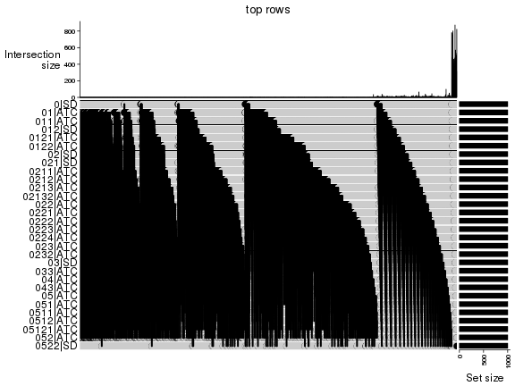


### UMAP plot

UMAP plot which shows how samples are separated.


<script>
$( function() {
	$( '#tabs-dimension-reduction-by-depth' ).tabs();
} );
</script>
<div id='tabs-dimension-reduction-by-depth'>
<ul>
<li><a href='#tab-dimension-reduction-by-depth-1'>n_signatures ≥ 1269</a></li>
<li><a href='#tab-dimension-reduction-by-depth-2'>n_signatures ≥ 1469</a></li>
<li><a href='#tab-dimension-reduction-by-depth-3'>n_signatures ≥ 1526</a></li>
<li><a href='#tab-dimension-reduction-by-depth-4'>n_signatures ≥ 1540</a></li>
<li><a href='#tab-dimension-reduction-by-depth-5'>n_signatures ≥ 1619</a></li>
<li><a href='#tab-dimension-reduction-by-depth-6'>n_signatures ≥ 1622</a></li>
<li><a href='#tab-dimension-reduction-by-depth-7'>n_signatures ≥ 2262</a></li>
<li><a href='#tab-dimension-reduction-by-depth-8'>n_signatures ≥ 2279</a></li>
<li><a href='#tab-dimension-reduction-by-depth-9'>n_signatures ≥ 2489</a></li>
<li><a href='#tab-dimension-reduction-by-depth-10'>n_signatures ≥ 2775</a></li>
<li><a href='#tab-dimension-reduction-by-depth-11'>n_signatures ≥ 2836</a></li>
<li><a href='#tab-dimension-reduction-by-depth-12'>n_signatures ≥ 3188</a></li>
<li><a href='#tab-dimension-reduction-by-depth-13'>n_signatures ≥ 3867</a></li>
<li><a href='#tab-dimension-reduction-by-depth-14'>n_signatures ≥ 4027</a></li>
<li><a href='#tab-dimension-reduction-by-depth-15'>n_signatures ≥ 4522</a></li>
<li><a href='#tab-dimension-reduction-by-depth-16'>n_signatures ≥ 4660</a></li>
<li><a href='#tab-dimension-reduction-by-depth-17'>n_signatures ≥ 4864</a></li>
<li><a href='#tab-dimension-reduction-by-depth-18'>n_signatures ≥ 5547</a></li>
<li><a href='#tab-dimension-reduction-by-depth-19'>n_signatures ≥ 5764</a></li>
<li><a href='#tab-dimension-reduction-by-depth-20'>n_signatures ≥ 6152</a></li>
<li><a href='#tab-dimension-reduction-by-depth-21'>n_signatures ≥ 7175</a></li>
<li><a href='#tab-dimension-reduction-by-depth-22'>n_signatures ≥ 7761</a></li>
<li><a href='#tab-dimension-reduction-by-depth-23'>n_signatures ≥ 8181</a></li>
<li><a href='#tab-dimension-reduction-by-depth-24'>n_signatures ≥ 8755</a></li>
<li><a href='#tab-dimension-reduction-by-depth-25'>n_signatures ≥ 9384</a></li>
<li><a href='#tab-dimension-reduction-by-depth-26'>n_signatures ≥ 10841</a></li>
<li><a href='#tab-dimension-reduction-by-depth-27'>n_signatures ≥ 20003</a></li>
<li><a href='#tab-dimension-reduction-by-depth-28'>n_signatures ≥ 24546</a></li>
<li><a href='#tab-dimension-reduction-by-depth-29'>n_signatures ≥ 30719</a></li>
<li><a href='#tab-dimension-reduction-by-depth-30'>n_signatures ≥ 63548</a></li>
</ul>
<div id='tab-dimension-reduction-by-depth-1'>
<pre><code class="r">par(mfrow = c(1, 2))
dimension_reduction(res_rh, merge_node = merge_node_param(min_n_signatures = 1269),
    method = &quot;UMAP&quot;, top_value_method = &quot;SD&quot;, top_n = 40000, scale_rows = FALSE)
dimension_reduction(res_rh, merge_node = merge_node_param(min_n_signatures = 1269),
    method = &quot;UMAP&quot;, top_value_method = &quot;ATC&quot;, top_n = 40000, scale_rows = TRUE)
</code></pre>

<p>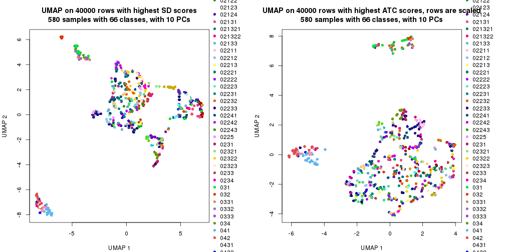</p>

</div>
<div id='tab-dimension-reduction-by-depth-2'>
<pre><code class="r">par(mfrow = c(1, 2))
dimension_reduction(res_rh, merge_node = merge_node_param(min_n_signatures = 1469),
    method = &quot;UMAP&quot;, top_value_method = &quot;SD&quot;, top_n = 40000, scale_rows = FALSE)
dimension_reduction(res_rh, merge_node = merge_node_param(min_n_signatures = 1469),
    method = &quot;UMAP&quot;, top_value_method = &quot;ATC&quot;, top_n = 40000, scale_rows = TRUE)
</code></pre>

<p>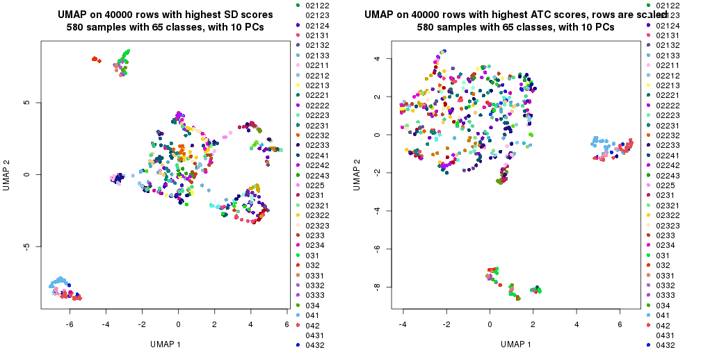</p>

</div>
<div id='tab-dimension-reduction-by-depth-3'>
<pre><code class="r">par(mfrow = c(1, 2))
dimension_reduction(res_rh, merge_node = merge_node_param(min_n_signatures = 1526),
    method = &quot;UMAP&quot;, top_value_method = &quot;SD&quot;, top_n = 40000, scale_rows = FALSE)
dimension_reduction(res_rh, merge_node = merge_node_param(min_n_signatures = 1526),
    method = &quot;UMAP&quot;, top_value_method = &quot;ATC&quot;, top_n = 40000, scale_rows = TRUE)
</code></pre>

<p>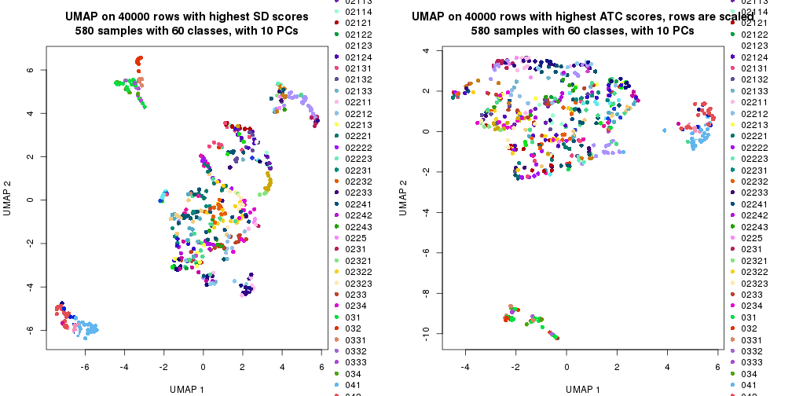</p>

</div>
<div id='tab-dimension-reduction-by-depth-4'>
<pre><code class="r">par(mfrow = c(1, 2))
dimension_reduction(res_rh, merge_node = merge_node_param(min_n_signatures = 1540),
    method = &quot;UMAP&quot;, top_value_method = &quot;SD&quot;, top_n = 40000, scale_rows = FALSE)
dimension_reduction(res_rh, merge_node = merge_node_param(min_n_signatures = 1540),
    method = &quot;UMAP&quot;, top_value_method = &quot;ATC&quot;, top_n = 40000, scale_rows = TRUE)
</code></pre>

<p>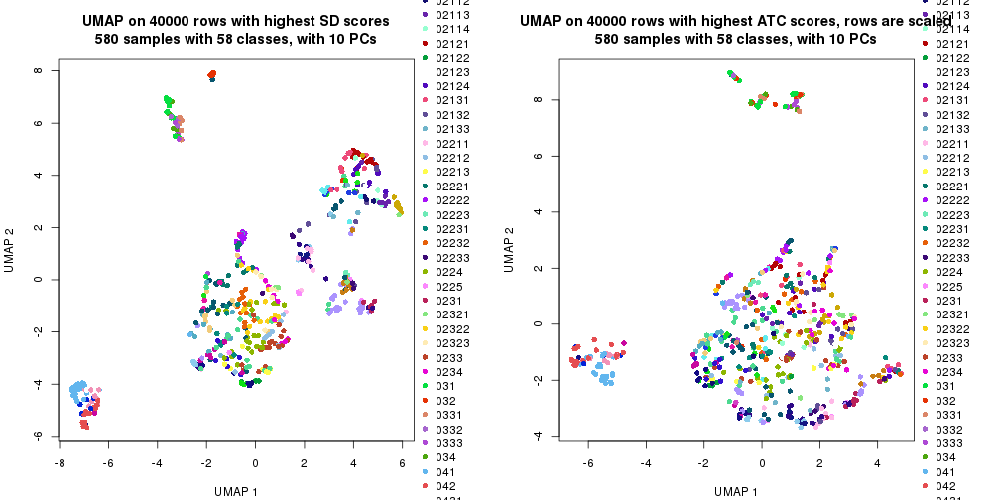</p>

</div>
<div id='tab-dimension-reduction-by-depth-5'>
<pre><code class="r">par(mfrow = c(1, 2))
dimension_reduction(res_rh, merge_node = merge_node_param(min_n_signatures = 1619),
    method = &quot;UMAP&quot;, top_value_method = &quot;SD&quot;, top_n = 40000, scale_rows = FALSE)
dimension_reduction(res_rh, merge_node = merge_node_param(min_n_signatures = 1619),
    method = &quot;UMAP&quot;, top_value_method = &quot;ATC&quot;, top_n = 40000, scale_rows = TRUE)
</code></pre>

<p>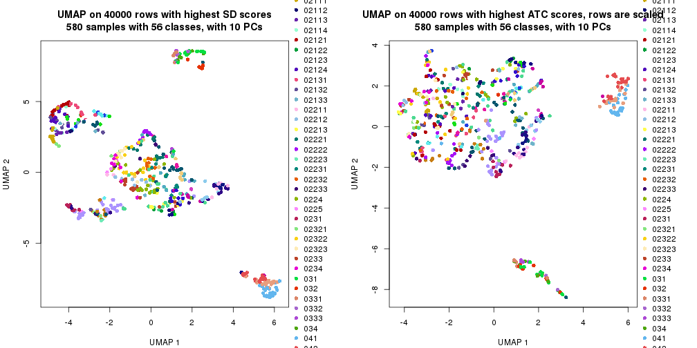</p>

</div>
<div id='tab-dimension-reduction-by-depth-6'>
<pre><code class="r">par(mfrow = c(1, 2))
dimension_reduction(res_rh, merge_node = merge_node_param(min_n_signatures = 1622),
    method = &quot;UMAP&quot;, top_value_method = &quot;SD&quot;, top_n = 40000, scale_rows = FALSE)
dimension_reduction(res_rh, merge_node = merge_node_param(min_n_signatures = 1622),
    method = &quot;UMAP&quot;, top_value_method = &quot;ATC&quot;, top_n = 40000, scale_rows = TRUE)
</code></pre>

<p>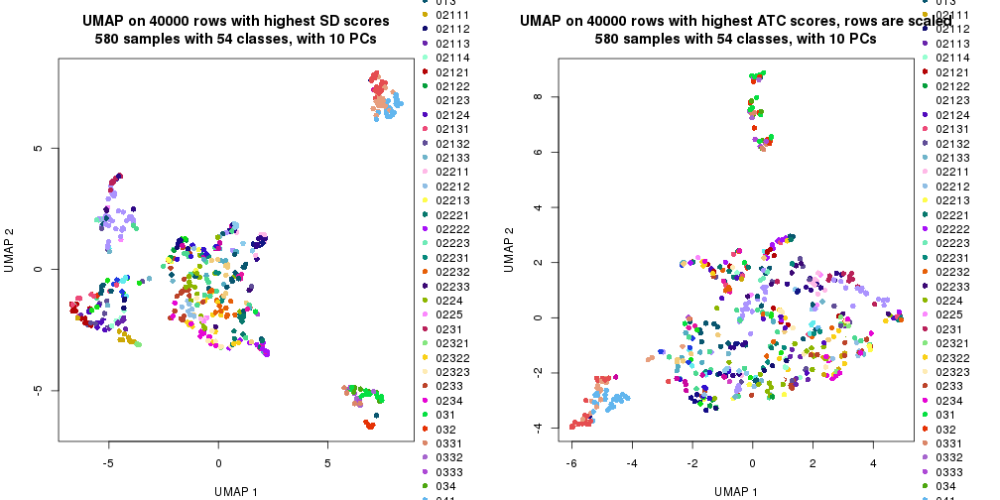</p>

</div>
<div id='tab-dimension-reduction-by-depth-7'>
<pre><code class="r">par(mfrow = c(1, 2))
dimension_reduction(res_rh, merge_node = merge_node_param(min_n_signatures = 2262),
    method = &quot;UMAP&quot;, top_value_method = &quot;SD&quot;, top_n = 40000, scale_rows = FALSE)
dimension_reduction(res_rh, merge_node = merge_node_param(min_n_signatures = 2262),
    method = &quot;UMAP&quot;, top_value_method = &quot;ATC&quot;, top_n = 40000, scale_rows = TRUE)
</code></pre>

<p>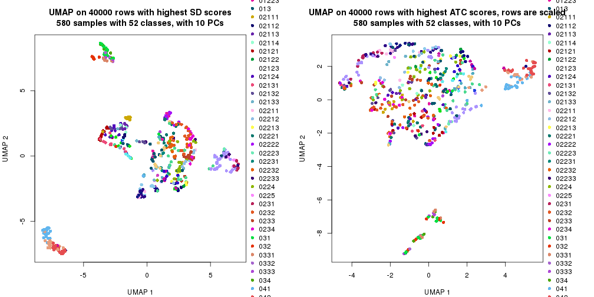</p>

</div>
<div id='tab-dimension-reduction-by-depth-8'>
<pre><code class="r">par(mfrow = c(1, 2))
dimension_reduction(res_rh, merge_node = merge_node_param(min_n_signatures = 2279),
    method = &quot;UMAP&quot;, top_value_method = &quot;SD&quot;, top_n = 40000, scale_rows = FALSE)
dimension_reduction(res_rh, merge_node = merge_node_param(min_n_signatures = 2279),
    method = &quot;UMAP&quot;, top_value_method = &quot;ATC&quot;, top_n = 40000, scale_rows = TRUE)
</code></pre>

<p>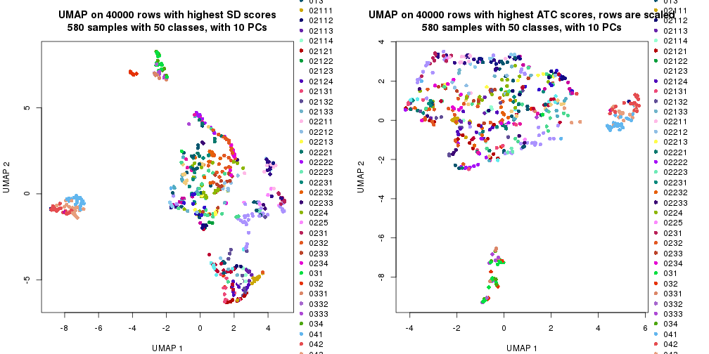</p>

</div>
<div id='tab-dimension-reduction-by-depth-9'>
<pre><code class="r">par(mfrow = c(1, 2))
dimension_reduction(res_rh, merge_node = merge_node_param(min_n_signatures = 2489),
    method = &quot;UMAP&quot;, top_value_method = &quot;SD&quot;, top_n = 40000, scale_rows = FALSE)
dimension_reduction(res_rh, merge_node = merge_node_param(min_n_signatures = 2489),
    method = &quot;UMAP&quot;, top_value_method = &quot;ATC&quot;, top_n = 40000, scale_rows = TRUE)
</code></pre>

<p>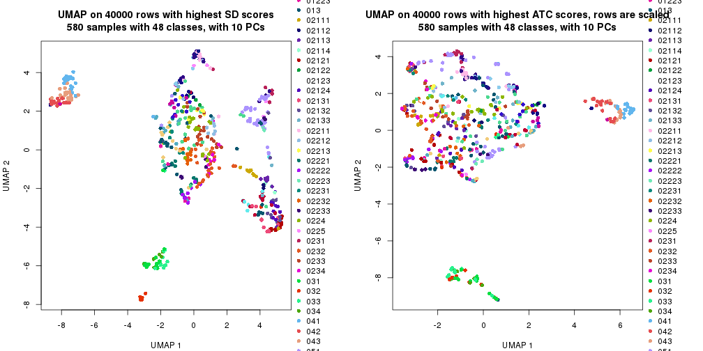</p>

</div>
<div id='tab-dimension-reduction-by-depth-10'>
<pre><code class="r">par(mfrow = c(1, 2))
dimension_reduction(res_rh, merge_node = merge_node_param(min_n_signatures = 2775),
    method = &quot;UMAP&quot;, top_value_method = &quot;SD&quot;, top_n = 40000, scale_rows = FALSE)
dimension_reduction(res_rh, merge_node = merge_node_param(min_n_signatures = 2775),
    method = &quot;UMAP&quot;, top_value_method = &quot;ATC&quot;, top_n = 40000, scale_rows = TRUE)
</code></pre>

<p>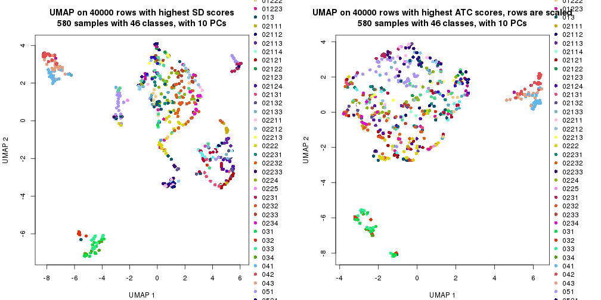</p>

</div>
<div id='tab-dimension-reduction-by-depth-11'>
<pre><code class="r">par(mfrow = c(1, 2))
dimension_reduction(res_rh, merge_node = merge_node_param(min_n_signatures = 2836),
    method = &quot;UMAP&quot;, top_value_method = &quot;SD&quot;, top_n = 40000, scale_rows = FALSE)
dimension_reduction(res_rh, merge_node = merge_node_param(min_n_signatures = 2836),
    method = &quot;UMAP&quot;, top_value_method = &quot;ATC&quot;, top_n = 40000, scale_rows = TRUE)
</code></pre>

<p>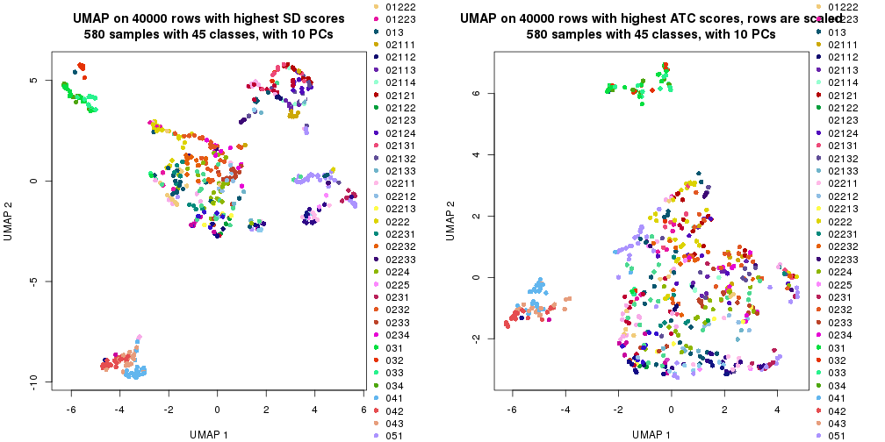</p>

</div>
<div id='tab-dimension-reduction-by-depth-12'>
<pre><code class="r">par(mfrow = c(1, 2))
dimension_reduction(res_rh, merge_node = merge_node_param(min_n_signatures = 3188),
    method = &quot;UMAP&quot;, top_value_method = &quot;SD&quot;, top_n = 40000, scale_rows = FALSE)
dimension_reduction(res_rh, merge_node = merge_node_param(min_n_signatures = 3188),
    method = &quot;UMAP&quot;, top_value_method = &quot;ATC&quot;, top_n = 40000, scale_rows = TRUE)
</code></pre>

<p>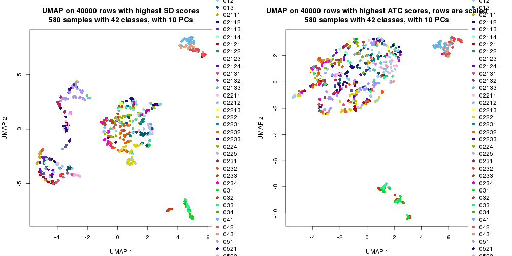</p>

</div>
<div id='tab-dimension-reduction-by-depth-13'>
<pre><code class="r">par(mfrow = c(1, 2))
dimension_reduction(res_rh, merge_node = merge_node_param(min_n_signatures = 3867),
    method = &quot;UMAP&quot;, top_value_method = &quot;SD&quot;, top_n = 40000, scale_rows = FALSE)
dimension_reduction(res_rh, merge_node = merge_node_param(min_n_signatures = 3867),
    method = &quot;UMAP&quot;, top_value_method = &quot;ATC&quot;, top_n = 40000, scale_rows = TRUE)
</code></pre>

<p>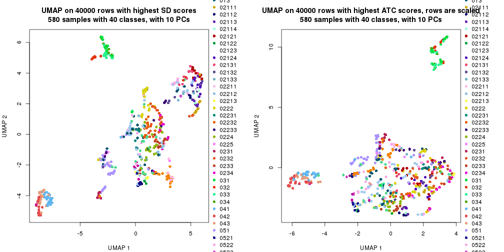</p>

</div>
<div id='tab-dimension-reduction-by-depth-14'>
<pre><code class="r">par(mfrow = c(1, 2))
dimension_reduction(res_rh, merge_node = merge_node_param(min_n_signatures = 4027),
    method = &quot;UMAP&quot;, top_value_method = &quot;SD&quot;, top_n = 40000, scale_rows = FALSE)
dimension_reduction(res_rh, merge_node = merge_node_param(min_n_signatures = 4027),
    method = &quot;UMAP&quot;, top_value_method = &quot;ATC&quot;, top_n = 40000, scale_rows = TRUE)
</code></pre>

<p>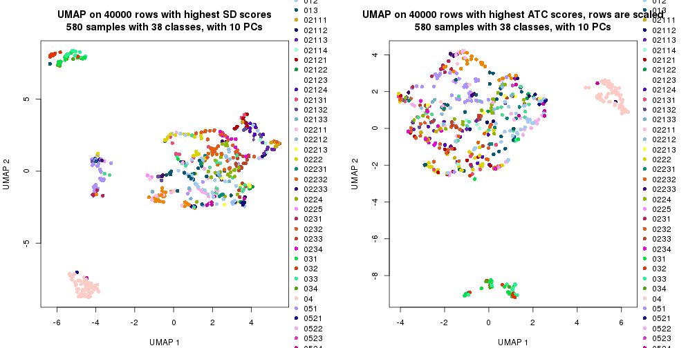</p>

</div>
<div id='tab-dimension-reduction-by-depth-15'>
<pre><code class="r">par(mfrow = c(1, 2))
dimension_reduction(res_rh, merge_node = merge_node_param(min_n_signatures = 4522),
    method = &quot;UMAP&quot;, top_value_method = &quot;SD&quot;, top_n = 40000, scale_rows = FALSE)
dimension_reduction(res_rh, merge_node = merge_node_param(min_n_signatures = 4522),
    method = &quot;UMAP&quot;, top_value_method = &quot;ATC&quot;, top_n = 40000, scale_rows = TRUE)
</code></pre>

<p>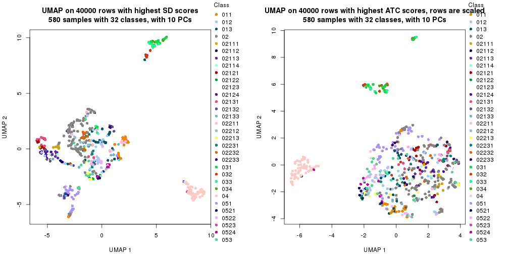</p>

</div>
<div id='tab-dimension-reduction-by-depth-16'>
<pre><code class="r">par(mfrow = c(1, 2))
dimension_reduction(res_rh, merge_node = merge_node_param(min_n_signatures = 4660),
    method = &quot;UMAP&quot;, top_value_method = &quot;SD&quot;, top_n = 40000, scale_rows = FALSE)
dimension_reduction(res_rh, merge_node = merge_node_param(min_n_signatures = 4660),
    method = &quot;UMAP&quot;, top_value_method = &quot;ATC&quot;, top_n = 40000, scale_rows = TRUE)
</code></pre>

<p>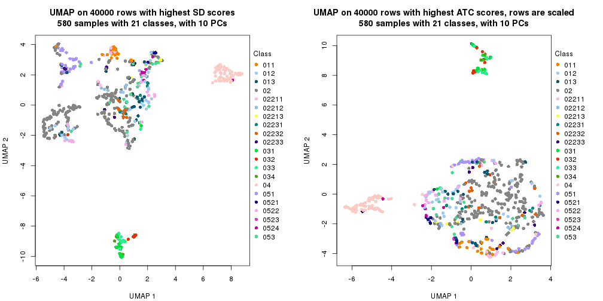</p>

</div>
<div id='tab-dimension-reduction-by-depth-17'>
<pre><code class="r">par(mfrow = c(1, 2))
dimension_reduction(res_rh, merge_node = merge_node_param(min_n_signatures = 4864),
    method = &quot;UMAP&quot;, top_value_method = &quot;SD&quot;, top_n = 40000, scale_rows = FALSE)
dimension_reduction(res_rh, merge_node = merge_node_param(min_n_signatures = 4864),
    method = &quot;UMAP&quot;, top_value_method = &quot;ATC&quot;, top_n = 40000, scale_rows = TRUE)
</code></pre>

<p>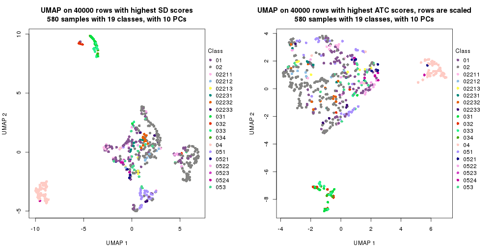</p>

</div>
<div id='tab-dimension-reduction-by-depth-18'>
<pre><code class="r">par(mfrow = c(1, 2))
dimension_reduction(res_rh, merge_node = merge_node_param(min_n_signatures = 5547),
    method = &quot;UMAP&quot;, top_value_method = &quot;SD&quot;, top_n = 40000, scale_rows = FALSE)
dimension_reduction(res_rh, merge_node = merge_node_param(min_n_signatures = 5547),
    method = &quot;UMAP&quot;, top_value_method = &quot;ATC&quot;, top_n = 40000, scale_rows = TRUE)
</code></pre>

<p>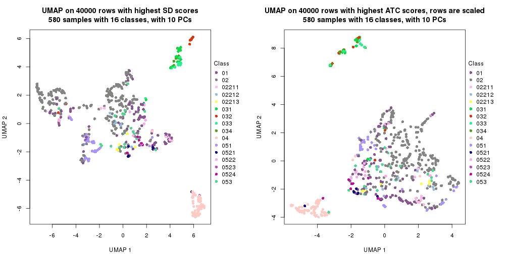</p>

</div>
<div id='tab-dimension-reduction-by-depth-19'>
<pre><code class="r">par(mfrow = c(1, 2))
dimension_reduction(res_rh, merge_node = merge_node_param(min_n_signatures = 5764),
    method = &quot;UMAP&quot;, top_value_method = &quot;SD&quot;, top_n = 40000, scale_rows = FALSE)
dimension_reduction(res_rh, merge_node = merge_node_param(min_n_signatures = 5764),
    method = &quot;UMAP&quot;, top_value_method = &quot;ATC&quot;, top_n = 40000, scale_rows = TRUE)
</code></pre>

<p>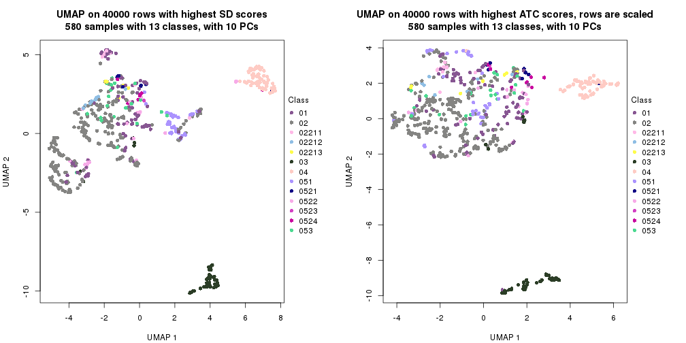</p>

</div>
<div id='tab-dimension-reduction-by-depth-20'>
<pre><code class="r">par(mfrow = c(1, 2))
dimension_reduction(res_rh, merge_node = merge_node_param(min_n_signatures = 6152),
    method = &quot;UMAP&quot;, top_value_method = &quot;SD&quot;, top_n = 40000, scale_rows = FALSE)
dimension_reduction(res_rh, merge_node = merge_node_param(min_n_signatures = 6152),
    method = &quot;UMAP&quot;, top_value_method = &quot;ATC&quot;, top_n = 40000, scale_rows = TRUE)
</code></pre>

<p>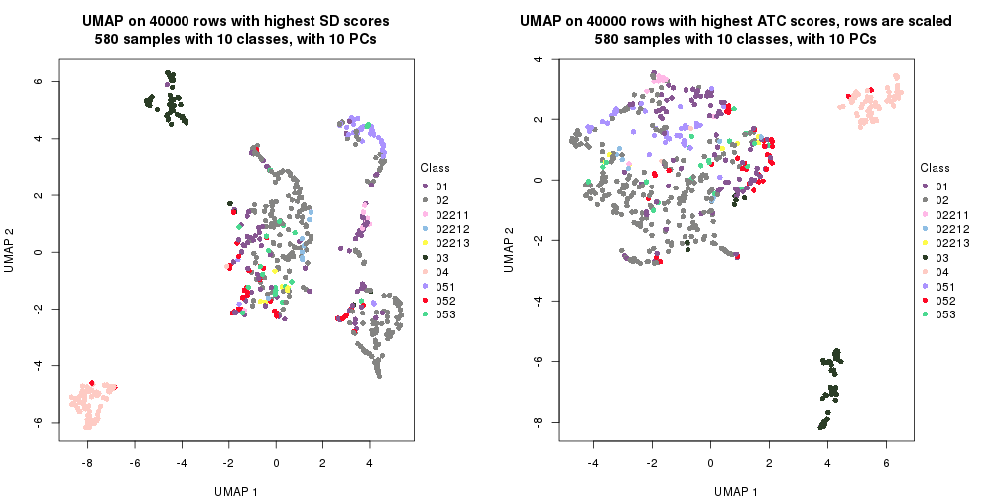</p>

</div>
<div id='tab-dimension-reduction-by-depth-21'>
<pre><code class="r">par(mfrow = c(1, 2))
dimension_reduction(res_rh, merge_node = merge_node_param(min_n_signatures = 7175),
    method = &quot;UMAP&quot;, top_value_method = &quot;SD&quot;, top_n = 40000, scale_rows = FALSE)
dimension_reduction(res_rh, merge_node = merge_node_param(min_n_signatures = 7175),
    method = &quot;UMAP&quot;, top_value_method = &quot;ATC&quot;, top_n = 40000, scale_rows = TRUE)
</code></pre>

<p>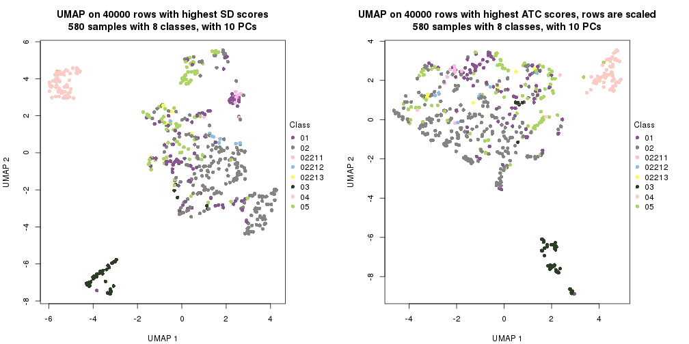</p>

</div>
<div id='tab-dimension-reduction-by-depth-22'>
<pre><code class="r">par(mfrow = c(1, 2))
dimension_reduction(res_rh, merge_node = merge_node_param(min_n_signatures = 7761),
    method = &quot;UMAP&quot;, top_value_method = &quot;SD&quot;, top_n = 40000, scale_rows = FALSE)
dimension_reduction(res_rh, merge_node = merge_node_param(min_n_signatures = 7761),
    method = &quot;UMAP&quot;, top_value_method = &quot;ATC&quot;, top_n = 40000, scale_rows = TRUE)
</code></pre>

<p>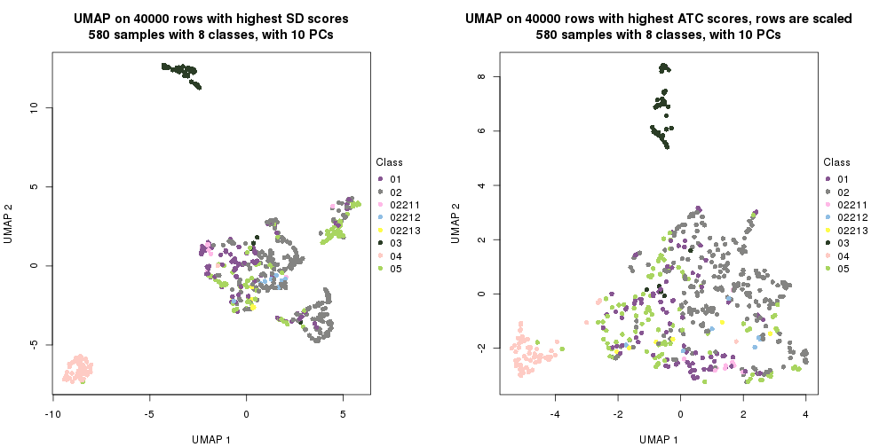</p>

</div>
<div id='tab-dimension-reduction-by-depth-23'>
<pre><code class="r">par(mfrow = c(1, 2))
dimension_reduction(res_rh, merge_node = merge_node_param(min_n_signatures = 8181),
    method = &quot;UMAP&quot;, top_value_method = &quot;SD&quot;, top_n = 40000, scale_rows = FALSE)
dimension_reduction(res_rh, merge_node = merge_node_param(min_n_signatures = 8181),
    method = &quot;UMAP&quot;, top_value_method = &quot;ATC&quot;, top_n = 40000, scale_rows = TRUE)
</code></pre>

<p>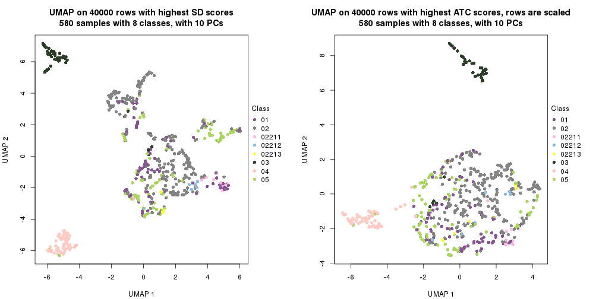</p>

</div>
<div id='tab-dimension-reduction-by-depth-24'>
<pre><code class="r">par(mfrow = c(1, 2))
dimension_reduction(res_rh, merge_node = merge_node_param(min_n_signatures = 8755),
    method = &quot;UMAP&quot;, top_value_method = &quot;SD&quot;, top_n = 40000, scale_rows = FALSE)
dimension_reduction(res_rh, merge_node = merge_node_param(min_n_signatures = 8755),
    method = &quot;UMAP&quot;, top_value_method = &quot;ATC&quot;, top_n = 40000, scale_rows = TRUE)
</code></pre>

<p>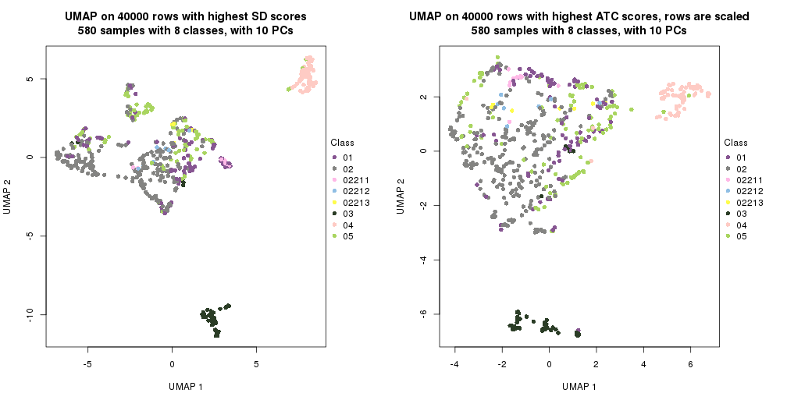</p>

</div>
<div id='tab-dimension-reduction-by-depth-25'>
<pre><code class="r">par(mfrow = c(1, 2))
dimension_reduction(res_rh, merge_node = merge_node_param(min_n_signatures = 9384),
    method = &quot;UMAP&quot;, top_value_method = &quot;SD&quot;, top_n = 40000, scale_rows = FALSE)
dimension_reduction(res_rh, merge_node = merge_node_param(min_n_signatures = 9384),
    method = &quot;UMAP&quot;, top_value_method = &quot;ATC&quot;, top_n = 40000, scale_rows = TRUE)
</code></pre>

<p>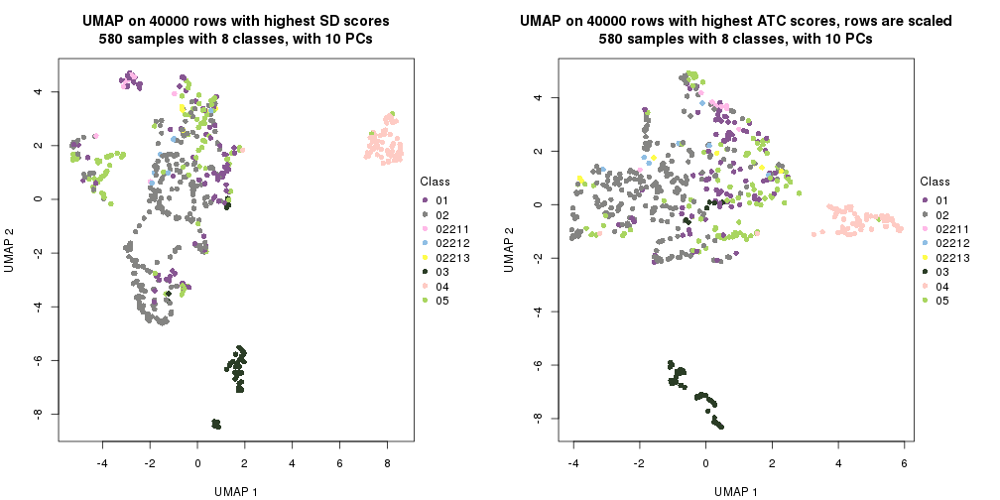</p>

</div>
<div id='tab-dimension-reduction-by-depth-26'>
<pre><code class="r">par(mfrow = c(1, 2))
dimension_reduction(res_rh, merge_node = merge_node_param(min_n_signatures = 10841),
    method = &quot;UMAP&quot;, top_value_method = &quot;SD&quot;, top_n = 40000, scale_rows = FALSE)
dimension_reduction(res_rh, merge_node = merge_node_param(min_n_signatures = 10841),
    method = &quot;UMAP&quot;, top_value_method = &quot;ATC&quot;, top_n = 40000, scale_rows = TRUE)
</code></pre>

<p></p>

</div>
<div id='tab-dimension-reduction-by-depth-27'>
<pre><code class="r">par(mfrow = c(1, 2))
dimension_reduction(res_rh, merge_node = merge_node_param(min_n_signatures = 20003),
    method = &quot;UMAP&quot;, top_value_method = &quot;SD&quot;, top_n = 40000, scale_rows = FALSE)
dimension_reduction(res_rh, merge_node = merge_node_param(min_n_signatures = 20003),
    method = &quot;UMAP&quot;, top_value_method = &quot;ATC&quot;, top_n = 40000, scale_rows = TRUE)
</code></pre>

<p>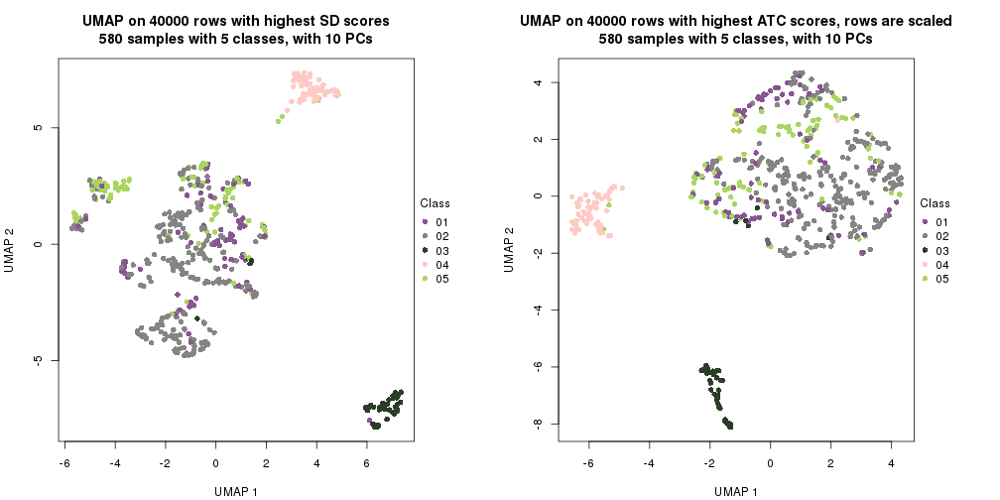</p>

</div>
<div id='tab-dimension-reduction-by-depth-28'>
<pre><code class="r">par(mfrow = c(1, 2))
dimension_reduction(res_rh, merge_node = merge_node_param(min_n_signatures = 24546),
    method = &quot;UMAP&quot;, top_value_method = &quot;SD&quot;, top_n = 40000, scale_rows = FALSE)
dimension_reduction(res_rh, merge_node = merge_node_param(min_n_signatures = 24546),
    method = &quot;UMAP&quot;, top_value_method = &quot;ATC&quot;, top_n = 40000, scale_rows = TRUE)
</code></pre>

<p>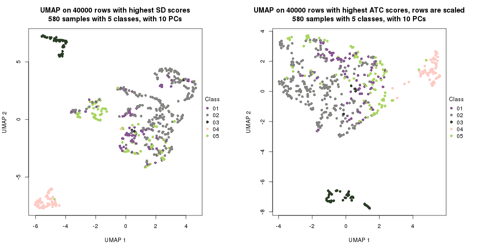</p>

</div>
<div id='tab-dimension-reduction-by-depth-29'>
<pre><code class="r">par(mfrow = c(1, 2))
dimension_reduction(res_rh, merge_node = merge_node_param(min_n_signatures = 30719),
    method = &quot;UMAP&quot;, top_value_method = &quot;SD&quot;, top_n = 40000, scale_rows = FALSE)
dimension_reduction(res_rh, merge_node = merge_node_param(min_n_signatures = 30719),
    method = &quot;UMAP&quot;, top_value_method = &quot;ATC&quot;, top_n = 40000, scale_rows = TRUE)
</code></pre>

<p></p>

</div>
<div id='tab-dimension-reduction-by-depth-30'>
<pre><code class="r">par(mfrow = c(1, 2))
dimension_reduction(res_rh, merge_node = merge_node_param(min_n_signatures = 63548),
    method = &quot;UMAP&quot;, top_value_method = &quot;SD&quot;, top_n = 40000, scale_rows = FALSE)
dimension_reduction(res_rh, merge_node = merge_node_param(min_n_signatures = 63548),
    method = &quot;UMAP&quot;, top_value_method = &quot;ATC&quot;, top_n = 40000, scale_rows = TRUE)
</code></pre>

<p>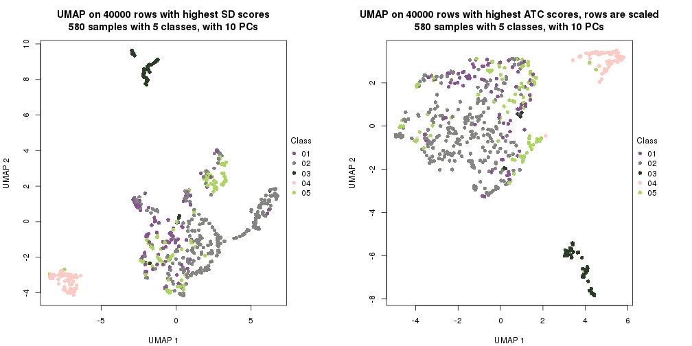</p>

</div>
</div>


### Signature heatmap

Signatures on the heatmap are the union of all signatures found on every node
on the hierarchy. The number of k-means on rows are automatically selected by the function.


<script>
$( function() {
	$( '#tabs-get-signatures-from-hierarchical-partition' ).tabs();
} );
</script>
<div id='tabs-get-signatures-from-hierarchical-partition'>
<ul>
<li><a href='#tab-get-signatures-from-hierarchical-partition-1'>n_signatures ≥ 1269</a></li>
<li><a href='#tab-get-signatures-from-hierarchical-partition-2'>n_signatures ≥ 1469</a></li>
<li><a href='#tab-get-signatures-from-hierarchical-partition-3'>n_signatures ≥ 1526</a></li>
<li><a href='#tab-get-signatures-from-hierarchical-partition-4'>n_signatures ≥ 1540</a></li>
<li><a href='#tab-get-signatures-from-hierarchical-partition-5'>n_signatures ≥ 1619</a></li>
<li><a href='#tab-get-signatures-from-hierarchical-partition-6'>n_signatures ≥ 1622</a></li>
<li><a href='#tab-get-signatures-from-hierarchical-partition-7'>n_signatures ≥ 2262</a></li>
<li><a href='#tab-get-signatures-from-hierarchical-partition-8'>n_signatures ≥ 2279</a></li>
<li><a href='#tab-get-signatures-from-hierarchical-partition-9'>n_signatures ≥ 2489</a></li>
<li><a href='#tab-get-signatures-from-hierarchical-partition-10'>n_signatures ≥ 2775</a></li>
<li><a href='#tab-get-signatures-from-hierarchical-partition-11'>n_signatures ≥ 2836</a></li>
<li><a href='#tab-get-signatures-from-hierarchical-partition-12'>n_signatures ≥ 3188</a></li>
<li><a href='#tab-get-signatures-from-hierarchical-partition-13'>n_signatures ≥ 3867</a></li>
<li><a href='#tab-get-signatures-from-hierarchical-partition-14'>n_signatures ≥ 4027</a></li>
<li><a href='#tab-get-signatures-from-hierarchical-partition-15'>n_signatures ≥ 4522</a></li>
<li><a href='#tab-get-signatures-from-hierarchical-partition-16'>n_signatures ≥ 4660</a></li>
<li><a href='#tab-get-signatures-from-hierarchical-partition-17'>n_signatures ≥ 4864</a></li>
<li><a href='#tab-get-signatures-from-hierarchical-partition-18'>n_signatures ≥ 5547</a></li>
<li><a href='#tab-get-signatures-from-hierarchical-partition-19'>n_signatures ≥ 5764</a></li>
<li><a href='#tab-get-signatures-from-hierarchical-partition-20'>n_signatures ≥ 6152</a></li>
<li><a href='#tab-get-signatures-from-hierarchical-partition-21'>n_signatures ≥ 7175</a></li>
<li><a href='#tab-get-signatures-from-hierarchical-partition-22'>n_signatures ≥ 7761</a></li>
<li><a href='#tab-get-signatures-from-hierarchical-partition-23'>n_signatures ≥ 8181</a></li>
<li><a href='#tab-get-signatures-from-hierarchical-partition-24'>n_signatures ≥ 8755</a></li>
<li><a href='#tab-get-signatures-from-hierarchical-partition-25'>n_signatures ≥ 9384</a></li>
<li><a href='#tab-get-signatures-from-hierarchical-partition-26'>n_signatures ≥ 10841</a></li>
<li><a href='#tab-get-signatures-from-hierarchical-partition-27'>n_signatures ≥ 20003</a></li>
<li><a href='#tab-get-signatures-from-hierarchical-partition-28'>n_signatures ≥ 24546</a></li>
<li><a href='#tab-get-signatures-from-hierarchical-partition-29'>n_signatures ≥ 30719</a></li>
<li><a href='#tab-get-signatures-from-hierarchical-partition-30'>n_signatures ≥ 63548</a></li>
</ul>
<div id='tab-get-signatures-from-hierarchical-partition-1'>
<pre><code class="r">get_signatures(res_rh, merge_node = merge_node_param(min_n_signatures = 1269))
</code></pre>

<p>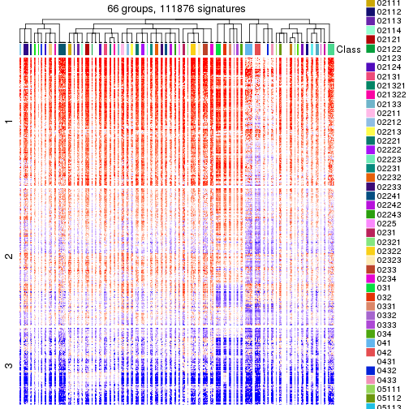</p>

</div>
<div id='tab-get-signatures-from-hierarchical-partition-2'>
<pre><code class="r">get_signatures(res_rh, merge_node = merge_node_param(min_n_signatures = 1469))
</code></pre>

<p>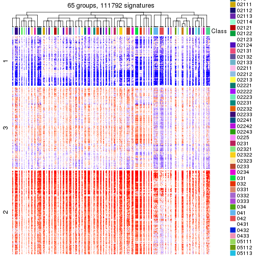</p>

</div>
<div id='tab-get-signatures-from-hierarchical-partition-3'>
<pre><code class="r">get_signatures(res_rh, merge_node = merge_node_param(min_n_signatures = 1526))
</code></pre>

<pre><code>#&gt; Error in lt[[hierarchy[i, 1]]]$AddChildNode({: attempt to apply non-function
</code></pre>

</div>
<div id='tab-get-signatures-from-hierarchical-partition-4'>
<pre><code class="r">get_signatures(res_rh, merge_node = merge_node_param(min_n_signatures = 1540))
</code></pre>

<pre><code>#&gt; Error in lt[[hierarchy[i, 1]]]$AddChildNode({: attempt to apply non-function
</code></pre>

</div>
<div id='tab-get-signatures-from-hierarchical-partition-5'>
<pre><code class="r">get_signatures(res_rh, merge_node = merge_node_param(min_n_signatures = 1619))
</code></pre>

<pre><code>#&gt; Error in lt[[hierarchy[i, 1]]]$AddChildNode({: attempt to apply non-function
</code></pre>

</div>
<div id='tab-get-signatures-from-hierarchical-partition-6'>
<pre><code class="r">get_signatures(res_rh, merge_node = merge_node_param(min_n_signatures = 1622))
</code></pre>

<p>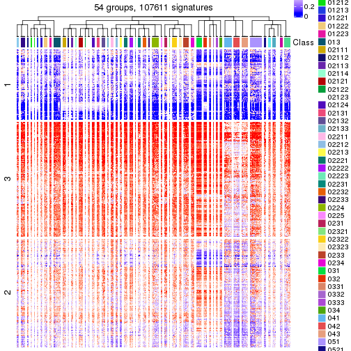</p>

</div>
<div id='tab-get-signatures-from-hierarchical-partition-7'>
<pre><code class="r">get_signatures(res_rh, merge_node = merge_node_param(min_n_signatures = 2262))
</code></pre>

<p>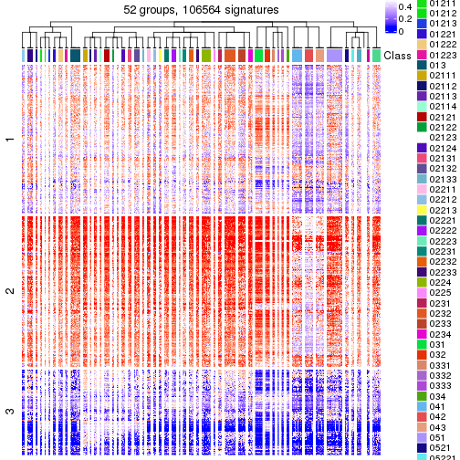</p>

</div>
<div id='tab-get-signatures-from-hierarchical-partition-8'>
<pre><code class="r">get_signatures(res_rh, merge_node = merge_node_param(min_n_signatures = 2279))
</code></pre>

<p>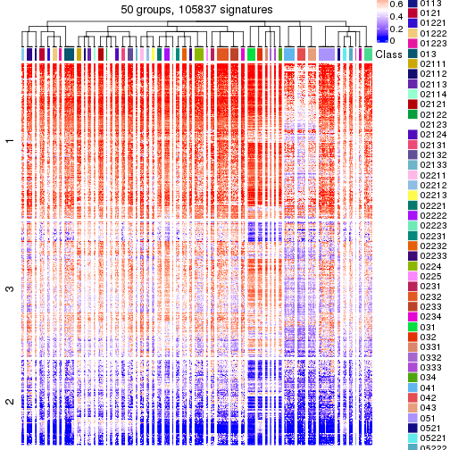</p>

</div>
<div id='tab-get-signatures-from-hierarchical-partition-9'>
<pre><code class="r">get_signatures(res_rh, merge_node = merge_node_param(min_n_signatures = 2489))
</code></pre>

<p>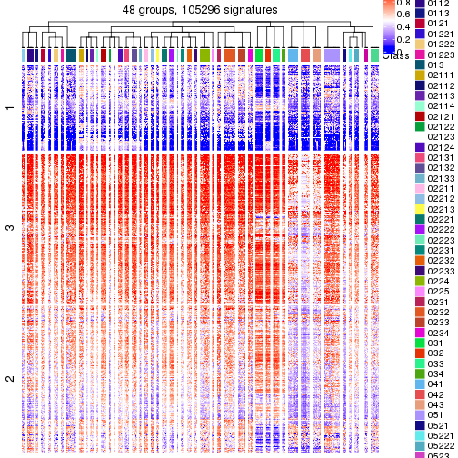</p>

</div>
<div id='tab-get-signatures-from-hierarchical-partition-10'>
<pre><code class="r">get_signatures(res_rh, merge_node = merge_node_param(min_n_signatures = 2775))
</code></pre>

<p>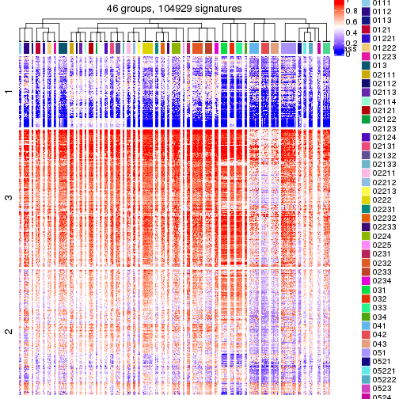</p>

</div>
<div id='tab-get-signatures-from-hierarchical-partition-11'>
<pre><code class="r">get_signatures(res_rh, merge_node = merge_node_param(min_n_signatures = 2836))
</code></pre>

<p>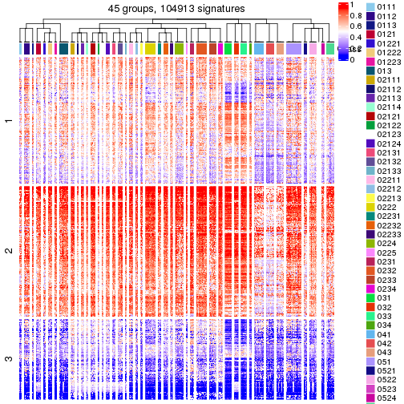</p>

</div>
<div id='tab-get-signatures-from-hierarchical-partition-12'>
<pre><code class="r">get_signatures(res_rh, merge_node = merge_node_param(min_n_signatures = 3188))
</code></pre>

<p>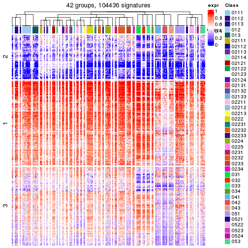</p>

</div>
<div id='tab-get-signatures-from-hierarchical-partition-13'>
<pre><code class="r">get_signatures(res_rh, merge_node = merge_node_param(min_n_signatures = 3867))
</code></pre>

<p>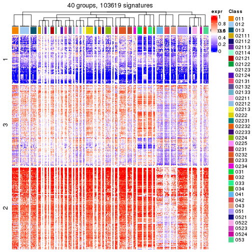</p>

</div>
<div id='tab-get-signatures-from-hierarchical-partition-14'>
<pre><code class="r">get_signatures(res_rh, merge_node = merge_node_param(min_n_signatures = 4027))
</code></pre>

<p>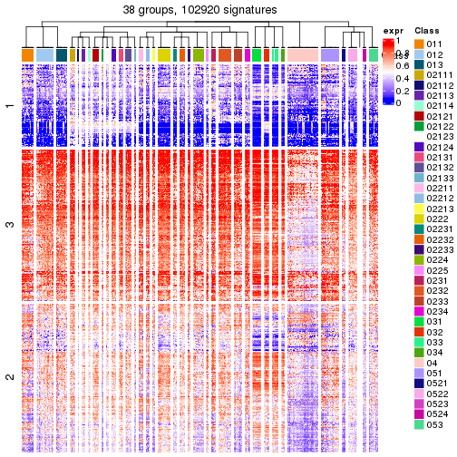</p>

</div>
<div id='tab-get-signatures-from-hierarchical-partition-15'>
<pre><code class="r">get_signatures(res_rh, merge_node = merge_node_param(min_n_signatures = 4522))
</code></pre>

<pre><code>#&gt; Error in lt[[hierarchy[i, 1]]]$AddChildNode({: attempt to apply non-function
</code></pre>

</div>
<div id='tab-get-signatures-from-hierarchical-partition-16'>
<pre><code class="r">get_signatures(res_rh, merge_node = merge_node_param(min_n_signatures = 4660))
</code></pre>

<pre><code>#&gt; Error in lt[[hierarchy[i, 1]]]$AddChildNode({: attempt to apply non-function
</code></pre>

</div>
<div id='tab-get-signatures-from-hierarchical-partition-17'>
<pre><code class="r">get_signatures(res_rh, merge_node = merge_node_param(min_n_signatures = 4864))
</code></pre>

<pre><code>#&gt; Error in lt[[hierarchy[i, 1]]]$AddChildNode({: attempt to apply non-function
</code></pre>

</div>
<div id='tab-get-signatures-from-hierarchical-partition-18'>
<pre><code class="r">get_signatures(res_rh, merge_node = merge_node_param(min_n_signatures = 5547))
</code></pre>

<pre><code>#&gt; Error in lt[[hierarchy[i, 1]]]$AddChildNode({: attempt to apply non-function
</code></pre>

</div>
<div id='tab-get-signatures-from-hierarchical-partition-19'>
<pre><code class="r">get_signatures(res_rh, merge_node = merge_node_param(min_n_signatures = 5764))
</code></pre>

<pre><code>#&gt; Error in lt[[hierarchy[i, 1]]]$AddChildNode({: attempt to apply non-function
</code></pre>

</div>
<div id='tab-get-signatures-from-hierarchical-partition-20'>
<pre><code class="r">get_signatures(res_rh, merge_node = merge_node_param(min_n_signatures = 6152))
</code></pre>

<pre><code>#&gt; Error in lt[[hierarchy[i, 1]]]$AddChildNode({: attempt to apply non-function
</code></pre>

</div>
<div id='tab-get-signatures-from-hierarchical-partition-21'>
<pre><code class="r">get_signatures(res_rh, merge_node = merge_node_param(min_n_signatures = 7175))
</code></pre>

<pre><code>#&gt; Error in lt[[hierarchy[i, 1]]]$AddChildNode({: attempt to apply non-function
</code></pre>

</div>
<div id='tab-get-signatures-from-hierarchical-partition-22'>
<pre><code class="r">get_signatures(res_rh, merge_node = merge_node_param(min_n_signatures = 7761))
</code></pre>

<pre><code>#&gt; Error in lt[[hierarchy[i, 1]]]$AddChildNode({: attempt to apply non-function
</code></pre>

</div>
<div id='tab-get-signatures-from-hierarchical-partition-23'>
<pre><code class="r">get_signatures(res_rh, merge_node = merge_node_param(min_n_signatures = 8181))
</code></pre>

<pre><code>#&gt; Error in lt[[hierarchy[i, 1]]]$AddChildNode({: attempt to apply non-function
</code></pre>

</div>
<div id='tab-get-signatures-from-hierarchical-partition-24'>
<pre><code class="r">get_signatures(res_rh, merge_node = merge_node_param(min_n_signatures = 8755))
</code></pre>

<pre><code>#&gt; Error in lt[[hierarchy[i, 1]]]$AddChildNode({: attempt to apply non-function
</code></pre>

</div>
<div id='tab-get-signatures-from-hierarchical-partition-25'>
<pre><code class="r">get_signatures(res_rh, merge_node = merge_node_param(min_n_signatures = 9384))
</code></pre>

<pre><code>#&gt; Error in lt[[hierarchy[i, 1]]]$AddChildNode({: attempt to apply non-function
</code></pre>

</div>
<div id='tab-get-signatures-from-hierarchical-partition-26'>
<pre><code class="r">get_signatures(res_rh, merge_node = merge_node_param(min_n_signatures = 10841))
</code></pre>

<pre><code>#&gt; Error in lt[[hierarchy[i, 1]]]$AddChildNode({: attempt to apply non-function
</code></pre>

</div>
<div id='tab-get-signatures-from-hierarchical-partition-27'>
<pre><code class="r">get_signatures(res_rh, merge_node = merge_node_param(min_n_signatures = 20003))
</code></pre>

<p></p>

</div>
<div id='tab-get-signatures-from-hierarchical-partition-28'>
<pre><code class="r">get_signatures(res_rh, merge_node = merge_node_param(min_n_signatures = 24546))
</code></pre>

<p>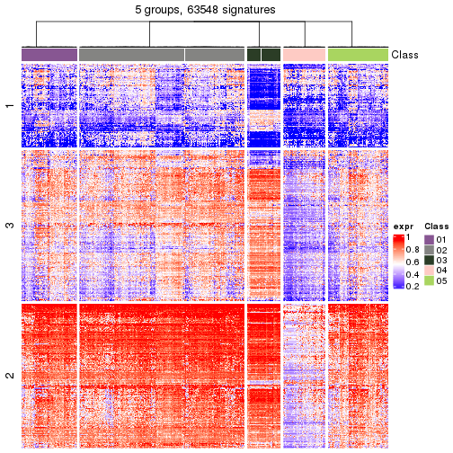</p>

</div>
<div id='tab-get-signatures-from-hierarchical-partition-29'>
<pre><code class="r">get_signatures(res_rh, merge_node = merge_node_param(min_n_signatures = 30719))
</code></pre>

<p></p>

</div>
<div id='tab-get-signatures-from-hierarchical-partition-30'>
<pre><code class="r">get_signatures(res_rh, merge_node = merge_node_param(min_n_signatures = 63548))
</code></pre>

<p></p>

</div>
</div>


Compare signatures from different nodes:


```r
compare_signatures(res_rh, verbose = FALSE)
```

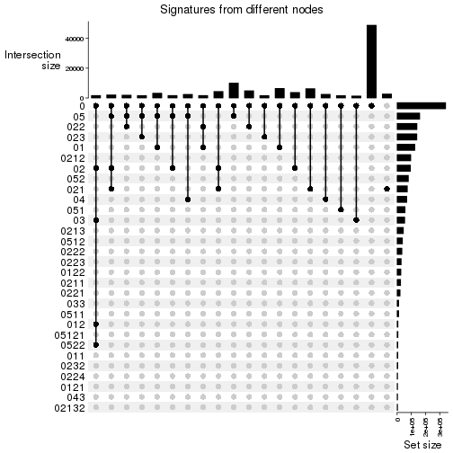

If there are too many signatures, `top_signatures = ...` can be set to only show the 
signatures with the highest FDRs. Note it only works on every node and the final signatures
are the union of all signatures of all nodes.


```r
# code only for demonstration
# e.g. to show the top 500 most significant rows on each node.
tb = get_signature(res_rh, top_signatures = 500)
```


## Results for each node


---------------------------------------------------


### Node0


Child nodes: 
                [Node01](#Node01)
        ,
                [Node02](#Node02)
        ,
                [Node03](#Node03)
        ,
                [Node04](#Node04)
        ,
                [Node05](#Node05)
        .


The object with results only for a single top-value method and a single partitioning method 
can be extracted as:

```r
res = res_rh["0"]
```

A summary of `res` and all the functions that can be applied to it:

```r
res
```

```
#> A 'DownSamplingConsensusPartition' object with k = 2, 3, 4, 5, 6, 7, 8.
#>   On a matrix with 376162 rows and 500 columns, randomly sampled from 580 columns.
#>   Top rows (1000) are extracted by 'SD' method.
#>   Subgroups are detected by 'skmeans' method.
#>   Performed in total 350 partitions by row resampling.
#>   Best k for subgroups seems to be 5.
#> 
#> Following methods can be applied to this 'DownSamplingConsensusPartition' object:
#>  [1] "cola_report"             "collect_classes"         "collect_plots"          
#>  [4] "collect_stats"           "colnames"                "compare_partitions"     
#>  [7] "compare_signatures"      "consensus_heatmap"       "dimension_reduction"    
#> [10] "functional_enrichment"   "get_anno_col"            "get_anno"               
#> [13] "get_classes"             "get_consensus"           "get_matrix"             
#> [16] "get_membership"          "get_param"               "get_signatures"         
#> [19] "get_stats"               "is_best_k"               "is_stable_k"            
#> [22] "membership_heatmap"      "ncol"                    "nrow"                   
#> [25] "plot_ecdf"               "predict_classes"         "rownames"               
#> [28] "select_partition_number" "show"                    "suggest_best_k"         
#> [31] "test_to_known_factors"   "top_rows_heatmap"
```

`collect_plots()` function collects all the plots made from `res` for all `k` (number of subgroups)
into one single page to provide an easy and fast comparison between different `k`.

```r
collect_plots(res)
```

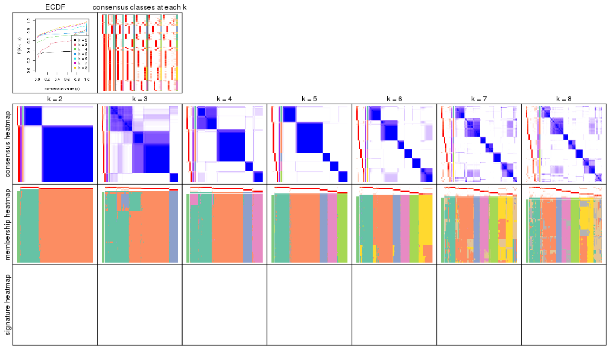

The plots are:

- The first row: a plot of the eCDF (empirical cumulative distribution
  function) curves of the consensus matrix for each `k` and the heatmap of
  predicted classes for each `k`.
- The second row: heatmaps of the consensus matrix for each `k`.
- The third row: heatmaps of the membership matrix for each `k`.
- The fouth row: heatmaps of the signatures for each `k`.

All the plots in panels can be made by individual functions and they are
plotted later in this section.

`select_partition_number()` produces several plots showing different
statistics for choosing "optimized" `k`. There are following statistics:

- eCDF curves of the consensus matrix for each `k`;
- 1-PAC. [The PAC score](https://en.wikipedia.org/wiki/Consensus_clustering#Over-interpretation_potential_of_consensus_clustering)
  measures the proportion of the ambiguous subgrouping.
- Mean silhouette score.
- Concordance. The mean probability of fiting the consensus subgroup labels in all
  partitions.
- Area increased. Denote $A_k$ as the area under the eCDF curve for current
  `k`, the area increased is defined as $A_k - A_{k-1}$.
- Rand index. The percent of pairs of samples that are both in a same cluster
  or both are not in a same cluster in the partition of k and k-1.
- Jaccard index. The ratio of pairs of samples are both in a same cluster in
  the partition of k and k-1 and the pairs of samples are both in a same
  cluster in the partition k or k-1.

The detailed explanations of these statistics can be found in [the _cola_
vignette](https://jokergoo.github.io/cola_vignettes/cola.html#toc_13).

Generally speaking, higher 1-PAC score, higher mean silhouette score or higher
concordance corresponds to better partition. Rand index and Jaccard index
measure how similar the current partition is compared to partition with `k-1`.
If they are too similar, we won't accept `k` is better than `k-1`.

```r
select_partition_number(res)
```

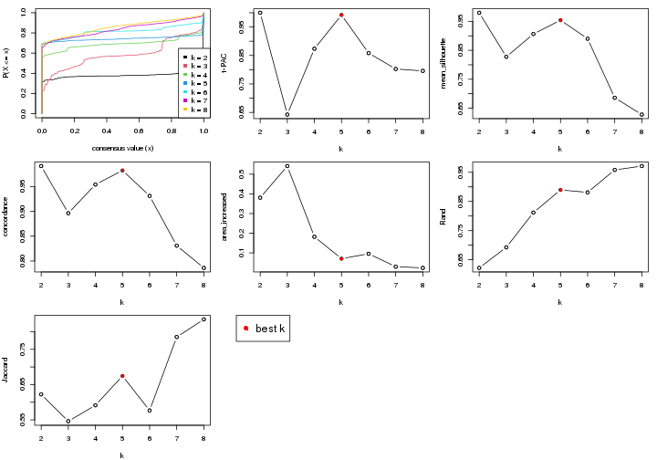

The numeric values for all these statistics can be obtained by `get_stats()`.

```r
get_stats(res)
```

```
#>   k 1-PAC mean_silhouette concordance area_increased  Rand Jaccard
#> 2 2 1.000           0.980       0.991         0.3805 0.622   0.622
#> 3 3 0.642           0.827       0.896         0.5410 0.693   0.546
#> 4 4 0.873           0.906       0.954         0.1818 0.812   0.591
#> 5 5 0.992           0.954       0.983         0.0708 0.889   0.674
#> 6 6 0.858           0.890       0.931         0.0956 0.881   0.577
#> 7 7 0.803           0.686       0.831         0.0301 0.958   0.785
#> 8 8 0.796           0.628       0.786         0.0239 0.971   0.835
```

`suggest_best_k()` suggests the best $k$ based on these statistics. The rules are as follows:

- All $k$ with Jaccard index larger than 0.95 are removed because increasing
  $k$ does not provide enough extra information. If all $k$ are removed, it is
  marked as no subgroup is detected.
- For all $k$ with 1-PAC score larger than 0.9, the maximal $k$ is taken as
  the best $k$, and other $k$ are marked as optional $k$.
- If it does not fit the second rule. The $k$ with the maximal vote of the
  highest 1-PAC score, highest mean silhouette, and highest concordance is
  taken as the best $k$.

```r
suggest_best_k(res)
```

```
#> [1] 5
#> attr(,"optional")
#> [1] 2
```

There is also optional best $k$ = 2 that is worth to check.

Following is the table of the partitions (You need to click the **show/hide
code output** link to see it). The membership matrix (columns with name `p*`)
is inferred by
[`clue::cl_consensus()`](https://www.rdocumentation.org/link/cl_consensus?package=clue)
function with the `SE` method. Basically the value in the membership matrix
represents the probability to belong to a certain group. The finall subgroup
label for an item is determined with the group with highest probability it
belongs to.

In `get_classes()` function, the entropy is calculated from the membership
matrix and the silhouette score is calculated from the consensus matrix.


<script>
$( function() {
	$( '#tabs-node-0-get-classes' ).tabs();
} );
</script>
<div id='tabs-node-0-get-classes'>
<ul>
<li><a href='#tab-node-0-get-classes-1'>k = 2</a></li>
<li><a href='#tab-node-0-get-classes-2'>k = 3</a></li>
<li><a href='#tab-node-0-get-classes-3'>k = 4</a></li>
<li><a href='#tab-node-0-get-classes-4'>k = 5</a></li>
<li><a href='#tab-node-0-get-classes-5'>k = 6</a></li>
<li><a href='#tab-node-0-get-classes-6'>k = 7</a></li>
<li><a href='#tab-node-0-get-classes-7'>k = 8</a></li>
</ul>

<div id='tab-node-0-get-classes-1'>
<p><a id='tab-node-0-get-classes-1-a' style='color:#0366d6' href='#'>show/hide code output</a></p>
<pre><code class="r">get_classes(res, k = 2)
</code></pre>

<pre><code>#&gt;                 class     p
#&gt; TCGA.CN.6022.01     1 0.000
#&gt; TCGA.CQ.5327.01     2 0.000
#&gt; TCGA.CV.5435.11     1 0.000
#&gt; TCGA.HD.7753.01     2 0.000
#&gt; TCGA.CQ.5325.01     2 0.000
#&gt; TCGA.CV.5432.01     1 0.000
#&gt; TCGA.CR.7391.01     1 0.000
#&gt; TCGA.CV.7415.01     2 0.000
#&gt; TCGA.CR.5247.01     2 0.000
#&gt; TCGA.CN.6011.01     2 0.000
#&gt; TCGA.CV.7414.01     2 0.000
#&gt; TCGA.CV.6436.01     2 0.000
#&gt; TCGA.DQ.7592.01     2 0.000
#&gt; TCGA.IQ.7632.01     1 0.000
#&gt; TCGA.CV.7416.01     2 0.000
#&gt; TCGA.CV.5432.11     1 0.000
#&gt; TCGA.H7.7774.01     2 0.000
#&gt; TCGA.CQ.5330.01     2 0.000
#&gt; TCGA.CV.5430.11     1 0.000
#&gt; TCGA.CV.7427.01     2 0.000
#&gt; TCGA.CV.5979.01     2 0.000
#&gt; TCGA.CR.6488.01     2 0.000
#&gt; TCGA.CQ.6221.01     1 0.000
#&gt; TCGA.CV.5434.11     1 0.000
#&gt; TCGA.CV.5970.11     1 0.000
#&gt; TCGA.CV.7425.01     2 0.000
#&gt; TCGA.CV.6441.01     2 0.000
#&gt; TCGA.IQ.7630.01     2 0.000
#&gt; TCGA.CV.5976.11     1 0.000
#&gt; TCGA.CV.7103.11     1 0.000
#&gt; TCGA.CV.5977.01     2 0.000
#&gt; TCGA.CQ.5324.01     2 0.000
#&gt; TCGA.CV.7407.01     1 0.000
#&gt; TCGA.CV.5971.01     1 0.000
#&gt; TCGA.CV.5970.01     2 0.000
#&gt; TCGA.CN.6016.01     2 0.000
#&gt; TCGA.CV.6003.01     2 0.000
#&gt; TCGA.CN.6010.01     2 0.000
#&gt; TCGA.CN.6021.01     1 0.000
#&gt; TCGA.CV.6433.01     2 0.000
#&gt; TCGA.CV.5434.01     2 0.000
#&gt; TCGA.CV.7413.01     1 0.000
#&gt; TCGA.HD.7754.01     2 0.000
#&gt; TCGA.CN.6017.01     1 0.000
#&gt; TCGA.CV.6003.11     1 0.000
#&gt; TCGA.CV.7422.01     2 0.000
#&gt; TCGA.CV.7421.01     2 0.000
#&gt; TCGA.CV.5439.11     1 0.000
#&gt; TCGA.CV.7235.01     1 0.000
#&gt; TCGA.BA.7269.01     1 0.000
#&gt; TCGA.CV.5971.11     1 0.000
#&gt; TCGA.CQ.5332.01     2 0.000
#&gt; TCGA.CV.5439.01     2 0.000
#&gt; TCGA.CN.6020.01     2 0.000
#&gt; TCGA.CV.7423.01     2 0.000
#&gt; TCGA.CV.7263.01     2 0.000
#&gt; TCGA.CV.7406.01     1 0.000
#&gt; TCGA.CN.6023.01     1 0.000
#&gt; TCGA.CV.5966.11     1 0.000
#&gt; TCGA.CV.7101.01     2 0.000
#&gt; TCGA.CV.5977.11     1 0.000
#&gt; TCGA.CR.7365.01     2 0.000
#&gt; TCGA.CN.6012.01     1 0.000
#&gt; TCGA.CV.6441.11     1 0.000
#&gt; TCGA.CN.6024.01     2 0.000
#&gt; TCGA.CV.5978.01     1 0.000
#&gt; TCGA.CX.7086.01     2 0.000
#&gt; TCGA.CV.7424.01     1 0.000
#&gt; TCGA.CV.7089.01     2 0.000
#&gt; TCGA.CQ.7065.01     2 0.000
#&gt; TCGA.IQ.7631.01     1 0.000
#&gt; TCGA.CV.7418.01     2 0.000
#&gt; TCGA.CV.6937.01     1 0.000
#&gt; TCGA.CN.6018.01     2 0.000
#&gt; TCGA.CV.5966.01     2 0.000
#&gt; TCGA.CQ.5329.01     2 0.000
#&gt; TCGA.CV.5976.01     2 0.000
#&gt; TCGA.CV.7411.01     2 0.000
#&gt; TCGA.CQ.5323.01     2 0.000
#&gt; TCGA.CV.5978.11     1 0.000
#&gt; TCGA.CV.5973.11     1 0.000
#&gt; TCGA.BB.4217.01     1 0.000
#&gt; TCGA.CQ.7068.01     2 0.000
#&gt; TCGA.CN.6013.01     2 0.000
#&gt; TCGA.CV.6436.11     1 0.000
#&gt; TCGA.CV.6433.11     1 0.000
#&gt; TCGA.CN.6995.01     2 0.000
#&gt; TCGA.CV.6960.01     2 0.000
#&gt; TCGA.CQ.5334.01     2 0.000
#&gt; TCGA.CV.7410.01     1 0.000
#&gt; TCGA.CN.6019.01     1 0.000
#&gt; TCGA.DQ.7588.01     2 0.000
#&gt; TCGA.CV.5979.11     1 0.000
#&gt; TCGA.CR.6492.01     1 0.000
#&gt; TCGA.CV.5973.01     2 0.000
#&gt; TCGA.DQ.7591.01     2 0.000
#&gt; TCGA.CR.7389.01     2 0.000
#&gt; TCGA.CV.7245.01     2 0.000
#&gt; TCGA.CV.5430.01     1 0.000
#&gt; TCGA.CV.5435.01     2 0.000
#&gt; TCGA.CR.7374.01     1 0.000
#&gt; TCGA.CV.5440.01     2 0.000
#&gt; TCGA.CV.6955.11     2 0.751
#&gt; TCGA.CV.7238.11     1 0.000
#&gt; TCGA.CV.7104.01     2 0.000
#&gt; TCGA.CV.7100.01     2 0.000
#&gt; TCGA.CV.7089.11     1 0.000
#&gt; TCGA.CN.4739.01     2 0.000
#&gt; TCGA.CV.7095.01     2 0.000
#&gt; TCGA.CV.6956.01     2 0.000
#&gt; TCGA.CV.5431.11     1 0.000
#&gt; TCGA.CV.7261.01     2 0.000
#&gt; TCGA.CN.5358.01     1 0.000
#&gt; TCGA.BA.5559.01     2 0.000
#&gt; TCGA.CR.7373.01     2 0.000
#&gt; TCGA.CX.7082.01     2 0.000
#&gt; TCGA.DQ.5629.01     1 0.000
#&gt; TCGA.CV.7255.11     1 0.000
#&gt; TCGA.CR.7379.01     2 0.000
#&gt; TCGA.CV.7178.01     2 0.000
#&gt; TCGA.CR.5249.01     2 0.000
#&gt; TCGA.CV.7091.01     2 0.000
#&gt; TCGA.CV.7236.01     2 0.000
#&gt; TCGA.CN.6998.01     2 0.000
#&gt; TCGA.CR.7399.01     2 0.000
#&gt; TCGA.CR.7372.01     2 0.000
#&gt; TCGA.CV.7252.01     2 0.000
#&gt; TCGA.CV.7242.01     2 0.000
#&gt; TCGA.CV.7103.01     1 0.000
#&gt; TCGA.CR.6478.01     2 0.000
#&gt; TCGA.CR.7371.01     1 0.000
#&gt; TCGA.CR.7380.01     2 0.000
#&gt; TCGA.CV.7183.01     2 0.000
#&gt; TCGA.CV.7250.11     1 0.000
#&gt; TCGA.CV.7102.01     2 0.000
#&gt; TCGA.CV.7254.01     2 1.000
#&gt; TCGA.CR.7394.01     2 0.000
#&gt; TCGA.CV.5443.01     2 0.000
#&gt; TCGA.CV.6955.01     2 0.000
#&gt; TCGA.CV.5441.11     1 0.000
#&gt; TCGA.CV.5442.11     1 0.000
#&gt; TCGA.BA.5556.01     2 0.000
#&gt; TCGA.CR.7386.01     2 0.000
#&gt; TCGA.CV.7255.01     2 0.000
#&gt; TCGA.CR.6474.01     1 0.000
#&gt; TCGA.BA.5557.01     2 0.000
#&gt; TCGA.CR.7388.01     1 0.000
#&gt; TCGA.CV.5436.11     1 0.000
#&gt; TCGA.CR.7398.01     1 0.000
#&gt; TCGA.CV.7247.01     1 0.000
#&gt; TCGA.CN.6997.01     2 0.000
#&gt; TCGA.CN.4742.01     2 0.000
#&gt; TCGA.CN.4738.01     1 0.000
#&gt; TCGA.CR.7392.01     1 0.000
#&gt; TCGA.CV.7245.11     1 0.000
#&gt; TCGA.CR.7377.01     2 0.000
#&gt; TCGA.HD.7229.01     2 0.000
#&gt; TCGA.CV.7235.11     1 0.000
#&gt; TCGA.D6.6515.01     1 0.000
#&gt; TCGA.CV.7238.01     2 0.000
#&gt; TCGA.CR.5248.01     2 0.000
#&gt; TCGA.CV.7097.01     2 0.000
#&gt; TCGA.CR.5250.01     2 0.000
#&gt; TCGA.CV.7248.01     1 0.000
#&gt; TCGA.CV.7253.01     2 0.000
#&gt; TCGA.CN.5370.01     2 0.000
#&gt; TCGA.CR.7367.01     2 0.000
#&gt; TCGA.CR.7401.01     2 0.000
#&gt; TCGA.BA.5149.01     2 0.000
#&gt; TCGA.CV.6942.01     2 0.000
#&gt; TCGA.CV.7263.11     1 0.000
#&gt; TCGA.CV.7177.01     2 0.000
#&gt; TCGA.BA.5555.01     2 0.000
#&gt; TCGA.CV.6956.11     1 0.000
#&gt; TCGA.CV.5431.01     2 0.000
#&gt; TCGA.CR.7393.01     1 0.000
#&gt; TCGA.CV.5444.11     1 0.000
#&gt; TCGA.CV.5444.01     2 0.000
#&gt; TCGA.CR.5243.01     2 0.000
#&gt; TCGA.CR.7395.01     2 0.000
#&gt; TCGA.CV.5441.01     2 0.000
#&gt; TCGA.CV.5442.01     2 0.000
#&gt; TCGA.BA.5558.01     2 0.000
#&gt; TCGA.CX.7085.01     2 0.000
#&gt; TCGA.CV.7250.01     2 0.000
#&gt; TCGA.CR.7390.01     2 0.000
#&gt; TCGA.CV.7178.11     1 0.000
#&gt; TCGA.CV.7099.01     2 0.000
#&gt; TCGA.CV.5443.11     1 0.000
#&gt; TCGA.CR.7385.01     2 0.000
#&gt; TCGA.CR.7364.01     1 0.000
#&gt; TCGA.CV.7090.01     2 1.000
#&gt; TCGA.CR.7397.01     1 0.000
#&gt; TCGA.CR.7402.01     2 1.000
#&gt; TCGA.CV.5440.11     1 0.000
#&gt; TCGA.CV.7180.01     2 0.000
#&gt; TCGA.CX.7219.01     1 0.000
#&gt; TCGA.CV.7101.11     1 0.000
#&gt; TCGA.CV.5436.01     2 0.000
#&gt; TCGA.CV.7243.01     2 0.000
#&gt; TCGA.BA.6871.01     2 0.000
#&gt; TCGA.CQ.6218.01     2 0.000
#&gt; TCGA.C9.A47Z.01     2 0.000
#&gt; TCGA.CV.6961.01     1 0.000
#&gt; TCGA.DQ.5625.01     2 0.000
#&gt; TCGA.CN.6992.01     1 0.000
#&gt; TCGA.CV.6939.01     2 0.000
#&gt; TCGA.CR.6480.01     2 0.000
#&gt; TCGA.D6.6825.01     2 0.000
#&gt; TCGA.C9.A480.01     2 0.000
#&gt; TCGA.CV.6962.01     2 0.498
#&gt; TCGA.CV.6952.01     2 0.000
#&gt; TCGA.CN.A49A.01     1 0.000
#&gt; TCGA.CR.6487.01     2 0.000
#&gt; TCGA.CV.6935.11     1 0.000
#&gt; TCGA.CQ.6222.01     2 0.000
#&gt; TCGA.CV.6959.11     1 0.000
#&gt; TCGA.BB.4227.01     1 0.000
#&gt; TCGA.CN.A49C.01     2 0.000
#&gt; TCGA.CN.6994.01     2 0.000
#&gt; TCGA.CV.6938.11     1 0.000
#&gt; TCGA.CV.6936.01     2 0.000
#&gt; TCGA.CR.6491.01     2 0.000
#&gt; TCGA.CV.6950.01     2 0.000
#&gt; TCGA.CR.6473.01     2 0.000
#&gt; TCGA.CV.6952.11     1 0.000
#&gt; TCGA.CQ.5331.01     2 0.000
#&gt; TCGA.D6.6826.01     2 0.000
#&gt; TCGA.CV.6951.11     1 0.000
#&gt; TCGA.CV.6935.01     2 0.000
#&gt; TCGA.DQ.5631.01     2 0.000
#&gt; TCGA.CV.6953.01     2 0.000
#&gt; TCGA.CV.6945.01     1 0.000
#&gt; TCGA.CV.6939.11     1 0.000
#&gt; TCGA.CV.A45U.01     1 0.000
#&gt; TCGA.CN.A497.01     2 0.000
#&gt; TCGA.D6.6823.01     2 0.000
#&gt; TCGA.DQ.5630.01     2 0.000
#&gt; TCGA.D6.6827.01     1 0.000
#&gt; TCGA.CV.6943.01     2 0.000
#&gt; TCGA.CV.6954.11     1 0.000
#&gt; TCGA.CR.6472.01     2 0.000
#&gt; TCGA.CR.6481.01     2 0.000
#&gt; TCGA.BA.A4IF.01     1 0.000
#&gt; TCGA.BA.6870.01     2 0.498
#&gt; TCGA.CV.6962.11     1 0.000
#&gt; TCGA.CR.6477.01     1 0.000
#&gt; TCGA.CV.A45O.01     2 0.000
#&gt; TCGA.CQ.6219.01     2 0.000
#&gt; TCGA.CN.4733.01     1 0.000
#&gt; TCGA.CR.6484.01     2 0.747
#&gt; TCGA.CN.A498.01     2 0.000
#&gt; TCGA.CR.6470.01     2 0.000
#&gt; TCGA.CV.6934.01     2 0.000
#&gt; TCGA.CN.6989.01     1 0.000
#&gt; TCGA.CV.6953.11     1 0.000
#&gt; TCGA.CV.6933.01     2 0.000
#&gt; TCGA.D6.6517.01     2 0.000
#&gt; TCGA.CQ.6220.01     2 0.000
#&gt; TCGA.BA.A4IH.01     1 0.000
#&gt; TCGA.HD.A4C1.01     2 0.000
#&gt; TCGA.BA.6869.01     2 0.000
#&gt; TCGA.CR.6493.01     2 0.000
#&gt; TCGA.D6.6516.01     2 0.000
#&gt; TCGA.CQ.6227.01     2 0.000
#&gt; TCGA.CV.A45P.01     2 0.000
#&gt; TCGA.CV.A45Q.01     2 0.000
#&gt; TCGA.CV.A45T.01     2 0.000
#&gt; TCGA.CN.6996.01     2 0.000
#&gt; TCGA.CV.6961.11     1 0.000
#&gt; TCGA.CV.6941.01     2 0.000
#&gt; TCGA.BA.6873.01     2 0.000
#&gt; TCGA.CV.6934.11     1 0.000
#&gt; TCGA.CR.6467.01     2 0.000
#&gt; TCGA.CV.6943.11     1 0.000
#&gt; TCGA.CV.6954.01     2 0.000
#&gt; TCGA.BA.6868.01     2 0.000
#&gt; TCGA.CV.6959.01     2 0.000
#&gt; TCGA.CQ.6228.01     2 0.000
#&gt; TCGA.CQ.6229.01     2 0.000
#&gt; TCGA.CQ.6224.01     2 0.000
#&gt; TCGA.CV.6951.01     2 0.000
#&gt; TCGA.CQ.6223.01     2 0.000
#&gt; TCGA.CV.6948.01     1 0.000
#&gt; TCGA.CV.6936.11     1 0.000
#&gt; TCGA.DQ.5624.01     2 0.000
#&gt; TCGA.CV.A45R.01     2 0.000
#&gt; TCGA.CN.A499.01     2 0.000
#&gt; TCGA.CN.A49B.01     2 0.000
#&gt; TCGA.BA.5152.01     2 0.000
#&gt; TCGA.CV.6938.01     2 0.000
#&gt; TCGA.CQ.5326.01     2 1.000
#&gt; TCGA.D6.6824.01     1 0.000
#&gt; TCGA.CV.6940.01     2 0.000
#&gt; TCGA.CQ.6225.01     2 0.000
#&gt; TCGA.CR.6471.01     2 0.000
#&gt; TCGA.CN.6988.01     2 0.000
#&gt; TCGA.BA.6872.01     2 0.000
#&gt; TCGA.CV.6933.11     1 0.000
#&gt; TCGA.CR.6482.01     2 0.000
#&gt; TCGA.P3.A5Q5.01     2 0.000
#&gt; TCGA.CQ.A4C6.01     2 0.000
#&gt; TCGA.QK.A8Z8.01     2 0.000
#&gt; TCGA.CV.A45W.01     1 0.747
#&gt; TCGA.F7.A624.01     2 0.000
#&gt; TCGA.F7.A623.01     1 0.000
#&gt; TCGA.F7.A622.01     2 0.000
#&gt; TCGA.CQ.7064.01     2 0.000
#&gt; TCGA.IQ.A61K.01     2 0.000
#&gt; TCGA.HD.A633.01     2 0.000
#&gt; TCGA.BA.A4IG.01     2 0.000
#&gt; TCGA.F7.A61W.01     1 0.000
#&gt; TCGA.BA.A6DF.01     2 0.000
#&gt; TCGA.D6.A4ZB.01     2 0.000
#&gt; TCGA.KU.A66T.01     2 0.000
#&gt; TCGA.HD.8224.01     2 0.000
#&gt; TCGA.CV.A45Y.01     2 0.000
#&gt; TCGA.BB.A5HU.01     1 1.000
#&gt; TCGA.T3.A92M.01     1 0.000
#&gt; TCGA.CQ.A4C7.01     2 0.000
#&gt; TCGA.P3.A5Q6.01     2 0.000
#&gt; TCGA.CQ.A4CD.01     2 0.000
#&gt; TCGA.BA.A6DB.01     1 0.000
#&gt; TCGA.CV.A468.01     1 0.000
#&gt; TCGA.QK.A8Z7.01     2 0.000
#&gt; TCGA.F7.A620.01     2 0.000
#&gt; TCGA.BA.A8YP.01     2 0.000
#&gt; TCGA.CQ.A4C9.01     2 0.000
#&gt; TCGA.CQ.7072.01     2 0.000
#&gt; TCGA.IQ.A61H.01     1 0.000
#&gt; TCGA.QK.AA3K.01     1 0.000
#&gt; TCGA.CQ.7069.01     1 0.000
#&gt; TCGA.CX.A4AQ.01     2 0.000
#&gt; TCGA.CV.A464.01     1 0.000
#&gt; TCGA.IQ.A61L.01     2 0.000
#&gt; TCGA.QK.A8Z9.01     2 0.000
#&gt; TCGA.HD.A634.01     2 0.000
#&gt; TCGA.4P.AA8J.01     1 0.000
#&gt; TCGA.BB.A5HY.01     2 0.000
#&gt; TCGA.HD.8635.01     2 0.000
#&gt; TCGA.CN.A63T.01     2 0.000
#&gt; TCGA.QK.A652.01     2 0.000
#&gt; TCGA.MT.A67G.01     2 0.000
#&gt; TCGA.QK.A64Z.01     2 0.000
#&gt; TCGA.HD.8634.01     2 0.000
#&gt; TCGA.CQ.7063.01     2 0.000
#&gt; TCGA.CV.A45V.01     2 0.000
#&gt; TCGA.CV.A460.01     2 1.000
#&gt; TCGA.CV.A465.01     2 0.000
#&gt; TCGA.CQ.A4CG.01     2 0.000
#&gt; TCGA.F7.A50J.01     2 0.000
#&gt; TCGA.F7.8298.01     2 0.000
#&gt; TCGA.F7.8489.01     2 0.000
#&gt; TCGA.P3.A5QA.01     2 0.000
#&gt; TCGA.F7.A50G.01     2 0.000
#&gt; TCGA.CQ.A4CA.01     2 0.000
#&gt; TCGA.T3.A92N.01     2 0.000
#&gt; TCGA.F7.A61V.01     2 0.000
#&gt; TCGA.CN.A63Y.01     1 0.000
#&gt; TCGA.CQ.5333.01     2 0.000
#&gt; TCGA.P3.A5QE.01     1 0.000
#&gt; TCGA.MT.A67D.01     2 0.000
#&gt; TCGA.CN.A63V.01     2 0.000
#&gt; TCGA.BA.A6DJ.01     2 0.000
#&gt; TCGA.MT.A51W.01     1 0.000
#&gt; TCGA.P3.A5QF.01     2 0.000
#&gt; TCGA.CQ.A4CE.01     2 0.000
#&gt; TCGA.IQ.A61G.01     2 0.000
#&gt; TCGA.HD.8314.01     2 0.000
#&gt; TCGA.BB.A5HZ.01     2 0.000
#&gt; TCGA.CN.A641.01     2 0.000
#&gt; TCGA.IQ.A61J.01     2 0.000
#&gt; TCGA.BA.A6DG.01     1 0.751
#&gt; TCGA.QK.AA3J.01     2 0.000
#&gt; TCGA.CQ.A4CH.01     1 0.000
#&gt; TCGA.BA.A4II.01     1 0.000
#&gt; TCGA.KU.A66S.01     2 0.000
#&gt; TCGA.CQ.A4CB.01     2 0.000
#&gt; TCGA.D6.8569.01     2 0.000
#&gt; TCGA.IQ.A61I.01     2 0.000
#&gt; TCGA.D6.A4Z9.01     2 0.000
#&gt; TCGA.QK.A8ZA.01     2 0.000
#&gt; TCGA.QK.A8ZB.01     1 0.000
#&gt; TCGA.BA.A6DL.01     2 0.000
#&gt; TCGA.CQ.A4CI.01     2 0.000
#&gt; TCGA.MT.A51X.01     2 0.000
#&gt; TCGA.CV.A461.01     2 0.000
#&gt; TCGA.CQ.7071.01     2 0.000
#&gt; TCGA.H7.8501.01     2 0.000
#&gt; TCGA.BB.8596.01     1 0.000
#&gt; TCGA.F7.A50I.01     2 0.000
#&gt; TCGA.BB.8601.01     2 0.000
#&gt; TCGA.H7.8502.01     2 0.000
#&gt; TCGA.F7.A61S.01     2 0.000
#&gt; TCGA.CV.A463.01     2 0.000
#&gt; TCGA.IQ.A61O.01     1 0.000
#&gt; TCGA.CV.A45Z.01     2 0.000
#&gt; TCGA.CV.A45X.01     2 0.000
#&gt; TCGA.D6.8568.01     2 0.000
#&gt; TCGA.CN.A642.01     2 0.000
#&gt; TCGA.CN.4722.01     2 0.000
#&gt; TCGA.IQ.A6SH.01     2 1.000
#&gt; TCGA.CN.5367.01     2 0.000
#&gt; TCGA.P3.A6T2.01     2 0.000
#&gt; TCGA.P3.A6T8.01     1 0.000
#&gt; TCGA.CN.A6V7.01     2 0.000
#&gt; TCGA.CN.A640.01     2 0.000
#&gt; TCGA.UF.A71E.01     2 0.000
#&gt; TCGA.DQ.7589.01     1 0.000
#&gt; TCGA.P3.A6T6.01     2 0.000
#&gt; TCGA.CN.4725.01     2 0.000
#&gt; TCGA.BA.5153.01     2 0.000
#&gt; TCGA.DQ.7594.01     2 0.000
#&gt; TCGA.HL.7533.01     2 0.000
#&gt; TCGA.T2.A6X0.01     2 0.000
#&gt; TCGA.CN.4730.01     2 0.000
#&gt; TCGA.CN.4723.01     2 0.000
#&gt; TCGA.UF.A7J9.01     1 0.000
#&gt; TCGA.UF.A7JO.01     2 0.000
#&gt; TCGA.DQ.7596.01     2 0.000
#&gt; TCGA.UF.A7JV.01     2 0.000
#&gt; TCGA.CN.4729.01     2 0.000
#&gt; TCGA.IQ.A6SG.01     1 0.000
#&gt; TCGA.BB.7864.01     2 0.000
#&gt; TCGA.MT.A67A.01     2 0.000
#&gt; TCGA.CN.5361.01     2 0.000
#&gt; TCGA.CN.5359.01     1 0.000
#&gt; TCGA.BB.7861.01     1 0.000
#&gt; TCGA.CN.4728.01     1 0.000
#&gt; TCGA.BB.A6UO.01     2 0.000
#&gt; TCGA.BA.4074.01     2 0.000
#&gt; TCGA.CN.4734.01     2 0.000
#&gt; TCGA.QK.A6VB.01     2 0.000
#&gt; TCGA.BA.4075.01     2 0.000
#&gt; TCGA.BB.7871.01     1 0.000
#&gt; TCGA.CN.4726.01     2 0.000
#&gt; TCGA.CN.4735.01     1 0.000
#&gt; TCGA.P3.A6T3.01     2 0.000
#&gt; TCGA.HD.7917.01     2 0.000
#&gt; TCGA.BB.4223.01     2 0.000
#&gt; TCGA.UF.A71B.01     2 0.000
#&gt; TCGA.UF.A7JS.01     2 0.000
#&gt; TCGA.QK.A6VC.01     1 0.000
#&gt; TCGA.CV.7409.01     2 0.000
#&gt; TCGA.CN.4736.01     2 1.000
#&gt; TCGA.BB.7862.01     1 0.000
#&gt; TCGA.BA.A6DI.01     1 0.000
#&gt; TCGA.RS.A6TO.01     2 0.000
#&gt; TCGA.CN.4737.01     2 0.502
#&gt; TCGA.CN.5355.01     2 0.000
#&gt; TCGA.UF.A71D.01     2 0.000
#&gt; TCGA.CQ.7067.01     2 0.000
#&gt; TCGA.BA.4078.01     2 0.000
#&gt; TCGA.CN.5374.01     2 0.000
#&gt; TCGA.DQ.7590.01     2 0.000
#&gt; TCGA.CN.5369.01     1 0.000
#&gt; TCGA.BA.5151.01     2 0.000
#&gt; TCGA.TN.A7HJ.01     2 0.000
#&gt; TCGA.IQ.A61E.01     2 0.000
#&gt; TCGA.BB.7870.01     2 0.000
#&gt; TCGA.CN.4727.01     1 0.000
#&gt; TCGA.DQ.7595.01     1 0.000
#&gt; TCGA.BA.4076.01     1 0.000
#&gt; TCGA.CN.5360.01     1 0.253
#&gt; TCGA.BB.4228.01     2 0.000
#&gt; TCGA.MZ.A7D7.01     1 0.000
#&gt; TCGA.H7.A76A.01     1 0.000
#&gt; TCGA.UF.A7JT.01     2 0.000
#&gt; TCGA.CN.5373.01     2 0.000
#&gt; TCGA.CN.A6V3.01     2 0.000
#&gt; TCGA.BB.7863.01     2 0.000
#&gt; TCGA.DQ.7593.01     2 0.000
#&gt; TCGA.UF.A7JJ.01     1 0.000
#&gt; TCGA.CN.5363.01     2 0.000
#&gt; TCGA.BA.4077.01     2 0.000
#&gt; TCGA.BB.4225.01     2 0.000
#&gt; TCGA.BB.7872.01     2 0.000
#&gt; TCGA.CN.A6UY.01     2 0.000
#&gt; TCGA.MT.A7BN.01     2 0.498
#&gt; TCGA.UF.A7JF.01     2 0.000
#&gt; TCGA.CN.4731.01     2 0.000
#&gt; TCGA.MZ.A5BI.01     2 1.000
#&gt; TCGA.CN.A63W.01     1 0.000
#&gt; TCGA.H7.A6C4.01     2 0.000
#&gt; TCGA.T2.A6X2.01     2 0.000
#&gt; TCGA.CN.5364.01     2 0.000
#&gt; TCGA.CN.A63U.01     2 0.000
#&gt; TCGA.BB.A6UM.01     2 0.000
#&gt; TCGA.H7.A6C5.01     2 0.000
#&gt; TCGA.CN.4741.01     2 0.000
#&gt; TCGA.CV.A6JO.01     2 0.000
#&gt; TCGA.BB.7866.01     2 0.000
#&gt; TCGA.CN.5365.01     2 0.000
#&gt; TCGA.CN.4740.01     2 0.000
#&gt; TCGA.BB.4224.01     2 0.000
#&gt; TCGA.MT.A67F.01     2 0.000
#&gt; TCGA.CN.5366.01     2 0.000
#&gt; TCGA.QK.A6V9.01     2 0.000
#&gt; TCGA.CN.5356.01     2 0.000
#&gt; TCGA.T2.A6WX.01     2 0.000
#&gt; TCGA.CV.A6JZ.01     2 0.000
#&gt; TCGA.CN.A6V1.01     1 0.000
#&gt; TCGA.HD.A6I0.01     2 0.000
#&gt; TCGA.UF.A71A.01     1 0.000
#&gt; TCGA.CV.7430.01     2 1.000
#&gt; TCGA.CR.7383.01     2 0.000
#&gt; TCGA.CN.A6V6.01     2 0.000
#&gt; TCGA.F7.7848.01     2 0.000
#&gt; TCGA.TN.A7HI.01     2 0.000
#&gt; TCGA.UF.A7JC.01     2 0.000
#&gt; TCGA.D6.A6ES.01     2 0.000
#&gt; TCGA.CV.7568.01     1 0.000
#&gt; TCGA.BA.A6D8.01     2 0.000
#&gt; TCGA.P3.A6T4.01     1 0.000
#&gt; TCGA.QK.A6IF.01     2 1.000
#&gt; TCGA.CV.A6JT.01     2 0.000
#&gt; TCGA.CV.7438.01     2 0.000
#&gt; TCGA.RS.A6TP.01     2 0.000
#&gt; TCGA.P3.A6SW.01     2 0.000
#&gt; TCGA.D6.A6EN.01     2 0.000
#&gt; TCGA.D6.A6EM.01     2 0.000
#&gt; TCGA.UF.A7JK.01     2 0.000
#&gt; TCGA.KU.A6H7.06     2 0.000
#&gt; TCGA.CV.7429.01     1 0.000
#&gt; TCGA.UP.A6WW.01     2 0.000
#&gt; TCGA.CV.7437.01     2 0.000
#&gt; TCGA.CV.A6JD.01     2 0.000
#&gt; TCGA.CV.A6JY.01     2 0.000
#&gt; TCGA.CV.A6JN.01     2 0.000
#&gt; TCGA.CV.7446.01     1 0.000
#&gt; TCGA.CV.7432.01     2 0.000
#&gt; TCGA.CV.7434.01     2 0.000
#&gt; TCGA.WA.A7H4.01     1 0.000
#&gt; TCGA.KU.A6H8.01     1 0.000
#&gt; TCGA.CV.7428.01     2 0.000
#&gt; TCGA.D6.A6EK.01     2 0.000
#&gt; TCGA.CV.A6K0.01     1 0.000
#&gt; TCGA.HD.7832.01     2 0.000
#&gt; TCGA.MZ.A6I9.01     2 0.000
#&gt; TCGA.CV.7435.01     2 0.000
#&gt; TCGA.P3.A6SX.01     2 0.000
#&gt; TCGA.QK.A6IG.01     2 0.000
#&gt; TCGA.HD.7831.01     1 0.000
#&gt; TCGA.CV.A6JM.01     2 0.000
#&gt; TCGA.CR.7404.01     2 0.000
#&gt; TCGA.D6.A6EQ.01     2 0.000
#&gt; TCGA.QK.A6IJ.01     2 0.000
#&gt; TCGA.P3.A6T0.01     2 0.000
#&gt; TCGA.CV.A6JE.01     2 0.000
#&gt; TCGA.HD.A6HZ.01     2 0.000
#&gt; TCGA.QK.A6II.01     2 0.000
#&gt; TCGA.P3.A6T7.01     2 0.000
#&gt; TCGA.BA.A6DD.01     2 1.000
#&gt; TCGA.UF.A719.01     2 0.000
#&gt; TCGA.TN.A7HL.01     2 0.000
#&gt; TCGA.UF.A7JA.01     1 0.000
#&gt; TCGA.CR.7368.01     2 0.000
#&gt; TCGA.CR.7382.01     1 0.000
#&gt; TCGA.UF.A7JD.01     2 0.000
#&gt; TCGA.UF.A7JH.01     2 0.000
#&gt; TCGA.BA.A6DA.01     2 0.000
#&gt; TCGA.T2.A6WZ.01     2 0.000
#&gt; TCGA.D6.A6EO.01     2 0.000
#&gt; TCGA.CR.7370.01     1 0.000
#&gt; TCGA.P3.A6T5.01     2 0.000
#&gt; TCGA.D6.A74Q.01     2 0.000
#&gt; TCGA.UF.A718.01     2 0.000
#&gt; TCGA.CR.7369.01     2 0.000
#&gt; TCGA.QK.A6IH.01     2 0.000
#&gt; TCGA.CV.A6K2.01     2 1.000
#&gt; TCGA.CV.A6K1.01     2 0.000
#&gt; TCGA.BA.A6DE.01     2 0.000
#&gt; TCGA.WA.A7GZ.01     1 0.000
#&gt; TCGA.CV.7433.01     1 0.000
#&gt; TCGA.CV.7440.01     2 0.000
#&gt; TCGA.CV.A6JU.01     2 0.000
#&gt; TCGA.CR.7376.01     1 0.000
#&gt; TCGA.UF.A71A.06     1 0.000
#&gt; TCGA.KU.A6H7.01     2 0.000
#&gt; TCGA.D6.A6EP.01     1 0.000
</code></pre>

<script>
$('#tab-node-0-get-classes-1-a').parent().next().next().hide();
$('#tab-node-0-get-classes-1-a').click(function(){
  $('#tab-node-0-get-classes-1-a').parent().next().next().toggle();
  return(false);
});
</script>
</div>

<div id='tab-node-0-get-classes-2'>
<p><a id='tab-node-0-get-classes-2-a' style='color:#0366d6' href='#'>show/hide code output</a></p>
<pre><code class="r">get_classes(res, k = 3)
</code></pre>

<pre><code>#&gt;                 class     p
#&gt; TCGA.CN.6022.01     1 0.000
#&gt; TCGA.CQ.5327.01     2 0.000
#&gt; TCGA.CV.5435.11     3 0.000
#&gt; TCGA.HD.7753.01     2 0.751
#&gt; TCGA.CQ.5325.01     2 0.000
#&gt; TCGA.CV.5432.01     1 0.000
#&gt; TCGA.CR.7391.01     3 0.000
#&gt; TCGA.CV.7415.01     1 0.000
#&gt; TCGA.CR.5247.01     2 0.000
#&gt; TCGA.CN.6011.01     1 1.000
#&gt; TCGA.CV.7414.01     2 1.000
#&gt; TCGA.CV.6436.01     2 0.000
#&gt; TCGA.DQ.7592.01     2 1.000
#&gt; TCGA.IQ.7632.01     2 0.502
#&gt; TCGA.CV.7416.01     2 0.000
#&gt; TCGA.CV.5432.11     3 0.000
#&gt; TCGA.H7.7774.01     2 0.000
#&gt; TCGA.CQ.5330.01     2 0.000
#&gt; TCGA.CV.5430.11     3 0.000
#&gt; TCGA.CV.7427.01     2 0.000
#&gt; TCGA.CV.5979.01     2 0.000
#&gt; TCGA.CR.6488.01     2 0.000
#&gt; TCGA.CQ.6221.01     1 0.000
#&gt; TCGA.CV.5434.11     3 0.000
#&gt; TCGA.CV.5970.11     3 0.000
#&gt; TCGA.CV.7425.01     2 0.000
#&gt; TCGA.CV.6441.01     2 0.000
#&gt; TCGA.IQ.7630.01     2 0.000
#&gt; TCGA.CV.5976.11     3 0.000
#&gt; TCGA.CV.7103.11     3 0.000
#&gt; TCGA.CV.5977.01     2 0.000
#&gt; TCGA.CQ.5324.01     2 0.000
#&gt; TCGA.CV.7407.01     1 0.000
#&gt; TCGA.CV.5971.01     3 0.000
#&gt; TCGA.CV.5970.01     2 0.000
#&gt; TCGA.CN.6016.01     2 0.000
#&gt; TCGA.CV.6003.01     2 0.000
#&gt; TCGA.CN.6010.01     1 0.000
#&gt; TCGA.CN.6021.01     1 0.000
#&gt; TCGA.CV.6433.01     1 0.000
#&gt; TCGA.CV.5434.01     1 1.000
#&gt; TCGA.CV.7413.01     2 0.000
#&gt; TCGA.HD.7754.01     1 0.000
#&gt; TCGA.CN.6017.01     3 0.000
#&gt; TCGA.CV.6003.11     3 0.000
#&gt; TCGA.CV.7422.01     1 0.000
#&gt; TCGA.CV.7421.01     2 0.000
#&gt; TCGA.CV.5439.11     3 0.000
#&gt; TCGA.CV.7235.01     1 0.000
#&gt; TCGA.BA.7269.01     1 0.000
#&gt; TCGA.CV.5971.11     3 0.000
#&gt; TCGA.CQ.5332.01     1 0.000
#&gt; TCGA.CV.5439.01     1 0.000
#&gt; TCGA.CN.6020.01     2 0.000
#&gt; TCGA.CV.7423.01     2 0.000
#&gt; TCGA.CV.7263.01     2 0.000
#&gt; TCGA.CV.7406.01     1 0.000
#&gt; TCGA.CN.6023.01     1 0.000
#&gt; TCGA.CV.5966.11     3 0.000
#&gt; TCGA.CV.7101.01     2 1.000
#&gt; TCGA.CV.5977.11     3 0.000
#&gt; TCGA.CR.7365.01     2 0.000
#&gt; TCGA.CN.6012.01     1 0.000
#&gt; TCGA.CV.6441.11     3 0.000
#&gt; TCGA.CN.6024.01     1 0.502
#&gt; TCGA.CV.5978.01     1 0.000
#&gt; TCGA.CX.7086.01     2 0.000
#&gt; TCGA.CV.7424.01     1 0.000
#&gt; TCGA.CV.7089.01     2 0.000
#&gt; TCGA.CQ.7065.01     2 0.000
#&gt; TCGA.IQ.7631.01     1 0.000
#&gt; TCGA.CV.7418.01     1 0.000
#&gt; TCGA.CV.6937.01     1 0.000
#&gt; TCGA.CN.6018.01     2 0.000
#&gt; TCGA.CV.5966.01     2 0.000
#&gt; TCGA.CQ.5329.01     2 0.000
#&gt; TCGA.CV.5976.01     2 0.000
#&gt; TCGA.CV.7411.01     2 0.000
#&gt; TCGA.CQ.5323.01     1 0.000
#&gt; TCGA.CV.5978.11     3 0.000
#&gt; TCGA.CV.5973.11     3 0.000
#&gt; TCGA.BB.4217.01     1 0.000
#&gt; TCGA.CQ.7068.01     2 0.000
#&gt; TCGA.CN.6013.01     2 0.000
#&gt; TCGA.CV.6436.11     3 0.000
#&gt; TCGA.CV.6433.11     3 0.000
#&gt; TCGA.CN.6995.01     2 0.000
#&gt; TCGA.CV.6960.01     2 0.000
#&gt; TCGA.CQ.5334.01     2 0.000
#&gt; TCGA.CV.7410.01     3 0.000
#&gt; TCGA.CN.6019.01     1 0.498
#&gt; TCGA.DQ.7588.01     1 1.000
#&gt; TCGA.CV.5979.11     3 0.000
#&gt; TCGA.CR.6492.01     3 0.000
#&gt; TCGA.CV.5973.01     2 0.000
#&gt; TCGA.DQ.7591.01     1 0.000
#&gt; TCGA.CR.7389.01     1 0.000
#&gt; TCGA.CV.7245.01     2 0.000
#&gt; TCGA.CV.5430.01     1 0.000
#&gt; TCGA.CV.5435.01     2 0.000
#&gt; TCGA.CR.7374.01     1 0.000
#&gt; TCGA.CV.5440.01     1 0.000
#&gt; TCGA.CV.6955.11     2 0.000
#&gt; TCGA.CV.7238.11     3 0.000
#&gt; TCGA.CV.7104.01     2 0.000
#&gt; TCGA.CV.7100.01     1 0.000
#&gt; TCGA.CV.7089.11     3 0.000
#&gt; TCGA.CN.4739.01     2 0.000
#&gt; TCGA.CV.7095.01     2 0.000
#&gt; TCGA.CV.6956.01     2 0.000
#&gt; TCGA.CV.5431.11     3 0.000
#&gt; TCGA.CV.7261.01     1 0.000
#&gt; TCGA.CN.5358.01     3 0.000
#&gt; TCGA.BA.5559.01     1 0.000
#&gt; TCGA.CR.7373.01     2 0.000
#&gt; TCGA.CX.7082.01     1 1.000
#&gt; TCGA.DQ.5629.01     1 0.000
#&gt; TCGA.CV.7255.11     3 0.000
#&gt; TCGA.CR.7379.01     2 0.000
#&gt; TCGA.CV.7178.01     2 0.000
#&gt; TCGA.CR.5249.01     1 0.000
#&gt; TCGA.CV.7091.01     2 0.000
#&gt; TCGA.CV.7236.01     2 0.000
#&gt; TCGA.CN.6998.01     2 0.000
#&gt; TCGA.CR.7399.01     1 0.000
#&gt; TCGA.CR.7372.01     2 0.000
#&gt; TCGA.CV.7252.01     2 0.000
#&gt; TCGA.CV.7242.01     2 0.000
#&gt; TCGA.CV.7103.01     1 0.000
#&gt; TCGA.CR.6478.01     1 1.000
#&gt; TCGA.CR.7371.01     1 0.000
#&gt; TCGA.CR.7380.01     2 0.000
#&gt; TCGA.CV.7183.01     2 0.000
#&gt; TCGA.CV.7250.11     3 0.000
#&gt; TCGA.CV.7102.01     2 0.000
#&gt; TCGA.CV.7254.01     1 0.000
#&gt; TCGA.CR.7394.01     2 0.000
#&gt; TCGA.CV.5443.01     1 0.000
#&gt; TCGA.CV.6955.01     2 0.000
#&gt; TCGA.CV.5441.11     3 0.000
#&gt; TCGA.CV.5442.11     3 0.000
#&gt; TCGA.BA.5556.01     2 0.000
#&gt; TCGA.CR.7386.01     2 0.000
#&gt; TCGA.CV.7255.01     2 0.000
#&gt; TCGA.CR.6474.01     1 0.000
#&gt; TCGA.BA.5557.01     2 0.000
#&gt; TCGA.CR.7388.01     1 0.000
#&gt; TCGA.CV.5436.11     3 0.000
#&gt; TCGA.CR.7398.01     1 0.000
#&gt; TCGA.CV.7247.01     1 0.000
#&gt; TCGA.CN.6997.01     1 0.000
#&gt; TCGA.CN.4742.01     2 0.000
#&gt; TCGA.CN.4738.01     3 0.000
#&gt; TCGA.CR.7392.01     1 1.000
#&gt; TCGA.CV.7245.11     3 0.000
#&gt; TCGA.CR.7377.01     2 0.000
#&gt; TCGA.HD.7229.01     2 0.000
#&gt; TCGA.CV.7235.11     3 0.000
#&gt; TCGA.D6.6515.01     2 0.000
#&gt; TCGA.CV.7238.01     2 0.000
#&gt; TCGA.CR.5248.01     1 0.000
#&gt; TCGA.CV.7097.01     2 0.000
#&gt; TCGA.CR.5250.01     1 0.000
#&gt; TCGA.CV.7248.01     1 0.000
#&gt; TCGA.CV.7253.01     2 0.000
#&gt; TCGA.CN.5370.01     2 0.000
#&gt; TCGA.CR.7367.01     2 0.000
#&gt; TCGA.CR.7401.01     2 0.000
#&gt; TCGA.BA.5149.01     2 0.000
#&gt; TCGA.CV.6942.01     2 0.000
#&gt; TCGA.CV.7263.11     3 0.000
#&gt; TCGA.CV.7177.01     1 1.000
#&gt; TCGA.BA.5555.01     2 1.000
#&gt; TCGA.CV.6956.11     3 0.000
#&gt; TCGA.CV.5431.01     1 0.000
#&gt; TCGA.CR.7393.01     3 0.000
#&gt; TCGA.CV.5444.11     3 0.000
#&gt; TCGA.CV.5444.01     2 0.000
#&gt; TCGA.CR.5243.01     1 0.000
#&gt; TCGA.CR.7395.01     2 0.000
#&gt; TCGA.CV.5441.01     2 0.000
#&gt; TCGA.CV.5442.01     2 0.000
#&gt; TCGA.BA.5558.01     2 0.000
#&gt; TCGA.CX.7085.01     2 0.000
#&gt; TCGA.CV.7250.01     2 0.000
#&gt; TCGA.CR.7390.01     1 0.000
#&gt; TCGA.CV.7178.11     3 0.000
#&gt; TCGA.CV.7099.01     2 0.000
#&gt; TCGA.CV.5443.11     3 0.000
#&gt; TCGA.CR.7385.01     1 0.000
#&gt; TCGA.CR.7364.01     1 0.000
#&gt; TCGA.CV.7090.01     2 1.000
#&gt; TCGA.CR.7397.01     3 0.000
#&gt; TCGA.CR.7402.01     2 1.000
#&gt; TCGA.CV.5440.11     3 0.000
#&gt; TCGA.CV.7180.01     2 0.000
#&gt; TCGA.CX.7219.01     1 0.000
#&gt; TCGA.CV.7101.11     3 0.000
#&gt; TCGA.CV.5436.01     2 0.000
#&gt; TCGA.CV.7243.01     2 0.000
#&gt; TCGA.BA.6871.01     1 0.000
#&gt; TCGA.CQ.6218.01     2 0.000
#&gt; TCGA.C9.A47Z.01     2 0.000
#&gt; TCGA.CV.6961.01     1 0.000
#&gt; TCGA.DQ.5625.01     2 0.000
#&gt; TCGA.CN.6992.01     1 0.000
#&gt; TCGA.CV.6939.01     1 0.000
#&gt; TCGA.CR.6480.01     1 0.000
#&gt; TCGA.D6.6825.01     2 0.000
#&gt; TCGA.C9.A480.01     2 0.000
#&gt; TCGA.CV.6962.01     1 0.000
#&gt; TCGA.CV.6952.01     2 0.000
#&gt; TCGA.CN.A49A.01     1 0.000
#&gt; TCGA.CR.6487.01     2 0.000
#&gt; TCGA.CV.6935.11     3 0.000
#&gt; TCGA.CQ.6222.01     2 0.000
#&gt; TCGA.CV.6959.11     3 0.000
#&gt; TCGA.BB.4227.01     1 0.000
#&gt; TCGA.CN.A49C.01     1 1.000
#&gt; TCGA.CN.6994.01     2 1.000
#&gt; TCGA.CV.6938.11     3 0.000
#&gt; TCGA.CV.6936.01     2 0.000
#&gt; TCGA.CR.6491.01     2 0.000
#&gt; TCGA.CV.6950.01     2 0.000
#&gt; TCGA.CR.6473.01     1 0.751
#&gt; TCGA.CV.6952.11     3 0.000
#&gt; TCGA.CQ.5331.01     2 0.000
#&gt; TCGA.D6.6826.01     2 0.000
#&gt; TCGA.CV.6951.11     3 0.000
#&gt; TCGA.CV.6935.01     1 0.000
#&gt; TCGA.DQ.5631.01     2 0.000
#&gt; TCGA.CV.6953.01     2 0.000
#&gt; TCGA.CV.6945.01     1 0.000
#&gt; TCGA.CV.6939.11     3 0.000
#&gt; TCGA.CV.A45U.01     1 0.000
#&gt; TCGA.CN.A497.01     1 1.000
#&gt; TCGA.D6.6823.01     2 0.000
#&gt; TCGA.DQ.5630.01     2 0.000
#&gt; TCGA.D6.6827.01     1 0.000
#&gt; TCGA.CV.6943.01     2 0.000
#&gt; TCGA.CV.6954.11     3 0.000
#&gt; TCGA.CR.6472.01     1 0.000
#&gt; TCGA.CR.6481.01     1 0.000
#&gt; TCGA.BA.A4IF.01     1 0.000
#&gt; TCGA.BA.6870.01     1 0.000
#&gt; TCGA.CV.6962.11     3 0.000
#&gt; TCGA.CR.6477.01     1 0.000
#&gt; TCGA.CV.A45O.01     2 0.000
#&gt; TCGA.CQ.6219.01     2 0.000
#&gt; TCGA.CN.4733.01     3 0.000
#&gt; TCGA.CR.6484.01     2 0.000
#&gt; TCGA.CN.A498.01     1 1.000
#&gt; TCGA.CR.6470.01     1 0.000
#&gt; TCGA.CV.6934.01     2 0.000
#&gt; TCGA.CN.6989.01     1 0.000
#&gt; TCGA.CV.6953.11     3 0.000
#&gt; TCGA.CV.6933.01     1 1.000
#&gt; TCGA.D6.6517.01     2 0.000
#&gt; TCGA.CQ.6220.01     2 0.000
#&gt; TCGA.BA.A4IH.01     1 0.000
#&gt; TCGA.HD.A4C1.01     2 0.000
#&gt; TCGA.BA.6869.01     2 0.000
#&gt; TCGA.CR.6493.01     2 0.000
#&gt; TCGA.D6.6516.01     2 0.000
#&gt; TCGA.CQ.6227.01     2 0.000
#&gt; TCGA.CV.A45P.01     2 0.000
#&gt; TCGA.CV.A45Q.01     2 0.000
#&gt; TCGA.CV.A45T.01     2 0.000
#&gt; TCGA.CN.6996.01     2 0.000
#&gt; TCGA.CV.6961.11     3 0.000
#&gt; TCGA.CV.6941.01     2 0.000
#&gt; TCGA.BA.6873.01     2 0.000
#&gt; TCGA.CV.6934.11     3 0.000
#&gt; TCGA.CR.6467.01     1 1.000
#&gt; TCGA.CV.6943.11     3 0.000
#&gt; TCGA.CV.6954.01     2 0.000
#&gt; TCGA.BA.6868.01     1 0.751
#&gt; TCGA.CV.6959.01     2 0.000
#&gt; TCGA.CQ.6228.01     2 0.000
#&gt; TCGA.CQ.6229.01     2 0.000
#&gt; TCGA.CQ.6224.01     2 0.000
#&gt; TCGA.CV.6951.01     1 0.000
#&gt; TCGA.CQ.6223.01     2 0.000
#&gt; TCGA.CV.6948.01     1 0.000
#&gt; TCGA.CV.6936.11     3 0.000
#&gt; TCGA.DQ.5624.01     1 1.000
#&gt; TCGA.CV.A45R.01     2 0.000
#&gt; TCGA.CN.A499.01     1 0.000
#&gt; TCGA.CN.A49B.01     1 0.000
#&gt; TCGA.BA.5152.01     2 0.000
#&gt; TCGA.CV.6938.01     2 0.000
#&gt; TCGA.CQ.5326.01     1 0.000
#&gt; TCGA.D6.6824.01     3 0.000
#&gt; TCGA.CV.6940.01     2 0.000
#&gt; TCGA.CQ.6225.01     2 0.000
#&gt; TCGA.CR.6471.01     2 0.000
#&gt; TCGA.CN.6988.01     2 0.000
#&gt; TCGA.BA.6872.01     2 0.000
#&gt; TCGA.CV.6933.11     3 0.000
#&gt; TCGA.CR.6482.01     1 0.000
#&gt; TCGA.P3.A5Q5.01     1 0.000
#&gt; TCGA.CQ.A4C6.01     2 0.000
#&gt; TCGA.QK.A8Z8.01     2 0.000
#&gt; TCGA.CV.A45W.01     1 0.000
#&gt; TCGA.F7.A624.01     2 0.000
#&gt; TCGA.F7.A623.01     1 0.000
#&gt; TCGA.F7.A622.01     2 0.000
#&gt; TCGA.CQ.7064.01     2 0.000
#&gt; TCGA.IQ.A61K.01     2 0.000
#&gt; TCGA.HD.A633.01     2 0.000
#&gt; TCGA.BA.A4IG.01     1 0.000
#&gt; TCGA.F7.A61W.01     1 0.747
#&gt; TCGA.BA.A6DF.01     2 0.000
#&gt; TCGA.D6.A4ZB.01     2 0.000
#&gt; TCGA.KU.A66T.01     2 0.000
#&gt; TCGA.HD.8224.01     2 1.000
#&gt; TCGA.CV.A45Y.01     2 0.000
#&gt; TCGA.BB.A5HU.01     2 0.000
#&gt; TCGA.T3.A92M.01     1 0.000
#&gt; TCGA.CQ.A4C7.01     2 0.000
#&gt; TCGA.P3.A5Q6.01     1 1.000
#&gt; TCGA.CQ.A4CD.01     2 0.000
#&gt; TCGA.BA.A6DB.01     3 0.000
#&gt; TCGA.CV.A468.01     3 0.000
#&gt; TCGA.QK.A8Z7.01     2 1.000
#&gt; TCGA.F7.A620.01     2 0.000
#&gt; TCGA.BA.A8YP.01     2 1.000
#&gt; TCGA.CQ.A4C9.01     2 0.000
#&gt; TCGA.CQ.7072.01     2 0.000
#&gt; TCGA.IQ.A61H.01     1 0.000
#&gt; TCGA.QK.AA3K.01     1 0.000
#&gt; TCGA.CQ.7069.01     1 0.502
#&gt; TCGA.CX.A4AQ.01     1 0.000
#&gt; TCGA.CV.A464.01     2 0.000
#&gt; TCGA.IQ.A61L.01     2 0.000
#&gt; TCGA.QK.A8Z9.01     2 0.000
#&gt; TCGA.HD.A634.01     1 0.000
#&gt; TCGA.4P.AA8J.01     1 0.000
#&gt; TCGA.BB.A5HY.01     2 0.000
#&gt; TCGA.HD.8635.01     2 0.000
#&gt; TCGA.CN.A63T.01     2 0.000
#&gt; TCGA.QK.A652.01     2 0.000
#&gt; TCGA.MT.A67G.01     1 0.000
#&gt; TCGA.QK.A64Z.01     2 0.000
#&gt; TCGA.HD.8634.01     2 0.000
#&gt; TCGA.CQ.7063.01     2 0.000
#&gt; TCGA.CV.A45V.01     2 0.000
#&gt; TCGA.CV.A460.01     1 0.000
#&gt; TCGA.CV.A465.01     2 0.000
#&gt; TCGA.CQ.A4CG.01     2 0.000
#&gt; TCGA.F7.A50J.01     2 0.000
#&gt; TCGA.F7.8298.01     2 0.000
#&gt; TCGA.F7.8489.01     2 0.000
#&gt; TCGA.P3.A5QA.01     2 0.000
#&gt; TCGA.F7.A50G.01     2 0.000
#&gt; TCGA.CQ.A4CA.01     1 1.000
#&gt; TCGA.T3.A92N.01     1 0.751
#&gt; TCGA.F7.A61V.01     2 0.000
#&gt; TCGA.CN.A63Y.01     1 0.000
#&gt; TCGA.CQ.5333.01     2 0.000
#&gt; TCGA.P3.A5QE.01     1 0.000
#&gt; TCGA.MT.A67D.01     2 0.000
#&gt; TCGA.CN.A63V.01     2 0.000
#&gt; TCGA.BA.A6DJ.01     2 0.000
#&gt; TCGA.MT.A51W.01     1 0.000
#&gt; TCGA.P3.A5QF.01     1 0.000
#&gt; TCGA.CQ.A4CE.01     2 0.000
#&gt; TCGA.IQ.A61G.01     1 0.000
#&gt; TCGA.HD.8314.01     1 0.000
#&gt; TCGA.BB.A5HZ.01     2 0.000
#&gt; TCGA.CN.A641.01     2 0.000
#&gt; TCGA.IQ.A61J.01     2 0.000
#&gt; TCGA.BA.A6DG.01     2 0.000
#&gt; TCGA.QK.AA3J.01     1 1.000
#&gt; TCGA.CQ.A4CH.01     3 0.000
#&gt; TCGA.BA.A4II.01     1 0.000
#&gt; TCGA.KU.A66S.01     2 0.502
#&gt; TCGA.CQ.A4CB.01     2 0.000
#&gt; TCGA.D6.8569.01     2 0.000
#&gt; TCGA.IQ.A61I.01     1 1.000
#&gt; TCGA.D6.A4Z9.01     2 0.000
#&gt; TCGA.QK.A8ZA.01     2 0.751
#&gt; TCGA.QK.A8ZB.01     1 0.000
#&gt; TCGA.BA.A6DL.01     2 0.000
#&gt; TCGA.CQ.A4CI.01     1 0.000
#&gt; TCGA.MT.A51X.01     2 0.000
#&gt; TCGA.CV.A461.01     2 0.000
#&gt; TCGA.CQ.7071.01     2 0.000
#&gt; TCGA.H7.8501.01     2 0.000
#&gt; TCGA.BB.8596.01     1 1.000
#&gt; TCGA.F7.A50I.01     1 1.000
#&gt; TCGA.BB.8601.01     1 0.000
#&gt; TCGA.H7.8502.01     1 1.000
#&gt; TCGA.F7.A61S.01     2 0.000
#&gt; TCGA.CV.A463.01     2 0.000
#&gt; TCGA.IQ.A61O.01     2 0.000
#&gt; TCGA.CV.A45Z.01     1 1.000
#&gt; TCGA.CV.A45X.01     1 1.000
#&gt; TCGA.D6.8568.01     2 0.000
#&gt; TCGA.CN.A642.01     2 0.000
#&gt; TCGA.CN.4722.01     2 0.000
#&gt; TCGA.IQ.A6SH.01     1 0.000
#&gt; TCGA.CN.5367.01     2 0.000
#&gt; TCGA.P3.A6T2.01     2 0.000
#&gt; TCGA.P3.A6T8.01     1 0.000
#&gt; TCGA.CN.A6V7.01     1 0.000
#&gt; TCGA.CN.A640.01     2 0.000
#&gt; TCGA.UF.A71E.01     2 1.000
#&gt; TCGA.DQ.7589.01     1 0.000
#&gt; TCGA.P3.A6T6.01     2 0.000
#&gt; TCGA.CN.4725.01     2 0.000
#&gt; TCGA.BA.5153.01     1 0.000
#&gt; TCGA.DQ.7594.01     1 0.000
#&gt; TCGA.HL.7533.01     1 0.000
#&gt; TCGA.T2.A6X0.01     1 0.000
#&gt; TCGA.CN.4730.01     2 0.000
#&gt; TCGA.CN.4723.01     1 1.000
#&gt; TCGA.UF.A7J9.01     1 0.000
#&gt; TCGA.UF.A7JO.01     2 0.000
#&gt; TCGA.DQ.7596.01     1 0.000
#&gt; TCGA.UF.A7JV.01     2 0.000
#&gt; TCGA.CN.4729.01     2 0.000
#&gt; TCGA.IQ.A6SG.01     1 0.000
#&gt; TCGA.BB.7864.01     2 0.000
#&gt; TCGA.MT.A67A.01     2 0.000
#&gt; TCGA.CN.5361.01     2 0.000
#&gt; TCGA.CN.5359.01     1 0.502
#&gt; TCGA.BB.7861.01     1 0.000
#&gt; TCGA.CN.4728.01     1 0.000
#&gt; TCGA.BB.A6UO.01     2 0.000
#&gt; TCGA.BA.4074.01     2 0.000
#&gt; TCGA.CN.4734.01     2 0.000
#&gt; TCGA.QK.A6VB.01     2 0.000
#&gt; TCGA.BA.4075.01     2 0.000
#&gt; TCGA.BB.7871.01     1 0.000
#&gt; TCGA.CN.4726.01     2 0.000
#&gt; TCGA.CN.4735.01     1 0.000
#&gt; TCGA.P3.A6T3.01     2 0.000
#&gt; TCGA.HD.7917.01     2 0.000
#&gt; TCGA.BB.4223.01     1 0.249
#&gt; TCGA.UF.A71B.01     2 0.000
#&gt; TCGA.UF.A7JS.01     2 0.000
#&gt; TCGA.QK.A6VC.01     1 0.000
#&gt; TCGA.CV.7409.01     2 0.000
#&gt; TCGA.CN.4736.01     2 0.000
#&gt; TCGA.BB.7862.01     1 0.000
#&gt; TCGA.BA.A6DI.01     2 0.751
#&gt; TCGA.RS.A6TO.01     2 0.000
#&gt; TCGA.CN.4737.01     2 0.000
#&gt; TCGA.CN.5355.01     2 0.000
#&gt; TCGA.UF.A71D.01     2 0.000
#&gt; TCGA.CQ.7067.01     2 0.000
#&gt; TCGA.BA.4078.01     1 0.000
#&gt; TCGA.CN.5374.01     1 0.000
#&gt; TCGA.DQ.7590.01     1 0.000
#&gt; TCGA.CN.5369.01     2 0.000
#&gt; TCGA.BA.5151.01     2 0.000
#&gt; TCGA.TN.A7HJ.01     2 0.000
#&gt; TCGA.IQ.A61E.01     2 0.000
#&gt; TCGA.BB.7870.01     2 0.000
#&gt; TCGA.CN.4727.01     2 0.000
#&gt; TCGA.DQ.7595.01     1 0.000
#&gt; TCGA.BA.4076.01     1 0.000
#&gt; TCGA.CN.5360.01     1 1.000
#&gt; TCGA.BB.4228.01     1 0.000
#&gt; TCGA.MZ.A7D7.01     1 0.000
#&gt; TCGA.H7.A76A.01     1 0.000
#&gt; TCGA.UF.A7JT.01     2 0.000
#&gt; TCGA.CN.5373.01     2 0.000
#&gt; TCGA.CN.A6V3.01     2 0.000
#&gt; TCGA.BB.7863.01     2 0.000
#&gt; TCGA.DQ.7593.01     1 0.000
#&gt; TCGA.UF.A7JJ.01     2 0.000
#&gt; TCGA.CN.5363.01     2 0.000
#&gt; TCGA.BA.4077.01     1 0.000
#&gt; TCGA.BB.4225.01     2 1.000
#&gt; TCGA.BB.7872.01     2 0.000
#&gt; TCGA.CN.A6UY.01     1 0.000
#&gt; TCGA.MT.A7BN.01     2 1.000
#&gt; TCGA.UF.A7JF.01     2 0.000
#&gt; TCGA.CN.4731.01     2 0.000
#&gt; TCGA.MZ.A5BI.01     1 0.000
#&gt; TCGA.CN.A63W.01     1 0.498
#&gt; TCGA.H7.A6C4.01     2 0.000
#&gt; TCGA.T2.A6X2.01     2 0.000
#&gt; TCGA.CN.5364.01     2 0.000
#&gt; TCGA.CN.A63U.01     2 0.000
#&gt; TCGA.BB.A6UM.01     1 0.000
#&gt; TCGA.H7.A6C5.01     2 0.000
#&gt; TCGA.CN.4741.01     1 0.000
#&gt; TCGA.CV.A6JO.01     2 0.000
#&gt; TCGA.BB.7866.01     1 1.000
#&gt; TCGA.CN.5365.01     2 0.000
#&gt; TCGA.CN.4740.01     2 0.000
#&gt; TCGA.BB.4224.01     2 0.000
#&gt; TCGA.MT.A67F.01     2 0.000
#&gt; TCGA.CN.5366.01     2 0.000
#&gt; TCGA.QK.A6V9.01     1 0.000
#&gt; TCGA.CN.5356.01     2 0.000
#&gt; TCGA.T2.A6WX.01     2 0.000
#&gt; TCGA.CV.A6JZ.01     2 0.000
#&gt; TCGA.CN.A6V1.01     1 0.000
#&gt; TCGA.HD.A6I0.01     2 0.000
#&gt; TCGA.UF.A71A.01     1 0.000
#&gt; TCGA.CV.7430.01     1 0.000
#&gt; TCGA.CR.7383.01     1 1.000
#&gt; TCGA.CN.A6V6.01     1 1.000
#&gt; TCGA.F7.7848.01     2 0.000
#&gt; TCGA.TN.A7HI.01     2 1.000
#&gt; TCGA.UF.A7JC.01     1 0.751
#&gt; TCGA.D6.A6ES.01     2 0.000
#&gt; TCGA.CV.7568.01     1 0.000
#&gt; TCGA.BA.A6D8.01     2 1.000
#&gt; TCGA.P3.A6T4.01     1 0.000
#&gt; TCGA.QK.A6IF.01     1 0.000
#&gt; TCGA.CV.A6JT.01     2 0.000
#&gt; TCGA.CV.7438.01     2 0.000
#&gt; TCGA.RS.A6TP.01     2 1.000
#&gt; TCGA.P3.A6SW.01     2 0.000
#&gt; TCGA.D6.A6EN.01     2 0.000
#&gt; TCGA.D6.A6EM.01     2 0.000
#&gt; TCGA.UF.A7JK.01     2 0.000
#&gt; TCGA.KU.A6H7.06     1 0.000
#&gt; TCGA.CV.7429.01     1 0.000
#&gt; TCGA.UP.A6WW.01     1 0.000
#&gt; TCGA.CV.7437.01     2 1.000
#&gt; TCGA.CV.A6JD.01     2 0.000
#&gt; TCGA.CV.A6JY.01     1 1.000
#&gt; TCGA.CV.A6JN.01     2 0.000
#&gt; TCGA.CV.7446.01     1 0.000
#&gt; TCGA.CV.7432.01     2 0.000
#&gt; TCGA.CV.7434.01     2 0.000
#&gt; TCGA.WA.A7H4.01     3 0.000
#&gt; TCGA.KU.A6H8.01     3 0.000
#&gt; TCGA.CV.7428.01     2 0.000
#&gt; TCGA.D6.A6EK.01     2 0.000
#&gt; TCGA.CV.A6K0.01     3 0.000
#&gt; TCGA.HD.7832.01     2 0.000
#&gt; TCGA.MZ.A6I9.01     1 1.000
#&gt; TCGA.CV.7435.01     1 1.000
#&gt; TCGA.P3.A6SX.01     1 0.000
#&gt; TCGA.QK.A6IG.01     2 0.000
#&gt; TCGA.HD.7831.01     2 1.000
#&gt; TCGA.CV.A6JM.01     1 0.000
#&gt; TCGA.CR.7404.01     2 0.000
#&gt; TCGA.D6.A6EQ.01     2 0.000
#&gt; TCGA.QK.A6IJ.01     2 0.000
#&gt; TCGA.P3.A6T0.01     2 0.000
#&gt; TCGA.CV.A6JE.01     2 0.000
#&gt; TCGA.HD.A6HZ.01     2 1.000
#&gt; TCGA.QK.A6II.01     2 0.000
#&gt; TCGA.P3.A6T7.01     2 0.000
#&gt; TCGA.BA.A6DD.01     2 0.253
#&gt; TCGA.UF.A719.01     2 0.000
#&gt; TCGA.TN.A7HL.01     1 0.000
#&gt; TCGA.UF.A7JA.01     1 0.000
#&gt; TCGA.CR.7368.01     2 0.000
#&gt; TCGA.CR.7382.01     2 1.000
#&gt; TCGA.UF.A7JD.01     2 0.000
#&gt; TCGA.UF.A7JH.01     2 0.000
#&gt; TCGA.BA.A6DA.01     2 1.000
#&gt; TCGA.T2.A6WZ.01     2 0.000
#&gt; TCGA.D6.A6EO.01     2 0.000
#&gt; TCGA.CR.7370.01     1 0.000
#&gt; TCGA.P3.A6T5.01     2 0.000
#&gt; TCGA.D6.A74Q.01     2 0.000
#&gt; TCGA.UF.A718.01     2 0.000
#&gt; TCGA.CR.7369.01     2 0.000
#&gt; TCGA.QK.A6IH.01     2 0.000
#&gt; TCGA.CV.A6K2.01     2 0.000
#&gt; TCGA.CV.A6K1.01     1 0.000
#&gt; TCGA.BA.A6DE.01     2 0.000
#&gt; TCGA.WA.A7GZ.01     1 0.000
#&gt; TCGA.CV.7433.01     1 0.000
#&gt; TCGA.CV.7440.01     2 0.000
#&gt; TCGA.CV.A6JU.01     2 0.000
#&gt; TCGA.CR.7376.01     3 0.000
#&gt; TCGA.UF.A71A.06     1 0.000
#&gt; TCGA.KU.A6H7.01     1 0.000
#&gt; TCGA.D6.A6EP.01     1 0.000
</code></pre>

<script>
$('#tab-node-0-get-classes-2-a').parent().next().next().hide();
$('#tab-node-0-get-classes-2-a').click(function(){
  $('#tab-node-0-get-classes-2-a').parent().next().next().toggle();
  return(false);
});
</script>
</div>

<div id='tab-node-0-get-classes-3'>
<p><a id='tab-node-0-get-classes-3-a' style='color:#0366d6' href='#'>show/hide code output</a></p>
<pre><code class="r">get_classes(res, k = 4)
</code></pre>

<pre><code>#&gt;                 class     p
#&gt; TCGA.CN.6022.01     1 0.253
#&gt; TCGA.CQ.5327.01     2 0.000
#&gt; TCGA.CV.5435.11     3 0.000
#&gt; TCGA.HD.7753.01     2 0.000
#&gt; TCGA.CQ.5325.01     2 0.000
#&gt; TCGA.CV.5432.01     1 0.000
#&gt; TCGA.CR.7391.01     2 0.000
#&gt; TCGA.CV.7415.01     2 0.000
#&gt; TCGA.CR.5247.01     4 0.000
#&gt; TCGA.CN.6011.01     2 0.000
#&gt; TCGA.CV.7414.01     1 0.000
#&gt; TCGA.CV.6436.01     2 0.000
#&gt; TCGA.DQ.7592.01     2 0.000
#&gt; TCGA.IQ.7632.01     1 0.751
#&gt; TCGA.CV.7416.01     2 0.000
#&gt; TCGA.CV.5432.11     3 0.000
#&gt; TCGA.H7.7774.01     2 0.000
#&gt; TCGA.CQ.5330.01     2 0.000
#&gt; TCGA.CV.5430.11     3 0.000
#&gt; TCGA.CV.7427.01     2 0.000
#&gt; TCGA.CV.5979.01     2 0.000
#&gt; TCGA.CR.6488.01     1 1.000
#&gt; TCGA.CQ.6221.01     2 0.000
#&gt; TCGA.CV.5434.11     3 0.000
#&gt; TCGA.CV.5970.11     3 0.000
#&gt; TCGA.CV.7425.01     2 0.000
#&gt; TCGA.CV.6441.01     2 0.000
#&gt; TCGA.IQ.7630.01     2 0.000
#&gt; TCGA.CV.5976.11     3 0.000
#&gt; TCGA.CV.7103.11     3 0.000
#&gt; TCGA.CV.5977.01     2 0.000
#&gt; TCGA.CQ.5324.01     2 0.000
#&gt; TCGA.CV.7407.01     2 0.000
#&gt; TCGA.CV.5971.01     3 1.000
#&gt; TCGA.CV.5970.01     2 0.000
#&gt; TCGA.CN.6016.01     3 0.000
#&gt; TCGA.CV.6003.01     2 0.000
#&gt; TCGA.CN.6010.01     2 0.249
#&gt; TCGA.CN.6021.01     2 1.000
#&gt; TCGA.CV.6433.01     1 0.000
#&gt; TCGA.CV.5434.01     2 0.249
#&gt; TCGA.CV.7413.01     2 0.000
#&gt; TCGA.HD.7754.01     1 0.000
#&gt; TCGA.CN.6017.01     2 0.000
#&gt; TCGA.CV.6003.11     3 0.000
#&gt; TCGA.CV.7422.01     1 0.249
#&gt; TCGA.CV.7421.01     1 0.000
#&gt; TCGA.CV.5439.11     3 0.000
#&gt; TCGA.CV.7235.01     2 0.000
#&gt; TCGA.BA.7269.01     1 1.000
#&gt; TCGA.CV.5971.11     3 0.000
#&gt; TCGA.CQ.5332.01     1 1.000
#&gt; TCGA.CV.5439.01     2 0.000
#&gt; TCGA.CN.6020.01     2 0.000
#&gt; TCGA.CV.7423.01     2 0.000
#&gt; TCGA.CV.7263.01     4 0.000
#&gt; TCGA.CV.7406.01     1 0.000
#&gt; TCGA.CN.6023.01     2 0.000
#&gt; TCGA.CV.5966.11     3 0.000
#&gt; TCGA.CV.7101.01     1 0.000
#&gt; TCGA.CV.5977.11     3 0.000
#&gt; TCGA.CR.7365.01     2 0.000
#&gt; TCGA.CN.6012.01     1 0.000
#&gt; TCGA.CV.6441.11     3 0.000
#&gt; TCGA.CN.6024.01     2 0.000
#&gt; TCGA.CV.5978.01     2 0.000
#&gt; TCGA.CX.7086.01     4 0.000
#&gt; TCGA.CV.7424.01     1 0.000
#&gt; TCGA.CV.7089.01     3 0.000
#&gt; TCGA.CQ.7065.01     1 1.000
#&gt; TCGA.IQ.7631.01     1 0.000
#&gt; TCGA.CV.7418.01     1 1.000
#&gt; TCGA.CV.6937.01     3 0.502
#&gt; TCGA.CN.6018.01     2 0.000
#&gt; TCGA.CV.5966.01     2 0.000
#&gt; TCGA.CQ.5329.01     2 1.000
#&gt; TCGA.CV.5976.01     2 0.000
#&gt; TCGA.CV.7411.01     2 0.000
#&gt; TCGA.CQ.5323.01     2 0.249
#&gt; TCGA.CV.5978.11     3 0.000
#&gt; TCGA.CV.5973.11     3 0.000
#&gt; TCGA.BB.4217.01     2 0.000
#&gt; TCGA.CQ.7068.01     2 0.000
#&gt; TCGA.CN.6013.01     1 0.000
#&gt; TCGA.CV.6436.11     3 0.000
#&gt; TCGA.CV.6433.11     3 0.000
#&gt; TCGA.CN.6995.01     2 0.000
#&gt; TCGA.CV.6960.01     4 0.000
#&gt; TCGA.CQ.5334.01     2 0.000
#&gt; TCGA.CV.7410.01     2 0.000
#&gt; TCGA.CN.6019.01     3 0.000
#&gt; TCGA.DQ.7588.01     2 0.502
#&gt; TCGA.CV.5979.11     3 0.000
#&gt; TCGA.CR.6492.01     3 0.000
#&gt; TCGA.CV.5973.01     2 0.000
#&gt; TCGA.DQ.7591.01     2 0.751
#&gt; TCGA.CR.7389.01     1 0.502
#&gt; TCGA.CV.7245.01     4 0.000
#&gt; TCGA.CV.5430.01     2 1.000
#&gt; TCGA.CV.5435.01     2 1.000
#&gt; TCGA.CR.7374.01     1 0.000
#&gt; TCGA.CV.5440.01     1 0.249
#&gt; TCGA.CV.6955.11     3 0.000
#&gt; TCGA.CV.7238.11     3 0.000
#&gt; TCGA.CV.7104.01     2 0.000
#&gt; TCGA.CV.7100.01     1 0.498
#&gt; TCGA.CV.7089.11     3 0.000
#&gt; TCGA.CN.4739.01     4 0.000
#&gt; TCGA.CV.7095.01     2 0.000
#&gt; TCGA.CV.6956.01     4 0.000
#&gt; TCGA.CV.5431.11     3 0.000
#&gt; TCGA.CV.7261.01     2 0.751
#&gt; TCGA.CN.5358.01     2 0.751
#&gt; TCGA.BA.5559.01     1 0.000
#&gt; TCGA.CR.7373.01     2 0.000
#&gt; TCGA.CX.7082.01     1 0.000
#&gt; TCGA.DQ.5629.01     1 0.000
#&gt; TCGA.CV.7255.11     3 0.000
#&gt; TCGA.CR.7379.01     1 1.000
#&gt; TCGA.CV.7178.01     1 1.000
#&gt; TCGA.CR.5249.01     1 0.000
#&gt; TCGA.CV.7091.01     4 0.000
#&gt; TCGA.CV.7236.01     2 1.000
#&gt; TCGA.CN.6998.01     2 0.000
#&gt; TCGA.CR.7399.01     1 0.000
#&gt; TCGA.CR.7372.01     1 1.000
#&gt; TCGA.CV.7252.01     2 0.000
#&gt; TCGA.CV.7242.01     4 0.000
#&gt; TCGA.CV.7103.01     1 0.000
#&gt; TCGA.CR.6478.01     2 0.000
#&gt; TCGA.CR.7371.01     1 0.000
#&gt; TCGA.CR.7380.01     2 0.000
#&gt; TCGA.CV.7183.01     2 0.000
#&gt; TCGA.CV.7250.11     3 0.000
#&gt; TCGA.CV.7102.01     2 0.000
#&gt; TCGA.CV.7254.01     2 0.000
#&gt; TCGA.CR.7394.01     2 0.000
#&gt; TCGA.CV.5443.01     1 0.000
#&gt; TCGA.CV.6955.01     2 0.000
#&gt; TCGA.CV.5441.11     3 1.000
#&gt; TCGA.CV.5442.11     3 0.000
#&gt; TCGA.BA.5556.01     2 0.000
#&gt; TCGA.CR.7386.01     2 0.000
#&gt; TCGA.CV.7255.01     2 1.000
#&gt; TCGA.CR.6474.01     2 0.000
#&gt; TCGA.BA.5557.01     2 0.000
#&gt; TCGA.CR.7388.01     1 0.000
#&gt; TCGA.CV.5436.11     3 0.000
#&gt; TCGA.CR.7398.01     4 0.000
#&gt; TCGA.CV.7247.01     2 0.000
#&gt; TCGA.CN.6997.01     1 0.000
#&gt; TCGA.CN.4742.01     2 1.000
#&gt; TCGA.CN.4738.01     1 0.000
#&gt; TCGA.CR.7392.01     2 1.000
#&gt; TCGA.CV.7245.11     3 0.000
#&gt; TCGA.CR.7377.01     2 0.000
#&gt; TCGA.HD.7229.01     2 0.000
#&gt; TCGA.CV.7235.11     3 0.000
#&gt; TCGA.D6.6515.01     2 0.000
#&gt; TCGA.CV.7238.01     2 0.000
#&gt; TCGA.CR.5248.01     1 0.000
#&gt; TCGA.CV.7097.01     2 0.000
#&gt; TCGA.CR.5250.01     1 0.000
#&gt; TCGA.CV.7248.01     1 0.502
#&gt; TCGA.CV.7253.01     4 0.000
#&gt; TCGA.CN.5370.01     2 0.000
#&gt; TCGA.CR.7367.01     2 0.000
#&gt; TCGA.CR.7401.01     2 0.000
#&gt; TCGA.BA.5149.01     1 1.000
#&gt; TCGA.CV.6942.01     2 0.000
#&gt; TCGA.CV.7263.11     3 0.000
#&gt; TCGA.CV.7177.01     2 0.000
#&gt; TCGA.BA.5555.01     4 0.000
#&gt; TCGA.CV.6956.11     3 0.000
#&gt; TCGA.CV.5431.01     1 0.000
#&gt; TCGA.CR.7393.01     3 0.000
#&gt; TCGA.CV.5444.11     3 0.000
#&gt; TCGA.CV.5444.01     3 1.000
#&gt; TCGA.CR.5243.01     1 0.000
#&gt; TCGA.CR.7395.01     2 0.000
#&gt; TCGA.CV.5441.01     4 0.000
#&gt; TCGA.CV.5442.01     1 0.000
#&gt; TCGA.BA.5558.01     2 0.000
#&gt; TCGA.CX.7085.01     2 0.000
#&gt; TCGA.CV.7250.01     4 0.000
#&gt; TCGA.CR.7390.01     1 0.000
#&gt; TCGA.CV.7178.11     3 0.000
#&gt; TCGA.CV.7099.01     2 0.000
#&gt; TCGA.CV.5443.11     3 0.000
#&gt; TCGA.CR.7385.01     1 0.000
#&gt; TCGA.CR.7364.01     4 0.000
#&gt; TCGA.CV.7090.01     2 0.000
#&gt; TCGA.CR.7397.01     3 0.000
#&gt; TCGA.CR.7402.01     4 0.000
#&gt; TCGA.CV.5440.11     3 0.000
#&gt; TCGA.CV.7180.01     1 1.000
#&gt; TCGA.CX.7219.01     2 0.000
#&gt; TCGA.CV.7101.11     3 0.000
#&gt; TCGA.CV.5436.01     1 1.000
#&gt; TCGA.CV.7243.01     2 0.000
#&gt; TCGA.BA.6871.01     1 0.000
#&gt; TCGA.CQ.6218.01     2 0.000
#&gt; TCGA.C9.A47Z.01     2 0.000
#&gt; TCGA.CV.6961.01     2 0.249
#&gt; TCGA.DQ.5625.01     2 0.000
#&gt; TCGA.CN.6992.01     1 0.000
#&gt; TCGA.CV.6939.01     1 0.000
#&gt; TCGA.CR.6480.01     2 0.000
#&gt; TCGA.D6.6825.01     2 0.000
#&gt; TCGA.C9.A480.01     2 0.000
#&gt; TCGA.CV.6962.01     1 0.000
#&gt; TCGA.CV.6952.01     2 0.000
#&gt; TCGA.CN.A49A.01     4 0.000
#&gt; TCGA.CR.6487.01     1 0.000
#&gt; TCGA.CV.6935.11     3 0.000
#&gt; TCGA.CQ.6222.01     2 0.000
#&gt; TCGA.CV.6959.11     3 0.000
#&gt; TCGA.BB.4227.01     2 0.000
#&gt; TCGA.CN.A49C.01     2 0.000
#&gt; TCGA.CN.6994.01     2 0.000
#&gt; TCGA.CV.6938.11     3 0.000
#&gt; TCGA.CV.6936.01     1 0.751
#&gt; TCGA.CR.6491.01     2 0.000
#&gt; TCGA.CV.6950.01     2 0.000
#&gt; TCGA.CR.6473.01     2 1.000
#&gt; TCGA.CV.6952.11     3 0.000
#&gt; TCGA.CQ.5331.01     2 0.000
#&gt; TCGA.D6.6826.01     2 0.000
#&gt; TCGA.CV.6951.11     3 0.000
#&gt; TCGA.CV.6935.01     2 0.000
#&gt; TCGA.DQ.5631.01     1 0.751
#&gt; TCGA.CV.6953.01     2 0.000
#&gt; TCGA.CV.6945.01     2 0.000
#&gt; TCGA.CV.6939.11     3 0.000
#&gt; TCGA.CV.A45U.01     1 0.249
#&gt; TCGA.CN.A497.01     4 0.000
#&gt; TCGA.D6.6823.01     4 0.000
#&gt; TCGA.DQ.5630.01     2 0.000
#&gt; TCGA.D6.6827.01     3 0.498
#&gt; TCGA.CV.6943.01     2 0.000
#&gt; TCGA.CV.6954.11     3 0.000
#&gt; TCGA.CR.6472.01     1 0.000
#&gt; TCGA.CR.6481.01     1 0.000
#&gt; TCGA.BA.A4IF.01     4 0.000
#&gt; TCGA.BA.6870.01     2 0.000
#&gt; TCGA.CV.6962.11     3 0.000
#&gt; TCGA.CR.6477.01     2 0.000
#&gt; TCGA.CV.A45O.01     2 0.000
#&gt; TCGA.CQ.6219.01     2 0.000
#&gt; TCGA.CN.4733.01     2 0.000
#&gt; TCGA.CR.6484.01     1 0.249
#&gt; TCGA.CN.A498.01     2 0.000
#&gt; TCGA.CR.6470.01     1 0.000
#&gt; TCGA.CV.6934.01     1 1.000
#&gt; TCGA.CN.6989.01     2 1.000
#&gt; TCGA.CV.6953.11     2 0.000
#&gt; TCGA.CV.6933.01     1 0.000
#&gt; TCGA.D6.6517.01     2 0.000
#&gt; TCGA.CQ.6220.01     2 0.000
#&gt; TCGA.BA.A4IH.01     1 0.000
#&gt; TCGA.HD.A4C1.01     2 0.000
#&gt; TCGA.BA.6869.01     4 0.000
#&gt; TCGA.CR.6493.01     2 0.000
#&gt; TCGA.D6.6516.01     2 0.000
#&gt; TCGA.CQ.6227.01     2 0.000
#&gt; TCGA.CV.A45P.01     2 0.000
#&gt; TCGA.CV.A45Q.01     2 0.000
#&gt; TCGA.CV.A45T.01     2 0.000
#&gt; TCGA.CN.6996.01     2 0.000
#&gt; TCGA.CV.6961.11     3 0.000
#&gt; TCGA.CV.6941.01     4 0.000
#&gt; TCGA.BA.6873.01     2 0.000
#&gt; TCGA.CV.6934.11     3 0.000
#&gt; TCGA.CR.6467.01     1 1.000
#&gt; TCGA.CV.6943.11     3 0.000
#&gt; TCGA.CV.6954.01     4 0.000
#&gt; TCGA.BA.6868.01     2 0.000
#&gt; TCGA.CV.6959.01     2 0.000
#&gt; TCGA.CQ.6228.01     4 0.000
#&gt; TCGA.CQ.6229.01     2 0.000
#&gt; TCGA.CQ.6224.01     2 0.498
#&gt; TCGA.CV.6951.01     1 0.751
#&gt; TCGA.CQ.6223.01     2 0.000
#&gt; TCGA.CV.6948.01     1 0.000
#&gt; TCGA.CV.6936.11     3 0.000
#&gt; TCGA.DQ.5624.01     2 0.000
#&gt; TCGA.CV.A45R.01     2 0.000
#&gt; TCGA.CN.A499.01     2 0.000
#&gt; TCGA.CN.A49B.01     2 0.000
#&gt; TCGA.BA.5152.01     2 0.000
#&gt; TCGA.CV.6938.01     2 0.000
#&gt; TCGA.CQ.5326.01     2 0.000
#&gt; TCGA.D6.6824.01     3 0.000
#&gt; TCGA.CV.6940.01     2 0.000
#&gt; TCGA.CQ.6225.01     4 0.000
#&gt; TCGA.CR.6471.01     2 0.000
#&gt; TCGA.CN.6988.01     4 0.000
#&gt; TCGA.BA.6872.01     2 0.000
#&gt; TCGA.CV.6933.11     3 0.000
#&gt; TCGA.CR.6482.01     1 0.000
#&gt; TCGA.P3.A5Q5.01     1 0.000
#&gt; TCGA.CQ.A4C6.01     2 0.000
#&gt; TCGA.QK.A8Z8.01     4 0.000
#&gt; TCGA.CV.A45W.01     1 0.000
#&gt; TCGA.F7.A624.01     1 1.000
#&gt; TCGA.F7.A623.01     1 0.000
#&gt; TCGA.F7.A622.01     1 1.000
#&gt; TCGA.CQ.7064.01     2 0.000
#&gt; TCGA.IQ.A61K.01     2 0.000
#&gt; TCGA.HD.A633.01     2 0.000
#&gt; TCGA.BA.A4IG.01     1 0.000
#&gt; TCGA.F7.A61W.01     2 0.000
#&gt; TCGA.BA.A6DF.01     2 0.000
#&gt; TCGA.D6.A4ZB.01     2 0.000
#&gt; TCGA.KU.A66T.01     1 0.000
#&gt; TCGA.HD.8224.01     1 0.000
#&gt; TCGA.CV.A45Y.01     2 0.000
#&gt; TCGA.BB.A5HU.01     2 0.000
#&gt; TCGA.T3.A92M.01     1 0.000
#&gt; TCGA.CQ.A4C7.01     2 0.000
#&gt; TCGA.P3.A5Q6.01     2 0.000
#&gt; TCGA.CQ.A4CD.01     2 0.000
#&gt; TCGA.BA.A6DB.01     3 0.000
#&gt; TCGA.CV.A468.01     3 0.000
#&gt; TCGA.QK.A8Z7.01     4 0.000
#&gt; TCGA.F7.A620.01     2 0.000
#&gt; TCGA.BA.A8YP.01     1 0.000
#&gt; TCGA.CQ.A4C9.01     4 0.000
#&gt; TCGA.CQ.7072.01     4 0.000
#&gt; TCGA.IQ.A61H.01     2 0.000
#&gt; TCGA.QK.AA3K.01     1 0.751
#&gt; TCGA.CQ.7069.01     2 1.000
#&gt; TCGA.CX.A4AQ.01     2 1.000
#&gt; TCGA.CV.A464.01     3 0.000
#&gt; TCGA.IQ.A61L.01     2 0.000
#&gt; TCGA.QK.A8Z9.01     2 0.000
#&gt; TCGA.HD.A634.01     1 0.000
#&gt; TCGA.4P.AA8J.01     2 0.498
#&gt; TCGA.BB.A5HY.01     2 0.000
#&gt; TCGA.HD.8635.01     2 0.000
#&gt; TCGA.CN.A63T.01     4 0.000
#&gt; TCGA.QK.A652.01     2 0.000
#&gt; TCGA.MT.A67G.01     2 0.000
#&gt; TCGA.QK.A64Z.01     2 0.000
#&gt; TCGA.HD.8634.01     2 0.000
#&gt; TCGA.CQ.7063.01     2 0.000
#&gt; TCGA.CV.A45V.01     1 1.000
#&gt; TCGA.CV.A460.01     2 1.000
#&gt; TCGA.CV.A465.01     1 1.000
#&gt; TCGA.CQ.A4CG.01     2 0.000
#&gt; TCGA.F7.A50J.01     2 0.000
#&gt; TCGA.F7.8298.01     2 0.000
#&gt; TCGA.F7.8489.01     2 0.000
#&gt; TCGA.P3.A5QA.01     2 1.000
#&gt; TCGA.F7.A50G.01     2 0.000
#&gt; TCGA.CQ.A4CA.01     2 0.000
#&gt; TCGA.T3.A92N.01     2 0.000
#&gt; TCGA.F7.A61V.01     4 0.000
#&gt; TCGA.CN.A63Y.01     1 0.000
#&gt; TCGA.CQ.5333.01     2 0.000
#&gt; TCGA.P3.A5QE.01     1 0.000
#&gt; TCGA.MT.A67D.01     1 0.253
#&gt; TCGA.CN.A63V.01     1 1.000
#&gt; TCGA.BA.A6DJ.01     2 0.000
#&gt; TCGA.MT.A51W.01     2 0.000
#&gt; TCGA.P3.A5QF.01     4 0.000
#&gt; TCGA.CQ.A4CE.01     1 1.000
#&gt; TCGA.IQ.A61G.01     2 0.000
#&gt; TCGA.HD.8314.01     1 0.000
#&gt; TCGA.BB.A5HZ.01     4 0.000
#&gt; TCGA.CN.A641.01     4 0.000
#&gt; TCGA.IQ.A61J.01     2 0.000
#&gt; TCGA.BA.A6DG.01     2 0.000
#&gt; TCGA.QK.AA3J.01     4 0.000
#&gt; TCGA.CQ.A4CH.01     2 0.000
#&gt; TCGA.BA.A4II.01     2 0.000
#&gt; TCGA.KU.A66S.01     4 0.000
#&gt; TCGA.CQ.A4CB.01     2 0.000
#&gt; TCGA.D6.8569.01     2 0.000
#&gt; TCGA.IQ.A61I.01     2 0.000
#&gt; TCGA.D6.A4Z9.01     2 0.000
#&gt; TCGA.QK.A8ZA.01     1 0.000
#&gt; TCGA.QK.A8ZB.01     1 0.000
#&gt; TCGA.BA.A6DL.01     4 0.000
#&gt; TCGA.CQ.A4CI.01     1 0.000
#&gt; TCGA.MT.A51X.01     1 1.000
#&gt; TCGA.CV.A461.01     4 0.000
#&gt; TCGA.CQ.7071.01     2 0.000
#&gt; TCGA.H7.8501.01     2 0.000
#&gt; TCGA.BB.8596.01     1 0.502
#&gt; TCGA.F7.A50I.01     2 0.000
#&gt; TCGA.BB.8601.01     2 0.000
#&gt; TCGA.H7.8502.01     2 0.000
#&gt; TCGA.F7.A61S.01     2 0.000
#&gt; TCGA.CV.A463.01     2 0.000
#&gt; TCGA.IQ.A61O.01     2 1.000
#&gt; TCGA.CV.A45Z.01     1 0.000
#&gt; TCGA.CV.A45X.01     2 0.502
#&gt; TCGA.D6.8568.01     2 0.000
#&gt; TCGA.CN.A642.01     2 0.000
#&gt; TCGA.CN.4722.01     2 1.000
#&gt; TCGA.IQ.A6SH.01     1 0.751
#&gt; TCGA.CN.5367.01     2 0.000
#&gt; TCGA.P3.A6T2.01     2 0.000
#&gt; TCGA.P3.A6T8.01     1 1.000
#&gt; TCGA.CN.A6V7.01     2 0.000
#&gt; TCGA.CN.A640.01     2 0.000
#&gt; TCGA.UF.A71E.01     1 0.000
#&gt; TCGA.DQ.7589.01     2 0.000
#&gt; TCGA.P3.A6T6.01     4 0.000
#&gt; TCGA.CN.4725.01     2 0.000
#&gt; TCGA.BA.5153.01     1 0.000
#&gt; TCGA.DQ.7594.01     1 0.000
#&gt; TCGA.HL.7533.01     2 0.502
#&gt; TCGA.T2.A6X0.01     1 0.000
#&gt; TCGA.CN.4730.01     4 0.000
#&gt; TCGA.CN.4723.01     1 0.000
#&gt; TCGA.UF.A7J9.01     1 0.000
#&gt; TCGA.UF.A7JO.01     2 0.000
#&gt; TCGA.DQ.7596.01     1 0.000
#&gt; TCGA.UF.A7JV.01     2 0.000
#&gt; TCGA.CN.4729.01     2 0.000
#&gt; TCGA.IQ.A6SG.01     2 0.000
#&gt; TCGA.BB.7864.01     4 0.000
#&gt; TCGA.MT.A67A.01     2 0.000
#&gt; TCGA.CN.5361.01     2 0.000
#&gt; TCGA.CN.5359.01     2 0.000
#&gt; TCGA.BB.7861.01     1 0.000
#&gt; TCGA.CN.4728.01     3 0.498
#&gt; TCGA.BB.A6UO.01     2 0.000
#&gt; TCGA.BA.4074.01     4 0.000
#&gt; TCGA.CN.4734.01     2 0.000
#&gt; TCGA.QK.A6VB.01     4 0.000
#&gt; TCGA.BA.4075.01     2 0.000
#&gt; TCGA.BB.7871.01     2 0.000
#&gt; TCGA.CN.4726.01     2 0.000
#&gt; TCGA.CN.4735.01     1 0.000
#&gt; TCGA.P3.A6T3.01     2 1.000
#&gt; TCGA.HD.7917.01     4 0.000
#&gt; TCGA.BB.4223.01     1 0.000
#&gt; TCGA.UF.A71B.01     1 0.000
#&gt; TCGA.UF.A7JS.01     2 0.000
#&gt; TCGA.QK.A6VC.01     1 0.000
#&gt; TCGA.CV.7409.01     4 0.000
#&gt; TCGA.CN.4736.01     2 0.000
#&gt; TCGA.BB.7862.01     1 0.000
#&gt; TCGA.BA.A6DI.01     1 1.000
#&gt; TCGA.RS.A6TO.01     1 1.000
#&gt; TCGA.CN.4737.01     4 0.000
#&gt; TCGA.CN.5355.01     2 0.000
#&gt; TCGA.UF.A71D.01     4 0.000
#&gt; TCGA.CQ.7067.01     2 0.249
#&gt; TCGA.BA.4078.01     1 0.000
#&gt; TCGA.CN.5374.01     1 0.000
#&gt; TCGA.DQ.7590.01     1 1.000
#&gt; TCGA.CN.5369.01     2 0.000
#&gt; TCGA.BA.5151.01     2 0.000
#&gt; TCGA.TN.A7HJ.01     1 1.000
#&gt; TCGA.IQ.A61E.01     2 0.000
#&gt; TCGA.BB.7870.01     4 0.000
#&gt; TCGA.CN.4727.01     4 0.000
#&gt; TCGA.DQ.7595.01     4 0.000
#&gt; TCGA.BA.4076.01     2 0.000
#&gt; TCGA.CN.5360.01     4 0.000
#&gt; TCGA.BB.4228.01     1 0.000
#&gt; TCGA.MZ.A7D7.01     2 1.000
#&gt; TCGA.H7.A76A.01     1 0.000
#&gt; TCGA.UF.A7JT.01     2 0.000
#&gt; TCGA.CN.5373.01     2 0.000
#&gt; TCGA.CN.A6V3.01     4 0.000
#&gt; TCGA.BB.7863.01     2 0.000
#&gt; TCGA.DQ.7593.01     1 0.000
#&gt; TCGA.UF.A7JJ.01     1 1.000
#&gt; TCGA.CN.5363.01     2 0.000
#&gt; TCGA.BA.4077.01     2 0.000
#&gt; TCGA.BB.4225.01     1 0.000
#&gt; TCGA.BB.7872.01     2 0.000
#&gt; TCGA.CN.A6UY.01     1 1.000
#&gt; TCGA.MT.A7BN.01     1 0.000
#&gt; TCGA.UF.A7JF.01     4 0.000
#&gt; TCGA.CN.4731.01     4 0.000
#&gt; TCGA.MZ.A5BI.01     1 0.000
#&gt; TCGA.CN.A63W.01     4 0.000
#&gt; TCGA.H7.A6C4.01     2 0.000
#&gt; TCGA.T2.A6X2.01     2 0.000
#&gt; TCGA.CN.5364.01     1 0.000
#&gt; TCGA.CN.A63U.01     4 0.000
#&gt; TCGA.BB.A6UM.01     1 0.000
#&gt; TCGA.H7.A6C5.01     4 0.000
#&gt; TCGA.CN.4741.01     2 0.000
#&gt; TCGA.CV.A6JO.01     2 0.000
#&gt; TCGA.BB.7866.01     2 0.498
#&gt; TCGA.CN.5365.01     2 0.000
#&gt; TCGA.CN.4740.01     1 0.498
#&gt; TCGA.BB.4224.01     2 0.000
#&gt; TCGA.MT.A67F.01     2 0.000
#&gt; TCGA.CN.5366.01     2 0.000
#&gt; TCGA.QK.A6V9.01     2 0.000
#&gt; TCGA.CN.5356.01     4 0.000
#&gt; TCGA.T2.A6WX.01     2 0.000
#&gt; TCGA.CV.A6JZ.01     2 0.000
#&gt; TCGA.CN.A6V1.01     2 0.498
#&gt; TCGA.HD.A6I0.01     2 0.000
#&gt; TCGA.UF.A71A.01     1 0.000
#&gt; TCGA.CV.7430.01     2 0.751
#&gt; TCGA.CR.7383.01     2 0.000
#&gt; TCGA.CN.A6V6.01     1 0.000
#&gt; TCGA.F7.7848.01     4 0.000
#&gt; TCGA.TN.A7HI.01     1 0.000
#&gt; TCGA.UF.A7JC.01     2 0.000
#&gt; TCGA.D6.A6ES.01     1 1.000
#&gt; TCGA.CV.7568.01     2 0.000
#&gt; TCGA.BA.A6D8.01     1 0.000
#&gt; TCGA.P3.A6T4.01     1 0.000
#&gt; TCGA.QK.A6IF.01     1 0.000
#&gt; TCGA.CV.A6JT.01     2 0.000
#&gt; TCGA.CV.7438.01     2 0.000
#&gt; TCGA.RS.A6TP.01     1 0.000
#&gt; TCGA.P3.A6SW.01     1 1.000
#&gt; TCGA.D6.A6EN.01     2 0.000
#&gt; TCGA.D6.A6EM.01     1 0.502
#&gt; TCGA.UF.A7JK.01     2 0.249
#&gt; TCGA.KU.A6H7.06     1 0.000
#&gt; TCGA.CV.7429.01     2 0.000
#&gt; TCGA.UP.A6WW.01     1 0.249
#&gt; TCGA.CV.7437.01     2 0.000
#&gt; TCGA.CV.A6JD.01     2 0.000
#&gt; TCGA.CV.A6JY.01     1 0.000
#&gt; TCGA.CV.A6JN.01     2 0.000
#&gt; TCGA.CV.7446.01     1 0.000
#&gt; TCGA.CV.7432.01     2 0.000
#&gt; TCGA.CV.7434.01     2 0.000
#&gt; TCGA.WA.A7H4.01     1 0.751
#&gt; TCGA.KU.A6H8.01     3 0.000
#&gt; TCGA.CV.7428.01     4 0.000
#&gt; TCGA.D6.A6EK.01     1 1.000
#&gt; TCGA.CV.A6K0.01     3 0.000
#&gt; TCGA.HD.7832.01     2 0.000
#&gt; TCGA.MZ.A6I9.01     1 0.000
#&gt; TCGA.CV.7435.01     4 0.000
#&gt; TCGA.P3.A6SX.01     2 0.000
#&gt; TCGA.QK.A6IG.01     2 1.000
#&gt; TCGA.HD.7831.01     3 0.000
#&gt; TCGA.CV.A6JM.01     1 0.502
#&gt; TCGA.CR.7404.01     1 0.000
#&gt; TCGA.D6.A6EQ.01     2 1.000
#&gt; TCGA.QK.A6IJ.01     1 0.502
#&gt; TCGA.P3.A6T0.01     2 0.253
#&gt; TCGA.CV.A6JE.01     1 1.000
#&gt; TCGA.HD.A6HZ.01     1 0.000
#&gt; TCGA.QK.A6II.01     2 0.000
#&gt; TCGA.P3.A6T7.01     2 0.000
#&gt; TCGA.BA.A6DD.01     1 0.502
#&gt; TCGA.UF.A719.01     4 0.000
#&gt; TCGA.TN.A7HL.01     1 0.000
#&gt; TCGA.UF.A7JA.01     1 0.253
#&gt; TCGA.CR.7368.01     1 0.000
#&gt; TCGA.CR.7382.01     2 0.000
#&gt; TCGA.UF.A7JD.01     4 0.000
#&gt; TCGA.UF.A7JH.01     4 0.000
#&gt; TCGA.BA.A6DA.01     2 0.502
#&gt; TCGA.T2.A6WZ.01     2 0.000
#&gt; TCGA.D6.A6EO.01     4 0.000
#&gt; TCGA.CR.7370.01     1 0.000
#&gt; TCGA.P3.A6T5.01     2 0.000
#&gt; TCGA.D6.A74Q.01     4 0.000
#&gt; TCGA.UF.A718.01     1 1.000
#&gt; TCGA.CR.7369.01     1 0.000
#&gt; TCGA.QK.A6IH.01     1 1.000
#&gt; TCGA.CV.A6K2.01     2 1.000
#&gt; TCGA.CV.A6K1.01     1 0.000
#&gt; TCGA.BA.A6DE.01     4 0.000
#&gt; TCGA.WA.A7GZ.01     1 0.751
#&gt; TCGA.CV.7433.01     2 0.000
#&gt; TCGA.CV.7440.01     4 0.000
#&gt; TCGA.CV.A6JU.01     4 0.000
#&gt; TCGA.CR.7376.01     2 0.000
#&gt; TCGA.UF.A71A.06     1 0.000
#&gt; TCGA.KU.A6H7.01     1 0.000
#&gt; TCGA.D6.A6EP.01     1 0.000
</code></pre>

<script>
$('#tab-node-0-get-classes-3-a').parent().next().next().hide();
$('#tab-node-0-get-classes-3-a').click(function(){
  $('#tab-node-0-get-classes-3-a').parent().next().next().toggle();
  return(false);
});
</script>
</div>

<div id='tab-node-0-get-classes-4'>
<p><a id='tab-node-0-get-classes-4-a' style='color:#0366d6' href='#'>show/hide code output</a></p>
<pre><code class="r">get_classes(res, k = 5)
</code></pre>

<pre><code>#&gt;                 class     p
#&gt; TCGA.CN.6022.01     5 0.751
#&gt; TCGA.CQ.5327.01     2 0.000
#&gt; TCGA.CV.5435.11     3 0.000
#&gt; TCGA.HD.7753.01     2 0.000
#&gt; TCGA.CQ.5325.01     2 0.000
#&gt; TCGA.CV.5432.01     5 1.000
#&gt; TCGA.CR.7391.01     2 0.000
#&gt; TCGA.CV.7415.01     2 0.000
#&gt; TCGA.CR.5247.01     4 0.000
#&gt; TCGA.CN.6011.01     2 0.000
#&gt; TCGA.CV.7414.01     1 0.000
#&gt; TCGA.CV.6436.01     2 0.000
#&gt; TCGA.DQ.7592.01     2 0.000
#&gt; TCGA.IQ.7632.01     5 0.000
#&gt; TCGA.CV.7416.01     2 0.000
#&gt; TCGA.CV.5432.11     3 0.000
#&gt; TCGA.H7.7774.01     2 0.000
#&gt; TCGA.CQ.5330.01     2 0.000
#&gt; TCGA.CV.5430.11     3 0.000
#&gt; TCGA.CV.7427.01     2 0.000
#&gt; TCGA.CV.5979.01     2 0.000
#&gt; TCGA.CR.6488.01     5 0.502
#&gt; TCGA.CQ.6221.01     2 0.000
#&gt; TCGA.CV.5434.11     3 0.000
#&gt; TCGA.CV.5970.11     3 0.000
#&gt; TCGA.CV.7425.01     2 0.000
#&gt; TCGA.CV.6441.01     2 0.000
#&gt; TCGA.IQ.7630.01     2 0.000
#&gt; TCGA.CV.5976.11     3 0.000
#&gt; TCGA.CV.7103.11     3 0.000
#&gt; TCGA.CV.5977.01     2 0.000
#&gt; TCGA.CQ.5324.01     2 0.000
#&gt; TCGA.CV.7407.01     2 0.000
#&gt; TCGA.CV.5971.01     2 0.000
#&gt; TCGA.CV.5970.01     2 0.000
#&gt; TCGA.CN.6016.01     2 1.000
#&gt; TCGA.CV.6003.01     2 0.000
#&gt; TCGA.CN.6010.01     1 1.000
#&gt; TCGA.CN.6021.01     2 1.000
#&gt; TCGA.CV.6433.01     5 0.000
#&gt; TCGA.CV.5434.01     2 1.000
#&gt; TCGA.CV.7413.01     1 0.747
#&gt; TCGA.HD.7754.01     5 0.000
#&gt; TCGA.CN.6017.01     2 0.000
#&gt; TCGA.CV.6003.11     3 0.000
#&gt; TCGA.CV.7422.01     1 0.000
#&gt; TCGA.CV.7421.01     5 0.000
#&gt; TCGA.CV.5439.11     3 0.000
#&gt; TCGA.CV.7235.01     2 0.000
#&gt; TCGA.BA.7269.01     1 0.000
#&gt; TCGA.CV.5971.11     3 0.000
#&gt; TCGA.CQ.5332.01     1 1.000
#&gt; TCGA.CV.5439.01     2 0.000
#&gt; TCGA.CN.6020.01     2 0.000
#&gt; TCGA.CV.7423.01     2 0.000
#&gt; TCGA.CV.7263.01     4 0.000
#&gt; TCGA.CV.7406.01     5 0.000
#&gt; TCGA.CN.6023.01     2 0.000
#&gt; TCGA.CV.5966.11     3 0.000
#&gt; TCGA.CV.7101.01     1 0.000
#&gt; TCGA.CV.5977.11     3 0.000
#&gt; TCGA.CR.7365.01     2 0.000
#&gt; TCGA.CN.6012.01     1 0.000
#&gt; TCGA.CV.6441.11     3 0.000
#&gt; TCGA.CN.6024.01     2 0.253
#&gt; TCGA.CV.5978.01     2 0.000
#&gt; TCGA.CX.7086.01     5 0.000
#&gt; TCGA.CV.7424.01     1 0.000
#&gt; TCGA.CV.7089.01     2 1.000
#&gt; TCGA.CQ.7065.01     5 0.249
#&gt; TCGA.IQ.7631.01     5 0.000
#&gt; TCGA.CV.7418.01     1 0.249
#&gt; TCGA.CV.6937.01     1 0.000
#&gt; TCGA.CN.6018.01     2 0.000
#&gt; TCGA.CV.5966.01     2 0.000
#&gt; TCGA.CQ.5329.01     5 0.000
#&gt; TCGA.CV.5976.01     2 0.000
#&gt; TCGA.CV.7411.01     2 0.000
#&gt; TCGA.CQ.5323.01     2 0.000
#&gt; TCGA.CV.5978.11     3 0.000
#&gt; TCGA.CV.5973.11     3 0.000
#&gt; TCGA.BB.4217.01     2 0.000
#&gt; TCGA.CQ.7068.01     2 0.000
#&gt; TCGA.CN.6013.01     1 0.253
#&gt; TCGA.CV.6436.11     3 0.000
#&gt; TCGA.CV.6433.11     3 0.000
#&gt; TCGA.CN.6995.01     2 0.000
#&gt; TCGA.CV.6960.01     4 0.000
#&gt; TCGA.CQ.5334.01     2 0.000
#&gt; TCGA.CV.7410.01     2 0.000
#&gt; TCGA.CN.6019.01     1 0.000
#&gt; TCGA.DQ.7588.01     2 0.000
#&gt; TCGA.CV.5979.11     3 0.000
#&gt; TCGA.CR.6492.01     3 0.000
#&gt; TCGA.CV.5973.01     2 0.000
#&gt; TCGA.DQ.7591.01     2 0.000
#&gt; TCGA.CR.7389.01     1 0.000
#&gt; TCGA.CV.7245.01     4 0.000
#&gt; TCGA.CV.5430.01     2 1.000
#&gt; TCGA.CV.5435.01     2 0.000
#&gt; TCGA.CR.7374.01     1 0.000
#&gt; TCGA.CV.5440.01     2 0.502
#&gt; TCGA.CV.6955.11     3 0.000
#&gt; TCGA.CV.7238.11     3 0.000
#&gt; TCGA.CV.7104.01     2 0.000
#&gt; TCGA.CV.7100.01     2 0.000
#&gt; TCGA.CV.7089.11     3 0.000
#&gt; TCGA.CN.4739.01     4 0.000
#&gt; TCGA.CV.7095.01     2 0.000
#&gt; TCGA.CV.6956.01     4 0.000
#&gt; TCGA.CV.5431.11     3 0.000
#&gt; TCGA.CV.7261.01     1 0.000
#&gt; TCGA.CN.5358.01     1 0.747
#&gt; TCGA.BA.5559.01     5 0.000
#&gt; TCGA.CR.7373.01     2 0.000
#&gt; TCGA.CX.7082.01     5 0.751
#&gt; TCGA.DQ.5629.01     1 0.000
#&gt; TCGA.CV.7255.11     3 0.000
#&gt; TCGA.CR.7379.01     5 0.249
#&gt; TCGA.CV.7178.01     2 0.747
#&gt; TCGA.CR.5249.01     5 0.000
#&gt; TCGA.CV.7091.01     4 0.000
#&gt; TCGA.CV.7236.01     3 0.747
#&gt; TCGA.CN.6998.01     2 0.000
#&gt; TCGA.CR.7399.01     5 0.000
#&gt; TCGA.CR.7372.01     1 0.000
#&gt; TCGA.CV.7252.01     2 0.000
#&gt; TCGA.CV.7242.01     4 0.000
#&gt; TCGA.CV.7103.01     5 0.000
#&gt; TCGA.CR.6478.01     2 0.000
#&gt; TCGA.CR.7371.01     1 0.000
#&gt; TCGA.CR.7380.01     2 0.000
#&gt; TCGA.CV.7183.01     2 0.000
#&gt; TCGA.CV.7250.11     3 0.000
#&gt; TCGA.CV.7102.01     2 0.000
#&gt; TCGA.CV.7254.01     2 0.000
#&gt; TCGA.CR.7394.01     2 0.000
#&gt; TCGA.CV.5443.01     5 0.000
#&gt; TCGA.CV.6955.01     2 0.000
#&gt; TCGA.CV.5441.11     5 0.000
#&gt; TCGA.CV.5442.11     3 0.000
#&gt; TCGA.BA.5556.01     2 0.000
#&gt; TCGA.CR.7386.01     2 0.000
#&gt; TCGA.CV.7255.01     5 0.000
#&gt; TCGA.CR.6474.01     2 0.000
#&gt; TCGA.BA.5557.01     2 0.249
#&gt; TCGA.CR.7388.01     1 0.000
#&gt; TCGA.CV.5436.11     3 0.000
#&gt; TCGA.CR.7398.01     4 0.000
#&gt; TCGA.CV.7247.01     2 0.000
#&gt; TCGA.CN.6997.01     1 0.000
#&gt; TCGA.CN.4742.01     1 0.000
#&gt; TCGA.CN.4738.01     1 0.000
#&gt; TCGA.CR.7392.01     5 0.000
#&gt; TCGA.CV.7245.11     3 0.000
#&gt; TCGA.CR.7377.01     2 0.000
#&gt; TCGA.HD.7229.01     2 0.000
#&gt; TCGA.CV.7235.11     3 0.000
#&gt; TCGA.D6.6515.01     2 0.000
#&gt; TCGA.CV.7238.01     2 0.000
#&gt; TCGA.CR.5248.01     5 0.000
#&gt; TCGA.CV.7097.01     2 0.000
#&gt; TCGA.CR.5250.01     5 0.000
#&gt; TCGA.CV.7248.01     1 0.000
#&gt; TCGA.CV.7253.01     4 0.000
#&gt; TCGA.CN.5370.01     2 0.000
#&gt; TCGA.CR.7367.01     2 0.000
#&gt; TCGA.CR.7401.01     2 0.000
#&gt; TCGA.BA.5149.01     5 0.000
#&gt; TCGA.CV.6942.01     2 0.000
#&gt; TCGA.CV.7263.11     3 0.000
#&gt; TCGA.CV.7177.01     2 0.000
#&gt; TCGA.BA.5555.01     4 0.000
#&gt; TCGA.CV.6956.11     3 0.000
#&gt; TCGA.CV.5431.01     5 0.000
#&gt; TCGA.CR.7393.01     3 0.000
#&gt; TCGA.CV.5444.11     3 0.000
#&gt; TCGA.CV.5444.01     1 0.000
#&gt; TCGA.CR.5243.01     5 0.000
#&gt; TCGA.CR.7395.01     2 0.000
#&gt; TCGA.CV.5441.01     4 0.000
#&gt; TCGA.CV.5442.01     5 0.000
#&gt; TCGA.BA.5558.01     2 0.000
#&gt; TCGA.CX.7085.01     2 0.000
#&gt; TCGA.CV.7250.01     4 0.000
#&gt; TCGA.CR.7390.01     1 0.000
#&gt; TCGA.CV.7178.11     3 0.000
#&gt; TCGA.CV.7099.01     2 0.000
#&gt; TCGA.CV.5443.11     3 0.000
#&gt; TCGA.CR.7385.01     5 0.000
#&gt; TCGA.CR.7364.01     4 0.000
#&gt; TCGA.CV.7090.01     2 0.000
#&gt; TCGA.CR.7397.01     3 0.249
#&gt; TCGA.CR.7402.01     4 0.000
#&gt; TCGA.CV.5440.11     3 0.000
#&gt; TCGA.CV.7180.01     5 0.000
#&gt; TCGA.CX.7219.01     2 0.000
#&gt; TCGA.CV.7101.11     3 0.000
#&gt; TCGA.CV.5436.01     1 0.000
#&gt; TCGA.CV.7243.01     2 0.000
#&gt; TCGA.BA.6871.01     2 1.000
#&gt; TCGA.CQ.6218.01     2 0.000
#&gt; TCGA.C9.A47Z.01     2 0.751
#&gt; TCGA.CV.6961.01     1 1.000
#&gt; TCGA.DQ.5625.01     2 0.000
#&gt; TCGA.CN.6992.01     1 0.000
#&gt; TCGA.CV.6939.01     5 0.000
#&gt; TCGA.CR.6480.01     2 0.000
#&gt; TCGA.D6.6825.01     2 0.000
#&gt; TCGA.C9.A480.01     2 0.000
#&gt; TCGA.CV.6962.01     1 0.000
#&gt; TCGA.CV.6952.01     2 0.000
#&gt; TCGA.CN.A49A.01     4 0.000
#&gt; TCGA.CR.6487.01     5 0.000
#&gt; TCGA.CV.6935.11     3 0.000
#&gt; TCGA.CQ.6222.01     2 0.000
#&gt; TCGA.CV.6959.11     3 0.000
#&gt; TCGA.BB.4227.01     1 1.000
#&gt; TCGA.CN.A49C.01     2 0.000
#&gt; TCGA.CN.6994.01     2 1.000
#&gt; TCGA.CV.6938.11     3 0.000
#&gt; TCGA.CV.6936.01     5 0.000
#&gt; TCGA.CR.6491.01     2 0.000
#&gt; TCGA.CV.6950.01     2 0.000
#&gt; TCGA.CR.6473.01     2 0.000
#&gt; TCGA.CV.6952.11     3 0.000
#&gt; TCGA.CQ.5331.01     2 0.000
#&gt; TCGA.D6.6826.01     2 0.000
#&gt; TCGA.CV.6951.11     3 0.000
#&gt; TCGA.CV.6935.01     2 0.000
#&gt; TCGA.DQ.5631.01     5 0.000
#&gt; TCGA.CV.6953.01     2 0.000
#&gt; TCGA.CV.6945.01     2 1.000
#&gt; TCGA.CV.6939.11     3 0.000
#&gt; TCGA.CV.A45U.01     1 0.000
#&gt; TCGA.CN.A497.01     4 0.000
#&gt; TCGA.D6.6823.01     4 0.000
#&gt; TCGA.DQ.5630.01     2 0.000
#&gt; TCGA.D6.6827.01     1 0.000
#&gt; TCGA.CV.6943.01     2 0.000
#&gt; TCGA.CV.6954.11     3 0.000
#&gt; TCGA.CR.6472.01     5 0.000
#&gt; TCGA.CR.6481.01     5 0.000
#&gt; TCGA.BA.A4IF.01     4 0.000
#&gt; TCGA.BA.6870.01     2 0.000
#&gt; TCGA.CV.6962.11     3 0.000
#&gt; TCGA.CR.6477.01     2 0.000
#&gt; TCGA.CV.A45O.01     2 0.000
#&gt; TCGA.CQ.6219.01     2 0.000
#&gt; TCGA.CN.4733.01     2 0.000
#&gt; TCGA.CR.6484.01     5 0.000
#&gt; TCGA.CN.A498.01     2 0.000
#&gt; TCGA.CR.6470.01     5 0.000
#&gt; TCGA.CV.6934.01     1 0.000
#&gt; TCGA.CN.6989.01     2 0.751
#&gt; TCGA.CV.6953.11     2 0.000
#&gt; TCGA.CV.6933.01     1 0.249
#&gt; TCGA.D6.6517.01     2 0.000
#&gt; TCGA.CQ.6220.01     2 0.000
#&gt; TCGA.BA.A4IH.01     5 0.000
#&gt; TCGA.HD.A4C1.01     2 0.000
#&gt; TCGA.BA.6869.01     4 0.000
#&gt; TCGA.CR.6493.01     2 0.000
#&gt; TCGA.D6.6516.01     2 0.000
#&gt; TCGA.CQ.6227.01     2 0.000
#&gt; TCGA.CV.A45P.01     2 0.000
#&gt; TCGA.CV.A45Q.01     2 0.000
#&gt; TCGA.CV.A45T.01     2 0.000
#&gt; TCGA.CN.6996.01     2 0.000
#&gt; TCGA.CV.6961.11     3 0.000
#&gt; TCGA.CV.6941.01     4 0.000
#&gt; TCGA.BA.6873.01     2 0.000
#&gt; TCGA.CV.6934.11     3 0.000
#&gt; TCGA.CR.6467.01     2 0.000
#&gt; TCGA.CV.6943.11     3 0.000
#&gt; TCGA.CV.6954.01     4 0.000
#&gt; TCGA.BA.6868.01     2 0.000
#&gt; TCGA.CV.6959.01     2 0.000
#&gt; TCGA.CQ.6228.01     4 0.000
#&gt; TCGA.CQ.6229.01     2 0.000
#&gt; TCGA.CQ.6224.01     2 0.000
#&gt; TCGA.CV.6951.01     5 0.747
#&gt; TCGA.CQ.6223.01     2 0.000
#&gt; TCGA.CV.6948.01     1 0.000
#&gt; TCGA.CV.6936.11     3 0.000
#&gt; TCGA.DQ.5624.01     2 0.000
#&gt; TCGA.CV.A45R.01     2 0.000
#&gt; TCGA.CN.A499.01     2 0.000
#&gt; TCGA.CN.A49B.01     2 0.000
#&gt; TCGA.BA.5152.01     2 0.000
#&gt; TCGA.CV.6938.01     2 0.000
#&gt; TCGA.CQ.5326.01     2 0.000
#&gt; TCGA.D6.6824.01     3 0.000
#&gt; TCGA.CV.6940.01     2 0.000
#&gt; TCGA.CQ.6225.01     4 0.000
#&gt; TCGA.CR.6471.01     2 0.000
#&gt; TCGA.CN.6988.01     4 0.000
#&gt; TCGA.BA.6872.01     2 0.000
#&gt; TCGA.CV.6933.11     3 0.000
#&gt; TCGA.CR.6482.01     5 0.000
#&gt; TCGA.P3.A5Q5.01     5 0.000
#&gt; TCGA.CQ.A4C6.01     2 0.000
#&gt; TCGA.QK.A8Z8.01     4 0.000
#&gt; TCGA.CV.A45W.01     5 0.000
#&gt; TCGA.F7.A624.01     5 0.000
#&gt; TCGA.F7.A623.01     1 0.000
#&gt; TCGA.F7.A622.01     5 0.000
#&gt; TCGA.CQ.7064.01     2 0.000
#&gt; TCGA.IQ.A61K.01     2 0.000
#&gt; TCGA.HD.A633.01     2 0.000
#&gt; TCGA.BA.A4IG.01     5 0.000
#&gt; TCGA.F7.A61W.01     2 0.751
#&gt; TCGA.BA.A6DF.01     2 0.000
#&gt; TCGA.D6.A4ZB.01     2 0.000
#&gt; TCGA.KU.A66T.01     5 1.000
#&gt; TCGA.HD.8224.01     5 0.000
#&gt; TCGA.CV.A45Y.01     2 0.000
#&gt; TCGA.BB.A5HU.01     2 0.000
#&gt; TCGA.T3.A92M.01     1 0.000
#&gt; TCGA.CQ.A4C7.01     2 0.000
#&gt; TCGA.P3.A5Q6.01     2 0.000
#&gt; TCGA.CQ.A4CD.01     2 0.000
#&gt; TCGA.BA.A6DB.01     2 0.751
#&gt; TCGA.CV.A468.01     1 0.000
#&gt; TCGA.QK.A8Z7.01     4 0.000
#&gt; TCGA.F7.A620.01     2 0.000
#&gt; TCGA.BA.A8YP.01     5 1.000
#&gt; TCGA.CQ.A4C9.01     4 0.000
#&gt; TCGA.CQ.7072.01     4 0.000
#&gt; TCGA.IQ.A61H.01     1 0.000
#&gt; TCGA.QK.AA3K.01     1 0.000
#&gt; TCGA.CQ.7069.01     5 0.000
#&gt; TCGA.CX.A4AQ.01     2 0.253
#&gt; TCGA.CV.A464.01     2 0.000
#&gt; TCGA.IQ.A61L.01     2 0.000
#&gt; TCGA.QK.A8Z9.01     2 0.000
#&gt; TCGA.HD.A634.01     5 0.000
#&gt; TCGA.4P.AA8J.01     1 0.000
#&gt; TCGA.BB.A5HY.01     2 0.000
#&gt; TCGA.HD.8635.01     2 0.000
#&gt; TCGA.CN.A63T.01     4 0.000
#&gt; TCGA.QK.A652.01     2 0.000
#&gt; TCGA.MT.A67G.01     2 0.000
#&gt; TCGA.QK.A64Z.01     2 0.000
#&gt; TCGA.HD.8634.01     2 0.000
#&gt; TCGA.CQ.7063.01     2 0.000
#&gt; TCGA.CV.A45V.01     1 0.000
#&gt; TCGA.CV.A460.01     1 0.000
#&gt; TCGA.CV.A465.01     5 0.000
#&gt; TCGA.CQ.A4CG.01     1 0.000
#&gt; TCGA.F7.A50J.01     2 0.000
#&gt; TCGA.F7.8298.01     2 0.000
#&gt; TCGA.F7.8489.01     2 0.000
#&gt; TCGA.P3.A5QA.01     5 0.249
#&gt; TCGA.F7.A50G.01     2 0.000
#&gt; TCGA.CQ.A4CA.01     2 0.249
#&gt; TCGA.T3.A92N.01     2 0.000
#&gt; TCGA.F7.A61V.01     4 0.000
#&gt; TCGA.CN.A63Y.01     2 0.000
#&gt; TCGA.CQ.5333.01     2 0.000
#&gt; TCGA.P3.A5QE.01     2 1.000
#&gt; TCGA.MT.A67D.01     5 0.000
#&gt; TCGA.CN.A63V.01     5 0.000
#&gt; TCGA.BA.A6DJ.01     2 0.000
#&gt; TCGA.MT.A51W.01     2 0.000
#&gt; TCGA.P3.A5QF.01     4 0.000
#&gt; TCGA.CQ.A4CE.01     1 0.751
#&gt; TCGA.IQ.A61G.01     2 0.000
#&gt; TCGA.HD.8314.01     1 0.502
#&gt; TCGA.BB.A5HZ.01     4 0.000
#&gt; TCGA.CN.A641.01     4 0.000
#&gt; TCGA.IQ.A61J.01     2 0.000
#&gt; TCGA.BA.A6DG.01     2 0.000
#&gt; TCGA.QK.AA3J.01     4 0.000
#&gt; TCGA.CQ.A4CH.01     2 1.000
#&gt; TCGA.BA.A4II.01     1 0.000
#&gt; TCGA.KU.A66S.01     4 0.000
#&gt; TCGA.CQ.A4CB.01     2 0.000
#&gt; TCGA.D6.8569.01     2 0.000
#&gt; TCGA.IQ.A61I.01     2 0.000
#&gt; TCGA.D6.A4Z9.01     2 0.000
#&gt; TCGA.QK.A8ZA.01     1 0.000
#&gt; TCGA.QK.A8ZB.01     5 0.000
#&gt; TCGA.BA.A6DL.01     4 0.000
#&gt; TCGA.CQ.A4CI.01     1 0.000
#&gt; TCGA.MT.A51X.01     5 0.000
#&gt; TCGA.CV.A461.01     4 0.000
#&gt; TCGA.CQ.7071.01     2 0.000
#&gt; TCGA.H7.8501.01     2 0.000
#&gt; TCGA.BB.8596.01     1 0.253
#&gt; TCGA.F7.A50I.01     1 0.253
#&gt; TCGA.BB.8601.01     2 0.502
#&gt; TCGA.H7.8502.01     2 0.000
#&gt; TCGA.F7.A61S.01     2 0.000
#&gt; TCGA.CV.A463.01     2 0.000
#&gt; TCGA.IQ.A61O.01     1 0.751
#&gt; TCGA.CV.A45Z.01     5 0.000
#&gt; TCGA.CV.A45X.01     1 0.000
#&gt; TCGA.D6.8568.01     2 0.000
#&gt; TCGA.CN.A642.01     2 0.000
#&gt; TCGA.CN.4722.01     5 0.502
#&gt; TCGA.IQ.A6SH.01     1 0.000
#&gt; TCGA.CN.5367.01     2 0.000
#&gt; TCGA.P3.A6T2.01     2 0.000
#&gt; TCGA.P3.A6T8.01     5 0.249
#&gt; TCGA.CN.A6V7.01     2 0.000
#&gt; TCGA.CN.A640.01     2 0.000
#&gt; TCGA.UF.A71E.01     1 0.000
#&gt; TCGA.DQ.7589.01     2 0.000
#&gt; TCGA.P3.A6T6.01     4 0.000
#&gt; TCGA.CN.4725.01     2 0.000
#&gt; TCGA.BA.5153.01     5 0.000
#&gt; TCGA.DQ.7594.01     5 0.000
#&gt; TCGA.HL.7533.01     2 0.000
#&gt; TCGA.T2.A6X0.01     1 0.000
#&gt; TCGA.CN.4730.01     4 0.000
#&gt; TCGA.CN.4723.01     1 0.000
#&gt; TCGA.UF.A7J9.01     1 0.000
#&gt; TCGA.UF.A7JO.01     2 0.000
#&gt; TCGA.DQ.7596.01     5 0.000
#&gt; TCGA.UF.A7JV.01     2 0.000
#&gt; TCGA.CN.4729.01     2 0.000
#&gt; TCGA.IQ.A6SG.01     2 1.000
#&gt; TCGA.BB.7864.01     4 0.000
#&gt; TCGA.MT.A67A.01     2 0.000
#&gt; TCGA.CN.5361.01     2 0.000
#&gt; TCGA.CN.5359.01     2 0.000
#&gt; TCGA.BB.7861.01     2 0.000
#&gt; TCGA.CN.4728.01     1 1.000
#&gt; TCGA.BB.A6UO.01     2 0.000
#&gt; TCGA.BA.4074.01     4 0.000
#&gt; TCGA.CN.4734.01     2 0.000
#&gt; TCGA.QK.A6VB.01     4 0.000
#&gt; TCGA.BA.4075.01     2 0.000
#&gt; TCGA.BB.7871.01     2 1.000
#&gt; TCGA.CN.4726.01     2 0.000
#&gt; TCGA.CN.4735.01     1 0.000
#&gt; TCGA.P3.A6T3.01     5 0.000
#&gt; TCGA.HD.7917.01     4 0.000
#&gt; TCGA.BB.4223.01     5 0.000
#&gt; TCGA.UF.A71B.01     5 0.000
#&gt; TCGA.UF.A7JS.01     2 0.000
#&gt; TCGA.QK.A6VC.01     1 0.000
#&gt; TCGA.CV.7409.01     4 0.000
#&gt; TCGA.CN.4736.01     2 0.000
#&gt; TCGA.BB.7862.01     1 0.000
#&gt; TCGA.BA.A6DI.01     1 0.000
#&gt; TCGA.RS.A6TO.01     1 0.000
#&gt; TCGA.CN.4737.01     5 0.000
#&gt; TCGA.CN.5355.01     2 0.000
#&gt; TCGA.UF.A71D.01     4 0.000
#&gt; TCGA.CQ.7067.01     1 0.498
#&gt; TCGA.BA.4078.01     1 0.000
#&gt; TCGA.CN.5374.01     5 0.000
#&gt; TCGA.DQ.7590.01     2 0.000
#&gt; TCGA.CN.5369.01     2 0.000
#&gt; TCGA.BA.5151.01     2 0.000
#&gt; TCGA.TN.A7HJ.01     5 0.000
#&gt; TCGA.IQ.A61E.01     2 0.000
#&gt; TCGA.BB.7870.01     4 0.000
#&gt; TCGA.CN.4727.01     4 0.000
#&gt; TCGA.DQ.7595.01     4 0.000
#&gt; TCGA.BA.4076.01     2 0.000
#&gt; TCGA.CN.5360.01     4 0.000
#&gt; TCGA.BB.4228.01     5 0.000
#&gt; TCGA.MZ.A7D7.01     2 1.000
#&gt; TCGA.H7.A76A.01     5 0.502
#&gt; TCGA.UF.A7JT.01     2 0.000
#&gt; TCGA.CN.5373.01     2 0.000
#&gt; TCGA.CN.A6V3.01     4 0.000
#&gt; TCGA.BB.7863.01     2 0.000
#&gt; TCGA.DQ.7593.01     5 0.000
#&gt; TCGA.UF.A7JJ.01     1 0.000
#&gt; TCGA.CN.5363.01     2 0.000
#&gt; TCGA.BA.4077.01     2 0.000
#&gt; TCGA.BB.4225.01     5 0.000
#&gt; TCGA.BB.7872.01     2 0.000
#&gt; TCGA.CN.A6UY.01     5 0.751
#&gt; TCGA.MT.A7BN.01     1 0.000
#&gt; TCGA.UF.A7JF.01     4 0.000
#&gt; TCGA.CN.4731.01     4 0.000
#&gt; TCGA.MZ.A5BI.01     5 0.000
#&gt; TCGA.CN.A63W.01     4 0.000
#&gt; TCGA.H7.A6C4.01     2 0.000
#&gt; TCGA.T2.A6X2.01     2 0.000
#&gt; TCGA.CN.5364.01     5 0.249
#&gt; TCGA.CN.A63U.01     4 0.000
#&gt; TCGA.BB.A6UM.01     5 0.000
#&gt; TCGA.H7.A6C5.01     4 0.000
#&gt; TCGA.CN.4741.01     2 0.000
#&gt; TCGA.CV.A6JO.01     2 0.000
#&gt; TCGA.BB.7866.01     2 0.000
#&gt; TCGA.CN.5365.01     2 0.000
#&gt; TCGA.CN.4740.01     5 0.000
#&gt; TCGA.BB.4224.01     2 0.000
#&gt; TCGA.MT.A67F.01     2 0.000
#&gt; TCGA.CN.5366.01     2 0.000
#&gt; TCGA.QK.A6V9.01     2 0.000
#&gt; TCGA.CN.5356.01     4 0.000
#&gt; TCGA.T2.A6WX.01     2 0.000
#&gt; TCGA.CV.A6JZ.01     2 0.000
#&gt; TCGA.CN.A6V1.01     2 0.000
#&gt; TCGA.HD.A6I0.01     2 0.000
#&gt; TCGA.UF.A71A.01     1 0.000
#&gt; TCGA.CV.7430.01     2 1.000
#&gt; TCGA.CR.7383.01     2 0.000
#&gt; TCGA.CN.A6V6.01     5 0.000
#&gt; TCGA.F7.7848.01     4 0.000
#&gt; TCGA.TN.A7HI.01     1 0.000
#&gt; TCGA.UF.A7JC.01     2 0.000
#&gt; TCGA.D6.A6ES.01     5 0.000
#&gt; TCGA.CV.7568.01     2 0.000
#&gt; TCGA.BA.A6D8.01     1 0.000
#&gt; TCGA.P3.A6T4.01     1 0.000
#&gt; TCGA.QK.A6IF.01     2 1.000
#&gt; TCGA.CV.A6JT.01     2 0.000
#&gt; TCGA.CV.7438.01     2 0.000
#&gt; TCGA.RS.A6TP.01     5 0.000
#&gt; TCGA.P3.A6SW.01     1 0.000
#&gt; TCGA.D6.A6EN.01     2 0.000
#&gt; TCGA.D6.A6EM.01     1 0.000
#&gt; TCGA.UF.A7JK.01     1 0.000
#&gt; TCGA.KU.A6H7.06     5 0.000
#&gt; TCGA.CV.7429.01     2 0.000
#&gt; TCGA.UP.A6WW.01     5 0.502
#&gt; TCGA.CV.7437.01     2 0.000
#&gt; TCGA.CV.A6JD.01     2 0.000
#&gt; TCGA.CV.A6JY.01     5 0.000
#&gt; TCGA.CV.A6JN.01     2 0.000
#&gt; TCGA.CV.7446.01     1 0.000
#&gt; TCGA.CV.7432.01     5 0.502
#&gt; TCGA.CV.7434.01     2 0.000
#&gt; TCGA.WA.A7H4.01     5 0.000
#&gt; TCGA.KU.A6H8.01     3 0.000
#&gt; TCGA.CV.7428.01     4 0.000
#&gt; TCGA.D6.A6EK.01     2 0.747
#&gt; TCGA.CV.A6K0.01     3 0.000
#&gt; TCGA.HD.7832.01     2 0.000
#&gt; TCGA.MZ.A6I9.01     5 0.000
#&gt; TCGA.CV.7435.01     4 0.000
#&gt; TCGA.P3.A6SX.01     2 0.747
#&gt; TCGA.QK.A6IG.01     5 0.000
#&gt; TCGA.HD.7831.01     1 1.000
#&gt; TCGA.CV.A6JM.01     5 1.000
#&gt; TCGA.CR.7404.01     5 0.000
#&gt; TCGA.D6.A6EQ.01     1 0.000
#&gt; TCGA.QK.A6IJ.01     5 0.000
#&gt; TCGA.P3.A6T0.01     1 1.000
#&gt; TCGA.CV.A6JE.01     5 0.000
#&gt; TCGA.HD.A6HZ.01     1 0.000
#&gt; TCGA.QK.A6II.01     2 0.000
#&gt; TCGA.P3.A6T7.01     2 0.000
#&gt; TCGA.BA.A6DD.01     5 0.000
#&gt; TCGA.UF.A719.01     4 0.000
#&gt; TCGA.TN.A7HL.01     1 0.747
#&gt; TCGA.UF.A7JA.01     1 0.000
#&gt; TCGA.CR.7368.01     5 0.000
#&gt; TCGA.CR.7382.01     2 0.000
#&gt; TCGA.UF.A7JD.01     4 0.000
#&gt; TCGA.UF.A7JH.01     4 0.000
#&gt; TCGA.BA.A6DA.01     1 1.000
#&gt; TCGA.T2.A6WZ.01     2 0.000
#&gt; TCGA.D6.A6EO.01     4 0.000
#&gt; TCGA.CR.7370.01     1 0.000
#&gt; TCGA.P3.A6T5.01     2 0.000
#&gt; TCGA.D6.A74Q.01     4 0.000
#&gt; TCGA.UF.A718.01     5 0.000
#&gt; TCGA.CR.7369.01     5 0.000
#&gt; TCGA.QK.A6IH.01     5 0.000
#&gt; TCGA.CV.A6K2.01     1 0.498
#&gt; TCGA.CV.A6K1.01     1 0.249
#&gt; TCGA.BA.A6DE.01     4 0.000
#&gt; TCGA.WA.A7GZ.01     5 0.000
#&gt; TCGA.CV.7433.01     2 0.000
#&gt; TCGA.CV.7440.01     4 0.000
#&gt; TCGA.CV.A6JU.01     4 0.000
#&gt; TCGA.CR.7376.01     2 0.000
#&gt; TCGA.UF.A71A.06     1 0.000
#&gt; TCGA.KU.A6H7.01     5 0.000
#&gt; TCGA.D6.A6EP.01     1 0.000
</code></pre>

<script>
$('#tab-node-0-get-classes-4-a').parent().next().next().hide();
$('#tab-node-0-get-classes-4-a').click(function(){
  $('#tab-node-0-get-classes-4-a').parent().next().next().toggle();
  return(false);
});
</script>
</div>

<div id='tab-node-0-get-classes-5'>
<p><a id='tab-node-0-get-classes-5-a' style='color:#0366d6' href='#'>show/hide code output</a></p>
<pre><code class="r">get_classes(res, k = 6)
</code></pre>

<pre><code>#&gt;                 class     p
#&gt; TCGA.CN.6022.01     1 0.000
#&gt; TCGA.CQ.5327.01     6 0.747
#&gt; TCGA.CV.5435.11     3 0.000
#&gt; TCGA.HD.7753.01     2 0.000
#&gt; TCGA.CQ.5325.01     6 0.000
#&gt; TCGA.CV.5432.01     1 0.000
#&gt; TCGA.CR.7391.01     6 0.502
#&gt; TCGA.CV.7415.01     2 0.000
#&gt; TCGA.CR.5247.01     4 0.000
#&gt; TCGA.CN.6011.01     2 0.000
#&gt; TCGA.CV.7414.01     1 0.000
#&gt; TCGA.CV.6436.01     2 0.000
#&gt; TCGA.DQ.7592.01     2 0.000
#&gt; TCGA.IQ.7632.01     6 0.751
#&gt; TCGA.CV.7416.01     6 0.751
#&gt; TCGA.CV.5432.11     3 0.000
#&gt; TCGA.H7.7774.01     2 0.249
#&gt; TCGA.CQ.5330.01     2 0.000
#&gt; TCGA.CV.5430.11     3 0.000
#&gt; TCGA.CV.7427.01     2 0.000
#&gt; TCGA.CV.5979.01     2 0.000
#&gt; TCGA.CR.6488.01     6 0.747
#&gt; TCGA.CQ.6221.01     2 0.249
#&gt; TCGA.CV.5434.11     3 0.000
#&gt; TCGA.CV.5970.11     3 0.000
#&gt; TCGA.CV.7425.01     2 0.000
#&gt; TCGA.CV.6441.01     2 0.000
#&gt; TCGA.IQ.7630.01     2 0.000
#&gt; TCGA.CV.5976.11     3 0.000
#&gt; TCGA.CV.7103.11     3 0.000
#&gt; TCGA.CV.5977.01     2 0.000
#&gt; TCGA.CQ.5324.01     2 0.000
#&gt; TCGA.CV.7407.01     2 0.000
#&gt; TCGA.CV.5971.01     2 0.502
#&gt; TCGA.CV.5970.01     2 0.751
#&gt; TCGA.CN.6016.01     3 0.249
#&gt; TCGA.CV.6003.01     2 0.000
#&gt; TCGA.CN.6010.01     1 0.000
#&gt; TCGA.CN.6021.01     1 0.000
#&gt; TCGA.CV.6433.01     5 0.000
#&gt; TCGA.CV.5434.01     1 0.502
#&gt; TCGA.CV.7413.01     6 0.000
#&gt; TCGA.HD.7754.01     5 0.000
#&gt; TCGA.CN.6017.01     6 0.000
#&gt; TCGA.CV.6003.11     3 0.000
#&gt; TCGA.CV.7422.01     1 0.000
#&gt; TCGA.CV.7421.01     1 0.502
#&gt; TCGA.CV.5439.11     3 0.000
#&gt; TCGA.CV.7235.01     2 0.498
#&gt; TCGA.BA.7269.01     1 0.000
#&gt; TCGA.CV.5971.11     3 0.000
#&gt; TCGA.CQ.5332.01     1 0.000
#&gt; TCGA.CV.5439.01     2 0.249
#&gt; TCGA.CN.6020.01     2 0.000
#&gt; TCGA.CV.7423.01     2 0.000
#&gt; TCGA.CV.7263.01     4 0.000
#&gt; TCGA.CV.7406.01     5 0.000
#&gt; TCGA.CN.6023.01     2 0.249
#&gt; TCGA.CV.5966.11     3 0.000
#&gt; TCGA.CV.7101.01     1 0.000
#&gt; TCGA.CV.5977.11     3 0.000
#&gt; TCGA.CR.7365.01     2 0.000
#&gt; TCGA.CN.6012.01     1 0.000
#&gt; TCGA.CV.6441.11     3 0.000
#&gt; TCGA.CN.6024.01     2 0.000
#&gt; TCGA.CV.5978.01     2 0.000
#&gt; TCGA.CX.7086.01     5 0.747
#&gt; TCGA.CV.7424.01     1 0.000
#&gt; TCGA.CV.7089.01     3 0.000
#&gt; TCGA.CQ.7065.01     2 0.249
#&gt; TCGA.IQ.7631.01     6 0.249
#&gt; TCGA.CV.7418.01     1 0.000
#&gt; TCGA.CV.6937.01     1 0.000
#&gt; TCGA.CN.6018.01     6 0.000
#&gt; TCGA.CV.5966.01     6 0.751
#&gt; TCGA.CQ.5329.01     2 1.000
#&gt; TCGA.CV.5976.01     2 0.000
#&gt; TCGA.CV.7411.01     6 0.000
#&gt; TCGA.CQ.5323.01     5 0.000
#&gt; TCGA.CV.5978.11     3 0.000
#&gt; TCGA.CV.5973.11     3 0.000
#&gt; TCGA.BB.4217.01     6 0.000
#&gt; TCGA.CQ.7068.01     2 0.000
#&gt; TCGA.CN.6013.01     6 0.253
#&gt; TCGA.CV.6436.11     3 0.000
#&gt; TCGA.CV.6433.11     3 0.000
#&gt; TCGA.CN.6995.01     6 0.498
#&gt; TCGA.CV.6960.01     4 0.000
#&gt; TCGA.CQ.5334.01     2 0.249
#&gt; TCGA.CV.7410.01     6 0.000
#&gt; TCGA.CN.6019.01     1 0.000
#&gt; TCGA.DQ.7588.01     2 0.249
#&gt; TCGA.CV.5979.11     3 0.000
#&gt; TCGA.CR.6492.01     3 0.000
#&gt; TCGA.CV.5973.01     2 0.751
#&gt; TCGA.DQ.7591.01     5 0.000
#&gt; TCGA.CR.7389.01     1 0.000
#&gt; TCGA.CV.7245.01     4 0.000
#&gt; TCGA.CV.5430.01     2 1.000
#&gt; TCGA.CV.5435.01     2 0.000
#&gt; TCGA.CR.7374.01     1 0.000
#&gt; TCGA.CV.5440.01     2 0.502
#&gt; TCGA.CV.6955.11     3 0.000
#&gt; TCGA.CV.7238.11     3 0.000
#&gt; TCGA.CV.7104.01     6 0.751
#&gt; TCGA.CV.7100.01     2 0.000
#&gt; TCGA.CV.7089.11     3 0.000
#&gt; TCGA.CN.4739.01     4 0.000
#&gt; TCGA.CV.7095.01     6 0.000
#&gt; TCGA.CV.6956.01     4 0.000
#&gt; TCGA.CV.5431.11     3 0.000
#&gt; TCGA.CV.7261.01     1 0.000
#&gt; TCGA.CN.5358.01     6 0.000
#&gt; TCGA.BA.5559.01     5 0.000
#&gt; TCGA.CR.7373.01     2 0.502
#&gt; TCGA.CX.7082.01     1 0.000
#&gt; TCGA.DQ.5629.01     1 0.000
#&gt; TCGA.CV.7255.11     3 0.000
#&gt; TCGA.CR.7379.01     1 0.000
#&gt; TCGA.CV.7178.01     6 0.000
#&gt; TCGA.CR.5249.01     5 0.000
#&gt; TCGA.CV.7091.01     4 0.000
#&gt; TCGA.CV.7236.01     6 0.000
#&gt; TCGA.CN.6998.01     2 0.000
#&gt; TCGA.CR.7399.01     6 0.249
#&gt; TCGA.CR.7372.01     1 0.751
#&gt; TCGA.CV.7252.01     6 1.000
#&gt; TCGA.CV.7242.01     4 0.000
#&gt; TCGA.CV.7103.01     5 0.747
#&gt; TCGA.CR.6478.01     6 0.502
#&gt; TCGA.CR.7371.01     1 0.000
#&gt; TCGA.CR.7380.01     2 0.000
#&gt; TCGA.CV.7183.01     2 0.000
#&gt; TCGA.CV.7250.11     3 0.000
#&gt; TCGA.CV.7102.01     2 0.000
#&gt; TCGA.CV.7254.01     6 0.751
#&gt; TCGA.CR.7394.01     6 0.000
#&gt; TCGA.CV.5443.01     5 0.000
#&gt; TCGA.CV.6955.01     2 0.000
#&gt; TCGA.CV.5441.11     6 0.502
#&gt; TCGA.CV.5442.11     3 0.000
#&gt; TCGA.BA.5556.01     6 0.751
#&gt; TCGA.CR.7386.01     6 0.498
#&gt; TCGA.CV.7255.01     6 0.000
#&gt; TCGA.CR.6474.01     2 0.000
#&gt; TCGA.BA.5557.01     6 0.000
#&gt; TCGA.CR.7388.01     1 0.000
#&gt; TCGA.CV.5436.11     3 0.000
#&gt; TCGA.CR.7398.01     4 0.000
#&gt; TCGA.CV.7247.01     2 0.000
#&gt; TCGA.CN.6997.01     1 0.000
#&gt; TCGA.CN.4742.01     1 1.000
#&gt; TCGA.CN.4738.01     2 0.000
#&gt; TCGA.CR.7392.01     6 0.000
#&gt; TCGA.CV.7245.11     3 0.000
#&gt; TCGA.CR.7377.01     6 0.751
#&gt; TCGA.HD.7229.01     2 0.000
#&gt; TCGA.CV.7235.11     3 0.000
#&gt; TCGA.D6.6515.01     6 1.000
#&gt; TCGA.CV.7238.01     6 0.000
#&gt; TCGA.CR.5248.01     5 0.000
#&gt; TCGA.CV.7097.01     2 0.000
#&gt; TCGA.CR.5250.01     5 0.000
#&gt; TCGA.CV.7248.01     1 0.000
#&gt; TCGA.CV.7253.01     4 0.000
#&gt; TCGA.CN.5370.01     6 0.498
#&gt; TCGA.CR.7367.01     6 0.000
#&gt; TCGA.CR.7401.01     2 0.000
#&gt; TCGA.BA.5149.01     2 1.000
#&gt; TCGA.CV.6942.01     6 0.000
#&gt; TCGA.CV.7263.11     3 0.000
#&gt; TCGA.CV.7177.01     2 0.000
#&gt; TCGA.BA.5555.01     4 0.000
#&gt; TCGA.CV.6956.11     3 0.000
#&gt; TCGA.CV.5431.01     1 0.751
#&gt; TCGA.CR.7393.01     3 0.000
#&gt; TCGA.CV.5444.11     3 0.000
#&gt; TCGA.CV.5444.01     1 0.253
#&gt; TCGA.CR.5243.01     5 0.000
#&gt; TCGA.CR.7395.01     6 0.249
#&gt; TCGA.CV.5441.01     4 0.000
#&gt; TCGA.CV.5442.01     5 0.000
#&gt; TCGA.BA.5558.01     2 0.502
#&gt; TCGA.CX.7085.01     6 0.000
#&gt; TCGA.CV.7250.01     4 0.000
#&gt; TCGA.CR.7390.01     1 0.000
#&gt; TCGA.CV.7178.11     3 0.000
#&gt; TCGA.CV.7099.01     2 0.000
#&gt; TCGA.CV.5443.11     3 0.000
#&gt; TCGA.CR.7385.01     5 0.000
#&gt; TCGA.CR.7364.01     4 0.000
#&gt; TCGA.CV.7090.01     6 0.249
#&gt; TCGA.CR.7397.01     3 0.751
#&gt; TCGA.CR.7402.01     4 0.000
#&gt; TCGA.CV.5440.11     3 0.000
#&gt; TCGA.CV.7180.01     2 1.000
#&gt; TCGA.CX.7219.01     6 0.498
#&gt; TCGA.CV.7101.11     3 0.000
#&gt; TCGA.CV.5436.01     1 0.498
#&gt; TCGA.CV.7243.01     2 0.000
#&gt; TCGA.BA.6871.01     1 0.000
#&gt; TCGA.CQ.6218.01     2 0.502
#&gt; TCGA.C9.A47Z.01     6 0.000
#&gt; TCGA.CV.6961.01     5 0.000
#&gt; TCGA.DQ.5625.01     2 0.249
#&gt; TCGA.CN.6992.01     1 0.000
#&gt; TCGA.CV.6939.01     5 0.000
#&gt; TCGA.CR.6480.01     5 0.000
#&gt; TCGA.D6.6825.01     2 0.000
#&gt; TCGA.C9.A480.01     2 0.502
#&gt; TCGA.CV.6962.01     1 0.000
#&gt; TCGA.CV.6952.01     2 0.000
#&gt; TCGA.CN.A49A.01     4 0.000
#&gt; TCGA.CR.6487.01     5 0.000
#&gt; TCGA.CV.6935.11     3 0.000
#&gt; TCGA.CQ.6222.01     2 0.000
#&gt; TCGA.CV.6959.11     3 0.000
#&gt; TCGA.BB.4227.01     1 0.000
#&gt; TCGA.CN.A49C.01     5 0.000
#&gt; TCGA.CN.6994.01     2 0.000
#&gt; TCGA.CV.6938.11     3 0.000
#&gt; TCGA.CV.6936.01     5 0.498
#&gt; TCGA.CR.6491.01     2 0.000
#&gt; TCGA.CV.6950.01     2 0.000
#&gt; TCGA.CR.6473.01     5 0.000
#&gt; TCGA.CV.6952.11     3 0.000
#&gt; TCGA.CQ.5331.01     6 0.000
#&gt; TCGA.D6.6826.01     2 0.000
#&gt; TCGA.CV.6951.11     3 0.000
#&gt; TCGA.CV.6935.01     2 0.000
#&gt; TCGA.DQ.5631.01     2 0.249
#&gt; TCGA.CV.6953.01     6 0.000
#&gt; TCGA.CV.6945.01     1 0.751
#&gt; TCGA.CV.6939.11     3 0.000
#&gt; TCGA.CV.A45U.01     1 0.000
#&gt; TCGA.CN.A497.01     4 0.000
#&gt; TCGA.D6.6823.01     4 0.000
#&gt; TCGA.DQ.5630.01     2 0.751
#&gt; TCGA.D6.6827.01     1 0.000
#&gt; TCGA.CV.6943.01     2 0.249
#&gt; TCGA.CV.6954.11     3 0.000
#&gt; TCGA.CR.6472.01     5 0.000
#&gt; TCGA.CR.6481.01     5 0.000
#&gt; TCGA.BA.A4IF.01     4 0.000
#&gt; TCGA.BA.6870.01     6 0.000
#&gt; TCGA.CV.6962.11     3 0.000
#&gt; TCGA.CR.6477.01     6 0.000
#&gt; TCGA.CV.A45O.01     2 0.502
#&gt; TCGA.CQ.6219.01     2 0.000
#&gt; TCGA.CN.4733.01     6 0.000
#&gt; TCGA.CR.6484.01     5 0.249
#&gt; TCGA.CN.A498.01     2 1.000
#&gt; TCGA.CR.6470.01     5 0.000
#&gt; TCGA.CV.6934.01     1 0.000
#&gt; TCGA.CN.6989.01     2 0.502
#&gt; TCGA.CV.6953.11     6 0.000
#&gt; TCGA.CV.6933.01     1 0.000
#&gt; TCGA.D6.6517.01     2 0.502
#&gt; TCGA.CQ.6220.01     2 0.000
#&gt; TCGA.BA.A4IH.01     5 0.000
#&gt; TCGA.HD.A4C1.01     2 0.751
#&gt; TCGA.BA.6869.01     4 0.000
#&gt; TCGA.CR.6493.01     2 0.000
#&gt; TCGA.D6.6516.01     2 0.000
#&gt; TCGA.CQ.6227.01     2 0.000
#&gt; TCGA.CV.A45P.01     6 0.000
#&gt; TCGA.CV.A45Q.01     2 0.000
#&gt; TCGA.CV.A45T.01     6 0.000
#&gt; TCGA.CN.6996.01     2 0.000
#&gt; TCGA.CV.6961.11     3 0.000
#&gt; TCGA.CV.6941.01     4 0.000
#&gt; TCGA.BA.6873.01     2 0.249
#&gt; TCGA.CV.6934.11     3 0.000
#&gt; TCGA.CR.6467.01     5 0.000
#&gt; TCGA.CV.6943.11     3 0.000
#&gt; TCGA.CV.6954.01     4 0.000
#&gt; TCGA.BA.6868.01     2 0.000
#&gt; TCGA.CV.6959.01     2 0.000
#&gt; TCGA.CQ.6228.01     4 0.000
#&gt; TCGA.CQ.6229.01     2 0.000
#&gt; TCGA.CQ.6224.01     2 0.000
#&gt; TCGA.CV.6951.01     1 0.000
#&gt; TCGA.CQ.6223.01     2 0.751
#&gt; TCGA.CV.6948.01     1 0.000
#&gt; TCGA.CV.6936.11     3 0.000
#&gt; TCGA.DQ.5624.01     2 0.502
#&gt; TCGA.CV.A45R.01     2 0.000
#&gt; TCGA.CN.A499.01     2 0.000
#&gt; TCGA.CN.A49B.01     2 0.000
#&gt; TCGA.BA.5152.01     6 0.000
#&gt; TCGA.CV.6938.01     2 0.249
#&gt; TCGA.CQ.5326.01     2 0.000
#&gt; TCGA.D6.6824.01     3 0.000
#&gt; TCGA.CV.6940.01     2 0.000
#&gt; TCGA.CQ.6225.01     4 0.000
#&gt; TCGA.CR.6471.01     2 0.249
#&gt; TCGA.CN.6988.01     4 0.000
#&gt; TCGA.BA.6872.01     2 0.000
#&gt; TCGA.CV.6933.11     3 0.000
#&gt; TCGA.CR.6482.01     5 0.000
#&gt; TCGA.P3.A5Q5.01     5 0.000
#&gt; TCGA.CQ.A4C6.01     2 0.000
#&gt; TCGA.QK.A8Z8.01     4 0.000
#&gt; TCGA.CV.A45W.01     1 1.000
#&gt; TCGA.F7.A624.01     2 0.249
#&gt; TCGA.F7.A623.01     1 0.000
#&gt; TCGA.F7.A622.01     2 0.000
#&gt; TCGA.CQ.7064.01     6 1.000
#&gt; TCGA.IQ.A61K.01     2 0.000
#&gt; TCGA.HD.A633.01     2 0.000
#&gt; TCGA.BA.A4IG.01     5 0.000
#&gt; TCGA.F7.A61W.01     1 0.249
#&gt; TCGA.BA.A6DF.01     6 0.751
#&gt; TCGA.D6.A4ZB.01     6 0.249
#&gt; TCGA.KU.A66T.01     1 0.000
#&gt; TCGA.HD.8224.01     5 0.000
#&gt; TCGA.CV.A45Y.01     6 0.000
#&gt; TCGA.BB.A5HU.01     2 0.000
#&gt; TCGA.T3.A92M.01     1 0.000
#&gt; TCGA.CQ.A4C7.01     2 0.000
#&gt; TCGA.P3.A5Q6.01     2 0.000
#&gt; TCGA.CQ.A4CD.01     2 0.000
#&gt; TCGA.BA.A6DB.01     3 0.000
#&gt; TCGA.CV.A468.01     1 0.000
#&gt; TCGA.QK.A8Z7.01     4 0.000
#&gt; TCGA.F7.A620.01     6 0.751
#&gt; TCGA.BA.A8YP.01     1 0.000
#&gt; TCGA.CQ.A4C9.01     4 0.000
#&gt; TCGA.CQ.7072.01     4 0.000
#&gt; TCGA.IQ.A61H.01     1 0.000
#&gt; TCGA.QK.AA3K.01     5 0.000
#&gt; TCGA.CQ.7069.01     6 0.502
#&gt; TCGA.CX.A4AQ.01     2 1.000
#&gt; TCGA.CV.A464.01     2 0.000
#&gt; TCGA.IQ.A61L.01     2 0.000
#&gt; TCGA.QK.A8Z9.01     2 0.000
#&gt; TCGA.HD.A634.01     5 0.000
#&gt; TCGA.4P.AA8J.01     1 0.000
#&gt; TCGA.BB.A5HY.01     2 0.000
#&gt; TCGA.HD.8635.01     2 0.000
#&gt; TCGA.CN.A63T.01     4 0.000
#&gt; TCGA.QK.A652.01     2 0.000
#&gt; TCGA.MT.A67G.01     6 0.502
#&gt; TCGA.QK.A64Z.01     2 0.000
#&gt; TCGA.HD.8634.01     2 0.000
#&gt; TCGA.CQ.7063.01     2 0.249
#&gt; TCGA.CV.A45V.01     6 0.502
#&gt; TCGA.CV.A460.01     1 0.000
#&gt; TCGA.CV.A465.01     1 1.000
#&gt; TCGA.CQ.A4CG.01     1 0.000
#&gt; TCGA.F7.A50J.01     6 0.000
#&gt; TCGA.F7.8298.01     2 0.000
#&gt; TCGA.F7.8489.01     6 0.000
#&gt; TCGA.P3.A5QA.01     2 0.000
#&gt; TCGA.F7.A50G.01     2 0.000
#&gt; TCGA.CQ.A4CA.01     2 0.249
#&gt; TCGA.T3.A92N.01     2 0.000
#&gt; TCGA.F7.A61V.01     4 0.000
#&gt; TCGA.CN.A63Y.01     5 0.000
#&gt; TCGA.CQ.5333.01     2 0.000
#&gt; TCGA.P3.A5QE.01     1 0.000
#&gt; TCGA.MT.A67D.01     5 0.751
#&gt; TCGA.CN.A63V.01     5 1.000
#&gt; TCGA.BA.A6DJ.01     2 0.000
#&gt; TCGA.MT.A51W.01     2 0.502
#&gt; TCGA.P3.A5QF.01     4 0.000
#&gt; TCGA.CQ.A4CE.01     6 1.000
#&gt; TCGA.IQ.A61G.01     2 0.000
#&gt; TCGA.HD.8314.01     5 0.000
#&gt; TCGA.BB.A5HZ.01     4 0.000
#&gt; TCGA.CN.A641.01     4 0.000
#&gt; TCGA.IQ.A61J.01     2 0.000
#&gt; TCGA.BA.A6DG.01     2 0.000
#&gt; TCGA.QK.AA3J.01     4 0.000
#&gt; TCGA.CQ.A4CH.01     6 0.000
#&gt; TCGA.BA.A4II.01     6 0.000
#&gt; TCGA.KU.A66S.01     4 0.000
#&gt; TCGA.CQ.A4CB.01     2 0.000
#&gt; TCGA.D6.8569.01     2 0.000
#&gt; TCGA.IQ.A61I.01     5 0.000
#&gt; TCGA.D6.A4Z9.01     2 0.249
#&gt; TCGA.QK.A8ZA.01     1 0.000
#&gt; TCGA.QK.A8ZB.01     1 0.000
#&gt; TCGA.BA.A6DL.01     4 0.000
#&gt; TCGA.CQ.A4CI.01     1 0.000
#&gt; TCGA.MT.A51X.01     5 0.498
#&gt; TCGA.CV.A461.01     4 0.000
#&gt; TCGA.CQ.7071.01     6 1.000
#&gt; TCGA.H7.8501.01     2 0.000
#&gt; TCGA.BB.8596.01     2 0.000
#&gt; TCGA.F7.A50I.01     6 0.000
#&gt; TCGA.BB.8601.01     2 0.000
#&gt; TCGA.H7.8502.01     2 0.000
#&gt; TCGA.F7.A61S.01     2 0.502
#&gt; TCGA.CV.A463.01     2 0.249
#&gt; TCGA.IQ.A61O.01     2 1.000
#&gt; TCGA.CV.A45Z.01     5 1.000
#&gt; TCGA.CV.A45X.01     6 0.000
#&gt; TCGA.D6.8568.01     2 0.249
#&gt; TCGA.CN.A642.01     2 0.249
#&gt; TCGA.CN.4722.01     6 0.000
#&gt; TCGA.IQ.A6SH.01     2 0.000
#&gt; TCGA.CN.5367.01     2 0.249
#&gt; TCGA.P3.A6T2.01     2 0.000
#&gt; TCGA.P3.A6T8.01     1 1.000
#&gt; TCGA.CN.A6V7.01     5 0.000
#&gt; TCGA.CN.A640.01     6 0.000
#&gt; TCGA.UF.A71E.01     1 0.000
#&gt; TCGA.DQ.7589.01     2 0.000
#&gt; TCGA.P3.A6T6.01     4 0.000
#&gt; TCGA.CN.4725.01     2 0.000
#&gt; TCGA.BA.5153.01     5 0.000
#&gt; TCGA.DQ.7594.01     5 0.000
#&gt; TCGA.HL.7533.01     5 0.000
#&gt; TCGA.T2.A6X0.01     5 0.000
#&gt; TCGA.CN.4730.01     4 0.000
#&gt; TCGA.CN.4723.01     1 0.000
#&gt; TCGA.UF.A7J9.01     1 0.000
#&gt; TCGA.UF.A7JO.01     6 0.000
#&gt; TCGA.DQ.7596.01     5 0.000
#&gt; TCGA.UF.A7JV.01     6 0.000
#&gt; TCGA.CN.4729.01     6 0.000
#&gt; TCGA.IQ.A6SG.01     2 0.000
#&gt; TCGA.BB.7864.01     4 0.000
#&gt; TCGA.MT.A67A.01     6 0.000
#&gt; TCGA.CN.5361.01     2 0.000
#&gt; TCGA.CN.5359.01     6 0.751
#&gt; TCGA.BB.7861.01     5 0.000
#&gt; TCGA.CN.4728.01     1 0.000
#&gt; TCGA.BB.A6UO.01     2 0.000
#&gt; TCGA.BA.4074.01     4 0.000
#&gt; TCGA.CN.4734.01     2 0.000
#&gt; TCGA.QK.A6VB.01     4 0.000
#&gt; TCGA.BA.4075.01     2 0.000
#&gt; TCGA.BB.7871.01     2 0.751
#&gt; TCGA.CN.4726.01     2 0.000
#&gt; TCGA.CN.4735.01     1 0.000
#&gt; TCGA.P3.A6T3.01     6 0.502
#&gt; TCGA.HD.7917.01     4 0.000
#&gt; TCGA.BB.4223.01     5 0.000
#&gt; TCGA.UF.A71B.01     1 0.000
#&gt; TCGA.UF.A7JS.01     2 0.249
#&gt; TCGA.QK.A6VC.01     1 0.000
#&gt; TCGA.CV.7409.01     4 0.000
#&gt; TCGA.CN.4736.01     6 0.498
#&gt; TCGA.BB.7862.01     1 0.000
#&gt; TCGA.BA.A6DI.01     1 0.000
#&gt; TCGA.RS.A6TO.01     1 0.000
#&gt; TCGA.CN.4737.01     5 0.747
#&gt; TCGA.CN.5355.01     2 0.000
#&gt; TCGA.UF.A71D.01     4 0.000
#&gt; TCGA.CQ.7067.01     6 0.000
#&gt; TCGA.BA.4078.01     1 0.000
#&gt; TCGA.CN.5374.01     5 0.000
#&gt; TCGA.DQ.7590.01     1 0.502
#&gt; TCGA.CN.5369.01     6 0.000
#&gt; TCGA.BA.5151.01     2 0.249
#&gt; TCGA.TN.A7HJ.01     2 1.000
#&gt; TCGA.IQ.A61E.01     2 0.751
#&gt; TCGA.BB.7870.01     4 0.000
#&gt; TCGA.CN.4727.01     4 0.000
#&gt; TCGA.DQ.7595.01     4 0.000
#&gt; TCGA.BA.4076.01     2 0.000
#&gt; TCGA.CN.5360.01     4 0.000
#&gt; TCGA.BB.4228.01     5 0.000
#&gt; TCGA.MZ.A7D7.01     1 0.000
#&gt; TCGA.H7.A76A.01     5 0.000
#&gt; TCGA.UF.A7JT.01     6 0.000
#&gt; TCGA.CN.5373.01     2 0.249
#&gt; TCGA.CN.A6V3.01     4 0.000
#&gt; TCGA.BB.7863.01     2 1.000
#&gt; TCGA.DQ.7593.01     5 0.000
#&gt; TCGA.UF.A7JJ.01     6 0.000
#&gt; TCGA.CN.5363.01     2 0.249
#&gt; TCGA.BA.4077.01     5 0.000
#&gt; TCGA.BB.4225.01     5 0.000
#&gt; TCGA.BB.7872.01     2 0.000
#&gt; TCGA.CN.A6UY.01     5 0.000
#&gt; TCGA.MT.A7BN.01     5 0.000
#&gt; TCGA.UF.A7JF.01     4 0.000
#&gt; TCGA.CN.4731.01     4 0.000
#&gt; TCGA.MZ.A5BI.01     5 0.000
#&gt; TCGA.CN.A63W.01     4 0.000
#&gt; TCGA.H7.A6C4.01     6 0.000
#&gt; TCGA.T2.A6X2.01     2 0.000
#&gt; TCGA.CN.5364.01     6 1.000
#&gt; TCGA.CN.A63U.01     4 0.000
#&gt; TCGA.BB.A6UM.01     5 0.000
#&gt; TCGA.H7.A6C5.01     4 0.000
#&gt; TCGA.CN.4741.01     5 0.000
#&gt; TCGA.CV.A6JO.01     2 0.000
#&gt; TCGA.BB.7866.01     5 0.000
#&gt; TCGA.CN.5365.01     2 0.000
#&gt; TCGA.CN.4740.01     5 1.000
#&gt; TCGA.BB.4224.01     2 0.000
#&gt; TCGA.MT.A67F.01     2 0.502
#&gt; TCGA.CN.5366.01     2 0.000
#&gt; TCGA.QK.A6V9.01     5 0.000
#&gt; TCGA.CN.5356.01     4 0.000
#&gt; TCGA.T2.A6WX.01     6 0.000
#&gt; TCGA.CV.A6JZ.01     6 0.000
#&gt; TCGA.CN.A6V1.01     5 0.000
#&gt; TCGA.HD.A6I0.01     2 0.000
#&gt; TCGA.UF.A71A.01     1 0.000
#&gt; TCGA.CV.7430.01     1 0.000
#&gt; TCGA.CR.7383.01     6 0.502
#&gt; TCGA.CN.A6V6.01     5 0.000
#&gt; TCGA.F7.7848.01     4 0.000
#&gt; TCGA.TN.A7HI.01     1 0.000
#&gt; TCGA.UF.A7JC.01     2 0.000
#&gt; TCGA.D6.A6ES.01     6 0.751
#&gt; TCGA.CV.7568.01     2 0.751
#&gt; TCGA.BA.A6D8.01     1 0.000
#&gt; TCGA.P3.A6T4.01     1 0.000
#&gt; TCGA.QK.A6IF.01     5 0.000
#&gt; TCGA.CV.A6JT.01     2 0.000
#&gt; TCGA.CV.7438.01     2 1.000
#&gt; TCGA.RS.A6TP.01     5 0.000
#&gt; TCGA.P3.A6SW.01     5 0.000
#&gt; TCGA.D6.A6EN.01     2 0.498
#&gt; TCGA.D6.A6EM.01     6 0.000
#&gt; TCGA.UF.A7JK.01     1 0.000
#&gt; TCGA.KU.A6H7.06     5 0.000
#&gt; TCGA.CV.7429.01     2 0.000
#&gt; TCGA.UP.A6WW.01     5 0.000
#&gt; TCGA.CV.7437.01     2 0.000
#&gt; TCGA.CV.A6JD.01     2 0.249
#&gt; TCGA.CV.A6JY.01     1 0.751
#&gt; TCGA.CV.A6JN.01     2 0.000
#&gt; TCGA.CV.7446.01     1 0.000
#&gt; TCGA.CV.7432.01     2 0.000
#&gt; TCGA.CV.7434.01     2 0.000
#&gt; TCGA.WA.A7H4.01     6 1.000
#&gt; TCGA.KU.A6H8.01     3 0.000
#&gt; TCGA.CV.7428.01     4 0.000
#&gt; TCGA.D6.A6EK.01     6 0.000
#&gt; TCGA.CV.A6K0.01     3 0.000
#&gt; TCGA.HD.7832.01     2 0.000
#&gt; TCGA.MZ.A6I9.01     5 0.000
#&gt; TCGA.CV.7435.01     4 0.000
#&gt; TCGA.P3.A6SX.01     2 0.000
#&gt; TCGA.QK.A6IG.01     2 0.253
#&gt; TCGA.HD.7831.01     1 0.502
#&gt; TCGA.CV.A6JM.01     1 0.000
#&gt; TCGA.CR.7404.01     5 0.000
#&gt; TCGA.D6.A6EQ.01     2 0.498
#&gt; TCGA.QK.A6IJ.01     6 1.000
#&gt; TCGA.P3.A6T0.01     1 0.502
#&gt; TCGA.CV.A6JE.01     5 1.000
#&gt; TCGA.HD.A6HZ.01     1 0.000
#&gt; TCGA.QK.A6II.01     2 0.249
#&gt; TCGA.P3.A6T7.01     2 0.000
#&gt; TCGA.BA.A6DD.01     6 1.000
#&gt; TCGA.UF.A719.01     4 0.000
#&gt; TCGA.TN.A7HL.01     5 0.000
#&gt; TCGA.UF.A7JA.01     1 0.000
#&gt; TCGA.CR.7368.01     5 0.000
#&gt; TCGA.CR.7382.01     2 0.000
#&gt; TCGA.UF.A7JD.01     4 0.000
#&gt; TCGA.UF.A7JH.01     4 0.000
#&gt; TCGA.BA.A6DA.01     6 0.000
#&gt; TCGA.T2.A6WZ.01     2 0.000
#&gt; TCGA.D6.A6EO.01     4 0.000
#&gt; TCGA.CR.7370.01     1 0.000
#&gt; TCGA.P3.A6T5.01     6 1.000
#&gt; TCGA.D6.A74Q.01     4 0.000
#&gt; TCGA.UF.A718.01     2 0.498
#&gt; TCGA.CR.7369.01     5 0.000
#&gt; TCGA.QK.A6IH.01     6 0.751
#&gt; TCGA.CV.A6K2.01     6 0.249
#&gt; TCGA.CV.A6K1.01     1 0.000
#&gt; TCGA.BA.A6DE.01     4 0.000
#&gt; TCGA.WA.A7GZ.01     1 0.000
#&gt; TCGA.CV.7433.01     6 0.747
#&gt; TCGA.CV.7440.01     4 0.000
#&gt; TCGA.CV.A6JU.01     4 0.000
#&gt; TCGA.CR.7376.01     6 0.253
#&gt; TCGA.UF.A71A.06     1 0.000
#&gt; TCGA.KU.A6H7.01     5 0.000
#&gt; TCGA.D6.A6EP.01     1 0.000
</code></pre>

<script>
$('#tab-node-0-get-classes-5-a').parent().next().next().hide();
$('#tab-node-0-get-classes-5-a').click(function(){
  $('#tab-node-0-get-classes-5-a').parent().next().next().toggle();
  return(false);
});
</script>
</div>

<div id='tab-node-0-get-classes-6'>
<p><a id='tab-node-0-get-classes-6-a' style='color:#0366d6' href='#'>show/hide code output</a></p>
<pre><code class="r">get_classes(res, k = 7)
</code></pre>

<pre><code>#&gt;                 class     p
#&gt; TCGA.CN.6022.01     1 0.000
#&gt; TCGA.CQ.5327.01     6 0.498
#&gt; TCGA.CV.5435.11     3 0.000
#&gt; TCGA.HD.7753.01     2 0.000
#&gt; TCGA.CQ.5325.01     7 0.000
#&gt; TCGA.CV.5432.01     1 0.000
#&gt; TCGA.CR.7391.01     7 0.000
#&gt; TCGA.CV.7415.01     2 0.502
#&gt; TCGA.CR.5247.01     4 0.000
#&gt; TCGA.CN.6011.01     2 0.000
#&gt; TCGA.CV.7414.01     1 0.000
#&gt; TCGA.CV.6436.01     6 0.000
#&gt; TCGA.DQ.7592.01     2 0.000
#&gt; TCGA.IQ.7632.01     7 0.502
#&gt; TCGA.CV.7416.01     2 0.751
#&gt; TCGA.CV.5432.11     3 0.000
#&gt; TCGA.H7.7774.01     6 1.000
#&gt; TCGA.CQ.5330.01     2 0.000
#&gt; TCGA.CV.5430.11     3 0.000
#&gt; TCGA.CV.7427.01     6 0.502
#&gt; TCGA.CV.5979.01     2 0.000
#&gt; TCGA.CR.6488.01     6 1.000
#&gt; TCGA.CQ.6221.01     6 0.751
#&gt; TCGA.CV.5434.11     3 0.000
#&gt; TCGA.CV.5970.11     3 0.000
#&gt; TCGA.CV.7425.01     6 1.000
#&gt; TCGA.CV.6441.01     2 0.000
#&gt; TCGA.IQ.7630.01     2 1.000
#&gt; TCGA.CV.5976.11     3 0.000
#&gt; TCGA.CV.7103.11     3 0.000
#&gt; TCGA.CV.5977.01     2 0.000
#&gt; TCGA.CQ.5324.01     2 0.000
#&gt; TCGA.CV.7407.01     6 0.253
#&gt; TCGA.CV.5971.01     7 0.000
#&gt; TCGA.CV.5970.01     6 0.502
#&gt; TCGA.CN.6016.01     6 0.000
#&gt; TCGA.CV.6003.01     2 1.000
#&gt; TCGA.CN.6010.01     6 0.751
#&gt; TCGA.CN.6021.01     6 1.000
#&gt; TCGA.CV.6433.01     5 0.000
#&gt; TCGA.CV.5434.01     2 0.751
#&gt; TCGA.CV.7413.01     6 0.498
#&gt; TCGA.HD.7754.01     5 0.000
#&gt; TCGA.CN.6017.01     7 0.000
#&gt; TCGA.CV.6003.11     3 0.000
#&gt; TCGA.CV.7422.01     6 0.253
#&gt; TCGA.CV.7421.01     1 0.000
#&gt; TCGA.CV.5439.11     3 0.000
#&gt; TCGA.CV.7235.01     2 1.000
#&gt; TCGA.BA.7269.01     1 0.000
#&gt; TCGA.CV.5971.11     3 0.000
#&gt; TCGA.CQ.5332.01     1 0.000
#&gt; TCGA.CV.5439.01     2 0.000
#&gt; TCGA.CN.6020.01     6 0.000
#&gt; TCGA.CV.7423.01     2 0.000
#&gt; TCGA.CV.7263.01     4 0.000
#&gt; TCGA.CV.7406.01     5 0.000
#&gt; TCGA.CN.6023.01     6 0.502
#&gt; TCGA.CV.5966.11     3 0.000
#&gt; TCGA.CV.7101.01     1 0.000
#&gt; TCGA.CV.5977.11     3 0.000
#&gt; TCGA.CR.7365.01     2 0.000
#&gt; TCGA.CN.6012.01     1 0.000
#&gt; TCGA.CV.6441.11     3 0.000
#&gt; TCGA.CN.6024.01     2 0.253
#&gt; TCGA.CV.5978.01     6 0.502
#&gt; TCGA.CX.7086.01     1 0.751
#&gt; TCGA.CV.7424.01     1 0.000
#&gt; TCGA.CV.7089.01     6 0.502
#&gt; TCGA.CQ.7065.01     1 1.000
#&gt; TCGA.IQ.7631.01     1 1.000
#&gt; TCGA.CV.7418.01     1 0.000
#&gt; TCGA.CV.6937.01     1 0.498
#&gt; TCGA.CN.6018.01     6 0.000
#&gt; TCGA.CV.5966.01     6 0.000
#&gt; TCGA.CQ.5329.01     2 1.000
#&gt; TCGA.CV.5976.01     2 0.000
#&gt; TCGA.CV.7411.01     6 0.000
#&gt; TCGA.CQ.5323.01     5 0.000
#&gt; TCGA.CV.5978.11     3 0.000
#&gt; TCGA.CV.5973.11     3 0.000
#&gt; TCGA.BB.4217.01     7 0.000
#&gt; TCGA.CQ.7068.01     2 0.751
#&gt; TCGA.CN.6013.01     1 1.000
#&gt; TCGA.CV.6436.11     3 0.000
#&gt; TCGA.CV.6433.11     3 0.000
#&gt; TCGA.CN.6995.01     6 0.000
#&gt; TCGA.CV.6960.01     4 0.000
#&gt; TCGA.CQ.5334.01     6 0.000
#&gt; TCGA.CV.7410.01     7 0.000
#&gt; TCGA.CN.6019.01     7 0.751
#&gt; TCGA.DQ.7588.01     2 0.751
#&gt; TCGA.CV.5979.11     3 0.000
#&gt; TCGA.CR.6492.01     7 0.000
#&gt; TCGA.CV.5973.01     2 0.000
#&gt; TCGA.DQ.7591.01     5 0.000
#&gt; TCGA.CR.7389.01     1 0.000
#&gt; TCGA.CV.7245.01     4 0.000
#&gt; TCGA.CV.5430.01     2 0.249
#&gt; TCGA.CV.5435.01     2 0.000
#&gt; TCGA.CR.7374.01     1 0.000
#&gt; TCGA.CV.5440.01     1 0.000
#&gt; TCGA.CV.6955.11     6 1.000
#&gt; TCGA.CV.7238.11     3 0.000
#&gt; TCGA.CV.7104.01     6 0.000
#&gt; TCGA.CV.7100.01     2 0.000
#&gt; TCGA.CV.7089.11     3 0.000
#&gt; TCGA.CN.4739.01     4 0.000
#&gt; TCGA.CV.7095.01     6 0.000
#&gt; TCGA.CV.6956.01     4 0.000
#&gt; TCGA.CV.5431.11     3 0.000
#&gt; TCGA.CV.7261.01     1 0.253
#&gt; TCGA.CN.5358.01     7 0.000
#&gt; TCGA.BA.5559.01     5 0.000
#&gt; TCGA.CR.7373.01     6 1.000
#&gt; TCGA.CX.7082.01     1 0.000
#&gt; TCGA.DQ.5629.01     1 0.000
#&gt; TCGA.CV.7255.11     3 0.000
#&gt; TCGA.CR.7379.01     1 0.000
#&gt; TCGA.CV.7178.01     6 0.751
#&gt; TCGA.CR.5249.01     5 0.000
#&gt; TCGA.CV.7091.01     4 0.000
#&gt; TCGA.CV.7236.01     7 0.000
#&gt; TCGA.CN.6998.01     2 0.502
#&gt; TCGA.CR.7399.01     2 0.000
#&gt; TCGA.CR.7372.01     1 0.498
#&gt; TCGA.CV.7252.01     2 0.747
#&gt; TCGA.CV.7242.01     4 0.000
#&gt; TCGA.CV.7103.01     1 0.000
#&gt; TCGA.CR.6478.01     6 0.000
#&gt; TCGA.CR.7371.01     7 0.502
#&gt; TCGA.CR.7380.01     2 0.000
#&gt; TCGA.CV.7183.01     2 0.000
#&gt; TCGA.CV.7250.11     3 0.000
#&gt; TCGA.CV.7102.01     6 1.000
#&gt; TCGA.CV.7254.01     6 0.000
#&gt; TCGA.CR.7394.01     7 0.000
#&gt; TCGA.CV.5443.01     5 0.000
#&gt; TCGA.CV.6955.01     6 1.000
#&gt; TCGA.CV.5441.11     7 0.000
#&gt; TCGA.CV.5442.11     3 0.000
#&gt; TCGA.BA.5556.01     6 0.000
#&gt; TCGA.CR.7386.01     6 0.498
#&gt; TCGA.CV.7255.01     1 0.502
#&gt; TCGA.CR.6474.01     7 0.000
#&gt; TCGA.BA.5557.01     7 0.751
#&gt; TCGA.CR.7388.01     7 0.751
#&gt; TCGA.CV.5436.11     3 0.000
#&gt; TCGA.CR.7398.01     4 0.000
#&gt; TCGA.CV.7247.01     2 0.000
#&gt; TCGA.CN.6997.01     1 0.000
#&gt; TCGA.CN.4742.01     1 0.498
#&gt; TCGA.CN.4738.01     7 0.000
#&gt; TCGA.CR.7392.01     7 0.000
#&gt; TCGA.CV.7245.11     3 0.000
#&gt; TCGA.CR.7377.01     7 0.000
#&gt; TCGA.HD.7229.01     6 1.000
#&gt; TCGA.CV.7235.11     3 0.000
#&gt; TCGA.D6.6515.01     6 0.000
#&gt; TCGA.CV.7238.01     7 0.000
#&gt; TCGA.CR.5248.01     5 0.000
#&gt; TCGA.CV.7097.01     6 0.751
#&gt; TCGA.CR.5250.01     5 0.000
#&gt; TCGA.CV.7248.01     6 0.000
#&gt; TCGA.CV.7253.01     4 0.000
#&gt; TCGA.CN.5370.01     6 0.000
#&gt; TCGA.CR.7367.01     6 0.000
#&gt; TCGA.CR.7401.01     6 0.751
#&gt; TCGA.BA.5149.01     2 1.000
#&gt; TCGA.CV.6942.01     6 0.000
#&gt; TCGA.CV.7263.11     3 0.000
#&gt; TCGA.CV.7177.01     6 1.000
#&gt; TCGA.BA.5555.01     4 0.000
#&gt; TCGA.CV.6956.11     3 0.000
#&gt; TCGA.CV.5431.01     7 1.000
#&gt; TCGA.CR.7393.01     3 0.000
#&gt; TCGA.CV.5444.11     3 0.000
#&gt; TCGA.CV.5444.01     7 0.000
#&gt; TCGA.CR.5243.01     5 0.000
#&gt; TCGA.CR.7395.01     6 0.000
#&gt; TCGA.CV.5441.01     4 0.000
#&gt; TCGA.CV.5442.01     5 0.000
#&gt; TCGA.BA.5558.01     6 1.000
#&gt; TCGA.CX.7085.01     7 0.000
#&gt; TCGA.CV.7250.01     4 0.000
#&gt; TCGA.CR.7390.01     1 0.000
#&gt; TCGA.CV.7178.11     3 0.000
#&gt; TCGA.CV.7099.01     2 0.253
#&gt; TCGA.CV.5443.11     3 0.000
#&gt; TCGA.CR.7385.01     5 0.000
#&gt; TCGA.CR.7364.01     4 0.000
#&gt; TCGA.CV.7090.01     6 0.000
#&gt; TCGA.CR.7397.01     7 0.000
#&gt; TCGA.CR.7402.01     4 0.000
#&gt; TCGA.CV.5440.11     3 0.000
#&gt; TCGA.CV.7180.01     1 1.000
#&gt; TCGA.CX.7219.01     6 0.000
#&gt; TCGA.CV.7101.11     3 0.000
#&gt; TCGA.CV.5436.01     2 1.000
#&gt; TCGA.CV.7243.01     2 0.253
#&gt; TCGA.BA.6871.01     2 0.751
#&gt; TCGA.CQ.6218.01     6 0.502
#&gt; TCGA.C9.A47Z.01     2 0.000
#&gt; TCGA.CV.6961.01     5 0.000
#&gt; TCGA.DQ.5625.01     6 0.000
#&gt; TCGA.CN.6992.01     1 0.000
#&gt; TCGA.CV.6939.01     5 0.000
#&gt; TCGA.CR.6480.01     5 0.000
#&gt; TCGA.D6.6825.01     6 0.000
#&gt; TCGA.C9.A480.01     6 0.253
#&gt; TCGA.CV.6962.01     1 0.000
#&gt; TCGA.CV.6952.01     2 1.000
#&gt; TCGA.CN.A49A.01     4 0.000
#&gt; TCGA.CR.6487.01     5 0.000
#&gt; TCGA.CV.6935.11     3 0.000
#&gt; TCGA.CQ.6222.01     6 0.000
#&gt; TCGA.CV.6959.11     3 0.000
#&gt; TCGA.BB.4227.01     1 0.000
#&gt; TCGA.CN.A49C.01     5 0.000
#&gt; TCGA.CN.6994.01     2 0.000
#&gt; TCGA.CV.6938.11     3 0.000
#&gt; TCGA.CV.6936.01     1 0.498
#&gt; TCGA.CR.6491.01     2 0.000
#&gt; TCGA.CV.6950.01     2 0.000
#&gt; TCGA.CR.6473.01     5 0.000
#&gt; TCGA.CV.6952.11     3 0.000
#&gt; TCGA.CQ.5331.01     6 0.000
#&gt; TCGA.D6.6826.01     6 1.000
#&gt; TCGA.CV.6951.11     3 0.000
#&gt; TCGA.CV.6935.01     2 0.253
#&gt; TCGA.DQ.5631.01     2 0.502
#&gt; TCGA.CV.6953.01     6 0.000
#&gt; TCGA.CV.6945.01     6 0.751
#&gt; TCGA.CV.6939.11     3 0.000
#&gt; TCGA.CV.A45U.01     1 0.000
#&gt; TCGA.CN.A497.01     4 0.000
#&gt; TCGA.D6.6823.01     4 0.000
#&gt; TCGA.DQ.5630.01     6 0.000
#&gt; TCGA.D6.6827.01     6 0.751
#&gt; TCGA.CV.6943.01     7 0.249
#&gt; TCGA.CV.6954.11     3 0.000
#&gt; TCGA.CR.6472.01     5 0.000
#&gt; TCGA.CR.6481.01     5 0.000
#&gt; TCGA.BA.A4IF.01     4 0.000
#&gt; TCGA.BA.6870.01     6 0.000
#&gt; TCGA.CV.6962.11     3 0.000
#&gt; TCGA.CR.6477.01     6 0.000
#&gt; TCGA.CV.A45O.01     6 0.000
#&gt; TCGA.CQ.6219.01     6 0.000
#&gt; TCGA.CN.4733.01     7 0.000
#&gt; TCGA.CR.6484.01     1 0.249
#&gt; TCGA.CN.A498.01     6 1.000
#&gt; TCGA.CR.6470.01     5 0.000
#&gt; TCGA.CV.6934.01     6 1.000
#&gt; TCGA.CN.6989.01     6 1.000
#&gt; TCGA.CV.6953.11     7 0.000
#&gt; TCGA.CV.6933.01     1 0.000
#&gt; TCGA.D6.6517.01     6 0.751
#&gt; TCGA.CQ.6220.01     2 0.000
#&gt; TCGA.BA.A4IH.01     5 0.000
#&gt; TCGA.HD.A4C1.01     6 1.000
#&gt; TCGA.BA.6869.01     4 0.000
#&gt; TCGA.CR.6493.01     2 0.000
#&gt; TCGA.D6.6516.01     2 0.502
#&gt; TCGA.CQ.6227.01     2 0.000
#&gt; TCGA.CV.A45P.01     6 0.000
#&gt; TCGA.CV.A45Q.01     2 1.000
#&gt; TCGA.CV.A45T.01     7 0.000
#&gt; TCGA.CN.6996.01     6 1.000
#&gt; TCGA.CV.6961.11     3 0.000
#&gt; TCGA.CV.6941.01     4 0.000
#&gt; TCGA.BA.6873.01     2 1.000
#&gt; TCGA.CV.6934.11     3 0.000
#&gt; TCGA.CR.6467.01     5 0.000
#&gt; TCGA.CV.6943.11     3 0.000
#&gt; TCGA.CV.6954.01     4 0.000
#&gt; TCGA.BA.6868.01     2 0.000
#&gt; TCGA.CV.6959.01     2 0.000
#&gt; TCGA.CQ.6228.01     4 0.000
#&gt; TCGA.CQ.6229.01     6 1.000
#&gt; TCGA.CQ.6224.01     2 0.253
#&gt; TCGA.CV.6951.01     1 0.000
#&gt; TCGA.CQ.6223.01     6 1.000
#&gt; TCGA.CV.6948.01     1 0.000
#&gt; TCGA.CV.6936.11     3 0.000
#&gt; TCGA.DQ.5624.01     6 0.000
#&gt; TCGA.CV.A45R.01     2 0.000
#&gt; TCGA.CN.A499.01     5 0.000
#&gt; TCGA.CN.A49B.01     2 1.000
#&gt; TCGA.BA.5152.01     6 0.502
#&gt; TCGA.CV.6938.01     6 0.000
#&gt; TCGA.CQ.5326.01     6 0.253
#&gt; TCGA.D6.6824.01     3 0.000
#&gt; TCGA.CV.6940.01     2 0.000
#&gt; TCGA.CQ.6225.01     4 0.000
#&gt; TCGA.CR.6471.01     6 0.253
#&gt; TCGA.CN.6988.01     4 0.000
#&gt; TCGA.BA.6872.01     2 0.000
#&gt; TCGA.CV.6933.11     3 0.000
#&gt; TCGA.CR.6482.01     5 0.000
#&gt; TCGA.P3.A5Q5.01     5 0.000
#&gt; TCGA.CQ.A4C6.01     2 1.000
#&gt; TCGA.QK.A8Z8.01     4 0.000
#&gt; TCGA.CV.A45W.01     1 0.000
#&gt; TCGA.F7.A624.01     2 0.249
#&gt; TCGA.F7.A623.01     1 0.249
#&gt; TCGA.F7.A622.01     2 0.498
#&gt; TCGA.CQ.7064.01     6 0.747
#&gt; TCGA.IQ.A61K.01     2 0.000
#&gt; TCGA.HD.A633.01     2 0.000
#&gt; TCGA.BA.A4IG.01     5 0.000
#&gt; TCGA.F7.A61W.01     2 0.000
#&gt; TCGA.BA.A6DF.01     2 0.498
#&gt; TCGA.D6.A4ZB.01     6 0.000
#&gt; TCGA.KU.A66T.01     1 0.000
#&gt; TCGA.HD.8224.01     1 0.000
#&gt; TCGA.CV.A45Y.01     7 0.000
#&gt; TCGA.BB.A5HU.01     2 1.000
#&gt; TCGA.T3.A92M.01     1 0.000
#&gt; TCGA.CQ.A4C7.01     2 0.000
#&gt; TCGA.P3.A5Q6.01     2 0.000
#&gt; TCGA.CQ.A4CD.01     2 1.000
#&gt; TCGA.BA.A6DB.01     7 0.000
#&gt; TCGA.CV.A468.01     7 0.000
#&gt; TCGA.QK.A8Z7.01     4 0.000
#&gt; TCGA.F7.A620.01     6 0.000
#&gt; TCGA.BA.A8YP.01     1 0.000
#&gt; TCGA.CQ.A4C9.01     4 0.000
#&gt; TCGA.CQ.7072.01     4 0.000
#&gt; TCGA.IQ.A61H.01     6 0.000
#&gt; TCGA.QK.AA3K.01     5 0.000
#&gt; TCGA.CQ.7069.01     2 1.000
#&gt; TCGA.CX.A4AQ.01     2 0.000
#&gt; TCGA.CV.A464.01     6 0.249
#&gt; TCGA.IQ.A61L.01     2 0.000
#&gt; TCGA.QK.A8Z9.01     2 0.000
#&gt; TCGA.HD.A634.01     5 0.000
#&gt; TCGA.4P.AA8J.01     7 0.000
#&gt; TCGA.BB.A5HY.01     2 0.502
#&gt; TCGA.HD.8635.01     2 1.000
#&gt; TCGA.CN.A63T.01     4 0.000
#&gt; TCGA.QK.A652.01     6 0.000
#&gt; TCGA.MT.A67G.01     5 0.000
#&gt; TCGA.QK.A64Z.01     6 0.000
#&gt; TCGA.HD.8634.01     6 0.253
#&gt; TCGA.CQ.7063.01     6 0.751
#&gt; TCGA.CV.A45V.01     1 0.000
#&gt; TCGA.CV.A460.01     2 0.249
#&gt; TCGA.CV.A465.01     1 0.249
#&gt; TCGA.CQ.A4CG.01     1 1.000
#&gt; TCGA.F7.A50J.01     6 0.751
#&gt; TCGA.F7.8298.01     6 0.751
#&gt; TCGA.F7.8489.01     6 0.000
#&gt; TCGA.P3.A5QA.01     2 0.502
#&gt; TCGA.F7.A50G.01     2 0.000
#&gt; TCGA.CQ.A4CA.01     7 0.000
#&gt; TCGA.T3.A92N.01     2 0.000
#&gt; TCGA.F7.A61V.01     4 0.000
#&gt; TCGA.CN.A63Y.01     5 0.000
#&gt; TCGA.CQ.5333.01     6 0.000
#&gt; TCGA.P3.A5QE.01     6 0.751
#&gt; TCGA.MT.A67D.01     5 1.000
#&gt; TCGA.CN.A63V.01     1 1.000
#&gt; TCGA.BA.A6DJ.01     2 1.000
#&gt; TCGA.MT.A51W.01     6 0.000
#&gt; TCGA.P3.A5QF.01     4 0.000
#&gt; TCGA.CQ.A4CE.01     1 0.000
#&gt; TCGA.IQ.A61G.01     2 0.000
#&gt; TCGA.HD.8314.01     5 0.000
#&gt; TCGA.BB.A5HZ.01     4 0.000
#&gt; TCGA.CN.A641.01     4 0.000
#&gt; TCGA.IQ.A61J.01     2 0.751
#&gt; TCGA.BA.A6DG.01     7 0.000
#&gt; TCGA.QK.AA3J.01     4 0.000
#&gt; TCGA.CQ.A4CH.01     7 0.000
#&gt; TCGA.BA.A4II.01     7 0.502
#&gt; TCGA.KU.A66S.01     4 0.000
#&gt; TCGA.CQ.A4CB.01     6 0.253
#&gt; TCGA.D6.8569.01     2 0.000
#&gt; TCGA.IQ.A61I.01     5 0.000
#&gt; TCGA.D6.A4Z9.01     6 1.000
#&gt; TCGA.QK.A8ZA.01     1 0.000
#&gt; TCGA.QK.A8ZB.01     1 0.751
#&gt; TCGA.BA.A6DL.01     4 0.000
#&gt; TCGA.CQ.A4CI.01     1 0.000
#&gt; TCGA.MT.A51X.01     1 1.000
#&gt; TCGA.CV.A461.01     4 0.000
#&gt; TCGA.CQ.7071.01     6 0.253
#&gt; TCGA.H7.8501.01     2 1.000
#&gt; TCGA.BB.8596.01     7 0.751
#&gt; TCGA.F7.A50I.01     6 0.000
#&gt; TCGA.BB.8601.01     2 0.000
#&gt; TCGA.H7.8502.01     2 0.000
#&gt; TCGA.F7.A61S.01     6 0.502
#&gt; TCGA.CV.A463.01     2 1.000
#&gt; TCGA.IQ.A61O.01     1 1.000
#&gt; TCGA.CV.A45Z.01     5 1.000
#&gt; TCGA.CV.A45X.01     1 0.249
#&gt; TCGA.D6.8568.01     2 0.000
#&gt; TCGA.CN.A642.01     2 0.502
#&gt; TCGA.CN.4722.01     6 1.000
#&gt; TCGA.IQ.A6SH.01     1 0.498
#&gt; TCGA.CN.5367.01     6 0.000
#&gt; TCGA.P3.A6T2.01     2 0.000
#&gt; TCGA.P3.A6T8.01     1 0.253
#&gt; TCGA.CN.A6V7.01     5 0.000
#&gt; TCGA.CN.A640.01     7 0.000
#&gt; TCGA.UF.A71E.01     1 0.000
#&gt; TCGA.DQ.7589.01     2 1.000
#&gt; TCGA.P3.A6T6.01     4 0.000
#&gt; TCGA.CN.4725.01     2 0.000
#&gt; TCGA.BA.5153.01     5 0.000
#&gt; TCGA.DQ.7594.01     5 0.000
#&gt; TCGA.HL.7533.01     5 0.000
#&gt; TCGA.T2.A6X0.01     5 0.000
#&gt; TCGA.CN.4730.01     4 0.000
#&gt; TCGA.CN.4723.01     6 0.249
#&gt; TCGA.UF.A7J9.01     1 0.000
#&gt; TCGA.UF.A7JO.01     6 0.000
#&gt; TCGA.DQ.7596.01     5 0.000
#&gt; TCGA.UF.A7JV.01     6 0.000
#&gt; TCGA.CN.4729.01     6 0.000
#&gt; TCGA.IQ.A6SG.01     2 0.000
#&gt; TCGA.BB.7864.01     4 0.000
#&gt; TCGA.MT.A67A.01     2 0.747
#&gt; TCGA.CN.5361.01     2 0.502
#&gt; TCGA.CN.5359.01     6 0.000
#&gt; TCGA.BB.7861.01     5 0.000
#&gt; TCGA.CN.4728.01     7 0.000
#&gt; TCGA.BB.A6UO.01     2 0.502
#&gt; TCGA.BA.4074.01     4 0.000
#&gt; TCGA.CN.4734.01     2 1.000
#&gt; TCGA.QK.A6VB.01     4 0.000
#&gt; TCGA.BA.4075.01     2 0.253
#&gt; TCGA.BB.7871.01     6 0.502
#&gt; TCGA.CN.4726.01     2 0.000
#&gt; TCGA.CN.4735.01     1 0.000
#&gt; TCGA.P3.A6T3.01     2 1.000
#&gt; TCGA.HD.7917.01     4 0.000
#&gt; TCGA.BB.4223.01     5 0.000
#&gt; TCGA.UF.A71B.01     1 0.000
#&gt; TCGA.UF.A7JS.01     2 0.498
#&gt; TCGA.QK.A6VC.01     7 0.502
#&gt; TCGA.CV.7409.01     4 0.000
#&gt; TCGA.CN.4736.01     6 0.000
#&gt; TCGA.BB.7862.01     1 0.000
#&gt; TCGA.BA.A6DI.01     7 0.000
#&gt; TCGA.RS.A6TO.01     1 0.249
#&gt; TCGA.CN.4737.01     5 1.000
#&gt; TCGA.CN.5355.01     7 0.498
#&gt; TCGA.UF.A71D.01     4 0.000
#&gt; TCGA.CQ.7067.01     6 0.000
#&gt; TCGA.BA.4078.01     1 0.000
#&gt; TCGA.CN.5374.01     5 0.000
#&gt; TCGA.DQ.7590.01     5 0.000
#&gt; TCGA.CN.5369.01     7 0.000
#&gt; TCGA.BA.5151.01     6 0.000
#&gt; TCGA.TN.A7HJ.01     2 0.000
#&gt; TCGA.IQ.A61E.01     6 0.000
#&gt; TCGA.BB.7870.01     4 0.000
#&gt; TCGA.CN.4727.01     4 0.000
#&gt; TCGA.DQ.7595.01     4 0.000
#&gt; TCGA.BA.4076.01     2 0.000
#&gt; TCGA.CN.5360.01     4 0.000
#&gt; TCGA.BB.4228.01     5 0.000
#&gt; TCGA.MZ.A7D7.01     2 0.253
#&gt; TCGA.H7.A76A.01     5 0.000
#&gt; TCGA.UF.A7JT.01     6 0.000
#&gt; TCGA.CN.5373.01     6 0.000
#&gt; TCGA.CN.A6V3.01     4 0.000
#&gt; TCGA.BB.7863.01     6 1.000
#&gt; TCGA.DQ.7593.01     5 0.000
#&gt; TCGA.UF.A7JJ.01     7 0.000
#&gt; TCGA.CN.5363.01     6 0.000
#&gt; TCGA.BA.4077.01     5 0.000
#&gt; TCGA.BB.4225.01     5 0.000
#&gt; TCGA.BB.7872.01     6 0.502
#&gt; TCGA.CN.A6UY.01     5 0.000
#&gt; TCGA.MT.A7BN.01     5 0.000
#&gt; TCGA.UF.A7JF.01     4 0.000
#&gt; TCGA.CN.4731.01     4 0.000
#&gt; TCGA.MZ.A5BI.01     5 0.000
#&gt; TCGA.CN.A63W.01     4 0.000
#&gt; TCGA.H7.A6C4.01     6 0.000
#&gt; TCGA.T2.A6X2.01     6 1.000
#&gt; TCGA.CN.5364.01     2 1.000
#&gt; TCGA.CN.A63U.01     4 0.000
#&gt; TCGA.BB.A6UM.01     5 0.000
#&gt; TCGA.H7.A6C5.01     4 0.000
#&gt; TCGA.CN.4741.01     5 0.000
#&gt; TCGA.CV.A6JO.01     6 0.498
#&gt; TCGA.BB.7866.01     5 0.000
#&gt; TCGA.CN.5365.01     2 1.000
#&gt; TCGA.CN.4740.01     1 0.751
#&gt; TCGA.BB.4224.01     2 0.000
#&gt; TCGA.MT.A67F.01     6 0.000
#&gt; TCGA.CN.5366.01     6 0.502
#&gt; TCGA.QK.A6V9.01     5 0.000
#&gt; TCGA.CN.5356.01     4 0.000
#&gt; TCGA.T2.A6WX.01     6 1.000
#&gt; TCGA.CV.A6JZ.01     6 0.000
#&gt; TCGA.CN.A6V1.01     5 0.000
#&gt; TCGA.HD.A6I0.01     2 0.000
#&gt; TCGA.UF.A71A.01     1 0.000
#&gt; TCGA.CV.7430.01     2 1.000
#&gt; TCGA.CR.7383.01     6 0.000
#&gt; TCGA.CN.A6V6.01     5 0.000
#&gt; TCGA.F7.7848.01     4 0.000
#&gt; TCGA.TN.A7HI.01     1 0.000
#&gt; TCGA.UF.A7JC.01     2 0.000
#&gt; TCGA.D6.A6ES.01     1 1.000
#&gt; TCGA.CV.7568.01     6 0.000
#&gt; TCGA.BA.A6D8.01     1 0.000
#&gt; TCGA.P3.A6T4.01     1 0.751
#&gt; TCGA.QK.A6IF.01     5 0.000
#&gt; TCGA.CV.A6JT.01     2 0.253
#&gt; TCGA.CV.7438.01     6 0.000
#&gt; TCGA.RS.A6TP.01     5 0.000
#&gt; TCGA.P3.A6SW.01     5 0.000
#&gt; TCGA.D6.A6EN.01     2 0.249
#&gt; TCGA.D6.A6EM.01     7 1.000
#&gt; TCGA.UF.A7JK.01     1 0.000
#&gt; TCGA.KU.A6H7.06     5 0.000
#&gt; TCGA.CV.7429.01     6 0.000
#&gt; TCGA.UP.A6WW.01     5 0.000
#&gt; TCGA.CV.7437.01     2 0.000
#&gt; TCGA.CV.A6JD.01     6 0.751
#&gt; TCGA.CV.A6JY.01     1 0.000
#&gt; TCGA.CV.A6JN.01     2 0.000
#&gt; TCGA.CV.7446.01     1 0.000
#&gt; TCGA.CV.7432.01     2 0.000
#&gt; TCGA.CV.7434.01     2 0.502
#&gt; TCGA.WA.A7H4.01     7 0.000
#&gt; TCGA.KU.A6H8.01     3 0.000
#&gt; TCGA.CV.7428.01     4 0.000
#&gt; TCGA.D6.A6EK.01     7 0.249
#&gt; TCGA.CV.A6K0.01     7 1.000
#&gt; TCGA.HD.7832.01     2 0.000
#&gt; TCGA.MZ.A6I9.01     5 0.000
#&gt; TCGA.CV.7435.01     4 0.000
#&gt; TCGA.P3.A6SX.01     2 0.000
#&gt; TCGA.QK.A6IG.01     2 0.249
#&gt; TCGA.HD.7831.01     7 0.000
#&gt; TCGA.CV.A6JM.01     1 0.000
#&gt; TCGA.CR.7404.01     5 0.000
#&gt; TCGA.D6.A6EQ.01     2 1.000
#&gt; TCGA.QK.A6IJ.01     1 0.249
#&gt; TCGA.P3.A6T0.01     2 0.751
#&gt; TCGA.CV.A6JE.01     1 0.000
#&gt; TCGA.HD.A6HZ.01     1 0.498
#&gt; TCGA.QK.A6II.01     6 0.000
#&gt; TCGA.P3.A6T7.01     6 0.000
#&gt; TCGA.BA.A6DD.01     7 0.000
#&gt; TCGA.UF.A719.01     4 0.000
#&gt; TCGA.TN.A7HL.01     5 0.000
#&gt; TCGA.UF.A7JA.01     7 0.751
#&gt; TCGA.CR.7368.01     5 0.000
#&gt; TCGA.CR.7382.01     7 0.000
#&gt; TCGA.UF.A7JD.01     4 0.000
#&gt; TCGA.UF.A7JH.01     4 0.000
#&gt; TCGA.BA.A6DA.01     6 0.751
#&gt; TCGA.T2.A6WZ.01     2 0.747
#&gt; TCGA.D6.A6EO.01     4 0.000
#&gt; TCGA.CR.7370.01     1 0.000
#&gt; TCGA.P3.A6T5.01     2 0.249
#&gt; TCGA.D6.A74Q.01     4 0.000
#&gt; TCGA.UF.A718.01     7 0.000
#&gt; TCGA.CR.7369.01     5 0.000
#&gt; TCGA.QK.A6IH.01     1 0.751
#&gt; TCGA.CV.A6K2.01     6 1.000
#&gt; TCGA.CV.A6K1.01     1 0.000
#&gt; TCGA.BA.A6DE.01     4 0.000
#&gt; TCGA.WA.A7GZ.01     1 0.000
#&gt; TCGA.CV.7433.01     6 0.000
#&gt; TCGA.CV.7440.01     4 0.000
#&gt; TCGA.CV.A6JU.01     4 0.000
#&gt; TCGA.CR.7376.01     7 0.000
#&gt; TCGA.UF.A71A.06     1 0.000
#&gt; TCGA.KU.A6H7.01     5 0.000
#&gt; TCGA.D6.A6EP.01     1 0.253
</code></pre>

<script>
$('#tab-node-0-get-classes-6-a').parent().next().next().hide();
$('#tab-node-0-get-classes-6-a').click(function(){
  $('#tab-node-0-get-classes-6-a').parent().next().next().toggle();
  return(false);
});
</script>
</div>

<div id='tab-node-0-get-classes-7'>
<p><a id='tab-node-0-get-classes-7-a' style='color:#0366d6' href='#'>show/hide code output</a></p>
<pre><code class="r">get_classes(res, k = 8)
</code></pre>

<pre><code>#&gt;                 class     p
#&gt; TCGA.CN.6022.01     7 1.000
#&gt; TCGA.CQ.5327.01     6 0.000
#&gt; TCGA.CV.5435.11     3 0.000
#&gt; TCGA.HD.7753.01     2 0.249
#&gt; TCGA.CQ.5325.01     7 0.000
#&gt; TCGA.CV.5432.01     1 0.000
#&gt; TCGA.CR.7391.01     7 0.000
#&gt; TCGA.CV.7415.01     6 0.249
#&gt; TCGA.CR.5247.01     4 0.000
#&gt; TCGA.CN.6011.01     6 0.000
#&gt; TCGA.CV.7414.01     1 0.000
#&gt; TCGA.CV.6436.01     6 0.000
#&gt; TCGA.DQ.7592.01     2 1.000
#&gt; TCGA.IQ.7632.01     7 0.000
#&gt; TCGA.CV.7416.01     2 1.000
#&gt; TCGA.CV.5432.11     3 0.000
#&gt; TCGA.H7.7774.01     6 0.000
#&gt; TCGA.CQ.5330.01     6 0.000
#&gt; TCGA.CV.5430.11     3 0.000
#&gt; TCGA.CV.7427.01     6 0.000
#&gt; TCGA.CV.5979.01     2 0.000
#&gt; TCGA.CR.6488.01     7 0.000
#&gt; TCGA.CQ.6221.01     6 0.000
#&gt; TCGA.CV.5434.11     3 0.000
#&gt; TCGA.CV.5970.11     3 0.000
#&gt; TCGA.CV.7425.01     6 0.000
#&gt; TCGA.CV.6441.01     2 0.000
#&gt; TCGA.IQ.7630.01     6 0.000
#&gt; TCGA.CV.5976.11     3 0.000
#&gt; TCGA.CV.7103.11     3 0.000
#&gt; TCGA.CV.5977.01     6 0.000
#&gt; TCGA.CQ.5324.01     2 0.000
#&gt; TCGA.CV.7407.01     6 0.000
#&gt; TCGA.CV.5971.01     7 0.000
#&gt; TCGA.CV.5970.01     6 0.000
#&gt; TCGA.CN.6016.01     6 1.000
#&gt; TCGA.CV.6003.01     6 0.000
#&gt; TCGA.CN.6010.01     1 0.000
#&gt; TCGA.CN.6021.01     6 0.249
#&gt; TCGA.CV.6433.01     5 0.000
#&gt; TCGA.CV.5434.01     6 0.000
#&gt; TCGA.CV.7413.01     7 0.000
#&gt; TCGA.HD.7754.01     5 0.000
#&gt; TCGA.CN.6017.01     7 0.000
#&gt; TCGA.CV.6003.11     3 0.000
#&gt; TCGA.CV.7422.01     6 1.000
#&gt; TCGA.CV.7421.01     1 0.498
#&gt; TCGA.CV.5439.11     3 0.000
#&gt; TCGA.CV.7235.01     6 0.000
#&gt; TCGA.BA.7269.01     1 0.000
#&gt; TCGA.CV.5971.11     3 0.000
#&gt; TCGA.CQ.5332.01     1 0.000
#&gt; TCGA.CV.5439.01     6 0.000
#&gt; TCGA.CN.6020.01     2 0.000
#&gt; TCGA.CV.7423.01     2 0.000
#&gt; TCGA.CV.7263.01     4 0.000
#&gt; TCGA.CV.7406.01     5 0.000
#&gt; TCGA.CN.6023.01     6 0.000
#&gt; TCGA.CV.5966.11     3 0.000
#&gt; TCGA.CV.7101.01     1 0.000
#&gt; TCGA.CV.5977.11     3 0.000
#&gt; TCGA.CR.7365.01     6 0.000
#&gt; TCGA.CN.6012.01     1 0.000
#&gt; TCGA.CV.6441.11     3 0.000
#&gt; TCGA.CN.6024.01     6 0.000
#&gt; TCGA.CV.5978.01     6 0.000
#&gt; TCGA.CX.7086.01     1 0.249
#&gt; TCGA.CV.7424.01     1 0.000
#&gt; TCGA.CV.7089.01     6 0.000
#&gt; TCGA.CQ.7065.01     1 1.000
#&gt; TCGA.IQ.7631.01     7 1.000
#&gt; TCGA.CV.7418.01     1 0.000
#&gt; TCGA.CV.6937.01     1 0.498
#&gt; TCGA.CN.6018.01     6 0.000
#&gt; TCGA.CV.5966.01     6 0.000
#&gt; TCGA.CQ.5329.01     7 0.249
#&gt; TCGA.CV.5976.01     6 0.502
#&gt; TCGA.CV.7411.01     6 0.000
#&gt; TCGA.CQ.5323.01     5 0.000
#&gt; TCGA.CV.5978.11     3 0.000
#&gt; TCGA.CV.5973.11     3 0.000
#&gt; TCGA.BB.4217.01     7 0.000
#&gt; TCGA.CQ.7068.01     6 0.000
#&gt; TCGA.CN.6013.01     1 0.249
#&gt; TCGA.CV.6436.11     3 0.000
#&gt; TCGA.CV.6433.11     3 0.000
#&gt; TCGA.CN.6995.01     6 0.000
#&gt; TCGA.CV.6960.01     4 0.000
#&gt; TCGA.CQ.5334.01     6 0.502
#&gt; TCGA.CV.7410.01     7 0.000
#&gt; TCGA.CN.6019.01     7 0.000
#&gt; TCGA.DQ.7588.01     2 0.000
#&gt; TCGA.CV.5979.11     3 0.000
#&gt; TCGA.CR.6492.01     7 0.000
#&gt; TCGA.CV.5973.01     2 0.000
#&gt; TCGA.DQ.7591.01     5 0.000
#&gt; TCGA.CR.7389.01     1 0.000
#&gt; TCGA.CV.7245.01     4 0.000
#&gt; TCGA.CV.5430.01     6 0.502
#&gt; TCGA.CV.5435.01     2 0.000
#&gt; TCGA.CR.7374.01     1 0.000
#&gt; TCGA.CV.5440.01     1 0.000
#&gt; TCGA.CV.6955.11     6 0.000
#&gt; TCGA.CV.7238.11     3 0.000
#&gt; TCGA.CV.7104.01     6 0.000
#&gt; TCGA.CV.7100.01     2 0.000
#&gt; TCGA.CV.7089.11     3 0.000
#&gt; TCGA.CN.4739.01     4 0.000
#&gt; TCGA.CV.7095.01     2 0.751
#&gt; TCGA.CV.6956.01     4 0.000
#&gt; TCGA.CV.5431.11     3 0.000
#&gt; TCGA.CV.7261.01     1 0.000
#&gt; TCGA.CN.5358.01     7 0.000
#&gt; TCGA.BA.5559.01     5 0.000
#&gt; TCGA.CR.7373.01     6 0.000
#&gt; TCGA.CX.7082.01     1 0.000
#&gt; TCGA.DQ.5629.01     1 0.000
#&gt; TCGA.CV.7255.11     3 0.000
#&gt; TCGA.CR.7379.01     1 1.000
#&gt; TCGA.CV.7178.01     1 0.751
#&gt; TCGA.CR.5249.01     5 0.000
#&gt; TCGA.CV.7091.01     4 0.000
#&gt; TCGA.CV.7236.01     7 0.000
#&gt; TCGA.CN.6998.01     6 0.000
#&gt; TCGA.CR.7399.01     2 0.000
#&gt; TCGA.CR.7372.01     1 0.000
#&gt; TCGA.CV.7252.01     6 0.502
#&gt; TCGA.CV.7242.01     4 0.000
#&gt; TCGA.CV.7103.01     1 0.000
#&gt; TCGA.CR.6478.01     6 0.000
#&gt; TCGA.CR.7371.01     7 0.249
#&gt; TCGA.CR.7380.01     6 0.000
#&gt; TCGA.CV.7183.01     2 0.000
#&gt; TCGA.CV.7250.11     3 0.000
#&gt; TCGA.CV.7102.01     6 0.249
#&gt; TCGA.CV.7254.01     6 0.000
#&gt; TCGA.CR.7394.01     7 0.000
#&gt; TCGA.CV.5443.01     5 0.000
#&gt; TCGA.CV.6955.01     6 0.000
#&gt; TCGA.CV.5441.11     7 0.000
#&gt; TCGA.CV.5442.11     3 0.000
#&gt; TCGA.BA.5556.01     6 0.000
#&gt; TCGA.CR.7386.01     7 0.000
#&gt; TCGA.CV.7255.01     1 1.000
#&gt; TCGA.CR.6474.01     7 0.000
#&gt; TCGA.BA.5557.01     7 0.000
#&gt; TCGA.CR.7388.01     7 0.498
#&gt; TCGA.CV.5436.11     3 0.000
#&gt; TCGA.CR.7398.01     4 0.000
#&gt; TCGA.CV.7247.01     2 0.000
#&gt; TCGA.CN.6997.01     1 0.000
#&gt; TCGA.CN.4742.01     7 0.000
#&gt; TCGA.CN.4738.01     7 0.000
#&gt; TCGA.CR.7392.01     7 0.000
#&gt; TCGA.CV.7245.11     3 0.000
#&gt; TCGA.CR.7377.01     7 0.000
#&gt; TCGA.HD.7229.01     6 0.000
#&gt; TCGA.CV.7235.11     3 0.000
#&gt; TCGA.D6.6515.01     7 0.000
#&gt; TCGA.CV.7238.01     7 0.000
#&gt; TCGA.CR.5248.01     5 0.000
#&gt; TCGA.CV.7097.01     6 0.000
#&gt; TCGA.CR.5250.01     5 0.000
#&gt; TCGA.CV.7248.01     1 0.000
#&gt; TCGA.CV.7253.01     4 0.000
#&gt; TCGA.CN.5370.01     6 0.000
#&gt; TCGA.CR.7367.01     6 1.000
#&gt; TCGA.CR.7401.01     6 0.000
#&gt; TCGA.BA.5149.01     7 1.000
#&gt; TCGA.CV.6942.01     6 0.000
#&gt; TCGA.CV.7263.11     3 0.000
#&gt; TCGA.CV.7177.01     6 0.000
#&gt; TCGA.BA.5555.01     4 0.000
#&gt; TCGA.CV.6956.11     3 0.000
#&gt; TCGA.CV.5431.01     7 0.000
#&gt; TCGA.CR.7393.01     3 0.000
#&gt; TCGA.CV.5444.11     3 0.000
#&gt; TCGA.CV.5444.01     7 0.000
#&gt; TCGA.CR.5243.01     5 0.000
#&gt; TCGA.CR.7395.01     6 0.000
#&gt; TCGA.CV.5441.01     4 0.000
#&gt; TCGA.CV.5442.01     5 0.000
#&gt; TCGA.BA.5558.01     6 0.000
#&gt; TCGA.CX.7085.01     7 0.000
#&gt; TCGA.CV.7250.01     4 0.000
#&gt; TCGA.CR.7390.01     1 0.000
#&gt; TCGA.CV.7178.11     3 0.000
#&gt; TCGA.CV.7099.01     6 0.000
#&gt; TCGA.CV.5443.11     3 0.000
#&gt; TCGA.CR.7385.01     5 0.000
#&gt; TCGA.CR.7364.01     4 0.000
#&gt; TCGA.CV.7090.01     6 0.000
#&gt; TCGA.CR.7397.01     7 0.000
#&gt; TCGA.CR.7402.01     4 0.000
#&gt; TCGA.CV.5440.11     3 0.751
#&gt; TCGA.CV.7180.01     7 0.000
#&gt; TCGA.CX.7219.01     2 1.000
#&gt; TCGA.CV.7101.11     3 0.000
#&gt; TCGA.CV.5436.01     2 0.000
#&gt; TCGA.CV.7243.01     2 0.000
#&gt; TCGA.BA.6871.01     6 1.000
#&gt; TCGA.CQ.6218.01     6 0.000
#&gt; TCGA.C9.A47Z.01     6 0.747
#&gt; TCGA.CV.6961.01     5 0.000
#&gt; TCGA.DQ.5625.01     6 0.000
#&gt; TCGA.CN.6992.01     1 0.000
#&gt; TCGA.CV.6939.01     5 0.000
#&gt; TCGA.CR.6480.01     5 0.000
#&gt; TCGA.D6.6825.01     6 0.000
#&gt; TCGA.C9.A480.01     6 0.000
#&gt; TCGA.CV.6962.01     1 0.000
#&gt; TCGA.CV.6952.01     6 0.000
#&gt; TCGA.CN.A49A.01     4 0.000
#&gt; TCGA.CR.6487.01     5 0.000
#&gt; TCGA.CV.6935.11     3 0.000
#&gt; TCGA.CQ.6222.01     6 0.000
#&gt; TCGA.CV.6959.11     3 0.000
#&gt; TCGA.BB.4227.01     6 0.000
#&gt; TCGA.CN.A49C.01     5 0.000
#&gt; TCGA.CN.6994.01     6 0.249
#&gt; TCGA.CV.6938.11     3 0.000
#&gt; TCGA.CV.6936.01     1 1.000
#&gt; TCGA.CR.6491.01     6 0.000
#&gt; TCGA.CV.6950.01     2 0.000
#&gt; TCGA.CR.6473.01     5 0.000
#&gt; TCGA.CV.6952.11     3 0.000
#&gt; TCGA.CQ.5331.01     6 1.000
#&gt; TCGA.D6.6826.01     6 0.000
#&gt; TCGA.CV.6951.11     3 0.000
#&gt; TCGA.CV.6935.01     6 0.000
#&gt; TCGA.DQ.5631.01     1 1.000
#&gt; TCGA.CV.6953.01     6 0.000
#&gt; TCGA.CV.6945.01     6 0.000
#&gt; TCGA.CV.6939.11     3 0.000
#&gt; TCGA.CV.A45U.01     1 0.000
#&gt; TCGA.CN.A497.01     4 0.000
#&gt; TCGA.D6.6823.01     4 0.000
#&gt; TCGA.DQ.5630.01     6 0.000
#&gt; TCGA.D6.6827.01     7 0.000
#&gt; TCGA.CV.6943.01     7 0.000
#&gt; TCGA.CV.6954.11     3 0.000
#&gt; TCGA.CR.6472.01     5 0.000
#&gt; TCGA.CR.6481.01     5 0.000
#&gt; TCGA.BA.A4IF.01     4 0.000
#&gt; TCGA.BA.6870.01     6 0.000
#&gt; TCGA.CV.6962.11     3 0.000
#&gt; TCGA.CR.6477.01     6 0.000
#&gt; TCGA.CV.A45O.01     6 0.000
#&gt; TCGA.CQ.6219.01     6 0.000
#&gt; TCGA.CN.4733.01     7 0.000
#&gt; TCGA.CR.6484.01     7 0.498
#&gt; TCGA.CN.A498.01     6 0.000
#&gt; TCGA.CR.6470.01     5 0.000
#&gt; TCGA.CV.6934.01     7 0.498
#&gt; TCGA.CN.6989.01     6 0.000
#&gt; TCGA.CV.6953.11     7 0.000
#&gt; TCGA.CV.6933.01     1 0.000
#&gt; TCGA.D6.6517.01     6 0.000
#&gt; TCGA.CQ.6220.01     2 0.000
#&gt; TCGA.BA.A4IH.01     5 0.000
#&gt; TCGA.HD.A4C1.01     6 0.000
#&gt; TCGA.BA.6869.01     4 0.000
#&gt; TCGA.CR.6493.01     2 0.000
#&gt; TCGA.D6.6516.01     6 0.249
#&gt; TCGA.CQ.6227.01     7 1.000
#&gt; TCGA.CV.A45P.01     6 0.502
#&gt; TCGA.CV.A45Q.01     6 0.000
#&gt; TCGA.CV.A45T.01     7 0.000
#&gt; TCGA.CN.6996.01     6 0.000
#&gt; TCGA.CV.6961.11     3 0.000
#&gt; TCGA.CV.6941.01     4 0.000
#&gt; TCGA.BA.6873.01     6 0.000
#&gt; TCGA.CV.6934.11     3 0.000
#&gt; TCGA.CR.6467.01     5 0.000
#&gt; TCGA.CV.6943.11     3 0.000
#&gt; TCGA.CV.6954.01     4 0.000
#&gt; TCGA.BA.6868.01     6 0.502
#&gt; TCGA.CV.6959.01     2 0.000
#&gt; TCGA.CQ.6228.01     4 0.000
#&gt; TCGA.CQ.6229.01     6 0.249
#&gt; TCGA.CQ.6224.01     2 0.249
#&gt; TCGA.CV.6951.01     1 0.000
#&gt; TCGA.CQ.6223.01     6 0.000
#&gt; TCGA.CV.6948.01     1 0.000
#&gt; TCGA.CV.6936.11     3 0.000
#&gt; TCGA.DQ.5624.01     6 0.000
#&gt; TCGA.CV.A45R.01     2 0.000
#&gt; TCGA.CN.A499.01     5 0.000
#&gt; TCGA.CN.A49B.01     6 0.000
#&gt; TCGA.BA.5152.01     6 0.000
#&gt; TCGA.CV.6938.01     6 0.000
#&gt; TCGA.CQ.5326.01     6 0.000
#&gt; TCGA.D6.6824.01     3 0.000
#&gt; TCGA.CV.6940.01     6 0.249
#&gt; TCGA.CQ.6225.01     4 0.000
#&gt; TCGA.CR.6471.01     6 0.000
#&gt; TCGA.CN.6988.01     4 0.000
#&gt; TCGA.BA.6872.01     6 0.000
#&gt; TCGA.CV.6933.11     3 0.000
#&gt; TCGA.CR.6482.01     5 0.000
#&gt; TCGA.P3.A5Q5.01     5 0.000
#&gt; TCGA.CQ.A4C6.01     6 0.000
#&gt; TCGA.QK.A8Z8.01     4 0.000
#&gt; TCGA.CV.A45W.01     1 0.000
#&gt; TCGA.F7.A624.01     7 1.000
#&gt; TCGA.F7.A623.01     1 0.000
#&gt; TCGA.F7.A622.01     2 0.747
#&gt; TCGA.CQ.7064.01     6 0.253
#&gt; TCGA.IQ.A61K.01     2 0.000
#&gt; TCGA.HD.A633.01     2 0.000
#&gt; TCGA.BA.A4IG.01     5 0.000
#&gt; TCGA.F7.A61W.01     6 0.000
#&gt; TCGA.BA.A6DF.01     2 0.249
#&gt; TCGA.D6.A4ZB.01     6 0.000
#&gt; TCGA.KU.A66T.01     1 0.000
#&gt; TCGA.HD.8224.01     1 0.751
#&gt; TCGA.CV.A45Y.01     6 0.000
#&gt; TCGA.BB.A5HU.01     2 0.249
#&gt; TCGA.T3.A92M.01     7 0.000
#&gt; TCGA.CQ.A4C7.01     2 0.000
#&gt; TCGA.P3.A5Q6.01     2 0.000
#&gt; TCGA.CQ.A4CD.01     6 0.000
#&gt; TCGA.BA.A6DB.01     7 0.000
#&gt; TCGA.CV.A468.01     7 0.000
#&gt; TCGA.QK.A8Z7.01     4 0.000
#&gt; TCGA.F7.A620.01     7 0.000
#&gt; TCGA.BA.A8YP.01     1 0.000
#&gt; TCGA.CQ.A4C9.01     4 0.000
#&gt; TCGA.CQ.7072.01     4 0.000
#&gt; TCGA.IQ.A61H.01     1 0.249
#&gt; TCGA.QK.AA3K.01     5 0.000
#&gt; TCGA.CQ.7069.01     2 0.498
#&gt; TCGA.CX.A4AQ.01     6 0.000
#&gt; TCGA.CV.A464.01     2 1.000
#&gt; TCGA.IQ.A61L.01     2 0.000
#&gt; TCGA.QK.A8Z9.01     2 0.000
#&gt; TCGA.HD.A634.01     5 0.000
#&gt; TCGA.4P.AA8J.01     7 0.000
#&gt; TCGA.BB.A5HY.01     2 0.000
#&gt; TCGA.HD.8635.01     6 0.249
#&gt; TCGA.CN.A63T.01     4 0.000
#&gt; TCGA.QK.A652.01     6 0.000
#&gt; TCGA.MT.A67G.01     5 0.000
#&gt; TCGA.QK.A64Z.01     6 0.000
#&gt; TCGA.HD.8634.01     6 0.000
#&gt; TCGA.CQ.7063.01     6 0.000
#&gt; TCGA.CV.A45V.01     1 1.000
#&gt; TCGA.CV.A460.01     6 0.751
#&gt; TCGA.CV.A465.01     7 0.498
#&gt; TCGA.CQ.A4CG.01     6 1.000
#&gt; TCGA.F7.A50J.01     7 0.000
#&gt; TCGA.F7.8298.01     6 0.000
#&gt; TCGA.F7.8489.01     6 0.000
#&gt; TCGA.P3.A5QA.01     2 1.000
#&gt; TCGA.F7.A50G.01     6 1.000
#&gt; TCGA.CQ.A4CA.01     7 0.000
#&gt; TCGA.T3.A92N.01     6 0.000
#&gt; TCGA.F7.A61V.01     4 0.000
#&gt; TCGA.CN.A63Y.01     5 0.000
#&gt; TCGA.CQ.5333.01     6 0.000
#&gt; TCGA.P3.A5QE.01     6 0.751
#&gt; TCGA.MT.A67D.01     1 1.000
#&gt; TCGA.CN.A63V.01     7 0.000
#&gt; TCGA.BA.A6DJ.01     6 0.000
#&gt; TCGA.MT.A51W.01     6 0.502
#&gt; TCGA.P3.A5QF.01     4 0.000
#&gt; TCGA.CQ.A4CE.01     7 1.000
#&gt; TCGA.IQ.A61G.01     6 0.000
#&gt; TCGA.HD.8314.01     5 0.000
#&gt; TCGA.BB.A5HZ.01     4 0.000
#&gt; TCGA.CN.A641.01     4 0.000
#&gt; TCGA.IQ.A61J.01     2 0.249
#&gt; TCGA.BA.A6DG.01     7 0.000
#&gt; TCGA.QK.AA3J.01     4 0.000
#&gt; TCGA.CQ.A4CH.01     7 0.000
#&gt; TCGA.BA.A4II.01     7 0.000
#&gt; TCGA.KU.A66S.01     4 0.000
#&gt; TCGA.CQ.A4CB.01     6 0.000
#&gt; TCGA.D6.8569.01     6 0.000
#&gt; TCGA.IQ.A61I.01     5 0.000
#&gt; TCGA.D6.A4Z9.01     6 0.000
#&gt; TCGA.QK.A8ZA.01     1 0.000
#&gt; TCGA.QK.A8ZB.01     7 0.000
#&gt; TCGA.BA.A6DL.01     4 0.000
#&gt; TCGA.CQ.A4CI.01     1 0.000
#&gt; TCGA.MT.A51X.01     7 1.000
#&gt; TCGA.CV.A461.01     4 0.000
#&gt; TCGA.CQ.7071.01     6 0.000
#&gt; TCGA.H7.8501.01     6 0.000
#&gt; TCGA.BB.8596.01     7 0.000
#&gt; TCGA.F7.A50I.01     7 0.000
#&gt; TCGA.BB.8601.01     6 0.000
#&gt; TCGA.H7.8502.01     6 0.000
#&gt; TCGA.F7.A61S.01     6 0.000
#&gt; TCGA.CV.A463.01     6 0.000
#&gt; TCGA.IQ.A61O.01     7 0.498
#&gt; TCGA.CV.A45Z.01     1 0.747
#&gt; TCGA.CV.A45X.01     6 0.502
#&gt; TCGA.D6.8568.01     2 0.000
#&gt; TCGA.CN.A642.01     6 0.000
#&gt; TCGA.CN.4722.01     7 0.000
#&gt; TCGA.IQ.A6SH.01     2 0.000
#&gt; TCGA.CN.5367.01     6 0.000
#&gt; TCGA.P3.A6T2.01     6 0.249
#&gt; TCGA.P3.A6T8.01     7 1.000
#&gt; TCGA.CN.A6V7.01     5 0.000
#&gt; TCGA.CN.A640.01     7 0.000
#&gt; TCGA.UF.A71E.01     1 0.000
#&gt; TCGA.DQ.7589.01     6 0.000
#&gt; TCGA.P3.A6T6.01     4 0.000
#&gt; TCGA.CN.4725.01     2 0.000
#&gt; TCGA.BA.5153.01     5 0.000
#&gt; TCGA.DQ.7594.01     5 0.000
#&gt; TCGA.HL.7533.01     5 0.000
#&gt; TCGA.T2.A6X0.01     5 0.000
#&gt; TCGA.CN.4730.01     4 0.000
#&gt; TCGA.CN.4723.01     1 0.502
#&gt; TCGA.UF.A7J9.01     1 0.000
#&gt; TCGA.UF.A7JO.01     6 0.000
#&gt; TCGA.DQ.7596.01     5 0.000
#&gt; TCGA.UF.A7JV.01     2 0.498
#&gt; TCGA.CN.4729.01     7 1.000
#&gt; TCGA.IQ.A6SG.01     2 0.000
#&gt; TCGA.BB.7864.01     4 0.000
#&gt; TCGA.MT.A67A.01     6 0.000
#&gt; TCGA.CN.5361.01     2 0.249
#&gt; TCGA.CN.5359.01     6 0.000
#&gt; TCGA.BB.7861.01     5 0.000
#&gt; TCGA.CN.4728.01     7 0.000
#&gt; TCGA.BB.A6UO.01     2 0.249
#&gt; TCGA.BA.4074.01     4 0.000
#&gt; TCGA.CN.4734.01     6 0.000
#&gt; TCGA.QK.A6VB.01     4 0.000
#&gt; TCGA.BA.4075.01     2 0.000
#&gt; TCGA.BB.7871.01     6 0.000
#&gt; TCGA.CN.4726.01     2 0.000
#&gt; TCGA.CN.4735.01     1 0.000
#&gt; TCGA.P3.A6T3.01     1 1.000
#&gt; TCGA.HD.7917.01     4 0.000
#&gt; TCGA.BB.4223.01     5 0.000
#&gt; TCGA.UF.A71B.01     1 0.000
#&gt; TCGA.UF.A7JS.01     6 0.253
#&gt; TCGA.QK.A6VC.01     7 0.000
#&gt; TCGA.CV.7409.01     4 0.000
#&gt; TCGA.CN.4736.01     6 0.000
#&gt; TCGA.BB.7862.01     1 0.000
#&gt; TCGA.BA.A6DI.01     7 0.000
#&gt; TCGA.RS.A6TO.01     1 0.000
#&gt; TCGA.CN.4737.01     1 1.000
#&gt; TCGA.CN.5355.01     7 0.000
#&gt; TCGA.UF.A71D.01     4 0.000
#&gt; TCGA.CQ.7067.01     6 0.498
#&gt; TCGA.BA.4078.01     1 0.000
#&gt; TCGA.CN.5374.01     5 0.000
#&gt; TCGA.DQ.7590.01     6 0.000
#&gt; TCGA.CN.5369.01     7 0.000
#&gt; TCGA.BA.5151.01     6 0.000
#&gt; TCGA.TN.A7HJ.01     7 0.000
#&gt; TCGA.IQ.A61E.01     6 0.000
#&gt; TCGA.BB.7870.01     4 0.000
#&gt; TCGA.CN.4727.01     4 0.000
#&gt; TCGA.DQ.7595.01     4 0.000
#&gt; TCGA.BA.4076.01     6 0.000
#&gt; TCGA.CN.5360.01     4 0.000
#&gt; TCGA.BB.4228.01     5 0.000
#&gt; TCGA.MZ.A7D7.01     6 1.000
#&gt; TCGA.H7.A76A.01     5 0.000
#&gt; TCGA.UF.A7JT.01     6 0.000
#&gt; TCGA.CN.5373.01     6 0.000
#&gt; TCGA.CN.A6V3.01     4 0.000
#&gt; TCGA.BB.7863.01     6 0.000
#&gt; TCGA.DQ.7593.01     5 0.000
#&gt; TCGA.UF.A7JJ.01     7 0.000
#&gt; TCGA.CN.5363.01     6 0.000
#&gt; TCGA.BA.4077.01     5 0.000
#&gt; TCGA.BB.4225.01     5 0.000
#&gt; TCGA.BB.7872.01     6 0.000
#&gt; TCGA.CN.A6UY.01     5 0.000
#&gt; TCGA.MT.A7BN.01     5 0.000
#&gt; TCGA.UF.A7JF.01     4 0.000
#&gt; TCGA.CN.4731.01     4 0.000
#&gt; TCGA.MZ.A5BI.01     5 0.000
#&gt; TCGA.CN.A63W.01     4 0.000
#&gt; TCGA.H7.A6C4.01     6 0.000
#&gt; TCGA.T2.A6X2.01     6 0.000
#&gt; TCGA.CN.5364.01     1 0.751
#&gt; TCGA.CN.A63U.01     4 0.000
#&gt; TCGA.BB.A6UM.01     5 0.000
#&gt; TCGA.H7.A6C5.01     4 0.000
#&gt; TCGA.CN.4741.01     5 0.000
#&gt; TCGA.CV.A6JO.01     7 0.000
#&gt; TCGA.BB.7866.01     5 0.000
#&gt; TCGA.CN.5365.01     6 0.000
#&gt; TCGA.CN.4740.01     1 0.502
#&gt; TCGA.BB.4224.01     2 0.000
#&gt; TCGA.MT.A67F.01     6 0.000
#&gt; TCGA.CN.5366.01     6 1.000
#&gt; TCGA.QK.A6V9.01     5 0.000
#&gt; TCGA.CN.5356.01     4 0.000
#&gt; TCGA.T2.A6WX.01     7 0.000
#&gt; TCGA.CV.A6JZ.01     6 0.000
#&gt; TCGA.CN.A6V1.01     5 0.000
#&gt; TCGA.HD.A6I0.01     2 0.751
#&gt; TCGA.UF.A71A.01     1 0.000
#&gt; TCGA.CV.7430.01     1 0.000
#&gt; TCGA.CR.7383.01     6 0.000
#&gt; TCGA.CN.A6V6.01     5 0.000
#&gt; TCGA.F7.7848.01     4 0.000
#&gt; TCGA.TN.A7HI.01     1 0.000
#&gt; TCGA.UF.A7JC.01     2 0.249
#&gt; TCGA.D6.A6ES.01     7 1.000
#&gt; TCGA.CV.7568.01     6 0.000
#&gt; TCGA.BA.A6D8.01     1 0.000
#&gt; TCGA.P3.A6T4.01     7 0.249
#&gt; TCGA.QK.A6IF.01     5 0.000
#&gt; TCGA.CV.A6JT.01     2 0.000
#&gt; TCGA.CV.7438.01     6 0.000
#&gt; TCGA.RS.A6TP.01     5 0.000
#&gt; TCGA.P3.A6SW.01     5 0.000
#&gt; TCGA.D6.A6EN.01     2 0.253
#&gt; TCGA.D6.A6EM.01     7 0.000
#&gt; TCGA.UF.A7JK.01     2 1.000
#&gt; TCGA.KU.A6H7.06     5 0.000
#&gt; TCGA.CV.7429.01     6 0.000
#&gt; TCGA.UP.A6WW.01     5 0.000
#&gt; TCGA.CV.7437.01     6 0.249
#&gt; TCGA.CV.A6JD.01     6 0.000
#&gt; TCGA.CV.A6JY.01     7 1.000
#&gt; TCGA.CV.A6JN.01     2 0.000
#&gt; TCGA.CV.7446.01     1 0.000
#&gt; TCGA.CV.7432.01     2 0.000
#&gt; TCGA.CV.7434.01     6 0.000
#&gt; TCGA.WA.A7H4.01     7 0.000
#&gt; TCGA.KU.A6H8.01     7 0.249
#&gt; TCGA.CV.7428.01     4 0.000
#&gt; TCGA.D6.A6EK.01     7 0.000
#&gt; TCGA.CV.A6K0.01     7 0.000
#&gt; TCGA.HD.7832.01     2 1.000
#&gt; TCGA.MZ.A6I9.01     5 0.000
#&gt; TCGA.CV.7435.01     4 0.000
#&gt; TCGA.P3.A6SX.01     2 0.000
#&gt; TCGA.QK.A6IG.01     7 1.000
#&gt; TCGA.HD.7831.01     7 0.000
#&gt; TCGA.CV.A6JM.01     1 0.000
#&gt; TCGA.CR.7404.01     5 0.000
#&gt; TCGA.D6.A6EQ.01     2 0.498
#&gt; TCGA.QK.A6IJ.01     7 1.000
#&gt; TCGA.P3.A6T0.01     2 0.498
#&gt; TCGA.CV.A6JE.01     1 1.000
#&gt; TCGA.HD.A6HZ.01     1 0.000
#&gt; TCGA.QK.A6II.01     6 0.249
#&gt; TCGA.P3.A6T7.01     6 0.000
#&gt; TCGA.BA.A6DD.01     7 0.000
#&gt; TCGA.UF.A719.01     4 0.000
#&gt; TCGA.TN.A7HL.01     5 0.000
#&gt; TCGA.UF.A7JA.01     7 0.000
#&gt; TCGA.CR.7368.01     5 0.000
#&gt; TCGA.CR.7382.01     7 0.000
#&gt; TCGA.UF.A7JD.01     4 0.000
#&gt; TCGA.UF.A7JH.01     4 0.000
#&gt; TCGA.BA.A6DA.01     7 0.000
#&gt; TCGA.T2.A6WZ.01     2 0.000
#&gt; TCGA.D6.A6EO.01     4 0.000
#&gt; TCGA.CR.7370.01     1 0.000
#&gt; TCGA.P3.A6T5.01     6 0.502
#&gt; TCGA.D6.A74Q.01     4 0.000
#&gt; TCGA.UF.A718.01     7 0.249
#&gt; TCGA.CR.7369.01     5 0.000
#&gt; TCGA.QK.A6IH.01     1 1.000
#&gt; TCGA.CV.A6K2.01     7 0.000
#&gt; TCGA.CV.A6K1.01     7 0.498
#&gt; TCGA.BA.A6DE.01     4 0.000
#&gt; TCGA.WA.A7GZ.01     1 1.000
#&gt; TCGA.CV.7433.01     7 0.000
#&gt; TCGA.CV.7440.01     4 0.000
#&gt; TCGA.CV.A6JU.01     4 0.000
#&gt; TCGA.CR.7376.01     7 0.000
#&gt; TCGA.UF.A71A.06     1 0.000
#&gt; TCGA.KU.A6H7.01     5 0.000
#&gt; TCGA.D6.A6EP.01     1 0.000
</code></pre>

<script>
$('#tab-node-0-get-classes-7-a').parent().next().next().hide();
$('#tab-node-0-get-classes-7-a').click(function(){
  $('#tab-node-0-get-classes-7-a').parent().next().next().toggle();
  return(false);
});
</script>
</div>
</div>

Heatmaps for the consensus matrix. It visualizes the probability of two
samples to be in a same group.


<script>
$( function() {
	$( '#tabs-node-0-consensus-heatmap' ).tabs();
} );
</script>
<div id='tabs-node-0-consensus-heatmap'>
<ul>
<li><a href='#tab-node-0-consensus-heatmap-1'>k = 2</a></li>
<li><a href='#tab-node-0-consensus-heatmap-2'>k = 3</a></li>
<li><a href='#tab-node-0-consensus-heatmap-3'>k = 4</a></li>
<li><a href='#tab-node-0-consensus-heatmap-4'>k = 5</a></li>
<li><a href='#tab-node-0-consensus-heatmap-5'>k = 6</a></li>
<li><a href='#tab-node-0-consensus-heatmap-6'>k = 7</a></li>
<li><a href='#tab-node-0-consensus-heatmap-7'>k = 8</a></li>
</ul>
<div id='tab-node-0-consensus-heatmap-1'>
<pre><code class="r">consensus_heatmap(res, k = 2)
</code></pre>

<p>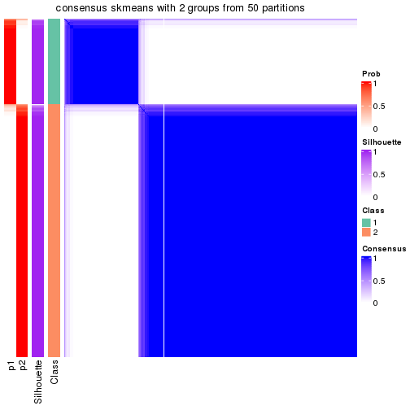</p>

</div>
<div id='tab-node-0-consensus-heatmap-2'>
<pre><code class="r">consensus_heatmap(res, k = 3)
</code></pre>

<p>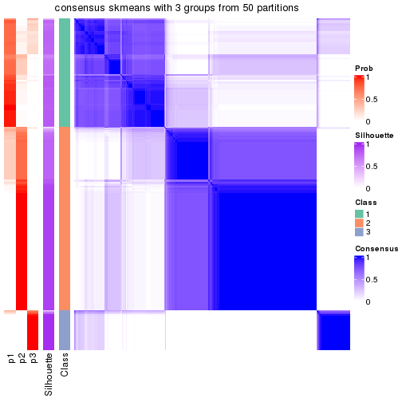</p>

</div>
<div id='tab-node-0-consensus-heatmap-3'>
<pre><code class="r">consensus_heatmap(res, k = 4)
</code></pre>

<p>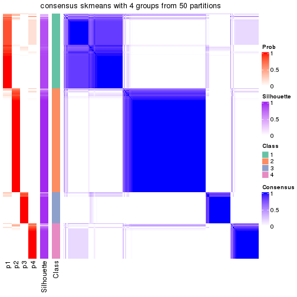</p>

</div>
<div id='tab-node-0-consensus-heatmap-4'>
<pre><code class="r">consensus_heatmap(res, k = 5)
</code></pre>

<p>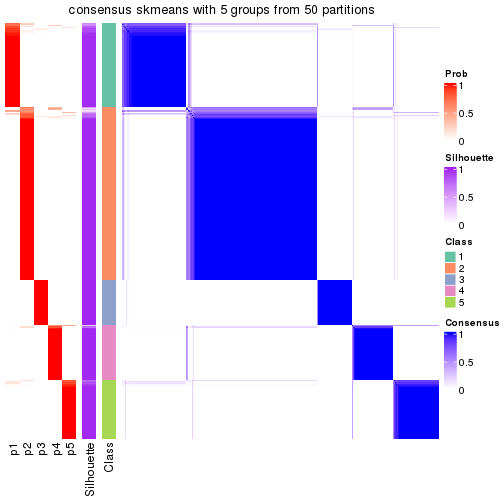</p>

</div>
<div id='tab-node-0-consensus-heatmap-5'>
<pre><code class="r">consensus_heatmap(res, k = 6)
</code></pre>

<p>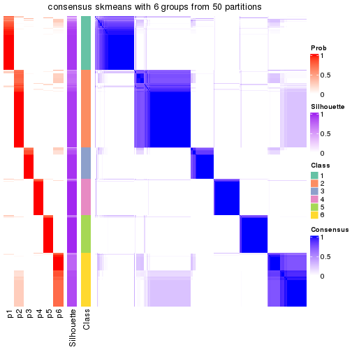</p>

</div>
<div id='tab-node-0-consensus-heatmap-6'>
<pre><code class="r">consensus_heatmap(res, k = 7)
</code></pre>

<p>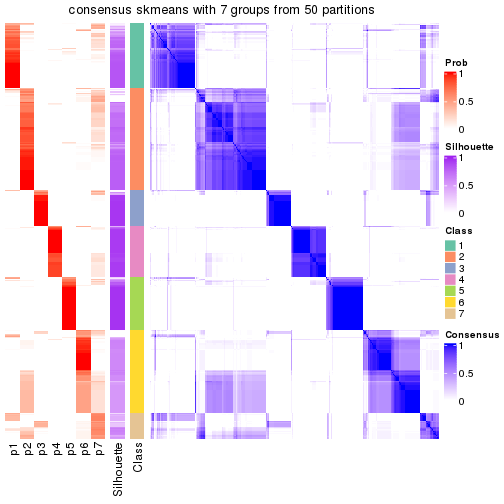</p>

</div>
<div id='tab-node-0-consensus-heatmap-7'>
<pre><code class="r">consensus_heatmap(res, k = 8)
</code></pre>

<p>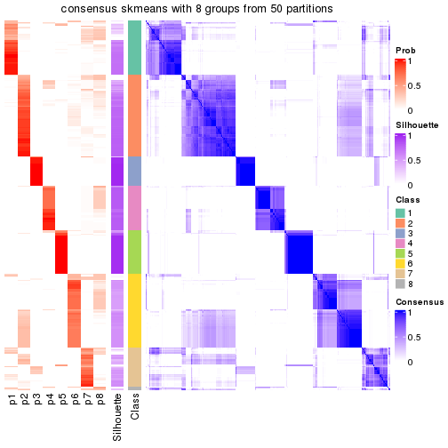</p>

</div>
</div>

Heatmaps for the membership of samples in all partitions to see how consistent they are:


<script>
$( function() {
	$( '#tabs-node-0-membership-heatmap' ).tabs();
} );
</script>
<div id='tabs-node-0-membership-heatmap'>
<ul>
<li><a href='#tab-node-0-membership-heatmap-1'>k = 2</a></li>
<li><a href='#tab-node-0-membership-heatmap-2'>k = 3</a></li>
<li><a href='#tab-node-0-membership-heatmap-3'>k = 4</a></li>
<li><a href='#tab-node-0-membership-heatmap-4'>k = 5</a></li>
<li><a href='#tab-node-0-membership-heatmap-5'>k = 6</a></li>
<li><a href='#tab-node-0-membership-heatmap-6'>k = 7</a></li>
<li><a href='#tab-node-0-membership-heatmap-7'>k = 8</a></li>
</ul>
<div id='tab-node-0-membership-heatmap-1'>
<pre><code class="r">membership_heatmap(res, k = 2)
</code></pre>

<p></p>

</div>
<div id='tab-node-0-membership-heatmap-2'>
<pre><code class="r">membership_heatmap(res, k = 3)
</code></pre>

<p>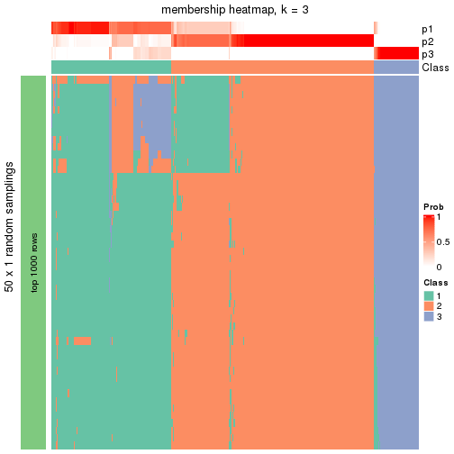</p>

</div>
<div id='tab-node-0-membership-heatmap-3'>
<pre><code class="r">membership_heatmap(res, k = 4)
</code></pre>

<p>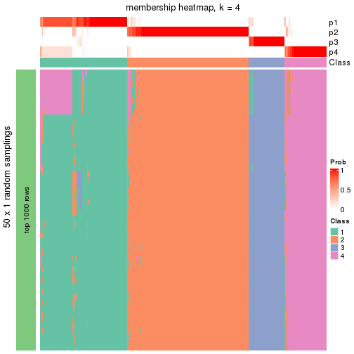</p>

</div>
<div id='tab-node-0-membership-heatmap-4'>
<pre><code class="r">membership_heatmap(res, k = 5)
</code></pre>

<p></p>

</div>
<div id='tab-node-0-membership-heatmap-5'>
<pre><code class="r">membership_heatmap(res, k = 6)
</code></pre>

<p>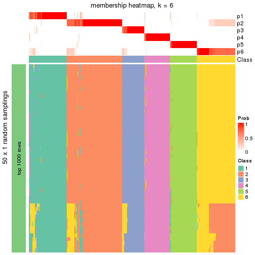</p>

</div>
<div id='tab-node-0-membership-heatmap-6'>
<pre><code class="r">membership_heatmap(res, k = 7)
</code></pre>

<p>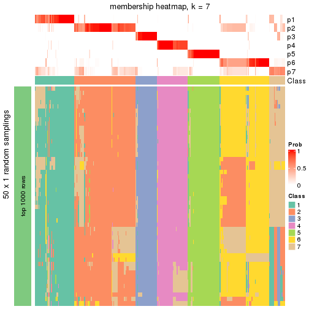</p>

</div>
<div id='tab-node-0-membership-heatmap-7'>
<pre><code class="r">membership_heatmap(res, k = 8)
</code></pre>

<p>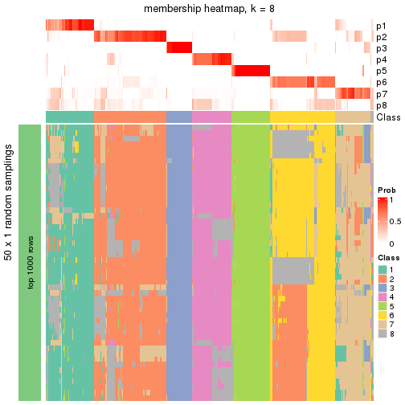</p>

</div>
</div>

As soon as the classes for columns are determined, the signatures
that are significantly different between subgroups can be looked for. 
Following are the heatmaps for signatures.


<script>
$( function() {
	$( '#tabs-node-0-get-signatures' ).tabs();
} );
</script>
<div id='tabs-node-0-get-signatures'>
<ul>
<li><a href='#tab-node-0-get-signatures-1'>k = 2</a></li>
<li><a href='#tab-node-0-get-signatures-2'>k = 3</a></li>
<li><a href='#tab-node-0-get-signatures-3'>k = 4</a></li>
<li><a href='#tab-node-0-get-signatures-4'>k = 5</a></li>
<li><a href='#tab-node-0-get-signatures-5'>k = 6</a></li>
<li><a href='#tab-node-0-get-signatures-6'>k = 7</a></li>
<li><a href='#tab-node-0-get-signatures-7'>k = 8</a></li>
</ul>
<div id='tab-node-0-get-signatures-1'>
<pre><code class="r">get_signatures(res, k = 2)
</code></pre>

<p>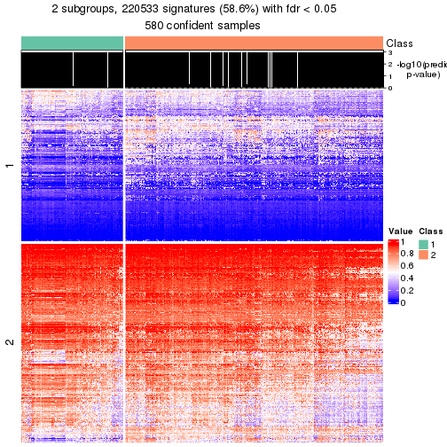</p>

</div>
<div id='tab-node-0-get-signatures-2'>
<pre><code class="r">get_signatures(res, k = 3)
</code></pre>

<p></p>

</div>
<div id='tab-node-0-get-signatures-3'>
<pre><code class="r">get_signatures(res, k = 4)
</code></pre>

<p>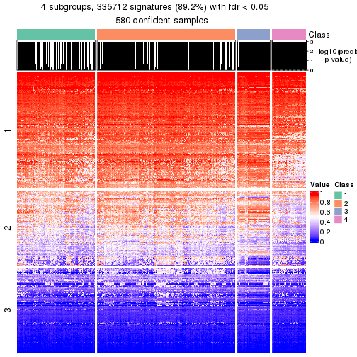</p>

</div>
<div id='tab-node-0-get-signatures-4'>
<pre><code class="r">get_signatures(res, k = 5)
</code></pre>

<p>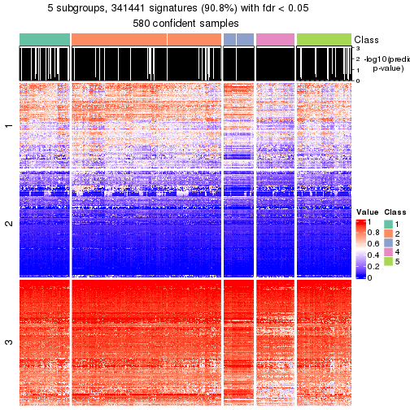</p>

</div>
<div id='tab-node-0-get-signatures-5'>
<pre><code class="r">get_signatures(res, k = 6)
</code></pre>

<p>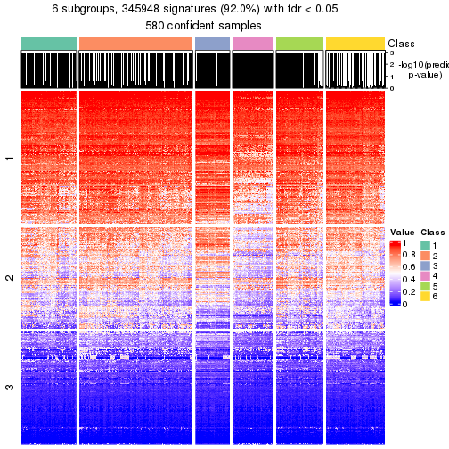</p>

</div>
<div id='tab-node-0-get-signatures-6'>
<pre><code class="r">get_signatures(res, k = 7)
</code></pre>

<p>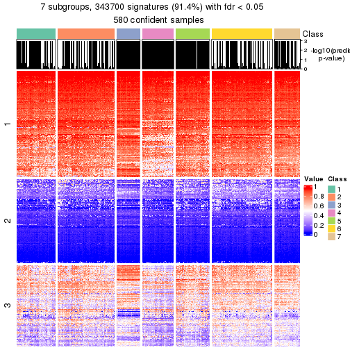</p>

</div>
<div id='tab-node-0-get-signatures-7'>
<pre><code class="r">get_signatures(res, k = 8)
</code></pre>

<p>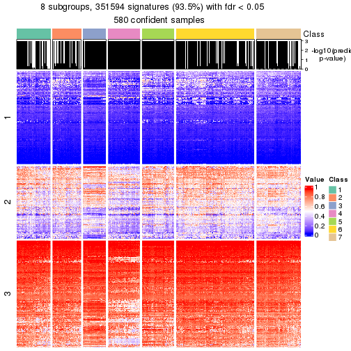</p>

</div>
</div>


Compare the overlap of signatures from different k:

```r
compare_signatures(res)
```

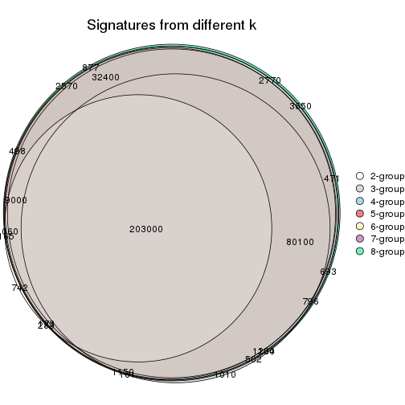

`get_signature()` returns a data frame invisibly. To get the list of signatures, the function
call should be assigned to a variable explicitly. In following code, if `plot` argument is set
to `FALSE`, no heatmap is plotted while only the differential analysis is performed.

```r
# code only for demonstration
tb = get_signature(res, k = ..., plot = FALSE)
```

An example of the output of `tb` is:

```
#>   which_row         fdr    mean_1    mean_2 scaled_mean_1 scaled_mean_2 km
#> 1        38 0.042760348  8.373488  9.131774    -0.5533452     0.5164555  1
#> 2        40 0.018707592  7.106213  8.469186    -0.6173731     0.5762149  1
#> 3        55 0.019134737 10.221463 11.207825    -0.6159697     0.5749050  1
#> 4        59 0.006059896  5.921854  7.869574    -0.6899429     0.6439467  1
#> 5        60 0.018055526  8.928898 10.211722    -0.6204761     0.5791110  1
#> 6        98 0.009384629 15.714769 14.887706     0.6635654    -0.6193277  2
...
```

The columns in `tb` are:

1. `which_row`: row indices corresponding to the input matrix.
2. `fdr`: FDR for the differential test. 
3. `mean_x`: The mean value in group x.
4. `scaled_mean_x`: The mean value in group x after rows are scaled.
5. `km`: Row groups if k-means clustering is applied to rows (which is done by automatically selecting number of clusters).

If there are too many signatures, `top_signatures = ...` can be set to only show the 
signatures with the highest FDRs:

```r
# code only for demonstration
# e.g. to show the top 500 most significant rows
tb = get_signature(res, k = ..., top_signatures = 500)
```

If the signatures are defined as these which are uniquely high in current group, `diff_method` argument
can be set to `"uniquely_high_in_one_group"`:

```r
# code only for demonstration
tb = get_signature(res, k = ..., diff_method = "uniquely_high_in_one_group")
```


UMAP plot which shows how samples are separated.


<script>
$( function() {
	$( '#tabs-node-0-dimension-reduction' ).tabs();
} );
</script>
<div id='tabs-node-0-dimension-reduction'>
<ul>
<li><a href='#tab-node-0-dimension-reduction-1'>k = 2</a></li>
<li><a href='#tab-node-0-dimension-reduction-2'>k = 3</a></li>
<li><a href='#tab-node-0-dimension-reduction-3'>k = 4</a></li>
<li><a href='#tab-node-0-dimension-reduction-4'>k = 5</a></li>
<li><a href='#tab-node-0-dimension-reduction-5'>k = 6</a></li>
<li><a href='#tab-node-0-dimension-reduction-6'>k = 7</a></li>
<li><a href='#tab-node-0-dimension-reduction-7'>k = 8</a></li>
</ul>
<div id='tab-node-0-dimension-reduction-1'>
<pre><code class="r">dimension_reduction(res, k = 2, method = &quot;UMAP&quot;)
</code></pre>

<p>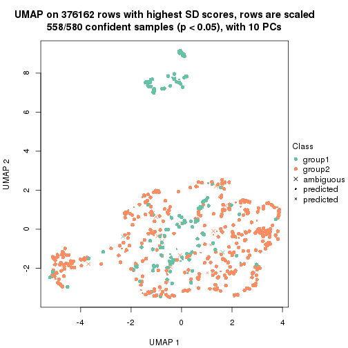</p>

</div>
<div id='tab-node-0-dimension-reduction-2'>
<pre><code class="r">dimension_reduction(res, k = 3, method = &quot;UMAP&quot;)
</code></pre>

<p>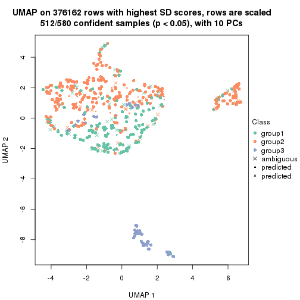</p>

</div>
<div id='tab-node-0-dimension-reduction-3'>
<pre><code class="r">dimension_reduction(res, k = 4, method = &quot;UMAP&quot;)
</code></pre>

<p>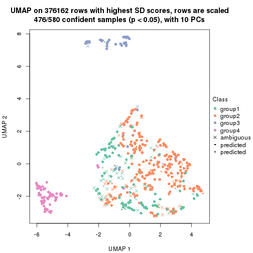</p>

</div>
<div id='tab-node-0-dimension-reduction-4'>
<pre><code class="r">dimension_reduction(res, k = 5, method = &quot;UMAP&quot;)
</code></pre>

<p>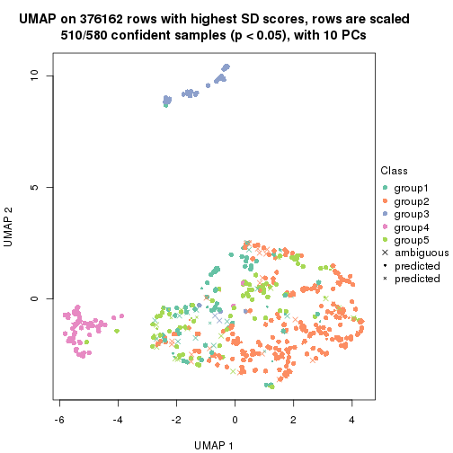</p>

</div>
<div id='tab-node-0-dimension-reduction-5'>
<pre><code class="r">dimension_reduction(res, k = 6, method = &quot;UMAP&quot;)
</code></pre>

<p>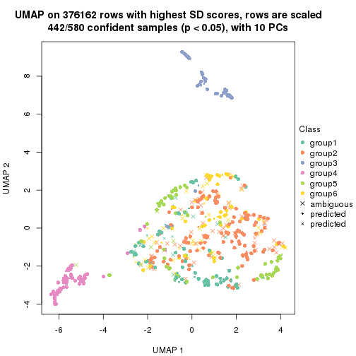</p>

</div>
<div id='tab-node-0-dimension-reduction-6'>
<pre><code class="r">dimension_reduction(res, k = 7, method = &quot;UMAP&quot;)
</code></pre>

<p>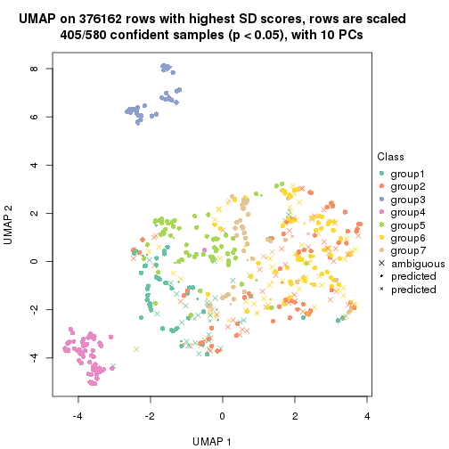</p>

</div>
<div id='tab-node-0-dimension-reduction-7'>
<pre><code class="r">dimension_reduction(res, k = 8, method = &quot;UMAP&quot;)
</code></pre>

<p></p>

</div>
</div>


Following heatmap shows how subgroups are split when increasing `k`:

```r
collect_classes(res)
```

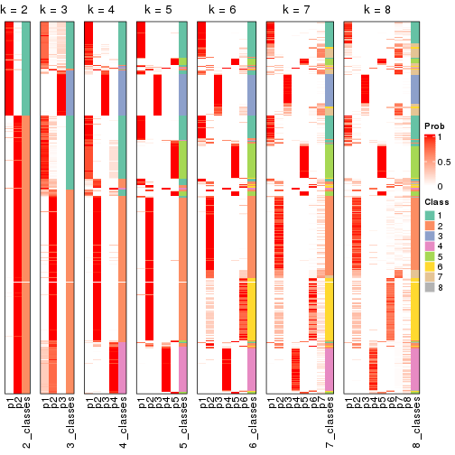


If matrix rows can be associated to genes, consider to use `functional_enrichment(res,
...)` to perform function enrichment for the signature genes. See [this vignette](https://jokergoo.github.io/cola_vignettes/functional_enrichment.html) for more detailed explanations.


 

---------------------------------------------------


### Node01


Parent node: [Node0](#Node0).
Child nodes: 
                [Node011](#Node011)
        ,
                [Node012](#Node012)
        ,
                Node013-leaf
        ,
                [Node021](#Node021)
        ,
                [Node022](#Node022)
        ,
                [Node023](#Node023)
        ,
                Node031-leaf
        ,
                Node032-leaf
        ,
                [Node033](#Node033)
        ,
                Node034-leaf
        ,
                Node041-leaf
        ,
                Node042-leaf
        ,
                [Node043](#Node043)
        ,
                [Node051](#Node051)
        ,
                [Node052](#Node052)
        ,
                Node053-leaf
        .


The object with results only for a single top-value method and a single partitioning method 
can be extracted as:

```r
res = res_rh["01"]
```

A summary of `res` and all the functions that can be applied to it:

```r
res
```

```
#> A 'ConsensusPartition' object with k = 2, 3, 4, 5, 6, 7, 8.
#>   On a matrix with 30000 rows and 90 columns.
#>   Top rows (1000) are extracted by 'ATC' method.
#>   Subgroups are detected by 'skmeans' method.
#>   Performed in total 350 partitions by row resampling.
#>   Best k for subgroups seems to be 3.
#> 
#> Following methods can be applied to this 'ConsensusPartition' object:
#>  [1] "cola_report"             "collect_classes"         "collect_plots"          
#>  [4] "collect_stats"           "colnames"                "compare_partitions"     
#>  [7] "compare_signatures"      "consensus_heatmap"       "dimension_reduction"    
#> [10] "functional_enrichment"   "get_anno_col"            "get_anno"               
#> [13] "get_classes"             "get_consensus"           "get_matrix"             
#> [16] "get_membership"          "get_param"               "get_signatures"         
#> [19] "get_stats"               "is_best_k"               "is_stable_k"            
#> [22] "membership_heatmap"      "ncol"                    "nrow"                   
#> [25] "plot_ecdf"               "predict_classes"         "rownames"               
#> [28] "select_partition_number" "show"                    "suggest_best_k"         
#> [31] "test_to_known_factors"   "top_rows_heatmap"
```

`collect_plots()` function collects all the plots made from `res` for all `k` (number of subgroups)
into one single page to provide an easy and fast comparison between different `k`.

```r
collect_plots(res)
```

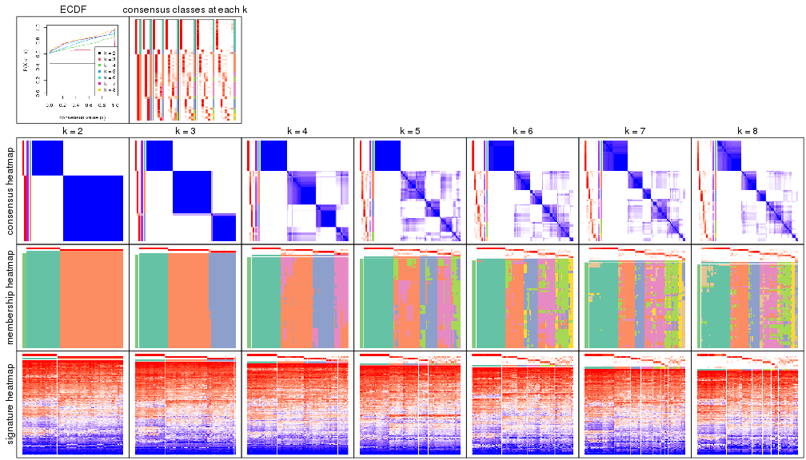

The plots are:

- The first row: a plot of the eCDF (empirical cumulative distribution
  function) curves of the consensus matrix for each `k` and the heatmap of
  predicted classes for each `k`.
- The second row: heatmaps of the consensus matrix for each `k`.
- The third row: heatmaps of the membership matrix for each `k`.
- The fouth row: heatmaps of the signatures for each `k`.

All the plots in panels can be made by individual functions and they are
plotted later in this section.

`select_partition_number()` produces several plots showing different
statistics for choosing "optimized" `k`. There are following statistics:

- eCDF curves of the consensus matrix for each `k`;
- 1-PAC. [The PAC score](https://en.wikipedia.org/wiki/Consensus_clustering#Over-interpretation_potential_of_consensus_clustering)
  measures the proportion of the ambiguous subgrouping.
- Mean silhouette score.
- Concordance. The mean probability of fiting the consensus subgroup labels in all
  partitions.
- Area increased. Denote $A_k$ as the area under the eCDF curve for current
  `k`, the area increased is defined as $A_k - A_{k-1}$.
- Rand index. The percent of pairs of samples that are both in a same cluster
  or both are not in a same cluster in the partition of k and k-1.
- Jaccard index. The ratio of pairs of samples are both in a same cluster in
  the partition of k and k-1 and the pairs of samples are both in a same
  cluster in the partition k or k-1.

The detailed explanations of these statistics can be found in [the _cola_
vignette](https://jokergoo.github.io/cola_vignettes/cola.html#toc_13).

Generally speaking, higher 1-PAC score, higher mean silhouette score or higher
concordance corresponds to better partition. Rand index and Jaccard index
measure how similar the current partition is compared to partition with `k-1`.
If they are too similar, we won't accept `k` is better than `k-1`.

```r
select_partition_number(res)
```

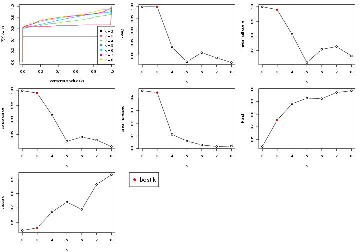

The numeric values for all these statistics can be obtained by `get_stats()`.

```r
get_stats(res)
```

```
#>   k 1-PAC mean_silhouette concordance area_increased  Rand Jaccard
#> 2 2 1.000           1.000       1.000         0.4572 0.543   0.543
#> 3 3 1.000           0.980       0.992         0.4426 0.753   0.562
#> 4 4 0.834           0.812       0.916         0.1114 0.882   0.672
#> 5 5 0.773           0.618       0.827         0.0591 0.928   0.741
#> 6 6 0.810           0.709       0.842         0.0284 0.924   0.689
#> 7 7 0.788           0.728       0.831         0.0160 0.972   0.862
#> 8 8 0.769           0.663       0.809         0.0190 0.987   0.930
```

`suggest_best_k()` suggests the best $k$ based on these statistics. The rules are as follows:

- All $k$ with Jaccard index larger than 0.95 are removed because increasing
  $k$ does not provide enough extra information. If all $k$ are removed, it is
  marked as no subgroup is detected.
- For all $k$ with 1-PAC score larger than 0.9, the maximal $k$ is taken as
  the best $k$, and other $k$ are marked as optional $k$.
- If it does not fit the second rule. The $k$ with the maximal vote of the
  highest 1-PAC score, highest mean silhouette, and highest concordance is
  taken as the best $k$.

```r
suggest_best_k(res)
```

```
#> [1] 3
#> attr(,"optional")
#> [1] 2
```

There is also optional best $k$ = 2 that is worth to check.

Following is the table of the partitions (You need to click the **show/hide
code output** link to see it). The membership matrix (columns with name `p*`)
is inferred by
[`clue::cl_consensus()`](https://www.rdocumentation.org/link/cl_consensus?package=clue)
function with the `SE` method. Basically the value in the membership matrix
represents the probability to belong to a certain group. The finall subgroup
label for an item is determined with the group with highest probability it
belongs to.

In `get_classes()` function, the entropy is calculated from the membership
matrix and the silhouette score is calculated from the consensus matrix.


<script>
$( function() {
	$( '#tabs-node-01-get-classes' ).tabs();
} );
</script>
<div id='tabs-node-01-get-classes'>
<ul>
<li><a href='#tab-node-01-get-classes-1'>k = 2</a></li>
<li><a href='#tab-node-01-get-classes-2'>k = 3</a></li>
<li><a href='#tab-node-01-get-classes-3'>k = 4</a></li>
<li><a href='#tab-node-01-get-classes-4'>k = 5</a></li>
<li><a href='#tab-node-01-get-classes-5'>k = 6</a></li>
<li><a href='#tab-node-01-get-classes-6'>k = 7</a></li>
<li><a href='#tab-node-01-get-classes-7'>k = 8</a></li>
</ul>

<div id='tab-node-01-get-classes-1'>
<p><a id='tab-node-01-get-classes-1-a' style='color:#0366d6' href='#'>show/hide code output</a></p>
<pre><code class="r">cbind(get_classes(res, k = 2), get_membership(res, k = 2))
</code></pre>

<pre><code>#&gt;                 class entropy silhouette p1 p2
#&gt; TCGA.CV.7414.01     1       0          1  1  0
#&gt; TCGA.CN.6010.01     1       0          1  1  0
#&gt; TCGA.CV.7413.01     2       0          1  0  1
#&gt; TCGA.CV.7422.01     2       0          1  0  1
#&gt; TCGA.BA.7269.01     2       0          1  0  1
#&gt; TCGA.CQ.5332.01     1       0          1  1  0
#&gt; TCGA.CV.7101.01     1       0          1  1  0
#&gt; TCGA.CN.6012.01     1       0          1  1  0
#&gt; TCGA.CV.7424.01     1       0          1  1  0
#&gt; TCGA.CV.7418.01     1       0          1  1  0
#&gt; TCGA.CV.6937.01     2       0          1  0  1
#&gt; TCGA.CN.6013.01     2       0          1  0  1
#&gt; TCGA.CN.6019.01     2       0          1  0  1
#&gt; TCGA.CR.7389.01     2       0          1  0  1
#&gt; TCGA.CR.7374.01     1       0          1  1  0
#&gt; TCGA.CV.7261.01     1       0          1  1  0
#&gt; TCGA.CN.5358.01     2       0          1  0  1
#&gt; TCGA.DQ.5629.01     1       0          1  1  0
#&gt; TCGA.CR.7372.01     2       0          1  0  1
#&gt; TCGA.CR.7371.01     2       0          1  0  1
#&gt; TCGA.CR.7388.01     2       0          1  0  1
#&gt; TCGA.CN.6997.01     1       0          1  1  0
#&gt; TCGA.CN.4742.01     2       0          1  0  1
#&gt; TCGA.CN.4738.01     2       0          1  0  1
#&gt; TCGA.CV.7248.01     2       0          1  0  1
#&gt; TCGA.CV.5444.01     2       0          1  0  1
#&gt; TCGA.CR.7390.01     2       0          1  0  1
#&gt; TCGA.CV.5436.01     2       0          1  0  1
#&gt; TCGA.CV.6961.01     2       0          1  0  1
#&gt; TCGA.CN.6992.01     1       0          1  1  0
#&gt; TCGA.CV.6962.01     1       0          1  1  0
#&gt; TCGA.BB.4227.01     2       0          1  0  1
#&gt; TCGA.CV.A45U.01     2       0          1  0  1
#&gt; TCGA.D6.6827.01     1       0          1  1  0
#&gt; TCGA.CV.6934.01     2       0          1  0  1
#&gt; TCGA.CV.6933.01     1       0          1  1  0
#&gt; TCGA.CV.6948.01     1       0          1  1  0
#&gt; TCGA.F7.A623.01     2       0          1  0  1
#&gt; TCGA.T3.A92M.01     2       0          1  0  1
#&gt; TCGA.CV.A468.01     2       0          1  0  1
#&gt; TCGA.IQ.A61H.01     2       0          1  0  1
#&gt; TCGA.QK.AA3K.01     2       0          1  0  1
#&gt; TCGA.4P.AA8J.01     2       0          1  0  1
#&gt; TCGA.CV.A45V.01     2       0          1  0  1
#&gt; TCGA.CV.A460.01     2       0          1  0  1
#&gt; TCGA.CQ.A4CG.01     2       0          1  0  1
#&gt; TCGA.CQ.A4CE.01     2       0          1  0  1
#&gt; TCGA.HD.8314.01     1       0          1  1  0
#&gt; TCGA.BA.A4II.01     2       0          1  0  1
#&gt; TCGA.QK.A8ZA.01     1       0          1  1  0
#&gt; TCGA.CQ.A4CI.01     1       0          1  1  0
#&gt; TCGA.BB.8596.01     2       0          1  0  1
#&gt; TCGA.F7.A50I.01     2       0          1  0  1
#&gt; TCGA.IQ.A61O.01     2       0          1  0  1
#&gt; TCGA.CV.A45X.01     2       0          1  0  1
#&gt; TCGA.IQ.A6SH.01     2       0          1  0  1
#&gt; TCGA.UF.A71E.01     1       0          1  1  0
#&gt; TCGA.T2.A6X0.01     1       0          1  1  0
#&gt; TCGA.CN.4723.01     2       0          1  0  1
#&gt; TCGA.UF.A7J9.01     1       0          1  1  0
#&gt; TCGA.CN.4728.01     2       0          1  0  1
#&gt; TCGA.CN.4735.01     1       0          1  1  0
#&gt; TCGA.QK.A6VC.01     2       0          1  0  1
#&gt; TCGA.BB.7862.01     1       0          1  1  0
#&gt; TCGA.BA.A6DI.01     2       0          1  0  1
#&gt; TCGA.RS.A6TO.01     2       0          1  0  1
#&gt; TCGA.CQ.7067.01     2       0          1  0  1
#&gt; TCGA.BA.4078.01     1       0          1  1  0
#&gt; TCGA.UF.A7JJ.01     2       0          1  0  1
#&gt; TCGA.MT.A7BN.01     2       0          1  0  1
#&gt; TCGA.UF.A71A.01     1       0          1  1  0
#&gt; TCGA.TN.A7HI.01     1       0          1  1  0
#&gt; TCGA.BA.A6D8.01     1       0          1  1  0
#&gt; TCGA.P3.A6T4.01     2       0          1  0  1
#&gt; TCGA.P3.A6SW.01     2       0          1  0  1
#&gt; TCGA.D6.A6EM.01     2       0          1  0  1
#&gt; TCGA.UF.A7JK.01     2       0          1  0  1
#&gt; TCGA.CV.7446.01     1       0          1  1  0
#&gt; TCGA.HD.7831.01     2       0          1  0  1
#&gt; TCGA.D6.A6EQ.01     2       0          1  0  1
#&gt; TCGA.P3.A6T0.01     2       0          1  0  1
#&gt; TCGA.HD.A6HZ.01     2       0          1  0  1
#&gt; TCGA.TN.A7HL.01     2       0          1  0  1
#&gt; TCGA.UF.A7JA.01     2       0          1  0  1
#&gt; TCGA.BA.A6DA.01     2       0          1  0  1
#&gt; TCGA.CR.7370.01     1       0          1  1  0
#&gt; TCGA.CV.A6K2.01     2       0          1  0  1
#&gt; TCGA.CV.A6K1.01     2       0          1  0  1
#&gt; TCGA.UF.A71A.06     1       0          1  1  0
#&gt; TCGA.D6.A6EP.01     2       0          1  0  1
</code></pre>

<script>
$('#tab-node-01-get-classes-1-a').parent().next().next().hide();
$('#tab-node-01-get-classes-1-a').click(function(){
  $('#tab-node-01-get-classes-1-a').parent().next().next().toggle();
  return(false);
});
</script>
</div>

<div id='tab-node-01-get-classes-2'>
<p><a id='tab-node-01-get-classes-2-a' style='color:#0366d6' href='#'>show/hide code output</a></p>
<pre><code class="r">cbind(get_classes(res, k = 3), get_membership(res, k = 3))
</code></pre>

<pre><code>#&gt;                 class entropy silhouette p1   p2   p3
#&gt; TCGA.CV.7414.01     1  0.0000      1.000  1 0.00 0.00
#&gt; TCGA.CN.6010.01     1  0.0000      1.000  1 0.00 0.00
#&gt; TCGA.CV.7413.01     2  0.0000      1.000  0 1.00 0.00
#&gt; TCGA.CV.7422.01     3  0.0000      0.967  0 0.00 1.00
#&gt; TCGA.BA.7269.01     3  0.0000      0.967  0 0.00 1.00
#&gt; TCGA.CQ.5332.01     1  0.0000      1.000  1 0.00 0.00
#&gt; TCGA.CV.7101.01     1  0.0000      1.000  1 0.00 0.00
#&gt; TCGA.CN.6012.01     1  0.0000      1.000  1 0.00 0.00
#&gt; TCGA.CV.7424.01     1  0.0000      1.000  1 0.00 0.00
#&gt; TCGA.CV.7418.01     1  0.0000      1.000  1 0.00 0.00
#&gt; TCGA.CV.6937.01     2  0.0000      1.000  0 1.00 0.00
#&gt; TCGA.CN.6013.01     3  0.0000      0.967  0 0.00 1.00
#&gt; TCGA.CN.6019.01     3  0.0000      0.967  0 0.00 1.00
#&gt; TCGA.CR.7389.01     3  0.0000      0.967  0 0.00 1.00
#&gt; TCGA.CR.7374.01     1  0.0000      1.000  1 0.00 0.00
#&gt; TCGA.CV.7261.01     1  0.0000      1.000  1 0.00 0.00
#&gt; TCGA.CN.5358.01     2  0.0000      1.000  0 1.00 0.00
#&gt; TCGA.DQ.5629.01     1  0.0000      1.000  1 0.00 0.00
#&gt; TCGA.CR.7372.01     2  0.0000      1.000  0 1.00 0.00
#&gt; TCGA.CR.7371.01     3  0.0000      0.967  0 0.00 1.00
#&gt; TCGA.CR.7388.01     3  0.0000      0.967  0 0.00 1.00
#&gt; TCGA.CN.6997.01     1  0.0000      1.000  1 0.00 0.00
#&gt; TCGA.CN.4742.01     2  0.0000      1.000  0 1.00 0.00
#&gt; TCGA.CN.4738.01     3  0.5706      0.545  0 0.32 0.68
#&gt; TCGA.CV.7248.01     3  0.0000      0.967  0 0.00 1.00
#&gt; TCGA.CV.5444.01     2  0.0000      1.000  0 1.00 0.00
#&gt; TCGA.CR.7390.01     3  0.0000      0.967  0 0.00 1.00
#&gt; TCGA.CV.5436.01     2  0.0000      1.000  0 1.00 0.00
#&gt; TCGA.CV.6961.01     2  0.0000      1.000  0 1.00 0.00
#&gt; TCGA.CN.6992.01     1  0.0000      1.000  1 0.00 0.00
#&gt; TCGA.CV.6962.01     1  0.0000      1.000  1 0.00 0.00
#&gt; TCGA.BB.4227.01     2  0.0000      1.000  0 1.00 0.00
#&gt; TCGA.CV.A45U.01     3  0.0000      0.967  0 0.00 1.00
#&gt; TCGA.D6.6827.01     3  0.0000      0.967  0 0.00 1.00
#&gt; TCGA.CV.6934.01     2  0.0000      1.000  0 1.00 0.00
#&gt; TCGA.CV.6933.01     3  0.0000      0.967  0 0.00 1.00
#&gt; TCGA.CV.6948.01     1  0.0000      1.000  1 0.00 0.00
#&gt; TCGA.F7.A623.01     2  0.0000      1.000  0 1.00 0.00
#&gt; TCGA.T3.A92M.01     2  0.0000      1.000  0 1.00 0.00
#&gt; TCGA.CV.A468.01     2  0.0000      1.000  0 1.00 0.00
#&gt; TCGA.IQ.A61H.01     3  0.0000      0.967  0 0.00 1.00
#&gt; TCGA.QK.AA3K.01     2  0.0000      1.000  0 1.00 0.00
#&gt; TCGA.4P.AA8J.01     2  0.0000      1.000  0 1.00 0.00
#&gt; TCGA.CV.A45V.01     2  0.0000      1.000  0 1.00 0.00
#&gt; TCGA.CV.A460.01     2  0.0000      1.000  0 1.00 0.00
#&gt; TCGA.CQ.A4CG.01     3  0.0000      0.967  0 0.00 1.00
#&gt; TCGA.CQ.A4CE.01     2  0.0000      1.000  0 1.00 0.00
#&gt; TCGA.HD.8314.01     1  0.0000      1.000  1 0.00 0.00
#&gt; TCGA.BA.A4II.01     2  0.0000      1.000  0 1.00 0.00
#&gt; TCGA.QK.A8ZA.01     1  0.0000      1.000  1 0.00 0.00
#&gt; TCGA.CQ.A4CI.01     1  0.0000      1.000  1 0.00 0.00
#&gt; TCGA.BB.8596.01     2  0.0000      1.000  0 1.00 0.00
#&gt; TCGA.F7.A50I.01     2  0.0000      1.000  0 1.00 0.00
#&gt; TCGA.IQ.A61O.01     2  0.0000      1.000  0 1.00 0.00
#&gt; TCGA.CV.A45X.01     2  0.0000      1.000  0 1.00 0.00
#&gt; TCGA.IQ.A6SH.01     2  0.0000      1.000  0 1.00 0.00
#&gt; TCGA.UF.A71E.01     1  0.0000      1.000  1 0.00 0.00
#&gt; TCGA.T2.A6X0.01     1  0.0000      1.000  1 0.00 0.00
#&gt; TCGA.CN.4723.01     3  0.0892      0.949  0 0.02 0.98
#&gt; TCGA.UF.A7J9.01     3  0.0000      0.967  0 0.00 1.00
#&gt; TCGA.CN.4728.01     3  0.0000      0.967  0 0.00 1.00
#&gt; TCGA.CN.4735.01     3  0.0000      0.967  0 0.00 1.00
#&gt; TCGA.QK.A6VC.01     2  0.0000      1.000  0 1.00 0.00
#&gt; TCGA.BB.7862.01     1  0.0000      1.000  1 0.00 0.00
#&gt; TCGA.BA.A6DI.01     3  0.0000      0.967  0 0.00 1.00
#&gt; TCGA.RS.A6TO.01     2  0.0000      1.000  0 1.00 0.00
#&gt; TCGA.CQ.7067.01     2  0.0000      1.000  0 1.00 0.00
#&gt; TCGA.BA.4078.01     1  0.0000      1.000  1 0.00 0.00
#&gt; TCGA.UF.A7JJ.01     2  0.0000      1.000  0 1.00 0.00
#&gt; TCGA.MT.A7BN.01     3  0.0000      0.967  0 0.00 1.00
#&gt; TCGA.UF.A71A.01     1  0.0000      1.000  1 0.00 0.00
#&gt; TCGA.TN.A7HI.01     1  0.0000      1.000  1 0.00 0.00
#&gt; TCGA.BA.A6D8.01     1  0.0000      1.000  1 0.00 0.00
#&gt; TCGA.P3.A6T4.01     2  0.0000      1.000  0 1.00 0.00
#&gt; TCGA.P3.A6SW.01     3  0.0000      0.967  0 0.00 1.00
#&gt; TCGA.D6.A6EM.01     2  0.0000      1.000  0 1.00 0.00
#&gt; TCGA.UF.A7JK.01     2  0.0000      1.000  0 1.00 0.00
#&gt; TCGA.CV.7446.01     1  0.0000      1.000  1 0.00 0.00
#&gt; TCGA.HD.7831.01     2  0.0000      1.000  0 1.00 0.00
#&gt; TCGA.D6.A6EQ.01     2  0.0000      1.000  0 1.00 0.00
#&gt; TCGA.P3.A6T0.01     2  0.0000      1.000  0 1.00 0.00
#&gt; TCGA.HD.A6HZ.01     3  0.6045      0.413  0 0.38 0.62
#&gt; TCGA.TN.A7HL.01     3  0.0000      0.967  0 0.00 1.00
#&gt; TCGA.UF.A7JA.01     2  0.0000      1.000  0 1.00 0.00
#&gt; TCGA.BA.A6DA.01     2  0.0000      1.000  0 1.00 0.00
#&gt; TCGA.CR.7370.01     1  0.0000      1.000  1 0.00 0.00
#&gt; TCGA.CV.A6K2.01     2  0.0000      1.000  0 1.00 0.00
#&gt; TCGA.CV.A6K1.01     2  0.0000      1.000  0 1.00 0.00
#&gt; TCGA.UF.A71A.06     1  0.0000      1.000  1 0.00 0.00
#&gt; TCGA.D6.A6EP.01     3  0.0000      0.967  0 0.00 1.00
</code></pre>

<script>
$('#tab-node-01-get-classes-2-a').parent().next().next().hide();
$('#tab-node-01-get-classes-2-a').click(function(){
  $('#tab-node-01-get-classes-2-a').parent().next().next().toggle();
  return(false);
});
</script>
</div>

<div id='tab-node-01-get-classes-3'>
<p><a id='tab-node-01-get-classes-3-a' style='color:#0366d6' href='#'>show/hide code output</a></p>
<pre><code class="r">cbind(get_classes(res, k = 4), get_membership(res, k = 4))
</code></pre>

<pre><code>#&gt;                 class entropy silhouette p1   p2   p3   p4
#&gt; TCGA.CV.7414.01     1   0.000     1.0000  1 0.00 0.00 0.00
#&gt; TCGA.CN.6010.01     1   0.000     1.0000  1 0.00 0.00 0.00
#&gt; TCGA.CV.7413.01     2   0.000     0.8358  0 1.00 0.00 0.00
#&gt; TCGA.CV.7422.01     3   0.000     0.9415  0 0.00 1.00 0.00
#&gt; TCGA.BA.7269.01     3   0.380     0.7959  0 0.00 0.78 0.22
#&gt; TCGA.CQ.5332.01     1   0.000     1.0000  1 0.00 0.00 0.00
#&gt; TCGA.CV.7101.01     1   0.000     1.0000  1 0.00 0.00 0.00
#&gt; TCGA.CN.6012.01     1   0.000     1.0000  1 0.00 0.00 0.00
#&gt; TCGA.CV.7424.01     1   0.000     1.0000  1 0.00 0.00 0.00
#&gt; TCGA.CV.7418.01     1   0.000     1.0000  1 0.00 0.00 0.00
#&gt; TCGA.CV.6937.01     2   0.000     0.8358  0 1.00 0.00 0.00
#&gt; TCGA.CN.6013.01     4   0.479     0.1201  0 0.00 0.38 0.62
#&gt; TCGA.CN.6019.01     3   0.000     0.9415  0 0.00 1.00 0.00
#&gt; TCGA.CR.7389.01     3   0.361     0.8126  0 0.00 0.80 0.20
#&gt; TCGA.CR.7374.01     1   0.000     1.0000  1 0.00 0.00 0.00
#&gt; TCGA.CV.7261.01     1   0.000     1.0000  1 0.00 0.00 0.00
#&gt; TCGA.CN.5358.01     2   0.000     0.8358  0 1.00 0.00 0.00
#&gt; TCGA.DQ.5629.01     1   0.000     1.0000  1 0.00 0.00 0.00
#&gt; TCGA.CR.7372.01     4   0.499     0.1916  0 0.48 0.00 0.52
#&gt; TCGA.CR.7371.01     3   0.000     0.9415  0 0.00 1.00 0.00
#&gt; TCGA.CR.7388.01     3   0.000     0.9415  0 0.00 1.00 0.00
#&gt; TCGA.CN.6997.01     1   0.000     1.0000  1 0.00 0.00 0.00
#&gt; TCGA.CN.4742.01     2   0.000     0.8358  0 1.00 0.00 0.00
#&gt; TCGA.CN.4738.01     2   0.441     0.4529  0 0.70 0.30 0.00
#&gt; TCGA.CV.7248.01     3   0.000     0.9415  0 0.00 1.00 0.00
#&gt; TCGA.CV.5444.01     2   0.380     0.6575  0 0.78 0.00 0.22
#&gt; TCGA.CR.7390.01     3   0.398     0.7737  0 0.00 0.76 0.24
#&gt; TCGA.CV.5436.01     4   0.000     0.7006  0 0.00 0.00 1.00
#&gt; TCGA.CV.6961.01     4   0.380     0.6570  0 0.22 0.00 0.78
#&gt; TCGA.CN.6992.01     1   0.000     1.0000  1 0.00 0.00 0.00
#&gt; TCGA.CV.6962.01     1   0.000     1.0000  1 0.00 0.00 0.00
#&gt; TCGA.BB.4227.01     4   0.380     0.6982  0 0.22 0.00 0.78
#&gt; TCGA.CV.A45U.01     3   0.292     0.8573  0 0.00 0.86 0.14
#&gt; TCGA.D6.6827.01     3   0.000     0.9415  0 0.00 1.00 0.00
#&gt; TCGA.CV.6934.01     2   0.340     0.7075  0 0.82 0.00 0.18
#&gt; TCGA.CV.6933.01     3   0.000     0.9415  0 0.00 1.00 0.00
#&gt; TCGA.CV.6948.01     1   0.000     1.0000  1 0.00 0.00 0.00
#&gt; TCGA.F7.A623.01     2   0.491     0.2693  0 0.58 0.00 0.42
#&gt; TCGA.T3.A92M.01     2   0.121     0.8189  0 0.96 0.00 0.04
#&gt; TCGA.CV.A468.01     2   0.000     0.8358  0 1.00 0.00 0.00
#&gt; TCGA.IQ.A61H.01     3   0.000     0.9415  0 0.00 1.00 0.00
#&gt; TCGA.QK.AA3K.01     2   0.000     0.8358  0 1.00 0.00 0.00
#&gt; TCGA.4P.AA8J.01     2   0.000     0.8358  0 1.00 0.00 0.00
#&gt; TCGA.CV.A45V.01     2   0.498    -0.0293  0 0.54 0.00 0.46
#&gt; TCGA.CV.A460.01     2   0.164     0.8084  0 0.94 0.00 0.06
#&gt; TCGA.CQ.A4CG.01     4   0.000     0.7006  0 0.00 0.00 1.00
#&gt; TCGA.CQ.A4CE.01     2   0.265     0.7672  0 0.88 0.00 0.12
#&gt; TCGA.HD.8314.01     1   0.000     1.0000  1 0.00 0.00 0.00
#&gt; TCGA.BA.A4II.01     2   0.000     0.8358  0 1.00 0.00 0.00
#&gt; TCGA.QK.A8ZA.01     1   0.000     1.0000  1 0.00 0.00 0.00
#&gt; TCGA.CQ.A4CI.01     1   0.000     1.0000  1 0.00 0.00 0.00
#&gt; TCGA.BB.8596.01     2   0.000     0.8358  0 1.00 0.00 0.00
#&gt; TCGA.F7.A50I.01     2   0.361     0.6848  0 0.80 0.00 0.20
#&gt; TCGA.IQ.A61O.01     2   0.000     0.8358  0 1.00 0.00 0.00
#&gt; TCGA.CV.A45X.01     2   0.000     0.8358  0 1.00 0.00 0.00
#&gt; TCGA.IQ.A6SH.01     4   0.441     0.6356  0 0.30 0.00 0.70
#&gt; TCGA.UF.A71E.01     1   0.000     1.0000  1 0.00 0.00 0.00
#&gt; TCGA.T2.A6X0.01     1   0.000     1.0000  1 0.00 0.00 0.00
#&gt; TCGA.CN.4723.01     4   0.121     0.6921  0 0.00 0.04 0.96
#&gt; TCGA.UF.A7J9.01     3   0.000     0.9415  0 0.00 1.00 0.00
#&gt; TCGA.CN.4728.01     3   0.164     0.8874  0 0.06 0.94 0.00
#&gt; TCGA.CN.4735.01     3   0.000     0.9415  0 0.00 1.00 0.00
#&gt; TCGA.QK.A6VC.01     2   0.000     0.8358  0 1.00 0.00 0.00
#&gt; TCGA.BB.7862.01     1   0.000     1.0000  1 0.00 0.00 0.00
#&gt; TCGA.BA.A6DI.01     3   0.000     0.9415  0 0.00 1.00 0.00
#&gt; TCGA.RS.A6TO.01     2   0.452     0.3971  0 0.68 0.00 0.32
#&gt; TCGA.CQ.7067.01     4   0.491     0.3897  0 0.42 0.00 0.58
#&gt; TCGA.BA.4078.01     1   0.000     1.0000  1 0.00 0.00 0.00
#&gt; TCGA.UF.A7JJ.01     2   0.000     0.8358  0 1.00 0.00 0.00
#&gt; TCGA.MT.A7BN.01     3   0.000     0.9415  0 0.00 1.00 0.00
#&gt; TCGA.UF.A71A.01     1   0.000     1.0000  1 0.00 0.00 0.00
#&gt; TCGA.TN.A7HI.01     1   0.000     1.0000  1 0.00 0.00 0.00
#&gt; TCGA.BA.A6D8.01     1   0.000     1.0000  1 0.00 0.00 0.00
#&gt; TCGA.P3.A6T4.01     2   0.479     0.2920  0 0.62 0.00 0.38
#&gt; TCGA.P3.A6SW.01     3   0.566     0.7015  0 0.12 0.72 0.16
#&gt; TCGA.D6.A6EM.01     2   0.234     0.7827  0 0.90 0.00 0.10
#&gt; TCGA.UF.A7JK.01     4   0.000     0.7006  0 0.00 0.00 1.00
#&gt; TCGA.CV.7446.01     1   0.000     1.0000  1 0.00 0.00 0.00
#&gt; TCGA.HD.7831.01     2   0.000     0.8358  0 1.00 0.00 0.00
#&gt; TCGA.D6.A6EQ.01     4   0.413     0.6779  0 0.26 0.00 0.74
#&gt; TCGA.P3.A6T0.01     4   0.361     0.7039  0 0.20 0.00 0.80
#&gt; TCGA.HD.A6HZ.01     2   0.722    -0.0900  0 0.44 0.14 0.42
#&gt; TCGA.TN.A7HL.01     3   0.000     0.9415  0 0.00 1.00 0.00
#&gt; TCGA.UF.A7JA.01     2   0.000     0.8358  0 1.00 0.00 0.00
#&gt; TCGA.BA.A6DA.01     2   0.380     0.6575  0 0.78 0.00 0.22
#&gt; TCGA.CR.7370.01     1   0.000     1.0000  1 0.00 0.00 0.00
#&gt; TCGA.CV.A6K2.01     2   0.000     0.8358  0 1.00 0.00 0.00
#&gt; TCGA.CV.A6K1.01     4   0.428     0.6601  0 0.28 0.00 0.72
#&gt; TCGA.UF.A71A.06     1   0.000     1.0000  1 0.00 0.00 0.00
#&gt; TCGA.D6.A6EP.01     3   0.000     0.9415  0 0.00 1.00 0.00
</code></pre>

<script>
$('#tab-node-01-get-classes-3-a').parent().next().next().hide();
$('#tab-node-01-get-classes-3-a').click(function(){
  $('#tab-node-01-get-classes-3-a').parent().next().next().toggle();
  return(false);
});
</script>
</div>

<div id='tab-node-01-get-classes-4'>
<p><a id='tab-node-01-get-classes-4-a' style='color:#0366d6' href='#'>show/hide code output</a></p>
<pre><code class="r">cbind(get_classes(res, k = 5), get_membership(res, k = 5))
</code></pre>

<pre><code>#&gt;                 class entropy silhouette p1   p2   p3   p4   p5
#&gt; TCGA.CV.7414.01     1  0.0000   1.000000  1 0.00 0.00 0.00 0.00
#&gt; TCGA.CN.6010.01     1  0.0000   1.000000  1 0.00 0.00 0.00 0.00
#&gt; TCGA.CV.7413.01     2  0.3561   0.454259  0 0.74 0.00 0.26 0.00
#&gt; TCGA.CV.7422.01     3  0.0609   0.726926  0 0.00 0.98 0.00 0.02
#&gt; TCGA.BA.7269.01     5  0.3424   0.287803  0 0.00 0.24 0.00 0.76
#&gt; TCGA.CQ.5332.01     1  0.0000   1.000000  1 0.00 0.00 0.00 0.00
#&gt; TCGA.CV.7101.01     1  0.0000   1.000000  1 0.00 0.00 0.00 0.00
#&gt; TCGA.CN.6012.01     1  0.0000   1.000000  1 0.00 0.00 0.00 0.00
#&gt; TCGA.CV.7424.01     1  0.0000   1.000000  1 0.00 0.00 0.00 0.00
#&gt; TCGA.CV.7418.01     1  0.0000   1.000000  1 0.00 0.00 0.00 0.00
#&gt; TCGA.CV.6937.01     2  0.1732   0.624519  0 0.92 0.00 0.00 0.08
#&gt; TCGA.CN.6013.01     5  0.5414   0.468898  0 0.00 0.20 0.14 0.66
#&gt; TCGA.CN.6019.01     3  0.0000   0.731842  0 0.00 1.00 0.00 0.00
#&gt; TCGA.CR.7389.01     5  0.3983   0.303747  0 0.00 0.34 0.00 0.66
#&gt; TCGA.CR.7374.01     1  0.0000   1.000000  1 0.00 0.00 0.00 0.00
#&gt; TCGA.CV.7261.01     1  0.0000   1.000000  1 0.00 0.00 0.00 0.00
#&gt; TCGA.CN.5358.01     2  0.0000   0.629552  0 1.00 0.00 0.00 0.00
#&gt; TCGA.DQ.5629.01     1  0.0000   1.000000  1 0.00 0.00 0.00 0.00
#&gt; TCGA.CR.7372.01     4  0.4876   0.571241  0 0.22 0.00 0.70 0.08
#&gt; TCGA.CR.7371.01     3  0.0000   0.731842  0 0.00 1.00 0.00 0.00
#&gt; TCGA.CR.7388.01     3  0.0609   0.726926  0 0.00 0.98 0.00 0.02
#&gt; TCGA.CN.6997.01     1  0.0000   1.000000  1 0.00 0.00 0.00 0.00
#&gt; TCGA.CN.4742.01     2  0.3561   0.454259  0 0.74 0.00 0.26 0.00
#&gt; TCGA.CN.4738.01     2  0.6697  -0.143635  0 0.38 0.38 0.00 0.24
#&gt; TCGA.CV.7248.01     3  0.0000   0.731842  0 0.00 1.00 0.00 0.00
#&gt; TCGA.CV.5444.01     4  0.5646   0.178789  0 0.40 0.00 0.52 0.08
#&gt; TCGA.CR.7390.01     5  0.3999   0.342775  0 0.00 0.24 0.02 0.74
#&gt; TCGA.CV.5436.01     4  0.4182  -0.208748  0 0.00 0.00 0.60 0.40
#&gt; TCGA.CV.6961.01     5  0.6459  -0.000637  0 0.18 0.00 0.40 0.42
#&gt; TCGA.CN.6992.01     1  0.0000   1.000000  1 0.00 0.00 0.00 0.00
#&gt; TCGA.CV.6962.01     1  0.0000   1.000000  1 0.00 0.00 0.00 0.00
#&gt; TCGA.BB.4227.01     4  0.0000   0.606151  0 0.00 0.00 1.00 0.00
#&gt; TCGA.CV.A45U.01     5  0.3895   0.244194  0 0.00 0.32 0.00 0.68
#&gt; TCGA.D6.6827.01     3  0.3796   0.548289  0 0.00 0.70 0.00 0.30
#&gt; TCGA.CV.6934.01     2  0.5892   0.387950  0 0.60 0.00 0.18 0.22
#&gt; TCGA.CV.6933.01     3  0.3109   0.623949  0 0.00 0.80 0.00 0.20
#&gt; TCGA.CV.6948.01     1  0.0000   1.000000  1 0.00 0.00 0.00 0.00
#&gt; TCGA.F7.A623.01     2  0.6638   0.133193  0 0.44 0.00 0.24 0.32
#&gt; TCGA.T3.A92M.01     2  0.3697   0.580989  0 0.82 0.00 0.08 0.10
#&gt; TCGA.CV.A468.01     2  0.0000   0.629552  0 1.00 0.00 0.00 0.00
#&gt; TCGA.IQ.A61H.01     3  0.0000   0.731842  0 0.00 1.00 0.00 0.00
#&gt; TCGA.QK.AA3K.01     2  0.3109   0.530218  0 0.80 0.00 0.20 0.00
#&gt; TCGA.4P.AA8J.01     2  0.2732   0.566236  0 0.84 0.00 0.16 0.00
#&gt; TCGA.CV.A45V.01     4  0.5425   0.413510  0 0.32 0.00 0.60 0.08
#&gt; TCGA.CV.A460.01     2  0.6777   0.358342  0 0.58 0.10 0.08 0.24
#&gt; TCGA.CQ.A4CG.01     5  0.4262   0.292653  0 0.00 0.00 0.44 0.56
#&gt; TCGA.CQ.A4CE.01     2  0.5013   0.448608  0 0.68 0.00 0.24 0.08
#&gt; TCGA.HD.8314.01     1  0.0000   1.000000  1 0.00 0.00 0.00 0.00
#&gt; TCGA.BA.A4II.01     2  0.1732   0.624519  0 0.92 0.00 0.00 0.08
#&gt; TCGA.QK.A8ZA.01     1  0.0000   1.000000  1 0.00 0.00 0.00 0.00
#&gt; TCGA.CQ.A4CI.01     1  0.0000   1.000000  1 0.00 0.00 0.00 0.00
#&gt; TCGA.BB.8596.01     2  0.5555   0.369523  0 0.64 0.14 0.00 0.22
#&gt; TCGA.F7.A50I.01     2  0.5498   0.270561  0 0.58 0.00 0.34 0.08
#&gt; TCGA.IQ.A61O.01     2  0.3561   0.454259  0 0.74 0.00 0.26 0.00
#&gt; TCGA.CV.A45X.01     2  0.4126   0.221201  0 0.62 0.00 0.38 0.00
#&gt; TCGA.IQ.A6SH.01     4  0.2331   0.675852  0 0.08 0.00 0.90 0.02
#&gt; TCGA.UF.A71E.01     1  0.0000   1.000000  1 0.00 0.00 0.00 0.00
#&gt; TCGA.T2.A6X0.01     1  0.0000   1.000000  1 0.00 0.00 0.00 0.00
#&gt; TCGA.CN.4723.01     5  0.4613   0.314223  0 0.00 0.02 0.36 0.62
#&gt; TCGA.UF.A7J9.01     3  0.2516   0.663898  0 0.00 0.86 0.00 0.14
#&gt; TCGA.CN.4728.01     3  0.6532   0.020757  0 0.28 0.48 0.00 0.24
#&gt; TCGA.CN.4735.01     3  0.3796   0.548289  0 0.00 0.70 0.00 0.30
#&gt; TCGA.QK.A6VC.01     2  0.0000   0.629552  0 1.00 0.00 0.00 0.00
#&gt; TCGA.BB.7862.01     1  0.0000   1.000000  1 0.00 0.00 0.00 0.00
#&gt; TCGA.BA.A6DI.01     3  0.1043   0.715874  0 0.00 0.96 0.00 0.04
#&gt; TCGA.RS.A6TO.01     4  0.4302   0.124929  0 0.48 0.00 0.52 0.00
#&gt; TCGA.CQ.7067.01     4  0.4373   0.625620  0 0.16 0.00 0.76 0.08
#&gt; TCGA.BA.4078.01     1  0.0000   1.000000  1 0.00 0.00 0.00 0.00
#&gt; TCGA.UF.A7JJ.01     2  0.1732   0.610613  0 0.92 0.00 0.08 0.00
#&gt; TCGA.MT.A7BN.01     3  0.2873   0.631194  0 0.02 0.86 0.00 0.12
#&gt; TCGA.UF.A71A.01     1  0.0000   1.000000  1 0.00 0.00 0.00 0.00
#&gt; TCGA.TN.A7HI.01     1  0.0000   1.000000  1 0.00 0.00 0.00 0.00
#&gt; TCGA.BA.A6D8.01     1  0.0000   1.000000  1 0.00 0.00 0.00 0.00
#&gt; TCGA.P3.A6T4.01     4  0.5341   0.455617  0 0.30 0.00 0.62 0.08
#&gt; TCGA.P3.A6SW.01     3  0.7265  -0.198560  0 0.28 0.36 0.02 0.34
#&gt; TCGA.D6.A6EM.01     2  0.4170   0.532512  0 0.78 0.00 0.14 0.08
#&gt; TCGA.UF.A7JK.01     4  0.0609   0.584522  0 0.00 0.00 0.98 0.02
#&gt; TCGA.CV.7446.01     1  0.0000   1.000000  1 0.00 0.00 0.00 0.00
#&gt; TCGA.HD.7831.01     2  0.3561   0.454259  0 0.74 0.00 0.26 0.00
#&gt; TCGA.D6.A6EQ.01     4  0.1732   0.670832  0 0.08 0.00 0.92 0.00
#&gt; TCGA.P3.A6T0.01     4  0.0000   0.606151  0 0.00 0.00 1.00 0.00
#&gt; TCGA.HD.A6HZ.01     5  0.8332   0.191451  0 0.28 0.24 0.14 0.34
#&gt; TCGA.TN.A7HL.01     3  0.3922   0.537365  0 0.04 0.78 0.00 0.18
#&gt; TCGA.UF.A7JA.01     2  0.1043   0.628155  0 0.96 0.00 0.00 0.04
#&gt; TCGA.BA.A6DA.01     2  0.5558   0.213839  0 0.56 0.00 0.36 0.08
#&gt; TCGA.CR.7370.01     1  0.0000   1.000000  1 0.00 0.00 0.00 0.00
#&gt; TCGA.CV.A6K2.01     2  0.2929   0.550086  0 0.82 0.00 0.18 0.00
#&gt; TCGA.CV.A6K1.01     4  0.2331   0.675852  0 0.08 0.00 0.90 0.02
#&gt; TCGA.UF.A71A.06     1  0.0000   1.000000  1 0.00 0.00 0.00 0.00
#&gt; TCGA.D6.A6EP.01     3  0.3796   0.548289  0 0.00 0.70 0.00 0.30
</code></pre>

<script>
$('#tab-node-01-get-classes-4-a').parent().next().next().hide();
$('#tab-node-01-get-classes-4-a').click(function(){
  $('#tab-node-01-get-classes-4-a').parent().next().next().toggle();
  return(false);
});
</script>
</div>

<div id='tab-node-01-get-classes-5'>
<p><a id='tab-node-01-get-classes-5-a' style='color:#0366d6' href='#'>show/hide code output</a></p>
<pre><code class="r">cbind(get_classes(res, k = 6), get_membership(res, k = 6))
</code></pre>

<pre><code>#&gt;                 class entropy silhouette   p1   p2   p3   p4   p5   p6
#&gt; TCGA.CV.7414.01     1  0.0000     0.9964 1.00 0.00 0.00 0.00 0.00 0.00
#&gt; TCGA.CN.6010.01     1  0.0547     0.9839 0.98 0.00 0.00 0.00 0.02 0.00
#&gt; TCGA.CV.7413.01     2  0.0937     0.7887 0.00 0.96 0.00 0.04 0.00 0.00
#&gt; TCGA.CV.7422.01     3  0.0937     0.7563 0.00 0.00 0.96 0.00 0.04 0.00
#&gt; TCGA.BA.7269.01     6  0.1092     0.8064 0.00 0.00 0.02 0.00 0.02 0.96
#&gt; TCGA.CQ.5332.01     1  0.0000     0.9964 1.00 0.00 0.00 0.00 0.00 0.00
#&gt; TCGA.CV.7101.01     1  0.0547     0.9839 0.98 0.00 0.00 0.00 0.02 0.00
#&gt; TCGA.CN.6012.01     1  0.0547     0.9839 0.98 0.00 0.00 0.00 0.02 0.00
#&gt; TCGA.CV.7424.01     1  0.0547     0.9839 0.98 0.00 0.00 0.00 0.02 0.00
#&gt; TCGA.CV.7418.01     1  0.0000     0.9964 1.00 0.00 0.00 0.00 0.00 0.00
#&gt; TCGA.CV.6937.01     2  0.3409     0.5325 0.00 0.70 0.00 0.00 0.30 0.00
#&gt; TCGA.CN.6013.01     5  0.3499     0.4104 0.00 0.00 0.00 0.00 0.68 0.32
#&gt; TCGA.CN.6019.01     3  0.0000     0.7731 0.00 0.00 1.00 0.00 0.00 0.00
#&gt; TCGA.CR.7389.01     5  0.4566     0.5631 0.00 0.00 0.16 0.00 0.70 0.14
#&gt; TCGA.CR.7374.01     1  0.0547     0.9839 0.98 0.00 0.00 0.00 0.02 0.00
#&gt; TCGA.CV.7261.01     1  0.0000     0.9964 1.00 0.00 0.00 0.00 0.00 0.00
#&gt; TCGA.CN.5358.01     2  0.0000     0.7928 0.00 1.00 0.00 0.00 0.00 0.00
#&gt; TCGA.DQ.5629.01     1  0.0000     0.9964 1.00 0.00 0.00 0.00 0.00 0.00
#&gt; TCGA.CR.7372.01     4  0.4328     0.6595 0.00 0.10 0.00 0.72 0.18 0.00
#&gt; TCGA.CR.7371.01     3  0.0000     0.7731 0.00 0.00 1.00 0.00 0.00 0.00
#&gt; TCGA.CR.7388.01     3  0.0547     0.7668 0.00 0.00 0.98 0.00 0.02 0.00
#&gt; TCGA.CN.6997.01     1  0.0000     0.9964 1.00 0.00 0.00 0.00 0.00 0.00
#&gt; TCGA.CN.4742.01     2  0.0937     0.7887 0.00 0.96 0.00 0.04 0.00 0.00
#&gt; TCGA.CN.4738.01     5  0.3982     0.6574 0.00 0.06 0.20 0.00 0.74 0.00
#&gt; TCGA.CV.7248.01     3  0.0000     0.7731 0.00 0.00 1.00 0.00 0.00 0.00
#&gt; TCGA.CV.5444.01     4  0.5520     0.5780 0.00 0.20 0.00 0.56 0.24 0.00
#&gt; TCGA.CR.7390.01     6  0.1807     0.8127 0.00 0.00 0.02 0.00 0.06 0.92
#&gt; TCGA.CV.5436.01     4  0.4247     0.3643 0.00 0.00 0.00 0.70 0.06 0.24
#&gt; TCGA.CV.6961.01     5  0.5991    -0.0319 0.00 0.04 0.00 0.36 0.50 0.10
#&gt; TCGA.CN.6992.01     1  0.0000     0.9964 1.00 0.00 0.00 0.00 0.00 0.00
#&gt; TCGA.CV.6962.01     1  0.0000     0.9964 1.00 0.00 0.00 0.00 0.00 0.00
#&gt; TCGA.BB.4227.01     4  0.0937     0.6439 0.00 0.04 0.00 0.96 0.00 0.00
#&gt; TCGA.CV.A45U.01     6  0.5029     0.5152 0.00 0.00 0.26 0.00 0.12 0.62
#&gt; TCGA.D6.6827.01     3  0.6168     0.3507 0.00 0.00 0.52 0.04 0.14 0.30
#&gt; TCGA.CV.6934.01     5  0.4377     0.5466 0.00 0.16 0.00 0.12 0.72 0.00
#&gt; TCGA.CV.6933.01     3  0.2048     0.6985 0.00 0.00 0.88 0.00 0.00 0.12
#&gt; TCGA.CV.6948.01     1  0.0000     0.9964 1.00 0.00 0.00 0.00 0.00 0.00
#&gt; TCGA.F7.A623.01     5  0.4377     0.5070 0.00 0.12 0.00 0.16 0.72 0.00
#&gt; TCGA.T3.A92M.01     2  0.5523     0.1694 0.00 0.50 0.00 0.14 0.36 0.00
#&gt; TCGA.CV.A468.01     2  0.2048     0.7472 0.00 0.88 0.00 0.00 0.12 0.00
#&gt; TCGA.IQ.A61H.01     3  0.0000     0.7731 0.00 0.00 1.00 0.00 0.00 0.00
#&gt; TCGA.QK.AA3K.01     2  0.0937     0.7887 0.00 0.96 0.00 0.04 0.00 0.00
#&gt; TCGA.4P.AA8J.01     2  0.0547     0.7944 0.00 0.98 0.00 0.02 0.00 0.00
#&gt; TCGA.CV.A45V.01     4  0.5259     0.6047 0.00 0.16 0.00 0.60 0.24 0.00
#&gt; TCGA.CV.A460.01     5  0.3688     0.6569 0.00 0.14 0.02 0.04 0.80 0.00
#&gt; TCGA.CQ.A4CG.01     6  0.3351     0.7354 0.00 0.00 0.00 0.16 0.04 0.80
#&gt; TCGA.CQ.A4CE.01     4  0.6088     0.3547 0.00 0.28 0.00 0.38 0.34 0.00
#&gt; TCGA.HD.8314.01     1  0.0000     0.9964 1.00 0.00 0.00 0.00 0.00 0.00
#&gt; TCGA.BA.A4II.01     2  0.2941     0.6574 0.00 0.78 0.00 0.00 0.22 0.00
#&gt; TCGA.QK.A8ZA.01     1  0.0000     0.9964 1.00 0.00 0.00 0.00 0.00 0.00
#&gt; TCGA.CQ.A4CI.01     1  0.0000     0.9964 1.00 0.00 0.00 0.00 0.00 0.00
#&gt; TCGA.BB.8596.01     5  0.4200     0.6617 0.00 0.14 0.12 0.00 0.74 0.00
#&gt; TCGA.F7.A50I.01     4  0.6047     0.3761 0.00 0.26 0.00 0.40 0.34 0.00
#&gt; TCGA.IQ.A61O.01     2  0.0937     0.7887 0.00 0.96 0.00 0.04 0.00 0.00
#&gt; TCGA.CV.A45X.01     2  0.3578     0.3006 0.00 0.66 0.00 0.34 0.00 0.00
#&gt; TCGA.IQ.A6SH.01     4  0.1865     0.6676 0.00 0.04 0.00 0.92 0.04 0.00
#&gt; TCGA.UF.A71E.01     1  0.0000     0.9964 1.00 0.00 0.00 0.00 0.00 0.00
#&gt; TCGA.T2.A6X0.01     1  0.0000     0.9964 1.00 0.00 0.00 0.00 0.00 0.00
#&gt; TCGA.CN.4723.01     5  0.5523     0.2427 0.00 0.00 0.00 0.14 0.50 0.36
#&gt; TCGA.UF.A7J9.01     3  0.1267     0.7466 0.00 0.00 0.94 0.00 0.00 0.06
#&gt; TCGA.CN.4728.01     5  0.3821     0.6483 0.00 0.04 0.22 0.00 0.74 0.00
#&gt; TCGA.CN.4735.01     3  0.6224     0.3102 0.00 0.00 0.50 0.04 0.14 0.32
#&gt; TCGA.QK.A6VC.01     2  0.0937     0.7838 0.00 0.96 0.00 0.00 0.04 0.00
#&gt; TCGA.BB.7862.01     1  0.0000     0.9964 1.00 0.00 0.00 0.00 0.00 0.00
#&gt; TCGA.BA.A6DI.01     3  0.2793     0.6145 0.00 0.00 0.80 0.00 0.20 0.00
#&gt; TCGA.RS.A6TO.01     4  0.3797     0.2915 0.00 0.42 0.00 0.58 0.00 0.00
#&gt; TCGA.CQ.7067.01     4  0.4328     0.6595 0.00 0.10 0.00 0.72 0.18 0.00
#&gt; TCGA.BA.4078.01     1  0.0000     0.9964 1.00 0.00 0.00 0.00 0.00 0.00
#&gt; TCGA.UF.A7JJ.01     2  0.0000     0.7928 0.00 1.00 0.00 0.00 0.00 0.00
#&gt; TCGA.MT.A7BN.01     3  0.3578     0.3755 0.00 0.00 0.66 0.00 0.34 0.00
#&gt; TCGA.UF.A71A.01     1  0.0000     0.9964 1.00 0.00 0.00 0.00 0.00 0.00
#&gt; TCGA.TN.A7HI.01     1  0.0000     0.9964 1.00 0.00 0.00 0.00 0.00 0.00
#&gt; TCGA.BA.A6D8.01     1  0.0000     0.9964 1.00 0.00 0.00 0.00 0.00 0.00
#&gt; TCGA.P3.A6T4.01     4  0.5490     0.5722 0.00 0.18 0.00 0.56 0.26 0.00
#&gt; TCGA.P3.A6SW.01     5  0.3163     0.6841 0.00 0.04 0.14 0.00 0.82 0.00
#&gt; TCGA.D6.A6EM.01     2  0.5888    -0.0743 0.00 0.40 0.00 0.20 0.40 0.00
#&gt; TCGA.UF.A7JK.01     4  0.0937     0.6007 0.00 0.00 0.00 0.96 0.00 0.04
#&gt; TCGA.CV.7446.01     1  0.0000     0.9964 1.00 0.00 0.00 0.00 0.00 0.00
#&gt; TCGA.HD.7831.01     2  0.0937     0.7887 0.00 0.96 0.00 0.04 0.00 0.00
#&gt; TCGA.D6.A6EQ.01     4  0.1865     0.6676 0.00 0.04 0.00 0.92 0.04 0.00
#&gt; TCGA.P3.A6T0.01     4  0.0937     0.6439 0.00 0.04 0.00 0.96 0.00 0.00
#&gt; TCGA.HD.A6HZ.01     5  0.3420     0.6794 0.00 0.06 0.04 0.06 0.84 0.00
#&gt; TCGA.TN.A7HL.01     5  0.3851     0.1212 0.00 0.00 0.46 0.00 0.54 0.00
#&gt; TCGA.UF.A7JA.01     2  0.2631     0.7017 0.00 0.82 0.00 0.00 0.18 0.00
#&gt; TCGA.BA.A6DA.01     4  0.6088     0.3547 0.00 0.28 0.00 0.38 0.34 0.00
#&gt; TCGA.CR.7370.01     1  0.0000     0.9964 1.00 0.00 0.00 0.00 0.00 0.00
#&gt; TCGA.CV.A6K2.01     2  0.0547     0.7944 0.00 0.98 0.00 0.02 0.00 0.00
#&gt; TCGA.CV.A6K1.01     4  0.2190     0.6762 0.00 0.06 0.00 0.90 0.04 0.00
#&gt; TCGA.UF.A71A.06     1  0.0000     0.9964 1.00 0.00 0.00 0.00 0.00 0.00
#&gt; TCGA.D6.A6EP.01     3  0.6168     0.3507 0.00 0.00 0.52 0.04 0.14 0.30
</code></pre>

<script>
$('#tab-node-01-get-classes-5-a').parent().next().next().hide();
$('#tab-node-01-get-classes-5-a').click(function(){
  $('#tab-node-01-get-classes-5-a').parent().next().next().toggle();
  return(false);
});
</script>
</div>

<div id='tab-node-01-get-classes-6'>
<p><a id='tab-node-01-get-classes-6-a' style='color:#0366d6' href='#'>show/hide code output</a></p>
<pre><code class="r">cbind(get_classes(res, k = 7), get_membership(res, k = 7))
</code></pre>

<pre><code>#&gt;                 class entropy silhouette   p1   p2   p3   p4   p5   p6   p7
#&gt; TCGA.CV.7414.01     1  0.1006     0.9547 0.96 0.00 0.00 0.00 0.02 0.00 0.02
#&gt; TCGA.CN.6010.01     1  0.1664     0.9427 0.92 0.00 0.00 0.00 0.00 0.02 0.06
#&gt; TCGA.CV.7413.01     2  0.0504     0.8408 0.00 0.98 0.00 0.02 0.00 0.00 0.00
#&gt; TCGA.CV.7422.01     3  0.1166     0.8317 0.00 0.00 0.94 0.00 0.06 0.00 0.00
#&gt; TCGA.BA.7269.01     6  0.2722     0.7491 0.00 0.00 0.00 0.00 0.04 0.84 0.12
#&gt; TCGA.CQ.5332.01     1  0.0000     0.9653 1.00 0.00 0.00 0.00 0.00 0.00 0.00
#&gt; TCGA.CV.7101.01     1  0.1928     0.9327 0.90 0.00 0.00 0.00 0.00 0.02 0.08
#&gt; TCGA.CN.6012.01     1  0.1928     0.9327 0.90 0.00 0.00 0.00 0.00 0.02 0.08
#&gt; TCGA.CV.7424.01     1  0.1664     0.9427 0.92 0.00 0.00 0.00 0.00 0.02 0.06
#&gt; TCGA.CV.7418.01     1  0.0000     0.9653 1.00 0.00 0.00 0.00 0.00 0.00 0.00
#&gt; TCGA.CV.6937.01     2  0.4905     0.6170 0.00 0.68 0.00 0.06 0.16 0.00 0.10
#&gt; TCGA.CN.6013.01     5  0.4813     0.3894 0.00 0.00 0.02 0.10 0.64 0.24 0.00
#&gt; TCGA.CN.6019.01     3  0.0000     0.8701 0.00 0.00 1.00 0.00 0.00 0.00 0.00
#&gt; TCGA.CR.7389.01     5  0.4671     0.4516 0.00 0.00 0.14 0.00 0.68 0.16 0.02
#&gt; TCGA.CR.7374.01     1  0.2722     0.8885 0.84 0.00 0.00 0.00 0.00 0.04 0.12
#&gt; TCGA.CV.7261.01     1  0.1664     0.9427 0.92 0.00 0.00 0.00 0.00 0.02 0.06
#&gt; TCGA.CN.5358.01     2  0.0000     0.8477 0.00 1.00 0.00 0.00 0.00 0.00 0.00
#&gt; TCGA.DQ.5629.01     1  0.1166     0.9507 0.94 0.00 0.00 0.00 0.00 0.00 0.06
#&gt; TCGA.CR.7372.01     4  0.2912     0.7265 0.00 0.14 0.00 0.82 0.04 0.00 0.00
#&gt; TCGA.CR.7371.01     3  0.0000     0.8701 0.00 0.00 1.00 0.00 0.00 0.00 0.00
#&gt; TCGA.CR.7388.01     3  0.1433     0.8117 0.00 0.00 0.92 0.00 0.08 0.00 0.00
#&gt; TCGA.CN.6997.01     1  0.0000     0.9653 1.00 0.00 0.00 0.00 0.00 0.00 0.00
#&gt; TCGA.CN.4742.01     2  0.0504     0.8408 0.00 0.98 0.00 0.02 0.00 0.00 0.00
#&gt; TCGA.CN.4738.01     5  0.3680     0.6021 0.00 0.06 0.14 0.00 0.78 0.00 0.02
#&gt; TCGA.CV.7248.01     3  0.0000     0.8701 0.00 0.00 1.00 0.00 0.00 0.00 0.00
#&gt; TCGA.CV.5444.01     4  0.4500     0.6936 0.00 0.22 0.00 0.68 0.08 0.00 0.02
#&gt; TCGA.CR.7390.01     6  0.3061     0.7677 0.00 0.00 0.02 0.00 0.08 0.84 0.06
#&gt; TCGA.CV.5436.01     4  0.3745     0.4171 0.00 0.00 0.00 0.70 0.04 0.26 0.00
#&gt; TCGA.CV.6961.01     4  0.5747     0.3298 0.00 0.02 0.00 0.56 0.28 0.04 0.10
#&gt; TCGA.CN.6992.01     1  0.2512     0.9052 0.86 0.00 0.00 0.00 0.00 0.04 0.10
#&gt; TCGA.CV.6962.01     1  0.0000     0.9653 1.00 0.00 0.00 0.00 0.00 0.00 0.00
#&gt; TCGA.BB.4227.01     4  0.4357     0.4845 0.00 0.02 0.00 0.76 0.10 0.08 0.04
#&gt; TCGA.CV.A45U.01     6  0.6760     0.4357 0.00 0.00 0.18 0.02 0.20 0.48 0.12
#&gt; TCGA.D6.6827.01     7  0.3294     0.8909 0.00 0.00 0.34 0.00 0.00 0.00 0.66
#&gt; TCGA.CV.6934.01     5  0.5223     0.1751 0.00 0.10 0.00 0.36 0.52 0.00 0.02
#&gt; TCGA.CV.6933.01     3  0.1363     0.8070 0.00 0.00 0.94 0.00 0.02 0.00 0.04
#&gt; TCGA.CV.6948.01     1  0.0000     0.9653 1.00 0.00 0.00 0.00 0.00 0.00 0.00
#&gt; TCGA.F7.A623.01     5  0.5716     0.0211 0.00 0.02 0.00 0.42 0.44 0.02 0.10
#&gt; TCGA.T3.A92M.01     2  0.6732    -0.1696 0.00 0.34 0.00 0.28 0.28 0.00 0.10
#&gt; TCGA.CV.A468.01     2  0.2081     0.7699 0.00 0.86 0.00 0.00 0.14 0.00 0.00
#&gt; TCGA.IQ.A61H.01     3  0.0000     0.8701 0.00 0.00 1.00 0.00 0.00 0.00 0.00
#&gt; TCGA.QK.AA3K.01     2  0.0000     0.8477 0.00 1.00 0.00 0.00 0.00 0.00 0.00
#&gt; TCGA.4P.AA8J.01     2  0.0000     0.8477 0.00 1.00 0.00 0.00 0.00 0.00 0.00
#&gt; TCGA.CV.A45V.01     4  0.3370     0.7244 0.00 0.16 0.00 0.78 0.06 0.00 0.00
#&gt; TCGA.CV.A460.01     5  0.3965     0.5881 0.00 0.10 0.00 0.12 0.76 0.00 0.02
#&gt; TCGA.CQ.A4CG.01     6  0.1006     0.7220 0.00 0.00 0.00 0.02 0.02 0.96 0.00
#&gt; TCGA.CQ.A4CE.01     4  0.5165     0.6199 0.00 0.28 0.00 0.58 0.12 0.00 0.02
#&gt; TCGA.HD.8314.01     1  0.0000     0.9653 1.00 0.00 0.00 0.00 0.00 0.00 0.00
#&gt; TCGA.BA.A4II.01     2  0.3863     0.6825 0.00 0.74 0.00 0.04 0.20 0.00 0.02
#&gt; TCGA.QK.A8ZA.01     1  0.0000     0.9653 1.00 0.00 0.00 0.00 0.00 0.00 0.00
#&gt; TCGA.CQ.A4CI.01     1  0.0000     0.9653 1.00 0.00 0.00 0.00 0.00 0.00 0.00
#&gt; TCGA.BB.8596.01     5  0.4001     0.5401 0.00 0.18 0.06 0.00 0.74 0.00 0.02
#&gt; TCGA.F7.A50I.01     4  0.4813     0.6726 0.00 0.24 0.00 0.64 0.10 0.00 0.02
#&gt; TCGA.IQ.A61O.01     2  0.0504     0.8408 0.00 0.98 0.00 0.02 0.00 0.00 0.00
#&gt; TCGA.CV.A45X.01     2  0.2945     0.5004 0.00 0.74 0.00 0.26 0.00 0.00 0.00
#&gt; TCGA.IQ.A6SH.01     4  0.2081     0.7236 0.00 0.14 0.00 0.86 0.00 0.00 0.00
#&gt; TCGA.UF.A71E.01     1  0.0000     0.9653 1.00 0.00 0.00 0.00 0.00 0.00 0.00
#&gt; TCGA.T2.A6X0.01     1  0.0000     0.9653 1.00 0.00 0.00 0.00 0.00 0.00 0.00
#&gt; TCGA.CN.4723.01     5  0.6471    -0.0148 0.00 0.00 0.00 0.30 0.32 0.32 0.06
#&gt; TCGA.UF.A7J9.01     3  0.1664     0.7743 0.00 0.00 0.92 0.00 0.02 0.00 0.06
#&gt; TCGA.CN.4728.01     5  0.2906     0.5963 0.00 0.02 0.18 0.00 0.80 0.00 0.00
#&gt; TCGA.CN.4735.01     7  0.4718     0.8785 0.00 0.00 0.32 0.00 0.02 0.06 0.60
#&gt; TCGA.QK.A6VC.01     2  0.0863     0.8341 0.00 0.96 0.00 0.00 0.04 0.00 0.00
#&gt; TCGA.BB.7862.01     1  0.0000     0.9653 1.00 0.00 0.00 0.00 0.00 0.00 0.00
#&gt; TCGA.BA.A6DI.01     3  0.3417     0.5189 0.00 0.00 0.72 0.00 0.26 0.00 0.02
#&gt; TCGA.RS.A6TO.01     4  0.3525     0.3439 0.00 0.44 0.00 0.56 0.00 0.00 0.00
#&gt; TCGA.CQ.7067.01     4  0.3396     0.7273 0.00 0.14 0.00 0.80 0.04 0.00 0.02
#&gt; TCGA.BA.4078.01     1  0.0000     0.9653 1.00 0.00 0.00 0.00 0.00 0.00 0.00
#&gt; TCGA.UF.A7JJ.01     2  0.0000     0.8477 0.00 1.00 0.00 0.00 0.00 0.00 0.00
#&gt; TCGA.MT.A7BN.01     5  0.3985     0.0923 0.00 0.00 0.46 0.00 0.52 0.00 0.02
#&gt; TCGA.UF.A71A.01     1  0.0000     0.9653 1.00 0.00 0.00 0.00 0.00 0.00 0.00
#&gt; TCGA.TN.A7HI.01     1  0.0000     0.9653 1.00 0.00 0.00 0.00 0.00 0.00 0.00
#&gt; TCGA.BA.A6D8.01     1  0.1166     0.9507 0.94 0.00 0.00 0.00 0.00 0.00 0.06
#&gt; TCGA.P3.A6T4.01     4  0.5046     0.6756 0.00 0.18 0.00 0.66 0.06 0.00 0.10
#&gt; TCGA.P3.A6SW.01     5  0.2829     0.6132 0.00 0.00 0.08 0.08 0.84 0.00 0.00
#&gt; TCGA.D6.A6EM.01     4  0.5829     0.3404 0.00 0.38 0.00 0.40 0.20 0.00 0.02
#&gt; TCGA.UF.A7JK.01     4  0.4100     0.4578 0.00 0.00 0.00 0.76 0.10 0.10 0.04
#&gt; TCGA.CV.7446.01     1  0.2278     0.9152 0.88 0.00 0.00 0.00 0.00 0.04 0.08
#&gt; TCGA.HD.7831.01     2  0.0504     0.8408 0.00 0.98 0.00 0.02 0.00 0.00 0.00
#&gt; TCGA.D6.A6EQ.01     4  0.2569     0.7209 0.00 0.14 0.00 0.84 0.02 0.00 0.00
#&gt; TCGA.P3.A6T0.01     4  0.4357     0.4845 0.00 0.02 0.00 0.76 0.10 0.08 0.04
#&gt; TCGA.HD.A6HZ.01     5  0.2569     0.5891 0.00 0.00 0.00 0.14 0.84 0.02 0.00
#&gt; TCGA.TN.A7HL.01     5  0.3417     0.5004 0.00 0.00 0.26 0.00 0.72 0.00 0.02
#&gt; TCGA.UF.A7JA.01     2  0.3396     0.7383 0.00 0.80 0.00 0.04 0.14 0.00 0.02
#&gt; TCGA.BA.A6DA.01     4  0.4813     0.6726 0.00 0.24 0.00 0.64 0.10 0.00 0.02
#&gt; TCGA.CR.7370.01     1  0.0863     0.9562 0.96 0.00 0.00 0.00 0.00 0.00 0.04
#&gt; TCGA.CV.A6K2.01     2  0.0000     0.8477 0.00 1.00 0.00 0.00 0.00 0.00 0.00
#&gt; TCGA.CV.A6K1.01     4  0.2569     0.7196 0.00 0.14 0.00 0.84 0.00 0.02 0.00
#&gt; TCGA.UF.A71A.06     1  0.0000     0.9653 1.00 0.00 0.00 0.00 0.00 0.00 0.00
#&gt; TCGA.D6.A6EP.01     7  0.3841     0.8649 0.00 0.00 0.28 0.00 0.00 0.04 0.68
</code></pre>

<script>
$('#tab-node-01-get-classes-6-a').parent().next().next().hide();
$('#tab-node-01-get-classes-6-a').click(function(){
  $('#tab-node-01-get-classes-6-a').parent().next().next().toggle();
  return(false);
});
</script>
</div>

<div id='tab-node-01-get-classes-7'>
<p><a id='tab-node-01-get-classes-7-a' style='color:#0366d6' href='#'>show/hide code output</a></p>
<pre><code class="r">cbind(get_classes(res, k = 8), get_membership(res, k = 8))
</code></pre>

<pre><code>#&gt;                 class entropy silhouette   p1   p2   p3   p4   p5   p6   p7   p8
#&gt; TCGA.CV.7414.01     1  0.2265     0.8706 0.88 0.00 0.00 0.00 0.02 0.00 0.02 0.08
#&gt; TCGA.CN.6010.01     1  0.3291     0.7751 0.70 0.00 0.00 0.00 0.02 0.00 0.00 0.28
#&gt; TCGA.CV.7413.01     2  0.0471     0.8101 0.00 0.98 0.00 0.02 0.00 0.00 0.00 0.00
#&gt; TCGA.CV.7422.01     3  0.0471     0.8292 0.00 0.00 0.98 0.00 0.02 0.00 0.00 0.00
#&gt; TCGA.BA.7269.01     6  0.1341     0.6956 0.00 0.00 0.00 0.00 0.00 0.92 0.00 0.08
#&gt; TCGA.CQ.5332.01     1  0.0000     0.9005 1.00 0.00 0.00 0.00 0.00 0.00 0.00 0.00
#&gt; TCGA.CV.7101.01     1  0.3594     0.7570 0.68 0.00 0.00 0.00 0.04 0.00 0.00 0.28
#&gt; TCGA.CN.6012.01     1  0.3594     0.7570 0.68 0.00 0.00 0.00 0.04 0.00 0.00 0.28
#&gt; TCGA.CV.7424.01     1  0.3291     0.7751 0.70 0.00 0.00 0.00 0.02 0.00 0.00 0.28
#&gt; TCGA.CV.7418.01     1  0.0471     0.8997 0.98 0.00 0.00 0.00 0.00 0.00 0.00 0.02
#&gt; TCGA.CV.6937.01     2  0.5277     0.3609 0.00 0.56 0.00 0.20 0.20 0.00 0.04 0.00
#&gt; TCGA.CN.6013.01     5  0.4870     0.5031 0.00 0.00 0.00 0.12 0.62 0.22 0.04 0.00
#&gt; TCGA.CN.6019.01     3  0.0000     0.8349 0.00 0.00 1.00 0.00 0.00 0.00 0.00 0.00
#&gt; TCGA.CR.7389.01     5  0.5273     0.5478 0.00 0.00 0.10 0.06 0.66 0.12 0.06 0.00
#&gt; TCGA.CR.7374.01     1  0.4933     0.5825 0.54 0.00 0.02 0.00 0.06 0.00 0.02 0.36
#&gt; TCGA.CV.7261.01     1  0.2267     0.8542 0.82 0.00 0.00 0.00 0.00 0.00 0.00 0.18
#&gt; TCGA.CN.5358.01     2  0.0000     0.8088 0.00 1.00 0.00 0.00 0.00 0.00 0.00 0.00
#&gt; TCGA.DQ.5629.01     1  0.1947     0.8693 0.86 0.00 0.00 0.00 0.00 0.00 0.00 0.14
#&gt; TCGA.CR.7372.01     4  0.3397     0.6080 0.00 0.06 0.00 0.80 0.10 0.00 0.04 0.00
#&gt; TCGA.CR.7371.01     3  0.0000     0.8349 0.00 0.00 1.00 0.00 0.00 0.00 0.00 0.00
#&gt; TCGA.CR.7388.01     3  0.0471     0.8292 0.00 0.00 0.98 0.00 0.02 0.00 0.00 0.00
#&gt; TCGA.CN.6997.01     1  0.0471     0.8996 0.98 0.00 0.00 0.00 0.00 0.00 0.00 0.02
#&gt; TCGA.CN.4742.01     2  0.0471     0.8101 0.00 0.98 0.00 0.02 0.00 0.00 0.00 0.00
#&gt; TCGA.CN.4738.01     5  0.3337     0.5695 0.00 0.02 0.16 0.00 0.78 0.00 0.04 0.00
#&gt; TCGA.CV.7248.01     3  0.0000     0.8349 0.00 0.00 1.00 0.00 0.00 0.00 0.00 0.00
#&gt; TCGA.CV.5444.01     4  0.3909     0.5608 0.00 0.12 0.00 0.70 0.18 0.00 0.00 0.00
#&gt; TCGA.CR.7390.01     6  0.0471     0.7233 0.00 0.00 0.00 0.00 0.00 0.98 0.00 0.02
#&gt; TCGA.CV.5436.01     4  0.4406     0.3373 0.00 0.00 0.00 0.64 0.02 0.26 0.08 0.00
#&gt; TCGA.CV.6961.01     4  0.5242    -0.0525 0.00 0.02 0.00 0.50 0.38 0.04 0.06 0.00
#&gt; TCGA.CN.6992.01     1  0.2856     0.8325 0.78 0.00 0.00 0.00 0.00 0.00 0.02 0.20
#&gt; TCGA.CV.6962.01     1  0.0000     0.9005 1.00 0.00 0.00 0.00 0.00 0.00 0.00 0.00
#&gt; TCGA.BB.4227.01     4  0.3237     0.3315 0.00 0.00 0.00 0.60 0.00 0.00 0.40 0.00
#&gt; TCGA.CV.A45U.01     6  0.6675     0.2608 0.00 0.00 0.20 0.02 0.22 0.46 0.04 0.06
#&gt; TCGA.D6.6827.01     8  0.4953     0.8323 0.00 0.00 0.16 0.00 0.00 0.02 0.24 0.58
#&gt; TCGA.CV.6934.01     5  0.4199     0.3776 0.00 0.08 0.00 0.32 0.60 0.00 0.00 0.00
#&gt; TCGA.CV.6933.01     3  0.3397     0.6243 0.00 0.00 0.80 0.00 0.06 0.10 0.04 0.00
#&gt; TCGA.CV.6948.01     1  0.0000     0.9005 1.00 0.00 0.00 0.00 0.00 0.00 0.00 0.00
#&gt; TCGA.F7.A623.01     5  0.4407     0.1336 0.00 0.02 0.00 0.46 0.48 0.00 0.04 0.00
#&gt; TCGA.T3.A92M.01     2  0.5838    -0.0910 0.00 0.38 0.00 0.30 0.28 0.00 0.04 0.00
#&gt; TCGA.CV.A468.01     2  0.1765     0.7540 0.00 0.88 0.00 0.00 0.12 0.00 0.00 0.00
#&gt; TCGA.IQ.A61H.01     3  0.0000     0.8349 0.00 0.00 1.00 0.00 0.00 0.00 0.00 0.00
#&gt; TCGA.QK.AA3K.01     2  0.0471     0.8101 0.00 0.98 0.00 0.02 0.00 0.00 0.00 0.00
#&gt; TCGA.4P.AA8J.01     2  0.0000     0.8088 0.00 1.00 0.00 0.00 0.00 0.00 0.00 0.00
#&gt; TCGA.CV.A45V.01     4  0.3589     0.5772 0.00 0.10 0.00 0.74 0.16 0.00 0.00 0.00
#&gt; TCGA.CV.A460.01     5  0.2994     0.6382 0.00 0.06 0.00 0.14 0.80 0.00 0.00 0.00
#&gt; TCGA.CQ.A4CG.01     6  0.1275     0.6986 0.00 0.00 0.00 0.00 0.00 0.94 0.02 0.04
#&gt; TCGA.CQ.A4CE.01     4  0.4342     0.5193 0.00 0.18 0.00 0.64 0.18 0.00 0.00 0.00
#&gt; TCGA.HD.8314.01     1  0.0808     0.8982 0.96 0.00 0.00 0.00 0.00 0.00 0.00 0.04
#&gt; TCGA.BA.A4II.01     2  0.3873     0.6255 0.00 0.72 0.00 0.06 0.20 0.00 0.02 0.00
#&gt; TCGA.QK.A8ZA.01     1  0.0000     0.9005 1.00 0.00 0.00 0.00 0.00 0.00 0.00 0.00
#&gt; TCGA.CQ.A4CI.01     1  0.0000     0.9005 1.00 0.00 0.00 0.00 0.00 0.00 0.00 0.00
#&gt; TCGA.BB.8596.01     5  0.4096     0.5555 0.00 0.16 0.04 0.02 0.74 0.00 0.04 0.00
#&gt; TCGA.F7.A50I.01     4  0.4458     0.4994 0.00 0.18 0.00 0.62 0.20 0.00 0.00 0.00
#&gt; TCGA.IQ.A61O.01     2  0.0471     0.8101 0.00 0.98 0.00 0.02 0.00 0.00 0.00 0.00
#&gt; TCGA.CV.A45X.01     2  0.2267     0.6743 0.00 0.82 0.00 0.18 0.00 0.00 0.00 0.00
#&gt; TCGA.IQ.A6SH.01     4  0.2132     0.5944 0.00 0.04 0.00 0.88 0.00 0.00 0.08 0.00
#&gt; TCGA.UF.A71E.01     1  0.0000     0.9005 1.00 0.00 0.00 0.00 0.00 0.00 0.00 0.00
#&gt; TCGA.T2.A6X0.01     1  0.0808     0.8982 0.96 0.00 0.00 0.00 0.00 0.00 0.00 0.04
#&gt; TCGA.CN.4723.01     5  0.6124     0.2541 0.00 0.00 0.00 0.30 0.38 0.24 0.08 0.00
#&gt; TCGA.UF.A7J9.01     3  0.2020     0.7460 0.00 0.00 0.90 0.00 0.06 0.02 0.02 0.00
#&gt; TCGA.CN.4728.01     5  0.2569     0.5921 0.00 0.02 0.16 0.00 0.82 0.00 0.00 0.00
#&gt; TCGA.CN.4735.01     8  0.6174     0.8109 0.00 0.00 0.18 0.00 0.02 0.08 0.24 0.48
#&gt; TCGA.QK.A6VC.01     2  0.0808     0.7966 0.00 0.96 0.00 0.00 0.04 0.00 0.00 0.00
#&gt; TCGA.BB.7862.01     1  0.0000     0.9005 1.00 0.00 0.00 0.00 0.00 0.00 0.00 0.00
#&gt; TCGA.BA.A6DI.01     3  0.3293     0.6015 0.00 0.00 0.74 0.00 0.22 0.00 0.04 0.00
#&gt; TCGA.RS.A6TO.01     2  0.4224    -0.0269 0.00 0.48 0.00 0.46 0.00 0.00 0.06 0.00
#&gt; TCGA.CQ.7067.01     4  0.2623     0.6057 0.00 0.06 0.00 0.84 0.10 0.00 0.00 0.00
#&gt; TCGA.BA.4078.01     1  0.0000     0.9005 1.00 0.00 0.00 0.00 0.00 0.00 0.00 0.00
#&gt; TCGA.UF.A7JJ.01     2  0.0000     0.8088 0.00 1.00 0.00 0.00 0.00 0.00 0.00 0.00
#&gt; TCGA.MT.A7BN.01     3  0.4370     0.2756 0.00 0.00 0.52 0.00 0.40 0.00 0.08 0.00
#&gt; TCGA.UF.A71A.01     1  0.0000     0.9005 1.00 0.00 0.00 0.00 0.00 0.00 0.00 0.00
#&gt; TCGA.TN.A7HI.01     1  0.0000     0.9005 1.00 0.00 0.00 0.00 0.00 0.00 0.00 0.00
#&gt; TCGA.BA.A6D8.01     1  0.2406     0.8443 0.80 0.00 0.00 0.00 0.00 0.00 0.00 0.20
#&gt; TCGA.P3.A6T4.01     4  0.4061     0.5499 0.00 0.14 0.00 0.72 0.12 0.00 0.02 0.00
#&gt; TCGA.P3.A6SW.01     5  0.2807     0.6654 0.00 0.02 0.04 0.10 0.84 0.00 0.00 0.00
#&gt; TCGA.D6.A6EM.01     4  0.5138     0.1833 0.00 0.24 0.00 0.44 0.32 0.00 0.00 0.00
#&gt; TCGA.UF.A7JK.01     4  0.3570     0.3473 0.00 0.00 0.00 0.62 0.00 0.02 0.36 0.00
#&gt; TCGA.CV.7446.01     1  0.2569     0.8489 0.82 0.00 0.00 0.00 0.00 0.00 0.02 0.16
#&gt; TCGA.HD.7831.01     2  0.0471     0.8101 0.00 0.98 0.00 0.02 0.00 0.00 0.00 0.00
#&gt; TCGA.D6.A6EQ.01     4  0.2547     0.5795 0.00 0.04 0.00 0.84 0.00 0.00 0.12 0.00
#&gt; TCGA.P3.A6T0.01     4  0.3618     0.3331 0.00 0.00 0.00 0.60 0.00 0.02 0.38 0.00
#&gt; TCGA.HD.A6HZ.01     5  0.2856     0.6120 0.00 0.02 0.00 0.20 0.78 0.00 0.00 0.00
#&gt; TCGA.TN.A7HL.01     5  0.3083     0.3182 0.00 0.00 0.34 0.00 0.66 0.00 0.00 0.00
#&gt; TCGA.UF.A7JA.01     2  0.3744     0.6483 0.00 0.74 0.00 0.06 0.18 0.00 0.02 0.00
#&gt; TCGA.BA.A6DA.01     4  0.4458     0.4994 0.00 0.18 0.00 0.62 0.20 0.00 0.00 0.00
#&gt; TCGA.CR.7370.01     1  0.1091     0.8936 0.94 0.00 0.00 0.00 0.00 0.00 0.00 0.06
#&gt; TCGA.CV.A6K2.01     2  0.0471     0.8101 0.00 0.98 0.00 0.02 0.00 0.00 0.00 0.00
#&gt; TCGA.CV.A6K1.01     4  0.2132     0.5950 0.00 0.04 0.00 0.88 0.00 0.00 0.08 0.00
#&gt; TCGA.UF.A71A.06     1  0.0000     0.9005 1.00 0.00 0.00 0.00 0.00 0.00 0.00 0.00
#&gt; TCGA.D6.A6EP.01     8  0.5677     0.7901 0.00 0.00 0.12 0.00 0.02 0.04 0.34 0.48
</code></pre>

<script>
$('#tab-node-01-get-classes-7-a').parent().next().next().hide();
$('#tab-node-01-get-classes-7-a').click(function(){
  $('#tab-node-01-get-classes-7-a').parent().next().next().toggle();
  return(false);
});
</script>
</div>
</div>

Heatmaps for the consensus matrix. It visualizes the probability of two
samples to be in a same group.


<script>
$( function() {
	$( '#tabs-node-01-consensus-heatmap' ).tabs();
} );
</script>
<div id='tabs-node-01-consensus-heatmap'>
<ul>
<li><a href='#tab-node-01-consensus-heatmap-1'>k = 2</a></li>
<li><a href='#tab-node-01-consensus-heatmap-2'>k = 3</a></li>
<li><a href='#tab-node-01-consensus-heatmap-3'>k = 4</a></li>
<li><a href='#tab-node-01-consensus-heatmap-4'>k = 5</a></li>
<li><a href='#tab-node-01-consensus-heatmap-5'>k = 6</a></li>
<li><a href='#tab-node-01-consensus-heatmap-6'>k = 7</a></li>
<li><a href='#tab-node-01-consensus-heatmap-7'>k = 8</a></li>
</ul>
<div id='tab-node-01-consensus-heatmap-1'>
<pre><code class="r">consensus_heatmap(res, k = 2)
</code></pre>

<p>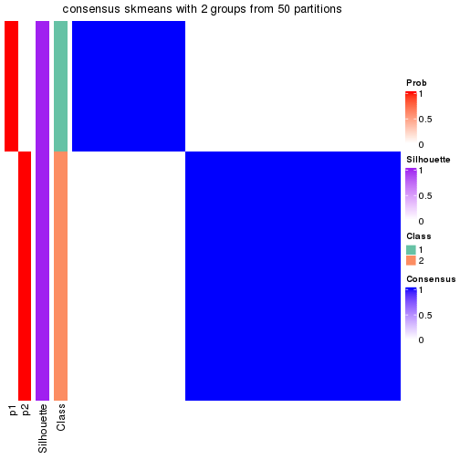</p>

</div>
<div id='tab-node-01-consensus-heatmap-2'>
<pre><code class="r">consensus_heatmap(res, k = 3)
</code></pre>

<p>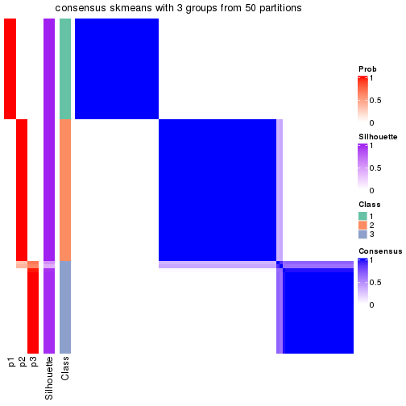</p>

</div>
<div id='tab-node-01-consensus-heatmap-3'>
<pre><code class="r">consensus_heatmap(res, k = 4)
</code></pre>

<p>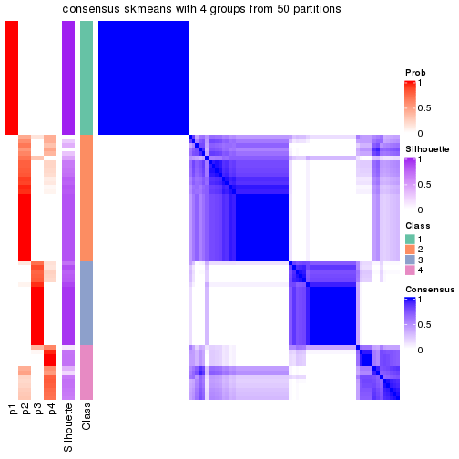</p>

</div>
<div id='tab-node-01-consensus-heatmap-4'>
<pre><code class="r">consensus_heatmap(res, k = 5)
</code></pre>

<p>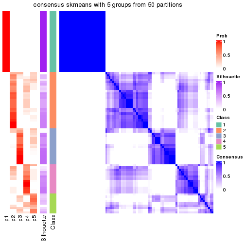</p>

</div>
<div id='tab-node-01-consensus-heatmap-5'>
<pre><code class="r">consensus_heatmap(res, k = 6)
</code></pre>

<p>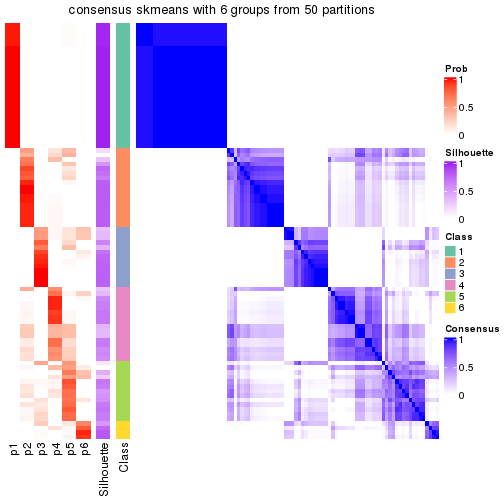</p>

</div>
<div id='tab-node-01-consensus-heatmap-6'>
<pre><code class="r">consensus_heatmap(res, k = 7)
</code></pre>

<p></p>

</div>
<div id='tab-node-01-consensus-heatmap-7'>
<pre><code class="r">consensus_heatmap(res, k = 8)
</code></pre>

<p>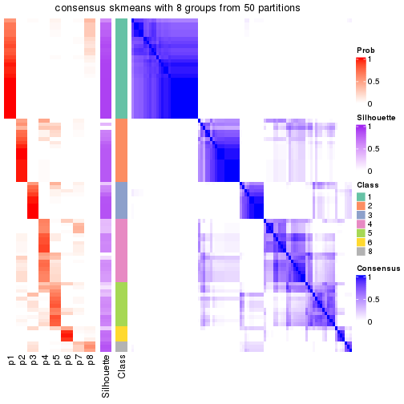</p>

</div>
</div>

Heatmaps for the membership of samples in all partitions to see how consistent they are:


<script>
$( function() {
	$( '#tabs-node-01-membership-heatmap' ).tabs();
} );
</script>
<div id='tabs-node-01-membership-heatmap'>
<ul>
<li><a href='#tab-node-01-membership-heatmap-1'>k = 2</a></li>
<li><a href='#tab-node-01-membership-heatmap-2'>k = 3</a></li>
<li><a href='#tab-node-01-membership-heatmap-3'>k = 4</a></li>
<li><a href='#tab-node-01-membership-heatmap-4'>k = 5</a></li>
<li><a href='#tab-node-01-membership-heatmap-5'>k = 6</a></li>
<li><a href='#tab-node-01-membership-heatmap-6'>k = 7</a></li>
<li><a href='#tab-node-01-membership-heatmap-7'>k = 8</a></li>
</ul>
<div id='tab-node-01-membership-heatmap-1'>
<pre><code class="r">membership_heatmap(res, k = 2)
</code></pre>

<p></p>

</div>
<div id='tab-node-01-membership-heatmap-2'>
<pre><code class="r">membership_heatmap(res, k = 3)
</code></pre>

<p>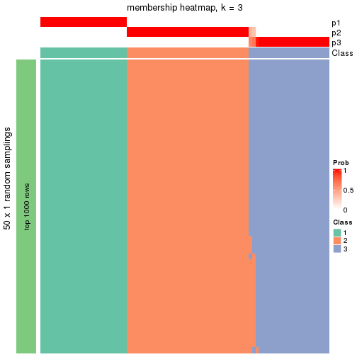</p>

</div>
<div id='tab-node-01-membership-heatmap-3'>
<pre><code class="r">membership_heatmap(res, k = 4)
</code></pre>

<p>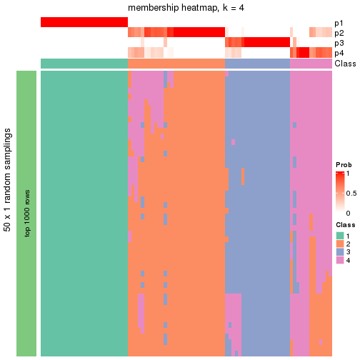</p>

</div>
<div id='tab-node-01-membership-heatmap-4'>
<pre><code class="r">membership_heatmap(res, k = 5)
</code></pre>

<p>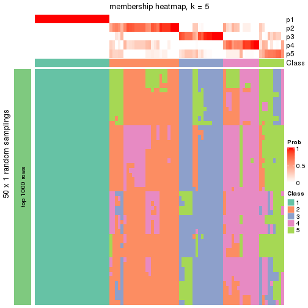</p>

</div>
<div id='tab-node-01-membership-heatmap-5'>
<pre><code class="r">membership_heatmap(res, k = 6)
</code></pre>

<p>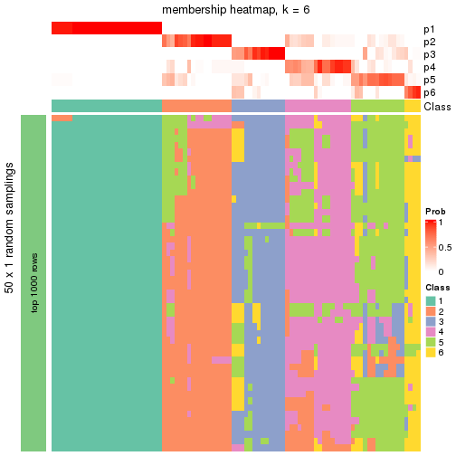</p>

</div>
<div id='tab-node-01-membership-heatmap-6'>
<pre><code class="r">membership_heatmap(res, k = 7)
</code></pre>

<p>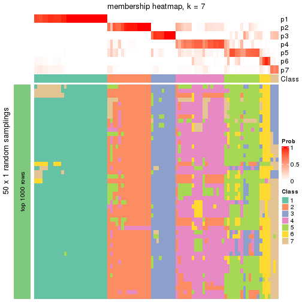</p>

</div>
<div id='tab-node-01-membership-heatmap-7'>
<pre><code class="r">membership_heatmap(res, k = 8)
</code></pre>

<p>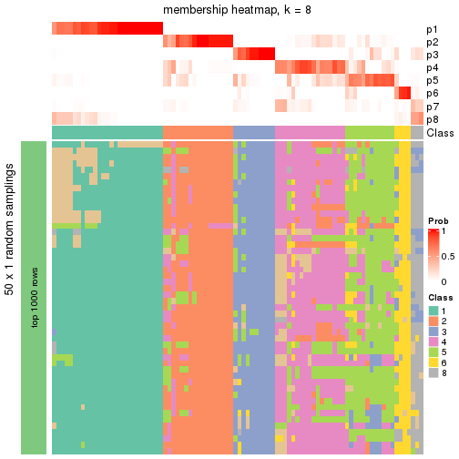</p>

</div>
</div>

As soon as the classes for columns are determined, the signatures
that are significantly different between subgroups can be looked for. 
Following are the heatmaps for signatures.


<script>
$( function() {
	$( '#tabs-node-01-get-signatures' ).tabs();
} );
</script>
<div id='tabs-node-01-get-signatures'>
<ul>
<li><a href='#tab-node-01-get-signatures-1'>k = 2</a></li>
<li><a href='#tab-node-01-get-signatures-2'>k = 3</a></li>
<li><a href='#tab-node-01-get-signatures-3'>k = 4</a></li>
<li><a href='#tab-node-01-get-signatures-4'>k = 5</a></li>
<li><a href='#tab-node-01-get-signatures-5'>k = 6</a></li>
<li><a href='#tab-node-01-get-signatures-6'>k = 7</a></li>
<li><a href='#tab-node-01-get-signatures-7'>k = 8</a></li>
</ul>
<div id='tab-node-01-get-signatures-1'>
<pre><code class="r">get_signatures(res, k = 2)
</code></pre>

<p>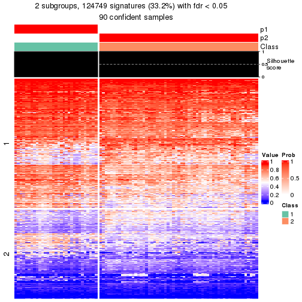</p>

</div>
<div id='tab-node-01-get-signatures-2'>
<pre><code class="r">get_signatures(res, k = 3)
</code></pre>

<p>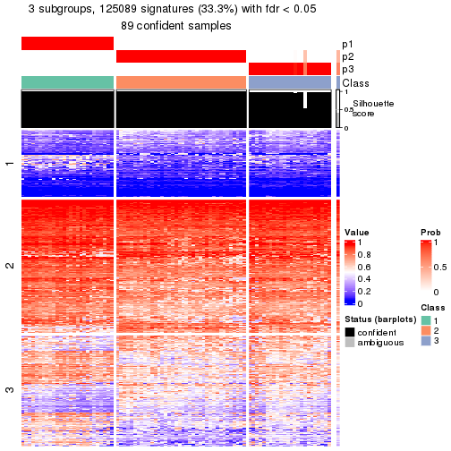</p>

</div>
<div id='tab-node-01-get-signatures-3'>
<pre><code class="r">get_signatures(res, k = 4)
</code></pre>

<p></p>

</div>
<div id='tab-node-01-get-signatures-4'>
<pre><code class="r">get_signatures(res, k = 5)
</code></pre>

<p>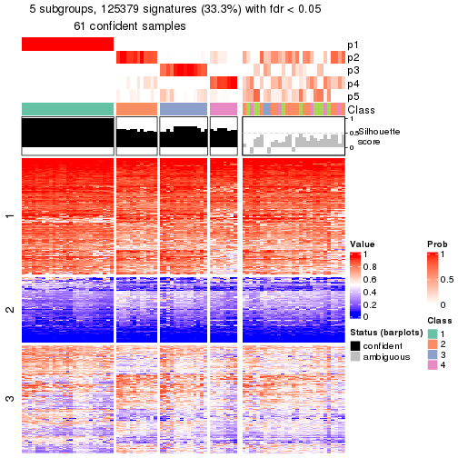</p>

</div>
<div id='tab-node-01-get-signatures-5'>
<pre><code class="r">get_signatures(res, k = 6)
</code></pre>

<p>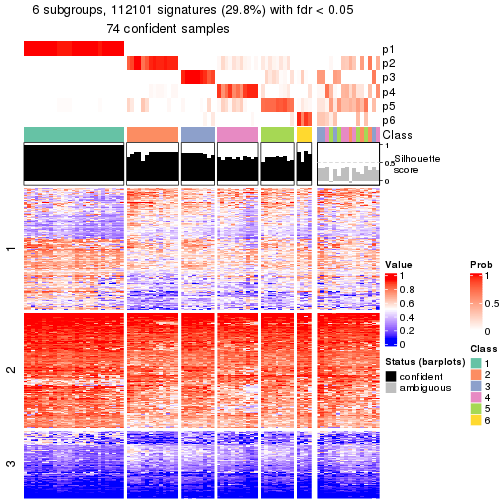</p>

</div>
<div id='tab-node-01-get-signatures-6'>
<pre><code class="r">get_signatures(res, k = 7)
</code></pre>

<p>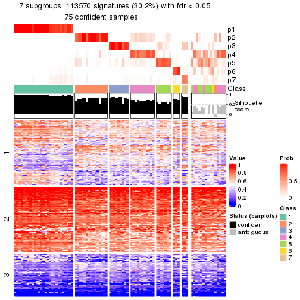</p>

</div>
<div id='tab-node-01-get-signatures-7'>
<pre><code class="r">get_signatures(res, k = 8)
</code></pre>

<p>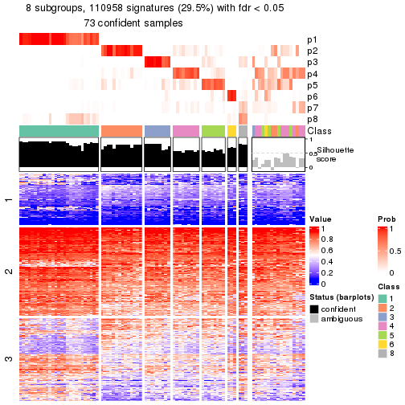</p>

</div>
</div>


Compare the overlap of signatures from different k:

```r
compare_signatures(res)
```

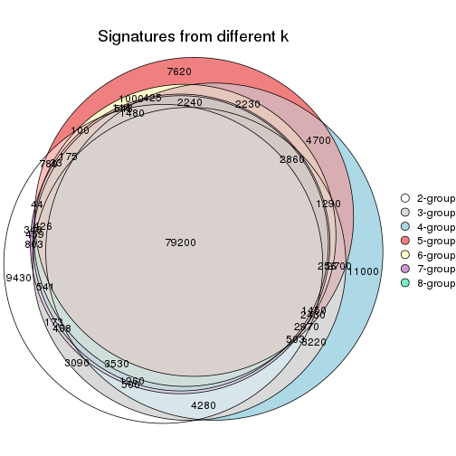

`get_signature()` returns a data frame invisibly. To get the list of signatures, the function
call should be assigned to a variable explicitly. In following code, if `plot` argument is set
to `FALSE`, no heatmap is plotted while only the differential analysis is performed.

```r
# code only for demonstration
tb = get_signature(res, k = ..., plot = FALSE)
```

An example of the output of `tb` is:

```
#>   which_row         fdr    mean_1    mean_2 scaled_mean_1 scaled_mean_2 km
#> 1        38 0.042760348  8.373488  9.131774    -0.5533452     0.5164555  1
#> 2        40 0.018707592  7.106213  8.469186    -0.6173731     0.5762149  1
#> 3        55 0.019134737 10.221463 11.207825    -0.6159697     0.5749050  1
#> 4        59 0.006059896  5.921854  7.869574    -0.6899429     0.6439467  1
#> 5        60 0.018055526  8.928898 10.211722    -0.6204761     0.5791110  1
#> 6        98 0.009384629 15.714769 14.887706     0.6635654    -0.6193277  2
...
```

The columns in `tb` are:

1. `which_row`: row indices corresponding to the input matrix.
2. `fdr`: FDR for the differential test. 
3. `mean_x`: The mean value in group x.
4. `scaled_mean_x`: The mean value in group x after rows are scaled.
5. `km`: Row groups if k-means clustering is applied to rows (which is done by automatically selecting number of clusters).

If there are too many signatures, `top_signatures = ...` can be set to only show the 
signatures with the highest FDRs:

```r
# code only for demonstration
# e.g. to show the top 500 most significant rows
tb = get_signature(res, k = ..., top_signatures = 500)
```

If the signatures are defined as these which are uniquely high in current group, `diff_method` argument
can be set to `"uniquely_high_in_one_group"`:

```r
# code only for demonstration
tb = get_signature(res, k = ..., diff_method = "uniquely_high_in_one_group")
```


UMAP plot which shows how samples are separated.


<script>
$( function() {
	$( '#tabs-node-01-dimension-reduction' ).tabs();
} );
</script>
<div id='tabs-node-01-dimension-reduction'>
<ul>
<li><a href='#tab-node-01-dimension-reduction-1'>k = 2</a></li>
<li><a href='#tab-node-01-dimension-reduction-2'>k = 3</a></li>
<li><a href='#tab-node-01-dimension-reduction-3'>k = 4</a></li>
<li><a href='#tab-node-01-dimension-reduction-4'>k = 5</a></li>
<li><a href='#tab-node-01-dimension-reduction-5'>k = 6</a></li>
<li><a href='#tab-node-01-dimension-reduction-6'>k = 7</a></li>
<li><a href='#tab-node-01-dimension-reduction-7'>k = 8</a></li>
</ul>
<div id='tab-node-01-dimension-reduction-1'>
<pre><code class="r">dimension_reduction(res, k = 2, method = &quot;UMAP&quot;)
</code></pre>

<p>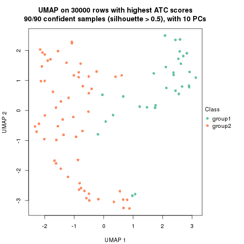</p>

</div>
<div id='tab-node-01-dimension-reduction-2'>
<pre><code class="r">dimension_reduction(res, k = 3, method = &quot;UMAP&quot;)
</code></pre>

<p>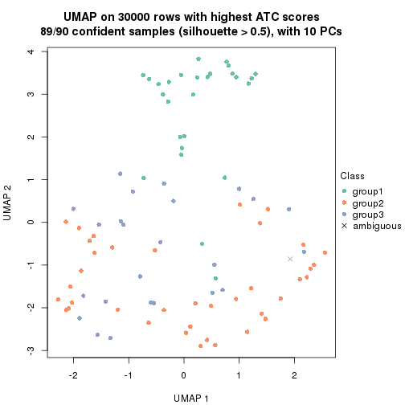</p>

</div>
<div id='tab-node-01-dimension-reduction-3'>
<pre><code class="r">dimension_reduction(res, k = 4, method = &quot;UMAP&quot;)
</code></pre>

<p>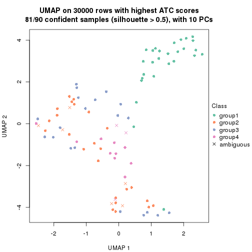</p>

</div>
<div id='tab-node-01-dimension-reduction-4'>
<pre><code class="r">dimension_reduction(res, k = 5, method = &quot;UMAP&quot;)
</code></pre>

<p>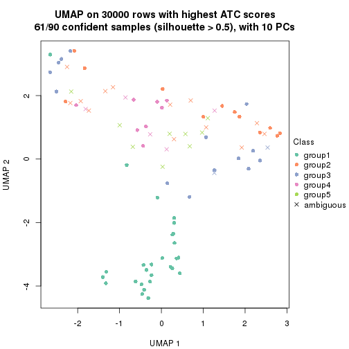</p>

</div>
<div id='tab-node-01-dimension-reduction-5'>
<pre><code class="r">dimension_reduction(res, k = 6, method = &quot;UMAP&quot;)
</code></pre>

<p>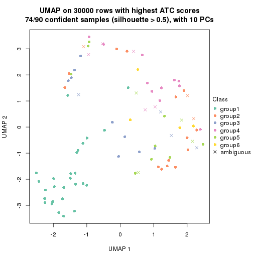</p>

</div>
<div id='tab-node-01-dimension-reduction-6'>
<pre><code class="r">dimension_reduction(res, k = 7, method = &quot;UMAP&quot;)
</code></pre>

<p>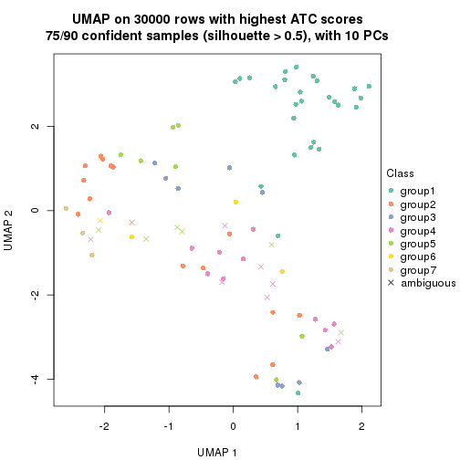</p>

</div>
<div id='tab-node-01-dimension-reduction-7'>
<pre><code class="r">dimension_reduction(res, k = 8, method = &quot;UMAP&quot;)
</code></pre>

<p>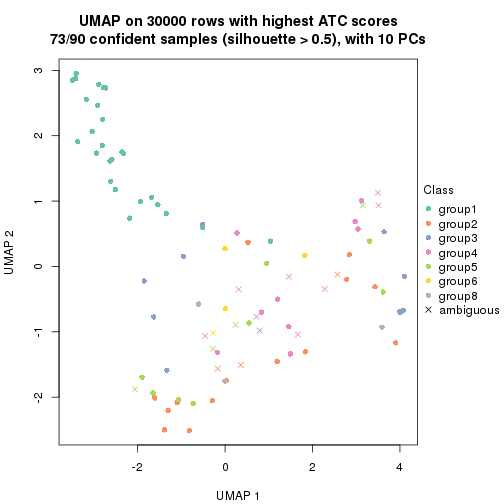</p>

</div>
</div>


Following heatmap shows how subgroups are split when increasing `k`:

```r
collect_classes(res)
```

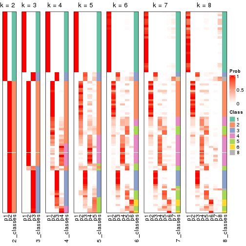


If matrix rows can be associated to genes, consider to use `functional_enrichment(res,
...)` to perform function enrichment for the signature genes. See [this vignette](https://jokergoo.github.io/cola_vignettes/functional_enrichment.html) for more detailed explanations.


 

---------------------------------------------------


### Node011


Parent node: [Node01](#Node01).
Child nodes: 
                Node0111-leaf
        ,
                Node0112-leaf
        ,
                Node0113-leaf
        ,
                [Node0121](#Node0121)
        ,
                [Node0122](#Node0122)
        ,
                [Node0211](#Node0211)
        ,
                [Node0212](#Node0212)
        ,
                [Node0213](#Node0213)
        ,
                [Node0221](#Node0221)
        ,
                [Node0222](#Node0222)
        ,
                [Node0223](#Node0223)
        ,
                [Node0224](#Node0224)
        ,
                Node0225-leaf
        ,
                Node0231-leaf
        ,
                [Node0232](#Node0232)
        ,
                Node0233-leaf
        ,
                Node0234-leaf
        ,
                Node0331-leaf
        ,
                Node0332-leaf
        ,
                Node0333-leaf
        ,
                Node0431-leaf
        ,
                Node0432-leaf
        ,
                Node0433-leaf
        ,
                [Node0511](#Node0511)
        ,
                [Node0512](#Node0512)
        ,
                Node0521-leaf
        ,
                [Node0522](#Node0522)
        ,
                Node0523-leaf
        ,
                Node0524-leaf
        .


The object with results only for a single top-value method and a single partitioning method 
can be extracted as:

```r
res = res_rh["011"]
```

A summary of `res` and all the functions that can be applied to it:

```r
res
```

```
#> A 'ConsensusPartition' object with k = 2, 3, 4, 5, 6, 7, 8.
#>   On a matrix with 30000 rows and 27 columns.
#>   Top rows (1000) are extracted by 'ATC' method.
#>   Subgroups are detected by 'skmeans' method.
#>   Performed in total 350 partitions by row resampling.
#>   Best k for subgroups seems to be 3.
#> 
#> Following methods can be applied to this 'ConsensusPartition' object:
#>  [1] "cola_report"             "collect_classes"         "collect_plots"          
#>  [4] "collect_stats"           "colnames"                "compare_partitions"     
#>  [7] "compare_signatures"      "consensus_heatmap"       "dimension_reduction"    
#> [10] "functional_enrichment"   "get_anno_col"            "get_anno"               
#> [13] "get_classes"             "get_consensus"           "get_matrix"             
#> [16] "get_membership"          "get_param"               "get_signatures"         
#> [19] "get_stats"               "is_best_k"               "is_stable_k"            
#> [22] "membership_heatmap"      "ncol"                    "nrow"                   
#> [25] "plot_ecdf"               "predict_classes"         "rownames"               
#> [28] "select_partition_number" "show"                    "suggest_best_k"         
#> [31] "test_to_known_factors"   "top_rows_heatmap"
```

`collect_plots()` function collects all the plots made from `res` for all `k` (number of subgroups)
into one single page to provide an easy and fast comparison between different `k`.

```r
collect_plots(res)
```

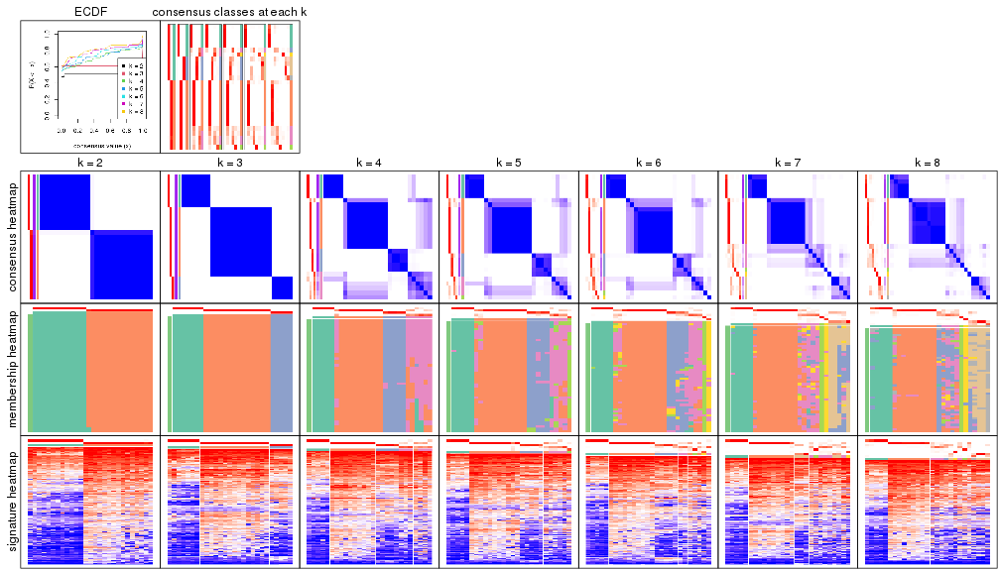

The plots are:

- The first row: a plot of the eCDF (empirical cumulative distribution
  function) curves of the consensus matrix for each `k` and the heatmap of
  predicted classes for each `k`.
- The second row: heatmaps of the consensus matrix for each `k`.
- The third row: heatmaps of the membership matrix for each `k`.
- The fouth row: heatmaps of the signatures for each `k`.

All the plots in panels can be made by individual functions and they are
plotted later in this section.

`select_partition_number()` produces several plots showing different
statistics for choosing "optimized" `k`. There are following statistics:

- eCDF curves of the consensus matrix for each `k`;
- 1-PAC. [The PAC score](https://en.wikipedia.org/wiki/Consensus_clustering#Over-interpretation_potential_of_consensus_clustering)
  measures the proportion of the ambiguous subgrouping.
- Mean silhouette score.
- Concordance. The mean probability of fiting the consensus subgroup labels in all
  partitions.
- Area increased. Denote $A_k$ as the area under the eCDF curve for current
  `k`, the area increased is defined as $A_k - A_{k-1}$.
- Rand index. The percent of pairs of samples that are both in a same cluster
  or both are not in a same cluster in the partition of k and k-1.
- Jaccard index. The ratio of pairs of samples are both in a same cluster in
  the partition of k and k-1 and the pairs of samples are both in a same
  cluster in the partition k or k-1.

The detailed explanations of these statistics can be found in [the _cola_
vignette](https://jokergoo.github.io/cola_vignettes/cola.html#toc_13).

Generally speaking, higher 1-PAC score, higher mean silhouette score or higher
concordance corresponds to better partition. Rand index and Jaccard index
measure how similar the current partition is compared to partition with `k-1`.
If they are too similar, we won't accept `k` is better than `k-1`.

```r
select_partition_number(res)
```

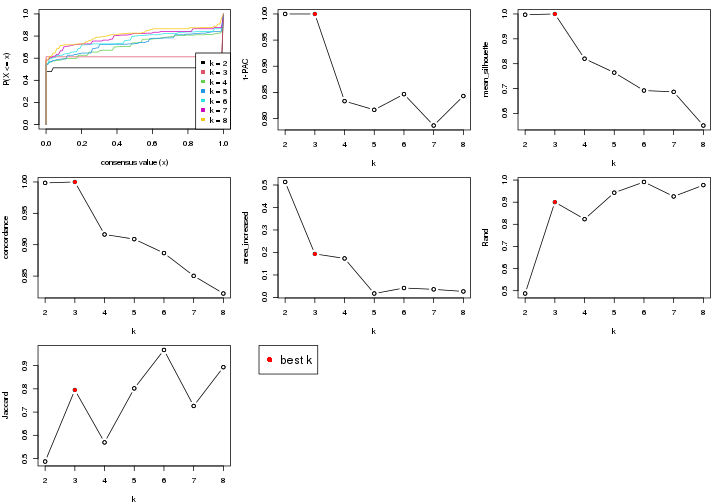

The numeric values for all these statistics can be obtained by `get_stats()`.

```r
get_stats(res)
```

```
#>   k 1-PAC mean_silhouette concordance area_increased  Rand Jaccard
#> 2 2 1.000           0.997       0.999         0.5135 0.487   0.487
#> 3 3 1.000           1.000       1.000         0.1935 0.900   0.795
#> 4 4 0.833           0.820       0.916         0.1735 0.823   0.569
#> 5 5 0.817           0.764       0.909         0.0175 0.943   0.802
#> 6 6 0.847           0.692       0.887         0.0420 0.991   0.967
#> 7 7 0.787           0.687       0.850         0.0361 0.926   0.726
#> 8 8 0.843           0.551       0.822         0.0267 0.977   0.893
```

`suggest_best_k()` suggests the best $k$ based on these statistics. The rules are as follows:

- All $k$ with Jaccard index larger than 0.95 are removed because increasing
  $k$ does not provide enough extra information. If all $k$ are removed, it is
  marked as no subgroup is detected.
- For all $k$ with 1-PAC score larger than 0.9, the maximal $k$ is taken as
  the best $k$, and other $k$ are marked as optional $k$.
- If it does not fit the second rule. The $k$ with the maximal vote of the
  highest 1-PAC score, highest mean silhouette, and highest concordance is
  taken as the best $k$.

```r
suggest_best_k(res)
```

```
#> [1] 3
#> attr(,"optional")
#> [1] 2
```

There is also optional best $k$ = 2 that is worth to check.

Following is the table of the partitions (You need to click the **show/hide
code output** link to see it). The membership matrix (columns with name `p*`)
is inferred by
[`clue::cl_consensus()`](https://www.rdocumentation.org/link/cl_consensus?package=clue)
function with the `SE` method. Basically the value in the membership matrix
represents the probability to belong to a certain group. The finall subgroup
label for an item is determined with the group with highest probability it
belongs to.

In `get_classes()` function, the entropy is calculated from the membership
matrix and the silhouette score is calculated from the consensus matrix.


<script>
$( function() {
	$( '#tabs-node-011-get-classes' ).tabs();
} );
</script>
<div id='tabs-node-011-get-classes'>
<ul>
<li><a href='#tab-node-011-get-classes-1'>k = 2</a></li>
<li><a href='#tab-node-011-get-classes-2'>k = 3</a></li>
<li><a href='#tab-node-011-get-classes-3'>k = 4</a></li>
<li><a href='#tab-node-011-get-classes-4'>k = 5</a></li>
<li><a href='#tab-node-011-get-classes-5'>k = 6</a></li>
<li><a href='#tab-node-011-get-classes-6'>k = 7</a></li>
<li><a href='#tab-node-011-get-classes-7'>k = 8</a></li>
</ul>

<div id='tab-node-011-get-classes-1'>
<p><a id='tab-node-011-get-classes-1-a' style='color:#0366d6' href='#'>show/hide code output</a></p>
<pre><code class="r">cbind(get_classes(res, k = 2), get_membership(res, k = 2))
</code></pre>

<pre><code>#&gt;                 class entropy silhouette   p1   p2
#&gt; TCGA.CV.7414.01     2   0.000      0.997 0.00 1.00
#&gt; TCGA.CN.6010.01     2   0.000      0.997 0.00 1.00
#&gt; TCGA.CQ.5332.01     2   0.000      0.997 0.00 1.00
#&gt; TCGA.CV.7101.01     2   0.000      0.997 0.00 1.00
#&gt; TCGA.CN.6012.01     1   0.000      1.000 1.00 0.00
#&gt; TCGA.CV.7424.01     1   0.000      1.000 1.00 0.00
#&gt; TCGA.CV.7418.01     2   0.242      0.958 0.04 0.96
#&gt; TCGA.CR.7374.01     1   0.000      1.000 1.00 0.00
#&gt; TCGA.CV.7261.01     2   0.000      0.997 0.00 1.00
#&gt; TCGA.DQ.5629.01     1   0.000      1.000 1.00 0.00
#&gt; TCGA.CN.6997.01     2   0.000      0.997 0.00 1.00
#&gt; TCGA.CN.6992.01     1   0.000      1.000 1.00 0.00
#&gt; TCGA.CV.6962.01     1   0.000      1.000 1.00 0.00
#&gt; TCGA.CV.6948.01     1   0.000      1.000 1.00 0.00
#&gt; TCGA.HD.8314.01     2   0.000      0.997 0.00 1.00
#&gt; TCGA.QK.A8ZA.01     2   0.000      0.997 0.00 1.00
#&gt; TCGA.CQ.A4CI.01     2   0.000      0.997 0.00 1.00
#&gt; TCGA.UF.A71E.01     2   0.000      0.997 0.00 1.00
#&gt; TCGA.T2.A6X0.01     2   0.000      0.997 0.00 1.00
#&gt; TCGA.BB.7862.01     1   0.000      1.000 1.00 0.00
#&gt; TCGA.BA.4078.01     2   0.000      0.997 0.00 1.00
#&gt; TCGA.UF.A71A.01     1   0.000      1.000 1.00 0.00
#&gt; TCGA.TN.A7HI.01     2   0.000      0.997 0.00 1.00
#&gt; TCGA.BA.A6D8.01     2   0.000      0.997 0.00 1.00
#&gt; TCGA.CV.7446.01     1   0.000      1.000 1.00 0.00
#&gt; TCGA.CR.7370.01     1   0.000      1.000 1.00 0.00
#&gt; TCGA.UF.A71A.06     1   0.000      1.000 1.00 0.00
</code></pre>

<script>
$('#tab-node-011-get-classes-1-a').parent().next().next().hide();
$('#tab-node-011-get-classes-1-a').click(function(){
  $('#tab-node-011-get-classes-1-a').parent().next().next().toggle();
  return(false);
});
</script>
</div>

<div id='tab-node-011-get-classes-2'>
<p><a id='tab-node-011-get-classes-2-a' style='color:#0366d6' href='#'>show/hide code output</a></p>
<pre><code class="r">cbind(get_classes(res, k = 3), get_membership(res, k = 3))
</code></pre>

<pre><code>#&gt;                 class entropy silhouette p1 p2 p3
#&gt; TCGA.CV.7414.01     2       0          1  0  1  0
#&gt; TCGA.CN.6010.01     2       0          1  0  1  0
#&gt; TCGA.CQ.5332.01     2       0          1  0  1  0
#&gt; TCGA.CV.7101.01     2       0          1  0  1  0
#&gt; TCGA.CN.6012.01     1       0          1  1  0  0
#&gt; TCGA.CV.7424.01     3       0          1  0  0  1
#&gt; TCGA.CV.7418.01     2       0          1  0  1  0
#&gt; TCGA.CR.7374.01     1       0          1  1  0  0
#&gt; TCGA.CV.7261.01     2       0          1  0  1  0
#&gt; TCGA.DQ.5629.01     1       0          1  1  0  0
#&gt; TCGA.CN.6997.01     2       0          1  0  1  0
#&gt; TCGA.CN.6992.01     1       0          1  1  0  0
#&gt; TCGA.CV.6962.01     3       0          1  0  0  1
#&gt; TCGA.CV.6948.01     3       0          1  0  0  1
#&gt; TCGA.HD.8314.01     2       0          1  0  1  0
#&gt; TCGA.QK.A8ZA.01     2       0          1  0  1  0
#&gt; TCGA.CQ.A4CI.01     2       0          1  0  1  0
#&gt; TCGA.UF.A71E.01     2       0          1  0  1  0
#&gt; TCGA.T2.A6X0.01     2       0          1  0  1  0
#&gt; TCGA.BB.7862.01     1       0          1  1  0  0
#&gt; TCGA.BA.4078.01     2       0          1  0  1  0
#&gt; TCGA.UF.A71A.01     3       0          1  0  0  1
#&gt; TCGA.TN.A7HI.01     2       0          1  0  1  0
#&gt; TCGA.BA.A6D8.01     2       0          1  0  1  0
#&gt; TCGA.CV.7446.01     1       0          1  1  0  0
#&gt; TCGA.CR.7370.01     1       0          1  1  0  0
#&gt; TCGA.UF.A71A.06     3       0          1  0  0  1
</code></pre>

<script>
$('#tab-node-011-get-classes-2-a').parent().next().next().hide();
$('#tab-node-011-get-classes-2-a').click(function(){
  $('#tab-node-011-get-classes-2-a').parent().next().next().toggle();
  return(false);
});
</script>
</div>

<div id='tab-node-011-get-classes-3'>
<p><a id='tab-node-011-get-classes-3-a' style='color:#0366d6' href='#'>show/hide code output</a></p>
<pre><code class="r">cbind(get_classes(res, k = 4), get_membership(res, k = 4))
</code></pre>

<pre><code>#&gt;                 class entropy silhouette  p1   p2   p3   p4
#&gt; TCGA.CV.7414.01     2  0.0000      0.937 0.0 1.00 0.00 0.00
#&gt; TCGA.CN.6010.01     2  0.0000      0.937 0.0 1.00 0.00 0.00
#&gt; TCGA.CQ.5332.01     2  0.4977     -0.265 0.0 0.54 0.00 0.46
#&gt; TCGA.CV.7101.01     2  0.0000      0.937 0.0 1.00 0.00 0.00
#&gt; TCGA.CN.6012.01     4  0.5062      0.399 0.3 0.00 0.02 0.68
#&gt; TCGA.CV.7424.01     3  0.1637      0.953 0.0 0.00 0.94 0.06
#&gt; TCGA.CV.7418.01     4  0.3400      0.705 0.0 0.18 0.00 0.82
#&gt; TCGA.CR.7374.01     1  0.0000      1.000 1.0 0.00 0.00 0.00
#&gt; TCGA.CV.7261.01     4  0.3975      0.686 0.0 0.24 0.00 0.76
#&gt; TCGA.DQ.5629.01     1  0.0000      1.000 1.0 0.00 0.00 0.00
#&gt; TCGA.CN.6997.01     4  0.4790      0.465 0.0 0.38 0.00 0.62
#&gt; TCGA.CN.6992.01     1  0.0000      1.000 1.0 0.00 0.00 0.00
#&gt; TCGA.CV.6962.01     3  0.0707      0.981 0.0 0.00 0.98 0.02
#&gt; TCGA.CV.6948.01     3  0.0707      0.981 0.0 0.00 0.98 0.02
#&gt; TCGA.HD.8314.01     2  0.0000      0.937 0.0 1.00 0.00 0.00
#&gt; TCGA.QK.A8ZA.01     2  0.0000      0.937 0.0 1.00 0.00 0.00
#&gt; TCGA.CQ.A4CI.01     2  0.0000      0.937 0.0 1.00 0.00 0.00
#&gt; TCGA.UF.A71E.01     2  0.0000      0.937 0.0 1.00 0.00 0.00
#&gt; TCGA.T2.A6X0.01     2  0.0000      0.937 0.0 1.00 0.00 0.00
#&gt; TCGA.BB.7862.01     4  0.2345      0.577 0.1 0.00 0.00 0.90
#&gt; TCGA.BA.4078.01     4  0.4994      0.330 0.0 0.48 0.00 0.52
#&gt; TCGA.UF.A71A.01     3  0.0000      0.978 0.0 0.00 1.00 0.00
#&gt; TCGA.TN.A7HI.01     2  0.0000      0.937 0.0 1.00 0.00 0.00
#&gt; TCGA.BA.A6D8.01     2  0.0000      0.937 0.0 1.00 0.00 0.00
#&gt; TCGA.CV.7446.01     1  0.0000      1.000 1.0 0.00 0.00 0.00
#&gt; TCGA.CR.7370.01     1  0.0000      1.000 1.0 0.00 0.00 0.00
#&gt; TCGA.UF.A71A.06     3  0.0000      0.978 0.0 0.00 1.00 0.00
</code></pre>

<script>
$('#tab-node-011-get-classes-3-a').parent().next().next().hide();
$('#tab-node-011-get-classes-3-a').click(function(){
  $('#tab-node-011-get-classes-3-a').parent().next().next().toggle();
  return(false);
});
</script>
</div>

<div id='tab-node-011-get-classes-4'>
<p><a id='tab-node-011-get-classes-4-a' style='color:#0366d6' href='#'>show/hide code output</a></p>
<pre><code class="r">cbind(get_classes(res, k = 5), get_membership(res, k = 5))
</code></pre>

<pre><code>#&gt;                 class entropy silhouette   p1   p2   p3   p4   p5
#&gt; TCGA.CV.7414.01     2  0.0000      0.922 0.00 1.00 0.00 0.00 0.00
#&gt; TCGA.CN.6010.01     2  0.0000      0.922 0.00 1.00 0.00 0.00 0.00
#&gt; TCGA.CQ.5332.01     2  0.4872      0.537 0.00 0.72 0.00 0.12 0.16
#&gt; TCGA.CV.7101.01     2  0.0000      0.922 0.00 1.00 0.00 0.00 0.00
#&gt; TCGA.CN.6012.01     4  0.5692      0.314 0.26 0.00 0.02 0.64 0.08
#&gt; TCGA.CV.7424.01     3  0.2929      0.791 0.00 0.00 0.82 0.18 0.00
#&gt; TCGA.CV.7418.01     4  0.6502      0.428 0.00 0.26 0.02 0.56 0.16
#&gt; TCGA.CR.7374.01     1  0.0609      0.976 0.98 0.00 0.00 0.02 0.00
#&gt; TCGA.CV.7261.01     4  0.6133      0.398 0.00 0.30 0.00 0.54 0.16
#&gt; TCGA.DQ.5629.01     1  0.0000      0.994 1.00 0.00 0.00 0.00 0.00
#&gt; TCGA.CN.6997.01     5  0.2280      0.000 0.00 0.12 0.00 0.00 0.88
#&gt; TCGA.CN.6992.01     1  0.0000      0.994 1.00 0.00 0.00 0.00 0.00
#&gt; TCGA.CV.6962.01     3  0.1043      0.908 0.00 0.00 0.96 0.04 0.00
#&gt; TCGA.CV.6948.01     3  0.1648      0.904 0.00 0.00 0.94 0.04 0.02
#&gt; TCGA.HD.8314.01     2  0.0000      0.922 0.00 1.00 0.00 0.00 0.00
#&gt; TCGA.QK.A8ZA.01     2  0.0000      0.922 0.00 1.00 0.00 0.00 0.00
#&gt; TCGA.CQ.A4CI.01     2  0.0000      0.922 0.00 1.00 0.00 0.00 0.00
#&gt; TCGA.UF.A71E.01     2  0.0000      0.922 0.00 1.00 0.00 0.00 0.00
#&gt; TCGA.T2.A6X0.01     2  0.0000      0.922 0.00 1.00 0.00 0.00 0.00
#&gt; TCGA.BB.7862.01     4  0.1732      0.276 0.00 0.00 0.00 0.92 0.08
#&gt; TCGA.BA.4078.01     2  0.5297      0.100 0.00 0.58 0.00 0.36 0.06
#&gt; TCGA.UF.A71A.01     3  0.1043      0.903 0.00 0.00 0.96 0.00 0.04
#&gt; TCGA.TN.A7HI.01     2  0.0000      0.922 0.00 1.00 0.00 0.00 0.00
#&gt; TCGA.BA.A6D8.01     2  0.0000      0.922 0.00 1.00 0.00 0.00 0.00
#&gt; TCGA.CV.7446.01     1  0.0000      0.994 1.00 0.00 0.00 0.00 0.00
#&gt; TCGA.CR.7370.01     1  0.0000      0.994 1.00 0.00 0.00 0.00 0.00
#&gt; TCGA.UF.A71A.06     3  0.1043      0.903 0.00 0.00 0.96 0.00 0.04
</code></pre>

<script>
$('#tab-node-011-get-classes-4-a').parent().next().next().hide();
$('#tab-node-011-get-classes-4-a').click(function(){
  $('#tab-node-011-get-classes-4-a').parent().next().next().toggle();
  return(false);
});
</script>
</div>

<div id='tab-node-011-get-classes-5'>
<p><a id='tab-node-011-get-classes-5-a' style='color:#0366d6' href='#'>show/hide code output</a></p>
<pre><code class="r">cbind(get_classes(res, k = 6), get_membership(res, k = 6))
</code></pre>

<pre><code>#&gt;                 class entropy silhouette   p1   p2   p3   p4   p5   p6
#&gt; TCGA.CV.7414.01     2  0.1267     0.8363 0.00 0.94 0.00 0.06 0.00 0.00
#&gt; TCGA.CN.6010.01     2  0.0000     0.8817 0.00 1.00 0.00 0.00 0.00 0.00
#&gt; TCGA.CQ.5332.01     2  0.6423    -0.0883 0.00 0.48 0.00 0.30 0.18 0.04
#&gt; TCGA.CV.7101.01     2  0.0000     0.8817 0.00 1.00 0.00 0.00 0.00 0.00
#&gt; TCGA.CN.6012.01     4  0.3258     0.4583 0.10 0.02 0.00 0.84 0.00 0.04
#&gt; TCGA.CV.7424.01     3  0.5174     0.5487 0.02 0.00 0.56 0.38 0.02 0.02
#&gt; TCGA.CV.7418.01     4  0.5184     0.6672 0.00 0.20 0.00 0.66 0.12 0.02
#&gt; TCGA.CR.7374.01     1  0.0547     0.9782 0.98 0.00 0.00 0.02 0.00 0.00
#&gt; TCGA.CV.7261.01     4  0.3829     0.6994 0.00 0.18 0.00 0.76 0.06 0.00
#&gt; TCGA.DQ.5629.01     1  0.0000     0.9946 1.00 0.00 0.00 0.00 0.00 0.00
#&gt; TCGA.CN.6997.01     5  0.0547     0.0000 0.00 0.00 0.00 0.02 0.98 0.00
#&gt; TCGA.CN.6992.01     1  0.0000     0.9946 1.00 0.00 0.00 0.00 0.00 0.00
#&gt; TCGA.CV.6962.01     3  0.3873     0.7457 0.00 0.00 0.78 0.16 0.02 0.04
#&gt; TCGA.CV.6948.01     3  0.4475     0.7077 0.00 0.00 0.70 0.20 0.00 0.10
#&gt; TCGA.HD.8314.01     2  0.0000     0.8817 0.00 1.00 0.00 0.00 0.00 0.00
#&gt; TCGA.QK.A8ZA.01     2  0.0000     0.8817 0.00 1.00 0.00 0.00 0.00 0.00
#&gt; TCGA.CQ.A4CI.01     2  0.0000     0.8817 0.00 1.00 0.00 0.00 0.00 0.00
#&gt; TCGA.UF.A71E.01     2  0.0000     0.8817 0.00 1.00 0.00 0.00 0.00 0.00
#&gt; TCGA.T2.A6X0.01     2  0.0000     0.8817 0.00 1.00 0.00 0.00 0.00 0.00
#&gt; TCGA.BB.7862.01     6  0.2260     0.0000 0.00 0.00 0.00 0.14 0.00 0.86
#&gt; TCGA.BA.4078.01     2  0.6053    -0.2603 0.00 0.44 0.00 0.42 0.04 0.10
#&gt; TCGA.UF.A71A.01     3  0.0937     0.7378 0.00 0.00 0.96 0.00 0.00 0.04
#&gt; TCGA.TN.A7HI.01     2  0.0000     0.8817 0.00 1.00 0.00 0.00 0.00 0.00
#&gt; TCGA.BA.A6D8.01     2  0.0000     0.8817 0.00 1.00 0.00 0.00 0.00 0.00
#&gt; TCGA.CV.7446.01     1  0.0000     0.9946 1.00 0.00 0.00 0.00 0.00 0.00
#&gt; TCGA.CR.7370.01     1  0.0000     0.9946 1.00 0.00 0.00 0.00 0.00 0.00
#&gt; TCGA.UF.A71A.06     3  0.0937     0.7378 0.00 0.00 0.96 0.00 0.00 0.04
</code></pre>

<script>
$('#tab-node-011-get-classes-5-a').parent().next().next().hide();
$('#tab-node-011-get-classes-5-a').click(function(){
  $('#tab-node-011-get-classes-5-a').parent().next().next().toggle();
  return(false);
});
</script>
</div>

<div id='tab-node-011-get-classes-6'>
<p><a id='tab-node-011-get-classes-6-a' style='color:#0366d6' href='#'>show/hide code output</a></p>
<pre><code class="r">cbind(get_classes(res, k = 7), get_membership(res, k = 7))
</code></pre>

<pre><code>#&gt;                 class entropy silhouette   p1   p2   p3   p4   p5   p6   p7
#&gt; TCGA.CV.7414.01     2   0.334      0.759 0.00 0.82 0.04 0.10 0.00 0.04 0.00
#&gt; TCGA.CN.6010.01     2   0.000      0.977 0.00 1.00 0.00 0.00 0.00 0.00 0.00
#&gt; TCGA.CQ.5332.01     4   0.704      0.304 0.00 0.26 0.10 0.46 0.10 0.08 0.00
#&gt; TCGA.CV.7101.01     2   0.000      0.977 0.00 1.00 0.00 0.00 0.00 0.00 0.00
#&gt; TCGA.CN.6012.01     4   0.583      0.195 0.06 0.00 0.14 0.64 0.00 0.08 0.08
#&gt; TCGA.CV.7424.01     7   0.613      0.336 0.00 0.00 0.26 0.16 0.00 0.08 0.50
#&gt; TCGA.CV.7418.01     4   0.539      0.354 0.00 0.08 0.12 0.68 0.00 0.08 0.04
#&gt; TCGA.CR.7374.01     1   0.151      0.933 0.94 0.00 0.02 0.02 0.00 0.02 0.00
#&gt; TCGA.CV.7261.01     4   0.425      0.436 0.00 0.10 0.02 0.78 0.02 0.06 0.02
#&gt; TCGA.DQ.5629.01     1   0.000      0.984 1.00 0.00 0.00 0.00 0.00 0.00 0.00
#&gt; TCGA.CN.6997.01     5   0.000      0.000 0.00 0.00 0.00 0.00 1.00 0.00 0.00
#&gt; TCGA.CN.6992.01     1   0.000      0.984 1.00 0.00 0.00 0.00 0.00 0.00 0.00
#&gt; TCGA.CV.6962.01     7   0.000      0.571 0.00 0.00 0.00 0.00 0.00 0.00 1.00
#&gt; TCGA.CV.6948.01     7   0.452      0.411 0.00 0.00 0.34 0.04 0.00 0.02 0.60
#&gt; TCGA.HD.8314.01     2   0.000      0.977 0.00 1.00 0.00 0.00 0.00 0.00 0.00
#&gt; TCGA.QK.A8ZA.01     2   0.000      0.977 0.00 1.00 0.00 0.00 0.00 0.00 0.00
#&gt; TCGA.CQ.A4CI.01     2   0.000      0.977 0.00 1.00 0.00 0.00 0.00 0.00 0.00
#&gt; TCGA.UF.A71E.01     2   0.000      0.977 0.00 1.00 0.00 0.00 0.00 0.00 0.00
#&gt; TCGA.T2.A6X0.01     2   0.000      0.977 0.00 1.00 0.00 0.00 0.00 0.00 0.00
#&gt; TCGA.BB.7862.01     6   0.143      0.000 0.00 0.00 0.00 0.08 0.00 0.92 0.00
#&gt; TCGA.BA.4078.01     4   0.432      0.343 0.00 0.38 0.02 0.58 0.00 0.02 0.00
#&gt; TCGA.UF.A71A.01     7   0.346      0.581 0.00 0.00 0.40 0.00 0.00 0.00 0.60
#&gt; TCGA.TN.A7HI.01     2   0.000      0.977 0.00 1.00 0.00 0.00 0.00 0.00 0.00
#&gt; TCGA.BA.A6D8.01     2   0.000      0.977 0.00 1.00 0.00 0.00 0.00 0.00 0.00
#&gt; TCGA.CV.7446.01     1   0.000      0.984 1.00 0.00 0.00 0.00 0.00 0.00 0.00
#&gt; TCGA.CR.7370.01     1   0.000      0.984 1.00 0.00 0.00 0.00 0.00 0.00 0.00
#&gt; TCGA.UF.A71A.06     7   0.346      0.581 0.00 0.00 0.40 0.00 0.00 0.00 0.60
</code></pre>

<script>
$('#tab-node-011-get-classes-6-a').parent().next().next().hide();
$('#tab-node-011-get-classes-6-a').click(function(){
  $('#tab-node-011-get-classes-6-a').parent().next().next().toggle();
  return(false);
});
</script>
</div>

<div id='tab-node-011-get-classes-7'>
<p><a id='tab-node-011-get-classes-7-a' style='color:#0366d6' href='#'>show/hide code output</a></p>
<pre><code class="r">cbind(get_classes(res, k = 8), get_membership(res, k = 8))
</code></pre>

<pre><code>#&gt;                 class entropy silhouette   p1   p2   p3   p4   p5   p6   p7   p8
#&gt; TCGA.CV.7414.01     2  0.5758     0.2694 0.00 0.56 0.20 0.16 0.04 0.00 0.00 0.04
#&gt; TCGA.CN.6010.01     2  0.0941     0.9158 0.00 0.96 0.02 0.02 0.00 0.00 0.00 0.00
#&gt; TCGA.CQ.5332.01     4  0.6055     0.3129 0.00 0.22 0.20 0.50 0.04 0.00 0.00 0.04
#&gt; TCGA.CV.7101.01     2  0.0000     0.9300 0.00 1.00 0.00 0.00 0.00 0.00 0.00 0.00
#&gt; TCGA.CN.6012.01     3  0.5264     0.0000 0.02 0.00 0.48 0.40 0.00 0.04 0.00 0.06
#&gt; TCGA.CV.7424.01     7  0.6135     0.1016 0.00 0.00 0.36 0.04 0.00 0.02 0.36 0.22
#&gt; TCGA.CV.7418.01     4  0.4087     0.0536 0.00 0.06 0.04 0.78 0.02 0.08 0.00 0.02
#&gt; TCGA.CR.7374.01     1  0.3178     0.8064 0.80 0.00 0.14 0.02 0.00 0.00 0.00 0.04
#&gt; TCGA.CV.7261.01     4  0.5371    -0.2153 0.00 0.08 0.22 0.62 0.04 0.02 0.00 0.02
#&gt; TCGA.DQ.5629.01     1  0.1091     0.9183 0.94 0.00 0.06 0.00 0.00 0.00 0.00 0.00
#&gt; TCGA.CN.6997.01     5  0.0471     0.0000 0.00 0.00 0.00 0.02 0.98 0.00 0.00 0.00
#&gt; TCGA.CN.6992.01     1  0.0000     0.9384 1.00 0.00 0.00 0.00 0.00 0.00 0.00 0.00
#&gt; TCGA.CV.6962.01     7  0.4747     0.2422 0.00 0.00 0.16 0.00 0.00 0.00 0.54 0.30
#&gt; TCGA.CV.6948.01     8  0.2534     0.0000 0.00 0.00 0.00 0.00 0.00 0.00 0.22 0.78
#&gt; TCGA.HD.8314.01     2  0.0000     0.9300 0.00 1.00 0.00 0.00 0.00 0.00 0.00 0.00
#&gt; TCGA.QK.A8ZA.01     2  0.0471     0.9285 0.00 0.98 0.00 0.02 0.00 0.00 0.00 0.00
#&gt; TCGA.CQ.A4CI.01     2  0.0471     0.9198 0.00 0.98 0.02 0.00 0.00 0.00 0.00 0.00
#&gt; TCGA.UF.A71E.01     2  0.0471     0.9285 0.00 0.98 0.00 0.02 0.00 0.00 0.00 0.00
#&gt; TCGA.T2.A6X0.01     2  0.0000     0.9300 0.00 1.00 0.00 0.00 0.00 0.00 0.00 0.00
#&gt; TCGA.BB.7862.01     6  0.0000     0.0000 0.00 0.00 0.00 0.00 0.00 1.00 0.00 0.00
#&gt; TCGA.BA.4078.01     4  0.6501     0.2377 0.00 0.26 0.18 0.46 0.04 0.04 0.00 0.02
#&gt; TCGA.UF.A71A.01     7  0.0000     0.4993 0.00 0.00 0.00 0.00 0.00 0.00 1.00 0.00
#&gt; TCGA.TN.A7HI.01     2  0.0000     0.9300 0.00 1.00 0.00 0.00 0.00 0.00 0.00 0.00
#&gt; TCGA.BA.A6D8.01     2  0.0471     0.9285 0.00 0.98 0.00 0.02 0.00 0.00 0.00 0.00
#&gt; TCGA.CV.7446.01     1  0.0000     0.9384 1.00 0.00 0.00 0.00 0.00 0.00 0.00 0.00
#&gt; TCGA.CR.7370.01     1  0.0000     0.9384 1.00 0.00 0.00 0.00 0.00 0.00 0.00 0.00
#&gt; TCGA.UF.A71A.06     7  0.0000     0.4993 0.00 0.00 0.00 0.00 0.00 0.00 1.00 0.00
</code></pre>

<script>
$('#tab-node-011-get-classes-7-a').parent().next().next().hide();
$('#tab-node-011-get-classes-7-a').click(function(){
  $('#tab-node-011-get-classes-7-a').parent().next().next().toggle();
  return(false);
});
</script>
</div>
</div>

Heatmaps for the consensus matrix. It visualizes the probability of two
samples to be in a same group.


<script>
$( function() {
	$( '#tabs-node-011-consensus-heatmap' ).tabs();
} );
</script>
<div id='tabs-node-011-consensus-heatmap'>
<ul>
<li><a href='#tab-node-011-consensus-heatmap-1'>k = 2</a></li>
<li><a href='#tab-node-011-consensus-heatmap-2'>k = 3</a></li>
<li><a href='#tab-node-011-consensus-heatmap-3'>k = 4</a></li>
<li><a href='#tab-node-011-consensus-heatmap-4'>k = 5</a></li>
<li><a href='#tab-node-011-consensus-heatmap-5'>k = 6</a></li>
<li><a href='#tab-node-011-consensus-heatmap-6'>k = 7</a></li>
<li><a href='#tab-node-011-consensus-heatmap-7'>k = 8</a></li>
</ul>
<div id='tab-node-011-consensus-heatmap-1'>
<pre><code class="r">consensus_heatmap(res, k = 2)
</code></pre>

<p>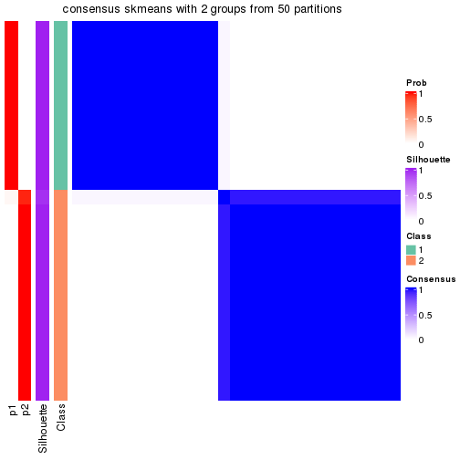</p>

</div>
<div id='tab-node-011-consensus-heatmap-2'>
<pre><code class="r">consensus_heatmap(res, k = 3)
</code></pre>

<p>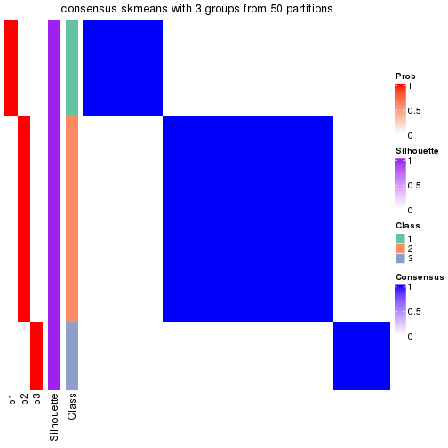</p>

</div>
<div id='tab-node-011-consensus-heatmap-3'>
<pre><code class="r">consensus_heatmap(res, k = 4)
</code></pre>

<p>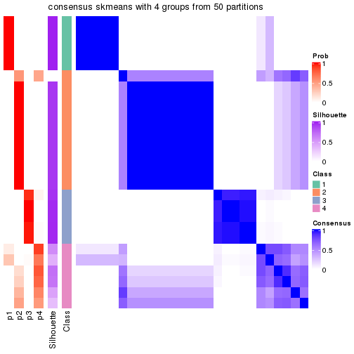</p>

</div>
<div id='tab-node-011-consensus-heatmap-4'>
<pre><code class="r">consensus_heatmap(res, k = 5)
</code></pre>

<p>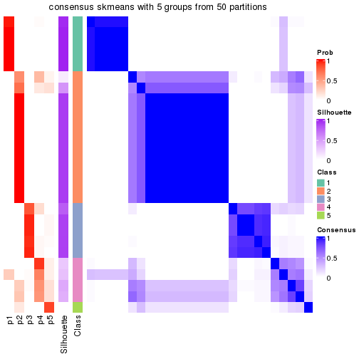</p>

</div>
<div id='tab-node-011-consensus-heatmap-5'>
<pre><code class="r">consensus_heatmap(res, k = 6)
</code></pre>

<p>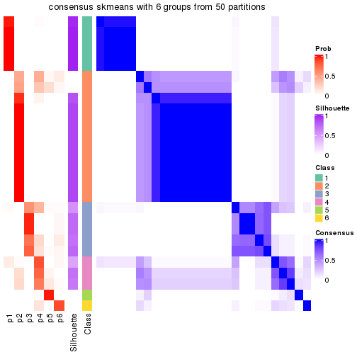</p>

</div>
<div id='tab-node-011-consensus-heatmap-6'>
<pre><code class="r">consensus_heatmap(res, k = 7)
</code></pre>

<p>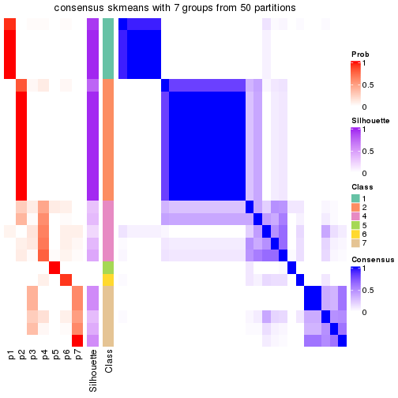</p>

</div>
<div id='tab-node-011-consensus-heatmap-7'>
<pre><code class="r">consensus_heatmap(res, k = 8)
</code></pre>

<p>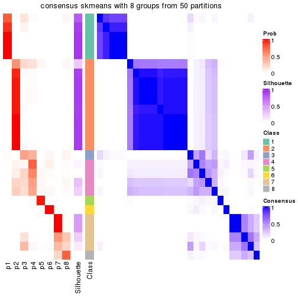</p>

</div>
</div>

Heatmaps for the membership of samples in all partitions to see how consistent they are:


<script>
$( function() {
	$( '#tabs-node-011-membership-heatmap' ).tabs();
} );
</script>
<div id='tabs-node-011-membership-heatmap'>
<ul>
<li><a href='#tab-node-011-membership-heatmap-1'>k = 2</a></li>
<li><a href='#tab-node-011-membership-heatmap-2'>k = 3</a></li>
<li><a href='#tab-node-011-membership-heatmap-3'>k = 4</a></li>
<li><a href='#tab-node-011-membership-heatmap-4'>k = 5</a></li>
<li><a href='#tab-node-011-membership-heatmap-5'>k = 6</a></li>
<li><a href='#tab-node-011-membership-heatmap-6'>k = 7</a></li>
<li><a href='#tab-node-011-membership-heatmap-7'>k = 8</a></li>
</ul>
<div id='tab-node-011-membership-heatmap-1'>
<pre><code class="r">membership_heatmap(res, k = 2)
</code></pre>

<p>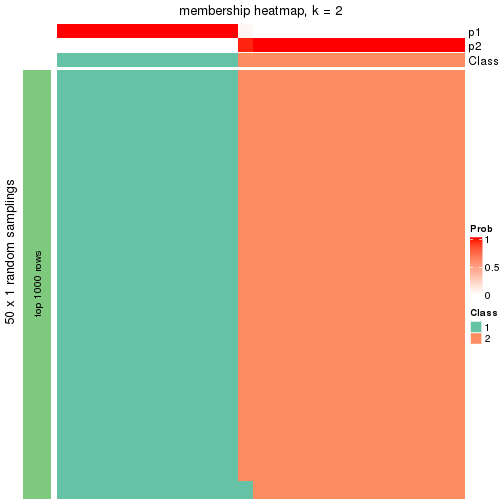</p>

</div>
<div id='tab-node-011-membership-heatmap-2'>
<pre><code class="r">membership_heatmap(res, k = 3)
</code></pre>

<p>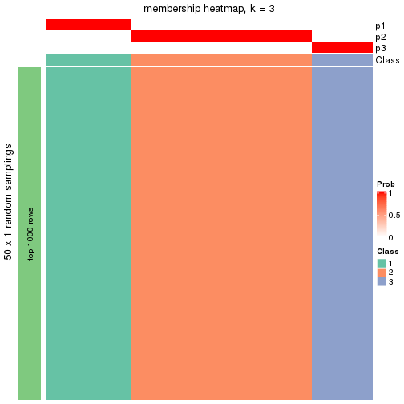</p>

</div>
<div id='tab-node-011-membership-heatmap-3'>
<pre><code class="r">membership_heatmap(res, k = 4)
</code></pre>

<p>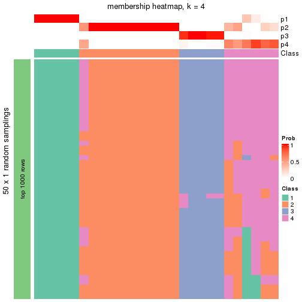</p>

</div>
<div id='tab-node-011-membership-heatmap-4'>
<pre><code class="r">membership_heatmap(res, k = 5)
</code></pre>

<p>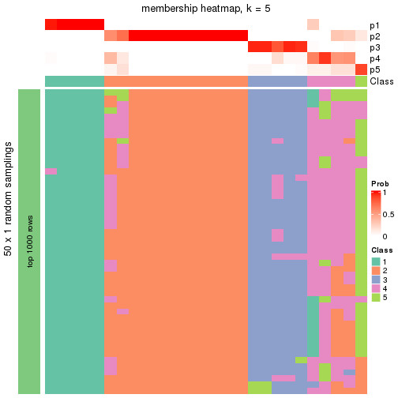</p>

</div>
<div id='tab-node-011-membership-heatmap-5'>
<pre><code class="r">membership_heatmap(res, k = 6)
</code></pre>

<p>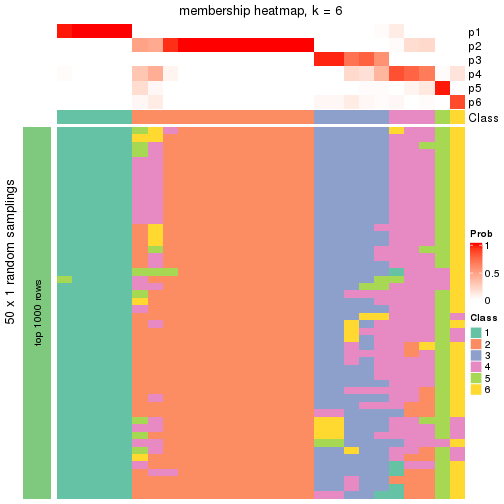</p>

</div>
<div id='tab-node-011-membership-heatmap-6'>
<pre><code class="r">membership_heatmap(res, k = 7)
</code></pre>

<p>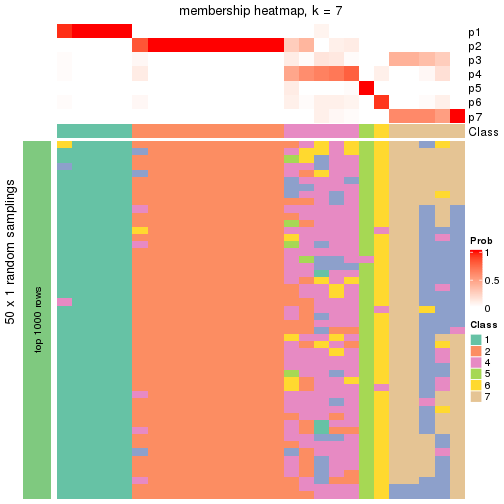</p>

</div>
<div id='tab-node-011-membership-heatmap-7'>
<pre><code class="r">membership_heatmap(res, k = 8)
</code></pre>

<p>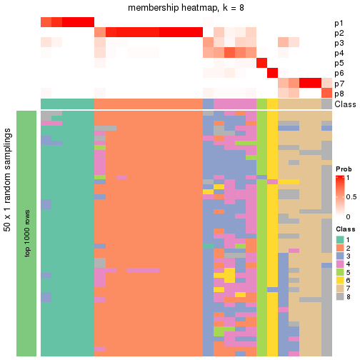</p>

</div>
</div>

As soon as the classes for columns are determined, the signatures
that are significantly different between subgroups can be looked for. 
Following are the heatmaps for signatures.


<script>
$( function() {
	$( '#tabs-node-011-get-signatures' ).tabs();
} );
</script>
<div id='tabs-node-011-get-signatures'>
<ul>
<li><a href='#tab-node-011-get-signatures-1'>k = 2</a></li>
<li><a href='#tab-node-011-get-signatures-2'>k = 3</a></li>
<li><a href='#tab-node-011-get-signatures-3'>k = 4</a></li>
<li><a href='#tab-node-011-get-signatures-4'>k = 5</a></li>
<li><a href='#tab-node-011-get-signatures-5'>k = 6</a></li>
<li><a href='#tab-node-011-get-signatures-6'>k = 7</a></li>
<li><a href='#tab-node-011-get-signatures-7'>k = 8</a></li>
</ul>
<div id='tab-node-011-get-signatures-1'>
<pre><code class="r">get_signatures(res, k = 2)
</code></pre>

<p>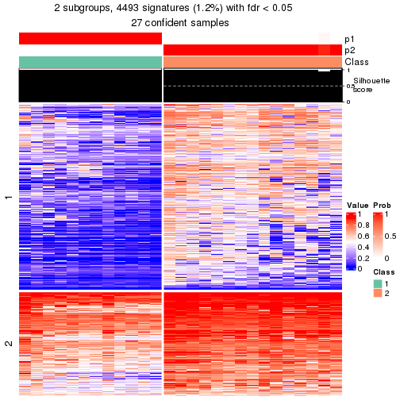</p>

</div>
<div id='tab-node-011-get-signatures-2'>
<pre><code class="r">get_signatures(res, k = 3)
</code></pre>

<p>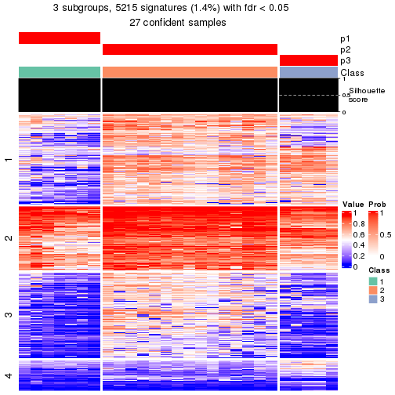</p>

</div>
<div id='tab-node-011-get-signatures-3'>
<pre><code class="r">get_signatures(res, k = 4)
</code></pre>

<p>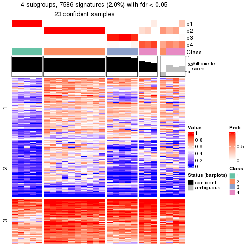</p>

</div>
<div id='tab-node-011-get-signatures-4'>
<pre><code class="r">get_signatures(res, k = 5)
</code></pre>

<p>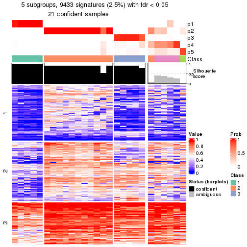</p>

</div>
<div id='tab-node-011-get-signatures-5'>
<pre><code class="r">get_signatures(res, k = 6)
</code></pre>

<p>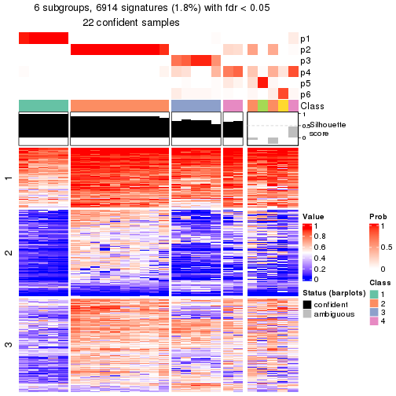</p>

</div>
<div id='tab-node-011-get-signatures-6'>
<pre><code class="r">get_signatures(res, k = 7)
</code></pre>

<p>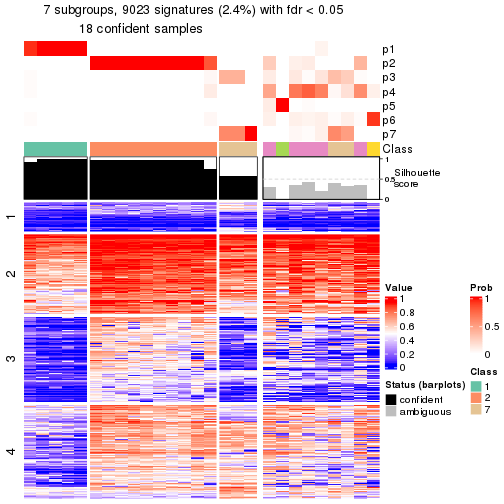</p>

</div>
<div id='tab-node-011-get-signatures-7'>
<pre><code class="r">get_signatures(res, k = 8)
</code></pre>

<p>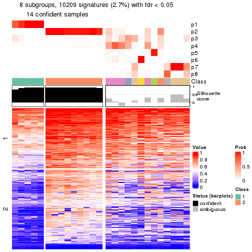</p>

</div>
</div>


Compare the overlap of signatures from different k:

```r
compare_signatures(res)
```

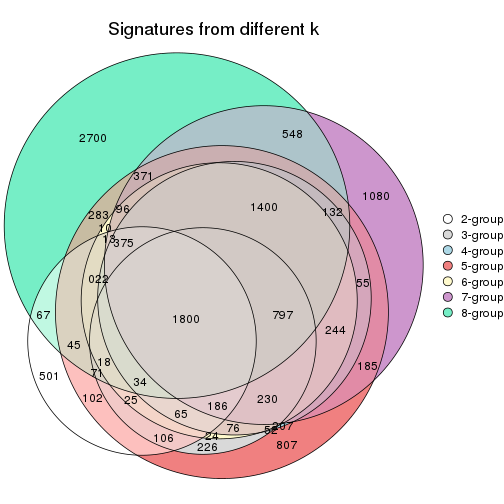

`get_signature()` returns a data frame invisibly. To get the list of signatures, the function
call should be assigned to a variable explicitly. In following code, if `plot` argument is set
to `FALSE`, no heatmap is plotted while only the differential analysis is performed.

```r
# code only for demonstration
tb = get_signature(res, k = ..., plot = FALSE)
```

An example of the output of `tb` is:

```
#>   which_row         fdr    mean_1    mean_2 scaled_mean_1 scaled_mean_2 km
#> 1        38 0.042760348  8.373488  9.131774    -0.5533452     0.5164555  1
#> 2        40 0.018707592  7.106213  8.469186    -0.6173731     0.5762149  1
#> 3        55 0.019134737 10.221463 11.207825    -0.6159697     0.5749050  1
#> 4        59 0.006059896  5.921854  7.869574    -0.6899429     0.6439467  1
#> 5        60 0.018055526  8.928898 10.211722    -0.6204761     0.5791110  1
#> 6        98 0.009384629 15.714769 14.887706     0.6635654    -0.6193277  2
...
```

The columns in `tb` are:

1. `which_row`: row indices corresponding to the input matrix.
2. `fdr`: FDR for the differential test. 
3. `mean_x`: The mean value in group x.
4. `scaled_mean_x`: The mean value in group x after rows are scaled.
5. `km`: Row groups if k-means clustering is applied to rows (which is done by automatically selecting number of clusters).

If there are too many signatures, `top_signatures = ...` can be set to only show the 
signatures with the highest FDRs:

```r
# code only for demonstration
# e.g. to show the top 500 most significant rows
tb = get_signature(res, k = ..., top_signatures = 500)
```

If the signatures are defined as these which are uniquely high in current group, `diff_method` argument
can be set to `"uniquely_high_in_one_group"`:

```r
# code only for demonstration
tb = get_signature(res, k = ..., diff_method = "uniquely_high_in_one_group")
```


UMAP plot which shows how samples are separated.


<script>
$( function() {
	$( '#tabs-node-011-dimension-reduction' ).tabs();
} );
</script>
<div id='tabs-node-011-dimension-reduction'>
<ul>
<li><a href='#tab-node-011-dimension-reduction-1'>k = 2</a></li>
<li><a href='#tab-node-011-dimension-reduction-2'>k = 3</a></li>
<li><a href='#tab-node-011-dimension-reduction-3'>k = 4</a></li>
<li><a href='#tab-node-011-dimension-reduction-4'>k = 5</a></li>
<li><a href='#tab-node-011-dimension-reduction-5'>k = 6</a></li>
<li><a href='#tab-node-011-dimension-reduction-6'>k = 7</a></li>
<li><a href='#tab-node-011-dimension-reduction-7'>k = 8</a></li>
</ul>
<div id='tab-node-011-dimension-reduction-1'>
<pre><code class="r">dimension_reduction(res, k = 2, method = &quot;UMAP&quot;)
</code></pre>

<p>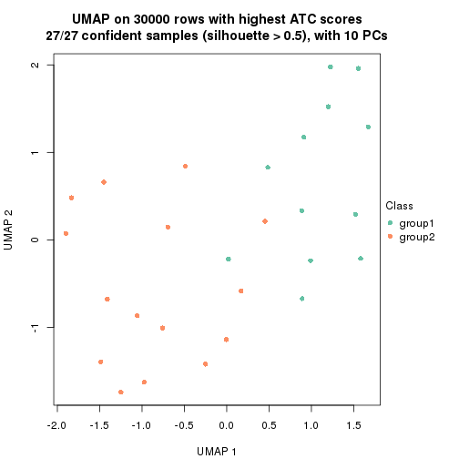</p>

</div>
<div id='tab-node-011-dimension-reduction-2'>
<pre><code class="r">dimension_reduction(res, k = 3, method = &quot;UMAP&quot;)
</code></pre>

<p>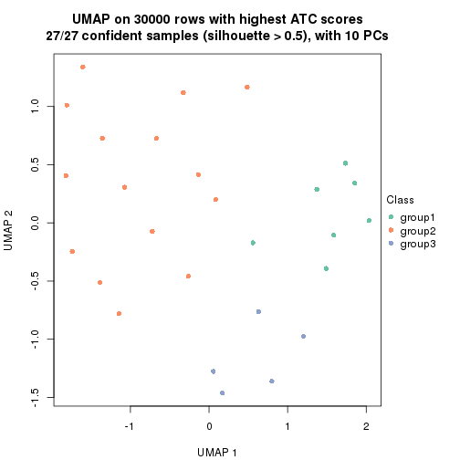</p>

</div>
<div id='tab-node-011-dimension-reduction-3'>
<pre><code class="r">dimension_reduction(res, k = 4, method = &quot;UMAP&quot;)
</code></pre>

<p>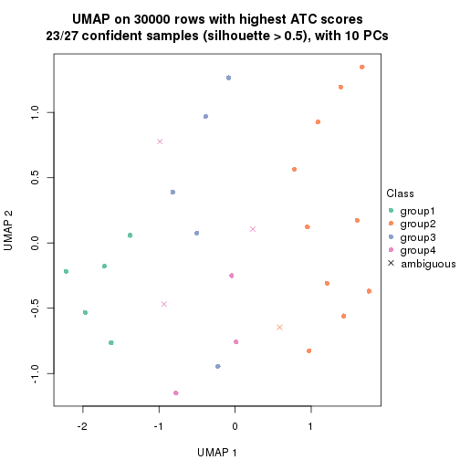</p>

</div>
<div id='tab-node-011-dimension-reduction-4'>
<pre><code class="r">dimension_reduction(res, k = 5, method = &quot;UMAP&quot;)
</code></pre>

<p>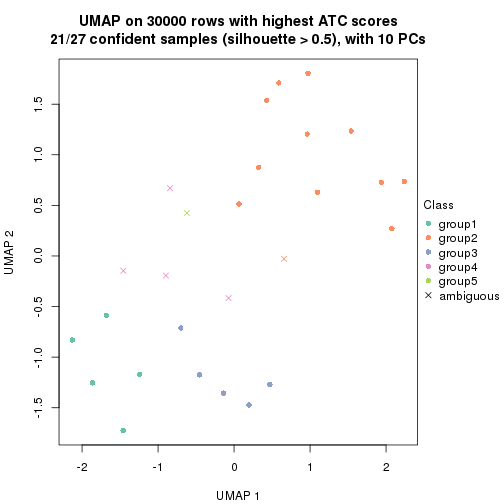</p>

</div>
<div id='tab-node-011-dimension-reduction-5'>
<pre><code class="r">dimension_reduction(res, k = 6, method = &quot;UMAP&quot;)
</code></pre>

<p>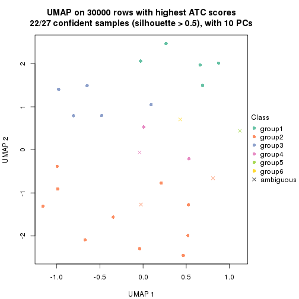</p>

</div>
<div id='tab-node-011-dimension-reduction-6'>
<pre><code class="r">dimension_reduction(res, k = 7, method = &quot;UMAP&quot;)
</code></pre>

<p>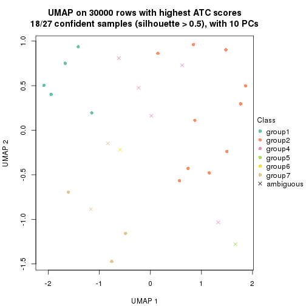</p>

</div>
<div id='tab-node-011-dimension-reduction-7'>
<pre><code class="r">dimension_reduction(res, k = 8, method = &quot;UMAP&quot;)
</code></pre>

<p>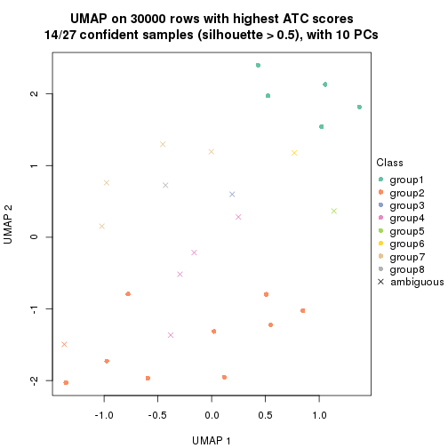</p>

</div>
</div>


Following heatmap shows how subgroups are split when increasing `k`:

```r
collect_classes(res)
```


If matrix rows can be associated to genes, consider to use `functional_enrichment(res,
...)` to perform function enrichment for the signature genes. See [this vignette](https://jokergoo.github.io/cola_vignettes/functional_enrichment.html) for more detailed explanations.


 

---------------------------------------------------


### Node012


Parent node: [Node01](#Node01).
Child nodes: 
                Node0111-leaf
        ,
                Node0112-leaf
        ,
                Node0113-leaf
        ,
                [Node0121](#Node0121)
        ,
                [Node0122](#Node0122)
        ,
                [Node0211](#Node0211)
        ,
                [Node0212](#Node0212)
        ,
                [Node0213](#Node0213)
        ,
                [Node0221](#Node0221)
        ,
                [Node0222](#Node0222)
        ,
                [Node0223](#Node0223)
        ,
                [Node0224](#Node0224)
        ,
                Node0225-leaf
        ,
                Node0231-leaf
        ,
                [Node0232](#Node0232)
        ,
                Node0233-leaf
        ,
                Node0234-leaf
        ,
                Node0331-leaf
        ,
                Node0332-leaf
        ,
                Node0333-leaf
        ,
                Node0431-leaf
        ,
                Node0432-leaf
        ,
                Node0433-leaf
        ,
                [Node0511](#Node0511)
        ,
                [Node0512](#Node0512)
        ,
                Node0521-leaf
        ,
                [Node0522](#Node0522)
        ,
                Node0523-leaf
        ,
                Node0524-leaf
        .


The object with results only for a single top-value method and a single partitioning method 
can be extracted as:

```r
res = res_rh["012"]
```

A summary of `res` and all the functions that can be applied to it:

```r
res
```

```
#> A 'ConsensusPartition' object with k = 2, 3, 4, 5, 6, 7, 8.
#>   On a matrix with 30000 rows and 38 columns.
#>   Top rows (1000) are extracted by 'SD' method.
#>   Subgroups are detected by 'kmeans' method.
#>   Performed in total 350 partitions by row resampling.
#>   Best k for subgroups seems to be 2.
#> 
#> Following methods can be applied to this 'ConsensusPartition' object:
#>  [1] "cola_report"             "collect_classes"         "collect_plots"          
#>  [4] "collect_stats"           "colnames"                "compare_partitions"     
#>  [7] "compare_signatures"      "consensus_heatmap"       "dimension_reduction"    
#> [10] "functional_enrichment"   "get_anno_col"            "get_anno"               
#> [13] "get_classes"             "get_consensus"           "get_matrix"             
#> [16] "get_membership"          "get_param"               "get_signatures"         
#> [19] "get_stats"               "is_best_k"               "is_stable_k"            
#> [22] "membership_heatmap"      "ncol"                    "nrow"                   
#> [25] "plot_ecdf"               "predict_classes"         "rownames"               
#> [28] "select_partition_number" "show"                    "suggest_best_k"         
#> [31] "test_to_known_factors"   "top_rows_heatmap"
```

`collect_plots()` function collects all the plots made from `res` for all `k` (number of subgroups)
into one single page to provide an easy and fast comparison between different `k`.

```r
collect_plots(res)
```

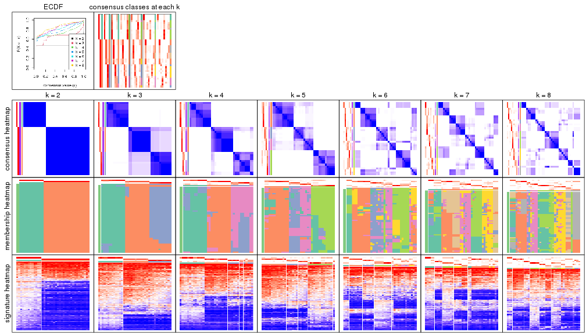

The plots are:

- The first row: a plot of the eCDF (empirical cumulative distribution
  function) curves of the consensus matrix for each `k` and the heatmap of
  predicted classes for each `k`.
- The second row: heatmaps of the consensus matrix for each `k`.
- The third row: heatmaps of the membership matrix for each `k`.
- The fouth row: heatmaps of the signatures for each `k`.

All the plots in panels can be made by individual functions and they are
plotted later in this section.

`select_partition_number()` produces several plots showing different
statistics for choosing "optimized" `k`. There are following statistics:

- eCDF curves of the consensus matrix for each `k`;
- 1-PAC. [The PAC score](https://en.wikipedia.org/wiki/Consensus_clustering#Over-interpretation_potential_of_consensus_clustering)
  measures the proportion of the ambiguous subgrouping.
- Mean silhouette score.
- Concordance. The mean probability of fiting the consensus subgroup labels in all
  partitions.
- Area increased. Denote $A_k$ as the area under the eCDF curve for current
  `k`, the area increased is defined as $A_k - A_{k-1}$.
- Rand index. The percent of pairs of samples that are both in a same cluster
  or both are not in a same cluster in the partition of k and k-1.
- Jaccard index. The ratio of pairs of samples are both in a same cluster in
  the partition of k and k-1 and the pairs of samples are both in a same
  cluster in the partition k or k-1.

The detailed explanations of these statistics can be found in [the _cola_
vignette](https://jokergoo.github.io/cola_vignettes/cola.html#toc_13).

Generally speaking, higher 1-PAC score, higher mean silhouette score or higher
concordance corresponds to better partition. Rand index and Jaccard index
measure how similar the current partition is compared to partition with `k-1`.
If they are too similar, we won't accept `k` is better than `k-1`.

```r
select_partition_number(res)
```

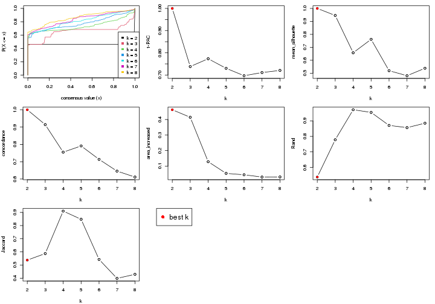

The numeric values for all these statistics can be obtained by `get_stats()`.

```r
get_stats(res)
```

```
#>   k 1-PAC mean_silhouette concordance area_increased  Rand Jaccard
#> 2 2 1.000           1.000       1.000         0.4628 0.538   0.538
#> 3 3 0.738           0.946       0.914         0.4144 0.778   0.587
#> 4 4 0.773           0.658       0.755         0.1282 0.972   0.910
#> 5 5 0.730           0.762       0.791         0.0531 0.954   0.848
#> 6 6 0.697           0.520       0.714         0.0440 0.871   0.543
#> 7 7 0.711           0.481       0.646         0.0294 0.856   0.399
#> 8 8 0.721           0.538       0.612         0.0300 0.885   0.430
```

`suggest_best_k()` suggests the best $k$ based on these statistics. The rules are as follows:

- All $k$ with Jaccard index larger than 0.95 are removed because increasing
  $k$ does not provide enough extra information. If all $k$ are removed, it is
  marked as no subgroup is detected.
- For all $k$ with 1-PAC score larger than 0.9, the maximal $k$ is taken as
  the best $k$, and other $k$ are marked as optional $k$.
- If it does not fit the second rule. The $k$ with the maximal vote of the
  highest 1-PAC score, highest mean silhouette, and highest concordance is
  taken as the best $k$.

```r
suggest_best_k(res)
```

```
#> [1] 2
```


Following is the table of the partitions (You need to click the **show/hide
code output** link to see it). The membership matrix (columns with name `p*`)
is inferred by
[`clue::cl_consensus()`](https://www.rdocumentation.org/link/cl_consensus?package=clue)
function with the `SE` method. Basically the value in the membership matrix
represents the probability to belong to a certain group. The finall subgroup
label for an item is determined with the group with highest probability it
belongs to.

In `get_classes()` function, the entropy is calculated from the membership
matrix and the silhouette score is calculated from the consensus matrix.


<script>
$( function() {
	$( '#tabs-node-012-get-classes' ).tabs();
} );
</script>
<div id='tabs-node-012-get-classes'>
<ul>
<li><a href='#tab-node-012-get-classes-1'>k = 2</a></li>
<li><a href='#tab-node-012-get-classes-2'>k = 3</a></li>
<li><a href='#tab-node-012-get-classes-3'>k = 4</a></li>
<li><a href='#tab-node-012-get-classes-4'>k = 5</a></li>
<li><a href='#tab-node-012-get-classes-5'>k = 6</a></li>
<li><a href='#tab-node-012-get-classes-6'>k = 7</a></li>
<li><a href='#tab-node-012-get-classes-7'>k = 8</a></li>
</ul>

<div id='tab-node-012-get-classes-1'>
<p><a id='tab-node-012-get-classes-1-a' style='color:#0366d6' href='#'>show/hide code output</a></p>
<pre><code class="r">cbind(get_classes(res, k = 2), get_membership(res, k = 2))
</code></pre>

<pre><code>#&gt;                 class entropy silhouette p1 p2
#&gt; TCGA.CV.7413.01     1       0          1  1  0
#&gt; TCGA.CV.6937.01     2       0          1  0  1
#&gt; TCGA.CN.5358.01     2       0          1  0  1
#&gt; TCGA.CR.7372.01     2       0          1  0  1
#&gt; TCGA.CN.4742.01     1       0          1  1  0
#&gt; TCGA.CV.5444.01     2       0          1  0  1
#&gt; TCGA.CV.5436.01     2       0          1  0  1
#&gt; TCGA.CV.6961.01     2       0          1  0  1
#&gt; TCGA.BB.4227.01     2       0          1  0  1
#&gt; TCGA.CV.6934.01     1       0          1  1  0
#&gt; TCGA.F7.A623.01     2       0          1  0  1
#&gt; TCGA.T3.A92M.01     2       0          1  0  1
#&gt; TCGA.CV.A468.01     2       0          1  0  1
#&gt; TCGA.QK.AA3K.01     2       0          1  0  1
#&gt; TCGA.4P.AA8J.01     2       0          1  0  1
#&gt; TCGA.CV.A45V.01     1       0          1  1  0
#&gt; TCGA.CV.A460.01     2       0          1  0  1
#&gt; TCGA.CQ.A4CE.01     1       0          1  1  0
#&gt; TCGA.BA.A4II.01     2       0          1  0  1
#&gt; TCGA.BB.8596.01     1       0          1  1  0
#&gt; TCGA.F7.A50I.01     2       0          1  0  1
#&gt; TCGA.IQ.A61O.01     2       0          1  0  1
#&gt; TCGA.CV.A45X.01     2       0          1  0  1
#&gt; TCGA.IQ.A6SH.01     2       0          1  0  1
#&gt; TCGA.QK.A6VC.01     1       0          1  1  0
#&gt; TCGA.RS.A6TO.01     1       0          1  1  0
#&gt; TCGA.CQ.7067.01     1       0          1  1  0
#&gt; TCGA.UF.A7JJ.01     2       0          1  0  1
#&gt; TCGA.P3.A6T4.01     2       0          1  0  1
#&gt; TCGA.D6.A6EM.01     1       0          1  1  0
#&gt; TCGA.UF.A7JK.01     2       0          1  0  1
#&gt; TCGA.HD.7831.01     2       0          1  0  1
#&gt; TCGA.D6.A6EQ.01     2       0          1  0  1
#&gt; TCGA.P3.A6T0.01     1       0          1  1  0
#&gt; TCGA.UF.A7JA.01     1       0          1  1  0
#&gt; TCGA.BA.A6DA.01     1       0          1  1  0
#&gt; TCGA.CV.A6K2.01     2       0          1  0  1
#&gt; TCGA.CV.A6K1.01     2       0          1  0  1
</code></pre>

<script>
$('#tab-node-012-get-classes-1-a').parent().next().next().hide();
$('#tab-node-012-get-classes-1-a').click(function(){
  $('#tab-node-012-get-classes-1-a').parent().next().next().toggle();
  return(false);
});
</script>
</div>

<div id='tab-node-012-get-classes-2'>
<p><a id='tab-node-012-get-classes-2-a' style='color:#0366d6' href='#'>show/hide code output</a></p>
<pre><code class="r">cbind(get_classes(res, k = 3), get_membership(res, k = 3))
</code></pre>

<pre><code>#&gt;                 class entropy silhouette   p1   p2   p3
#&gt; TCGA.CV.7413.01     1  0.2066      0.957 0.94 0.06 0.00
#&gt; TCGA.CV.6937.01     2  0.4002      0.968 0.00 0.84 0.16
#&gt; TCGA.CN.5358.01     2  0.4002      0.968 0.00 0.84 0.16
#&gt; TCGA.CR.7372.01     3  0.0000      0.958 0.00 0.00 1.00
#&gt; TCGA.CN.4742.01     1  0.0892      0.961 0.98 0.02 0.00
#&gt; TCGA.CV.5444.01     3  0.0000      0.958 0.00 0.00 1.00
#&gt; TCGA.CV.5436.01     3  0.0000      0.958 0.00 0.00 1.00
#&gt; TCGA.CV.6961.01     2  0.4002      0.968 0.00 0.84 0.16
#&gt; TCGA.BB.4227.01     3  0.2066      0.942 0.00 0.06 0.94
#&gt; TCGA.CV.6934.01     1  0.0000      0.961 1.00 0.00 0.00
#&gt; TCGA.F7.A623.01     2  0.4002      0.968 0.00 0.84 0.16
#&gt; TCGA.T3.A92M.01     2  0.4002      0.968 0.00 0.84 0.16
#&gt; TCGA.CV.A468.01     2  0.4002      0.968 0.00 0.84 0.16
#&gt; TCGA.QK.AA3K.01     2  0.4002      0.968 0.00 0.84 0.16
#&gt; TCGA.4P.AA8J.01     2  0.4002      0.968 0.00 0.84 0.16
#&gt; TCGA.CV.A45V.01     1  0.0000      0.961 1.00 0.00 0.00
#&gt; TCGA.CV.A460.01     2  0.5560      0.802 0.00 0.70 0.30
#&gt; TCGA.CQ.A4CE.01     1  0.0000      0.961 1.00 0.00 0.00
#&gt; TCGA.BA.A4II.01     2  0.4002      0.968 0.00 0.84 0.16
#&gt; TCGA.BB.8596.01     1  0.4002      0.924 0.84 0.16 0.00
#&gt; TCGA.F7.A50I.01     3  0.0000      0.958 0.00 0.00 1.00
#&gt; TCGA.IQ.A61O.01     3  0.2537      0.923 0.00 0.08 0.92
#&gt; TCGA.CV.A45X.01     3  0.2537      0.923 0.00 0.08 0.92
#&gt; TCGA.IQ.A6SH.01     3  0.2066      0.942 0.00 0.06 0.94
#&gt; TCGA.QK.A6VC.01     1  0.4002      0.924 0.84 0.16 0.00
#&gt; TCGA.RS.A6TO.01     1  0.0892      0.961 0.98 0.02 0.00
#&gt; TCGA.CQ.7067.01     1  0.0000      0.961 1.00 0.00 0.00
#&gt; TCGA.UF.A7JJ.01     2  0.5706      0.769 0.00 0.68 0.32
#&gt; TCGA.P3.A6T4.01     2  0.4002      0.968 0.00 0.84 0.16
#&gt; TCGA.D6.A6EM.01     1  0.0000      0.961 1.00 0.00 0.00
#&gt; TCGA.UF.A7JK.01     3  0.0892      0.937 0.02 0.00 0.98
#&gt; TCGA.HD.7831.01     2  0.4002      0.968 0.00 0.84 0.16
#&gt; TCGA.D6.A6EQ.01     3  0.0000      0.958 0.00 0.00 1.00
#&gt; TCGA.P3.A6T0.01     1  0.2066      0.957 0.94 0.06 0.00
#&gt; TCGA.UF.A7JA.01     1  0.4002      0.924 0.84 0.16 0.00
#&gt; TCGA.BA.A6DA.01     1  0.2537      0.947 0.92 0.08 0.00
#&gt; TCGA.CV.A6K2.01     3  0.0000      0.958 0.00 0.00 1.00
#&gt; TCGA.CV.A6K1.01     3  0.2066      0.942 0.00 0.06 0.94
</code></pre>

<script>
$('#tab-node-012-get-classes-2-a').parent().next().next().hide();
$('#tab-node-012-get-classes-2-a').click(function(){
  $('#tab-node-012-get-classes-2-a').parent().next().next().toggle();
  return(false);
});
</script>
</div>

<div id='tab-node-012-get-classes-3'>
<p><a id='tab-node-012-get-classes-3-a' style='color:#0366d6' href='#'>show/hide code output</a></p>
<pre><code class="r">cbind(get_classes(res, k = 4), get_membership(res, k = 4))
</code></pre>

<pre><code>#&gt;                 class entropy silhouette   p1   p2   p3   p4
#&gt; TCGA.CV.7413.01     1   0.317      0.874 0.84 0.00 0.00 0.16
#&gt; TCGA.CV.6937.01     2   0.000      0.914 0.00 1.00 0.00 0.00
#&gt; TCGA.CN.5358.01     2   0.201      0.897 0.00 0.92 0.00 0.08
#&gt; TCGA.CR.7372.01     3   0.164      0.548 0.00 0.00 0.94 0.06
#&gt; TCGA.CN.4742.01     1   0.234      0.881 0.90 0.00 0.00 0.10
#&gt; TCGA.CV.5444.01     3   0.000      0.576 0.00 0.00 1.00 0.00
#&gt; TCGA.CV.5436.01     3   0.164      0.548 0.00 0.00 0.94 0.06
#&gt; TCGA.CV.6961.01     2   0.000      0.914 0.00 1.00 0.00 0.00
#&gt; TCGA.BB.4227.01     3   0.559     -0.680 0.00 0.02 0.52 0.46
#&gt; TCGA.CV.6934.01     1   0.000      0.880 1.00 0.00 0.00 0.00
#&gt; TCGA.F7.A623.01     2   0.000      0.914 0.00 1.00 0.00 0.00
#&gt; TCGA.T3.A92M.01     2   0.000      0.914 0.00 1.00 0.00 0.00
#&gt; TCGA.CV.A468.01     2   0.201      0.897 0.00 0.92 0.00 0.08
#&gt; TCGA.QK.AA3K.01     2   0.000      0.914 0.00 1.00 0.00 0.00
#&gt; TCGA.4P.AA8J.01     2   0.000      0.914 0.00 1.00 0.00 0.00
#&gt; TCGA.CV.A45V.01     1   0.000      0.880 1.00 0.00 0.00 0.00
#&gt; TCGA.CV.A460.01     2   0.657      0.437 0.00 0.58 0.10 0.32
#&gt; TCGA.CQ.A4CE.01     1   0.000      0.880 1.00 0.00 0.00 0.00
#&gt; TCGA.BA.A4II.01     2   0.201      0.897 0.00 0.92 0.00 0.08
#&gt; TCGA.BB.8596.01     1   0.479      0.785 0.62 0.00 0.00 0.38
#&gt; TCGA.F7.A50I.01     3   0.201      0.511 0.00 0.00 0.92 0.08
#&gt; TCGA.IQ.A61O.01     4   0.549      0.880 0.00 0.02 0.40 0.58
#&gt; TCGA.CV.A45X.01     4   0.557      0.876 0.00 0.02 0.44 0.54
#&gt; TCGA.IQ.A6SH.01     3   0.561     -0.734 0.00 0.02 0.50 0.48
#&gt; TCGA.QK.A6VC.01     1   0.479      0.785 0.62 0.00 0.00 0.38
#&gt; TCGA.RS.A6TO.01     1   0.265      0.878 0.88 0.00 0.00 0.12
#&gt; TCGA.CQ.7067.01     1   0.000      0.880 1.00 0.00 0.00 0.00
#&gt; TCGA.UF.A7JJ.01     2   0.586      0.655 0.00 0.70 0.12 0.18
#&gt; TCGA.P3.A6T4.01     2   0.000      0.914 0.00 1.00 0.00 0.00
#&gt; TCGA.D6.A6EM.01     1   0.000      0.880 1.00 0.00 0.00 0.00
#&gt; TCGA.UF.A7JK.01     3   0.000      0.576 0.00 0.00 1.00 0.00
#&gt; TCGA.HD.7831.01     2   0.292      0.866 0.00 0.86 0.00 0.14
#&gt; TCGA.D6.A6EQ.01     3   0.000      0.576 0.00 0.00 1.00 0.00
#&gt; TCGA.P3.A6T0.01     1   0.317      0.874 0.84 0.00 0.00 0.16
#&gt; TCGA.UF.A7JA.01     1   0.479      0.785 0.62 0.00 0.00 0.38
#&gt; TCGA.BA.A6DA.01     1   0.361      0.826 0.80 0.00 0.00 0.20
#&gt; TCGA.CV.A6K2.01     3   0.452     -0.132 0.00 0.00 0.68 0.32
#&gt; TCGA.CV.A6K1.01     3   0.559     -0.680 0.00 0.02 0.52 0.46
</code></pre>

<script>
$('#tab-node-012-get-classes-3-a').parent().next().next().hide();
$('#tab-node-012-get-classes-3-a').click(function(){
  $('#tab-node-012-get-classes-3-a').parent().next().next().toggle();
  return(false);
});
</script>
</div>

<div id='tab-node-012-get-classes-4'>
<p><a id='tab-node-012-get-classes-4-a' style='color:#0366d6' href='#'>show/hide code output</a></p>
<pre><code class="r">cbind(get_classes(res, k = 5), get_membership(res, k = 5))
</code></pre>

<pre><code>#&gt;                 class entropy silhouette   p1   p2   p3   p4   p5
#&gt; TCGA.CV.7413.01     5  0.4126      0.744 0.38 0.00 0.00 0.00 0.62
#&gt; TCGA.CV.6937.01     2  0.1648      0.828 0.04 0.94 0.00 0.02 0.00
#&gt; TCGA.CN.5358.01     2  0.3274      0.803 0.22 0.78 0.00 0.00 0.00
#&gt; TCGA.CR.7372.01     3  0.4637      0.783 0.10 0.00 0.74 0.16 0.00
#&gt; TCGA.CN.4742.01     5  0.3424      0.769 0.24 0.00 0.00 0.00 0.76
#&gt; TCGA.CV.5444.01     3  0.4398      0.819 0.04 0.00 0.72 0.24 0.00
#&gt; TCGA.CV.5436.01     3  0.3922      0.839 0.04 0.00 0.78 0.18 0.00
#&gt; TCGA.CV.6961.01     2  0.2012      0.822 0.06 0.92 0.00 0.02 0.00
#&gt; TCGA.BB.4227.01     4  0.2675      0.825 0.04 0.04 0.02 0.90 0.00
#&gt; TCGA.CV.6934.01     5  0.0000      0.783 0.00 0.00 0.00 0.00 1.00
#&gt; TCGA.F7.A623.01     2  0.2012      0.822 0.06 0.92 0.00 0.02 0.00
#&gt; TCGA.T3.A92M.01     2  0.0000      0.840 0.00 1.00 0.00 0.00 0.00
#&gt; TCGA.CV.A468.01     2  0.3274      0.803 0.22 0.78 0.00 0.00 0.00
#&gt; TCGA.QK.AA3K.01     2  0.0000      0.840 0.00 1.00 0.00 0.00 0.00
#&gt; TCGA.4P.AA8J.01     2  0.0000      0.840 0.00 1.00 0.00 0.00 0.00
#&gt; TCGA.CV.A45V.01     5  0.1043      0.777 0.04 0.00 0.00 0.00 0.96
#&gt; TCGA.CV.A460.01     2  0.7160      0.539 0.26 0.52 0.06 0.16 0.00
#&gt; TCGA.CQ.A4CE.01     5  0.0000      0.783 0.00 0.00 0.00 0.00 1.00
#&gt; TCGA.BA.A4II.01     2  0.3109      0.809 0.20 0.80 0.00 0.00 0.00
#&gt; TCGA.BB.8596.01     5  0.7120      0.646 0.34 0.00 0.16 0.04 0.46
#&gt; TCGA.F7.A50I.01     3  0.5927      0.570 0.12 0.00 0.54 0.34 0.00
#&gt; TCGA.IQ.A61O.01     4  0.3977      0.780 0.10 0.06 0.02 0.82 0.00
#&gt; TCGA.CV.A45X.01     4  0.2438      0.828 0.04 0.06 0.00 0.90 0.00
#&gt; TCGA.IQ.A6SH.01     4  0.1410      0.839 0.00 0.06 0.00 0.94 0.00
#&gt; TCGA.QK.A6VC.01     5  0.7120      0.646 0.34 0.00 0.16 0.04 0.46
#&gt; TCGA.RS.A6TO.01     5  0.3895      0.752 0.32 0.00 0.00 0.00 0.68
#&gt; TCGA.CQ.7067.01     5  0.0000      0.783 0.00 0.00 0.00 0.00 1.00
#&gt; TCGA.UF.A7JJ.01     2  0.6905      0.585 0.24 0.56 0.06 0.14 0.00
#&gt; TCGA.P3.A6T4.01     2  0.0609      0.836 0.00 0.98 0.00 0.02 0.00
#&gt; TCGA.D6.A6EM.01     5  0.0000      0.783 0.00 0.00 0.00 0.00 1.00
#&gt; TCGA.UF.A7JK.01     3  0.4263      0.818 0.06 0.00 0.76 0.18 0.00
#&gt; TCGA.HD.7831.01     2  0.4132      0.778 0.26 0.72 0.02 0.00 0.00
#&gt; TCGA.D6.A6EQ.01     3  0.3852      0.834 0.02 0.00 0.76 0.22 0.00
#&gt; TCGA.P3.A6T0.01     5  0.4126      0.744 0.38 0.00 0.00 0.00 0.62
#&gt; TCGA.UF.A7JA.01     5  0.7120      0.646 0.34 0.00 0.16 0.04 0.46
#&gt; TCGA.BA.A6DA.01     5  0.3513      0.734 0.18 0.00 0.02 0.00 0.80
#&gt; TCGA.CV.A6K2.01     4  0.4132      0.475 0.02 0.00 0.26 0.72 0.00
#&gt; TCGA.CV.A6K1.01     4  0.3348      0.793 0.02 0.04 0.08 0.86 0.00
</code></pre>

<script>
$('#tab-node-012-get-classes-4-a').parent().next().next().hide();
$('#tab-node-012-get-classes-4-a').click(function(){
  $('#tab-node-012-get-classes-4-a').parent().next().next().toggle();
  return(false);
});
</script>
</div>

<div id='tab-node-012-get-classes-5'>
<p><a id='tab-node-012-get-classes-5-a' style='color:#0366d6' href='#'>show/hide code output</a></p>
<pre><code class="r">cbind(get_classes(res, k = 6), get_membership(res, k = 6))
</code></pre>

<pre><code>#&gt;                 class entropy silhouette   p1   p2   p3   p4   p5   p6
#&gt; TCGA.CV.7413.01     5  0.0547    0.52117 0.02 0.00 0.00 0.00 0.98 0.00
#&gt; TCGA.CV.6937.01     2  0.1807    0.72966 0.06 0.92 0.00 0.00 0.00 0.02
#&gt; TCGA.CN.5358.01     2  0.3578    0.37564 0.00 0.66 0.00 0.00 0.00 0.34
#&gt; TCGA.CR.7372.01     3  0.4377    0.58443 0.12 0.00 0.72 0.00 0.00 0.16
#&gt; TCGA.CN.4742.01     5  0.0547    0.54299 0.02 0.00 0.00 0.00 0.98 0.00
#&gt; TCGA.CV.5444.01     3  0.3163    0.69512 0.00 0.00 0.82 0.04 0.00 0.14
#&gt; TCGA.CV.5436.01     3  0.3679    0.69349 0.04 0.00 0.76 0.00 0.00 0.20
#&gt; TCGA.CV.6961.01     2  0.2512    0.71185 0.06 0.88 0.00 0.00 0.00 0.06
#&gt; TCGA.BB.4227.01     4  0.6373    0.41711 0.08 0.00 0.16 0.56 0.00 0.20
#&gt; TCGA.CV.6934.01     5  0.5235    0.61896 0.10 0.00 0.00 0.38 0.52 0.00
#&gt; TCGA.F7.A623.01     2  0.2512    0.71185 0.06 0.88 0.00 0.00 0.00 0.06
#&gt; TCGA.T3.A92M.01     2  0.1267    0.73921 0.00 0.94 0.00 0.06 0.00 0.00
#&gt; TCGA.CV.A468.01     2  0.3578    0.37564 0.00 0.66 0.00 0.00 0.00 0.34
#&gt; TCGA.QK.AA3K.01     2  0.1267    0.73921 0.00 0.94 0.00 0.06 0.00 0.00
#&gt; TCGA.4P.AA8J.01     2  0.1267    0.73921 0.00 0.94 0.00 0.06 0.00 0.00
#&gt; TCGA.CV.A45V.01     5  0.5248    0.62059 0.04 0.00 0.00 0.34 0.58 0.04
#&gt; TCGA.CV.A460.01     6  0.4348    0.36791 0.00 0.32 0.00 0.04 0.00 0.64
#&gt; TCGA.CQ.A4CE.01     5  0.5235    0.61896 0.10 0.00 0.00 0.38 0.52 0.00
#&gt; TCGA.BA.A4II.01     2  0.3499    0.41590 0.00 0.68 0.00 0.00 0.00 0.32
#&gt; TCGA.BB.8596.01     1  0.3309    1.00000 0.72 0.00 0.00 0.00 0.28 0.00
#&gt; TCGA.F7.A50I.01     3  0.4552    0.55879 0.00 0.00 0.64 0.06 0.00 0.30
#&gt; TCGA.IQ.A61O.01     6  0.6616   -0.45562 0.08 0.00 0.12 0.36 0.00 0.44
#&gt; TCGA.CV.A45X.01     4  0.5354    0.47350 0.00 0.00 0.16 0.58 0.00 0.26
#&gt; TCGA.IQ.A6SH.01     4  0.5419    0.46983 0.00 0.00 0.20 0.58 0.00 0.22
#&gt; TCGA.QK.A6VC.01     1  0.3309    1.00000 0.72 0.00 0.00 0.00 0.28 0.00
#&gt; TCGA.RS.A6TO.01     5  0.0000    0.53769 0.00 0.00 0.00 0.00 1.00 0.00
#&gt; TCGA.CQ.7067.01     5  0.5949    0.61060 0.10 0.00 0.00 0.34 0.52 0.04
#&gt; TCGA.UF.A7JJ.01     6  0.4576    0.26812 0.00 0.40 0.04 0.00 0.00 0.56
#&gt; TCGA.P3.A6T4.01     2  0.0547    0.74319 0.00 0.98 0.00 0.02 0.00 0.00
#&gt; TCGA.D6.A6EM.01     5  0.5235    0.61896 0.10 0.00 0.00 0.38 0.52 0.00
#&gt; TCGA.UF.A7JK.01     3  0.0937    0.68453 0.04 0.00 0.96 0.00 0.00 0.00
#&gt; TCGA.HD.7831.01     6  0.4310    0.00701 0.02 0.44 0.00 0.00 0.00 0.54
#&gt; TCGA.D6.A6EQ.01     3  0.1092    0.70481 0.00 0.00 0.96 0.02 0.00 0.02
#&gt; TCGA.P3.A6T0.01     5  0.1092    0.51935 0.02 0.00 0.00 0.00 0.96 0.02
#&gt; TCGA.UF.A7JA.01     1  0.3309    1.00000 0.72 0.00 0.00 0.00 0.28 0.00
#&gt; TCGA.BA.A6DA.01     4  0.6103   -0.62219 0.32 0.00 0.00 0.38 0.30 0.00
#&gt; TCGA.CV.A6K2.01     3  0.5938    0.05484 0.00 0.00 0.46 0.26 0.00 0.28
#&gt; TCGA.CV.A6K1.01     4  0.6305    0.34977 0.00 0.02 0.22 0.46 0.00 0.30
</code></pre>

<script>
$('#tab-node-012-get-classes-5-a').parent().next().next().hide();
$('#tab-node-012-get-classes-5-a').click(function(){
  $('#tab-node-012-get-classes-5-a').parent().next().next().toggle();
  return(false);
});
</script>
</div>

<div id='tab-node-012-get-classes-6'>
<p><a id='tab-node-012-get-classes-6-a' style='color:#0366d6' href='#'>show/hide code output</a></p>
<pre><code class="r">cbind(get_classes(res, k = 7), get_membership(res, k = 7))
</code></pre>

<pre><code>#&gt;                 class entropy silhouette   p1   p2   p3   p4   p5   p6   p7
#&gt; TCGA.CV.7413.01     1  0.5252     0.5037 0.42 0.00 0.42 0.00 0.16 0.00 0.00
#&gt; TCGA.CV.6937.01     7  0.3459     0.9090 0.00 0.40 0.00 0.00 0.00 0.00 0.60
#&gt; TCGA.CN.5358.01     2  0.0000     0.4412 0.00 1.00 0.00 0.00 0.00 0.00 0.00
#&gt; TCGA.CR.7372.01     6  0.5243     0.4493 0.00 0.00 0.18 0.04 0.02 0.66 0.10
#&gt; TCGA.CN.4742.01     1  0.5560     0.3273 0.42 0.00 0.30 0.00 0.28 0.00 0.00
#&gt; TCGA.CV.5444.01     6  0.4714     0.6129 0.00 0.00 0.28 0.12 0.00 0.60 0.00
#&gt; TCGA.CV.5436.01     6  0.4663     0.6383 0.00 0.00 0.20 0.04 0.02 0.70 0.04
#&gt; TCGA.CV.6961.01     7  0.3358     0.9557 0.00 0.36 0.00 0.00 0.00 0.00 0.64
#&gt; TCGA.BB.4227.01     4  0.3833     0.6020 0.00 0.00 0.04 0.78 0.12 0.00 0.06
#&gt; TCGA.CV.6934.01     5  0.2945     0.9137 0.26 0.00 0.00 0.00 0.74 0.00 0.00
#&gt; TCGA.F7.A623.01     7  0.3358     0.9557 0.00 0.36 0.00 0.00 0.00 0.00 0.64
#&gt; TCGA.T3.A92M.01     2  0.6494    -0.4137 0.00 0.46 0.06 0.06 0.08 0.00 0.34
#&gt; TCGA.CV.A468.01     2  0.0000     0.4412 0.00 1.00 0.00 0.00 0.00 0.00 0.00
#&gt; TCGA.QK.AA3K.01     2  0.6654    -0.3853 0.00 0.46 0.06 0.08 0.08 0.00 0.32
#&gt; TCGA.4P.AA8J.01     2  0.6654    -0.3853 0.00 0.46 0.06 0.08 0.08 0.00 0.32
#&gt; TCGA.CV.A45V.01     5  0.4248     0.8593 0.26 0.00 0.00 0.00 0.66 0.00 0.08
#&gt; TCGA.CV.A460.01     2  0.4422     0.3542 0.00 0.72 0.08 0.16 0.00 0.00 0.04
#&gt; TCGA.CQ.A4CE.01     5  0.2945     0.9137 0.26 0.00 0.00 0.00 0.74 0.00 0.00
#&gt; TCGA.BA.A4II.01     2  0.0000     0.4412 0.00 1.00 0.00 0.00 0.00 0.00 0.00
#&gt; TCGA.BB.8596.01     1  0.0000     0.5024 1.00 0.00 0.00 0.00 0.00 0.00 0.00
#&gt; TCGA.F7.A50I.01     6  0.6677     0.3894 0.00 0.12 0.28 0.20 0.00 0.40 0.00
#&gt; TCGA.IQ.A61O.01     4  0.6360     0.4093 0.00 0.08 0.18 0.58 0.02 0.02 0.12
#&gt; TCGA.CV.A45X.01     4  0.0863     0.6610 0.00 0.04 0.00 0.96 0.00 0.00 0.00
#&gt; TCGA.IQ.A6SH.01     4  0.0000     0.6629 0.00 0.00 0.00 1.00 0.00 0.00 0.00
#&gt; TCGA.QK.A6VC.01     1  0.0000     0.5024 1.00 0.00 0.00 0.00 0.00 0.00 0.00
#&gt; TCGA.RS.A6TO.01     1  0.5252     0.5037 0.42 0.00 0.42 0.00 0.16 0.00 0.00
#&gt; TCGA.CQ.7067.01     5  0.3887     0.8952 0.26 0.00 0.00 0.00 0.70 0.02 0.02
#&gt; TCGA.UF.A7JJ.01     2  0.3765     0.3867 0.00 0.78 0.10 0.10 0.00 0.00 0.02
#&gt; TCGA.P3.A6T4.01     2  0.5606    -0.5074 0.00 0.48 0.06 0.00 0.08 0.00 0.38
#&gt; TCGA.D6.A6EM.01     5  0.2945     0.9137 0.26 0.00 0.00 0.00 0.74 0.00 0.00
#&gt; TCGA.UF.A7JK.01     6  0.1860     0.6128 0.00 0.00 0.00 0.04 0.02 0.92 0.02
#&gt; TCGA.HD.7831.01     2  0.2569     0.4040 0.00 0.84 0.00 0.00 0.00 0.02 0.14
#&gt; TCGA.D6.A6EQ.01     6  0.4121     0.6325 0.00 0.00 0.20 0.10 0.00 0.70 0.00
#&gt; TCGA.P3.A6T0.01     1  0.6333     0.4918 0.42 0.00 0.36 0.00 0.16 0.02 0.04
#&gt; TCGA.UF.A7JA.01     1  0.0000     0.5024 1.00 0.00 0.00 0.00 0.00 0.00 0.00
#&gt; TCGA.BA.A6DA.01     5  0.3909     0.6941 0.40 0.00 0.00 0.00 0.58 0.00 0.02
#&gt; TCGA.CV.A6K2.01     4  0.5402    -0.0351 0.00 0.00 0.24 0.48 0.00 0.28 0.00
#&gt; TCGA.CV.A6K1.01     4  0.3991     0.5170 0.00 0.00 0.22 0.72 0.00 0.04 0.02
</code></pre>

<script>
$('#tab-node-012-get-classes-6-a').parent().next().next().hide();
$('#tab-node-012-get-classes-6-a').click(function(){
  $('#tab-node-012-get-classes-6-a').parent().next().next().toggle();
  return(false);
});
</script>
</div>

<div id='tab-node-012-get-classes-7'>
<p><a id='tab-node-012-get-classes-7-a' style='color:#0366d6' href='#'>show/hide code output</a></p>
<pre><code class="r">cbind(get_classes(res, k = 8), get_membership(res, k = 8))
</code></pre>

<pre><code>#&gt;                 class entropy silhouette   p1   p2   p3   p4   p5   p6   p7   p8
#&gt; TCGA.CV.7413.01     8  0.6645   -0.58972 0.08 0.00 0.06 0.00 0.36 0.00 0.14 0.36
#&gt; TCGA.CV.6937.01     7  0.5103    0.85718 0.00 0.34 0.00 0.00 0.00 0.00 0.44 0.22
#&gt; TCGA.CN.5358.01     2  0.0000    0.68550 0.00 1.00 0.00 0.00 0.00 0.00 0.00 0.00
#&gt; TCGA.CR.7372.01     3  0.2406    0.21744 0.00 0.00 0.80 0.00 0.00 0.20 0.00 0.00
#&gt; TCGA.CN.4742.01     5  0.6002    0.46193 0.06 0.00 0.08 0.00 0.54 0.00 0.08 0.24
#&gt; TCGA.CV.5444.01     6  0.1091    0.63021 0.00 0.00 0.00 0.06 0.00 0.94 0.00 0.00
#&gt; TCGA.CV.5436.01     6  0.4106    0.30849 0.00 0.00 0.30 0.00 0.00 0.64 0.04 0.02
#&gt; TCGA.CV.6961.01     7  0.4921    0.90688 0.00 0.26 0.00 0.00 0.00 0.00 0.52 0.22
#&gt; TCGA.BB.4227.01     4  0.3675    0.54769 0.14 0.00 0.00 0.76 0.00 0.00 0.08 0.02
#&gt; TCGA.CV.6934.01     5  0.0000    0.67804 0.00 0.00 0.00 0.00 1.00 0.00 0.00 0.00
#&gt; TCGA.F7.A623.01     7  0.4983    0.91979 0.00 0.28 0.00 0.00 0.00 0.00 0.50 0.22
#&gt; TCGA.T3.A92M.01     8  0.3737    0.44371 0.00 0.48 0.00 0.02 0.00 0.00 0.00 0.50
#&gt; TCGA.CV.A468.01     2  0.0000    0.68550 0.00 1.00 0.00 0.00 0.00 0.00 0.00 0.00
#&gt; TCGA.QK.AA3K.01     8  0.3737    0.44371 0.00 0.48 0.00 0.02 0.00 0.00 0.00 0.50
#&gt; TCGA.4P.AA8J.01     8  0.3737    0.44371 0.00 0.48 0.00 0.02 0.00 0.00 0.00 0.50
#&gt; TCGA.CV.A45V.01     5  0.1741    0.66727 0.00 0.00 0.02 0.00 0.92 0.00 0.04 0.02
#&gt; TCGA.CV.A460.01     2  0.5504    0.57872 0.00 0.66 0.04 0.14 0.00 0.06 0.06 0.04
#&gt; TCGA.CQ.A4CE.01     5  0.0000    0.67804 0.00 0.00 0.00 0.00 1.00 0.00 0.00 0.00
#&gt; TCGA.BA.A4II.01     2  0.0000    0.68550 0.00 1.00 0.00 0.00 0.00 0.00 0.00 0.00
#&gt; TCGA.BB.8596.01     1  0.2114    0.99226 0.84 0.00 0.00 0.00 0.16 0.00 0.00 0.00
#&gt; TCGA.F7.A50I.01     6  0.3263    0.55770 0.00 0.10 0.00 0.12 0.00 0.78 0.00 0.00
#&gt; TCGA.IQ.A61O.01     3  0.3737    0.00656 0.00 0.00 0.50 0.48 0.00 0.00 0.00 0.02
#&gt; TCGA.CV.A45X.01     4  0.0471    0.68045 0.00 0.00 0.00 0.98 0.00 0.00 0.00 0.02
#&gt; TCGA.IQ.A6SH.01     4  0.0471    0.68045 0.00 0.00 0.00 0.98 0.00 0.00 0.00 0.02
#&gt; TCGA.QK.A6VC.01     1  0.2114    0.99226 0.84 0.00 0.00 0.00 0.16 0.00 0.00 0.00
#&gt; TCGA.RS.A6TO.01     5  0.6484    0.36634 0.06 0.00 0.06 0.00 0.38 0.00 0.14 0.36
#&gt; TCGA.CQ.7067.01     5  0.1091    0.67085 0.00 0.00 0.06 0.00 0.94 0.00 0.00 0.00
#&gt; TCGA.UF.A7JJ.01     2  0.4337    0.62039 0.00 0.72 0.02 0.12 0.00 0.12 0.02 0.00
#&gt; TCGA.P3.A6T4.01     8  0.3737    0.44371 0.00 0.48 0.00 0.02 0.00 0.00 0.00 0.50
#&gt; TCGA.D6.A6EM.01     5  0.0471    0.67473 0.00 0.00 0.02 0.00 0.98 0.00 0.00 0.00
#&gt; TCGA.UF.A7JK.01     6  0.5306    0.22816 0.02 0.00 0.26 0.00 0.00 0.58 0.10 0.04
#&gt; TCGA.HD.7831.01     2  0.3637    0.53702 0.00 0.70 0.26 0.00 0.00 0.00 0.02 0.02
#&gt; TCGA.D6.A6EQ.01     6  0.1408    0.60280 0.00 0.00 0.02 0.00 0.00 0.94 0.02 0.02
#&gt; TCGA.P3.A6T0.01     5  0.6933    0.33750 0.08 0.00 0.08 0.00 0.36 0.00 0.18 0.30
#&gt; TCGA.UF.A7JA.01     1  0.2569    0.98447 0.82 0.00 0.02 0.00 0.16 0.00 0.00 0.00
#&gt; TCGA.BA.A6DA.01     5  0.4041    0.28583 0.22 0.00 0.04 0.00 0.70 0.00 0.04 0.00
#&gt; TCGA.CV.A6K2.01     6  0.3514    0.29544 0.00 0.00 0.00 0.34 0.00 0.64 0.00 0.02
#&gt; TCGA.CV.A6K1.01     4  0.4756    0.25237 0.00 0.00 0.00 0.56 0.00 0.34 0.06 0.04
</code></pre>

<script>
$('#tab-node-012-get-classes-7-a').parent().next().next().hide();
$('#tab-node-012-get-classes-7-a').click(function(){
  $('#tab-node-012-get-classes-7-a').parent().next().next().toggle();
  return(false);
});
</script>
</div>
</div>

Heatmaps for the consensus matrix. It visualizes the probability of two
samples to be in a same group.


<script>
$( function() {
	$( '#tabs-node-012-consensus-heatmap' ).tabs();
} );
</script>
<div id='tabs-node-012-consensus-heatmap'>
<ul>
<li><a href='#tab-node-012-consensus-heatmap-1'>k = 2</a></li>
<li><a href='#tab-node-012-consensus-heatmap-2'>k = 3</a></li>
<li><a href='#tab-node-012-consensus-heatmap-3'>k = 4</a></li>
<li><a href='#tab-node-012-consensus-heatmap-4'>k = 5</a></li>
<li><a href='#tab-node-012-consensus-heatmap-5'>k = 6</a></li>
<li><a href='#tab-node-012-consensus-heatmap-6'>k = 7</a></li>
<li><a href='#tab-node-012-consensus-heatmap-7'>k = 8</a></li>
</ul>
<div id='tab-node-012-consensus-heatmap-1'>
<pre><code class="r">consensus_heatmap(res, k = 2)
</code></pre>

<p>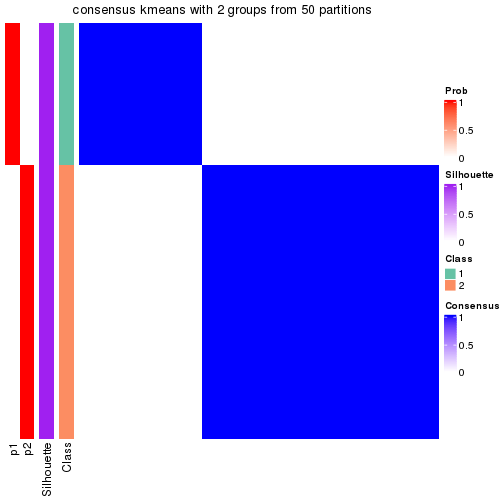</p>

</div>
<div id='tab-node-012-consensus-heatmap-2'>
<pre><code class="r">consensus_heatmap(res, k = 3)
</code></pre>

<p>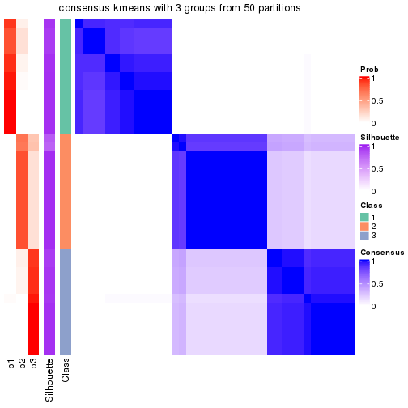</p>

</div>
<div id='tab-node-012-consensus-heatmap-3'>
<pre><code class="r">consensus_heatmap(res, k = 4)
</code></pre>

<p>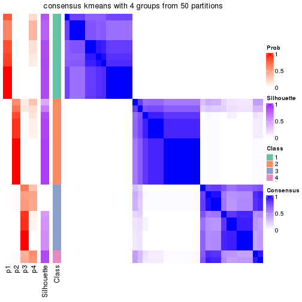</p>

</div>
<div id='tab-node-012-consensus-heatmap-4'>
<pre><code class="r">consensus_heatmap(res, k = 5)
</code></pre>

<p>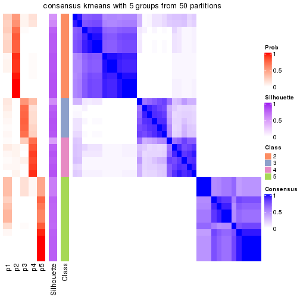</p>

</div>
<div id='tab-node-012-consensus-heatmap-5'>
<pre><code class="r">consensus_heatmap(res, k = 6)
</code></pre>

<p>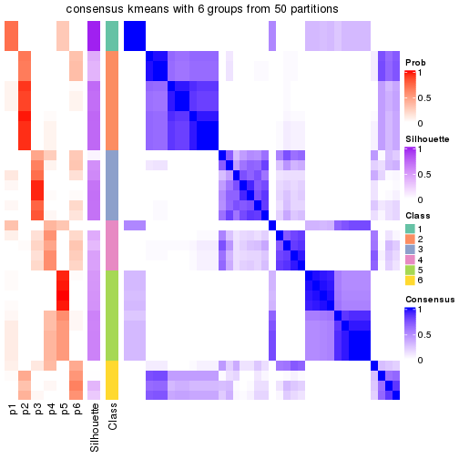</p>

</div>
<div id='tab-node-012-consensus-heatmap-6'>
<pre><code class="r">consensus_heatmap(res, k = 7)
</code></pre>

<p>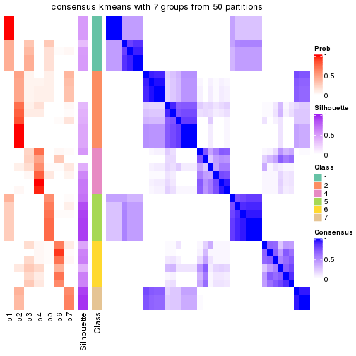</p>

</div>
<div id='tab-node-012-consensus-heatmap-7'>
<pre><code class="r">consensus_heatmap(res, k = 8)
</code></pre>

<p></p>

</div>
</div>

Heatmaps for the membership of samples in all partitions to see how consistent they are:


<script>
$( function() {
	$( '#tabs-node-012-membership-heatmap' ).tabs();
} );
</script>
<div id='tabs-node-012-membership-heatmap'>
<ul>
<li><a href='#tab-node-012-membership-heatmap-1'>k = 2</a></li>
<li><a href='#tab-node-012-membership-heatmap-2'>k = 3</a></li>
<li><a href='#tab-node-012-membership-heatmap-3'>k = 4</a></li>
<li><a href='#tab-node-012-membership-heatmap-4'>k = 5</a></li>
<li><a href='#tab-node-012-membership-heatmap-5'>k = 6</a></li>
<li><a href='#tab-node-012-membership-heatmap-6'>k = 7</a></li>
<li><a href='#tab-node-012-membership-heatmap-7'>k = 8</a></li>
</ul>
<div id='tab-node-012-membership-heatmap-1'>
<pre><code class="r">membership_heatmap(res, k = 2)
</code></pre>

<p></p>

</div>
<div id='tab-node-012-membership-heatmap-2'>
<pre><code class="r">membership_heatmap(res, k = 3)
</code></pre>

<p>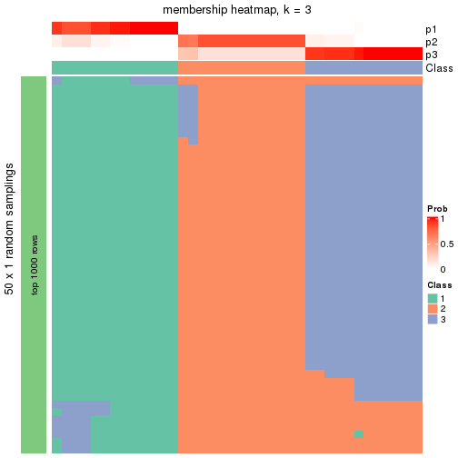</p>

</div>
<div id='tab-node-012-membership-heatmap-3'>
<pre><code class="r">membership_heatmap(res, k = 4)
</code></pre>

<p>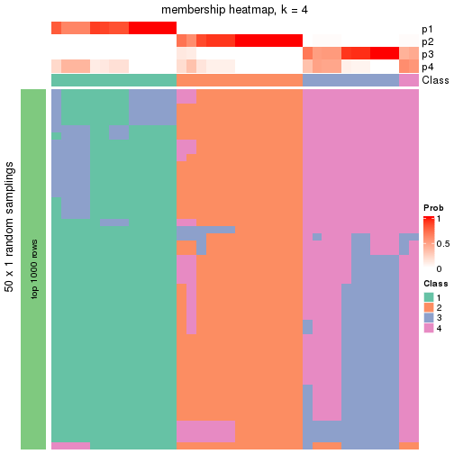</p>

</div>
<div id='tab-node-012-membership-heatmap-4'>
<pre><code class="r">membership_heatmap(res, k = 5)
</code></pre>

<p>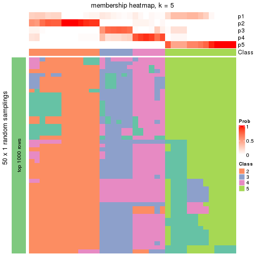</p>

</div>
<div id='tab-node-012-membership-heatmap-5'>
<pre><code class="r">membership_heatmap(res, k = 6)
</code></pre>

<p>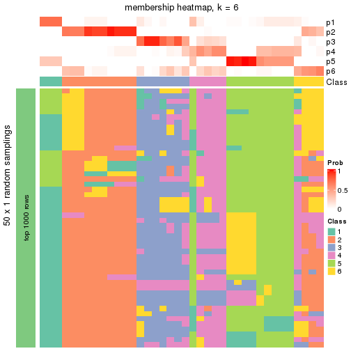</p>

</div>
<div id='tab-node-012-membership-heatmap-6'>
<pre><code class="r">membership_heatmap(res, k = 7)
</code></pre>

<p>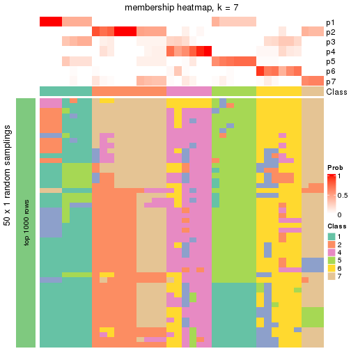</p>

</div>
<div id='tab-node-012-membership-heatmap-7'>
<pre><code class="r">membership_heatmap(res, k = 8)
</code></pre>

<p>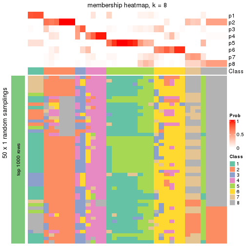</p>

</div>
</div>

As soon as the classes for columns are determined, the signatures
that are significantly different between subgroups can be looked for. 
Following are the heatmaps for signatures.


<script>
$( function() {
	$( '#tabs-node-012-get-signatures' ).tabs();
} );
</script>
<div id='tabs-node-012-get-signatures'>
<ul>
<li><a href='#tab-node-012-get-signatures-1'>k = 2</a></li>
<li><a href='#tab-node-012-get-signatures-2'>k = 3</a></li>
<li><a href='#tab-node-012-get-signatures-3'>k = 4</a></li>
<li><a href='#tab-node-012-get-signatures-4'>k = 5</a></li>
<li><a href='#tab-node-012-get-signatures-5'>k = 6</a></li>
<li><a href='#tab-node-012-get-signatures-6'>k = 7</a></li>
<li><a href='#tab-node-012-get-signatures-7'>k = 8</a></li>
</ul>
<div id='tab-node-012-get-signatures-1'>
<pre><code class="r">get_signatures(res, k = 2)
</code></pre>

<p>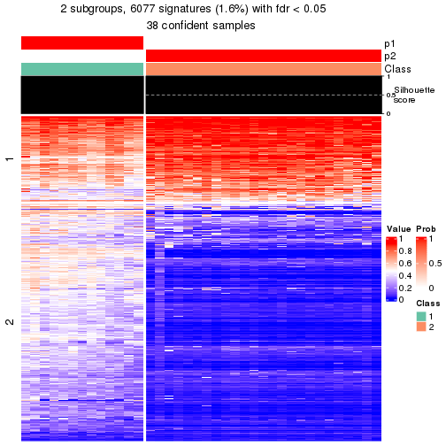</p>

</div>
<div id='tab-node-012-get-signatures-2'>
<pre><code class="r">get_signatures(res, k = 3)
</code></pre>

<p>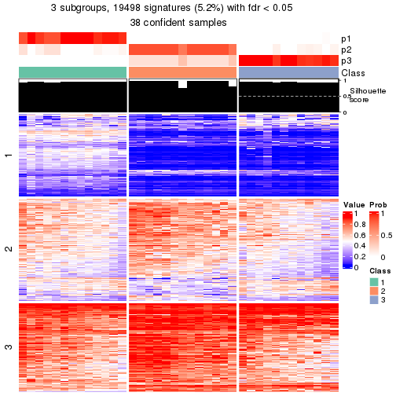</p>

</div>
<div id='tab-node-012-get-signatures-3'>
<pre><code class="r">get_signatures(res, k = 4)
</code></pre>

<p>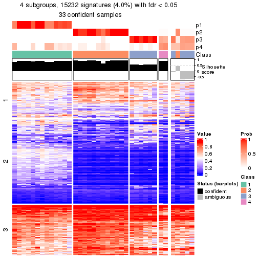</p>

</div>
<div id='tab-node-012-get-signatures-4'>
<pre><code class="r">get_signatures(res, k = 5)
</code></pre>

<p>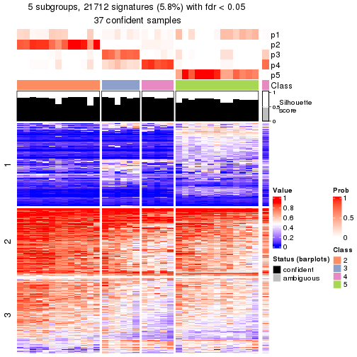</p>

</div>
<div id='tab-node-012-get-signatures-5'>
<pre><code class="r">get_signatures(res, k = 6)
</code></pre>

<p>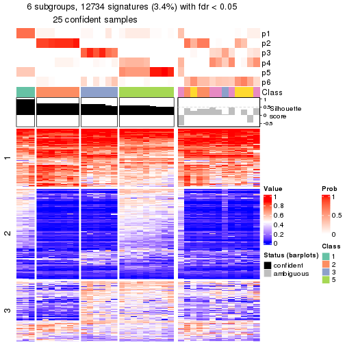</p>

</div>
<div id='tab-node-012-get-signatures-6'>
<pre><code class="r">get_signatures(res, k = 7)
</code></pre>

<p>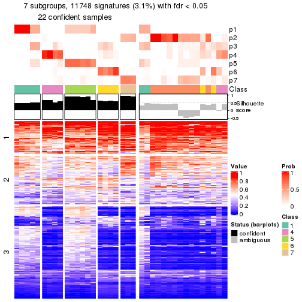</p>

</div>
<div id='tab-node-012-get-signatures-7'>
<pre><code class="r">get_signatures(res, k = 8)
</code></pre>

<p></p>

</div>
</div>


Compare the overlap of signatures from different k:

```r
compare_signatures(res)
```

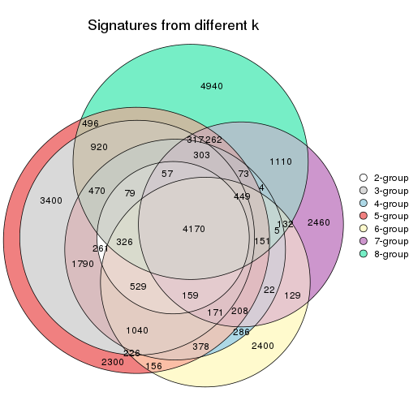

`get_signature()` returns a data frame invisibly. To get the list of signatures, the function
call should be assigned to a variable explicitly. In following code, if `plot` argument is set
to `FALSE`, no heatmap is plotted while only the differential analysis is performed.

```r
# code only for demonstration
tb = get_signature(res, k = ..., plot = FALSE)
```

An example of the output of `tb` is:

```
#>   which_row         fdr    mean_1    mean_2 scaled_mean_1 scaled_mean_2 km
#> 1        38 0.042760348  8.373488  9.131774    -0.5533452     0.5164555  1
#> 2        40 0.018707592  7.106213  8.469186    -0.6173731     0.5762149  1
#> 3        55 0.019134737 10.221463 11.207825    -0.6159697     0.5749050  1
#> 4        59 0.006059896  5.921854  7.869574    -0.6899429     0.6439467  1
#> 5        60 0.018055526  8.928898 10.211722    -0.6204761     0.5791110  1
#> 6        98 0.009384629 15.714769 14.887706     0.6635654    -0.6193277  2
...
```

The columns in `tb` are:

1. `which_row`: row indices corresponding to the input matrix.
2. `fdr`: FDR for the differential test. 
3. `mean_x`: The mean value in group x.
4. `scaled_mean_x`: The mean value in group x after rows are scaled.
5. `km`: Row groups if k-means clustering is applied to rows (which is done by automatically selecting number of clusters).

If there are too many signatures, `top_signatures = ...` can be set to only show the 
signatures with the highest FDRs:

```r
# code only for demonstration
# e.g. to show the top 500 most significant rows
tb = get_signature(res, k = ..., top_signatures = 500)
```

If the signatures are defined as these which are uniquely high in current group, `diff_method` argument
can be set to `"uniquely_high_in_one_group"`:

```r
# code only for demonstration
tb = get_signature(res, k = ..., diff_method = "uniquely_high_in_one_group")
```


UMAP plot which shows how samples are separated.


<script>
$( function() {
	$( '#tabs-node-012-dimension-reduction' ).tabs();
} );
</script>
<div id='tabs-node-012-dimension-reduction'>
<ul>
<li><a href='#tab-node-012-dimension-reduction-1'>k = 2</a></li>
<li><a href='#tab-node-012-dimension-reduction-2'>k = 3</a></li>
<li><a href='#tab-node-012-dimension-reduction-3'>k = 4</a></li>
<li><a href='#tab-node-012-dimension-reduction-4'>k = 5</a></li>
<li><a href='#tab-node-012-dimension-reduction-5'>k = 6</a></li>
<li><a href='#tab-node-012-dimension-reduction-6'>k = 7</a></li>
<li><a href='#tab-node-012-dimension-reduction-7'>k = 8</a></li>
</ul>
<div id='tab-node-012-dimension-reduction-1'>
<pre><code class="r">dimension_reduction(res, k = 2, method = &quot;UMAP&quot;)
</code></pre>

<p>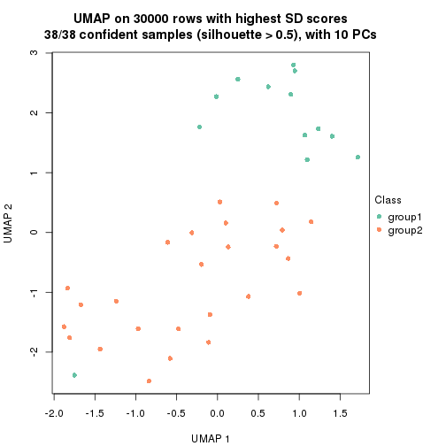</p>

</div>
<div id='tab-node-012-dimension-reduction-2'>
<pre><code class="r">dimension_reduction(res, k = 3, method = &quot;UMAP&quot;)
</code></pre>

<p>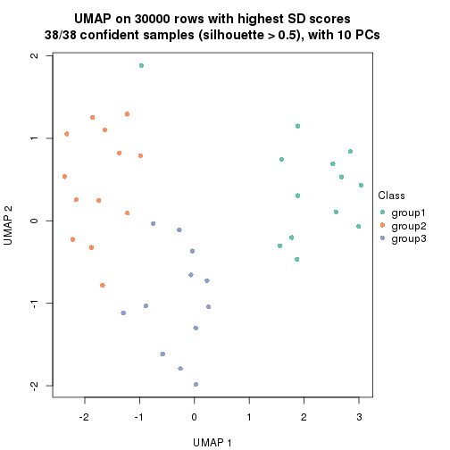</p>

</div>
<div id='tab-node-012-dimension-reduction-3'>
<pre><code class="r">dimension_reduction(res, k = 4, method = &quot;UMAP&quot;)
</code></pre>

<p>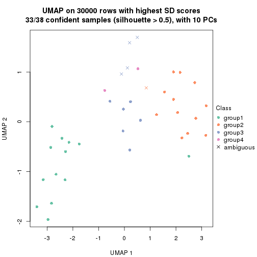</p>

</div>
<div id='tab-node-012-dimension-reduction-4'>
<pre><code class="r">dimension_reduction(res, k = 5, method = &quot;UMAP&quot;)
</code></pre>

<p>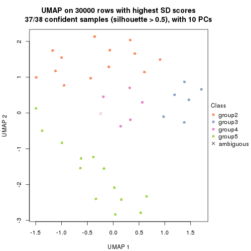</p>

</div>
<div id='tab-node-012-dimension-reduction-5'>
<pre><code class="r">dimension_reduction(res, k = 6, method = &quot;UMAP&quot;)
</code></pre>

<p>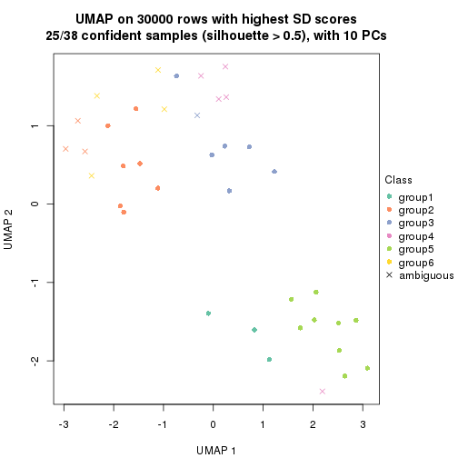</p>

</div>
<div id='tab-node-012-dimension-reduction-6'>
<pre><code class="r">dimension_reduction(res, k = 7, method = &quot;UMAP&quot;)
</code></pre>

<p>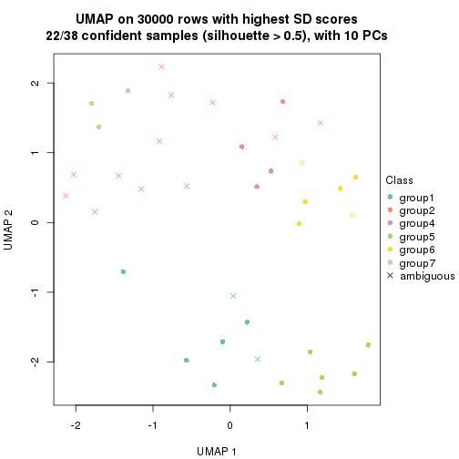</p>

</div>
<div id='tab-node-012-dimension-reduction-7'>
<pre><code class="r">dimension_reduction(res, k = 8, method = &quot;UMAP&quot;)
</code></pre>

<p>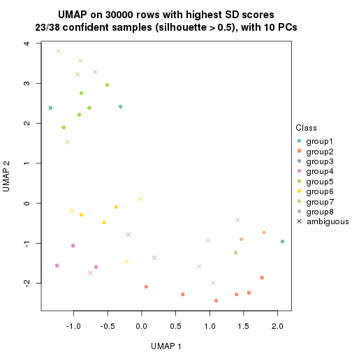</p>

</div>
</div>


Following heatmap shows how subgroups are split when increasing `k`:

```r
collect_classes(res)
```

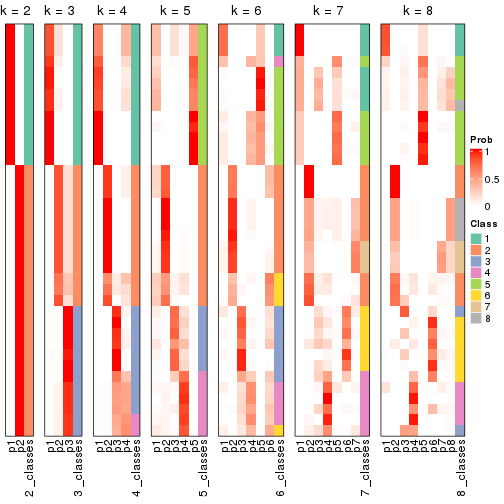


If matrix rows can be associated to genes, consider to use `functional_enrichment(res,
...)` to perform function enrichment for the signature genes. See [this vignette](https://jokergoo.github.io/cola_vignettes/functional_enrichment.html) for more detailed explanations.


 

---------------------------------------------------


### Node0121


Parent node: [Node012](#Node012).
Child nodes: 
                Node01211-leaf
        ,
                Node01212-leaf
        ,
                Node01213-leaf
        ,
                Node01221-leaf
        ,
                Node01222-leaf
        ,
                Node01223-leaf
        ,
                Node02111-leaf
        ,
                Node02112-leaf
        ,
                Node02113-leaf
        ,
                Node02114-leaf
        ,
                Node02121-leaf
        ,
                Node02122-leaf
        ,
                Node02123-leaf
        ,
                Node02124-leaf
        ,
                Node02131-leaf
        ,
                [Node02132](#Node02132)
        ,
                Node02133-leaf
        ,
                Node02211-leaf
        ,
                Node02212-leaf
        ,
                Node02213-leaf
        ,
                Node02221-leaf
        ,
                Node02222-leaf
        ,
                Node02223-leaf
        ,
                Node02231-leaf
        ,
                Node02232-leaf
        ,
                Node02233-leaf
        ,
                Node02241-leaf
        ,
                Node02242-leaf
        ,
                Node02243-leaf
        ,
                Node02321-leaf
        ,
                Node02322-leaf
        ,
                Node02323-leaf
        ,
                Node05111-leaf
        ,
                Node05112-leaf
        ,
                Node05113-leaf
        ,
                Node05114-leaf
        ,
                [Node05121](#Node05121)
        ,
                Node05122-leaf
        ,
                Node05123-leaf
        ,
                Node05221-leaf
        ,
                Node05222-leaf
        .


The object with results only for a single top-value method and a single partitioning method 
can be extracted as:

```r
res = res_rh["0121"]
```

A summary of `res` and all the functions that can be applied to it:

```r
res
```

```
#> A 'ConsensusPartition' object with k = 2, 3, 4, 5, 6, 7, 8.
#>   On a matrix with 30000 rows and 13 columns.
#>   Top rows (1000) are extracted by 'ATC' method.
#>   Subgroups are detected by 'kmeans' method.
#>   Performed in total 350 partitions by row resampling.
#>   Best k for subgroups seems to be 5.
#> 
#> Following methods can be applied to this 'ConsensusPartition' object:
#>  [1] "cola_report"             "collect_classes"         "collect_plots"          
#>  [4] "collect_stats"           "colnames"                "compare_partitions"     
#>  [7] "compare_signatures"      "consensus_heatmap"       "dimension_reduction"    
#> [10] "functional_enrichment"   "get_anno_col"            "get_anno"               
#> [13] "get_classes"             "get_consensus"           "get_matrix"             
#> [16] "get_membership"          "get_param"               "get_signatures"         
#> [19] "get_stats"               "is_best_k"               "is_stable_k"            
#> [22] "membership_heatmap"      "ncol"                    "nrow"                   
#> [25] "plot_ecdf"               "predict_classes"         "rownames"               
#> [28] "select_partition_number" "show"                    "suggest_best_k"         
#> [31] "test_to_known_factors"   "top_rows_heatmap"
```

`collect_plots()` function collects all the plots made from `res` for all `k` (number of subgroups)
into one single page to provide an easy and fast comparison between different `k`.

```r
collect_plots(res)
```


The plots are:

- The first row: a plot of the eCDF (empirical cumulative distribution
  function) curves of the consensus matrix for each `k` and the heatmap of
  predicted classes for each `k`.
- The second row: heatmaps of the consensus matrix for each `k`.
- The third row: heatmaps of the membership matrix for each `k`.
- The fouth row: heatmaps of the signatures for each `k`.

All the plots in panels can be made by individual functions and they are
plotted later in this section.

`select_partition_number()` produces several plots showing different
statistics for choosing "optimized" `k`. There are following statistics:

- eCDF curves of the consensus matrix for each `k`;
- 1-PAC. [The PAC score](https://en.wikipedia.org/wiki/Consensus_clustering#Over-interpretation_potential_of_consensus_clustering)
  measures the proportion of the ambiguous subgrouping.
- Mean silhouette score.
- Concordance. The mean probability of fiting the consensus subgroup labels in all
  partitions.
- Area increased. Denote $A_k$ as the area under the eCDF curve for current
  `k`, the area increased is defined as $A_k - A_{k-1}$.
- Rand index. The percent of pairs of samples that are both in a same cluster
  or both are not in a same cluster in the partition of k and k-1.
- Jaccard index. The ratio of pairs of samples are both in a same cluster in
  the partition of k and k-1 and the pairs of samples are both in a same
  cluster in the partition k or k-1.

The detailed explanations of these statistics can be found in [the _cola_
vignette](https://jokergoo.github.io/cola_vignettes/cola.html#toc_13).

Generally speaking, higher 1-PAC score, higher mean silhouette score or higher
concordance corresponds to better partition. Rand index and Jaccard index
measure how similar the current partition is compared to partition with `k-1`.
If they are too similar, we won't accept `k` is better than `k-1`.

```r
select_partition_number(res)
```

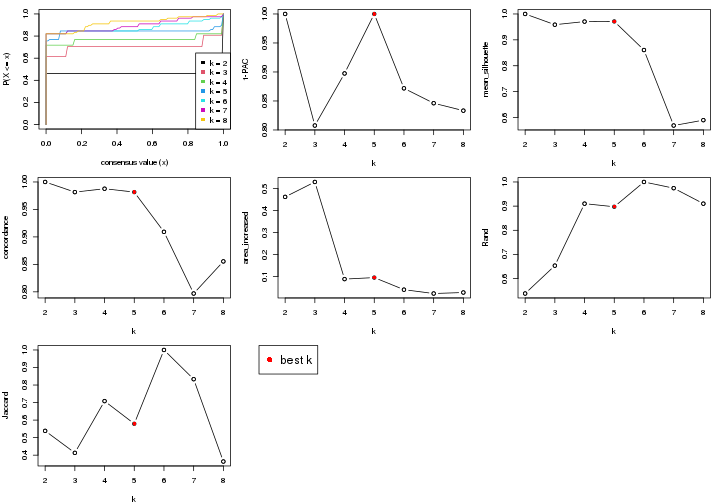

The numeric values for all these statistics can be obtained by `get_stats()`.

```r
get_stats(res)
```

```
#>   k 1-PAC mean_silhouette concordance area_increased  Rand Jaccard
#> 2 2 1.000           1.000       1.000         0.4621 0.538   0.538
#> 3 3 0.808           0.959       0.982         0.5299 0.654   0.413
#> 4 4 0.897           0.971       0.988         0.0884 0.910   0.708
#> 5 5 1.000           0.971       0.982         0.0953 0.897   0.579
#> 6 6 0.872           0.861       0.909         0.0403 1.000   1.000
#> 7 7 0.846           0.569       0.797         0.0228 0.974   0.833
#> 8 8 0.833           0.590       0.855         0.0274 0.910   0.364
```

`suggest_best_k()` suggests the best $k$ based on these statistics. The rules are as follows:

- All $k$ with Jaccard index larger than 0.95 are removed because increasing
  $k$ does not provide enough extra information. If all $k$ are removed, it is
  marked as no subgroup is detected.
- For all $k$ with 1-PAC score larger than 0.9, the maximal $k$ is taken as
  the best $k$, and other $k$ are marked as optional $k$.
- If it does not fit the second rule. The $k$ with the maximal vote of the
  highest 1-PAC score, highest mean silhouette, and highest concordance is
  taken as the best $k$.

```r
suggest_best_k(res)
```

```
#> [1] 5
#> attr(,"optional")
#> [1] 2
```

There is also optional best $k$ = 2 that is worth to check.

Following is the table of the partitions (You need to click the **show/hide
code output** link to see it). The membership matrix (columns with name `p*`)
is inferred by
[`clue::cl_consensus()`](https://www.rdocumentation.org/link/cl_consensus?package=clue)
function with the `SE` method. Basically the value in the membership matrix
represents the probability to belong to a certain group. The finall subgroup
label for an item is determined with the group with highest probability it
belongs to.

In `get_classes()` function, the entropy is calculated from the membership
matrix and the silhouette score is calculated from the consensus matrix.


<script>
$( function() {
	$( '#tabs-node-0121-get-classes' ).tabs();
} );
</script>
<div id='tabs-node-0121-get-classes'>
<ul>
<li><a href='#tab-node-0121-get-classes-1'>k = 2</a></li>
<li><a href='#tab-node-0121-get-classes-2'>k = 3</a></li>
<li><a href='#tab-node-0121-get-classes-3'>k = 4</a></li>
<li><a href='#tab-node-0121-get-classes-4'>k = 5</a></li>
<li><a href='#tab-node-0121-get-classes-5'>k = 6</a></li>
<li><a href='#tab-node-0121-get-classes-6'>k = 7</a></li>
<li><a href='#tab-node-0121-get-classes-7'>k = 8</a></li>
</ul>

<div id='tab-node-0121-get-classes-1'>
<p><a id='tab-node-0121-get-classes-1-a' style='color:#0366d6' href='#'>show/hide code output</a></p>
<pre><code class="r">cbind(get_classes(res, k = 2), get_membership(res, k = 2))
</code></pre>

<pre><code>#&gt;                 class entropy silhouette p1 p2
#&gt; TCGA.CV.7413.01     2       0          1  0  1
#&gt; TCGA.CN.4742.01     2       0          1  0  1
#&gt; TCGA.CV.6934.01     1       0          1  1  0
#&gt; TCGA.CV.A45V.01     1       0          1  1  0
#&gt; TCGA.CQ.A4CE.01     1       0          1  1  0
#&gt; TCGA.BB.8596.01     1       0          1  1  0
#&gt; TCGA.QK.A6VC.01     1       0          1  1  0
#&gt; TCGA.RS.A6TO.01     2       0          1  0  1
#&gt; TCGA.CQ.7067.01     1       0          1  1  0
#&gt; TCGA.D6.A6EM.01     1       0          1  1  0
#&gt; TCGA.P3.A6T0.01     2       0          1  0  1
#&gt; TCGA.UF.A7JA.01     1       0          1  1  0
#&gt; TCGA.BA.A6DA.01     1       0          1  1  0
</code></pre>

<script>
$('#tab-node-0121-get-classes-1-a').parent().next().next().hide();
$('#tab-node-0121-get-classes-1-a').click(function(){
  $('#tab-node-0121-get-classes-1-a').parent().next().next().toggle();
  return(false);
});
</script>
</div>

<div id='tab-node-0121-get-classes-2'>
<p><a id='tab-node-0121-get-classes-2-a' style='color:#0366d6' href='#'>show/hide code output</a></p>
<pre><code class="r">cbind(get_classes(res, k = 3), get_membership(res, k = 3))
</code></pre>

<pre><code>#&gt;                 class entropy silhouette   p1   p2   p3
#&gt; TCGA.CV.7413.01     2   0.000      1.000 0.00 1.00 0.00
#&gt; TCGA.CN.4742.01     3   0.334      0.855 0.00 0.12 0.88
#&gt; TCGA.CV.6934.01     1   0.334      0.866 0.88 0.00 0.12
#&gt; TCGA.CV.A45V.01     3   0.000      0.967 0.00 0.00 1.00
#&gt; TCGA.CQ.A4CE.01     3   0.000      0.967 0.00 0.00 1.00
#&gt; TCGA.BB.8596.01     3   0.000      0.967 0.00 0.00 1.00
#&gt; TCGA.QK.A6VC.01     3   0.000      0.967 0.00 0.00 1.00
#&gt; TCGA.RS.A6TO.01     2   0.000      1.000 0.00 1.00 0.00
#&gt; TCGA.CQ.7067.01     1   0.000      0.968 1.00 0.00 0.00
#&gt; TCGA.D6.A6EM.01     1   0.000      0.968 1.00 0.00 0.00
#&gt; TCGA.P3.A6T0.01     2   0.000      1.000 0.00 1.00 0.00
#&gt; TCGA.UF.A7JA.01     1   0.000      0.968 1.00 0.00 0.00
#&gt; TCGA.BA.A6DA.01     1   0.000      0.968 1.00 0.00 0.00
</code></pre>

<script>
$('#tab-node-0121-get-classes-2-a').parent().next().next().hide();
$('#tab-node-0121-get-classes-2-a').click(function(){
  $('#tab-node-0121-get-classes-2-a').parent().next().next().toggle();
  return(false);
});
</script>
</div>

<div id='tab-node-0121-get-classes-3'>
<p><a id='tab-node-0121-get-classes-3-a' style='color:#0366d6' href='#'>show/hide code output</a></p>
<pre><code class="r">cbind(get_classes(res, k = 4), get_membership(res, k = 4))
</code></pre>

<pre><code>#&gt;                 class entropy silhouette   p1 p2   p3 p4
#&gt; TCGA.CV.7413.01     4   0.000      1.000 0.00  0 0.00  1
#&gt; TCGA.CN.4742.01     4   0.000      1.000 0.00  0 0.00  1
#&gt; TCGA.CV.6934.01     1   0.317      0.803 0.84  0 0.16  0
#&gt; TCGA.CV.A45V.01     3   0.000      1.000 0.00  0 1.00  0
#&gt; TCGA.CQ.A4CE.01     3   0.000      1.000 0.00  0 1.00  0
#&gt; TCGA.BB.8596.01     3   0.000      1.000 0.00  0 1.00  0
#&gt; TCGA.QK.A6VC.01     3   0.000      1.000 0.00  0 1.00  0
#&gt; TCGA.RS.A6TO.01     2   0.000      1.000 0.00  1 0.00  0
#&gt; TCGA.CQ.7067.01     1   0.000      0.954 1.00  0 0.00  0
#&gt; TCGA.D6.A6EM.01     1   0.000      0.954 1.00  0 0.00  0
#&gt; TCGA.P3.A6T0.01     2   0.000      1.000 0.00  1 0.00  0
#&gt; TCGA.UF.A7JA.01     1   0.000      0.954 1.00  0 0.00  0
#&gt; TCGA.BA.A6DA.01     1   0.000      0.954 1.00  0 0.00  0
</code></pre>

<script>
$('#tab-node-0121-get-classes-3-a').parent().next().next().hide();
$('#tab-node-0121-get-classes-3-a').click(function(){
  $('#tab-node-0121-get-classes-3-a').parent().next().next().toggle();
  return(false);
});
</script>
</div>

<div id='tab-node-0121-get-classes-4'>
<p><a id='tab-node-0121-get-classes-4-a' style='color:#0366d6' href='#'>show/hide code output</a></p>
<pre><code class="r">cbind(get_classes(res, k = 5), get_membership(res, k = 5))
</code></pre>

<pre><code>#&gt;                 class entropy silhouette   p1 p2   p3   p4   p5
#&gt; TCGA.CV.7413.01     4  0.0609      0.986 0.00  0 0.00 0.98 0.02
#&gt; TCGA.CN.4742.01     4  0.0000      0.986 0.00  0 0.00 1.00 0.00
#&gt; TCGA.CV.6934.01     5  0.1732      0.884 0.08  0 0.00 0.00 0.92
#&gt; TCGA.CV.A45V.01     3  0.0000      0.943 0.00  0 1.00 0.00 0.00
#&gt; TCGA.CQ.A4CE.01     3  0.1410      0.971 0.00  0 0.94 0.00 0.06
#&gt; TCGA.BB.8596.01     5  0.0609      0.884 0.00  0 0.02 0.00 0.98
#&gt; TCGA.QK.A6VC.01     3  0.1410      0.971 0.00  0 0.94 0.00 0.06
#&gt; TCGA.RS.A6TO.01     2  0.0000      1.000 0.00  1 0.00 0.00 0.00
#&gt; TCGA.CQ.7067.01     1  0.0000      1.000 1.00  0 0.00 0.00 0.00
#&gt; TCGA.D6.A6EM.01     1  0.0000      1.000 1.00  0 0.00 0.00 0.00
#&gt; TCGA.P3.A6T0.01     2  0.0000      1.000 0.00  1 0.00 0.00 0.00
#&gt; TCGA.UF.A7JA.01     1  0.0000      1.000 1.00  0 0.00 0.00 0.00
#&gt; TCGA.BA.A6DA.01     1  0.0000      1.000 1.00  0 0.00 0.00 0.00
</code></pre>

<script>
$('#tab-node-0121-get-classes-4-a').parent().next().next().hide();
$('#tab-node-0121-get-classes-4-a').click(function(){
  $('#tab-node-0121-get-classes-4-a').parent().next().next().toggle();
  return(false);
});
</script>
</div>

<div id='tab-node-0121-get-classes-5'>
<p><a id='tab-node-0121-get-classes-5-a' style='color:#0366d6' href='#'>show/hide code output</a></p>
<pre><code class="r">cbind(get_classes(res, k = 6), get_membership(res, k = 6))
</code></pre>

<pre><code>#&gt;                 class entropy silhouette  p1   p2   p3   p4   p5   p6
#&gt; TCGA.CV.7413.01     6  0.0547      0.986 0.0 0.00 0.00 0.02 0.00 0.98
#&gt; TCGA.CN.4742.01     6  0.0000      0.986 0.0 0.00 0.00 0.00 0.00 1.00
#&gt; TCGA.CV.6934.01     5  0.0000      1.000 0.0 0.00 0.00 0.00 1.00 0.00
#&gt; TCGA.CV.A45V.01     3  0.3647      0.799 0.0 0.00 0.64 0.36 0.00 0.00
#&gt; TCGA.CQ.A4CE.01     3  0.4926      0.779 0.0 0.00 0.64 0.24 0.12 0.00
#&gt; TCGA.BB.8596.01     5  0.0000      1.000 0.0 0.00 0.00 0.00 1.00 0.00
#&gt; TCGA.QK.A6VC.01     3  0.0000      0.699 0.0 0.00 1.00 0.00 0.00 0.00
#&gt; TCGA.RS.A6TO.01     2  0.1556      0.942 0.0 0.92 0.00 0.08 0.00 0.00
#&gt; TCGA.CQ.7067.01     1  0.3756      0.621 0.6 0.00 0.00 0.40 0.00 0.00
#&gt; TCGA.D6.A6EM.01     1  0.0000      0.833 1.0 0.00 0.00 0.00 0.00 0.00
#&gt; TCGA.P3.A6T0.01     2  0.0000      0.942 0.0 1.00 0.00 0.00 0.00 0.00
#&gt; TCGA.UF.A7JA.01     1  0.2793      0.770 0.8 0.00 0.00 0.20 0.00 0.00
#&gt; TCGA.BA.A6DA.01     1  0.0000      0.833 1.0 0.00 0.00 0.00 0.00 0.00
</code></pre>

<script>
$('#tab-node-0121-get-classes-5-a').parent().next().next().hide();
$('#tab-node-0121-get-classes-5-a').click(function(){
  $('#tab-node-0121-get-classes-5-a').parent().next().next().toggle();
  return(false);
});
</script>
</div>

<div id='tab-node-0121-get-classes-6'>
<p><a id='tab-node-0121-get-classes-6-a' style='color:#0366d6' href='#'>show/hide code output</a></p>
<pre><code class="r">cbind(get_classes(res, k = 7), get_membership(res, k = 7))
</code></pre>

<pre><code>#&gt;                 class entropy silhouette   p1   p2   p3   p4   p5   p6   p7
#&gt; TCGA.CV.7413.01     6   0.000     0.8575 0.00 0.00 0.00 0.00 0.00 1.00 0.00
#&gt; TCGA.CN.4742.01     6   0.275     0.8575 0.00 0.16 0.00 0.00 0.00 0.82 0.02
#&gt; TCGA.CV.6934.01     5   0.000     1.0000 0.00 0.00 0.00 0.00 1.00 0.00 0.00
#&gt; TCGA.CV.A45V.01     7   0.341     0.0000 0.00 0.00 0.38 0.00 0.00 0.00 0.62
#&gt; TCGA.CQ.A4CE.01     3   0.639    -0.5674 0.00 0.12 0.40 0.00 0.12 0.00 0.36
#&gt; TCGA.BB.8596.01     5   0.000     1.0000 0.00 0.00 0.00 0.00 1.00 0.00 0.00
#&gt; TCGA.QK.A6VC.01     3   0.000     0.0034 0.00 0.00 1.00 0.00 0.00 0.00 0.00
#&gt; TCGA.RS.A6TO.01     4   0.384     0.7899 0.00 0.16 0.00 0.74 0.00 0.00 0.10
#&gt; TCGA.CQ.7067.01     1   0.356     0.5259 0.52 0.48 0.00 0.00 0.00 0.00 0.00
#&gt; TCGA.D6.A6EM.01     1   0.000     0.7573 1.00 0.00 0.00 0.00 0.00 0.00 0.00
#&gt; TCGA.P3.A6T0.01     4   0.000     0.7899 0.00 0.00 0.00 1.00 0.00 0.00 0.00
#&gt; TCGA.UF.A7JA.01     1   0.445     0.6264 0.64 0.10 0.00 0.00 0.00 0.00 0.26
#&gt; TCGA.BA.A6DA.01     1   0.000     0.7573 1.00 0.00 0.00 0.00 0.00 0.00 0.00
</code></pre>

<script>
$('#tab-node-0121-get-classes-6-a').parent().next().next().hide();
$('#tab-node-0121-get-classes-6-a').click(function(){
  $('#tab-node-0121-get-classes-6-a').parent().next().next().toggle();
  return(false);
});
</script>
</div>

<div id='tab-node-0121-get-classes-7'>
<p><a id='tab-node-0121-get-classes-7-a' style='color:#0366d6' href='#'>show/hide code output</a></p>
<pre><code class="r">cbind(get_classes(res, k = 8), get_membership(res, k = 8))
</code></pre>

<pre><code>#&gt;                 class entropy silhouette   p1   p2   p3   p4   p5   p6   p7   p8
#&gt; TCGA.CV.7413.01     6  0.0000      0.715 0.00 0.00 0.00 0.00 0.00 1.00 0.00 0.00
#&gt; TCGA.CN.4742.01     6  0.4069      0.715 0.00 0.18 0.00 0.00 0.00 0.68 0.00 0.14
#&gt; TCGA.CV.6934.01     5  0.0808      0.957 0.00 0.04 0.00 0.00 0.96 0.00 0.00 0.00
#&gt; TCGA.CV.A45V.01     7  0.2114      0.519 0.00 0.00 0.16 0.00 0.00 0.00 0.84 0.00
#&gt; TCGA.CQ.A4CE.01     7  0.6101      0.529 0.00 0.04 0.18 0.00 0.26 0.00 0.48 0.04
#&gt; TCGA.BB.8596.01     5  0.0000      0.957 0.00 0.00 0.00 0.00 1.00 0.00 0.00 0.00
#&gt; TCGA.QK.A6VC.01     3  0.0000      0.000 0.00 0.00 1.00 0.00 0.00 0.00 0.00 0.00
#&gt; TCGA.RS.A6TO.01     4  0.3744      0.772 0.00 0.02 0.00 0.74 0.00 0.00 0.06 0.18
#&gt; TCGA.CQ.7067.01     2  0.3551      0.000 0.22 0.72 0.00 0.00 0.00 0.00 0.00 0.06
#&gt; TCGA.D6.A6EM.01     1  0.1563      0.866 0.90 0.00 0.00 0.00 0.00 0.00 0.10 0.00
#&gt; TCGA.P3.A6T0.01     4  0.0000      0.772 0.00 0.00 0.00 1.00 0.00 0.00 0.00 0.00
#&gt; TCGA.UF.A7JA.01     8  0.3142      0.000 0.36 0.00 0.00 0.00 0.00 0.00 0.00 0.64
#&gt; TCGA.BA.A6DA.01     1  0.0000      0.866 1.00 0.00 0.00 0.00 0.00 0.00 0.00 0.00
</code></pre>

<script>
$('#tab-node-0121-get-classes-7-a').parent().next().next().hide();
$('#tab-node-0121-get-classes-7-a').click(function(){
  $('#tab-node-0121-get-classes-7-a').parent().next().next().toggle();
  return(false);
});
</script>
</div>
</div>

Heatmaps for the consensus matrix. It visualizes the probability of two
samples to be in a same group.


<script>
$( function() {
	$( '#tabs-node-0121-consensus-heatmap' ).tabs();
} );
</script>
<div id='tabs-node-0121-consensus-heatmap'>
<ul>
<li><a href='#tab-node-0121-consensus-heatmap-1'>k = 2</a></li>
<li><a href='#tab-node-0121-consensus-heatmap-2'>k = 3</a></li>
<li><a href='#tab-node-0121-consensus-heatmap-3'>k = 4</a></li>
<li><a href='#tab-node-0121-consensus-heatmap-4'>k = 5</a></li>
<li><a href='#tab-node-0121-consensus-heatmap-5'>k = 6</a></li>
<li><a href='#tab-node-0121-consensus-heatmap-6'>k = 7</a></li>
<li><a href='#tab-node-0121-consensus-heatmap-7'>k = 8</a></li>
</ul>
<div id='tab-node-0121-consensus-heatmap-1'>
<pre><code class="r">consensus_heatmap(res, k = 2)
</code></pre>

<p>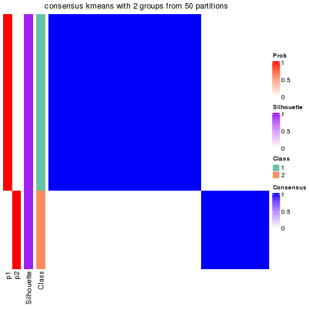</p>

</div>
<div id='tab-node-0121-consensus-heatmap-2'>
<pre><code class="r">consensus_heatmap(res, k = 3)
</code></pre>

<p>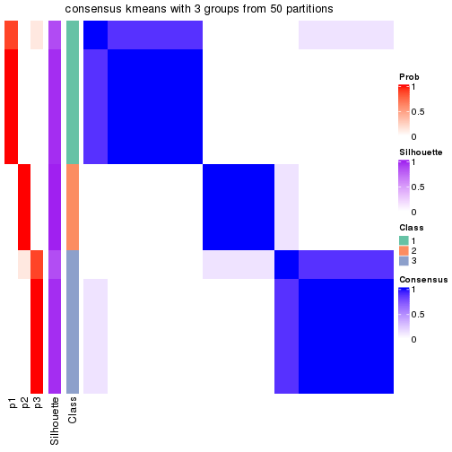</p>

</div>
<div id='tab-node-0121-consensus-heatmap-3'>
<pre><code class="r">consensus_heatmap(res, k = 4)
</code></pre>

<p>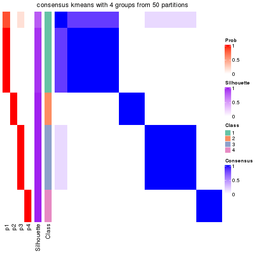</p>

</div>
<div id='tab-node-0121-consensus-heatmap-4'>
<pre><code class="r">consensus_heatmap(res, k = 5)
</code></pre>

<p>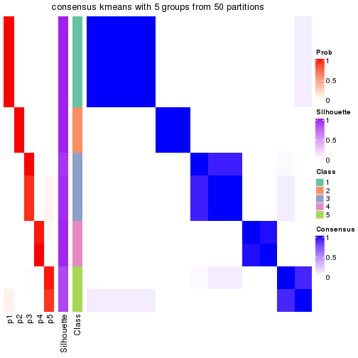</p>

</div>
<div id='tab-node-0121-consensus-heatmap-5'>
<pre><code class="r">consensus_heatmap(res, k = 6)
</code></pre>

<p></p>

</div>
<div id='tab-node-0121-consensus-heatmap-6'>
<pre><code class="r">consensus_heatmap(res, k = 7)
</code></pre>

<p>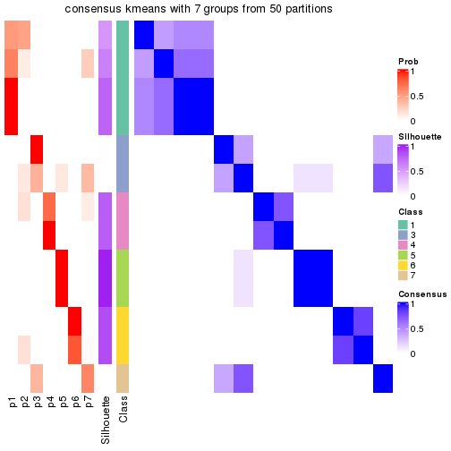</p>

</div>
<div id='tab-node-0121-consensus-heatmap-7'>
<pre><code class="r">consensus_heatmap(res, k = 8)
</code></pre>

<p>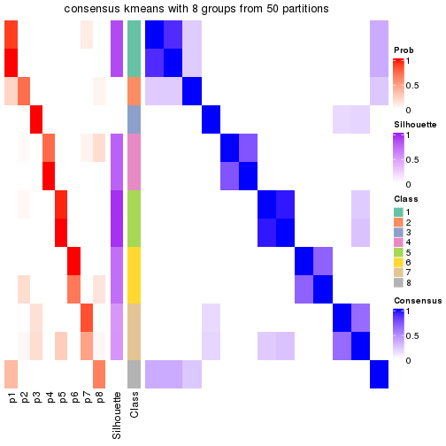</p>

</div>
</div>

Heatmaps for the membership of samples in all partitions to see how consistent they are:


<script>
$( function() {
	$( '#tabs-node-0121-membership-heatmap' ).tabs();
} );
</script>
<div id='tabs-node-0121-membership-heatmap'>
<ul>
<li><a href='#tab-node-0121-membership-heatmap-1'>k = 2</a></li>
<li><a href='#tab-node-0121-membership-heatmap-2'>k = 3</a></li>
<li><a href='#tab-node-0121-membership-heatmap-3'>k = 4</a></li>
<li><a href='#tab-node-0121-membership-heatmap-4'>k = 5</a></li>
<li><a href='#tab-node-0121-membership-heatmap-5'>k = 6</a></li>
<li><a href='#tab-node-0121-membership-heatmap-6'>k = 7</a></li>
<li><a href='#tab-node-0121-membership-heatmap-7'>k = 8</a></li>
</ul>
<div id='tab-node-0121-membership-heatmap-1'>
<pre><code class="r">membership_heatmap(res, k = 2)
</code></pre>

<p>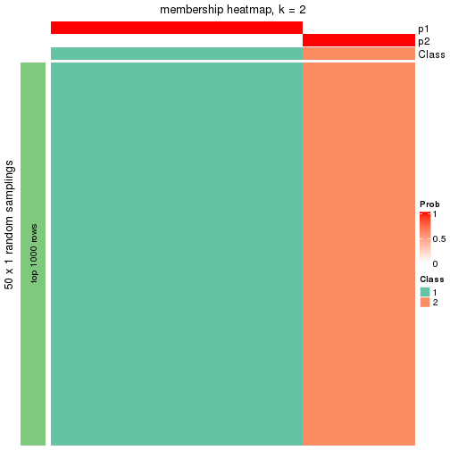</p>

</div>
<div id='tab-node-0121-membership-heatmap-2'>
<pre><code class="r">membership_heatmap(res, k = 3)
</code></pre>

<p>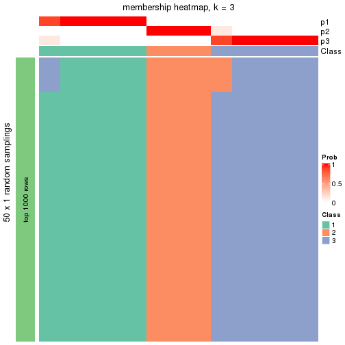</p>

</div>
<div id='tab-node-0121-membership-heatmap-3'>
<pre><code class="r">membership_heatmap(res, k = 4)
</code></pre>

<p>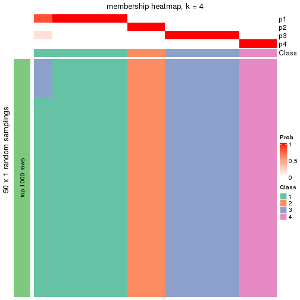</p>

</div>
<div id='tab-node-0121-membership-heatmap-4'>
<pre><code class="r">membership_heatmap(res, k = 5)
</code></pre>

<p>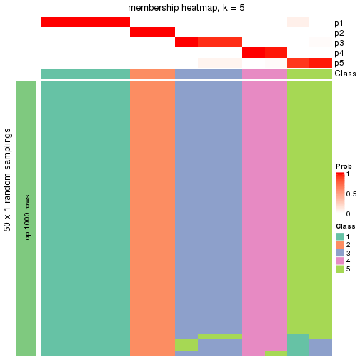</p>

</div>
<div id='tab-node-0121-membership-heatmap-5'>
<pre><code class="r">membership_heatmap(res, k = 6)
</code></pre>

<p>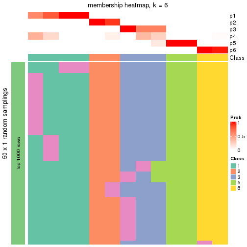</p>

</div>
<div id='tab-node-0121-membership-heatmap-6'>
<pre><code class="r">membership_heatmap(res, k = 7)
</code></pre>

<p></p>

</div>
<div id='tab-node-0121-membership-heatmap-7'>
<pre><code class="r">membership_heatmap(res, k = 8)
</code></pre>

<p>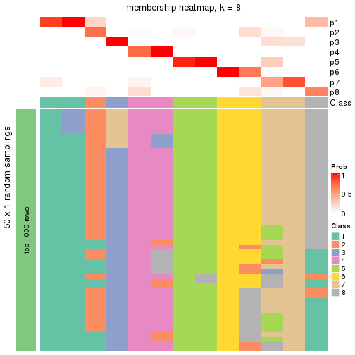</p>

</div>
</div>

As soon as the classes for columns are determined, the signatures
that are significantly different between subgroups can be looked for. 
Following are the heatmaps for signatures.


<script>
$( function() {
	$( '#tabs-node-0121-get-signatures' ).tabs();
} );
</script>
<div id='tabs-node-0121-get-signatures'>
<ul>
<li><a href='#tab-node-0121-get-signatures-1'>k = 2</a></li>
<li><a href='#tab-node-0121-get-signatures-2'>k = 3</a></li>
<li><a href='#tab-node-0121-get-signatures-3'>k = 4</a></li>
<li><a href='#tab-node-0121-get-signatures-4'>k = 5</a></li>
<li><a href='#tab-node-0121-get-signatures-5'>k = 6</a></li>
<li><a href='#tab-node-0121-get-signatures-6'>k = 7</a></li>
<li><a href='#tab-node-0121-get-signatures-7'>k = 8</a></li>
</ul>
<div id='tab-node-0121-get-signatures-1'>
<pre><code class="r">get_signatures(res, k = 2)
</code></pre>

<p>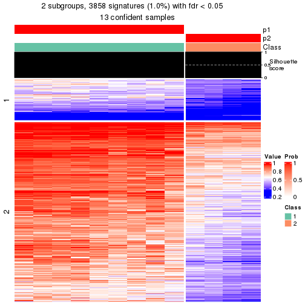</p>

</div>
<div id='tab-node-0121-get-signatures-2'>
<pre><code class="r">get_signatures(res, k = 3)
</code></pre>

<p>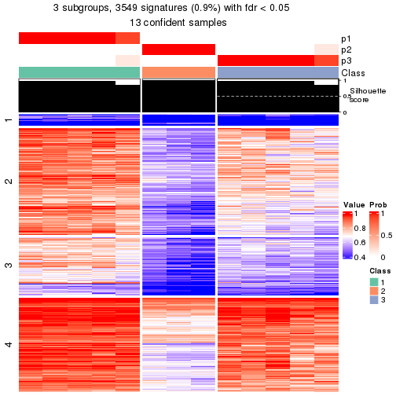</p>

</div>
<div id='tab-node-0121-get-signatures-3'>
<pre><code class="r">get_signatures(res, k = 4)
</code></pre>

<p>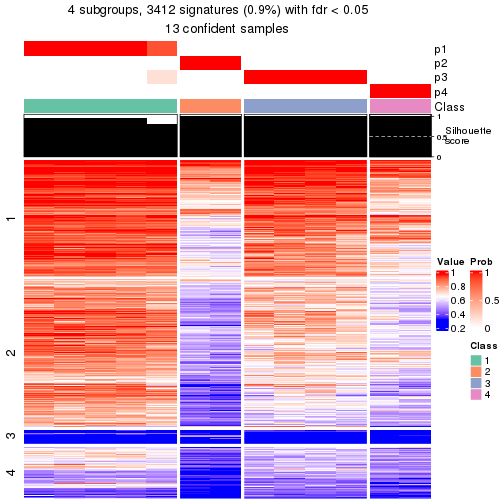</p>

</div>
<div id='tab-node-0121-get-signatures-4'>
<pre><code class="r">get_signatures(res, k = 5)
</code></pre>

<p>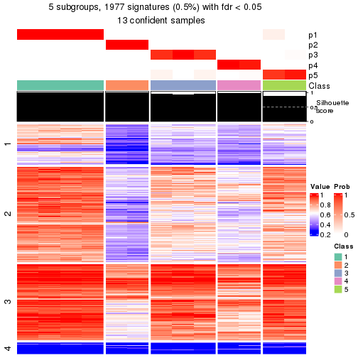</p>

</div>
<div id='tab-node-0121-get-signatures-5'>
<pre><code class="r">get_signatures(res, k = 6)
</code></pre>

<p>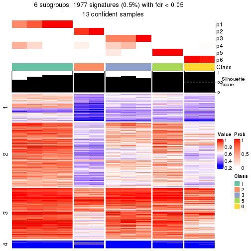</p>

</div>
<div id='tab-node-0121-get-signatures-6'>
<pre><code class="r">get_signatures(res, k = 7)
</code></pre>

<p>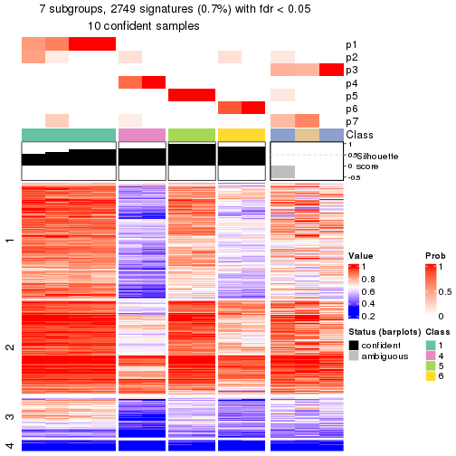</p>

</div>
<div id='tab-node-0121-get-signatures-7'>
<pre><code class="r">get_signatures(res, k = 8)
</code></pre>

<p>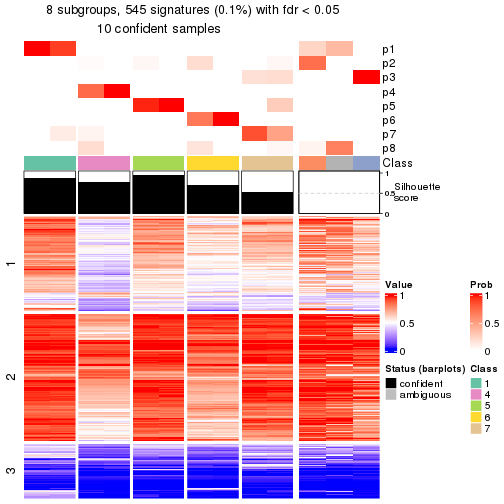</p>

</div>
</div>


Compare the overlap of signatures from different k:

```r
compare_signatures(res)
```

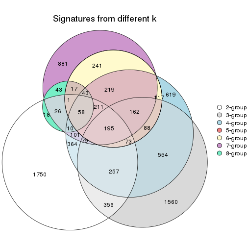

`get_signature()` returns a data frame invisibly. To get the list of signatures, the function
call should be assigned to a variable explicitly. In following code, if `plot` argument is set
to `FALSE`, no heatmap is plotted while only the differential analysis is performed.

```r
# code only for demonstration
tb = get_signature(res, k = ..., plot = FALSE)
```

An example of the output of `tb` is:

```
#>   which_row         fdr    mean_1    mean_2 scaled_mean_1 scaled_mean_2 km
#> 1        38 0.042760348  8.373488  9.131774    -0.5533452     0.5164555  1
#> 2        40 0.018707592  7.106213  8.469186    -0.6173731     0.5762149  1
#> 3        55 0.019134737 10.221463 11.207825    -0.6159697     0.5749050  1
#> 4        59 0.006059896  5.921854  7.869574    -0.6899429     0.6439467  1
#> 5        60 0.018055526  8.928898 10.211722    -0.6204761     0.5791110  1
#> 6        98 0.009384629 15.714769 14.887706     0.6635654    -0.6193277  2
...
```

The columns in `tb` are:

1. `which_row`: row indices corresponding to the input matrix.
2. `fdr`: FDR for the differential test. 
3. `mean_x`: The mean value in group x.
4. `scaled_mean_x`: The mean value in group x after rows are scaled.
5. `km`: Row groups if k-means clustering is applied to rows (which is done by automatically selecting number of clusters).

If there are too many signatures, `top_signatures = ...` can be set to only show the 
signatures with the highest FDRs:

```r
# code only for demonstration
# e.g. to show the top 500 most significant rows
tb = get_signature(res, k = ..., top_signatures = 500)
```

If the signatures are defined as these which are uniquely high in current group, `diff_method` argument
can be set to `"uniquely_high_in_one_group"`:

```r
# code only for demonstration
tb = get_signature(res, k = ..., diff_method = "uniquely_high_in_one_group")
```


UMAP plot which shows how samples are separated.


<script>
$( function() {
	$( '#tabs-node-0121-dimension-reduction' ).tabs();
} );
</script>
<div id='tabs-node-0121-dimension-reduction'>
<ul>
<li><a href='#tab-node-0121-dimension-reduction-1'>k = 2</a></li>
<li><a href='#tab-node-0121-dimension-reduction-2'>k = 3</a></li>
<li><a href='#tab-node-0121-dimension-reduction-3'>k = 4</a></li>
<li><a href='#tab-node-0121-dimension-reduction-4'>k = 5</a></li>
<li><a href='#tab-node-0121-dimension-reduction-5'>k = 6</a></li>
<li><a href='#tab-node-0121-dimension-reduction-6'>k = 7</a></li>
<li><a href='#tab-node-0121-dimension-reduction-7'>k = 8</a></li>
</ul>
<div id='tab-node-0121-dimension-reduction-1'>
<pre><code class="r">dimension_reduction(res, k = 2, method = &quot;UMAP&quot;)
</code></pre>

<p>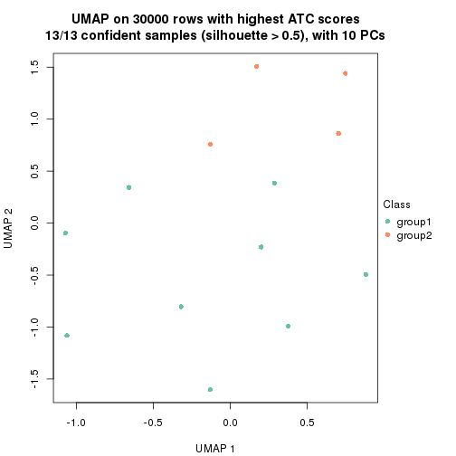</p>

</div>
<div id='tab-node-0121-dimension-reduction-2'>
<pre><code class="r">dimension_reduction(res, k = 3, method = &quot;UMAP&quot;)
</code></pre>

<p></p>

</div>
<div id='tab-node-0121-dimension-reduction-3'>
<pre><code class="r">dimension_reduction(res, k = 4, method = &quot;UMAP&quot;)
</code></pre>

<p>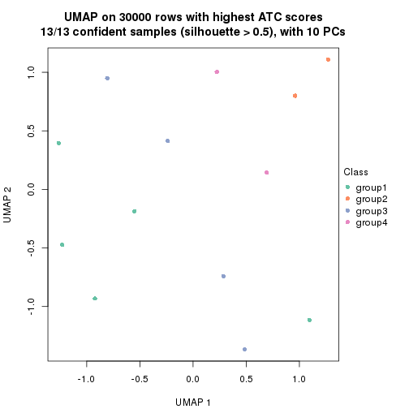</p>

</div>
<div id='tab-node-0121-dimension-reduction-4'>
<pre><code class="r">dimension_reduction(res, k = 5, method = &quot;UMAP&quot;)
</code></pre>

<p>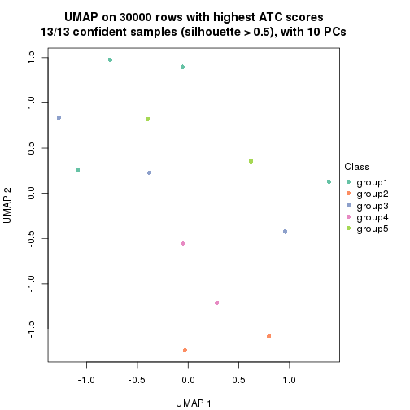</p>

</div>
<div id='tab-node-0121-dimension-reduction-5'>
<pre><code class="r">dimension_reduction(res, k = 6, method = &quot;UMAP&quot;)
</code></pre>

<p>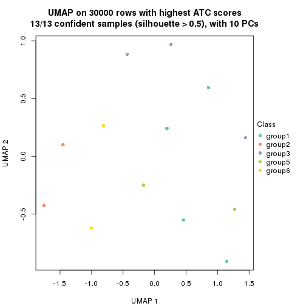</p>

</div>
<div id='tab-node-0121-dimension-reduction-6'>
<pre><code class="r">dimension_reduction(res, k = 7, method = &quot;UMAP&quot;)
</code></pre>

<p>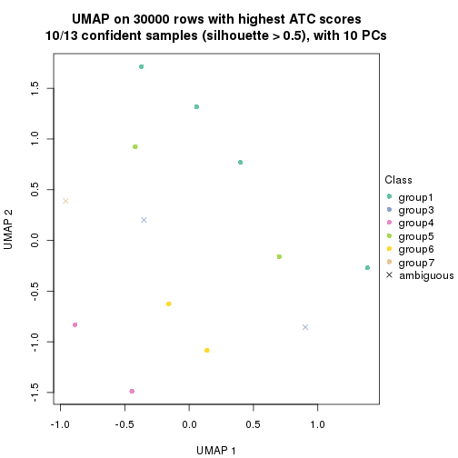</p>

</div>
<div id='tab-node-0121-dimension-reduction-7'>
<pre><code class="r">dimension_reduction(res, k = 8, method = &quot;UMAP&quot;)
</code></pre>

<p>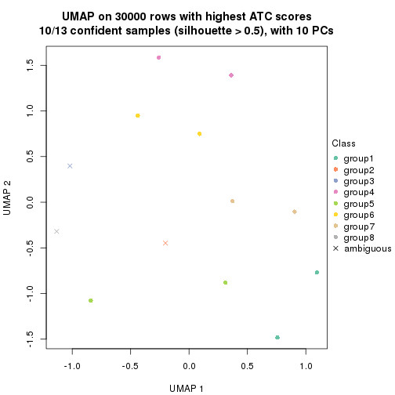</p>

</div>
</div>


Following heatmap shows how subgroups are split when increasing `k`:

```r
collect_classes(res)
```

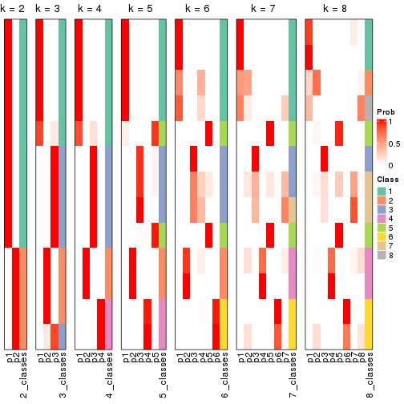


If matrix rows can be associated to genes, consider to use `functional_enrichment(res,
...)` to perform function enrichment for the signature genes. See [this vignette](https://jokergoo.github.io/cola_vignettes/functional_enrichment.html) for more detailed explanations.


 

---------------------------------------------------


### Node0122


Parent node: [Node012](#Node012).
Child nodes: 
                Node01211-leaf
        ,
                Node01212-leaf
        ,
                Node01213-leaf
        ,
                Node01221-leaf
        ,
                Node01222-leaf
        ,
                Node01223-leaf
        ,
                Node02111-leaf
        ,
                Node02112-leaf
        ,
                Node02113-leaf
        ,
                Node02114-leaf
        ,
                Node02121-leaf
        ,
                Node02122-leaf
        ,
                Node02123-leaf
        ,
                Node02124-leaf
        ,
                Node02131-leaf
        ,
                [Node02132](#Node02132)
        ,
                Node02133-leaf
        ,
                Node02211-leaf
        ,
                Node02212-leaf
        ,
                Node02213-leaf
        ,
                Node02221-leaf
        ,
                Node02222-leaf
        ,
                Node02223-leaf
        ,
                Node02231-leaf
        ,
                Node02232-leaf
        ,
                Node02233-leaf
        ,
                Node02241-leaf
        ,
                Node02242-leaf
        ,
                Node02243-leaf
        ,
                Node02321-leaf
        ,
                Node02322-leaf
        ,
                Node02323-leaf
        ,
                Node05111-leaf
        ,
                Node05112-leaf
        ,
                Node05113-leaf
        ,
                Node05114-leaf
        ,
                [Node05121](#Node05121)
        ,
                Node05122-leaf
        ,
                Node05123-leaf
        ,
                Node05221-leaf
        ,
                Node05222-leaf
        .


The object with results only for a single top-value method and a single partitioning method 
can be extracted as:

```r
res = res_rh["0122"]
```

A summary of `res` and all the functions that can be applied to it:

```r
res
```

```
#> A 'ConsensusPartition' object with k = 2, 3, 4, 5, 6, 7, 8.
#>   On a matrix with 30000 rows and 25 columns.
#>   Top rows (1000) are extracted by 'ATC' method.
#>   Subgroups are detected by 'kmeans' method.
#>   Performed in total 350 partitions by row resampling.
#>   Best k for subgroups seems to be 3.
#> 
#> Following methods can be applied to this 'ConsensusPartition' object:
#>  [1] "cola_report"             "collect_classes"         "collect_plots"          
#>  [4] "collect_stats"           "colnames"                "compare_partitions"     
#>  [7] "compare_signatures"      "consensus_heatmap"       "dimension_reduction"    
#> [10] "functional_enrichment"   "get_anno_col"            "get_anno"               
#> [13] "get_classes"             "get_consensus"           "get_matrix"             
#> [16] "get_membership"          "get_param"               "get_signatures"         
#> [19] "get_stats"               "is_best_k"               "is_stable_k"            
#> [22] "membership_heatmap"      "ncol"                    "nrow"                   
#> [25] "plot_ecdf"               "predict_classes"         "rownames"               
#> [28] "select_partition_number" "show"                    "suggest_best_k"         
#> [31] "test_to_known_factors"   "top_rows_heatmap"
```

`collect_plots()` function collects all the plots made from `res` for all `k` (number of subgroups)
into one single page to provide an easy and fast comparison between different `k`.

```r
collect_plots(res)
```

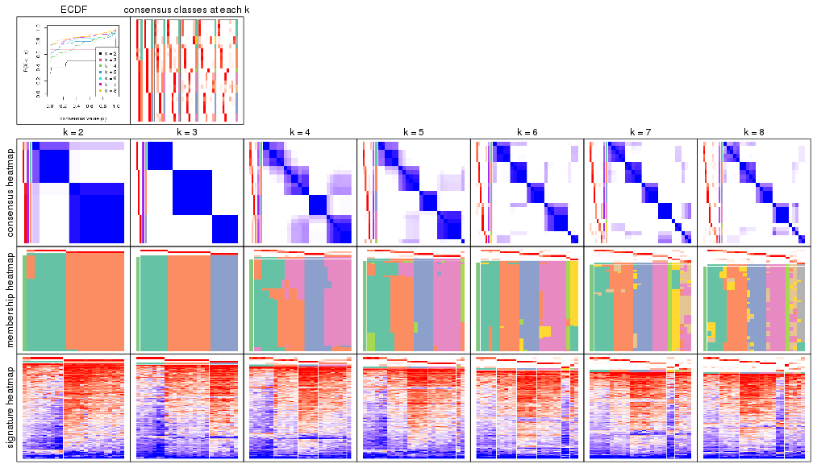

The plots are:

- The first row: a plot of the eCDF (empirical cumulative distribution
  function) curves of the consensus matrix for each `k` and the heatmap of
  predicted classes for each `k`.
- The second row: heatmaps of the consensus matrix for each `k`.
- The third row: heatmaps of the membership matrix for each `k`.
- The fouth row: heatmaps of the signatures for each `k`.

All the plots in panels can be made by individual functions and they are
plotted later in this section.

`select_partition_number()` produces several plots showing different
statistics for choosing "optimized" `k`. There are following statistics:

- eCDF curves of the consensus matrix for each `k`;
- 1-PAC. [The PAC score](https://en.wikipedia.org/wiki/Consensus_clustering#Over-interpretation_potential_of_consensus_clustering)
  measures the proportion of the ambiguous subgrouping.
- Mean silhouette score.
- Concordance. The mean probability of fiting the consensus subgroup labels in all
  partitions.
- Area increased. Denote $A_k$ as the area under the eCDF curve for current
  `k`, the area increased is defined as $A_k - A_{k-1}$.
- Rand index. The percent of pairs of samples that are both in a same cluster
  or both are not in a same cluster in the partition of k and k-1.
- Jaccard index. The ratio of pairs of samples are both in a same cluster in
  the partition of k and k-1 and the pairs of samples are both in a same
  cluster in the partition k or k-1.

The detailed explanations of these statistics can be found in [the _cola_
vignette](https://jokergoo.github.io/cola_vignettes/cola.html#toc_13).

Generally speaking, higher 1-PAC score, higher mean silhouette score or higher
concordance corresponds to better partition. Rand index and Jaccard index
measure how similar the current partition is compared to partition with `k-1`.
If they are too similar, we won't accept `k` is better than `k-1`.

```r
select_partition_number(res)
```

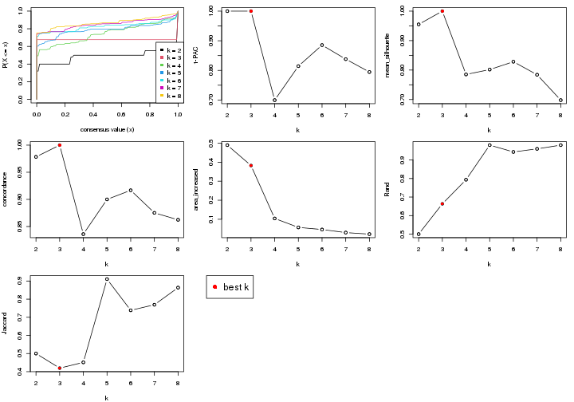

The numeric values for all these statistics can be obtained by `get_stats()`.

```r
get_stats(res)
```

```
#>   k 1-PAC mean_silhouette concordance area_increased  Rand Jaccard
#> 2 2 1.000           0.955       0.978         0.4897 0.500   0.500
#> 3 3 1.000           1.000       1.000         0.3825 0.663   0.420
#> 4 4 0.700           0.785       0.836         0.1041 0.793   0.451
#> 5 5 0.814           0.802       0.900         0.0571 0.980   0.910
#> 6 6 0.885           0.828       0.917         0.0459 0.943   0.738
#> 7 7 0.838           0.784       0.875         0.0298 0.960   0.769
#> 8 8 0.794           0.698       0.862         0.0218 0.980   0.864
```

`suggest_best_k()` suggests the best $k$ based on these statistics. The rules are as follows:

- All $k$ with Jaccard index larger than 0.95 are removed because increasing
  $k$ does not provide enough extra information. If all $k$ are removed, it is
  marked as no subgroup is detected.
- For all $k$ with 1-PAC score larger than 0.9, the maximal $k$ is taken as
  the best $k$, and other $k$ are marked as optional $k$.
- If it does not fit the second rule. The $k$ with the maximal vote of the
  highest 1-PAC score, highest mean silhouette, and highest concordance is
  taken as the best $k$.

```r
suggest_best_k(res)
```

```
#> [1] 3
#> attr(,"optional")
#> [1] 2
```

There is also optional best $k$ = 2 that is worth to check.

Following is the table of the partitions (You need to click the **show/hide
code output** link to see it). The membership matrix (columns with name `p*`)
is inferred by
[`clue::cl_consensus()`](https://www.rdocumentation.org/link/cl_consensus?package=clue)
function with the `SE` method. Basically the value in the membership matrix
represents the probability to belong to a certain group. The finall subgroup
label for an item is determined with the group with highest probability it
belongs to.

In `get_classes()` function, the entropy is calculated from the membership
matrix and the silhouette score is calculated from the consensus matrix.


<script>
$( function() {
	$( '#tabs-node-0122-get-classes' ).tabs();
} );
</script>
<div id='tabs-node-0122-get-classes'>
<ul>
<li><a href='#tab-node-0122-get-classes-1'>k = 2</a></li>
<li><a href='#tab-node-0122-get-classes-2'>k = 3</a></li>
<li><a href='#tab-node-0122-get-classes-3'>k = 4</a></li>
<li><a href='#tab-node-0122-get-classes-4'>k = 5</a></li>
<li><a href='#tab-node-0122-get-classes-5'>k = 6</a></li>
<li><a href='#tab-node-0122-get-classes-6'>k = 7</a></li>
<li><a href='#tab-node-0122-get-classes-7'>k = 8</a></li>
</ul>

<div id='tab-node-0122-get-classes-1'>
<p><a id='tab-node-0122-get-classes-1-a' style='color:#0366d6' href='#'>show/hide code output</a></p>
<pre><code class="r">cbind(get_classes(res, k = 2), get_membership(res, k = 2))
</code></pre>

<pre><code>#&gt;                 class entropy silhouette   p1   p2
#&gt; TCGA.CV.6937.01     2   0.000      0.995 0.00 1.00
#&gt; TCGA.CN.5358.01     2   0.000      0.995 0.00 1.00
#&gt; TCGA.CR.7372.01     1   0.000      0.945 1.00 0.00
#&gt; TCGA.CV.5444.01     1   0.795      0.716 0.76 0.24
#&gt; TCGA.CV.5436.01     2   0.141      0.981 0.02 0.98
#&gt; TCGA.CV.6961.01     2   0.000      0.995 0.00 1.00
#&gt; TCGA.BB.4227.01     1   0.000      0.945 1.00 0.00
#&gt; TCGA.F7.A623.01     2   0.000      0.995 0.00 1.00
#&gt; TCGA.T3.A92M.01     2   0.000      0.995 0.00 1.00
#&gt; TCGA.CV.A468.01     2   0.000      0.995 0.00 1.00
#&gt; TCGA.QK.AA3K.01     2   0.000      0.995 0.00 1.00
#&gt; TCGA.4P.AA8J.01     2   0.000      0.995 0.00 1.00
#&gt; TCGA.CV.A460.01     2   0.141      0.981 0.02 0.98
#&gt; TCGA.BA.A4II.01     2   0.000      0.995 0.00 1.00
#&gt; TCGA.F7.A50I.01     2   0.141      0.981 0.02 0.98
#&gt; TCGA.IQ.A61O.01     1   0.000      0.945 1.00 0.00
#&gt; TCGA.CV.A45X.01     1   0.000      0.945 1.00 0.00
#&gt; TCGA.IQ.A6SH.01     1   0.000      0.945 1.00 0.00
#&gt; TCGA.UF.A7JJ.01     2   0.000      0.995 0.00 1.00
#&gt; TCGA.P3.A6T4.01     2   0.000      0.995 0.00 1.00
#&gt; TCGA.UF.A7JK.01     1   0.000      0.945 1.00 0.00
#&gt; TCGA.HD.7831.01     2   0.000      0.995 0.00 1.00
#&gt; TCGA.D6.A6EQ.01     1   0.000      0.945 1.00 0.00
#&gt; TCGA.CV.A6K2.01     1   0.795      0.716 0.76 0.24
#&gt; TCGA.CV.A6K1.01     1   0.000      0.945 1.00 0.00
</code></pre>

<script>
$('#tab-node-0122-get-classes-1-a').parent().next().next().hide();
$('#tab-node-0122-get-classes-1-a').click(function(){
  $('#tab-node-0122-get-classes-1-a').parent().next().next().toggle();
  return(false);
});
</script>
</div>

<div id='tab-node-0122-get-classes-2'>
<p><a id='tab-node-0122-get-classes-2-a' style='color:#0366d6' href='#'>show/hide code output</a></p>
<pre><code class="r">cbind(get_classes(res, k = 3), get_membership(res, k = 3))
</code></pre>

<pre><code>#&gt;                 class entropy silhouette p1 p2 p3
#&gt; TCGA.CV.6937.01     3       0          1  0  0  1
#&gt; TCGA.CN.5358.01     3       0          1  0  0  1
#&gt; TCGA.CR.7372.01     1       0          1  1  0  0
#&gt; TCGA.CV.5444.01     2       0          1  0  1  0
#&gt; TCGA.CV.5436.01     2       0          1  0  1  0
#&gt; TCGA.CV.6961.01     3       0          1  0  0  1
#&gt; TCGA.BB.4227.01     1       0          1  1  0  0
#&gt; TCGA.F7.A623.01     3       0          1  0  0  1
#&gt; TCGA.T3.A92M.01     2       0          1  0  1  0
#&gt; TCGA.CV.A468.01     3       0          1  0  0  1
#&gt; TCGA.QK.AA3K.01     2       0          1  0  1  0
#&gt; TCGA.4P.AA8J.01     2       0          1  0  1  0
#&gt; TCGA.CV.A460.01     2       0          1  0  1  0
#&gt; TCGA.BA.A4II.01     3       0          1  0  0  1
#&gt; TCGA.F7.A50I.01     2       0          1  0  1  0
#&gt; TCGA.IQ.A61O.01     1       0          1  1  0  0
#&gt; TCGA.CV.A45X.01     2       0          1  0  1  0
#&gt; TCGA.IQ.A6SH.01     1       0          1  1  0  0
#&gt; TCGA.UF.A7JJ.01     2       0          1  0  1  0
#&gt; TCGA.P3.A6T4.01     2       0          1  0  1  0
#&gt; TCGA.UF.A7JK.01     1       0          1  1  0  0
#&gt; TCGA.HD.7831.01     3       0          1  0  0  1
#&gt; TCGA.D6.A6EQ.01     1       0          1  1  0  0
#&gt; TCGA.CV.A6K2.01     2       0          1  0  1  0
#&gt; TCGA.CV.A6K1.01     1       0          1  1  0  0
</code></pre>

<script>
$('#tab-node-0122-get-classes-2-a').parent().next().next().hide();
$('#tab-node-0122-get-classes-2-a').click(function(){
  $('#tab-node-0122-get-classes-2-a').parent().next().next().toggle();
  return(false);
});
</script>
</div>

<div id='tab-node-0122-get-classes-3'>
<p><a id='tab-node-0122-get-classes-3-a' style='color:#0366d6' href='#'>show/hide code output</a></p>
<pre><code class="r">cbind(get_classes(res, k = 4), get_membership(res, k = 4))
</code></pre>

<pre><code>#&gt;                 class entropy silhouette   p1   p2   p3   p4
#&gt; TCGA.CV.6937.01     3  0.0000      1.000 0.00 0.00 1.00 0.00
#&gt; TCGA.CN.5358.01     4  0.6594      0.775 0.00 0.24 0.14 0.62
#&gt; TCGA.CR.7372.01     2  0.4713      0.328 0.36 0.64 0.00 0.00
#&gt; TCGA.CV.5444.01     2  0.0000      0.706 0.00 1.00 0.00 0.00
#&gt; TCGA.CV.5436.01     2  0.3975      0.601 0.00 0.76 0.00 0.24
#&gt; TCGA.CV.6961.01     3  0.0000      1.000 0.00 0.00 1.00 0.00
#&gt; TCGA.BB.4227.01     1  0.4134      0.758 0.74 0.00 0.00 0.26
#&gt; TCGA.F7.A623.01     3  0.0000      1.000 0.00 0.00 1.00 0.00
#&gt; TCGA.T3.A92M.01     4  0.5355      0.872 0.00 0.36 0.02 0.62
#&gt; TCGA.CV.A468.01     3  0.0000      1.000 0.00 0.00 1.00 0.00
#&gt; TCGA.QK.AA3K.01     4  0.4790      0.851 0.00 0.38 0.00 0.62
#&gt; TCGA.4P.AA8J.01     4  0.5355      0.872 0.00 0.36 0.02 0.62
#&gt; TCGA.CV.A460.01     2  0.2647      0.620 0.00 0.88 0.00 0.12
#&gt; TCGA.BA.A4II.01     3  0.0000      1.000 0.00 0.00 1.00 0.00
#&gt; TCGA.F7.A50I.01     2  0.2647      0.620 0.00 0.88 0.00 0.12
#&gt; TCGA.IQ.A61O.01     1  0.2647      0.808 0.88 0.12 0.00 0.00
#&gt; TCGA.CV.A45X.01     2  0.4134      0.522 0.26 0.74 0.00 0.00
#&gt; TCGA.IQ.A6SH.01     1  0.0707      0.850 0.98 0.02 0.00 0.00
#&gt; TCGA.UF.A7JJ.01     4  0.5355      0.872 0.00 0.36 0.02 0.62
#&gt; TCGA.P3.A6T4.01     4  0.4713      0.858 0.00 0.36 0.00 0.64
#&gt; TCGA.UF.A7JK.01     1  0.4134      0.758 0.74 0.00 0.00 0.26
#&gt; TCGA.HD.7831.01     4  0.6201      0.575 0.00 0.08 0.30 0.62
#&gt; TCGA.D6.A6EQ.01     1  0.2345      0.822 0.90 0.10 0.00 0.00
#&gt; TCGA.CV.A6K2.01     2  0.0000      0.706 0.00 1.00 0.00 0.00
#&gt; TCGA.CV.A6K1.01     1  0.0707      0.850 0.98 0.02 0.00 0.00
</code></pre>

<script>
$('#tab-node-0122-get-classes-3-a').parent().next().next().hide();
$('#tab-node-0122-get-classes-3-a').click(function(){
  $('#tab-node-0122-get-classes-3-a').parent().next().next().toggle();
  return(false);
});
</script>
</div>

<div id='tab-node-0122-get-classes-4'>
<p><a id='tab-node-0122-get-classes-4-a' style='color:#0366d6' href='#'>show/hide code output</a></p>
<pre><code class="r">cbind(get_classes(res, k = 5), get_membership(res, k = 5))
</code></pre>

<pre><code>#&gt;                 class entropy silhouette   p1   p2   p3   p4   p5
#&gt; TCGA.CV.6937.01     3  0.0000      0.974 0.00 0.00 1.00 0.00 0.00
#&gt; TCGA.CN.5358.01     4  0.0000      0.968 0.00 0.00 0.00 1.00 0.00
#&gt; TCGA.CR.7372.01     2  0.4540      0.345 0.34 0.64 0.00 0.00 0.02
#&gt; TCGA.CV.5444.01     2  0.2516      0.757 0.00 0.86 0.00 0.14 0.00
#&gt; TCGA.CV.5436.01     5  0.4818      0.000 0.00 0.46 0.00 0.02 0.52
#&gt; TCGA.CV.6961.01     3  0.2280      0.888 0.00 0.00 0.88 0.00 0.12
#&gt; TCGA.BB.4227.01     1  0.3983      0.672 0.66 0.00 0.00 0.00 0.34
#&gt; TCGA.F7.A623.01     3  0.0000      0.974 0.00 0.00 1.00 0.00 0.00
#&gt; TCGA.T3.A92M.01     4  0.0000      0.968 0.00 0.00 0.00 1.00 0.00
#&gt; TCGA.CV.A468.01     3  0.0000      0.974 0.00 0.00 1.00 0.00 0.00
#&gt; TCGA.QK.AA3K.01     4  0.1410      0.911 0.00 0.06 0.00 0.94 0.00
#&gt; TCGA.4P.AA8J.01     4  0.0000      0.968 0.00 0.00 0.00 1.00 0.00
#&gt; TCGA.CV.A460.01     2  0.2732      0.747 0.00 0.84 0.00 0.16 0.00
#&gt; TCGA.BA.A4II.01     3  0.0000      0.974 0.00 0.00 1.00 0.00 0.00
#&gt; TCGA.F7.A50I.01     2  0.2732      0.747 0.00 0.84 0.00 0.16 0.00
#&gt; TCGA.IQ.A61O.01     1  0.1216      0.826 0.96 0.02 0.00 0.00 0.02
#&gt; TCGA.CV.A45X.01     2  0.3106      0.594 0.14 0.84 0.00 0.00 0.02
#&gt; TCGA.IQ.A6SH.01     1  0.0000      0.837 1.00 0.00 0.00 0.00 0.00
#&gt; TCGA.UF.A7JJ.01     4  0.0000      0.968 0.00 0.00 0.00 1.00 0.00
#&gt; TCGA.P3.A6T4.01     4  0.0609      0.957 0.00 0.02 0.00 0.98 0.00
#&gt; TCGA.UF.A7JK.01     1  0.4456      0.672 0.66 0.02 0.00 0.00 0.32
#&gt; TCGA.HD.7831.01     4  0.1410      0.904 0.00 0.00 0.06 0.94 0.00
#&gt; TCGA.D6.A6EQ.01     1  0.1216      0.826 0.96 0.02 0.00 0.00 0.02
#&gt; TCGA.CV.A6K2.01     2  0.3106      0.755 0.00 0.84 0.00 0.14 0.02
#&gt; TCGA.CV.A6K1.01     1  0.0000      0.837 1.00 0.00 0.00 0.00 0.00
</code></pre>

<script>
$('#tab-node-0122-get-classes-4-a').parent().next().next().hide();
$('#tab-node-0122-get-classes-4-a').click(function(){
  $('#tab-node-0122-get-classes-4-a').parent().next().next().toggle();
  return(false);
});
</script>
</div>

<div id='tab-node-0122-get-classes-5'>
<p><a id='tab-node-0122-get-classes-5-a' style='color:#0366d6' href='#'>show/hide code output</a></p>
<pre><code class="r">cbind(get_classes(res, k = 6), get_membership(res, k = 6))
</code></pre>

<pre><code>#&gt;                 class entropy silhouette   p1   p2   p3   p4   p5   p6
#&gt; TCGA.CV.6937.01     3  0.0000      0.950 0.00 0.00 1.00 0.00 0.00 0.00
#&gt; TCGA.CN.5358.01     4  0.0000      0.862 0.00 0.00 0.00 1.00 0.00 0.00
#&gt; TCGA.CR.7372.01     1  0.3309      0.514 0.72 0.28 0.00 0.00 0.00 0.00
#&gt; TCGA.CV.5444.01     2  0.0547      0.980 0.02 0.98 0.00 0.00 0.00 0.00
#&gt; TCGA.CV.5436.01     5  0.1814      0.000 0.00 0.10 0.00 0.00 0.90 0.00
#&gt; TCGA.CV.6961.01     3  0.3475      0.798 0.14 0.00 0.80 0.00 0.06 0.00
#&gt; TCGA.BB.4227.01     6  0.0547      0.985 0.00 0.00 0.00 0.00 0.02 0.98
#&gt; TCGA.F7.A623.01     3  0.0547      0.943 0.00 0.00 0.98 0.00 0.02 0.00
#&gt; TCGA.T3.A92M.01     4  0.2048      0.825 0.12 0.00 0.00 0.88 0.00 0.00
#&gt; TCGA.CV.A468.01     3  0.0000      0.950 0.00 0.00 1.00 0.00 0.00 0.00
#&gt; TCGA.QK.AA3K.01     4  0.5555      0.278 0.14 0.38 0.00 0.48 0.00 0.00
#&gt; TCGA.4P.AA8J.01     4  0.0000      0.862 0.00 0.00 0.00 1.00 0.00 0.00
#&gt; TCGA.CV.A460.01     2  0.0000      0.972 0.00 1.00 0.00 0.00 0.00 0.00
#&gt; TCGA.BA.A4II.01     3  0.0000      0.950 0.00 0.00 1.00 0.00 0.00 0.00
#&gt; TCGA.F7.A50I.01     2  0.0547      0.955 0.02 0.98 0.00 0.00 0.00 0.00
#&gt; TCGA.IQ.A61O.01     1  0.3309      0.854 0.72 0.00 0.00 0.00 0.00 0.28
#&gt; TCGA.CV.A45X.01     2  0.0547      0.980 0.02 0.98 0.00 0.00 0.00 0.00
#&gt; TCGA.IQ.A6SH.01     1  0.3409      0.847 0.70 0.00 0.00 0.00 0.00 0.30
#&gt; TCGA.UF.A7JJ.01     4  0.0000      0.862 0.00 0.00 0.00 1.00 0.00 0.00
#&gt; TCGA.P3.A6T4.01     4  0.2581      0.815 0.12 0.02 0.00 0.86 0.00 0.00
#&gt; TCGA.UF.A7JK.01     6  0.0000      0.985 0.00 0.00 0.00 0.00 0.00 1.00
#&gt; TCGA.HD.7831.01     4  0.0000      0.862 0.00 0.00 0.00 1.00 0.00 0.00
#&gt; TCGA.D6.A6EQ.01     1  0.3309      0.854 0.72 0.00 0.00 0.00 0.00 0.28
#&gt; TCGA.CV.A6K2.01     2  0.0547      0.980 0.02 0.98 0.00 0.00 0.00 0.00
#&gt; TCGA.CV.A6K1.01     1  0.3409      0.847 0.70 0.00 0.00 0.00 0.00 0.30
</code></pre>

<script>
$('#tab-node-0122-get-classes-5-a').parent().next().next().hide();
$('#tab-node-0122-get-classes-5-a').click(function(){
  $('#tab-node-0122-get-classes-5-a').parent().next().next().toggle();
  return(false);
});
</script>
</div>

<div id='tab-node-0122-get-classes-6'>
<p><a id='tab-node-0122-get-classes-6-a' style='color:#0366d6' href='#'>show/hide code output</a></p>
<pre><code class="r">cbind(get_classes(res, k = 7), get_membership(res, k = 7))
</code></pre>

<pre><code>#&gt;                 class entropy silhouette   p1   p2   p3   p4 p5   p6   p7
#&gt; TCGA.CV.6937.01     3  0.0000      0.920 0.00 0.00 1.00 0.00  0 0.00 0.00
#&gt; TCGA.CN.5358.01     4  0.3496      1.000 0.00 0.00 0.00 0.58  0 0.00 0.42
#&gt; TCGA.CR.7372.01     1  0.3841      0.564 0.68 0.28 0.00 0.04  0 0.00 0.00
#&gt; TCGA.CV.5444.01     2  0.0000      0.937 0.00 1.00 0.00 0.00  0 0.00 0.00
#&gt; TCGA.CV.5436.01     5  0.0000      0.000 0.00 0.00 0.00 0.00  1 0.00 0.00
#&gt; TCGA.CV.6961.01     3  0.4348      0.642 0.00 0.00 0.68 0.18  0 0.14 0.00
#&gt; TCGA.BB.4227.01     6  0.2832      0.968 0.24 0.00 0.00 0.00  0 0.76 0.00
#&gt; TCGA.F7.A623.01     3  0.0504      0.913 0.00 0.00 0.98 0.00  0 0.02 0.00
#&gt; TCGA.T3.A92M.01     7  0.2422      0.134 0.00 0.00 0.00 0.18  0 0.00 0.82
#&gt; TCGA.CV.A468.01     3  0.0000      0.920 0.00 0.00 1.00 0.00  0 0.00 0.00
#&gt; TCGA.QK.AA3K.01     7  0.5897      0.329 0.00 0.26 0.00 0.20  0 0.04 0.50
#&gt; TCGA.4P.AA8J.01     4  0.3496      1.000 0.00 0.00 0.00 0.58  0 0.00 0.42
#&gt; TCGA.CV.A460.01     2  0.1433      0.916 0.00 0.92 0.00 0.00  0 0.00 0.08
#&gt; TCGA.BA.A4II.01     3  0.0000      0.920 0.00 0.00 1.00 0.00  0 0.00 0.00
#&gt; TCGA.F7.A50I.01     2  0.1928      0.903 0.00 0.90 0.00 0.00  0 0.02 0.08
#&gt; TCGA.IQ.A61O.01     1  0.1718      0.819 0.92 0.04 0.00 0.04  0 0.00 0.00
#&gt; TCGA.CV.A45X.01     2  0.0863      0.911 0.00 0.96 0.00 0.04  0 0.00 0.00
#&gt; TCGA.IQ.A6SH.01     1  0.0504      0.829 0.98 0.00 0.00 0.02  0 0.00 0.00
#&gt; TCGA.UF.A7JJ.01     4  0.3496      1.000 0.00 0.00 0.00 0.58  0 0.00 0.42
#&gt; TCGA.P3.A6T4.01     7  0.0863      0.415 0.00 0.00 0.00 0.00  0 0.04 0.96
#&gt; TCGA.UF.A7JK.01     6  0.3637      0.968 0.24 0.00 0.00 0.04  0 0.72 0.00
#&gt; TCGA.HD.7831.01     4  0.3496      1.000 0.00 0.00 0.00 0.58  0 0.00 0.42
#&gt; TCGA.D6.A6EQ.01     1  0.0504      0.838 0.98 0.02 0.00 0.00  0 0.00 0.00
#&gt; TCGA.CV.A6K2.01     2  0.0000      0.937 0.00 1.00 0.00 0.00  0 0.00 0.00
#&gt; TCGA.CV.A6K1.01     1  0.0863      0.821 0.96 0.00 0.00 0.04  0 0.00 0.00
</code></pre>

<script>
$('#tab-node-0122-get-classes-6-a').parent().next().next().hide();
$('#tab-node-0122-get-classes-6-a').click(function(){
  $('#tab-node-0122-get-classes-6-a').parent().next().next().toggle();
  return(false);
});
</script>
</div>

<div id='tab-node-0122-get-classes-7'>
<p><a id='tab-node-0122-get-classes-7-a' style='color:#0366d6' href='#'>show/hide code output</a></p>
<pre><code class="r">cbind(get_classes(res, k = 8), get_membership(res, k = 8))
</code></pre>

<pre><code>#&gt;                 class entropy silhouette   p1   p2   p3   p4 p5   p6   p7   p8
#&gt; TCGA.CV.6937.01     3   0.000      0.875 0.00 0.00 1.00 0.00  0 0.00 0.00 0.00
#&gt; TCGA.CN.5358.01     4   0.000      0.848 0.00 0.00 0.00 1.00  0 0.00 0.00 0.00
#&gt; TCGA.CR.7372.01     1   0.514      0.451 0.44 0.24 0.00 0.00  0 0.32 0.00 0.00
#&gt; TCGA.CV.5444.01     2   0.000      0.876 0.00 1.00 0.00 0.00  0 0.00 0.00 0.00
#&gt; TCGA.CV.5436.01     5   0.000      0.000 0.00 0.00 0.00 0.00  1 0.00 0.00 0.00
#&gt; TCGA.CV.6961.01     3   0.391      0.526 0.00 0.00 0.58 0.00  0 0.38 0.04 0.00
#&gt; TCGA.BB.4227.01     8   0.156      0.899 0.10 0.00 0.00 0.00  0 0.00 0.00 0.90
#&gt; TCGA.F7.A623.01     3   0.216      0.825 0.00 0.00 0.88 0.00  0 0.00 0.06 0.06
#&gt; TCGA.T3.A92M.01     4   0.327     -0.103 0.00 0.00 0.00 0.58  0 0.00 0.42 0.00
#&gt; TCGA.CV.A468.01     3   0.000      0.875 0.00 0.00 1.00 0.00  0 0.00 0.00 0.00
#&gt; TCGA.QK.AA3K.01     7   0.623      0.431 0.00 0.10 0.00 0.14  0 0.20 0.52 0.04
#&gt; TCGA.4P.AA8J.01     4   0.000      0.848 0.00 0.00 0.00 1.00  0 0.00 0.00 0.00
#&gt; TCGA.CV.A460.01     2   0.241      0.838 0.00 0.86 0.00 0.00  0 0.06 0.08 0.00
#&gt; TCGA.BA.A4II.01     3   0.000      0.875 0.00 0.00 1.00 0.00  0 0.00 0.00 0.00
#&gt; TCGA.F7.A50I.01     2   0.241      0.838 0.00 0.86 0.00 0.00  0 0.06 0.08 0.00
#&gt; TCGA.IQ.A61O.01     1   0.276      0.732 0.74 0.00 0.00 0.00  0 0.26 0.00 0.00
#&gt; TCGA.CV.A45X.01     2   0.156      0.842 0.00 0.90 0.00 0.00  0 0.10 0.00 0.00
#&gt; TCGA.IQ.A6SH.01     1   0.000      0.727 1.00 0.00 0.00 0.00  0 0.00 0.00 0.00
#&gt; TCGA.UF.A7JJ.01     4   0.000      0.848 0.00 0.00 0.00 1.00  0 0.00 0.00 0.00
#&gt; TCGA.P3.A6T4.01     7   0.375      0.341 0.00 0.04 0.00 0.32  0 0.00 0.64 0.00
#&gt; TCGA.UF.A7JK.01     8   0.363      0.899 0.10 0.00 0.00 0.00  0 0.04 0.08 0.78
#&gt; TCGA.HD.7831.01     4   0.000      0.848 0.00 0.00 0.00 1.00  0 0.00 0.00 0.00
#&gt; TCGA.D6.A6EQ.01     1   0.227      0.752 0.82 0.00 0.00 0.00  0 0.18 0.00 0.00
#&gt; TCGA.CV.A6K2.01     2   0.109      0.865 0.00 0.94 0.00 0.00  0 0.06 0.00 0.00
#&gt; TCGA.CV.A6K1.01     1   0.109      0.694 0.94 0.00 0.00 0.00  0 0.06 0.00 0.00
</code></pre>

<script>
$('#tab-node-0122-get-classes-7-a').parent().next().next().hide();
$('#tab-node-0122-get-classes-7-a').click(function(){
  $('#tab-node-0122-get-classes-7-a').parent().next().next().toggle();
  return(false);
});
</script>
</div>
</div>

Heatmaps for the consensus matrix. It visualizes the probability of two
samples to be in a same group.


<script>
$( function() {
	$( '#tabs-node-0122-consensus-heatmap' ).tabs();
} );
</script>
<div id='tabs-node-0122-consensus-heatmap'>
<ul>
<li><a href='#tab-node-0122-consensus-heatmap-1'>k = 2</a></li>
<li><a href='#tab-node-0122-consensus-heatmap-2'>k = 3</a></li>
<li><a href='#tab-node-0122-consensus-heatmap-3'>k = 4</a></li>
<li><a href='#tab-node-0122-consensus-heatmap-4'>k = 5</a></li>
<li><a href='#tab-node-0122-consensus-heatmap-5'>k = 6</a></li>
<li><a href='#tab-node-0122-consensus-heatmap-6'>k = 7</a></li>
<li><a href='#tab-node-0122-consensus-heatmap-7'>k = 8</a></li>
</ul>
<div id='tab-node-0122-consensus-heatmap-1'>
<pre><code class="r">consensus_heatmap(res, k = 2)
</code></pre>

<p>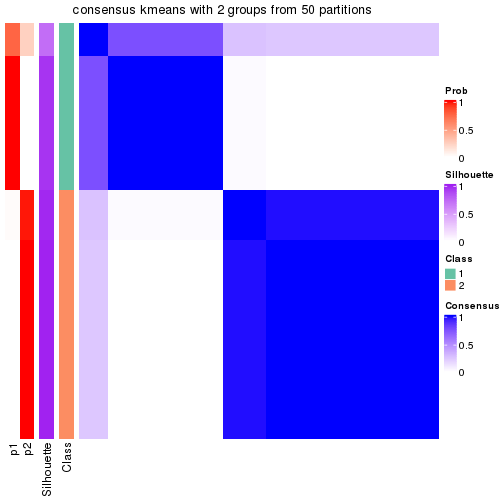</p>

</div>
<div id='tab-node-0122-consensus-heatmap-2'>
<pre><code class="r">consensus_heatmap(res, k = 3)
</code></pre>

<p>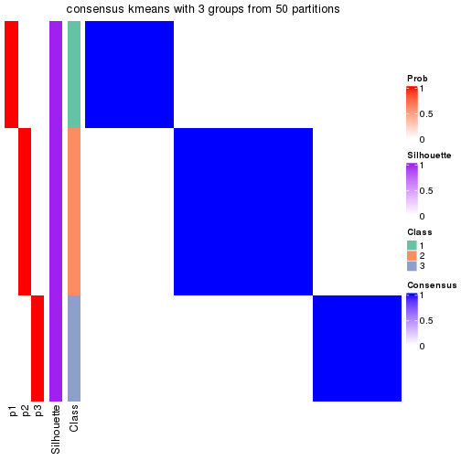</p>

</div>
<div id='tab-node-0122-consensus-heatmap-3'>
<pre><code class="r">consensus_heatmap(res, k = 4)
</code></pre>

<p>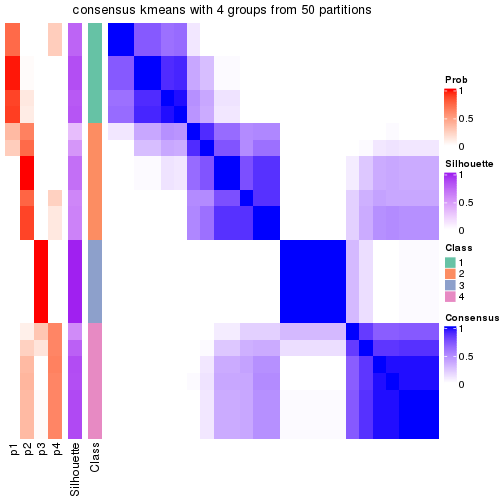</p>

</div>
<div id='tab-node-0122-consensus-heatmap-4'>
<pre><code class="r">consensus_heatmap(res, k = 5)
</code></pre>

<p>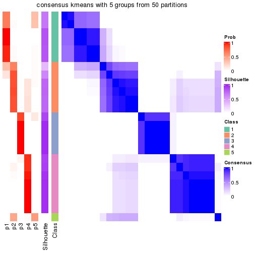</p>

</div>
<div id='tab-node-0122-consensus-heatmap-5'>
<pre><code class="r">consensus_heatmap(res, k = 6)
</code></pre>

<p>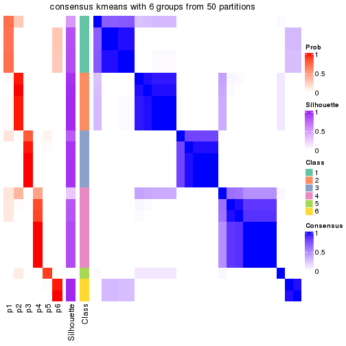</p>

</div>
<div id='tab-node-0122-consensus-heatmap-6'>
<pre><code class="r">consensus_heatmap(res, k = 7)
</code></pre>

<p>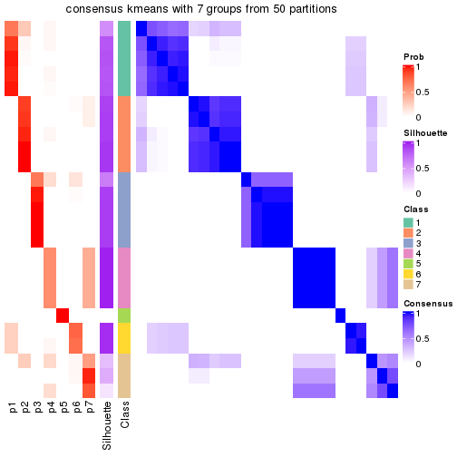</p>

</div>
<div id='tab-node-0122-consensus-heatmap-7'>
<pre><code class="r">consensus_heatmap(res, k = 8)
</code></pre>

<p>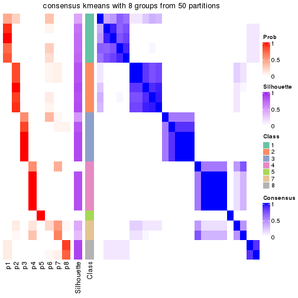</p>

</div>
</div>

Heatmaps for the membership of samples in all partitions to see how consistent they are:


<script>
$( function() {
	$( '#tabs-node-0122-membership-heatmap' ).tabs();
} );
</script>
<div id='tabs-node-0122-membership-heatmap'>
<ul>
<li><a href='#tab-node-0122-membership-heatmap-1'>k = 2</a></li>
<li><a href='#tab-node-0122-membership-heatmap-2'>k = 3</a></li>
<li><a href='#tab-node-0122-membership-heatmap-3'>k = 4</a></li>
<li><a href='#tab-node-0122-membership-heatmap-4'>k = 5</a></li>
<li><a href='#tab-node-0122-membership-heatmap-5'>k = 6</a></li>
<li><a href='#tab-node-0122-membership-heatmap-6'>k = 7</a></li>
<li><a href='#tab-node-0122-membership-heatmap-7'>k = 8</a></li>
</ul>
<div id='tab-node-0122-membership-heatmap-1'>
<pre><code class="r">membership_heatmap(res, k = 2)
</code></pre>

<p>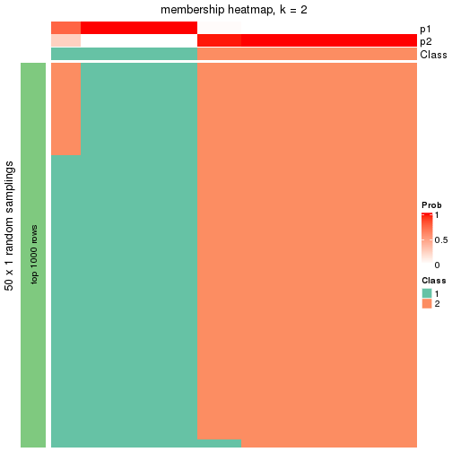</p>

</div>
<div id='tab-node-0122-membership-heatmap-2'>
<pre><code class="r">membership_heatmap(res, k = 3)
</code></pre>

<p>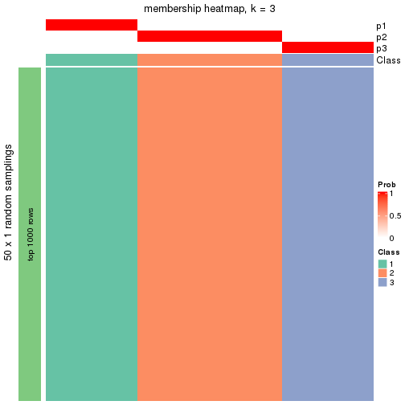</p>

</div>
<div id='tab-node-0122-membership-heatmap-3'>
<pre><code class="r">membership_heatmap(res, k = 4)
</code></pre>

<p>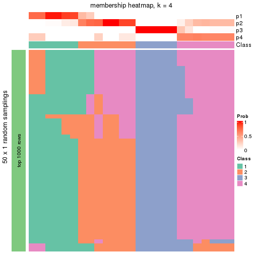</p>

</div>
<div id='tab-node-0122-membership-heatmap-4'>
<pre><code class="r">membership_heatmap(res, k = 5)
</code></pre>

<p>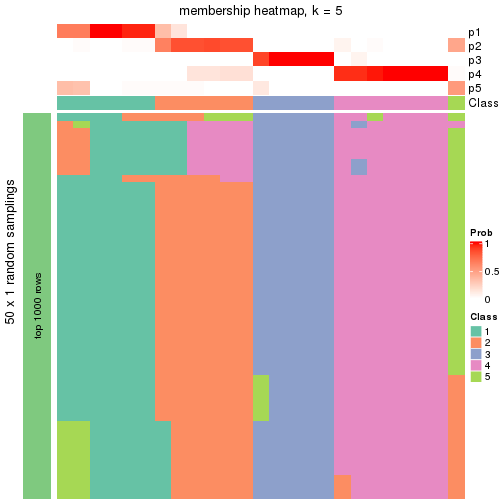</p>

</div>
<div id='tab-node-0122-membership-heatmap-5'>
<pre><code class="r">membership_heatmap(res, k = 6)
</code></pre>

<p>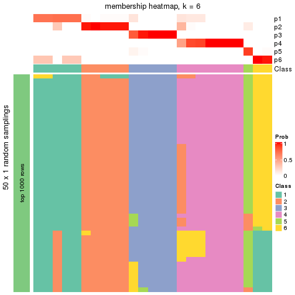</p>

</div>
<div id='tab-node-0122-membership-heatmap-6'>
<pre><code class="r">membership_heatmap(res, k = 7)
</code></pre>

<p>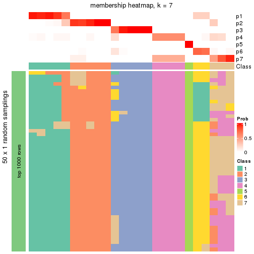</p>

</div>
<div id='tab-node-0122-membership-heatmap-7'>
<pre><code class="r">membership_heatmap(res, k = 8)
</code></pre>

<p>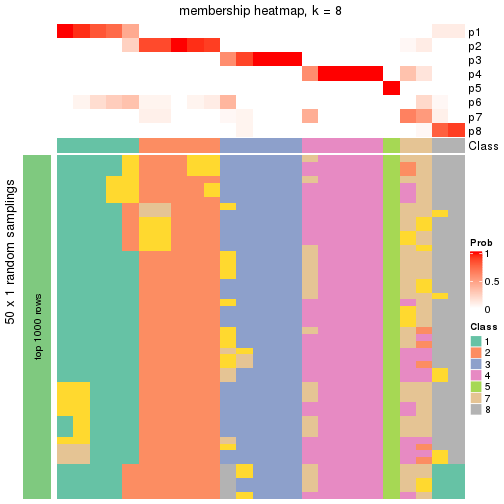</p>

</div>
</div>

As soon as the classes for columns are determined, the signatures
that are significantly different between subgroups can be looked for. 
Following are the heatmaps for signatures.


<script>
$( function() {
	$( '#tabs-node-0122-get-signatures' ).tabs();
} );
</script>
<div id='tabs-node-0122-get-signatures'>
<ul>
<li><a href='#tab-node-0122-get-signatures-1'>k = 2</a></li>
<li><a href='#tab-node-0122-get-signatures-2'>k = 3</a></li>
<li><a href='#tab-node-0122-get-signatures-3'>k = 4</a></li>
<li><a href='#tab-node-0122-get-signatures-4'>k = 5</a></li>
<li><a href='#tab-node-0122-get-signatures-5'>k = 6</a></li>
<li><a href='#tab-node-0122-get-signatures-6'>k = 7</a></li>
<li><a href='#tab-node-0122-get-signatures-7'>k = 8</a></li>
</ul>
<div id='tab-node-0122-get-signatures-1'>
<pre><code class="r">get_signatures(res, k = 2)
</code></pre>

<p>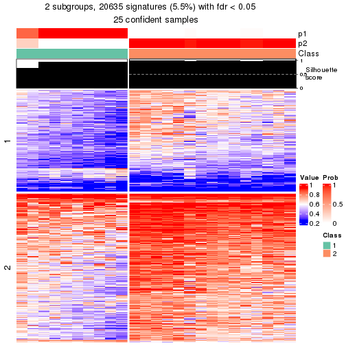</p>

</div>
<div id='tab-node-0122-get-signatures-2'>
<pre><code class="r">get_signatures(res, k = 3)
</code></pre>

<p>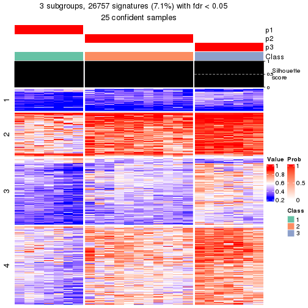</p>

</div>
<div id='tab-node-0122-get-signatures-3'>
<pre><code class="r">get_signatures(res, k = 4)
</code></pre>

<p>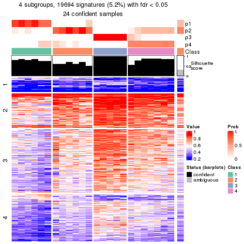</p>

</div>
<div id='tab-node-0122-get-signatures-4'>
<pre><code class="r">get_signatures(res, k = 5)
</code></pre>

<p></p>

</div>
<div id='tab-node-0122-get-signatures-5'>
<pre><code class="r">get_signatures(res, k = 6)
</code></pre>

<p>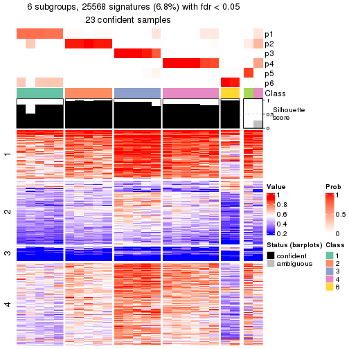</p>

</div>
<div id='tab-node-0122-get-signatures-6'>
<pre><code class="r">get_signatures(res, k = 7)
</code></pre>

<p>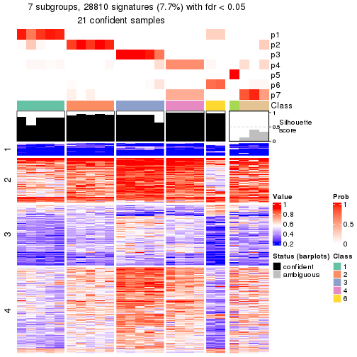</p>

</div>
<div id='tab-node-0122-get-signatures-7'>
<pre><code class="r">get_signatures(res, k = 8)
</code></pre>

<p>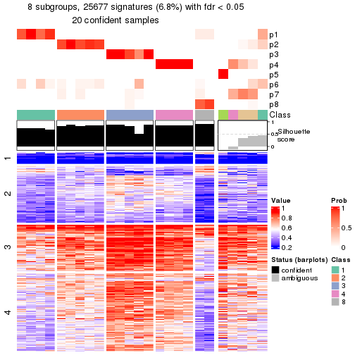</p>

</div>
</div>


Compare the overlap of signatures from different k:

```r
compare_signatures(res)
```

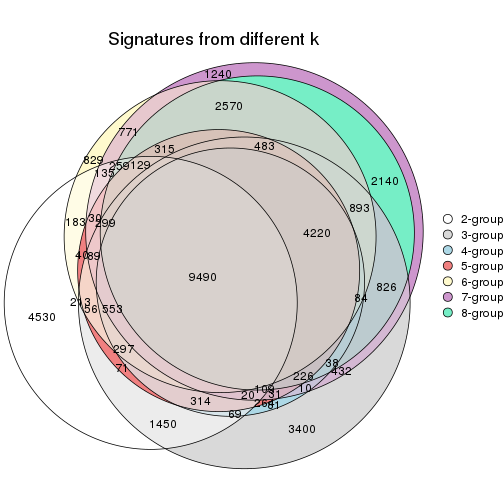

`get_signature()` returns a data frame invisibly. To get the list of signatures, the function
call should be assigned to a variable explicitly. In following code, if `plot` argument is set
to `FALSE`, no heatmap is plotted while only the differential analysis is performed.

```r
# code only for demonstration
tb = get_signature(res, k = ..., plot = FALSE)
```

An example of the output of `tb` is:

```
#>   which_row         fdr    mean_1    mean_2 scaled_mean_1 scaled_mean_2 km
#> 1        38 0.042760348  8.373488  9.131774    -0.5533452     0.5164555  1
#> 2        40 0.018707592  7.106213  8.469186    -0.6173731     0.5762149  1
#> 3        55 0.019134737 10.221463 11.207825    -0.6159697     0.5749050  1
#> 4        59 0.006059896  5.921854  7.869574    -0.6899429     0.6439467  1
#> 5        60 0.018055526  8.928898 10.211722    -0.6204761     0.5791110  1
#> 6        98 0.009384629 15.714769 14.887706     0.6635654    -0.6193277  2
...
```

The columns in `tb` are:

1. `which_row`: row indices corresponding to the input matrix.
2. `fdr`: FDR for the differential test. 
3. `mean_x`: The mean value in group x.
4. `scaled_mean_x`: The mean value in group x after rows are scaled.
5. `km`: Row groups if k-means clustering is applied to rows (which is done by automatically selecting number of clusters).

If there are too many signatures, `top_signatures = ...` can be set to only show the 
signatures with the highest FDRs:

```r
# code only for demonstration
# e.g. to show the top 500 most significant rows
tb = get_signature(res, k = ..., top_signatures = 500)
```

If the signatures are defined as these which are uniquely high in current group, `diff_method` argument
can be set to `"uniquely_high_in_one_group"`:

```r
# code only for demonstration
tb = get_signature(res, k = ..., diff_method = "uniquely_high_in_one_group")
```


UMAP plot which shows how samples are separated.


<script>
$( function() {
	$( '#tabs-node-0122-dimension-reduction' ).tabs();
} );
</script>
<div id='tabs-node-0122-dimension-reduction'>
<ul>
<li><a href='#tab-node-0122-dimension-reduction-1'>k = 2</a></li>
<li><a href='#tab-node-0122-dimension-reduction-2'>k = 3</a></li>
<li><a href='#tab-node-0122-dimension-reduction-3'>k = 4</a></li>
<li><a href='#tab-node-0122-dimension-reduction-4'>k = 5</a></li>
<li><a href='#tab-node-0122-dimension-reduction-5'>k = 6</a></li>
<li><a href='#tab-node-0122-dimension-reduction-6'>k = 7</a></li>
<li><a href='#tab-node-0122-dimension-reduction-7'>k = 8</a></li>
</ul>
<div id='tab-node-0122-dimension-reduction-1'>
<pre><code class="r">dimension_reduction(res, k = 2, method = &quot;UMAP&quot;)
</code></pre>

<p>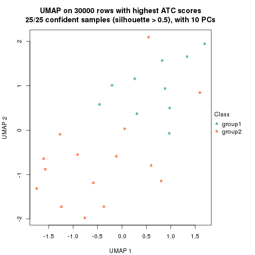</p>

</div>
<div id='tab-node-0122-dimension-reduction-2'>
<pre><code class="r">dimension_reduction(res, k = 3, method = &quot;UMAP&quot;)
</code></pre>

<p>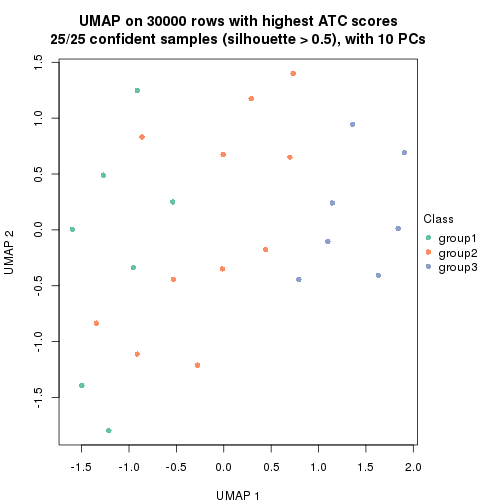</p>

</div>
<div id='tab-node-0122-dimension-reduction-3'>
<pre><code class="r">dimension_reduction(res, k = 4, method = &quot;UMAP&quot;)
</code></pre>

<p>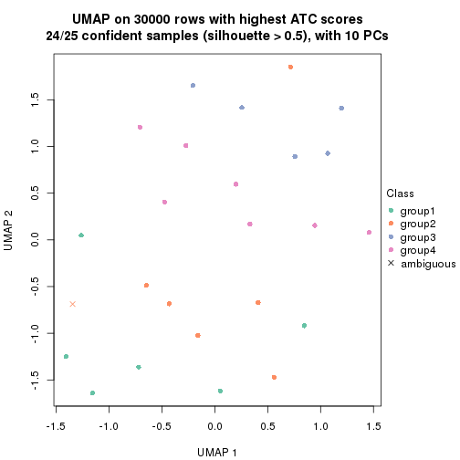</p>

</div>
<div id='tab-node-0122-dimension-reduction-4'>
<pre><code class="r">dimension_reduction(res, k = 5, method = &quot;UMAP&quot;)
</code></pre>

<p>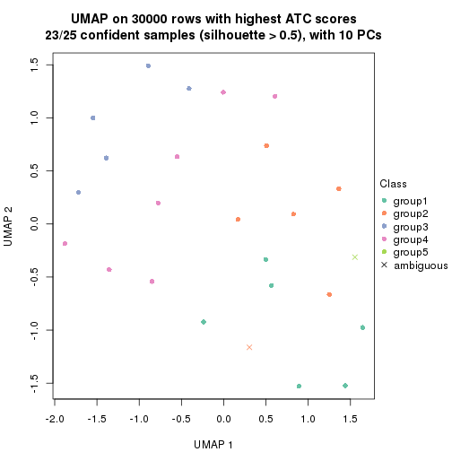</p>

</div>
<div id='tab-node-0122-dimension-reduction-5'>
<pre><code class="r">dimension_reduction(res, k = 6, method = &quot;UMAP&quot;)
</code></pre>

<p>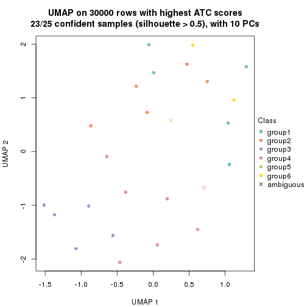</p>

</div>
<div id='tab-node-0122-dimension-reduction-6'>
<pre><code class="r">dimension_reduction(res, k = 7, method = &quot;UMAP&quot;)
</code></pre>

<p>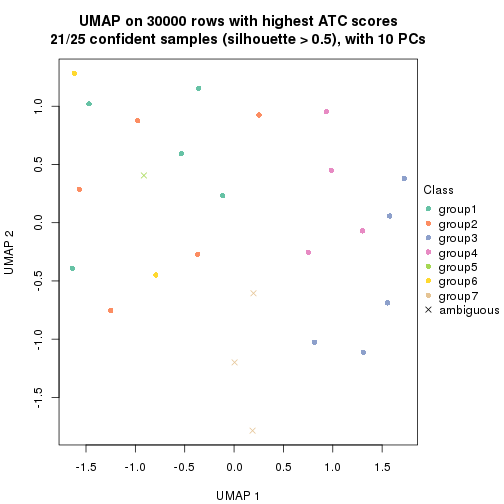</p>

</div>
<div id='tab-node-0122-dimension-reduction-7'>
<pre><code class="r">dimension_reduction(res, k = 8, method = &quot;UMAP&quot;)
</code></pre>

<p>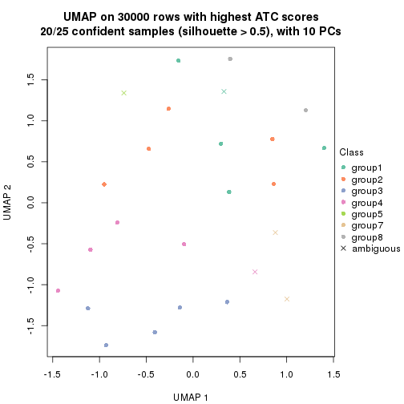</p>

</div>
</div>


Following heatmap shows how subgroups are split when increasing `k`:

```r
collect_classes(res)
```


If matrix rows can be associated to genes, consider to use `functional_enrichment(res,
...)` to perform function enrichment for the signature genes. See [this vignette](https://jokergoo.github.io/cola_vignettes/functional_enrichment.html) for more detailed explanations.


 

---------------------------------------------------


### Node02


Parent node: [Node0](#Node0).
Child nodes: 
                [Node011](#Node011)
        ,
                [Node012](#Node012)
        ,
                Node013-leaf
        ,
                [Node021](#Node021)
        ,
                [Node022](#Node022)
        ,
                [Node023](#Node023)
        ,
                Node031-leaf
        ,
                Node032-leaf
        ,
                [Node033](#Node033)
        ,
                Node034-leaf
        ,
                Node041-leaf
        ,
                Node042-leaf
        ,
                [Node043](#Node043)
        ,
                [Node051](#Node051)
        ,
                [Node052](#Node052)
        ,
                Node053-leaf
        .


The object with results only for a single top-value method and a single partitioning method 
can be extracted as:

```r
res = res_rh["02"]
```

A summary of `res` and all the functions that can be applied to it:

```r
res
```

```
#> A 'ConsensusPartition' object with k = 2, 3, 4, 5, 6, 7, 8.
#>   On a matrix with 30000 rows and 268 columns.
#>   Top rows (1000) are extracted by 'SD' method.
#>   Subgroups are detected by 'kmeans' method.
#>   Performed in total 350 partitions by row resampling.
#>   Best k for subgroups seems to be 3.
#> 
#> Following methods can be applied to this 'ConsensusPartition' object:
#>  [1] "cola_report"             "collect_classes"         "collect_plots"          
#>  [4] "collect_stats"           "colnames"                "compare_partitions"     
#>  [7] "compare_signatures"      "consensus_heatmap"       "dimension_reduction"    
#> [10] "functional_enrichment"   "get_anno_col"            "get_anno"               
#> [13] "get_classes"             "get_consensus"           "get_matrix"             
#> [16] "get_membership"          "get_param"               "get_signatures"         
#> [19] "get_stats"               "is_best_k"               "is_stable_k"            
#> [22] "membership_heatmap"      "ncol"                    "nrow"                   
#> [25] "plot_ecdf"               "predict_classes"         "rownames"               
#> [28] "select_partition_number" "show"                    "suggest_best_k"         
#> [31] "test_to_known_factors"   "top_rows_heatmap"
```

`collect_plots()` function collects all the plots made from `res` for all `k` (number of subgroups)
into one single page to provide an easy and fast comparison between different `k`.

```r
collect_plots(res)
```

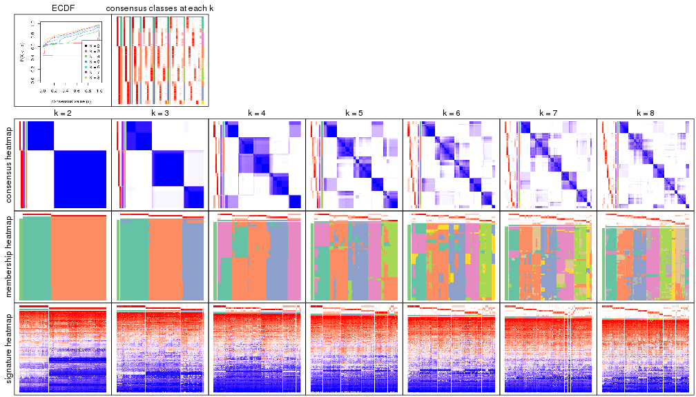

The plots are:

- The first row: a plot of the eCDF (empirical cumulative distribution
  function) curves of the consensus matrix for each `k` and the heatmap of
  predicted classes for each `k`.
- The second row: heatmaps of the consensus matrix for each `k`.
- The third row: heatmaps of the membership matrix for each `k`.
- The fouth row: heatmaps of the signatures for each `k`.

All the plots in panels can be made by individual functions and they are
plotted later in this section.

`select_partition_number()` produces several plots showing different
statistics for choosing "optimized" `k`. There are following statistics:

- eCDF curves of the consensus matrix for each `k`;
- 1-PAC. [The PAC score](https://en.wikipedia.org/wiki/Consensus_clustering#Over-interpretation_potential_of_consensus_clustering)
  measures the proportion of the ambiguous subgrouping.
- Mean silhouette score.
- Concordance. The mean probability of fiting the consensus subgroup labels in all
  partitions.
- Area increased. Denote $A_k$ as the area under the eCDF curve for current
  `k`, the area increased is defined as $A_k - A_{k-1}$.
- Rand index. The percent of pairs of samples that are both in a same cluster
  or both are not in a same cluster in the partition of k and k-1.
- Jaccard index. The ratio of pairs of samples are both in a same cluster in
  the partition of k and k-1 and the pairs of samples are both in a same
  cluster in the partition k or k-1.

The detailed explanations of these statistics can be found in [the _cola_
vignette](https://jokergoo.github.io/cola_vignettes/cola.html#toc_13).

Generally speaking, higher 1-PAC score, higher mean silhouette score or higher
concordance corresponds to better partition. Rand index and Jaccard index
measure how similar the current partition is compared to partition with `k-1`.
If they are too similar, we won't accept `k` is better than `k-1`.

```r
select_partition_number(res)
```

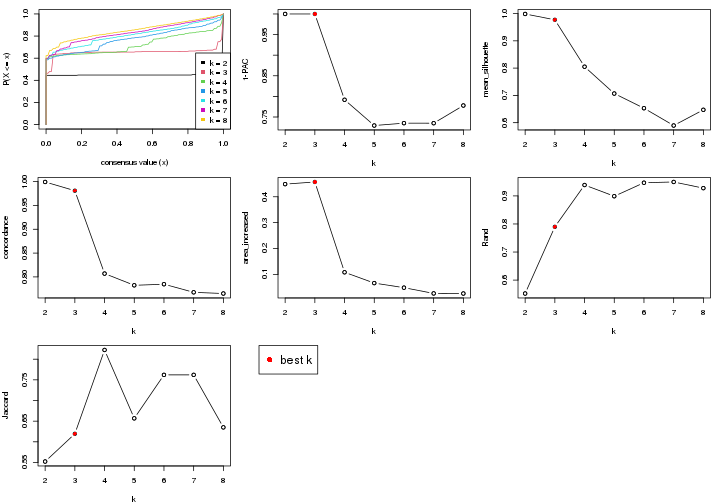

The numeric values for all these statistics can be obtained by `get_stats()`.

```r
get_stats(res)
```

```
#>   k 1-PAC mean_silhouette concordance area_increased  Rand Jaccard
#> 2 2 1.000           0.999       0.999         0.4487 0.552   0.552
#> 3 3 1.000           0.977       0.981         0.4571 0.790   0.619
#> 4 4 0.792           0.805       0.807         0.1080 0.939   0.822
#> 5 5 0.729           0.707       0.782         0.0663 0.899   0.657
#> 6 6 0.735           0.653       0.785         0.0486 0.947   0.762
#> 7 7 0.735           0.590       0.768         0.0263 0.950   0.762
#> 8 8 0.778           0.647       0.765         0.0260 0.928   0.635
```

`suggest_best_k()` suggests the best $k$ based on these statistics. The rules are as follows:

- All $k$ with Jaccard index larger than 0.95 are removed because increasing
  $k$ does not provide enough extra information. If all $k$ are removed, it is
  marked as no subgroup is detected.
- For all $k$ with 1-PAC score larger than 0.9, the maximal $k$ is taken as
  the best $k$, and other $k$ are marked as optional $k$.
- If it does not fit the second rule. The $k$ with the maximal vote of the
  highest 1-PAC score, highest mean silhouette, and highest concordance is
  taken as the best $k$.

```r
suggest_best_k(res)
```

```
#> [1] 3
#> attr(,"optional")
#> [1] 2
```

There is also optional best $k$ = 2 that is worth to check.

Following is the table of the partitions (You need to click the **show/hide
code output** link to see it). The membership matrix (columns with name `p*`)
is inferred by
[`clue::cl_consensus()`](https://www.rdocumentation.org/link/cl_consensus?package=clue)
function with the `SE` method. Basically the value in the membership matrix
represents the probability to belong to a certain group. The finall subgroup
label for an item is determined with the group with highest probability it
belongs to.

In `get_classes()` function, the entropy is calculated from the membership
matrix and the silhouette score is calculated from the consensus matrix.


<script>
$( function() {
	$( '#tabs-node-02-get-classes' ).tabs();
} );
</script>
<div id='tabs-node-02-get-classes'>
<ul>
<li><a href='#tab-node-02-get-classes-1'>k = 2</a></li>
<li><a href='#tab-node-02-get-classes-2'>k = 3</a></li>
<li><a href='#tab-node-02-get-classes-3'>k = 4</a></li>
<li><a href='#tab-node-02-get-classes-4'>k = 5</a></li>
<li><a href='#tab-node-02-get-classes-5'>k = 6</a></li>
<li><a href='#tab-node-02-get-classes-6'>k = 7</a></li>
<li><a href='#tab-node-02-get-classes-7'>k = 8</a></li>
</ul>

<div id='tab-node-02-get-classes-1'>
<p><a id='tab-node-02-get-classes-1-a' style='color:#0366d6' href='#'>show/hide code output</a></p>
<pre><code class="r">cbind(get_classes(res, k = 2), get_membership(res, k = 2))
</code></pre>

<pre><code>#&gt;                 class entropy silhouette   p1   p2
#&gt; TCGA.CQ.5327.01     1    0.00      1.000 1.00 0.00
#&gt; TCGA.HD.7753.01     2    0.00      0.999 0.00 1.00
#&gt; TCGA.CQ.5325.01     2    0.00      0.999 0.00 1.00
#&gt; TCGA.CR.7391.01     1    0.00      1.000 1.00 0.00
#&gt; TCGA.CV.7415.01     2    0.00      0.999 0.00 1.00
#&gt; TCGA.CN.6011.01     2    0.00      0.999 0.00 1.00
#&gt; TCGA.CV.6436.01     2    0.00      0.999 0.00 1.00
#&gt; TCGA.DQ.7592.01     2    0.00      0.999 0.00 1.00
#&gt; TCGA.CV.7416.01     1    0.00      1.000 1.00 0.00
#&gt; TCGA.H7.7774.01     1    0.00      1.000 1.00 0.00
#&gt; TCGA.CQ.5330.01     1    0.00      1.000 1.00 0.00
#&gt; TCGA.CV.7427.01     1    0.00      1.000 1.00 0.00
#&gt; TCGA.CV.5979.01     2    0.00      0.999 0.00 1.00
#&gt; TCGA.CQ.6221.01     2    0.00      0.999 0.00 1.00
#&gt; TCGA.CV.7425.01     1    0.00      1.000 1.00 0.00
#&gt; TCGA.CV.6441.01     2    0.00      0.999 0.00 1.00
#&gt; TCGA.IQ.7630.01     2    0.00      0.999 0.00 1.00
#&gt; TCGA.CV.5977.01     2    0.00      0.999 0.00 1.00
#&gt; TCGA.CQ.5324.01     2    0.00      0.999 0.00 1.00
#&gt; TCGA.CV.7407.01     1    0.00      1.000 1.00 0.00
#&gt; TCGA.CV.5971.01     2    0.00      0.999 0.00 1.00
#&gt; TCGA.CV.5970.01     2    0.00      0.999 0.00 1.00
#&gt; TCGA.CN.6016.01     2    0.00      0.999 0.00 1.00
#&gt; TCGA.CV.6003.01     1    0.00      1.000 1.00 0.00
#&gt; TCGA.CN.6021.01     1    0.00      1.000 1.00 0.00
#&gt; TCGA.CV.5434.01     2    0.00      0.999 0.00 1.00
#&gt; TCGA.CN.6017.01     2    0.00      0.999 0.00 1.00
#&gt; TCGA.CV.7235.01     2    0.00      0.999 0.00 1.00
#&gt; TCGA.CV.5439.01     2    0.00      0.999 0.00 1.00
#&gt; TCGA.CN.6020.01     2    0.00      0.999 0.00 1.00
#&gt; TCGA.CV.7423.01     2    0.00      0.999 0.00 1.00
#&gt; TCGA.CN.6023.01     2    0.00      0.999 0.00 1.00
#&gt; TCGA.CR.7365.01     2    0.00      0.999 0.00 1.00
#&gt; TCGA.CN.6024.01     2    0.00      0.999 0.00 1.00
#&gt; TCGA.CV.5978.01     1    0.00      1.000 1.00 0.00
#&gt; TCGA.CV.7089.01     2    0.00      0.999 0.00 1.00
#&gt; TCGA.CN.6018.01     1    0.00      1.000 1.00 0.00
#&gt; TCGA.CV.5966.01     1    0.00      1.000 1.00 0.00
#&gt; TCGA.CV.5976.01     2    0.00      0.999 0.00 1.00
#&gt; TCGA.CV.7411.01     1    0.00      1.000 1.00 0.00
#&gt; TCGA.CQ.5323.01     2    0.00      0.999 0.00 1.00
#&gt; TCGA.BB.4217.01     2    0.00      0.999 0.00 1.00
#&gt; TCGA.CQ.7068.01     1    0.00      1.000 1.00 0.00
#&gt; TCGA.CN.6995.01     2    0.00      0.999 0.00 1.00
#&gt; TCGA.CQ.5334.01     2    0.00      0.999 0.00 1.00
#&gt; TCGA.CV.7410.01     2    0.00      0.999 0.00 1.00
#&gt; TCGA.DQ.7588.01     2    0.00      0.999 0.00 1.00
#&gt; TCGA.CV.5973.01     1    0.00      1.000 1.00 0.00
#&gt; TCGA.DQ.7591.01     2    0.00      0.999 0.00 1.00
#&gt; TCGA.CV.5430.01     2    0.00      0.999 0.00 1.00
#&gt; TCGA.CV.5435.01     2    0.00      0.999 0.00 1.00
#&gt; TCGA.CV.5440.01     2    0.00      0.999 0.00 1.00
#&gt; TCGA.CV.7104.01     1    0.00      1.000 1.00 0.00
#&gt; TCGA.CV.7100.01     2    0.00      0.999 0.00 1.00
#&gt; TCGA.CV.7095.01     1    0.00      1.000 1.00 0.00
#&gt; TCGA.CR.7373.01     2    0.00      0.999 0.00 1.00
#&gt; TCGA.CV.7178.01     1    0.00      1.000 1.00 0.00
#&gt; TCGA.CN.6998.01     2    0.00      0.999 0.00 1.00
#&gt; TCGA.CV.7252.01     1    0.00      1.000 1.00 0.00
#&gt; TCGA.CR.6478.01     1    0.00      1.000 1.00 0.00
#&gt; TCGA.CR.7380.01     2    0.00      0.999 0.00 1.00
#&gt; TCGA.CV.7183.01     2    0.00      0.999 0.00 1.00
#&gt; TCGA.CV.7102.01     1    0.00      1.000 1.00 0.00
#&gt; TCGA.CV.7254.01     2    0.00      0.999 0.00 1.00
#&gt; TCGA.CR.7394.01     1    0.00      1.000 1.00 0.00
#&gt; TCGA.CV.6955.01     1    0.00      1.000 1.00 0.00
#&gt; TCGA.BA.5556.01     1    0.00      1.000 1.00 0.00
#&gt; TCGA.CR.7386.01     2    0.00      0.999 0.00 1.00
#&gt; TCGA.CR.6474.01     2    0.00      0.999 0.00 1.00
#&gt; TCGA.BA.5557.01     1    0.00      1.000 1.00 0.00
#&gt; TCGA.CV.7247.01     2    0.00      0.999 0.00 1.00
#&gt; TCGA.CR.7377.01     2    0.00      0.999 0.00 1.00
#&gt; TCGA.HD.7229.01     2    0.00      0.999 0.00 1.00
#&gt; TCGA.D6.6515.01     1    0.00      1.000 1.00 0.00
#&gt; TCGA.CV.7238.01     1    0.00      1.000 1.00 0.00
#&gt; TCGA.CV.7097.01     2    0.00      0.999 0.00 1.00
#&gt; TCGA.CN.5370.01     2    0.00      0.999 0.00 1.00
#&gt; TCGA.CR.7367.01     2    0.00      0.999 0.00 1.00
#&gt; TCGA.CR.7401.01     2    0.00      0.999 0.00 1.00
#&gt; TCGA.CV.6942.01     1    0.00      1.000 1.00 0.00
#&gt; TCGA.CV.7177.01     1    0.00      1.000 1.00 0.00
#&gt; TCGA.CR.7395.01     1    0.00      1.000 1.00 0.00
#&gt; TCGA.BA.5558.01     2    0.00      0.999 0.00 1.00
#&gt; TCGA.CX.7085.01     1    0.00      1.000 1.00 0.00
#&gt; TCGA.CV.7099.01     1    0.00      1.000 1.00 0.00
#&gt; TCGA.CV.7090.01     2    0.00      0.999 0.00 1.00
#&gt; TCGA.CX.7219.01     2    0.00      0.999 0.00 1.00
#&gt; TCGA.CV.7243.01     2    0.00      0.999 0.00 1.00
#&gt; TCGA.BA.6871.01     2    0.00      0.999 0.00 1.00
#&gt; TCGA.CQ.6218.01     1    0.00      1.000 1.00 0.00
#&gt; TCGA.C9.A47Z.01     1    0.00      1.000 1.00 0.00
#&gt; TCGA.DQ.5625.01     1    0.00      1.000 1.00 0.00
#&gt; TCGA.CR.6480.01     2    0.00      0.999 0.00 1.00
#&gt; TCGA.D6.6825.01     2    0.00      0.999 0.00 1.00
#&gt; TCGA.C9.A480.01     1    0.00      1.000 1.00 0.00
#&gt; TCGA.CV.6952.01     1    0.00      1.000 1.00 0.00
#&gt; TCGA.CQ.6222.01     2    0.00      0.999 0.00 1.00
#&gt; TCGA.CN.A49C.01     2    0.00      0.999 0.00 1.00
#&gt; TCGA.CN.6994.01     2    0.00      0.999 0.00 1.00
#&gt; TCGA.CR.6491.01     2    0.00      0.999 0.00 1.00
#&gt; TCGA.CV.6950.01     2    0.00      0.999 0.00 1.00
#&gt; TCGA.CR.6473.01     2    0.00      0.999 0.00 1.00
#&gt; TCGA.CQ.5331.01     1    0.00      1.000 1.00 0.00
#&gt; TCGA.D6.6826.01     1    0.00      1.000 1.00 0.00
#&gt; TCGA.CV.6935.01     2    0.00      0.999 0.00 1.00
#&gt; TCGA.CV.6953.01     1    0.00      1.000 1.00 0.00
#&gt; TCGA.CV.6945.01     2    0.00      0.999 0.00 1.00
#&gt; TCGA.DQ.5630.01     2    0.00      0.999 0.00 1.00
#&gt; TCGA.CV.6943.01     2    0.00      0.999 0.00 1.00
#&gt; TCGA.BA.6870.01     1    0.00      1.000 1.00 0.00
#&gt; TCGA.CR.6477.01     1    0.00      1.000 1.00 0.00
#&gt; TCGA.CV.A45O.01     2    0.00      0.999 0.00 1.00
#&gt; TCGA.CQ.6219.01     1    0.00      1.000 1.00 0.00
#&gt; TCGA.CN.4733.01     2    0.00      0.999 0.00 1.00
#&gt; TCGA.CN.A498.01     1    0.00      1.000 1.00 0.00
#&gt; TCGA.CN.6989.01     2    0.00      0.999 0.00 1.00
#&gt; TCGA.CV.6953.11     1    0.00      1.000 1.00 0.00
#&gt; TCGA.D6.6517.01     2    0.00      0.999 0.00 1.00
#&gt; TCGA.CQ.6220.01     2    0.00      0.999 0.00 1.00
#&gt; TCGA.HD.A4C1.01     1    0.00      1.000 1.00 0.00
#&gt; TCGA.CR.6493.01     2    0.00      0.999 0.00 1.00
#&gt; TCGA.D6.6516.01     2    0.00      0.999 0.00 1.00
#&gt; TCGA.CQ.6227.01     2    0.00      0.999 0.00 1.00
#&gt; TCGA.CV.A45P.01     1    0.00      1.000 1.00 0.00
#&gt; TCGA.CV.A45Q.01     1    0.00      1.000 1.00 0.00
#&gt; TCGA.CV.A45T.01     1    0.00      1.000 1.00 0.00
#&gt; TCGA.CN.6996.01     1    0.00      1.000 1.00 0.00
#&gt; TCGA.BA.6873.01     2    0.00      0.999 0.00 1.00
#&gt; TCGA.CR.6467.01     2    0.00      0.999 0.00 1.00
#&gt; TCGA.BA.6868.01     2    0.00      0.999 0.00 1.00
#&gt; TCGA.CV.6959.01     2    0.00      0.999 0.00 1.00
#&gt; TCGA.CQ.6229.01     2    0.00      0.999 0.00 1.00
#&gt; TCGA.CQ.6224.01     2    0.00      0.999 0.00 1.00
#&gt; TCGA.CQ.6223.01     2    0.00      0.999 0.00 1.00
#&gt; TCGA.DQ.5624.01     1    0.00      1.000 1.00 0.00
#&gt; TCGA.CV.A45R.01     2    0.00      0.999 0.00 1.00
#&gt; TCGA.CN.A499.01     1    0.00      1.000 1.00 0.00
#&gt; TCGA.CN.A49B.01     2    0.00      0.999 0.00 1.00
#&gt; TCGA.BA.5152.01     2    0.00      0.999 0.00 1.00
#&gt; TCGA.CV.6938.01     2    0.00      0.999 0.00 1.00
#&gt; TCGA.CQ.5326.01     2    0.00      0.999 0.00 1.00
#&gt; TCGA.CV.6940.01     1    0.00      1.000 1.00 0.00
#&gt; TCGA.CR.6471.01     2    0.00      0.999 0.00 1.00
#&gt; TCGA.BA.6872.01     2    0.00      0.999 0.00 1.00
#&gt; TCGA.CQ.A4C6.01     2    0.00      0.999 0.00 1.00
#&gt; TCGA.CQ.7064.01     1    0.00      1.000 1.00 0.00
#&gt; TCGA.IQ.A61K.01     1    0.00      1.000 1.00 0.00
#&gt; TCGA.HD.A633.01     2    0.00      0.999 0.00 1.00
#&gt; TCGA.F7.A61W.01     2    0.00      0.999 0.00 1.00
#&gt; TCGA.BA.A6DF.01     1    0.00      1.000 1.00 0.00
#&gt; TCGA.D6.A4ZB.01     2    0.00      0.999 0.00 1.00
#&gt; TCGA.CV.A45Y.01     2    0.00      0.999 0.00 1.00
#&gt; TCGA.BB.A5HU.01     2    0.00      0.999 0.00 1.00
#&gt; TCGA.CQ.A4C7.01     2    0.00      0.999 0.00 1.00
#&gt; TCGA.P3.A5Q6.01     2    0.00      0.999 0.00 1.00
#&gt; TCGA.CQ.A4CD.01     2    0.00      0.999 0.00 1.00
#&gt; TCGA.BA.A6DB.01     1    0.00      1.000 1.00 0.00
#&gt; TCGA.F7.A620.01     2    0.00      0.999 0.00 1.00
#&gt; TCGA.CX.A4AQ.01     2    0.00      0.999 0.00 1.00
#&gt; TCGA.CV.A464.01     2    0.00      0.999 0.00 1.00
#&gt; TCGA.IQ.A61L.01     1    0.00      1.000 1.00 0.00
#&gt; TCGA.QK.A8Z9.01     2    0.00      0.999 0.00 1.00
#&gt; TCGA.BB.A5HY.01     2    0.00      0.999 0.00 1.00
#&gt; TCGA.HD.8635.01     1    0.00      1.000 1.00 0.00
#&gt; TCGA.QK.A652.01     2    0.00      0.999 0.00 1.00
#&gt; TCGA.MT.A67G.01     1    0.00      1.000 1.00 0.00
#&gt; TCGA.QK.A64Z.01     1    0.00      1.000 1.00 0.00
#&gt; TCGA.HD.8634.01     1    0.00      1.000 1.00 0.00
#&gt; TCGA.CQ.7063.01     1    0.00      1.000 1.00 0.00
#&gt; TCGA.F7.A50J.01     1    0.00      1.000 1.00 0.00
#&gt; TCGA.F7.8298.01     2    0.00      0.999 0.00 1.00
#&gt; TCGA.F7.8489.01     2    0.00      0.999 0.00 1.00
#&gt; TCGA.F7.A50G.01     2    0.00      0.999 0.00 1.00
#&gt; TCGA.CQ.A4CA.01     2    0.00      0.999 0.00 1.00
#&gt; TCGA.T3.A92N.01     2    0.00      0.999 0.00 1.00
#&gt; TCGA.CN.A63Y.01     2    0.00      0.999 0.00 1.00
#&gt; TCGA.CQ.5333.01     2    0.00      0.999 0.00 1.00
#&gt; TCGA.P3.A5QE.01     2    0.00      0.999 0.00 1.00
#&gt; TCGA.BA.A6DJ.01     2    0.68      0.780 0.18 0.82
#&gt; TCGA.MT.A51W.01     1    0.00      1.000 1.00 0.00
#&gt; TCGA.IQ.A61G.01     2    0.00      0.999 0.00 1.00
#&gt; TCGA.IQ.A61J.01     2    0.00      0.999 0.00 1.00
#&gt; TCGA.BA.A6DG.01     2    0.00      0.999 0.00 1.00
#&gt; TCGA.CQ.A4CH.01     2    0.00      0.999 0.00 1.00
#&gt; TCGA.CQ.A4CB.01     2    0.00      0.999 0.00 1.00
#&gt; TCGA.D6.8569.01     2    0.00      0.999 0.00 1.00
#&gt; TCGA.IQ.A61I.01     2    0.00      0.999 0.00 1.00
#&gt; TCGA.D6.A4Z9.01     2    0.00      0.999 0.00 1.00
#&gt; TCGA.CQ.7071.01     1    0.00      1.000 1.00 0.00
#&gt; TCGA.H7.8501.01     2    0.00      0.999 0.00 1.00
#&gt; TCGA.BB.8601.01     2    0.00      0.999 0.00 1.00
#&gt; TCGA.H7.8502.01     2    0.00      0.999 0.00 1.00
#&gt; TCGA.F7.A61S.01     2    0.00      0.999 0.00 1.00
#&gt; TCGA.CV.A463.01     1    0.00      1.000 1.00 0.00
#&gt; TCGA.D6.8568.01     2    0.00      0.999 0.00 1.00
#&gt; TCGA.CN.A642.01     2    0.00      0.999 0.00 1.00
#&gt; TCGA.CN.5367.01     1    0.00      1.000 1.00 0.00
#&gt; TCGA.P3.A6T2.01     2    0.00      0.999 0.00 1.00
#&gt; TCGA.CN.A6V7.01     2    0.00      0.999 0.00 1.00
#&gt; TCGA.CN.A640.01     1    0.00      1.000 1.00 0.00
#&gt; TCGA.DQ.7589.01     2    0.00      0.999 0.00 1.00
#&gt; TCGA.CN.4725.01     2    0.00      0.999 0.00 1.00
#&gt; TCGA.HL.7533.01     2    0.00      0.999 0.00 1.00
#&gt; TCGA.UF.A7JO.01     1    0.00      1.000 1.00 0.00
#&gt; TCGA.UF.A7JV.01     1    0.00      1.000 1.00 0.00
#&gt; TCGA.CN.4729.01     2    0.00      0.999 0.00 1.00
#&gt; TCGA.IQ.A6SG.01     1    0.00      1.000 1.00 0.00
#&gt; TCGA.MT.A67A.01     1    0.00      1.000 1.00 0.00
#&gt; TCGA.CN.5361.01     2    0.00      0.999 0.00 1.00
#&gt; TCGA.CN.5359.01     2    0.00      0.999 0.00 1.00
#&gt; TCGA.BB.7861.01     2    0.00      0.999 0.00 1.00
#&gt; TCGA.BB.A6UO.01     1    0.00      1.000 1.00 0.00
#&gt; TCGA.CN.4734.01     2    0.00      0.999 0.00 1.00
#&gt; TCGA.BA.4075.01     2    0.00      0.999 0.00 1.00
#&gt; TCGA.BB.7871.01     1    0.00      1.000 1.00 0.00
#&gt; TCGA.CN.4726.01     2    0.00      0.999 0.00 1.00
#&gt; TCGA.UF.A7JS.01     2    0.00      0.999 0.00 1.00
#&gt; TCGA.CN.4736.01     1    0.00      1.000 1.00 0.00
#&gt; TCGA.CN.5355.01     2    0.00      0.999 0.00 1.00
#&gt; TCGA.DQ.7590.01     2    0.00      0.999 0.00 1.00
#&gt; TCGA.CN.5369.01     1    0.00      1.000 1.00 0.00
#&gt; TCGA.BA.5151.01     2    0.00      0.999 0.00 1.00
#&gt; TCGA.IQ.A61E.01     1    0.00      1.000 1.00 0.00
#&gt; TCGA.BA.4076.01     2    0.00      0.999 0.00 1.00
#&gt; TCGA.MZ.A7D7.01     2    0.00      0.999 0.00 1.00
#&gt; TCGA.UF.A7JT.01     1    0.00      1.000 1.00 0.00
#&gt; TCGA.CN.5373.01     1    0.00      1.000 1.00 0.00
#&gt; TCGA.BB.7863.01     1    0.00      1.000 1.00 0.00
#&gt; TCGA.CN.5363.01     2    0.00      0.999 0.00 1.00
#&gt; TCGA.BA.4077.01     1    0.00      1.000 1.00 0.00
#&gt; TCGA.BB.7872.01     2    0.00      0.999 0.00 1.00
#&gt; TCGA.H7.A6C4.01     1    0.00      1.000 1.00 0.00
#&gt; TCGA.T2.A6X2.01     2    0.00      0.999 0.00 1.00
#&gt; TCGA.CN.4741.01     2    0.00      0.999 0.00 1.00
#&gt; TCGA.CV.A6JO.01     2    0.00      0.999 0.00 1.00
#&gt; TCGA.BB.7866.01     2    0.00      0.999 0.00 1.00
#&gt; TCGA.CN.5365.01     2    0.00      0.999 0.00 1.00
#&gt; TCGA.BB.4224.01     2    0.00      0.999 0.00 1.00
#&gt; TCGA.MT.A67F.01     1    0.00      1.000 1.00 0.00
#&gt; TCGA.CN.5366.01     2    0.00      0.999 0.00 1.00
#&gt; TCGA.QK.A6V9.01     2    0.00      0.999 0.00 1.00
#&gt; TCGA.T2.A6WX.01     1    0.00      1.000 1.00 0.00
#&gt; TCGA.CV.A6JZ.01     2    0.00      0.999 0.00 1.00
#&gt; TCGA.CN.A6V1.01     2    0.00      0.999 0.00 1.00
#&gt; TCGA.HD.A6I0.01     2    0.00      0.999 0.00 1.00
#&gt; TCGA.CV.7430.01     2    0.00      0.999 0.00 1.00
#&gt; TCGA.CR.7383.01     1    0.00      1.000 1.00 0.00
#&gt; TCGA.UF.A7JC.01     2    0.00      0.999 0.00 1.00
#&gt; TCGA.CV.7568.01     2    0.00      0.999 0.00 1.00
#&gt; TCGA.QK.A6IF.01     2    0.00      0.999 0.00 1.00
#&gt; TCGA.CV.A6JT.01     2    0.00      0.999 0.00 1.00
#&gt; TCGA.CV.7438.01     1    0.00      1.000 1.00 0.00
#&gt; TCGA.D6.A6EN.01     2    0.00      0.999 0.00 1.00
#&gt; TCGA.CV.7429.01     2    0.00      0.999 0.00 1.00
#&gt; TCGA.CV.7437.01     2    0.00      0.999 0.00 1.00
#&gt; TCGA.CV.A6JD.01     1    0.00      1.000 1.00 0.00
#&gt; TCGA.CV.A6JN.01     2    0.00      0.999 0.00 1.00
#&gt; TCGA.CV.7434.01     2    0.00      0.999 0.00 1.00
#&gt; TCGA.D6.A6EK.01     2    0.00      0.999 0.00 1.00
#&gt; TCGA.HD.7832.01     2    0.00      0.999 0.00 1.00
#&gt; TCGA.P3.A6SX.01     2    0.00      0.999 0.00 1.00
#&gt; TCGA.QK.A6II.01     2    0.00      0.999 0.00 1.00
#&gt; TCGA.P3.A6T7.01     2    0.00      0.999 0.00 1.00
#&gt; TCGA.CR.7382.01     2    0.00      0.999 0.00 1.00
#&gt; TCGA.T2.A6WZ.01     2    0.00      0.999 0.00 1.00
#&gt; TCGA.P3.A6T5.01     1    0.00      1.000 1.00 0.00
#&gt; TCGA.CV.7433.01     2    0.00      0.999 0.00 1.00
#&gt; TCGA.CR.7376.01     2    0.00      0.999 0.00 1.00
</code></pre>

<script>
$('#tab-node-02-get-classes-1-a').parent().next().next().hide();
$('#tab-node-02-get-classes-1-a').click(function(){
  $('#tab-node-02-get-classes-1-a').parent().next().next().toggle();
  return(false);
});
</script>
</div>

<div id='tab-node-02-get-classes-2'>
<p><a id='tab-node-02-get-classes-2-a' style='color:#0366d6' href='#'>show/hide code output</a></p>
<pre><code class="r">cbind(get_classes(res, k = 3), get_membership(res, k = 3))
</code></pre>

<pre><code>#&gt;                 class entropy silhouette   p1   p2   p3
#&gt; TCGA.CQ.5327.01     1  0.1529     0.9793 0.96 0.00 0.04
#&gt; TCGA.HD.7753.01     2  0.0000     0.9928 0.00 1.00 0.00
#&gt; TCGA.CQ.5325.01     2  0.0892     0.9745 0.00 0.98 0.02
#&gt; TCGA.CR.7391.01     1  0.0000     0.9879 1.00 0.00 0.00
#&gt; TCGA.CV.7415.01     2  0.0000     0.9928 0.00 1.00 0.00
#&gt; TCGA.CN.6011.01     2  0.0000     0.9928 0.00 1.00 0.00
#&gt; TCGA.CV.6436.01     3  0.1529     0.9788 0.00 0.04 0.96
#&gt; TCGA.DQ.7592.01     2  0.0000     0.9928 0.00 1.00 0.00
#&gt; TCGA.CV.7416.01     1  0.0000     0.9879 1.00 0.00 0.00
#&gt; TCGA.H7.7774.01     1  0.1529     0.9793 0.96 0.00 0.04
#&gt; TCGA.CQ.5330.01     1  0.1529     0.9793 0.96 0.00 0.04
#&gt; TCGA.CV.7427.01     1  0.1529     0.9793 0.96 0.00 0.04
#&gt; TCGA.CV.5979.01     2  0.0000     0.9928 0.00 1.00 0.00
#&gt; TCGA.CQ.6221.01     2  0.0000     0.9928 0.00 1.00 0.00
#&gt; TCGA.CV.7425.01     1  0.1529     0.9793 0.96 0.00 0.04
#&gt; TCGA.CV.6441.01     3  0.1529     0.9788 0.00 0.04 0.96
#&gt; TCGA.IQ.7630.01     3  0.1529     0.9788 0.00 0.04 0.96
#&gt; TCGA.CV.5977.01     3  0.0000     0.9496 0.00 0.00 1.00
#&gt; TCGA.CQ.5324.01     3  0.1529     0.9788 0.00 0.04 0.96
#&gt; TCGA.CV.7407.01     1  0.0000     0.9879 1.00 0.00 0.00
#&gt; TCGA.CV.5971.01     2  0.0000     0.9928 0.00 1.00 0.00
#&gt; TCGA.CV.5970.01     2  0.0000     0.9928 0.00 1.00 0.00
#&gt; TCGA.CN.6016.01     2  0.2959     0.8859 0.00 0.90 0.10
#&gt; TCGA.CV.6003.01     1  0.0000     0.9879 1.00 0.00 0.00
#&gt; TCGA.CN.6021.01     1  0.0000     0.9879 1.00 0.00 0.00
#&gt; TCGA.CV.5434.01     2  0.0000     0.9928 0.00 1.00 0.00
#&gt; TCGA.CN.6017.01     2  0.0000     0.9928 0.00 1.00 0.00
#&gt; TCGA.CV.7235.01     2  0.0000     0.9928 0.00 1.00 0.00
#&gt; TCGA.CV.5439.01     2  0.0000     0.9928 0.00 1.00 0.00
#&gt; TCGA.CN.6020.01     2  0.0000     0.9928 0.00 1.00 0.00
#&gt; TCGA.CV.7423.01     2  0.0000     0.9928 0.00 1.00 0.00
#&gt; TCGA.CN.6023.01     2  0.0000     0.9928 0.00 1.00 0.00
#&gt; TCGA.CR.7365.01     3  0.1529     0.9788 0.00 0.04 0.96
#&gt; TCGA.CN.6024.01     2  0.0892     0.9745 0.00 0.98 0.02
#&gt; TCGA.CV.5978.01     1  0.0000     0.9879 1.00 0.00 0.00
#&gt; TCGA.CV.7089.01     3  0.1529     0.9788 0.00 0.04 0.96
#&gt; TCGA.CN.6018.01     1  0.0000     0.9879 1.00 0.00 0.00
#&gt; TCGA.CV.5966.01     1  0.1529     0.9793 0.96 0.00 0.04
#&gt; TCGA.CV.5976.01     3  0.1529     0.9788 0.00 0.04 0.96
#&gt; TCGA.CV.7411.01     1  0.0000     0.9879 1.00 0.00 0.00
#&gt; TCGA.CQ.5323.01     2  0.0000     0.9928 0.00 1.00 0.00
#&gt; TCGA.BB.4217.01     2  0.0000     0.9928 0.00 1.00 0.00
#&gt; TCGA.CQ.7068.01     1  0.1529     0.9793 0.96 0.00 0.04
#&gt; TCGA.CN.6995.01     3  0.1529     0.9788 0.00 0.04 0.96
#&gt; TCGA.CQ.5334.01     3  0.0000     0.9496 0.00 0.00 1.00
#&gt; TCGA.CV.7410.01     2  0.0000     0.9928 0.00 1.00 0.00
#&gt; TCGA.DQ.7588.01     2  0.0000     0.9928 0.00 1.00 0.00
#&gt; TCGA.CV.5973.01     1  0.0000     0.9879 1.00 0.00 0.00
#&gt; TCGA.DQ.7591.01     2  0.0000     0.9928 0.00 1.00 0.00
#&gt; TCGA.CV.5430.01     2  0.0000     0.9928 0.00 1.00 0.00
#&gt; TCGA.CV.5435.01     3  0.1529     0.9788 0.00 0.04 0.96
#&gt; TCGA.CV.5440.01     2  0.0000     0.9928 0.00 1.00 0.00
#&gt; TCGA.CV.7104.01     1  0.0000     0.9879 1.00 0.00 0.00
#&gt; TCGA.CV.7100.01     2  0.0000     0.9928 0.00 1.00 0.00
#&gt; TCGA.CV.7095.01     1  0.1529     0.9793 0.96 0.00 0.04
#&gt; TCGA.CR.7373.01     3  0.1529     0.9788 0.00 0.04 0.96
#&gt; TCGA.CV.7178.01     1  0.0000     0.9879 1.00 0.00 0.00
#&gt; TCGA.CN.6998.01     3  0.1529     0.9788 0.00 0.04 0.96
#&gt; TCGA.CV.7252.01     1  0.1529     0.9793 0.96 0.00 0.04
#&gt; TCGA.CR.6478.01     1  0.0000     0.9879 1.00 0.00 0.00
#&gt; TCGA.CR.7380.01     3  0.1529     0.9788 0.00 0.04 0.96
#&gt; TCGA.CV.7183.01     3  0.1529     0.9788 0.00 0.04 0.96
#&gt; TCGA.CV.7102.01     1  0.0000     0.9879 1.00 0.00 0.00
#&gt; TCGA.CV.7254.01     2  0.0000     0.9928 0.00 1.00 0.00
#&gt; TCGA.CR.7394.01     1  0.0000     0.9879 1.00 0.00 0.00
#&gt; TCGA.CV.6955.01     1  0.0892     0.9839 0.98 0.00 0.02
#&gt; TCGA.BA.5556.01     1  0.1529     0.9793 0.96 0.00 0.04
#&gt; TCGA.CR.7386.01     2  0.4002     0.8048 0.00 0.84 0.16
#&gt; TCGA.CR.6474.01     2  0.0000     0.9928 0.00 1.00 0.00
#&gt; TCGA.BA.5557.01     1  0.0000     0.9879 1.00 0.00 0.00
#&gt; TCGA.CV.7247.01     2  0.0000     0.9928 0.00 1.00 0.00
#&gt; TCGA.CR.7377.01     2  0.0000     0.9928 0.00 1.00 0.00
#&gt; TCGA.HD.7229.01     3  0.1529     0.9788 0.00 0.04 0.96
#&gt; TCGA.D6.6515.01     1  0.0000     0.9879 1.00 0.00 0.00
#&gt; TCGA.CV.7238.01     1  0.0000     0.9879 1.00 0.00 0.00
#&gt; TCGA.CV.7097.01     3  0.0892     0.9656 0.00 0.02 0.98
#&gt; TCGA.CN.5370.01     2  0.0000     0.9928 0.00 1.00 0.00
#&gt; TCGA.CR.7367.01     3  0.1529     0.9788 0.00 0.04 0.96
#&gt; TCGA.CR.7401.01     2  0.0000     0.9928 0.00 1.00 0.00
#&gt; TCGA.CV.6942.01     1  0.1529     0.9793 0.96 0.00 0.04
#&gt; TCGA.CV.7177.01     1  0.0000     0.9879 1.00 0.00 0.00
#&gt; TCGA.CR.7395.01     1  0.0892     0.9839 0.98 0.00 0.02
#&gt; TCGA.BA.5558.01     3  0.1529     0.9788 0.00 0.04 0.96
#&gt; TCGA.CX.7085.01     1  0.0000     0.9879 1.00 0.00 0.00
#&gt; TCGA.CV.7099.01     1  0.1529     0.9793 0.96 0.00 0.04
#&gt; TCGA.CV.7090.01     2  0.0000     0.9928 0.00 1.00 0.00
#&gt; TCGA.CX.7219.01     2  0.0000     0.9928 0.00 1.00 0.00
#&gt; TCGA.CV.7243.01     3  0.1529     0.9788 0.00 0.04 0.96
#&gt; TCGA.BA.6871.01     2  0.0000     0.9928 0.00 1.00 0.00
#&gt; TCGA.CQ.6218.01     1  0.0000     0.9879 1.00 0.00 0.00
#&gt; TCGA.C9.A47Z.01     1  0.1529     0.9793 0.96 0.00 0.04
#&gt; TCGA.DQ.5625.01     1  0.0000     0.9879 1.00 0.00 0.00
#&gt; TCGA.CR.6480.01     3  0.1529     0.9788 0.00 0.04 0.96
#&gt; TCGA.D6.6825.01     2  0.0000     0.9928 0.00 1.00 0.00
#&gt; TCGA.C9.A480.01     1  0.0000     0.9879 1.00 0.00 0.00
#&gt; TCGA.CV.6952.01     1  0.1529     0.9793 0.96 0.00 0.04
#&gt; TCGA.CQ.6222.01     2  0.0000     0.9928 0.00 1.00 0.00
#&gt; TCGA.CN.A49C.01     3  0.1529     0.9788 0.00 0.04 0.96
#&gt; TCGA.CN.6994.01     2  0.0000     0.9928 0.00 1.00 0.00
#&gt; TCGA.CR.6491.01     3  0.0000     0.9496 0.00 0.00 1.00
#&gt; TCGA.CV.6950.01     2  0.0000     0.9928 0.00 1.00 0.00
#&gt; TCGA.CR.6473.01     3  0.1529     0.9788 0.00 0.04 0.96
#&gt; TCGA.CQ.5331.01     1  0.0000     0.9879 1.00 0.00 0.00
#&gt; TCGA.D6.6826.01     1  0.1529     0.9793 0.96 0.00 0.04
#&gt; TCGA.CV.6935.01     2  0.0000     0.9928 0.00 1.00 0.00
#&gt; TCGA.CV.6953.01     1  0.1529     0.9793 0.96 0.00 0.04
#&gt; TCGA.CV.6945.01     2  0.0000     0.9928 0.00 1.00 0.00
#&gt; TCGA.DQ.5630.01     2  0.0000     0.9928 0.00 1.00 0.00
#&gt; TCGA.CV.6943.01     2  0.0000     0.9928 0.00 1.00 0.00
#&gt; TCGA.BA.6870.01     1  0.0000     0.9879 1.00 0.00 0.00
#&gt; TCGA.CR.6477.01     1  0.0000     0.9879 1.00 0.00 0.00
#&gt; TCGA.CV.A45O.01     3  0.1529     0.9788 0.00 0.04 0.96
#&gt; TCGA.CQ.6219.01     1  0.0000     0.9879 1.00 0.00 0.00
#&gt; TCGA.CN.4733.01     2  0.0000     0.9928 0.00 1.00 0.00
#&gt; TCGA.CN.A498.01     1  0.0000     0.9879 1.00 0.00 0.00
#&gt; TCGA.CN.6989.01     2  0.0000     0.9928 0.00 1.00 0.00
#&gt; TCGA.CV.6953.11     1  0.0000     0.9879 1.00 0.00 0.00
#&gt; TCGA.D6.6517.01     2  0.0000     0.9928 0.00 1.00 0.00
#&gt; TCGA.CQ.6220.01     2  0.0000     0.9928 0.00 1.00 0.00
#&gt; TCGA.HD.A4C1.01     1  0.1529     0.9793 0.96 0.00 0.04
#&gt; TCGA.CR.6493.01     3  0.1529     0.9788 0.00 0.04 0.96
#&gt; TCGA.D6.6516.01     2  0.0000     0.9928 0.00 1.00 0.00
#&gt; TCGA.CQ.6227.01     2  0.0000     0.9928 0.00 1.00 0.00
#&gt; TCGA.CV.A45P.01     1  0.0000     0.9879 1.00 0.00 0.00
#&gt; TCGA.CV.A45Q.01     1  0.1529     0.9793 0.96 0.00 0.04
#&gt; TCGA.CV.A45T.01     1  0.0000     0.9879 1.00 0.00 0.00
#&gt; TCGA.CN.6996.01     1  0.0000     0.9879 1.00 0.00 0.00
#&gt; TCGA.BA.6873.01     3  0.1529     0.9788 0.00 0.04 0.96
#&gt; TCGA.CR.6467.01     3  0.1529     0.9788 0.00 0.04 0.96
#&gt; TCGA.BA.6868.01     2  0.0000     0.9928 0.00 1.00 0.00
#&gt; TCGA.CV.6959.01     3  0.1529     0.9788 0.00 0.04 0.96
#&gt; TCGA.CQ.6229.01     2  0.0000     0.9928 0.00 1.00 0.00
#&gt; TCGA.CQ.6224.01     3  0.3686     0.8721 0.00 0.14 0.86
#&gt; TCGA.CQ.6223.01     2  0.0000     0.9928 0.00 1.00 0.00
#&gt; TCGA.DQ.5624.01     1  0.0000     0.9879 1.00 0.00 0.00
#&gt; TCGA.CV.A45R.01     2  0.2066     0.9328 0.00 0.94 0.06
#&gt; TCGA.CN.A499.01     1  0.0000     0.9879 1.00 0.00 0.00
#&gt; TCGA.CN.A49B.01     2  0.0000     0.9928 0.00 1.00 0.00
#&gt; TCGA.BA.5152.01     2  0.0000     0.9928 0.00 1.00 0.00
#&gt; TCGA.CV.6938.01     3  0.1529     0.9788 0.00 0.04 0.96
#&gt; TCGA.CQ.5326.01     2  0.0000     0.9928 0.00 1.00 0.00
#&gt; TCGA.CV.6940.01     1  0.0000     0.9879 1.00 0.00 0.00
#&gt; TCGA.CR.6471.01     2  0.0000     0.9928 0.00 1.00 0.00
#&gt; TCGA.BA.6872.01     3  0.6309     0.0677 0.00 0.50 0.50
#&gt; TCGA.CQ.A4C6.01     3  0.1529     0.9788 0.00 0.04 0.96
#&gt; TCGA.CQ.7064.01     1  0.0000     0.9879 1.00 0.00 0.00
#&gt; TCGA.IQ.A61K.01     1  0.1529     0.9793 0.96 0.00 0.04
#&gt; TCGA.HD.A633.01     3  0.1529     0.9788 0.00 0.04 0.96
#&gt; TCGA.F7.A61W.01     2  0.0000     0.9928 0.00 1.00 0.00
#&gt; TCGA.BA.A6DF.01     1  0.1529     0.9793 0.96 0.00 0.04
#&gt; TCGA.D6.A4ZB.01     2  0.0000     0.9928 0.00 1.00 0.00
#&gt; TCGA.CV.A45Y.01     2  0.1529     0.9550 0.00 0.96 0.04
#&gt; TCGA.BB.A5HU.01     2  0.0000     0.9928 0.00 1.00 0.00
#&gt; TCGA.CQ.A4C7.01     3  0.1529     0.9788 0.00 0.04 0.96
#&gt; TCGA.P3.A5Q6.01     2  0.0000     0.9928 0.00 1.00 0.00
#&gt; TCGA.CQ.A4CD.01     3  0.1529     0.9788 0.00 0.04 0.96
#&gt; TCGA.BA.A6DB.01     1  0.0000     0.9879 1.00 0.00 0.00
#&gt; TCGA.F7.A620.01     3  0.1529     0.9788 0.00 0.04 0.96
#&gt; TCGA.CX.A4AQ.01     2  0.0000     0.9928 0.00 1.00 0.00
#&gt; TCGA.CV.A464.01     2  0.0000     0.9928 0.00 1.00 0.00
#&gt; TCGA.IQ.A61L.01     1  0.0000     0.9879 1.00 0.00 0.00
#&gt; TCGA.QK.A8Z9.01     3  0.5216     0.6937 0.00 0.26 0.74
#&gt; TCGA.BB.A5HY.01     3  0.1529     0.9788 0.00 0.04 0.96
#&gt; TCGA.HD.8635.01     1  0.0000     0.9879 1.00 0.00 0.00
#&gt; TCGA.QK.A652.01     2  0.0000     0.9928 0.00 1.00 0.00
#&gt; TCGA.MT.A67G.01     1  0.0000     0.9879 1.00 0.00 0.00
#&gt; TCGA.QK.A64Z.01     1  0.0000     0.9879 1.00 0.00 0.00
#&gt; TCGA.HD.8634.01     1  0.0000     0.9879 1.00 0.00 0.00
#&gt; TCGA.CQ.7063.01     1  0.1529     0.9793 0.96 0.00 0.04
#&gt; TCGA.F7.A50J.01     1  0.0000     0.9879 1.00 0.00 0.00
#&gt; TCGA.F7.8298.01     2  0.0000     0.9928 0.00 1.00 0.00
#&gt; TCGA.F7.8489.01     2  0.0000     0.9928 0.00 1.00 0.00
#&gt; TCGA.F7.A50G.01     2  0.0000     0.9928 0.00 1.00 0.00
#&gt; TCGA.CQ.A4CA.01     2  0.0000     0.9928 0.00 1.00 0.00
#&gt; TCGA.T3.A92N.01     2  0.0000     0.9928 0.00 1.00 0.00
#&gt; TCGA.CN.A63Y.01     2  0.0000     0.9928 0.00 1.00 0.00
#&gt; TCGA.CQ.5333.01     3  0.0000     0.9496 0.00 0.00 1.00
#&gt; TCGA.P3.A5QE.01     2  0.0000     0.9928 0.00 1.00 0.00
#&gt; TCGA.BA.A6DJ.01     3  0.0000     0.9496 0.00 0.00 1.00
#&gt; TCGA.MT.A51W.01     1  0.0000     0.9879 1.00 0.00 0.00
#&gt; TCGA.IQ.A61G.01     2  0.0000     0.9928 0.00 1.00 0.00
#&gt; TCGA.IQ.A61J.01     2  0.0000     0.9928 0.00 1.00 0.00
#&gt; TCGA.BA.A6DG.01     2  0.0000     0.9928 0.00 1.00 0.00
#&gt; TCGA.CQ.A4CH.01     2  0.0000     0.9928 0.00 1.00 0.00
#&gt; TCGA.CQ.A4CB.01     3  0.1529     0.9788 0.00 0.04 0.96
#&gt; TCGA.D6.8569.01     2  0.0000     0.9928 0.00 1.00 0.00
#&gt; TCGA.IQ.A61I.01     3  0.1529     0.9788 0.00 0.04 0.96
#&gt; TCGA.D6.A4Z9.01     3  0.1529     0.9788 0.00 0.04 0.96
#&gt; TCGA.CQ.7071.01     1  0.1529     0.9793 0.96 0.00 0.04
#&gt; TCGA.H7.8501.01     3  0.0892     0.9656 0.00 0.02 0.98
#&gt; TCGA.BB.8601.01     2  0.0000     0.9928 0.00 1.00 0.00
#&gt; TCGA.H7.8502.01     2  0.0000     0.9928 0.00 1.00 0.00
#&gt; TCGA.F7.A61S.01     2  0.4555     0.7400 0.00 0.80 0.20
#&gt; TCGA.CV.A463.01     1  0.1529     0.9793 0.96 0.00 0.04
#&gt; TCGA.D6.8568.01     2  0.0000     0.9928 0.00 1.00 0.00
#&gt; TCGA.CN.A642.01     3  0.0000     0.9496 0.00 0.00 1.00
#&gt; TCGA.CN.5367.01     1  0.0000     0.9879 1.00 0.00 0.00
#&gt; TCGA.P3.A6T2.01     3  0.0000     0.9496 0.00 0.00 1.00
#&gt; TCGA.CN.A6V7.01     3  0.1529     0.9788 0.00 0.04 0.96
#&gt; TCGA.CN.A640.01     1  0.1529     0.9793 0.96 0.00 0.04
#&gt; TCGA.DQ.7589.01     2  0.0000     0.9928 0.00 1.00 0.00
#&gt; TCGA.CN.4725.01     2  0.0000     0.9928 0.00 1.00 0.00
#&gt; TCGA.HL.7533.01     2  0.0000     0.9928 0.00 1.00 0.00
#&gt; TCGA.UF.A7JO.01     1  0.0892     0.9839 0.98 0.00 0.02
#&gt; TCGA.UF.A7JV.01     1  0.0000     0.9879 1.00 0.00 0.00
#&gt; TCGA.CN.4729.01     2  0.0000     0.9928 0.00 1.00 0.00
#&gt; TCGA.IQ.A6SG.01     1  0.0000     0.9879 1.00 0.00 0.00
#&gt; TCGA.MT.A67A.01     1  0.1529     0.9793 0.96 0.00 0.04
#&gt; TCGA.CN.5361.01     2  0.0892     0.9745 0.00 0.98 0.02
#&gt; TCGA.CN.5359.01     2  0.0000     0.9928 0.00 1.00 0.00
#&gt; TCGA.BB.7861.01     2  0.0000     0.9928 0.00 1.00 0.00
#&gt; TCGA.BB.A6UO.01     1  0.1529     0.9793 0.96 0.00 0.04
#&gt; TCGA.CN.4734.01     3  0.0000     0.9496 0.00 0.00 1.00
#&gt; TCGA.BA.4075.01     3  0.1529     0.9788 0.00 0.04 0.96
#&gt; TCGA.BB.7871.01     1  0.0000     0.9879 1.00 0.00 0.00
#&gt; TCGA.CN.4726.01     3  0.0892     0.9656 0.00 0.02 0.98
#&gt; TCGA.UF.A7JS.01     2  0.0000     0.9928 0.00 1.00 0.00
#&gt; TCGA.CN.4736.01     1  0.0000     0.9879 1.00 0.00 0.00
#&gt; TCGA.CN.5355.01     3  0.1529     0.9788 0.00 0.04 0.96
#&gt; TCGA.DQ.7590.01     2  0.0000     0.9928 0.00 1.00 0.00
#&gt; TCGA.CN.5369.01     1  0.0000     0.9879 1.00 0.00 0.00
#&gt; TCGA.BA.5151.01     3  0.1529     0.9788 0.00 0.04 0.96
#&gt; TCGA.IQ.A61E.01     1  0.1529     0.9793 0.96 0.00 0.04
#&gt; TCGA.BA.4076.01     2  0.0000     0.9928 0.00 1.00 0.00
#&gt; TCGA.MZ.A7D7.01     2  0.0000     0.9928 0.00 1.00 0.00
#&gt; TCGA.UF.A7JT.01     1  0.1529     0.9793 0.96 0.00 0.04
#&gt; TCGA.CN.5373.01     1  0.0000     0.9879 1.00 0.00 0.00
#&gt; TCGA.BB.7863.01     1  0.1529     0.9793 0.96 0.00 0.04
#&gt; TCGA.CN.5363.01     3  0.1529     0.9788 0.00 0.04 0.96
#&gt; TCGA.BA.4077.01     1  0.0000     0.9879 1.00 0.00 0.00
#&gt; TCGA.BB.7872.01     2  0.0000     0.9928 0.00 1.00 0.00
#&gt; TCGA.H7.A6C4.01     1  0.0000     0.9879 1.00 0.00 0.00
#&gt; TCGA.T2.A6X2.01     3  0.1529     0.9788 0.00 0.04 0.96
#&gt; TCGA.CN.4741.01     3  0.1529     0.9788 0.00 0.04 0.96
#&gt; TCGA.CV.A6JO.01     3  0.1529     0.9788 0.00 0.04 0.96
#&gt; TCGA.BB.7866.01     3  0.1529     0.9788 0.00 0.04 0.96
#&gt; TCGA.CN.5365.01     2  0.0000     0.9928 0.00 1.00 0.00
#&gt; TCGA.BB.4224.01     2  0.0000     0.9928 0.00 1.00 0.00
#&gt; TCGA.MT.A67F.01     1  0.1529     0.9793 0.96 0.00 0.04
#&gt; TCGA.CN.5366.01     3  0.1529     0.9788 0.00 0.04 0.96
#&gt; TCGA.QK.A6V9.01     3  0.1529     0.9788 0.00 0.04 0.96
#&gt; TCGA.T2.A6WX.01     1  0.1529     0.9793 0.96 0.00 0.04
#&gt; TCGA.CV.A6JZ.01     3  0.1529     0.9788 0.00 0.04 0.96
#&gt; TCGA.CN.A6V1.01     2  0.0000     0.9928 0.00 1.00 0.00
#&gt; TCGA.HD.A6I0.01     3  0.0000     0.9496 0.00 0.00 1.00
#&gt; TCGA.CV.7430.01     2  0.0000     0.9928 0.00 1.00 0.00
#&gt; TCGA.CR.7383.01     1  0.0000     0.9879 1.00 0.00 0.00
#&gt; TCGA.UF.A7JC.01     2  0.0000     0.9928 0.00 1.00 0.00
#&gt; TCGA.CV.7568.01     2  0.0000     0.9928 0.00 1.00 0.00
#&gt; TCGA.QK.A6IF.01     2  0.0000     0.9928 0.00 1.00 0.00
#&gt; TCGA.CV.A6JT.01     3  0.1529     0.9788 0.00 0.04 0.96
#&gt; TCGA.CV.7438.01     1  0.0000     0.9879 1.00 0.00 0.00
#&gt; TCGA.D6.A6EN.01     3  0.0000     0.9496 0.00 0.00 1.00
#&gt; TCGA.CV.7429.01     2  0.0000     0.9928 0.00 1.00 0.00
#&gt; TCGA.CV.7437.01     2  0.2066     0.9337 0.00 0.94 0.06
#&gt; TCGA.CV.A6JD.01     1  0.1529     0.9793 0.96 0.00 0.04
#&gt; TCGA.CV.A6JN.01     2  0.0000     0.9928 0.00 1.00 0.00
#&gt; TCGA.CV.7434.01     3  0.0892     0.9656 0.00 0.02 0.98
#&gt; TCGA.D6.A6EK.01     2  0.0000     0.9928 0.00 1.00 0.00
#&gt; TCGA.HD.7832.01     3  0.0000     0.9496 0.00 0.00 1.00
#&gt; TCGA.P3.A6SX.01     2  0.0000     0.9928 0.00 1.00 0.00
#&gt; TCGA.QK.A6II.01     2  0.2066     0.9335 0.00 0.94 0.06
#&gt; TCGA.P3.A6T7.01     3  0.1529     0.9788 0.00 0.04 0.96
#&gt; TCGA.CR.7382.01     3  0.1529     0.9788 0.00 0.04 0.96
#&gt; TCGA.T2.A6WZ.01     3  0.1529     0.9788 0.00 0.04 0.96
#&gt; TCGA.P3.A6T5.01     1  0.0000     0.9879 1.00 0.00 0.00
#&gt; TCGA.CV.7433.01     2  0.0000     0.9928 0.00 1.00 0.00
#&gt; TCGA.CR.7376.01     2  0.0000     0.9928 0.00 1.00 0.00
</code></pre>

<script>
$('#tab-node-02-get-classes-2-a').parent().next().next().hide();
$('#tab-node-02-get-classes-2-a').click(function(){
  $('#tab-node-02-get-classes-2-a').parent().next().next().toggle();
  return(false);
});
</script>
</div>

<div id='tab-node-02-get-classes-3'>
<p><a id='tab-node-02-get-classes-3-a' style='color:#0366d6' href='#'>show/hide code output</a></p>
<pre><code class="r">cbind(get_classes(res, k = 4), get_membership(res, k = 4))
</code></pre>

<pre><code>#&gt;                 class entropy silhouette   p1   p2   p3   p4
#&gt; TCGA.CQ.5327.01     1  0.0000    0.86228 1.00 0.00 0.00 0.00
#&gt; TCGA.HD.7753.01     2  0.1211    0.81871 0.00 0.96 0.00 0.04
#&gt; TCGA.CQ.5325.01     2  0.1211    0.79660 0.00 0.96 0.04 0.00
#&gt; TCGA.CR.7391.01     4  0.4977    0.95362 0.46 0.00 0.00 0.54
#&gt; TCGA.CV.7415.01     2  0.4855    0.77088 0.00 0.60 0.00 0.40
#&gt; TCGA.CN.6011.01     2  0.4855    0.77088 0.00 0.60 0.00 0.40
#&gt; TCGA.CV.6436.01     3  0.4406    0.66364 0.00 0.30 0.70 0.00
#&gt; TCGA.DQ.7592.01     2  0.0000    0.81740 0.00 1.00 0.00 0.00
#&gt; TCGA.CV.7416.01     4  0.5000    0.85926 0.50 0.00 0.00 0.50
#&gt; TCGA.H7.7774.01     1  0.0000    0.86228 1.00 0.00 0.00 0.00
#&gt; TCGA.CQ.5330.01     1  0.0000    0.86228 1.00 0.00 0.00 0.00
#&gt; TCGA.CV.7427.01     1  0.0000    0.86228 1.00 0.00 0.00 0.00
#&gt; TCGA.CV.5979.01     2  0.0707    0.81086 0.00 0.98 0.02 0.00
#&gt; TCGA.CQ.6221.01     2  0.4277    0.79390 0.00 0.72 0.00 0.28
#&gt; TCGA.CV.7425.01     1  0.0000    0.86228 1.00 0.00 0.00 0.00
#&gt; TCGA.CV.6441.01     3  0.1637    0.91576 0.00 0.00 0.94 0.06
#&gt; TCGA.IQ.7630.01     3  0.3975    0.73771 0.00 0.24 0.76 0.00
#&gt; TCGA.CV.5977.01     3  0.0707    0.92944 0.00 0.00 0.98 0.02
#&gt; TCGA.CQ.5324.01     3  0.0000    0.93079 0.00 0.00 1.00 0.00
#&gt; TCGA.CV.7407.01     4  0.4977    0.95362 0.46 0.00 0.00 0.54
#&gt; TCGA.CV.5971.01     2  0.0000    0.81740 0.00 1.00 0.00 0.00
#&gt; TCGA.CV.5970.01     2  0.0000    0.81740 0.00 1.00 0.00 0.00
#&gt; TCGA.CN.6016.01     2  0.1637    0.77956 0.00 0.94 0.06 0.00
#&gt; TCGA.CV.6003.01     4  0.4977    0.95362 0.46 0.00 0.00 0.54
#&gt; TCGA.CN.6021.01     4  0.4977    0.95362 0.46 0.00 0.00 0.54
#&gt; TCGA.CV.5434.01     2  0.4948    0.74945 0.00 0.56 0.00 0.44
#&gt; TCGA.CN.6017.01     2  0.0000    0.81740 0.00 1.00 0.00 0.00
#&gt; TCGA.CV.7235.01     2  0.4855    0.77088 0.00 0.60 0.00 0.40
#&gt; TCGA.CV.5439.01     2  0.3172    0.80955 0.00 0.84 0.00 0.16
#&gt; TCGA.CN.6020.01     2  0.0000    0.81740 0.00 1.00 0.00 0.00
#&gt; TCGA.CV.7423.01     2  0.0707    0.81086 0.00 0.98 0.02 0.00
#&gt; TCGA.CN.6023.01     2  0.4855    0.77088 0.00 0.60 0.00 0.40
#&gt; TCGA.CR.7365.01     3  0.0707    0.92944 0.00 0.00 0.98 0.02
#&gt; TCGA.CN.6024.01     2  0.4977    0.74014 0.00 0.54 0.00 0.46
#&gt; TCGA.CV.5978.01     4  0.4713    0.72544 0.36 0.00 0.00 0.64
#&gt; TCGA.CV.7089.01     3  0.0707    0.92944 0.00 0.00 0.98 0.02
#&gt; TCGA.CN.6018.01     1  0.1211    0.81024 0.96 0.00 0.00 0.04
#&gt; TCGA.CV.5966.01     1  0.0000    0.86228 1.00 0.00 0.00 0.00
#&gt; TCGA.CV.5976.01     3  0.0000    0.93079 0.00 0.00 1.00 0.00
#&gt; TCGA.CV.7411.01     4  0.4977    0.95362 0.46 0.00 0.00 0.54
#&gt; TCGA.CQ.5323.01     2  0.4855    0.77088 0.00 0.60 0.00 0.40
#&gt; TCGA.BB.4217.01     2  0.0000    0.81740 0.00 1.00 0.00 0.00
#&gt; TCGA.CQ.7068.01     1  0.0000    0.86228 1.00 0.00 0.00 0.00
#&gt; TCGA.CN.6995.01     3  0.4134    0.71529 0.00 0.26 0.74 0.00
#&gt; TCGA.CQ.5334.01     3  0.0707    0.92944 0.00 0.00 0.98 0.02
#&gt; TCGA.CV.7410.01     2  0.0000    0.81740 0.00 1.00 0.00 0.00
#&gt; TCGA.DQ.7588.01     2  0.4855    0.77088 0.00 0.60 0.00 0.40
#&gt; TCGA.CV.5973.01     1  0.4522   -0.10879 0.68 0.00 0.00 0.32
#&gt; TCGA.DQ.7591.01     2  0.4977    0.74014 0.00 0.54 0.00 0.46
#&gt; TCGA.CV.5430.01     2  0.4855    0.77088 0.00 0.60 0.00 0.40
#&gt; TCGA.CV.5435.01     3  0.1637    0.91576 0.00 0.00 0.94 0.06
#&gt; TCGA.CV.5440.01     2  0.4624    0.78393 0.00 0.66 0.00 0.34
#&gt; TCGA.CV.7104.01     1  0.4406    0.00689 0.70 0.00 0.00 0.30
#&gt; TCGA.CV.7100.01     2  0.0000    0.81740 0.00 1.00 0.00 0.00
#&gt; TCGA.CV.7095.01     1  0.0000    0.86228 1.00 0.00 0.00 0.00
#&gt; TCGA.CR.7373.01     3  0.0000    0.93079 0.00 0.00 1.00 0.00
#&gt; TCGA.CV.7178.01     4  0.4977    0.95362 0.46 0.00 0.00 0.54
#&gt; TCGA.CN.6998.01     3  0.4855    0.50801 0.00 0.40 0.60 0.00
#&gt; TCGA.CV.7252.01     1  0.0000    0.86228 1.00 0.00 0.00 0.00
#&gt; TCGA.CR.6478.01     4  0.4977    0.95362 0.46 0.00 0.00 0.54
#&gt; TCGA.CR.7380.01     3  0.0000    0.93079 0.00 0.00 1.00 0.00
#&gt; TCGA.CV.7183.01     3  0.3610    0.77910 0.00 0.20 0.80 0.00
#&gt; TCGA.CV.7102.01     4  0.4977    0.95362 0.46 0.00 0.00 0.54
#&gt; TCGA.CV.7254.01     2  0.4855    0.77088 0.00 0.60 0.00 0.40
#&gt; TCGA.CR.7394.01     4  0.4977    0.95362 0.46 0.00 0.00 0.54
#&gt; TCGA.CV.6955.01     1  0.0000    0.86228 1.00 0.00 0.00 0.00
#&gt; TCGA.BA.5556.01     1  0.0000    0.86228 1.00 0.00 0.00 0.00
#&gt; TCGA.CR.7386.01     2  0.3610    0.60410 0.00 0.80 0.20 0.00
#&gt; TCGA.CR.6474.01     2  0.2921    0.81192 0.00 0.86 0.00 0.14
#&gt; TCGA.BA.5557.01     4  0.4977    0.95362 0.46 0.00 0.00 0.54
#&gt; TCGA.CV.7247.01     2  0.4406    0.79097 0.00 0.70 0.00 0.30
#&gt; TCGA.CR.7377.01     2  0.0707    0.81086 0.00 0.98 0.02 0.00
#&gt; TCGA.HD.7229.01     3  0.0000    0.93079 0.00 0.00 1.00 0.00
#&gt; TCGA.D6.6515.01     4  0.4977    0.95362 0.46 0.00 0.00 0.54
#&gt; TCGA.CV.7238.01     4  0.4977    0.95362 0.46 0.00 0.00 0.54
#&gt; TCGA.CV.7097.01     3  0.0707    0.92944 0.00 0.00 0.98 0.02
#&gt; TCGA.CN.5370.01     2  0.0707    0.81086 0.00 0.98 0.02 0.00
#&gt; TCGA.CR.7367.01     3  0.0707    0.92944 0.00 0.00 0.98 0.02
#&gt; TCGA.CR.7401.01     2  0.0707    0.81086 0.00 0.98 0.02 0.00
#&gt; TCGA.CV.6942.01     1  0.0000    0.86228 1.00 0.00 0.00 0.00
#&gt; TCGA.CV.7177.01     4  0.4977    0.95362 0.46 0.00 0.00 0.54
#&gt; TCGA.CR.7395.01     1  0.0000    0.86228 1.00 0.00 0.00 0.00
#&gt; TCGA.BA.5558.01     3  0.0000    0.93079 0.00 0.00 1.00 0.00
#&gt; TCGA.CX.7085.01     4  0.4977    0.95362 0.46 0.00 0.00 0.54
#&gt; TCGA.CV.7099.01     1  0.0000    0.86228 1.00 0.00 0.00 0.00
#&gt; TCGA.CV.7090.01     2  0.1211    0.81866 0.00 0.96 0.00 0.04
#&gt; TCGA.CX.7219.01     2  0.4855    0.77088 0.00 0.60 0.00 0.40
#&gt; TCGA.CV.7243.01     3  0.4134    0.71529 0.00 0.26 0.74 0.00
#&gt; TCGA.BA.6871.01     2  0.4855    0.77088 0.00 0.60 0.00 0.40
#&gt; TCGA.CQ.6218.01     4  0.4977    0.95362 0.46 0.00 0.00 0.54
#&gt; TCGA.C9.A47Z.01     1  0.0000    0.86228 1.00 0.00 0.00 0.00
#&gt; TCGA.DQ.5625.01     1  0.4277    0.11758 0.72 0.00 0.00 0.28
#&gt; TCGA.CR.6480.01     3  0.1637    0.91576 0.00 0.00 0.94 0.06
#&gt; TCGA.D6.6825.01     2  0.0707    0.81086 0.00 0.98 0.02 0.00
#&gt; TCGA.C9.A480.01     1  0.4790   -0.44111 0.62 0.00 0.00 0.38
#&gt; TCGA.CV.6952.01     1  0.0000    0.86228 1.00 0.00 0.00 0.00
#&gt; TCGA.CQ.6222.01     2  0.0000    0.81740 0.00 1.00 0.00 0.00
#&gt; TCGA.CN.A49C.01     3  0.1637    0.91576 0.00 0.00 0.94 0.06
#&gt; TCGA.CN.6994.01     2  0.4855    0.77088 0.00 0.60 0.00 0.40
#&gt; TCGA.CR.6491.01     3  0.0707    0.92944 0.00 0.00 0.98 0.02
#&gt; TCGA.CV.6950.01     2  0.0707    0.81086 0.00 0.98 0.02 0.00
#&gt; TCGA.CR.6473.01     3  0.1637    0.91576 0.00 0.00 0.94 0.06
#&gt; TCGA.CQ.5331.01     4  0.4977    0.95362 0.46 0.00 0.00 0.54
#&gt; TCGA.D6.6826.01     1  0.0000    0.86228 1.00 0.00 0.00 0.00
#&gt; TCGA.CV.6935.01     2  0.4977    0.74014 0.00 0.54 0.00 0.46
#&gt; TCGA.CV.6953.01     1  0.0000    0.86228 1.00 0.00 0.00 0.00
#&gt; TCGA.CV.6945.01     2  0.4855    0.77088 0.00 0.60 0.00 0.40
#&gt; TCGA.DQ.5630.01     2  0.0000    0.81740 0.00 1.00 0.00 0.00
#&gt; TCGA.CV.6943.01     2  0.0707    0.81086 0.00 0.98 0.02 0.00
#&gt; TCGA.BA.6870.01     4  0.4977    0.95362 0.46 0.00 0.00 0.54
#&gt; TCGA.CR.6477.01     4  0.4977    0.95362 0.46 0.00 0.00 0.54
#&gt; TCGA.CV.A45O.01     3  0.0000    0.93079 0.00 0.00 1.00 0.00
#&gt; TCGA.CQ.6219.01     4  0.4977    0.95362 0.46 0.00 0.00 0.54
#&gt; TCGA.CN.4733.01     2  0.0000    0.81740 0.00 1.00 0.00 0.00
#&gt; TCGA.CN.A498.01     4  0.4977    0.95362 0.46 0.00 0.00 0.54
#&gt; TCGA.CN.6989.01     2  0.4855    0.77088 0.00 0.60 0.00 0.40
#&gt; TCGA.CV.6953.11     4  0.4977    0.95362 0.46 0.00 0.00 0.54
#&gt; TCGA.D6.6517.01     2  0.0000    0.81740 0.00 1.00 0.00 0.00
#&gt; TCGA.CQ.6220.01     2  0.0000    0.81740 0.00 1.00 0.00 0.00
#&gt; TCGA.HD.A4C1.01     1  0.0000    0.86228 1.00 0.00 0.00 0.00
#&gt; TCGA.CR.6493.01     3  0.1637    0.89527 0.00 0.06 0.94 0.00
#&gt; TCGA.D6.6516.01     2  0.4855    0.77088 0.00 0.60 0.00 0.40
#&gt; TCGA.CQ.6227.01     2  0.0000    0.81740 0.00 1.00 0.00 0.00
#&gt; TCGA.CV.A45P.01     1  0.4522   -0.10879 0.68 0.00 0.00 0.32
#&gt; TCGA.CV.A45Q.01     1  0.0000    0.86228 1.00 0.00 0.00 0.00
#&gt; TCGA.CV.A45T.01     4  0.4977    0.95362 0.46 0.00 0.00 0.54
#&gt; TCGA.CN.6996.01     1  0.4522   -0.10879 0.68 0.00 0.00 0.32
#&gt; TCGA.BA.6873.01     3  0.4713    0.57491 0.00 0.36 0.64 0.00
#&gt; TCGA.CR.6467.01     3  0.1637    0.91576 0.00 0.00 0.94 0.06
#&gt; TCGA.BA.6868.01     2  0.4855    0.77088 0.00 0.60 0.00 0.40
#&gt; TCGA.CV.6959.01     3  0.0000    0.93079 0.00 0.00 1.00 0.00
#&gt; TCGA.CQ.6229.01     2  0.0707    0.81086 0.00 0.98 0.02 0.00
#&gt; TCGA.CQ.6224.01     3  0.4948    0.41883 0.00 0.44 0.56 0.00
#&gt; TCGA.CQ.6223.01     2  0.0707    0.81086 0.00 0.98 0.02 0.00
#&gt; TCGA.DQ.5624.01     4  0.4977    0.95362 0.46 0.00 0.00 0.54
#&gt; TCGA.CV.A45R.01     2  0.1637    0.78183 0.00 0.94 0.06 0.00
#&gt; TCGA.CN.A499.01     4  0.4977    0.95362 0.46 0.00 0.00 0.54
#&gt; TCGA.CN.A49B.01     2  0.4855    0.77088 0.00 0.60 0.00 0.40
#&gt; TCGA.BA.5152.01     2  0.0000    0.81740 0.00 1.00 0.00 0.00
#&gt; TCGA.CV.6938.01     3  0.0000    0.93079 0.00 0.00 1.00 0.00
#&gt; TCGA.CQ.5326.01     2  0.4855    0.77088 0.00 0.60 0.00 0.40
#&gt; TCGA.CV.6940.01     4  0.4977    0.95362 0.46 0.00 0.00 0.54
#&gt; TCGA.CR.6471.01     2  0.0707    0.81086 0.00 0.98 0.02 0.00
#&gt; TCGA.BA.6872.01     2  0.4994   -0.16569 0.00 0.52 0.48 0.00
#&gt; TCGA.CQ.A4C6.01     3  0.4134    0.71529 0.00 0.26 0.74 0.00
#&gt; TCGA.CQ.7064.01     4  0.4977    0.95362 0.46 0.00 0.00 0.54
#&gt; TCGA.IQ.A61K.01     1  0.0000    0.86228 1.00 0.00 0.00 0.00
#&gt; TCGA.HD.A633.01     3  0.0000    0.93079 0.00 0.00 1.00 0.00
#&gt; TCGA.F7.A61W.01     2  0.4406    0.79097 0.00 0.70 0.00 0.30
#&gt; TCGA.BA.A6DF.01     1  0.0000    0.86228 1.00 0.00 0.00 0.00
#&gt; TCGA.D6.A4ZB.01     2  0.5487    0.76677 0.00 0.58 0.02 0.40
#&gt; TCGA.CV.A45Y.01     2  0.0707    0.81086 0.00 0.98 0.02 0.00
#&gt; TCGA.BB.A5HU.01     2  0.1211    0.81866 0.00 0.96 0.00 0.04
#&gt; TCGA.CQ.A4C7.01     3  0.0000    0.93079 0.00 0.00 1.00 0.00
#&gt; TCGA.P3.A5Q6.01     2  0.0000    0.81740 0.00 1.00 0.00 0.00
#&gt; TCGA.CQ.A4CD.01     3  0.0000    0.93079 0.00 0.00 1.00 0.00
#&gt; TCGA.BA.A6DB.01     4  0.4977    0.95362 0.46 0.00 0.00 0.54
#&gt; TCGA.F7.A620.01     3  0.0000    0.93079 0.00 0.00 1.00 0.00
#&gt; TCGA.CX.A4AQ.01     2  0.4948    0.74945 0.00 0.56 0.00 0.44
#&gt; TCGA.CV.A464.01     2  0.0000    0.81740 0.00 1.00 0.00 0.00
#&gt; TCGA.IQ.A61L.01     1  0.4624   -0.23072 0.66 0.00 0.00 0.34
#&gt; TCGA.QK.A8Z9.01     3  0.3198    0.83602 0.00 0.08 0.88 0.04
#&gt; TCGA.BB.A5HY.01     3  0.1637    0.91576 0.00 0.00 0.94 0.06
#&gt; TCGA.HD.8635.01     4  0.4977    0.95362 0.46 0.00 0.00 0.54
#&gt; TCGA.QK.A652.01     2  0.0707    0.81086 0.00 0.98 0.02 0.00
#&gt; TCGA.MT.A67G.01     4  0.4977    0.95362 0.46 0.00 0.00 0.54
#&gt; TCGA.QK.A64Z.01     1  0.4522   -0.10879 0.68 0.00 0.00 0.32
#&gt; TCGA.HD.8634.01     1  0.2011    0.74452 0.92 0.00 0.00 0.08
#&gt; TCGA.CQ.7063.01     1  0.0000    0.86228 1.00 0.00 0.00 0.00
#&gt; TCGA.F7.A50J.01     4  0.4977    0.95362 0.46 0.00 0.00 0.54
#&gt; TCGA.F7.8298.01     2  0.4406    0.79158 0.00 0.70 0.00 0.30
#&gt; TCGA.F7.8489.01     2  0.0000    0.81740 0.00 1.00 0.00 0.00
#&gt; TCGA.F7.A50G.01     2  0.0000    0.81740 0.00 1.00 0.00 0.00
#&gt; TCGA.CQ.A4CA.01     2  0.0000    0.81740 0.00 1.00 0.00 0.00
#&gt; TCGA.T3.A92N.01     2  0.4948    0.74945 0.00 0.56 0.00 0.44
#&gt; TCGA.CN.A63Y.01     2  0.4406    0.79097 0.00 0.70 0.00 0.30
#&gt; TCGA.CQ.5333.01     3  0.0707    0.92944 0.00 0.00 0.98 0.02
#&gt; TCGA.P3.A5QE.01     2  0.4855    0.77088 0.00 0.60 0.00 0.40
#&gt; TCGA.BA.A6DJ.01     3  0.0707    0.92944 0.00 0.00 0.98 0.02
#&gt; TCGA.MT.A51W.01     4  0.4977    0.95362 0.46 0.00 0.00 0.54
#&gt; TCGA.IQ.A61G.01     2  0.4855    0.77088 0.00 0.60 0.00 0.40
#&gt; TCGA.IQ.A61J.01     2  0.0000    0.81740 0.00 1.00 0.00 0.00
#&gt; TCGA.BA.A6DG.01     2  0.0000    0.81740 0.00 1.00 0.00 0.00
#&gt; TCGA.CQ.A4CH.01     2  0.0000    0.81740 0.00 1.00 0.00 0.00
#&gt; TCGA.CQ.A4CB.01     3  0.0000    0.93079 0.00 0.00 1.00 0.00
#&gt; TCGA.D6.8569.01     2  0.0707    0.81086 0.00 0.98 0.02 0.00
#&gt; TCGA.IQ.A61I.01     3  0.1637    0.91576 0.00 0.00 0.94 0.06
#&gt; TCGA.D6.A4Z9.01     3  0.0000    0.93079 0.00 0.00 1.00 0.00
#&gt; TCGA.CQ.7071.01     1  0.0000    0.86228 1.00 0.00 0.00 0.00
#&gt; TCGA.H7.8501.01     3  0.0000    0.93079 0.00 0.00 1.00 0.00
#&gt; TCGA.BB.8601.01     2  0.4948    0.74945 0.00 0.56 0.00 0.44
#&gt; TCGA.H7.8502.01     2  0.4855    0.77088 0.00 0.60 0.00 0.40
#&gt; TCGA.F7.A61S.01     2  0.3172    0.66651 0.00 0.84 0.16 0.00
#&gt; TCGA.CV.A463.01     1  0.0000    0.86228 1.00 0.00 0.00 0.00
#&gt; TCGA.D6.8568.01     2  0.0707    0.81086 0.00 0.98 0.02 0.00
#&gt; TCGA.CN.A642.01     3  0.0707    0.92944 0.00 0.00 0.98 0.02
#&gt; TCGA.CN.5367.01     4  0.4977    0.95362 0.46 0.00 0.00 0.54
#&gt; TCGA.P3.A6T2.01     3  0.0707    0.92944 0.00 0.00 0.98 0.02
#&gt; TCGA.CN.A6V7.01     3  0.1637    0.91576 0.00 0.00 0.94 0.06
#&gt; TCGA.CN.A640.01     1  0.0000    0.86228 1.00 0.00 0.00 0.00
#&gt; TCGA.DQ.7589.01     2  0.4855    0.77088 0.00 0.60 0.00 0.40
#&gt; TCGA.CN.4725.01     2  0.0707    0.81086 0.00 0.98 0.02 0.00
#&gt; TCGA.HL.7533.01     2  0.3610    0.80460 0.00 0.80 0.00 0.20
#&gt; TCGA.UF.A7JO.01     1  0.0000    0.86228 1.00 0.00 0.00 0.00
#&gt; TCGA.UF.A7JV.01     4  0.4977    0.95362 0.46 0.00 0.00 0.54
#&gt; TCGA.CN.4729.01     2  0.0707    0.81086 0.00 0.98 0.02 0.00
#&gt; TCGA.IQ.A6SG.01     4  0.4406    0.60394 0.30 0.00 0.00 0.70
#&gt; TCGA.MT.A67A.01     1  0.0000    0.86228 1.00 0.00 0.00 0.00
#&gt; TCGA.CN.5361.01     2  0.0707    0.81086 0.00 0.98 0.02 0.00
#&gt; TCGA.CN.5359.01     2  0.4855    0.77088 0.00 0.60 0.00 0.40
#&gt; TCGA.BB.7861.01     2  0.2921    0.81167 0.00 0.86 0.00 0.14
#&gt; TCGA.BB.A6UO.01     1  0.0000    0.86228 1.00 0.00 0.00 0.00
#&gt; TCGA.CN.4734.01     3  0.0707    0.92944 0.00 0.00 0.98 0.02
#&gt; TCGA.BA.4075.01     3  0.0000    0.93079 0.00 0.00 1.00 0.00
#&gt; TCGA.BB.7871.01     4  0.1637    0.27450 0.06 0.00 0.00 0.94
#&gt; TCGA.CN.4726.01     3  0.0000    0.93079 0.00 0.00 1.00 0.00
#&gt; TCGA.UF.A7JS.01     2  0.0707    0.81086 0.00 0.98 0.02 0.00
#&gt; TCGA.CN.4736.01     4  0.4977    0.95362 0.46 0.00 0.00 0.54
#&gt; TCGA.CN.5355.01     3  0.0000    0.93079 0.00 0.00 1.00 0.00
#&gt; TCGA.DQ.7590.01     2  0.4948    0.74945 0.00 0.56 0.00 0.44
#&gt; TCGA.CN.5369.01     4  0.4977    0.95362 0.46 0.00 0.00 0.54
#&gt; TCGA.BA.5151.01     3  0.0000    0.93079 0.00 0.00 1.00 0.00
#&gt; TCGA.IQ.A61E.01     1  0.0000    0.86228 1.00 0.00 0.00 0.00
#&gt; TCGA.BA.4076.01     2  0.4855    0.77088 0.00 0.60 0.00 0.40
#&gt; TCGA.MZ.A7D7.01     2  0.4855    0.77088 0.00 0.60 0.00 0.40
#&gt; TCGA.UF.A7JT.01     1  0.0000    0.86228 1.00 0.00 0.00 0.00
#&gt; TCGA.CN.5373.01     1  0.4522   -0.10879 0.68 0.00 0.00 0.32
#&gt; TCGA.BB.7863.01     1  0.0000    0.86228 1.00 0.00 0.00 0.00
#&gt; TCGA.CN.5363.01     3  0.0000    0.93079 0.00 0.00 1.00 0.00
#&gt; TCGA.BA.4077.01     4  0.4977    0.95362 0.46 0.00 0.00 0.54
#&gt; TCGA.BB.7872.01     2  0.0707    0.81086 0.00 0.98 0.02 0.00
#&gt; TCGA.H7.A6C4.01     1  0.0707    0.83787 0.98 0.00 0.00 0.02
#&gt; TCGA.T2.A6X2.01     3  0.0000    0.93079 0.00 0.00 1.00 0.00
#&gt; TCGA.CN.4741.01     3  0.1637    0.91576 0.00 0.00 0.94 0.06
#&gt; TCGA.CV.A6JO.01     3  0.4134    0.71529 0.00 0.26 0.74 0.00
#&gt; TCGA.BB.7866.01     3  0.1637    0.91576 0.00 0.00 0.94 0.06
#&gt; TCGA.CN.5365.01     2  0.4855    0.77088 0.00 0.60 0.00 0.40
#&gt; TCGA.BB.4224.01     2  0.0000    0.81740 0.00 1.00 0.00 0.00
#&gt; TCGA.MT.A67F.01     1  0.0000    0.86228 1.00 0.00 0.00 0.00
#&gt; TCGA.CN.5366.01     3  0.0707    0.92944 0.00 0.00 0.98 0.02
#&gt; TCGA.QK.A6V9.01     3  0.1637    0.91576 0.00 0.00 0.94 0.06
#&gt; TCGA.T2.A6WX.01     1  0.0000    0.86228 1.00 0.00 0.00 0.00
#&gt; TCGA.CV.A6JZ.01     3  0.0707    0.92944 0.00 0.00 0.98 0.02
#&gt; TCGA.CN.A6V1.01     2  0.1211    0.81888 0.00 0.96 0.00 0.04
#&gt; TCGA.HD.A6I0.01     3  0.0707    0.92944 0.00 0.00 0.98 0.02
#&gt; TCGA.CV.7430.01     2  0.4855    0.77088 0.00 0.60 0.00 0.40
#&gt; TCGA.CR.7383.01     4  0.4977    0.95362 0.46 0.00 0.00 0.54
#&gt; TCGA.UF.A7JC.01     2  0.0000    0.81740 0.00 1.00 0.00 0.00
#&gt; TCGA.CV.7568.01     2  0.4855    0.77088 0.00 0.60 0.00 0.40
#&gt; TCGA.QK.A6IF.01     2  0.4713    0.77995 0.00 0.64 0.00 0.36
#&gt; TCGA.CV.A6JT.01     3  0.0000    0.93079 0.00 0.00 1.00 0.00
#&gt; TCGA.CV.7438.01     1  0.4522   -0.10879 0.68 0.00 0.00 0.32
#&gt; TCGA.D6.A6EN.01     3  0.0000    0.93079 0.00 0.00 1.00 0.00
#&gt; TCGA.CV.7429.01     2  0.4855    0.77088 0.00 0.60 0.00 0.40
#&gt; TCGA.CV.7437.01     2  0.4977    0.74014 0.00 0.54 0.00 0.46
#&gt; TCGA.CV.A6JD.01     1  0.0000    0.86228 1.00 0.00 0.00 0.00
#&gt; TCGA.CV.A6JN.01     2  0.0707    0.81086 0.00 0.98 0.02 0.00
#&gt; TCGA.CV.7434.01     3  0.0707    0.92944 0.00 0.00 0.98 0.02
#&gt; TCGA.D6.A6EK.01     2  0.0000    0.81740 0.00 1.00 0.00 0.00
#&gt; TCGA.HD.7832.01     3  0.0707    0.92944 0.00 0.00 0.98 0.02
#&gt; TCGA.P3.A6SX.01     2  0.4855    0.77088 0.00 0.60 0.00 0.40
#&gt; TCGA.QK.A6II.01     2  0.2345    0.74375 0.00 0.90 0.10 0.00
#&gt; TCGA.P3.A6T7.01     3  0.0000    0.93079 0.00 0.00 1.00 0.00
#&gt; TCGA.CR.7382.01     3  0.4855    0.50801 0.00 0.40 0.60 0.00
#&gt; TCGA.T2.A6WZ.01     3  0.0707    0.92944 0.00 0.00 0.98 0.02
#&gt; TCGA.P3.A6T5.01     4  0.4977    0.95362 0.46 0.00 0.00 0.54
#&gt; TCGA.CV.7433.01     2  0.4855    0.77088 0.00 0.60 0.00 0.40
#&gt; TCGA.CR.7376.01     2  0.0000    0.81740 0.00 1.00 0.00 0.00
</code></pre>

<script>
$('#tab-node-02-get-classes-3-a').parent().next().next().hide();
$('#tab-node-02-get-classes-3-a').click(function(){
  $('#tab-node-02-get-classes-3-a').parent().next().next().toggle();
  return(false);
});
</script>
</div>

<div id='tab-node-02-get-classes-4'>
<p><a id='tab-node-02-get-classes-4-a' style='color:#0366d6' href='#'>show/hide code output</a></p>
<pre><code class="r">cbind(get_classes(res, k = 5), get_membership(res, k = 5))
</code></pre>

<pre><code>#&gt;                 class entropy silhouette   p1   p2   p3   p4   p5
#&gt; TCGA.CQ.5327.01     1  0.0000     0.8579 1.00 0.00 0.00 0.00 0.00
#&gt; TCGA.HD.7753.01     2  0.5351     0.7272 0.00 0.56 0.00 0.06 0.38
#&gt; TCGA.CQ.5325.01     2  0.5788     0.7156 0.00 0.58 0.12 0.00 0.30
#&gt; TCGA.CR.7391.01     4  0.3796     0.9563 0.30 0.00 0.00 0.70 0.00
#&gt; TCGA.CV.7415.01     5  0.0609     0.7553 0.00 0.00 0.00 0.02 0.98
#&gt; TCGA.CN.6011.01     5  0.0000     0.7624 0.00 0.00 0.00 0.00 1.00
#&gt; TCGA.CV.6436.01     3  0.3983     0.5075 0.00 0.34 0.66 0.00 0.00
#&gt; TCGA.DQ.7592.01     2  0.5351     0.7272 0.00 0.56 0.00 0.06 0.38
#&gt; TCGA.CV.7416.01     4  0.4540     0.8878 0.34 0.02 0.00 0.64 0.00
#&gt; TCGA.H7.7774.01     1  0.0000     0.8579 1.00 0.00 0.00 0.00 0.00
#&gt; TCGA.CQ.5330.01     1  0.0000     0.8579 1.00 0.00 0.00 0.00 0.00
#&gt; TCGA.CV.7427.01     1  0.0000     0.8579 1.00 0.00 0.00 0.00 0.00
#&gt; TCGA.CV.5979.01     2  0.3895     0.8022 0.00 0.68 0.00 0.00 0.32
#&gt; TCGA.CQ.6221.01     5  0.5156     0.0806 0.00 0.32 0.00 0.06 0.62
#&gt; TCGA.CV.7425.01     1  0.0000     0.8579 1.00 0.00 0.00 0.00 0.00
#&gt; TCGA.CV.6441.01     3  0.6532     0.5552 0.00 0.28 0.48 0.24 0.00
#&gt; TCGA.IQ.7630.01     3  0.3561     0.6420 0.00 0.26 0.74 0.00 0.00
#&gt; TCGA.CV.5977.01     3  0.1732     0.8237 0.00 0.00 0.92 0.08 0.00
#&gt; TCGA.CQ.5324.01     3  0.0609     0.8392 0.00 0.02 0.98 0.00 0.00
#&gt; TCGA.CV.7407.01     4  0.4360     0.9507 0.30 0.02 0.00 0.68 0.00
#&gt; TCGA.CV.5971.01     2  0.5232     0.7757 0.00 0.60 0.00 0.06 0.34
#&gt; TCGA.CV.5970.01     2  0.5232     0.7757 0.00 0.60 0.00 0.06 0.34
#&gt; TCGA.CN.6016.01     2  0.6033     0.6021 0.00 0.58 0.22 0.00 0.20
#&gt; TCGA.CV.6003.01     4  0.4360     0.9498 0.30 0.02 0.00 0.68 0.00
#&gt; TCGA.CN.6021.01     4  0.4360     0.9507 0.30 0.02 0.00 0.68 0.00
#&gt; TCGA.CV.5434.01     5  0.4096     0.6075 0.00 0.20 0.00 0.04 0.76
#&gt; TCGA.CN.6017.01     2  0.5297     0.7574 0.00 0.58 0.00 0.06 0.36
#&gt; TCGA.CV.7235.01     5  0.0000     0.7624 0.00 0.00 0.00 0.00 1.00
#&gt; TCGA.CV.5439.01     5  0.5351    -0.1875 0.00 0.38 0.00 0.06 0.56
#&gt; TCGA.CN.6020.01     2  0.3983     0.7981 0.00 0.66 0.00 0.00 0.34
#&gt; TCGA.CV.7423.01     2  0.3895     0.8022 0.00 0.68 0.00 0.00 0.32
#&gt; TCGA.CN.6023.01     5  0.0000     0.7624 0.00 0.00 0.00 0.00 1.00
#&gt; TCGA.CR.7365.01     3  0.0000     0.8379 0.00 0.00 1.00 0.00 0.00
#&gt; TCGA.CN.6024.01     5  0.4966     0.5597 0.00 0.24 0.02 0.04 0.70
#&gt; TCGA.CV.5978.01     4  0.5441     0.8245 0.22 0.02 0.00 0.68 0.08
#&gt; TCGA.CV.7089.01     3  0.1732     0.8237 0.00 0.00 0.92 0.08 0.00
#&gt; TCGA.CN.6018.01     1  0.2331     0.7666 0.90 0.02 0.00 0.08 0.00
#&gt; TCGA.CV.5966.01     1  0.0000     0.8579 1.00 0.00 0.00 0.00 0.00
#&gt; TCGA.CV.5976.01     3  0.1043     0.8338 0.00 0.04 0.96 0.00 0.00
#&gt; TCGA.CV.7411.01     4  0.4360     0.9498 0.30 0.02 0.00 0.68 0.00
#&gt; TCGA.CQ.5323.01     5  0.0609     0.7524 0.00 0.02 0.00 0.00 0.98
#&gt; TCGA.BB.4217.01     2  0.5297     0.7574 0.00 0.58 0.00 0.06 0.36
#&gt; TCGA.CQ.7068.01     1  0.3110     0.6762 0.86 0.00 0.06 0.08 0.00
#&gt; TCGA.CN.6995.01     3  0.3895     0.5460 0.00 0.32 0.68 0.00 0.00
#&gt; TCGA.CQ.5334.01     3  0.1732     0.8237 0.00 0.00 0.92 0.08 0.00
#&gt; TCGA.CV.7410.01     2  0.5351     0.7272 0.00 0.56 0.00 0.06 0.38
#&gt; TCGA.DQ.7588.01     5  0.0000     0.7624 0.00 0.00 0.00 0.00 1.00
#&gt; TCGA.CV.5973.01     1  0.4726    -0.1102 0.58 0.02 0.00 0.40 0.00
#&gt; TCGA.DQ.7591.01     5  0.6054     0.4663 0.00 0.28 0.00 0.16 0.56
#&gt; TCGA.CV.5430.01     5  0.0000     0.7624 0.00 0.00 0.00 0.00 1.00
#&gt; TCGA.CV.5435.01     3  0.5680     0.6546 0.00 0.24 0.62 0.14 0.00
#&gt; TCGA.CV.5440.01     5  0.4728     0.3423 0.00 0.24 0.00 0.06 0.70
#&gt; TCGA.CV.7104.01     1  0.4456     0.2412 0.66 0.02 0.00 0.32 0.00
#&gt; TCGA.CV.7100.01     2  0.5297     0.7574 0.00 0.58 0.00 0.06 0.36
#&gt; TCGA.CV.7095.01     1  0.0000     0.8579 1.00 0.00 0.00 0.00 0.00
#&gt; TCGA.CR.7373.01     3  0.0609     0.8392 0.00 0.02 0.98 0.00 0.00
#&gt; TCGA.CV.7178.01     4  0.3796     0.9563 0.30 0.00 0.00 0.70 0.00
#&gt; TCGA.CN.6998.01     2  0.4287     0.0591 0.00 0.54 0.46 0.00 0.00
#&gt; TCGA.CV.7252.01     1  0.0000     0.8579 1.00 0.00 0.00 0.00 0.00
#&gt; TCGA.CR.6478.01     4  0.3796     0.9563 0.30 0.00 0.00 0.70 0.00
#&gt; TCGA.CR.7380.01     3  0.0609     0.8392 0.00 0.02 0.98 0.00 0.00
#&gt; TCGA.CV.7183.01     3  0.3424     0.6692 0.00 0.24 0.76 0.00 0.00
#&gt; TCGA.CV.7102.01     4  0.3796     0.9563 0.30 0.00 0.00 0.70 0.00
#&gt; TCGA.CV.7254.01     5  0.0000     0.7624 0.00 0.00 0.00 0.00 1.00
#&gt; TCGA.CR.7394.01     4  0.4360     0.9498 0.30 0.02 0.00 0.68 0.00
#&gt; TCGA.CV.6955.01     1  0.0000     0.8579 1.00 0.00 0.00 0.00 0.00
#&gt; TCGA.BA.5556.01     1  0.0000     0.8579 1.00 0.00 0.00 0.00 0.00
#&gt; TCGA.CR.7386.01     2  0.5048     0.3173 0.00 0.58 0.38 0.00 0.04
#&gt; TCGA.CR.6474.01     5  0.5351    -0.1889 0.00 0.38 0.00 0.06 0.56
#&gt; TCGA.BA.5557.01     4  0.4360     0.9498 0.30 0.02 0.00 0.68 0.00
#&gt; TCGA.CV.7247.01     5  0.5068     0.1588 0.00 0.30 0.00 0.06 0.64
#&gt; TCGA.CR.7377.01     2  0.5788     0.7156 0.00 0.58 0.12 0.00 0.30
#&gt; TCGA.HD.7229.01     3  0.0609     0.8392 0.00 0.02 0.98 0.00 0.00
#&gt; TCGA.D6.6515.01     4  0.3796     0.9563 0.30 0.00 0.00 0.70 0.00
#&gt; TCGA.CV.7238.01     4  0.4360     0.9498 0.30 0.02 0.00 0.68 0.00
#&gt; TCGA.CV.7097.01     3  0.1732     0.8237 0.00 0.00 0.92 0.08 0.00
#&gt; TCGA.CN.5370.01     2  0.4360     0.7943 0.00 0.68 0.02 0.00 0.30
#&gt; TCGA.CR.7367.01     3  0.0609     0.8355 0.00 0.00 0.98 0.02 0.00
#&gt; TCGA.CR.7401.01     2  0.3895     0.8022 0.00 0.68 0.00 0.00 0.32
#&gt; TCGA.CV.6942.01     1  0.0000     0.8579 1.00 0.00 0.00 0.00 0.00
#&gt; TCGA.CV.7177.01     4  0.4360     0.9507 0.30 0.02 0.00 0.68 0.00
#&gt; TCGA.CR.7395.01     1  0.0000     0.8579 1.00 0.00 0.00 0.00 0.00
#&gt; TCGA.BA.5558.01     3  0.1732     0.8192 0.00 0.08 0.92 0.00 0.00
#&gt; TCGA.CX.7085.01     4  0.4360     0.9498 0.30 0.02 0.00 0.68 0.00
#&gt; TCGA.CV.7099.01     1  0.0000     0.8579 1.00 0.00 0.00 0.00 0.00
#&gt; TCGA.CV.7090.01     5  0.5457    -0.4855 0.00 0.46 0.00 0.06 0.48
#&gt; TCGA.CX.7219.01     5  0.0000     0.7624 0.00 0.00 0.00 0.00 1.00
#&gt; TCGA.CV.7243.01     3  0.3895     0.5467 0.00 0.32 0.68 0.00 0.00
#&gt; TCGA.BA.6871.01     5  0.0000     0.7624 0.00 0.00 0.00 0.00 1.00
#&gt; TCGA.CQ.6218.01     4  0.3796     0.9563 0.30 0.00 0.00 0.70 0.00
#&gt; TCGA.C9.A47Z.01     1  0.0000     0.8579 1.00 0.00 0.00 0.00 0.00
#&gt; TCGA.DQ.5625.01     1  0.4540     0.1663 0.64 0.02 0.00 0.34 0.00
#&gt; TCGA.CR.6480.01     3  0.6532     0.5552 0.00 0.28 0.48 0.24 0.00
#&gt; TCGA.D6.6825.01     2  0.3895     0.8022 0.00 0.68 0.00 0.00 0.32
#&gt; TCGA.C9.A480.01     1  0.4818    -0.3845 0.52 0.02 0.00 0.46 0.00
#&gt; TCGA.CV.6952.01     1  0.0000     0.8579 1.00 0.00 0.00 0.00 0.00
#&gt; TCGA.CQ.6222.01     2  0.4921     0.7877 0.00 0.62 0.00 0.04 0.34
#&gt; TCGA.CN.A49C.01     3  0.6532     0.5552 0.00 0.28 0.48 0.24 0.00
#&gt; TCGA.CN.6994.01     5  0.0609     0.7481 0.00 0.02 0.00 0.00 0.98
#&gt; TCGA.CR.6491.01     3  0.1732     0.8237 0.00 0.00 0.92 0.08 0.00
#&gt; TCGA.CV.6950.01     2  0.4456     0.7948 0.00 0.66 0.02 0.00 0.32
#&gt; TCGA.CR.6473.01     3  0.6532     0.5552 0.00 0.28 0.48 0.24 0.00
#&gt; TCGA.CQ.5331.01     4  0.4360     0.9498 0.30 0.02 0.00 0.68 0.00
#&gt; TCGA.D6.6826.01     1  0.0000     0.8579 1.00 0.00 0.00 0.00 0.00
#&gt; TCGA.CV.6935.01     5  0.4966     0.5597 0.00 0.24 0.02 0.04 0.70
#&gt; TCGA.CV.6953.01     1  0.0000     0.8579 1.00 0.00 0.00 0.00 0.00
#&gt; TCGA.CV.6945.01     5  0.0609     0.7553 0.00 0.00 0.00 0.02 0.98
#&gt; TCGA.DQ.5630.01     2  0.4921     0.7877 0.00 0.62 0.00 0.04 0.34
#&gt; TCGA.CV.6943.01     2  0.3895     0.8022 0.00 0.68 0.00 0.00 0.32
#&gt; TCGA.BA.6870.01     4  0.4360     0.9507 0.30 0.02 0.00 0.68 0.00
#&gt; TCGA.CR.6477.01     4  0.4360     0.9507 0.30 0.02 0.00 0.68 0.00
#&gt; TCGA.CV.A45O.01     3  0.1043     0.8339 0.00 0.04 0.96 0.00 0.00
#&gt; TCGA.CQ.6219.01     4  0.4360     0.9498 0.30 0.02 0.00 0.68 0.00
#&gt; TCGA.CN.4733.01     2  0.5297     0.7574 0.00 0.58 0.00 0.06 0.36
#&gt; TCGA.CN.A498.01     4  0.4360     0.9507 0.30 0.02 0.00 0.68 0.00
#&gt; TCGA.CN.6989.01     5  0.0000     0.7624 0.00 0.00 0.00 0.00 1.00
#&gt; TCGA.CV.6953.11     4  0.3796     0.9563 0.30 0.00 0.00 0.70 0.00
#&gt; TCGA.D6.6517.01     2  0.3983     0.7981 0.00 0.66 0.00 0.00 0.34
#&gt; TCGA.CQ.6220.01     2  0.4540     0.7950 0.00 0.64 0.00 0.02 0.34
#&gt; TCGA.HD.A4C1.01     1  0.0000     0.8579 1.00 0.00 0.00 0.00 0.00
#&gt; TCGA.CR.6493.01     3  0.2929     0.7398 0.00 0.18 0.82 0.00 0.00
#&gt; TCGA.D6.6516.01     5  0.0000     0.7624 0.00 0.00 0.00 0.00 1.00
#&gt; TCGA.CQ.6227.01     2  0.4921     0.7877 0.00 0.62 0.00 0.04 0.34
#&gt; TCGA.CV.A45P.01     1  0.4726    -0.1102 0.58 0.02 0.00 0.40 0.00
#&gt; TCGA.CV.A45Q.01     1  0.0000     0.8579 1.00 0.00 0.00 0.00 0.00
#&gt; TCGA.CV.A45T.01     4  0.4360     0.9498 0.30 0.02 0.00 0.68 0.00
#&gt; TCGA.CN.6996.01     1  0.4675    -0.0143 0.60 0.02 0.00 0.38 0.00
#&gt; TCGA.BA.6873.01     2  0.4307    -0.0876 0.00 0.50 0.50 0.00 0.00
#&gt; TCGA.CR.6467.01     3  0.6532     0.5552 0.00 0.28 0.48 0.24 0.00
#&gt; TCGA.BA.6868.01     5  0.0000     0.7624 0.00 0.00 0.00 0.00 1.00
#&gt; TCGA.CV.6959.01     3  0.1732     0.8171 0.00 0.08 0.92 0.00 0.00
#&gt; TCGA.CQ.6229.01     2  0.5579     0.7354 0.00 0.60 0.10 0.00 0.30
#&gt; TCGA.CQ.6224.01     2  0.4726     0.2545 0.00 0.58 0.40 0.00 0.02
#&gt; TCGA.CQ.6223.01     2  0.5425     0.7500 0.00 0.60 0.08 0.00 0.32
#&gt; TCGA.DQ.5624.01     4  0.3796     0.9563 0.30 0.00 0.00 0.70 0.00
#&gt; TCGA.CV.A45R.01     2  0.5892     0.6014 0.00 0.60 0.22 0.00 0.18
#&gt; TCGA.CN.A499.01     4  0.4360     0.9507 0.30 0.02 0.00 0.68 0.00
#&gt; TCGA.CN.A49B.01     5  0.0000     0.7624 0.00 0.00 0.00 0.00 1.00
#&gt; TCGA.BA.5152.01     2  0.3983     0.7981 0.00 0.66 0.00 0.00 0.34
#&gt; TCGA.CV.6938.01     3  0.0609     0.8392 0.00 0.02 0.98 0.00 0.00
#&gt; TCGA.CQ.5326.01     5  0.1410     0.7326 0.00 0.00 0.00 0.06 0.94
#&gt; TCGA.CV.6940.01     4  0.4360     0.9507 0.30 0.02 0.00 0.68 0.00
#&gt; TCGA.CR.6471.01     2  0.4456     0.7948 0.00 0.66 0.02 0.00 0.32
#&gt; TCGA.BA.6872.01     3  0.5178    -0.0206 0.00 0.48 0.48 0.00 0.04
#&gt; TCGA.CQ.A4C6.01     3  0.3895     0.5467 0.00 0.32 0.68 0.00 0.00
#&gt; TCGA.CQ.7064.01     4  0.4360     0.9498 0.30 0.02 0.00 0.68 0.00
#&gt; TCGA.IQ.A61K.01     1  0.1216     0.8290 0.96 0.02 0.00 0.02 0.00
#&gt; TCGA.HD.A633.01     3  0.0609     0.8392 0.00 0.02 0.98 0.00 0.00
#&gt; TCGA.F7.A61W.01     5  0.5156     0.0806 0.00 0.32 0.00 0.06 0.62
#&gt; TCGA.BA.A6DF.01     1  0.0000     0.8579 1.00 0.00 0.00 0.00 0.00
#&gt; TCGA.D6.A4ZB.01     5  0.1410     0.7138 0.00 0.06 0.00 0.00 0.94
#&gt; TCGA.CV.A45Y.01     2  0.5888     0.6952 0.00 0.58 0.14 0.00 0.28
#&gt; TCGA.BB.A5HU.01     5  0.5457    -0.4855 0.00 0.46 0.00 0.06 0.48
#&gt; TCGA.CQ.A4C7.01     3  0.0609     0.8392 0.00 0.02 0.98 0.00 0.00
#&gt; TCGA.P3.A5Q6.01     2  0.5297     0.7574 0.00 0.58 0.00 0.06 0.36
#&gt; TCGA.CQ.A4CD.01     3  0.1732     0.8192 0.00 0.08 0.92 0.00 0.00
#&gt; TCGA.BA.A6DB.01     4  0.3796     0.9563 0.30 0.00 0.00 0.70 0.00
#&gt; TCGA.F7.A620.01     3  0.0609     0.8392 0.00 0.02 0.98 0.00 0.00
#&gt; TCGA.CX.A4AQ.01     5  0.4096     0.6075 0.00 0.20 0.00 0.04 0.76
#&gt; TCGA.CV.A464.01     2  0.5297     0.7574 0.00 0.58 0.00 0.06 0.36
#&gt; TCGA.IQ.A61L.01     1  0.4726    -0.1102 0.58 0.02 0.00 0.40 0.00
#&gt; TCGA.QK.A8Z9.01     3  0.3037     0.7914 0.00 0.10 0.86 0.00 0.04
#&gt; TCGA.BB.A5HY.01     3  0.5484     0.6670 0.00 0.24 0.64 0.12 0.00
#&gt; TCGA.HD.8635.01     4  0.4360     0.9507 0.30 0.02 0.00 0.68 0.00
#&gt; TCGA.QK.A652.01     2  0.3895     0.8022 0.00 0.68 0.00 0.00 0.32
#&gt; TCGA.MT.A67G.01     4  0.4360     0.9507 0.30 0.02 0.00 0.68 0.00
#&gt; TCGA.QK.A64Z.01     1  0.4540     0.1663 0.64 0.02 0.00 0.34 0.00
#&gt; TCGA.HD.8634.01     1  0.2616     0.7402 0.88 0.02 0.00 0.10 0.00
#&gt; TCGA.CQ.7063.01     1  0.0000     0.8579 1.00 0.00 0.00 0.00 0.00
#&gt; TCGA.F7.A50J.01     4  0.4360     0.9498 0.30 0.02 0.00 0.68 0.00
#&gt; TCGA.F7.8298.01     5  0.3274     0.4656 0.00 0.22 0.00 0.00 0.78
#&gt; TCGA.F7.8489.01     2  0.5232     0.7757 0.00 0.60 0.00 0.06 0.34
#&gt; TCGA.F7.A50G.01     2  0.3983     0.7981 0.00 0.66 0.00 0.00 0.34
#&gt; TCGA.CQ.A4CA.01     2  0.5297     0.7574 0.00 0.58 0.00 0.06 0.36
#&gt; TCGA.T3.A92N.01     5  0.4096     0.6075 0.00 0.20 0.00 0.04 0.76
#&gt; TCGA.CN.A63Y.01     5  0.5068     0.1574 0.00 0.30 0.00 0.06 0.64
#&gt; TCGA.CQ.5333.01     3  0.1732     0.8237 0.00 0.00 0.92 0.08 0.00
#&gt; TCGA.P3.A5QE.01     5  0.0000     0.7624 0.00 0.00 0.00 0.00 1.00
#&gt; TCGA.BA.A6DJ.01     3  0.1732     0.8237 0.00 0.00 0.92 0.08 0.00
#&gt; TCGA.MT.A51W.01     4  0.4360     0.9507 0.30 0.02 0.00 0.68 0.00
#&gt; TCGA.IQ.A61G.01     5  0.1648     0.7259 0.00 0.04 0.00 0.02 0.94
#&gt; TCGA.IQ.A61J.01     2  0.4921     0.7877 0.00 0.62 0.00 0.04 0.34
#&gt; TCGA.BA.A6DG.01     2  0.4921     0.7877 0.00 0.62 0.00 0.04 0.34
#&gt; TCGA.CQ.A4CH.01     2  0.5297     0.7574 0.00 0.58 0.00 0.06 0.36
#&gt; TCGA.CQ.A4CB.01     3  0.0609     0.8392 0.00 0.02 0.98 0.00 0.00
#&gt; TCGA.D6.8569.01     2  0.4456     0.7948 0.00 0.66 0.02 0.00 0.32
#&gt; TCGA.IQ.A61I.01     3  0.6532     0.5552 0.00 0.28 0.48 0.24 0.00
#&gt; TCGA.D6.A4Z9.01     3  0.1732     0.8199 0.00 0.08 0.92 0.00 0.00
#&gt; TCGA.CQ.7071.01     1  0.0000     0.8579 1.00 0.00 0.00 0.00 0.00
#&gt; TCGA.H7.8501.01     3  0.0609     0.8392 0.00 0.02 0.98 0.00 0.00
#&gt; TCGA.BB.8601.01     5  0.4096     0.6075 0.00 0.20 0.00 0.04 0.76
#&gt; TCGA.H7.8502.01     5  0.0609     0.7525 0.00 0.02 0.00 0.00 0.98
#&gt; TCGA.F7.A61S.01     2  0.5579     0.5080 0.00 0.60 0.30 0.00 0.10
#&gt; TCGA.CV.A463.01     1  0.0000     0.8579 1.00 0.00 0.00 0.00 0.00
#&gt; TCGA.D6.8568.01     2  0.3895     0.8022 0.00 0.68 0.00 0.00 0.32
#&gt; TCGA.CN.A642.01     3  0.0609     0.8355 0.00 0.00 0.98 0.02 0.00
#&gt; TCGA.CN.5367.01     4  0.3796     0.9563 0.30 0.00 0.00 0.70 0.00
#&gt; TCGA.P3.A6T2.01     3  0.1732     0.8237 0.00 0.00 0.92 0.08 0.00
#&gt; TCGA.CN.A6V7.01     3  0.6532     0.5552 0.00 0.28 0.48 0.24 0.00
#&gt; TCGA.CN.A640.01     1  0.0609     0.8444 0.98 0.02 0.00 0.00 0.00
#&gt; TCGA.DQ.7589.01     5  0.0000     0.7624 0.00 0.00 0.00 0.00 1.00
#&gt; TCGA.CN.4725.01     2  0.3895     0.8022 0.00 0.68 0.00 0.00 0.32
#&gt; TCGA.HL.7533.01     5  0.5297    -0.1034 0.00 0.36 0.00 0.06 0.58
#&gt; TCGA.UF.A7JO.01     1  0.0000     0.8579 1.00 0.00 0.00 0.00 0.00
#&gt; TCGA.UF.A7JV.01     4  0.4360     0.9498 0.30 0.02 0.00 0.68 0.00
#&gt; TCGA.CN.4729.01     2  0.4840     0.7827 0.00 0.64 0.04 0.00 0.32
#&gt; TCGA.IQ.A6SG.01     4  0.5441     0.8245 0.22 0.02 0.00 0.68 0.08
#&gt; TCGA.MT.A67A.01     1  0.0000     0.8579 1.00 0.00 0.00 0.00 0.00
#&gt; TCGA.CN.5361.01     2  0.4840     0.7828 0.00 0.64 0.04 0.00 0.32
#&gt; TCGA.CN.5359.01     5  0.0000     0.7624 0.00 0.00 0.00 0.00 1.00
#&gt; TCGA.BB.7861.01     5  0.5351    -0.1920 0.00 0.38 0.00 0.06 0.56
#&gt; TCGA.BB.A6UO.01     1  0.0000     0.8579 1.00 0.00 0.00 0.00 0.00
#&gt; TCGA.CN.4734.01     3  0.1732     0.8237 0.00 0.00 0.92 0.08 0.00
#&gt; TCGA.BA.4075.01     3  0.1410     0.8266 0.00 0.06 0.94 0.00 0.00
#&gt; TCGA.BB.7871.01     4  0.4360     0.4778 0.00 0.02 0.00 0.68 0.30
#&gt; TCGA.CN.4726.01     3  0.0609     0.8392 0.00 0.02 0.98 0.00 0.00
#&gt; TCGA.UF.A7JS.01     2  0.5727     0.7143 0.00 0.56 0.10 0.00 0.34
#&gt; TCGA.CN.4736.01     4  0.3796     0.9563 0.30 0.00 0.00 0.70 0.00
#&gt; TCGA.CN.5355.01     3  0.2516     0.7780 0.00 0.14 0.86 0.00 0.00
#&gt; TCGA.DQ.7590.01     5  0.4096     0.6075 0.00 0.20 0.00 0.04 0.76
#&gt; TCGA.CN.5369.01     4  0.3796     0.9563 0.30 0.00 0.00 0.70 0.00
#&gt; TCGA.BA.5151.01     3  0.0609     0.8392 0.00 0.02 0.98 0.00 0.00
#&gt; TCGA.IQ.A61E.01     1  0.0000     0.8579 1.00 0.00 0.00 0.00 0.00
#&gt; TCGA.BA.4076.01     5  0.0000     0.7624 0.00 0.00 0.00 0.00 1.00
#&gt; TCGA.MZ.A7D7.01     5  0.0000     0.7624 0.00 0.00 0.00 0.00 1.00
#&gt; TCGA.UF.A7JT.01     1  0.0000     0.8579 1.00 0.00 0.00 0.00 0.00
#&gt; TCGA.CN.5373.01     1  0.4726    -0.1102 0.58 0.02 0.00 0.40 0.00
#&gt; TCGA.BB.7863.01     1  0.0000     0.8579 1.00 0.00 0.00 0.00 0.00
#&gt; TCGA.CN.5363.01     3  0.1410     0.8266 0.00 0.06 0.94 0.00 0.00
#&gt; TCGA.BA.4077.01     4  0.4360     0.9507 0.30 0.02 0.00 0.68 0.00
#&gt; TCGA.BB.7872.01     2  0.3895     0.8022 0.00 0.68 0.00 0.00 0.32
#&gt; TCGA.H7.A6C4.01     1  0.2012     0.7900 0.92 0.02 0.00 0.06 0.00
#&gt; TCGA.T2.A6X2.01     3  0.0609     0.8392 0.00 0.02 0.98 0.00 0.00
#&gt; TCGA.CN.4741.01     3  0.6532     0.5552 0.00 0.28 0.48 0.24 0.00
#&gt; TCGA.CV.A6JO.01     3  0.3895     0.5467 0.00 0.32 0.68 0.00 0.00
#&gt; TCGA.BB.7866.01     3  0.6532     0.5552 0.00 0.28 0.48 0.24 0.00
#&gt; TCGA.CN.5365.01     5  0.0609     0.7553 0.00 0.00 0.00 0.02 0.98
#&gt; TCGA.BB.4224.01     2  0.4540     0.7950 0.00 0.64 0.00 0.02 0.34
#&gt; TCGA.MT.A67F.01     1  0.0000     0.8579 1.00 0.00 0.00 0.00 0.00
#&gt; TCGA.CN.5366.01     3  0.1732     0.8237 0.00 0.00 0.92 0.08 0.00
#&gt; TCGA.QK.A6V9.01     3  0.7048     0.5311 0.00 0.28 0.46 0.24 0.02
#&gt; TCGA.T2.A6WX.01     1  0.0000     0.8579 1.00 0.00 0.00 0.00 0.00
#&gt; TCGA.CV.A6JZ.01     3  0.0609     0.8392 0.00 0.02 0.98 0.00 0.00
#&gt; TCGA.CN.A6V1.01     2  0.5394     0.6889 0.00 0.54 0.00 0.06 0.40
#&gt; TCGA.HD.A6I0.01     3  0.0000     0.8379 0.00 0.00 1.00 0.00 0.00
#&gt; TCGA.CV.7430.01     5  0.0000     0.7624 0.00 0.00 0.00 0.00 1.00
#&gt; TCGA.CR.7383.01     4  0.4360     0.9507 0.30 0.02 0.00 0.68 0.00
#&gt; TCGA.UF.A7JC.01     2  0.5297     0.7574 0.00 0.58 0.00 0.06 0.36
#&gt; TCGA.CV.7568.01     5  0.1410     0.7326 0.00 0.00 0.00 0.06 0.94
#&gt; TCGA.QK.A6IF.01     5  0.4854     0.2863 0.00 0.26 0.00 0.06 0.68
#&gt; TCGA.CV.A6JT.01     3  0.1732     0.8171 0.00 0.08 0.92 0.00 0.00
#&gt; TCGA.CV.7438.01     1  0.4726    -0.1102 0.58 0.02 0.00 0.40 0.00
#&gt; TCGA.D6.A6EN.01     3  0.0000     0.8379 0.00 0.00 1.00 0.00 0.00
#&gt; TCGA.CV.7429.01     5  0.2797     0.6739 0.00 0.06 0.00 0.06 0.88
#&gt; TCGA.CV.7437.01     5  0.5358     0.5403 0.00 0.24 0.04 0.04 0.68
#&gt; TCGA.CV.A6JD.01     1  0.0000     0.8579 1.00 0.00 0.00 0.00 0.00
#&gt; TCGA.CV.A6JN.01     2  0.5579     0.7354 0.00 0.60 0.10 0.00 0.30
#&gt; TCGA.CV.7434.01     3  0.1732     0.8237 0.00 0.00 0.92 0.08 0.00
#&gt; TCGA.D6.A6EK.01     2  0.4540     0.7952 0.00 0.64 0.00 0.02 0.34
#&gt; TCGA.HD.7832.01     3  0.4725     0.7277 0.00 0.08 0.72 0.20 0.00
#&gt; TCGA.P3.A6SX.01     5  0.0000     0.7624 0.00 0.00 0.00 0.00 1.00
#&gt; TCGA.QK.A6II.01     2  0.6033     0.6256 0.00 0.58 0.20 0.00 0.22
#&gt; TCGA.P3.A6T7.01     3  0.1410     0.8266 0.00 0.06 0.94 0.00 0.00
#&gt; TCGA.CR.7382.01     2  0.4302    -0.0125 0.00 0.52 0.48 0.00 0.00
#&gt; TCGA.T2.A6WZ.01     3  0.0609     0.8392 0.00 0.02 0.98 0.00 0.00
#&gt; TCGA.P3.A6T5.01     4  0.4360     0.9498 0.30 0.02 0.00 0.68 0.00
#&gt; TCGA.CV.7433.01     5  0.1410     0.7326 0.00 0.00 0.00 0.06 0.94
#&gt; TCGA.CR.7376.01     2  0.5351     0.7272 0.00 0.56 0.00 0.06 0.38
</code></pre>

<script>
$('#tab-node-02-get-classes-4-a').parent().next().next().hide();
$('#tab-node-02-get-classes-4-a').click(function(){
  $('#tab-node-02-get-classes-4-a').parent().next().next().toggle();
  return(false);
});
</script>
</div>

<div id='tab-node-02-get-classes-5'>
<p><a id='tab-node-02-get-classes-5-a' style='color:#0366d6' href='#'>show/hide code output</a></p>
<pre><code class="r">cbind(get_classes(res, k = 6), get_membership(res, k = 6))
</code></pre>

<pre><code>#&gt;                 class entropy silhouette   p1   p2   p3   p4   p5   p6
#&gt; TCGA.CQ.5327.01     1  0.0000     0.8145 1.00 0.00 0.00 0.00 0.00 0.00
#&gt; TCGA.HD.7753.01     2  0.3854     0.6408 0.00 0.80 0.00 0.04 0.12 0.04
#&gt; TCGA.CQ.5325.01     2  0.5618     0.5326 0.00 0.64 0.20 0.10 0.00 0.06
#&gt; TCGA.CR.7391.01     4  0.3711     0.8699 0.26 0.00 0.00 0.72 0.00 0.02
#&gt; TCGA.CV.7415.01     5  0.1480     0.8962 0.00 0.04 0.00 0.00 0.94 0.02
#&gt; TCGA.CN.6011.01     5  0.1865     0.8931 0.00 0.04 0.00 0.04 0.92 0.00
#&gt; TCGA.CV.6436.01     3  0.6273     0.1113 0.00 0.38 0.46 0.10 0.00 0.06
#&gt; TCGA.DQ.7592.01     2  0.4055     0.6184 0.00 0.78 0.00 0.04 0.14 0.04
#&gt; TCGA.CV.7416.01     4  0.5747     0.7249 0.30 0.00 0.00 0.50 0.00 0.20
#&gt; TCGA.H7.7774.01     1  0.0000     0.8145 1.00 0.00 0.00 0.00 0.00 0.00
#&gt; TCGA.CQ.5330.01     1  0.0000     0.8145 1.00 0.00 0.00 0.00 0.00 0.00
#&gt; TCGA.CV.7427.01     1  0.0000     0.8145 1.00 0.00 0.00 0.00 0.00 0.00
#&gt; TCGA.CV.5979.01     2  0.2512     0.7160 0.00 0.88 0.00 0.06 0.00 0.06
#&gt; TCGA.CQ.6221.01     2  0.5405     0.0954 0.00 0.50 0.00 0.04 0.42 0.04
#&gt; TCGA.CV.7425.01     1  0.0000     0.8145 1.00 0.00 0.00 0.00 0.00 0.00
#&gt; TCGA.CV.6441.01     6  0.5210     0.8902 0.00 0.00 0.26 0.06 0.04 0.64
#&gt; TCGA.IQ.7630.01     3  0.6100     0.3255 0.00 0.30 0.54 0.10 0.00 0.06
#&gt; TCGA.CV.5977.01     3  0.3475     0.5223 0.00 0.00 0.80 0.06 0.00 0.14
#&gt; TCGA.CQ.5324.01     3  0.0547     0.6819 0.00 0.00 0.98 0.02 0.00 0.00
#&gt; TCGA.CV.7407.01     4  0.3198     0.8689 0.26 0.00 0.00 0.74 0.00 0.00
#&gt; TCGA.CV.5971.01     2  0.2403     0.7011 0.00 0.90 0.00 0.04 0.02 0.04
#&gt; TCGA.CV.5970.01     2  0.1480     0.7115 0.00 0.94 0.00 0.02 0.00 0.04
#&gt; TCGA.CN.6016.01     2  0.6029     0.3928 0.00 0.56 0.28 0.10 0.00 0.06
#&gt; TCGA.CV.6003.01     4  0.5608     0.7894 0.26 0.00 0.00 0.54 0.00 0.20
#&gt; TCGA.CN.6021.01     4  0.3198     0.8689 0.26 0.00 0.00 0.74 0.00 0.00
#&gt; TCGA.CV.5434.01     5  0.3045     0.7714 0.00 0.00 0.00 0.06 0.84 0.10
#&gt; TCGA.CN.6017.01     2  0.2784     0.6949 0.00 0.88 0.00 0.04 0.04 0.04
#&gt; TCGA.CV.7235.01     5  0.0937     0.9041 0.00 0.04 0.00 0.00 0.96 0.00
#&gt; TCGA.CV.5439.01     2  0.5302     0.2668 0.00 0.56 0.00 0.04 0.36 0.04
#&gt; TCGA.CN.6020.01     2  0.2794     0.7119 0.00 0.86 0.00 0.08 0.00 0.06
#&gt; TCGA.CV.7423.01     2  0.2794     0.7119 0.00 0.86 0.00 0.08 0.00 0.06
#&gt; TCGA.CN.6023.01     5  0.0937     0.9041 0.00 0.04 0.00 0.00 0.96 0.00
#&gt; TCGA.CR.7365.01     3  0.1267     0.6663 0.00 0.00 0.94 0.06 0.00 0.00
#&gt; TCGA.CN.6024.01     5  0.3572     0.7528 0.00 0.02 0.00 0.06 0.82 0.10
#&gt; TCGA.CV.5978.01     4  0.4165     0.7428 0.16 0.00 0.00 0.74 0.10 0.00
#&gt; TCGA.CV.7089.01     3  0.3475     0.5223 0.00 0.00 0.80 0.06 0.00 0.14
#&gt; TCGA.CN.6018.01     1  0.4244     0.5524 0.72 0.00 0.00 0.08 0.00 0.20
#&gt; TCGA.CV.5966.01     1  0.0937     0.8014 0.96 0.00 0.00 0.00 0.00 0.04
#&gt; TCGA.CV.5976.01     3  0.2020     0.6802 0.00 0.02 0.92 0.04 0.00 0.02
#&gt; TCGA.CV.7411.01     4  0.5608     0.7894 0.26 0.00 0.00 0.54 0.00 0.20
#&gt; TCGA.CQ.5323.01     5  0.1092     0.8875 0.00 0.02 0.00 0.02 0.96 0.00
#&gt; TCGA.BB.4217.01     2  0.2784     0.6949 0.00 0.88 0.00 0.04 0.04 0.04
#&gt; TCGA.CQ.7068.01     1  0.3795     0.5325 0.80 0.00 0.12 0.06 0.00 0.02
#&gt; TCGA.CN.6995.01     3  0.6294    -0.0245 0.00 0.42 0.42 0.10 0.00 0.06
#&gt; TCGA.CQ.5334.01     3  0.2794     0.5963 0.00 0.00 0.86 0.06 0.00 0.08
#&gt; TCGA.CV.7410.01     2  0.3631     0.6566 0.00 0.82 0.00 0.04 0.10 0.04
#&gt; TCGA.DQ.7588.01     5  0.0937     0.9041 0.00 0.04 0.00 0.00 0.96 0.00
#&gt; TCGA.CV.5973.01     1  0.5865    -0.3616 0.44 0.00 0.00 0.36 0.00 0.20
#&gt; TCGA.DQ.7591.01     6  0.4282     0.1179 0.00 0.00 0.00 0.02 0.42 0.56
#&gt; TCGA.CV.5430.01     5  0.0937     0.9041 0.00 0.04 0.00 0.00 0.96 0.00
#&gt; TCGA.CV.5435.01     3  0.5669    -0.0430 0.00 0.00 0.60 0.10 0.04 0.26
#&gt; TCGA.CV.5440.01     2  0.5405     0.0954 0.00 0.50 0.00 0.04 0.42 0.04
#&gt; TCGA.CV.7104.01     1  0.5747    -0.1310 0.50 0.00 0.00 0.30 0.00 0.20
#&gt; TCGA.CV.7100.01     2  0.3382     0.6735 0.00 0.84 0.00 0.04 0.08 0.04
#&gt; TCGA.CV.7095.01     1  0.0000     0.8145 1.00 0.00 0.00 0.00 0.00 0.00
#&gt; TCGA.CR.7373.01     3  0.1092     0.6895 0.00 0.02 0.96 0.02 0.00 0.00
#&gt; TCGA.CV.7178.01     4  0.3198     0.8689 0.26 0.00 0.00 0.74 0.00 0.00
#&gt; TCGA.CN.6998.01     2  0.6246     0.1875 0.00 0.48 0.36 0.10 0.00 0.06
#&gt; TCGA.CV.7252.01     1  0.0000     0.8145 1.00 0.00 0.00 0.00 0.00 0.00
#&gt; TCGA.CR.6478.01     4  0.3198     0.8689 0.26 0.00 0.00 0.74 0.00 0.00
#&gt; TCGA.CR.7380.01     3  0.1092     0.6895 0.00 0.02 0.96 0.02 0.00 0.00
#&gt; TCGA.CV.7183.01     3  0.5849     0.4423 0.00 0.24 0.60 0.10 0.00 0.06
#&gt; TCGA.CV.7102.01     4  0.4613     0.8456 0.26 0.00 0.00 0.66 0.00 0.08
#&gt; TCGA.CV.7254.01     5  0.0937     0.9041 0.00 0.04 0.00 0.00 0.96 0.00
#&gt; TCGA.CR.7394.01     4  0.5608     0.7894 0.26 0.00 0.00 0.54 0.00 0.20
#&gt; TCGA.CV.6955.01     1  0.0937     0.8014 0.96 0.00 0.00 0.00 0.00 0.04
#&gt; TCGA.BA.5556.01     1  0.1267     0.7901 0.94 0.00 0.00 0.00 0.00 0.06
#&gt; TCGA.CR.7386.01     2  0.6029     0.3909 0.00 0.56 0.28 0.10 0.00 0.06
#&gt; TCGA.CR.6474.01     2  0.5248     0.3134 0.00 0.58 0.00 0.04 0.34 0.04
#&gt; TCGA.BA.5557.01     4  0.5608     0.7894 0.26 0.00 0.00 0.54 0.00 0.20
#&gt; TCGA.CV.7247.01     2  0.5405     0.0954 0.00 0.50 0.00 0.04 0.42 0.04
#&gt; TCGA.CR.7377.01     2  0.5740     0.5036 0.00 0.62 0.22 0.10 0.00 0.06
#&gt; TCGA.HD.7229.01     3  0.1480     0.6854 0.00 0.02 0.94 0.04 0.00 0.00
#&gt; TCGA.D6.6515.01     4  0.3711     0.8699 0.26 0.00 0.00 0.72 0.00 0.02
#&gt; TCGA.CV.7238.01     4  0.5608     0.7894 0.26 0.00 0.00 0.54 0.00 0.20
#&gt; TCGA.CV.7097.01     3  0.3475     0.5223 0.00 0.00 0.80 0.06 0.00 0.14
#&gt; TCGA.CN.5370.01     2  0.3572     0.6942 0.00 0.82 0.02 0.10 0.00 0.06
#&gt; TCGA.CR.7367.01     3  0.1480     0.6635 0.00 0.00 0.94 0.04 0.00 0.02
#&gt; TCGA.CR.7401.01     2  0.2794     0.7119 0.00 0.86 0.00 0.08 0.00 0.06
#&gt; TCGA.CV.6942.01     1  0.0000     0.8145 1.00 0.00 0.00 0.00 0.00 0.00
#&gt; TCGA.CV.7177.01     4  0.3198     0.8689 0.26 0.00 0.00 0.74 0.00 0.00
#&gt; TCGA.CR.7395.01     1  0.1267     0.7901 0.94 0.00 0.00 0.00 0.00 0.06
#&gt; TCGA.BA.5558.01     3  0.3572     0.6280 0.00 0.02 0.82 0.10 0.00 0.06
#&gt; TCGA.CX.7085.01     4  0.5608     0.7894 0.26 0.00 0.00 0.54 0.00 0.20
#&gt; TCGA.CV.7099.01     1  0.0000     0.8145 1.00 0.00 0.00 0.00 0.00 0.00
#&gt; TCGA.CV.7090.01     2  0.4574     0.4816 0.00 0.68 0.00 0.02 0.26 0.04
#&gt; TCGA.CX.7219.01     5  0.0937     0.9041 0.00 0.04 0.00 0.00 0.96 0.00
#&gt; TCGA.CV.7243.01     3  0.6100     0.3255 0.00 0.30 0.54 0.10 0.00 0.06
#&gt; TCGA.BA.6871.01     5  0.2020     0.8880 0.00 0.04 0.00 0.02 0.92 0.02
#&gt; TCGA.CQ.6218.01     4  0.3198     0.8689 0.26 0.00 0.00 0.74 0.00 0.00
#&gt; TCGA.C9.A47Z.01     1  0.0000     0.8145 1.00 0.00 0.00 0.00 0.00 0.00
#&gt; TCGA.DQ.5625.01     1  0.5747    -0.1319 0.50 0.00 0.00 0.30 0.00 0.20
#&gt; TCGA.CR.6480.01     6  0.4574     0.9178 0.00 0.00 0.26 0.02 0.04 0.68
#&gt; TCGA.D6.6825.01     2  0.3572     0.6942 0.00 0.82 0.02 0.10 0.00 0.06
#&gt; TCGA.C9.A480.01     4  0.5888     0.4743 0.40 0.00 0.00 0.40 0.00 0.20
#&gt; TCGA.CV.6952.01     1  0.0937     0.8014 0.96 0.00 0.00 0.00 0.00 0.04
#&gt; TCGA.CQ.6222.01     2  0.1092     0.7158 0.00 0.96 0.00 0.02 0.00 0.02
#&gt; TCGA.CN.A49C.01     6  0.4067     0.9173 0.00 0.00 0.26 0.00 0.04 0.70
#&gt; TCGA.CN.6994.01     5  0.1865     0.8931 0.00 0.04 0.00 0.04 0.92 0.00
#&gt; TCGA.CR.6491.01     3  0.3475     0.5223 0.00 0.00 0.80 0.06 0.00 0.14
#&gt; TCGA.CV.6950.01     2  0.4251     0.6689 0.00 0.78 0.06 0.10 0.00 0.06
#&gt; TCGA.CR.6473.01     6  0.4067     0.9173 0.00 0.00 0.26 0.00 0.04 0.70
#&gt; TCGA.CQ.5331.01     4  0.5608     0.7894 0.26 0.00 0.00 0.54 0.00 0.20
#&gt; TCGA.D6.6826.01     1  0.0547     0.8085 0.98 0.00 0.00 0.00 0.00 0.02
#&gt; TCGA.CV.6935.01     5  0.3475     0.7232 0.00 0.00 0.00 0.06 0.80 0.14
#&gt; TCGA.CV.6953.01     1  0.0000     0.8145 1.00 0.00 0.00 0.00 0.00 0.00
#&gt; TCGA.CV.6945.01     5  0.1807     0.8854 0.00 0.06 0.00 0.00 0.92 0.02
#&gt; TCGA.DQ.5630.01     2  0.0000     0.7197 0.00 1.00 0.00 0.00 0.00 0.00
#&gt; TCGA.CV.6943.01     2  0.2512     0.7160 0.00 0.88 0.00 0.06 0.00 0.06
#&gt; TCGA.BA.6870.01     4  0.3198     0.8689 0.26 0.00 0.00 0.74 0.00 0.00
#&gt; TCGA.CR.6477.01     4  0.3198     0.8689 0.26 0.00 0.00 0.74 0.00 0.00
#&gt; TCGA.CV.A45O.01     3  0.1480     0.6854 0.00 0.02 0.94 0.04 0.00 0.00
#&gt; TCGA.CQ.6219.01     4  0.5608     0.7894 0.26 0.00 0.00 0.54 0.00 0.20
#&gt; TCGA.CN.4733.01     2  0.2784     0.6949 0.00 0.88 0.00 0.04 0.04 0.04
#&gt; TCGA.CN.A498.01     4  0.3198     0.8689 0.26 0.00 0.00 0.74 0.00 0.00
#&gt; TCGA.CN.6989.01     5  0.0937     0.9041 0.00 0.04 0.00 0.00 0.96 0.00
#&gt; TCGA.CV.6953.11     4  0.3711     0.8699 0.26 0.00 0.00 0.72 0.00 0.02
#&gt; TCGA.D6.6517.01     2  0.0547     0.7184 0.00 0.98 0.00 0.00 0.00 0.02
#&gt; TCGA.CQ.6220.01     2  0.0937     0.7203 0.00 0.96 0.00 0.00 0.00 0.04
#&gt; TCGA.HD.A4C1.01     1  0.0000     0.8145 1.00 0.00 0.00 0.00 0.00 0.00
#&gt; TCGA.CR.6493.01     3  0.5618     0.4947 0.00 0.20 0.64 0.10 0.00 0.06
#&gt; TCGA.D6.6516.01     5  0.1480     0.8998 0.00 0.04 0.00 0.02 0.94 0.00
#&gt; TCGA.CQ.6227.01     2  0.1092     0.7158 0.00 0.96 0.00 0.02 0.00 0.02
#&gt; TCGA.CV.A45P.01     1  0.5798    -0.2078 0.48 0.00 0.00 0.32 0.00 0.20
#&gt; TCGA.CV.A45Q.01     1  0.0000     0.8145 1.00 0.00 0.00 0.00 0.00 0.00
#&gt; TCGA.CV.A45T.01     4  0.5608     0.7894 0.26 0.00 0.00 0.54 0.00 0.20
#&gt; TCGA.CN.6996.01     1  0.5798    -0.2078 0.48 0.00 0.00 0.32 0.00 0.20
#&gt; TCGA.BA.6873.01     2  0.6273     0.1300 0.00 0.46 0.38 0.10 0.00 0.06
#&gt; TCGA.CR.6467.01     6  0.4067     0.9173 0.00 0.00 0.26 0.00 0.04 0.70
#&gt; TCGA.BA.6868.01     5  0.0937     0.9041 0.00 0.04 0.00 0.00 0.96 0.00
#&gt; TCGA.CV.6959.01     3  0.4756     0.5731 0.00 0.10 0.74 0.10 0.00 0.06
#&gt; TCGA.CQ.6229.01     2  0.5157     0.5982 0.00 0.70 0.14 0.10 0.00 0.06
#&gt; TCGA.CQ.6224.01     2  0.6246     0.1875 0.00 0.48 0.36 0.10 0.00 0.06
#&gt; TCGA.CQ.6223.01     2  0.5813     0.5228 0.00 0.62 0.20 0.12 0.00 0.06
#&gt; TCGA.DQ.5624.01     4  0.3711     0.8699 0.26 0.00 0.00 0.72 0.00 0.02
#&gt; TCGA.CV.A45R.01     2  0.5740     0.5020 0.00 0.62 0.22 0.10 0.00 0.06
#&gt; TCGA.CN.A499.01     4  0.3198     0.8689 0.26 0.00 0.00 0.74 0.00 0.00
#&gt; TCGA.CN.A49B.01     5  0.2020     0.8880 0.00 0.04 0.00 0.02 0.92 0.02
#&gt; TCGA.BA.5152.01     2  0.2190     0.7191 0.00 0.90 0.00 0.06 0.00 0.04
#&gt; TCGA.CV.6938.01     3  0.0547     0.6905 0.00 0.02 0.98 0.00 0.00 0.00
#&gt; TCGA.CQ.5326.01     5  0.2882     0.8346 0.00 0.10 0.00 0.02 0.86 0.02
#&gt; TCGA.CV.6940.01     4  0.3198     0.8689 0.26 0.00 0.00 0.74 0.00 0.00
#&gt; TCGA.CR.6471.01     2  0.3572     0.6942 0.00 0.82 0.02 0.10 0.00 0.06
#&gt; TCGA.BA.6872.01     3  0.6294    -0.0319 0.00 0.42 0.42 0.10 0.00 0.06
#&gt; TCGA.CQ.A4C6.01     3  0.6100     0.3255 0.00 0.30 0.54 0.10 0.00 0.06
#&gt; TCGA.CQ.7064.01     4  0.5608     0.7894 0.26 0.00 0.00 0.54 0.00 0.20
#&gt; TCGA.IQ.A61K.01     1  0.2631     0.6902 0.82 0.00 0.00 0.00 0.00 0.18
#&gt; TCGA.HD.A633.01     3  0.1092     0.6895 0.00 0.02 0.96 0.02 0.00 0.00
#&gt; TCGA.F7.A61W.01     2  0.5405     0.0954 0.00 0.50 0.00 0.04 0.42 0.04
#&gt; TCGA.BA.A6DF.01     1  0.0000     0.8145 1.00 0.00 0.00 0.00 0.00 0.00
#&gt; TCGA.D6.A4ZB.01     5  0.3942     0.8104 0.00 0.10 0.00 0.06 0.80 0.04
#&gt; TCGA.CV.A45Y.01     2  0.5480     0.5542 0.00 0.66 0.18 0.10 0.00 0.06
#&gt; TCGA.BB.A5HU.01     2  0.4574     0.4816 0.00 0.68 0.00 0.02 0.26 0.04
#&gt; TCGA.CQ.A4C7.01     3  0.0937     0.6850 0.00 0.00 0.96 0.04 0.00 0.00
#&gt; TCGA.P3.A5Q6.01     2  0.2403     0.7011 0.00 0.90 0.00 0.04 0.02 0.04
#&gt; TCGA.CQ.A4CD.01     3  0.3258     0.6402 0.00 0.04 0.84 0.10 0.00 0.02
#&gt; TCGA.BA.A6DB.01     4  0.3711     0.8699 0.26 0.00 0.00 0.72 0.00 0.02
#&gt; TCGA.F7.A620.01     3  0.1092     0.6891 0.00 0.02 0.96 0.02 0.00 0.00
#&gt; TCGA.CX.A4AQ.01     5  0.3045     0.7714 0.00 0.00 0.00 0.06 0.84 0.10
#&gt; TCGA.CV.A464.01     2  0.2784     0.6949 0.00 0.88 0.00 0.04 0.04 0.04
#&gt; TCGA.IQ.A61L.01     1  0.5798    -0.2078 0.48 0.00 0.00 0.32 0.00 0.20
#&gt; TCGA.QK.A8Z9.01     3  0.5653     0.5402 0.00 0.08 0.70 0.10 0.08 0.04
#&gt; TCGA.BB.A5HY.01     3  0.5857    -0.0642 0.00 0.00 0.58 0.12 0.04 0.26
#&gt; TCGA.HD.8635.01     4  0.3198     0.8689 0.26 0.00 0.00 0.74 0.00 0.00
#&gt; TCGA.QK.A652.01     2  0.2512     0.7160 0.00 0.88 0.00 0.06 0.00 0.06
#&gt; TCGA.MT.A67G.01     4  0.3198     0.8689 0.26 0.00 0.00 0.74 0.00 0.00
#&gt; TCGA.QK.A64Z.01     1  0.5747    -0.1310 0.50 0.00 0.00 0.30 0.00 0.20
#&gt; TCGA.HD.8634.01     1  0.4244     0.5524 0.72 0.00 0.00 0.08 0.00 0.20
#&gt; TCGA.CQ.7063.01     1  0.0000     0.8145 1.00 0.00 0.00 0.00 0.00 0.00
#&gt; TCGA.F7.A50J.01     4  0.5608     0.7894 0.26 0.00 0.00 0.54 0.00 0.20
#&gt; TCGA.F7.8298.01     5  0.4695     0.7116 0.00 0.16 0.02 0.06 0.74 0.02
#&gt; TCGA.F7.8489.01     2  0.1865     0.7064 0.00 0.92 0.00 0.04 0.00 0.04
#&gt; TCGA.F7.A50G.01     2  0.2794     0.7119 0.00 0.86 0.00 0.08 0.00 0.06
#&gt; TCGA.CQ.A4CA.01     2  0.2784     0.6949 0.00 0.88 0.00 0.04 0.04 0.04
#&gt; TCGA.T3.A92N.01     5  0.3045     0.7714 0.00 0.00 0.00 0.06 0.84 0.10
#&gt; TCGA.CN.A63Y.01     2  0.5405     0.0954 0.00 0.50 0.00 0.04 0.42 0.04
#&gt; TCGA.CQ.5333.01     3  0.3475     0.5223 0.00 0.00 0.80 0.06 0.00 0.14
#&gt; TCGA.P3.A5QE.01     5  0.1480     0.8975 0.00 0.04 0.00 0.02 0.94 0.00
#&gt; TCGA.BA.A6DJ.01     3  0.3475     0.5223 0.00 0.00 0.80 0.06 0.00 0.14
#&gt; TCGA.MT.A51W.01     4  0.3198     0.8689 0.26 0.00 0.00 0.74 0.00 0.00
#&gt; TCGA.IQ.A61G.01     5  0.1807     0.8852 0.00 0.06 0.00 0.00 0.92 0.02
#&gt; TCGA.IQ.A61J.01     2  0.1092     0.7158 0.00 0.96 0.00 0.02 0.00 0.02
#&gt; TCGA.BA.A6DG.01     2  0.1092     0.7158 0.00 0.96 0.00 0.02 0.00 0.02
#&gt; TCGA.CQ.A4CH.01     2  0.2784     0.6949 0.00 0.88 0.00 0.04 0.04 0.04
#&gt; TCGA.CQ.A4CB.01     3  0.1480     0.6854 0.00 0.02 0.94 0.04 0.00 0.00
#&gt; TCGA.D6.8569.01     2  0.3572     0.6942 0.00 0.82 0.02 0.10 0.00 0.06
#&gt; TCGA.IQ.A61I.01     6  0.4067     0.9173 0.00 0.00 0.26 0.00 0.04 0.70
#&gt; TCGA.D6.A4Z9.01     3  0.2882     0.6508 0.00 0.02 0.86 0.10 0.00 0.02
#&gt; TCGA.CQ.7071.01     1  0.0000     0.8145 1.00 0.00 0.00 0.00 0.00 0.00
#&gt; TCGA.H7.8501.01     3  0.1267     0.6663 0.00 0.00 0.94 0.06 0.00 0.00
#&gt; TCGA.BB.8601.01     5  0.3045     0.7714 0.00 0.00 0.00 0.06 0.84 0.10
#&gt; TCGA.H7.8502.01     5  0.2345     0.8585 0.00 0.02 0.00 0.06 0.90 0.02
#&gt; TCGA.F7.A61S.01     2  0.5740     0.5020 0.00 0.62 0.22 0.10 0.00 0.06
#&gt; TCGA.CV.A463.01     1  0.0000     0.8145 1.00 0.00 0.00 0.00 0.00 0.00
#&gt; TCGA.D6.8568.01     2  0.2512     0.7160 0.00 0.88 0.00 0.06 0.00 0.06
#&gt; TCGA.CN.A642.01     3  0.2190     0.6362 0.00 0.00 0.90 0.06 0.00 0.04
#&gt; TCGA.CN.5367.01     4  0.3711     0.8699 0.26 0.00 0.00 0.72 0.00 0.02
#&gt; TCGA.P3.A6T2.01     3  0.3475     0.5223 0.00 0.00 0.80 0.06 0.00 0.14
#&gt; TCGA.CN.A6V7.01     6  0.4574     0.9178 0.00 0.00 0.26 0.02 0.04 0.68
#&gt; TCGA.CN.A640.01     1  0.2260     0.7280 0.86 0.00 0.00 0.00 0.00 0.14
#&gt; TCGA.DQ.7589.01     5  0.0937     0.9041 0.00 0.04 0.00 0.00 0.96 0.00
#&gt; TCGA.CN.4725.01     2  0.2794     0.7119 0.00 0.86 0.00 0.08 0.00 0.06
#&gt; TCGA.HL.7533.01     2  0.5248     0.2988 0.00 0.58 0.00 0.04 0.34 0.04
#&gt; TCGA.UF.A7JO.01     1  0.0937     0.8014 0.96 0.00 0.00 0.00 0.00 0.04
#&gt; TCGA.UF.A7JV.01     4  0.5608     0.7894 0.26 0.00 0.00 0.54 0.00 0.20
#&gt; TCGA.CN.4729.01     2  0.3942     0.6821 0.00 0.80 0.04 0.10 0.00 0.06
#&gt; TCGA.IQ.A6SG.01     4  0.4200     0.7134 0.14 0.00 0.00 0.74 0.12 0.00
#&gt; TCGA.MT.A67A.01     1  0.0000     0.8145 1.00 0.00 0.00 0.00 0.00 0.00
#&gt; TCGA.CN.5361.01     2  0.4519     0.6536 0.00 0.76 0.08 0.10 0.00 0.06
#&gt; TCGA.CN.5359.01     5  0.0937     0.9041 0.00 0.04 0.00 0.00 0.96 0.00
#&gt; TCGA.BB.7861.01     2  0.4403     0.5723 0.00 0.74 0.00 0.04 0.18 0.04
#&gt; TCGA.BB.A6UO.01     1  0.0000     0.8145 1.00 0.00 0.00 0.00 0.00 0.00
#&gt; TCGA.CN.4734.01     3  0.3475     0.5223 0.00 0.00 0.80 0.06 0.00 0.14
#&gt; TCGA.BA.4075.01     3  0.3324     0.6413 0.00 0.02 0.84 0.08 0.00 0.06
#&gt; TCGA.BB.7871.01     4  0.3198     0.5050 0.00 0.00 0.00 0.74 0.26 0.00
#&gt; TCGA.CN.4726.01     3  0.0937     0.6747 0.00 0.00 0.96 0.04 0.00 0.00
#&gt; TCGA.UF.A7JS.01     2  0.6453     0.5031 0.00 0.60 0.20 0.10 0.04 0.06
#&gt; TCGA.CN.4736.01     4  0.3711     0.8699 0.26 0.00 0.00 0.72 0.00 0.02
#&gt; TCGA.CN.5355.01     3  0.5327     0.5255 0.00 0.16 0.68 0.10 0.00 0.06
#&gt; TCGA.DQ.7590.01     5  0.3592     0.6274 0.00 0.00 0.00 0.02 0.74 0.24
#&gt; TCGA.CN.5369.01     4  0.3711     0.8699 0.26 0.00 0.00 0.72 0.00 0.02
#&gt; TCGA.BA.5151.01     3  0.0547     0.6905 0.00 0.02 0.98 0.00 0.00 0.00
#&gt; TCGA.IQ.A61E.01     1  0.0000     0.8145 1.00 0.00 0.00 0.00 0.00 0.00
#&gt; TCGA.BA.4076.01     5  0.1480     0.8998 0.00 0.04 0.00 0.02 0.94 0.00
#&gt; TCGA.MZ.A7D7.01     5  0.0937     0.9041 0.00 0.04 0.00 0.00 0.96 0.00
#&gt; TCGA.UF.A7JT.01     1  0.0000     0.8145 1.00 0.00 0.00 0.00 0.00 0.00
#&gt; TCGA.CN.5373.01     1  0.5798    -0.2078 0.48 0.00 0.00 0.32 0.00 0.20
#&gt; TCGA.BB.7863.01     1  0.0937     0.8014 0.96 0.00 0.00 0.00 0.00 0.04
#&gt; TCGA.CN.5363.01     3  0.2020     0.6802 0.00 0.02 0.92 0.04 0.00 0.02
#&gt; TCGA.BA.4077.01     4  0.3198     0.8689 0.26 0.00 0.00 0.74 0.00 0.00
#&gt; TCGA.BB.7872.01     2  0.2512     0.7160 0.00 0.88 0.00 0.06 0.00 0.06
#&gt; TCGA.H7.A6C4.01     1  0.4244     0.5524 0.72 0.00 0.00 0.08 0.00 0.20
#&gt; TCGA.T2.A6X2.01     3  0.1267     0.6663 0.00 0.00 0.94 0.06 0.00 0.00
#&gt; TCGA.CN.4741.01     6  0.4574     0.9178 0.00 0.00 0.26 0.02 0.04 0.68
#&gt; TCGA.CV.A6JO.01     3  0.6160     0.2780 0.00 0.32 0.52 0.10 0.00 0.06
#&gt; TCGA.BB.7866.01     6  0.4067     0.9173 0.00 0.00 0.26 0.00 0.04 0.70
#&gt; TCGA.CN.5365.01     5  0.0937     0.9041 0.00 0.04 0.00 0.00 0.96 0.00
#&gt; TCGA.BB.4224.01     2  0.0547     0.7184 0.00 0.98 0.00 0.00 0.00 0.02
#&gt; TCGA.MT.A67F.01     1  0.0000     0.8145 1.00 0.00 0.00 0.00 0.00 0.00
#&gt; TCGA.CN.5366.01     3  0.3475     0.5223 0.00 0.00 0.80 0.06 0.00 0.14
#&gt; TCGA.QK.A6V9.01     6  0.4574     0.9178 0.00 0.00 0.26 0.02 0.04 0.68
#&gt; TCGA.T2.A6WX.01     1  0.0000     0.8145 1.00 0.00 0.00 0.00 0.00 0.00
#&gt; TCGA.CV.A6JZ.01     3  0.0547     0.6807 0.00 0.00 0.98 0.02 0.00 0.00
#&gt; TCGA.CN.A6V1.01     2  0.4055     0.6212 0.00 0.78 0.00 0.04 0.14 0.04
#&gt; TCGA.HD.A6I0.01     3  0.1267     0.6663 0.00 0.00 0.94 0.06 0.00 0.00
#&gt; TCGA.CV.7430.01     5  0.0937     0.9041 0.00 0.04 0.00 0.00 0.96 0.00
#&gt; TCGA.CR.7383.01     4  0.3198     0.8689 0.26 0.00 0.00 0.74 0.00 0.00
#&gt; TCGA.UF.A7JC.01     2  0.2725     0.6954 0.00 0.88 0.00 0.02 0.06 0.04
#&gt; TCGA.CV.7568.01     5  0.3111     0.8143 0.00 0.12 0.00 0.02 0.84 0.02
#&gt; TCGA.QK.A6IF.01     2  0.5302     0.2394 0.00 0.56 0.00 0.04 0.36 0.04
#&gt; TCGA.CV.A6JT.01     3  0.4756     0.5731 0.00 0.10 0.74 0.10 0.00 0.06
#&gt; TCGA.CV.7438.01     1  0.5865    -0.3616 0.44 0.00 0.00 0.36 0.00 0.20
#&gt; TCGA.D6.A6EN.01     3  0.1267     0.6663 0.00 0.00 0.94 0.06 0.00 0.00
#&gt; TCGA.CV.7429.01     5  0.4574     0.5867 0.00 0.26 0.00 0.02 0.68 0.04
#&gt; TCGA.CV.7437.01     5  0.3997     0.7013 0.00 0.02 0.00 0.06 0.78 0.14
#&gt; TCGA.CV.A6JD.01     1  0.0000     0.8145 1.00 0.00 0.00 0.00 0.00 0.00
#&gt; TCGA.CV.A6JN.01     2  0.5618     0.5326 0.00 0.64 0.20 0.10 0.00 0.06
#&gt; TCGA.CV.7434.01     3  0.3475     0.5223 0.00 0.00 0.80 0.06 0.00 0.14
#&gt; TCGA.D6.A6EK.01     2  0.0547     0.7196 0.00 0.98 0.00 0.00 0.02 0.00
#&gt; TCGA.HD.7832.01     3  0.4806    -0.1748 0.00 0.00 0.56 0.06 0.00 0.38
#&gt; TCGA.P3.A6SX.01     5  0.0937     0.9041 0.00 0.04 0.00 0.00 0.96 0.00
#&gt; TCGA.QK.A6II.01     2  0.6100     0.3483 0.00 0.54 0.30 0.10 0.00 0.06
#&gt; TCGA.P3.A6T7.01     3  0.1092     0.6891 0.00 0.02 0.96 0.02 0.00 0.00
#&gt; TCGA.CR.7382.01     2  0.6246     0.1875 0.00 0.48 0.36 0.10 0.00 0.06
#&gt; TCGA.T2.A6WZ.01     3  0.0937     0.6858 0.00 0.00 0.96 0.04 0.00 0.00
#&gt; TCGA.P3.A6T5.01     4  0.5490     0.8005 0.26 0.00 0.00 0.56 0.00 0.18
#&gt; TCGA.CV.7433.01     5  0.3111     0.8143 0.00 0.12 0.00 0.02 0.84 0.02
#&gt; TCGA.CR.7376.01     2  0.3631     0.6566 0.00 0.82 0.00 0.04 0.10 0.04
</code></pre>

<script>
$('#tab-node-02-get-classes-5-a').parent().next().next().hide();
$('#tab-node-02-get-classes-5-a').click(function(){
  $('#tab-node-02-get-classes-5-a').parent().next().next().toggle();
  return(false);
});
</script>
</div>

<div id='tab-node-02-get-classes-6'>
<p><a id='tab-node-02-get-classes-6-a' style='color:#0366d6' href='#'>show/hide code output</a></p>
<pre><code class="r">cbind(get_classes(res, k = 7), get_membership(res, k = 7))
</code></pre>

<pre><code>#&gt;                 class entropy silhouette   p1   p2   p3   p4   p5   p6   p7
#&gt; TCGA.CQ.5327.01     1  0.2081    0.94302 0.86 0.00 0.00 0.14 0.00 0.00 0.00
#&gt; TCGA.HD.7753.01     2  0.5180   -0.29974 0.02 0.54 0.00 0.00 0.10 0.00 0.34
#&gt; TCGA.CQ.5325.01     2  0.2906    0.50643 0.00 0.80 0.18 0.00 0.00 0.00 0.02
#&gt; TCGA.CR.7391.01     4  0.3815    0.73076 0.00 0.00 0.00 0.62 0.00 0.02 0.36
#&gt; TCGA.CV.7415.01     5  0.2803    0.72284 0.00 0.06 0.00 0.00 0.84 0.00 0.10
#&gt; TCGA.CN.6011.01     5  0.1166    0.78830 0.00 0.06 0.00 0.00 0.94 0.00 0.00
#&gt; TCGA.CV.6436.01     2  0.4408   -0.01540 0.02 0.52 0.44 0.00 0.00 0.00 0.02
#&gt; TCGA.DQ.7592.01     2  0.5040   -0.28458 0.02 0.54 0.00 0.00 0.08 0.00 0.36
#&gt; TCGA.CV.7416.01     4  0.1363    0.68669 0.02 0.00 0.00 0.94 0.04 0.00 0.00
#&gt; TCGA.H7.7774.01     1  0.2081    0.94302 0.86 0.00 0.00 0.14 0.00 0.00 0.00
#&gt; TCGA.CQ.5330.01     1  0.2081    0.94302 0.86 0.00 0.00 0.14 0.00 0.00 0.00
#&gt; TCGA.CV.7427.01     1  0.2081    0.94302 0.86 0.00 0.00 0.14 0.00 0.00 0.00
#&gt; TCGA.CV.5979.01     2  0.0863    0.55074 0.04 0.96 0.00 0.00 0.00 0.00 0.00
#&gt; TCGA.CQ.6221.01     7  0.5416    0.79361 0.00 0.38 0.00 0.00 0.20 0.00 0.42
#&gt; TCGA.CV.7425.01     1  0.3055    0.93354 0.82 0.00 0.00 0.14 0.02 0.00 0.02
#&gt; TCGA.CV.6441.01     6  0.2864    0.88538 0.02 0.00 0.12 0.00 0.00 0.84 0.02
#&gt; TCGA.IQ.7630.01     3  0.4386    0.30816 0.02 0.42 0.54 0.00 0.00 0.00 0.02
#&gt; TCGA.CV.5977.01     3  0.3722    0.57941 0.04 0.00 0.76 0.00 0.00 0.18 0.02
#&gt; TCGA.CQ.5324.01     3  0.1006    0.75156 0.00 0.00 0.96 0.00 0.00 0.02 0.02
#&gt; TCGA.CV.7407.01     4  0.4381    0.71772 0.00 0.00 0.00 0.58 0.00 0.06 0.36
#&gt; TCGA.CV.5971.01     2  0.3413    0.02556 0.00 0.62 0.00 0.00 0.00 0.00 0.38
#&gt; TCGA.CV.5970.01     2  0.3517    0.23806 0.02 0.70 0.00 0.00 0.00 0.00 0.28
#&gt; TCGA.CN.6016.01     2  0.3517    0.43057 0.00 0.70 0.28 0.00 0.00 0.00 0.02
#&gt; TCGA.CV.6003.01     4  0.0863    0.69644 0.00 0.00 0.00 0.96 0.04 0.00 0.00
#&gt; TCGA.CN.6021.01     4  0.4381    0.71772 0.00 0.00 0.00 0.58 0.00 0.06 0.36
#&gt; TCGA.CV.5434.01     5  0.4590    0.74577 0.06 0.02 0.00 0.00 0.74 0.06 0.12
#&gt; TCGA.CN.6017.01     2  0.3867   -0.05182 0.00 0.60 0.00 0.00 0.02 0.00 0.38
#&gt; TCGA.CV.7235.01     5  0.1664    0.78596 0.00 0.06 0.00 0.00 0.92 0.00 0.02
#&gt; TCGA.CV.5439.01     7  0.5976    0.80777 0.02 0.34 0.00 0.00 0.26 0.00 0.38
#&gt; TCGA.CN.6020.01     2  0.1006    0.54752 0.02 0.96 0.00 0.00 0.02 0.00 0.00
#&gt; TCGA.CV.7423.01     2  0.1363    0.55239 0.04 0.94 0.00 0.00 0.00 0.00 0.02
#&gt; TCGA.CN.6023.01     5  0.3833    0.78846 0.04 0.06 0.00 0.00 0.78 0.00 0.12
#&gt; TCGA.CR.7365.01     3  0.1363    0.74771 0.04 0.00 0.94 0.00 0.00 0.00 0.02
#&gt; TCGA.CN.6024.01     5  0.4927    0.72460 0.06 0.02 0.00 0.00 0.70 0.06 0.16
#&gt; TCGA.CV.5978.01     4  0.5602    0.63864 0.04 0.00 0.00 0.50 0.02 0.06 0.38
#&gt; TCGA.CV.7089.01     3  0.3566    0.60569 0.04 0.00 0.78 0.00 0.00 0.16 0.02
#&gt; TCGA.CN.6018.01     4  0.3496   -0.25320 0.42 0.00 0.00 0.58 0.00 0.00 0.00
#&gt; TCGA.CV.5966.01     1  0.2422    0.92306 0.82 0.00 0.00 0.18 0.00 0.00 0.00
#&gt; TCGA.CV.5976.01     3  0.1166    0.74785 0.00 0.06 0.94 0.00 0.00 0.00 0.00
#&gt; TCGA.CV.7411.01     4  0.0504    0.69641 0.00 0.00 0.00 0.98 0.02 0.00 0.00
#&gt; TCGA.CQ.5323.01     5  0.4654    0.77266 0.04 0.06 0.00 0.00 0.72 0.02 0.16
#&gt; TCGA.BB.4217.01     2  0.3867   -0.05182 0.00 0.60 0.00 0.00 0.02 0.00 0.38
#&gt; TCGA.CQ.7068.01     1  0.2654    0.71497 0.86 0.00 0.10 0.00 0.02 0.00 0.02
#&gt; TCGA.CN.6995.01     2  0.3968   -0.01797 0.00 0.54 0.44 0.00 0.00 0.00 0.02
#&gt; TCGA.CQ.5334.01     3  0.3566    0.60570 0.04 0.00 0.78 0.00 0.00 0.16 0.02
#&gt; TCGA.CV.7410.01     2  0.3943   -0.18947 0.00 0.56 0.00 0.00 0.02 0.00 0.42
#&gt; TCGA.DQ.7588.01     5  0.1664    0.78596 0.00 0.06 0.00 0.00 0.92 0.00 0.02
#&gt; TCGA.CV.5973.01     4  0.2912    0.56810 0.14 0.00 0.00 0.82 0.04 0.00 0.00
#&gt; TCGA.DQ.7591.01     6  0.3908    0.48244 0.00 0.00 0.00 0.00 0.20 0.72 0.08
#&gt; TCGA.CV.5430.01     5  0.3630    0.78655 0.04 0.06 0.00 0.00 0.80 0.00 0.10
#&gt; TCGA.CV.5435.01     3  0.4765    0.33409 0.02 0.00 0.64 0.00 0.02 0.28 0.04
#&gt; TCGA.CV.5440.01     7  0.6382    0.84497 0.02 0.30 0.00 0.00 0.28 0.02 0.38
#&gt; TCGA.CV.7104.01     4  0.3052    0.46053 0.20 0.00 0.00 0.78 0.02 0.00 0.00
#&gt; TCGA.CV.7100.01     2  0.3943   -0.18947 0.00 0.56 0.00 0.00 0.02 0.00 0.42
#&gt; TCGA.CV.7095.01     1  0.2081    0.94302 0.86 0.00 0.00 0.14 0.00 0.00 0.00
#&gt; TCGA.CR.7373.01     3  0.0000    0.75394 0.00 0.00 1.00 0.00 0.00 0.00 0.00
#&gt; TCGA.CV.7178.01     4  0.4328    0.72761 0.00 0.00 0.00 0.60 0.00 0.06 0.34
#&gt; TCGA.CN.6998.01     2  0.4146    0.33473 0.02 0.64 0.32 0.00 0.00 0.00 0.02
#&gt; TCGA.CV.7252.01     1  0.2081    0.94302 0.86 0.00 0.00 0.14 0.00 0.00 0.00
#&gt; TCGA.CR.6478.01     4  0.4328    0.72761 0.00 0.00 0.00 0.60 0.00 0.06 0.34
#&gt; TCGA.CR.7380.01     3  0.1006    0.75161 0.02 0.00 0.96 0.00 0.00 0.00 0.02
#&gt; TCGA.CV.7183.01     3  0.4356    0.35163 0.02 0.40 0.56 0.00 0.00 0.00 0.02
#&gt; TCGA.CV.7102.01     4  0.3770    0.72840 0.00 0.00 0.00 0.74 0.00 0.08 0.18
#&gt; TCGA.CV.7254.01     5  0.3833    0.78846 0.04 0.06 0.00 0.00 0.78 0.00 0.12
#&gt; TCGA.CR.7394.01     4  0.0504    0.69943 0.00 0.00 0.00 0.98 0.00 0.00 0.02
#&gt; TCGA.CV.6955.01     1  0.2572    0.90839 0.80 0.00 0.00 0.20 0.00 0.00 0.00
#&gt; TCGA.BA.5556.01     1  0.2572    0.90839 0.80 0.00 0.00 0.20 0.00 0.00 0.00
#&gt; TCGA.CR.7386.01     2  0.3047    0.44086 0.00 0.72 0.28 0.00 0.00 0.00 0.00
#&gt; TCGA.CR.6474.01     2  0.5871   -0.61902 0.02 0.42 0.00 0.00 0.22 0.00 0.34
#&gt; TCGA.BA.5557.01     4  0.0504    0.69943 0.00 0.00 0.00 0.98 0.00 0.00 0.02
#&gt; TCGA.CV.7247.01     7  0.5976    0.82272 0.02 0.26 0.00 0.00 0.34 0.00 0.38
#&gt; TCGA.CR.7377.01     2  0.2708    0.49724 0.00 0.78 0.22 0.00 0.00 0.00 0.00
#&gt; TCGA.HD.7229.01     3  0.0504    0.75446 0.00 0.02 0.98 0.00 0.00 0.00 0.00
#&gt; TCGA.D6.6515.01     4  0.3815    0.73076 0.00 0.00 0.00 0.62 0.00 0.02 0.36
#&gt; TCGA.CV.7238.01     4  0.0504    0.69943 0.00 0.00 0.00 0.98 0.00 0.00 0.02
#&gt; TCGA.CV.7097.01     3  0.3722    0.59680 0.04 0.00 0.76 0.00 0.00 0.18 0.02
#&gt; TCGA.CN.5370.01     2  0.1006    0.55437 0.02 0.96 0.00 0.00 0.00 0.00 0.02
#&gt; TCGA.CR.7367.01     3  0.1006    0.74922 0.00 0.00 0.96 0.00 0.00 0.02 0.02
#&gt; TCGA.CR.7401.01     2  0.0504    0.55495 0.02 0.98 0.00 0.00 0.00 0.00 0.00
#&gt; TCGA.CV.6942.01     1  0.3055    0.93354 0.82 0.00 0.00 0.14 0.02 0.00 0.02
#&gt; TCGA.CV.7177.01     4  0.4681    0.71817 0.00 0.00 0.00 0.58 0.00 0.10 0.32
#&gt; TCGA.CR.7395.01     1  0.2832    0.86597 0.76 0.00 0.00 0.24 0.00 0.00 0.00
#&gt; TCGA.BA.5558.01     3  0.1886    0.71579 0.00 0.12 0.88 0.00 0.00 0.00 0.00
#&gt; TCGA.CX.7085.01     4  0.0504    0.69943 0.00 0.00 0.00 0.98 0.00 0.00 0.02
#&gt; TCGA.CV.7099.01     1  0.2569    0.93963 0.84 0.00 0.00 0.14 0.02 0.00 0.00
#&gt; TCGA.CV.7090.01     2  0.5908   -0.62384 0.02 0.42 0.00 0.00 0.24 0.00 0.32
#&gt; TCGA.CX.7219.01     5  0.1166    0.78830 0.00 0.06 0.00 0.00 0.94 0.00 0.00
#&gt; TCGA.CV.7243.01     3  0.4386    0.30816 0.02 0.42 0.54 0.00 0.00 0.00 0.02
#&gt; TCGA.BA.6871.01     5  0.5254    0.67791 0.04 0.06 0.00 0.00 0.62 0.02 0.26
#&gt; TCGA.CQ.6218.01     4  0.4418    0.72863 0.00 0.00 0.00 0.62 0.00 0.08 0.30
#&gt; TCGA.C9.A47Z.01     1  0.3055    0.93354 0.82 0.00 0.00 0.14 0.02 0.00 0.02
#&gt; TCGA.DQ.5625.01     4  0.2259    0.53334 0.16 0.00 0.00 0.84 0.00 0.00 0.00
#&gt; TCGA.CR.6480.01     6  0.1886    0.89895 0.00 0.00 0.12 0.00 0.00 0.88 0.00
#&gt; TCGA.D6.6825.01     2  0.0000    0.55506 0.00 1.00 0.00 0.00 0.00 0.00 0.00
#&gt; TCGA.C9.A480.01     4  0.1671    0.61279 0.10 0.00 0.00 0.90 0.00 0.00 0.00
#&gt; TCGA.CV.6952.01     1  0.2422    0.92306 0.82 0.00 0.00 0.18 0.00 0.00 0.00
#&gt; TCGA.CQ.6222.01     2  0.2832    0.35045 0.00 0.76 0.00 0.00 0.00 0.00 0.24
#&gt; TCGA.CN.A49C.01     6  0.2081    0.90169 0.00 0.00 0.14 0.00 0.00 0.86 0.00
#&gt; TCGA.CN.6994.01     5  0.1664    0.78370 0.00 0.06 0.00 0.00 0.92 0.00 0.02
#&gt; TCGA.CR.6491.01     3  0.3722    0.57941 0.04 0.00 0.76 0.00 0.00 0.18 0.02
#&gt; TCGA.CV.6950.01     2  0.2003    0.54631 0.02 0.92 0.02 0.00 0.02 0.00 0.02
#&gt; TCGA.CR.6473.01     6  0.2081    0.90169 0.00 0.00 0.14 0.00 0.00 0.86 0.00
#&gt; TCGA.CQ.5331.01     4  0.0504    0.69943 0.00 0.00 0.00 0.98 0.00 0.00 0.02
#&gt; TCGA.D6.6826.01     1  0.2906    0.91335 0.80 0.00 0.00 0.18 0.00 0.02 0.00
#&gt; TCGA.CV.6935.01     5  0.4536    0.71609 0.06 0.00 0.00 0.00 0.72 0.08 0.14
#&gt; TCGA.CV.6953.01     1  0.3055    0.93354 0.82 0.00 0.00 0.14 0.02 0.00 0.02
#&gt; TCGA.CV.6945.01     5  0.3370    0.65586 0.00 0.06 0.00 0.00 0.78 0.00 0.16
#&gt; TCGA.DQ.5630.01     2  0.2259    0.45194 0.00 0.84 0.00 0.00 0.00 0.00 0.16
#&gt; TCGA.CV.6943.01     2  0.1166    0.53754 0.00 0.94 0.00 0.00 0.00 0.00 0.06
#&gt; TCGA.BA.6870.01     4  0.4381    0.71772 0.00 0.00 0.00 0.58 0.00 0.06 0.36
#&gt; TCGA.CR.6477.01     4  0.4175    0.72039 0.00 0.00 0.00 0.58 0.00 0.04 0.38
#&gt; TCGA.CV.A45O.01     3  0.1166    0.74785 0.00 0.06 0.94 0.00 0.00 0.00 0.00
#&gt; TCGA.CQ.6219.01     4  0.0504    0.69943 0.00 0.00 0.00 0.98 0.00 0.00 0.02
#&gt; TCGA.CN.4733.01     2  0.3867   -0.05182 0.00 0.60 0.00 0.00 0.02 0.00 0.38
#&gt; TCGA.CN.A498.01     4  0.4681    0.71817 0.00 0.00 0.00 0.58 0.00 0.10 0.32
#&gt; TCGA.CN.6989.01     5  0.3833    0.78846 0.04 0.06 0.00 0.00 0.78 0.00 0.12
#&gt; TCGA.CV.6953.11     4  0.3815    0.73076 0.00 0.00 0.00 0.62 0.00 0.02 0.36
#&gt; TCGA.D6.6517.01     2  0.2159    0.51975 0.02 0.90 0.00 0.00 0.02 0.00 0.06
#&gt; TCGA.CQ.6220.01     2  0.1860    0.53180 0.02 0.92 0.00 0.00 0.02 0.00 0.04
#&gt; TCGA.HD.A4C1.01     1  0.3055    0.93354 0.82 0.00 0.00 0.14 0.02 0.00 0.02
#&gt; TCGA.CR.6493.01     3  0.4356    0.35813 0.02 0.40 0.56 0.00 0.00 0.00 0.02
#&gt; TCGA.D6.6516.01     5  0.1664    0.77968 0.02 0.06 0.00 0.00 0.92 0.00 0.00
#&gt; TCGA.CQ.6227.01     2  0.2945    0.31790 0.00 0.74 0.00 0.00 0.00 0.00 0.26
#&gt; TCGA.CV.A45P.01     4  0.2081    0.56390 0.14 0.00 0.00 0.86 0.00 0.00 0.00
#&gt; TCGA.CV.A45Q.01     1  0.3055    0.93354 0.82 0.00 0.00 0.14 0.02 0.00 0.02
#&gt; TCGA.CV.A45T.01     4  0.0504    0.69943 0.00 0.00 0.00 0.98 0.00 0.00 0.02
#&gt; TCGA.CN.6996.01     4  0.2081    0.56390 0.14 0.00 0.00 0.86 0.00 0.00 0.00
#&gt; TCGA.BA.6873.01     2  0.4269    0.24482 0.02 0.60 0.36 0.00 0.00 0.00 0.02
#&gt; TCGA.CR.6467.01     6  0.2081    0.90169 0.00 0.00 0.14 0.00 0.00 0.86 0.00
#&gt; TCGA.BA.6868.01     5  0.1166    0.78830 0.00 0.06 0.00 0.00 0.94 0.00 0.00
#&gt; TCGA.CV.6959.01     3  0.3887    0.56165 0.02 0.26 0.70 0.00 0.00 0.00 0.02
#&gt; TCGA.CQ.6229.01     2  0.1928    0.54702 0.02 0.90 0.08 0.00 0.00 0.00 0.00
#&gt; TCGA.CQ.6224.01     2  0.4146    0.33473 0.02 0.64 0.32 0.00 0.00 0.00 0.02
#&gt; TCGA.CQ.6223.01     2  0.3661    0.49268 0.02 0.74 0.22 0.00 0.00 0.00 0.02
#&gt; TCGA.DQ.5624.01     4  0.3815    0.73076 0.00 0.00 0.00 0.62 0.00 0.02 0.36
#&gt; TCGA.CV.A45R.01     2  0.3661    0.49211 0.02 0.74 0.22 0.00 0.00 0.00 0.02
#&gt; TCGA.CN.A499.01     4  0.4681    0.71817 0.00 0.00 0.00 0.58 0.00 0.10 0.32
#&gt; TCGA.CN.A49B.01     5  0.5026    0.65764 0.02 0.06 0.00 0.00 0.62 0.02 0.28
#&gt; TCGA.BA.5152.01     2  0.1505    0.54306 0.02 0.94 0.00 0.00 0.02 0.00 0.02
#&gt; TCGA.CV.6938.01     3  0.0000    0.75394 0.00 0.00 1.00 0.00 0.00 0.00 0.00
#&gt; TCGA.CQ.5326.01     5  0.4264    0.47118 0.02 0.06 0.00 0.00 0.70 0.00 0.22
#&gt; TCGA.CV.6940.01     4  0.5023    0.72883 0.00 0.00 0.00 0.62 0.04 0.08 0.26
#&gt; TCGA.CR.6471.01     2  0.1006    0.54974 0.00 0.96 0.02 0.00 0.00 0.02 0.00
#&gt; TCGA.BA.6872.01     2  0.4070    0.25855 0.00 0.62 0.34 0.00 0.00 0.00 0.04
#&gt; TCGA.CQ.A4C6.01     3  0.3994    0.19525 0.00 0.48 0.50 0.00 0.00 0.00 0.02
#&gt; TCGA.CQ.7064.01     4  0.0000    0.69486 0.00 0.00 0.00 1.00 0.00 0.00 0.00
#&gt; TCGA.IQ.A61K.01     1  0.4283    0.39450 0.48 0.00 0.00 0.48 0.04 0.00 0.00
#&gt; TCGA.HD.A633.01     3  0.0504    0.75336 0.00 0.00 0.98 0.00 0.00 0.00 0.02
#&gt; TCGA.F7.A61W.01     7  0.5976    0.82272 0.02 0.26 0.00 0.00 0.34 0.00 0.38
#&gt; TCGA.BA.A6DF.01     1  0.2081    0.94302 0.86 0.00 0.00 0.14 0.00 0.00 0.00
#&gt; TCGA.D6.A4ZB.01     5  0.4905    0.73152 0.06 0.10 0.00 0.00 0.68 0.00 0.16
#&gt; TCGA.CV.A45Y.01     2  0.2906    0.50643 0.00 0.80 0.18 0.00 0.00 0.00 0.02
#&gt; TCGA.BB.A5HU.01     2  0.5908   -0.62384 0.02 0.42 0.00 0.00 0.24 0.00 0.32
#&gt; TCGA.CQ.A4C7.01     3  0.0504    0.75280 0.00 0.00 0.98 0.00 0.00 0.00 0.02
#&gt; TCGA.P3.A5Q6.01     2  0.4764   -0.20587 0.02 0.56 0.00 0.00 0.02 0.02 0.38
#&gt; TCGA.CQ.A4CD.01     3  0.2912    0.69550 0.00 0.14 0.82 0.00 0.00 0.00 0.04
#&gt; TCGA.BA.A6DB.01     4  0.3815    0.73076 0.00 0.00 0.00 0.62 0.00 0.02 0.36
#&gt; TCGA.F7.A620.01     3  0.1664    0.74490 0.00 0.06 0.92 0.00 0.00 0.00 0.02
#&gt; TCGA.CX.A4AQ.01     5  0.4831    0.73931 0.06 0.02 0.00 0.00 0.72 0.08 0.12
#&gt; TCGA.CV.A464.01     2  0.3413    0.02556 0.00 0.62 0.00 0.00 0.00 0.00 0.38
#&gt; TCGA.IQ.A61L.01     4  0.2081    0.56390 0.14 0.00 0.00 0.86 0.00 0.00 0.00
#&gt; TCGA.QK.A8Z9.01     3  0.5409    0.47467 0.00 0.18 0.60 0.00 0.18 0.00 0.04
#&gt; TCGA.BB.A5HY.01     3  0.5159    0.40244 0.06 0.00 0.64 0.00 0.02 0.24 0.04
#&gt; TCGA.HD.8635.01     4  0.4681    0.71817 0.00 0.00 0.00 0.58 0.00 0.10 0.32
#&gt; TCGA.QK.A652.01     2  0.1363    0.54346 0.02 0.94 0.00 0.00 0.00 0.00 0.04
#&gt; TCGA.MT.A67G.01     4  0.4538    0.72287 0.00 0.00 0.00 0.62 0.00 0.10 0.28
#&gt; TCGA.QK.A64Z.01     4  0.2259    0.53334 0.16 0.00 0.00 0.84 0.00 0.00 0.00
#&gt; TCGA.HD.8634.01     4  0.3459   -0.18711 0.40 0.00 0.00 0.60 0.00 0.00 0.00
#&gt; TCGA.CQ.7063.01     1  0.2081    0.94302 0.86 0.00 0.00 0.14 0.00 0.00 0.00
#&gt; TCGA.F7.A50J.01     4  0.0863    0.69644 0.00 0.00 0.00 0.96 0.04 0.00 0.00
#&gt; TCGA.F7.8298.01     5  0.3863    0.58259 0.02 0.20 0.00 0.00 0.74 0.00 0.04
#&gt; TCGA.F7.8489.01     2  0.3294    0.13856 0.00 0.66 0.00 0.00 0.00 0.00 0.34
#&gt; TCGA.F7.A50G.01     2  0.0504    0.55174 0.02 0.98 0.00 0.00 0.00 0.00 0.00
#&gt; TCGA.CQ.A4CA.01     2  0.3867   -0.05182 0.00 0.60 0.00 0.00 0.02 0.00 0.38
#&gt; TCGA.T3.A92N.01     5  0.4590    0.74577 0.06 0.02 0.00 0.00 0.74 0.06 0.12
#&gt; TCGA.CN.A63Y.01     7  0.5819    0.81137 0.00 0.36 0.00 0.00 0.20 0.02 0.42
#&gt; TCGA.CQ.5333.01     3  0.3722    0.57941 0.04 0.00 0.76 0.00 0.00 0.18 0.02
#&gt; TCGA.P3.A5QE.01     5  0.5159    0.70246 0.04 0.06 0.00 0.00 0.64 0.02 0.24
#&gt; TCGA.BA.A6DJ.01     3  0.4197    0.55229 0.04 0.00 0.74 0.00 0.02 0.18 0.02
#&gt; TCGA.MT.A51W.01     4  0.4175    0.72039 0.00 0.00 0.00 0.58 0.00 0.04 0.38
#&gt; TCGA.IQ.A61G.01     5  0.4565    0.57409 0.02 0.08 0.00 0.00 0.72 0.02 0.16
#&gt; TCGA.IQ.A61J.01     2  0.2832    0.35045 0.00 0.76 0.00 0.00 0.00 0.00 0.24
#&gt; TCGA.BA.A6DG.01     2  0.2832    0.35045 0.00 0.76 0.00 0.00 0.00 0.00 0.24
#&gt; TCGA.CQ.A4CH.01     2  0.3867   -0.05182 0.00 0.60 0.00 0.00 0.02 0.00 0.38
#&gt; TCGA.CQ.A4CB.01     3  0.1664    0.74490 0.00 0.06 0.92 0.00 0.00 0.00 0.02
#&gt; TCGA.D6.8569.01     2  0.0504    0.55495 0.02 0.98 0.00 0.00 0.00 0.00 0.00
#&gt; TCGA.IQ.A61I.01     6  0.2081    0.90169 0.00 0.00 0.14 0.00 0.00 0.86 0.00
#&gt; TCGA.D6.A4Z9.01     3  0.2163    0.72420 0.00 0.10 0.88 0.00 0.00 0.00 0.02
#&gt; TCGA.CQ.7071.01     1  0.2569    0.93963 0.84 0.00 0.00 0.14 0.02 0.00 0.00
#&gt; TCGA.H7.8501.01     3  0.1363    0.74237 0.04 0.00 0.94 0.00 0.00 0.02 0.00
#&gt; TCGA.BB.8601.01     5  0.4590    0.74577 0.06 0.02 0.00 0.00 0.74 0.06 0.12
#&gt; TCGA.H7.8502.01     5  0.3289    0.79368 0.02 0.06 0.00 0.00 0.82 0.00 0.10
#&gt; TCGA.F7.A61S.01     2  0.3887    0.45057 0.02 0.70 0.26 0.00 0.00 0.00 0.02
#&gt; TCGA.CV.A463.01     1  0.3055    0.93354 0.82 0.00 0.00 0.14 0.02 0.00 0.02
#&gt; TCGA.D6.8568.01     2  0.0863    0.54638 0.00 0.96 0.00 0.00 0.00 0.00 0.04
#&gt; TCGA.CN.A642.01     3  0.1718    0.73143 0.04 0.00 0.92 0.00 0.00 0.04 0.00
#&gt; TCGA.CN.5367.01     4  0.4264    0.73140 0.00 0.00 0.00 0.62 0.00 0.06 0.32
#&gt; TCGA.P3.A6T2.01     3  0.3722    0.57941 0.04 0.00 0.76 0.00 0.00 0.18 0.02
#&gt; TCGA.CN.A6V7.01     6  0.1886    0.89895 0.00 0.00 0.12 0.00 0.00 0.88 0.00
#&gt; TCGA.CN.A640.01     1  0.3525    0.54736 0.56 0.00 0.00 0.44 0.00 0.00 0.00
#&gt; TCGA.DQ.7589.01     5  0.3630    0.78655 0.04 0.06 0.00 0.00 0.80 0.00 0.10
#&gt; TCGA.CN.4725.01     2  0.1363    0.55239 0.04 0.94 0.00 0.00 0.00 0.00 0.02
#&gt; TCGA.HL.7533.01     2  0.6073   -0.68032 0.02 0.42 0.00 0.00 0.16 0.02 0.38
#&gt; TCGA.UF.A7JO.01     1  0.2572    0.90839 0.80 0.00 0.00 0.20 0.00 0.00 0.00
#&gt; TCGA.UF.A7JV.01     4  0.0504    0.69943 0.00 0.00 0.00 0.98 0.00 0.00 0.02
#&gt; TCGA.CN.4729.01     2  0.1166    0.55133 0.00 0.94 0.06 0.00 0.00 0.00 0.00
#&gt; TCGA.IQ.A6SG.01     4  0.5602    0.63864 0.04 0.00 0.00 0.50 0.02 0.06 0.38
#&gt; TCGA.MT.A67A.01     1  0.3055    0.93354 0.82 0.00 0.00 0.14 0.02 0.00 0.02
#&gt; TCGA.CN.5361.01     2  0.2213    0.53514 0.00 0.90 0.04 0.00 0.00 0.02 0.04
#&gt; TCGA.CN.5359.01     5  0.2313    0.76113 0.00 0.06 0.00 0.00 0.88 0.00 0.06
#&gt; TCGA.BB.7861.01     2  0.4923   -0.40903 0.00 0.50 0.00 0.00 0.06 0.02 0.42
#&gt; TCGA.BB.A6UO.01     1  0.3055    0.93354 0.82 0.00 0.00 0.14 0.02 0.00 0.02
#&gt; TCGA.CN.4734.01     3  0.3722    0.57941 0.04 0.00 0.76 0.00 0.00 0.18 0.02
#&gt; TCGA.BA.4075.01     3  0.1928    0.73887 0.00 0.08 0.90 0.00 0.00 0.00 0.02
#&gt; TCGA.BB.7871.01     4  0.6313    0.54913 0.04 0.00 0.00 0.44 0.08 0.06 0.38
#&gt; TCGA.CN.4726.01     3  0.0504    0.75280 0.00 0.00 0.98 0.00 0.00 0.00 0.02
#&gt; TCGA.UF.A7JS.01     2  0.4992    0.40882 0.00 0.66 0.16 0.00 0.14 0.00 0.04
#&gt; TCGA.CN.4736.01     4  0.3815    0.73076 0.00 0.00 0.00 0.62 0.00 0.02 0.36
#&gt; TCGA.CN.5355.01     3  0.3909    0.40630 0.00 0.40 0.58 0.00 0.00 0.00 0.02
#&gt; TCGA.DQ.7590.01     5  0.5453    0.70730 0.04 0.02 0.00 0.00 0.64 0.14 0.16
#&gt; TCGA.CN.5369.01     4  0.3685    0.73394 0.00 0.00 0.00 0.66 0.00 0.02 0.32
#&gt; TCGA.BA.5151.01     3  0.0504    0.75604 0.00 0.02 0.98 0.00 0.00 0.00 0.00
#&gt; TCGA.IQ.A61E.01     1  0.2081    0.94302 0.86 0.00 0.00 0.14 0.00 0.00 0.00
#&gt; TCGA.BA.4076.01     5  0.1166    0.78830 0.00 0.06 0.00 0.00 0.94 0.00 0.00
#&gt; TCGA.MZ.A7D7.01     5  0.1664    0.78596 0.00 0.06 0.00 0.00 0.92 0.00 0.02
#&gt; TCGA.UF.A7JT.01     1  0.2081    0.94302 0.86 0.00 0.00 0.14 0.00 0.00 0.00
#&gt; TCGA.CN.5373.01     4  0.2912    0.56810 0.14 0.00 0.00 0.82 0.04 0.00 0.00
#&gt; TCGA.BB.7863.01     1  0.2081    0.94302 0.86 0.00 0.00 0.14 0.00 0.00 0.00
#&gt; TCGA.CN.5363.01     3  0.2016    0.74361 0.00 0.06 0.90 0.00 0.00 0.00 0.04
#&gt; TCGA.BA.4077.01     4  0.4681    0.71817 0.00 0.00 0.00 0.58 0.00 0.10 0.32
#&gt; TCGA.BB.7872.01     2  0.0863    0.55074 0.04 0.96 0.00 0.00 0.00 0.00 0.00
#&gt; TCGA.H7.A6C4.01     4  0.3496   -0.25320 0.42 0.00 0.00 0.58 0.00 0.00 0.00
#&gt; TCGA.T2.A6X2.01     3  0.1363    0.74237 0.04 0.00 0.94 0.00 0.00 0.02 0.00
#&gt; TCGA.CN.4741.01     6  0.1886    0.89895 0.00 0.00 0.12 0.00 0.00 0.88 0.00
#&gt; TCGA.CV.A6JO.01     3  0.3546    0.26901 0.00 0.46 0.54 0.00 0.00 0.00 0.00
#&gt; TCGA.BB.7866.01     6  0.2081    0.90169 0.00 0.00 0.14 0.00 0.00 0.86 0.00
#&gt; TCGA.CN.5365.01     5  0.1664    0.78596 0.00 0.06 0.00 0.00 0.92 0.00 0.02
#&gt; TCGA.BB.4224.01     2  0.2769    0.48599 0.02 0.86 0.00 0.00 0.04 0.00 0.08
#&gt; TCGA.MT.A67F.01     1  0.2081    0.94302 0.86 0.00 0.00 0.14 0.00 0.00 0.00
#&gt; TCGA.CN.5366.01     3  0.3566    0.60569 0.04 0.00 0.78 0.00 0.00 0.16 0.02
#&gt; TCGA.QK.A6V9.01     6  0.2722    0.87603 0.00 0.00 0.12 0.00 0.00 0.84 0.04
#&gt; TCGA.T2.A6WX.01     1  0.2081    0.94302 0.86 0.00 0.00 0.14 0.00 0.00 0.00
#&gt; TCGA.CV.A6JZ.01     3  0.1006    0.75143 0.00 0.02 0.96 0.00 0.00 0.00 0.02
#&gt; TCGA.CN.A6V1.01     2  0.4684   -0.32450 0.00 0.52 0.00 0.00 0.04 0.02 0.42
#&gt; TCGA.HD.A6I0.01     3  0.1363    0.74237 0.04 0.00 0.94 0.00 0.00 0.02 0.00
#&gt; TCGA.CV.7430.01     5  0.4466    0.75750 0.04 0.06 0.00 0.00 0.70 0.00 0.20
#&gt; TCGA.CR.7383.01     4  0.4681    0.71817 0.00 0.00 0.00 0.58 0.00 0.10 0.32
#&gt; TCGA.UF.A7JC.01     2  0.4212    0.00126 0.02 0.62 0.00 0.00 0.02 0.00 0.34
#&gt; TCGA.CV.7568.01     5  0.3911    0.45467 0.00 0.06 0.00 0.00 0.70 0.00 0.24
#&gt; TCGA.QK.A6IF.01     7  0.5756    0.81938 0.00 0.28 0.00 0.00 0.22 0.02 0.48
#&gt; TCGA.CV.A6JT.01     3  0.3228    0.65921 0.02 0.16 0.80 0.00 0.00 0.00 0.02
#&gt; TCGA.CV.7438.01     4  0.2912    0.56810 0.14 0.00 0.00 0.82 0.04 0.00 0.00
#&gt; TCGA.D6.A6EN.01     3  0.1363    0.74237 0.04 0.00 0.94 0.00 0.00 0.02 0.00
#&gt; TCGA.CV.7429.01     5  0.4992    0.03606 0.02 0.10 0.00 0.00 0.60 0.00 0.28
#&gt; TCGA.CV.7437.01     5  0.4696    0.70470 0.06 0.00 0.00 0.00 0.70 0.08 0.16
#&gt; TCGA.CV.A6JD.01     1  0.2081    0.94302 0.86 0.00 0.00 0.14 0.00 0.00 0.00
#&gt; TCGA.CV.A6JN.01     2  0.3228    0.51596 0.02 0.80 0.16 0.00 0.00 0.00 0.02
#&gt; TCGA.CV.7434.01     3  0.3244    0.60071 0.04 0.00 0.78 0.00 0.00 0.18 0.00
#&gt; TCGA.D6.A6EK.01     2  0.2804    0.48580 0.02 0.86 0.00 0.00 0.06 0.00 0.06
#&gt; TCGA.HD.7832.01     6  0.4278    0.19484 0.04 0.00 0.46 0.00 0.00 0.50 0.00
#&gt; TCGA.P3.A6SX.01     5  0.1664    0.78596 0.00 0.06 0.00 0.00 0.92 0.00 0.02
#&gt; TCGA.QK.A6II.01     2  0.3606    0.38930 0.00 0.68 0.30 0.00 0.00 0.00 0.02
#&gt; TCGA.P3.A6T7.01     3  0.1664    0.74490 0.00 0.06 0.92 0.00 0.00 0.00 0.02
#&gt; TCGA.CR.7382.01     2  0.3294    0.32451 0.00 0.66 0.34 0.00 0.00 0.00 0.00
#&gt; TCGA.T2.A6WZ.01     3  0.1363    0.74876 0.00 0.04 0.94 0.00 0.00 0.00 0.02
#&gt; TCGA.P3.A6T5.01     4  0.0863    0.69644 0.00 0.00 0.00 0.96 0.04 0.00 0.00
#&gt; TCGA.CV.7433.01     5  0.3911    0.45467 0.00 0.06 0.00 0.00 0.70 0.00 0.24
#&gt; TCGA.CR.7376.01     2  0.3909   -0.12866 0.00 0.58 0.00 0.00 0.02 0.00 0.40
</code></pre>

<script>
$('#tab-node-02-get-classes-6-a').parent().next().next().hide();
$('#tab-node-02-get-classes-6-a').click(function(){
  $('#tab-node-02-get-classes-6-a').parent().next().next().toggle();
  return(false);
});
</script>
</div>

<div id='tab-node-02-get-classes-7'>
<p><a id='tab-node-02-get-classes-7-a' style='color:#0366d6' href='#'>show/hide code output</a></p>
<pre><code class="r">cbind(get_classes(res, k = 8), get_membership(res, k = 8))
</code></pre>

<pre><code>#&gt;                 class entropy silhouette   p1   p2   p3   p4   p5   p6   p7   p8
#&gt; TCGA.CQ.5327.01     1  0.1804     0.8965 0.90 0.00 0.00 0.08 0.00 0.00 0.00 0.02
#&gt; TCGA.HD.7753.01     7  0.4960     0.6904 0.00 0.28 0.00 0.00 0.04 0.00 0.58 0.10
#&gt; TCGA.CQ.5325.01     2  0.2719     0.6919 0.00 0.80 0.18 0.00 0.00 0.00 0.00 0.02
#&gt; TCGA.CR.7391.01     4  0.0471     0.7328 0.00 0.00 0.00 0.98 0.00 0.00 0.00 0.02
#&gt; TCGA.CV.7415.01     5  0.4982     0.7087 0.00 0.02 0.00 0.00 0.58 0.00 0.18 0.22
#&gt; TCGA.CN.6011.01     5  0.3991     0.7352 0.00 0.02 0.00 0.00 0.70 0.00 0.06 0.22
#&gt; TCGA.CV.6436.01     2  0.2938     0.6091 0.00 0.70 0.30 0.00 0.00 0.00 0.00 0.00
#&gt; TCGA.DQ.7592.01     7  0.4826     0.7146 0.02 0.30 0.00 0.00 0.04 0.00 0.60 0.04
#&gt; TCGA.CV.7416.01     4  0.5430    -0.2519 0.04 0.00 0.00 0.48 0.00 0.02 0.08 0.38
#&gt; TCGA.H7.7774.01     1  0.2132     0.8928 0.88 0.00 0.00 0.08 0.00 0.00 0.00 0.04
#&gt; TCGA.CQ.5330.01     1  0.2407     0.8849 0.86 0.00 0.00 0.08 0.00 0.00 0.00 0.06
#&gt; TCGA.CV.7427.01     1  0.1341     0.8968 0.92 0.00 0.00 0.08 0.00 0.00 0.00 0.00
#&gt; TCGA.CV.5979.01     2  0.2680     0.5321 0.02 0.84 0.00 0.00 0.00 0.00 0.12 0.02
#&gt; TCGA.CQ.6221.01     7  0.3421     0.6200 0.00 0.08 0.00 0.00 0.08 0.00 0.80 0.04
#&gt; TCGA.CV.7425.01     1  0.1341     0.8968 0.92 0.00 0.00 0.08 0.00 0.00 0.00 0.00
#&gt; TCGA.CV.6441.01     6  0.2864     0.8546 0.00 0.00 0.02 0.00 0.08 0.84 0.00 0.06
#&gt; TCGA.IQ.7630.01     2  0.3193     0.4721 0.00 0.62 0.38 0.00 0.00 0.00 0.00 0.00
#&gt; TCGA.CV.5977.01     3  0.4046     0.7453 0.06 0.00 0.74 0.00 0.00 0.02 0.02 0.16
#&gt; TCGA.CQ.5324.01     3  0.1741     0.7984 0.04 0.02 0.92 0.00 0.00 0.00 0.00 0.02
#&gt; TCGA.CV.7407.01     4  0.1275     0.7156 0.00 0.00 0.00 0.94 0.04 0.00 0.02 0.00
#&gt; TCGA.CV.5971.01     7  0.3570     0.6820 0.02 0.36 0.00 0.00 0.00 0.00 0.62 0.00
#&gt; TCGA.CV.5970.01     7  0.4125     0.5589 0.02 0.44 0.00 0.00 0.00 0.00 0.52 0.02
#&gt; TCGA.CN.6016.01     2  0.2981     0.6848 0.00 0.76 0.22 0.00 0.00 0.00 0.00 0.02
#&gt; TCGA.CV.6003.01     4  0.4717     0.0946 0.00 0.00 0.00 0.54 0.00 0.02 0.08 0.36
#&gt; TCGA.CN.6021.01     4  0.1275     0.7156 0.00 0.00 0.00 0.94 0.04 0.00 0.02 0.00
#&gt; TCGA.CV.5434.01     5  0.2862     0.5967 0.00 0.00 0.00 0.00 0.82 0.10 0.00 0.08
#&gt; TCGA.CN.6017.01     7  0.3570     0.6820 0.02 0.36 0.00 0.00 0.00 0.00 0.62 0.00
#&gt; TCGA.CV.7235.01     5  0.4467     0.7417 0.00 0.02 0.00 0.00 0.66 0.00 0.12 0.20
#&gt; TCGA.CV.5439.01     7  0.4873     0.5558 0.00 0.12 0.00 0.00 0.12 0.00 0.66 0.10
#&gt; TCGA.CN.6020.01     2  0.2862     0.5789 0.00 0.82 0.00 0.00 0.00 0.00 0.08 0.10
#&gt; TCGA.CV.7423.01     2  0.1091     0.6208 0.00 0.94 0.00 0.00 0.00 0.00 0.06 0.00
#&gt; TCGA.CN.6023.01     5  0.2484     0.7466 0.00 0.02 0.00 0.00 0.86 0.00 0.10 0.02
#&gt; TCGA.CR.7365.01     3  0.2025     0.7933 0.02 0.00 0.88 0.00 0.00 0.00 0.00 0.10
#&gt; TCGA.CN.6024.01     5  0.3314     0.5972 0.00 0.00 0.00 0.00 0.80 0.10 0.02 0.08
#&gt; TCGA.CV.5978.01     4  0.1804     0.6752 0.00 0.00 0.00 0.90 0.08 0.00 0.02 0.00
#&gt; TCGA.CV.7089.01     3  0.3311     0.7642 0.02 0.00 0.80 0.00 0.00 0.02 0.02 0.14
#&gt; TCGA.CN.6018.01     8  0.4680     0.3944 0.40 0.00 0.00 0.12 0.00 0.00 0.00 0.48
#&gt; TCGA.CV.5966.01     1  0.3227     0.8197 0.78 0.00 0.00 0.08 0.00 0.00 0.00 0.14
#&gt; TCGA.CV.5976.01     3  0.1563     0.7515 0.00 0.10 0.90 0.00 0.00 0.00 0.00 0.00
#&gt; TCGA.CV.7411.01     4  0.3714     0.0094 0.00 0.00 0.00 0.54 0.00 0.00 0.02 0.44
#&gt; TCGA.CQ.5323.01     5  0.4057     0.6955 0.00 0.02 0.00 0.00 0.72 0.02 0.20 0.04
#&gt; TCGA.BB.4217.01     7  0.3570     0.6820 0.02 0.36 0.00 0.00 0.00 0.00 0.62 0.00
#&gt; TCGA.CQ.7068.01     1  0.0471     0.7811 0.98 0.00 0.02 0.00 0.00 0.00 0.00 0.00
#&gt; TCGA.CN.6995.01     2  0.3449     0.6090 0.00 0.66 0.32 0.00 0.00 0.00 0.00 0.02
#&gt; TCGA.CQ.5334.01     3  0.4046     0.7453 0.06 0.00 0.74 0.00 0.00 0.02 0.02 0.16
#&gt; TCGA.CV.7410.01     7  0.4106     0.7181 0.02 0.30 0.00 0.00 0.04 0.00 0.64 0.00
#&gt; TCGA.DQ.7588.01     5  0.4621     0.7348 0.00 0.02 0.00 0.00 0.64 0.00 0.14 0.20
#&gt; TCGA.CV.5973.01     8  0.6295     0.7236 0.16 0.00 0.00 0.36 0.00 0.02 0.08 0.38
#&gt; TCGA.DQ.7591.01     6  0.1341     0.8819 0.00 0.00 0.00 0.00 0.08 0.92 0.00 0.00
#&gt; TCGA.CV.5430.01     5  0.0941     0.7296 0.00 0.02 0.00 0.00 0.96 0.00 0.02 0.00
#&gt; TCGA.CV.5435.01     3  0.5288     0.5219 0.02 0.00 0.64 0.00 0.10 0.14 0.00 0.10
#&gt; TCGA.CV.5440.01     7  0.3586     0.5632 0.00 0.06 0.00 0.00 0.12 0.00 0.78 0.04
#&gt; TCGA.CV.7104.01     8  0.5342     0.8004 0.18 0.00 0.00 0.34 0.00 0.00 0.02 0.46
#&gt; TCGA.CV.7100.01     7  0.3615     0.7192 0.00 0.20 0.00 0.00 0.04 0.00 0.74 0.02
#&gt; TCGA.CV.7095.01     1  0.1804     0.8965 0.90 0.00 0.00 0.08 0.00 0.00 0.00 0.02
#&gt; TCGA.CR.7373.01     3  0.1408     0.7993 0.02 0.02 0.94 0.00 0.00 0.00 0.00 0.02
#&gt; TCGA.CV.7178.01     4  0.1408     0.7283 0.00 0.00 0.00 0.94 0.00 0.02 0.02 0.02
#&gt; TCGA.CN.6998.01     2  0.2534     0.6826 0.00 0.78 0.22 0.00 0.00 0.00 0.00 0.00
#&gt; TCGA.CV.7252.01     1  0.2132     0.8930 0.88 0.00 0.00 0.08 0.00 0.00 0.00 0.04
#&gt; TCGA.CR.6478.01     4  0.0471     0.7328 0.00 0.00 0.00 0.98 0.00 0.00 0.00 0.02
#&gt; TCGA.CR.7380.01     3  0.1275     0.8015 0.02 0.00 0.94 0.00 0.00 0.00 0.00 0.04
#&gt; TCGA.CV.7183.01     2  0.3272     0.3794 0.00 0.58 0.42 0.00 0.00 0.00 0.00 0.00
#&gt; TCGA.CV.7102.01     4  0.3169     0.5903 0.00 0.00 0.00 0.78 0.00 0.02 0.02 0.18
#&gt; TCGA.CV.7254.01     5  0.2484     0.7466 0.00 0.02 0.00 0.00 0.86 0.00 0.10 0.02
#&gt; TCGA.CR.7394.01     4  0.3237     0.1955 0.00 0.00 0.00 0.60 0.00 0.00 0.00 0.40
#&gt; TCGA.CV.6955.01     1  0.3528     0.7640 0.74 0.00 0.00 0.08 0.00 0.00 0.00 0.18
#&gt; TCGA.BA.5556.01     1  0.3385     0.7937 0.76 0.00 0.00 0.08 0.00 0.00 0.00 0.16
#&gt; TCGA.CR.7386.01     2  0.2569     0.6969 0.00 0.82 0.16 0.00 0.00 0.00 0.00 0.02
#&gt; TCGA.CR.6474.01     7  0.5028     0.5289 0.00 0.10 0.00 0.00 0.14 0.00 0.64 0.12
#&gt; TCGA.BA.5557.01     4  0.3237     0.1955 0.00 0.00 0.00 0.60 0.00 0.00 0.00 0.40
#&gt; TCGA.CV.7247.01     7  0.3630     0.6060 0.00 0.08 0.00 0.00 0.10 0.00 0.78 0.04
#&gt; TCGA.CR.7377.01     2  0.2856     0.6894 0.00 0.78 0.20 0.00 0.00 0.00 0.00 0.02
#&gt; TCGA.HD.7229.01     3  0.0808     0.7907 0.00 0.04 0.96 0.00 0.00 0.00 0.00 0.00
#&gt; TCGA.D6.6515.01     4  0.0808     0.7274 0.00 0.00 0.00 0.96 0.00 0.00 0.00 0.04
#&gt; TCGA.CV.7238.01     4  0.3237     0.1955 0.00 0.00 0.00 0.60 0.00 0.00 0.00 0.40
#&gt; TCGA.CV.7097.01     3  0.3627     0.7597 0.04 0.00 0.78 0.00 0.00 0.02 0.02 0.14
#&gt; TCGA.CN.5370.01     2  0.0471     0.6531 0.00 0.98 0.00 0.00 0.00 0.00 0.02 0.00
#&gt; TCGA.CR.7367.01     3  0.1275     0.8002 0.02 0.00 0.94 0.00 0.00 0.00 0.00 0.04
#&gt; TCGA.CR.7401.01     2  0.1091     0.6208 0.00 0.94 0.00 0.00 0.00 0.00 0.06 0.00
#&gt; TCGA.CV.6942.01     1  0.1341     0.8968 0.92 0.00 0.00 0.08 0.00 0.00 0.00 0.00
#&gt; TCGA.CV.7177.01     4  0.0941     0.7269 0.00 0.00 0.00 0.96 0.02 0.00 0.02 0.00
#&gt; TCGA.CR.7395.01     1  0.3774     0.6930 0.70 0.00 0.00 0.08 0.00 0.00 0.00 0.22
#&gt; TCGA.BA.5558.01     3  0.2856     0.5912 0.00 0.20 0.78 0.00 0.00 0.00 0.00 0.02
#&gt; TCGA.CX.7085.01     4  0.3299     0.0306 0.00 0.00 0.00 0.56 0.00 0.00 0.00 0.44
#&gt; TCGA.CV.7099.01     1  0.1341     0.8968 0.92 0.00 0.00 0.08 0.00 0.00 0.00 0.00
#&gt; TCGA.CV.7090.01     7  0.6211     0.1381 0.00 0.14 0.00 0.00 0.22 0.00 0.44 0.20
#&gt; TCGA.CX.7219.01     5  0.4621     0.7348 0.00 0.02 0.00 0.00 0.64 0.00 0.14 0.20
#&gt; TCGA.CV.7243.01     2  0.3193     0.4721 0.00 0.62 0.38 0.00 0.00 0.00 0.00 0.00
#&gt; TCGA.BA.6871.01     5  0.4106     0.6539 0.00 0.02 0.00 0.00 0.64 0.00 0.30 0.04
#&gt; TCGA.CQ.6218.01     4  0.1408     0.7283 0.00 0.00 0.00 0.94 0.00 0.02 0.02 0.02
#&gt; TCGA.C9.A47Z.01     1  0.1341     0.8968 0.92 0.00 0.00 0.08 0.00 0.00 0.00 0.00
#&gt; TCGA.DQ.5625.01     8  0.4943     0.8000 0.18 0.00 0.00 0.34 0.00 0.00 0.00 0.48
#&gt; TCGA.CR.6480.01     6  0.0471     0.9561 0.00 0.00 0.02 0.00 0.00 0.98 0.00 0.00
#&gt; TCGA.D6.6825.01     2  0.1275     0.6487 0.00 0.94 0.00 0.00 0.00 0.00 0.04 0.02
#&gt; TCGA.C9.A480.01     8  0.4873     0.7996 0.16 0.00 0.00 0.36 0.00 0.00 0.00 0.48
#&gt; TCGA.CV.6952.01     1  0.3227     0.8197 0.78 0.00 0.00 0.08 0.00 0.00 0.00 0.14
#&gt; TCGA.CQ.6222.01     2  0.4137    -0.4344 0.02 0.50 0.00 0.00 0.00 0.00 0.46 0.02
#&gt; TCGA.CN.A49C.01     6  0.1408     0.9560 0.00 0.00 0.02 0.00 0.00 0.94 0.02 0.02
#&gt; TCGA.CN.6994.01     5  0.4147     0.7200 0.00 0.04 0.00 0.00 0.68 0.00 0.04 0.24
#&gt; TCGA.CR.6491.01     3  0.4046     0.7453 0.06 0.00 0.74 0.00 0.00 0.02 0.02 0.16
#&gt; TCGA.CV.6950.01     2  0.1887     0.6762 0.00 0.90 0.04 0.00 0.00 0.00 0.00 0.06
#&gt; TCGA.CR.6473.01     6  0.1408     0.9560 0.00 0.00 0.02 0.00 0.00 0.94 0.02 0.02
#&gt; TCGA.CQ.5331.01     4  0.3237     0.1955 0.00 0.00 0.00 0.60 0.00 0.00 0.00 0.40
#&gt; TCGA.D6.6826.01     1  0.3227     0.8197 0.78 0.00 0.00 0.08 0.00 0.00 0.00 0.14
#&gt; TCGA.CV.6935.01     5  0.2862     0.5967 0.00 0.00 0.00 0.00 0.82 0.10 0.00 0.08
#&gt; TCGA.CV.6953.01     1  0.1341     0.8968 0.92 0.00 0.00 0.08 0.00 0.00 0.00 0.00
#&gt; TCGA.CV.6945.01     5  0.4882     0.6956 0.00 0.02 0.00 0.00 0.60 0.00 0.20 0.18
#&gt; TCGA.DQ.5630.01     2  0.3570    -0.1375 0.02 0.62 0.00 0.00 0.00 0.00 0.36 0.00
#&gt; TCGA.CV.6943.01     2  0.2859     0.5328 0.02 0.82 0.00 0.00 0.00 0.00 0.14 0.02
#&gt; TCGA.BA.6870.01     4  0.0941     0.7269 0.00 0.00 0.00 0.96 0.02 0.00 0.02 0.00
#&gt; TCGA.CR.6477.01     4  0.0000     0.7311 0.00 0.00 0.00 1.00 0.00 0.00 0.00 0.00
#&gt; TCGA.CV.A45O.01     3  0.1091     0.7819 0.00 0.06 0.94 0.00 0.00 0.00 0.00 0.00
#&gt; TCGA.CQ.6219.01     4  0.3237     0.1955 0.00 0.00 0.00 0.60 0.00 0.00 0.00 0.40
#&gt; TCGA.CN.4733.01     7  0.3570     0.6820 0.02 0.36 0.00 0.00 0.00 0.00 0.62 0.00
#&gt; TCGA.CN.A498.01     4  0.0941     0.7269 0.00 0.00 0.00 0.96 0.02 0.00 0.02 0.00
#&gt; TCGA.CN.6989.01     5  0.2484     0.7466 0.00 0.02 0.00 0.00 0.86 0.00 0.10 0.02
#&gt; TCGA.CV.6953.11     4  0.0471     0.7328 0.00 0.00 0.00 0.98 0.00 0.00 0.00 0.02
#&gt; TCGA.D6.6517.01     2  0.3021     0.4487 0.02 0.80 0.00 0.00 0.00 0.00 0.16 0.02
#&gt; TCGA.CQ.6220.01     2  0.2680     0.5275 0.02 0.84 0.00 0.00 0.00 0.00 0.12 0.02
#&gt; TCGA.HD.A4C1.01     1  0.1341     0.8968 0.92 0.00 0.00 0.08 0.00 0.00 0.00 0.00
#&gt; TCGA.CR.6493.01     2  0.3272     0.3794 0.00 0.58 0.42 0.00 0.00 0.00 0.00 0.00
#&gt; TCGA.D6.6516.01     5  0.4180     0.7305 0.00 0.04 0.00 0.00 0.70 0.00 0.06 0.20
#&gt; TCGA.CQ.6227.01     7  0.4141     0.4723 0.02 0.48 0.00 0.00 0.00 0.00 0.48 0.02
#&gt; TCGA.CV.A45P.01     8  0.4873     0.7996 0.16 0.00 0.00 0.36 0.00 0.00 0.00 0.48
#&gt; TCGA.CV.A45Q.01     1  0.1341     0.8968 0.92 0.00 0.00 0.08 0.00 0.00 0.00 0.00
#&gt; TCGA.CV.A45T.01     4  0.3237     0.1955 0.00 0.00 0.00 0.60 0.00 0.00 0.00 0.40
#&gt; TCGA.CN.6996.01     8  0.4873     0.7996 0.16 0.00 0.00 0.36 0.00 0.00 0.00 0.48
#&gt; TCGA.BA.6873.01     2  0.2852     0.6350 0.00 0.72 0.28 0.00 0.00 0.00 0.00 0.00
#&gt; TCGA.CR.6467.01     6  0.1408     0.9560 0.00 0.00 0.02 0.00 0.00 0.94 0.02 0.02
#&gt; TCGA.BA.6868.01     5  0.4467     0.7387 0.00 0.02 0.00 0.00 0.66 0.00 0.12 0.20
#&gt; TCGA.CV.6959.01     2  0.3329     0.2420 0.00 0.52 0.48 0.00 0.00 0.00 0.00 0.00
#&gt; TCGA.CQ.6229.01     2  0.0808     0.6796 0.00 0.96 0.04 0.00 0.00 0.00 0.00 0.00
#&gt; TCGA.CQ.6224.01     2  0.2534     0.6842 0.00 0.78 0.22 0.00 0.00 0.00 0.00 0.00
#&gt; TCGA.CQ.6223.01     2  0.3891     0.6782 0.00 0.76 0.14 0.00 0.02 0.00 0.02 0.06
#&gt; TCGA.DQ.5624.01     4  0.0471     0.7328 0.00 0.00 0.00 0.98 0.00 0.00 0.00 0.02
#&gt; TCGA.CV.A45R.01     2  0.1563     0.6960 0.00 0.90 0.10 0.00 0.00 0.00 0.00 0.00
#&gt; TCGA.CN.A499.01     4  0.0941     0.7269 0.00 0.00 0.00 0.96 0.02 0.00 0.02 0.00
#&gt; TCGA.CN.A49B.01     5  0.4174     0.6125 0.00 0.02 0.00 0.00 0.62 0.00 0.32 0.04
#&gt; TCGA.BA.5152.01     2  0.2547     0.5560 0.00 0.84 0.00 0.00 0.00 0.00 0.12 0.04
#&gt; TCGA.CV.6938.01     3  0.0808     0.7907 0.00 0.04 0.96 0.00 0.00 0.00 0.00 0.00
#&gt; TCGA.CQ.5326.01     5  0.5329     0.6216 0.00 0.02 0.00 0.00 0.50 0.00 0.26 0.22
#&gt; TCGA.CV.6940.01     4  0.2224     0.6832 0.00 0.00 0.00 0.86 0.00 0.02 0.12 0.00
#&gt; TCGA.CR.6471.01     2  0.2674     0.6630 0.00 0.86 0.04 0.00 0.00 0.00 0.04 0.06
#&gt; TCGA.BA.6872.01     2  0.4504     0.6445 0.00 0.64 0.24 0.00 0.00 0.00 0.02 0.10
#&gt; TCGA.CQ.A4C6.01     2  0.3658     0.4878 0.00 0.58 0.40 0.00 0.00 0.00 0.00 0.02
#&gt; TCGA.CQ.7064.01     4  0.3714     0.0094 0.00 0.00 0.00 0.54 0.00 0.00 0.02 0.44
#&gt; TCGA.IQ.A61K.01     1  0.5264    -0.1722 0.46 0.00 0.00 0.08 0.00 0.00 0.06 0.40
#&gt; TCGA.HD.A633.01     3  0.0941     0.7988 0.02 0.02 0.96 0.00 0.00 0.00 0.00 0.00
#&gt; TCGA.F7.A61W.01     7  0.4079     0.5809 0.00 0.08 0.00 0.00 0.12 0.00 0.74 0.06
#&gt; TCGA.BA.A6DF.01     1  0.1341     0.8968 0.92 0.00 0.00 0.08 0.00 0.00 0.00 0.00
#&gt; TCGA.D6.A4ZB.01     5  0.4160     0.6101 0.00 0.06 0.04 0.00 0.76 0.04 0.00 0.10
#&gt; TCGA.CV.A45Y.01     2  0.2719     0.6919 0.00 0.80 0.18 0.00 0.00 0.00 0.00 0.02
#&gt; TCGA.BB.A5HU.01     7  0.6211     0.1381 0.00 0.14 0.00 0.00 0.22 0.00 0.44 0.20
#&gt; TCGA.CQ.A4C7.01     3  0.1275     0.7943 0.00 0.04 0.94 0.00 0.00 0.00 0.00 0.02
#&gt; TCGA.P3.A5Q6.01     7  0.3975     0.6793 0.00 0.26 0.00 0.00 0.00 0.00 0.66 0.08
#&gt; TCGA.CQ.A4CD.01     3  0.2981     0.5518 0.00 0.22 0.76 0.00 0.00 0.00 0.00 0.02
#&gt; TCGA.BA.A6DB.01     4  0.0471     0.7328 0.00 0.00 0.00 0.98 0.00 0.00 0.00 0.02
#&gt; TCGA.F7.A620.01     3  0.0808     0.7907 0.00 0.04 0.96 0.00 0.00 0.00 0.00 0.00
#&gt; TCGA.CX.A4AQ.01     5  0.3073     0.5998 0.00 0.00 0.00 0.00 0.80 0.10 0.00 0.10
#&gt; TCGA.CV.A464.01     7  0.3570     0.6820 0.02 0.36 0.00 0.00 0.00 0.00 0.62 0.00
#&gt; TCGA.IQ.A61L.01     8  0.5273     0.7887 0.16 0.00 0.00 0.36 0.00 0.00 0.02 0.46
#&gt; TCGA.QK.A8Z9.01     3  0.6556     0.1733 0.00 0.20 0.44 0.00 0.18 0.00 0.02 0.16
#&gt; TCGA.BB.A5HY.01     3  0.5591     0.5169 0.02 0.00 0.60 0.00 0.10 0.12 0.00 0.16
#&gt; TCGA.HD.8635.01     4  0.1408     0.7256 0.00 0.00 0.00 0.94 0.02 0.00 0.02 0.02
#&gt; TCGA.QK.A652.01     2  0.1804     0.5961 0.02 0.90 0.00 0.00 0.00 0.00 0.08 0.00
#&gt; TCGA.MT.A67G.01     4  0.2020     0.7062 0.00 0.00 0.00 0.90 0.02 0.00 0.02 0.06
#&gt; TCGA.QK.A64Z.01     8  0.4873     0.7996 0.16 0.00 0.00 0.36 0.00 0.00 0.00 0.48
#&gt; TCGA.HD.8634.01     8  0.4873     0.5351 0.36 0.00 0.00 0.16 0.00 0.00 0.00 0.48
#&gt; TCGA.CQ.7063.01     1  0.1804     0.8965 0.90 0.00 0.00 0.08 0.00 0.00 0.00 0.02
#&gt; TCGA.F7.A50J.01     4  0.4717     0.0946 0.00 0.00 0.00 0.54 0.00 0.02 0.08 0.36
#&gt; TCGA.F7.8298.01     5  0.5528     0.6140 0.00 0.14 0.02 0.00 0.56 0.00 0.04 0.24
#&gt; TCGA.F7.8489.01     7  0.4383     0.5700 0.02 0.42 0.00 0.00 0.00 0.00 0.52 0.04
#&gt; TCGA.F7.A50G.01     2  0.1341     0.6096 0.00 0.92 0.00 0.00 0.00 0.00 0.08 0.00
#&gt; TCGA.CQ.A4CA.01     7  0.3570     0.6820 0.02 0.36 0.00 0.00 0.00 0.00 0.62 0.00
#&gt; TCGA.T3.A92N.01     5  0.3523     0.6008 0.00 0.00 0.00 0.00 0.78 0.10 0.02 0.10
#&gt; TCGA.CN.A63Y.01     7  0.3397     0.6428 0.00 0.10 0.00 0.00 0.06 0.00 0.80 0.04
#&gt; TCGA.CQ.5333.01     3  0.4046     0.7453 0.06 0.00 0.74 0.00 0.00 0.02 0.02 0.16
#&gt; TCGA.P3.A5QE.01     5  0.4028     0.6521 0.00 0.02 0.00 0.00 0.66 0.00 0.28 0.04
#&gt; TCGA.BA.A6DJ.01     3  0.4046     0.7453 0.06 0.00 0.74 0.00 0.00 0.02 0.02 0.16
#&gt; TCGA.MT.A51W.01     4  0.0000     0.7311 0.00 0.00 0.00 1.00 0.00 0.00 0.00 0.00
#&gt; TCGA.IQ.A61G.01     5  0.5342     0.6208 0.00 0.02 0.00 0.00 0.46 0.00 0.34 0.18
#&gt; TCGA.IQ.A61J.01     7  0.4141     0.4723 0.02 0.48 0.00 0.00 0.00 0.00 0.48 0.02
#&gt; TCGA.BA.A6DG.01     2  0.3737    -0.4719 0.02 0.50 0.00 0.00 0.00 0.00 0.48 0.00
#&gt; TCGA.CQ.A4CH.01     7  0.3570     0.6820 0.02 0.36 0.00 0.00 0.00 0.00 0.62 0.00
#&gt; TCGA.CQ.A4CB.01     3  0.1091     0.7819 0.00 0.06 0.94 0.00 0.00 0.00 0.00 0.00
#&gt; TCGA.D6.8569.01     2  0.0471     0.6531 0.00 0.98 0.00 0.00 0.00 0.00 0.02 0.00
#&gt; TCGA.IQ.A61I.01     6  0.1408     0.9560 0.00 0.00 0.02 0.00 0.00 0.94 0.02 0.02
#&gt; TCGA.D6.A4Z9.01     3  0.2856     0.5972 0.00 0.20 0.78 0.00 0.00 0.00 0.00 0.02
#&gt; TCGA.CQ.7071.01     1  0.1341     0.8968 0.92 0.00 0.00 0.08 0.00 0.00 0.00 0.00
#&gt; TCGA.H7.8501.01     3  0.2818     0.7826 0.06 0.00 0.82 0.00 0.00 0.00 0.00 0.12
#&gt; TCGA.BB.8601.01     5  0.2862     0.5967 0.00 0.00 0.00 0.00 0.82 0.10 0.00 0.08
#&gt; TCGA.H7.8502.01     5  0.3021     0.7231 0.00 0.02 0.00 0.00 0.80 0.00 0.02 0.16
#&gt; TCGA.F7.A61S.01     2  0.1947     0.6968 0.00 0.86 0.14 0.00 0.00 0.00 0.00 0.00
#&gt; TCGA.CV.A463.01     1  0.1341     0.8968 0.92 0.00 0.00 0.08 0.00 0.00 0.00 0.00
#&gt; TCGA.D6.8568.01     2  0.2807     0.5741 0.02 0.84 0.00 0.00 0.00 0.00 0.10 0.04
#&gt; TCGA.CN.A642.01     3  0.3444     0.7692 0.06 0.00 0.78 0.00 0.00 0.00 0.02 0.14
#&gt; TCGA.CN.5367.01     4  0.1408     0.7283 0.00 0.00 0.00 0.94 0.00 0.02 0.02 0.02
#&gt; TCGA.P3.A6T2.01     3  0.4046     0.7453 0.06 0.00 0.74 0.00 0.00 0.02 0.02 0.16
#&gt; TCGA.CN.A6V7.01     6  0.0471     0.9561 0.00 0.00 0.02 0.00 0.00 0.98 0.00 0.00
#&gt; TCGA.CN.A640.01     1  0.4391     0.0123 0.50 0.00 0.00 0.08 0.00 0.00 0.00 0.42
#&gt; TCGA.DQ.7589.01     5  0.1275     0.7367 0.00 0.02 0.00 0.00 0.94 0.00 0.04 0.00
#&gt; TCGA.CN.4725.01     2  0.1091     0.6208 0.00 0.94 0.00 0.00 0.00 0.00 0.06 0.00
#&gt; TCGA.HL.7533.01     7  0.3397     0.6428 0.00 0.10 0.00 0.00 0.06 0.00 0.80 0.04
#&gt; TCGA.UF.A7JO.01     1  0.3528     0.7640 0.74 0.00 0.00 0.08 0.00 0.00 0.00 0.18
#&gt; TCGA.UF.A7JV.01     4  0.3237     0.1955 0.00 0.00 0.00 0.60 0.00 0.00 0.00 0.40
#&gt; TCGA.CN.4729.01     2  0.2591     0.6778 0.00 0.86 0.08 0.00 0.00 0.00 0.02 0.04
#&gt; TCGA.IQ.A6SG.01     4  0.1804     0.6752 0.00 0.00 0.00 0.90 0.08 0.00 0.02 0.00
#&gt; TCGA.MT.A67A.01     1  0.1341     0.8968 0.92 0.00 0.00 0.08 0.00 0.00 0.00 0.00
#&gt; TCGA.CN.5361.01     2  0.3178     0.6789 0.00 0.80 0.14 0.00 0.00 0.00 0.02 0.04
#&gt; TCGA.CN.5359.01     5  0.4621     0.7334 0.00 0.02 0.00 0.00 0.64 0.00 0.14 0.20
#&gt; TCGA.BB.7861.01     7  0.3794     0.7043 0.00 0.18 0.00 0.00 0.04 0.00 0.74 0.04
#&gt; TCGA.BB.A6UO.01     1  0.1341     0.8968 0.92 0.00 0.00 0.08 0.00 0.00 0.00 0.00
#&gt; TCGA.CN.4734.01     3  0.4046     0.7453 0.06 0.00 0.74 0.00 0.00 0.02 0.02 0.16
#&gt; TCGA.BA.4075.01     3  0.1765     0.7295 0.00 0.12 0.88 0.00 0.00 0.00 0.00 0.00
#&gt; TCGA.BB.7871.01     4  0.2025     0.6482 0.00 0.00 0.00 0.88 0.10 0.00 0.02 0.00
#&gt; TCGA.CN.4726.01     3  0.2591     0.7972 0.04 0.02 0.86 0.00 0.00 0.00 0.00 0.08
#&gt; TCGA.UF.A7JS.01     2  0.5589     0.5240 0.00 0.56 0.18 0.00 0.04 0.00 0.02 0.20
#&gt; TCGA.CN.4736.01     4  0.0471     0.7328 0.00 0.00 0.00 0.98 0.00 0.00 0.00 0.02
#&gt; TCGA.CN.5355.01     2  0.3714     0.3686 0.00 0.54 0.44 0.00 0.00 0.00 0.00 0.02
#&gt; TCGA.DQ.7590.01     5  0.5518     0.3747 0.00 0.00 0.00 0.00 0.50 0.26 0.20 0.04
#&gt; TCGA.CN.5369.01     4  0.1091     0.7172 0.00 0.00 0.00 0.94 0.00 0.00 0.00 0.06
#&gt; TCGA.BA.5151.01     3  0.0471     0.7956 0.00 0.02 0.98 0.00 0.00 0.00 0.00 0.00
#&gt; TCGA.IQ.A61E.01     1  0.2648     0.8727 0.84 0.00 0.00 0.08 0.00 0.00 0.00 0.08
#&gt; TCGA.BA.4076.01     5  0.3970     0.7467 0.00 0.02 0.00 0.00 0.72 0.00 0.08 0.18
#&gt; TCGA.MZ.A7D7.01     5  0.4345     0.7443 0.00 0.02 0.00 0.00 0.68 0.00 0.12 0.18
#&gt; TCGA.UF.A7JT.01     1  0.1341     0.8968 0.92 0.00 0.00 0.08 0.00 0.00 0.00 0.00
#&gt; TCGA.CN.5373.01     8  0.6129     0.7509 0.16 0.00 0.00 0.36 0.00 0.02 0.06 0.40
#&gt; TCGA.BB.7863.01     1  0.2862     0.8566 0.82 0.00 0.00 0.08 0.00 0.00 0.00 0.10
#&gt; TCGA.CN.5363.01     3  0.2132     0.7507 0.00 0.08 0.88 0.00 0.00 0.00 0.00 0.04
#&gt; TCGA.BA.4077.01     4  0.0471     0.7290 0.00 0.00 0.00 0.98 0.02 0.00 0.00 0.00
#&gt; TCGA.BB.7872.01     2  0.2025     0.5616 0.02 0.88 0.00 0.00 0.00 0.00 0.10 0.00
#&gt; TCGA.H7.A6C4.01     8  0.4786     0.4724 0.38 0.00 0.00 0.14 0.00 0.00 0.00 0.48
#&gt; TCGA.T2.A6X2.01     3  0.2818     0.7826 0.06 0.00 0.82 0.00 0.00 0.00 0.00 0.12
#&gt; TCGA.CN.4741.01     6  0.0471     0.9561 0.00 0.00 0.02 0.00 0.00 0.98 0.00 0.00
#&gt; TCGA.CV.A6JO.01     2  0.3658     0.4870 0.00 0.58 0.40 0.00 0.00 0.00 0.00 0.02
#&gt; TCGA.BB.7866.01     6  0.1408     0.9560 0.00 0.00 0.02 0.00 0.00 0.94 0.02 0.02
#&gt; TCGA.CN.5365.01     5  0.4760     0.7246 0.00 0.02 0.00 0.00 0.62 0.00 0.16 0.20
#&gt; TCGA.BB.4224.01     2  0.3735     0.2561 0.02 0.72 0.00 0.00 0.00 0.00 0.22 0.04
#&gt; TCGA.MT.A67F.01     1  0.2407     0.8849 0.86 0.00 0.00 0.08 0.00 0.00 0.00 0.06
#&gt; TCGA.CN.5366.01     3  0.3311     0.7642 0.02 0.00 0.80 0.00 0.00 0.02 0.02 0.14
#&gt; TCGA.QK.A6V9.01     6  0.0471     0.9561 0.00 0.00 0.02 0.00 0.00 0.98 0.00 0.00
#&gt; TCGA.T2.A6WX.01     1  0.2132     0.8928 0.88 0.00 0.00 0.08 0.00 0.00 0.00 0.04
#&gt; TCGA.CV.A6JZ.01     3  0.0808     0.7907 0.00 0.04 0.96 0.00 0.00 0.00 0.00 0.00
#&gt; TCGA.CN.A6V1.01     7  0.3483     0.7137 0.00 0.18 0.00 0.00 0.04 0.00 0.76 0.02
#&gt; TCGA.HD.A6I0.01     3  0.3444     0.7692 0.06 0.00 0.78 0.00 0.00 0.00 0.02 0.14
#&gt; TCGA.CV.7430.01     5  0.3537     0.7006 0.00 0.02 0.00 0.00 0.72 0.00 0.24 0.02
#&gt; TCGA.CR.7383.01     4  0.0941     0.7269 0.00 0.00 0.00 0.96 0.02 0.00 0.02 0.00
#&gt; TCGA.UF.A7JC.01     7  0.4367     0.6925 0.02 0.34 0.00 0.00 0.02 0.00 0.60 0.02
#&gt; TCGA.CV.7568.01     5  0.5264     0.5671 0.00 0.02 0.00 0.00 0.50 0.00 0.30 0.18
#&gt; TCGA.QK.A6IF.01     7  0.4188     0.5949 0.00 0.10 0.00 0.00 0.14 0.00 0.72 0.04
#&gt; TCGA.CV.A6JT.01     3  0.3015     0.3465 0.00 0.32 0.68 0.00 0.00 0.00 0.00 0.00
#&gt; TCGA.CV.7438.01     8  0.5743     0.7720 0.16 0.00 0.00 0.36 0.00 0.00 0.06 0.42
#&gt; TCGA.D6.A6EN.01     3  0.3444     0.7692 0.06 0.00 0.78 0.00 0.00 0.00 0.02 0.14
#&gt; TCGA.CV.7429.01     7  0.5827    -0.2934 0.00 0.06 0.00 0.00 0.36 0.00 0.40 0.18
#&gt; TCGA.CV.7437.01     5  0.2862     0.5967 0.00 0.00 0.00 0.00 0.82 0.10 0.00 0.08
#&gt; TCGA.CV.A6JD.01     1  0.2132     0.8928 0.88 0.00 0.00 0.08 0.00 0.00 0.00 0.04
#&gt; TCGA.CV.A6JN.01     2  0.1563     0.6960 0.00 0.90 0.10 0.00 0.00 0.00 0.00 0.00
#&gt; TCGA.CV.7434.01     3  0.4046     0.7453 0.06 0.00 0.74 0.00 0.00 0.02 0.02 0.16
#&gt; TCGA.D6.A6EK.01     2  0.3528     0.3868 0.00 0.74 0.00 0.00 0.00 0.00 0.18 0.08
#&gt; TCGA.HD.7832.01     3  0.5473     0.5357 0.04 0.00 0.58 0.00 0.00 0.20 0.02 0.16
#&gt; TCGA.P3.A6SX.01     5  0.4621     0.7348 0.00 0.02 0.00 0.00 0.64 0.00 0.14 0.20
#&gt; TCGA.QK.A6II.01     2  0.3426     0.6803 0.00 0.74 0.22 0.00 0.00 0.00 0.02 0.02
#&gt; TCGA.P3.A6T7.01     3  0.1091     0.7819 0.00 0.06 0.94 0.00 0.00 0.00 0.00 0.00
#&gt; TCGA.CR.7382.01     2  0.3449     0.6161 0.00 0.66 0.32 0.00 0.00 0.00 0.00 0.02
#&gt; TCGA.T2.A6WZ.01     3  0.1804     0.7552 0.00 0.08 0.90 0.00 0.00 0.00 0.00 0.02
#&gt; TCGA.P3.A6T5.01     4  0.4593     0.3317 0.00 0.00 0.00 0.62 0.00 0.02 0.10 0.26
#&gt; TCGA.CV.7433.01     5  0.5264     0.5671 0.00 0.02 0.00 0.00 0.50 0.00 0.30 0.18
#&gt; TCGA.CR.7376.01     7  0.4106     0.7181 0.02 0.30 0.00 0.00 0.04 0.00 0.64 0.00
</code></pre>

<script>
$('#tab-node-02-get-classes-7-a').parent().next().next().hide();
$('#tab-node-02-get-classes-7-a').click(function(){
  $('#tab-node-02-get-classes-7-a').parent().next().next().toggle();
  return(false);
});
</script>
</div>
</div>

Heatmaps for the consensus matrix. It visualizes the probability of two
samples to be in a same group.


<script>
$( function() {
	$( '#tabs-node-02-consensus-heatmap' ).tabs();
} );
</script>
<div id='tabs-node-02-consensus-heatmap'>
<ul>
<li><a href='#tab-node-02-consensus-heatmap-1'>k = 2</a></li>
<li><a href='#tab-node-02-consensus-heatmap-2'>k = 3</a></li>
<li><a href='#tab-node-02-consensus-heatmap-3'>k = 4</a></li>
<li><a href='#tab-node-02-consensus-heatmap-4'>k = 5</a></li>
<li><a href='#tab-node-02-consensus-heatmap-5'>k = 6</a></li>
<li><a href='#tab-node-02-consensus-heatmap-6'>k = 7</a></li>
<li><a href='#tab-node-02-consensus-heatmap-7'>k = 8</a></li>
</ul>
<div id='tab-node-02-consensus-heatmap-1'>
<pre><code class="r">consensus_heatmap(res, k = 2)
</code></pre>

<p></p>

</div>
<div id='tab-node-02-consensus-heatmap-2'>
<pre><code class="r">consensus_heatmap(res, k = 3)
</code></pre>

<p>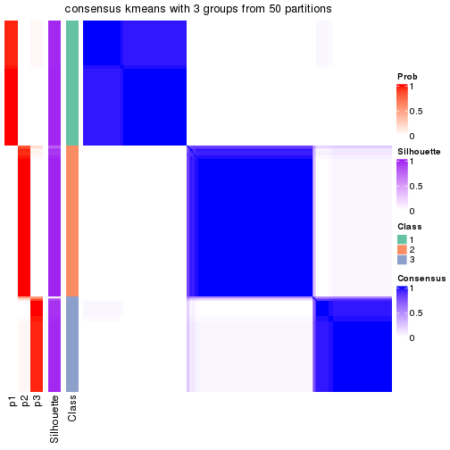</p>

</div>
<div id='tab-node-02-consensus-heatmap-3'>
<pre><code class="r">consensus_heatmap(res, k = 4)
</code></pre>

<p>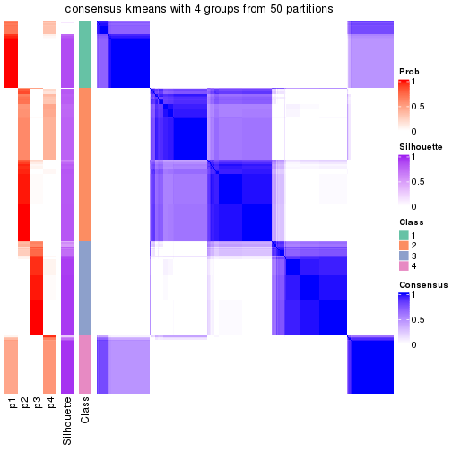</p>

</div>
<div id='tab-node-02-consensus-heatmap-4'>
<pre><code class="r">consensus_heatmap(res, k = 5)
</code></pre>

<p>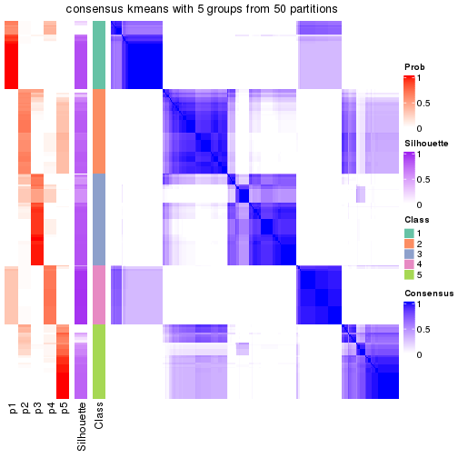</p>

</div>
<div id='tab-node-02-consensus-heatmap-5'>
<pre><code class="r">consensus_heatmap(res, k = 6)
</code></pre>

<p></p>

</div>
<div id='tab-node-02-consensus-heatmap-6'>
<pre><code class="r">consensus_heatmap(res, k = 7)
</code></pre>

<p>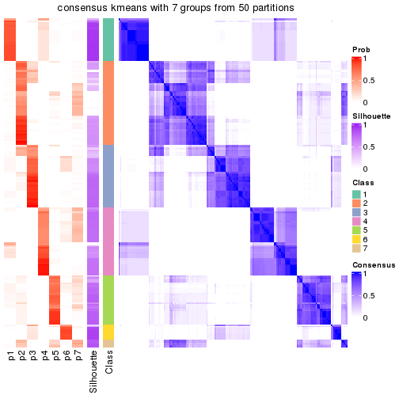</p>

</div>
<div id='tab-node-02-consensus-heatmap-7'>
<pre><code class="r">consensus_heatmap(res, k = 8)
</code></pre>

<p>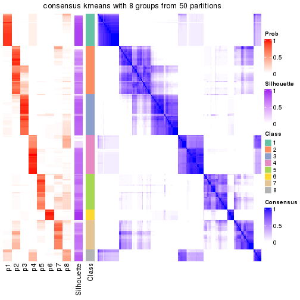</p>

</div>
</div>

Heatmaps for the membership of samples in all partitions to see how consistent they are:


<script>
$( function() {
	$( '#tabs-node-02-membership-heatmap' ).tabs();
} );
</script>
<div id='tabs-node-02-membership-heatmap'>
<ul>
<li><a href='#tab-node-02-membership-heatmap-1'>k = 2</a></li>
<li><a href='#tab-node-02-membership-heatmap-2'>k = 3</a></li>
<li><a href='#tab-node-02-membership-heatmap-3'>k = 4</a></li>
<li><a href='#tab-node-02-membership-heatmap-4'>k = 5</a></li>
<li><a href='#tab-node-02-membership-heatmap-5'>k = 6</a></li>
<li><a href='#tab-node-02-membership-heatmap-6'>k = 7</a></li>
<li><a href='#tab-node-02-membership-heatmap-7'>k = 8</a></li>
</ul>
<div id='tab-node-02-membership-heatmap-1'>
<pre><code class="r">membership_heatmap(res, k = 2)
</code></pre>

<p></p>

</div>
<div id='tab-node-02-membership-heatmap-2'>
<pre><code class="r">membership_heatmap(res, k = 3)
</code></pre>

<p>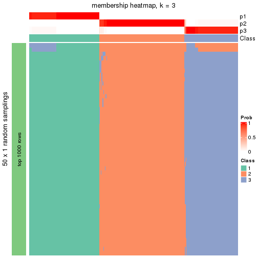</p>

</div>
<div id='tab-node-02-membership-heatmap-3'>
<pre><code class="r">membership_heatmap(res, k = 4)
</code></pre>

<p>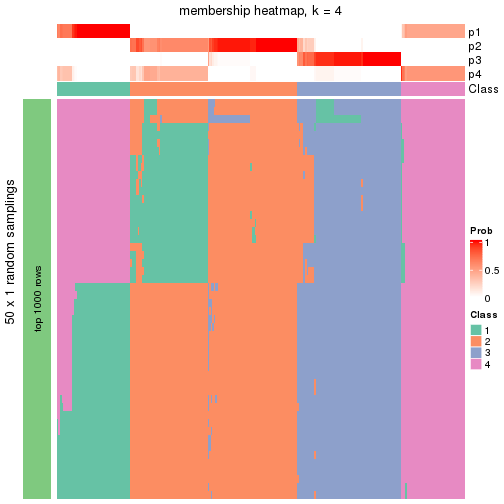</p>

</div>
<div id='tab-node-02-membership-heatmap-4'>
<pre><code class="r">membership_heatmap(res, k = 5)
</code></pre>

<p>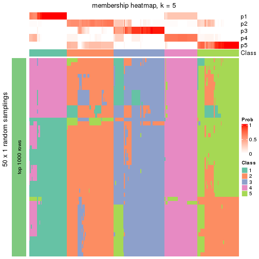</p>

</div>
<div id='tab-node-02-membership-heatmap-5'>
<pre><code class="r">membership_heatmap(res, k = 6)
</code></pre>

<p>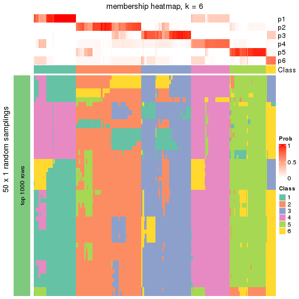</p>

</div>
<div id='tab-node-02-membership-heatmap-6'>
<pre><code class="r">membership_heatmap(res, k = 7)
</code></pre>

<p>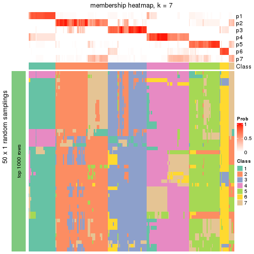</p>

</div>
<div id='tab-node-02-membership-heatmap-7'>
<pre><code class="r">membership_heatmap(res, k = 8)
</code></pre>

<p>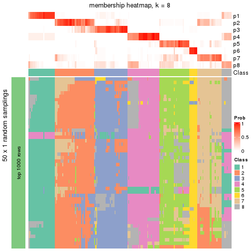</p>

</div>
</div>

As soon as the classes for columns are determined, the signatures
that are significantly different between subgroups can be looked for. 
Following are the heatmaps for signatures.


<script>
$( function() {
	$( '#tabs-node-02-get-signatures' ).tabs();
} );
</script>
<div id='tabs-node-02-get-signatures'>
<ul>
<li><a href='#tab-node-02-get-signatures-1'>k = 2</a></li>
<li><a href='#tab-node-02-get-signatures-2'>k = 3</a></li>
<li><a href='#tab-node-02-get-signatures-3'>k = 4</a></li>
<li><a href='#tab-node-02-get-signatures-4'>k = 5</a></li>
<li><a href='#tab-node-02-get-signatures-5'>k = 6</a></li>
<li><a href='#tab-node-02-get-signatures-6'>k = 7</a></li>
<li><a href='#tab-node-02-get-signatures-7'>k = 8</a></li>
</ul>
<div id='tab-node-02-get-signatures-1'>
<pre><code class="r">get_signatures(res, k = 2)
</code></pre>

<p>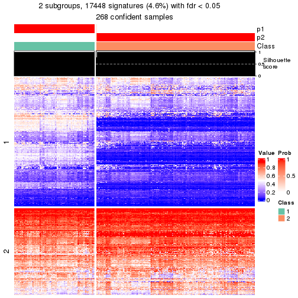</p>

</div>
<div id='tab-node-02-get-signatures-2'>
<pre><code class="r">get_signatures(res, k = 3)
</code></pre>

<p>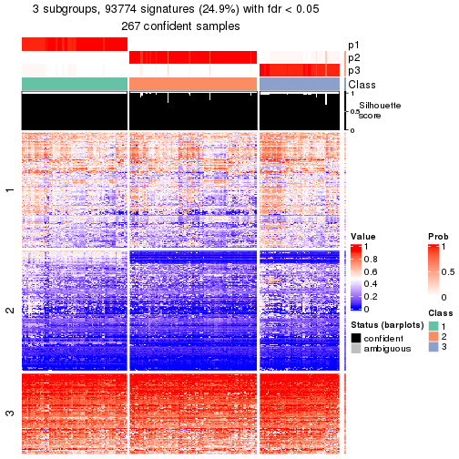</p>

</div>
<div id='tab-node-02-get-signatures-3'>
<pre><code class="r">get_signatures(res, k = 4)
</code></pre>

<p>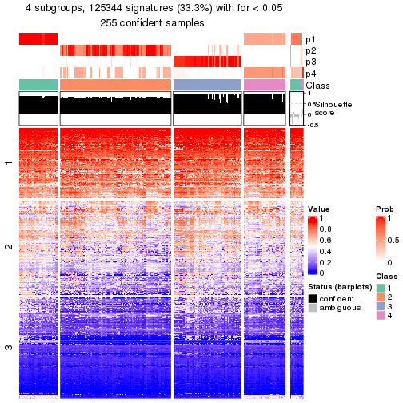</p>

</div>
<div id='tab-node-02-get-signatures-4'>
<pre><code class="r">get_signatures(res, k = 5)
</code></pre>

<p>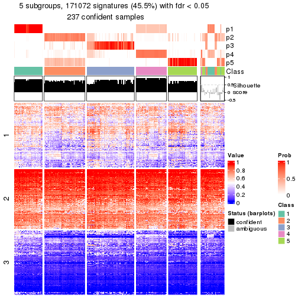</p>

</div>
<div id='tab-node-02-get-signatures-5'>
<pre><code class="r">get_signatures(res, k = 6)
</code></pre>

<p>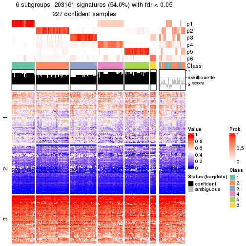</p>

</div>
<div id='tab-node-02-get-signatures-6'>
<pre><code class="r">get_signatures(res, k = 7)
</code></pre>

<p>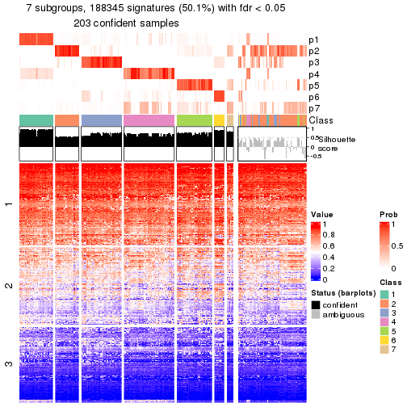</p>

</div>
<div id='tab-node-02-get-signatures-7'>
<pre><code class="r">get_signatures(res, k = 8)
</code></pre>

<p></p>

</div>
</div>


Compare the overlap of signatures from different k:

```r
compare_signatures(res)
```

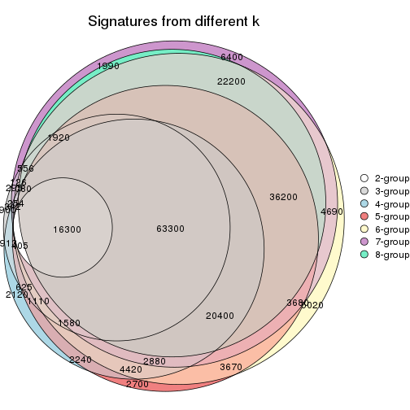

`get_signature()` returns a data frame invisibly. To get the list of signatures, the function
call should be assigned to a variable explicitly. In following code, if `plot` argument is set
to `FALSE`, no heatmap is plotted while only the differential analysis is performed.

```r
# code only for demonstration
tb = get_signature(res, k = ..., plot = FALSE)
```

An example of the output of `tb` is:

```
#>   which_row         fdr    mean_1    mean_2 scaled_mean_1 scaled_mean_2 km
#> 1        38 0.042760348  8.373488  9.131774    -0.5533452     0.5164555  1
#> 2        40 0.018707592  7.106213  8.469186    -0.6173731     0.5762149  1
#> 3        55 0.019134737 10.221463 11.207825    -0.6159697     0.5749050  1
#> 4        59 0.006059896  5.921854  7.869574    -0.6899429     0.6439467  1
#> 5        60 0.018055526  8.928898 10.211722    -0.6204761     0.5791110  1
#> 6        98 0.009384629 15.714769 14.887706     0.6635654    -0.6193277  2
...
```

The columns in `tb` are:

1. `which_row`: row indices corresponding to the input matrix.
2. `fdr`: FDR for the differential test. 
3. `mean_x`: The mean value in group x.
4. `scaled_mean_x`: The mean value in group x after rows are scaled.
5. `km`: Row groups if k-means clustering is applied to rows (which is done by automatically selecting number of clusters).

If there are too many signatures, `top_signatures = ...` can be set to only show the 
signatures with the highest FDRs:

```r
# code only for demonstration
# e.g. to show the top 500 most significant rows
tb = get_signature(res, k = ..., top_signatures = 500)
```

If the signatures are defined as these which are uniquely high in current group, `diff_method` argument
can be set to `"uniquely_high_in_one_group"`:

```r
# code only for demonstration
tb = get_signature(res, k = ..., diff_method = "uniquely_high_in_one_group")
```


UMAP plot which shows how samples are separated.


<script>
$( function() {
	$( '#tabs-node-02-dimension-reduction' ).tabs();
} );
</script>
<div id='tabs-node-02-dimension-reduction'>
<ul>
<li><a href='#tab-node-02-dimension-reduction-1'>k = 2</a></li>
<li><a href='#tab-node-02-dimension-reduction-2'>k = 3</a></li>
<li><a href='#tab-node-02-dimension-reduction-3'>k = 4</a></li>
<li><a href='#tab-node-02-dimension-reduction-4'>k = 5</a></li>
<li><a href='#tab-node-02-dimension-reduction-5'>k = 6</a></li>
<li><a href='#tab-node-02-dimension-reduction-6'>k = 7</a></li>
<li><a href='#tab-node-02-dimension-reduction-7'>k = 8</a></li>
</ul>
<div id='tab-node-02-dimension-reduction-1'>
<pre><code class="r">dimension_reduction(res, k = 2, method = &quot;UMAP&quot;)
</code></pre>

<p>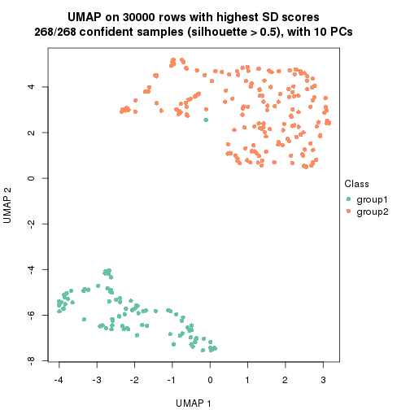</p>

</div>
<div id='tab-node-02-dimension-reduction-2'>
<pre><code class="r">dimension_reduction(res, k = 3, method = &quot;UMAP&quot;)
</code></pre>

<p>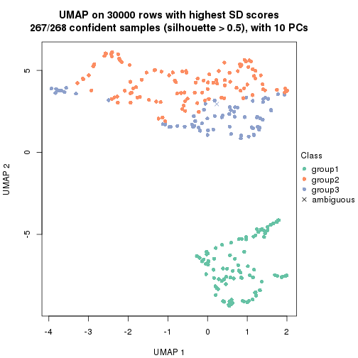</p>

</div>
<div id='tab-node-02-dimension-reduction-3'>
<pre><code class="r">dimension_reduction(res, k = 4, method = &quot;UMAP&quot;)
</code></pre>

<p>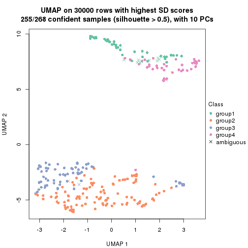</p>

</div>
<div id='tab-node-02-dimension-reduction-4'>
<pre><code class="r">dimension_reduction(res, k = 5, method = &quot;UMAP&quot;)
</code></pre>

<p>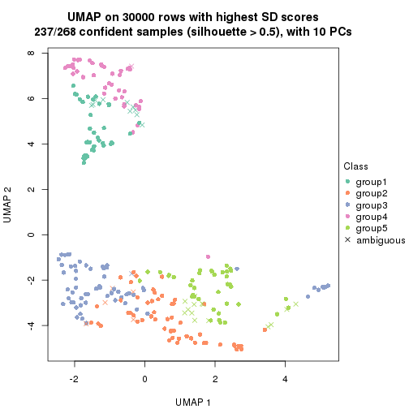</p>

</div>
<div id='tab-node-02-dimension-reduction-5'>
<pre><code class="r">dimension_reduction(res, k = 6, method = &quot;UMAP&quot;)
</code></pre>

<p>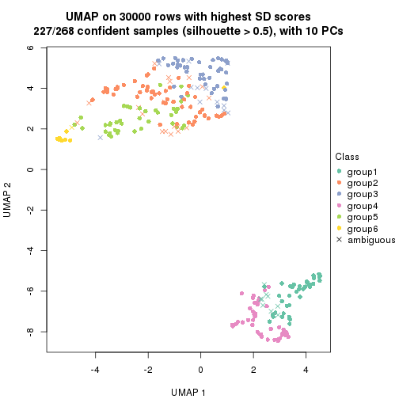</p>

</div>
<div id='tab-node-02-dimension-reduction-6'>
<pre><code class="r">dimension_reduction(res, k = 7, method = &quot;UMAP&quot;)
</code></pre>

<p>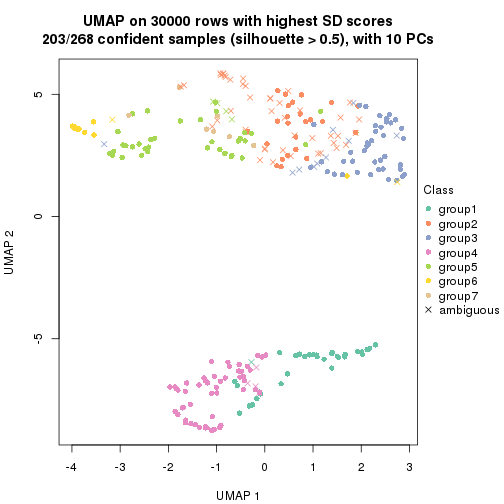</p>

</div>
<div id='tab-node-02-dimension-reduction-7'>
<pre><code class="r">dimension_reduction(res, k = 8, method = &quot;UMAP&quot;)
</code></pre>

<p>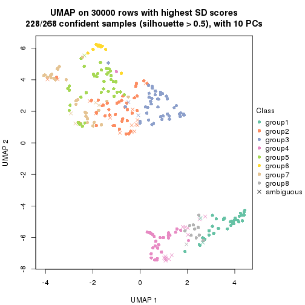</p>

</div>
</div>


Following heatmap shows how subgroups are split when increasing `k`:

```r
collect_classes(res)
```

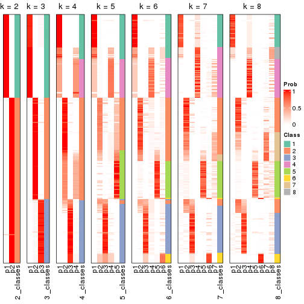


If matrix rows can be associated to genes, consider to use `functional_enrichment(res,
...)` to perform function enrichment for the signature genes. See [this vignette](https://jokergoo.github.io/cola_vignettes/functional_enrichment.html) for more detailed explanations.


 

---------------------------------------------------


### Node021


Parent node: [Node02](#Node02).
Child nodes: 
                Node0111-leaf
        ,
                Node0112-leaf
        ,
                Node0113-leaf
        ,
                [Node0121](#Node0121)
        ,
                [Node0122](#Node0122)
        ,
                [Node0211](#Node0211)
        ,
                [Node0212](#Node0212)
        ,
                [Node0213](#Node0213)
        ,
                [Node0221](#Node0221)
        ,
                [Node0222](#Node0222)
        ,
                [Node0223](#Node0223)
        ,
                [Node0224](#Node0224)
        ,
                Node0225-leaf
        ,
                Node0231-leaf
        ,
                [Node0232](#Node0232)
        ,
                Node0233-leaf
        ,
                Node0234-leaf
        ,
                Node0331-leaf
        ,
                Node0332-leaf
        ,
                Node0333-leaf
        ,
                Node0431-leaf
        ,
                Node0432-leaf
        ,
                Node0433-leaf
        ,
                [Node0511](#Node0511)
        ,
                [Node0512](#Node0512)
        ,
                Node0521-leaf
        ,
                [Node0522](#Node0522)
        ,
                Node0523-leaf
        ,
                Node0524-leaf
        .


The object with results only for a single top-value method and a single partitioning method 
can be extracted as:

```r
res = res_rh["021"]
```

A summary of `res` and all the functions that can be applied to it:

```r
res
```

```
#> A 'ConsensusPartition' object with k = 2, 3, 4, 5, 6, 7, 8.
#>   On a matrix with 30000 rows and 90 columns.
#>   Top rows (1000) are extracted by 'SD' method.
#>   Subgroups are detected by 'kmeans' method.
#>   Performed in total 350 partitions by row resampling.
#>   Best k for subgroups seems to be 3.
#> 
#> Following methods can be applied to this 'ConsensusPartition' object:
#>  [1] "cola_report"             "collect_classes"         "collect_plots"          
#>  [4] "collect_stats"           "colnames"                "compare_partitions"     
#>  [7] "compare_signatures"      "consensus_heatmap"       "dimension_reduction"    
#> [10] "functional_enrichment"   "get_anno_col"            "get_anno"               
#> [13] "get_classes"             "get_consensus"           "get_matrix"             
#> [16] "get_membership"          "get_param"               "get_signatures"         
#> [19] "get_stats"               "is_best_k"               "is_stable_k"            
#> [22] "membership_heatmap"      "ncol"                    "nrow"                   
#> [25] "plot_ecdf"               "predict_classes"         "rownames"               
#> [28] "select_partition_number" "show"                    "suggest_best_k"         
#> [31] "test_to_known_factors"   "top_rows_heatmap"
```

`collect_plots()` function collects all the plots made from `res` for all `k` (number of subgroups)
into one single page to provide an easy and fast comparison between different `k`.

```r
collect_plots(res)
```

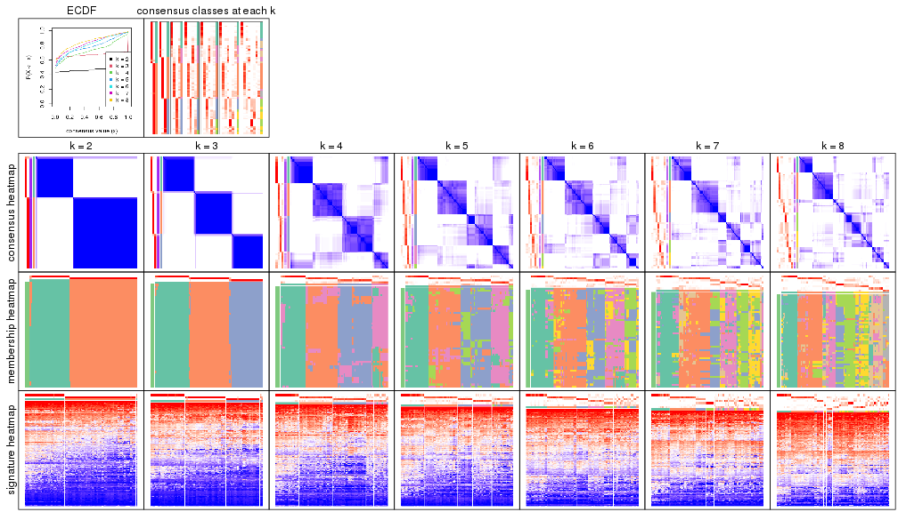

The plots are:

- The first row: a plot of the eCDF (empirical cumulative distribution
  function) curves of the consensus matrix for each `k` and the heatmap of
  predicted classes for each `k`.
- The second row: heatmaps of the consensus matrix for each `k`.
- The third row: heatmaps of the membership matrix for each `k`.
- The fouth row: heatmaps of the signatures for each `k`.

All the plots in panels can be made by individual functions and they are
plotted later in this section.

`select_partition_number()` produces several plots showing different
statistics for choosing "optimized" `k`. There are following statistics:

- eCDF curves of the consensus matrix for each `k`;
- 1-PAC. [The PAC score](https://en.wikipedia.org/wiki/Consensus_clustering#Over-interpretation_potential_of_consensus_clustering)
  measures the proportion of the ambiguous subgrouping.
- Mean silhouette score.
- Concordance. The mean probability of fiting the consensus subgroup labels in all
  partitions.
- Area increased. Denote $A_k$ as the area under the eCDF curve for current
  `k`, the area increased is defined as $A_k - A_{k-1}$.
- Rand index. The percent of pairs of samples that are both in a same cluster
  or both are not in a same cluster in the partition of k and k-1.
- Jaccard index. The ratio of pairs of samples are both in a same cluster in
  the partition of k and k-1 and the pairs of samples are both in a same
  cluster in the partition k or k-1.

The detailed explanations of these statistics can be found in [the _cola_
vignette](https://jokergoo.github.io/cola_vignettes/cola.html#toc_13).

Generally speaking, higher 1-PAC score, higher mean silhouette score or higher
concordance corresponds to better partition. Rand index and Jaccard index
measure how similar the current partition is compared to partition with `k-1`.
If they are too similar, we won't accept `k` is better than `k-1`.

```r
select_partition_number(res)
```

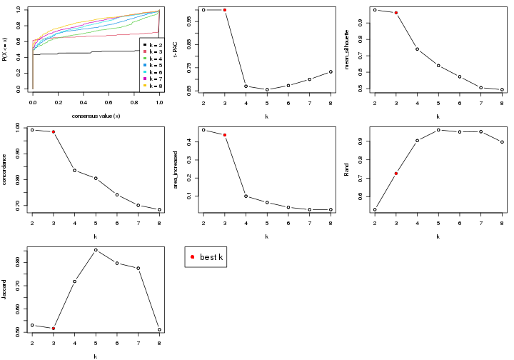

The numeric values for all these statistics can be obtained by `get_stats()`.

```r
get_stats(res)
```

```
#>   k 1-PAC mean_silhouette concordance area_increased  Rand Jaccard
#> 2 2 1.000           0.979       0.992         0.4663 0.530   0.530
#> 3 3 1.000           0.963       0.985         0.4385 0.726   0.517
#> 4 4 0.670           0.741       0.836         0.0993 0.904   0.718
#> 5 5 0.655           0.640       0.805         0.0643 0.961   0.854
#> 6 6 0.673           0.572       0.742         0.0375 0.951   0.797
#> 7 7 0.700           0.505       0.701         0.0246 0.952   0.775
#> 8 8 0.732           0.494       0.684         0.0246 0.896   0.511
```

`suggest_best_k()` suggests the best $k$ based on these statistics. The rules are as follows:

- All $k$ with Jaccard index larger than 0.95 are removed because increasing
  $k$ does not provide enough extra information. If all $k$ are removed, it is
  marked as no subgroup is detected.
- For all $k$ with 1-PAC score larger than 0.9, the maximal $k$ is taken as
  the best $k$, and other $k$ are marked as optional $k$.
- If it does not fit the second rule. The $k$ with the maximal vote of the
  highest 1-PAC score, highest mean silhouette, and highest concordance is
  taken as the best $k$.

```r
suggest_best_k(res)
```

```
#> [1] 3
#> attr(,"optional")
#> [1] 2
```

There is also optional best $k$ = 2 that is worth to check.

Following is the table of the partitions (You need to click the **show/hide
code output** link to see it). The membership matrix (columns with name `p*`)
is inferred by
[`clue::cl_consensus()`](https://www.rdocumentation.org/link/cl_consensus?package=clue)
function with the `SE` method. Basically the value in the membership matrix
represents the probability to belong to a certain group. The finall subgroup
label for an item is determined with the group with highest probability it
belongs to.

In `get_classes()` function, the entropy is calculated from the membership
matrix and the silhouette score is calculated from the consensus matrix.


<script>
$( function() {
	$( '#tabs-node-021-get-classes' ).tabs();
} );
</script>
<div id='tabs-node-021-get-classes'>
<ul>
<li><a href='#tab-node-021-get-classes-1'>k = 2</a></li>
<li><a href='#tab-node-021-get-classes-2'>k = 3</a></li>
<li><a href='#tab-node-021-get-classes-3'>k = 4</a></li>
<li><a href='#tab-node-021-get-classes-4'>k = 5</a></li>
<li><a href='#tab-node-021-get-classes-5'>k = 6</a></li>
<li><a href='#tab-node-021-get-classes-6'>k = 7</a></li>
<li><a href='#tab-node-021-get-classes-7'>k = 8</a></li>
</ul>

<div id='tab-node-021-get-classes-1'>
<p><a id='tab-node-021-get-classes-1-a' style='color:#0366d6' href='#'>show/hide code output</a></p>
<pre><code class="r">cbind(get_classes(res, k = 2), get_membership(res, k = 2))
</code></pre>

<pre><code>#&gt;                 class entropy silhouette   p1   p2
#&gt; TCGA.CQ.5327.01     1   0.000      0.979 1.00 0.00
#&gt; TCGA.CR.7391.01     2   0.000      0.999 0.00 1.00
#&gt; TCGA.CV.7416.01     2   0.000      0.999 0.00 1.00
#&gt; TCGA.H7.7774.01     1   0.000      0.979 1.00 0.00
#&gt; TCGA.CQ.5330.01     1   0.000      0.979 1.00 0.00
#&gt; TCGA.CV.7427.01     1   0.000      0.979 1.00 0.00
#&gt; TCGA.CV.7425.01     1   0.000      0.979 1.00 0.00
#&gt; TCGA.CV.7407.01     2   0.000      0.999 0.00 1.00
#&gt; TCGA.CV.6003.01     2   0.000      0.999 0.00 1.00
#&gt; TCGA.CN.6021.01     2   0.000      0.999 0.00 1.00
#&gt; TCGA.CV.5978.01     2   0.000      0.999 0.00 1.00
#&gt; TCGA.CN.6018.01     2   0.000      0.999 0.00 1.00
#&gt; TCGA.CV.5966.01     1   0.000      0.979 1.00 0.00
#&gt; TCGA.CV.7411.01     2   0.000      0.999 0.00 1.00
#&gt; TCGA.CQ.7068.01     1   0.000      0.979 1.00 0.00
#&gt; TCGA.CV.5973.01     2   0.000      0.999 0.00 1.00
#&gt; TCGA.CV.7104.01     2   0.000      0.999 0.00 1.00
#&gt; TCGA.CV.7095.01     1   0.000      0.979 1.00 0.00
#&gt; TCGA.CV.7178.01     2   0.000      0.999 0.00 1.00
#&gt; TCGA.CV.7252.01     1   0.000      0.979 1.00 0.00
#&gt; TCGA.CR.6478.01     2   0.000      0.999 0.00 1.00
#&gt; TCGA.CV.7102.01     2   0.000      0.999 0.00 1.00
#&gt; TCGA.CR.7394.01     2   0.000      0.999 0.00 1.00
#&gt; TCGA.CV.6955.01     2   0.000      0.999 0.00 1.00
#&gt; TCGA.BA.5556.01     1   0.000      0.979 1.00 0.00
#&gt; TCGA.BA.5557.01     2   0.000      0.999 0.00 1.00
#&gt; TCGA.D6.6515.01     2   0.000      0.999 0.00 1.00
#&gt; TCGA.CV.7238.01     2   0.000      0.999 0.00 1.00
#&gt; TCGA.CV.6942.01     1   0.000      0.979 1.00 0.00
#&gt; TCGA.CV.7177.01     2   0.000      0.999 0.00 1.00
#&gt; TCGA.CR.7395.01     1   0.000      0.979 1.00 0.00
#&gt; TCGA.CX.7085.01     2   0.000      0.999 0.00 1.00
#&gt; TCGA.CV.7099.01     1   0.000      0.979 1.00 0.00
#&gt; TCGA.CQ.6218.01     2   0.000      0.999 0.00 1.00
#&gt; TCGA.C9.A47Z.01     1   0.000      0.979 1.00 0.00
#&gt; TCGA.DQ.5625.01     2   0.000      0.999 0.00 1.00
#&gt; TCGA.C9.A480.01     2   0.000      0.999 0.00 1.00
#&gt; TCGA.CV.6952.01     1   0.000      0.979 1.00 0.00
#&gt; TCGA.CQ.5331.01     2   0.000      0.999 0.00 1.00
#&gt; TCGA.D6.6826.01     1   0.722      0.746 0.80 0.20
#&gt; TCGA.CV.6953.01     1   0.000      0.979 1.00 0.00
#&gt; TCGA.BA.6870.01     2   0.000      0.999 0.00 1.00
#&gt; TCGA.CR.6477.01     2   0.000      0.999 0.00 1.00
#&gt; TCGA.CQ.6219.01     2   0.000      0.999 0.00 1.00
#&gt; TCGA.CN.A498.01     2   0.000      0.999 0.00 1.00
#&gt; TCGA.CV.6953.11     2   0.000      0.999 0.00 1.00
#&gt; TCGA.HD.A4C1.01     1   0.000      0.979 1.00 0.00
#&gt; TCGA.CV.A45P.01     2   0.000      0.999 0.00 1.00
#&gt; TCGA.CV.A45Q.01     1   0.000      0.979 1.00 0.00
#&gt; TCGA.CV.A45T.01     2   0.000      0.999 0.00 1.00
#&gt; TCGA.CN.6996.01     2   0.000      0.999 0.00 1.00
#&gt; TCGA.DQ.5624.01     2   0.000      0.999 0.00 1.00
#&gt; TCGA.CN.A499.01     2   0.000      0.999 0.00 1.00
#&gt; TCGA.CV.6940.01     2   0.000      0.999 0.00 1.00
#&gt; TCGA.CQ.7064.01     2   0.000      0.999 0.00 1.00
#&gt; TCGA.IQ.A61K.01     2   0.327      0.935 0.06 0.94
#&gt; TCGA.BA.A6DF.01     1   0.000      0.979 1.00 0.00
#&gt; TCGA.BA.A6DB.01     2   0.000      0.999 0.00 1.00
#&gt; TCGA.IQ.A61L.01     2   0.000      0.999 0.00 1.00
#&gt; TCGA.HD.8635.01     2   0.000      0.999 0.00 1.00
#&gt; TCGA.MT.A67G.01     2   0.000      0.999 0.00 1.00
#&gt; TCGA.QK.A64Z.01     2   0.000      0.999 0.00 1.00
#&gt; TCGA.HD.8634.01     2   0.000      0.999 0.00 1.00
#&gt; TCGA.CQ.7063.01     1   0.000      0.979 1.00 0.00
#&gt; TCGA.F7.A50J.01     2   0.000      0.999 0.00 1.00
#&gt; TCGA.MT.A51W.01     2   0.000      0.999 0.00 1.00
#&gt; TCGA.CQ.7071.01     1   0.000      0.979 1.00 0.00
#&gt; TCGA.CV.A463.01     1   0.000      0.979 1.00 0.00
#&gt; TCGA.CN.5367.01     2   0.000      0.999 0.00 1.00
#&gt; TCGA.CN.A640.01     1   0.000      0.979 1.00 0.00
#&gt; TCGA.UF.A7JO.01     1   0.995      0.164 0.54 0.46
#&gt; TCGA.UF.A7JV.01     2   0.000      0.999 0.00 1.00
#&gt; TCGA.IQ.A6SG.01     2   0.000      0.999 0.00 1.00
#&gt; TCGA.MT.A67A.01     1   0.000      0.979 1.00 0.00
#&gt; TCGA.BB.A6UO.01     1   0.000      0.979 1.00 0.00
#&gt; TCGA.BB.7871.01     2   0.000      0.999 0.00 1.00
#&gt; TCGA.CN.4736.01     2   0.000      0.999 0.00 1.00
#&gt; TCGA.CN.5369.01     2   0.000      0.999 0.00 1.00
#&gt; TCGA.IQ.A61E.01     1   0.000      0.979 1.00 0.00
#&gt; TCGA.UF.A7JT.01     1   0.000      0.979 1.00 0.00
#&gt; TCGA.CN.5373.01     2   0.000      0.999 0.00 1.00
#&gt; TCGA.BB.7863.01     1   0.000      0.979 1.00 0.00
#&gt; TCGA.BA.4077.01     2   0.000      0.999 0.00 1.00
#&gt; TCGA.H7.A6C4.01     2   0.000      0.999 0.00 1.00
#&gt; TCGA.MT.A67F.01     1   0.000      0.979 1.00 0.00
#&gt; TCGA.T2.A6WX.01     1   0.000      0.979 1.00 0.00
#&gt; TCGA.CR.7383.01     2   0.000      0.999 0.00 1.00
#&gt; TCGA.CV.7438.01     2   0.000      0.999 0.00 1.00
#&gt; TCGA.CV.A6JD.01     1   0.000      0.979 1.00 0.00
#&gt; TCGA.P3.A6T5.01     2   0.000      0.999 0.00 1.00
</code></pre>

<script>
$('#tab-node-021-get-classes-1-a').parent().next().next().hide();
$('#tab-node-021-get-classes-1-a').click(function(){
  $('#tab-node-021-get-classes-1-a').parent().next().next().toggle();
  return(false);
});
</script>
</div>

<div id='tab-node-021-get-classes-2'>
<p><a id='tab-node-021-get-classes-2-a' style='color:#0366d6' href='#'>show/hide code output</a></p>
<pre><code class="r">cbind(get_classes(res, k = 3), get_membership(res, k = 3))
</code></pre>

<pre><code>#&gt;                 class entropy silhouette   p1   p2   p3
#&gt; TCGA.CQ.5327.01     1  0.0000      0.992 1.00 0.00 0.00
#&gt; TCGA.CR.7391.01     3  0.0000      0.977 0.00 0.00 1.00
#&gt; TCGA.CV.7416.01     2  0.0000      0.982 0.00 1.00 0.00
#&gt; TCGA.H7.7774.01     1  0.3340      0.866 0.88 0.12 0.00
#&gt; TCGA.CQ.5330.01     1  0.0000      0.992 1.00 0.00 0.00
#&gt; TCGA.CV.7427.01     1  0.0000      0.992 1.00 0.00 0.00
#&gt; TCGA.CV.7425.01     1  0.0000      0.992 1.00 0.00 0.00
#&gt; TCGA.CV.7407.01     3  0.0000      0.977 0.00 0.00 1.00
#&gt; TCGA.CV.6003.01     2  0.0000      0.982 0.00 1.00 0.00
#&gt; TCGA.CN.6021.01     3  0.0000      0.977 0.00 0.00 1.00
#&gt; TCGA.CV.5978.01     3  0.0000      0.977 0.00 0.00 1.00
#&gt; TCGA.CN.6018.01     2  0.0000      0.982 0.00 1.00 0.00
#&gt; TCGA.CV.5966.01     2  0.5835      0.477 0.34 0.66 0.00
#&gt; TCGA.CV.7411.01     2  0.0000      0.982 0.00 1.00 0.00
#&gt; TCGA.CQ.7068.01     1  0.0000      0.992 1.00 0.00 0.00
#&gt; TCGA.CV.5973.01     2  0.0000      0.982 0.00 1.00 0.00
#&gt; TCGA.CV.7104.01     2  0.0000      0.982 0.00 1.00 0.00
#&gt; TCGA.CV.7095.01     1  0.0000      0.992 1.00 0.00 0.00
#&gt; TCGA.CV.7178.01     3  0.0000      0.977 0.00 0.00 1.00
#&gt; TCGA.CV.7252.01     1  0.0000      0.992 1.00 0.00 0.00
#&gt; TCGA.CR.6478.01     3  0.0000      0.977 0.00 0.00 1.00
#&gt; TCGA.CV.7102.01     3  0.4002      0.801 0.00 0.16 0.84
#&gt; TCGA.CR.7394.01     2  0.0000      0.982 0.00 1.00 0.00
#&gt; TCGA.CV.6955.01     2  0.0000      0.982 0.00 1.00 0.00
#&gt; TCGA.BA.5556.01     1  0.0892      0.975 0.98 0.02 0.00
#&gt; TCGA.BA.5557.01     2  0.0000      0.982 0.00 1.00 0.00
#&gt; TCGA.D6.6515.01     3  0.0000      0.977 0.00 0.00 1.00
#&gt; TCGA.CV.7238.01     2  0.0000      0.982 0.00 1.00 0.00
#&gt; TCGA.CV.6942.01     1  0.0000      0.992 1.00 0.00 0.00
#&gt; TCGA.CV.7177.01     3  0.0000      0.977 0.00 0.00 1.00
#&gt; TCGA.CR.7395.01     1  0.0000      0.992 1.00 0.00 0.00
#&gt; TCGA.CX.7085.01     2  0.0000      0.982 0.00 1.00 0.00
#&gt; TCGA.CV.7099.01     1  0.0000      0.992 1.00 0.00 0.00
#&gt; TCGA.CQ.6218.01     3  0.0000      0.977 0.00 0.00 1.00
#&gt; TCGA.C9.A47Z.01     1  0.0000      0.992 1.00 0.00 0.00
#&gt; TCGA.DQ.5625.01     2  0.0000      0.982 0.00 1.00 0.00
#&gt; TCGA.C9.A480.01     2  0.0000      0.982 0.00 1.00 0.00
#&gt; TCGA.CV.6952.01     2  0.0000      0.982 0.00 1.00 0.00
#&gt; TCGA.CQ.5331.01     2  0.0000      0.982 0.00 1.00 0.00
#&gt; TCGA.D6.6826.01     2  0.0000      0.982 0.00 1.00 0.00
#&gt; TCGA.CV.6953.01     1  0.0000      0.992 1.00 0.00 0.00
#&gt; TCGA.BA.6870.01     3  0.0000      0.977 0.00 0.00 1.00
#&gt; TCGA.CR.6477.01     3  0.0000      0.977 0.00 0.00 1.00
#&gt; TCGA.CQ.6219.01     2  0.0000      0.982 0.00 1.00 0.00
#&gt; TCGA.CN.A498.01     3  0.0000      0.977 0.00 0.00 1.00
#&gt; TCGA.CV.6953.11     3  0.0000      0.977 0.00 0.00 1.00
#&gt; TCGA.HD.A4C1.01     1  0.0000      0.992 1.00 0.00 0.00
#&gt; TCGA.CV.A45P.01     2  0.0000      0.982 0.00 1.00 0.00
#&gt; TCGA.CV.A45Q.01     1  0.0000      0.992 1.00 0.00 0.00
#&gt; TCGA.CV.A45T.01     2  0.0000      0.982 0.00 1.00 0.00
#&gt; TCGA.CN.6996.01     2  0.0000      0.982 0.00 1.00 0.00
#&gt; TCGA.DQ.5624.01     3  0.0000      0.977 0.00 0.00 1.00
#&gt; TCGA.CN.A499.01     3  0.0000      0.977 0.00 0.00 1.00
#&gt; TCGA.CV.6940.01     3  0.0000      0.977 0.00 0.00 1.00
#&gt; TCGA.CQ.7064.01     2  0.0000      0.982 0.00 1.00 0.00
#&gt; TCGA.IQ.A61K.01     2  0.0000      0.982 0.00 1.00 0.00
#&gt; TCGA.BA.A6DF.01     1  0.0000      0.992 1.00 0.00 0.00
#&gt; TCGA.BA.A6DB.01     3  0.0000      0.977 0.00 0.00 1.00
#&gt; TCGA.IQ.A61L.01     2  0.0000      0.982 0.00 1.00 0.00
#&gt; TCGA.HD.8635.01     2  0.5016      0.669 0.00 0.76 0.24
#&gt; TCGA.MT.A67G.01     3  0.6192      0.271 0.00 0.42 0.58
#&gt; TCGA.QK.A64Z.01     2  0.0000      0.982 0.00 1.00 0.00
#&gt; TCGA.HD.8634.01     2  0.0000      0.982 0.00 1.00 0.00
#&gt; TCGA.CQ.7063.01     1  0.0000      0.992 1.00 0.00 0.00
#&gt; TCGA.F7.A50J.01     2  0.0000      0.982 0.00 1.00 0.00
#&gt; TCGA.MT.A51W.01     3  0.0000      0.977 0.00 0.00 1.00
#&gt; TCGA.CQ.7071.01     1  0.0000      0.992 1.00 0.00 0.00
#&gt; TCGA.CV.A463.01     1  0.0000      0.992 1.00 0.00 0.00
#&gt; TCGA.CN.5367.01     3  0.0000      0.977 0.00 0.00 1.00
#&gt; TCGA.CN.A640.01     2  0.0000      0.982 0.00 1.00 0.00
#&gt; TCGA.UF.A7JO.01     2  0.0000      0.982 0.00 1.00 0.00
#&gt; TCGA.UF.A7JV.01     2  0.0000      0.982 0.00 1.00 0.00
#&gt; TCGA.IQ.A6SG.01     3  0.0000      0.977 0.00 0.00 1.00
#&gt; TCGA.MT.A67A.01     1  0.0000      0.992 1.00 0.00 0.00
#&gt; TCGA.BB.A6UO.01     1  0.0000      0.992 1.00 0.00 0.00
#&gt; TCGA.BB.7871.01     3  0.0000      0.977 0.00 0.00 1.00
#&gt; TCGA.CN.4736.01     3  0.0000      0.977 0.00 0.00 1.00
#&gt; TCGA.CN.5369.01     3  0.0000      0.977 0.00 0.00 1.00
#&gt; TCGA.IQ.A61E.01     1  0.2066      0.936 0.94 0.06 0.00
#&gt; TCGA.UF.A7JT.01     1  0.0000      0.992 1.00 0.00 0.00
#&gt; TCGA.CN.5373.01     2  0.0000      0.982 0.00 1.00 0.00
#&gt; TCGA.BB.7863.01     1  0.0000      0.992 1.00 0.00 0.00
#&gt; TCGA.BA.4077.01     3  0.0000      0.977 0.00 0.00 1.00
#&gt; TCGA.H7.A6C4.01     2  0.0000      0.982 0.00 1.00 0.00
#&gt; TCGA.MT.A67F.01     1  0.0000      0.992 1.00 0.00 0.00
#&gt; TCGA.T2.A6WX.01     1  0.0000      0.992 1.00 0.00 0.00
#&gt; TCGA.CR.7383.01     3  0.0000      0.977 0.00 0.00 1.00
#&gt; TCGA.CV.7438.01     2  0.0000      0.982 0.00 1.00 0.00
#&gt; TCGA.CV.A6JD.01     1  0.0000      0.992 1.00 0.00 0.00
#&gt; TCGA.P3.A6T5.01     3  0.0000      0.977 0.00 0.00 1.00
</code></pre>

<script>
$('#tab-node-021-get-classes-2-a').parent().next().next().hide();
$('#tab-node-021-get-classes-2-a').click(function(){
  $('#tab-node-021-get-classes-2-a').parent().next().next().toggle();
  return(false);
});
</script>
</div>

<div id='tab-node-021-get-classes-3'>
<p><a id='tab-node-021-get-classes-3-a' style='color:#0366d6' href='#'>show/hide code output</a></p>
<pre><code class="r">cbind(get_classes(res, k = 4), get_membership(res, k = 4))
</code></pre>

<pre><code>#&gt;                 class entropy silhouette   p1   p2   p3   p4
#&gt; TCGA.CQ.5327.01     1  0.0000      0.910 1.00 0.00 0.00 0.00
#&gt; TCGA.CR.7391.01     3  0.2011      0.859 0.00 0.08 0.92 0.00
#&gt; TCGA.CV.7416.01     2  0.1637      0.841 0.00 0.94 0.00 0.06
#&gt; TCGA.H7.7774.01     4  0.5661      0.588 0.22 0.08 0.00 0.70
#&gt; TCGA.CQ.5330.01     4  0.5594      0.257 0.46 0.02 0.00 0.52
#&gt; TCGA.CV.7427.01     1  0.4994     -0.116 0.52 0.00 0.00 0.48
#&gt; TCGA.CV.7425.01     1  0.0000      0.910 1.00 0.00 0.00 0.00
#&gt; TCGA.CV.7407.01     3  0.2921      0.830 0.00 0.00 0.86 0.14
#&gt; TCGA.CV.6003.01     2  0.2011      0.780 0.00 0.92 0.08 0.00
#&gt; TCGA.CN.6021.01     3  0.2921      0.830 0.00 0.00 0.86 0.14
#&gt; TCGA.CV.5978.01     3  0.2921      0.830 0.00 0.00 0.86 0.14
#&gt; TCGA.CN.6018.01     2  0.3801      0.815 0.00 0.78 0.00 0.22
#&gt; TCGA.CV.5966.01     4  0.5291      0.583 0.08 0.18 0.00 0.74
#&gt; TCGA.CV.7411.01     2  0.1211      0.817 0.00 0.96 0.04 0.00
#&gt; TCGA.CQ.7068.01     1  0.0000      0.910 1.00 0.00 0.00 0.00
#&gt; TCGA.CV.5973.01     2  0.1637      0.841 0.00 0.94 0.00 0.06
#&gt; TCGA.CV.7104.01     2  0.4790      0.604 0.00 0.62 0.00 0.38
#&gt; TCGA.CV.7095.01     1  0.0707      0.896 0.98 0.00 0.00 0.02
#&gt; TCGA.CV.7178.01     3  0.3198      0.853 0.00 0.08 0.88 0.04
#&gt; TCGA.CV.7252.01     1  0.3801      0.670 0.78 0.00 0.00 0.22
#&gt; TCGA.CR.6478.01     3  0.3972      0.845 0.00 0.08 0.84 0.08
#&gt; TCGA.CV.7102.01     3  0.5767      0.695 0.00 0.06 0.66 0.28
#&gt; TCGA.CR.7394.01     2  0.3821      0.848 0.00 0.84 0.04 0.12
#&gt; TCGA.CV.6955.01     4  0.3801      0.520 0.00 0.22 0.00 0.78
#&gt; TCGA.BA.5556.01     4  0.5962      0.571 0.26 0.08 0.00 0.66
#&gt; TCGA.BA.5557.01     2  0.3821      0.848 0.00 0.84 0.04 0.12
#&gt; TCGA.D6.6515.01     3  0.2011      0.859 0.00 0.08 0.92 0.00
#&gt; TCGA.CV.7238.01     2  0.4088      0.843 0.00 0.82 0.04 0.14
#&gt; TCGA.CV.6942.01     1  0.0000      0.910 1.00 0.00 0.00 0.00
#&gt; TCGA.CV.7177.01     3  0.3610      0.818 0.00 0.00 0.80 0.20
#&gt; TCGA.CR.7395.01     4  0.4994      0.108 0.48 0.00 0.00 0.52
#&gt; TCGA.CX.7085.01     2  0.2647      0.858 0.00 0.88 0.00 0.12
#&gt; TCGA.CV.7099.01     1  0.0000      0.910 1.00 0.00 0.00 0.00
#&gt; TCGA.CQ.6218.01     3  0.3972      0.845 0.00 0.08 0.84 0.08
#&gt; TCGA.C9.A47Z.01     1  0.0707      0.896 0.98 0.00 0.00 0.02
#&gt; TCGA.DQ.5625.01     2  0.4406      0.743 0.00 0.70 0.00 0.30
#&gt; TCGA.C9.A480.01     2  0.2011      0.865 0.00 0.92 0.00 0.08
#&gt; TCGA.CV.6952.01     4  0.4134      0.471 0.00 0.26 0.00 0.74
#&gt; TCGA.CQ.5331.01     2  0.3606      0.850 0.00 0.84 0.02 0.14
#&gt; TCGA.D6.6826.01     4  0.3610      0.533 0.00 0.20 0.00 0.80
#&gt; TCGA.CV.6953.01     1  0.0000      0.910 1.00 0.00 0.00 0.00
#&gt; TCGA.BA.6870.01     3  0.2921      0.830 0.00 0.00 0.86 0.14
#&gt; TCGA.CR.6477.01     3  0.0707      0.860 0.00 0.02 0.98 0.00
#&gt; TCGA.CQ.6219.01     2  0.4088      0.843 0.00 0.82 0.04 0.14
#&gt; TCGA.CN.A498.01     3  0.3975      0.795 0.00 0.00 0.76 0.24
#&gt; TCGA.CV.6953.11     3  0.2011      0.859 0.00 0.08 0.92 0.00
#&gt; TCGA.HD.A4C1.01     1  0.0000      0.910 1.00 0.00 0.00 0.00
#&gt; TCGA.CV.A45P.01     2  0.2011      0.849 0.00 0.92 0.00 0.08
#&gt; TCGA.CV.A45Q.01     1  0.0000      0.910 1.00 0.00 0.00 0.00
#&gt; TCGA.CV.A45T.01     2  0.3821      0.848 0.00 0.84 0.04 0.12
#&gt; TCGA.CN.6996.01     2  0.3610      0.831 0.00 0.80 0.00 0.20
#&gt; TCGA.DQ.5624.01     3  0.2011      0.859 0.00 0.08 0.92 0.00
#&gt; TCGA.CN.A499.01     3  0.3400      0.826 0.00 0.00 0.82 0.18
#&gt; TCGA.CV.6940.01     3  0.5383      0.791 0.00 0.16 0.74 0.10
#&gt; TCGA.CQ.7064.01     2  0.1211      0.817 0.00 0.96 0.04 0.00
#&gt; TCGA.IQ.A61K.01     2  0.2011      0.831 0.00 0.92 0.00 0.08
#&gt; TCGA.BA.A6DF.01     1  0.0000      0.910 1.00 0.00 0.00 0.00
#&gt; TCGA.BA.A6DB.01     3  0.2011      0.859 0.00 0.08 0.92 0.00
#&gt; TCGA.IQ.A61L.01     2  0.1211      0.844 0.00 0.96 0.00 0.04
#&gt; TCGA.HD.8635.01     4  0.5606     -0.476 0.00 0.02 0.48 0.50
#&gt; TCGA.MT.A67G.01     3  0.6074      0.609 0.00 0.06 0.60 0.34
#&gt; TCGA.QK.A64Z.01     2  0.2921      0.853 0.00 0.86 0.00 0.14
#&gt; TCGA.HD.8634.01     2  0.3801      0.815 0.00 0.78 0.00 0.22
#&gt; TCGA.CQ.7063.01     1  0.0000      0.910 1.00 0.00 0.00 0.00
#&gt; TCGA.F7.A50J.01     2  0.2706      0.762 0.00 0.90 0.08 0.02
#&gt; TCGA.MT.A51W.01     3  0.1637      0.860 0.00 0.06 0.94 0.00
#&gt; TCGA.CQ.7071.01     1  0.0000      0.910 1.00 0.00 0.00 0.00
#&gt; TCGA.CV.A463.01     1  0.0000      0.910 1.00 0.00 0.00 0.00
#&gt; TCGA.CN.5367.01     3  0.3972      0.845 0.00 0.08 0.84 0.08
#&gt; TCGA.CN.A640.01     4  0.4713      0.285 0.00 0.36 0.00 0.64
#&gt; TCGA.UF.A7JO.01     4  0.3801      0.520 0.00 0.22 0.00 0.78
#&gt; TCGA.UF.A7JV.01     2  0.2921      0.851 0.00 0.86 0.00 0.14
#&gt; TCGA.IQ.A6SG.01     3  0.2921      0.830 0.00 0.00 0.86 0.14
#&gt; TCGA.MT.A67A.01     1  0.0707      0.896 0.98 0.00 0.00 0.02
#&gt; TCGA.BB.A6UO.01     1  0.0000      0.910 1.00 0.00 0.00 0.00
#&gt; TCGA.BB.7871.01     3  0.2921      0.830 0.00 0.00 0.86 0.14
#&gt; TCGA.CN.4736.01     3  0.2011      0.859 0.00 0.08 0.92 0.00
#&gt; TCGA.CN.5369.01     3  0.2706      0.854 0.00 0.08 0.90 0.02
#&gt; TCGA.IQ.A61E.01     4  0.6510      0.425 0.38 0.08 0.00 0.54
#&gt; TCGA.UF.A7JT.01     1  0.0707      0.896 0.98 0.00 0.00 0.02
#&gt; TCGA.CN.5373.01     2  0.2345      0.824 0.00 0.90 0.00 0.10
#&gt; TCGA.BB.7863.01     1  0.3801      0.670 0.78 0.00 0.00 0.22
#&gt; TCGA.BA.4077.01     3  0.2345      0.840 0.00 0.00 0.90 0.10
#&gt; TCGA.H7.A6C4.01     2  0.3801      0.815 0.00 0.78 0.00 0.22
#&gt; TCGA.MT.A67F.01     1  0.4855      0.181 0.60 0.00 0.00 0.40
#&gt; TCGA.T2.A6WX.01     4  0.5606      0.196 0.48 0.02 0.00 0.50
#&gt; TCGA.CR.7383.01     3  0.3821      0.852 0.00 0.04 0.84 0.12
#&gt; TCGA.CV.7438.01     2  0.1637      0.841 0.00 0.94 0.00 0.06
#&gt; TCGA.CV.A6JD.01     4  0.6299      0.360 0.42 0.06 0.00 0.52
#&gt; TCGA.P3.A6T5.01     3  0.5957      0.412 0.00 0.42 0.54 0.04
</code></pre>

<script>
$('#tab-node-021-get-classes-3-a').parent().next().next().hide();
$('#tab-node-021-get-classes-3-a').click(function(){
  $('#tab-node-021-get-classes-3-a').parent().next().next().toggle();
  return(false);
});
</script>
</div>

<div id='tab-node-021-get-classes-4'>
<p><a id='tab-node-021-get-classes-4-a' style='color:#0366d6' href='#'>show/hide code output</a></p>
<pre><code class="r">cbind(get_classes(res, k = 5), get_membership(res, k = 5))
</code></pre>

<pre><code>#&gt;                 class entropy silhouette   p1   p2   p3   p4   p5
#&gt; TCGA.CQ.5327.01     1  0.2020    0.87677 0.90 0.00 0.00 0.10 0.00
#&gt; TCGA.CR.7391.01     3  0.1732    0.57467 0.00 0.08 0.92 0.00 0.00
#&gt; TCGA.CV.7416.01     2  0.4728    0.70239 0.00 0.70 0.00 0.06 0.24
#&gt; TCGA.H7.7774.01     4  0.3110    0.81917 0.08 0.00 0.00 0.86 0.06
#&gt; TCGA.CQ.5330.01     4  0.3106    0.81949 0.14 0.00 0.00 0.84 0.02
#&gt; TCGA.CV.7427.01     4  0.2732    0.81013 0.16 0.00 0.00 0.84 0.00
#&gt; TCGA.CV.7425.01     1  0.0000    0.91909 1.00 0.00 0.00 0.00 0.00
#&gt; TCGA.CV.7407.01     3  0.4287   -0.17222 0.00 0.00 0.54 0.00 0.46
#&gt; TCGA.CV.6003.01     2  0.3109    0.73006 0.00 0.80 0.00 0.00 0.20
#&gt; TCGA.CN.6021.01     3  0.4287   -0.17222 0.00 0.00 0.54 0.00 0.46
#&gt; TCGA.CV.5978.01     3  0.4287   -0.17222 0.00 0.00 0.54 0.00 0.46
#&gt; TCGA.CN.6018.01     2  0.3561    0.75788 0.00 0.74 0.00 0.26 0.00
#&gt; TCGA.CV.5966.01     4  0.1043    0.79516 0.00 0.00 0.00 0.96 0.04
#&gt; TCGA.CV.7411.01     2  0.2610    0.80427 0.00 0.90 0.02 0.02 0.06
#&gt; TCGA.CQ.7068.01     1  0.0000    0.91909 1.00 0.00 0.00 0.00 0.00
#&gt; TCGA.CV.5973.01     2  0.4263    0.74159 0.00 0.76 0.00 0.06 0.18
#&gt; TCGA.CV.7104.01     2  0.5156    0.63660 0.00 0.62 0.00 0.32 0.06
#&gt; TCGA.CV.7095.01     1  0.3291    0.83721 0.84 0.00 0.00 0.12 0.04
#&gt; TCGA.CV.7178.01     3  0.2331    0.53861 0.00 0.02 0.90 0.00 0.08
#&gt; TCGA.CV.7252.01     1  0.5068    0.54207 0.64 0.00 0.00 0.30 0.06
#&gt; TCGA.CR.6478.01     3  0.3390    0.51627 0.00 0.06 0.84 0.00 0.10
#&gt; TCGA.CV.7102.01     3  0.6880    0.13042 0.00 0.08 0.56 0.10 0.26
#&gt; TCGA.CR.7394.01     2  0.4389    0.78796 0.00 0.80 0.10 0.06 0.04
#&gt; TCGA.CV.6955.01     4  0.3106    0.74095 0.00 0.02 0.00 0.84 0.14
#&gt; TCGA.BA.5556.01     4  0.2012    0.82405 0.06 0.00 0.00 0.92 0.02
#&gt; TCGA.BA.5557.01     2  0.3977    0.79129 0.00 0.82 0.10 0.06 0.02
#&gt; TCGA.D6.6515.01     3  0.2873    0.54978 0.00 0.12 0.86 0.00 0.02
#&gt; TCGA.CV.7238.01     2  0.4690    0.78730 0.00 0.78 0.10 0.08 0.04
#&gt; TCGA.CV.6942.01     1  0.0000    0.91909 1.00 0.00 0.00 0.00 0.00
#&gt; TCGA.CV.7177.01     5  0.4227    0.28316 0.00 0.00 0.42 0.00 0.58
#&gt; TCGA.CR.7395.01     4  0.3513    0.78633 0.18 0.00 0.00 0.80 0.02
#&gt; TCGA.CX.7085.01     2  0.4281    0.78900 0.00 0.80 0.10 0.08 0.02
#&gt; TCGA.CV.7099.01     1  0.1043    0.90808 0.96 0.00 0.00 0.04 0.00
#&gt; TCGA.CQ.6218.01     3  0.3731    0.47989 0.00 0.04 0.80 0.00 0.16
#&gt; TCGA.C9.A47Z.01     1  0.2438    0.87526 0.90 0.00 0.00 0.04 0.06
#&gt; TCGA.DQ.5625.01     2  0.4748    0.70868 0.00 0.66 0.00 0.30 0.04
#&gt; TCGA.C9.A480.01     2  0.2927    0.81492 0.00 0.88 0.02 0.08 0.02
#&gt; TCGA.CV.6952.01     4  0.1216    0.78996 0.00 0.02 0.00 0.96 0.02
#&gt; TCGA.CQ.5331.01     2  0.4690    0.78730 0.00 0.78 0.10 0.08 0.04
#&gt; TCGA.D6.6826.01     4  0.2873    0.75750 0.00 0.02 0.00 0.86 0.12
#&gt; TCGA.CV.6953.01     1  0.0000    0.91909 1.00 0.00 0.00 0.00 0.00
#&gt; TCGA.BA.6870.01     3  0.4287   -0.17222 0.00 0.00 0.54 0.00 0.46
#&gt; TCGA.CR.6477.01     3  0.2020    0.50445 0.00 0.00 0.90 0.00 0.10
#&gt; TCGA.CQ.6219.01     2  0.4690    0.78730 0.00 0.78 0.10 0.08 0.04
#&gt; TCGA.CN.A498.01     5  0.5304    0.40029 0.00 0.02 0.42 0.02 0.54
#&gt; TCGA.CV.6953.11     3  0.1732    0.57467 0.00 0.08 0.92 0.00 0.00
#&gt; TCGA.HD.A4C1.01     1  0.0000    0.91909 1.00 0.00 0.00 0.00 0.00
#&gt; TCGA.CV.A45P.01     2  0.1410    0.82060 0.00 0.94 0.00 0.06 0.00
#&gt; TCGA.CV.A45Q.01     1  0.0000    0.91909 1.00 0.00 0.00 0.00 0.00
#&gt; TCGA.CV.A45T.01     2  0.4690    0.78730 0.00 0.78 0.10 0.08 0.04
#&gt; TCGA.CN.6996.01     2  0.2732    0.81215 0.00 0.84 0.00 0.16 0.00
#&gt; TCGA.DQ.5624.01     3  0.1732    0.57467 0.00 0.08 0.92 0.00 0.00
#&gt; TCGA.CN.A499.01     3  0.4126    0.00915 0.00 0.00 0.62 0.00 0.38
#&gt; TCGA.CV.6940.01     3  0.5972    0.20620 0.00 0.14 0.56 0.00 0.30
#&gt; TCGA.CQ.7064.01     2  0.1820    0.81194 0.00 0.94 0.02 0.02 0.02
#&gt; TCGA.IQ.A61K.01     2  0.4982    0.70838 0.00 0.70 0.00 0.10 0.20
#&gt; TCGA.BA.A6DF.01     1  0.0609    0.91474 0.98 0.00 0.00 0.02 0.00
#&gt; TCGA.BA.A6DB.01     3  0.1732    0.57467 0.00 0.08 0.92 0.00 0.00
#&gt; TCGA.IQ.A61L.01     2  0.2438    0.80021 0.00 0.90 0.00 0.06 0.04
#&gt; TCGA.HD.8635.01     5  0.6311    0.41424 0.00 0.04 0.10 0.26 0.60
#&gt; TCGA.MT.A67G.01     5  0.6520    0.49804 0.00 0.12 0.26 0.04 0.58
#&gt; TCGA.QK.A64Z.01     2  0.2516    0.81053 0.00 0.86 0.00 0.14 0.00
#&gt; TCGA.HD.8634.01     2  0.3895    0.70504 0.00 0.68 0.00 0.32 0.00
#&gt; TCGA.CQ.7063.01     1  0.3291    0.83721 0.84 0.00 0.00 0.12 0.04
#&gt; TCGA.F7.A50J.01     2  0.3106    0.76101 0.00 0.84 0.02 0.00 0.14
#&gt; TCGA.MT.A51W.01     3  0.1648    0.55002 0.00 0.02 0.94 0.00 0.04
#&gt; TCGA.CQ.7071.01     1  0.0000    0.91909 1.00 0.00 0.00 0.00 0.00
#&gt; TCGA.CV.A463.01     1  0.0000    0.91909 1.00 0.00 0.00 0.00 0.00
#&gt; TCGA.CN.5367.01     3  0.3390    0.51627 0.00 0.06 0.84 0.00 0.10
#&gt; TCGA.CN.A640.01     4  0.2616    0.74456 0.00 0.10 0.00 0.88 0.02
#&gt; TCGA.UF.A7JO.01     4  0.2873    0.75750 0.00 0.02 0.00 0.86 0.12
#&gt; TCGA.UF.A7JV.01     2  0.4008    0.79710 0.00 0.82 0.08 0.08 0.02
#&gt; TCGA.IQ.A6SG.01     3  0.4287   -0.17222 0.00 0.00 0.54 0.00 0.46
#&gt; TCGA.MT.A67A.01     1  0.0609    0.91105 0.98 0.00 0.00 0.00 0.02
#&gt; TCGA.BB.A6UO.01     1  0.0000    0.91909 1.00 0.00 0.00 0.00 0.00
#&gt; TCGA.BB.7871.01     3  0.4287   -0.17222 0.00 0.00 0.54 0.00 0.46
#&gt; TCGA.CN.4736.01     3  0.1732    0.57467 0.00 0.08 0.92 0.00 0.00
#&gt; TCGA.CN.5369.01     3  0.3106    0.53913 0.00 0.14 0.84 0.00 0.02
#&gt; TCGA.IQ.A61E.01     4  0.2873    0.82629 0.12 0.00 0.00 0.86 0.02
#&gt; TCGA.UF.A7JT.01     1  0.2020    0.87640 0.90 0.00 0.00 0.10 0.00
#&gt; TCGA.CN.5373.01     2  0.4170    0.75089 0.00 0.78 0.00 0.08 0.14
#&gt; TCGA.BB.7863.01     1  0.5068    0.54207 0.64 0.00 0.00 0.30 0.06
#&gt; TCGA.BA.4077.01     3  0.2929    0.35041 0.00 0.00 0.82 0.00 0.18
#&gt; TCGA.H7.A6C4.01     2  0.3561    0.75788 0.00 0.74 0.00 0.26 0.00
#&gt; TCGA.MT.A67F.01     4  0.3983    0.52053 0.34 0.00 0.00 0.66 0.00
#&gt; TCGA.T2.A6WX.01     4  0.4096    0.75994 0.20 0.00 0.00 0.76 0.04
#&gt; TCGA.CR.7383.01     3  0.3999    0.38688 0.00 0.02 0.74 0.00 0.24
#&gt; TCGA.CV.7438.01     2  0.2438    0.80021 0.00 0.90 0.00 0.06 0.04
#&gt; TCGA.CV.A6JD.01     4  0.3731    0.80360 0.16 0.00 0.00 0.80 0.04
#&gt; TCGA.P3.A6T5.01     3  0.6398    0.20314 0.00 0.30 0.50 0.00 0.20
</code></pre>

<script>
$('#tab-node-021-get-classes-4-a').parent().next().next().hide();
$('#tab-node-021-get-classes-4-a').click(function(){
  $('#tab-node-021-get-classes-4-a').parent().next().next().toggle();
  return(false);
});
</script>
</div>

<div id='tab-node-021-get-classes-5'>
<p><a id='tab-node-021-get-classes-5-a' style='color:#0366d6' href='#'>show/hide code output</a></p>
<pre><code class="r">cbind(get_classes(res, k = 6), get_membership(res, k = 6))
</code></pre>

<pre><code>#&gt;                 class entropy silhouette   p1   p2   p3   p4   p5   p6
#&gt; TCGA.CQ.5327.01     1  0.4983     0.6759 0.68 0.00 0.00 0.04 0.06 0.22
#&gt; TCGA.CR.7391.01     3  0.1556     0.6629 0.00 0.00 0.92 0.00 0.08 0.00
#&gt; TCGA.CV.7416.01     2  0.4873     0.3807 0.00 0.52 0.00 0.06 0.00 0.42
#&gt; TCGA.H7.7774.01     4  0.2725     0.5664 0.00 0.06 0.00 0.88 0.04 0.02
#&gt; TCGA.CQ.5330.01     4  0.7394     0.5697 0.18 0.08 0.00 0.48 0.04 0.22
#&gt; TCGA.CV.7427.01     4  0.5955     0.5859 0.16 0.00 0.00 0.62 0.08 0.14
#&gt; TCGA.CV.7425.01     1  0.0000     0.8351 1.00 0.00 0.00 0.00 0.00 0.00
#&gt; TCGA.CV.7407.01     5  0.3499     0.7315 0.00 0.00 0.32 0.00 0.68 0.00
#&gt; TCGA.CV.6003.01     2  0.6564     0.3223 0.00 0.42 0.14 0.06 0.00 0.38
#&gt; TCGA.CN.6021.01     5  0.3499     0.7315 0.00 0.00 0.32 0.00 0.68 0.00
#&gt; TCGA.CV.5978.01     5  0.3499     0.7315 0.00 0.00 0.32 0.00 0.68 0.00
#&gt; TCGA.CN.6018.01     2  0.2190     0.7001 0.00 0.90 0.00 0.06 0.00 0.04
#&gt; TCGA.CV.5966.01     4  0.1267     0.5924 0.00 0.06 0.00 0.94 0.00 0.00
#&gt; TCGA.CV.7411.01     2  0.4200     0.6888 0.00 0.74 0.14 0.00 0.00 0.12
#&gt; TCGA.CQ.7068.01     1  0.0000     0.8351 1.00 0.00 0.00 0.00 0.00 0.00
#&gt; TCGA.CV.5973.01     2  0.4078     0.5193 0.00 0.64 0.00 0.00 0.02 0.34
#&gt; TCGA.CV.7104.01     2  0.4675     0.4660 0.00 0.66 0.00 0.28 0.02 0.04
#&gt; TCGA.CV.7095.01     1  0.5740     0.5991 0.62 0.00 0.00 0.10 0.06 0.22
#&gt; TCGA.CV.7178.01     3  0.4475     0.3248 0.00 0.00 0.70 0.00 0.10 0.20
#&gt; TCGA.CV.7252.01     1  0.6516     0.3674 0.52 0.00 0.00 0.26 0.08 0.14
#&gt; TCGA.CR.6478.01     3  0.4536     0.3102 0.00 0.00 0.70 0.00 0.12 0.18
#&gt; TCGA.CV.7102.01     6  0.8463     0.5099 0.00 0.06 0.24 0.20 0.20 0.30
#&gt; TCGA.CR.7394.01     2  0.3409     0.6635 0.00 0.70 0.30 0.00 0.00 0.00
#&gt; TCGA.CV.6955.01     4  0.3942     0.5061 0.00 0.10 0.00 0.80 0.04 0.06
#&gt; TCGA.BA.5556.01     4  0.7166     0.6293 0.10 0.10 0.00 0.54 0.06 0.20
#&gt; TCGA.BA.5557.01     2  0.3409     0.6635 0.00 0.70 0.30 0.00 0.00 0.00
#&gt; TCGA.D6.6515.01     3  0.0000     0.6211 0.00 0.00 1.00 0.00 0.00 0.00
#&gt; TCGA.CV.7238.01     2  0.3409     0.6635 0.00 0.70 0.30 0.00 0.00 0.00
#&gt; TCGA.CV.6942.01     1  0.0000     0.8351 1.00 0.00 0.00 0.00 0.00 0.00
#&gt; TCGA.CV.7177.01     5  0.2631     0.6091 0.00 0.00 0.18 0.00 0.82 0.00
#&gt; TCGA.CR.7395.01     4  0.6321     0.5628 0.16 0.00 0.00 0.58 0.10 0.16
#&gt; TCGA.CX.7085.01     2  0.3309     0.6740 0.00 0.72 0.28 0.00 0.00 0.00
#&gt; TCGA.CV.7099.01     1  0.3997     0.7584 0.78 0.00 0.00 0.02 0.06 0.14
#&gt; TCGA.CQ.6218.01     3  0.4989     0.2036 0.00 0.00 0.64 0.00 0.14 0.22
#&gt; TCGA.C9.A47Z.01     1  0.2794     0.7863 0.86 0.00 0.00 0.00 0.06 0.08
#&gt; TCGA.DQ.5625.01     2  0.3821     0.5437 0.00 0.74 0.00 0.22 0.00 0.04
#&gt; TCGA.C9.A480.01     2  0.1814     0.7254 0.00 0.90 0.10 0.00 0.00 0.00
#&gt; TCGA.CV.6952.01     4  0.3787     0.5892 0.00 0.12 0.00 0.78 0.00 0.10
#&gt; TCGA.CQ.5331.01     2  0.3409     0.6635 0.00 0.70 0.30 0.00 0.00 0.00
#&gt; TCGA.D6.6826.01     4  0.3382     0.5487 0.00 0.08 0.00 0.84 0.04 0.04
#&gt; TCGA.CV.6953.01     1  0.0000     0.8351 1.00 0.00 0.00 0.00 0.00 0.00
#&gt; TCGA.BA.6870.01     5  0.3499     0.7315 0.00 0.00 0.32 0.00 0.68 0.00
#&gt; TCGA.CR.6477.01     3  0.2454     0.5689 0.00 0.00 0.84 0.00 0.16 0.00
#&gt; TCGA.CQ.6219.01     2  0.3409     0.6635 0.00 0.70 0.30 0.00 0.00 0.00
#&gt; TCGA.CN.A498.01     5  0.6097     0.0482 0.00 0.00 0.14 0.08 0.60 0.18
#&gt; TCGA.CV.6953.11     3  0.1556     0.6629 0.00 0.00 0.92 0.00 0.08 0.00
#&gt; TCGA.HD.A4C1.01     1  0.0000     0.8351 1.00 0.00 0.00 0.00 0.00 0.00
#&gt; TCGA.CV.A45P.01     2  0.0937     0.7178 0.00 0.96 0.00 0.00 0.00 0.04
#&gt; TCGA.CV.A45Q.01     1  0.0000     0.8351 1.00 0.00 0.00 0.00 0.00 0.00
#&gt; TCGA.CV.A45T.01     2  0.3409     0.6635 0.00 0.70 0.30 0.00 0.00 0.00
#&gt; TCGA.CN.6996.01     2  0.1480     0.7103 0.00 0.94 0.00 0.02 0.00 0.04
#&gt; TCGA.DQ.5624.01     3  0.1556     0.6629 0.00 0.00 0.92 0.00 0.08 0.00
#&gt; TCGA.CN.A499.01     5  0.5692     0.0879 0.00 0.00 0.32 0.00 0.50 0.18
#&gt; TCGA.CV.6940.01     6  0.7197     0.4608 0.00 0.10 0.26 0.00 0.24 0.40
#&gt; TCGA.CQ.7064.01     2  0.3163     0.7141 0.00 0.82 0.14 0.00 0.00 0.04
#&gt; TCGA.IQ.A61K.01     2  0.4420     0.5369 0.00 0.66 0.00 0.02 0.02 0.30
#&gt; TCGA.BA.A6DF.01     1  0.1807     0.8214 0.92 0.00 0.00 0.00 0.02 0.06
#&gt; TCGA.BA.A6DB.01     3  0.1556     0.6629 0.00 0.00 0.92 0.00 0.08 0.00
#&gt; TCGA.IQ.A61L.01     2  0.1267     0.7185 0.00 0.94 0.00 0.00 0.00 0.06
#&gt; TCGA.HD.8635.01     4  0.6677    -0.2248 0.00 0.02 0.06 0.48 0.34 0.10
#&gt; TCGA.MT.A67G.01     5  0.6869    -0.1205 0.00 0.08 0.08 0.08 0.58 0.18
#&gt; TCGA.QK.A64Z.01     2  0.0547     0.7204 0.00 0.98 0.00 0.00 0.00 0.02
#&gt; TCGA.HD.8634.01     2  0.3163     0.6653 0.00 0.82 0.00 0.14 0.00 0.04
#&gt; TCGA.CQ.7063.01     1  0.5523     0.6252 0.64 0.00 0.00 0.08 0.06 0.22
#&gt; TCGA.F7.A50J.01     2  0.4863     0.6382 0.00 0.66 0.14 0.00 0.00 0.20
#&gt; TCGA.MT.A51W.01     3  0.1556     0.6629 0.00 0.00 0.92 0.00 0.08 0.00
#&gt; TCGA.CQ.7071.01     1  0.0937     0.8327 0.96 0.00 0.00 0.00 0.00 0.04
#&gt; TCGA.CV.A463.01     1  0.0000     0.8351 1.00 0.00 0.00 0.00 0.00 0.00
#&gt; TCGA.CN.5367.01     3  0.4810     0.2417 0.00 0.00 0.66 0.00 0.12 0.22
#&gt; TCGA.CN.A640.01     4  0.5523     0.4004 0.00 0.36 0.00 0.50 0.00 0.14
#&gt; TCGA.UF.A7JO.01     4  0.3007     0.5571 0.00 0.08 0.00 0.86 0.04 0.02
#&gt; TCGA.UF.A7JV.01     2  0.4326     0.6646 0.00 0.68 0.28 0.02 0.00 0.02
#&gt; TCGA.IQ.A6SG.01     5  0.3499     0.7315 0.00 0.00 0.32 0.00 0.68 0.00
#&gt; TCGA.MT.A67A.01     1  0.1092     0.8142 0.96 0.00 0.00 0.00 0.02 0.02
#&gt; TCGA.BB.A6UO.01     1  0.1480     0.8238 0.94 0.00 0.00 0.00 0.04 0.02
#&gt; TCGA.BB.7871.01     5  0.3499     0.7315 0.00 0.00 0.32 0.00 0.68 0.00
#&gt; TCGA.CN.4736.01     3  0.1267     0.6551 0.00 0.00 0.94 0.00 0.06 0.00
#&gt; TCGA.CN.5369.01     3  0.0547     0.6008 0.00 0.02 0.98 0.00 0.00 0.00
#&gt; TCGA.IQ.A61E.01     4  0.7564     0.6182 0.10 0.12 0.00 0.50 0.08 0.20
#&gt; TCGA.UF.A7JT.01     1  0.4430     0.7457 0.76 0.00 0.00 0.04 0.08 0.12
#&gt; TCGA.CN.5373.01     2  0.3711     0.5793 0.00 0.72 0.00 0.00 0.02 0.26
#&gt; TCGA.BB.7863.01     1  0.6516     0.3674 0.52 0.00 0.00 0.26 0.08 0.14
#&gt; TCGA.BA.4077.01     3  0.5569    -0.1690 0.00 0.00 0.52 0.00 0.32 0.16
#&gt; TCGA.H7.A6C4.01     2  0.2474     0.6921 0.00 0.88 0.00 0.08 0.00 0.04
#&gt; TCGA.MT.A67F.01     4  0.6771     0.4407 0.26 0.00 0.00 0.48 0.08 0.18
#&gt; TCGA.T2.A6WX.01     4  0.7432     0.5415 0.18 0.06 0.00 0.48 0.06 0.22
#&gt; TCGA.CR.7383.01     3  0.5841    -0.1651 0.00 0.00 0.48 0.00 0.30 0.22
#&gt; TCGA.CV.7438.01     2  0.0937     0.7178 0.00 0.96 0.00 0.00 0.00 0.04
#&gt; TCGA.CV.A6JD.01     4  0.7314     0.5663 0.16 0.06 0.00 0.50 0.06 0.22
#&gt; TCGA.P3.A6T5.01     3  0.6071    -0.1618 0.00 0.12 0.52 0.00 0.04 0.32
</code></pre>

<script>
$('#tab-node-021-get-classes-5-a').parent().next().next().hide();
$('#tab-node-021-get-classes-5-a').click(function(){
  $('#tab-node-021-get-classes-5-a').parent().next().next().toggle();
  return(false);
});
</script>
</div>

<div id='tab-node-021-get-classes-6'>
<p><a id='tab-node-021-get-classes-6-a' style='color:#0366d6' href='#'>show/hide code output</a></p>
<pre><code class="r">cbind(get_classes(res, k = 7), get_membership(res, k = 7))
</code></pre>

<pre><code>#&gt;                 class entropy silhouette   p1   p2   p3   p4   p5   p6   p7
#&gt; TCGA.CQ.5327.01     1   0.391     0.5158 0.58 0.00 0.00 0.02 0.00 0.00 0.40
#&gt; TCGA.CR.7391.01     3   0.421     0.8840 0.00 0.04 0.56 0.00 0.40 0.00 0.00
#&gt; TCGA.CV.7416.01     7   0.731    -0.3311 0.00 0.28 0.14 0.02 0.00 0.28 0.28
#&gt; TCGA.H7.7774.01     4   0.186     0.4372 0.02 0.00 0.00 0.92 0.00 0.02 0.04
#&gt; TCGA.CQ.5330.01     4   0.660     0.2072 0.06 0.02 0.10 0.44 0.00 0.02 0.36
#&gt; TCGA.CV.7427.01     4   0.499     0.1633 0.08 0.00 0.02 0.56 0.00 0.00 0.34
#&gt; TCGA.CV.7425.01     1   0.000     0.7765 1.00 0.00 0.00 0.00 0.00 0.00 0.00
#&gt; TCGA.CV.7407.01     5   0.000     0.7179 0.00 0.00 0.00 0.00 1.00 0.00 0.00
#&gt; TCGA.CV.6003.01     2   0.716     0.0921 0.00 0.34 0.12 0.02 0.00 0.30 0.22
#&gt; TCGA.CN.6021.01     5   0.000     0.7179 0.00 0.00 0.00 0.00 1.00 0.00 0.00
#&gt; TCGA.CV.5978.01     5   0.000     0.7179 0.00 0.00 0.00 0.00 1.00 0.00 0.00
#&gt; TCGA.CN.6018.01     2   0.388     0.6832 0.00 0.78 0.04 0.02 0.00 0.02 0.14
#&gt; TCGA.CV.5966.01     4   0.420     0.4297 0.00 0.02 0.04 0.74 0.00 0.02 0.18
#&gt; TCGA.CV.7411.01     2   0.339     0.6695 0.00 0.78 0.02 0.02 0.00 0.18 0.00
#&gt; TCGA.CQ.7068.01     1   0.000     0.7765 1.00 0.00 0.00 0.00 0.00 0.00 0.00
#&gt; TCGA.CV.5973.01     2   0.684     0.1301 0.00 0.32 0.12 0.00 0.00 0.28 0.28
#&gt; TCGA.CV.7104.01     2   0.510     0.4061 0.00 0.52 0.02 0.40 0.00 0.04 0.02
#&gt; TCGA.CV.7095.01     1   0.428     0.3981 0.50 0.00 0.00 0.04 0.00 0.00 0.46
#&gt; TCGA.CV.7178.01     6   0.534     0.2833 0.00 0.00 0.32 0.00 0.20 0.48 0.00
#&gt; TCGA.CV.7252.01     1   0.682     0.2440 0.40 0.00 0.18 0.18 0.00 0.00 0.24
#&gt; TCGA.CR.6478.01     6   0.642     0.2682 0.00 0.08 0.30 0.00 0.20 0.42 0.00
#&gt; TCGA.CV.7102.01     6   0.470     0.4439 0.00 0.04 0.04 0.30 0.00 0.62 0.00
#&gt; TCGA.CR.7394.01     2   0.189     0.7265 0.00 0.88 0.12 0.00 0.00 0.00 0.00
#&gt; TCGA.CV.6955.01     4   0.202     0.4135 0.00 0.06 0.00 0.90 0.00 0.04 0.00
#&gt; TCGA.BA.5556.01     4   0.494     0.0621 0.06 0.00 0.02 0.46 0.00 0.00 0.46
#&gt; TCGA.BA.5557.01     2   0.189     0.7265 0.00 0.88 0.12 0.00 0.00 0.00 0.00
#&gt; TCGA.D6.6515.01     3   0.474     0.8139 0.00 0.10 0.56 0.00 0.34 0.00 0.00
#&gt; TCGA.CV.7238.01     2   0.238     0.7248 0.00 0.86 0.12 0.00 0.00 0.00 0.02
#&gt; TCGA.CV.6942.01     1   0.000     0.7765 1.00 0.00 0.00 0.00 0.00 0.00 0.00
#&gt; TCGA.CV.7177.01     5   0.323     0.4709 0.00 0.00 0.02 0.02 0.80 0.16 0.00
#&gt; TCGA.CR.7395.01     4   0.640     0.1727 0.08 0.00 0.18 0.38 0.00 0.00 0.36
#&gt; TCGA.CX.7085.01     2   0.238     0.7248 0.00 0.86 0.12 0.00 0.00 0.00 0.02
#&gt; TCGA.CV.7099.01     1   0.361     0.6379 0.68 0.00 0.00 0.02 0.00 0.00 0.30
#&gt; TCGA.CQ.6218.01     6   0.509     0.5150 0.00 0.02 0.20 0.00 0.16 0.62 0.00
#&gt; TCGA.C9.A47Z.01     1   0.418     0.6099 0.70 0.00 0.18 0.00 0.00 0.00 0.12
#&gt; TCGA.DQ.5625.01     2   0.407     0.5549 0.00 0.66 0.00 0.30 0.00 0.02 0.02
#&gt; TCGA.C9.A480.01     2   0.101     0.7409 0.00 0.96 0.02 0.00 0.00 0.00 0.02
#&gt; TCGA.CV.6952.01     4   0.554     0.4061 0.00 0.06 0.08 0.62 0.00 0.02 0.22
#&gt; TCGA.CQ.5331.01     2   0.238     0.7248 0.00 0.86 0.12 0.00 0.00 0.00 0.02
#&gt; TCGA.D6.6826.01     4   0.200     0.4175 0.00 0.02 0.02 0.92 0.00 0.02 0.02
#&gt; TCGA.CV.6953.01     1   0.000     0.7765 1.00 0.00 0.00 0.00 0.00 0.00 0.00
#&gt; TCGA.BA.6870.01     5   0.000     0.7179 0.00 0.00 0.00 0.00 1.00 0.00 0.00
#&gt; TCGA.CR.6477.01     5   0.352    -0.5672 0.00 0.00 0.44 0.00 0.56 0.00 0.00
#&gt; TCGA.CQ.6219.01     2   0.238     0.7248 0.00 0.86 0.12 0.00 0.00 0.00 0.02
#&gt; TCGA.CN.A498.01     6   0.713     0.1810 0.00 0.04 0.06 0.14 0.36 0.38 0.02
#&gt; TCGA.CV.6953.11     3   0.421     0.8840 0.00 0.04 0.56 0.00 0.40 0.00 0.00
#&gt; TCGA.HD.A4C1.01     1   0.000     0.7765 1.00 0.00 0.00 0.00 0.00 0.00 0.00
#&gt; TCGA.CV.A45P.01     2   0.143     0.7333 0.00 0.92 0.00 0.00 0.00 0.00 0.08
#&gt; TCGA.CV.A45Q.01     1   0.000     0.7765 1.00 0.00 0.00 0.00 0.00 0.00 0.00
#&gt; TCGA.CV.A45T.01     2   0.238     0.7248 0.00 0.86 0.12 0.00 0.00 0.00 0.02
#&gt; TCGA.CN.6996.01     2   0.265     0.7224 0.00 0.86 0.02 0.00 0.00 0.02 0.10
#&gt; TCGA.DQ.5624.01     3   0.439     0.8606 0.00 0.02 0.54 0.00 0.42 0.02 0.00
#&gt; TCGA.CN.A499.01     5   0.606    -0.1622 0.00 0.02 0.16 0.00 0.44 0.36 0.02
#&gt; TCGA.CV.6940.01     6   0.300     0.4746 0.00 0.04 0.02 0.00 0.10 0.84 0.00
#&gt; TCGA.CQ.7064.01     2   0.216     0.7344 0.00 0.90 0.02 0.00 0.00 0.06 0.02
#&gt; TCGA.IQ.A61K.01     2   0.684     0.1205 0.00 0.32 0.12 0.00 0.00 0.26 0.30
#&gt; TCGA.BA.A6DF.01     1   0.166     0.7621 0.92 0.00 0.00 0.02 0.00 0.00 0.06
#&gt; TCGA.BA.A6DB.01     3   0.394     0.8725 0.00 0.02 0.56 0.00 0.42 0.00 0.00
#&gt; TCGA.IQ.A61L.01     2   0.354     0.7001 0.00 0.80 0.02 0.00 0.00 0.08 0.10
#&gt; TCGA.HD.8635.01     4   0.658     0.0461 0.00 0.02 0.02 0.56 0.16 0.14 0.10
#&gt; TCGA.MT.A67G.01     6   0.771     0.2616 0.00 0.12 0.06 0.14 0.28 0.38 0.02
#&gt; TCGA.QK.A64Z.01     2   0.251     0.7268 0.00 0.88 0.02 0.00 0.00 0.04 0.06
#&gt; TCGA.HD.8634.01     2   0.477     0.6234 0.00 0.72 0.04 0.10 0.00 0.02 0.12
#&gt; TCGA.CQ.7063.01     1   0.427     0.4295 0.52 0.00 0.00 0.04 0.00 0.00 0.44
#&gt; TCGA.F7.A50J.01     2   0.457     0.6309 0.00 0.70 0.04 0.00 0.00 0.18 0.08
#&gt; TCGA.MT.A51W.01     3   0.397     0.8420 0.00 0.02 0.54 0.00 0.44 0.00 0.00
#&gt; TCGA.CQ.7071.01     1   0.208     0.7460 0.86 0.00 0.00 0.00 0.00 0.00 0.14
#&gt; TCGA.CV.A463.01     1   0.000     0.7765 1.00 0.00 0.00 0.00 0.00 0.00 0.00
#&gt; TCGA.CN.5367.01     6   0.550     0.4547 0.00 0.02 0.26 0.00 0.18 0.54 0.00
#&gt; TCGA.CN.A640.01     4   0.701     0.2277 0.00 0.22 0.12 0.42 0.00 0.02 0.22
#&gt; TCGA.UF.A7JO.01     4   0.136     0.4333 0.00 0.04 0.00 0.94 0.00 0.02 0.00
#&gt; TCGA.UF.A7JV.01     2   0.265     0.7261 0.00 0.86 0.10 0.00 0.00 0.02 0.02
#&gt; TCGA.IQ.A6SG.01     5   0.000     0.7179 0.00 0.00 0.00 0.00 1.00 0.00 0.00
#&gt; TCGA.MT.A67A.01     1   0.101     0.7590 0.96 0.00 0.02 0.00 0.00 0.00 0.02
#&gt; TCGA.BB.A6UO.01     1   0.117     0.7681 0.94 0.00 0.00 0.00 0.00 0.00 0.06
#&gt; TCGA.BB.7871.01     5   0.000     0.7179 0.00 0.00 0.00 0.00 1.00 0.00 0.00
#&gt; TCGA.CN.4736.01     3   0.466     0.8772 0.00 0.04 0.54 0.00 0.40 0.02 0.00
#&gt; TCGA.CN.5369.01     3   0.542     0.6341 0.00 0.18 0.56 0.00 0.24 0.02 0.00
#&gt; TCGA.IQ.A61E.01     4   0.652     0.2359 0.04 0.02 0.12 0.44 0.00 0.02 0.36
#&gt; TCGA.UF.A7JT.01     1   0.352     0.6514 0.70 0.00 0.00 0.02 0.00 0.00 0.28
#&gt; TCGA.CN.5373.01     2   0.591     0.3859 0.00 0.48 0.04 0.00 0.00 0.30 0.18
#&gt; TCGA.BB.7863.01     1   0.682     0.2440 0.40 0.00 0.18 0.18 0.00 0.00 0.24
#&gt; TCGA.BA.4077.01     5   0.532     0.1442 0.00 0.00 0.22 0.00 0.58 0.18 0.02
#&gt; TCGA.H7.A6C4.01     2   0.388     0.6832 0.00 0.78 0.04 0.02 0.00 0.02 0.14
#&gt; TCGA.MT.A67F.01     4   0.651    -0.0532 0.22 0.00 0.08 0.38 0.00 0.00 0.32
#&gt; TCGA.T2.A6WX.01     7   0.495    -0.1596 0.12 0.00 0.00 0.36 0.00 0.00 0.52
#&gt; TCGA.CR.7383.01     6   0.568     0.4765 0.00 0.04 0.16 0.00 0.26 0.54 0.00
#&gt; TCGA.CV.7438.01     2   0.238     0.7199 0.00 0.86 0.02 0.00 0.00 0.00 0.12
#&gt; TCGA.CV.A6JD.01     7   0.487    -0.2125 0.10 0.00 0.00 0.42 0.00 0.00 0.48
#&gt; TCGA.P3.A6T5.01     6   0.615     0.3147 0.00 0.16 0.20 0.00 0.04 0.56 0.04
</code></pre>

<script>
$('#tab-node-021-get-classes-6-a').parent().next().next().hide();
$('#tab-node-021-get-classes-6-a').click(function(){
  $('#tab-node-021-get-classes-6-a').parent().next().next().toggle();
  return(false);
});
</script>
</div>

<div id='tab-node-021-get-classes-7'>
<p><a id='tab-node-021-get-classes-7-a' style='color:#0366d6' href='#'>show/hide code output</a></p>
<pre><code class="r">cbind(get_classes(res, k = 8), get_membership(res, k = 8))
</code></pre>

<pre><code>#&gt;                 class entropy silhouette   p1   p2   p3   p4   p5   p6   p7   p8
#&gt; TCGA.CQ.5327.01     7  0.3272     0.1535 0.42 0.00 0.00 0.00 0.00 0.00 0.58 0.00
#&gt; TCGA.CR.7391.01     5  0.6199     0.2982 0.00 0.08 0.30 0.00 0.32 0.30 0.00 0.00
#&gt; TCGA.CV.7416.01     8  0.3078     0.7126 0.00 0.10 0.06 0.02 0.00 0.00 0.00 0.82
#&gt; TCGA.H7.7774.01     4  0.1765     0.6702 0.00 0.00 0.00 0.88 0.00 0.00 0.12 0.00
#&gt; TCGA.CQ.5330.01     7  0.5289     0.1879 0.00 0.00 0.16 0.20 0.00 0.00 0.58 0.06
#&gt; TCGA.CV.7427.01     7  0.4804    -0.0687 0.00 0.00 0.14 0.40 0.00 0.00 0.46 0.00
#&gt; TCGA.CV.7425.01     1  0.0000     0.8684 1.00 0.00 0.00 0.00 0.00 0.00 0.00 0.00
#&gt; TCGA.CV.7407.01     5  0.0471     0.4459 0.00 0.00 0.00 0.00 0.98 0.02 0.00 0.00
#&gt; TCGA.CV.6003.01     8  0.3444     0.7435 0.00 0.14 0.06 0.02 0.00 0.00 0.00 0.78
#&gt; TCGA.CN.6021.01     5  0.0000     0.4642 0.00 0.00 0.00 0.00 1.00 0.00 0.00 0.00
#&gt; TCGA.CV.5978.01     5  0.0000     0.4642 0.00 0.00 0.00 0.00 1.00 0.00 0.00 0.00
#&gt; TCGA.CN.6018.01     2  0.3847     0.6548 0.00 0.78 0.02 0.10 0.00 0.00 0.06 0.04
#&gt; TCGA.CV.5966.01     4  0.4885     0.4014 0.00 0.00 0.10 0.60 0.00 0.00 0.26 0.04
#&gt; TCGA.CV.7411.01     2  0.4262     0.6281 0.00 0.74 0.02 0.08 0.00 0.04 0.00 0.12
#&gt; TCGA.CQ.7068.01     1  0.0000     0.8684 1.00 0.00 0.00 0.00 0.00 0.00 0.00 0.00
#&gt; TCGA.CV.5973.01     8  0.4280     0.7903 0.00 0.24 0.02 0.02 0.00 0.04 0.00 0.68
#&gt; TCGA.CV.7104.01     4  0.4308     0.3168 0.00 0.32 0.02 0.62 0.00 0.00 0.02 0.02
#&gt; TCGA.CV.7095.01     7  0.2406     0.3524 0.20 0.00 0.00 0.00 0.00 0.00 0.80 0.00
#&gt; TCGA.CV.7178.01     6  0.2862     0.4261 0.00 0.00 0.10 0.00 0.08 0.82 0.00 0.00
#&gt; TCGA.CV.7252.01     3  0.6375     0.6586 0.24 0.00 0.46 0.12 0.00 0.00 0.16 0.02
#&gt; TCGA.CR.6478.01     6  0.3421     0.4286 0.00 0.04 0.08 0.00 0.08 0.80 0.00 0.00
#&gt; TCGA.CV.7102.01     6  0.4174     0.4052 0.00 0.02 0.00 0.22 0.02 0.70 0.00 0.04
#&gt; TCGA.CR.7394.01     2  0.2165     0.7706 0.00 0.88 0.06 0.00 0.00 0.06 0.00 0.00
#&gt; TCGA.CV.6955.01     4  0.1804     0.6860 0.00 0.02 0.00 0.90 0.00 0.00 0.08 0.00
#&gt; TCGA.BA.5556.01     7  0.3002     0.3899 0.00 0.00 0.02 0.12 0.00 0.00 0.82 0.04
#&gt; TCGA.BA.5557.01     2  0.2165     0.7706 0.00 0.88 0.06 0.00 0.00 0.06 0.00 0.00
#&gt; TCGA.D6.6515.01     6  0.6398    -0.2902 0.00 0.12 0.30 0.00 0.26 0.32 0.00 0.00
#&gt; TCGA.CV.7238.01     2  0.2407     0.7715 0.00 0.86 0.08 0.00 0.00 0.06 0.00 0.00
#&gt; TCGA.CV.6942.01     1  0.0000     0.8684 1.00 0.00 0.00 0.00 0.00 0.00 0.00 0.00
#&gt; TCGA.CV.7177.01     5  0.3528     0.1374 0.00 0.00 0.08 0.00 0.74 0.18 0.00 0.00
#&gt; TCGA.CR.7395.01     3  0.5683     0.2020 0.00 0.00 0.42 0.20 0.00 0.00 0.34 0.04
#&gt; TCGA.CX.7085.01     2  0.1887     0.7748 0.00 0.90 0.04 0.00 0.00 0.06 0.00 0.00
#&gt; TCGA.CV.7099.01     7  0.3299     0.0167 0.44 0.00 0.00 0.00 0.00 0.00 0.56 0.00
#&gt; TCGA.CQ.6218.01     6  0.1804     0.5020 0.00 0.00 0.00 0.00 0.08 0.90 0.00 0.02
#&gt; TCGA.C9.A47Z.01     1  0.4137    -0.1896 0.50 0.00 0.46 0.00 0.00 0.00 0.02 0.02
#&gt; TCGA.DQ.5625.01     2  0.4325     0.3010 0.00 0.56 0.00 0.38 0.00 0.00 0.02 0.04
#&gt; TCGA.C9.A480.01     2  0.1741     0.7702 0.00 0.92 0.02 0.00 0.00 0.02 0.00 0.04
#&gt; TCGA.CV.6952.01     4  0.5653     0.2397 0.00 0.00 0.16 0.48 0.00 0.00 0.30 0.06
#&gt; TCGA.CQ.5331.01     2  0.2407     0.7715 0.00 0.86 0.08 0.00 0.00 0.06 0.00 0.00
#&gt; TCGA.D6.6826.01     4  0.2624     0.6475 0.00 0.00 0.06 0.86 0.00 0.02 0.06 0.00
#&gt; TCGA.CV.6953.01     1  0.0000     0.8684 1.00 0.00 0.00 0.00 0.00 0.00 0.00 0.00
#&gt; TCGA.BA.6870.01     5  0.0000     0.4642 0.00 0.00 0.00 0.00 1.00 0.00 0.00 0.00
#&gt; TCGA.CR.6477.01     5  0.5190     0.3148 0.00 0.00 0.26 0.00 0.42 0.32 0.00 0.00
#&gt; TCGA.CQ.6219.01     2  0.2407     0.7715 0.00 0.86 0.08 0.00 0.00 0.06 0.00 0.00
#&gt; TCGA.CN.A498.01     6  0.6547     0.2733 0.00 0.02 0.12 0.06 0.34 0.42 0.00 0.04
#&gt; TCGA.CV.6953.11     5  0.6199     0.2982 0.00 0.08 0.30 0.00 0.32 0.30 0.00 0.00
#&gt; TCGA.HD.A4C1.01     1  0.0000     0.8684 1.00 0.00 0.00 0.00 0.00 0.00 0.00 0.00
#&gt; TCGA.CV.A45P.01     2  0.0808     0.7558 0.00 0.96 0.00 0.00 0.00 0.00 0.00 0.04
#&gt; TCGA.CV.A45Q.01     1  0.0000     0.8684 1.00 0.00 0.00 0.00 0.00 0.00 0.00 0.00
#&gt; TCGA.CV.A45T.01     2  0.2165     0.7706 0.00 0.88 0.06 0.00 0.00 0.06 0.00 0.00
#&gt; TCGA.CN.6996.01     2  0.2482     0.7305 0.00 0.88 0.02 0.06 0.00 0.00 0.02 0.02
#&gt; TCGA.DQ.5624.01     5  0.6173     0.3056 0.00 0.08 0.26 0.00 0.34 0.32 0.00 0.00
#&gt; TCGA.CN.A499.01     6  0.5639     0.3161 0.00 0.00 0.12 0.02 0.32 0.50 0.00 0.04
#&gt; TCGA.CV.6940.01     6  0.4521     0.4405 0.00 0.02 0.00 0.08 0.06 0.72 0.00 0.12
#&gt; TCGA.CQ.7064.01     2  0.2071     0.7594 0.00 0.90 0.02 0.00 0.00 0.04 0.00 0.04
#&gt; TCGA.IQ.A61K.01     8  0.4806     0.7773 0.00 0.26 0.02 0.02 0.00 0.04 0.02 0.64
#&gt; TCGA.BA.A6DF.01     1  0.2623     0.7655 0.84 0.00 0.06 0.00 0.00 0.00 0.10 0.00
#&gt; TCGA.BA.A6DB.01     5  0.6187     0.3151 0.00 0.08 0.28 0.00 0.34 0.30 0.00 0.00
#&gt; TCGA.IQ.A61L.01     2  0.1947     0.6864 0.00 0.86 0.00 0.00 0.00 0.00 0.00 0.14
#&gt; TCGA.HD.8635.01     4  0.4087     0.5347 0.00 0.02 0.06 0.78 0.08 0.04 0.00 0.02
#&gt; TCGA.MT.A67G.01     6  0.7321     0.3158 0.00 0.10 0.12 0.08 0.24 0.42 0.00 0.04
#&gt; TCGA.QK.A64Z.01     2  0.1607     0.7433 0.00 0.92 0.00 0.04 0.00 0.00 0.00 0.04
#&gt; TCGA.HD.8634.01     2  0.4988     0.5675 0.00 0.68 0.04 0.14 0.00 0.00 0.08 0.06
#&gt; TCGA.CQ.7063.01     7  0.2406     0.3524 0.20 0.00 0.00 0.00 0.00 0.00 0.80 0.00
#&gt; TCGA.F7.A50J.01     2  0.3449     0.2880 0.00 0.66 0.02 0.00 0.00 0.00 0.00 0.32
#&gt; TCGA.MT.A51W.01     5  0.6032     0.3238 0.00 0.06 0.28 0.00 0.36 0.30 0.00 0.00
#&gt; TCGA.CQ.7071.01     1  0.2407     0.7897 0.86 0.00 0.06 0.00 0.00 0.00 0.08 0.00
#&gt; TCGA.CV.A463.01     1  0.0000     0.8684 1.00 0.00 0.00 0.00 0.00 0.00 0.00 0.00
#&gt; TCGA.CN.5367.01     6  0.2864     0.4487 0.00 0.02 0.06 0.00 0.08 0.84 0.00 0.00
#&gt; TCGA.CN.A640.01     7  0.7148    -0.0684 0.00 0.22 0.14 0.24 0.00 0.00 0.34 0.06
#&gt; TCGA.UF.A7JO.01     4  0.1804     0.6860 0.00 0.02 0.00 0.90 0.00 0.00 0.08 0.00
#&gt; TCGA.UF.A7JV.01     2  0.2407     0.7715 0.00 0.86 0.08 0.00 0.00 0.06 0.00 0.00
#&gt; TCGA.IQ.A6SG.01     5  0.0000     0.4642 0.00 0.00 0.00 0.00 1.00 0.00 0.00 0.00
#&gt; TCGA.MT.A67A.01     1  0.0808     0.8482 0.96 0.00 0.04 0.00 0.00 0.00 0.00 0.00
#&gt; TCGA.BB.A6UO.01     1  0.1947     0.7573 0.86 0.00 0.00 0.00 0.00 0.00 0.14 0.00
#&gt; TCGA.BB.7871.01     5  0.0000     0.4642 0.00 0.00 0.00 0.00 1.00 0.00 0.00 0.00
#&gt; TCGA.CN.4736.01     5  0.6199     0.2982 0.00 0.08 0.30 0.00 0.32 0.30 0.00 0.00
#&gt; TCGA.CN.5369.01     6  0.6523    -0.1677 0.00 0.20 0.30 0.00 0.18 0.32 0.00 0.00
#&gt; TCGA.IQ.A61E.01     7  0.5385     0.1700 0.00 0.00 0.16 0.22 0.00 0.00 0.56 0.06
#&gt; TCGA.UF.A7JT.01     1  0.3657     0.5976 0.72 0.00 0.08 0.00 0.00 0.00 0.20 0.00
#&gt; TCGA.CN.5373.01     8  0.4834     0.5952 0.00 0.38 0.00 0.04 0.00 0.06 0.00 0.52
#&gt; TCGA.BB.7863.01     3  0.6186     0.6573 0.26 0.00 0.48 0.10 0.00 0.00 0.14 0.02
#&gt; TCGA.BA.4077.01     5  0.5171    -0.0126 0.00 0.00 0.06 0.02 0.54 0.34 0.00 0.04
#&gt; TCGA.H7.A6C4.01     2  0.4077     0.6324 0.00 0.76 0.02 0.10 0.00 0.00 0.08 0.04
#&gt; TCGA.MT.A67F.01     7  0.5560     0.1267 0.06 0.00 0.20 0.10 0.00 0.00 0.60 0.04
#&gt; TCGA.T2.A6WX.01     7  0.0471     0.4220 0.00 0.00 0.00 0.02 0.00 0.00 0.98 0.00
#&gt; TCGA.CR.7383.01     6  0.3135     0.5041 0.00 0.02 0.00 0.02 0.12 0.82 0.00 0.02
#&gt; TCGA.CV.7438.01     2  0.1947     0.6911 0.00 0.86 0.00 0.00 0.00 0.00 0.00 0.14
#&gt; TCGA.CV.A6JD.01     7  0.0471     0.4220 0.00 0.00 0.00 0.02 0.00 0.00 0.98 0.00
#&gt; TCGA.P3.A6T5.01     6  0.5662    -0.0358 0.00 0.10 0.10 0.00 0.00 0.48 0.00 0.32
</code></pre>

<script>
$('#tab-node-021-get-classes-7-a').parent().next().next().hide();
$('#tab-node-021-get-classes-7-a').click(function(){
  $('#tab-node-021-get-classes-7-a').parent().next().next().toggle();
  return(false);
});
</script>
</div>
</div>

Heatmaps for the consensus matrix. It visualizes the probability of two
samples to be in a same group.


<script>
$( function() {
	$( '#tabs-node-021-consensus-heatmap' ).tabs();
} );
</script>
<div id='tabs-node-021-consensus-heatmap'>
<ul>
<li><a href='#tab-node-021-consensus-heatmap-1'>k = 2</a></li>
<li><a href='#tab-node-021-consensus-heatmap-2'>k = 3</a></li>
<li><a href='#tab-node-021-consensus-heatmap-3'>k = 4</a></li>
<li><a href='#tab-node-021-consensus-heatmap-4'>k = 5</a></li>
<li><a href='#tab-node-021-consensus-heatmap-5'>k = 6</a></li>
<li><a href='#tab-node-021-consensus-heatmap-6'>k = 7</a></li>
<li><a href='#tab-node-021-consensus-heatmap-7'>k = 8</a></li>
</ul>
<div id='tab-node-021-consensus-heatmap-1'>
<pre><code class="r">consensus_heatmap(res, k = 2)
</code></pre>

<p>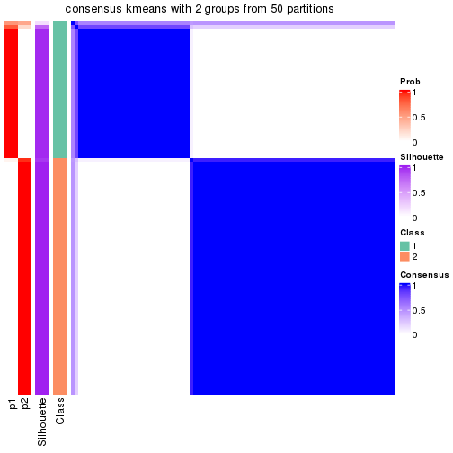</p>

</div>
<div id='tab-node-021-consensus-heatmap-2'>
<pre><code class="r">consensus_heatmap(res, k = 3)
</code></pre>

<p>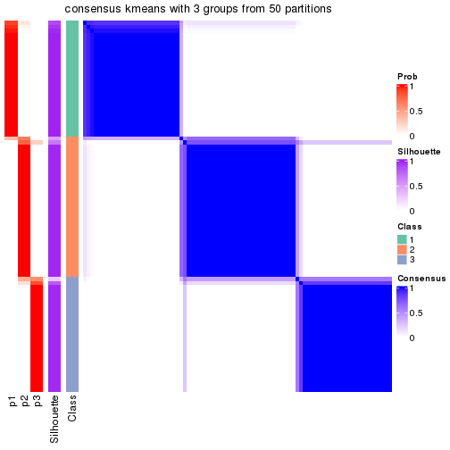</p>

</div>
<div id='tab-node-021-consensus-heatmap-3'>
<pre><code class="r">consensus_heatmap(res, k = 4)
</code></pre>

<p>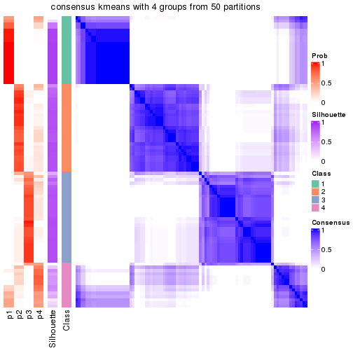</p>

</div>
<div id='tab-node-021-consensus-heatmap-4'>
<pre><code class="r">consensus_heatmap(res, k = 5)
</code></pre>

<p>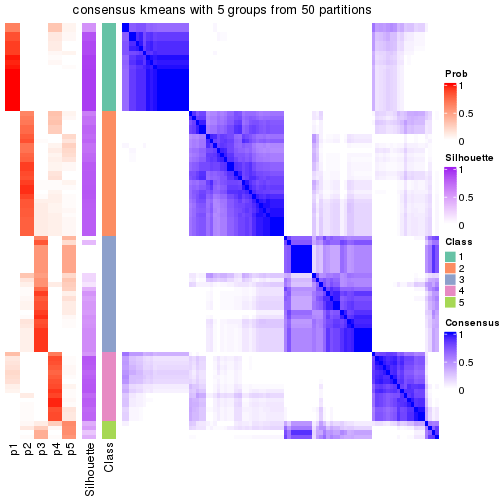</p>

</div>
<div id='tab-node-021-consensus-heatmap-5'>
<pre><code class="r">consensus_heatmap(res, k = 6)
</code></pre>

<p>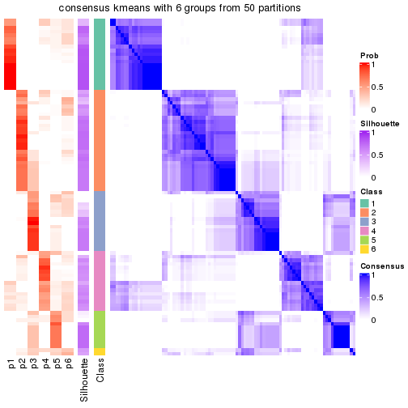</p>

</div>
<div id='tab-node-021-consensus-heatmap-6'>
<pre><code class="r">consensus_heatmap(res, k = 7)
</code></pre>

<p>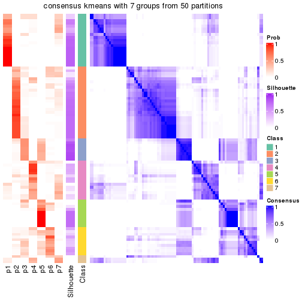</p>

</div>
<div id='tab-node-021-consensus-heatmap-7'>
<pre><code class="r">consensus_heatmap(res, k = 8)
</code></pre>

<p>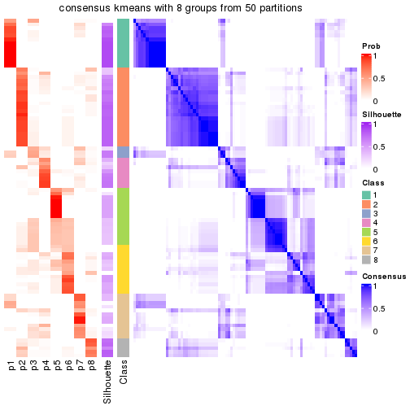</p>

</div>
</div>

Heatmaps for the membership of samples in all partitions to see how consistent they are:


<script>
$( function() {
	$( '#tabs-node-021-membership-heatmap' ).tabs();
} );
</script>
<div id='tabs-node-021-membership-heatmap'>
<ul>
<li><a href='#tab-node-021-membership-heatmap-1'>k = 2</a></li>
<li><a href='#tab-node-021-membership-heatmap-2'>k = 3</a></li>
<li><a href='#tab-node-021-membership-heatmap-3'>k = 4</a></li>
<li><a href='#tab-node-021-membership-heatmap-4'>k = 5</a></li>
<li><a href='#tab-node-021-membership-heatmap-5'>k = 6</a></li>
<li><a href='#tab-node-021-membership-heatmap-6'>k = 7</a></li>
<li><a href='#tab-node-021-membership-heatmap-7'>k = 8</a></li>
</ul>
<div id='tab-node-021-membership-heatmap-1'>
<pre><code class="r">membership_heatmap(res, k = 2)
</code></pre>

<p>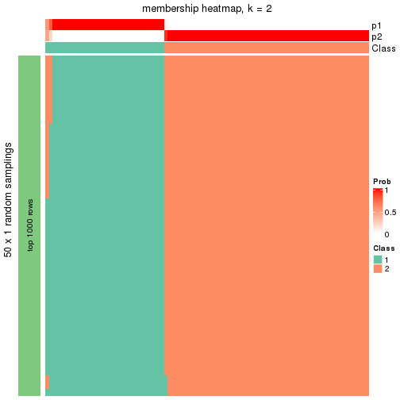</p>

</div>
<div id='tab-node-021-membership-heatmap-2'>
<pre><code class="r">membership_heatmap(res, k = 3)
</code></pre>

<p>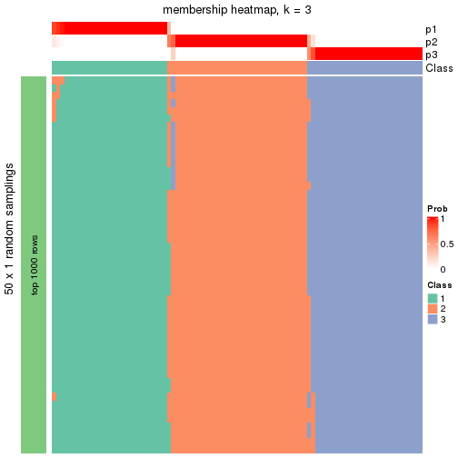</p>

</div>
<div id='tab-node-021-membership-heatmap-3'>
<pre><code class="r">membership_heatmap(res, k = 4)
</code></pre>

<p>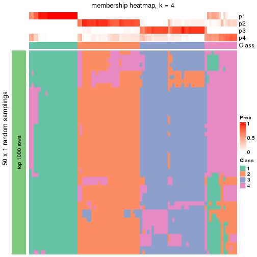</p>

</div>
<div id='tab-node-021-membership-heatmap-4'>
<pre><code class="r">membership_heatmap(res, k = 5)
</code></pre>

<p>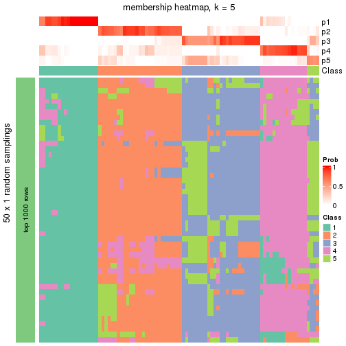</p>

</div>
<div id='tab-node-021-membership-heatmap-5'>
<pre><code class="r">membership_heatmap(res, k = 6)
</code></pre>

<p>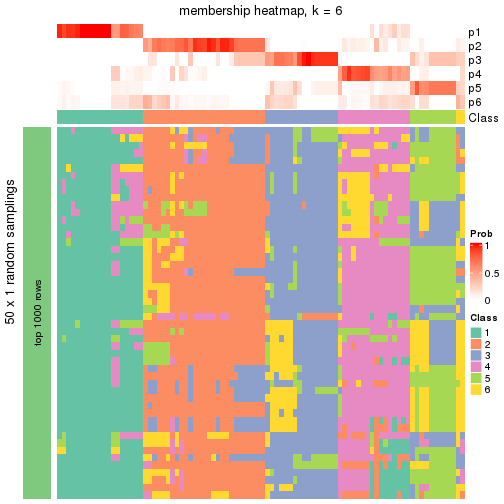</p>

</div>
<div id='tab-node-021-membership-heatmap-6'>
<pre><code class="r">membership_heatmap(res, k = 7)
</code></pre>

<p>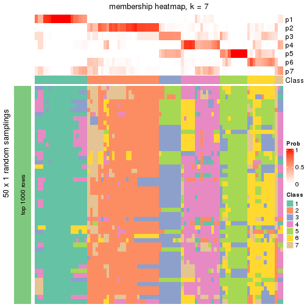</p>

</div>
<div id='tab-node-021-membership-heatmap-7'>
<pre><code class="r">membership_heatmap(res, k = 8)
</code></pre>

<p>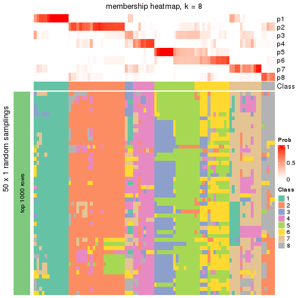</p>

</div>
</div>

As soon as the classes for columns are determined, the signatures
that are significantly different between subgroups can be looked for. 
Following are the heatmaps for signatures.


<script>
$( function() {
	$( '#tabs-node-021-get-signatures' ).tabs();
} );
</script>
<div id='tabs-node-021-get-signatures'>
<ul>
<li><a href='#tab-node-021-get-signatures-1'>k = 2</a></li>
<li><a href='#tab-node-021-get-signatures-2'>k = 3</a></li>
<li><a href='#tab-node-021-get-signatures-3'>k = 4</a></li>
<li><a href='#tab-node-021-get-signatures-4'>k = 5</a></li>
<li><a href='#tab-node-021-get-signatures-5'>k = 6</a></li>
<li><a href='#tab-node-021-get-signatures-6'>k = 7</a></li>
<li><a href='#tab-node-021-get-signatures-7'>k = 8</a></li>
</ul>
<div id='tab-node-021-get-signatures-1'>
<pre><code class="r">get_signatures(res, k = 2)
</code></pre>

<p>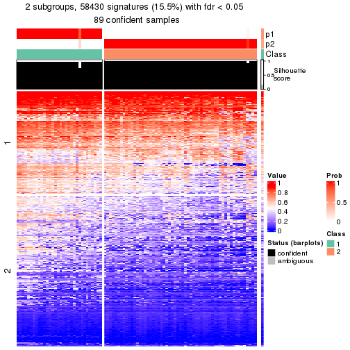</p>

</div>
<div id='tab-node-021-get-signatures-2'>
<pre><code class="r">get_signatures(res, k = 3)
</code></pre>

<p></p>

</div>
<div id='tab-node-021-get-signatures-3'>
<pre><code class="r">get_signatures(res, k = 4)
</code></pre>

<p>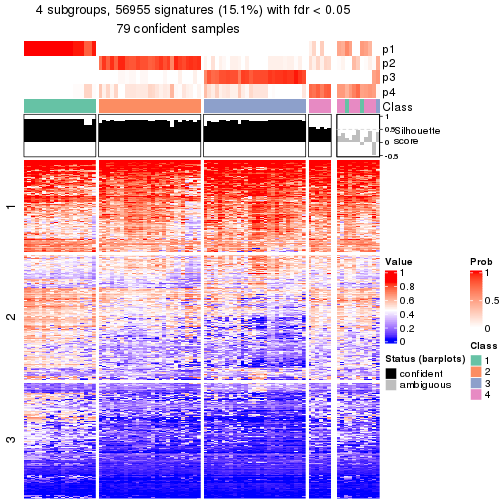</p>

</div>
<div id='tab-node-021-get-signatures-4'>
<pre><code class="r">get_signatures(res, k = 5)
</code></pre>

<p>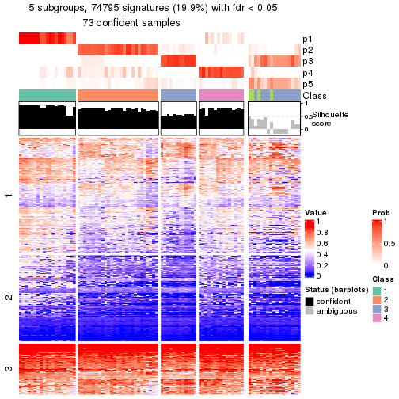</p>

</div>
<div id='tab-node-021-get-signatures-5'>
<pre><code class="r">get_signatures(res, k = 6)
</code></pre>

<p>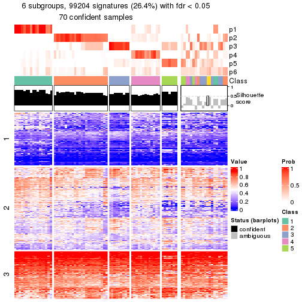</p>

</div>
<div id='tab-node-021-get-signatures-6'>
<pre><code class="r">get_signatures(res, k = 7)
</code></pre>

<p>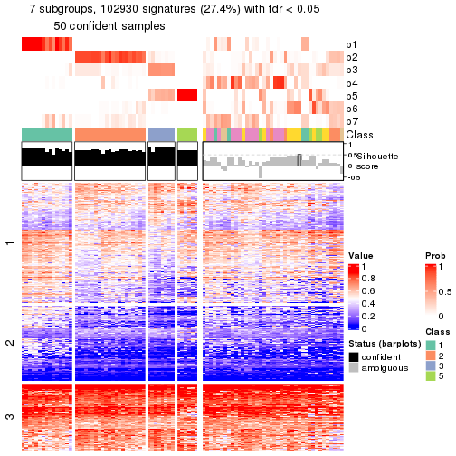</p>

</div>
<div id='tab-node-021-get-signatures-7'>
<pre><code class="r">get_signatures(res, k = 8)
</code></pre>

<p>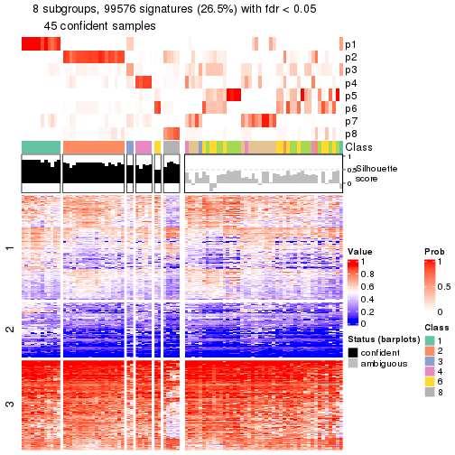</p>

</div>
</div>


Compare the overlap of signatures from different k:

```r
compare_signatures(res)
```

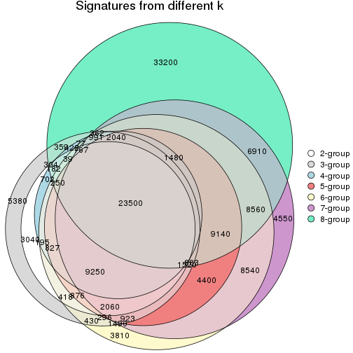

`get_signature()` returns a data frame invisibly. To get the list of signatures, the function
call should be assigned to a variable explicitly. In following code, if `plot` argument is set
to `FALSE`, no heatmap is plotted while only the differential analysis is performed.

```r
# code only for demonstration
tb = get_signature(res, k = ..., plot = FALSE)
```

An example of the output of `tb` is:

```
#>   which_row         fdr    mean_1    mean_2 scaled_mean_1 scaled_mean_2 km
#> 1        38 0.042760348  8.373488  9.131774    -0.5533452     0.5164555  1
#> 2        40 0.018707592  7.106213  8.469186    -0.6173731     0.5762149  1
#> 3        55 0.019134737 10.221463 11.207825    -0.6159697     0.5749050  1
#> 4        59 0.006059896  5.921854  7.869574    -0.6899429     0.6439467  1
#> 5        60 0.018055526  8.928898 10.211722    -0.6204761     0.5791110  1
#> 6        98 0.009384629 15.714769 14.887706     0.6635654    -0.6193277  2
...
```

The columns in `tb` are:

1. `which_row`: row indices corresponding to the input matrix.
2. `fdr`: FDR for the differential test. 
3. `mean_x`: The mean value in group x.
4. `scaled_mean_x`: The mean value in group x after rows are scaled.
5. `km`: Row groups if k-means clustering is applied to rows (which is done by automatically selecting number of clusters).

If there are too many signatures, `top_signatures = ...` can be set to only show the 
signatures with the highest FDRs:

```r
# code only for demonstration
# e.g. to show the top 500 most significant rows
tb = get_signature(res, k = ..., top_signatures = 500)
```

If the signatures are defined as these which are uniquely high in current group, `diff_method` argument
can be set to `"uniquely_high_in_one_group"`:

```r
# code only for demonstration
tb = get_signature(res, k = ..., diff_method = "uniquely_high_in_one_group")
```


UMAP plot which shows how samples are separated.


<script>
$( function() {
	$( '#tabs-node-021-dimension-reduction' ).tabs();
} );
</script>
<div id='tabs-node-021-dimension-reduction'>
<ul>
<li><a href='#tab-node-021-dimension-reduction-1'>k = 2</a></li>
<li><a href='#tab-node-021-dimension-reduction-2'>k = 3</a></li>
<li><a href='#tab-node-021-dimension-reduction-3'>k = 4</a></li>
<li><a href='#tab-node-021-dimension-reduction-4'>k = 5</a></li>
<li><a href='#tab-node-021-dimension-reduction-5'>k = 6</a></li>
<li><a href='#tab-node-021-dimension-reduction-6'>k = 7</a></li>
<li><a href='#tab-node-021-dimension-reduction-7'>k = 8</a></li>
</ul>
<div id='tab-node-021-dimension-reduction-1'>
<pre><code class="r">dimension_reduction(res, k = 2, method = &quot;UMAP&quot;)
</code></pre>

<p>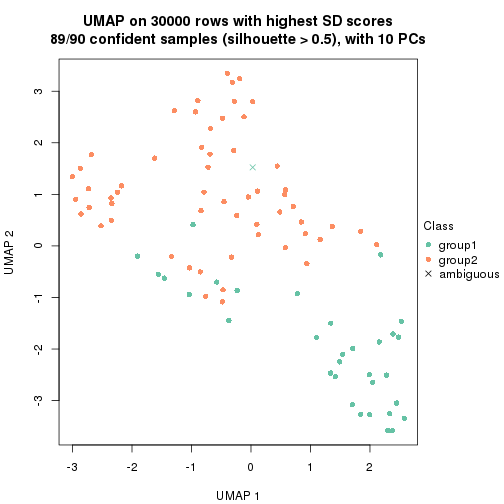</p>

</div>
<div id='tab-node-021-dimension-reduction-2'>
<pre><code class="r">dimension_reduction(res, k = 3, method = &quot;UMAP&quot;)
</code></pre>

<p>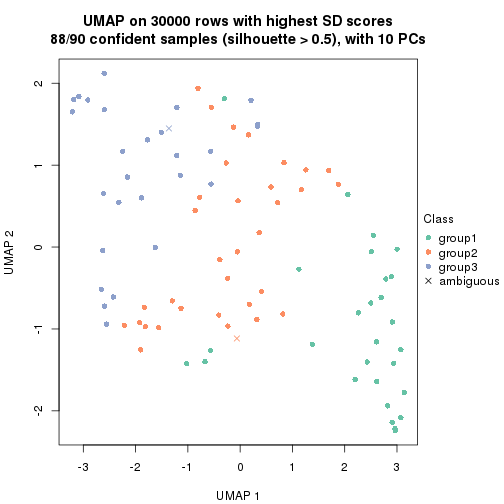</p>

</div>
<div id='tab-node-021-dimension-reduction-3'>
<pre><code class="r">dimension_reduction(res, k = 4, method = &quot;UMAP&quot;)
</code></pre>

<p>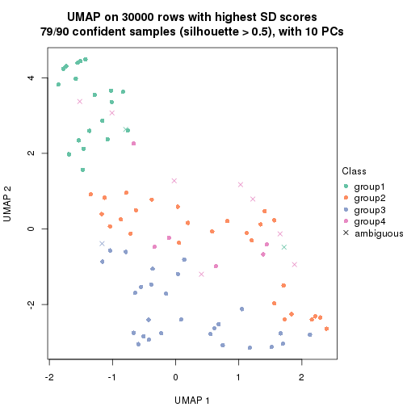</p>

</div>
<div id='tab-node-021-dimension-reduction-4'>
<pre><code class="r">dimension_reduction(res, k = 5, method = &quot;UMAP&quot;)
</code></pre>

<p>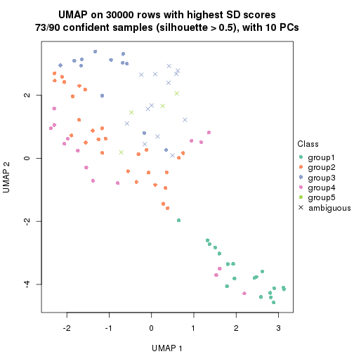</p>

</div>
<div id='tab-node-021-dimension-reduction-5'>
<pre><code class="r">dimension_reduction(res, k = 6, method = &quot;UMAP&quot;)
</code></pre>

<p>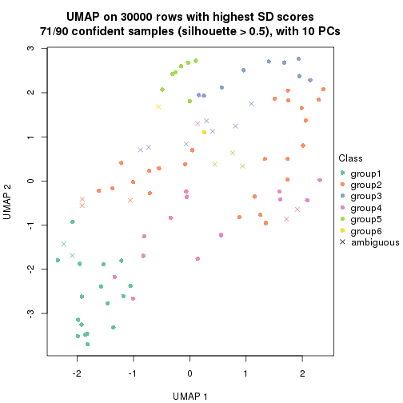</p>

</div>
<div id='tab-node-021-dimension-reduction-6'>
<pre><code class="r">dimension_reduction(res, k = 7, method = &quot;UMAP&quot;)
</code></pre>

<p>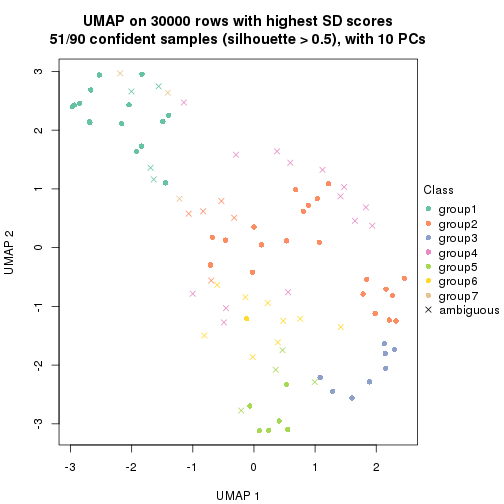</p>

</div>
<div id='tab-node-021-dimension-reduction-7'>
<pre><code class="r">dimension_reduction(res, k = 8, method = &quot;UMAP&quot;)
</code></pre>

<p></p>

</div>
</div>


Following heatmap shows how subgroups are split when increasing `k`:

```r
collect_classes(res)
```

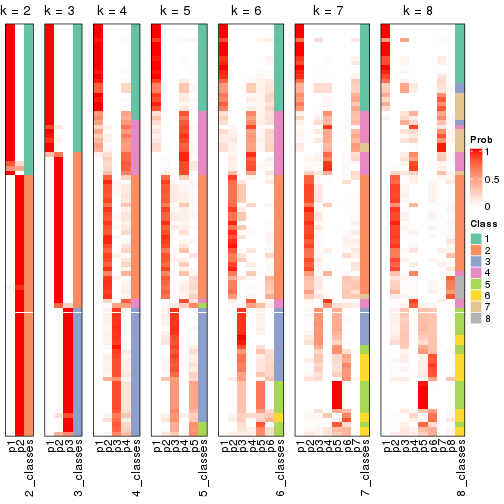


If matrix rows can be associated to genes, consider to use `functional_enrichment(res,
...)` to perform function enrichment for the signature genes. See [this vignette](https://jokergoo.github.io/cola_vignettes/functional_enrichment.html) for more detailed explanations.


 

---------------------------------------------------


### Node0211


Parent node: [Node021](#Node021).
Child nodes: 
                Node01211-leaf
        ,
                Node01212-leaf
        ,
                Node01213-leaf
        ,
                Node01221-leaf
        ,
                Node01222-leaf
        ,
                Node01223-leaf
        ,
                Node02111-leaf
        ,
                Node02112-leaf
        ,
                Node02113-leaf
        ,
                Node02114-leaf
        ,
                Node02121-leaf
        ,
                Node02122-leaf
        ,
                Node02123-leaf
        ,
                Node02124-leaf
        ,
                Node02131-leaf
        ,
                [Node02132](#Node02132)
        ,
                Node02133-leaf
        ,
                Node02211-leaf
        ,
                Node02212-leaf
        ,
                Node02213-leaf
        ,
                Node02221-leaf
        ,
                Node02222-leaf
        ,
                Node02223-leaf
        ,
                Node02231-leaf
        ,
                Node02232-leaf
        ,
                Node02233-leaf
        ,
                Node02241-leaf
        ,
                Node02242-leaf
        ,
                Node02243-leaf
        ,
                Node02321-leaf
        ,
                Node02322-leaf
        ,
                Node02323-leaf
        ,
                Node05111-leaf
        ,
                Node05112-leaf
        ,
                Node05113-leaf
        ,
                Node05114-leaf
        ,
                [Node05121](#Node05121)
        ,
                Node05122-leaf
        ,
                Node05123-leaf
        ,
                Node05221-leaf
        ,
                Node05222-leaf
        .


The object with results only for a single top-value method and a single partitioning method 
can be extracted as:

```r
res = res_rh["0211"]
```

A summary of `res` and all the functions that can be applied to it:

```r
res
```

```
#> A 'ConsensusPartition' object with k = 2, 3, 4, 5, 6, 7, 8.
#>   On a matrix with 30000 rows and 28 columns.
#>   Top rows (1000) are extracted by 'ATC' method.
#>   Subgroups are detected by 'kmeans' method.
#>   Performed in total 350 partitions by row resampling.
#>   Best k for subgroups seems to be 4.
#> 
#> Following methods can be applied to this 'ConsensusPartition' object:
#>  [1] "cola_report"             "collect_classes"         "collect_plots"          
#>  [4] "collect_stats"           "colnames"                "compare_partitions"     
#>  [7] "compare_signatures"      "consensus_heatmap"       "dimension_reduction"    
#> [10] "functional_enrichment"   "get_anno_col"            "get_anno"               
#> [13] "get_classes"             "get_consensus"           "get_matrix"             
#> [16] "get_membership"          "get_param"               "get_signatures"         
#> [19] "get_stats"               "is_best_k"               "is_stable_k"            
#> [22] "membership_heatmap"      "ncol"                    "nrow"                   
#> [25] "plot_ecdf"               "predict_classes"         "rownames"               
#> [28] "select_partition_number" "show"                    "suggest_best_k"         
#> [31] "test_to_known_factors"   "top_rows_heatmap"
```

`collect_plots()` function collects all the plots made from `res` for all `k` (number of subgroups)
into one single page to provide an easy and fast comparison between different `k`.

```r
collect_plots(res)
```

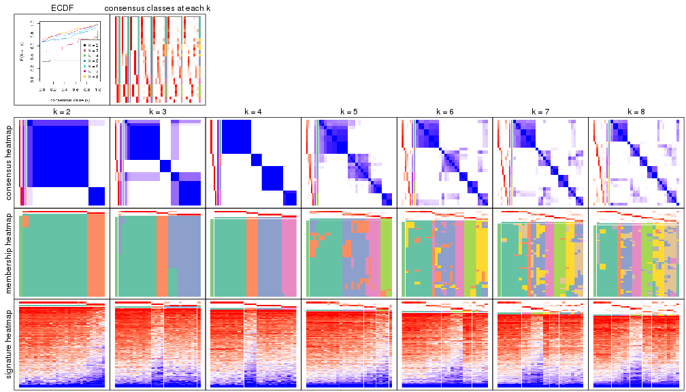

The plots are:

- The first row: a plot of the eCDF (empirical cumulative distribution
  function) curves of the consensus matrix for each `k` and the heatmap of
  predicted classes for each `k`.
- The second row: heatmaps of the consensus matrix for each `k`.
- The third row: heatmaps of the membership matrix for each `k`.
- The fouth row: heatmaps of the signatures for each `k`.

All the plots in panels can be made by individual functions and they are
plotted later in this section.

`select_partition_number()` produces several plots showing different
statistics for choosing "optimized" `k`. There are following statistics:

- eCDF curves of the consensus matrix for each `k`;
- 1-PAC. [The PAC score](https://en.wikipedia.org/wiki/Consensus_clustering#Over-interpretation_potential_of_consensus_clustering)
  measures the proportion of the ambiguous subgrouping.
- Mean silhouette score.
- Concordance. The mean probability of fiting the consensus subgroup labels in all
  partitions.
- Area increased. Denote $A_k$ as the area under the eCDF curve for current
  `k`, the area increased is defined as $A_k - A_{k-1}$.
- Rand index. The percent of pairs of samples that are both in a same cluster
  or both are not in a same cluster in the partition of k and k-1.
- Jaccard index. The ratio of pairs of samples are both in a same cluster in
  the partition of k and k-1 and the pairs of samples are both in a same
  cluster in the partition k or k-1.

The detailed explanations of these statistics can be found in [the _cola_
vignette](https://jokergoo.github.io/cola_vignettes/cola.html#toc_13).

Generally speaking, higher 1-PAC score, higher mean silhouette score or higher
concordance corresponds to better partition. Rand index and Jaccard index
measure how similar the current partition is compared to partition with `k-1`.
If they are too similar, we won't accept `k` is better than `k-1`.

```r
select_partition_number(res)
```

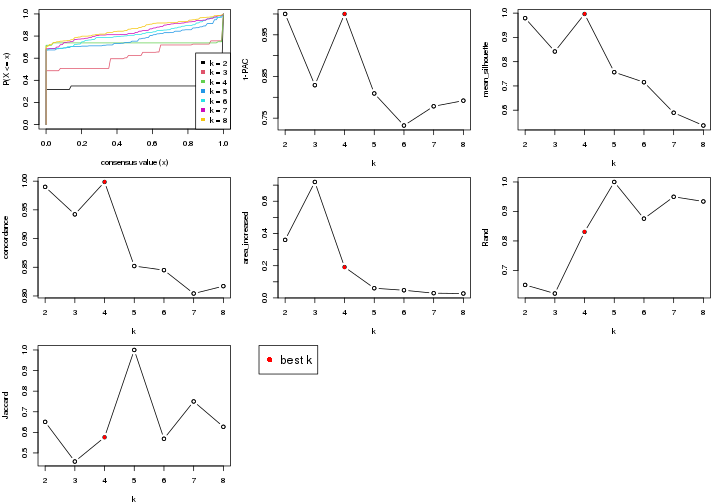

The numeric values for all these statistics can be obtained by `get_stats()`.

```r
get_stats(res)
```

```
#>   k 1-PAC mean_silhouette concordance area_increased  Rand Jaccard
#> 2 2 1.000           0.979       0.990         0.3602 0.651   0.651
#> 3 3 0.829           0.842       0.942         0.7197 0.622   0.458
#> 4 4 1.000           0.997       0.999         0.1914 0.831   0.576
#> 5 5 0.809           0.757       0.852         0.0601 1.000   1.000
#> 6 6 0.732           0.715       0.845         0.0475 0.876   0.569
#> 7 7 0.778           0.590       0.804         0.0293 0.950   0.750
#> 8 8 0.792           0.537       0.817         0.0272 0.934   0.627
```

`suggest_best_k()` suggests the best $k$ based on these statistics. The rules are as follows:

- All $k$ with Jaccard index larger than 0.95 are removed because increasing
  $k$ does not provide enough extra information. If all $k$ are removed, it is
  marked as no subgroup is detected.
- For all $k$ with 1-PAC score larger than 0.9, the maximal $k$ is taken as
  the best $k$, and other $k$ are marked as optional $k$.
- If it does not fit the second rule. The $k$ with the maximal vote of the
  highest 1-PAC score, highest mean silhouette, and highest concordance is
  taken as the best $k$.

```r
suggest_best_k(res)
```

```
#> [1] 4
#> attr(,"optional")
#> [1] 2
```

There is also optional best $k$ = 2 that is worth to check.

Following is the table of the partitions (You need to click the **show/hide
code output** link to see it). The membership matrix (columns with name `p*`)
is inferred by
[`clue::cl_consensus()`](https://www.rdocumentation.org/link/cl_consensus?package=clue)
function with the `SE` method. Basically the value in the membership matrix
represents the probability to belong to a certain group. The finall subgroup
label for an item is determined with the group with highest probability it
belongs to.

In `get_classes()` function, the entropy is calculated from the membership
matrix and the silhouette score is calculated from the consensus matrix.


<script>
$( function() {
	$( '#tabs-node-0211-get-classes' ).tabs();
} );
</script>
<div id='tabs-node-0211-get-classes'>
<ul>
<li><a href='#tab-node-0211-get-classes-1'>k = 2</a></li>
<li><a href='#tab-node-0211-get-classes-2'>k = 3</a></li>
<li><a href='#tab-node-0211-get-classes-3'>k = 4</a></li>
<li><a href='#tab-node-0211-get-classes-4'>k = 5</a></li>
<li><a href='#tab-node-0211-get-classes-5'>k = 6</a></li>
<li><a href='#tab-node-0211-get-classes-6'>k = 7</a></li>
<li><a href='#tab-node-0211-get-classes-7'>k = 8</a></li>
</ul>

<div id='tab-node-0211-get-classes-1'>
<p><a id='tab-node-0211-get-classes-1-a' style='color:#0366d6' href='#'>show/hide code output</a></p>
<pre><code class="r">cbind(get_classes(res, k = 2), get_membership(res, k = 2))
</code></pre>

<pre><code>#&gt;                 class entropy silhouette   p1   p2
#&gt; TCGA.CQ.5327.01     1   0.000      0.986 1.00 0.00
#&gt; TCGA.H7.7774.01     1   0.000      0.986 1.00 0.00
#&gt; TCGA.CQ.5330.01     1   0.000      0.986 1.00 0.00
#&gt; TCGA.CV.7427.01     1   0.000      0.986 1.00 0.00
#&gt; TCGA.CV.7425.01     1   0.000      0.986 1.00 0.00
#&gt; TCGA.CQ.7068.01     1   0.000      0.986 1.00 0.00
#&gt; TCGA.CV.7095.01     1   0.000      0.986 1.00 0.00
#&gt; TCGA.CV.7252.01     2   0.000      1.000 0.00 1.00
#&gt; TCGA.BA.5556.01     1   0.000      0.986 1.00 0.00
#&gt; TCGA.CV.6942.01     1   0.000      0.986 1.00 0.00
#&gt; TCGA.CR.7395.01     1   0.584      0.845 0.86 0.14
#&gt; TCGA.CV.7099.01     1   0.000      0.986 1.00 0.00
#&gt; TCGA.C9.A47Z.01     2   0.000      1.000 0.00 1.00
#&gt; TCGA.CV.6953.01     1   0.000      0.986 1.00 0.00
#&gt; TCGA.HD.A4C1.01     1   0.000      0.986 1.00 0.00
#&gt; TCGA.CV.A45Q.01     1   0.000      0.986 1.00 0.00
#&gt; TCGA.BA.A6DF.01     2   0.000      1.000 0.00 1.00
#&gt; TCGA.CQ.7063.01     1   0.000      0.986 1.00 0.00
#&gt; TCGA.CQ.7071.01     2   0.000      1.000 0.00 1.00
#&gt; TCGA.CV.A463.01     1   0.000      0.986 1.00 0.00
#&gt; TCGA.MT.A67A.01     2   0.000      1.000 0.00 1.00
#&gt; TCGA.BB.A6UO.01     1   0.000      0.986 1.00 0.00
#&gt; TCGA.IQ.A61E.01     1   0.584      0.845 0.86 0.14
#&gt; TCGA.UF.A7JT.01     1   0.000      0.986 1.00 0.00
#&gt; TCGA.BB.7863.01     2   0.000      1.000 0.00 1.00
#&gt; TCGA.MT.A67F.01     1   0.000      0.986 1.00 0.00
#&gt; TCGA.T2.A6WX.01     1   0.000      0.986 1.00 0.00
#&gt; TCGA.CV.A6JD.01     1   0.000      0.986 1.00 0.00
</code></pre>

<script>
$('#tab-node-0211-get-classes-1-a').parent().next().next().hide();
$('#tab-node-0211-get-classes-1-a').click(function(){
  $('#tab-node-0211-get-classes-1-a').parent().next().next().toggle();
  return(false);
});
</script>
</div>

<div id='tab-node-0211-get-classes-2'>
<p><a id='tab-node-0211-get-classes-2-a' style='color:#0366d6' href='#'>show/hide code output</a></p>
<pre><code class="r">cbind(get_classes(res, k = 3), get_membership(res, k = 3))
</code></pre>

<pre><code>#&gt;                 class entropy silhouette   p1 p2   p3
#&gt; TCGA.CQ.5327.01     1   0.254     0.8624 0.92  0 0.08
#&gt; TCGA.H7.7774.01     3   0.000     0.8557 0.00  0 1.00
#&gt; TCGA.CQ.5330.01     1   0.000     0.9463 1.00  0 0.00
#&gt; TCGA.CV.7427.01     3   0.000     0.8557 0.00  0 1.00
#&gt; TCGA.CV.7425.01     1   0.000     0.9463 1.00  0 0.00
#&gt; TCGA.CQ.7068.01     1   0.000     0.9463 1.00  0 0.00
#&gt; TCGA.CV.7095.01     3   0.000     0.8557 0.00  0 1.00
#&gt; TCGA.CV.7252.01     2   0.000     1.0000 0.00  1 0.00
#&gt; TCGA.BA.5556.01     1   0.628    -0.0645 0.54  0 0.46
#&gt; TCGA.CV.6942.01     1   0.000     0.9463 1.00  0 0.00
#&gt; TCGA.CR.7395.01     3   0.000     0.8557 0.00  0 1.00
#&gt; TCGA.CV.7099.01     3   0.595     0.5064 0.36  0 0.64
#&gt; TCGA.C9.A47Z.01     2   0.000     1.0000 0.00  1 0.00
#&gt; TCGA.CV.6953.01     3   0.595     0.5064 0.36  0 0.64
#&gt; TCGA.HD.A4C1.01     1   0.000     0.9463 1.00  0 0.00
#&gt; TCGA.CV.A45Q.01     1   0.000     0.9463 1.00  0 0.00
#&gt; TCGA.BA.A6DF.01     3   0.000     0.8557 0.00  0 1.00
#&gt; TCGA.CQ.7063.01     1   0.000     0.9463 1.00  0 0.00
#&gt; TCGA.CQ.7071.01     3   0.000     0.8557 0.00  0 1.00
#&gt; TCGA.CV.A463.01     1   0.000     0.9463 1.00  0 0.00
#&gt; TCGA.MT.A67A.01     2   0.000     1.0000 0.00  1 0.00
#&gt; TCGA.BB.A6UO.01     1   0.000     0.9463 1.00  0 0.00
#&gt; TCGA.IQ.A61E.01     3   0.000     0.8557 0.00  0 1.00
#&gt; TCGA.UF.A7JT.01     3   0.000     0.8557 0.00  0 1.00
#&gt; TCGA.BB.7863.01     2   0.000     1.0000 0.00  1 0.00
#&gt; TCGA.MT.A67F.01     1   0.000     0.9463 1.00  0 0.00
#&gt; TCGA.T2.A6WX.01     3   0.595     0.5064 0.36  0 0.64
#&gt; TCGA.CV.A6JD.01     1   0.000     0.9463 1.00  0 0.00
</code></pre>

<script>
$('#tab-node-0211-get-classes-2-a').parent().next().next().hide();
$('#tab-node-0211-get-classes-2-a').click(function(){
  $('#tab-node-0211-get-classes-2-a').parent().next().next().toggle();
  return(false);
});
</script>
</div>

<div id='tab-node-0211-get-classes-3'>
<p><a id='tab-node-0211-get-classes-3-a' style='color:#0366d6' href='#'>show/hide code output</a></p>
<pre><code class="r">cbind(get_classes(res, k = 4), get_membership(res, k = 4))
</code></pre>

<pre><code>#&gt;                 class entropy silhouette p1 p2   p3   p4
#&gt; TCGA.CQ.5327.01     3   0.000      1.000  0  0 1.00 0.00
#&gt; TCGA.H7.7774.01     4   0.121      0.951  0  0 0.04 0.96
#&gt; TCGA.CQ.5330.01     1   0.000      1.000  1  0 0.00 0.00
#&gt; TCGA.CV.7427.01     3   0.000      1.000  0  0 1.00 0.00
#&gt; TCGA.CV.7425.01     1   0.000      1.000  1  0 0.00 0.00
#&gt; TCGA.CQ.7068.01     1   0.000      1.000  1  0 0.00 0.00
#&gt; TCGA.CV.7095.01     3   0.000      1.000  0  0 1.00 0.00
#&gt; TCGA.CV.7252.01     2   0.000      1.000  0  1 0.00 0.00
#&gt; TCGA.BA.5556.01     3   0.000      1.000  0  0 1.00 0.00
#&gt; TCGA.CV.6942.01     1   0.000      1.000  1  0 0.00 0.00
#&gt; TCGA.CR.7395.01     4   0.000      0.988  0  0 0.00 1.00
#&gt; TCGA.CV.7099.01     3   0.000      1.000  0  0 1.00 0.00
#&gt; TCGA.C9.A47Z.01     2   0.000      1.000  0  1 0.00 0.00
#&gt; TCGA.CV.6953.01     3   0.000      1.000  0  0 1.00 0.00
#&gt; TCGA.HD.A4C1.01     1   0.000      1.000  1  0 0.00 0.00
#&gt; TCGA.CV.A45Q.01     1   0.000      1.000  1  0 0.00 0.00
#&gt; TCGA.BA.A6DF.01     4   0.000      0.988  0  0 0.00 1.00
#&gt; TCGA.CQ.7063.01     1   0.000      1.000  1  0 0.00 0.00
#&gt; TCGA.CQ.7071.01     4   0.000      0.988  0  0 0.00 1.00
#&gt; TCGA.CV.A463.01     1   0.000      1.000  1  0 0.00 0.00
#&gt; TCGA.MT.A67A.01     2   0.000      1.000  0  1 0.00 0.00
#&gt; TCGA.BB.A6UO.01     1   0.000      1.000  1  0 0.00 0.00
#&gt; TCGA.IQ.A61E.01     4   0.000      0.988  0  0 0.00 1.00
#&gt; TCGA.UF.A7JT.01     3   0.000      1.000  0  0 1.00 0.00
#&gt; TCGA.BB.7863.01     2   0.000      1.000  0  1 0.00 0.00
#&gt; TCGA.MT.A67F.01     1   0.000      1.000  1  0 0.00 0.00
#&gt; TCGA.T2.A6WX.01     3   0.000      1.000  0  0 1.00 0.00
#&gt; TCGA.CV.A6JD.01     1   0.000      1.000  1  0 0.00 0.00
</code></pre>

<script>
$('#tab-node-0211-get-classes-3-a').parent().next().next().hide();
$('#tab-node-0211-get-classes-3-a').click(function(){
  $('#tab-node-0211-get-classes-3-a').parent().next().next().toggle();
  return(false);
});
</script>
</div>

<div id='tab-node-0211-get-classes-4'>
<p><a id='tab-node-0211-get-classes-4-a' style='color:#0366d6' href='#'>show/hide code output</a></p>
<pre><code class="r">cbind(get_classes(res, k = 5), get_membership(res, k = 5))
</code></pre>

<pre><code>#&gt;                 class entropy silhouette   p1   p2   p3   p4  p5
#&gt; TCGA.CQ.5327.01     3   0.418      0.648 0.00 0.40 0.60 0.00 0.0
#&gt; TCGA.H7.7774.01     4   0.546      0.111 0.00 0.06 0.46 0.48 0.0
#&gt; TCGA.CQ.5330.01     1   0.104      0.874 0.96 0.04 0.00 0.00 0.0
#&gt; TCGA.CV.7427.01     3   0.141      0.717 0.00 0.06 0.94 0.00 0.0
#&gt; TCGA.CV.7425.01     1   0.430      0.530 0.52 0.48 0.00 0.00 0.0
#&gt; TCGA.CQ.7068.01     1   0.000      0.879 1.00 0.00 0.00 0.00 0.0
#&gt; TCGA.CV.7095.01     3   0.141      0.709 0.00 0.06 0.94 0.00 0.0
#&gt; TCGA.CV.7252.01     5   0.202      0.949 0.00 0.10 0.00 0.00 0.9
#&gt; TCGA.BA.5556.01     3   0.429      0.637 0.00 0.46 0.54 0.00 0.0
#&gt; TCGA.CV.6942.01     1   0.293      0.801 0.82 0.18 0.00 0.00 0.0
#&gt; TCGA.CR.7395.01     4   0.141      0.767 0.00 0.06 0.00 0.94 0.0
#&gt; TCGA.CV.7099.01     3   0.141      0.723 0.00 0.06 0.94 0.00 0.0
#&gt; TCGA.C9.A47Z.01     5   0.000      0.949 0.00 0.00 0.00 0.00 1.0
#&gt; TCGA.CV.6953.01     3   0.398      0.684 0.00 0.34 0.66 0.00 0.0
#&gt; TCGA.HD.A4C1.01     1   0.141      0.862 0.94 0.06 0.00 0.00 0.0
#&gt; TCGA.CV.A45Q.01     1   0.000      0.879 1.00 0.00 0.00 0.00 0.0
#&gt; TCGA.BA.A6DF.01     4   0.000      0.783 0.00 0.00 0.00 1.00 0.0
#&gt; TCGA.CQ.7063.01     1   0.104      0.874 0.96 0.04 0.00 0.00 0.0
#&gt; TCGA.CQ.7071.01     4   0.368      0.648 0.00 0.28 0.00 0.72 0.0
#&gt; TCGA.CV.A463.01     1   0.141      0.862 0.94 0.06 0.00 0.00 0.0
#&gt; TCGA.MT.A67A.01     5   0.202      0.949 0.00 0.10 0.00 0.00 0.9
#&gt; TCGA.BB.A6UO.01     1   0.000      0.879 1.00 0.00 0.00 0.00 0.0
#&gt; TCGA.IQ.A61E.01     4   0.000      0.783 0.00 0.00 0.00 1.00 0.0
#&gt; TCGA.UF.A7JT.01     3   0.417      0.552 0.00 0.08 0.78 0.14 0.0
#&gt; TCGA.BB.7863.01     5   0.000      0.949 0.00 0.00 0.00 0.00 1.0
#&gt; TCGA.MT.A67F.01     1   0.423      0.565 0.58 0.42 0.00 0.00 0.0
#&gt; TCGA.T2.A6WX.01     3   0.228      0.740 0.00 0.12 0.88 0.00 0.0
#&gt; TCGA.CV.A6JD.01     1   0.000      0.879 1.00 0.00 0.00 0.00 0.0
</code></pre>

<script>
$('#tab-node-0211-get-classes-4-a').parent().next().next().hide();
$('#tab-node-0211-get-classes-4-a').click(function(){
  $('#tab-node-0211-get-classes-4-a').parent().next().next().toggle();
  return(false);
});
</script>
</div>

<div id='tab-node-0211-get-classes-5'>
<p><a id='tab-node-0211-get-classes-5-a' style='color:#0366d6' href='#'>show/hide code output</a></p>
<pre><code class="r">cbind(get_classes(res, k = 6), get_membership(res, k = 6))
</code></pre>

<pre><code>#&gt;                 class entropy silhouette   p1   p2   p3   p4   p5   p6
#&gt; TCGA.CQ.5327.01     6  0.3756      0.444 0.00 0.00 0.40 0.00 0.00 0.60
#&gt; TCGA.H7.7774.01     3  0.4337      0.476 0.00 0.02 0.50 0.48 0.00 0.00
#&gt; TCGA.CQ.5330.01     1  0.1556      0.863 0.92 0.00 0.00 0.00 0.00 0.08
#&gt; TCGA.CV.7427.01     3  0.3315      0.691 0.00 0.00 0.78 0.20 0.00 0.02
#&gt; TCGA.CV.7425.01     6  0.3660      0.635 0.16 0.06 0.00 0.00 0.00 0.78
#&gt; TCGA.CQ.7068.01     1  0.0000      0.887 1.00 0.00 0.00 0.00 0.00 0.00
#&gt; TCGA.CV.7095.01     3  0.3198      0.689 0.00 0.00 0.74 0.26 0.00 0.00
#&gt; TCGA.CV.7252.01     5  0.2048      0.930 0.00 0.00 0.00 0.00 0.88 0.12
#&gt; TCGA.BA.5556.01     6  0.3592      0.576 0.00 0.00 0.24 0.02 0.00 0.74
#&gt; TCGA.CV.6942.01     1  0.4144      0.449 0.62 0.02 0.00 0.00 0.00 0.36
#&gt; TCGA.CR.7395.01     4  0.4199      0.938 0.00 0.38 0.00 0.60 0.00 0.02
#&gt; TCGA.CV.7099.01     3  0.0937      0.637 0.00 0.00 0.96 0.04 0.00 0.00
#&gt; TCGA.C9.A47Z.01     5  0.0000      0.930 0.00 0.00 0.00 0.00 1.00 0.00
#&gt; TCGA.CV.6953.01     3  0.3916      0.129 0.00 0.00 0.68 0.02 0.00 0.30
#&gt; TCGA.HD.A4C1.01     1  0.3258      0.827 0.84 0.02 0.00 0.10 0.00 0.04
#&gt; TCGA.CV.A45Q.01     1  0.0547      0.887 0.98 0.00 0.00 0.02 0.00 0.00
#&gt; TCGA.BA.A6DF.01     4  0.4246      0.953 0.00 0.40 0.00 0.58 0.00 0.02
#&gt; TCGA.CQ.7063.01     1  0.1556      0.863 0.92 0.00 0.00 0.00 0.00 0.08
#&gt; TCGA.CQ.7071.01     2  0.1267      0.000 0.00 0.94 0.00 0.06 0.00 0.00
#&gt; TCGA.CV.A463.01     1  0.3007      0.832 0.86 0.02 0.00 0.08 0.00 0.04
#&gt; TCGA.MT.A67A.01     5  0.2048      0.930 0.00 0.00 0.00 0.00 0.88 0.12
#&gt; TCGA.BB.A6UO.01     1  0.0547      0.887 0.98 0.00 0.00 0.02 0.00 0.00
#&gt; TCGA.IQ.A61E.01     4  0.3756      0.943 0.00 0.40 0.00 0.60 0.00 0.00
#&gt; TCGA.UF.A7JT.01     3  0.4199      0.636 0.00 0.00 0.60 0.38 0.00 0.02
#&gt; TCGA.BB.7863.01     5  0.0000      0.930 0.00 0.00 0.00 0.00 1.00 0.00
#&gt; TCGA.MT.A67F.01     6  0.2793      0.630 0.20 0.00 0.00 0.00 0.00 0.80
#&gt; TCGA.T2.A6WX.01     3  0.2260      0.549 0.00 0.00 0.86 0.00 0.00 0.14
#&gt; TCGA.CV.A6JD.01     1  0.0000      0.887 1.00 0.00 0.00 0.00 0.00 0.00
</code></pre>

<script>
$('#tab-node-0211-get-classes-5-a').parent().next().next().hide();
$('#tab-node-0211-get-classes-5-a').click(function(){
  $('#tab-node-0211-get-classes-5-a').parent().next().next().toggle();
  return(false);
});
</script>
</div>

<div id='tab-node-0211-get-classes-6'>
<p><a id='tab-node-0211-get-classes-6-a' style='color:#0366d6' href='#'>show/hide code output</a></p>
<pre><code class="r">cbind(get_classes(res, k = 7), get_membership(res, k = 7))
</code></pre>

<pre><code>#&gt;                 class entropy silhouette   p1   p2   p3   p4   p5   p6   p7
#&gt; TCGA.CQ.5327.01     3   0.356    -0.3808 0.00 0.00 0.52 0.00 0.00 0.48 0.00
#&gt; TCGA.H7.7774.01     7   0.328     0.6768 0.00 0.00 0.10 0.10 0.00 0.00 0.80
#&gt; TCGA.CQ.5330.01     1   0.117     0.8181 0.94 0.00 0.00 0.00 0.00 0.06 0.00
#&gt; TCGA.CV.7427.01     3   0.399    -0.4451 0.00 0.00 0.50 0.00 0.00 0.02 0.48
#&gt; TCGA.CV.7425.01     6   0.360     0.6122 0.08 0.02 0.04 0.00 0.00 0.82 0.04
#&gt; TCGA.CQ.7068.01     1   0.000     0.8329 1.00 0.00 0.00 0.00 0.00 0.00 0.00
#&gt; TCGA.CV.7095.01     7   0.361     0.5831 0.00 0.00 0.30 0.00 0.00 0.02 0.68
#&gt; TCGA.CV.7252.01     5   0.000     0.8986 0.00 0.00 0.00 0.00 1.00 0.00 0.00
#&gt; TCGA.BA.5556.01     6   0.329     0.4065 0.00 0.00 0.34 0.00 0.00 0.66 0.00
#&gt; TCGA.CV.6942.01     1   0.399     0.2347 0.52 0.02 0.00 0.00 0.00 0.46 0.00
#&gt; TCGA.CR.7395.01     4   0.000     0.9520 0.00 0.00 0.00 1.00 0.00 0.00 0.00
#&gt; TCGA.CV.7099.01     3   0.322    -0.0224 0.00 0.00 0.68 0.00 0.00 0.00 0.32
#&gt; TCGA.C9.A47Z.01     5   0.306     0.8986 0.00 0.02 0.00 0.00 0.84 0.08 0.06
#&gt; TCGA.CV.6953.01     3   0.189     0.4669 0.00 0.00 0.88 0.00 0.00 0.12 0.00
#&gt; TCGA.HD.A4C1.01     1   0.530     0.6540 0.66 0.06 0.02 0.00 0.00 0.18 0.08
#&gt; TCGA.CV.A45Q.01     1   0.101     0.8291 0.96 0.02 0.00 0.00 0.00 0.00 0.02
#&gt; TCGA.BA.A6DF.01     4   0.000     0.9520 0.00 0.00 0.00 1.00 0.00 0.00 0.00
#&gt; TCGA.CQ.7063.01     1   0.117     0.8181 0.94 0.00 0.00 0.00 0.00 0.06 0.00
#&gt; TCGA.CQ.7071.01     2   0.143     0.0000 0.00 0.92 0.00 0.08 0.00 0.00 0.00
#&gt; TCGA.CV.A463.01     1   0.465     0.6851 0.72 0.04 0.02 0.00 0.00 0.16 0.06
#&gt; TCGA.MT.A67A.01     5   0.000     0.8986 0.00 0.00 0.00 0.00 1.00 0.00 0.00
#&gt; TCGA.BB.A6UO.01     1   0.101     0.8291 0.96 0.02 0.00 0.00 0.00 0.00 0.02
#&gt; TCGA.IQ.A61E.01     4   0.143     0.9024 0.00 0.00 0.00 0.92 0.00 0.00 0.08
#&gt; TCGA.UF.A7JT.01     7   0.465     0.5560 0.00 0.00 0.30 0.06 0.00 0.02 0.62
#&gt; TCGA.BB.7863.01     5   0.306     0.8986 0.00 0.02 0.00 0.00 0.84 0.08 0.06
#&gt; TCGA.MT.A67F.01     6   0.420     0.6450 0.16 0.00 0.14 0.00 0.00 0.70 0.00
#&gt; TCGA.T2.A6WX.01     3   0.238     0.4755 0.00 0.00 0.86 0.00 0.00 0.12 0.02
#&gt; TCGA.CV.A6JD.01     1   0.000     0.8329 1.00 0.00 0.00 0.00 0.00 0.00 0.00
</code></pre>

<script>
$('#tab-node-0211-get-classes-6-a').parent().next().next().hide();
$('#tab-node-0211-get-classes-6-a').click(function(){
  $('#tab-node-0211-get-classes-6-a').parent().next().next().toggle();
  return(false);
});
</script>
</div>

<div id='tab-node-0211-get-classes-7'>
<p><a id='tab-node-0211-get-classes-7-a' style='color:#0366d6' href='#'>show/hide code output</a></p>
<pre><code class="r">cbind(get_classes(res, k = 8), get_membership(res, k = 8))
</code></pre>

<pre><code>#&gt;                 class entropy silhouette   p1   p2   p3   p4   p5   p6   p7   p8
#&gt; TCGA.CQ.5327.01     3  0.3272     0.1957 0.00 0.00 0.58 0.00 0.00 0.42 0.00 0.00
#&gt; TCGA.H7.7774.01     7  0.3856     0.6332 0.00 0.00 0.10 0.20 0.00 0.00 0.70 0.00
#&gt; TCGA.CQ.5330.01     1  0.1947     0.6248 0.86 0.00 0.00 0.00 0.00 0.14 0.00 0.00
#&gt; TCGA.CV.7427.01     7  0.3329     0.3588 0.00 0.00 0.48 0.00 0.00 0.00 0.52 0.00
#&gt; TCGA.CV.7425.01     6  0.4880     0.4715 0.00 0.06 0.00 0.00 0.00 0.58 0.06 0.30
#&gt; TCGA.CQ.7068.01     1  0.0000     0.7058 1.00 0.00 0.00 0.00 0.00 0.00 0.00 0.00
#&gt; TCGA.CV.7095.01     7  0.3757     0.5021 0.00 0.00 0.26 0.00 0.00 0.00 0.68 0.06
#&gt; TCGA.CV.7252.01     5  0.0471     0.8266 0.00 0.00 0.00 0.00 0.98 0.00 0.00 0.02
#&gt; TCGA.BA.5556.01     6  0.2725     0.4833 0.00 0.00 0.14 0.00 0.00 0.82 0.04 0.00
#&gt; TCGA.CV.6942.01     6  0.4588     0.0363 0.34 0.00 0.00 0.00 0.00 0.54 0.00 0.12
#&gt; TCGA.CR.7395.01     4  0.0808     0.8737 0.00 0.00 0.00 0.96 0.00 0.00 0.04 0.00
#&gt; TCGA.CV.7099.01     3  0.1341     0.6446 0.00 0.00 0.92 0.00 0.00 0.00 0.08 0.00
#&gt; TCGA.C9.A47Z.01     5  0.3483     0.8321 0.00 0.00 0.00 0.00 0.76 0.02 0.04 0.18
#&gt; TCGA.CV.6953.01     3  0.0471     0.6922 0.00 0.00 0.98 0.00 0.00 0.02 0.00 0.00
#&gt; TCGA.HD.A4C1.01     8  0.3729     0.0000 0.46 0.00 0.00 0.00 0.00 0.02 0.00 0.52
#&gt; TCGA.CV.A45Q.01     1  0.1091     0.6755 0.94 0.00 0.00 0.00 0.00 0.00 0.00 0.06
#&gt; TCGA.BA.A6DF.01     4  0.0000     0.8832 0.00 0.00 0.00 1.00 0.00 0.00 0.00 0.00
#&gt; TCGA.CQ.7063.01     1  0.1947     0.6248 0.86 0.00 0.00 0.00 0.00 0.14 0.00 0.00
#&gt; TCGA.CQ.7071.01     2  0.1091     0.0000 0.00 0.94 0.00 0.06 0.00 0.00 0.00 0.00
#&gt; TCGA.CV.A463.01     1  0.3618    -0.7336 0.60 0.00 0.00 0.00 0.00 0.02 0.00 0.38
#&gt; TCGA.MT.A67A.01     5  0.0471     0.8266 0.00 0.00 0.00 0.00 0.98 0.00 0.02 0.00
#&gt; TCGA.BB.A6UO.01     1  0.1091     0.6755 0.94 0.00 0.00 0.00 0.00 0.00 0.00 0.06
#&gt; TCGA.IQ.A61E.01     4  0.2623     0.8132 0.00 0.00 0.00 0.84 0.00 0.00 0.10 0.06
#&gt; TCGA.UF.A7JT.01     7  0.4081     0.6528 0.00 0.00 0.16 0.16 0.00 0.00 0.68 0.00
#&gt; TCGA.BB.7863.01     5  0.3483     0.8321 0.00 0.00 0.00 0.00 0.76 0.02 0.04 0.18
#&gt; TCGA.MT.A67F.01     6  0.0941     0.5693 0.02 0.00 0.02 0.00 0.00 0.96 0.00 0.00
#&gt; TCGA.T2.A6WX.01     3  0.1804     0.6261 0.00 0.00 0.90 0.00 0.00 0.02 0.08 0.00
#&gt; TCGA.CV.A6JD.01     1  0.0000     0.7058 1.00 0.00 0.00 0.00 0.00 0.00 0.00 0.00
</code></pre>

<script>
$('#tab-node-0211-get-classes-7-a').parent().next().next().hide();
$('#tab-node-0211-get-classes-7-a').click(function(){
  $('#tab-node-0211-get-classes-7-a').parent().next().next().toggle();
  return(false);
});
</script>
</div>
</div>

Heatmaps for the consensus matrix. It visualizes the probability of two
samples to be in a same group.


<script>
$( function() {
	$( '#tabs-node-0211-consensus-heatmap' ).tabs();
} );
</script>
<div id='tabs-node-0211-consensus-heatmap'>
<ul>
<li><a href='#tab-node-0211-consensus-heatmap-1'>k = 2</a></li>
<li><a href='#tab-node-0211-consensus-heatmap-2'>k = 3</a></li>
<li><a href='#tab-node-0211-consensus-heatmap-3'>k = 4</a></li>
<li><a href='#tab-node-0211-consensus-heatmap-4'>k = 5</a></li>
<li><a href='#tab-node-0211-consensus-heatmap-5'>k = 6</a></li>
<li><a href='#tab-node-0211-consensus-heatmap-6'>k = 7</a></li>
<li><a href='#tab-node-0211-consensus-heatmap-7'>k = 8</a></li>
</ul>
<div id='tab-node-0211-consensus-heatmap-1'>
<pre><code class="r">consensus_heatmap(res, k = 2)
</code></pre>

<p>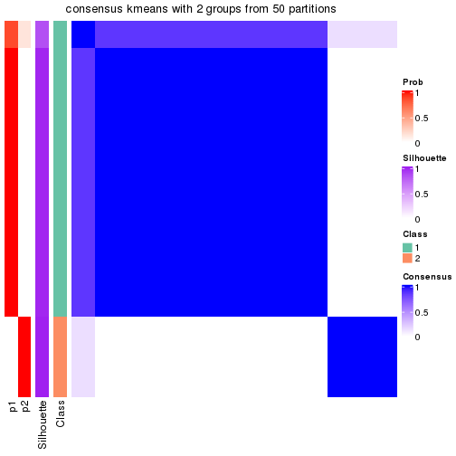</p>

</div>
<div id='tab-node-0211-consensus-heatmap-2'>
<pre><code class="r">consensus_heatmap(res, k = 3)
</code></pre>

<p>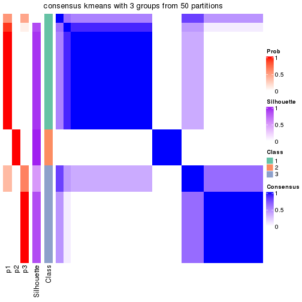</p>

</div>
<div id='tab-node-0211-consensus-heatmap-3'>
<pre><code class="r">consensus_heatmap(res, k = 4)
</code></pre>

<p>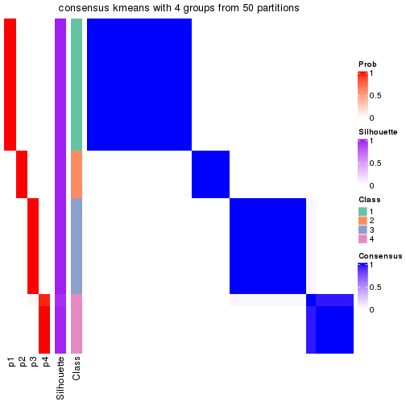</p>

</div>
<div id='tab-node-0211-consensus-heatmap-4'>
<pre><code class="r">consensus_heatmap(res, k = 5)
</code></pre>

<p>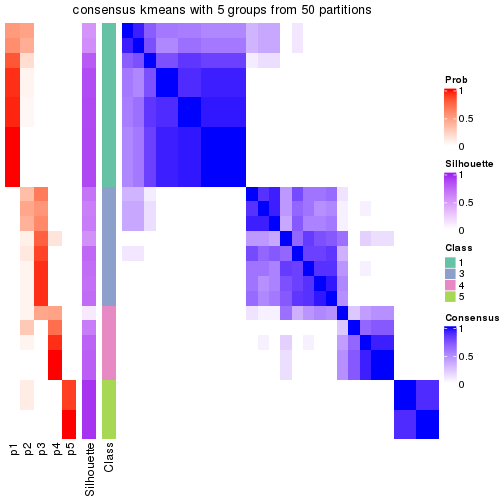</p>

</div>
<div id='tab-node-0211-consensus-heatmap-5'>
<pre><code class="r">consensus_heatmap(res, k = 6)
</code></pre>

<p>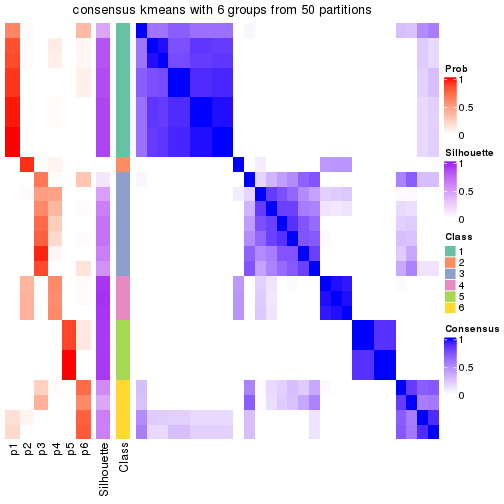</p>

</div>
<div id='tab-node-0211-consensus-heatmap-6'>
<pre><code class="r">consensus_heatmap(res, k = 7)
</code></pre>

<p>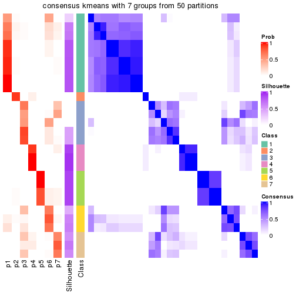</p>

</div>
<div id='tab-node-0211-consensus-heatmap-7'>
<pre><code class="r">consensus_heatmap(res, k = 8)
</code></pre>

<p>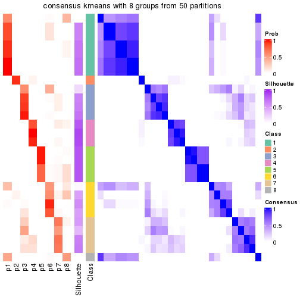</p>

</div>
</div>

Heatmaps for the membership of samples in all partitions to see how consistent they are:


<script>
$( function() {
	$( '#tabs-node-0211-membership-heatmap' ).tabs();
} );
</script>
<div id='tabs-node-0211-membership-heatmap'>
<ul>
<li><a href='#tab-node-0211-membership-heatmap-1'>k = 2</a></li>
<li><a href='#tab-node-0211-membership-heatmap-2'>k = 3</a></li>
<li><a href='#tab-node-0211-membership-heatmap-3'>k = 4</a></li>
<li><a href='#tab-node-0211-membership-heatmap-4'>k = 5</a></li>
<li><a href='#tab-node-0211-membership-heatmap-5'>k = 6</a></li>
<li><a href='#tab-node-0211-membership-heatmap-6'>k = 7</a></li>
<li><a href='#tab-node-0211-membership-heatmap-7'>k = 8</a></li>
</ul>
<div id='tab-node-0211-membership-heatmap-1'>
<pre><code class="r">membership_heatmap(res, k = 2)
</code></pre>

<p>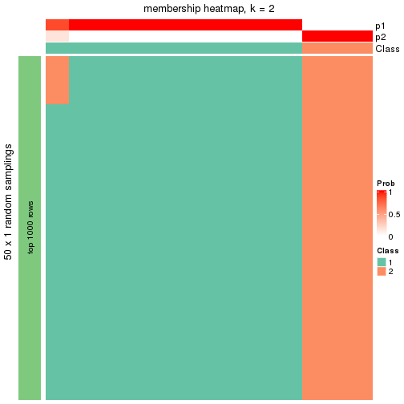</p>

</div>
<div id='tab-node-0211-membership-heatmap-2'>
<pre><code class="r">membership_heatmap(res, k = 3)
</code></pre>

<p>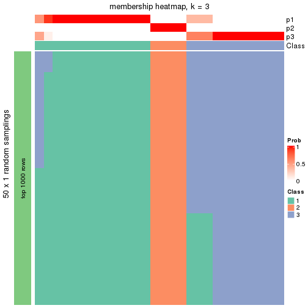</p>

</div>
<div id='tab-node-0211-membership-heatmap-3'>
<pre><code class="r">membership_heatmap(res, k = 4)
</code></pre>

<p>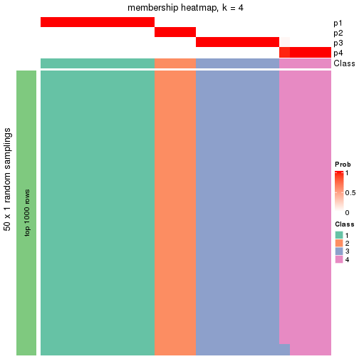</p>

</div>
<div id='tab-node-0211-membership-heatmap-4'>
<pre><code class="r">membership_heatmap(res, k = 5)
</code></pre>

<p>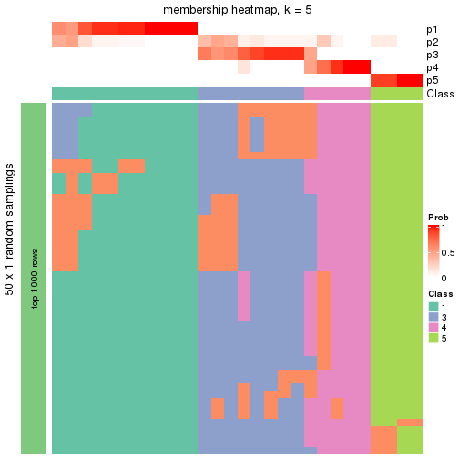</p>

</div>
<div id='tab-node-0211-membership-heatmap-5'>
<pre><code class="r">membership_heatmap(res, k = 6)
</code></pre>

<p>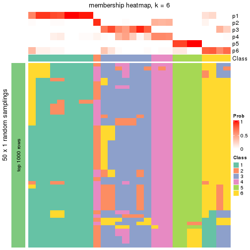</p>

</div>
<div id='tab-node-0211-membership-heatmap-6'>
<pre><code class="r">membership_heatmap(res, k = 7)
</code></pre>

<p>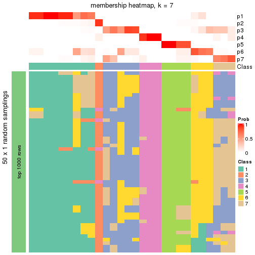</p>

</div>
<div id='tab-node-0211-membership-heatmap-7'>
<pre><code class="r">membership_heatmap(res, k = 8)
</code></pre>

<p>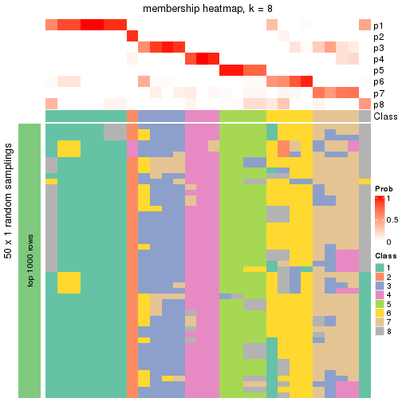</p>

</div>
</div>

As soon as the classes for columns are determined, the signatures
that are significantly different between subgroups can be looked for. 
Following are the heatmaps for signatures.


<script>
$( function() {
	$( '#tabs-node-0211-get-signatures' ).tabs();
} );
</script>
<div id='tabs-node-0211-get-signatures'>
<ul>
<li><a href='#tab-node-0211-get-signatures-1'>k = 2</a></li>
<li><a href='#tab-node-0211-get-signatures-2'>k = 3</a></li>
<li><a href='#tab-node-0211-get-signatures-3'>k = 4</a></li>
<li><a href='#tab-node-0211-get-signatures-4'>k = 5</a></li>
<li><a href='#tab-node-0211-get-signatures-5'>k = 6</a></li>
<li><a href='#tab-node-0211-get-signatures-6'>k = 7</a></li>
<li><a href='#tab-node-0211-get-signatures-7'>k = 8</a></li>
</ul>
<div id='tab-node-0211-get-signatures-1'>
<pre><code class="r">get_signatures(res, k = 2)
</code></pre>

<p>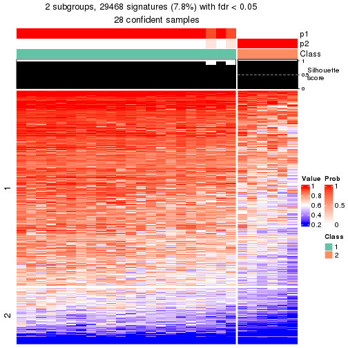</p>

</div>
<div id='tab-node-0211-get-signatures-2'>
<pre><code class="r">get_signatures(res, k = 3)
</code></pre>

<p>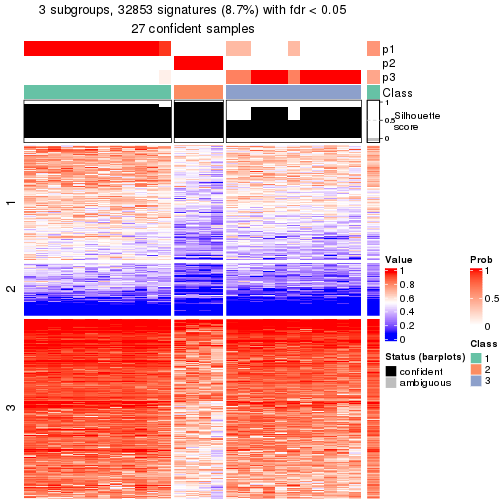</p>

</div>
<div id='tab-node-0211-get-signatures-3'>
<pre><code class="r">get_signatures(res, k = 4)
</code></pre>

<p>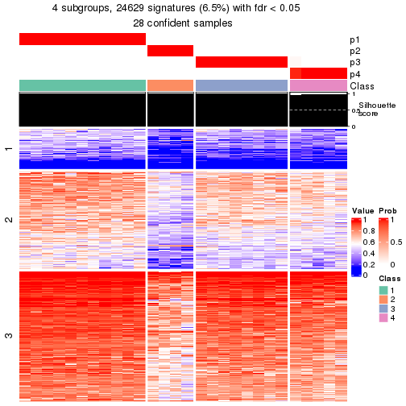</p>

</div>
<div id='tab-node-0211-get-signatures-4'>
<pre><code class="r">get_signatures(res, k = 5)
</code></pre>

<p>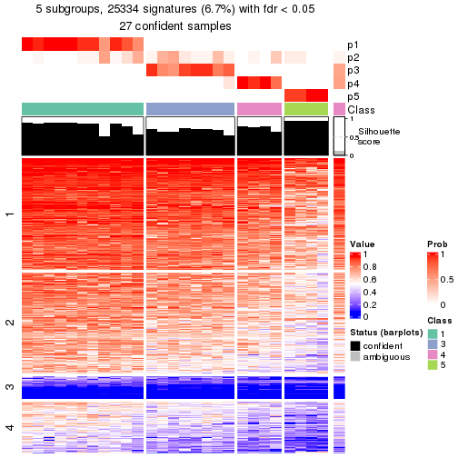</p>

</div>
<div id='tab-node-0211-get-signatures-5'>
<pre><code class="r">get_signatures(res, k = 6)
</code></pre>

<p>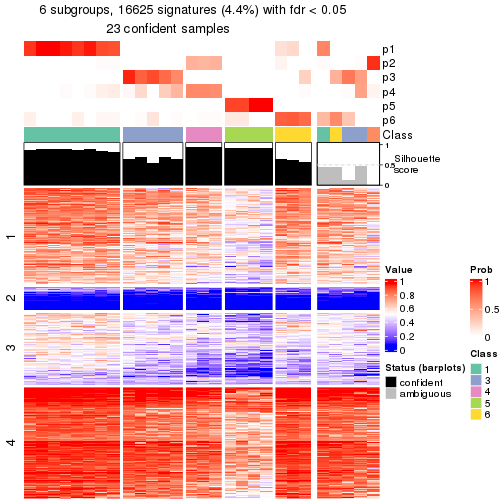</p>

</div>
<div id='tab-node-0211-get-signatures-6'>
<pre><code class="r">get_signatures(res, k = 7)
</code></pre>

<p>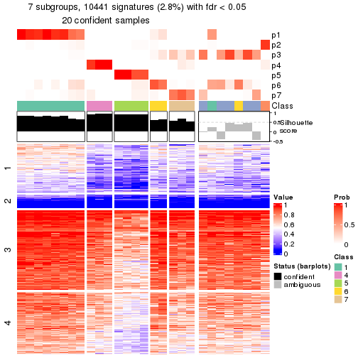</p>

</div>
<div id='tab-node-0211-get-signatures-7'>
<pre><code class="r">get_signatures(res, k = 8)
</code></pre>

<p>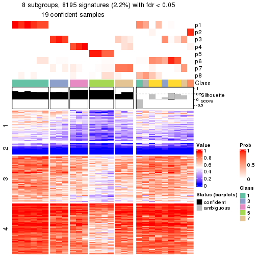</p>

</div>
</div>


Compare the overlap of signatures from different k:

```r
compare_signatures(res)
```

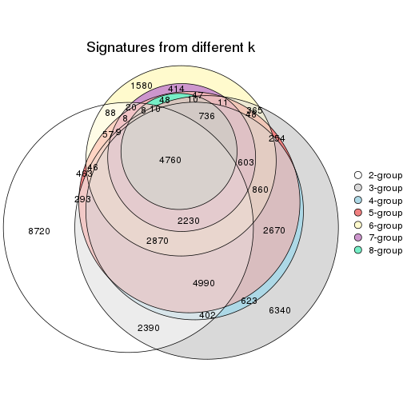

`get_signature()` returns a data frame invisibly. To get the list of signatures, the function
call should be assigned to a variable explicitly. In following code, if `plot` argument is set
to `FALSE`, no heatmap is plotted while only the differential analysis is performed.

```r
# code only for demonstration
tb = get_signature(res, k = ..., plot = FALSE)
```

An example of the output of `tb` is:

```
#>   which_row         fdr    mean_1    mean_2 scaled_mean_1 scaled_mean_2 km
#> 1        38 0.042760348  8.373488  9.131774    -0.5533452     0.5164555  1
#> 2        40 0.018707592  7.106213  8.469186    -0.6173731     0.5762149  1
#> 3        55 0.019134737 10.221463 11.207825    -0.6159697     0.5749050  1
#> 4        59 0.006059896  5.921854  7.869574    -0.6899429     0.6439467  1
#> 5        60 0.018055526  8.928898 10.211722    -0.6204761     0.5791110  1
#> 6        98 0.009384629 15.714769 14.887706     0.6635654    -0.6193277  2
...
```

The columns in `tb` are:

1. `which_row`: row indices corresponding to the input matrix.
2. `fdr`: FDR for the differential test. 
3. `mean_x`: The mean value in group x.
4. `scaled_mean_x`: The mean value in group x after rows are scaled.
5. `km`: Row groups if k-means clustering is applied to rows (which is done by automatically selecting number of clusters).

If there are too many signatures, `top_signatures = ...` can be set to only show the 
signatures with the highest FDRs:

```r
# code only for demonstration
# e.g. to show the top 500 most significant rows
tb = get_signature(res, k = ..., top_signatures = 500)
```

If the signatures are defined as these which are uniquely high in current group, `diff_method` argument
can be set to `"uniquely_high_in_one_group"`:

```r
# code only for demonstration
tb = get_signature(res, k = ..., diff_method = "uniquely_high_in_one_group")
```


UMAP plot which shows how samples are separated.


<script>
$( function() {
	$( '#tabs-node-0211-dimension-reduction' ).tabs();
} );
</script>
<div id='tabs-node-0211-dimension-reduction'>
<ul>
<li><a href='#tab-node-0211-dimension-reduction-1'>k = 2</a></li>
<li><a href='#tab-node-0211-dimension-reduction-2'>k = 3</a></li>
<li><a href='#tab-node-0211-dimension-reduction-3'>k = 4</a></li>
<li><a href='#tab-node-0211-dimension-reduction-4'>k = 5</a></li>
<li><a href='#tab-node-0211-dimension-reduction-5'>k = 6</a></li>
<li><a href='#tab-node-0211-dimension-reduction-6'>k = 7</a></li>
<li><a href='#tab-node-0211-dimension-reduction-7'>k = 8</a></li>
</ul>
<div id='tab-node-0211-dimension-reduction-1'>
<pre><code class="r">dimension_reduction(res, k = 2, method = &quot;UMAP&quot;)
</code></pre>

<p>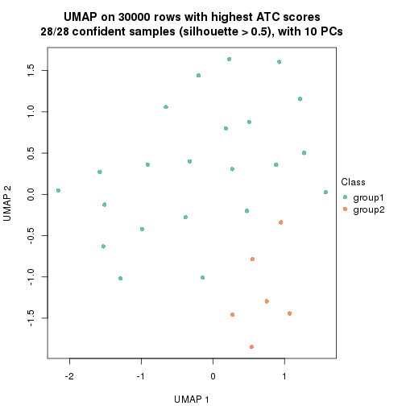</p>

</div>
<div id='tab-node-0211-dimension-reduction-2'>
<pre><code class="r">dimension_reduction(res, k = 3, method = &quot;UMAP&quot;)
</code></pre>

<p>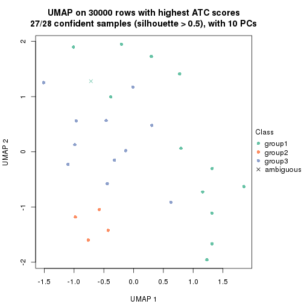</p>

</div>
<div id='tab-node-0211-dimension-reduction-3'>
<pre><code class="r">dimension_reduction(res, k = 4, method = &quot;UMAP&quot;)
</code></pre>

<p>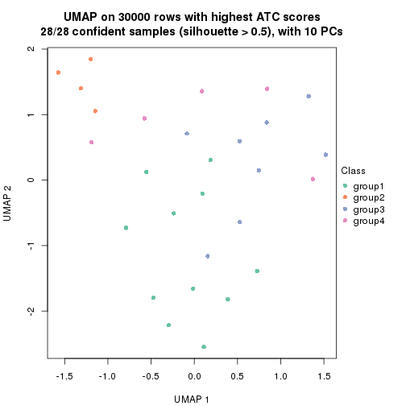</p>

</div>
<div id='tab-node-0211-dimension-reduction-4'>
<pre><code class="r">dimension_reduction(res, k = 5, method = &quot;UMAP&quot;)
</code></pre>

<p>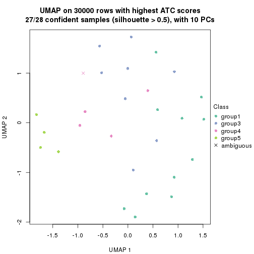</p>

</div>
<div id='tab-node-0211-dimension-reduction-5'>
<pre><code class="r">dimension_reduction(res, k = 6, method = &quot;UMAP&quot;)
</code></pre>

<p>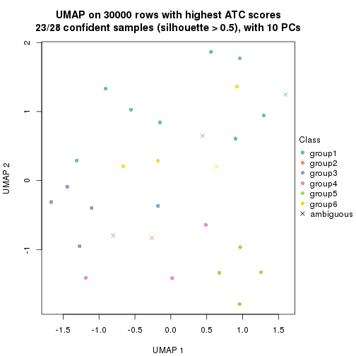</p>

</div>
<div id='tab-node-0211-dimension-reduction-6'>
<pre><code class="r">dimension_reduction(res, k = 7, method = &quot;UMAP&quot;)
</code></pre>

<p>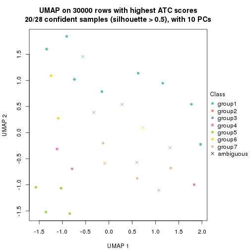</p>

</div>
<div id='tab-node-0211-dimension-reduction-7'>
<pre><code class="r">dimension_reduction(res, k = 8, method = &quot;UMAP&quot;)
</code></pre>

<p>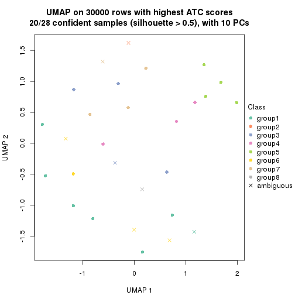</p>

</div>
</div>


Following heatmap shows how subgroups are split when increasing `k`:

```r
collect_classes(res)
```

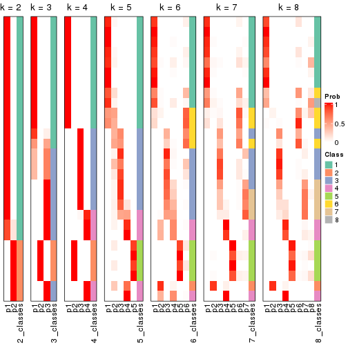


If matrix rows can be associated to genes, consider to use `functional_enrichment(res,
...)` to perform function enrichment for the signature genes. See [this vignette](https://jokergoo.github.io/cola_vignettes/functional_enrichment.html) for more detailed explanations.


 

---------------------------------------------------


### Node0212


Parent node: [Node021](#Node021).
Child nodes: 
                Node01211-leaf
        ,
                Node01212-leaf
        ,
                Node01213-leaf
        ,
                Node01221-leaf
        ,
                Node01222-leaf
        ,
                Node01223-leaf
        ,
                Node02111-leaf
        ,
                Node02112-leaf
        ,
                Node02113-leaf
        ,
                Node02114-leaf
        ,
                Node02121-leaf
        ,
                Node02122-leaf
        ,
                Node02123-leaf
        ,
                Node02124-leaf
        ,
                Node02131-leaf
        ,
                [Node02132](#Node02132)
        ,
                Node02133-leaf
        ,
                Node02211-leaf
        ,
                Node02212-leaf
        ,
                Node02213-leaf
        ,
                Node02221-leaf
        ,
                Node02222-leaf
        ,
                Node02223-leaf
        ,
                Node02231-leaf
        ,
                Node02232-leaf
        ,
                Node02233-leaf
        ,
                Node02241-leaf
        ,
                Node02242-leaf
        ,
                Node02243-leaf
        ,
                Node02321-leaf
        ,
                Node02322-leaf
        ,
                Node02323-leaf
        ,
                Node05111-leaf
        ,
                Node05112-leaf
        ,
                Node05113-leaf
        ,
                Node05114-leaf
        ,
                [Node05121](#Node05121)
        ,
                Node05122-leaf
        ,
                Node05123-leaf
        ,
                Node05221-leaf
        ,
                Node05222-leaf
        .


The object with results only for a single top-value method and a single partitioning method 
can be extracted as:

```r
res = res_rh["0212"]
```

A summary of `res` and all the functions that can be applied to it:

```r
res
```

```
#> A 'ConsensusPartition' object with k = 2, 3, 4, 5, 6, 7, 8.
#>   On a matrix with 30000 rows and 34 columns.
#>   Top rows (1000) are extracted by 'ATC' method.
#>   Subgroups are detected by 'kmeans' method.
#>   Performed in total 350 partitions by row resampling.
#>   Best k for subgroups seems to be 4.
#> 
#> Following methods can be applied to this 'ConsensusPartition' object:
#>  [1] "cola_report"             "collect_classes"         "collect_plots"          
#>  [4] "collect_stats"           "colnames"                "compare_partitions"     
#>  [7] "compare_signatures"      "consensus_heatmap"       "dimension_reduction"    
#> [10] "functional_enrichment"   "get_anno_col"            "get_anno"               
#> [13] "get_classes"             "get_consensus"           "get_matrix"             
#> [16] "get_membership"          "get_param"               "get_signatures"         
#> [19] "get_stats"               "is_best_k"               "is_stable_k"            
#> [22] "membership_heatmap"      "ncol"                    "nrow"                   
#> [25] "plot_ecdf"               "predict_classes"         "rownames"               
#> [28] "select_partition_number" "show"                    "suggest_best_k"         
#> [31] "test_to_known_factors"   "top_rows_heatmap"
```

`collect_plots()` function collects all the plots made from `res` for all `k` (number of subgroups)
into one single page to provide an easy and fast comparison between different `k`.

```r
collect_plots(res)
```

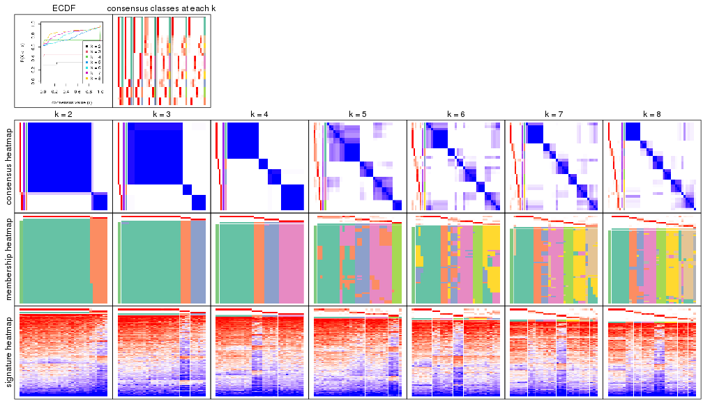

The plots are:

- The first row: a plot of the eCDF (empirical cumulative distribution
  function) curves of the consensus matrix for each `k` and the heatmap of
  predicted classes for each `k`.
- The second row: heatmaps of the consensus matrix for each `k`.
- The third row: heatmaps of the membership matrix for each `k`.
- The fouth row: heatmaps of the signatures for each `k`.

All the plots in panels can be made by individual functions and they are
plotted later in this section.

`select_partition_number()` produces several plots showing different
statistics for choosing "optimized" `k`. There are following statistics:

- eCDF curves of the consensus matrix for each `k`;
- 1-PAC. [The PAC score](https://en.wikipedia.org/wiki/Consensus_clustering#Over-interpretation_potential_of_consensus_clustering)
  measures the proportion of the ambiguous subgrouping.
- Mean silhouette score.
- Concordance. The mean probability of fiting the consensus subgroup labels in all
  partitions.
- Area increased. Denote $A_k$ as the area under the eCDF curve for current
  `k`, the area increased is defined as $A_k - A_{k-1}$.
- Rand index. The percent of pairs of samples that are both in a same cluster
  or both are not in a same cluster in the partition of k and k-1.
- Jaccard index. The ratio of pairs of samples are both in a same cluster in
  the partition of k and k-1 and the pairs of samples are both in a same
  cluster in the partition k or k-1.

The detailed explanations of these statistics can be found in [the _cola_
vignette](https://jokergoo.github.io/cola_vignettes/cola.html#toc_13).

Generally speaking, higher 1-PAC score, higher mean silhouette score or higher
concordance corresponds to better partition. Rand index and Jaccard index
measure how similar the current partition is compared to partition with `k-1`.
If they are too similar, we won't accept `k` is better than `k-1`.

```r
select_partition_number(res)
```

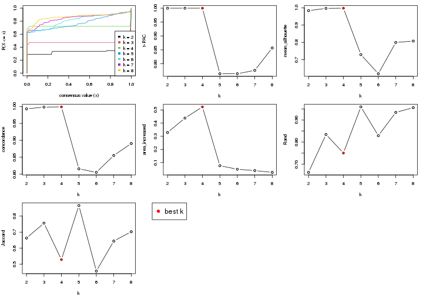

The numeric values for all these statistics can be obtained by `get_stats()`.

```r
get_stats(res)
```

```
#>   k 1-PAC mean_silhouette concordance area_increased  Rand Jaccard
#> 2 2 1.000           0.984       0.993         0.3286 0.663   0.663
#> 3 3 1.000           0.997       0.998         0.4383 0.834   0.756
#> 4 4 1.000           0.998       0.999         0.5234 0.750   0.529
#> 5 5 0.764           0.729       0.816         0.0764 0.959   0.865
#> 6 6 0.764           0.619       0.805         0.0496 0.829   0.458
#> 7 7 0.776           0.800       0.855         0.0392 0.934   0.644
#> 8 8 0.857           0.808       0.891         0.0256 0.955   0.702
```

`suggest_best_k()` suggests the best $k$ based on these statistics. The rules are as follows:

- All $k$ with Jaccard index larger than 0.95 are removed because increasing
  $k$ does not provide enough extra information. If all $k$ are removed, it is
  marked as no subgroup is detected.
- For all $k$ with 1-PAC score larger than 0.9, the maximal $k$ is taken as
  the best $k$, and other $k$ are marked as optional $k$.
- If it does not fit the second rule. The $k$ with the maximal vote of the
  highest 1-PAC score, highest mean silhouette, and highest concordance is
  taken as the best $k$.

```r
suggest_best_k(res)
```

```
#> [1] 4
#> attr(,"optional")
#> [1] 2 3
```

There is also optional best $k$ = 2 3 that is worth to check.

Following is the table of the partitions (You need to click the **show/hide
code output** link to see it). The membership matrix (columns with name `p*`)
is inferred by
[`clue::cl_consensus()`](https://www.rdocumentation.org/link/cl_consensus?package=clue)
function with the `SE` method. Basically the value in the membership matrix
represents the probability to belong to a certain group. The finall subgroup
label for an item is determined with the group with highest probability it
belongs to.

In `get_classes()` function, the entropy is calculated from the membership
matrix and the silhouette score is calculated from the consensus matrix.


<script>
$( function() {
	$( '#tabs-node-0212-get-classes' ).tabs();
} );
</script>
<div id='tabs-node-0212-get-classes'>
<ul>
<li><a href='#tab-node-0212-get-classes-1'>k = 2</a></li>
<li><a href='#tab-node-0212-get-classes-2'>k = 3</a></li>
<li><a href='#tab-node-0212-get-classes-3'>k = 4</a></li>
<li><a href='#tab-node-0212-get-classes-4'>k = 5</a></li>
<li><a href='#tab-node-0212-get-classes-5'>k = 6</a></li>
<li><a href='#tab-node-0212-get-classes-6'>k = 7</a></li>
<li><a href='#tab-node-0212-get-classes-7'>k = 8</a></li>
</ul>

<div id='tab-node-0212-get-classes-1'>
<p><a id='tab-node-0212-get-classes-1-a' style='color:#0366d6' href='#'>show/hide code output</a></p>
<pre><code class="r">cbind(get_classes(res, k = 2), get_membership(res, k = 2))
</code></pre>

<pre><code>#&gt;                 class entropy silhouette   p1   p2
#&gt; TCGA.CV.7416.01     2   0.000      0.960 0.00 1.00
#&gt; TCGA.CV.6003.01     2   0.000      0.960 0.00 1.00
#&gt; TCGA.CN.6018.01     1   0.000      1.000 1.00 0.00
#&gt; TCGA.CV.5966.01     1   0.000      1.000 1.00 0.00
#&gt; TCGA.CV.7411.01     1   0.000      1.000 1.00 0.00
#&gt; TCGA.CV.5973.01     2   0.000      0.960 0.00 1.00
#&gt; TCGA.CV.7104.01     2   0.795      0.684 0.24 0.76
#&gt; TCGA.CR.7394.01     1   0.000      1.000 1.00 0.00
#&gt; TCGA.CV.6955.01     1   0.000      1.000 1.00 0.00
#&gt; TCGA.BA.5557.01     1   0.000      1.000 1.00 0.00
#&gt; TCGA.CV.7238.01     1   0.000      1.000 1.00 0.00
#&gt; TCGA.CX.7085.01     1   0.000      1.000 1.00 0.00
#&gt; TCGA.DQ.5625.01     1   0.000      1.000 1.00 0.00
#&gt; TCGA.C9.A480.01     1   0.000      1.000 1.00 0.00
#&gt; TCGA.CV.6952.01     1   0.000      1.000 1.00 0.00
#&gt; TCGA.CQ.5331.01     1   0.000      1.000 1.00 0.00
#&gt; TCGA.D6.6826.01     1   0.000      1.000 1.00 0.00
#&gt; TCGA.CQ.6219.01     1   0.000      1.000 1.00 0.00
#&gt; TCGA.CV.A45P.01     1   0.000      1.000 1.00 0.00
#&gt; TCGA.CV.A45T.01     1   0.000      1.000 1.00 0.00
#&gt; TCGA.CN.6996.01     1   0.000      1.000 1.00 0.00
#&gt; TCGA.CQ.7064.01     1   0.000      1.000 1.00 0.00
#&gt; TCGA.IQ.A61K.01     2   0.000      0.960 0.00 1.00
#&gt; TCGA.IQ.A61L.01     2   0.000      0.960 0.00 1.00
#&gt; TCGA.HD.8635.01     1   0.000      1.000 1.00 0.00
#&gt; TCGA.QK.A64Z.01     1   0.000      1.000 1.00 0.00
#&gt; TCGA.HD.8634.01     1   0.000      1.000 1.00 0.00
#&gt; TCGA.F7.A50J.01     2   0.000      0.960 0.00 1.00
#&gt; TCGA.CN.A640.01     1   0.000      1.000 1.00 0.00
#&gt; TCGA.UF.A7JO.01     1   0.000      1.000 1.00 0.00
#&gt; TCGA.UF.A7JV.01     1   0.000      1.000 1.00 0.00
#&gt; TCGA.CN.5373.01     1   0.000      1.000 1.00 0.00
#&gt; TCGA.H7.A6C4.01     1   0.000      1.000 1.00 0.00
#&gt; TCGA.CV.7438.01     1   0.000      1.000 1.00 0.00
</code></pre>

<script>
$('#tab-node-0212-get-classes-1-a').parent().next().next().hide();
$('#tab-node-0212-get-classes-1-a').click(function(){
  $('#tab-node-0212-get-classes-1-a').parent().next().next().toggle();
  return(false);
});
</script>
</div>

<div id='tab-node-0212-get-classes-2'>
<p><a id='tab-node-0212-get-classes-2-a' style='color:#0366d6' href='#'>show/hide code output</a></p>
<pre><code class="r">cbind(get_classes(res, k = 3), get_membership(res, k = 3))
</code></pre>

<pre><code>#&gt;                 class entropy silhouette   p1 p2   p3
#&gt; TCGA.CV.7416.01     2  0.0000      1.000 0.00  1 0.00
#&gt; TCGA.CV.6003.01     2  0.0000      1.000 0.00  1 0.00
#&gt; TCGA.CN.6018.01     1  0.0000      0.997 1.00  0 0.00
#&gt; TCGA.CV.5966.01     1  0.0000      0.997 1.00  0 0.00
#&gt; TCGA.CV.7411.01     3  0.0000      1.000 0.00  0 1.00
#&gt; TCGA.CV.5973.01     2  0.0000      1.000 0.00  1 0.00
#&gt; TCGA.CV.7104.01     3  0.0000      1.000 0.00  0 1.00
#&gt; TCGA.CR.7394.01     1  0.0000      0.997 1.00  0 0.00
#&gt; TCGA.CV.6955.01     1  0.0000      0.997 1.00  0 0.00
#&gt; TCGA.BA.5557.01     1  0.0000      0.997 1.00  0 0.00
#&gt; TCGA.CV.7238.01     1  0.0000      0.997 1.00  0 0.00
#&gt; TCGA.CX.7085.01     1  0.0000      0.997 1.00  0 0.00
#&gt; TCGA.DQ.5625.01     1  0.0000      0.997 1.00  0 0.00
#&gt; TCGA.C9.A480.01     1  0.0000      0.997 1.00  0 0.00
#&gt; TCGA.CV.6952.01     1  0.0892      0.981 0.98  0 0.02
#&gt; TCGA.CQ.5331.01     1  0.0000      0.997 1.00  0 0.00
#&gt; TCGA.D6.6826.01     1  0.0000      0.997 1.00  0 0.00
#&gt; TCGA.CQ.6219.01     1  0.0000      0.997 1.00  0 0.00
#&gt; TCGA.CV.A45P.01     1  0.0000      0.997 1.00  0 0.00
#&gt; TCGA.CV.A45T.01     1  0.0000      0.997 1.00  0 0.00
#&gt; TCGA.CN.6996.01     1  0.0000      0.997 1.00  0 0.00
#&gt; TCGA.CQ.7064.01     1  0.0000      0.997 1.00  0 0.00
#&gt; TCGA.IQ.A61K.01     2  0.0000      1.000 0.00  1 0.00
#&gt; TCGA.IQ.A61L.01     3  0.0000      1.000 0.00  0 1.00
#&gt; TCGA.HD.8635.01     1  0.0892      0.981 0.98  0 0.02
#&gt; TCGA.QK.A64Z.01     1  0.0892      0.981 0.98  0 0.02
#&gt; TCGA.HD.8634.01     1  0.0000      0.997 1.00  0 0.00
#&gt; TCGA.F7.A50J.01     3  0.0000      1.000 0.00  0 1.00
#&gt; TCGA.CN.A640.01     1  0.0000      0.997 1.00  0 0.00
#&gt; TCGA.UF.A7JO.01     1  0.0000      0.997 1.00  0 0.00
#&gt; TCGA.UF.A7JV.01     1  0.0000      0.997 1.00  0 0.00
#&gt; TCGA.CN.5373.01     3  0.0000      1.000 0.00  0 1.00
#&gt; TCGA.H7.A6C4.01     1  0.0000      0.997 1.00  0 0.00
#&gt; TCGA.CV.7438.01     3  0.0000      1.000 0.00  0 1.00
</code></pre>

<script>
$('#tab-node-0212-get-classes-2-a').parent().next().next().hide();
$('#tab-node-0212-get-classes-2-a').click(function(){
  $('#tab-node-0212-get-classes-2-a').parent().next().next().toggle();
  return(false);
});
</script>
</div>

<div id='tab-node-0212-get-classes-3'>
<p><a id='tab-node-0212-get-classes-3-a' style='color:#0366d6' href='#'>show/hide code output</a></p>
<pre><code class="r">cbind(get_classes(res, k = 4), get_membership(res, k = 4))
</code></pre>

<pre><code>#&gt;                 class entropy silhouette p1 p2   p3   p4
#&gt; TCGA.CV.7416.01     2  0.0000       1.00  0  1 0.00 0.00
#&gt; TCGA.CV.6003.01     2  0.0000       1.00  0  1 0.00 0.00
#&gt; TCGA.CN.6018.01     1  0.0000       1.00  1  0 0.00 0.00
#&gt; TCGA.CV.5966.01     1  0.0000       1.00  1  0 0.00 0.00
#&gt; TCGA.CV.7411.01     3  0.0707       0.98  0  0 0.98 0.02
#&gt; TCGA.CV.5973.01     2  0.0000       1.00  0  1 0.00 0.00
#&gt; TCGA.CV.7104.01     3  0.0000       0.99  0  0 1.00 0.00
#&gt; TCGA.CR.7394.01     1  0.0000       1.00  1  0 0.00 0.00
#&gt; TCGA.CV.6955.01     4  0.0000       1.00  0  0 0.00 1.00
#&gt; TCGA.BA.5557.01     1  0.0000       1.00  1  0 0.00 0.00
#&gt; TCGA.CV.7238.01     1  0.0000       1.00  1  0 0.00 0.00
#&gt; TCGA.CX.7085.01     1  0.0000       1.00  1  0 0.00 0.00
#&gt; TCGA.DQ.5625.01     4  0.0000       1.00  0  0 0.00 1.00
#&gt; TCGA.C9.A480.01     1  0.0000       1.00  1  0 0.00 0.00
#&gt; TCGA.CV.6952.01     4  0.0000       1.00  0  0 0.00 1.00
#&gt; TCGA.CQ.5331.01     1  0.0000       1.00  1  0 0.00 0.00
#&gt; TCGA.D6.6826.01     1  0.0000       1.00  1  0 0.00 0.00
#&gt; TCGA.CQ.6219.01     1  0.0000       1.00  1  0 0.00 0.00
#&gt; TCGA.CV.A45P.01     1  0.0000       1.00  1  0 0.00 0.00
#&gt; TCGA.CV.A45T.01     1  0.0000       1.00  1  0 0.00 0.00
#&gt; TCGA.CN.6996.01     1  0.0000       1.00  1  0 0.00 0.00
#&gt; TCGA.CQ.7064.01     4  0.0000       1.00  0  0 0.00 1.00
#&gt; TCGA.IQ.A61K.01     2  0.0000       1.00  0  1 0.00 0.00
#&gt; TCGA.IQ.A61L.01     3  0.0000       0.99  0  0 1.00 0.00
#&gt; TCGA.HD.8635.01     4  0.0000       1.00  0  0 0.00 1.00
#&gt; TCGA.QK.A64Z.01     4  0.0000       1.00  0  0 0.00 1.00
#&gt; TCGA.HD.8634.01     4  0.0000       1.00  0  0 0.00 1.00
#&gt; TCGA.F7.A50J.01     3  0.0000       0.99  0  0 1.00 0.00
#&gt; TCGA.CN.A640.01     1  0.0000       1.00  1  0 0.00 0.00
#&gt; TCGA.UF.A7JO.01     4  0.0000       1.00  0  0 0.00 1.00
#&gt; TCGA.UF.A7JV.01     4  0.0000       1.00  0  0 0.00 1.00
#&gt; TCGA.CN.5373.01     3  0.0000       0.99  0  0 1.00 0.00
#&gt; TCGA.H7.A6C4.01     4  0.0000       1.00  0  0 0.00 1.00
#&gt; TCGA.CV.7438.01     3  0.0707       0.98  0  0 0.98 0.02
</code></pre>

<script>
$('#tab-node-0212-get-classes-3-a').parent().next().next().hide();
$('#tab-node-0212-get-classes-3-a').click(function(){
  $('#tab-node-0212-get-classes-3-a').parent().next().next().toggle();
  return(false);
});
</script>
</div>

<div id='tab-node-0212-get-classes-4'>
<p><a id='tab-node-0212-get-classes-4-a' style='color:#0366d6' href='#'>show/hide code output</a></p>
<pre><code class="r">cbind(get_classes(res, k = 5), get_membership(res, k = 5))
</code></pre>

<pre><code>#&gt;                 class entropy silhouette   p1   p2   p3   p4   p5
#&gt; TCGA.CV.7416.01     5   0.000      0.991 0.00 0.00 0.00 0.00 1.00
#&gt; TCGA.CV.6003.01     5   0.000      0.991 0.00 0.00 0.00 0.00 1.00
#&gt; TCGA.CN.6018.01     1   0.173      0.548 0.92 0.00 0.00 0.08 0.00
#&gt; TCGA.CV.5966.01     1   0.327      0.693 0.78 0.22 0.00 0.00 0.00
#&gt; TCGA.CV.7411.01     3   0.489      0.810 0.00 0.14 0.72 0.14 0.00
#&gt; TCGA.CV.5973.01     5   0.000      0.991 0.00 0.00 0.00 0.00 1.00
#&gt; TCGA.CV.7104.01     3   0.000      0.871 0.00 0.00 1.00 0.00 0.00
#&gt; TCGA.CR.7394.01     1   0.524      0.583 0.64 0.28 0.00 0.08 0.00
#&gt; TCGA.CV.6955.01     4   0.000      0.774 0.00 0.00 0.00 1.00 0.00
#&gt; TCGA.BA.5557.01     1   0.426      0.749 0.56 0.44 0.00 0.00 0.00
#&gt; TCGA.CV.7238.01     1   0.426      0.749 0.56 0.44 0.00 0.00 0.00
#&gt; TCGA.CX.7085.01     1   0.426      0.749 0.56 0.44 0.00 0.00 0.00
#&gt; TCGA.DQ.5625.01     4   0.385      0.736 0.22 0.02 0.00 0.76 0.00
#&gt; TCGA.C9.A480.01     1   0.000      0.615 1.00 0.00 0.00 0.00 0.00
#&gt; TCGA.CV.6952.01     4   0.173      0.735 0.00 0.08 0.00 0.92 0.00
#&gt; TCGA.CQ.5331.01     1   0.426      0.749 0.56 0.44 0.00 0.00 0.00
#&gt; TCGA.D6.6826.01     1   0.356      0.702 0.74 0.26 0.00 0.00 0.00
#&gt; TCGA.CQ.6219.01     1   0.426      0.749 0.56 0.44 0.00 0.00 0.00
#&gt; TCGA.CV.A45P.01     1   0.514      0.543 0.66 0.26 0.00 0.08 0.00
#&gt; TCGA.CV.A45T.01     1   0.426      0.749 0.56 0.44 0.00 0.00 0.00
#&gt; TCGA.CN.6996.01     1   0.173      0.548 0.92 0.00 0.00 0.08 0.00
#&gt; TCGA.CQ.7064.01     4   0.535      0.724 0.22 0.12 0.00 0.66 0.00
#&gt; TCGA.IQ.A61K.01     5   0.104      0.972 0.00 0.04 0.00 0.00 0.96
#&gt; TCGA.IQ.A61L.01     3   0.000      0.871 0.00 0.00 1.00 0.00 0.00
#&gt; TCGA.HD.8635.01     4   0.273      0.728 0.00 0.16 0.00 0.84 0.00
#&gt; TCGA.QK.A64Z.01     4   0.273      0.728 0.00 0.16 0.00 0.84 0.00
#&gt; TCGA.HD.8634.01     4   0.579      0.684 0.26 0.14 0.00 0.60 0.00
#&gt; TCGA.F7.A50J.01     3   0.000      0.871 0.00 0.00 1.00 0.00 0.00
#&gt; TCGA.CN.A640.01     1   0.426      0.749 0.56 0.44 0.00 0.00 0.00
#&gt; TCGA.UF.A7JO.01     4   0.000      0.774 0.00 0.00 0.00 1.00 0.00
#&gt; TCGA.UF.A7JV.01     1   0.659     -0.327 0.44 0.34 0.00 0.22 0.00
#&gt; TCGA.CN.5373.01     3   0.252      0.861 0.00 0.14 0.86 0.00 0.00
#&gt; TCGA.H7.A6C4.01     4   0.535      0.724 0.22 0.12 0.00 0.66 0.00
#&gt; TCGA.CV.7438.01     3   0.489      0.810 0.00 0.14 0.72 0.14 0.00
</code></pre>

<script>
$('#tab-node-0212-get-classes-4-a').parent().next().next().hide();
$('#tab-node-0212-get-classes-4-a').click(function(){
  $('#tab-node-0212-get-classes-4-a').parent().next().next().toggle();
  return(false);
});
</script>
</div>

<div id='tab-node-0212-get-classes-5'>
<p><a id='tab-node-0212-get-classes-5-a' style='color:#0366d6' href='#'>show/hide code output</a></p>
<pre><code class="r">cbind(get_classes(res, k = 6), get_membership(res, k = 6))
</code></pre>

<pre><code>#&gt;                 class entropy silhouette   p1   p2   p3   p4   p5   p6
#&gt; TCGA.CV.7416.01     5  0.0000     0.9795 0.00 0.00 0.00 0.00 1.00 0.00
#&gt; TCGA.CV.6003.01     5  0.0000     0.9795 0.00 0.00 0.00 0.00 1.00 0.00
#&gt; TCGA.CN.6018.01     6  0.5867     0.2558 0.28 0.00 0.24 0.00 0.00 0.48
#&gt; TCGA.CV.5966.01     1  0.5721     0.2620 0.52 0.00 0.24 0.00 0.00 0.24
#&gt; TCGA.CV.7411.01     3  0.5801     0.4374 0.00 0.24 0.50 0.26 0.00 0.00
#&gt; TCGA.CV.5973.01     5  0.0000     0.9795 0.00 0.00 0.00 0.00 1.00 0.00
#&gt; TCGA.CV.7104.01     2  0.0000     1.0000 0.00 1.00 0.00 0.00 0.00 0.00
#&gt; TCGA.CR.7394.01     6  0.3578     0.4677 0.34 0.00 0.00 0.00 0.00 0.66
#&gt; TCGA.CV.6955.01     4  0.1267     0.8183 0.00 0.00 0.00 0.94 0.00 0.06
#&gt; TCGA.BA.5557.01     1  0.0000     0.8298 1.00 0.00 0.00 0.00 0.00 0.00
#&gt; TCGA.CV.7238.01     1  0.0000     0.8298 1.00 0.00 0.00 0.00 0.00 0.00
#&gt; TCGA.CX.7085.01     1  0.0000     0.8298 1.00 0.00 0.00 0.00 0.00 0.00
#&gt; TCGA.DQ.5625.01     4  0.5618    -0.0137 0.00 0.00 0.16 0.50 0.00 0.34
#&gt; TCGA.C9.A480.01     1  0.6010    -0.0968 0.40 0.00 0.24 0.00 0.00 0.36
#&gt; TCGA.CV.6952.01     4  0.0000     0.8276 0.00 0.00 0.00 1.00 0.00 0.00
#&gt; TCGA.CQ.5331.01     1  0.0000     0.8298 1.00 0.00 0.00 0.00 0.00 0.00
#&gt; TCGA.D6.6826.01     1  0.3544     0.6717 0.80 0.00 0.08 0.00 0.00 0.12
#&gt; TCGA.CQ.6219.01     1  0.0000     0.8298 1.00 0.00 0.00 0.00 0.00 0.00
#&gt; TCGA.CV.A45P.01     6  0.3198     0.5476 0.26 0.00 0.00 0.00 0.00 0.74
#&gt; TCGA.CV.A45T.01     1  0.0000     0.8298 1.00 0.00 0.00 0.00 0.00 0.00
#&gt; TCGA.CN.6996.01     6  0.5712     0.3195 0.26 0.00 0.22 0.00 0.00 0.52
#&gt; TCGA.CQ.7064.01     6  0.3916     0.3961 0.00 0.00 0.02 0.30 0.00 0.68
#&gt; TCGA.IQ.A61K.01     5  0.1807     0.9369 0.00 0.00 0.02 0.00 0.92 0.06
#&gt; TCGA.IQ.A61L.01     2  0.0000     1.0000 0.00 1.00 0.00 0.00 0.00 0.00
#&gt; TCGA.HD.8635.01     4  0.0547     0.8310 0.00 0.00 0.02 0.98 0.00 0.00
#&gt; TCGA.QK.A64Z.01     4  0.0547     0.8310 0.00 0.00 0.02 0.98 0.00 0.00
#&gt; TCGA.HD.8634.01     6  0.3198     0.4448 0.00 0.00 0.00 0.26 0.00 0.74
#&gt; TCGA.F7.A50J.01     2  0.0000     1.0000 0.00 1.00 0.00 0.00 0.00 0.00
#&gt; TCGA.CN.A640.01     1  0.0000     0.8298 1.00 0.00 0.00 0.00 0.00 0.00
#&gt; TCGA.UF.A7JO.01     4  0.0937     0.8285 0.00 0.00 0.00 0.96 0.00 0.04
#&gt; TCGA.UF.A7JV.01     3  0.4902    -0.3480 0.00 0.00 0.48 0.06 0.00 0.46
#&gt; TCGA.CN.5373.01     3  0.4646     0.0504 0.00 0.46 0.50 0.04 0.00 0.00
#&gt; TCGA.H7.A6C4.01     6  0.3916     0.3961 0.00 0.00 0.02 0.30 0.00 0.68
#&gt; TCGA.CV.7438.01     3  0.5801     0.4374 0.00 0.24 0.50 0.26 0.00 0.00
</code></pre>

<script>
$('#tab-node-0212-get-classes-5-a').parent().next().next().hide();
$('#tab-node-0212-get-classes-5-a').click(function(){
  $('#tab-node-0212-get-classes-5-a').parent().next().next().toggle();
  return(false);
});
</script>
</div>

<div id='tab-node-0212-get-classes-6'>
<p><a id='tab-node-0212-get-classes-6-a' style='color:#0366d6' href='#'>show/hide code output</a></p>
<pre><code class="r">cbind(get_classes(res, k = 7), get_membership(res, k = 7))
</code></pre>

<pre><code>#&gt;                 class entropy silhouette   p1   p2   p3   p4   p5   p6   p7
#&gt; TCGA.CV.7416.01     5  0.0000      0.961 0.00 0.00 0.00 0.00 1.00 0.00 0.00
#&gt; TCGA.CV.6003.01     5  0.0504      0.957 0.00 0.02 0.00 0.00 0.98 0.00 0.00
#&gt; TCGA.CN.6018.01     7  0.4787      0.633 0.12 0.00 0.00 0.00 0.00 0.30 0.58
#&gt; TCGA.CV.5966.01     7  0.4328      0.500 0.34 0.00 0.00 0.00 0.00 0.06 0.60
#&gt; TCGA.CV.7411.01     3  0.1671      0.900 0.00 0.00 0.90 0.10 0.00 0.00 0.00
#&gt; TCGA.CV.5973.01     5  0.0000      0.961 0.00 0.00 0.00 0.00 1.00 0.00 0.00
#&gt; TCGA.CV.7104.01     2  0.2708      1.000 0.00 0.78 0.22 0.00 0.00 0.00 0.00
#&gt; TCGA.CR.7394.01     6  0.2259      0.748 0.16 0.00 0.00 0.00 0.00 0.84 0.00
#&gt; TCGA.CV.6955.01     4  0.1006      0.839 0.00 0.00 0.02 0.96 0.00 0.02 0.00
#&gt; TCGA.BA.5557.01     1  0.0000      0.934 1.00 0.00 0.00 0.00 0.00 0.00 0.00
#&gt; TCGA.CV.7238.01     1  0.0000      0.934 1.00 0.00 0.00 0.00 0.00 0.00 0.00
#&gt; TCGA.CX.7085.01     1  0.0000      0.934 1.00 0.00 0.00 0.00 0.00 0.00 0.00
#&gt; TCGA.DQ.5625.01     4  0.5233      0.155 0.00 0.00 0.00 0.52 0.00 0.20 0.28
#&gt; TCGA.C9.A480.01     7  0.4873      0.667 0.22 0.00 0.00 0.00 0.00 0.18 0.60
#&gt; TCGA.CV.6952.01     4  0.0504      0.836 0.00 0.00 0.02 0.98 0.00 0.00 0.00
#&gt; TCGA.CQ.5331.01     1  0.0000      0.934 1.00 0.00 0.00 0.00 0.00 0.00 0.00
#&gt; TCGA.D6.6826.01     1  0.3755      0.266 0.64 0.00 0.00 0.00 0.00 0.02 0.34
#&gt; TCGA.CQ.6219.01     1  0.0000      0.934 1.00 0.00 0.00 0.00 0.00 0.00 0.00
#&gt; TCGA.CV.A45P.01     6  0.1671      0.791 0.10 0.00 0.00 0.00 0.00 0.90 0.00
#&gt; TCGA.CV.A45T.01     1  0.0000      0.934 1.00 0.00 0.00 0.00 0.00 0.00 0.00
#&gt; TCGA.CN.6996.01     7  0.4597      0.556 0.08 0.00 0.00 0.00 0.00 0.36 0.56
#&gt; TCGA.CQ.7064.01     6  0.2569      0.844 0.00 0.00 0.02 0.14 0.00 0.84 0.00
#&gt; TCGA.IQ.A61K.01     5  0.2857      0.892 0.00 0.04 0.00 0.00 0.86 0.06 0.04
#&gt; TCGA.IQ.A61L.01     2  0.2708      1.000 0.00 0.78 0.22 0.00 0.00 0.00 0.00
#&gt; TCGA.HD.8635.01     4  0.1860      0.819 0.00 0.02 0.02 0.92 0.00 0.00 0.04
#&gt; TCGA.QK.A64Z.01     4  0.1860      0.819 0.00 0.02 0.02 0.92 0.00 0.00 0.04
#&gt; TCGA.HD.8634.01     6  0.1671      0.840 0.00 0.00 0.00 0.10 0.00 0.90 0.00
#&gt; TCGA.F7.A50J.01     2  0.2708      1.000 0.00 0.78 0.22 0.00 0.00 0.00 0.00
#&gt; TCGA.CN.A640.01     1  0.0000      0.934 1.00 0.00 0.00 0.00 0.00 0.00 0.00
#&gt; TCGA.UF.A7JO.01     4  0.1006      0.839 0.00 0.00 0.02 0.96 0.00 0.02 0.00
#&gt; TCGA.UF.A7JV.01     7  0.5373      0.310 0.00 0.14 0.10 0.00 0.00 0.12 0.64
#&gt; TCGA.CN.5373.01     3  0.2376      0.771 0.00 0.12 0.86 0.02 0.00 0.00 0.00
#&gt; TCGA.H7.A6C4.01     6  0.2569      0.844 0.00 0.00 0.02 0.14 0.00 0.84 0.00
#&gt; TCGA.CV.7438.01     3  0.1671      0.900 0.00 0.00 0.90 0.10 0.00 0.00 0.00
</code></pre>

<script>
$('#tab-node-0212-get-classes-6-a').parent().next().next().hide();
$('#tab-node-0212-get-classes-6-a').click(function(){
  $('#tab-node-0212-get-classes-6-a').parent().next().next().toggle();
  return(false);
});
</script>
</div>

<div id='tab-node-0212-get-classes-7'>
<p><a id='tab-node-0212-get-classes-7-a' style='color:#0366d6' href='#'>show/hide code output</a></p>
<pre><code class="r">cbind(get_classes(res, k = 8), get_membership(res, k = 8))
</code></pre>

<pre><code>#&gt;                 class entropy silhouette   p1   p2   p3   p4   p5   p6   p7   p8
#&gt; TCGA.CV.7416.01     5  0.0000     0.9472 0.00 0.00 0.00 0.00 1.00 0.00 0.00 0.00
#&gt; TCGA.CV.6003.01     5  0.0471     0.9432 0.00 0.00 0.00 0.00 0.98 0.02 0.00 0.00
#&gt; TCGA.CN.6018.01     7  0.2407     0.6450 0.06 0.00 0.00 0.00 0.00 0.08 0.86 0.00
#&gt; TCGA.CV.5966.01     7  0.1563     0.6330 0.10 0.00 0.00 0.00 0.00 0.00 0.90 0.00
#&gt; TCGA.CV.7411.01     3  0.3263     0.9059 0.00 0.12 0.78 0.10 0.00 0.00 0.00 0.00
#&gt; TCGA.CV.5973.01     5  0.0000     0.9472 0.00 0.00 0.00 0.00 1.00 0.00 0.00 0.00
#&gt; TCGA.CV.7104.01     2  0.1557     0.9289 0.00 0.92 0.00 0.00 0.00 0.00 0.06 0.02
#&gt; TCGA.CR.7394.01     6  0.3054     0.8051 0.08 0.00 0.00 0.00 0.00 0.80 0.12 0.00
#&gt; TCGA.CV.6955.01     4  0.0000     0.9398 0.00 0.00 0.00 1.00 0.00 0.00 0.00 0.00
#&gt; TCGA.BA.5557.01     1  0.0000     1.0000 1.00 0.00 0.00 0.00 0.00 0.00 0.00 0.00
#&gt; TCGA.CV.7238.01     1  0.0000     1.0000 1.00 0.00 0.00 0.00 0.00 0.00 0.00 0.00
#&gt; TCGA.CX.7085.01     1  0.0000     1.0000 1.00 0.00 0.00 0.00 0.00 0.00 0.00 0.00
#&gt; TCGA.DQ.5625.01     7  0.6344    -0.0247 0.00 0.00 0.14 0.36 0.00 0.10 0.38 0.02
#&gt; TCGA.C9.A480.01     7  0.1557     0.6424 0.06 0.00 0.00 0.00 0.00 0.02 0.92 0.00
#&gt; TCGA.CV.6952.01     4  0.0000     0.9398 0.00 0.00 0.00 1.00 0.00 0.00 0.00 0.00
#&gt; TCGA.CQ.5331.01     1  0.0000     1.0000 1.00 0.00 0.00 0.00 0.00 0.00 0.00 0.00
#&gt; TCGA.D6.6826.01     7  0.3329     0.0910 0.48 0.00 0.00 0.00 0.00 0.00 0.52 0.00
#&gt; TCGA.CQ.6219.01     1  0.0000     1.0000 1.00 0.00 0.00 0.00 0.00 0.00 0.00 0.00
#&gt; TCGA.CV.A45P.01     6  0.2547     0.8336 0.04 0.00 0.00 0.00 0.00 0.84 0.12 0.00
#&gt; TCGA.CV.A45T.01     1  0.0000     1.0000 1.00 0.00 0.00 0.00 0.00 0.00 0.00 0.00
#&gt; TCGA.CN.6996.01     7  0.2623     0.6358 0.06 0.00 0.00 0.00 0.00 0.10 0.84 0.00
#&gt; TCGA.CQ.7064.01     6  0.2132     0.7908 0.00 0.00 0.00 0.08 0.00 0.88 0.00 0.04
#&gt; TCGA.IQ.A61K.01     5  0.3048     0.8502 0.00 0.00 0.04 0.00 0.84 0.02 0.02 0.08
#&gt; TCGA.IQ.A61L.01     2  0.0000     0.9650 0.00 1.00 0.00 0.00 0.00 0.00 0.00 0.00
#&gt; TCGA.HD.8635.01     4  0.2348     0.9075 0.00 0.00 0.04 0.88 0.00 0.02 0.00 0.06
#&gt; TCGA.QK.A64Z.01     4  0.2348     0.9075 0.00 0.00 0.04 0.88 0.00 0.02 0.00 0.06
#&gt; TCGA.HD.8634.01     6  0.2224     0.8325 0.00 0.00 0.00 0.02 0.00 0.86 0.12 0.00
#&gt; TCGA.F7.A50J.01     2  0.0000     0.9650 0.00 1.00 0.00 0.00 0.00 0.00 0.00 0.00
#&gt; TCGA.CN.A640.01     1  0.0000     1.0000 1.00 0.00 0.00 0.00 0.00 0.00 0.00 0.00
#&gt; TCGA.UF.A7JO.01     4  0.0000     0.9398 0.00 0.00 0.00 1.00 0.00 0.00 0.00 0.00
#&gt; TCGA.UF.A7JV.01     8  0.3054     0.0000 0.00 0.00 0.00 0.00 0.00 0.08 0.12 0.80
#&gt; TCGA.CN.5373.01     3  0.3426     0.7971 0.00 0.22 0.74 0.00 0.00 0.02 0.00 0.02
#&gt; TCGA.H7.A6C4.01     6  0.2132     0.7908 0.00 0.00 0.00 0.08 0.00 0.88 0.00 0.04
#&gt; TCGA.CV.7438.01     3  0.3263     0.9059 0.00 0.12 0.78 0.10 0.00 0.00 0.00 0.00
</code></pre>

<script>
$('#tab-node-0212-get-classes-7-a').parent().next().next().hide();
$('#tab-node-0212-get-classes-7-a').click(function(){
  $('#tab-node-0212-get-classes-7-a').parent().next().next().toggle();
  return(false);
});
</script>
</div>
</div>

Heatmaps for the consensus matrix. It visualizes the probability of two
samples to be in a same group.


<script>
$( function() {
	$( '#tabs-node-0212-consensus-heatmap' ).tabs();
} );
</script>
<div id='tabs-node-0212-consensus-heatmap'>
<ul>
<li><a href='#tab-node-0212-consensus-heatmap-1'>k = 2</a></li>
<li><a href='#tab-node-0212-consensus-heatmap-2'>k = 3</a></li>
<li><a href='#tab-node-0212-consensus-heatmap-3'>k = 4</a></li>
<li><a href='#tab-node-0212-consensus-heatmap-4'>k = 5</a></li>
<li><a href='#tab-node-0212-consensus-heatmap-5'>k = 6</a></li>
<li><a href='#tab-node-0212-consensus-heatmap-6'>k = 7</a></li>
<li><a href='#tab-node-0212-consensus-heatmap-7'>k = 8</a></li>
</ul>
<div id='tab-node-0212-consensus-heatmap-1'>
<pre><code class="r">consensus_heatmap(res, k = 2)
</code></pre>

<p>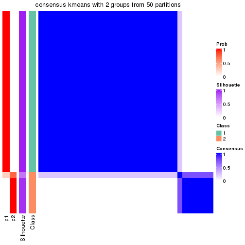</p>

</div>
<div id='tab-node-0212-consensus-heatmap-2'>
<pre><code class="r">consensus_heatmap(res, k = 3)
</code></pre>

<p>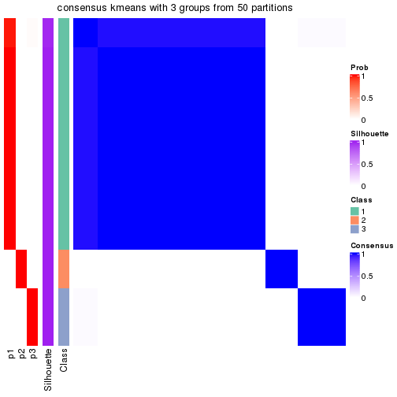</p>

</div>
<div id='tab-node-0212-consensus-heatmap-3'>
<pre><code class="r">consensus_heatmap(res, k = 4)
</code></pre>

<p>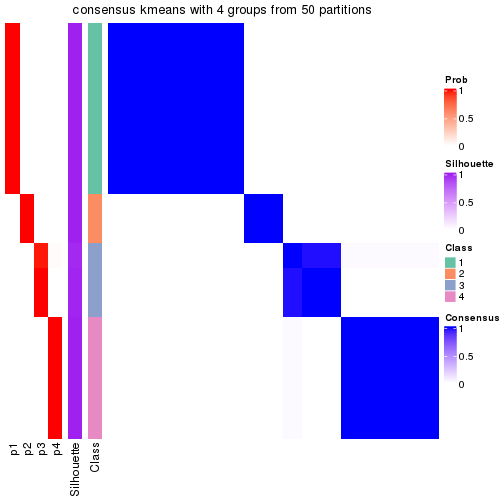</p>

</div>
<div id='tab-node-0212-consensus-heatmap-4'>
<pre><code class="r">consensus_heatmap(res, k = 5)
</code></pre>

<p>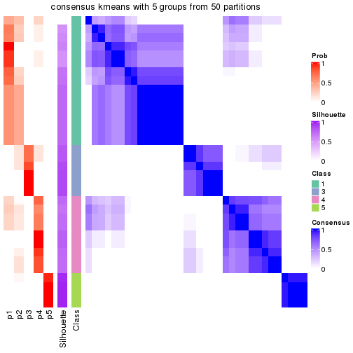</p>

</div>
<div id='tab-node-0212-consensus-heatmap-5'>
<pre><code class="r">consensus_heatmap(res, k = 6)
</code></pre>

<p>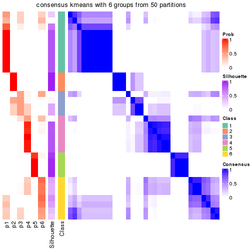</p>

</div>
<div id='tab-node-0212-consensus-heatmap-6'>
<pre><code class="r">consensus_heatmap(res, k = 7)
</code></pre>

<p>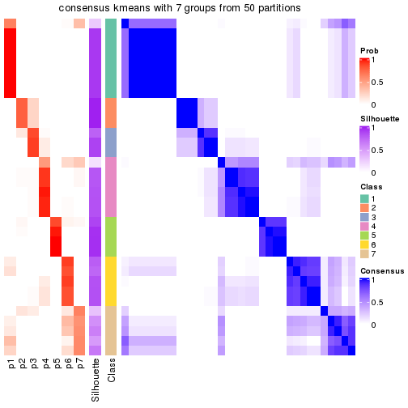</p>

</div>
<div id='tab-node-0212-consensus-heatmap-7'>
<pre><code class="r">consensus_heatmap(res, k = 8)
</code></pre>

<p>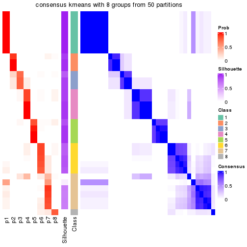</p>

</div>
</div>

Heatmaps for the membership of samples in all partitions to see how consistent they are:


<script>
$( function() {
	$( '#tabs-node-0212-membership-heatmap' ).tabs();
} );
</script>
<div id='tabs-node-0212-membership-heatmap'>
<ul>
<li><a href='#tab-node-0212-membership-heatmap-1'>k = 2</a></li>
<li><a href='#tab-node-0212-membership-heatmap-2'>k = 3</a></li>
<li><a href='#tab-node-0212-membership-heatmap-3'>k = 4</a></li>
<li><a href='#tab-node-0212-membership-heatmap-4'>k = 5</a></li>
<li><a href='#tab-node-0212-membership-heatmap-5'>k = 6</a></li>
<li><a href='#tab-node-0212-membership-heatmap-6'>k = 7</a></li>
<li><a href='#tab-node-0212-membership-heatmap-7'>k = 8</a></li>
</ul>
<div id='tab-node-0212-membership-heatmap-1'>
<pre><code class="r">membership_heatmap(res, k = 2)
</code></pre>

<p>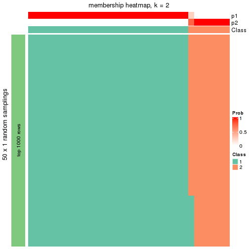</p>

</div>
<div id='tab-node-0212-membership-heatmap-2'>
<pre><code class="r">membership_heatmap(res, k = 3)
</code></pre>

<p>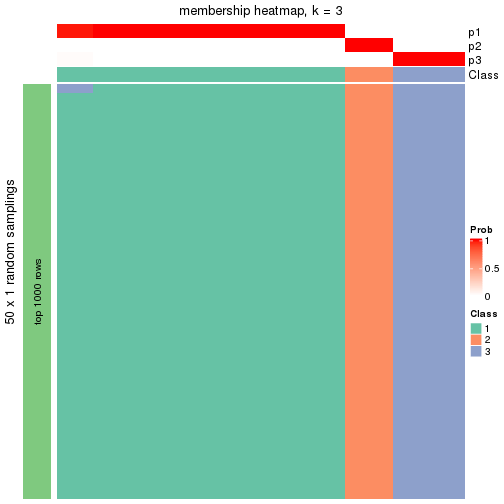</p>

</div>
<div id='tab-node-0212-membership-heatmap-3'>
<pre><code class="r">membership_heatmap(res, k = 4)
</code></pre>

<p>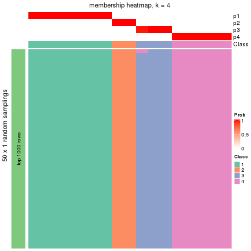</p>

</div>
<div id='tab-node-0212-membership-heatmap-4'>
<pre><code class="r">membership_heatmap(res, k = 5)
</code></pre>

<p>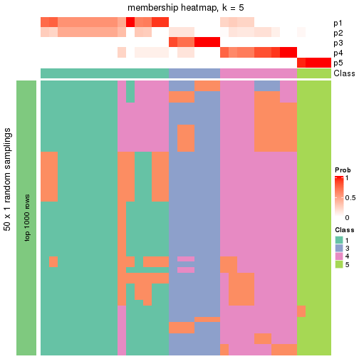</p>

</div>
<div id='tab-node-0212-membership-heatmap-5'>
<pre><code class="r">membership_heatmap(res, k = 6)
</code></pre>

<p>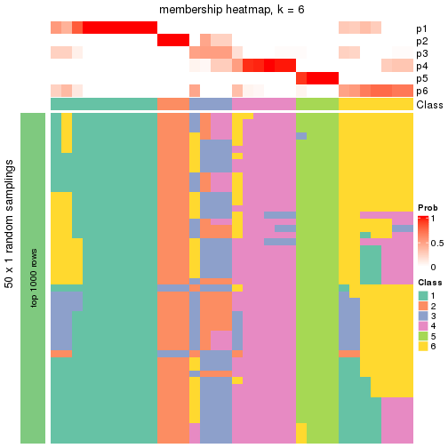</p>

</div>
<div id='tab-node-0212-membership-heatmap-6'>
<pre><code class="r">membership_heatmap(res, k = 7)
</code></pre>

<p>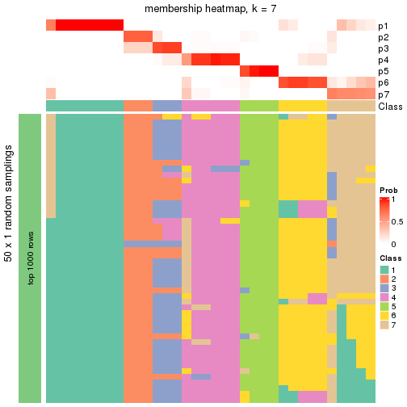</p>

</div>
<div id='tab-node-0212-membership-heatmap-7'>
<pre><code class="r">membership_heatmap(res, k = 8)
</code></pre>

<p>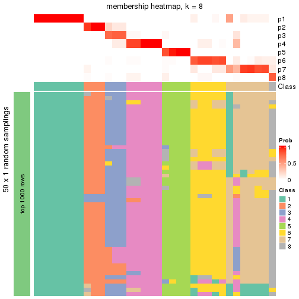</p>

</div>
</div>

As soon as the classes for columns are determined, the signatures
that are significantly different between subgroups can be looked for. 
Following are the heatmaps for signatures.


<script>
$( function() {
	$( '#tabs-node-0212-get-signatures' ).tabs();
} );
</script>
<div id='tabs-node-0212-get-signatures'>
<ul>
<li><a href='#tab-node-0212-get-signatures-1'>k = 2</a></li>
<li><a href='#tab-node-0212-get-signatures-2'>k = 3</a></li>
<li><a href='#tab-node-0212-get-signatures-3'>k = 4</a></li>
<li><a href='#tab-node-0212-get-signatures-4'>k = 5</a></li>
<li><a href='#tab-node-0212-get-signatures-5'>k = 6</a></li>
<li><a href='#tab-node-0212-get-signatures-6'>k = 7</a></li>
<li><a href='#tab-node-0212-get-signatures-7'>k = 8</a></li>
</ul>
<div id='tab-node-0212-get-signatures-1'>
<pre><code class="r">get_signatures(res, k = 2)
</code></pre>

<p>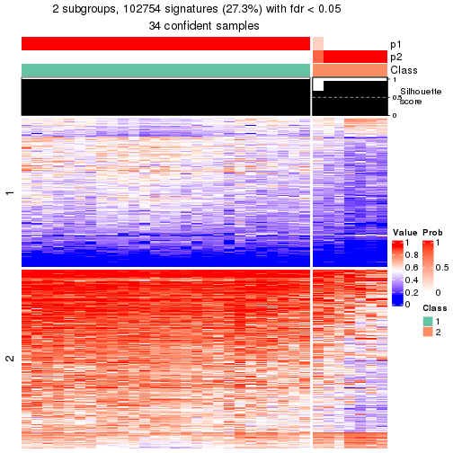</p>

</div>
<div id='tab-node-0212-get-signatures-2'>
<pre><code class="r">get_signatures(res, k = 3)
</code></pre>

<p>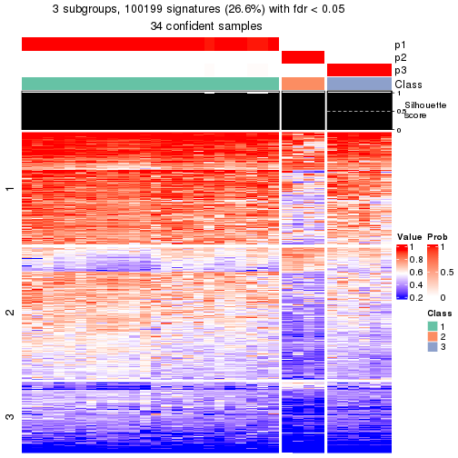</p>

</div>
<div id='tab-node-0212-get-signatures-3'>
<pre><code class="r">get_signatures(res, k = 4)
</code></pre>

<p>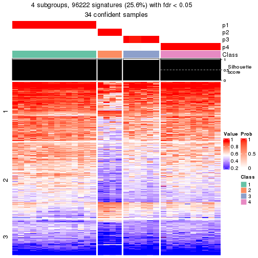</p>

</div>
<div id='tab-node-0212-get-signatures-4'>
<pre><code class="r">get_signatures(res, k = 5)
</code></pre>

<p>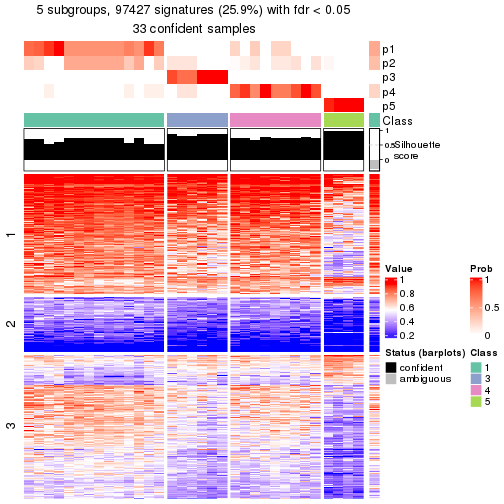</p>

</div>
<div id='tab-node-0212-get-signatures-5'>
<pre><code class="r">get_signatures(res, k = 6)
</code></pre>

<p>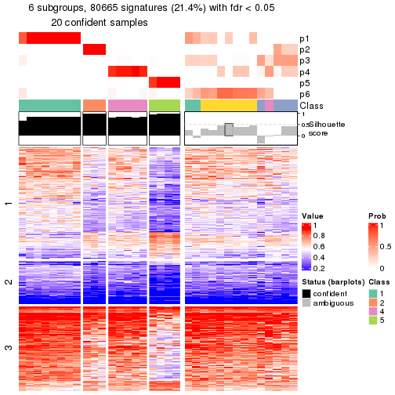</p>

</div>
<div id='tab-node-0212-get-signatures-6'>
<pre><code class="r">get_signatures(res, k = 7)
</code></pre>

<p>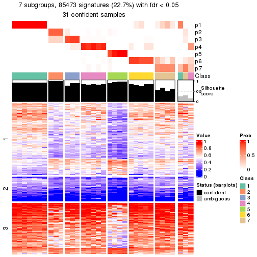</p>

</div>
<div id='tab-node-0212-get-signatures-7'>
<pre><code class="r">get_signatures(res, k = 8)
</code></pre>

<p>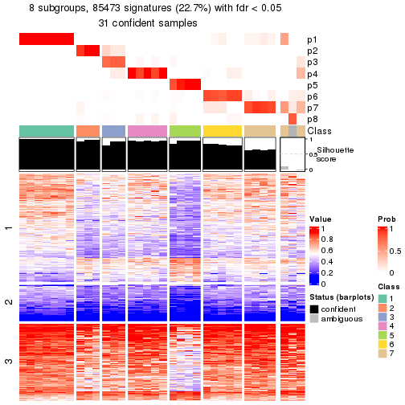</p>

</div>
</div>


Compare the overlap of signatures from different k:

```r
compare_signatures(res)
```

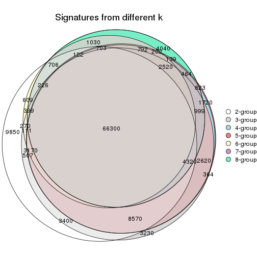

`get_signature()` returns a data frame invisibly. To get the list of signatures, the function
call should be assigned to a variable explicitly. In following code, if `plot` argument is set
to `FALSE`, no heatmap is plotted while only the differential analysis is performed.

```r
# code only for demonstration
tb = get_signature(res, k = ..., plot = FALSE)
```

An example of the output of `tb` is:

```
#>   which_row         fdr    mean_1    mean_2 scaled_mean_1 scaled_mean_2 km
#> 1        38 0.042760348  8.373488  9.131774    -0.5533452     0.5164555  1
#> 2        40 0.018707592  7.106213  8.469186    -0.6173731     0.5762149  1
#> 3        55 0.019134737 10.221463 11.207825    -0.6159697     0.5749050  1
#> 4        59 0.006059896  5.921854  7.869574    -0.6899429     0.6439467  1
#> 5        60 0.018055526  8.928898 10.211722    -0.6204761     0.5791110  1
#> 6        98 0.009384629 15.714769 14.887706     0.6635654    -0.6193277  2
...
```

The columns in `tb` are:

1. `which_row`: row indices corresponding to the input matrix.
2. `fdr`: FDR for the differential test. 
3. `mean_x`: The mean value in group x.
4. `scaled_mean_x`: The mean value in group x after rows are scaled.
5. `km`: Row groups if k-means clustering is applied to rows (which is done by automatically selecting number of clusters).

If there are too many signatures, `top_signatures = ...` can be set to only show the 
signatures with the highest FDRs:

```r
# code only for demonstration
# e.g. to show the top 500 most significant rows
tb = get_signature(res, k = ..., top_signatures = 500)
```

If the signatures are defined as these which are uniquely high in current group, `diff_method` argument
can be set to `"uniquely_high_in_one_group"`:

```r
# code only for demonstration
tb = get_signature(res, k = ..., diff_method = "uniquely_high_in_one_group")
```


UMAP plot which shows how samples are separated.


<script>
$( function() {
	$( '#tabs-node-0212-dimension-reduction' ).tabs();
} );
</script>
<div id='tabs-node-0212-dimension-reduction'>
<ul>
<li><a href='#tab-node-0212-dimension-reduction-1'>k = 2</a></li>
<li><a href='#tab-node-0212-dimension-reduction-2'>k = 3</a></li>
<li><a href='#tab-node-0212-dimension-reduction-3'>k = 4</a></li>
<li><a href='#tab-node-0212-dimension-reduction-4'>k = 5</a></li>
<li><a href='#tab-node-0212-dimension-reduction-5'>k = 6</a></li>
<li><a href='#tab-node-0212-dimension-reduction-6'>k = 7</a></li>
<li><a href='#tab-node-0212-dimension-reduction-7'>k = 8</a></li>
</ul>
<div id='tab-node-0212-dimension-reduction-1'>
<pre><code class="r">dimension_reduction(res, k = 2, method = &quot;UMAP&quot;)
</code></pre>

<p>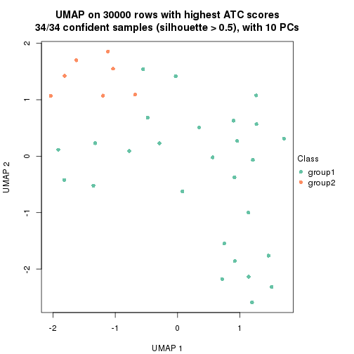</p>

</div>
<div id='tab-node-0212-dimension-reduction-2'>
<pre><code class="r">dimension_reduction(res, k = 3, method = &quot;UMAP&quot;)
</code></pre>

<p>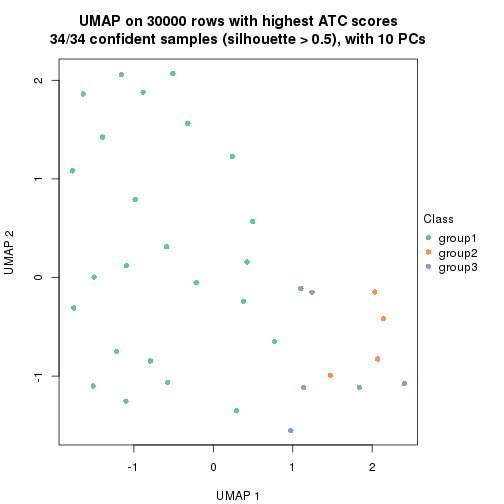</p>

</div>
<div id='tab-node-0212-dimension-reduction-3'>
<pre><code class="r">dimension_reduction(res, k = 4, method = &quot;UMAP&quot;)
</code></pre>

<p>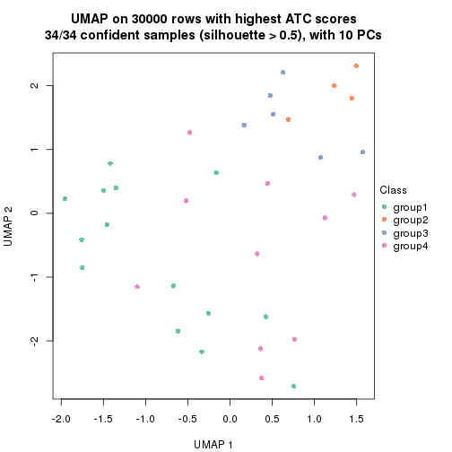</p>

</div>
<div id='tab-node-0212-dimension-reduction-4'>
<pre><code class="r">dimension_reduction(res, k = 5, method = &quot;UMAP&quot;)
</code></pre>

<p></p>

</div>
<div id='tab-node-0212-dimension-reduction-5'>
<pre><code class="r">dimension_reduction(res, k = 6, method = &quot;UMAP&quot;)
</code></pre>

<p>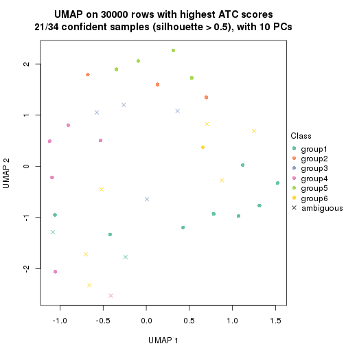</p>

</div>
<div id='tab-node-0212-dimension-reduction-6'>
<pre><code class="r">dimension_reduction(res, k = 7, method = &quot;UMAP&quot;)
</code></pre>

<p>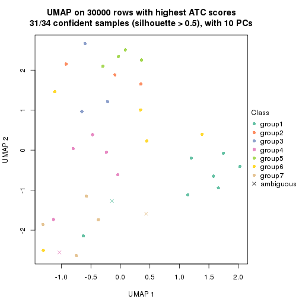</p>

</div>
<div id='tab-node-0212-dimension-reduction-7'>
<pre><code class="r">dimension_reduction(res, k = 8, method = &quot;UMAP&quot;)
</code></pre>

<p>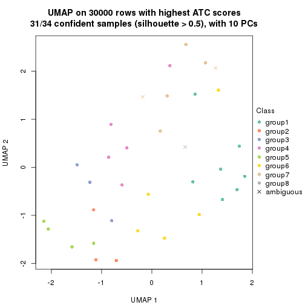</p>

</div>
</div>


Following heatmap shows how subgroups are split when increasing `k`:

```r
collect_classes(res)
```

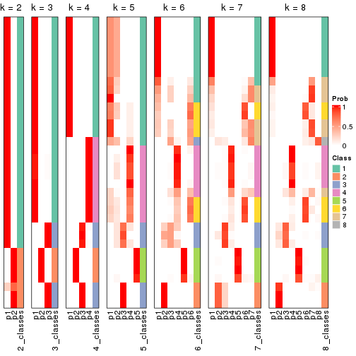


If matrix rows can be associated to genes, consider to use `functional_enrichment(res,
...)` to perform function enrichment for the signature genes. See [this vignette](https://jokergoo.github.io/cola_vignettes/functional_enrichment.html) for more detailed explanations.


 

---------------------------------------------------


### Node0213


Parent node: [Node021](#Node021).
Child nodes: 
                Node01211-leaf
        ,
                Node01212-leaf
        ,
                Node01213-leaf
        ,
                Node01221-leaf
        ,
                Node01222-leaf
        ,
                Node01223-leaf
        ,
                Node02111-leaf
        ,
                Node02112-leaf
        ,
                Node02113-leaf
        ,
                Node02114-leaf
        ,
                Node02121-leaf
        ,
                Node02122-leaf
        ,
                Node02123-leaf
        ,
                Node02124-leaf
        ,
                Node02131-leaf
        ,
                [Node02132](#Node02132)
        ,
                Node02133-leaf
        ,
                Node02211-leaf
        ,
                Node02212-leaf
        ,
                Node02213-leaf
        ,
                Node02221-leaf
        ,
                Node02222-leaf
        ,
                Node02223-leaf
        ,
                Node02231-leaf
        ,
                Node02232-leaf
        ,
                Node02233-leaf
        ,
                Node02241-leaf
        ,
                Node02242-leaf
        ,
                Node02243-leaf
        ,
                Node02321-leaf
        ,
                Node02322-leaf
        ,
                Node02323-leaf
        ,
                Node05111-leaf
        ,
                Node05112-leaf
        ,
                Node05113-leaf
        ,
                Node05114-leaf
        ,
                [Node05121](#Node05121)
        ,
                Node05122-leaf
        ,
                Node05123-leaf
        ,
                Node05221-leaf
        ,
                Node05222-leaf
        .


The object with results only for a single top-value method and a single partitioning method 
can be extracted as:

```r
res = res_rh["0213"]
```

A summary of `res` and all the functions that can be applied to it:

```r
res
```

```
#> A 'ConsensusPartition' object with k = 2, 3, 4, 5, 6, 7, 8.
#>   On a matrix with 30000 rows and 28 columns.
#>   Top rows (1000) are extracted by 'ATC' method.
#>   Subgroups are detected by 'skmeans' method.
#>   Performed in total 350 partitions by row resampling.
#>   Best k for subgroups seems to be 5.
#> 
#> Following methods can be applied to this 'ConsensusPartition' object:
#>  [1] "cola_report"             "collect_classes"         "collect_plots"          
#>  [4] "collect_stats"           "colnames"                "compare_partitions"     
#>  [7] "compare_signatures"      "consensus_heatmap"       "dimension_reduction"    
#> [10] "functional_enrichment"   "get_anno_col"            "get_anno"               
#> [13] "get_classes"             "get_consensus"           "get_matrix"             
#> [16] "get_membership"          "get_param"               "get_signatures"         
#> [19] "get_stats"               "is_best_k"               "is_stable_k"            
#> [22] "membership_heatmap"      "ncol"                    "nrow"                   
#> [25] "plot_ecdf"               "predict_classes"         "rownames"               
#> [28] "select_partition_number" "show"                    "suggest_best_k"         
#> [31] "test_to_known_factors"   "top_rows_heatmap"
```

`collect_plots()` function collects all the plots made from `res` for all `k` (number of subgroups)
into one single page to provide an easy and fast comparison between different `k`.

```r
collect_plots(res)
```

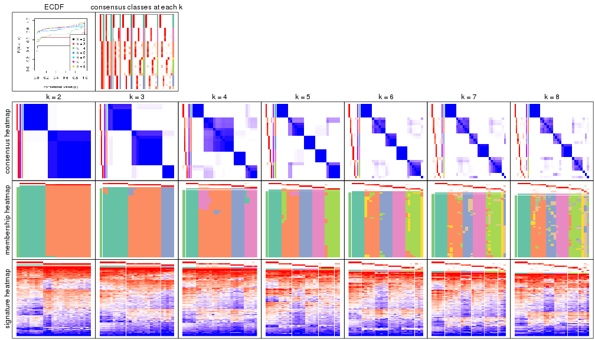

The plots are:

- The first row: a plot of the eCDF (empirical cumulative distribution
  function) curves of the consensus matrix for each `k` and the heatmap of
  predicted classes for each `k`.
- The second row: heatmaps of the consensus matrix for each `k`.
- The third row: heatmaps of the membership matrix for each `k`.
- The fouth row: heatmaps of the signatures for each `k`.

All the plots in panels can be made by individual functions and they are
plotted later in this section.

`select_partition_number()` produces several plots showing different
statistics for choosing "optimized" `k`. There are following statistics:

- eCDF curves of the consensus matrix for each `k`;
- 1-PAC. [The PAC score](https://en.wikipedia.org/wiki/Consensus_clustering#Over-interpretation_potential_of_consensus_clustering)
  measures the proportion of the ambiguous subgrouping.
- Mean silhouette score.
- Concordance. The mean probability of fiting the consensus subgroup labels in all
  partitions.
- Area increased. Denote $A_k$ as the area under the eCDF curve for current
  `k`, the area increased is defined as $A_k - A_{k-1}$.
- Rand index. The percent of pairs of samples that are both in a same cluster
  or both are not in a same cluster in the partition of k and k-1.
- Jaccard index. The ratio of pairs of samples are both in a same cluster in
  the partition of k and k-1 and the pairs of samples are both in a same
  cluster in the partition k or k-1.

The detailed explanations of these statistics can be found in [the _cola_
vignette](https://jokergoo.github.io/cola_vignettes/cola.html#toc_13).

Generally speaking, higher 1-PAC score, higher mean silhouette score or higher
concordance corresponds to better partition. Rand index and Jaccard index
measure how similar the current partition is compared to partition with `k-1`.
If they are too similar, we won't accept `k` is better than `k-1`.

```r
select_partition_number(res)
```

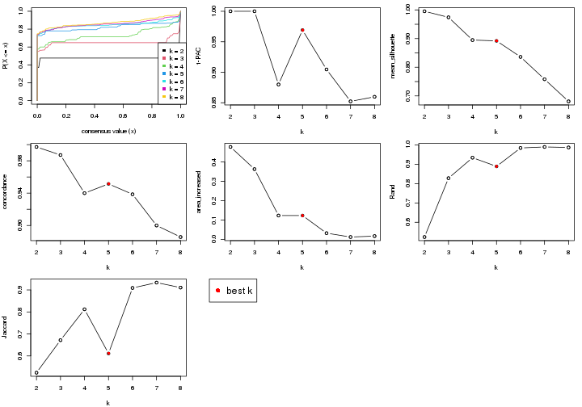

The numeric values for all these statistics can be obtained by `get_stats()`.

```r
get_stats(res)
```

```
#>   k 1-PAC mean_silhouette concordance area_increased  Rand Jaccard
#> 2 2 1.000           0.995       0.997         0.4775 0.524   0.524
#> 3 3 1.000           0.974       0.987         0.3630 0.828   0.672
#> 4 4 0.880           0.895       0.940         0.1233 0.934   0.812
#> 5 5 0.969           0.892       0.951         0.1233 0.889   0.611
#> 6 6 0.905           0.836       0.939         0.0323 0.984   0.909
#> 7 7 0.852           0.758       0.900         0.0123 0.989   0.933
#> 8 8 0.860           0.681       0.886         0.0171 0.987   0.911
```

`suggest_best_k()` suggests the best $k$ based on these statistics. The rules are as follows:

- All $k$ with Jaccard index larger than 0.95 are removed because increasing
  $k$ does not provide enough extra information. If all $k$ are removed, it is
  marked as no subgroup is detected.
- For all $k$ with 1-PAC score larger than 0.9, the maximal $k$ is taken as
  the best $k$, and other $k$ are marked as optional $k$.
- If it does not fit the second rule. The $k$ with the maximal vote of the
  highest 1-PAC score, highest mean silhouette, and highest concordance is
  taken as the best $k$.

```r
suggest_best_k(res)
```

```
#> [1] 5
#> attr(,"optional")
#> [1] 2 3
```

There is also optional best $k$ = 2 3 that is worth to check.

Following is the table of the partitions (You need to click the **show/hide
code output** link to see it). The membership matrix (columns with name `p*`)
is inferred by
[`clue::cl_consensus()`](https://www.rdocumentation.org/link/cl_consensus?package=clue)
function with the `SE` method. Basically the value in the membership matrix
represents the probability to belong to a certain group. The finall subgroup
label for an item is determined with the group with highest probability it
belongs to.

In `get_classes()` function, the entropy is calculated from the membership
matrix and the silhouette score is calculated from the consensus matrix.


<script>
$( function() {
	$( '#tabs-node-0213-get-classes' ).tabs();
} );
</script>
<div id='tabs-node-0213-get-classes'>
<ul>
<li><a href='#tab-node-0213-get-classes-1'>k = 2</a></li>
<li><a href='#tab-node-0213-get-classes-2'>k = 3</a></li>
<li><a href='#tab-node-0213-get-classes-3'>k = 4</a></li>
<li><a href='#tab-node-0213-get-classes-4'>k = 5</a></li>
<li><a href='#tab-node-0213-get-classes-5'>k = 6</a></li>
<li><a href='#tab-node-0213-get-classes-6'>k = 7</a></li>
<li><a href='#tab-node-0213-get-classes-7'>k = 8</a></li>
</ul>

<div id='tab-node-0213-get-classes-1'>
<p><a id='tab-node-0213-get-classes-1-a' style='color:#0366d6' href='#'>show/hide code output</a></p>
<pre><code class="r">cbind(get_classes(res, k = 2), get_membership(res, k = 2))
</code></pre>

<pre><code>#&gt;                 class entropy silhouette   p1   p2
#&gt; TCGA.CR.7391.01     1   0.000      1.000 1.00 0.00
#&gt; TCGA.CV.7407.01     2   0.141      0.983 0.02 0.98
#&gt; TCGA.CN.6021.01     2   0.000      0.995 0.00 1.00
#&gt; TCGA.CV.5978.01     2   0.141      0.983 0.02 0.98
#&gt; TCGA.CV.7178.01     2   0.000      0.995 0.00 1.00
#&gt; TCGA.CR.6478.01     1   0.000      1.000 1.00 0.00
#&gt; TCGA.CV.7102.01     2   0.000      0.995 0.00 1.00
#&gt; TCGA.D6.6515.01     1   0.000      1.000 1.00 0.00
#&gt; TCGA.CV.7177.01     2   0.000      0.995 0.00 1.00
#&gt; TCGA.CQ.6218.01     2   0.000      0.995 0.00 1.00
#&gt; TCGA.BA.6870.01     2   0.000      0.995 0.00 1.00
#&gt; TCGA.CR.6477.01     1   0.000      1.000 1.00 0.00
#&gt; TCGA.CN.A498.01     2   0.000      0.995 0.00 1.00
#&gt; TCGA.CV.6953.11     1   0.000      1.000 1.00 0.00
#&gt; TCGA.DQ.5624.01     1   0.000      1.000 1.00 0.00
#&gt; TCGA.CN.A499.01     2   0.000      0.995 0.00 1.00
#&gt; TCGA.CV.6940.01     2   0.000      0.995 0.00 1.00
#&gt; TCGA.BA.A6DB.01     1   0.000      1.000 1.00 0.00
#&gt; TCGA.MT.A67G.01     2   0.141      0.983 0.02 0.98
#&gt; TCGA.MT.A51W.01     1   0.000      1.000 1.00 0.00
#&gt; TCGA.CN.5367.01     2   0.000      0.995 0.00 1.00
#&gt; TCGA.IQ.A6SG.01     2   0.000      0.995 0.00 1.00
#&gt; TCGA.BB.7871.01     2   0.000      0.995 0.00 1.00
#&gt; TCGA.CN.4736.01     1   0.000      1.000 1.00 0.00
#&gt; TCGA.CN.5369.01     1   0.000      1.000 1.00 0.00
#&gt; TCGA.BA.4077.01     2   0.000      0.995 0.00 1.00
#&gt; TCGA.CR.7383.01     2   0.141      0.983 0.02 0.98
#&gt; TCGA.P3.A6T5.01     2   0.000      0.995 0.00 1.00
</code></pre>

<script>
$('#tab-node-0213-get-classes-1-a').parent().next().next().hide();
$('#tab-node-0213-get-classes-1-a').click(function(){
  $('#tab-node-0213-get-classes-1-a').parent().next().next().toggle();
  return(false);
});
</script>
</div>

<div id='tab-node-0213-get-classes-2'>
<p><a id='tab-node-0213-get-classes-2-a' style='color:#0366d6' href='#'>show/hide code output</a></p>
<pre><code class="r">cbind(get_classes(res, k = 3), get_membership(res, k = 3))
</code></pre>

<pre><code>#&gt;                 class entropy silhouette   p1   p2   p3
#&gt; TCGA.CR.7391.01     1  0.0000      0.982 1.00 0.00 0.00
#&gt; TCGA.CV.7407.01     2  0.0000      0.981 0.00 1.00 0.00
#&gt; TCGA.CN.6021.01     2  0.0000      0.981 0.00 1.00 0.00
#&gt; TCGA.CV.5978.01     2  0.0000      0.981 0.00 1.00 0.00
#&gt; TCGA.CV.7178.01     2  0.0892      0.968 0.00 0.98 0.02
#&gt; TCGA.CR.6478.01     1  0.0000      0.982 1.00 0.00 0.00
#&gt; TCGA.CV.7102.01     2  0.2959      0.899 0.00 0.90 0.10
#&gt; TCGA.D6.6515.01     1  0.0000      0.982 1.00 0.00 0.00
#&gt; TCGA.CV.7177.01     3  0.0000      1.000 0.00 0.00 1.00
#&gt; TCGA.CQ.6218.01     2  0.0000      0.981 0.00 1.00 0.00
#&gt; TCGA.BA.6870.01     2  0.0000      0.981 0.00 1.00 0.00
#&gt; TCGA.CR.6477.01     1  0.2066      0.933 0.94 0.06 0.00
#&gt; TCGA.CN.A498.01     2  0.2959      0.899 0.00 0.90 0.10
#&gt; TCGA.CV.6953.11     1  0.0000      0.982 1.00 0.00 0.00
#&gt; TCGA.DQ.5624.01     1  0.2537      0.912 0.92 0.08 0.00
#&gt; TCGA.CN.A499.01     2  0.0000      0.981 0.00 1.00 0.00
#&gt; TCGA.CV.6940.01     3  0.0000      1.000 0.00 0.00 1.00
#&gt; TCGA.BA.A6DB.01     1  0.0000      0.982 1.00 0.00 0.00
#&gt; TCGA.MT.A67G.01     2  0.0000      0.981 0.00 1.00 0.00
#&gt; TCGA.MT.A51W.01     1  0.0000      0.982 1.00 0.00 0.00
#&gt; TCGA.CN.5367.01     2  0.0000      0.981 0.00 1.00 0.00
#&gt; TCGA.IQ.A6SG.01     3  0.0000      1.000 0.00 0.00 1.00
#&gt; TCGA.BB.7871.01     2  0.0000      0.981 0.00 1.00 0.00
#&gt; TCGA.CN.4736.01     1  0.0000      0.982 1.00 0.00 0.00
#&gt; TCGA.CN.5369.01     1  0.0000      0.982 1.00 0.00 0.00
#&gt; TCGA.BA.4077.01     3  0.0000      1.000 0.00 0.00 1.00
#&gt; TCGA.CR.7383.01     2  0.0000      0.981 0.00 1.00 0.00
#&gt; TCGA.P3.A6T5.01     3  0.0000      1.000 0.00 0.00 1.00
</code></pre>

<script>
$('#tab-node-0213-get-classes-2-a').parent().next().next().hide();
$('#tab-node-0213-get-classes-2-a').click(function(){
  $('#tab-node-0213-get-classes-2-a').parent().next().next().toggle();
  return(false);
});
</script>
</div>

<div id='tab-node-0213-get-classes-3'>
<p><a id='tab-node-0213-get-classes-3-a' style='color:#0366d6' href='#'>show/hide code output</a></p>
<pre><code class="r">cbind(get_classes(res, k = 4), get_membership(res, k = 4))
</code></pre>

<pre><code>#&gt;                 class entropy silhouette   p1   p2   p3   p4
#&gt; TCGA.CR.7391.01     1  0.0000      1.000 1.00 0.00 0.00 0.00
#&gt; TCGA.CV.7407.01     2  0.4406      0.711 0.00 0.70 0.00 0.30
#&gt; TCGA.CN.6021.01     2  0.0000      0.876 0.00 1.00 0.00 0.00
#&gt; TCGA.CV.5978.01     2  0.4406      0.711 0.00 0.70 0.00 0.30
#&gt; TCGA.CV.7178.01     2  0.0707      0.870 0.00 0.98 0.02 0.00
#&gt; TCGA.CR.6478.01     4  0.2011      0.880 0.08 0.00 0.00 0.92
#&gt; TCGA.CV.7102.01     2  0.1637      0.849 0.00 0.94 0.06 0.00
#&gt; TCGA.D6.6515.01     1  0.0000      1.000 1.00 0.00 0.00 0.00
#&gt; TCGA.CV.7177.01     3  0.0000      1.000 0.00 0.00 1.00 0.00
#&gt; TCGA.CQ.6218.01     2  0.0000      0.876 0.00 1.00 0.00 0.00
#&gt; TCGA.BA.6870.01     2  0.0707      0.874 0.00 0.98 0.00 0.02
#&gt; TCGA.CR.6477.01     4  0.0000      0.916 0.00 0.00 0.00 1.00
#&gt; TCGA.CN.A498.01     2  0.1637      0.849 0.00 0.94 0.06 0.00
#&gt; TCGA.CV.6953.11     1  0.0000      1.000 1.00 0.00 0.00 0.00
#&gt; TCGA.DQ.5624.01     4  0.0000      0.916 0.00 0.00 0.00 1.00
#&gt; TCGA.CN.A499.01     2  0.0000      0.876 0.00 1.00 0.00 0.00
#&gt; TCGA.CV.6940.01     3  0.0000      1.000 0.00 0.00 1.00 0.00
#&gt; TCGA.BA.A6DB.01     1  0.0000      1.000 1.00 0.00 0.00 0.00
#&gt; TCGA.MT.A67G.01     2  0.4277      0.733 0.00 0.72 0.00 0.28
#&gt; TCGA.MT.A51W.01     4  0.0000      0.916 0.00 0.00 0.00 1.00
#&gt; TCGA.CN.5367.01     2  0.0000      0.876 0.00 1.00 0.00 0.00
#&gt; TCGA.IQ.A6SG.01     3  0.0000      1.000 0.00 0.00 1.00 0.00
#&gt; TCGA.BB.7871.01     2  0.2011      0.855 0.00 0.92 0.00 0.08
#&gt; TCGA.CN.4736.01     4  0.3610      0.741 0.20 0.00 0.00 0.80
#&gt; TCGA.CN.5369.01     1  0.0000      1.000 1.00 0.00 0.00 0.00
#&gt; TCGA.BA.4077.01     3  0.0000      1.000 0.00 0.00 1.00 0.00
#&gt; TCGA.CR.7383.01     2  0.4277      0.733 0.00 0.72 0.00 0.28
#&gt; TCGA.P3.A6T5.01     3  0.0000      1.000 0.00 0.00 1.00 0.00
</code></pre>

<script>
$('#tab-node-0213-get-classes-3-a').parent().next().next().hide();
$('#tab-node-0213-get-classes-3-a').click(function(){
  $('#tab-node-0213-get-classes-3-a').parent().next().next().toggle();
  return(false);
});
</script>
</div>

<div id='tab-node-0213-get-classes-4'>
<p><a id='tab-node-0213-get-classes-4-a' style='color:#0366d6' href='#'>show/hide code output</a></p>
<pre><code class="r">cbind(get_classes(res, k = 5), get_membership(res, k = 5))
</code></pre>

<pre><code>#&gt;                 class entropy silhouette p1   p2 p3   p4   p5
#&gt; TCGA.CR.7391.01     1   0.000      1.000  1 0.00  0 0.00 0.00
#&gt; TCGA.CV.7407.01     2   0.141      0.825  0 0.94  0 0.06 0.00
#&gt; TCGA.CN.6021.01     5   0.368      0.566  0 0.28  0 0.00 0.72
#&gt; TCGA.CV.5978.01     2   0.104      0.822  0 0.96  0 0.04 0.00
#&gt; TCGA.CV.7178.01     5   0.000      0.936  0 0.00  0 0.00 1.00
#&gt; TCGA.CR.6478.01     4   0.000      1.000  0 0.00  0 1.00 0.00
#&gt; TCGA.CV.7102.01     5   0.000      0.936  0 0.00  0 0.00 1.00
#&gt; TCGA.D6.6515.01     1   0.000      1.000  1 0.00  0 0.00 0.00
#&gt; TCGA.CV.7177.01     3   0.000      1.000  0 0.00  1 0.00 0.00
#&gt; TCGA.CQ.6218.01     5   0.000      0.936  0 0.00  0 0.00 1.00
#&gt; TCGA.BA.6870.01     2   0.426      0.283  0 0.56  0 0.00 0.44
#&gt; TCGA.CR.6477.01     4   0.000      1.000  0 0.00  0 1.00 0.00
#&gt; TCGA.CN.A498.01     5   0.000      0.936  0 0.00  0 0.00 1.00
#&gt; TCGA.CV.6953.11     1   0.000      1.000  1 0.00  0 0.00 0.00
#&gt; TCGA.DQ.5624.01     4   0.000      1.000  0 0.00  0 1.00 0.00
#&gt; TCGA.CN.A499.01     5   0.000      0.936  0 0.00  0 0.00 1.00
#&gt; TCGA.CV.6940.01     3   0.000      1.000  0 0.00  1 0.00 0.00
#&gt; TCGA.BA.A6DB.01     1   0.000      1.000  1 0.00  0 0.00 0.00
#&gt; TCGA.MT.A67G.01     2   0.141      0.825  0 0.94  0 0.06 0.00
#&gt; TCGA.MT.A51W.01     4   0.000      1.000  0 0.00  0 1.00 0.00
#&gt; TCGA.CN.5367.01     2   0.423      0.346  0 0.58  0 0.00 0.42
#&gt; TCGA.IQ.A6SG.01     3   0.000      1.000  0 0.00  1 0.00 0.00
#&gt; TCGA.BB.7871.01     2   0.000      0.803  0 1.00  0 0.00 0.00
#&gt; TCGA.CN.4736.01     4   0.000      1.000  0 0.00  0 1.00 0.00
#&gt; TCGA.CN.5369.01     1   0.000      1.000  1 0.00  0 0.00 0.00
#&gt; TCGA.BA.4077.01     3   0.000      1.000  0 0.00  1 0.00 0.00
#&gt; TCGA.CR.7383.01     2   0.141      0.825  0 0.94  0 0.06 0.00
#&gt; TCGA.P3.A6T5.01     3   0.000      1.000  0 0.00  1 0.00 0.00
</code></pre>

<script>
$('#tab-node-0213-get-classes-4-a').parent().next().next().hide();
$('#tab-node-0213-get-classes-4-a').click(function(){
  $('#tab-node-0213-get-classes-4-a').parent().next().next().toggle();
  return(false);
});
</script>
</div>

<div id='tab-node-0213-get-classes-5'>
<p><a id='tab-node-0213-get-classes-5-a' style='color:#0366d6' href='#'>show/hide code output</a></p>
<pre><code class="r">cbind(get_classes(res, k = 6), get_membership(res, k = 6))
</code></pre>

<pre><code>#&gt;                 class entropy silhouette p1   p2   p3 p4   p5   p6
#&gt; TCGA.CR.7391.01     1  0.0000      1.000  1 0.00 0.00  0 0.00 0.00
#&gt; TCGA.CV.7407.01     2  0.1814      0.795  0 0.90 0.00  0 0.00 0.10
#&gt; TCGA.CN.6021.01     5  0.5265      0.285  0 0.10 0.00  0 0.50 0.40
#&gt; TCGA.CV.5978.01     2  0.3647      0.431  0 0.64 0.00  0 0.00 0.36
#&gt; TCGA.CV.7178.01     5  0.0547      0.832  0 0.02 0.00  0 0.98 0.00
#&gt; TCGA.CR.6478.01     4  0.0000      1.000  0 0.00 0.00  1 0.00 0.00
#&gt; TCGA.CV.7102.01     5  0.0000      0.827  0 0.00 0.00  0 1.00 0.00
#&gt; TCGA.D6.6515.01     1  0.0000      1.000  1 0.00 0.00  0 0.00 0.00
#&gt; TCGA.CV.7177.01     3  0.0000      0.939  0 0.00 1.00  0 0.00 0.00
#&gt; TCGA.CQ.6218.01     5  0.3315      0.702  0 0.20 0.00  0 0.78 0.02
#&gt; TCGA.BA.6870.01     2  0.2474      0.796  0 0.88 0.00  0 0.08 0.04
#&gt; TCGA.CR.6477.01     4  0.0000      1.000  0 0.00 0.00  1 0.00 0.00
#&gt; TCGA.CN.A498.01     5  0.0000      0.827  0 0.00 0.00  0 1.00 0.00
#&gt; TCGA.CV.6953.11     1  0.0000      1.000  1 0.00 0.00  0 0.00 0.00
#&gt; TCGA.DQ.5624.01     4  0.0000      1.000  0 0.00 0.00  1 0.00 0.00
#&gt; TCGA.CN.A499.01     5  0.1480      0.824  0 0.04 0.00  0 0.94 0.02
#&gt; TCGA.CV.6940.01     3  0.0000      0.939  0 0.00 1.00  0 0.00 0.00
#&gt; TCGA.BA.A6DB.01     1  0.0000      1.000  1 0.00 0.00  0 0.00 0.00
#&gt; TCGA.MT.A67G.01     2  0.0000      0.848  0 1.00 0.00  0 0.00 0.00
#&gt; TCGA.MT.A51W.01     4  0.0000      1.000  0 0.00 0.00  1 0.00 0.00
#&gt; TCGA.CN.5367.01     2  0.1480      0.830  0 0.94 0.00  0 0.04 0.02
#&gt; TCGA.IQ.A6SG.01     3  0.1267      0.918  0 0.00 0.94  0 0.06 0.00
#&gt; TCGA.BB.7871.01     6  0.1267      0.000  0 0.06 0.00  0 0.00 0.94
#&gt; TCGA.CN.4736.01     4  0.0000      1.000  0 0.00 0.00  1 0.00 0.00
#&gt; TCGA.CN.5369.01     1  0.0000      1.000  1 0.00 0.00  0 0.00 0.00
#&gt; TCGA.BA.4077.01     3  0.0000      0.939  0 0.00 1.00  0 0.00 0.00
#&gt; TCGA.CR.7383.01     2  0.0000      0.848  0 1.00 0.00  0 0.00 0.00
#&gt; TCGA.P3.A6T5.01     3  0.2454      0.828  0 0.00 0.84  0 0.16 0.00
</code></pre>

<script>
$('#tab-node-0213-get-classes-5-a').parent().next().next().hide();
$('#tab-node-0213-get-classes-5-a').click(function(){
  $('#tab-node-0213-get-classes-5-a').parent().next().next().toggle();
  return(false);
});
</script>
</div>

<div id='tab-node-0213-get-classes-6'>
<p><a id='tab-node-0213-get-classes-6-a' style='color:#0366d6' href='#'>show/hide code output</a></p>
<pre><code class="r">cbind(get_classes(res, k = 7), get_membership(res, k = 7))
</code></pre>

<pre><code>#&gt;                 class entropy silhouette p1   p2   p3   p4   p5   p6   p7
#&gt; TCGA.CR.7391.01     1  0.0000      1.000  1 0.00 0.00 0.00 0.00 0.00 0.00
#&gt; TCGA.CV.7407.01     2  0.2016      0.838  0 0.90 0.00 0.00 0.00 0.04 0.06
#&gt; TCGA.CN.6021.01     5  0.6433      0.280  0 0.10 0.00 0.00 0.46 0.20 0.24
#&gt; TCGA.CV.5978.01     2  0.3526      0.715  0 0.76 0.00 0.00 0.00 0.18 0.06
#&gt; TCGA.CV.7178.01     5  0.0504      0.800  0 0.00 0.00 0.00 0.98 0.00 0.02
#&gt; TCGA.CR.6478.01     4  0.0000      0.995  0 0.00 0.00 1.00 0.00 0.00 0.00
#&gt; TCGA.CV.7102.01     5  0.0504      0.800  0 0.00 0.00 0.00 0.98 0.00 0.02
#&gt; TCGA.D6.6515.01     1  0.0000      1.000  1 0.00 0.00 0.00 0.00 0.00 0.00
#&gt; TCGA.CV.7177.01     3  0.2572      0.507  0 0.00 0.80 0.00 0.00 0.00 0.20
#&gt; TCGA.CQ.6218.01     5  0.3795      0.636  0 0.22 0.00 0.00 0.72 0.00 0.06
#&gt; TCGA.BA.6870.01     2  0.2572      0.819  0 0.86 0.00 0.00 0.06 0.00 0.08
#&gt; TCGA.CR.6477.01     4  0.0000      0.995  0 0.00 0.00 1.00 0.00 0.00 0.00
#&gt; TCGA.CN.A498.01     5  0.0000      0.800  0 0.00 0.00 0.00 1.00 0.00 0.00
#&gt; TCGA.CV.6953.11     1  0.0000      1.000  1 0.00 0.00 0.00 0.00 0.00 0.00
#&gt; TCGA.DQ.5624.01     4  0.0000      0.995  0 0.00 0.00 1.00 0.00 0.00 0.00
#&gt; TCGA.CN.A499.01     5  0.2016      0.779  0 0.04 0.00 0.00 0.90 0.00 0.06
#&gt; TCGA.CV.6940.01     7  0.3459      0.000  0 0.00 0.40 0.00 0.00 0.00 0.60
#&gt; TCGA.BA.A6DB.01     1  0.0000      1.000  1 0.00 0.00 0.00 0.00 0.00 0.00
#&gt; TCGA.MT.A67G.01     2  0.0504      0.859  0 0.98 0.00 0.00 0.00 0.00 0.02
#&gt; TCGA.MT.A51W.01     4  0.0504      0.982  0 0.00 0.00 0.98 0.00 0.00 0.02
#&gt; TCGA.CN.5367.01     2  0.2722      0.786  0 0.84 0.00 0.00 0.12 0.00 0.04
#&gt; TCGA.IQ.A6SG.01     3  0.1505      0.645  0 0.00 0.94 0.00 0.02 0.02 0.02
#&gt; TCGA.BB.7871.01     6  0.0863      0.000  0 0.04 0.00 0.00 0.00 0.96 0.00
#&gt; TCGA.CN.4736.01     4  0.0000      0.995  0 0.00 0.00 1.00 0.00 0.00 0.00
#&gt; TCGA.CN.5369.01     1  0.0000      1.000  1 0.00 0.00 0.00 0.00 0.00 0.00
#&gt; TCGA.BA.4077.01     3  0.2422      0.546  0 0.00 0.82 0.00 0.00 0.00 0.18
#&gt; TCGA.CR.7383.01     2  0.0504      0.858  0 0.98 0.00 0.00 0.02 0.00 0.00
#&gt; TCGA.P3.A6T5.01     3  0.2313      0.596  0 0.00 0.88 0.00 0.06 0.00 0.06
</code></pre>

<script>
$('#tab-node-0213-get-classes-6-a').parent().next().next().hide();
$('#tab-node-0213-get-classes-6-a').click(function(){
  $('#tab-node-0213-get-classes-6-a').parent().next().next().toggle();
  return(false);
});
</script>
</div>

<div id='tab-node-0213-get-classes-7'>
<p><a id='tab-node-0213-get-classes-7-a' style='color:#0366d6' href='#'>show/hide code output</a></p>
<pre><code class="r">cbind(get_classes(res, k = 8), get_membership(res, k = 8))
</code></pre>

<pre><code>#&gt;                 class entropy silhouette p1   p2   p3   p4   p5   p6   p7   p8
#&gt; TCGA.CR.7391.01     1  0.0000      1.000  1 0.00 0.00 0.00 0.00 0.00 0.00 0.00
#&gt; TCGA.CV.7407.01     2  0.2624      0.781  0 0.86 0.00 0.00 0.00 0.06 0.02 0.06
#&gt; TCGA.CN.6021.01     8  0.4276      0.000  0 0.04 0.00 0.00 0.18 0.08 0.00 0.70
#&gt; TCGA.CV.5978.01     2  0.3843      0.601  0 0.70 0.00 0.00 0.00 0.24 0.02 0.04
#&gt; TCGA.CV.7178.01     5  0.0808      0.640  0 0.00 0.00 0.00 0.96 0.00 0.00 0.04
#&gt; TCGA.CR.6478.01     4  0.0000      0.972  0 0.00 0.00 1.00 0.00 0.00 0.00 0.00
#&gt; TCGA.CV.7102.01     5  0.0000      0.655  0 0.00 0.00 0.00 1.00 0.00 0.00 0.00
#&gt; TCGA.D6.6515.01     1  0.0000      1.000  1 0.00 0.00 0.00 0.00 0.00 0.00 0.00
#&gt; TCGA.CV.7177.01     3  0.2852      0.502  0 0.00 0.72 0.00 0.00 0.00 0.28 0.00
#&gt; TCGA.CQ.6218.01     5  0.5028      0.174  0 0.36 0.00 0.00 0.52 0.00 0.06 0.06
#&gt; TCGA.BA.6870.01     2  0.2399      0.779  0 0.88 0.00 0.00 0.04 0.00 0.04 0.04
#&gt; TCGA.CR.6477.01     4  0.0000      0.972  0 0.00 0.00 1.00 0.00 0.00 0.00 0.00
#&gt; TCGA.CN.A498.01     5  0.2680      0.610  0 0.00 0.02 0.00 0.84 0.00 0.02 0.12
#&gt; TCGA.CV.6953.11     1  0.0000      1.000  1 0.00 0.00 0.00 0.00 0.00 0.00 0.00
#&gt; TCGA.DQ.5624.01     4  0.0000      0.972  0 0.00 0.00 1.00 0.00 0.00 0.00 0.00
#&gt; TCGA.CN.A499.01     5  0.4053      0.524  0 0.04 0.00 0.00 0.72 0.00 0.06 0.18
#&gt; TCGA.CV.6940.01     7  0.2267      0.000  0 0.00 0.18 0.00 0.00 0.00 0.82 0.00
#&gt; TCGA.BA.A6DB.01     1  0.0000      1.000  1 0.00 0.00 0.00 0.00 0.00 0.00 0.00
#&gt; TCGA.MT.A67G.01     2  0.0941      0.817  0 0.96 0.00 0.00 0.00 0.00 0.02 0.02
#&gt; TCGA.MT.A51W.01     4  0.2132      0.882  0 0.00 0.00 0.88 0.00 0.00 0.04 0.08
#&gt; TCGA.CN.5367.01     2  0.4122      0.663  0 0.74 0.00 0.00 0.08 0.00 0.08 0.10
#&gt; TCGA.IQ.A6SG.01     3  0.0000      0.646  0 0.00 1.00 0.00 0.00 0.00 0.00 0.00
#&gt; TCGA.BB.7871.01     6  0.0000      0.000  0 0.00 0.00 0.00 0.00 1.00 0.00 0.00
#&gt; TCGA.CN.4736.01     4  0.0000      0.972  0 0.00 0.00 1.00 0.00 0.00 0.00 0.00
#&gt; TCGA.CN.5369.01     1  0.0000      1.000  1 0.00 0.00 0.00 0.00 0.00 0.00 0.00
#&gt; TCGA.BA.4077.01     3  0.3293      0.557  0 0.00 0.74 0.00 0.00 0.00 0.22 0.04
#&gt; TCGA.CR.7383.01     2  0.0471      0.816  0 0.98 0.00 0.00 0.02 0.00 0.00 0.00
#&gt; TCGA.P3.A6T5.01     3  0.3169      0.530  0 0.00 0.78 0.00 0.18 0.00 0.02 0.02
</code></pre>

<script>
$('#tab-node-0213-get-classes-7-a').parent().next().next().hide();
$('#tab-node-0213-get-classes-7-a').click(function(){
  $('#tab-node-0213-get-classes-7-a').parent().next().next().toggle();
  return(false);
});
</script>
</div>
</div>

Heatmaps for the consensus matrix. It visualizes the probability of two
samples to be in a same group.


<script>
$( function() {
	$( '#tabs-node-0213-consensus-heatmap' ).tabs();
} );
</script>
<div id='tabs-node-0213-consensus-heatmap'>
<ul>
<li><a href='#tab-node-0213-consensus-heatmap-1'>k = 2</a></li>
<li><a href='#tab-node-0213-consensus-heatmap-2'>k = 3</a></li>
<li><a href='#tab-node-0213-consensus-heatmap-3'>k = 4</a></li>
<li><a href='#tab-node-0213-consensus-heatmap-4'>k = 5</a></li>
<li><a href='#tab-node-0213-consensus-heatmap-5'>k = 6</a></li>
<li><a href='#tab-node-0213-consensus-heatmap-6'>k = 7</a></li>
<li><a href='#tab-node-0213-consensus-heatmap-7'>k = 8</a></li>
</ul>
<div id='tab-node-0213-consensus-heatmap-1'>
<pre><code class="r">consensus_heatmap(res, k = 2)
</code></pre>

<p>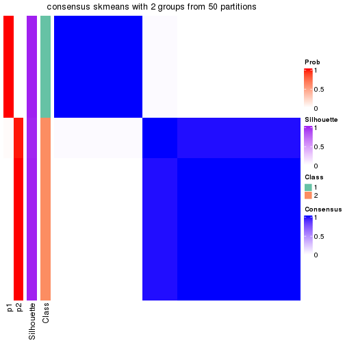</p>

</div>
<div id='tab-node-0213-consensus-heatmap-2'>
<pre><code class="r">consensus_heatmap(res, k = 3)
</code></pre>

<p></p>

</div>
<div id='tab-node-0213-consensus-heatmap-3'>
<pre><code class="r">consensus_heatmap(res, k = 4)
</code></pre>

<p>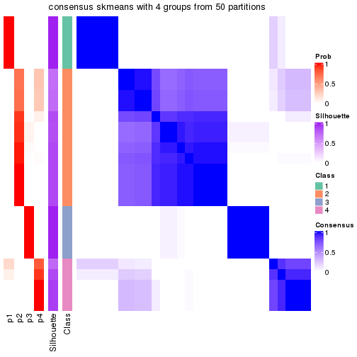</p>

</div>
<div id='tab-node-0213-consensus-heatmap-4'>
<pre><code class="r">consensus_heatmap(res, k = 5)
</code></pre>

<p>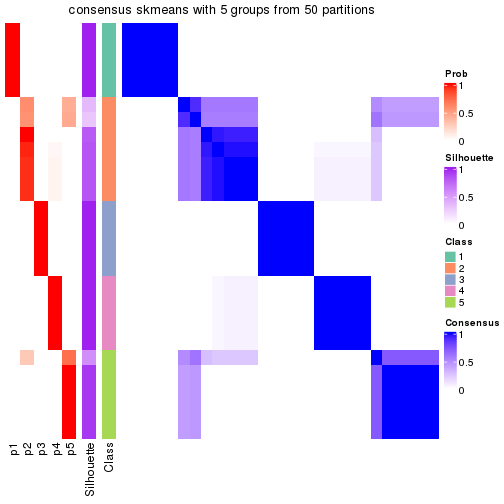</p>

</div>
<div id='tab-node-0213-consensus-heatmap-5'>
<pre><code class="r">consensus_heatmap(res, k = 6)
</code></pre>

<p>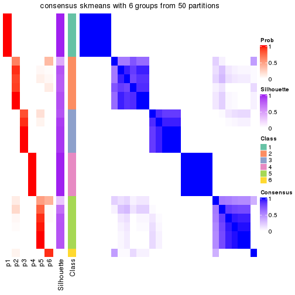</p>

</div>
<div id='tab-node-0213-consensus-heatmap-6'>
<pre><code class="r">consensus_heatmap(res, k = 7)
</code></pre>

<p>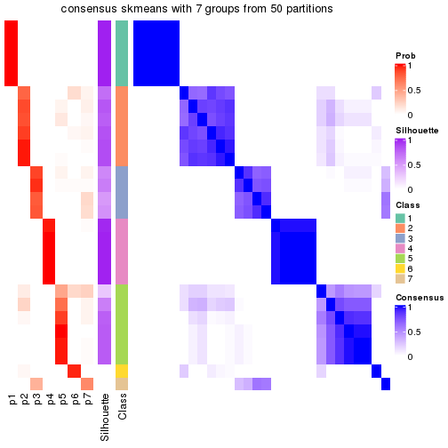</p>

</div>
<div id='tab-node-0213-consensus-heatmap-7'>
<pre><code class="r">consensus_heatmap(res, k = 8)
</code></pre>

<p></p>

</div>
</div>

Heatmaps for the membership of samples in all partitions to see how consistent they are:


<script>
$( function() {
	$( '#tabs-node-0213-membership-heatmap' ).tabs();
} );
</script>
<div id='tabs-node-0213-membership-heatmap'>
<ul>
<li><a href='#tab-node-0213-membership-heatmap-1'>k = 2</a></li>
<li><a href='#tab-node-0213-membership-heatmap-2'>k = 3</a></li>
<li><a href='#tab-node-0213-membership-heatmap-3'>k = 4</a></li>
<li><a href='#tab-node-0213-membership-heatmap-4'>k = 5</a></li>
<li><a href='#tab-node-0213-membership-heatmap-5'>k = 6</a></li>
<li><a href='#tab-node-0213-membership-heatmap-6'>k = 7</a></li>
<li><a href='#tab-node-0213-membership-heatmap-7'>k = 8</a></li>
</ul>
<div id='tab-node-0213-membership-heatmap-1'>
<pre><code class="r">membership_heatmap(res, k = 2)
</code></pre>

<p>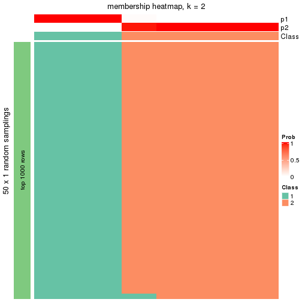</p>

</div>
<div id='tab-node-0213-membership-heatmap-2'>
<pre><code class="r">membership_heatmap(res, k = 3)
</code></pre>

<p>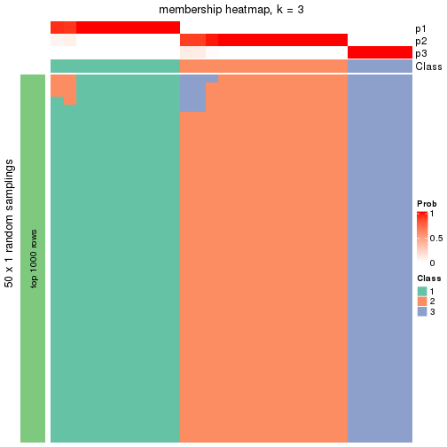</p>

</div>
<div id='tab-node-0213-membership-heatmap-3'>
<pre><code class="r">membership_heatmap(res, k = 4)
</code></pre>

<p>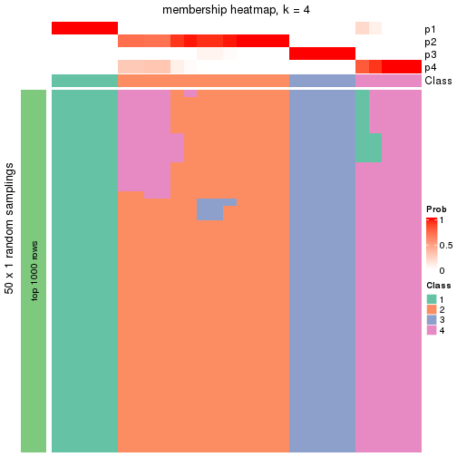</p>

</div>
<div id='tab-node-0213-membership-heatmap-4'>
<pre><code class="r">membership_heatmap(res, k = 5)
</code></pre>

<p>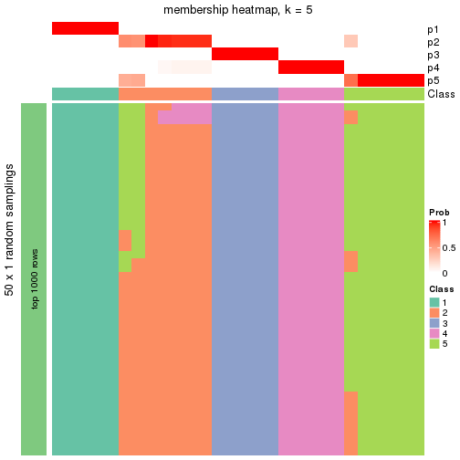</p>

</div>
<div id='tab-node-0213-membership-heatmap-5'>
<pre><code class="r">membership_heatmap(res, k = 6)
</code></pre>

<p>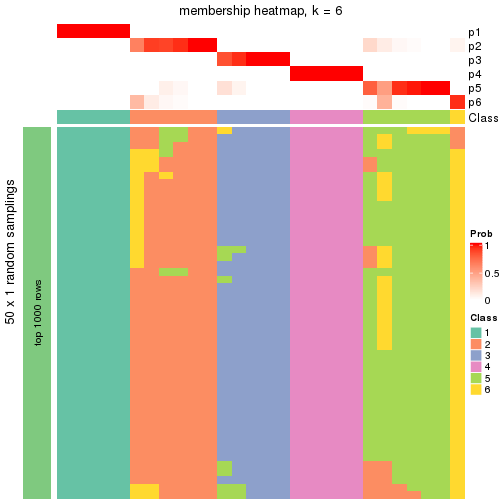</p>

</div>
<div id='tab-node-0213-membership-heatmap-6'>
<pre><code class="r">membership_heatmap(res, k = 7)
</code></pre>

<p>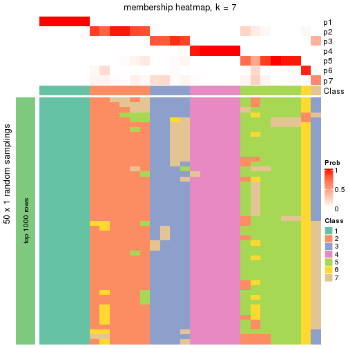</p>

</div>
<div id='tab-node-0213-membership-heatmap-7'>
<pre><code class="r">membership_heatmap(res, k = 8)
</code></pre>

<p>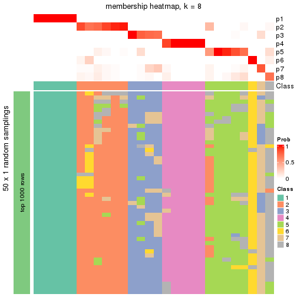</p>

</div>
</div>

As soon as the classes for columns are determined, the signatures
that are significantly different between subgroups can be looked for. 
Following are the heatmaps for signatures.


<script>
$( function() {
	$( '#tabs-node-0213-get-signatures' ).tabs();
} );
</script>
<div id='tabs-node-0213-get-signatures'>
<ul>
<li><a href='#tab-node-0213-get-signatures-1'>k = 2</a></li>
<li><a href='#tab-node-0213-get-signatures-2'>k = 3</a></li>
<li><a href='#tab-node-0213-get-signatures-3'>k = 4</a></li>
<li><a href='#tab-node-0213-get-signatures-4'>k = 5</a></li>
<li><a href='#tab-node-0213-get-signatures-5'>k = 6</a></li>
<li><a href='#tab-node-0213-get-signatures-6'>k = 7</a></li>
<li><a href='#tab-node-0213-get-signatures-7'>k = 8</a></li>
</ul>
<div id='tab-node-0213-get-signatures-1'>
<pre><code class="r">get_signatures(res, k = 2)
</code></pre>

<p>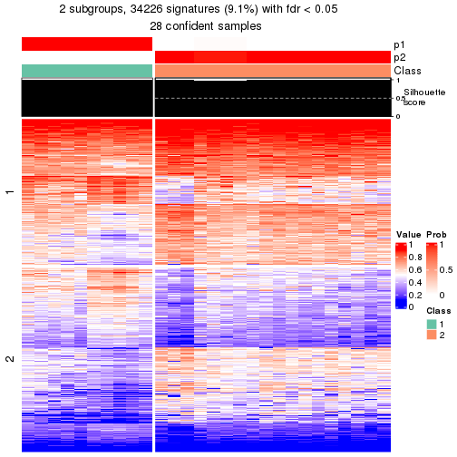</p>

</div>
<div id='tab-node-0213-get-signatures-2'>
<pre><code class="r">get_signatures(res, k = 3)
</code></pre>

<p>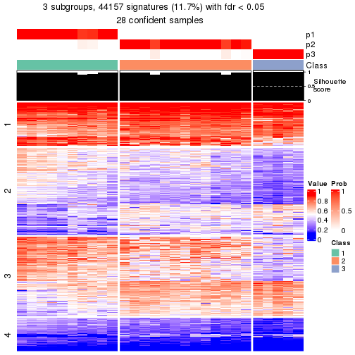</p>

</div>
<div id='tab-node-0213-get-signatures-3'>
<pre><code class="r">get_signatures(res, k = 4)
</code></pre>

<p></p>

</div>
<div id='tab-node-0213-get-signatures-4'>
<pre><code class="r">get_signatures(res, k = 5)
</code></pre>

<p>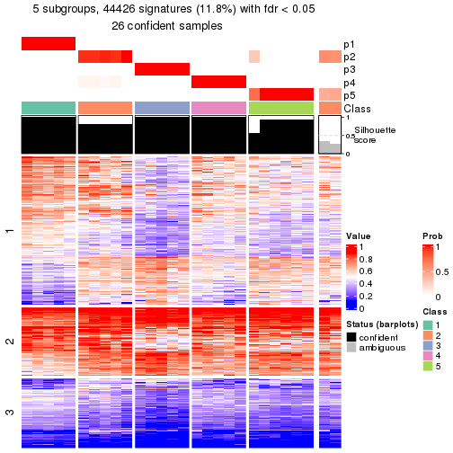</p>

</div>
<div id='tab-node-0213-get-signatures-5'>
<pre><code class="r">get_signatures(res, k = 6)
</code></pre>

<p>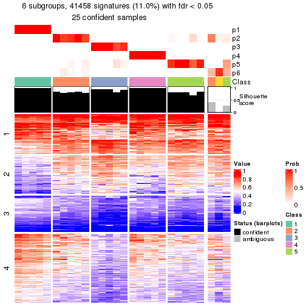</p>

</div>
<div id='tab-node-0213-get-signatures-6'>
<pre><code class="r">get_signatures(res, k = 7)
</code></pre>

<p>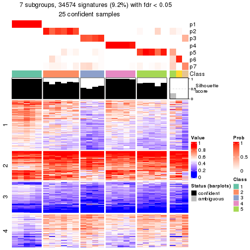</p>

</div>
<div id='tab-node-0213-get-signatures-7'>
<pre><code class="r">get_signatures(res, k = 8)
</code></pre>

<p>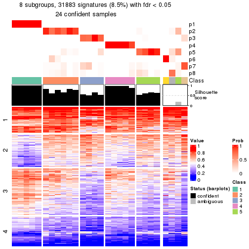</p>

</div>
</div>


Compare the overlap of signatures from different k:

```r
compare_signatures(res)
```

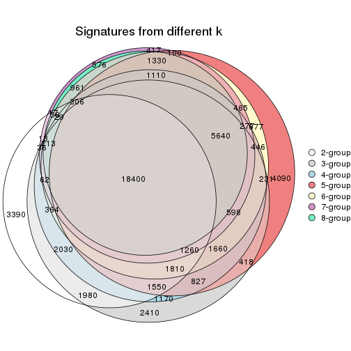

`get_signature()` returns a data frame invisibly. To get the list of signatures, the function
call should be assigned to a variable explicitly. In following code, if `plot` argument is set
to `FALSE`, no heatmap is plotted while only the differential analysis is performed.

```r
# code only for demonstration
tb = get_signature(res, k = ..., plot = FALSE)
```

An example of the output of `tb` is:

```
#>   which_row         fdr    mean_1    mean_2 scaled_mean_1 scaled_mean_2 km
#> 1        38 0.042760348  8.373488  9.131774    -0.5533452     0.5164555  1
#> 2        40 0.018707592  7.106213  8.469186    -0.6173731     0.5762149  1
#> 3        55 0.019134737 10.221463 11.207825    -0.6159697     0.5749050  1
#> 4        59 0.006059896  5.921854  7.869574    -0.6899429     0.6439467  1
#> 5        60 0.018055526  8.928898 10.211722    -0.6204761     0.5791110  1
#> 6        98 0.009384629 15.714769 14.887706     0.6635654    -0.6193277  2
...
```

The columns in `tb` are:

1. `which_row`: row indices corresponding to the input matrix.
2. `fdr`: FDR for the differential test. 
3. `mean_x`: The mean value in group x.
4. `scaled_mean_x`: The mean value in group x after rows are scaled.
5. `km`: Row groups if k-means clustering is applied to rows (which is done by automatically selecting number of clusters).

If there are too many signatures, `top_signatures = ...` can be set to only show the 
signatures with the highest FDRs:

```r
# code only for demonstration
# e.g. to show the top 500 most significant rows
tb = get_signature(res, k = ..., top_signatures = 500)
```

If the signatures are defined as these which are uniquely high in current group, `diff_method` argument
can be set to `"uniquely_high_in_one_group"`:

```r
# code only for demonstration
tb = get_signature(res, k = ..., diff_method = "uniquely_high_in_one_group")
```


UMAP plot which shows how samples are separated.


<script>
$( function() {
	$( '#tabs-node-0213-dimension-reduction' ).tabs();
} );
</script>
<div id='tabs-node-0213-dimension-reduction'>
<ul>
<li><a href='#tab-node-0213-dimension-reduction-1'>k = 2</a></li>
<li><a href='#tab-node-0213-dimension-reduction-2'>k = 3</a></li>
<li><a href='#tab-node-0213-dimension-reduction-3'>k = 4</a></li>
<li><a href='#tab-node-0213-dimension-reduction-4'>k = 5</a></li>
<li><a href='#tab-node-0213-dimension-reduction-5'>k = 6</a></li>
<li><a href='#tab-node-0213-dimension-reduction-6'>k = 7</a></li>
<li><a href='#tab-node-0213-dimension-reduction-7'>k = 8</a></li>
</ul>
<div id='tab-node-0213-dimension-reduction-1'>
<pre><code class="r">dimension_reduction(res, k = 2, method = &quot;UMAP&quot;)
</code></pre>

<p>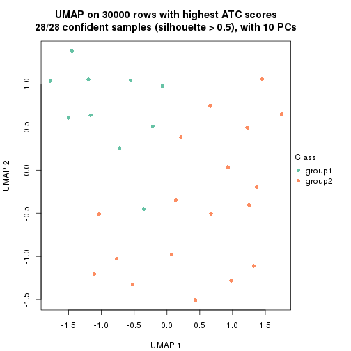</p>

</div>
<div id='tab-node-0213-dimension-reduction-2'>
<pre><code class="r">dimension_reduction(res, k = 3, method = &quot;UMAP&quot;)
</code></pre>

<p>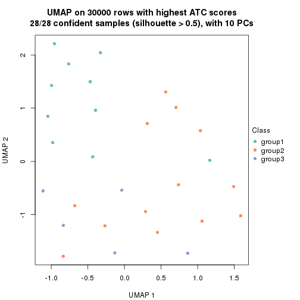</p>

</div>
<div id='tab-node-0213-dimension-reduction-3'>
<pre><code class="r">dimension_reduction(res, k = 4, method = &quot;UMAP&quot;)
</code></pre>

<p>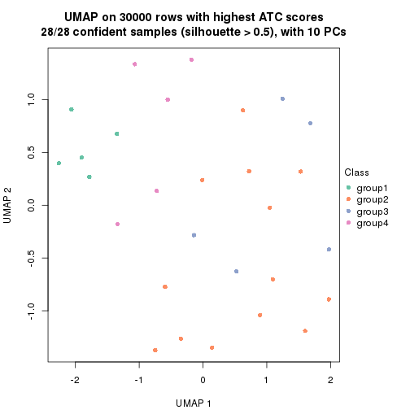</p>

</div>
<div id='tab-node-0213-dimension-reduction-4'>
<pre><code class="r">dimension_reduction(res, k = 5, method = &quot;UMAP&quot;)
</code></pre>

<p></p>

</div>
<div id='tab-node-0213-dimension-reduction-5'>
<pre><code class="r">dimension_reduction(res, k = 6, method = &quot;UMAP&quot;)
</code></pre>

<p>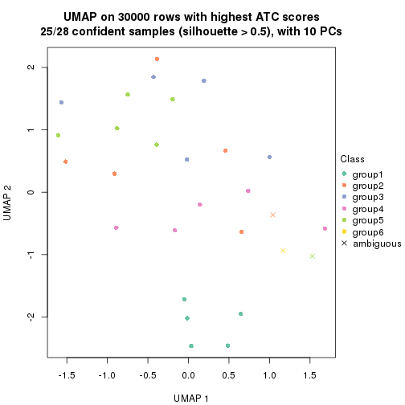</p>

</div>
<div id='tab-node-0213-dimension-reduction-6'>
<pre><code class="r">dimension_reduction(res, k = 7, method = &quot;UMAP&quot;)
</code></pre>

<p>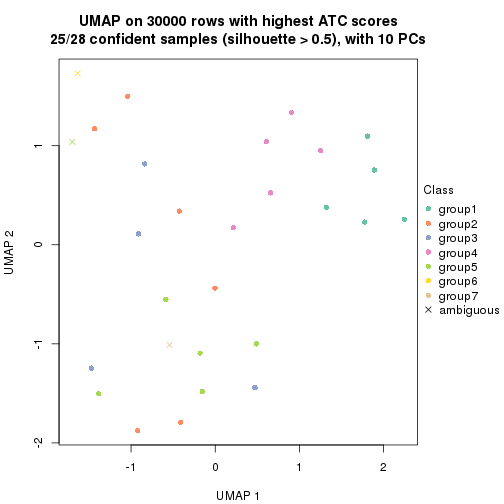</p>

</div>
<div id='tab-node-0213-dimension-reduction-7'>
<pre><code class="r">dimension_reduction(res, k = 8, method = &quot;UMAP&quot;)
</code></pre>

<p>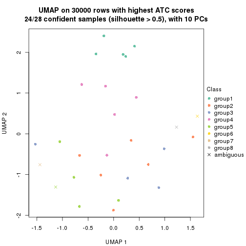</p>

</div>
</div>


Following heatmap shows how subgroups are split when increasing `k`:

```r
collect_classes(res)
```


If matrix rows can be associated to genes, consider to use `functional_enrichment(res,
...)` to perform function enrichment for the signature genes. See [this vignette](https://jokergoo.github.io/cola_vignettes/functional_enrichment.html) for more detailed explanations.


 

---------------------------------------------------


### Node02132


Parent node: [Node0213](#Node0213).
Child nodes: 
                Node021321-leaf
        ,
                Node021322-leaf
        ,
                Node051211-leaf
        ,
                Node051212-leaf
        .


The object with results only for a single top-value method and a single partitioning method 
can be extracted as:

```r
res = res_rh["02132"]
```

A summary of `res` and all the functions that can be applied to it:

```r
res
```

```
#> A 'ConsensusPartition' object with k = 2, 3, 4, 5, 6, 7, 8.
#>   On a matrix with 30000 rows and 13 columns.
#>   Top rows (1000) are extracted by 'ATC' method.
#>   Subgroups are detected by 'kmeans' method.
#>   Performed in total 350 partitions by row resampling.
#>   Best k for subgroups seems to be 2.
#> 
#> Following methods can be applied to this 'ConsensusPartition' object:
#>  [1] "cola_report"             "collect_classes"         "collect_plots"          
#>  [4] "collect_stats"           "colnames"                "compare_partitions"     
#>  [7] "compare_signatures"      "consensus_heatmap"       "dimension_reduction"    
#> [10] "functional_enrichment"   "get_anno_col"            "get_anno"               
#> [13] "get_classes"             "get_consensus"           "get_matrix"             
#> [16] "get_membership"          "get_param"               "get_signatures"         
#> [19] "get_stats"               "is_best_k"               "is_stable_k"            
#> [22] "membership_heatmap"      "ncol"                    "nrow"                   
#> [25] "plot_ecdf"               "predict_classes"         "rownames"               
#> [28] "select_partition_number" "show"                    "suggest_best_k"         
#> [31] "test_to_known_factors"   "top_rows_heatmap"
```

`collect_plots()` function collects all the plots made from `res` for all `k` (number of subgroups)
into one single page to provide an easy and fast comparison between different `k`.

```r
collect_plots(res)
```


The plots are:

- The first row: a plot of the eCDF (empirical cumulative distribution
  function) curves of the consensus matrix for each `k` and the heatmap of
  predicted classes for each `k`.
- The second row: heatmaps of the consensus matrix for each `k`.
- The third row: heatmaps of the membership matrix for each `k`.
- The fouth row: heatmaps of the signatures for each `k`.

All the plots in panels can be made by individual functions and they are
plotted later in this section.

`select_partition_number()` produces several plots showing different
statistics for choosing "optimized" `k`. There are following statistics:

- eCDF curves of the consensus matrix for each `k`;
- 1-PAC. [The PAC score](https://en.wikipedia.org/wiki/Consensus_clustering#Over-interpretation_potential_of_consensus_clustering)
  measures the proportion of the ambiguous subgrouping.
- Mean silhouette score.
- Concordance. The mean probability of fiting the consensus subgroup labels in all
  partitions.
- Area increased. Denote $A_k$ as the area under the eCDF curve for current
  `k`, the area increased is defined as $A_k - A_{k-1}$.
- Rand index. The percent of pairs of samples that are both in a same cluster
  or both are not in a same cluster in the partition of k and k-1.
- Jaccard index. The ratio of pairs of samples are both in a same cluster in
  the partition of k and k-1 and the pairs of samples are both in a same
  cluster in the partition k or k-1.

The detailed explanations of these statistics can be found in [the _cola_
vignette](https://jokergoo.github.io/cola_vignettes/cola.html#toc_13).

Generally speaking, higher 1-PAC score, higher mean silhouette score or higher
concordance corresponds to better partition. Rand index and Jaccard index
measure how similar the current partition is compared to partition with `k-1`.
If they are too similar, we won't accept `k` is better than `k-1`.

```r
select_partition_number(res)
```

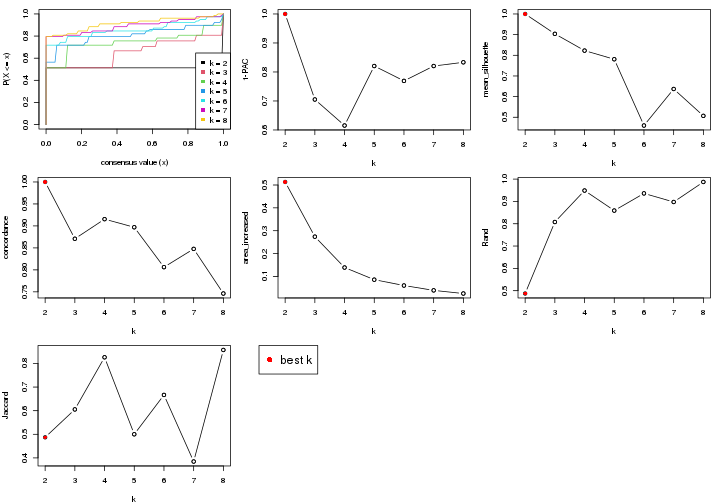

The numeric values for all these statistics can be obtained by `get_stats()`.

```r
get_stats(res)
```

```
#>   k 1-PAC mean_silhouette concordance area_increased  Rand Jaccard
#> 2 2 1.000           1.000       1.000         0.5133 0.487   0.487
#> 3 3 0.705           0.904       0.871         0.2739 0.808   0.605
#> 4 4 0.615           0.823       0.915         0.1388 0.949   0.826
#> 5 5 0.821           0.781       0.897         0.0857 0.859   0.500
#> 6 6 0.769           0.460       0.806         0.0601 0.936   0.667
#> 7 7 0.821           0.637       0.848         0.0388 0.897   0.385
#> 8 8 0.833           0.507       0.746         0.0251 0.987   0.857
```

`suggest_best_k()` suggests the best $k$ based on these statistics. The rules are as follows:

- All $k$ with Jaccard index larger than 0.95 are removed because increasing
  $k$ does not provide enough extra information. If all $k$ are removed, it is
  marked as no subgroup is detected.
- For all $k$ with 1-PAC score larger than 0.9, the maximal $k$ is taken as
  the best $k$, and other $k$ are marked as optional $k$.
- If it does not fit the second rule. The $k$ with the maximal vote of the
  highest 1-PAC score, highest mean silhouette, and highest concordance is
  taken as the best $k$.

```r
suggest_best_k(res)
```

```
#> [1] 2
```


Following is the table of the partitions (You need to click the **show/hide
code output** link to see it). The membership matrix (columns with name `p*`)
is inferred by
[`clue::cl_consensus()`](https://www.rdocumentation.org/link/cl_consensus?package=clue)
function with the `SE` method. Basically the value in the membership matrix
represents the probability to belong to a certain group. The finall subgroup
label for an item is determined with the group with highest probability it
belongs to.

In `get_classes()` function, the entropy is calculated from the membership
matrix and the silhouette score is calculated from the consensus matrix.


<script>
$( function() {
	$( '#tabs-node-02132-get-classes' ).tabs();
} );
</script>
<div id='tabs-node-02132-get-classes'>
<ul>
<li><a href='#tab-node-02132-get-classes-1'>k = 2</a></li>
<li><a href='#tab-node-02132-get-classes-2'>k = 3</a></li>
<li><a href='#tab-node-02132-get-classes-3'>k = 4</a></li>
<li><a href='#tab-node-02132-get-classes-4'>k = 5</a></li>
<li><a href='#tab-node-02132-get-classes-5'>k = 6</a></li>
<li><a href='#tab-node-02132-get-classes-6'>k = 7</a></li>
<li><a href='#tab-node-02132-get-classes-7'>k = 8</a></li>
</ul>

<div id='tab-node-02132-get-classes-1'>
<p><a id='tab-node-02132-get-classes-1-a' style='color:#0366d6' href='#'>show/hide code output</a></p>
<pre><code class="r">cbind(get_classes(res, k = 2), get_membership(res, k = 2))
</code></pre>

<pre><code>#&gt;                 class entropy silhouette p1 p2
#&gt; TCGA.CV.7407.01     2       0          1  0  1
#&gt; TCGA.CN.6021.01     2       0          1  0  1
#&gt; TCGA.CV.5978.01     2       0          1  0  1
#&gt; TCGA.CV.7178.01     1       0          1  1  0
#&gt; TCGA.CV.7102.01     1       0          1  1  0
#&gt; TCGA.CQ.6218.01     1       0          1  1  0
#&gt; TCGA.BA.6870.01     1       0          1  1  0
#&gt; TCGA.CN.A498.01     1       0          1  1  0
#&gt; TCGA.CN.A499.01     1       0          1  1  0
#&gt; TCGA.MT.A67G.01     2       0          1  0  1
#&gt; TCGA.CN.5367.01     1       0          1  1  0
#&gt; TCGA.BB.7871.01     2       0          1  0  1
#&gt; TCGA.CR.7383.01     1       0          1  1  0
</code></pre>

<script>
$('#tab-node-02132-get-classes-1-a').parent().next().next().hide();
$('#tab-node-02132-get-classes-1-a').click(function(){
  $('#tab-node-02132-get-classes-1-a').parent().next().next().toggle();
  return(false);
});
</script>
</div>

<div id='tab-node-02132-get-classes-2'>
<p><a id='tab-node-02132-get-classes-2-a' style='color:#0366d6' href='#'>show/hide code output</a></p>
<pre><code class="r">cbind(get_classes(res, k = 3), get_membership(res, k = 3))
</code></pre>

<pre><code>#&gt;                 class entropy silhouette   p1   p2   p3
#&gt; TCGA.CV.7407.01     2   0.000      0.926 0.00 1.00 0.00
#&gt; TCGA.CN.6021.01     2   0.000      0.926 0.00 1.00 0.00
#&gt; TCGA.CV.5978.01     2   0.000      0.926 0.00 1.00 0.00
#&gt; TCGA.CV.7178.01     3   0.604      1.000 0.38 0.00 0.62
#&gt; TCGA.CV.7102.01     3   0.604      1.000 0.38 0.00 0.62
#&gt; TCGA.CQ.6218.01     3   0.604      1.000 0.38 0.00 0.62
#&gt; TCGA.BA.6870.01     1   0.000      0.932 1.00 0.00 0.00
#&gt; TCGA.CN.A498.01     1   0.000      0.932 1.00 0.00 0.00
#&gt; TCGA.CN.A499.01     1   0.000      0.932 1.00 0.00 0.00
#&gt; TCGA.MT.A67G.01     2   0.604      0.664 0.00 0.62 0.38
#&gt; TCGA.CN.5367.01     1   0.400      0.652 0.84 0.00 0.16
#&gt; TCGA.BB.7871.01     2   0.000      0.926 0.00 1.00 0.00
#&gt; TCGA.CR.7383.01     1   0.000      0.932 1.00 0.00 0.00
</code></pre>

<script>
$('#tab-node-02132-get-classes-2-a').parent().next().next().hide();
$('#tab-node-02132-get-classes-2-a').click(function(){
  $('#tab-node-02132-get-classes-2-a').parent().next().next().toggle();
  return(false);
});
</script>
</div>

<div id='tab-node-02132-get-classes-3'>
<p><a id='tab-node-02132-get-classes-3-a' style='color:#0366d6' href='#'>show/hide code output</a></p>
<pre><code class="r">cbind(get_classes(res, k = 4), get_membership(res, k = 4))
</code></pre>

<pre><code>#&gt;                 class entropy silhouette   p1   p2   p3   p4
#&gt; TCGA.CV.7407.01     2   0.265      0.868 0.00 0.88 0.12 0.00
#&gt; TCGA.CN.6021.01     2   0.000      0.958 0.00 1.00 0.00 0.00
#&gt; TCGA.CV.5978.01     2   0.000      0.958 0.00 1.00 0.00 0.00
#&gt; TCGA.CV.7178.01     3   0.265      1.000 0.12 0.00 0.88 0.00
#&gt; TCGA.CV.7102.01     3   0.265      1.000 0.12 0.00 0.88 0.00
#&gt; TCGA.CQ.6218.01     3   0.265      1.000 0.12 0.00 0.88 0.00
#&gt; TCGA.BA.6870.01     1   0.000      0.860 1.00 0.00 0.00 0.00
#&gt; TCGA.CN.A498.01     1   0.265      0.849 0.88 0.00 0.00 0.12
#&gt; TCGA.CN.A499.01     1   0.265      0.849 0.88 0.00 0.00 0.12
#&gt; TCGA.MT.A67G.01     4   0.265      0.000 0.00 0.12 0.00 0.88
#&gt; TCGA.CN.5367.01     1   0.413      0.535 0.74 0.00 0.26 0.00
#&gt; TCGA.BB.7871.01     2   0.000      0.958 0.00 1.00 0.00 0.00
#&gt; TCGA.CR.7383.01     1   0.000      0.860 1.00 0.00 0.00 0.00
</code></pre>

<script>
$('#tab-node-02132-get-classes-3-a').parent().next().next().hide();
$('#tab-node-02132-get-classes-3-a').click(function(){
  $('#tab-node-02132-get-classes-3-a').parent().next().next().toggle();
  return(false);
});
</script>
</div>

<div id='tab-node-02132-get-classes-4'>
<p><a id='tab-node-02132-get-classes-4-a' style='color:#0366d6' href='#'>show/hide code output</a></p>
<pre><code class="r">cbind(get_classes(res, k = 5), get_membership(res, k = 5))
</code></pre>

<pre><code>#&gt;                 class entropy silhouette   p1   p2   p3 p4   p5
#&gt; TCGA.CV.7407.01     2  0.3274      0.794 0.00 0.78 0.00  0 0.22
#&gt; TCGA.CN.6021.01     2  0.1410      0.906 0.06 0.94 0.00  0 0.00
#&gt; TCGA.CV.5978.01     2  0.0000      0.919 0.00 1.00 0.00  0 0.00
#&gt; TCGA.CV.7178.01     3  0.0000      0.821 0.00 0.00 1.00  0 0.00
#&gt; TCGA.CV.7102.01     3  0.0000      0.821 0.00 0.00 1.00  0 0.00
#&gt; TCGA.CQ.6218.01     3  0.0609      0.817 0.00 0.00 0.98  0 0.02
#&gt; TCGA.BA.6870.01     1  0.1410      1.000 0.94 0.00 0.06  0 0.00
#&gt; TCGA.CN.A498.01     5  0.4263      1.000 0.18 0.00 0.06  0 0.76
#&gt; TCGA.CN.A499.01     5  0.4263      1.000 0.18 0.00 0.06  0 0.76
#&gt; TCGA.MT.A67G.01     4  0.0000      0.000 0.00 0.00 0.00  1 0.00
#&gt; TCGA.CN.5367.01     3  0.4767      0.154 0.42 0.00 0.56  0 0.02
#&gt; TCGA.BB.7871.01     2  0.0000      0.919 0.00 1.00 0.00  0 0.00
#&gt; TCGA.CR.7383.01     1  0.1410      1.000 0.94 0.00 0.06  0 0.00
</code></pre>

<script>
$('#tab-node-02132-get-classes-4-a').parent().next().next().hide();
$('#tab-node-02132-get-classes-4-a').click(function(){
  $('#tab-node-02132-get-classes-4-a').parent().next().next().toggle();
  return(false);
});
</script>
</div>

<div id='tab-node-02132-get-classes-5'>
<p><a id='tab-node-02132-get-classes-5-a' style='color:#0366d6' href='#'>show/hide code output</a></p>
<pre><code class="r">cbind(get_classes(res, k = 6), get_membership(res, k = 6))
</code></pre>

<pre><code>#&gt;                 class entropy silhouette   p1   p2   p3 p4   p5   p6
#&gt; TCGA.CV.7407.01     2   0.350      0.685 0.32 0.68 0.00  0 0.00 0.00
#&gt; TCGA.CN.6021.01     2   0.209      0.852 0.00 0.90 0.00  0 0.08 0.02
#&gt; TCGA.CV.5978.01     2   0.000      0.876 0.00 1.00 0.00  0 0.00 0.00
#&gt; TCGA.CV.7178.01     3   0.000      0.764 0.00 0.00 1.00  0 0.00 0.00
#&gt; TCGA.CV.7102.01     3   0.000      0.764 0.00 0.00 1.00  0 0.00 0.00
#&gt; TCGA.CQ.6218.01     3   0.376      0.409 0.00 0.00 0.60  0 0.00 0.40
#&gt; TCGA.BA.6870.01     1   0.463      0.000 0.52 0.00 0.00  0 0.04 0.44
#&gt; TCGA.CN.A498.01     5   0.393      0.861 0.16 0.00 0.00  0 0.76 0.08
#&gt; TCGA.CN.A499.01     5   0.156      0.861 0.00 0.00 0.00  0 0.92 0.08
#&gt; TCGA.MT.A67G.01     4   0.000      0.000 0.00 0.00 0.00  1 0.00 0.00
#&gt; TCGA.CN.5367.01     6   0.320     -0.125 0.00 0.00 0.26  0 0.00 0.74
#&gt; TCGA.BB.7871.01     2   0.000      0.876 0.00 1.00 0.00  0 0.00 0.00
#&gt; TCGA.CR.7383.01     6   0.453     -0.841 0.38 0.00 0.00  0 0.04 0.58
</code></pre>

<script>
$('#tab-node-02132-get-classes-5-a').parent().next().next().hide();
$('#tab-node-02132-get-classes-5-a').click(function(){
  $('#tab-node-02132-get-classes-5-a').parent().next().next().toggle();
  return(false);
});
</script>
</div>

<div id='tab-node-02132-get-classes-6'>
<p><a id='tab-node-02132-get-classes-6-a' style='color:#0366d6' href='#'>show/hide code output</a></p>
<pre><code class="r">cbind(get_classes(res, k = 7), get_membership(res, k = 7))
</code></pre>

<pre><code>#&gt;                 class entropy silhouette   p1   p2   p3 p4  p5   p6   p7
#&gt; TCGA.CV.7407.01     7  0.3413      0.000 0.00 0.38 0.00  0 0.0 0.00 0.62
#&gt; TCGA.CN.6021.01     2  0.2259      0.746 0.00 0.84 0.00  0 0.0 0.16 0.00
#&gt; TCGA.CV.5978.01     2  0.0000      0.881 0.00 1.00 0.00  0 0.0 0.00 0.00
#&gt; TCGA.CV.7178.01     3  0.0504      0.977 0.00 0.00 0.98  0 0.0 0.00 0.02
#&gt; TCGA.CV.7102.01     3  0.0000      0.977 0.00 0.00 1.00  0 0.0 0.00 0.00
#&gt; TCGA.CQ.6218.01     6  0.3546      0.449 0.00 0.00 0.46  0 0.0 0.54 0.00
#&gt; TCGA.BA.6870.01     1  0.4535      0.657 0.64 0.00 0.00  0 0.0 0.24 0.12
#&gt; TCGA.CN.A498.01     5  0.3911      0.731 0.00 0.00 0.00  0 0.7 0.06 0.24
#&gt; TCGA.CN.A499.01     5  0.0000      0.731 0.00 0.00 0.00  0 1.0 0.00 0.00
#&gt; TCGA.MT.A67G.01     4  0.0000      0.000 0.00 0.00 0.00  1 0.0 0.00 0.00
#&gt; TCGA.CN.5367.01     6  0.5164      0.587 0.26 0.00 0.20  0 0.0 0.54 0.00
#&gt; TCGA.BB.7871.01     2  0.0000      0.881 0.00 1.00 0.00  0 0.0 0.00 0.00
#&gt; TCGA.CR.7383.01     1  0.0000      0.661 1.00 0.00 0.00  0 0.0 0.00 0.00
</code></pre>

<script>
$('#tab-node-02132-get-classes-6-a').parent().next().next().hide();
$('#tab-node-02132-get-classes-6-a').click(function(){
  $('#tab-node-02132-get-classes-6-a').parent().next().next().toggle();
  return(false);
});
</script>
</div>

<div id='tab-node-02132-get-classes-7'>
<p><a id='tab-node-02132-get-classes-7-a' style='color:#0366d6' href='#'>show/hide code output</a></p>
<pre><code class="r">cbind(get_classes(res, k = 8), get_membership(res, k = 8))
</code></pre>

<pre><code>#&gt;                 class entropy silhouette   p1   p2   p3 p4   p5   p6   p7   p8
#&gt; TCGA.CV.7407.01     7  0.2650      0.000 0.00 0.24 0.00  0 0.00 0.00 0.76 0.00
#&gt; TCGA.CN.6021.01     2  0.4059      0.505 0.00 0.64 0.00  0 0.00 0.08 0.00 0.28
#&gt; TCGA.CV.5978.01     2  0.0808      0.757 0.00 0.96 0.00  0 0.00 0.04 0.00 0.00
#&gt; TCGA.CV.7178.01     3  0.1275      0.941 0.00 0.00 0.94  0 0.00 0.00 0.04 0.02
#&gt; TCGA.CV.7102.01     3  0.0000      0.941 0.00 0.00 1.00  0 0.00 0.00 0.00 0.00
#&gt; TCGA.CQ.6218.01     6  0.3374      0.787 0.00 0.00 0.30  0 0.00 0.68 0.02 0.00
#&gt; TCGA.BA.6870.01     1  0.3909      0.547 0.70 0.00 0.00  0 0.00 0.00 0.18 0.12
#&gt; TCGA.CN.A498.01     5  0.0000      0.000 0.00 0.00 0.00  0 1.00 0.00 0.00 0.00
#&gt; TCGA.CN.A499.01     8  0.3272      0.000 0.00 0.00 0.00  0 0.42 0.00 0.00 0.58
#&gt; TCGA.MT.A67G.01     4  0.0000      0.000 0.00 0.00 0.00  1 0.00 0.00 0.00 0.00
#&gt; TCGA.CN.5367.01     6  0.3036      0.807 0.04 0.00 0.18  0 0.00 0.78 0.00 0.00
#&gt; TCGA.BB.7871.01     2  0.0000      0.757 0.00 1.00 0.00  0 0.00 0.00 0.00 0.00
#&gt; TCGA.CR.7383.01     1  0.2267      0.548 0.82 0.00 0.00  0 0.00 0.18 0.00 0.00
</code></pre>

<script>
$('#tab-node-02132-get-classes-7-a').parent().next().next().hide();
$('#tab-node-02132-get-classes-7-a').click(function(){
  $('#tab-node-02132-get-classes-7-a').parent().next().next().toggle();
  return(false);
});
</script>
</div>
</div>

Heatmaps for the consensus matrix. It visualizes the probability of two
samples to be in a same group.


<script>
$( function() {
	$( '#tabs-node-02132-consensus-heatmap' ).tabs();
} );
</script>
<div id='tabs-node-02132-consensus-heatmap'>
<ul>
<li><a href='#tab-node-02132-consensus-heatmap-1'>k = 2</a></li>
<li><a href='#tab-node-02132-consensus-heatmap-2'>k = 3</a></li>
<li><a href='#tab-node-02132-consensus-heatmap-3'>k = 4</a></li>
<li><a href='#tab-node-02132-consensus-heatmap-4'>k = 5</a></li>
<li><a href='#tab-node-02132-consensus-heatmap-5'>k = 6</a></li>
<li><a href='#tab-node-02132-consensus-heatmap-6'>k = 7</a></li>
<li><a href='#tab-node-02132-consensus-heatmap-7'>k = 8</a></li>
</ul>
<div id='tab-node-02132-consensus-heatmap-1'>
<pre><code class="r">consensus_heatmap(res, k = 2)
</code></pre>

<p>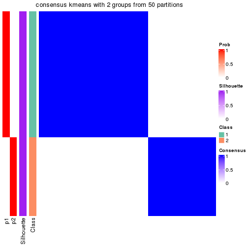</p>

</div>
<div id='tab-node-02132-consensus-heatmap-2'>
<pre><code class="r">consensus_heatmap(res, k = 3)
</code></pre>

<p></p>

</div>
<div id='tab-node-02132-consensus-heatmap-3'>
<pre><code class="r">consensus_heatmap(res, k = 4)
</code></pre>

<p>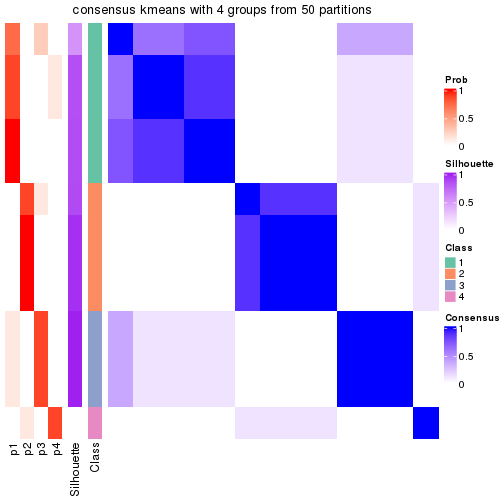</p>

</div>
<div id='tab-node-02132-consensus-heatmap-4'>
<pre><code class="r">consensus_heatmap(res, k = 5)
</code></pre>

<p>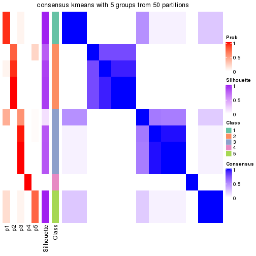</p>

</div>
<div id='tab-node-02132-consensus-heatmap-5'>
<pre><code class="r">consensus_heatmap(res, k = 6)
</code></pre>

<p>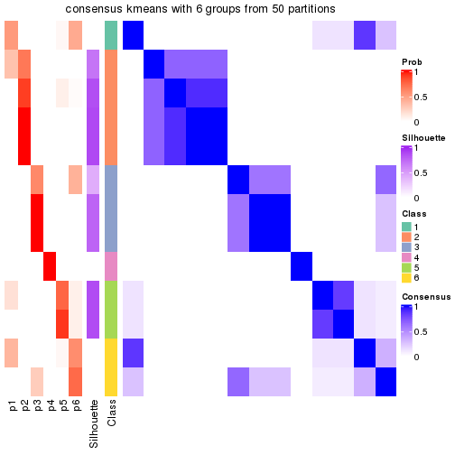</p>

</div>
<div id='tab-node-02132-consensus-heatmap-6'>
<pre><code class="r">consensus_heatmap(res, k = 7)
</code></pre>

<p>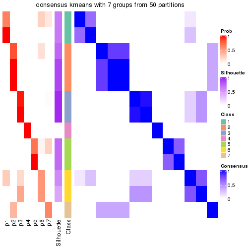</p>

</div>
<div id='tab-node-02132-consensus-heatmap-7'>
<pre><code class="r">consensus_heatmap(res, k = 8)
</code></pre>

<p>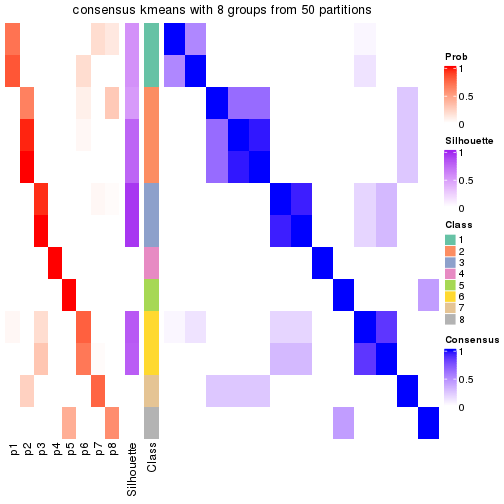</p>

</div>
</div>

Heatmaps for the membership of samples in all partitions to see how consistent they are:


<script>
$( function() {
	$( '#tabs-node-02132-membership-heatmap' ).tabs();
} );
</script>
<div id='tabs-node-02132-membership-heatmap'>
<ul>
<li><a href='#tab-node-02132-membership-heatmap-1'>k = 2</a></li>
<li><a href='#tab-node-02132-membership-heatmap-2'>k = 3</a></li>
<li><a href='#tab-node-02132-membership-heatmap-3'>k = 4</a></li>
<li><a href='#tab-node-02132-membership-heatmap-4'>k = 5</a></li>
<li><a href='#tab-node-02132-membership-heatmap-5'>k = 6</a></li>
<li><a href='#tab-node-02132-membership-heatmap-6'>k = 7</a></li>
<li><a href='#tab-node-02132-membership-heatmap-7'>k = 8</a></li>
</ul>
<div id='tab-node-02132-membership-heatmap-1'>
<pre><code class="r">membership_heatmap(res, k = 2)
</code></pre>

<p>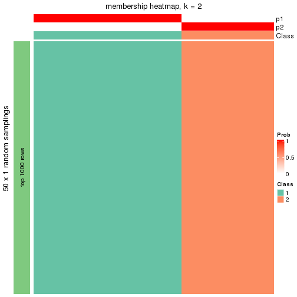</p>

</div>
<div id='tab-node-02132-membership-heatmap-2'>
<pre><code class="r">membership_heatmap(res, k = 3)
</code></pre>

<p>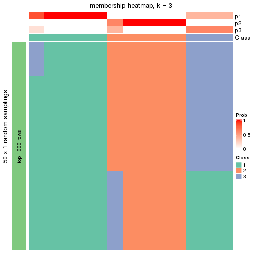</p>

</div>
<div id='tab-node-02132-membership-heatmap-3'>
<pre><code class="r">membership_heatmap(res, k = 4)
</code></pre>

<p>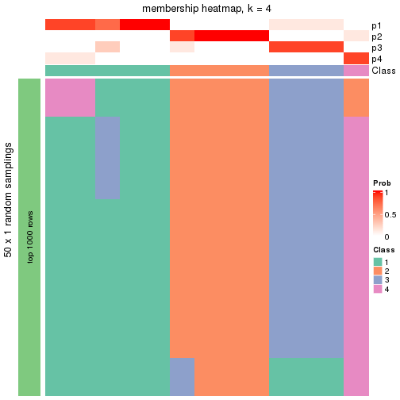</p>

</div>
<div id='tab-node-02132-membership-heatmap-4'>
<pre><code class="r">membership_heatmap(res, k = 5)
</code></pre>

<p>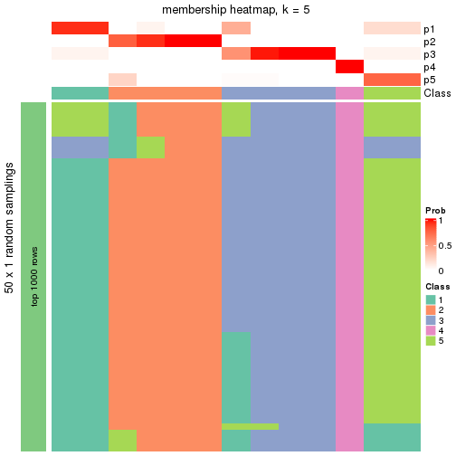</p>

</div>
<div id='tab-node-02132-membership-heatmap-5'>
<pre><code class="r">membership_heatmap(res, k = 6)
</code></pre>

<p>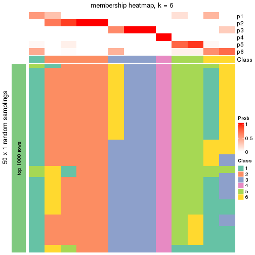</p>

</div>
<div id='tab-node-02132-membership-heatmap-6'>
<pre><code class="r">membership_heatmap(res, k = 7)
</code></pre>

<p>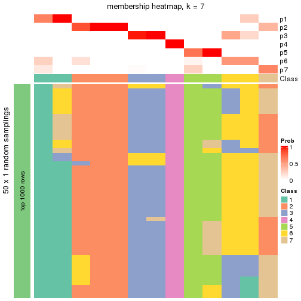</p>

</div>
<div id='tab-node-02132-membership-heatmap-7'>
<pre><code class="r">membership_heatmap(res, k = 8)
</code></pre>

<p>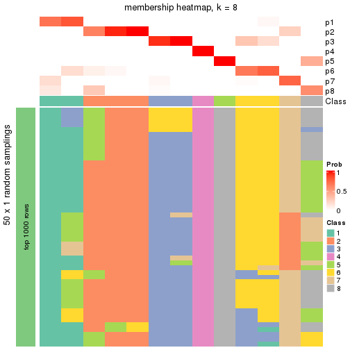</p>

</div>
</div>

As soon as the classes for columns are determined, the signatures
that are significantly different between subgroups can be looked for. 
Following are the heatmaps for signatures.


<script>
$( function() {
	$( '#tabs-node-02132-get-signatures' ).tabs();
} );
</script>
<div id='tabs-node-02132-get-signatures'>
<ul>
<li><a href='#tab-node-02132-get-signatures-1'>k = 2</a></li>
<li><a href='#tab-node-02132-get-signatures-2'>k = 3</a></li>
<li><a href='#tab-node-02132-get-signatures-3'>k = 4</a></li>
<li><a href='#tab-node-02132-get-signatures-4'>k = 5</a></li>
<li><a href='#tab-node-02132-get-signatures-5'>k = 6</a></li>
<li><a href='#tab-node-02132-get-signatures-6'>k = 7</a></li>
<li><a href='#tab-node-02132-get-signatures-7'>k = 8</a></li>
</ul>
<div id='tab-node-02132-get-signatures-1'>
<pre><code class="r">get_signatures(res, k = 2)
</code></pre>

<p>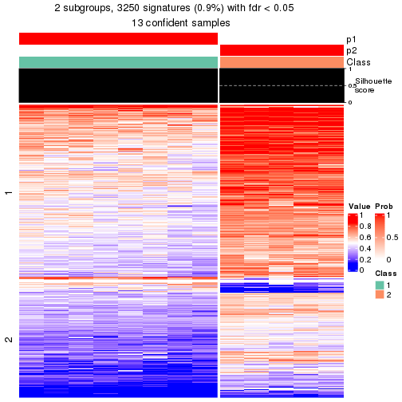</p>

</div>
<div id='tab-node-02132-get-signatures-2'>
<pre><code class="r">get_signatures(res, k = 3)
</code></pre>

<p>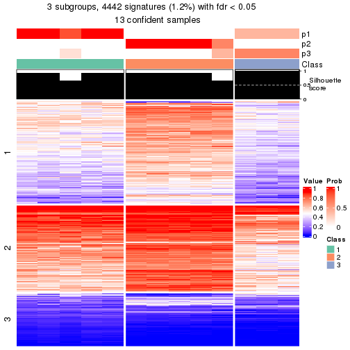</p>

</div>
<div id='tab-node-02132-get-signatures-3'>
<pre><code class="r">get_signatures(res, k = 4)
</code></pre>

<p>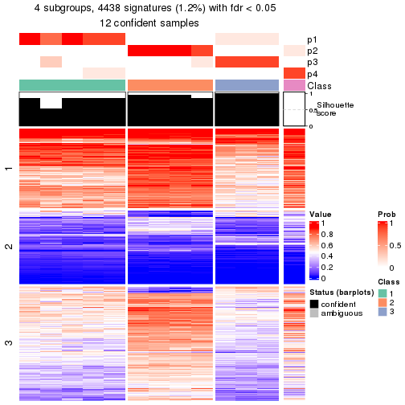</p>

</div>
<div id='tab-node-02132-get-signatures-4'>
<pre><code class="r">get_signatures(res, k = 5)
</code></pre>

<p>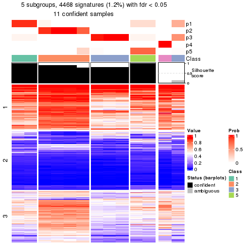</p>

</div>
<div id='tab-node-02132-get-signatures-5'>
<pre><code class="r">get_signatures(res, k = 6)
</code></pre>

<p>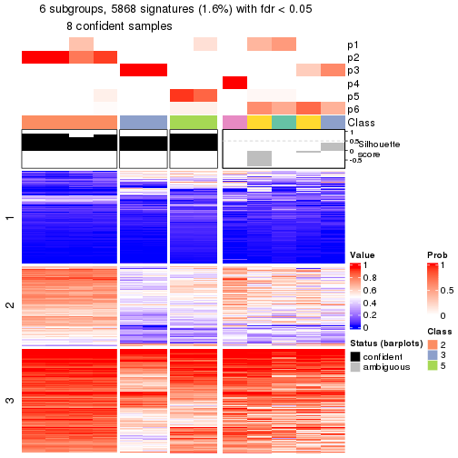</p>

</div>
<div id='tab-node-02132-get-signatures-6'>
<pre><code class="r">get_signatures(res, k = 7)
</code></pre>

<p>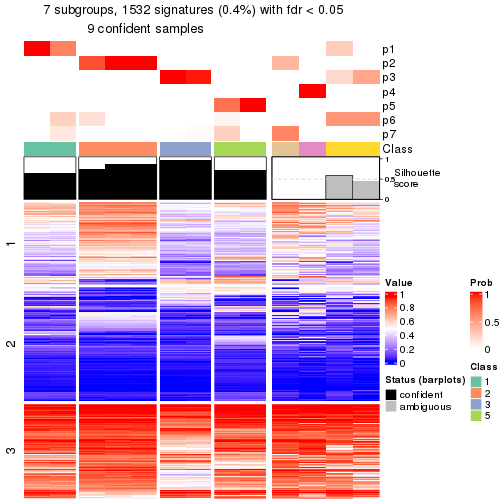</p>

</div>
<div id='tab-node-02132-get-signatures-7'>
<pre><code class="r">get_signatures(res, k = 8)
</code></pre>

<p>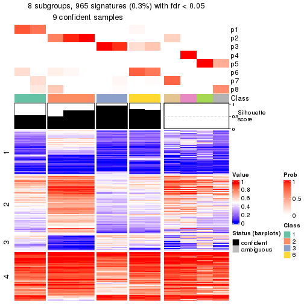</p>

</div>
</div>


Compare the overlap of signatures from different k:

```r
compare_signatures(res)
```

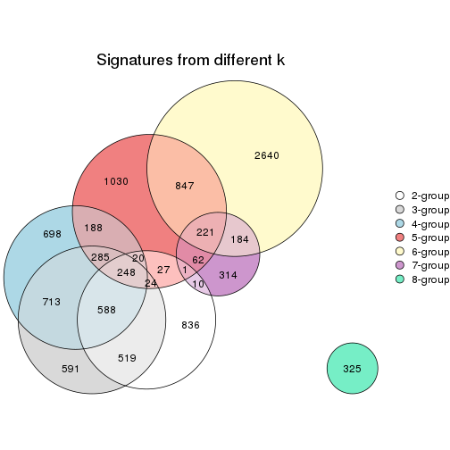

`get_signature()` returns a data frame invisibly. To get the list of signatures, the function
call should be assigned to a variable explicitly. In following code, if `plot` argument is set
to `FALSE`, no heatmap is plotted while only the differential analysis is performed.

```r
# code only for demonstration
tb = get_signature(res, k = ..., plot = FALSE)
```

An example of the output of `tb` is:

```
#>   which_row         fdr    mean_1    mean_2 scaled_mean_1 scaled_mean_2 km
#> 1        38 0.042760348  8.373488  9.131774    -0.5533452     0.5164555  1
#> 2        40 0.018707592  7.106213  8.469186    -0.6173731     0.5762149  1
#> 3        55 0.019134737 10.221463 11.207825    -0.6159697     0.5749050  1
#> 4        59 0.006059896  5.921854  7.869574    -0.6899429     0.6439467  1
#> 5        60 0.018055526  8.928898 10.211722    -0.6204761     0.5791110  1
#> 6        98 0.009384629 15.714769 14.887706     0.6635654    -0.6193277  2
...
```

The columns in `tb` are:

1. `which_row`: row indices corresponding to the input matrix.
2. `fdr`: FDR for the differential test. 
3. `mean_x`: The mean value in group x.
4. `scaled_mean_x`: The mean value in group x after rows are scaled.
5. `km`: Row groups if k-means clustering is applied to rows (which is done by automatically selecting number of clusters).

If there are too many signatures, `top_signatures = ...` can be set to only show the 
signatures with the highest FDRs:

```r
# code only for demonstration
# e.g. to show the top 500 most significant rows
tb = get_signature(res, k = ..., top_signatures = 500)
```

If the signatures are defined as these which are uniquely high in current group, `diff_method` argument
can be set to `"uniquely_high_in_one_group"`:

```r
# code only for demonstration
tb = get_signature(res, k = ..., diff_method = "uniquely_high_in_one_group")
```


UMAP plot which shows how samples are separated.


<script>
$( function() {
	$( '#tabs-node-02132-dimension-reduction' ).tabs();
} );
</script>
<div id='tabs-node-02132-dimension-reduction'>
<ul>
<li><a href='#tab-node-02132-dimension-reduction-1'>k = 2</a></li>
<li><a href='#tab-node-02132-dimension-reduction-2'>k = 3</a></li>
<li><a href='#tab-node-02132-dimension-reduction-3'>k = 4</a></li>
<li><a href='#tab-node-02132-dimension-reduction-4'>k = 5</a></li>
<li><a href='#tab-node-02132-dimension-reduction-5'>k = 6</a></li>
<li><a href='#tab-node-02132-dimension-reduction-6'>k = 7</a></li>
<li><a href='#tab-node-02132-dimension-reduction-7'>k = 8</a></li>
</ul>
<div id='tab-node-02132-dimension-reduction-1'>
<pre><code class="r">dimension_reduction(res, k = 2, method = &quot;UMAP&quot;)
</code></pre>

<p>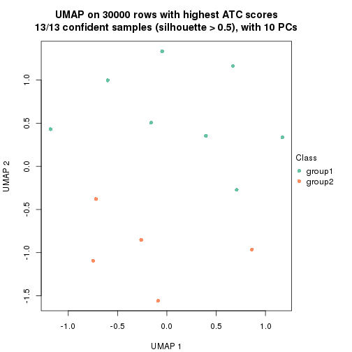</p>

</div>
<div id='tab-node-02132-dimension-reduction-2'>
<pre><code class="r">dimension_reduction(res, k = 3, method = &quot;UMAP&quot;)
</code></pre>

<p></p>

</div>
<div id='tab-node-02132-dimension-reduction-3'>
<pre><code class="r">dimension_reduction(res, k = 4, method = &quot;UMAP&quot;)
</code></pre>

<p>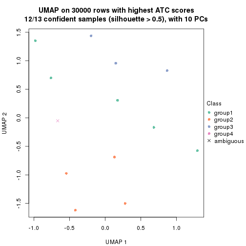</p>

</div>
<div id='tab-node-02132-dimension-reduction-4'>
<pre><code class="r">dimension_reduction(res, k = 5, method = &quot;UMAP&quot;)
</code></pre>

<p>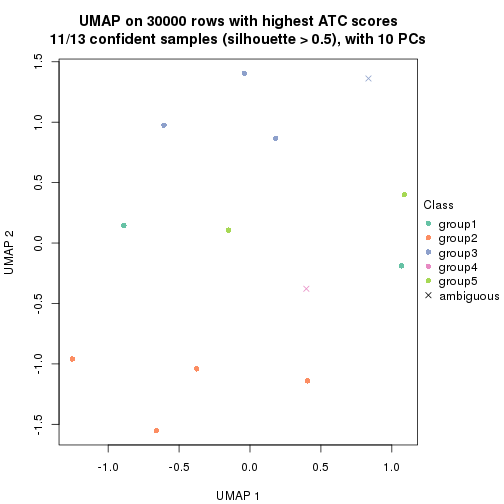</p>

</div>
<div id='tab-node-02132-dimension-reduction-5'>
<pre><code class="r">dimension_reduction(res, k = 6, method = &quot;UMAP&quot;)
</code></pre>

<p>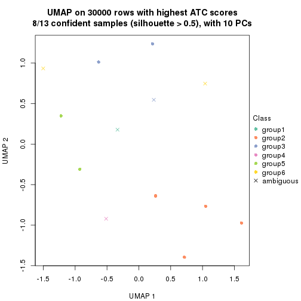</p>

</div>
<div id='tab-node-02132-dimension-reduction-6'>
<pre><code class="r">dimension_reduction(res, k = 7, method = &quot;UMAP&quot;)
</code></pre>

<p>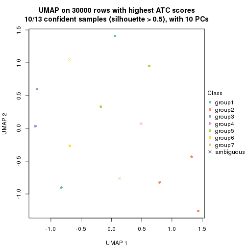</p>

</div>
<div id='tab-node-02132-dimension-reduction-7'>
<pre><code class="r">dimension_reduction(res, k = 8, method = &quot;UMAP&quot;)
</code></pre>

<p>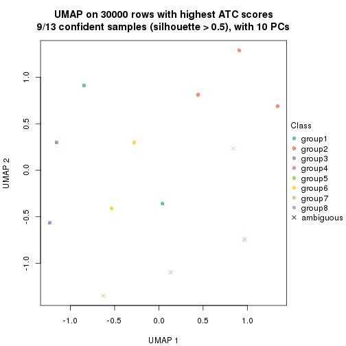</p>

</div>
</div>


Following heatmap shows how subgroups are split when increasing `k`:

```r
collect_classes(res)
```

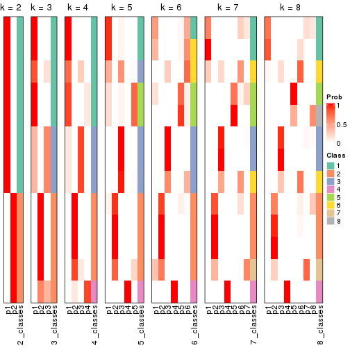


If matrix rows can be associated to genes, consider to use `functional_enrichment(res,
...)` to perform function enrichment for the signature genes. See [this vignette](https://jokergoo.github.io/cola_vignettes/functional_enrichment.html) for more detailed explanations.


 

---------------------------------------------------


### Node022


Parent node: [Node02](#Node02).
Child nodes: 
                Node0111-leaf
        ,
                Node0112-leaf
        ,
                Node0113-leaf
        ,
                [Node0121](#Node0121)
        ,
                [Node0122](#Node0122)
        ,
                [Node0211](#Node0211)
        ,
                [Node0212](#Node0212)
        ,
                [Node0213](#Node0213)
        ,
                [Node0221](#Node0221)
        ,
                [Node0222](#Node0222)
        ,
                [Node0223](#Node0223)
        ,
                [Node0224](#Node0224)
        ,
                Node0225-leaf
        ,
                Node0231-leaf
        ,
                [Node0232](#Node0232)
        ,
                Node0233-leaf
        ,
                Node0234-leaf
        ,
                Node0331-leaf
        ,
                Node0332-leaf
        ,
                Node0333-leaf
        ,
                Node0431-leaf
        ,
                Node0432-leaf
        ,
                Node0433-leaf
        ,
                [Node0511](#Node0511)
        ,
                [Node0512](#Node0512)
        ,
                Node0521-leaf
        ,
                [Node0522](#Node0522)
        ,
                Node0523-leaf
        ,
                Node0524-leaf
        .


The object with results only for a single top-value method and a single partitioning method 
can be extracted as:

```r
res = res_rh["022"]
```

A summary of `res` and all the functions that can be applied to it:

```r
res
```

```
#> A 'ConsensusPartition' object with k = 2, 3, 4, 5, 6, 7, 8.
#>   On a matrix with 30000 rows and 109 columns.
#>   Top rows (1000) are extracted by 'ATC' method.
#>   Subgroups are detected by 'skmeans' method.
#>   Performed in total 350 partitions by row resampling.
#>   Best k for subgroups seems to be 5.
#> 
#> Following methods can be applied to this 'ConsensusPartition' object:
#>  [1] "cola_report"             "collect_classes"         "collect_plots"          
#>  [4] "collect_stats"           "colnames"                "compare_partitions"     
#>  [7] "compare_signatures"      "consensus_heatmap"       "dimension_reduction"    
#> [10] "functional_enrichment"   "get_anno_col"            "get_anno"               
#> [13] "get_classes"             "get_consensus"           "get_matrix"             
#> [16] "get_membership"          "get_param"               "get_signatures"         
#> [19] "get_stats"               "is_best_k"               "is_stable_k"            
#> [22] "membership_heatmap"      "ncol"                    "nrow"                   
#> [25] "plot_ecdf"               "predict_classes"         "rownames"               
#> [28] "select_partition_number" "show"                    "suggest_best_k"         
#> [31] "test_to_known_factors"   "top_rows_heatmap"
```

`collect_plots()` function collects all the plots made from `res` for all `k` (number of subgroups)
into one single page to provide an easy and fast comparison between different `k`.

```r
collect_plots(res)
```

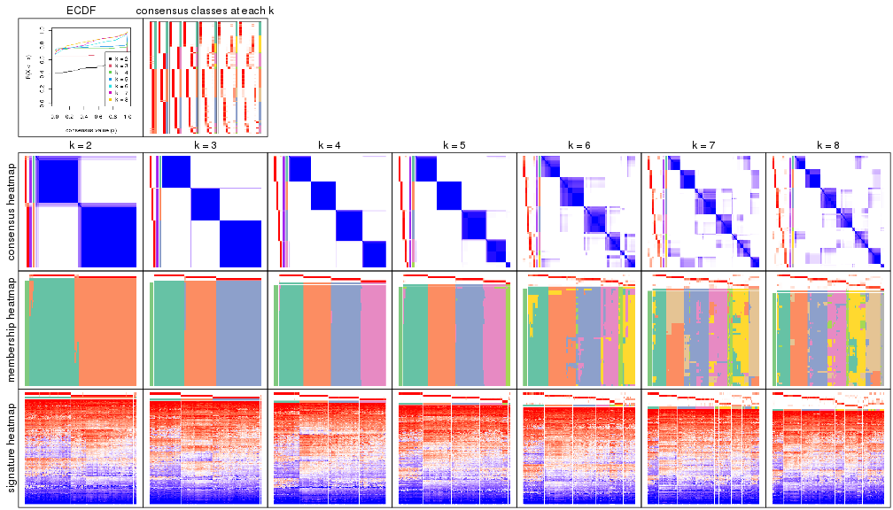

The plots are:

- The first row: a plot of the eCDF (empirical cumulative distribution
  function) curves of the consensus matrix for each `k` and the heatmap of
  predicted classes for each `k`.
- The second row: heatmaps of the consensus matrix for each `k`.
- The third row: heatmaps of the membership matrix for each `k`.
- The fouth row: heatmaps of the signatures for each `k`.

All the plots in panels can be made by individual functions and they are
plotted later in this section.

`select_partition_number()` produces several plots showing different
statistics for choosing "optimized" `k`. There are following statistics:

- eCDF curves of the consensus matrix for each `k`;
- 1-PAC. [The PAC score](https://en.wikipedia.org/wiki/Consensus_clustering#Over-interpretation_potential_of_consensus_clustering)
  measures the proportion of the ambiguous subgrouping.
- Mean silhouette score.
- Concordance. The mean probability of fiting the consensus subgroup labels in all
  partitions.
- Area increased. Denote $A_k$ as the area under the eCDF curve for current
  `k`, the area increased is defined as $A_k - A_{k-1}$.
- Rand index. The percent of pairs of samples that are both in a same cluster
  or both are not in a same cluster in the partition of k and k-1.
- Jaccard index. The ratio of pairs of samples are both in a same cluster in
  the partition of k and k-1 and the pairs of samples are both in a same
  cluster in the partition k or k-1.

The detailed explanations of these statistics can be found in [the _cola_
vignette](https://jokergoo.github.io/cola_vignettes/cola.html#toc_13).

Generally speaking, higher 1-PAC score, higher mean silhouette score or higher
concordance corresponds to better partition. Rand index and Jaccard index
measure how similar the current partition is compared to partition with `k-1`.
If they are too similar, we won't accept `k` is better than `k-1`.

```r
select_partition_number(res)
```

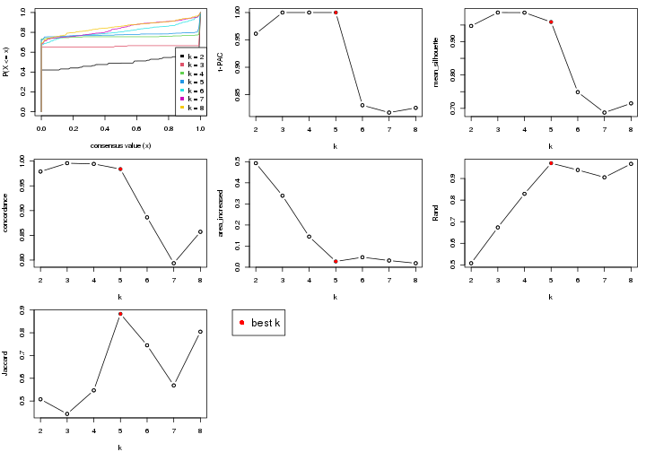

The numeric values for all these statistics can be obtained by `get_stats()`.

```r
get_stats(res)
```

```
#>   k 1-PAC mean_silhouette concordance area_increased  Rand Jaccard
#> 2 2 0.961           0.947       0.979         0.4930 0.508   0.508
#> 3 3 1.000           0.987       0.996         0.3389 0.673   0.443
#> 4 4 1.000           0.987       0.994         0.1450 0.829   0.547
#> 5 5 1.000           0.959       0.984         0.0273 0.971   0.883
#> 6 6 0.831           0.749       0.886         0.0471 0.940   0.745
#> 7 7 0.817           0.687       0.794         0.0316 0.906   0.569
#> 8 8 0.826           0.715       0.857         0.0188 0.968   0.805
```

`suggest_best_k()` suggests the best $k$ based on these statistics. The rules are as follows:

- All $k$ with Jaccard index larger than 0.95 are removed because increasing
  $k$ does not provide enough extra information. If all $k$ are removed, it is
  marked as no subgroup is detected.
- For all $k$ with 1-PAC score larger than 0.9, the maximal $k$ is taken as
  the best $k$, and other $k$ are marked as optional $k$.
- If it does not fit the second rule. The $k$ with the maximal vote of the
  highest 1-PAC score, highest mean silhouette, and highest concordance is
  taken as the best $k$.

```r
suggest_best_k(res)
```

```
#> [1] 5
#> attr(,"optional")
#> [1] 2 3 4
```

There is also optional best $k$ = 2 3 4 that is worth to check.

Following is the table of the partitions (You need to click the **show/hide
code output** link to see it). The membership matrix (columns with name `p*`)
is inferred by
[`clue::cl_consensus()`](https://www.rdocumentation.org/link/cl_consensus?package=clue)
function with the `SE` method. Basically the value in the membership matrix
represents the probability to belong to a certain group. The finall subgroup
label for an item is determined with the group with highest probability it
belongs to.

In `get_classes()` function, the entropy is calculated from the membership
matrix and the silhouette score is calculated from the consensus matrix.


<script>
$( function() {
	$( '#tabs-node-022-get-classes' ).tabs();
} );
</script>
<div id='tabs-node-022-get-classes'>
<ul>
<li><a href='#tab-node-022-get-classes-1'>k = 2</a></li>
<li><a href='#tab-node-022-get-classes-2'>k = 3</a></li>
<li><a href='#tab-node-022-get-classes-3'>k = 4</a></li>
<li><a href='#tab-node-022-get-classes-4'>k = 5</a></li>
<li><a href='#tab-node-022-get-classes-5'>k = 6</a></li>
<li><a href='#tab-node-022-get-classes-6'>k = 7</a></li>
<li><a href='#tab-node-022-get-classes-7'>k = 8</a></li>
</ul>

<div id='tab-node-022-get-classes-1'>
<p><a id='tab-node-022-get-classes-1-a' style='color:#0366d6' href='#'>show/hide code output</a></p>
<pre><code class="r">cbind(get_classes(res, k = 2), get_membership(res, k = 2))
</code></pre>

<pre><code>#&gt;                 class entropy silhouette   p1   p2
#&gt; TCGA.HD.7753.01     1   0.000      0.979 1.00 0.00
#&gt; TCGA.CQ.5325.01     2   0.000      0.976 0.00 1.00
#&gt; TCGA.CV.7415.01     1   0.000      0.979 1.00 0.00
#&gt; TCGA.CN.6011.01     1   0.000      0.979 1.00 0.00
#&gt; TCGA.DQ.7592.01     1   0.000      0.979 1.00 0.00
#&gt; TCGA.CV.5979.01     1   0.000      0.979 1.00 0.00
#&gt; TCGA.CQ.6221.01     1   0.680      0.777 0.82 0.18
#&gt; TCGA.CV.5971.01     2   0.000      0.976 0.00 1.00
#&gt; TCGA.CV.5970.01     2   0.981      0.273 0.42 0.58
#&gt; TCGA.CN.6016.01     2   0.000      0.976 0.00 1.00
#&gt; TCGA.CV.5434.01     1   0.000      0.979 1.00 0.00
#&gt; TCGA.CN.6017.01     2   0.000      0.976 0.00 1.00
#&gt; TCGA.CV.7235.01     1   0.000      0.979 1.00 0.00
#&gt; TCGA.CV.5439.01     1   0.000      0.979 1.00 0.00
#&gt; TCGA.CN.6020.01     2   0.000      0.976 0.00 1.00
#&gt; TCGA.CV.7423.01     1   0.000      0.979 1.00 0.00
#&gt; TCGA.CN.6023.01     2   0.000      0.976 0.00 1.00
#&gt; TCGA.CN.6024.01     1   0.000      0.979 1.00 0.00
#&gt; TCGA.CQ.5323.01     1   0.000      0.979 1.00 0.00
#&gt; TCGA.BB.4217.01     2   0.000      0.976 0.00 1.00
#&gt; TCGA.CV.7410.01     2   0.000      0.976 0.00 1.00
#&gt; TCGA.DQ.7588.01     1   0.000      0.979 1.00 0.00
#&gt; TCGA.DQ.7591.01     1   0.000      0.979 1.00 0.00
#&gt; TCGA.CV.5430.01     1   0.000      0.979 1.00 0.00
#&gt; TCGA.CV.5440.01     1   0.000      0.979 1.00 0.00
#&gt; TCGA.CV.7100.01     2   0.000      0.976 0.00 1.00
#&gt; TCGA.CV.7254.01     2   0.000      0.976 0.00 1.00
#&gt; TCGA.CR.7386.01     2   0.000      0.976 0.00 1.00
#&gt; TCGA.CR.6474.01     2   0.000      0.976 0.00 1.00
#&gt; TCGA.CV.7247.01     1   0.000      0.979 1.00 0.00
#&gt; TCGA.CR.7377.01     2   0.000      0.976 0.00 1.00
#&gt; TCGA.CN.5370.01     2   0.000      0.976 0.00 1.00
#&gt; TCGA.CR.7401.01     2   0.000      0.976 0.00 1.00
#&gt; TCGA.CV.7090.01     2   0.000      0.976 0.00 1.00
#&gt; TCGA.CX.7219.01     2   0.000      0.976 0.00 1.00
#&gt; TCGA.BA.6871.01     1   0.000      0.979 1.00 0.00
#&gt; TCGA.D6.6825.01     2   0.000      0.976 0.00 1.00
#&gt; TCGA.CQ.6222.01     2   0.000      0.976 0.00 1.00
#&gt; TCGA.CN.6994.01     1   0.000      0.979 1.00 0.00
#&gt; TCGA.CV.6950.01     1   0.000      0.979 1.00 0.00
#&gt; TCGA.CV.6935.01     1   0.000      0.979 1.00 0.00
#&gt; TCGA.CV.6945.01     2   0.000      0.976 0.00 1.00
#&gt; TCGA.DQ.5630.01     2   0.000      0.976 0.00 1.00
#&gt; TCGA.CV.6943.01     2   0.000      0.976 0.00 1.00
#&gt; TCGA.CN.4733.01     2   0.000      0.976 0.00 1.00
#&gt; TCGA.CN.6989.01     2   0.000      0.976 0.00 1.00
#&gt; TCGA.D6.6517.01     2   0.000      0.976 0.00 1.00
#&gt; TCGA.CQ.6220.01     2   0.000      0.976 0.00 1.00
#&gt; TCGA.D6.6516.01     1   0.000      0.979 1.00 0.00
#&gt; TCGA.CQ.6227.01     2   0.000      0.976 0.00 1.00
#&gt; TCGA.BA.6868.01     1   0.000      0.979 1.00 0.00
#&gt; TCGA.CQ.6229.01     2   0.000      0.976 0.00 1.00
#&gt; TCGA.CQ.6223.01     1   0.000      0.979 1.00 0.00
#&gt; TCGA.CV.A45R.01     1   0.529      0.855 0.88 0.12
#&gt; TCGA.CN.A49B.01     1   0.000      0.979 1.00 0.00
#&gt; TCGA.BA.5152.01     2   0.000      0.976 0.00 1.00
#&gt; TCGA.CQ.5326.01     2   0.000      0.976 0.00 1.00
#&gt; TCGA.CR.6471.01     2   0.000      0.976 0.00 1.00
#&gt; TCGA.F7.A61W.01     1   0.000      0.979 1.00 0.00
#&gt; TCGA.D6.A4ZB.01     2   0.000      0.976 0.00 1.00
#&gt; TCGA.CV.A45Y.01     2   0.000      0.976 0.00 1.00
#&gt; TCGA.BB.A5HU.01     2   0.000      0.976 0.00 1.00
#&gt; TCGA.P3.A5Q6.01     1   0.000      0.979 1.00 0.00
#&gt; TCGA.CX.A4AQ.01     2   0.904      0.524 0.32 0.68
#&gt; TCGA.CV.A464.01     2   0.000      0.976 0.00 1.00
#&gt; TCGA.QK.A652.01     2   0.000      0.976 0.00 1.00
#&gt; TCGA.F7.8298.01     1   0.925      0.484 0.66 0.34
#&gt; TCGA.F7.8489.01     2   0.000      0.976 0.00 1.00
#&gt; TCGA.F7.A50G.01     2   0.000      0.976 0.00 1.00
#&gt; TCGA.CQ.A4CA.01     2   0.000      0.976 0.00 1.00
#&gt; TCGA.T3.A92N.01     1   0.000      0.979 1.00 0.00
#&gt; TCGA.CN.A63Y.01     2   0.000      0.976 0.00 1.00
#&gt; TCGA.P3.A5QE.01     2   0.000      0.976 0.00 1.00
#&gt; TCGA.IQ.A61G.01     1   0.000      0.979 1.00 0.00
#&gt; TCGA.IQ.A61J.01     2   0.000      0.976 0.00 1.00
#&gt; TCGA.BA.A6DG.01     2   0.000      0.976 0.00 1.00
#&gt; TCGA.CQ.A4CH.01     2   0.000      0.976 0.00 1.00
#&gt; TCGA.D6.8569.01     1   0.000      0.979 1.00 0.00
#&gt; TCGA.BB.8601.01     1   0.000      0.979 1.00 0.00
#&gt; TCGA.H7.8502.01     1   0.000      0.979 1.00 0.00
#&gt; TCGA.F7.A61S.01     2   0.000      0.976 0.00 1.00
#&gt; TCGA.D6.8568.01     2   0.000      0.976 0.00 1.00
#&gt; TCGA.DQ.7589.01     1   0.000      0.979 1.00 0.00
#&gt; TCGA.CN.4725.01     1   0.000      0.979 1.00 0.00
#&gt; TCGA.HL.7533.01     1   0.000      0.979 1.00 0.00
#&gt; TCGA.CN.4729.01     2   0.000      0.976 0.00 1.00
#&gt; TCGA.CN.5361.01     2   0.981      0.273 0.42 0.58
#&gt; TCGA.CN.5359.01     2   0.000      0.976 0.00 1.00
#&gt; TCGA.BB.7861.01     2   0.000      0.976 0.00 1.00
#&gt; TCGA.UF.A7JS.01     1   0.000      0.979 1.00 0.00
#&gt; TCGA.DQ.7590.01     2   0.000      0.976 0.00 1.00
#&gt; TCGA.BA.4076.01     1   0.000      0.979 1.00 0.00
#&gt; TCGA.MZ.A7D7.01     1   0.000      0.979 1.00 0.00
#&gt; TCGA.BB.7872.01     2   0.000      0.976 0.00 1.00
#&gt; TCGA.CN.5365.01     2   0.000      0.976 0.00 1.00
#&gt; TCGA.BB.4224.01     1   0.000      0.979 1.00 0.00
#&gt; TCGA.CN.A6V1.01     2   0.000      0.976 0.00 1.00
#&gt; TCGA.CV.7430.01     1   0.000      0.979 1.00 0.00
#&gt; TCGA.UF.A7JC.01     1   0.000      0.979 1.00 0.00
#&gt; TCGA.CV.7568.01     2   0.000      0.976 0.00 1.00
#&gt; TCGA.QK.A6IF.01     2   0.000      0.976 0.00 1.00
#&gt; TCGA.CV.7429.01     2   0.000      0.976 0.00 1.00
#&gt; TCGA.CV.7437.01     1   0.000      0.979 1.00 0.00
#&gt; TCGA.CV.A6JN.01     2   0.795      0.675 0.24 0.76
#&gt; TCGA.D6.A6EK.01     2   0.000      0.976 0.00 1.00
#&gt; TCGA.P3.A6SX.01     1   0.000      0.979 1.00 0.00
#&gt; TCGA.QK.A6II.01     1   0.827      0.649 0.74 0.26
#&gt; TCGA.CV.7433.01     2   0.000      0.976 0.00 1.00
#&gt; TCGA.CR.7376.01     2   0.000      0.976 0.00 1.00
</code></pre>

<script>
$('#tab-node-022-get-classes-1-a').parent().next().next().hide();
$('#tab-node-022-get-classes-1-a').click(function(){
  $('#tab-node-022-get-classes-1-a').parent().next().next().toggle();
  return(false);
});
</script>
</div>

<div id='tab-node-022-get-classes-2'>
<p><a id='tab-node-022-get-classes-2-a' style='color:#0366d6' href='#'>show/hide code output</a></p>
<pre><code class="r">cbind(get_classes(res, k = 3), get_membership(res, k = 3))
</code></pre>

<pre><code>#&gt;                 class entropy silhouette p1   p2   p3
#&gt; TCGA.HD.7753.01     3   0.000      1.000  0 0.00 1.00
#&gt; TCGA.CQ.5325.01     2   0.000      0.983  0 1.00 0.00
#&gt; TCGA.CV.7415.01     3   0.000      1.000  0 0.00 1.00
#&gt; TCGA.CN.6011.01     1   0.000      1.000  1 0.00 0.00
#&gt; TCGA.DQ.7592.01     3   0.000      1.000  0 0.00 1.00
#&gt; TCGA.CV.5979.01     1   0.000      1.000  1 0.00 0.00
#&gt; TCGA.CQ.6221.01     3   0.000      1.000  0 0.00 1.00
#&gt; TCGA.CV.5971.01     2   0.000      0.983  0 1.00 0.00
#&gt; TCGA.CV.5970.01     3   0.000      1.000  0 0.00 1.00
#&gt; TCGA.CN.6016.01     2   0.000      0.983  0 1.00 0.00
#&gt; TCGA.CV.5434.01     1   0.000      1.000  1 0.00 0.00
#&gt; TCGA.CN.6017.01     2   0.000      0.983  0 1.00 0.00
#&gt; TCGA.CV.7235.01     1   0.000      1.000  1 0.00 0.00
#&gt; TCGA.CV.5439.01     3   0.000      1.000  0 0.00 1.00
#&gt; TCGA.CN.6020.01     3   0.000      1.000  0 0.00 1.00
#&gt; TCGA.CV.7423.01     1   0.000      1.000  1 0.00 0.00
#&gt; TCGA.CN.6023.01     3   0.000      1.000  0 0.00 1.00
#&gt; TCGA.CN.6024.01     1   0.000      1.000  1 0.00 0.00
#&gt; TCGA.CQ.5323.01     1   0.000      1.000  1 0.00 0.00
#&gt; TCGA.BB.4217.01     2   0.000      0.983  0 1.00 0.00
#&gt; TCGA.CV.7410.01     2   0.000      0.983  0 1.00 0.00
#&gt; TCGA.DQ.7588.01     1   0.000      1.000  1 0.00 0.00
#&gt; TCGA.DQ.7591.01     3   0.000      1.000  0 0.00 1.00
#&gt; TCGA.CV.5430.01     3   0.000      1.000  0 0.00 1.00
#&gt; TCGA.CV.5440.01     1   0.000      1.000  1 0.00 0.00
#&gt; TCGA.CV.7100.01     3   0.000      1.000  0 0.00 1.00
#&gt; TCGA.CV.7254.01     3   0.000      1.000  0 0.00 1.00
#&gt; TCGA.CR.7386.01     2   0.000      0.983  0 1.00 0.00
#&gt; TCGA.CR.6474.01     2   0.000      0.983  0 1.00 0.00
#&gt; TCGA.CV.7247.01     1   0.000      1.000  1 0.00 0.00
#&gt; TCGA.CR.7377.01     2   0.000      0.983  0 1.00 0.00
#&gt; TCGA.CN.5370.01     3   0.000      1.000  0 0.00 1.00
#&gt; TCGA.CR.7401.01     3   0.000      1.000  0 0.00 1.00
#&gt; TCGA.CV.7090.01     3   0.000      1.000  0 0.00 1.00
#&gt; TCGA.CX.7219.01     3   0.000      1.000  0 0.00 1.00
#&gt; TCGA.BA.6871.01     1   0.000      1.000  1 0.00 0.00
#&gt; TCGA.D6.6825.01     2   0.000      0.983  0 1.00 0.00
#&gt; TCGA.CQ.6222.01     2   0.000      0.983  0 1.00 0.00
#&gt; TCGA.CN.6994.01     1   0.000      1.000  1 0.00 0.00
#&gt; TCGA.CV.6950.01     3   0.000      1.000  0 0.00 1.00
#&gt; TCGA.CV.6935.01     1   0.000      1.000  1 0.00 0.00
#&gt; TCGA.CV.6945.01     3   0.000      1.000  0 0.00 1.00
#&gt; TCGA.DQ.5630.01     2   0.000      0.983  0 1.00 0.00
#&gt; TCGA.CV.6943.01     2   0.000      0.983  0 1.00 0.00
#&gt; TCGA.CN.4733.01     2   0.000      0.983  0 1.00 0.00
#&gt; TCGA.CN.6989.01     3   0.000      1.000  0 0.00 1.00
#&gt; TCGA.D6.6517.01     3   0.000      1.000  0 0.00 1.00
#&gt; TCGA.CQ.6220.01     3   0.000      1.000  0 0.00 1.00
#&gt; TCGA.D6.6516.01     3   0.000      1.000  0 0.00 1.00
#&gt; TCGA.CQ.6227.01     2   0.000      0.983  0 1.00 0.00
#&gt; TCGA.BA.6868.01     1   0.000      1.000  1 0.00 0.00
#&gt; TCGA.CQ.6229.01     2   0.000      0.983  0 1.00 0.00
#&gt; TCGA.CQ.6223.01     1   0.000      1.000  1 0.00 0.00
#&gt; TCGA.CV.A45R.01     3   0.000      1.000  0 0.00 1.00
#&gt; TCGA.CN.A49B.01     1   0.000      1.000  1 0.00 0.00
#&gt; TCGA.BA.5152.01     3   0.000      1.000  0 0.00 1.00
#&gt; TCGA.CQ.5326.01     2   0.000      0.983  0 1.00 0.00
#&gt; TCGA.CR.6471.01     3   0.000      1.000  0 0.00 1.00
#&gt; TCGA.F7.A61W.01     1   0.000      1.000  1 0.00 0.00
#&gt; TCGA.D6.A4ZB.01     3   0.000      1.000  0 0.00 1.00
#&gt; TCGA.CV.A45Y.01     2   0.000      0.983  0 1.00 0.00
#&gt; TCGA.BB.A5HU.01     3   0.000      1.000  0 0.00 1.00
#&gt; TCGA.P3.A5Q6.01     3   0.000      1.000  0 0.00 1.00
#&gt; TCGA.CX.A4AQ.01     3   0.000      1.000  0 0.00 1.00
#&gt; TCGA.CV.A464.01     2   0.000      0.983  0 1.00 0.00
#&gt; TCGA.QK.A652.01     2   0.000      0.983  0 1.00 0.00
#&gt; TCGA.F7.8298.01     3   0.000      1.000  0 0.00 1.00
#&gt; TCGA.F7.8489.01     2   0.000      0.983  0 1.00 0.00
#&gt; TCGA.F7.A50G.01     3   0.000      1.000  0 0.00 1.00
#&gt; TCGA.CQ.A4CA.01     2   0.000      0.983  0 1.00 0.00
#&gt; TCGA.T3.A92N.01     1   0.000      1.000  1 0.00 0.00
#&gt; TCGA.CN.A63Y.01     2   0.000      0.983  0 1.00 0.00
#&gt; TCGA.P3.A5QE.01     3   0.000      1.000  0 0.00 1.00
#&gt; TCGA.IQ.A61G.01     1   0.000      1.000  1 0.00 0.00
#&gt; TCGA.IQ.A61J.01     3   0.000      1.000  0 0.00 1.00
#&gt; TCGA.BA.A6DG.01     2   0.000      0.983  0 1.00 0.00
#&gt; TCGA.CQ.A4CH.01     2   0.000      0.983  0 1.00 0.00
#&gt; TCGA.D6.8569.01     3   0.000      1.000  0 0.00 1.00
#&gt; TCGA.BB.8601.01     1   0.000      1.000  1 0.00 0.00
#&gt; TCGA.H7.8502.01     1   0.000      1.000  1 0.00 0.00
#&gt; TCGA.F7.A61S.01     3   0.000      1.000  0 0.00 1.00
#&gt; TCGA.D6.8568.01     3   0.000      1.000  0 0.00 1.00
#&gt; TCGA.DQ.7589.01     1   0.000      1.000  1 0.00 0.00
#&gt; TCGA.CN.4725.01     1   0.000      1.000  1 0.00 0.00
#&gt; TCGA.HL.7533.01     1   0.000      1.000  1 0.00 0.00
#&gt; TCGA.CN.4729.01     3   0.000      1.000  0 0.00 1.00
#&gt; TCGA.CN.5361.01     3   0.000      1.000  0 0.00 1.00
#&gt; TCGA.CN.5359.01     2   0.000      0.983  0 1.00 0.00
#&gt; TCGA.BB.7861.01     2   0.000      0.983  0 1.00 0.00
#&gt; TCGA.UF.A7JS.01     3   0.000      1.000  0 0.00 1.00
#&gt; TCGA.DQ.7590.01     3   0.000      1.000  0 0.00 1.00
#&gt; TCGA.BA.4076.01     1   0.000      1.000  1 0.00 0.00
#&gt; TCGA.MZ.A7D7.01     1   0.000      1.000  1 0.00 0.00
#&gt; TCGA.BB.7872.01     2   0.628      0.148  0 0.54 0.46
#&gt; TCGA.CN.5365.01     3   0.000      1.000  0 0.00 1.00
#&gt; TCGA.BB.4224.01     1   0.000      1.000  1 0.00 0.00
#&gt; TCGA.CN.A6V1.01     2   0.000      0.983  0 1.00 0.00
#&gt; TCGA.CV.7430.01     1   0.000      1.000  1 0.00 0.00
#&gt; TCGA.UF.A7JC.01     1   0.000      1.000  1 0.00 0.00
#&gt; TCGA.CV.7568.01     2   0.000      0.983  0 1.00 0.00
#&gt; TCGA.QK.A6IF.01     3   0.000      1.000  0 0.00 1.00
#&gt; TCGA.CV.7429.01     3   0.000      1.000  0 0.00 1.00
#&gt; TCGA.CV.7437.01     1   0.000      1.000  1 0.00 0.00
#&gt; TCGA.CV.A6JN.01     3   0.000      1.000  0 0.00 1.00
#&gt; TCGA.D6.A6EK.01     3   0.000      1.000  0 0.00 1.00
#&gt; TCGA.P3.A6SX.01     1   0.000      1.000  1 0.00 0.00
#&gt; TCGA.QK.A6II.01     3   0.000      1.000  0 0.00 1.00
#&gt; TCGA.CV.7433.01     2   0.000      0.983  0 1.00 0.00
#&gt; TCGA.CR.7376.01     2   0.000      0.983  0 1.00 0.00
</code></pre>

<script>
$('#tab-node-022-get-classes-2-a').parent().next().next().hide();
$('#tab-node-022-get-classes-2-a').click(function(){
  $('#tab-node-022-get-classes-2-a').parent().next().next().toggle();
  return(false);
});
</script>
</div>

<div id='tab-node-022-get-classes-3'>
<p><a id='tab-node-022-get-classes-3-a' style='color:#0366d6' href='#'>show/hide code output</a></p>
<pre><code class="r">cbind(get_classes(res, k = 4), get_membership(res, k = 4))
</code></pre>

<pre><code>#&gt;                 class entropy silhouette   p1 p2   p3   p4
#&gt; TCGA.HD.7753.01     4  0.0000      0.991 0.00  0 0.00 1.00
#&gt; TCGA.CQ.5325.01     2  0.0000      1.000 0.00  1 0.00 0.00
#&gt; TCGA.CV.7415.01     4  0.0000      0.991 0.00  0 0.00 1.00
#&gt; TCGA.CN.6011.01     1  0.0000      0.987 1.00  0 0.00 0.00
#&gt; TCGA.DQ.7592.01     4  0.0000      0.991 0.00  0 0.00 1.00
#&gt; TCGA.CV.5979.01     1  0.0000      0.987 1.00  0 0.00 0.00
#&gt; TCGA.CQ.6221.01     4  0.0000      0.991 0.00  0 0.00 1.00
#&gt; TCGA.CV.5971.01     2  0.0000      1.000 0.00  1 0.00 0.00
#&gt; TCGA.CV.5970.01     4  0.0000      0.991 0.00  0 0.00 1.00
#&gt; TCGA.CN.6016.01     3  0.0000      0.996 0.00  0 1.00 0.00
#&gt; TCGA.CV.5434.01     1  0.0000      0.987 1.00  0 0.00 0.00
#&gt; TCGA.CN.6017.01     2  0.0000      1.000 0.00  1 0.00 0.00
#&gt; TCGA.CV.7235.01     4  0.0000      0.991 0.00  0 0.00 1.00
#&gt; TCGA.CV.5439.01     4  0.0000      0.991 0.00  0 0.00 1.00
#&gt; TCGA.CN.6020.01     3  0.0000      0.996 0.00  0 1.00 0.00
#&gt; TCGA.CV.7423.01     1  0.1211      0.951 0.96  0 0.00 0.04
#&gt; TCGA.CN.6023.01     3  0.0000      0.996 0.00  0 1.00 0.00
#&gt; TCGA.CN.6024.01     1  0.0000      0.987 1.00  0 0.00 0.00
#&gt; TCGA.CQ.5323.01     1  0.0000      0.987 1.00  0 0.00 0.00
#&gt; TCGA.BB.4217.01     2  0.0000      1.000 0.00  1 0.00 0.00
#&gt; TCGA.CV.7410.01     2  0.0000      1.000 0.00  1 0.00 0.00
#&gt; TCGA.DQ.7588.01     1  0.0000      0.987 1.00  0 0.00 0.00
#&gt; TCGA.DQ.7591.01     4  0.0000      0.991 0.00  0 0.00 1.00
#&gt; TCGA.CV.5430.01     4  0.0000      0.991 0.00  0 0.00 1.00
#&gt; TCGA.CV.5440.01     1  0.0000      0.987 1.00  0 0.00 0.00
#&gt; TCGA.CV.7100.01     4  0.3400      0.779 0.00  0 0.18 0.82
#&gt; TCGA.CV.7254.01     3  0.0000      0.996 0.00  0 1.00 0.00
#&gt; TCGA.CR.7386.01     2  0.0000      1.000 0.00  1 0.00 0.00
#&gt; TCGA.CR.6474.01     2  0.0000      1.000 0.00  1 0.00 0.00
#&gt; TCGA.CV.7247.01     1  0.0000      0.987 1.00  0 0.00 0.00
#&gt; TCGA.CR.7377.01     2  0.0000      1.000 0.00  1 0.00 0.00
#&gt; TCGA.CN.5370.01     3  0.0000      0.996 0.00  0 1.00 0.00
#&gt; TCGA.CR.7401.01     3  0.0000      0.996 0.00  0 1.00 0.00
#&gt; TCGA.CV.7090.01     3  0.0000      0.996 0.00  0 1.00 0.00
#&gt; TCGA.CX.7219.01     3  0.0000      0.996 0.00  0 1.00 0.00
#&gt; TCGA.BA.6871.01     4  0.0000      0.991 0.00  0 0.00 1.00
#&gt; TCGA.D6.6825.01     3  0.0000      0.996 0.00  0 1.00 0.00
#&gt; TCGA.CQ.6222.01     2  0.0000      1.000 0.00  1 0.00 0.00
#&gt; TCGA.CN.6994.01     1  0.0000      0.987 1.00  0 0.00 0.00
#&gt; TCGA.CV.6950.01     4  0.0000      0.991 0.00  0 0.00 1.00
#&gt; TCGA.CV.6935.01     1  0.0000      0.987 1.00  0 0.00 0.00
#&gt; TCGA.CV.6945.01     3  0.0000      0.996 0.00  0 1.00 0.00
#&gt; TCGA.DQ.5630.01     2  0.0000      1.000 0.00  1 0.00 0.00
#&gt; TCGA.CV.6943.01     2  0.0000      1.000 0.00  1 0.00 0.00
#&gt; TCGA.CN.4733.01     2  0.0000      1.000 0.00  1 0.00 0.00
#&gt; TCGA.CN.6989.01     3  0.0000      0.996 0.00  0 1.00 0.00
#&gt; TCGA.D6.6517.01     3  0.0000      0.996 0.00  0 1.00 0.00
#&gt; TCGA.CQ.6220.01     3  0.0000      0.996 0.00  0 1.00 0.00
#&gt; TCGA.D6.6516.01     4  0.0000      0.991 0.00  0 0.00 1.00
#&gt; TCGA.CQ.6227.01     2  0.0000      1.000 0.00  1 0.00 0.00
#&gt; TCGA.BA.6868.01     1  0.0000      0.987 1.00  0 0.00 0.00
#&gt; TCGA.CQ.6229.01     2  0.0000      1.000 0.00  1 0.00 0.00
#&gt; TCGA.CQ.6223.01     4  0.0000      0.991 0.00  0 0.00 1.00
#&gt; TCGA.CV.A45R.01     4  0.0000      0.991 0.00  0 0.00 1.00
#&gt; TCGA.CN.A49B.01     4  0.0000      0.991 0.00  0 0.00 1.00
#&gt; TCGA.BA.5152.01     3  0.0000      0.996 0.00  0 1.00 0.00
#&gt; TCGA.CQ.5326.01     3  0.0000      0.996 0.00  0 1.00 0.00
#&gt; TCGA.CR.6471.01     3  0.0000      0.996 0.00  0 1.00 0.00
#&gt; TCGA.F7.A61W.01     1  0.0000      0.987 1.00  0 0.00 0.00
#&gt; TCGA.D6.A4ZB.01     3  0.0000      0.996 0.00  0 1.00 0.00
#&gt; TCGA.CV.A45Y.01     2  0.0000      1.000 0.00  1 0.00 0.00
#&gt; TCGA.BB.A5HU.01     3  0.0000      0.996 0.00  0 1.00 0.00
#&gt; TCGA.P3.A5Q6.01     4  0.0000      0.991 0.00  0 0.00 1.00
#&gt; TCGA.CX.A4AQ.01     4  0.0000      0.991 0.00  0 0.00 1.00
#&gt; TCGA.CV.A464.01     2  0.0000      1.000 0.00  1 0.00 0.00
#&gt; TCGA.QK.A652.01     2  0.0000      1.000 0.00  1 0.00 0.00
#&gt; TCGA.F7.8298.01     4  0.0000      0.991 0.00  0 0.00 1.00
#&gt; TCGA.F7.8489.01     2  0.0000      1.000 0.00  1 0.00 0.00
#&gt; TCGA.F7.A50G.01     3  0.0000      0.996 0.00  0 1.00 0.00
#&gt; TCGA.CQ.A4CA.01     2  0.0000      1.000 0.00  1 0.00 0.00
#&gt; TCGA.T3.A92N.01     1  0.0000      0.987 1.00  0 0.00 0.00
#&gt; TCGA.CN.A63Y.01     2  0.0000      1.000 0.00  1 0.00 0.00
#&gt; TCGA.P3.A5QE.01     3  0.0000      0.996 0.00  0 1.00 0.00
#&gt; TCGA.IQ.A61G.01     1  0.0000      0.987 1.00  0 0.00 0.00
#&gt; TCGA.IQ.A61J.01     3  0.2647      0.862 0.00  0 0.88 0.12
#&gt; TCGA.BA.A6DG.01     2  0.0000      1.000 0.00  1 0.00 0.00
#&gt; TCGA.CQ.A4CH.01     2  0.0000      1.000 0.00  1 0.00 0.00
#&gt; TCGA.D6.8569.01     4  0.0000      0.991 0.00  0 0.00 1.00
#&gt; TCGA.BB.8601.01     1  0.0000      0.987 1.00  0 0.00 0.00
#&gt; TCGA.H7.8502.01     1  0.0000      0.987 1.00  0 0.00 0.00
#&gt; TCGA.F7.A61S.01     3  0.0000      0.996 0.00  0 1.00 0.00
#&gt; TCGA.D6.8568.01     3  0.0000      0.996 0.00  0 1.00 0.00
#&gt; TCGA.DQ.7589.01     1  0.0000      0.987 1.00  0 0.00 0.00
#&gt; TCGA.CN.4725.01     1  0.0000      0.987 1.00  0 0.00 0.00
#&gt; TCGA.HL.7533.01     4  0.0000      0.991 0.00  0 0.00 1.00
#&gt; TCGA.CN.4729.01     3  0.0000      0.996 0.00  0 1.00 0.00
#&gt; TCGA.CN.5361.01     4  0.0000      0.991 0.00  0 0.00 1.00
#&gt; TCGA.CN.5359.01     2  0.0000      1.000 0.00  1 0.00 0.00
#&gt; TCGA.BB.7861.01     2  0.0000      1.000 0.00  1 0.00 0.00
#&gt; TCGA.UF.A7JS.01     4  0.0000      0.991 0.00  0 0.00 1.00
#&gt; TCGA.DQ.7590.01     3  0.0000      0.996 0.00  0 1.00 0.00
#&gt; TCGA.BA.4076.01     1  0.0000      0.987 1.00  0 0.00 0.00
#&gt; TCGA.MZ.A7D7.01     4  0.0000      0.991 0.00  0 0.00 1.00
#&gt; TCGA.BB.7872.01     3  0.0000      0.996 0.00  0 1.00 0.00
#&gt; TCGA.CN.5365.01     3  0.0000      0.996 0.00  0 1.00 0.00
#&gt; TCGA.BB.4224.01     1  0.0000      0.987 1.00  0 0.00 0.00
#&gt; TCGA.CN.A6V1.01     2  0.0000      1.000 0.00  1 0.00 0.00
#&gt; TCGA.CV.7430.01     1  0.0000      0.987 1.00  0 0.00 0.00
#&gt; TCGA.UF.A7JC.01     1  0.0000      0.987 1.00  0 0.00 0.00
#&gt; TCGA.CV.7568.01     2  0.0000      1.000 0.00  1 0.00 0.00
#&gt; TCGA.QK.A6IF.01     3  0.0000      0.996 0.00  0 1.00 0.00
#&gt; TCGA.CV.7429.01     3  0.0000      0.996 0.00  0 1.00 0.00
#&gt; TCGA.CV.7437.01     1  0.0000      0.987 1.00  0 0.00 0.00
#&gt; TCGA.CV.A6JN.01     4  0.0707      0.972 0.00  0 0.02 0.98
#&gt; TCGA.D6.A6EK.01     3  0.0000      0.996 0.00  0 1.00 0.00
#&gt; TCGA.P3.A6SX.01     1  0.4134      0.654 0.74  0 0.00 0.26
#&gt; TCGA.QK.A6II.01     4  0.0000      0.991 0.00  0 0.00 1.00
#&gt; TCGA.CV.7433.01     2  0.0000      1.000 0.00  1 0.00 0.00
#&gt; TCGA.CR.7376.01     2  0.0000      1.000 0.00  1 0.00 0.00
</code></pre>

<script>
$('#tab-node-022-get-classes-3-a').parent().next().next().hide();
$('#tab-node-022-get-classes-3-a').click(function(){
  $('#tab-node-022-get-classes-3-a').parent().next().next().toggle();
  return(false);
});
</script>
</div>

<div id='tab-node-022-get-classes-4'>
<p><a id='tab-node-022-get-classes-4-a' style='color:#0366d6' href='#'>show/hide code output</a></p>
<pre><code class="r">cbind(get_classes(res, k = 5), get_membership(res, k = 5))
</code></pre>

<pre><code>#&gt;                 class entropy silhouette   p1 p2   p3   p4   p5
#&gt; TCGA.HD.7753.01     4  0.0609      0.949 0.00  0 0.00 0.98 0.02
#&gt; TCGA.CQ.5325.01     2  0.0000      1.000 0.00  1 0.00 0.00 0.00
#&gt; TCGA.CV.7415.01     4  0.0609      0.949 0.00  0 0.00 0.98 0.02
#&gt; TCGA.CN.6011.01     1  0.0000      0.973 1.00  0 0.00 0.00 0.00
#&gt; TCGA.DQ.7592.01     4  0.0000      0.948 0.00  0 0.00 1.00 0.00
#&gt; TCGA.CV.5979.01     1  0.0000      0.973 1.00  0 0.00 0.00 0.00
#&gt; TCGA.CQ.6221.01     4  0.0000      0.948 0.00  0 0.00 1.00 0.00
#&gt; TCGA.CV.5971.01     2  0.0000      1.000 0.00  1 0.00 0.00 0.00
#&gt; TCGA.CV.5970.01     4  0.0000      0.948 0.00  0 0.00 1.00 0.00
#&gt; TCGA.CN.6016.01     3  0.0000      0.985 0.00  0 1.00 0.00 0.00
#&gt; TCGA.CV.5434.01     1  0.0609      0.954 0.98  0 0.00 0.00 0.02
#&gt; TCGA.CN.6017.01     2  0.0000      1.000 0.00  1 0.00 0.00 0.00
#&gt; TCGA.CV.7235.01     4  0.0609      0.949 0.00  0 0.00 0.98 0.02
#&gt; TCGA.CV.5439.01     4  0.0609      0.949 0.00  0 0.00 0.98 0.02
#&gt; TCGA.CN.6020.01     3  0.0000      0.985 0.00  0 1.00 0.00 0.00
#&gt; TCGA.CV.7423.01     1  0.2616      0.834 0.88  0 0.00 0.10 0.02
#&gt; TCGA.CN.6023.01     3  0.0000      0.985 0.00  0 1.00 0.00 0.00
#&gt; TCGA.CN.6024.01     1  0.0000      0.973 1.00  0 0.00 0.00 0.00
#&gt; TCGA.CQ.5323.01     1  0.0000      0.973 1.00  0 0.00 0.00 0.00
#&gt; TCGA.BB.4217.01     2  0.0000      1.000 0.00  1 0.00 0.00 0.00
#&gt; TCGA.CV.7410.01     2  0.0000      1.000 0.00  1 0.00 0.00 0.00
#&gt; TCGA.DQ.7588.01     1  0.0000      0.973 1.00  0 0.00 0.00 0.00
#&gt; TCGA.DQ.7591.01     5  0.0000      0.988 0.00  0 0.00 0.00 1.00
#&gt; TCGA.CV.5430.01     5  0.0000      0.988 0.00  0 0.00 0.00 1.00
#&gt; TCGA.CV.5440.01     1  0.0000      0.973 1.00  0 0.00 0.00 0.00
#&gt; TCGA.CV.7100.01     4  0.2732      0.739 0.00  0 0.16 0.84 0.00
#&gt; TCGA.CV.7254.01     3  0.0000      0.985 0.00  0 1.00 0.00 0.00
#&gt; TCGA.CR.7386.01     2  0.0000      1.000 0.00  1 0.00 0.00 0.00
#&gt; TCGA.CR.6474.01     2  0.0000      1.000 0.00  1 0.00 0.00 0.00
#&gt; TCGA.CV.7247.01     1  0.0000      0.973 1.00  0 0.00 0.00 0.00
#&gt; TCGA.CR.7377.01     2  0.0000      1.000 0.00  1 0.00 0.00 0.00
#&gt; TCGA.CN.5370.01     3  0.0000      0.985 0.00  0 1.00 0.00 0.00
#&gt; TCGA.CR.7401.01     3  0.0000      0.985 0.00  0 1.00 0.00 0.00
#&gt; TCGA.CV.7090.01     3  0.0609      0.972 0.00  0 0.98 0.02 0.00
#&gt; TCGA.CX.7219.01     3  0.0609      0.972 0.00  0 0.98 0.02 0.00
#&gt; TCGA.BA.6871.01     5  0.0000      0.988 0.00  0 0.00 0.00 1.00
#&gt; TCGA.D6.6825.01     3  0.0000      0.985 0.00  0 1.00 0.00 0.00
#&gt; TCGA.CQ.6222.01     2  0.0000      1.000 0.00  1 0.00 0.00 0.00
#&gt; TCGA.CN.6994.01     1  0.0000      0.973 1.00  0 0.00 0.00 0.00
#&gt; TCGA.CV.6950.01     4  0.0609      0.949 0.00  0 0.00 0.98 0.02
#&gt; TCGA.CV.6935.01     1  0.0000      0.973 1.00  0 0.00 0.00 0.00
#&gt; TCGA.CV.6945.01     3  0.3109      0.726 0.00  0 0.80 0.20 0.00
#&gt; TCGA.DQ.5630.01     2  0.0000      1.000 0.00  1 0.00 0.00 0.00
#&gt; TCGA.CV.6943.01     2  0.0000      1.000 0.00  1 0.00 0.00 0.00
#&gt; TCGA.CN.4733.01     2  0.0000      1.000 0.00  1 0.00 0.00 0.00
#&gt; TCGA.CN.6989.01     3  0.0000      0.985 0.00  0 1.00 0.00 0.00
#&gt; TCGA.D6.6517.01     3  0.0000      0.985 0.00  0 1.00 0.00 0.00
#&gt; TCGA.CQ.6220.01     3  0.0000      0.985 0.00  0 1.00 0.00 0.00
#&gt; TCGA.D6.6516.01     4  0.0000      0.948 0.00  0 0.00 1.00 0.00
#&gt; TCGA.CQ.6227.01     2  0.0000      1.000 0.00  1 0.00 0.00 0.00
#&gt; TCGA.BA.6868.01     1  0.0000      0.973 1.00  0 0.00 0.00 0.00
#&gt; TCGA.CQ.6229.01     2  0.0000      1.000 0.00  1 0.00 0.00 0.00
#&gt; TCGA.CQ.6223.01     4  0.0609      0.949 0.00  0 0.00 0.98 0.02
#&gt; TCGA.CV.A45R.01     4  0.0000      0.948 0.00  0 0.00 1.00 0.00
#&gt; TCGA.CN.A49B.01     4  0.0609      0.949 0.00  0 0.00 0.98 0.02
#&gt; TCGA.BA.5152.01     3  0.0000      0.985 0.00  0 1.00 0.00 0.00
#&gt; TCGA.CQ.5326.01     3  0.0000      0.985 0.00  0 1.00 0.00 0.00
#&gt; TCGA.CR.6471.01     3  0.0609      0.972 0.00  0 0.98 0.02 0.00
#&gt; TCGA.F7.A61W.01     1  0.0000      0.973 1.00  0 0.00 0.00 0.00
#&gt; TCGA.D6.A4ZB.01     3  0.0000      0.985 0.00  0 1.00 0.00 0.00
#&gt; TCGA.CV.A45Y.01     2  0.0000      1.000 0.00  1 0.00 0.00 0.00
#&gt; TCGA.BB.A5HU.01     3  0.0000      0.985 0.00  0 1.00 0.00 0.00
#&gt; TCGA.P3.A5Q6.01     4  0.0609      0.949 0.00  0 0.00 0.98 0.02
#&gt; TCGA.CX.A4AQ.01     5  0.0609      0.982 0.00  0 0.00 0.02 0.98
#&gt; TCGA.CV.A464.01     2  0.0000      1.000 0.00  1 0.00 0.00 0.00
#&gt; TCGA.QK.A652.01     2  0.0000      1.000 0.00  1 0.00 0.00 0.00
#&gt; TCGA.F7.8298.01     4  0.0000      0.948 0.00  0 0.00 1.00 0.00
#&gt; TCGA.F7.8489.01     2  0.0000      1.000 0.00  1 0.00 0.00 0.00
#&gt; TCGA.F7.A50G.01     3  0.0000      0.985 0.00  0 1.00 0.00 0.00
#&gt; TCGA.CQ.A4CA.01     2  0.0000      1.000 0.00  1 0.00 0.00 0.00
#&gt; TCGA.T3.A92N.01     1  0.0000      0.973 1.00  0 0.00 0.00 0.00
#&gt; TCGA.CN.A63Y.01     2  0.0000      1.000 0.00  1 0.00 0.00 0.00
#&gt; TCGA.P3.A5QE.01     5  0.0609      0.982 0.00  0 0.00 0.02 0.98
#&gt; TCGA.IQ.A61G.01     1  0.0000      0.973 1.00  0 0.00 0.00 0.00
#&gt; TCGA.IQ.A61J.01     4  0.4287      0.130 0.00  0 0.46 0.54 0.00
#&gt; TCGA.BA.A6DG.01     2  0.0000      1.000 0.00  1 0.00 0.00 0.00
#&gt; TCGA.CQ.A4CH.01     2  0.0000      1.000 0.00  1 0.00 0.00 0.00
#&gt; TCGA.D6.8569.01     4  0.0000      0.948 0.00  0 0.00 1.00 0.00
#&gt; TCGA.BB.8601.01     1  0.0000      0.973 1.00  0 0.00 0.00 0.00
#&gt; TCGA.H7.8502.01     1  0.0000      0.973 1.00  0 0.00 0.00 0.00
#&gt; TCGA.F7.A61S.01     3  0.0609      0.972 0.00  0 0.98 0.02 0.00
#&gt; TCGA.D6.8568.01     3  0.0000      0.985 0.00  0 1.00 0.00 0.00
#&gt; TCGA.DQ.7589.01     1  0.0000      0.973 1.00  0 0.00 0.00 0.00
#&gt; TCGA.CN.4725.01     1  0.0000      0.973 1.00  0 0.00 0.00 0.00
#&gt; TCGA.HL.7533.01     4  0.0609      0.949 0.00  0 0.00 0.98 0.02
#&gt; TCGA.CN.4729.01     3  0.0000      0.985 0.00  0 1.00 0.00 0.00
#&gt; TCGA.CN.5361.01     4  0.0000      0.948 0.00  0 0.00 1.00 0.00
#&gt; TCGA.CN.5359.01     2  0.0000      1.000 0.00  1 0.00 0.00 0.00
#&gt; TCGA.BB.7861.01     2  0.0000      1.000 0.00  1 0.00 0.00 0.00
#&gt; TCGA.UF.A7JS.01     4  0.0609      0.949 0.00  0 0.00 0.98 0.02
#&gt; TCGA.DQ.7590.01     3  0.0000      0.985 0.00  0 1.00 0.00 0.00
#&gt; TCGA.BA.4076.01     1  0.0000      0.973 1.00  0 0.00 0.00 0.00
#&gt; TCGA.MZ.A7D7.01     4  0.0609      0.949 0.00  0 0.00 0.98 0.02
#&gt; TCGA.BB.7872.01     3  0.0000      0.985 0.00  0 1.00 0.00 0.00
#&gt; TCGA.CN.5365.01     3  0.0609      0.972 0.00  0 0.98 0.02 0.00
#&gt; TCGA.BB.4224.01     1  0.0000      0.973 1.00  0 0.00 0.00 0.00
#&gt; TCGA.CN.A6V1.01     2  0.0000      1.000 0.00  1 0.00 0.00 0.00
#&gt; TCGA.CV.7430.01     1  0.0000      0.973 1.00  0 0.00 0.00 0.00
#&gt; TCGA.UF.A7JC.01     1  0.0000      0.973 1.00  0 0.00 0.00 0.00
#&gt; TCGA.CV.7568.01     2  0.0000      1.000 0.00  1 0.00 0.00 0.00
#&gt; TCGA.QK.A6IF.01     3  0.1043      0.951 0.00  0 0.96 0.00 0.04
#&gt; TCGA.CV.7429.01     3  0.0000      0.985 0.00  0 1.00 0.00 0.00
#&gt; TCGA.CV.7437.01     1  0.0000      0.973 1.00  0 0.00 0.00 0.00
#&gt; TCGA.CV.A6JN.01     4  0.0609      0.930 0.00  0 0.02 0.98 0.00
#&gt; TCGA.D6.A6EK.01     3  0.0000      0.985 0.00  0 1.00 0.00 0.00
#&gt; TCGA.P3.A6SX.01     1  0.4613      0.412 0.62  0 0.00 0.36 0.02
#&gt; TCGA.QK.A6II.01     4  0.0000      0.948 0.00  0 0.00 1.00 0.00
#&gt; TCGA.CV.7433.01     2  0.0000      1.000 0.00  1 0.00 0.00 0.00
#&gt; TCGA.CR.7376.01     2  0.0000      1.000 0.00  1 0.00 0.00 0.00
</code></pre>

<script>
$('#tab-node-022-get-classes-4-a').parent().next().next().hide();
$('#tab-node-022-get-classes-4-a').click(function(){
  $('#tab-node-022-get-classes-4-a').parent().next().next().toggle();
  return(false);
});
</script>
</div>

<div id='tab-node-022-get-classes-5'>
<p><a id='tab-node-022-get-classes-5-a' style='color:#0366d6' href='#'>show/hide code output</a></p>
<pre><code class="r">cbind(get_classes(res, k = 6), get_membership(res, k = 6))
</code></pre>

<pre><code>#&gt;                 class entropy silhouette   p1   p2   p3   p4   p5   p6
#&gt; TCGA.HD.7753.01     4  0.3851    -0.0949 0.00 0.00 0.00 0.54 0.00 0.46
#&gt; TCGA.CQ.5325.01     2  0.0937     0.9243 0.00 0.96 0.00 0.00 0.00 0.04
#&gt; TCGA.CV.7415.01     6  0.3851     0.2196 0.00 0.00 0.00 0.46 0.00 0.54
#&gt; TCGA.CN.6011.01     1  0.2454     0.8286 0.84 0.00 0.00 0.00 0.00 0.16
#&gt; TCGA.DQ.7592.01     4  0.0937     0.7564 0.00 0.00 0.00 0.96 0.00 0.04
#&gt; TCGA.CV.5979.01     1  0.0000     0.8734 1.00 0.00 0.00 0.00 0.00 0.00
#&gt; TCGA.CQ.6221.01     4  0.0547     0.7667 0.00 0.00 0.00 0.98 0.00 0.02
#&gt; TCGA.CV.5971.01     2  0.0937     0.9243 0.00 0.96 0.00 0.00 0.00 0.04
#&gt; TCGA.CV.5970.01     4  0.0000     0.7697 0.00 0.00 0.00 1.00 0.00 0.00
#&gt; TCGA.CN.6016.01     3  0.1480     0.8493 0.00 0.04 0.94 0.00 0.00 0.02
#&gt; TCGA.CV.5434.01     6  0.3647     0.1102 0.36 0.00 0.00 0.00 0.00 0.64
#&gt; TCGA.CN.6017.01     2  0.0937     0.9243 0.00 0.96 0.00 0.00 0.00 0.04
#&gt; TCGA.CV.7235.01     6  0.1556     0.7229 0.00 0.00 0.00 0.08 0.00 0.92
#&gt; TCGA.CV.5439.01     6  0.3864     0.1707 0.00 0.00 0.00 0.48 0.00 0.52
#&gt; TCGA.CN.6020.01     3  0.0000     0.8828 0.00 0.00 1.00 0.00 0.00 0.00
#&gt; TCGA.CV.7423.01     6  0.1807     0.6860 0.06 0.00 0.00 0.02 0.00 0.92
#&gt; TCGA.CN.6023.01     3  0.0547     0.8790 0.00 0.00 0.98 0.00 0.00 0.02
#&gt; TCGA.CN.6024.01     1  0.1556     0.8635 0.92 0.00 0.00 0.00 0.00 0.08
#&gt; TCGA.CQ.5323.01     1  0.3756     0.5512 0.60 0.00 0.00 0.00 0.00 0.40
#&gt; TCGA.BB.4217.01     2  0.0937     0.9243 0.00 0.96 0.00 0.00 0.00 0.04
#&gt; TCGA.CV.7410.01     2  0.0937     0.9243 0.00 0.96 0.00 0.00 0.00 0.04
#&gt; TCGA.DQ.7588.01     1  0.2260     0.8400 0.86 0.00 0.00 0.00 0.00 0.14
#&gt; TCGA.DQ.7591.01     5  0.0547     0.8599 0.00 0.00 0.00 0.00 0.98 0.02
#&gt; TCGA.CV.5430.01     5  0.2941     0.7716 0.00 0.00 0.00 0.00 0.78 0.22
#&gt; TCGA.CV.5440.01     1  0.0000     0.8734 1.00 0.00 0.00 0.00 0.00 0.00
#&gt; TCGA.CV.7100.01     4  0.0547     0.7628 0.00 0.00 0.02 0.98 0.00 0.00
#&gt; TCGA.CV.7254.01     3  0.0000     0.8828 0.00 0.00 1.00 0.00 0.00 0.00
#&gt; TCGA.CR.7386.01     2  0.2790     0.8270 0.00 0.84 0.14 0.00 0.00 0.02
#&gt; TCGA.CR.6474.01     2  0.3819     0.6359 0.00 0.70 0.28 0.00 0.00 0.02
#&gt; TCGA.CV.7247.01     6  0.2260     0.5962 0.14 0.00 0.00 0.00 0.00 0.86
#&gt; TCGA.CR.7377.01     2  0.0000     0.9209 0.00 1.00 0.00 0.00 0.00 0.00
#&gt; TCGA.CN.5370.01     3  0.0547     0.8790 0.00 0.00 0.98 0.00 0.00 0.02
#&gt; TCGA.CR.7401.01     3  0.0547     0.8790 0.00 0.00 0.98 0.00 0.00 0.02
#&gt; TCGA.CV.7090.01     3  0.3076     0.6926 0.00 0.00 0.76 0.24 0.00 0.00
#&gt; TCGA.CX.7219.01     4  0.3869    -0.1842 0.00 0.00 0.50 0.50 0.00 0.00
#&gt; TCGA.BA.6871.01     5  0.3409     0.6739 0.00 0.00 0.00 0.00 0.70 0.30
#&gt; TCGA.D6.6825.01     3  0.1092     0.8664 0.00 0.02 0.96 0.00 0.00 0.02
#&gt; TCGA.CQ.6222.01     2  0.0937     0.9243 0.00 0.96 0.00 0.00 0.00 0.04
#&gt; TCGA.CN.6994.01     1  0.1556     0.8635 0.92 0.00 0.00 0.00 0.00 0.08
#&gt; TCGA.CV.6950.01     4  0.3864    -0.1572 0.00 0.00 0.00 0.52 0.00 0.48
#&gt; TCGA.CV.6935.01     1  0.0547     0.8724 0.98 0.00 0.00 0.00 0.00 0.02
#&gt; TCGA.CV.6945.01     4  0.2048     0.6865 0.00 0.00 0.12 0.88 0.00 0.00
#&gt; TCGA.DQ.5630.01     2  0.1480     0.9015 0.00 0.94 0.04 0.00 0.00 0.02
#&gt; TCGA.CV.6943.01     2  0.0937     0.9243 0.00 0.96 0.00 0.00 0.00 0.04
#&gt; TCGA.CN.4733.01     2  0.0937     0.9243 0.00 0.96 0.00 0.00 0.00 0.04
#&gt; TCGA.CN.6989.01     3  0.0547     0.8840 0.00 0.00 0.98 0.02 0.00 0.00
#&gt; TCGA.D6.6517.01     3  0.0547     0.8790 0.00 0.00 0.98 0.00 0.00 0.02
#&gt; TCGA.CQ.6220.01     3  0.2454     0.7874 0.00 0.00 0.84 0.16 0.00 0.00
#&gt; TCGA.D6.6516.01     4  0.0937     0.7564 0.00 0.00 0.00 0.96 0.00 0.04
#&gt; TCGA.CQ.6227.01     2  0.2350     0.8657 0.00 0.88 0.10 0.00 0.00 0.02
#&gt; TCGA.BA.6868.01     1  0.2260     0.8400 0.86 0.00 0.00 0.00 0.00 0.14
#&gt; TCGA.CQ.6229.01     2  0.1807     0.8925 0.00 0.92 0.06 0.00 0.00 0.02
#&gt; TCGA.CQ.6223.01     6  0.1556     0.7229 0.00 0.00 0.00 0.08 0.00 0.92
#&gt; TCGA.CV.A45R.01     4  0.0547     0.7667 0.00 0.00 0.00 0.98 0.00 0.02
#&gt; TCGA.CN.A49B.01     6  0.1814     0.7122 0.00 0.00 0.00 0.10 0.00 0.90
#&gt; TCGA.BA.5152.01     3  0.0547     0.8840 0.00 0.00 0.98 0.02 0.00 0.00
#&gt; TCGA.CQ.5326.01     3  0.0547     0.8790 0.00 0.00 0.98 0.00 0.00 0.02
#&gt; TCGA.CR.6471.01     3  0.3578     0.5280 0.00 0.00 0.66 0.34 0.00 0.00
#&gt; TCGA.F7.A61W.01     1  0.0000     0.8734 1.00 0.00 0.00 0.00 0.00 0.00
#&gt; TCGA.D6.A4ZB.01     3  0.2048     0.8204 0.00 0.00 0.88 0.12 0.00 0.00
#&gt; TCGA.CV.A45Y.01     2  0.1807     0.8925 0.00 0.92 0.06 0.00 0.00 0.02
#&gt; TCGA.BB.A5HU.01     3  0.0547     0.8840 0.00 0.00 0.98 0.02 0.00 0.00
#&gt; TCGA.P3.A5Q6.01     4  0.3828    -0.0377 0.00 0.00 0.00 0.56 0.00 0.44
#&gt; TCGA.CX.A4AQ.01     5  0.0000     0.8604 0.00 0.00 0.00 0.00 1.00 0.00
#&gt; TCGA.CV.A464.01     2  0.2350     0.8657 0.00 0.88 0.10 0.00 0.00 0.02
#&gt; TCGA.QK.A652.01     2  0.3592     0.6988 0.00 0.74 0.24 0.00 0.00 0.02
#&gt; TCGA.F7.8298.01     4  0.0000     0.7697 0.00 0.00 0.00 1.00 0.00 0.00
#&gt; TCGA.F7.8489.01     2  0.2094     0.8802 0.00 0.90 0.08 0.00 0.00 0.02
#&gt; TCGA.F7.A50G.01     3  0.0547     0.8840 0.00 0.00 0.98 0.02 0.00 0.00
#&gt; TCGA.CQ.A4CA.01     2  0.0000     0.9209 0.00 1.00 0.00 0.00 0.00 0.00
#&gt; TCGA.T3.A92N.01     1  0.2793     0.7978 0.80 0.00 0.00 0.00 0.00 0.20
#&gt; TCGA.CN.A63Y.01     2  0.2350     0.8657 0.00 0.88 0.10 0.00 0.00 0.02
#&gt; TCGA.P3.A5QE.01     5  0.0000     0.8604 0.00 0.00 0.00 0.00 1.00 0.00
#&gt; TCGA.IQ.A61G.01     1  0.0000     0.8734 1.00 0.00 0.00 0.00 0.00 0.00
#&gt; TCGA.IQ.A61J.01     4  0.1556     0.7217 0.00 0.00 0.08 0.92 0.00 0.00
#&gt; TCGA.BA.A6DG.01     2  0.0937     0.9243 0.00 0.96 0.00 0.00 0.00 0.04
#&gt; TCGA.CQ.A4CH.01     2  0.0937     0.9243 0.00 0.96 0.00 0.00 0.00 0.04
#&gt; TCGA.D6.8569.01     4  0.0937     0.7564 0.00 0.00 0.00 0.96 0.00 0.04
#&gt; TCGA.BB.8601.01     1  0.0000     0.8734 1.00 0.00 0.00 0.00 0.00 0.00
#&gt; TCGA.H7.8502.01     1  0.0000     0.8734 1.00 0.00 0.00 0.00 0.00 0.00
#&gt; TCGA.F7.A61S.01     4  0.3756     0.1616 0.00 0.00 0.40 0.60 0.00 0.00
#&gt; TCGA.D6.8568.01     3  0.0547     0.8840 0.00 0.00 0.98 0.02 0.00 0.00
#&gt; TCGA.DQ.7589.01     1  0.3797     0.5107 0.58 0.00 0.00 0.00 0.00 0.42
#&gt; TCGA.CN.4725.01     1  0.3409     0.6953 0.70 0.00 0.00 0.00 0.00 0.30
#&gt; TCGA.HL.7533.01     6  0.1556     0.7229 0.00 0.00 0.00 0.08 0.00 0.92
#&gt; TCGA.CN.4729.01     3  0.0547     0.8840 0.00 0.00 0.98 0.02 0.00 0.00
#&gt; TCGA.CN.5361.01     4  0.0000     0.7697 0.00 0.00 0.00 1.00 0.00 0.00
#&gt; TCGA.CN.5359.01     2  0.0000     0.9209 0.00 1.00 0.00 0.00 0.00 0.00
#&gt; TCGA.BB.7861.01     2  0.0937     0.9243 0.00 0.96 0.00 0.00 0.00 0.04
#&gt; TCGA.UF.A7JS.01     6  0.3864     0.1707 0.00 0.00 0.00 0.48 0.00 0.52
#&gt; TCGA.DQ.7590.01     3  0.3409     0.5656 0.00 0.00 0.70 0.00 0.30 0.00
#&gt; TCGA.BA.4076.01     1  0.0000     0.8734 1.00 0.00 0.00 0.00 0.00 0.00
#&gt; TCGA.MZ.A7D7.01     6  0.1556     0.7229 0.00 0.00 0.00 0.08 0.00 0.92
#&gt; TCGA.BB.7872.01     3  0.0547     0.8790 0.00 0.00 0.98 0.00 0.00 0.02
#&gt; TCGA.CN.5365.01     3  0.3828     0.2946 0.00 0.00 0.56 0.44 0.00 0.00
#&gt; TCGA.BB.4224.01     1  0.0000     0.8734 1.00 0.00 0.00 0.00 0.00 0.00
#&gt; TCGA.CN.A6V1.01     2  0.0937     0.9243 0.00 0.96 0.00 0.00 0.00 0.04
#&gt; TCGA.CV.7430.01     1  0.0000     0.8734 1.00 0.00 0.00 0.00 0.00 0.00
#&gt; TCGA.UF.A7JC.01     1  0.0000     0.8734 1.00 0.00 0.00 0.00 0.00 0.00
#&gt; TCGA.CV.7568.01     2  0.0000     0.9209 0.00 1.00 0.00 0.00 0.00 0.00
#&gt; TCGA.QK.A6IF.01     3  0.4144     0.4471 0.00 0.00 0.62 0.00 0.36 0.02
#&gt; TCGA.CV.7429.01     3  0.1814     0.8361 0.00 0.00 0.90 0.10 0.00 0.00
#&gt; TCGA.CV.7437.01     1  0.3706     0.5841 0.62 0.00 0.00 0.00 0.00 0.38
#&gt; TCGA.CV.A6JN.01     4  0.0547     0.7628 0.00 0.00 0.02 0.98 0.00 0.00
#&gt; TCGA.D6.A6EK.01     3  0.0547     0.8840 0.00 0.00 0.98 0.02 0.00 0.00
#&gt; TCGA.P3.A6SX.01     6  0.1807     0.6860 0.06 0.00 0.00 0.02 0.00 0.92
#&gt; TCGA.QK.A6II.01     4  0.0547     0.7667 0.00 0.00 0.00 0.98 0.00 0.02
#&gt; TCGA.CV.7433.01     2  0.0000     0.9209 0.00 1.00 0.00 0.00 0.00 0.00
#&gt; TCGA.CR.7376.01     2  0.0937     0.9243 0.00 0.96 0.00 0.00 0.00 0.04
</code></pre>

<script>
$('#tab-node-022-get-classes-5-a').parent().next().next().hide();
$('#tab-node-022-get-classes-5-a').click(function(){
  $('#tab-node-022-get-classes-5-a').parent().next().next().toggle();
  return(false);
});
</script>
</div>

<div id='tab-node-022-get-classes-6'>
<p><a id='tab-node-022-get-classes-6-a' style='color:#0366d6' href='#'>show/hide code output</a></p>
<pre><code class="r">cbind(get_classes(res, k = 7), get_membership(res, k = 7))
</code></pre>

<pre><code>#&gt;                 class entropy silhouette   p1   p2   p3   p4   p5   p6   p7
#&gt; TCGA.HD.7753.01     4  0.4883    0.60535 0.00 0.00 0.00 0.60 0.00 0.20 0.20
#&gt; TCGA.CQ.5325.01     2  0.0000    0.94477 0.00 1.00 0.00 0.00 0.00 0.00 0.00
#&gt; TCGA.CV.7415.01     4  0.5164    0.55555 0.00 0.00 0.00 0.54 0.00 0.26 0.20
#&gt; TCGA.CN.6011.01     6  0.3525    0.26037 0.44 0.00 0.00 0.00 0.00 0.56 0.00
#&gt; TCGA.DQ.7592.01     4  0.0504    0.80498 0.00 0.00 0.00 0.98 0.00 0.00 0.02
#&gt; TCGA.CV.5979.01     1  0.0000    0.86337 1.00 0.00 0.00 0.00 0.00 0.00 0.00
#&gt; TCGA.CQ.6221.01     4  0.0000    0.80733 0.00 0.00 0.00 1.00 0.00 0.00 0.00
#&gt; TCGA.CV.5971.01     2  0.0000    0.94477 0.00 1.00 0.00 0.00 0.00 0.00 0.00
#&gt; TCGA.CV.5970.01     4  0.0000    0.80733 0.00 0.00 0.00 1.00 0.00 0.00 0.00
#&gt; TCGA.CN.6016.01     7  0.3546   -0.04858 0.00 0.00 0.46 0.00 0.00 0.00 0.54
#&gt; TCGA.CV.5434.01     6  0.3519    0.58166 0.22 0.00 0.00 0.00 0.00 0.74 0.04
#&gt; TCGA.CN.6017.01     2  0.0000    0.94477 0.00 1.00 0.00 0.00 0.00 0.00 0.00
#&gt; TCGA.CV.7235.01     6  0.3388    0.53542 0.00 0.00 0.00 0.04 0.00 0.76 0.20
#&gt; TCGA.CV.5439.01     4  0.5164    0.55555 0.00 0.00 0.00 0.54 0.00 0.26 0.20
#&gt; TCGA.CN.6020.01     3  0.0000    0.77983 0.00 0.00 1.00 0.00 0.00 0.00 0.00
#&gt; TCGA.CV.7423.01     6  0.1006    0.63071 0.02 0.00 0.00 0.02 0.00 0.96 0.00
#&gt; TCGA.CN.6023.01     3  0.0000    0.77983 0.00 0.00 1.00 0.00 0.00 0.00 0.00
#&gt; TCGA.CN.6024.01     1  0.3943    0.15478 0.56 0.00 0.00 0.00 0.00 0.42 0.02
#&gt; TCGA.CQ.5323.01     6  0.3517    0.53924 0.28 0.00 0.00 0.00 0.00 0.70 0.02
#&gt; TCGA.BB.4217.01     2  0.0000    0.94477 0.00 1.00 0.00 0.00 0.00 0.00 0.00
#&gt; TCGA.CV.7410.01     2  0.0000    0.94477 0.00 1.00 0.00 0.00 0.00 0.00 0.00
#&gt; TCGA.DQ.7588.01     6  0.3558    0.12813 0.48 0.00 0.00 0.00 0.00 0.52 0.00
#&gt; TCGA.DQ.7591.01     5  0.0863    0.74589 0.00 0.00 0.00 0.00 0.96 0.04 0.00
#&gt; TCGA.CV.5430.01     5  0.2803    0.70837 0.00 0.00 0.00 0.00 0.84 0.06 0.10
#&gt; TCGA.CV.5440.01     1  0.0000    0.86337 1.00 0.00 0.00 0.00 0.00 0.00 0.00
#&gt; TCGA.CV.7100.01     4  0.0504    0.79442 0.00 0.00 0.02 0.98 0.00 0.00 0.00
#&gt; TCGA.CV.7254.01     3  0.0000    0.77983 0.00 0.00 1.00 0.00 0.00 0.00 0.00
#&gt; TCGA.CR.7386.01     7  0.4244    0.81581 0.00 0.42 0.04 0.00 0.00 0.00 0.54
#&gt; TCGA.CR.6474.01     7  0.5164    0.66959 0.00 0.26 0.20 0.00 0.00 0.00 0.54
#&gt; TCGA.CV.7247.01     6  0.0863    0.63679 0.04 0.00 0.00 0.00 0.00 0.96 0.00
#&gt; TCGA.CR.7377.01     2  0.2081    0.78532 0.00 0.86 0.00 0.00 0.00 0.00 0.14
#&gt; TCGA.CN.5370.01     3  0.3047    0.55496 0.00 0.00 0.72 0.00 0.00 0.00 0.28
#&gt; TCGA.CR.7401.01     3  0.3413    0.39430 0.00 0.00 0.62 0.00 0.00 0.00 0.38
#&gt; TCGA.CV.7090.01     3  0.1433    0.74833 0.00 0.00 0.92 0.08 0.00 0.00 0.00
#&gt; TCGA.CX.7219.01     3  0.3496    0.37953 0.00 0.00 0.58 0.42 0.00 0.00 0.00
#&gt; TCGA.BA.6871.01     5  0.4990    0.47295 0.00 0.00 0.00 0.00 0.58 0.22 0.20
#&gt; TCGA.D6.6825.01     3  0.3546    0.19874 0.00 0.00 0.54 0.00 0.00 0.00 0.46
#&gt; TCGA.CQ.6222.01     2  0.0000    0.94477 0.00 1.00 0.00 0.00 0.00 0.00 0.00
#&gt; TCGA.CN.6994.01     1  0.3358    0.33646 0.64 0.00 0.00 0.00 0.00 0.36 0.00
#&gt; TCGA.CV.6950.01     4  0.5164    0.55555 0.00 0.00 0.00 0.54 0.00 0.26 0.20
#&gt; TCGA.CV.6935.01     1  0.1664    0.81178 0.92 0.00 0.00 0.00 0.00 0.06 0.02
#&gt; TCGA.CV.6945.01     4  0.1671    0.71426 0.00 0.00 0.10 0.90 0.00 0.00 0.00
#&gt; TCGA.DQ.5630.01     7  0.3968    0.80806 0.00 0.44 0.02 0.00 0.00 0.00 0.54
#&gt; TCGA.CV.6943.01     2  0.0000    0.94477 0.00 1.00 0.00 0.00 0.00 0.00 0.00
#&gt; TCGA.CN.4733.01     2  0.0000    0.94477 0.00 1.00 0.00 0.00 0.00 0.00 0.00
#&gt; TCGA.CN.6989.01     3  0.0504    0.77975 0.00 0.00 0.98 0.02 0.00 0.00 0.00
#&gt; TCGA.D6.6517.01     3  0.0504    0.77157 0.00 0.00 0.98 0.00 0.00 0.00 0.02
#&gt; TCGA.CQ.6220.01     3  0.0863    0.77099 0.00 0.00 0.96 0.04 0.00 0.00 0.00
#&gt; TCGA.D6.6516.01     4  0.2722    0.75613 0.00 0.00 0.00 0.84 0.00 0.04 0.12
#&gt; TCGA.CQ.6227.01     7  0.4244    0.81581 0.00 0.42 0.04 0.00 0.00 0.00 0.54
#&gt; TCGA.BA.6868.01     1  0.3525    0.06872 0.56 0.00 0.00 0.00 0.00 0.44 0.00
#&gt; TCGA.CQ.6229.01     7  0.3968    0.80806 0.00 0.44 0.02 0.00 0.00 0.00 0.54
#&gt; TCGA.CQ.6223.01     6  0.3388    0.53542 0.00 0.00 0.00 0.04 0.00 0.76 0.20
#&gt; TCGA.CV.A45R.01     4  0.0000    0.80733 0.00 0.00 0.00 1.00 0.00 0.00 0.00
#&gt; TCGA.CN.A49B.01     6  0.3667    0.51233 0.00 0.00 0.00 0.06 0.00 0.74 0.20
#&gt; TCGA.BA.5152.01     3  0.0000    0.77983 0.00 0.00 1.00 0.00 0.00 0.00 0.00
#&gt; TCGA.CQ.5326.01     3  0.3358    0.43318 0.00 0.00 0.64 0.00 0.00 0.00 0.36
#&gt; TCGA.CR.6471.01     3  0.2708    0.61941 0.00 0.00 0.78 0.22 0.00 0.00 0.00
#&gt; TCGA.F7.A61W.01     1  0.0000    0.86337 1.00 0.00 0.00 0.00 0.00 0.00 0.00
#&gt; TCGA.D6.A4ZB.01     3  0.0504    0.77975 0.00 0.00 0.98 0.02 0.00 0.00 0.00
#&gt; TCGA.CV.A45Y.01     7  0.3968    0.80806 0.00 0.44 0.02 0.00 0.00 0.00 0.54
#&gt; TCGA.BB.A5HU.01     3  0.0504    0.77975 0.00 0.00 0.98 0.02 0.00 0.00 0.00
#&gt; TCGA.P3.A5Q6.01     4  0.3985    0.68578 0.00 0.00 0.00 0.72 0.00 0.18 0.10
#&gt; TCGA.CX.A4AQ.01     5  0.1886    0.74873 0.00 0.00 0.00 0.00 0.88 0.00 0.12
#&gt; TCGA.CV.A464.01     7  0.4244    0.81581 0.00 0.42 0.04 0.00 0.00 0.00 0.54
#&gt; TCGA.QK.A652.01     7  0.4998    0.73190 0.00 0.32 0.14 0.00 0.00 0.00 0.54
#&gt; TCGA.F7.8298.01     4  0.0000    0.80733 0.00 0.00 0.00 1.00 0.00 0.00 0.00
#&gt; TCGA.F7.8489.01     7  0.3968    0.80806 0.00 0.44 0.02 0.00 0.00 0.00 0.54
#&gt; TCGA.F7.A50G.01     3  0.0504    0.77975 0.00 0.00 0.98 0.02 0.00 0.00 0.00
#&gt; TCGA.CQ.A4CA.01     2  0.1671    0.84986 0.00 0.90 0.00 0.00 0.00 0.00 0.10
#&gt; TCGA.T3.A92N.01     6  0.3909    0.34374 0.40 0.00 0.00 0.00 0.00 0.58 0.02
#&gt; TCGA.CN.A63Y.01     7  0.3968    0.80806 0.00 0.44 0.02 0.00 0.00 0.00 0.54
#&gt; TCGA.P3.A5QE.01     5  0.2081    0.74462 0.00 0.00 0.00 0.00 0.86 0.00 0.14
#&gt; TCGA.IQ.A61G.01     1  0.0000    0.86337 1.00 0.00 0.00 0.00 0.00 0.00 0.00
#&gt; TCGA.IQ.A61J.01     4  0.0863    0.77693 0.00 0.00 0.04 0.96 0.00 0.00 0.00
#&gt; TCGA.BA.A6DG.01     2  0.0000    0.94477 0.00 1.00 0.00 0.00 0.00 0.00 0.00
#&gt; TCGA.CQ.A4CH.01     2  0.0000    0.94477 0.00 1.00 0.00 0.00 0.00 0.00 0.00
#&gt; TCGA.D6.8569.01     4  0.1664    0.78860 0.00 0.00 0.00 0.92 0.00 0.02 0.06
#&gt; TCGA.BB.8601.01     1  0.0504    0.85300 0.98 0.00 0.00 0.00 0.00 0.00 0.02
#&gt; TCGA.H7.8502.01     1  0.0000    0.86337 1.00 0.00 0.00 0.00 0.00 0.00 0.00
#&gt; TCGA.F7.A61S.01     3  0.3562    0.18142 0.00 0.00 0.50 0.50 0.00 0.00 0.00
#&gt; TCGA.D6.8568.01     3  0.0000    0.77983 0.00 0.00 1.00 0.00 0.00 0.00 0.00
#&gt; TCGA.DQ.7589.01     6  0.3745    0.55354 0.26 0.00 0.00 0.00 0.00 0.70 0.04
#&gt; TCGA.CN.4725.01     6  0.3294    0.47532 0.34 0.00 0.00 0.00 0.00 0.66 0.00
#&gt; TCGA.HL.7533.01     6  0.3388    0.53542 0.00 0.00 0.00 0.04 0.00 0.76 0.20
#&gt; TCGA.CN.4729.01     3  0.0504    0.77975 0.00 0.00 0.98 0.02 0.00 0.00 0.00
#&gt; TCGA.CN.5361.01     4  0.0000    0.80733 0.00 0.00 0.00 1.00 0.00 0.00 0.00
#&gt; TCGA.CN.5359.01     2  0.1671    0.84986 0.00 0.90 0.00 0.00 0.00 0.00 0.10
#&gt; TCGA.BB.7861.01     2  0.0000    0.94477 0.00 1.00 0.00 0.00 0.00 0.00 0.00
#&gt; TCGA.UF.A7JS.01     4  0.5083    0.57298 0.00 0.00 0.00 0.56 0.00 0.24 0.20
#&gt; TCGA.DQ.7590.01     3  0.5173   -0.00841 0.00 0.00 0.50 0.00 0.34 0.00 0.16
#&gt; TCGA.BA.4076.01     1  0.0000    0.86337 1.00 0.00 0.00 0.00 0.00 0.00 0.00
#&gt; TCGA.MZ.A7D7.01     6  0.3530    0.52671 0.00 0.00 0.00 0.02 0.02 0.76 0.20
#&gt; TCGA.BB.7872.01     3  0.3358    0.43318 0.00 0.00 0.64 0.00 0.00 0.00 0.36
#&gt; TCGA.CN.5365.01     3  0.3139    0.52930 0.00 0.00 0.70 0.30 0.00 0.00 0.00
#&gt; TCGA.BB.4224.01     1  0.0000    0.86337 1.00 0.00 0.00 0.00 0.00 0.00 0.00
#&gt; TCGA.CN.A6V1.01     2  0.0000    0.94477 0.00 1.00 0.00 0.00 0.00 0.00 0.00
#&gt; TCGA.CV.7430.01     1  0.0504    0.85300 0.98 0.00 0.00 0.00 0.00 0.00 0.02
#&gt; TCGA.UF.A7JC.01     1  0.0000    0.86337 1.00 0.00 0.00 0.00 0.00 0.00 0.00
#&gt; TCGA.CV.7568.01     2  0.1886    0.82223 0.00 0.88 0.00 0.00 0.00 0.00 0.12
#&gt; TCGA.QK.A6IF.01     5  0.5247    0.14259 0.00 0.00 0.40 0.00 0.44 0.00 0.16
#&gt; TCGA.CV.7429.01     3  0.1166    0.76032 0.00 0.00 0.94 0.06 0.00 0.00 0.00
#&gt; TCGA.CV.7437.01     6  0.3745    0.55354 0.26 0.00 0.00 0.00 0.00 0.70 0.04
#&gt; TCGA.CV.A6JN.01     4  0.0504    0.79558 0.00 0.00 0.02 0.98 0.00 0.00 0.00
#&gt; TCGA.D6.A6EK.01     3  0.0000    0.77983 0.00 0.00 1.00 0.00 0.00 0.00 0.00
#&gt; TCGA.P3.A6SX.01     6  0.1860    0.62071 0.02 0.00 0.00 0.02 0.00 0.92 0.04
#&gt; TCGA.QK.A6II.01     4  0.0000    0.80733 0.00 0.00 0.00 1.00 0.00 0.00 0.00
#&gt; TCGA.CV.7433.01     2  0.1886    0.82223 0.00 0.88 0.00 0.00 0.00 0.00 0.12
#&gt; TCGA.CR.7376.01     2  0.0000    0.94477 0.00 1.00 0.00 0.00 0.00 0.00 0.00
</code></pre>

<script>
$('#tab-node-022-get-classes-6-a').parent().next().next().hide();
$('#tab-node-022-get-classes-6-a').click(function(){
  $('#tab-node-022-get-classes-6-a').parent().next().next().toggle();
  return(false);
});
</script>
</div>

<div id='tab-node-022-get-classes-7'>
<p><a id='tab-node-022-get-classes-7-a' style='color:#0366d6' href='#'>show/hide code output</a></p>
<pre><code class="r">cbind(get_classes(res, k = 8), get_membership(res, k = 8))
</code></pre>

<pre><code>#&gt;                 class entropy silhouette   p1   p2   p3   p4   p5   p6   p7   p8
#&gt; TCGA.HD.7753.01     4  0.4570     0.5238 0.00 0.00 0.00 0.60 0.20 0.20 0.00 0.00
#&gt; TCGA.CQ.5325.01     2  0.0000     0.9474 0.00 1.00 0.00 0.00 0.00 0.00 0.00 0.00
#&gt; TCGA.CV.7415.01     4  0.4849     0.4636 0.00 0.00 0.00 0.54 0.22 0.24 0.00 0.00
#&gt; TCGA.CN.6011.01     6  0.3272     0.3345 0.42 0.00 0.00 0.00 0.00 0.58 0.00 0.00
#&gt; TCGA.DQ.7592.01     4  0.0941     0.7768 0.00 0.00 0.02 0.96 0.02 0.00 0.00 0.00
#&gt; TCGA.CV.5979.01     1  0.0000     0.8754 1.00 0.00 0.00 0.00 0.00 0.00 0.00 0.00
#&gt; TCGA.CQ.6221.01     4  0.0471     0.7781 0.00 0.00 0.02 0.98 0.00 0.00 0.00 0.00
#&gt; TCGA.CV.5971.01     2  0.0000     0.9474 0.00 1.00 0.00 0.00 0.00 0.00 0.00 0.00
#&gt; TCGA.CV.5970.01     4  0.0471     0.7781 0.00 0.00 0.02 0.98 0.00 0.00 0.00 0.00
#&gt; TCGA.CN.6016.01     7  0.1947     0.7128 0.00 0.00 0.14 0.00 0.00 0.00 0.86 0.00
#&gt; TCGA.CV.5434.01     6  0.2591     0.6069 0.08 0.00 0.00 0.00 0.02 0.86 0.04 0.00
#&gt; TCGA.CN.6017.01     2  0.0000     0.9474 0.00 1.00 0.00 0.00 0.00 0.00 0.00 0.00
#&gt; TCGA.CV.7235.01     6  0.3293     0.4610 0.00 0.00 0.00 0.04 0.22 0.74 0.00 0.00
#&gt; TCGA.CV.5439.01     4  0.4921     0.4371 0.00 0.00 0.00 0.52 0.22 0.26 0.00 0.00
#&gt; TCGA.CN.6020.01     3  0.1091     0.8648 0.00 0.00 0.94 0.00 0.00 0.00 0.06 0.00
#&gt; TCGA.CV.7423.01     6  0.0941     0.5874 0.00 0.00 0.00 0.02 0.02 0.96 0.00 0.00
#&gt; TCGA.CN.6023.01     3  0.1563     0.8324 0.00 0.00 0.90 0.00 0.00 0.00 0.10 0.00
#&gt; TCGA.CN.6024.01     6  0.4399     0.1343 0.44 0.00 0.00 0.00 0.02 0.50 0.04 0.00
#&gt; TCGA.CQ.5323.01     6  0.3426     0.5668 0.22 0.00 0.00 0.00 0.02 0.74 0.02 0.00
#&gt; TCGA.BB.4217.01     2  0.0000     0.9474 0.00 1.00 0.00 0.00 0.00 0.00 0.00 0.00
#&gt; TCGA.CV.7410.01     2  0.0000     0.9474 0.00 1.00 0.00 0.00 0.00 0.00 0.00 0.00
#&gt; TCGA.DQ.7588.01     6  0.3237     0.3556 0.40 0.00 0.00 0.00 0.00 0.60 0.00 0.00
#&gt; TCGA.DQ.7591.01     5  0.4050     0.4713 0.00 0.00 0.00 0.00 0.60 0.00 0.06 0.34
#&gt; TCGA.CV.5430.01     5  0.3494     0.6942 0.00 0.00 0.00 0.00 0.78 0.04 0.04 0.14
#&gt; TCGA.CV.5440.01     1  0.0000     0.8754 1.00 0.00 0.00 0.00 0.00 0.00 0.00 0.00
#&gt; TCGA.CV.7100.01     4  0.2114     0.6713 0.00 0.00 0.16 0.84 0.00 0.00 0.00 0.00
#&gt; TCGA.CV.7254.01     3  0.1091     0.8648 0.00 0.00 0.94 0.00 0.00 0.00 0.06 0.00
#&gt; TCGA.CR.7386.01     7  0.2114     0.8109 0.00 0.16 0.00 0.00 0.00 0.00 0.84 0.00
#&gt; TCGA.CR.6474.01     7  0.2350     0.7898 0.00 0.10 0.04 0.00 0.00 0.00 0.86 0.00
#&gt; TCGA.CV.7247.01     6  0.0000     0.5918 0.00 0.00 0.00 0.00 0.00 1.00 0.00 0.00
#&gt; TCGA.CR.7377.01     2  0.2114     0.8408 0.00 0.84 0.00 0.00 0.00 0.00 0.16 0.00
#&gt; TCGA.CN.5370.01     3  0.3318     0.0233 0.00 0.00 0.54 0.00 0.00 0.00 0.46 0.00
#&gt; TCGA.CR.7401.01     7  0.3142     0.4636 0.00 0.00 0.36 0.00 0.00 0.00 0.64 0.00
#&gt; TCGA.CV.7090.01     3  0.0000     0.8682 0.00 0.00 1.00 0.00 0.00 0.00 0.00 0.00
#&gt; TCGA.CX.7219.01     3  0.2756     0.5927 0.00 0.00 0.74 0.26 0.00 0.00 0.00 0.00
#&gt; TCGA.BA.6871.01     5  0.2864     0.6748 0.00 0.00 0.00 0.00 0.84 0.06 0.08 0.02
#&gt; TCGA.D6.6825.01     7  0.2938     0.5714 0.00 0.00 0.30 0.00 0.00 0.00 0.70 0.00
#&gt; TCGA.CQ.6222.01     2  0.0000     0.9474 0.00 1.00 0.00 0.00 0.00 0.00 0.00 0.00
#&gt; TCGA.CN.6994.01     1  0.3318    -0.0180 0.54 0.00 0.00 0.00 0.00 0.46 0.00 0.00
#&gt; TCGA.CV.6950.01     4  0.4849     0.4636 0.00 0.00 0.00 0.54 0.22 0.24 0.00 0.00
#&gt; TCGA.CV.6935.01     1  0.2265     0.7962 0.88 0.00 0.00 0.00 0.02 0.08 0.02 0.00
#&gt; TCGA.CV.6945.01     4  0.2534     0.5919 0.00 0.00 0.22 0.78 0.00 0.00 0.00 0.00
#&gt; TCGA.DQ.5630.01     7  0.2114     0.8109 0.00 0.16 0.00 0.00 0.00 0.00 0.84 0.00
#&gt; TCGA.CV.6943.01     2  0.0000     0.9474 0.00 1.00 0.00 0.00 0.00 0.00 0.00 0.00
#&gt; TCGA.CN.4733.01     2  0.0000     0.9474 0.00 1.00 0.00 0.00 0.00 0.00 0.00 0.00
#&gt; TCGA.CN.6989.01     3  0.0808     0.8713 0.00 0.00 0.96 0.00 0.00 0.00 0.04 0.00
#&gt; TCGA.D6.6517.01     3  0.2650     0.6380 0.00 0.00 0.76 0.00 0.00 0.00 0.24 0.00
#&gt; TCGA.CQ.6220.01     3  0.0000     0.8682 0.00 0.00 1.00 0.00 0.00 0.00 0.00 0.00
#&gt; TCGA.D6.6516.01     4  0.1563     0.7410 0.00 0.00 0.00 0.90 0.10 0.00 0.00 0.00
#&gt; TCGA.CQ.6227.01     7  0.2114     0.8109 0.00 0.16 0.00 0.00 0.00 0.00 0.84 0.00
#&gt; TCGA.BA.6868.01     1  0.3318    -0.0829 0.54 0.00 0.00 0.00 0.00 0.46 0.00 0.00
#&gt; TCGA.CQ.6229.01     7  0.2114     0.8109 0.00 0.16 0.00 0.00 0.00 0.00 0.84 0.00
#&gt; TCGA.CQ.6223.01     6  0.3293     0.4610 0.00 0.00 0.00 0.04 0.22 0.74 0.00 0.00
#&gt; TCGA.CV.A45R.01     4  0.0471     0.7781 0.00 0.00 0.02 0.98 0.00 0.00 0.00 0.00
#&gt; TCGA.CN.A49B.01     6  0.3774     0.4140 0.00 0.00 0.00 0.08 0.22 0.70 0.00 0.00
#&gt; TCGA.BA.5152.01     3  0.1091     0.8618 0.00 0.00 0.94 0.00 0.00 0.00 0.06 0.00
#&gt; TCGA.CQ.5326.01     7  0.3299     0.2567 0.00 0.00 0.44 0.00 0.00 0.00 0.56 0.00
#&gt; TCGA.CR.6471.01     3  0.1563     0.7964 0.00 0.00 0.90 0.10 0.00 0.00 0.00 0.00
#&gt; TCGA.F7.A61W.01     1  0.0000     0.8754 1.00 0.00 0.00 0.00 0.00 0.00 0.00 0.00
#&gt; TCGA.D6.A4ZB.01     3  0.0000     0.8682 0.00 0.00 1.00 0.00 0.00 0.00 0.00 0.00
#&gt; TCGA.CV.A45Y.01     7  0.2114     0.8109 0.00 0.16 0.00 0.00 0.00 0.00 0.84 0.00
#&gt; TCGA.BB.A5HU.01     3  0.0471     0.8719 0.00 0.00 0.98 0.00 0.00 0.00 0.02 0.00
#&gt; TCGA.P3.A5Q6.01     4  0.2725     0.6863 0.00 0.00 0.00 0.82 0.04 0.14 0.00 0.00
#&gt; TCGA.CX.A4AQ.01     8  0.3002     0.7351 0.00 0.00 0.00 0.02 0.12 0.00 0.04 0.82
#&gt; TCGA.CV.A464.01     7  0.2114     0.8109 0.00 0.16 0.00 0.00 0.00 0.00 0.84 0.00
#&gt; TCGA.QK.A652.01     7  0.2224     0.7996 0.00 0.12 0.02 0.00 0.00 0.00 0.86 0.00
#&gt; TCGA.F7.8298.01     4  0.0808     0.7715 0.00 0.00 0.04 0.96 0.00 0.00 0.00 0.00
#&gt; TCGA.F7.8489.01     7  0.2114     0.8109 0.00 0.16 0.00 0.00 0.00 0.00 0.84 0.00
#&gt; TCGA.F7.A50G.01     3  0.0471     0.8719 0.00 0.00 0.98 0.00 0.00 0.00 0.02 0.00
#&gt; TCGA.CQ.A4CA.01     2  0.1947     0.8582 0.00 0.86 0.00 0.00 0.00 0.00 0.14 0.00
#&gt; TCGA.T3.A92N.01     6  0.3514     0.4382 0.34 0.00 0.00 0.00 0.02 0.64 0.00 0.00
#&gt; TCGA.CN.A63Y.01     7  0.2114     0.8109 0.00 0.16 0.00 0.00 0.00 0.00 0.84 0.00
#&gt; TCGA.P3.A5QE.01     8  0.0000     0.8638 0.00 0.00 0.00 0.00 0.00 0.00 0.00 1.00
#&gt; TCGA.IQ.A61G.01     1  0.0000     0.8754 1.00 0.00 0.00 0.00 0.00 0.00 0.00 0.00
#&gt; TCGA.IQ.A61J.01     4  0.1341     0.7479 0.00 0.00 0.08 0.92 0.00 0.00 0.00 0.00
#&gt; TCGA.BA.A6DG.01     2  0.0000     0.9474 0.00 1.00 0.00 0.00 0.00 0.00 0.00 0.00
#&gt; TCGA.CQ.A4CH.01     2  0.0000     0.9474 0.00 1.00 0.00 0.00 0.00 0.00 0.00 0.00
#&gt; TCGA.D6.8569.01     4  0.0808     0.7652 0.00 0.00 0.00 0.96 0.04 0.00 0.00 0.00
#&gt; TCGA.BB.8601.01     1  0.1408     0.8440 0.94 0.00 0.00 0.00 0.02 0.02 0.02 0.00
#&gt; TCGA.H7.8502.01     1  0.0000     0.8754 1.00 0.00 0.00 0.00 0.00 0.00 0.00 0.00
#&gt; TCGA.F7.A61S.01     3  0.3083     0.4686 0.00 0.00 0.66 0.34 0.00 0.00 0.00 0.00
#&gt; TCGA.D6.8568.01     3  0.1091     0.8648 0.00 0.00 0.94 0.00 0.00 0.00 0.06 0.00
#&gt; TCGA.DQ.7589.01     6  0.4041     0.5550 0.22 0.00 0.00 0.00 0.04 0.70 0.04 0.00
#&gt; TCGA.CN.4725.01     6  0.3015     0.4951 0.32 0.00 0.00 0.00 0.00 0.68 0.00 0.00
#&gt; TCGA.HL.7533.01     6  0.3551     0.4404 0.00 0.00 0.00 0.06 0.22 0.72 0.00 0.00
#&gt; TCGA.CN.4729.01     3  0.0471     0.8719 0.00 0.00 0.98 0.00 0.00 0.00 0.02 0.00
#&gt; TCGA.CN.5361.01     4  0.0471     0.7781 0.00 0.00 0.02 0.98 0.00 0.00 0.00 0.00
#&gt; TCGA.CN.5359.01     2  0.1765     0.8731 0.00 0.88 0.00 0.00 0.00 0.00 0.12 0.00
#&gt; TCGA.BB.7861.01     2  0.0000     0.9474 0.00 1.00 0.00 0.00 0.00 0.00 0.00 0.00
#&gt; TCGA.UF.A7JS.01     4  0.4765     0.4845 0.00 0.00 0.00 0.56 0.22 0.22 0.00 0.00
#&gt; TCGA.DQ.7590.01     8  0.1091     0.8280 0.00 0.00 0.06 0.00 0.00 0.00 0.00 0.94
#&gt; TCGA.BA.4076.01     1  0.0000     0.8754 1.00 0.00 0.00 0.00 0.00 0.00 0.00 0.00
#&gt; TCGA.MZ.A7D7.01     6  0.3941     0.4073 0.00 0.00 0.00 0.04 0.26 0.68 0.02 0.00
#&gt; TCGA.BB.7872.01     7  0.2938     0.5731 0.00 0.00 0.30 0.00 0.00 0.00 0.70 0.00
#&gt; TCGA.CN.5365.01     3  0.1765     0.7689 0.00 0.00 0.88 0.12 0.00 0.00 0.00 0.00
#&gt; TCGA.BB.4224.01     1  0.0000     0.8754 1.00 0.00 0.00 0.00 0.00 0.00 0.00 0.00
#&gt; TCGA.CN.A6V1.01     2  0.0000     0.9474 0.00 1.00 0.00 0.00 0.00 0.00 0.00 0.00
#&gt; TCGA.CV.7430.01     1  0.1408     0.8440 0.94 0.00 0.00 0.00 0.02 0.02 0.02 0.00
#&gt; TCGA.UF.A7JC.01     1  0.0000     0.8754 1.00 0.00 0.00 0.00 0.00 0.00 0.00 0.00
#&gt; TCGA.CV.7568.01     2  0.2114     0.8408 0.00 0.84 0.00 0.00 0.00 0.00 0.16 0.00
#&gt; TCGA.QK.A6IF.01     8  0.0471     0.8758 0.00 0.00 0.02 0.00 0.00 0.00 0.00 0.98
#&gt; TCGA.CV.7429.01     3  0.0000     0.8682 0.00 0.00 1.00 0.00 0.00 0.00 0.00 0.00
#&gt; TCGA.CV.7437.01     6  0.3426     0.5668 0.22 0.00 0.00 0.00 0.02 0.74 0.02 0.00
#&gt; TCGA.CV.A6JN.01     4  0.1341     0.7479 0.00 0.00 0.08 0.92 0.00 0.00 0.00 0.00
#&gt; TCGA.D6.A6EK.01     3  0.0808     0.8690 0.00 0.00 0.96 0.00 0.00 0.00 0.04 0.00
#&gt; TCGA.P3.A6SX.01     6  0.0941     0.5874 0.00 0.00 0.00 0.02 0.02 0.96 0.00 0.00
#&gt; TCGA.QK.A6II.01     4  0.0471     0.7781 0.00 0.00 0.02 0.98 0.00 0.00 0.00 0.00
#&gt; TCGA.CV.7433.01     2  0.2114     0.8408 0.00 0.84 0.00 0.00 0.00 0.00 0.16 0.00
#&gt; TCGA.CR.7376.01     2  0.0000     0.9474 0.00 1.00 0.00 0.00 0.00 0.00 0.00 0.00
</code></pre>

<script>
$('#tab-node-022-get-classes-7-a').parent().next().next().hide();
$('#tab-node-022-get-classes-7-a').click(function(){
  $('#tab-node-022-get-classes-7-a').parent().next().next().toggle();
  return(false);
});
</script>
</div>
</div>

Heatmaps for the consensus matrix. It visualizes the probability of two
samples to be in a same group.


<script>
$( function() {
	$( '#tabs-node-022-consensus-heatmap' ).tabs();
} );
</script>
<div id='tabs-node-022-consensus-heatmap'>
<ul>
<li><a href='#tab-node-022-consensus-heatmap-1'>k = 2</a></li>
<li><a href='#tab-node-022-consensus-heatmap-2'>k = 3</a></li>
<li><a href='#tab-node-022-consensus-heatmap-3'>k = 4</a></li>
<li><a href='#tab-node-022-consensus-heatmap-4'>k = 5</a></li>
<li><a href='#tab-node-022-consensus-heatmap-5'>k = 6</a></li>
<li><a href='#tab-node-022-consensus-heatmap-6'>k = 7</a></li>
<li><a href='#tab-node-022-consensus-heatmap-7'>k = 8</a></li>
</ul>
<div id='tab-node-022-consensus-heatmap-1'>
<pre><code class="r">consensus_heatmap(res, k = 2)
</code></pre>

<p>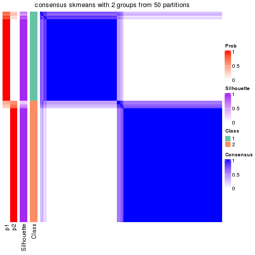</p>

</div>
<div id='tab-node-022-consensus-heatmap-2'>
<pre><code class="r">consensus_heatmap(res, k = 3)
</code></pre>

<p>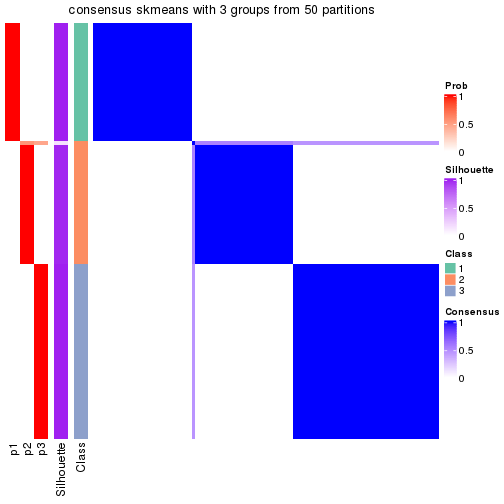</p>

</div>
<div id='tab-node-022-consensus-heatmap-3'>
<pre><code class="r">consensus_heatmap(res, k = 4)
</code></pre>

<p>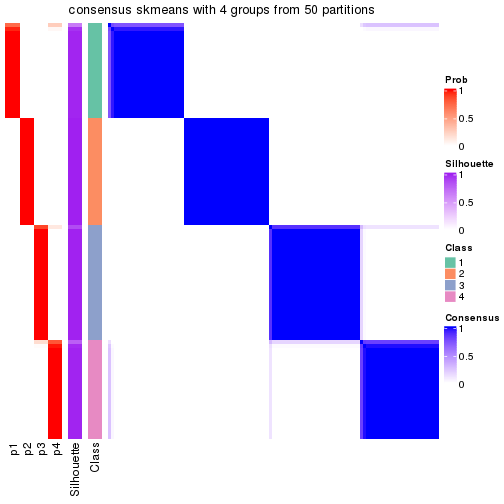</p>

</div>
<div id='tab-node-022-consensus-heatmap-4'>
<pre><code class="r">consensus_heatmap(res, k = 5)
</code></pre>

<p>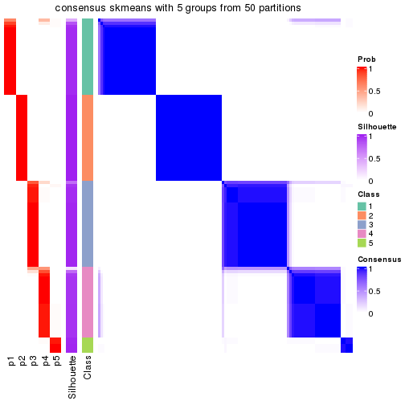</p>

</div>
<div id='tab-node-022-consensus-heatmap-5'>
<pre><code class="r">consensus_heatmap(res, k = 6)
</code></pre>

<p>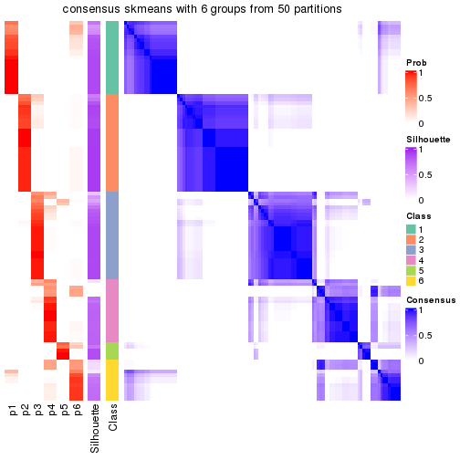</p>

</div>
<div id='tab-node-022-consensus-heatmap-6'>
<pre><code class="r">consensus_heatmap(res, k = 7)
</code></pre>

<p>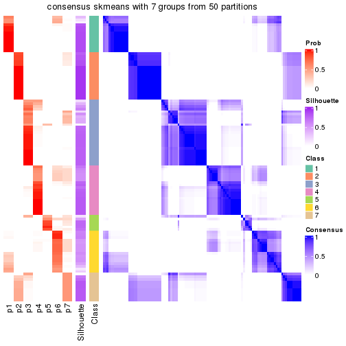</p>

</div>
<div id='tab-node-022-consensus-heatmap-7'>
<pre><code class="r">consensus_heatmap(res, k = 8)
</code></pre>

<p>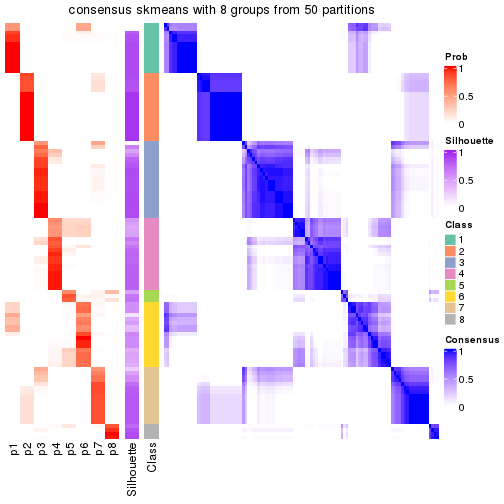</p>

</div>
</div>

Heatmaps for the membership of samples in all partitions to see how consistent they are:


<script>
$( function() {
	$( '#tabs-node-022-membership-heatmap' ).tabs();
} );
</script>
<div id='tabs-node-022-membership-heatmap'>
<ul>
<li><a href='#tab-node-022-membership-heatmap-1'>k = 2</a></li>
<li><a href='#tab-node-022-membership-heatmap-2'>k = 3</a></li>
<li><a href='#tab-node-022-membership-heatmap-3'>k = 4</a></li>
<li><a href='#tab-node-022-membership-heatmap-4'>k = 5</a></li>
<li><a href='#tab-node-022-membership-heatmap-5'>k = 6</a></li>
<li><a href='#tab-node-022-membership-heatmap-6'>k = 7</a></li>
<li><a href='#tab-node-022-membership-heatmap-7'>k = 8</a></li>
</ul>
<div id='tab-node-022-membership-heatmap-1'>
<pre><code class="r">membership_heatmap(res, k = 2)
</code></pre>

<p>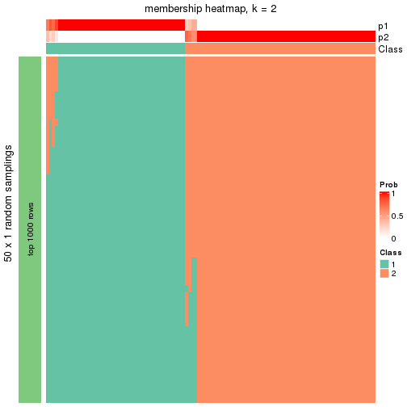</p>

</div>
<div id='tab-node-022-membership-heatmap-2'>
<pre><code class="r">membership_heatmap(res, k = 3)
</code></pre>

<p>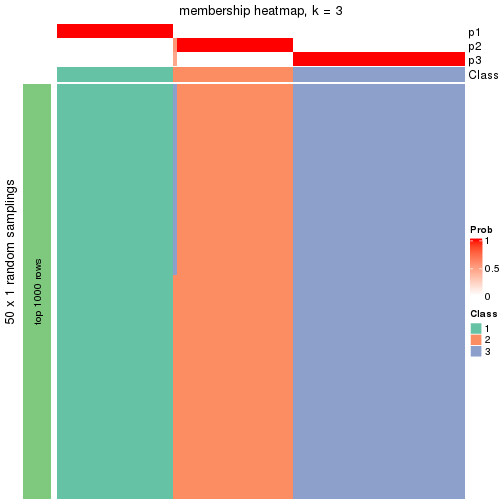</p>

</div>
<div id='tab-node-022-membership-heatmap-3'>
<pre><code class="r">membership_heatmap(res, k = 4)
</code></pre>

<p>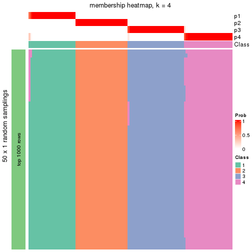</p>

</div>
<div id='tab-node-022-membership-heatmap-4'>
<pre><code class="r">membership_heatmap(res, k = 5)
</code></pre>

<p>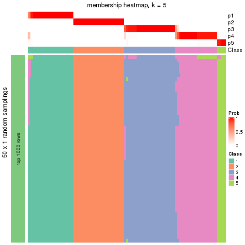</p>

</div>
<div id='tab-node-022-membership-heatmap-5'>
<pre><code class="r">membership_heatmap(res, k = 6)
</code></pre>

<p>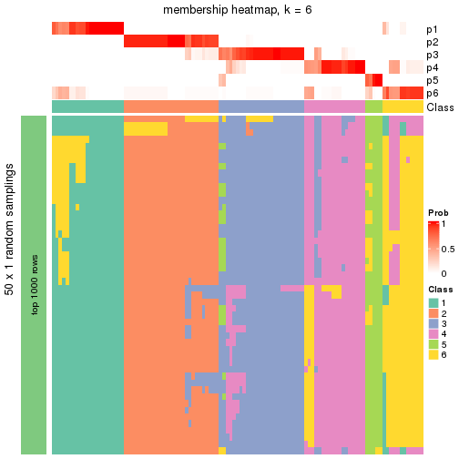</p>

</div>
<div id='tab-node-022-membership-heatmap-6'>
<pre><code class="r">membership_heatmap(res, k = 7)
</code></pre>

<p>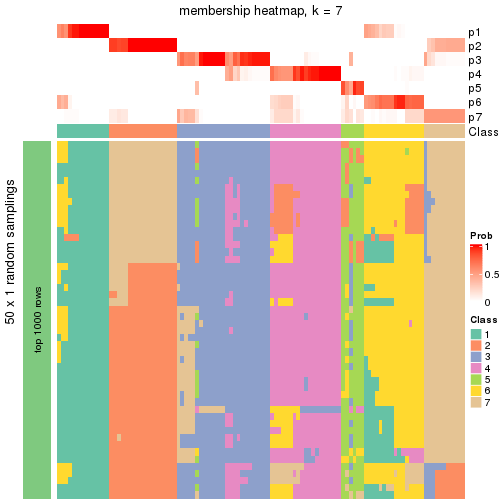</p>

</div>
<div id='tab-node-022-membership-heatmap-7'>
<pre><code class="r">membership_heatmap(res, k = 8)
</code></pre>

<p>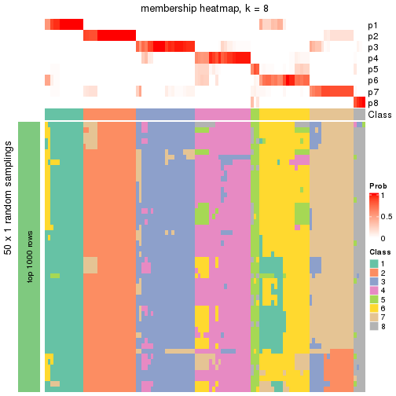</p>

</div>
</div>

As soon as the classes for columns are determined, the signatures
that are significantly different between subgroups can be looked for. 
Following are the heatmaps for signatures.


<script>
$( function() {
	$( '#tabs-node-022-get-signatures' ).tabs();
} );
</script>
<div id='tabs-node-022-get-signatures'>
<ul>
<li><a href='#tab-node-022-get-signatures-1'>k = 2</a></li>
<li><a href='#tab-node-022-get-signatures-2'>k = 3</a></li>
<li><a href='#tab-node-022-get-signatures-3'>k = 4</a></li>
<li><a href='#tab-node-022-get-signatures-4'>k = 5</a></li>
<li><a href='#tab-node-022-get-signatures-5'>k = 6</a></li>
<li><a href='#tab-node-022-get-signatures-6'>k = 7</a></li>
<li><a href='#tab-node-022-get-signatures-7'>k = 8</a></li>
</ul>
<div id='tab-node-022-get-signatures-1'>
<pre><code class="r">get_signatures(res, k = 2)
</code></pre>

<p>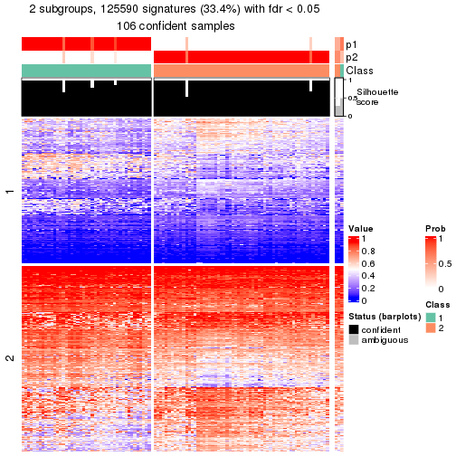</p>

</div>
<div id='tab-node-022-get-signatures-2'>
<pre><code class="r">get_signatures(res, k = 3)
</code></pre>

<p>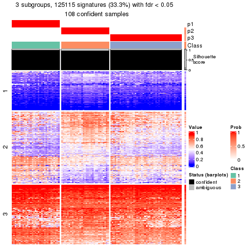</p>

</div>
<div id='tab-node-022-get-signatures-3'>
<pre><code class="r">get_signatures(res, k = 4)
</code></pre>

<p>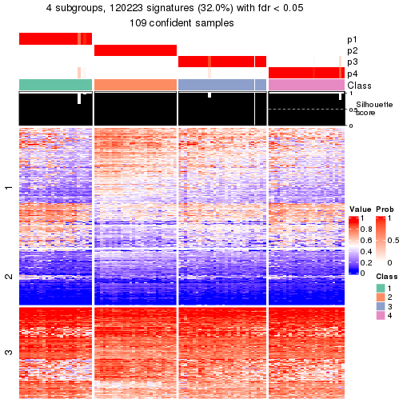</p>

</div>
<div id='tab-node-022-get-signatures-4'>
<pre><code class="r">get_signatures(res, k = 5)
</code></pre>

<p>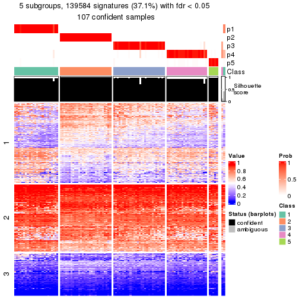</p>

</div>
<div id='tab-node-022-get-signatures-5'>
<pre><code class="r">get_signatures(res, k = 6)
</code></pre>

<p></p>

</div>
<div id='tab-node-022-get-signatures-6'>
<pre><code class="r">get_signatures(res, k = 7)
</code></pre>

<p>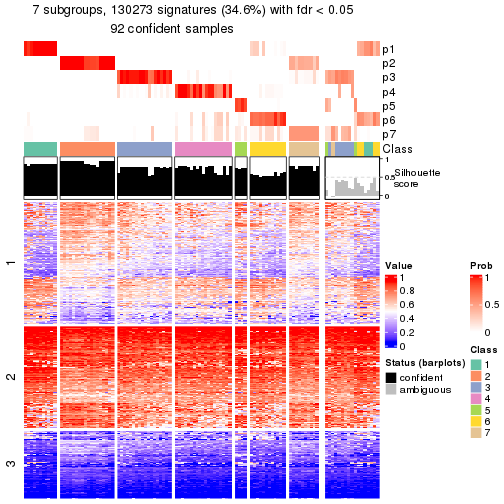</p>

</div>
<div id='tab-node-022-get-signatures-7'>
<pre><code class="r">get_signatures(res, k = 8)
</code></pre>

<p>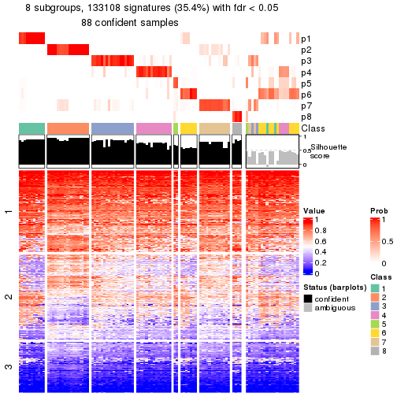</p>

</div>
</div>


Compare the overlap of signatures from different k:

```r
compare_signatures(res)
```


`get_signature()` returns a data frame invisibly. To get the list of signatures, the function
call should be assigned to a variable explicitly. In following code, if `plot` argument is set
to `FALSE`, no heatmap is plotted while only the differential analysis is performed.

```r
# code only for demonstration
tb = get_signature(res, k = ..., plot = FALSE)
```

An example of the output of `tb` is:

```
#>   which_row         fdr    mean_1    mean_2 scaled_mean_1 scaled_mean_2 km
#> 1        38 0.042760348  8.373488  9.131774    -0.5533452     0.5164555  1
#> 2        40 0.018707592  7.106213  8.469186    -0.6173731     0.5762149  1
#> 3        55 0.019134737 10.221463 11.207825    -0.6159697     0.5749050  1
#> 4        59 0.006059896  5.921854  7.869574    -0.6899429     0.6439467  1
#> 5        60 0.018055526  8.928898 10.211722    -0.6204761     0.5791110  1
#> 6        98 0.009384629 15.714769 14.887706     0.6635654    -0.6193277  2
...
```

The columns in `tb` are:

1. `which_row`: row indices corresponding to the input matrix.
2. `fdr`: FDR for the differential test. 
3. `mean_x`: The mean value in group x.
4. `scaled_mean_x`: The mean value in group x after rows are scaled.
5. `km`: Row groups if k-means clustering is applied to rows (which is done by automatically selecting number of clusters).

If there are too many signatures, `top_signatures = ...` can be set to only show the 
signatures with the highest FDRs:

```r
# code only for demonstration
# e.g. to show the top 500 most significant rows
tb = get_signature(res, k = ..., top_signatures = 500)
```

If the signatures are defined as these which are uniquely high in current group, `diff_method` argument
can be set to `"uniquely_high_in_one_group"`:

```r
# code only for demonstration
tb = get_signature(res, k = ..., diff_method = "uniquely_high_in_one_group")
```


UMAP plot which shows how samples are separated.


<script>
$( function() {
	$( '#tabs-node-022-dimension-reduction' ).tabs();
} );
</script>
<div id='tabs-node-022-dimension-reduction'>
<ul>
<li><a href='#tab-node-022-dimension-reduction-1'>k = 2</a></li>
<li><a href='#tab-node-022-dimension-reduction-2'>k = 3</a></li>
<li><a href='#tab-node-022-dimension-reduction-3'>k = 4</a></li>
<li><a href='#tab-node-022-dimension-reduction-4'>k = 5</a></li>
<li><a href='#tab-node-022-dimension-reduction-5'>k = 6</a></li>
<li><a href='#tab-node-022-dimension-reduction-6'>k = 7</a></li>
<li><a href='#tab-node-022-dimension-reduction-7'>k = 8</a></li>
</ul>
<div id='tab-node-022-dimension-reduction-1'>
<pre><code class="r">dimension_reduction(res, k = 2, method = &quot;UMAP&quot;)
</code></pre>

<p>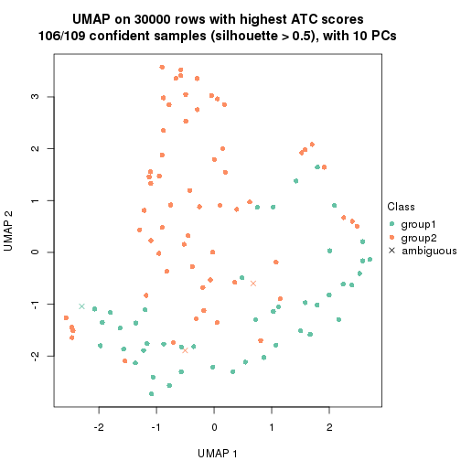</p>

</div>
<div id='tab-node-022-dimension-reduction-2'>
<pre><code class="r">dimension_reduction(res, k = 3, method = &quot;UMAP&quot;)
</code></pre>

<p>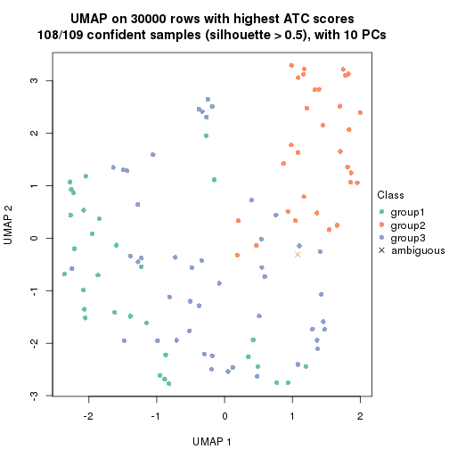</p>

</div>
<div id='tab-node-022-dimension-reduction-3'>
<pre><code class="r">dimension_reduction(res, k = 4, method = &quot;UMAP&quot;)
</code></pre>

<p>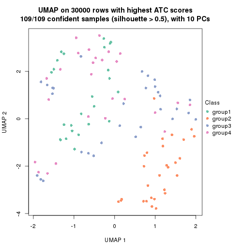</p>

</div>
<div id='tab-node-022-dimension-reduction-4'>
<pre><code class="r">dimension_reduction(res, k = 5, method = &quot;UMAP&quot;)
</code></pre>

<p>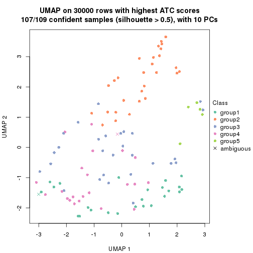</p>

</div>
<div id='tab-node-022-dimension-reduction-5'>
<pre><code class="r">dimension_reduction(res, k = 6, method = &quot;UMAP&quot;)
</code></pre>

<p>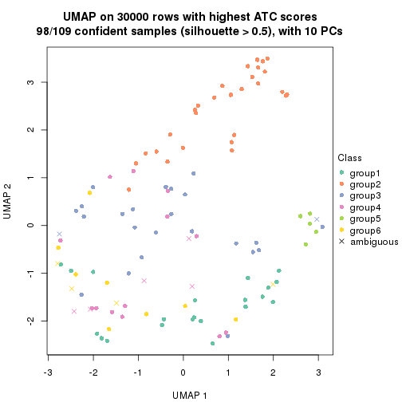</p>

</div>
<div id='tab-node-022-dimension-reduction-6'>
<pre><code class="r">dimension_reduction(res, k = 7, method = &quot;UMAP&quot;)
</code></pre>

<p>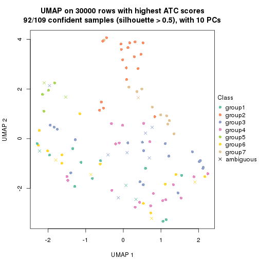</p>

</div>
<div id='tab-node-022-dimension-reduction-7'>
<pre><code class="r">dimension_reduction(res, k = 8, method = &quot;UMAP&quot;)
</code></pre>

<p>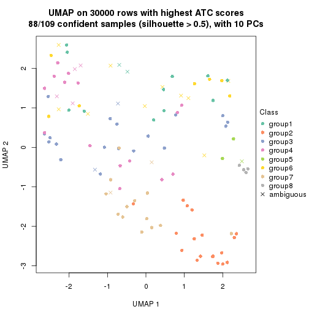</p>

</div>
</div>


Following heatmap shows how subgroups are split when increasing `k`:

```r
collect_classes(res)
```


If matrix rows can be associated to genes, consider to use `functional_enrichment(res,
...)` to perform function enrichment for the signature genes. See [this vignette](https://jokergoo.github.io/cola_vignettes/functional_enrichment.html) for more detailed explanations.


 

---------------------------------------------------


### Node0221


Parent node: [Node022](#Node022).
Child nodes: 
                Node01211-leaf
        ,
                Node01212-leaf
        ,
                Node01213-leaf
        ,
                Node01221-leaf
        ,
                Node01222-leaf
        ,
                Node01223-leaf
        ,
                Node02111-leaf
        ,
                Node02112-leaf
        ,
                Node02113-leaf
        ,
                Node02114-leaf
        ,
                Node02121-leaf
        ,
                Node02122-leaf
        ,
                Node02123-leaf
        ,
                Node02124-leaf
        ,
                Node02131-leaf
        ,
                [Node02132](#Node02132)
        ,
                Node02133-leaf
        ,
                Node02211-leaf
        ,
                Node02212-leaf
        ,
                Node02213-leaf
        ,
                Node02221-leaf
        ,
                Node02222-leaf
        ,
                Node02223-leaf
        ,
                Node02231-leaf
        ,
                Node02232-leaf
        ,
                Node02233-leaf
        ,
                Node02241-leaf
        ,
                Node02242-leaf
        ,
                Node02243-leaf
        ,
                Node02321-leaf
        ,
                Node02322-leaf
        ,
                Node02323-leaf
        ,
                Node05111-leaf
        ,
                Node05112-leaf
        ,
                Node05113-leaf
        ,
                Node05114-leaf
        ,
                [Node05121](#Node05121)
        ,
                Node05122-leaf
        ,
                Node05123-leaf
        ,
                Node05221-leaf
        ,
                Node05222-leaf
        .


The object with results only for a single top-value method and a single partitioning method 
can be extracted as:

```r
res = res_rh["0221"]
```

A summary of `res` and all the functions that can be applied to it:

```r
res
```

```
#> A 'ConsensusPartition' object with k = 2, 3, 4, 5, 6, 7, 8.
#>   On a matrix with 30000 rows and 25 columns.
#>   Top rows (1000) are extracted by 'ATC' method.
#>   Subgroups are detected by 'skmeans' method.
#>   Performed in total 350 partitions by row resampling.
#>   Best k for subgroups seems to be 5.
#> 
#> Following methods can be applied to this 'ConsensusPartition' object:
#>  [1] "cola_report"             "collect_classes"         "collect_plots"          
#>  [4] "collect_stats"           "colnames"                "compare_partitions"     
#>  [7] "compare_signatures"      "consensus_heatmap"       "dimension_reduction"    
#> [10] "functional_enrichment"   "get_anno_col"            "get_anno"               
#> [13] "get_classes"             "get_consensus"           "get_matrix"             
#> [16] "get_membership"          "get_param"               "get_signatures"         
#> [19] "get_stats"               "is_best_k"               "is_stable_k"            
#> [22] "membership_heatmap"      "ncol"                    "nrow"                   
#> [25] "plot_ecdf"               "predict_classes"         "rownames"               
#> [28] "select_partition_number" "show"                    "suggest_best_k"         
#> [31] "test_to_known_factors"   "top_rows_heatmap"
```

`collect_plots()` function collects all the plots made from `res` for all `k` (number of subgroups)
into one single page to provide an easy and fast comparison between different `k`.

```r
collect_plots(res)
```

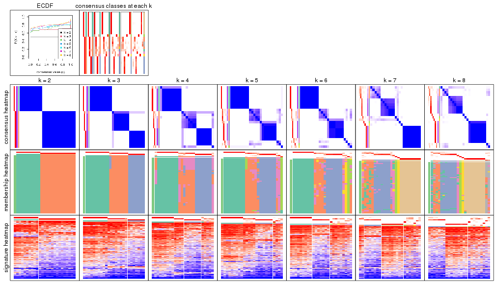

The plots are:

- The first row: a plot of the eCDF (empirical cumulative distribution
  function) curves of the consensus matrix for each `k` and the heatmap of
  predicted classes for each `k`.
- The second row: heatmaps of the consensus matrix for each `k`.
- The third row: heatmaps of the membership matrix for each `k`.
- The fouth row: heatmaps of the signatures for each `k`.

All the plots in panels can be made by individual functions and they are
plotted later in this section.

`select_partition_number()` produces several plots showing different
statistics for choosing "optimized" `k`. There are following statistics:

- eCDF curves of the consensus matrix for each `k`;
- 1-PAC. [The PAC score](https://en.wikipedia.org/wiki/Consensus_clustering#Over-interpretation_potential_of_consensus_clustering)
  measures the proportion of the ambiguous subgrouping.
- Mean silhouette score.
- Concordance. The mean probability of fiting the consensus subgroup labels in all
  partitions.
- Area increased. Denote $A_k$ as the area under the eCDF curve for current
  `k`, the area increased is defined as $A_k - A_{k-1}$.
- Rand index. The percent of pairs of samples that are both in a same cluster
  or both are not in a same cluster in the partition of k and k-1.
- Jaccard index. The ratio of pairs of samples are both in a same cluster in
  the partition of k and k-1 and the pairs of samples are both in a same
  cluster in the partition k or k-1.

The detailed explanations of these statistics can be found in [the _cola_
vignette](https://jokergoo.github.io/cola_vignettes/cola.html#toc_13).

Generally speaking, higher 1-PAC score, higher mean silhouette score or higher
concordance corresponds to better partition. Rand index and Jaccard index
measure how similar the current partition is compared to partition with `k-1`.
If they are too similar, we won't accept `k` is better than `k-1`.

```r
select_partition_number(res)
```

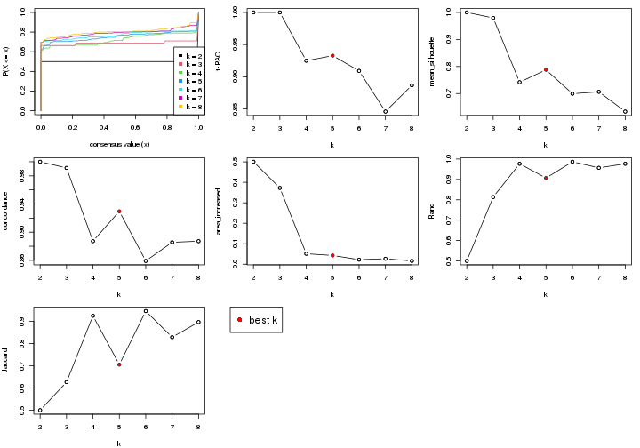

The numeric values for all these statistics can be obtained by `get_stats()`.

```r
get_stats(res)
```

```
#>   k 1-PAC mean_silhouette concordance area_increased  Rand Jaccard
#> 2 2 1.000           1.000       1.000         0.5005 0.500   0.500
#> 3 3 1.000           0.980       0.991         0.3726 0.813   0.627
#> 4 4 0.925           0.742       0.887         0.0513 0.977   0.926
#> 5 5 0.933           0.788       0.930         0.0429 0.907   0.705
#> 6 6 0.909           0.699       0.859         0.0224 0.987   0.947
#> 7 7 0.846           0.706       0.886         0.0268 0.957   0.829
#> 8 8 0.887           0.633       0.887         0.0163 0.977   0.897
```

`suggest_best_k()` suggests the best $k$ based on these statistics. The rules are as follows:

- All $k$ with Jaccard index larger than 0.95 are removed because increasing
  $k$ does not provide enough extra information. If all $k$ are removed, it is
  marked as no subgroup is detected.
- For all $k$ with 1-PAC score larger than 0.9, the maximal $k$ is taken as
  the best $k$, and other $k$ are marked as optional $k$.
- If it does not fit the second rule. The $k$ with the maximal vote of the
  highest 1-PAC score, highest mean silhouette, and highest concordance is
  taken as the best $k$.

```r
suggest_best_k(res)
```

```
#> [1] 5
#> attr(,"optional")
#> [1] 2 3
```

There is also optional best $k$ = 2 3 that is worth to check.

Following is the table of the partitions (You need to click the **show/hide
code output** link to see it). The membership matrix (columns with name `p*`)
is inferred by
[`clue::cl_consensus()`](https://www.rdocumentation.org/link/cl_consensus?package=clue)
function with the `SE` method. Basically the value in the membership matrix
represents the probability to belong to a certain group. The finall subgroup
label for an item is determined with the group with highest probability it
belongs to.

In `get_classes()` function, the entropy is calculated from the membership
matrix and the silhouette score is calculated from the consensus matrix.


<script>
$( function() {
	$( '#tabs-node-0221-get-classes' ).tabs();
} );
</script>
<div id='tabs-node-0221-get-classes'>
<ul>
<li><a href='#tab-node-0221-get-classes-1'>k = 2</a></li>
<li><a href='#tab-node-0221-get-classes-2'>k = 3</a></li>
<li><a href='#tab-node-0221-get-classes-3'>k = 4</a></li>
<li><a href='#tab-node-0221-get-classes-4'>k = 5</a></li>
<li><a href='#tab-node-0221-get-classes-5'>k = 6</a></li>
<li><a href='#tab-node-0221-get-classes-6'>k = 7</a></li>
<li><a href='#tab-node-0221-get-classes-7'>k = 8</a></li>
</ul>

<div id='tab-node-0221-get-classes-1'>
<p><a id='tab-node-0221-get-classes-1-a' style='color:#0366d6' href='#'>show/hide code output</a></p>
<pre><code class="r">cbind(get_classes(res, k = 2), get_membership(res, k = 2))
</code></pre>

<pre><code>#&gt;                 class entropy silhouette p1 p2
#&gt; TCGA.CN.6011.01     2       0          1  0  1
#&gt; TCGA.CV.5979.01     2       0          1  0  1
#&gt; TCGA.CV.5434.01     1       0          1  1  0
#&gt; TCGA.CV.7423.01     2       0          1  0  1
#&gt; TCGA.CN.6024.01     1       0          1  1  0
#&gt; TCGA.CQ.5323.01     1       0          1  1  0
#&gt; TCGA.DQ.7588.01     2       0          1  0  1
#&gt; TCGA.CV.5440.01     1       0          1  1  0
#&gt; TCGA.CV.7247.01     2       0          1  0  1
#&gt; TCGA.CN.6994.01     2       0          1  0  1
#&gt; TCGA.CV.6935.01     1       0          1  1  0
#&gt; TCGA.BA.6868.01     2       0          1  0  1
#&gt; TCGA.F7.A61W.01     2       0          1  0  1
#&gt; TCGA.T3.A92N.01     1       0          1  1  0
#&gt; TCGA.IQ.A61G.01     2       0          1  0  1
#&gt; TCGA.BB.8601.01     1       0          1  1  0
#&gt; TCGA.H7.8502.01     2       0          1  0  1
#&gt; TCGA.DQ.7589.01     1       0          1  1  0
#&gt; TCGA.CN.4725.01     2       0          1  0  1
#&gt; TCGA.BA.4076.01     2       0          1  0  1
#&gt; TCGA.BB.4224.01     2       0          1  0  1
#&gt; TCGA.CV.7430.01     1       0          1  1  0
#&gt; TCGA.UF.A7JC.01     2       0          1  0  1
#&gt; TCGA.CV.7437.01     1       0          1  1  0
#&gt; TCGA.P3.A6SX.01     2       0          1  0  1
</code></pre>

<script>
$('#tab-node-0221-get-classes-1-a').parent().next().next().hide();
$('#tab-node-0221-get-classes-1-a').click(function(){
  $('#tab-node-0221-get-classes-1-a').parent().next().next().toggle();
  return(false);
});
</script>
</div>

<div id='tab-node-0221-get-classes-2'>
<p><a id='tab-node-0221-get-classes-2-a' style='color:#0366d6' href='#'>show/hide code output</a></p>
<pre><code class="r">cbind(get_classes(res, k = 3), get_membership(res, k = 3))
</code></pre>

<pre><code>#&gt;                 class entropy silhouette p1   p2   p3
#&gt; TCGA.CN.6011.01     2    0.00      0.968  0 1.00 0.00
#&gt; TCGA.CV.5979.01     3    0.00      1.000  0 0.00 1.00
#&gt; TCGA.CV.5434.01     1    0.00      1.000  1 0.00 0.00
#&gt; TCGA.CV.7423.01     3    0.00      1.000  0 0.00 1.00
#&gt; TCGA.CN.6024.01     1    0.00      1.000  1 0.00 0.00
#&gt; TCGA.CQ.5323.01     1    0.00      1.000  1 0.00 0.00
#&gt; TCGA.DQ.7588.01     3    0.00      1.000  0 0.00 1.00
#&gt; TCGA.CV.5440.01     1    0.00      1.000  1 0.00 0.00
#&gt; TCGA.CV.7247.01     3    0.00      1.000  0 0.00 1.00
#&gt; TCGA.CN.6994.01     2    0.00      0.968  0 1.00 0.00
#&gt; TCGA.CV.6935.01     1    0.00      1.000  1 0.00 0.00
#&gt; TCGA.BA.6868.01     2    0.00      0.968  0 1.00 0.00
#&gt; TCGA.F7.A61W.01     3    0.00      1.000  0 0.00 1.00
#&gt; TCGA.T3.A92N.01     1    0.00      1.000  1 0.00 0.00
#&gt; TCGA.IQ.A61G.01     2    0.00      0.968  0 1.00 0.00
#&gt; TCGA.BB.8601.01     1    0.00      1.000  1 0.00 0.00
#&gt; TCGA.H7.8502.01     2    0.00      0.968  0 1.00 0.00
#&gt; TCGA.DQ.7589.01     1    0.00      1.000  1 0.00 0.00
#&gt; TCGA.CN.4725.01     3    0.00      1.000  0 0.00 1.00
#&gt; TCGA.BA.4076.01     2    0.00      0.968  0 1.00 0.00
#&gt; TCGA.BB.4224.01     3    0.00      1.000  0 0.00 1.00
#&gt; TCGA.CV.7430.01     1    0.00      1.000  1 0.00 0.00
#&gt; TCGA.UF.A7JC.01     2    0.00      0.968  0 1.00 0.00
#&gt; TCGA.CV.7437.01     1    0.00      1.000  1 0.00 0.00
#&gt; TCGA.P3.A6SX.01     2    0.48      0.718  0 0.78 0.22
</code></pre>

<script>
$('#tab-node-0221-get-classes-2-a').parent().next().next().hide();
$('#tab-node-0221-get-classes-2-a').click(function(){
  $('#tab-node-0221-get-classes-2-a').parent().next().next().toggle();
  return(false);
});
</script>
</div>

<div id='tab-node-0221-get-classes-3'>
<p><a id='tab-node-0221-get-classes-3-a' style='color:#0366d6' href='#'>show/hide code output</a></p>
<pre><code class="r">cbind(get_classes(res, k = 4), get_membership(res, k = 4))
</code></pre>

<pre><code>#&gt;                 class entropy silhouette   p1   p2   p3   p4
#&gt; TCGA.CN.6011.01     2  0.0707     0.6339 0.00 0.98 0.00 0.02
#&gt; TCGA.CV.5979.01     3  0.0000     1.0000 0.00 0.00 1.00 0.00
#&gt; TCGA.CV.5434.01     1  0.0000     0.9503 1.00 0.00 0.00 0.00
#&gt; TCGA.CV.7423.01     3  0.0000     1.0000 0.00 0.00 1.00 0.00
#&gt; TCGA.CN.6024.01     1  0.0000     0.9503 1.00 0.00 0.00 0.00
#&gt; TCGA.CQ.5323.01     1  0.0000     0.9503 1.00 0.00 0.00 0.00
#&gt; TCGA.DQ.7588.01     3  0.0000     1.0000 0.00 0.00 1.00 0.00
#&gt; TCGA.CV.5440.01     1  0.4994     0.3673 0.52 0.00 0.00 0.48
#&gt; TCGA.CV.7247.01     3  0.0000     1.0000 0.00 0.00 1.00 0.00
#&gt; TCGA.CN.6994.01     2  0.0000     0.6459 0.00 1.00 0.00 0.00
#&gt; TCGA.CV.6935.01     1  0.0000     0.9503 1.00 0.00 0.00 0.00
#&gt; TCGA.BA.6868.01     2  0.0707     0.6322 0.00 0.98 0.00 0.02
#&gt; TCGA.F7.A61W.01     3  0.0000     1.0000 0.00 0.00 1.00 0.00
#&gt; TCGA.T3.A92N.01     1  0.0000     0.9503 1.00 0.00 0.00 0.00
#&gt; TCGA.IQ.A61G.01     2  0.3801     0.4070 0.00 0.78 0.00 0.22
#&gt; TCGA.BB.8601.01     1  0.0000     0.9503 1.00 0.00 0.00 0.00
#&gt; TCGA.H7.8502.01     2  0.5173    -0.2745 0.00 0.66 0.02 0.32
#&gt; TCGA.DQ.7589.01     1  0.0000     0.9503 1.00 0.00 0.00 0.00
#&gt; TCGA.CN.4725.01     3  0.0000     1.0000 0.00 0.00 1.00 0.00
#&gt; TCGA.BA.4076.01     2  0.0000     0.6459 0.00 1.00 0.00 0.00
#&gt; TCGA.BB.4224.01     3  0.0000     1.0000 0.00 0.00 1.00 0.00
#&gt; TCGA.CV.7430.01     1  0.0000     0.9503 1.00 0.00 0.00 0.00
#&gt; TCGA.UF.A7JC.01     4  0.6299     0.0000 0.00 0.42 0.06 0.52
#&gt; TCGA.CV.7437.01     1  0.0000     0.9503 1.00 0.00 0.00 0.00
#&gt; TCGA.P3.A6SX.01     2  0.6150    -0.0629 0.00 0.58 0.36 0.06
</code></pre>

<script>
$('#tab-node-0221-get-classes-3-a').parent().next().next().hide();
$('#tab-node-0221-get-classes-3-a').click(function(){
  $('#tab-node-0221-get-classes-3-a').parent().next().next().toggle();
  return(false);
});
</script>
</div>

<div id='tab-node-0221-get-classes-4'>
<p><a id='tab-node-0221-get-classes-4-a' style='color:#0366d6' href='#'>show/hide code output</a></p>
<pre><code class="r">cbind(get_classes(res, k = 5), get_membership(res, k = 5))
</code></pre>

<pre><code>#&gt;                 class entropy silhouette   p1   p2   p3   p4   p5
#&gt; TCGA.CN.6011.01     2  0.4398     0.6021 0.00 0.72 0.00 0.24 0.04
#&gt; TCGA.CV.5979.01     3  0.0000     0.9129 0.00 0.00 1.00 0.00 0.00
#&gt; TCGA.CV.5434.01     1  0.0000     1.0000 1.00 0.00 0.00 0.00 0.00
#&gt; TCGA.CV.7423.01     3  0.0000     0.9129 0.00 0.00 1.00 0.00 0.00
#&gt; TCGA.CN.6024.01     1  0.0000     1.0000 1.00 0.00 0.00 0.00 0.00
#&gt; TCGA.CQ.5323.01     1  0.0000     1.0000 1.00 0.00 0.00 0.00 0.00
#&gt; TCGA.DQ.7588.01     3  0.0000     0.9129 0.00 0.00 1.00 0.00 0.00
#&gt; TCGA.CV.5440.01     5  0.1410     0.0000 0.06 0.00 0.00 0.00 0.94
#&gt; TCGA.CV.7247.01     3  0.0609     0.8981 0.00 0.00 0.98 0.02 0.00
#&gt; TCGA.CN.6994.01     2  0.0000     0.7705 0.00 1.00 0.00 0.00 0.00
#&gt; TCGA.CV.6935.01     1  0.0000     1.0000 1.00 0.00 0.00 0.00 0.00
#&gt; TCGA.BA.6868.01     2  0.3319     0.7426 0.00 0.82 0.00 0.16 0.02
#&gt; TCGA.F7.A61W.01     3  0.0000     0.9129 0.00 0.00 1.00 0.00 0.00
#&gt; TCGA.T3.A92N.01     1  0.0000     1.0000 1.00 0.00 0.00 0.00 0.00
#&gt; TCGA.IQ.A61G.01     2  0.3109     0.6377 0.00 0.80 0.00 0.00 0.20
#&gt; TCGA.BB.8601.01     1  0.0000     1.0000 1.00 0.00 0.00 0.00 0.00
#&gt; TCGA.H7.8502.01     4  0.5156     0.3030 0.00 0.32 0.00 0.62 0.06
#&gt; TCGA.DQ.7589.01     1  0.0000     1.0000 1.00 0.00 0.00 0.00 0.00
#&gt; TCGA.CN.4725.01     3  0.0000     0.9129 0.00 0.00 1.00 0.00 0.00
#&gt; TCGA.BA.4076.01     2  0.1410     0.7862 0.00 0.94 0.00 0.06 0.00
#&gt; TCGA.BB.4224.01     3  0.0000     0.9129 0.00 0.00 1.00 0.00 0.00
#&gt; TCGA.CV.7430.01     1  0.0000     1.0000 1.00 0.00 0.00 0.00 0.00
#&gt; TCGA.UF.A7JC.01     4  0.1820     0.4131 0.00 0.02 0.02 0.94 0.02
#&gt; TCGA.CV.7437.01     1  0.0000     1.0000 1.00 0.00 0.00 0.00 0.00
#&gt; TCGA.P3.A6SX.01     3  0.6302     0.0637 0.00 0.42 0.48 0.04 0.06
</code></pre>

<script>
$('#tab-node-0221-get-classes-4-a').parent().next().next().hide();
$('#tab-node-0221-get-classes-4-a').click(function(){
  $('#tab-node-0221-get-classes-4-a').parent().next().next().toggle();
  return(false);
});
</script>
</div>

<div id='tab-node-0221-get-classes-5'>
<p><a id='tab-node-0221-get-classes-5-a' style='color:#0366d6' href='#'>show/hide code output</a></p>
<pre><code class="r">cbind(get_classes(res, k = 6), get_membership(res, k = 6))
</code></pre>

<pre><code>#&gt;                 class entropy silhouette p1   p2   p3   p4   p5   p6
#&gt; TCGA.CN.6011.01     2  0.1092     0.3898  0 0.96 0.00 0.02 0.00 0.02
#&gt; TCGA.CV.5979.01     3  0.0547     0.9140  0 0.00 0.98 0.00 0.00 0.02
#&gt; TCGA.CV.5434.01     1  0.0000     1.0000  1 0.00 0.00 0.00 0.00 0.00
#&gt; TCGA.CV.7423.01     3  0.0000     0.9172  0 0.00 1.00 0.00 0.00 0.00
#&gt; TCGA.CN.6024.01     1  0.0000     1.0000  1 0.00 0.00 0.00 0.00 0.00
#&gt; TCGA.CQ.5323.01     1  0.0000     1.0000  1 0.00 0.00 0.00 0.00 0.00
#&gt; TCGA.DQ.7588.01     3  0.0000     0.9172  0 0.00 1.00 0.00 0.00 0.00
#&gt; TCGA.CV.5440.01     5  0.0000     0.0000  0 0.00 0.00 0.00 1.00 0.00
#&gt; TCGA.CV.7247.01     3  0.0000     0.9172  0 0.00 1.00 0.00 0.00 0.00
#&gt; TCGA.CN.6994.01     2  0.4689     0.3716  0 0.58 0.00 0.02 0.02 0.38
#&gt; TCGA.CV.6935.01     1  0.0000     1.0000  1 0.00 0.00 0.00 0.00 0.00
#&gt; TCGA.BA.6868.01     2  0.3756     0.4518  0 0.60 0.00 0.00 0.00 0.40
#&gt; TCGA.F7.A61W.01     3  0.0000     0.9172  0 0.00 1.00 0.00 0.00 0.00
#&gt; TCGA.T3.A92N.01     1  0.0000     1.0000  1 0.00 0.00 0.00 0.00 0.00
#&gt; TCGA.IQ.A61G.01     6  0.6803     0.0000  0 0.30 0.00 0.04 0.30 0.36
#&gt; TCGA.BB.8601.01     1  0.0000     1.0000  1 0.00 0.00 0.00 0.00 0.00
#&gt; TCGA.H7.8502.01     4  0.4282     0.0835  0 0.42 0.00 0.56 0.00 0.02
#&gt; TCGA.DQ.7589.01     1  0.0000     1.0000  1 0.00 0.00 0.00 0.00 0.00
#&gt; TCGA.CN.4725.01     3  0.0547     0.9140  0 0.00 0.98 0.00 0.00 0.02
#&gt; TCGA.BA.4076.01     2  0.3916     0.4916  0 0.68 0.00 0.02 0.00 0.30
#&gt; TCGA.BB.4224.01     3  0.0547     0.9140  0 0.00 0.98 0.00 0.00 0.02
#&gt; TCGA.CV.7430.01     1  0.0000     1.0000  1 0.00 0.00 0.00 0.00 0.00
#&gt; TCGA.UF.A7JC.01     4  0.3797     0.1019  0 0.00 0.00 0.58 0.00 0.42
#&gt; TCGA.CV.7437.01     1  0.0000     1.0000  1 0.00 0.00 0.00 0.00 0.00
#&gt; TCGA.P3.A6SX.01     3  0.6574     0.1816  0 0.24 0.52 0.08 0.00 0.16
</code></pre>

<script>
$('#tab-node-0221-get-classes-5-a').parent().next().next().hide();
$('#tab-node-0221-get-classes-5-a').click(function(){
  $('#tab-node-0221-get-classes-5-a').parent().next().next().toggle();
  return(false);
});
</script>
</div>

<div id='tab-node-0221-get-classes-6'>
<p><a id='tab-node-0221-get-classes-6-a' style='color:#0366d6' href='#'>show/hide code output</a></p>
<pre><code class="r">cbind(get_classes(res, k = 7), get_membership(res, k = 7))
</code></pre>

<pre><code>#&gt;                 class entropy silhouette   p1   p2   p3   p4   p5   p6 p7
#&gt; TCGA.CN.6011.01     2  0.6494     0.2228 0.20 0.44 0.00 0.26 0.00 0.10  0
#&gt; TCGA.CV.5979.01     3  0.1006     0.9180 0.02 0.00 0.96 0.02 0.00 0.00  0
#&gt; TCGA.CV.5434.01     7  0.0000     1.0000 0.00 0.00 0.00 0.00 0.00 0.00  1
#&gt; TCGA.CV.7423.01     3  0.1363     0.9019 0.04 0.00 0.94 0.02 0.00 0.00  0
#&gt; TCGA.CN.6024.01     7  0.0000     1.0000 0.00 0.00 0.00 0.00 0.00 0.00  1
#&gt; TCGA.CQ.5323.01     7  0.0000     1.0000 0.00 0.00 0.00 0.00 0.00 0.00  1
#&gt; TCGA.DQ.7588.01     3  0.2376     0.8427 0.12 0.00 0.86 0.02 0.00 0.00  0
#&gt; TCGA.CV.5440.01     5  0.0000     0.0000 0.00 0.00 0.00 0.00 1.00 0.00  0
#&gt; TCGA.CV.7247.01     3  0.2804     0.8391 0.06 0.00 0.86 0.06 0.02 0.00  0
#&gt; TCGA.CN.6994.01     2  0.2422     0.5191 0.18 0.82 0.00 0.00 0.00 0.00  0
#&gt; TCGA.CV.6935.01     7  0.0000     1.0000 0.00 0.00 0.00 0.00 0.00 0.00  1
#&gt; TCGA.BA.6868.01     2  0.4127     0.4699 0.36 0.60 0.00 0.04 0.00 0.00  0
#&gt; TCGA.F7.A61W.01     3  0.0504     0.9137 0.02 0.00 0.98 0.00 0.00 0.00  0
#&gt; TCGA.T3.A92N.01     7  0.0000     1.0000 0.00 0.00 0.00 0.00 0.00 0.00  1
#&gt; TCGA.IQ.A61G.01     2  0.4737     0.4069 0.34 0.56 0.00 0.00 0.10 0.00  0
#&gt; TCGA.BB.8601.01     7  0.0000     1.0000 0.00 0.00 0.00 0.00 0.00 0.00  1
#&gt; TCGA.H7.8502.01     4  0.1928     0.0558 0.00 0.02 0.00 0.90 0.00 0.08  0
#&gt; TCGA.DQ.7589.01     7  0.0000     1.0000 0.00 0.00 0.00 0.00 0.00 0.00  1
#&gt; TCGA.CN.4725.01     3  0.1006     0.9180 0.02 0.00 0.96 0.02 0.00 0.00  0
#&gt; TCGA.BA.4076.01     2  0.1433     0.5622 0.00 0.92 0.00 0.08 0.00 0.00  0
#&gt; TCGA.BB.4224.01     3  0.1006     0.9180 0.02 0.00 0.96 0.02 0.00 0.00  0
#&gt; TCGA.CV.7430.01     7  0.0000     1.0000 0.00 0.00 0.00 0.00 0.00 0.00  1
#&gt; TCGA.UF.A7JC.01     6  0.0000     0.0000 0.00 0.00 0.00 0.00 0.00 1.00  0
#&gt; TCGA.CV.7437.01     7  0.0000     1.0000 0.00 0.00 0.00 0.00 0.00 0.00  1
#&gt; TCGA.P3.A6SX.01     4  0.7011     0.1707 0.24 0.20 0.22 0.34 0.00 0.00  0
</code></pre>

<script>
$('#tab-node-0221-get-classes-6-a').parent().next().next().hide();
$('#tab-node-0221-get-classes-6-a').click(function(){
  $('#tab-node-0221-get-classes-6-a').parent().next().next().toggle();
  return(false);
});
</script>
</div>

<div id='tab-node-0221-get-classes-7'>
<p><a id='tab-node-0221-get-classes-7-a' style='color:#0366d6' href='#'>show/hide code output</a></p>
<pre><code class="r">cbind(get_classes(res, k = 8), get_membership(res, k = 8))
</code></pre>

<pre><code>#&gt;                 class entropy silhouette   p1   p2   p3   p4   p5   p6   p7   p8
#&gt; TCGA.CN.6011.01     8  0.6274   0.109526 0.10 0.20 0.00 0.20 0.00 0.02 0.00 0.48
#&gt; TCGA.CV.5979.01     3  0.0000   0.855166 0.00 0.00 1.00 0.00 0.00 0.00 0.00 0.00
#&gt; TCGA.CV.5434.01     7  0.0000   0.992374 0.00 0.00 0.00 0.00 0.00 0.00 1.00 0.00
#&gt; TCGA.CV.7423.01     3  0.1947   0.835665 0.14 0.00 0.86 0.00 0.00 0.00 0.00 0.00
#&gt; TCGA.CN.6024.01     7  0.0000   0.992374 0.00 0.00 0.00 0.00 0.00 0.00 1.00 0.00
#&gt; TCGA.CQ.5323.01     7  0.0000   0.992374 0.00 0.00 0.00 0.00 0.00 0.00 1.00 0.00
#&gt; TCGA.DQ.7588.01     3  0.3504   0.671458 0.26 0.00 0.70 0.04 0.00 0.00 0.00 0.00
#&gt; TCGA.CV.5440.01     5  0.0000   0.000000 0.00 0.00 0.00 0.00 1.00 0.00 0.00 0.00
#&gt; TCGA.CV.7247.01     3  0.2756   0.733234 0.26 0.00 0.74 0.00 0.00 0.00 0.00 0.00
#&gt; TCGA.CN.6994.01     2  0.2624   0.467704 0.06 0.86 0.00 0.00 0.02 0.00 0.00 0.06
#&gt; TCGA.CV.6935.01     7  0.0000   0.992374 0.00 0.00 0.00 0.00 0.00 0.00 1.00 0.00
#&gt; TCGA.BA.6868.01     8  0.3015   0.000352 0.00 0.32 0.00 0.00 0.00 0.00 0.00 0.68
#&gt; TCGA.F7.A61W.01     3  0.1341   0.854106 0.08 0.00 0.92 0.00 0.00 0.00 0.00 0.00
#&gt; TCGA.T3.A92N.01     7  0.1275   0.936306 0.04 0.02 0.00 0.00 0.00 0.00 0.94 0.00
#&gt; TCGA.IQ.A61G.01     2  0.5098   0.409841 0.14 0.66 0.00 0.02 0.10 0.00 0.00 0.08
#&gt; TCGA.BB.8601.01     7  0.0000   0.992374 0.00 0.00 0.00 0.00 0.00 0.00 1.00 0.00
#&gt; TCGA.H7.8502.01     4  0.0808   0.000000 0.00 0.00 0.00 0.96 0.00 0.04 0.00 0.00
#&gt; TCGA.DQ.7589.01     7  0.0000   0.992374 0.00 0.00 0.00 0.00 0.00 0.00 1.00 0.00
#&gt; TCGA.CN.4725.01     3  0.0000   0.855166 0.00 0.00 1.00 0.00 0.00 0.00 0.00 0.00
#&gt; TCGA.BA.4076.01     2  0.4138   0.311149 0.08 0.72 0.00 0.04 0.00 0.00 0.00 0.16
#&gt; TCGA.BB.4224.01     3  0.0000   0.855166 0.00 0.00 1.00 0.00 0.00 0.00 0.00 0.00
#&gt; TCGA.CV.7430.01     7  0.0000   0.992374 0.00 0.00 0.00 0.00 0.00 0.00 1.00 0.00
#&gt; TCGA.UF.A7JC.01     6  0.0000   0.000000 0.00 0.00 0.00 0.00 0.00 1.00 0.00 0.00
#&gt; TCGA.CV.7437.01     7  0.0000   0.992374 0.00 0.00 0.00 0.00 0.00 0.00 1.00 0.00
#&gt; TCGA.P3.A6SX.01     1  0.5606   0.000000 0.58 0.02 0.16 0.20 0.00 0.02 0.00 0.02
</code></pre>

<script>
$('#tab-node-0221-get-classes-7-a').parent().next().next().hide();
$('#tab-node-0221-get-classes-7-a').click(function(){
  $('#tab-node-0221-get-classes-7-a').parent().next().next().toggle();
  return(false);
});
</script>
</div>
</div>

Heatmaps for the consensus matrix. It visualizes the probability of two
samples to be in a same group.


<script>
$( function() {
	$( '#tabs-node-0221-consensus-heatmap' ).tabs();
} );
</script>
<div id='tabs-node-0221-consensus-heatmap'>
<ul>
<li><a href='#tab-node-0221-consensus-heatmap-1'>k = 2</a></li>
<li><a href='#tab-node-0221-consensus-heatmap-2'>k = 3</a></li>
<li><a href='#tab-node-0221-consensus-heatmap-3'>k = 4</a></li>
<li><a href='#tab-node-0221-consensus-heatmap-4'>k = 5</a></li>
<li><a href='#tab-node-0221-consensus-heatmap-5'>k = 6</a></li>
<li><a href='#tab-node-0221-consensus-heatmap-6'>k = 7</a></li>
<li><a href='#tab-node-0221-consensus-heatmap-7'>k = 8</a></li>
</ul>
<div id='tab-node-0221-consensus-heatmap-1'>
<pre><code class="r">consensus_heatmap(res, k = 2)
</code></pre>

<p></p>

</div>
<div id='tab-node-0221-consensus-heatmap-2'>
<pre><code class="r">consensus_heatmap(res, k = 3)
</code></pre>

<p>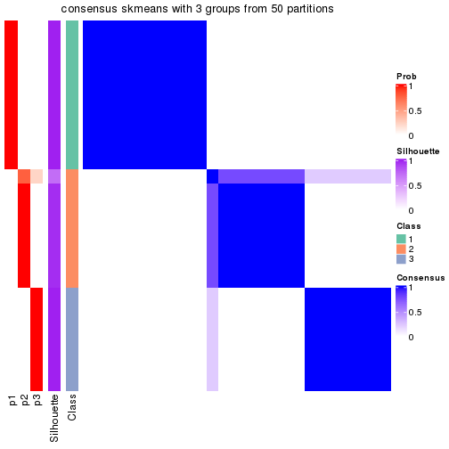</p>

</div>
<div id='tab-node-0221-consensus-heatmap-3'>
<pre><code class="r">consensus_heatmap(res, k = 4)
</code></pre>

<p>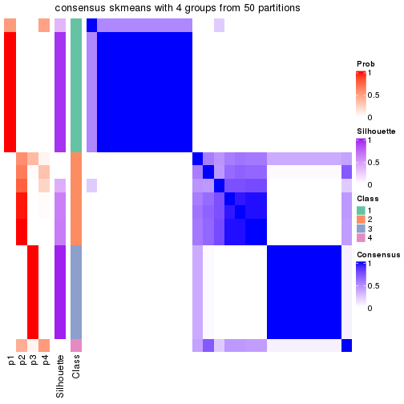</p>

</div>
<div id='tab-node-0221-consensus-heatmap-4'>
<pre><code class="r">consensus_heatmap(res, k = 5)
</code></pre>

<p>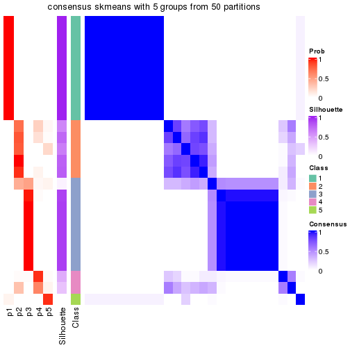</p>

</div>
<div id='tab-node-0221-consensus-heatmap-5'>
<pre><code class="r">consensus_heatmap(res, k = 6)
</code></pre>

<p></p>

</div>
<div id='tab-node-0221-consensus-heatmap-6'>
<pre><code class="r">consensus_heatmap(res, k = 7)
</code></pre>

<p>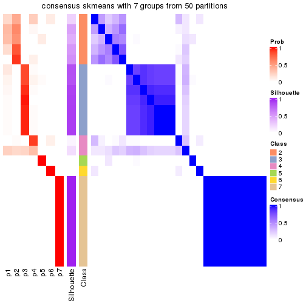</p>

</div>
<div id='tab-node-0221-consensus-heatmap-7'>
<pre><code class="r">consensus_heatmap(res, k = 8)
</code></pre>

<p>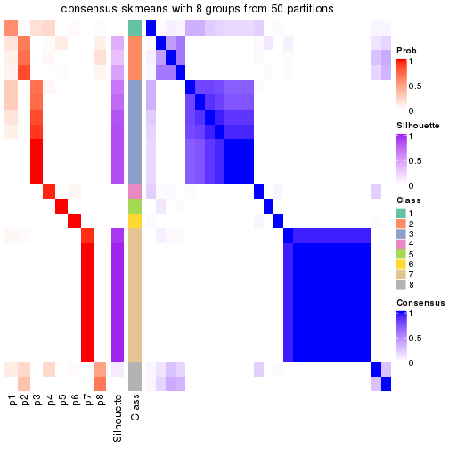</p>

</div>
</div>

Heatmaps for the membership of samples in all partitions to see how consistent they are:


<script>
$( function() {
	$( '#tabs-node-0221-membership-heatmap' ).tabs();
} );
</script>
<div id='tabs-node-0221-membership-heatmap'>
<ul>
<li><a href='#tab-node-0221-membership-heatmap-1'>k = 2</a></li>
<li><a href='#tab-node-0221-membership-heatmap-2'>k = 3</a></li>
<li><a href='#tab-node-0221-membership-heatmap-3'>k = 4</a></li>
<li><a href='#tab-node-0221-membership-heatmap-4'>k = 5</a></li>
<li><a href='#tab-node-0221-membership-heatmap-5'>k = 6</a></li>
<li><a href='#tab-node-0221-membership-heatmap-6'>k = 7</a></li>
<li><a href='#tab-node-0221-membership-heatmap-7'>k = 8</a></li>
</ul>
<div id='tab-node-0221-membership-heatmap-1'>
<pre><code class="r">membership_heatmap(res, k = 2)
</code></pre>

<p></p>

</div>
<div id='tab-node-0221-membership-heatmap-2'>
<pre><code class="r">membership_heatmap(res, k = 3)
</code></pre>

<p>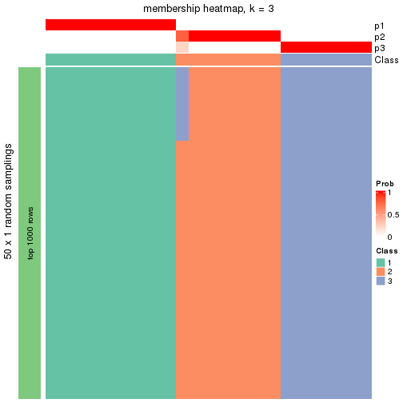</p>

</div>
<div id='tab-node-0221-membership-heatmap-3'>
<pre><code class="r">membership_heatmap(res, k = 4)
</code></pre>

<p>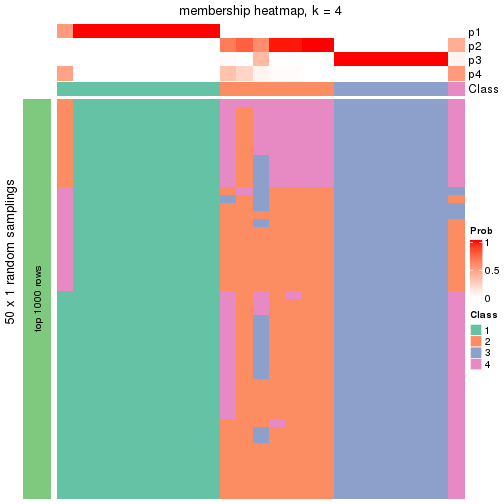</p>

</div>
<div id='tab-node-0221-membership-heatmap-4'>
<pre><code class="r">membership_heatmap(res, k = 5)
</code></pre>

<p>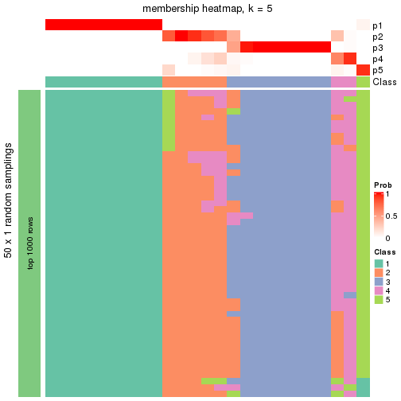</p>

</div>
<div id='tab-node-0221-membership-heatmap-5'>
<pre><code class="r">membership_heatmap(res, k = 6)
</code></pre>

<p>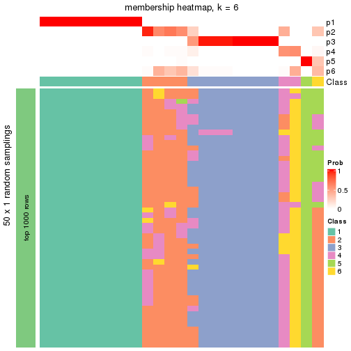</p>

</div>
<div id='tab-node-0221-membership-heatmap-6'>
<pre><code class="r">membership_heatmap(res, k = 7)
</code></pre>

<p>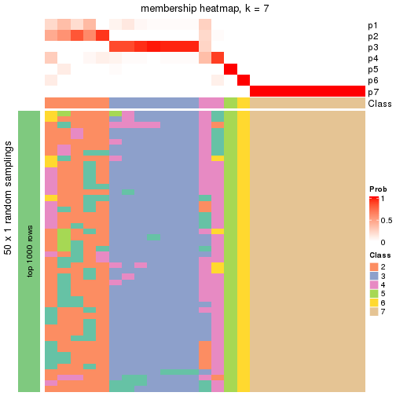</p>

</div>
<div id='tab-node-0221-membership-heatmap-7'>
<pre><code class="r">membership_heatmap(res, k = 8)
</code></pre>

<p>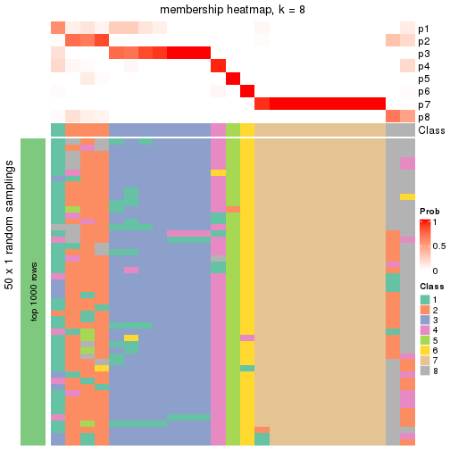</p>

</div>
</div>

As soon as the classes for columns are determined, the signatures
that are significantly different between subgroups can be looked for. 
Following are the heatmaps for signatures.


<script>
$( function() {
	$( '#tabs-node-0221-get-signatures' ).tabs();
} );
</script>
<div id='tabs-node-0221-get-signatures'>
<ul>
<li><a href='#tab-node-0221-get-signatures-1'>k = 2</a></li>
<li><a href='#tab-node-0221-get-signatures-2'>k = 3</a></li>
<li><a href='#tab-node-0221-get-signatures-3'>k = 4</a></li>
<li><a href='#tab-node-0221-get-signatures-4'>k = 5</a></li>
<li><a href='#tab-node-0221-get-signatures-5'>k = 6</a></li>
<li><a href='#tab-node-0221-get-signatures-6'>k = 7</a></li>
<li><a href='#tab-node-0221-get-signatures-7'>k = 8</a></li>
</ul>
<div id='tab-node-0221-get-signatures-1'>
<pre><code class="r">get_signatures(res, k = 2)
</code></pre>

<p>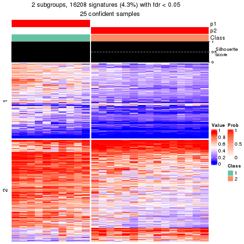</p>

</div>
<div id='tab-node-0221-get-signatures-2'>
<pre><code class="r">get_signatures(res, k = 3)
</code></pre>

<p>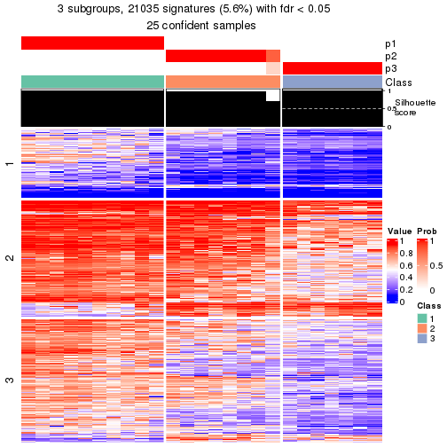</p>

</div>
<div id='tab-node-0221-get-signatures-3'>
<pre><code class="r">get_signatures(res, k = 4)
</code></pre>

<p></p>

</div>
<div id='tab-node-0221-get-signatures-4'>
<pre><code class="r">get_signatures(res, k = 5)
</code></pre>

<p>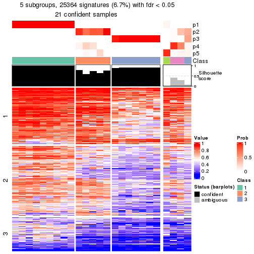</p>

</div>
<div id='tab-node-0221-get-signatures-5'>
<pre><code class="r">get_signatures(res, k = 6)
</code></pre>

<p>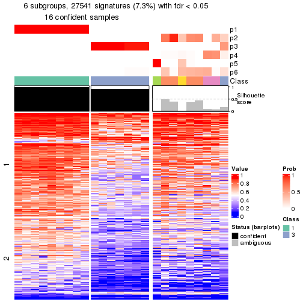</p>

</div>
<div id='tab-node-0221-get-signatures-6'>
<pre><code class="r">get_signatures(res, k = 7)
</code></pre>

<p>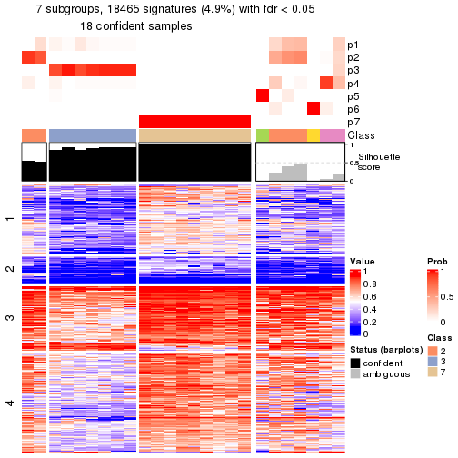</p>

</div>
<div id='tab-node-0221-get-signatures-7'>
<pre><code class="r">get_signatures(res, k = 8)
</code></pre>

<p>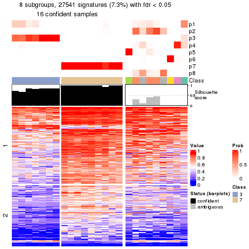</p>

</div>
</div>


Compare the overlap of signatures from different k:

```r
compare_signatures(res)
```

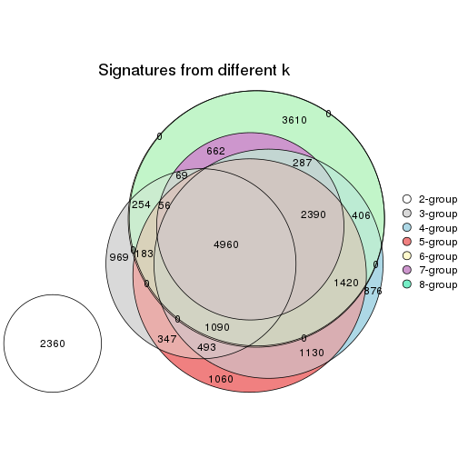

`get_signature()` returns a data frame invisibly. To get the list of signatures, the function
call should be assigned to a variable explicitly. In following code, if `plot` argument is set
to `FALSE`, no heatmap is plotted while only the differential analysis is performed.

```r
# code only for demonstration
tb = get_signature(res, k = ..., plot = FALSE)
```

An example of the output of `tb` is:

```
#>   which_row         fdr    mean_1    mean_2 scaled_mean_1 scaled_mean_2 km
#> 1        38 0.042760348  8.373488  9.131774    -0.5533452     0.5164555  1
#> 2        40 0.018707592  7.106213  8.469186    -0.6173731     0.5762149  1
#> 3        55 0.019134737 10.221463 11.207825    -0.6159697     0.5749050  1
#> 4        59 0.006059896  5.921854  7.869574    -0.6899429     0.6439467  1
#> 5        60 0.018055526  8.928898 10.211722    -0.6204761     0.5791110  1
#> 6        98 0.009384629 15.714769 14.887706     0.6635654    -0.6193277  2
...
```

The columns in `tb` are:

1. `which_row`: row indices corresponding to the input matrix.
2. `fdr`: FDR for the differential test. 
3. `mean_x`: The mean value in group x.
4. `scaled_mean_x`: The mean value in group x after rows are scaled.
5. `km`: Row groups if k-means clustering is applied to rows (which is done by automatically selecting number of clusters).

If there are too many signatures, `top_signatures = ...` can be set to only show the 
signatures with the highest FDRs:

```r
# code only for demonstration
# e.g. to show the top 500 most significant rows
tb = get_signature(res, k = ..., top_signatures = 500)
```

If the signatures are defined as these which are uniquely high in current group, `diff_method` argument
can be set to `"uniquely_high_in_one_group"`:

```r
# code only for demonstration
tb = get_signature(res, k = ..., diff_method = "uniquely_high_in_one_group")
```


UMAP plot which shows how samples are separated.


<script>
$( function() {
	$( '#tabs-node-0221-dimension-reduction' ).tabs();
} );
</script>
<div id='tabs-node-0221-dimension-reduction'>
<ul>
<li><a href='#tab-node-0221-dimension-reduction-1'>k = 2</a></li>
<li><a href='#tab-node-0221-dimension-reduction-2'>k = 3</a></li>
<li><a href='#tab-node-0221-dimension-reduction-3'>k = 4</a></li>
<li><a href='#tab-node-0221-dimension-reduction-4'>k = 5</a></li>
<li><a href='#tab-node-0221-dimension-reduction-5'>k = 6</a></li>
<li><a href='#tab-node-0221-dimension-reduction-6'>k = 7</a></li>
<li><a href='#tab-node-0221-dimension-reduction-7'>k = 8</a></li>
</ul>
<div id='tab-node-0221-dimension-reduction-1'>
<pre><code class="r">dimension_reduction(res, k = 2, method = &quot;UMAP&quot;)
</code></pre>

<p>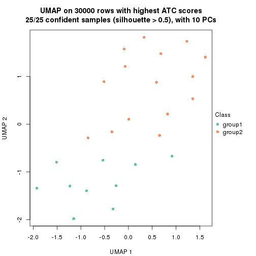</p>

</div>
<div id='tab-node-0221-dimension-reduction-2'>
<pre><code class="r">dimension_reduction(res, k = 3, method = &quot;UMAP&quot;)
</code></pre>

<p>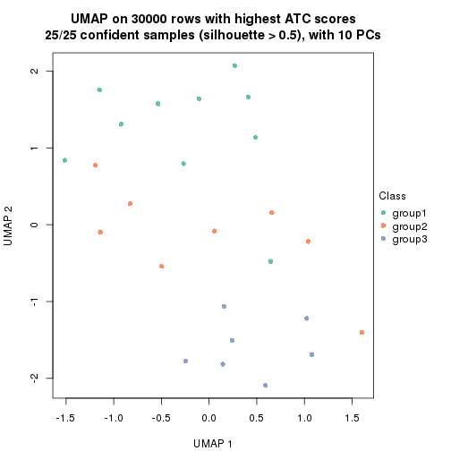</p>

</div>
<div id='tab-node-0221-dimension-reduction-3'>
<pre><code class="r">dimension_reduction(res, k = 4, method = &quot;UMAP&quot;)
</code></pre>

<p>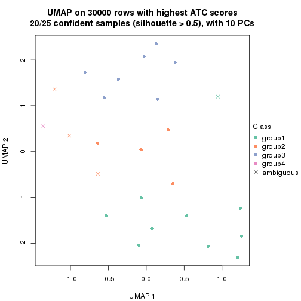</p>

</div>
<div id='tab-node-0221-dimension-reduction-4'>
<pre><code class="r">dimension_reduction(res, k = 5, method = &quot;UMAP&quot;)
</code></pre>

<p>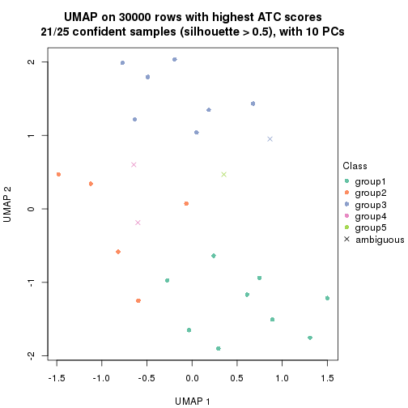</p>

</div>
<div id='tab-node-0221-dimension-reduction-5'>
<pre><code class="r">dimension_reduction(res, k = 6, method = &quot;UMAP&quot;)
</code></pre>

<p>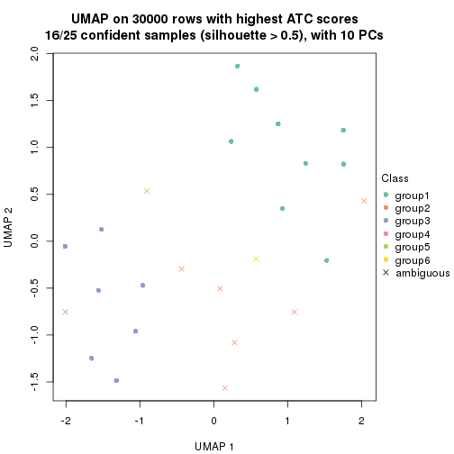</p>

</div>
<div id='tab-node-0221-dimension-reduction-6'>
<pre><code class="r">dimension_reduction(res, k = 7, method = &quot;UMAP&quot;)
</code></pre>

<p></p>

</div>
<div id='tab-node-0221-dimension-reduction-7'>
<pre><code class="r">dimension_reduction(res, k = 8, method = &quot;UMAP&quot;)
</code></pre>

<p>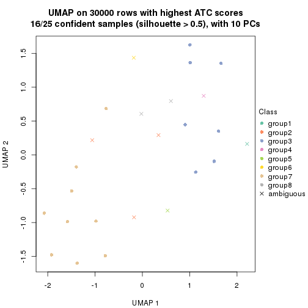</p>

</div>
</div>


Following heatmap shows how subgroups are split when increasing `k`:

```r
collect_classes(res)
```

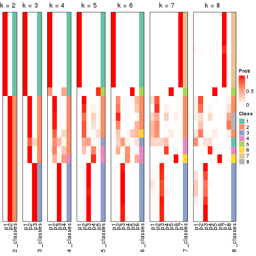


If matrix rows can be associated to genes, consider to use `functional_enrichment(res,
...)` to perform function enrichment for the signature genes. See [this vignette](https://jokergoo.github.io/cola_vignettes/functional_enrichment.html) for more detailed explanations.


 

---------------------------------------------------


### Node0222


Parent node: [Node022](#Node022).
Child nodes: 
                Node01211-leaf
        ,
                Node01212-leaf
        ,
                Node01213-leaf
        ,
                Node01221-leaf
        ,
                Node01222-leaf
        ,
                Node01223-leaf
        ,
                Node02111-leaf
        ,
                Node02112-leaf
        ,
                Node02113-leaf
        ,
                Node02114-leaf
        ,
                Node02121-leaf
        ,
                Node02122-leaf
        ,
                Node02123-leaf
        ,
                Node02124-leaf
        ,
                Node02131-leaf
        ,
                [Node02132](#Node02132)
        ,
                Node02133-leaf
        ,
                Node02211-leaf
        ,
                Node02212-leaf
        ,
                Node02213-leaf
        ,
                Node02221-leaf
        ,
                Node02222-leaf
        ,
                Node02223-leaf
        ,
                Node02231-leaf
        ,
                Node02232-leaf
        ,
                Node02233-leaf
        ,
                Node02241-leaf
        ,
                Node02242-leaf
        ,
                Node02243-leaf
        ,
                Node02321-leaf
        ,
                Node02322-leaf
        ,
                Node02323-leaf
        ,
                Node05111-leaf
        ,
                Node05112-leaf
        ,
                Node05113-leaf
        ,
                Node05114-leaf
        ,
                [Node05121](#Node05121)
        ,
                Node05122-leaf
        ,
                Node05123-leaf
        ,
                Node05221-leaf
        ,
                Node05222-leaf
        .


The object with results only for a single top-value method and a single partitioning method 
can be extracted as:

```r
res = res_rh["0222"]
```

A summary of `res` and all the functions that can be applied to it:

```r
res
```

```
#> A 'ConsensusPartition' object with k = 2, 3, 4, 5, 6, 7, 8.
#>   On a matrix with 30000 rows and 28 columns.
#>   Top rows (1000) are extracted by 'ATC' method.
#>   Subgroups are detected by 'skmeans' method.
#>   Performed in total 350 partitions by row resampling.
#>   Best k for subgroups seems to be 5.
#> 
#> Following methods can be applied to this 'ConsensusPartition' object:
#>  [1] "cola_report"             "collect_classes"         "collect_plots"          
#>  [4] "collect_stats"           "colnames"                "compare_partitions"     
#>  [7] "compare_signatures"      "consensus_heatmap"       "dimension_reduction"    
#> [10] "functional_enrichment"   "get_anno_col"            "get_anno"               
#> [13] "get_classes"             "get_consensus"           "get_matrix"             
#> [16] "get_membership"          "get_param"               "get_signatures"         
#> [19] "get_stats"               "is_best_k"               "is_stable_k"            
#> [22] "membership_heatmap"      "ncol"                    "nrow"                   
#> [25] "plot_ecdf"               "predict_classes"         "rownames"               
#> [28] "select_partition_number" "show"                    "suggest_best_k"         
#> [31] "test_to_known_factors"   "top_rows_heatmap"
```

`collect_plots()` function collects all the plots made from `res` for all `k` (number of subgroups)
into one single page to provide an easy and fast comparison between different `k`.

```r
collect_plots(res)
```

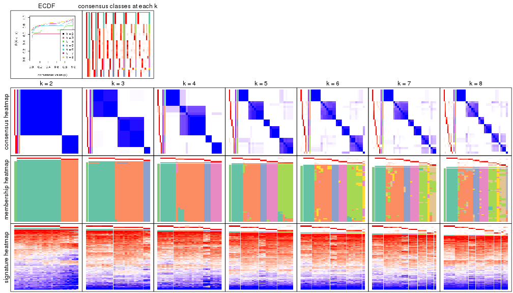

The plots are:

- The first row: a plot of the eCDF (empirical cumulative distribution
  function) curves of the consensus matrix for each `k` and the heatmap of
  predicted classes for each `k`.
- The second row: heatmaps of the consensus matrix for each `k`.
- The third row: heatmaps of the membership matrix for each `k`.
- The fouth row: heatmaps of the signatures for each `k`.

All the plots in panels can be made by individual functions and they are
plotted later in this section.

`select_partition_number()` produces several plots showing different
statistics for choosing "optimized" `k`. There are following statistics:

- eCDF curves of the consensus matrix for each `k`;
- 1-PAC. [The PAC score](https://en.wikipedia.org/wiki/Consensus_clustering#Over-interpretation_potential_of_consensus_clustering)
  measures the proportion of the ambiguous subgrouping.
- Mean silhouette score.
- Concordance. The mean probability of fiting the consensus subgroup labels in all
  partitions.
- Area increased. Denote $A_k$ as the area under the eCDF curve for current
  `k`, the area increased is defined as $A_k - A_{k-1}$.
- Rand index. The percent of pairs of samples that are both in a same cluster
  or both are not in a same cluster in the partition of k and k-1.
- Jaccard index. The ratio of pairs of samples are both in a same cluster in
  the partition of k and k-1 and the pairs of samples are both in a same
  cluster in the partition k or k-1.

The detailed explanations of these statistics can be found in [the _cola_
vignette](https://jokergoo.github.io/cola_vignettes/cola.html#toc_13).

Generally speaking, higher 1-PAC score, higher mean silhouette score or higher
concordance corresponds to better partition. Rand index and Jaccard index
measure how similar the current partition is compared to partition with `k-1`.
If they are too similar, we won't accept `k` is better than `k-1`.

```r
select_partition_number(res)
```

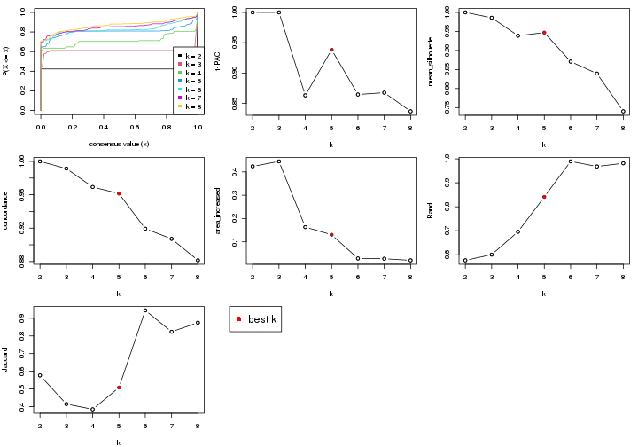

The numeric values for all these statistics can be obtained by `get_stats()`.

```r
get_stats(res)
```

```
#>   k 1-PAC mean_silhouette concordance area_increased  Rand Jaccard
#> 2 2 1.000           1.000       1.000         0.4239 0.577   0.577
#> 3 3 1.000           0.986       0.991         0.4451 0.601   0.415
#> 4 4 0.863           0.939       0.969         0.1631 0.696   0.385
#> 5 5 0.938           0.947       0.961         0.1302 0.841   0.508
#> 6 6 0.865           0.871       0.919         0.0287 0.989   0.944
#> 7 7 0.868           0.839       0.907         0.0276 0.968   0.824
#> 8 8 0.837           0.740       0.881         0.0207 0.981   0.875
```

`suggest_best_k()` suggests the best $k$ based on these statistics. The rules are as follows:

- All $k$ with Jaccard index larger than 0.95 are removed because increasing
  $k$ does not provide enough extra information. If all $k$ are removed, it is
  marked as no subgroup is detected.
- For all $k$ with 1-PAC score larger than 0.9, the maximal $k$ is taken as
  the best $k$, and other $k$ are marked as optional $k$.
- If it does not fit the second rule. The $k$ with the maximal vote of the
  highest 1-PAC score, highest mean silhouette, and highest concordance is
  taken as the best $k$.

```r
suggest_best_k(res)
```

```
#> [1] 5
#> attr(,"optional")
#> [1] 2 3
```

There is also optional best $k$ = 2 3 that is worth to check.

Following is the table of the partitions (You need to click the **show/hide
code output** link to see it). The membership matrix (columns with name `p*`)
is inferred by
[`clue::cl_consensus()`](https://www.rdocumentation.org/link/cl_consensus?package=clue)
function with the `SE` method. Basically the value in the membership matrix
represents the probability to belong to a certain group. The finall subgroup
label for an item is determined with the group with highest probability it
belongs to.

In `get_classes()` function, the entropy is calculated from the membership
matrix and the silhouette score is calculated from the consensus matrix.


<script>
$( function() {
	$( '#tabs-node-0222-get-classes' ).tabs();
} );
</script>
<div id='tabs-node-0222-get-classes'>
<ul>
<li><a href='#tab-node-0222-get-classes-1'>k = 2</a></li>
<li><a href='#tab-node-0222-get-classes-2'>k = 3</a></li>
<li><a href='#tab-node-0222-get-classes-3'>k = 4</a></li>
<li><a href='#tab-node-0222-get-classes-4'>k = 5</a></li>
<li><a href='#tab-node-0222-get-classes-5'>k = 6</a></li>
<li><a href='#tab-node-0222-get-classes-6'>k = 7</a></li>
<li><a href='#tab-node-0222-get-classes-7'>k = 8</a></li>
</ul>

<div id='tab-node-0222-get-classes-1'>
<p><a id='tab-node-0222-get-classes-1-a' style='color:#0366d6' href='#'>show/hide code output</a></p>
<pre><code class="r">cbind(get_classes(res, k = 2), get_membership(res, k = 2))
</code></pre>

<pre><code>#&gt;                 class entropy silhouette p1 p2
#&gt; TCGA.CQ.5325.01     1       0          1  1  0
#&gt; TCGA.CV.5971.01     1       0          1  1  0
#&gt; TCGA.CN.6017.01     2       0          1  0  1
#&gt; TCGA.BB.4217.01     2       0          1  0  1
#&gt; TCGA.CV.7410.01     2       0          1  0  1
#&gt; TCGA.CR.7386.01     1       0          1  1  0
#&gt; TCGA.CR.6474.01     1       0          1  1  0
#&gt; TCGA.CR.7377.01     1       0          1  1  0
#&gt; TCGA.CQ.6222.01     1       0          1  1  0
#&gt; TCGA.DQ.5630.01     1       0          1  1  0
#&gt; TCGA.CV.6943.01     1       0          1  1  0
#&gt; TCGA.CN.4733.01     2       0          1  0  1
#&gt; TCGA.CQ.6227.01     1       0          1  1  0
#&gt; TCGA.CQ.6229.01     1       0          1  1  0
#&gt; TCGA.CV.A45Y.01     1       0          1  1  0
#&gt; TCGA.CV.A464.01     1       0          1  1  0
#&gt; TCGA.QK.A652.01     1       0          1  1  0
#&gt; TCGA.F7.8489.01     1       0          1  1  0
#&gt; TCGA.CQ.A4CA.01     1       0          1  1  0
#&gt; TCGA.CN.A63Y.01     2       0          1  0  1
#&gt; TCGA.BA.A6DG.01     1       0          1  1  0
#&gt; TCGA.CQ.A4CH.01     2       0          1  0  1
#&gt; TCGA.CN.5359.01     1       0          1  1  0
#&gt; TCGA.BB.7861.01     2       0          1  0  1
#&gt; TCGA.CN.A6V1.01     2       0          1  0  1
#&gt; TCGA.CV.7568.01     1       0          1  1  0
#&gt; TCGA.CV.7433.01     1       0          1  1  0
#&gt; TCGA.CR.7376.01     1       0          1  1  0
</code></pre>

<script>
$('#tab-node-0222-get-classes-1-a').parent().next().next().hide();
$('#tab-node-0222-get-classes-1-a').click(function(){
  $('#tab-node-0222-get-classes-1-a').parent().next().next().toggle();
  return(false);
});
</script>
</div>

<div id='tab-node-0222-get-classes-2'>
<p><a id='tab-node-0222-get-classes-2-a' style='color:#0366d6' href='#'>show/hide code output</a></p>
<pre><code class="r">cbind(get_classes(res, k = 3), get_membership(res, k = 3))
</code></pre>

<pre><code>#&gt;                 class entropy silhouette   p1   p2   p3
#&gt; TCGA.CQ.5325.01     2  0.0000      0.986 0.00 1.00 0.00
#&gt; TCGA.CV.5971.01     2  0.0000      0.986 0.00 1.00 0.00
#&gt; TCGA.CN.6017.01     2  0.0892      0.981 0.00 0.98 0.02
#&gt; TCGA.BB.4217.01     2  0.0892      0.981 0.00 0.98 0.02
#&gt; TCGA.CV.7410.01     2  0.0892      0.981 0.00 0.98 0.02
#&gt; TCGA.CR.7386.01     1  0.0000      0.989 1.00 0.00 0.00
#&gt; TCGA.CR.6474.01     1  0.0000      0.989 1.00 0.00 0.00
#&gt; TCGA.CR.7377.01     1  0.0892      0.985 0.98 0.02 0.00
#&gt; TCGA.CQ.6222.01     2  0.0000      0.986 0.00 1.00 0.00
#&gt; TCGA.DQ.5630.01     1  0.0000      0.989 1.00 0.00 0.00
#&gt; TCGA.CV.6943.01     2  0.0000      0.986 0.00 1.00 0.00
#&gt; TCGA.CN.4733.01     2  0.0892      0.981 0.00 0.98 0.02
#&gt; TCGA.CQ.6227.01     1  0.0000      0.989 1.00 0.00 0.00
#&gt; TCGA.CQ.6229.01     1  0.0000      0.989 1.00 0.00 0.00
#&gt; TCGA.CV.A45Y.01     1  0.0892      0.985 0.98 0.02 0.00
#&gt; TCGA.CV.A464.01     1  0.0000      0.989 1.00 0.00 0.00
#&gt; TCGA.QK.A652.01     1  0.0000      0.989 1.00 0.00 0.00
#&gt; TCGA.F7.8489.01     2  0.1529      0.944 0.04 0.96 0.00
#&gt; TCGA.CQ.A4CA.01     2  0.0000      0.986 0.00 1.00 0.00
#&gt; TCGA.CN.A63Y.01     3  0.0000      1.000 0.00 0.00 1.00
#&gt; TCGA.BA.A6DG.01     1  0.0892      0.985 0.98 0.02 0.00
#&gt; TCGA.CQ.A4CH.01     2  0.0892      0.981 0.00 0.98 0.02
#&gt; TCGA.CN.5359.01     2  0.0000      0.986 0.00 1.00 0.00
#&gt; TCGA.BB.7861.01     3  0.0000      1.000 0.00 0.00 1.00
#&gt; TCGA.CN.A6V1.01     3  0.0000      1.000 0.00 0.00 1.00
#&gt; TCGA.CV.7568.01     1  0.0892      0.985 0.98 0.02 0.00
#&gt; TCGA.CV.7433.01     1  0.0892      0.985 0.98 0.02 0.00
#&gt; TCGA.CR.7376.01     2  0.0000      0.986 0.00 1.00 0.00
</code></pre>

<script>
$('#tab-node-0222-get-classes-2-a').parent().next().next().hide();
$('#tab-node-0222-get-classes-2-a').click(function(){
  $('#tab-node-0222-get-classes-2-a').parent().next().next().toggle();
  return(false);
});
</script>
</div>

<div id='tab-node-0222-get-classes-3'>
<p><a id='tab-node-0222-get-classes-3-a' style='color:#0366d6' href='#'>show/hide code output</a></p>
<pre><code class="r">cbind(get_classes(res, k = 4), get_membership(res, k = 4))
</code></pre>

<pre><code>#&gt;                 class entropy silhouette   p1   p2 p3   p4
#&gt; TCGA.CQ.5325.01     2  0.0000      0.917 0.00 1.00  0 0.00
#&gt; TCGA.CV.5971.01     2  0.3172      0.773 0.00 0.84  0 0.16
#&gt; TCGA.CN.6017.01     4  0.0000      1.000 0.00 0.00  0 1.00
#&gt; TCGA.BB.4217.01     4  0.0000      1.000 0.00 0.00  0 1.00
#&gt; TCGA.CV.7410.01     4  0.0000      1.000 0.00 0.00  0 1.00
#&gt; TCGA.CR.7386.01     1  0.0000      1.000 1.00 0.00  0 0.00
#&gt; TCGA.CR.6474.01     1  0.0000      1.000 1.00 0.00  0 0.00
#&gt; TCGA.CR.7377.01     2  0.3975      0.737 0.24 0.76  0 0.00
#&gt; TCGA.CQ.6222.01     2  0.0000      0.917 0.00 1.00  0 0.00
#&gt; TCGA.DQ.5630.01     1  0.0000      1.000 1.00 0.00  0 0.00
#&gt; TCGA.CV.6943.01     2  0.0000      0.917 0.00 1.00  0 0.00
#&gt; TCGA.CN.4733.01     4  0.0000      1.000 0.00 0.00  0 1.00
#&gt; TCGA.CQ.6227.01     1  0.0000      1.000 1.00 0.00  0 0.00
#&gt; TCGA.CQ.6229.01     1  0.0000      1.000 1.00 0.00  0 0.00
#&gt; TCGA.CV.A45Y.01     2  0.0000      0.917 0.00 1.00  0 0.00
#&gt; TCGA.CV.A464.01     1  0.0000      1.000 1.00 0.00  0 0.00
#&gt; TCGA.QK.A652.01     1  0.0000      1.000 1.00 0.00  0 0.00
#&gt; TCGA.F7.8489.01     2  0.0000      0.917 0.00 1.00  0 0.00
#&gt; TCGA.CQ.A4CA.01     2  0.0000      0.917 0.00 1.00  0 0.00
#&gt; TCGA.CN.A63Y.01     3  0.0000      1.000 0.00 0.00  1 0.00
#&gt; TCGA.BA.A6DG.01     2  0.0707      0.909 0.02 0.98  0 0.00
#&gt; TCGA.CQ.A4CH.01     4  0.0000      1.000 0.00 0.00  0 1.00
#&gt; TCGA.CN.5359.01     2  0.0000      0.917 0.00 1.00  0 0.00
#&gt; TCGA.BB.7861.01     3  0.0000      1.000 0.00 0.00  1 0.00
#&gt; TCGA.CN.A6V1.01     3  0.0000      1.000 0.00 0.00  1 0.00
#&gt; TCGA.CV.7568.01     2  0.3801      0.762 0.22 0.78  0 0.00
#&gt; TCGA.CV.7433.01     2  0.3801      0.762 0.22 0.78  0 0.00
#&gt; TCGA.CR.7376.01     2  0.0000      0.917 0.00 1.00  0 0.00
</code></pre>

<script>
$('#tab-node-0222-get-classes-3-a').parent().next().next().hide();
$('#tab-node-0222-get-classes-3-a').click(function(){
  $('#tab-node-0222-get-classes-3-a').parent().next().next().toggle();
  return(false);
});
</script>
</div>

<div id='tab-node-0222-get-classes-4'>
<p><a id='tab-node-0222-get-classes-4-a' style='color:#0366d6' href='#'>show/hide code output</a></p>
<pre><code class="r">cbind(get_classes(res, k = 5), get_membership(res, k = 5))
</code></pre>

<pre><code>#&gt;                 class entropy silhouette   p1   p2 p3   p4   p5
#&gt; TCGA.CQ.5325.01     2   0.000      0.950 0.00 1.00  0 0.00 0.00
#&gt; TCGA.CV.5971.01     2   0.201      0.896 0.00 0.92  0 0.06 0.02
#&gt; TCGA.CN.6017.01     4   0.000      0.992 0.00 0.00  0 1.00 0.00
#&gt; TCGA.BB.4217.01     4   0.000      0.992 0.00 0.00  0 1.00 0.00
#&gt; TCGA.CV.7410.01     4   0.000      0.992 0.00 0.00  0 1.00 0.00
#&gt; TCGA.CR.7386.01     1   0.000      1.000 1.00 0.00  0 0.00 0.00
#&gt; TCGA.CR.6474.01     1   0.000      1.000 1.00 0.00  0 0.00 0.00
#&gt; TCGA.CR.7377.01     5   0.208      0.911 0.04 0.04  0 0.00 0.92
#&gt; TCGA.CQ.6222.01     2   0.000      0.950 0.00 1.00  0 0.00 0.00
#&gt; TCGA.DQ.5630.01     1   0.000      1.000 1.00 0.00  0 0.00 0.00
#&gt; TCGA.CV.6943.01     2   0.000      0.950 0.00 1.00  0 0.00 0.00
#&gt; TCGA.CN.4733.01     4   0.000      0.992 0.00 0.00  0 1.00 0.00
#&gt; TCGA.CQ.6227.01     1   0.000      1.000 1.00 0.00  0 0.00 0.00
#&gt; TCGA.CQ.6229.01     5   0.273      0.843 0.16 0.00  0 0.00 0.84
#&gt; TCGA.CV.A45Y.01     5   0.228      0.885 0.00 0.12  0 0.00 0.88
#&gt; TCGA.CV.A464.01     1   0.000      1.000 1.00 0.00  0 0.00 0.00
#&gt; TCGA.QK.A652.01     5   0.293      0.824 0.18 0.00  0 0.00 0.82
#&gt; TCGA.F7.8489.01     2   0.273      0.802 0.00 0.84  0 0.00 0.16
#&gt; TCGA.CQ.A4CA.01     2   0.104      0.934 0.00 0.96  0 0.00 0.04
#&gt; TCGA.CN.A63Y.01     3   0.000      1.000 0.00 0.00  1 0.00 0.00
#&gt; TCGA.BA.A6DG.01     5   0.141      0.918 0.00 0.06  0 0.00 0.94
#&gt; TCGA.CQ.A4CH.01     4   0.104      0.967 0.00 0.00  0 0.96 0.04
#&gt; TCGA.CN.5359.01     2   0.104      0.930 0.00 0.96  0 0.00 0.04
#&gt; TCGA.BB.7861.01     3   0.000      1.000 0.00 0.00  1 0.00 0.00
#&gt; TCGA.CN.A6V1.01     3   0.000      1.000 0.00 0.00  1 0.00 0.00
#&gt; TCGA.CV.7568.01     5   0.141      0.918 0.00 0.06  0 0.00 0.94
#&gt; TCGA.CV.7433.01     5   0.141      0.918 0.00 0.06  0 0.00 0.94
#&gt; TCGA.CR.7376.01     2   0.000      0.950 0.00 1.00  0 0.00 0.00
</code></pre>

<script>
$('#tab-node-0222-get-classes-4-a').parent().next().next().hide();
$('#tab-node-0222-get-classes-4-a').click(function(){
  $('#tab-node-0222-get-classes-4-a').parent().next().next().toggle();
  return(false);
});
</script>
</div>

<div id='tab-node-0222-get-classes-5'>
<p><a id='tab-node-0222-get-classes-5-a' style='color:#0366d6' href='#'>show/hide code output</a></p>
<pre><code class="r">cbind(get_classes(res, k = 6), get_membership(res, k = 6))
</code></pre>

<pre><code>#&gt;                 class entropy silhouette   p1   p2   p3   p4   p5   p6
#&gt; TCGA.CQ.5325.01     2  0.1556      0.883 0.00 0.92 0.00 0.00 0.00 0.08
#&gt; TCGA.CV.5971.01     2  0.2794      0.799 0.00 0.86 0.00 0.06 0.00 0.08
#&gt; TCGA.CN.6017.01     4  0.0000      0.975 0.00 0.00 0.00 1.00 0.00 0.00
#&gt; TCGA.BB.4217.01     4  0.0937      0.924 0.00 0.00 0.00 0.96 0.00 0.04
#&gt; TCGA.CV.7410.01     4  0.0000      0.975 0.00 0.00 0.00 1.00 0.00 0.00
#&gt; TCGA.CR.7386.01     1  0.0000      1.000 1.00 0.00 0.00 0.00 0.00 0.00
#&gt; TCGA.CR.6474.01     1  0.0000      1.000 1.00 0.00 0.00 0.00 0.00 0.00
#&gt; TCGA.CR.7377.01     5  0.3111      0.859 0.02 0.02 0.00 0.00 0.84 0.12
#&gt; TCGA.CQ.6222.01     2  0.0000      0.885 0.00 1.00 0.00 0.00 0.00 0.00
#&gt; TCGA.DQ.5630.01     1  0.0000      1.000 1.00 0.00 0.00 0.00 0.00 0.00
#&gt; TCGA.CV.6943.01     2  0.1556      0.883 0.00 0.92 0.00 0.00 0.00 0.08
#&gt; TCGA.CN.4733.01     4  0.0000      0.975 0.00 0.00 0.00 1.00 0.00 0.00
#&gt; TCGA.CQ.6227.01     1  0.0000      1.000 1.00 0.00 0.00 0.00 0.00 0.00
#&gt; TCGA.CQ.6229.01     5  0.3544      0.843 0.08 0.00 0.00 0.00 0.80 0.12
#&gt; TCGA.CV.A45Y.01     5  0.3829      0.819 0.00 0.06 0.00 0.00 0.76 0.18
#&gt; TCGA.CV.A464.01     1  0.0000      1.000 1.00 0.00 0.00 0.00 0.00 0.00
#&gt; TCGA.QK.A652.01     5  0.3787      0.830 0.10 0.00 0.00 0.00 0.78 0.12
#&gt; TCGA.F7.8489.01     2  0.4377      0.706 0.00 0.72 0.00 0.00 0.12 0.16
#&gt; TCGA.CQ.A4CA.01     2  0.2454      0.822 0.00 0.84 0.00 0.00 0.00 0.16
#&gt; TCGA.CN.A63Y.01     3  0.0547      0.984 0.00 0.00 0.98 0.00 0.02 0.00
#&gt; TCGA.BA.A6DG.01     5  0.2350      0.797 0.00 0.10 0.00 0.00 0.88 0.02
#&gt; TCGA.CQ.A4CH.01     6  0.3797      0.000 0.00 0.00 0.00 0.42 0.00 0.58
#&gt; TCGA.CN.5359.01     2  0.2190      0.871 0.00 0.90 0.00 0.00 0.04 0.06
#&gt; TCGA.BB.7861.01     3  0.0000      0.992 0.00 0.00 1.00 0.00 0.00 0.00
#&gt; TCGA.CN.A6V1.01     3  0.0000      0.992 0.00 0.00 1.00 0.00 0.00 0.00
#&gt; TCGA.CV.7568.01     5  0.1480      0.840 0.00 0.02 0.00 0.00 0.94 0.04
#&gt; TCGA.CV.7433.01     5  0.1480      0.840 0.00 0.02 0.00 0.00 0.94 0.04
#&gt; TCGA.CR.7376.01     2  0.0000      0.885 0.00 1.00 0.00 0.00 0.00 0.00
</code></pre>

<script>
$('#tab-node-0222-get-classes-5-a').parent().next().next().hide();
$('#tab-node-0222-get-classes-5-a').click(function(){
  $('#tab-node-0222-get-classes-5-a').parent().next().next().toggle();
  return(false);
});
</script>
</div>

<div id='tab-node-0222-get-classes-6'>
<p><a id='tab-node-0222-get-classes-6-a' style='color:#0366d6' href='#'>show/hide code output</a></p>
<pre><code class="r">cbind(get_classes(res, k = 7), get_membership(res, k = 7))
</code></pre>

<pre><code>#&gt;                 class entropy silhouette   p1   p2  p3   p4   p5   p6   p7
#&gt; TCGA.CQ.5325.01     2  0.0504      0.850 0.00 0.98 0.0 0.00 0.02 0.00 0.00
#&gt; TCGA.CV.5971.01     2  0.2569      0.751 0.00 0.84 0.0 0.02 0.00 0.14 0.00
#&gt; TCGA.CN.6017.01     4  0.0000      0.985 0.00 0.00 0.0 1.00 0.00 0.00 0.00
#&gt; TCGA.BB.4217.01     4  0.0863      0.954 0.00 0.00 0.0 0.96 0.00 0.04 0.00
#&gt; TCGA.CV.7410.01     4  0.0000      0.985 0.00 0.00 0.0 1.00 0.00 0.00 0.00
#&gt; TCGA.CR.7386.01     1  0.0000      1.000 1.00 0.00 0.0 0.00 0.00 0.00 0.00
#&gt; TCGA.CR.6474.01     1  0.0000      1.000 1.00 0.00 0.0 0.00 0.00 0.00 0.00
#&gt; TCGA.CR.7377.01     5  0.3139      0.872 0.00 0.00 0.0 0.00 0.70 0.00 0.30
#&gt; TCGA.CQ.6222.01     2  0.0000      0.851 0.00 1.00 0.0 0.00 0.00 0.00 0.00
#&gt; TCGA.DQ.5630.01     1  0.0000      1.000 1.00 0.00 0.0 0.00 0.00 0.00 0.00
#&gt; TCGA.CV.6943.01     2  0.1363      0.842 0.00 0.94 0.0 0.00 0.04 0.02 0.00
#&gt; TCGA.CN.4733.01     4  0.0000      0.985 0.00 0.00 0.0 1.00 0.00 0.00 0.00
#&gt; TCGA.CQ.6227.01     1  0.0000      1.000 1.00 0.00 0.0 0.00 0.00 0.00 0.00
#&gt; TCGA.CQ.6229.01     5  0.3927      0.878 0.04 0.00 0.0 0.00 0.66 0.00 0.30
#&gt; TCGA.CV.A45Y.01     5  0.3517      0.816 0.00 0.00 0.0 0.00 0.70 0.02 0.28
#&gt; TCGA.CV.A464.01     1  0.0000      1.000 1.00 0.00 0.0 0.00 0.00 0.00 0.00
#&gt; TCGA.QK.A652.01     5  0.4003      0.868 0.04 0.00 0.0 0.00 0.64 0.00 0.32
#&gt; TCGA.F7.8489.01     2  0.5304      0.502 0.00 0.60 0.0 0.00 0.24 0.04 0.12
#&gt; TCGA.CQ.A4CA.01     2  0.3228      0.770 0.00 0.80 0.0 0.00 0.16 0.02 0.02
#&gt; TCGA.CN.A63Y.01     3  0.1671      0.910 0.00 0.00 0.9 0.00 0.10 0.00 0.00
#&gt; TCGA.BA.A6DG.01     7  0.4667      0.537 0.00 0.14 0.0 0.00 0.12 0.04 0.70
#&gt; TCGA.CQ.A4CH.01     6  0.1671      0.000 0.00 0.00 0.0 0.10 0.00 0.90 0.00
#&gt; TCGA.CN.5359.01     2  0.2864      0.787 0.00 0.84 0.0 0.00 0.02 0.02 0.12
#&gt; TCGA.BB.7861.01     3  0.0000      0.956 0.00 0.00 1.0 0.00 0.00 0.00 0.00
#&gt; TCGA.CN.A6V1.01     3  0.0000      0.956 0.00 0.00 1.0 0.00 0.00 0.00 0.00
#&gt; TCGA.CV.7568.01     7  0.0000      0.798 0.00 0.00 0.0 0.00 0.00 0.00 1.00
#&gt; TCGA.CV.7433.01     7  0.0000      0.798 0.00 0.00 0.0 0.00 0.00 0.00 1.00
#&gt; TCGA.CR.7376.01     2  0.0000      0.851 0.00 1.00 0.0 0.00 0.00 0.00 0.00
</code></pre>

<script>
$('#tab-node-0222-get-classes-6-a').parent().next().next().hide();
$('#tab-node-0222-get-classes-6-a').click(function(){
  $('#tab-node-0222-get-classes-6-a').parent().next().next().toggle();
  return(false);
});
</script>
</div>

<div id='tab-node-0222-get-classes-7'>
<p><a id='tab-node-0222-get-classes-7-a' style='color:#0366d6' href='#'>show/hide code output</a></p>
<pre><code class="r">cbind(get_classes(res, k = 8), get_membership(res, k = 8))
</code></pre>

<pre><code>#&gt;                 class entropy silhouette   p1   p2   p3   p4   p5   p6   p7   p8
#&gt; TCGA.CQ.5325.01     2  0.1887      0.718 0.00 0.90 0.00 0.00 0.04 0.00 0.00 0.06
#&gt; TCGA.CV.5971.01     2  0.3720      0.549 0.00 0.80 0.00 0.06 0.04 0.04 0.00 0.06
#&gt; TCGA.CN.6017.01     4  0.0000      0.942 0.00 0.00 0.00 1.00 0.00 0.00 0.00 0.00
#&gt; TCGA.BB.4217.01     4  0.2407      0.842 0.00 0.00 0.00 0.86 0.06 0.08 0.00 0.00
#&gt; TCGA.CV.7410.01     4  0.0471      0.932 0.00 0.00 0.00 0.98 0.00 0.02 0.00 0.00
#&gt; TCGA.CR.7386.01     1  0.0000      1.000 1.00 0.00 0.00 0.00 0.00 0.00 0.00 0.00
#&gt; TCGA.CR.6474.01     1  0.0000      1.000 1.00 0.00 0.00 0.00 0.00 0.00 0.00 0.00
#&gt; TCGA.CR.7377.01     5  0.3015      0.828 0.00 0.00 0.00 0.00 0.68 0.00 0.32 0.00
#&gt; TCGA.CQ.6222.01     2  0.0000      0.724 0.00 1.00 0.00 0.00 0.00 0.00 0.00 0.00
#&gt; TCGA.DQ.5630.01     1  0.0000      1.000 1.00 0.00 0.00 0.00 0.00 0.00 0.00 0.00
#&gt; TCGA.CV.6943.01     2  0.2862      0.679 0.00 0.82 0.00 0.00 0.08 0.00 0.00 0.10
#&gt; TCGA.CN.4733.01     4  0.0000      0.942 0.00 0.00 0.00 1.00 0.00 0.00 0.00 0.00
#&gt; TCGA.CQ.6227.01     1  0.0000      1.000 1.00 0.00 0.00 0.00 0.00 0.00 0.00 0.00
#&gt; TCGA.CQ.6229.01     5  0.4050      0.823 0.06 0.00 0.00 0.00 0.60 0.00 0.34 0.00
#&gt; TCGA.CV.A45Y.01     5  0.2981      0.747 0.00 0.00 0.00 0.00 0.76 0.00 0.22 0.02
#&gt; TCGA.CV.A464.01     1  0.0000      1.000 1.00 0.00 0.00 0.00 0.00 0.00 0.00 0.00
#&gt; TCGA.QK.A652.01     5  0.4559      0.821 0.08 0.00 0.00 0.00 0.60 0.00 0.30 0.02
#&gt; TCGA.F7.8489.01     2  0.5541      0.150 0.00 0.44 0.00 0.00 0.38 0.00 0.06 0.12
#&gt; TCGA.CQ.A4CA.01     8  0.2534      0.000 0.00 0.22 0.00 0.00 0.00 0.00 0.00 0.78
#&gt; TCGA.CN.A63Y.01     3  0.3523      0.784 0.00 0.00 0.78 0.00 0.10 0.02 0.00 0.10
#&gt; TCGA.BA.A6DG.01     7  0.4593      0.506 0.00 0.10 0.00 0.00 0.20 0.00 0.66 0.04
#&gt; TCGA.CQ.A4CH.01     6  0.1563      0.000 0.00 0.00 0.00 0.10 0.00 0.90 0.00 0.00
#&gt; TCGA.CN.5359.01     2  0.3002      0.649 0.00 0.82 0.00 0.00 0.04 0.00 0.12 0.02
#&gt; TCGA.BB.7861.01     3  0.0000      0.891 0.00 0.00 1.00 0.00 0.00 0.00 0.00 0.00
#&gt; TCGA.CN.A6V1.01     3  0.0471      0.887 0.00 0.00 0.98 0.00 0.00 0.00 0.00 0.02
#&gt; TCGA.CV.7568.01     7  0.0000      0.796 0.00 0.00 0.00 0.00 0.00 0.00 1.00 0.00
#&gt; TCGA.CV.7433.01     7  0.0000      0.796 0.00 0.00 0.00 0.00 0.00 0.00 1.00 0.00
#&gt; TCGA.CR.7376.01     2  0.0471      0.717 0.00 0.98 0.00 0.00 0.00 0.00 0.00 0.02
</code></pre>

<script>
$('#tab-node-0222-get-classes-7-a').parent().next().next().hide();
$('#tab-node-0222-get-classes-7-a').click(function(){
  $('#tab-node-0222-get-classes-7-a').parent().next().next().toggle();
  return(false);
});
</script>
</div>
</div>

Heatmaps for the consensus matrix. It visualizes the probability of two
samples to be in a same group.


<script>
$( function() {
	$( '#tabs-node-0222-consensus-heatmap' ).tabs();
} );
</script>
<div id='tabs-node-0222-consensus-heatmap'>
<ul>
<li><a href='#tab-node-0222-consensus-heatmap-1'>k = 2</a></li>
<li><a href='#tab-node-0222-consensus-heatmap-2'>k = 3</a></li>
<li><a href='#tab-node-0222-consensus-heatmap-3'>k = 4</a></li>
<li><a href='#tab-node-0222-consensus-heatmap-4'>k = 5</a></li>
<li><a href='#tab-node-0222-consensus-heatmap-5'>k = 6</a></li>
<li><a href='#tab-node-0222-consensus-heatmap-6'>k = 7</a></li>
<li><a href='#tab-node-0222-consensus-heatmap-7'>k = 8</a></li>
</ul>
<div id='tab-node-0222-consensus-heatmap-1'>
<pre><code class="r">consensus_heatmap(res, k = 2)
</code></pre>

<p>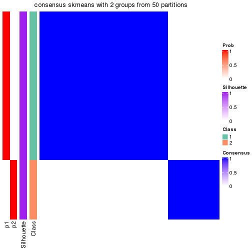</p>

</div>
<div id='tab-node-0222-consensus-heatmap-2'>
<pre><code class="r">consensus_heatmap(res, k = 3)
</code></pre>

<p>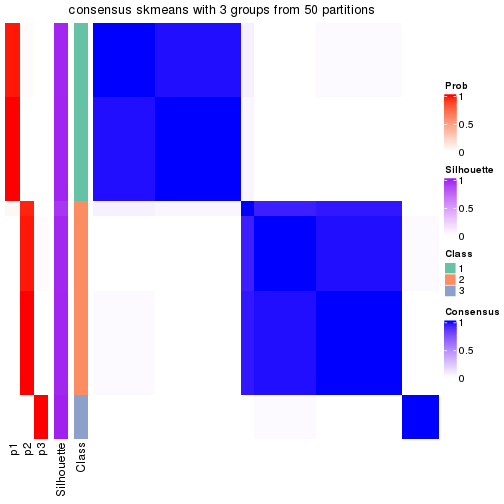</p>

</div>
<div id='tab-node-0222-consensus-heatmap-3'>
<pre><code class="r">consensus_heatmap(res, k = 4)
</code></pre>

<p>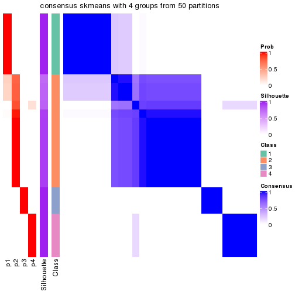</p>

</div>
<div id='tab-node-0222-consensus-heatmap-4'>
<pre><code class="r">consensus_heatmap(res, k = 5)
</code></pre>

<p>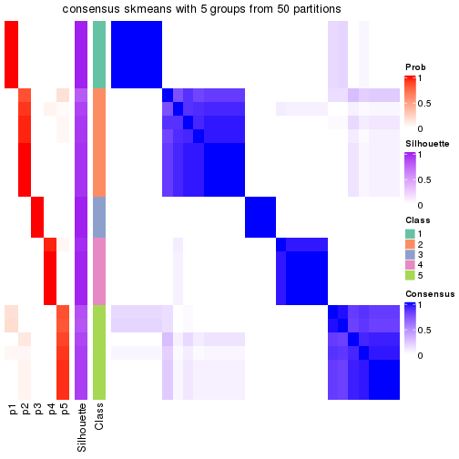</p>

</div>
<div id='tab-node-0222-consensus-heatmap-5'>
<pre><code class="r">consensus_heatmap(res, k = 6)
</code></pre>

<p>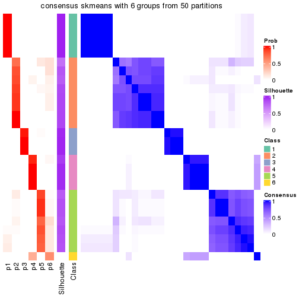</p>

</div>
<div id='tab-node-0222-consensus-heatmap-6'>
<pre><code class="r">consensus_heatmap(res, k = 7)
</code></pre>

<p>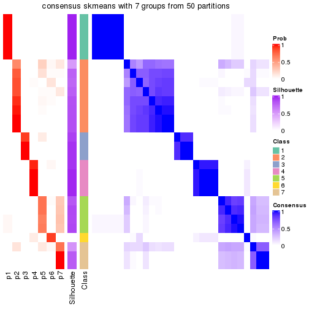</p>

</div>
<div id='tab-node-0222-consensus-heatmap-7'>
<pre><code class="r">consensus_heatmap(res, k = 8)
</code></pre>

<p>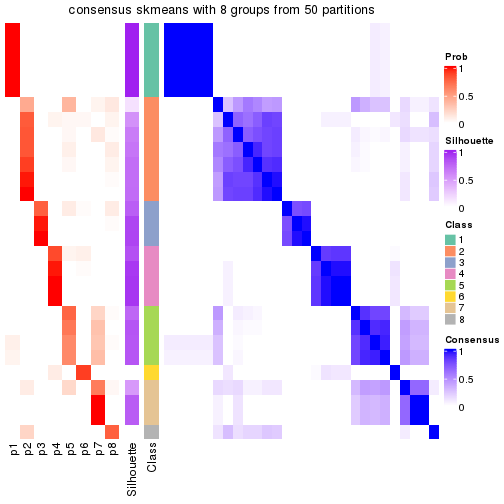</p>

</div>
</div>

Heatmaps for the membership of samples in all partitions to see how consistent they are:


<script>
$( function() {
	$( '#tabs-node-0222-membership-heatmap' ).tabs();
} );
</script>
<div id='tabs-node-0222-membership-heatmap'>
<ul>
<li><a href='#tab-node-0222-membership-heatmap-1'>k = 2</a></li>
<li><a href='#tab-node-0222-membership-heatmap-2'>k = 3</a></li>
<li><a href='#tab-node-0222-membership-heatmap-3'>k = 4</a></li>
<li><a href='#tab-node-0222-membership-heatmap-4'>k = 5</a></li>
<li><a href='#tab-node-0222-membership-heatmap-5'>k = 6</a></li>
<li><a href='#tab-node-0222-membership-heatmap-6'>k = 7</a></li>
<li><a href='#tab-node-0222-membership-heatmap-7'>k = 8</a></li>
</ul>
<div id='tab-node-0222-membership-heatmap-1'>
<pre><code class="r">membership_heatmap(res, k = 2)
</code></pre>

<p></p>

</div>
<div id='tab-node-0222-membership-heatmap-2'>
<pre><code class="r">membership_heatmap(res, k = 3)
</code></pre>

<p>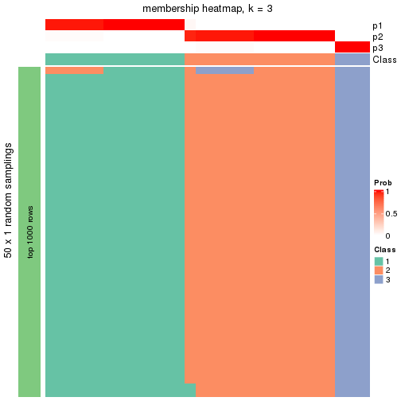</p>

</div>
<div id='tab-node-0222-membership-heatmap-3'>
<pre><code class="r">membership_heatmap(res, k = 4)
</code></pre>

<p>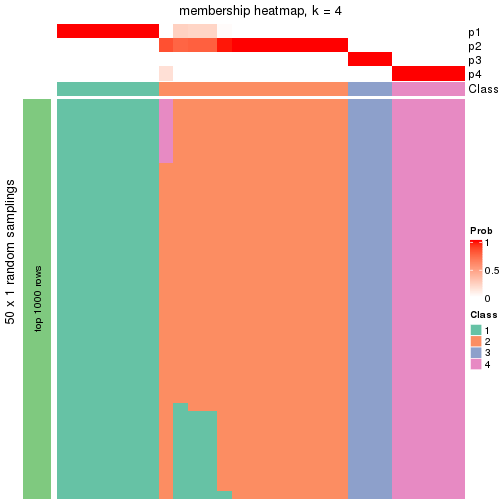</p>

</div>
<div id='tab-node-0222-membership-heatmap-4'>
<pre><code class="r">membership_heatmap(res, k = 5)
</code></pre>

<p>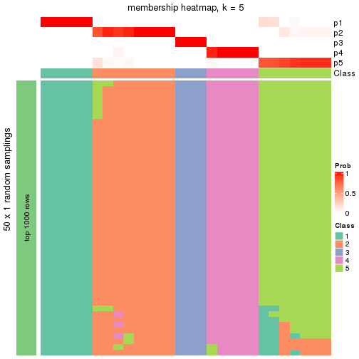</p>

</div>
<div id='tab-node-0222-membership-heatmap-5'>
<pre><code class="r">membership_heatmap(res, k = 6)
</code></pre>

<p>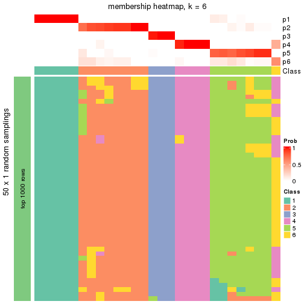</p>

</div>
<div id='tab-node-0222-membership-heatmap-6'>
<pre><code class="r">membership_heatmap(res, k = 7)
</code></pre>

<p></p>

</div>
<div id='tab-node-0222-membership-heatmap-7'>
<pre><code class="r">membership_heatmap(res, k = 8)
</code></pre>

<p>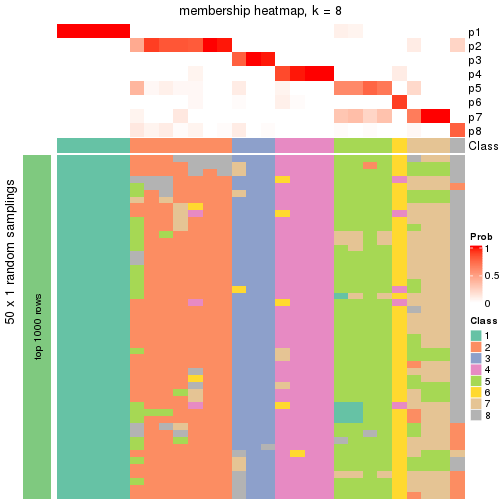</p>

</div>
</div>

As soon as the classes for columns are determined, the signatures
that are significantly different between subgroups can be looked for. 
Following are the heatmaps for signatures.


<script>
$( function() {
	$( '#tabs-node-0222-get-signatures' ).tabs();
} );
</script>
<div id='tabs-node-0222-get-signatures'>
<ul>
<li><a href='#tab-node-0222-get-signatures-1'>k = 2</a></li>
<li><a href='#tab-node-0222-get-signatures-2'>k = 3</a></li>
<li><a href='#tab-node-0222-get-signatures-3'>k = 4</a></li>
<li><a href='#tab-node-0222-get-signatures-4'>k = 5</a></li>
<li><a href='#tab-node-0222-get-signatures-5'>k = 6</a></li>
<li><a href='#tab-node-0222-get-signatures-6'>k = 7</a></li>
<li><a href='#tab-node-0222-get-signatures-7'>k = 8</a></li>
</ul>
<div id='tab-node-0222-get-signatures-1'>
<pre><code class="r">get_signatures(res, k = 2)
</code></pre>

<p>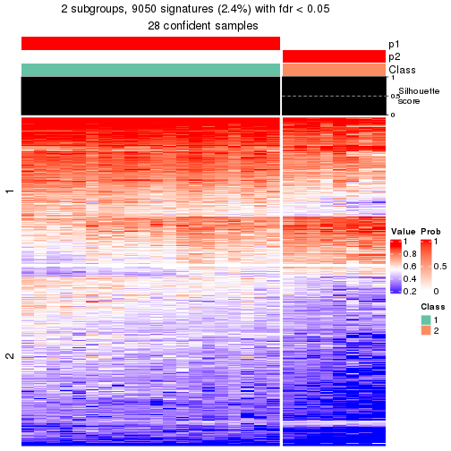</p>

</div>
<div id='tab-node-0222-get-signatures-2'>
<pre><code class="r">get_signatures(res, k = 3)
</code></pre>

<p>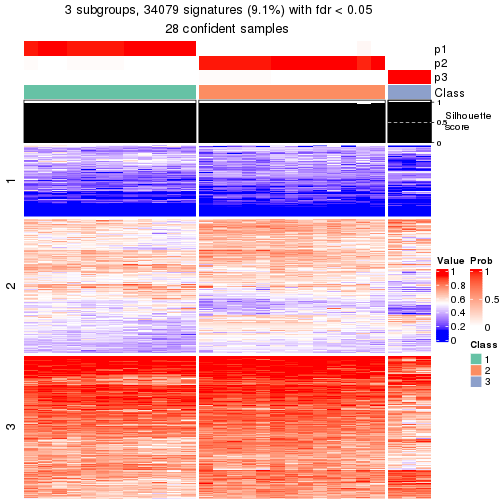</p>

</div>
<div id='tab-node-0222-get-signatures-3'>
<pre><code class="r">get_signatures(res, k = 4)
</code></pre>

<p>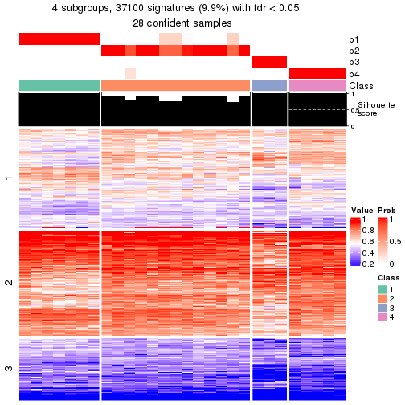</p>

</div>
<div id='tab-node-0222-get-signatures-4'>
<pre><code class="r">get_signatures(res, k = 5)
</code></pre>

<p>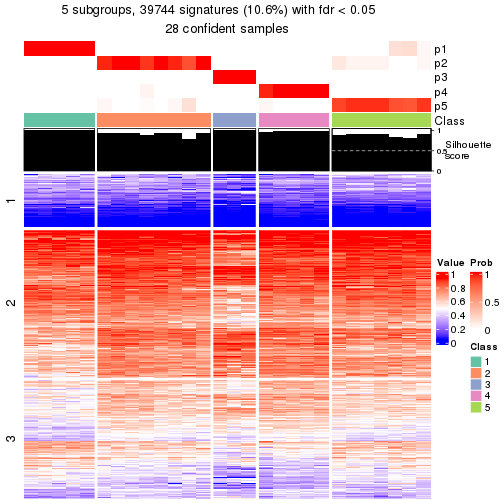</p>

</div>
<div id='tab-node-0222-get-signatures-5'>
<pre><code class="r">get_signatures(res, k = 6)
</code></pre>

<p>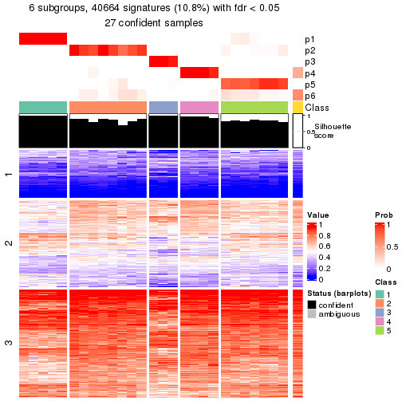</p>

</div>
<div id='tab-node-0222-get-signatures-6'>
<pre><code class="r">get_signatures(res, k = 7)
</code></pre>

<p>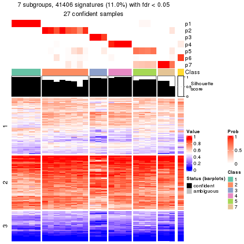</p>

</div>
<div id='tab-node-0222-get-signatures-7'>
<pre><code class="r">get_signatures(res, k = 8)
</code></pre>

<p>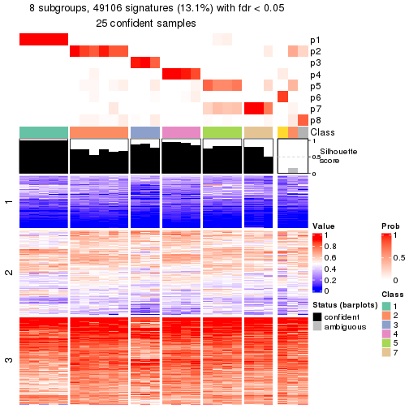</p>

</div>
</div>


Compare the overlap of signatures from different k:

```r
compare_signatures(res)
```

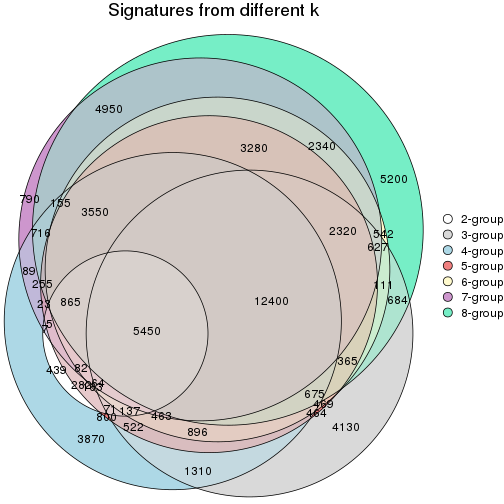

`get_signature()` returns a data frame invisibly. To get the list of signatures, the function
call should be assigned to a variable explicitly. In following code, if `plot` argument is set
to `FALSE`, no heatmap is plotted while only the differential analysis is performed.

```r
# code only for demonstration
tb = get_signature(res, k = ..., plot = FALSE)
```

An example of the output of `tb` is:

```
#>   which_row         fdr    mean_1    mean_2 scaled_mean_1 scaled_mean_2 km
#> 1        38 0.042760348  8.373488  9.131774    -0.5533452     0.5164555  1
#> 2        40 0.018707592  7.106213  8.469186    -0.6173731     0.5762149  1
#> 3        55 0.019134737 10.221463 11.207825    -0.6159697     0.5749050  1
#> 4        59 0.006059896  5.921854  7.869574    -0.6899429     0.6439467  1
#> 5        60 0.018055526  8.928898 10.211722    -0.6204761     0.5791110  1
#> 6        98 0.009384629 15.714769 14.887706     0.6635654    -0.6193277  2
...
```

The columns in `tb` are:

1. `which_row`: row indices corresponding to the input matrix.
2. `fdr`: FDR for the differential test. 
3. `mean_x`: The mean value in group x.
4. `scaled_mean_x`: The mean value in group x after rows are scaled.
5. `km`: Row groups if k-means clustering is applied to rows (which is done by automatically selecting number of clusters).

If there are too many signatures, `top_signatures = ...` can be set to only show the 
signatures with the highest FDRs:

```r
# code only for demonstration
# e.g. to show the top 500 most significant rows
tb = get_signature(res, k = ..., top_signatures = 500)
```

If the signatures are defined as these which are uniquely high in current group, `diff_method` argument
can be set to `"uniquely_high_in_one_group"`:

```r
# code only for demonstration
tb = get_signature(res, k = ..., diff_method = "uniquely_high_in_one_group")
```


UMAP plot which shows how samples are separated.


<script>
$( function() {
	$( '#tabs-node-0222-dimension-reduction' ).tabs();
} );
</script>
<div id='tabs-node-0222-dimension-reduction'>
<ul>
<li><a href='#tab-node-0222-dimension-reduction-1'>k = 2</a></li>
<li><a href='#tab-node-0222-dimension-reduction-2'>k = 3</a></li>
<li><a href='#tab-node-0222-dimension-reduction-3'>k = 4</a></li>
<li><a href='#tab-node-0222-dimension-reduction-4'>k = 5</a></li>
<li><a href='#tab-node-0222-dimension-reduction-5'>k = 6</a></li>
<li><a href='#tab-node-0222-dimension-reduction-6'>k = 7</a></li>
<li><a href='#tab-node-0222-dimension-reduction-7'>k = 8</a></li>
</ul>
<div id='tab-node-0222-dimension-reduction-1'>
<pre><code class="r">dimension_reduction(res, k = 2, method = &quot;UMAP&quot;)
</code></pre>

<p>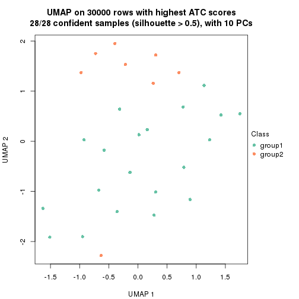</p>

</div>
<div id='tab-node-0222-dimension-reduction-2'>
<pre><code class="r">dimension_reduction(res, k = 3, method = &quot;UMAP&quot;)
</code></pre>

<p>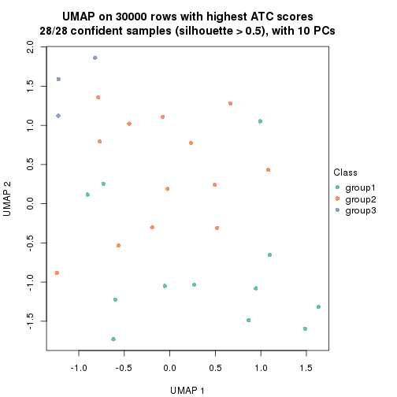</p>

</div>
<div id='tab-node-0222-dimension-reduction-3'>
<pre><code class="r">dimension_reduction(res, k = 4, method = &quot;UMAP&quot;)
</code></pre>

<p>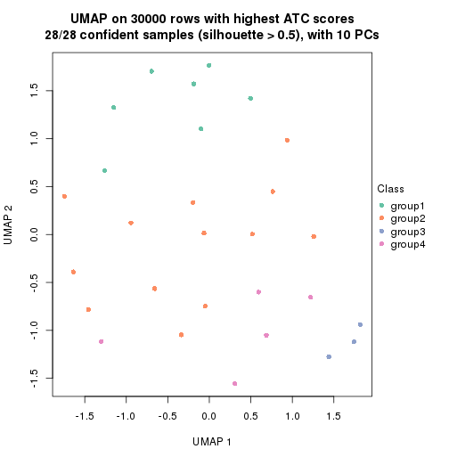</p>

</div>
<div id='tab-node-0222-dimension-reduction-4'>
<pre><code class="r">dimension_reduction(res, k = 5, method = &quot;UMAP&quot;)
</code></pre>

<p>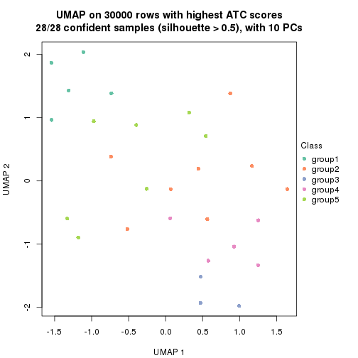</p>

</div>
<div id='tab-node-0222-dimension-reduction-5'>
<pre><code class="r">dimension_reduction(res, k = 6, method = &quot;UMAP&quot;)
</code></pre>

<p>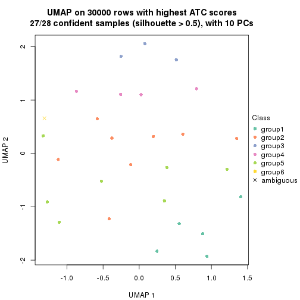</p>

</div>
<div id='tab-node-0222-dimension-reduction-6'>
<pre><code class="r">dimension_reduction(res, k = 7, method = &quot;UMAP&quot;)
</code></pre>

<p>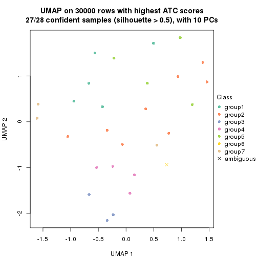</p>

</div>
<div id='tab-node-0222-dimension-reduction-7'>
<pre><code class="r">dimension_reduction(res, k = 8, method = &quot;UMAP&quot;)
</code></pre>

<p>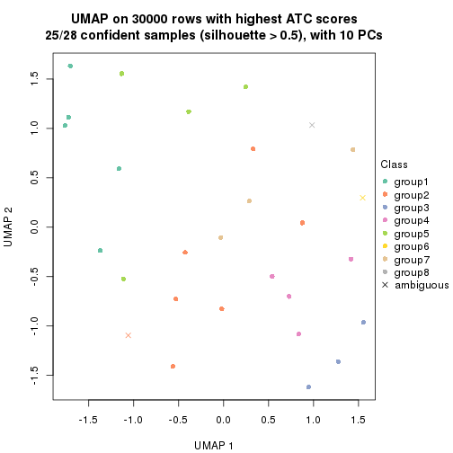</p>

</div>
</div>


Following heatmap shows how subgroups are split when increasing `k`:

```r
collect_classes(res)
```

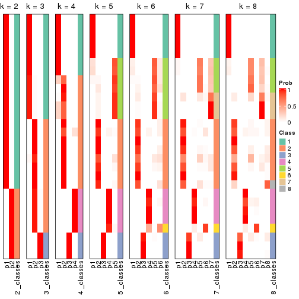


If matrix rows can be associated to genes, consider to use `functional_enrichment(res,
...)` to perform function enrichment for the signature genes. See [this vignette](https://jokergoo.github.io/cola_vignettes/functional_enrichment.html) for more detailed explanations.


 

---------------------------------------------------


### Node0223


Parent node: [Node022](#Node022).
Child nodes: 
                Node01211-leaf
        ,
                Node01212-leaf
        ,
                Node01213-leaf
        ,
                Node01221-leaf
        ,
                Node01222-leaf
        ,
                Node01223-leaf
        ,
                Node02111-leaf
        ,
                Node02112-leaf
        ,
                Node02113-leaf
        ,
                Node02114-leaf
        ,
                Node02121-leaf
        ,
                Node02122-leaf
        ,
                Node02123-leaf
        ,
                Node02124-leaf
        ,
                Node02131-leaf
        ,
                [Node02132](#Node02132)
        ,
                Node02133-leaf
        ,
                Node02211-leaf
        ,
                Node02212-leaf
        ,
                Node02213-leaf
        ,
                Node02221-leaf
        ,
                Node02222-leaf
        ,
                Node02223-leaf
        ,
                Node02231-leaf
        ,
                Node02232-leaf
        ,
                Node02233-leaf
        ,
                Node02241-leaf
        ,
                Node02242-leaf
        ,
                Node02243-leaf
        ,
                Node02321-leaf
        ,
                Node02322-leaf
        ,
                Node02323-leaf
        ,
                Node05111-leaf
        ,
                Node05112-leaf
        ,
                Node05113-leaf
        ,
                Node05114-leaf
        ,
                [Node05121](#Node05121)
        ,
                Node05122-leaf
        ,
                Node05123-leaf
        ,
                Node05221-leaf
        ,
                Node05222-leaf
        .


The object with results only for a single top-value method and a single partitioning method 
can be extracted as:

```r
res = res_rh["0223"]
```

A summary of `res` and all the functions that can be applied to it:

```r
res
```

```
#> A 'ConsensusPartition' object with k = 2, 3, 4, 5, 6, 7, 8.
#>   On a matrix with 30000 rows and 28 columns.
#>   Top rows (1000) are extracted by 'ATC' method.
#>   Subgroups are detected by 'kmeans' method.
#>   Performed in total 350 partitions by row resampling.
#>   Best k for subgroups seems to be 3.
#> 
#> Following methods can be applied to this 'ConsensusPartition' object:
#>  [1] "cola_report"             "collect_classes"         "collect_plots"          
#>  [4] "collect_stats"           "colnames"                "compare_partitions"     
#>  [7] "compare_signatures"      "consensus_heatmap"       "dimension_reduction"    
#> [10] "functional_enrichment"   "get_anno_col"            "get_anno"               
#> [13] "get_classes"             "get_consensus"           "get_matrix"             
#> [16] "get_membership"          "get_param"               "get_signatures"         
#> [19] "get_stats"               "is_best_k"               "is_stable_k"            
#> [22] "membership_heatmap"      "ncol"                    "nrow"                   
#> [25] "plot_ecdf"               "predict_classes"         "rownames"               
#> [28] "select_partition_number" "show"                    "suggest_best_k"         
#> [31] "test_to_known_factors"   "top_rows_heatmap"
```

`collect_plots()` function collects all the plots made from `res` for all `k` (number of subgroups)
into one single page to provide an easy and fast comparison between different `k`.

```r
collect_plots(res)
```

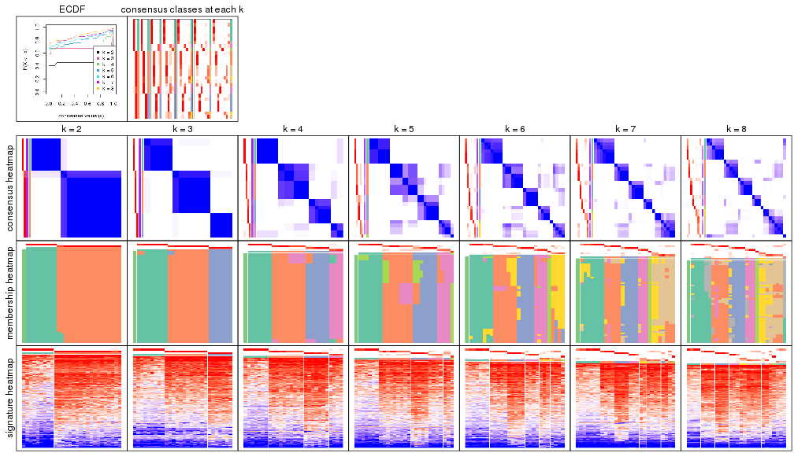

The plots are:

- The first row: a plot of the eCDF (empirical cumulative distribution
  function) curves of the consensus matrix for each `k` and the heatmap of
  predicted classes for each `k`.
- The second row: heatmaps of the consensus matrix for each `k`.
- The third row: heatmaps of the membership matrix for each `k`.
- The fouth row: heatmaps of the signatures for each `k`.

All the plots in panels can be made by individual functions and they are
plotted later in this section.

`select_partition_number()` produces several plots showing different
statistics for choosing "optimized" `k`. There are following statistics:

- eCDF curves of the consensus matrix for each `k`;
- 1-PAC. [The PAC score](https://en.wikipedia.org/wiki/Consensus_clustering#Over-interpretation_potential_of_consensus_clustering)
  measures the proportion of the ambiguous subgrouping.
- Mean silhouette score.
- Concordance. The mean probability of fiting the consensus subgroup labels in all
  partitions.
- Area increased. Denote $A_k$ as the area under the eCDF curve for current
  `k`, the area increased is defined as $A_k - A_{k-1}$.
- Rand index. The percent of pairs of samples that are both in a same cluster
  or both are not in a same cluster in the partition of k and k-1.
- Jaccard index. The ratio of pairs of samples are both in a same cluster in
  the partition of k and k-1 and the pairs of samples are both in a same
  cluster in the partition k or k-1.

The detailed explanations of these statistics can be found in [the _cola_
vignette](https://jokergoo.github.io/cola_vignettes/cola.html#toc_13).

Generally speaking, higher 1-PAC score, higher mean silhouette score or higher
concordance corresponds to better partition. Rand index and Jaccard index
measure how similar the current partition is compared to partition with `k-1`.
If they are too similar, we won't accept `k` is better than `k-1`.

```r
select_partition_number(res)
```

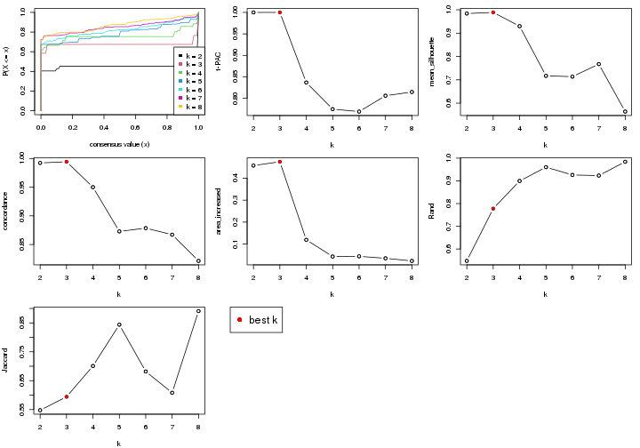

The numeric values for all these statistics can be obtained by `get_stats()`.

```r
get_stats(res)
```

```
#>   k 1-PAC mean_silhouette concordance area_increased  Rand Jaccard
#> 2 2 1.000           0.984       0.992         0.4576 0.548   0.548
#> 3 3 1.000           0.989       0.994         0.4749 0.778   0.594
#> 4 4 0.837           0.930       0.950         0.1192 0.899   0.701
#> 5 5 0.775           0.717       0.873         0.0433 0.960   0.844
#> 6 6 0.769           0.714       0.879         0.0441 0.926   0.682
#> 7 7 0.806           0.767       0.867         0.0351 0.923   0.608
#> 8 8 0.815           0.564       0.821         0.0232 0.984   0.891
```

`suggest_best_k()` suggests the best $k$ based on these statistics. The rules are as follows:

- All $k$ with Jaccard index larger than 0.95 are removed because increasing
  $k$ does not provide enough extra information. If all $k$ are removed, it is
  marked as no subgroup is detected.
- For all $k$ with 1-PAC score larger than 0.9, the maximal $k$ is taken as
  the best $k$, and other $k$ are marked as optional $k$.
- If it does not fit the second rule. The $k$ with the maximal vote of the
  highest 1-PAC score, highest mean silhouette, and highest concordance is
  taken as the best $k$.

```r
suggest_best_k(res)
```

```
#> [1] 3
#> attr(,"optional")
#> [1] 2
```

There is also optional best $k$ = 2 that is worth to check.

Following is the table of the partitions (You need to click the **show/hide
code output** link to see it). The membership matrix (columns with name `p*`)
is inferred by
[`clue::cl_consensus()`](https://www.rdocumentation.org/link/cl_consensus?package=clue)
function with the `SE` method. Basically the value in the membership matrix
represents the probability to belong to a certain group. The finall subgroup
label for an item is determined with the group with highest probability it
belongs to.

In `get_classes()` function, the entropy is calculated from the membership
matrix and the silhouette score is calculated from the consensus matrix.


<script>
$( function() {
	$( '#tabs-node-0223-get-classes' ).tabs();
} );
</script>
<div id='tabs-node-0223-get-classes'>
<ul>
<li><a href='#tab-node-0223-get-classes-1'>k = 2</a></li>
<li><a href='#tab-node-0223-get-classes-2'>k = 3</a></li>
<li><a href='#tab-node-0223-get-classes-3'>k = 4</a></li>
<li><a href='#tab-node-0223-get-classes-4'>k = 5</a></li>
<li><a href='#tab-node-0223-get-classes-5'>k = 6</a></li>
<li><a href='#tab-node-0223-get-classes-6'>k = 7</a></li>
<li><a href='#tab-node-0223-get-classes-7'>k = 8</a></li>
</ul>

<div id='tab-node-0223-get-classes-1'>
<p><a id='tab-node-0223-get-classes-1-a' style='color:#0366d6' href='#'>show/hide code output</a></p>
<pre><code class="r">cbind(get_classes(res, k = 2), get_membership(res, k = 2))
</code></pre>

<pre><code>#&gt;                 class entropy silhouette   p1   p2
#&gt; TCGA.CN.6016.01     2   0.000      0.988 0.00 1.00
#&gt; TCGA.CN.6020.01     2   0.529      0.871 0.12 0.88
#&gt; TCGA.CN.6023.01     2   0.000      0.988 0.00 1.00
#&gt; TCGA.CV.7254.01     2   0.000      0.988 0.00 1.00
#&gt; TCGA.CN.5370.01     1   0.000      1.000 1.00 0.00
#&gt; TCGA.CR.7401.01     2   0.000      0.988 0.00 1.00
#&gt; TCGA.CV.7090.01     1   0.000      1.000 1.00 0.00
#&gt; TCGA.CX.7219.01     2   0.000      0.988 0.00 1.00
#&gt; TCGA.D6.6825.01     2   0.469      0.894 0.10 0.90
#&gt; TCGA.CV.6945.01     1   0.000      1.000 1.00 0.00
#&gt; TCGA.CN.6989.01     2   0.000      0.988 0.00 1.00
#&gt; TCGA.D6.6517.01     1   0.000      1.000 1.00 0.00
#&gt; TCGA.CQ.6220.01     1   0.000      1.000 1.00 0.00
#&gt; TCGA.BA.5152.01     1   0.000      1.000 1.00 0.00
#&gt; TCGA.CQ.5326.01     2   0.000      0.988 0.00 1.00
#&gt; TCGA.CR.6471.01     2   0.000      0.988 0.00 1.00
#&gt; TCGA.D6.A4ZB.01     2   0.000      0.988 0.00 1.00
#&gt; TCGA.BB.A5HU.01     1   0.000      1.000 1.00 0.00
#&gt; TCGA.F7.A50G.01     2   0.000      0.988 0.00 1.00
#&gt; TCGA.F7.A61S.01     2   0.000      0.988 0.00 1.00
#&gt; TCGA.D6.8568.01     2   0.000      0.988 0.00 1.00
#&gt; TCGA.CN.4729.01     2   0.000      0.988 0.00 1.00
#&gt; TCGA.DQ.7590.01     2   0.000      0.988 0.00 1.00
#&gt; TCGA.BB.7872.01     2   0.000      0.988 0.00 1.00
#&gt; TCGA.CN.5365.01     1   0.000      1.000 1.00 0.00
#&gt; TCGA.QK.A6IF.01     2   0.000      0.988 0.00 1.00
#&gt; TCGA.CV.7429.01     1   0.000      1.000 1.00 0.00
#&gt; TCGA.D6.A6EK.01     2   0.000      0.988 0.00 1.00
</code></pre>

<script>
$('#tab-node-0223-get-classes-1-a').parent().next().next().hide();
$('#tab-node-0223-get-classes-1-a').click(function(){
  $('#tab-node-0223-get-classes-1-a').parent().next().next().toggle();
  return(false);
});
</script>
</div>

<div id='tab-node-0223-get-classes-2'>
<p><a id='tab-node-0223-get-classes-2-a' style='color:#0366d6' href='#'>show/hide code output</a></p>
<pre><code class="r">cbind(get_classes(res, k = 3), get_membership(res, k = 3))
</code></pre>

<pre><code>#&gt;                 class entropy silhouette   p1   p2   p3
#&gt; TCGA.CN.6016.01     3   0.000      1.000 0.00 0.00 1.00
#&gt; TCGA.CN.6020.01     2   0.000      0.992 0.00 1.00 0.00
#&gt; TCGA.CN.6023.01     3   0.000      1.000 0.00 0.00 1.00
#&gt; TCGA.CV.7254.01     3   0.000      1.000 0.00 0.00 1.00
#&gt; TCGA.CN.5370.01     1   0.000      0.989 1.00 0.00 0.00
#&gt; TCGA.CR.7401.01     2   0.000      0.992 0.00 1.00 0.00
#&gt; TCGA.CV.7090.01     1   0.000      0.989 1.00 0.00 0.00
#&gt; TCGA.CX.7219.01     2   0.153      0.960 0.00 0.96 0.04
#&gt; TCGA.D6.6825.01     2   0.000      0.992 0.00 1.00 0.00
#&gt; TCGA.CV.6945.01     1   0.153      0.961 0.96 0.04 0.00
#&gt; TCGA.CN.6989.01     3   0.000      1.000 0.00 0.00 1.00
#&gt; TCGA.D6.6517.01     1   0.153      0.961 0.96 0.04 0.00
#&gt; TCGA.CQ.6220.01     1   0.000      0.989 1.00 0.00 0.00
#&gt; TCGA.BA.5152.01     1   0.000      0.989 1.00 0.00 0.00
#&gt; TCGA.CQ.5326.01     2   0.000      0.992 0.00 1.00 0.00
#&gt; TCGA.CR.6471.01     3   0.000      1.000 0.00 0.00 1.00
#&gt; TCGA.D6.A4ZB.01     2   0.153      0.960 0.00 0.96 0.04
#&gt; TCGA.BB.A5HU.01     1   0.000      0.989 1.00 0.00 0.00
#&gt; TCGA.F7.A50G.01     2   0.000      0.992 0.00 1.00 0.00
#&gt; TCGA.F7.A61S.01     2   0.000      0.992 0.00 1.00 0.00
#&gt; TCGA.D6.8568.01     2   0.000      0.992 0.00 1.00 0.00
#&gt; TCGA.CN.4729.01     2   0.000      0.992 0.00 1.00 0.00
#&gt; TCGA.DQ.7590.01     3   0.000      1.000 0.00 0.00 1.00
#&gt; TCGA.BB.7872.01     2   0.000      0.992 0.00 1.00 0.00
#&gt; TCGA.CN.5365.01     1   0.000      0.989 1.00 0.00 0.00
#&gt; TCGA.QK.A6IF.01     3   0.000      1.000 0.00 0.00 1.00
#&gt; TCGA.CV.7429.01     1   0.000      0.989 1.00 0.00 0.00
#&gt; TCGA.D6.A6EK.01     2   0.000      0.992 0.00 1.00 0.00
</code></pre>

<script>
$('#tab-node-0223-get-classes-2-a').parent().next().next().hide();
$('#tab-node-0223-get-classes-2-a').click(function(){
  $('#tab-node-0223-get-classes-2-a').parent().next().next().toggle();
  return(false);
});
</script>
</div>

<div id='tab-node-0223-get-classes-3'>
<p><a id='tab-node-0223-get-classes-3-a' style='color:#0366d6' href='#'>show/hide code output</a></p>
<pre><code class="r">cbind(get_classes(res, k = 4), get_membership(res, k = 4))
</code></pre>

<pre><code>#&gt;                 class entropy silhouette   p1   p2   p3   p4
#&gt; TCGA.CN.6016.01     3   0.382      0.867 0.00 0.12 0.84 0.04
#&gt; TCGA.CN.6020.01     4   0.121      0.879 0.00 0.04 0.00 0.96
#&gt; TCGA.CN.6023.01     3   0.382      0.867 0.00 0.12 0.84 0.04
#&gt; TCGA.CV.7254.01     3   0.000      0.940 0.00 0.00 1.00 0.00
#&gt; TCGA.CN.5370.01     1   0.000      1.000 1.00 0.00 0.00 0.00
#&gt; TCGA.CR.7401.01     2   0.000      0.915 0.00 1.00 0.00 0.00
#&gt; TCGA.CV.7090.01     1   0.000      1.000 1.00 0.00 0.00 0.00
#&gt; TCGA.CX.7219.01     2   0.121      0.893 0.00 0.96 0.00 0.04
#&gt; TCGA.D6.6825.01     4   0.121      0.879 0.00 0.04 0.00 0.96
#&gt; TCGA.CV.6945.01     4   0.292      0.868 0.14 0.00 0.00 0.86
#&gt; TCGA.CN.6989.01     3   0.121      0.930 0.00 0.00 0.96 0.04
#&gt; TCGA.D6.6517.01     4   0.292      0.868 0.14 0.00 0.00 0.86
#&gt; TCGA.CQ.6220.01     1   0.000      1.000 1.00 0.00 0.00 0.00
#&gt; TCGA.BA.5152.01     1   0.000      1.000 1.00 0.00 0.00 0.00
#&gt; TCGA.CQ.5326.01     2   0.265      0.917 0.00 0.88 0.00 0.12
#&gt; TCGA.CR.6471.01     3   0.000      0.940 0.00 0.00 1.00 0.00
#&gt; TCGA.D6.A4ZB.01     2   0.121      0.893 0.00 0.96 0.00 0.04
#&gt; TCGA.BB.A5HU.01     1   0.000      1.000 1.00 0.00 0.00 0.00
#&gt; TCGA.F7.A50G.01     2   0.265      0.917 0.00 0.88 0.00 0.12
#&gt; TCGA.F7.A61S.01     2   0.265      0.917 0.00 0.88 0.00 0.12
#&gt; TCGA.D6.8568.01     2   0.265      0.917 0.00 0.88 0.00 0.12
#&gt; TCGA.CN.4729.01     2   0.000      0.915 0.00 1.00 0.00 0.00
#&gt; TCGA.DQ.7590.01     3   0.000      0.940 0.00 0.00 1.00 0.00
#&gt; TCGA.BB.7872.01     2   0.000      0.915 0.00 1.00 0.00 0.00
#&gt; TCGA.CN.5365.01     1   0.000      1.000 1.00 0.00 0.00 0.00
#&gt; TCGA.QK.A6IF.01     3   0.000      0.940 0.00 0.00 1.00 0.00
#&gt; TCGA.CV.7429.01     1   0.000      1.000 1.00 0.00 0.00 0.00
#&gt; TCGA.D6.A6EK.01     2   0.265      0.917 0.00 0.88 0.00 0.12
</code></pre>

<script>
$('#tab-node-0223-get-classes-3-a').parent().next().next().hide();
$('#tab-node-0223-get-classes-3-a').click(function(){
  $('#tab-node-0223-get-classes-3-a').parent().next().next().toggle();
  return(false);
});
</script>
</div>

<div id='tab-node-0223-get-classes-4'>
<p><a id='tab-node-0223-get-classes-4-a' style='color:#0366d6' href='#'>show/hide code output</a></p>
<pre><code class="r">cbind(get_classes(res, k = 5), get_membership(res, k = 5))
</code></pre>

<pre><code>#&gt;                 class entropy silhouette   p1   p2   p3   p4   p5
#&gt; TCGA.CN.6016.01     3   0.646      0.478 0.00 0.24 0.50 0.26 0.00
#&gt; TCGA.CN.6020.01     4   0.356      0.676 0.00 0.00 0.00 0.74 0.26
#&gt; TCGA.CN.6023.01     3   0.646      0.478 0.00 0.24 0.50 0.26 0.00
#&gt; TCGA.CV.7254.01     3   0.000      0.781 0.00 0.00 1.00 0.00 0.00
#&gt; TCGA.CN.5370.01     1   0.141      0.962 0.94 0.00 0.00 0.00 0.06
#&gt; TCGA.CR.7401.01     2   0.000      0.731 0.00 1.00 0.00 0.00 0.00
#&gt; TCGA.CV.7090.01     1   0.000      0.972 1.00 0.00 0.00 0.00 0.00
#&gt; TCGA.CX.7219.01     2   0.356      0.550 0.00 0.74 0.00 0.26 0.00
#&gt; TCGA.D6.6825.01     4   0.468      0.704 0.00 0.14 0.00 0.74 0.12
#&gt; TCGA.CV.6945.01     5   0.141      0.000 0.00 0.00 0.00 0.06 0.94
#&gt; TCGA.CN.6989.01     3   0.228      0.740 0.00 0.00 0.88 0.12 0.00
#&gt; TCGA.D6.6517.01     4   0.356      0.676 0.00 0.00 0.00 0.74 0.26
#&gt; TCGA.CQ.6220.01     1   0.141      0.962 0.94 0.00 0.00 0.00 0.06
#&gt; TCGA.BA.5152.01     1   0.000      0.972 1.00 0.00 0.00 0.00 0.00
#&gt; TCGA.CQ.5326.01     2   0.342      0.654 0.00 0.76 0.00 0.24 0.00
#&gt; TCGA.CR.6471.01     3   0.000      0.781 0.00 0.00 1.00 0.00 0.00
#&gt; TCGA.D6.A4ZB.01     2   0.356      0.550 0.00 0.74 0.00 0.26 0.00
#&gt; TCGA.BB.A5HU.01     1   0.000      0.972 1.00 0.00 0.00 0.00 0.00
#&gt; TCGA.F7.A50G.01     4   0.389      0.521 0.00 0.32 0.00 0.68 0.00
#&gt; TCGA.F7.A61S.01     2   0.342      0.654 0.00 0.76 0.00 0.24 0.00
#&gt; TCGA.D6.8568.01     2   0.342      0.654 0.00 0.76 0.00 0.24 0.00
#&gt; TCGA.CN.4729.01     2   0.000      0.731 0.00 1.00 0.00 0.00 0.00
#&gt; TCGA.DQ.7590.01     3   0.000      0.781 0.00 0.00 1.00 0.00 0.00
#&gt; TCGA.BB.7872.01     2   0.000      0.731 0.00 1.00 0.00 0.00 0.00
#&gt; TCGA.CN.5365.01     1   0.141      0.962 0.94 0.00 0.00 0.00 0.06
#&gt; TCGA.QK.A6IF.01     3   0.000      0.781 0.00 0.00 1.00 0.00 0.00
#&gt; TCGA.CV.7429.01     1   0.000      0.972 1.00 0.00 0.00 0.00 0.00
#&gt; TCGA.D6.A6EK.01     2   0.342      0.654 0.00 0.76 0.00 0.24 0.00
</code></pre>

<script>
$('#tab-node-0223-get-classes-4-a').parent().next().next().hide();
$('#tab-node-0223-get-classes-4-a').click(function(){
  $('#tab-node-0223-get-classes-4-a').parent().next().next().toggle();
  return(false);
});
</script>
</div>

<div id='tab-node-0223-get-classes-5'>
<p><a id='tab-node-0223-get-classes-5-a' style='color:#0366d6' href='#'>show/hide code output</a></p>
<pre><code class="r">cbind(get_classes(res, k = 6), get_membership(res, k = 6))
</code></pre>

<pre><code>#&gt;                 class entropy silhouette   p1   p2   p3   p4   p5   p6
#&gt; TCGA.CN.6016.01     6  0.4503      0.603 0.00 0.08 0.24 0.00 0.00 0.68
#&gt; TCGA.CN.6020.01     4  0.0937      0.799 0.00 0.04 0.00 0.96 0.00 0.00
#&gt; TCGA.CN.6023.01     6  0.2454      0.610 0.00 0.00 0.16 0.00 0.00 0.84
#&gt; TCGA.CV.7254.01     3  0.0000      0.923 0.00 0.00 1.00 0.00 0.00 0.00
#&gt; TCGA.CN.5370.01     1  0.3873      0.830 0.78 0.00 0.00 0.04 0.02 0.16
#&gt; TCGA.CR.7401.01     2  0.2454      0.636 0.00 0.84 0.00 0.00 0.00 0.16
#&gt; TCGA.CV.7090.01     1  0.0000      0.935 1.00 0.00 0.00 0.00 0.00 0.00
#&gt; TCGA.CX.7219.01     6  0.3851      0.119 0.00 0.46 0.00 0.00 0.00 0.54
#&gt; TCGA.D6.6825.01     4  0.0937      0.799 0.00 0.04 0.00 0.96 0.00 0.00
#&gt; TCGA.CV.6945.01     5  0.0547      0.000 0.00 0.00 0.00 0.02 0.98 0.00
#&gt; TCGA.CN.6989.01     3  0.3198      0.636 0.00 0.00 0.74 0.00 0.00 0.26
#&gt; TCGA.D6.6517.01     4  0.1807      0.714 0.00 0.00 0.00 0.92 0.02 0.06
#&gt; TCGA.CQ.6220.01     1  0.2094      0.913 0.90 0.00 0.00 0.00 0.02 0.08
#&gt; TCGA.BA.5152.01     1  0.0000      0.935 1.00 0.00 0.00 0.00 0.00 0.00
#&gt; TCGA.CQ.5326.01     2  0.1267      0.765 0.00 0.94 0.00 0.06 0.00 0.00
#&gt; TCGA.CR.6471.01     3  0.0000      0.923 0.00 0.00 1.00 0.00 0.00 0.00
#&gt; TCGA.D6.A4ZB.01     6  0.2454      0.621 0.00 0.16 0.00 0.00 0.00 0.84
#&gt; TCGA.BB.A5HU.01     1  0.0000      0.935 1.00 0.00 0.00 0.00 0.00 0.00
#&gt; TCGA.F7.A50G.01     4  0.3647      0.509 0.00 0.36 0.00 0.64 0.00 0.00
#&gt; TCGA.F7.A61S.01     2  0.1267      0.765 0.00 0.94 0.00 0.06 0.00 0.00
#&gt; TCGA.D6.8568.01     2  0.1267      0.765 0.00 0.94 0.00 0.06 0.00 0.00
#&gt; TCGA.CN.4729.01     2  0.3499      0.404 0.00 0.68 0.00 0.00 0.00 0.32
#&gt; TCGA.DQ.7590.01     3  0.0000      0.923 0.00 0.00 1.00 0.00 0.00 0.00
#&gt; TCGA.BB.7872.01     2  0.3499      0.404 0.00 0.68 0.00 0.00 0.00 0.32
#&gt; TCGA.CN.5365.01     1  0.1807      0.921 0.92 0.00 0.00 0.00 0.02 0.06
#&gt; TCGA.QK.A6IF.01     3  0.0000      0.923 0.00 0.00 1.00 0.00 0.00 0.00
#&gt; TCGA.CV.7429.01     1  0.0937      0.924 0.96 0.00 0.00 0.00 0.00 0.04
#&gt; TCGA.D6.A6EK.01     2  0.1556      0.749 0.00 0.92 0.00 0.08 0.00 0.00
</code></pre>

<script>
$('#tab-node-0223-get-classes-5-a').parent().next().next().hide();
$('#tab-node-0223-get-classes-5-a').click(function(){
  $('#tab-node-0223-get-classes-5-a').parent().next().next().toggle();
  return(false);
});
</script>
</div>

<div id='tab-node-0223-get-classes-6'>
<p><a id='tab-node-0223-get-classes-6-a' style='color:#0366d6' href='#'>show/hide code output</a></p>
<pre><code class="r">cbind(get_classes(res, k = 7), get_membership(res, k = 7))
</code></pre>

<pre><code>#&gt;                 class entropy silhouette   p1   p2   p3   p4 p5   p6   p7
#&gt; TCGA.CN.6016.01     7  0.0504      0.362 0.00 0.00 0.02 0.00  0 0.00 0.98
#&gt; TCGA.CN.6020.01     4  0.0504      0.876 0.00 0.02 0.00 0.98  0 0.00 0.00
#&gt; TCGA.CN.6023.01     6  0.3558      1.000 0.00 0.00 0.00 0.00  0 0.52 0.48
#&gt; TCGA.CV.7254.01     3  0.0504      0.866 0.00 0.00 0.98 0.00  0 0.00 0.02
#&gt; TCGA.CN.5370.01     1  0.3755      0.662 0.64 0.00 0.00 0.02  0 0.34 0.00
#&gt; TCGA.CR.7401.01     7  0.3459      0.656 0.00 0.40 0.00 0.00  0 0.00 0.60
#&gt; TCGA.CV.7090.01     1  0.0000      0.902 1.00 0.00 0.00 0.00  0 0.00 0.00
#&gt; TCGA.CX.7219.01     7  0.2259      0.684 0.00 0.16 0.00 0.00  0 0.00 0.84
#&gt; TCGA.D6.6825.01     4  0.0504      0.876 0.00 0.02 0.00 0.98  0 0.00 0.00
#&gt; TCGA.CV.6945.01     5  0.0000      0.000 0.00 0.00 0.00 0.00  1 0.00 0.00
#&gt; TCGA.CN.6989.01     3  0.5007      0.360 0.00 0.00 0.56 0.00  0 0.28 0.16
#&gt; TCGA.D6.6517.01     4  0.2572      0.736 0.00 0.00 0.00 0.80  0 0.20 0.00
#&gt; TCGA.CQ.6220.01     1  0.2259      0.849 0.84 0.00 0.00 0.00  0 0.16 0.00
#&gt; TCGA.BA.5152.01     1  0.0000      0.902 1.00 0.00 0.00 0.00  0 0.00 0.00
#&gt; TCGA.CQ.5326.01     2  0.1671      0.817 0.00 0.90 0.00 0.00  0 0.10 0.00
#&gt; TCGA.CR.6471.01     3  0.0000      0.874 0.00 0.00 1.00 0.00  0 0.00 0.00
#&gt; TCGA.D6.A4ZB.01     6  0.3558      1.000 0.00 0.00 0.00 0.00  0 0.52 0.48
#&gt; TCGA.BB.A5HU.01     1  0.0000      0.902 1.00 0.00 0.00 0.00  0 0.00 0.00
#&gt; TCGA.F7.A50G.01     2  0.3221      0.489 0.00 0.68 0.00 0.32  0 0.00 0.00
#&gt; TCGA.F7.A61S.01     2  0.0000      0.866 0.00 1.00 0.00 0.00  0 0.00 0.00
#&gt; TCGA.D6.8568.01     2  0.0000      0.866 0.00 1.00 0.00 0.00  0 0.00 0.00
#&gt; TCGA.CN.4729.01     7  0.3047      0.772 0.00 0.28 0.00 0.00  0 0.00 0.72
#&gt; TCGA.DQ.7590.01     3  0.0000      0.874 0.00 0.00 1.00 0.00  0 0.00 0.00
#&gt; TCGA.BB.7872.01     7  0.3047      0.772 0.00 0.28 0.00 0.00  0 0.00 0.72
#&gt; TCGA.CN.5365.01     1  0.1671      0.879 0.90 0.00 0.00 0.00  0 0.10 0.00
#&gt; TCGA.QK.A6IF.01     3  0.0000      0.874 0.00 0.00 1.00 0.00  0 0.00 0.00
#&gt; TCGA.CV.7429.01     1  0.0504      0.898 0.98 0.00 0.00 0.00  0 0.02 0.00
#&gt; TCGA.D6.A6EK.01     2  0.0000      0.866 0.00 1.00 0.00 0.00  0 0.00 0.00
</code></pre>

<script>
$('#tab-node-0223-get-classes-6-a').parent().next().next().hide();
$('#tab-node-0223-get-classes-6-a').click(function(){
  $('#tab-node-0223-get-classes-6-a').parent().next().next().toggle();
  return(false);
});
</script>
</div>

<div id='tab-node-0223-get-classes-7'>
<p><a id='tab-node-0223-get-classes-7-a' style='color:#0366d6' href='#'>show/hide code output</a></p>
<pre><code class="r">cbind(get_classes(res, k = 8), get_membership(res, k = 8))
</code></pre>

<pre><code>#&gt;                 class entropy silhouette   p1   p2   p3   p4 p5   p6   p7   p8
#&gt; TCGA.CN.6016.01     7  0.2265     0.3145 0.00 0.00 0.02 0.00  0 0.08 0.88 0.02
#&gt; TCGA.CN.6020.01     4  0.0000     0.7930 0.00 0.00 0.00 1.00  0 0.00 0.00 0.00
#&gt; TCGA.CN.6023.01     6  0.3291     0.9565 0.00 0.00 0.02 0.00  0 0.70 0.28 0.00
#&gt; TCGA.CV.7254.01     3  0.1947     0.7511 0.00 0.00 0.86 0.00  0 0.00 0.00 0.14
#&gt; TCGA.CN.5370.01     8  0.2938     0.0000 0.30 0.00 0.00 0.00  0 0.00 0.00 0.70
#&gt; TCGA.CR.7401.01     7  0.3272     0.6321 0.00 0.42 0.00 0.00  0 0.00 0.58 0.00
#&gt; TCGA.CV.7090.01     1  0.0000     0.6818 1.00 0.00 0.00 0.00  0 0.00 0.00 0.00
#&gt; TCGA.CX.7219.01     7  0.3128     0.5326 0.00 0.10 0.00 0.00  0 0.04 0.82 0.04
#&gt; TCGA.D6.6825.01     4  0.0000     0.7930 0.00 0.00 0.00 1.00  0 0.00 0.00 0.00
#&gt; TCGA.CV.6945.01     5  0.0000     0.0000 0.00 0.00 0.00 0.00  1 0.00 0.00 0.00
#&gt; TCGA.CN.6989.01     3  0.6297     0.0698 0.00 0.00 0.40 0.00  0 0.28 0.16 0.16
#&gt; TCGA.D6.6517.01     4  0.5009     0.5333 0.00 0.00 0.00 0.62  0 0.12 0.06 0.20
#&gt; TCGA.CQ.6220.01     1  0.3318    -0.3282 0.54 0.00 0.00 0.00  0 0.00 0.00 0.46
#&gt; TCGA.BA.5152.01     1  0.0000     0.6818 1.00 0.00 0.00 0.00  0 0.00 0.00 0.00
#&gt; TCGA.CQ.5326.01     2  0.3102     0.7017 0.00 0.82 0.00 0.00  0 0.08 0.02 0.08
#&gt; TCGA.CR.6471.01     3  0.0000     0.8104 0.00 0.00 1.00 0.00  0 0.00 0.00 0.00
#&gt; TCGA.D6.A4ZB.01     6  0.3291     0.9564 0.00 0.02 0.00 0.00  0 0.70 0.28 0.00
#&gt; TCGA.BB.A5HU.01     1  0.0000     0.6818 1.00 0.00 0.00 0.00  0 0.00 0.00 0.00
#&gt; TCGA.F7.A50G.01     2  0.3690     0.2809 0.00 0.56 0.00 0.42  0 0.02 0.00 0.00
#&gt; TCGA.F7.A61S.01     2  0.0000     0.7844 0.00 1.00 0.00 0.00  0 0.00 0.00 0.00
#&gt; TCGA.D6.8568.01     2  0.0471     0.7776 0.00 0.98 0.00 0.00  0 0.00 0.02 0.00
#&gt; TCGA.CN.4729.01     7  0.3193     0.6872 0.00 0.38 0.00 0.00  0 0.00 0.62 0.00
#&gt; TCGA.DQ.7590.01     3  0.0000     0.8104 0.00 0.00 1.00 0.00  0 0.00 0.00 0.00
#&gt; TCGA.BB.7872.01     7  0.3083     0.7069 0.00 0.34 0.00 0.00  0 0.00 0.66 0.00
#&gt; TCGA.CN.5365.01     1  0.3142     0.0302 0.64 0.00 0.00 0.00  0 0.00 0.00 0.36
#&gt; TCGA.QK.A6IF.01     3  0.0000     0.8104 0.00 0.00 1.00 0.00  0 0.00 0.00 0.00
#&gt; TCGA.CV.7429.01     1  0.2864     0.5572 0.84 0.00 0.00 0.00  0 0.08 0.02 0.06
#&gt; TCGA.D6.A6EK.01     2  0.0941     0.7813 0.00 0.96 0.00 0.02  0 0.02 0.00 0.00
</code></pre>

<script>
$('#tab-node-0223-get-classes-7-a').parent().next().next().hide();
$('#tab-node-0223-get-classes-7-a').click(function(){
  $('#tab-node-0223-get-classes-7-a').parent().next().next().toggle();
  return(false);
});
</script>
</div>
</div>

Heatmaps for the consensus matrix. It visualizes the probability of two
samples to be in a same group.


<script>
$( function() {
	$( '#tabs-node-0223-consensus-heatmap' ).tabs();
} );
</script>
<div id='tabs-node-0223-consensus-heatmap'>
<ul>
<li><a href='#tab-node-0223-consensus-heatmap-1'>k = 2</a></li>
<li><a href='#tab-node-0223-consensus-heatmap-2'>k = 3</a></li>
<li><a href='#tab-node-0223-consensus-heatmap-3'>k = 4</a></li>
<li><a href='#tab-node-0223-consensus-heatmap-4'>k = 5</a></li>
<li><a href='#tab-node-0223-consensus-heatmap-5'>k = 6</a></li>
<li><a href='#tab-node-0223-consensus-heatmap-6'>k = 7</a></li>
<li><a href='#tab-node-0223-consensus-heatmap-7'>k = 8</a></li>
</ul>
<div id='tab-node-0223-consensus-heatmap-1'>
<pre><code class="r">consensus_heatmap(res, k = 2)
</code></pre>

<p></p>

</div>
<div id='tab-node-0223-consensus-heatmap-2'>
<pre><code class="r">consensus_heatmap(res, k = 3)
</code></pre>

<p>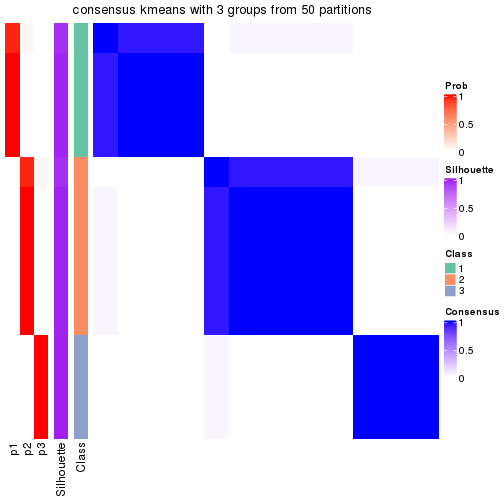</p>

</div>
<div id='tab-node-0223-consensus-heatmap-3'>
<pre><code class="r">consensus_heatmap(res, k = 4)
</code></pre>

<p></p>

</div>
<div id='tab-node-0223-consensus-heatmap-4'>
<pre><code class="r">consensus_heatmap(res, k = 5)
</code></pre>

<p>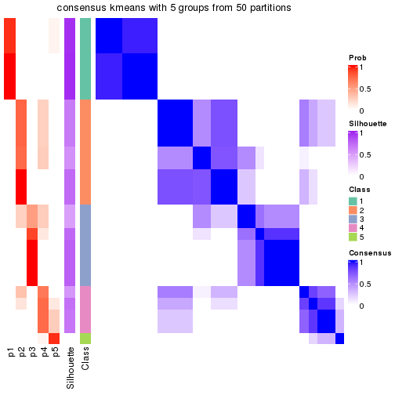</p>

</div>
<div id='tab-node-0223-consensus-heatmap-5'>
<pre><code class="r">consensus_heatmap(res, k = 6)
</code></pre>

<p>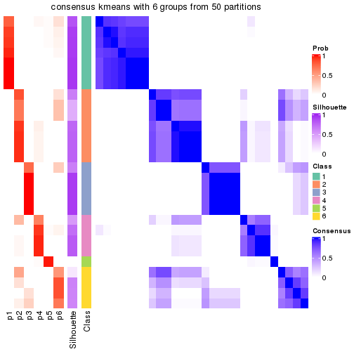</p>

</div>
<div id='tab-node-0223-consensus-heatmap-6'>
<pre><code class="r">consensus_heatmap(res, k = 7)
</code></pre>

<p>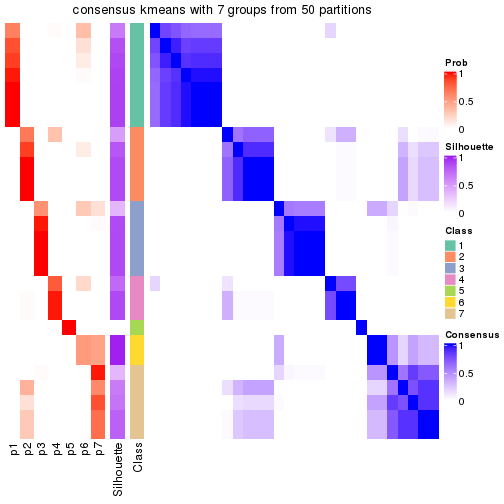</p>

</div>
<div id='tab-node-0223-consensus-heatmap-7'>
<pre><code class="r">consensus_heatmap(res, k = 8)
</code></pre>

<p></p>

</div>
</div>

Heatmaps for the membership of samples in all partitions to see how consistent they are:


<script>
$( function() {
	$( '#tabs-node-0223-membership-heatmap' ).tabs();
} );
</script>
<div id='tabs-node-0223-membership-heatmap'>
<ul>
<li><a href='#tab-node-0223-membership-heatmap-1'>k = 2</a></li>
<li><a href='#tab-node-0223-membership-heatmap-2'>k = 3</a></li>
<li><a href='#tab-node-0223-membership-heatmap-3'>k = 4</a></li>
<li><a href='#tab-node-0223-membership-heatmap-4'>k = 5</a></li>
<li><a href='#tab-node-0223-membership-heatmap-5'>k = 6</a></li>
<li><a href='#tab-node-0223-membership-heatmap-6'>k = 7</a></li>
<li><a href='#tab-node-0223-membership-heatmap-7'>k = 8</a></li>
</ul>
<div id='tab-node-0223-membership-heatmap-1'>
<pre><code class="r">membership_heatmap(res, k = 2)
</code></pre>

<p>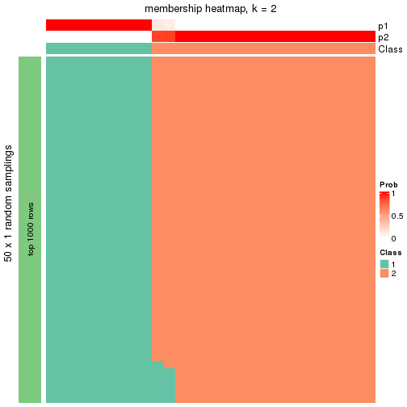</p>

</div>
<div id='tab-node-0223-membership-heatmap-2'>
<pre><code class="r">membership_heatmap(res, k = 3)
</code></pre>

<p>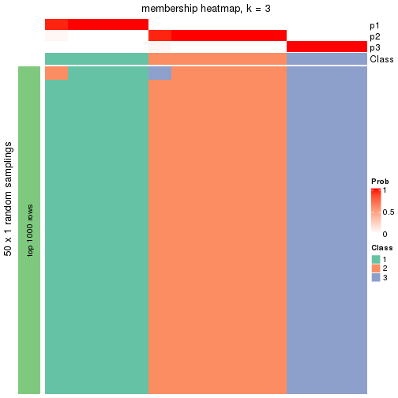</p>

</div>
<div id='tab-node-0223-membership-heatmap-3'>
<pre><code class="r">membership_heatmap(res, k = 4)
</code></pre>

<p>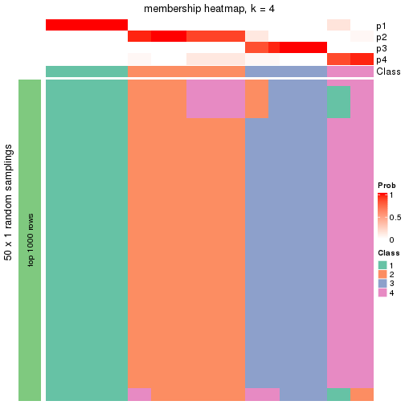</p>

</div>
<div id='tab-node-0223-membership-heatmap-4'>
<pre><code class="r">membership_heatmap(res, k = 5)
</code></pre>

<p>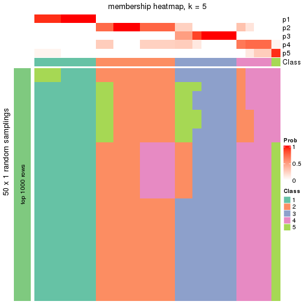</p>

</div>
<div id='tab-node-0223-membership-heatmap-5'>
<pre><code class="r">membership_heatmap(res, k = 6)
</code></pre>

<p>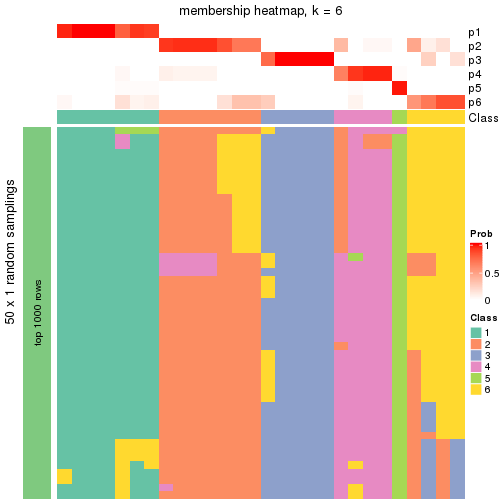</p>

</div>
<div id='tab-node-0223-membership-heatmap-6'>
<pre><code class="r">membership_heatmap(res, k = 7)
</code></pre>

<p>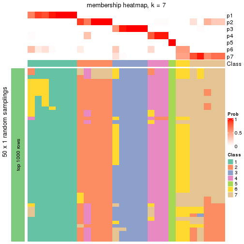</p>

</div>
<div id='tab-node-0223-membership-heatmap-7'>
<pre><code class="r">membership_heatmap(res, k = 8)
</code></pre>

<p></p>

</div>
</div>

As soon as the classes for columns are determined, the signatures
that are significantly different between subgroups can be looked for. 
Following are the heatmaps for signatures.


<script>
$( function() {
	$( '#tabs-node-0223-get-signatures' ).tabs();
} );
</script>
<div id='tabs-node-0223-get-signatures'>
<ul>
<li><a href='#tab-node-0223-get-signatures-1'>k = 2</a></li>
<li><a href='#tab-node-0223-get-signatures-2'>k = 3</a></li>
<li><a href='#tab-node-0223-get-signatures-3'>k = 4</a></li>
<li><a href='#tab-node-0223-get-signatures-4'>k = 5</a></li>
<li><a href='#tab-node-0223-get-signatures-5'>k = 6</a></li>
<li><a href='#tab-node-0223-get-signatures-6'>k = 7</a></li>
<li><a href='#tab-node-0223-get-signatures-7'>k = 8</a></li>
</ul>
<div id='tab-node-0223-get-signatures-1'>
<pre><code class="r">get_signatures(res, k = 2)
</code></pre>

<p>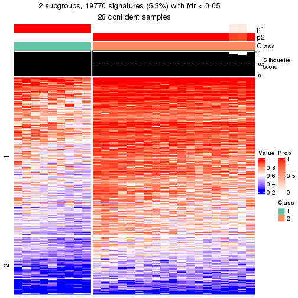</p>

</div>
<div id='tab-node-0223-get-signatures-2'>
<pre><code class="r">get_signatures(res, k = 3)
</code></pre>

<p>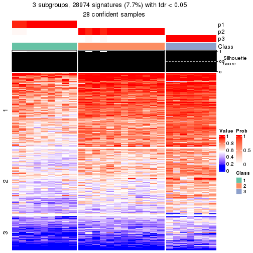</p>

</div>
<div id='tab-node-0223-get-signatures-3'>
<pre><code class="r">get_signatures(res, k = 4)
</code></pre>

<p>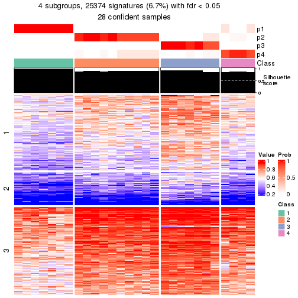</p>

</div>
<div id='tab-node-0223-get-signatures-4'>
<pre><code class="r">get_signatures(res, k = 5)
</code></pre>

<p>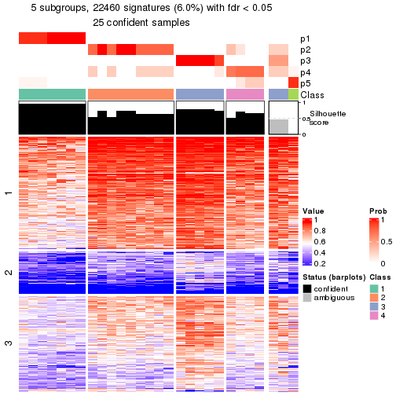</p>

</div>
<div id='tab-node-0223-get-signatures-5'>
<pre><code class="r">get_signatures(res, k = 6)
</code></pre>

<p>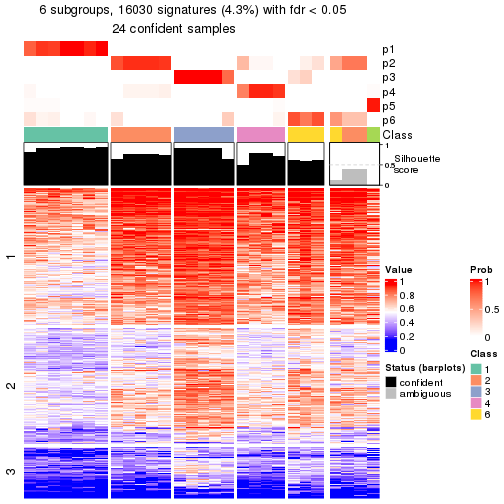</p>

</div>
<div id='tab-node-0223-get-signatures-6'>
<pre><code class="r">get_signatures(res, k = 7)
</code></pre>

<p>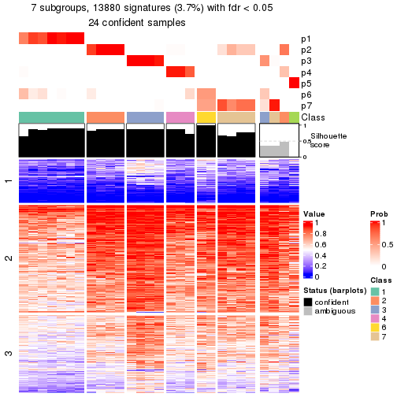</p>

</div>
<div id='tab-node-0223-get-signatures-7'>
<pre><code class="r">get_signatures(res, k = 8)
</code></pre>

<p>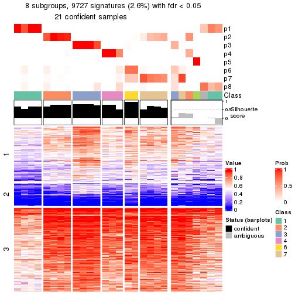</p>

</div>
</div>


Compare the overlap of signatures from different k:

```r
compare_signatures(res)
```


`get_signature()` returns a data frame invisibly. To get the list of signatures, the function
call should be assigned to a variable explicitly. In following code, if `plot` argument is set
to `FALSE`, no heatmap is plotted while only the differential analysis is performed.

```r
# code only for demonstration
tb = get_signature(res, k = ..., plot = FALSE)
```

An example of the output of `tb` is:

```
#>   which_row         fdr    mean_1    mean_2 scaled_mean_1 scaled_mean_2 km
#> 1        38 0.042760348  8.373488  9.131774    -0.5533452     0.5164555  1
#> 2        40 0.018707592  7.106213  8.469186    -0.6173731     0.5762149  1
#> 3        55 0.019134737 10.221463 11.207825    -0.6159697     0.5749050  1
#> 4        59 0.006059896  5.921854  7.869574    -0.6899429     0.6439467  1
#> 5        60 0.018055526  8.928898 10.211722    -0.6204761     0.5791110  1
#> 6        98 0.009384629 15.714769 14.887706     0.6635654    -0.6193277  2
...
```

The columns in `tb` are:

1. `which_row`: row indices corresponding to the input matrix.
2. `fdr`: FDR for the differential test. 
3. `mean_x`: The mean value in group x.
4. `scaled_mean_x`: The mean value in group x after rows are scaled.
5. `km`: Row groups if k-means clustering is applied to rows (which is done by automatically selecting number of clusters).

If there are too many signatures, `top_signatures = ...` can be set to only show the 
signatures with the highest FDRs:

```r
# code only for demonstration
# e.g. to show the top 500 most significant rows
tb = get_signature(res, k = ..., top_signatures = 500)
```

If the signatures are defined as these which are uniquely high in current group, `diff_method` argument
can be set to `"uniquely_high_in_one_group"`:

```r
# code only for demonstration
tb = get_signature(res, k = ..., diff_method = "uniquely_high_in_one_group")
```


UMAP plot which shows how samples are separated.


<script>
$( function() {
	$( '#tabs-node-0223-dimension-reduction' ).tabs();
} );
</script>
<div id='tabs-node-0223-dimension-reduction'>
<ul>
<li><a href='#tab-node-0223-dimension-reduction-1'>k = 2</a></li>
<li><a href='#tab-node-0223-dimension-reduction-2'>k = 3</a></li>
<li><a href='#tab-node-0223-dimension-reduction-3'>k = 4</a></li>
<li><a href='#tab-node-0223-dimension-reduction-4'>k = 5</a></li>
<li><a href='#tab-node-0223-dimension-reduction-5'>k = 6</a></li>
<li><a href='#tab-node-0223-dimension-reduction-6'>k = 7</a></li>
<li><a href='#tab-node-0223-dimension-reduction-7'>k = 8</a></li>
</ul>
<div id='tab-node-0223-dimension-reduction-1'>
<pre><code class="r">dimension_reduction(res, k = 2, method = &quot;UMAP&quot;)
</code></pre>

<p>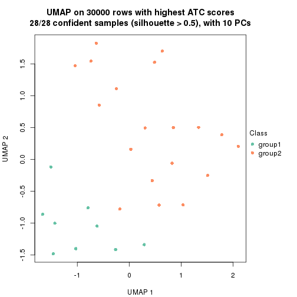</p>

</div>
<div id='tab-node-0223-dimension-reduction-2'>
<pre><code class="r">dimension_reduction(res, k = 3, method = &quot;UMAP&quot;)
</code></pre>

<p>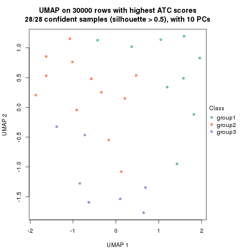</p>

</div>
<div id='tab-node-0223-dimension-reduction-3'>
<pre><code class="r">dimension_reduction(res, k = 4, method = &quot;UMAP&quot;)
</code></pre>

<p>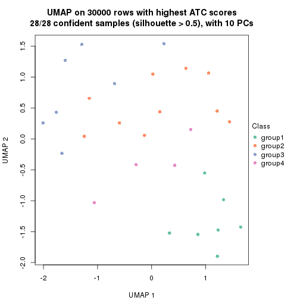</p>

</div>
<div id='tab-node-0223-dimension-reduction-4'>
<pre><code class="r">dimension_reduction(res, k = 5, method = &quot;UMAP&quot;)
</code></pre>

<p>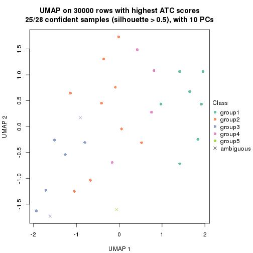</p>

</div>
<div id='tab-node-0223-dimension-reduction-5'>
<pre><code class="r">dimension_reduction(res, k = 6, method = &quot;UMAP&quot;)
</code></pre>

<p>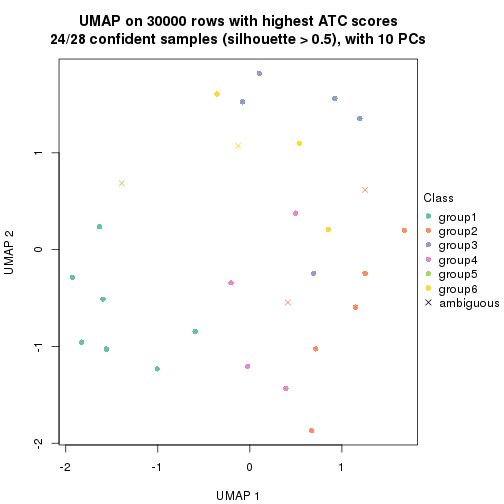</p>

</div>
<div id='tab-node-0223-dimension-reduction-6'>
<pre><code class="r">dimension_reduction(res, k = 7, method = &quot;UMAP&quot;)
</code></pre>

<p>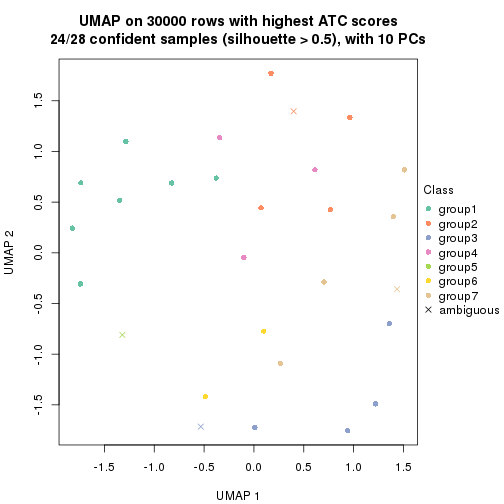</p>

</div>
<div id='tab-node-0223-dimension-reduction-7'>
<pre><code class="r">dimension_reduction(res, k = 8, method = &quot;UMAP&quot;)
</code></pre>

<p>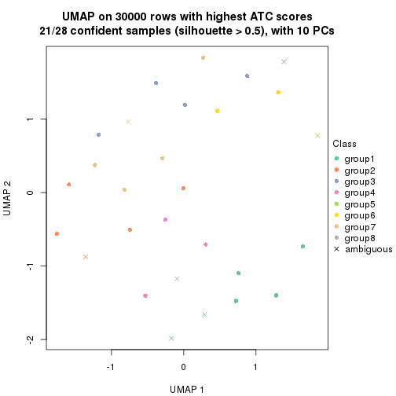</p>

</div>
</div>


Following heatmap shows how subgroups are split when increasing `k`:

```r
collect_classes(res)
```


If matrix rows can be associated to genes, consider to use `functional_enrichment(res,
...)` to perform function enrichment for the signature genes. See [this vignette](https://jokergoo.github.io/cola_vignettes/functional_enrichment.html) for more detailed explanations.


 

---------------------------------------------------


### Node0224


Parent node: [Node022](#Node022).
Child nodes: 
                Node01211-leaf
        ,
                Node01212-leaf
        ,
                Node01213-leaf
        ,
                Node01221-leaf
        ,
                Node01222-leaf
        ,
                Node01223-leaf
        ,
                Node02111-leaf
        ,
                Node02112-leaf
        ,
                Node02113-leaf
        ,
                Node02114-leaf
        ,
                Node02121-leaf
        ,
                Node02122-leaf
        ,
                Node02123-leaf
        ,
                Node02124-leaf
        ,
                Node02131-leaf
        ,
                [Node02132](#Node02132)
        ,
                Node02133-leaf
        ,
                Node02211-leaf
        ,
                Node02212-leaf
        ,
                Node02213-leaf
        ,
                Node02221-leaf
        ,
                Node02222-leaf
        ,
                Node02223-leaf
        ,
                Node02231-leaf
        ,
                Node02232-leaf
        ,
                Node02233-leaf
        ,
                Node02241-leaf
        ,
                Node02242-leaf
        ,
                Node02243-leaf
        ,
                Node02321-leaf
        ,
                Node02322-leaf
        ,
                Node02323-leaf
        ,
                Node05111-leaf
        ,
                Node05112-leaf
        ,
                Node05113-leaf
        ,
                Node05114-leaf
        ,
                [Node05121](#Node05121)
        ,
                Node05122-leaf
        ,
                Node05123-leaf
        ,
                Node05221-leaf
        ,
                Node05222-leaf
        .


The object with results only for a single top-value method and a single partitioning method 
can be extracted as:

```r
res = res_rh["0224"]
```

A summary of `res` and all the functions that can be applied to it:

```r
res
```

```
#> A 'ConsensusPartition' object with k = 2, 3, 4, 5, 6, 7, 8.
#>   On a matrix with 30000 rows and 23 columns.
#>   Top rows (1000) are extracted by 'ATC' method.
#>   Subgroups are detected by 'kmeans' method.
#>   Performed in total 350 partitions by row resampling.
#>   Best k for subgroups seems to be 3.
#> 
#> Following methods can be applied to this 'ConsensusPartition' object:
#>  [1] "cola_report"             "collect_classes"         "collect_plots"          
#>  [4] "collect_stats"           "colnames"                "compare_partitions"     
#>  [7] "compare_signatures"      "consensus_heatmap"       "dimension_reduction"    
#> [10] "functional_enrichment"   "get_anno_col"            "get_anno"               
#> [13] "get_classes"             "get_consensus"           "get_matrix"             
#> [16] "get_membership"          "get_param"               "get_signatures"         
#> [19] "get_stats"               "is_best_k"               "is_stable_k"            
#> [22] "membership_heatmap"      "ncol"                    "nrow"                   
#> [25] "plot_ecdf"               "predict_classes"         "rownames"               
#> [28] "select_partition_number" "show"                    "suggest_best_k"         
#> [31] "test_to_known_factors"   "top_rows_heatmap"
```

`collect_plots()` function collects all the plots made from `res` for all `k` (number of subgroups)
into one single page to provide an easy and fast comparison between different `k`.

```r
collect_plots(res)
```

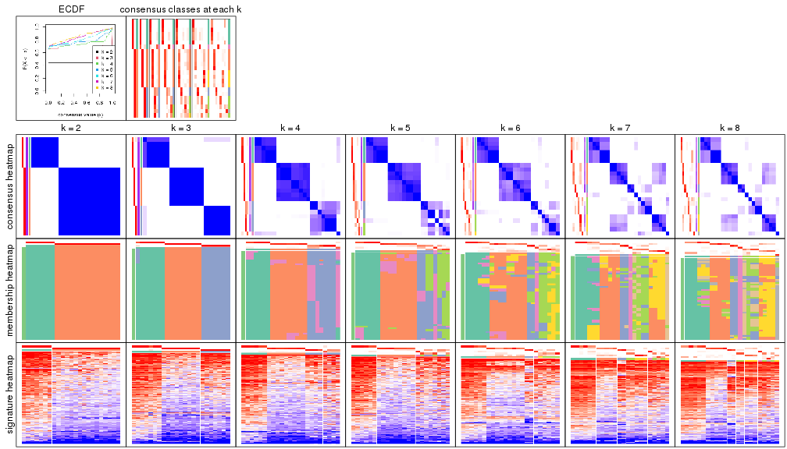

The plots are:

- The first row: a plot of the eCDF (empirical cumulative distribution
  function) curves of the consensus matrix for each `k` and the heatmap of
  predicted classes for each `k`.
- The second row: heatmaps of the consensus matrix for each `k`.
- The third row: heatmaps of the membership matrix for each `k`.
- The fouth row: heatmaps of the signatures for each `k`.

All the plots in panels can be made by individual functions and they are
plotted later in this section.

`select_partition_number()` produces several plots showing different
statistics for choosing "optimized" `k`. There are following statistics:

- eCDF curves of the consensus matrix for each `k`;
- 1-PAC. [The PAC score](https://en.wikipedia.org/wiki/Consensus_clustering#Over-interpretation_potential_of_consensus_clustering)
  measures the proportion of the ambiguous subgrouping.
- Mean silhouette score.
- Concordance. The mean probability of fiting the consensus subgroup labels in all
  partitions.
- Area increased. Denote $A_k$ as the area under the eCDF curve for current
  `k`, the area increased is defined as $A_k - A_{k-1}$.
- Rand index. The percent of pairs of samples that are both in a same cluster
  or both are not in a same cluster in the partition of k and k-1.
- Jaccard index. The ratio of pairs of samples are both in a same cluster in
  the partition of k and k-1 and the pairs of samples are both in a same
  cluster in the partition k or k-1.

The detailed explanations of these statistics can be found in [the _cola_
vignette](https://jokergoo.github.io/cola_vignettes/cola.html#toc_13).

Generally speaking, higher 1-PAC score, higher mean silhouette score or higher
concordance corresponds to better partition. Rand index and Jaccard index
measure how similar the current partition is compared to partition with `k-1`.
If they are too similar, we won't accept `k` is better than `k-1`.

```r
select_partition_number(res)
```

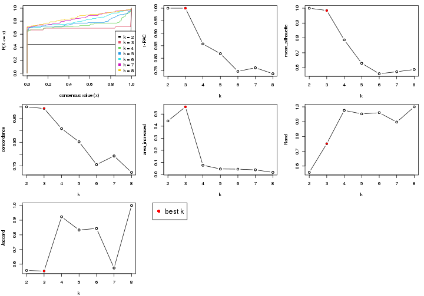

The numeric values for all these statistics can be obtained by `get_stats()`.

```r
get_stats(res)
```

```
#>   k 1-PAC mean_silhouette concordance area_increased  Rand Jaccard
#> 2 2 1.000           1.000       1.000         0.4432 0.557   0.557
#> 3 3 1.000           0.985       0.993         0.5598 0.751   0.553
#> 4 4 0.857           0.787       0.908         0.0765 0.976   0.923
#> 5 5 0.818           0.629       0.852         0.0457 0.953   0.833
#> 6 6 0.748           0.559       0.756         0.0443 0.960   0.844
#> 7 7 0.762           0.573       0.792         0.0383 0.897   0.574
#> 8 8 0.738           0.588       0.723         0.0174 1.000   1.000
```

`suggest_best_k()` suggests the best $k$ based on these statistics. The rules are as follows:

- All $k$ with Jaccard index larger than 0.95 are removed because increasing
  $k$ does not provide enough extra information. If all $k$ are removed, it is
  marked as no subgroup is detected.
- For all $k$ with 1-PAC score larger than 0.9, the maximal $k$ is taken as
  the best $k$, and other $k$ are marked as optional $k$.
- If it does not fit the second rule. The $k$ with the maximal vote of the
  highest 1-PAC score, highest mean silhouette, and highest concordance is
  taken as the best $k$.

```r
suggest_best_k(res)
```

```
#> [1] 3
#> attr(,"optional")
#> [1] 2
```

There is also optional best $k$ = 2 that is worth to check.

Following is the table of the partitions (You need to click the **show/hide
code output** link to see it). The membership matrix (columns with name `p*`)
is inferred by
[`clue::cl_consensus()`](https://www.rdocumentation.org/link/cl_consensus?package=clue)
function with the `SE` method. Basically the value in the membership matrix
represents the probability to belong to a certain group. The finall subgroup
label for an item is determined with the group with highest probability it
belongs to.

In `get_classes()` function, the entropy is calculated from the membership
matrix and the silhouette score is calculated from the consensus matrix.


<script>
$( function() {
	$( '#tabs-node-0224-get-classes' ).tabs();
} );
</script>
<div id='tabs-node-0224-get-classes'>
<ul>
<li><a href='#tab-node-0224-get-classes-1'>k = 2</a></li>
<li><a href='#tab-node-0224-get-classes-2'>k = 3</a></li>
<li><a href='#tab-node-0224-get-classes-3'>k = 4</a></li>
<li><a href='#tab-node-0224-get-classes-4'>k = 5</a></li>
<li><a href='#tab-node-0224-get-classes-5'>k = 6</a></li>
<li><a href='#tab-node-0224-get-classes-6'>k = 7</a></li>
<li><a href='#tab-node-0224-get-classes-7'>k = 8</a></li>
</ul>

<div id='tab-node-0224-get-classes-1'>
<p><a id='tab-node-0224-get-classes-1-a' style='color:#0366d6' href='#'>show/hide code output</a></p>
<pre><code class="r">cbind(get_classes(res, k = 2), get_membership(res, k = 2))
</code></pre>

<pre><code>#&gt;                 class entropy silhouette p1 p2
#&gt; TCGA.HD.7753.01     2       0          1  0  1
#&gt; TCGA.CV.7415.01     2       0          1  0  1
#&gt; TCGA.DQ.7592.01     2       0          1  0  1
#&gt; TCGA.CQ.6221.01     1       0          1  1  0
#&gt; TCGA.CV.5970.01     2       0          1  0  1
#&gt; TCGA.CV.7235.01     2       0          1  0  1
#&gt; TCGA.CV.5439.01     2       0          1  0  1
#&gt; TCGA.CV.7100.01     2       0          1  0  1
#&gt; TCGA.CV.6950.01     2       0          1  0  1
#&gt; TCGA.D6.6516.01     1       0          1  1  0
#&gt; TCGA.CQ.6223.01     2       0          1  0  1
#&gt; TCGA.CV.A45R.01     2       0          1  0  1
#&gt; TCGA.CN.A49B.01     1       0          1  1  0
#&gt; TCGA.P3.A5Q6.01     1       0          1  1  0
#&gt; TCGA.F7.8298.01     2       0          1  0  1
#&gt; TCGA.IQ.A61J.01     1       0          1  1  0
#&gt; TCGA.D6.8569.01     2       0          1  0  1
#&gt; TCGA.HL.7533.01     2       0          1  0  1
#&gt; TCGA.CN.5361.01     1       0          1  1  0
#&gt; TCGA.UF.A7JS.01     2       0          1  0  1
#&gt; TCGA.MZ.A7D7.01     2       0          1  0  1
#&gt; TCGA.CV.A6JN.01     2       0          1  0  1
#&gt; TCGA.QK.A6II.01     1       0          1  1  0
</code></pre>

<script>
$('#tab-node-0224-get-classes-1-a').parent().next().next().hide();
$('#tab-node-0224-get-classes-1-a').click(function(){
  $('#tab-node-0224-get-classes-1-a').parent().next().next().toggle();
  return(false);
});
</script>
</div>

<div id='tab-node-0224-get-classes-2'>
<p><a id='tab-node-0224-get-classes-2-a' style='color:#0366d6' href='#'>show/hide code output</a></p>
<pre><code class="r">cbind(get_classes(res, k = 3), get_membership(res, k = 3))
</code></pre>

<pre><code>#&gt;                 class entropy silhouette   p1 p2   p3
#&gt; TCGA.HD.7753.01     2     0.0      1.000 0.00  1 0.00
#&gt; TCGA.CV.7415.01     2     0.0      1.000 0.00  1 0.00
#&gt; TCGA.DQ.7592.01     2     0.0      1.000 0.00  1 0.00
#&gt; TCGA.CQ.6221.01     1     0.4      0.810 0.84  0 0.16
#&gt; TCGA.CV.5970.01     3     0.0      1.000 0.00  0 1.00
#&gt; TCGA.CV.7235.01     3     0.0      1.000 0.00  0 1.00
#&gt; TCGA.CV.5439.01     2     0.0      1.000 0.00  1 0.00
#&gt; TCGA.CV.7100.01     3     0.0      1.000 0.00  0 1.00
#&gt; TCGA.CV.6950.01     2     0.0      1.000 0.00  1 0.00
#&gt; TCGA.D6.6516.01     1     0.0      0.973 1.00  0 0.00
#&gt; TCGA.CQ.6223.01     3     0.0      1.000 0.00  0 1.00
#&gt; TCGA.CV.A45R.01     2     0.0      1.000 0.00  1 0.00
#&gt; TCGA.CN.A49B.01     1     0.0      0.973 1.00  0 0.00
#&gt; TCGA.P3.A5Q6.01     1     0.0      0.973 1.00  0 0.00
#&gt; TCGA.F7.8298.01     2     0.0      1.000 0.00  1 0.00
#&gt; TCGA.IQ.A61J.01     1     0.0      0.973 1.00  0 0.00
#&gt; TCGA.D6.8569.01     3     0.0      1.000 0.00  0 1.00
#&gt; TCGA.HL.7533.01     3     0.0      1.000 0.00  0 1.00
#&gt; TCGA.CN.5361.01     1     0.0      0.973 1.00  0 0.00
#&gt; TCGA.UF.A7JS.01     3     0.0      1.000 0.00  0 1.00
#&gt; TCGA.MZ.A7D7.01     2     0.0      1.000 0.00  1 0.00
#&gt; TCGA.CV.A6JN.01     2     0.0      1.000 0.00  1 0.00
#&gt; TCGA.QK.A6II.01     1     0.0      0.973 1.00  0 0.00
</code></pre>

<script>
$('#tab-node-0224-get-classes-2-a').parent().next().next().hide();
$('#tab-node-0224-get-classes-2-a').click(function(){
  $('#tab-node-0224-get-classes-2-a').parent().next().next().toggle();
  return(false);
});
</script>
</div>

<div id='tab-node-0224-get-classes-3'>
<p><a id='tab-node-0224-get-classes-3-a' style='color:#0366d6' href='#'>show/hide code output</a></p>
<pre><code class="r">cbind(get_classes(res, k = 4), get_membership(res, k = 4))
</code></pre>

<pre><code>#&gt;                 class entropy silhouette   p1   p2   p3   p4
#&gt; TCGA.HD.7753.01     2  0.2011      0.929 0.00 0.92 0.00 0.08
#&gt; TCGA.CV.7415.01     2  0.0707      0.951 0.00 0.98 0.00 0.02
#&gt; TCGA.DQ.7592.01     2  0.0707      0.951 0.00 0.98 0.00 0.02
#&gt; TCGA.CQ.6221.01     4  0.4332      0.000 0.16 0.00 0.04 0.80
#&gt; TCGA.CV.5970.01     3  0.0000      0.737 0.00 0.00 1.00 0.00
#&gt; TCGA.CV.7235.01     3  0.4713      0.354 0.00 0.00 0.64 0.36
#&gt; TCGA.CV.5439.01     2  0.1211      0.952 0.00 0.96 0.00 0.04
#&gt; TCGA.CV.7100.01     3  0.4855      0.363 0.00 0.00 0.60 0.40
#&gt; TCGA.CV.6950.01     2  0.2011      0.929 0.00 0.92 0.00 0.08
#&gt; TCGA.D6.6516.01     1  0.0000      0.949 1.00 0.00 0.00 0.00
#&gt; TCGA.CQ.6223.01     3  0.2706      0.691 0.00 0.02 0.90 0.08
#&gt; TCGA.CV.A45R.01     2  0.1211      0.952 0.00 0.96 0.00 0.04
#&gt; TCGA.CN.A49B.01     1  0.0000      0.949 1.00 0.00 0.00 0.00
#&gt; TCGA.P3.A5Q6.01     1  0.0707      0.947 0.98 0.00 0.00 0.02
#&gt; TCGA.F7.8298.01     2  0.1637      0.947 0.00 0.94 0.00 0.06
#&gt; TCGA.IQ.A61J.01     1  0.2345      0.907 0.90 0.00 0.00 0.10
#&gt; TCGA.D6.8569.01     3  0.0000      0.737 0.00 0.00 1.00 0.00
#&gt; TCGA.HL.7533.01     3  0.4855      0.363 0.00 0.00 0.60 0.40
#&gt; TCGA.CN.5361.01     1  0.2345      0.907 0.90 0.00 0.00 0.10
#&gt; TCGA.UF.A7JS.01     3  0.0000      0.737 0.00 0.00 1.00 0.00
#&gt; TCGA.MZ.A7D7.01     2  0.1211      0.952 0.00 0.96 0.00 0.04
#&gt; TCGA.CV.A6JN.01     2  0.1637      0.944 0.00 0.94 0.00 0.06
#&gt; TCGA.QK.A6II.01     1  0.0000      0.949 1.00 0.00 0.00 0.00
</code></pre>

<script>
$('#tab-node-0224-get-classes-3-a').parent().next().next().hide();
$('#tab-node-0224-get-classes-3-a').click(function(){
  $('#tab-node-0224-get-classes-3-a').parent().next().next().toggle();
  return(false);
});
</script>
</div>

<div id='tab-node-0224-get-classes-4'>
<p><a id='tab-node-0224-get-classes-4-a' style='color:#0366d6' href='#'>show/hide code output</a></p>
<pre><code class="r">cbind(get_classes(res, k = 5), get_membership(res, k = 5))
</code></pre>

<pre><code>#&gt;                 class entropy silhouette   p1   p2   p3   p4   p5
#&gt; TCGA.HD.7753.01     2  0.1648     0.8542 0.00 0.94 0.04 0.00 0.02
#&gt; TCGA.CV.7415.01     2  0.2732     0.8888 0.00 0.84 0.16 0.00 0.00
#&gt; TCGA.DQ.7592.01     2  0.0609     0.8712 0.00 0.98 0.00 0.00 0.02
#&gt; TCGA.CQ.6221.01     4  0.1216     0.0000 0.02 0.00 0.00 0.96 0.02
#&gt; TCGA.CV.5970.01     3  0.4287    -0.0651 0.00 0.00 0.54 0.00 0.46
#&gt; TCGA.CV.7235.01     5  0.2280     0.4616 0.00 0.00 0.00 0.12 0.88
#&gt; TCGA.CV.5439.01     2  0.2732     0.8897 0.00 0.84 0.16 0.00 0.00
#&gt; TCGA.CV.7100.01     3  0.4613     0.2719 0.00 0.00 0.62 0.36 0.02
#&gt; TCGA.CV.6950.01     2  0.1648     0.8542 0.00 0.94 0.04 0.00 0.02
#&gt; TCGA.D6.6516.01     1  0.0000     0.9357 1.00 0.00 0.00 0.00 0.00
#&gt; TCGA.CQ.6223.01     5  0.2280     0.4798 0.00 0.00 0.12 0.00 0.88
#&gt; TCGA.CV.A45R.01     2  0.2732     0.8897 0.00 0.84 0.16 0.00 0.00
#&gt; TCGA.CN.A49B.01     1  0.0000     0.9357 1.00 0.00 0.00 0.00 0.00
#&gt; TCGA.P3.A5Q6.01     1  0.0609     0.9328 0.98 0.00 0.00 0.02 0.00
#&gt; TCGA.F7.8298.01     2  0.3109     0.8805 0.00 0.80 0.20 0.00 0.00
#&gt; TCGA.IQ.A61J.01     1  0.2732     0.8599 0.84 0.00 0.00 0.16 0.00
#&gt; TCGA.D6.8569.01     3  0.4287    -0.0651 0.00 0.00 0.54 0.00 0.46
#&gt; TCGA.HL.7533.01     3  0.4540     0.2995 0.00 0.00 0.64 0.34 0.02
#&gt; TCGA.CN.5361.01     1  0.2516     0.8760 0.86 0.00 0.00 0.14 0.00
#&gt; TCGA.UF.A7JS.01     5  0.4767    -0.2663 0.00 0.00 0.42 0.02 0.56
#&gt; TCGA.MZ.A7D7.01     2  0.3109     0.8805 0.00 0.80 0.20 0.00 0.00
#&gt; TCGA.CV.A6JN.01     2  0.1216     0.8727 0.00 0.96 0.02 0.00 0.02
#&gt; TCGA.QK.A6II.01     1  0.0000     0.9357 1.00 0.00 0.00 0.00 0.00
</code></pre>

<script>
$('#tab-node-0224-get-classes-4-a').parent().next().next().hide();
$('#tab-node-0224-get-classes-4-a').click(function(){
  $('#tab-node-0224-get-classes-4-a').parent().next().next().toggle();
  return(false);
});
</script>
</div>

<div id='tab-node-0224-get-classes-5'>
<p><a id='tab-node-0224-get-classes-5-a' style='color:#0366d6' href='#'>show/hide code output</a></p>
<pre><code class="r">cbind(get_classes(res, k = 6), get_membership(res, k = 6))
</code></pre>

<pre><code>#&gt;                 class entropy silhouette   p1   p2   p3   p4   p5   p6
#&gt; TCGA.HD.7753.01     2  0.2474     0.6781 0.00 0.88 0.00 0.04 0.00 0.08
#&gt; TCGA.CV.7415.01     2  0.5364     0.7023 0.00 0.56 0.00 0.00 0.14 0.30
#&gt; TCGA.DQ.7592.01     2  0.0000     0.7265 0.00 1.00 0.00 0.00 0.00 0.00
#&gt; TCGA.CQ.6221.01     4  0.2094     0.0000 0.02 0.00 0.08 0.90 0.00 0.00
#&gt; TCGA.CV.5970.01     5  0.6035    -0.2883 0.00 0.00 0.40 0.02 0.44 0.14
#&gt; TCGA.CV.7235.01     5  0.5259    -0.0775 0.00 0.00 0.00 0.16 0.60 0.24
#&gt; TCGA.CV.5439.01     2  0.3198     0.7564 0.00 0.74 0.00 0.00 0.00 0.26
#&gt; TCGA.CV.7100.01     3  0.1092     0.9524 0.00 0.00 0.96 0.02 0.00 0.02
#&gt; TCGA.CV.6950.01     2  0.2474     0.6781 0.00 0.88 0.00 0.04 0.00 0.08
#&gt; TCGA.D6.6516.01     1  0.0000     0.8880 1.00 0.00 0.00 0.00 0.00 0.00
#&gt; TCGA.CQ.6223.01     5  0.0547     0.0146 0.00 0.00 0.02 0.00 0.98 0.00
#&gt; TCGA.CV.A45R.01     2  0.3198     0.7564 0.00 0.74 0.00 0.00 0.00 0.26
#&gt; TCGA.CN.A49B.01     1  0.0000     0.8880 1.00 0.00 0.00 0.00 0.00 0.00
#&gt; TCGA.P3.A5Q6.01     1  0.2474     0.8764 0.88 0.00 0.00 0.04 0.00 0.08
#&gt; TCGA.F7.8298.01     2  0.5481     0.6905 0.00 0.52 0.00 0.00 0.14 0.34
#&gt; TCGA.IQ.A61J.01     1  0.3928     0.8087 0.76 0.00 0.00 0.16 0.00 0.08
#&gt; TCGA.D6.8569.01     5  0.6035    -0.2883 0.00 0.00 0.40 0.02 0.44 0.14
#&gt; TCGA.HL.7533.01     3  0.0000     0.9520 0.00 0.00 1.00 0.00 0.00 0.00
#&gt; TCGA.CN.5361.01     1  0.3544     0.8417 0.80 0.00 0.00 0.12 0.00 0.08
#&gt; TCGA.UF.A7JS.01     6  0.6831     0.0000 0.00 0.00 0.20 0.06 0.34 0.40
#&gt; TCGA.MZ.A7D7.01     2  0.3578     0.7345 0.00 0.66 0.00 0.00 0.00 0.34
#&gt; TCGA.CV.A6JN.01     2  0.3318     0.6868 0.00 0.82 0.00 0.02 0.14 0.02
#&gt; TCGA.QK.A6II.01     1  0.0000     0.8880 1.00 0.00 0.00 0.00 0.00 0.00
</code></pre>

<script>
$('#tab-node-0224-get-classes-5-a').parent().next().next().hide();
$('#tab-node-0224-get-classes-5-a').click(function(){
  $('#tab-node-0224-get-classes-5-a').parent().next().next().toggle();
  return(false);
});
</script>
</div>

<div id='tab-node-0224-get-classes-6'>
<p><a id='tab-node-0224-get-classes-6-a' style='color:#0366d6' href='#'>show/hide code output</a></p>
<pre><code class="r">cbind(get_classes(res, k = 7), get_membership(res, k = 7))
</code></pre>

<pre><code>#&gt;                 class entropy silhouette   p1   p2   p3   p4   p5   p6   p7
#&gt; TCGA.HD.7753.01     6   0.000      0.735 0.00 0.00 0.00 0.00 0.00 1.00 0.00
#&gt; TCGA.CV.7415.01     2   0.472      0.672 0.00 0.60 0.00 0.00 0.06 0.32 0.02
#&gt; TCGA.DQ.7592.01     6   0.398      0.365 0.00 0.28 0.00 0.00 0.02 0.68 0.02
#&gt; TCGA.CQ.6221.01     4   0.000      0.000 0.00 0.00 0.00 1.00 0.00 0.00 0.00
#&gt; TCGA.CV.5970.01     5   0.322      0.527 0.00 0.00 0.32 0.00 0.68 0.00 0.00
#&gt; TCGA.CV.7235.01     7   0.202      0.000 0.00 0.00 0.00 0.04 0.06 0.00 0.90
#&gt; TCGA.CV.5439.01     2   0.427      0.684 0.00 0.60 0.00 0.00 0.02 0.36 0.02
#&gt; TCGA.CV.7100.01     3   0.117      0.947 0.00 0.00 0.94 0.00 0.00 0.00 0.06
#&gt; TCGA.CV.6950.01     6   0.000      0.735 0.00 0.00 0.00 0.00 0.00 1.00 0.00
#&gt; TCGA.D6.6516.01     1   0.000      0.757 1.00 0.00 0.00 0.00 0.00 0.00 0.00
#&gt; TCGA.CQ.6223.01     5   0.428     -0.274 0.00 0.04 0.00 0.00 0.50 0.00 0.46
#&gt; TCGA.CV.A45R.01     2   0.427      0.684 0.00 0.60 0.00 0.00 0.02 0.36 0.02
#&gt; TCGA.CN.A49B.01     1   0.000      0.757 1.00 0.00 0.00 0.00 0.00 0.00 0.00
#&gt; TCGA.P3.A5Q6.01     1   0.433      0.725 0.72 0.18 0.00 0.04 0.06 0.00 0.00
#&gt; TCGA.F7.8298.01     2   0.448      0.727 0.00 0.66 0.00 0.00 0.06 0.26 0.02
#&gt; TCGA.IQ.A61J.01     1   0.578      0.632 0.56 0.18 0.00 0.20 0.06 0.00 0.00
#&gt; TCGA.D6.8569.01     5   0.322      0.527 0.00 0.00 0.32 0.00 0.68 0.00 0.00
#&gt; TCGA.HL.7533.01     3   0.000      0.947 0.00 0.00 1.00 0.00 0.00 0.00 0.00
#&gt; TCGA.CN.5361.01     1   0.566      0.652 0.58 0.18 0.00 0.18 0.06 0.00 0.00
#&gt; TCGA.UF.A7JS.01     5   0.481      0.251 0.00 0.02 0.10 0.00 0.64 0.00 0.24
#&gt; TCGA.MZ.A7D7.01     2   0.283      0.754 0.00 0.76 0.00 0.00 0.00 0.24 0.00
#&gt; TCGA.CV.A6JN.01     6   0.291      0.611 0.00 0.18 0.00 0.00 0.02 0.80 0.00
#&gt; TCGA.QK.A6II.01     1   0.000      0.757 1.00 0.00 0.00 0.00 0.00 0.00 0.00
</code></pre>

<script>
$('#tab-node-0224-get-classes-6-a').parent().next().next().hide();
$('#tab-node-0224-get-classes-6-a').click(function(){
  $('#tab-node-0224-get-classes-6-a').parent().next().next().toggle();
  return(false);
});
</script>
</div>

<div id='tab-node-0224-get-classes-7'>
<p><a id='tab-node-0224-get-classes-7-a' style='color:#0366d6' href='#'>show/hide code output</a></p>
<pre><code class="r">cbind(get_classes(res, k = 8), get_membership(res, k = 8))
</code></pre>

<pre><code>#&gt;                 class entropy silhouette   p1   p2   p3   p4   p5   p6   p7   p8
#&gt; TCGA.HD.7753.01     6  0.2981     0.7636 0.00 0.22 0.00 0.00 0.00 0.76 0.02 0.00
#&gt; TCGA.CV.7415.01     2  0.3078     0.7066 0.00 0.82 0.00 0.02 0.00 0.06 0.10 0.00
#&gt; TCGA.DQ.7592.01     6  0.4008     0.4538 0.00 0.48 0.00 0.00 0.00 0.48 0.04 0.00
#&gt; TCGA.CQ.6221.01     4  0.0808     0.0000 0.04 0.00 0.00 0.96 0.00 0.00 0.00 0.00
#&gt; TCGA.CV.5970.01     5  0.2114     0.5950 0.00 0.00 0.16 0.00 0.84 0.00 0.00 0.00
#&gt; TCGA.CV.7235.01     8  0.0808     0.0000 0.00 0.00 0.00 0.00 0.04 0.00 0.00 0.96
#&gt; TCGA.CV.5439.01     2  0.2132     0.7633 0.00 0.88 0.00 0.00 0.00 0.08 0.04 0.00
#&gt; TCGA.CV.7100.01     3  0.0471     0.8812 0.00 0.00 0.98 0.00 0.02 0.00 0.00 0.00
#&gt; TCGA.CV.6950.01     6  0.2534     0.7708 0.00 0.22 0.00 0.00 0.00 0.78 0.00 0.00
#&gt; TCGA.D6.6516.01     1  0.3299     0.6744 0.56 0.00 0.00 0.00 0.00 0.00 0.44 0.00
#&gt; TCGA.CQ.6223.01     5  0.5758     0.0431 0.00 0.00 0.00 0.02 0.42 0.02 0.36 0.18
#&gt; TCGA.CV.A45R.01     2  0.2132     0.7633 0.00 0.88 0.00 0.00 0.00 0.08 0.04 0.00
#&gt; TCGA.CN.A49B.01     1  0.3299     0.6744 0.56 0.00 0.00 0.00 0.00 0.00 0.44 0.00
#&gt; TCGA.P3.A5Q6.01     1  0.0000     0.6364 1.00 0.00 0.00 0.00 0.00 0.00 0.00 0.00
#&gt; TCGA.F7.8298.01     2  0.2025     0.7563 0.00 0.88 0.00 0.02 0.00 0.00 0.10 0.00
#&gt; TCGA.IQ.A61J.01     1  0.1341     0.5955 0.92 0.00 0.00 0.08 0.00 0.00 0.00 0.00
#&gt; TCGA.D6.8569.01     5  0.2114     0.5950 0.00 0.00 0.16 0.00 0.84 0.00 0.00 0.00
#&gt; TCGA.HL.7533.01     3  0.2348     0.8809 0.00 0.00 0.88 0.00 0.00 0.06 0.02 0.04
#&gt; TCGA.CN.5361.01     1  0.2132     0.5926 0.88 0.00 0.00 0.08 0.00 0.04 0.00 0.00
#&gt; TCGA.UF.A7JS.01     5  0.5133     0.2126 0.00 0.00 0.00 0.02 0.66 0.10 0.10 0.12
#&gt; TCGA.MZ.A7D7.01     2  0.0000     0.7960 0.00 1.00 0.00 0.00 0.00 0.00 0.00 0.00
#&gt; TCGA.CV.A6JN.01     6  0.4415     0.6895 0.00 0.32 0.00 0.02 0.00 0.60 0.06 0.00
#&gt; TCGA.QK.A6II.01     1  0.3299     0.6744 0.56 0.00 0.00 0.00 0.00 0.00 0.44 0.00
</code></pre>

<script>
$('#tab-node-0224-get-classes-7-a').parent().next().next().hide();
$('#tab-node-0224-get-classes-7-a').click(function(){
  $('#tab-node-0224-get-classes-7-a').parent().next().next().toggle();
  return(false);
});
</script>
</div>
</div>

Heatmaps for the consensus matrix. It visualizes the probability of two
samples to be in a same group.


<script>
$( function() {
	$( '#tabs-node-0224-consensus-heatmap' ).tabs();
} );
</script>
<div id='tabs-node-0224-consensus-heatmap'>
<ul>
<li><a href='#tab-node-0224-consensus-heatmap-1'>k = 2</a></li>
<li><a href='#tab-node-0224-consensus-heatmap-2'>k = 3</a></li>
<li><a href='#tab-node-0224-consensus-heatmap-3'>k = 4</a></li>
<li><a href='#tab-node-0224-consensus-heatmap-4'>k = 5</a></li>
<li><a href='#tab-node-0224-consensus-heatmap-5'>k = 6</a></li>
<li><a href='#tab-node-0224-consensus-heatmap-6'>k = 7</a></li>
<li><a href='#tab-node-0224-consensus-heatmap-7'>k = 8</a></li>
</ul>
<div id='tab-node-0224-consensus-heatmap-1'>
<pre><code class="r">consensus_heatmap(res, k = 2)
</code></pre>

<p>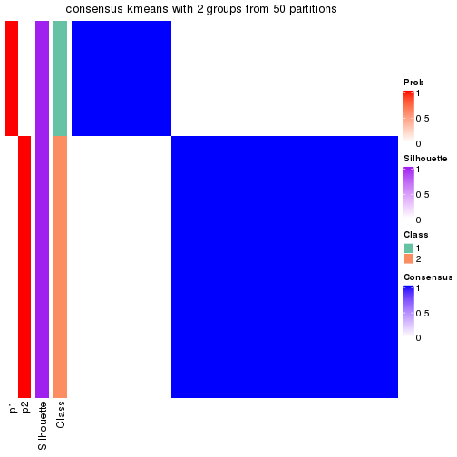</p>

</div>
<div id='tab-node-0224-consensus-heatmap-2'>
<pre><code class="r">consensus_heatmap(res, k = 3)
</code></pre>

<p>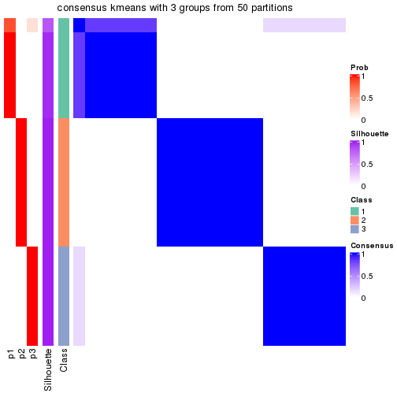</p>

</div>
<div id='tab-node-0224-consensus-heatmap-3'>
<pre><code class="r">consensus_heatmap(res, k = 4)
</code></pre>

<p>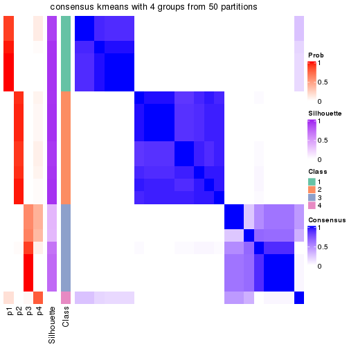</p>

</div>
<div id='tab-node-0224-consensus-heatmap-4'>
<pre><code class="r">consensus_heatmap(res, k = 5)
</code></pre>

<p>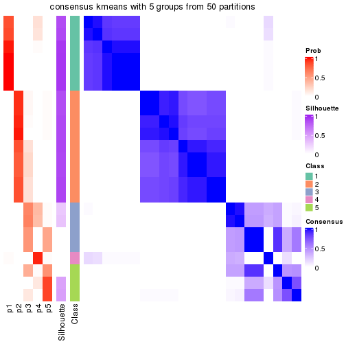</p>

</div>
<div id='tab-node-0224-consensus-heatmap-5'>
<pre><code class="r">consensus_heatmap(res, k = 6)
</code></pre>

<p>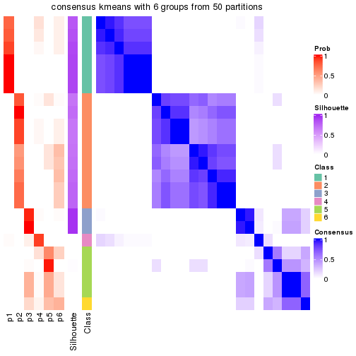</p>

</div>
<div id='tab-node-0224-consensus-heatmap-6'>
<pre><code class="r">consensus_heatmap(res, k = 7)
</code></pre>

<p>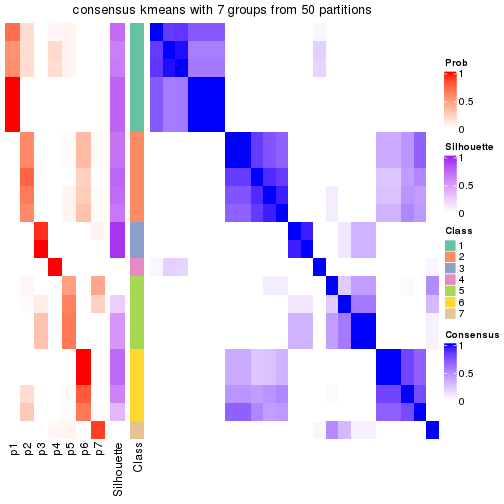</p>

</div>
<div id='tab-node-0224-consensus-heatmap-7'>
<pre><code class="r">consensus_heatmap(res, k = 8)
</code></pre>

<p></p>

</div>
</div>

Heatmaps for the membership of samples in all partitions to see how consistent they are:


<script>
$( function() {
	$( '#tabs-node-0224-membership-heatmap' ).tabs();
} );
</script>
<div id='tabs-node-0224-membership-heatmap'>
<ul>
<li><a href='#tab-node-0224-membership-heatmap-1'>k = 2</a></li>
<li><a href='#tab-node-0224-membership-heatmap-2'>k = 3</a></li>
<li><a href='#tab-node-0224-membership-heatmap-3'>k = 4</a></li>
<li><a href='#tab-node-0224-membership-heatmap-4'>k = 5</a></li>
<li><a href='#tab-node-0224-membership-heatmap-5'>k = 6</a></li>
<li><a href='#tab-node-0224-membership-heatmap-6'>k = 7</a></li>
<li><a href='#tab-node-0224-membership-heatmap-7'>k = 8</a></li>
</ul>
<div id='tab-node-0224-membership-heatmap-1'>
<pre><code class="r">membership_heatmap(res, k = 2)
</code></pre>

<p>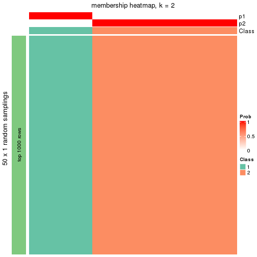</p>

</div>
<div id='tab-node-0224-membership-heatmap-2'>
<pre><code class="r">membership_heatmap(res, k = 3)
</code></pre>

<p>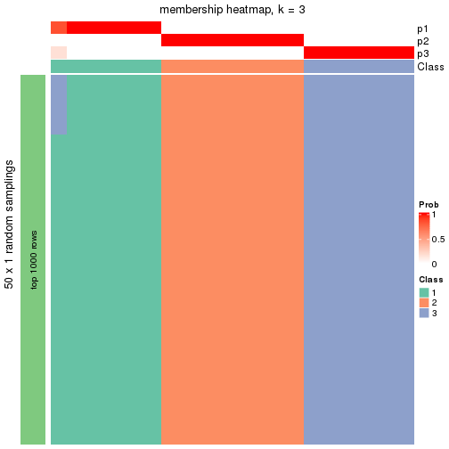</p>

</div>
<div id='tab-node-0224-membership-heatmap-3'>
<pre><code class="r">membership_heatmap(res, k = 4)
</code></pre>

<p>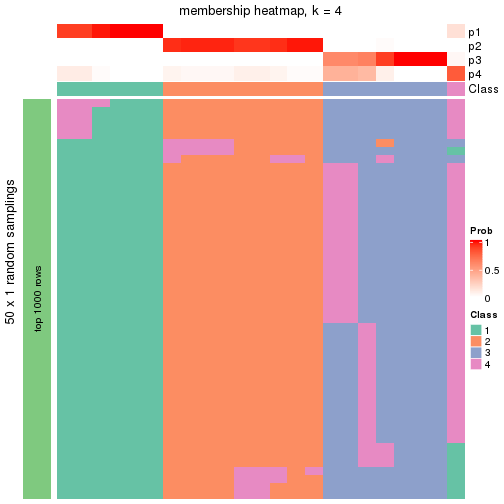</p>

</div>
<div id='tab-node-0224-membership-heatmap-4'>
<pre><code class="r">membership_heatmap(res, k = 5)
</code></pre>

<p>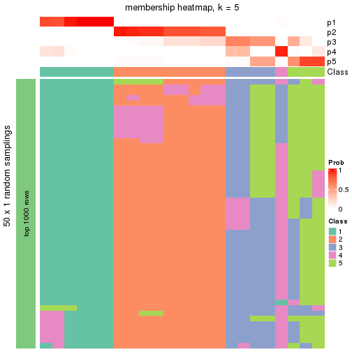</p>

</div>
<div id='tab-node-0224-membership-heatmap-5'>
<pre><code class="r">membership_heatmap(res, k = 6)
</code></pre>

<p>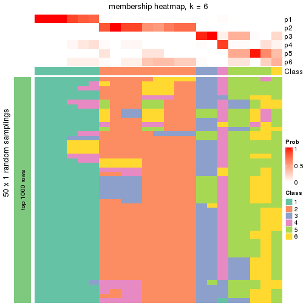</p>

</div>
<div id='tab-node-0224-membership-heatmap-6'>
<pre><code class="r">membership_heatmap(res, k = 7)
</code></pre>

<p>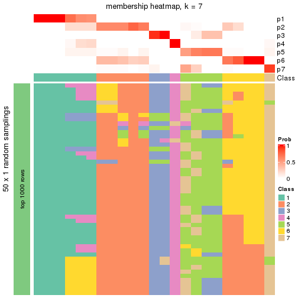</p>

</div>
<div id='tab-node-0224-membership-heatmap-7'>
<pre><code class="r">membership_heatmap(res, k = 8)
</code></pre>

<p>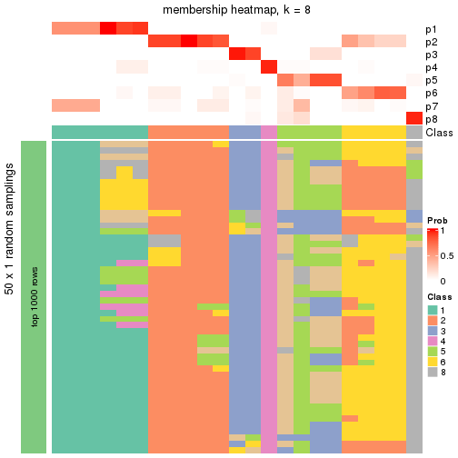</p>

</div>
</div>

As soon as the classes for columns are determined, the signatures
that are significantly different between subgroups can be looked for. 
Following are the heatmaps for signatures.


<script>
$( function() {
	$( '#tabs-node-0224-get-signatures' ).tabs();
} );
</script>
<div id='tabs-node-0224-get-signatures'>
<ul>
<li><a href='#tab-node-0224-get-signatures-1'>k = 2</a></li>
<li><a href='#tab-node-0224-get-signatures-2'>k = 3</a></li>
<li><a href='#tab-node-0224-get-signatures-3'>k = 4</a></li>
<li><a href='#tab-node-0224-get-signatures-4'>k = 5</a></li>
<li><a href='#tab-node-0224-get-signatures-5'>k = 6</a></li>
<li><a href='#tab-node-0224-get-signatures-6'>k = 7</a></li>
<li><a href='#tab-node-0224-get-signatures-7'>k = 8</a></li>
</ul>
<div id='tab-node-0224-get-signatures-1'>
<pre><code class="r">get_signatures(res, k = 2)
</code></pre>

<p>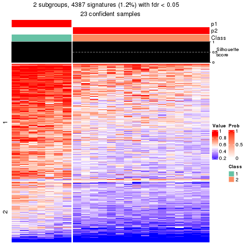</p>

</div>
<div id='tab-node-0224-get-signatures-2'>
<pre><code class="r">get_signatures(res, k = 3)
</code></pre>

<p>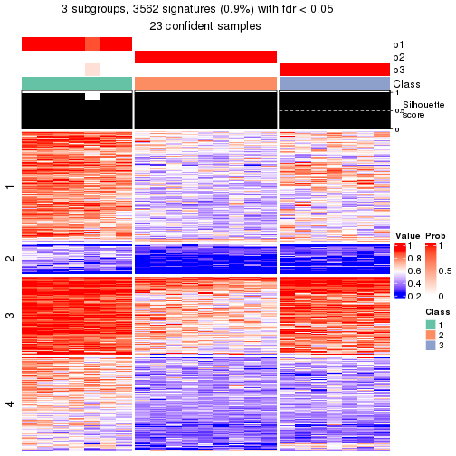</p>

</div>
<div id='tab-node-0224-get-signatures-3'>
<pre><code class="r">get_signatures(res, k = 4)
</code></pre>

<p>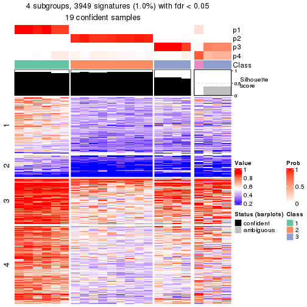</p>

</div>
<div id='tab-node-0224-get-signatures-4'>
<pre><code class="r">get_signatures(res, k = 5)
</code></pre>

<p>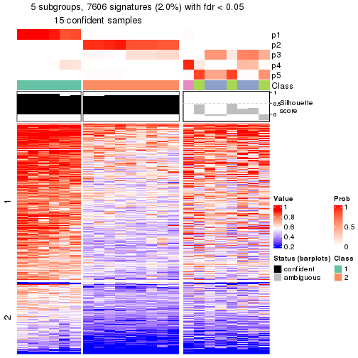</p>

</div>
<div id='tab-node-0224-get-signatures-5'>
<pre><code class="r">get_signatures(res, k = 6)
</code></pre>

<p>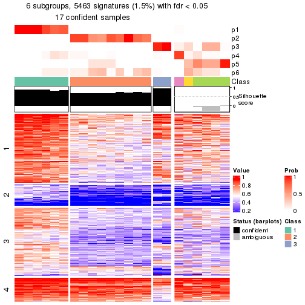</p>

</div>
<div id='tab-node-0224-get-signatures-6'>
<pre><code class="r">get_signatures(res, k = 7)
</code></pre>

<p>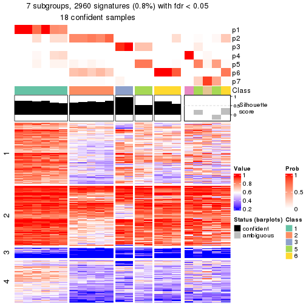</p>

</div>
<div id='tab-node-0224-get-signatures-7'>
<pre><code class="r">get_signatures(res, k = 8)
</code></pre>

<p>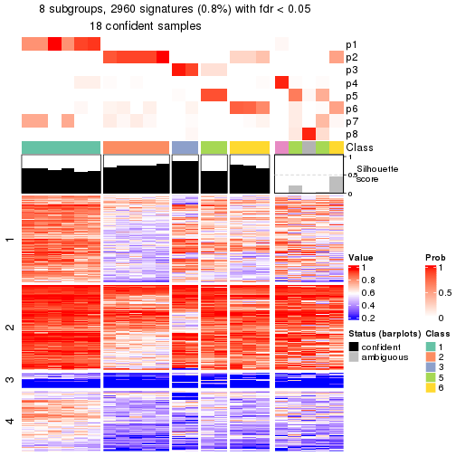</p>

</div>
</div>


Compare the overlap of signatures from different k:

```r
compare_signatures(res)
```

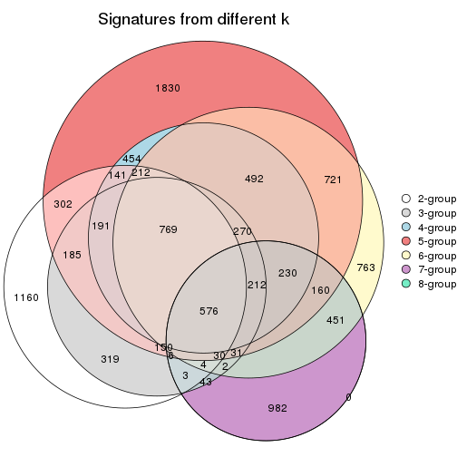

`get_signature()` returns a data frame invisibly. To get the list of signatures, the function
call should be assigned to a variable explicitly. In following code, if `plot` argument is set
to `FALSE`, no heatmap is plotted while only the differential analysis is performed.

```r
# code only for demonstration
tb = get_signature(res, k = ..., plot = FALSE)
```

An example of the output of `tb` is:

```
#>   which_row         fdr    mean_1    mean_2 scaled_mean_1 scaled_mean_2 km
#> 1        38 0.042760348  8.373488  9.131774    -0.5533452     0.5164555  1
#> 2        40 0.018707592  7.106213  8.469186    -0.6173731     0.5762149  1
#> 3        55 0.019134737 10.221463 11.207825    -0.6159697     0.5749050  1
#> 4        59 0.006059896  5.921854  7.869574    -0.6899429     0.6439467  1
#> 5        60 0.018055526  8.928898 10.211722    -0.6204761     0.5791110  1
#> 6        98 0.009384629 15.714769 14.887706     0.6635654    -0.6193277  2
...
```

The columns in `tb` are:

1. `which_row`: row indices corresponding to the input matrix.
2. `fdr`: FDR for the differential test. 
3. `mean_x`: The mean value in group x.
4. `scaled_mean_x`: The mean value in group x after rows are scaled.
5. `km`: Row groups if k-means clustering is applied to rows (which is done by automatically selecting number of clusters).

If there are too many signatures, `top_signatures = ...` can be set to only show the 
signatures with the highest FDRs:

```r
# code only for demonstration
# e.g. to show the top 500 most significant rows
tb = get_signature(res, k = ..., top_signatures = 500)
```

If the signatures are defined as these which are uniquely high in current group, `diff_method` argument
can be set to `"uniquely_high_in_one_group"`:

```r
# code only for demonstration
tb = get_signature(res, k = ..., diff_method = "uniquely_high_in_one_group")
```


UMAP plot which shows how samples are separated.


<script>
$( function() {
	$( '#tabs-node-0224-dimension-reduction' ).tabs();
} );
</script>
<div id='tabs-node-0224-dimension-reduction'>
<ul>
<li><a href='#tab-node-0224-dimension-reduction-1'>k = 2</a></li>
<li><a href='#tab-node-0224-dimension-reduction-2'>k = 3</a></li>
<li><a href='#tab-node-0224-dimension-reduction-3'>k = 4</a></li>
<li><a href='#tab-node-0224-dimension-reduction-4'>k = 5</a></li>
<li><a href='#tab-node-0224-dimension-reduction-5'>k = 6</a></li>
<li><a href='#tab-node-0224-dimension-reduction-6'>k = 7</a></li>
<li><a href='#tab-node-0224-dimension-reduction-7'>k = 8</a></li>
</ul>
<div id='tab-node-0224-dimension-reduction-1'>
<pre><code class="r">dimension_reduction(res, k = 2, method = &quot;UMAP&quot;)
</code></pre>

<p>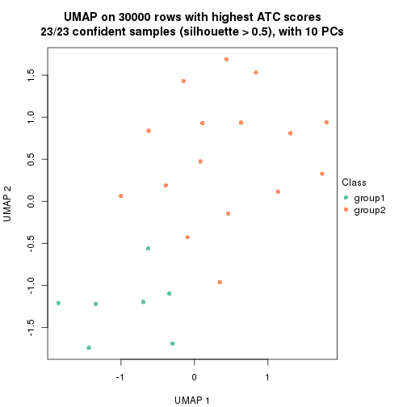</p>

</div>
<div id='tab-node-0224-dimension-reduction-2'>
<pre><code class="r">dimension_reduction(res, k = 3, method = &quot;UMAP&quot;)
</code></pre>

<p>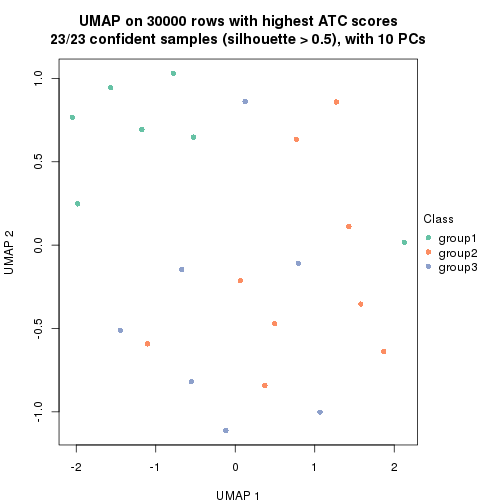</p>

</div>
<div id='tab-node-0224-dimension-reduction-3'>
<pre><code class="r">dimension_reduction(res, k = 4, method = &quot;UMAP&quot;)
</code></pre>

<p>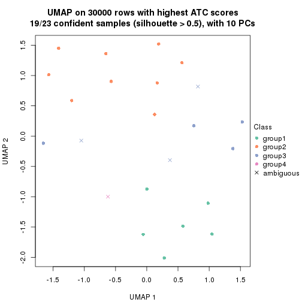</p>

</div>
<div id='tab-node-0224-dimension-reduction-4'>
<pre><code class="r">dimension_reduction(res, k = 5, method = &quot;UMAP&quot;)
</code></pre>

<p>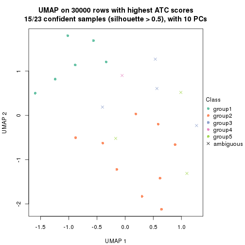</p>

</div>
<div id='tab-node-0224-dimension-reduction-5'>
<pre><code class="r">dimension_reduction(res, k = 6, method = &quot;UMAP&quot;)
</code></pre>

<p>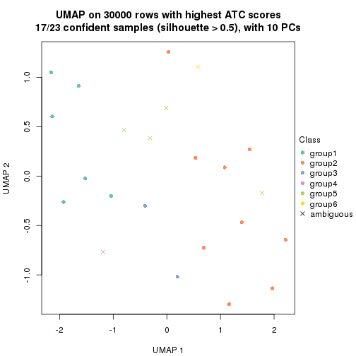</p>

</div>
<div id='tab-node-0224-dimension-reduction-6'>
<pre><code class="r">dimension_reduction(res, k = 7, method = &quot;UMAP&quot;)
</code></pre>

<p>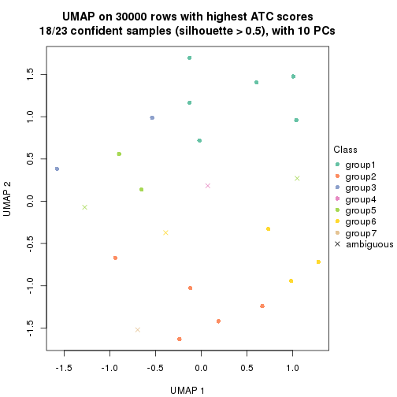</p>

</div>
<div id='tab-node-0224-dimension-reduction-7'>
<pre><code class="r">dimension_reduction(res, k = 8, method = &quot;UMAP&quot;)
</code></pre>

<p></p>

</div>
</div>


Following heatmap shows how subgroups are split when increasing `k`:

```r
collect_classes(res)
```

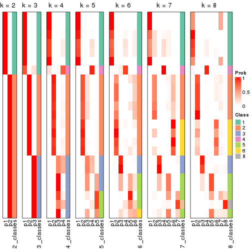


If matrix rows can be associated to genes, consider to use `functional_enrichment(res,
...)` to perform function enrichment for the signature genes. See [this vignette](https://jokergoo.github.io/cola_vignettes/functional_enrichment.html) for more detailed explanations.


 

---------------------------------------------------


### Node023


Parent node: [Node02](#Node02).
Child nodes: 
                Node0111-leaf
        ,
                Node0112-leaf
        ,
                Node0113-leaf
        ,
                [Node0121](#Node0121)
        ,
                [Node0122](#Node0122)
        ,
                [Node0211](#Node0211)
        ,
                [Node0212](#Node0212)
        ,
                [Node0213](#Node0213)
        ,
                [Node0221](#Node0221)
        ,
                [Node0222](#Node0222)
        ,
                [Node0223](#Node0223)
        ,
                [Node0224](#Node0224)
        ,
                Node0225-leaf
        ,
                Node0231-leaf
        ,
                [Node0232](#Node0232)
        ,
                Node0233-leaf
        ,
                Node0234-leaf
        ,
                Node0331-leaf
        ,
                Node0332-leaf
        ,
                Node0333-leaf
        ,
                Node0431-leaf
        ,
                Node0432-leaf
        ,
                Node0433-leaf
        ,
                [Node0511](#Node0511)
        ,
                [Node0512](#Node0512)
        ,
                Node0521-leaf
        ,
                [Node0522](#Node0522)
        ,
                Node0523-leaf
        ,
                Node0524-leaf
        .


The object with results only for a single top-value method and a single partitioning method 
can be extracted as:

```r
res = res_rh["023"]
```

A summary of `res` and all the functions that can be applied to it:

```r
res
```

```
#> A 'ConsensusPartition' object with k = 2, 3, 4, 5, 6, 7, 8.
#>   On a matrix with 30000 rows and 69 columns.
#>   Top rows (1000) are extracted by 'ATC' method.
#>   Subgroups are detected by 'skmeans' method.
#>   Performed in total 350 partitions by row resampling.
#>   Best k for subgroups seems to be 4.
#> 
#> Following methods can be applied to this 'ConsensusPartition' object:
#>  [1] "cola_report"             "collect_classes"         "collect_plots"          
#>  [4] "collect_stats"           "colnames"                "compare_partitions"     
#>  [7] "compare_signatures"      "consensus_heatmap"       "dimension_reduction"    
#> [10] "functional_enrichment"   "get_anno_col"            "get_anno"               
#> [13] "get_classes"             "get_consensus"           "get_matrix"             
#> [16] "get_membership"          "get_param"               "get_signatures"         
#> [19] "get_stats"               "is_best_k"               "is_stable_k"            
#> [22] "membership_heatmap"      "ncol"                    "nrow"                   
#> [25] "plot_ecdf"               "predict_classes"         "rownames"               
#> [28] "select_partition_number" "show"                    "suggest_best_k"         
#> [31] "test_to_known_factors"   "top_rows_heatmap"
```

`collect_plots()` function collects all the plots made from `res` for all `k` (number of subgroups)
into one single page to provide an easy and fast comparison between different `k`.

```r
collect_plots(res)
```

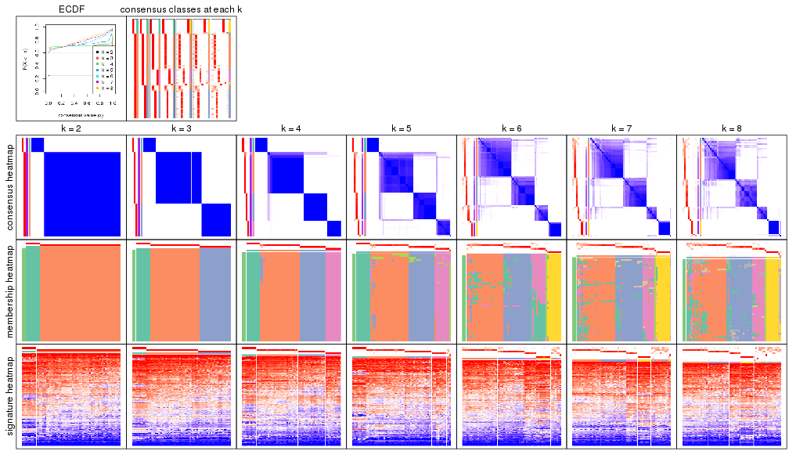

The plots are:

- The first row: a plot of the eCDF (empirical cumulative distribution
  function) curves of the consensus matrix for each `k` and the heatmap of
  predicted classes for each `k`.
- The second row: heatmaps of the consensus matrix for each `k`.
- The third row: heatmaps of the membership matrix for each `k`.
- The fouth row: heatmaps of the signatures for each `k`.

All the plots in panels can be made by individual functions and they are
plotted later in this section.

`select_partition_number()` produces several plots showing different
statistics for choosing "optimized" `k`. There are following statistics:

- eCDF curves of the consensus matrix for each `k`;
- 1-PAC. [The PAC score](https://en.wikipedia.org/wiki/Consensus_clustering#Over-interpretation_potential_of_consensus_clustering)
  measures the proportion of the ambiguous subgrouping.
- Mean silhouette score.
- Concordance. The mean probability of fiting the consensus subgroup labels in all
  partitions.
- Area increased. Denote $A_k$ as the area under the eCDF curve for current
  `k`, the area increased is defined as $A_k - A_{k-1}$.
- Rand index. The percent of pairs of samples that are both in a same cluster
  or both are not in a same cluster in the partition of k and k-1.
- Jaccard index. The ratio of pairs of samples are both in a same cluster in
  the partition of k and k-1 and the pairs of samples are both in a same
  cluster in the partition k or k-1.

The detailed explanations of these statistics can be found in [the _cola_
vignette](https://jokergoo.github.io/cola_vignettes/cola.html#toc_13).

Generally speaking, higher 1-PAC score, higher mean silhouette score or higher
concordance corresponds to better partition. Rand index and Jaccard index
measure how similar the current partition is compared to partition with `k-1`.
If they are too similar, we won't accept `k` is better than `k-1`.

```r
select_partition_number(res)
```


The numeric values for all these statistics can be obtained by `get_stats()`.

```r
get_stats(res)
```

```
#>   k 1-PAC mean_silhouette concordance area_increased  Rand Jaccard
#> 2 2 1.000           0.999       1.000         0.2526 0.749   0.749
#> 3 3 1.000           1.000       1.000         1.3941 0.647   0.528
#> 4 4 1.000           0.978       0.991         0.1806 0.808   0.561
#> 5 5 0.957           0.890       0.957         0.0250 0.980   0.930
#> 6 6 0.814           0.796       0.841         0.0354 0.980   0.931
#> 7 7 0.774           0.641       0.859         0.0258 0.980   0.928
#> 8 8 0.750           0.614       0.833         0.0220 0.975   0.904
```

`suggest_best_k()` suggests the best $k$ based on these statistics. The rules are as follows:

- All $k$ with Jaccard index larger than 0.95 are removed because increasing
  $k$ does not provide enough extra information. If all $k$ are removed, it is
  marked as no subgroup is detected.
- For all $k$ with 1-PAC score larger than 0.9, the maximal $k$ is taken as
  the best $k$, and other $k$ are marked as optional $k$.
- If it does not fit the second rule. The $k$ with the maximal vote of the
  highest 1-PAC score, highest mean silhouette, and highest concordance is
  taken as the best $k$.

```r
suggest_best_k(res)
```

```
#> [1] 4
#> attr(,"optional")
#> [1] 2 3
```

There is also optional best $k$ = 2 3 that is worth to check.

Following is the table of the partitions (You need to click the **show/hide
code output** link to see it). The membership matrix (columns with name `p*`)
is inferred by
[`clue::cl_consensus()`](https://www.rdocumentation.org/link/cl_consensus?package=clue)
function with the `SE` method. Basically the value in the membership matrix
represents the probability to belong to a certain group. The finall subgroup
label for an item is determined with the group with highest probability it
belongs to.

In `get_classes()` function, the entropy is calculated from the membership
matrix and the silhouette score is calculated from the consensus matrix.


<script>
$( function() {
	$( '#tabs-node-023-get-classes' ).tabs();
} );
</script>
<div id='tabs-node-023-get-classes'>
<ul>
<li><a href='#tab-node-023-get-classes-1'>k = 2</a></li>
<li><a href='#tab-node-023-get-classes-2'>k = 3</a></li>
<li><a href='#tab-node-023-get-classes-3'>k = 4</a></li>
<li><a href='#tab-node-023-get-classes-4'>k = 5</a></li>
<li><a href='#tab-node-023-get-classes-5'>k = 6</a></li>
<li><a href='#tab-node-023-get-classes-6'>k = 7</a></li>
<li><a href='#tab-node-023-get-classes-7'>k = 8</a></li>
</ul>

<div id='tab-node-023-get-classes-1'>
<p><a id='tab-node-023-get-classes-1-a' style='color:#0366d6' href='#'>show/hide code output</a></p>
<pre><code class="r">cbind(get_classes(res, k = 2), get_membership(res, k = 2))
</code></pre>

<pre><code>#&gt;                 class entropy silhouette   p1   p2
#&gt; TCGA.CV.6436.01     2   0.000       1.00 0.00 1.00
#&gt; TCGA.CV.6441.01     2   0.141       0.98 0.02 0.98
#&gt; TCGA.IQ.7630.01     2   0.000       1.00 0.00 1.00
#&gt; TCGA.CV.5977.01     2   0.000       1.00 0.00 1.00
#&gt; TCGA.CQ.5324.01     2   0.000       1.00 0.00 1.00
#&gt; TCGA.CR.7365.01     2   0.000       1.00 0.00 1.00
#&gt; TCGA.CV.7089.01     2   0.000       1.00 0.00 1.00
#&gt; TCGA.CV.5976.01     2   0.000       1.00 0.00 1.00
#&gt; TCGA.CN.6995.01     2   0.000       1.00 0.00 1.00
#&gt; TCGA.CQ.5334.01     2   0.000       1.00 0.00 1.00
#&gt; TCGA.CV.5435.01     1   0.000       1.00 1.00 0.00
#&gt; TCGA.CR.7373.01     2   0.000       1.00 0.00 1.00
#&gt; TCGA.CN.6998.01     2   0.000       1.00 0.00 1.00
#&gt; TCGA.CR.7380.01     2   0.000       1.00 0.00 1.00
#&gt; TCGA.CV.7183.01     2   0.000       1.00 0.00 1.00
#&gt; TCGA.HD.7229.01     2   0.000       1.00 0.00 1.00
#&gt; TCGA.CV.7097.01     2   0.000       1.00 0.00 1.00
#&gt; TCGA.CR.7367.01     2   0.000       1.00 0.00 1.00
#&gt; TCGA.BA.5558.01     2   0.000       1.00 0.00 1.00
#&gt; TCGA.CV.7243.01     2   0.000       1.00 0.00 1.00
#&gt; TCGA.CR.6480.01     1   0.000       1.00 1.00 0.00
#&gt; TCGA.CN.A49C.01     1   0.000       1.00 1.00 0.00
#&gt; TCGA.CR.6491.01     2   0.000       1.00 0.00 1.00
#&gt; TCGA.CR.6473.01     1   0.000       1.00 1.00 0.00
#&gt; TCGA.CV.A45O.01     2   0.000       1.00 0.00 1.00
#&gt; TCGA.CR.6493.01     2   0.000       1.00 0.00 1.00
#&gt; TCGA.BA.6873.01     2   0.000       1.00 0.00 1.00
#&gt; TCGA.CR.6467.01     1   0.000       1.00 1.00 0.00
#&gt; TCGA.CV.6959.01     2   0.000       1.00 0.00 1.00
#&gt; TCGA.CQ.6224.01     2   0.000       1.00 0.00 1.00
#&gt; TCGA.CV.6938.01     2   0.000       1.00 0.00 1.00
#&gt; TCGA.BA.6872.01     2   0.000       1.00 0.00 1.00
#&gt; TCGA.CQ.A4C6.01     2   0.000       1.00 0.00 1.00
#&gt; TCGA.HD.A633.01     2   0.000       1.00 0.00 1.00
#&gt; TCGA.CQ.A4C7.01     2   0.000       1.00 0.00 1.00
#&gt; TCGA.CQ.A4CD.01     2   0.000       1.00 0.00 1.00
#&gt; TCGA.F7.A620.01     2   0.000       1.00 0.00 1.00
#&gt; TCGA.QK.A8Z9.01     2   0.000       1.00 0.00 1.00
#&gt; TCGA.BB.A5HY.01     2   0.000       1.00 0.00 1.00
#&gt; TCGA.CQ.5333.01     2   0.000       1.00 0.00 1.00
#&gt; TCGA.BA.A6DJ.01     2   0.000       1.00 0.00 1.00
#&gt; TCGA.CQ.A4CB.01     2   0.000       1.00 0.00 1.00
#&gt; TCGA.IQ.A61I.01     1   0.000       1.00 1.00 0.00
#&gt; TCGA.D6.A4Z9.01     2   0.000       1.00 0.00 1.00
#&gt; TCGA.H7.8501.01     2   0.000       1.00 0.00 1.00
#&gt; TCGA.CN.A642.01     2   0.000       1.00 0.00 1.00
#&gt; TCGA.P3.A6T2.01     2   0.000       1.00 0.00 1.00
#&gt; TCGA.CN.A6V7.01     1   0.000       1.00 1.00 0.00
#&gt; TCGA.CN.4734.01     2   0.000       1.00 0.00 1.00
#&gt; TCGA.BA.4075.01     2   0.000       1.00 0.00 1.00
#&gt; TCGA.CN.4726.01     2   0.000       1.00 0.00 1.00
#&gt; TCGA.CN.5355.01     2   0.000       1.00 0.00 1.00
#&gt; TCGA.BA.5151.01     2   0.000       1.00 0.00 1.00
#&gt; TCGA.CN.5363.01     2   0.000       1.00 0.00 1.00
#&gt; TCGA.T2.A6X2.01     2   0.000       1.00 0.00 1.00
#&gt; TCGA.CN.4741.01     1   0.000       1.00 1.00 0.00
#&gt; TCGA.CV.A6JO.01     2   0.000       1.00 0.00 1.00
#&gt; TCGA.BB.7866.01     1   0.000       1.00 1.00 0.00
#&gt; TCGA.CN.5366.01     2   0.000       1.00 0.00 1.00
#&gt; TCGA.QK.A6V9.01     1   0.000       1.00 1.00 0.00
#&gt; TCGA.CV.A6JZ.01     2   0.000       1.00 0.00 1.00
#&gt; TCGA.HD.A6I0.01     2   0.000       1.00 0.00 1.00
#&gt; TCGA.CV.A6JT.01     2   0.000       1.00 0.00 1.00
#&gt; TCGA.D6.A6EN.01     2   0.000       1.00 0.00 1.00
#&gt; TCGA.CV.7434.01     2   0.000       1.00 0.00 1.00
#&gt; TCGA.HD.7832.01     2   0.000       1.00 0.00 1.00
#&gt; TCGA.P3.A6T7.01     2   0.000       1.00 0.00 1.00
#&gt; TCGA.CR.7382.01     2   0.000       1.00 0.00 1.00
#&gt; TCGA.T2.A6WZ.01     2   0.000       1.00 0.00 1.00
</code></pre>

<script>
$('#tab-node-023-get-classes-1-a').parent().next().next().hide();
$('#tab-node-023-get-classes-1-a').click(function(){
  $('#tab-node-023-get-classes-1-a').parent().next().next().toggle();
  return(false);
});
</script>
</div>

<div id='tab-node-023-get-classes-2'>
<p><a id='tab-node-023-get-classes-2-a' style='color:#0366d6' href='#'>show/hide code output</a></p>
<pre><code class="r">cbind(get_classes(res, k = 3), get_membership(res, k = 3))
</code></pre>

<pre><code>#&gt;                 class entropy silhouette p1 p2 p3
#&gt; TCGA.CV.6436.01     2       0          1  0  1  0
#&gt; TCGA.CV.6441.01     2       0          1  0  1  0
#&gt; TCGA.IQ.7630.01     3       0          1  0  0  1
#&gt; TCGA.CV.5977.01     3       0          1  0  0  1
#&gt; TCGA.CQ.5324.01     3       0          1  0  0  1
#&gt; TCGA.CR.7365.01     3       0          1  0  0  1
#&gt; TCGA.CV.7089.01     2       0          1  0  1  0
#&gt; TCGA.CV.5976.01     2       0          1  0  1  0
#&gt; TCGA.CN.6995.01     2       0          1  0  1  0
#&gt; TCGA.CQ.5334.01     2       0          1  0  1  0
#&gt; TCGA.CV.5435.01     1       0          1  1  0  0
#&gt; TCGA.CR.7373.01     3       0          1  0  0  1
#&gt; TCGA.CN.6998.01     3       0          1  0  0  1
#&gt; TCGA.CR.7380.01     3       0          1  0  0  1
#&gt; TCGA.CV.7183.01     3       0          1  0  0  1
#&gt; TCGA.HD.7229.01     2       0          1  0  1  0
#&gt; TCGA.CV.7097.01     2       0          1  0  1  0
#&gt; TCGA.CR.7367.01     2       0          1  0  1  0
#&gt; TCGA.BA.5558.01     3       0          1  0  0  1
#&gt; TCGA.CV.7243.01     3       0          1  0  0  1
#&gt; TCGA.CR.6480.01     1       0          1  1  0  0
#&gt; TCGA.CN.A49C.01     1       0          1  1  0  0
#&gt; TCGA.CR.6491.01     2       0          1  0  1  0
#&gt; TCGA.CR.6473.01     1       0          1  1  0  0
#&gt; TCGA.CV.A45O.01     2       0          1  0  1  0
#&gt; TCGA.CR.6493.01     3       0          1  0  0  1
#&gt; TCGA.BA.6873.01     3       0          1  0  0  1
#&gt; TCGA.CR.6467.01     1       0          1  1  0  0
#&gt; TCGA.CV.6959.01     3       0          1  0  0  1
#&gt; TCGA.CQ.6224.01     2       0          1  0  1  0
#&gt; TCGA.CV.6938.01     2       0          1  0  1  0
#&gt; TCGA.BA.6872.01     3       0          1  0  0  1
#&gt; TCGA.CQ.A4C6.01     2       0          1  0  1  0
#&gt; TCGA.HD.A633.01     3       0          1  0  0  1
#&gt; TCGA.CQ.A4C7.01     2       0          1  0  1  0
#&gt; TCGA.CQ.A4CD.01     2       0          1  0  1  0
#&gt; TCGA.F7.A620.01     2       0          1  0  1  0
#&gt; TCGA.QK.A8Z9.01     2       0          1  0  1  0
#&gt; TCGA.BB.A5HY.01     2       0          1  0  1  0
#&gt; TCGA.CQ.5333.01     2       0          1  0  1  0
#&gt; TCGA.BA.A6DJ.01     2       0          1  0  1  0
#&gt; TCGA.CQ.A4CB.01     2       0          1  0  1  0
#&gt; TCGA.IQ.A61I.01     1       0          1  1  0  0
#&gt; TCGA.D6.A4Z9.01     2       0          1  0  1  0
#&gt; TCGA.H7.8501.01     2       0          1  0  1  0
#&gt; TCGA.CN.A642.01     3       0          1  0  0  1
#&gt; TCGA.P3.A6T2.01     3       0          1  0  0  1
#&gt; TCGA.CN.A6V7.01     1       0          1  1  0  0
#&gt; TCGA.CN.4734.01     2       0          1  0  1  0
#&gt; TCGA.BA.4075.01     3       0          1  0  0  1
#&gt; TCGA.CN.4726.01     3       0          1  0  0  1
#&gt; TCGA.CN.5355.01     2       0          1  0  1  0
#&gt; TCGA.BA.5151.01     2       0          1  0  1  0
#&gt; TCGA.CN.5363.01     2       0          1  0  1  0
#&gt; TCGA.T2.A6X2.01     3       0          1  0  0  1
#&gt; TCGA.CN.4741.01     1       0          1  1  0  0
#&gt; TCGA.CV.A6JO.01     2       0          1  0  1  0
#&gt; TCGA.BB.7866.01     1       0          1  1  0  0
#&gt; TCGA.CN.5366.01     2       0          1  0  1  0
#&gt; TCGA.QK.A6V9.01     1       0          1  1  0  0
#&gt; TCGA.CV.A6JZ.01     2       0          1  0  1  0
#&gt; TCGA.HD.A6I0.01     3       0          1  0  0  1
#&gt; TCGA.CV.A6JT.01     3       0          1  0  0  1
#&gt; TCGA.D6.A6EN.01     3       0          1  0  0  1
#&gt; TCGA.CV.7434.01     2       0          1  0  1  0
#&gt; TCGA.HD.7832.01     2       0          1  0  1  0
#&gt; TCGA.P3.A6T7.01     2       0          1  0  1  0
#&gt; TCGA.CR.7382.01     2       0          1  0  1  0
#&gt; TCGA.T2.A6WZ.01     2       0          1  0  1  0
</code></pre>

<script>
$('#tab-node-023-get-classes-2-a').parent().next().next().hide();
$('#tab-node-023-get-classes-2-a').click(function(){
  $('#tab-node-023-get-classes-2-a').parent().next().next().toggle();
  return(false);
});
</script>
</div>

<div id='tab-node-023-get-classes-3'>
<p><a id='tab-node-023-get-classes-3-a' style='color:#0366d6' href='#'>show/hide code output</a></p>
<pre><code class="r">cbind(get_classes(res, k = 4), get_membership(res, k = 4))
</code></pre>

<pre><code>#&gt;                 class entropy silhouette p1   p2   p3   p4
#&gt; TCGA.CV.6436.01     2   0.000      0.975  0 1.00 0.00 0.00
#&gt; TCGA.CV.6441.01     4   0.000      1.000  0 0.00 0.00 1.00
#&gt; TCGA.IQ.7630.01     3   0.000      1.000  0 0.00 1.00 0.00
#&gt; TCGA.CV.5977.01     3   0.000      1.000  0 0.00 1.00 0.00
#&gt; TCGA.CQ.5324.01     3   0.000      1.000  0 0.00 1.00 0.00
#&gt; TCGA.CR.7365.01     3   0.000      1.000  0 0.00 1.00 0.00
#&gt; TCGA.CV.7089.01     4   0.000      1.000  0 0.00 0.00 1.00
#&gt; TCGA.CV.5976.01     2   0.000      0.975  0 1.00 0.00 0.00
#&gt; TCGA.CN.6995.01     2   0.000      0.975  0 1.00 0.00 0.00
#&gt; TCGA.CQ.5334.01     2   0.000      0.975  0 1.00 0.00 0.00
#&gt; TCGA.CV.5435.01     1   0.000      1.000  1 0.00 0.00 0.00
#&gt; TCGA.CR.7373.01     3   0.000      1.000  0 0.00 1.00 0.00
#&gt; TCGA.CN.6998.01     3   0.000      1.000  0 0.00 1.00 0.00
#&gt; TCGA.CR.7380.01     3   0.000      1.000  0 0.00 1.00 0.00
#&gt; TCGA.CV.7183.01     3   0.000      1.000  0 0.00 1.00 0.00
#&gt; TCGA.HD.7229.01     2   0.000      0.975  0 1.00 0.00 0.00
#&gt; TCGA.CV.7097.01     4   0.000      1.000  0 0.00 0.00 1.00
#&gt; TCGA.CR.7367.01     4   0.000      1.000  0 0.00 0.00 1.00
#&gt; TCGA.BA.5558.01     2   0.000      0.975  0 1.00 0.00 0.00
#&gt; TCGA.CV.7243.01     3   0.000      1.000  0 0.00 1.00 0.00
#&gt; TCGA.CR.6480.01     1   0.000      1.000  1 0.00 0.00 0.00
#&gt; TCGA.CN.A49C.01     1   0.000      1.000  1 0.00 0.00 0.00
#&gt; TCGA.CR.6491.01     4   0.000      1.000  0 0.00 0.00 1.00
#&gt; TCGA.CR.6473.01     1   0.000      1.000  1 0.00 0.00 0.00
#&gt; TCGA.CV.A45O.01     2   0.000      0.975  0 1.00 0.00 0.00
#&gt; TCGA.CR.6493.01     3   0.000      1.000  0 0.00 1.00 0.00
#&gt; TCGA.BA.6873.01     2   0.398      0.696  0 0.76 0.24 0.00
#&gt; TCGA.CR.6467.01     1   0.000      1.000  1 0.00 0.00 0.00
#&gt; TCGA.CV.6959.01     3   0.000      1.000  0 0.00 1.00 0.00
#&gt; TCGA.CQ.6224.01     2   0.000      0.975  0 1.00 0.00 0.00
#&gt; TCGA.CV.6938.01     2   0.000      0.975  0 1.00 0.00 0.00
#&gt; TCGA.BA.6872.01     3   0.000      1.000  0 0.00 1.00 0.00
#&gt; TCGA.CQ.A4C6.01     2   0.000      0.975  0 1.00 0.00 0.00
#&gt; TCGA.HD.A633.01     3   0.000      1.000  0 0.00 1.00 0.00
#&gt; TCGA.CQ.A4C7.01     2   0.000      0.975  0 1.00 0.00 0.00
#&gt; TCGA.CQ.A4CD.01     2   0.000      0.975  0 1.00 0.00 0.00
#&gt; TCGA.F7.A620.01     2   0.000      0.975  0 1.00 0.00 0.00
#&gt; TCGA.QK.A8Z9.01     2   0.000      0.975  0 1.00 0.00 0.00
#&gt; TCGA.BB.A5HY.01     4   0.000      1.000  0 0.00 0.00 1.00
#&gt; TCGA.CQ.5333.01     2   0.000      0.975  0 1.00 0.00 0.00
#&gt; TCGA.BA.A6DJ.01     2   0.000      0.975  0 1.00 0.00 0.00
#&gt; TCGA.CQ.A4CB.01     2   0.000      0.975  0 1.00 0.00 0.00
#&gt; TCGA.IQ.A61I.01     1   0.000      1.000  1 0.00 0.00 0.00
#&gt; TCGA.D6.A4Z9.01     4   0.000      1.000  0 0.00 0.00 1.00
#&gt; TCGA.H7.8501.01     2   0.000      0.975  0 1.00 0.00 0.00
#&gt; TCGA.CN.A642.01     3   0.000      1.000  0 0.00 1.00 0.00
#&gt; TCGA.P3.A6T2.01     3   0.000      1.000  0 0.00 1.00 0.00
#&gt; TCGA.CN.A6V7.01     1   0.000      1.000  1 0.00 0.00 0.00
#&gt; TCGA.CN.4734.01     2   0.000      0.975  0 1.00 0.00 0.00
#&gt; TCGA.BA.4075.01     3   0.000      1.000  0 0.00 1.00 0.00
#&gt; TCGA.CN.4726.01     2   0.121      0.938  0 0.96 0.04 0.00
#&gt; TCGA.CN.5355.01     2   0.000      0.975  0 1.00 0.00 0.00
#&gt; TCGA.BA.5151.01     2   0.000      0.975  0 1.00 0.00 0.00
#&gt; TCGA.CN.5363.01     2   0.000      0.975  0 1.00 0.00 0.00
#&gt; TCGA.T2.A6X2.01     3   0.000      1.000  0 0.00 1.00 0.00
#&gt; TCGA.CN.4741.01     1   0.000      1.000  1 0.00 0.00 0.00
#&gt; TCGA.CV.A6JO.01     2   0.000      0.975  0 1.00 0.00 0.00
#&gt; TCGA.BB.7866.01     1   0.000      1.000  1 0.00 0.00 0.00
#&gt; TCGA.CN.5366.01     4   0.000      1.000  0 0.00 0.00 1.00
#&gt; TCGA.QK.A6V9.01     1   0.000      1.000  1 0.00 0.00 0.00
#&gt; TCGA.CV.A6JZ.01     2   0.164      0.920  0 0.94 0.00 0.06
#&gt; TCGA.HD.A6I0.01     3   0.000      1.000  0 0.00 1.00 0.00
#&gt; TCGA.CV.A6JT.01     3   0.000      1.000  0 0.00 1.00 0.00
#&gt; TCGA.D6.A6EN.01     2   0.441      0.591  0 0.70 0.30 0.00
#&gt; TCGA.CV.7434.01     4   0.000      1.000  0 0.00 0.00 1.00
#&gt; TCGA.HD.7832.01     4   0.000      1.000  0 0.00 0.00 1.00
#&gt; TCGA.P3.A6T7.01     2   0.000      0.975  0 1.00 0.00 0.00
#&gt; TCGA.CR.7382.01     2   0.000      0.975  0 1.00 0.00 0.00
#&gt; TCGA.T2.A6WZ.01     4   0.000      1.000  0 0.00 0.00 1.00
</code></pre>

<script>
$('#tab-node-023-get-classes-3-a').parent().next().next().hide();
$('#tab-node-023-get-classes-3-a').click(function(){
  $('#tab-node-023-get-classes-3-a').parent().next().next().toggle();
  return(false);
});
</script>
</div>

<div id='tab-node-023-get-classes-4'>
<p><a id='tab-node-023-get-classes-4-a' style='color:#0366d6' href='#'>show/hide code output</a></p>
<pre><code class="r">cbind(get_classes(res, k = 5), get_membership(res, k = 5))
</code></pre>

<pre><code>#&gt;                 class entropy silhouette p1   p2   p3   p4   p5
#&gt; TCGA.CV.6436.01     2  0.0609     0.9191  0 0.98 0.00 0.00 0.02
#&gt; TCGA.CV.6441.01     5  0.2280     0.0000  0 0.00 0.00 0.12 0.88
#&gt; TCGA.IQ.7630.01     3  0.0000     0.9817  0 0.00 1.00 0.00 0.00
#&gt; TCGA.CV.5977.01     3  0.0609     0.9760  0 0.00 0.98 0.00 0.02
#&gt; TCGA.CQ.5324.01     3  0.0000     0.9817  0 0.00 1.00 0.00 0.00
#&gt; TCGA.CR.7365.01     3  0.1410     0.9565  0 0.00 0.94 0.00 0.06
#&gt; TCGA.CV.7089.01     4  0.1043     0.8771  0 0.00 0.00 0.96 0.04
#&gt; TCGA.CV.5976.01     2  0.1216     0.9069  0 0.96 0.00 0.02 0.02
#&gt; TCGA.CN.6995.01     2  0.0000     0.9194  0 1.00 0.00 0.00 0.00
#&gt; TCGA.CQ.5334.01     2  0.0000     0.9194  0 1.00 0.00 0.00 0.00
#&gt; TCGA.CV.5435.01     1  0.0000     1.0000  1 0.00 0.00 0.00 0.00
#&gt; TCGA.CR.7373.01     3  0.0000     0.9817  0 0.00 1.00 0.00 0.00
#&gt; TCGA.CN.6998.01     3  0.0000     0.9817  0 0.00 1.00 0.00 0.00
#&gt; TCGA.CR.7380.01     3  0.0000     0.9817  0 0.00 1.00 0.00 0.00
#&gt; TCGA.CV.7183.01     3  0.0000     0.9817  0 0.00 1.00 0.00 0.00
#&gt; TCGA.HD.7229.01     2  0.1043     0.9042  0 0.96 0.00 0.04 0.00
#&gt; TCGA.CV.7097.01     4  0.0609     0.8859  0 0.00 0.00 0.98 0.02
#&gt; TCGA.CR.7367.01     4  0.0609     0.8736  0 0.02 0.00 0.98 0.00
#&gt; TCGA.BA.5558.01     2  0.2012     0.8822  0 0.92 0.06 0.00 0.02
#&gt; TCGA.CV.7243.01     3  0.0000     0.9817  0 0.00 1.00 0.00 0.00
#&gt; TCGA.CR.6480.01     1  0.0000     1.0000  1 0.00 0.00 0.00 0.00
#&gt; TCGA.CN.A49C.01     1  0.0000     1.0000  1 0.00 0.00 0.00 0.00
#&gt; TCGA.CR.6491.01     4  0.1043     0.8610  0 0.00 0.00 0.96 0.04
#&gt; TCGA.CR.6473.01     1  0.0000     1.0000  1 0.00 0.00 0.00 0.00
#&gt; TCGA.CV.A45O.01     2  0.1043     0.9149  0 0.96 0.00 0.00 0.04
#&gt; TCGA.CR.6493.01     3  0.0609     0.9760  0 0.00 0.98 0.00 0.02
#&gt; TCGA.BA.6873.01     2  0.4252     0.5536  0 0.70 0.28 0.00 0.02
#&gt; TCGA.CR.6467.01     1  0.0000     1.0000  1 0.00 0.00 0.00 0.00
#&gt; TCGA.CV.6959.01     3  0.0000     0.9817  0 0.00 1.00 0.00 0.00
#&gt; TCGA.CQ.6224.01     2  0.0609     0.9150  0 0.98 0.00 0.00 0.02
#&gt; TCGA.CV.6938.01     2  0.1043     0.9149  0 0.96 0.00 0.00 0.04
#&gt; TCGA.BA.6872.01     3  0.1410     0.9565  0 0.00 0.94 0.00 0.06
#&gt; TCGA.CQ.A4C6.01     2  0.0609     0.9191  0 0.98 0.00 0.00 0.02
#&gt; TCGA.HD.A633.01     3  0.0000     0.9817  0 0.00 1.00 0.00 0.00
#&gt; TCGA.CQ.A4C7.01     2  0.0609     0.9150  0 0.98 0.00 0.00 0.02
#&gt; TCGA.CQ.A4CD.01     2  0.0000     0.9194  0 1.00 0.00 0.00 0.00
#&gt; TCGA.F7.A620.01     2  0.1648     0.9047  0 0.94 0.00 0.02 0.04
#&gt; TCGA.QK.A8Z9.01     2  0.0609     0.9150  0 0.98 0.00 0.00 0.02
#&gt; TCGA.BB.A5HY.01     4  0.0609     0.8813  0 0.00 0.00 0.98 0.02
#&gt; TCGA.CQ.5333.01     2  0.1043     0.9149  0 0.96 0.00 0.00 0.04
#&gt; TCGA.BA.A6DJ.01     2  0.1216     0.9069  0 0.96 0.00 0.02 0.02
#&gt; TCGA.CQ.A4CB.01     2  0.1043     0.9149  0 0.96 0.00 0.00 0.04
#&gt; TCGA.IQ.A61I.01     1  0.0000     1.0000  1 0.00 0.00 0.00 0.00
#&gt; TCGA.D6.A4Z9.01     4  0.0000     0.8877  0 0.00 0.00 1.00 0.00
#&gt; TCGA.H7.8501.01     2  0.0000     0.9194  0 1.00 0.00 0.00 0.00
#&gt; TCGA.CN.A642.01     3  0.0609     0.9760  0 0.00 0.98 0.00 0.02
#&gt; TCGA.P3.A6T2.01     3  0.1410     0.9565  0 0.00 0.94 0.00 0.06
#&gt; TCGA.CN.A6V7.01     1  0.0000     1.0000  1 0.00 0.00 0.00 0.00
#&gt; TCGA.CN.4734.01     2  0.0609     0.9150  0 0.98 0.00 0.00 0.02
#&gt; TCGA.BA.4075.01     3  0.0609     0.9760  0 0.00 0.98 0.00 0.02
#&gt; TCGA.CN.4726.01     2  0.3513     0.7170  0 0.80 0.18 0.00 0.02
#&gt; TCGA.CN.5355.01     2  0.0609     0.9191  0 0.98 0.00 0.00 0.02
#&gt; TCGA.BA.5151.01     2  0.0609     0.9191  0 0.98 0.00 0.00 0.02
#&gt; TCGA.CN.5363.01     2  0.0000     0.9194  0 1.00 0.00 0.00 0.00
#&gt; TCGA.T2.A6X2.01     3  0.1648     0.9430  0 0.02 0.94 0.00 0.04
#&gt; TCGA.CN.4741.01     1  0.0000     1.0000  1 0.00 0.00 0.00 0.00
#&gt; TCGA.CV.A6JO.01     2  0.1043     0.9149  0 0.96 0.00 0.00 0.04
#&gt; TCGA.BB.7866.01     1  0.0000     1.0000  1 0.00 0.00 0.00 0.00
#&gt; TCGA.CN.5366.01     4  0.0609     0.8859  0 0.00 0.00 0.98 0.02
#&gt; TCGA.QK.A6V9.01     1  0.0000     1.0000  1 0.00 0.00 0.00 0.00
#&gt; TCGA.CV.A6JZ.01     4  0.5048     0.1764  0 0.38 0.00 0.58 0.04
#&gt; TCGA.HD.A6I0.01     3  0.0000     0.9817  0 0.00 1.00 0.00 0.00
#&gt; TCGA.CV.A6JT.01     3  0.0609     0.9714  0 0.00 0.98 0.00 0.02
#&gt; TCGA.D6.A6EN.01     2  0.4829     0.0907  0 0.50 0.48 0.00 0.02
#&gt; TCGA.CV.7434.01     4  0.0000     0.8877  0 0.00 0.00 1.00 0.00
#&gt; TCGA.HD.7832.01     4  0.0609     0.8832  0 0.00 0.00 0.98 0.02
#&gt; TCGA.P3.A6T7.01     2  0.3274     0.6749  0 0.78 0.00 0.22 0.00
#&gt; TCGA.CR.7382.01     2  0.1043     0.9149  0 0.96 0.00 0.00 0.04
#&gt; TCGA.T2.A6WZ.01     4  0.1410     0.8610  0 0.00 0.00 0.94 0.06
</code></pre>

<script>
$('#tab-node-023-get-classes-4-a').parent().next().next().hide();
$('#tab-node-023-get-classes-4-a').click(function(){
  $('#tab-node-023-get-classes-4-a').parent().next().next().toggle();
  return(false);
});
</script>
</div>

<div id='tab-node-023-get-classes-5'>
<p><a id='tab-node-023-get-classes-5-a' style='color:#0366d6' href='#'>show/hide code output</a></p>
<pre><code class="r">cbind(get_classes(res, k = 6), get_membership(res, k = 6))
</code></pre>

<pre><code>#&gt;                 class entropy silhouette   p1   p2   p3   p4   p5   p6
#&gt; TCGA.CV.6436.01     2  0.0000      0.867 0.00 1.00 0.00 0.00 0.00 0.00
#&gt; TCGA.CV.6441.01     5  0.0000      0.000 0.00 0.00 0.00 0.00 1.00 0.00
#&gt; TCGA.IQ.7630.01     3  0.0000      0.883 0.00 0.00 1.00 0.00 0.00 0.00
#&gt; TCGA.CV.5977.01     3  0.1267      0.870 0.06 0.00 0.94 0.00 0.00 0.00
#&gt; TCGA.CQ.5324.01     3  0.0000      0.883 0.00 0.00 1.00 0.00 0.00 0.00
#&gt; TCGA.CR.7365.01     3  0.3076      0.749 0.24 0.00 0.76 0.00 0.00 0.00
#&gt; TCGA.CV.7089.01     4  0.0937      0.811 0.04 0.00 0.00 0.96 0.00 0.00
#&gt; TCGA.CV.5976.01     2  0.3499      0.699 0.32 0.68 0.00 0.00 0.00 0.00
#&gt; TCGA.CN.6995.01     2  0.1480      0.864 0.04 0.94 0.02 0.00 0.00 0.00
#&gt; TCGA.CQ.5334.01     2  0.1556      0.858 0.08 0.92 0.00 0.00 0.00 0.00
#&gt; TCGA.CV.5435.01     6  0.3258      0.821 0.10 0.00 0.00 0.02 0.04 0.84
#&gt; TCGA.CR.7373.01     3  0.0000      0.883 0.00 0.00 1.00 0.00 0.00 0.00
#&gt; TCGA.CN.6998.01     3  0.1267      0.870 0.06 0.00 0.94 0.00 0.00 0.00
#&gt; TCGA.CR.7380.01     3  0.0000      0.883 0.00 0.00 1.00 0.00 0.00 0.00
#&gt; TCGA.CV.7183.01     3  0.0000      0.883 0.00 0.00 1.00 0.00 0.00 0.00
#&gt; TCGA.HD.7229.01     2  0.4475      0.691 0.20 0.70 0.00 0.10 0.00 0.00
#&gt; TCGA.CV.7097.01     4  0.0000      0.823 0.00 0.00 0.00 1.00 0.00 0.00
#&gt; TCGA.CR.7367.01     4  0.0937      0.822 0.04 0.00 0.00 0.96 0.00 0.00
#&gt; TCGA.BA.5558.01     2  0.1267      0.843 0.00 0.94 0.06 0.00 0.00 0.00
#&gt; TCGA.CV.7243.01     3  0.0937      0.876 0.04 0.00 0.96 0.00 0.00 0.00
#&gt; TCGA.CR.6480.01     6  0.0000      0.983 0.00 0.00 0.00 0.00 0.00 1.00
#&gt; TCGA.CN.A49C.01     6  0.0000      0.983 0.00 0.00 0.00 0.00 0.00 1.00
#&gt; TCGA.CR.6491.01     4  0.4282      0.436 0.42 0.00 0.00 0.56 0.02 0.00
#&gt; TCGA.CR.6473.01     6  0.0000      0.983 0.00 0.00 0.00 0.00 0.00 1.00
#&gt; TCGA.CV.A45O.01     2  0.0547      0.864 0.02 0.98 0.00 0.00 0.00 0.00
#&gt; TCGA.CR.6493.01     3  0.1267      0.870 0.06 0.00 0.94 0.00 0.00 0.00
#&gt; TCGA.BA.6873.01     2  0.5655      0.244 0.16 0.48 0.36 0.00 0.00 0.00
#&gt; TCGA.CR.6467.01     6  0.0000      0.983 0.00 0.00 0.00 0.00 0.00 1.00
#&gt; TCGA.CV.6959.01     3  0.0000      0.883 0.00 0.00 1.00 0.00 0.00 0.00
#&gt; TCGA.CQ.6224.01     2  0.2260      0.834 0.14 0.86 0.00 0.00 0.00 0.00
#&gt; TCGA.CV.6938.01     2  0.0547      0.864 0.02 0.98 0.00 0.00 0.00 0.00
#&gt; TCGA.BA.6872.01     3  0.3647      0.633 0.36 0.00 0.64 0.00 0.00 0.00
#&gt; TCGA.CQ.A4C6.01     2  0.0000      0.867 0.00 1.00 0.00 0.00 0.00 0.00
#&gt; TCGA.HD.A633.01     3  0.0000      0.883 0.00 0.00 1.00 0.00 0.00 0.00
#&gt; TCGA.CQ.A4C7.01     2  0.2260      0.834 0.14 0.86 0.00 0.00 0.00 0.00
#&gt; TCGA.CQ.A4CD.01     2  0.0547      0.868 0.02 0.98 0.00 0.00 0.00 0.00
#&gt; TCGA.F7.A620.01     2  0.2094      0.819 0.02 0.90 0.00 0.08 0.00 0.00
#&gt; TCGA.QK.A8Z9.01     2  0.2260      0.834 0.14 0.86 0.00 0.00 0.00 0.00
#&gt; TCGA.BB.A5HY.01     4  0.2350      0.798 0.10 0.00 0.00 0.88 0.02 0.00
#&gt; TCGA.CQ.5333.01     2  0.0547      0.864 0.02 0.98 0.00 0.00 0.00 0.00
#&gt; TCGA.BA.A6DJ.01     2  0.3309      0.740 0.28 0.72 0.00 0.00 0.00 0.00
#&gt; TCGA.CQ.A4CB.01     2  0.0547      0.864 0.02 0.98 0.00 0.00 0.00 0.00
#&gt; TCGA.IQ.A61I.01     6  0.0000      0.983 0.00 0.00 0.00 0.00 0.00 1.00
#&gt; TCGA.D6.A4Z9.01     4  0.0937      0.822 0.04 0.00 0.00 0.96 0.00 0.00
#&gt; TCGA.H7.8501.01     2  0.0937      0.866 0.04 0.96 0.00 0.00 0.00 0.00
#&gt; TCGA.CN.A642.01     3  0.1267      0.870 0.06 0.00 0.94 0.00 0.00 0.00
#&gt; TCGA.P3.A6T2.01     3  0.3578      0.656 0.34 0.00 0.66 0.00 0.00 0.00
#&gt; TCGA.CN.A6V7.01     6  0.0000      0.983 0.00 0.00 0.00 0.00 0.00 1.00
#&gt; TCGA.CN.4734.01     2  0.2941      0.788 0.22 0.78 0.00 0.00 0.00 0.00
#&gt; TCGA.BA.4075.01     3  0.0937      0.877 0.04 0.00 0.96 0.00 0.00 0.00
#&gt; TCGA.CN.4726.01     2  0.4393      0.702 0.14 0.72 0.14 0.00 0.00 0.00
#&gt; TCGA.CN.5355.01     2  0.0000      0.867 0.00 1.00 0.00 0.00 0.00 0.00
#&gt; TCGA.BA.5151.01     2  0.0000      0.867 0.00 1.00 0.00 0.00 0.00 0.00
#&gt; TCGA.CN.5363.01     2  0.1267      0.863 0.06 0.94 0.00 0.00 0.00 0.00
#&gt; TCGA.T2.A6X2.01     3  0.2941      0.745 0.22 0.00 0.78 0.00 0.00 0.00
#&gt; TCGA.CN.4741.01     6  0.0000      0.983 0.00 0.00 0.00 0.00 0.00 1.00
#&gt; TCGA.CV.A6JO.01     2  0.0547      0.864 0.02 0.98 0.00 0.00 0.00 0.00
#&gt; TCGA.BB.7866.01     6  0.0000      0.983 0.00 0.00 0.00 0.00 0.00 1.00
#&gt; TCGA.CN.5366.01     4  0.0000      0.823 0.00 0.00 0.00 1.00 0.00 0.00
#&gt; TCGA.QK.A6V9.01     6  0.0000      0.983 0.00 0.00 0.00 0.00 0.00 1.00
#&gt; TCGA.CV.A6JZ.01     4  0.3819      0.445 0.02 0.28 0.00 0.70 0.00 0.00
#&gt; TCGA.HD.A6I0.01     3  0.0547      0.877 0.02 0.00 0.98 0.00 0.00 0.00
#&gt; TCGA.CV.A6JT.01     3  0.2350      0.816 0.10 0.02 0.88 0.00 0.00 0.00
#&gt; TCGA.D6.A6EN.01     3  0.5267      0.300 0.12 0.32 0.56 0.00 0.00 0.00
#&gt; TCGA.CV.7434.01     4  0.2260      0.786 0.14 0.00 0.00 0.86 0.00 0.00
#&gt; TCGA.HD.7832.01     4  0.4246      0.447 0.40 0.00 0.00 0.58 0.02 0.00
#&gt; TCGA.P3.A6T7.01     2  0.5371      0.215 0.12 0.52 0.00 0.36 0.00 0.00
#&gt; TCGA.CR.7382.01     2  0.0547      0.864 0.02 0.98 0.00 0.00 0.00 0.00
#&gt; TCGA.T2.A6WZ.01     4  0.0547      0.819 0.02 0.00 0.00 0.98 0.00 0.00
</code></pre>

<script>
$('#tab-node-023-get-classes-5-a').parent().next().next().hide();
$('#tab-node-023-get-classes-5-a').click(function(){
  $('#tab-node-023-get-classes-5-a').parent().next().next().toggle();
  return(false);
});
</script>
</div>

<div id='tab-node-023-get-classes-6'>
<p><a id='tab-node-023-get-classes-6-a' style='color:#0366d6' href='#'>show/hide code output</a></p>
<pre><code class="r">cbind(get_classes(res, k = 7), get_membership(res, k = 7))
</code></pre>

<pre><code>#&gt;                 class entropy silhouette   p1   p2   p3   p4   p5   p6   p7
#&gt; TCGA.CV.6436.01     2  0.0000     0.7757 0.00 1.00 0.00 0.00 0.00 0.00 0.00
#&gt; TCGA.CV.6441.01     5  0.0000     0.0000 0.00 0.00 0.00 0.00 1.00 0.00 0.00
#&gt; TCGA.IQ.7630.01     3  0.0504     0.8579 0.02 0.00 0.98 0.00 0.00 0.00 0.00
#&gt; TCGA.CV.5977.01     3  0.2278     0.8138 0.08 0.00 0.88 0.00 0.00 0.00 0.04
#&gt; TCGA.CQ.5324.01     3  0.0000     0.8578 0.00 0.00 1.00 0.00 0.00 0.00 0.00
#&gt; TCGA.CR.7365.01     3  0.3606     0.6490 0.30 0.00 0.68 0.00 0.00 0.00 0.02
#&gt; TCGA.CV.7089.01     4  0.2906     0.6486 0.00 0.00 0.00 0.80 0.02 0.00 0.18
#&gt; TCGA.CV.5976.01     1  0.4487    -0.1644 0.52 0.42 0.06 0.00 0.00 0.00 0.00
#&gt; TCGA.CN.6995.01     2  0.1433     0.7572 0.08 0.92 0.00 0.00 0.00 0.00 0.00
#&gt; TCGA.CQ.5334.01     2  0.1433     0.7551 0.08 0.92 0.00 0.00 0.00 0.00 0.00
#&gt; TCGA.CV.5435.01     6  0.4938     0.3854 0.02 0.00 0.00 0.00 0.08 0.58 0.32
#&gt; TCGA.CR.7373.01     3  0.0504     0.8579 0.02 0.00 0.98 0.00 0.00 0.00 0.00
#&gt; TCGA.CN.6998.01     3  0.1006     0.8515 0.02 0.00 0.96 0.00 0.00 0.00 0.02
#&gt; TCGA.CR.7380.01     3  0.0504     0.8579 0.02 0.00 0.98 0.00 0.00 0.00 0.00
#&gt; TCGA.CV.7183.01     3  0.0000     0.8578 0.00 0.00 1.00 0.00 0.00 0.00 0.00
#&gt; TCGA.HD.7229.01     2  0.4714     0.2818 0.28 0.60 0.00 0.12 0.00 0.00 0.00
#&gt; TCGA.CV.7097.01     4  0.1886     0.6994 0.00 0.00 0.00 0.88 0.00 0.00 0.12
#&gt; TCGA.CR.7367.01     4  0.0504     0.6852 0.02 0.00 0.00 0.98 0.00 0.00 0.00
#&gt; TCGA.BA.5558.01     2  0.3263     0.6047 0.08 0.80 0.12 0.00 0.00 0.00 0.00
#&gt; TCGA.CV.7243.01     3  0.0504     0.8555 0.00 0.00 0.98 0.00 0.00 0.00 0.02
#&gt; TCGA.CR.6480.01     6  0.0000     0.9536 0.00 0.00 0.00 0.00 0.00 1.00 0.00
#&gt; TCGA.CN.A49C.01     6  0.0000     0.9536 0.00 0.00 0.00 0.00 0.00 1.00 0.00
#&gt; TCGA.CR.6491.01     1  0.5480    -0.3982 0.52 0.02 0.00 0.36 0.02 0.00 0.08
#&gt; TCGA.CR.6473.01     6  0.0000     0.9536 0.00 0.00 0.00 0.00 0.00 1.00 0.00
#&gt; TCGA.CV.A45O.01     2  0.0504     0.7741 0.02 0.98 0.00 0.00 0.00 0.00 0.00
#&gt; TCGA.CR.6493.01     3  0.1928     0.8224 0.08 0.00 0.90 0.00 0.00 0.00 0.02
#&gt; TCGA.BA.6873.01     2  0.5644    -0.2335 0.32 0.34 0.34 0.00 0.00 0.00 0.00
#&gt; TCGA.CR.6467.01     6  0.0000     0.9536 0.00 0.00 0.00 0.00 0.00 1.00 0.00
#&gt; TCGA.CV.6959.01     3  0.0863     0.8524 0.04 0.00 0.96 0.00 0.00 0.00 0.00
#&gt; TCGA.CQ.6224.01     2  0.1671     0.7453 0.10 0.90 0.00 0.00 0.00 0.00 0.00
#&gt; TCGA.CV.6938.01     2  0.0504     0.7741 0.02 0.98 0.00 0.00 0.00 0.00 0.00
#&gt; TCGA.BA.6872.01     3  0.3606     0.6414 0.30 0.00 0.68 0.00 0.00 0.00 0.02
#&gt; TCGA.CQ.A4C6.01     2  0.0504     0.7741 0.02 0.98 0.00 0.00 0.00 0.00 0.00
#&gt; TCGA.HD.A633.01     3  0.0504     0.8579 0.02 0.00 0.98 0.00 0.00 0.00 0.00
#&gt; TCGA.CQ.A4C7.01     2  0.2422     0.6835 0.18 0.82 0.00 0.00 0.00 0.00 0.00
#&gt; TCGA.CQ.A4CD.01     2  0.1006     0.7721 0.02 0.96 0.00 0.02 0.00 0.00 0.00
#&gt; TCGA.F7.A620.01     2  0.3055     0.6105 0.02 0.82 0.00 0.14 0.00 0.00 0.02
#&gt; TCGA.QK.A8Z9.01     2  0.2745     0.6821 0.16 0.82 0.00 0.02 0.00 0.00 0.00
#&gt; TCGA.BB.A5HY.01     4  0.2803     0.5692 0.10 0.00 0.00 0.84 0.00 0.00 0.06
#&gt; TCGA.CQ.5333.01     2  0.0504     0.7741 0.02 0.98 0.00 0.00 0.00 0.00 0.00
#&gt; TCGA.BA.A6DJ.01     2  0.4977    -0.0557 0.42 0.50 0.00 0.04 0.00 0.00 0.04
#&gt; TCGA.CQ.A4CB.01     2  0.0504     0.7741 0.02 0.98 0.00 0.00 0.00 0.00 0.00
#&gt; TCGA.IQ.A61I.01     6  0.0000     0.9536 0.00 0.00 0.00 0.00 0.00 1.00 0.00
#&gt; TCGA.D6.A4Z9.01     4  0.0000     0.6921 0.00 0.00 0.00 1.00 0.00 0.00 0.00
#&gt; TCGA.H7.8501.01     2  0.1166     0.7627 0.06 0.94 0.00 0.00 0.00 0.00 0.00
#&gt; TCGA.CN.A642.01     3  0.1664     0.8299 0.06 0.00 0.92 0.00 0.00 0.00 0.02
#&gt; TCGA.P3.A6T2.01     3  0.4505     0.3930 0.44 0.00 0.50 0.00 0.00 0.00 0.06
#&gt; TCGA.CN.A6V7.01     6  0.0000     0.9536 0.00 0.00 0.00 0.00 0.00 1.00 0.00
#&gt; TCGA.CN.4734.01     2  0.4070     0.4117 0.30 0.66 0.00 0.02 0.00 0.00 0.02
#&gt; TCGA.BA.4075.01     3  0.1363     0.8486 0.04 0.00 0.94 0.00 0.00 0.00 0.02
#&gt; TCGA.CN.4726.01     2  0.4970     0.2190 0.18 0.58 0.24 0.00 0.00 0.00 0.00
#&gt; TCGA.CN.5355.01     2  0.0000     0.7757 0.00 1.00 0.00 0.00 0.00 0.00 0.00
#&gt; TCGA.BA.5151.01     2  0.0000     0.7757 0.00 1.00 0.00 0.00 0.00 0.00 0.00
#&gt; TCGA.CN.5363.01     2  0.1664     0.7562 0.06 0.92 0.00 0.02 0.00 0.00 0.00
#&gt; TCGA.T2.A6X2.01     3  0.3186     0.7096 0.22 0.00 0.76 0.00 0.00 0.00 0.02
#&gt; TCGA.CN.4741.01     6  0.0000     0.9536 0.00 0.00 0.00 0.00 0.00 1.00 0.00
#&gt; TCGA.CV.A6JO.01     2  0.0504     0.7741 0.02 0.98 0.00 0.00 0.00 0.00 0.00
#&gt; TCGA.BB.7866.01     6  0.0000     0.9536 0.00 0.00 0.00 0.00 0.00 1.00 0.00
#&gt; TCGA.CN.5366.01     4  0.2081     0.6915 0.00 0.00 0.00 0.86 0.00 0.00 0.14
#&gt; TCGA.QK.A6V9.01     6  0.0000     0.9536 0.00 0.00 0.00 0.00 0.00 1.00 0.00
#&gt; TCGA.CV.A6JZ.01     4  0.4070     0.2379 0.02 0.30 0.00 0.66 0.00 0.00 0.02
#&gt; TCGA.HD.A6I0.01     3  0.0504     0.8579 0.02 0.00 0.98 0.00 0.00 0.00 0.00
#&gt; TCGA.CV.A6JT.01     3  0.2512     0.7754 0.10 0.04 0.86 0.00 0.00 0.00 0.00
#&gt; TCGA.D6.A6EN.01     3  0.4850     0.1778 0.12 0.32 0.56 0.00 0.00 0.00 0.00
#&gt; TCGA.CV.7434.01     4  0.3199     0.5083 0.14 0.00 0.00 0.80 0.00 0.00 0.06
#&gt; TCGA.HD.7832.01     7  0.5291     0.0000 0.20 0.00 0.00 0.30 0.00 0.00 0.50
#&gt; TCGA.P3.A6T7.01     2  0.5888    -0.2411 0.22 0.40 0.00 0.36 0.00 0.00 0.02
#&gt; TCGA.CR.7382.01     2  0.0504     0.7741 0.02 0.98 0.00 0.00 0.00 0.00 0.00
#&gt; TCGA.T2.A6WZ.01     4  0.3386     0.6396 0.02 0.00 0.00 0.78 0.02 0.00 0.18
</code></pre>

<script>
$('#tab-node-023-get-classes-6-a').parent().next().next().hide();
$('#tab-node-023-get-classes-6-a').click(function(){
  $('#tab-node-023-get-classes-6-a').parent().next().next().toggle();
  return(false);
});
</script>
</div>

<div id='tab-node-023-get-classes-7'>
<p><a id='tab-node-023-get-classes-7-a' style='color:#0366d6' href='#'>show/hide code output</a></p>
<pre><code class="r">cbind(get_classes(res, k = 8), get_membership(res, k = 8))
</code></pre>

<pre><code>#&gt;                 class entropy silhouette   p1   p2   p3   p4   p5   p6   p7   p8
#&gt; TCGA.CV.6436.01     2  0.0000     0.7600 0.00 1.00 0.00 0.00 0.00 0.00 0.00 0.00
#&gt; TCGA.CV.6441.01     5  0.0000     0.0000 0.00 0.00 0.00 0.00 1.00 0.00 0.00 0.00
#&gt; TCGA.IQ.7630.01     3  0.0471     0.7884 0.00 0.00 0.98 0.00 0.00 0.00 0.00 0.02
#&gt; TCGA.CV.5977.01     3  0.3444     0.7183 0.06 0.00 0.78 0.00 0.00 0.00 0.02 0.14
#&gt; TCGA.CQ.5324.01     3  0.0808     0.7900 0.00 0.00 0.96 0.00 0.00 0.00 0.00 0.04
#&gt; TCGA.CR.7365.01     3  0.4538     0.4116 0.32 0.00 0.56 0.00 0.00 0.00 0.00 0.12
#&gt; TCGA.CV.7089.01     4  0.0941     0.8091 0.00 0.00 0.00 0.96 0.00 0.00 0.02 0.02
#&gt; TCGA.CV.5976.01     1  0.4516    -0.1027 0.52 0.42 0.02 0.00 0.00 0.00 0.02 0.02
#&gt; TCGA.CN.6995.01     2  0.1557     0.7437 0.06 0.92 0.00 0.00 0.00 0.00 0.02 0.00
#&gt; TCGA.CQ.5334.01     2  0.1275     0.7524 0.04 0.94 0.00 0.00 0.00 0.00 0.00 0.02
#&gt; TCGA.CV.5435.01     8  0.3083     0.0000 0.00 0.00 0.00 0.00 0.00 0.34 0.00 0.66
#&gt; TCGA.CR.7373.01     3  0.0941     0.7824 0.02 0.00 0.96 0.00 0.00 0.00 0.00 0.02
#&gt; TCGA.CN.6998.01     3  0.2132     0.7724 0.04 0.00 0.88 0.00 0.00 0.00 0.00 0.08
#&gt; TCGA.CR.7380.01     3  0.0941     0.7824 0.02 0.00 0.96 0.00 0.00 0.00 0.00 0.02
#&gt; TCGA.CV.7183.01     3  0.0000     0.7889 0.00 0.00 1.00 0.00 0.00 0.00 0.00 0.00
#&gt; TCGA.HD.7229.01     2  0.4380     0.3372 0.32 0.58 0.00 0.10 0.00 0.00 0.00 0.00
#&gt; TCGA.CV.7097.01     4  0.0000     0.8236 0.00 0.00 0.00 1.00 0.00 0.00 0.00 0.00
#&gt; TCGA.CR.7367.01     4  0.1557     0.8212 0.06 0.00 0.00 0.92 0.00 0.00 0.02 0.00
#&gt; TCGA.BA.5558.01     2  0.4097     0.4446 0.08 0.70 0.20 0.00 0.00 0.00 0.00 0.02
#&gt; TCGA.CV.7243.01     3  0.1887     0.7746 0.04 0.00 0.90 0.00 0.00 0.00 0.00 0.06
#&gt; TCGA.CR.6480.01     6  0.0000     1.0000 0.00 0.00 0.00 0.00 0.00 1.00 0.00 0.00
#&gt; TCGA.CN.A49C.01     6  0.0000     1.0000 0.00 0.00 0.00 0.00 0.00 1.00 0.00 0.00
#&gt; TCGA.CR.6491.01     1  0.5390    -0.2327 0.54 0.00 0.00 0.28 0.02 0.00 0.02 0.14
#&gt; TCGA.CR.6473.01     6  0.0000     1.0000 0.00 0.00 0.00 0.00 0.00 1.00 0.00 0.00
#&gt; TCGA.CV.A45O.01     2  0.0941     0.7582 0.02 0.96 0.00 0.00 0.00 0.00 0.02 0.00
#&gt; TCGA.CR.6493.01     3  0.3444     0.7183 0.06 0.00 0.78 0.00 0.00 0.00 0.02 0.14
#&gt; TCGA.BA.6873.01     1  0.5946     0.1697 0.38 0.34 0.22 0.00 0.00 0.00 0.00 0.06
#&gt; TCGA.CR.6467.01     6  0.0000     1.0000 0.00 0.00 0.00 0.00 0.00 1.00 0.00 0.00
#&gt; TCGA.CV.6959.01     3  0.1607     0.7667 0.04 0.00 0.92 0.00 0.00 0.00 0.00 0.04
#&gt; TCGA.CQ.6224.01     2  0.4326     0.4879 0.28 0.64 0.00 0.00 0.00 0.00 0.04 0.04
#&gt; TCGA.CV.6938.01     2  0.0941     0.7582 0.02 0.96 0.00 0.00 0.00 0.00 0.02 0.00
#&gt; TCGA.BA.6872.01     3  0.4562     0.1676 0.44 0.00 0.46 0.00 0.00 0.00 0.00 0.10
#&gt; TCGA.CQ.A4C6.01     2  0.0471     0.7595 0.02 0.98 0.00 0.00 0.00 0.00 0.00 0.00
#&gt; TCGA.HD.A633.01     3  0.0941     0.7870 0.00 0.00 0.96 0.00 0.00 0.00 0.02 0.02
#&gt; TCGA.CQ.A4C7.01     2  0.3637     0.5546 0.26 0.70 0.00 0.00 0.00 0.00 0.02 0.02
#&gt; TCGA.CQ.A4CD.01     2  0.1563     0.7369 0.10 0.90 0.00 0.00 0.00 0.00 0.00 0.00
#&gt; TCGA.F7.A620.01     2  0.3169     0.5777 0.02 0.78 0.00 0.18 0.00 0.00 0.02 0.00
#&gt; TCGA.QK.A8Z9.01     2  0.4241     0.5167 0.26 0.66 0.00 0.00 0.00 0.00 0.04 0.04
#&gt; TCGA.BB.A5HY.01     4  0.3170     0.7301 0.20 0.00 0.00 0.76 0.00 0.00 0.04 0.00
#&gt; TCGA.CQ.5333.01     2  0.0941     0.7582 0.02 0.96 0.00 0.00 0.00 0.00 0.02 0.00
#&gt; TCGA.BA.A6DJ.01     2  0.3729     0.1702 0.46 0.52 0.00 0.00 0.00 0.00 0.00 0.02
#&gt; TCGA.CQ.A4CB.01     2  0.0941     0.7582 0.02 0.96 0.00 0.00 0.00 0.00 0.02 0.00
#&gt; TCGA.IQ.A61I.01     6  0.0000     1.0000 0.00 0.00 0.00 0.00 0.00 1.00 0.00 0.00
#&gt; TCGA.D6.A4Z9.01     4  0.1557     0.8212 0.06 0.00 0.00 0.92 0.00 0.00 0.02 0.00
#&gt; TCGA.H7.8501.01     2  0.1947     0.7089 0.14 0.86 0.00 0.00 0.00 0.00 0.00 0.00
#&gt; TCGA.CN.A642.01     3  0.2864     0.7502 0.06 0.00 0.84 0.00 0.00 0.00 0.02 0.08
#&gt; TCGA.P3.A6T2.01     1  0.4898    -0.0717 0.56 0.00 0.30 0.00 0.00 0.00 0.02 0.12
#&gt; TCGA.CN.A6V7.01     6  0.0000     1.0000 0.00 0.00 0.00 0.00 0.00 1.00 0.00 0.00
#&gt; TCGA.CN.4734.01     2  0.3237     0.3756 0.40 0.60 0.00 0.00 0.00 0.00 0.00 0.00
#&gt; TCGA.BA.4075.01     3  0.2132     0.7681 0.04 0.00 0.88 0.00 0.00 0.00 0.00 0.08
#&gt; TCGA.CN.4726.01     2  0.6138    -0.0988 0.26 0.46 0.20 0.00 0.00 0.00 0.02 0.06
#&gt; TCGA.CN.5355.01     2  0.0471     0.7598 0.00 0.98 0.00 0.00 0.00 0.00 0.02 0.00
#&gt; TCGA.BA.5151.01     2  0.0000     0.7600 0.00 1.00 0.00 0.00 0.00 0.00 0.00 0.00
#&gt; TCGA.CN.5363.01     2  0.0471     0.7585 0.02 0.98 0.00 0.00 0.00 0.00 0.00 0.00
#&gt; TCGA.T2.A6X2.01     3  0.3318     0.3155 0.46 0.00 0.54 0.00 0.00 0.00 0.00 0.00
#&gt; TCGA.CN.4741.01     6  0.0000     1.0000 0.00 0.00 0.00 0.00 0.00 1.00 0.00 0.00
#&gt; TCGA.CV.A6JO.01     2  0.0941     0.7582 0.02 0.96 0.00 0.00 0.00 0.00 0.02 0.00
#&gt; TCGA.BB.7866.01     6  0.0000     1.0000 0.00 0.00 0.00 0.00 0.00 1.00 0.00 0.00
#&gt; TCGA.CN.5366.01     4  0.0000     0.8236 0.00 0.00 0.00 1.00 0.00 0.00 0.00 0.00
#&gt; TCGA.QK.A6V9.01     6  0.0000     1.0000 0.00 0.00 0.00 0.00 0.00 1.00 0.00 0.00
#&gt; TCGA.CV.A6JZ.01     4  0.3594     0.4409 0.04 0.28 0.00 0.68 0.00 0.00 0.00 0.00
#&gt; TCGA.HD.A6I0.01     3  0.1275     0.7778 0.04 0.00 0.94 0.00 0.00 0.00 0.00 0.02
#&gt; TCGA.CV.A6JT.01     3  0.2888     0.6592 0.16 0.00 0.80 0.00 0.00 0.00 0.00 0.04
#&gt; TCGA.D6.A6EN.01     3  0.5725    -0.1988 0.26 0.26 0.44 0.00 0.00 0.00 0.00 0.04
#&gt; TCGA.CV.7434.01     4  0.4276     0.6686 0.18 0.00 0.00 0.70 0.00 0.00 0.08 0.04
#&gt; TCGA.HD.7832.01     7  0.1341     0.0000 0.00 0.00 0.00 0.08 0.00 0.00 0.92 0.00
#&gt; TCGA.P3.A6T7.01     2  0.5273     0.0883 0.16 0.46 0.00 0.36 0.00 0.00 0.00 0.02
#&gt; TCGA.CR.7382.01     2  0.0941     0.7582 0.02 0.96 0.00 0.00 0.00 0.00 0.02 0.00
#&gt; TCGA.T2.A6WZ.01     4  0.1741     0.7908 0.00 0.00 0.00 0.92 0.02 0.00 0.02 0.04
</code></pre>

<script>
$('#tab-node-023-get-classes-7-a').parent().next().next().hide();
$('#tab-node-023-get-classes-7-a').click(function(){
  $('#tab-node-023-get-classes-7-a').parent().next().next().toggle();
  return(false);
});
</script>
</div>
</div>

Heatmaps for the consensus matrix. It visualizes the probability of two
samples to be in a same group.


<script>
$( function() {
	$( '#tabs-node-023-consensus-heatmap' ).tabs();
} );
</script>
<div id='tabs-node-023-consensus-heatmap'>
<ul>
<li><a href='#tab-node-023-consensus-heatmap-1'>k = 2</a></li>
<li><a href='#tab-node-023-consensus-heatmap-2'>k = 3</a></li>
<li><a href='#tab-node-023-consensus-heatmap-3'>k = 4</a></li>
<li><a href='#tab-node-023-consensus-heatmap-4'>k = 5</a></li>
<li><a href='#tab-node-023-consensus-heatmap-5'>k = 6</a></li>
<li><a href='#tab-node-023-consensus-heatmap-6'>k = 7</a></li>
<li><a href='#tab-node-023-consensus-heatmap-7'>k = 8</a></li>
</ul>
<div id='tab-node-023-consensus-heatmap-1'>
<pre><code class="r">consensus_heatmap(res, k = 2)
</code></pre>

<p>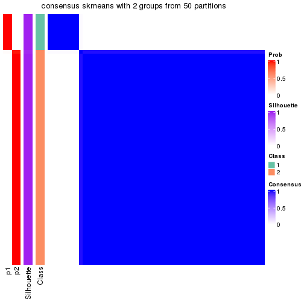</p>

</div>
<div id='tab-node-023-consensus-heatmap-2'>
<pre><code class="r">consensus_heatmap(res, k = 3)
</code></pre>

<p>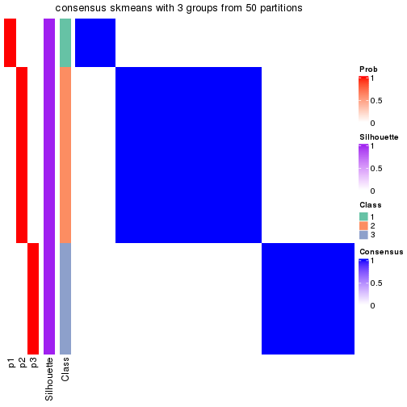</p>

</div>
<div id='tab-node-023-consensus-heatmap-3'>
<pre><code class="r">consensus_heatmap(res, k = 4)
</code></pre>

<p>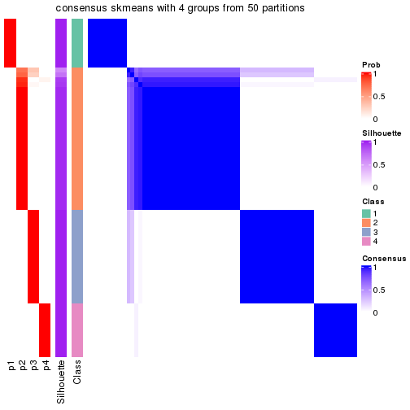</p>

</div>
<div id='tab-node-023-consensus-heatmap-4'>
<pre><code class="r">consensus_heatmap(res, k = 5)
</code></pre>

<p>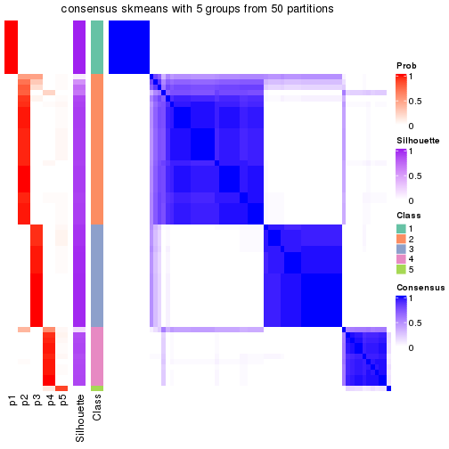</p>

</div>
<div id='tab-node-023-consensus-heatmap-5'>
<pre><code class="r">consensus_heatmap(res, k = 6)
</code></pre>

<p>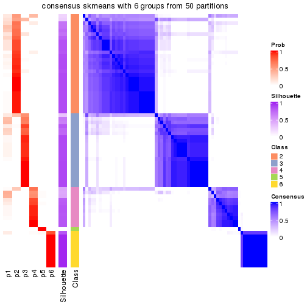</p>

</div>
<div id='tab-node-023-consensus-heatmap-6'>
<pre><code class="r">consensus_heatmap(res, k = 7)
</code></pre>

<p>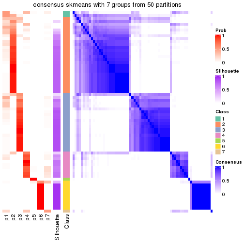</p>

</div>
<div id='tab-node-023-consensus-heatmap-7'>
<pre><code class="r">consensus_heatmap(res, k = 8)
</code></pre>

<p>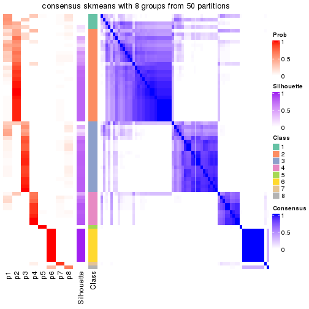</p>

</div>
</div>

Heatmaps for the membership of samples in all partitions to see how consistent they are:


<script>
$( function() {
	$( '#tabs-node-023-membership-heatmap' ).tabs();
} );
</script>
<div id='tabs-node-023-membership-heatmap'>
<ul>
<li><a href='#tab-node-023-membership-heatmap-1'>k = 2</a></li>
<li><a href='#tab-node-023-membership-heatmap-2'>k = 3</a></li>
<li><a href='#tab-node-023-membership-heatmap-3'>k = 4</a></li>
<li><a href='#tab-node-023-membership-heatmap-4'>k = 5</a></li>
<li><a href='#tab-node-023-membership-heatmap-5'>k = 6</a></li>
<li><a href='#tab-node-023-membership-heatmap-6'>k = 7</a></li>
<li><a href='#tab-node-023-membership-heatmap-7'>k = 8</a></li>
</ul>
<div id='tab-node-023-membership-heatmap-1'>
<pre><code class="r">membership_heatmap(res, k = 2)
</code></pre>

<p>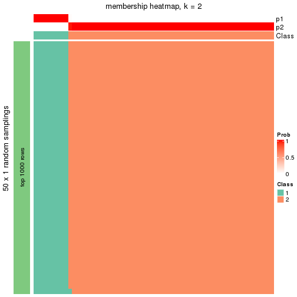</p>

</div>
<div id='tab-node-023-membership-heatmap-2'>
<pre><code class="r">membership_heatmap(res, k = 3)
</code></pre>

<p>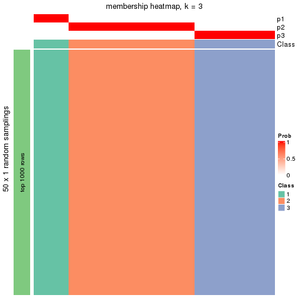</p>

</div>
<div id='tab-node-023-membership-heatmap-3'>
<pre><code class="r">membership_heatmap(res, k = 4)
</code></pre>

<p>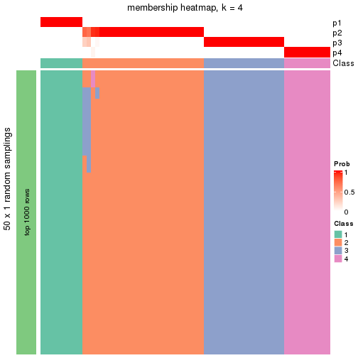</p>

</div>
<div id='tab-node-023-membership-heatmap-4'>
<pre><code class="r">membership_heatmap(res, k = 5)
</code></pre>

<p>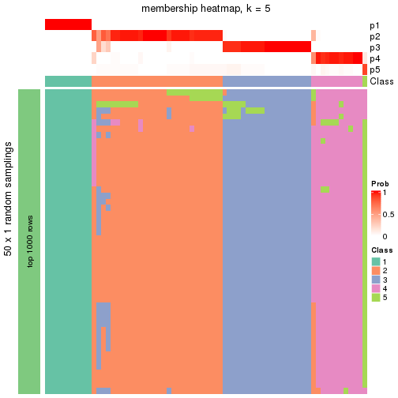</p>

</div>
<div id='tab-node-023-membership-heatmap-5'>
<pre><code class="r">membership_heatmap(res, k = 6)
</code></pre>

<p>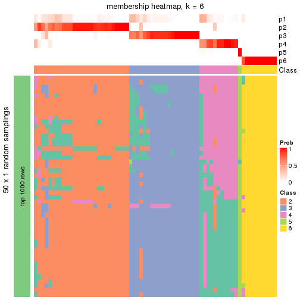</p>

</div>
<div id='tab-node-023-membership-heatmap-6'>
<pre><code class="r">membership_heatmap(res, k = 7)
</code></pre>

<p>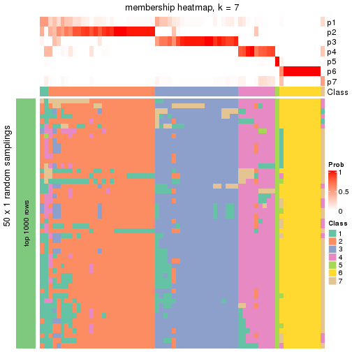</p>

</div>
<div id='tab-node-023-membership-heatmap-7'>
<pre><code class="r">membership_heatmap(res, k = 8)
</code></pre>

<p>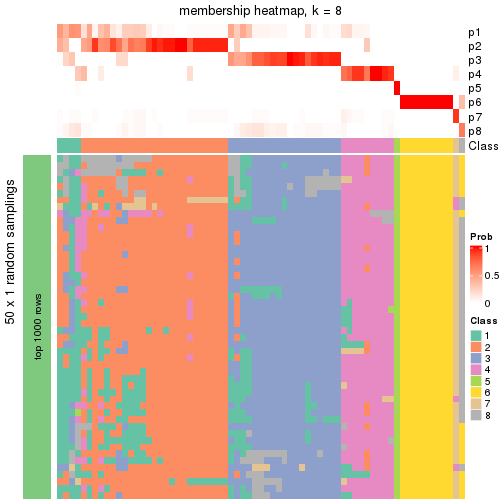</p>

</div>
</div>

As soon as the classes for columns are determined, the signatures
that are significantly different between subgroups can be looked for. 
Following are the heatmaps for signatures.


<script>
$( function() {
	$( '#tabs-node-023-get-signatures' ).tabs();
} );
</script>
<div id='tabs-node-023-get-signatures'>
<ul>
<li><a href='#tab-node-023-get-signatures-1'>k = 2</a></li>
<li><a href='#tab-node-023-get-signatures-2'>k = 3</a></li>
<li><a href='#tab-node-023-get-signatures-3'>k = 4</a></li>
<li><a href='#tab-node-023-get-signatures-4'>k = 5</a></li>
<li><a href='#tab-node-023-get-signatures-5'>k = 6</a></li>
<li><a href='#tab-node-023-get-signatures-6'>k = 7</a></li>
<li><a href='#tab-node-023-get-signatures-7'>k = 8</a></li>
</ul>
<div id='tab-node-023-get-signatures-1'>
<pre><code class="r">get_signatures(res, k = 2)
</code></pre>

<p>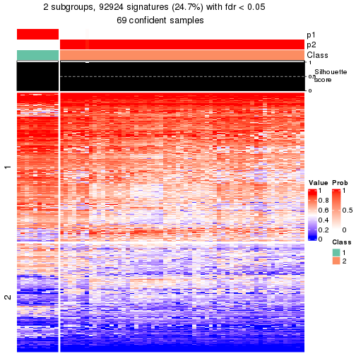</p>

</div>
<div id='tab-node-023-get-signatures-2'>
<pre><code class="r">get_signatures(res, k = 3)
</code></pre>

<p>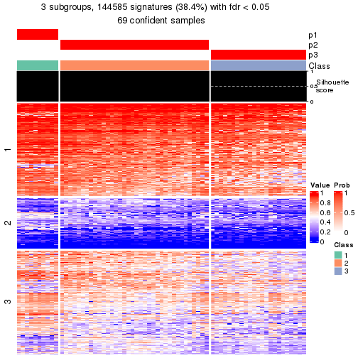</p>

</div>
<div id='tab-node-023-get-signatures-3'>
<pre><code class="r">get_signatures(res, k = 4)
</code></pre>

<p>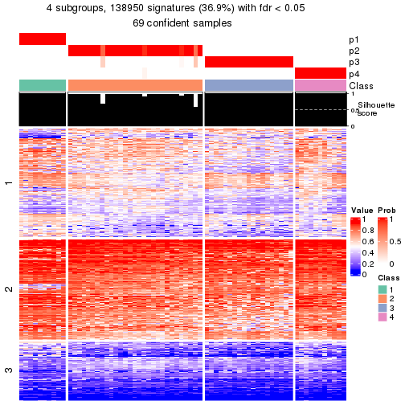</p>

</div>
<div id='tab-node-023-get-signatures-4'>
<pre><code class="r">get_signatures(res, k = 5)
</code></pre>

<p>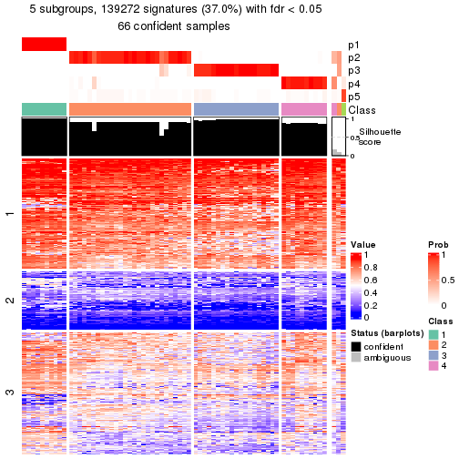</p>

</div>
<div id='tab-node-023-get-signatures-5'>
<pre><code class="r">get_signatures(res, k = 6)
</code></pre>

<p>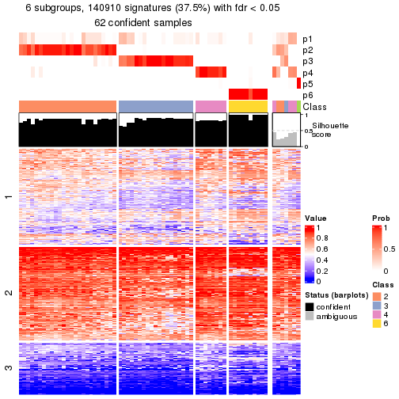</p>

</div>
<div id='tab-node-023-get-signatures-6'>
<pre><code class="r">get_signatures(res, k = 7)
</code></pre>

<p>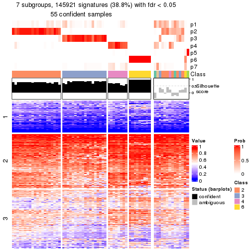</p>

</div>
<div id='tab-node-023-get-signatures-7'>
<pre><code class="r">get_signatures(res, k = 8)
</code></pre>

<p>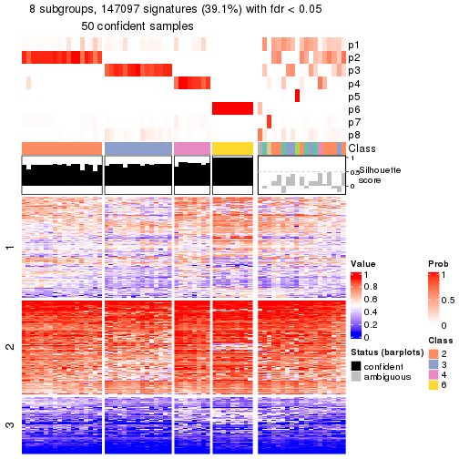</p>

</div>
</div>


Compare the overlap of signatures from different k:

```r
compare_signatures(res)
```

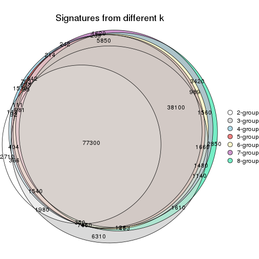

`get_signature()` returns a data frame invisibly. To get the list of signatures, the function
call should be assigned to a variable explicitly. In following code, if `plot` argument is set
to `FALSE`, no heatmap is plotted while only the differential analysis is performed.

```r
# code only for demonstration
tb = get_signature(res, k = ..., plot = FALSE)
```

An example of the output of `tb` is:

```
#>   which_row         fdr    mean_1    mean_2 scaled_mean_1 scaled_mean_2 km
#> 1        38 0.042760348  8.373488  9.131774    -0.5533452     0.5164555  1
#> 2        40 0.018707592  7.106213  8.469186    -0.6173731     0.5762149  1
#> 3        55 0.019134737 10.221463 11.207825    -0.6159697     0.5749050  1
#> 4        59 0.006059896  5.921854  7.869574    -0.6899429     0.6439467  1
#> 5        60 0.018055526  8.928898 10.211722    -0.6204761     0.5791110  1
#> 6        98 0.009384629 15.714769 14.887706     0.6635654    -0.6193277  2
...
```

The columns in `tb` are:

1. `which_row`: row indices corresponding to the input matrix.
2. `fdr`: FDR for the differential test. 
3. `mean_x`: The mean value in group x.
4. `scaled_mean_x`: The mean value in group x after rows are scaled.
5. `km`: Row groups if k-means clustering is applied to rows (which is done by automatically selecting number of clusters).

If there are too many signatures, `top_signatures = ...` can be set to only show the 
signatures with the highest FDRs:

```r
# code only for demonstration
# e.g. to show the top 500 most significant rows
tb = get_signature(res, k = ..., top_signatures = 500)
```

If the signatures are defined as these which are uniquely high in current group, `diff_method` argument
can be set to `"uniquely_high_in_one_group"`:

```r
# code only for demonstration
tb = get_signature(res, k = ..., diff_method = "uniquely_high_in_one_group")
```


UMAP plot which shows how samples are separated.


<script>
$( function() {
	$( '#tabs-node-023-dimension-reduction' ).tabs();
} );
</script>
<div id='tabs-node-023-dimension-reduction'>
<ul>
<li><a href='#tab-node-023-dimension-reduction-1'>k = 2</a></li>
<li><a href='#tab-node-023-dimension-reduction-2'>k = 3</a></li>
<li><a href='#tab-node-023-dimension-reduction-3'>k = 4</a></li>
<li><a href='#tab-node-023-dimension-reduction-4'>k = 5</a></li>
<li><a href='#tab-node-023-dimension-reduction-5'>k = 6</a></li>
<li><a href='#tab-node-023-dimension-reduction-6'>k = 7</a></li>
<li><a href='#tab-node-023-dimension-reduction-7'>k = 8</a></li>
</ul>
<div id='tab-node-023-dimension-reduction-1'>
<pre><code class="r">dimension_reduction(res, k = 2, method = &quot;UMAP&quot;)
</code></pre>

<p>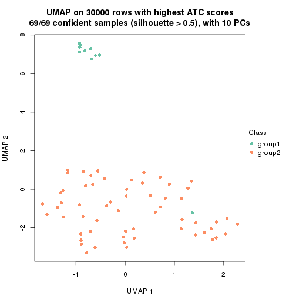</p>

</div>
<div id='tab-node-023-dimension-reduction-2'>
<pre><code class="r">dimension_reduction(res, k = 3, method = &quot;UMAP&quot;)
</code></pre>

<p>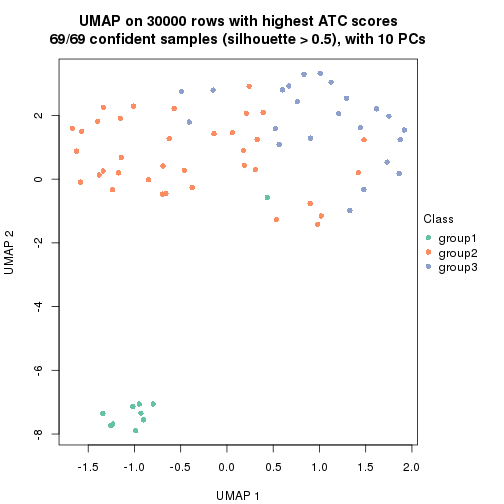</p>

</div>
<div id='tab-node-023-dimension-reduction-3'>
<pre><code class="r">dimension_reduction(res, k = 4, method = &quot;UMAP&quot;)
</code></pre>

<p>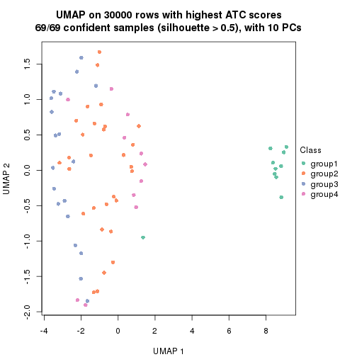</p>

</div>
<div id='tab-node-023-dimension-reduction-4'>
<pre><code class="r">dimension_reduction(res, k = 5, method = &quot;UMAP&quot;)
</code></pre>

<p>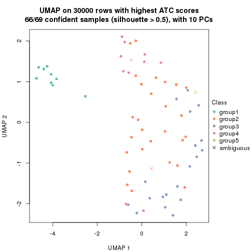</p>

</div>
<div id='tab-node-023-dimension-reduction-5'>
<pre><code class="r">dimension_reduction(res, k = 6, method = &quot;UMAP&quot;)
</code></pre>

<p></p>

</div>
<div id='tab-node-023-dimension-reduction-6'>
<pre><code class="r">dimension_reduction(res, k = 7, method = &quot;UMAP&quot;)
</code></pre>

<p>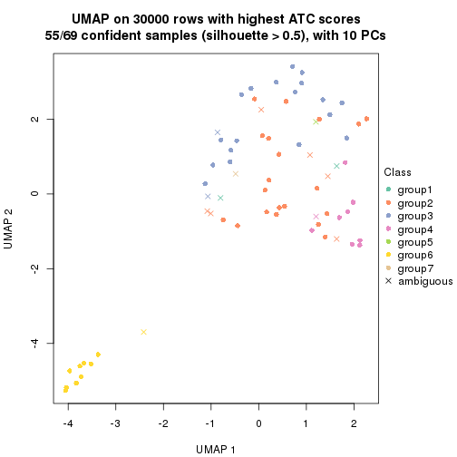</p>

</div>
<div id='tab-node-023-dimension-reduction-7'>
<pre><code class="r">dimension_reduction(res, k = 8, method = &quot;UMAP&quot;)
</code></pre>

<p>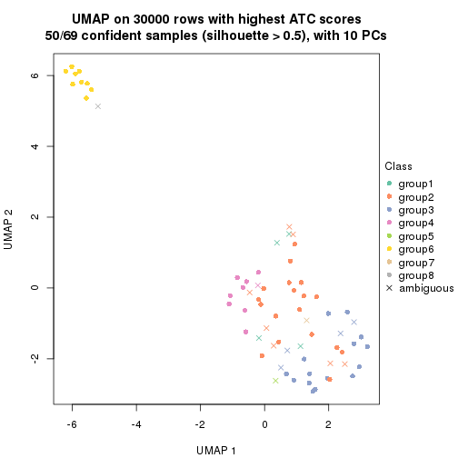</p>

</div>
</div>


Following heatmap shows how subgroups are split when increasing `k`:

```r
collect_classes(res)
```

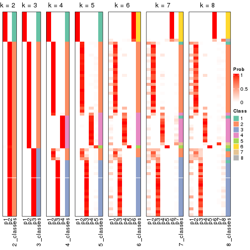


If matrix rows can be associated to genes, consider to use `functional_enrichment(res,
...)` to perform function enrichment for the signature genes. See [this vignette](https://jokergoo.github.io/cola_vignettes/functional_enrichment.html) for more detailed explanations.


 

---------------------------------------------------


### Node0232


Parent node: [Node023](#Node023).
Child nodes: 
                Node01211-leaf
        ,
                Node01212-leaf
        ,
                Node01213-leaf
        ,
                Node01221-leaf
        ,
                Node01222-leaf
        ,
                Node01223-leaf
        ,
                Node02111-leaf
        ,
                Node02112-leaf
        ,
                Node02113-leaf
        ,
                Node02114-leaf
        ,
                Node02121-leaf
        ,
                Node02122-leaf
        ,
                Node02123-leaf
        ,
                Node02124-leaf
        ,
                Node02131-leaf
        ,
                [Node02132](#Node02132)
        ,
                Node02133-leaf
        ,
                Node02211-leaf
        ,
                Node02212-leaf
        ,
                Node02213-leaf
        ,
                Node02221-leaf
        ,
                Node02222-leaf
        ,
                Node02223-leaf
        ,
                Node02231-leaf
        ,
                Node02232-leaf
        ,
                Node02233-leaf
        ,
                Node02241-leaf
        ,
                Node02242-leaf
        ,
                Node02243-leaf
        ,
                Node02321-leaf
        ,
                Node02322-leaf
        ,
                Node02323-leaf
        ,
                Node05111-leaf
        ,
                Node05112-leaf
        ,
                Node05113-leaf
        ,
                Node05114-leaf
        ,
                [Node05121](#Node05121)
        ,
                Node05122-leaf
        ,
                Node05123-leaf
        ,
                Node05221-leaf
        ,
                Node05222-leaf
        .


The object with results only for a single top-value method and a single partitioning method 
can be extracted as:

```r
res = res_rh["0232"]
```

A summary of `res` and all the functions that can be applied to it:

```r
res
```

```
#> A 'ConsensusPartition' object with k = 2, 3, 4, 5, 6, 7, 8.
#>   On a matrix with 30000 rows and 29 columns.
#>   Top rows (1000) are extracted by 'ATC' method.
#>   Subgroups are detected by 'kmeans' method.
#>   Performed in total 350 partitions by row resampling.
#>   Best k for subgroups seems to be 3.
#> 
#> Following methods can be applied to this 'ConsensusPartition' object:
#>  [1] "cola_report"             "collect_classes"         "collect_plots"          
#>  [4] "collect_stats"           "colnames"                "compare_partitions"     
#>  [7] "compare_signatures"      "consensus_heatmap"       "dimension_reduction"    
#> [10] "functional_enrichment"   "get_anno_col"            "get_anno"               
#> [13] "get_classes"             "get_consensus"           "get_matrix"             
#> [16] "get_membership"          "get_param"               "get_signatures"         
#> [19] "get_stats"               "is_best_k"               "is_stable_k"            
#> [22] "membership_heatmap"      "ncol"                    "nrow"                   
#> [25] "plot_ecdf"               "predict_classes"         "rownames"               
#> [28] "select_partition_number" "show"                    "suggest_best_k"         
#> [31] "test_to_known_factors"   "top_rows_heatmap"
```

`collect_plots()` function collects all the plots made from `res` for all `k` (number of subgroups)
into one single page to provide an easy and fast comparison between different `k`.

```r
collect_plots(res)
```

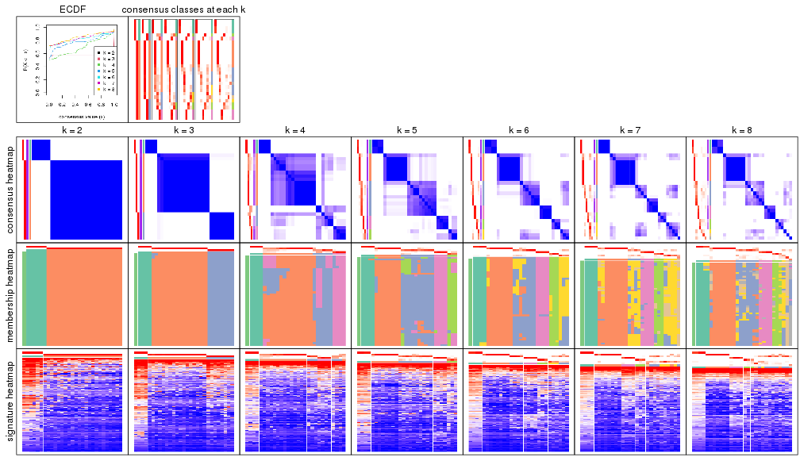

The plots are:

- The first row: a plot of the eCDF (empirical cumulative distribution
  function) curves of the consensus matrix for each `k` and the heatmap of
  predicted classes for each `k`.
- The second row: heatmaps of the consensus matrix for each `k`.
- The third row: heatmaps of the membership matrix for each `k`.
- The fouth row: heatmaps of the signatures for each `k`.

All the plots in panels can be made by individual functions and they are
plotted later in this section.

`select_partition_number()` produces several plots showing different
statistics for choosing "optimized" `k`. There are following statistics:

- eCDF curves of the consensus matrix for each `k`;
- 1-PAC. [The PAC score](https://en.wikipedia.org/wiki/Consensus_clustering#Over-interpretation_potential_of_consensus_clustering)
  measures the proportion of the ambiguous subgrouping.
- Mean silhouette score.
- Concordance. The mean probability of fiting the consensus subgroup labels in all
  partitions.
- Area increased. Denote $A_k$ as the area under the eCDF curve for current
  `k`, the area increased is defined as $A_k - A_{k-1}$.
- Rand index. The percent of pairs of samples that are both in a same cluster
  or both are not in a same cluster in the partition of k and k-1.
- Jaccard index. The ratio of pairs of samples are both in a same cluster in
  the partition of k and k-1 and the pairs of samples are both in a same
  cluster in the partition k or k-1.

The detailed explanations of these statistics can be found in [the _cola_
vignette](https://jokergoo.github.io/cola_vignettes/cola.html#toc_13).

Generally speaking, higher 1-PAC score, higher mean silhouette score or higher
concordance corresponds to better partition. Rand index and Jaccard index
measure how similar the current partition is compared to partition with `k-1`.
If they are too similar, we won't accept `k` is better than `k-1`.

```r
select_partition_number(res)
```

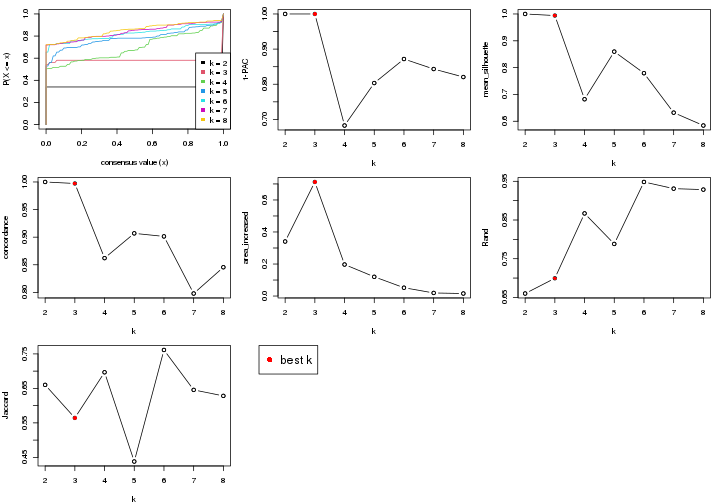

The numeric values for all these statistics can be obtained by `get_stats()`.

```r
get_stats(res)
```

```
#>   k 1-PAC mean_silhouette concordance area_increased  Rand Jaccard
#> 2 2 1.000           1.000       1.000         0.3406 0.660   0.660
#> 3 3 1.000           0.994       0.997         0.7123 0.700   0.564
#> 4 4 0.683           0.682       0.862         0.1969 0.867   0.697
#> 5 5 0.803           0.860       0.907         0.1201 0.788   0.438
#> 6 6 0.872           0.779       0.901         0.0520 0.948   0.761
#> 7 7 0.843           0.632       0.798         0.0194 0.931   0.646
#> 8 8 0.821           0.584       0.846         0.0158 0.929   0.628
```

`suggest_best_k()` suggests the best $k$ based on these statistics. The rules are as follows:

- All $k$ with Jaccard index larger than 0.95 are removed because increasing
  $k$ does not provide enough extra information. If all $k$ are removed, it is
  marked as no subgroup is detected.
- For all $k$ with 1-PAC score larger than 0.9, the maximal $k$ is taken as
  the best $k$, and other $k$ are marked as optional $k$.
- If it does not fit the second rule. The $k$ with the maximal vote of the
  highest 1-PAC score, highest mean silhouette, and highest concordance is
  taken as the best $k$.

```r
suggest_best_k(res)
```

```
#> [1] 3
#> attr(,"optional")
#> [1] 2
```

There is also optional best $k$ = 2 that is worth to check.

Following is the table of the partitions (You need to click the **show/hide
code output** link to see it). The membership matrix (columns with name `p*`)
is inferred by
[`clue::cl_consensus()`](https://www.rdocumentation.org/link/cl_consensus?package=clue)
function with the `SE` method. Basically the value in the membership matrix
represents the probability to belong to a certain group. The finall subgroup
label for an item is determined with the group with highest probability it
belongs to.

In `get_classes()` function, the entropy is calculated from the membership
matrix and the silhouette score is calculated from the consensus matrix.


<script>
$( function() {
	$( '#tabs-node-0232-get-classes' ).tabs();
} );
</script>
<div id='tabs-node-0232-get-classes'>
<ul>
<li><a href='#tab-node-0232-get-classes-1'>k = 2</a></li>
<li><a href='#tab-node-0232-get-classes-2'>k = 3</a></li>
<li><a href='#tab-node-0232-get-classes-3'>k = 4</a></li>
<li><a href='#tab-node-0232-get-classes-4'>k = 5</a></li>
<li><a href='#tab-node-0232-get-classes-5'>k = 6</a></li>
<li><a href='#tab-node-0232-get-classes-6'>k = 7</a></li>
<li><a href='#tab-node-0232-get-classes-7'>k = 8</a></li>
</ul>

<div id='tab-node-0232-get-classes-1'>
<p><a id='tab-node-0232-get-classes-1-a' style='color:#0366d6' href='#'>show/hide code output</a></p>
<pre><code class="r">cbind(get_classes(res, k = 2), get_membership(res, k = 2))
</code></pre>

<pre><code>#&gt;                 class entropy silhouette p1 p2
#&gt; TCGA.CV.6436.01     2       0          1  0  1
#&gt; TCGA.CV.5976.01     2       0          1  0  1
#&gt; TCGA.CN.6995.01     2       0          1  0  1
#&gt; TCGA.CQ.5334.01     1       0          1  1  0
#&gt; TCGA.HD.7229.01     2       0          1  0  1
#&gt; TCGA.BA.5558.01     2       0          1  0  1
#&gt; TCGA.CV.A45O.01     2       0          1  0  1
#&gt; TCGA.BA.6873.01     2       0          1  0  1
#&gt; TCGA.CQ.6224.01     2       0          1  0  1
#&gt; TCGA.CV.6938.01     1       0          1  1  0
#&gt; TCGA.CQ.A4C6.01     2       0          1  0  1
#&gt; TCGA.CQ.A4C7.01     2       0          1  0  1
#&gt; TCGA.CQ.A4CD.01     2       0          1  0  1
#&gt; TCGA.F7.A620.01     2       0          1  0  1
#&gt; TCGA.QK.A8Z9.01     2       0          1  0  1
#&gt; TCGA.CQ.5333.01     1       0          1  1  0
#&gt; TCGA.BA.A6DJ.01     1       0          1  1  0
#&gt; TCGA.CQ.A4CB.01     2       0          1  0  1
#&gt; TCGA.H7.8501.01     2       0          1  0  1
#&gt; TCGA.CN.4734.01     1       0          1  1  0
#&gt; TCGA.CN.4726.01     2       0          1  0  1
#&gt; TCGA.CN.5355.01     2       0          1  0  1
#&gt; TCGA.BA.5151.01     2       0          1  0  1
#&gt; TCGA.CN.5363.01     1       0          1  1  0
#&gt; TCGA.CV.A6JO.01     2       0          1  0  1
#&gt; TCGA.CV.A6JZ.01     2       0          1  0  1
#&gt; TCGA.D6.A6EN.01     2       0          1  0  1
#&gt; TCGA.P3.A6T7.01     2       0          1  0  1
#&gt; TCGA.CR.7382.01     2       0          1  0  1
</code></pre>

<script>
$('#tab-node-0232-get-classes-1-a').parent().next().next().hide();
$('#tab-node-0232-get-classes-1-a').click(function(){
  $('#tab-node-0232-get-classes-1-a').parent().next().next().toggle();
  return(false);
});
</script>
</div>

<div id='tab-node-0232-get-classes-2'>
<p><a id='tab-node-0232-get-classes-2-a' style='color:#0366d6' href='#'>show/hide code output</a></p>
<pre><code class="r">cbind(get_classes(res, k = 3), get_membership(res, k = 3))
</code></pre>

<pre><code>#&gt;                 class entropy silhouette p1   p2   p3
#&gt; TCGA.CV.6436.01     2  0.0000      0.995  0 1.00 0.00
#&gt; TCGA.CV.5976.01     2  0.0000      0.995  0 1.00 0.00
#&gt; TCGA.CN.6995.01     2  0.0000      0.995  0 1.00 0.00
#&gt; TCGA.CQ.5334.01     1  0.0000      1.000  1 0.00 0.00
#&gt; TCGA.HD.7229.01     2  0.0892      0.976  0 0.98 0.02
#&gt; TCGA.BA.5558.01     2  0.0000      0.995  0 1.00 0.00
#&gt; TCGA.CV.A45O.01     2  0.0000      0.995  0 1.00 0.00
#&gt; TCGA.BA.6873.01     2  0.0000      0.995  0 1.00 0.00
#&gt; TCGA.CQ.6224.01     2  0.0000      0.995  0 1.00 0.00
#&gt; TCGA.CV.6938.01     3  0.0000      1.000  0 0.00 1.00
#&gt; TCGA.CQ.A4C6.01     2  0.0000      0.995  0 1.00 0.00
#&gt; TCGA.CQ.A4C7.01     2  0.0000      0.995  0 1.00 0.00
#&gt; TCGA.CQ.A4CD.01     2  0.0000      0.995  0 1.00 0.00
#&gt; TCGA.F7.A620.01     3  0.0000      1.000  0 0.00 1.00
#&gt; TCGA.QK.A8Z9.01     2  0.0000      0.995  0 1.00 0.00
#&gt; TCGA.CQ.5333.01     1  0.0000      1.000  1 0.00 0.00
#&gt; TCGA.BA.A6DJ.01     1  0.0000      1.000  1 0.00 0.00
#&gt; TCGA.CQ.A4CB.01     2  0.0000      0.995  0 1.00 0.00
#&gt; TCGA.H7.8501.01     3  0.0000      1.000  0 0.00 1.00
#&gt; TCGA.CN.4734.01     1  0.0000      1.000  1 0.00 0.00
#&gt; TCGA.CN.4726.01     2  0.0000      0.995  0 1.00 0.00
#&gt; TCGA.CN.5355.01     2  0.0000      0.995  0 1.00 0.00
#&gt; TCGA.BA.5151.01     3  0.0000      1.000  0 0.00 1.00
#&gt; TCGA.CN.5363.01     3  0.0000      1.000  0 0.00 1.00
#&gt; TCGA.CV.A6JO.01     2  0.0000      0.995  0 1.00 0.00
#&gt; TCGA.CV.A6JZ.01     3  0.0000      1.000  0 0.00 1.00
#&gt; TCGA.D6.A6EN.01     3  0.0000      1.000  0 0.00 1.00
#&gt; TCGA.P3.A6T7.01     3  0.0000      1.000  0 0.00 1.00
#&gt; TCGA.CR.7382.01     2  0.2066      0.934  0 0.94 0.06
</code></pre>

<script>
$('#tab-node-0232-get-classes-2-a').parent().next().next().hide();
$('#tab-node-0232-get-classes-2-a').click(function(){
  $('#tab-node-0232-get-classes-2-a').parent().next().next().toggle();
  return(false);
});
</script>
</div>

<div id='tab-node-0232-get-classes-3'>
<p><a id='tab-node-0232-get-classes-3-a' style='color:#0366d6' href='#'>show/hide code output</a></p>
<pre><code class="r">cbind(get_classes(res, k = 4), get_membership(res, k = 4))
</code></pre>

<pre><code>#&gt;                 class entropy silhouette p1   p2   p3   p4
#&gt; TCGA.CV.6436.01     2  0.0000     0.8202  0 1.00 0.00 0.00
#&gt; TCGA.CV.5976.01     2  0.2011     0.8035  0 0.92 0.08 0.00
#&gt; TCGA.CN.6995.01     2  0.0000     0.8202  0 1.00 0.00 0.00
#&gt; TCGA.CQ.5334.01     1  0.0000     1.0000  1 0.00 0.00 0.00
#&gt; TCGA.HD.7229.01     2  0.7198     0.4559  0 0.52 0.32 0.16
#&gt; TCGA.BA.5558.01     2  0.0000     0.8202  0 1.00 0.00 0.00
#&gt; TCGA.CV.A45O.01     2  0.2647     0.7859  0 0.88 0.12 0.00
#&gt; TCGA.BA.6873.01     2  0.0000     0.8202  0 1.00 0.00 0.00
#&gt; TCGA.CQ.6224.01     2  0.0000     0.8202  0 1.00 0.00 0.00
#&gt; TCGA.CV.6938.01     3  0.4977    -0.0523  0 0.00 0.54 0.46
#&gt; TCGA.CQ.A4C6.01     2  0.0000     0.8202  0 1.00 0.00 0.00
#&gt; TCGA.CQ.A4C7.01     2  0.4134     0.6860  0 0.74 0.26 0.00
#&gt; TCGA.CQ.A4CD.01     2  0.0000     0.8202  0 1.00 0.00 0.00
#&gt; TCGA.F7.A620.01     4  0.0707     0.9139  0 0.00 0.02 0.98
#&gt; TCGA.QK.A8Z9.01     2  0.7135     0.5112  0 0.56 0.24 0.20
#&gt; TCGA.CQ.5333.01     1  0.0000     1.0000  1 0.00 0.00 0.00
#&gt; TCGA.BA.A6DJ.01     1  0.0000     1.0000  1 0.00 0.00 0.00
#&gt; TCGA.CQ.A4CB.01     2  0.6720     0.5417  0 0.58 0.30 0.12
#&gt; TCGA.H7.8501.01     3  0.2647     0.5389  0 0.00 0.88 0.12
#&gt; TCGA.CN.4734.01     1  0.0000     1.0000  1 0.00 0.00 0.00
#&gt; TCGA.CN.4726.01     3  0.4907    -0.1227  0 0.42 0.58 0.00
#&gt; TCGA.CN.5355.01     2  0.1211     0.8147  0 0.96 0.04 0.00
#&gt; TCGA.BA.5151.01     3  0.4977    -0.0523  0 0.00 0.54 0.46
#&gt; TCGA.CN.5363.01     4  0.2647     0.7795  0 0.00 0.12 0.88
#&gt; TCGA.CV.A6JO.01     2  0.6720     0.5417  0 0.58 0.30 0.12
#&gt; TCGA.CV.A6JZ.01     4  0.0000     0.9124  0 0.00 0.00 1.00
#&gt; TCGA.D6.A6EN.01     3  0.0707     0.5286  0 0.00 0.98 0.02
#&gt; TCGA.P3.A6T7.01     4  0.0707     0.9139  0 0.00 0.02 0.98
#&gt; TCGA.CR.7382.01     3  0.2647     0.5389  0 0.00 0.88 0.12
</code></pre>

<script>
$('#tab-node-0232-get-classes-3-a').parent().next().next().hide();
$('#tab-node-0232-get-classes-3-a').click(function(){
  $('#tab-node-0232-get-classes-3-a').parent().next().next().toggle();
  return(false);
});
</script>
</div>

<div id='tab-node-0232-get-classes-4'>
<p><a id='tab-node-0232-get-classes-4-a' style='color:#0366d6' href='#'>show/hide code output</a></p>
<pre><code class="r">cbind(get_classes(res, k = 5), get_membership(res, k = 5))
</code></pre>

<pre><code>#&gt;                 class entropy silhouette   p1   p2   p3   p4   p5
#&gt; TCGA.CV.6436.01     2  0.0000      0.964 0.00 1.00 0.00 0.00 0.00
#&gt; TCGA.CV.5976.01     3  0.3690      0.766 0.00 0.20 0.78 0.00 0.02
#&gt; TCGA.CN.6995.01     2  0.0000      0.964 0.00 1.00 0.00 0.00 0.00
#&gt; TCGA.CQ.5334.01     1  0.0609      0.990 0.98 0.00 0.02 0.00 0.00
#&gt; TCGA.HD.7229.01     3  0.2077      0.824 0.00 0.04 0.92 0.04 0.00
#&gt; TCGA.BA.5558.01     2  0.0000      0.964 0.00 1.00 0.00 0.00 0.00
#&gt; TCGA.CV.A45O.01     3  0.4060      0.552 0.00 0.36 0.64 0.00 0.00
#&gt; TCGA.BA.6873.01     2  0.0000      0.964 0.00 1.00 0.00 0.00 0.00
#&gt; TCGA.CQ.6224.01     2  0.0000      0.964 0.00 1.00 0.00 0.00 0.00
#&gt; TCGA.CV.6938.01     5  0.3684      0.762 0.00 0.00 0.00 0.28 0.72
#&gt; TCGA.CQ.A4C6.01     2  0.0000      0.964 0.00 1.00 0.00 0.00 0.00
#&gt; TCGA.CQ.A4C7.01     3  0.2616      0.825 0.00 0.10 0.88 0.00 0.02
#&gt; TCGA.CQ.A4CD.01     2  0.0000      0.964 0.00 1.00 0.00 0.00 0.00
#&gt; TCGA.F7.A620.01     4  0.0609      0.962 0.00 0.00 0.02 0.98 0.00
#&gt; TCGA.QK.A8Z9.01     3  0.3037      0.799 0.00 0.04 0.86 0.10 0.00
#&gt; TCGA.CQ.5333.01     1  0.0609      0.990 0.98 0.00 0.02 0.00 0.00
#&gt; TCGA.BA.A6DJ.01     1  0.0000      0.990 1.00 0.00 0.00 0.00 0.00
#&gt; TCGA.CQ.A4CB.01     3  0.1732      0.832 0.00 0.08 0.92 0.00 0.00
#&gt; TCGA.H7.8501.01     3  0.2929      0.753 0.00 0.00 0.82 0.00 0.18
#&gt; TCGA.CN.4734.01     1  0.0000      0.990 1.00 0.00 0.00 0.00 0.00
#&gt; TCGA.CN.4726.01     3  0.4748      0.649 0.00 0.04 0.66 0.00 0.30
#&gt; TCGA.CN.5355.01     2  0.3513      0.693 0.00 0.80 0.18 0.00 0.02
#&gt; TCGA.BA.5151.01     5  0.3684      0.762 0.00 0.00 0.00 0.28 0.72
#&gt; TCGA.CN.5363.01     4  0.1043      0.925 0.00 0.00 0.00 0.96 0.04
#&gt; TCGA.CV.A6JO.01     3  0.1410      0.832 0.00 0.06 0.94 0.00 0.00
#&gt; TCGA.CV.A6JZ.01     4  0.0000      0.958 0.00 0.00 0.00 1.00 0.00
#&gt; TCGA.D6.A6EN.01     5  0.1410      0.617 0.00 0.00 0.06 0.00 0.94
#&gt; TCGA.P3.A6T7.01     4  0.0609      0.962 0.00 0.00 0.02 0.98 0.00
#&gt; TCGA.CR.7382.01     3  0.2929      0.753 0.00 0.00 0.82 0.00 0.18
</code></pre>

<script>
$('#tab-node-0232-get-classes-4-a').parent().next().next().hide();
$('#tab-node-0232-get-classes-4-a').click(function(){
  $('#tab-node-0232-get-classes-4-a').parent().next().next().toggle();
  return(false);
});
</script>
</div>

<div id='tab-node-0232-get-classes-5'>
<p><a id='tab-node-0232-get-classes-5-a' style='color:#0366d6' href='#'>show/hide code output</a></p>
<pre><code class="r">cbind(get_classes(res, k = 6), get_membership(res, k = 6))
</code></pre>

<pre><code>#&gt;                 class entropy silhouette   p1   p2   p3   p4   p5   p6
#&gt; TCGA.CV.6436.01     2  0.0000     0.9634 0.00 1.00 0.00 0.00 0.00 0.00
#&gt; TCGA.CV.5976.01     3  0.3746     0.5399 0.00 0.14 0.78 0.00 0.00 0.08
#&gt; TCGA.CN.6995.01     2  0.0000     0.9634 0.00 1.00 0.00 0.00 0.00 0.00
#&gt; TCGA.CQ.5334.01     1  0.0000     0.9788 1.00 0.00 0.00 0.00 0.00 0.00
#&gt; TCGA.HD.7229.01     3  0.0000     0.6232 0.00 0.00 1.00 0.00 0.00 0.00
#&gt; TCGA.BA.5558.01     2  0.0000     0.9634 0.00 1.00 0.00 0.00 0.00 0.00
#&gt; TCGA.CV.A45O.01     3  0.6016    -0.0554 0.00 0.38 0.38 0.00 0.00 0.24
#&gt; TCGA.BA.6873.01     2  0.0000     0.9634 0.00 1.00 0.00 0.00 0.00 0.00
#&gt; TCGA.CQ.6224.01     2  0.0000     0.9634 0.00 1.00 0.00 0.00 0.00 0.00
#&gt; TCGA.CV.6938.01     5  0.0000     0.8902 0.00 0.00 0.00 0.00 1.00 0.00
#&gt; TCGA.CQ.A4C6.01     2  0.0000     0.9634 0.00 1.00 0.00 0.00 0.00 0.00
#&gt; TCGA.CQ.A4C7.01     3  0.3916     0.3290 0.00 0.02 0.68 0.00 0.00 0.30
#&gt; TCGA.CQ.A4CD.01     2  0.0000     0.9634 0.00 1.00 0.00 0.00 0.00 0.00
#&gt; TCGA.F7.A620.01     4  0.0547     0.9936 0.00 0.00 0.02 0.98 0.00 0.00
#&gt; TCGA.QK.A8Z9.01     3  0.0000     0.6232 0.00 0.00 1.00 0.00 0.00 0.00
#&gt; TCGA.CQ.5333.01     1  0.0000     0.9788 1.00 0.00 0.00 0.00 0.00 0.00
#&gt; TCGA.BA.A6DJ.01     1  0.0937     0.9788 0.96 0.00 0.00 0.00 0.00 0.04
#&gt; TCGA.CQ.A4CB.01     3  0.0547     0.6304 0.00 0.02 0.98 0.00 0.00 0.00
#&gt; TCGA.H7.8501.01     6  0.3828     0.4850 0.00 0.00 0.44 0.00 0.00 0.56
#&gt; TCGA.CN.4734.01     1  0.0937     0.9788 0.96 0.00 0.00 0.00 0.00 0.04
#&gt; TCGA.CN.4726.01     6  0.1267     0.4920 0.00 0.00 0.06 0.00 0.00 0.94
#&gt; TCGA.CN.5355.01     2  0.3076     0.6810 0.00 0.76 0.00 0.00 0.00 0.24
#&gt; TCGA.BA.5151.01     5  0.0547     0.8880 0.00 0.00 0.00 0.00 0.98 0.02
#&gt; TCGA.CN.5363.01     4  0.0000     0.9806 0.00 0.00 0.00 1.00 0.00 0.00
#&gt; TCGA.CV.A6JO.01     3  0.3315     0.4942 0.00 0.02 0.78 0.00 0.00 0.20
#&gt; TCGA.CV.A6JZ.01     4  0.0547     0.9936 0.00 0.00 0.02 0.98 0.00 0.00
#&gt; TCGA.D6.A6EN.01     5  0.2793     0.7641 0.00 0.00 0.00 0.00 0.80 0.20
#&gt; TCGA.P3.A6T7.01     4  0.0547     0.9936 0.00 0.00 0.02 0.98 0.00 0.00
#&gt; TCGA.CR.7382.01     6  0.3647     0.5909 0.00 0.00 0.36 0.00 0.00 0.64
</code></pre>

<script>
$('#tab-node-0232-get-classes-5-a').parent().next().next().hide();
$('#tab-node-0232-get-classes-5-a').click(function(){
  $('#tab-node-0232-get-classes-5-a').parent().next().next().toggle();
  return(false);
});
</script>
</div>

<div id='tab-node-0232-get-classes-6'>
<p><a id='tab-node-0232-get-classes-6-a' style='color:#0366d6' href='#'>show/hide code output</a></p>
<pre><code class="r">cbind(get_classes(res, k = 7), get_membership(res, k = 7))
</code></pre>

<pre><code>#&gt;                 class entropy silhouette p1   p2   p3   p4   p5   p6   p7
#&gt; TCGA.CV.6436.01     2  0.0000     0.8779  0 1.00 0.00 0.00 0.00 0.00 0.00
#&gt; TCGA.CV.5976.01     3  0.5888     0.1067  0 0.22 0.40 0.00 0.00 0.36 0.02
#&gt; TCGA.CN.6995.01     2  0.0000     0.8779  0 1.00 0.00 0.00 0.00 0.00 0.00
#&gt; TCGA.CQ.5334.01     1  0.0000     1.0000  1 0.00 0.00 0.00 0.00 0.00 0.00
#&gt; TCGA.HD.7229.01     3  0.2745     0.2406  0 0.00 0.82 0.00 0.00 0.16 0.02
#&gt; TCGA.BA.5558.01     2  0.0000     0.8779  0 1.00 0.00 0.00 0.00 0.00 0.00
#&gt; TCGA.CV.A45O.01     2  0.5221     0.0191  0 0.46 0.06 0.00 0.00 0.44 0.04
#&gt; TCGA.BA.6873.01     2  0.0000     0.8779  0 1.00 0.00 0.00 0.00 0.00 0.00
#&gt; TCGA.CQ.6224.01     2  0.0000     0.8779  0 1.00 0.00 0.00 0.00 0.00 0.00
#&gt; TCGA.CV.6938.01     5  0.0000     0.8061  0 0.00 0.00 0.00 1.00 0.00 0.00
#&gt; TCGA.CQ.A4C6.01     2  0.0000     0.8779  0 1.00 0.00 0.00 0.00 0.00 0.00
#&gt; TCGA.CQ.A4C7.01     6  0.2945     0.3130  0 0.00 0.26 0.00 0.00 0.74 0.00
#&gt; TCGA.CQ.A4CD.01     2  0.0000     0.8779  0 1.00 0.00 0.00 0.00 0.00 0.00
#&gt; TCGA.F7.A620.01     4  0.0000     0.9461  0 0.00 0.00 1.00 0.00 0.00 0.00
#&gt; TCGA.QK.A8Z9.01     3  0.5286     0.3351  0 0.00 0.62 0.06 0.00 0.22 0.10
#&gt; TCGA.CQ.5333.01     1  0.0000     1.0000  1 0.00 0.00 0.00 0.00 0.00 0.00
#&gt; TCGA.BA.A6DJ.01     1  0.0000     1.0000  1 0.00 0.00 0.00 0.00 0.00 0.00
#&gt; TCGA.CQ.A4CB.01     3  0.3546     0.0827  0 0.00 0.54 0.00 0.00 0.46 0.00
#&gt; TCGA.H7.8501.01     6  0.4015     0.1439  0 0.00 0.26 0.00 0.00 0.68 0.06
#&gt; TCGA.CN.4734.01     1  0.0000     1.0000  1 0.00 0.00 0.00 0.00 0.00 0.00
#&gt; TCGA.CN.4726.01     7  0.3496     0.0000  0 0.00 0.00 0.00 0.00 0.42 0.58
#&gt; TCGA.CN.5355.01     2  0.4211     0.5344  0 0.68 0.02 0.00 0.00 0.26 0.04
#&gt; TCGA.BA.5151.01     5  0.2512     0.7709  0 0.00 0.04 0.00 0.86 0.00 0.10
#&gt; TCGA.CN.5363.01     4  0.2722     0.8466  0 0.00 0.04 0.84 0.00 0.00 0.12
#&gt; TCGA.CV.A6JO.01     6  0.3358     0.0803  0 0.00 0.36 0.00 0.00 0.64 0.00
#&gt; TCGA.CV.A6JZ.01     4  0.0000     0.9461  0 0.00 0.00 1.00 0.00 0.00 0.00
#&gt; TCGA.D6.A6EN.01     5  0.3617     0.6762  0 0.00 0.00 0.00 0.76 0.16 0.08
#&gt; TCGA.P3.A6T7.01     4  0.0504     0.9394  0 0.00 0.00 0.98 0.00 0.00 0.02
#&gt; TCGA.CR.7382.01     6  0.0504     0.3997  0 0.00 0.02 0.00 0.00 0.98 0.00
</code></pre>

<script>
$('#tab-node-0232-get-classes-6-a').parent().next().next().hide();
$('#tab-node-0232-get-classes-6-a').click(function(){
  $('#tab-node-0232-get-classes-6-a').parent().next().next().toggle();
  return(false);
});
</script>
</div>

<div id='tab-node-0232-get-classes-7'>
<p><a id='tab-node-0232-get-classes-7-a' style='color:#0366d6' href='#'>show/hide code output</a></p>
<pre><code class="r">cbind(get_classes(res, k = 8), get_membership(res, k = 8))
</code></pre>

<pre><code>#&gt;                 class entropy silhouette  p1   p2   p3   p4   p5   p6   p7   p8
#&gt; TCGA.CV.6436.01     2  0.0000      0.929 0.0 1.00 0.00 0.00 0.00 0.00 0.00 0.00
#&gt; TCGA.CV.5976.01     3  0.3169      0.321 0.0 0.18 0.78 0.00 0.00 0.00 0.02 0.02
#&gt; TCGA.CN.6995.01     2  0.0000      0.929 0.0 1.00 0.00 0.00 0.00 0.00 0.00 0.00
#&gt; TCGA.CQ.5334.01     1  0.0000      0.940 1.0 0.00 0.00 0.00 0.00 0.00 0.00 0.00
#&gt; TCGA.HD.7229.01     3  0.4693     -0.217 0.0 0.00 0.46 0.00 0.00 0.42 0.00 0.12
#&gt; TCGA.BA.5558.01     2  0.0000      0.929 0.0 1.00 0.00 0.00 0.00 0.00 0.00 0.00
#&gt; TCGA.CV.A45O.01     3  0.5122      0.180 0.0 0.32 0.56 0.00 0.00 0.02 0.06 0.04
#&gt; TCGA.BA.6873.01     2  0.0000      0.929 0.0 1.00 0.00 0.00 0.00 0.00 0.00 0.00
#&gt; TCGA.CQ.6224.01     2  0.0000      0.929 0.0 1.00 0.00 0.00 0.00 0.00 0.00 0.00
#&gt; TCGA.CV.6938.01     5  0.0000      0.681 0.0 0.00 0.00 0.00 1.00 0.00 0.00 0.00
#&gt; TCGA.CQ.A4C6.01     2  0.0000      0.929 0.0 1.00 0.00 0.00 0.00 0.00 0.00 0.00
#&gt; TCGA.CQ.A4C7.01     3  0.3494      0.268 0.0 0.00 0.78 0.00 0.00 0.04 0.14 0.04
#&gt; TCGA.CQ.A4CD.01     2  0.0000      0.929 0.0 1.00 0.00 0.00 0.00 0.00 0.00 0.00
#&gt; TCGA.F7.A620.01     4  0.0000      0.917 0.0 0.00 0.00 1.00 0.00 0.00 0.00 0.00
#&gt; TCGA.QK.A8Z9.01     8  0.3991      0.000 0.0 0.00 0.32 0.06 0.00 0.00 0.00 0.62
#&gt; TCGA.CQ.5333.01     1  0.0000      0.940 1.0 0.00 0.00 0.00 0.00 0.00 0.00 0.00
#&gt; TCGA.BA.A6DJ.01     1  0.1804      0.940 0.9 0.00 0.00 0.00 0.00 0.08 0.00 0.02
#&gt; TCGA.CQ.A4CB.01     3  0.1804      0.332 0.0 0.00 0.90 0.00 0.00 0.08 0.00 0.02
#&gt; TCGA.H7.8501.01     6  0.4873      0.000 0.0 0.00 0.36 0.00 0.00 0.48 0.16 0.00
#&gt; TCGA.CN.4734.01     1  0.1804      0.940 0.9 0.00 0.00 0.00 0.00 0.08 0.00 0.02
#&gt; TCGA.CN.4726.01     7  0.1341      0.000 0.0 0.00 0.08 0.00 0.00 0.00 0.92 0.00
#&gt; TCGA.CN.5355.01     2  0.5491      0.245 0.0 0.56 0.20 0.00 0.00 0.00 0.16 0.08
#&gt; TCGA.BA.5151.01     5  0.3630      0.641 0.0 0.00 0.00 0.00 0.78 0.10 0.04 0.08
#&gt; TCGA.CN.5363.01     4  0.2888      0.795 0.0 0.00 0.00 0.80 0.00 0.04 0.00 0.16
#&gt; TCGA.CV.A6JO.01     3  0.0941      0.380 0.0 0.00 0.96 0.00 0.00 0.02 0.00 0.02
#&gt; TCGA.CV.A6JZ.01     4  0.0000      0.917 0.0 0.00 0.00 1.00 0.00 0.00 0.00 0.00
#&gt; TCGA.D6.A6EN.01     5  0.4953      0.442 0.0 0.00 0.00 0.00 0.58 0.24 0.16 0.02
#&gt; TCGA.P3.A6T7.01     4  0.1275      0.892 0.0 0.00 0.00 0.94 0.00 0.02 0.00 0.04
#&gt; TCGA.CR.7382.01     3  0.5344     -0.116 0.0 0.00 0.56 0.00 0.00 0.14 0.24 0.06
</code></pre>

<script>
$('#tab-node-0232-get-classes-7-a').parent().next().next().hide();
$('#tab-node-0232-get-classes-7-a').click(function(){
  $('#tab-node-0232-get-classes-7-a').parent().next().next().toggle();
  return(false);
});
</script>
</div>
</div>

Heatmaps for the consensus matrix. It visualizes the probability of two
samples to be in a same group.


<script>
$( function() {
	$( '#tabs-node-0232-consensus-heatmap' ).tabs();
} );
</script>
<div id='tabs-node-0232-consensus-heatmap'>
<ul>
<li><a href='#tab-node-0232-consensus-heatmap-1'>k = 2</a></li>
<li><a href='#tab-node-0232-consensus-heatmap-2'>k = 3</a></li>
<li><a href='#tab-node-0232-consensus-heatmap-3'>k = 4</a></li>
<li><a href='#tab-node-0232-consensus-heatmap-4'>k = 5</a></li>
<li><a href='#tab-node-0232-consensus-heatmap-5'>k = 6</a></li>
<li><a href='#tab-node-0232-consensus-heatmap-6'>k = 7</a></li>
<li><a href='#tab-node-0232-consensus-heatmap-7'>k = 8</a></li>
</ul>
<div id='tab-node-0232-consensus-heatmap-1'>
<pre><code class="r">consensus_heatmap(res, k = 2)
</code></pre>

<p>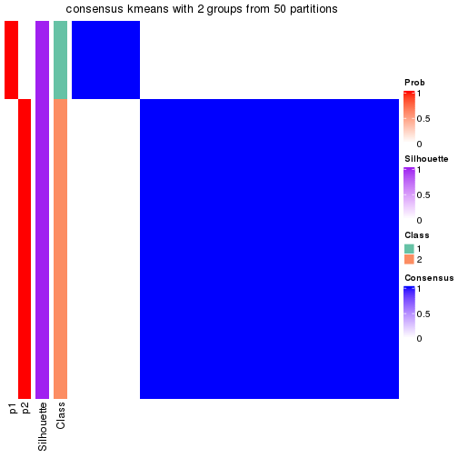</p>

</div>
<div id='tab-node-0232-consensus-heatmap-2'>
<pre><code class="r">consensus_heatmap(res, k = 3)
</code></pre>

<p></p>

</div>
<div id='tab-node-0232-consensus-heatmap-3'>
<pre><code class="r">consensus_heatmap(res, k = 4)
</code></pre>

<p>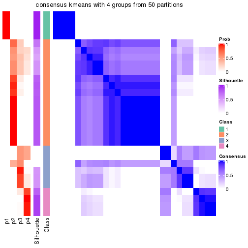</p>

</div>
<div id='tab-node-0232-consensus-heatmap-4'>
<pre><code class="r">consensus_heatmap(res, k = 5)
</code></pre>

<p>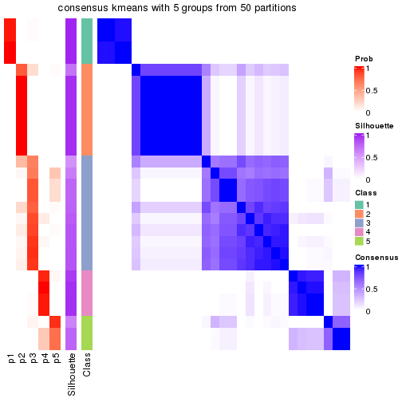</p>

</div>
<div id='tab-node-0232-consensus-heatmap-5'>
<pre><code class="r">consensus_heatmap(res, k = 6)
</code></pre>

<p>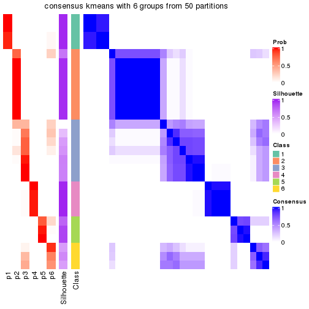</p>

</div>
<div id='tab-node-0232-consensus-heatmap-6'>
<pre><code class="r">consensus_heatmap(res, k = 7)
</code></pre>

<p>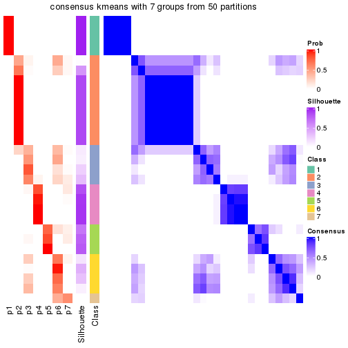</p>

</div>
<div id='tab-node-0232-consensus-heatmap-7'>
<pre><code class="r">consensus_heatmap(res, k = 8)
</code></pre>

<p>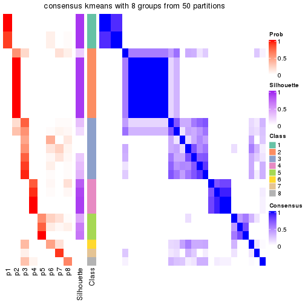</p>

</div>
</div>

Heatmaps for the membership of samples in all partitions to see how consistent they are:


<script>
$( function() {
	$( '#tabs-node-0232-membership-heatmap' ).tabs();
} );
</script>
<div id='tabs-node-0232-membership-heatmap'>
<ul>
<li><a href='#tab-node-0232-membership-heatmap-1'>k = 2</a></li>
<li><a href='#tab-node-0232-membership-heatmap-2'>k = 3</a></li>
<li><a href='#tab-node-0232-membership-heatmap-3'>k = 4</a></li>
<li><a href='#tab-node-0232-membership-heatmap-4'>k = 5</a></li>
<li><a href='#tab-node-0232-membership-heatmap-5'>k = 6</a></li>
<li><a href='#tab-node-0232-membership-heatmap-6'>k = 7</a></li>
<li><a href='#tab-node-0232-membership-heatmap-7'>k = 8</a></li>
</ul>
<div id='tab-node-0232-membership-heatmap-1'>
<pre><code class="r">membership_heatmap(res, k = 2)
</code></pre>

<p>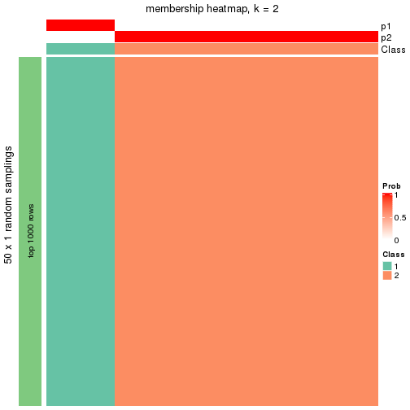</p>

</div>
<div id='tab-node-0232-membership-heatmap-2'>
<pre><code class="r">membership_heatmap(res, k = 3)
</code></pre>

<p>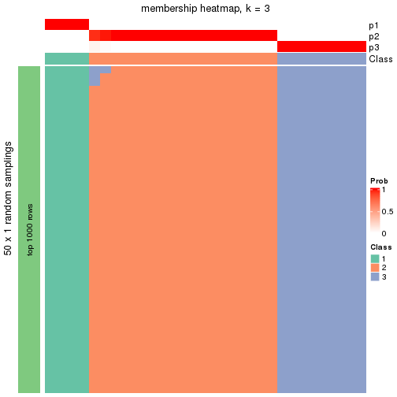</p>

</div>
<div id='tab-node-0232-membership-heatmap-3'>
<pre><code class="r">membership_heatmap(res, k = 4)
</code></pre>

<p>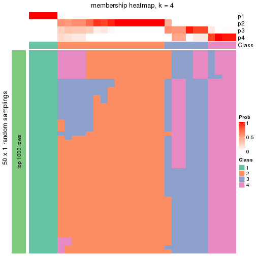</p>

</div>
<div id='tab-node-0232-membership-heatmap-4'>
<pre><code class="r">membership_heatmap(res, k = 5)
</code></pre>

<p>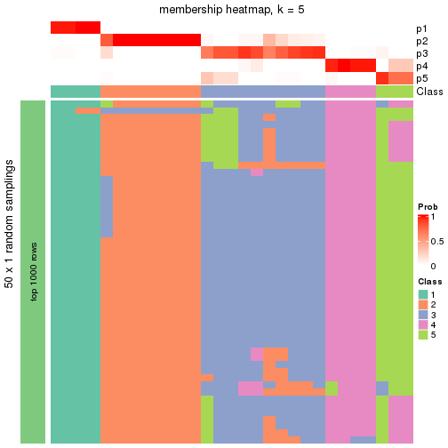</p>

</div>
<div id='tab-node-0232-membership-heatmap-5'>
<pre><code class="r">membership_heatmap(res, k = 6)
</code></pre>

<p>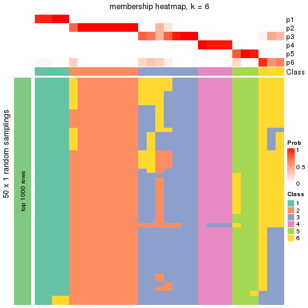</p>

</div>
<div id='tab-node-0232-membership-heatmap-6'>
<pre><code class="r">membership_heatmap(res, k = 7)
</code></pre>

<p>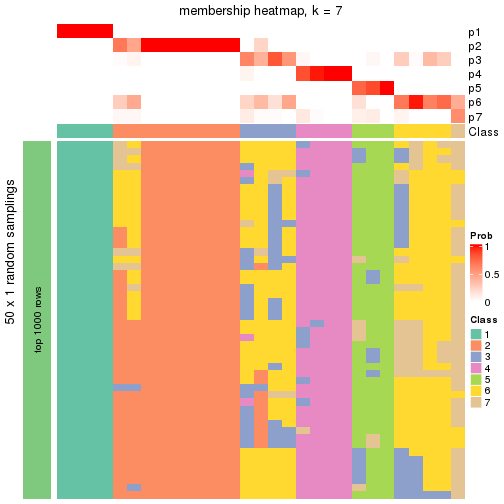</p>

</div>
<div id='tab-node-0232-membership-heatmap-7'>
<pre><code class="r">membership_heatmap(res, k = 8)
</code></pre>

<p>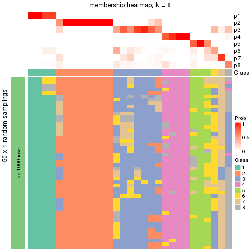</p>

</div>
</div>

As soon as the classes for columns are determined, the signatures
that are significantly different between subgroups can be looked for. 
Following are the heatmaps for signatures.


<script>
$( function() {
	$( '#tabs-node-0232-get-signatures' ).tabs();
} );
</script>
<div id='tabs-node-0232-get-signatures'>
<ul>
<li><a href='#tab-node-0232-get-signatures-1'>k = 2</a></li>
<li><a href='#tab-node-0232-get-signatures-2'>k = 3</a></li>
<li><a href='#tab-node-0232-get-signatures-3'>k = 4</a></li>
<li><a href='#tab-node-0232-get-signatures-4'>k = 5</a></li>
<li><a href='#tab-node-0232-get-signatures-5'>k = 6</a></li>
<li><a href='#tab-node-0232-get-signatures-6'>k = 7</a></li>
<li><a href='#tab-node-0232-get-signatures-7'>k = 8</a></li>
</ul>
<div id='tab-node-0232-get-signatures-1'>
<pre><code class="r">get_signatures(res, k = 2)
</code></pre>

<p>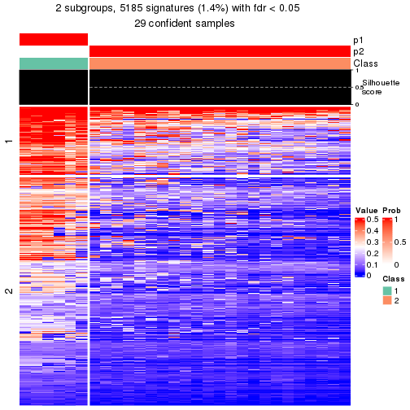</p>

</div>
<div id='tab-node-0232-get-signatures-2'>
<pre><code class="r">get_signatures(res, k = 3)
</code></pre>

<p>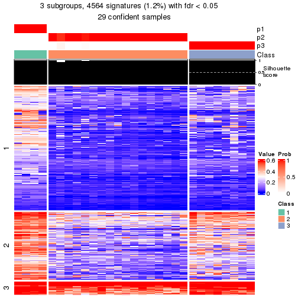</p>

</div>
<div id='tab-node-0232-get-signatures-3'>
<pre><code class="r">get_signatures(res, k = 4)
</code></pre>

<p>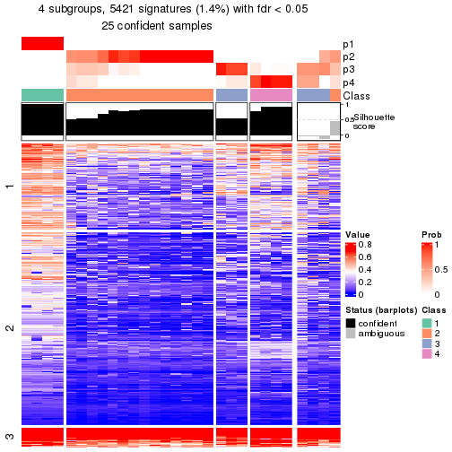</p>

</div>
<div id='tab-node-0232-get-signatures-4'>
<pre><code class="r">get_signatures(res, k = 5)
</code></pre>

<p>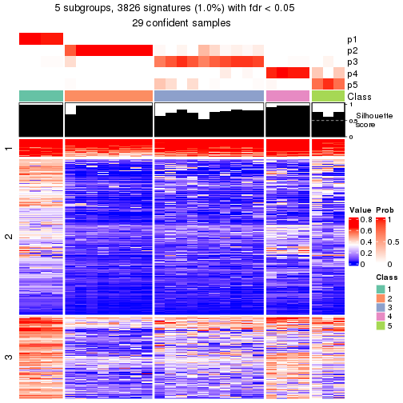</p>

</div>
<div id='tab-node-0232-get-signatures-5'>
<pre><code class="r">get_signatures(res, k = 6)
</code></pre>

<p>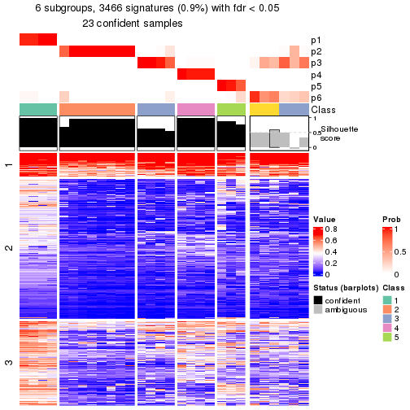</p>

</div>
<div id='tab-node-0232-get-signatures-6'>
<pre><code class="r">get_signatures(res, k = 7)
</code></pre>

<p>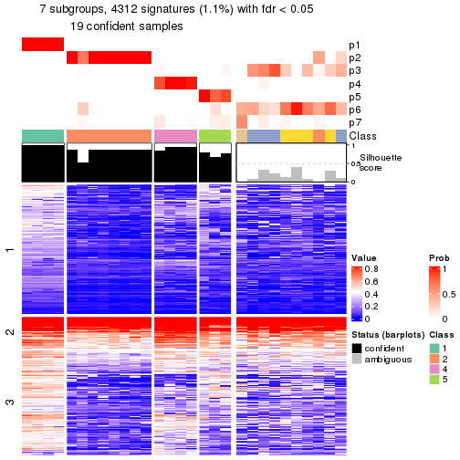</p>

</div>
<div id='tab-node-0232-get-signatures-7'>
<pre><code class="r">get_signatures(res, k = 8)
</code></pre>

<p>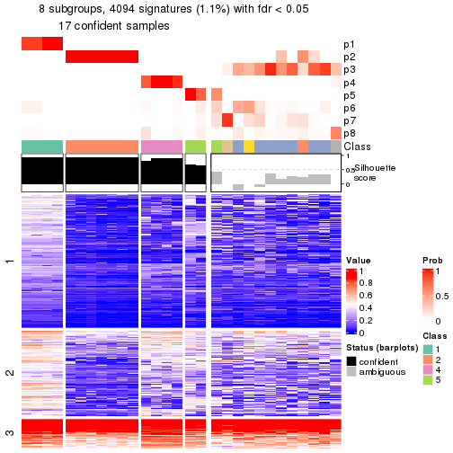</p>

</div>
</div>


Compare the overlap of signatures from different k:

```r
compare_signatures(res)
```

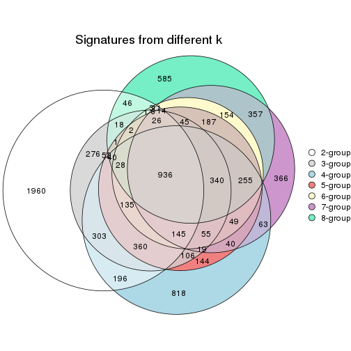

`get_signature()` returns a data frame invisibly. To get the list of signatures, the function
call should be assigned to a variable explicitly. In following code, if `plot` argument is set
to `FALSE`, no heatmap is plotted while only the differential analysis is performed.

```r
# code only for demonstration
tb = get_signature(res, k = ..., plot = FALSE)
```

An example of the output of `tb` is:

```
#>   which_row         fdr    mean_1    mean_2 scaled_mean_1 scaled_mean_2 km
#> 1        38 0.042760348  8.373488  9.131774    -0.5533452     0.5164555  1
#> 2        40 0.018707592  7.106213  8.469186    -0.6173731     0.5762149  1
#> 3        55 0.019134737 10.221463 11.207825    -0.6159697     0.5749050  1
#> 4        59 0.006059896  5.921854  7.869574    -0.6899429     0.6439467  1
#> 5        60 0.018055526  8.928898 10.211722    -0.6204761     0.5791110  1
#> 6        98 0.009384629 15.714769 14.887706     0.6635654    -0.6193277  2
...
```

The columns in `tb` are:

1. `which_row`: row indices corresponding to the input matrix.
2. `fdr`: FDR for the differential test. 
3. `mean_x`: The mean value in group x.
4. `scaled_mean_x`: The mean value in group x after rows are scaled.
5. `km`: Row groups if k-means clustering is applied to rows (which is done by automatically selecting number of clusters).

If there are too many signatures, `top_signatures = ...` can be set to only show the 
signatures with the highest FDRs:

```r
# code only for demonstration
# e.g. to show the top 500 most significant rows
tb = get_signature(res, k = ..., top_signatures = 500)
```

If the signatures are defined as these which are uniquely high in current group, `diff_method` argument
can be set to `"uniquely_high_in_one_group"`:

```r
# code only for demonstration
tb = get_signature(res, k = ..., diff_method = "uniquely_high_in_one_group")
```


UMAP plot which shows how samples are separated.


<script>
$( function() {
	$( '#tabs-node-0232-dimension-reduction' ).tabs();
} );
</script>
<div id='tabs-node-0232-dimension-reduction'>
<ul>
<li><a href='#tab-node-0232-dimension-reduction-1'>k = 2</a></li>
<li><a href='#tab-node-0232-dimension-reduction-2'>k = 3</a></li>
<li><a href='#tab-node-0232-dimension-reduction-3'>k = 4</a></li>
<li><a href='#tab-node-0232-dimension-reduction-4'>k = 5</a></li>
<li><a href='#tab-node-0232-dimension-reduction-5'>k = 6</a></li>
<li><a href='#tab-node-0232-dimension-reduction-6'>k = 7</a></li>
<li><a href='#tab-node-0232-dimension-reduction-7'>k = 8</a></li>
</ul>
<div id='tab-node-0232-dimension-reduction-1'>
<pre><code class="r">dimension_reduction(res, k = 2, method = &quot;UMAP&quot;)
</code></pre>

<p>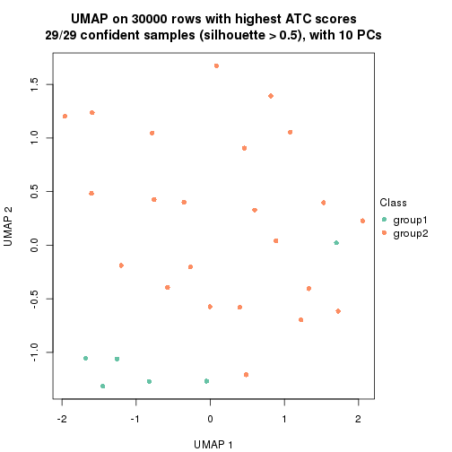</p>

</div>
<div id='tab-node-0232-dimension-reduction-2'>
<pre><code class="r">dimension_reduction(res, k = 3, method = &quot;UMAP&quot;)
</code></pre>

<p>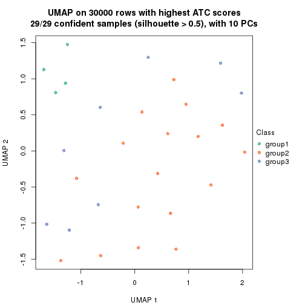</p>

</div>
<div id='tab-node-0232-dimension-reduction-3'>
<pre><code class="r">dimension_reduction(res, k = 4, method = &quot;UMAP&quot;)
</code></pre>

<p>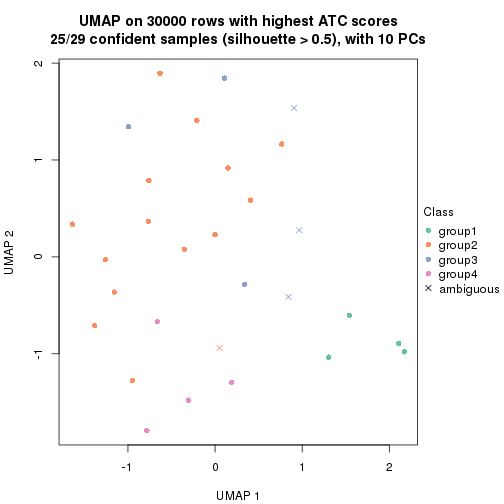</p>

</div>
<div id='tab-node-0232-dimension-reduction-4'>
<pre><code class="r">dimension_reduction(res, k = 5, method = &quot;UMAP&quot;)
</code></pre>

<p>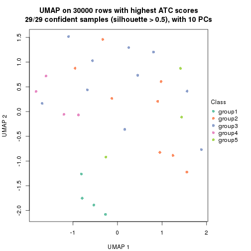</p>

</div>
<div id='tab-node-0232-dimension-reduction-5'>
<pre><code class="r">dimension_reduction(res, k = 6, method = &quot;UMAP&quot;)
</code></pre>

<p>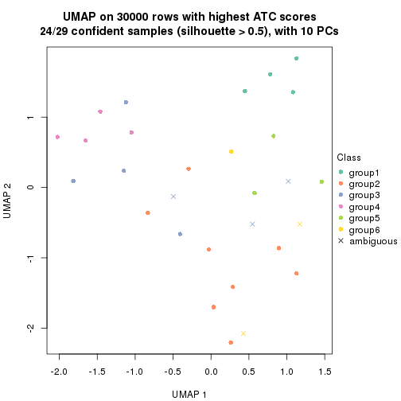</p>

</div>
<div id='tab-node-0232-dimension-reduction-6'>
<pre><code class="r">dimension_reduction(res, k = 7, method = &quot;UMAP&quot;)
</code></pre>

<p>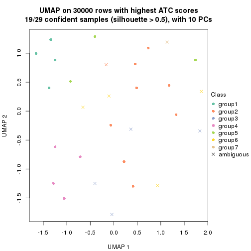</p>

</div>
<div id='tab-node-0232-dimension-reduction-7'>
<pre><code class="r">dimension_reduction(res, k = 8, method = &quot;UMAP&quot;)
</code></pre>

<p>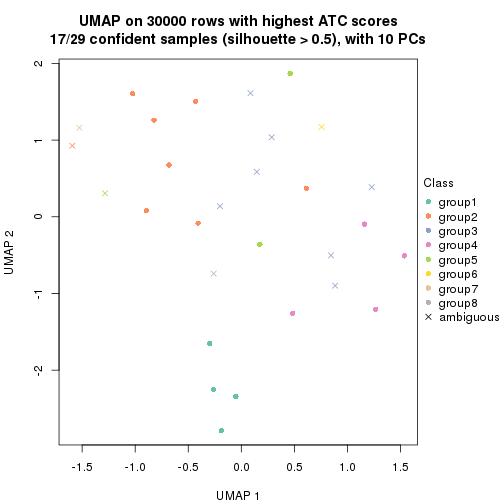</p>

</div>
</div>


Following heatmap shows how subgroups are split when increasing `k`:

```r
collect_classes(res)
```


If matrix rows can be associated to genes, consider to use `functional_enrichment(res,
...)` to perform function enrichment for the signature genes. See [this vignette](https://jokergoo.github.io/cola_vignettes/functional_enrichment.html) for more detailed explanations.


 

---------------------------------------------------


### Node03


Parent node: [Node0](#Node0).
Child nodes: 
                [Node011](#Node011)
        ,
                [Node012](#Node012)
        ,
                Node013-leaf
        ,
                [Node021](#Node021)
        ,
                [Node022](#Node022)
        ,
                [Node023](#Node023)
        ,
                Node031-leaf
        ,
                Node032-leaf
        ,
                [Node033](#Node033)
        ,
                Node034-leaf
        ,
                Node041-leaf
        ,
                Node042-leaf
        ,
                [Node043](#Node043)
        ,
                [Node051](#Node051)
        ,
                [Node052](#Node052)
        ,
                Node053-leaf
        .


The object with results only for a single top-value method and a single partitioning method 
can be extracted as:

```r
res = res_rh["03"]
```

A summary of `res` and all the functions that can be applied to it:

```r
res
```

```
#> A 'ConsensusPartition' object with k = 2, 3, 4, 5, 6, 7, 8.
#>   On a matrix with 30000 rows and 55 columns.
#>   Top rows (1000) are extracted by 'SD' method.
#>   Subgroups are detected by 'skmeans' method.
#>   Performed in total 350 partitions by row resampling.
#>   Best k for subgroups seems to be 4.
#> 
#> Following methods can be applied to this 'ConsensusPartition' object:
#>  [1] "cola_report"             "collect_classes"         "collect_plots"          
#>  [4] "collect_stats"           "colnames"                "compare_partitions"     
#>  [7] "compare_signatures"      "consensus_heatmap"       "dimension_reduction"    
#> [10] "functional_enrichment"   "get_anno_col"            "get_anno"               
#> [13] "get_classes"             "get_consensus"           "get_matrix"             
#> [16] "get_membership"          "get_param"               "get_signatures"         
#> [19] "get_stats"               "is_best_k"               "is_stable_k"            
#> [22] "membership_heatmap"      "ncol"                    "nrow"                   
#> [25] "plot_ecdf"               "predict_classes"         "rownames"               
#> [28] "select_partition_number" "show"                    "suggest_best_k"         
#> [31] "test_to_known_factors"   "top_rows_heatmap"
```

`collect_plots()` function collects all the plots made from `res` for all `k` (number of subgroups)
into one single page to provide an easy and fast comparison between different `k`.

```r
collect_plots(res)
```

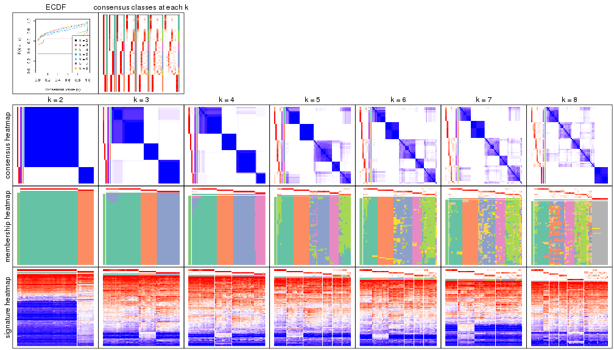

The plots are:

- The first row: a plot of the eCDF (empirical cumulative distribution
  function) curves of the consensus matrix for each `k` and the heatmap of
  predicted classes for each `k`.
- The second row: heatmaps of the consensus matrix for each `k`.
- The third row: heatmaps of the membership matrix for each `k`.
- The fouth row: heatmaps of the signatures for each `k`.

All the plots in panels can be made by individual functions and they are
plotted later in this section.

`select_partition_number()` produces several plots showing different
statistics for choosing "optimized" `k`. There are following statistics:

- eCDF curves of the consensus matrix for each `k`;
- 1-PAC. [The PAC score](https://en.wikipedia.org/wiki/Consensus_clustering#Over-interpretation_potential_of_consensus_clustering)
  measures the proportion of the ambiguous subgrouping.
- Mean silhouette score.
- Concordance. The mean probability of fiting the consensus subgroup labels in all
  partitions.
- Area increased. Denote $A_k$ as the area under the eCDF curve for current
  `k`, the area increased is defined as $A_k - A_{k-1}$.
- Rand index. The percent of pairs of samples that are both in a same cluster
  or both are not in a same cluster in the partition of k and k-1.
- Jaccard index. The ratio of pairs of samples are both in a same cluster in
  the partition of k and k-1 and the pairs of samples are both in a same
  cluster in the partition k or k-1.

The detailed explanations of these statistics can be found in [the _cola_
vignette](https://jokergoo.github.io/cola_vignettes/cola.html#toc_13).

Generally speaking, higher 1-PAC score, higher mean silhouette score or higher
concordance corresponds to better partition. Rand index and Jaccard index
measure how similar the current partition is compared to partition with `k-1`.
If they are too similar, we won't accept `k` is better than `k-1`.

```r
select_partition_number(res)
```

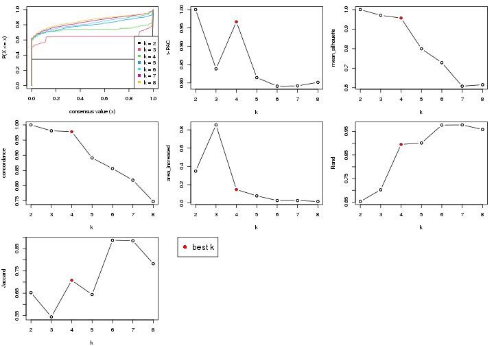

The numeric values for all these statistics can be obtained by `get_stats()`.

```r
get_stats(res)
```

```
#>   k 1-PAC mean_silhouette concordance area_increased  Rand Jaccard
#> 2 2 1.000           1.000       1.000         0.3481 0.653   0.653
#> 3 3 0.838           0.971       0.981         0.8539 0.702   0.544
#> 4 4 0.967           0.957       0.978         0.1466 0.895   0.708
#> 5 5 0.814           0.799       0.891         0.0770 0.901   0.644
#> 6 6 0.791           0.728       0.856         0.0264 0.977   0.888
#> 7 7 0.792           0.608       0.818         0.0263 0.978   0.885
#> 8 8 0.802           0.615       0.748         0.0155 0.958   0.782
```

`suggest_best_k()` suggests the best $k$ based on these statistics. The rules are as follows:

- All $k$ with Jaccard index larger than 0.95 are removed because increasing
  $k$ does not provide enough extra information. If all $k$ are removed, it is
  marked as no subgroup is detected.
- For all $k$ with 1-PAC score larger than 0.9, the maximal $k$ is taken as
  the best $k$, and other $k$ are marked as optional $k$.
- If it does not fit the second rule. The $k$ with the maximal vote of the
  highest 1-PAC score, highest mean silhouette, and highest concordance is
  taken as the best $k$.

```r
suggest_best_k(res)
```

```
#> [1] 4
#> attr(,"optional")
#> [1] 2
```

There is also optional best $k$ = 2 that is worth to check.

Following is the table of the partitions (You need to click the **show/hide
code output** link to see it). The membership matrix (columns with name `p*`)
is inferred by
[`clue::cl_consensus()`](https://www.rdocumentation.org/link/cl_consensus?package=clue)
function with the `SE` method. Basically the value in the membership matrix
represents the probability to belong to a certain group. The finall subgroup
label for an item is determined with the group with highest probability it
belongs to.

In `get_classes()` function, the entropy is calculated from the membership
matrix and the silhouette score is calculated from the consensus matrix.


<script>
$( function() {
	$( '#tabs-node-03-get-classes' ).tabs();
} );
</script>
<div id='tabs-node-03-get-classes'>
<ul>
<li><a href='#tab-node-03-get-classes-1'>k = 2</a></li>
<li><a href='#tab-node-03-get-classes-2'>k = 3</a></li>
<li><a href='#tab-node-03-get-classes-3'>k = 4</a></li>
<li><a href='#tab-node-03-get-classes-4'>k = 5</a></li>
<li><a href='#tab-node-03-get-classes-5'>k = 6</a></li>
<li><a href='#tab-node-03-get-classes-6'>k = 7</a></li>
<li><a href='#tab-node-03-get-classes-7'>k = 8</a></li>
</ul>

<div id='tab-node-03-get-classes-1'>
<p><a id='tab-node-03-get-classes-1-a' style='color:#0366d6' href='#'>show/hide code output</a></p>
<pre><code class="r">cbind(get_classes(res, k = 2), get_membership(res, k = 2))
</code></pre>

<pre><code>#&gt;                 class entropy silhouette p1 p2
#&gt; TCGA.CV.5435.11     1       0          1  1  0
#&gt; TCGA.CV.5432.11     1       0          1  1  0
#&gt; TCGA.CV.5430.11     1       0          1  1  0
#&gt; TCGA.CV.5434.11     1       0          1  1  0
#&gt; TCGA.CV.5970.11     1       0          1  1  0
#&gt; TCGA.CV.5976.11     1       0          1  1  0
#&gt; TCGA.CV.7103.11     1       0          1  1  0
#&gt; TCGA.CV.6003.11     2       0          1  0  1
#&gt; TCGA.CV.5439.11     1       0          1  1  0
#&gt; TCGA.CV.5971.11     1       0          1  1  0
#&gt; TCGA.CV.5966.11     2       0          1  0  1
#&gt; TCGA.CV.5977.11     1       0          1  1  0
#&gt; TCGA.CV.6441.11     1       0          1  1  0
#&gt; TCGA.CV.5978.11     2       0          1  0  1
#&gt; TCGA.CV.5973.11     2       0          1  0  1
#&gt; TCGA.CV.6436.11     1       0          1  1  0
#&gt; TCGA.CV.6433.11     1       0          1  1  0
#&gt; TCGA.CV.5979.11     1       0          1  1  0
#&gt; TCGA.CR.6492.01     1       0          1  1  0
#&gt; TCGA.CV.6955.11     2       0          1  0  1
#&gt; TCGA.CV.7238.11     2       0          1  0  1
#&gt; TCGA.CV.7089.11     1       0          1  1  0
#&gt; TCGA.CV.5431.11     1       0          1  1  0
#&gt; TCGA.CV.7255.11     2       0          1  0  1
#&gt; TCGA.CV.7236.01     2       0          1  0  1
#&gt; TCGA.CV.7250.11     1       0          1  1  0
#&gt; TCGA.CV.5442.11     2       0          1  0  1
#&gt; TCGA.CV.5436.11     1       0          1  1  0
#&gt; TCGA.CV.7245.11     1       0          1  1  0
#&gt; TCGA.CV.7235.11     1       0          1  1  0
#&gt; TCGA.CV.7263.11     1       0          1  1  0
#&gt; TCGA.CV.6956.11     1       0          1  1  0
#&gt; TCGA.CR.7393.01     1       0          1  1  0
#&gt; TCGA.CV.5444.11     1       0          1  1  0
#&gt; TCGA.CV.7178.11     2       0          1  0  1
#&gt; TCGA.CV.5443.11     1       0          1  1  0
#&gt; TCGA.CR.7397.01     1       0          1  1  0
#&gt; TCGA.CV.5440.11     1       0          1  1  0
#&gt; TCGA.CV.7101.11     1       0          1  1  0
#&gt; TCGA.CV.6935.11     1       0          1  1  0
#&gt; TCGA.CV.6959.11     1       0          1  1  0
#&gt; TCGA.CV.6938.11     1       0          1  1  0
#&gt; TCGA.CV.6952.11     2       0          1  0  1
#&gt; TCGA.CV.6951.11     1       0          1  1  0
#&gt; TCGA.CV.6939.11     1       0          1  1  0
#&gt; TCGA.CV.6954.11     1       0          1  1  0
#&gt; TCGA.CV.6962.11     1       0          1  1  0
#&gt; TCGA.CV.6961.11     1       0          1  1  0
#&gt; TCGA.CV.6934.11     2       0          1  0  1
#&gt; TCGA.CV.6943.11     1       0          1  1  0
#&gt; TCGA.CV.6936.11     1       0          1  1  0
#&gt; TCGA.D6.6824.01     1       0          1  1  0
#&gt; TCGA.CV.6933.11     1       0          1  1  0
#&gt; TCGA.KU.A6H8.01     1       0          1  1  0
#&gt; TCGA.CV.A6K0.01     1       0          1  1  0
</code></pre>

<script>
$('#tab-node-03-get-classes-1-a').parent().next().next().hide();
$('#tab-node-03-get-classes-1-a').click(function(){
  $('#tab-node-03-get-classes-1-a').parent().next().next().toggle();
  return(false);
});
</script>
</div>

<div id='tab-node-03-get-classes-2'>
<p><a id='tab-node-03-get-classes-2-a' style='color:#0366d6' href='#'>show/hide code output</a></p>
<pre><code class="r">cbind(get_classes(res, k = 3), get_membership(res, k = 3))
</code></pre>

<pre><code>#&gt;                 class entropy silhouette   p1 p2   p3
#&gt; TCGA.CV.5435.11     3  0.0000      0.997 0.00  0 1.00
#&gt; TCGA.CV.5432.11     1  0.3340      0.907 0.88  0 0.12
#&gt; TCGA.CV.5430.11     1  0.3340      0.907 0.88  0 0.12
#&gt; TCGA.CV.5434.11     3  0.0000      0.997 0.00  0 1.00
#&gt; TCGA.CV.5970.11     1  0.0000      0.957 1.00  0 0.00
#&gt; TCGA.CV.5976.11     1  0.0000      0.957 1.00  0 0.00
#&gt; TCGA.CV.7103.11     1  0.0000      0.957 1.00  0 0.00
#&gt; TCGA.CV.6003.11     2  0.0000      1.000 0.00  1 0.00
#&gt; TCGA.CV.5439.11     3  0.0000      0.997 0.00  0 1.00
#&gt; TCGA.CV.5971.11     1  0.0892      0.953 0.98  0 0.02
#&gt; TCGA.CV.5966.11     2  0.0000      1.000 0.00  1 0.00
#&gt; TCGA.CV.5977.11     3  0.0000      0.997 0.00  0 1.00
#&gt; TCGA.CV.6441.11     1  0.0000      0.957 1.00  0 0.00
#&gt; TCGA.CV.5978.11     2  0.0000      1.000 0.00  1 0.00
#&gt; TCGA.CV.5973.11     2  0.0000      1.000 0.00  1 0.00
#&gt; TCGA.CV.6436.11     1  0.0000      0.957 1.00  0 0.00
#&gt; TCGA.CV.6433.11     1  0.2066      0.938 0.94  0 0.06
#&gt; TCGA.CV.5979.11     3  0.0000      0.997 0.00  0 1.00
#&gt; TCGA.CR.6492.01     3  0.0000      0.997 0.00  0 1.00
#&gt; TCGA.CV.6955.11     2  0.0000      1.000 0.00  1 0.00
#&gt; TCGA.CV.7238.11     2  0.0000      1.000 0.00  1 0.00
#&gt; TCGA.CV.7089.11     3  0.0000      0.997 0.00  0 1.00
#&gt; TCGA.CV.5431.11     1  0.3340      0.907 0.88  0 0.12
#&gt; TCGA.CV.7255.11     2  0.0000      1.000 0.00  1 0.00
#&gt; TCGA.CV.7236.01     2  0.0000      1.000 0.00  1 0.00
#&gt; TCGA.CV.7250.11     1  0.3340      0.907 0.88  0 0.12
#&gt; TCGA.CV.5442.11     2  0.0000      1.000 0.00  1 0.00
#&gt; TCGA.CV.5436.11     1  0.0000      0.957 1.00  0 0.00
#&gt; TCGA.CV.7245.11     3  0.0000      0.997 0.00  0 1.00
#&gt; TCGA.CV.7235.11     3  0.0000      0.997 0.00  0 1.00
#&gt; TCGA.CV.7263.11     1  0.0000      0.957 1.00  0 0.00
#&gt; TCGA.CV.6956.11     1  0.0000      0.957 1.00  0 0.00
#&gt; TCGA.CR.7393.01     1  0.0892      0.953 0.98  0 0.02
#&gt; TCGA.CV.5444.11     3  0.0000      0.997 0.00  0 1.00
#&gt; TCGA.CV.7178.11     2  0.0000      1.000 0.00  1 0.00
#&gt; TCGA.CV.5443.11     3  0.0000      0.997 0.00  0 1.00
#&gt; TCGA.CR.7397.01     3  0.1529      0.950 0.04  0 0.96
#&gt; TCGA.CV.5440.11     3  0.0000      0.997 0.00  0 1.00
#&gt; TCGA.CV.7101.11     1  0.3340      0.907 0.88  0 0.12
#&gt; TCGA.CV.6935.11     1  0.0000      0.957 1.00  0 0.00
#&gt; TCGA.CV.6959.11     1  0.0000      0.957 1.00  0 0.00
#&gt; TCGA.CV.6938.11     3  0.0000      0.997 0.00  0 1.00
#&gt; TCGA.CV.6952.11     2  0.0000      1.000 0.00  1 0.00
#&gt; TCGA.CV.6951.11     1  0.0000      0.957 1.00  0 0.00
#&gt; TCGA.CV.6939.11     3  0.0000      0.997 0.00  0 1.00
#&gt; TCGA.CV.6954.11     1  0.0000      0.957 1.00  0 0.00
#&gt; TCGA.CV.6962.11     1  0.3340      0.907 0.88  0 0.12
#&gt; TCGA.CV.6961.11     1  0.0000      0.957 1.00  0 0.00
#&gt; TCGA.CV.6934.11     2  0.0000      1.000 0.00  1 0.00
#&gt; TCGA.CV.6943.11     1  0.0000      0.957 1.00  0 0.00
#&gt; TCGA.CV.6936.11     1  0.0000      0.957 1.00  0 0.00
#&gt; TCGA.D6.6824.01     3  0.0000      0.997 0.00  0 1.00
#&gt; TCGA.CV.6933.11     3  0.0000      0.997 0.00  0 1.00
#&gt; TCGA.KU.A6H8.01     1  0.3340      0.907 0.88  0 0.12
#&gt; TCGA.CV.A6K0.01     1  0.2537      0.930 0.92  0 0.08
</code></pre>

<script>
$('#tab-node-03-get-classes-2-a').parent().next().next().hide();
$('#tab-node-03-get-classes-2-a').click(function(){
  $('#tab-node-03-get-classes-2-a').parent().next().next().toggle();
  return(false);
});
</script>
</div>

<div id='tab-node-03-get-classes-3'>
<p><a id='tab-node-03-get-classes-3-a' style='color:#0366d6' href='#'>show/hide code output</a></p>
<pre><code class="r">cbind(get_classes(res, k = 4), get_membership(res, k = 4))
</code></pre>

<pre><code>#&gt;                 class entropy silhouette   p1 p2   p3   p4
#&gt; TCGA.CV.5435.11     3  0.0707      0.976 0.00  0 0.98 0.02
#&gt; TCGA.CV.5432.11     4  0.0000      0.956 0.00  0 0.00 1.00
#&gt; TCGA.CV.5430.11     4  0.0000      0.956 0.00  0 0.00 1.00
#&gt; TCGA.CV.5434.11     3  0.0000      0.997 0.00  0 1.00 0.00
#&gt; TCGA.CV.5970.11     1  0.1211      0.931 0.96  0 0.00 0.04
#&gt; TCGA.CV.5976.11     1  0.0000      0.949 1.00  0 0.00 0.00
#&gt; TCGA.CV.7103.11     1  0.0000      0.949 1.00  0 0.00 0.00
#&gt; TCGA.CV.6003.11     2  0.0000      1.000 0.00  1 0.00 0.00
#&gt; TCGA.CV.5439.11     3  0.0000      0.997 0.00  0 1.00 0.00
#&gt; TCGA.CV.5971.11     1  0.3198      0.883 0.88  0 0.08 0.04
#&gt; TCGA.CV.5966.11     2  0.0000      1.000 0.00  1 0.00 0.00
#&gt; TCGA.CV.5977.11     3  0.0000      0.997 0.00  0 1.00 0.00
#&gt; TCGA.CV.6441.11     1  0.0000      0.949 1.00  0 0.00 0.00
#&gt; TCGA.CV.5978.11     2  0.0000      1.000 0.00  1 0.00 0.00
#&gt; TCGA.CV.5973.11     2  0.0000      1.000 0.00  1 0.00 0.00
#&gt; TCGA.CV.6436.11     1  0.0000      0.949 1.00  0 0.00 0.00
#&gt; TCGA.CV.6433.11     1  0.3821      0.847 0.84  0 0.12 0.04
#&gt; TCGA.CV.5979.11     3  0.0000      0.997 0.00  0 1.00 0.00
#&gt; TCGA.CR.6492.01     3  0.0000      0.997 0.00  0 1.00 0.00
#&gt; TCGA.CV.6955.11     2  0.0000      1.000 0.00  1 0.00 0.00
#&gt; TCGA.CV.7238.11     2  0.0000      1.000 0.00  1 0.00 0.00
#&gt; TCGA.CV.7089.11     3  0.0000      0.997 0.00  0 1.00 0.00
#&gt; TCGA.CV.5431.11     4  0.0000      0.956 0.00  0 0.00 1.00
#&gt; TCGA.CV.7255.11     2  0.0000      1.000 0.00  1 0.00 0.00
#&gt; TCGA.CV.7236.01     2  0.0000      1.000 0.00  1 0.00 0.00
#&gt; TCGA.CV.7250.11     4  0.0000      0.956 0.00  0 0.00 1.00
#&gt; TCGA.CV.5442.11     2  0.0000      1.000 0.00  1 0.00 0.00
#&gt; TCGA.CV.5436.11     1  0.0000      0.949 1.00  0 0.00 0.00
#&gt; TCGA.CV.7245.11     3  0.0000      0.997 0.00  0 1.00 0.00
#&gt; TCGA.CV.7235.11     3  0.0000      0.997 0.00  0 1.00 0.00
#&gt; TCGA.CV.7263.11     1  0.0000      0.949 1.00  0 0.00 0.00
#&gt; TCGA.CV.6956.11     1  0.0000      0.949 1.00  0 0.00 0.00
#&gt; TCGA.CR.7393.01     1  0.2411      0.912 0.92  0 0.04 0.04
#&gt; TCGA.CV.5444.11     3  0.0000      0.997 0.00  0 1.00 0.00
#&gt; TCGA.CV.7178.11     2  0.0000      1.000 0.00  1 0.00 0.00
#&gt; TCGA.CV.5443.11     4  0.4277      0.614 0.00  0 0.28 0.72
#&gt; TCGA.CR.7397.01     3  0.0707      0.974 0.02  0 0.98 0.00
#&gt; TCGA.CV.5440.11     3  0.0000      0.997 0.00  0 1.00 0.00
#&gt; TCGA.CV.7101.11     4  0.0000      0.956 0.00  0 0.00 1.00
#&gt; TCGA.CV.6935.11     4  0.0000      0.956 0.00  0 0.00 1.00
#&gt; TCGA.CV.6959.11     1  0.0000      0.949 1.00  0 0.00 0.00
#&gt; TCGA.CV.6938.11     3  0.0000      0.997 0.00  0 1.00 0.00
#&gt; TCGA.CV.6952.11     2  0.0000      1.000 0.00  1 0.00 0.00
#&gt; TCGA.CV.6951.11     1  0.0000      0.949 1.00  0 0.00 0.00
#&gt; TCGA.CV.6939.11     3  0.0000      0.997 0.00  0 1.00 0.00
#&gt; TCGA.CV.6954.11     1  0.0000      0.949 1.00  0 0.00 0.00
#&gt; TCGA.CV.6962.11     4  0.0000      0.956 0.00  0 0.00 1.00
#&gt; TCGA.CV.6961.11     1  0.0000      0.949 1.00  0 0.00 0.00
#&gt; TCGA.CV.6934.11     2  0.0000      1.000 0.00  1 0.00 0.00
#&gt; TCGA.CV.6943.11     1  0.0000      0.949 1.00  0 0.00 0.00
#&gt; TCGA.CV.6936.11     1  0.1211      0.931 0.96  0 0.00 0.04
#&gt; TCGA.D6.6824.01     3  0.0000      0.997 0.00  0 1.00 0.00
#&gt; TCGA.CV.6933.11     3  0.0000      0.997 0.00  0 1.00 0.00
#&gt; TCGA.KU.A6H8.01     1  0.5106      0.697 0.72  0 0.24 0.04
#&gt; TCGA.CV.A6K0.01     1  0.4088      0.826 0.82  0 0.14 0.04
</code></pre>

<script>
$('#tab-node-03-get-classes-3-a').parent().next().next().hide();
$('#tab-node-03-get-classes-3-a').click(function(){
  $('#tab-node-03-get-classes-3-a').parent().next().next().toggle();
  return(false);
});
</script>
</div>

<div id='tab-node-03-get-classes-4'>
<p><a id='tab-node-03-get-classes-4-a' style='color:#0366d6' href='#'>show/hide code output</a></p>
<pre><code class="r">cbind(get_classes(res, k = 5), get_membership(res, k = 5))
</code></pre>

<pre><code>#&gt;                 class entropy silhouette   p1 p2   p3   p4   p5
#&gt; TCGA.CV.5435.11     3  0.5555      0.641 0.00  0 0.64 0.22 0.14
#&gt; TCGA.CV.5432.11     4  0.0609      0.975 0.00  0 0.00 0.98 0.02
#&gt; TCGA.CV.5430.11     4  0.0000      0.983 0.00  0 0.00 1.00 0.00
#&gt; TCGA.CV.5434.11     3  0.1732      0.835 0.00  0 0.92 0.00 0.08
#&gt; TCGA.CV.5970.11     5  0.4840      0.586 0.32  0 0.00 0.04 0.64
#&gt; TCGA.CV.5976.11     1  0.4227      0.113 0.58  0 0.00 0.00 0.42
#&gt; TCGA.CV.7103.11     1  0.0000      0.851 1.00  0 0.00 0.00 0.00
#&gt; TCGA.CV.6003.11     2  0.0000      1.000 0.00  1 0.00 0.00 0.00
#&gt; TCGA.CV.5439.11     3  0.3796      0.583 0.00  0 0.70 0.00 0.30
#&gt; TCGA.CV.5971.11     5  0.3852      0.745 0.22  0 0.02 0.00 0.76
#&gt; TCGA.CV.5966.11     2  0.0000      1.000 0.00  1 0.00 0.00 0.00
#&gt; TCGA.CV.5977.11     3  0.1410      0.842 0.00  0 0.94 0.00 0.06
#&gt; TCGA.CV.6441.11     1  0.0000      0.851 1.00  0 0.00 0.00 0.00
#&gt; TCGA.CV.5978.11     2  0.0000      1.000 0.00  1 0.00 0.00 0.00
#&gt; TCGA.CV.5973.11     2  0.0000      1.000 0.00  1 0.00 0.00 0.00
#&gt; TCGA.CV.6436.11     1  0.1043      0.823 0.96  0 0.00 0.00 0.04
#&gt; TCGA.CV.6433.11     5  0.3690      0.756 0.20  0 0.02 0.00 0.78
#&gt; TCGA.CV.5979.11     3  0.0000      0.842 0.00  0 1.00 0.00 0.00
#&gt; TCGA.CR.6492.01     3  0.3424      0.755 0.00  0 0.76 0.00 0.24
#&gt; TCGA.CV.6955.11     2  0.0000      1.000 0.00  1 0.00 0.00 0.00
#&gt; TCGA.CV.7238.11     2  0.0000      1.000 0.00  1 0.00 0.00 0.00
#&gt; TCGA.CV.7089.11     3  0.1732      0.840 0.00  0 0.92 0.00 0.08
#&gt; TCGA.CV.5431.11     4  0.0609      0.982 0.00  0 0.00 0.98 0.02
#&gt; TCGA.CV.7255.11     2  0.0000      1.000 0.00  1 0.00 0.00 0.00
#&gt; TCGA.CV.7236.01     2  0.0000      1.000 0.00  1 0.00 0.00 0.00
#&gt; TCGA.CV.7250.11     4  0.0609      0.975 0.00  0 0.00 0.98 0.02
#&gt; TCGA.CV.5442.11     2  0.0000      1.000 0.00  1 0.00 0.00 0.00
#&gt; TCGA.CV.5436.11     1  0.3796      0.464 0.70  0 0.00 0.00 0.30
#&gt; TCGA.CV.7245.11     3  0.1732      0.840 0.00  0 0.92 0.00 0.08
#&gt; TCGA.CV.7235.11     3  0.1410      0.827 0.00  0 0.94 0.00 0.06
#&gt; TCGA.CV.7263.11     1  0.4307     -0.222 0.50  0 0.00 0.00 0.50
#&gt; TCGA.CV.6956.11     1  0.0000      0.851 1.00  0 0.00 0.00 0.00
#&gt; TCGA.CR.7393.01     5  0.3424      0.735 0.24  0 0.00 0.00 0.76
#&gt; TCGA.CV.5444.11     3  0.0609      0.843 0.00  0 0.98 0.00 0.02
#&gt; TCGA.CV.7178.11     2  0.0000      1.000 0.00  1 0.00 0.00 0.00
#&gt; TCGA.CV.5443.11     3  0.5927      0.288 0.00  0 0.54 0.34 0.12
#&gt; TCGA.CR.7397.01     5  0.3561      0.486 0.00  0 0.26 0.00 0.74
#&gt; TCGA.CV.5440.11     3  0.2929      0.775 0.00  0 0.82 0.00 0.18
#&gt; TCGA.CV.7101.11     4  0.1043      0.972 0.00  0 0.00 0.96 0.04
#&gt; TCGA.CV.6935.11     4  0.0000      0.983 0.00  0 0.00 1.00 0.00
#&gt; TCGA.CV.6959.11     1  0.0000      0.851 1.00  0 0.00 0.00 0.00
#&gt; TCGA.CV.6938.11     5  0.4126      0.265 0.00  0 0.38 0.00 0.62
#&gt; TCGA.CV.6952.11     2  0.0000      1.000 0.00  1 0.00 0.00 0.00
#&gt; TCGA.CV.6951.11     1  0.0000      0.851 1.00  0 0.00 0.00 0.00
#&gt; TCGA.CV.6939.11     3  0.1410      0.842 0.00  0 0.94 0.00 0.06
#&gt; TCGA.CV.6954.11     1  0.0000      0.851 1.00  0 0.00 0.00 0.00
#&gt; TCGA.CV.6962.11     4  0.0609      0.982 0.00  0 0.00 0.98 0.02
#&gt; TCGA.CV.6961.11     1  0.0000      0.851 1.00  0 0.00 0.00 0.00
#&gt; TCGA.CV.6934.11     2  0.0000      1.000 0.00  1 0.00 0.00 0.00
#&gt; TCGA.CV.6943.11     1  0.0000      0.851 1.00  0 0.00 0.00 0.00
#&gt; TCGA.CV.6936.11     5  0.3561      0.708 0.26  0 0.00 0.00 0.74
#&gt; TCGA.D6.6824.01     3  0.4075      0.772 0.00  0 0.78 0.06 0.16
#&gt; TCGA.CV.6933.11     3  0.1410      0.827 0.00  0 0.94 0.00 0.06
#&gt; TCGA.KU.A6H8.01     5  0.4527      0.740 0.12  0 0.08 0.02 0.78
#&gt; TCGA.CV.A6K0.01     5  0.3291      0.752 0.12  0 0.04 0.00 0.84
</code></pre>

<script>
$('#tab-node-03-get-classes-4-a').parent().next().next().hide();
$('#tab-node-03-get-classes-4-a').click(function(){
  $('#tab-node-03-get-classes-4-a').parent().next().next().toggle();
  return(false);
});
</script>
</div>

<div id='tab-node-03-get-classes-5'>
<p><a id='tab-node-03-get-classes-5-a' style='color:#0366d6' href='#'>show/hide code output</a></p>
<pre><code class="r">cbind(get_classes(res, k = 6), get_membership(res, k = 6))
</code></pre>

<pre><code>#&gt;                 class entropy silhouette   p1   p2   p3   p4   p5   p6
#&gt; TCGA.CV.5435.11     3  0.6290     0.2915 0.00 0.00 0.54 0.26 0.14 0.06
#&gt; TCGA.CV.5432.11     4  0.3163     0.6757 0.00 0.00 0.00 0.82 0.14 0.04
#&gt; TCGA.CV.5430.11     4  0.0547     0.8142 0.00 0.00 0.00 0.98 0.02 0.00
#&gt; TCGA.CV.5434.11     3  0.3523     0.6631 0.00 0.00 0.78 0.00 0.04 0.18
#&gt; TCGA.CV.5970.11     5  0.3483     0.7446 0.12 0.00 0.00 0.04 0.82 0.02
#&gt; TCGA.CV.5976.11     1  0.4337    -0.0243 0.50 0.00 0.02 0.00 0.48 0.00
#&gt; TCGA.CV.7103.11     1  0.0547     0.8590 0.98 0.00 0.00 0.00 0.00 0.02
#&gt; TCGA.CV.6003.11     2  0.0937     0.9788 0.00 0.96 0.00 0.00 0.00 0.04
#&gt; TCGA.CV.5439.11     3  0.2793     0.6507 0.00 0.00 0.80 0.00 0.20 0.00
#&gt; TCGA.CV.5971.11     5  0.2094     0.7782 0.08 0.00 0.02 0.00 0.90 0.00
#&gt; TCGA.CV.5966.11     2  0.0937     0.9788 0.00 0.96 0.00 0.00 0.00 0.04
#&gt; TCGA.CV.5977.11     3  0.0937     0.7337 0.00 0.00 0.96 0.00 0.04 0.00
#&gt; TCGA.CV.6441.11     1  0.0547     0.8565 0.98 0.00 0.00 0.00 0.00 0.02
#&gt; TCGA.CV.5978.11     2  0.0547     0.9814 0.00 0.98 0.00 0.00 0.00 0.02
#&gt; TCGA.CV.5973.11     2  0.0937     0.9788 0.00 0.96 0.00 0.00 0.00 0.04
#&gt; TCGA.CV.6436.11     1  0.2981     0.7416 0.82 0.00 0.00 0.00 0.16 0.02
#&gt; TCGA.CV.6433.11     5  0.2094     0.7782 0.08 0.00 0.02 0.00 0.90 0.00
#&gt; TCGA.CV.5979.11     3  0.2793     0.6710 0.00 0.00 0.80 0.00 0.00 0.20
#&gt; TCGA.CR.6492.01     3  0.6262     0.3565 0.00 0.00 0.46 0.02 0.32 0.20
#&gt; TCGA.CV.6955.11     2  0.0000     0.9821 0.00 1.00 0.00 0.00 0.00 0.00
#&gt; TCGA.CV.7238.11     2  0.0937     0.9788 0.00 0.96 0.00 0.00 0.00 0.04
#&gt; TCGA.CV.7089.11     3  0.2794     0.7089 0.00 0.00 0.86 0.00 0.06 0.08
#&gt; TCGA.CV.5431.11     4  0.1480     0.8067 0.00 0.00 0.00 0.94 0.02 0.04
#&gt; TCGA.CV.7255.11     2  0.0000     0.9821 0.00 1.00 0.00 0.00 0.00 0.00
#&gt; TCGA.CV.7236.01     2  0.0000     0.9821 0.00 1.00 0.00 0.00 0.00 0.00
#&gt; TCGA.CV.7250.11     4  0.2981     0.6655 0.00 0.00 0.00 0.82 0.16 0.02
#&gt; TCGA.CV.5442.11     2  0.0000     0.9821 0.00 1.00 0.00 0.00 0.00 0.00
#&gt; TCGA.CV.5436.11     1  0.4002     0.4909 0.66 0.00 0.00 0.00 0.32 0.02
#&gt; TCGA.CV.7245.11     3  0.0937     0.7337 0.00 0.00 0.96 0.00 0.04 0.00
#&gt; TCGA.CV.7235.11     3  0.3315     0.6515 0.00 0.00 0.78 0.00 0.02 0.20
#&gt; TCGA.CV.7263.11     5  0.5071     0.2499 0.40 0.00 0.00 0.00 0.52 0.08
#&gt; TCGA.CV.6956.11     1  0.0547     0.8565 0.98 0.00 0.00 0.00 0.00 0.02
#&gt; TCGA.CR.7393.01     5  0.3572     0.7687 0.10 0.00 0.02 0.00 0.82 0.06
#&gt; TCGA.CV.5444.11     3  0.0547     0.7323 0.00 0.00 0.98 0.00 0.02 0.00
#&gt; TCGA.CV.7178.11     2  0.0000     0.9821 0.00 1.00 0.00 0.00 0.00 0.00
#&gt; TCGA.CV.5443.11     6  0.5618     0.0000 0.00 0.00 0.16 0.34 0.00 0.50
#&gt; TCGA.CR.7397.01     5  0.5292     0.4133 0.00 0.00 0.18 0.00 0.60 0.22
#&gt; TCGA.CV.5440.11     3  0.4983     0.5969 0.00 0.00 0.68 0.04 0.22 0.06
#&gt; TCGA.CV.7101.11     4  0.1267     0.8112 0.00 0.00 0.00 0.94 0.00 0.06
#&gt; TCGA.CV.6935.11     4  0.1267     0.8105 0.00 0.00 0.00 0.94 0.00 0.06
#&gt; TCGA.CV.6959.11     1  0.1556     0.8209 0.92 0.00 0.00 0.00 0.08 0.00
#&gt; TCGA.CV.6938.11     5  0.4199     0.2876 0.00 0.00 0.38 0.00 0.60 0.02
#&gt; TCGA.CV.6952.11     2  0.0937     0.9788 0.00 0.96 0.00 0.00 0.00 0.04
#&gt; TCGA.CV.6951.11     1  0.0000     0.8587 1.00 0.00 0.00 0.00 0.00 0.00
#&gt; TCGA.CV.6939.11     3  0.1092     0.7320 0.00 0.00 0.96 0.00 0.02 0.02
#&gt; TCGA.CV.6954.11     1  0.0547     0.8590 0.98 0.00 0.00 0.00 0.00 0.02
#&gt; TCGA.CV.6962.11     4  0.1556     0.8026 0.00 0.00 0.00 0.92 0.00 0.08
#&gt; TCGA.CV.6961.11     1  0.0547     0.8590 0.98 0.00 0.00 0.00 0.00 0.02
#&gt; TCGA.CV.6934.11     2  0.0000     0.9821 0.00 1.00 0.00 0.00 0.00 0.00
#&gt; TCGA.CV.6943.11     1  0.0547     0.8590 0.98 0.00 0.00 0.00 0.00 0.02
#&gt; TCGA.CV.6936.11     5  0.2581     0.7559 0.12 0.00 0.00 0.02 0.86 0.00
#&gt; TCGA.D6.6824.01     3  0.5693     0.4582 0.00 0.00 0.56 0.04 0.08 0.32
#&gt; TCGA.CV.6933.11     3  0.3315     0.6515 0.00 0.00 0.78 0.00 0.02 0.20
#&gt; TCGA.KU.A6H8.01     5  0.3697     0.6860 0.00 0.00 0.06 0.04 0.82 0.08
#&gt; TCGA.CV.A6K0.01     5  0.1480     0.7646 0.04 0.00 0.02 0.00 0.94 0.00
</code></pre>

<script>
$('#tab-node-03-get-classes-5-a').parent().next().next().hide();
$('#tab-node-03-get-classes-5-a').click(function(){
  $('#tab-node-03-get-classes-5-a').parent().next().next().toggle();
  return(false);
});
</script>
</div>

<div id='tab-node-03-get-classes-6'>
<p><a id='tab-node-03-get-classes-6-a' style='color:#0366d6' href='#'>show/hide code output</a></p>
<pre><code class="r">cbind(get_classes(res, k = 7), get_membership(res, k = 7))
</code></pre>

<pre><code>#&gt;                 class entropy silhouette   p1   p2   p3   p4   p5   p6   p7
#&gt; TCGA.CV.5435.11     3  0.7599    -0.3374 0.00 0.00 0.30 0.22 0.12 0.06 0.30
#&gt; TCGA.CV.5432.11     4  0.1886     0.8269 0.00 0.00 0.00 0.88 0.12 0.00 0.00
#&gt; TCGA.CV.5430.11     4  0.0504     0.8596 0.00 0.00 0.00 0.98 0.02 0.00 0.00
#&gt; TCGA.CV.5434.11     3  0.4108     0.2873 0.00 0.00 0.66 0.00 0.00 0.28 0.06
#&gt; TCGA.CV.5970.11     5  0.5036     0.6129 0.18 0.00 0.00 0.04 0.68 0.02 0.08
#&gt; TCGA.CV.5976.11     5  0.4127     0.3186 0.36 0.00 0.00 0.00 0.60 0.00 0.04
#&gt; TCGA.CV.7103.11     1  0.0504     0.8629 0.98 0.00 0.00 0.00 0.00 0.02 0.00
#&gt; TCGA.CV.6003.11     2  0.0863     0.9757 0.00 0.96 0.00 0.00 0.00 0.00 0.04
#&gt; TCGA.CV.5439.11     3  0.3186     0.2356 0.00 0.00 0.76 0.00 0.22 0.02 0.00
#&gt; TCGA.CV.5971.11     5  0.2769     0.6926 0.08 0.00 0.00 0.00 0.86 0.02 0.04
#&gt; TCGA.CV.5966.11     2  0.0863     0.9757 0.00 0.96 0.00 0.00 0.00 0.00 0.04
#&gt; TCGA.CV.5977.11     3  0.0863     0.4480 0.00 0.00 0.96 0.00 0.00 0.04 0.00
#&gt; TCGA.CV.6441.11     1  0.1166     0.8601 0.94 0.00 0.00 0.00 0.00 0.00 0.06
#&gt; TCGA.CV.5978.11     2  0.0000     0.9827 0.00 1.00 0.00 0.00 0.00 0.00 0.00
#&gt; TCGA.CV.5973.11     2  0.0863     0.9757 0.00 0.96 0.00 0.00 0.00 0.00 0.04
#&gt; TCGA.CV.6436.11     1  0.3526     0.7088 0.76 0.00 0.00 0.00 0.18 0.00 0.06
#&gt; TCGA.CV.6433.11     5  0.2421     0.7011 0.08 0.00 0.02 0.00 0.88 0.02 0.00
#&gt; TCGA.CV.5979.11     3  0.4478     0.3719 0.00 0.00 0.66 0.00 0.00 0.20 0.14
#&gt; TCGA.CR.6492.01     7  0.5776     0.0000 0.00 0.00 0.38 0.00 0.10 0.06 0.46
#&gt; TCGA.CV.6955.11     2  0.0000     0.9827 0.00 1.00 0.00 0.00 0.00 0.00 0.00
#&gt; TCGA.CV.7238.11     2  0.0863     0.9757 0.00 0.96 0.00 0.00 0.00 0.00 0.04
#&gt; TCGA.CV.7089.11     3  0.4500     0.3082 0.00 0.00 0.68 0.00 0.02 0.08 0.22
#&gt; TCGA.CV.5431.11     4  0.2376     0.8194 0.00 0.00 0.00 0.86 0.02 0.12 0.00
#&gt; TCGA.CV.7255.11     2  0.0000     0.9827 0.00 1.00 0.00 0.00 0.00 0.00 0.00
#&gt; TCGA.CV.7236.01     2  0.0000     0.9827 0.00 1.00 0.00 0.00 0.00 0.00 0.00
#&gt; TCGA.CV.7250.11     4  0.3199     0.7868 0.00 0.00 0.00 0.80 0.14 0.00 0.06
#&gt; TCGA.CV.5442.11     2  0.0000     0.9827 0.00 1.00 0.00 0.00 0.00 0.00 0.00
#&gt; TCGA.CV.5436.11     1  0.4514    -0.0761 0.48 0.00 0.00 0.00 0.46 0.00 0.06
#&gt; TCGA.CV.7245.11     3  0.2278     0.4071 0.00 0.00 0.88 0.00 0.08 0.00 0.04
#&gt; TCGA.CV.7235.11     3  0.4353     0.4035 0.00 0.00 0.66 0.00 0.00 0.24 0.10
#&gt; TCGA.CV.7263.11     5  0.4338     0.5280 0.28 0.00 0.00 0.00 0.64 0.00 0.08
#&gt; TCGA.CV.6956.11     1  0.1664     0.8571 0.92 0.00 0.00 0.00 0.02 0.00 0.06
#&gt; TCGA.CR.7393.01     5  0.2159     0.6731 0.02 0.00 0.02 0.00 0.90 0.00 0.06
#&gt; TCGA.CV.5444.11     3  0.3263     0.3994 0.00 0.00 0.80 0.00 0.00 0.12 0.08
#&gt; TCGA.CV.7178.11     2  0.0000     0.9827 0.00 1.00 0.00 0.00 0.00 0.00 0.00
#&gt; TCGA.CV.5443.11     6  0.3680     0.0000 0.00 0.00 0.14 0.06 0.00 0.78 0.02
#&gt; TCGA.CR.7397.01     5  0.5232    -0.1615 0.00 0.00 0.16 0.00 0.46 0.00 0.38
#&gt; TCGA.CV.5440.11     3  0.6177    -0.1660 0.00 0.00 0.52 0.02 0.20 0.04 0.22
#&gt; TCGA.CV.7101.11     4  0.3526     0.7433 0.00 0.00 0.00 0.76 0.00 0.18 0.06
#&gt; TCGA.CV.6935.11     4  0.0863     0.8609 0.00 0.00 0.00 0.96 0.00 0.00 0.04
#&gt; TCGA.CV.6959.11     1  0.1928     0.8244 0.90 0.00 0.00 0.00 0.08 0.00 0.02
#&gt; TCGA.CV.6938.11     5  0.4671     0.4396 0.00 0.00 0.16 0.00 0.68 0.02 0.14
#&gt; TCGA.CV.6952.11     2  0.0863     0.9757 0.00 0.96 0.00 0.00 0.00 0.00 0.04
#&gt; TCGA.CV.6951.11     1  0.1664     0.8582 0.92 0.00 0.00 0.00 0.02 0.00 0.06
#&gt; TCGA.CV.6939.11     3  0.1664     0.4674 0.00 0.00 0.92 0.00 0.00 0.02 0.06
#&gt; TCGA.CV.6954.11     1  0.0504     0.8629 0.98 0.00 0.00 0.00 0.00 0.02 0.00
#&gt; TCGA.CV.6962.11     4  0.1664     0.8553 0.00 0.00 0.00 0.92 0.00 0.06 0.02
#&gt; TCGA.CV.6961.11     1  0.0000     0.8651 1.00 0.00 0.00 0.00 0.00 0.00 0.00
#&gt; TCGA.CV.6934.11     2  0.0000     0.9827 0.00 1.00 0.00 0.00 0.00 0.00 0.00
#&gt; TCGA.CV.6943.11     1  0.1006     0.8595 0.96 0.00 0.00 0.00 0.00 0.02 0.02
#&gt; TCGA.CV.6936.11     5  0.3396     0.6871 0.14 0.00 0.00 0.00 0.80 0.04 0.02
#&gt; TCGA.D6.6824.01     3  0.6150    -0.4523 0.00 0.00 0.42 0.00 0.04 0.24 0.30
#&gt; TCGA.CV.6933.11     3  0.4353     0.4035 0.00 0.00 0.66 0.00 0.00 0.24 0.10
#&gt; TCGA.KU.A6H8.01     5  0.4777     0.5146 0.00 0.00 0.10 0.02 0.70 0.02 0.16
#&gt; TCGA.CV.A6K0.01     5  0.3257     0.6620 0.02 0.00 0.02 0.00 0.84 0.04 0.08
</code></pre>

<script>
$('#tab-node-03-get-classes-6-a').parent().next().next().hide();
$('#tab-node-03-get-classes-6-a').click(function(){
  $('#tab-node-03-get-classes-6-a').parent().next().next().toggle();
  return(false);
});
</script>
</div>

<div id='tab-node-03-get-classes-7'>
<p><a id='tab-node-03-get-classes-7-a' style='color:#0366d6' href='#'>show/hide code output</a></p>
<pre><code class="r">cbind(get_classes(res, k = 8), get_membership(res, k = 8))
</code></pre>

<pre><code>#&gt;                 class entropy silhouette   p1   p2   p3   p4   p5   p6   p7   p8
#&gt; TCGA.CV.5435.11     4  0.6936    -0.2179 0.00 0.00 0.22 0.38 0.06 0.10 0.24 0.00
#&gt; TCGA.CV.5432.11     4  0.1741     0.7286 0.00 0.00 0.00 0.92 0.04 0.02 0.02 0.00
#&gt; TCGA.CV.5430.11     4  0.0000     0.7469 0.00 0.00 0.00 1.00 0.00 0.00 0.00 0.00
#&gt; TCGA.CV.5434.11     3  0.4801     0.4396 0.00 0.04 0.64 0.00 0.00 0.18 0.14 0.00
#&gt; TCGA.CV.5970.11     5  0.3637     0.6015 0.08 0.06 0.00 0.02 0.80 0.00 0.04 0.00
#&gt; TCGA.CV.5976.11     1  0.5093     0.0383 0.46 0.06 0.00 0.00 0.42 0.00 0.06 0.00
#&gt; TCGA.CV.7103.11     1  0.1557     0.7993 0.92 0.06 0.00 0.00 0.00 0.00 0.02 0.00
#&gt; TCGA.CV.6003.11     8  0.0941     0.9804 0.00 0.02 0.00 0.00 0.00 0.02 0.00 0.96
#&gt; TCGA.CV.5439.11     3  0.4943     0.3823 0.00 0.04 0.64 0.00 0.22 0.02 0.08 0.00
#&gt; TCGA.CV.5971.11     5  0.1741     0.6631 0.04 0.02 0.00 0.00 0.92 0.00 0.02 0.00
#&gt; TCGA.CV.5966.11     8  0.0941     0.9804 0.00 0.02 0.00 0.00 0.00 0.02 0.00 0.96
#&gt; TCGA.CV.5977.11     3  0.2204     0.5510 0.00 0.04 0.90 0.00 0.02 0.02 0.02 0.00
#&gt; TCGA.CV.6441.11     1  0.1741     0.8055 0.92 0.02 0.00 0.00 0.02 0.00 0.04 0.00
#&gt; TCGA.CV.5978.11     8  0.0471     0.9810 0.00 0.02 0.00 0.00 0.00 0.00 0.00 0.98
#&gt; TCGA.CV.5973.11     8  0.0941     0.9804 0.00 0.02 0.00 0.00 0.00 0.02 0.00 0.96
#&gt; TCGA.CV.6436.11     1  0.3586     0.7206 0.78 0.06 0.00 0.00 0.12 0.00 0.04 0.00
#&gt; TCGA.CV.6433.11     5  0.1887     0.6762 0.04 0.00 0.00 0.00 0.90 0.00 0.06 0.00
#&gt; TCGA.CV.5979.11     3  0.4460     0.4691 0.00 0.12 0.70 0.00 0.00 0.12 0.06 0.00
#&gt; TCGA.CR.6492.01     7  0.5943     0.4367 0.00 0.00 0.30 0.02 0.14 0.06 0.48 0.00
#&gt; TCGA.CV.6955.11     8  0.0000     0.9804 0.00 0.00 0.00 0.00 0.00 0.00 0.00 1.00
#&gt; TCGA.CV.7238.11     8  0.0941     0.9804 0.00 0.02 0.00 0.00 0.00 0.02 0.00 0.96
#&gt; TCGA.CV.7089.11     3  0.5435     0.2771 0.00 0.36 0.50 0.00 0.02 0.06 0.06 0.00
#&gt; TCGA.CV.5431.11     4  0.2020     0.7296 0.00 0.02 0.00 0.90 0.02 0.06 0.00 0.00
#&gt; TCGA.CV.7255.11     8  0.0471     0.9810 0.00 0.00 0.00 0.00 0.00 0.02 0.00 0.98
#&gt; TCGA.CV.7236.01     8  0.0000     0.9804 0.00 0.00 0.00 0.00 0.00 0.00 0.00 1.00
#&gt; TCGA.CV.7250.11     4  0.1741     0.7273 0.00 0.00 0.00 0.92 0.02 0.02 0.04 0.00
#&gt; TCGA.CV.5442.11     8  0.0000     0.9804 0.00 0.00 0.00 0.00 0.00 0.00 0.00 1.00
#&gt; TCGA.CV.5436.11     1  0.4586     0.2390 0.52 0.02 0.00 0.00 0.40 0.00 0.06 0.00
#&gt; TCGA.CV.7245.11     3  0.2020     0.5385 0.00 0.00 0.90 0.00 0.06 0.02 0.02 0.00
#&gt; TCGA.CV.7235.11     3  0.5484     0.3361 0.00 0.28 0.50 0.00 0.00 0.18 0.04 0.00
#&gt; TCGA.CV.7263.11     5  0.6317     0.4905 0.22 0.06 0.00 0.02 0.50 0.02 0.18 0.00
#&gt; TCGA.CV.6956.11     1  0.0471     0.8132 0.98 0.00 0.00 0.00 0.02 0.00 0.00 0.00
#&gt; TCGA.CR.7393.01     5  0.4647     0.6097 0.12 0.02 0.00 0.00 0.68 0.02 0.16 0.00
#&gt; TCGA.CV.5444.11     3  0.3421     0.5072 0.00 0.08 0.80 0.00 0.00 0.08 0.04 0.00
#&gt; TCGA.CV.7178.11     8  0.0000     0.9804 0.00 0.00 0.00 0.00 0.00 0.00 0.00 1.00
#&gt; TCGA.CV.5443.11     6  0.2132     0.0000 0.00 0.00 0.04 0.08 0.00 0.88 0.00 0.00
#&gt; TCGA.CR.7397.01     7  0.3880     0.2530 0.00 0.00 0.08 0.00 0.24 0.00 0.68 0.00
#&gt; TCGA.CV.5440.11     3  0.7586    -0.1398 0.00 0.02 0.38 0.16 0.14 0.12 0.18 0.00
#&gt; TCGA.CV.7101.11     4  0.4528     0.5761 0.00 0.04 0.00 0.68 0.00 0.14 0.14 0.00
#&gt; TCGA.CV.6935.11     4  0.2348     0.7245 0.00 0.02 0.00 0.88 0.00 0.04 0.06 0.00
#&gt; TCGA.CV.6959.11     1  0.1887     0.7975 0.90 0.00 0.00 0.00 0.06 0.00 0.04 0.00
#&gt; TCGA.CV.6938.11     5  0.5491     0.2285 0.00 0.08 0.20 0.00 0.56 0.00 0.16 0.00
#&gt; TCGA.CV.6952.11     8  0.0941     0.9804 0.00 0.02 0.00 0.00 0.00 0.02 0.00 0.96
#&gt; TCGA.CV.6951.11     1  0.0471     0.8097 0.98 0.00 0.00 0.00 0.00 0.00 0.02 0.00
#&gt; TCGA.CV.6939.11     3  0.3402     0.5365 0.00 0.04 0.82 0.00 0.02 0.06 0.06 0.00
#&gt; TCGA.CV.6954.11     1  0.2025     0.7856 0.88 0.10 0.00 0.00 0.00 0.00 0.02 0.00
#&gt; TCGA.CV.6962.11     4  0.3078     0.6957 0.00 0.02 0.00 0.82 0.00 0.10 0.06 0.00
#&gt; TCGA.CV.6961.11     1  0.1563     0.7835 0.90 0.10 0.00 0.00 0.00 0.00 0.00 0.00
#&gt; TCGA.CV.6934.11     8  0.0000     0.9804 0.00 0.00 0.00 0.00 0.00 0.00 0.00 1.00
#&gt; TCGA.CV.6943.11     1  0.1091     0.7992 0.94 0.06 0.00 0.00 0.00 0.00 0.00 0.00
#&gt; TCGA.CV.6936.11     5  0.2674     0.6702 0.04 0.04 0.00 0.00 0.86 0.00 0.06 0.00
#&gt; TCGA.D6.6824.01     7  0.7296     0.2070 0.00 0.06 0.26 0.10 0.02 0.20 0.36 0.00
#&gt; TCGA.CV.6933.11     3  0.5484     0.3489 0.00 0.28 0.50 0.00 0.00 0.18 0.04 0.00
#&gt; TCGA.KU.A6H8.01     5  0.5583     0.3587 0.00 0.02 0.04 0.06 0.52 0.02 0.34 0.00
#&gt; TCGA.CV.A6K0.01     5  0.3808     0.5337 0.02 0.00 0.02 0.00 0.66 0.00 0.30 0.00
</code></pre>

<script>
$('#tab-node-03-get-classes-7-a').parent().next().next().hide();
$('#tab-node-03-get-classes-7-a').click(function(){
  $('#tab-node-03-get-classes-7-a').parent().next().next().toggle();
  return(false);
});
</script>
</div>
</div>

Heatmaps for the consensus matrix. It visualizes the probability of two
samples to be in a same group.


<script>
$( function() {
	$( '#tabs-node-03-consensus-heatmap' ).tabs();
} );
</script>
<div id='tabs-node-03-consensus-heatmap'>
<ul>
<li><a href='#tab-node-03-consensus-heatmap-1'>k = 2</a></li>
<li><a href='#tab-node-03-consensus-heatmap-2'>k = 3</a></li>
<li><a href='#tab-node-03-consensus-heatmap-3'>k = 4</a></li>
<li><a href='#tab-node-03-consensus-heatmap-4'>k = 5</a></li>
<li><a href='#tab-node-03-consensus-heatmap-5'>k = 6</a></li>
<li><a href='#tab-node-03-consensus-heatmap-6'>k = 7</a></li>
<li><a href='#tab-node-03-consensus-heatmap-7'>k = 8</a></li>
</ul>
<div id='tab-node-03-consensus-heatmap-1'>
<pre><code class="r">consensus_heatmap(res, k = 2)
</code></pre>

<p>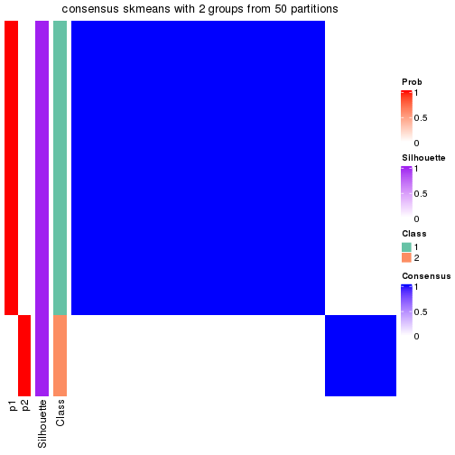</p>

</div>
<div id='tab-node-03-consensus-heatmap-2'>
<pre><code class="r">consensus_heatmap(res, k = 3)
</code></pre>

<p></p>

</div>
<div id='tab-node-03-consensus-heatmap-3'>
<pre><code class="r">consensus_heatmap(res, k = 4)
</code></pre>

<p>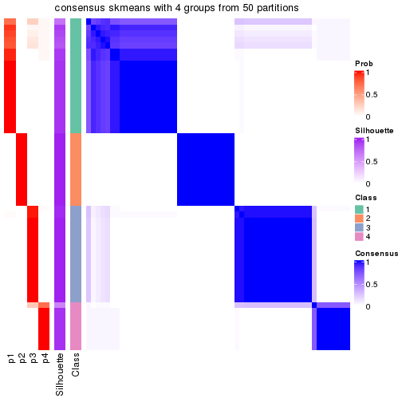</p>

</div>
<div id='tab-node-03-consensus-heatmap-4'>
<pre><code class="r">consensus_heatmap(res, k = 5)
</code></pre>

<p>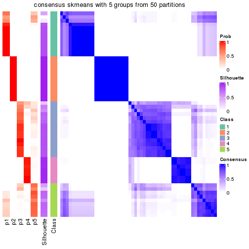</p>

</div>
<div id='tab-node-03-consensus-heatmap-5'>
<pre><code class="r">consensus_heatmap(res, k = 6)
</code></pre>

<p>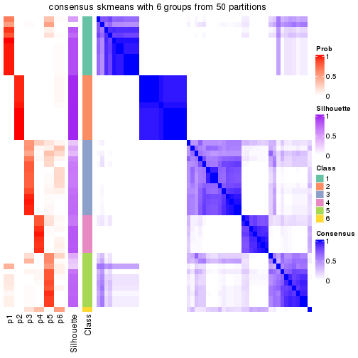</p>

</div>
<div id='tab-node-03-consensus-heatmap-6'>
<pre><code class="r">consensus_heatmap(res, k = 7)
</code></pre>

<p>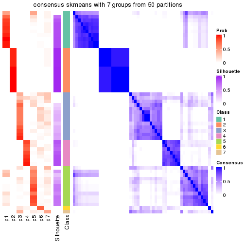</p>

</div>
<div id='tab-node-03-consensus-heatmap-7'>
<pre><code class="r">consensus_heatmap(res, k = 8)
</code></pre>

<p>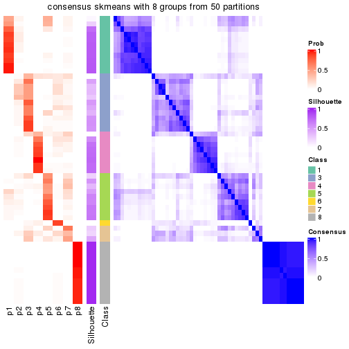</p>

</div>
</div>

Heatmaps for the membership of samples in all partitions to see how consistent they are:


<script>
$( function() {
	$( '#tabs-node-03-membership-heatmap' ).tabs();
} );
</script>
<div id='tabs-node-03-membership-heatmap'>
<ul>
<li><a href='#tab-node-03-membership-heatmap-1'>k = 2</a></li>
<li><a href='#tab-node-03-membership-heatmap-2'>k = 3</a></li>
<li><a href='#tab-node-03-membership-heatmap-3'>k = 4</a></li>
<li><a href='#tab-node-03-membership-heatmap-4'>k = 5</a></li>
<li><a href='#tab-node-03-membership-heatmap-5'>k = 6</a></li>
<li><a href='#tab-node-03-membership-heatmap-6'>k = 7</a></li>
<li><a href='#tab-node-03-membership-heatmap-7'>k = 8</a></li>
</ul>
<div id='tab-node-03-membership-heatmap-1'>
<pre><code class="r">membership_heatmap(res, k = 2)
</code></pre>

<p>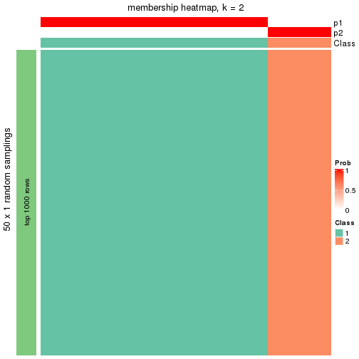</p>

</div>
<div id='tab-node-03-membership-heatmap-2'>
<pre><code class="r">membership_heatmap(res, k = 3)
</code></pre>

<p>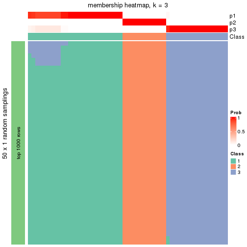</p>

</div>
<div id='tab-node-03-membership-heatmap-3'>
<pre><code class="r">membership_heatmap(res, k = 4)
</code></pre>

<p>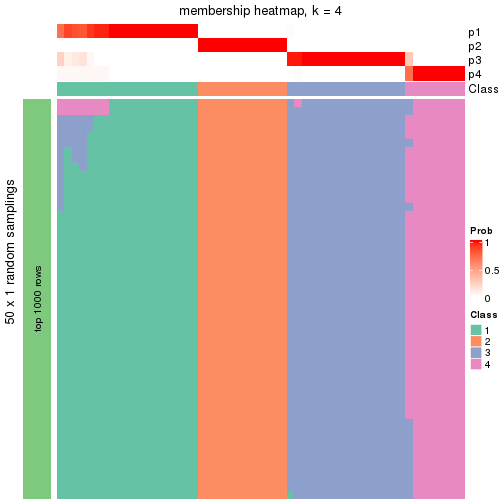</p>

</div>
<div id='tab-node-03-membership-heatmap-4'>
<pre><code class="r">membership_heatmap(res, k = 5)
</code></pre>

<p>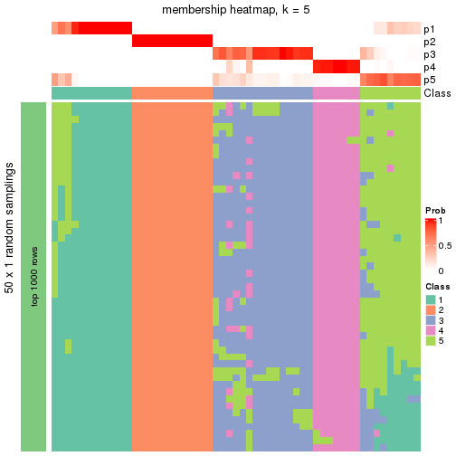</p>

</div>
<div id='tab-node-03-membership-heatmap-5'>
<pre><code class="r">membership_heatmap(res, k = 6)
</code></pre>

<p>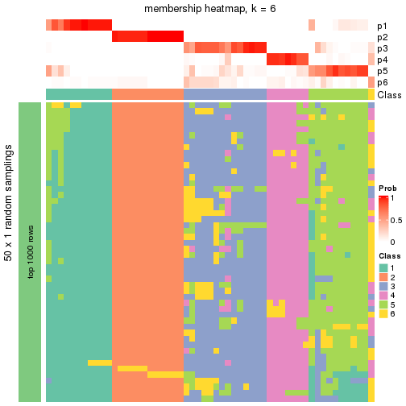</p>

</div>
<div id='tab-node-03-membership-heatmap-6'>
<pre><code class="r">membership_heatmap(res, k = 7)
</code></pre>

<p>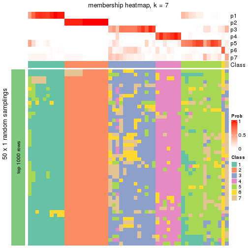</p>

</div>
<div id='tab-node-03-membership-heatmap-7'>
<pre><code class="r">membership_heatmap(res, k = 8)
</code></pre>

<p></p>

</div>
</div>

As soon as the classes for columns are determined, the signatures
that are significantly different between subgroups can be looked for. 
Following are the heatmaps for signatures.


<script>
$( function() {
	$( '#tabs-node-03-get-signatures' ).tabs();
} );
</script>
<div id='tabs-node-03-get-signatures'>
<ul>
<li><a href='#tab-node-03-get-signatures-1'>k = 2</a></li>
<li><a href='#tab-node-03-get-signatures-2'>k = 3</a></li>
<li><a href='#tab-node-03-get-signatures-3'>k = 4</a></li>
<li><a href='#tab-node-03-get-signatures-4'>k = 5</a></li>
<li><a href='#tab-node-03-get-signatures-5'>k = 6</a></li>
<li><a href='#tab-node-03-get-signatures-6'>k = 7</a></li>
<li><a href='#tab-node-03-get-signatures-7'>k = 8</a></li>
</ul>
<div id='tab-node-03-get-signatures-1'>
<pre><code class="r">get_signatures(res, k = 2)
</code></pre>

<p>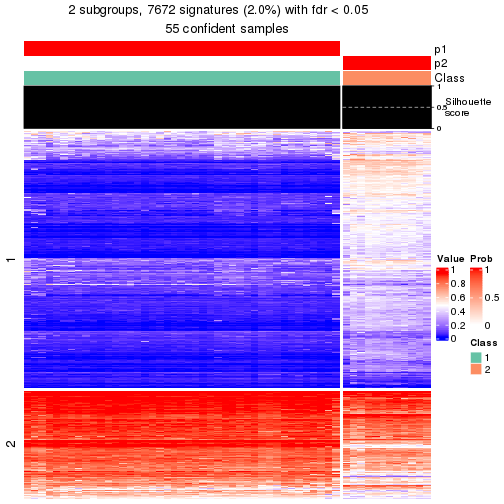</p>

</div>
<div id='tab-node-03-get-signatures-2'>
<pre><code class="r">get_signatures(res, k = 3)
</code></pre>

<p>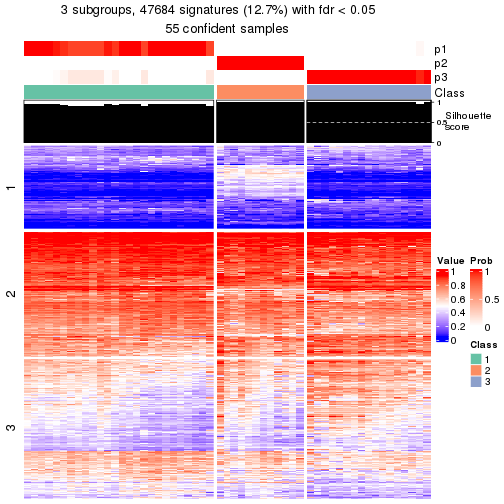</p>

</div>
<div id='tab-node-03-get-signatures-3'>
<pre><code class="r">get_signatures(res, k = 4)
</code></pre>

<p>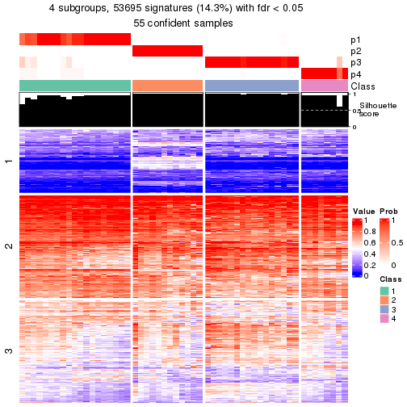</p>

</div>
<div id='tab-node-03-get-signatures-4'>
<pre><code class="r">get_signatures(res, k = 5)
</code></pre>

<p>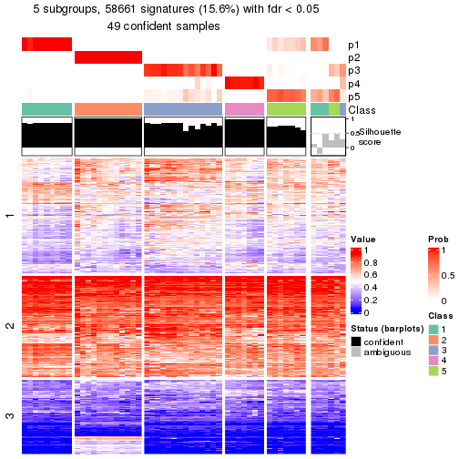</p>

</div>
<div id='tab-node-03-get-signatures-5'>
<pre><code class="r">get_signatures(res, k = 6)
</code></pre>

<p>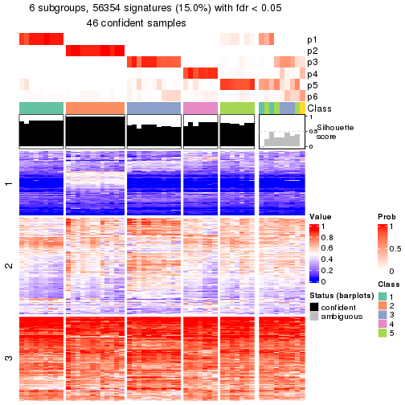</p>

</div>
<div id='tab-node-03-get-signatures-6'>
<pre><code class="r">get_signatures(res, k = 7)
</code></pre>

<p>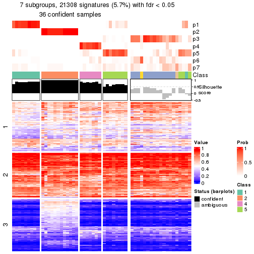</p>

</div>
<div id='tab-node-03-get-signatures-7'>
<pre><code class="r">get_signatures(res, k = 8)
</code></pre>

<p>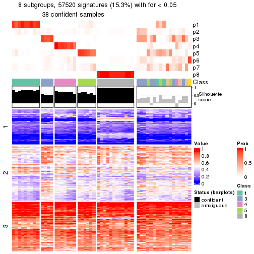</p>

</div>
</div>


Compare the overlap of signatures from different k:

```r
compare_signatures(res)
```

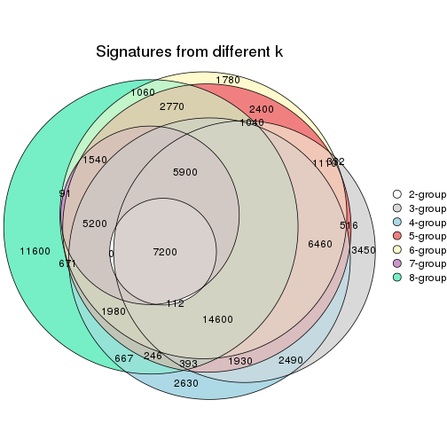

`get_signature()` returns a data frame invisibly. To get the list of signatures, the function
call should be assigned to a variable explicitly. In following code, if `plot` argument is set
to `FALSE`, no heatmap is plotted while only the differential analysis is performed.

```r
# code only for demonstration
tb = get_signature(res, k = ..., plot = FALSE)
```

An example of the output of `tb` is:

```
#>   which_row         fdr    mean_1    mean_2 scaled_mean_1 scaled_mean_2 km
#> 1        38 0.042760348  8.373488  9.131774    -0.5533452     0.5164555  1
#> 2        40 0.018707592  7.106213  8.469186    -0.6173731     0.5762149  1
#> 3        55 0.019134737 10.221463 11.207825    -0.6159697     0.5749050  1
#> 4        59 0.006059896  5.921854  7.869574    -0.6899429     0.6439467  1
#> 5        60 0.018055526  8.928898 10.211722    -0.6204761     0.5791110  1
#> 6        98 0.009384629 15.714769 14.887706     0.6635654    -0.6193277  2
...
```

The columns in `tb` are:

1. `which_row`: row indices corresponding to the input matrix.
2. `fdr`: FDR for the differential test. 
3. `mean_x`: The mean value in group x.
4. `scaled_mean_x`: The mean value in group x after rows are scaled.
5. `km`: Row groups if k-means clustering is applied to rows (which is done by automatically selecting number of clusters).

If there are too many signatures, `top_signatures = ...` can be set to only show the 
signatures with the highest FDRs:

```r
# code only for demonstration
# e.g. to show the top 500 most significant rows
tb = get_signature(res, k = ..., top_signatures = 500)
```

If the signatures are defined as these which are uniquely high in current group, `diff_method` argument
can be set to `"uniquely_high_in_one_group"`:

```r
# code only for demonstration
tb = get_signature(res, k = ..., diff_method = "uniquely_high_in_one_group")
```


UMAP plot which shows how samples are separated.


<script>
$( function() {
	$( '#tabs-node-03-dimension-reduction' ).tabs();
} );
</script>
<div id='tabs-node-03-dimension-reduction'>
<ul>
<li><a href='#tab-node-03-dimension-reduction-1'>k = 2</a></li>
<li><a href='#tab-node-03-dimension-reduction-2'>k = 3</a></li>
<li><a href='#tab-node-03-dimension-reduction-3'>k = 4</a></li>
<li><a href='#tab-node-03-dimension-reduction-4'>k = 5</a></li>
<li><a href='#tab-node-03-dimension-reduction-5'>k = 6</a></li>
<li><a href='#tab-node-03-dimension-reduction-6'>k = 7</a></li>
<li><a href='#tab-node-03-dimension-reduction-7'>k = 8</a></li>
</ul>
<div id='tab-node-03-dimension-reduction-1'>
<pre><code class="r">dimension_reduction(res, k = 2, method = &quot;UMAP&quot;)
</code></pre>

<p>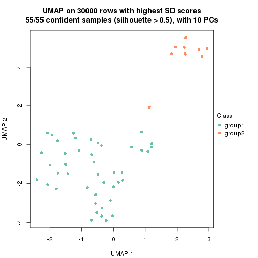</p>

</div>
<div id='tab-node-03-dimension-reduction-2'>
<pre><code class="r">dimension_reduction(res, k = 3, method = &quot;UMAP&quot;)
</code></pre>

<p>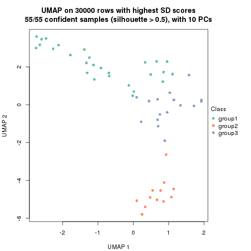</p>

</div>
<div id='tab-node-03-dimension-reduction-3'>
<pre><code class="r">dimension_reduction(res, k = 4, method = &quot;UMAP&quot;)
</code></pre>

<p>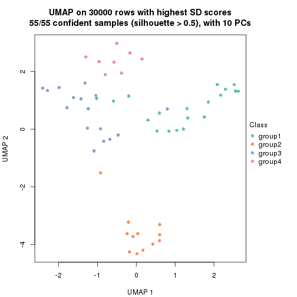</p>

</div>
<div id='tab-node-03-dimension-reduction-4'>
<pre><code class="r">dimension_reduction(res, k = 5, method = &quot;UMAP&quot;)
</code></pre>

<p>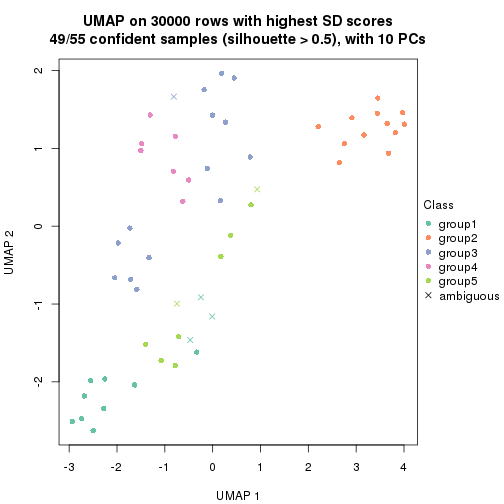</p>

</div>
<div id='tab-node-03-dimension-reduction-5'>
<pre><code class="r">dimension_reduction(res, k = 6, method = &quot;UMAP&quot;)
</code></pre>

<p>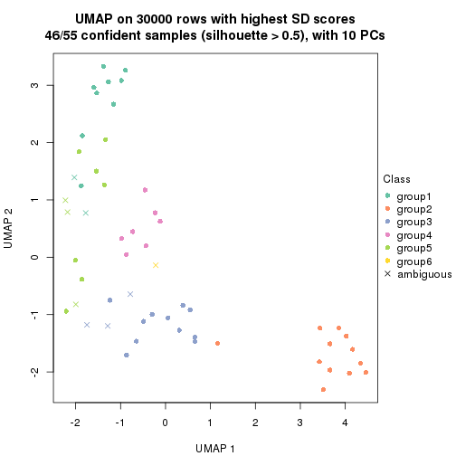</p>

</div>
<div id='tab-node-03-dimension-reduction-6'>
<pre><code class="r">dimension_reduction(res, k = 7, method = &quot;UMAP&quot;)
</code></pre>

<p>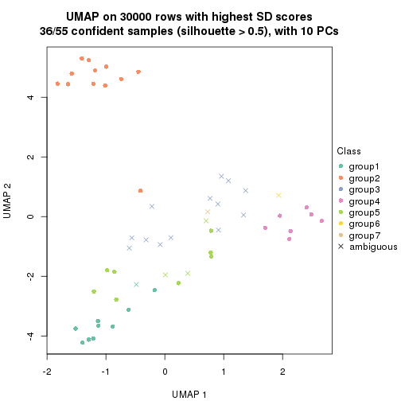</p>

</div>
<div id='tab-node-03-dimension-reduction-7'>
<pre><code class="r">dimension_reduction(res, k = 8, method = &quot;UMAP&quot;)
</code></pre>

<p>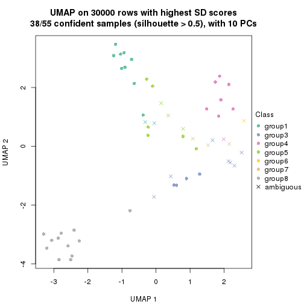</p>

</div>
</div>


Following heatmap shows how subgroups are split when increasing `k`:

```r
collect_classes(res)
```

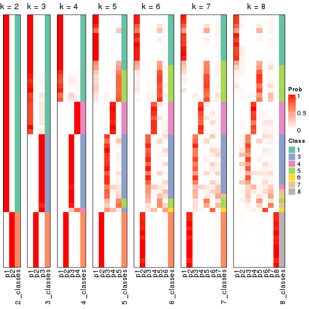


If matrix rows can be associated to genes, consider to use `functional_enrichment(res,
...)` to perform function enrichment for the signature genes. See [this vignette](https://jokergoo.github.io/cola_vignettes/functional_enrichment.html) for more detailed explanations.


 

---------------------------------------------------


### Node033


Parent node: [Node03](#Node03).
Child nodes: 
                Node0111-leaf
        ,
                Node0112-leaf
        ,
                Node0113-leaf
        ,
                [Node0121](#Node0121)
        ,
                [Node0122](#Node0122)
        ,
                [Node0211](#Node0211)
        ,
                [Node0212](#Node0212)
        ,
                [Node0213](#Node0213)
        ,
                [Node0221](#Node0221)
        ,
                [Node0222](#Node0222)
        ,
                [Node0223](#Node0223)
        ,
                [Node0224](#Node0224)
        ,
                Node0225-leaf
        ,
                Node0231-leaf
        ,
                [Node0232](#Node0232)
        ,
                Node0233-leaf
        ,
                Node0234-leaf
        ,
                Node0331-leaf
        ,
                Node0332-leaf
        ,
                Node0333-leaf
        ,
                Node0431-leaf
        ,
                Node0432-leaf
        ,
                Node0433-leaf
        ,
                [Node0511](#Node0511)
        ,
                [Node0512](#Node0512)
        ,
                Node0521-leaf
        ,
                [Node0522](#Node0522)
        ,
                Node0523-leaf
        ,
                Node0524-leaf
        .


The object with results only for a single top-value method and a single partitioning method 
can be extracted as:

```r
res = res_rh["033"]
```

A summary of `res` and all the functions that can be applied to it:

```r
res
```

```
#> A 'ConsensusPartition' object with k = 2, 3, 4, 5, 6, 7, 8.
#>   On a matrix with 30000 rows and 16 columns.
#>   Top rows (1000) are extracted by 'ATC' method.
#>   Subgroups are detected by 'skmeans' method.
#>   Performed in total 350 partitions by row resampling.
#>   Best k for subgroups seems to be 3.
#> 
#> Following methods can be applied to this 'ConsensusPartition' object:
#>  [1] "cola_report"             "collect_classes"         "collect_plots"          
#>  [4] "collect_stats"           "colnames"                "compare_partitions"     
#>  [7] "compare_signatures"      "consensus_heatmap"       "dimension_reduction"    
#> [10] "functional_enrichment"   "get_anno_col"            "get_anno"               
#> [13] "get_classes"             "get_consensus"           "get_matrix"             
#> [16] "get_membership"          "get_param"               "get_signatures"         
#> [19] "get_stats"               "is_best_k"               "is_stable_k"            
#> [22] "membership_heatmap"      "ncol"                    "nrow"                   
#> [25] "plot_ecdf"               "predict_classes"         "rownames"               
#> [28] "select_partition_number" "show"                    "suggest_best_k"         
#> [31] "test_to_known_factors"   "top_rows_heatmap"
```

`collect_plots()` function collects all the plots made from `res` for all `k` (number of subgroups)
into one single page to provide an easy and fast comparison between different `k`.

```r
collect_plots(res)
```

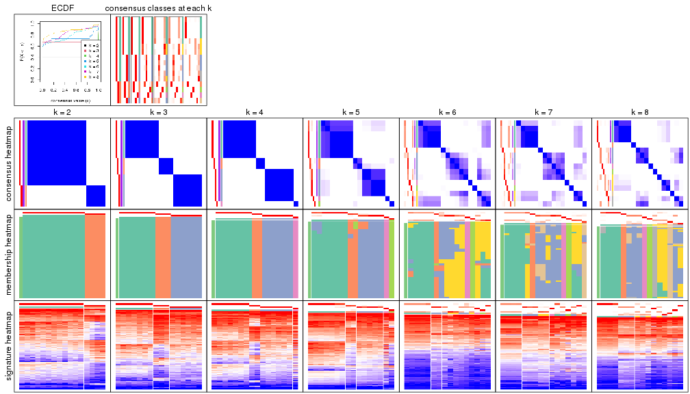

The plots are:

- The first row: a plot of the eCDF (empirical cumulative distribution
  function) curves of the consensus matrix for each `k` and the heatmap of
  predicted classes for each `k`.
- The second row: heatmaps of the consensus matrix for each `k`.
- The third row: heatmaps of the membership matrix for each `k`.
- The fouth row: heatmaps of the signatures for each `k`.

All the plots in panels can be made by individual functions and they are
plotted later in this section.

`select_partition_number()` produces several plots showing different
statistics for choosing "optimized" `k`. There are following statistics:

- eCDF curves of the consensus matrix for each `k`;
- 1-PAC. [The PAC score](https://en.wikipedia.org/wiki/Consensus_clustering#Over-interpretation_potential_of_consensus_clustering)
  measures the proportion of the ambiguous subgrouping.
- Mean silhouette score.
- Concordance. The mean probability of fiting the consensus subgroup labels in all
  partitions.
- Area increased. Denote $A_k$ as the area under the eCDF curve for current
  `k`, the area increased is defined as $A_k - A_{k-1}$.
- Rand index. The percent of pairs of samples that are both in a same cluster
  or both are not in a same cluster in the partition of k and k-1.
- Jaccard index. The ratio of pairs of samples are both in a same cluster in
  the partition of k and k-1 and the pairs of samples are both in a same
  cluster in the partition k or k-1.

The detailed explanations of these statistics can be found in [the _cola_
vignette](https://jokergoo.github.io/cola_vignettes/cola.html#toc_13).

Generally speaking, higher 1-PAC score, higher mean silhouette score or higher
concordance corresponds to better partition. Rand index and Jaccard index
measure how similar the current partition is compared to partition with `k-1`.
If they are too similar, we won't accept `k` is better than `k-1`.

```r
select_partition_number(res)
```

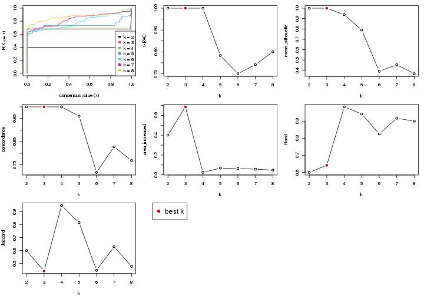

The numeric values for all these statistics can be obtained by `get_stats()`.

```r
get_stats(res)
```

```
#>   k 1-PAC mean_silhouette concordance area_increased  Rand Jaccard
#> 2 2 1.000           1.000       1.000         0.4006 0.600   0.600
#> 3 3 1.000           1.000       1.000         0.6858 0.642   0.442
#> 4 4 1.000           0.938       1.000         0.0247 0.983   0.949
#> 5 5 0.783           0.789       0.960         0.0674 0.942   0.816
#> 6 6 0.700           0.391       0.718         0.0636 0.825   0.447
#> 7 7 0.742           0.455       0.828         0.0569 0.917   0.630
#> 8 8 0.800           0.368       0.769         0.0478 0.900   0.478
```

`suggest_best_k()` suggests the best $k$ based on these statistics. The rules are as follows:

- All $k$ with Jaccard index larger than 0.95 are removed because increasing
  $k$ does not provide enough extra information. If all $k$ are removed, it is
  marked as no subgroup is detected.
- For all $k$ with 1-PAC score larger than 0.9, the maximal $k$ is taken as
  the best $k$, and other $k$ are marked as optional $k$.
- If it does not fit the second rule. The $k$ with the maximal vote of the
  highest 1-PAC score, highest mean silhouette, and highest concordance is
  taken as the best $k$.

```r
suggest_best_k(res)
```

```
#> [1] 3
#> attr(,"optional")
#> [1] 2
```

There is also optional best $k$ = 2 that is worth to check.

Following is the table of the partitions (You need to click the **show/hide
code output** link to see it). The membership matrix (columns with name `p*`)
is inferred by
[`clue::cl_consensus()`](https://www.rdocumentation.org/link/cl_consensus?package=clue)
function with the `SE` method. Basically the value in the membership matrix
represents the probability to belong to a certain group. The finall subgroup
label for an item is determined with the group with highest probability it
belongs to.

In `get_classes()` function, the entropy is calculated from the membership
matrix and the silhouette score is calculated from the consensus matrix.


<script>
$( function() {
	$( '#tabs-node-033-get-classes' ).tabs();
} );
</script>
<div id='tabs-node-033-get-classes'>
<ul>
<li><a href='#tab-node-033-get-classes-1'>k = 2</a></li>
<li><a href='#tab-node-033-get-classes-2'>k = 3</a></li>
<li><a href='#tab-node-033-get-classes-3'>k = 4</a></li>
<li><a href='#tab-node-033-get-classes-4'>k = 5</a></li>
<li><a href='#tab-node-033-get-classes-5'>k = 6</a></li>
<li><a href='#tab-node-033-get-classes-6'>k = 7</a></li>
<li><a href='#tab-node-033-get-classes-7'>k = 8</a></li>
</ul>

<div id='tab-node-033-get-classes-1'>
<p><a id='tab-node-033-get-classes-1-a' style='color:#0366d6' href='#'>show/hide code output</a></p>
<pre><code class="r">cbind(get_classes(res, k = 2), get_membership(res, k = 2))
</code></pre>

<pre><code>#&gt;                 class entropy silhouette p1 p2
#&gt; TCGA.CV.5435.11     1       0          1  1  0
#&gt; TCGA.CV.5434.11     1       0          1  1  0
#&gt; TCGA.CV.5439.11     1       0          1  1  0
#&gt; TCGA.CV.5977.11     1       0          1  1  0
#&gt; TCGA.CV.5979.11     2       0          1  0  1
#&gt; TCGA.CR.6492.01     1       0          1  1  0
#&gt; TCGA.CV.7089.11     2       0          1  0  1
#&gt; TCGA.CV.7245.11     1       0          1  1  0
#&gt; TCGA.CV.7235.11     2       0          1  0  1
#&gt; TCGA.CV.5444.11     1       0          1  1  0
#&gt; TCGA.CR.7397.01     1       0          1  1  0
#&gt; TCGA.CV.5440.11     1       0          1  1  0
#&gt; TCGA.CV.6938.11     1       0          1  1  0
#&gt; TCGA.CV.6939.11     1       0          1  1  0
#&gt; TCGA.D6.6824.01     1       0          1  1  0
#&gt; TCGA.CV.6933.11     2       0          1  0  1
</code></pre>

<script>
$('#tab-node-033-get-classes-1-a').parent().next().next().hide();
$('#tab-node-033-get-classes-1-a').click(function(){
  $('#tab-node-033-get-classes-1-a').parent().next().next().toggle();
  return(false);
});
</script>
</div>

<div id='tab-node-033-get-classes-2'>
<p><a id='tab-node-033-get-classes-2-a' style='color:#0366d6' href='#'>show/hide code output</a></p>
<pre><code class="r">cbind(get_classes(res, k = 3), get_membership(res, k = 3))
</code></pre>

<pre><code>#&gt;                 class entropy silhouette p1 p2 p3
#&gt; TCGA.CV.5435.11     3       0          1  0  0  1
#&gt; TCGA.CV.5434.11     3       0          1  0  0  1
#&gt; TCGA.CV.5439.11     1       0          1  1  0  0
#&gt; TCGA.CV.5977.11     1       0          1  1  0  0
#&gt; TCGA.CV.5979.11     3       0          1  0  0  1
#&gt; TCGA.CR.6492.01     3       0          1  0  0  1
#&gt; TCGA.CV.7089.11     2       0          1  0  1  0
#&gt; TCGA.CV.7245.11     1       0          1  1  0  0
#&gt; TCGA.CV.7235.11     2       0          1  0  1  0
#&gt; TCGA.CV.5444.11     1       0          1  1  0  0
#&gt; TCGA.CR.7397.01     1       0          1  1  0  0
#&gt; TCGA.CV.5440.11     1       0          1  1  0  0
#&gt; TCGA.CV.6938.11     3       0          1  0  0  1
#&gt; TCGA.CV.6939.11     1       0          1  1  0  0
#&gt; TCGA.D6.6824.01     3       0          1  0  0  1
#&gt; TCGA.CV.6933.11     2       0          1  0  1  0
</code></pre>

<script>
$('#tab-node-033-get-classes-2-a').parent().next().next().hide();
$('#tab-node-033-get-classes-2-a').click(function(){
  $('#tab-node-033-get-classes-2-a').parent().next().next().toggle();
  return(false);
});
</script>
</div>

<div id='tab-node-033-get-classes-3'>
<p><a id='tab-node-033-get-classes-3-a' style='color:#0366d6' href='#'>show/hide code output</a></p>
<pre><code class="r">cbind(get_classes(res, k = 4), get_membership(res, k = 4))
</code></pre>

<pre><code>#&gt;                 class entropy silhouette p1 p2 p3 p4
#&gt; TCGA.CV.5435.11     3       0          1  0  0  1  0
#&gt; TCGA.CV.5434.11     3       0          1  0  0  1  0
#&gt; TCGA.CV.5439.11     1       0          1  1  0  0  0
#&gt; TCGA.CV.5977.11     1       0          1  1  0  0  0
#&gt; TCGA.CV.5979.11     3       0          1  0  0  1  0
#&gt; TCGA.CR.6492.01     3       0          1  0  0  1  0
#&gt; TCGA.CV.7089.11     4       0          0  0  0  0  1
#&gt; TCGA.CV.7245.11     1       0          1  1  0  0  0
#&gt; TCGA.CV.7235.11     2       0          1  0  1  0  0
#&gt; TCGA.CV.5444.11     1       0          1  1  0  0  0
#&gt; TCGA.CR.7397.01     1       0          1  1  0  0  0
#&gt; TCGA.CV.5440.11     1       0          1  1  0  0  0
#&gt; TCGA.CV.6938.11     3       0          1  0  0  1  0
#&gt; TCGA.CV.6939.11     1       0          1  1  0  0  0
#&gt; TCGA.D6.6824.01     3       0          1  0  0  1  0
#&gt; TCGA.CV.6933.11     2       0          1  0  1  0  0
</code></pre>

<script>
$('#tab-node-033-get-classes-3-a').parent().next().next().hide();
$('#tab-node-033-get-classes-3-a').click(function(){
  $('#tab-node-033-get-classes-3-a').parent().next().next().toggle();
  return(false);
});
</script>
</div>

<div id='tab-node-033-get-classes-4'>
<p><a id='tab-node-033-get-classes-4-a' style='color:#0366d6' href='#'>show/hide code output</a></p>
<pre><code class="r">cbind(get_classes(res, k = 5), get_membership(res, k = 5))
</code></pre>

<pre><code>#&gt;                 class entropy silhouette   p1   p2   p3 p4  p5
#&gt; TCGA.CV.5435.11     3   0.000      0.941 0.00 0.00 1.00  0 0.0
#&gt; TCGA.CV.5434.11     3   0.202      0.909 0.00 0.10 0.90  0 0.0
#&gt; TCGA.CV.5439.11     1   0.000      0.947 1.00 0.00 0.00  0 0.0
#&gt; TCGA.CV.5977.11     1   0.000      0.947 1.00 0.00 0.00  0 0.0
#&gt; TCGA.CV.5979.11     2   0.141      0.783 0.00 0.94 0.06  0 0.0
#&gt; TCGA.CR.6492.01     3   0.000      0.941 0.00 0.00 1.00  0 0.0
#&gt; TCGA.CV.7089.11     4   0.000      0.000 0.00 0.00 0.00  1 0.0
#&gt; TCGA.CV.7245.11     1   0.000      0.947 1.00 0.00 0.00  0 0.0
#&gt; TCGA.CV.7235.11     2   0.202      0.770 0.00 0.90 0.00  0 0.1
#&gt; TCGA.CV.5444.11     1   0.000      0.947 1.00 0.00 0.00  0 0.0
#&gt; TCGA.CR.7397.01     1   0.273      0.830 0.84 0.00 0.16  0 0.0
#&gt; TCGA.CV.5440.11     1   0.228      0.870 0.88 0.00 0.12  0 0.0
#&gt; TCGA.CV.6938.11     3   0.000      0.941 0.00 0.00 1.00  0 0.0
#&gt; TCGA.CV.6939.11     1   0.000      0.947 1.00 0.00 0.00  0 0.0
#&gt; TCGA.D6.6824.01     3   0.202      0.909 0.00 0.10 0.90  0 0.0
#&gt; TCGA.CV.6933.11     5   0.000      0.000 0.00 0.00 0.00  0 1.0
</code></pre>

<script>
$('#tab-node-033-get-classes-4-a').parent().next().next().hide();
$('#tab-node-033-get-classes-4-a').click(function(){
  $('#tab-node-033-get-classes-4-a').parent().next().next().toggle();
  return(false);
});
</script>
</div>

<div id='tab-node-033-get-classes-5'>
<p><a id='tab-node-033-get-classes-5-a' style='color:#0366d6' href='#'>show/hide code output</a></p>
<pre><code class="r">cbind(get_classes(res, k = 6), get_membership(res, k = 6))
</code></pre>

<pre><code>#&gt;                 class entropy silhouette   p1   p2   p3 p4   p5   p6
#&gt; TCGA.CV.5435.11     3  0.3797     0.2260 0.00 0.00 0.58  0 0.00 0.42
#&gt; TCGA.CV.5434.11     3  0.0547     0.6018 0.00 0.00 0.98  0 0.00 0.02
#&gt; TCGA.CV.5439.11     1  0.3864     0.9008 0.52 0.00 0.00  0 0.00 0.48
#&gt; TCGA.CV.5977.11     1  0.3851     0.9150 0.54 0.00 0.00  0 0.00 0.46
#&gt; TCGA.CV.5979.11     3  0.5569     0.0243 0.28 0.18 0.54  0 0.00 0.00
#&gt; TCGA.CR.6492.01     3  0.3499     0.4065 0.00 0.00 0.68  0 0.00 0.32
#&gt; TCGA.CV.7089.11     4  0.0000     0.0000 0.00 0.00 0.00  1 0.00 0.00
#&gt; TCGA.CV.7245.11     1  0.3851     0.9150 0.54 0.00 0.00  0 0.00 0.46
#&gt; TCGA.CV.7235.11     2  0.0547     0.0000 0.00 0.98 0.00  0 0.02 0.00
#&gt; TCGA.CV.5444.11     1  0.3851     0.9150 0.54 0.00 0.00  0 0.00 0.46
#&gt; TCGA.CR.7397.01     6  0.0000     0.3536 0.00 0.00 0.00  0 0.00 1.00
#&gt; TCGA.CV.5440.11     6  0.1814     0.1257 0.10 0.00 0.00  0 0.00 0.90
#&gt; TCGA.CV.6938.11     6  0.4646    -0.3841 0.04 0.00 0.46  0 0.00 0.50
#&gt; TCGA.CV.6939.11     1  0.3578     0.6613 0.66 0.00 0.00  0 0.00 0.34
#&gt; TCGA.D6.6824.01     3  0.0547     0.5983 0.02 0.00 0.98  0 0.00 0.00
#&gt; TCGA.CV.6933.11     5  0.0000     0.0000 0.00 0.00 0.00  0 1.00 0.00
</code></pre>

<script>
$('#tab-node-033-get-classes-5-a').parent().next().next().hide();
$('#tab-node-033-get-classes-5-a').click(function(){
  $('#tab-node-033-get-classes-5-a').parent().next().next().toggle();
  return(false);
});
</script>
</div>

<div id='tab-node-033-get-classes-6'>
<p><a id='tab-node-033-get-classes-6-a' style='color:#0366d6' href='#'>show/hide code output</a></p>
<pre><code class="r">cbind(get_classes(res, k = 7), get_membership(res, k = 7))
</code></pre>

<pre><code>#&gt;                 class entropy silhouette   p1   p2   p3 p4 p5   p6   p7
#&gt; TCGA.CV.5435.11     3  0.1928     0.6415 0.02 0.00 0.90  0  0 0.08 0.00
#&gt; TCGA.CV.5434.11     3  0.2572     0.5538 0.00 0.00 0.80  0  0 0.00 0.20
#&gt; TCGA.CV.5439.11     1  0.3558     0.7429 0.52 0.00 0.00  0  0 0.48 0.00
#&gt; TCGA.CV.5977.11     1  0.3546     0.7606 0.54 0.00 0.00  0  0 0.46 0.00
#&gt; TCGA.CV.5979.11     7  0.2512     0.0000 0.00 0.04 0.10  0  0 0.00 0.86
#&gt; TCGA.CR.6492.01     3  0.0504     0.6588 0.00 0.00 0.98  0  0 0.00 0.02
#&gt; TCGA.CV.7089.11     4  0.0000     0.0000 0.00 0.00 0.00  1  0 0.00 0.00
#&gt; TCGA.CV.7245.11     1  0.3546     0.7606 0.54 0.00 0.00  0  0 0.46 0.00
#&gt; TCGA.CV.7235.11     2  0.0000     0.0000 0.00 1.00 0.00  0  0 0.00 0.00
#&gt; TCGA.CV.5444.11     1  0.3546     0.7606 0.54 0.00 0.00  0  0 0.46 0.00
#&gt; TCGA.CR.7397.01     6  0.2259     0.8351 0.00 0.00 0.16  0  0 0.84 0.00
#&gt; TCGA.CV.5440.11     6  0.1928     0.8169 0.02 0.00 0.08  0  0 0.90 0.00
#&gt; TCGA.CV.6938.11     3  0.3927     0.3517 0.04 0.00 0.66  0  0 0.30 0.00
#&gt; TCGA.CV.6939.11     1  0.3199     0.0438 0.80 0.00 0.00  0  0 0.06 0.14
#&gt; TCGA.D6.6824.01     3  0.3294     0.3493 0.00 0.00 0.66  0  0 0.00 0.34
#&gt; TCGA.CV.6933.11     5  0.0000     0.0000 0.00 0.00 0.00  0  1 0.00 0.00
</code></pre>

<script>
$('#tab-node-033-get-classes-6-a').parent().next().next().hide();
$('#tab-node-033-get-classes-6-a').click(function(){
  $('#tab-node-033-get-classes-6-a').parent().next().next().toggle();
  return(false);
});
</script>
</div>

<div id='tab-node-033-get-classes-7'>
<p><a id='tab-node-033-get-classes-7-a' style='color:#0366d6' href='#'>show/hide code output</a></p>
<pre><code class="r">cbind(get_classes(res, k = 8), get_membership(res, k = 8))
</code></pre>

<pre><code>#&gt;                 class entropy silhouette   p1 p2   p3 p4 p5   p6   p7   p8
#&gt; TCGA.CV.5435.11     8  0.3333     -0.706 0.00  0 0.50  0  0 0.00 0.00 0.50
#&gt; TCGA.CV.5434.11     3  0.4255      0.732 0.00  0 0.58  0  0 0.00 0.08 0.34
#&gt; TCGA.CV.5439.11     1  0.2071      0.885 0.90  0 0.04  0  0 0.04 0.00 0.02
#&gt; TCGA.CV.5977.11     1  0.0000      0.964 1.00  0 0.00  0  0 0.00 0.00 0.00
#&gt; TCGA.CV.5979.11     7  0.0471      0.000 0.00  0 0.02  0  0 0.00 0.98 0.00
#&gt; TCGA.CR.6492.01     3  0.3237      0.620 0.00  0 0.60  0  0 0.00 0.00 0.40
#&gt; TCGA.CV.7089.11     4  0.0000      0.000 0.00  0 0.00  1  0 0.00 0.00 0.00
#&gt; TCGA.CV.7245.11     1  0.0000      0.964 1.00  0 0.00  0  0 0.00 0.00 0.00
#&gt; TCGA.CV.7235.11     2  0.0000      0.000 0.00  1 0.00  0  0 0.00 0.00 0.00
#&gt; TCGA.CV.5444.11     1  0.0000      0.964 1.00  0 0.00  0  0 0.00 0.00 0.00
#&gt; TCGA.CR.7397.01     6  0.4391      0.420 0.08  0 0.00  0  0 0.50 0.00 0.42
#&gt; TCGA.CV.5440.11     6  0.4996      0.428 0.20  0 0.00  0  0 0.48 0.00 0.32
#&gt; TCGA.CV.6938.11     8  0.0000      0.122 0.00  0 0.00  0  0 0.00 0.00 1.00
#&gt; TCGA.CV.6939.11     6  0.4770     -0.156 0.02  0 0.40  0  0 0.52 0.02 0.04
#&gt; TCGA.D6.6824.01     3  0.4560      0.657 0.00  0 0.60  0  0 0.00 0.18 0.22
#&gt; TCGA.CV.6933.11     5  0.0000      0.000 0.00  0 0.00  0  1 0.00 0.00 0.00
</code></pre>

<script>
$('#tab-node-033-get-classes-7-a').parent().next().next().hide();
$('#tab-node-033-get-classes-7-a').click(function(){
  $('#tab-node-033-get-classes-7-a').parent().next().next().toggle();
  return(false);
});
</script>
</div>
</div>

Heatmaps for the consensus matrix. It visualizes the probability of two
samples to be in a same group.


<script>
$( function() {
	$( '#tabs-node-033-consensus-heatmap' ).tabs();
} );
</script>
<div id='tabs-node-033-consensus-heatmap'>
<ul>
<li><a href='#tab-node-033-consensus-heatmap-1'>k = 2</a></li>
<li><a href='#tab-node-033-consensus-heatmap-2'>k = 3</a></li>
<li><a href='#tab-node-033-consensus-heatmap-3'>k = 4</a></li>
<li><a href='#tab-node-033-consensus-heatmap-4'>k = 5</a></li>
<li><a href='#tab-node-033-consensus-heatmap-5'>k = 6</a></li>
<li><a href='#tab-node-033-consensus-heatmap-6'>k = 7</a></li>
<li><a href='#tab-node-033-consensus-heatmap-7'>k = 8</a></li>
</ul>
<div id='tab-node-033-consensus-heatmap-1'>
<pre><code class="r">consensus_heatmap(res, k = 2)
</code></pre>

<p></p>

</div>
<div id='tab-node-033-consensus-heatmap-2'>
<pre><code class="r">consensus_heatmap(res, k = 3)
</code></pre>

<p>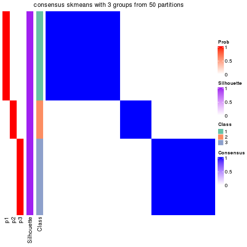</p>

</div>
<div id='tab-node-033-consensus-heatmap-3'>
<pre><code class="r">consensus_heatmap(res, k = 4)
</code></pre>

<p>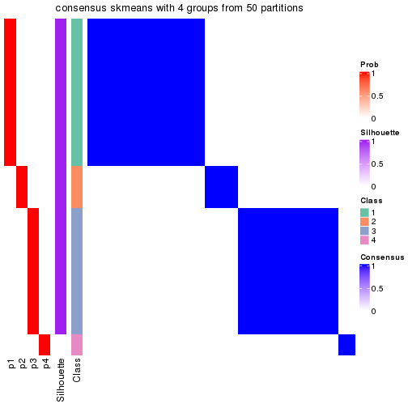</p>

</div>
<div id='tab-node-033-consensus-heatmap-4'>
<pre><code class="r">consensus_heatmap(res, k = 5)
</code></pre>

<p>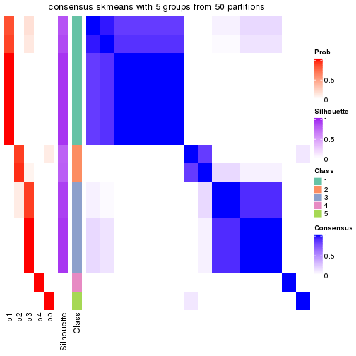</p>

</div>
<div id='tab-node-033-consensus-heatmap-5'>
<pre><code class="r">consensus_heatmap(res, k = 6)
</code></pre>

<p>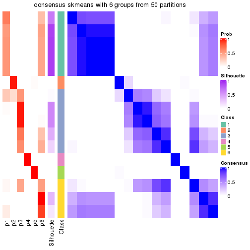</p>

</div>
<div id='tab-node-033-consensus-heatmap-6'>
<pre><code class="r">consensus_heatmap(res, k = 7)
</code></pre>

<p>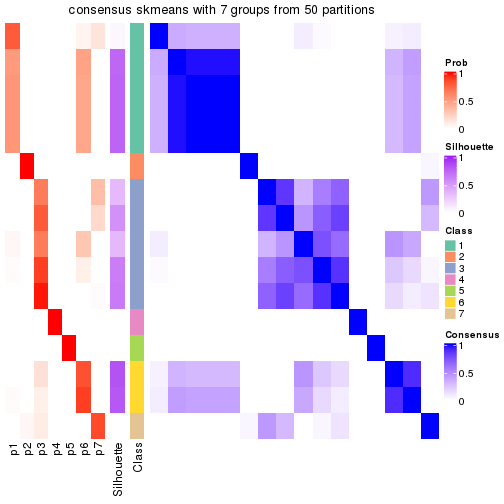</p>

</div>
<div id='tab-node-033-consensus-heatmap-7'>
<pre><code class="r">consensus_heatmap(res, k = 8)
</code></pre>

<p>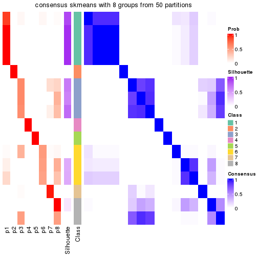</p>

</div>
</div>

Heatmaps for the membership of samples in all partitions to see how consistent they are:


<script>
$( function() {
	$( '#tabs-node-033-membership-heatmap' ).tabs();
} );
</script>
<div id='tabs-node-033-membership-heatmap'>
<ul>
<li><a href='#tab-node-033-membership-heatmap-1'>k = 2</a></li>
<li><a href='#tab-node-033-membership-heatmap-2'>k = 3</a></li>
<li><a href='#tab-node-033-membership-heatmap-3'>k = 4</a></li>
<li><a href='#tab-node-033-membership-heatmap-4'>k = 5</a></li>
<li><a href='#tab-node-033-membership-heatmap-5'>k = 6</a></li>
<li><a href='#tab-node-033-membership-heatmap-6'>k = 7</a></li>
<li><a href='#tab-node-033-membership-heatmap-7'>k = 8</a></li>
</ul>
<div id='tab-node-033-membership-heatmap-1'>
<pre><code class="r">membership_heatmap(res, k = 2)
</code></pre>

<p></p>

</div>
<div id='tab-node-033-membership-heatmap-2'>
<pre><code class="r">membership_heatmap(res, k = 3)
</code></pre>

<p>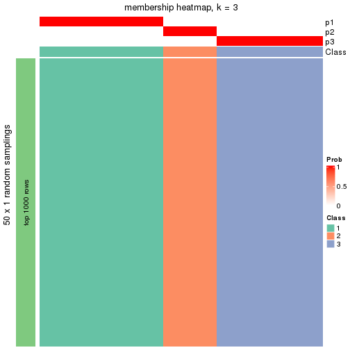</p>

</div>
<div id='tab-node-033-membership-heatmap-3'>
<pre><code class="r">membership_heatmap(res, k = 4)
</code></pre>

<p>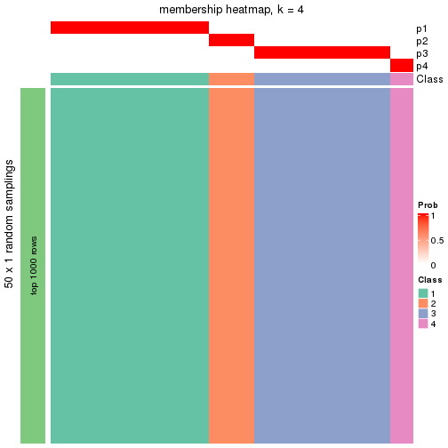</p>

</div>
<div id='tab-node-033-membership-heatmap-4'>
<pre><code class="r">membership_heatmap(res, k = 5)
</code></pre>

<p>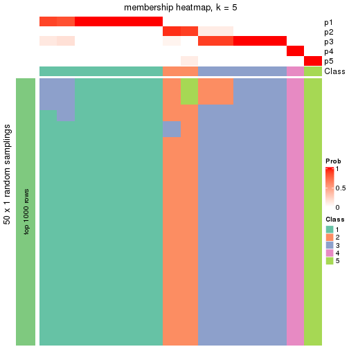</p>

</div>
<div id='tab-node-033-membership-heatmap-5'>
<pre><code class="r">membership_heatmap(res, k = 6)
</code></pre>

<p></p>

</div>
<div id='tab-node-033-membership-heatmap-6'>
<pre><code class="r">membership_heatmap(res, k = 7)
</code></pre>

<p>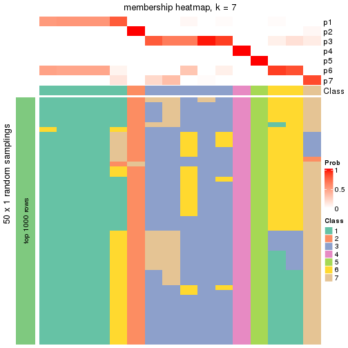</p>

</div>
<div id='tab-node-033-membership-heatmap-7'>
<pre><code class="r">membership_heatmap(res, k = 8)
</code></pre>

<p>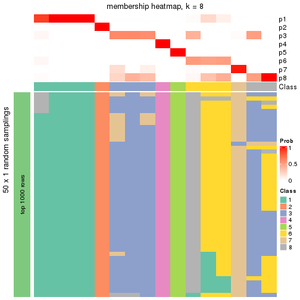</p>

</div>
</div>

As soon as the classes for columns are determined, the signatures
that are significantly different between subgroups can be looked for. 
Following are the heatmaps for signatures.


<script>
$( function() {
	$( '#tabs-node-033-get-signatures' ).tabs();
} );
</script>
<div id='tabs-node-033-get-signatures'>
<ul>
<li><a href='#tab-node-033-get-signatures-1'>k = 2</a></li>
<li><a href='#tab-node-033-get-signatures-2'>k = 3</a></li>
<li><a href='#tab-node-033-get-signatures-3'>k = 4</a></li>
<li><a href='#tab-node-033-get-signatures-4'>k = 5</a></li>
<li><a href='#tab-node-033-get-signatures-5'>k = 6</a></li>
<li><a href='#tab-node-033-get-signatures-6'>k = 7</a></li>
<li><a href='#tab-node-033-get-signatures-7'>k = 8</a></li>
</ul>
<div id='tab-node-033-get-signatures-1'>
<pre><code class="r">get_signatures(res, k = 2)
</code></pre>

<p>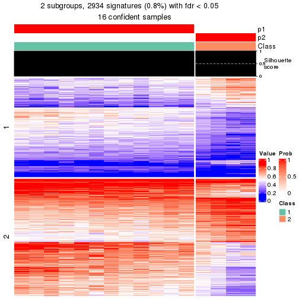</p>

</div>
<div id='tab-node-033-get-signatures-2'>
<pre><code class="r">get_signatures(res, k = 3)
</code></pre>

<p>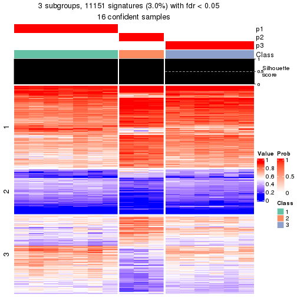</p>

</div>
<div id='tab-node-033-get-signatures-3'>
<pre><code class="r">get_signatures(res, k = 4)
</code></pre>

<p></p>

</div>
<div id='tab-node-033-get-signatures-4'>
<pre><code class="r">get_signatures(res, k = 5)
</code></pre>

<p>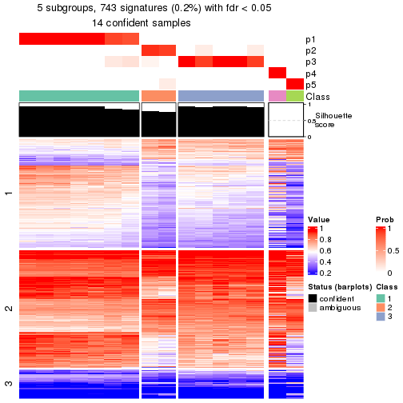</p>

</div>
<div id='tab-node-033-get-signatures-5'>
<pre><code class="r">get_signatures(res, k = 6)
</code></pre>

<p>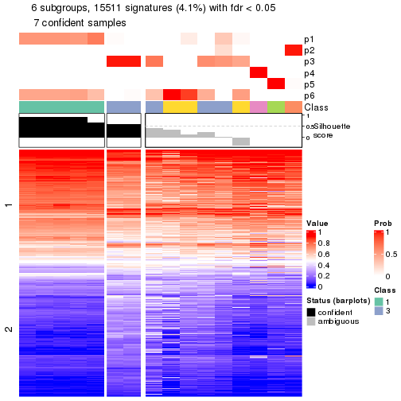</p>

</div>
<div id='tab-node-033-get-signatures-6'>
<pre><code class="r">get_signatures(res, k = 7)
</code></pre>

<p>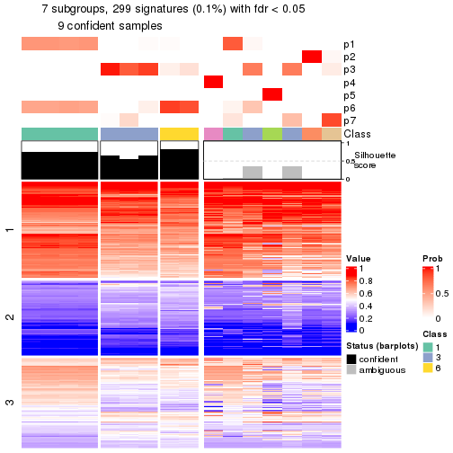</p>

</div>
<div id='tab-node-033-get-signatures-7'>
<pre><code class="r">get_signatures(res, k = 8)
</code></pre>

<p>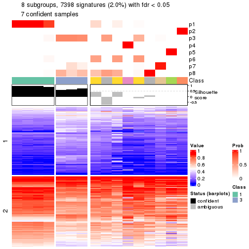</p>

</div>
</div>


Compare the overlap of signatures from different k:

```r
compare_signatures(res)
```

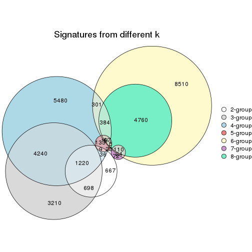

`get_signature()` returns a data frame invisibly. To get the list of signatures, the function
call should be assigned to a variable explicitly. In following code, if `plot` argument is set
to `FALSE`, no heatmap is plotted while only the differential analysis is performed.

```r
# code only for demonstration
tb = get_signature(res, k = ..., plot = FALSE)
```

An example of the output of `tb` is:

```
#>   which_row         fdr    mean_1    mean_2 scaled_mean_1 scaled_mean_2 km
#> 1        38 0.042760348  8.373488  9.131774    -0.5533452     0.5164555  1
#> 2        40 0.018707592  7.106213  8.469186    -0.6173731     0.5762149  1
#> 3        55 0.019134737 10.221463 11.207825    -0.6159697     0.5749050  1
#> 4        59 0.006059896  5.921854  7.869574    -0.6899429     0.6439467  1
#> 5        60 0.018055526  8.928898 10.211722    -0.6204761     0.5791110  1
#> 6        98 0.009384629 15.714769 14.887706     0.6635654    -0.6193277  2
...
```

The columns in `tb` are:

1. `which_row`: row indices corresponding to the input matrix.
2. `fdr`: FDR for the differential test. 
3. `mean_x`: The mean value in group x.
4. `scaled_mean_x`: The mean value in group x after rows are scaled.
5. `km`: Row groups if k-means clustering is applied to rows (which is done by automatically selecting number of clusters).

If there are too many signatures, `top_signatures = ...` can be set to only show the 
signatures with the highest FDRs:

```r
# code only for demonstration
# e.g. to show the top 500 most significant rows
tb = get_signature(res, k = ..., top_signatures = 500)
```

If the signatures are defined as these which are uniquely high in current group, `diff_method` argument
can be set to `"uniquely_high_in_one_group"`:

```r
# code only for demonstration
tb = get_signature(res, k = ..., diff_method = "uniquely_high_in_one_group")
```


UMAP plot which shows how samples are separated.


<script>
$( function() {
	$( '#tabs-node-033-dimension-reduction' ).tabs();
} );
</script>
<div id='tabs-node-033-dimension-reduction'>
<ul>
<li><a href='#tab-node-033-dimension-reduction-1'>k = 2</a></li>
<li><a href='#tab-node-033-dimension-reduction-2'>k = 3</a></li>
<li><a href='#tab-node-033-dimension-reduction-3'>k = 4</a></li>
<li><a href='#tab-node-033-dimension-reduction-4'>k = 5</a></li>
<li><a href='#tab-node-033-dimension-reduction-5'>k = 6</a></li>
<li><a href='#tab-node-033-dimension-reduction-6'>k = 7</a></li>
<li><a href='#tab-node-033-dimension-reduction-7'>k = 8</a></li>
</ul>
<div id='tab-node-033-dimension-reduction-1'>
<pre><code class="r">dimension_reduction(res, k = 2, method = &quot;UMAP&quot;)
</code></pre>

<p>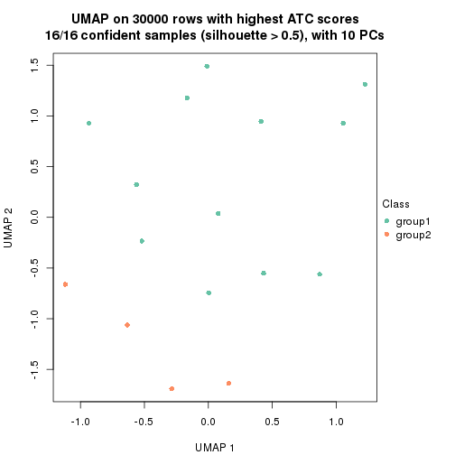</p>

</div>
<div id='tab-node-033-dimension-reduction-2'>
<pre><code class="r">dimension_reduction(res, k = 3, method = &quot;UMAP&quot;)
</code></pre>

<p>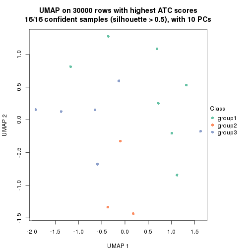</p>

</div>
<div id='tab-node-033-dimension-reduction-3'>
<pre><code class="r">dimension_reduction(res, k = 4, method = &quot;UMAP&quot;)
</code></pre>

<p>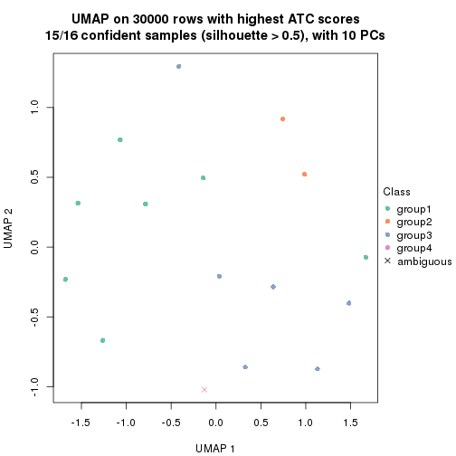</p>

</div>
<div id='tab-node-033-dimension-reduction-4'>
<pre><code class="r">dimension_reduction(res, k = 5, method = &quot;UMAP&quot;)
</code></pre>

<p>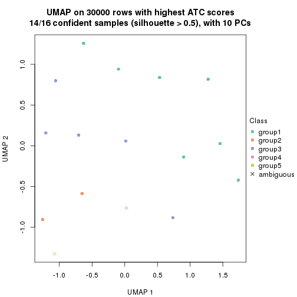</p>

</div>
<div id='tab-node-033-dimension-reduction-5'>
<pre><code class="r">dimension_reduction(res, k = 6, method = &quot;UMAP&quot;)
</code></pre>

<p>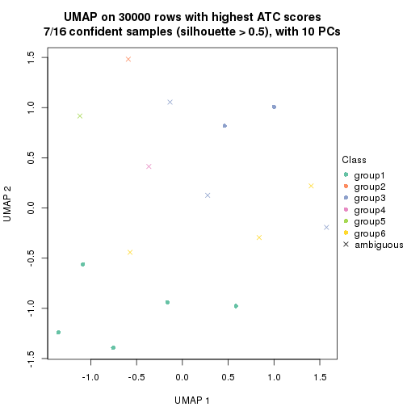</p>

</div>
<div id='tab-node-033-dimension-reduction-6'>
<pre><code class="r">dimension_reduction(res, k = 7, method = &quot;UMAP&quot;)
</code></pre>

<p>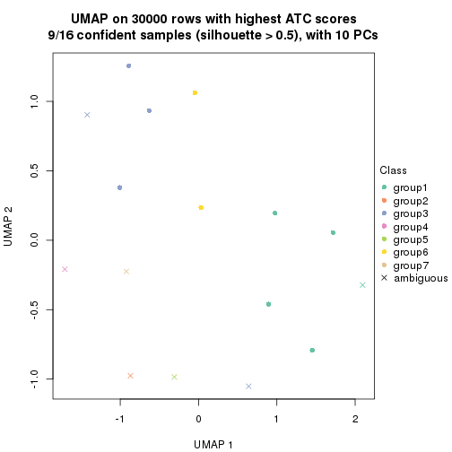</p>

</div>
<div id='tab-node-033-dimension-reduction-7'>
<pre><code class="r">dimension_reduction(res, k = 8, method = &quot;UMAP&quot;)
</code></pre>

<p>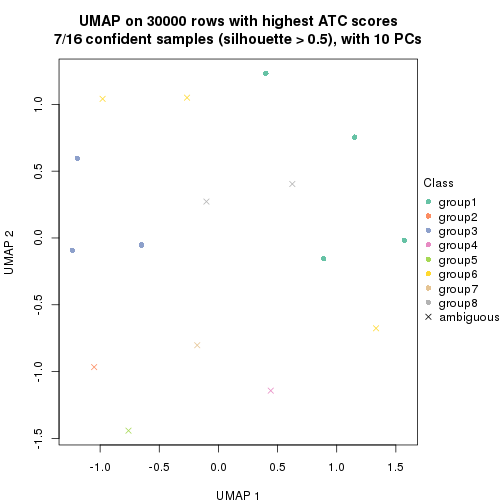</p>

</div>
</div>


Following heatmap shows how subgroups are split when increasing `k`:

```r
collect_classes(res)
```

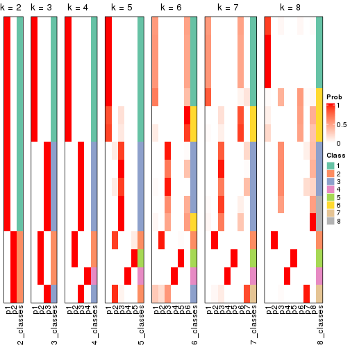


If matrix rows can be associated to genes, consider to use `functional_enrichment(res,
...)` to perform function enrichment for the signature genes. See [this vignette](https://jokergoo.github.io/cola_vignettes/functional_enrichment.html) for more detailed explanations.


 

---------------------------------------------------


### Node04


Parent node: [Node0](#Node0).
Child nodes: 
                [Node011](#Node011)
        ,
                [Node012](#Node012)
        ,
                Node013-leaf
        ,
                [Node021](#Node021)
        ,
                [Node022](#Node022)
        ,
                [Node023](#Node023)
        ,
                Node031-leaf
        ,
                Node032-leaf
        ,
                [Node033](#Node033)
        ,
                Node034-leaf
        ,
                Node041-leaf
        ,
                Node042-leaf
        ,
                [Node043](#Node043)
        ,
                [Node051](#Node051)
        ,
                [Node052](#Node052)
        ,
                Node053-leaf
        .


The object with results only for a single top-value method and a single partitioning method 
can be extracted as:

```r
res = res_rh["04"]
```

A summary of `res` and all the functions that can be applied to it:

```r
res
```

```
#> A 'ConsensusPartition' object with k = 2, 3, 4, 5, 6, 7, 8.
#>   On a matrix with 30000 rows and 68 columns.
#>   Top rows (1000) are extracted by 'ATC' method.
#>   Subgroups are detected by 'kmeans' method.
#>   Performed in total 350 partitions by row resampling.
#>   Best k for subgroups seems to be 3.
#> 
#> Following methods can be applied to this 'ConsensusPartition' object:
#>  [1] "cola_report"             "collect_classes"         "collect_plots"          
#>  [4] "collect_stats"           "colnames"                "compare_partitions"     
#>  [7] "compare_signatures"      "consensus_heatmap"       "dimension_reduction"    
#> [10] "functional_enrichment"   "get_anno_col"            "get_anno"               
#> [13] "get_classes"             "get_consensus"           "get_matrix"             
#> [16] "get_membership"          "get_param"               "get_signatures"         
#> [19] "get_stats"               "is_best_k"               "is_stable_k"            
#> [22] "membership_heatmap"      "ncol"                    "nrow"                   
#> [25] "plot_ecdf"               "predict_classes"         "rownames"               
#> [28] "select_partition_number" "show"                    "suggest_best_k"         
#> [31] "test_to_known_factors"   "top_rows_heatmap"
```

`collect_plots()` function collects all the plots made from `res` for all `k` (number of subgroups)
into one single page to provide an easy and fast comparison between different `k`.

```r
collect_plots(res)
```

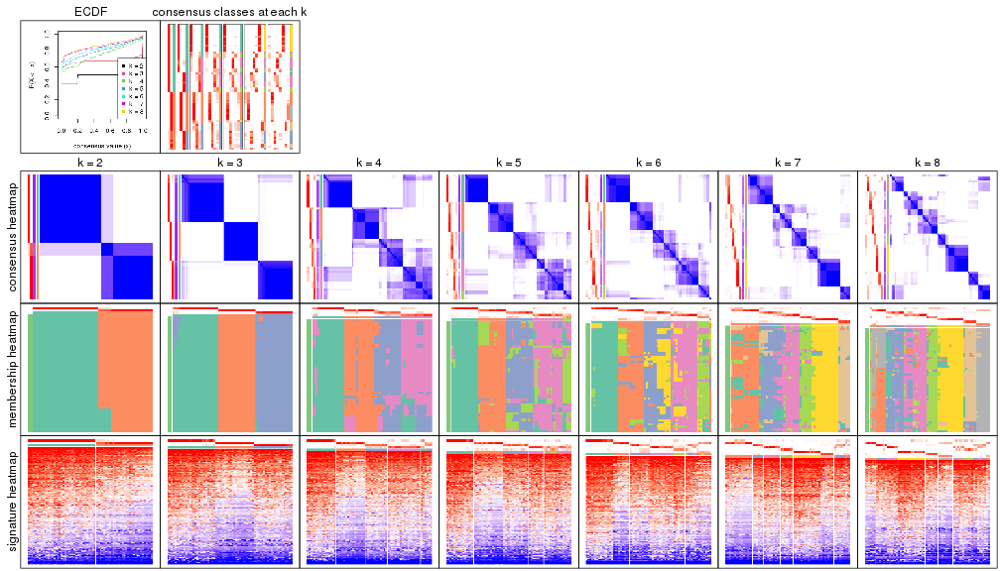

The plots are:

- The first row: a plot of the eCDF (empirical cumulative distribution
  function) curves of the consensus matrix for each `k` and the heatmap of
  predicted classes for each `k`.
- The second row: heatmaps of the consensus matrix for each `k`.
- The third row: heatmaps of the membership matrix for each `k`.
- The fouth row: heatmaps of the signatures for each `k`.

All the plots in panels can be made by individual functions and they are
plotted later in this section.

`select_partition_number()` produces several plots showing different
statistics for choosing "optimized" `k`. There are following statistics:

- eCDF curves of the consensus matrix for each `k`;
- 1-PAC. [The PAC score](https://en.wikipedia.org/wiki/Consensus_clustering#Over-interpretation_potential_of_consensus_clustering)
  measures the proportion of the ambiguous subgrouping.
- Mean silhouette score.
- Concordance. The mean probability of fiting the consensus subgroup labels in all
  partitions.
- Area increased. Denote $A_k$ as the area under the eCDF curve for current
  `k`, the area increased is defined as $A_k - A_{k-1}$.
- Rand index. The percent of pairs of samples that are both in a same cluster
  or both are not in a same cluster in the partition of k and k-1.
- Jaccard index. The ratio of pairs of samples are both in a same cluster in
  the partition of k and k-1 and the pairs of samples are both in a same
  cluster in the partition k or k-1.

The detailed explanations of these statistics can be found in [the _cola_
vignette](https://jokergoo.github.io/cola_vignettes/cola.html#toc_13).

Generally speaking, higher 1-PAC score, higher mean silhouette score or higher
concordance corresponds to better partition. Rand index and Jaccard index
measure how similar the current partition is compared to partition with `k-1`.
If they are too similar, we won't accept `k` is better than `k-1`.

```r
select_partition_number(res)
```

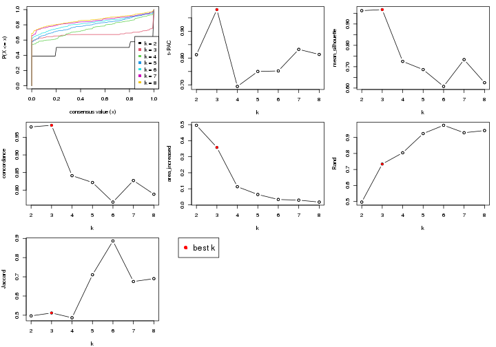

The numeric values for all these statistics can be obtained by `get_stats()`.

```r
get_stats(res)
```

```
#>   k 1-PAC mean_silhouette concordance area_increased  Rand Jaccard
#> 2 2 0.813           0.962       0.979         0.4961 0.496   0.496
#> 3 3 0.981           0.967       0.984         0.3579 0.734   0.512
#> 4 4 0.694           0.725       0.841         0.1131 0.804   0.487
#> 5 5 0.750           0.686       0.822         0.0644 0.924   0.711
#> 6 6 0.752           0.608       0.766         0.0333 0.976   0.887
#> 7 7 0.832           0.733       0.827         0.0293 0.929   0.675
#> 8 8 0.813           0.625       0.789         0.0171 0.943   0.690
```

`suggest_best_k()` suggests the best $k$ based on these statistics. The rules are as follows:

- All $k$ with Jaccard index larger than 0.95 are removed because increasing
  $k$ does not provide enough extra information. If all $k$ are removed, it is
  marked as no subgroup is detected.
- For all $k$ with 1-PAC score larger than 0.9, the maximal $k$ is taken as
  the best $k$, and other $k$ are marked as optional $k$.
- If it does not fit the second rule. The $k$ with the maximal vote of the
  highest 1-PAC score, highest mean silhouette, and highest concordance is
  taken as the best $k$.

```r
suggest_best_k(res)
```

```
#> [1] 3
```


Following is the table of the partitions (You need to click the **show/hide
code output** link to see it). The membership matrix (columns with name `p*`)
is inferred by
[`clue::cl_consensus()`](https://www.rdocumentation.org/link/cl_consensus?package=clue)
function with the `SE` method. Basically the value in the membership matrix
represents the probability to belong to a certain group. The finall subgroup
label for an item is determined with the group with highest probability it
belongs to.

In `get_classes()` function, the entropy is calculated from the membership
matrix and the silhouette score is calculated from the consensus matrix.


<script>
$( function() {
	$( '#tabs-node-04-get-classes' ).tabs();
} );
</script>
<div id='tabs-node-04-get-classes'>
<ul>
<li><a href='#tab-node-04-get-classes-1'>k = 2</a></li>
<li><a href='#tab-node-04-get-classes-2'>k = 3</a></li>
<li><a href='#tab-node-04-get-classes-3'>k = 4</a></li>
<li><a href='#tab-node-04-get-classes-4'>k = 5</a></li>
<li><a href='#tab-node-04-get-classes-5'>k = 6</a></li>
<li><a href='#tab-node-04-get-classes-6'>k = 7</a></li>
<li><a href='#tab-node-04-get-classes-7'>k = 8</a></li>
</ul>

<div id='tab-node-04-get-classes-1'>
<p><a id='tab-node-04-get-classes-1-a' style='color:#0366d6' href='#'>show/hide code output</a></p>
<pre><code class="r">cbind(get_classes(res, k = 2), get_membership(res, k = 2))
</code></pre>

<pre><code>#&gt;                 class entropy silhouette  p1  p2
#&gt; TCGA.CR.5247.01     1   0.000      1.000 1.0 0.0
#&gt; TCGA.CV.7263.01     1   0.000      1.000 1.0 0.0
#&gt; TCGA.CV.6960.01     1   0.000      1.000 1.0 0.0
#&gt; TCGA.CV.7245.01     1   0.000      1.000 1.0 0.0
#&gt; TCGA.CN.4739.01     1   0.000      1.000 1.0 0.0
#&gt; TCGA.CV.6956.01     2   0.000      0.952 0.0 1.0
#&gt; TCGA.CV.7091.01     1   0.000      1.000 1.0 0.0
#&gt; TCGA.CV.7242.01     1   0.000      1.000 1.0 0.0
#&gt; TCGA.CR.7398.01     2   0.000      0.952 0.0 1.0
#&gt; TCGA.CV.7253.01     2   0.000      0.952 0.0 1.0
#&gt; TCGA.BA.5555.01     2   0.722      0.800 0.2 0.8
#&gt; TCGA.CV.5441.01     1   0.000      1.000 1.0 0.0
#&gt; TCGA.CV.7250.01     2   0.000      0.952 0.0 1.0
#&gt; TCGA.CR.7364.01     2   0.000      0.952 0.0 1.0
#&gt; TCGA.CR.7402.01     2   0.000      0.952 0.0 1.0
#&gt; TCGA.CN.A49A.01     2   0.000      0.952 0.0 1.0
#&gt; TCGA.CN.A497.01     2   0.722      0.800 0.2 0.8
#&gt; TCGA.D6.6823.01     1   0.000      1.000 1.0 0.0
#&gt; TCGA.BA.A4IF.01     1   0.000      1.000 1.0 0.0
#&gt; TCGA.BA.6869.01     2   0.000      0.952 0.0 1.0
#&gt; TCGA.CV.6941.01     2   0.000      0.952 0.0 1.0
#&gt; TCGA.CV.6954.01     1   0.000      1.000 1.0 0.0
#&gt; TCGA.CQ.6228.01     1   0.000      1.000 1.0 0.0
#&gt; TCGA.CQ.6225.01     2   0.000      0.952 0.0 1.0
#&gt; TCGA.CN.6988.01     1   0.000      1.000 1.0 0.0
#&gt; TCGA.QK.A8Z8.01     2   0.000      0.952 0.0 1.0
#&gt; TCGA.QK.A8Z7.01     2   0.000      0.952 0.0 1.0
#&gt; TCGA.CQ.A4C9.01     1   0.000      1.000 1.0 0.0
#&gt; TCGA.CQ.7072.01     2   0.722      0.800 0.2 0.8
#&gt; TCGA.CN.A63T.01     2   0.722      0.800 0.2 0.8
#&gt; TCGA.F7.A61V.01     1   0.000      1.000 1.0 0.0
#&gt; TCGA.P3.A5QF.01     1   0.000      1.000 1.0 0.0
#&gt; TCGA.BB.A5HZ.01     1   0.000      1.000 1.0 0.0
#&gt; TCGA.CN.A641.01     2   0.000      0.952 0.0 1.0
#&gt; TCGA.QK.AA3J.01     1   0.000      1.000 1.0 0.0
#&gt; TCGA.KU.A66S.01     2   0.000      0.952 0.0 1.0
#&gt; TCGA.BA.A6DL.01     1   0.000      1.000 1.0 0.0
#&gt; TCGA.CV.A461.01     1   0.000      1.000 1.0 0.0
#&gt; TCGA.P3.A6T6.01     1   0.000      1.000 1.0 0.0
#&gt; TCGA.CN.4730.01     1   0.000      1.000 1.0 0.0
#&gt; TCGA.BB.7864.01     1   0.000      1.000 1.0 0.0
#&gt; TCGA.BA.4074.01     1   0.000      1.000 1.0 0.0
#&gt; TCGA.QK.A6VB.01     2   0.000      0.952 0.0 1.0
#&gt; TCGA.HD.7917.01     1   0.000      1.000 1.0 0.0
#&gt; TCGA.CV.7409.01     1   0.000      1.000 1.0 0.0
#&gt; TCGA.UF.A71D.01     1   0.000      1.000 1.0 0.0
#&gt; TCGA.BB.7870.01     2   0.000      0.952 0.0 1.0
#&gt; TCGA.CN.4727.01     2   0.000      0.952 0.0 1.0
#&gt; TCGA.DQ.7595.01     2   0.722      0.800 0.2 0.8
#&gt; TCGA.CN.5360.01     1   0.000      1.000 1.0 0.0
#&gt; TCGA.CN.A6V3.01     2   0.000      0.952 0.0 1.0
#&gt; TCGA.UF.A7JF.01     1   0.000      1.000 1.0 0.0
#&gt; TCGA.CN.4731.01     1   0.000      1.000 1.0 0.0
#&gt; TCGA.CN.A63W.01     2   0.000      0.952 0.0 1.0
#&gt; TCGA.CN.A63U.01     2   0.000      0.952 0.0 1.0
#&gt; TCGA.H7.A6C5.01     1   0.000      1.000 1.0 0.0
#&gt; TCGA.CN.5356.01     2   0.000      0.952 0.0 1.0
#&gt; TCGA.F7.7848.01     1   0.000      1.000 1.0 0.0
#&gt; TCGA.CV.7428.01     1   0.000      1.000 1.0 0.0
#&gt; TCGA.CV.7435.01     1   0.000      1.000 1.0 0.0
#&gt; TCGA.UF.A719.01     2   0.000      0.952 0.0 1.0
#&gt; TCGA.UF.A7JD.01     2   0.000      0.952 0.0 1.0
#&gt; TCGA.UF.A7JH.01     1   0.000      1.000 1.0 0.0
#&gt; TCGA.D6.A6EO.01     1   0.000      1.000 1.0 0.0
#&gt; TCGA.D6.A74Q.01     1   0.000      1.000 1.0 0.0
#&gt; TCGA.BA.A6DE.01     2   0.722      0.800 0.2 0.8
#&gt; TCGA.CV.7440.01     2   0.000      0.952 0.0 1.0
#&gt; TCGA.CV.A6JU.01     2   0.722      0.800 0.2 0.8
</code></pre>

<script>
$('#tab-node-04-get-classes-1-a').parent().next().next().hide();
$('#tab-node-04-get-classes-1-a').click(function(){
  $('#tab-node-04-get-classes-1-a').parent().next().next().toggle();
  return(false);
});
</script>
</div>

<div id='tab-node-04-get-classes-2'>
<p><a id='tab-node-04-get-classes-2-a' style='color:#0366d6' href='#'>show/hide code output</a></p>
<pre><code class="r">cbind(get_classes(res, k = 3), get_membership(res, k = 3))
</code></pre>

<pre><code>#&gt;                 class entropy silhouette   p1   p2   p3
#&gt; TCGA.CR.5247.01     1  0.0000      0.966 1.00 0.00 0.00
#&gt; TCGA.CV.7263.01     1  0.0000      0.966 1.00 0.00 0.00
#&gt; TCGA.CV.6960.01     1  0.0000      0.966 1.00 0.00 0.00
#&gt; TCGA.CV.7245.01     3  0.3340      0.856 0.12 0.00 0.88
#&gt; TCGA.CN.4739.01     1  0.0000      0.966 1.00 0.00 0.00
#&gt; TCGA.CV.6956.01     2  0.0000      1.000 0.00 1.00 0.00
#&gt; TCGA.CV.7091.01     3  0.0000      0.987 0.00 0.00 1.00
#&gt; TCGA.CV.7242.01     1  0.0000      0.966 1.00 0.00 0.00
#&gt; TCGA.CR.7398.01     2  0.0000      1.000 0.00 1.00 0.00
#&gt; TCGA.CV.7253.01     2  0.0000      1.000 0.00 1.00 0.00
#&gt; TCGA.BA.5555.01     3  0.0000      0.987 0.00 0.00 1.00
#&gt; TCGA.CV.5441.01     3  0.0000      0.987 0.00 0.00 1.00
#&gt; TCGA.CV.7250.01     2  0.0000      1.000 0.00 1.00 0.00
#&gt; TCGA.CR.7364.01     2  0.0000      1.000 0.00 1.00 0.00
#&gt; TCGA.CR.7402.01     3  0.1529      0.953 0.00 0.04 0.96
#&gt; TCGA.CN.A49A.01     2  0.0000      1.000 0.00 1.00 0.00
#&gt; TCGA.CN.A497.01     3  0.0000      0.987 0.00 0.00 1.00
#&gt; TCGA.D6.6823.01     1  0.0000      0.966 1.00 0.00 0.00
#&gt; TCGA.BA.A4IF.01     3  0.0000      0.987 0.00 0.00 1.00
#&gt; TCGA.BA.6869.01     2  0.0000      1.000 0.00 1.00 0.00
#&gt; TCGA.CV.6941.01     2  0.0000      1.000 0.00 1.00 0.00
#&gt; TCGA.CV.6954.01     1  0.4291      0.798 0.82 0.00 0.18
#&gt; TCGA.CQ.6228.01     1  0.0000      0.966 1.00 0.00 0.00
#&gt; TCGA.CQ.6225.01     2  0.0000      1.000 0.00 1.00 0.00
#&gt; TCGA.CN.6988.01     1  0.0000      0.966 1.00 0.00 0.00
#&gt; TCGA.QK.A8Z8.01     2  0.0000      1.000 0.00 1.00 0.00
#&gt; TCGA.QK.A8Z7.01     3  0.2066      0.933 0.00 0.06 0.94
#&gt; TCGA.CQ.A4C9.01     1  0.5016      0.716 0.76 0.00 0.24
#&gt; TCGA.CQ.7072.01     3  0.0000      0.987 0.00 0.00 1.00
#&gt; TCGA.CN.A63T.01     3  0.0000      0.987 0.00 0.00 1.00
#&gt; TCGA.F7.A61V.01     1  0.0000      0.966 1.00 0.00 0.00
#&gt; TCGA.P3.A5QF.01     1  0.0000      0.966 1.00 0.00 0.00
#&gt; TCGA.BB.A5HZ.01     3  0.0000      0.987 0.00 0.00 1.00
#&gt; TCGA.CN.A641.01     2  0.0000      1.000 0.00 1.00 0.00
#&gt; TCGA.QK.AA3J.01     1  0.5397      0.649 0.72 0.00 0.28
#&gt; TCGA.KU.A66S.01     2  0.0000      1.000 0.00 1.00 0.00
#&gt; TCGA.BA.A6DL.01     1  0.1529      0.937 0.96 0.00 0.04
#&gt; TCGA.CV.A461.01     3  0.0892      0.971 0.02 0.00 0.98
#&gt; TCGA.P3.A6T6.01     1  0.0000      0.966 1.00 0.00 0.00
#&gt; TCGA.CN.4730.01     3  0.0000      0.987 0.00 0.00 1.00
#&gt; TCGA.BB.7864.01     1  0.0000      0.966 1.00 0.00 0.00
#&gt; TCGA.BA.4074.01     1  0.2959      0.885 0.90 0.00 0.10
#&gt; TCGA.QK.A6VB.01     2  0.0000      1.000 0.00 1.00 0.00
#&gt; TCGA.HD.7917.01     1  0.0000      0.966 1.00 0.00 0.00
#&gt; TCGA.CV.7409.01     3  0.0000      0.987 0.00 0.00 1.00
#&gt; TCGA.UF.A71D.01     1  0.0000      0.966 1.00 0.00 0.00
#&gt; TCGA.BB.7870.01     2  0.0000      1.000 0.00 1.00 0.00
#&gt; TCGA.CN.4727.01     2  0.0000      1.000 0.00 1.00 0.00
#&gt; TCGA.DQ.7595.01     3  0.0000      0.987 0.00 0.00 1.00
#&gt; TCGA.CN.5360.01     1  0.0000      0.966 1.00 0.00 0.00
#&gt; TCGA.CN.A6V3.01     3  0.0000      0.987 0.00 0.00 1.00
#&gt; TCGA.UF.A7JF.01     1  0.0000      0.966 1.00 0.00 0.00
#&gt; TCGA.CN.4731.01     3  0.0000      0.987 0.00 0.00 1.00
#&gt; TCGA.CN.A63W.01     2  0.0000      1.000 0.00 1.00 0.00
#&gt; TCGA.CN.A63U.01     2  0.0000      1.000 0.00 1.00 0.00
#&gt; TCGA.H7.A6C5.01     1  0.0000      0.966 1.00 0.00 0.00
#&gt; TCGA.CN.5356.01     2  0.0000      1.000 0.00 1.00 0.00
#&gt; TCGA.F7.7848.01     3  0.0000      0.987 0.00 0.00 1.00
#&gt; TCGA.CV.7428.01     1  0.0000      0.966 1.00 0.00 0.00
#&gt; TCGA.CV.7435.01     3  0.0000      0.987 0.00 0.00 1.00
#&gt; TCGA.UF.A719.01     2  0.0000      1.000 0.00 1.00 0.00
#&gt; TCGA.UF.A7JD.01     2  0.0000      1.000 0.00 1.00 0.00
#&gt; TCGA.UF.A7JH.01     1  0.0000      0.966 1.00 0.00 0.00
#&gt; TCGA.D6.A6EO.01     1  0.0000      0.966 1.00 0.00 0.00
#&gt; TCGA.D6.A74Q.01     1  0.0000      0.966 1.00 0.00 0.00
#&gt; TCGA.BA.A6DE.01     3  0.0000      0.987 0.00 0.00 1.00
#&gt; TCGA.CV.7440.01     2  0.0000      1.000 0.00 1.00 0.00
#&gt; TCGA.CV.A6JU.01     3  0.0000      0.987 0.00 0.00 1.00
</code></pre>

<script>
$('#tab-node-04-get-classes-2-a').parent().next().next().hide();
$('#tab-node-04-get-classes-2-a').click(function(){
  $('#tab-node-04-get-classes-2-a').parent().next().next().toggle();
  return(false);
});
</script>
</div>

<div id='tab-node-04-get-classes-3'>
<p><a id='tab-node-04-get-classes-3-a' style='color:#0366d6' href='#'>show/hide code output</a></p>
<pre><code class="r">cbind(get_classes(res, k = 4), get_membership(res, k = 4))
</code></pre>

<pre><code>#&gt;                 class entropy silhouette   p1   p2   p3   p4
#&gt; TCGA.CR.5247.01     1   0.485     0.2229 0.60 0.00 0.00 0.40
#&gt; TCGA.CV.7263.01     1   0.000     0.9126 1.00 0.00 0.00 0.00
#&gt; TCGA.CV.6960.01     1   0.000     0.9126 1.00 0.00 0.00 0.00
#&gt; TCGA.CV.7245.01     4   0.234     0.7381 0.06 0.00 0.02 0.92
#&gt; TCGA.CN.4739.01     4   0.452     0.5764 0.32 0.00 0.00 0.68
#&gt; TCGA.CV.6956.01     2   0.317     0.8625 0.00 0.84 0.16 0.00
#&gt; TCGA.CV.7091.01     4   0.398     0.5112 0.00 0.00 0.24 0.76
#&gt; TCGA.CV.7242.01     1   0.000     0.9126 1.00 0.00 0.00 0.00
#&gt; TCGA.CR.7398.01     2   0.000     0.8935 0.00 1.00 0.00 0.00
#&gt; TCGA.CV.7253.01     2   0.317     0.8625 0.00 0.84 0.16 0.00
#&gt; TCGA.BA.5555.01     3   0.413     0.7509 0.00 0.00 0.74 0.26
#&gt; TCGA.CV.5441.01     4   0.398     0.5112 0.00 0.00 0.24 0.76
#&gt; TCGA.CV.7250.01     2   0.317     0.8625 0.00 0.84 0.16 0.00
#&gt; TCGA.CR.7364.01     2   0.000     0.8935 0.00 1.00 0.00 0.00
#&gt; TCGA.CR.7402.01     3   0.433     0.7528 0.00 0.04 0.80 0.16
#&gt; TCGA.CN.A49A.01     2   0.000     0.8935 0.00 1.00 0.00 0.00
#&gt; TCGA.CN.A497.01     3   0.380     0.7514 0.00 0.00 0.78 0.22
#&gt; TCGA.D6.6823.01     1   0.000     0.9126 1.00 0.00 0.00 0.00
#&gt; TCGA.BA.A4IF.01     4   0.201     0.6964 0.00 0.00 0.08 0.92
#&gt; TCGA.BA.6869.01     3   0.265     0.6032 0.00 0.12 0.88 0.00
#&gt; TCGA.CV.6941.01     2   0.317     0.8625 0.00 0.84 0.16 0.00
#&gt; TCGA.CV.6954.01     4   0.494     0.7067 0.22 0.00 0.04 0.74
#&gt; TCGA.CQ.6228.01     1   0.000     0.9126 1.00 0.00 0.00 0.00
#&gt; TCGA.CQ.6225.01     2   0.265     0.8734 0.00 0.88 0.12 0.00
#&gt; TCGA.CN.6988.01     1   0.000     0.9126 1.00 0.00 0.00 0.00
#&gt; TCGA.QK.A8Z8.01     2   0.000     0.8935 0.00 1.00 0.00 0.00
#&gt; TCGA.QK.A8Z7.01     3   0.191     0.6961 0.00 0.04 0.94 0.02
#&gt; TCGA.CQ.A4C9.01     4   0.494     0.7067 0.22 0.00 0.04 0.74
#&gt; TCGA.CQ.7072.01     3   0.380     0.7514 0.00 0.00 0.78 0.22
#&gt; TCGA.CN.A63T.01     3   0.413     0.7509 0.00 0.00 0.74 0.26
#&gt; TCGA.F7.A61V.01     1   0.000     0.9126 1.00 0.00 0.00 0.00
#&gt; TCGA.P3.A5QF.01     1   0.539     0.5239 0.68 0.00 0.04 0.28
#&gt; TCGA.BB.A5HZ.01     4   0.398     0.5112 0.00 0.00 0.24 0.76
#&gt; TCGA.CN.A641.01     2   0.000     0.8935 0.00 1.00 0.00 0.00
#&gt; TCGA.QK.AA3J.01     4   0.361     0.7023 0.20 0.00 0.00 0.80
#&gt; TCGA.KU.A66S.01     2   0.000     0.8935 0.00 1.00 0.00 0.00
#&gt; TCGA.BA.A6DL.01     4   0.494     0.6678 0.22 0.00 0.04 0.74
#&gt; TCGA.CV.A461.01     4   0.121     0.7090 0.00 0.00 0.04 0.96
#&gt; TCGA.P3.A6T6.01     1   0.000     0.9126 1.00 0.00 0.00 0.00
#&gt; TCGA.CN.4730.01     4   0.164     0.7084 0.00 0.00 0.06 0.94
#&gt; TCGA.BB.7864.01     1   0.000     0.9126 1.00 0.00 0.00 0.00
#&gt; TCGA.BA.4074.01     4   0.494     0.7067 0.22 0.00 0.04 0.74
#&gt; TCGA.QK.A6VB.01     2   0.317     0.8625 0.00 0.84 0.16 0.00
#&gt; TCGA.HD.7917.01     1   0.000     0.9126 1.00 0.00 0.00 0.00
#&gt; TCGA.CV.7409.01     4   0.164     0.7003 0.00 0.00 0.06 0.94
#&gt; TCGA.UF.A71D.01     4   0.428     0.6362 0.28 0.00 0.00 0.72
#&gt; TCGA.BB.7870.01     2   0.000     0.8935 0.00 1.00 0.00 0.00
#&gt; TCGA.CN.4727.01     3   0.495     0.2657 0.00 0.44 0.56 0.00
#&gt; TCGA.DQ.7595.01     3   0.428     0.7193 0.00 0.00 0.72 0.28
#&gt; TCGA.CN.5360.01     1   0.601    -0.0224 0.50 0.00 0.04 0.46
#&gt; TCGA.CN.A6V3.01     3   0.380     0.7552 0.00 0.00 0.78 0.22
#&gt; TCGA.UF.A7JF.01     1   0.000     0.9126 1.00 0.00 0.00 0.00
#&gt; TCGA.CN.4731.01     4   0.380     0.5333 0.00 0.00 0.22 0.78
#&gt; TCGA.CN.A63W.01     2   0.499    -0.1191 0.00 0.52 0.48 0.00
#&gt; TCGA.CN.A63U.01     3   0.495     0.2657 0.00 0.44 0.56 0.00
#&gt; TCGA.H7.A6C5.01     1   0.164     0.8595 0.94 0.00 0.00 0.06
#&gt; TCGA.CN.5356.01     2   0.000     0.8935 0.00 1.00 0.00 0.00
#&gt; TCGA.F7.7848.01     4   0.164     0.7084 0.00 0.00 0.06 0.94
#&gt; TCGA.CV.7428.01     1   0.000     0.9126 1.00 0.00 0.00 0.00
#&gt; TCGA.CV.7435.01     3   0.471     0.6361 0.00 0.00 0.64 0.36
#&gt; TCGA.UF.A719.01     2   0.000     0.8935 0.00 1.00 0.00 0.00
#&gt; TCGA.UF.A7JD.01     2   0.361     0.8388 0.00 0.80 0.20 0.00
#&gt; TCGA.UF.A7JH.01     1   0.000     0.9126 1.00 0.00 0.00 0.00
#&gt; TCGA.D6.A6EO.01     4   0.551     0.5436 0.30 0.00 0.04 0.66
#&gt; TCGA.D6.A74Q.01     1   0.000     0.9126 1.00 0.00 0.00 0.00
#&gt; TCGA.BA.A6DE.01     3   0.471     0.6397 0.00 0.00 0.64 0.36
#&gt; TCGA.CV.7440.01     3   0.428     0.3184 0.00 0.28 0.72 0.00
#&gt; TCGA.CV.A6JU.01     3   0.413     0.7509 0.00 0.00 0.74 0.26
</code></pre>

<script>
$('#tab-node-04-get-classes-3-a').parent().next().next().hide();
$('#tab-node-04-get-classes-3-a').click(function(){
  $('#tab-node-04-get-classes-3-a').parent().next().next().toggle();
  return(false);
});
</script>
</div>

<div id='tab-node-04-get-classes-4'>
<p><a id='tab-node-04-get-classes-4-a' style='color:#0366d6' href='#'>show/hide code output</a></p>
<pre><code class="r">cbind(get_classes(res, k = 5), get_membership(res, k = 5))
</code></pre>

<pre><code>#&gt;                 class entropy silhouette   p1   p2   p3   p4   p5
#&gt; TCGA.CR.5247.01     4  0.3895      0.227 0.32 0.00 0.00 0.68 0.00
#&gt; TCGA.CV.7263.01     1  0.0000      0.975 1.00 0.00 0.00 0.00 0.00
#&gt; TCGA.CV.6960.01     1  0.0000      0.975 1.00 0.00 0.00 0.00 0.00
#&gt; TCGA.CV.7245.01     4  0.2516      0.485 0.00 0.00 0.00 0.86 0.14
#&gt; TCGA.CN.4739.01     4  0.4458      0.391 0.12 0.00 0.00 0.76 0.12
#&gt; TCGA.CV.6956.01     2  0.3852      0.845 0.00 0.76 0.02 0.00 0.22
#&gt; TCGA.CV.7091.01     4  0.6133      0.276 0.00 0.00 0.16 0.54 0.30
#&gt; TCGA.CV.7242.01     1  0.0000      0.975 1.00 0.00 0.00 0.00 0.00
#&gt; TCGA.CR.7398.01     2  0.1216      0.876 0.00 0.96 0.02 0.00 0.02
#&gt; TCGA.CV.7253.01     2  0.3852      0.845 0.00 0.76 0.02 0.00 0.22
#&gt; TCGA.BA.5555.01     3  0.4398      0.721 0.00 0.00 0.72 0.04 0.24
#&gt; TCGA.CV.5441.01     4  0.4818      0.475 0.00 0.00 0.10 0.72 0.18
#&gt; TCGA.CV.7250.01     2  0.3852      0.845 0.00 0.76 0.02 0.00 0.22
#&gt; TCGA.CR.7364.01     2  0.1216      0.876 0.00 0.96 0.02 0.00 0.02
#&gt; TCGA.CR.7402.01     3  0.0609      0.739 0.00 0.00 0.98 0.00 0.02
#&gt; TCGA.CN.A49A.01     2  0.0000      0.889 0.00 1.00 0.00 0.00 0.00
#&gt; TCGA.CN.A497.01     3  0.4644      0.714 0.00 0.00 0.68 0.04 0.28
#&gt; TCGA.D6.6823.01     1  0.0000      0.975 1.00 0.00 0.00 0.00 0.00
#&gt; TCGA.BA.A4IF.01     5  0.5013      0.404 0.00 0.00 0.08 0.24 0.68
#&gt; TCGA.BA.6869.01     3  0.2280      0.691 0.00 0.00 0.88 0.00 0.12
#&gt; TCGA.CV.6941.01     2  0.3852      0.845 0.00 0.76 0.02 0.00 0.22
#&gt; TCGA.CV.6954.01     4  0.1410      0.592 0.06 0.00 0.00 0.94 0.00
#&gt; TCGA.CQ.6228.01     1  0.0000      0.975 1.00 0.00 0.00 0.00 0.00
#&gt; TCGA.CQ.6225.01     2  0.2020      0.881 0.00 0.90 0.00 0.00 0.10
#&gt; TCGA.CN.6988.01     1  0.0000      0.975 1.00 0.00 0.00 0.00 0.00
#&gt; TCGA.QK.A8Z8.01     2  0.0000      0.889 0.00 1.00 0.00 0.00 0.00
#&gt; TCGA.QK.A8Z7.01     3  0.1410      0.727 0.00 0.00 0.94 0.00 0.06
#&gt; TCGA.CQ.A4C9.01     4  0.1410      0.592 0.06 0.00 0.00 0.94 0.00
#&gt; TCGA.CQ.7072.01     3  0.4990      0.674 0.00 0.00 0.60 0.04 0.36
#&gt; TCGA.CN.A63T.01     3  0.4644      0.702 0.00 0.00 0.68 0.04 0.28
#&gt; TCGA.F7.A61V.01     1  0.2331      0.867 0.90 0.00 0.00 0.02 0.08
#&gt; TCGA.P3.A5QF.01     5  0.6746      0.442 0.36 0.00 0.00 0.26 0.38
#&gt; TCGA.BB.A5HZ.01     4  0.4818      0.475 0.00 0.00 0.10 0.72 0.18
#&gt; TCGA.CN.A641.01     2  0.1648      0.876 0.00 0.94 0.04 0.00 0.02
#&gt; TCGA.QK.AA3J.01     4  0.2331      0.534 0.02 0.00 0.00 0.90 0.08
#&gt; TCGA.KU.A66S.01     2  0.0000      0.889 0.00 1.00 0.00 0.00 0.00
#&gt; TCGA.BA.A6DL.01     4  0.6019     -0.396 0.12 0.00 0.00 0.50 0.38
#&gt; TCGA.CV.A461.01     4  0.1043      0.565 0.00 0.00 0.00 0.96 0.04
#&gt; TCGA.P3.A6T6.01     1  0.0000      0.975 1.00 0.00 0.00 0.00 0.00
#&gt; TCGA.CN.4730.01     5  0.4990      0.453 0.00 0.00 0.04 0.36 0.60
#&gt; TCGA.BB.7864.01     1  0.0000      0.975 1.00 0.00 0.00 0.00 0.00
#&gt; TCGA.BA.4074.01     4  0.1410      0.592 0.06 0.00 0.00 0.94 0.00
#&gt; TCGA.QK.A6VB.01     2  0.3852      0.845 0.00 0.76 0.02 0.00 0.22
#&gt; TCGA.HD.7917.01     1  0.0000      0.975 1.00 0.00 0.00 0.00 0.00
#&gt; TCGA.CV.7409.01     4  0.2012      0.572 0.00 0.00 0.02 0.92 0.06
#&gt; TCGA.UF.A71D.01     4  0.1410      0.592 0.06 0.00 0.00 0.94 0.00
#&gt; TCGA.BB.7870.01     2  0.0000      0.889 0.00 1.00 0.00 0.00 0.00
#&gt; TCGA.CN.4727.01     3  0.3521      0.680 0.00 0.14 0.82 0.00 0.04
#&gt; TCGA.DQ.7595.01     3  0.4990      0.646 0.00 0.00 0.60 0.04 0.36
#&gt; TCGA.CN.5360.01     5  0.6794      0.456 0.32 0.00 0.00 0.30 0.38
#&gt; TCGA.CN.A6V3.01     3  0.3106      0.739 0.00 0.00 0.84 0.02 0.14
#&gt; TCGA.UF.A7JF.01     1  0.0000      0.975 1.00 0.00 0.00 0.00 0.00
#&gt; TCGA.CN.4731.01     4  0.4373      0.502 0.00 0.00 0.08 0.76 0.16
#&gt; TCGA.CN.A63W.01     3  0.3513      0.655 0.00 0.18 0.80 0.00 0.02
#&gt; TCGA.CN.A63U.01     3  0.3521      0.680 0.00 0.14 0.82 0.00 0.04
#&gt; TCGA.H7.A6C5.01     1  0.3521      0.721 0.82 0.00 0.00 0.14 0.04
#&gt; TCGA.CN.5356.01     2  0.1043      0.889 0.00 0.96 0.00 0.00 0.04
#&gt; TCGA.F7.7848.01     5  0.5173      0.382 0.00 0.00 0.04 0.46 0.50
#&gt; TCGA.CV.7428.01     1  0.0000      0.975 1.00 0.00 0.00 0.00 0.00
#&gt; TCGA.CV.7435.01     3  0.6254      0.492 0.00 0.00 0.50 0.16 0.34
#&gt; TCGA.UF.A719.01     2  0.0000      0.889 0.00 1.00 0.00 0.00 0.00
#&gt; TCGA.UF.A7JD.01     2  0.6157      0.652 0.00 0.56 0.22 0.00 0.22
#&gt; TCGA.UF.A7JH.01     1  0.0000      0.975 1.00 0.00 0.00 0.00 0.00
#&gt; TCGA.D6.A6EO.01     4  0.6447     -0.458 0.18 0.00 0.00 0.44 0.38
#&gt; TCGA.D6.A74Q.01     1  0.0000      0.975 1.00 0.00 0.00 0.00 0.00
#&gt; TCGA.BA.A6DE.01     4  0.6244      0.306 0.00 0.00 0.26 0.54 0.20
#&gt; TCGA.CV.7440.01     3  0.3291      0.673 0.00 0.04 0.84 0.00 0.12
#&gt; TCGA.CV.A6JU.01     3  0.4644      0.702 0.00 0.00 0.68 0.04 0.28
</code></pre>

<script>
$('#tab-node-04-get-classes-4-a').parent().next().next().hide();
$('#tab-node-04-get-classes-4-a').click(function(){
  $('#tab-node-04-get-classes-4-a').parent().next().next().toggle();
  return(false);
});
</script>
</div>

<div id='tab-node-04-get-classes-5'>
<p><a id='tab-node-04-get-classes-5-a' style='color:#0366d6' href='#'>show/hide code output</a></p>
<pre><code class="r">cbind(get_classes(res, k = 6), get_membership(res, k = 6))
</code></pre>

<pre><code>#&gt;                 class entropy silhouette   p1   p2   p3   p4   p5   p6
#&gt; TCGA.CR.5247.01     4  0.3679      0.509 0.20 0.00 0.00 0.76 0.00 0.04
#&gt; TCGA.CV.7263.01     1  0.0937      0.949 0.96 0.00 0.00 0.00 0.00 0.04
#&gt; TCGA.CV.6960.01     1  0.0000      0.962 1.00 0.00 0.00 0.00 0.00 0.00
#&gt; TCGA.CV.7245.01     4  0.1814      0.687 0.00 0.00 0.00 0.90 0.10 0.00
#&gt; TCGA.CN.4739.01     4  0.4162      0.522 0.12 0.00 0.00 0.78 0.06 0.04
#&gt; TCGA.CV.6956.01     2  0.3756     -0.127 0.00 0.60 0.00 0.00 0.00 0.40
#&gt; TCGA.CV.7091.01     4  0.5574      0.372 0.00 0.00 0.44 0.46 0.02 0.08
#&gt; TCGA.CV.7242.01     1  0.0000      0.962 1.00 0.00 0.00 0.00 0.00 0.00
#&gt; TCGA.CR.7398.01     2  0.1807      0.544 0.00 0.92 0.00 0.00 0.02 0.06
#&gt; TCGA.CV.7253.01     2  0.3756     -0.127 0.00 0.60 0.00 0.00 0.00 0.40
#&gt; TCGA.BA.5555.01     3  0.0000      0.604 0.00 0.00 1.00 0.00 0.00 0.00
#&gt; TCGA.CV.5441.01     4  0.4607      0.682 0.00 0.00 0.18 0.72 0.02 0.08
#&gt; TCGA.CV.7250.01     2  0.3756     -0.127 0.00 0.60 0.00 0.00 0.00 0.40
#&gt; TCGA.CR.7364.01     2  0.1807      0.544 0.00 0.92 0.00 0.00 0.02 0.06
#&gt; TCGA.CR.7402.01     3  0.5419      0.613 0.00 0.00 0.58 0.00 0.20 0.22
#&gt; TCGA.CN.A49A.01     2  0.0000      0.623 0.00 1.00 0.00 0.00 0.00 0.00
#&gt; TCGA.CN.A497.01     3  0.4566      0.527 0.00 0.00 0.70 0.00 0.14 0.16
#&gt; TCGA.D6.6823.01     1  0.0000      0.962 1.00 0.00 0.00 0.00 0.00 0.00
#&gt; TCGA.BA.A4IF.01     5  0.5825      0.416 0.00 0.00 0.22 0.04 0.60 0.14
#&gt; TCGA.BA.6869.01     3  0.5798      0.570 0.00 0.00 0.48 0.00 0.20 0.32
#&gt; TCGA.CV.6941.01     2  0.3756     -0.127 0.00 0.60 0.00 0.00 0.00 0.40
#&gt; TCGA.CV.6954.01     4  0.0000      0.753 0.00 0.00 0.00 1.00 0.00 0.00
#&gt; TCGA.CQ.6228.01     1  0.0000      0.962 1.00 0.00 0.00 0.00 0.00 0.00
#&gt; TCGA.CQ.6225.01     2  0.2454      0.493 0.00 0.84 0.00 0.00 0.00 0.16
#&gt; TCGA.CN.6988.01     1  0.0000      0.962 1.00 0.00 0.00 0.00 0.00 0.00
#&gt; TCGA.QK.A8Z8.01     2  0.0000      0.623 0.00 1.00 0.00 0.00 0.00 0.00
#&gt; TCGA.QK.A8Z7.01     3  0.5963      0.576 0.00 0.00 0.44 0.00 0.24 0.32
#&gt; TCGA.CQ.A4C9.01     4  0.0000      0.753 0.00 0.00 0.00 1.00 0.00 0.00
#&gt; TCGA.CQ.7072.01     3  0.4536      0.484 0.00 0.00 0.70 0.00 0.12 0.18
#&gt; TCGA.CN.A63T.01     3  0.1267      0.578 0.00 0.00 0.94 0.00 0.00 0.06
#&gt; TCGA.F7.A61V.01     1  0.3351      0.766 0.80 0.00 0.00 0.00 0.16 0.04
#&gt; TCGA.P3.A5QF.01     5  0.5291      0.615 0.30 0.00 0.00 0.08 0.60 0.02
#&gt; TCGA.BB.A5HZ.01     4  0.4607      0.682 0.00 0.00 0.18 0.72 0.02 0.08
#&gt; TCGA.CN.A641.01     2  0.2094      0.534 0.00 0.90 0.00 0.00 0.02 0.08
#&gt; TCGA.QK.AA3J.01     4  0.0937      0.734 0.00 0.00 0.00 0.96 0.04 0.00
#&gt; TCGA.KU.A66S.01     2  0.0000      0.623 0.00 1.00 0.00 0.00 0.00 0.00
#&gt; TCGA.BA.A6DL.01     5  0.5029      0.663 0.12 0.00 0.00 0.26 0.62 0.00
#&gt; TCGA.CV.A461.01     4  0.3572      0.712 0.00 0.00 0.02 0.82 0.10 0.06
#&gt; TCGA.P3.A6T6.01     1  0.0000      0.962 1.00 0.00 0.00 0.00 0.00 0.00
#&gt; TCGA.CN.4730.01     5  0.5073      0.641 0.00 0.00 0.16 0.14 0.68 0.02
#&gt; TCGA.BB.7864.01     1  0.0000      0.962 1.00 0.00 0.00 0.00 0.00 0.00
#&gt; TCGA.BA.4074.01     4  0.0000      0.753 0.00 0.00 0.00 1.00 0.00 0.00
#&gt; TCGA.QK.A6VB.01     2  0.3756     -0.127 0.00 0.60 0.00 0.00 0.00 0.40
#&gt; TCGA.HD.7917.01     1  0.0937      0.949 0.96 0.00 0.00 0.00 0.00 0.04
#&gt; TCGA.CV.7409.01     4  0.2629      0.742 0.00 0.00 0.02 0.88 0.02 0.08
#&gt; TCGA.UF.A71D.01     4  0.0000      0.753 0.00 0.00 0.00 1.00 0.00 0.00
#&gt; TCGA.BB.7870.01     2  0.0000      0.623 0.00 1.00 0.00 0.00 0.00 0.00
#&gt; TCGA.CN.4727.01     3  0.6750      0.559 0.00 0.06 0.46 0.00 0.22 0.26
#&gt; TCGA.DQ.7595.01     3  0.5173      0.464 0.00 0.00 0.62 0.00 0.20 0.18
#&gt; TCGA.CN.5360.01     5  0.4798      0.620 0.30 0.00 0.00 0.08 0.62 0.00
#&gt; TCGA.CN.A6V3.01     3  0.2474      0.628 0.00 0.00 0.88 0.00 0.08 0.04
#&gt; TCGA.UF.A7JF.01     1  0.0000      0.962 1.00 0.00 0.00 0.00 0.00 0.00
#&gt; TCGA.CN.4731.01     4  0.4265      0.704 0.00 0.00 0.14 0.76 0.02 0.08
#&gt; TCGA.CN.A63W.01     3  0.7320      0.472 0.00 0.12 0.38 0.00 0.22 0.28
#&gt; TCGA.CN.A63U.01     3  0.7238      0.514 0.00 0.10 0.38 0.00 0.24 0.28
#&gt; TCGA.H7.A6C5.01     1  0.3007      0.849 0.86 0.00 0.00 0.02 0.08 0.04
#&gt; TCGA.CN.5356.01     2  0.2048      0.546 0.00 0.88 0.00 0.00 0.00 0.12
#&gt; TCGA.F7.7848.01     5  0.4926      0.618 0.00 0.00 0.12 0.24 0.64 0.00
#&gt; TCGA.CV.7428.01     1  0.0937      0.949 0.96 0.00 0.00 0.00 0.00 0.04
#&gt; TCGA.CV.7435.01     3  0.4042      0.459 0.00 0.00 0.76 0.04 0.02 0.18
#&gt; TCGA.UF.A719.01     2  0.0547      0.617 0.00 0.98 0.00 0.00 0.00 0.02
#&gt; TCGA.UF.A7JD.01     6  0.3756      0.000 0.00 0.40 0.00 0.00 0.00 0.60
#&gt; TCGA.UF.A7JH.01     1  0.0937      0.949 0.96 0.00 0.00 0.00 0.00 0.04
#&gt; TCGA.D6.A6EO.01     5  0.5364      0.619 0.14 0.00 0.00 0.30 0.56 0.00
#&gt; TCGA.D6.A74Q.01     1  0.0000      0.962 1.00 0.00 0.00 0.00 0.00 0.00
#&gt; TCGA.BA.A6DE.01     4  0.5564      0.380 0.00 0.00 0.42 0.48 0.02 0.08
#&gt; TCGA.CV.7440.01     3  0.6262      0.553 0.00 0.02 0.46 0.00 0.20 0.32
#&gt; TCGA.CV.A6JU.01     3  0.1267      0.578 0.00 0.00 0.94 0.00 0.00 0.06
</code></pre>

<script>
$('#tab-node-04-get-classes-5-a').parent().next().next().hide();
$('#tab-node-04-get-classes-5-a').click(function(){
  $('#tab-node-04-get-classes-5-a').parent().next().next().toggle();
  return(false);
});
</script>
</div>

<div id='tab-node-04-get-classes-6'>
<p><a id='tab-node-04-get-classes-6-a' style='color:#0366d6' href='#'>show/hide code output</a></p>
<pre><code class="r">cbind(get_classes(res, k = 7), get_membership(res, k = 7))
</code></pre>

<pre><code>#&gt;                 class entropy silhouette   p1   p2   p3   p4   p5   p6   p7
#&gt; TCGA.CR.5247.01     4  0.2512      0.787 0.10 0.00 0.00 0.86 0.00 0.04 0.00
#&gt; TCGA.CV.7263.01     6  0.0863      0.928 0.04 0.00 0.00 0.00 0.00 0.96 0.00
#&gt; TCGA.CV.6960.01     6  0.0000      0.940 0.00 0.00 0.00 0.00 0.00 1.00 0.00
#&gt; TCGA.CV.7245.01     4  0.3199      0.752 0.06 0.00 0.00 0.80 0.14 0.00 0.00
#&gt; TCGA.CN.4739.01     4  0.2803      0.773 0.06 0.00 0.00 0.84 0.10 0.00 0.00
#&gt; TCGA.CV.6956.01     2  0.4175      0.720 0.38 0.58 0.00 0.00 0.00 0.00 0.04
#&gt; TCGA.CV.7091.01     3  0.4309      0.532 0.12 0.00 0.68 0.20 0.00 0.00 0.00
#&gt; TCGA.CV.7242.01     6  0.0000      0.940 0.00 0.00 0.00 0.00 0.00 1.00 0.00
#&gt; TCGA.CR.7398.01     2  0.1718      0.754 0.04 0.92 0.00 0.00 0.00 0.00 0.04
#&gt; TCGA.CV.7253.01     2  0.4175      0.720 0.38 0.58 0.00 0.00 0.00 0.00 0.04
#&gt; TCGA.BA.5555.01     3  0.2572      0.500 0.00 0.00 0.80 0.00 0.00 0.00 0.20
#&gt; TCGA.CV.5441.01     3  0.4945      0.332 0.12 0.00 0.52 0.36 0.00 0.00 0.00
#&gt; TCGA.CV.7250.01     2  0.4175      0.720 0.38 0.58 0.00 0.00 0.00 0.00 0.04
#&gt; TCGA.CR.7364.01     2  0.1718      0.754 0.04 0.92 0.00 0.00 0.00 0.00 0.04
#&gt; TCGA.CR.7402.01     7  0.2376      0.876 0.02 0.00 0.12 0.00 0.00 0.00 0.86
#&gt; TCGA.CN.A49A.01     2  0.0000      0.792 0.00 1.00 0.00 0.00 0.00 0.00 0.00
#&gt; TCGA.CN.A497.01     3  0.5984      0.263 0.26 0.00 0.48 0.00 0.04 0.00 0.22
#&gt; TCGA.D6.6823.01     6  0.0000      0.940 0.00 0.00 0.00 0.00 0.00 1.00 0.00
#&gt; TCGA.BA.A4IF.01     5  0.4535      0.553 0.24 0.00 0.12 0.00 0.64 0.00 0.00
#&gt; TCGA.BA.6869.01     7  0.1928      0.897 0.02 0.00 0.08 0.00 0.00 0.00 0.90
#&gt; TCGA.CV.6941.01     2  0.4175      0.720 0.38 0.58 0.00 0.00 0.00 0.00 0.04
#&gt; TCGA.CV.6954.01     4  0.0000      0.838 0.00 0.00 0.00 1.00 0.00 0.00 0.00
#&gt; TCGA.CQ.6228.01     6  0.0000      0.940 0.00 0.00 0.00 0.00 0.00 1.00 0.00
#&gt; TCGA.CQ.6225.01     2  0.3244      0.775 0.18 0.78 0.00 0.00 0.00 0.00 0.04
#&gt; TCGA.CN.6988.01     6  0.0000      0.940 0.00 0.00 0.00 0.00 0.00 1.00 0.00
#&gt; TCGA.QK.A8Z8.01     2  0.0000      0.792 0.00 1.00 0.00 0.00 0.00 0.00 0.00
#&gt; TCGA.QK.A8Z7.01     7  0.2857      0.845 0.06 0.00 0.04 0.00 0.04 0.00 0.86
#&gt; TCGA.CQ.A4C9.01     4  0.0000      0.838 0.00 0.00 0.00 1.00 0.00 0.00 0.00
#&gt; TCGA.CQ.7072.01     3  0.5861      0.318 0.28 0.00 0.50 0.00 0.04 0.00 0.18
#&gt; TCGA.CN.A63T.01     3  0.1433      0.592 0.00 0.00 0.92 0.00 0.00 0.00 0.08
#&gt; TCGA.F7.A61V.01     6  0.4003      0.520 0.04 0.00 0.00 0.00 0.32 0.64 0.00
#&gt; TCGA.P3.A5QF.01     5  0.2706      0.851 0.00 0.00 0.02 0.04 0.88 0.04 0.02
#&gt; TCGA.BB.A5HZ.01     3  0.4945      0.332 0.12 0.00 0.52 0.36 0.00 0.00 0.00
#&gt; TCGA.CN.A641.01     2  0.2016      0.758 0.04 0.90 0.00 0.00 0.00 0.00 0.06
#&gt; TCGA.QK.AA3J.01     4  0.2278      0.807 0.08 0.00 0.00 0.88 0.04 0.00 0.00
#&gt; TCGA.KU.A66S.01     2  0.0000      0.792 0.00 1.00 0.00 0.00 0.00 0.00 0.00
#&gt; TCGA.BA.A6DL.01     5  0.1433      0.856 0.00 0.00 0.00 0.08 0.92 0.00 0.00
#&gt; TCGA.CV.A461.01     4  0.5393      0.435 0.04 0.00 0.12 0.58 0.26 0.00 0.00
#&gt; TCGA.P3.A6T6.01     6  0.0000      0.940 0.00 0.00 0.00 0.00 0.00 1.00 0.00
#&gt; TCGA.CN.4730.01     5  0.1363      0.846 0.02 0.00 0.00 0.04 0.94 0.00 0.00
#&gt; TCGA.BB.7864.01     6  0.0000      0.940 0.00 0.00 0.00 0.00 0.00 1.00 0.00
#&gt; TCGA.BA.4074.01     4  0.0000      0.838 0.00 0.00 0.00 1.00 0.00 0.00 0.00
#&gt; TCGA.QK.A6VB.01     2  0.4175      0.720 0.38 0.58 0.00 0.00 0.00 0.00 0.04
#&gt; TCGA.HD.7917.01     6  0.0863      0.928 0.04 0.00 0.00 0.00 0.00 0.96 0.00
#&gt; TCGA.CV.7409.01     4  0.4177      0.536 0.12 0.00 0.18 0.70 0.00 0.00 0.00
#&gt; TCGA.UF.A71D.01     4  0.0000      0.838 0.00 0.00 0.00 1.00 0.00 0.00 0.00
#&gt; TCGA.BB.7870.01     2  0.0000      0.792 0.00 1.00 0.00 0.00 0.00 0.00 0.00
#&gt; TCGA.CN.4727.01     7  0.2857      0.897 0.04 0.04 0.06 0.00 0.00 0.00 0.86
#&gt; TCGA.DQ.7595.01     3  0.6814      0.140 0.28 0.00 0.38 0.00 0.16 0.00 0.18
#&gt; TCGA.CN.5360.01     5  0.2706      0.851 0.00 0.00 0.02 0.04 0.88 0.04 0.02
#&gt; TCGA.CN.A6V3.01     3  0.2708      0.485 0.00 0.00 0.78 0.00 0.00 0.00 0.22
#&gt; TCGA.UF.A7JF.01     6  0.0000      0.940 0.00 0.00 0.00 0.00 0.00 1.00 0.00
#&gt; TCGA.CN.4731.01     3  0.4978      0.295 0.12 0.00 0.50 0.38 0.00 0.00 0.00
#&gt; TCGA.CN.A63W.01     7  0.2563      0.901 0.04 0.04 0.04 0.00 0.00 0.00 0.88
#&gt; TCGA.CN.A63U.01     7  0.2213      0.896 0.04 0.04 0.02 0.00 0.00 0.00 0.90
#&gt; TCGA.H7.A6C5.01     6  0.4431      0.595 0.04 0.00 0.00 0.04 0.24 0.68 0.00
#&gt; TCGA.CN.5356.01     2  0.2376      0.788 0.12 0.86 0.00 0.00 0.00 0.00 0.02
#&gt; TCGA.F7.7848.01     5  0.1433      0.856 0.00 0.00 0.00 0.08 0.92 0.00 0.00
#&gt; TCGA.CV.7428.01     6  0.0863      0.928 0.04 0.00 0.00 0.00 0.00 0.96 0.00
#&gt; TCGA.CV.7435.01     3  0.1363      0.604 0.00 0.00 0.94 0.02 0.00 0.00 0.04
#&gt; TCGA.UF.A719.01     2  0.0000      0.792 0.00 1.00 0.00 0.00 0.00 0.00 0.00
#&gt; TCGA.UF.A7JD.01     2  0.5539      0.470 0.38 0.38 0.00 0.00 0.00 0.00 0.24
#&gt; TCGA.UF.A7JH.01     6  0.0863      0.928 0.04 0.00 0.00 0.00 0.00 0.96 0.00
#&gt; TCGA.D6.A6EO.01     5  0.3526      0.706 0.06 0.00 0.00 0.18 0.76 0.00 0.00
#&gt; TCGA.D6.A74Q.01     6  0.0000      0.940 0.00 0.00 0.00 0.00 0.00 1.00 0.00
#&gt; TCGA.BA.A6DE.01     3  0.4309      0.531 0.12 0.00 0.68 0.20 0.00 0.00 0.00
#&gt; TCGA.CV.7440.01     7  0.1664      0.907 0.00 0.02 0.06 0.00 0.00 0.00 0.92
#&gt; TCGA.CV.A6JU.01     3  0.1433      0.592 0.00 0.00 0.92 0.00 0.00 0.00 0.08
</code></pre>

<script>
$('#tab-node-04-get-classes-6-a').parent().next().next().hide();
$('#tab-node-04-get-classes-6-a').click(function(){
  $('#tab-node-04-get-classes-6-a').parent().next().next().toggle();
  return(false);
});
</script>
</div>

<div id='tab-node-04-get-classes-7'>
<p><a id='tab-node-04-get-classes-7-a' style='color:#0366d6' href='#'>show/hide code output</a></p>
<pre><code class="r">cbind(get_classes(res, k = 8), get_membership(res, k = 8))
</code></pre>

<pre><code>#&gt;                 class entropy silhouette   p1   p2   p3   p4   p5   p6   p7   p8
#&gt; TCGA.CR.5247.01     4  0.4188      0.468 0.14 0.00 0.00 0.72 0.00 0.10 0.00 0.04
#&gt; TCGA.CV.7263.01     6  0.2547      0.852 0.12 0.00 0.00 0.00 0.00 0.84 0.00 0.04
#&gt; TCGA.CV.6960.01     6  0.0000      0.898 0.00 0.00 0.00 0.00 0.00 1.00 0.00 0.00
#&gt; TCGA.CV.7245.01     4  0.5385      0.267 0.18 0.00 0.00 0.58 0.16 0.00 0.00 0.08
#&gt; TCGA.CN.4739.01     4  0.4578      0.453 0.16 0.00 0.00 0.70 0.08 0.02 0.00 0.04
#&gt; TCGA.CV.6956.01     2  0.0471      0.737 0.00 0.98 0.00 0.00 0.02 0.00 0.00 0.00
#&gt; TCGA.CV.7091.01     3  0.4917      0.282 0.04 0.00 0.62 0.26 0.00 0.00 0.02 0.06
#&gt; TCGA.CV.7242.01     6  0.0000      0.898 0.00 0.00 0.00 0.00 0.00 1.00 0.00 0.00
#&gt; TCGA.CR.7398.01     8  0.3922      0.873 0.00 0.30 0.00 0.00 0.00 0.00 0.06 0.64
#&gt; TCGA.CV.7253.01     2  0.1408      0.719 0.00 0.94 0.00 0.00 0.02 0.00 0.02 0.02
#&gt; TCGA.BA.5555.01     3  0.1557      0.676 0.02 0.00 0.92 0.00 0.00 0.00 0.06 0.00
#&gt; TCGA.CV.5441.01     4  0.5430      0.227 0.04 0.00 0.38 0.48 0.00 0.00 0.02 0.08
#&gt; TCGA.CV.7250.01     2  0.0000      0.737 0.00 1.00 0.00 0.00 0.00 0.00 0.00 0.00
#&gt; TCGA.CR.7364.01     8  0.3922      0.873 0.00 0.30 0.00 0.00 0.00 0.00 0.06 0.64
#&gt; TCGA.CR.7402.01     7  0.2404      0.844 0.02 0.00 0.14 0.00 0.00 0.00 0.84 0.00
#&gt; TCGA.CN.A49A.01     8  0.3193      0.920 0.00 0.38 0.00 0.00 0.00 0.00 0.00 0.62
#&gt; TCGA.CN.A497.01     3  0.5256      0.488 0.10 0.00 0.54 0.00 0.30 0.00 0.06 0.00
#&gt; TCGA.D6.6823.01     6  0.0000      0.898 0.00 0.00 0.00 0.00 0.00 1.00 0.00 0.00
#&gt; TCGA.BA.A4IF.01     5  0.1557      0.111 0.00 0.00 0.06 0.00 0.92 0.00 0.02 0.00
#&gt; TCGA.BA.6869.01     7  0.2807      0.874 0.02 0.04 0.06 0.00 0.00 0.00 0.86 0.02
#&gt; TCGA.CV.6941.01     2  0.0000      0.737 0.00 1.00 0.00 0.00 0.00 0.00 0.00 0.00
#&gt; TCGA.CV.6954.01     4  0.0000      0.661 0.00 0.00 0.00 1.00 0.00 0.00 0.00 0.00
#&gt; TCGA.CQ.6228.01     6  0.0471      0.891 0.00 0.00 0.00 0.00 0.00 0.98 0.00 0.02
#&gt; TCGA.CQ.6225.01     2  0.3083     -0.151 0.00 0.66 0.00 0.00 0.00 0.00 0.00 0.34
#&gt; TCGA.CN.6988.01     6  0.0000      0.898 0.00 0.00 0.00 0.00 0.00 1.00 0.00 0.00
#&gt; TCGA.QK.A8Z8.01     8  0.3193      0.920 0.00 0.38 0.00 0.00 0.00 0.00 0.00 0.62
#&gt; TCGA.QK.A8Z7.01     7  0.5245      0.642 0.24 0.00 0.08 0.00 0.00 0.00 0.58 0.10
#&gt; TCGA.CQ.A4C9.01     4  0.0000      0.661 0.00 0.00 0.00 1.00 0.00 0.00 0.00 0.00
#&gt; TCGA.CQ.7072.01     3  0.5080      0.501 0.10 0.00 0.54 0.00 0.32 0.00 0.04 0.00
#&gt; TCGA.CN.A63T.01     3  0.0471      0.696 0.00 0.00 0.98 0.00 0.00 0.00 0.02 0.00
#&gt; TCGA.F7.A61V.01     6  0.3907      0.515 0.38 0.00 0.00 0.00 0.04 0.58 0.00 0.00
#&gt; TCGA.P3.A5QF.01     5  0.4655      0.392 0.34 0.00 0.00 0.00 0.58 0.02 0.04 0.02
#&gt; TCGA.BB.A5HZ.01     4  0.5430      0.227 0.04 0.00 0.38 0.48 0.00 0.00 0.02 0.08
#&gt; TCGA.CN.A641.01     8  0.4318      0.825 0.00 0.30 0.00 0.00 0.00 0.00 0.10 0.60
#&gt; TCGA.QK.AA3J.01     4  0.3663      0.513 0.06 0.00 0.00 0.78 0.10 0.00 0.00 0.06
#&gt; TCGA.KU.A66S.01     8  0.3193      0.920 0.00 0.38 0.00 0.00 0.00 0.00 0.00 0.62
#&gt; TCGA.BA.A6DL.01     5  0.3570      0.263 0.36 0.00 0.00 0.02 0.62 0.00 0.00 0.00
#&gt; TCGA.CV.A461.01     4  0.4995      0.339 0.28 0.00 0.04 0.60 0.06 0.00 0.02 0.00
#&gt; TCGA.P3.A6T6.01     6  0.0000      0.898 0.00 0.00 0.00 0.00 0.00 1.00 0.00 0.00
#&gt; TCGA.CN.4730.01     5  0.3449      0.441 0.32 0.00 0.02 0.00 0.66 0.00 0.00 0.00
#&gt; TCGA.BB.7864.01     6  0.0471      0.895 0.02 0.00 0.00 0.00 0.00 0.98 0.00 0.00
#&gt; TCGA.BA.4074.01     4  0.0000      0.661 0.00 0.00 0.00 1.00 0.00 0.00 0.00 0.00
#&gt; TCGA.QK.A6VB.01     2  0.0471      0.737 0.00 0.98 0.00 0.00 0.02 0.00 0.00 0.00
#&gt; TCGA.HD.7917.01     6  0.2547      0.852 0.12 0.00 0.00 0.00 0.00 0.84 0.00 0.04
#&gt; TCGA.CV.7409.01     4  0.3637      0.614 0.06 0.00 0.04 0.80 0.00 0.00 0.02 0.08
#&gt; TCGA.UF.A71D.01     4  0.0000      0.661 0.00 0.00 0.00 1.00 0.00 0.00 0.00 0.00
#&gt; TCGA.BB.7870.01     8  0.3193      0.920 0.00 0.38 0.00 0.00 0.00 0.00 0.00 0.62
#&gt; TCGA.CN.4727.01     7  0.2025      0.878 0.00 0.00 0.10 0.00 0.00 0.00 0.88 0.02
#&gt; TCGA.DQ.7595.01     3  0.5423      0.348 0.10 0.00 0.42 0.00 0.42 0.00 0.06 0.00
#&gt; TCGA.CN.5360.01     5  0.3942      0.449 0.34 0.00 0.00 0.00 0.62 0.02 0.02 0.00
#&gt; TCGA.CN.A6V3.01     3  0.1804      0.662 0.02 0.00 0.90 0.00 0.00 0.00 0.08 0.00
#&gt; TCGA.UF.A7JF.01     6  0.0000      0.898 0.00 0.00 0.00 0.00 0.00 1.00 0.00 0.00
#&gt; TCGA.CN.4731.01     4  0.5430      0.227 0.04 0.00 0.38 0.48 0.00 0.00 0.02 0.08
#&gt; TCGA.CN.A63W.01     7  0.2591      0.866 0.02 0.00 0.04 0.00 0.00 0.00 0.86 0.08
#&gt; TCGA.CN.A63U.01     7  0.2132      0.870 0.00 0.00 0.04 0.00 0.00 0.00 0.88 0.08
#&gt; TCGA.H7.A6C5.01     6  0.4466      0.577 0.32 0.00 0.00 0.00 0.04 0.60 0.00 0.04
#&gt; TCGA.CN.5356.01     2  0.3299     -0.530 0.00 0.56 0.00 0.00 0.00 0.00 0.00 0.44
#&gt; TCGA.F7.7848.01     5  0.3514      0.439 0.34 0.00 0.02 0.00 0.64 0.00 0.00 0.00
#&gt; TCGA.CV.7428.01     6  0.2547      0.852 0.12 0.00 0.00 0.00 0.00 0.84 0.00 0.04
#&gt; TCGA.CV.7435.01     3  0.0000      0.698 0.00 0.00 1.00 0.00 0.00 0.00 0.00 0.00
#&gt; TCGA.UF.A719.01     8  0.3193      0.920 0.00 0.38 0.00 0.00 0.00 0.00 0.00 0.62
#&gt; TCGA.UF.A7JD.01     2  0.2534      0.519 0.00 0.78 0.00 0.00 0.00 0.00 0.22 0.00
#&gt; TCGA.UF.A7JH.01     6  0.2547      0.852 0.12 0.00 0.00 0.00 0.00 0.84 0.00 0.04
#&gt; TCGA.D6.A6EO.01     1  0.5216      0.000 0.44 0.00 0.00 0.10 0.42 0.00 0.00 0.04
#&gt; TCGA.D6.A74Q.01     6  0.0000      0.898 0.00 0.00 0.00 0.00 0.00 1.00 0.00 0.00
#&gt; TCGA.BA.A6DE.01     3  0.4917      0.286 0.06 0.00 0.62 0.26 0.00 0.00 0.02 0.04
#&gt; TCGA.CV.7440.01     7  0.1887      0.880 0.00 0.04 0.06 0.00 0.00 0.00 0.90 0.00
#&gt; TCGA.CV.A6JU.01     3  0.0471      0.696 0.00 0.00 0.98 0.00 0.00 0.00 0.02 0.00
</code></pre>

<script>
$('#tab-node-04-get-classes-7-a').parent().next().next().hide();
$('#tab-node-04-get-classes-7-a').click(function(){
  $('#tab-node-04-get-classes-7-a').parent().next().next().toggle();
  return(false);
});
</script>
</div>
</div>

Heatmaps for the consensus matrix. It visualizes the probability of two
samples to be in a same group.


<script>
$( function() {
	$( '#tabs-node-04-consensus-heatmap' ).tabs();
} );
</script>
<div id='tabs-node-04-consensus-heatmap'>
<ul>
<li><a href='#tab-node-04-consensus-heatmap-1'>k = 2</a></li>
<li><a href='#tab-node-04-consensus-heatmap-2'>k = 3</a></li>
<li><a href='#tab-node-04-consensus-heatmap-3'>k = 4</a></li>
<li><a href='#tab-node-04-consensus-heatmap-4'>k = 5</a></li>
<li><a href='#tab-node-04-consensus-heatmap-5'>k = 6</a></li>
<li><a href='#tab-node-04-consensus-heatmap-6'>k = 7</a></li>
<li><a href='#tab-node-04-consensus-heatmap-7'>k = 8</a></li>
</ul>
<div id='tab-node-04-consensus-heatmap-1'>
<pre><code class="r">consensus_heatmap(res, k = 2)
</code></pre>

<p>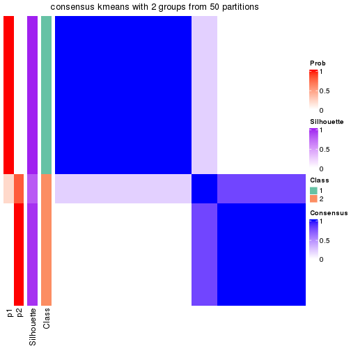</p>

</div>
<div id='tab-node-04-consensus-heatmap-2'>
<pre><code class="r">consensus_heatmap(res, k = 3)
</code></pre>

<p>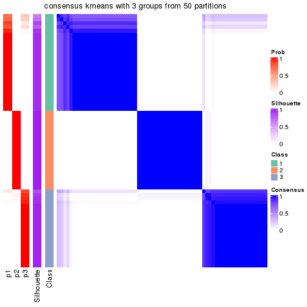</p>

</div>
<div id='tab-node-04-consensus-heatmap-3'>
<pre><code class="r">consensus_heatmap(res, k = 4)
</code></pre>

<p>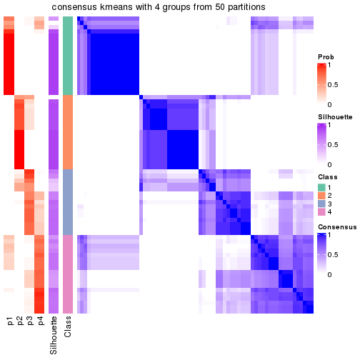</p>

</div>
<div id='tab-node-04-consensus-heatmap-4'>
<pre><code class="r">consensus_heatmap(res, k = 5)
</code></pre>

<p>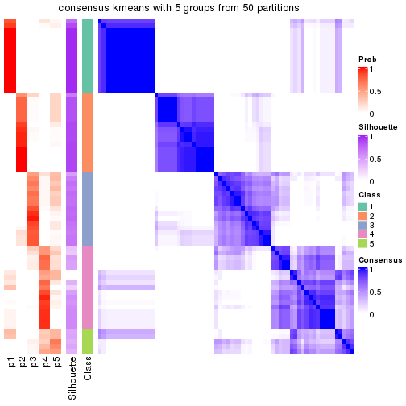</p>

</div>
<div id='tab-node-04-consensus-heatmap-5'>
<pre><code class="r">consensus_heatmap(res, k = 6)
</code></pre>

<p>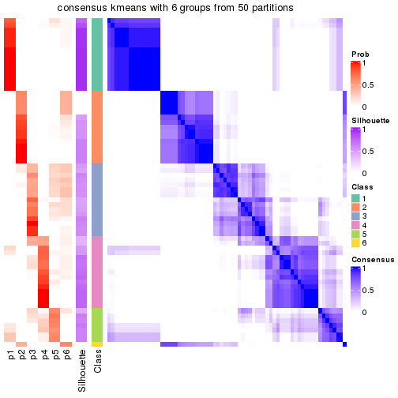</p>

</div>
<div id='tab-node-04-consensus-heatmap-6'>
<pre><code class="r">consensus_heatmap(res, k = 7)
</code></pre>

<p>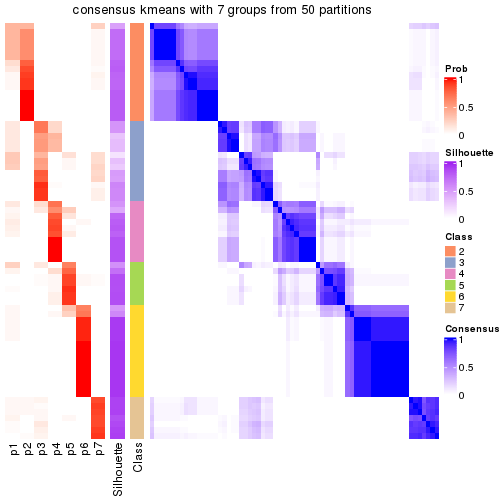</p>

</div>
<div id='tab-node-04-consensus-heatmap-7'>
<pre><code class="r">consensus_heatmap(res, k = 8)
</code></pre>

<p></p>

</div>
</div>

Heatmaps for the membership of samples in all partitions to see how consistent they are:


<script>
$( function() {
	$( '#tabs-node-04-membership-heatmap' ).tabs();
} );
</script>
<div id='tabs-node-04-membership-heatmap'>
<ul>
<li><a href='#tab-node-04-membership-heatmap-1'>k = 2</a></li>
<li><a href='#tab-node-04-membership-heatmap-2'>k = 3</a></li>
<li><a href='#tab-node-04-membership-heatmap-3'>k = 4</a></li>
<li><a href='#tab-node-04-membership-heatmap-4'>k = 5</a></li>
<li><a href='#tab-node-04-membership-heatmap-5'>k = 6</a></li>
<li><a href='#tab-node-04-membership-heatmap-6'>k = 7</a></li>
<li><a href='#tab-node-04-membership-heatmap-7'>k = 8</a></li>
</ul>
<div id='tab-node-04-membership-heatmap-1'>
<pre><code class="r">membership_heatmap(res, k = 2)
</code></pre>

<p>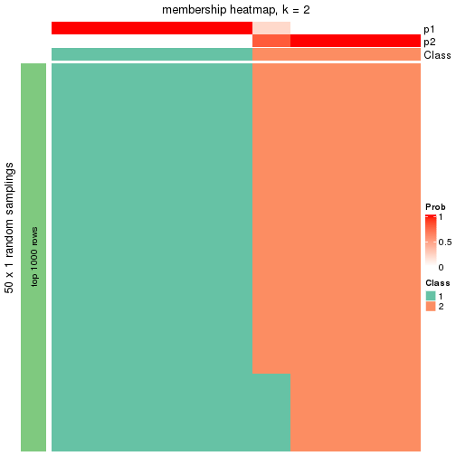</p>

</div>
<div id='tab-node-04-membership-heatmap-2'>
<pre><code class="r">membership_heatmap(res, k = 3)
</code></pre>

<p>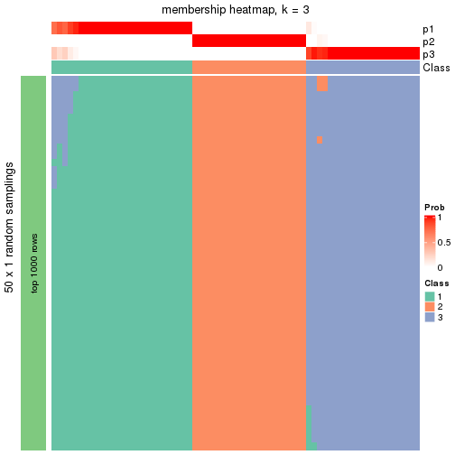</p>

</div>
<div id='tab-node-04-membership-heatmap-3'>
<pre><code class="r">membership_heatmap(res, k = 4)
</code></pre>

<p>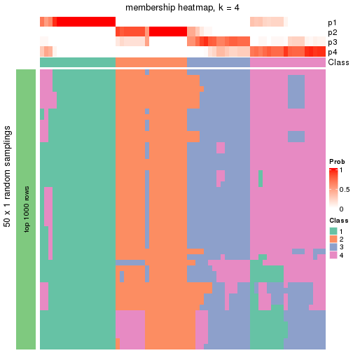</p>

</div>
<div id='tab-node-04-membership-heatmap-4'>
<pre><code class="r">membership_heatmap(res, k = 5)
</code></pre>

<p>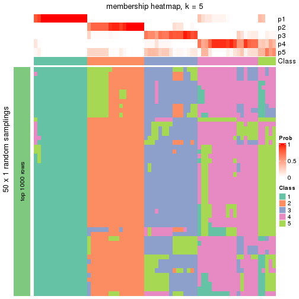</p>

</div>
<div id='tab-node-04-membership-heatmap-5'>
<pre><code class="r">membership_heatmap(res, k = 6)
</code></pre>

<p>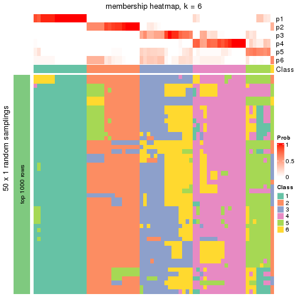</p>

</div>
<div id='tab-node-04-membership-heatmap-6'>
<pre><code class="r">membership_heatmap(res, k = 7)
</code></pre>

<p>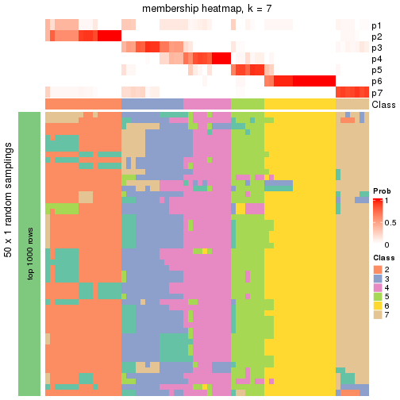</p>

</div>
<div id='tab-node-04-membership-heatmap-7'>
<pre><code class="r">membership_heatmap(res, k = 8)
</code></pre>

<p>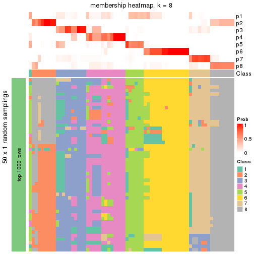</p>

</div>
</div>

As soon as the classes for columns are determined, the signatures
that are significantly different between subgroups can be looked for. 
Following are the heatmaps for signatures.


<script>
$( function() {
	$( '#tabs-node-04-get-signatures' ).tabs();
} );
</script>
<div id='tabs-node-04-get-signatures'>
<ul>
<li><a href='#tab-node-04-get-signatures-1'>k = 2</a></li>
<li><a href='#tab-node-04-get-signatures-2'>k = 3</a></li>
<li><a href='#tab-node-04-get-signatures-3'>k = 4</a></li>
<li><a href='#tab-node-04-get-signatures-4'>k = 5</a></li>
<li><a href='#tab-node-04-get-signatures-5'>k = 6</a></li>
<li><a href='#tab-node-04-get-signatures-6'>k = 7</a></li>
<li><a href='#tab-node-04-get-signatures-7'>k = 8</a></li>
</ul>
<div id='tab-node-04-get-signatures-1'>
<pre><code class="r">get_signatures(res, k = 2)
</code></pre>

<p>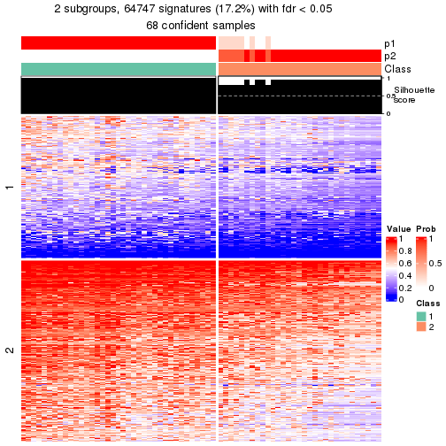</p>

</div>
<div id='tab-node-04-get-signatures-2'>
<pre><code class="r">get_signatures(res, k = 3)
</code></pre>

<p>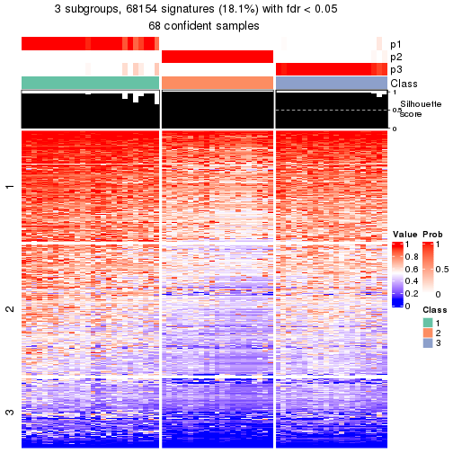</p>

</div>
<div id='tab-node-04-get-signatures-3'>
<pre><code class="r">get_signatures(res, k = 4)
</code></pre>

<p>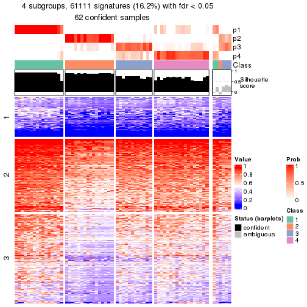</p>

</div>
<div id='tab-node-04-get-signatures-4'>
<pre><code class="r">get_signatures(res, k = 5)
</code></pre>

<p>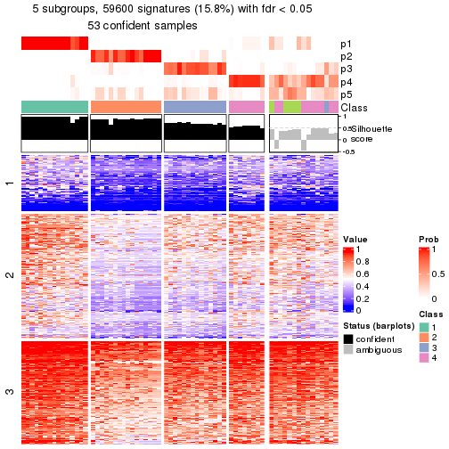</p>

</div>
<div id='tab-node-04-get-signatures-5'>
<pre><code class="r">get_signatures(res, k = 6)
</code></pre>

<p></p>

</div>
<div id='tab-node-04-get-signatures-6'>
<pre><code class="r">get_signatures(res, k = 7)
</code></pre>

<p>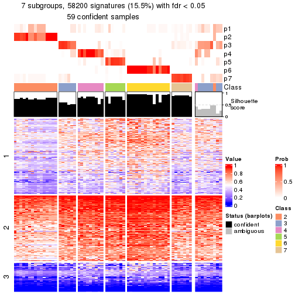</p>

</div>
<div id='tab-node-04-get-signatures-7'>
<pre><code class="r">get_signatures(res, k = 8)
</code></pre>

<p></p>

</div>
</div>


Compare the overlap of signatures from different k:

```r
compare_signatures(res)
```

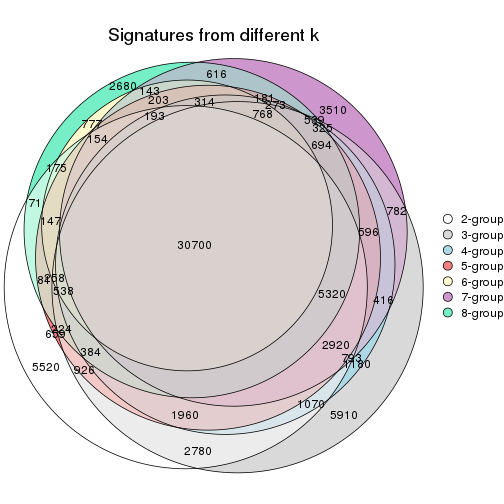

`get_signature()` returns a data frame invisibly. To get the list of signatures, the function
call should be assigned to a variable explicitly. In following code, if `plot` argument is set
to `FALSE`, no heatmap is plotted while only the differential analysis is performed.

```r
# code only for demonstration
tb = get_signature(res, k = ..., plot = FALSE)
```

An example of the output of `tb` is:

```
#>   which_row         fdr    mean_1    mean_2 scaled_mean_1 scaled_mean_2 km
#> 1        38 0.042760348  8.373488  9.131774    -0.5533452     0.5164555  1
#> 2        40 0.018707592  7.106213  8.469186    -0.6173731     0.5762149  1
#> 3        55 0.019134737 10.221463 11.207825    -0.6159697     0.5749050  1
#> 4        59 0.006059896  5.921854  7.869574    -0.6899429     0.6439467  1
#> 5        60 0.018055526  8.928898 10.211722    -0.6204761     0.5791110  1
#> 6        98 0.009384629 15.714769 14.887706     0.6635654    -0.6193277  2
...
```

The columns in `tb` are:

1. `which_row`: row indices corresponding to the input matrix.
2. `fdr`: FDR for the differential test. 
3. `mean_x`: The mean value in group x.
4. `scaled_mean_x`: The mean value in group x after rows are scaled.
5. `km`: Row groups if k-means clustering is applied to rows (which is done by automatically selecting number of clusters).

If there are too many signatures, `top_signatures = ...` can be set to only show the 
signatures with the highest FDRs:

```r
# code only for demonstration
# e.g. to show the top 500 most significant rows
tb = get_signature(res, k = ..., top_signatures = 500)
```

If the signatures are defined as these which are uniquely high in current group, `diff_method` argument
can be set to `"uniquely_high_in_one_group"`:

```r
# code only for demonstration
tb = get_signature(res, k = ..., diff_method = "uniquely_high_in_one_group")
```


UMAP plot which shows how samples are separated.


<script>
$( function() {
	$( '#tabs-node-04-dimension-reduction' ).tabs();
} );
</script>
<div id='tabs-node-04-dimension-reduction'>
<ul>
<li><a href='#tab-node-04-dimension-reduction-1'>k = 2</a></li>
<li><a href='#tab-node-04-dimension-reduction-2'>k = 3</a></li>
<li><a href='#tab-node-04-dimension-reduction-3'>k = 4</a></li>
<li><a href='#tab-node-04-dimension-reduction-4'>k = 5</a></li>
<li><a href='#tab-node-04-dimension-reduction-5'>k = 6</a></li>
<li><a href='#tab-node-04-dimension-reduction-6'>k = 7</a></li>
<li><a href='#tab-node-04-dimension-reduction-7'>k = 8</a></li>
</ul>
<div id='tab-node-04-dimension-reduction-1'>
<pre><code class="r">dimension_reduction(res, k = 2, method = &quot;UMAP&quot;)
</code></pre>

<p>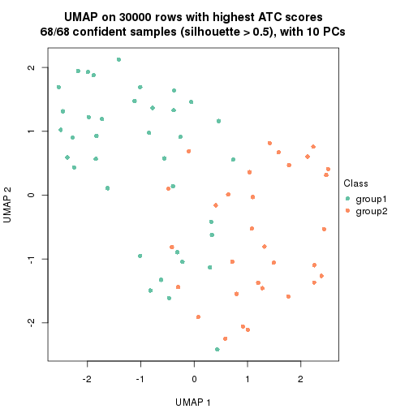</p>

</div>
<div id='tab-node-04-dimension-reduction-2'>
<pre><code class="r">dimension_reduction(res, k = 3, method = &quot;UMAP&quot;)
</code></pre>

<p></p>

</div>
<div id='tab-node-04-dimension-reduction-3'>
<pre><code class="r">dimension_reduction(res, k = 4, method = &quot;UMAP&quot;)
</code></pre>

<p></p>

</div>
<div id='tab-node-04-dimension-reduction-4'>
<pre><code class="r">dimension_reduction(res, k = 5, method = &quot;UMAP&quot;)
</code></pre>

<p>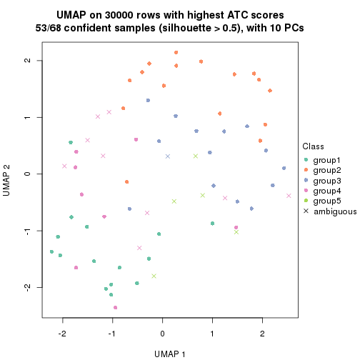</p>

</div>
<div id='tab-node-04-dimension-reduction-5'>
<pre><code class="r">dimension_reduction(res, k = 6, method = &quot;UMAP&quot;)
</code></pre>

<p>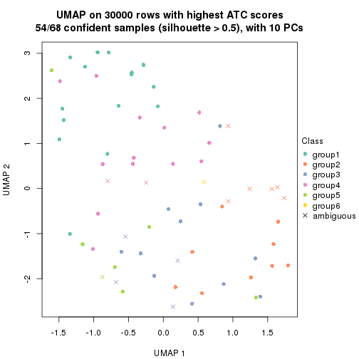</p>

</div>
<div id='tab-node-04-dimension-reduction-6'>
<pre><code class="r">dimension_reduction(res, k = 7, method = &quot;UMAP&quot;)
</code></pre>

<p>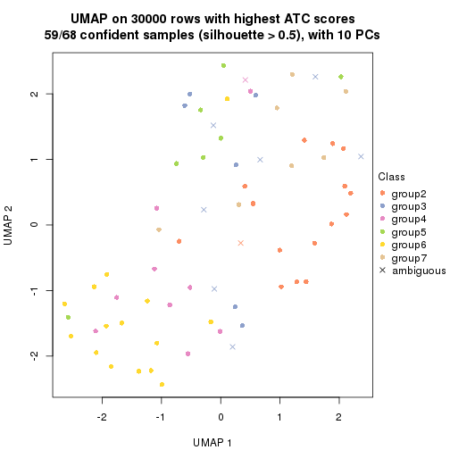</p>

</div>
<div id='tab-node-04-dimension-reduction-7'>
<pre><code class="r">dimension_reduction(res, k = 8, method = &quot;UMAP&quot;)
</code></pre>

<p>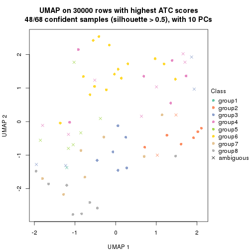</p>

</div>
</div>


Following heatmap shows how subgroups are split when increasing `k`:

```r
collect_classes(res)
```

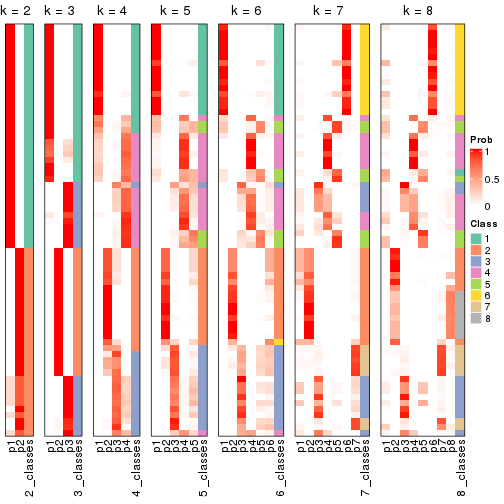


If matrix rows can be associated to genes, consider to use `functional_enrichment(res,
...)` to perform function enrichment for the signature genes. See [this vignette](https://jokergoo.github.io/cola_vignettes/functional_enrichment.html) for more detailed explanations.


 

---------------------------------------------------


### Node043


Parent node: [Node04](#Node04).
Child nodes: 
                Node0111-leaf
        ,
                Node0112-leaf
        ,
                Node0113-leaf
        ,
                [Node0121](#Node0121)
        ,
                [Node0122](#Node0122)
        ,
                [Node0211](#Node0211)
        ,
                [Node0212](#Node0212)
        ,
                [Node0213](#Node0213)
        ,
                [Node0221](#Node0221)
        ,
                [Node0222](#Node0222)
        ,
                [Node0223](#Node0223)
        ,
                [Node0224](#Node0224)
        ,
                Node0225-leaf
        ,
                Node0231-leaf
        ,
                [Node0232](#Node0232)
        ,
                Node0233-leaf
        ,
                Node0234-leaf
        ,
                Node0331-leaf
        ,
                Node0332-leaf
        ,
                Node0333-leaf
        ,
                Node0431-leaf
        ,
                Node0432-leaf
        ,
                Node0433-leaf
        ,
                [Node0511](#Node0511)
        ,
                [Node0512](#Node0512)
        ,
                Node0521-leaf
        ,
                [Node0522](#Node0522)
        ,
                Node0523-leaf
        ,
                Node0524-leaf
        .


The object with results only for a single top-value method and a single partitioning method 
can be extracted as:

```r
res = res_rh["043"]
```

A summary of `res` and all the functions that can be applied to it:

```r
res
```

```
#> A 'ConsensusPartition' object with k = 2, 3, 4, 5, 6, 7, 8.
#>   On a matrix with 30000 rows and 21 columns.
#>   Top rows (1000) are extracted by 'ATC' method.
#>   Subgroups are detected by 'kmeans' method.
#>   Performed in total 350 partitions by row resampling.
#>   Best k for subgroups seems to be 3.
#> 
#> Following methods can be applied to this 'ConsensusPartition' object:
#>  [1] "cola_report"             "collect_classes"         "collect_plots"          
#>  [4] "collect_stats"           "colnames"                "compare_partitions"     
#>  [7] "compare_signatures"      "consensus_heatmap"       "dimension_reduction"    
#> [10] "functional_enrichment"   "get_anno_col"            "get_anno"               
#> [13] "get_classes"             "get_consensus"           "get_matrix"             
#> [16] "get_membership"          "get_param"               "get_signatures"         
#> [19] "get_stats"               "is_best_k"               "is_stable_k"            
#> [22] "membership_heatmap"      "ncol"                    "nrow"                   
#> [25] "plot_ecdf"               "predict_classes"         "rownames"               
#> [28] "select_partition_number" "show"                    "suggest_best_k"         
#> [31] "test_to_known_factors"   "top_rows_heatmap"
```

`collect_plots()` function collects all the plots made from `res` for all `k` (number of subgroups)
into one single page to provide an easy and fast comparison between different `k`.

```r
collect_plots(res)
```


The plots are:

- The first row: a plot of the eCDF (empirical cumulative distribution
  function) curves of the consensus matrix for each `k` and the heatmap of
  predicted classes for each `k`.
- The second row: heatmaps of the consensus matrix for each `k`.
- The third row: heatmaps of the membership matrix for each `k`.
- The fouth row: heatmaps of the signatures for each `k`.

All the plots in panels can be made by individual functions and they are
plotted later in this section.

`select_partition_number()` produces several plots showing different
statistics for choosing "optimized" `k`. There are following statistics:

- eCDF curves of the consensus matrix for each `k`;
- 1-PAC. [The PAC score](https://en.wikipedia.org/wiki/Consensus_clustering#Over-interpretation_potential_of_consensus_clustering)
  measures the proportion of the ambiguous subgrouping.
- Mean silhouette score.
- Concordance. The mean probability of fiting the consensus subgroup labels in all
  partitions.
- Area increased. Denote $A_k$ as the area under the eCDF curve for current
  `k`, the area increased is defined as $A_k - A_{k-1}$.
- Rand index. The percent of pairs of samples that are both in a same cluster
  or both are not in a same cluster in the partition of k and k-1.
- Jaccard index. The ratio of pairs of samples are both in a same cluster in
  the partition of k and k-1 and the pairs of samples are both in a same
  cluster in the partition k or k-1.

The detailed explanations of these statistics can be found in [the _cola_
vignette](https://jokergoo.github.io/cola_vignettes/cola.html#toc_13).

Generally speaking, higher 1-PAC score, higher mean silhouette score or higher
concordance corresponds to better partition. Rand index and Jaccard index
measure how similar the current partition is compared to partition with `k-1`.
If they are too similar, we won't accept `k` is better than `k-1`.

```r
select_partition_number(res)
```

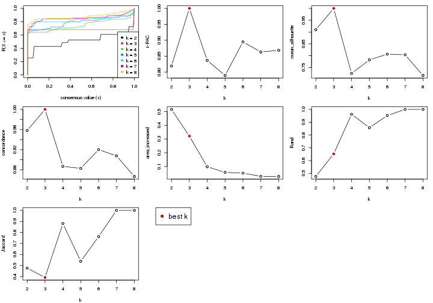

The numeric values for all these statistics can be obtained by `get_stats()`.

```r
get_stats(res)
```

```
#>   k 1-PAC mean_silhouette concordance area_increased  Rand Jaccard
#> 2 2 0.819           0.910       0.958         0.5156 0.476   0.476
#> 3 3 1.000           1.000       1.000         0.3214 0.652   0.392
#> 4 4 0.837           0.725       0.887         0.0980 0.962   0.881
#> 5 5 0.789           0.782       0.883         0.0570 0.857   0.538
#> 6 6 0.895           0.807       0.920         0.0517 0.952   0.762
#> 7 7 0.863           0.804       0.908         0.0285 1.000   1.000
#> 8 8 0.868           0.716       0.867         0.0274 1.000   1.000
```

`suggest_best_k()` suggests the best $k$ based on these statistics. The rules are as follows:

- All $k$ with Jaccard index larger than 0.95 are removed because increasing
  $k$ does not provide enough extra information. If all $k$ are removed, it is
  marked as no subgroup is detected.
- For all $k$ with 1-PAC score larger than 0.9, the maximal $k$ is taken as
  the best $k$, and other $k$ are marked as optional $k$.
- If it does not fit the second rule. The $k$ with the maximal vote of the
  highest 1-PAC score, highest mean silhouette, and highest concordance is
  taken as the best $k$.

```r
suggest_best_k(res)
```

```
#> [1] 3
```


Following is the table of the partitions (You need to click the **show/hide
code output** link to see it). The membership matrix (columns with name `p*`)
is inferred by
[`clue::cl_consensus()`](https://www.rdocumentation.org/link/cl_consensus?package=clue)
function with the `SE` method. Basically the value in the membership matrix
represents the probability to belong to a certain group. The finall subgroup
label for an item is determined with the group with highest probability it
belongs to.

In `get_classes()` function, the entropy is calculated from the membership
matrix and the silhouette score is calculated from the consensus matrix.


<script>
$( function() {
	$( '#tabs-node-043-get-classes' ).tabs();
} );
</script>
<div id='tabs-node-043-get-classes'>
<ul>
<li><a href='#tab-node-043-get-classes-1'>k = 2</a></li>
<li><a href='#tab-node-043-get-classes-2'>k = 3</a></li>
<li><a href='#tab-node-043-get-classes-3'>k = 4</a></li>
<li><a href='#tab-node-043-get-classes-4'>k = 5</a></li>
<li><a href='#tab-node-043-get-classes-5'>k = 6</a></li>
<li><a href='#tab-node-043-get-classes-6'>k = 7</a></li>
<li><a href='#tab-node-043-get-classes-7'>k = 8</a></li>
</ul>

<div id='tab-node-043-get-classes-1'>
<p><a id='tab-node-043-get-classes-1-a' style='color:#0366d6' href='#'>show/hide code output</a></p>
<pre><code class="r">cbind(get_classes(res, k = 2), get_membership(res, k = 2))
</code></pre>

<pre><code>#&gt;                 class entropy silhouette   p1   p2
#&gt; TCGA.CV.7245.01     2   0.000      0.970 0.00 1.00
#&gt; TCGA.CV.7091.01     2   0.000      0.970 0.00 1.00
#&gt; TCGA.BA.5555.01     1   0.000      0.930 1.00 0.00
#&gt; TCGA.CV.5441.01     2   0.000      0.970 0.00 1.00
#&gt; TCGA.CR.7402.01     1   0.000      0.930 1.00 0.00
#&gt; TCGA.CN.A497.01     1   0.904      0.552 0.68 0.32
#&gt; TCGA.BA.A4IF.01     1   0.000      0.930 1.00 0.00
#&gt; TCGA.QK.A8Z7.01     2   0.000      0.970 0.00 1.00
#&gt; TCGA.CQ.7072.01     1   0.000      0.930 1.00 0.00
#&gt; TCGA.CN.A63T.01     1   0.904      0.552 0.68 0.32
#&gt; TCGA.BB.A5HZ.01     2   0.327      0.953 0.06 0.94
#&gt; TCGA.CV.A461.01     1   0.000      0.930 1.00 0.00
#&gt; TCGA.CN.4730.01     2   0.000      0.970 0.00 1.00
#&gt; TCGA.CV.7409.01     1   0.000      0.930 1.00 0.00
#&gt; TCGA.DQ.7595.01     2   0.000      0.970 0.00 1.00
#&gt; TCGA.CN.A6V3.01     2   0.327      0.953 0.06 0.94
#&gt; TCGA.CN.4731.01     2   0.327      0.953 0.06 0.94
#&gt; TCGA.F7.7848.01     2   0.327      0.953 0.06 0.94
#&gt; TCGA.CV.7435.01     1   0.000      0.930 1.00 0.00
#&gt; TCGA.BA.A6DE.01     1   0.000      0.930 1.00 0.00
#&gt; TCGA.CV.A6JU.01     1   0.000      0.930 1.00 0.00
</code></pre>

<script>
$('#tab-node-043-get-classes-1-a').parent().next().next().hide();
$('#tab-node-043-get-classes-1-a').click(function(){
  $('#tab-node-043-get-classes-1-a').parent().next().next().toggle();
  return(false);
});
</script>
</div>

<div id='tab-node-043-get-classes-2'>
<p><a id='tab-node-043-get-classes-2-a' style='color:#0366d6' href='#'>show/hide code output</a></p>
<pre><code class="r">cbind(get_classes(res, k = 3), get_membership(res, k = 3))
</code></pre>

<pre><code>#&gt;                 class entropy silhouette p1 p2 p3
#&gt; TCGA.CV.7245.01     2       0          1  0  1  0
#&gt; TCGA.CV.7091.01     3       0          1  0  0  1
#&gt; TCGA.BA.5555.01     1       0          1  1  0  0
#&gt; TCGA.CV.5441.01     2       0          1  0  1  0
#&gt; TCGA.CR.7402.01     1       0          1  1  0  0
#&gt; TCGA.CN.A497.01     3       0          1  0  0  1
#&gt; TCGA.BA.A4IF.01     1       0          1  1  0  0
#&gt; TCGA.QK.A8Z7.01     2       0          1  0  1  0
#&gt; TCGA.CQ.7072.01     1       0          1  1  0  0
#&gt; TCGA.CN.A63T.01     3       0          1  0  0  1
#&gt; TCGA.BB.A5HZ.01     3       0          1  0  0  1
#&gt; TCGA.CV.A461.01     1       0          1  1  0  0
#&gt; TCGA.CN.4730.01     2       0          1  0  1  0
#&gt; TCGA.CV.7409.01     1       0          1  1  0  0
#&gt; TCGA.DQ.7595.01     2       0          1  0  1  0
#&gt; TCGA.CN.A6V3.01     3       0          1  0  0  1
#&gt; TCGA.CN.4731.01     3       0          1  0  0  1
#&gt; TCGA.F7.7848.01     3       0          1  0  0  1
#&gt; TCGA.CV.7435.01     3       0          1  0  0  1
#&gt; TCGA.BA.A6DE.01     3       0          1  0  0  1
#&gt; TCGA.CV.A6JU.01     1       0          1  1  0  0
</code></pre>

<script>
$('#tab-node-043-get-classes-2-a').parent().next().next().hide();
$('#tab-node-043-get-classes-2-a').click(function(){
  $('#tab-node-043-get-classes-2-a').parent().next().next().toggle();
  return(false);
});
</script>
</div>

<div id='tab-node-043-get-classes-3'>
<p><a id='tab-node-043-get-classes-3-a' style='color:#0366d6' href='#'>show/hide code output</a></p>
<pre><code class="r">cbind(get_classes(res, k = 4), get_membership(res, k = 4))
</code></pre>

<pre><code>#&gt;                 class entropy silhouette   p1 p2   p3   p4
#&gt; TCGA.CV.7245.01     2   0.000     1.0000 0.00  1 0.00 0.00
#&gt; TCGA.CV.7091.01     3   0.000     0.8296 0.00  0 1.00 0.00
#&gt; TCGA.BA.5555.01     1   0.479     0.7444 0.62  0 0.00 0.38
#&gt; TCGA.CV.5441.01     2   0.000     1.0000 0.00  1 0.00 0.00
#&gt; TCGA.CR.7402.01     1   0.479     0.7444 0.62  0 0.00 0.38
#&gt; TCGA.CN.A497.01     4   0.698     0.0000 0.18  0 0.24 0.58
#&gt; TCGA.BA.A4IF.01     1   0.201     0.5339 0.92  0 0.00 0.08
#&gt; TCGA.QK.A8Z7.01     2   0.000     1.0000 0.00  1 0.00 0.00
#&gt; TCGA.CQ.7072.01     1   0.000     0.5987 1.00  0 0.00 0.00
#&gt; TCGA.CN.A63T.01     3   0.121     0.8154 0.00  0 0.96 0.04
#&gt; TCGA.BB.A5HZ.01     3   0.000     0.8296 0.00  0 1.00 0.00
#&gt; TCGA.CV.A461.01     1   0.479     0.7444 0.62  0 0.00 0.38
#&gt; TCGA.CN.4730.01     2   0.000     1.0000 0.00  1 0.00 0.00
#&gt; TCGA.CV.7409.01     1   0.479     0.7444 0.62  0 0.00 0.38
#&gt; TCGA.DQ.7595.01     2   0.000     1.0000 0.00  1 0.00 0.00
#&gt; TCGA.CN.A6V3.01     3   0.000     0.8296 0.00  0 1.00 0.00
#&gt; TCGA.CN.4731.01     3   0.121     0.8075 0.00  0 0.96 0.04
#&gt; TCGA.F7.7848.01     3   0.121     0.8154 0.00  0 0.96 0.04
#&gt; TCGA.CV.7435.01     3   0.677     0.0503 0.38  0 0.52 0.10
#&gt; TCGA.BA.A6DE.01     3   0.476     0.6011 0.20  0 0.76 0.04
#&gt; TCGA.CV.A6JU.01     1   0.201     0.5339 0.92  0 0.00 0.08
</code></pre>

<script>
$('#tab-node-043-get-classes-3-a').parent().next().next().hide();
$('#tab-node-043-get-classes-3-a').click(function(){
  $('#tab-node-043-get-classes-3-a').parent().next().next().toggle();
  return(false);
});
</script>
</div>

<div id='tab-node-043-get-classes-4'>
<p><a id='tab-node-043-get-classes-4-a' style='color:#0366d6' href='#'>show/hide code output</a></p>
<pre><code class="r">cbind(get_classes(res, k = 5), get_membership(res, k = 5))
</code></pre>

<pre><code>#&gt;                 class entropy silhouette   p1   p2   p3   p4   p5
#&gt; TCGA.CV.7245.01     2  0.0000      0.953 0.00 1.00 0.00 0.00 0.00
#&gt; TCGA.CV.7091.01     3  0.0000      0.932 0.00 0.00 1.00 0.00 0.00
#&gt; TCGA.BA.5555.01     1  0.0000      0.987 1.00 0.00 0.00 0.00 0.00
#&gt; TCGA.CV.5441.01     2  0.2873      0.858 0.00 0.86 0.02 0.00 0.12
#&gt; TCGA.CR.7402.01     1  0.0000      0.987 1.00 0.00 0.00 0.00 0.00
#&gt; TCGA.CN.A497.01     4  0.3106      0.000 0.00 0.00 0.02 0.84 0.14
#&gt; TCGA.BA.A4IF.01     5  0.3983      0.638 0.34 0.00 0.00 0.00 0.66
#&gt; TCGA.QK.A8Z7.01     2  0.0000      0.953 0.00 1.00 0.00 0.00 0.00
#&gt; TCGA.CQ.7072.01     5  0.4126      0.598 0.38 0.00 0.00 0.00 0.62
#&gt; TCGA.CN.A63T.01     3  0.0609      0.927 0.00 0.00 0.98 0.02 0.00
#&gt; TCGA.BB.A5HZ.01     3  0.0000      0.932 0.00 0.00 1.00 0.00 0.00
#&gt; TCGA.CV.A461.01     1  0.0000      0.987 1.00 0.00 0.00 0.00 0.00
#&gt; TCGA.CN.4730.01     2  0.0000      0.953 0.00 1.00 0.00 0.00 0.00
#&gt; TCGA.CV.7409.01     1  0.1043      0.960 0.96 0.00 0.00 0.04 0.00
#&gt; TCGA.DQ.7595.01     2  0.1410      0.922 0.00 0.94 0.00 0.00 0.06
#&gt; TCGA.CN.A6V3.01     3  0.0000      0.932 0.00 0.00 1.00 0.00 0.00
#&gt; TCGA.CN.4731.01     3  0.4872      0.656 0.00 0.00 0.72 0.12 0.16
#&gt; TCGA.F7.7848.01     3  0.0609      0.927 0.00 0.00 0.98 0.02 0.00
#&gt; TCGA.CV.7435.01     5  0.4456      0.377 0.00 0.00 0.32 0.02 0.66
#&gt; TCGA.BA.A6DE.01     5  0.5355      0.309 0.00 0.00 0.22 0.12 0.66
#&gt; TCGA.CV.A6JU.01     5  0.3983      0.638 0.34 0.00 0.00 0.00 0.66
</code></pre>

<script>
$('#tab-node-043-get-classes-4-a').parent().next().next().hide();
$('#tab-node-043-get-classes-4-a').click(function(){
  $('#tab-node-043-get-classes-4-a').parent().next().next().toggle();
  return(false);
});
</script>
</div>

<div id='tab-node-043-get-classes-5'>
<p><a id='tab-node-043-get-classes-5-a' style='color:#0366d6' href='#'>show/hide code output</a></p>
<pre><code class="r">cbind(get_classes(res, k = 6), get_membership(res, k = 6))
</code></pre>

<pre><code>#&gt;                 class entropy silhouette   p1   p2   p3   p4   p5   p6
#&gt; TCGA.CV.7245.01     2  0.0000     0.9232 0.00 1.00 0.00 0.00 0.00 0.00
#&gt; TCGA.CV.7091.01     3  0.0000     1.0000 0.00 0.00 1.00 0.00 0.00 0.00
#&gt; TCGA.BA.5555.01     1  0.0000     0.9314 1.00 0.00 0.00 0.00 0.00 0.00
#&gt; TCGA.CV.5441.01     2  0.3483     0.8036 0.00 0.82 0.00 0.04 0.02 0.12
#&gt; TCGA.CR.7402.01     1  0.0547     0.9242 0.98 0.00 0.00 0.00 0.00 0.02
#&gt; TCGA.CN.A497.01     4  0.1267     0.0000 0.00 0.00 0.00 0.94 0.06 0.00
#&gt; TCGA.BA.A4IF.01     5  0.0937     0.9563 0.04 0.00 0.00 0.00 0.96 0.00
#&gt; TCGA.QK.A8Z7.01     2  0.0000     0.9232 0.00 1.00 0.00 0.00 0.00 0.00
#&gt; TCGA.CQ.7072.01     5  0.1556     0.9260 0.08 0.00 0.00 0.00 0.92 0.00
#&gt; TCGA.CN.A63T.01     3  0.0000     1.0000 0.00 0.00 1.00 0.00 0.00 0.00
#&gt; TCGA.BB.A5HZ.01     3  0.0000     1.0000 0.00 0.00 1.00 0.00 0.00 0.00
#&gt; TCGA.CV.A461.01     1  0.0000     0.9314 1.00 0.00 0.00 0.00 0.00 0.00
#&gt; TCGA.CN.4730.01     2  0.0000     0.9232 0.00 1.00 0.00 0.00 0.00 0.00
#&gt; TCGA.CV.7409.01     1  0.3156     0.7959 0.80 0.00 0.00 0.02 0.00 0.18
#&gt; TCGA.DQ.7595.01     2  0.2581     0.8388 0.00 0.86 0.00 0.00 0.02 0.12
#&gt; TCGA.CN.A6V3.01     3  0.0000     1.0000 0.00 0.00 1.00 0.00 0.00 0.00
#&gt; TCGA.CN.4731.01     6  0.3828     0.1089 0.00 0.00 0.44 0.00 0.00 0.56
#&gt; TCGA.F7.7848.01     3  0.0000     1.0000 0.00 0.00 1.00 0.00 0.00 0.00
#&gt; TCGA.CV.7435.01     5  0.0937     0.9125 0.00 0.00 0.04 0.00 0.96 0.00
#&gt; TCGA.BA.A6DE.01     6  0.4576     0.0817 0.00 0.00 0.04 0.00 0.40 0.56
#&gt; TCGA.CV.A6JU.01     5  0.0937     0.9563 0.04 0.00 0.00 0.00 0.96 0.00
</code></pre>

<script>
$('#tab-node-043-get-classes-5-a').parent().next().next().hide();
$('#tab-node-043-get-classes-5-a').click(function(){
  $('#tab-node-043-get-classes-5-a').parent().next().next().toggle();
  return(false);
});
</script>
</div>

<div id='tab-node-043-get-classes-6'>
<p><a id='tab-node-043-get-classes-6-a' style='color:#0366d6' href='#'>show/hide code output</a></p>
<pre><code class="r">cbind(get_classes(res, k = 7), get_membership(res, k = 7))
</code></pre>

<pre><code>#&gt;                 class entropy silhouette   p1   p2   p3   p4   p5   p6   p7
#&gt; TCGA.CV.7245.01     7  0.0000      0.827 0.00 0.00 0.00 0.00 0.00 0.00 1.00
#&gt; TCGA.CV.7091.01     3  0.0863      0.940 0.00 0.04 0.96 0.00 0.00 0.00 0.00
#&gt; TCGA.BA.5555.01     1  0.0000      0.899 1.00 0.00 0.00 0.00 0.00 0.00 0.00
#&gt; TCGA.CV.5441.01     7  0.4850      0.478 0.00 0.32 0.00 0.00 0.00 0.12 0.56
#&gt; TCGA.CR.7402.01     1  0.1363      0.875 0.94 0.04 0.00 0.00 0.00 0.02 0.00
#&gt; TCGA.CN.A497.01     4  0.0504      0.000 0.00 0.00 0.00 0.98 0.02 0.00 0.00
#&gt; TCGA.BA.A4IF.01     5  0.1664      0.948 0.06 0.02 0.00 0.00 0.92 0.00 0.00
#&gt; TCGA.QK.A8Z7.01     7  0.0000      0.827 0.00 0.00 0.00 0.00 0.00 0.00 1.00
#&gt; TCGA.CQ.7072.01     5  0.1928      0.937 0.08 0.02 0.00 0.00 0.90 0.00 0.00
#&gt; TCGA.CN.A63T.01     3  0.1718      0.922 0.00 0.04 0.92 0.00 0.04 0.00 0.00
#&gt; TCGA.BB.A5HZ.01     3  0.0863      0.940 0.00 0.04 0.96 0.00 0.00 0.00 0.00
#&gt; TCGA.CV.A461.01     1  0.0000      0.899 1.00 0.00 0.00 0.00 0.00 0.00 0.00
#&gt; TCGA.CN.4730.01     7  0.1006      0.822 0.00 0.02 0.00 0.00 0.02 0.00 0.96
#&gt; TCGA.CV.7409.01     1  0.2945      0.722 0.74 0.26 0.00 0.00 0.00 0.00 0.00
#&gt; TCGA.DQ.7595.01     7  0.3307      0.689 0.00 0.24 0.00 0.02 0.00 0.00 0.74
#&gt; TCGA.CN.A6V3.01     3  0.0000      0.944 0.00 0.00 1.00 0.00 0.00 0.00 0.00
#&gt; TCGA.CN.4731.01     6  0.3449      0.726 0.00 0.08 0.14 0.00 0.00 0.78 0.00
#&gt; TCGA.F7.7848.01     3  0.1363      0.933 0.00 0.02 0.94 0.00 0.04 0.00 0.00
#&gt; TCGA.CV.7435.01     5  0.1006      0.881 0.00 0.02 0.02 0.00 0.96 0.00 0.00
#&gt; TCGA.BA.A6DE.01     6  0.2376      0.724 0.00 0.00 0.02 0.00 0.12 0.86 0.00
#&gt; TCGA.CV.A6JU.01     5  0.1166      0.946 0.06 0.00 0.00 0.00 0.94 0.00 0.00
</code></pre>

<script>
$('#tab-node-043-get-classes-6-a').parent().next().next().hide();
$('#tab-node-043-get-classes-6-a').click(function(){
  $('#tab-node-043-get-classes-6-a').parent().next().next().toggle();
  return(false);
});
</script>
</div>

<div id='tab-node-043-get-classes-7'>
<p><a id='tab-node-043-get-classes-7-a' style='color:#0366d6' href='#'>show/hide code output</a></p>
<pre><code class="r">cbind(get_classes(res, k = 8), get_membership(res, k = 8))
</code></pre>

<pre><code>#&gt;                 class entropy silhouette   p1   p2   p3 p4   p5   p6   p7   p8
#&gt; TCGA.CV.7245.01     7  0.0000      0.743 0.00 0.00 0.00  0 0.00 0.00 1.00 0.00
#&gt; TCGA.CV.7091.01     3  0.2591      0.824 0.00 0.04 0.86  0 0.00 0.08 0.00 0.02
#&gt; TCGA.BA.5555.01     1  0.0000      0.837 1.00 0.00 0.00  0 0.00 0.00 0.00 0.00
#&gt; TCGA.CV.5441.01     7  0.5458      0.252 0.00 0.14 0.00  0 0.00 0.40 0.42 0.04
#&gt; TCGA.CR.7402.01     1  0.1275      0.812 0.94 0.02 0.00  0 0.00 0.04 0.00 0.00
#&gt; TCGA.CN.A497.01     4  0.0000      0.000 0.00 0.00 0.00  1 0.00 0.00 0.00 0.00
#&gt; TCGA.BA.A4IF.01     5  0.1765      0.889 0.00 0.12 0.00  0 0.88 0.00 0.00 0.00
#&gt; TCGA.QK.A8Z7.01     7  0.0000      0.743 0.00 0.00 0.00  0 0.00 0.00 1.00 0.00
#&gt; TCGA.CQ.7072.01     5  0.2224      0.882 0.02 0.12 0.00  0 0.86 0.00 0.00 0.00
#&gt; TCGA.CN.A63T.01     3  0.2888      0.780 0.00 0.16 0.80  0 0.00 0.04 0.00 0.00
#&gt; TCGA.BB.A5HZ.01     3  0.2591      0.824 0.00 0.04 0.86  0 0.00 0.08 0.00 0.02
#&gt; TCGA.CV.A461.01     1  0.0000      0.837 1.00 0.00 0.00  0 0.00 0.00 0.00 0.00
#&gt; TCGA.CN.4730.01     7  0.0941      0.737 0.00 0.02 0.00  0 0.00 0.00 0.96 0.02
#&gt; TCGA.CV.7409.01     1  0.3299      0.479 0.56 0.00 0.00  0 0.00 0.44 0.00 0.00
#&gt; TCGA.DQ.7595.01     7  0.3299      0.449 0.00 0.44 0.00  0 0.00 0.00 0.56 0.00
#&gt; TCGA.CN.A6V3.01     3  0.0000      0.845 0.00 0.00 1.00  0 0.00 0.00 0.00 0.00
#&gt; TCGA.CN.4731.01     8  0.1091      0.791 0.00 0.00 0.06  0 0.00 0.00 0.00 0.94
#&gt; TCGA.F7.7848.01     3  0.2350      0.816 0.00 0.10 0.86  0 0.00 0.04 0.00 0.00
#&gt; TCGA.CV.7435.01     5  0.1804      0.827 0.00 0.08 0.02  0 0.90 0.00 0.00 0.00
#&gt; TCGA.BA.A6DE.01     8  0.3454      0.791 0.00 0.08 0.00  0 0.06 0.06 0.00 0.80
#&gt; TCGA.CV.A6JU.01     5  0.0000      0.882 0.00 0.00 0.00  0 1.00 0.00 0.00 0.00
</code></pre>

<script>
$('#tab-node-043-get-classes-7-a').parent().next().next().hide();
$('#tab-node-043-get-classes-7-a').click(function(){
  $('#tab-node-043-get-classes-7-a').parent().next().next().toggle();
  return(false);
});
</script>
</div>
</div>

Heatmaps for the consensus matrix. It visualizes the probability of two
samples to be in a same group.


<script>
$( function() {
	$( '#tabs-node-043-consensus-heatmap' ).tabs();
} );
</script>
<div id='tabs-node-043-consensus-heatmap'>
<ul>
<li><a href='#tab-node-043-consensus-heatmap-1'>k = 2</a></li>
<li><a href='#tab-node-043-consensus-heatmap-2'>k = 3</a></li>
<li><a href='#tab-node-043-consensus-heatmap-3'>k = 4</a></li>
<li><a href='#tab-node-043-consensus-heatmap-4'>k = 5</a></li>
<li><a href='#tab-node-043-consensus-heatmap-5'>k = 6</a></li>
<li><a href='#tab-node-043-consensus-heatmap-6'>k = 7</a></li>
<li><a href='#tab-node-043-consensus-heatmap-7'>k = 8</a></li>
</ul>
<div id='tab-node-043-consensus-heatmap-1'>
<pre><code class="r">consensus_heatmap(res, k = 2)
</code></pre>

<p>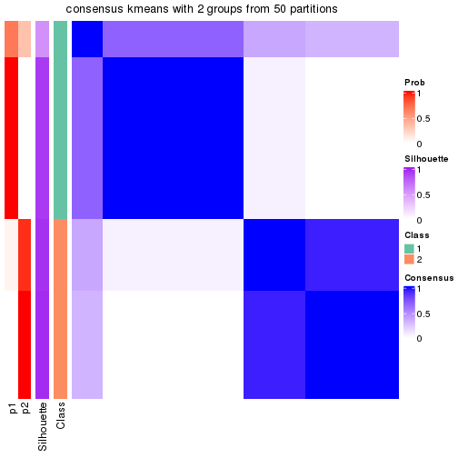</p>

</div>
<div id='tab-node-043-consensus-heatmap-2'>
<pre><code class="r">consensus_heatmap(res, k = 3)
</code></pre>

<p>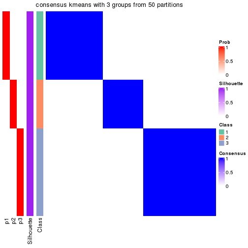</p>

</div>
<div id='tab-node-043-consensus-heatmap-3'>
<pre><code class="r">consensus_heatmap(res, k = 4)
</code></pre>

<p>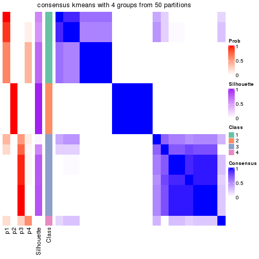</p>

</div>
<div id='tab-node-043-consensus-heatmap-4'>
<pre><code class="r">consensus_heatmap(res, k = 5)
</code></pre>

<p>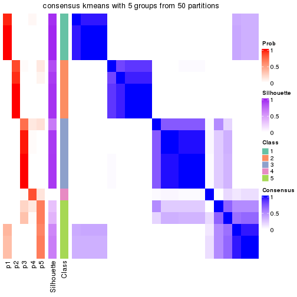</p>

</div>
<div id='tab-node-043-consensus-heatmap-5'>
<pre><code class="r">consensus_heatmap(res, k = 6)
</code></pre>

<p>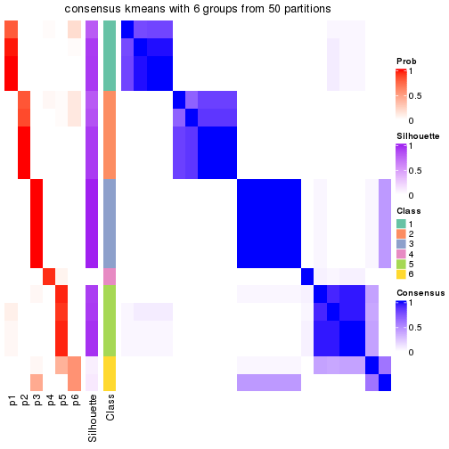</p>

</div>
<div id='tab-node-043-consensus-heatmap-6'>
<pre><code class="r">consensus_heatmap(res, k = 7)
</code></pre>

<p>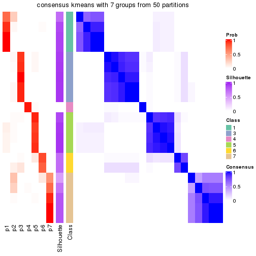</p>

</div>
<div id='tab-node-043-consensus-heatmap-7'>
<pre><code class="r">consensus_heatmap(res, k = 8)
</code></pre>

<p>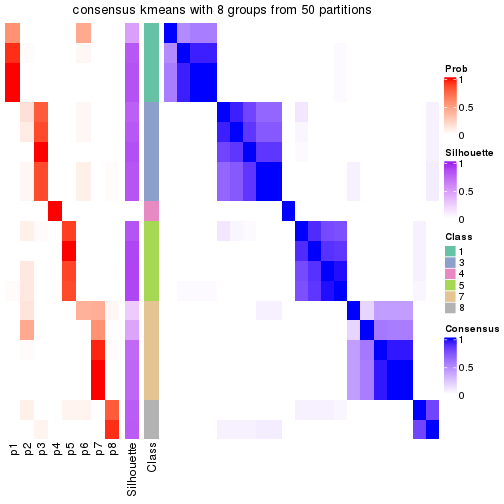</p>

</div>
</div>

Heatmaps for the membership of samples in all partitions to see how consistent they are:


<script>
$( function() {
	$( '#tabs-node-043-membership-heatmap' ).tabs();
} );
</script>
<div id='tabs-node-043-membership-heatmap'>
<ul>
<li><a href='#tab-node-043-membership-heatmap-1'>k = 2</a></li>
<li><a href='#tab-node-043-membership-heatmap-2'>k = 3</a></li>
<li><a href='#tab-node-043-membership-heatmap-3'>k = 4</a></li>
<li><a href='#tab-node-043-membership-heatmap-4'>k = 5</a></li>
<li><a href='#tab-node-043-membership-heatmap-5'>k = 6</a></li>
<li><a href='#tab-node-043-membership-heatmap-6'>k = 7</a></li>
<li><a href='#tab-node-043-membership-heatmap-7'>k = 8</a></li>
</ul>
<div id='tab-node-043-membership-heatmap-1'>
<pre><code class="r">membership_heatmap(res, k = 2)
</code></pre>

<p>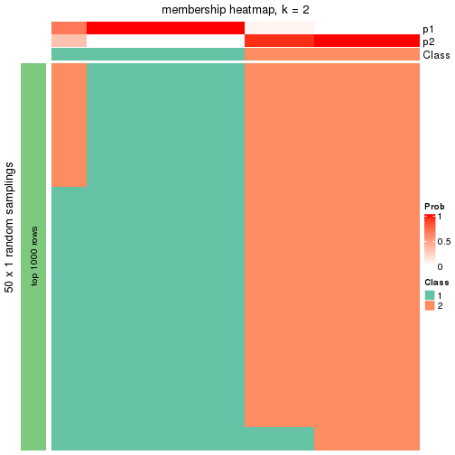</p>

</div>
<div id='tab-node-043-membership-heatmap-2'>
<pre><code class="r">membership_heatmap(res, k = 3)
</code></pre>

<p>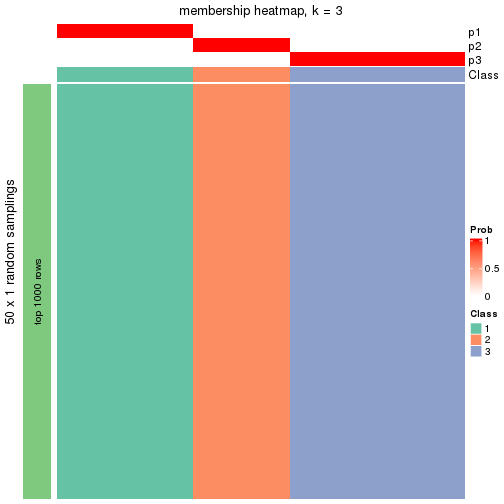</p>

</div>
<div id='tab-node-043-membership-heatmap-3'>
<pre><code class="r">membership_heatmap(res, k = 4)
</code></pre>

<p>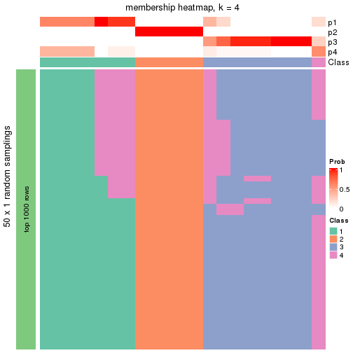</p>

</div>
<div id='tab-node-043-membership-heatmap-4'>
<pre><code class="r">membership_heatmap(res, k = 5)
</code></pre>

<p>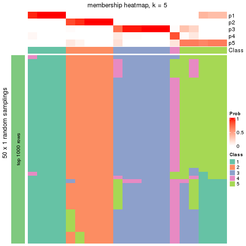</p>

</div>
<div id='tab-node-043-membership-heatmap-5'>
<pre><code class="r">membership_heatmap(res, k = 6)
</code></pre>

<p>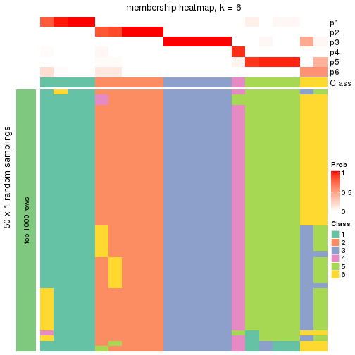</p>

</div>
<div id='tab-node-043-membership-heatmap-6'>
<pre><code class="r">membership_heatmap(res, k = 7)
</code></pre>

<p>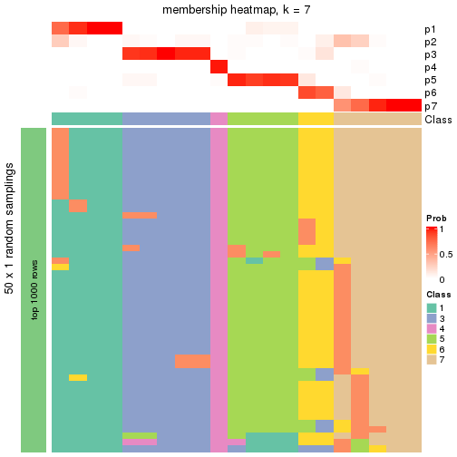</p>

</div>
<div id='tab-node-043-membership-heatmap-7'>
<pre><code class="r">membership_heatmap(res, k = 8)
</code></pre>

<p>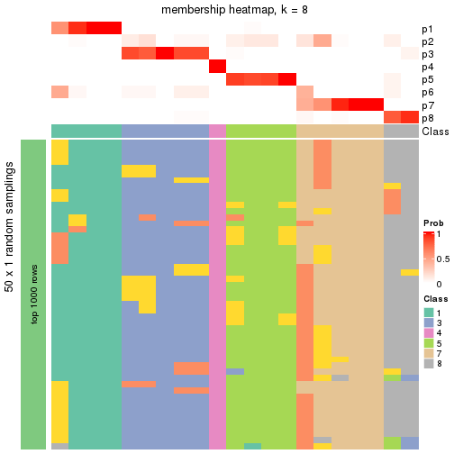</p>

</div>
</div>

As soon as the classes for columns are determined, the signatures
that are significantly different between subgroups can be looked for. 
Following are the heatmaps for signatures.


<script>
$( function() {
	$( '#tabs-node-043-get-signatures' ).tabs();
} );
</script>
<div id='tabs-node-043-get-signatures'>
<ul>
<li><a href='#tab-node-043-get-signatures-1'>k = 2</a></li>
<li><a href='#tab-node-043-get-signatures-2'>k = 3</a></li>
<li><a href='#tab-node-043-get-signatures-3'>k = 4</a></li>
<li><a href='#tab-node-043-get-signatures-4'>k = 5</a></li>
<li><a href='#tab-node-043-get-signatures-5'>k = 6</a></li>
<li><a href='#tab-node-043-get-signatures-6'>k = 7</a></li>
<li><a href='#tab-node-043-get-signatures-7'>k = 8</a></li>
</ul>
<div id='tab-node-043-get-signatures-1'>
<pre><code class="r">get_signatures(res, k = 2)
</code></pre>

<p>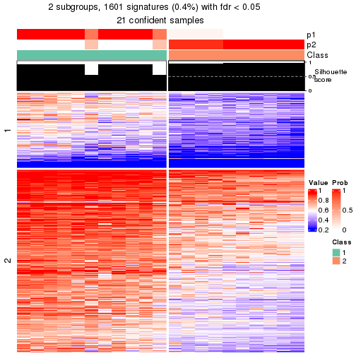</p>

</div>
<div id='tab-node-043-get-signatures-2'>
<pre><code class="r">get_signatures(res, k = 3)
</code></pre>

<p>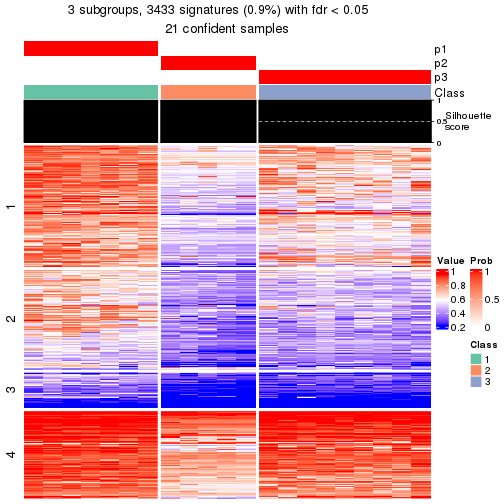</p>

</div>
<div id='tab-node-043-get-signatures-3'>
<pre><code class="r">get_signatures(res, k = 4)
</code></pre>

<p>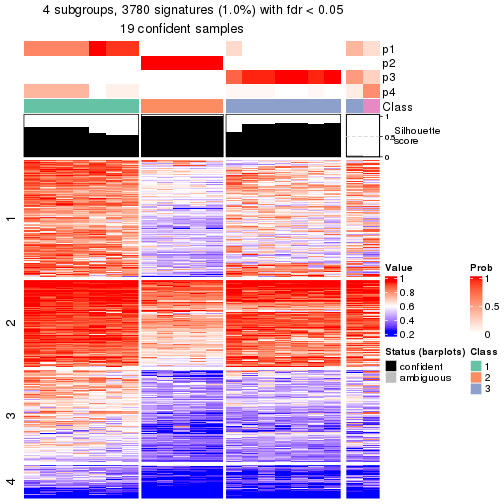</p>

</div>
<div id='tab-node-043-get-signatures-4'>
<pre><code class="r">get_signatures(res, k = 5)
</code></pre>

<p>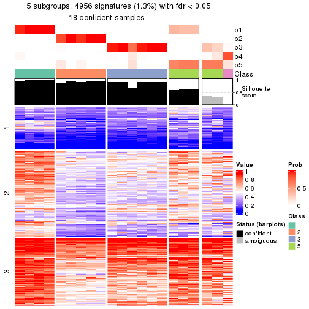</p>

</div>
<div id='tab-node-043-get-signatures-5'>
<pre><code class="r">get_signatures(res, k = 6)
</code></pre>

<p>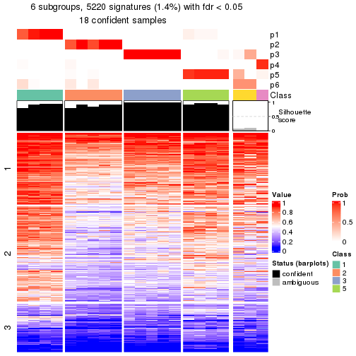</p>

</div>
<div id='tab-node-043-get-signatures-6'>
<pre><code class="r">get_signatures(res, k = 7)
</code></pre>

<p>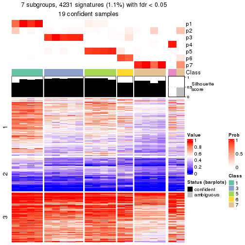</p>

</div>
<div id='tab-node-043-get-signatures-7'>
<pre><code class="r">get_signatures(res, k = 8)
</code></pre>

<p>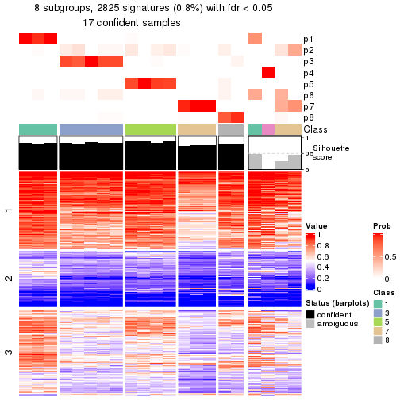</p>

</div>
</div>


Compare the overlap of signatures from different k:

```r
compare_signatures(res)
```

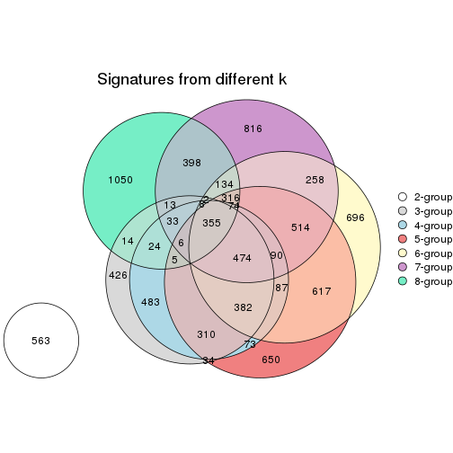

`get_signature()` returns a data frame invisibly. To get the list of signatures, the function
call should be assigned to a variable explicitly. In following code, if `plot` argument is set
to `FALSE`, no heatmap is plotted while only the differential analysis is performed.

```r
# code only for demonstration
tb = get_signature(res, k = ..., plot = FALSE)
```

An example of the output of `tb` is:

```
#>   which_row         fdr    mean_1    mean_2 scaled_mean_1 scaled_mean_2 km
#> 1        38 0.042760348  8.373488  9.131774    -0.5533452     0.5164555  1
#> 2        40 0.018707592  7.106213  8.469186    -0.6173731     0.5762149  1
#> 3        55 0.019134737 10.221463 11.207825    -0.6159697     0.5749050  1
#> 4        59 0.006059896  5.921854  7.869574    -0.6899429     0.6439467  1
#> 5        60 0.018055526  8.928898 10.211722    -0.6204761     0.5791110  1
#> 6        98 0.009384629 15.714769 14.887706     0.6635654    -0.6193277  2
...
```

The columns in `tb` are:

1. `which_row`: row indices corresponding to the input matrix.
2. `fdr`: FDR for the differential test. 
3. `mean_x`: The mean value in group x.
4. `scaled_mean_x`: The mean value in group x after rows are scaled.
5. `km`: Row groups if k-means clustering is applied to rows (which is done by automatically selecting number of clusters).

If there are too many signatures, `top_signatures = ...` can be set to only show the 
signatures with the highest FDRs:

```r
# code only for demonstration
# e.g. to show the top 500 most significant rows
tb = get_signature(res, k = ..., top_signatures = 500)
```

If the signatures are defined as these which are uniquely high in current group, `diff_method` argument
can be set to `"uniquely_high_in_one_group"`:

```r
# code only for demonstration
tb = get_signature(res, k = ..., diff_method = "uniquely_high_in_one_group")
```


UMAP plot which shows how samples are separated.


<script>
$( function() {
	$( '#tabs-node-043-dimension-reduction' ).tabs();
} );
</script>
<div id='tabs-node-043-dimension-reduction'>
<ul>
<li><a href='#tab-node-043-dimension-reduction-1'>k = 2</a></li>
<li><a href='#tab-node-043-dimension-reduction-2'>k = 3</a></li>
<li><a href='#tab-node-043-dimension-reduction-3'>k = 4</a></li>
<li><a href='#tab-node-043-dimension-reduction-4'>k = 5</a></li>
<li><a href='#tab-node-043-dimension-reduction-5'>k = 6</a></li>
<li><a href='#tab-node-043-dimension-reduction-6'>k = 7</a></li>
<li><a href='#tab-node-043-dimension-reduction-7'>k = 8</a></li>
</ul>
<div id='tab-node-043-dimension-reduction-1'>
<pre><code class="r">dimension_reduction(res, k = 2, method = &quot;UMAP&quot;)
</code></pre>

<p>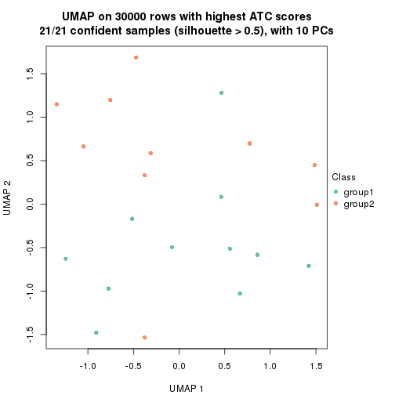</p>

</div>
<div id='tab-node-043-dimension-reduction-2'>
<pre><code class="r">dimension_reduction(res, k = 3, method = &quot;UMAP&quot;)
</code></pre>

<p>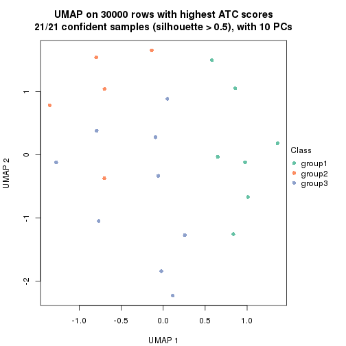</p>

</div>
<div id='tab-node-043-dimension-reduction-3'>
<pre><code class="r">dimension_reduction(res, k = 4, method = &quot;UMAP&quot;)
</code></pre>

<p>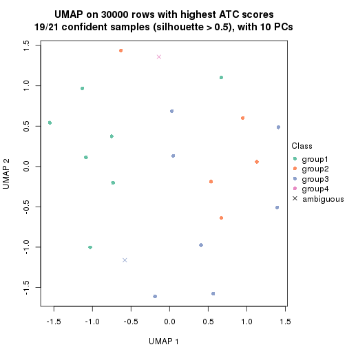</p>

</div>
<div id='tab-node-043-dimension-reduction-4'>
<pre><code class="r">dimension_reduction(res, k = 5, method = &quot;UMAP&quot;)
</code></pre>

<p></p>

</div>
<div id='tab-node-043-dimension-reduction-5'>
<pre><code class="r">dimension_reduction(res, k = 6, method = &quot;UMAP&quot;)
</code></pre>

<p>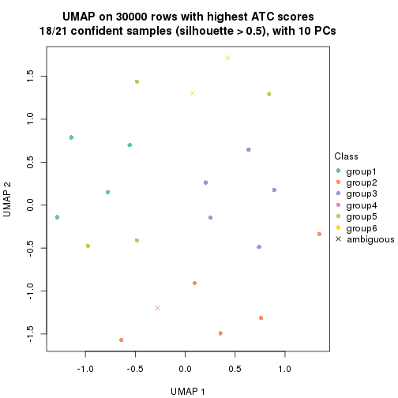</p>

</div>
<div id='tab-node-043-dimension-reduction-6'>
<pre><code class="r">dimension_reduction(res, k = 7, method = &quot;UMAP&quot;)
</code></pre>

<p>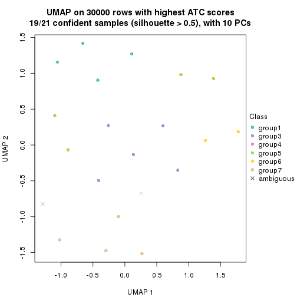</p>

</div>
<div id='tab-node-043-dimension-reduction-7'>
<pre><code class="r">dimension_reduction(res, k = 8, method = &quot;UMAP&quot;)
</code></pre>

<p>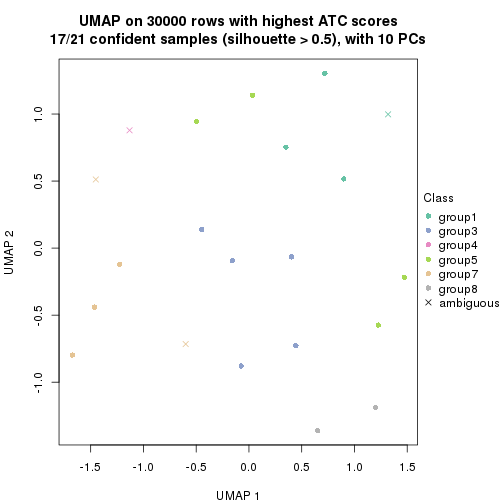</p>

</div>
</div>


Following heatmap shows how subgroups are split when increasing `k`:

```r
collect_classes(res)
```

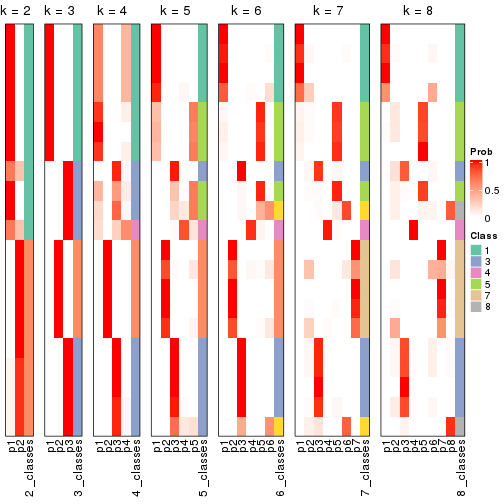


If matrix rows can be associated to genes, consider to use `functional_enrichment(res,
...)` to perform function enrichment for the signature genes. See [this vignette](https://jokergoo.github.io/cola_vignettes/functional_enrichment.html) for more detailed explanations.


 

---------------------------------------------------


### Node05


Parent node: [Node0](#Node0).
Child nodes: 
                [Node011](#Node011)
        ,
                [Node012](#Node012)
        ,
                Node013-leaf
        ,
                [Node021](#Node021)
        ,
                [Node022](#Node022)
        ,
                [Node023](#Node023)
        ,
                Node031-leaf
        ,
                Node032-leaf
        ,
                [Node033](#Node033)
        ,
                Node034-leaf
        ,
                Node041-leaf
        ,
                Node042-leaf
        ,
                [Node043](#Node043)
        ,
                [Node051](#Node051)
        ,
                [Node052](#Node052)
        ,
                Node053-leaf
        .


The object with results only for a single top-value method and a single partitioning method 
can be extracted as:

```r
res = res_rh["05"]
```

A summary of `res` and all the functions that can be applied to it:

```r
res
```

```
#> A 'ConsensusPartition' object with k = 2, 3, 4, 5, 6, 7, 8.
#>   On a matrix with 30000 rows and 99 columns.
#>   Top rows (1000) are extracted by 'ATC' method.
#>   Subgroups are detected by 'skmeans' method.
#>   Performed in total 350 partitions by row resampling.
#>   Best k for subgroups seems to be 5.
#> 
#> Following methods can be applied to this 'ConsensusPartition' object:
#>  [1] "cola_report"             "collect_classes"         "collect_plots"          
#>  [4] "collect_stats"           "colnames"                "compare_partitions"     
#>  [7] "compare_signatures"      "consensus_heatmap"       "dimension_reduction"    
#> [10] "functional_enrichment"   "get_anno_col"            "get_anno"               
#> [13] "get_classes"             "get_consensus"           "get_matrix"             
#> [16] "get_membership"          "get_param"               "get_signatures"         
#> [19] "get_stats"               "is_best_k"               "is_stable_k"            
#> [22] "membership_heatmap"      "ncol"                    "nrow"                   
#> [25] "plot_ecdf"               "predict_classes"         "rownames"               
#> [28] "select_partition_number" "show"                    "suggest_best_k"         
#> [31] "test_to_known_factors"   "top_rows_heatmap"
```

`collect_plots()` function collects all the plots made from `res` for all `k` (number of subgroups)
into one single page to provide an easy and fast comparison between different `k`.

```r
collect_plots(res)
```

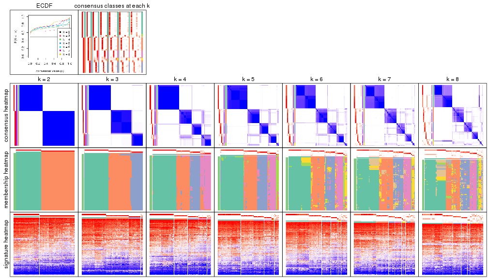

The plots are:

- The first row: a plot of the eCDF (empirical cumulative distribution
  function) curves of the consensus matrix for each `k` and the heatmap of
  predicted classes for each `k`.
- The second row: heatmaps of the consensus matrix for each `k`.
- The third row: heatmaps of the membership matrix for each `k`.
- The fouth row: heatmaps of the signatures for each `k`.

All the plots in panels can be made by individual functions and they are
plotted later in this section.

`select_partition_number()` produces several plots showing different
statistics for choosing "optimized" `k`. There are following statistics:

- eCDF curves of the consensus matrix for each `k`;
- 1-PAC. [The PAC score](https://en.wikipedia.org/wiki/Consensus_clustering#Over-interpretation_potential_of_consensus_clustering)
  measures the proportion of the ambiguous subgrouping.
- Mean silhouette score.
- Concordance. The mean probability of fiting the consensus subgroup labels in all
  partitions.
- Area increased. Denote $A_k$ as the area under the eCDF curve for current
  `k`, the area increased is defined as $A_k - A_{k-1}$.
- Rand index. The percent of pairs of samples that are both in a same cluster
  or both are not in a same cluster in the partition of k and k-1.
- Jaccard index. The ratio of pairs of samples are both in a same cluster in
  the partition of k and k-1 and the pairs of samples are both in a same
  cluster in the partition k or k-1.

The detailed explanations of these statistics can be found in [the _cola_
vignette](https://jokergoo.github.io/cola_vignettes/cola.html#toc_13).

Generally speaking, higher 1-PAC score, higher mean silhouette score or higher
concordance corresponds to better partition. Rand index and Jaccard index
measure how similar the current partition is compared to partition with `k-1`.
If they are too similar, we won't accept `k` is better than `k-1`.

```r
select_partition_number(res)
```

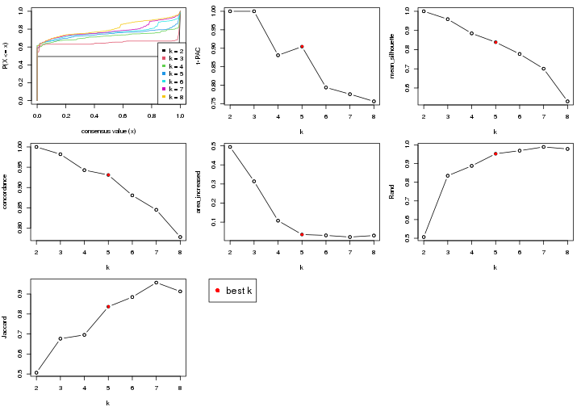

The numeric values for all these statistics can be obtained by `get_stats()`.

```r
get_stats(res)
```

```
#>   k 1-PAC mean_silhouette concordance area_increased  Rand Jaccard
#> 2 2 1.000           1.000       1.000         0.4940 0.506   0.506
#> 3 3 1.000           0.959       0.982         0.3139 0.835   0.677
#> 4 4 0.881           0.885       0.943         0.1079 0.888   0.696
#> 5 5 0.904           0.839       0.931         0.0353 0.953   0.837
#> 6 6 0.794           0.777       0.881         0.0307 0.969   0.885
#> 7 7 0.776           0.701       0.845         0.0221 0.989   0.957
#> 8 8 0.756           0.530       0.778         0.0300 0.978   0.913
```

`suggest_best_k()` suggests the best $k$ based on these statistics. The rules are as follows:

- All $k$ with Jaccard index larger than 0.95 are removed because increasing
  $k$ does not provide enough extra information. If all $k$ are removed, it is
  marked as no subgroup is detected.
- For all $k$ with 1-PAC score larger than 0.9, the maximal $k$ is taken as
  the best $k$, and other $k$ are marked as optional $k$.
- If it does not fit the second rule. The $k$ with the maximal vote of the
  highest 1-PAC score, highest mean silhouette, and highest concordance is
  taken as the best $k$.

```r
suggest_best_k(res)
```

```
#> [1] 5
#> attr(,"optional")
#> [1] 2 3
```

There is also optional best $k$ = 2 3 that is worth to check.

Following is the table of the partitions (You need to click the **show/hide
code output** link to see it). The membership matrix (columns with name `p*`)
is inferred by
[`clue::cl_consensus()`](https://www.rdocumentation.org/link/cl_consensus?package=clue)
function with the `SE` method. Basically the value in the membership matrix
represents the probability to belong to a certain group. The finall subgroup
label for an item is determined with the group with highest probability it
belongs to.

In `get_classes()` function, the entropy is calculated from the membership
matrix and the silhouette score is calculated from the consensus matrix.


<script>
$( function() {
	$( '#tabs-node-05-get-classes' ).tabs();
} );
</script>
<div id='tabs-node-05-get-classes'>
<ul>
<li><a href='#tab-node-05-get-classes-1'>k = 2</a></li>
<li><a href='#tab-node-05-get-classes-2'>k = 3</a></li>
<li><a href='#tab-node-05-get-classes-3'>k = 4</a></li>
<li><a href='#tab-node-05-get-classes-4'>k = 5</a></li>
<li><a href='#tab-node-05-get-classes-5'>k = 6</a></li>
<li><a href='#tab-node-05-get-classes-6'>k = 7</a></li>
<li><a href='#tab-node-05-get-classes-7'>k = 8</a></li>
</ul>

<div id='tab-node-05-get-classes-1'>
<p><a id='tab-node-05-get-classes-1-a' style='color:#0366d6' href='#'>show/hide code output</a></p>
<pre><code class="r">cbind(get_classes(res, k = 2), get_membership(res, k = 2))
</code></pre>

<pre><code>#&gt;                 class entropy silhouette p1 p2
#&gt; TCGA.CN.6022.01     2       0          1  0  1
#&gt; TCGA.CV.5432.01     2       0          1  0  1
#&gt; TCGA.IQ.7632.01     2       0          1  0  1
#&gt; TCGA.CR.6488.01     2       0          1  0  1
#&gt; TCGA.CV.6433.01     1       0          1  1  0
#&gt; TCGA.HD.7754.01     1       0          1  1  0
#&gt; TCGA.CV.7421.01     2       0          1  0  1
#&gt; TCGA.CV.7406.01     1       0          1  1  0
#&gt; TCGA.CX.7086.01     2       0          1  0  1
#&gt; TCGA.CQ.7065.01     2       0          1  0  1
#&gt; TCGA.IQ.7631.01     2       0          1  0  1
#&gt; TCGA.CQ.5329.01     2       0          1  0  1
#&gt; TCGA.BA.5559.01     1       0          1  1  0
#&gt; TCGA.CX.7082.01     2       0          1  0  1
#&gt; TCGA.CR.7379.01     2       0          1  0  1
#&gt; TCGA.CR.5249.01     1       0          1  1  0
#&gt; TCGA.CR.7399.01     2       0          1  0  1
#&gt; TCGA.CV.7103.01     2       0          1  0  1
#&gt; TCGA.CV.5443.01     1       0          1  1  0
#&gt; TCGA.CV.5441.11     2       0          1  0  1
#&gt; TCGA.CV.7255.01     2       0          1  0  1
#&gt; TCGA.CR.7392.01     2       0          1  0  1
#&gt; TCGA.CR.5248.01     1       0          1  1  0
#&gt; TCGA.CR.5250.01     1       0          1  1  0
#&gt; TCGA.BA.5149.01     2       0          1  0  1
#&gt; TCGA.CV.5431.01     2       0          1  0  1
#&gt; TCGA.CR.5243.01     1       0          1  1  0
#&gt; TCGA.CV.5442.01     1       0          1  1  0
#&gt; TCGA.CR.7385.01     1       0          1  1  0
#&gt; TCGA.CV.7180.01     2       0          1  0  1
#&gt; TCGA.CV.6939.01     1       0          1  1  0
#&gt; TCGA.CR.6487.01     1       0          1  1  0
#&gt; TCGA.CV.6936.01     2       0          1  0  1
#&gt; TCGA.DQ.5631.01     2       0          1  0  1
#&gt; TCGA.CR.6472.01     1       0          1  1  0
#&gt; TCGA.CR.6481.01     1       0          1  1  0
#&gt; TCGA.CR.6484.01     2       0          1  0  1
#&gt; TCGA.CR.6470.01     1       0          1  1  0
#&gt; TCGA.BA.A4IH.01     1       0          1  1  0
#&gt; TCGA.CV.6951.01     2       0          1  0  1
#&gt; TCGA.CR.6482.01     1       0          1  1  0
#&gt; TCGA.P3.A5Q5.01     1       0          1  1  0
#&gt; TCGA.CV.A45W.01     2       0          1  0  1
#&gt; TCGA.F7.A624.01     2       0          1  0  1
#&gt; TCGA.F7.A622.01     2       0          1  0  1
#&gt; TCGA.BA.A4IG.01     1       0          1  1  0
#&gt; TCGA.KU.A66T.01     2       0          1  0  1
#&gt; TCGA.HD.8224.01     2       0          1  0  1
#&gt; TCGA.BA.A8YP.01     2       0          1  0  1
#&gt; TCGA.CQ.7069.01     2       0          1  0  1
#&gt; TCGA.HD.A634.01     1       0          1  1  0
#&gt; TCGA.CV.A465.01     2       0          1  0  1
#&gt; TCGA.P3.A5QA.01     2       0          1  0  1
#&gt; TCGA.MT.A67D.01     2       0          1  0  1
#&gt; TCGA.CN.A63V.01     2       0          1  0  1
#&gt; TCGA.QK.A8ZB.01     2       0          1  0  1
#&gt; TCGA.MT.A51X.01     2       0          1  0  1
#&gt; TCGA.CV.A45Z.01     2       0          1  0  1
#&gt; TCGA.CN.4722.01     2       0          1  0  1
#&gt; TCGA.P3.A6T8.01     2       0          1  0  1
#&gt; TCGA.BA.5153.01     1       0          1  1  0
#&gt; TCGA.DQ.7594.01     1       0          1  1  0
#&gt; TCGA.DQ.7596.01     1       0          1  1  0
#&gt; TCGA.P3.A6T3.01     2       0          1  0  1
#&gt; TCGA.BB.4223.01     1       0          1  1  0
#&gt; TCGA.UF.A71B.01     2       0          1  0  1
#&gt; TCGA.CN.4737.01     2       0          1  0  1
#&gt; TCGA.CN.5374.01     1       0          1  1  0
#&gt; TCGA.TN.A7HJ.01     2       0          1  0  1
#&gt; TCGA.BB.4228.01     1       0          1  1  0
#&gt; TCGA.H7.A76A.01     1       0          1  1  0
#&gt; TCGA.DQ.7593.01     1       0          1  1  0
#&gt; TCGA.BB.4225.01     1       0          1  1  0
#&gt; TCGA.CN.A6UY.01     1       0          1  1  0
#&gt; TCGA.MZ.A5BI.01     1       0          1  1  0
#&gt; TCGA.CN.5364.01     2       0          1  0  1
#&gt; TCGA.BB.A6UM.01     1       0          1  1  0
#&gt; TCGA.CN.4740.01     2       0          1  0  1
#&gt; TCGA.CN.A6V6.01     1       0          1  1  0
#&gt; TCGA.D6.A6ES.01     2       0          1  0  1
#&gt; TCGA.RS.A6TP.01     1       0          1  1  0
#&gt; TCGA.KU.A6H7.06     1       0          1  1  0
#&gt; TCGA.UP.A6WW.01     1       0          1  1  0
#&gt; TCGA.CV.A6JY.01     2       0          1  0  1
#&gt; TCGA.CV.7432.01     2       0          1  0  1
#&gt; TCGA.WA.A7H4.01     2       0          1  0  1
#&gt; TCGA.MZ.A6I9.01     1       0          1  1  0
#&gt; TCGA.QK.A6IG.01     2       0          1  0  1
#&gt; TCGA.CV.A6JM.01     2       0          1  0  1
#&gt; TCGA.CR.7404.01     1       0          1  1  0
#&gt; TCGA.QK.A6IJ.01     2       0          1  0  1
#&gt; TCGA.CV.A6JE.01     2       0          1  0  1
#&gt; TCGA.BA.A6DD.01     2       0          1  0  1
#&gt; TCGA.CR.7368.01     1       0          1  1  0
#&gt; TCGA.UF.A718.01     2       0          1  0  1
#&gt; TCGA.CR.7369.01     1       0          1  1  0
#&gt; TCGA.QK.A6IH.01     2       0          1  0  1
#&gt; TCGA.WA.A7GZ.01     2       0          1  0  1
#&gt; TCGA.KU.A6H7.01     1       0          1  1  0
</code></pre>

<script>
$('#tab-node-05-get-classes-1-a').parent().next().next().hide();
$('#tab-node-05-get-classes-1-a').click(function(){
  $('#tab-node-05-get-classes-1-a').parent().next().next().toggle();
  return(false);
});
</script>
</div>

<div id='tab-node-05-get-classes-2'>
<p><a id='tab-node-05-get-classes-2-a' style='color:#0366d6' href='#'>show/hide code output</a></p>
<pre><code class="r">cbind(get_classes(res, k = 3), get_membership(res, k = 3))
</code></pre>

<pre><code>#&gt;                 class entropy silhouette   p1   p2   p3
#&gt; TCGA.CN.6022.01     2  0.0000     0.9868 0.00 1.00 0.00
#&gt; TCGA.CV.5432.01     2  0.0892     0.9880 0.00 0.98 0.02
#&gt; TCGA.IQ.7632.01     2  0.0892     0.9880 0.00 0.98 0.02
#&gt; TCGA.CR.6488.01     3  0.0000     0.9520 0.00 0.00 1.00
#&gt; TCGA.CV.6433.01     1  0.0000     0.9899 1.00 0.00 0.00
#&gt; TCGA.HD.7754.01     1  0.0000     0.9899 1.00 0.00 0.00
#&gt; TCGA.CV.7421.01     2  0.0892     0.9880 0.00 0.98 0.02
#&gt; TCGA.CV.7406.01     1  0.0000     0.9899 1.00 0.00 0.00
#&gt; TCGA.CX.7086.01     2  0.0000     0.9868 0.00 1.00 0.00
#&gt; TCGA.CQ.7065.01     3  0.0892     0.9365 0.00 0.02 0.98
#&gt; TCGA.IQ.7631.01     2  0.0000     0.9868 0.00 1.00 0.00
#&gt; TCGA.CQ.5329.01     3  0.0000     0.9520 0.00 0.00 1.00
#&gt; TCGA.BA.5559.01     1  0.0000     0.9899 1.00 0.00 0.00
#&gt; TCGA.CX.7082.01     2  0.0892     0.9880 0.00 0.98 0.02
#&gt; TCGA.CR.7379.01     2  0.0000     0.9868 0.00 1.00 0.00
#&gt; TCGA.CR.5249.01     1  0.0000     0.9899 1.00 0.00 0.00
#&gt; TCGA.CR.7399.01     2  0.0892     0.9880 0.00 0.98 0.02
#&gt; TCGA.CV.7103.01     2  0.0000     0.9868 0.00 1.00 0.00
#&gt; TCGA.CV.5443.01     1  0.0000     0.9899 1.00 0.00 0.00
#&gt; TCGA.CV.5441.11     2  0.1529     0.9713 0.00 0.96 0.04
#&gt; TCGA.CV.7255.01     2  0.0000     0.9868 0.00 1.00 0.00
#&gt; TCGA.CR.7392.01     2  0.0892     0.9880 0.00 0.98 0.02
#&gt; TCGA.CR.5248.01     1  0.0000     0.9899 1.00 0.00 0.00
#&gt; TCGA.CR.5250.01     1  0.0000     0.9899 1.00 0.00 0.00
#&gt; TCGA.BA.5149.01     3  0.0000     0.9520 0.00 0.00 1.00
#&gt; TCGA.CV.5431.01     2  0.0892     0.9880 0.00 0.98 0.02
#&gt; TCGA.CR.5243.01     1  0.0000     0.9899 1.00 0.00 0.00
#&gt; TCGA.CV.5442.01     1  0.6126     0.3416 0.60 0.00 0.40
#&gt; TCGA.CR.7385.01     1  0.0000     0.9899 1.00 0.00 0.00
#&gt; TCGA.CV.7180.01     3  0.0000     0.9520 0.00 0.00 1.00
#&gt; TCGA.CV.6939.01     1  0.0000     0.9899 1.00 0.00 0.00
#&gt; TCGA.CR.6487.01     1  0.0000     0.9899 1.00 0.00 0.00
#&gt; TCGA.CV.6936.01     3  0.0000     0.9520 0.00 0.00 1.00
#&gt; TCGA.DQ.5631.01     3  0.0000     0.9520 0.00 0.00 1.00
#&gt; TCGA.CR.6472.01     1  0.0000     0.9899 1.00 0.00 0.00
#&gt; TCGA.CR.6481.01     1  0.0000     0.9899 1.00 0.00 0.00
#&gt; TCGA.CR.6484.01     2  0.0892     0.9880 0.00 0.98 0.02
#&gt; TCGA.CR.6470.01     1  0.0000     0.9899 1.00 0.00 0.00
#&gt; TCGA.BA.A4IH.01     1  0.0000     0.9899 1.00 0.00 0.00
#&gt; TCGA.CV.6951.01     3  0.0000     0.9520 0.00 0.00 1.00
#&gt; TCGA.CR.6482.01     1  0.0000     0.9899 1.00 0.00 0.00
#&gt; TCGA.P3.A5Q5.01     1  0.0000     0.9899 1.00 0.00 0.00
#&gt; TCGA.CV.A45W.01     2  0.0892     0.9880 0.00 0.98 0.02
#&gt; TCGA.F7.A624.01     3  0.6302     0.0816 0.00 0.48 0.52
#&gt; TCGA.F7.A622.01     3  0.0000     0.9520 0.00 0.00 1.00
#&gt; TCGA.BA.A4IG.01     1  0.0000     0.9899 1.00 0.00 0.00
#&gt; TCGA.KU.A66T.01     2  0.0000     0.9868 0.00 1.00 0.00
#&gt; TCGA.HD.8224.01     3  0.0000     0.9520 0.00 0.00 1.00
#&gt; TCGA.BA.A8YP.01     2  0.0000     0.9868 0.00 1.00 0.00
#&gt; TCGA.CQ.7069.01     2  0.0000     0.9868 0.00 1.00 0.00
#&gt; TCGA.HD.A634.01     1  0.0000     0.9899 1.00 0.00 0.00
#&gt; TCGA.CV.A465.01     3  0.0892     0.9363 0.00 0.02 0.98
#&gt; TCGA.P3.A5QA.01     2  0.0000     0.9868 0.00 1.00 0.00
#&gt; TCGA.MT.A67D.01     3  0.0000     0.9520 0.00 0.00 1.00
#&gt; TCGA.CN.A63V.01     2  0.0892     0.9880 0.00 0.98 0.02
#&gt; TCGA.QK.A8ZB.01     2  0.0892     0.9880 0.00 0.98 0.02
#&gt; TCGA.MT.A51X.01     3  0.0000     0.9520 0.00 0.00 1.00
#&gt; TCGA.CV.A45Z.01     2  0.0892     0.9880 0.00 0.98 0.02
#&gt; TCGA.CN.4722.01     2  0.0892     0.9880 0.00 0.98 0.02
#&gt; TCGA.P3.A6T8.01     3  0.0000     0.9520 0.00 0.00 1.00
#&gt; TCGA.BA.5153.01     1  0.0000     0.9899 1.00 0.00 0.00
#&gt; TCGA.DQ.7594.01     1  0.0000     0.9899 1.00 0.00 0.00
#&gt; TCGA.DQ.7596.01     1  0.0000     0.9899 1.00 0.00 0.00
#&gt; TCGA.P3.A6T3.01     2  0.0000     0.9868 0.00 1.00 0.00
#&gt; TCGA.BB.4223.01     1  0.0000     0.9899 1.00 0.00 0.00
#&gt; TCGA.UF.A71B.01     2  0.0892     0.9880 0.00 0.98 0.02
#&gt; TCGA.CN.4737.01     2  0.0000     0.9868 0.00 1.00 0.00
#&gt; TCGA.CN.5374.01     1  0.0000     0.9899 1.00 0.00 0.00
#&gt; TCGA.TN.A7HJ.01     2  0.0892     0.9880 0.00 0.98 0.02
#&gt; TCGA.BB.4228.01     1  0.0000     0.9899 1.00 0.00 0.00
#&gt; TCGA.H7.A76A.01     1  0.0000     0.9899 1.00 0.00 0.00
#&gt; TCGA.DQ.7593.01     1  0.0000     0.9899 1.00 0.00 0.00
#&gt; TCGA.BB.4225.01     1  0.0000     0.9899 1.00 0.00 0.00
#&gt; TCGA.CN.A6UY.01     1  0.0000     0.9899 1.00 0.00 0.00
#&gt; TCGA.MZ.A5BI.01     1  0.0000     0.9899 1.00 0.00 0.00
#&gt; TCGA.CN.5364.01     3  0.0000     0.9520 0.00 0.00 1.00
#&gt; TCGA.BB.A6UM.01     1  0.0000     0.9899 1.00 0.00 0.00
#&gt; TCGA.CN.4740.01     2  0.0892     0.9880 0.00 0.98 0.02
#&gt; TCGA.CN.A6V6.01     1  0.0000     0.9899 1.00 0.00 0.00
#&gt; TCGA.D6.A6ES.01     2  0.0000     0.9868 0.00 1.00 0.00
#&gt; TCGA.RS.A6TP.01     1  0.0000     0.9899 1.00 0.00 0.00
#&gt; TCGA.KU.A6H7.06     1  0.0000     0.9899 1.00 0.00 0.00
#&gt; TCGA.UP.A6WW.01     1  0.0000     0.9899 1.00 0.00 0.00
#&gt; TCGA.CV.A6JY.01     2  0.0892     0.9880 0.00 0.98 0.02
#&gt; TCGA.CV.7432.01     3  0.0000     0.9520 0.00 0.00 1.00
#&gt; TCGA.WA.A7H4.01     2  0.0892     0.9880 0.00 0.98 0.02
#&gt; TCGA.MZ.A6I9.01     1  0.0000     0.9899 1.00 0.00 0.00
#&gt; TCGA.QK.A6IG.01     3  0.0000     0.9520 0.00 0.00 1.00
#&gt; TCGA.CV.A6JM.01     2  0.0000     0.9868 0.00 1.00 0.00
#&gt; TCGA.CR.7404.01     1  0.0000     0.9899 1.00 0.00 0.00
#&gt; TCGA.QK.A6IJ.01     2  0.2066     0.9504 0.00 0.94 0.06
#&gt; TCGA.CV.A6JE.01     2  0.0000     0.9868 0.00 1.00 0.00
#&gt; TCGA.BA.A6DD.01     3  0.0000     0.9520 0.00 0.00 1.00
#&gt; TCGA.CR.7368.01     1  0.0000     0.9899 1.00 0.00 0.00
#&gt; TCGA.UF.A718.01     3  0.6045     0.3856 0.00 0.38 0.62
#&gt; TCGA.CR.7369.01     3  0.0892     0.9327 0.02 0.00 0.98
#&gt; TCGA.QK.A6IH.01     2  0.0000     0.9868 0.00 1.00 0.00
#&gt; TCGA.WA.A7GZ.01     2  0.0000     0.9868 0.00 1.00 0.00
#&gt; TCGA.KU.A6H7.01     1  0.0000     0.9899 1.00 0.00 0.00
</code></pre>

<script>
$('#tab-node-05-get-classes-2-a').parent().next().next().hide();
$('#tab-node-05-get-classes-2-a').click(function(){
  $('#tab-node-05-get-classes-2-a').parent().next().next().toggle();
  return(false);
});
</script>
</div>

<div id='tab-node-05-get-classes-3'>
<p><a id='tab-node-05-get-classes-3-a' style='color:#0366d6' href='#'>show/hide code output</a></p>
<pre><code class="r">cbind(get_classes(res, k = 4), get_membership(res, k = 4))
</code></pre>

<pre><code>#&gt;                 class entropy silhouette   p1   p2   p3   p4
#&gt; TCGA.CN.6022.01     2  0.1211      0.926 0.00 0.96 0.00 0.04
#&gt; TCGA.CV.5432.01     4  0.5619      0.555 0.00 0.32 0.04 0.64
#&gt; TCGA.IQ.7632.01     2  0.0707      0.935 0.00 0.98 0.00 0.02
#&gt; TCGA.CR.6488.01     3  0.0000      0.929 0.00 0.00 1.00 0.00
#&gt; TCGA.CV.6433.01     1  0.0000      0.994 1.00 0.00 0.00 0.00
#&gt; TCGA.HD.7754.01     1  0.0000      0.994 1.00 0.00 0.00 0.00
#&gt; TCGA.CV.7421.01     4  0.4948      0.390 0.00 0.44 0.00 0.56
#&gt; TCGA.CV.7406.01     1  0.3335      0.844 0.86 0.12 0.00 0.02
#&gt; TCGA.CX.7086.01     4  0.0707      0.816 0.00 0.02 0.00 0.98
#&gt; TCGA.CQ.7065.01     4  0.4713      0.277 0.00 0.00 0.36 0.64
#&gt; TCGA.IQ.7631.01     4  0.2647      0.778 0.00 0.12 0.00 0.88
#&gt; TCGA.CQ.5329.01     3  0.0000      0.929 0.00 0.00 1.00 0.00
#&gt; TCGA.BA.5559.01     1  0.0000      0.994 1.00 0.00 0.00 0.00
#&gt; TCGA.CX.7082.01     4  0.6808      0.514 0.00 0.32 0.12 0.56
#&gt; TCGA.CR.7379.01     2  0.2921      0.811 0.00 0.86 0.00 0.14
#&gt; TCGA.CR.5249.01     1  0.0000      0.994 1.00 0.00 0.00 0.00
#&gt; TCGA.CR.7399.01     2  0.0707      0.916 0.00 0.98 0.00 0.02
#&gt; TCGA.CV.7103.01     4  0.4977      0.363 0.00 0.46 0.00 0.54
#&gt; TCGA.CV.5443.01     1  0.0000      0.994 1.00 0.00 0.00 0.00
#&gt; TCGA.CV.5441.11     2  0.0000      0.927 0.00 1.00 0.00 0.00
#&gt; TCGA.CV.7255.01     4  0.0707      0.816 0.00 0.02 0.00 0.98
#&gt; TCGA.CR.7392.01     2  0.0707      0.935 0.00 0.98 0.00 0.02
#&gt; TCGA.CR.5248.01     1  0.0000      0.994 1.00 0.00 0.00 0.00
#&gt; TCGA.CR.5250.01     1  0.0000      0.994 1.00 0.00 0.00 0.00
#&gt; TCGA.BA.5149.01     3  0.0000      0.929 0.00 0.00 1.00 0.00
#&gt; TCGA.CV.5431.01     2  0.0707      0.916 0.00 0.98 0.00 0.02
#&gt; TCGA.CR.5243.01     1  0.0000      0.994 1.00 0.00 0.00 0.00
#&gt; TCGA.CV.5442.01     3  0.4277      0.553 0.28 0.00 0.72 0.00
#&gt; TCGA.CR.7385.01     1  0.0000      0.994 1.00 0.00 0.00 0.00
#&gt; TCGA.CV.7180.01     3  0.0000      0.929 0.00 0.00 1.00 0.00
#&gt; TCGA.CV.6939.01     1  0.0000      0.994 1.00 0.00 0.00 0.00
#&gt; TCGA.CR.6487.01     1  0.0000      0.994 1.00 0.00 0.00 0.00
#&gt; TCGA.CV.6936.01     3  0.0000      0.929 0.00 0.00 1.00 0.00
#&gt; TCGA.DQ.5631.01     3  0.0000      0.929 0.00 0.00 1.00 0.00
#&gt; TCGA.CR.6472.01     1  0.2706      0.893 0.90 0.08 0.00 0.02
#&gt; TCGA.CR.6481.01     1  0.0000      0.994 1.00 0.00 0.00 0.00
#&gt; TCGA.CR.6484.01     2  0.0707      0.935 0.00 0.98 0.00 0.02
#&gt; TCGA.CR.6470.01     1  0.0000      0.994 1.00 0.00 0.00 0.00
#&gt; TCGA.BA.A4IH.01     1  0.0000      0.994 1.00 0.00 0.00 0.00
#&gt; TCGA.CV.6951.01     3  0.4624      0.482 0.00 0.00 0.66 0.34
#&gt; TCGA.CR.6482.01     1  0.0000      0.994 1.00 0.00 0.00 0.00
#&gt; TCGA.P3.A5Q5.01     1  0.0000      0.994 1.00 0.00 0.00 0.00
#&gt; TCGA.CV.A45W.01     2  0.0707      0.916 0.00 0.98 0.00 0.02
#&gt; TCGA.F7.A624.01     2  0.2921      0.804 0.00 0.86 0.14 0.00
#&gt; TCGA.F7.A622.01     3  0.0000      0.929 0.00 0.00 1.00 0.00
#&gt; TCGA.BA.A4IG.01     1  0.0000      0.994 1.00 0.00 0.00 0.00
#&gt; TCGA.KU.A66T.01     4  0.0707      0.816 0.00 0.02 0.00 0.98
#&gt; TCGA.HD.8224.01     3  0.0000      0.929 0.00 0.00 1.00 0.00
#&gt; TCGA.BA.A8YP.01     4  0.4977      0.363 0.00 0.46 0.00 0.54
#&gt; TCGA.CQ.7069.01     2  0.1211      0.926 0.00 0.96 0.00 0.04
#&gt; TCGA.HD.A634.01     1  0.0000      0.994 1.00 0.00 0.00 0.00
#&gt; TCGA.CV.A465.01     3  0.3335      0.804 0.00 0.12 0.86 0.02
#&gt; TCGA.P3.A5QA.01     4  0.0707      0.816 0.00 0.02 0.00 0.98
#&gt; TCGA.MT.A67D.01     3  0.0000      0.929 0.00 0.00 1.00 0.00
#&gt; TCGA.CN.A63V.01     2  0.1211      0.926 0.00 0.96 0.00 0.04
#&gt; TCGA.QK.A8ZB.01     2  0.1211      0.926 0.00 0.96 0.00 0.04
#&gt; TCGA.MT.A51X.01     3  0.2345      0.856 0.00 0.00 0.90 0.10
#&gt; TCGA.CV.A45Z.01     2  0.0707      0.916 0.00 0.98 0.00 0.02
#&gt; TCGA.CN.4722.01     2  0.0707      0.935 0.00 0.98 0.00 0.02
#&gt; TCGA.P3.A6T8.01     3  0.0707      0.915 0.00 0.02 0.98 0.00
#&gt; TCGA.BA.5153.01     1  0.0000      0.994 1.00 0.00 0.00 0.00
#&gt; TCGA.DQ.7594.01     1  0.0000      0.994 1.00 0.00 0.00 0.00
#&gt; TCGA.DQ.7596.01     1  0.0000      0.994 1.00 0.00 0.00 0.00
#&gt; TCGA.P3.A6T3.01     4  0.0707      0.816 0.00 0.02 0.00 0.98
#&gt; TCGA.BB.4223.01     1  0.0000      0.994 1.00 0.00 0.00 0.00
#&gt; TCGA.UF.A71B.01     2  0.1637      0.904 0.00 0.94 0.00 0.06
#&gt; TCGA.CN.4737.01     4  0.0707      0.816 0.00 0.02 0.00 0.98
#&gt; TCGA.CN.5374.01     1  0.0000      0.994 1.00 0.00 0.00 0.00
#&gt; TCGA.TN.A7HJ.01     2  0.0707      0.935 0.00 0.98 0.00 0.02
#&gt; TCGA.BB.4228.01     1  0.0000      0.994 1.00 0.00 0.00 0.00
#&gt; TCGA.H7.A76A.01     1  0.0000      0.994 1.00 0.00 0.00 0.00
#&gt; TCGA.DQ.7593.01     1  0.0000      0.994 1.00 0.00 0.00 0.00
#&gt; TCGA.BB.4225.01     1  0.0000      0.994 1.00 0.00 0.00 0.00
#&gt; TCGA.CN.A6UY.01     1  0.0000      0.994 1.00 0.00 0.00 0.00
#&gt; TCGA.MZ.A5BI.01     1  0.0000      0.994 1.00 0.00 0.00 0.00
#&gt; TCGA.CN.5364.01     3  0.0000      0.929 0.00 0.00 1.00 0.00
#&gt; TCGA.BB.A6UM.01     1  0.0000      0.994 1.00 0.00 0.00 0.00
#&gt; TCGA.CN.4740.01     2  0.0707      0.935 0.00 0.98 0.00 0.02
#&gt; TCGA.CN.A6V6.01     1  0.0000      0.994 1.00 0.00 0.00 0.00
#&gt; TCGA.D6.A6ES.01     4  0.0707      0.816 0.00 0.02 0.00 0.98
#&gt; TCGA.RS.A6TP.01     1  0.0000      0.994 1.00 0.00 0.00 0.00
#&gt; TCGA.KU.A6H7.06     1  0.0000      0.994 1.00 0.00 0.00 0.00
#&gt; TCGA.UP.A6WW.01     1  0.0000      0.994 1.00 0.00 0.00 0.00
#&gt; TCGA.CV.A6JY.01     2  0.0707      0.935 0.00 0.98 0.00 0.02
#&gt; TCGA.CV.7432.01     3  0.0000      0.929 0.00 0.00 1.00 0.00
#&gt; TCGA.WA.A7H4.01     2  0.0707      0.935 0.00 0.98 0.00 0.02
#&gt; TCGA.MZ.A6I9.01     1  0.0000      0.994 1.00 0.00 0.00 0.00
#&gt; TCGA.QK.A6IG.01     3  0.2921      0.818 0.00 0.00 0.86 0.14
#&gt; TCGA.CV.A6JM.01     4  0.0707      0.816 0.00 0.02 0.00 0.98
#&gt; TCGA.CR.7404.01     1  0.0000      0.994 1.00 0.00 0.00 0.00
#&gt; TCGA.QK.A6IJ.01     2  0.0707      0.935 0.00 0.98 0.00 0.02
#&gt; TCGA.CV.A6JE.01     4  0.0707      0.816 0.00 0.02 0.00 0.98
#&gt; TCGA.BA.A6DD.01     2  0.4713      0.457 0.00 0.64 0.36 0.00
#&gt; TCGA.CR.7368.01     1  0.0000      0.994 1.00 0.00 0.00 0.00
#&gt; TCGA.UF.A718.01     2  0.3400      0.755 0.00 0.82 0.18 0.00
#&gt; TCGA.CR.7369.01     3  0.0000      0.929 0.00 0.00 1.00 0.00
#&gt; TCGA.QK.A6IH.01     4  0.0707      0.816 0.00 0.02 0.00 0.98
#&gt; TCGA.WA.A7GZ.01     4  0.4134      0.669 0.00 0.26 0.00 0.74
#&gt; TCGA.KU.A6H7.01     1  0.0000      0.994 1.00 0.00 0.00 0.00
</code></pre>

<script>
$('#tab-node-05-get-classes-3-a').parent().next().next().hide();
$('#tab-node-05-get-classes-3-a').click(function(){
  $('#tab-node-05-get-classes-3-a').parent().next().next().toggle();
  return(false);
});
</script>
</div>

<div id='tab-node-05-get-classes-4'>
<p><a id='tab-node-05-get-classes-4-a' style='color:#0366d6' href='#'>show/hide code output</a></p>
<pre><code class="r">cbind(get_classes(res, k = 5), get_membership(res, k = 5))
</code></pre>

<pre><code>#&gt;                 class entropy silhouette   p1   p2   p3   p4   p5
#&gt; TCGA.CN.6022.01     2  0.0000     0.9009 0.00 1.00 0.00 0.00 0.00
#&gt; TCGA.CV.5432.01     4  0.7299     0.2793 0.00 0.22 0.12 0.54 0.12
#&gt; TCGA.IQ.7632.01     2  0.0000     0.9009 0.00 1.00 0.00 0.00 0.00
#&gt; TCGA.CR.6488.01     3  0.0000     0.9187 0.00 0.00 1.00 0.00 0.00
#&gt; TCGA.CV.6433.01     1  0.0609     0.9697 0.98 0.00 0.00 0.00 0.02
#&gt; TCGA.HD.7754.01     1  0.0609     0.9616 0.98 0.00 0.00 0.00 0.02
#&gt; TCGA.CV.7421.01     2  0.5684    -0.0256 0.00 0.50 0.02 0.44 0.04
#&gt; TCGA.CV.7406.01     5  0.1043     0.6472 0.04 0.00 0.00 0.00 0.96
#&gt; TCGA.CX.7086.01     4  0.0000     0.8274 0.00 0.00 0.00 1.00 0.00
#&gt; TCGA.CQ.7065.01     4  0.2732     0.6702 0.00 0.00 0.16 0.84 0.00
#&gt; TCGA.IQ.7631.01     4  0.4132     0.5200 0.00 0.26 0.02 0.72 0.00
#&gt; TCGA.CQ.5329.01     3  0.0000     0.9187 0.00 0.00 1.00 0.00 0.00
#&gt; TCGA.BA.5559.01     1  0.0609     0.9697 0.98 0.00 0.00 0.00 0.02
#&gt; TCGA.CX.7082.01     4  0.8172    -0.1154 0.00 0.16 0.16 0.38 0.30
#&gt; TCGA.CR.7379.01     2  0.1732     0.8218 0.00 0.92 0.00 0.08 0.00
#&gt; TCGA.CR.5249.01     1  0.0000     0.9706 1.00 0.00 0.00 0.00 0.00
#&gt; TCGA.CR.7399.01     2  0.3561     0.4998 0.00 0.74 0.00 0.00 0.26
#&gt; TCGA.CV.7103.01     5  0.5791     0.6519 0.00 0.26 0.00 0.14 0.60
#&gt; TCGA.CV.5443.01     1  0.0609     0.9697 0.98 0.00 0.00 0.00 0.02
#&gt; TCGA.CV.5441.11     2  0.0000     0.9009 0.00 1.00 0.00 0.00 0.00
#&gt; TCGA.CV.7255.01     4  0.0000     0.8274 0.00 0.00 0.00 1.00 0.00
#&gt; TCGA.CR.7392.01     2  0.0000     0.9009 0.00 1.00 0.00 0.00 0.00
#&gt; TCGA.CR.5248.01     1  0.0000     0.9706 1.00 0.00 0.00 0.00 0.00
#&gt; TCGA.CR.5250.01     1  0.0609     0.9697 0.98 0.00 0.00 0.00 0.02
#&gt; TCGA.BA.5149.01     3  0.0000     0.9187 0.00 0.00 1.00 0.00 0.00
#&gt; TCGA.CV.5431.01     2  0.0609     0.8868 0.00 0.98 0.00 0.00 0.02
#&gt; TCGA.CR.5243.01     1  0.0609     0.9697 0.98 0.00 0.00 0.00 0.02
#&gt; TCGA.CV.5442.01     1  0.5131     0.2413 0.54 0.00 0.42 0.00 0.04
#&gt; TCGA.CR.7385.01     1  0.1410     0.9313 0.94 0.00 0.00 0.00 0.06
#&gt; TCGA.CV.7180.01     3  0.0000     0.9187 0.00 0.00 1.00 0.00 0.00
#&gt; TCGA.CV.6939.01     1  0.0000     0.9706 1.00 0.00 0.00 0.00 0.00
#&gt; TCGA.CR.6487.01     1  0.0000     0.9706 1.00 0.00 0.00 0.00 0.00
#&gt; TCGA.CV.6936.01     3  0.0000     0.9187 0.00 0.00 1.00 0.00 0.00
#&gt; TCGA.DQ.5631.01     3  0.0000     0.9187 0.00 0.00 1.00 0.00 0.00
#&gt; TCGA.CR.6472.01     5  0.1043     0.6472 0.04 0.00 0.00 0.00 0.96
#&gt; TCGA.CR.6481.01     1  0.1410     0.9313 0.94 0.00 0.00 0.00 0.06
#&gt; TCGA.CR.6484.01     2  0.0000     0.9009 0.00 1.00 0.00 0.00 0.00
#&gt; TCGA.CR.6470.01     1  0.0000     0.9706 1.00 0.00 0.00 0.00 0.00
#&gt; TCGA.BA.A4IH.01     1  0.0609     0.9697 0.98 0.00 0.00 0.00 0.02
#&gt; TCGA.CV.6951.01     3  0.3895     0.5548 0.00 0.00 0.68 0.32 0.00
#&gt; TCGA.CR.6482.01     1  0.0000     0.9706 1.00 0.00 0.00 0.00 0.00
#&gt; TCGA.P3.A5Q5.01     1  0.1410     0.9313 0.94 0.00 0.00 0.00 0.06
#&gt; TCGA.CV.A45W.01     5  0.4227     0.4470 0.00 0.42 0.00 0.00 0.58
#&gt; TCGA.F7.A624.01     2  0.2020     0.7960 0.00 0.90 0.10 0.00 0.00
#&gt; TCGA.F7.A622.01     3  0.0000     0.9187 0.00 0.00 1.00 0.00 0.00
#&gt; TCGA.BA.A4IG.01     1  0.0609     0.9612 0.98 0.00 0.00 0.00 0.02
#&gt; TCGA.KU.A66T.01     4  0.0000     0.8274 0.00 0.00 0.00 1.00 0.00
#&gt; TCGA.HD.8224.01     3  0.0000     0.9187 0.00 0.00 1.00 0.00 0.00
#&gt; TCGA.BA.A8YP.01     5  0.5263     0.6905 0.00 0.24 0.00 0.10 0.66
#&gt; TCGA.CQ.7069.01     2  0.0000     0.9009 0.00 1.00 0.00 0.00 0.00
#&gt; TCGA.HD.A634.01     1  0.1043     0.9476 0.96 0.00 0.00 0.00 0.04
#&gt; TCGA.CV.A465.01     3  0.4373     0.6925 0.00 0.16 0.76 0.08 0.00
#&gt; TCGA.P3.A5QA.01     4  0.0000     0.8274 0.00 0.00 0.00 1.00 0.00
#&gt; TCGA.MT.A67D.01     3  0.0000     0.9187 0.00 0.00 1.00 0.00 0.00
#&gt; TCGA.CN.A63V.01     2  0.0000     0.9009 0.00 1.00 0.00 0.00 0.00
#&gt; TCGA.QK.A8ZB.01     2  0.0000     0.9009 0.00 1.00 0.00 0.00 0.00
#&gt; TCGA.MT.A51X.01     3  0.2929     0.7731 0.00 0.00 0.82 0.18 0.00
#&gt; TCGA.CV.A45Z.01     2  0.1043     0.8702 0.00 0.96 0.00 0.00 0.04
#&gt; TCGA.CN.4722.01     2  0.0000     0.9009 0.00 1.00 0.00 0.00 0.00
#&gt; TCGA.P3.A6T8.01     3  0.1410     0.8671 0.00 0.06 0.94 0.00 0.00
#&gt; TCGA.BA.5153.01     1  0.0609     0.9697 0.98 0.00 0.00 0.00 0.02
#&gt; TCGA.DQ.7594.01     1  0.0000     0.9706 1.00 0.00 0.00 0.00 0.00
#&gt; TCGA.DQ.7596.01     1  0.0000     0.9706 1.00 0.00 0.00 0.00 0.00
#&gt; TCGA.P3.A6T3.01     4  0.0000     0.8274 0.00 0.00 0.00 1.00 0.00
#&gt; TCGA.BB.4223.01     1  0.0609     0.9697 0.98 0.00 0.00 0.00 0.02
#&gt; TCGA.UF.A71B.01     2  0.2438     0.8073 0.00 0.90 0.00 0.06 0.04
#&gt; TCGA.CN.4737.01     4  0.0000     0.8274 0.00 0.00 0.00 1.00 0.00
#&gt; TCGA.CN.5374.01     1  0.0000     0.9706 1.00 0.00 0.00 0.00 0.00
#&gt; TCGA.TN.A7HJ.01     2  0.0000     0.9009 0.00 1.00 0.00 0.00 0.00
#&gt; TCGA.BB.4228.01     1  0.0609     0.9697 0.98 0.00 0.00 0.00 0.02
#&gt; TCGA.H7.A76A.01     1  0.0000     0.9706 1.00 0.00 0.00 0.00 0.00
#&gt; TCGA.DQ.7593.01     1  0.0000     0.9706 1.00 0.00 0.00 0.00 0.00
#&gt; TCGA.BB.4225.01     1  0.0609     0.9697 0.98 0.00 0.00 0.00 0.02
#&gt; TCGA.CN.A6UY.01     1  0.0609     0.9697 0.98 0.00 0.00 0.00 0.02
#&gt; TCGA.MZ.A5BI.01     1  0.0000     0.9706 1.00 0.00 0.00 0.00 0.00
#&gt; TCGA.CN.5364.01     3  0.0000     0.9187 0.00 0.00 1.00 0.00 0.00
#&gt; TCGA.BB.A6UM.01     1  0.1043     0.9617 0.96 0.00 0.00 0.00 0.04
#&gt; TCGA.CN.4740.01     2  0.0000     0.9009 0.00 1.00 0.00 0.00 0.00
#&gt; TCGA.CN.A6V6.01     1  0.0609     0.9697 0.98 0.00 0.00 0.00 0.02
#&gt; TCGA.D6.A6ES.01     4  0.0000     0.8274 0.00 0.00 0.00 1.00 0.00
#&gt; TCGA.RS.A6TP.01     1  0.0609     0.9697 0.98 0.00 0.00 0.00 0.02
#&gt; TCGA.KU.A6H7.06     1  0.0609     0.9697 0.98 0.00 0.00 0.00 0.02
#&gt; TCGA.UP.A6WW.01     1  0.0609     0.9697 0.98 0.00 0.00 0.00 0.02
#&gt; TCGA.CV.A6JY.01     2  0.0000     0.9009 0.00 1.00 0.00 0.00 0.00
#&gt; TCGA.CV.7432.01     3  0.0000     0.9187 0.00 0.00 1.00 0.00 0.00
#&gt; TCGA.WA.A7H4.01     2  0.0000     0.9009 0.00 1.00 0.00 0.00 0.00
#&gt; TCGA.MZ.A6I9.01     1  0.0000     0.9706 1.00 0.00 0.00 0.00 0.00
#&gt; TCGA.QK.A6IG.01     3  0.3424     0.6965 0.00 0.00 0.76 0.24 0.00
#&gt; TCGA.CV.A6JM.01     4  0.0000     0.8274 0.00 0.00 0.00 1.00 0.00
#&gt; TCGA.CR.7404.01     1  0.0000     0.9706 1.00 0.00 0.00 0.00 0.00
#&gt; TCGA.QK.A6IJ.01     2  0.0000     0.9009 0.00 1.00 0.00 0.00 0.00
#&gt; TCGA.CV.A6JE.01     4  0.0000     0.8274 0.00 0.00 0.00 1.00 0.00
#&gt; TCGA.BA.A6DD.01     2  0.3274     0.6102 0.00 0.78 0.22 0.00 0.00
#&gt; TCGA.CR.7368.01     1  0.1216     0.9458 0.96 0.00 0.02 0.00 0.02
#&gt; TCGA.UF.A718.01     2  0.2929     0.6850 0.00 0.82 0.18 0.00 0.00
#&gt; TCGA.CR.7369.01     3  0.1216     0.8854 0.02 0.00 0.96 0.00 0.02
#&gt; TCGA.QK.A6IH.01     4  0.0000     0.8274 0.00 0.00 0.00 1.00 0.00
#&gt; TCGA.WA.A7GZ.01     4  0.4182     0.2674 0.00 0.40 0.00 0.60 0.00
#&gt; TCGA.KU.A6H7.01     1  0.0000     0.9706 1.00 0.00 0.00 0.00 0.00
</code></pre>

<script>
$('#tab-node-05-get-classes-4-a').parent().next().next().hide();
$('#tab-node-05-get-classes-4-a').click(function(){
  $('#tab-node-05-get-classes-4-a').parent().next().next().toggle();
  return(false);
});
</script>
</div>

<div id='tab-node-05-get-classes-5'>
<p><a id='tab-node-05-get-classes-5-a' style='color:#0366d6' href='#'>show/hide code output</a></p>
<pre><code class="r">cbind(get_classes(res, k = 6), get_membership(res, k = 6))
</code></pre>

<pre><code>#&gt;                 class entropy silhouette   p1   p2   p3   p4   p5   p6
#&gt; TCGA.CN.6022.01     2  0.0937     0.8572 0.00 0.96 0.00 0.00 0.00 0.04
#&gt; TCGA.CV.5432.01     6  0.5778     0.7254 0.00 0.12 0.08 0.16 0.00 0.64
#&gt; TCGA.IQ.7632.01     2  0.0000     0.8658 0.00 1.00 0.00 0.00 0.00 0.00
#&gt; TCGA.CR.6488.01     3  0.0000     0.8098 0.00 0.00 1.00 0.00 0.00 0.00
#&gt; TCGA.CV.6433.01     1  0.3045     0.8934 0.84 0.00 0.00 0.00 0.06 0.10
#&gt; TCGA.HD.7754.01     1  0.3321     0.8573 0.82 0.00 0.00 0.00 0.08 0.10
#&gt; TCGA.CV.7421.01     4  0.6540    -0.3527 0.00 0.30 0.00 0.36 0.02 0.32
#&gt; TCGA.CV.7406.01     5  0.2094     0.9526 0.08 0.02 0.00 0.00 0.90 0.00
#&gt; TCGA.CX.7086.01     4  0.0000     0.8192 0.00 0.00 0.00 1.00 0.00 0.00
#&gt; TCGA.CQ.7065.01     4  0.4608     0.4166 0.00 0.00 0.22 0.68 0.00 0.10
#&gt; TCGA.IQ.7631.01     4  0.5742     0.4756 0.00 0.12 0.02 0.66 0.04 0.16
#&gt; TCGA.CQ.5329.01     3  0.0547     0.8089 0.00 0.00 0.98 0.00 0.00 0.02
#&gt; TCGA.BA.5559.01     1  0.3045     0.8934 0.84 0.00 0.00 0.00 0.06 0.10
#&gt; TCGA.CX.7082.01     6  0.6156     0.7095 0.00 0.12 0.10 0.12 0.02 0.64
#&gt; TCGA.CR.7379.01     2  0.3163     0.6956 0.00 0.82 0.00 0.14 0.00 0.04
#&gt; TCGA.CR.5249.01     1  0.0000     0.9139 1.00 0.00 0.00 0.00 0.00 0.00
#&gt; TCGA.CR.7399.01     2  0.3985     0.6304 0.00 0.76 0.00 0.00 0.14 0.10
#&gt; TCGA.CV.7103.01     6  0.6793     0.6929 0.00 0.14 0.00 0.16 0.18 0.52
#&gt; TCGA.CV.5443.01     1  0.3045     0.8934 0.84 0.00 0.00 0.00 0.06 0.10
#&gt; TCGA.CV.5441.11     2  0.0000     0.8658 0.00 1.00 0.00 0.00 0.00 0.00
#&gt; TCGA.CV.7255.01     4  0.0000     0.8192 0.00 0.00 0.00 1.00 0.00 0.00
#&gt; TCGA.CR.7392.01     2  0.0000     0.8658 0.00 1.00 0.00 0.00 0.00 0.00
#&gt; TCGA.CR.5248.01     1  0.0000     0.9139 1.00 0.00 0.00 0.00 0.00 0.00
#&gt; TCGA.CR.5250.01     1  0.3045     0.8934 0.84 0.00 0.00 0.00 0.06 0.10
#&gt; TCGA.BA.5149.01     3  0.1267     0.8088 0.00 0.00 0.94 0.00 0.00 0.06
#&gt; TCGA.CV.5431.01     2  0.1267     0.8377 0.00 0.94 0.00 0.00 0.06 0.00
#&gt; TCGA.CR.5243.01     1  0.3045     0.8934 0.84 0.00 0.00 0.00 0.06 0.10
#&gt; TCGA.CV.5442.01     3  0.7010    -0.0159 0.28 0.00 0.42 0.00 0.08 0.22
#&gt; TCGA.CR.7385.01     1  0.0547     0.9042 0.98 0.00 0.00 0.00 0.02 0.00
#&gt; TCGA.CV.7180.01     3  0.0000     0.8098 0.00 0.00 1.00 0.00 0.00 0.00
#&gt; TCGA.CV.6939.01     1  0.0000     0.9139 1.00 0.00 0.00 0.00 0.00 0.00
#&gt; TCGA.CR.6487.01     1  0.0000     0.9139 1.00 0.00 0.00 0.00 0.00 0.00
#&gt; TCGA.CV.6936.01     3  0.2260     0.7920 0.00 0.00 0.86 0.00 0.00 0.14
#&gt; TCGA.DQ.5631.01     3  0.2048     0.7879 0.00 0.00 0.88 0.00 0.00 0.12
#&gt; TCGA.CR.6472.01     5  0.2345     0.9516 0.06 0.02 0.00 0.00 0.90 0.02
#&gt; TCGA.CR.6481.01     1  0.0547     0.9042 0.98 0.00 0.00 0.00 0.02 0.00
#&gt; TCGA.CR.6484.01     2  0.0000     0.8658 0.00 1.00 0.00 0.00 0.00 0.00
#&gt; TCGA.CR.6470.01     1  0.0000     0.9139 1.00 0.00 0.00 0.00 0.00 0.00
#&gt; TCGA.BA.A4IH.01     1  0.3045     0.8934 0.84 0.00 0.00 0.00 0.06 0.10
#&gt; TCGA.CV.6951.01     3  0.5447     0.1288 0.00 0.00 0.46 0.12 0.00 0.42
#&gt; TCGA.CR.6482.01     1  0.0000     0.9139 1.00 0.00 0.00 0.00 0.00 0.00
#&gt; TCGA.P3.A5Q5.01     1  0.0547     0.9042 0.98 0.00 0.00 0.00 0.02 0.00
#&gt; TCGA.CV.A45W.01     2  0.5520     0.1630 0.00 0.56 0.00 0.00 0.20 0.24
#&gt; TCGA.F7.A624.01     2  0.3315     0.6479 0.00 0.78 0.20 0.00 0.00 0.02
#&gt; TCGA.F7.A622.01     3  0.1267     0.8027 0.00 0.00 0.94 0.00 0.00 0.06
#&gt; TCGA.BA.A4IG.01     1  0.0547     0.9042 0.98 0.00 0.00 0.00 0.02 0.00
#&gt; TCGA.KU.A66T.01     4  0.0000     0.8192 0.00 0.00 0.00 1.00 0.00 0.00
#&gt; TCGA.HD.8224.01     3  0.2048     0.7775 0.00 0.00 0.88 0.00 0.00 0.12
#&gt; TCGA.BA.A8YP.01     6  0.6678     0.6745 0.00 0.10 0.00 0.16 0.22 0.52
#&gt; TCGA.CQ.7069.01     2  0.0937     0.8572 0.00 0.96 0.00 0.00 0.00 0.04
#&gt; TCGA.HD.A634.01     1  0.0547     0.9042 0.98 0.00 0.00 0.00 0.02 0.00
#&gt; TCGA.CV.A465.01     3  0.5636     0.4482 0.00 0.24 0.62 0.06 0.00 0.08
#&gt; TCGA.P3.A5QA.01     4  0.0547     0.8071 0.00 0.00 0.00 0.98 0.00 0.02
#&gt; TCGA.MT.A67D.01     3  0.0000     0.8098 0.00 0.00 1.00 0.00 0.00 0.00
#&gt; TCGA.CN.A63V.01     2  0.0937     0.8572 0.00 0.96 0.00 0.00 0.00 0.04
#&gt; TCGA.QK.A8ZB.01     2  0.0937     0.8572 0.00 0.96 0.00 0.00 0.00 0.04
#&gt; TCGA.MT.A51X.01     3  0.4328     0.6348 0.00 0.00 0.72 0.18 0.00 0.10
#&gt; TCGA.CV.A45Z.01     2  0.0547     0.8591 0.00 0.98 0.00 0.00 0.02 0.00
#&gt; TCGA.CN.4722.01     2  0.0000     0.8658 0.00 1.00 0.00 0.00 0.00 0.00
#&gt; TCGA.P3.A6T8.01     3  0.1267     0.7792 0.00 0.06 0.94 0.00 0.00 0.00
#&gt; TCGA.BA.5153.01     1  0.3045     0.8934 0.84 0.00 0.00 0.00 0.06 0.10
#&gt; TCGA.DQ.7594.01     1  0.0000     0.9139 1.00 0.00 0.00 0.00 0.00 0.00
#&gt; TCGA.DQ.7596.01     1  0.0000     0.9139 1.00 0.00 0.00 0.00 0.00 0.00
#&gt; TCGA.P3.A6T3.01     4  0.0000     0.8192 0.00 0.00 0.00 1.00 0.00 0.00
#&gt; TCGA.BB.4223.01     1  0.3045     0.8934 0.84 0.00 0.00 0.00 0.06 0.10
#&gt; TCGA.UF.A71B.01     2  0.5087    -0.1178 0.00 0.52 0.02 0.04 0.00 0.42
#&gt; TCGA.CN.4737.01     4  0.0937     0.7923 0.00 0.00 0.00 0.96 0.00 0.04
#&gt; TCGA.CN.5374.01     1  0.0000     0.9139 1.00 0.00 0.00 0.00 0.00 0.00
#&gt; TCGA.TN.A7HJ.01     2  0.0000     0.8658 0.00 1.00 0.00 0.00 0.00 0.00
#&gt; TCGA.BB.4228.01     1  0.3045     0.8934 0.84 0.00 0.00 0.00 0.06 0.10
#&gt; TCGA.H7.A76A.01     1  0.0000     0.9139 1.00 0.00 0.00 0.00 0.00 0.00
#&gt; TCGA.DQ.7593.01     1  0.0000     0.9139 1.00 0.00 0.00 0.00 0.00 0.00
#&gt; TCGA.BB.4225.01     1  0.3045     0.8934 0.84 0.00 0.00 0.00 0.06 0.10
#&gt; TCGA.CN.A6UY.01     1  0.3045     0.8934 0.84 0.00 0.00 0.00 0.06 0.10
#&gt; TCGA.MZ.A5BI.01     1  0.0000     0.9139 1.00 0.00 0.00 0.00 0.00 0.00
#&gt; TCGA.CN.5364.01     3  0.0000     0.8098 0.00 0.00 1.00 0.00 0.00 0.00
#&gt; TCGA.BB.A6UM.01     1  0.3045     0.8934 0.84 0.00 0.00 0.00 0.06 0.10
#&gt; TCGA.CN.4740.01     2  0.0547     0.8642 0.00 0.98 0.00 0.00 0.00 0.02
#&gt; TCGA.CN.A6V6.01     1  0.3045     0.8934 0.84 0.00 0.00 0.00 0.06 0.10
#&gt; TCGA.D6.A6ES.01     4  0.0000     0.8192 0.00 0.00 0.00 1.00 0.00 0.00
#&gt; TCGA.RS.A6TP.01     1  0.3544     0.8651 0.80 0.00 0.00 0.00 0.08 0.12
#&gt; TCGA.KU.A6H7.06     1  0.3045     0.8934 0.84 0.00 0.00 0.00 0.06 0.10
#&gt; TCGA.UP.A6WW.01     1  0.3045     0.8934 0.84 0.00 0.00 0.00 0.06 0.10
#&gt; TCGA.CV.A6JY.01     2  0.0547     0.8642 0.00 0.98 0.00 0.00 0.00 0.02
#&gt; TCGA.CV.7432.01     3  0.1556     0.7820 0.00 0.00 0.92 0.00 0.00 0.08
#&gt; TCGA.WA.A7H4.01     2  0.0547     0.8642 0.00 0.98 0.00 0.00 0.00 0.02
#&gt; TCGA.MZ.A6I9.01     1  0.0000     0.9139 1.00 0.00 0.00 0.00 0.00 0.00
#&gt; TCGA.QK.A6IG.01     3  0.4834     0.5264 0.00 0.00 0.64 0.26 0.00 0.10
#&gt; TCGA.CV.A6JM.01     4  0.0000     0.8192 0.00 0.00 0.00 1.00 0.00 0.00
#&gt; TCGA.CR.7404.01     1  0.0000     0.9139 1.00 0.00 0.00 0.00 0.00 0.00
#&gt; TCGA.QK.A6IJ.01     2  0.0000     0.8658 0.00 1.00 0.00 0.00 0.00 0.00
#&gt; TCGA.CV.A6JE.01     4  0.0000     0.8192 0.00 0.00 0.00 1.00 0.00 0.00
#&gt; TCGA.BA.A6DD.01     2  0.2941     0.6474 0.00 0.78 0.22 0.00 0.00 0.00
#&gt; TCGA.CR.7368.01     1  0.1480     0.8765 0.94 0.00 0.00 0.00 0.04 0.02
#&gt; TCGA.UF.A718.01     2  0.3679     0.6199 0.00 0.76 0.20 0.00 0.00 0.04
#&gt; TCGA.CR.7369.01     3  0.2956     0.7272 0.00 0.00 0.84 0.00 0.04 0.12
#&gt; TCGA.QK.A6IH.01     4  0.0000     0.8192 0.00 0.00 0.00 1.00 0.00 0.00
#&gt; TCGA.WA.A7GZ.01     4  0.4420     0.2372 0.00 0.34 0.00 0.62 0.00 0.04
#&gt; TCGA.KU.A6H7.01     1  0.0000     0.9139 1.00 0.00 0.00 0.00 0.00 0.00
</code></pre>

<script>
$('#tab-node-05-get-classes-5-a').parent().next().next().hide();
$('#tab-node-05-get-classes-5-a').click(function(){
  $('#tab-node-05-get-classes-5-a').parent().next().next().toggle();
  return(false);
});
</script>
</div>

<div id='tab-node-05-get-classes-6'>
<p><a id='tab-node-05-get-classes-6-a' style='color:#0366d6' href='#'>show/hide code output</a></p>
<pre><code class="r">cbind(get_classes(res, k = 7), get_membership(res, k = 7))
</code></pre>

<pre><code>#&gt;                 class entropy silhouette   p1   p2   p3   p4   p5   p6   p7
#&gt; TCGA.CN.6022.01     2  0.3114    0.73927 0.00 0.84 0.00 0.04 0.00 0.04 0.08
#&gt; TCGA.CV.5432.01     6  0.4181    0.77341 0.00 0.16 0.04 0.06 0.00 0.74 0.00
#&gt; TCGA.IQ.7632.01     2  0.0000    0.79856 0.00 1.00 0.00 0.00 0.00 0.00 0.00
#&gt; TCGA.CR.6488.01     3  0.0863    0.66075 0.00 0.00 0.96 0.00 0.00 0.00 0.04
#&gt; TCGA.CV.6433.01     1  0.2708    0.82620 0.78 0.00 0.00 0.00 0.00 0.00 0.22
#&gt; TCGA.HD.7754.01     1  0.3417    0.72614 0.72 0.00 0.00 0.00 0.02 0.00 0.26
#&gt; TCGA.CV.7421.01     2  0.6865    0.00287 0.00 0.44 0.02 0.22 0.00 0.22 0.10
#&gt; TCGA.CV.7406.01     5  0.0504    1.00000 0.02 0.00 0.00 0.00 0.98 0.00 0.00
#&gt; TCGA.CX.7086.01     4  0.0863    0.80925 0.00 0.00 0.00 0.96 0.00 0.04 0.00
#&gt; TCGA.CQ.7065.01     4  0.4139    0.52970 0.00 0.00 0.20 0.72 0.00 0.06 0.02
#&gt; TCGA.IQ.7631.01     4  0.7511    0.25528 0.00 0.08 0.10 0.42 0.02 0.10 0.28
#&gt; TCGA.CQ.5329.01     3  0.1006    0.66870 0.00 0.00 0.96 0.00 0.00 0.02 0.02
#&gt; TCGA.BA.5559.01     1  0.2708    0.82620 0.78 0.00 0.00 0.00 0.00 0.00 0.22
#&gt; TCGA.CX.7082.01     6  0.4405    0.73436 0.00 0.08 0.08 0.10 0.00 0.74 0.00
#&gt; TCGA.CR.7379.01     2  0.4702    0.54192 0.00 0.68 0.00 0.20 0.00 0.04 0.08
#&gt; TCGA.CR.5249.01     1  0.0000    0.85514 1.00 0.00 0.00 0.00 0.00 0.00 0.00
#&gt; TCGA.CR.7399.01     2  0.4479    0.41173 0.00 0.66 0.00 0.00 0.06 0.26 0.02
#&gt; TCGA.CV.7103.01     6  0.4696    0.76850 0.00 0.16 0.00 0.06 0.08 0.70 0.00
#&gt; TCGA.CV.5443.01     1  0.2708    0.82620 0.78 0.00 0.00 0.00 0.00 0.00 0.22
#&gt; TCGA.CV.5441.11     2  0.1006    0.78864 0.00 0.96 0.02 0.00 0.02 0.00 0.00
#&gt; TCGA.CV.7255.01     4  0.0000    0.82087 0.00 0.00 0.00 1.00 0.00 0.00 0.00
#&gt; TCGA.CR.7392.01     2  0.0000    0.79856 0.00 1.00 0.00 0.00 0.00 0.00 0.00
#&gt; TCGA.CR.5248.01     1  0.0000    0.85514 1.00 0.00 0.00 0.00 0.00 0.00 0.00
#&gt; TCGA.CR.5250.01     1  0.2708    0.82620 0.78 0.00 0.00 0.00 0.00 0.00 0.22
#&gt; TCGA.BA.5149.01     3  0.2278    0.64703 0.00 0.00 0.88 0.00 0.00 0.04 0.08
#&gt; TCGA.CV.5431.01     2  0.1505    0.77974 0.00 0.94 0.00 0.00 0.02 0.02 0.02
#&gt; TCGA.CR.5243.01     1  0.2708    0.82620 0.78 0.00 0.00 0.00 0.00 0.00 0.22
#&gt; TCGA.CV.5442.01     7  0.5370    0.00000 0.10 0.00 0.30 0.00 0.00 0.04 0.56
#&gt; TCGA.CR.7385.01     1  0.0863    0.83511 0.96 0.00 0.00 0.00 0.04 0.00 0.00
#&gt; TCGA.CV.7180.01     3  0.0863    0.66075 0.00 0.00 0.96 0.00 0.00 0.00 0.04
#&gt; TCGA.CV.6939.01     1  0.0504    0.84657 0.98 0.00 0.00 0.00 0.02 0.00 0.00
#&gt; TCGA.CR.6487.01     1  0.0000    0.85514 1.00 0.00 0.00 0.00 0.00 0.00 0.00
#&gt; TCGA.CV.6936.01     3  0.4033    0.49524 0.00 0.00 0.70 0.00 0.00 0.08 0.22
#&gt; TCGA.DQ.5631.01     3  0.4594    0.41324 0.00 0.00 0.64 0.00 0.00 0.14 0.22
#&gt; TCGA.CR.6472.01     5  0.0504    1.00000 0.02 0.00 0.00 0.00 0.98 0.00 0.00
#&gt; TCGA.CR.6481.01     1  0.0863    0.83511 0.96 0.00 0.00 0.00 0.04 0.00 0.00
#&gt; TCGA.CR.6484.01     2  0.0000    0.79856 0.00 1.00 0.00 0.00 0.00 0.00 0.00
#&gt; TCGA.CR.6470.01     1  0.0000    0.85514 1.00 0.00 0.00 0.00 0.00 0.00 0.00
#&gt; TCGA.BA.A4IH.01     1  0.2708    0.82620 0.78 0.00 0.00 0.00 0.00 0.00 0.22
#&gt; TCGA.CV.6951.01     3  0.5822    0.22108 0.00 0.00 0.44 0.14 0.00 0.38 0.04
#&gt; TCGA.CR.6482.01     1  0.0000    0.85514 1.00 0.00 0.00 0.00 0.00 0.00 0.00
#&gt; TCGA.P3.A5Q5.01     1  0.1166    0.81974 0.94 0.00 0.00 0.00 0.06 0.00 0.00
#&gt; TCGA.CV.A45W.01     2  0.4869    0.04161 0.00 0.54 0.00 0.00 0.06 0.38 0.02
#&gt; TCGA.F7.A624.01     2  0.3386    0.64493 0.00 0.78 0.18 0.00 0.02 0.02 0.00
#&gt; TCGA.F7.A622.01     3  0.3617    0.59118 0.00 0.00 0.76 0.00 0.00 0.08 0.16
#&gt; TCGA.BA.A4IG.01     1  0.0504    0.84794 0.98 0.00 0.00 0.00 0.00 0.00 0.02
#&gt; TCGA.KU.A66T.01     4  0.0863    0.80360 0.00 0.00 0.00 0.96 0.00 0.04 0.00
#&gt; TCGA.HD.8224.01     3  0.0504    0.66890 0.00 0.00 0.98 0.00 0.00 0.00 0.02
#&gt; TCGA.BA.A8YP.01     6  0.4937    0.76092 0.00 0.12 0.00 0.06 0.14 0.68 0.00
#&gt; TCGA.CQ.7069.01     2  0.3404    0.72189 0.00 0.82 0.00 0.06 0.00 0.04 0.08
#&gt; TCGA.HD.A634.01     1  0.1671    0.84749 0.90 0.00 0.00 0.00 0.00 0.00 0.10
#&gt; TCGA.CV.A465.01     3  0.4473    0.43405 0.00 0.18 0.72 0.02 0.00 0.02 0.06
#&gt; TCGA.P3.A5QA.01     4  0.2421    0.77636 0.00 0.02 0.00 0.88 0.00 0.02 0.08
#&gt; TCGA.MT.A67D.01     3  0.0863    0.66075 0.00 0.00 0.96 0.00 0.00 0.00 0.04
#&gt; TCGA.CN.A63V.01     2  0.3114    0.73927 0.00 0.84 0.00 0.04 0.00 0.04 0.08
#&gt; TCGA.QK.A8ZB.01     2  0.1166    0.78993 0.00 0.94 0.00 0.00 0.00 0.00 0.06
#&gt; TCGA.MT.A51X.01     3  0.5201    0.50438 0.00 0.02 0.66 0.20 0.00 0.06 0.06
#&gt; TCGA.CV.A45Z.01     2  0.1363    0.77887 0.00 0.94 0.00 0.00 0.02 0.04 0.00
#&gt; TCGA.CN.4722.01     2  0.0000    0.79856 0.00 1.00 0.00 0.00 0.00 0.00 0.00
#&gt; TCGA.P3.A6T8.01     3  0.2803    0.57573 0.00 0.10 0.84 0.00 0.00 0.00 0.06
#&gt; TCGA.BA.5153.01     1  0.2708    0.82620 0.78 0.00 0.00 0.00 0.00 0.00 0.22
#&gt; TCGA.DQ.7594.01     1  0.1006    0.83584 0.96 0.00 0.00 0.00 0.02 0.00 0.02
#&gt; TCGA.DQ.7596.01     1  0.0000    0.85514 1.00 0.00 0.00 0.00 0.00 0.00 0.00
#&gt; TCGA.P3.A6T3.01     4  0.0000    0.82087 0.00 0.00 0.00 1.00 0.00 0.00 0.00
#&gt; TCGA.BB.4223.01     1  0.2708    0.82620 0.78 0.00 0.00 0.00 0.00 0.00 0.22
#&gt; TCGA.UF.A71B.01     2  0.3546   -0.03622 0.00 0.54 0.00 0.00 0.00 0.46 0.00
#&gt; TCGA.CN.4737.01     4  0.2857    0.75874 0.00 0.04 0.00 0.86 0.00 0.04 0.06
#&gt; TCGA.CN.5374.01     1  0.0504    0.84657 0.98 0.00 0.00 0.00 0.02 0.00 0.00
#&gt; TCGA.TN.A7HJ.01     2  0.0000    0.79856 0.00 1.00 0.00 0.00 0.00 0.00 0.00
#&gt; TCGA.BB.4228.01     1  0.2708    0.82620 0.78 0.00 0.00 0.00 0.00 0.00 0.22
#&gt; TCGA.H7.A76A.01     1  0.0504    0.84657 0.98 0.00 0.00 0.00 0.02 0.00 0.00
#&gt; TCGA.DQ.7593.01     1  0.0000    0.85514 1.00 0.00 0.00 0.00 0.00 0.00 0.00
#&gt; TCGA.BB.4225.01     1  0.2708    0.82620 0.78 0.00 0.00 0.00 0.00 0.00 0.22
#&gt; TCGA.CN.A6UY.01     1  0.2708    0.82620 0.78 0.00 0.00 0.00 0.00 0.00 0.22
#&gt; TCGA.MZ.A5BI.01     1  0.0000    0.85514 1.00 0.00 0.00 0.00 0.00 0.00 0.00
#&gt; TCGA.CN.5364.01     3  0.0863    0.66075 0.00 0.00 0.96 0.00 0.00 0.00 0.04
#&gt; TCGA.BB.A6UM.01     1  0.2708    0.82344 0.78 0.00 0.00 0.00 0.00 0.00 0.22
#&gt; TCGA.CN.4740.01     2  0.1928    0.77319 0.00 0.90 0.00 0.00 0.00 0.02 0.08
#&gt; TCGA.CN.A6V6.01     1  0.2708    0.82620 0.78 0.00 0.00 0.00 0.00 0.00 0.22
#&gt; TCGA.D6.A6ES.01     4  0.1006    0.81520 0.00 0.02 0.00 0.96 0.00 0.02 0.00
#&gt; TCGA.RS.A6TP.01     1  0.2832    0.81226 0.76 0.00 0.00 0.00 0.00 0.00 0.24
#&gt; TCGA.KU.A6H7.06     1  0.2708    0.82620 0.78 0.00 0.00 0.00 0.00 0.00 0.22
#&gt; TCGA.UP.A6WW.01     1  0.2708    0.82620 0.78 0.00 0.00 0.00 0.00 0.00 0.22
#&gt; TCGA.CV.A6JY.01     2  0.0504    0.79798 0.00 0.98 0.00 0.00 0.00 0.00 0.02
#&gt; TCGA.CV.7432.01     3  0.4033    0.45457 0.00 0.00 0.70 0.00 0.00 0.08 0.22
#&gt; TCGA.WA.A7H4.01     2  0.1166    0.78999 0.00 0.94 0.00 0.00 0.00 0.00 0.06
#&gt; TCGA.MZ.A6I9.01     1  0.0000    0.85514 1.00 0.00 0.00 0.00 0.00 0.00 0.00
#&gt; TCGA.QK.A6IG.01     3  0.5189    0.45550 0.00 0.00 0.62 0.24 0.00 0.08 0.06
#&gt; TCGA.CV.A6JM.01     4  0.1664    0.80490 0.00 0.00 0.00 0.92 0.00 0.06 0.02
#&gt; TCGA.CR.7404.01     1  0.0000    0.85514 1.00 0.00 0.00 0.00 0.00 0.00 0.00
#&gt; TCGA.QK.A6IJ.01     2  0.0504    0.79443 0.00 0.98 0.02 0.00 0.00 0.00 0.00
#&gt; TCGA.CV.A6JE.01     4  0.0504    0.81526 0.00 0.00 0.00 0.98 0.00 0.02 0.00
#&gt; TCGA.BA.A6DD.01     2  0.3047    0.55490 0.00 0.72 0.28 0.00 0.00 0.00 0.00
#&gt; TCGA.CR.7368.01     1  0.3637    0.46521 0.72 0.00 0.00 0.00 0.04 0.00 0.24
#&gt; TCGA.UF.A718.01     2  0.2572    0.65125 0.00 0.80 0.20 0.00 0.00 0.00 0.00
#&gt; TCGA.CR.7369.01     3  0.4684   -0.11297 0.02 0.00 0.52 0.00 0.00 0.04 0.42
#&gt; TCGA.QK.A6IH.01     4  0.0000    0.82087 0.00 0.00 0.00 1.00 0.00 0.00 0.00
#&gt; TCGA.WA.A7GZ.01     4  0.5577    0.18563 0.00 0.36 0.00 0.50 0.00 0.06 0.08
#&gt; TCGA.KU.A6H7.01     1  0.0000    0.85514 1.00 0.00 0.00 0.00 0.00 0.00 0.00
</code></pre>

<script>
$('#tab-node-05-get-classes-6-a').parent().next().next().hide();
$('#tab-node-05-get-classes-6-a').click(function(){
  $('#tab-node-05-get-classes-6-a').parent().next().next().toggle();
  return(false);
});
</script>
</div>

<div id='tab-node-05-get-classes-7'>
<p><a id='tab-node-05-get-classes-7-a' style='color:#0366d6' href='#'>show/hide code output</a></p>
<pre><code class="r">cbind(get_classes(res, k = 8), get_membership(res, k = 8))
</code></pre>

<pre><code>#&gt;                 class entropy silhouette   p1   p2   p3   p4   p5   p6   p7   p8
#&gt; TCGA.CN.6022.01     2  0.2267    0.67466 0.00 0.82 0.00 0.00 0.00 0.00 0.00 0.18
#&gt; TCGA.CV.5432.01     6  0.4960    0.63244 0.00 0.06 0.08 0.02 0.00 0.70 0.02 0.12
#&gt; TCGA.IQ.7632.01     2  0.0941    0.71940 0.00 0.96 0.00 0.00 0.00 0.02 0.00 0.02
#&gt; TCGA.CR.6488.01     3  0.1607    0.69576 0.00 0.00 0.92 0.00 0.00 0.04 0.04 0.00
#&gt; TCGA.CV.6433.01     1  0.0000    0.62520 1.00 0.00 0.00 0.00 0.00 0.00 0.00 0.00
#&gt; TCGA.HD.7754.01     1  0.4998    0.21762 0.50 0.00 0.00 0.00 0.26 0.00 0.24 0.00
#&gt; TCGA.CV.7421.01     2  0.7047   -0.21341 0.00 0.38 0.06 0.24 0.00 0.16 0.00 0.16
#&gt; TCGA.CV.7406.01     5  0.5040   -0.27660 0.00 0.00 0.00 0.00 0.60 0.10 0.24 0.06
#&gt; TCGA.CX.7086.01     4  0.0000    0.80834 0.00 0.00 0.00 1.00 0.00 0.00 0.00 0.00
#&gt; TCGA.CQ.7065.01     4  0.5201    0.19656 0.00 0.00 0.28 0.58 0.00 0.02 0.04 0.08
#&gt; TCGA.IQ.7631.01     8  0.6531    0.00000 0.00 0.10 0.06 0.14 0.00 0.10 0.04 0.56
#&gt; TCGA.CQ.5329.01     3  0.2071    0.70028 0.00 0.00 0.90 0.00 0.00 0.04 0.02 0.04
#&gt; TCGA.BA.5559.01     1  0.0000    0.62520 1.00 0.00 0.00 0.00 0.00 0.00 0.00 0.00
#&gt; TCGA.CX.7082.01     6  0.4868    0.59773 0.00 0.04 0.08 0.02 0.00 0.70 0.02 0.14
#&gt; TCGA.CR.7379.01     2  0.3729    0.56808 0.00 0.72 0.00 0.10 0.00 0.00 0.00 0.18
#&gt; TCGA.CR.5249.01     1  0.3272    0.58012 0.58 0.00 0.00 0.00 0.42 0.00 0.00 0.00
#&gt; TCGA.CR.7399.01     2  0.4917    0.39807 0.00 0.62 0.00 0.00 0.02 0.26 0.06 0.04
#&gt; TCGA.CV.7103.01     6  0.4521    0.61760 0.00 0.12 0.00 0.08 0.06 0.72 0.00 0.02
#&gt; TCGA.CV.5443.01     1  0.0000    0.62520 1.00 0.00 0.00 0.00 0.00 0.00 0.00 0.00
#&gt; TCGA.CV.5441.11     2  0.1275    0.70526 0.00 0.94 0.00 0.00 0.00 0.02 0.00 0.04
#&gt; TCGA.CV.7255.01     4  0.0000    0.80834 0.00 0.00 0.00 1.00 0.00 0.00 0.00 0.00
#&gt; TCGA.CR.7392.01     2  0.0471    0.71632 0.00 0.98 0.00 0.00 0.00 0.02 0.00 0.00
#&gt; TCGA.CR.5248.01     1  0.3272    0.58012 0.58 0.00 0.00 0.00 0.42 0.00 0.00 0.00
#&gt; TCGA.CR.5250.01     1  0.0000    0.62520 1.00 0.00 0.00 0.00 0.00 0.00 0.00 0.00
#&gt; TCGA.BA.5149.01     3  0.1275    0.69744 0.00 0.00 0.94 0.00 0.00 0.00 0.02 0.04
#&gt; TCGA.CV.5431.01     2  0.4339    0.57957 0.00 0.74 0.00 0.00 0.02 0.10 0.06 0.08
#&gt; TCGA.CR.5243.01     1  0.0000    0.62520 1.00 0.00 0.00 0.00 0.00 0.00 0.00 0.00
#&gt; TCGA.CV.5442.01     7  0.5051    0.43767 0.20 0.00 0.16 0.00 0.04 0.00 0.60 0.00
#&gt; TCGA.CR.7385.01     1  0.3329    0.49268 0.52 0.00 0.00 0.00 0.48 0.00 0.00 0.00
#&gt; TCGA.CV.7180.01     3  0.1275    0.69909 0.00 0.00 0.94 0.00 0.00 0.04 0.02 0.00
#&gt; TCGA.CV.6939.01     1  0.3272    0.58012 0.58 0.00 0.00 0.00 0.42 0.00 0.00 0.00
#&gt; TCGA.CR.6487.01     1  0.3272    0.58012 0.58 0.00 0.00 0.00 0.42 0.00 0.00 0.00
#&gt; TCGA.CV.6936.01     3  0.3036    0.57266 0.00 0.00 0.78 0.00 0.00 0.00 0.18 0.04
#&gt; TCGA.DQ.5631.01     3  0.3504    0.43742 0.00 0.00 0.70 0.00 0.00 0.00 0.26 0.04
#&gt; TCGA.CR.6472.01     5  0.5040   -0.27660 0.00 0.00 0.00 0.00 0.60 0.10 0.24 0.06
#&gt; TCGA.CR.6481.01     1  0.3299    0.55233 0.56 0.00 0.00 0.00 0.44 0.00 0.00 0.00
#&gt; TCGA.CR.6484.01     2  0.1341    0.71407 0.00 0.92 0.00 0.00 0.00 0.00 0.00 0.08
#&gt; TCGA.CR.6470.01     1  0.3272    0.58012 0.58 0.00 0.00 0.00 0.42 0.00 0.00 0.00
#&gt; TCGA.BA.A4IH.01     1  0.0000    0.62520 1.00 0.00 0.00 0.00 0.00 0.00 0.00 0.00
#&gt; TCGA.CV.6951.01     3  0.6821    0.12404 0.00 0.00 0.42 0.06 0.00 0.22 0.10 0.20
#&gt; TCGA.CR.6482.01     1  0.3272    0.58012 0.58 0.00 0.00 0.00 0.42 0.00 0.00 0.00
#&gt; TCGA.P3.A5Q5.01     5  0.3737   -0.56419 0.48 0.00 0.00 0.00 0.50 0.00 0.02 0.00
#&gt; TCGA.CV.A45W.01     2  0.5742   -0.16785 0.00 0.44 0.00 0.00 0.06 0.40 0.06 0.04
#&gt; TCGA.F7.A624.01     2  0.5269    0.44485 0.00 0.64 0.12 0.00 0.00 0.08 0.02 0.14
#&gt; TCGA.F7.A622.01     3  0.3299    0.56793 0.00 0.00 0.76 0.00 0.00 0.00 0.18 0.06
#&gt; TCGA.BA.A4IG.01     1  0.3318    0.52814 0.54 0.00 0.00 0.00 0.46 0.00 0.00 0.00
#&gt; TCGA.KU.A66T.01     4  0.1741    0.77032 0.00 0.00 0.00 0.92 0.00 0.02 0.02 0.04
#&gt; TCGA.HD.8224.01     3  0.2020    0.67614 0.00 0.00 0.90 0.00 0.00 0.02 0.06 0.02
#&gt; TCGA.BA.A8YP.01     6  0.3663    0.63093 0.00 0.10 0.00 0.06 0.06 0.78 0.00 0.00
#&gt; TCGA.CQ.7069.01     2  0.2719    0.65816 0.00 0.80 0.00 0.02 0.00 0.00 0.00 0.18
#&gt; TCGA.HD.A634.01     1  0.3142    0.56478 0.64 0.00 0.00 0.00 0.36 0.00 0.00 0.00
#&gt; TCGA.CV.A465.01     3  0.4276    0.53223 0.00 0.18 0.70 0.00 0.00 0.08 0.00 0.04
#&gt; TCGA.P3.A5QA.01     4  0.2348    0.74490 0.00 0.04 0.00 0.88 0.00 0.02 0.00 0.06
#&gt; TCGA.MT.A67D.01     3  0.1607    0.69576 0.00 0.00 0.92 0.00 0.00 0.04 0.04 0.00
#&gt; TCGA.CN.A63V.01     2  0.2267    0.67466 0.00 0.82 0.00 0.00 0.00 0.00 0.00 0.18
#&gt; TCGA.QK.A8ZB.01     2  0.1765    0.70464 0.00 0.88 0.00 0.00 0.00 0.00 0.00 0.12
#&gt; TCGA.MT.A51X.01     3  0.3941    0.58877 0.00 0.00 0.76 0.14 0.00 0.04 0.02 0.04
#&gt; TCGA.CV.A45Z.01     2  0.2888    0.62794 0.00 0.80 0.00 0.00 0.00 0.16 0.00 0.04
#&gt; TCGA.CN.4722.01     2  0.0471    0.71632 0.00 0.98 0.00 0.00 0.00 0.02 0.00 0.00
#&gt; TCGA.P3.A6T8.01     3  0.3036    0.54892 0.00 0.18 0.78 0.00 0.00 0.04 0.00 0.00
#&gt; TCGA.BA.5153.01     1  0.0000    0.62520 1.00 0.00 0.00 0.00 0.00 0.00 0.00 0.00
#&gt; TCGA.DQ.7594.01     1  0.3272    0.58012 0.58 0.00 0.00 0.00 0.42 0.00 0.00 0.00
#&gt; TCGA.DQ.7596.01     1  0.3272    0.58012 0.58 0.00 0.00 0.00 0.42 0.00 0.00 0.00
#&gt; TCGA.P3.A6T3.01     4  0.0000    0.80834 0.00 0.00 0.00 1.00 0.00 0.00 0.00 0.00
#&gt; TCGA.BB.4223.01     1  0.0000    0.62520 1.00 0.00 0.00 0.00 0.00 0.00 0.00 0.00
#&gt; TCGA.UF.A71B.01     2  0.5456   -0.15686 0.00 0.44 0.04 0.00 0.00 0.42 0.02 0.08
#&gt; TCGA.CN.4737.01     4  0.2623    0.66378 0.00 0.06 0.00 0.84 0.00 0.00 0.00 0.10
#&gt; TCGA.CN.5374.01     1  0.3272    0.58012 0.58 0.00 0.00 0.00 0.42 0.00 0.00 0.00
#&gt; TCGA.TN.A7HJ.01     2  0.0000    0.71920 0.00 1.00 0.00 0.00 0.00 0.00 0.00 0.00
#&gt; TCGA.BB.4228.01     1  0.0000    0.62520 1.00 0.00 0.00 0.00 0.00 0.00 0.00 0.00
#&gt; TCGA.H7.A76A.01     1  0.3272    0.58012 0.58 0.00 0.00 0.00 0.42 0.00 0.00 0.00
#&gt; TCGA.DQ.7593.01     1  0.3272    0.58012 0.58 0.00 0.00 0.00 0.42 0.00 0.00 0.00
#&gt; TCGA.BB.4225.01     1  0.0000    0.62520 1.00 0.00 0.00 0.00 0.00 0.00 0.00 0.00
#&gt; TCGA.CN.A6UY.01     1  0.0000    0.62520 1.00 0.00 0.00 0.00 0.00 0.00 0.00 0.00
#&gt; TCGA.MZ.A5BI.01     1  0.3272    0.58012 0.58 0.00 0.00 0.00 0.42 0.00 0.00 0.00
#&gt; TCGA.CN.5364.01     3  0.1607    0.69576 0.00 0.00 0.92 0.00 0.00 0.04 0.04 0.00
#&gt; TCGA.BB.A6UM.01     1  0.0808    0.59162 0.96 0.00 0.00 0.00 0.04 0.00 0.00 0.00
#&gt; TCGA.CN.4740.01     2  0.1947    0.69598 0.00 0.86 0.00 0.00 0.00 0.00 0.00 0.14
#&gt; TCGA.CN.A6V6.01     1  0.0000    0.62520 1.00 0.00 0.00 0.00 0.00 0.00 0.00 0.00
#&gt; TCGA.D6.A6ES.01     4  0.2020    0.74930 0.00 0.02 0.00 0.90 0.00 0.02 0.00 0.06
#&gt; TCGA.RS.A6TP.01     1  0.1275    0.57210 0.94 0.00 0.00 0.00 0.02 0.00 0.04 0.00
#&gt; TCGA.KU.A6H7.06     1  0.0000    0.62520 1.00 0.00 0.00 0.00 0.00 0.00 0.00 0.00
#&gt; TCGA.UP.A6WW.01     1  0.0000    0.62520 1.00 0.00 0.00 0.00 0.00 0.00 0.00 0.00
#&gt; TCGA.CV.A6JY.01     2  0.1563    0.71152 0.00 0.90 0.00 0.00 0.00 0.00 0.00 0.10
#&gt; TCGA.CV.7432.01     3  0.3015    0.33716 0.00 0.00 0.68 0.00 0.00 0.00 0.32 0.00
#&gt; TCGA.WA.A7H4.01     2  0.1947    0.69598 0.00 0.86 0.00 0.00 0.00 0.00 0.00 0.14
#&gt; TCGA.MZ.A6I9.01     1  0.3299    0.55727 0.56 0.00 0.00 0.00 0.44 0.00 0.00 0.00
#&gt; TCGA.QK.A6IG.01     3  0.3941    0.58877 0.00 0.00 0.76 0.14 0.00 0.04 0.02 0.04
#&gt; TCGA.CV.A6JM.01     4  0.0941    0.79461 0.00 0.00 0.00 0.96 0.00 0.02 0.00 0.02
#&gt; TCGA.CR.7404.01     1  0.3237    0.58359 0.60 0.00 0.00 0.00 0.40 0.00 0.00 0.00
#&gt; TCGA.QK.A6IJ.01     2  0.1275    0.70592 0.00 0.94 0.02 0.00 0.00 0.04 0.00 0.00
#&gt; TCGA.CV.A6JE.01     4  0.0941    0.79502 0.00 0.00 0.00 0.96 0.00 0.02 0.00 0.02
#&gt; TCGA.BA.A6DD.01     2  0.4642    0.30613 0.00 0.60 0.30 0.00 0.00 0.06 0.00 0.04
#&gt; TCGA.CR.7368.01     5  0.5698   -0.29955 0.36 0.00 0.04 0.00 0.40 0.00 0.20 0.00
#&gt; TCGA.UF.A718.01     2  0.4728    0.41990 0.00 0.66 0.22 0.00 0.00 0.06 0.02 0.04
#&gt; TCGA.CR.7369.01     7  0.3658    0.32593 0.00 0.00 0.40 0.00 0.02 0.00 0.58 0.00
#&gt; TCGA.QK.A6IH.01     4  0.0000    0.80834 0.00 0.00 0.00 1.00 0.00 0.00 0.00 0.00
#&gt; TCGA.WA.A7GZ.01     4  0.4747   -0.00824 0.00 0.30 0.00 0.54 0.00 0.00 0.00 0.16
#&gt; TCGA.KU.A6H7.01     1  0.3083    0.59015 0.66 0.00 0.00 0.00 0.34 0.00 0.00 0.00
</code></pre>

<script>
$('#tab-node-05-get-classes-7-a').parent().next().next().hide();
$('#tab-node-05-get-classes-7-a').click(function(){
  $('#tab-node-05-get-classes-7-a').parent().next().next().toggle();
  return(false);
});
</script>
</div>
</div>

Heatmaps for the consensus matrix. It visualizes the probability of two
samples to be in a same group.


<script>
$( function() {
	$( '#tabs-node-05-consensus-heatmap' ).tabs();
} );
</script>
<div id='tabs-node-05-consensus-heatmap'>
<ul>
<li><a href='#tab-node-05-consensus-heatmap-1'>k = 2</a></li>
<li><a href='#tab-node-05-consensus-heatmap-2'>k = 3</a></li>
<li><a href='#tab-node-05-consensus-heatmap-3'>k = 4</a></li>
<li><a href='#tab-node-05-consensus-heatmap-4'>k = 5</a></li>
<li><a href='#tab-node-05-consensus-heatmap-5'>k = 6</a></li>
<li><a href='#tab-node-05-consensus-heatmap-6'>k = 7</a></li>
<li><a href='#tab-node-05-consensus-heatmap-7'>k = 8</a></li>
</ul>
<div id='tab-node-05-consensus-heatmap-1'>
<pre><code class="r">consensus_heatmap(res, k = 2)
</code></pre>

<p>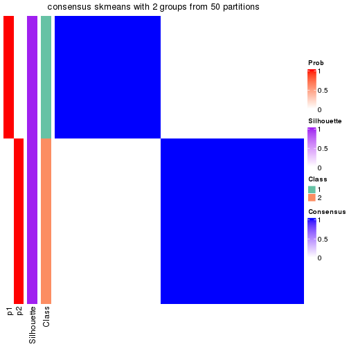</p>

</div>
<div id='tab-node-05-consensus-heatmap-2'>
<pre><code class="r">consensus_heatmap(res, k = 3)
</code></pre>

<p>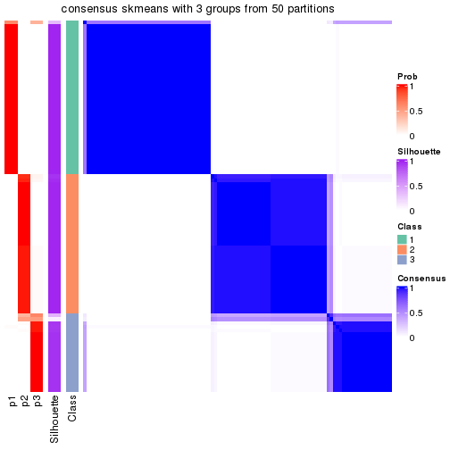</p>

</div>
<div id='tab-node-05-consensus-heatmap-3'>
<pre><code class="r">consensus_heatmap(res, k = 4)
</code></pre>

<p>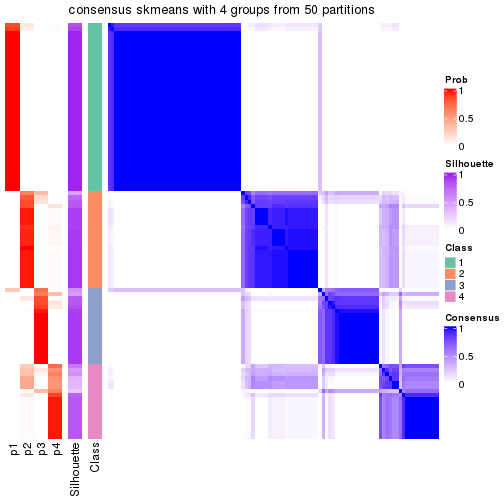</p>

</div>
<div id='tab-node-05-consensus-heatmap-4'>
<pre><code class="r">consensus_heatmap(res, k = 5)
</code></pre>

<p>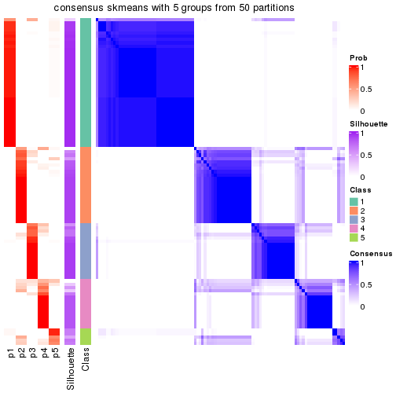</p>

</div>
<div id='tab-node-05-consensus-heatmap-5'>
<pre><code class="r">consensus_heatmap(res, k = 6)
</code></pre>

<p>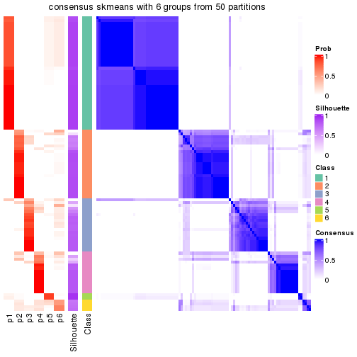</p>

</div>
<div id='tab-node-05-consensus-heatmap-6'>
<pre><code class="r">consensus_heatmap(res, k = 7)
</code></pre>

<p>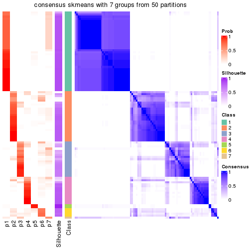</p>

</div>
<div id='tab-node-05-consensus-heatmap-7'>
<pre><code class="r">consensus_heatmap(res, k = 8)
</code></pre>

<p>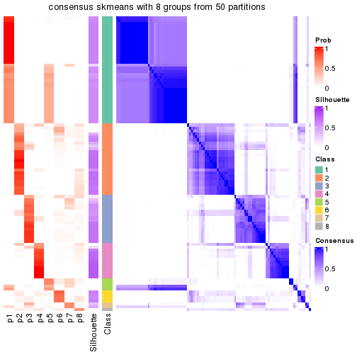</p>

</div>
</div>

Heatmaps for the membership of samples in all partitions to see how consistent they are:


<script>
$( function() {
	$( '#tabs-node-05-membership-heatmap' ).tabs();
} );
</script>
<div id='tabs-node-05-membership-heatmap'>
<ul>
<li><a href='#tab-node-05-membership-heatmap-1'>k = 2</a></li>
<li><a href='#tab-node-05-membership-heatmap-2'>k = 3</a></li>
<li><a href='#tab-node-05-membership-heatmap-3'>k = 4</a></li>
<li><a href='#tab-node-05-membership-heatmap-4'>k = 5</a></li>
<li><a href='#tab-node-05-membership-heatmap-5'>k = 6</a></li>
<li><a href='#tab-node-05-membership-heatmap-6'>k = 7</a></li>
<li><a href='#tab-node-05-membership-heatmap-7'>k = 8</a></li>
</ul>
<div id='tab-node-05-membership-heatmap-1'>
<pre><code class="r">membership_heatmap(res, k = 2)
</code></pre>

<p></p>

</div>
<div id='tab-node-05-membership-heatmap-2'>
<pre><code class="r">membership_heatmap(res, k = 3)
</code></pre>

<p>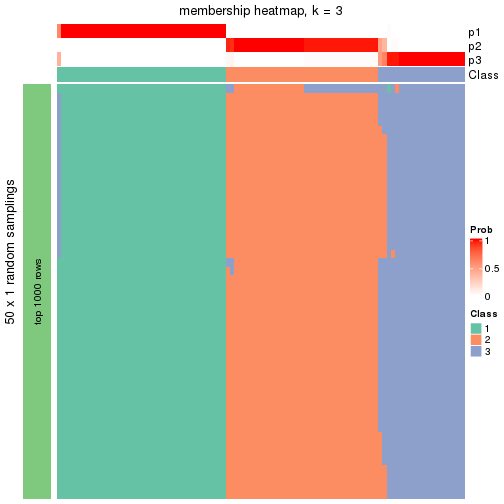</p>

</div>
<div id='tab-node-05-membership-heatmap-3'>
<pre><code class="r">membership_heatmap(res, k = 4)
</code></pre>

<p>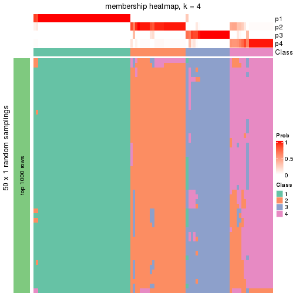</p>

</div>
<div id='tab-node-05-membership-heatmap-4'>
<pre><code class="r">membership_heatmap(res, k = 5)
</code></pre>

<p>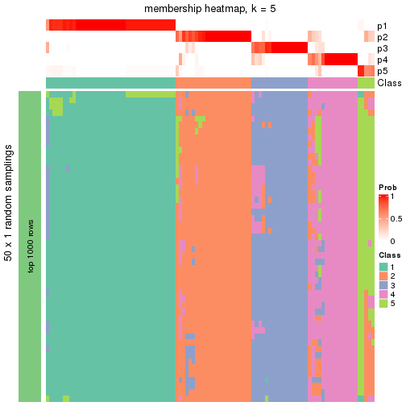</p>

</div>
<div id='tab-node-05-membership-heatmap-5'>
<pre><code class="r">membership_heatmap(res, k = 6)
</code></pre>

<p>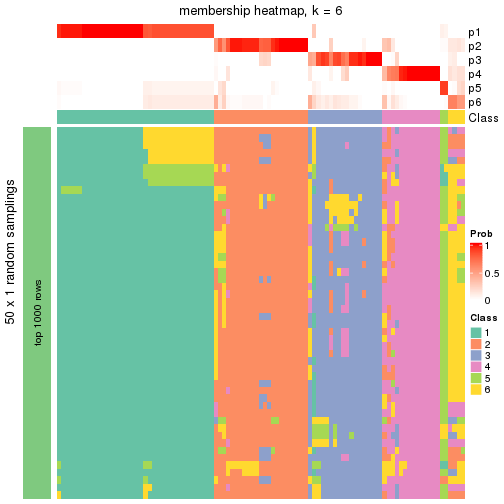</p>

</div>
<div id='tab-node-05-membership-heatmap-6'>
<pre><code class="r">membership_heatmap(res, k = 7)
</code></pre>

<p>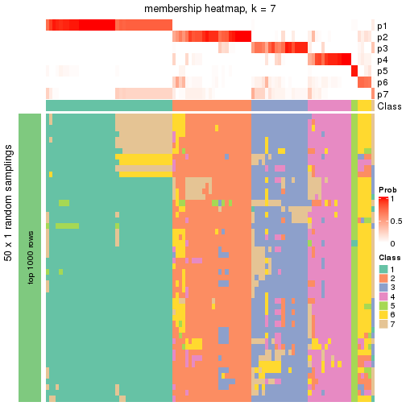</p>

</div>
<div id='tab-node-05-membership-heatmap-7'>
<pre><code class="r">membership_heatmap(res, k = 8)
</code></pre>

<p>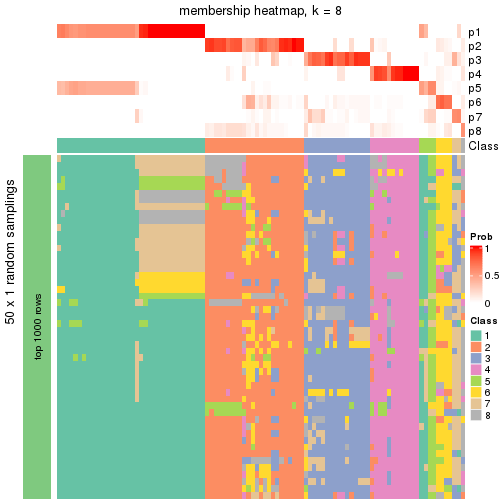</p>

</div>
</div>

As soon as the classes for columns are determined, the signatures
that are significantly different between subgroups can be looked for. 
Following are the heatmaps for signatures.


<script>
$( function() {
	$( '#tabs-node-05-get-signatures' ).tabs();
} );
</script>
<div id='tabs-node-05-get-signatures'>
<ul>
<li><a href='#tab-node-05-get-signatures-1'>k = 2</a></li>
<li><a href='#tab-node-05-get-signatures-2'>k = 3</a></li>
<li><a href='#tab-node-05-get-signatures-3'>k = 4</a></li>
<li><a href='#tab-node-05-get-signatures-4'>k = 5</a></li>
<li><a href='#tab-node-05-get-signatures-5'>k = 6</a></li>
<li><a href='#tab-node-05-get-signatures-6'>k = 7</a></li>
<li><a href='#tab-node-05-get-signatures-7'>k = 8</a></li>
</ul>
<div id='tab-node-05-get-signatures-1'>
<pre><code class="r">get_signatures(res, k = 2)
</code></pre>

<p>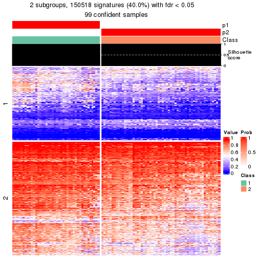</p>

</div>
<div id='tab-node-05-get-signatures-2'>
<pre><code class="r">get_signatures(res, k = 3)
</code></pre>

<p>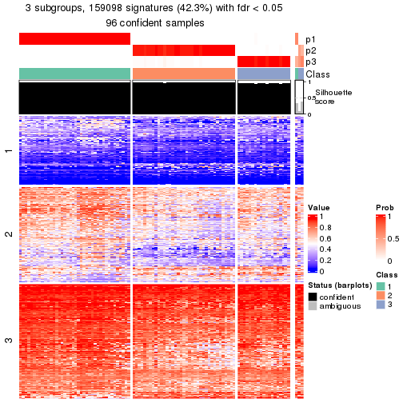</p>

</div>
<div id='tab-node-05-get-signatures-3'>
<pre><code class="r">get_signatures(res, k = 4)
</code></pre>

<p>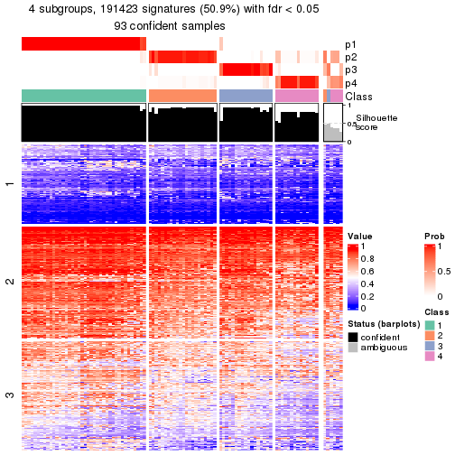</p>

</div>
<div id='tab-node-05-get-signatures-4'>
<pre><code class="r">get_signatures(res, k = 5)
</code></pre>

<p>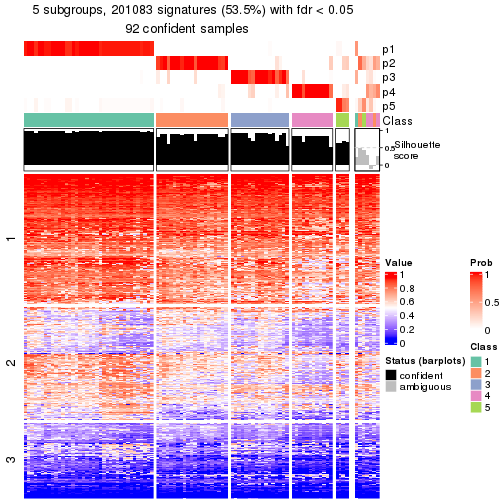</p>

</div>
<div id='tab-node-05-get-signatures-5'>
<pre><code class="r">get_signatures(res, k = 6)
</code></pre>

<p>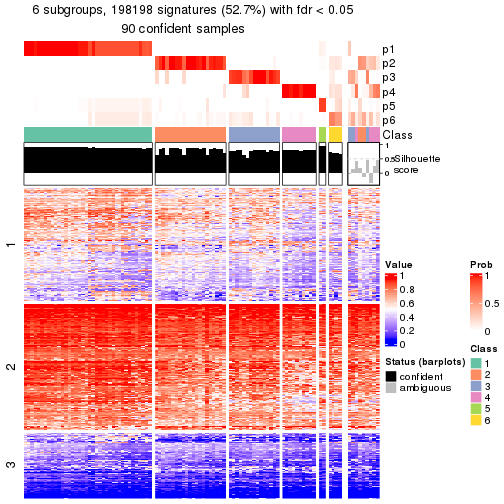</p>

</div>
<div id='tab-node-05-get-signatures-6'>
<pre><code class="r">get_signatures(res, k = 7)
</code></pre>

<p>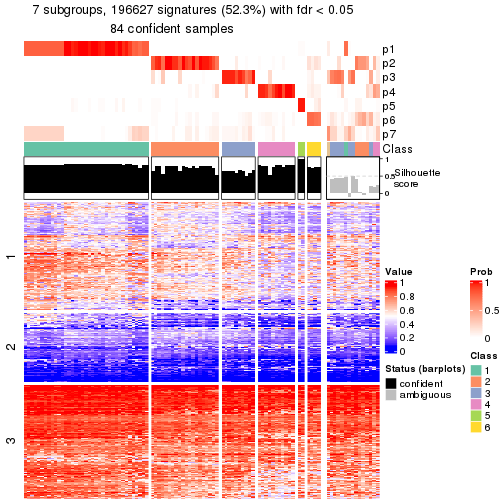</p>

</div>
<div id='tab-node-05-get-signatures-7'>
<pre><code class="r">get_signatures(res, k = 8)
</code></pre>

<p>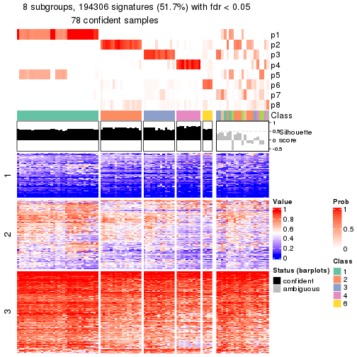</p>

</div>
</div>


Compare the overlap of signatures from different k:

```r
compare_signatures(res)
```

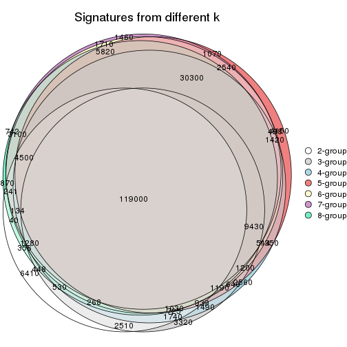

`get_signature()` returns a data frame invisibly. To get the list of signatures, the function
call should be assigned to a variable explicitly. In following code, if `plot` argument is set
to `FALSE`, no heatmap is plotted while only the differential analysis is performed.

```r
# code only for demonstration
tb = get_signature(res, k = ..., plot = FALSE)
```

An example of the output of `tb` is:

```
#>   which_row         fdr    mean_1    mean_2 scaled_mean_1 scaled_mean_2 km
#> 1        38 0.042760348  8.373488  9.131774    -0.5533452     0.5164555  1
#> 2        40 0.018707592  7.106213  8.469186    -0.6173731     0.5762149  1
#> 3        55 0.019134737 10.221463 11.207825    -0.6159697     0.5749050  1
#> 4        59 0.006059896  5.921854  7.869574    -0.6899429     0.6439467  1
#> 5        60 0.018055526  8.928898 10.211722    -0.6204761     0.5791110  1
#> 6        98 0.009384629 15.714769 14.887706     0.6635654    -0.6193277  2
...
```

The columns in `tb` are:

1. `which_row`: row indices corresponding to the input matrix.
2. `fdr`: FDR for the differential test. 
3. `mean_x`: The mean value in group x.
4. `scaled_mean_x`: The mean value in group x after rows are scaled.
5. `km`: Row groups if k-means clustering is applied to rows (which is done by automatically selecting number of clusters).

If there are too many signatures, `top_signatures = ...` can be set to only show the 
signatures with the highest FDRs:

```r
# code only for demonstration
# e.g. to show the top 500 most significant rows
tb = get_signature(res, k = ..., top_signatures = 500)
```

If the signatures are defined as these which are uniquely high in current group, `diff_method` argument
can be set to `"uniquely_high_in_one_group"`:

```r
# code only for demonstration
tb = get_signature(res, k = ..., diff_method = "uniquely_high_in_one_group")
```


UMAP plot which shows how samples are separated.


<script>
$( function() {
	$( '#tabs-node-05-dimension-reduction' ).tabs();
} );
</script>
<div id='tabs-node-05-dimension-reduction'>
<ul>
<li><a href='#tab-node-05-dimension-reduction-1'>k = 2</a></li>
<li><a href='#tab-node-05-dimension-reduction-2'>k = 3</a></li>
<li><a href='#tab-node-05-dimension-reduction-3'>k = 4</a></li>
<li><a href='#tab-node-05-dimension-reduction-4'>k = 5</a></li>
<li><a href='#tab-node-05-dimension-reduction-5'>k = 6</a></li>
<li><a href='#tab-node-05-dimension-reduction-6'>k = 7</a></li>
<li><a href='#tab-node-05-dimension-reduction-7'>k = 8</a></li>
</ul>
<div id='tab-node-05-dimension-reduction-1'>
<pre><code class="r">dimension_reduction(res, k = 2, method = &quot;UMAP&quot;)
</code></pre>

<p>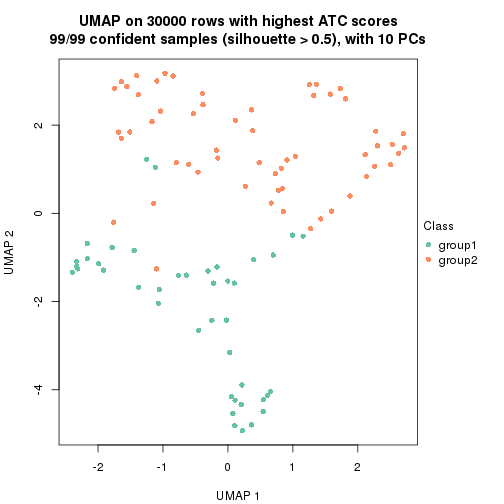</p>

</div>
<div id='tab-node-05-dimension-reduction-2'>
<pre><code class="r">dimension_reduction(res, k = 3, method = &quot;UMAP&quot;)
</code></pre>

<p>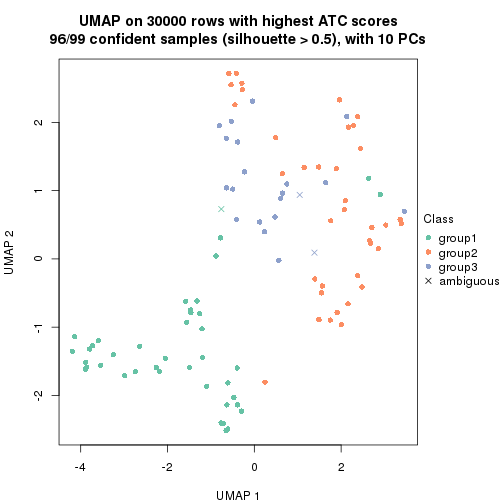</p>

</div>
<div id='tab-node-05-dimension-reduction-3'>
<pre><code class="r">dimension_reduction(res, k = 4, method = &quot;UMAP&quot;)
</code></pre>

<p>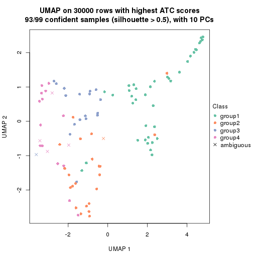</p>

</div>
<div id='tab-node-05-dimension-reduction-4'>
<pre><code class="r">dimension_reduction(res, k = 5, method = &quot;UMAP&quot;)
</code></pre>

<p>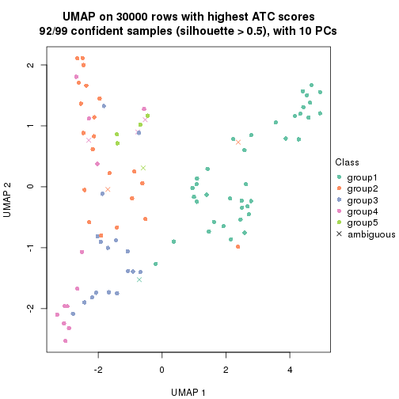</p>

</div>
<div id='tab-node-05-dimension-reduction-5'>
<pre><code class="r">dimension_reduction(res, k = 6, method = &quot;UMAP&quot;)
</code></pre>

<p>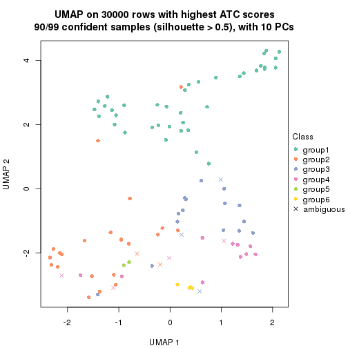</p>

</div>
<div id='tab-node-05-dimension-reduction-6'>
<pre><code class="r">dimension_reduction(res, k = 7, method = &quot;UMAP&quot;)
</code></pre>

<p>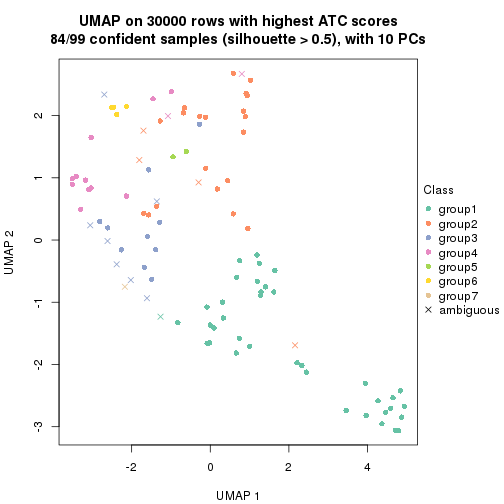</p>

</div>
<div id='tab-node-05-dimension-reduction-7'>
<pre><code class="r">dimension_reduction(res, k = 8, method = &quot;UMAP&quot;)
</code></pre>

<p>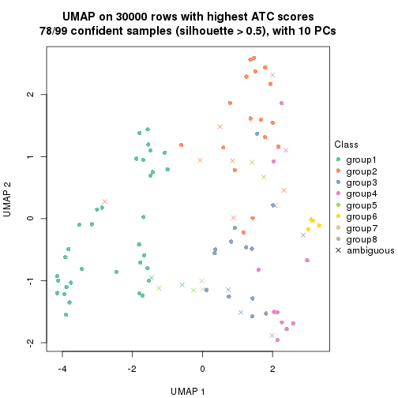</p>

</div>
</div>


Following heatmap shows how subgroups are split when increasing `k`:

```r
collect_classes(res)
```

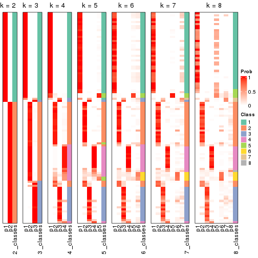


If matrix rows can be associated to genes, consider to use `functional_enrichment(res,
...)` to perform function enrichment for the signature genes. See [this vignette](https://jokergoo.github.io/cola_vignettes/functional_enrichment.html) for more detailed explanations.


 

---------------------------------------------------


### Node051


Parent node: [Node05](#Node05).
Child nodes: 
                Node0111-leaf
        ,
                Node0112-leaf
        ,
                Node0113-leaf
        ,
                [Node0121](#Node0121)
        ,
                [Node0122](#Node0122)
        ,
                [Node0211](#Node0211)
        ,
                [Node0212](#Node0212)
        ,
                [Node0213](#Node0213)
        ,
                [Node0221](#Node0221)
        ,
                [Node0222](#Node0222)
        ,
                [Node0223](#Node0223)
        ,
                [Node0224](#Node0224)
        ,
                Node0225-leaf
        ,
                Node0231-leaf
        ,
                [Node0232](#Node0232)
        ,
                Node0233-leaf
        ,
                Node0234-leaf
        ,
                Node0331-leaf
        ,
                Node0332-leaf
        ,
                Node0333-leaf
        ,
                Node0431-leaf
        ,
                Node0432-leaf
        ,
                Node0433-leaf
        ,
                [Node0511](#Node0511)
        ,
                [Node0512](#Node0512)
        ,
                Node0521-leaf
        ,
                [Node0522](#Node0522)
        ,
                Node0523-leaf
        ,
                Node0524-leaf
        .


The object with results only for a single top-value method and a single partitioning method 
can be extracted as:

```r
res = res_rh["051"]
```

A summary of `res` and all the functions that can be applied to it:

```r
res
```

```
#> A 'ConsensusPartition' object with k = 2, 3, 4, 5, 6, 7, 8.
#>   On a matrix with 30000 rows and 41 columns.
#>   Top rows (1000) are extracted by 'ATC' method.
#>   Subgroups are detected by 'kmeans' method.
#>   Performed in total 350 partitions by row resampling.
#>   Best k for subgroups seems to be 2.
#> 
#> Following methods can be applied to this 'ConsensusPartition' object:
#>  [1] "cola_report"             "collect_classes"         "collect_plots"          
#>  [4] "collect_stats"           "colnames"                "compare_partitions"     
#>  [7] "compare_signatures"      "consensus_heatmap"       "dimension_reduction"    
#> [10] "functional_enrichment"   "get_anno_col"            "get_anno"               
#> [13] "get_classes"             "get_consensus"           "get_matrix"             
#> [16] "get_membership"          "get_param"               "get_signatures"         
#> [19] "get_stats"               "is_best_k"               "is_stable_k"            
#> [22] "membership_heatmap"      "ncol"                    "nrow"                   
#> [25] "plot_ecdf"               "predict_classes"         "rownames"               
#> [28] "select_partition_number" "show"                    "suggest_best_k"         
#> [31] "test_to_known_factors"   "top_rows_heatmap"
```

`collect_plots()` function collects all the plots made from `res` for all `k` (number of subgroups)
into one single page to provide an easy and fast comparison between different `k`.

```r
collect_plots(res)
```

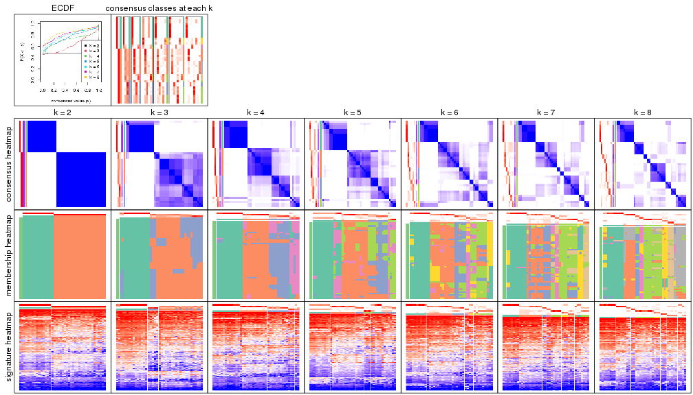

The plots are:

- The first row: a plot of the eCDF (empirical cumulative distribution
  function) curves of the consensus matrix for each `k` and the heatmap of
  predicted classes for each `k`.
- The second row: heatmaps of the consensus matrix for each `k`.
- The third row: heatmaps of the membership matrix for each `k`.
- The fouth row: heatmaps of the signatures for each `k`.

All the plots in panels can be made by individual functions and they are
plotted later in this section.

`select_partition_number()` produces several plots showing different
statistics for choosing "optimized" `k`. There are following statistics:

- eCDF curves of the consensus matrix for each `k`;
- 1-PAC. [The PAC score](https://en.wikipedia.org/wiki/Consensus_clustering#Over-interpretation_potential_of_consensus_clustering)
  measures the proportion of the ambiguous subgrouping.
- Mean silhouette score.
- Concordance. The mean probability of fiting the consensus subgroup labels in all
  partitions.
- Area increased. Denote $A_k$ as the area under the eCDF curve for current
  `k`, the area increased is defined as $A_k - A_{k-1}$.
- Rand index. The percent of pairs of samples that are both in a same cluster
  or both are not in a same cluster in the partition of k and k-1.
- Jaccard index. The ratio of pairs of samples are both in a same cluster in
  the partition of k and k-1 and the pairs of samples are both in a same
  cluster in the partition k or k-1.

The detailed explanations of these statistics can be found in [the _cola_
vignette](https://jokergoo.github.io/cola_vignettes/cola.html#toc_13).

Generally speaking, higher 1-PAC score, higher mean silhouette score or higher
concordance corresponds to better partition. Rand index and Jaccard index
measure how similar the current partition is compared to partition with `k-1`.
If they are too similar, we won't accept `k` is better than `k-1`.

```r
select_partition_number(res)
```

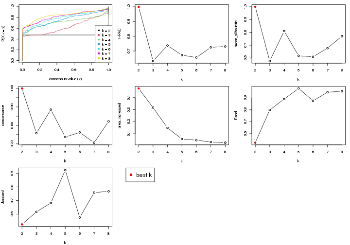

The numeric values for all these statistics can be obtained by `get_stats()`.

```r
get_stats(res)
```

```
#>   k 1-PAC mean_silhouette concordance area_increased  Rand Jaccard
#> 2 2 1.000           1.000       1.000         0.4761 0.524   0.524
#> 3 3 0.632           0.576       0.758         0.3173 0.799   0.616
#> 4 4 0.737           0.810       0.885         0.1484 0.890   0.682
#> 5 5 0.672           0.617       0.737         0.0559 0.979   0.924
#> 6 6 0.656           0.609       0.762         0.0463 0.876   0.575
#> 7 7 0.725           0.676       0.706         0.0314 0.948   0.758
#> 8 8 0.731           0.770       0.821         0.0256 0.956   0.768
```

`suggest_best_k()` suggests the best $k$ based on these statistics. The rules are as follows:

- All $k$ with Jaccard index larger than 0.95 are removed because increasing
  $k$ does not provide enough extra information. If all $k$ are removed, it is
  marked as no subgroup is detected.
- For all $k$ with 1-PAC score larger than 0.9, the maximal $k$ is taken as
  the best $k$, and other $k$ are marked as optional $k$.
- If it does not fit the second rule. The $k$ with the maximal vote of the
  highest 1-PAC score, highest mean silhouette, and highest concordance is
  taken as the best $k$.

```r
suggest_best_k(res)
```

```
#> [1] 2
```


Following is the table of the partitions (You need to click the **show/hide
code output** link to see it). The membership matrix (columns with name `p*`)
is inferred by
[`clue::cl_consensus()`](https://www.rdocumentation.org/link/cl_consensus?package=clue)
function with the `SE` method. Basically the value in the membership matrix
represents the probability to belong to a certain group. The finall subgroup
label for an item is determined with the group with highest probability it
belongs to.

In `get_classes()` function, the entropy is calculated from the membership
matrix and the silhouette score is calculated from the consensus matrix.


<script>
$( function() {
	$( '#tabs-node-051-get-classes' ).tabs();
} );
</script>
<div id='tabs-node-051-get-classes'>
<ul>
<li><a href='#tab-node-051-get-classes-1'>k = 2</a></li>
<li><a href='#tab-node-051-get-classes-2'>k = 3</a></li>
<li><a href='#tab-node-051-get-classes-3'>k = 4</a></li>
<li><a href='#tab-node-051-get-classes-4'>k = 5</a></li>
<li><a href='#tab-node-051-get-classes-5'>k = 6</a></li>
<li><a href='#tab-node-051-get-classes-6'>k = 7</a></li>
<li><a href='#tab-node-051-get-classes-7'>k = 8</a></li>
</ul>

<div id='tab-node-051-get-classes-1'>
<p><a id='tab-node-051-get-classes-1-a' style='color:#0366d6' href='#'>show/hide code output</a></p>
<pre><code class="r">cbind(get_classes(res, k = 2), get_membership(res, k = 2))
</code></pre>

<pre><code>#&gt;                 class entropy silhouette p1 p2
#&gt; TCGA.CV.6433.01     1       0          1  1  0
#&gt; TCGA.HD.7754.01     2       0          1  0  1
#&gt; TCGA.CV.7406.01     2       0          1  0  1
#&gt; TCGA.BA.5559.01     1       0          1  1  0
#&gt; TCGA.CR.5249.01     2       0          1  0  1
#&gt; TCGA.CV.5443.01     1       0          1  1  0
#&gt; TCGA.CR.5248.01     2       0          1  0  1
#&gt; TCGA.CR.5250.01     1       0          1  1  0
#&gt; TCGA.CR.5243.01     1       0          1  1  0
#&gt; TCGA.CV.5442.01     1       0          1  1  0
#&gt; TCGA.CR.7385.01     2       0          1  0  1
#&gt; TCGA.CV.6939.01     2       0          1  0  1
#&gt; TCGA.CR.6487.01     2       0          1  0  1
#&gt; TCGA.CR.6472.01     2       0          1  0  1
#&gt; TCGA.CR.6481.01     2       0          1  0  1
#&gt; TCGA.CR.6470.01     2       0          1  0  1
#&gt; TCGA.BA.A4IH.01     2       0          1  0  1
#&gt; TCGA.CR.6482.01     2       0          1  0  1
#&gt; TCGA.P3.A5Q5.01     2       0          1  0  1
#&gt; TCGA.BA.A4IG.01     2       0          1  0  1
#&gt; TCGA.HD.A634.01     2       0          1  0  1
#&gt; TCGA.BA.5153.01     1       0          1  1  0
#&gt; TCGA.DQ.7594.01     2       0          1  0  1
#&gt; TCGA.DQ.7596.01     2       0          1  0  1
#&gt; TCGA.BB.4223.01     1       0          1  1  0
#&gt; TCGA.CN.5374.01     2       0          1  0  1
#&gt; TCGA.BB.4228.01     1       0          1  1  0
#&gt; TCGA.H7.A76A.01     2       0          1  0  1
#&gt; TCGA.DQ.7593.01     2       0          1  0  1
#&gt; TCGA.BB.4225.01     1       0          1  1  0
#&gt; TCGA.CN.A6UY.01     1       0          1  1  0
#&gt; TCGA.MZ.A5BI.01     2       0          1  0  1
#&gt; TCGA.BB.A6UM.01     2       0          1  0  1
#&gt; TCGA.CN.A6V6.01     1       0          1  1  0
#&gt; TCGA.RS.A6TP.01     1       0          1  1  0
#&gt; TCGA.KU.A6H7.06     1       0          1  1  0
#&gt; TCGA.UP.A6WW.01     1       0          1  1  0
#&gt; TCGA.MZ.A6I9.01     2       0          1  0  1
#&gt; TCGA.CR.7404.01     2       0          1  0  1
#&gt; TCGA.CR.7368.01     2       0          1  0  1
#&gt; TCGA.KU.A6H7.01     2       0          1  0  1
</code></pre>

<script>
$('#tab-node-051-get-classes-1-a').parent().next().next().hide();
$('#tab-node-051-get-classes-1-a').click(function(){
  $('#tab-node-051-get-classes-1-a').parent().next().next().toggle();
  return(false);
});
</script>
</div>

<div id='tab-node-051-get-classes-2'>
<p><a id='tab-node-051-get-classes-2-a' style='color:#0366d6' href='#'>show/hide code output</a></p>
<pre><code class="r">cbind(get_classes(res, k = 3), get_membership(res, k = 3))
</code></pre>

<pre><code>#&gt;                 class entropy silhouette   p1   p2   p3
#&gt; TCGA.CV.6433.01     1   0.000     0.9611 1.00 0.00 0.00
#&gt; TCGA.HD.7754.01     2   0.624    -0.1929 0.00 0.56 0.44
#&gt; TCGA.CV.7406.01     3   0.000     0.5205 0.00 0.00 1.00
#&gt; TCGA.BA.5559.01     1   0.000     0.9611 1.00 0.00 0.00
#&gt; TCGA.CR.5249.01     3   0.624     0.1349 0.00 0.44 0.56
#&gt; TCGA.CV.5443.01     1   0.000     0.9611 1.00 0.00 0.00
#&gt; TCGA.CR.5248.01     2   0.571     0.4901 0.00 0.68 0.32
#&gt; TCGA.CR.5250.01     1   0.000     0.9611 1.00 0.00 0.00
#&gt; TCGA.CR.5243.01     1   0.000     0.9611 1.00 0.00 0.00
#&gt; TCGA.CV.5442.01     1   0.502     0.7791 0.76 0.24 0.00
#&gt; TCGA.CR.7385.01     3   0.254     0.5724 0.00 0.08 0.92
#&gt; TCGA.CV.6939.01     2   0.630     0.4384 0.00 0.52 0.48
#&gt; TCGA.CR.6487.01     2   0.571     0.4901 0.00 0.68 0.32
#&gt; TCGA.CR.6472.01     3   0.000     0.5205 0.00 0.00 1.00
#&gt; TCGA.CR.6481.01     3   0.480     0.4296 0.00 0.22 0.78
#&gt; TCGA.CR.6470.01     2   0.630     0.4384 0.00 0.52 0.48
#&gt; TCGA.BA.A4IH.01     2   0.630     0.4384 0.00 0.52 0.48
#&gt; TCGA.CR.6482.01     2   0.604     0.4950 0.00 0.62 0.38
#&gt; TCGA.P3.A5Q5.01     3   0.254     0.5724 0.00 0.08 0.92
#&gt; TCGA.BA.A4IG.01     3   0.624     0.2764 0.00 0.44 0.56
#&gt; TCGA.HD.A634.01     3   0.613     0.2805 0.00 0.40 0.60
#&gt; TCGA.BA.5153.01     1   0.000     0.9611 1.00 0.00 0.00
#&gt; TCGA.DQ.7594.01     3   0.207     0.5658 0.00 0.06 0.94
#&gt; TCGA.DQ.7596.01     2   0.604     0.4950 0.00 0.62 0.38
#&gt; TCGA.BB.4223.01     1   0.000     0.9611 1.00 0.00 0.00
#&gt; TCGA.CN.5374.01     3   0.604     0.3251 0.00 0.38 0.62
#&gt; TCGA.BB.4228.01     1   0.000     0.9611 1.00 0.00 0.00
#&gt; TCGA.H7.A76A.01     2   0.630     0.4384 0.00 0.52 0.48
#&gt; TCGA.DQ.7593.01     2   0.604     0.4950 0.00 0.62 0.38
#&gt; TCGA.BB.4225.01     1   0.000     0.9611 1.00 0.00 0.00
#&gt; TCGA.CN.A6UY.01     1   0.000     0.9611 1.00 0.00 0.00
#&gt; TCGA.MZ.A5BI.01     2   0.630     0.4384 0.00 0.52 0.48
#&gt; TCGA.BB.A6UM.01     2   0.502    -0.0745 0.00 0.76 0.24
#&gt; TCGA.CN.A6V6.01     1   0.000     0.9611 1.00 0.00 0.00
#&gt; TCGA.RS.A6TP.01     1   0.619     0.5834 0.58 0.42 0.00
#&gt; TCGA.KU.A6H7.06     1   0.000     0.9611 1.00 0.00 0.00
#&gt; TCGA.UP.A6WW.01     1   0.000     0.9611 1.00 0.00 0.00
#&gt; TCGA.MZ.A6I9.01     3   0.624     0.2764 0.00 0.44 0.56
#&gt; TCGA.CR.7404.01     2   0.571     0.4901 0.00 0.68 0.32
#&gt; TCGA.CR.7368.01     2   0.502    -0.0745 0.00 0.76 0.24
#&gt; TCGA.KU.A6H7.01     2   0.571     0.4901 0.00 0.68 0.32
</code></pre>

<script>
$('#tab-node-051-get-classes-2-a').parent().next().next().hide();
$('#tab-node-051-get-classes-2-a').click(function(){
  $('#tab-node-051-get-classes-2-a').parent().next().next().toggle();
  return(false);
});
</script>
</div>

<div id='tab-node-051-get-classes-3'>
<p><a id='tab-node-051-get-classes-3-a' style='color:#0366d6' href='#'>show/hide code output</a></p>
<pre><code class="r">cbind(get_classes(res, k = 4), get_membership(res, k = 4))
</code></pre>

<pre><code>#&gt;                 class entropy silhouette   p1   p2   p3   p4
#&gt; TCGA.CV.6433.01     1  0.0000      0.984 1.00 0.00 0.00 0.00
#&gt; TCGA.HD.7754.01     4  0.5355      0.146 0.00 0.02 0.36 0.62
#&gt; TCGA.CV.7406.01     3  0.1637      0.713 0.00 0.06 0.94 0.00
#&gt; TCGA.BA.5559.01     1  0.0000      0.984 1.00 0.00 0.00 0.00
#&gt; TCGA.CR.5249.01     2  0.4731      0.668 0.00 0.78 0.06 0.16
#&gt; TCGA.CV.5443.01     1  0.0000      0.984 1.00 0.00 0.00 0.00
#&gt; TCGA.CR.5248.01     2  0.0000      0.926 0.00 1.00 0.00 0.00
#&gt; TCGA.CR.5250.01     1  0.0000      0.984 1.00 0.00 0.00 0.00
#&gt; TCGA.CR.5243.01     1  0.1913      0.944 0.94 0.00 0.04 0.02
#&gt; TCGA.CV.5442.01     4  0.5915      0.224 0.40 0.00 0.04 0.56
#&gt; TCGA.CR.7385.01     3  0.3972      0.733 0.00 0.08 0.84 0.08
#&gt; TCGA.CV.6939.01     2  0.1211      0.918 0.00 0.96 0.04 0.00
#&gt; TCGA.CR.6487.01     2  0.0000      0.926 0.00 1.00 0.00 0.00
#&gt; TCGA.CR.6472.01     3  0.1637      0.713 0.00 0.06 0.94 0.00
#&gt; TCGA.CR.6481.01     3  0.3172      0.707 0.00 0.16 0.84 0.00
#&gt; TCGA.CR.6470.01     2  0.1211      0.918 0.00 0.96 0.04 0.00
#&gt; TCGA.BA.A4IH.01     2  0.3935      0.837 0.00 0.84 0.06 0.10
#&gt; TCGA.CR.6482.01     2  0.0000      0.926 0.00 1.00 0.00 0.00
#&gt; TCGA.P3.A5Q5.01     3  0.3972      0.733 0.00 0.08 0.84 0.08
#&gt; TCGA.BA.A4IG.01     3  0.7198      0.641 0.00 0.28 0.54 0.18
#&gt; TCGA.HD.A634.01     3  0.7198      0.641 0.00 0.28 0.54 0.18
#&gt; TCGA.BA.5153.01     1  0.0000      0.984 1.00 0.00 0.00 0.00
#&gt; TCGA.DQ.7594.01     3  0.2335      0.720 0.00 0.06 0.92 0.02
#&gt; TCGA.DQ.7596.01     2  0.0000      0.926 0.00 1.00 0.00 0.00
#&gt; TCGA.BB.4223.01     1  0.0000      0.984 1.00 0.00 0.00 0.00
#&gt; TCGA.CN.5374.01     3  0.7198      0.641 0.00 0.28 0.54 0.18
#&gt; TCGA.BB.4228.01     1  0.0000      0.984 1.00 0.00 0.00 0.00
#&gt; TCGA.H7.A76A.01     2  0.1211      0.918 0.00 0.96 0.04 0.00
#&gt; TCGA.DQ.7593.01     2  0.0000      0.926 0.00 1.00 0.00 0.00
#&gt; TCGA.BB.4225.01     1  0.0000      0.984 1.00 0.00 0.00 0.00
#&gt; TCGA.CN.A6UY.01     1  0.0000      0.984 1.00 0.00 0.00 0.00
#&gt; TCGA.MZ.A5BI.01     2  0.3247      0.863 0.00 0.88 0.06 0.06
#&gt; TCGA.BB.A6UM.01     4  0.3247      0.634 0.00 0.06 0.06 0.88
#&gt; TCGA.CN.A6V6.01     1  0.1913      0.944 0.94 0.00 0.04 0.02
#&gt; TCGA.RS.A6TP.01     4  0.4088      0.628 0.14 0.00 0.04 0.82
#&gt; TCGA.KU.A6H7.06     1  0.1913      0.944 0.94 0.00 0.04 0.02
#&gt; TCGA.UP.A6WW.01     1  0.0000      0.984 1.00 0.00 0.00 0.00
#&gt; TCGA.MZ.A6I9.01     3  0.7414      0.567 0.00 0.34 0.48 0.18
#&gt; TCGA.CR.7404.01     2  0.2647      0.815 0.00 0.88 0.00 0.12
#&gt; TCGA.CR.7368.01     4  0.3247      0.634 0.00 0.06 0.06 0.88
#&gt; TCGA.KU.A6H7.01     2  0.0707      0.915 0.00 0.98 0.02 0.00
</code></pre>

<script>
$('#tab-node-051-get-classes-3-a').parent().next().next().hide();
$('#tab-node-051-get-classes-3-a').click(function(){
  $('#tab-node-051-get-classes-3-a').parent().next().next().toggle();
  return(false);
});
</script>
</div>

<div id='tab-node-051-get-classes-4'>
<p><a id='tab-node-051-get-classes-4-a' style='color:#0366d6' href='#'>show/hide code output</a></p>
<pre><code class="r">cbind(get_classes(res, k = 5), get_membership(res, k = 5))
</code></pre>

<pre><code>#&gt;                 class entropy silhouette   p1   p2   p3   p4   p5
#&gt; TCGA.CV.6433.01     1   0.430     0.8099 0.52 0.00 0.00 0.48 0.00
#&gt; TCGA.HD.7754.01     5   0.273     0.5529 0.00 0.00 0.16 0.00 0.84
#&gt; TCGA.CV.7406.01     3   0.407     0.4502 0.00 0.06 0.78 0.16 0.00
#&gt; TCGA.BA.5559.01     1   0.423     0.7894 0.58 0.00 0.00 0.42 0.00
#&gt; TCGA.CR.5249.01     2   0.701     0.0889 0.00 0.52 0.18 0.04 0.26
#&gt; TCGA.CV.5443.01     1   0.423     0.7894 0.58 0.00 0.00 0.42 0.00
#&gt; TCGA.CR.5248.01     2   0.000     0.7886 0.00 1.00 0.00 0.00 0.00
#&gt; TCGA.CR.5250.01     1   0.430     0.8099 0.52 0.00 0.00 0.48 0.00
#&gt; TCGA.CR.5243.01     1   0.000     0.4602 1.00 0.00 0.00 0.00 0.00
#&gt; TCGA.CV.5442.01     1   0.625    -0.4402 0.52 0.00 0.04 0.06 0.38
#&gt; TCGA.CR.7385.01     3   0.364     0.5839 0.00 0.06 0.82 0.00 0.12
#&gt; TCGA.CV.6939.01     2   0.482     0.7006 0.00 0.72 0.18 0.10 0.00
#&gt; TCGA.CR.6487.01     2   0.000     0.7886 0.00 1.00 0.00 0.00 0.00
#&gt; TCGA.CR.6472.01     3   0.407     0.4502 0.00 0.06 0.78 0.16 0.00
#&gt; TCGA.CR.6481.01     3   0.385     0.5391 0.00 0.22 0.76 0.02 0.00
#&gt; TCGA.CR.6470.01     2   0.482     0.7006 0.00 0.72 0.18 0.10 0.00
#&gt; TCGA.BA.A4IH.01     2   0.558     0.6087 0.00 0.60 0.10 0.30 0.00
#&gt; TCGA.CR.6482.01     2   0.000     0.7886 0.00 1.00 0.00 0.00 0.00
#&gt; TCGA.P3.A5Q5.01     3   0.364     0.5839 0.00 0.06 0.82 0.00 0.12
#&gt; TCGA.BA.A4IG.01     3   0.678     0.4616 0.00 0.34 0.38 0.00 0.28
#&gt; TCGA.HD.A634.01     3   0.678     0.4616 0.00 0.34 0.38 0.00 0.28
#&gt; TCGA.BA.5153.01     1   0.430     0.8099 0.52 0.00 0.00 0.48 0.00
#&gt; TCGA.DQ.7594.01     3   0.280     0.5806 0.00 0.06 0.88 0.00 0.06
#&gt; TCGA.DQ.7596.01     2   0.304     0.7862 0.00 0.86 0.04 0.10 0.00
#&gt; TCGA.BB.4223.01     1   0.430     0.8099 0.52 0.00 0.00 0.48 0.00
#&gt; TCGA.CN.5374.01     3   0.678     0.4616 0.00 0.34 0.38 0.00 0.28
#&gt; TCGA.BB.4228.01     1   0.430     0.8099 0.52 0.00 0.00 0.48 0.00
#&gt; TCGA.H7.A76A.01     2   0.370     0.7715 0.00 0.82 0.08 0.10 0.00
#&gt; TCGA.DQ.7593.01     2   0.141     0.7925 0.00 0.94 0.00 0.06 0.00
#&gt; TCGA.BB.4225.01     1   0.430     0.8099 0.52 0.00 0.00 0.48 0.00
#&gt; TCGA.CN.A6UY.01     1   0.430     0.8099 0.52 0.00 0.00 0.48 0.00
#&gt; TCGA.MZ.A5BI.01     2   0.482     0.7201 0.00 0.72 0.10 0.18 0.00
#&gt; TCGA.BB.A6UM.01     5   0.000     0.7297 0.00 0.00 0.00 0.00 1.00
#&gt; TCGA.CN.A6V6.01     1   0.202     0.3306 0.90 0.10 0.00 0.00 0.00
#&gt; TCGA.RS.A6TP.01     5   0.630     0.4343 0.42 0.00 0.04 0.06 0.48
#&gt; TCGA.KU.A6H7.06     1   0.000     0.4602 1.00 0.00 0.00 0.00 0.00
#&gt; TCGA.UP.A6WW.01     1   0.430     0.8099 0.52 0.00 0.00 0.48 0.00
#&gt; TCGA.MZ.A6I9.01     3   0.679     0.4202 0.00 0.36 0.36 0.00 0.28
#&gt; TCGA.CR.7404.01     2   0.228     0.6867 0.00 0.88 0.00 0.00 0.12
#&gt; TCGA.CR.7368.01     5   0.000     0.7297 0.00 0.00 0.00 0.00 1.00
#&gt; TCGA.KU.A6H7.01     2   0.104     0.7650 0.04 0.96 0.00 0.00 0.00
</code></pre>

<script>
$('#tab-node-051-get-classes-4-a').parent().next().next().hide();
$('#tab-node-051-get-classes-4-a').click(function(){
  $('#tab-node-051-get-classes-4-a').parent().next().next().toggle();
  return(false);
});
</script>
</div>

<div id='tab-node-051-get-classes-5'>
<p><a id='tab-node-051-get-classes-5-a' style='color:#0366d6' href='#'>show/hide code output</a></p>
<pre><code class="r">cbind(get_classes(res, k = 6), get_membership(res, k = 6))
</code></pre>

<pre><code>#&gt;                 class entropy silhouette   p1   p2   p3   p4   p5   p6
#&gt; TCGA.CV.6433.01     1  0.0547     0.9134 0.98 0.00 0.02 0.00 0.00 0.00
#&gt; TCGA.HD.7754.01     5  0.4803     0.2169 0.00 0.00 0.04 0.16 0.72 0.08
#&gt; TCGA.CV.7406.01     3  0.1480     0.5725 0.00 0.04 0.94 0.00 0.02 0.00
#&gt; TCGA.BA.5559.01     1  0.3156     0.6584 0.80 0.00 0.02 0.00 0.00 0.18
#&gt; TCGA.CR.5249.01     5  0.4631     0.3140 0.00 0.32 0.06 0.00 0.62 0.00
#&gt; TCGA.CV.5443.01     1  0.3315     0.6137 0.78 0.00 0.02 0.00 0.00 0.20
#&gt; TCGA.CR.5248.01     2  0.4873     0.6187 0.00 0.60 0.00 0.00 0.08 0.32
#&gt; TCGA.CR.5250.01     1  0.0547     0.9134 0.98 0.00 0.02 0.00 0.00 0.00
#&gt; TCGA.CR.5243.01     6  0.5574     0.6170 0.44 0.00 0.02 0.04 0.02 0.48
#&gt; TCGA.CV.5442.01     4  0.3592     0.9861 0.00 0.00 0.02 0.74 0.00 0.24
#&gt; TCGA.CR.7385.01     3  0.4845     0.6286 0.00 0.06 0.54 0.00 0.40 0.00
#&gt; TCGA.CV.6939.01     2  0.3045     0.6024 0.00 0.84 0.06 0.00 0.10 0.00
#&gt; TCGA.CR.6487.01     2  0.4613     0.6506 0.00 0.66 0.00 0.00 0.08 0.26
#&gt; TCGA.CR.6472.01     3  0.1480     0.5725 0.00 0.04 0.94 0.00 0.02 0.00
#&gt; TCGA.CR.6481.01     3  0.5636     0.5686 0.00 0.18 0.52 0.00 0.30 0.00
#&gt; TCGA.CR.6470.01     2  0.3045     0.6024 0.00 0.84 0.06 0.00 0.10 0.00
#&gt; TCGA.BA.A4IH.01     2  0.4626     0.5729 0.00 0.74 0.04 0.14 0.00 0.08
#&gt; TCGA.CR.6482.01     2  0.4613     0.6506 0.00 0.66 0.00 0.00 0.08 0.26
#&gt; TCGA.P3.A5Q5.01     3  0.4845     0.6286 0.00 0.06 0.54 0.00 0.40 0.00
#&gt; TCGA.BA.A4IG.01     5  0.5039     0.3093 0.00 0.18 0.18 0.00 0.64 0.00
#&gt; TCGA.HD.A634.01     5  0.5524     0.3270 0.00 0.20 0.16 0.02 0.62 0.00
#&gt; TCGA.BA.5153.01     1  0.0000     0.9233 1.00 0.00 0.00 0.00 0.00 0.00
#&gt; TCGA.DQ.7594.01     3  0.4631     0.6720 0.00 0.06 0.62 0.00 0.32 0.00
#&gt; TCGA.DQ.7596.01     2  0.0000     0.6952 0.00 1.00 0.00 0.00 0.00 0.00
#&gt; TCGA.BB.4223.01     1  0.0000     0.9233 1.00 0.00 0.00 0.00 0.00 0.00
#&gt; TCGA.CN.5374.01     5  0.5027     0.3401 0.00 0.20 0.16 0.00 0.64 0.00
#&gt; TCGA.BB.4228.01     1  0.0000     0.9233 1.00 0.00 0.00 0.00 0.00 0.00
#&gt; TCGA.H7.A76A.01     2  0.1865     0.6693 0.00 0.92 0.04 0.00 0.04 0.00
#&gt; TCGA.DQ.7593.01     2  0.1556     0.6991 0.00 0.92 0.00 0.00 0.00 0.08
#&gt; TCGA.BB.4225.01     1  0.0000     0.9233 1.00 0.00 0.00 0.00 0.00 0.00
#&gt; TCGA.CN.A6UY.01     1  0.0000     0.9233 1.00 0.00 0.00 0.00 0.00 0.00
#&gt; TCGA.MZ.A5BI.01     2  0.3103     0.6511 0.00 0.86 0.04 0.04 0.00 0.06
#&gt; TCGA.BB.A6UM.01     5  0.4938    -0.0317 0.00 0.00 0.00 0.34 0.58 0.08
#&gt; TCGA.CN.A6V6.01     6  0.3854     0.1758 0.12 0.04 0.00 0.04 0.00 0.80
#&gt; TCGA.RS.A6TP.01     4  0.3076     0.9861 0.00 0.00 0.00 0.76 0.00 0.24
#&gt; TCGA.KU.A6H7.06     6  0.5574     0.6170 0.44 0.00 0.02 0.04 0.02 0.48
#&gt; TCGA.UP.A6WW.01     1  0.0000     0.9233 1.00 0.00 0.00 0.00 0.00 0.00
#&gt; TCGA.MZ.A6I9.01     5  0.4989     0.3528 0.00 0.22 0.14 0.00 0.64 0.00
#&gt; TCGA.CR.7404.01     2  0.5428     0.5574 0.00 0.54 0.00 0.00 0.14 0.32
#&gt; TCGA.CR.7368.01     5  0.4938    -0.0317 0.00 0.00 0.00 0.34 0.58 0.08
#&gt; TCGA.KU.A6H7.01     2  0.5071     0.5561 0.00 0.52 0.00 0.00 0.08 0.40
</code></pre>

<script>
$('#tab-node-051-get-classes-5-a').parent().next().next().hide();
$('#tab-node-051-get-classes-5-a').click(function(){
  $('#tab-node-051-get-classes-5-a').parent().next().next().toggle();
  return(false);
});
</script>
</div>

<div id='tab-node-051-get-classes-6'>
<p><a id='tab-node-051-get-classes-6-a' style='color:#0366d6' href='#'>show/hide code output</a></p>
<pre><code class="r">cbind(get_classes(res, k = 7), get_membership(res, k = 7))
</code></pre>

<pre><code>#&gt;                 class entropy silhouette   p1   p2   p3   p4   p5   p6   p7
#&gt; TCGA.CV.6433.01     1  0.0504      0.885 0.98 0.00 0.00 0.02 0.00 0.00 0.00
#&gt; TCGA.HD.7754.01     7  0.3413      0.719 0.00 0.00 0.00 0.00 0.38 0.00 0.62
#&gt; TCGA.CV.7406.01     3  0.1433      0.987 0.00 0.00 0.92 0.00 0.08 0.00 0.00
#&gt; TCGA.BA.5559.01     1  0.4211      0.382 0.68 0.00 0.04 0.02 0.00 0.26 0.00
#&gt; TCGA.CR.5249.01     5  0.1433      0.572 0.00 0.08 0.00 0.00 0.92 0.00 0.00
#&gt; TCGA.CV.5443.01     1  0.4211      0.382 0.68 0.00 0.04 0.02 0.00 0.26 0.00
#&gt; TCGA.CR.5248.01     2  0.7728      0.595 0.00 0.38 0.00 0.10 0.18 0.20 0.14
#&gt; TCGA.CR.5250.01     1  0.0504      0.885 0.98 0.00 0.00 0.02 0.00 0.00 0.00
#&gt; TCGA.CR.5243.01     6  0.3294      0.742 0.34 0.00 0.00 0.00 0.00 0.66 0.00
#&gt; TCGA.CV.5442.01     4  0.4242      0.956 0.02 0.00 0.00 0.72 0.00 0.08 0.18
#&gt; TCGA.CR.7385.01     5  0.3358      0.475 0.00 0.00 0.36 0.00 0.64 0.00 0.00
#&gt; TCGA.CV.6939.01     2  0.2945      0.545 0.00 0.74 0.00 0.00 0.26 0.00 0.00
#&gt; TCGA.CR.6487.01     2  0.7728      0.595 0.00 0.38 0.00 0.10 0.18 0.20 0.14
#&gt; TCGA.CR.6472.01     3  0.1928      0.987 0.00 0.00 0.90 0.00 0.08 0.02 0.00
#&gt; TCGA.CR.6481.01     5  0.4902      0.343 0.00 0.12 0.34 0.00 0.54 0.00 0.00
#&gt; TCGA.CR.6470.01     2  0.2945      0.545 0.00 0.74 0.00 0.00 0.26 0.00 0.00
#&gt; TCGA.BA.A4IH.01     2  0.4171      0.388 0.00 0.78 0.04 0.12 0.02 0.02 0.02
#&gt; TCGA.CR.6482.01     2  0.7728      0.595 0.00 0.38 0.00 0.10 0.18 0.20 0.14
#&gt; TCGA.P3.A5Q5.01     5  0.3358      0.475 0.00 0.00 0.36 0.00 0.64 0.00 0.00
#&gt; TCGA.BA.A4IG.01     5  0.0000      0.658 0.00 0.00 0.00 0.00 1.00 0.00 0.00
#&gt; TCGA.HD.A634.01     5  0.2213      0.605 0.00 0.00 0.00 0.04 0.90 0.04 0.02
#&gt; TCGA.BA.5153.01     1  0.0000      0.889 1.00 0.00 0.00 0.00 0.00 0.00 0.00
#&gt; TCGA.DQ.7594.01     5  0.3496      0.366 0.00 0.00 0.42 0.00 0.58 0.00 0.00
#&gt; TCGA.DQ.7596.01     2  0.2569      0.620 0.00 0.84 0.00 0.00 0.14 0.02 0.00
#&gt; TCGA.BB.4223.01     1  0.0504      0.885 0.98 0.00 0.00 0.02 0.00 0.00 0.00
#&gt; TCGA.CN.5374.01     5  0.0000      0.658 0.00 0.00 0.00 0.00 1.00 0.00 0.00
#&gt; TCGA.BB.4228.01     1  0.0000      0.889 1.00 0.00 0.00 0.00 0.00 0.00 0.00
#&gt; TCGA.H7.A76A.01     2  0.2572      0.600 0.00 0.80 0.00 0.00 0.20 0.00 0.00
#&gt; TCGA.DQ.7593.01     2  0.5090      0.627 0.00 0.70 0.00 0.02 0.10 0.08 0.10
#&gt; TCGA.BB.4225.01     1  0.0000      0.889 1.00 0.00 0.00 0.00 0.00 0.00 0.00
#&gt; TCGA.CN.A6UY.01     1  0.0000      0.889 1.00 0.00 0.00 0.00 0.00 0.00 0.00
#&gt; TCGA.MZ.A5BI.01     2  0.1718      0.540 0.00 0.92 0.00 0.04 0.04 0.00 0.00
#&gt; TCGA.BB.A6UM.01     7  0.3519      0.821 0.00 0.00 0.00 0.00 0.22 0.04 0.74
#&gt; TCGA.CN.A6V6.01     6  0.2722      0.532 0.12 0.00 0.04 0.00 0.00 0.84 0.00
#&gt; TCGA.RS.A6TP.01     4  0.3908      0.956 0.00 0.00 0.00 0.72 0.00 0.08 0.20
#&gt; TCGA.KU.A6H7.06     6  0.4070      0.742 0.34 0.00 0.00 0.00 0.00 0.62 0.04
#&gt; TCGA.UP.A6WW.01     1  0.0000      0.889 1.00 0.00 0.00 0.00 0.00 0.00 0.00
#&gt; TCGA.MZ.A6I9.01     5  0.0504      0.646 0.00 0.02 0.00 0.00 0.98 0.00 0.00
#&gt; TCGA.CR.7404.01     2  0.7849      0.561 0.00 0.34 0.00 0.10 0.22 0.20 0.14
#&gt; TCGA.CR.7368.01     7  0.2708      0.826 0.00 0.00 0.00 0.00 0.22 0.00 0.78
#&gt; TCGA.KU.A6H7.01     2  0.7640      0.594 0.00 0.38 0.00 0.08 0.18 0.22 0.14
</code></pre>

<script>
$('#tab-node-051-get-classes-6-a').parent().next().next().hide();
$('#tab-node-051-get-classes-6-a').click(function(){
  $('#tab-node-051-get-classes-6-a').parent().next().next().toggle();
  return(false);
});
</script>
</div>

<div id='tab-node-051-get-classes-7'>
<p><a id='tab-node-051-get-classes-7-a' style='color:#0366d6' href='#'>show/hide code output</a></p>
<pre><code class="r">cbind(get_classes(res, k = 8), get_membership(res, k = 8))
</code></pre>

<pre><code>#&gt;                 class entropy silhouette   p1   p2   p3   p4   p5   p6   p7   p8
#&gt; TCGA.CV.6433.01     1  0.2204     0.8357 0.90 0.00 0.04 0.02 0.00 0.00 0.02 0.02
#&gt; TCGA.HD.7754.01     7  0.1563     0.8813 0.00 0.00 0.00 0.00 0.10 0.00 0.90 0.00
#&gt; TCGA.CV.7406.01     3  0.2756     1.0000 0.00 0.00 0.74 0.00 0.26 0.00 0.00 0.00
#&gt; TCGA.BA.5559.01     1  0.5117     0.3707 0.54 0.00 0.04 0.02 0.00 0.36 0.02 0.02
#&gt; TCGA.CR.5249.01     5  0.3744     0.7663 0.00 0.18 0.00 0.00 0.74 0.00 0.06 0.02
#&gt; TCGA.CV.5443.01     1  0.5117     0.3707 0.54 0.00 0.04 0.02 0.00 0.36 0.02 0.02
#&gt; TCGA.CR.5248.01     2  0.0471     0.8691 0.00 0.98 0.00 0.00 0.00 0.02 0.00 0.00
#&gt; TCGA.CR.5250.01     1  0.2204     0.8357 0.90 0.00 0.04 0.02 0.00 0.00 0.02 0.02
#&gt; TCGA.CR.5243.01     6  0.5490     0.7967 0.12 0.00 0.04 0.16 0.00 0.62 0.00 0.06
#&gt; TCGA.CV.5442.01     4  0.2807     0.9314 0.00 0.00 0.04 0.86 0.00 0.02 0.06 0.02
#&gt; TCGA.CR.7385.01     5  0.0000     0.7538 0.00 0.00 0.00 0.00 1.00 0.00 0.00 0.00
#&gt; TCGA.CV.6939.01     8  0.4437     0.7424 0.00 0.22 0.00 0.00 0.16 0.00 0.00 0.62
#&gt; TCGA.CR.6487.01     2  0.0000     0.8677 0.00 1.00 0.00 0.00 0.00 0.00 0.00 0.00
#&gt; TCGA.CR.6472.01     3  0.2756     1.0000 0.00 0.00 0.74 0.00 0.26 0.00 0.00 0.00
#&gt; TCGA.CR.6481.01     5  0.1804     0.7320 0.00 0.02 0.00 0.00 0.90 0.00 0.00 0.08
#&gt; TCGA.CR.6470.01     8  0.4458     0.7239 0.00 0.20 0.00 0.00 0.18 0.00 0.00 0.62
#&gt; TCGA.BA.A4IH.01     8  0.5452     0.3965 0.00 0.10 0.02 0.02 0.04 0.20 0.00 0.62
#&gt; TCGA.CR.6482.01     2  0.0000     0.8677 0.00 1.00 0.00 0.00 0.00 0.00 0.00 0.00
#&gt; TCGA.P3.A5Q5.01     5  0.0000     0.7538 0.00 0.00 0.00 0.00 1.00 0.00 0.00 0.00
#&gt; TCGA.BA.A4IG.01     5  0.3450     0.8055 0.00 0.12 0.00 0.00 0.76 0.00 0.12 0.00
#&gt; TCGA.HD.A634.01     5  0.5533     0.7416 0.00 0.10 0.06 0.02 0.66 0.06 0.10 0.00
#&gt; TCGA.BA.5153.01     1  0.0000     0.8638 1.00 0.00 0.00 0.00 0.00 0.00 0.00 0.00
#&gt; TCGA.DQ.7594.01     5  0.0471     0.7360 0.00 0.00 0.02 0.00 0.98 0.00 0.00 0.00
#&gt; TCGA.DQ.7596.01     8  0.3808     0.7066 0.00 0.34 0.00 0.00 0.04 0.00 0.00 0.62
#&gt; TCGA.BB.4223.01     1  0.0941     0.8566 0.96 0.00 0.02 0.00 0.00 0.00 0.02 0.00
#&gt; TCGA.CN.5374.01     5  0.3450     0.8055 0.00 0.12 0.00 0.00 0.76 0.00 0.12 0.00
#&gt; TCGA.BB.4228.01     1  0.0000     0.8638 1.00 0.00 0.00 0.00 0.00 0.00 0.00 0.00
#&gt; TCGA.H7.A76A.01     8  0.4134     0.7493 0.00 0.30 0.00 0.00 0.08 0.00 0.00 0.62
#&gt; TCGA.DQ.7593.01     2  0.3193    -0.0535 0.00 0.62 0.00 0.00 0.00 0.00 0.00 0.38
#&gt; TCGA.BB.4225.01     1  0.0000     0.8638 1.00 0.00 0.00 0.00 0.00 0.00 0.00 0.00
#&gt; TCGA.CN.A6UY.01     1  0.0000     0.8638 1.00 0.00 0.00 0.00 0.00 0.00 0.00 0.00
#&gt; TCGA.MZ.A5BI.01     8  0.3504     0.7277 0.00 0.26 0.00 0.00 0.04 0.00 0.00 0.70
#&gt; TCGA.BB.A6UM.01     7  0.1408     0.8990 0.00 0.00 0.00 0.02 0.02 0.00 0.94 0.02
#&gt; TCGA.CN.A6V6.01     6  0.3589     0.6504 0.00 0.10 0.00 0.16 0.00 0.74 0.00 0.00
#&gt; TCGA.RS.A6TP.01     4  0.1091     0.9324 0.00 0.00 0.00 0.94 0.00 0.00 0.06 0.00
#&gt; TCGA.KU.A6H7.06     6  0.6313     0.7776 0.12 0.00 0.10 0.16 0.00 0.54 0.00 0.08
#&gt; TCGA.UP.A6WW.01     1  0.0000     0.8638 1.00 0.00 0.00 0.00 0.00 0.00 0.00 0.00
#&gt; TCGA.MZ.A6I9.01     5  0.3619     0.7936 0.00 0.14 0.00 0.00 0.74 0.00 0.12 0.00
#&gt; TCGA.CR.7404.01     2  0.0471     0.8691 0.00 0.98 0.00 0.00 0.00 0.02 0.00 0.00
#&gt; TCGA.CR.7368.01     7  0.0808     0.9195 0.00 0.00 0.00 0.00 0.04 0.00 0.96 0.00
#&gt; TCGA.KU.A6H7.01     2  0.0808     0.8493 0.00 0.96 0.00 0.00 0.00 0.04 0.00 0.00
</code></pre>

<script>
$('#tab-node-051-get-classes-7-a').parent().next().next().hide();
$('#tab-node-051-get-classes-7-a').click(function(){
  $('#tab-node-051-get-classes-7-a').parent().next().next().toggle();
  return(false);
});
</script>
</div>
</div>

Heatmaps for the consensus matrix. It visualizes the probability of two
samples to be in a same group.


<script>
$( function() {
	$( '#tabs-node-051-consensus-heatmap' ).tabs();
} );
</script>
<div id='tabs-node-051-consensus-heatmap'>
<ul>
<li><a href='#tab-node-051-consensus-heatmap-1'>k = 2</a></li>
<li><a href='#tab-node-051-consensus-heatmap-2'>k = 3</a></li>
<li><a href='#tab-node-051-consensus-heatmap-3'>k = 4</a></li>
<li><a href='#tab-node-051-consensus-heatmap-4'>k = 5</a></li>
<li><a href='#tab-node-051-consensus-heatmap-5'>k = 6</a></li>
<li><a href='#tab-node-051-consensus-heatmap-6'>k = 7</a></li>
<li><a href='#tab-node-051-consensus-heatmap-7'>k = 8</a></li>
</ul>
<div id='tab-node-051-consensus-heatmap-1'>
<pre><code class="r">consensus_heatmap(res, k = 2)
</code></pre>

<p>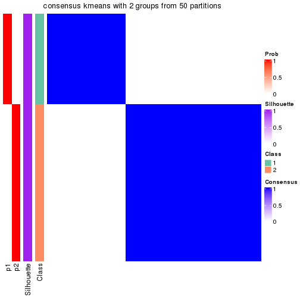</p>

</div>
<div id='tab-node-051-consensus-heatmap-2'>
<pre><code class="r">consensus_heatmap(res, k = 3)
</code></pre>

<p>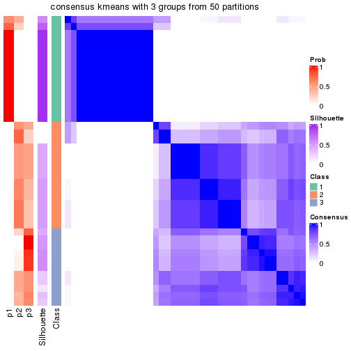</p>

</div>
<div id='tab-node-051-consensus-heatmap-3'>
<pre><code class="r">consensus_heatmap(res, k = 4)
</code></pre>

<p>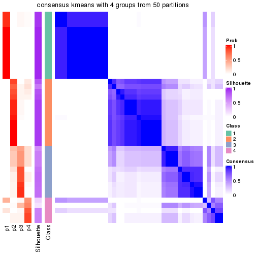</p>

</div>
<div id='tab-node-051-consensus-heatmap-4'>
<pre><code class="r">consensus_heatmap(res, k = 5)
</code></pre>

<p>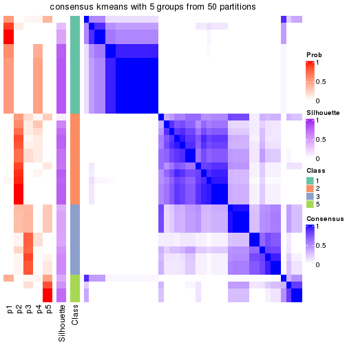</p>

</div>
<div id='tab-node-051-consensus-heatmap-5'>
<pre><code class="r">consensus_heatmap(res, k = 6)
</code></pre>

<p>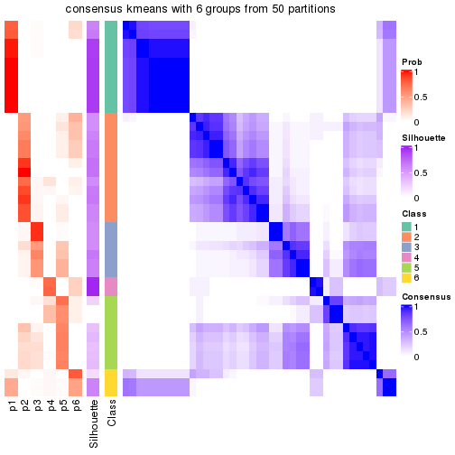</p>

</div>
<div id='tab-node-051-consensus-heatmap-6'>
<pre><code class="r">consensus_heatmap(res, k = 7)
</code></pre>

<p>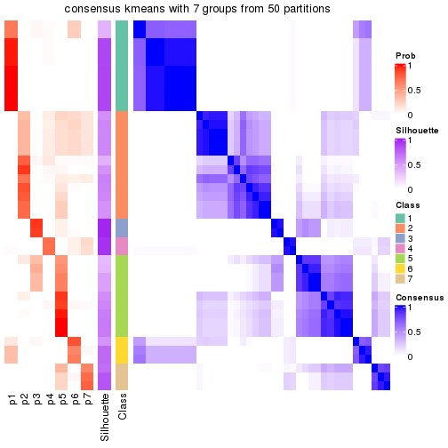</p>

</div>
<div id='tab-node-051-consensus-heatmap-7'>
<pre><code class="r">consensus_heatmap(res, k = 8)
</code></pre>

<p>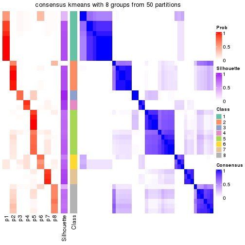</p>

</div>
</div>

Heatmaps for the membership of samples in all partitions to see how consistent they are:


<script>
$( function() {
	$( '#tabs-node-051-membership-heatmap' ).tabs();
} );
</script>
<div id='tabs-node-051-membership-heatmap'>
<ul>
<li><a href='#tab-node-051-membership-heatmap-1'>k = 2</a></li>
<li><a href='#tab-node-051-membership-heatmap-2'>k = 3</a></li>
<li><a href='#tab-node-051-membership-heatmap-3'>k = 4</a></li>
<li><a href='#tab-node-051-membership-heatmap-4'>k = 5</a></li>
<li><a href='#tab-node-051-membership-heatmap-5'>k = 6</a></li>
<li><a href='#tab-node-051-membership-heatmap-6'>k = 7</a></li>
<li><a href='#tab-node-051-membership-heatmap-7'>k = 8</a></li>
</ul>
<div id='tab-node-051-membership-heatmap-1'>
<pre><code class="r">membership_heatmap(res, k = 2)
</code></pre>

<p>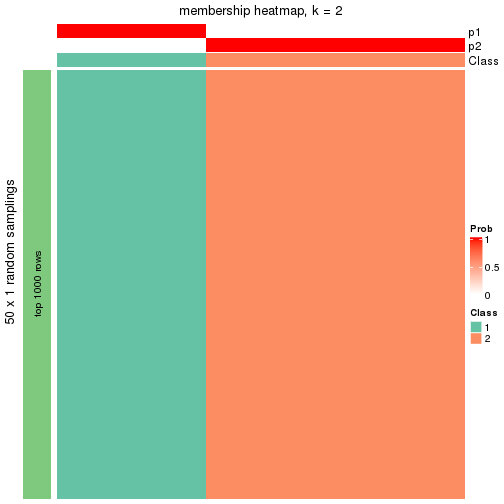</p>

</div>
<div id='tab-node-051-membership-heatmap-2'>
<pre><code class="r">membership_heatmap(res, k = 3)
</code></pre>

<p>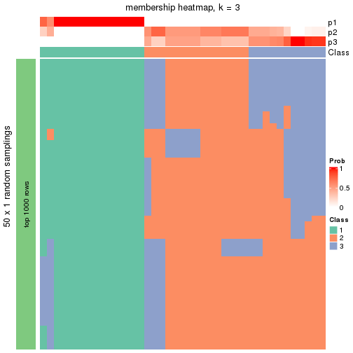</p>

</div>
<div id='tab-node-051-membership-heatmap-3'>
<pre><code class="r">membership_heatmap(res, k = 4)
</code></pre>

<p>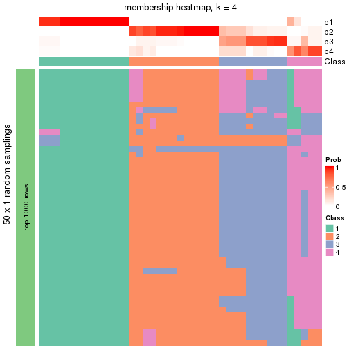</p>

</div>
<div id='tab-node-051-membership-heatmap-4'>
<pre><code class="r">membership_heatmap(res, k = 5)
</code></pre>

<p>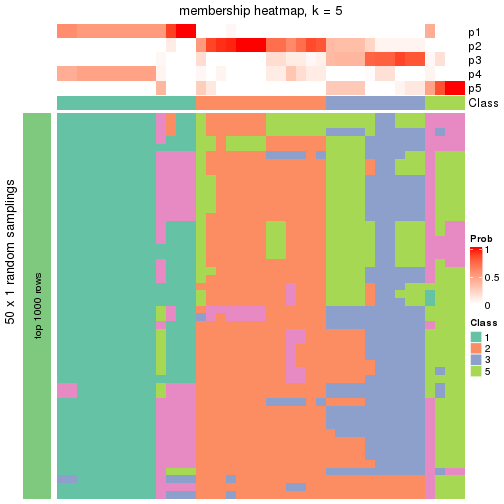</p>

</div>
<div id='tab-node-051-membership-heatmap-5'>
<pre><code class="r">membership_heatmap(res, k = 6)
</code></pre>

<p>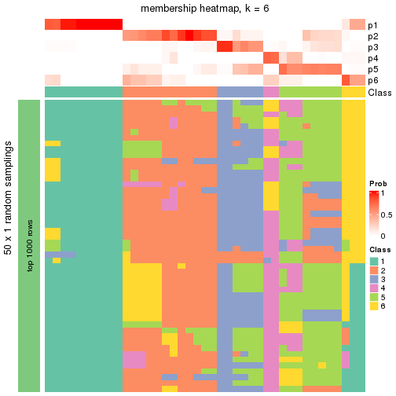</p>

</div>
<div id='tab-node-051-membership-heatmap-6'>
<pre><code class="r">membership_heatmap(res, k = 7)
</code></pre>

<p>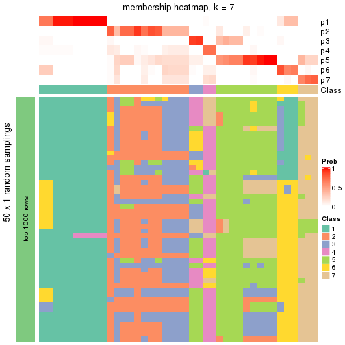</p>

</div>
<div id='tab-node-051-membership-heatmap-7'>
<pre><code class="r">membership_heatmap(res, k = 8)
</code></pre>

<p>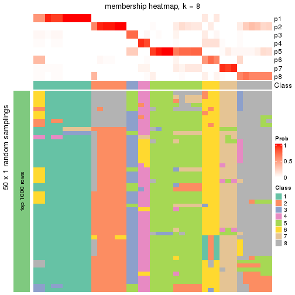</p>

</div>
</div>

As soon as the classes for columns are determined, the signatures
that are significantly different between subgroups can be looked for. 
Following are the heatmaps for signatures.


<script>
$( function() {
	$( '#tabs-node-051-get-signatures' ).tabs();
} );
</script>
<div id='tabs-node-051-get-signatures'>
<ul>
<li><a href='#tab-node-051-get-signatures-1'>k = 2</a></li>
<li><a href='#tab-node-051-get-signatures-2'>k = 3</a></li>
<li><a href='#tab-node-051-get-signatures-3'>k = 4</a></li>
<li><a href='#tab-node-051-get-signatures-4'>k = 5</a></li>
<li><a href='#tab-node-051-get-signatures-5'>k = 6</a></li>
<li><a href='#tab-node-051-get-signatures-6'>k = 7</a></li>
<li><a href='#tab-node-051-get-signatures-7'>k = 8</a></li>
</ul>
<div id='tab-node-051-get-signatures-1'>
<pre><code class="r">get_signatures(res, k = 2)
</code></pre>

<p>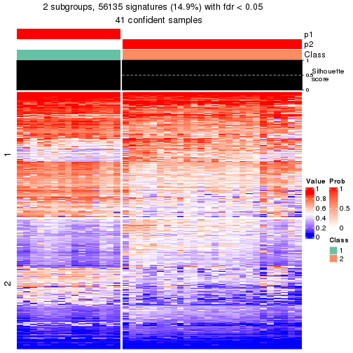</p>

</div>
<div id='tab-node-051-get-signatures-2'>
<pre><code class="r">get_signatures(res, k = 3)
</code></pre>

<p>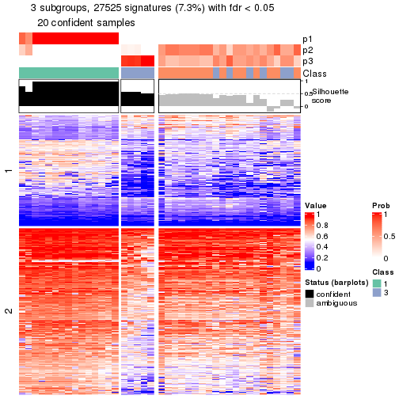</p>

</div>
<div id='tab-node-051-get-signatures-3'>
<pre><code class="r">get_signatures(res, k = 4)
</code></pre>

<p>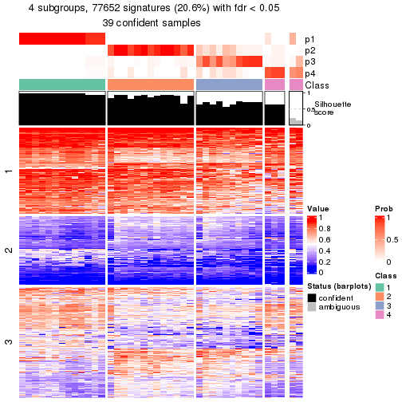</p>

</div>
<div id='tab-node-051-get-signatures-4'>
<pre><code class="r">get_signatures(res, k = 5)
</code></pre>

<p>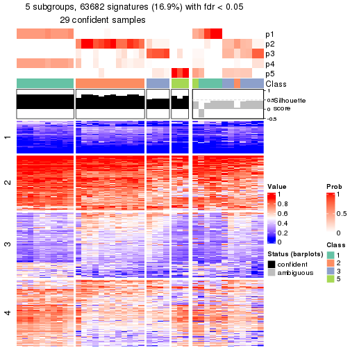</p>

</div>
<div id='tab-node-051-get-signatures-5'>
<pre><code class="r">get_signatures(res, k = 6)
</code></pre>

<p>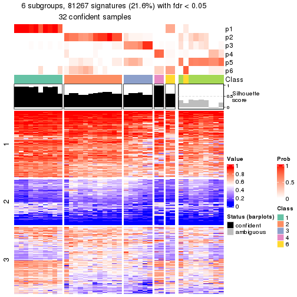</p>

</div>
<div id='tab-node-051-get-signatures-6'>
<pre><code class="r">get_signatures(res, k = 7)
</code></pre>

<p>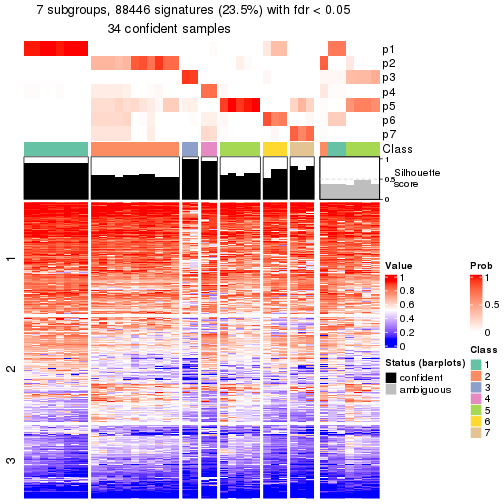</p>

</div>
<div id='tab-node-051-get-signatures-7'>
<pre><code class="r">get_signatures(res, k = 8)
</code></pre>

<p>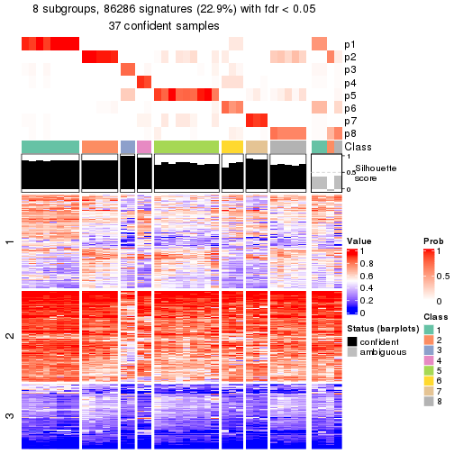</p>

</div>
</div>


Compare the overlap of signatures from different k:

```r
compare_signatures(res)
```

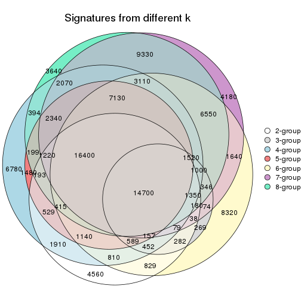

`get_signature()` returns a data frame invisibly. To get the list of signatures, the function
call should be assigned to a variable explicitly. In following code, if `plot` argument is set
to `FALSE`, no heatmap is plotted while only the differential analysis is performed.

```r
# code only for demonstration
tb = get_signature(res, k = ..., plot = FALSE)
```

An example of the output of `tb` is:

```
#>   which_row         fdr    mean_1    mean_2 scaled_mean_1 scaled_mean_2 km
#> 1        38 0.042760348  8.373488  9.131774    -0.5533452     0.5164555  1
#> 2        40 0.018707592  7.106213  8.469186    -0.6173731     0.5762149  1
#> 3        55 0.019134737 10.221463 11.207825    -0.6159697     0.5749050  1
#> 4        59 0.006059896  5.921854  7.869574    -0.6899429     0.6439467  1
#> 5        60 0.018055526  8.928898 10.211722    -0.6204761     0.5791110  1
#> 6        98 0.009384629 15.714769 14.887706     0.6635654    -0.6193277  2
...
```

The columns in `tb` are:

1. `which_row`: row indices corresponding to the input matrix.
2. `fdr`: FDR for the differential test. 
3. `mean_x`: The mean value in group x.
4. `scaled_mean_x`: The mean value in group x after rows are scaled.
5. `km`: Row groups if k-means clustering is applied to rows (which is done by automatically selecting number of clusters).

If there are too many signatures, `top_signatures = ...` can be set to only show the 
signatures with the highest FDRs:

```r
# code only for demonstration
# e.g. to show the top 500 most significant rows
tb = get_signature(res, k = ..., top_signatures = 500)
```

If the signatures are defined as these which are uniquely high in current group, `diff_method` argument
can be set to `"uniquely_high_in_one_group"`:

```r
# code only for demonstration
tb = get_signature(res, k = ..., diff_method = "uniquely_high_in_one_group")
```


UMAP plot which shows how samples are separated.


<script>
$( function() {
	$( '#tabs-node-051-dimension-reduction' ).tabs();
} );
</script>
<div id='tabs-node-051-dimension-reduction'>
<ul>
<li><a href='#tab-node-051-dimension-reduction-1'>k = 2</a></li>
<li><a href='#tab-node-051-dimension-reduction-2'>k = 3</a></li>
<li><a href='#tab-node-051-dimension-reduction-3'>k = 4</a></li>
<li><a href='#tab-node-051-dimension-reduction-4'>k = 5</a></li>
<li><a href='#tab-node-051-dimension-reduction-5'>k = 6</a></li>
<li><a href='#tab-node-051-dimension-reduction-6'>k = 7</a></li>
<li><a href='#tab-node-051-dimension-reduction-7'>k = 8</a></li>
</ul>
<div id='tab-node-051-dimension-reduction-1'>
<pre><code class="r">dimension_reduction(res, k = 2, method = &quot;UMAP&quot;)
</code></pre>

<p>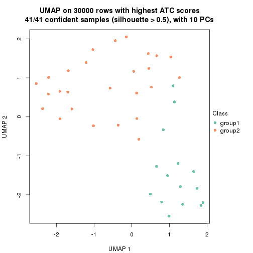</p>

</div>
<div id='tab-node-051-dimension-reduction-2'>
<pre><code class="r">dimension_reduction(res, k = 3, method = &quot;UMAP&quot;)
</code></pre>

<p>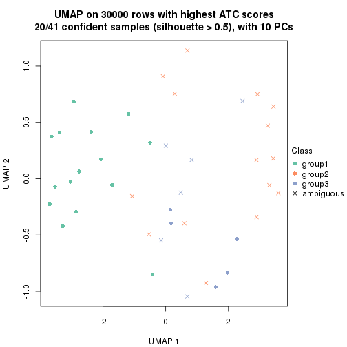</p>

</div>
<div id='tab-node-051-dimension-reduction-3'>
<pre><code class="r">dimension_reduction(res, k = 4, method = &quot;UMAP&quot;)
</code></pre>

<p>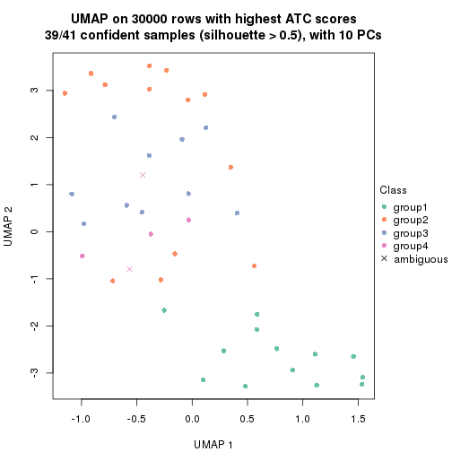</p>

</div>
<div id='tab-node-051-dimension-reduction-4'>
<pre><code class="r">dimension_reduction(res, k = 5, method = &quot;UMAP&quot;)
</code></pre>

<p>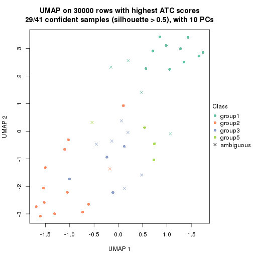</p>

</div>
<div id='tab-node-051-dimension-reduction-5'>
<pre><code class="r">dimension_reduction(res, k = 6, method = &quot;UMAP&quot;)
</code></pre>

<p>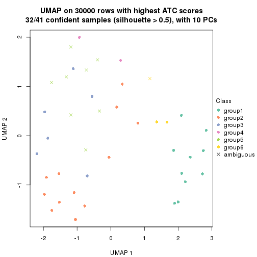</p>

</div>
<div id='tab-node-051-dimension-reduction-6'>
<pre><code class="r">dimension_reduction(res, k = 7, method = &quot;UMAP&quot;)
</code></pre>

<p>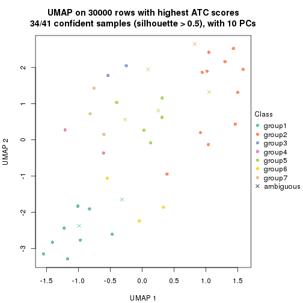</p>

</div>
<div id='tab-node-051-dimension-reduction-7'>
<pre><code class="r">dimension_reduction(res, k = 8, method = &quot;UMAP&quot;)
</code></pre>

<p>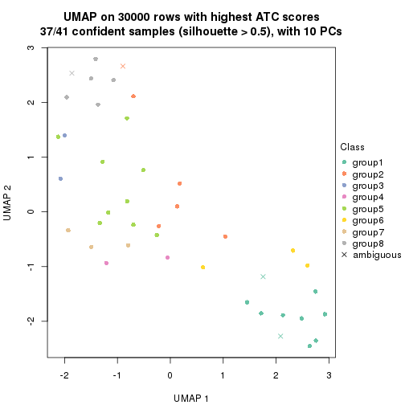</p>

</div>
</div>


Following heatmap shows how subgroups are split when increasing `k`:

```r
collect_classes(res)
```

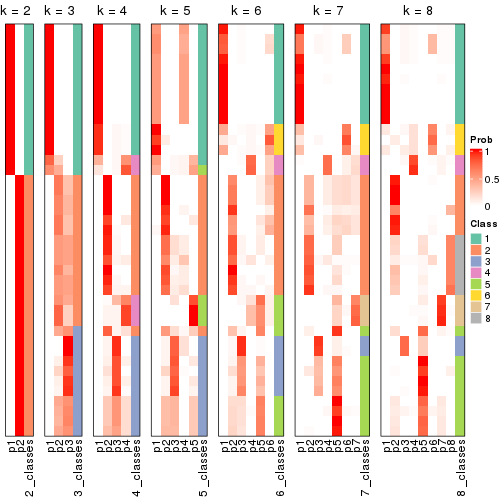


If matrix rows can be associated to genes, consider to use `functional_enrichment(res,
...)` to perform function enrichment for the signature genes. See [this vignette](https://jokergoo.github.io/cola_vignettes/functional_enrichment.html) for more detailed explanations.


 

---------------------------------------------------


### Node0511


Parent node: [Node051](#Node051).
Child nodes: 
                Node01211-leaf
        ,
                Node01212-leaf
        ,
                Node01213-leaf
        ,
                Node01221-leaf
        ,
                Node01222-leaf
        ,
                Node01223-leaf
        ,
                Node02111-leaf
        ,
                Node02112-leaf
        ,
                Node02113-leaf
        ,
                Node02114-leaf
        ,
                Node02121-leaf
        ,
                Node02122-leaf
        ,
                Node02123-leaf
        ,
                Node02124-leaf
        ,
                Node02131-leaf
        ,
                [Node02132](#Node02132)
        ,
                Node02133-leaf
        ,
                Node02211-leaf
        ,
                Node02212-leaf
        ,
                Node02213-leaf
        ,
                Node02221-leaf
        ,
                Node02222-leaf
        ,
                Node02223-leaf
        ,
                Node02231-leaf
        ,
                Node02232-leaf
        ,
                Node02233-leaf
        ,
                Node02241-leaf
        ,
                Node02242-leaf
        ,
                Node02243-leaf
        ,
                Node02321-leaf
        ,
                Node02322-leaf
        ,
                Node02323-leaf
        ,
                Node05111-leaf
        ,
                Node05112-leaf
        ,
                Node05113-leaf
        ,
                Node05114-leaf
        ,
                [Node05121](#Node05121)
        ,
                Node05122-leaf
        ,
                Node05123-leaf
        ,
                Node05221-leaf
        ,
                Node05222-leaf
        .


The object with results only for a single top-value method and a single partitioning method 
can be extracted as:

```r
res = res_rh["0511"]
```

A summary of `res` and all the functions that can be applied to it:

```r
res
```

```
#> A 'ConsensusPartition' object with k = 2, 3, 4, 5, 6, 7, 8.
#>   On a matrix with 30000 rows and 15 columns.
#>   Top rows (1000) are extracted by 'ATC' method.
#>   Subgroups are detected by 'kmeans' method.
#>   Performed in total 350 partitions by row resampling.
#>   Best k for subgroups seems to be 8.
#> 
#> Following methods can be applied to this 'ConsensusPartition' object:
#>  [1] "cola_report"             "collect_classes"         "collect_plots"          
#>  [4] "collect_stats"           "colnames"                "compare_partitions"     
#>  [7] "compare_signatures"      "consensus_heatmap"       "dimension_reduction"    
#> [10] "functional_enrichment"   "get_anno_col"            "get_anno"               
#> [13] "get_classes"             "get_consensus"           "get_matrix"             
#> [16] "get_membership"          "get_param"               "get_signatures"         
#> [19] "get_stats"               "is_best_k"               "is_stable_k"            
#> [22] "membership_heatmap"      "ncol"                    "nrow"                   
#> [25] "plot_ecdf"               "predict_classes"         "rownames"               
#> [28] "select_partition_number" "show"                    "suggest_best_k"         
#> [31] "test_to_known_factors"   "top_rows_heatmap"
```

`collect_plots()` function collects all the plots made from `res` for all `k` (number of subgroups)
into one single page to provide an easy and fast comparison between different `k`.

```r
collect_plots(res)
```

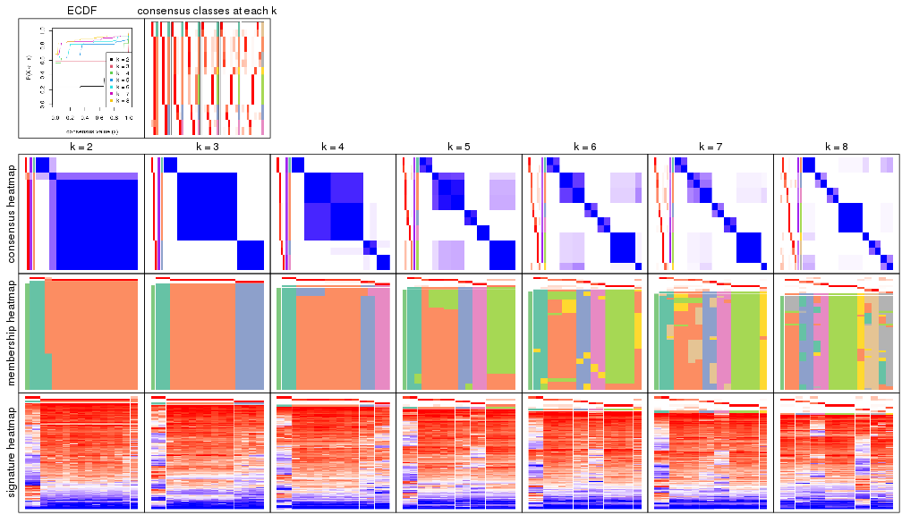

The plots are:

- The first row: a plot of the eCDF (empirical cumulative distribution
  function) curves of the consensus matrix for each `k` and the heatmap of
  predicted classes for each `k`.
- The second row: heatmaps of the consensus matrix for each `k`.
- The third row: heatmaps of the membership matrix for each `k`.
- The fouth row: heatmaps of the signatures for each `k`.

All the plots in panels can be made by individual functions and they are
plotted later in this section.

`select_partition_number()` produces several plots showing different
statistics for choosing "optimized" `k`. There are following statistics:

- eCDF curves of the consensus matrix for each `k`;
- 1-PAC. [The PAC score](https://en.wikipedia.org/wiki/Consensus_clustering#Over-interpretation_potential_of_consensus_clustering)
  measures the proportion of the ambiguous subgrouping.
- Mean silhouette score.
- Concordance. The mean probability of fiting the consensus subgroup labels in all
  partitions.
- Area increased. Denote $A_k$ as the area under the eCDF curve for current
  `k`, the area increased is defined as $A_k - A_{k-1}$.
- Rand index. The percent of pairs of samples that are both in a same cluster
  or both are not in a same cluster in the partition of k and k-1.
- Jaccard index. The ratio of pairs of samples are both in a same cluster in
  the partition of k and k-1 and the pairs of samples are both in a same
  cluster in the partition k or k-1.

The detailed explanations of these statistics can be found in [the _cola_
vignette](https://jokergoo.github.io/cola_vignettes/cola.html#toc_13).

Generally speaking, higher 1-PAC score, higher mean silhouette score or higher
concordance corresponds to better partition. Rand index and Jaccard index
measure how similar the current partition is compared to partition with `k-1`.
If they are too similar, we won't accept `k` is better than `k-1`.

```r
select_partition_number(res)
```

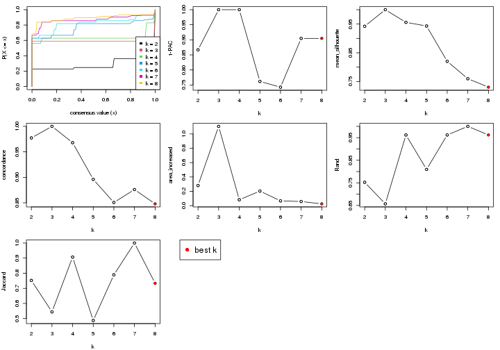

The numeric values for all these statistics can be obtained by `get_stats()`.

```r
get_stats(res)
```

```
#>   k 1-PAC mean_silhouette concordance area_increased  Rand Jaccard
#> 2 2 0.867           0.942       0.977         0.2807 0.752   0.752
#> 3 3 1.000           1.000       1.000         1.1051 0.657   0.544
#> 4 4 1.000           0.956       0.968         0.0823 0.962   0.907
#> 5 5 0.762           0.943       0.896         0.2031 0.810   0.487
#> 6 6 0.743           0.820       0.851         0.0664 0.962   0.789
#> 7 7 0.905           0.760       0.876         0.0578 1.000   1.000
#> 8 8 0.905           0.730       0.848         0.0252 0.962   0.733
```

`suggest_best_k()` suggests the best $k$ based on these statistics. The rules are as follows:

- All $k$ with Jaccard index larger than 0.95 are removed because increasing
  $k$ does not provide enough extra information. If all $k$ are removed, it is
  marked as no subgroup is detected.
- For all $k$ with 1-PAC score larger than 0.9, the maximal $k$ is taken as
  the best $k$, and other $k$ are marked as optional $k$.
- If it does not fit the second rule. The $k$ with the maximal vote of the
  highest 1-PAC score, highest mean silhouette, and highest concordance is
  taken as the best $k$.

```r
suggest_best_k(res)
```

```
#> [1] 8
#> attr(,"optional")
#> [1] 3
```

There is also optional best $k$ = 3 that is worth to check.

Following is the table of the partitions (You need to click the **show/hide
code output** link to see it). The membership matrix (columns with name `p*`)
is inferred by
[`clue::cl_consensus()`](https://www.rdocumentation.org/link/cl_consensus?package=clue)
function with the `SE` method. Basically the value in the membership matrix
represents the probability to belong to a certain group. The finall subgroup
label for an item is determined with the group with highest probability it
belongs to.

In `get_classes()` function, the entropy is calculated from the membership
matrix and the silhouette score is calculated from the consensus matrix.


<script>
$( function() {
	$( '#tabs-node-0511-get-classes' ).tabs();
} );
</script>
<div id='tabs-node-0511-get-classes'>
<ul>
<li><a href='#tab-node-0511-get-classes-1'>k = 2</a></li>
<li><a href='#tab-node-0511-get-classes-2'>k = 3</a></li>
<li><a href='#tab-node-0511-get-classes-3'>k = 4</a></li>
<li><a href='#tab-node-0511-get-classes-4'>k = 5</a></li>
<li><a href='#tab-node-0511-get-classes-5'>k = 6</a></li>
<li><a href='#tab-node-0511-get-classes-6'>k = 7</a></li>
<li><a href='#tab-node-0511-get-classes-7'>k = 8</a></li>
</ul>

<div id='tab-node-0511-get-classes-1'>
<p><a id='tab-node-0511-get-classes-1-a' style='color:#0366d6' href='#'>show/hide code output</a></p>
<pre><code class="r">cbind(get_classes(res, k = 2), get_membership(res, k = 2))
</code></pre>

<pre><code>#&gt;                 class entropy silhouette   p1   p2
#&gt; TCGA.CV.6433.01     2   0.000      0.971 0.00 1.00
#&gt; TCGA.BA.5559.01     2   0.000      0.971 0.00 1.00
#&gt; TCGA.CV.5443.01     2   0.000      0.971 0.00 1.00
#&gt; TCGA.CR.5250.01     2   0.000      0.971 0.00 1.00
#&gt; TCGA.CR.5243.01     2   0.925      0.485 0.34 0.66
#&gt; TCGA.CV.5442.01     1   0.000      1.000 1.00 0.00
#&gt; TCGA.BA.5153.01     2   0.000      0.971 0.00 1.00
#&gt; TCGA.BB.4223.01     2   0.000      0.971 0.00 1.00
#&gt; TCGA.BB.4228.01     2   0.000      0.971 0.00 1.00
#&gt; TCGA.BB.4225.01     2   0.000      0.971 0.00 1.00
#&gt; TCGA.CN.A6UY.01     2   0.000      0.971 0.00 1.00
#&gt; TCGA.CN.A6V6.01     2   0.000      0.971 0.00 1.00
#&gt; TCGA.RS.A6TP.01     1   0.000      1.000 1.00 0.00
#&gt; TCGA.KU.A6H7.06     2   0.000      0.971 0.00 1.00
#&gt; TCGA.UP.A6WW.01     2   0.000      0.971 0.00 1.00
</code></pre>

<script>
$('#tab-node-0511-get-classes-1-a').parent().next().next().hide();
$('#tab-node-0511-get-classes-1-a').click(function(){
  $('#tab-node-0511-get-classes-1-a').parent().next().next().toggle();
  return(false);
});
</script>
</div>

<div id='tab-node-0511-get-classes-2'>
<p><a id='tab-node-0511-get-classes-2-a' style='color:#0366d6' href='#'>show/hide code output</a></p>
<pre><code class="r">cbind(get_classes(res, k = 3), get_membership(res, k = 3))
</code></pre>

<pre><code>#&gt;                 class entropy silhouette p1 p2 p3
#&gt; TCGA.CV.6433.01     2       0          1  0  1  0
#&gt; TCGA.BA.5559.01     2       0          1  0  1  0
#&gt; TCGA.CV.5443.01     3       0          1  0  0  1
#&gt; TCGA.CR.5250.01     2       0          1  0  1  0
#&gt; TCGA.CR.5243.01     3       0          1  0  0  1
#&gt; TCGA.CV.5442.01     1       0          1  1  0  0
#&gt; TCGA.BA.5153.01     2       0          1  0  1  0
#&gt; TCGA.BB.4223.01     2       0          1  0  1  0
#&gt; TCGA.BB.4228.01     2       0          1  0  1  0
#&gt; TCGA.BB.4225.01     2       0          1  0  1  0
#&gt; TCGA.CN.A6UY.01     2       0          1  0  1  0
#&gt; TCGA.CN.A6V6.01     3       0          1  0  0  1
#&gt; TCGA.RS.A6TP.01     1       0          1  1  0  0
#&gt; TCGA.KU.A6H7.06     3       0          1  0  0  1
#&gt; TCGA.UP.A6WW.01     2       0          1  0  1  0
</code></pre>

<script>
$('#tab-node-0511-get-classes-2-a').parent().next().next().hide();
$('#tab-node-0511-get-classes-2-a').click(function(){
  $('#tab-node-0511-get-classes-2-a').parent().next().next().toggle();
  return(false);
});
</script>
</div>

<div id='tab-node-0511-get-classes-3'>
<p><a id='tab-node-0511-get-classes-3-a' style='color:#0366d6' href='#'>show/hide code output</a></p>
<pre><code class="r">cbind(get_classes(res, k = 4), get_membership(res, k = 4))
</code></pre>

<pre><code>#&gt;                 class entropy silhouette p1   p2   p3   p4
#&gt; TCGA.CV.6433.01     2   0.201      0.959  0 0.92 0.08 0.00
#&gt; TCGA.BA.5559.01     2   0.201      0.959  0 0.92 0.08 0.00
#&gt; TCGA.CV.5443.01     3   0.000      0.876  0 0.00 1.00 0.00
#&gt; TCGA.CR.5250.01     2   0.000      0.949  0 1.00 0.00 0.00
#&gt; TCGA.CR.5243.01     4   0.000      1.000  0 0.00 0.00 1.00
#&gt; TCGA.CV.5442.01     1   0.000      1.000  1 0.00 0.00 0.00
#&gt; TCGA.BA.5153.01     2   0.000      0.949  0 1.00 0.00 0.00
#&gt; TCGA.BB.4223.01     2   0.000      0.949  0 1.00 0.00 0.00
#&gt; TCGA.BB.4228.01     2   0.201      0.959  0 0.92 0.08 0.00
#&gt; TCGA.BB.4225.01     2   0.201      0.959  0 0.92 0.08 0.00
#&gt; TCGA.CN.A6UY.01     2   0.201      0.959  0 0.92 0.08 0.00
#&gt; TCGA.CN.A6V6.01     3   0.201      0.870  0 0.00 0.92 0.08
#&gt; TCGA.RS.A6TP.01     1   0.000      1.000  1 0.00 0.00 0.00
#&gt; TCGA.KU.A6H7.06     4   0.000      1.000  0 0.00 0.00 1.00
#&gt; TCGA.UP.A6WW.01     2   0.000      0.949  0 1.00 0.00 0.00
</code></pre>

<script>
$('#tab-node-0511-get-classes-3-a').parent().next().next().hide();
$('#tab-node-0511-get-classes-3-a').click(function(){
  $('#tab-node-0511-get-classes-3-a').parent().next().next().toggle();
  return(false);
});
</script>
</div>

<div id='tab-node-0511-get-classes-4'>
<p><a id='tab-node-0511-get-classes-4-a' style='color:#0366d6' href='#'>show/hide code output</a></p>
<pre><code class="r">cbind(get_classes(res, k = 5), get_membership(res, k = 5))
</code></pre>

<pre><code>#&gt;                 class entropy silhouette  p1   p2   p3 p4   p5
#&gt; TCGA.CV.6433.01     2  0.0609      0.909 0.0 0.98 0.00  0 0.02
#&gt; TCGA.BA.5559.01     2  0.0609      0.909 0.0 0.98 0.00  0 0.02
#&gt; TCGA.CV.5443.01     3  0.1410      0.956 0.0 0.00 0.94  0 0.06
#&gt; TCGA.CR.5250.01     5  0.3983      1.000 0.0 0.34 0.00  0 0.66
#&gt; TCGA.CR.5243.01     4  0.0000      1.000 0.0 0.00 0.00  1 0.00
#&gt; TCGA.CV.5442.01     1  0.0000      0.926 1.0 0.00 0.00  0 0.00
#&gt; TCGA.BA.5153.01     5  0.3983      1.000 0.0 0.34 0.00  0 0.66
#&gt; TCGA.BB.4223.01     5  0.3983      1.000 0.0 0.34 0.00  0 0.66
#&gt; TCGA.BB.4228.01     2  0.0000      0.916 0.0 1.00 0.00  0 0.00
#&gt; TCGA.BB.4225.01     2  0.2929      0.733 0.0 0.82 0.00  0 0.18
#&gt; TCGA.CN.A6UY.01     2  0.0000      0.916 0.0 1.00 0.00  0 0.00
#&gt; TCGA.CN.A6V6.01     3  0.0000      0.956 0.0 0.00 1.00  0 0.00
#&gt; TCGA.RS.A6TP.01     1  0.2020      0.926 0.9 0.00 0.00  0 0.10
#&gt; TCGA.KU.A6H7.06     4  0.0000      1.000 0.0 0.00 0.00  1 0.00
#&gt; TCGA.UP.A6WW.01     5  0.3983      1.000 0.0 0.34 0.00  0 0.66
</code></pre>

<script>
$('#tab-node-0511-get-classes-4-a').parent().next().next().hide();
$('#tab-node-0511-get-classes-4-a').click(function(){
  $('#tab-node-0511-get-classes-4-a').parent().next().next().toggle();
  return(false);
});
</script>
</div>

<div id='tab-node-0511-get-classes-5'>
<p><a id='tab-node-0511-get-classes-5-a' style='color:#0366d6' href='#'>show/hide code output</a></p>
<pre><code class="r">cbind(get_classes(res, k = 6), get_membership(res, k = 6))
</code></pre>

<pre><code>#&gt;                 class entropy silhouette   p1   p2   p3   p4   p5   p6
#&gt; TCGA.CV.6433.01     2   0.486      0.785 0.00 0.66 0.00 0.00 0.20 0.14
#&gt; TCGA.BA.5559.01     2   0.486      0.785 0.00 0.66 0.00 0.00 0.20 0.14
#&gt; TCGA.CV.5443.01     3   0.379      0.828 0.00 0.10 0.78 0.00 0.00 0.12
#&gt; TCGA.CR.5250.01     5   0.000      1.000 0.00 0.00 0.00 0.00 1.00 0.00
#&gt; TCGA.CR.5243.01     4   0.263      0.859 0.00 0.00 0.00 0.82 0.00 0.18
#&gt; TCGA.CV.5442.01     1   0.000      0.876 1.00 0.00 0.00 0.00 0.00 0.00
#&gt; TCGA.BA.5153.01     5   0.000      1.000 0.00 0.00 0.00 0.00 1.00 0.00
#&gt; TCGA.BB.4223.01     5   0.000      1.000 0.00 0.00 0.00 0.00 1.00 0.00
#&gt; TCGA.BB.4228.01     2   0.263      0.803 0.00 0.82 0.00 0.00 0.18 0.00
#&gt; TCGA.BB.4225.01     6   0.484      0.000 0.00 0.40 0.00 0.00 0.06 0.54
#&gt; TCGA.CN.A6UY.01     2   0.263      0.803 0.00 0.82 0.00 0.00 0.18 0.00
#&gt; TCGA.CN.A6V6.01     3   0.000      0.828 0.00 0.00 1.00 0.00 0.00 0.00
#&gt; TCGA.RS.A6TP.01     1   0.245      0.876 0.84 0.00 0.00 0.00 0.00 0.16
#&gt; TCGA.KU.A6H7.06     4   0.000      0.859 0.00 0.00 0.00 1.00 0.00 0.00
#&gt; TCGA.UP.A6WW.01     5   0.000      1.000 0.00 0.00 0.00 0.00 1.00 0.00
</code></pre>

<script>
$('#tab-node-0511-get-classes-5-a').parent().next().next().hide();
$('#tab-node-0511-get-classes-5-a').click(function(){
  $('#tab-node-0511-get-classes-5-a').parent().next().next().toggle();
  return(false);
});
</script>
</div>

<div id='tab-node-0511-get-classes-6'>
<p><a id='tab-node-0511-get-classes-6-a' style='color:#0366d6' href='#'>show/hide code output</a></p>
<pre><code class="r">cbind(get_classes(res, k = 7), get_membership(res, k = 7))
</code></pre>

<pre><code>#&gt;                 class entropy silhouette  p1   p2   p3   p4   p5   p6   p7
#&gt; TCGA.CV.6433.01     2   0.449      0.681 0.0 0.60 0.00 0.00 0.08 0.32 0.00
#&gt; TCGA.BA.5559.01     2   0.449      0.681 0.0 0.60 0.00 0.00 0.08 0.32 0.00
#&gt; TCGA.CV.5443.01     3   0.336      0.676 0.0 0.00 0.64 0.00 0.00 0.00 0.36
#&gt; TCGA.CR.5250.01     5   0.000      1.000 0.0 0.00 0.00 0.00 1.00 0.00 0.00
#&gt; TCGA.CR.5243.01     4   0.000      0.899 0.0 0.00 0.00 1.00 0.00 0.00 0.00
#&gt; TCGA.CV.5442.01     1   0.000      0.828 1.0 0.00 0.00 0.00 0.00 0.00 0.00
#&gt; TCGA.BA.5153.01     5   0.000      1.000 0.0 0.00 0.00 0.00 1.00 0.00 0.00
#&gt; TCGA.BB.4223.01     5   0.000      1.000 0.0 0.00 0.00 0.00 1.00 0.00 0.00
#&gt; TCGA.BB.4228.01     2   0.353      0.581 0.0 0.76 0.00 0.00 0.06 0.00 0.18
#&gt; TCGA.BB.4225.01     6   0.339      0.000 0.0 0.04 0.00 0.00 0.00 0.76 0.20
#&gt; TCGA.CN.A6UY.01     2   0.202      0.647 0.0 0.90 0.00 0.00 0.06 0.00 0.04
#&gt; TCGA.CN.A6V6.01     3   0.000      0.676 0.0 0.00 1.00 0.00 0.00 0.00 0.00
#&gt; TCGA.RS.A6TP.01     1   0.340      0.828 0.8 0.02 0.00 0.00 0.00 0.04 0.14
#&gt; TCGA.KU.A6H7.06     4   0.228      0.899 0.0 0.04 0.00 0.88 0.00 0.00 0.08
#&gt; TCGA.UP.A6WW.01     5   0.000      1.000 0.0 0.00 0.00 0.00 1.00 0.00 0.00
</code></pre>

<script>
$('#tab-node-0511-get-classes-6-a').parent().next().next().hide();
$('#tab-node-0511-get-classes-6-a').click(function(){
  $('#tab-node-0511-get-classes-6-a').parent().next().next().toggle();
  return(false);
});
</script>
</div>

<div id='tab-node-0511-get-classes-7'>
<p><a id='tab-node-0511-get-classes-7-a' style='color:#0366d6' href='#'>show/hide code output</a></p>
<pre><code class="r">cbind(get_classes(res, k = 8), get_membership(res, k = 8))
</code></pre>

<pre><code>#&gt;                 class entropy silhouette   p1   p2   p3   p4   p5   p6  p7   p8
#&gt; TCGA.CV.6433.01     2  0.0808      1.000 0.00 0.96 0.00 0.00 0.04 0.00 0.0 0.00
#&gt; TCGA.BA.5559.01     2  0.0808      1.000 0.00 0.96 0.00 0.00 0.04 0.00 0.0 0.00
#&gt; TCGA.CV.5443.01     3  0.2114      0.554 0.16 0.00 0.84 0.00 0.00 0.00 0.0 0.00
#&gt; TCGA.CR.5250.01     5  0.0000      1.000 0.00 0.00 0.00 0.00 1.00 0.00 0.0 0.00
#&gt; TCGA.CR.5243.01     4  0.0000      0.695 0.00 0.00 0.00 1.00 0.00 0.00 0.0 0.00
#&gt; TCGA.CV.5442.01     7  0.0000      0.734 0.00 0.00 0.00 0.00 0.00 0.00 1.0 0.00
#&gt; TCGA.BA.5153.01     5  0.0000      1.000 0.00 0.00 0.00 0.00 1.00 0.00 0.0 0.00
#&gt; TCGA.BB.4223.01     5  0.0000      1.000 0.00 0.00 0.00 0.00 1.00 0.00 0.0 0.00
#&gt; TCGA.BB.4228.01     8  0.3293      0.517 0.00 0.22 0.00 0.00 0.04 0.00 0.0 0.74
#&gt; TCGA.BB.4225.01     6  0.2114      0.000 0.00 0.16 0.00 0.00 0.00 0.84 0.0 0.00
#&gt; TCGA.CN.A6UY.01     8  0.6239      0.470 0.32 0.30 0.00 0.00 0.04 0.02 0.0 0.32
#&gt; TCGA.CN.A6V6.01     3  0.3970      0.554 0.00 0.00 0.68 0.00 0.00 0.10 0.0 0.22
#&gt; TCGA.RS.A6TP.01     7  0.4543      0.734 0.18 0.04 0.00 0.00 0.00 0.04 0.7 0.04
#&gt; TCGA.KU.A6H7.06     4  0.3083      0.695 0.34 0.00 0.00 0.66 0.00 0.00 0.0 0.00
#&gt; TCGA.UP.A6WW.01     5  0.0000      1.000 0.00 0.00 0.00 0.00 1.00 0.00 0.0 0.00
</code></pre>

<script>
$('#tab-node-0511-get-classes-7-a').parent().next().next().hide();
$('#tab-node-0511-get-classes-7-a').click(function(){
  $('#tab-node-0511-get-classes-7-a').parent().next().next().toggle();
  return(false);
});
</script>
</div>
</div>

Heatmaps for the consensus matrix. It visualizes the probability of two
samples to be in a same group.


<script>
$( function() {
	$( '#tabs-node-0511-consensus-heatmap' ).tabs();
} );
</script>
<div id='tabs-node-0511-consensus-heatmap'>
<ul>
<li><a href='#tab-node-0511-consensus-heatmap-1'>k = 2</a></li>
<li><a href='#tab-node-0511-consensus-heatmap-2'>k = 3</a></li>
<li><a href='#tab-node-0511-consensus-heatmap-3'>k = 4</a></li>
<li><a href='#tab-node-0511-consensus-heatmap-4'>k = 5</a></li>
<li><a href='#tab-node-0511-consensus-heatmap-5'>k = 6</a></li>
<li><a href='#tab-node-0511-consensus-heatmap-6'>k = 7</a></li>
<li><a href='#tab-node-0511-consensus-heatmap-7'>k = 8</a></li>
</ul>
<div id='tab-node-0511-consensus-heatmap-1'>
<pre><code class="r">consensus_heatmap(res, k = 2)
</code></pre>

<p>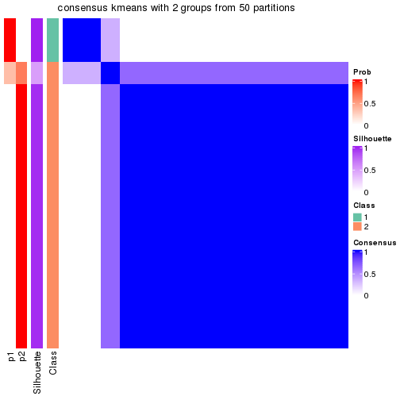</p>

</div>
<div id='tab-node-0511-consensus-heatmap-2'>
<pre><code class="r">consensus_heatmap(res, k = 3)
</code></pre>

<p>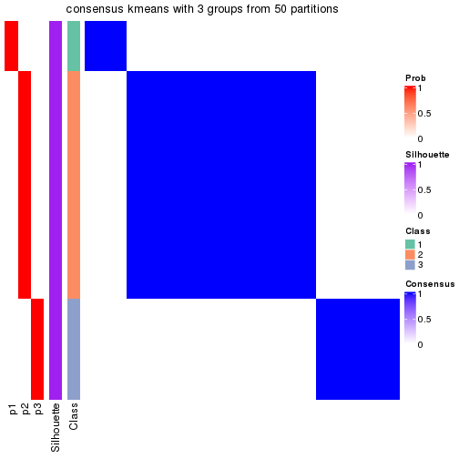</p>

</div>
<div id='tab-node-0511-consensus-heatmap-3'>
<pre><code class="r">consensus_heatmap(res, k = 4)
</code></pre>

<p>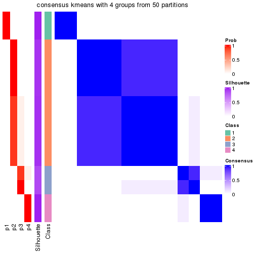</p>

</div>
<div id='tab-node-0511-consensus-heatmap-4'>
<pre><code class="r">consensus_heatmap(res, k = 5)
</code></pre>

<p>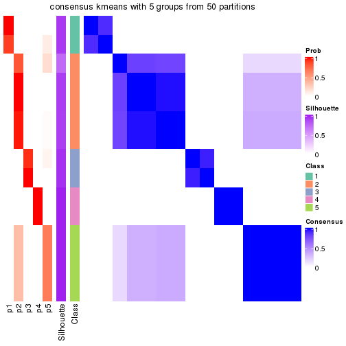</p>

</div>
<div id='tab-node-0511-consensus-heatmap-5'>
<pre><code class="r">consensus_heatmap(res, k = 6)
</code></pre>

<p>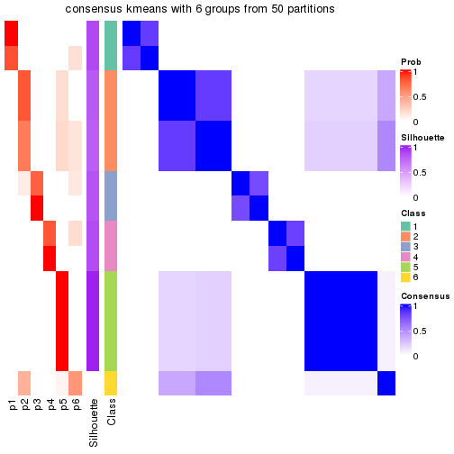</p>

</div>
<div id='tab-node-0511-consensus-heatmap-6'>
<pre><code class="r">consensus_heatmap(res, k = 7)
</code></pre>

<p>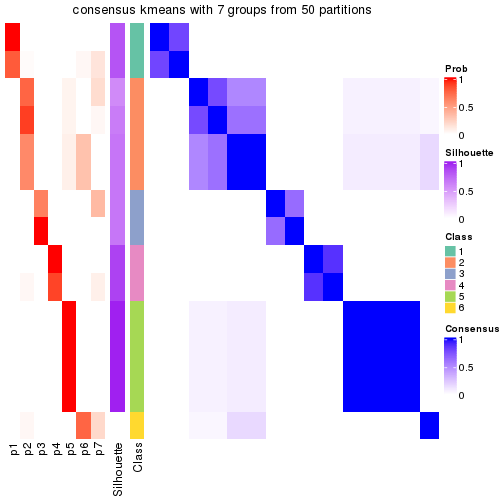</p>

</div>
<div id='tab-node-0511-consensus-heatmap-7'>
<pre><code class="r">consensus_heatmap(res, k = 8)
</code></pre>

<p>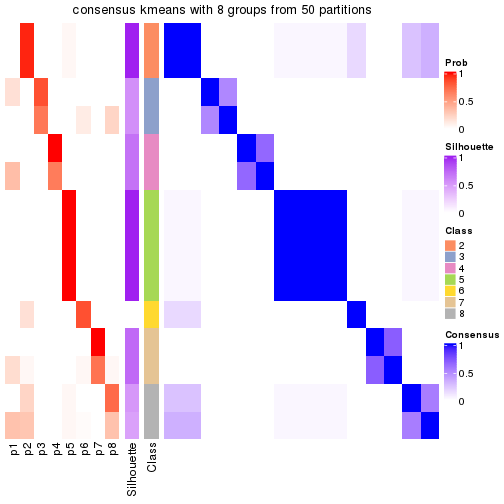</p>

</div>
</div>

Heatmaps for the membership of samples in all partitions to see how consistent they are:


<script>
$( function() {
	$( '#tabs-node-0511-membership-heatmap' ).tabs();
} );
</script>
<div id='tabs-node-0511-membership-heatmap'>
<ul>
<li><a href='#tab-node-0511-membership-heatmap-1'>k = 2</a></li>
<li><a href='#tab-node-0511-membership-heatmap-2'>k = 3</a></li>
<li><a href='#tab-node-0511-membership-heatmap-3'>k = 4</a></li>
<li><a href='#tab-node-0511-membership-heatmap-4'>k = 5</a></li>
<li><a href='#tab-node-0511-membership-heatmap-5'>k = 6</a></li>
<li><a href='#tab-node-0511-membership-heatmap-6'>k = 7</a></li>
<li><a href='#tab-node-0511-membership-heatmap-7'>k = 8</a></li>
</ul>
<div id='tab-node-0511-membership-heatmap-1'>
<pre><code class="r">membership_heatmap(res, k = 2)
</code></pre>

<p>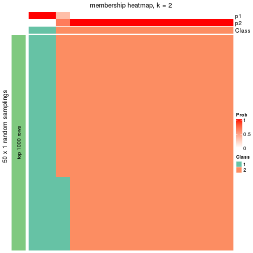</p>

</div>
<div id='tab-node-0511-membership-heatmap-2'>
<pre><code class="r">membership_heatmap(res, k = 3)
</code></pre>

<p>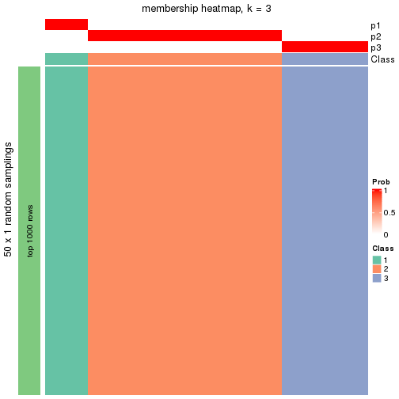</p>

</div>
<div id='tab-node-0511-membership-heatmap-3'>
<pre><code class="r">membership_heatmap(res, k = 4)
</code></pre>

<p>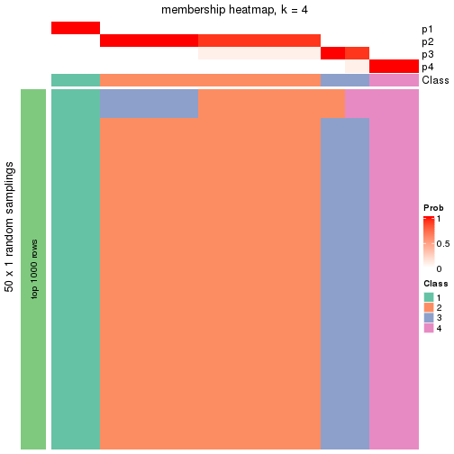</p>

</div>
<div id='tab-node-0511-membership-heatmap-4'>
<pre><code class="r">membership_heatmap(res, k = 5)
</code></pre>

<p>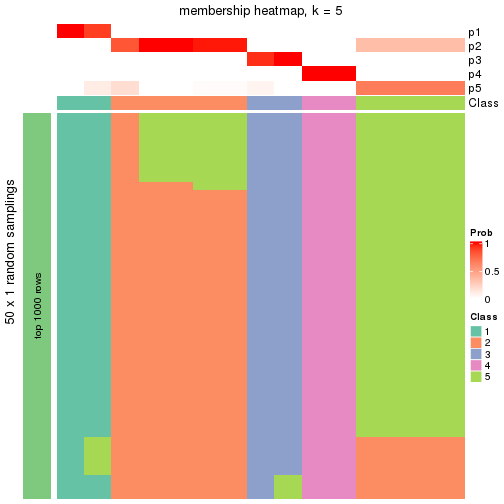</p>

</div>
<div id='tab-node-0511-membership-heatmap-5'>
<pre><code class="r">membership_heatmap(res, k = 6)
</code></pre>

<p>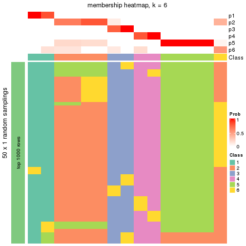</p>

</div>
<div id='tab-node-0511-membership-heatmap-6'>
<pre><code class="r">membership_heatmap(res, k = 7)
</code></pre>

<p>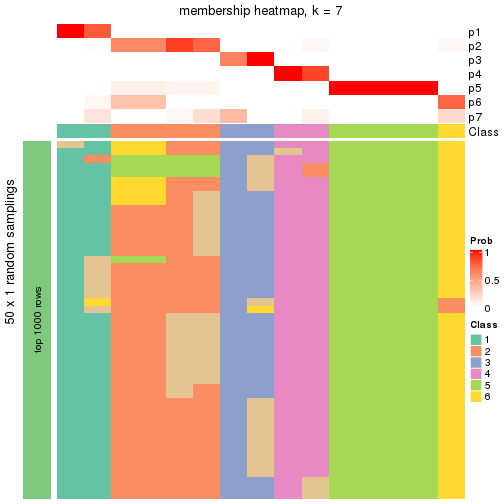</p>

</div>
<div id='tab-node-0511-membership-heatmap-7'>
<pre><code class="r">membership_heatmap(res, k = 8)
</code></pre>

<p>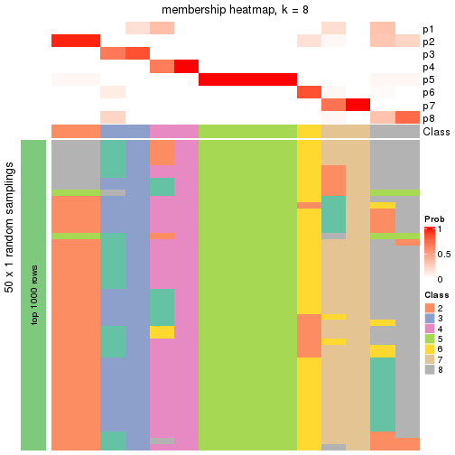</p>

</div>
</div>

As soon as the classes for columns are determined, the signatures
that are significantly different between subgroups can be looked for. 
Following are the heatmaps for signatures.


<script>
$( function() {
	$( '#tabs-node-0511-get-signatures' ).tabs();
} );
</script>
<div id='tabs-node-0511-get-signatures'>
<ul>
<li><a href='#tab-node-0511-get-signatures-1'>k = 2</a></li>
<li><a href='#tab-node-0511-get-signatures-2'>k = 3</a></li>
<li><a href='#tab-node-0511-get-signatures-3'>k = 4</a></li>
<li><a href='#tab-node-0511-get-signatures-4'>k = 5</a></li>
<li><a href='#tab-node-0511-get-signatures-5'>k = 6</a></li>
<li><a href='#tab-node-0511-get-signatures-6'>k = 7</a></li>
<li><a href='#tab-node-0511-get-signatures-7'>k = 8</a></li>
</ul>
<div id='tab-node-0511-get-signatures-1'>
<pre><code class="r">get_signatures(res, k = 2)
</code></pre>

<p>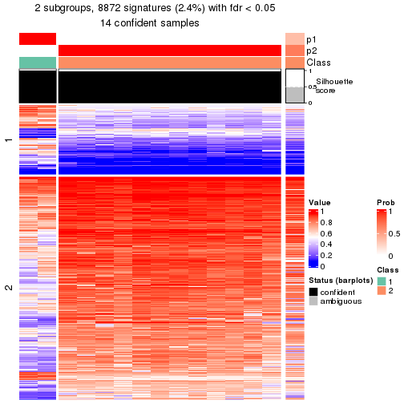</p>

</div>
<div id='tab-node-0511-get-signatures-2'>
<pre><code class="r">get_signatures(res, k = 3)
</code></pre>

<p>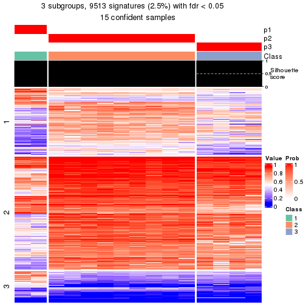</p>

</div>
<div id='tab-node-0511-get-signatures-3'>
<pre><code class="r">get_signatures(res, k = 4)
</code></pre>

<p>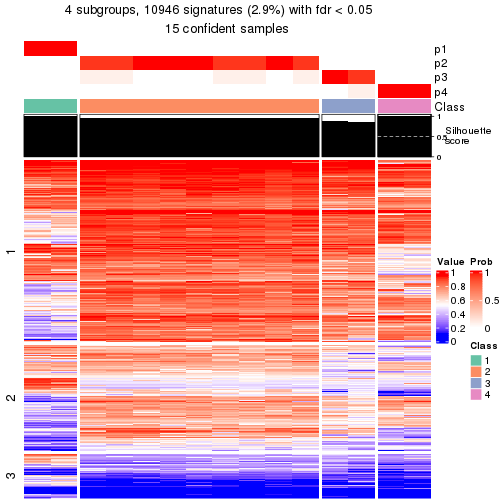</p>

</div>
<div id='tab-node-0511-get-signatures-4'>
<pre><code class="r">get_signatures(res, k = 5)
</code></pre>

<p>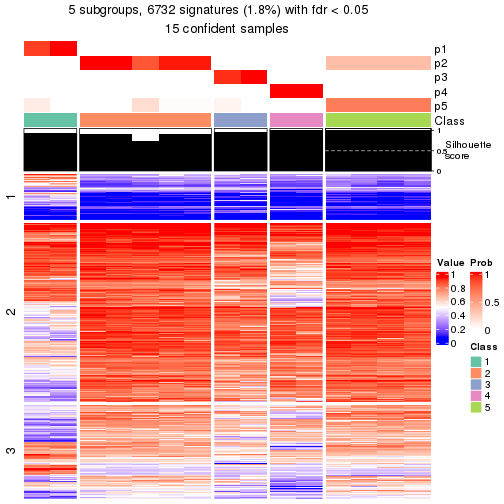</p>

</div>
<div id='tab-node-0511-get-signatures-5'>
<pre><code class="r">get_signatures(res, k = 6)
</code></pre>

<p>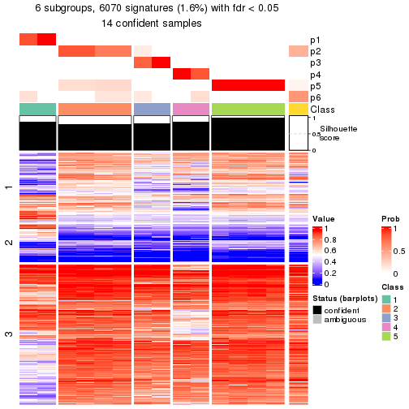</p>

</div>
<div id='tab-node-0511-get-signatures-6'>
<pre><code class="r">get_signatures(res, k = 7)
</code></pre>

<p>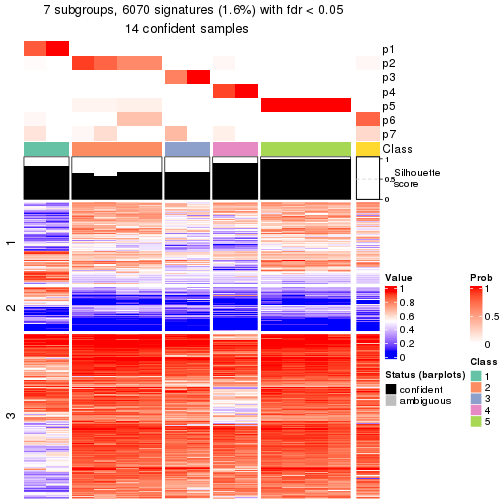</p>

</div>
<div id='tab-node-0511-get-signatures-7'>
<pre><code class="r">get_signatures(res, k = 8)
</code></pre>

<p>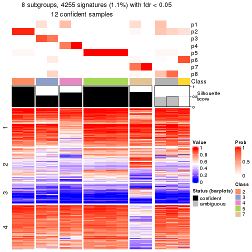</p>

</div>
</div>


Compare the overlap of signatures from different k:

```r
compare_signatures(res)
```

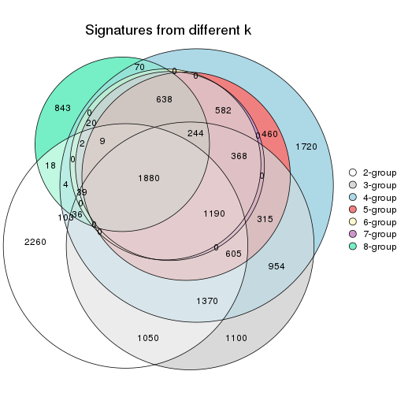

`get_signature()` returns a data frame invisibly. To get the list of signatures, the function
call should be assigned to a variable explicitly. In following code, if `plot` argument is set
to `FALSE`, no heatmap is plotted while only the differential analysis is performed.

```r
# code only for demonstration
tb = get_signature(res, k = ..., plot = FALSE)
```

An example of the output of `tb` is:

```
#>   which_row         fdr    mean_1    mean_2 scaled_mean_1 scaled_mean_2 km
#> 1        38 0.042760348  8.373488  9.131774    -0.5533452     0.5164555  1
#> 2        40 0.018707592  7.106213  8.469186    -0.6173731     0.5762149  1
#> 3        55 0.019134737 10.221463 11.207825    -0.6159697     0.5749050  1
#> 4        59 0.006059896  5.921854  7.869574    -0.6899429     0.6439467  1
#> 5        60 0.018055526  8.928898 10.211722    -0.6204761     0.5791110  1
#> 6        98 0.009384629 15.714769 14.887706     0.6635654    -0.6193277  2
...
```

The columns in `tb` are:

1. `which_row`: row indices corresponding to the input matrix.
2. `fdr`: FDR for the differential test. 
3. `mean_x`: The mean value in group x.
4. `scaled_mean_x`: The mean value in group x after rows are scaled.
5. `km`: Row groups if k-means clustering is applied to rows (which is done by automatically selecting number of clusters).

If there are too many signatures, `top_signatures = ...` can be set to only show the 
signatures with the highest FDRs:

```r
# code only for demonstration
# e.g. to show the top 500 most significant rows
tb = get_signature(res, k = ..., top_signatures = 500)
```

If the signatures are defined as these which are uniquely high in current group, `diff_method` argument
can be set to `"uniquely_high_in_one_group"`:

```r
# code only for demonstration
tb = get_signature(res, k = ..., diff_method = "uniquely_high_in_one_group")
```


UMAP plot which shows how samples are separated.


<script>
$( function() {
	$( '#tabs-node-0511-dimension-reduction' ).tabs();
} );
</script>
<div id='tabs-node-0511-dimension-reduction'>
<ul>
<li><a href='#tab-node-0511-dimension-reduction-1'>k = 2</a></li>
<li><a href='#tab-node-0511-dimension-reduction-2'>k = 3</a></li>
<li><a href='#tab-node-0511-dimension-reduction-3'>k = 4</a></li>
<li><a href='#tab-node-0511-dimension-reduction-4'>k = 5</a></li>
<li><a href='#tab-node-0511-dimension-reduction-5'>k = 6</a></li>
<li><a href='#tab-node-0511-dimension-reduction-6'>k = 7</a></li>
<li><a href='#tab-node-0511-dimension-reduction-7'>k = 8</a></li>
</ul>
<div id='tab-node-0511-dimension-reduction-1'>
<pre><code class="r">dimension_reduction(res, k = 2, method = &quot;UMAP&quot;)
</code></pre>

<p>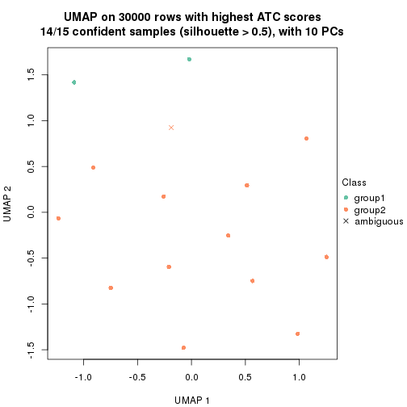</p>

</div>
<div id='tab-node-0511-dimension-reduction-2'>
<pre><code class="r">dimension_reduction(res, k = 3, method = &quot;UMAP&quot;)
</code></pre>

<p>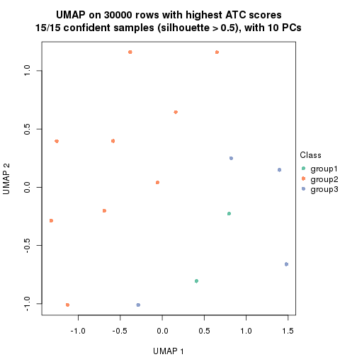</p>

</div>
<div id='tab-node-0511-dimension-reduction-3'>
<pre><code class="r">dimension_reduction(res, k = 4, method = &quot;UMAP&quot;)
</code></pre>

<p>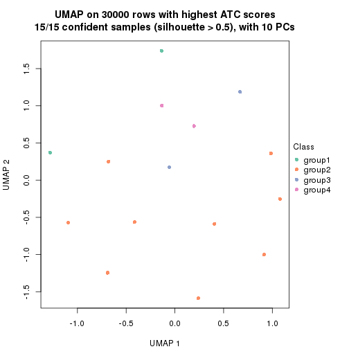</p>

</div>
<div id='tab-node-0511-dimension-reduction-4'>
<pre><code class="r">dimension_reduction(res, k = 5, method = &quot;UMAP&quot;)
</code></pre>

<p></p>

</div>
<div id='tab-node-0511-dimension-reduction-5'>
<pre><code class="r">dimension_reduction(res, k = 6, method = &quot;UMAP&quot;)
</code></pre>

<p>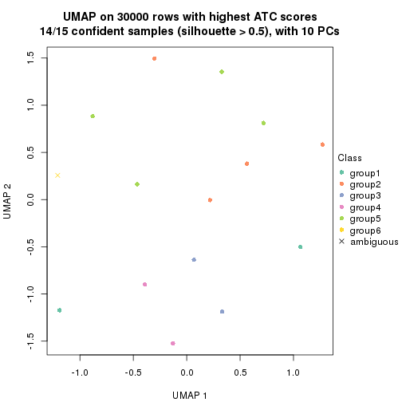</p>

</div>
<div id='tab-node-0511-dimension-reduction-6'>
<pre><code class="r">dimension_reduction(res, k = 7, method = &quot;UMAP&quot;)
</code></pre>

<p></p>

</div>
<div id='tab-node-0511-dimension-reduction-7'>
<pre><code class="r">dimension_reduction(res, k = 8, method = &quot;UMAP&quot;)
</code></pre>

<p>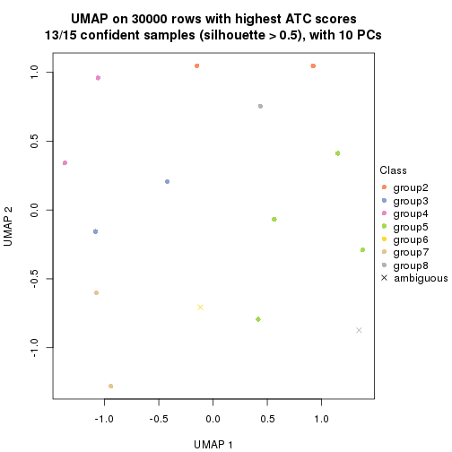</p>

</div>
</div>


Following heatmap shows how subgroups are split when increasing `k`:

```r
collect_classes(res)
```

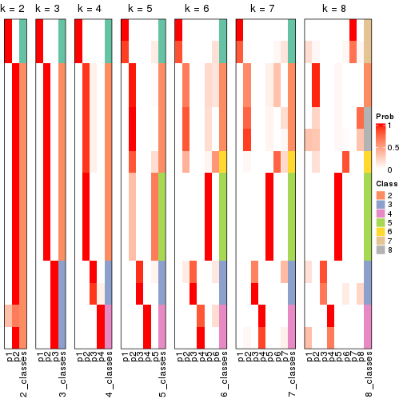


If matrix rows can be associated to genes, consider to use `functional_enrichment(res,
...)` to perform function enrichment for the signature genes. See [this vignette](https://jokergoo.github.io/cola_vignettes/functional_enrichment.html) for more detailed explanations.


 

---------------------------------------------------


### Node0512


Parent node: [Node051](#Node051).
Child nodes: 
                Node01211-leaf
        ,
                Node01212-leaf
        ,
                Node01213-leaf
        ,
                Node01221-leaf
        ,
                Node01222-leaf
        ,
                Node01223-leaf
        ,
                Node02111-leaf
        ,
                Node02112-leaf
        ,
                Node02113-leaf
        ,
                Node02114-leaf
        ,
                Node02121-leaf
        ,
                Node02122-leaf
        ,
                Node02123-leaf
        ,
                Node02124-leaf
        ,
                Node02131-leaf
        ,
                [Node02132](#Node02132)
        ,
                Node02133-leaf
        ,
                Node02211-leaf
        ,
                Node02212-leaf
        ,
                Node02213-leaf
        ,
                Node02221-leaf
        ,
                Node02222-leaf
        ,
                Node02223-leaf
        ,
                Node02231-leaf
        ,
                Node02232-leaf
        ,
                Node02233-leaf
        ,
                Node02241-leaf
        ,
                Node02242-leaf
        ,
                Node02243-leaf
        ,
                Node02321-leaf
        ,
                Node02322-leaf
        ,
                Node02323-leaf
        ,
                Node05111-leaf
        ,
                Node05112-leaf
        ,
                Node05113-leaf
        ,
                Node05114-leaf
        ,
                [Node05121](#Node05121)
        ,
                Node05122-leaf
        ,
                Node05123-leaf
        ,
                Node05221-leaf
        ,
                Node05222-leaf
        .


The object with results only for a single top-value method and a single partitioning method 
can be extracted as:

```r
res = res_rh["0512"]
```

A summary of `res` and all the functions that can be applied to it:

```r
res
```

```
#> A 'ConsensusPartition' object with k = 2, 3, 4, 5, 6, 7, 8.
#>   On a matrix with 30000 rows and 26 columns.
#>   Top rows (1000) are extracted by 'ATC' method.
#>   Subgroups are detected by 'kmeans' method.
#>   Performed in total 350 partitions by row resampling.
#>   Best k for subgroups seems to be 3.
#> 
#> Following methods can be applied to this 'ConsensusPartition' object:
#>  [1] "cola_report"             "collect_classes"         "collect_plots"          
#>  [4] "collect_stats"           "colnames"                "compare_partitions"     
#>  [7] "compare_signatures"      "consensus_heatmap"       "dimension_reduction"    
#> [10] "functional_enrichment"   "get_anno_col"            "get_anno"               
#> [13] "get_classes"             "get_consensus"           "get_matrix"             
#> [16] "get_membership"          "get_param"               "get_signatures"         
#> [19] "get_stats"               "is_best_k"               "is_stable_k"            
#> [22] "membership_heatmap"      "ncol"                    "nrow"                   
#> [25] "plot_ecdf"               "predict_classes"         "rownames"               
#> [28] "select_partition_number" "show"                    "suggest_best_k"         
#> [31] "test_to_known_factors"   "top_rows_heatmap"
```

`collect_plots()` function collects all the plots made from `res` for all `k` (number of subgroups)
into one single page to provide an easy and fast comparison between different `k`.

```r
collect_plots(res)
```

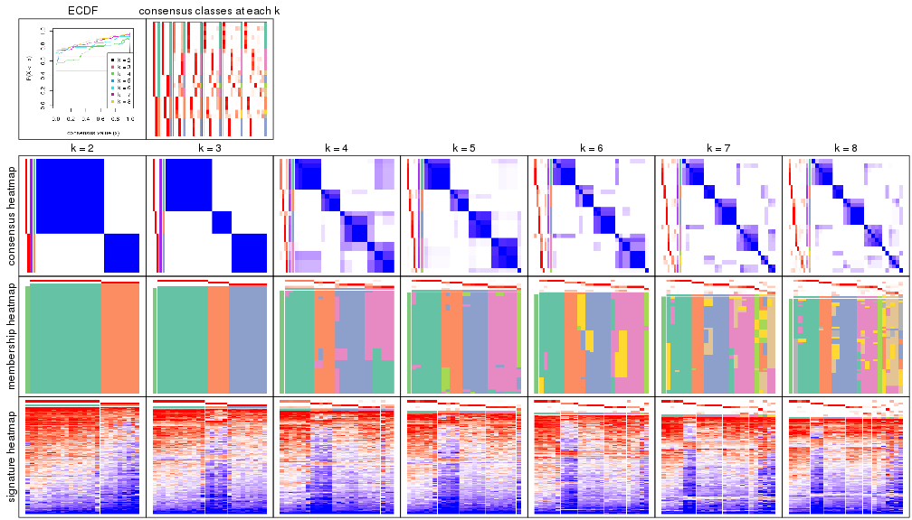

The plots are:

- The first row: a plot of the eCDF (empirical cumulative distribution
  function) curves of the consensus matrix for each `k` and the heatmap of
  predicted classes for each `k`.
- The second row: heatmaps of the consensus matrix for each `k`.
- The third row: heatmaps of the membership matrix for each `k`.
- The fouth row: heatmaps of the signatures for each `k`.

All the plots in panels can be made by individual functions and they are
plotted later in this section.

`select_partition_number()` produces several plots showing different
statistics for choosing "optimized" `k`. There are following statistics:

- eCDF curves of the consensus matrix for each `k`;
- 1-PAC. [The PAC score](https://en.wikipedia.org/wiki/Consensus_clustering#Over-interpretation_potential_of_consensus_clustering)
  measures the proportion of the ambiguous subgrouping.
- Mean silhouette score.
- Concordance. The mean probability of fiting the consensus subgroup labels in all
  partitions.
- Area increased. Denote $A_k$ as the area under the eCDF curve for current
  `k`, the area increased is defined as $A_k - A_{k-1}$.
- Rand index. The percent of pairs of samples that are both in a same cluster
  or both are not in a same cluster in the partition of k and k-1.
- Jaccard index. The ratio of pairs of samples are both in a same cluster in
  the partition of k and k-1 and the pairs of samples are both in a same
  cluster in the partition k or k-1.

The detailed explanations of these statistics can be found in [the _cola_
vignette](https://jokergoo.github.io/cola_vignettes/cola.html#toc_13).

Generally speaking, higher 1-PAC score, higher mean silhouette score or higher
concordance corresponds to better partition. Rand index and Jaccard index
measure how similar the current partition is compared to partition with `k-1`.
If they are too similar, we won't accept `k` is better than `k-1`.

```r
select_partition_number(res)
```

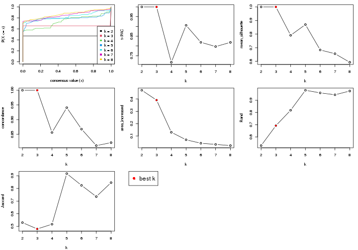

The numeric values for all these statistics can be obtained by `get_stats()`.

```r
get_stats(res)
```

```
#>   k 1-PAC mean_silhouette concordance area_increased  Rand Jaccard
#> 2 2 1.000           1.000       1.000         0.4713 0.529   0.529
#> 3 3 1.000           1.000       1.000         0.3913 0.692   0.479
#> 4 4 0.717           0.791       0.856         0.1297 0.818   0.516
#> 5 5 0.906           0.870       0.941         0.0687 0.982   0.918
#> 6 6 0.819           0.683       0.868         0.0407 0.960   0.824
#> 7 7 0.797           0.656       0.812         0.0312 0.945   0.735
#> 8 8 0.818           0.593       0.822         0.0216 0.975   0.846
```

`suggest_best_k()` suggests the best $k$ based on these statistics. The rules are as follows:

- All $k$ with Jaccard index larger than 0.95 are removed because increasing
  $k$ does not provide enough extra information. If all $k$ are removed, it is
  marked as no subgroup is detected.
- For all $k$ with 1-PAC score larger than 0.9, the maximal $k$ is taken as
  the best $k$, and other $k$ are marked as optional $k$.
- If it does not fit the second rule. The $k$ with the maximal vote of the
  highest 1-PAC score, highest mean silhouette, and highest concordance is
  taken as the best $k$.

```r
suggest_best_k(res)
```

```
#> [1] 3
#> attr(,"optional")
#> [1] 2
```

There is also optional best $k$ = 2 that is worth to check.

Following is the table of the partitions (You need to click the **show/hide
code output** link to see it). The membership matrix (columns with name `p*`)
is inferred by
[`clue::cl_consensus()`](https://www.rdocumentation.org/link/cl_consensus?package=clue)
function with the `SE` method. Basically the value in the membership matrix
represents the probability to belong to a certain group. The finall subgroup
label for an item is determined with the group with highest probability it
belongs to.

In `get_classes()` function, the entropy is calculated from the membership
matrix and the silhouette score is calculated from the consensus matrix.


<script>
$( function() {
	$( '#tabs-node-0512-get-classes' ).tabs();
} );
</script>
<div id='tabs-node-0512-get-classes'>
<ul>
<li><a href='#tab-node-0512-get-classes-1'>k = 2</a></li>
<li><a href='#tab-node-0512-get-classes-2'>k = 3</a></li>
<li><a href='#tab-node-0512-get-classes-3'>k = 4</a></li>
<li><a href='#tab-node-0512-get-classes-4'>k = 5</a></li>
<li><a href='#tab-node-0512-get-classes-5'>k = 6</a></li>
<li><a href='#tab-node-0512-get-classes-6'>k = 7</a></li>
<li><a href='#tab-node-0512-get-classes-7'>k = 8</a></li>
</ul>

<div id='tab-node-0512-get-classes-1'>
<p><a id='tab-node-0512-get-classes-1-a' style='color:#0366d6' href='#'>show/hide code output</a></p>
<pre><code class="r">cbind(get_classes(res, k = 2), get_membership(res, k = 2))
</code></pre>

<pre><code>#&gt;                 class entropy silhouette p1 p2
#&gt; TCGA.HD.7754.01     2       0          1  0  1
#&gt; TCGA.CV.7406.01     2       0          1  0  1
#&gt; TCGA.CR.5249.01     1       0          1  1  0
#&gt; TCGA.CR.5248.01     1       0          1  1  0
#&gt; TCGA.CR.7385.01     1       0          1  1  0
#&gt; TCGA.CV.6939.01     1       0          1  1  0
#&gt; TCGA.CR.6487.01     1       0          1  1  0
#&gt; TCGA.CR.6472.01     2       0          1  0  1
#&gt; TCGA.CR.6481.01     1       0          1  1  0
#&gt; TCGA.CR.6470.01     1       0          1  1  0
#&gt; TCGA.BA.A4IH.01     1       0          1  1  0
#&gt; TCGA.CR.6482.01     1       0          1  1  0
#&gt; TCGA.P3.A5Q5.01     2       0          1  0  1
#&gt; TCGA.BA.A4IG.01     2       0          1  0  1
#&gt; TCGA.HD.A634.01     1       0          1  1  0
#&gt; TCGA.DQ.7594.01     2       0          1  0  1
#&gt; TCGA.DQ.7596.01     1       0          1  1  0
#&gt; TCGA.CN.5374.01     1       0          1  1  0
#&gt; TCGA.H7.A76A.01     1       0          1  1  0
#&gt; TCGA.DQ.7593.01     1       0          1  1  0
#&gt; TCGA.MZ.A5BI.01     1       0          1  1  0
#&gt; TCGA.BB.A6UM.01     2       0          1  0  1
#&gt; TCGA.MZ.A6I9.01     2       0          1  0  1
#&gt; TCGA.CR.7404.01     1       0          1  1  0
#&gt; TCGA.CR.7368.01     2       0          1  0  1
#&gt; TCGA.KU.A6H7.01     1       0          1  1  0
</code></pre>

<script>
$('#tab-node-0512-get-classes-1-a').parent().next().next().hide();
$('#tab-node-0512-get-classes-1-a').click(function(){
  $('#tab-node-0512-get-classes-1-a').parent().next().next().toggle();
  return(false);
});
</script>
</div>

<div id='tab-node-0512-get-classes-2'>
<p><a id='tab-node-0512-get-classes-2-a' style='color:#0366d6' href='#'>show/hide code output</a></p>
<pre><code class="r">cbind(get_classes(res, k = 3), get_membership(res, k = 3))
</code></pre>

<pre><code>#&gt;                 class entropy silhouette p1 p2 p3
#&gt; TCGA.HD.7754.01     2       0          1  0  1  0
#&gt; TCGA.CV.7406.01     2       0          1  0  1  0
#&gt; TCGA.CR.5249.01     3       0          1  0  0  1
#&gt; TCGA.CR.5248.01     1       0          1  1  0  0
#&gt; TCGA.CR.7385.01     3       0          1  0  0  1
#&gt; TCGA.CV.6939.01     3       0          1  0  0  1
#&gt; TCGA.CR.6487.01     1       0          1  1  0  0
#&gt; TCGA.CR.6472.01     2       0          1  0  1  0
#&gt; TCGA.CR.6481.01     1       0          1  1  0  0
#&gt; TCGA.CR.6470.01     1       0          1  1  0  0
#&gt; TCGA.BA.A4IH.01     1       0          1  1  0  0
#&gt; TCGA.CR.6482.01     1       0          1  1  0  0
#&gt; TCGA.P3.A5Q5.01     3       0          1  0  0  1
#&gt; TCGA.BA.A4IG.01     3       0          1  0  0  1
#&gt; TCGA.HD.A634.01     3       0          1  0  0  1
#&gt; TCGA.DQ.7594.01     3       0          1  0  0  1
#&gt; TCGA.DQ.7596.01     1       0          1  1  0  0
#&gt; TCGA.CN.5374.01     3       0          1  0  0  1
#&gt; TCGA.H7.A76A.01     1       0          1  1  0  0
#&gt; TCGA.DQ.7593.01     1       0          1  1  0  0
#&gt; TCGA.MZ.A5BI.01     1       0          1  1  0  0
#&gt; TCGA.BB.A6UM.01     2       0          1  0  1  0
#&gt; TCGA.MZ.A6I9.01     3       0          1  0  0  1
#&gt; TCGA.CR.7404.01     1       0          1  1  0  0
#&gt; TCGA.CR.7368.01     2       0          1  0  1  0
#&gt; TCGA.KU.A6H7.01     1       0          1  1  0  0
</code></pre>

<script>
$('#tab-node-0512-get-classes-2-a').parent().next().next().hide();
$('#tab-node-0512-get-classes-2-a').click(function(){
  $('#tab-node-0512-get-classes-2-a').parent().next().next().toggle();
  return(false);
});
</script>
</div>

<div id='tab-node-0512-get-classes-3'>
<p><a id='tab-node-0512-get-classes-3-a' style='color:#0366d6' href='#'>show/hide code output</a></p>
<pre><code class="r">cbind(get_classes(res, k = 4), get_membership(res, k = 4))
</code></pre>

<pre><code>#&gt;                 class entropy silhouette   p1   p2   p3   p4
#&gt; TCGA.HD.7754.01     2   0.000      0.944 0.00 1.00 0.00 0.00
#&gt; TCGA.CV.7406.01     2   0.000      0.944 0.00 1.00 0.00 0.00
#&gt; TCGA.CR.5249.01     4   0.462      0.316 0.00 0.00 0.34 0.66
#&gt; TCGA.CR.5248.01     4   0.265      0.579 0.12 0.00 0.00 0.88
#&gt; TCGA.CR.7385.01     3   0.265      0.814 0.00 0.00 0.88 0.12
#&gt; TCGA.CV.6939.01     4   0.462      0.316 0.00 0.00 0.34 0.66
#&gt; TCGA.CR.6487.01     1   0.452      0.982 0.68 0.00 0.00 0.32
#&gt; TCGA.CR.6472.01     2   0.000      0.944 0.00 1.00 0.00 0.00
#&gt; TCGA.CR.6481.01     1   0.479      0.917 0.62 0.00 0.00 0.38
#&gt; TCGA.CR.6470.01     4   0.000      0.721 0.00 0.00 0.00 1.00
#&gt; TCGA.BA.A4IH.01     1   0.452      0.982 0.68 0.00 0.00 0.32
#&gt; TCGA.CR.6482.01     1   0.452      0.982 0.68 0.00 0.00 0.32
#&gt; TCGA.P3.A5Q5.01     3   0.000      0.862 0.00 0.00 1.00 0.00
#&gt; TCGA.BA.A4IG.01     3   0.000      0.862 0.00 0.00 1.00 0.00
#&gt; TCGA.HD.A634.01     3   0.777      0.177 0.24 0.00 0.40 0.36
#&gt; TCGA.DQ.7594.01     3   0.000      0.862 0.00 0.00 1.00 0.00
#&gt; TCGA.DQ.7596.01     4   0.265      0.579 0.12 0.00 0.00 0.88
#&gt; TCGA.CN.5374.01     3   0.265      0.814 0.00 0.00 0.88 0.12
#&gt; TCGA.H7.A76A.01     1   0.462      0.967 0.66 0.00 0.00 0.34
#&gt; TCGA.DQ.7593.01     1   0.452      0.982 0.68 0.00 0.00 0.32
#&gt; TCGA.MZ.A5BI.01     1   0.452      0.982 0.68 0.00 0.00 0.32
#&gt; TCGA.BB.A6UM.01     2   0.201      0.923 0.08 0.92 0.00 0.00
#&gt; TCGA.MZ.A6I9.01     3   0.000      0.862 0.00 0.00 1.00 0.00
#&gt; TCGA.CR.7404.01     4   0.000      0.721 0.00 0.00 0.00 1.00
#&gt; TCGA.CR.7368.01     2   0.484      0.822 0.08 0.78 0.14 0.00
#&gt; TCGA.KU.A6H7.01     4   0.000      0.721 0.00 0.00 0.00 1.00
</code></pre>

<script>
$('#tab-node-0512-get-classes-3-a').parent().next().next().hide();
$('#tab-node-0512-get-classes-3-a').click(function(){
  $('#tab-node-0512-get-classes-3-a').parent().next().next().toggle();
  return(false);
});
</script>
</div>

<div id='tab-node-0512-get-classes-4'>
<p><a id='tab-node-0512-get-classes-4-a' style='color:#0366d6' href='#'>show/hide code output</a></p>
<pre><code class="r">cbind(get_classes(res, k = 5), get_membership(res, k = 5))
</code></pre>

<pre><code>#&gt;                 class entropy silhouette   p1   p2   p3   p4   p5
#&gt; TCGA.HD.7754.01     2  0.0000      0.854 0.00 1.00 0.00 0.00 0.00
#&gt; TCGA.CV.7406.01     2  0.0000      0.854 0.00 1.00 0.00 0.00 0.00
#&gt; TCGA.CR.5249.01     4  0.2077      0.896 0.00 0.00 0.04 0.92 0.04
#&gt; TCGA.CR.5248.01     4  0.1043      0.940 0.04 0.00 0.00 0.96 0.00
#&gt; TCGA.CR.7385.01     3  0.2077      0.896 0.00 0.00 0.92 0.04 0.04
#&gt; TCGA.CV.6939.01     4  0.2077      0.896 0.00 0.00 0.04 0.92 0.04
#&gt; TCGA.CR.6487.01     1  0.0000      0.963 1.00 0.00 0.00 0.00 0.00
#&gt; TCGA.CR.6472.01     2  0.0000      0.854 0.00 1.00 0.00 0.00 0.00
#&gt; TCGA.CR.6481.01     1  0.2732      0.784 0.84 0.00 0.00 0.16 0.00
#&gt; TCGA.CR.6470.01     4  0.0609      0.952 0.02 0.00 0.00 0.98 0.00
#&gt; TCGA.BA.A4IH.01     1  0.0000      0.963 1.00 0.00 0.00 0.00 0.00
#&gt; TCGA.CR.6482.01     1  0.0000      0.963 1.00 0.00 0.00 0.00 0.00
#&gt; TCGA.P3.A5Q5.01     3  0.0000      0.946 0.00 0.00 1.00 0.00 0.00
#&gt; TCGA.BA.A4IG.01     3  0.0609      0.928 0.00 0.00 0.98 0.00 0.02
#&gt; TCGA.HD.A634.01     5  0.4637      0.000 0.00 0.00 0.16 0.10 0.74
#&gt; TCGA.DQ.7594.01     3  0.0000      0.946 0.00 0.00 1.00 0.00 0.00
#&gt; TCGA.DQ.7596.01     4  0.1043      0.940 0.04 0.00 0.00 0.96 0.00
#&gt; TCGA.CN.5374.01     3  0.2077      0.896 0.00 0.00 0.92 0.04 0.04
#&gt; TCGA.H7.A76A.01     1  0.0609      0.949 0.98 0.00 0.00 0.02 0.00
#&gt; TCGA.DQ.7593.01     1  0.0000      0.963 1.00 0.00 0.00 0.00 0.00
#&gt; TCGA.MZ.A5BI.01     1  0.0000      0.963 1.00 0.00 0.00 0.00 0.00
#&gt; TCGA.BB.A6UM.01     2  0.3999      0.761 0.00 0.74 0.00 0.02 0.24
#&gt; TCGA.MZ.A6I9.01     3  0.0000      0.946 0.00 0.00 1.00 0.00 0.00
#&gt; TCGA.CR.7404.01     4  0.0609      0.952 0.02 0.00 0.00 0.98 0.00
#&gt; TCGA.CR.7368.01     2  0.5484      0.669 0.00 0.64 0.12 0.00 0.24
#&gt; TCGA.KU.A6H7.01     4  0.0609      0.952 0.02 0.00 0.00 0.98 0.00
</code></pre>

<script>
$('#tab-node-0512-get-classes-4-a').parent().next().next().hide();
$('#tab-node-0512-get-classes-4-a').click(function(){
  $('#tab-node-0512-get-classes-4-a').parent().next().next().toggle();
  return(false);
});
</script>
</div>

<div id='tab-node-0512-get-classes-5'>
<p><a id='tab-node-0512-get-classes-5-a' style='color:#0366d6' href='#'>show/hide code output</a></p>
<pre><code class="r">cbind(get_classes(res, k = 6), get_membership(res, k = 6))
</code></pre>

<pre><code>#&gt;                 class entropy silhouette   p1   p2   p3   p4   p5   p6
#&gt; TCGA.HD.7754.01     2  0.3647      0.763 0.00 0.64 0.00 0.00 0.00 0.36
#&gt; TCGA.CV.7406.01     2  0.3647      0.763 0.00 0.64 0.00 0.00 0.00 0.36
#&gt; TCGA.CR.5249.01     4  0.3864      0.444 0.00 0.00 0.00 0.52 0.00 0.48
#&gt; TCGA.CR.5248.01     4  0.0000      0.696 0.00 0.00 0.00 1.00 0.00 0.00
#&gt; TCGA.CR.7385.01     3  0.2793      0.792 0.00 0.00 0.80 0.00 0.00 0.20
#&gt; TCGA.CV.6939.01     4  0.3864      0.444 0.00 0.00 0.00 0.52 0.00 0.48
#&gt; TCGA.CR.6487.01     1  0.0000      0.921 1.00 0.00 0.00 0.00 0.00 0.00
#&gt; TCGA.CR.6472.01     2  0.3647      0.763 0.00 0.64 0.00 0.00 0.00 0.36
#&gt; TCGA.CR.6481.01     4  0.3864     -0.169 0.48 0.00 0.00 0.52 0.00 0.00
#&gt; TCGA.CR.6470.01     4  0.3198      0.592 0.00 0.00 0.00 0.74 0.00 0.26
#&gt; TCGA.BA.A4IH.01     1  0.2454      0.794 0.84 0.00 0.00 0.00 0.00 0.16
#&gt; TCGA.CR.6482.01     1  0.0000      0.921 1.00 0.00 0.00 0.00 0.00 0.00
#&gt; TCGA.P3.A5Q5.01     3  0.0000      0.901 0.00 0.00 1.00 0.00 0.00 0.00
#&gt; TCGA.BA.A4IG.01     3  0.0000      0.901 0.00 0.00 1.00 0.00 0.00 0.00
#&gt; TCGA.HD.A634.01     5  0.0937      0.000 0.00 0.00 0.00 0.04 0.96 0.00
#&gt; TCGA.DQ.7594.01     3  0.0000      0.901 0.00 0.00 1.00 0.00 0.00 0.00
#&gt; TCGA.DQ.7596.01     4  0.0000      0.696 0.00 0.00 0.00 1.00 0.00 0.00
#&gt; TCGA.CN.5374.01     3  0.2941      0.776 0.00 0.00 0.78 0.00 0.00 0.22
#&gt; TCGA.H7.A76A.01     1  0.2631      0.741 0.82 0.00 0.00 0.18 0.00 0.00
#&gt; TCGA.DQ.7593.01     1  0.0000      0.921 1.00 0.00 0.00 0.00 0.00 0.00
#&gt; TCGA.MZ.A5BI.01     1  0.0000      0.921 1.00 0.00 0.00 0.00 0.00 0.00
#&gt; TCGA.BB.A6UM.01     2  0.0000      0.608 0.00 1.00 0.00 0.00 0.00 0.00
#&gt; TCGA.MZ.A6I9.01     3  0.0000      0.901 0.00 0.00 1.00 0.00 0.00 0.00
#&gt; TCGA.CR.7404.01     4  0.0000      0.696 0.00 0.00 0.00 1.00 0.00 0.00
#&gt; TCGA.CR.7368.01     2  0.3821      0.390 0.00 0.74 0.22 0.00 0.04 0.00
#&gt; TCGA.KU.A6H7.01     4  0.0000      0.696 0.00 0.00 0.00 1.00 0.00 0.00
</code></pre>

<script>
$('#tab-node-0512-get-classes-5-a').parent().next().next().hide();
$('#tab-node-0512-get-classes-5-a').click(function(){
  $('#tab-node-0512-get-classes-5-a').parent().next().next().toggle();
  return(false);
});
</script>
</div>

<div id='tab-node-0512-get-classes-6'>
<p><a id='tab-node-0512-get-classes-6-a' style='color:#0366d6' href='#'>show/hide code output</a></p>
<pre><code class="r">cbind(get_classes(res, k = 7), get_membership(res, k = 7))
</code></pre>

<pre><code>#&gt;                 class entropy silhouette   p1   p2   p3   p4 p5   p6   p7
#&gt; TCGA.HD.7754.01     2  0.0000     0.9846 0.00 1.00 0.00 0.00  0 0.00 0.00
#&gt; TCGA.CV.7406.01     2  0.0504     0.9689 0.00 0.98 0.00 0.00  0 0.02 0.00
#&gt; TCGA.CR.5249.01     7  0.4248     0.8849 0.00 0.00 0.00 0.26  0 0.08 0.66
#&gt; TCGA.CR.5248.01     4  0.0000     0.6577 0.00 0.00 0.00 1.00  0 0.00 0.00
#&gt; TCGA.CR.7385.01     3  0.3617     0.7211 0.00 0.00 0.76 0.00  0 0.08 0.16
#&gt; TCGA.CV.6939.01     7  0.2945     0.8808 0.00 0.00 0.00 0.26  0 0.00 0.74
#&gt; TCGA.CR.6487.01     1  0.0000     0.8355 1.00 0.00 0.00 0.00  0 0.00 0.00
#&gt; TCGA.CR.6472.01     2  0.0000     0.9846 0.00 1.00 0.00 0.00  0 0.00 0.00
#&gt; TCGA.CR.6481.01     4  0.3943     0.0638 0.42 0.00 0.00 0.56  0 0.02 0.00
#&gt; TCGA.CR.6470.01     4  0.3968    -0.2138 0.00 0.00 0.00 0.54  0 0.02 0.44
#&gt; TCGA.BA.A4IH.01     1  0.5233     0.3008 0.52 0.00 0.00 0.00  0 0.28 0.20
#&gt; TCGA.CR.6482.01     1  0.0000     0.8355 1.00 0.00 0.00 0.00  0 0.00 0.00
#&gt; TCGA.P3.A5Q5.01     3  0.0000     0.8573 0.00 0.00 1.00 0.00  0 0.00 0.00
#&gt; TCGA.BA.A4IG.01     3  0.0000     0.8573 0.00 0.00 1.00 0.00  0 0.00 0.00
#&gt; TCGA.HD.A634.01     5  0.0000     0.0000 0.00 0.00 0.00 0.00  1 0.00 0.00
#&gt; TCGA.DQ.7594.01     3  0.0000     0.8573 0.00 0.00 1.00 0.00  0 0.00 0.00
#&gt; TCGA.DQ.7596.01     4  0.2803     0.5985 0.00 0.00 0.00 0.84  0 0.06 0.10
#&gt; TCGA.CN.5374.01     3  0.4418     0.5544 0.00 0.00 0.62 0.00  0 0.08 0.30
#&gt; TCGA.H7.A76A.01     1  0.3186     0.6114 0.76 0.00 0.00 0.22  0 0.02 0.00
#&gt; TCGA.DQ.7593.01     1  0.0000     0.8355 1.00 0.00 0.00 0.00  0 0.00 0.00
#&gt; TCGA.MZ.A5BI.01     1  0.0504     0.8280 0.98 0.00 0.00 0.00  0 0.00 0.02
#&gt; TCGA.BB.A6UM.01     6  0.4266     0.4230 0.00 0.44 0.00 0.00  0 0.52 0.04
#&gt; TCGA.MZ.A6I9.01     3  0.0000     0.8573 0.00 0.00 1.00 0.00  0 0.00 0.00
#&gt; TCGA.CR.7404.01     4  0.1718     0.6407 0.00 0.00 0.00 0.92  0 0.04 0.04
#&gt; TCGA.CR.7368.01     6  0.4990     0.5714 0.00 0.20 0.22 0.00  0 0.58 0.00
#&gt; TCGA.KU.A6H7.01     4  0.0000     0.6577 0.00 0.00 0.00 1.00  0 0.00 0.00
</code></pre>

<script>
$('#tab-node-0512-get-classes-6-a').parent().next().next().hide();
$('#tab-node-0512-get-classes-6-a').click(function(){
  $('#tab-node-0512-get-classes-6-a').parent().next().next().toggle();
  return(false);
});
</script>
</div>

<div id='tab-node-0512-get-classes-7'>
<p><a id='tab-node-0512-get-classes-7-a' style='color:#0366d6' href='#'>show/hide code output</a></p>
<pre><code class="r">cbind(get_classes(res, k = 8), get_membership(res, k = 8))
</code></pre>

<pre><code>#&gt;                 class entropy silhouette   p1   p2   p3   p4 p5   p6   p7   p8
#&gt; TCGA.HD.7754.01     2  0.0000      0.970 0.00 1.00 0.00 0.00  0 0.00 0.00 0.00
#&gt; TCGA.CV.7406.01     2  0.0941      0.940 0.00 0.96 0.00 0.00  0 0.02 0.02 0.00
#&gt; TCGA.CR.5249.01     7  0.4487      0.502 0.00 0.00 0.02 0.08  0 0.00 0.62 0.28
#&gt; TCGA.CR.5248.01     4  0.0000      0.727 0.00 0.00 0.00 1.00  0 0.00 0.00 0.00
#&gt; TCGA.CR.7385.01     3  0.2938      0.592 0.00 0.00 0.70 0.00  0 0.00 0.00 0.30
#&gt; TCGA.CV.6939.01     7  0.1804      0.629 0.00 0.00 0.02 0.08  0 0.00 0.90 0.00
#&gt; TCGA.CR.6487.01     1  0.0000      0.807 1.00 0.00 0.00 0.00  0 0.00 0.00 0.00
#&gt; TCGA.CR.6472.01     2  0.0000      0.970 0.00 1.00 0.00 0.00  0 0.00 0.00 0.00
#&gt; TCGA.CR.6481.01     4  0.3991      0.368 0.32 0.00 0.00 0.62  0 0.06 0.00 0.00
#&gt; TCGA.CR.6470.01     7  0.4299      0.446 0.00 0.00 0.00 0.22  0 0.14 0.64 0.00
#&gt; TCGA.BA.A4IH.01     1  0.5816      0.137 0.42 0.00 0.00 0.00  0 0.36 0.08 0.14
#&gt; TCGA.CR.6482.01     1  0.0000      0.807 1.00 0.00 0.00 0.00  0 0.00 0.00 0.00
#&gt; TCGA.P3.A5Q5.01     3  0.0000      0.778 0.00 0.00 1.00 0.00  0 0.00 0.00 0.00
#&gt; TCGA.BA.A4IG.01     3  0.0000      0.778 0.00 0.00 1.00 0.00  0 0.00 0.00 0.00
#&gt; TCGA.HD.A634.01     5  0.0000      0.000 0.00 0.00 0.00 0.00  1 0.00 0.00 0.00
#&gt; TCGA.DQ.7594.01     3  0.0000      0.778 0.00 0.00 1.00 0.00  0 0.00 0.00 0.00
#&gt; TCGA.DQ.7596.01     4  0.4211      0.562 0.00 0.00 0.00 0.70  0 0.12 0.16 0.02
#&gt; TCGA.CN.5374.01     3  0.5102      0.282 0.00 0.00 0.46 0.00  0 0.00 0.24 0.30
#&gt; TCGA.H7.A76A.01     1  0.3431      0.574 0.74 0.00 0.00 0.20  0 0.06 0.00 0.00
#&gt; TCGA.DQ.7593.01     1  0.1091      0.787 0.94 0.00 0.00 0.00  0 0.06 0.00 0.00
#&gt; TCGA.MZ.A5BI.01     1  0.0000      0.807 1.00 0.00 0.00 0.00  0 0.00 0.00 0.00
#&gt; TCGA.BB.A6UM.01     6  0.5183      0.000 0.00 0.38 0.00 0.00  0 0.38 0.00 0.24
#&gt; TCGA.MZ.A6I9.01     3  0.0000      0.778 0.00 0.00 1.00 0.00  0 0.00 0.00 0.00
#&gt; TCGA.CR.7404.01     4  0.1557      0.715 0.00 0.00 0.00 0.92  0 0.06 0.00 0.02
#&gt; TCGA.CR.7368.01     8  0.5469      0.000 0.00 0.16 0.24 0.00  0 0.06 0.00 0.54
#&gt; TCGA.KU.A6H7.01     4  0.1765      0.683 0.00 0.00 0.00 0.88  0 0.12 0.00 0.00
</code></pre>

<script>
$('#tab-node-0512-get-classes-7-a').parent().next().next().hide();
$('#tab-node-0512-get-classes-7-a').click(function(){
  $('#tab-node-0512-get-classes-7-a').parent().next().next().toggle();
  return(false);
});
</script>
</div>
</div>

Heatmaps for the consensus matrix. It visualizes the probability of two
samples to be in a same group.


<script>
$( function() {
	$( '#tabs-node-0512-consensus-heatmap' ).tabs();
} );
</script>
<div id='tabs-node-0512-consensus-heatmap'>
<ul>
<li><a href='#tab-node-0512-consensus-heatmap-1'>k = 2</a></li>
<li><a href='#tab-node-0512-consensus-heatmap-2'>k = 3</a></li>
<li><a href='#tab-node-0512-consensus-heatmap-3'>k = 4</a></li>
<li><a href='#tab-node-0512-consensus-heatmap-4'>k = 5</a></li>
<li><a href='#tab-node-0512-consensus-heatmap-5'>k = 6</a></li>
<li><a href='#tab-node-0512-consensus-heatmap-6'>k = 7</a></li>
<li><a href='#tab-node-0512-consensus-heatmap-7'>k = 8</a></li>
</ul>
<div id='tab-node-0512-consensus-heatmap-1'>
<pre><code class="r">consensus_heatmap(res, k = 2)
</code></pre>

<p>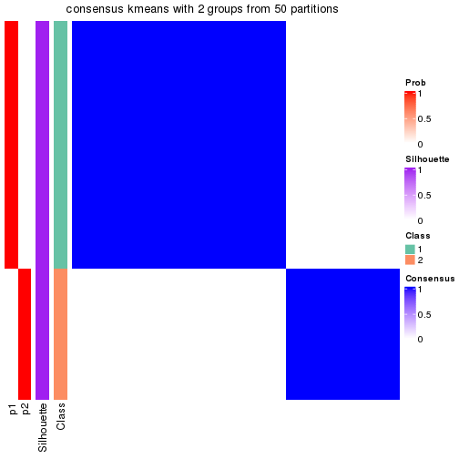</p>

</div>
<div id='tab-node-0512-consensus-heatmap-2'>
<pre><code class="r">consensus_heatmap(res, k = 3)
</code></pre>

<p>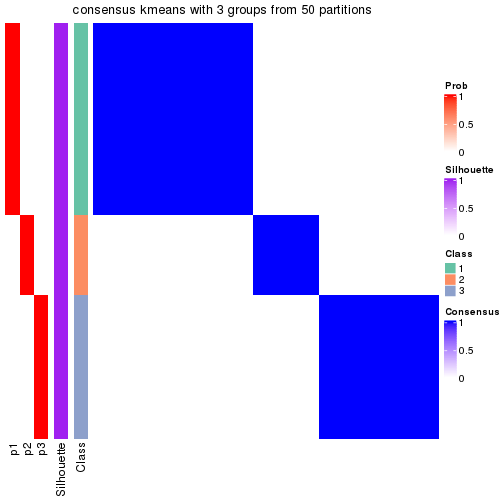</p>

</div>
<div id='tab-node-0512-consensus-heatmap-3'>
<pre><code class="r">consensus_heatmap(res, k = 4)
</code></pre>

<p></p>

</div>
<div id='tab-node-0512-consensus-heatmap-4'>
<pre><code class="r">consensus_heatmap(res, k = 5)
</code></pre>

<p>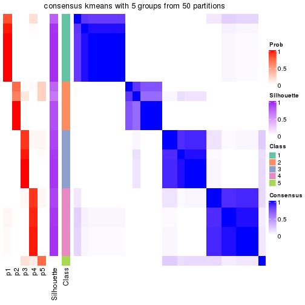</p>

</div>
<div id='tab-node-0512-consensus-heatmap-5'>
<pre><code class="r">consensus_heatmap(res, k = 6)
</code></pre>

<p>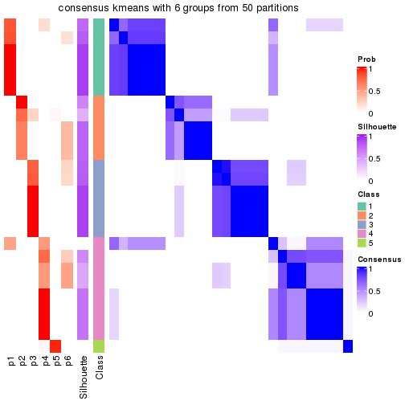</p>

</div>
<div id='tab-node-0512-consensus-heatmap-6'>
<pre><code class="r">consensus_heatmap(res, k = 7)
</code></pre>

<p>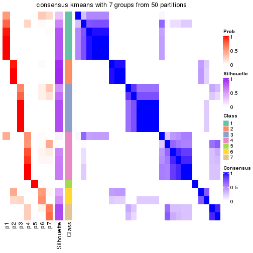</p>

</div>
<div id='tab-node-0512-consensus-heatmap-7'>
<pre><code class="r">consensus_heatmap(res, k = 8)
</code></pre>

<p></p>

</div>
</div>

Heatmaps for the membership of samples in all partitions to see how consistent they are:


<script>
$( function() {
	$( '#tabs-node-0512-membership-heatmap' ).tabs();
} );
</script>
<div id='tabs-node-0512-membership-heatmap'>
<ul>
<li><a href='#tab-node-0512-membership-heatmap-1'>k = 2</a></li>
<li><a href='#tab-node-0512-membership-heatmap-2'>k = 3</a></li>
<li><a href='#tab-node-0512-membership-heatmap-3'>k = 4</a></li>
<li><a href='#tab-node-0512-membership-heatmap-4'>k = 5</a></li>
<li><a href='#tab-node-0512-membership-heatmap-5'>k = 6</a></li>
<li><a href='#tab-node-0512-membership-heatmap-6'>k = 7</a></li>
<li><a href='#tab-node-0512-membership-heatmap-7'>k = 8</a></li>
</ul>
<div id='tab-node-0512-membership-heatmap-1'>
<pre><code class="r">membership_heatmap(res, k = 2)
</code></pre>

<p>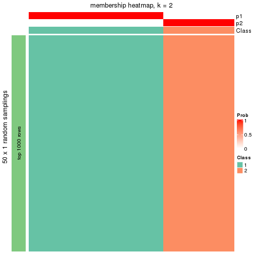</p>

</div>
<div id='tab-node-0512-membership-heatmap-2'>
<pre><code class="r">membership_heatmap(res, k = 3)
</code></pre>

<p>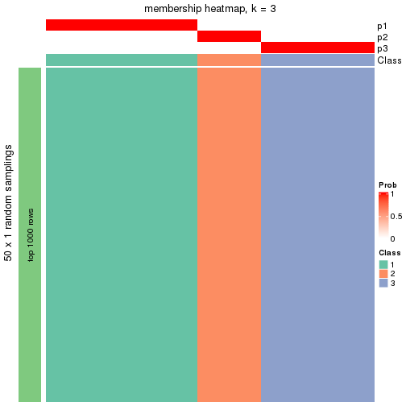</p>

</div>
<div id='tab-node-0512-membership-heatmap-3'>
<pre><code class="r">membership_heatmap(res, k = 4)
</code></pre>

<p>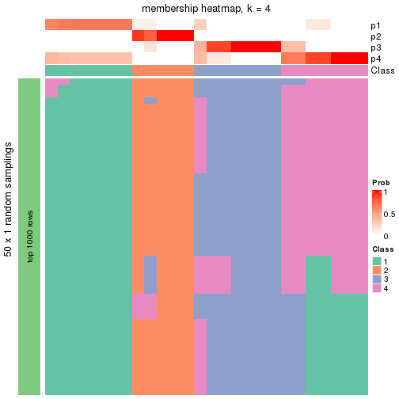</p>

</div>
<div id='tab-node-0512-membership-heatmap-4'>
<pre><code class="r">membership_heatmap(res, k = 5)
</code></pre>

<p>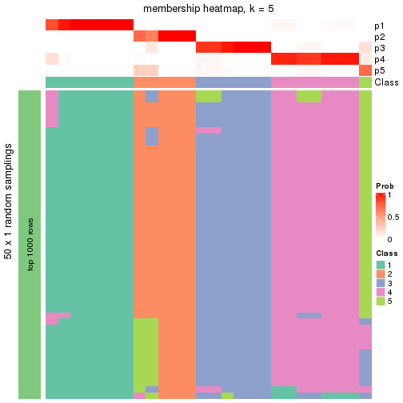</p>

</div>
<div id='tab-node-0512-membership-heatmap-5'>
<pre><code class="r">membership_heatmap(res, k = 6)
</code></pre>

<p>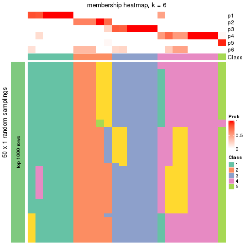</p>

</div>
<div id='tab-node-0512-membership-heatmap-6'>
<pre><code class="r">membership_heatmap(res, k = 7)
</code></pre>

<p>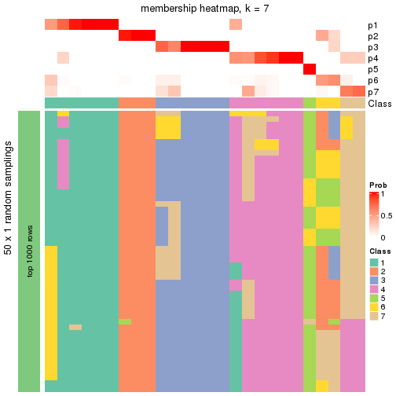</p>

</div>
<div id='tab-node-0512-membership-heatmap-7'>
<pre><code class="r">membership_heatmap(res, k = 8)
</code></pre>

<p>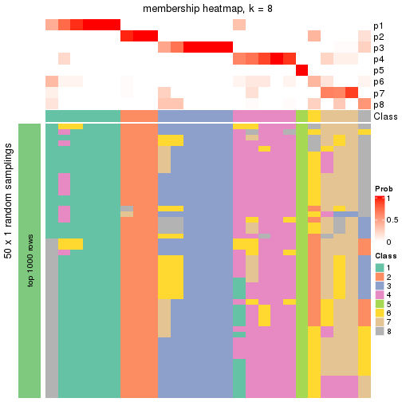</p>

</div>
</div>

As soon as the classes for columns are determined, the signatures
that are significantly different between subgroups can be looked for. 
Following are the heatmaps for signatures.


<script>
$( function() {
	$( '#tabs-node-0512-get-signatures' ).tabs();
} );
</script>
<div id='tabs-node-0512-get-signatures'>
<ul>
<li><a href='#tab-node-0512-get-signatures-1'>k = 2</a></li>
<li><a href='#tab-node-0512-get-signatures-2'>k = 3</a></li>
<li><a href='#tab-node-0512-get-signatures-3'>k = 4</a></li>
<li><a href='#tab-node-0512-get-signatures-4'>k = 5</a></li>
<li><a href='#tab-node-0512-get-signatures-5'>k = 6</a></li>
<li><a href='#tab-node-0512-get-signatures-6'>k = 7</a></li>
<li><a href='#tab-node-0512-get-signatures-7'>k = 8</a></li>
</ul>
<div id='tab-node-0512-get-signatures-1'>
<pre><code class="r">get_signatures(res, k = 2)
</code></pre>

<p>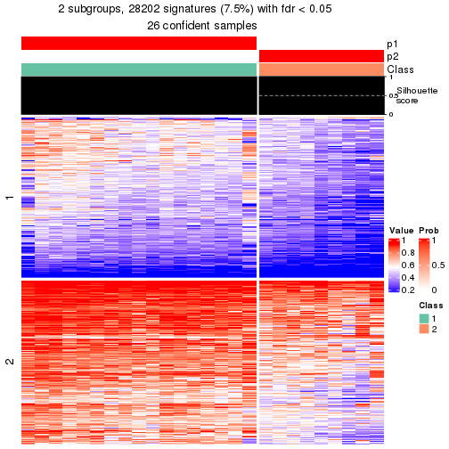</p>

</div>
<div id='tab-node-0512-get-signatures-2'>
<pre><code class="r">get_signatures(res, k = 3)
</code></pre>

<p>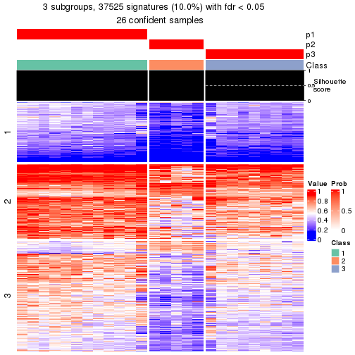</p>

</div>
<div id='tab-node-0512-get-signatures-3'>
<pre><code class="r">get_signatures(res, k = 4)
</code></pre>

<p>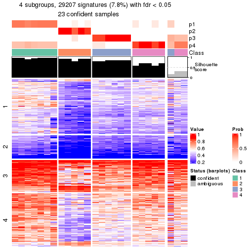</p>

</div>
<div id='tab-node-0512-get-signatures-4'>
<pre><code class="r">get_signatures(res, k = 5)
</code></pre>

<p>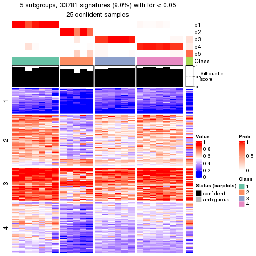</p>

</div>
<div id='tab-node-0512-get-signatures-5'>
<pre><code class="r">get_signatures(res, k = 6)
</code></pre>

<p>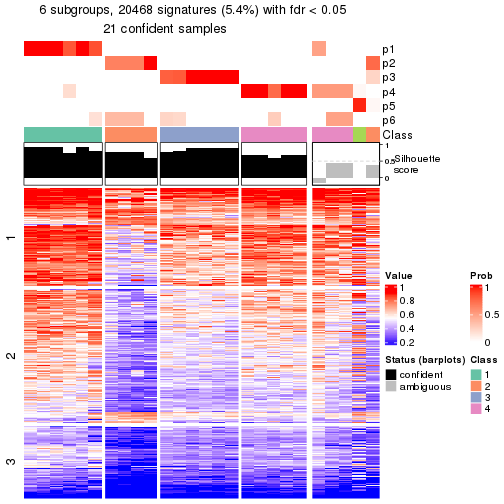</p>

</div>
<div id='tab-node-0512-get-signatures-6'>
<pre><code class="r">get_signatures(res, k = 7)
</code></pre>

<p>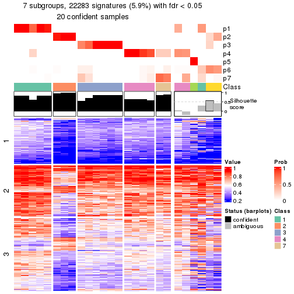</p>

</div>
<div id='tab-node-0512-get-signatures-7'>
<pre><code class="r">get_signatures(res, k = 8)
</code></pre>

<p>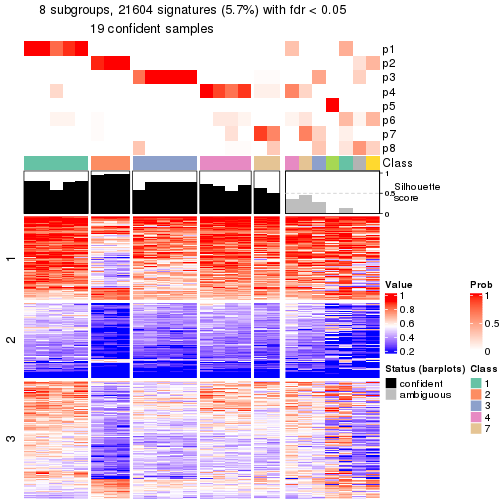</p>

</div>
</div>


Compare the overlap of signatures from different k:

```r
compare_signatures(res)
```

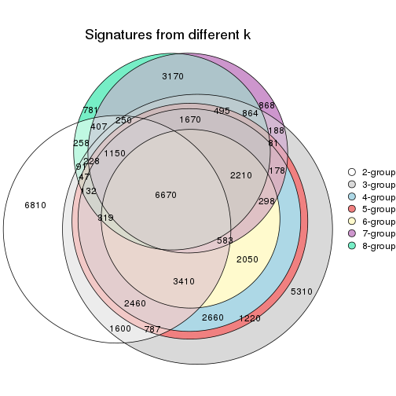

`get_signature()` returns a data frame invisibly. To get the list of signatures, the function
call should be assigned to a variable explicitly. In following code, if `plot` argument is set
to `FALSE`, no heatmap is plotted while only the differential analysis is performed.

```r
# code only for demonstration
tb = get_signature(res, k = ..., plot = FALSE)
```

An example of the output of `tb` is:

```
#>   which_row         fdr    mean_1    mean_2 scaled_mean_1 scaled_mean_2 km
#> 1        38 0.042760348  8.373488  9.131774    -0.5533452     0.5164555  1
#> 2        40 0.018707592  7.106213  8.469186    -0.6173731     0.5762149  1
#> 3        55 0.019134737 10.221463 11.207825    -0.6159697     0.5749050  1
#> 4        59 0.006059896  5.921854  7.869574    -0.6899429     0.6439467  1
#> 5        60 0.018055526  8.928898 10.211722    -0.6204761     0.5791110  1
#> 6        98 0.009384629 15.714769 14.887706     0.6635654    -0.6193277  2
...
```

The columns in `tb` are:

1. `which_row`: row indices corresponding to the input matrix.
2. `fdr`: FDR for the differential test. 
3. `mean_x`: The mean value in group x.
4. `scaled_mean_x`: The mean value in group x after rows are scaled.
5. `km`: Row groups if k-means clustering is applied to rows (which is done by automatically selecting number of clusters).

If there are too many signatures, `top_signatures = ...` can be set to only show the 
signatures with the highest FDRs:

```r
# code only for demonstration
# e.g. to show the top 500 most significant rows
tb = get_signature(res, k = ..., top_signatures = 500)
```

If the signatures are defined as these which are uniquely high in current group, `diff_method` argument
can be set to `"uniquely_high_in_one_group"`:

```r
# code only for demonstration
tb = get_signature(res, k = ..., diff_method = "uniquely_high_in_one_group")
```


UMAP plot which shows how samples are separated.


<script>
$( function() {
	$( '#tabs-node-0512-dimension-reduction' ).tabs();
} );
</script>
<div id='tabs-node-0512-dimension-reduction'>
<ul>
<li><a href='#tab-node-0512-dimension-reduction-1'>k = 2</a></li>
<li><a href='#tab-node-0512-dimension-reduction-2'>k = 3</a></li>
<li><a href='#tab-node-0512-dimension-reduction-3'>k = 4</a></li>
<li><a href='#tab-node-0512-dimension-reduction-4'>k = 5</a></li>
<li><a href='#tab-node-0512-dimension-reduction-5'>k = 6</a></li>
<li><a href='#tab-node-0512-dimension-reduction-6'>k = 7</a></li>
<li><a href='#tab-node-0512-dimension-reduction-7'>k = 8</a></li>
</ul>
<div id='tab-node-0512-dimension-reduction-1'>
<pre><code class="r">dimension_reduction(res, k = 2, method = &quot;UMAP&quot;)
</code></pre>

<p>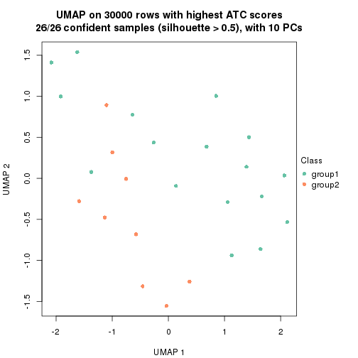</p>

</div>
<div id='tab-node-0512-dimension-reduction-2'>
<pre><code class="r">dimension_reduction(res, k = 3, method = &quot;UMAP&quot;)
</code></pre>

<p>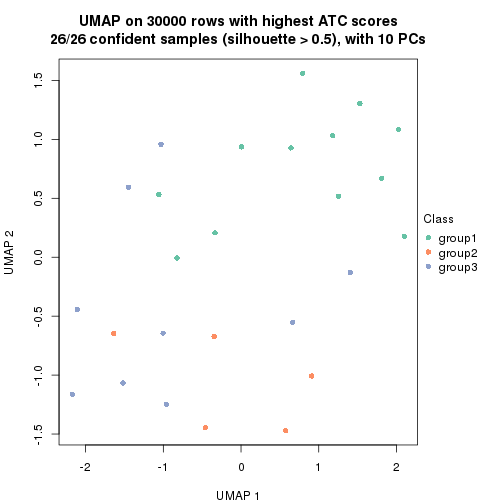</p>

</div>
<div id='tab-node-0512-dimension-reduction-3'>
<pre><code class="r">dimension_reduction(res, k = 4, method = &quot;UMAP&quot;)
</code></pre>

<p>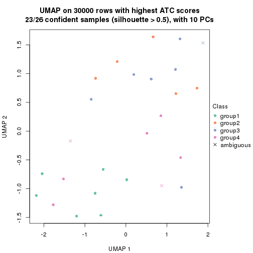</p>

</div>
<div id='tab-node-0512-dimension-reduction-4'>
<pre><code class="r">dimension_reduction(res, k = 5, method = &quot;UMAP&quot;)
</code></pre>

<p>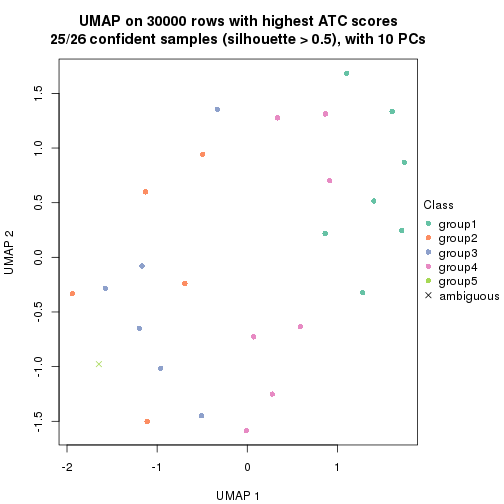</p>

</div>
<div id='tab-node-0512-dimension-reduction-5'>
<pre><code class="r">dimension_reduction(res, k = 6, method = &quot;UMAP&quot;)
</code></pre>

<p>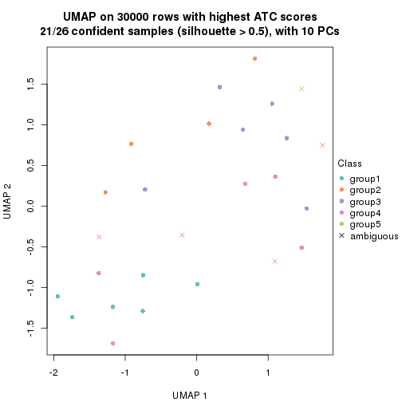</p>

</div>
<div id='tab-node-0512-dimension-reduction-6'>
<pre><code class="r">dimension_reduction(res, k = 7, method = &quot;UMAP&quot;)
</code></pre>

<p>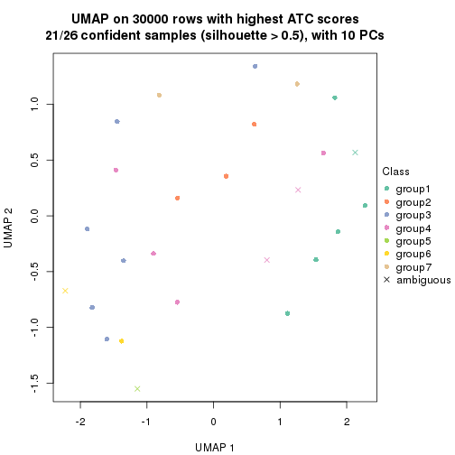</p>

</div>
<div id='tab-node-0512-dimension-reduction-7'>
<pre><code class="r">dimension_reduction(res, k = 8, method = &quot;UMAP&quot;)
</code></pre>

<p>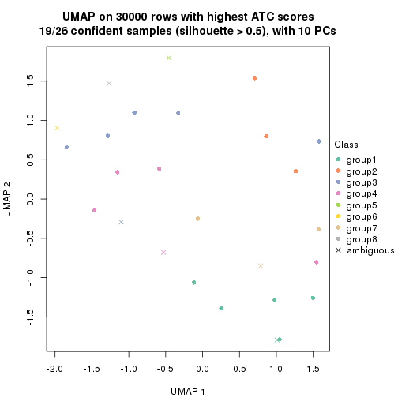</p>

</div>
</div>


Following heatmap shows how subgroups are split when increasing `k`:

```r
collect_classes(res)
```

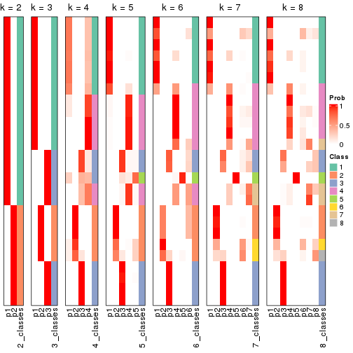


If matrix rows can be associated to genes, consider to use `functional_enrichment(res,
...)` to perform function enrichment for the signature genes. See [this vignette](https://jokergoo.github.io/cola_vignettes/functional_enrichment.html) for more detailed explanations.


 

---------------------------------------------------


### Node05121


Parent node: [Node0512](#Node0512).
Child nodes: 
                Node021321-leaf
        ,
                Node021322-leaf
        ,
                Node051211-leaf
        ,
                Node051212-leaf
        .


The object with results only for a single top-value method and a single partitioning method 
can be extracted as:

```r
res = res_rh["05121"]
```

A summary of `res` and all the functions that can be applied to it:

```r
res
```

```
#> A 'ConsensusPartition' object with k = 2, 3, 4, 5, 6, 7, 8.
#>   On a matrix with 30000 rows and 12 columns.
#>   Top rows (1000) are extracted by 'ATC' method.
#>   Subgroups are detected by 'kmeans' method.
#>   Performed in total 350 partitions by row resampling.
#>   Best k for subgroups seems to be 7.
#> 
#> Following methods can be applied to this 'ConsensusPartition' object:
#>  [1] "cola_report"             "collect_classes"         "collect_plots"          
#>  [4] "collect_stats"           "colnames"                "compare_partitions"     
#>  [7] "compare_signatures"      "consensus_heatmap"       "dimension_reduction"    
#> [10] "functional_enrichment"   "get_anno_col"            "get_anno"               
#> [13] "get_classes"             "get_consensus"           "get_matrix"             
#> [16] "get_membership"          "get_param"               "get_signatures"         
#> [19] "get_stats"               "is_best_k"               "is_stable_k"            
#> [22] "membership_heatmap"      "ncol"                    "nrow"                   
#> [25] "plot_ecdf"               "predict_classes"         "rownames"               
#> [28] "select_partition_number" "show"                    "suggest_best_k"         
#> [31] "test_to_known_factors"   "top_rows_heatmap"
```

`collect_plots()` function collects all the plots made from `res` for all `k` (number of subgroups)
into one single page to provide an easy and fast comparison between different `k`.

```r
collect_plots(res)
```

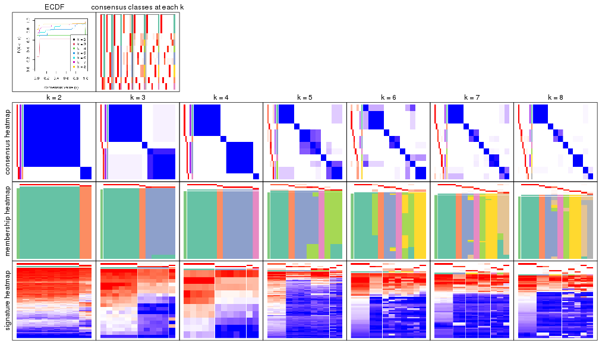

The plots are:

- The first row: a plot of the eCDF (empirical cumulative distribution
  function) curves of the consensus matrix for each `k` and the heatmap of
  predicted classes for each `k`.
- The second row: heatmaps of the consensus matrix for each `k`.
- The third row: heatmaps of the membership matrix for each `k`.
- The fouth row: heatmaps of the signatures for each `k`.

All the plots in panels can be made by individual functions and they are
plotted later in this section.

`select_partition_number()` produces several plots showing different
statistics for choosing "optimized" `k`. There are following statistics:

- eCDF curves of the consensus matrix for each `k`;
- 1-PAC. [The PAC score](https://en.wikipedia.org/wiki/Consensus_clustering#Over-interpretation_potential_of_consensus_clustering)
  measures the proportion of the ambiguous subgrouping.
- Mean silhouette score.
- Concordance. The mean probability of fiting the consensus subgroup labels in all
  partitions.
- Area increased. Denote $A_k$ as the area under the eCDF curve for current
  `k`, the area increased is defined as $A_k - A_{k-1}$.
- Rand index. The percent of pairs of samples that are both in a same cluster
  or both are not in a same cluster in the partition of k and k-1.
- Jaccard index. The ratio of pairs of samples are both in a same cluster in
  the partition of k and k-1 and the pairs of samples are both in a same
  cluster in the partition k or k-1.

The detailed explanations of these statistics can be found in [the _cola_
vignette](https://jokergoo.github.io/cola_vignettes/cola.html#toc_13).

Generally speaking, higher 1-PAC score, higher mean silhouette score or higher
concordance corresponds to better partition. Rand index and Jaccard index
measure how similar the current partition is compared to partition with `k-1`.
If they are too similar, we won't accept `k` is better than `k-1`.

```r
select_partition_number(res)
```


The numeric values for all these statistics can be obtained by `get_stats()`.

```r
get_stats(res)
```

```
#>   k 1-PAC mean_silhouette concordance area_increased  Rand Jaccard
#> 2 2 1.000           1.000       1.000         0.3037 0.697   0.697
#> 3 3 1.000           0.903       0.980         0.9876 0.561   0.420
#> 4 4 1.000           0.833       1.000         0.1550 0.803   0.552
#> 5 5 0.788           0.714       0.922         0.1642 0.818   0.455
#> 6 6 0.833           0.317       0.817         0.0612 0.818   0.294
#> 7 7 0.909           0.648       0.942         0.0401 0.909   0.455
#> 8 8 0.970           0.541       0.957         0.0297 0.985   0.833
```

`suggest_best_k()` suggests the best $k$ based on these statistics. The rules are as follows:

- All $k$ with Jaccard index larger than 0.95 are removed because increasing
  $k$ does not provide enough extra information. If all $k$ are removed, it is
  marked as no subgroup is detected.
- For all $k$ with 1-PAC score larger than 0.9, the maximal $k$ is taken as
  the best $k$, and other $k$ are marked as optional $k$.
- If it does not fit the second rule. The $k$ with the maximal vote of the
  highest 1-PAC score, highest mean silhouette, and highest concordance is
  taken as the best $k$.

```r
suggest_best_k(res)
```

```
#> [1] 7
#> attr(,"optional")
#> [1] 2 3 4
```

There is also optional best $k$ = 2 3 4 that is worth to check.

Following is the table of the partitions (You need to click the **show/hide
code output** link to see it). The membership matrix (columns with name `p*`)
is inferred by
[`clue::cl_consensus()`](https://www.rdocumentation.org/link/cl_consensus?package=clue)
function with the `SE` method. Basically the value in the membership matrix
represents the probability to belong to a certain group. The finall subgroup
label for an item is determined with the group with highest probability it
belongs to.

In `get_classes()` function, the entropy is calculated from the membership
matrix and the silhouette score is calculated from the consensus matrix.


<script>
$( function() {
	$( '#tabs-node-05121-get-classes' ).tabs();
} );
</script>
<div id='tabs-node-05121-get-classes'>
<ul>
<li><a href='#tab-node-05121-get-classes-1'>k = 2</a></li>
<li><a href='#tab-node-05121-get-classes-2'>k = 3</a></li>
<li><a href='#tab-node-05121-get-classes-3'>k = 4</a></li>
<li><a href='#tab-node-05121-get-classes-4'>k = 5</a></li>
<li><a href='#tab-node-05121-get-classes-5'>k = 6</a></li>
<li><a href='#tab-node-05121-get-classes-6'>k = 7</a></li>
<li><a href='#tab-node-05121-get-classes-7'>k = 8</a></li>
</ul>

<div id='tab-node-05121-get-classes-1'>
<p><a id='tab-node-05121-get-classes-1-a' style='color:#0366d6' href='#'>show/hide code output</a></p>
<pre><code class="r">cbind(get_classes(res, k = 2), get_membership(res, k = 2))
</code></pre>

<pre><code>#&gt;                 class entropy silhouette p1 p2
#&gt; TCGA.CR.5248.01     1       0          1  1  0
#&gt; TCGA.CR.6487.01     1       0          1  1  0
#&gt; TCGA.CR.6481.01     1       0          1  1  0
#&gt; TCGA.CR.6470.01     1       0          1  1  0
#&gt; TCGA.BA.A4IH.01     2       0          1  0  1
#&gt; TCGA.CR.6482.01     1       0          1  1  0
#&gt; TCGA.DQ.7596.01     1       0          1  1  0
#&gt; TCGA.H7.A76A.01     1       0          1  1  0
#&gt; TCGA.DQ.7593.01     1       0          1  1  0
#&gt; TCGA.MZ.A5BI.01     2       0          1  0  1
#&gt; TCGA.CR.7404.01     1       0          1  1  0
#&gt; TCGA.KU.A6H7.01     1       0          1  1  0
</code></pre>

<script>
$('#tab-node-05121-get-classes-1-a').parent().next().next().hide();
$('#tab-node-05121-get-classes-1-a').click(function(){
  $('#tab-node-05121-get-classes-1-a').parent().next().next().toggle();
  return(false);
});
</script>
</div>

<div id='tab-node-05121-get-classes-2'>
<p><a id='tab-node-05121-get-classes-2-a' style='color:#0366d6' href='#'>show/hide code output</a></p>
<pre><code class="r">cbind(get_classes(res, k = 3), get_membership(res, k = 3))
</code></pre>

<pre><code>#&gt;                 class entropy silhouette   p1 p2   p3
#&gt; TCGA.CR.5248.01     1   0.000      1.000 1.00  0 0.00
#&gt; TCGA.CR.6487.01     1   0.000      1.000 1.00  0 0.00
#&gt; TCGA.CR.6481.01     1   0.000      1.000 1.00  0 0.00
#&gt; TCGA.CR.6470.01     3   0.207      0.980 0.06  0 0.94
#&gt; TCGA.BA.A4IH.01     2   0.000      0.000 0.00  1 0.00
#&gt; TCGA.CR.6482.01     1   0.000      1.000 1.00  0 0.00
#&gt; TCGA.DQ.7596.01     3   0.207      0.980 0.06  0 0.94
#&gt; TCGA.H7.A76A.01     3   0.207      0.980 0.06  0 0.94
#&gt; TCGA.DQ.7593.01     3   0.207      0.980 0.06  0 0.94
#&gt; TCGA.MZ.A5BI.01     3   0.000      0.915 0.00  0 1.00
#&gt; TCGA.CR.7404.01     1   0.000      1.000 1.00  0 0.00
#&gt; TCGA.KU.A6H7.01     1   0.000      1.000 1.00  0 0.00
</code></pre>

<script>
$('#tab-node-05121-get-classes-2-a').parent().next().next().hide();
$('#tab-node-05121-get-classes-2-a').click(function(){
  $('#tab-node-05121-get-classes-2-a').parent().next().next().toggle();
  return(false);
});
</script>
</div>

<div id='tab-node-05121-get-classes-3'>
<p><a id='tab-node-05121-get-classes-3-a' style='color:#0366d6' href='#'>show/hide code output</a></p>
<pre><code class="r">cbind(get_classes(res, k = 4), get_membership(res, k = 4))
</code></pre>

<pre><code>#&gt;                 class entropy silhouette p1 p2 p3 p4
#&gt; TCGA.CR.5248.01     1       0          1  1  0  0  0
#&gt; TCGA.CR.6487.01     1       0          1  1  0  0  0
#&gt; TCGA.CR.6481.01     1       0          1  1  0  0  0
#&gt; TCGA.CR.6470.01     3       0          1  0  0  1  0
#&gt; TCGA.BA.A4IH.01     2       0          0  0  1  0  0
#&gt; TCGA.CR.6482.01     3       0          1  0  0  1  0
#&gt; TCGA.DQ.7596.01     3       0          1  0  0  1  0
#&gt; TCGA.H7.A76A.01     3       0          1  0  0  1  0
#&gt; TCGA.DQ.7593.01     3       0          1  0  0  1  0
#&gt; TCGA.MZ.A5BI.01     4       0          0  0  0  0  1
#&gt; TCGA.CR.7404.01     1       0          1  1  0  0  0
#&gt; TCGA.KU.A6H7.01     1       0          1  1  0  0  0
</code></pre>

<script>
$('#tab-node-05121-get-classes-3-a').parent().next().next().hide();
$('#tab-node-05121-get-classes-3-a').click(function(){
  $('#tab-node-05121-get-classes-3-a').parent().next().next().toggle();
  return(false);
});
</script>
</div>

<div id='tab-node-05121-get-classes-4'>
<p><a id='tab-node-05121-get-classes-4-a' style='color:#0366d6' href='#'>show/hide code output</a></p>
<pre><code class="r">cbind(get_classes(res, k = 5), get_membership(res, k = 5))
</code></pre>

<pre><code>#&gt;                 class entropy silhouette   p1 p2   p3 p4   p5
#&gt; TCGA.CR.5248.01     1   0.327      1.000 0.78  0 0.00  0 0.22
#&gt; TCGA.CR.6487.01     1   0.327      1.000 0.78  0 0.00  0 0.22
#&gt; TCGA.CR.6481.01     5   0.000      0.837 0.00  0 0.00  0 1.00
#&gt; TCGA.CR.6470.01     3   0.327      0.823 0.22  0 0.78  0 0.00
#&gt; TCGA.BA.A4IH.01     2   0.000      0.000 0.00  1 0.00  0 0.00
#&gt; TCGA.CR.6482.01     5   0.327      0.660 0.00  0 0.22  0 0.78
#&gt; TCGA.DQ.7596.01     3   0.327      0.823 0.22  0 0.78  0 0.00
#&gt; TCGA.H7.A76A.01     3   0.141      0.778 0.00  0 0.94  0 0.06
#&gt; TCGA.DQ.7593.01     3   0.000      0.813 0.00  0 1.00  0 0.00
#&gt; TCGA.MZ.A5BI.01     4   0.000      0.000 0.00  0 0.00  1 0.00
#&gt; TCGA.CR.7404.01     1   0.327      1.000 0.78  0 0.00  0 0.22
#&gt; TCGA.KU.A6H7.01     5   0.000      0.837 0.00  0 0.00  0 1.00
</code></pre>

<script>
$('#tab-node-05121-get-classes-4-a').parent().next().next().hide();
$('#tab-node-05121-get-classes-4-a').click(function(){
  $('#tab-node-05121-get-classes-4-a').parent().next().next().toggle();
  return(false);
});
</script>
</div>

<div id='tab-node-05121-get-classes-5'>
<p><a id='tab-node-05121-get-classes-5-a' style='color:#0366d6' href='#'>show/hide code output</a></p>
<pre><code class="r">cbind(get_classes(res, k = 6), get_membership(res, k = 6))
</code></pre>

<pre><code>#&gt;                 class entropy silhouette   p1 p2   p3 p4   p5   p6
#&gt; TCGA.CR.5248.01     1   0.000     0.7589 1.00  0 0.00  0 0.00 0.00
#&gt; TCGA.CR.6487.01     1   0.000     0.7589 1.00  0 0.00  0 0.00 0.00
#&gt; TCGA.CR.6481.01     1   0.609    -0.0707 0.36  0 0.00  0 0.36 0.28
#&gt; TCGA.CR.6470.01     3   0.000     0.9162 0.00  0 1.00  0 0.00 0.00
#&gt; TCGA.BA.A4IH.01     2   0.000     0.0000 0.00  1 0.00  0 0.00 0.00
#&gt; TCGA.CR.6482.01     5   0.000     0.0000 0.00  0 0.00  0 1.00 0.00
#&gt; TCGA.DQ.7596.01     3   0.156     0.9163 0.00  0 0.92  0 0.00 0.08
#&gt; TCGA.H7.A76A.01     6   0.386     0.0610 0.00  0 0.00  0 0.48 0.52
#&gt; TCGA.DQ.7593.01     6   0.386     0.0610 0.00  0 0.00  0 0.48 0.52
#&gt; TCGA.MZ.A5BI.01     4   0.000     0.0000 0.00  0 0.00  1 0.00 0.00
#&gt; TCGA.CR.7404.01     1   0.000     0.7589 1.00  0 0.00  0 0.00 0.00
#&gt; TCGA.KU.A6H7.01     6   0.577    -0.3523 0.18  0 0.00  0 0.36 0.46
</code></pre>

<script>
$('#tab-node-05121-get-classes-5-a').parent().next().next().hide();
$('#tab-node-05121-get-classes-5-a').click(function(){
  $('#tab-node-05121-get-classes-5-a').parent().next().next().toggle();
  return(false);
});
</script>
</div>

<div id='tab-node-05121-get-classes-6'>
<p><a id='tab-node-05121-get-classes-6-a' style='color:#0366d6' href='#'>show/hide code output</a></p>
<pre><code class="r">cbind(get_classes(res, k = 7), get_membership(res, k = 7))
</code></pre>

<pre><code>#&gt;                 class entropy silhouette   p1 p2   p3 p4   p5   p6   p7
#&gt; TCGA.CR.5248.01     1  0.0000      1.000 1.00  0 0.00  0 0.00 0.00 0.00
#&gt; TCGA.CR.6487.01     1  0.0000      1.000 1.00  0 0.00  0 0.00 0.00 0.00
#&gt; TCGA.CR.6481.01     7  0.4615      0.578 0.30  0 0.00  0 0.10 0.00 0.60
#&gt; TCGA.CR.6470.01     3  0.2016      0.833 0.00  0 0.90  0 0.04 0.00 0.06
#&gt; TCGA.BA.A4IH.01     2  0.0000      0.000 0.00  1 0.00  0 0.00 0.00 0.00
#&gt; TCGA.CR.6482.01     5  0.0863      0.000 0.00  0 0.00  0 0.96 0.04 0.00
#&gt; TCGA.DQ.7596.01     3  0.1433      0.833 0.00  0 0.92  0 0.00 0.08 0.00
#&gt; TCGA.H7.A76A.01     6  0.0504      0.975 0.00  0 0.00  0 0.02 0.98 0.00
#&gt; TCGA.DQ.7593.01     6  0.0000      0.976 0.00  0 0.00  0 0.00 1.00 0.00
#&gt; TCGA.MZ.A5BI.01     4  0.0000      0.000 0.00  0 0.00  1 0.00 0.00 0.00
#&gt; TCGA.CR.7404.01     1  0.0000      1.000 1.00  0 0.00  0 0.00 0.00 0.00
#&gt; TCGA.KU.A6H7.01     7  0.1166      0.578 0.06  0 0.00  0 0.00 0.00 0.94
</code></pre>

<script>
$('#tab-node-05121-get-classes-6-a').parent().next().next().hide();
$('#tab-node-05121-get-classes-6-a').click(function(){
  $('#tab-node-05121-get-classes-6-a').parent().next().next().toggle();
  return(false);
});
</script>
</div>

<div id='tab-node-05121-get-classes-7'>
<p><a id='tab-node-05121-get-classes-7-a' style='color:#0366d6' href='#'>show/hide code output</a></p>
<pre><code class="r">cbind(get_classes(res, k = 8), get_membership(res, k = 8))
</code></pre>

<pre><code>#&gt;                 class entropy silhouette   p1 p2   p3 p4   p5   p6   p7   p8
#&gt; TCGA.CR.5248.01     1  0.0000      1.000 1.00  0 0.00  0 0.00 0.00 0.00 0.00
#&gt; TCGA.CR.6487.01     1  0.0000      1.000 1.00  0 0.00  0 0.00 0.00 0.00 0.00
#&gt; TCGA.CR.6481.01     7  0.0808      0.000 0.04  0 0.00  0 0.00 0.00 0.96 0.00
#&gt; TCGA.CR.6470.01     3  0.0000      0.748 0.00  0 1.00  0 0.00 0.00 0.00 0.00
#&gt; TCGA.BA.A4IH.01     2  0.0000      0.000 0.00  1 0.00  0 0.00 0.00 0.00 0.00
#&gt; TCGA.CR.6482.01     5  0.1091      0.000 0.00  0 0.00  0 0.94 0.00 0.06 0.00
#&gt; TCGA.DQ.7596.01     3  0.4511      0.748 0.00  0 0.72  0 0.06 0.04 0.04 0.14
#&gt; TCGA.H7.A76A.01     6  0.0000      1.000 0.00  0 0.00  0 0.00 1.00 0.00 0.00
#&gt; TCGA.DQ.7593.01     6  0.0000      1.000 0.00  0 0.00  0 0.00 1.00 0.00 0.00
#&gt; TCGA.MZ.A5BI.01     4  0.0000      0.000 0.00  0 0.00  1 0.00 0.00 0.00 0.00
#&gt; TCGA.CR.7404.01     1  0.0000      1.000 1.00  0 0.00  0 0.00 0.00 0.00 0.00
#&gt; TCGA.KU.A6H7.01     8  0.1947      0.000 0.00  0 0.00  0 0.00 0.00 0.14 0.86
</code></pre>

<script>
$('#tab-node-05121-get-classes-7-a').parent().next().next().hide();
$('#tab-node-05121-get-classes-7-a').click(function(){
  $('#tab-node-05121-get-classes-7-a').parent().next().next().toggle();
  return(false);
});
</script>
</div>
</div>

Heatmaps for the consensus matrix. It visualizes the probability of two
samples to be in a same group.


<script>
$( function() {
	$( '#tabs-node-05121-consensus-heatmap' ).tabs();
} );
</script>
<div id='tabs-node-05121-consensus-heatmap'>
<ul>
<li><a href='#tab-node-05121-consensus-heatmap-1'>k = 2</a></li>
<li><a href='#tab-node-05121-consensus-heatmap-2'>k = 3</a></li>
<li><a href='#tab-node-05121-consensus-heatmap-3'>k = 4</a></li>
<li><a href='#tab-node-05121-consensus-heatmap-4'>k = 5</a></li>
<li><a href='#tab-node-05121-consensus-heatmap-5'>k = 6</a></li>
<li><a href='#tab-node-05121-consensus-heatmap-6'>k = 7</a></li>
<li><a href='#tab-node-05121-consensus-heatmap-7'>k = 8</a></li>
</ul>
<div id='tab-node-05121-consensus-heatmap-1'>
<pre><code class="r">consensus_heatmap(res, k = 2)
</code></pre>

<p>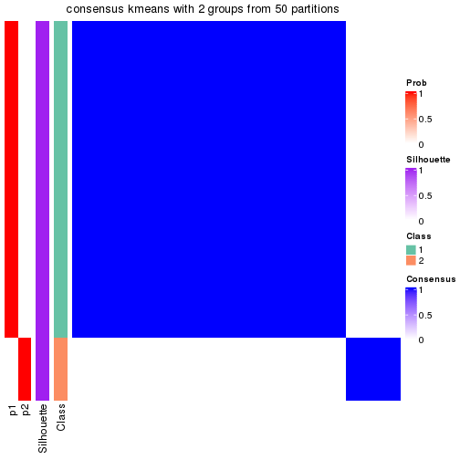</p>

</div>
<div id='tab-node-05121-consensus-heatmap-2'>
<pre><code class="r">consensus_heatmap(res, k = 3)
</code></pre>

<p>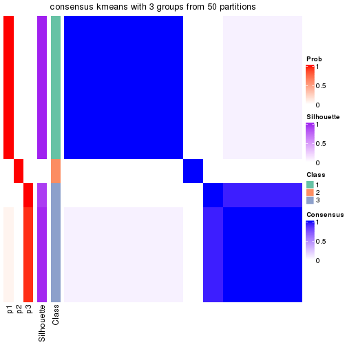</p>

</div>
<div id='tab-node-05121-consensus-heatmap-3'>
<pre><code class="r">consensus_heatmap(res, k = 4)
</code></pre>

<p>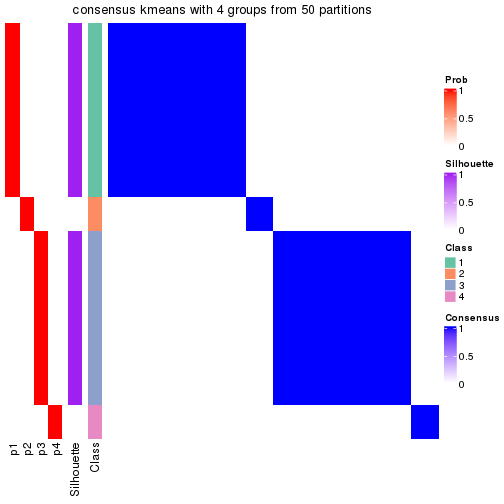</p>

</div>
<div id='tab-node-05121-consensus-heatmap-4'>
<pre><code class="r">consensus_heatmap(res, k = 5)
</code></pre>

<p>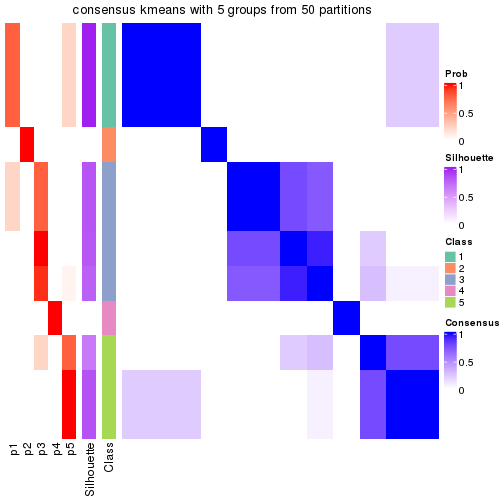</p>

</div>
<div id='tab-node-05121-consensus-heatmap-5'>
<pre><code class="r">consensus_heatmap(res, k = 6)
</code></pre>

<p>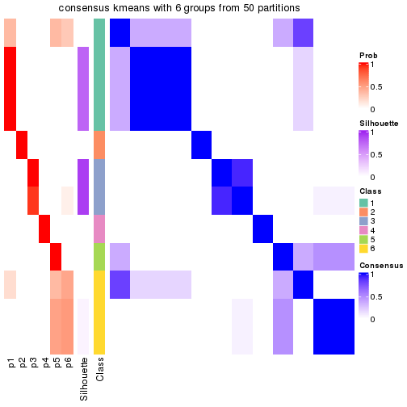</p>

</div>
<div id='tab-node-05121-consensus-heatmap-6'>
<pre><code class="r">consensus_heatmap(res, k = 7)
</code></pre>

<p>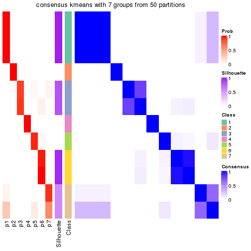</p>

</div>
<div id='tab-node-05121-consensus-heatmap-7'>
<pre><code class="r">consensus_heatmap(res, k = 8)
</code></pre>

<p>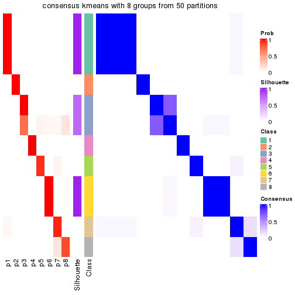</p>

</div>
</div>

Heatmaps for the membership of samples in all partitions to see how consistent they are:


<script>
$( function() {
	$( '#tabs-node-05121-membership-heatmap' ).tabs();
} );
</script>
<div id='tabs-node-05121-membership-heatmap'>
<ul>
<li><a href='#tab-node-05121-membership-heatmap-1'>k = 2</a></li>
<li><a href='#tab-node-05121-membership-heatmap-2'>k = 3</a></li>
<li><a href='#tab-node-05121-membership-heatmap-3'>k = 4</a></li>
<li><a href='#tab-node-05121-membership-heatmap-4'>k = 5</a></li>
<li><a href='#tab-node-05121-membership-heatmap-5'>k = 6</a></li>
<li><a href='#tab-node-05121-membership-heatmap-6'>k = 7</a></li>
<li><a href='#tab-node-05121-membership-heatmap-7'>k = 8</a></li>
</ul>
<div id='tab-node-05121-membership-heatmap-1'>
<pre><code class="r">membership_heatmap(res, k = 2)
</code></pre>

<p>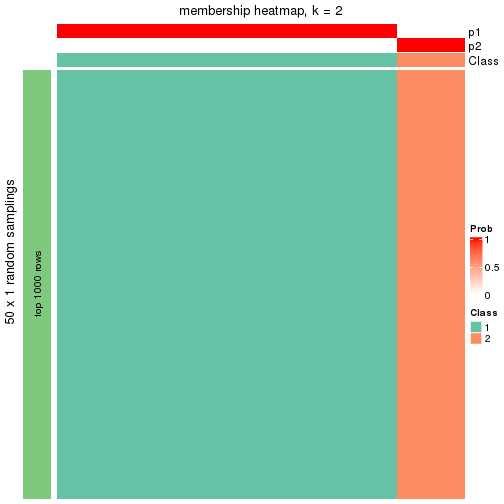</p>

</div>
<div id='tab-node-05121-membership-heatmap-2'>
<pre><code class="r">membership_heatmap(res, k = 3)
</code></pre>

<p>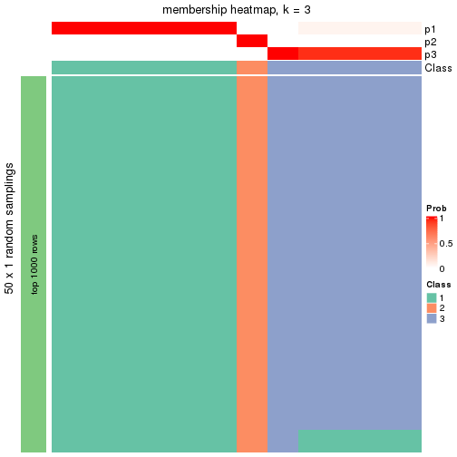</p>

</div>
<div id='tab-node-05121-membership-heatmap-3'>
<pre><code class="r">membership_heatmap(res, k = 4)
</code></pre>

<p>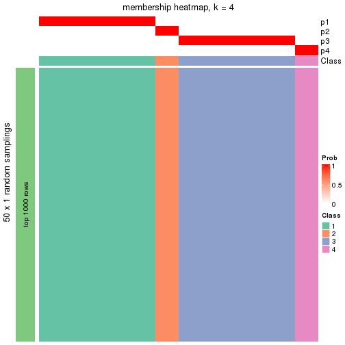</p>

</div>
<div id='tab-node-05121-membership-heatmap-4'>
<pre><code class="r">membership_heatmap(res, k = 5)
</code></pre>

<p>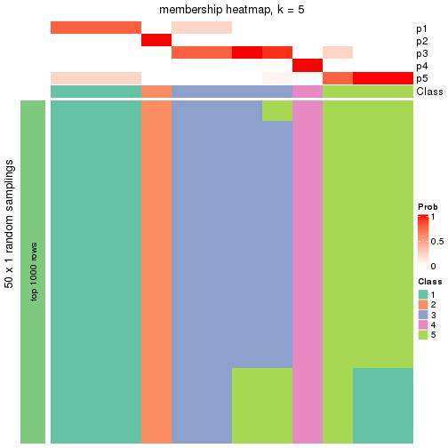</p>

</div>
<div id='tab-node-05121-membership-heatmap-5'>
<pre><code class="r">membership_heatmap(res, k = 6)
</code></pre>

<p>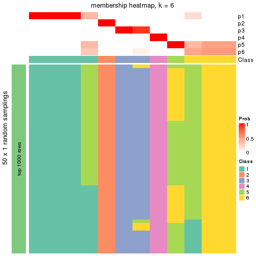</p>

</div>
<div id='tab-node-05121-membership-heatmap-6'>
<pre><code class="r">membership_heatmap(res, k = 7)
</code></pre>

<p>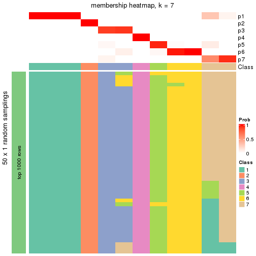</p>

</div>
<div id='tab-node-05121-membership-heatmap-7'>
<pre><code class="r">membership_heatmap(res, k = 8)
</code></pre>

<p>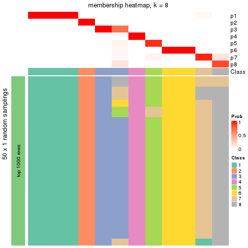</p>

</div>
</div>

As soon as the classes for columns are determined, the signatures
that are significantly different between subgroups can be looked for. 
Following are the heatmaps for signatures.


<script>
$( function() {
	$( '#tabs-node-05121-get-signatures' ).tabs();
} );
</script>
<div id='tabs-node-05121-get-signatures'>
<ul>
<li><a href='#tab-node-05121-get-signatures-1'>k = 2</a></li>
<li><a href='#tab-node-05121-get-signatures-2'>k = 3</a></li>
<li><a href='#tab-node-05121-get-signatures-3'>k = 4</a></li>
<li><a href='#tab-node-05121-get-signatures-4'>k = 5</a></li>
<li><a href='#tab-node-05121-get-signatures-5'>k = 6</a></li>
<li><a href='#tab-node-05121-get-signatures-6'>k = 7</a></li>
<li><a href='#tab-node-05121-get-signatures-7'>k = 8</a></li>
</ul>
<div id='tab-node-05121-get-signatures-1'>
<pre><code class="r">get_signatures(res, k = 2)
</code></pre>

<p>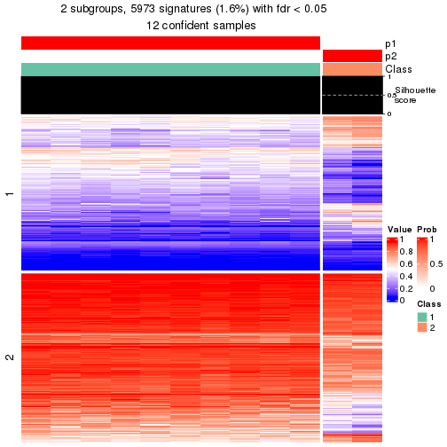</p>

</div>
<div id='tab-node-05121-get-signatures-2'>
<pre><code class="r">get_signatures(res, k = 3)
</code></pre>

<p>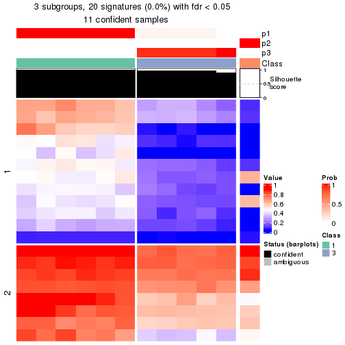</p>

</div>
<div id='tab-node-05121-get-signatures-3'>
<pre><code class="r">get_signatures(res, k = 4)
</code></pre>

<p>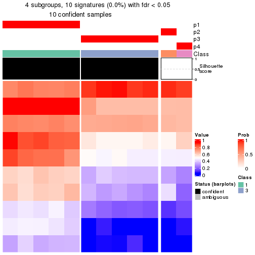</p>

</div>
<div id='tab-node-05121-get-signatures-4'>
<pre><code class="r">get_signatures(res, k = 5)
</code></pre>

<p>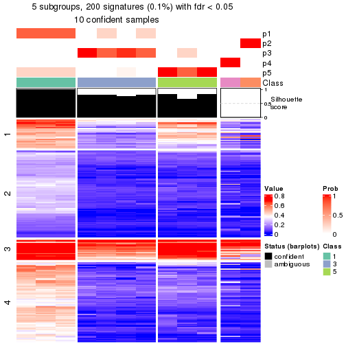</p>

</div>
<div id='tab-node-05121-get-signatures-5'>
<pre><code class="r">get_signatures(res, k = 6)
</code></pre>

<p>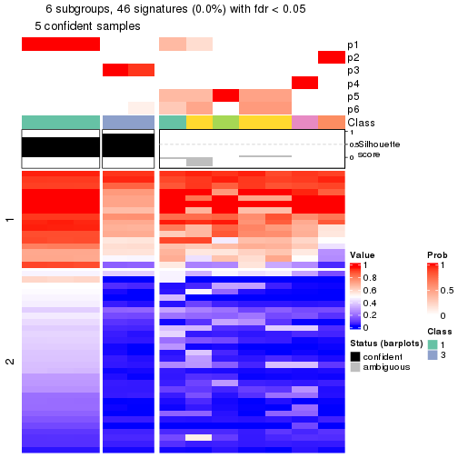</p>

</div>
<div id='tab-node-05121-get-signatures-6'>
<pre><code class="r">get_signatures(res, k = 7)
</code></pre>

<p>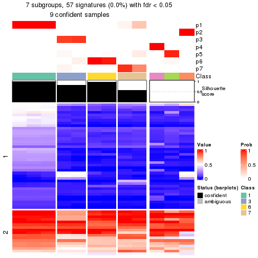</p>

</div>
<div id='tab-node-05121-get-signatures-7'>
<pre><code class="r">get_signatures(res, k = 8)
</code></pre>

<p>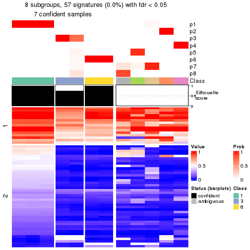</p>

</div>
</div>


Compare the overlap of signatures from different k:

```r
compare_signatures(res)
```

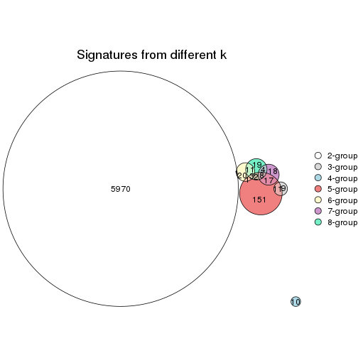

`get_signature()` returns a data frame invisibly. To get the list of signatures, the function
call should be assigned to a variable explicitly. In following code, if `plot` argument is set
to `FALSE`, no heatmap is plotted while only the differential analysis is performed.

```r
# code only for demonstration
tb = get_signature(res, k = ..., plot = FALSE)
```

An example of the output of `tb` is:

```
#>   which_row         fdr    mean_1    mean_2 scaled_mean_1 scaled_mean_2 km
#> 1        38 0.042760348  8.373488  9.131774    -0.5533452     0.5164555  1
#> 2        40 0.018707592  7.106213  8.469186    -0.6173731     0.5762149  1
#> 3        55 0.019134737 10.221463 11.207825    -0.6159697     0.5749050  1
#> 4        59 0.006059896  5.921854  7.869574    -0.6899429     0.6439467  1
#> 5        60 0.018055526  8.928898 10.211722    -0.6204761     0.5791110  1
#> 6        98 0.009384629 15.714769 14.887706     0.6635654    -0.6193277  2
...
```

The columns in `tb` are:

1. `which_row`: row indices corresponding to the input matrix.
2. `fdr`: FDR for the differential test. 
3. `mean_x`: The mean value in group x.
4. `scaled_mean_x`: The mean value in group x after rows are scaled.
5. `km`: Row groups if k-means clustering is applied to rows (which is done by automatically selecting number of clusters).

If there are too many signatures, `top_signatures = ...` can be set to only show the 
signatures with the highest FDRs:

```r
# code only for demonstration
# e.g. to show the top 500 most significant rows
tb = get_signature(res, k = ..., top_signatures = 500)
```

If the signatures are defined as these which are uniquely high in current group, `diff_method` argument
can be set to `"uniquely_high_in_one_group"`:

```r
# code only for demonstration
tb = get_signature(res, k = ..., diff_method = "uniquely_high_in_one_group")
```


UMAP plot which shows how samples are separated.


<script>
$( function() {
	$( '#tabs-node-05121-dimension-reduction' ).tabs();
} );
</script>
<div id='tabs-node-05121-dimension-reduction'>
<ul>
<li><a href='#tab-node-05121-dimension-reduction-1'>k = 2</a></li>
<li><a href='#tab-node-05121-dimension-reduction-2'>k = 3</a></li>
<li><a href='#tab-node-05121-dimension-reduction-3'>k = 4</a></li>
<li><a href='#tab-node-05121-dimension-reduction-4'>k = 5</a></li>
<li><a href='#tab-node-05121-dimension-reduction-5'>k = 6</a></li>
<li><a href='#tab-node-05121-dimension-reduction-6'>k = 7</a></li>
<li><a href='#tab-node-05121-dimension-reduction-7'>k = 8</a></li>
</ul>
<div id='tab-node-05121-dimension-reduction-1'>
<pre><code class="r">dimension_reduction(res, k = 2, method = &quot;UMAP&quot;)
</code></pre>

<p>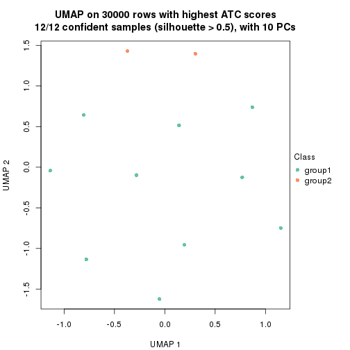</p>

</div>
<div id='tab-node-05121-dimension-reduction-2'>
<pre><code class="r">dimension_reduction(res, k = 3, method = &quot;UMAP&quot;)
</code></pre>

<p>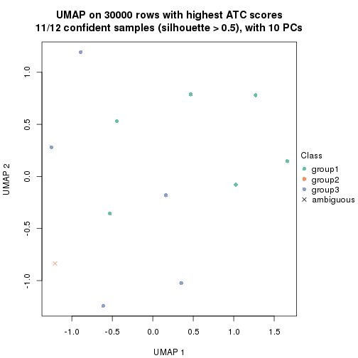</p>

</div>
<div id='tab-node-05121-dimension-reduction-3'>
<pre><code class="r">dimension_reduction(res, k = 4, method = &quot;UMAP&quot;)
</code></pre>

<p>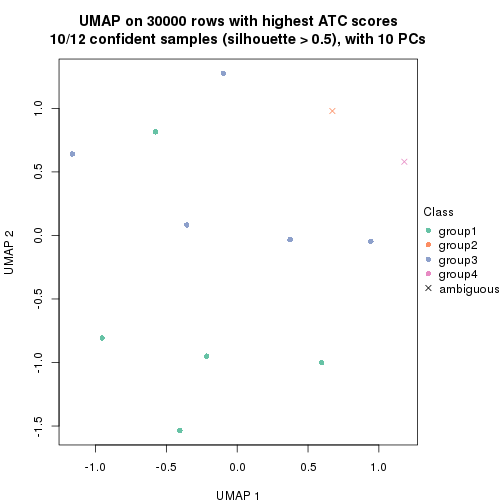</p>

</div>
<div id='tab-node-05121-dimension-reduction-4'>
<pre><code class="r">dimension_reduction(res, k = 5, method = &quot;UMAP&quot;)
</code></pre>

<p>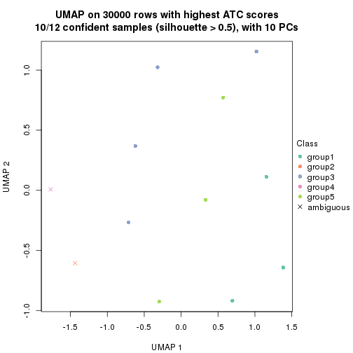</p>

</div>
<div id='tab-node-05121-dimension-reduction-5'>
<pre><code class="r">dimension_reduction(res, k = 6, method = &quot;UMAP&quot;)
</code></pre>

<p>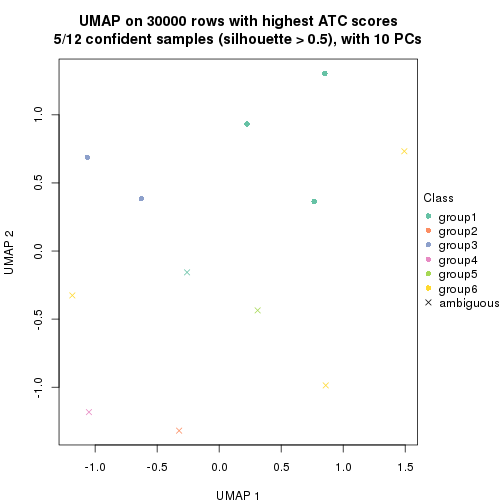</p>

</div>
<div id='tab-node-05121-dimension-reduction-6'>
<pre><code class="r">dimension_reduction(res, k = 7, method = &quot;UMAP&quot;)
</code></pre>

<p>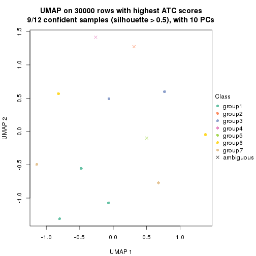</p>

</div>
<div id='tab-node-05121-dimension-reduction-7'>
<pre><code class="r">dimension_reduction(res, k = 8, method = &quot;UMAP&quot;)
</code></pre>

<p>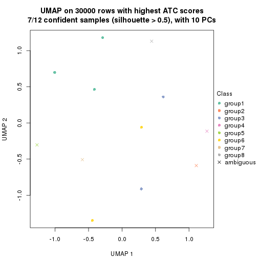</p>

</div>
</div>


Following heatmap shows how subgroups are split when increasing `k`:

```r
collect_classes(res)
```

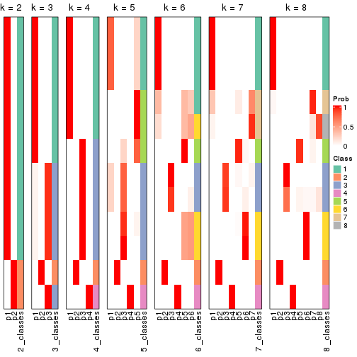


If matrix rows can be associated to genes, consider to use `functional_enrichment(res,
...)` to perform function enrichment for the signature genes. See [this vignette](https://jokergoo.github.io/cola_vignettes/functional_enrichment.html) for more detailed explanations.


 

---------------------------------------------------


### Node052


Parent node: [Node05](#Node05).
Child nodes: 
                Node0111-leaf
        ,
                Node0112-leaf
        ,
                Node0113-leaf
        ,
                [Node0121](#Node0121)
        ,
                [Node0122](#Node0122)
        ,
                [Node0211](#Node0211)
        ,
                [Node0212](#Node0212)
        ,
                [Node0213](#Node0213)
        ,
                [Node0221](#Node0221)
        ,
                [Node0222](#Node0222)
        ,
                [Node0223](#Node0223)
        ,
                [Node0224](#Node0224)
        ,
                Node0225-leaf
        ,
                Node0231-leaf
        ,
                [Node0232](#Node0232)
        ,
                Node0233-leaf
        ,
                Node0234-leaf
        ,
                Node0331-leaf
        ,
                Node0332-leaf
        ,
                Node0333-leaf
        ,
                Node0431-leaf
        ,
                Node0432-leaf
        ,
                Node0433-leaf
        ,
                [Node0511](#Node0511)
        ,
                [Node0512](#Node0512)
        ,
                Node0521-leaf
        ,
                [Node0522](#Node0522)
        ,
                Node0523-leaf
        ,
                Node0524-leaf
        .


The object with results only for a single top-value method and a single partitioning method 
can be extracted as:

```r
res = res_rh["052"]
```

A summary of `res` and all the functions that can be applied to it:

```r
res
```

```
#> A 'ConsensusPartition' object with k = 2, 3, 4, 5, 6, 7, 8.
#>   On a matrix with 30000 rows and 37 columns.
#>   Top rows (1000) are extracted by 'ATC' method.
#>   Subgroups are detected by 'skmeans' method.
#>   Performed in total 350 partitions by row resampling.
#>   Best k for subgroups seems to be 4.
#> 
#> Following methods can be applied to this 'ConsensusPartition' object:
#>  [1] "cola_report"             "collect_classes"         "collect_plots"          
#>  [4] "collect_stats"           "colnames"                "compare_partitions"     
#>  [7] "compare_signatures"      "consensus_heatmap"       "dimension_reduction"    
#> [10] "functional_enrichment"   "get_anno_col"            "get_anno"               
#> [13] "get_classes"             "get_consensus"           "get_matrix"             
#> [16] "get_membership"          "get_param"               "get_signatures"         
#> [19] "get_stats"               "is_best_k"               "is_stable_k"            
#> [22] "membership_heatmap"      "ncol"                    "nrow"                   
#> [25] "plot_ecdf"               "predict_classes"         "rownames"               
#> [28] "select_partition_number" "show"                    "suggest_best_k"         
#> [31] "test_to_known_factors"   "top_rows_heatmap"
```

`collect_plots()` function collects all the plots made from `res` for all `k` (number of subgroups)
into one single page to provide an easy and fast comparison between different `k`.

```r
collect_plots(res)
```

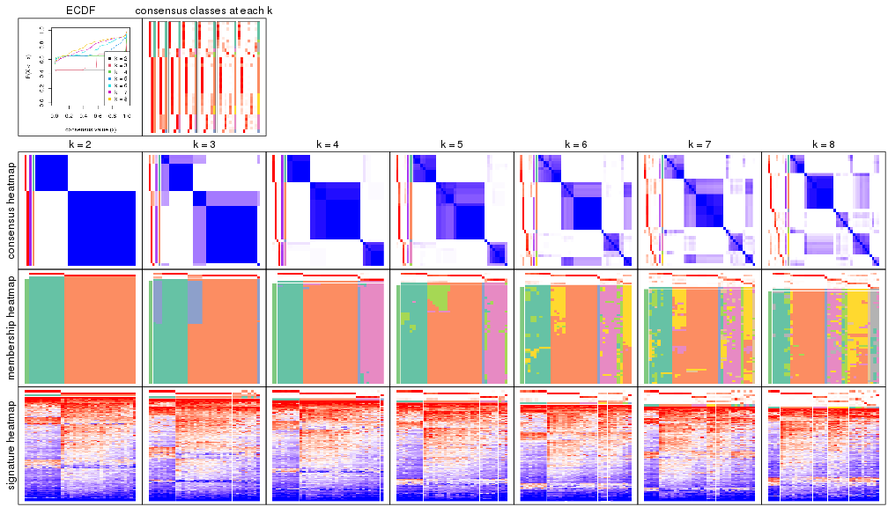

The plots are:

- The first row: a plot of the eCDF (empirical cumulative distribution
  function) curves of the consensus matrix for each `k` and the heatmap of
  predicted classes for each `k`.
- The second row: heatmaps of the consensus matrix for each `k`.
- The third row: heatmaps of the membership matrix for each `k`.
- The fouth row: heatmaps of the signatures for each `k`.

All the plots in panels can be made by individual functions and they are
plotted later in this section.

`select_partition_number()` produces several plots showing different
statistics for choosing "optimized" `k`. There are following statistics:

- eCDF curves of the consensus matrix for each `k`;
- 1-PAC. [The PAC score](https://en.wikipedia.org/wiki/Consensus_clustering#Over-interpretation_potential_of_consensus_clustering)
  measures the proportion of the ambiguous subgrouping.
- Mean silhouette score.
- Concordance. The mean probability of fiting the consensus subgroup labels in all
  partitions.
- Area increased. Denote $A_k$ as the area under the eCDF curve for current
  `k`, the area increased is defined as $A_k - A_{k-1}$.
- Rand index. The percent of pairs of samples that are both in a same cluster
  or both are not in a same cluster in the partition of k and k-1.
- Jaccard index. The ratio of pairs of samples are both in a same cluster in
  the partition of k and k-1 and the pairs of samples are both in a same
  cluster in the partition k or k-1.

The detailed explanations of these statistics can be found in [the _cola_
vignette](https://jokergoo.github.io/cola_vignettes/cola.html#toc_13).

Generally speaking, higher 1-PAC score, higher mean silhouette score or higher
concordance corresponds to better partition. Rand index and Jaccard index
measure how similar the current partition is compared to partition with `k-1`.
If they are too similar, we won't accept `k` is better than `k-1`.

```r
select_partition_number(res)
```

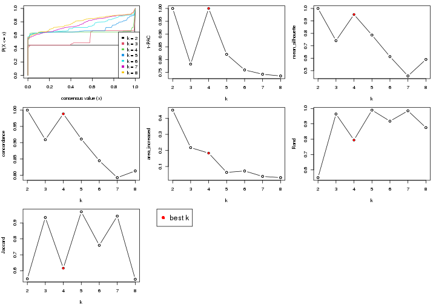

The numeric values for all these statistics can be obtained by `get_stats()`.

```r
get_stats(res)
```

```
#>   k 1-PAC mean_silhouette concordance area_increased  Rand Jaccard
#> 2 2 1.000           1.000       1.000         0.4510 0.550   0.550
#> 3 3 0.783           0.741       0.909         0.2173 0.964   0.934
#> 4 4 1.000           0.951       0.989         0.1832 0.794   0.616
#> 5 5 0.821           0.786       0.911         0.0632 0.989   0.970
#> 6 6 0.760           0.613       0.845         0.0719 0.917   0.760
#> 7 7 0.743           0.458       0.793         0.0381 0.985   0.943
#> 8 8 0.736           0.591       0.814         0.0305 0.875   0.546
```

`suggest_best_k()` suggests the best $k$ based on these statistics. The rules are as follows:

- All $k$ with Jaccard index larger than 0.95 are removed because increasing
  $k$ does not provide enough extra information. If all $k$ are removed, it is
  marked as no subgroup is detected.
- For all $k$ with 1-PAC score larger than 0.9, the maximal $k$ is taken as
  the best $k$, and other $k$ are marked as optional $k$.
- If it does not fit the second rule. The $k$ with the maximal vote of the
  highest 1-PAC score, highest mean silhouette, and highest concordance is
  taken as the best $k$.

```r
suggest_best_k(res)
```

```
#> [1] 4
#> attr(,"optional")
#> [1] 2
```

There is also optional best $k$ = 2 that is worth to check.

Following is the table of the partitions (You need to click the **show/hide
code output** link to see it). The membership matrix (columns with name `p*`)
is inferred by
[`clue::cl_consensus()`](https://www.rdocumentation.org/link/cl_consensus?package=clue)
function with the `SE` method. Basically the value in the membership matrix
represents the probability to belong to a certain group. The finall subgroup
label for an item is determined with the group with highest probability it
belongs to.

In `get_classes()` function, the entropy is calculated from the membership
matrix and the silhouette score is calculated from the consensus matrix.


<script>
$( function() {
	$( '#tabs-node-052-get-classes' ).tabs();
} );
</script>
<div id='tabs-node-052-get-classes'>
<ul>
<li><a href='#tab-node-052-get-classes-1'>k = 2</a></li>
<li><a href='#tab-node-052-get-classes-2'>k = 3</a></li>
<li><a href='#tab-node-052-get-classes-3'>k = 4</a></li>
<li><a href='#tab-node-052-get-classes-4'>k = 5</a></li>
<li><a href='#tab-node-052-get-classes-5'>k = 6</a></li>
<li><a href='#tab-node-052-get-classes-6'>k = 7</a></li>
<li><a href='#tab-node-052-get-classes-7'>k = 8</a></li>
</ul>

<div id='tab-node-052-get-classes-1'>
<p><a id='tab-node-052-get-classes-1-a' style='color:#0366d6' href='#'>show/hide code output</a></p>
<pre><code class="r">cbind(get_classes(res, k = 2), get_membership(res, k = 2))
</code></pre>

<pre><code>#&gt;                 class entropy silhouette p1 p2
#&gt; TCGA.CN.6022.01     2       0          1  0  1
#&gt; TCGA.CV.5432.01     1       0          1  1  0
#&gt; TCGA.IQ.7632.01     2       0          1  0  1
#&gt; TCGA.CV.7421.01     2       0          1  0  1
#&gt; TCGA.CX.7086.01     1       0          1  1  0
#&gt; TCGA.IQ.7631.01     2       0          1  0  1
#&gt; TCGA.CX.7082.01     1       0          1  1  0
#&gt; TCGA.CR.7379.01     2       0          1  0  1
#&gt; TCGA.CR.7399.01     2       0          1  0  1
#&gt; TCGA.CV.7103.01     1       0          1  1  0
#&gt; TCGA.CV.5441.11     2       0          1  0  1
#&gt; TCGA.CV.7255.01     1       0          1  1  0
#&gt; TCGA.CR.7392.01     2       0          1  0  1
#&gt; TCGA.CV.5431.01     2       0          1  0  1
#&gt; TCGA.CR.6484.01     2       0          1  0  1
#&gt; TCGA.CV.A45W.01     2       0          1  0  1
#&gt; TCGA.KU.A66T.01     1       0          1  1  0
#&gt; TCGA.BA.A8YP.01     1       0          1  1  0
#&gt; TCGA.CQ.7069.01     2       0          1  0  1
#&gt; TCGA.P3.A5QA.01     2       0          1  0  1
#&gt; TCGA.CN.A63V.01     2       0          1  0  1
#&gt; TCGA.QK.A8ZB.01     2       0          1  0  1
#&gt; TCGA.CV.A45Z.01     2       0          1  0  1
#&gt; TCGA.CN.4722.01     2       0          1  0  1
#&gt; TCGA.P3.A6T3.01     1       0          1  1  0
#&gt; TCGA.UF.A71B.01     2       0          1  0  1
#&gt; TCGA.CN.4737.01     2       0          1  0  1
#&gt; TCGA.TN.A7HJ.01     2       0          1  0  1
#&gt; TCGA.CN.4740.01     2       0          1  0  1
#&gt; TCGA.D6.A6ES.01     1       0          1  1  0
#&gt; TCGA.CV.A6JY.01     2       0          1  0  1
#&gt; TCGA.WA.A7H4.01     2       0          1  0  1
#&gt; TCGA.CV.A6JM.01     1       0          1  1  0
#&gt; TCGA.QK.A6IJ.01     2       0          1  0  1
#&gt; TCGA.CV.A6JE.01     1       0          1  1  0
#&gt; TCGA.QK.A6IH.01     1       0          1  1  0
#&gt; TCGA.WA.A7GZ.01     2       0          1  0  1
</code></pre>

<script>
$('#tab-node-052-get-classes-1-a').parent().next().next().hide();
$('#tab-node-052-get-classes-1-a').click(function(){
  $('#tab-node-052-get-classes-1-a').parent().next().next().toggle();
  return(false);
});
</script>
</div>

<div id='tab-node-052-get-classes-2'>
<p><a id='tab-node-052-get-classes-2-a' style='color:#0366d6' href='#'>show/hide code output</a></p>
<pre><code class="r">cbind(get_classes(res, k = 3), get_membership(res, k = 3))
</code></pre>

<pre><code>#&gt;                 class entropy silhouette   p1   p2   p3
#&gt; TCGA.CN.6022.01     2  0.0000      0.892 0.00 1.00 0.00
#&gt; TCGA.CV.5432.01     1  0.0000      0.856 1.00 0.00 0.00
#&gt; TCGA.IQ.7632.01     2  0.0000      0.892 0.00 1.00 0.00
#&gt; TCGA.CV.7421.01     2  0.6192      0.359 0.00 0.58 0.42
#&gt; TCGA.CX.7086.01     1  0.0000      0.856 1.00 0.00 0.00
#&gt; TCGA.IQ.7631.01     3  0.0892      0.000 0.00 0.02 0.98
#&gt; TCGA.CX.7082.01     1  0.0000      0.856 1.00 0.00 0.00
#&gt; TCGA.CR.7379.01     2  0.0000      0.892 0.00 1.00 0.00
#&gt; TCGA.CR.7399.01     2  0.0000      0.892 0.00 1.00 0.00
#&gt; TCGA.CV.7103.01     1  0.6126      0.353 0.60 0.00 0.40
#&gt; TCGA.CV.5441.11     2  0.0000      0.892 0.00 1.00 0.00
#&gt; TCGA.CV.7255.01     1  0.0000      0.856 1.00 0.00 0.00
#&gt; TCGA.CR.7392.01     2  0.0000      0.892 0.00 1.00 0.00
#&gt; TCGA.CV.5431.01     2  0.0000      0.892 0.00 1.00 0.00
#&gt; TCGA.CR.6484.01     2  0.0000      0.892 0.00 1.00 0.00
#&gt; TCGA.CV.A45W.01     2  0.0000      0.892 0.00 1.00 0.00
#&gt; TCGA.KU.A66T.01     1  0.0000      0.856 1.00 0.00 0.00
#&gt; TCGA.BA.A8YP.01     1  0.0000      0.856 1.00 0.00 0.00
#&gt; TCGA.CQ.7069.01     2  0.0000      0.892 0.00 1.00 0.00
#&gt; TCGA.P3.A5QA.01     2  0.6192      0.359 0.00 0.58 0.42
#&gt; TCGA.CN.A63V.01     2  0.0000      0.892 0.00 1.00 0.00
#&gt; TCGA.QK.A8ZB.01     2  0.0000      0.892 0.00 1.00 0.00
#&gt; TCGA.CV.A45Z.01     2  0.0000      0.892 0.00 1.00 0.00
#&gt; TCGA.CN.4722.01     2  0.0000      0.892 0.00 1.00 0.00
#&gt; TCGA.P3.A6T3.01     1  0.0000      0.856 1.00 0.00 0.00
#&gt; TCGA.UF.A71B.01     2  0.6192      0.359 0.00 0.58 0.42
#&gt; TCGA.CN.4737.01     2  0.6192      0.359 0.00 0.58 0.42
#&gt; TCGA.TN.A7HJ.01     2  0.0000      0.892 0.00 1.00 0.00
#&gt; TCGA.CN.4740.01     2  0.0000      0.892 0.00 1.00 0.00
#&gt; TCGA.D6.A6ES.01     1  0.0000      0.856 1.00 0.00 0.00
#&gt; TCGA.CV.A6JY.01     2  0.0000      0.892 0.00 1.00 0.00
#&gt; TCGA.WA.A7H4.01     2  0.0000      0.892 0.00 1.00 0.00
#&gt; TCGA.CV.A6JM.01     1  0.6192      0.313 0.58 0.00 0.42
#&gt; TCGA.QK.A6IJ.01     2  0.0000      0.892 0.00 1.00 0.00
#&gt; TCGA.CV.A6JE.01     1  0.6192      0.313 0.58 0.00 0.42
#&gt; TCGA.QK.A6IH.01     1  0.0000      0.856 1.00 0.00 0.00
#&gt; TCGA.WA.A7GZ.01     2  0.6192      0.359 0.00 0.58 0.42
</code></pre>

<script>
$('#tab-node-052-get-classes-2-a').parent().next().next().hide();
$('#tab-node-052-get-classes-2-a').click(function(){
  $('#tab-node-052-get-classes-2-a').parent().next().next().toggle();
  return(false);
});
</script>
</div>

<div id='tab-node-052-get-classes-3'>
<p><a id='tab-node-052-get-classes-3-a' style='color:#0366d6' href='#'>show/hide code output</a></p>
<pre><code class="r">cbind(get_classes(res, k = 4), get_membership(res, k = 4))
</code></pre>

<pre><code>#&gt;                 class entropy silhouette   p1   p2   p3   p4
#&gt; TCGA.CN.6022.01     2  0.0000      0.991 0.00 1.00 0.00 0.00
#&gt; TCGA.CV.5432.01     1  0.0000      0.995 1.00 0.00 0.00 0.00
#&gt; TCGA.IQ.7632.01     2  0.0000      0.991 0.00 1.00 0.00 0.00
#&gt; TCGA.CV.7421.01     4  0.0000      0.963 0.00 0.00 0.00 1.00
#&gt; TCGA.CX.7086.01     1  0.0000      0.995 1.00 0.00 0.00 0.00
#&gt; TCGA.IQ.7631.01     3  0.0707      0.000 0.00 0.00 0.98 0.02
#&gt; TCGA.CX.7082.01     1  0.0000      0.995 1.00 0.00 0.00 0.00
#&gt; TCGA.CR.7379.01     2  0.0000      0.991 0.00 1.00 0.00 0.00
#&gt; TCGA.CR.7399.01     2  0.1411      0.968 0.00 0.96 0.02 0.02
#&gt; TCGA.CV.7103.01     4  0.2647      0.831 0.12 0.00 0.00 0.88
#&gt; TCGA.CV.5441.11     2  0.0000      0.991 0.00 1.00 0.00 0.00
#&gt; TCGA.CV.7255.01     1  0.0000      0.995 1.00 0.00 0.00 0.00
#&gt; TCGA.CR.7392.01     2  0.0000      0.991 0.00 1.00 0.00 0.00
#&gt; TCGA.CV.5431.01     2  0.1411      0.968 0.00 0.96 0.02 0.02
#&gt; TCGA.CR.6484.01     2  0.0000      0.991 0.00 1.00 0.00 0.00
#&gt; TCGA.CV.A45W.01     2  0.0707      0.981 0.00 0.98 0.00 0.02
#&gt; TCGA.KU.A66T.01     1  0.0000      0.995 1.00 0.00 0.00 0.00
#&gt; TCGA.BA.A8YP.01     1  0.0000      0.995 1.00 0.00 0.00 0.00
#&gt; TCGA.CQ.7069.01     2  0.0000      0.991 0.00 1.00 0.00 0.00
#&gt; TCGA.P3.A5QA.01     4  0.0000      0.963 0.00 0.00 0.00 1.00
#&gt; TCGA.CN.A63V.01     2  0.0000      0.991 0.00 1.00 0.00 0.00
#&gt; TCGA.QK.A8ZB.01     2  0.0707      0.981 0.00 0.98 0.00 0.02
#&gt; TCGA.CV.A45Z.01     2  0.0000      0.991 0.00 1.00 0.00 0.00
#&gt; TCGA.CN.4722.01     2  0.0000      0.991 0.00 1.00 0.00 0.00
#&gt; TCGA.P3.A6T3.01     1  0.0707      0.982 0.98 0.00 0.02 0.00
#&gt; TCGA.UF.A71B.01     4  0.0000      0.963 0.00 0.00 0.00 1.00
#&gt; TCGA.CN.4737.01     4  0.0000      0.963 0.00 0.00 0.00 1.00
#&gt; TCGA.TN.A7HJ.01     2  0.0707      0.981 0.00 0.98 0.00 0.02
#&gt; TCGA.CN.4740.01     2  0.0000      0.991 0.00 1.00 0.00 0.00
#&gt; TCGA.D6.A6ES.01     1  0.0707      0.982 0.98 0.00 0.02 0.00
#&gt; TCGA.CV.A6JY.01     2  0.0707      0.981 0.00 0.98 0.00 0.02
#&gt; TCGA.WA.A7H4.01     2  0.0000      0.991 0.00 1.00 0.00 0.00
#&gt; TCGA.CV.A6JM.01     4  0.1411      0.942 0.02 0.00 0.02 0.96
#&gt; TCGA.QK.A6IJ.01     2  0.0000      0.991 0.00 1.00 0.00 0.00
#&gt; TCGA.CV.A6JE.01     4  0.1411      0.938 0.02 0.00 0.02 0.96
#&gt; TCGA.QK.A6IH.01     1  0.0000      0.995 1.00 0.00 0.00 0.00
#&gt; TCGA.WA.A7GZ.01     4  0.0000      0.963 0.00 0.00 0.00 1.00
</code></pre>

<script>
$('#tab-node-052-get-classes-3-a').parent().next().next().hide();
$('#tab-node-052-get-classes-3-a').click(function(){
  $('#tab-node-052-get-classes-3-a').parent().next().next().toggle();
  return(false);
});
</script>
</div>

<div id='tab-node-052-get-classes-4'>
<p><a id='tab-node-052-get-classes-4-a' style='color:#0366d6' href='#'>show/hide code output</a></p>
<pre><code class="r">cbind(get_classes(res, k = 5), get_membership(res, k = 5))
</code></pre>

<pre><code>#&gt;                 class entropy silhouette   p1   p2 p3   p4   p5
#&gt; TCGA.CN.6022.01     2  0.0000      0.908 0.00 1.00  0 0.00 0.00
#&gt; TCGA.CV.5432.01     1  0.1732      0.924 0.92 0.00  0 0.00 0.08
#&gt; TCGA.IQ.7632.01     2  0.0000      0.908 0.00 1.00  0 0.00 0.00
#&gt; TCGA.CV.7421.01     4  0.0000      0.767 0.00 0.00  0 1.00 0.00
#&gt; TCGA.CX.7086.01     1  0.0000      0.947 1.00 0.00  0 0.00 0.00
#&gt; TCGA.IQ.7631.01     3  0.0000      0.000 0.00 0.00  1 0.00 0.00
#&gt; TCGA.CX.7082.01     1  0.1732      0.924 0.92 0.00  0 0.00 0.08
#&gt; TCGA.CR.7379.01     2  0.2012      0.888 0.00 0.92  0 0.02 0.06
#&gt; TCGA.CR.7399.01     2  0.4132      0.788 0.00 0.72  0 0.02 0.26
#&gt; TCGA.CV.7103.01     4  0.5828     -0.321 0.10 0.00  0 0.52 0.38
#&gt; TCGA.CV.5441.11     2  0.0000      0.908 0.00 1.00  0 0.00 0.00
#&gt; TCGA.CV.7255.01     1  0.0000      0.947 1.00 0.00  0 0.00 0.00
#&gt; TCGA.CR.7392.01     2  0.0000      0.908 0.00 1.00  0 0.00 0.00
#&gt; TCGA.CV.5431.01     2  0.4132      0.788 0.00 0.72  0 0.02 0.26
#&gt; TCGA.CR.6484.01     2  0.0000      0.908 0.00 1.00  0 0.00 0.00
#&gt; TCGA.CV.A45W.01     2  0.4132      0.788 0.00 0.72  0 0.02 0.26
#&gt; TCGA.KU.A66T.01     1  0.0000      0.947 1.00 0.00  0 0.00 0.00
#&gt; TCGA.BA.A8YP.01     1  0.2280      0.897 0.88 0.00  0 0.00 0.12
#&gt; TCGA.CQ.7069.01     2  0.0000      0.908 0.00 1.00  0 0.00 0.00
#&gt; TCGA.P3.A5QA.01     4  0.0609      0.770 0.00 0.00  0 0.98 0.02
#&gt; TCGA.CN.A63V.01     2  0.0000      0.908 0.00 1.00  0 0.00 0.00
#&gt; TCGA.QK.A8ZB.01     2  0.3319      0.853 0.00 0.82  0 0.02 0.16
#&gt; TCGA.CV.A45Z.01     2  0.3274      0.830 0.00 0.78  0 0.00 0.22
#&gt; TCGA.CN.4722.01     2  0.0000      0.908 0.00 1.00  0 0.00 0.00
#&gt; TCGA.P3.A6T3.01     1  0.1410      0.921 0.94 0.00  0 0.00 0.06
#&gt; TCGA.UF.A71B.01     4  0.1043      0.724 0.00 0.00  0 0.96 0.04
#&gt; TCGA.CN.4737.01     4  0.0609      0.770 0.00 0.00  0 0.98 0.02
#&gt; TCGA.TN.A7HJ.01     2  0.3690      0.831 0.00 0.78  0 0.02 0.20
#&gt; TCGA.CN.4740.01     2  0.0000      0.908 0.00 1.00  0 0.00 0.00
#&gt; TCGA.D6.A6ES.01     1  0.2012      0.906 0.92 0.00  0 0.02 0.06
#&gt; TCGA.CV.A6JY.01     2  0.3106      0.861 0.00 0.84  0 0.02 0.14
#&gt; TCGA.WA.A7H4.01     2  0.0000      0.908 0.00 1.00  0 0.00 0.00
#&gt; TCGA.CV.A6JM.01     5  0.4302      0.000 0.00 0.00  0 0.48 0.52
#&gt; TCGA.QK.A6IJ.01     2  0.0000      0.908 0.00 1.00  0 0.00 0.00
#&gt; TCGA.CV.A6JE.01     4  0.2754      0.639 0.04 0.00  0 0.88 0.08
#&gt; TCGA.QK.A6IH.01     1  0.0000      0.947 1.00 0.00  0 0.00 0.00
#&gt; TCGA.WA.A7GZ.01     4  0.0000      0.767 0.00 0.00  0 1.00 0.00
</code></pre>

<script>
$('#tab-node-052-get-classes-4-a').parent().next().next().hide();
$('#tab-node-052-get-classes-4-a').click(function(){
  $('#tab-node-052-get-classes-4-a').parent().next().next().toggle();
  return(false);
});
</script>
</div>

<div id='tab-node-052-get-classes-5'>
<p><a id='tab-node-052-get-classes-5-a' style='color:#0366d6' href='#'>show/hide code output</a></p>
<pre><code class="r">cbind(get_classes(res, k = 6), get_membership(res, k = 6))
</code></pre>

<pre><code>#&gt;                 class entropy silhouette   p1   p2 p3   p4   p5   p6
#&gt; TCGA.CN.6022.01     2  0.0000      0.778 0.00 1.00  0 0.00 0.00 0.00
#&gt; TCGA.CV.5432.01     1  0.4328      0.724 0.72 0.00  0 0.00 0.18 0.10
#&gt; TCGA.IQ.7632.01     2  0.0000      0.778 0.00 1.00  0 0.00 0.00 0.00
#&gt; TCGA.CV.7421.01     4  0.1865      0.818 0.00 0.00  0 0.92 0.04 0.04
#&gt; TCGA.CX.7086.01     1  0.0000      0.852 1.00 0.00  0 0.00 0.00 0.00
#&gt; TCGA.IQ.7631.01     3  0.0000      0.000 0.00 0.00  1 0.00 0.00 0.00
#&gt; TCGA.CX.7082.01     1  0.3045      0.808 0.84 0.00  0 0.00 0.10 0.06
#&gt; TCGA.CR.7379.01     2  0.3198      0.273 0.00 0.74  0 0.00 0.00 0.26
#&gt; TCGA.CR.7399.01     6  0.3706      0.935 0.00 0.38  0 0.00 0.00 0.62
#&gt; TCGA.CV.7103.01     5  0.7013      0.298 0.06 0.00  0 0.32 0.34 0.28
#&gt; TCGA.CV.5441.11     2  0.0000      0.778 0.00 1.00  0 0.00 0.00 0.00
#&gt; TCGA.CV.7255.01     1  0.0000      0.852 1.00 0.00  0 0.00 0.00 0.00
#&gt; TCGA.CR.7392.01     2  0.0000      0.778 0.00 1.00  0 0.00 0.00 0.00
#&gt; TCGA.CV.5431.01     6  0.3797      0.902 0.00 0.42  0 0.00 0.00 0.58
#&gt; TCGA.CR.6484.01     2  0.0000      0.778 0.00 1.00  0 0.00 0.00 0.00
#&gt; TCGA.CV.A45W.01     6  0.4199      0.933 0.00 0.38  0 0.02 0.00 0.60
#&gt; TCGA.KU.A66T.01     1  0.0000      0.852 1.00 0.00  0 0.00 0.00 0.00
#&gt; TCGA.BA.A8YP.01     1  0.4890      0.657 0.66 0.00  0 0.00 0.18 0.16
#&gt; TCGA.CQ.7069.01     2  0.0000      0.778 0.00 1.00  0 0.00 0.00 0.00
#&gt; TCGA.P3.A5QA.01     4  0.0547      0.840 0.00 0.00  0 0.98 0.02 0.00
#&gt; TCGA.CN.A63V.01     2  0.0000      0.778 0.00 1.00  0 0.00 0.00 0.00
#&gt; TCGA.QK.A8ZB.01     2  0.4144     -0.243 0.00 0.62  0 0.00 0.02 0.36
#&gt; TCGA.CV.A45Z.01     2  0.3706     -0.264 0.00 0.62  0 0.00 0.00 0.38
#&gt; TCGA.CN.4722.01     2  0.0000      0.778 0.00 1.00  0 0.00 0.00 0.00
#&gt; TCGA.P3.A6T3.01     1  0.3321      0.788 0.82 0.00  0 0.00 0.10 0.08
#&gt; TCGA.UF.A71B.01     4  0.2260      0.735 0.00 0.00  0 0.86 0.00 0.14
#&gt; TCGA.CN.4737.01     4  0.1480      0.841 0.00 0.00  0 0.94 0.04 0.02
#&gt; TCGA.TN.A7HJ.01     2  0.4282     -0.493 0.00 0.56  0 0.00 0.02 0.42
#&gt; TCGA.CN.4740.01     2  0.0000      0.778 0.00 1.00  0 0.00 0.00 0.00
#&gt; TCGA.D6.A6ES.01     1  0.3787      0.773 0.78 0.00  0 0.00 0.10 0.12
#&gt; TCGA.CV.A6JY.01     2  0.3756     -0.348 0.00 0.60  0 0.00 0.00 0.40
#&gt; TCGA.WA.A7H4.01     2  0.0000      0.778 0.00 1.00  0 0.00 0.00 0.00
#&gt; TCGA.CV.A6JM.01     5  0.3592      0.236 0.00 0.00  0 0.24 0.74 0.02
#&gt; TCGA.QK.A6IJ.01     2  0.0000      0.778 0.00 1.00  0 0.00 0.00 0.00
#&gt; TCGA.CV.A6JE.01     4  0.3846      0.686 0.02 0.00  0 0.80 0.10 0.08
#&gt; TCGA.QK.A6IH.01     1  0.0547      0.848 0.98 0.00  0 0.00 0.02 0.00
#&gt; TCGA.WA.A7GZ.01     4  0.1865      0.819 0.00 0.00  0 0.92 0.04 0.04
</code></pre>

<script>
$('#tab-node-052-get-classes-5-a').parent().next().next().hide();
$('#tab-node-052-get-classes-5-a').click(function(){
  $('#tab-node-052-get-classes-5-a').parent().next().next().toggle();
  return(false);
});
</script>
</div>

<div id='tab-node-052-get-classes-6'>
<p><a id='tab-node-052-get-classes-6-a' style='color:#0366d6' href='#'>show/hide code output</a></p>
<pre><code class="r">cbind(get_classes(res, k = 7), get_membership(res, k = 7))
</code></pre>

<pre><code>#&gt;                 class entropy silhouette   p1   p2   p3   p4   p5   p6   p7
#&gt; TCGA.CN.6022.01     2  0.0504     0.7430 0.00 0.98 0.00 0.00 0.00 0.02 0.00
#&gt; TCGA.CV.5432.01     1  0.5385     0.4652 0.56 0.00 0.08 0.00 0.32 0.02 0.02
#&gt; TCGA.IQ.7632.01     2  0.0504     0.7395 0.00 0.98 0.00 0.00 0.00 0.00 0.02
#&gt; TCGA.CV.7421.01     4  0.3833     0.6463 0.00 0.00 0.00 0.78 0.12 0.04 0.06
#&gt; TCGA.CX.7086.01     1  0.0000     0.7035 1.00 0.00 0.00 0.00 0.00 0.00 0.00
#&gt; TCGA.IQ.7631.01     3  0.5324    -0.2494 0.00 0.00 0.58 0.00 0.02 0.22 0.18
#&gt; TCGA.CX.7082.01     1  0.2422     0.6503 0.82 0.00 0.00 0.00 0.18 0.00 0.00
#&gt; TCGA.CR.7379.01     2  0.4698     0.0879 0.00 0.62 0.00 0.14 0.00 0.24 0.00
#&gt; TCGA.CR.7399.01     6  0.3911     0.8762 0.00 0.24 0.00 0.06 0.00 0.70 0.00
#&gt; TCGA.CV.7103.01     5  0.1166     0.0000 0.00 0.00 0.00 0.06 0.94 0.00 0.00
#&gt; TCGA.CV.5441.11     2  0.0504     0.7395 0.00 0.98 0.00 0.00 0.00 0.00 0.02
#&gt; TCGA.CV.7255.01     1  0.0000     0.7035 1.00 0.00 0.00 0.00 0.00 0.00 0.00
#&gt; TCGA.CR.7392.01     2  0.0504     0.7395 0.00 0.98 0.00 0.00 0.00 0.00 0.02
#&gt; TCGA.CV.5431.01     6  0.4070     0.8523 0.00 0.34 0.00 0.04 0.00 0.62 0.00
#&gt; TCGA.CR.6484.01     2  0.0000     0.7454 0.00 1.00 0.00 0.00 0.00 0.00 0.00
#&gt; TCGA.CV.A45W.01     6  0.4338     0.8876 0.00 0.28 0.00 0.08 0.00 0.64 0.00
#&gt; TCGA.KU.A66T.01     1  0.0000     0.7035 1.00 0.00 0.00 0.00 0.00 0.00 0.00
#&gt; TCGA.BA.A8YP.01     1  0.3943     0.3904 0.56 0.00 0.00 0.00 0.42 0.02 0.00
#&gt; TCGA.CQ.7069.01     2  0.0504     0.7430 0.00 0.98 0.00 0.00 0.00 0.02 0.00
#&gt; TCGA.P3.A5QA.01     4  0.0863     0.7371 0.00 0.00 0.00 0.96 0.00 0.00 0.04
#&gt; TCGA.CN.A63V.01     2  0.0000     0.7454 0.00 1.00 0.00 0.00 0.00 0.00 0.00
#&gt; TCGA.QK.A8ZB.01     2  0.4669    -0.3359 0.00 0.52 0.00 0.08 0.00 0.40 0.00
#&gt; TCGA.CV.A45Z.01     2  0.4244    -0.2803 0.00 0.54 0.00 0.04 0.00 0.42 0.00
#&gt; TCGA.CN.4722.01     2  0.0504     0.7430 0.00 0.98 0.00 0.00 0.00 0.02 0.00
#&gt; TCGA.P3.A6T3.01     1  0.4487     0.0456 0.52 0.00 0.42 0.00 0.06 0.00 0.00
#&gt; TCGA.UF.A71B.01     4  0.3530     0.6196 0.00 0.00 0.00 0.76 0.02 0.20 0.02
#&gt; TCGA.CN.4737.01     4  0.0504     0.7374 0.00 0.00 0.00 0.98 0.00 0.00 0.02
#&gt; TCGA.TN.A7HJ.01     2  0.5016    -0.4938 0.00 0.46 0.00 0.12 0.00 0.42 0.00
#&gt; TCGA.CN.4740.01     2  0.0000     0.7454 0.00 1.00 0.00 0.00 0.00 0.00 0.00
#&gt; TCGA.D6.A6ES.01     3  0.6474    -0.3209 0.38 0.00 0.42 0.00 0.10 0.06 0.04
#&gt; TCGA.CV.A6JY.01     2  0.5086    -0.3501 0.00 0.50 0.00 0.14 0.00 0.36 0.00
#&gt; TCGA.WA.A7H4.01     2  0.0504     0.7395 0.00 0.98 0.00 0.00 0.00 0.00 0.02
#&gt; TCGA.CV.A6JM.01     7  0.3908     0.0000 0.00 0.00 0.00 0.08 0.20 0.00 0.72
#&gt; TCGA.QK.A6IJ.01     2  0.0504     0.7430 0.00 0.98 0.00 0.00 0.00 0.02 0.00
#&gt; TCGA.CV.A6JE.01     4  0.4264     0.3627 0.00 0.00 0.32 0.62 0.06 0.00 0.00
#&gt; TCGA.QK.A6IH.01     1  0.1886     0.6351 0.88 0.00 0.12 0.00 0.00 0.00 0.00
#&gt; TCGA.WA.A7GZ.01     4  0.3541     0.6990 0.00 0.00 0.00 0.80 0.02 0.08 0.10
</code></pre>

<script>
$('#tab-node-052-get-classes-6-a').parent().next().next().hide();
$('#tab-node-052-get-classes-6-a').click(function(){
  $('#tab-node-052-get-classes-6-a').parent().next().next().toggle();
  return(false);
});
</script>
</div>

<div id='tab-node-052-get-classes-7'>
<p><a id='tab-node-052-get-classes-7-a' style='color:#0366d6' href='#'>show/hide code output</a></p>
<pre><code class="r">cbind(get_classes(res, k = 8), get_membership(res, k = 8))
</code></pre>

<pre><code>#&gt;                 class entropy silhouette   p1   p2 p3   p4   p5   p6   p7   p8
#&gt; TCGA.CN.6022.01     2  0.0941     0.8896 0.00 0.96  0 0.00 0.02 0.02 0.00 0.00
#&gt; TCGA.CV.5432.01     1  0.4476     0.1152 0.54 0.00  0 0.00 0.36 0.00 0.00 0.10
#&gt; TCGA.IQ.7632.01     2  0.0000     0.9236 0.00 1.00  0 0.00 0.00 0.00 0.00 0.00
#&gt; TCGA.CV.7421.01     4  0.4511     0.5571 0.00 0.00  0 0.72 0.14 0.04 0.04 0.06
#&gt; TCGA.CX.7086.01     1  0.0000     0.7615 1.00 0.00  0 0.00 0.00 0.00 0.00 0.00
#&gt; TCGA.IQ.7631.01     3  0.0000     0.0000 0.00 0.00  1 0.00 0.00 0.00 0.00 0.00
#&gt; TCGA.CX.7082.01     1  0.4073     0.4390 0.66 0.00  0 0.00 0.24 0.00 0.00 0.10
#&gt; TCGA.CR.7379.01     2  0.4586    -0.4700 0.00 0.52  0 0.06 0.02 0.40 0.00 0.00
#&gt; TCGA.CR.7399.01     6  0.2807     0.5314 0.00 0.10  0 0.00 0.00 0.84 0.02 0.04
#&gt; TCGA.CV.7103.01     5  0.2407     0.0814 0.00 0.00  0 0.06 0.86 0.00 0.08 0.00
#&gt; TCGA.CV.5441.11     2  0.0000     0.9236 0.00 1.00  0 0.00 0.00 0.00 0.00 0.00
#&gt; TCGA.CV.7255.01     1  0.0000     0.7615 1.00 0.00  0 0.00 0.00 0.00 0.00 0.00
#&gt; TCGA.CR.7392.01     2  0.0000     0.9236 0.00 1.00  0 0.00 0.00 0.00 0.00 0.00
#&gt; TCGA.CV.5431.01     6  0.3977     0.7473 0.00 0.24  0 0.02 0.00 0.70 0.02 0.02
#&gt; TCGA.CR.6484.01     2  0.0000     0.9236 0.00 1.00  0 0.00 0.00 0.00 0.00 0.00
#&gt; TCGA.CV.A45W.01     6  0.3170     0.7219 0.00 0.20  0 0.04 0.00 0.76 0.00 0.00
#&gt; TCGA.KU.A66T.01     1  0.0000     0.7615 1.00 0.00  0 0.00 0.00 0.00 0.00 0.00
#&gt; TCGA.BA.A8YP.01     5  0.5162    -0.0873 0.36 0.00  0 0.00 0.50 0.04 0.00 0.10
#&gt; TCGA.CQ.7069.01     2  0.0471     0.9100 0.00 0.98  0 0.00 0.02 0.00 0.00 0.00
#&gt; TCGA.P3.A5QA.01     4  0.1275     0.7078 0.00 0.00  0 0.94 0.00 0.04 0.00 0.02
#&gt; TCGA.CN.A63V.01     2  0.0000     0.9236 0.00 1.00  0 0.00 0.00 0.00 0.00 0.00
#&gt; TCGA.QK.A8ZB.01     6  0.4399     0.6657 0.00 0.44  0 0.04 0.02 0.50 0.00 0.00
#&gt; TCGA.CV.A45Z.01     6  0.3690     0.6709 0.00 0.42  0 0.00 0.02 0.56 0.00 0.00
#&gt; TCGA.CN.4722.01     2  0.0471     0.9100 0.00 0.98  0 0.00 0.02 0.00 0.00 0.00
#&gt; TCGA.P3.A6T3.01     8  0.3907     0.3173 0.38 0.00  0 0.04 0.00 0.00 0.00 0.58
#&gt; TCGA.UF.A71B.01     4  0.4397     0.6196 0.00 0.00  0 0.66 0.06 0.24 0.00 0.04
#&gt; TCGA.CN.4737.01     4  0.2224     0.6628 0.00 0.00  0 0.86 0.00 0.02 0.00 0.12
#&gt; TCGA.TN.A7HJ.01     6  0.4471     0.7606 0.00 0.34  0 0.06 0.02 0.58 0.00 0.00
#&gt; TCGA.CN.4740.01     2  0.0000     0.9236 0.00 1.00  0 0.00 0.00 0.00 0.00 0.00
#&gt; TCGA.D6.A6ES.01     8  0.3169     0.4126 0.18 0.00  0 0.00 0.02 0.00 0.02 0.78
#&gt; TCGA.CV.A6JY.01     6  0.4777     0.7077 0.00 0.40  0 0.08 0.02 0.50 0.00 0.00
#&gt; TCGA.WA.A7H4.01     2  0.0471     0.9074 0.00 0.98  0 0.00 0.02 0.00 0.00 0.00
#&gt; TCGA.CV.A6JM.01     7  0.0471     0.0000 0.00 0.00  0 0.02 0.00 0.00 0.98 0.00
#&gt; TCGA.QK.A6IJ.01     2  0.0000     0.9236 0.00 1.00  0 0.00 0.00 0.00 0.00 0.00
#&gt; TCGA.CV.A6JE.01     8  0.4125    -0.0445 0.00 0.00  0 0.44 0.02 0.02 0.00 0.52
#&gt; TCGA.QK.A6IH.01     1  0.1563     0.7078 0.90 0.00  0 0.00 0.00 0.00 0.00 0.10
#&gt; TCGA.WA.A7GZ.01     4  0.4409     0.6636 0.00 0.00  0 0.70 0.02 0.18 0.02 0.08
</code></pre>

<script>
$('#tab-node-052-get-classes-7-a').parent().next().next().hide();
$('#tab-node-052-get-classes-7-a').click(function(){
  $('#tab-node-052-get-classes-7-a').parent().next().next().toggle();
  return(false);
});
</script>
</div>
</div>

Heatmaps for the consensus matrix. It visualizes the probability of two
samples to be in a same group.


<script>
$( function() {
	$( '#tabs-node-052-consensus-heatmap' ).tabs();
} );
</script>
<div id='tabs-node-052-consensus-heatmap'>
<ul>
<li><a href='#tab-node-052-consensus-heatmap-1'>k = 2</a></li>
<li><a href='#tab-node-052-consensus-heatmap-2'>k = 3</a></li>
<li><a href='#tab-node-052-consensus-heatmap-3'>k = 4</a></li>
<li><a href='#tab-node-052-consensus-heatmap-4'>k = 5</a></li>
<li><a href='#tab-node-052-consensus-heatmap-5'>k = 6</a></li>
<li><a href='#tab-node-052-consensus-heatmap-6'>k = 7</a></li>
<li><a href='#tab-node-052-consensus-heatmap-7'>k = 8</a></li>
</ul>
<div id='tab-node-052-consensus-heatmap-1'>
<pre><code class="r">consensus_heatmap(res, k = 2)
</code></pre>

<p>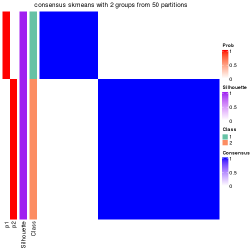</p>

</div>
<div id='tab-node-052-consensus-heatmap-2'>
<pre><code class="r">consensus_heatmap(res, k = 3)
</code></pre>

<p>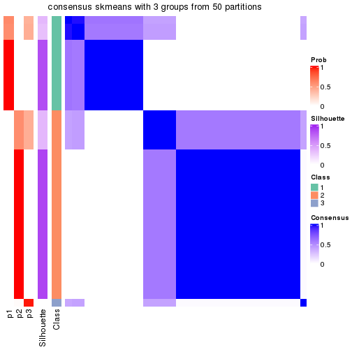</p>

</div>
<div id='tab-node-052-consensus-heatmap-3'>
<pre><code class="r">consensus_heatmap(res, k = 4)
</code></pre>

<p>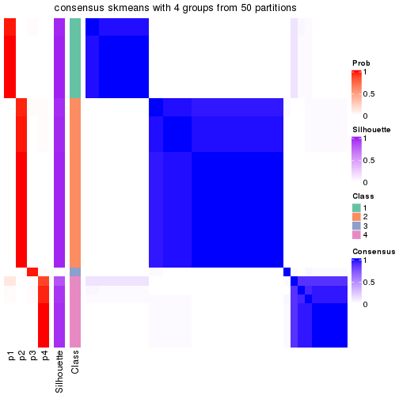</p>

</div>
<div id='tab-node-052-consensus-heatmap-4'>
<pre><code class="r">consensus_heatmap(res, k = 5)
</code></pre>

<p>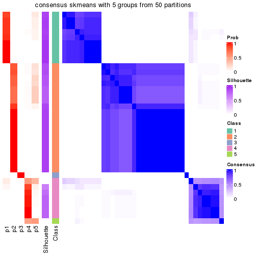</p>

</div>
<div id='tab-node-052-consensus-heatmap-5'>
<pre><code class="r">consensus_heatmap(res, k = 6)
</code></pre>

<p>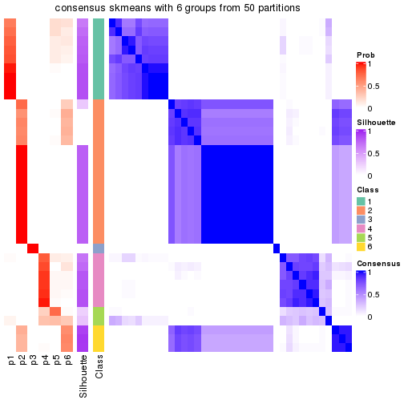</p>

</div>
<div id='tab-node-052-consensus-heatmap-6'>
<pre><code class="r">consensus_heatmap(res, k = 7)
</code></pre>

<p>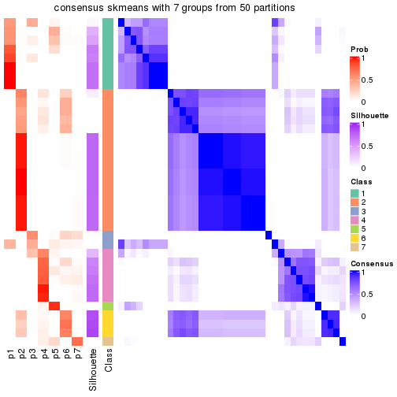</p>

</div>
<div id='tab-node-052-consensus-heatmap-7'>
<pre><code class="r">consensus_heatmap(res, k = 8)
</code></pre>

<p>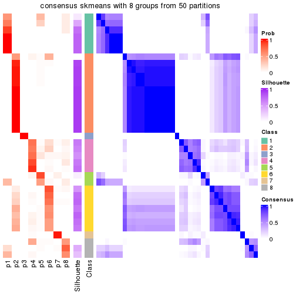</p>

</div>
</div>

Heatmaps for the membership of samples in all partitions to see how consistent they are:


<script>
$( function() {
	$( '#tabs-node-052-membership-heatmap' ).tabs();
} );
</script>
<div id='tabs-node-052-membership-heatmap'>
<ul>
<li><a href='#tab-node-052-membership-heatmap-1'>k = 2</a></li>
<li><a href='#tab-node-052-membership-heatmap-2'>k = 3</a></li>
<li><a href='#tab-node-052-membership-heatmap-3'>k = 4</a></li>
<li><a href='#tab-node-052-membership-heatmap-4'>k = 5</a></li>
<li><a href='#tab-node-052-membership-heatmap-5'>k = 6</a></li>
<li><a href='#tab-node-052-membership-heatmap-6'>k = 7</a></li>
<li><a href='#tab-node-052-membership-heatmap-7'>k = 8</a></li>
</ul>
<div id='tab-node-052-membership-heatmap-1'>
<pre><code class="r">membership_heatmap(res, k = 2)
</code></pre>

<p></p>

</div>
<div id='tab-node-052-membership-heatmap-2'>
<pre><code class="r">membership_heatmap(res, k = 3)
</code></pre>

<p>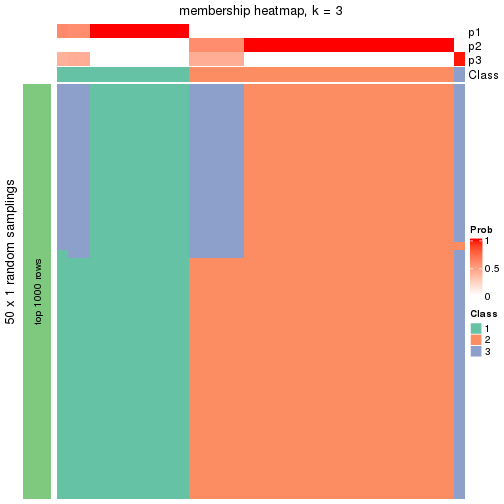</p>

</div>
<div id='tab-node-052-membership-heatmap-3'>
<pre><code class="r">membership_heatmap(res, k = 4)
</code></pre>

<p>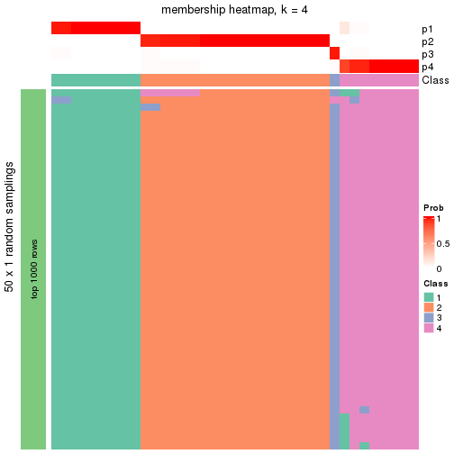</p>

</div>
<div id='tab-node-052-membership-heatmap-4'>
<pre><code class="r">membership_heatmap(res, k = 5)
</code></pre>

<p>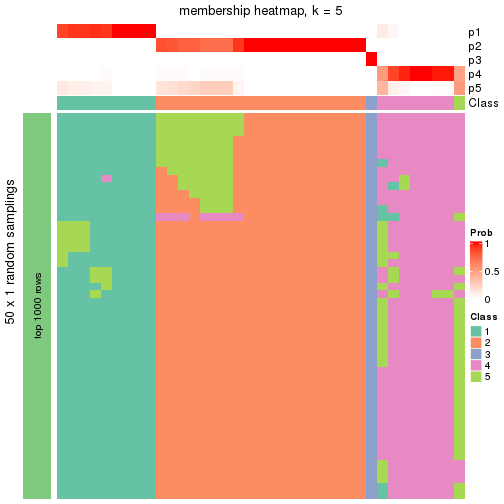</p>

</div>
<div id='tab-node-052-membership-heatmap-5'>
<pre><code class="r">membership_heatmap(res, k = 6)
</code></pre>

<p></p>

</div>
<div id='tab-node-052-membership-heatmap-6'>
<pre><code class="r">membership_heatmap(res, k = 7)
</code></pre>

<p>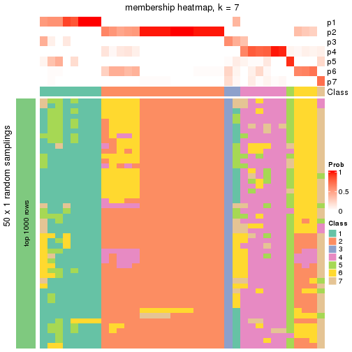</p>

</div>
<div id='tab-node-052-membership-heatmap-7'>
<pre><code class="r">membership_heatmap(res, k = 8)
</code></pre>

<p>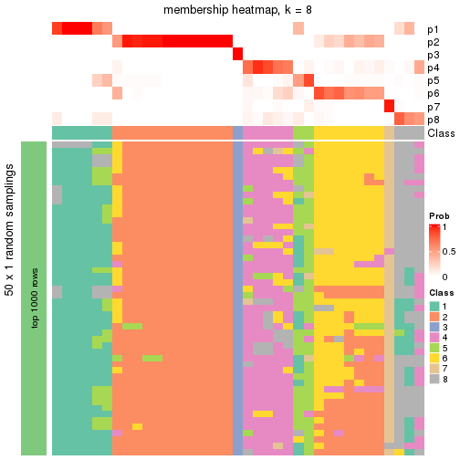</p>

</div>
</div>

As soon as the classes for columns are determined, the signatures
that are significantly different between subgroups can be looked for. 
Following are the heatmaps for signatures.


<script>
$( function() {
	$( '#tabs-node-052-get-signatures' ).tabs();
} );
</script>
<div id='tabs-node-052-get-signatures'>
<ul>
<li><a href='#tab-node-052-get-signatures-1'>k = 2</a></li>
<li><a href='#tab-node-052-get-signatures-2'>k = 3</a></li>
<li><a href='#tab-node-052-get-signatures-3'>k = 4</a></li>
<li><a href='#tab-node-052-get-signatures-4'>k = 5</a></li>
<li><a href='#tab-node-052-get-signatures-5'>k = 6</a></li>
<li><a href='#tab-node-052-get-signatures-6'>k = 7</a></li>
<li><a href='#tab-node-052-get-signatures-7'>k = 8</a></li>
</ul>
<div id='tab-node-052-get-signatures-1'>
<pre><code class="r">get_signatures(res, k = 2)
</code></pre>

<p>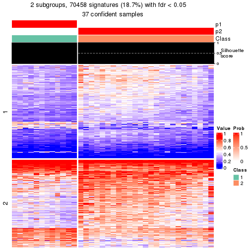</p>

</div>
<div id='tab-node-052-get-signatures-2'>
<pre><code class="r">get_signatures(res, k = 3)
</code></pre>

<p>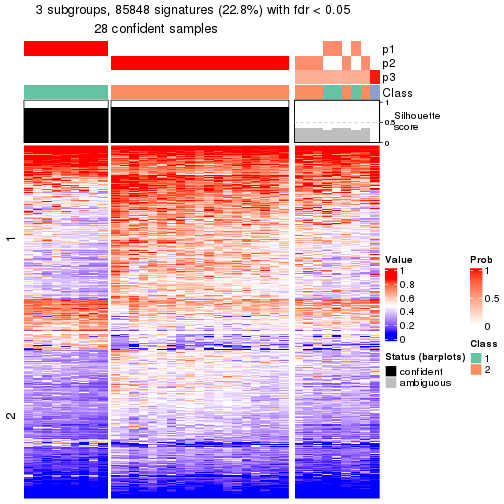</p>

</div>
<div id='tab-node-052-get-signatures-3'>
<pre><code class="r">get_signatures(res, k = 4)
</code></pre>

<p>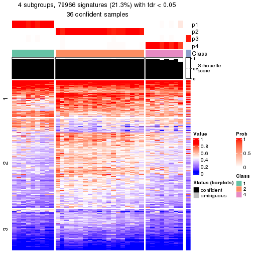</p>

</div>
<div id='tab-node-052-get-signatures-4'>
<pre><code class="r">get_signatures(res, k = 5)
</code></pre>

<p>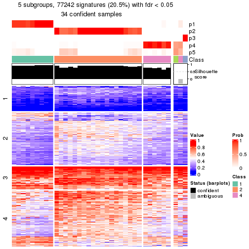</p>

</div>
<div id='tab-node-052-get-signatures-5'>
<pre><code class="r">get_signatures(res, k = 6)
</code></pre>

<p>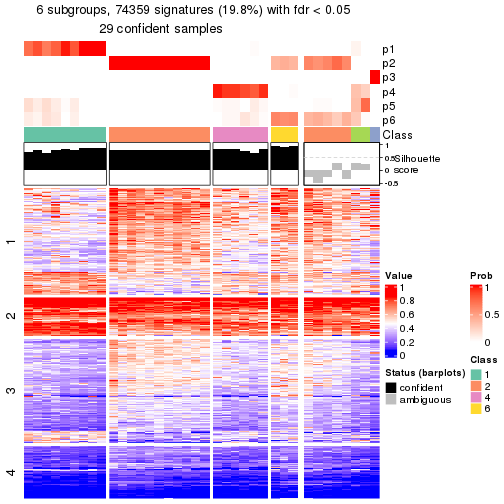</p>

</div>
<div id='tab-node-052-get-signatures-6'>
<pre><code class="r">get_signatures(res, k = 7)
</code></pre>

<p>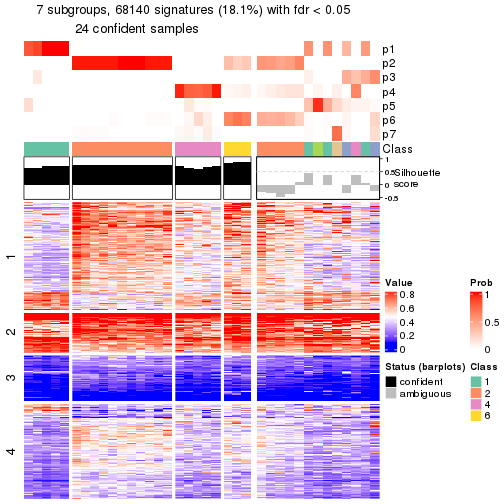</p>

</div>
<div id='tab-node-052-get-signatures-7'>
<pre><code class="r">get_signatures(res, k = 8)
</code></pre>

<p>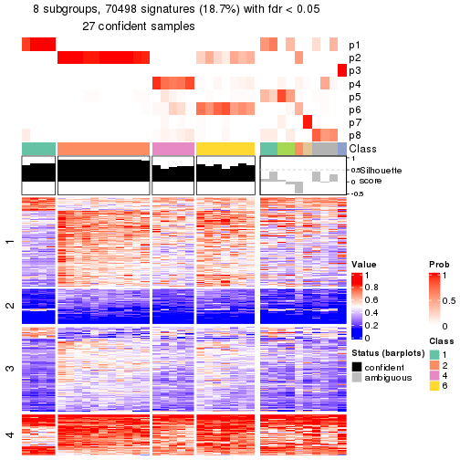</p>

</div>
</div>


Compare the overlap of signatures from different k:

```r
compare_signatures(res)
```

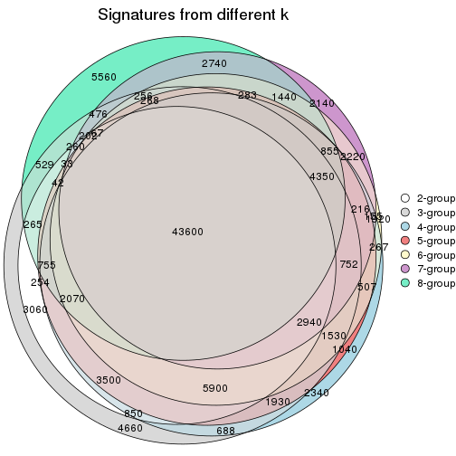

`get_signature()` returns a data frame invisibly. To get the list of signatures, the function
call should be assigned to a variable explicitly. In following code, if `plot` argument is set
to `FALSE`, no heatmap is plotted while only the differential analysis is performed.

```r
# code only for demonstration
tb = get_signature(res, k = ..., plot = FALSE)
```

An example of the output of `tb` is:

```
#>   which_row         fdr    mean_1    mean_2 scaled_mean_1 scaled_mean_2 km
#> 1        38 0.042760348  8.373488  9.131774    -0.5533452     0.5164555  1
#> 2        40 0.018707592  7.106213  8.469186    -0.6173731     0.5762149  1
#> 3        55 0.019134737 10.221463 11.207825    -0.6159697     0.5749050  1
#> 4        59 0.006059896  5.921854  7.869574    -0.6899429     0.6439467  1
#> 5        60 0.018055526  8.928898 10.211722    -0.6204761     0.5791110  1
#> 6        98 0.009384629 15.714769 14.887706     0.6635654    -0.6193277  2
...
```

The columns in `tb` are:

1. `which_row`: row indices corresponding to the input matrix.
2. `fdr`: FDR for the differential test. 
3. `mean_x`: The mean value in group x.
4. `scaled_mean_x`: The mean value in group x after rows are scaled.
5. `km`: Row groups if k-means clustering is applied to rows (which is done by automatically selecting number of clusters).

If there are too many signatures, `top_signatures = ...` can be set to only show the 
signatures with the highest FDRs:

```r
# code only for demonstration
# e.g. to show the top 500 most significant rows
tb = get_signature(res, k = ..., top_signatures = 500)
```

If the signatures are defined as these which are uniquely high in current group, `diff_method` argument
can be set to `"uniquely_high_in_one_group"`:

```r
# code only for demonstration
tb = get_signature(res, k = ..., diff_method = "uniquely_high_in_one_group")
```


UMAP plot which shows how samples are separated.


<script>
$( function() {
	$( '#tabs-node-052-dimension-reduction' ).tabs();
} );
</script>
<div id='tabs-node-052-dimension-reduction'>
<ul>
<li><a href='#tab-node-052-dimension-reduction-1'>k = 2</a></li>
<li><a href='#tab-node-052-dimension-reduction-2'>k = 3</a></li>
<li><a href='#tab-node-052-dimension-reduction-3'>k = 4</a></li>
<li><a href='#tab-node-052-dimension-reduction-4'>k = 5</a></li>
<li><a href='#tab-node-052-dimension-reduction-5'>k = 6</a></li>
<li><a href='#tab-node-052-dimension-reduction-6'>k = 7</a></li>
<li><a href='#tab-node-052-dimension-reduction-7'>k = 8</a></li>
</ul>
<div id='tab-node-052-dimension-reduction-1'>
<pre><code class="r">dimension_reduction(res, k = 2, method = &quot;UMAP&quot;)
</code></pre>

<p></p>

</div>
<div id='tab-node-052-dimension-reduction-2'>
<pre><code class="r">dimension_reduction(res, k = 3, method = &quot;UMAP&quot;)
</code></pre>

<p>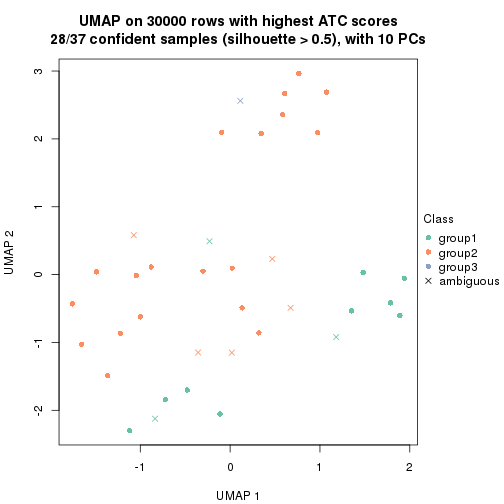</p>

</div>
<div id='tab-node-052-dimension-reduction-3'>
<pre><code class="r">dimension_reduction(res, k = 4, method = &quot;UMAP&quot;)
</code></pre>

<p>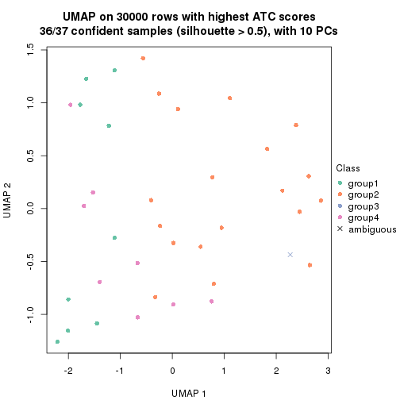</p>

</div>
<div id='tab-node-052-dimension-reduction-4'>
<pre><code class="r">dimension_reduction(res, k = 5, method = &quot;UMAP&quot;)
</code></pre>

<p>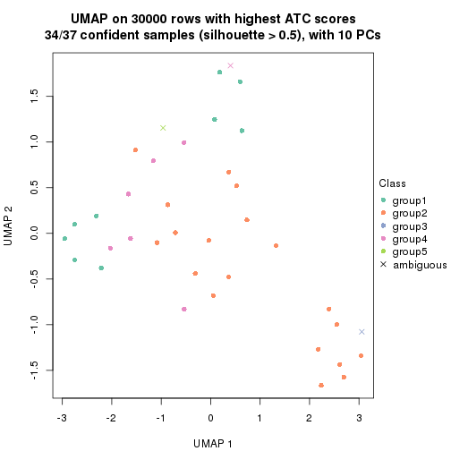</p>

</div>
<div id='tab-node-052-dimension-reduction-5'>
<pre><code class="r">dimension_reduction(res, k = 6, method = &quot;UMAP&quot;)
</code></pre>

<p>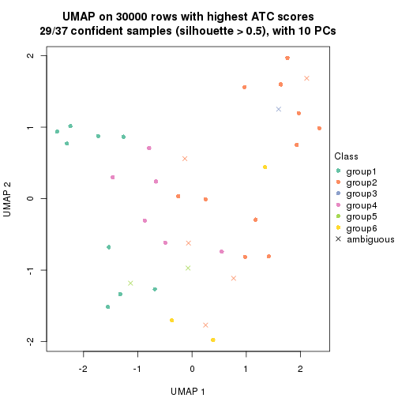</p>

</div>
<div id='tab-node-052-dimension-reduction-6'>
<pre><code class="r">dimension_reduction(res, k = 7, method = &quot;UMAP&quot;)
</code></pre>

<p>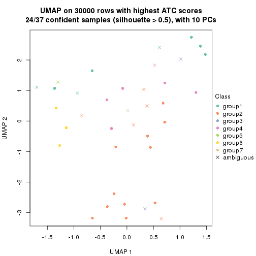</p>

</div>
<div id='tab-node-052-dimension-reduction-7'>
<pre><code class="r">dimension_reduction(res, k = 8, method = &quot;UMAP&quot;)
</code></pre>

<p>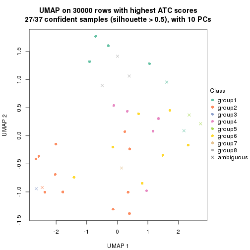</p>

</div>
</div>


Following heatmap shows how subgroups are split when increasing `k`:

```r
collect_classes(res)
```

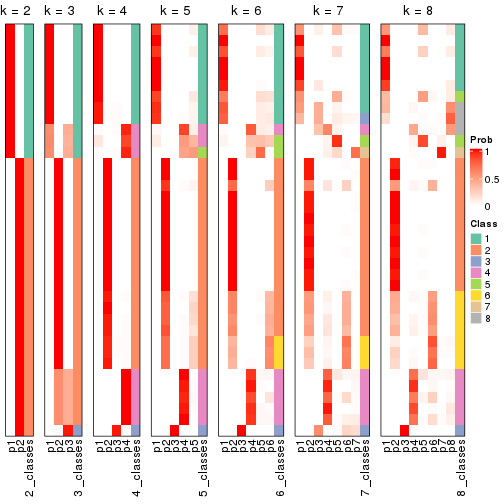


If matrix rows can be associated to genes, consider to use `functional_enrichment(res,
...)` to perform function enrichment for the signature genes. See [this vignette](https://jokergoo.github.io/cola_vignettes/functional_enrichment.html) for more detailed explanations.


 

---------------------------------------------------


### Node0522


Parent node: [Node052](#Node052).
Child nodes: 
                Node01211-leaf
        ,
                Node01212-leaf
        ,
                Node01213-leaf
        ,
                Node01221-leaf
        ,
                Node01222-leaf
        ,
                Node01223-leaf
        ,
                Node02111-leaf
        ,
                Node02112-leaf
        ,
                Node02113-leaf
        ,
                Node02114-leaf
        ,
                Node02121-leaf
        ,
                Node02122-leaf
        ,
                Node02123-leaf
        ,
                Node02124-leaf
        ,
                Node02131-leaf
        ,
                [Node02132](#Node02132)
        ,
                Node02133-leaf
        ,
                Node02211-leaf
        ,
                Node02212-leaf
        ,
                Node02213-leaf
        ,
                Node02221-leaf
        ,
                Node02222-leaf
        ,
                Node02223-leaf
        ,
                Node02231-leaf
        ,
                Node02232-leaf
        ,
                Node02233-leaf
        ,
                Node02241-leaf
        ,
                Node02242-leaf
        ,
                Node02243-leaf
        ,
                Node02321-leaf
        ,
                Node02322-leaf
        ,
                Node02323-leaf
        ,
                Node05111-leaf
        ,
                Node05112-leaf
        ,
                Node05113-leaf
        ,
                Node05114-leaf
        ,
                [Node05121](#Node05121)
        ,
                Node05122-leaf
        ,
                Node05123-leaf
        ,
                Node05221-leaf
        ,
                Node05222-leaf
        .


The object with results only for a single top-value method and a single partitioning method 
can be extracted as:

```r
res = res_rh["0522"]
```

A summary of `res` and all the functions that can be applied to it:

```r
res
```

```
#> A 'ConsensusPartition' object with k = 2, 3, 4, 5, 6, 7, 8.
#>   On a matrix with 30000 rows and 19 columns.
#>   Top rows (1000) are extracted by 'SD' method.
#>   Subgroups are detected by 'kmeans' method.
#>   Performed in total 350 partitions by row resampling.
#>   Best k for subgroups seems to be 2.
#> 
#> Following methods can be applied to this 'ConsensusPartition' object:
#>  [1] "cola_report"             "collect_classes"         "collect_plots"          
#>  [4] "collect_stats"           "colnames"                "compare_partitions"     
#>  [7] "compare_signatures"      "consensus_heatmap"       "dimension_reduction"    
#> [10] "functional_enrichment"   "get_anno_col"            "get_anno"               
#> [13] "get_classes"             "get_consensus"           "get_matrix"             
#> [16] "get_membership"          "get_param"               "get_signatures"         
#> [19] "get_stats"               "is_best_k"               "is_stable_k"            
#> [22] "membership_heatmap"      "ncol"                    "nrow"                   
#> [25] "plot_ecdf"               "predict_classes"         "rownames"               
#> [28] "select_partition_number" "show"                    "suggest_best_k"         
#> [31] "test_to_known_factors"   "top_rows_heatmap"
```

`collect_plots()` function collects all the plots made from `res` for all `k` (number of subgroups)
into one single page to provide an easy and fast comparison between different `k`.

```r
collect_plots(res)
```

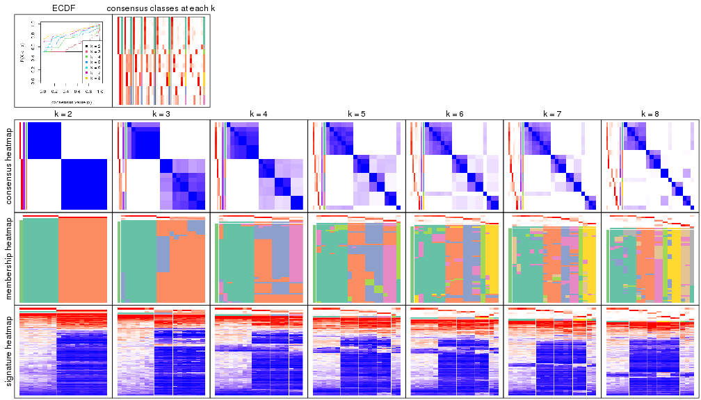

The plots are:

- The first row: a plot of the eCDF (empirical cumulative distribution
  function) curves of the consensus matrix for each `k` and the heatmap of
  predicted classes for each `k`.
- The second row: heatmaps of the consensus matrix for each `k`.
- The third row: heatmaps of the membership matrix for each `k`.
- The fouth row: heatmaps of the signatures for each `k`.

All the plots in panels can be made by individual functions and they are
plotted later in this section.

`select_partition_number()` produces several plots showing different
statistics for choosing "optimized" `k`. There are following statistics:

- eCDF curves of the consensus matrix for each `k`;
- 1-PAC. [The PAC score](https://en.wikipedia.org/wiki/Consensus_clustering#Over-interpretation_potential_of_consensus_clustering)
  measures the proportion of the ambiguous subgrouping.
- Mean silhouette score.
- Concordance. The mean probability of fiting the consensus subgroup labels in all
  partitions.
- Area increased. Denote $A_k$ as the area under the eCDF curve for current
  `k`, the area increased is defined as $A_k - A_{k-1}$.
- Rand index. The percent of pairs of samples that are both in a same cluster
  or both are not in a same cluster in the partition of k and k-1.
- Jaccard index. The ratio of pairs of samples are both in a same cluster in
  the partition of k and k-1 and the pairs of samples are both in a same
  cluster in the partition k or k-1.

The detailed explanations of these statistics can be found in [the _cola_
vignette](https://jokergoo.github.io/cola_vignettes/cola.html#toc_13).

Generally speaking, higher 1-PAC score, higher mean silhouette score or higher
concordance corresponds to better partition. Rand index and Jaccard index
measure how similar the current partition is compared to partition with `k-1`.
If they are too similar, we won't accept `k` is better than `k-1`.

```r
select_partition_number(res)
```

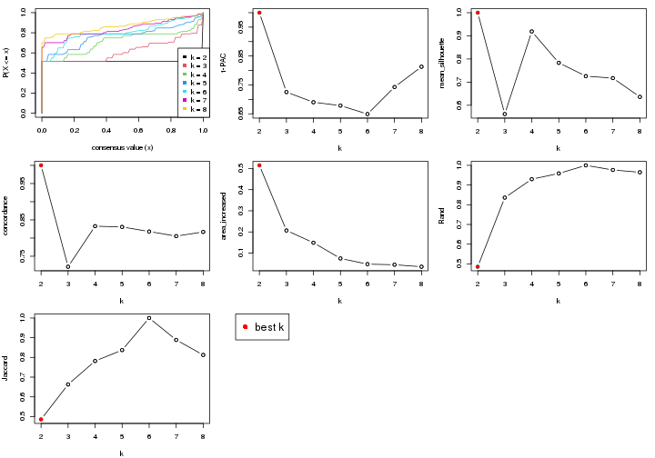

The numeric values for all these statistics can be obtained by `get_stats()`.

```r
get_stats(res)
```

```
#>   k 1-PAC mean_silhouette concordance area_increased  Rand Jaccard
#> 2 2 1.000           1.000       1.000         0.5151 0.485   0.485
#> 3 3 0.725           0.562       0.721         0.2068 0.836   0.663
#> 4 4 0.690           0.919       0.833         0.1489 0.930   0.782
#> 5 5 0.678           0.783       0.831         0.0744 0.959   0.837
#> 6 6 0.649           0.726       0.818         0.0474 1.000   1.000
#> 7 7 0.743           0.717       0.805         0.0447 0.977   0.889
#> 8 8 0.813           0.636       0.817         0.0352 0.965   0.812
```

`suggest_best_k()` suggests the best $k$ based on these statistics. The rules are as follows:

- All $k$ with Jaccard index larger than 0.95 are removed because increasing
  $k$ does not provide enough extra information. If all $k$ are removed, it is
  marked as no subgroup is detected.
- For all $k$ with 1-PAC score larger than 0.9, the maximal $k$ is taken as
  the best $k$, and other $k$ are marked as optional $k$.
- If it does not fit the second rule. The $k$ with the maximal vote of the
  highest 1-PAC score, highest mean silhouette, and highest concordance is
  taken as the best $k$.

```r
suggest_best_k(res)
```

```
#> [1] 2
```


Following is the table of the partitions (You need to click the **show/hide
code output** link to see it). The membership matrix (columns with name `p*`)
is inferred by
[`clue::cl_consensus()`](https://www.rdocumentation.org/link/cl_consensus?package=clue)
function with the `SE` method. Basically the value in the membership matrix
represents the probability to belong to a certain group. The finall subgroup
label for an item is determined with the group with highest probability it
belongs to.

In `get_classes()` function, the entropy is calculated from the membership
matrix and the silhouette score is calculated from the consensus matrix.


<script>
$( function() {
	$( '#tabs-node-0522-get-classes' ).tabs();
} );
</script>
<div id='tabs-node-0522-get-classes'>
<ul>
<li><a href='#tab-node-0522-get-classes-1'>k = 2</a></li>
<li><a href='#tab-node-0522-get-classes-2'>k = 3</a></li>
<li><a href='#tab-node-0522-get-classes-3'>k = 4</a></li>
<li><a href='#tab-node-0522-get-classes-4'>k = 5</a></li>
<li><a href='#tab-node-0522-get-classes-5'>k = 6</a></li>
<li><a href='#tab-node-0522-get-classes-6'>k = 7</a></li>
<li><a href='#tab-node-0522-get-classes-7'>k = 8</a></li>
</ul>

<div id='tab-node-0522-get-classes-1'>
<p><a id='tab-node-0522-get-classes-1-a' style='color:#0366d6' href='#'>show/hide code output</a></p>
<pre><code class="r">cbind(get_classes(res, k = 2), get_membership(res, k = 2))
</code></pre>

<pre><code>#&gt;                 class entropy silhouette p1 p2
#&gt; TCGA.CN.6022.01     2       0          1  0  1
#&gt; TCGA.IQ.7632.01     1       0          1  1  0
#&gt; TCGA.CR.7379.01     1       0          1  1  0
#&gt; TCGA.CR.7399.01     1       0          1  1  0
#&gt; TCGA.CV.5441.11     2       0          1  0  1
#&gt; TCGA.CR.7392.01     1       0          1  1  0
#&gt; TCGA.CV.5431.01     2       0          1  0  1
#&gt; TCGA.CR.6484.01     1       0          1  1  0
#&gt; TCGA.CV.A45W.01     2       0          1  0  1
#&gt; TCGA.CQ.7069.01     1       0          1  1  0
#&gt; TCGA.CN.A63V.01     2       0          1  0  1
#&gt; TCGA.QK.A8ZB.01     2       0          1  0  1
#&gt; TCGA.CV.A45Z.01     2       0          1  0  1
#&gt; TCGA.CN.4722.01     1       0          1  1  0
#&gt; TCGA.TN.A7HJ.01     2       0          1  0  1
#&gt; TCGA.CN.4740.01     1       0          1  1  0
#&gt; TCGA.CV.A6JY.01     2       0          1  0  1
#&gt; TCGA.WA.A7H4.01     2       0          1  0  1
#&gt; TCGA.QK.A6IJ.01     2       0          1  0  1
</code></pre>

<script>
$('#tab-node-0522-get-classes-1-a').parent().next().next().hide();
$('#tab-node-0522-get-classes-1-a').click(function(){
  $('#tab-node-0522-get-classes-1-a').parent().next().next().toggle();
  return(false);
});
</script>
</div>

<div id='tab-node-0522-get-classes-2'>
<p><a id='tab-node-0522-get-classes-2-a' style='color:#0366d6' href='#'>show/hide code output</a></p>
<pre><code class="r">cbind(get_classes(res, k = 3), get_membership(res, k = 3))
</code></pre>

<pre><code>#&gt;                 class entropy silhouette   p1   p2   p3
#&gt; TCGA.CN.6022.01     3   0.613      0.910 0.00 0.40 0.60
#&gt; TCGA.IQ.7632.01     1   0.000      0.958 1.00 0.00 0.00
#&gt; TCGA.CR.7379.01     1   0.153      0.938 0.96 0.00 0.04
#&gt; TCGA.CR.7399.01     1   0.583      0.702 0.66 0.00 0.34
#&gt; TCGA.CV.5441.11     3   0.624      0.906 0.00 0.44 0.56
#&gt; TCGA.CR.7392.01     1   0.000      0.958 1.00 0.00 0.00
#&gt; TCGA.CV.5431.01     2   0.000      0.409 0.00 1.00 0.00
#&gt; TCGA.CR.6484.01     1   0.000      0.958 1.00 0.00 0.00
#&gt; TCGA.CV.A45W.01     2   0.000      0.409 0.00 1.00 0.00
#&gt; TCGA.CQ.7069.01     1   0.000      0.958 1.00 0.00 0.00
#&gt; TCGA.CN.A63V.01     2   0.628     -0.396 0.00 0.54 0.46
#&gt; TCGA.QK.A8ZB.01     3   0.613      0.910 0.00 0.40 0.60
#&gt; TCGA.CV.A45Z.01     2   0.000      0.409 0.00 1.00 0.00
#&gt; TCGA.CN.4722.01     1   0.000      0.958 1.00 0.00 0.00
#&gt; TCGA.TN.A7HJ.01     2   0.619     -0.289 0.00 0.58 0.42
#&gt; TCGA.CN.4740.01     1   0.000      0.958 1.00 0.00 0.00
#&gt; TCGA.CV.A6JY.01     2   0.631     -0.493 0.00 0.50 0.50
#&gt; TCGA.WA.A7H4.01     3   0.624      0.906 0.00 0.44 0.56
#&gt; TCGA.QK.A6IJ.01     2   0.628     -0.396 0.00 0.54 0.46
</code></pre>

<script>
$('#tab-node-0522-get-classes-2-a').parent().next().next().hide();
$('#tab-node-0522-get-classes-2-a').click(function(){
  $('#tab-node-0522-get-classes-2-a').parent().next().next().toggle();
  return(false);
});
</script>
</div>

<div id='tab-node-0522-get-classes-3'>
<p><a id='tab-node-0522-get-classes-3-a' style='color:#0366d6' href='#'>show/hide code output</a></p>
<pre><code class="r">cbind(get_classes(res, k = 4), get_membership(res, k = 4))
</code></pre>

<pre><code>#&gt;                 class entropy silhouette   p1   p2   p3   p4
#&gt; TCGA.CN.6022.01     3  0.4624      0.956 0.00 0.34 0.66 0.00
#&gt; TCGA.IQ.7632.01     1  0.0707      0.906 0.98 0.00 0.00 0.02
#&gt; TCGA.CR.7379.01     1  0.2647      0.864 0.88 0.00 0.00 0.12
#&gt; TCGA.CR.7399.01     1  0.7198      0.525 0.52 0.00 0.32 0.16
#&gt; TCGA.CV.5441.11     3  0.4790      0.955 0.00 0.38 0.62 0.00
#&gt; TCGA.CR.7392.01     1  0.1211      0.908 0.96 0.00 0.00 0.04
#&gt; TCGA.CV.5431.01     4  0.4406      1.000 0.00 0.30 0.00 0.70
#&gt; TCGA.CR.6484.01     1  0.0707      0.906 0.98 0.00 0.00 0.02
#&gt; TCGA.CV.A45W.01     4  0.4406      1.000 0.00 0.30 0.00 0.70
#&gt; TCGA.CQ.7069.01     1  0.1411      0.902 0.96 0.00 0.02 0.02
#&gt; TCGA.CN.A63V.01     2  0.0000      0.966 0.00 1.00 0.00 0.00
#&gt; TCGA.QK.A8ZB.01     3  0.4624      0.956 0.00 0.34 0.66 0.00
#&gt; TCGA.CV.A45Z.01     4  0.4406      1.000 0.00 0.30 0.00 0.70
#&gt; TCGA.CN.4722.01     1  0.1211      0.908 0.96 0.00 0.00 0.04
#&gt; TCGA.TN.A7HJ.01     2  0.0707      0.949 0.00 0.98 0.00 0.02
#&gt; TCGA.CN.4740.01     1  0.1211      0.908 0.96 0.00 0.00 0.04
#&gt; TCGA.CV.A6JY.01     2  0.1211      0.928 0.00 0.96 0.04 0.00
#&gt; TCGA.WA.A7H4.01     3  0.4790      0.955 0.00 0.38 0.62 0.00
#&gt; TCGA.QK.A6IJ.01     2  0.0000      0.966 0.00 1.00 0.00 0.00
</code></pre>

<script>
$('#tab-node-0522-get-classes-3-a').parent().next().next().hide();
$('#tab-node-0522-get-classes-3-a').click(function(){
  $('#tab-node-0522-get-classes-3-a').parent().next().next().toggle();
  return(false);
});
</script>
</div>

<div id='tab-node-0522-get-classes-4'>
<p><a id='tab-node-0522-get-classes-4-a' style='color:#0366d6' href='#'>show/hide code output</a></p>
<pre><code class="r">cbind(get_classes(res, k = 5), get_membership(res, k = 5))
</code></pre>

<pre><code>#&gt;                 class entropy silhouette   p1   p2   p3   p4   p5
#&gt; TCGA.CN.6022.01     3  0.5444      0.788 0.00 0.16 0.66 0.00 0.18
#&gt; TCGA.IQ.7632.01     1  0.1216      0.828 0.96 0.00 0.00 0.02 0.02
#&gt; TCGA.CR.7379.01     1  0.5440      0.393 0.70 0.16 0.12 0.00 0.02
#&gt; TCGA.CR.7399.01     5  0.3796      0.000 0.30 0.00 0.00 0.00 0.70
#&gt; TCGA.CV.5441.11     3  0.3684      0.775 0.00 0.28 0.72 0.00 0.00
#&gt; TCGA.CR.7392.01     1  0.2331      0.829 0.90 0.00 0.00 0.02 0.08
#&gt; TCGA.CV.5431.01     4  0.2077      0.964 0.00 0.04 0.00 0.92 0.04
#&gt; TCGA.CR.6484.01     1  0.0609      0.832 0.98 0.00 0.02 0.00 0.00
#&gt; TCGA.CV.A45W.01     4  0.1043      0.982 0.00 0.04 0.00 0.96 0.00
#&gt; TCGA.CQ.7069.01     1  0.3271      0.795 0.88 0.04 0.02 0.04 0.02
#&gt; TCGA.CN.A63V.01     2  0.3109      0.915 0.00 0.80 0.00 0.20 0.00
#&gt; TCGA.QK.A8ZB.01     3  0.5444      0.788 0.00 0.16 0.66 0.00 0.18
#&gt; TCGA.CV.A45Z.01     4  0.1043      0.982 0.00 0.04 0.00 0.96 0.00
#&gt; TCGA.CN.4722.01     1  0.2012      0.830 0.92 0.00 0.02 0.00 0.06
#&gt; TCGA.TN.A7HJ.01     2  0.3274      0.900 0.00 0.78 0.00 0.22 0.00
#&gt; TCGA.CN.4740.01     1  0.2012      0.830 0.92 0.00 0.02 0.00 0.06
#&gt; TCGA.CV.A6JY.01     2  0.6471      0.762 0.00 0.62 0.12 0.20 0.06
#&gt; TCGA.WA.A7H4.01     3  0.3684      0.775 0.00 0.28 0.72 0.00 0.00
#&gt; TCGA.QK.A6IJ.01     2  0.3109      0.915 0.00 0.80 0.00 0.20 0.00
</code></pre>

<script>
$('#tab-node-0522-get-classes-4-a').parent().next().next().hide();
$('#tab-node-0522-get-classes-4-a').click(function(){
  $('#tab-node-0522-get-classes-4-a').parent().next().next().toggle();
  return(false);
});
</script>
</div>

<div id='tab-node-0522-get-classes-5'>
<p><a id='tab-node-0522-get-classes-5-a' style='color:#0366d6' href='#'>show/hide code output</a></p>
<pre><code class="r">cbind(get_classes(res, k = 6), get_membership(res, k = 6))
</code></pre>

<pre><code>#&gt;                 class entropy silhouette   p1   p2   p3   p4   p5   p6
#&gt; TCGA.CN.6022.01     3   0.181      0.775 0.00 0.02 0.92 0.00 0.00 0.06
#&gt; TCGA.IQ.7632.01     1   0.348      0.738 0.82 0.00 0.02 0.12 0.04 0.00
#&gt; TCGA.CR.7379.01     1   0.386      0.366 0.52 0.00 0.00 0.48 0.00 0.00
#&gt; TCGA.CR.7399.01     5   0.294      0.000 0.22 0.00 0.00 0.00 0.78 0.00
#&gt; TCGA.CV.5441.11     3   0.595      0.775 0.00 0.06 0.58 0.26 0.00 0.10
#&gt; TCGA.CR.7392.01     1   0.357      0.736 0.82 0.00 0.02 0.10 0.06 0.00
#&gt; TCGA.CV.5431.01     6   0.347      0.821 0.00 0.00 0.00 0.06 0.14 0.80
#&gt; TCGA.CR.6484.01     1   0.181      0.730 0.92 0.06 0.00 0.02 0.00 0.00
#&gt; TCGA.CV.A45W.01     6   0.000      0.915 0.00 0.00 0.00 0.00 0.00 1.00
#&gt; TCGA.CQ.7069.01     1   0.590      0.648 0.68 0.06 0.08 0.12 0.06 0.00
#&gt; TCGA.CN.A63V.01     2   0.400      0.871 0.00 0.78 0.00 0.06 0.02 0.14
#&gt; TCGA.QK.A8ZB.01     3   0.181      0.775 0.00 0.02 0.92 0.00 0.00 0.06
#&gt; TCGA.CV.A45Z.01     6   0.000      0.915 0.00 0.00 0.00 0.00 0.00 1.00
#&gt; TCGA.CN.4722.01     1   0.181      0.724 0.92 0.06 0.00 0.00 0.02 0.00
#&gt; TCGA.TN.A7HJ.01     2   0.226      0.884 0.00 0.86 0.00 0.00 0.00 0.14
#&gt; TCGA.CN.4740.01     1   0.109      0.736 0.96 0.02 0.00 0.00 0.02 0.00
#&gt; TCGA.CV.A6JY.01     2   0.656      0.722 0.00 0.60 0.08 0.18 0.04 0.10
#&gt; TCGA.WA.A7H4.01     3   0.595      0.775 0.00 0.06 0.58 0.26 0.00 0.10
#&gt; TCGA.QK.A6IJ.01     2   0.226      0.884 0.00 0.86 0.00 0.00 0.00 0.14
</code></pre>

<script>
$('#tab-node-0522-get-classes-5-a').parent().next().next().hide();
$('#tab-node-0522-get-classes-5-a').click(function(){
  $('#tab-node-0522-get-classes-5-a').parent().next().next().toggle();
  return(false);
});
</script>
</div>

<div id='tab-node-0522-get-classes-6'>
<p><a id='tab-node-0522-get-classes-6-a' style='color:#0366d6' href='#'>show/hide code output</a></p>
<pre><code class="r">cbind(get_classes(res, k = 7), get_membership(res, k = 7))
</code></pre>

<pre><code>#&gt;                 class entropy silhouette   p1   p2   p3   p4   p5   p6   p7
#&gt; TCGA.CN.6022.01     3  0.1860      0.926 0.00 0.02 0.92 0.02 0.04 0.00 0.00
#&gt; TCGA.IQ.7632.01     1  0.0000      0.752 1.00 0.00 0.00 0.00 0.00 0.00 0.00
#&gt; TCGA.CR.7379.01     1  0.3413      0.400 0.62 0.00 0.00 0.00 0.00 0.00 0.38
#&gt; TCGA.CR.7399.01     5  0.2081      0.000 0.14 0.00 0.00 0.00 0.86 0.00 0.00
#&gt; TCGA.CV.5441.11     4  0.5207      1.000 0.00 0.16 0.36 0.48 0.00 0.00 0.00
#&gt; TCGA.CR.7392.01     1  0.0863      0.753 0.96 0.00 0.00 0.00 0.04 0.00 0.00
#&gt; TCGA.CV.5431.01     6  0.5551      0.558 0.00 0.00 0.00 0.06 0.10 0.56 0.28
#&gt; TCGA.CR.6484.01     1  0.3244      0.739 0.78 0.00 0.00 0.18 0.00 0.00 0.04
#&gt; TCGA.CV.A45W.01     6  0.0863      0.784 0.00 0.00 0.00 0.04 0.00 0.96 0.00
#&gt; TCGA.CQ.7069.01     1  0.3744      0.601 0.78 0.00 0.02 0.12 0.00 0.00 0.08
#&gt; TCGA.CN.A63V.01     2  0.3058      0.768 0.00 0.82 0.00 0.10 0.00 0.00 0.08
#&gt; TCGA.QK.A8ZB.01     3  0.0504      0.928 0.00 0.02 0.98 0.00 0.00 0.00 0.00
#&gt; TCGA.CV.A45Z.01     6  0.0000      0.784 0.00 0.00 0.00 0.00 0.00 1.00 0.00
#&gt; TCGA.CN.4722.01     1  0.4055      0.727 0.74 0.00 0.00 0.18 0.04 0.00 0.04
#&gt; TCGA.TN.A7HJ.01     2  0.0000      0.794 0.00 1.00 0.00 0.00 0.00 0.00 0.00
#&gt; TCGA.CN.4740.01     1  0.3343      0.750 0.82 0.00 0.00 0.10 0.04 0.00 0.04
#&gt; TCGA.CV.A6JY.01     2  0.6020      0.569 0.00 0.54 0.14 0.10 0.00 0.00 0.22
#&gt; TCGA.WA.A7H4.01     4  0.5207      1.000 0.00 0.16 0.36 0.48 0.00 0.00 0.00
#&gt; TCGA.QK.A6IJ.01     2  0.0000      0.794 0.00 1.00 0.00 0.00 0.00 0.00 0.00
</code></pre>

<script>
$('#tab-node-0522-get-classes-6-a').parent().next().next().hide();
$('#tab-node-0522-get-classes-6-a').click(function(){
  $('#tab-node-0522-get-classes-6-a').parent().next().next().toggle();
  return(false);
});
</script>
</div>

<div id='tab-node-0522-get-classes-7'>
<p><a id='tab-node-0522-get-classes-7-a' style='color:#0366d6' href='#'>show/hide code output</a></p>
<pre><code class="r">cbind(get_classes(res, k = 8), get_membership(res, k = 8))
</code></pre>

<pre><code>#&gt;                 class entropy silhouette   p1   p2   p3   p4   p5   p6   p7   p8
#&gt; TCGA.CN.6022.01     7   0.207      0.880 0.00 0.00 0.00 0.02 0.04 0.00 0.90 0.04
#&gt; TCGA.IQ.7632.01     1   0.248      0.645 0.86 0.00 0.02 0.00 0.02 0.00 0.00 0.10
#&gt; TCGA.CR.7379.01     8   0.265      0.000 0.24 0.00 0.00 0.00 0.00 0.00 0.00 0.76
#&gt; TCGA.CR.7399.01     5   0.134      0.000 0.08 0.00 0.00 0.00 0.92 0.00 0.00 0.00
#&gt; TCGA.CV.5441.11     4   0.357      1.000 0.00 0.02 0.00 0.62 0.00 0.00 0.36 0.00
#&gt; TCGA.CR.7392.01     1   0.227      0.651 0.88 0.00 0.02 0.00 0.02 0.00 0.00 0.08
#&gt; TCGA.CV.5431.01     6   0.332      0.508 0.00 0.00 0.46 0.00 0.00 0.54 0.00 0.00
#&gt; TCGA.CR.6484.01     1   0.318      0.600 0.80 0.00 0.14 0.04 0.00 0.00 0.00 0.02
#&gt; TCGA.CV.A45W.01     6   0.000      0.782 0.00 0.00 0.00 0.00 0.00 1.00 0.00 0.00
#&gt; TCGA.CQ.7069.01     1   0.619      0.170 0.50 0.00 0.12 0.22 0.02 0.00 0.00 0.14
#&gt; TCGA.CN.A63V.01     2   0.281      0.788 0.00 0.86 0.04 0.02 0.02 0.00 0.00 0.06
#&gt; TCGA.QK.A8ZB.01     7   0.000      0.882 0.00 0.00 0.00 0.00 0.00 0.00 1.00 0.00
#&gt; TCGA.CV.A45Z.01     6   0.000      0.782 0.00 0.00 0.00 0.00 0.00 1.00 0.00 0.00
#&gt; TCGA.CN.4722.01     1   0.289      0.600 0.80 0.00 0.16 0.04 0.00 0.00 0.00 0.00
#&gt; TCGA.TN.A7HJ.01     2   0.000      0.813 0.00 1.00 0.00 0.00 0.00 0.00 0.00 0.00
#&gt; TCGA.CN.4740.01     1   0.128      0.655 0.94 0.00 0.04 0.02 0.00 0.00 0.00 0.00
#&gt; TCGA.CV.A6JY.01     2   0.625      0.517 0.00 0.52 0.24 0.10 0.02 0.00 0.02 0.10
#&gt; TCGA.WA.A7H4.01     4   0.357      1.000 0.00 0.02 0.00 0.62 0.00 0.00 0.36 0.00
#&gt; TCGA.QK.A6IJ.01     2   0.000      0.813 0.00 1.00 0.00 0.00 0.00 0.00 0.00 0.00
</code></pre>

<script>
$('#tab-node-0522-get-classes-7-a').parent().next().next().hide();
$('#tab-node-0522-get-classes-7-a').click(function(){
  $('#tab-node-0522-get-classes-7-a').parent().next().next().toggle();
  return(false);
});
</script>
</div>
</div>

Heatmaps for the consensus matrix. It visualizes the probability of two
samples to be in a same group.


<script>
$( function() {
	$( '#tabs-node-0522-consensus-heatmap' ).tabs();
} );
</script>
<div id='tabs-node-0522-consensus-heatmap'>
<ul>
<li><a href='#tab-node-0522-consensus-heatmap-1'>k = 2</a></li>
<li><a href='#tab-node-0522-consensus-heatmap-2'>k = 3</a></li>
<li><a href='#tab-node-0522-consensus-heatmap-3'>k = 4</a></li>
<li><a href='#tab-node-0522-consensus-heatmap-4'>k = 5</a></li>
<li><a href='#tab-node-0522-consensus-heatmap-5'>k = 6</a></li>
<li><a href='#tab-node-0522-consensus-heatmap-6'>k = 7</a></li>
<li><a href='#tab-node-0522-consensus-heatmap-7'>k = 8</a></li>
</ul>
<div id='tab-node-0522-consensus-heatmap-1'>
<pre><code class="r">consensus_heatmap(res, k = 2)
</code></pre>

<p></p>

</div>
<div id='tab-node-0522-consensus-heatmap-2'>
<pre><code class="r">consensus_heatmap(res, k = 3)
</code></pre>

<p>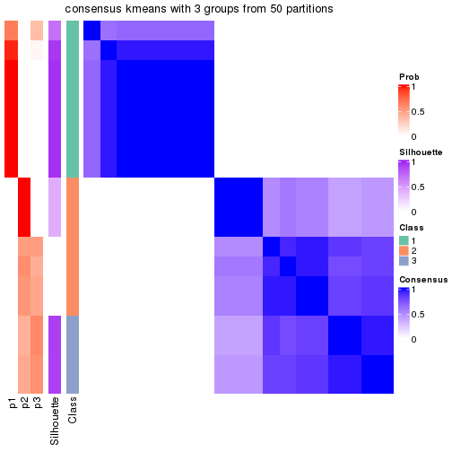</p>

</div>
<div id='tab-node-0522-consensus-heatmap-3'>
<pre><code class="r">consensus_heatmap(res, k = 4)
</code></pre>

<p></p>

</div>
<div id='tab-node-0522-consensus-heatmap-4'>
<pre><code class="r">consensus_heatmap(res, k = 5)
</code></pre>

<p>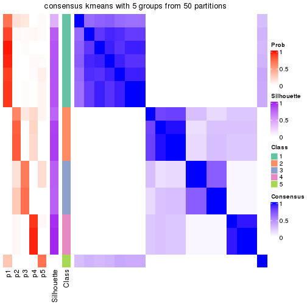</p>

</div>
<div id='tab-node-0522-consensus-heatmap-5'>
<pre><code class="r">consensus_heatmap(res, k = 6)
</code></pre>

<p>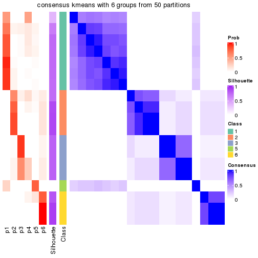</p>

</div>
<div id='tab-node-0522-consensus-heatmap-6'>
<pre><code class="r">consensus_heatmap(res, k = 7)
</code></pre>

<p>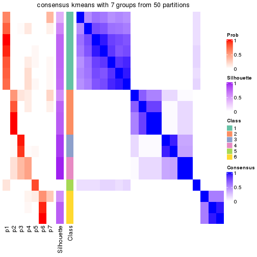</p>

</div>
<div id='tab-node-0522-consensus-heatmap-7'>
<pre><code class="r">consensus_heatmap(res, k = 8)
</code></pre>

<p>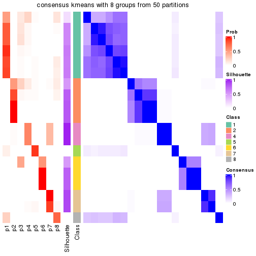</p>

</div>
</div>

Heatmaps for the membership of samples in all partitions to see how consistent they are:


<script>
$( function() {
	$( '#tabs-node-0522-membership-heatmap' ).tabs();
} );
</script>
<div id='tabs-node-0522-membership-heatmap'>
<ul>
<li><a href='#tab-node-0522-membership-heatmap-1'>k = 2</a></li>
<li><a href='#tab-node-0522-membership-heatmap-2'>k = 3</a></li>
<li><a href='#tab-node-0522-membership-heatmap-3'>k = 4</a></li>
<li><a href='#tab-node-0522-membership-heatmap-4'>k = 5</a></li>
<li><a href='#tab-node-0522-membership-heatmap-5'>k = 6</a></li>
<li><a href='#tab-node-0522-membership-heatmap-6'>k = 7</a></li>
<li><a href='#tab-node-0522-membership-heatmap-7'>k = 8</a></li>
</ul>
<div id='tab-node-0522-membership-heatmap-1'>
<pre><code class="r">membership_heatmap(res, k = 2)
</code></pre>

<p>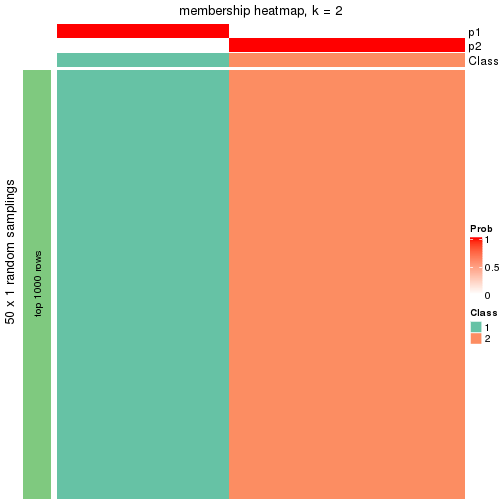</p>

</div>
<div id='tab-node-0522-membership-heatmap-2'>
<pre><code class="r">membership_heatmap(res, k = 3)
</code></pre>

<p>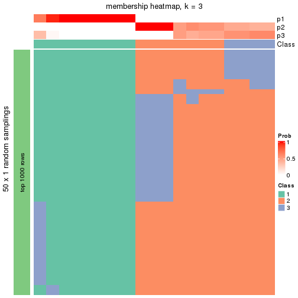</p>

</div>
<div id='tab-node-0522-membership-heatmap-3'>
<pre><code class="r">membership_heatmap(res, k = 4)
</code></pre>

<p>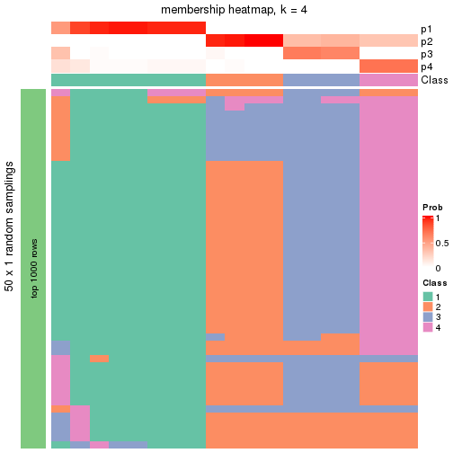</p>

</div>
<div id='tab-node-0522-membership-heatmap-4'>
<pre><code class="r">membership_heatmap(res, k = 5)
</code></pre>

<p>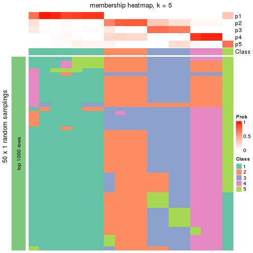</p>

</div>
<div id='tab-node-0522-membership-heatmap-5'>
<pre><code class="r">membership_heatmap(res, k = 6)
</code></pre>

<p>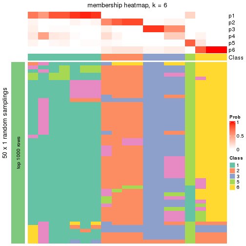</p>

</div>
<div id='tab-node-0522-membership-heatmap-6'>
<pre><code class="r">membership_heatmap(res, k = 7)
</code></pre>

<p>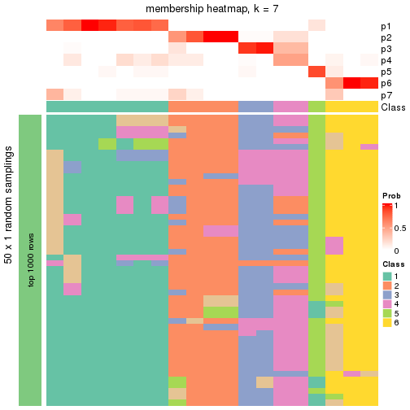</p>

</div>
<div id='tab-node-0522-membership-heatmap-7'>
<pre><code class="r">membership_heatmap(res, k = 8)
</code></pre>

<p>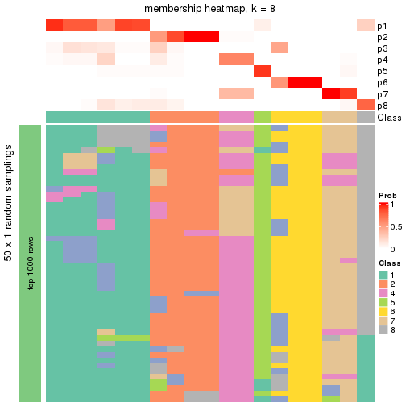</p>

</div>
</div>

As soon as the classes for columns are determined, the signatures
that are significantly different between subgroups can be looked for. 
Following are the heatmaps for signatures.


<script>
$( function() {
	$( '#tabs-node-0522-get-signatures' ).tabs();
} );
</script>
<div id='tabs-node-0522-get-signatures'>
<ul>
<li><a href='#tab-node-0522-get-signatures-1'>k = 2</a></li>
<li><a href='#tab-node-0522-get-signatures-2'>k = 3</a></li>
<li><a href='#tab-node-0522-get-signatures-3'>k = 4</a></li>
<li><a href='#tab-node-0522-get-signatures-4'>k = 5</a></li>
<li><a href='#tab-node-0522-get-signatures-5'>k = 6</a></li>
<li><a href='#tab-node-0522-get-signatures-6'>k = 7</a></li>
<li><a href='#tab-node-0522-get-signatures-7'>k = 8</a></li>
</ul>
<div id='tab-node-0522-get-signatures-1'>
<pre><code class="r">get_signatures(res, k = 2)
</code></pre>

<p></p>

</div>
<div id='tab-node-0522-get-signatures-2'>
<pre><code class="r">get_signatures(res, k = 3)
</code></pre>

<p>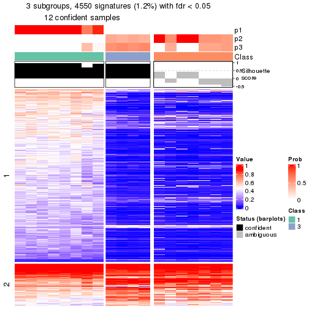</p>

</div>
<div id='tab-node-0522-get-signatures-3'>
<pre><code class="r">get_signatures(res, k = 4)
</code></pre>

<p>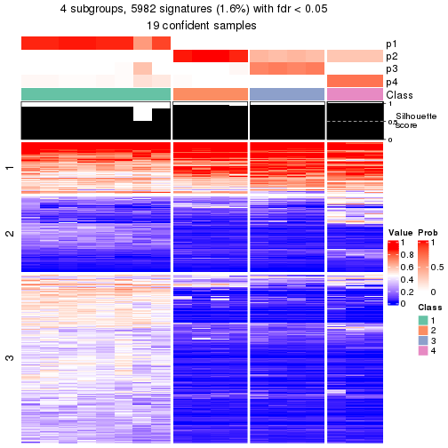</p>

</div>
<div id='tab-node-0522-get-signatures-4'>
<pre><code class="r">get_signatures(res, k = 5)
</code></pre>

<p>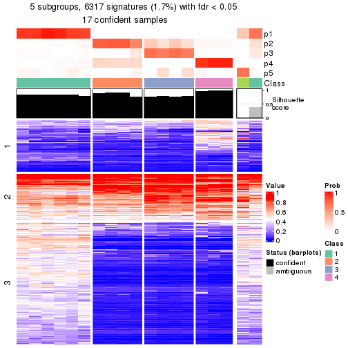</p>

</div>
<div id='tab-node-0522-get-signatures-5'>
<pre><code class="r">get_signatures(res, k = 6)
</code></pre>

<p>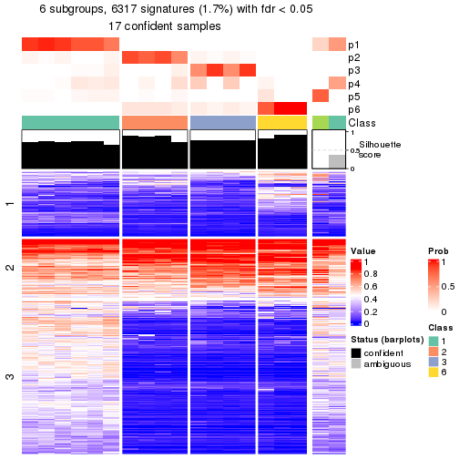</p>

</div>
<div id='tab-node-0522-get-signatures-6'>
<pre><code class="r">get_signatures(res, k = 7)
</code></pre>

<p>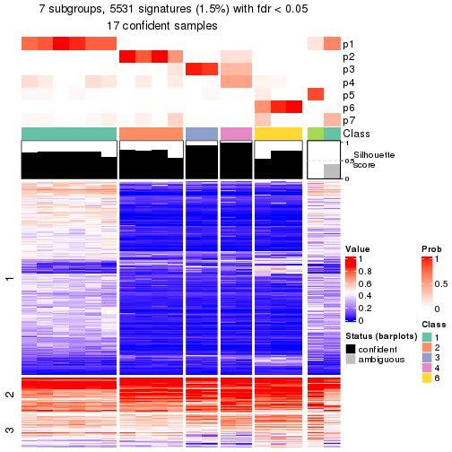</p>

</div>
<div id='tab-node-0522-get-signatures-7'>
<pre><code class="r">get_signatures(res, k = 8)
</code></pre>

<p>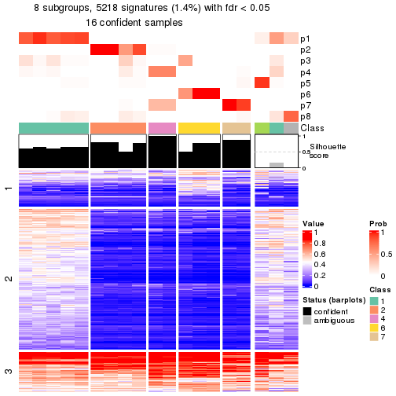</p>

</div>
</div>


Compare the overlap of signatures from different k:

```r
compare_signatures(res)
```

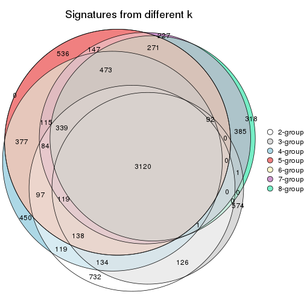

`get_signature()` returns a data frame invisibly. To get the list of signatures, the function
call should be assigned to a variable explicitly. In following code, if `plot` argument is set
to `FALSE`, no heatmap is plotted while only the differential analysis is performed.

```r
# code only for demonstration
tb = get_signature(res, k = ..., plot = FALSE)
```

An example of the output of `tb` is:

```
#>   which_row         fdr    mean_1    mean_2 scaled_mean_1 scaled_mean_2 km
#> 1        38 0.042760348  8.373488  9.131774    -0.5533452     0.5164555  1
#> 2        40 0.018707592  7.106213  8.469186    -0.6173731     0.5762149  1
#> 3        55 0.019134737 10.221463 11.207825    -0.6159697     0.5749050  1
#> 4        59 0.006059896  5.921854  7.869574    -0.6899429     0.6439467  1
#> 5        60 0.018055526  8.928898 10.211722    -0.6204761     0.5791110  1
#> 6        98 0.009384629 15.714769 14.887706     0.6635654    -0.6193277  2
...
```

The columns in `tb` are:

1. `which_row`: row indices corresponding to the input matrix.
2. `fdr`: FDR for the differential test. 
3. `mean_x`: The mean value in group x.
4. `scaled_mean_x`: The mean value in group x after rows are scaled.
5. `km`: Row groups if k-means clustering is applied to rows (which is done by automatically selecting number of clusters).

If there are too many signatures, `top_signatures = ...` can be set to only show the 
signatures with the highest FDRs:

```r
# code only for demonstration
# e.g. to show the top 500 most significant rows
tb = get_signature(res, k = ..., top_signatures = 500)
```

If the signatures are defined as these which are uniquely high in current group, `diff_method` argument
can be set to `"uniquely_high_in_one_group"`:

```r
# code only for demonstration
tb = get_signature(res, k = ..., diff_method = "uniquely_high_in_one_group")
```


UMAP plot which shows how samples are separated.


<script>
$( function() {
	$( '#tabs-node-0522-dimension-reduction' ).tabs();
} );
</script>
<div id='tabs-node-0522-dimension-reduction'>
<ul>
<li><a href='#tab-node-0522-dimension-reduction-1'>k = 2</a></li>
<li><a href='#tab-node-0522-dimension-reduction-2'>k = 3</a></li>
<li><a href='#tab-node-0522-dimension-reduction-3'>k = 4</a></li>
<li><a href='#tab-node-0522-dimension-reduction-4'>k = 5</a></li>
<li><a href='#tab-node-0522-dimension-reduction-5'>k = 6</a></li>
<li><a href='#tab-node-0522-dimension-reduction-6'>k = 7</a></li>
<li><a href='#tab-node-0522-dimension-reduction-7'>k = 8</a></li>
</ul>
<div id='tab-node-0522-dimension-reduction-1'>
<pre><code class="r">dimension_reduction(res, k = 2, method = &quot;UMAP&quot;)
</code></pre>

<p>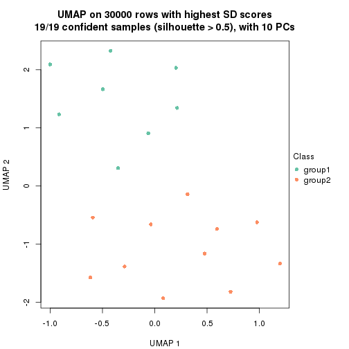</p>

</div>
<div id='tab-node-0522-dimension-reduction-2'>
<pre><code class="r">dimension_reduction(res, k = 3, method = &quot;UMAP&quot;)
</code></pre>

<p>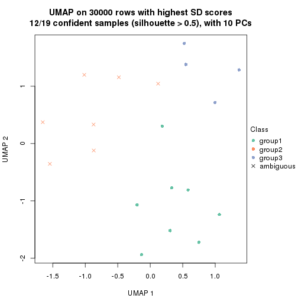</p>

</div>
<div id='tab-node-0522-dimension-reduction-3'>
<pre><code class="r">dimension_reduction(res, k = 4, method = &quot;UMAP&quot;)
</code></pre>

<p>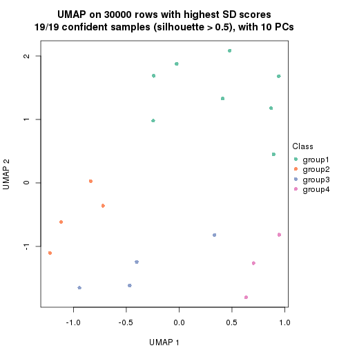</p>

</div>
<div id='tab-node-0522-dimension-reduction-4'>
<pre><code class="r">dimension_reduction(res, k = 5, method = &quot;UMAP&quot;)
</code></pre>

<p>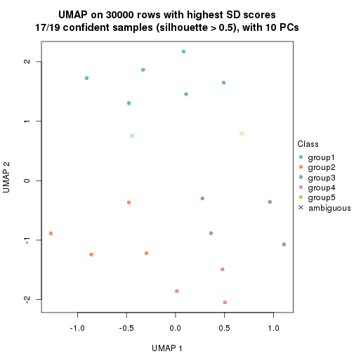</p>

</div>
<div id='tab-node-0522-dimension-reduction-5'>
<pre><code class="r">dimension_reduction(res, k = 6, method = &quot;UMAP&quot;)
</code></pre>

<p>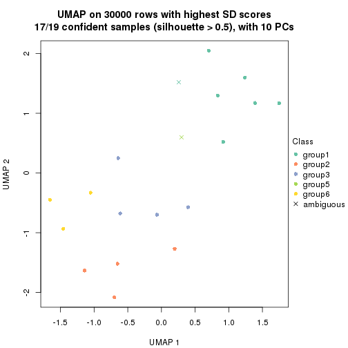</p>

</div>
<div id='tab-node-0522-dimension-reduction-6'>
<pre><code class="r">dimension_reduction(res, k = 7, method = &quot;UMAP&quot;)
</code></pre>

<p>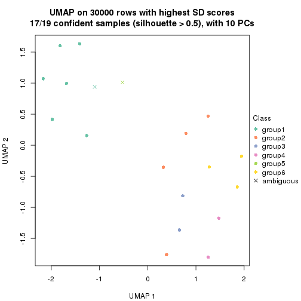</p>

</div>
<div id='tab-node-0522-dimension-reduction-7'>
<pre><code class="r">dimension_reduction(res, k = 8, method = &quot;UMAP&quot;)
</code></pre>

<p>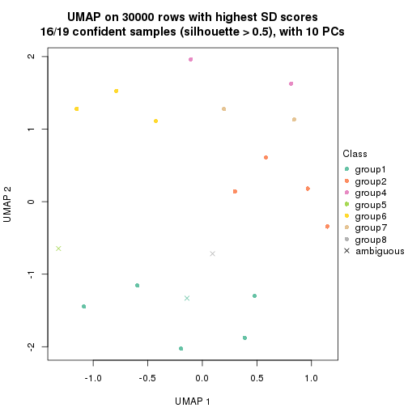</p>

</div>
</div>


Following heatmap shows how subgroups are split when increasing `k`:

```r
collect_classes(res)
```

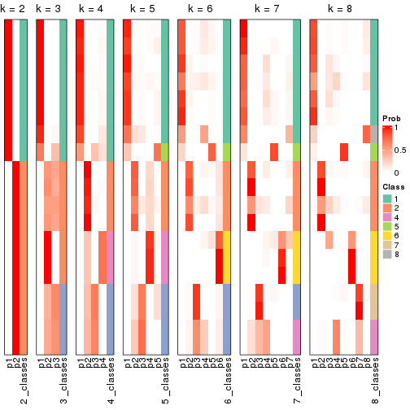


If matrix rows can be associated to genes, consider to use `functional_enrichment(res,
...)` to perform function enrichment for the signature genes. See [this vignette](https://jokergoo.github.io/cola_vignettes/functional_enrichment.html) for more detailed explanations.


 

## Session info


```r
sessionInfo()
```

```
#> R version 4.1.0 (2021-05-18)
#> Platform: x86_64-pc-linux-gnu (64-bit)
#> Running under: CentOS Linux 7 (Core)
#> 
#> Matrix products: default
#> BLAS/LAPACK: /usr/lib64/libopenblas-r0.3.3.so
#> 
#> locale:
#>  [1] LC_CTYPE=en_US.UTF-8       LC_NUMERIC=C               LC_TIME=en_US.UTF-8       
#>  [4] LC_COLLATE=en_US.UTF-8     LC_MONETARY=en_US.UTF-8    LC_MESSAGES=en_US.UTF-8   
#>  [7] LC_PAPER=en_US.UTF-8       LC_NAME=C                  LC_ADDRESS=C              
#> [10] LC_TELEPHONE=C             LC_MEASUREMENT=en_US.UTF-8 LC_IDENTIFICATION=C       
#> 
#> attached base packages:
#> [1] grid      stats     graphics  grDevices utils     datasets  methods   base     
#> 
#> other attached packages:
#> [1] genefilter_1.74.0    ComplexHeatmap_2.8.0 markdown_1.1         knitr_1.33          
#> [5] matrixStats_0.59.0   cola_1.9.4          
#> 
#> loaded via a namespace (and not attached):
#>   [1] bitops_1.0-7           bit64_4.0.5            doParallel_1.0.16      RColorBrewer_1.1-2    
#>   [5] httr_1.4.2             GenomeInfoDb_1.28.1    data.tree_1.0.0        tools_4.1.0           
#>   [9] utf8_1.2.1             R6_2.5.0               irlba_2.3.3            DBI_1.1.1             
#>  [13] BiocGenerics_0.38.0    colorspace_2.0-2       GetoptLong_1.0.5       gridExtra_2.3         
#>  [17] tidyselect_1.1.1       bit_4.0.4              compiler_4.1.0         Biobase_2.52.0        
#>  [21] Cairo_1.5-12.2         xml2_1.3.2             microbenchmark_1.4-7   slam_0.1-48           
#>  [25] scales_1.1.1           askpass_1.1            stringr_1.4.0          digest_0.6.27         
#>  [29] XVector_0.32.0         pkgconfig_2.0.3        umap_0.2.7.0           fastmap_1.1.0         
#>  [33] highr_0.9              rlang_0.4.11           GlobalOptions_0.1.2    rstudioapi_0.13       
#>  [37] RSQLite_2.2.7          impute_1.66.0          generics_0.1.0         shape_1.4.6           
#>  [41] jsonlite_1.7.2         mclust_5.4.7           dplyr_1.0.7            dendextend_1.15.1     
#>  [45] RCurl_1.98-1.3         magrittr_2.0.1         GenomeInfoDbData_1.2.6 Matrix_1.3-4          
#>  [49] fansi_0.5.0            Rcpp_1.0.7             munsell_0.5.0          S4Vectors_0.30.0      
#>  [53] viridis_0.6.1          reticulate_1.20        lifecycle_1.0.0        scatterplot3d_0.3-41  
#>  [57] stringi_1.7.3          zlibbioc_1.38.0        blob_1.2.1             parallel_4.1.0        
#>  [61] crayon_1.4.1           lattice_0.20-44        Biostrings_2.60.1      splines_4.1.0         
#>  [65] annotate_1.70.0        circlize_0.4.13        KEGGREST_1.32.0        polylabelr_0.2.0      
#>  [69] pillar_1.6.1           rjson_0.2.20           codetools_0.2-18       stats4_4.1.0          
#>  [73] XML_3.99-0.6           glue_1.4.2             evaluate_0.14          png_0.1-7             
#>  [77] vctrs_0.3.8            foreach_1.5.1          polyclip_1.10-0        purrr_0.3.4           
#>  [81] gtable_0.3.0           openssl_1.4.4          assertthat_0.2.1       clue_0.3-59           
#>  [85] cachem_1.0.5           ggplot2_3.3.5          xfun_0.24              eulerr_6.1.0          
#>  [89] xtable_1.8-4           skmeans_0.2-13         RSpectra_0.16-0        viridisLite_0.4.0     
#>  [93] survival_3.2-11        tibble_3.1.2           Polychrome_1.3.1       iterators_1.0.13      
#>  [97] AnnotationDbi_1.54.1   memoise_2.0.0          IRanges_2.26.0         cluster_2.1.2         
#> [101] ellipsis_0.3.2         brew_1.0-6
```


